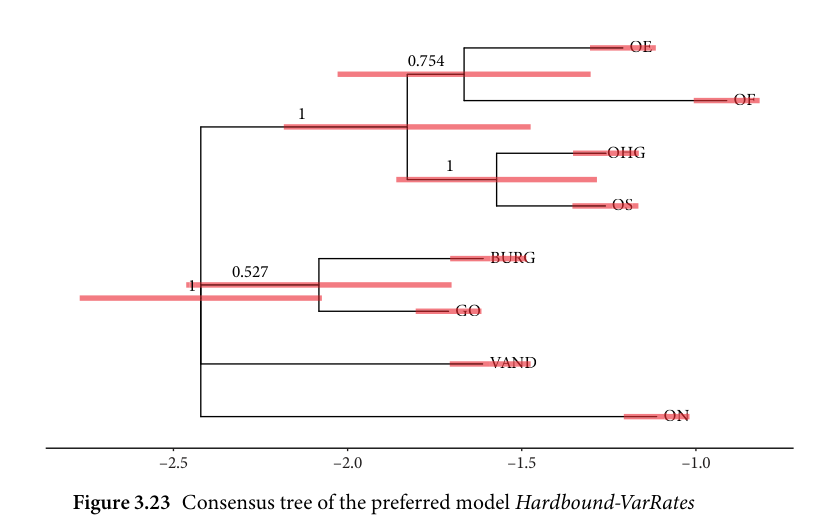
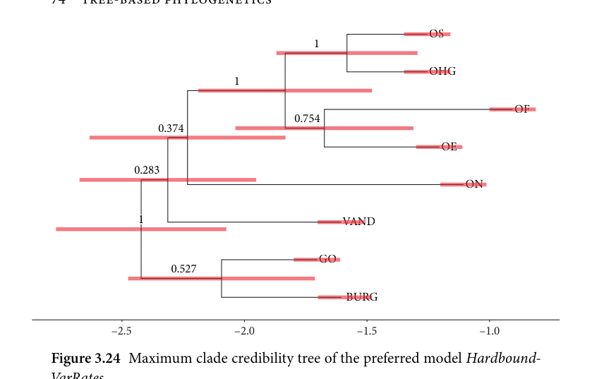

# 3.2.5 Discussion of findings

<!-- source-page: 73; pdf-page: 92 -->
3.2 THE GERMANIC DIVERSIFICATION MODEL  73

of 0.3, which is equal to the estimates of the Hardbounded-VarRates. In other
words, the evidence from the data overpowers the prior settings. This does not
mean that a rate 1 →0 has to be taken at face value, it merely means that even
when the model is strongly biased against higher values for 1 →0, convergence
is still reached at the level of the original prior.

                     3.2.5 Discussion of findings

This section will predominantly involve a summary and discussion of the find-
ings obtained using the phylogenetic models with regard to model-internal
issues. Most of the interpretation of these findings in light of previous research
and the findings of the agent-based model will be discussed in the sections
pertaining to the individual issues of Germanic phylogeny (see sections 5.1
to 5.6).
  The main finding of this analysis is that there is very limited support for most
potential subgroups. Except two clades, there is not much phylogenetic signal
in the data to support strong subgrouping between the Germanic daughter
languages. The consensus tree of the preferred model (Figure 3.23) shows this
issue clearly.

                                                 OEOE
                                              0.754

                                                           OFOF
                           1

                                         OHGOHG
                                             1

                                                   OSOS

                                    BURGBURG
                      0.527
              1
                              GOGO

                                    VANDVAND

                                              ONON

            –2.5                    –2.0                    –1.5                    –1.0
Figure 3.23 Consensus tree of the preferred model Hardbound-VarRates

<!-- source-page: 74; pdf-page: 93 -->
OSOS
                                             1

                                          OHGOHG
                                1

                                                            OFOF
                                                0.754
                     0.374

                                                 OEOE

                0.283
                                              ONON

               1                        VANDVAN

                              GOGO
                       0.527

                                     BURGBURG

            –2.5                    –2.0                    –1.5                    –1.0
Figure 3.24 Maximum clade credibility tree of the preferred model Hardbound-

VarRates

  The main clades that are supported are West Germanic and Old High Ger-
man–Old Saxon. All other clades exhibit low support, considerably below the
cutoff point value of 0.9. This leaves the subgrouping of Old English, Old
Frisian, Burgundian, Gothic, Old Norse, and Vandalic unaccounted for. It is
clear that both Old Frisian and Old English are West Germanic; however, it is
unclear if they split from West Germanic as a subgroup or individually.
  Figure 3.24 illustrates the issue of low clade credibility further. It shows
the, by definition bifurcating, maximum clade credibility (MCC) tree which is
complementary to a consensus tree, in that it shows the tree having the highest
overall clade support of all sampled trees summed across all clades. In essence,
it shows the single most credible tree in all posterior samples. Such an MCC
tree does not aim to replace consensus trees as it shows a different aspect of the
posterior trees. In this example, it can serve as an illustration of the posterior
tree with the highest total support of all its clades. The individual clade proba-
bilities do not change in this tree; only the groupings themselves are different
from a consensus tree.
  In the MCC tree at hand we see the low-credibility clades Anglo-Frisian and
Northwest Germanic as coherent subgroups. Notably in this tree, Vandalic is
grouped together with Northwest Germanic as a single clade.

<!-- source-page: 75; pdf-page: 94 -->
3.2 THE GERMANIC DIVERSIFICATION MODEL  75

  Similar to the low split support, we find strongly inflated age intervals
for the individual splits. These intervals span 500 years and more. While
this issue is partially due to the uncertainty in the tip dates, a variance this
extreme is also due to apparent uncertainty in the data. The tip dates them-
selves are very well calibrated as they are, since a more strongly inferential tip
date approach did not yield considerable improvements on the outcome. As a
result, the time windows for the origin dates of the taxa are compatible with
the data.
  The analysis of the models has shown that a balanced approach towards
substitution models is preferable. This means that for this innovation dataset,
we cannot assume either an equilibrium in the change rates nor can we only
assume innovations being obtained without processes that interfere with this
direction. However, model comparison has also shown that the second best
model in fact was the innovation-only model which suggests that the innova-
tions have more weight than the deletion of innovations. This was also inferred
by the preferred Hardbound-VarRates model which gives the acquisition of
innovations a rate of 0.69. As a tentative interpretation of these values we can
state that this is the expected outcome in a dataset that focuses on innovations
along the tree. Applying an innovation-only model comes with the disadvan-
tage of not accounting for innovations being lost which has an impact on
the inference: the innovation-only models show consensus trees where cer-
tain subgroups are notably more securely inferred than in the other models.
Moreover, even strong priors favouring a change from 0 to 1 are overpow-
ered by the signal in the data and, in addition to the previous considerations,
the innovation-only models are therefore computationally disfavoured. This
approach, however, is not without merit insofar as the innovation-only model
performed second-best and shows that the subgroups we find under this model
tend to be present in the data. When the more balanced approach of the
inferred rates model adds more uncertainty to these innovations and the sup-
port for these clades diminishes, it is an indication that only few innovations
are responsible for the subgrouping which might be too sensitive to fluctu-
ations. This implies about Germanic that the subgroups for which we find
strong support in the innovation-only models, most notably Ingvaeonic and
Anglo-Frisian, rely on few innovations with high uncertainty given that the
clade credibility diminishes once the parameters of the substitution rates are
changed.
  Further, the extinction rate in this dataset is near zero which means that, in
this time frame, extinction rates cannot be determined accurately or are neg-
ligible. Equally, changes in speciation and extinction along the tree were not
