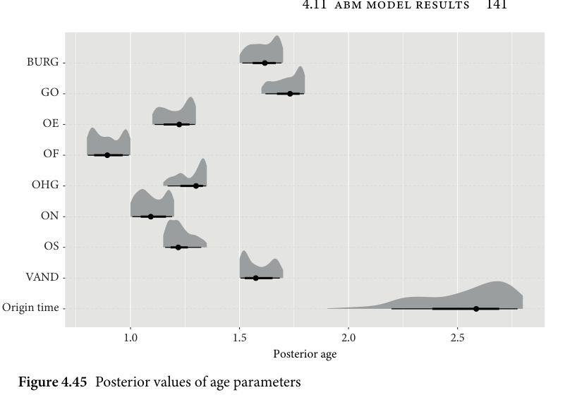
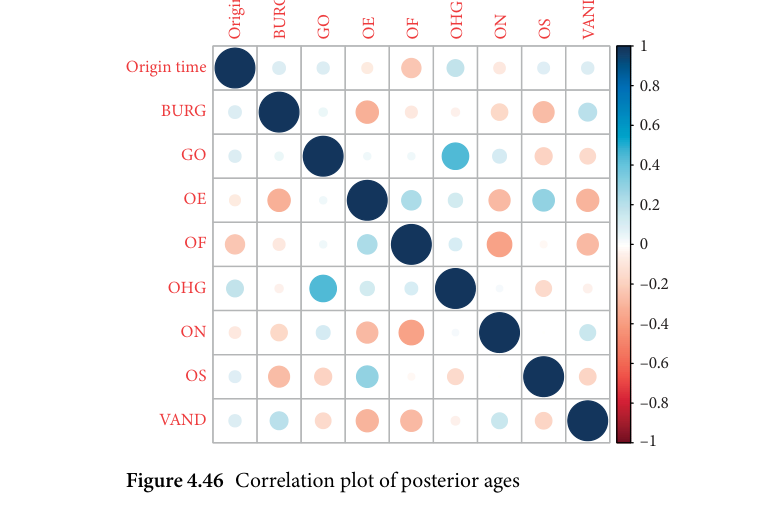
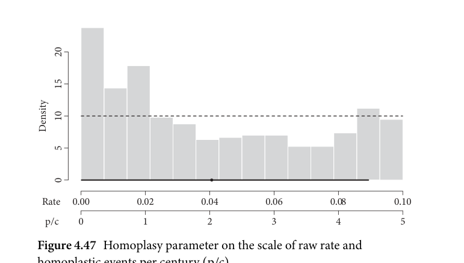
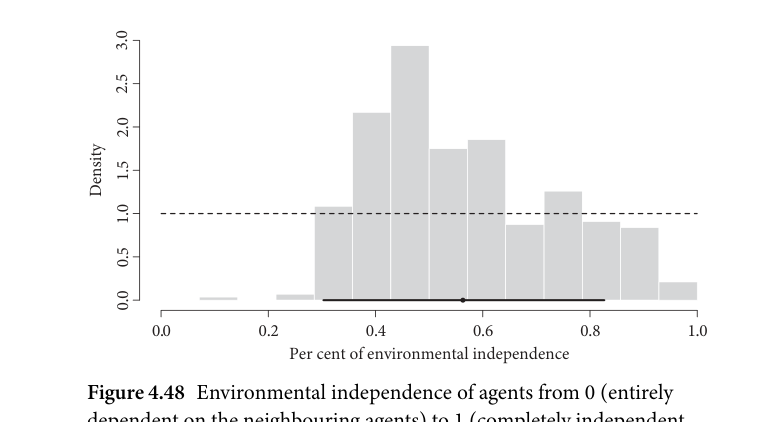

# 4.11.1 The global parameters

<!-- source-page: 140; pdf-page: 159 -->
Table 4.5 Summary table of model priors

Type                  Coefficient    Parameter             Prior

Hyperparameter      mean          Innovation             normal(0, 3e-05)
agent means                         Spread                 normal(0, 0.001)
                                   Spread (sea)            normal(0, 0.001)
                                   Spread (obstacle)       normal(0, 0.001)
                                      Align                  normal(0, 0.001)
                                   Spread vulnerability     normal(0, 0.001)
                                    Migration              normal(0, 0.001)
                                    Migration (obstacle)    normal(0, 0.001)
                                       Birth                  normal(0, 0.001)
Hyperparameter      mean          Innovation             normal(0, 7.5e–07)
agent sd.                            Spread                 normal(0, 0.001)
                                   Spread (sea)            normal(0, 0.001)
                                   Spread (obstacle)       normal(0, 0.001)
                                      Align                  normal(0, 0.001)
                                   Spread vulnerability     normal(0, 0.001)
                                    Migration              normal(0, 0.001)
                                    Migration (obstacle)    normal(0, 0.001)
                                       Birth                  normal(0, 0.001)
Other                                Epsilon                uniform(0, 1)
                                Homoplasy rate         uniform(0.0001, 0.1)
                                     Innovation timing      normal(1-Innovation_
                                                            Frequency, 0.2)

                   4.11.1 The global parameters

Ageparameters
The posterior ages for the languages and the origin are displayed as a forest
plot in Figure 4.45 and as a summary in Table 4.6.
  The figure shows the parameter values on the y-axis, and the x-axis indicates
the posterior age of the individual taxa and the family split in 1,000 year steps.
The thick and thin black bars indicate the 0.89 and 0.5 credible intervals and
the black dot shows the mean of the posterior distribution.
   Firstly, the inferred origin time, which in this case means the time of the
break-up of the family, is estimated to have occurred between the years 800
BC and 250 BC with the most likely region around 500 BC. The individual
languages were estimated relatively uniformly in their given interval (recall
that, for all age parameters, the priors were uniform priors). Recall that the taxa

<!-- source-page: 141; pdf-page: 160 -->
4.11 ABM MODEL RESULTS  141

     BURG

       GO

       OE

        OF

     OHGLanguage

      ON

        OS

     VAND

    Origin time

                              1.0                    1.5                    2.0                    2.5
                                                           Posterior age
     Figure 4.45 Posterior values of age parameters

     Table 4.6 Posterior values of age parameters

     Taxon         age.mean     age.median     age.lower.89CI     age.higher.89CI

      Origin time      2.53           2.59             2.25                 2.80
   GO             1.72           1.73             1.63                 1.80
    OF              0.90           0.89             0.81                 1.00
    OE              1.21           1.22             1.12                 1.30
   OHG           1.28           1.30             1.19                 1.35
    OS              1.23           1.22             1.15                 1.31
   ON             1.10           1.09             1.02                 1.20
    BURG           1.61           1.62             1.53                 1.70
    VAND          1.59           1.57             1.50                 1.67

     ages are not intended to be inferred here. In this posterior summary, we expect
     the posterior taxa dates to resemble the uniform priors to some degree as the
      constraints are narrow to facilitate inferring the origin time and to calibrate the
    model to actual time. They are listed in the summary mainly to contextualize
     the origin time inference and to check the behaviour of the model.
      Some posterior distributions of the individual languages’ ages are observed
      to be bimodal. This is especially true for Vandalic, Old English, Old Norse, and,

<!-- source-page: 142; pdf-page: 161 -->
time
                                                              Origin       BURG   GO   OE   OF     OHG   ON   OS      VAND
                                                                       1
          Origin time
                                                                                        0.8
          BURG
                                                                                        0.6

          GO
                                                                                        0.4

            OE                                                                                        0.2

            OF                                                    0

         OHG                                                            –0.2

                                                                                 –0.4          ON

                                                                                 –0.6
             OS

                                                                                 –0.8
         VAND
                                                                    –1
        Figure 4.46 Correlation plot of posterior ages

to a lesser degree, Old Frisian. In this simulation, bimodality of age param-
eters can arise since the parameter estimates are not entirely independent.
In other words, it makes a difference for Vandalic at which time Gothic or
Burgundian are attested. Bimodality is a biproduct of a function having two
high-probability regions conditional on the ages of the other distributions. To
investigate this issue further, I devised a correlation plot (Figure 4.46¹⁰) which
shows the pairwise correlations between the age parameters. In this figure, the
colour indicates the direction of the correlation whereas the size of the circles
indicates the strength of the correlation.
 We can observe that the bimodal distributions of Old Norse and Vandalic
are negatively correlated with the other bimodal distributions Old English
and Old Frisian. This means that these two language pairs are oppositely dis-
tributed, in that they are inversely related. In other words, when one parameter
shifts to an older age, the other parameter shifts to a younger date. This means
that between these language pairs there are specific attestation date combina-
tions that yield a better fit. However, more research is needed for two reasons:
on the one hand, the bimodality is often biased towards one peak (e.g. for
Vandalic and Old English) which might indicate a weaker pattern for the

   ¹⁰ Plot generated using the R-package corrplot (Wei and Simko 2017).

<!-- source-page: 143; pdf-page: 162 -->
4.11 ABM MODEL RESULTS  143

bimodality. On the other hand, the peaks, especially the less dominant one,
are not strongly different from what would be expected from a uniform distri-
bution. This raises the question of how strong bimodality is in fact for these
distributions.

Homoplasyrate
The inferred homoplasy rate can be seen as a posterior plot in Figure 4.47
below. There, the histogram represents the posterior distribution, whereas the
dashed line represents the prior. Moreover, the line segment marks the 0.89
credible interval boundaries and the black dot indicates the mean of the dis-
tribution. Note that this plot has two x-axes which indicate two different scales.
The axis above (marked ‘Rate’) shows the raw rate of occurrence of a homo-
plastic event as inferred by the model, and the lower axis (marked ‘p/c’) is a
re-scale of the raw rate and indicates the number of homoplastic events per
century.
  As we can see in this graph, the credible intervals are large but the median
rate is in the leftmost third of the plot. Moreover, we see a spike between 0
and 1 homoplastic events per century where the point estimate is located. The
shape of this plot along with the prior type is indicative of how the parame-
ter influenced the data. Firstly, we have to assume, since there is no clear and
narrow credible interval, the parameter had difficulties in overpowering the
prior. This can occur when the parameter has some influence on the outcome
but the influence is too weak to be easily detectable. Yet we can also infer that

       20

       15

       10               Density

    5

    0

      Rate   0.00           0.02           0.04           0.06            0.08           0.10

      p/c    0            1            2            3            4            5
    Figure 4.47 Homoplasy parameter on the scale of raw rate and

    homoplastic events per century (p/c)

<!-- source-page: 144; pdf-page: 163 -->
the parameter was not negligible since it shows a clear tendency towards lower
values.
  Recall that the homoplasy parameter governs the rate at which homo-
plastic events occur in the simulation, meaning how often innovations
can occur more than once. For a dataset with 479 innovations, around 2
per cent of innovations will be innovated in parallel over the course of
1,000 years. In this simulation, the posterior distribution shows that for a
dataset of this size, in a setting such as this, the data can be explained
best when the parallel innovations do not exceed this level by a significant
amount.

Degreeofenvironmentalindependence
The environmental independence parameter is the percentage of each update
consisting of the mean of the parameter values of the neighbouring agents.
This means that, if this parameter is high, the agent is more independent and
its parameter settings are updated solely based on the random values drawn.
If this percentage is low, the random drawn value only influences a fraction
of the update and the agent’s parameter moves more towards the parameter
values present in the environment. We can observe the posterior distribution
of the parameter estimate in Figure 4.48.

           3.0

           2.5

           2.0

           1.5                Density
           1.0

           0.5

           0.0

                0.0             0.2             0.4             0.6             0.8             1.0
                               Per cent of environmental independence
    Figure 4.48 Environmental independence of agents from 0 (entirely

    dependent on the neighbouring agents) to 1 (completely independent
   from neighbouring agents)

<!-- source-page: 145; pdf-page: 164 -->
4.11 ABM MODEL RESULTS  145

  The distribution shows two notable properties: an elongated tail to the right
and a steep increase on the left side of the distribution. This indicates that
higher values of this parameter are somewhat compatible with the data, yet val-
ues lower than 0.3 are very unlikely. In turn, we can interpret this as a sign that,
in order to yield the geospatial and linguistic pattern we see, the environmen-
tal influence from neighbouring agents is unlikely to be very high. Most runs
show mid-range values for this parameter, suggesting that there are adjacency
effects between agents, the levels of which, however, do not assume extreme
values.

Updateparameters
The hyperparameters are those parameters that set the updating hyperdistri-
bution for each region. Recall that, for each update, a random value is drawn
from a normal distribution with mean μ and standard deviation σ. Depend-
ing on the shape of the distribution, the agent’s parameters gradually increase,
decrease, or remain at the initial level when the value for μ is positive, neg-
ative, or close to zero. Moreover, the σ parameter adds random fluctuations,
allowing for more extreme outliers. In essence, both hyperparameters decide
what trajectory each region assumes over the course of the simulation. For
example, one region might start out with a small value for a given parameter
which gradually increases over the course of the simulation rather than, for
example, showing a high value at the beginning which does not change notably
during the simulation. Whether or not a parameter increases or decreases, the
trajectory of a region can be seen in the posterior estimates when the lower
or higher credible interval boundary is above or below 0. This would mean
that, in the most probable 89 per cent of runs, the trajectory of the parameter
updates was positive/negative.
  An important point to note is that a lack of detectable trajectory does not
mean that the parameter remains the same for all agents during the simu-
lation. It solely means that there is no region wide bias towards an increase
or decrease during the simulation. As will become clear in section 4.11.2, the
regions are different in certain parameters but these differences arise out of
the randomness of the simulation rather than due to some strong bias. Refer
to section 4.5.5 (esp. Figure 4.18) for a more detailed explanation of how dif-
ferent trajectories can arise even when an unbiased random normal updating
process is underlying.
  The global parameters discussed here are hence indicative of strong region-
specific patterns whereas the later consensus run analysis reveals the more
detailed and fine-grained patterns.

<!-- source-page: 146; pdf-page: 165 -->
Table 4.7 Posterior estimates of μ-hyperparameters

Parameter        region    mean      median     lower-89CI    higher-89CI

            OF        −0.0011     −0.0000     −0.0050        0.0027
             OS        −0.0023     −0.0015     −0.0073        0.0011
align         OE        −0.0002     −0.0002     −0.0040        0.0037
          ON        −0.0012     −0.0011     −0.0058        0.0018
          OHG      −0.0008     −0.0002     −0.0041        0.0017
                  Eastern      0.0009      0.0003     −0.0030        0.0071

            OF          0.0001     −0.0006     −0.0064        0.0049
             OS        −0.0005     −0.0010     −0.0022        0.0074
birth        OE        −0.0003     −0.0004     −0.0034        0.0029
          ON          0.0008      0.0006     −0.0026        0.0053
          OHG      −0.0007     −0.0003     −0.0047        0.0038
                  Eastern     −0.0016     −0.0017     −0.0049        0.0020

            OF        −0.0014     −0.0015     −0.0083        0.0029
             OS        −0.0007     −0.0006     −0.0035        0.0031
migration     OE        −0.0008     −0.0009     −0.0047        0.0029
          ON          0.0009      0.0006     −0.0028        0.0061
          OHG      −0.0007     −0.0006     −0.0031        0.0037
                  Eastern     −0.0006     −0.0006     −0.0043        0.0045

            OF        −0.0000     −0.0000     −0.0001        0.0001
             OS        −0.0000     −0.0000     −0.0002        0.0001
innovation     OE          0.0000      0.0000     −0.0001        0.0001
          ON        −0.0000     −0.0000     −0.0002        0.0001
          OHG        0.0000      0.0000     −0.0001        0.0001
                  Eastern      0.0000      0.0000     −0.0001        0.0001

            OF        −0.0008     −0.0002     −0.0041        0.0055
             OS          0.0004     −0.0001     −0.0022        0.0056
river crossing   OE        −0.0000      0.0001     −0.0029        0.0028
          ON        −0.0000     −0.0001     −0.0040        0.0043
          OHG      −0.0001     −0.0000     −0.0047        0.0035
                  Eastern      0.0003      0.0006     −0.0046        0.0059

  The posterior estimates of the μ-hyperparameters (Table 4.7) shows only
one clear trend we can observe, namely the increased spread vulnerability
in the eastern area. This indicates that, as we will analyse in more detail in
section 4.11.2, this parameter was steadily increased in this region over the
course of the simulation. The effects of this are discussed in that section.
  Regarding the σ-hyperparameters (Table 4.8), we find large credible inter-
vals meaning that a wide variety of standard deviations were likely to yield

<!-- source-page: 147; pdf-page: 166 -->
4.11 ABM MODEL RESULTS  147

Table 4.7 (cont.) Posterior estimates of μ-hyperparameters

Parameter             region   mean     median   lower-89CI   higher-89CI

               OF       −0.0002   −0.0001   −0.0040       0.0034
                OS         0.0014     0.0012   −0.0024       0.0074
river spreading     OE         0.0012     0.0005   −0.0029       0.0131
             ON        0.0010     0.0008   −0.0027       0.0069
             OHG     −0.0009   −0.0004   −0.0056       0.0028
                       Eastern     0.0006     0.0003   −0.0024       0.0046

               OF         0.0013     0.0005   −0.0015       0.0036
                OS         0.0016     0.0009   −0.0023       0.0053
spread hyperprior   OE         0.0009     0.0009   −0.0041       0.0057
             ON        0.0013     0.0008   −0.0012       0.0079
             OHG       0.0014     0.0010   −0.0021       0.0040
                       Eastern     0.0009     0.0018   −0.0042       0.0043

               OF         0.0001     0.0001   −0.0041       0.0046
                OS       −0.0009   −0.0010   −0.0049       0.0035
spread sea        OE         0.0000   −0.0000   −0.0024       0.0037
             ON       −0.0014   −0.0012   −0.0055       0.0023
             OHG       0.0004   −0.0001   −0.0038       0.0073
                       Eastern     0.0011     0.0013   −0.0036       0.0047

               OF         0.0020     0.0016   −0.0024       0.0068
                OS         0.0027     0.0026   −0.0006       0.0050
spread vulnerability  OE         0.0017     0.0020   −0.0015       0.0048
             ON        0.0015     0.0010   −0.0016       0.0062
             OHG       0.0039     0.0040   −0.0006       0.0061
                       Eastern     0.0074     0.0077     0.0036       0.0106

the data we see. Here, too, the distributions are close to the prior settings and
therefore the standard deviation of the update distributions do not show a
notable impact. A few noteworthy patterns are the smaller standard deviation
of innovation spread across the sea in the Old Frisian region or the elevated
standard deviation of the migration parameter in the Old High German region
and the alignment parameter in the Old Norse region. This means that in those
regions, for those parameters, there were stronger or smaller fluctuations.
  As demonstrated in section 4.8, agent-based models can date innovations
via parameters that are called innovation timing parameters in this particu-
lar model. The results of these innovation timings show that most parameters
can only be dated with great uncertainty. This uncertainty is due to the fact
that the innovations are numerous and the parameters are subject to strong
randomness in their occurrence times. The full list of posterior innovation

<!-- source-page: 148; pdf-page: 167 -->
Table 4.8 Posterior estimates of σ-hyperparameters

Parameter        region    mean     median     lower-89CI     higher-89CI

            OF         0.0041     0.0029      0.0000          0.0089
             OS         0.0047     0.0044      0.0002          0.0094
align         OE         0.0042     0.0036      0.0000          0.0088
          ON         0.0058     0.0060      0.0021          0.0100
          OHG       0.0055     0.0058      0.0015          0.0100
                  Eastern     0.0064     0.0076      0.0019          0.0100

            OF         0.0047     0.0047      0.0003          0.0089
             OS         0.0057     0.0067      0.0009          0.0100
birth         OE         0.0053     0.0051      0.0014          0.0098
          ON         0.0049     0.0051      0.0007          0.0091
          OHG       0.0045     0.0040      0.0000          0.0092
                  Eastern     0.0051     0.0053      0.0000          0.0090

            OF         0.0046     0.0044      0.0002          0.0086
             OS         0.0055     0.0055      0.0007          0.0098
migration      OE         0.0057     0.0062      0.0010          0.0100
          ON         0.0059     0.0067      0.0013          0.0100
          OHG       0.0056     0.0055      0.0021          0.0100
                  Eastern     0.0045     0.0039      0.0000          0.0093

            OF         0.0000     0.0000      0.0000          0.0001
             OS         0.0000     0.0000      0.0000          0.0001
innovation     OE         0.0000     0.0000      0.0000          0.0001
          ON         0.0001     0.0001      0.0000          0.0001
          OHG       0.0001     0.0001      0.0000          0.0001
                  Eastern     0.0001     0.0001      0.0000          0.0001

            OF         0.0053     0.0057      0.0000          0.0091
             OS         0.0045     0.0040      0.0000          0.0091
river crossing   OE         0.0049     0.0051      0.0006          0.0089
          ON         0.0053     0.0048      0.0015          0.0100
          OHG       0.0053     0.0058      0.0009          0.0100
                  Eastern     0.0051     0.0055      0.0000          0.0091

dates is given in the appendix. There, the range of the credible interval is given
which is a measure of how certain the innovation could be dated. Some inno-
vations, however, stand out as they could be dated with relative accuracy. For
example, the monophthongization of PGmc *ai > ē in Northwest Germanic,
Gothic, and Vandalic (in the latter two languages likely to be a parallel innova-
tion) was dated very early at 480 BC with a standard deviation of 280 years. The
lower half of the distribution falls exactly in the time of Northwest Germanic.
Moreover, the dummy innovation discussed in Chapter 2 was correctly shifted

<!-- source-page: 149; pdf-page: 168 -->
4.11 ABM MODEL RESULTS  149

Table 4.8 (cont.) Posterior estimates of σ-hyperparameters

Parameter             region   mean    median   lower-89CI    higher-89CI

                OF        0.0048    0.0044     0.0012         0.0097
                OS        0.0051    0.0055     0.0007         0.0095
river spreading      OE        0.0050    0.0049     0.0008         0.0092
             ON       0.0054    0.0055     0.0012         0.0100
             OHG      0.0054    0.0056     0.0014         0.0100
                       Eastern    0.0042    0.0038     0.0000         0.0086

                OF        0.0046    0.0044     0.0000         0.0088
                OS        0.0045    0.0040     0.0000         0.0092
spread hyperprior    OE        0.0059    0.0063     0.0023         0.0100
             ON       0.0054    0.0054     0.0011         0.0100
             OHG      0.0046    0.0040     0.0000         0.0093
                       Eastern    0.0050    0.0049     0.0009         0.0100

                OF        0.0037    0.0032     0.0000         0.0074
                OS        0.0046    0.0046     0.0000         0.0081
spread sea         OE        0.0048    0.0041     0.0000         0.0092
             ON       0.0052    0.0050     0.0009         0.0097
             OHG      0.0049    0.0043     0.0014         0.0100
                       Eastern    0.0038    0.0037     0.0000         0.0073

                OF        0.0043    0.0038     0.0000         0.0088
                OS        0.0050    0.0052     0.0004         0.0093
spread vulnerability  OE        0.0057    0.0062     0.0013         0.0099
             ON       0.0049    0.0046     0.0006         0.0100
             OHG      0.0043    0.0036     0.0000         0.0092
                       Eastern    0.0055    0.0061     0.0010         0.0100

to the late end of the timeline with a mean of 980 AD and a narrow standard
deviation of 300 years. The reason for this is that since this feature does not
contribute to any evaluation, as it is a dummy feature, it is estimated to have
occurred only at the last possible moment. This shows that the model is able to
date the most salient innovations. This property of the model, however, is not
very accurate at the current state of the model architecture. More refinements
are necessary to improve upon the dating mechanic.
  Better than innovation dating, the model can detect innovation ordering.
For example, in only 27 per cent of all runs, the West Germanic innovation of
*Kw > *Kw was dated earlier than the Northwest Germanic innovation *ā >
*ē. However, this is unlikely to be very revealing since most of the issues con-
nected to relative chronology do not have clearly distinct occurrence times.
In other words, this test shows that the model can detect and recover the
