# 4.11.2 The consensus runs

<!-- source-page: 150; pdf-page: 169 -->
approximate relative chronology and occurrence time of an innovation, which
shows that the model is correctly specified but it is likely to yield inconclusive
results for occurrence times and chronologies that are temporally too close to
be determinable using traditional methods.

                     4.11.2 The consensus runs

After the analysis ofthe global parameters, the more insightful step in the inves-
tigation is to examine the posterior runs in detail. The global measures can
only yield broader and more general trends in the data but are of limited use.
Individual runs, however, can show more subtle patterns and were examined
for a larger variety of aspects.
  To do this, the agents were extracted from each of the posterior runs at a time
interval of 100 in-simulation years. To reduce the size of the data, squares of
nine adjacent agents were merged using the median value of this patch as the
cluster median. As a result, each simulation summary consists of a series of
time steps containing larger patches of agents. Since the simulations start and
end at different ages, the scale is not discrete in spite of the discrete snapshots
taken from each simulation.
  The resulting dataset contains 4.5 million agent clusters divided into 400
posterior runs.

Innovationcompletiontimes
Firstly, we analyse the innovation completion times of the individual languages
by analysing how, in each region, the respective language gradually becomes
more similar to the data. To achieve this, a smooth line was fitted to the data
for each language indicating the mean of the population over time. Since dif-
ferent languages fit unequally well to the data, I standardized the distance
measure MCC to make the languages comparable. Figure 4.49 shows these fit-
ted lines.¹¹ It is important to note that, for this analysis, the height of the curve
(i.e. the x-axis value) is irrelevant. The steepness of the curve alone indicates
the development of the relative fit over time.
  This figure shows that we have two main groups of languages at the begin-
ning of the simulation: Burgundian, Vandalic, and Gothic show a steep drop
in distance, increasing their fit at the beginning. They plateau at age 2.5. Their
fit does not improve much after the age of 2.5.

    ¹¹ Plots were created using the R-package ggplot2 (Wickham 2016).

<!-- source-page: 151; pdf-page: 170 -->
4.11 ABM MODEL RESULTS  151

   2

                                                                  BURG
   1                                                        GO(std.)
                                                                  OE
                                                                    OFdistance                                                         OHG
                                                          ONMCC
   0                                                                   OS
                                                                VAND

                   1.0                   1.5                   2.0                   2.5
                                          Age
     Figure 4.49 Development of the linguistic fit metric MCC (std.) as a function of
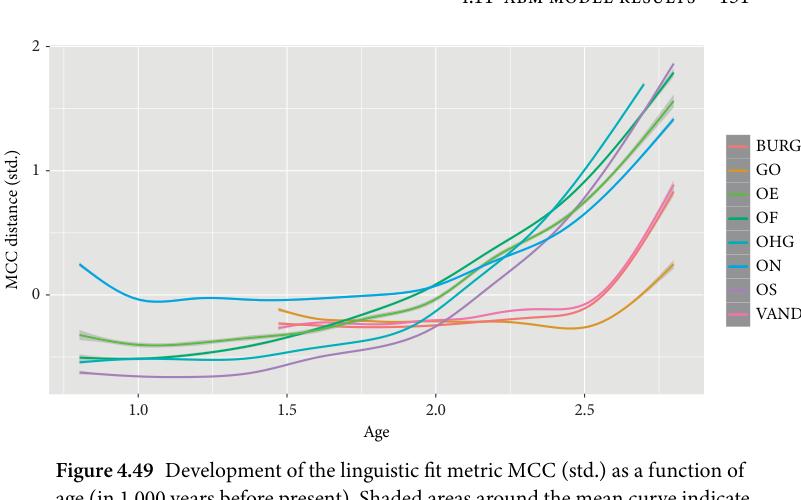
     age (in 1,000 years before present). Shaded areas around the mean curve indicate
      confidence intervals

      The other languages improve their fit for a longer time with Old Norse lev-
      elling off at around 2.0 whereas Old Frisian, Old English, Old High German,
     and Old Saxon further improve their fit slightly until 1.5.
       This means that the most important innovations for these languages as
     simulated in the model are estimated to have occurred by these time points.
     This is not to be confused with the completion of the last innovation under-
     gone in each language recorded in the data; it is solely an abstract time frame
     by which those innovations have occurred that are most defining for a lan-
     guage in contrast to the other ones in the dataset. In a sense, the plateauing
      of the fit curve marks the earliest time point at which the most idiosyncratic
     innovations have been undergone in the model. For Gothic, Burgundian, and
      Vandalic, this would mean a date at or shortly after 500 BC, for Old Norse a
     date at, or shortly after, the beginning of the Common Era, for Old Frisian,
    Old English, Old High German, and Old Saxon this would correspond to a
     date at or shortly after 500 AD. Regarding Old Frisian, the data even show a
      slight further decrease in distance from the data until the year 1,000 AD, yet
      this trend might be too small to be statistically reliable.

     Regionaldiversification
     Another important measure that can be scrutinized is how languages in their
      different regions become more dissimilar from the other languages over time.

<!-- source-page: 152; pdf-page: 171 -->
0.06

                                                                  BURG
GO   0.04                                                             OE
                                                                    OFfrom
                                                          OHG
                                                          ONDistance                                                                     OS
                                                                VAND

   0.02

           1.6                           2.0                           2.4                           2.8

                                            Age
      Figure 4.50 Distance from Gothic fit as a function of age
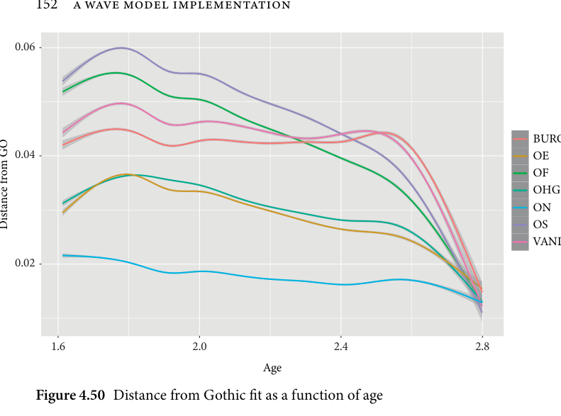

    To do this, one can calculate the distance (measured in MCC) of each agent
      cluster to each of the linguistic datasets and then take the distance from the
     language fit to the fit to the other languages. For example, in the Old Saxon
      area, we can calculate each agent cluster’s fit to all languages and then calcu-
       late the distance of the fit to the Old Saxon dataset to, for example, the fit to
      the Old Norse dataset. The end result is a function showing how rapidly the
      agents in that particular region become dissimilar from the fit to the other lan-
      guages. This shows the agent’s behaviour regarding their fit relative to the other
      languages. Figure 4.50 shows the results of these calculations.
      The Gothic fit distance over time shows that in the Eastern region, the dis-
     tance to the other fits rapidly increases at the beginning with only Old Norse
     being close to Gothic with a slight upward trend. Moreover, Old High German
     and Old English maintain a smaller level of distance from Gothic through-
     out the time. It is important to note that the distances are to be interpreted
      as relative expressions rather than absolute fits which means that Gothic is
      relatively closer to Old Norse than to the other languages. The effects we see
      for Old English and Old High German, however, might be indicative of adja-
     cency effects from Old Norse and the eastern area, yet it is unclear how much
      of this effect might be spurious. One notable result is that we see Burgundian
     and Vandalic rapidly increasing at the beginning before levelling off, whereas

<!-- source-page: 153; pdf-page: 172 -->
4.11 ABM MODEL RESULTS  153

   0.06

   0.05

                                                                 BURGVAND 0.04                                                      GO
from                                                               OE                                                                   OF
                                                         OHG
   0.03                                                     ONDistance                                                                    OS

   0.02

   0.01
            1.5                               2.0                               2.5
                                           Age
     Figure 4.51 Distance from Vandalic fit as a function of age
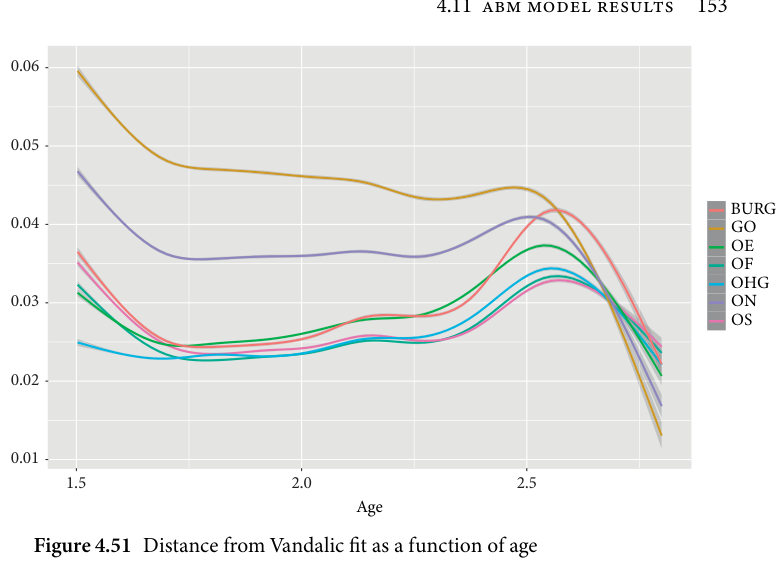

     the distance to other languages increases steadily. This might indicate that
     the most decisive innovations that differentiate Gothic and Burgundian or
     Vandalic occur early in the simulation runs.
      The fits for Vandalic (Figure 4.51) and Burgundian (Figure 4.52) show a
     similar picture. In both cases, the distance to other languages rapidly increases,
     with Old Norse and Burgundian being the most distant.
      The later decrease in distance for Old English, Old Saxon, Old High Ger-
    man, and Old Frisian calls for comment: the analysis makes it seem that
    Burgundian and Vandalic become more similar to these languages over time.
     This is an interesting finding as, in a straightforward diversification process,
    we would expect to see a distance increase over time, which might eventually
      level out but remain stable. That this is not the case for these two languages
       is indicative of a convergent pattern in the diversification process. Some later
     innovations in the data seem to be shared between these languages, whereas
     the early innovations are still distinct. What we see here is congruent with the
     pattern we would expect to see in convergent processes due to contact and
     areal spread. The model thus yields a situation where the inferred later inno-
     vations draw these languages closer together. For Vandalic, for instance, one of
     these innovations could be the realization of the outcome of Holtzmann’s law
    which is the same as in West Germanic. Such innovations are interpreted by

<!-- source-page: 154; pdf-page: 173 -->
0.05

    0.04                                                      GOBURG                                                                OE
from                                                                  OFOHG
                                                          ON
                                                                      OS    0.03
                                                                VANDDistance

    0.02

           1.5                               2.0                               2.5
                                            Age
     Figure 4.52 Distance from Burgundian fit as a function of age
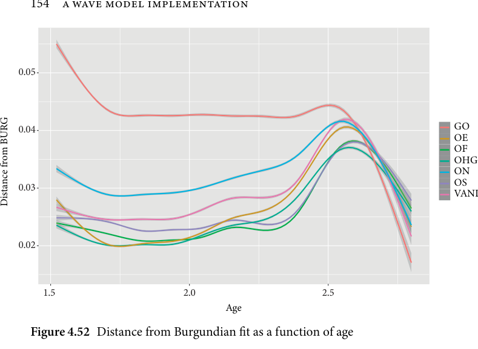

     the model as later convergences. It needs to be stressed that this convergence
     does not imply that the languages are more likely to be directly related. The
    model solely finds a pattern in which these languages become closer to one
     another at later times due to convergent factors after initially diverging.
     A peculiarity in all of these figures is the anomalous behaviour of the far
       left hand side of the curves. It seems as the distance to other languages has
     changed radically over the last few hundred years. This behaviour is likely due
      to the fact that the agents become fewer towards the end of their attestation
     periods: since each of the posterior runs has a unique starting and end point,
     only a few languages have many datapoints at the very beginning and end of
     the attestation range given by the model. The reason for this is that, due to the
      origin time and the taxa ages being sampled from prior distributions, the start
    and endpoints can differ, which reduces the accuracy at the very ends of every
     curve. The beginning end of each curve therefore has to be interpreted with
      greater caution as smaller deviations in the greater trend may cause the line to
      shift as there are fewer datapoints to counterbalance this trend.
      The fit distances for the Old Norse region (Figure 4.53) show a rather
    homogeneous initial development where only the distance to the immediately
     adjacent languages Old English and Gothic (and Old High German for reasons
     explained above) plateaus earlier.

<!-- source-page: 155; pdf-page: 174 -->
4.11 ABM MODEL RESULTS  155

    0.04

    0.03

ON                                                                BURG
 from 0.02                                                       GOOE
                                                                    OF
                                                          OHG
                                                                       OS  Distance
                                                                 VAND
    0.01

    0.00

            1.0                      1.5                      2.0                      2.5
                                            Age
      Figure 4.53 Distance from Old Norse fit as a function of age
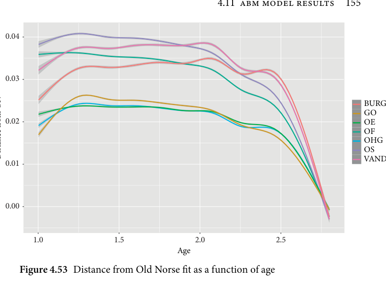

   0.09

OS                                                                 BURG
from 0.06                                                        GOOE
                                                                    OF
                                                           OHG
                                                           ONDistance
                                                                 VAND
   0.03

   0.00

                               1.5                        2.0                        2.5
                                            Age
      Figure 4.54 Distance from Old Saxon fit as a function of age
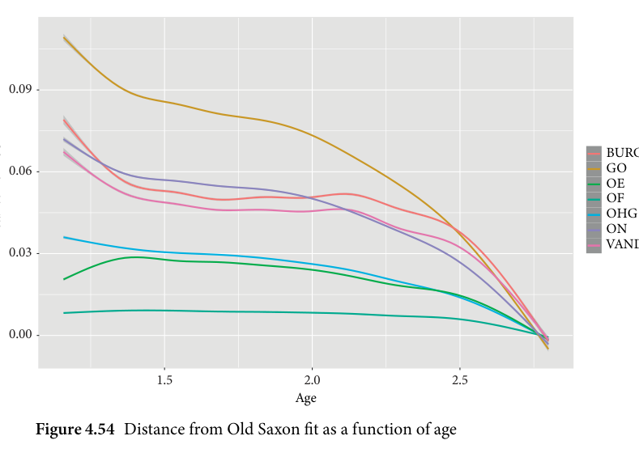

      The fits of the Old Saxon (Figure 4.54) and Old High German (Figure 4.55)
      agents are quite similar in their patterns. In all cases Old English, Old Frisian,

<!-- source-page: 156; pdf-page: 175 -->
0.04

                                                                  BURGOHG
                                                           GO
                                                                  OEfrom
                                                                    OF
                                                          ON
                                                                       OSDistance 0.02                                                            VAND

   0.00

                                1.5                         2.0                         2.5
                                           Age
     Figure 4.55 Distance from Old High German fit as a function of age
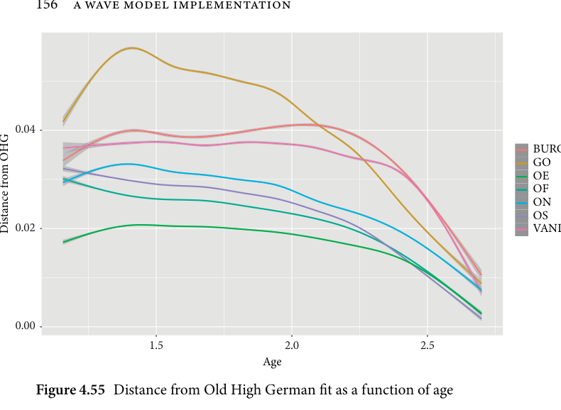

     and Old Saxon/Old High German remain similar for the entire course of the
      simulations. Old High German and Old Saxon, however, differ in what lan-
     guage they are closest to. Old Saxon behaves most similarly to Old Frisian
     whereas Old High German shows a greater similarity to Old English; the dif-
      ference between this and the distance to Old Frisian and Old Saxon, however,
       is smaller than for the Old Saxon area.
      The Old English (Figure 4.56) and Old Frisian (Figure 4.57) areas are quite
      different from one another regarding their fit distance. While both show the
    same pattern regarding Burgindian, Vandalic, and Gothic, Old Frisian, for
      instance, shows a greater distance towards Old Norse than Old English. This
     might be an adjacency effect that Old English seems to be closer in fit to Old
     Norse in this regard. Further, Old Frisian is closest to Old Saxon whereas
    Old English is similarly close to the fits of Old Saxon, Old High German, and
    Old Frisian.
      The analysis of these plots highlight certain important points. The model
      finds that Gothic, Burgundian, and Vandalic are the most distant languages
     from the rest, with evidence that Burgundian and Vandalic undergo conver-
     gent developments with Northwest Germanic languages. Nevertheless, the
      three languages diverge themselves already at the beginning suggesting that

<!-- source-page: 157; pdf-page: 176 -->
4.11 ABM MODEL RESULTS  157

    0.075

OE                                                                 BURG
from 0.050                                                       GOOF
                                                           OHG
                                                           ON
                                                                        OSDistance
                                                                 VAND    0.025

    0.000

                                  1.5                       2.0                       2.5
                                             Age
      Figure 4.56 Distance from Old English fit as a function of age
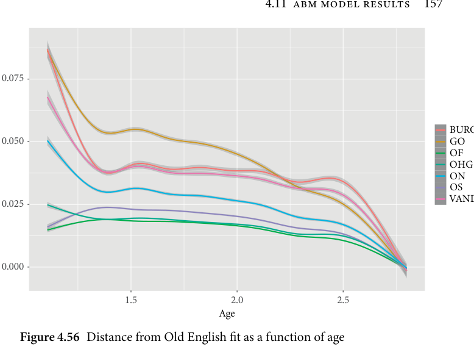

   0.075

OF                                                                 BURG
   0.050
from                                                          GOOE
                                                           OHG
                                                           ON
                                                                       OSDistance
   0.025                                                            VAND

   0.000

                      1.0                   1.5                   2.0                   2.5
                                            Age
      Figure 4.57 Distance from Old Frisian fit as a function of age
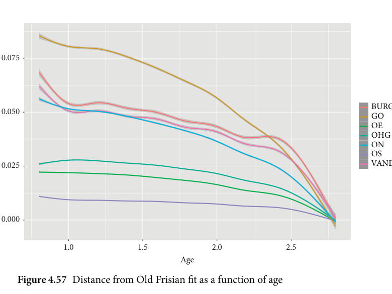

<!-- source-page: 158; pdf-page: 177 -->
although they are more different from other languages, they are not necessarily
      closer to one another.
      The development in the Northwest Germanic area is inconclusive. The
     model shows clear adjacency effects as Old Norse is closer to Old English and
    Old Frisian is closer to Old Saxon in the Old Frisian area.

     Parameterdevelopments
     As a next step, we examine the developments of the parameters in every region
      as a function of age. The plot type remains the same as before, this time only
     showing the smooth mean of the parameter values.
      The innovation parameter (Figure 4.58) shows a rather similar pattern for
    Old Saxon, Old Norse, and Old Frisian whose trajectories are downwards. The
    Old High German area and the eastern area show generally higher innovation
      values than the other regions.
      The development of the align parameter (see Figure 4.59) is rather diverse
      across the different regions. Whereas the initial values start at similar param-
      eter values, the eastern area shows a strong increase in this value until the age
      of 2.25. This means that innovations in this area can be more easily replaced
     and overridden. On the other hand, the Old Norse and Old Saxon areas show

   0.360

   0.355

                                                                                                Eastern area
                                                              OE area
                                                                OF areainnovation 0.350
of                                                      OHG area
                                                       ON area
Rate                                                                 OS area

   0.345

   0.340

                     1.0                 1.5                 2.0                 2.5
                                          Age
     Figure 4.58 Development of the innovation parameter in each region over time
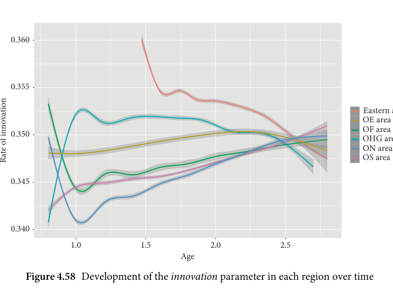

<!-- source-page: 159; pdf-page: 178 -->
4.11 ABM MODEL RESULTS  159

    0.4

align                                                                                              Eastern area
of                                                             OE area
Rate                                                               OF area                                                       OHG area
                                                       ON area
    0.3                                                               OS area

    0.2
                    1.0                  1.5                  2.0                  2.5
                                         Age
      Figure 4.59 Development of the align parameter in each region over time
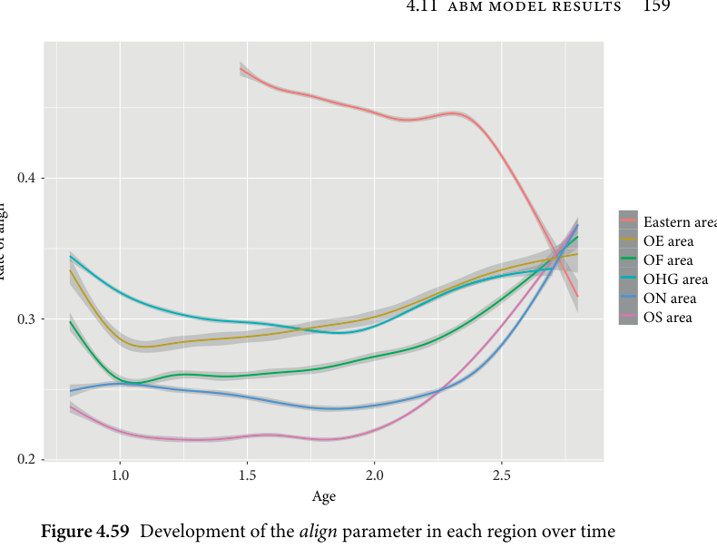

     very low values of the parameter especially at earlier ages. This means that, in
      these areas, innovations are more easily sustained in the region.
       Over time, the spread parameter (see Figure 4.60) is clearly increasing for all
      areas, suggesting that we see an acceleration of innovation spread the more the
      simulation progresses. It is especially interesting to see that this trend seems to
     hold for all areas. The only diverging pattern is a slim deviation of the eastern
      area from this trend where the spreading rate remains the same for the first
      centuries of simulated time.
        Closely related is the spread vulnerability parameter (see Figure 4.61) which
        is the percentage of agents in a surrounding area affected by a linguistic spread.
    A lower rate suggests a more fragmented spread type whereas high parame-
       ter values indicate a broader and more uniform spread. Like with the spread
     parameter itself, spread vulnerability increases for all regions. The notable
      exceptions are the eastern region where the parameter increases to a maximum
       after a short time. This means that while the spreading parameter itself remains
     low at the beginning, spread vulnerability increases. This suggests a more
     uniform spread of few and regionally confined innovations at the beginning.
      The Old Norse area is another anomaly where the spread vulnerability
     parameter caps at around 0.6 after slowing down since the age of 2.0. This

<!-- source-page: 160; pdf-page: 179 -->
0.7

    0.6

                                                                                                Eastern areaspread                                                             OE area
of                                                               OF area
    0.5
Rate                                                      OHG area
                                                       ON area
                                                                   OS area

    0.4

                   1.0                  1.5                  2.0                  2.5
                                         Age
      Figure 4.60 Development of the spread parameter in each region over time
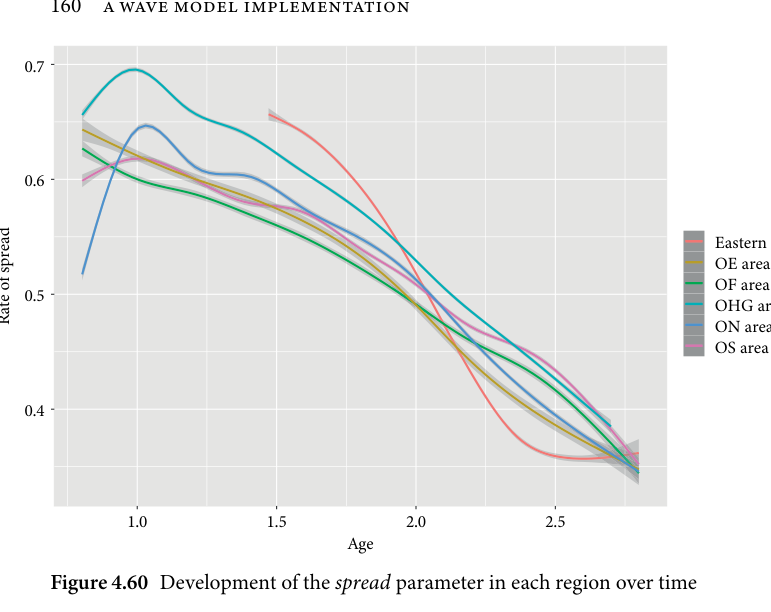

            1.0

            0.8                                        vulnerability
                                                                                         Eastern area
                                                          OE area                   spread                                                     OF area
      of  0.6                                           OHG area
                                                   ON area
            Rate                                                        OS area

            0.4

                          1.0              1.5              2.0              2.5
                                        Age
      Figure 4.61 Development of the spread vulnerability parameter in each region
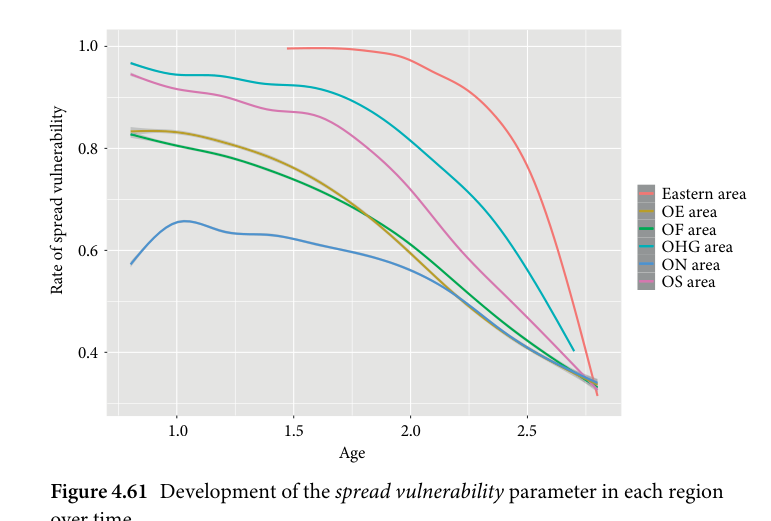
      over time

<!-- source-page: 161; pdf-page: 180 -->
4.11 ABM MODEL RESULTS  161

    0.6

sea  0.5

                                                                                  Eastern areaspread                                                    OE area
of                                                     OF area    0.4                                               ON area
Rate                                                        OS area

    0.3

    0.2

                 1.0              1.5              2.0              2.5
                                  Age
Figure 4.62 Development of the spread sea parameter in each region over time
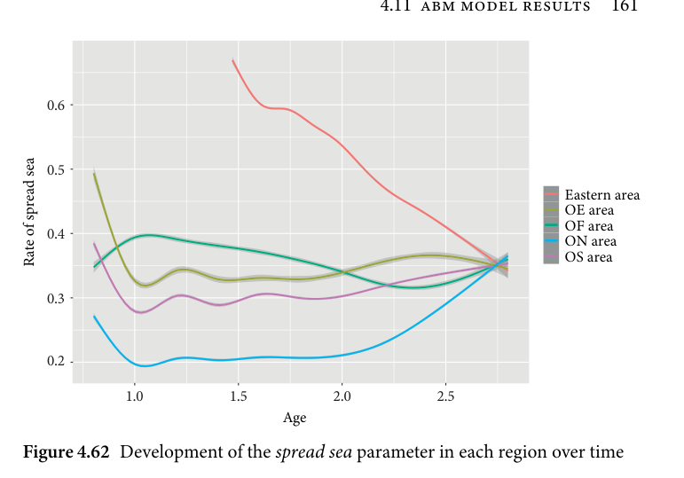

    0.6

    0.5spreading                                                                                Eastern area
river                                                    OEOF areaarea
of                                              OHG area
Rate  0.4                                                     OS area

    0.3

                 1.0               1.5              2.0              2.5
                                  Age
Figure 4.63 Development of the river spread parameter in each region over time
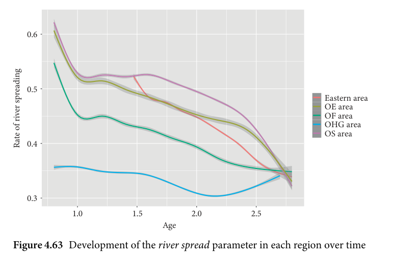

suggests that the innovations in this region spread less uniformly, affecting
only a few agents at a time.
  The obstacle spreading parameters spread sea (Figure 4.62) and river spread
(Figure 4.63) have diverse effects in the individual regions.¹²

    ¹² Note that those areas are not present in the plots for which the parameter is not applicable. For
example, the Old High German area does not border a sea region, therefore spread sea is not applicable.

<!-- source-page: 162; pdf-page: 181 -->
0.45

    0.40

                                                                                  Eastern area
                                                     OE areamigration                                                     OF area
of 0.35                                           OHG area
Rate                                                        OS area

    0.30

                  1.0              1.5                2.0            2.5
                                   Age
Figure 4.64 Development of the migration parameter in each region over time
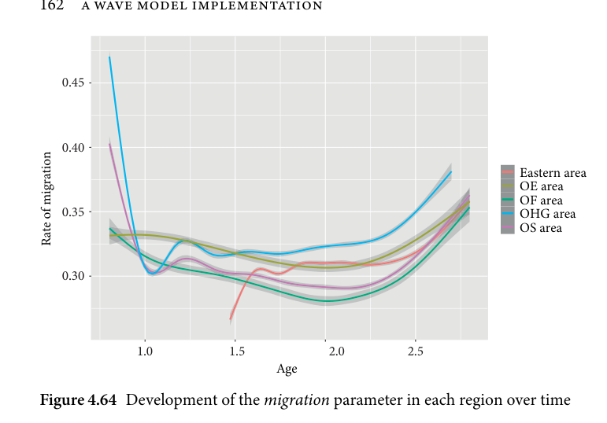

  The parameter spread sea is especially high in the eastern area whereas it
is especially low in the Old Norse area. This means that in most simulations,
innovations crossed the sea more easily from the eastern area outward than
from the Old Norse area. The Old Norse area insulates itself insofar from other
regions as it does not propagate changes across the sea in the simulation.
  River spreading sees high rates for most linguistic groups, yet the Old High
German area shows rather low rates. Given that the Old High German area
borders a river obstacle to the west and several river obstacles to the east, this
indicates that the spread from this area was predominantly northward than to
the west or east.
  Migration in this model seems to be fairly uniform as most simulations
plateau at a value around 0.3 (see Figure 4.64). The only slightly elevated region
is Old High German which not only starts out higher but also remains the
highest-valued language for the first half of the process.
  Regarding the parameter river crossing (see Figure 4.65), we find that espe-
cially the eastern area acquires a higher value in this parameter, whereas the
Old Frisian region displays a below average crossing parameter.

Likewise, the Old Norse area does not have vacant border regions to migrate to, therefore the migration
parameter is not applicable.

<!-- source-page: 163; pdf-page: 182 -->
4.11 ABM MODEL RESULTS  163

    0.50

    0.45

    0.40crossing                                                                                Eastern area
river                                                     OFOHGareaarea
                                                         OS areaof  0.35
Rate

    0.30

    0.25
                   1.0              1.5              2.0              2.5
                                  Age
Figure 4.65 Development of the river crossing parameter in each region over
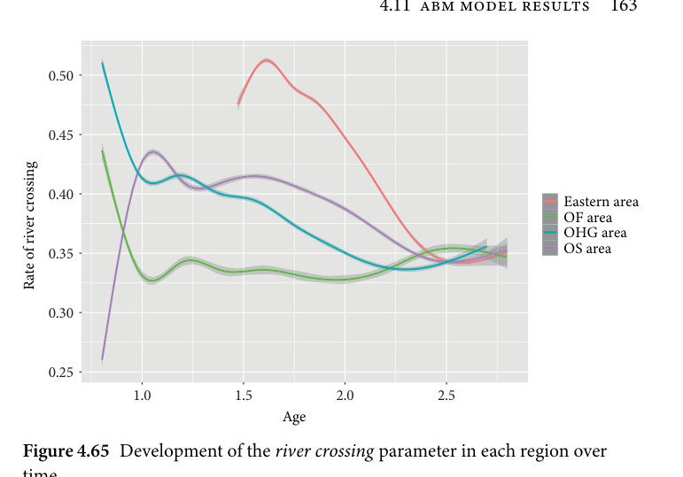
time

    0.45

    0.40

 birth                                                                               Eastern area
of 0.35                                                OE area
 Rate                                                     OFOHGareaarea
                                                         OS area
    0.30

    0.25

                  1.0              1.5              2.0              2.5
                                  Age
Figure 4.66 Development of the birth parameter in each region over time
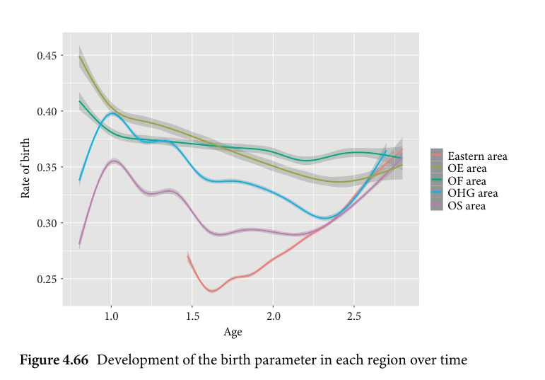

  The birth parameter (Figure 4.66) which governs the occurrence of new
agents does not seem to have a strong impact on the course of the simula-
tion as it levels out for most languages at the starting value. Only the eastern

<!-- source-page: 164; pdf-page: 183 -->
area sees a decrease in this value which corresponds to a decreasing potential
to expand over time.

Three-dimensionaldiversification
So far we have examined the model results as two-dimensional graphs which
show the relationship of the different languages or regions to one another as
different trajectories. However, in many wave model implementations such
as historical glottometry or dialect geography, the languages are plotted in
two-dimensional graphs where proximity in the plot equals linguistic distance.
Such a plot type can be approximated by an agent-based model analysis by
using principal component analyses (PCAs) to plot the difference between
the agent clusters in a two-dimensional space. It further adds time as a third
dimension which is usually missing in traditional wave-like depictions of
linguistic distance.
  To achieve this, the age dimension was discretized by rounding every time
step to the nearest first age digit (i.e. an age value of 2.21 was rounded to 2.2).
Moreover, the posterior runs were averaged using the mean for every agent
cluster at each time step such that the agent clusters represent the consensus
for this cluster at this time step across the posterior runs. Afterwards, the lin-
guistic fits in each region were standardized and analysed with a PCA using
the R-package FactoMineR (Lê, Josse, and Husson 2008) and visualized using
factoextra (Kassambara and Mundt 2020).
  A PCA is in essence an algorithm which takes in multidimensional data and
projects the main patterns onto a two dimensional surface (made up of the
two most explanatory principal components). There, more similar individuals,
in this case agent clusters, are projected more closely together. In this case, a
PCA was conducted for time steps of 200 years to visually track the linguistic
diversification over time. It needs to be kept in mind that the plot is based on
the distance between agents and not on languages themselves. Moreover, these
plots can only show agents’ differences in different regions, therefore the east-
ern languages have to be grouped together despite being quite heterogeneous
themselves.
 On these plots, we can see all agent clusters in the consensus plotted in ref-
erence to one another based on their mutual distance. The agent clusters are
differently shaped and coloured dots where the colour and shape represent the
geographical region they belong to. Further, ellipsoids were drawn around a
particular region of the plot. These are 95 per cent confidence intervals encom-
passing the area that most clusters fall into. The percentage given on every axis

<!-- source-page: 165; pdf-page: 184 -->
4.11 ABM MODEL RESULTS  165

             2

                                                                         Areas

                                                                                         East.
             0                                        OE                          (6.1%)
                                                    OF
                                             OHG                 Dim2
                                             ON
                                                       OS

            –2

                  –5             0             5            10
                             Dim1 (91%)
        Figure 4.67 PCA plot of linguistic distance at age 2.4 (400 BC)
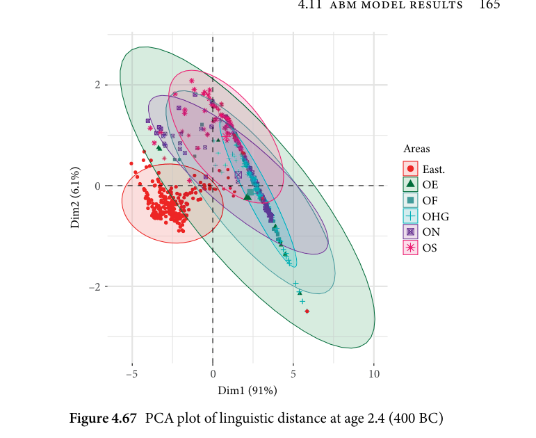

represents the percentage of variation between the agent clusters attributable
to the particular dimension.
  Note that every time a PCA is calculated on a different dataset, the principal
components and the results differ. This means that to compare different time
steps below, we can only interpret the relative positions of the regions to one
another. Their absolute position on the surface may vary as an artefact of the
PCA algorithm.
  Figure 4.67 shows the situation of the simulated diversification process at
the year 400 BC. Here, we can see that most ellipses of the different areas over-
lap, mostly covering the same area. This is different for the eastern area: the
agents in this ellipse are outside of most other cluster areas but still overlap to
some degree. This suggests an early detachment of the eastern area.
  The second plot in Figure 4.68 shows that, now, the centres of the Northwest
Germanic languages no longer neatly overlap. Instead, we see shifts from the
earlier relative position especially in the Old High German and Old Saxon
area. Nevertheless, these clusters overlap significantly, hence we can only
speak of a shift in position rather than a detachment. This is somewhat true

<!-- source-page: 166; pdf-page: 185 -->
2

           1
                                                                           Areas
                                                                                           East.
                                                    OE                     (8.5%)  0
                                                      OF
                                              OHG              Dim2
                                              ON
          –1                                              OS

          –2

          –3
                   –5          0           5          10
                            Dim1 (87.4%)
      Figure 4.68 PCA plot of linguistic distance at age 2.2 (200 BC)
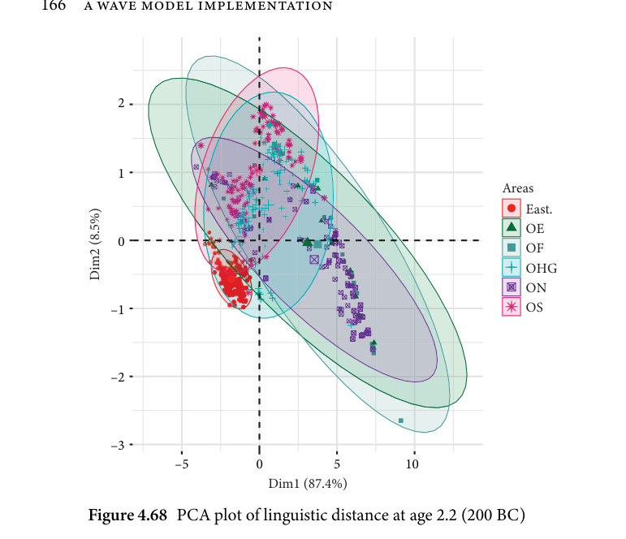

for the eastern area as well, which maintains its outward rim position only
overlapping with a few other clusters.
  At the age of 2 (Figure 4.69), we can already see a disturbance in the cohe-
siveness of the Northwest Germanic areas with a high number of especially
Old Norse agents moving to the outer areas of the plot. The fact that the east-
ern area encompasses a smaller area is indicative of a clear distinctness from
the other areas.
  Over the course of the next two age steps (Figures 4.70 and 4.71) from 200
AD to 400 AD, we can see that Old Norse moves continuously away from
the other areas while still overlapping with Old English and Old Frisian. Still
overlapping with Old English and Old Frisian are Old Saxon and Old High
German, which follow a joint trajectory.
  The following two simulated centuries (see Figures 4.72 and 4.73) see strong
outliers for Old High German and Old Saxon which might be due to random
fluctuations as the ellipsoid positions remain relatively unchanged. At the year
800, the Old Norse cluster is now mainly outside of any other cluster with the
Old English cluster having only little overlap with Old Saxon and Old High

<!-- source-page: 167; pdf-page: 186 -->
4.11 ABM MODEL RESULTS  167

     2

                                                           Areas
     1                                                                  East.
                                         OE  (12.1%)
                                           OF
                                     OHG Dim2                                     ON
     0                                        OS

   –1

           –5        0         5        10        15
                    Dim1 (82.4%)
Figure 4.69 PCA plot of linguistic distance at age 2 (at the
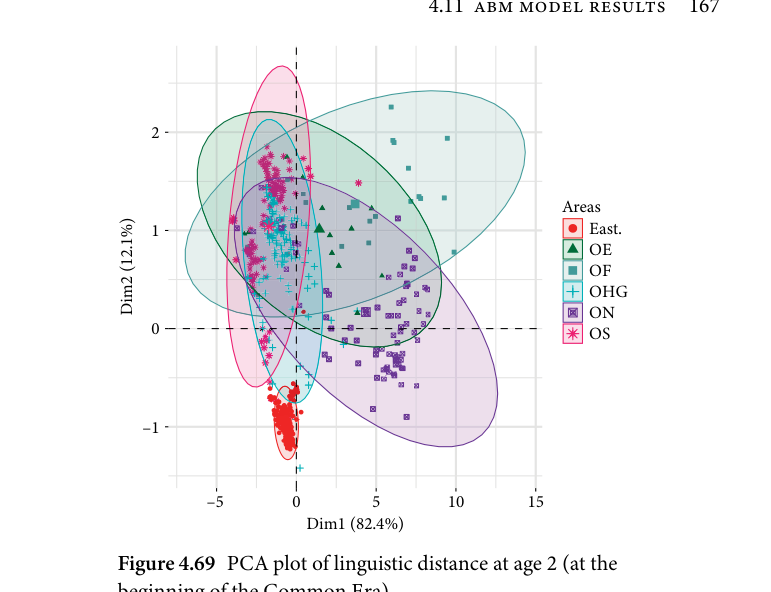
beginning of the Common Era)

   4

                                                            Areas
                                                                         East.
                                          OE (13.1%)   2                                        OF
                                     OHGDim2                                     ON
                                             OS

   0

            –4        0        4        8        12
                   Dim1 (82.2%)
Figure4.70 PCA plot of linguistic distance at age 1.8 (200 AD)

<!-- source-page: 168; pdf-page: 187 -->
4

                                                                      Areas
              2                                                                                      East.
                                                 OE                                      (14.5%)                                                   OF
                                           OHG                      Dim2                                           ON
                                                     OS

              0

                   –5           0           5          10
                            Dim1 (82.2%)
          Figure4.71 PCA plot of linguistic distance at age 1.6 (400 AD)

              15

              10

                                                                       Areas
                                                 OE
               5
                                                   OF                                      (15.3%)
                                           OHG
                                           ON                      Dim2
                                                     OS
               0

              –5

                             0              10             20
                            Dim1 (74.1%)
          Figure4.72 PCA plot of linguistic distance at age 1.4 (600 AD)

<!-- source-page: 169; pdf-page: 188 -->
4.11 ABM MODEL RESULTS  169

               6

               3

                                                                       Areas
                                                 OE
               0                                     (10.1%)                                         OF
                     Dim2                                   OHGON
                                                     OS

             –3

             –6

                 –5               0                5
                            Dim1 (75.3%)
         Figure4.73 PCA plot of linguistic distance at age 1.2 (800 AD)

German, mostly remaining close to Old Frisian, which itself is more integrated
in the other two clusters.
  To conclude this analysis, we have seen that the simulated data obtained
from the models can be displayed as a series of time-progressing clusters which
are similar in appearance to previous non-computational two-dimensional
depictions. Other than those, the ABM approach further adds the temporal
dimension to these displays. For the current purposes, the temporal dimension
was discretized to be plotted as consecutive plots, yet for future applications
in other contexts, it would be possible to convert the temporal dimension
as a third dimension in the form of a cubical plot or a video clip which
shows the clusters in continuous progression. For these methods, however,
a method other than the particular PCA algorithm used here would need to
be employed.
  Further, the linguistic developments displayed here suggest an early detach-
ment of the eastern languages followed by internal diversifications in North-
west Germanic of which Old Norse maintains some overlap with Old English
and Old Frisian. The latter overlap with Old Saxon and Old High German
which themselves remain mostly congruent.

<!-- source-page: 170; pdf-page: 189 -->
Parametersandgeography
Another advantage of agent-based models is that they make use of the geo-
graphical component to plot parameter developments in a more fine-grained
way on a geographical surface. This is in essence a three-dimensional geospa-
tial variant of what Figures 4.50 to 4.57 outlines using two-dimensional graphs.
The two following figures are example plots of the two most interestingly dis-
tributed parameters: the spread sea and the spread parameters. The figures
themselves are contour plots devised with the R-package ggplot2 (Wickham
2016) subdivided into six discrete 200-year time steps from 400 BC to 600 AD.
In these plots, the lightness of the colour indicates the parameter value: lighter
shades indicate higher values.
  The map is essentially a north-oriented map of central and northern Europe
with the agents removed in the eastern area from the year 500 AD onwards.
  The most salient feature of this distribution (Figure 4.74) is that, from the
very beginning, the Old Norse area shows small values for spread across the
sea, whereas the rest of the Northwest Germanic area exhibits average val-
ues with the exception of Old Saxon. The high values of the eastern area first
appear in the east of the region before spreading westward. As discussed above,

            Age 2.4                        Age 2.2

            Age 2                         Age 1.8

            Age 1.6                        Age 1.4

           Figure 4.74 Contour plots of the spread sea parameter at
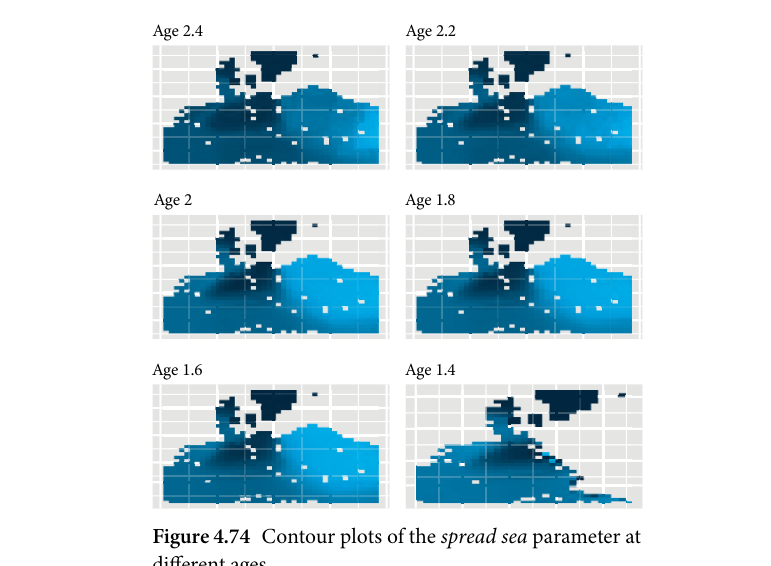
             different ages

<!-- source-page: 171; pdf-page: 190 -->
4.11 ABM MODEL RESULTS  171

            Age 2.4                        Age 2.2

            Age 2                         Age 1.8

            Age 1.6                        Age 1.4

           Figure 4.75 Contour plots of the spread parameter at
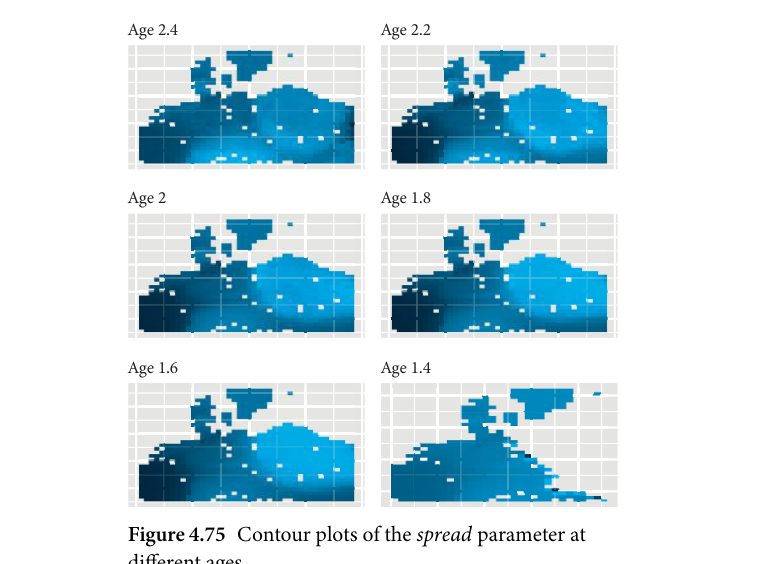
             different ages

it is unclear whether this high value is actually indicative of a higher spread rate
for this region across the sea.
  The other interesting parameter to examine geographically is the spread
parameter which, as shown in Figure 4.75, seems to have three epicentres.
Over time, the Old English and Old High German areas show high values,
with the south of the Old High German area being especially prominent. Yet,
over time, by the age of 1.8 (200 AD) these parameters are overshadowed by
higher values in the eastern regions. There, the spread values appear first in the
border regions to the west which are best visible in the subplots for the ages
2.4–2. This suggests that in the eastern area, innovations spread more easily
within the area, and from and to the outside, whereas the west shows gener-
ally higher values but there seem to be epicentres in the simulation driving this
development.
