# 4.5 Parameters of the model

<!-- source-page: 88; pdf-page: 107 -->
Each agent possesses: (1) A unique position on the map; (2) a linguistic vec-
tor of innovations; and (3) an individual set of parameter settings. Each agent’s
feature vector is a innovation-based binary feature vector (e.g. (0, 0, 1, 0) for
a vector with four positions) where the positions represent individual innova-
tions that can be observed in any of the Germanic daughter languages. This
means the initial stage (Proto-Germanic) is an all-zero vector since no inno-
vations have occurred yet. Note that this is the raw setting and the individual
mechanics and details of the model are presented in the following sections.

                  4.5 Parameters of the model

This section aims at explaining the individual actions each agent can take dur-
ing the simulation. This will be done by isolating each action and displaying
its effect on the course of the simulation in detail.
  Every time unit (tick) a given agent executes the following actions based on
their probability (see Table 4.1).
   It has to be noted that spreading is an outward force, radiating from an agent,
while aligning is an inward force, making the agent adapt another state of its

Table 4.1 Agent action overview chart

Linguistic        Innovation        The agent’s feature vector undergoes an
                                    innovation by changing a 0 in the grammar
                                       vector to 1.
                 Spreading        The agent transfers an innovation to one or more
                                  (depending on spreading vulnerability)
                                   neighbouring agent’s feature vector.
                 Spreading (river)   The agent transfers an innovation to one or more
                                          agent’s feature vector across river tiles.
                 Spreading (sea)    The agent transfers an innovation to one or more
                                          agent’s feature vector across sea tiles.
                 Aligning         An agent removes an innovation in a position
                                 where a neighbouring agent’s grammar does not
                                        exhibit an innovation.

Non-linguistic    Migration        An agent changes its position by moving to a
                                   neighbouring free tile.
                 Migration (river)   An agent changes its position by moving to a
                                   neighbouring free tile across river tiles.
                  Birth              Another agent on a neighbouring tile is spawned
                                and inherits both the original agent’s feature
                                       vector and parameter settings.

<!-- source-page: 89; pdf-page: 108 -->
4.5 PARAMETERS OF THE MODEL  89

neighbour. Here, the spreading of innovation and its antagonist aligning oper-
ate on different states: a zero state does not spread outward and an innovation
state cannot be obtained through aligning. This is a necessary compromise
in order for the model to fit the binary innovation data type. If aligning and
spreading applied universally, 0 and 1 would be grammar types and behave
like two competing innovation forms rather than 0 being the previous state
while 1 is the innovation whose diffusion through the speech community is to
be investigated. As discussed in detail in section 3.2.2, the change from 1 to 0
does not mean a reversal to the previous state. By alignment, the agent acquires
a trait that obscures the previously acquired innovation (see also section 4.5.2
for further discussion of this parameter).

                      4.5.1 Migration and birth

The parameter migration governs the spreading of the Germanic-speaking
communities from the initial starting positions. A higher parameter value thus
means faster spread. Since spreading can lead to a situation in which multiple
individual agents become isolated from the rest of the area, an increase in the
number of agents needs to account for an increase in population as a result of
eastward migration.
  To illustrate the migration mechanic in the context of this ABM, I set up a
simple example ABM whose output can be observed In Figure 4.2. This ABM is
set on a surface of 20×20 tiles, one of which is occupied by a single agent. This
agent only possesses the ability to move to an adjacent tile with a certain glob-
ally determined probability. In this case, the migration of this agent proceeds
as follows: each tick an agent is selected, two random values are drawn, one
from a uniform distribution between 0 and 1 and one from a truncated normal
distribution TruncatedNormal(0.5, 0.1) the latter of which shall represent the
agent’s probability of migrating (migration rate). If the value drawn from the
normal distribution is higher, the migration triggers and the agent moves to

    Figure 4.2 Example ABM migration: snapshots at ticks 0, 20, 40, 60, 80,
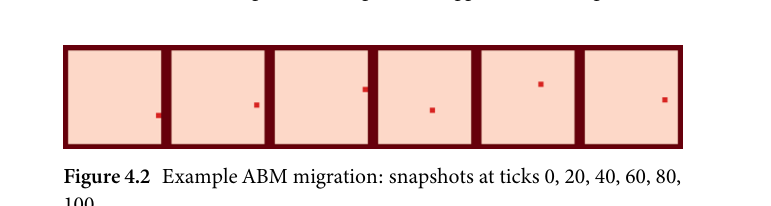
    100

<!-- source-page: 90; pdf-page: 109 -->
a randomly chosen adjacent tile. This action repeats 100 times which gives a
simulation with 100 ticks. The output in Figure 4.2 records the agent’s position
at tick 0, 20, 40, 60, 80, 100.
  From this figure, we can deduce that over the course of 100 ticks, the agent
randomly moves through space but as there is no predetermined direction and
each adjacent tile has the same chance of being selected as a new location, the
agent approximately stays within the same right half of the simulation.
   If we apply this simple migration mechanic to larger populations of agents,
we see a certain behaviour that can be seen in Figure 4.3. This simulation starts
on a 50×50 tile surface with agents occupying the first five rows of the surface.
  As we can see here, some agents start to move far away from the rest of
the agents as time increases. Given enough ticks, the agents would eventually
space themselves out evenly across the surface. This is a problem insofar as
such a migration system would eventually yield a large majority of the agents
being detached from every other agent. To counter this, I imposed a migration
restriction according to which an agent can only migrate to a free tile provided
that it initially was adjacent to at least one other agent. This prevents individ-
ual agents from moving off into the space of the surface, requiring them to stay
in groups for a longer time. Figure 4.4 is the output of such a migration sys-
tem. When comparing Figures 4.3 and 4.4, we can observe that although the
restricted migration over time out of the agents, in this scenario, there is some
group coherence observable.
  After having investigated the migration mechanic, the second action that
an agent can take  is that of birth.  It  is not technically an action but a
mechanic that is tied to each agent. In this example simulation, each time

    Figure 4.3 Example ABM migration with multiple agents: snapshots at
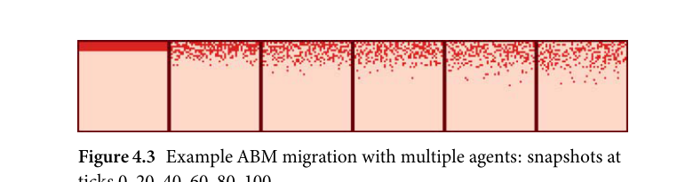
     ticks 0, 20, 40, 60, 80, 100

    Figure 4.4 Example ABM migration with multiple agents and
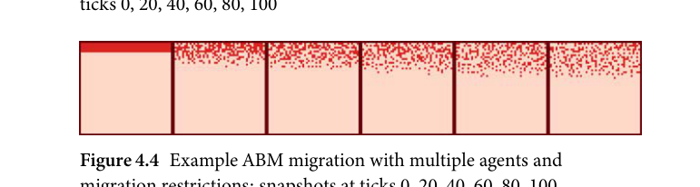
    migration restrictions: snapshots at ticks 0, 20, 40, 60, 80, 100

<!-- source-page: 91; pdf-page: 110 -->
4.5 PARAMETERS OF THE MODEL  91

    Figure 4.5 Example ABM migration and birth with multiple agents and
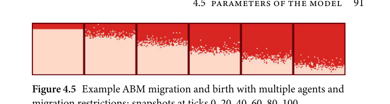
    migration restrictions: snapshots at ticks 0, 20, 40, 60, 80, 100

an agent is selected, a random value is drawn from a normal distribution
TruncatedNormal(0.1, 0.1) to determine the probability of the action birth fir-
ing. If this is true, another agent is spawned on an adjacent free tile. This yields
an output such as Figure 4.5.
  Here, we see that not only are the agents migrating, the gaps are filled with
new agents with the probability of around 0.1 (mean value) each time an agent
is selected.
   It is worth noting that computationally, both mechanics interact insofar as
when there are more agents in simulated space, more agents are free to migrate
again if they were previously bound by the migration restriction (see above).
This means that birth has an enhancing effect on migration.

              4.5.2 Innovation spreading and aligning

The linguistic change innovation and transmission complex of mechanics is
more detailed and has more considerations tied to it.
  The first mechanic is the simple innovation mechanic. As an example,
I demonstrate this mechanic using a simulation of multiple agents on a
50 × 50 tile surface. Every agent has an innovation vector consisting of one
binary value with 0 meaning that the agent has not undergone an innova-
tion and 1 representing the agent having undergone an innovation. On this
50 × 50 example surface, all but one agent have undergone no innovation.
Every time an agent that has undergone an innovation is selected during the
simulation process, a probability value is drawn from a normal distribution
TruncatedNormal(0.1, 0.1) and if this value is higher than a randomly drawn
value from a uniform distribution between 0 and 1, the agent spreads its inno-
vation to a randomly selected neighbouring agent. Figure 4.6 shows the model
output of this example simulation.
  Here we see that after 100 ticks, in a large portion of the agents in the upper
left quadrant the innovation has spread. However, if a model incorporates
more than one innovation, it is necessary to investigate the behaviour of the

<!-- source-page: 92; pdf-page: 111 -->
Figure 4.6 Example ABM innovation with one starting agent:
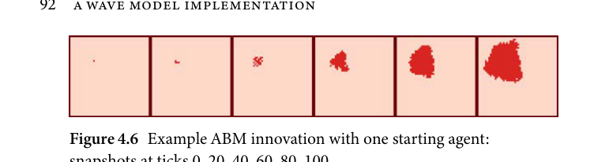
    snapshots at ticks 0, 20, 40, 60, 80, 100

    Figure 4.7 Example ABM innovation with two starting agents and two
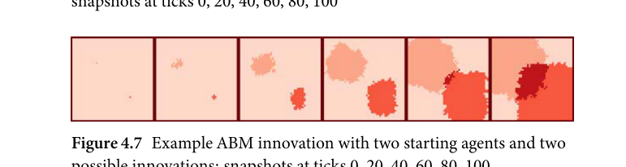
    possible innovations: snapshots at ticks 0, 20, 40, 60, 80, 100

simulation with two innovations. To achieve this, I set up the same basic setting
as before; however, this time there are two innovations present and the spread-
ing probability of each variant is described by TruncatedNormal(0.15, 0.1).
This means that each agent has an innovation vector consisting of two posi-
tions for the two innovations. Thus there are four possible types of this
innovation vector: [0, 0], [0, 1], [1, 0], and [1, 1]. Agents can undergo no
innovation, only one of two or both. Thus we will find that over time there
will develop four linguistic communities. Figure 4.7 shows the output of this
simulation.
  The four different shades indicate the different stages. The darker grey area
in the intersection of the two spreading innovations shows the emergence of
the fourth variety through the intersection of two innovations.
  For this innovation mechanic, it is also necessary to implement a counter-
balance mechanic that makes an agent lose the innovation if a neighbouring
agent does not possess the innovation. This serves two purposes: on the one
hand it provides a necessary counterweight to the innovation, which would
otherwise sweep through the simulation space radially. On the other hand, it
is an implementation of inter-speaker (or speech community for that matter)
assimilation as discussed previously in works such as Giles, Coupland, and
Coupland (1991) or Pickering and Garrod (2004).
  To demonstrate this, we implement an aligning parameter with a probability
drawn from TruncatedNormal(0.05, 0.1). Each time an agent that possesses at
least one of the two innovations is selected during the simulation, it adapts
the neighbouring earlier state with a certain probability. Figure 4.8 shows this
situation:

<!-- source-page: 93; pdf-page: 112 -->
4.5 PARAMETERS OF THE MODEL  93

    Figure 4.8 Example ABM innovation with two starting agents and two
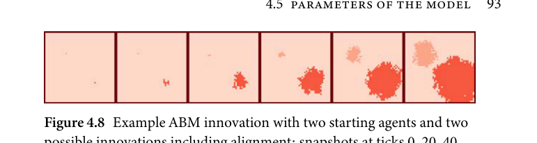
    possible innovations including alignment: snapshots at ticks 0, 20, 40,
    60, 80, 100

  Here we can see that the spreading does not proceed as smoothly as in
Figure 4.7 but rather the innovations start forming smaller enclaves. Note that
this simulation was run using the same seed value as the simulation displayed
in Figure 4.7. This means that the two runs would have proceeded identically
if it were not for the newly implemented aligning mechanism. We have to
keep in mind that the mechanics innovation spreading and aligning do not
necessarily denote two different real-world processes. One could argue that
aligning refers to the spreading of a different linguistic variant. However, in
this innovation-based setting where the linguistic properties of an agent are
represented as binary vectors denoting the presence or absence of a certain
innovation, aligning is always the spreading of the 0-class. Thus we cannot
interpret both mechanics separately. Rather we have to see them in relation to
each other as they interact substantially: if one of the two parameters is higher
than the other, that variant will spread faster and eventually overtake the other.
If they are equal, the variants will be in an equilibrium. This specific property
can be explored using a second simulation where the alignment parameter
is activated after tick 60 but then equally strong as the spreading parameter
(both TruncatedNormal(0.2, 0.1) in this case). Figure 4.9 shows the output of
this simulation.
  Here we can see that up until tick 80, the two innovations spread evenly, but
after this tick, the progress is small. This is the near-equilibrium created by the
aligning mechanism. Because the values are drawn from relatively flat normal

    Figure 4.9 Example ABM innovation with two starting agents and two
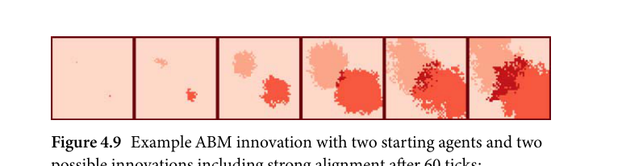
    possible innovations including strong alignment after 60 ticks:
    snapshots at ticks 0, 20, 40, 60, 80, 100

<!-- source-page: 94; pdf-page: 113 -->
distributions, one of the variants still increases in spread in this simulation;
however, the last two states captured in Figure 4.9 show no fast expansion as
was the case in the snapshots before.
  Another component is a modification of the spreading parameter that
tries to overcome two different problems: (1) multidirectional spreading and
(2) distance-based constraints.
  (1) is defined as the possibility of one agent spreading its innovation to more
than one other agent. In the simulations so far, the agents equally spread their
innovation to one other agent. This might not make an impact in an example
simulation such as those here, but for more complicated simulations where
agents differ in their spreading parameter, it is important to allow individual
agents to spread an innovation to more than one other agent community.
  (2) This spreading to more than one community can be biased for distance
meaning that if an agent spreads the innovation, it spreads it first to other
agents that are more similar before spreading it to other agents that are more
different. The way this can be implemented is by setting a parameter value
spread vulnerability that is equal to the percentage of adjacent agents to which
to spread the innovation. Hence a spread vulnerability value of 0.5 would mean
that the agents spread their innovation to half of the adjacent agents that do not
have this innovation. Further it can be implemented that more similar agents
are favoured. For example, if there are four surrounding agents, one of them
being more similar to the agent in question, the innovation would then be
spread to the more similar agent and one of the more different agents.⁴
  This can be demonstrated in an example simulation. Here, I set the spread
vulnerability to be fixed to two agents for simplicity reasons. Further I deter-
mine that the agents favour spreading to agents that do not have any innova-
tion before spreading to agents that already possess one other innovation, thus
simulating different distances between agents. Figure 4.10 shows the output of
this model. Note that this model is otherwise identical to the model shown in
Figure 4.7.

    Figure 4.10 Example ABM innovation with two starting agents and two
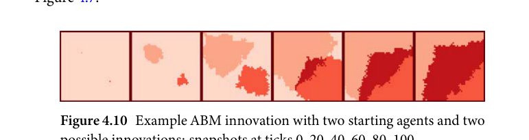
    possible innovations: snapshots at ticks 0, 20, 40, 60, 80, 100

   ⁴ For the real-world analogue of this mechanism, see the discussion in Bowern (2013).

<!-- source-page: 95; pdf-page: 114 -->
4.5 PARAMETERS OF THE MODEL  95

  In this figure, when the two innovations meet (between the 40th and 60th
tick), the innovations spread to the other agents that have already undergone
an innovation more slowly. We see that once the two innovations meet, the fast
spreading continues towards the upper right and lower left corners whereas it
is slowed down towards the upper left and lower right corners.

                     4.5.3 Geospatial parameters

In the example simulations that were shown in the previous sections, the
agents were located on a symmetric plane surface whereas in real-world appli-
cations, it is, depending on the problem, often not desired to simulate agents on
a plain two-dimensional surface. Especially when moving or spreading actions
are involved, certain surfaces may want to be designed in such a way that makes
it more difficult for agents to perform these actions across certain areas. More
concretely, if an actual geographical space is the setting for the simulation, the
researcher might want to implement areas such as rivers or large bodies of
water that exhibit a lower rate of movement as it may tend to be more difficult
to move across these spaces.
  To explain this concept using an example simulation, I adapted the migra-
tion model displayed in Figure 4.5 and added an obstacle which is intended
to slow down the migration of a certain part of the agents on the surface.
Figure 4.11 shows the output of this example simulation. Here, I inserted a
barrier (dark bar) on the mid-right hand side of the surface.
 We can see in this example that the agents move from top to bottom
relatively equally as the simulation displayed in Figure 4.5 has shown. How-
ever, once the agents approach the barrier, there is a very small probability
(distributed as TruncatedNormal(0, 0.05)) to cross this barrier. A few agents
succeed in crossing the barrier (seen on the lower part of the surface at
tick 80). From there on they continue migrating as normal. It needs to be
stressed that whether or not the obstacle is a hindrance to movement or spread

    Figure 4.11 Example ABM migration with multiple starting agents and
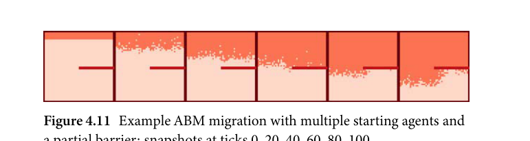
    a partial barrier: snapshots at ticks 0, 20, 40, 60, 80, 100

<!-- source-page: 96; pdf-page: 115 -->
depends on the parameter that governs the movement across the obstacle.
We also might think of a scenario in which an obstacle propels migration or
spread forward. Computationally, this occurs when the parameter governing
spread/migration across the obstacle is higher than the parameter for regular
spread/migration.
  A particular property of these barriers is that they act as a filter where only
a small variety of agents succeed in crossing the obstacle. This can lead to
founder effects on the other side of the obstacle. A founder effect, the observa-
tion that if a given scenario—ABM simulations in this case—contains a filter
which only a few agents can pass, then these agents will propagate their prop-
erties in this new region. This can lead to (1) the variety of different properties
being greatly reduced after the filter than before and (2) certain properties
dominating the entire post-filter area depending on what properties the agents
that first crossed had. To investigate these founder effects further, I devised
a simulation building on the framework assumed in the simulation depicted
in Figure 4.7. Assume that in this simulation, there are two innovations on
one side of a very selective barrier. The output of this model can be seen in
Figure 4.12.
  This simulation is worth dissecting in detail. We see that up until tick 40,
the two innovations spread approximately equally fast in the top half of the
surface. Shortly before tick 40, the innovation indicated by a light grey colour
crosses the barrier twice. At tick 60, we can see that this innovation spreads
rapidly whereas the other innovation just had a crossing event. At tick 80 we
see that, save the upper right quadrant of the post-barrier area, the area is pre-
dominantly occupied by agents with one innovation. This is in stark contrast
to the pre-barrier where at this tick all agents exhibit both innovations. Eventu-
ally, the second innovation spreads in the post-barrier region as well; however,
since the first innovation was first to pass the filter, it was to dominate the post-
barrier region for most of the second half of the simulation. This phenomenon
thus is a demonstration of a founder effect.

    Figure 4.12 Example ABM innovation with two starting agents and two
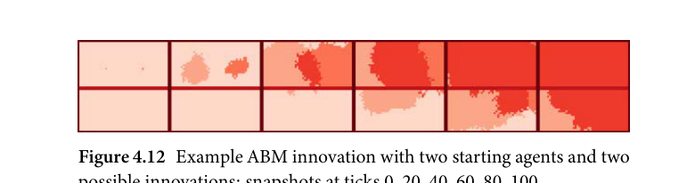
    possible innovations: snapshots at ticks 0, 20, 40, 60, 80, 100

<!-- source-page: 97; pdf-page: 116 -->
4.5 PARAMETERS OF THE MODEL  97

                  4.5.4 The innovation mechanism

In the previous sections we have seen how the agents in the model spread
innovations and migrate to neighbouring unoccupied tiles. What is so far still
missing is the mechanism of how innovations occur in an agent. The most
simplistic case is to set an innovation parameter innovation to a value which
corresponds to the probability for each agent to develop an innovation at
that particular tick. If this is the only mechanism implemented, we effectively
assume everything else to be random. This includes the time and order of the
innovations occurring. To investigate the effects this particular set-up has on
the simulation, I compiled an example simulation based on the simulation
shown in Figure 4.12. The only adjustments regarding this simulation were
that the spread probability was set to 0.05 and the probability of spread across
the barrier was set to 0.01. The important parameter for this run is the inno-
vation parameter since, in contrast to the simulation shown in Figure 4.12,
this example does not assume two starting innovations. Rather, each time an
agent is selected there is a chance that this agent will develop a random inno-
vation. For simplicity reasons, I fixed the maximum number of innovations
to 2 for each agent which means each agent has an innovation vector con-
sisting of two positions. Therefore, the agents’ vectors can be of the following
types [0, 0], [0, 1], [1, 0], and [1, 1]. To demonstrate the impact of this basic
innovation mechanism, I set the innovation parameter to 0.005, the decision
about which agent undergoes an innovation and which innovation is being
undergone is random. Figure 4.13 shows the output of this model.
  What we can see here is that very soon many areas of innovation are formed
until by tick 80, most of the agents possess both innovations. The simulation
shows that the same innovation is innovated independently multiple times.
This is due to the fact that, each tick, each agent has a chance of 0.005 to
undergo an innovation. This means that there is a potential for an average of

    Figure 4.13 Example ABM innovation mechanism with two possible
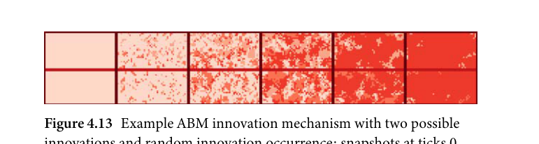
    innovations and random innovation occurrence: snapshots at ticks 0,
    20, 40, 60, 80, 100

<!-- source-page: 98; pdf-page: 117 -->
1,104 innovation events in a single simulation with 100 ticks and 2,208 agents.
Further it means that each of the two innovations can be independently inno-
vated on average 552 times over the course of 100 ticks. It is established that
there are homoplastic events that can occur in the real world, whereas the
chance for real-world homoplasy is likely to be more infrequent. Especially
when each tick is fitted to correspond to one year, we do not expect homo-
plastic events to occur and to spread on average five times per year for a given
feature. However, this needs to be investigated further and ideally determined
by the model itself. For this reason and in order to make sure that homoplasy
can still occur, the probability for homoplasy was added as a separate parame-
ter in the main model. The innovation mechanism was implemented such that
the quantity of parallel innovations can be controlled. In a model in which new
innovations are picked at random, we can see a scenario where a single inno-
vation can occur up to five times in parallel. To discourage random parallel
innovations in which the same innovation independently occurs up to sev-
eral hundred times during a simulation run, parallel innovations are governed
by a separate parameter. This parameter represents a probability with which
each tick one of the previously occurred innovations can be innovated again.
Concretely this means that every innovation can occur only once but that,
with a certain probability, some innovations can be innovated again. It needs
to be emphasized that this mechanism is not implemented as an analogue
to a real-world force but rather as a way to control and monitor the occur-
rence of homoplasy. In essence, this is a requirement of the computational
process.
  To prevent the model from spawning this high number of innovations dur-
ing the same run, I fixed the number of innovations to two. This means that
once an innovation occurred, it can only spread but it cannot be re-innovated
again. The result of this implementation can be seen in Figure 4.14. Note that,
since this is an example simulation, homoplasies were prevented entirely for
reasons of simplicity. In the main model of this study, a homoplasy parameter
was implemented that governs how frequently homoplasies can occur. There,
homoplasies do occur and their frequency is inferred through a parameter.

    Figure 4.14 Example ABM innovation mechanism with two unique
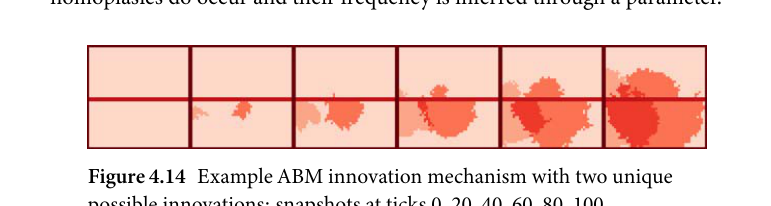
    possible innovations: snapshots at ticks 0, 20, 40, 60, 80, 100

<!-- source-page: 99; pdf-page: 118 -->
4.5 PARAMETERS OF THE MODEL  99

                     4.5.5 Hierarchical modelling

After having illustrated the principal notions behind Bayesian-type ABMs,
another aspect of Bayesian modelling is important to introduce, as it builds
on the core assumptions and extends these. Hierarchical Bayesian models are
a part of Bayesian data analysis in which the posterior distribution of a given
parameter is estimated hierarchically, meaning that the parameters that are
used to determine the distribution of the model prior at the lowest level are
themselves modelled as a probability distribution. The intuition behind this is
to model varying parameter behaviour at multiple levels. Concerning termi-
nology, higher-order priors (i.e. any parameter higher than the base-level) is
called a hyperprior.
  The hierarchical approach can be utilized for Bayesian ABM simulations
to allocate more freedom to develop agent-specific traits. To illustrate this,
assume an ABM simulation with an agent A and a migration parameter M.
Under the assumption that M is a local parameter, the probability distribution
of M develops over time. We can assume that

                   Pi(MA) ~ TruncatedNormal(0, 1)                  (4.1)

with i being the initial state. This denotes a relatively flat initial prior distribu-
tion of the probability for M.
  The parameters of the underlying distribution that are updated allow for the
development of this agent’s individual parameter distribution. To modify the
distribution, one has to subtract from, or add a certain value to, the parameters
of the distribution.

                Pi+1(MA) ~ TruncatedNormal(0 + x, 1 + y)             (4.2)

  Here, x and y are the values that are used to modify the distribution of Pi(M).
One could set x and y to a fixed global value which would result in P(M) of all
agents being updated with the same value each update.

                Pn(MA) ~ TruncatedNormal(αn, βn)
                       αn = αn–1 + x
                       βn = βn–1 + y

α and β denote the parameters of the truncated normal distribution after
the preceding update. Setting x and y to a fixed value would result in a

<!-- source-page: 100; pdf-page: 119 -->
n = 1                                 n = 5
       0.80                                                                               0.80
 P(M)                                                                               P(M)
       0.65                                                                               0.65
  Density                                                                                                                                          Density       0.50                                                                               0.50

         0.0     0.2     0.4     0.6     0.8     1.0            0.0     0.2     0.4     0.6     0.8     1.0
                   P(M)                                  P(M)

                  n = 100                               n = 500
 P(M)                                                                               P(M)                                                                                          0.35       0.55
  Density                                                                                                                                          Density                                                                                          0.25       0.40
         0.0     0.2     0.4     0.6     0.8     1.0            0.0     0.2     0.4     0.6     0.8     1.0
                   P(M)                                  P(M)
Figure 4.15 Fixed-value update of α and β by 1 per time step
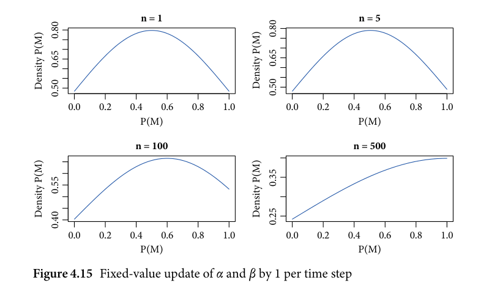

linear growth of α and β. After n = 500 updates, the distribution Pn(MA) ~
TruncatedNormal(α500, β500) would approximate a probability distribution
with a large standard deviation. This is illustrated in Figure 4.15 where the
development of the probability distribution of MA is shown. There, the normal
distribution parameters α and β were increased by 0.01 at each update.
  What we can observe is that the more updating P(M) undergoes, the wider
the distribution becomes and the more the mean approaches 1. This issue can
be resolved when a hierarchical model is introduced in which the update val-
ues are also drawn from a probability distribution. This hierarchical model
can be described as follows:

                Pn(MA) ~ TruncatedNormal(αn, βn)
                       αn = αn–1 + γ
                       βn = βn–1 + ρ
                       γ ~ norm(μ1, σ1)
                      ρ ~ norm(μ2, σ2)

  The parameter values μ1, μ2, σ1 and σ2 are fixed values which are prede-
termined. What can be observed in this model is that the updating values γ
and ρ are no longer fixed values but are themselves sampled from a underly-
ing distribution instead that can itself be updated. This has the advantage that

<!-- source-page: 101; pdf-page: 120 -->
4.5 PARAMETERS OF THE MODEL  101

            1.0

            0.8

            0.6
          mean
            0.4

            0.2

            0.0

              0          100         200         300         400         500
                                                         tick
    Figure 4.16 Change of mean under a random normal-valued update
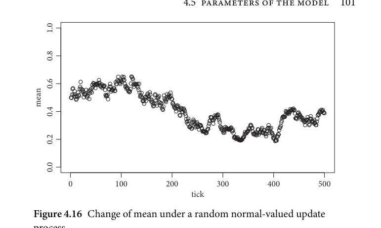
     process

the updates of an agent’s parameters are variable and draw from a parame-
ter space defined by fixed global hyperparameters. The interpretation of such
hierarchical ABMs is different from non-hierarchical agent-based models. A
hierarchical model assumes not only that the main model parameters are
variable to a certain degree, but also that the parameters defining those are
variable. This two-level hierarchical system can be interpreted as individual
populations having unique internally variable preferences but they draw from
the same global pool of hyperparameters to update these preferences.
  As explained above, normal-valued updates lead to a fluctuation in the mean
of an agent’s value. If the hyperparameter is drawn from a normal distribu-
tion Normal(0, 0.01), we see a single agent’s mean value fluctuate over time as
we expect there to be similarly many positive as negative updates. Figure 4.16
shows a trace plot of a single agent’s mean value development over 500 ticks.
  This development is one of many possible developments of different agents
with the same update mechanism. When we plot the development of multiple
agents at a time, we can observe the effect of this updating process in more
detail. Figure 4.17 shows this plot.
  Here we can see that different patterns emerge and that, after a certain
number of ticks, we see agents developing their individual properties. These
differences in the mean value occur randomly but generally follow an observ-
able parameter value. As different agents develop individual patterns, it is
possible to have different scenarios arising that can be evaluated against an
empirical data baseline. For example, if we had empirical data that suggests

<!-- source-page: 102; pdf-page: 121 -->
1.0

            0.8

            0.6
           mean
            0.4

            0.2

            0.0

              0          100         200         300         400         500
                                                         tick
     Figure 4.17 Trace plot of mean development for twenty agents under
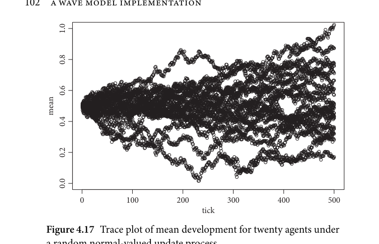
     a random normal-valued update process

            1.0

            0.8

            0.6
           mean
            0.4

            0.2

            0.0

              0          100         200         300         400         500
                                                         tick
     Figure 4.18 Change of mean under a random normal-valued update
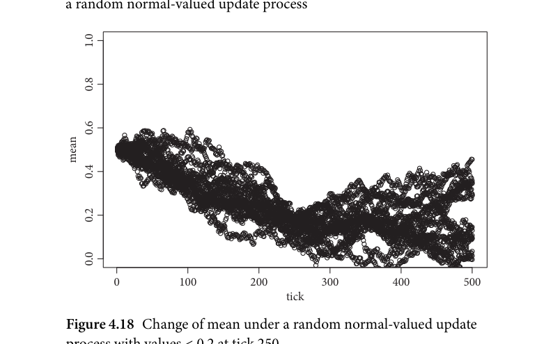
     process with values < 0.2 at tick 250

that the mean value at tick 250 is unlikely to be above 0.2, we can filter out all
runs that do not meet this criterion. Figure 4.18 shows twenty runs that exhibit
a value of less than 0.2 at tick 250.
  From this plot we can deduce that under the current parameters, the most
likely runs follow approximately this pattern. Ideally, these simulations return
the most likely traces that are possible given the data and the parameters.
