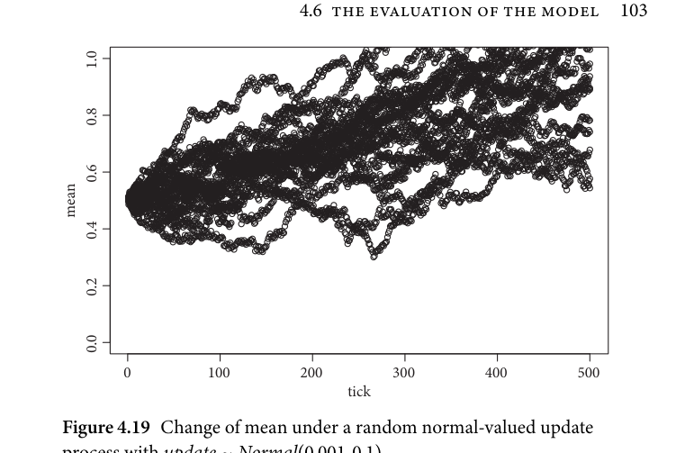
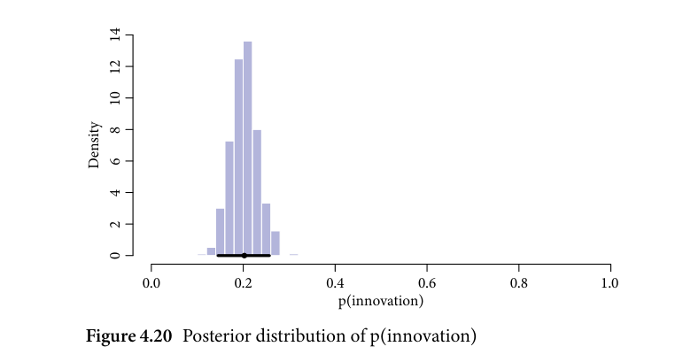
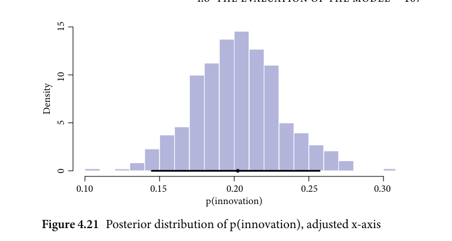
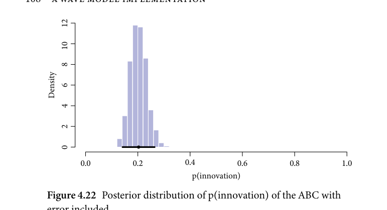
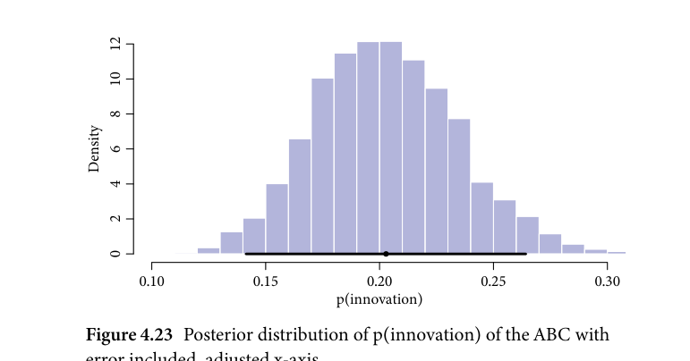
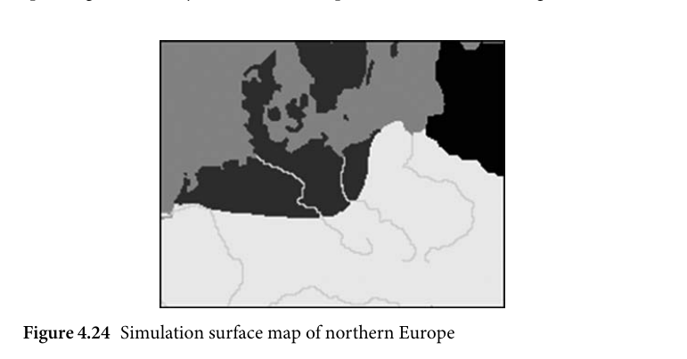
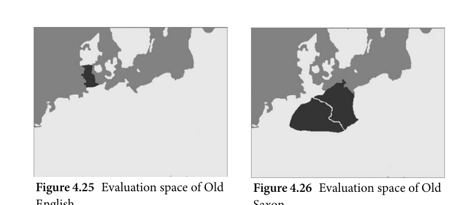
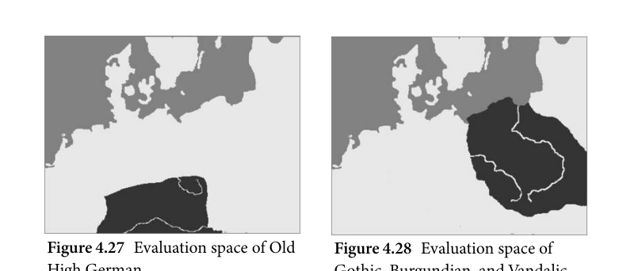
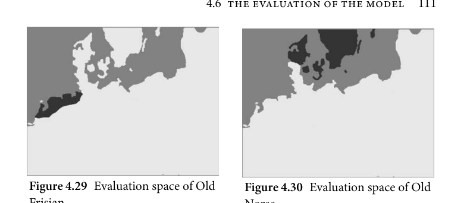

# 4.6 The evaluation of the model

<!-- source-page: 103; pdf-page: 122 -->
4.6 THE EVALUATION OF THE MODEL  103

            1.0

            0.8

            0.6
          mean
            0.4

            0.2

            0.0

             0          100         200         300         400         500
                                                         tick
     Figure 4.19 Change of mean under a random normal-valued update

     process with update ~ Normal(0.001, 0.1)

   It is further possible to alter the parameters such that the normal distribu-
tion underlying the updating has a slightly positive or negative mean. This will
produce the output that the agent’s values tend to develop positively over time.
Figure 4.19 shows the output of the same principle as displayed in 4.17 with
the exception that the underlying normal distribution was assigned a mean of
0.001.
  As we can see in this example, most agents’ values tend to develop positively.
This shows us that this approach can not only simulate various patterns of
agents’ value development but also take into account situations in which we
see a steady increase in this parameter globally.
   It has to be kept in mind that this architecture of building an agent-based
model draws its core principles from Bayesian hierarchical modelling; it is not
to be confused with an actual Bayesian hierarchical model. This term com-
monly refers to a specific Bayesian type of data analysis only in which the data
are approximated using a hierarchical model architecture.

                4.6 The evaluation of the model

So far we have only discussed the individual parameters and how a simulation
run proceeds. In a single simulation run with randomly chosen parameters,
the run would proceed according to the parameter settings and produce an

<!-- source-page: 104; pdf-page: 123 -->
outcome. This is therefore just a generative model, a computational simula-
tion that takes parameter settings as inputs and produces an output. This in
itself models one possible way in which the Germanic languages could have
diversified but the task of the study is rather to infer the most likely diversi-
fication processes from the data. Therefore, an integral part of the model is
the method in which the simulations are run and how we determine which of
those runs are indicative of the real process of Germanic diversification.
  This is done with a so-called Approximate Bayesian computation approach.
The general aim is to systematically simulate different diversification processes
and to determine which runs among the total number of simulated processes
reflect the data best. Afterwards, we can analyse these best-fitting runs to
gain insights into what common properties the runs share. These observa-
tions about the simulations can then be transferred to gain insights about the
real-world process.

     4.6.1 The concept of Approximate Bayesian computation

A crucial step in determining the working mechanics of an agent-based model
is to choose the best evaluation method. After set-up, the model runs for a pre-
determined number of ticks until it produces an output. This output is usually
the final state of the model which is expressed as a single performance met-
ric, or more than one. These metrics are used to determine whether a certain
run was successful when compared against a fixed baseline or which output
it produced. However, the form in which a simulation is evaluated heavily
depends on the data and the research question. There are three main different
modelling approaches:

   • Initial stage known—outcome to be simulated.
   • Outcome known—initial stage to be simulated.
   • Initial stage and outcome known—process to be simulated.

These three types operate on different premises and different types of avail-
able data. The first task can be described as a modelling environment in which
the model is tasked with exploring a simulation space anchored to a specific
initial stage. Here, the initial stage is defined in advance and a set of parame-
ters is selected. The simulated development thus resembles the behaviour of
the agents under different parameter settings. In such studies, the model is
used for observing the impact of different parameters on the agents’ behaviour.

<!-- source-page: 105; pdf-page: 124 -->
4.6 THE EVALUATION OF THE MODEL  105

The outcome itself is not fixed or predetermined as the sole interest of the
researcher lies in investigating the parameters and their contribution to certain
aspects of the simulation.
  The second type of model is in some respects the inverse of the previous
model type. In this case, not the outcome but the initial stage is simulated.
Such approaches aim to determine the most likely initial stage given a certain
outcome state and certain parameters.
  The third type is a combination of the previous two approaches: it assumes
a known initial stage and a known outcome. The simulated space is the process
inbetween both stages. The particular interest is in the pathways that the agents
took during the process. The present study uses this third approach since the
data structure and our knowledge of the Germanic situation warrants such
an approach. The initial stage, in this case Proto-Germanic, is the known ini-
tial stage from which the Germanic languages developed, thus building on the
comparative method which provides the means to infer the properties of this
initial stage. Moreover, the known outcome is the linguistic situation and geo-
graphic distribution of the Germanic daughter languages. The research goal is
therefore clearly defined as finding patterns in the agent’s pathways between
Proto-Germanic and the daughter languages.
  However, as a next step, it is necessary to define the means of evaluating
the runs. Because the initial stage is known, the model can simulate possi-
ble development pathways into several daughter languages. The model itself
is capable of simulating a vast variety of different scenarios especially since
there is randomness implemented in the model. Yet these scenarios do not
need to reflect what we observe in the Germanic linguistic data. In fact, the
vast majority of those runs will not approximate the data. Thus out of all pos-
sible runs, we want to keep and evaluate those runs that actually reflect the data
best. In this case, the data are the linguistic innovations of the daughter lan-
guages which are encoded in feature vectors (see section 4.4). Afterwards, we
want to examine the ‘successful’ runs to determine whether there these runs
have dominant patterns in common. This approach resembles the notion of
Approximate Bayesian computation.
  Approximate Bayesian computation (ABC) is a prominent analytical tech-
nique from the domain of Bayesian modelling. In short, ABC draws upon a
generative function which generates data according to a stochastic process.
The different outcomes of this function are determined by the input variables.
After generating a large number of outcomes, only those runs are accepted
as ‘successful’ which approximate the data best. To illustrate this notion, a
simple univariate ABC model will be set up in the following section. Let L

<!-- source-page: 106; pdf-page: 125 -->
be a language which has undergone n = 40 innovations over the course of
t = 200 years. Now we want to estimate the average innovation probabil-
ity each year which is simultaneously the rate of innovation. According to
Frequentist statistics, the average probability is

                                   n
                            p(innovation) =
                                                               t

Which equates to:

                                      40
                           p(innovation) =
                                     200

and gives an average innovation probability of 0.2. However, since we know
that such processes are subject to random variance, we can approximate the
problem using an ABC model. In this model, the occurrence of innovations
over 200 years is simulated under the influence of different p. Every run i,
the generative function F draws a value pi from a prior distribution of p and
simulates how many changes L would undergo if it had an average innova-
tion probability of pi. Having run the model for 100,000 iterations, the model
has simulated a variety of hypothetical innovations given various values for
p(innovation). As we know that in reality L has undergone exactly forty inno-
vations, we can discard all runs which yielded outcomes different from n = 40.
If we plot the remaining p(innovation), we see the frequency distribution of
all values for p(innovation) which yielded exactly forty changes. Figure 4.20
shows this plot; Figure 4.21 displays the same data with adjusted x-axis. The

        14

        12

        10
                   Density 86

    4

    2

    0

                0.0            0.2            0.4            0.6            0.8            1.0
                                            p(innovation)
     Figure 4.20 Posterior distribution of p(innovation)

<!-- source-page: 107; pdf-page: 126 -->
4.6 THE EVALUATION OF THE MODEL  107

        15

        10
                   Density

    5

    0

               0.10              0.15              0.20              0.25              0.30
                                            p(innovation)
     Figure 4.21 Posterior distribution of p(innovation), adjusted x-axis

black line segment indicates the 89 per cent HDI⁵ credible interval which lies
between 0.16 and 0.25 with the black dot representing the distribution mean.
The prior distribution selected for this task was a uniform prior uniform(0, 1).
  From these plots we can deduce that values of p(innovation) between the
credible intervals 0.16 and 0.25 can likely have yielded the number of innova-
tions we observe in the data. The important property of such ABC models is
that they simulate a variety of different scenarios, in the above case the out-
comes under various p(innovation) values, and after examining those runs
which yielded the actual data, we find patterns in those runs that give insight
into the factors that might likely have given rise to the actual data. After run-
ning the above ABC model we can say with relative certainty that the average
innovation rate of L was between 0.16 and 0.25.
  In many ABC models, especially in more complex multivariate tasks, the
simulated data rarely or never match the observed data exactly. Thus, such
models introduce a tolerance value which determines how much runs are
allowed to deviate from the actual data in order to still be accepted as ‘success-
ful’. To demonstrate this using the above task, let the tolerance value be ε = 5.
This means that after every run, the algorithm compares the outcome to the
observed data. If, as a result, the distance between outcome and observed data
is smaller or equal to ε, the run is accepted. For the example above this means
that runs are accepted when they produce numbers of innovations between

   ⁵ Recall that HDI (Highest density interval) is a summary measure that gives the value range encom-
passing a set percentage (89% in this case) of the overall density of a distribution (i.e. the most probable
interval).

<!-- source-page: 108; pdf-page: 127 -->
12

        10

    8

    6                  Density

    4

    2

    0

                0.0             0.2             0.4             0.6             0.8             1.0
                                             p(innovation)
     Figure 4.22 Posterior distribution of p(innovation) of the ABC with

     error included

        12

        10

    8

    6                   Density

    4

    2

    0

               0.10              0.15              0.20              0.25              0.30
                                            p(innovation)
     Figure 4.23 Posterior distribution of p(innovation) of the ABC with

     error included, adjusted x-axis

thirty-five and forty-five. The results of the model with tolerance term intro-
duced are plotted in Figures 4.22 and 4.23 whereas the latter represents the
frequency distribution with adjusted x-axis.
  The 89 per cent HDI credible interval of this model lies between 0.15 and
0.25. We can observe that introducing the tolerance term does not affect the
outcome statistic much in this example but it might provide important room
for accepting runs to make the tasks more efficient for cases in which the event
of an exact match is very rare.

<!-- source-page: 109; pdf-page: 128 -->
4.6 THE EVALUATION OF THE MODEL  109

  At this point, it is important to note that the main diversification model
in this chapter is not a pure ABC model. It is a simulation-based inference
ABM that borrows core concepts from ABC methods but adapts and trans-
forms them to a large degree. This means that the references to ABCs here and
henceforth are mainly mentioned to illustrate the theoretical underpinnings
of a part of the core mechanics of the model on which the model builds but
adapts to fit the requirements of the research question. It must, however, be
kept in mind that the final model is itself not an ABC model.

                     4.6.2 The spatial component

So far we have only discussed the spatial actions of agents in the abstract by
only referring to the setting of the simulation as simulation surface. However,
the spatial component is an integral part of the simulation as linguistic con-
tinua are to a large extent dependent on the spatial situation meaning what
varieties are geographically close and how strong their mutual influence is.
  The anchoring of the simulation in the geographical region of northern
Europe was achieved by letting the simulation run on a surface based on the
geographical shape of the region. Figure 4.24 shows the map that was the basis
of the simulation. The map is derived from a sketch map of the region.⁶
  The map in Figure 4.25 shows northern Europe with four differently shaded
regions: light grey represents the sea (passable), dark grey shows inhabited
terrain, and white shows terrain that is not inhabited by any Germanic-
speaking community. Black shows impassable terrain where agents cannot

Figure 4.24 Simulation surface map of northern Europe

   ⁶ Source: https://upload.wikimedia.org/wikipedia/commons/c/c5/Pre-roman_iron_age_
%28map%29.PNG, accessed 27.5.2021.

<!-- source-page: 110; pdf-page: 129 -->
migrate. Further, the rivers (passable) are indicated on the map as well. As dis-
cussed above, both the sea and rivers are natural barriers that can be passed
but doing so is governed by a different set of parameters. The inhabited terrain
represents the starting position of all agents in the simulation.
  A second set of maps was used to aid in the evaluation of the runs (see
Figures 4.25 to 4.30). Whether or not a simulation provides a good fit is depen-
dent on how well the simulated agents approximate the language in a particular
area. For example, we want to evaluate how well those agents that are located
in Scandinavia approximate Old Norse. In order to do this, the areas have to
be pre-defined for every observed language. The areas were created using the
geographical approximations in Mallory (1989: 87); W. König (2007: 46, 56,
58, 66); and Fortson (2010: 352).

 Figure 4.25 Evaluation space of Old     Figure 4.26 Evaluation space of Old

 English                            Saxon

 Figure 4.27 Evaluation space of Old     Figure 4.28 Evaluation space of

 High German                          Gothic, Burgundian, and Vandalic

<!-- source-page: 111; pdf-page: 130 -->
4.6 THE EVALUATION OF THE MODEL  111

 Figure 4.29 Evaluation space of Old     Figure 4.30 Evaluation space of Old

 Frisian                             Norse

  Note that the maps shown here are only meant to indicate the approxi-
mate location of a given language. As languages do not neatly follow these
borders, they are just a rough area used to evaluate the simulations and to
ensure that certain languages are simulated in approximately the correct area.
These areas—although they mostly are—do not need to be mutually exclusive.
There can be some overlap in regions where there is some uncertainty about
where the approximate border of two regions is.
  This is especially true for languages in the east, where multiple languages
(i.e. Gothic, Vandalic, and Burgundian) are evaluated but the demarcations of
the areas are unknown. In other words, since we do not know the geographi-
cal spread of these three languages, we assume a common area for all of them
and see the simulations treat this area with similar properties. Doing this also
entails that the three languages need to be evaluated differently. Instead of
using the mean of the fit of all agents in this area, the agent with the least-best
fit will be selected as the fit measure instead. This will result in an overall worse
fit for Burgundian, Gothic, and Vandalic than for other languages since we do
not use the mean of all agents but the worst-fitting agent, but it will provide
the following two benefits:
  The approximation to the language will be location-independent, mean-
ing that the fit to Vandalic, for example, does not depend on a predetermined
region but evaluates if there is any agent with a relatively good fit to Vandalic.
Moreover, it will ensure that the area as a whole moves towards a better fit to
either of the languages.
  This means, however, that when evaluating the results, one needs to take
into account that the languages Vandalic, Gothic, and Burgundian will exhibit
a worse fit relative to the other languages.

<!-- source-page: 112; pdf-page: 131 -->
Furthermore, the geographical position of Old English calls for comment.
Old English is evaluated in what is today southern Denmark and north-
ern Germany. This corresponds approximately to the position in the dialect
continuum before the migration to the British isles. In reality, however, the lin-
guistic ancestors who spoke a language that would later become Old English
came from the coastal area of the North Sea coast and were not necessarily
confined to the historical region of Anglia on the Cimbrian Peninsula. In this
computational model, however, one has to set a region more clearly. More-
over, the model assumes that by the time the simulation is evaluated, the Old
English features were already mostly present before the migration to the British
Isles. Although this is in line with previous research (see esp. section 5.5.2), it
is a limitation of the geospatial model that, in this case, it cannot easily display
abrupt migrations to a place off the map. Therefore, this limitation has to be
taken into account.
  After the decline of the Germanic-speaking population in east-central
Europe after the westward migrations (cf. W. König 2007: 58), there were no
speech communities in the east that could have participated in shared changes.
However, in a model whose time frame encompasses this period, a mechanism
needs to account for the fact that after the westward migrations, no consid-
erable contact took place between east-central and west-central Europe. For
this reason, an area was defined beforehand where agents were incrementally
removed to achieve a more realistic linguistic situation in this area after the
migrations. This was achieved by gradually removing agents from the area in
question from the year 500 AD onwards.

                   4.6.3 The temporal component

Bayesian phylogenetic models can account for uncertainty and differences in
the data record (i.e. attestation times) as to when the ancestor language started
diversifying and when the innovations in the daughter languages were com-
pleted. This creates the temporal dimension in the scenario that needs to be
accounted for in an ABM setting as well. There is the possibility of setting the
simulation time to a fixed number of ticks, which would mean that one has
to determine an exact and fixed time span between the start of the diversifi-
cation and the completion of innovations for individual daughter languages.
This, however, would mean that strong assumptions would be required for the
simulation. There is another possibility that can be adopted from Bayesian
phylogenetics: taxon and root age uncertainty. The mechanics of this are

<!-- source-page: 113; pdf-page: 132 -->
4.6 THE EVALUATION OF THE MODEL  113

comparable to the same functions in Bayesian models. In every simulation,
an origin time is sampled from the prior along with the attestation times of
individual taxa. Then, the simulation is run and the taxa are evaluated at the
times sampled for each taxon.
  For example, let A and B be taxa and O the starting time of the diversifica-
tion. Let us further assume that the ages of these linguistic entities are sampled
to be A: 1.5, B: 1.7, and O: 2.2 on the scale of 1,000 year-steps. A tick in this
hypothetical simulation represents two years. Thus, after the simulation is
started, it runs for O–B ticks until taxon B is evaluated. Thereafter it continues                        2
to run for another B–A ticks when taxon A is evaluated and the simulation ends.                       2
The relative temporal distance between the taxa and the root and between each
of the taxa therefore matters for the simulation and can be sampled as ages for
the taxa and the root. For example, if the simulation only yields a good fit to
the data when taxon A is evaluated 200 ticks after taxon B and taxon B is eval-
uated 400 ticks after the simulation started, then we can determine the relative
temporal distance of the taxa. These relative dates can be made absolute by
setting absolute, hard-bounded priors on the dates.
   It is important to note at this point that the taxa dates are not intended
to be inferred in the model. They are mainly used to calibrate the model to
actual time and to facilitate inferring the root age. The estimation of the pro-
cess becomes more accurate when the model is given information about the
relative temporal attestation distances between individual taxa.
  Table 4.2 shows the priors used on the origin and the taxa (in 1,000 years).
These priors are, with the exception of the prior on the origin, equal to the
priors used in the Bayesian phylogenetic model (see Table 3.5).

                     Table 4.2 Origin and tip date
                        priors

                                       Prior

                        Origin         Uniform(1.9, 2.8)
              GO           Uniform(1.6, 1.8)
              ON           Uniform(1.0, 1.2)
                OE            Uniform(1.1, 1.3)
                 OF            Uniform(0.8, 1.0)
                 OS            Uniform(1.15, 1.35)
              OHG          Uniform(1.15, 1.35)
                VAND         Uniform(1.5, 1.7)
                BURG         Uniform(1.5, 1.7)

<!-- source-page: 114; pdf-page: 133 -->
4.6.4 Optimization of runs

As described previously, ABC approaches are very resource intensive. This is
the case because they are, in some ways, an alternative to grid approximations
where the parameter space is searched according to a predefined grid. This
grid consists of multiple different parameter combinations which are all eval-
uated. However, this approach cannot be used for this particular investigation
as the parameter space is too large to iterate over each possible combination
of values. An ABC approach solves this problem by running the simulation
many times, each time using a randomly selected parameter set drawn from a
prior distribution. It increases in accuracy by increasing the number of evalu-
ations. However, this approach is still inefficient as the number of runs needed
is high. Additionally, the random sampling represents a random walk through
the parameter space with some parameter combinations not being explored.
  Bayesian statistical inference has faced this problem early in the 1950s in
problems for which the likelihood space could not be evaluated efficiently
with random walk approximations. The solution to this problem came with
the advent of greater computational power: algorithms that make it possible to
explore the posterior distribution more efficiently. The most basic algorithm,
which is sometimes used as a shorthand for the entire group of algorithms,
Markov-Chain Monte Carlo (MCMC) (see discussion in section 3.1.3).
  While the ABM used in this study falls into this category, it is distinct from
many statistical Bayesian models in two main aspects:
  (1) In Bayesian phylogenetics, for example, there is a likelihood function
applied to the data during model fitting to calculate the likelihood of the
data given the parameters. The model at hand does not possess a likelihood
function as the discrepancy between observed and simulated languages is
determined through means of a distance function. Section 4.6.5 provides more
information on the distance measure and the loss function derived from it.
  (2) The model is evaluated one step at a time with the amount of data
increasing during simulation, whereas in most statistical analyses, the data is
present before the analysis. Thus we do not find a pre-defined set of datapoints
which are to be evaluated but the number of available datapoints increases
while simulating.
  However, as classical MCMC methods are problematic to apply in this
instance and sampling is too inefficient without any sampling technique, an
algorithm needs to be applied that handles points (1) and (2) while still
increasing sampling efficiency. This algorithm must be able to operate on out-
put values that do not need to resemble a likelihood function. Secondly, the

<!-- source-page: 115; pdf-page: 134 -->
4.6 THE EVALUATION OF THE MODEL  115

algorithm must be able to explore the parameter space with little data at first
and increasingly optimize the sampling strategy when more data are available.
Therefore I used a hybrid system between ABC and a Gaussian Process Regres-
sor (GPR) as sampling optimizer. A Gaussian Process Regression is a Bayesian
technique of fitting curves to data. This enables the regression model to fit a
nonlinear curve to a set of datapoints rather than a regression line.⁷ Gaussian
processes work under the assumption that nearby datapoints can be interpo-
lated to estimate the unobserved transition areas between two points. Applied
to the problem at hand, the GPR can fit a regression curve to the loss metrics
of the previous runs.
  This means in effect that for the first run, a GPR optimizer selects param-
eter points from a search space defined as a prior distribution and evaluates
these points by running the model. The output of this model is then fed back
to the regression model where a GPR calculates the global minimum of the
parameter space given the available data. Afterwards, a point from the esti-
mated global minimum is selected as a ‘best guess’ to be evaluated next. After
the evaluation of this point, the result is fed back to the GPR again where the
regression is fitted anew. After a number of iterations exploring the search
space, the GPR optimizer will select parameter values predominantly from the
parameter region around the global minimum. This means that after a certain
period of iterations, the algorithm will converge to a certain minimal point
which ideally coincides with the global minimum.
  Such GPR optimization approaches are currently used in high-dimensional
hyperparameter tuning problems in machine learning. There, this method
is one of the tools used for obtaining the best model and hyperparameter
set-up of a machine learning task. Borrowing this method from machine learn-
ing is a reasonable approach since, in many machine learning settings, we
do find multi-parameter models which run one at a time and whose output
performance cannot likewise be evaluated using a likelihood function.
  For the application in this specific task, this procedure presents a hybrid
method between MCMC-based methods and Approximate Bayesian Com-
putation: the simulations proceed in a guided walk through the parameter
space instead of being randomly evaluated as in ABC applications and without
following an MCMC chain. To ensure that the minimum found by the GPR
optimizer is not just one of many possible local minimums, several instances
of such a GPR optimizer are run for multiple iterations. The final results
encompass all runs of all GPR instances and the best 5 per cent of runs are
selected.

   ⁷ For a discussion of GP optimization methods see e.g. Shahriari et al. (2016).

<!-- source-page: 116; pdf-page: 135 -->
The particular optimization algorithm that was used was the Python mod-
ule Hyperopt (Bergstra, Yamins, and Cox 2013).
  To summarize, traditional ABC procedures are too resource-intensive and
unspecific to run on a problem with this size of parameter spaces. Thus, the
GPR algorithm specifically designed to optimize high-dimensional problems.
Implementing the GPR does not change anything in the models directly but it
merely has the effect that the ABM simulations reach the well-fitting parameter
space faster.

                     4.6.5 The evaluation process

Distancefunction
As already touched on above, the simulations aim at modelling language diver-
sification processes and henceforth to analyse those runs that best approximate
the observed real-world data. However, in order to be able to analyse the simu-
lations that come closest to the observed reality, a function needs to be devised
that calculates the difference between the observed features and the simulated
features.
  The distance function used to calculate this difference is a modified Ham-
ming distance. This modified Hamming distance was devised to account for
the fact that the features and the absence of innovations are unequally dis-
tributed. For example, let A1 be the binary feature vector of a language and A2
be the simulated language vector. Assume further that

                          A1 = [0, 1, 1, 0, 0, 0]

The regular Hamming distance gives the proportion of positions which differ
between A1 and A2. Thus, if we assume that

                          A2 = [1, 1, 1, 0, 0, 0]

we have one position where A2 differs from A1 which would give a Hamming
distance of 0.167 which results from 6.1 However, assume that

                          A2 = [0, 0, 0, 0, 0, 0]

we see that the calculated Hamming distance would be 0.334 resulting from
6.2 However, this means that if, in a particular simulation, the simulated lan-
guage does not undergo any innovations, the distance would be only twice the
distance of the simulation where only one innovation was incorrect. As this

<!-- source-page: 117; pdf-page: 136 -->
4.6 THE EVALUATION OF THE MODEL  117

example shows, when there is an imbalance in the number of innovations vs.
non-innovations, which is the case for the data at hand, we find that regular
Hamming distance poorly resembles the goodness of a simulation: we find
that the more the imbalance is in favour of one character, the better simula-
tion runs are rated that resemble the majority character. In other words, if this
Hamming distance were used to assess the ABM’s simulations, those runs that
do not simulate any innovations at all would always be favoured over those
that simulate an accurate number of innovations, albeit in the wrong places.
  To combat this problem, the Hamming distance metric was replaced with
the Matthews correlation coefficient (MCC). The MCC score is a metric which
gives equal weight to the accuracies of 0 and 1 in a binary dataset. As a result
we can punish over- and undershooting the number of innovations.
  As the original MCC ranges from −1 to 1, where 1 represents a perfect fit
but the loss metric for the ABC process requires a distance from 0 to 1 (see
below), the raw MCC score was altered according to the following formula:

                    MCC + 1
                          1 –
                                 2
where MCC is the MCC score between −1 and 1. This formula changes the
MCC score to be in range 0 to 1 with 0 representing a perfect fit. This results
in a metric that is essentially a weighted Hamming distance.
  In this calculation, missing values were dropped and only complete cases
were considered in the calculation. This introduced volatility in those lan-
guages with many missing values but as the simulation is run a large number
of times, this will solely result in higher uncertainty in the results for those
particular languages rather than introduce a systematic bias.
  At the end of the simulation, or, more, precisely, at the inferred observation
date of a language, the distance from the observed data is calculated for every
agent independently. The overall fit to that language is taken to be the mean
fit of all agents in that region. It needs to be stressed that the mean distance
per language is only used for the optimization, the results are calculated on
the agents themselves.

Lossfunction
The weighted Hamming distance as described above is not sufficient to calcu-
late the goodness of the simulation. If one were to simply calculate the mean or
the sum of the distances between the observed innovation vector for each lan-
guage and the simulated innovation vector for each language, it could distort
the results.

<!-- source-page: 118; pdf-page: 137 -->
Suppose we have three languages A, B, and C. Let there be two simulations, I
and II, in which all three languages were approximated with certain distances.
  Simulation I: A = 0.3, B = 0.3, C = 0.3
  Simulation II: A = 0.1, B = 0.1, C = 0.5
   If we take the mean distance or the sum of the distances, we would see that
simulation II is always better than simulation I. However, the accuracy is in
both cases differently distributed: simulation I has an evenly distributed dis-
tance across A, B, and C whereas simulation II approximates A and B very well
and C is approximated worse than it is in simulation I. Accepting simulation
I as a good fit would mean sacrificing the bad approximation of one language
for the good approximation of other languages. This effect is even more pro-
nounced when there is a larger number of languages to be simulated since this
shrinks the weight of the accuracy that every language contributes to the sum.
Thus it is even more probable for a good simulation run to have one very badly
approximated language.
  To counterbalance this phenomenon, a method needs to be implemented
that punishes a bad approximation more than it rewards a good approxima-
tion. For this reason I implemented a loss function that is calculated on every
weighted Hamming distance. The function is calculated as follows:

                  n
               – ln(1 – dL)with {d      0 < d < 0.9999}
                 L=1      ∑          ∈ℝ|
  Here, L stands for a single language and d stands for the weighted Hamming
distance of the simulated and observed innovation vectors. As for values of dL
approximating 1 the function approximates infinity, I capped the function to
be only calculated on values of dL smaller than 0.9999. For values larger than
0.9999, I assigned a constant value of 12 in place of – ln(1 – dL). The value of
12 is approximately equal to a fit 0.99999 and prevents the loss function from
approaching infinity in case of fits worse than 0.99999. Figure 4.31 shows the
function in a plot. The x-axis represents the Hamming distance and the y-axis
is the resulting loss. This means that a Hamming distance of 0.5 would result
in a loss of 0.69 whereas a distance of 0.1 results in a loss of 0.105. This shows
that the higher the distance, the more this distance is pronounced.
  Such logarithmic loss functions are widely used in machine learning
research (e.g. Bishop 2006: 206). Applied to the above example this means that
the loss function discourages sacrificing one language accuracy for another.
This way, the gap between simulation I and simulation II is narrowed.
  A second issue for these simulations is specificity—meaning how well a
certain region represents the data for that language and not any other region.
