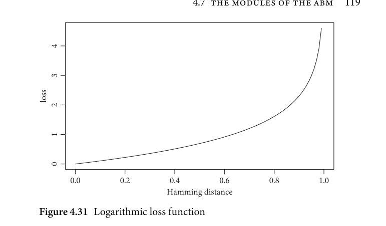
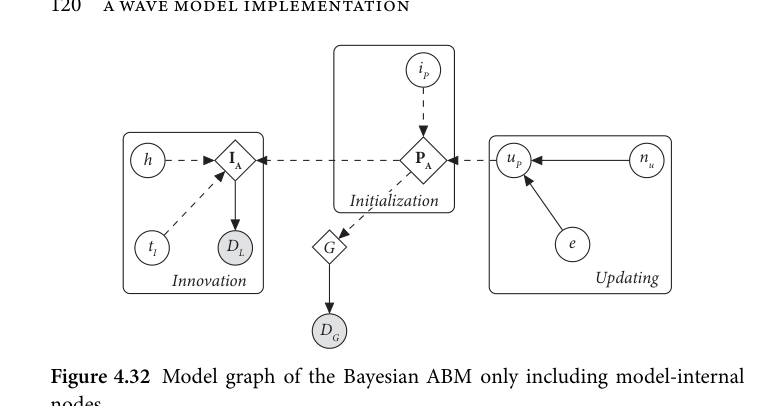
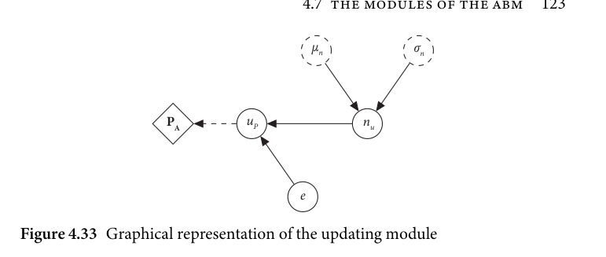
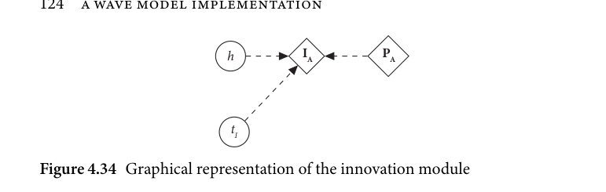

# 4.7 The modules of the ABM

<!-- source-page: 119; pdf-page: 138 -->
4.7 THE MODULES OF THE ABM  119

    4

    3

             loss
    2

    1

    0

                 0.0            0.2            0.4            0.6            0.8            1.0
                              Hamming distance
     Figure 4.31 Logarithmic loss function

It was observed in preliminary analyses that certain regions tended to yield a
better fit for the language of another region. For example, in some runs, the
geographical area of observed language A was better approximated by lan-
guage B. This cannot be entirely avoided, as there is some variation in how
good the fit to a certain language is and it should not be avoided as this yields
insights into the relationship of the regions in question. Nevertheless, to dis-
favour the better fit of a region to languages of other regions, a specificity term
was added to the optimization function:

          n
         – ln(1 – ((dN + 1)/2))  with   {d      0 < d < 0.9999}
         L=1   ∑                  ∈ℝ|
  This represents the distance between the fit for the language in question (e.g.
simulated language A in observed region A) and the fit of the best-fitting other
language in this region (e.g. simulated language B in observed region A). Taken
together as a joint loss, both functions assure that the simulated outcomes both
fit well to their observed region and yield the best possible fit among the other
languages in that observed region.

                  4.7 The modules of the ABM

After we have seen which parameters govern the simulations and how agents
interact with one another, the next step is to determine how innovations that
are spread among agents are innovated and how the parameters are updated
over the course of a simulation. Figure 4.32 shows the different modules

<!-- source-page: 120; pdf-page: 139 -->
iP

           h            IA                     PA          uP                nu

                                               Initialization

                       tI        DL       G                                  e

                Innovation                                            Updating

                            DG

Figure 4.32 Model graph of the Bayesian ABM only including model-internal

nodes

This graph (and all subsequent ABM model graphs) differs in graph element defi-
nitions from classical Bayesian graphical networks for which reason the elements
are explained below:
1)  diamond-shaped nodes denote agent-based model parts, i.e. parts which do
    not represent stochastic processes themselves.
2)  grey nodes represent observed variables.
3)  colourless nodes represent stochastic nodes, i.e. distributions from which
    random numbers are drawn.
4)  dashed circles represent stochastic nodes which are model-external processes
    belonging to the sampling algorithm.
5)   solid arrows represent stochastic paths where random numbers are drawn or
     inferred.
6)  dashed arrows represent non-stochastic paths where two nodes are direction-
      ally linked through an ABM-related action.
7)  non-circled variables represent constants fed to stochastic nodes as priors.
8)  nodes with subscripts represent nodes that stand for a repeated action on the
    element specified in the subscript.
9)  Greek-letter parameters denote model-external parameters whereas model-
     internal parameters are indicated by Latin letters.

governing these processes in a graphical model. The model thus consists of
three modules Innovation, Initialization, and Updating. The modules Innova-
tion and Updating govern the development of parameters and agents during
a simulation whereas Initialization is the module dedicated for inferring the
initial state of the agents. The modules themselves are described in more detail
below and, for a big-picture overview of all model parts, see section 4.9.

<!-- source-page: 121; pdf-page: 140 -->
4.7 THE MODULES OF THE ABM  121

                     4.7.1 The updating module

Whether or not an agent executes an action is determined by its individual
parameters. These, however, are not fixed but follow a probability distribu-
tion, in this case a truncated normal distribution between 0 and 1. The agent’s
parameters therefore do not define the probability itself but the parameters of
the probability distribution. This is the hierarchical modelling approach used
in this ABM (see section 4.5.5) in which agents’ parameters both have a mean
and a variance and are drawn from hyperparameter distributions.
  The use of normal distributions for these contexts calls for comment. Using
normal distributions does not, paradoxically, imply that the underlying pro-
cess is normally distributed. Normal distributions can arise as snapshots of
fluctuating processes for which, due to measurement error or a large number
of smaller, but unobserved or even unobservable factors, this fluctuation will
have no innate direction. In other words, in order for a process to be both sta-
ble or consistent and fluctuating, the fluctuations will occupy a certain range
around the position in which the process is stable. The fluctuations then will
diminish with increased distance from this stable region. When summarized,
the density of these fluctuations will approximate a normal distribution with
the stable region being around the mean and the degree of fluctuation will
be represented by the standard deviation of the distribution. There are, with-
out question, non-normally distributed processes in real-world applications;
these are often the result of different forces applying to different regions of the
parameter space. The innate property of normal distributions of representing
a fluctuating but stable and unbiased process makes them ideal for modelling
purposes under certain conditions. They can be a source of randomness in
simulation systems such as the one in this study and they can function as
unbiased estimates for priors and micro-level fluctuations.
  What is specifically not assumed is that the real-world processes are indeed
normally distributed but that they are the most neutral distribution to choose
in a variable space where there are assumed to be stable or high-probability
regions that also include fluctuation. An excellent discussion of the topic of
why normal distributions are an unbiased modelling choice rather than a
statement of the actual state of a system is provided by McElreath (2020:
72–76).
  Each tick, every agent’s parameters are updated by adding (or subtracting in
case of negative values) a value from a normal distribution. This means how far
an agent’s parameter moves in the probability space is ultimately dependent on
a normal distribution where large jumps are unlikely but small, incremental

<!-- source-page: 122; pdf-page: 141 -->
steps are common. In order for the agents to not execute a random walk in
the parameter space detached from neighbouring communities, there is an ε
value which governs how similar the particular agent stays with each update
towards its neighbours. If the value is high, the agents’ parameters perform
mostly independent random walks through the parameter space; if the value is
low, agents will stay very similar to their neighbours regarding their parameter
settings.
  Each tick, every agent’s individual parameter settings are updated according
to the following Bayesian model:

               Pn(ParamA) = e(μn,t–1 + γ) + (1 – e)μenv
                         γ ~ norm(μ, σ)
                       μ ~ inferred
                         σ ~ inferred

  In this model, μ and σ constitute hyperpriors. A hypothetical update at the
transition from timestep t-1 to t of an agent n’s parameter ParamA could run
as follows:
  Let  the  hyperprior  settings  follow  a  standard normal  distribution
(norm(0,1)) and the regularizing factor e be 0.6. The parameter would update
according to this formula:

                Pn(ParamA) = 0.6(μn,t–1 + γ) + 0.4μenv
                          γ ~ norm(0, 1)

   Initially, the parameter changes μ and σ are drawn from normal distribu-
tions during the optimization process. They indicate values for how much the
agent’s parameters change. Now, let μ be 0.5. This means that, without further
processing, the parameter values of Agent n would change by 0.5. The regular-
izing term e makes sure that the mean parameter setting of the environment
μenv regularizes the change. Extreme changes can therefore be prevented if the
environment has different values on average.

               Pn(ParamA) = 0.6(μn,t–1 + 0.5) + 0.4μenv               (4.3)

   If we assume that μenv has the value of 0.2, we get the following formula:

                Pn(ParamA) = 0.6(μn,t–1 + 0.5) + 0.08                (4.4)

<!-- source-page: 123; pdf-page: 142 -->
4.7 THE MODULES OF THE ABM  123

                                                    μn                 σn

                      PA            uP                   nu

                                                    e

Figure 4.33 Graphical representation of the updating module

   If we further assume that the previous parameter value of agent n was μn,t–1 =
0.4, we get the following new parameter value:

                       Pn(ParamA) = 0.62                         (4.5)

  This means that the new parameter value of agent n after the update is 0.62.
  Note that since these values are essentially probabilities, their range is con-
strained to values between 0 and 1 by the model. If, during a run, an agent
would receive an update that would raise the new value above 1 or lower below
0, the new value is set to either 1 or 0.
  The updating module therefore can be summarized with the graphical
model in Figure 4.33 below.⁸
  A parameter P of the agent A is updated by the update function uP for
the parameter P. It takes as input two values e and nu. e is a 0 to 1 bounded
value representing the ratio of global environmental independence. nu is the
updating distribution from which the base updating value is drawn. The shape
parameters for nu are drawn from prior distributions in the optimization
function μn and σn.

                    4.7.2 The innovation module

The innovation module governs the process by which agents undergo, spread,
and lose innovations. Figure 4.34 displays this module.
  The innovations are, as described above, mostly determined by the inter-
actions between agents and the agents’ parameters (PA), but two variables
influence the innovations: occurrence time and homoplasy rate.
  Occurrence time (tI) is a parameter applied to each innovation and is global
(i.e. constant during the run of one simulation). It determines from what point

   ⁸ Note that μ and σ in the above equations are denoted μn and σn in this graphical model.

<!-- source-page: 124; pdf-page: 143 -->
h              IA           PA

                                                         tI

Figure 4.34 Graphical representation of the innovation module

in time onwards an innovation can occur (the actual occurrence is determined
by other parameters). The motivation behind this occurrence time mecha-
nism is that this enables the model to infer the time an innovation occurs for
the first time. There is, of course, no real-world process that prevents a cer-
tain innovation from occurring at a certain time; the implementation here is
solely for the purpose of tracking and inferring the occurrence time of indi-
vidual innovations. Concretely, this mechanism allows the model to directly
infer the approximate date (and thus in some cases also the order) of individ-
ual innovations. As priors for each innovation, I use the relative frequency of
the innovation across the languages as a proxy for time of innovation. This
means that if an innovation is present in, for example, 4 out of n languages,
the mean of the prior will be located at 1 – 4 relative to the entire number of                                               n
ticks. Thus the starting prior mean of 0.25 in a simulation with 500 ticks would
correspond to an earliest innovation starting time of tick 125 for this innova-
tion. This modelling strategy follows the logic that innovations that are later
developments in individual languages are less likely to be found in a large num-
ber of neighbouring languages. This mechanic can be applied because other
confounding effects such as occurring homoplasy are accounted for by other
means (see below). It needs to be kept in mind that these prior specifications
are solely the initial settings for the simulation and therefore global. The pos-
terior distribution of runs will be able to move away from these settings if the
data require it.
  The second element in the innovation module is the homoplasy rate (h)
which determines the global probability of an innovation being innovated a
second time. In practice, if the requirements are fulfilled, an existing inno-
vation is deleted from the record of past innovations so that it occurs again.

    4.7.3 Initialization and region-specific updating parameters

At the start of each simulation run, all agents’ parameters are initialized ran-
domly between the interval of 0–0.7 which allows for great variation but
disfavours extremely high values.
