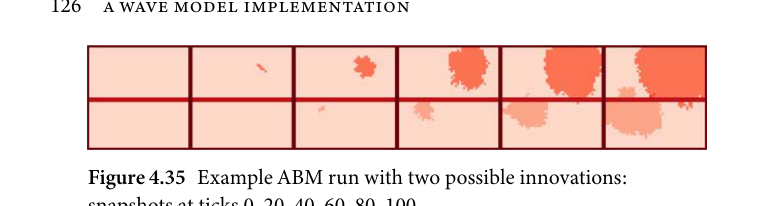
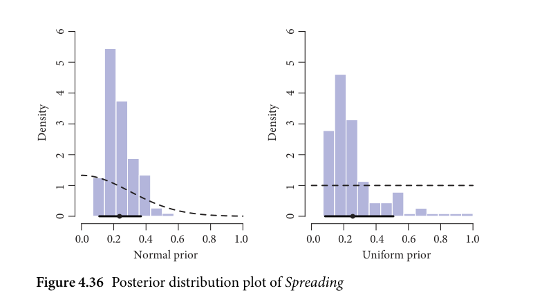
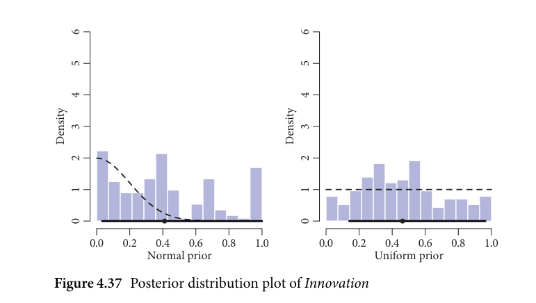
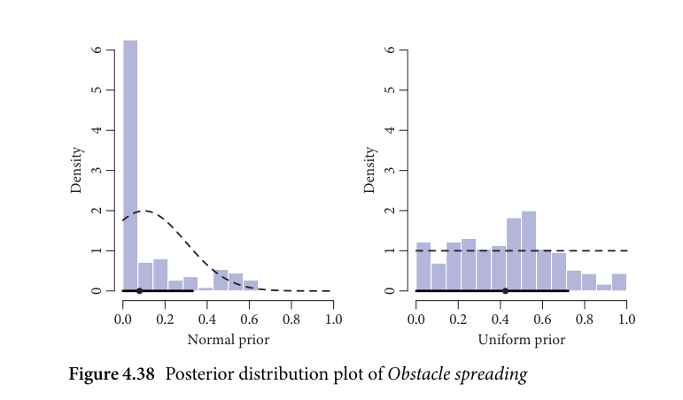
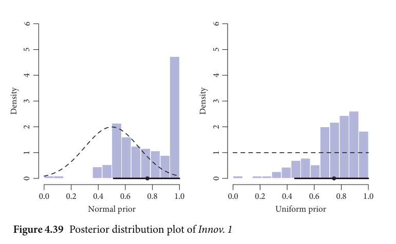
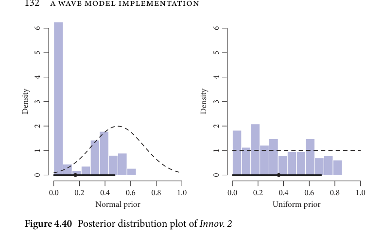
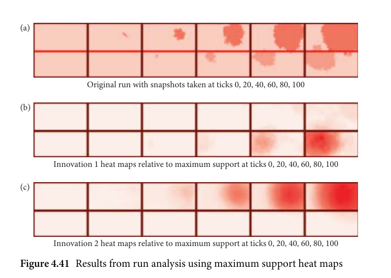
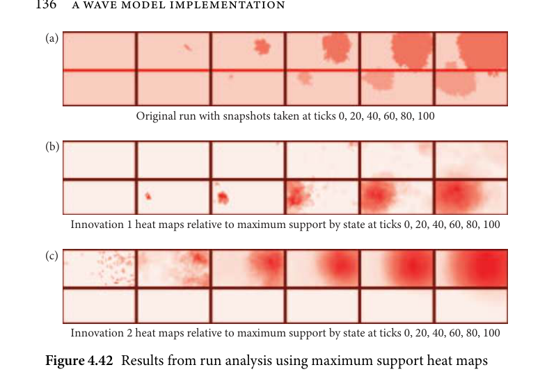

# 4.8 Putting the model approach to the test

<!-- source-page: 125; pdf-page: 144 -->
4.8 PUTTING THE MODEL APPROACH TO THE TEST  125

  As the model stands so far, all agents would be subject to the same global
updating process. The result would be that although agents develop their
own parameter settings over time, this process is very indirect as it does not
make the geographical differences observable in the model. For this reason, all
model hyperpriors with regard to updating were made specific to the individ-
ual regions outlined in section 4.6.2. This means that instead of one global
updating hyperprior for all agents, every region now has its own updating
hyperprior that is sampled from the optimization process. Afterwards, we can
more directly infer the different levels of hyperprior distribution between dif-
ferent regions. In other words, we assume the parameter changes to vary by
region; for example some regions might have a higher migration rate value
than others which can be inferred due to this mechanism. This is similar in
concept to a Bayesian varying slope model.
  Wherever an agent does not belong to a specified region, it receives a
standard normal updating hyperprior defined as norm(0, 1).

           4.8 Putting the model approach to the test

Undoubtedly, the real-world application of this model is vastly more compli-
cated than all the simplified demonstrations can account for.
  Therefore it is important to demonstrate the goal and the working of the
model in an example simulation where the purposes of the approach can be
demonstrated in a simplified task. The goal of this demonstration will be the
question, can this method approximate the conditions of a simple ABM? For
this, I adapted the simulation displayed in Figure 4.12 and set up an example
scenario with three population-level parameters and an innovation mechanic
as explained in 4.7.2. What follows is a test and an illustrative example of
how the mechanisms explained in the previous sections work. However, this
example is a toy model with fewer parameters and a simple, abstract simulation
surface. Due to this fact, all prior settings used here are solely specific to this
toy example. Ideally, this demonstration can practically explain in a simpli-
fied scenario some of the mechanics of and the core notions behind the main
diversification model.
  The parameters of this demonstration model are:

   (1) Innovation: Innovations occur at a specific rate.
   (2) Spreading: Innovations spread to an adjacent agent.
   (3) Obstacle spreading: Innovations spread to an agent on the other side
       of the obstacle.

<!-- source-page: 126; pdf-page: 145 -->
Figure 4.35 Example ABM run with two possible innovations:

    snapshots at ticks 0, 20, 40, 60, 80, 100

The procedure is as follows: I set up an innovation spreading model with fixed
parameters. Thereafter, the model is run and the final output is stored to serve
as the model which is to be evaluated.
  The parameters I chose for this simulation are the following:

   Innovation: 0.00005
   Spreading: 0.15
   Obstacle spreading: 0.005

   I further assume that Innovation 2 occurs before Innovation 1. It has to be
noted that the parameters in this example are fixed values. Recall that, in the
main simulation, all variables are given in the form of normal distributions
to account for inherent variability of observation. This example simulation is
intended to show the possibilities of interpreting an ABM that generates the
data in this way.
  Figure 4.35 shows the model output of this model that was run with the
parameters shown before. In the following section we will assume we know
neither the parameters this model was given, nor the intermediate steps. All
we have as a given are the parameters themselves and the final state which is
seen in Figure 4.35 in the rightmost frame.
  The next step is setting up the agent-based model as it is used in the main
simulation. This involves creating a distance function for evaluating each run
and setting up the optimizer and its priors.
Distance function:
As a distance function I use the same function that I use in the main simu-
lation which evaluates the weighted Hamming distance of each agent to the
data in the final tick. It has to be noted that, in the main simulation, I only
compare individual areas to the data. However, in this example, I will use
all agents for evaluation as in this example we are given the entire picture;
in the original data, we only have a few regions where we know the state of the
innovations. The distance function then operates as follows: after each run
it iterates over each agent and compares the simulated innovation vectors to

<!-- source-page: 127; pdf-page: 146 -->
4.8 PUTTING THE MODEL APPROACH TO THE TEST  127

the observed simulation vectors. Then it calculates the ratio of incorrect posi-
tions in the vector for each agent. For example if one agent is simulated to
have the innovation vector [0, 1] but the observed vector for this agent is [1, 1]
then the function assigns a Hamming distance of 0.5 to this agent. The aggre-
gated Hamming distance is then used as the accuracy of this run. Since the
highest possible aggregated distance is 2,208, the optimizer will then try to
minimize this distance through best-possible prior setting. Note that I use the
simple Hamming distance for this task as the weighted Hamming distance can
only be applied if the data show large innovation vectors with an imbalance in
frequency between zeros and ones.
Innovation timing:
On top of the basic innovation parameter, a second parameter was constructed
that globally handles the timing of the innovations. While the innovation
parameter itself only determines if a given agent undergoes an innovation, the
timing mechanism determines which innovation is allowed to occur at which
tick. For this, a single parameter is assigned to every innovation that deter-
mines the tick after which the innovation can occur. This parameter represents
the time as a percentage relative to the total number of ticks. A parameter value
of 0.5, thus, indicates that the innovation occurs after half of the total ticks.
Implementing this system gives the simulation the possibility to spread out
or cluster the occurrence of innovations. Without this timing mechanism, the
innovations would occur approximately evenly spread out depending on the
spreading probability.
Optimizer and priors:
The optimizer  is the same optimizer used in the main simulation (see
section 4.6.4). To demonstrate the influence of sensible prior setting for opti-
mization, I ran this simulation process twice. The first time, I assigned flat
uniform priors to all parameters to demonstrate the role of search space speci-
fication. In a secondrun, I specified the searchspace using the followingpriors:

                         Spreading ~ Normal(0.25, 0.3)
                        Innovation ~ Normal(0, 0.001)
                   Obstacle.spreading ~ Normal(0.1, 0.2)
                            Innov.1 ~ Normal(0.5, 0.1)
                            Innov.2 ~ Normal(0.5, 0.1)

  The spreading prior was chosen as a weakly informative prior with the
mean of 0.25. This prior choice arises from the observation that large values of

<!-- source-page: 128; pdf-page: 147 -->
Spreading probability are unlikely whereas small values are also more unlikely,
but more likely than extremely high values. To reflect this reasoning, the cho-
sen prior gives more weight to Spreading values in the first half of the spectrum.
  Innovation was given an informative prior centred around 0 that makes
large values implausible. The standard deviation of 0.001 is even less infor-
mative than it could be. This prior setting is based on the notion that with
an innovation probability of 0.1, for example, there is a 10 per cent chance of
every agent undergoing an Innovation each tick. This would result in 22,080
expected innovations during one simulation run.
  The prior for Obstacle spreading was chosen to be similarly informative to
the spreading prior; however, we might conclude that spreading across an
obstacle is less likely to occur. However, it cannot be ruled out that it might be
propelling spreading forward. Thus the mean of the prior is lower than for nor-
mal spreading; the standard deviations, however, allow for Obstacle spreading
to be higher than regular spreading.
  The priors for the two possible innovations (Innov. 1 and Innov. 2) are
centred around 0.5 which allocates less probability value to the innovations
occurring very late or very early. This is a reasonable assumption as the model
will determine the timing of individual innovations internally.
  All simulations were run with 400 evaluation runs over eight initializations
of the optimization algorithm which gives a total of 3,200 evaluated runs. The
goodness of prediction for each run was determined as a Hamming distance
from the observed innovation distributions. It was detected that dispropor-
tionally many runs achieve an accuracy of 419. Such ‘pockets of high accuracy’
arise when there is an imbalance of innovations in the outcome space. This
means concretely that there will be several runs where runs achieve higher
accuracy by making every agent adopt every innovation. If, in the outcome
situation, more innovations are favoured, the runs filling the space with inno-
vations will be rated higher. However, this is not informative as filling the
space can arise due to various different parameter settings. Therefore, these
runs were excluded from the model. Note that in more complicated models,
these ‘pockets of high accuracy’ are unlikely to arise as the outcome space is
too complex to allow for these errors.

           4.8.1 The results of the example simulation test

For the evaluation, the top 5 per cent of runs with the highest accuracy were
selected and evaluated further below.

<!-- source-page: 129; pdf-page: 148 -->
4.8 PUTTING THE MODEL APPROACH TO THE TEST  129

   It has to be noted that, over a long enough time scale, the number of runs in
the better accuracy region would eventually reach the same level as the model
with stronger priors.

Generalparameterestimates
The posterior parameter estimates obtained from this simulation can be
summarized graphically with distribution plots. The plots shown in this
section all contain the same elements. The histogram represents the posterior
distribution of the parameter in question whereas the dashed curve indicates
the prior for this particular parameter. The line segment below the histogram
marks the 89 per cent highest density interval of the posterior distribution and
the black dot indicates the mean of the posterior distribution.
  The spreading parameter (Figure 4.36) was evaluated as very similar in the
uniform and the normal model. However, the normal model exhibits narrower
credible intervals.
  Table 4.3 shows a summary of the posterior simulation estimates. The
information provided here about each posterior distribution is the credible
intervals, the mean and the maximum likelihood estimate (MLE).
   It can be observed that, in most cases, the more informative normal
prior yielded better results. In the case of Innovation and Obstacle spread-
ing (Figures 4.37 and 4.38), the flat prior was especially disadvantageous as
the posterior distributions very much cover more than two thirds of the out-
come space. This result is due to the fact that these two parameters are both
highly dependent on other parameters and less significant for the outcome. For

   6                  6

   5                  5

   4                  4

   3                  3           Density                                                                                                                                Density

   2                  2

   1                  1

   0                  0

            0.0    0.2    0.4    0.6    0.8    1.0             0.0    0.2    0.4    0.6    0.8    1.0
                   Normal prior                            Uniform prior
   Figure 4.36 Posterior distribution plot of Spreading

<!-- source-page: 130; pdf-page: 149 -->
Table 4.3 Posterior estimates of simulation parameters

                  89-CI            Mean         MLE
Parameter  Normal    Uniform   Normal  Uniform  Normal  Uniform  Orig.
                                                                           value

Spreading   0.11 – 0.37  0.08 – 0.51  0.236     0.255     0.197     0.168      0.15
Innovation  0.03 – 1.00  0.14 – 0.96  0.410     0.462     0.356     0.336     0.00005
Obstacle     0.00 – 0.33  0.00 – 0.72  0.078     0.424     0.000     0.490     0.005
spreading
Innov. 1     0.51 – 1.00  0.46 – 1.00  0.763     0.746     0.990     0.841      0.41
Innov. 2     0.00 – 0.48  0.00 – 0.69  0.168     0.361     0.009     0.187      0.34

   6                  6

   5                  5

   4                  4

   3                  3            Density                                                                                                                               Density

   2                  2

   1                  1

   0                  0

            0.0    0.2    0.4    0.6    0.8    1.0           0.0    0.2    0.4    0.6    0.8    1.0
                  Normal prior                           Uniform prior
   Figure 4.37 Posterior distribution plot of Innovation

   6                  6

   5                  5

   4                  4

   3                  3            Density                                                                                                                                Density

   2                  2

   1                  1

   0                  0

            0.0    0.2    0.4    0.6    0.8    1.0           0.0    0.2    0.4    0.6    0.8    1.0
                  Normal prior                           Uniform prior
   Figure 4.38 Posterior distribution plot of Obstacle spreading

<!-- source-page: 131; pdf-page: 150 -->
4.8 PUTTING THE MODEL APPROACH TO THE TEST  131

 example, Obstacle spreading is dependent on Spreading as only if this parame-
 ter is above a certain level, can Obstacle spreading take full effect. If Spreading
 is low, there might not be an influence of Obstacle spreading as there are fewer
 agents in the vicinity of the obstacle to be able to cross it. Therefore, the sig-
 nificance of the Obstacle spreading parameter increases with higher Spreading
 values. Moreover, we find that Innovation is dependent on the two innova-
 tion timing parameters. For very high values of Innovation, the weight of the
 significance is entirely shifted towards the timing parameters. The reason for
 this, is that, when the Innovation parameter is high, the simulation gets many
 potential innovations each tick. However, an innovation only occurs if the
 current tick has surpassed the timing of one of the innovations. This is true for
 smaller models with fewer innovations; however, in the main model where we
 find several hundred innovations, the significance of the innovation parame-
 ter is larger. The innovations, however, were not very precisely estimated in
 both normal and uniform models. The reason for this is that the parameters
 for Innov. 1 and Innov. 2 (Figures 4.39 and 4.40) are highly dependent on the
 particular setting of Spreading and Innovation. A higher spreading value may
 yield a faster spread of late innovations. This means that the posterior esti-
 mates of this simulation are not necessarily the optimal solution for analysing
 the results. This is because there is a number of different interactions between
 different parameters that need to be analysed in detail. It is therefore clear that
 the parameters, although informative about the general parameters, cannot be
 analysed independently of one another but need to be seen as highly covariant.
   For this reason, a more in-depth analysis will be conducted using linear
 regression models. The dataset for this subsequent analysis is the posteriors

 6                    6

 5                    5

 4                    4

 3                    3Density                                                                                                                                               Density

 2                    2

 1                    1

 0                    0

        0.0     0.2     0.4     0.6     0.8     1.0             0.0     0.2     0.4     0.6     0.8     1.0
                 Normal prior                               Uniform prior
 Figure 4.39 Posterior distribution plot of Innov. 1

<!-- source-page: 132; pdf-page: 151 -->
6                    6

 5                    5

 4                    4

 3                    3Density                                                                                                                                               Density

 2                    2

 1                    1

 0                    0

        0.0     0.2     0.4     0.6     0.8     1.0             0.0     0.2     0.4     0.6     0.8     1.0
                 Normal prior                               Uniform prior
 Figure 4.40 Posterior distribution plot of Innov. 2

 obtained using informative priors. For the Bayesian linear regression models, I
 used the R-package brms (Bürkner 2017). Inthe linear analysis, I aim at explor-
 ing the correlations between the Spread parameter and the other parameters
 including their interactions. Although the parameters are logically indepen-
 dent, their correlation patterns indicate which combinations of parameters are
more frequently present in the posterior sample of the simulations. This can
 reveal potential co-dependencies between the parameters.
   Bayesian regression models are similar to frequentist regression analysis
 insofar as both fit functions (e.g. lines, polynomials, or splines) to data to esti-
 mate regression coefficients. The model was fit using the model formula below.
 Note that, before running the linear model, all parameters were centred and
 z-scaled.⁹

                      Ri ~ Student(ν, μi, σ)
                        μi = α + β1Pn + β2Pn+1 + β3Pn × Pn+1
                α ~ Normal(0, 1)
                   βn ~ Normal(0, 1)
                  σ ~ Exponential(1)
                   ν ~ Gamma(2, 0.1)

    ⁹ Centring and z-scaling is a technique to standardize values of a variable. The standardization is
 achieved by subtracting the variable mean from every value before dividing the values by the standard
 deviation of the variable. The result is a variable with mean of 0 and a standard deviation of 1 which
 can be more easily interpreted in many cases, especially in cases where multiple variables have different
 and/or abstract scales.

<!-- source-page: 133; pdf-page: 152 -->
4.8 PUTTING THE MODEL APPROACH TO THE TEST  133

Table 4.4 Summary of posterior coefficients

                                  Estimate    Est.Error   l–89% CI   u-89% CI

Intercept                           −0.12       0.06        −0.22        −0.02
Innovation_rate                    −0.12       0.06        −0.21        −0.02
Obstacle_spread                    −0.17       0.06        −0.26        −0.08
Innov1                                0.19       0.06          0.10           0.28
Innov2                                0.57       0.06          0.47           0.67
Innovation_rate:Obstacle_spread     −0.14       0.08        −0.27        −0.02
Innovation_rate:Innov1             −0.00       0.07        −0.11           0.11
Innovation_rate:Innov2                0.01       0.08        −0.12           0.13
Obstacle_spread:Innov1             −0.06       0.06        −0.16           0.04
Obstacle_spread:Innov2               0.06       0.08        −0.06           0.19
Innov1:Innov2                         0.27       0.07          0.16           0.38

sigma                                 0.58       0.05          0.50           0.65
nu                                  14.94      10.11          5.10         34.01

In this formula, R represents the outcome variable, the Spread parameter in
this case whereas Pn stands for a predictor variable. For reasons of conciseness,
I only outline the general structure and reference the predictor variables in
generalized form.
  Table 4.4 shows the summary of the posterior coefficients of the analysis
with a credible interval of 0.89. The parameters specific to the Student-t family
σ and ν are given separately at the foot of the table.
 We can infer from the table that there are various co-dependencies between
the Spread parameter and the other parameters in the accepted runs. For
example, both Obstacle spreading and the Innovation parameter are inversely
correlated with Spread. This indicates that the agent-based model finds a bal-
ance between these three parameters insofar as, if either Obstacle spreading
or Innovation is high, the innovations need to spread more slowly in order
to still reach a good fit to the data. This effect is enhanced if both Obsta-
cle spreading and Innovation increase. The interaction parameter indicates
an increased effect of both parameters on Spread if both parameters likewise
increase.
  Positively associated with Spread are both innovation timing parameters.
The reason for this lies in the fact that if innovations are timed later (i.e.
the parameters increase), Spread must likewise increase to yield a good fit.
Similar to Obstacle spreading and Innovation, the positive effect of both
innovation parameters is increased for higher values of both innovation
parameters.

<!-- source-page: 134; pdf-page: 153 -->
Finally, we can deduce that there are various co-dependencies between
parameters on the outcome of the simulation. These co-dependencies are
mostly specific to the modelling itself and have no analytical value that could
yield insights into the structure of the data. However, they enable the analy-
sis of data distributions and patterns that are artefacts of the method. As the
main model contains parameters more reflective of the data, analysing the
co-dependencies of agent-specific parameters can yield valuable insights.
  As an intermediate summary, we can observe from the parameter estima-
tions that, by analysing the posterior distribution coefficients alone, we cannot
show the full picture. Rather, each of those needs to be interpreted under
consideration of interactions with other parameters. For example, the inno-
vation parameter being estimated poorly is the result of an interference from
the innovations 1 and 2 since ultimately they determine when innovations
occur. Thus the innovation parameter itself, while crucial to the mechanic of
the simulation, is not informative for a subsequent analysis.
  Furthermore, in most cases, informative priors perform better than uni-
form priors; however; without external information, the innovation timing
parameters perform better with weaker priors. In the main simulation, this
problem will be side-stepped as we feed external information to the simula-
tion and build the priors such that they are more grounded in the probable
parameter regions.

Analysingtheruns
As a next step, we can go further and look at the backward inferences we can
make using the accepted runs. We can analyse the state of the simulation at
each time step to receive estimations about the previous stages of the innova-
tions. To achieve this, we can save the state of every accepted run at a fixed
number of ticks (e.g. ticks 0, 20, 40, 60, 80, 100). Afterwards, we can aggregate
the runs by stage and thereby overlay the simulations. This returns merged
stages across all simulations and indicates the frequency with which each agent
has undergone a particular innovation: if in the aggregate one agent has under-
gone a particular innovation in many runs, we can assume that the support for
this agent having undergone this innovation can be considered high. Akin to
the clade support in phylogenetics, I call the frequency of an agent showing
an innovation support. High support thus means that in most of the accepted
runs, this agent shows this particular innovation. It needs to be stressed that
the runs of this simulation were only evaluated at the last tick. In effect, the sim-
ulation emulates the real-world research situation in which only the outcome

<!-- source-page: 135; pdf-page: 154 -->
4.8 PUTTING THE MODEL APPROACH TO THE TEST  135

is known and the previous stages need to be inferred. The outcome state will
henceforth always be the rightmost image in a heat map sequence.
  To gauge the support of individual agents and the resulting backward infer-
ences, a variety of methods can be used, a few of which will be illustrated in
the following.
   Firstly, we can display support as heat maps for both innovations by regular-
izing the support of each agent relative to the maximum support. This means
that every agent’s support is calculated as                                                                      sa where sa is the individual agent’s                                                            smax
support in number of runs where this agent exhibits the respective innovation
and smax is the maximum number of runs containing this innovation. Doing
this fixes the darkest colour relative to the most supported agent irrespective
of the strength of support.
  Figure 4.41 shows the ‘ground truth’ states, i.e. the states that the model was
built to infer.
  The heat maps show that the model was successful in replicating the approx-
imate extent of the original run in the last frame at tick 100. Further, the
previous stages were correctly inferred with regard to location and approxi-
mate start of the spreading. However, the earlier the snapshot was taken, the
smaller the relative support becomes. The reason for this is that the support has
to be seen as a distribution which, for some aspects of analysis, is inadequately

  (a)

                    Original run with snapshots taken at ticks 0, 20, 40, 60, 80, 100

  (b)

          Innovation 1 heat maps relative to maximum support at ticks 0, 20, 40, 60, 80, 100

  (c)

          Innovation 2 heat maps relative to maximum support at ticks 0, 20, 40, 60, 80, 100
 Figure 4.41 Results from run analysis using maximum support heat maps

<!-- source-page: 136; pdf-page: 155 -->
(a)

                    Original run with snapshots taken at ticks 0, 20, 40, 60, 80, 100

  (b)

       Innovation 1 heat maps relative to maximum support by state at ticks 0, 20, 40, 60, 80, 100

  (c)

       Innovation 2 heat maps relative to maximum support by state at ticks 0, 20, 40, 60, 80, 100
  Figure 4.42 Results from run analysis using maximum support heat maps

displayed in reference to the peak point of the distribution. Therefore, we need
a resolution that highlights the low-support regions of the graph.
  This can be realized by normalizing the support by state, i.e.    sa,state  . This                                                                                                                             smax,state
highlights the high-support agents for every snapshot and lets us investigate
earlier states more clearly.
  From Figure 4.42 we can infer that most occurrences of Innovation 2 start
to arise between tick 20 and 40 and Innovation 1 starts occurring in larger
numbers between ticks 40 and 60. Moreover, the origin of Innovation 1 is likely
in the centre left of the bottom left quarter whereas the origin of Innovation
2 lies in the upper right corner. When comparing these results to the original
runs, we see an accurate inference of the medial stages of the original run.
What we can also observe is that the further back the inference is projected,
the more inaccurate it becomes. This, however, is mostly due to the fact that
only the outcome of the original run is given to the model. In problems where
we can estimate an initial state, the uncertainty in the earlier frames is reduced.
   It is trivial to state that the number of accepted runs is highly influential on
the resolution and accuracy of the analysis. As stated above, the accepted runs
were the top 5 per cent out of 3,200 runs used in total. In effect, the number of
accepted runs is 160 and resolution and support is therefore low. However, as
this is an example to illustrate the mechanics of such an ABM, the resolution
was kept low for efficiency reasons.
