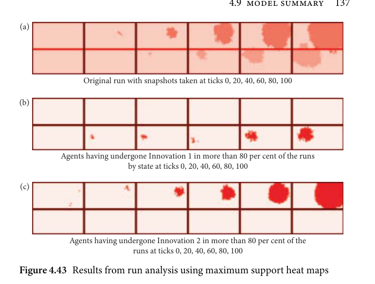
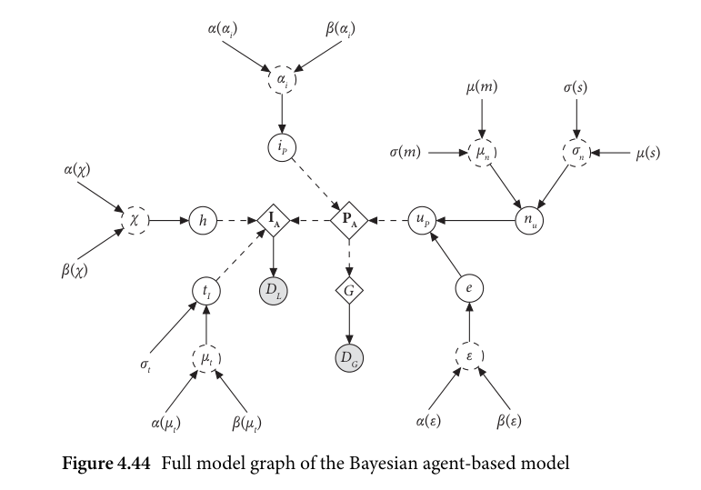

# 4.9 Model summary / 4.10 Prior summary

<!-- source-page: 137; pdf-page: 156 -->
4.9 MODEL SUMMARY  137

  (a)

                    Original run with snapshots taken at ticks 0, 20, 40, 60, 80, 100

  (b)

             Agents having undergone Innovation 1 in more than 80 per cent of the runs
                             by state at ticks 0, 20, 40, 60, 80, 100

  (c)

               Agents having undergone Innovation 2 in more than 80 per cent of the
                                runs at ticks 0, 20, 40, 60, 80, 100
 Figure 4.43 Results from run analysis using maximum support heat maps

  In the last analysis below (Figure 4.43), only those agents light up that have
undergone the respective innovation in more than 80 per cent of the runs
present at every state. This returns only the most confident areas at every tick
state. This method will display a core area around which the innovations are
most likely to be stratified.
  The output in Figure 4.43 shows that the model is able to capture the approx-
imate central areas of the innovations at each stage. We have to bear in mind
that this 80 per cent confidence map only displays the most likely central area
of the runs.

                      4.9 Model summary

As the individual model parts have been explored in the previous sections, the
full model shall be briefly outlined again as a whole in reference to Figure 3.15:
Figure 4.44 shows the full model including prior variables.
  At the core of the ABM are two data types as observed variables: the geospa-
tial data for every datapoint (DG), including the approximate locations of the
linguistic communities in the final simulated year, as well as the information of
the geographical surface, that is, the geographic details of northern and central

<!-- source-page: 138; pdf-page: 157 -->
α(αi)               β(αi)

                                           αi                       μ(m)           σ(s)

                                                  iP             σ(m)         μn             σn         μ(s)
   α(χ)

            χ        h           IA        PA         uP              nu

  β(χ)
                                         tI       DL      G                  e

                             μt               DG                  ε                   σt

                 α(μt)        β(μt)                        α(ε)         β(ε)

  Figure 4.44 Full model graph of the Bayesian agent-based model

Europe. This detail is modelled via an ABM module G which simulates agents
on this geographical surface. These agents and their actions in the simulation
are governed by parameters which are modelled in the ABM module PA, mean-
ing a module that handles the parameters of every agent. Secondly, every agent
in G is linked to its own linguistic data, namely its own vector of innovations.
These linguistic data (DL) are the second observed variable of the model. They
are modelled using the innovation module IA which handles the occurrence
and spread of innovations.
  The simulation of the linguistic data is influenced by three factors: each
agent’sparameters, the innovationtiming, and the homoplasy rate. The actions
on the basis of agent-specific parameters are provided by PA and are pertain-
ing to spreading and innovation. The homoplasy rate (h) is a global parameter
(i.e. constant during one run of the simulation) which is sampled from the
external node χ with constant priors. Futher, each innovation is given an
occurrence time which is global. This occurrence time parameter has a fixed
standard deviation and a mean sampled from the external node μt which has
two constant priors.
  The second major part of the ABM are the parameters of which each
agent has its own set (PA). These are initialized once at the beginning from
the parameter-specific global node iP. The initialization parameters for each

<!-- source-page: 139; pdf-page: 158 -->
4.11 ABM MODEL RESULTS  139

uniform-distributed initialization are drawn from the external nodes αi and αi
which have constant priors.
  Once initialized, the updating process for each parameter during each tick is
governed by the node uP. Here, by how much the parameter changes at a given
tick is determined by a normal distribution nu, the hyperparameters of which
(μn and σn) are themselves external normal distributions. This layering of
hyperparameters gives the model freedom in varying the update distribution
from tick to tick.
  When the update is applied, however, it is mixed with the percentage of local
influence by adjacent agents. This percentage is governed by the global node e
which is drawn from the external distribution ε with constant priors.

                     4.10 Prior summary

The following Table 4.5 shows a complete summary of all priors used in the
model. The uniform priors were used in those cases where the parameter space
is bounded. Recall that the evaluation of this model is not a conventional
likelihood function but a distance metric optimized by a Gaussian process
regressor. Therefore, using priors with one-sided support is not possible and
all priors that have only finite support needed to be uniform. The prior settings
in general are rather flat to ensure the parameter space is traversed thoroughly.
In future applications, it may further be desirable to test differently informa-
tive priors on individual parameters. For now, I used the most agnostic priors
possible given the model optimization setup. Note that in preliminary runs
it was noticed that the innovation parameter is very sensitive to fluctuations.
Therefore, the parameter was initially strongly limited to a small range around
0 which, if necessary, could still be overpowered by the simulation if a higher
value of this parameter is beneficial.

                   4.11 ABM model results

The model was run in 400 optimization instances for 500 simulations each
under the setup described above. Hence, the total number of simulations eval-
uated was 200,000. Of those 200,000 runs, the top 0.2 per cent were selected as
the posterior distribution to be analysed further. Recall that this criterion here
means that the best-fitting 0.2 per cent of runs were accepted as the posterior
runs.
