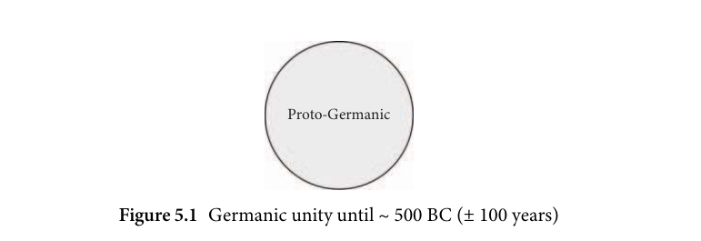
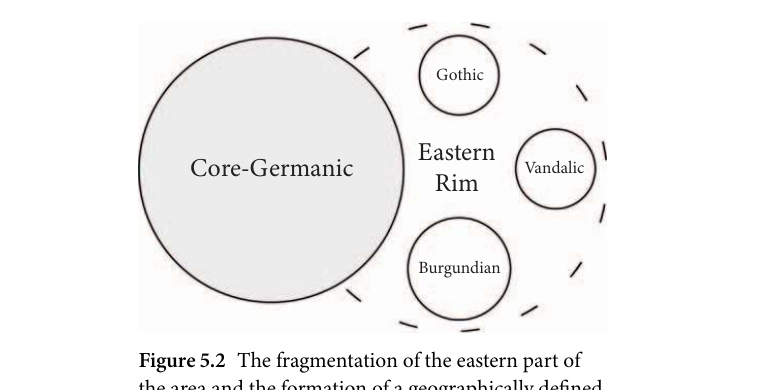
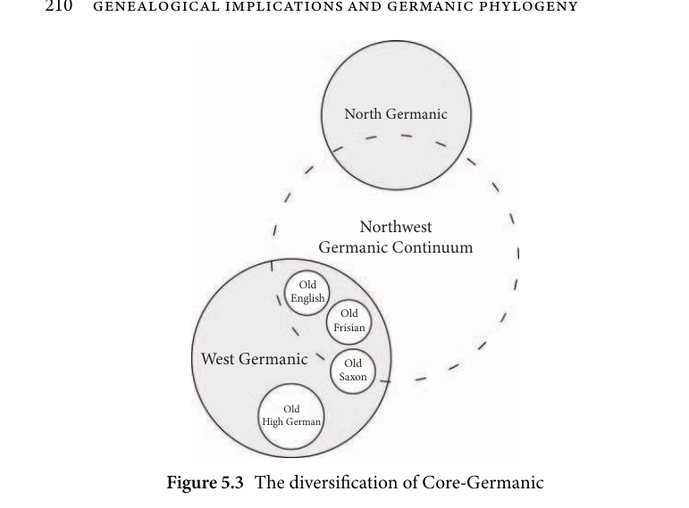
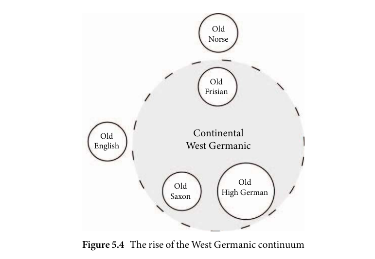

# 5 Genealogical implications and Germanic phylogeny

<!-- source-page: 172; pdf-page: 191 -->
5
 Genealogical implications and Germanic
               phylogeny

        5.1 Prelude: society and identity in pre-Roman
            and migration-age central Europe

Before we can investigate the cladistic history of the Germanic languages,
we need to address the social and political structures of this time. Regularly,
we encounter issues that can only be addressed when bearing in mind these
particular circumstances.
  The fact of the matter  is that we know  little about pre-Roman and
migration-age Germania¹ regarding precise historical events, interactions
between groups, and chronology. We know, however, that the modern con-
ceptions of group identity as political, ethnic, or religious does not apply in
the time in question. The Germanic-speaking population of northern and cen-
tral Europe was organized in small units of political commonalities such as
allegiance to a leading figure (cf. Heather 2009: 6; and Wolfram 1997). These
units were rather small and agriculturally less developed than in neighbouring
regions (Heather 2009: 5) but could organize regionally and even suprare-
gionally in loose confederations or alliances with other groups, break away,
or merge with other communities (cf. Todd 2009: 29–31). The identities of
these groups or allegiances were not formed along linguistic or ethnic lines.
We rather see group coherence that transcends the modern understanding of
identity (cf. Heather 1996: 3–7). As a result, any political group in this time,
be it during the time of the first encounters between the Roman republic and
Germanic groups, or in later centuries during the ‘migration age’, groups that
Roman and Greek sources identify as coherent communities could in fact be

    ¹ The term Germania is in the historical and archaeological field predominantly a term for the
approximate geographical area east of the Rhine and north of the Danube which, in most definitions,
does not include Scandinavia. In the following, this term is used in an unorthodox way to mean the
entire Germanic-speaking area in northern and central Europe for the sake of convenience. How-
ever, note that in other fields, the distinction between Scandinavia, mainland Germania, and eastern
Germania is often much sharper.

<!-- source-page: 173; pdf-page: 192 -->
5.2 ORIGIN AND DISINTEGRATION OF PROTO-GERMANIC  173

multilingual political units whose members were from different origins and
backgrounds (Frey and Salmons 2012: 6).
  This view of the societal structures and group identities has changed con-
siderably. When earlier literature on linguistic matters referenced the identity
between group and language, they relied mostly on the notion of Germanic
‘tribes’ as proto-nations with a congruence of ethnicity, language, religion, and
political allegiance (so, for example Von Der Leyen 1908; Wrede 1886). The
realization that groups identified by Roman sources and linguistic units are
very different is a necessary condition for the further investigation of early
Germanic linguistic relationships. Not only can Roman sources not be taken
at face value, the linguistic situation in this region during classical and late
antiquity is much more intricate than group-language assignments on a map
could show (Steinacher 2020).
  In reality, the region of Germania was a highly opaque and intricate network
of groups and political units with regional differences regarding material and
perhaps societal development.

       5.2 Origin and disintegration of Proto-Germanic

        5.2.1 Brief remarks on the stages of Proto-Germanic

The most common nomenclature to refer to the development of the Germanic
family up until the point of disintegration is usually divided into pre-Proto-
Germanic (or sometimes pre-Germanic) and Proto-Germanic. The former
denotes the time period between the separation of the Germanic clade from
its most recent ancestor it shares with another linguistic family and said Proto-
Germanic. The latter refers to the state of the language shortly before its
breakup which is in part determined by the methods of reconstruction (see
discussion in section 5.2.2). Following this definition, pre-Proto-Germanic
encompasses a long timespan containing all defining developments of pre-
Proto-Germanic history ending in a relatively short but ultimately indeter-
minable Proto-Germanic period where the language had undergone all (or at
least most) common Germanic innovations but not yet broken up into smaller
units. This is the definition of these terms that are used in this study. Among
the most notable of these aforementioned innovations that occurred before
the break-up of Proto-Germanic are, for example, Grimm’s law (Ringe 2017:
113–140), accent shift (Van Coetsem and Bammesberger 1994: 82–93), and
the development of a weak and a strong verb class (Fulk 2018: 254–255).

<!-- source-page: 174; pdf-page: 193 -->
Some researchers, however, have previously attempted to partition the
Proto-Germanic period into discernable and datable stages (Early and Late
Proto-Germanic are the most common divisions, e.g. in Antonsen 1965; and
Voyles 1992).
  In the definition used in this study, I refrain from assuming and dating indi-
vidual stages prior to the Proto-Germanic level. This is not to say that there is
no determinable linguistic relative chronology (see, for example, the detailed
relative chronology of sound-changes that is summarized in Ringe (2017: 176)
in the form of a flow chart). Rather, I assume that these developments have all
taken place in the period of pre-Proto-Germanic leading up to the comple-
tion of these innovations which is how these terms are defined. The decision
to not divide the period further is predominantly based on the inability to
make precise statements about the temporal relationships between the individ-
ual changes. It seems likely that, in the prehistory of Germanic, developments
came in clustered bursts rather than being evenly distributed over the entire
pre-Proto-Germanic period (cf. Koch 2020: 38–39). To make reasonable state-
ments about sub-pre-Proto-Germanic divisions, we lack knowledge about the
temporal chronology of the changes. Alternatively dividing only relatively dat-
able developments into two distinct periods would further be an arbitrary
choice with little value to the particular study at hand.

               5.2.2 The origins of the Germanic clade

Any investigation of Germanic phylogeny and Proto-Germanic inevitably
needs to present, even if briefly, the research into the relationship between
Germanic and other branches of Indo-European. The importance of this dis-
cussion is that in order to understand the break-up of the family into daughter
lineages, we need a firm understanding of the conditions of this family shortly
before the dissolution of its linguistic unity. This requires an outline of where
Proto-Germanic came from historically and cladistically, and what the state of
the language was, at, and shortly before, the break-up (see e.g. section 5.2.3).
Note, however, that since this investigation primarily rests on linguistic evi-
dence from Germanic daughter languages, the methodological possibilities at
this point are limited vis-a-vis higher-order clades and subgroupings beyond
Proto-Germanic. It is therefore not possible to investigate the cladistic prehis-
tory of Proto-Germanic in the scope of the study at hand. Instead, I will focus
on previous investigations to briefly outline pre-Germanic cladistic history
which then leads to insights into the state of the family at the time from where
this study starts.

<!-- source-page: 175; pdf-page: 194 -->
5.2 ORIGIN AND DISINTEGRATION OF PROTO-GERMANIC  175

   First of all, the research question this investigation starts is, as repeatedly
mentioned, the time of the break-up of the Germanic family. This point is
set both by methodological and theoretical considerations. The latest recon-
structible layer of Germanic, Proto-Germanic, is the point on the eve of
Germanic disintegration. That is, without further internal reconstruction and
comparison with other IE sister languages, the comparative method can only
take us back as far as the latest point where Germanic was still a (somewhat)
coherent group. Moreover, the Bayesian phylogenetic and agent-based models
estimate or simulate the break-up point as the start point of the analysis. Thus,
neither computational nor qualitative methods address questions of the origin
of Germanic.
  Unsurprisingly, this definition is an artificial point which does not neces-
sarily map onto the actual proceedings of disintegration of Germanic. Rather,
it marks the point in time where the last common Germanic innovation has
taken place and right before the first Germanic daughter diverges. We have
to be aware of the fact that this split-terminology, especially in the Germanic
context, might not be adequate. The more likely scenario is a gradual diversifi-
cation process under which the Eastern Rim becomes diversified more quickly
than the rest of the core area. This means that a ‘day before the split’ did not
exist, not even allegorically. The start of the disintegration therefore has to
be interpreted as a gradual process spanning a certain amount of time—at
the longest until the individual subgroups had undergone enough divergent
innovation to be detectable as independent.
  As described above, the methods used in this study, both traditional and
computational, set the earliest investigated time point to the time of the
family break-up. However, to be able to analyze the Proto-Germanic ori-
gins of the family, we need to at least briefly discuss the pre-Proto-Germanic
history.
  A plethora of studies and discussions have researched the placement of the
Germanic branch in the wider Indo-European family tree.
  Many contemporary studies and overviews place Germanic in the Central
Indo-European branch in which there are other families placed such as Balto-
Slavic and Indo-Iranian.² In this view, Germanic is more closely related to, for
instance, Balto-Slavic than to Italo-Celtic. Subclades below Central-IE are very
much still a matter of debate. Phylogenetic studies, however, find differing sub-
groupings. Gray and Atkinson (2003) and Chang et al. (2015) find Germanic
more closely related to Italo-Celtic than to Balto-Slavic. Yet, in both mentioned

   ² See Ringe (2017: 5–8) and references for a summary of the current state of research.

<!-- source-page: 176; pdf-page: 195 -->
studies, the branch lengths are small, meaning that the actual clade differences
are clear but not large.
  Earlier computational studies place Italic, Celtic, Balto-Slavic, and Ger-
manic closer together (e.g. Holm 2000) as does Euler (2009). Moreover Ringe,
Warnow, and Taylor (2002) have found specifically the position of Germanic,
modelled using conventional tree structures, to be difficult as the family does
not seem to possess features that let it be easily placed in a tree with deter-
minable splits. The view that the placement of Germanic is difficult to assess
is often acknowledged in overview works of the topic (e.g. Clackson 2007:
13–14). It is clear that the languages of central Europe in pre-Proto-Germanic
times were very much in contact through trade and geographic proximity.³
Moreover, we can assume that the central and northern European IE lan-
guages formed, at least in the beginning, a larger dialectal area with mutual
influence (Fulk 2018: 6).
  The linguistic split of pre-Proto-Germanic from its most recent ancestor is
often placed in southern Scandinavia (Fortson 2010: 338) and perhaps north-
ern Germany (E. König and van der Auwera 1994: 1) at around 2000 BC (cf.
Chang et al. 2015: 199 and Polomé 1992: 55–56), with estimates from archae-
ology suggesting that this date is perhaps the latest possible time of divergence
(cf. Koch 2020: 37–38). At around this time, the Germanic branch started to
develop distinct features that can clearly be identified as uniquely Germanic.

            5.2.3 Proto-Germanic—a dialect continuum?

Since the first reconstructions of the most recent common ancestor of the
Germanic languages, researchers have discussed the question of the internal
coherence of the Proto-Germanic language before its break-up.⁴ Early research
viewed Proto-Germanic as the language of unitary Germanic proto-nations
as described by Roman and Greek sources such as Tacitus (e.g. Streitberg
1896: 15). Since this time, as our understanding of the societal structures
and conditions of early Germanic have improved, the issue has been raised
whether or not to regard Germanic as a dialect continuum. Researchers have

   ³ An extensive analysis of Celto-Germanic contact is provided by Koch (2020).
   ⁴ I am using the term Proto-Germanic language for a dialect continuum here and below which is
strictly speaking an oxymoron in some sense, as protolanguages are by definition linguistic constructs,
however they are rooted in reality. In this view, a protolanguage cannot be a dialect continuum; rather,
a dialect continuum can produce daughter languages which can in turn be used to reconstruct an
approximation to the common properties of this dialect continuum. However, for convenience, I use
Proto-Germanic to denote the reconstructed language which is representative of the dialect continuum
underlying the reconstruction.

<!-- source-page: 177; pdf-page: 196 -->
5.2 ORIGIN AND DISINTEGRATION OF PROTO-GERMANIC  177

noted that reconstructed Proto-Germanic is both lexically and grammati-
cally homogenous (e.g. Euler 2009: 41–43). On the other hand, little to no
detectable variation in the Proto-Germanic language is not so much a feature
of the language itself but rather an artefact of the method and an inherent
property of most protolanguages (cf. Fulk 2018: 11). As linguistic recon-
struction entails the systematic comparison of a particular family’s daughter
languages, it produces a rather artificial language representing the ‘common
ground’ of features in the varieties of the Germanic language that existed at
the time we reconstruct Proto-Germanic. In the same way, we can reconstruct
a single Proto-Romance language while knowing for a fact that the Romance
varieties in late antiquity were more heterogeneous and varied than the recon-
struction suggests (see Alkire and Rosen 2010: 40). This is not to say that
Proto-Germanic did not exist as a linguistic area but that our picture of this are
obtained by the comparative method is more unitary and smooth than it most
likely was. The current standpoint therefore is that early Germanic already
was a dialect continuum when it began to disintegrate (cf. Euler 2009: 41–43;
Seebold 2013: 58–59). It was a geographical space of individual groups speak-
ing Proto-Germanic varieties which were all mutually intelligible (cf. Frey and
Salmons 2012: 21).

         5.2.4 Time estimations of Germanic diversification

The time of the end of the Germanic dialect continuum and the start of
the diversification process is dated ambiguously in previous literature. The
methodologically sound definition of Proto-Germanic is the point in time just
before the first languages split from the common dialect continuum (see also
section 5.2.2). However, as it is likely that the linguistic unity persisted for
some time before disintegrating, there was a possibly several hundred year-
long period around the time of the diversification where Germanic had slowly
started to disintegrate. We therefore have to bear in mind that this transitional
phase from relative unity as a language (or a group of closely related varieties)
can span decades or centuries.
  Previous researchers have suggested a break-up period of around 500 BC
(for a more extensive list of references and suggested dates see 3.2.1). Other
researchers such as Mallory (1989: 87) cite 500 BC as the most likely point in
time when Proto-Germanic has completed all major innovations, thus shifting
the time to a later date.
  Phylogenetic and computational evidence by Chang et al. (2015: 226) dates
the break-up of Germanic at ~ 2,000 years before present. As established

<!-- source-page: 178; pdf-page: 197 -->
in section 5.3.4, the break-up of Germanic unity was completed with the
fragmentation of the Eastern Rim languages.
  The most probable Bayesian phylogenetic tree discussed in section 3.2.5
shows for the origin parameters a highest density 89 per cent credible interval
between 2.12 and 2.69, which translates to a time span between 690 and 120
BC. The mean sampled origin is 2.42 or 420 BC. This suggests a most likely
disintegration of Proto-Germanic around, but mostly shortly after, 500 BC.
Among the chief reasons for such large credible intervals is the uncertainty
connected with the attestation dates of the individual taxa.
  The ABM evidence lies on the earlier side of the time estimates with a mean
age of 2.53 (590 BC). Yet the credible intervals suggest a large range of val-
ues between 250 BC and 800 BC that mostly overlap with the phylogenetic
evidence but shifted to a later date by about 100 years.
  In conclusion, we can summarize that both computational methods esti-
mate the diversification date in a time interval around 500 BC with mean
values enclosing the time interval between 420 BC and 530 BC, which is in
line with traditional assumptions.

                5.3 The Eastern Rim languages

The languages of eastern Germania, including Gothic, Burgundian, Vandalic,
and more, are commonly referred to as the ‘East Germanic’ languages. This
term, however, comes with difficulties with regard to definition. Still to this
day, this term is often used to refer to these languages as a coherent subgroup
descended from an East Germanic protolanguage. At least in this reading, the
term is highly problematic, as I will argue in the following section. Drawing
on previous literature and the computational models applied in this study, I
will aim to draw a coherent picture of the emergence and the development of
the languages in eastern Germania.

     5.3.1 The provenance of Gothic—a linguistic perspective

To shed light on the origins of the languages in the east of the Germanic-
speaking area, we have to start assessing the area in which the linguistic
emergence occurred, (i.e. the linguistic Urheimat). The discussions surround-
ing the provenance of Gothic are paralleled for other alleged East Germanic
languages such as Vandalic and Burgundian. For this reason, I will use Gothic
as an example to outline the issue, but the notions that hold for Gothic are

<!-- source-page: 179; pdf-page: 198 -->
5.3 THE EASTERN RIM LANGUAGES  179

likewise comparable for Vandalic and Burgundian as well. We have to keep in
mind that historical and archaological ethnogenesis and Urheimat are closely
linked, albeit not identical. That is, as political and societal groupings do not
necessarily map onto one another, evidence from historical and archaeological
sources need to be treated differently and, for linguistic purposes, may serve
solely as additional external evidence. In other words, the question of the lin-
guistic Urheimat of Gothic takes precedence over Gothic ethnogenesis in this
study.

ScandinaviaandtheGotho-nordichypothesis
Early literature on the Gothic language relied mostly on Roman sources for
the accounts of the Gothic Urheimat. Especially Jordanes was taken as the
predominant source on this issue. Jordanes’ most important work regarding
the Goths is the sixth-century Getica which presents itself as a historiographic
account of the prehistory of the Goths. In this work, he claims the Goths
originated in Scandinavia (‘Scandza’) and migrated to the Vistula area in
modern-day Poland before migrating again to the area surrounding the Black
Sea in later centuries.⁵
  The Roman historiographical sources are mirrored and argumentatively
intertwined with the Gotho-Nordic hypothesis up to a point where some
researchers have criticized the confusion of historiographic and linguistic
arguments in earlier research (e.g. Nielsen 1995). After the then-common
consensus of the tripartite division of the Germanic languages was estab-
lished, researchers were investigating further subgrouping of two of the three
assumed clades North Germanic, West Germanic, and East Germanic. Until
the debate was settled starting with Kuhn (1955) in favour of a Northwest
Germanic group, some scholars adhered to the notion of a Gotho-Nordic sub-
group (cf. Schwarz 1951: 184–187). This debate was by no means unaffected by
the early stance of many historians who took Jordanes’ account at face value.
Although researchers favouring Gotho-Nordic present linguistic evidence, a
vital part in many of these discussions, especially in the early debate, is reliant
on the axiomatic assumption that there is a close genealogical link between the
Germanic-speaking populations of Scandinavia and the Vistula region (see e.g.
Maurer 1952; and Hutterer 1975: 133).
  One of the issues with Gotho-Nordic as a subgroup is that the proposed
evidence in many cases involves retentions rather than shared innovations.

   ⁵ Heather (1996: 11–30) discusses the topic from the perspective of the historic sciences.

<!-- source-page: 180; pdf-page: 199 -->
Moreover, many of the proposed changes are themselves questionable.⁶ For
example, the similarity in the second person singular preterite ending in strong
verbs, as proposed in Lehmann (1966: 17) and masculine a-stem noun nom-
inative singular endings, are both shared retentions (examples drawn from
Antonsen 1965: 18–20; and Fulk 2018: 14).
  The mainly cited noteworthy common feature of Gothic and North Ger-
manic is the reflex of Holtzmann’s law (Verschärfung) in both languages: the
PGmc glide sequences *-ww- and *-jj- have stop outcomes in Gothic and Old
Norse. Previous research, however, has cast doubt on the earlier assumption
that the Verschärfung had arisen through a common innovation (for dis-
cussion see Fulk 2018: 17–20). Whether it might be a parallel innovation is
unclear and the research is deemed inconclusive so far (cf. Ringe and Taylor
2014: 65).
   It is worth noting that the stop outcome of Holtzmann’s law is not shared by
Vandalic which makes this phenomenon exclusive to Gothic and Old Norse
(cf. Hartmann 2020).⁷ In the phylogenetic models applied in previous sections,
the Gotho-Nordic split shows a vanishingly small clade credibility which is
a computational result of a low probability that the linguistic innovations in
favour of this split suffice to establish a subgroup.
  Moreover, in the agent-based models, Old Norse and Gothic remain sepa-
rate from the early beginnings of the simulations. It is true, however, that Old
Norse and Gothic according to some measures are modelled as closer to one
another in absolute terms than to the West Germanic languages; this, though,
only indicates that there is some overlap in shared retentions. In the develop-
mental trajectory, Old Norse sides with the West Germanic languages in all
cases.
   It becomes clear that the evidence in favour of a Gotho-Nordic grouping
is meagre and no clearly demonstrable common innovations can be identi-
fied. Moreover, judging from the greater cohesion of Northwest Germanic due
to the greater number of innovations clearly attributable to a Northwest Ger-
manic stage (see section 5.4), a Gotho-Nordic subgroup most likely did not
exist.

Indigenous Gothichypotheses
Other views, to which I collectively refer here as ‘indigenous Gothic’ theories,
assume that the Gothic language originated in central Europe in the eastern

   ⁶ For an overview of the proposed Gotho-Nordic changes see Antonsen (1965: 18–20).
   ⁷ It is difficult to assess this situation for Burgundian as no reflexes of this change survive in the data
(Hartmann and Riegger 2022).

<!-- source-page: 181; pdf-page: 200 -->
5.3 THE EASTERN RIM LANGUAGES  181

parts of Germania. The key aspect that these views have in common is that they
do not presuppose an early migration from Scandinavia. In most cases where
an indigenous Gothic hypothesis is voiced, it is often the result of a refutation of
Gotho-Nordic. Archaeological evidence does not show patterns in the archae-
ological record that require a need for the population to have descended from
Scandinavian emigrants (cf. Heather 1996: 11–30). Thus, a large part of the
indigenous Gothic notion assumes Gothic to have arisen where the Goths are
located by current historians and archaeology—in the Vistula region.
  There is, however, dissent among the proponents of this notion. Manczak
(1987), for example, argues for an Urheimat of Gothic in the very south of
Germania, to the southeast of what would later become the West Germanic
linguistic area. Accordingly, he suggests redefining West Germanic as ‘Mit-
telgermanisch’ (‘central Germanic’) and Gothic as ‘Südgermanisch’ (‘South
Germanic’) (Manczak 1982: 137).
   Similarly, Kortlandt (2001) agrees with this theory, arguing, along the same
lines as Manczak’s proposals, that Gothic was linguistically closer to languages
of southern West Germanic (chiefly Old High German) than to any other
Germanic variety.
  This view has roots in earlier research (e.g. Wrede 1924) proposing a closer
relationship of Gothic to Old High German. A considerable proportion of the
arguments in favour of this theory stem from the identification of purported
Gothic loanwords in Old High German. Yet critical reviews of later researchers
have identified flaws in the identification of loanwords (e.g. Kufner 1972).
  More generally, we can assert that the linguistic evidence for a Gothic home-
land located on the southern border of Germania is problematic when resting
predominantly on loanwords. Since there are to date no clearly demonstrable
contact phenomena between Gothic and either northern West Germanic or
southern West Germanic, abandoning the Vistula region origin as a hypothesis
of Gothic Urheimat is not well-founded.

Evaluatingtheevidence
Pertaining to the Gothic Urheimat, an out-of-Scandinavia theory could only
possibly arise in one of two scenarios:
  (1) The migration from Scandinavia occurred in early times during the time
of the Proto-Germanic dialect continuum. As a result, we cannot expect to
find linguistic evidence linking North Germanic and Gothic, at least not to
the exclusion of West Germanic languages.
  (2) The migration from Scandinavia occurred in post-PGmc times where
the Gothic language was either completely descended from or strongly influ-
enced by Scandinavian varieties.

<!-- source-page: 182; pdf-page: 201 -->
From a linguistic perspective, scenario (1) is irrelevant for two reasons: the
hypothesis lies beyond the reach of linguistics as it would entail that a lin-
guistically (un-reconstructably) similar group had migrated to the southern
shores of the Baltic sea. Secondly, by the definition of the linguistic Urheimat,
the important factor here is whether or not Gothic must have necessarily
developed in Scandinavia or the Vistula area. Moreover, the computational
results of this approach do not indicate a large Scandinavian influence to the
mainland.⁸ If anything, the linguistic influence is on a below-average level sug-
gesting that a large Scandinavian to mainland influence is unlikely to account
for the data we see.
  The possible argument that Gothic emerged as a language in Scandinavia
but at a date early enough for modern-day research to be unable to uncover the
earliest shared innovations between Gothic and North Germanic is problem-
atic since the most defining Gothic innovations even predate uniquely North
Germanic features. In other words, if indeed a historical tie between Scan-
dinavia and the speech community of the language that would later develop
into Gothic existed, we would find Gothic innovations in Northwest Ger-
manic or at least chronologically predating any independent North Germanic
innovations.
  And with the evidence from Vandalic and Burgundian which inhabited the
same region, it becomes unlikely that Gothic emerged as an independent vari-
ety in Scandinavia, then relocated to the Vistula region to undergo areal and
contact changes with Vandalic and Burgundian all in a matter of a short times-
pan relative to the number of features that have evolved in Gothic in the earlier
periods.
  The main issue with the Scandinavian provenance of the Goths is that by
the time the Goths become a political actor in contact with the Roman empire
in Dacia and the Black sea coast, historical continuity is not necessarily given.
In other words, the group called the Goths in the third and fourth century
cannot be deemed identical with an emigrating group that may have left Scan-
dinavia several hundred years earlier. To modern-day researchers, a group
only claiming Scandinavian ancestry but having formed as a political actor
in the Vistula region or even later at the Roman border in the Balkans and the
Black Sea would be indistinguishable from a group that indeed collectively
remembers Scandinavian origins.⁹ The fact that the origin myth was formed
after the Goths had become an important political factor is reminiscent of a

   ⁸ For the corresponding results, see section 4.11.2 and the discussion of Figure 4.62.
   ⁹ On the mutual independence of factual and fictional notions of Urheimat in the context of
Germanic origin myths see e.g. Plassmann (2009: 13–27).

<!-- source-page: 183; pdf-page: 202 -->
5.3 THE EASTERN RIM LANGUAGES  183

post hoc self-attribution of a glorious mythical past. Given the societal and
political structures in late Iron-age Scandinavia and Central Europe (as dis-
cussed in section 5.1), it is more likely that the Goths in the third and fourth
century were of diverse linguistic origin consisting of a number of closely
related varieties that had formed a political group but originated from various
groups previously seated in the Vistula region.
   It is, moreover, not uncommon for groups in European antiquity to trace
their ancestry back to a mythological past—especially those that come to con-
siderable political and military power. One prominent example of this is the
Roman Republic and Empire which, according to their founding mythol-
ogy, were descended from Aeneas who was originally from Troy. Founding
mythologies are commonplace rather than the exception and fulfil predomi-
nantly mythological needs of explaining. This means that a heroic origin story
is more desirable for a political group or a Roman historiographer than a true
account of the likely origins and is often constructed (cf. Hachmann 1970:
451). Moreover, the purported ancestry lies hundreds of years back—likely
beyond the reach of orally passed on stories. In the Germanic context, these
myths have a special importance as many Germanic-speaking groups in the
late Antiquity had their own origin myths. These origin myths even constitute
a type of literature in that time period named origo gentis. The stories included
in the origines gentium predominantly feature narrative motifs of migration,
exploration, and colonization of a new territory (Wolfram 1990). The most
important examples is the arrival of the Saxons in Britain under the leaders
Hengist and Horsa (cf. Plassmann 2009: 65–66).
  In conclusion, there is little linguistic evidence for the hypothesis of the
Gothic language, or any Eastern Rim language for that matter, originating
in Scandinavia. Moreover, we can conclude, in accordance with the histori-
cal sciences (cf. Heather 1996), that the most likely linguistic Urheimat of the
Gothic language lies in the area south of the Baltic sea in the eastern part of
Germania. At the very least we can assert that the linguistic origins of Gothic
are perfectly compatible with an indigenous emergence of the language in
modern-day Poland.

        5.3.2 Widening the view: Vandalic and Burgundian

Besides Gothic, we know of several scarcely attested Germanic languages
(sometimes called Trümmersprachen ‘fragmentary languages’), almost exclu-
sively associated with eastern Germania. One exception is Lombardic which is

<!-- source-page: 184; pdf-page: 203 -->
deemed a West Germanic language in the current consensus view (cf. Nedoma
2017: 883). These scarcely attested languages share a common record tradition
insofar as the circumstances under which the linguistic record was formed are
similar.
  They are all attested in the second quarter of the first millennium AD
when the speech communities first come into contact with the Roman empire.
Around the third century, the records grow of scattered linguistic material
in Roman historiography and ethnogeography. The vast majority of these
records contain names of political figures associated with the political units
of the regions in the eastern Germania. It needs to be noted that Germanic
onomastics is an important source for linguistic enquiry in cases where the
source material is scarce. This is facilitated by the fact that early Germanic
names usually consist of one or more name elements derived from common
words. Thus we find names such as the name of the ruler Theodoric which is
a Latinized version of a name derived from the Gothic name elements þiuda
‘people’ and reiks ‘ruler’.
  The contact of these groups intensifies during the fifth century when some
of these speech communities relocated to parts of the Roman empire. The
Vandals, for example, cross the Rhine in the early fifth century and move
southwards through Gaul and the Hispanic peninsula to establish a perma-
nent political presence in northern Africa in the mid-fifth century. Similarly,
the Burgundians arrive at the western slopes of the Alps during the early and
mid fifth century and form a kingdom. Both the rule of the Vandal and the Bur-
gundian kingdoms were short-lived and their power and influence diminished
by being absorbed by larger political units in respective regions—the Frank-
ish kingdom in France and the Byzantine empire in northern Africa during
the sixth century. Despite the brief duration of the Vandalic and Burgundian
political presence in these areas, we see the attestations grow notably as the
increased contact with the Roman empire caused native Germanic names to
be written in legal documents, on coins, on buildings, and on gravestones. Fur-
ther, we find native writing, albeit rare, in Roman records such as Burgundian
legal terms (e.g. the word morginegiba in Latin legal texts; Bleiker 1963: 39) or
the Vandalic Vandal epigram and Kyrie eleison (both discussed in Hartmann
2020: 85–87). After the demise of the Vandal and Burgundian kingdoms, the
attestations continuously fade before vanishing from Latin and early Romance
sources by the end of the seventh century.
  Their attestation history is in many ways similar to the history of the Gothic
language. Gothic, too, was a language prevalent in a Germanic political group
in intense contact with the Roman empire. Unlike the Goths, they never had

<!-- source-page: 185; pdf-page: 204 -->
5.3 THE EASTERN RIM LANGUAGES  185

a literary tradition dominant enough to produce the texts Gothic is attested
in. However, just like the speakers of Gothic, they were absorbed into the
dominant linguistic community, Latin or early Romance in this case.
  These groups, the Goths included, cannot be seen as uniform ethnic enti-
ties. Rather, they were loose coalitions of people from various linguistic and
ethnic backgrounds. What united them in the eyes of the Roman historiog-
raphers was their joint political actions (see discussion in Hartmann 2020:
10–13). As a result of this situation, the languages we deem Vandalic, Burgun-
dian, and even Gothic are select attestations of heterogeneous groups which we
can describe in much less breadth than their later Germanic sister languages
of large corpora containing textual records across a wide time and date range.

Vandalic
The Vandalic language is one of these scarcely attested languages. It is mostly
recorded in names and a few common words in northern Africa during the
fifth and sixth century. Vandalic shares many archaic features with Gothic and
was therefore often regarded as closely related to Gothic and sometimes even
identical with Gothic (e.g. Reichert 2009). However, in recent studies, this
view has been challenged, outlining the salient differences between the two
languages (Francovich Onesti 2002; Hartmann 2020). Most notably, divergent
developments between Gothic and Vandalic point to a more distant relation-
ship. For example, we find that Vandalic lacks the Gothic generalized raising of
PGmc */e/ to Goth /i/ and shows a different outcome for the reflexes of Holtz-
mann’s law (Hartmann 2020: 114–115). The minor changes attributable to a
common development—such as monophthongization in stressed syllables—
are either easily repeatable changes or likely to arise through areal or contact
changes. Moreover, the evidence for the different developments suggests an
early divergence between the two languages (Hartmann 2020: 115–121). The
main issue with evaluating the Gotho-Vandalic relationship is the relatively
archaic form of these languages which is likely, but possibly not solely, a result
of their early attestation date. As a consequence, it is difficult to find com-
mon developments that are not either repeatable changes or shared retentions.
Therefore, it cannot be determined that Vandalic is related to Gothic via a
common protolanguage.

Burgundian
The relationship between Vandalic and Gothic is mirrored in the relation
between the latter and Burgundian. Although we find fewer clearly divergent
innovations, the picture is not as clear-cut as a common development would

<!-- source-page: 186; pdf-page: 205 -->
demand. Although Burgundian shows the Gothic generalized raising of PGmc
*/e/ > Goth /i/, it retains PGmc *-Vnh- sequences (cf. Francovich Onesti
2008: 278), diphthongs, and inflectional suffixes (cf. Hartmann and Riegger
2022) in contrast to Gothic. Although considered as ‘East Germanic’ by previ-
ous research (e.g. Haubrichs and Pfister 2008; Tischler and Moosbrugger-Leu
1982), the textual evidence does not warrant an indisputable proposal of a
Gotho-Burgundian subgroup.

Otherlanguages
Several other languages with small corpora are commonly associated with the
eastern Germania: Gepidic, Bastarnic, Rugian, and Crimean Gothic (cf. Fulk
2018: 19).
  Gepidic, Bastarnic, and Rugian are so scarcely attested that the corpora
are even smaller than those of Vandalic and Burgundian (cf. Schwartz 1968:
123). Bastarnic, for instance, is only attested in a few names and Romance
loanwords, according to some researchers (cf. Schulte 2011). Crimean Gothic
on the other hand is attested with a reasonably well attested corpus com-
pared with other small Germanic languages. Crimean Gothic is a language
that was prominently first recorded by Ogier de Busbecq, a Flemish-speaking
ambassador in Constantinople in the latter half of the sixteenth century.
He recorded a Germanic idiom from an acquaintance from the Crimean
peninsula.¹⁰
  Despite some counterarguments, most prominently voiced by Grønvik
(1983), the current state of research has adopted the view that Crimean Gothic
is actually descended from, or closely related to, biblical Gothic (see e.g.
Nielsen 2017; Nedoma 2017: 880: Miller 2019: 4–6; Stearns 1989).

           5.3.3 A dialect continuum on the Eastern Rim

The subgrouping of the languages discussed in this section has always been
a matter of debate. In the following, I attempt an evaluation of the evidence
obtained from previous research and the phylogenetic and agent-based mod-
els used in this study to approximate an answer to the question of the coherence
of these languages and ultimately a common ‘East Germanic’ subgroup.
  In all Bayesian inference models, East Germanic was supported with low
clade credibility, meaning that the evidence obtained from this phylogenetic

   ¹⁰ For a detailed discussion see Nielsen (2017).

<!-- source-page: 187; pdf-page: 206 -->
5.3 THE EASTERN RIM LANGUAGES  187

model suggests that there is no coherent picture from a phylogenetic viewpoint
regarding further subgroupings among the languages Gothic, Burgundian,
and Vandalic.
  The ABM approach differentiates this view even more: we see that the
Eastern Rim behaves similarly in comparison with the rest of the Germanic-
speaking area, yet the languages themselves that make up this area are much
more distinct. This diversification, moreover, occurs very early on in the sim-
ulations, suggesting that these languages diverged early and more rapidly from
one another, thus being a region that falls apart into different varieties while
still remaining a high-contact area. The spreading of innovations there was
high very early, suggesting that the earliest post-Proto-Germanic innovations
occurred in this region. The high alignment values of this region further sug-
gest that we find these innovations to be unstable and regionally fractured (i.e.
having no continuous uniform spread).
  Moreover, as outlined in section 5.3.2, Vandalic, Burgundian, and Gothic do
not share discernible common innovations that may point towards a common
development of these languages. For this reason, we can assert with relative
certainty that an East Germanic protolanguage never existed. Moreover, the
notion of East Germanic is flawed as it is used in many cases.
  At the same time, there is little evidence to suggest that any of the three
languages is more closely related to Northwest Germanic. Both Vandalic and
Burgundian share no clearly identifiable common innovations with North-
west Germanic beyond features that can be deemed repeatable, coincidental,
or chronologically inconsistent (see Hartmann 2020: 121–125; Hartmann and
Riegger 2022: 62–67). In the computational models, none of the three lan-
guages are inferred to be more closely related to Northwest Germanic (see
sections 3.2.5 and 4.11.2).
  In a purely cladistical sense, ‘East Germanic’ implies a subgroup akin to
Northwest Germanic or West Germanic with the same properties. As we have
seen above, there is little evidence to support genuine East Germanic inno-
vations. However, in previous research, scholars differ strongly in their usage
of the term ‘East Germanic’ and the subsequent assumptions that are stated
explicitly or implicitly.¹¹

    ¹¹ It has to be noted that the implicit claims in previous literature are difficult to evaluate as, when
not stated directly, the actual scholarly claims can only be inferred from how the term ‘East Germanic’
is discussed in the surrounding context. Therefore, in the following discussion, the presentation of the
interpretations of this term is mostly based on how the individual scholars treat the concept in their
discussions.

<!-- source-page: 188; pdf-page: 207 -->
EastGermanicasaprotolanguage
The strongest claim about East Germanic as a protolanguage is found predom-
inantly in earlier literature (e.g. Prokosch 1939; Streitberg 1896: 17; Krause
1953: 42–44; Krahe 1948: 21–23; Wrede 1886). Yet also more recent studies
invoke the notion of an East Germanic protolanguage in linguistic analysis
(e.g. Reichert 2009; Francovich Onesti 2002; Haubrichs 2014). The founda-
tion of this claim is that the earliest split that occurred in Germanic was
between Northwest Germanic and East Germanic with both lineages exhibit-
ing common features due to common development. However, as discussed
above, the vast majority of those common features can be considered shared
retentions (cf. Hartmann 2020; Hartmann and Riegger 2022) which do not
suggest a common development as a subgroup. Nevertheless, adherents of this
notion view East Germanic as a proper subgroup with discernible linguistic
features.

EastGermanicasadustbin-category
One of the more common modern perspectives is the—almost exclusively
implicitly stated—notion of East Germanic as a group containing languages
which do not belong in the Northwest Germanic clade. Research subscrib-
ing to this notion often acknowledges the existence of ‘East Germanic’ as a
valid grouping entity but characterizes Gothic or other minor languages on the
Eastern Rim of Germania predominantly in contrast to Northwest Germanic
(e.g. Fulk 2018: 12–13; Miller 2019: 6–7). This is not to say that this research
assumes East Germanic to be a protolanguage but rather that the treatment of
alleged East Germanic features is done by contrasting those with Northwest
Germanic innovations.

EastGermanicasGothic
The third scholarly stance is the most agnostic towards the existence of East
Germanic of the three positions. This research foregoes the question of the
existence of an East Germanic protolanguage by focusing predominantly on
Gothic (e.g. Ringe 2017: 241; Voyles 1992: 88; Fortson 2010: 350–353). Here,
East Germanic is not so much used as a term itself but as a stand-in for Gothic.
  The root of the discussions surrounding East Germanic most likely lie in the
fact that still to this day, Gothic remains the ‘East Germanic’ language most
rigorously and frequently scrutinized regarding its phylogeny and position
in the Germanic family with modern methods. As it undoubtedly is distinct
from Northwest Germanic, it was rightly placed outside of the North and West

<!-- source-page: 189; pdf-page: 208 -->
5.3 THE EASTERN RIM LANGUAGES  189

Germanic lineages. With the inclusion of Vandalic and Burgundian evidence,
however, the coherence of an East Germanic group is called into question.
  Instead, it is appropriate to abandon the notion of East Germanic as a
subgroup and posit the adoption of a different grouping paradigm for these
languages. The term I used before for these varieties is Eastern Rim lan-
guages which is a naming proposal opting for removing the protolanguage
concept the term ‘East Germanic’ often presupposes. In this view, the East-
ern Rim languages were a number of Germanic varieties that simultaneously
and independently diverged from common Proto-Germanic in a gradual way,
detached from Northwest Germanic. Speakers of these languages lived on the
eastern edge of the Germanic-speaking areas in central Europe. Their close
proximity and relative linguistic isolation from Northwest Germanic yielded
high-contact situations and areal changes which are reflected in the languages
at the time of their attestations.
  The term Eastern Rim languages therefore illustrates the notion that these
languages can only be grouped together when contrasting them with North-
west Germanic and via a geographical rather than a linguistic term. Also,
this grouping term is not the name of a tree node in a linguistic phylum
but joins languages according to horizontal criteria (as e.g. the term ‘Balkan
sprachbund’ does). The term itself is thus rather defined geographically than
linguistically. What further unites the languages in this area is that they are the
first languages that become detached from Northwest Germanic innovations
and develop separately. They do so however not jointly as a group, but rather
they develop in different directions.

             5.3.4 The development of the Eastern Rim

The roots of the Eastern Rim languages doubtlessly  lie in the linguistic
situation of late Proto-Germanic. As established in section 5.2.3, the Proto-
Germanic area was a patchwork of different dialectal variants of the language
and speakers of the eastern part of the linguistic area became gradually dis-
similar from the rest of the Germanic region. They did not become jointly
detached from the rest of core Proto-Germanic as a subgroup but were geo-
graphically at the far end of the dialectal area where innovations and edge
effects take place. Potential candidates for these changes are repeatable and
chronologically late innovations common in at least two of the languages
Gothic, Vandalic, and Burgundian. This includes monophthongizations and
word-final devoicing (cf. Hartmann 2020: 112–113) or raising of earlier *e (cf.

<!-- source-page: 190; pdf-page: 209 -->
Hartmann and Riegger 2022). We cannot say for certain whether the Eastern
Rim languages underwent innovations that distanced them from the rest of
the area or whether Northwest Germanic underwent innovations that left out
the Eastern Rim. Both notions are problematic as they require fundamental
changes to have made these languages strongly differ from one another and
blocking horizontal transmission in the form of a dialect continuum. On the
contrary, it is more plausible that while the Northwest Germanic languages
were more strongly connected, the languages on the Eastern Rim had, due to
their geographical locations less exposure to Northwest Germanic while still
forming a dialect continuum with the west. However, we cannot demonstra-
bly show that there have been observable contact changes between Northwest
Germanic and the Eastern Rim languages (see for discussion Hartmann 2020:
121–123). This is because we either cannot clearly attribute changes to contact
situations or because the contact in the western border region of the post-
PGmc Eastern Rim dialect continuum was too short-lived to spark any lasting,
detectable contact-induced changes. In other words, it was, in the early stages,
likely a slow divergence process between Northwest Germanic and the Eastern
Rim languages that, probably geographically conditioned, became more and
more different without fully breaking the connections. This is also what the
computational model results suggest (section 4.11.2). Therefore it is a superflu-
ous question to ask which linguistic area underwent innovations that detached
it from the rest of the linguistic area. It is rather a simultaneous dissimilation
process with one of the main variables being geographical distance and edge
effects.
  Moreover, the Eastern Rim being a dialect continuum meant that the differ-
ent varieties developed independently, undergoing innovations of their own
and retaining features that spread fully in Northwest Germanic. The reason
for this detachment from the western areas is likely extralinguistic as some
sociocultural factors may have contributed to the different developments of the
northwest and the east. Archaeologically, for instance, we find that the eastern
regions of Germania are notably different regarding agriculture and material
culture (cf. Heather 2009: 8).
   It has sometimes been discussed whether there was in fact an asynchronous
development regarding linguistic innovations in the east and the northwest.
Grønvik (1998: 148), for example, suggests that the earliest disruption of Ger-
manic linguistic unity occurred when a more innovative Northwest Germanic
branch became detached from a more conservative East Germanic branch.
The question of synchronicity of development is likely not applicable to this
scenario. The divergence of Eastern Rim languages from one another and

<!-- source-page: 191; pdf-page: 210 -->
5.3 THE EASTERN RIM LANGUAGES  191

Northwest Germanic is to be placed in the same period. Therefore it is unlikely
that the eastern languages remained conservative (or even unchanged) for a
considerable time while Northwest Germanic underwent several innovations.
Moreover, if a rapidly changing Northwest Germanic would have left behind
a conservative East Germanic area, we would not observe a fragmentation
of these languages from the very beginning. It is undoubtedly the case that
while this dissociation in the east was ongoing, the remaining area continued
to undergo innovations, but the early divide of the Eastern Rim languages was
unlikely to have been a necessary after-effect of Northwest Germanic innova-
tions. More likely, these processes were synchronous and the fragmentation in
the east not caused by a faster developing Northwest Germanic.
  The roots of the fragmentation of the Eastern Rim and the common inno-
vation of Northwest Germanic lie in the same phenomenon. While in earlier
periods, when the Proto-Germanic dialect continuum was intact, changes
could spread easily among the Proto-Germanic variants, after the Eastern
Rim languages had become increasingly detached, the subsequent innovations
only spread in the north and the west. In that view, we cannot speak of one
‘innovative’ and one ‘conservative’ variant. The disruption of the Germanic
continuum and the independent development of the individual Eastern Rim
languages and Northwest Germanic occurred synchronously. It is more the
case that Northwest Germanic continued the Germanic dialect continuum
whereas we find fragmentation in the east.
  While Burgundian was probably closer to Gothic for a longer period of
time (perhaps due to geographical proximity)—in these early stages, Vandalic,
for instance, was likely not more different from Gothic than from Northwest
Germanic when considering that a similar number of innovations sets apart
Vandalic from both Gothic and Northwest Germanic (see Hartmann 2020:
99–106). Only over time did the different trajectories of change become accel-
erated. This was aided by the upcoming movement of populations and smaller
groups into eastern Europe which cemented the Gothic, Vandalic, and Bur-
gundian split beginning in the second century AD (cf. Todd 2009: 149). There,
in fact, we can assume a splitting event which drew apart a dialect continuum
of languages that up until that point had already been diversifying for some
time. The view that the (south-)eastward migrations were responsible for the
cementing of the divide between Gothic and other languages is shared by, for
example, Nedoma (2017: 879), but others such as Penzl (1985: 161) view the
departure as the most important step in the diversification of the Eastern Rim.
According to this, the Eastern Rim continuum cannot have lasted longer than
the second century AD.

<!-- source-page: 192; pdf-page: 211 -->
The runic inscriptions that are sometimes taken to be ‘East Germanic’, for
example the Kowel spearhead and the ring of Pietrossa, would then be defini-
tively Gothic (for detailed discussion of the current state of research on runic
inscriptions suggested to be Gothic see e.g. Fulk 2018: 22–24; and Miller 2019:
6–7). The ring of Pietrossa is a metal ring with a fourth-century inscription
found in modern-day Romania and the spearhead inscription found in Kowel,
Ukraine dates to the third century (Miller 2019: 6–7). Their time of attestation
points towards a language stage that followed the stages of Gothic when it was
part of the Eastern Rim dialect continuum.
 We cannot determine with certainty which innovations took place before
and after this split of the Eastern Rim languages from this dialect contin-
uum but there are enough identifiable areal changes that might have occurred
during the time of the dialect continuum. Therefore we can assume that by
the time Gothic, Vandalic, and Burgundian are attested between the fourth
and fifth centuries, the languages had experienced centuries of independent
development.
  What needs to be stressed at this point is that this analysis does not assume
the groups of the Vandals, Goths, and Burgundians to have existed as coherent
groups on the Eastern Rim at the time of the fragmentation. Rather, these three
languages, speakers of whose ancestors we know originated in the Eastern Rim
area, are momentary snapshots taken at a later time that indicate a great lin-
guistic diversity in the Eastern Rim. Moreover, the properties we would expect
to see had there been a common protolanguage are missing. Insofar they can be
seen as linguistic samples from an area that exhibits linguistic common traits
only as a result of mutual contact and the relatively isochronous diversification
away from a larger ancestral entity.

                      5.4 Core-Germanic

  5.4.1 The beginning: Core-Germanic vs. Northwest Germanic

Core-Germanic came into existence by the fragmentation of the Germanic
east which had been brought forth by a disconnect between the two areas (see
section 5.3.4). The East–Northwest dichotomy is therefore a product of the lin-
guistic method of the tree model that creates a language node after a furcation
event. We do see this furcation event in the east, yet this leaves the remaining
Germanic area in a position where one geographic region becomes detached
from the other and results in the area being cleft into two geographically

<!-- source-page: 193; pdf-page: 212 -->
5.4 CORE-GERMANIC  193

defined regions. The larger part of both regions continues Germanic unity
more or less unchanged for a short amount of time whereas in the east we
cannot determine the existence of a protolanguage at all.¹²
  This view was not shared especially by the earlier literature until the idea
of Northwest Germanic as a subgroup was prominently supported by sev-
eral researchers in the 1950s (Grønvik 1998: 70–71). Chief among those is
Kuhn (1955) who suggests a split of East Germanic away from the rest of
the continuum, proposing Northwest Germanic–East Germanic as the earliest
Germanic split.
  Voyles (1968: 734–736) further made the case that Gothic was the language
to split first from Proto-Germanic thus leaving the remaining linguistic group
as a clade of its own using exclusively phonological data. The early propo-
nents of Northwest Germanic were met with some criticism which proposed
reformulations of the theory. Further, Nielsen (1989: 11) defined Northwest
Germanic as only consisting of Ingvaeonic and North Germanic under the
exclusion of Old High German. He argued in favour of this grouping with
reference to changes that are not found in Old High German.¹³ Today, North-
west Germanic as a clade is uncontroversial in most research on Germanic
linguistics; an extensive review of research history on Northwest Germanic is
provided by Grønvik (1998).
  The resulting picture is that of languages in the east independently drift-
ing away from a common core relatively synchronously (see especially section
4.11.2). In the technical sense, according to the tree model, we would then need
to assign both parts as individual nodes. While this is methodologically rigor-
ous, it might not be the ideal framework to describe the linguistic situation at
this time. It is, in fact, not a bifurcating event where the developmental path-
ways of two communities part, but a phenomenon where a smaller part of the
entire area disintegrates, leaving most of the earlier network intact. This issue is
captured in the ABM results where the east shows parameter values that indi-
cate early innovation spread with simultaneous non-uniformity of innovation
spread. The earliest innovations therefore likely occurred in the east as a result
of the simultaneous disintegration of the varieties in this region.
  Therefore, I adopt the term ‘Core-Germanic’ to be used as a less loaded
nomenclature describing the remaining linguistic entity after the genetic
departure of the Eastern Rim languages. This term is by no means intended to

   ¹² Among others, Seebold (2013: 59–60) has previously voiced this view; however, he assumes an
East Germanic that departed from the core continuum by migration. See also Kuhn (1955: 45) for an
early statement of this idea and Penzl (1985: 163) for additional discussion.
    ¹³ For further discussion see Stiles (2013) and below.

<!-- source-page: 194; pdf-page: 213 -->
replace the previous term ‘Northwest Germanic’ but to introduce a term that
captures a different aspect of this stage of the diversification process. In this
study, I use both terms to describe different angles of the same phenomenon:
‘Northwest Germanic’ is hence used to refer to the linguistic grouping of
the languages Old Frisian, Old Norse, Old High German, Old English, and
Old Saxon. It refers to the phenomenon that, after the linguistic ties to the
Eastern Rim languages are severed, a new node in the family tree model
is created under the exclusion of Gothic, Vandalic, and Burgundian. This
term fails to capture the fact that it is not an equidistant split comparable to
that between North and West Germanic where two areas develop into dif-
ferent directions but rather a shattering of unity and linguistic exchange in
one smaller part of the entire area as detected in the computational simula-
tions (section 4.11.2). Therefore we are presented with a situation where one
part continues the previous unity and the other part disintegrates. The term
‘Core-Germanic’ therefore describes the situation better as it directly outlines
the continuity between the Proto-Germanic and the Northwest Germanic
language continuum.
  Concretely, Core-Germanic is intended to denote the Germanic variety that
continued to develop as a language in situ after the diversifications on the
eastern rim of the former Proto-Germanic area. I introduce this term specifi-
cally to discourage the interpretation of Core-Germanic and the Eastern Rim
as a symmetric east–west split. Indo-European cladistics knows this ‘asym-
metric’ or ‘continuation-type’ split from the breakup of Proto-Indo-European
where Anatolian first diverged from the ancestor language, leaving behind a
still intact continuum which would continue to exist for some time after that
(cf. Mallory 1989: 26–28). In that way, an analogy can be drawn from Core-
Germanic to Core-IE which is often used to depict a similar situation in the
history Indo-European (see Ringe 2017: 7).

                5.4.2 The decline of Core-Germanic

As we have established above, Core-Germanic was a continuation of Proto-
Germanic in a smaller area. Naturally, it continued to undergo innovations
for some time before its demise.
  There is no doubt that the innovations we take as common Northwest
Germanic are indicative of this continuation as they suggest a common lan-
guage lived on in western and northern Germania (Ringe and Taylor 2014:
14). The nature of this common language was, very likely, unchanged from

<!-- source-page: 195; pdf-page: 214 -->
5.4 CORE-GERMANIC  195

the Proto-Germanic starting position—namely a dialect continuum (cf. Hau-
gen 1984: 140–141). Yet other than in the east where we see no common
developments but only horizontal spread and contact-induced changes, Core-
Germanic in fact was a dialect continuum whose varieties were linguistically
close and connected enough for discernible changes to spread along this net-
work of varieties. The question is therefore not whether Core-Germanic was a
continuum but to what degree and we can state with relative certainty that the
region remained fairly interconnected from the northern shores of the Baltic
sea to the central parts of modern Germany.
  Equally salient, however, is the fact that we can only make out few changes
that can be attributed to the post-PGmc stage in the west and north.
  For example, one of the most salient changes is the lowering of PGmc *ē
to PNWGmc *ā (cf. Ringe and Taylor 2014: 10–13). The changes are so few
that the computational analyses conducted in section 3.15 do not yield reliable
results for this clade. Tree support is low and credible intervals are large for this
subgroup. In those samples where it does surface as a clade, the branch length
shows a mean between 0.14 and 0.15, that is, an existence of 140 to 150 years in
total. As a reference, West Germanic is estimated to have a mean existence time
of 0.45 (i.e. 450 years in the Hardbounded-VarRates model) (in both cases see
Table 3.11).
  The diversification time of this area is equally problematic to pinpoint. The
earliest diverging trajectories of the northern region and the area to the south
can be approximately dated between 400 and 200 BC with Old Norse gradually
drifting away especially from the more southern languages.
  This supports the argument that while we can speak of a Core-Germanic
group,  it  is rather the direct successor of Proto-Germanic  (i.e. a Proto-
Germanic without the Eastern Rim) where the last innovations of Germanic
unity in these regions were carried out. The small number of clear detectable
changes indicates that these innovations percolated through a still tightly
connected but already dissolving Core-Germanic continuum (for extensive
discussion of these changes see Ringe and Taylor 2014: 10–40).
  The end of the Core-Germanic continuum had likely started only a few
centuries after the common Proto-Germanic period ended. The tentative dat-
ing of this time on the basis of computational evidence can be set at around
300 to 200 BC given that the final days of common Proto-Germanic are dated
between 500 and 400 BC.
  Other dates set for the existence of Northwest Germanic are 500–200
BC (Grønvik 1998: 145). Some researchers posit an even later date of the

<!-- source-page: 196; pdf-page: 215 -->
Northwest Germanic break-up dating it to the fourth or fifth century AD (e.g.
Markey 1976).
  There is not much evidence to shed light on the proceedings of this division
between north and south, yet it had the effect that the ties between the two
linguistic areas were gradually severed and exchange networks between both
areas were weakened and the ties to the respective core areas strengthened.
Whether this reshaping of the linguistic landscape had intralinguistic reasons
or was rooted in sociopolitical shifts needs to remain unanswered at this point
(see also discussion in section 5.4.3).
  The result of this split is, however, not a neat cut which detached both com-
munities from one another. The evidence rather points towards a situation in
which North Germanic influence still persisted well into the time after the two
communities had separated (cf. Stiles 2013: 26–28; Ringe and Taylor 2014: 10).
For example, both Old English and Old Norse retain a reflex of the PGmc end-
ing *-urz (see Stiles 2013: 30). Although we can assert that both areas gradually
gain distance from one another, it evidently took time for both communities
to be separated and not exchange innovations.
  The computational ABM results further show that it is especially the North-
ern area that is insulated as we see the parameters, such as linguistic spread
across the sea, diminish. This isolation ruptures the further development of
the agent communities in the simulation. There is, however, evidence for con-
tinued influence as especially the Old English area (and the Old Frisian to a
lesser degree) remains close to the North Germanic area.
  In this line of reasoning, the date of 300–200 BC marks only the point of
the beginning of disintegration of both communities—not the end. We might
reasonably assume a looser network of exchange between southern North Ger-
manic and northern West Germanic continuing for several centuries without
actually shifting the main orientation of the West Germanic group to a closer
cladistic alignment with the north.
  The definitive end of North and West Germanic as reference systems of their
own, embedded in a larger but looser Northwest Germanic exchange area is
marked by the emergence of individual languages in the early first millennium
AD. At the latest, the emerging migration age disruptions saw the demise of
this entity with the development of individual languages in the north and the
south. The development of Proto-Norse around 500 AD (Grønvik 1998: 139)
would be such an event.
  The much-debated status of the earliest runic language (between 200 and
500 AD) would then fall in the time of the earliest Proto-Nordic period (on

<!-- source-page: 197; pdf-page: 216 -->
5.4 CORE-GERMANIC  197

this notion see also Grønvik 1998: 119; Nielsen 2000: 290–293) where Core-
Germanic influence and north–south exchange was still highly prevalent. The
Northwest Germanic features noted in previous research (e.g. Nielsen 1995:
121; Penzl 1989) therefore do not contradict this view. It is rather the case that,
with linguistic methods, we can establish a date of 200 BC as the start of North
and West Germanic diversification; due to mutual influence and a prolonged
time as part of a common linguistic area, the clearly discernible features of
Proto-Norse show up at a time late enough that earliest Runic still exhibits
mostly Northwest Germanic properties. Thus Antonsen (1965: 36) concludes
that as the Runic inscriptions in the common era lack clearly Gothic features,
they have to be considered Northwest Germanic. This, of course, demonstrates
mainly that Runic was not equal to Gothic; the argument presented in the
aforementioned research assumes a binary system in which lack of Gothic
features makes a closer relationship with Northwest Germanic more likely.

           5.4.3 Linguistic and social orders in transition

I close the discussion of Core-Germanic with a tentative outlook on the
sociocultural factors that may have contributed to the rapidly succeeding
diversification events of the Eastern Rim and Core-Germanic. With this out-
look, I attempt to reopen the question of whether there are archaeologically
identifiable social phenomena that coincide with, and are perhaps causally
linked to, the linguistic diversifications in these areas.
  For the reasons given above, it might be important to view Northwest Ger-
manic not as a lineage created by splitting from a larger body, but rather as
a continuation of the core Proto-Germanic continuum after the Eastern Rim
languages had broken off. Instead of seeing the post-Proto-Germanic period as
dominated by a Northwest Germanic clade and multiple languages in the east,
the Eastern Rim languages depart from the continuum while in the remaining
‘Core-Germanic’ regions, now reduced to the north and the west, the orig-
inal continuum lingers on. Before Core-Germanic itself breaks up into two
sub-continua, a small number of innovations take place in this area.
  This means, however, that although the Core-Germanic continuum lived on
for some time, the linguistic separation of the Eastern Rim languages marked
the beginning of the end of this continuum. It is unclear how long Core-
Germanic continued to exist; it might have been a relatively short time of only
a few hundred years (perhaps not even more than 200 years in total). In any

<!-- source-page: 198; pdf-page: 217 -->
case, what we see is a period of 200 years at the beginning of the second half of
the first millennium BC in which the Germanic family is severely ruptured by a
disintegration process in the east and, shortly thereafter, in the southwest and
the north. We may observe the fractioning of Germanic unity as two events
(Eastern Rim disintegration and north–west split) but they are perhaps not
exclusively independent events. It is possible that the two events are discrete
snapshots of a longer trend in early Germanic, where a cataclysmic period
in Germanic linguistic history yielded the fracture of the existing order. This
period coincides with the transition between Bronze and Iron age in northern
Europe (Van Coetsem and Bammesberger 1994: 145–147), yet it is difficult to
align this period with concrete observations.¹⁴ Nevertheless, it is beyond the
scope of this study to identify sociohistorical or political factors that may have
converged in this period, triggering this linguistic upheaval. A task for future
research therefore lies in the investigation of this period of linguistic disrup-
tion in central and northern Europe, for which certain starting points for such
inquiry can be identified.
  Indeed, the Iron Age in northern Europe coincides with archaeologically
identifiable changes, yet these changes coincide with different time peri-
ods than outlined by Van Coetsem and Bammesberger (1994). It is not the
introduction of imported iron material culture that saw changes to soci-
etal structures in the Germanic-speaking area, it is rather the development
and improvement of the population’s own iron technology that occurred in
this timeframe in the transition between the early and the late Pre-Roman
Iron Age (see e.g. Brumlich 2020: 150–152). This leads to an archaeologi-
cally discernible discontinuity in northern and central eastern Europe (see
Martens 2017). At the same time, we find a difference in societal organization
between the southern and the northern part of the Core-Germanic area, lead-
ing to a north–south contrast especially in Jutland (see Brandt 2014; Martens
2014). Taken together, the societal restructurings identified by archaeological
research fall exactly into the timeframe of repeated linguistic diversification
events. It would therefore be a forward-looking endeavour to scrutinize the
linguistic and archaeological finds in more detail.

   ¹⁴ Van Coetsem and Bammesberger (1994: 187–188) suggest that the similarities between sociopo-
litical factors and linguistic breaking points may be spurious.

<!-- source-page: 199; pdf-page: 218 -->
5.5 WEST GERMANIC AND ITS DAUGHTERS  199

              5.5 West Germanic and its daughters

                     5.5.1 West Germanic origins

The West Germanic period followed the unified linguistic stage of Northwest
Germanic. Yet as discussed before in section 5.4.3, the emergence of West Ger-
manic did not represent a clear disconnect with North Germanic. We need
to interpret the NWGmc diversification as a slow process of opposing ori-
entation of linguistic contact networks that commenced in the south of this
area with the earliest distinct properties. These, despite starting the process of
diversification, were in the beginning not numerous enough to cause a sudden
disconnect between the northern and southern area.
 How to view this linguistic group has been debated ever since Kuhn’s
endorsement of Northwest Germanic. In the beginning, scholars suggested
that West Germanic was not in fact a Germanic subclade but rather a
geographically defined group of related languages (see discussion of these
viewpoints in Nielsen 1989: 92–93). Yet subsequent research clearly demon-
strated several common innovations in West Germanic, thereby excluding the
possibility that West Germanic was a mere geographical region containing
already differentiated languages. Among the earliest proponents of this string
of research is Voyles (1971) who shows that West Germanic is not a loose
conglomerate of languages but a linguistic phylum with a reconstructible pro-
tolanguage. Other researchers have since followed this line of reasoning (e.g.
Ringe and Taylor 2014; Stiles 2013) such that a West Germanic protolanguage
is uncontroversial.
  The common features identified as the most compelling are, for example,
gemination of consonants, most notably preceding earlier *j (cf. Ringe and
Taylor 2014: 48–54).¹⁵
  This view is paralleled in the phylogenetic findings which show strong sup-
port for a West Germanic clade. Likewise, the ABM simulations result in
coherent trajectories of the languages Old English, Old Frisian, Old Saxon,
and Old High German at the beginning while, early on, the North Germanic
region follows a distinct development. This is also found in individual param-
eter developments where West Germanic in most cases is a more coherent set
of languages during the simulated times between 200 BC and 200 AD.

    ¹⁵ For an extensive review of the common West Germanic developments see Grønvik (1998: 96–117)
and Stiles (2013).

<!-- source-page: 200; pdf-page: 219 -->
It is important to stress that a notion of a West Germanic protolanguage
does not exclude a gradual diversification process. The existence of Proto-
West Germanic can be attributed to a strong West Germanic exchange network
along which several exclusive innovations occurred. Yet nevertheless, North
Germanic influence especially in the border regions is likewise observed as
innovations (Stiles 2013: 30–32).
  The early and middle stages of West Germanic therefore were a clear sub-
clade of Germanic, sharing many features and being strongly interconnected.
As discussed earlier, this does not exclude the fact that there are several
innovations that only parts of this subgroup share with North Germanic
exclusively.
   It is thus reasonable to view West Germanic as a strongly connected network
of speech communities of varieties of West Germanic, so as to make it possi-
ble to reconstruct a protolanguage. The linguistic distance of West Germanic
varieties from one another was smaller than to the north which gave a com-
mon point of reference. However, the distance was not so strong as to exclude
outside influence. This is especially true for the northernmost varieties of West
Germanic.

                 5.5.2 West Germanic disintegration

The further development of the West Germanic continuum from this point
onward is a process of gradual dissimilation of linguistic communities espe-
cially in the later periods of West Germanic unity. In this period, we expect to
see the early signs of further diversification in the form of emerging subgroups
and independent languages. The issues often discussed in this regard are the
Ingvaeonic question, and, nested therein, the question of North Germanic
influence, the status of Old High German, and the Old High German–Old
Saxon relationship.
  Research into this matter, however, is intricate as we see various parallel
innovations that may distort the analysis (cf. Grønvik 1998: 95).

IngvaeonicandthestatusofOldHighGerman
Ingvaeonic is a long-standing discussion point in Germanic cladistics. The
term was first used in linguistic contexts in earlier research focusing on socio-
cultural aspects of the speakers of late West Germanic (e.g. by Wrede 1924)
and is predominantly used for a hypothetical grouping of the languages Old
Frisian, Old English, and Old Saxon. The term Ingvaeonic itself goes back to

<!-- source-page: 201; pdf-page: 220 -->
5.5 WEST GERMANIC AND ITS DAUGHTERS  201

the concept of a grouping unit back to Pliny’s subgrouping of Germanic tribes
(Ludwig et al. 2017: 986).
  As it is often the case with such subgroups, there is no unified definition of
what Ingvaeonic is assumed to be. Whereas this term can be used to refer to
the three languages in the northern part of the West Germanic linguistic area,
a grouping also implies the existence of a determinable subgroup. While cur-
rent research by no means assumes an Ingvaeonic protolanguage, the issue is
worth addressing as it has implications both on how we view late West Ger-
manic developments and the relative position of Old High German within
West Germanic.
   It is clear that Ingvaeonic can be easily defined by what it is not. Old
High German does not share several features that were prevalent in the Ing-
vaeonic area. Moreover, Ingvaeonic languages exhibit areal innovations found
in North Germanic (see, for discussion, Stiles 2013). Yet both observations are
predominantly geographical properties of Ingvaeonic. The Old High German
varieties are, due to their position on the southern edge of the Germanic-
speaking area and extensive contact with non-Germanic languages to the
south and west, geographically detached from the northern, and apparently
more densely interconnected, languages in the coastal regions of the North
Sea (cf. Stiles 2013: 24). In this environment, both contact and non-contact
related innovations spread more easily along the societal networks in this area
yielding a gradual detachment of Old High German varieties. In many regards,
Old High German is seen as more conservative (e.g. Stiles 2013: 18).
  Old Saxon is, in many ways, in a medial position, both geographically and
linguistically as we find influences both typical of Ingvaeonic and Old High
German. For example, in weak verb inflection (2nd class), it shows both the
Ingvaeonic form and the form that Old High German exhibits (see Stiles
2013: 20). Because of these idiosyncrasies, some previousresearchershave sug-
gested that Old Saxon was a mixture language between the Old High German
varieties and Ingvaeonic (e.g. Nielsen 1989: 79; and Grønvik 1998: 139).¹⁶
  The phylogenetic analysis shows a peculiar situation: Ingvaeonic has full
clade support in the models where only innovations are counted but no clade
support in all other models. The reasons for this oddity lie in the concep-
tual architecture of substitution models. When we see such a stark contrast
in clade support depending on the weighting of the base innovation rate, it

   ¹⁶ For detailed discussion and outline of the Old Saxon material and its relation to other Germanic
varieties see Krogh (1996, 2013).

<!-- source-page: 202; pdf-page: 221 -->
means that the Ingvaeonic innovations we see are numerous enough to be
informative of a subgroup but can be explained better by other tree topolo-
gies. In the case of Ingvaeonic, it is likely a confluence of two factors: Old
Saxon takes a medial position between Old Frisian and Old English on the
one hand and Old High German on the other. It shares, as discussed above,
areal innovations with both sides, which shifts the weighing away from Ing-
vaeonic and, additionally, the remaining Ingvaeonic innovations are regarded
by the model as easily influenced by randomness and are, in turn, weighted
less since the non-Ingvaeonic innovations of Old Saxon are exclusively shared
with Old High German. In this way, the computational phylogenetic topology
is both an artefact of the method and indicative of an important pattern: while
many of the Old Saxon innovations identified certainly align more with Ing-
vaeonic than with Old High German, we need to regard those as less reliable.
This is to say that Ingvaeonic as a grouping has merit insofar as it describes
a linguistically more aligned network of mutual influence and contact. How-
ever, it is difficult to demarcate it to the south—if not impossible. The pattern
we see in the linguistic record is indicative of a gradual transition of Ingvaeonic
and Old High German with Old Saxon in a medial position, exhibiting con-
tact features both with the north and the south, despite being slightly more
northwards-oriented.
  In the ABM context, West Germanic is modelled much more as a gradu-
ally diversifying area where especially geographical proximity is a predictor
for similarity in the development. The spread in this area is propelled for-
ward from two epicentres in the north and the south. Elevated spreading
parameters in the Old High German area along with lesser probabilities of
spread across natural barriers to the west and east suggest that a part of West
Germanic family disintegration can be explained by southern linguistic inno-
vations radiating northward and northern innovations being shared in the
northern regions of the West Germanic area.
  This is a crucial point in the treatment of late West Germanic: the issue is
not so much to identify genetic subgroups that withstand any level of scrutiny
but to take the sub-relationships of West Germanic as a question of degree
rather than discrete categories. Thus, we can identify an Ingvaeonic point of
reference for the northern West Germanic varieties which entailed influence
from North Germanic and a tighter exchange network but the southern parts
of this area are more southward-oriented, giving Old Saxon its characteris-
tic medial position between the linguistic communities of the south and the
northwest.

<!-- source-page: 203; pdf-page: 222 -->
5.5 WEST GERMANIC AND ITS DAUGHTERS  203

TheAnglo-Frisiancontroversy
The Anglo-Frisian controversy—the proposal (e.g. by Karstien 1939: 12–13;
Nielsen 1981: 253–259) to group together Old English and Old Frisian
in a coherent subgroup has been challenged by an increasing number of
researchers (see overview in Stiles 1995). It needs to be noted that the prob-
lems underlying the scholarly debate of Anglo-Frisian as a subgroup are the
same that underlie Ingvaeonic. At least, they stem from the same cause—the
late West Germanic continuum. We know that Old Frisian and Old English
were in close contact, mainly because speakers of this group lived in close
proximity to one another at least until the departure of the linguistic ances-
tors to Old English to the British isles. We have seen above in the case of
Ingvaeonic how much mutual influence there was, especially between the
northern West Germanic languages. This mirrors the Anglo-Frisian situation
where we expect strong horizontal transmission of innovations and extensive
contact. It is therefore a given that, through the lens of diversification in a
closely connected dialect continuum, the lines between genetic (clearly verti-
cal) relatedness via a common protolanguage and similarities transmitted via
a dialect continuum are far from clear-cut.
  Nevertheless, scholars like Fulk (2018: 26) and Colleran (2017: 135–136)
suggest that the Anglo-Frisian ancestor hypothesis is valid. In the latter study,
linguistic changes and extralinguistic evidence are employed to propose an
ancestor-linked relationship between Old English and Frisian.
  The phylogenetic evidence  (i.e. non-significant clade support) points
towards a situation that cannot be captured with a vertical transmission model.
Rather, it supports the thesis of Anglo-Frisian as a phenomenon of a dialect
continuum.
  Old English and Old Saxon are closely adjoined in the ABM simulations, but
cross-cut different linguistic areas. Moreover, their modelled developments
are distinct to a degree that suggests primarily geographical reasons for their
similarity. This is in line with Stiles (1995) who concludes that there is lit-
tle support for an Anglo-Frisian protolanguage and that the similarities we
observe are most likely a by-product of two gradually differentiating languages
submitted to a high-contact continuum with other closely related languages.
   It is without doubt that individual pairings of discrete snapshots of a dialect
continuum as we have in the form of Old Saxon, Old English, and Old Frisian
exhibit exclusive features that raise the question of a shared ancestor. Yet the
context of these changes is such that no coherent common development can be
established for these languages. The shared features that have been adduced in
previous research are not numerous and exclusive enough to securely infer a

<!-- source-page: 204; pdf-page: 223 -->
shared subgroup between any pair of the three aforementioned languages. This
is supported by both the phylogenetic and agent-based model results (sections
3.2.3 and 4.11) where the topological certainty is not strong enough to assume
further subgrouping.

TheroleofsubgroupsinWestGermanic
Following the conclusions regarding possible further subgroupings in West
Germanic, it needs to be stressed that neither computational nor traditional
approaches yielded conclusive results for clear subgroups. This is not neces-
sarily indicative of our lack of abilities to find a coherent subgroup or due
to data scarcity. Instead—and this seems the more likely conclusion—there
might not be any discernible subgroups in West Germanic. Two viewpoints
can be taken here: either we do not find subgroups because we lack the data
and methods or we cannot find subgroups as there are none. Both views result
in the same lack of establishable pairings but are fundamentally distinct in
their theoretical assumptions. The models and traditional examinations alike
suggest West Germanic to be a highly fluid and geographically determined
region where innovations are spread due to proximity rather than group cohe-
siveness, a fact which is currently recognized by the majority of researchers
(e.g. Kortlandt 2017; Stiles 2013). This results in multiple unclear or cross-
cutting innovations that are not a result of common genetic relationships. In
this view, there cannot be subgroups in West Germanic in the classical sense
that there is a West and North Germanic. The differences arise due to geo-
graphical proximity and contact rather than due to common developments
during a protolanguage period. This means that while we can establish that
Old English and Old Frisian show similar developmental features when con-
trasted with Old High German, these similarities are the result of geographical
distribution rather than a shared common ancestor.

Dissolutionofthecontinuum
The point in time when West Germanic dissolved is hard to determine in a
situation where a continuum of languages dismembers. Arguably, it is impossi-
ble. While its beginnings can be tentatively defined as a gradual shift away from
a joint Core Germanic ancestor with continued contact with North Germanic
neighbours, West Germanic, in some sense, does not have such an endpoint.
There are two main angles one can take on the end of West Germanic: the
early end and the late end. Both viewpoints are equally valid as they depend
on one’s definition of the West Germanic continuum.

<!-- source-page: 205; pdf-page: 224 -->
5.5 WEST GERMANIC AND ITS DAUGHTERS  205

TheearlyendofWestGermanic
In one interpretation, akin to the situation in Northwest Germanic, West Ger-
manic starts to dissolve when the first languages started to diverge. This was
likely the case when the outermost languages at the edges of the West Ger-
manic area underwent their own innovations. When the earliest ancestor of
Old High German or Old Saxon acquired innovative features, some of them
left some areas of West Germanic untouched. Following this definition, many
scholars such as Grønvik (1998: 139, 145) date the end of West Germanic some
time in the second or third century AD.
  The phylogenetic estimates support this dating as they estimate a break-
up of West Germanic between 170 BC and 370 AD. The ABM results see a
diversification of this area at 200 AD at the latest (see e.g. Figure 4.70).
  What we have to keep in mind, however, is that despite these dating
attempts, the contact and horizontal transmission of innovations remained
extensive, as the analyses of the Anglo-Frisian and Ingvaeonic hypotheses
show. Moreover, we need to be aware of the fact that, especially for the West
Germanic area, a ‘diversification date’ is unlikely to exist. As it is a continuous
process, we can only pinpoint the approximate dates where the languages start
to become distinct to a noticeable degree. But the diversification process had
likely started long before this point.

ThelateendofWestGermanic
In the interpretation of West Germanic as a more or less homogeneous dialect
continuum, the period ends with the definitive disruption of this contact
network by the dissociation of Old English (or its ancestor language) from
continental West Germanic. Although Old English developed most of its
core innovations before the break-off (cf. Grønvik 1998: 82), its departure
cemented the rupture of the unity among the West Germanic languages.
  In some sense—in the literal sense—the West Germanic continuum has
never ended. After Old English had left the continental network, the existing
structures, contacts, and innovations continued to evolve: continental West
Germanic is still a dialect continuum (cf. Seebold 2013: 58). The languages
today are not nearly as mutually intelligible as they were two thousand years
ago, yet the linguistic borderlines are still continuous and oftentimes mutu-
ally intelligible on both sides. As long as there are gradients of linguistic
distances between Flemish, Dutch, Frisian, Low German varieties, and High
German varieties, where linguistic difference increases with spatial distance,
the West Germanic continuum lives on between the modern languages and
their varieties.

<!-- source-page: 206; pdf-page: 225 -->
5.6 The development of the Germanic family—final
                       considerations

          5.6.1 The central aspects of Germanic phylogeny

The history of Germanic can be tentatively sketched with the following out-
line:
  (1) Around 2000 BC (± ~ 300 years), the Indo-European variety that would
later become Germanic broke off from a Central Indo-European ancestor. In
the time that follows, Germanic developed as an independent branch of Indo-
European whose speakers inhabited the rough geographical area of southern
Scandinavia and the southern shores of the Baltic sea in central Europe. This
Germanic was a language made up of a network of closely related varieties that
were linguistically similar and remained in close contact for several centuries.
  (2) It is then at 500 BC (± 100 years) that the original continuum was dis-
rupted by a diversification event in the eastern part of the Germanic-speaking
area. Likely due to their geographically edge position and the resulting pro-
longed detachment from the more interconnected northern and western parts
of the continuum, several languages underwent independent innovations that
set them apart both from one another and from the core area. Due to their geo-
graphical proximity, a small number of areal features arose and were shared,
but in general, these languages underwent independent developments. At
a later stage, speakers from this area would relocate to the east and south,
thus consolidating the disintegration of the Eastern Rim. In contact with the
Roman empire three of these groups would then be called ‘Goths’, ‘Vandals’,
and ‘Burgundians’. Their group-specific origins are unknown but are likely
to have formed at a later stage during the time of migration. What we can
observe, however, is that the three groups linguistically originate in the earliest
diversified area of Germania.
  In this context, it is important to note that what we observe is not an
east–northwest  split, but a fragmentation of the Eastern Rim languages
with the northwestern regions of Germania merely maintaining the original
stability.
  (3) After the Eastern Rim languages had diversified, the original Germanic
unity continued for some time in the west and north. What continued was
specifically the unity of the earlier contact and dialect continuum. For approxi-
mately another 200 to 300 years, this Core-Germanic network remained intact
and went on developing new innovations. These were few in number, how-
ever, as a diversifying element of that period prompted further diversification.

<!-- source-page: 207; pdf-page: 226 -->
5.6 THE DEVELOPMENT OF THE GERMANIC FAMILY  207

  Around the year 300–200 BC, we see newer linguistic regions emerging
in the south and the north that gradually drifted away from one another.
This may have started with several late Core-Germanic innovations not being
shared by the entire linguistic area, and a potential sociopolitical reorientation
of speech communities toward their closest reference points in the north and
south, producing a growing north–south divide in this region.
  (4) From then on, the ties between the north and the south became looser;
both regions continue contact and exchange, areal changes, however, only
spread to the nearest adjacent regions instead of penetrating the area as a
whole. By this time, common innovations in the north and the south respec-
tively had become numerous enough and the group-coherence sufficiently
distinguished that we can speak of supraregional protolanguages emerging in
the north and the south: North Germanic and West Germanic.
  (5) In the first centuries of the common era, the West Germanic language
that had itself arisen only ~ 400 years earlier started to come apart. The once
relatively homogeneous protolanguage gave rise to gradually more indepen-
dent lower-order groupings. This effect is most salient when comparing the
northwest of the area (i.e. the north sea coastal region) and its south (i.e. the
southern varieties that would later become the Old High German varieties).
Yet still, this area remained a continuum where adjacent areas are closer to one
another than to the respective ends of the geographical distribution of West
Germanic.
  The definitive end of West Germanic as a coherent and at least somewhat
interconnected group is marked by the split of Old English through migration
to the British Isles. The now reduced continental West Germanic varieties con-
tinued to diverge gradually until the rise of the individual regional varieties
that are attested in textual records.
  The history of the Germanic languages can therefore be framed in terms of
the dichotomy of disruption and maintenance of continua and exchange net-
works. We see repeated events of gradual disintegration in an evolving speech
community from the Proto-Germanic continuum until the end of antiquity. In
this time, Germanic unity fractured and shrunk, divided up and persisted in
different stages of linguistic history. In this way, Germanic does not lend itself
to clear genealogical characterizations—it is rather best captured by frame-
works that take into account the specific processes present in dialect continua.
  This viewpoint is not new—researchers have, in the past, repeatedly called
for a reframing of certain aspects of Germanic cladistics to be understood in
terms of dialect continua (e.g. Stiles 2013; Grønvik 1998: 136; and Roberge
2020: 414).

<!-- source-page: 208; pdf-page: 227 -->
The processes in these continua follow sociopolitical lines in addition to
  lines of linguistic networks of contact and exchange that are maintained and
 severed. Thus, we do not observe clear splits between languages, and where
  linguistic communities are spatially separated, such as the Gothic and the Old
 English communities, they had begun to diverge from the Germanic/West
 Germanic core some considerable time before their separation. A clear split
  is only visible post hoc after several centuries and with a wide enough scope
 of view. The actual processes themselves were long under way by the time the
 data show overt splits between linguistic varieties.
   Hence, Germanic phylogeny is an intricate mesh of varieties that show rela-
 tionships to one another which arose through an almost 1,000-year process of
 gradual and incremental dismantling of the core unity.

                  5.6.2 Attempt to construct a stemma

 Having established that the early Germanic relationships cannot be captured
 in a conventional stemma, this section aims to alter the existing family tree to
 arrive at the stemma below. There, dashed lines between languages indicate a
 dialect continuum.

                        PGmc

                  EGmc     NWGmc

                       WGmc NGmc
                               Traditional family tree

                                     PGmc

                         Core-Gmc      Goth.        Vand.         Burg.

           WGmc               NGmc

OHGerm.   OSax.     OFris.    OEng.      ONorse
                              Modified family tree

<!-- source-page: 209; pdf-page: 228 -->
5.6 THE DEVELOPMENT OF THE GERMANIC FAMILY  209

  The issue with this stemma is that each node suggests a coherent or at least
in part reconstructible protolanguage which is not the case for Core-Germanic
and the subsequent Northwest Germanic continuum. What Proto-Northwest
Germanic represents is the late stage of the continuum before disintegrating
into North and West Germanic sub-units. Early Core-Germanic is therefore
identical with Proto-Germanic and only slowly transforms into a Northwest
Germanic continuum. Moreover, it cannot capture the relative proximity of
the languages in the continua. For example, it does not capture the medial
position of Old Saxon which is influenced by Old High German from the south
and the ancestors Old Frisian and Old English from the northwest. This situ-
ation is therefore ill-represented by a tree diagram where node proximity can
only be represented by drawing two nodes next to one another. However, the
depiction of a genetically close language cluster is more difficult.
  The following circle plots (Figures 5.1 to 5.4) are an attempt to show differ-
ent horizontal relationships of the early Germanic languages in consecutive
stages. In these plots, solid circles indicate individual (proto)languages with

                                    Proto-Germanic

           Figure 5.1 Germanic unity until ~ 500 BC (± 100 years)

                                                   Gothic

                                   Eastern
             Core-Germanic                       Vandalic
                            Rim

                                                Burgundian

            Figure 5.2 The fragmentation of the eastern part of

            the area and the formation of a geographically defined
            contact zone Eastern Rim

<!-- source-page: 210; pdf-page: 229 -->
North Germanic

                                       Northwest
                               Germanic Continuum

                                           Old
                                                 English
                                                  Old
                                                               Frisian

                   West Germanic      Old
                                                    Saxon

                                            Old
                                         High German

              Figure 5.3 The diversification of Core-Germanic

                                            Old
                                              Norse

                                           Old
                                                      Frisian

                  Old                  Continental
                   English             West Germanic

                                                  Old                                   Old
                                               High German                                    Saxon

            Figure 5.4 The rise of the West Germanic continuum

empty circles representing coherent dialect continua. Dashed empty circles
denote dialect continua where mutual influence is less strong or solely based
on contact.

<!-- source-page: 211; pdf-page: 230 -->
5.6 THE DEVELOPMENT OF THE GERMANIC FAMILY  211

  Following this is a gradual transition of a unitary Core-Germanic into a
well-connected but already differentiating Northwest Germanic continuum
until ~ 200 BC (± 100 years). In the eastern parts of Germania, the Eastern
Rim begins to dissolve, with the loose continuum finding an end at the start
of the Gothic, Vandalic, and Burgundian movements.
  In the time that follows, North and West Germanic begin to differentiate
further with some languages being more affected by the fading Northwest
Germanic continuum especially on the contact points between the speech
communities. This situation gradually progresses until ~ 200 AD (± 100 years).
  In the late period, we find the disintegration of the West Germanic lan-
guages very much completed with the continental West Germanic languages
maintaining a loose continuum. The diversification of common West Ger-
manic is completed at the latest with the detachment of the Old English speech
community during the fifth century AD.
