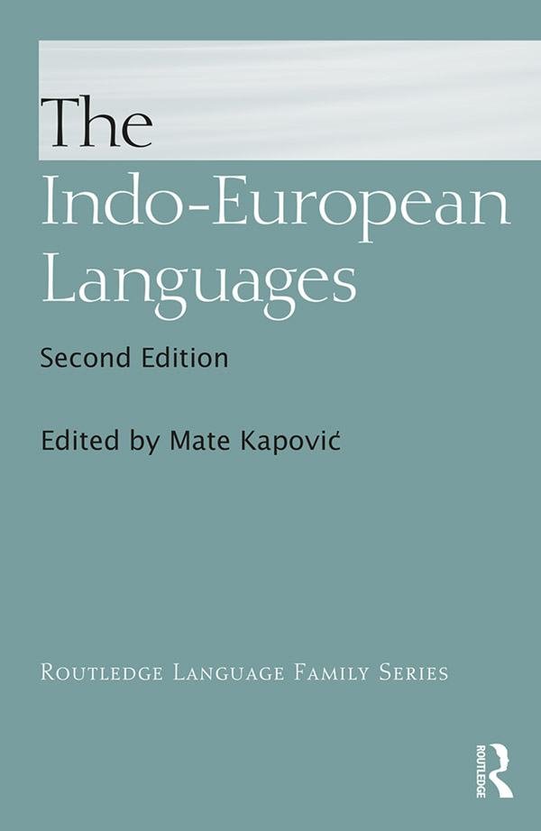

<!-- page: i -->

# The Indo-European Languages

*The Indo-European Languages* presents a comprehensive survey of the individual languages and language subgroups within this language family.

With over four hundred languages and dialects and almost three billion native speakers, the Indo-European language family is the largest of the recognized language groups and includes most of the major current languages of Europe, the Iranian plateau and the Indian subcontinent.

Written by an international team of experts, this comprehensive, single-volume tome presents in-depth discussions of the historical development and specialized linguistic features of the Indo-European languages.

This unique resource remains the ideal reference for advanced undergraduate and postgraduate students of Indo-European linguistics and languages, but also for more experienced researchers looking for an up-to-date survey of separate Indo-European branches. It will be of interest to researchers and anyone with an interest in historical linguistics, linguistic anthropology and language development.

**Mate Kapović** is Associate Professor in the Department of Linguistics at the University of Zagreb, Croatia. He currently teaches courses on Indo-European phonology, Indo-European and Balto-Slavic accentuation, Indo-European morphology, and general phonology.

<!-- page: ii -->

# Routledge Language Family Series

Each volume in this series contains an in-depth account of the members of some of the world’s most important language families. Written by experts in each language, these accessible accounts provide detailed linguistic analysis and description. The contents are carefully structured to cover the natural system of classification: phonology, morphology, syntax, lexis, semantics, dialectology, and sociolinguistics.

Every volume contains extensive bibliographies for each language, a detailed index and tables, and maps and examples from the languages to demonstrate the linguistic features being described. The consistent format allows comparative study, not only between the languages in each volume, but also across all the volumes in the series.

The Austronesian Languages of Asia and Madagascar

Edited by Nikolaus Himmelmann & Sander Adelaar

The Bantu Languages

Edited by Derek Nurse & Gérard Philippson

The Celtic Languages 2nd Edition

Edited by Martin J. Ball & Nicole Müller

The Dravidian Languages

Edited by Sanford B. Steever

The Germanic Languages

Edited by Ekkehard König & Johan van der Auwera

The Indo-Aryan Languages

Edited by George Cardona & Dhanesh K. Jain

The Indo-European Languages 2nd Edition

Edited by Mate Kapović

The Iranian Languages

Edited by Gernot Windfuhr

The Languages of Japan and Korea

Edited by Nicolas Tranter

The Khoesan Languages

Edited by Rainer Vossen

The Mongolic Languages

Edited by Juha Janhunen

The Munda Languages

Edited by Gregory D.S. Anderson

The Oceanic Languages

Edited by John Lynch, Malcolm Ross & Terry Crowley

The Romance Languages

Edited by Martin Harris & Nigel Vincent

The Semitic Languages

Edited by Robert Hetzron

The Sino-Tibetan Languages 2nd Edition (forthcoming)

Edited by Graham Thurgood & Randy J. Lapolla

The Slavonic Languages

Edited by Bernard Comrie & Greville G. Corbett

The Tai-Kadai Languages

Edited by Anthony Diller

The Turkic Languages

Edited by Éva Csató & Lars Johanson

The Uralic Languages

Edited by Daniel Abondolo

<!-- page: iii -->

# The Indo-European Languages

Second edition

Edited by
Mate Kapović

<!-- page: iv -->

Second edition published 2017

by Routledge

2 Park Square, Milton Park, Abingdon, Oxon OX14 4RN

and by Routledge

711 Third Avenue, New York, NY 10017

*Routledge is an imprint of the Taylor & Francis Group, an informa business*

© 2017 selection and editorial matter, editor; individual chapters, the contributors

The right of the editor to be identified as the author of the editorial material, and of the authors for their individual chapters, has been asserted in accordance with sections 77 and 78 of the Copyright, Designs and Patents Act 1988.

All rights reserved. No part of this book may be reprinted or reproduced or utilised in any form or by any electronic, mechanical, or other means, now known or hereafter invented, including photocopying and recording, or in any information storage or retrieval system, without permission in writing from the publishers.

*Trademark notice*: Product or corporate names may be trademarks or registered trademarks, and are used only for identification and explanation without intent to infringe.

This edition adapted from the 1998 Routledge translation of *Le Lingue Indoeuropee* © 1993 Società editrice Il Mulino, Bologna

*British Library Cataloguing-in-Publication Data*

A catalogue record for this book is available from the British Library

*Library of Congress Cataloging-in-Publication Data*

A catalog record for this book has been requested

ISBN: 978-0-415-73062-4 (hbk)

ISBN: 978-1-315-67855-9 (ebk)

Typeset in Times New Roman

by Apex CoVantage, LLC

<!-- page: v -->

# Contents

List of illustrations

Preface

Abbreviations

Indo-European languages – introduction  Mate Kapović

 1  Proto-Indo-European

1  Proto-Indo-European phonology  Mate Kapović

2  Proto-Indo-European morphology  Mate Kapović

3  Proto-Indo-European syntax  Thomas Krisch

 2  Proto-Indo-European and language typology  Ranko Matasović

 3  Anatolian  H. Craig Melchert

 4  Indo-Iranian

1  Indo-Iranian  Leonid Kulikov

2  Indo-Aryan  Leonid Kulikov

3  Iranian  Nicholas Sims-Williams

 5  Greek  Rupert Thompson

 6  Italic  Rex Wallace

 7  Celtic  Patrick Sims-Williams

 8  Germanic  Joshua Bousquette and Joseph Salmons

 9  Armenian  Birgit Anette Olsen

10  Tocharian  Douglas Q. Adams

<!-- page: vi -->

11  Balto-Slavic

1  Balto-Slavic  Steven Young

2  Baltic  Steven Young

3  Slavic  Marc L. Greenberg

12  Albanian  Alexander Rusakov

Language Index

Subject-Author Index

1.  Cover
2.  Title
3.  Copyright
4.  Contents
5.  List of illustrations
6.  Preface
7.  Abbreviations
8.  Indo-European languages – introduction
9.  1 Proto-Indo-European
    1.  1 Proto-Indo-European phonology
    2.  2 Proto-Indo-European morphology
    3.  3 Proto-Indo-European syntax
10. 2 Proto-Indo-European and language typology
11. 3 Anatolian
12. 4 Indo-Iranian
    1.  1 Indo-Iranian
    2.  2 Indo-Aryan
    3.  3 Iranian
13. 5 Greek
14. 6 Italic
15. 7 Celtic
16. 8 Germanic
17. 9 Armenian
18. 10 Tocharian
19. 11 Balto-Slavic
    1.  1 Balto-Slavic
    2.  2 Baltic
    3.  3 Slavic
20. 12 Albanian
21. Language Index
22. Subject-Author Index

<!-- page: vii -->

# Illustrations

## Maps

I.1    IE languages today

I.2    IE languages in the 1st millennium BCE

1.1    The *centum-satem* branches of IE

3.1    Anatolia in the Late Bronze Age

3.2    Anatolia in the Iron Age

5.1    The Greek dialects

6.1    The regions of ancient Italy

6.2    The languages of pre-Roman Italy

7.1    Latin provincial lapidary inscriptions bearing Celtic personal names

7.2    Density of Celtic-looking ancient place-names

9.1    Armenian in ancient and medieval times

10.1   Kucha (= Kuci) and its dependencies in Han times

11.1   Baltic tribes at the beginning of the second millenium ad

11.2   Map of Slavic languages

12.1   The Albanian dialects

## Figures

1.2    Sentence scheme 1

1.3    Sentence scheme 2

1.4    Structure of Homer Iliad 1,8

1.5    Structure of Homer Odyssey 4,353

1.6    Structure of Homer, Odyssey 20, 48

1.7    Structure of Rigveda 1,32,2

1.8    Structure of Homer, Iliad 18,468 / 1

1.9    Structure of Homer, Iliad 18,468 / 2

1.10   Structure of Homer, Iliad 5,97

1.11   Structure of Homer, Iliad 5,99

1.12   Structure of Homer Iliad 5,100

1.13   Structure of Homer, Iliad 5,101

1.14   Hettrich 2002: 47 The spectrum of meaning of the Rgvedic instrumental

4.1    Chronology of Indo-Aryan languages and texts

4.2    *Polyglossia in ancient India*

4.3    Simple vowels

4.4    The first and second series of palatals in Iranian

<!-- page: viii -->

5.1    Inherited vowel system of Proto-Attic-Ionic

5.2    Vowel system of Proto-Attic-Ionic after compensatory lengthening

5.3    Vowel system of classical Attic, showing official spellings after 403 BC

6.1    *Fibula Praenestina* (CIL 12.3)

8.1    Two models of Germanic subgrouping

## Tables

1.1    PIE stops

1.2    The reflection of PIE palatovelars in *satem* languages

1.3    Basic reflexes of PIE stops

1.4    The reflexes of PIE asyllabic resonants

1.5    The reflexes of PIE syllabic resonants

1.6    The reflexes of PIE *CR̥HC

1.7    The reflexes of PIE *CR̥HV

1.8    The reflexes of PIE vowels

1.9    The reflexes of PIE diphthongs

1.10   IE *o*-stems (singular)

1.11   IE *o*-stems (plural)

1.12   IE *o*-stems (neuter)

1.13   IE *o*-stems (dual)

1.14   IE *eh*₂-stems (singular)

1.15   IE *eh*₂-stems (plural)

1.16   IE *eh*₂-stems (dual)

1.17   IE root nouns (singular)

1.18   IE root nouns (plural)

1.19   IE *i*-stems (singular)

1.20   IE *i*-stems (plural)

1.21   IE *u*-stems (singular)

1.22   IE *u*-stems (plural)

1.23   IE *r*-stems (singular)

1.24   IE *r*-stems (plural)

1.25   IE *n*-stems (singular)

1.26   IE *n*-stems (plural)

1.27   IE *s*-stems (singular)

1.28   IE *s*-stems (plural)

1.29   IE demonstrative pronoun *so – *seh₂ – *tod (singular)

1.30   IE demonstrative pronoun *so – *seh₂ – *tod (plural)

1.31   IE demonstrative pronoun *so – *seh₂ – *tod (dual)

1.32   IE demonstrative pronoun *ey (*is) – *ih₂ – *id (singular)

1.33   IE demonstrative pronoun *ey (*is) – *ih₂ – *id (plural)

1.34   IE athematic present

1.35   IE thematic present

1.36   IE present dual endings

1.37   IE root-aorist

1.38   IE sigmatic aorist

1.39   IE thematic aorist

<!-- page: ix -->

1.40   IE perfect

1.41   IE middle present

1.42   IE middle aorist

1.43   IE athematic subjunctive

1.44   IE thematic subjunctive

1.45   IE athematic optative

1.46   IE thematic optative

1.47   IE athematic imperative

1.48   IE thematic imperative

1.49   IE future imperative

3.1    Anatolian nominal endings

3.2    Anatolian personal pronouns

3.3    Anatolian anaphoric pronouns

3.4    Anatolian interrogative-relative pronoun

3.5    Hittite verbal inflection

4.1    Encoding transitivity oppositions: diachronic typological features of some language families

4.2    Vedic texts and schools

4.3    Abbreviations of texts (text sigla)

4.4    Old Indo-Aryan consonantism

4.5    Assimilation in consonant clusters before dental stops

4.6    The main alternation grades

4.7    Old Indo-Aryan case endings

4.8    Consonant declension

4.9    *(A)nt*-declension

4.10   *a*-declension (type *devá-*)

4.11   *ī*-declension (types *devī́-* and *vr̥kī́-*)

4.12   PIE sources of case endings

4.13   Vedic verbal personal endings

4.14   Series of the PIE verbal endings

4.15   PIE sources of Vedic personal endings

4.16   The Vedic verbal system: examples

4.17   The Vedic verbal system: a selection of forms

4.18   The Vedic system of present stem types

4.19   The inventory of the present passive forms attested in the RV and AV

4.20   Passive paradigm in early Vedic

4.21   Declension of masculine *a*-stems (PIE stems in *o)

4.22   Declension of Av. *xratu-*

4.23   Secondary endings in Avestan

4.24   Primary endings in Avestan

4.25   Conjugation of the thematic present indicative active

4.26   Conjugation of the thematic present indicative middle

5.1    The Greek (Ionic) alphabet

5.2    Treatment of labiovelars in Attic-Ionic and West Greek

5.3    Forms of the first declension (*a*-stems) in classical Attic

5.4    Forms of the second declension (*o*-stems) in classical Attic

<!-- page: x -->

5.5    Underlying endings of third declension, and consonant stem forms in classical Attic

5.6    Forms of the third-declension *s*-stems, *i*-stems and *u*-stems in classical Attic

5.7    Underlying forms of the -*ēu* stems, and the resulting forms in classical Attic

5.8    Forms of the personal pronouns

5.9    Thematic and athematic primary and secondary endings of the active voice

5.10   Endings of the strong and weak aorist

5.11   Εndings of the middle voice

5.12   Forms of the perfect and pluperfect in classical Attic

6.1    The phonemes of Classical Latin

6.2    Classical Latin consonant-stem endings

6.3    Classical Latin *o*-stem endings

6.4    Classical Latin noun paradigms, masculine and feminine genders

6.5    Classical Latin noun paradigms, neuter

6.6    Classical Latin ‘mixed’ declension

6.7    Classical Latin *ē*-stems

6.8    Latin personal pronouns

6.9    Classical Latin relative pronoun

6.10   Organization of verb system

6.11   Latin conjugation classes

6.12   Subjunctive mood

6.13   Personal endings

6.14   Perfect passives

7.1    Comparison of the ordinal numerals

7.2    The Common Celtic vowel system

7.3    Pre-Celtic stops

7.4    Common Celtic stops

7.5    Brythonic consonantal developments

7.6    Gaelic consonantal developments

7.7    Nominal stems in *-o-*

7.8    Nominal stems in -*ā-*

7.9    Nominal stem in *-n-*

7.10   A possible origin of Old Irish conjunct endings

7.11   A possible origin of Old Irish absolute endings

7.12   Old Irish passive forms (present tense)

7.13   Old Irish deponent forms (present tense)

8.1    Pre-Germanic consonants

8.2    IE and Germanic stops

8.3    Old High German weak verbs

8.4    Germanic strong verbs, classes I–V

8.5    *a*-stem masculine nouns

8.6    Examples of other noun classes

9.1    The Armenian alphabet

10.1   The development of PIE vowels in Tocharian

10.2   Tocharian consonants

<!-- page: xi -->

10.3   Tocharian vowels

10.4   An example of Tocharian nominal declension

10.5   Some examples of Tocharian adjectival declension

10.6   Deictic pronouns in Tocharian

10.7   First and second person pronouns in Tocharian

10.8   Tocharian numbers from ‘one’ to ‘ten’

10.9   The declension of ‘one’ in the Tocharian languages

10.10  Conspectus of the Tocharian verb

11.1   The vowel system of common Baltic

11.2   The vowel system of East Baltic

11.3   The vowel system of Lithuanian

11.4   The vowel system of Latvian

11.5   Lithuanian accent paradigms for *a*-stem nouns

11.6   The Proto-Baltic consonant system

11.7   Declension of *a*-stem nouns

11.8   Declension of *a/ā*-stem and *u/i*-stem simple adjectives in Lithuanian

11.9   Declension of *a/ā*-stem and *u/i*-stem definite adjectives in Lithuanian

11.10  Declension of the Lithuanian third-person personal pronoun *jìs*, *jì*

11.11  Proto-Indo-European to late common Slavic vowels

11.12  Late common Slavic vowels

11.13  PIE, Baltic, and Slavic accent paradigm correspondences

11.14  Accentual paradigms

11.15  Proto-Indo-European to late common Slavic consonants

11.16  Cluster simplification

11.17  First velar palatalization

11.18  Second and third velar palatalizations

11.19  ‘Deiotation’ reflexes

11.20  Common Slavic consonant system

11.21  Vocalic stems

11.22  Consonantal stems

11.23  Vocalic stem endings

11.24  Consonantal stem endings

11.25  OCS 3 pers. pronoun

11.26  Interrogative pronouns

11.27  OCS adverbs of place, time, manner, direction

11.28  Inflection of non-past finite verb forms

11.29  Verb classes, following Leskien

11.30  Slavic verb form classes

11.31  Deverbatives from CSl. *věděti ‘to know’, derivatives of CSl. *ryba ‘fish’

12.1   Albanian alphabet

12.2   PIE short vowels (in stressed position)

12.3   PIE long vowels (in stressed position)

12.4   PIE diphthongs (in stressed position)

12.5   PIE sonorants

12.6   PIE obstruents

12.7   PIE *s, *y, *w

12.8   Noun declension in singular

<!-- page: xii -->

12.9   Noun declension in plural

12.10  Articulated adjectives (unmarked order)

12.11  Articulated adjectives (inverted order)

12.12  Declension of the personal and demonstrative pronouns

12.13  Declension of the possessive pronouns

12.14  Cardinal numerals

12.15  Verb conjugation (the major conjugational classes)

12.16  Conjugation of the verbs *jam* ‘to be’ and *kam* ‘to have’

<!-- page: xiii -->

# Preface

This volume is formally the 2nd edition of Ramat and Ramat 1998, itself an English translation of Ramat and Ramat 1993. Although the idea and the scope of the volume have remained much the same, the volume itself has changed a lot (the new editor included), and not only due to the necessary updates, inescapable after almost a quarter of a century has passed since the first edition.

The chapter “Proto-Indo-European: Comparison and Reconstruction” (1st ed.) is now replaced by three completely new chapters (“Proto-Indo-European Phonology,” “Proto-Indo-European Morphology,” and “Proto-Indo-European Syntax”). Instead of the chapter “Sanskrit” (1st ed.), there is a new chapter “Indo-Aryan.” Also, a separate short prechapter “Indo-Iranian” has been added. Instead of the chapters “Latin” and “The Italic Languages” (1st ed.), there is only the new chapter “Italic” now. A new prechapter “Balto-Slavic” has been added to precede “Baltic” and “Slavic.” A new chapter “Fragmentarily Attested Indo-European Languages” was planned, but the text has unfortunately not been finished on time. The chapter “The Indo-Europeans: Origins and Culture” (1st ed.) is completely out. The order of the chapters is new. The only authors remaining from the 1st edition are Nicholas Sims-Williams (“Iranian”) and Patrick Sims-Williams (“Celtic”). Their chapters are updated versions of their chapters in the 1st edition; all the other chapters (written by different authors) are completely new. Some of the authors from the 1st edition have, unfortunately, passed away in the meantime, like the great Calvert Watkins (1933–2013) and Werner Winter (1923–2010). New maps and illustrations were also added.

The idea of the volume is to provide a compact but informative introduction to and overview of Indo-European languages, with the stress on Proto-Indo-European, the oldest well attested IE languages, and the largest IE branches. The aim of the volume is to provide an introduction to beginners or non-Indo-Europeanists, but also to be used as a reference book for scholars already doing research in IE linguistics. However, this is not an introduction to historical linguistics, phonology, morphology, or syntax in general. It is assumed that the potential readers will already be familiar with basic linguistics, although the aim was to make the volume as reader-friendly as possible. The approach in the volume is mostly historical, as traditional in IE linguistics, and the volume is linguistics only – i.e., there are no chapters on IE culture, archeology, mythology, poetics, etc. In the last twenty years, a lot of historical-comparative grammars of IE in English have appeared (cf. the literature in the first three chapters), but usually by one author surveying all the languages – here, specialists in the field deal with one IE branch (or topic) only from a wider IE perspective. The chapters of the volume are meant to be complementary, but each chapter is supposed to be able to stand for itself (obviously, there is some repetition of certain facts).

<!-- page: xiv -->

The editor has tried to make this volume more uniform (e.g., the same PIE “orthography” is used throughout the book) and internally coherent than the first one, but it was impossible to “tame” completely so many authors, each with their own writing style and varying interests. Obviously, each chapter has the author’s personal touch (which is not bad – otherwise, all the introductions to IE linguistics would be the same). Naturally, not all literature and different views that would deserve it could be included in this volume. Also, the reader will sometimes note the conflicting views in the volume – not only was this impossible to avoid, but there was no reason to avoid it. This is something that the reader has to take into account when he or she encounters differing PIE reconstructions or interpretations of certain processes or phenomena. Rather than being a hindrance, this can allow a beginner to understand that historical linguistics is not a dogma, and that by applying its methods we can sometimes get differing results. It is exactly after the competition of different ideas that *communis opinio* is refined. In the end, the editor is glad to note that, although the basic idea of the volume is to provide an introduction and overview of IE linguistics and in spite of the fact that people have been doing IE historical linguistics for quite some time now, the volume does indeed contain quite a few new insights and interpretations, which will make it an interesting read not only for beginners and non-experts but also for professional IE linguists.

Finally, I would like to thank the publisher (especially the editor Samantha Vale Noya) for the opportunity to do this (though I have often, in times of despair, regretted the fact that I accepted the very difficult and often tedious editorial work), and all the authors who have worked hard in order for us to be able to produce such a wonderful volume.

<!-- page: xv -->

# Abbreviations

## Language/dialect abbreviations

<!-- page: xvi -->

<!-- page: xvii -->

<!-- page: xviii -->

|             |                                                         |
|-------------|---------------------------------------------------------|
| AC          | Arcado-Cypriot                                          |
| Aeol.       | Aeolic                                                  |
| AI          | Attic-Ionic                                             |
| Alb.        | Albanian                                                |
| Anat.       | Anatolian                                               |
| Arc.        | Arcadian                                                |
| Arm.        | Armenian                                                |
| Att.        | Attic                                                   |
| Av.         | Avestan                                                 |
| AV          | Atharva-Veda                                            |
| Balt.       | Baltic                                                  |
| BCMS        | Bosnian/Croatian/Montenegrin/Serbian (= Serbo-Croatian) |
| Boe.        | Boeotian                                                |
| Bret.       | Breton                                                  |
| BRuss.      | Belorussian/Belarusian                                  |
| BSl.        | Balto-Slavic                                            |
| Bulg.       | Bulgarian                                               |
| Čak.        | Čakavian                                                |
| CBalt.      | Common Baltic                                           |
| Celt.       | Celtic                                                  |
| CIb.        | Celtiberian                                             |
| Class. Lat. | Classical Latin                                         |
| CLuw.       | Cuneiform Luwian                                        |
| Corn.       | Cornish                                                 |
| Cret.       | Cretan                                                  |
| Croat.      | Croatian                                                |
| CS          | Church Slavic                                           |
| CSl.        | Common Slavic                                           |
| Cypr.       | Cypriot                                                 |
| Cz.         | Czech                                                   |
| Dac.        | Dacian                                                  |
| Dan.        | Danish                                                  |
| Dor.        | Doric                                                   |
| E           | East …                                                  |
| EBalt.      | East Baltic                                             |
| EGr.        | East Greek                                              |
| ELith.      | East Lithuanian                                         |
| Eng.        | English                                                 |
| Est.        | Estonian                                                |
| Fal.        | Faliscan                                                |
| Finn.       | Finnish                                                 |
| Fr.         | French                                                  |
| Gaul.       | Gaulish                                                 |
| GAv.        | Gatha-Avestan (= Old Avestan)                           |
| Germ.       | German                                                  |
| Gl.         | Glossing                                                |
| Gmc         | Germanic                                                |
| Goth.       | Gothic                                                  |
| Gr.         | Greek                                                   |
| Hitt.       | Hittite                                                 |
| HLuw.       | Hieroglyphic Luwian                                     |
| Hom.        | Homeric (Homer)                                         |
| IE          | Indo-European                                           |
| IIr.        | Indo-Iranian                                            |
| Illyr.      | Illyrian                                                |
| Ion.        | Ionic                                                   |
| Iran.       | Iranian                                                 |
| It.         | Italic                                                  |
| Ital.       | Italian                                                 |
| Khot.       | Khotanese                                               |
| Lat.        | Latin                                                   |
| Latv.       | Latvian                                                 |
| LAv.        | Later Avestan (= Young Avestan)                         |
| LCSl.       | Late Church Slavic                                      |
| Lep.        | Lepontic                                                |
| Lesb.       | Lesbian                                                 |
| Lith.       | Lithuanian                                              |
| LSorb.      | Lower Sorbian                                           |
| Luw.        | Luwian                                                  |
| Lyc.        | Lycian                                                  |
| Lyd.        | Lydian                                                  |
| M           | Middle …                                                |
| Mac.        | Macedonian (Slavic)                                     |
| ManMPers    | Manichean Middle Persian                                |
| MBret.      | Middle Breton                                           |
| MDutch      | Middle Dutch                                            |
| Messap.     | Messapian                                               |
| MHG         | Middle High German                                      |
| MIran.      | Middle Iranian                                          |
| MIr.        | Middle Irish                                            |
| MParth      | Middle Parthian                                         |
| MPers.      | Middle Persian                                          |
| MW          | Middle Welsh                                            |
| Myc.        | Mycenaean                                               |
| N           | North …                                                 |
| NE          | North-East                                              |
| Norw.       | Norwegian                                               |
| NPhryg.     | New Phrygian                                            |
| NW          | North-West                                              |
| NWGr.       | North-West Greek                                        |
| O           | Old …                                                   |
| OAv.        | Old Avestan (= Gatha-Avestan)                           |
| OBret.      | Old Breton                                              |
| OCS         | Old Church Slavic                                       |
| OCz.        | Old Czech                                               |
| OEng.       | Old English                                             |
| OHG         | Old High German                                         |
| OHitt.      | Old Hittite                                             |
| OIA         | Old Indo-Aryan/Indic/Indian                             |
| OIc.        | Old Icelandic                                           |
| OInd.       | Old Indic/Indo-Aryan/Indian (Vedic & Sanskrit)          |
| OIr.        | Old Irish                                               |
| OLat.       | Old Latin                                               |
| OLatv.      | Old Latvian                                             |
| OLith.      | Old Lithuanian                                          |
| ONor.       | Old Norse                                               |
| OPers.      | Old Persian                                             |
| OPhyrg.     | Old Phrygian                                            |
| OPruss.     | Old Prussian                                            |
| ORuss.      | Old Russian                                             |
| OS          | Old Saxon                                               |
| Osc.        | Oscan                                                   |
| OW          | Old Welsh                                               |
| OWCB        | Old Welsh, Old Cornish and Old Breton                   |
| P           | Proto …                                                 |
| Pal.        | Palaic                                                  |
| Pamph.      | Pamphylian                                              |
| PAnat.      | Proto-Anatolian                                         |
| PBalt.      | Proto-Baltic                                            |
| PBSl.       | Proto-Balto-Slavic                                      |
| PCelt.      | Proto-Celtic                                            |
| Pers.       | Persian                                                 |
| PGmc        | Proto-Germanic                                          |
| Phryg.      | Phrygian                                                |
| PIE         | Proto-Indo-European                                     |
| PIIr.       | Proto-Indo-Iranian                                      |
| Plb.        | Polabian                                                |
| Pol.        | Polish                                                  |
| Pr.         | Primitive                                               |
| PSl.        | Proto-Slavic                                            |
| PToch.      | Proto-Tocharian                                         |
| Rom.        | Romance                                                 |
| Russ.       | Russian                                                 |
| RussCS      | Russian Church Slavic                                   |
| RV          | R̥g-Veda                                                 |
| S           | South …                                                 |
| SCr.        | Serbo-Croatian (= Bosnian/Croatian/Montenegrin/Serbian) |
| SE          | South-East                                              |
| Skr.        | Sanskrit                                                |
| Slav.       | Slavic                                                  |
| Slk.        | Slovak                                                  |
| Sln.        | Slovene                                                 |
| Sogd.       | Sogdian                                                 |
| Sp.         | Spanish                                                 |
| Srb.        | Serbian                                                 |
| Sw.         | Swedish                                                 |
| Štok.       | Štokavian                                               |
| Thess.      | Thessalian                                              |
| Toch.       | Tocharian (A & B)                                       |
| Ukr.        | Ukrainian                                               |
| ULSorb.     | Upper/Lower Sorbian                                     |
| Umbr.       | Umbrian                                                 |
| USorb.      | Upper Sorbian                                           |
| Ved.        | Vedic                                                   |
| Ven.        | Venetic                                                 |
| W           | Welsh                                                   |
| W           | West …                                                  |
| WGr.        | West Greek                                              |
| WSlav.      | Western Slavic                                          |
| YAv.        | Young Avestan (= Late Avestan)                          |

## Other abbreviations

<!-- page: xix -->

<!-- page: xx -->

|            |                                 |
|------------|---------------------------------|
| 1 sg./pl.  | first person singular/plural    |
| 2 sg./pl.  | second person singular/plural   |
| 3 sg./pl.  | third person singular/plural    |
| abl.       | ablative                        |
| acc.       | accusative                      |
| act.       | active                          |
| adj.       | adjective                       |
| adm.       | admirative                      |
| adv.       | adverb                          |
| all.       | allative                        |
| aor.       | aorist                          |
| a.p.       | accentual paradigm              |
| arch.      | archaic                         |
| caus.      | causative                       |
| coll.      | collective                      |
| comm.      | common (gender)                 |
| comp.      | comparative                     |
| cond.      | conditional                     |
| dat.       | dative                          |
| def.       | definite                        |
| det.       | determinate                     |
| dial.      | dialect(al)                     |
| dim.       | diminutive                      |
| du.        | dual                            |
| encl.      | enclitic                        |
| f\.        | feminine                        |
| fut.       | future                          |
| gen.       | genitive                        |
| imp.       | imperative                      |
| imperf.    | imperfective                    |
| impf.      | imperfect                       |
| ind.       | indicative                      |
| indef.     | indefinite                      |
| indet.     | indeterminate                   |
| inf.       | infinitive                      |
| inj.       | injunctive                      |
| instr.     | instrumental                    |
| interrog.  | interrogative                   |
| intr.      | intransitive                    |
| IPA        | International Phonetic Alphabet |
| loc.       | locative                        |
| m\.        | masculine                       |
| med.       | medial (= middle)               |
| med.-pass. | medio-passive                   |
| mid.       | middle (= medial)               |
| n\.        | neuter                          |
| nom.       | nominative                      |
| opt.       | optative                        |
| pass.      | passive                         |
| perf.      | perfect                         |
| perfect.   | perfective                      |
| pers.      | person(al)                      |
| pl.        | plural                          |
| pluperf.   | pluperfect                      |
| pres.      | present                         |
| pret.      | preterite                       |
| pron.      | pronoun                         |
| prv.       | preverb                         |
| ptcl.      | particle                        |
| ptcp.      | participle                      |
| sg.        | singular                        |
| sigm.      | sigmatic                        |
| st.        | stem                            |
| subj.      | subjunctive                     |
| suff.      | suffix                          |
| sup.       | supine                          |
| them.      | thematic                        |
| trans.     | transitive                      |
| voc.       | vocative                        |
