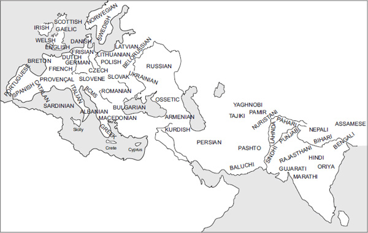
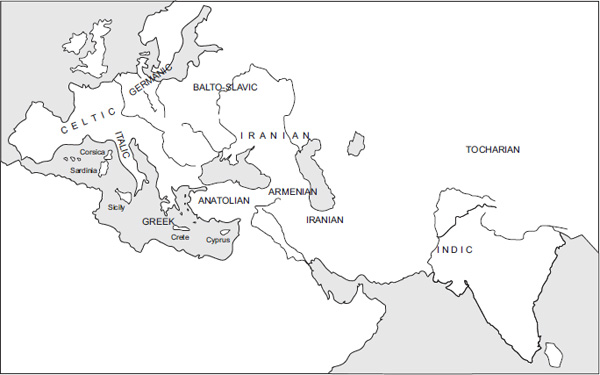

<!-- page: 1 -->

# Indo-European languages – introduction

*Mate Kapović*

Indo-European languages were originally, a couple of millennia ago, spoken from Europe to India. Now, in postcolonial times, they are spoken all over the world. English is thus, besides being a global *lingua franca*, spoken in North America, Australia, parts of Africa, and elsewhere; Spanish in Central and South America (Portuguese in Brazil); French in parts of Africa, etc. According to *Ethnologue*,1 437 IE languages (the number is in reality approximate) are spoken by almost 3 billion people in the world. With regard to the number of speakers, this makes the IE language family the biggest in the world. Concerning the number of individual languages, IE is not the largest language family – for instance, the African Niger-Congo family with more than 1500 languages is much larger. In the world, there are around 7000 languages (this is not an exact number, since it is extremely difficult to define linguistically what a language actually is), so in this sense IE languages are less important, although IE is still one of the biggest language families. Historical reasons – primarily the concentration of economic power in Europe and later in North America, together with the culture, science, etc., that goes with it – make IE the best-known language family in the world.

In the territories from Europe to India, where IE languages were spoken already a few thousand years ago, not all languages are IE. Most of the languages spoken in Europe today are IE, the exceptions (disregarding Balkan Turkish, the languages of the Caucasus, and recent migrant languages) being Basque, Maltese (an offspring of Arabic), and the Uralic languages (Hungarian, Estonian, Finnish, and a few smaller ones). Basque is the only remnant of pre-IE European languages. Other such cases (like Etruscan) have long disappeared. In the Middle East, we find both IE (like Persian/Farsi, Pashto, Kurdish, and Tajik) and non-IE languages (like Turkish, Azeri, Arabic, etc.). In the Indian subcontinent, many languages are IE (like Hindi/Urdu, Bengali, Punjabi, and Nepali), while many belong to the non-IE Dravidian family (like Tamil and Malayalam) and other non-IE language families (like smaller languages from the Tibeto-Burman and Austroasiatic families).

<!-- page: 2 -->

What is a language family? What does it mean when we say that English and Albanian belong to the IE language family? To put it succinctly, a language family consists of all the languages that have evolved from a single original proto-language. It is thus a group of genetically related languages (up to a certain point – it just may well be that all human languages are related, though this cannot be proven). In the IE case, it means that we can prove that all the IE languages that we know have evolved through many stages from a single parent language that we today call Proto-Indo-European. This proto-language was spoken some 6000 years ago and, like most proto-languages, is unattested (which means that we have no written records of PIE). This is not always the case; for instance, Latin (as the proto-language of all Romance languages) and Old Chinese (as the proto-language of all modern Chinese “dialects”/languages) are attested.

**Map I.1 **IE languages today

Source: Adapted from C. Watkins *The Indo-European Languages* (Routledge) 1st ed (1998)

How can one language split into more than 400 languages? The answer is simple – through language change. All languages change all the time (even today with all our schools, means of communication, and mass media). Linguistic changes that occur during the life of an individual speaker are usually slow and gradual (although still perceivable, whether they have to do with changes in pronunciation, grammatical forms, or vocabulary), but in time languages change enough to become mutually incomprehensible and sometimes very different. This is made easy by migration – when two social groups separate, it is easy to imagine that a previously uniform language can evolve in different directions (cf. the differences between British, American, and Australian English, although they are still in contact, mutually comprehensible, and thus considered one language).

<!-- page: 3 -->

That languages like English, Czech, and Welsh have all developed from a single proto-language was not always apparent. Already in ancient times, people noticed that there are many similar words in, for instance, Latin and Greek – cf. e.g. Lat. *māter* ‘mother’, *pater* ‘father’ and Gr. μήτηρ /mḗtēr/, πατήρ /patḗr/ (or, for that matter, English *mother* and *father*). However, they did not know how to properly explain such similarities. Thus, there have been many unscientific hypotheses, such as that all languages are derived from Hebrew (considered a holy language) and so on. In the 15th and 16th centuries, there were a number of scholars, like Rodolphus Agricola/Roelof Huisman (1443/4–1485), Sigismund Gelenius/Zikmund Hrubý z Jelení (1497–1554), and Johann Elichmann (1601/2–1639), who noted correspondences between various IE languages. However, it is Marcus van Boxhorn (1612–1653), a professor at Leiden University, who can be regarded as the first historical linguist and the father of IE linguistics. In 1647 he advanced a theory that Greek, Latin, Persian, Old Saxon, Dutch, German, Gothic, Russian, Danish, Swedish, Lithuanian, Czech, Croatian, and Welsh (but not Hebrew) originally stemmed from “Scythian” (= PIE). His friend Claudius Salmasius/Claude de Saumaise (1588–1653) added Sanskrit to the list. Amazingly, van Boxhorn also noted the importance of recognizing false cognates, loanwords, systematic correspondences, plausible semantic agreement, morphological comparison, and synchronically irregular forms (all basic elements of historical linguistics now called the “comparative method”).2 The European discovery of Sanskrit played an important role in the beginnings of IE historical and comparative linguistics. Already in 1585, Filippo Sassetti (1540–1588), a merchant and scholar, noted in a private letter the similarity of some words in Sanskrit and Italian (e.g., Skr. *nava* and Ital. *nove* ‘nine’), and in the 18th century a couple of scholars wrote on the obvious similarity of Sanskrit to European languages. One of them was William Jones (1746–1794), who in a lecture in 1786 compared Sanskrit to Greek, Latin, Gothic, Celtic, and Old Persian, claiming that they “have sprung from some common source.” Jones is usually wrongly considered the founding father of IE historical linguistics, although he was neither the first to make such a hypothesis nor the one with the clearest presentation of the problem. Shortly after, the first modern IE historical linguists – Jacob Grimm (1785–1863; famed as one of the Grimm brothers), Rasmus Rask (1787–1832), and Franz Bopp (1791–1867) – started doing serious historical linguistics, and others followed. The very term *Indo-European* was coined in 1813 by Thomas Young (1773–1829). The discovery of Anatolian and Tocharian texts in the beginning of the 20th century gave new impetus for IE linguistics.

The IE language family comprises ten principal branches (those being the ones sufficiently attested in ancient times and/or today) and a number of fragmentarily attested separate languages spoken in ancient times (like Lusitanian or Phrygian) that have since disappeared. Three main branches (Anatolian, Indo-Iranian, and Greek) are attested already in the second millennium BCE, two in the first millennium BCE (Italic, Celtic), and the other five branches later. Three of the principal branches consist of one language only (Greek, Armenian, and Albanian), although those comprise different dialects as well. Two major branches (Anatolian and Tocharian) are now extinct, and the same goes for all fragmentarily attested languages and certain languages from other primary branches (like Gaulish). The ten principal IE branches are as follows.

1.  **Anatolian** – attested from the 19th/16th to the 1st century BCE
    Spoken, until its disappearance, in Asia Minor. Old Anatolian languages (spoken in the 2nd millennium BCE) are Hittite (the best attested, written in Akkadian cuneiform, the language of the great Hittite Empire), Cuneiform Luwian (Luvian), Hieroglyphic Luwian, and Palaic. Hittite is attested from around the 16th century, but a few names and loanwords are found already in the 19th century BCE in Old Assyrian texts. New Anatolian languages (spoken in the 1st millennium BCE) are Lydian, Lycian (Lycian A), Milyan (Lycian B), Carian, Sidetic, and Pisidian.
2.  **Indo-Iranian** – attested from the 15th–14th century BCE
    Spoken mostly in the northern part of the Indian subcontinent and the Middle East (Eastern Turkey, Caucasus, Iran, Afghanistan). As a result of old migrations, the Romani language dialects are spoken by the Roma people in Europe. Indo-Iranian consists of two great groups – Indo-Aryan (Indic) and Iranian. The third, smaller group is Nuristani (on the border between Afghanistan and Pakistan), and the fourth, disputably, is Dardic (traditionally considered part of Indo-Aryan). The two major groups are attested from ancient times and represented by many languages, while the two small groups are attested only from modern times and consist of a few small languages spoken in remote parts of northern India, Afghanistan, and Pakistan. Indo-Aryan languages are chronologically divided into Old Indic/Indo-Aryan (Vedic – the language of the Vedas; Sanskrit – the classical language of India), Middle Indic/Prakrits (Pali, Shauraseni, Maharashtri, Magadhi, etc.), and New Indic (many languages – Hindi/Urdu, Bengali, Punjabi, Marathi, etc.). Certain words and names of Indo-Aryan origin were attested in the 15th–14th century BCE in Hurrian texts. The Rigveda (the oldest part of the Vedas) is usually dated to the second half of the 2nd millennium BCE but was transmitted orally for a long time. Iranian languages are chronologically divided into Old Iranian (Avestan – the language of Zarathustra, from the first half of the 1st millennium BCE, or perhaps even earlier but at first transmitted orally; Old Persian – the language of the Achaemenid Empire), Middle Iranian (Pahlavi – the language of the Sassanid Empire; Sogdian; etc.), and New Iranian (New Persian/Farsi – the official language of Iran; the Kurdish languages; Pashto – the official language of Afghanistan; etc.).
3.  **Greek** – attested from the 15th–14th century BCE
    Spoken from ancient times until the present in mainland Greece and neighboring islands. The first attestations were written in the Linear B script in Mycenaean Greek, the earliest recorded Greek dialect. From the 8th century, Greek has been written in the Greek alphabet. In the classical period (around the 5th century BCE), the following Greek dialects existed – North-West dialects, Doric, Aeolic (controversial), Arcado-Cypriot, and Ionic-Attic (the details of the subgrouping are disputed). Later stages of Greek are Hellenistic/Koiné, Byzantine/Medieval, and Modern Greek.
4.  **Italic** – attested from the 7th century BCE
    Spoken in ancient Italy. Italic consists of two groups – Latino-Faliscan and Sabellian (Osco-Umbrian). The Latino-Faliscan group consists of Latin (very well attested) and Faliscan. The Sabellian group consists of Oscan, Umbrian, and a number of smaller and poorly attested Italic languages. All Italic languages except Latin disappeared already in Roman times owing to the expansion of Latin as the language of the Roman state. Latin later developed into numerous modern Romance languages (Portuguese, Spanish, Catalan, French, Italian, Romanian, etc.).
5.  **Celtic** – attested from the 6th century BCE
    Now spoken in peripheral areas of the British Isles (Ireland, Wales, Scotland) and France (Brittany), previously spoken in wide areas of Europe (from the Iberian Peninsula and France all the way to Asia Minor). The Celtic branch can be divided (though controversially) into three groups: Celtiberian, Continental Celtic, and Insular Celtic. Celtiberian is a one-language group, attested in the 2nd to 1st century BCE in present-day Spain. Continental Celtic languages – Gaulish (in France) and Lepontic (in northern Italy) – are now extinct. Insular Celtic consists of Brythonic (Welsh, Breton, and extinct Cornish) and Goidelic (Irish/Gaelic, Scottish Gaelic, and extinct Manx). Of all currently existing Celtic languages, only Welsh has a more or less secure future.
6.  **Germanic** – attested from the 3rd (?) century BCE
    Nowadays spoken in North-West Europe. The first Germanic words are attested perhaps already in the 3rd (?) century BCE on the so-called Negau helmet (found in Ženjak in present-day Slovenia). The earliest runic inscriptions date from the first centuries CE, and the Gothic translation of the Bible from the 4th century. Germanic languages comprise three groups: East, North, and West. The extinct East Germanic group consists of Gothic, Vandal, and Burgund. The Northern languages are Old Norse and, in modern times, the Scandinavian languages. The Western languages are Old High German, Old Saxonian, Old Low Franconian (Old Dutch), Old Frisian, and Old English (in modern times, respectively, German, Low German, Dutch, Frisian, and English).
7.  **Armenian** – attested from the 5th century CE
    Spoken in present-day Armenia and elsewhere in the Caucasus and Middle East as a minority language, previously also in wide areas of present-day eastern Turkey. Modern Armenian consist of two dialects, Eastern and Western, both standardized.
8.  **Tocharian** – attested from the 4th–5th to the 8th–10th century CE
    Spoken in merchant cities on the ancient Silk Road, in the present-day Xinjiang province of western China (now inhabited by Turkic Uyghurs). There were two closely related Tocharian languages – Tocharian A and Tocharian B.
9.  **Balto-Slavic** – attested from the 9th (Slavic) and 16th (Baltic) century CE
    Spoken in the Baltic, the Balkans, and Central and Eastern Europe. The Balto-Slavic branch consists of West Baltic, East Baltic, and Slavic. The extinct Old Prussian is West Baltic, and Lithuanian and Latvian are East Baltic (there are a few other poorly attested and extinct Baltic languages). Slavic consists of East (Russian, Belorussian, Ukrainian), West (Polish, Czech, Slovak, etc.), and South Slavic (Slovene; Bosnian/Croatian/Montenegrin/Serbian – traditionally known as Serbo-Croatian; Macedonian; Bulgarian). The first attested Slavic language, Old Church Slavic, was based on the Thessaloniki Old Macedonian dialect.
10. **Albanian** – attested from the 15th century CE
    Spoken in present-day Albania, Kosovo, West Macedonia, South Montenegro, North-West Greece, and South Italy. There are two dialects – Gheg in the north and Tosk in the south, the latter being the basis of Standard Albanian.

Fragmentarily attested IE languages can be divided into two basic groups: those that have at least one attested text/inscription and those that are attested only through onomastics or individual words in texts written in other languages. In the first group, there are Lusitanian (Portugal), Venetic (North-East Italy), Messapic (the “heel” of Italy), Thracian (Bulgaria), and Phrygian (Minor Asia). In the second group, we find languages like Ligurian (North-West Italy), the Illyrian languages (North-West Balkans), Dacian (Romania), and Macedonian (no relation to present-day Slavic Macedonian). Apart from fragmentarily attested IE languages, there are also possible non-attested IE languages, whose traces can perhaps be seen in loanwords in other languages (like the supposed North-West Block language in Benelux), but these are rather speculative.

<!-- page: 6 -->

Many elements can be reconstructed for the last stage of PIE. However, what we obtain through reconstruction will never be a full picture of the language, since elements (sounds, grammatical endings, words, meanings, etc.) can disappear with no trace or leave so few traces that it is not possible to reconstruct them plausibly. Thus, the around 1500 PIE lexical items that have been reconstructed are certainly just a small part of the actual PIE vocabulary, which must have had something like 30,000–50,000 words, just as much as any language today.3 Likewise, we can, for instance, reconstruct the ending variants *-mes, *-mos, *-mesi, *-men, etc. in the PIE 1st person plural present indicative (p. 93), but it is impossible to know how to interpret them exactly. Were these just random variants (not likely), were they sociolinguistic variables, did their use depend on dialect, gender, social status, etc.? Sometimes it is also very difficult to separate different layers – should an element be reconstructed for PIE in general, dialectal PIE, post-Anatolian PIE (i.e., PIE after the early split of Anatolian), early PIE (i.e., PIE including Anatolian), post-PIE time, etc.?

**Map I.2 **IE languages in the 1st millennium BCE

Source: Adapted from C. Watkins *The Indo-European Languages* (Routledge) 1st ed (1998)

Like most languages that cover any substantial ground, PIE probably also had dialects. The dialectal picture of PIE is not completely clear because it is sometimes difficult to distinguish PIE dialectal features from post-PIE shared innovations and accidental independent innovations. It is now widely accepted that Anatolian was the first branch to separate from the rest of PIE (and that Tocharian was the next). However, which Anatolian characteristics (like the lack of feminine gender) are archaisms, and which are innovations, is still a matter of dispute (p. 62, 66, 159, 178). Dialects can share one trait with one dialect, and another with another dialect. For instance, Greek, Indo-Iranian, and Armenian all have the augment *h₁e- in past tense verbal forms, which is not present in other IE languages. At the same time, Armenian and Indo-Iranian are satem languages, while Greek is a centum language (p. 27). In Greek, Armenian, and Phrygian, initial pre-consonantal laryngeals (*H-) yield vowels (p. 48), while this is not the case in Indo-Iranian. Indo-Iranian, on the other hand, shares the so-called RUKI rule (p. 206) with Balto-Slavic (p. 29, 495, 526–527), a satem branch, while Balto-Slavic shares the ending *-mos in the dative plural with Germanic (as opposed to *-bʰos in Italic, p. 63), a centum branch, etc.

<!-- page: 7 -->

The question of the PIE homeland (the “original” territory where speakers of PIE lived) is still a subject of debate. The most commonly accepted hypothesis in the last few decades has been the “Kurgan hypothesis” (Kurgans being a type of burial mound), which puts Proto-Indo-Europeans in the steppes of present-day Ukraine and South Russia, north of the Black Sea. The position of the PIE homeland is often deduced from certain linguistic indications, and by trying to connect linguistic evidence with archeology, paleobotany, and other disciplines. The way linguistic evidence is used in trying to deduce the place of the PIE homeland follows a certain logic. For instance, since one can reconstruct a PIE word for ‘snow’ (*snoygʷʰs), we can suppose that PIE was spoken in a place where there was snow (which by itself does not amount to much). Evidence has to be carefully evaluated – for instance, Lat. *mare*, OCS *morje*, and OIr. *muir* ‘sea’ would all point to PIE *mori ‘sea’ (and thus to a PIE homeland by the sea). However, Goth. *marei* (cf. Eng. *mere*, *marsh*) means both ‘sea’ and ‘lake’, which brings the PIE meaning ‘sea’ in doubt (it is not unimaginable that the original meaning was ‘lake, standing water’ and that the meaning ‘sea’ is secondary, though there can be no certainty in any of the possibilities).

Comparative linguistics has proven beyond reasonable doubt that all IE languages stem from the same proto-language. However, the question of a deeper genetic relationship of IE with other language families is still a matter of heated debate (though most IE-ists, curiously, ignore the problem, choosing not to go outside of inner-IE problems). The most likely IE relative is Uralic. There are some striking cognate-looking examples, cf. e.g. Proto-Uralic *weti ‘water’ and PIE *wodr̥ (this is not a word easily loaned), or Proto-Uralic verbal endings 1 sg. *-mi, 1 pl. *-me, 2 pl. *-te, which are practically identical to PIE *-m(i), *-me, *-te (p. 93). Although the Indo-Uralic hypothesis is still not strictly proven, grammatical correspondences like these make this proposition quite probable. On a wider scale, IE often connected with “Nostratic” languages, which include IE, Uralic, Kartvelian (like Georgian), Altaic (a suspicious family by itself, consisting of Turkic, Mongolic, Tungusic, and possibly other languages), Dravidian, Afro-Asiatic (consisting of Semitic, Egyptian, etc.), and possibly other families/languages (the “cast” is not always the same). There is a lot of work left to be done in long range comparison, but it is not at all certain that we will ever get satisfactory answers to these problems. Many linguists are, with good reason, highly skeptical concerning the very methodological basis of such reconstruction, and simply do not believe that there is enough linguistic material preserved (since sounds, forms and words not only change but can also disappear leaving no trace) to let us plausibly reconstruct proto-languages so distantly in the past.

<!-- page: 8 -->

Up till now, we have seen examples of cognate words and reconstructed PIE forms (marked with an asterisk to indicate them not being attested). But how do linguists actually know what words/forms to compare, and how do they get the idea that two or more languages are genetically related in the first place? Looking for similar words with similar meanings is obviously not enough, since similar words with similar meanings in two languages can easily be the result of linguistic borrowing. Compare Modern English and French pairs like *city*/*cité*, *people*/*peuple*, or *part*/*part*. These are all French loanwords in English, which can be proven by historical data (French loanwords were brought to England by French-speaking Normans after their 1066 conquest). When looking for genetically related languages, it is safer to look for similarities in grammar (morphology, i.e., nominal or verbal endings, etc.), since morphological elements are borrowed much less frequently than vocabulary. Looking for morphological similarities may be a problem in languages which are not rich with morphology (like Chinese or even English), but not in older IE languages, which have quite complex morphology. Some of the similarities, clearly seen in ancient IE languages, are visible even today. For instance, compare the plural ending -*i* in Italian *lupi* ‘wolves’ and Russian *вóлки* /vólki/. However, one does need to reconstruct vocabulary as well. When looking for old words inherited directly from PIE, one has to find words that are likely to have been in a language already a couple of millennia ago (thus, not words like *computer* or *tennis*) and words that are not so likely to be borrowed. Although in principle any word can be borrowed (and all kinds of examples from all around the world can be found), in some types of vocabulary one often finds old inherited words, for instance, in words for family relations (cf. Eng. *father*, *mother*, *brother* and related Ital. *padre*, *madre*, *fratello*), numbers (cf. Eng. *two*, *three*, *seven* and related Ital. *due*, *tre*, *sette*), body parts (Eng. *nose*, *beard*, *ear* and Ital. *naso*, *barba*, *orecchio*), etc. Genetically related words are sometimes obviously similar (Eng. *mother* ~ Ital. *madre*), sometimes less obviously so (Eng. *wolf* ~ Ital. *lupo* – the *l* is the same, and the sounds *f* and *p* are phonetically close), and sometimes almost completely different (Eng. *hornet* ~ Ital. *calabrone*). Of course, similarity of form and meaning may be completely accidental, cf. e.g. non-related pairs such as Eng. *much* and Span. *mucho*, Eng. *iron* and Span. *hierro*, Eng. *day* and Span. *día*, etc. (this is more apparent when one considers phonologically more archaic Germanic cognates such as Scots *mickle*, German *Eisen*, or Swedish *dag* respectively, or the Latin forms *multum*, *ferrum*, *diēs* that yield the cited Spanish forms).

But similarity alone is not enough. Not only does it not guarantee that two words are related, it is also not scientific. What historical linguists look for are not necessarily similar sounds, words, or forms, but systematic sound correspondences. This means that certain phonemes (or clusters of them) in purportedly genetically related languages have to systematically correspond to each other, whether they are phonetically close or not. For instance, in initial position we find in English and Italian the correspondences *n-* ~ *n-* (*no*/*no*, *night*/*notte*, *nine*/*nove*), *h-* ~ *c-* (*hornet*/*calabrone*, *hound*/*cane*, *heart*/*cuore*), *t-* ~ *d-* (*two*/*due*, *ten*/*dieci*, *tooth*/*dente*), etc. Careful examination and analysis of such correspondences is one of the primary tasks of historical linguistics and a prerequisite for proving a genetic relationship between two or more languages. Describing such correspondences will be an important part of the next chapter.

**Note:** I would like to thank David Mandić and Petra Šoštarić for reading the first draft of the chapter. Of course, all the mistakes are just mine.

### Further reading

Lehmann 1967 provides a rich selection of translated primary texts (with commentary) from the beginnings and early IE historical linguistics. Pedersen 1959 is also still very useful. For the problems of the IE homeland, culture, and archeology from a mainstream IE-ist perspective see, for instance, Mallory 1989 and Mallory & Adams 1997. A lot of information on IE culture can be found in the famous but controversial and idiosyncratic Gamkrelidze & Ivanov 1995. For more on the “Kurgan hypothesis” from the pen of its originator see Gimbutas 1997. Salmons & Joseph 1998 is an informative look at Nostratic from different perspectives. There are a number of good handbooks and introductions to historical linguistics, many of them using a lot of IE material. Trask 2007 may be a good place to start, as well as Campbell 2004. Joseph & Janda 2003 and Ringe & Eska 2013 are a bit more demanding. Labov’s trilogy on the principles of linguistic change (1994, 2001, 2010), written mostly (but not exclusively) from the perspective of quantitative sociolinguistics, is invaluable and inspiring, though perhaps not a usual IE-ist read. For a list of recent introductions to IE, see the “Further reading” sections in the chapters on PIE phonology and PIE morphology in this volume.

<!-- page: 9 -->

## Notes

1 <http://www.ethnologue.com/statistics/family> \[last approached: Feb. 2, 2016\].

2For van Boxhorn and other early scholars cf. Van Driem 2001: 1039–1051.

3Cf. Mallory & Adams 2006: 117–119.
