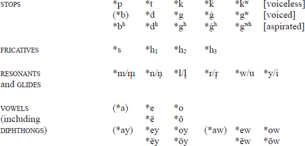
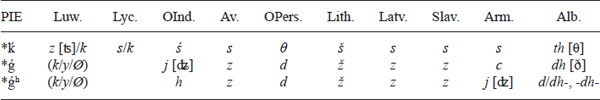
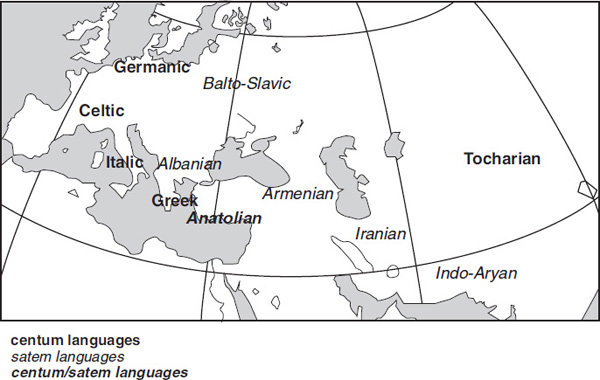
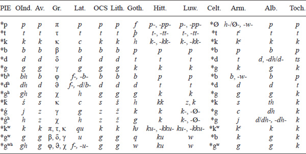
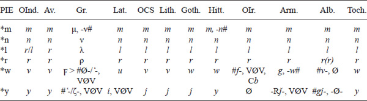
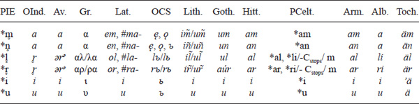
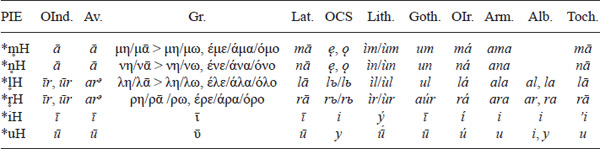
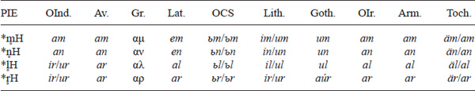
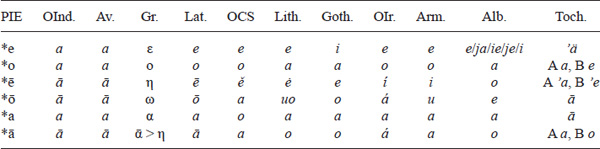
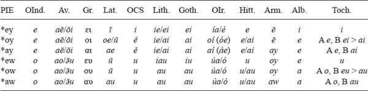

<!-- page: 13 -->

# Chapter 1

# Proto-Indo-European phonology

Mate Kapović

## Introduction

Proto-Indo-European phonology is reconstructed on the basis of its reflexes in Indo-European languages – mostly older ones, generally preserving more archaic features, i.e., closer to PIE. The principal languages referenced in this chapter for the reconstruction of PIE are Old Indic/Indo-Aryan (Vedic and Sanskrit), Avestan (Old/Gatha- and Young/Late Avestan), (Ancient) Greek, Latin, Old Church Slavic, Lithuanian (Old and Modern), Gothic, Hittite, Old Irish, Tocharian (A and B), (Classical) Armenian, and Albanian. Of course, other languages (Sabellic, Latvian, Old Prussian, Old High German, Old English, Luwian, Gaulish, Old Persian, etc.) are also used when necessary or when they have a form or feature not present in a language from the first group. Ideally, PIE reconstruction should take into account all the relevant information present in any IE language/dialect. This overview tries to present the reconstructed PIE phonological system and its main reflexes in major ancient IE languages. A more detailed overview of reflexes for specific languages/branches can be found in separate chapters in this volume.

The following phonological system can be reconstructed for the last phase of PIE:

The phonemes *b and *a (together with *ay and *aw) can be considered marginal, or at least infrequent, phonemes (p. 18, 42), *a also being an allophone of *e when in contact with *h₂ (p. 43). Reconstruction of *ā not stemming from original *eh₂ is very questionable (p. 42). Short *i and *u most likely had long allophones in monosyllabic forms (p. 55).

<!-- page: 14 -->

PIE stops were voiceless, voiced, or (voiced) aspirated. The velar stops were unmarked (*k, *g, *gʰ), palatalized (*kˊ, *ǵ, *ǵʰ) (IPA \[kʲ, gʲ, gʲʰ\]), or labialized (*kʷ, *gʷ, *gʷʰ). Besides *s, the “laryngeals” *h₂ and *h₃ (marked numerically) were almost certainly fricatives as well (some kind of *h-*type sounds). The *h₁ “laryngeal” (provisionally labeled a fricative in the above scheme) might also have been a fricative, but this is less certain (p. 30). The sign *H is used for all three laryngeals when it is not known which one is to be reconstructed or when we need a mark for all three laryngeals. Resonants and semivowels were either asyllabic (*m, *n, *l, *r, *w, *y (IPA \[j\])) or syllabic (*m̥, *n̥, *l̥, *r̥, *u, *i) (IPA \[m̩, n̩, l̩, r̩\]). The vowels *i and *u act phonologically in the same way as syllabic resonants – the relation of *i/u to *y/w is the same as that of *m̥/n̥/l̥/r̥ to *m/n/l/r. Some reconstructable segments appeared only as allophones – cf. the non-phonemic fricatives *z (p. 29), *þ (IPA \[θ\]), and *ð (and *ðʰ) (p. 53) and the vowel *ǝ (p. 46–47, 52).

What is immediately typologically noticeable in the PIE phonological system, among other things, is the paucity of “real” vowels (if one does not take into account syllabic glides, long vowels, and diphthongs), the very unusual marginality (or even complete lack of) the vowel *a*, and the complete lack of affricates (no phonemic *c \[ʦ\], *č \[ʧ\], *ǯ \[ʤ\], etc.). On the other hand, the stop system was rather rich (with 15 of them). In later IE languages, phonological systems usually developed in the following direction: the vowel system became typologically more common, with *a* becoming more frequent (additionally, *i* and *u* lost their phonological relation to *j* and *w*/*v*, while diphthongs often became monophthongs); syllabic resonants (*m̥, *n̥, *l̥, *r̥) disappeared everywhere (later they appeared again in some languages); a lot of languages developed new affricates; the “laryngeals” (*h₁, *h₂, *h₃) disappeared in most languages in most positions, but new fricatives appeared; the stop system simplified everywhere; and languages preserved only one additional distinctive feature – aspiration or labialization. Velar palatalization as such was nowhere preserved – it either completely disappeared or was the origin for new affricates and fricatives.

Note on the PIE “orthography”: various authors/schools write reconstructed PIE phonemes differently. Palatalized velars can also be written as *k’, *k̂, *kʲ, *ky, etc.; *ku̯ can be written instead of *kʷ; aspirated stops can be written as *bh, *dh, *gh; laryngeals can be written as *H₁, *H₂, *H₃ or *ə₁, *ə₂, *ə₃ (the latter usually for “syllabic” laryngeals), and an unknown laryngeal as *hx (instead of *H); the glides *y, *w can be written as *i̯/j, *u̯; *eu/eu̯ instead of *ew, etc.

|                    |     | voiceless |     | voiced |     | aspirated |
|--------------------|-----|-----------|-----|--------|-----|-----------|
| labials            |     | *p       |     | *b    |     | *bʰ      |
| dentals            |     | *t       |     | *d    |     | *dʰ      |
| velars             |     | *k       |     | *g    |     | *gʰ      |
| palatalized velars |     | *kˊ      |     | *ǵ    |     | *ǵ ʰ     |
| labialized velars  |     | *kʷ      |     | *gʷ   |     | *gʷʰ     |

Table 1.1 PIE stops

<!-- page: 15 -->

No modern IE language has preserved PIE palatalized velars as such. On the other hand, labiovelars are preserved even in some modern IE languages – cf. the phonetics of English *queen* \[kʷiːn\] (p. 25). PIE aspirated stops are traditionally reconstructed as voiced because of their reflexes, which are mostly voiced (p. 28). However, voiced aspirated stops are typologically less common than voiceless aspirated stops – cf. the initial allophonic aspirated \[pʰ\], \[tʰ\], \[kʰ\] in English *pin*, *tin*, *kin*. In PIE, velars could be both palatalized and aspirated (*ǵʰ) and labialized and aspirated (*gʷʰ) at the same time.

PIE voiceless stops do not change in most of the languages (*p*, *t*, *k*), the main exceptions being Germanic (where they change to voiceless fricatives *f*, *þ*, *x*) and Armenian (where they change to voiceless aspirates *pc, *t*c**, *k*c**). The phoneme *p weakens and disappears in Celtic. In most languages, PIE voiced stops remain unchanged (*b*, *d*, *g*). However, in Germanic and Armenian (perhaps also in Anatolian) they become voiceless *p*, *t*, *k* (in Tocharian all stops merge into *p*, *t*/*ts*, *k*). The phonemes traditionally reconstructed as voiced aspirated stops change in most IE languages. They are preserved only in Indo-Aryan (*bh*, *dh*, *gh*); in Greek they remain aspirated but become voiceless (φ \[pʰ\], ϑ/θ \[tʰ\], χ \[kʰ\]); in Italic they change to fricatives (voiceless initially: *f-, *þ-, *x-; voiced medially: *-β-, *-ð-, *-γ-), and in other branches they change to plain voiced stops (*b*, *d*, *g*). PIE palatovelars change to plain velars in some languages (*k*, *g*) and to affricates (*c\[ʦ\]*/*ć*\[ʨ\]/ *č\[ʧ\]*, *d˘z*\[ʣ\]/*d˘ź*\[ʥ\]/*d˘ž\[ʤ\] …*) and, further on, to fricatives (*s*/*ś*\[ɕ\]/*š\[ ʃ \]*, *z*/*ź*\[ʑ\]/*ž\[ʒ\] …*) in others. PIE labiovelars remain labialized velars in some languages (*kʷ*, *xʷ*, *gʷ*), or change further to full labials (*p*, *b*/*w*), while in others (mostly those where PIE palatovelars yield affricates/fricatives) they become plain velars (*k*, *g*).

### Voiceless stops

## *p

- **PIE *pōds** ‘foot’ \> Ved. *pā́t* (YAv. *pad-*), Gr. πούς (cf. via Lat. Eng. *podium*), Lat. *pēs* (⇒ Eng. *pedal*), OCS *pěšь* ‘on foot’, Lith. *pė́sčias* ‘pedestrian’, Goth. *fotus* (Eng. *foot*), OIr. *ís* ‘below, under’ \< *pēdsu, Hitt. *pat-*, Arm. *otn* ‘foot’, *het* ‘foot(print)’, Toch. B *paiyye*
- **PIE *pekʷ-** ‘cook, bake’ \> Ved. *pácanti* ‘they cook’ (YAv. *pačata* ‘it is cooked’), Gr. πέσσω, Lat. *coquō* \< *kʷekʷ- (assimilation), OCS *pešti*, Lith. *kèpti* \< *pekti (metathesis), MW *pobi* \< *kʷokʷ- (assimilation), Arm. *hac*c** ‘bread’, Alb. *pjek*, Toch. AB *päk-*
- **PIE *peh₂wr/n-** ‘fire’ (p. 78) \> Gr. πῦρ, Umbr. *pir*, Cz. (arch.) *pýr* ‘ash, fire’, OPruss. *panno*, Goth. *fon* (Eng. *fire*), Hitt. *pah˘h˘ur*, Arm. *hur*, Toch. B *pūwar*

PIE *p is reconstructed because it reflects as *p* in most languages. In Germanic, where all stops change their articulation, we find *f* (medially only following the stressed syllable). In Armenian the reflex is originally aspirated *pʰ-, which yields either *h-* or nothing word-initially (#*h-* of any origin is unstable in Armenian) and *w* word-internally (p. 426–427). In Celtic PIE *p disappears through a *p \> *f \> *h type process (p. 363). In Italic and Celtic (before the *p \> *h change in Celtic), *p–kʷ (a *p and a *kʷ in the same word) assimilate regularly to *kʷ–kʷ, cf. PIE *penkʷe ‘five’ \> Lat. *quīnque*, OIr. *cóic* (*kʷ \> *c* in Old Irish). In Hittite the reflex is *p-* initially and a geminate spelling -*pp-* internally (p. 177).

## *t

- **PIE *tod** ‘that’ \> Ved. *tát* (GAv. *ta-*), Gr. τό, OCS *to*, Lith. *tàs*, Goth. *þata* (Eng. *that*, Germ. *das*), OIr. *tó* ‘yes’, Alb. *kë-ta*, Arm. *da*
- **PIE *tn°h₂us** ‘thin’ \> Ved. *tanús*, Gr. τανύς, Lat. *tenuis*, OCS *tъnъčaje* ‘thinner’, Lith. *tę́vas*, OIc. *þunnr* (Eng. *thin*, Germ. *dünn*), OIr. *tanae*
- **PIE *pet-** ‘fly’ \> Ved. *pátati* ‘flies’ (YAv. *patəṇti* ‘they fly’), Gr. πέτoμαι ‘I fly’, Lat. *petō* ‘I go after’, OEng. *feðer* \< Gmc *feþrō (Eng. *feather*), OIr. *én* ‘bird’ \< *pet-no- (Gaul. *Etnosus* (name of a deity)), Hitt. *pattai-*

PIE *t is reconstructed because it reflects as *t* in most languages. In Germanic it changes to *þ* (Eng. \<th\>, Gmc *þ \> *d*) initially and medially following the stressed syllable (p. 20). In Armenian the reflex is an aspirated *t*c** (cf. Arm. *t*c*aršamim* ‘I wither’, Lat. *torreō* ‘I dry’, Eng. *thirst* \< PIE *ters-), but the evidence is scarce, with *d-* appearing in unaccented words (cf. Arm. *du* ‘thou’, Lat. *tū* \< PIE *tū̆, p. 438). In Hittite we find initial *t-* and medial -*tt-*.

## *k

- **PIE *lewk-** ‘light’ \> Ved. *rókás* (GAv. *raočah-* with palatalization), Gr. λɛυκός ‘light, white’ (⇒ Eng. *leukocyte*), Lat. *lūx*, Russ. CSl. *lučь* (with palatalization), Lith. *laũkas* ‘pale’, Goth. *liuhaþ* (Eng. *light*), MIr. *luach* ‘glowing white’ (Gaul. *Leucus* (pers. name)), Hitt. *lukk-* ‘to light up’, Toch. AB *luk-*
- **PIE *krewh₂s** ‘raw meat, blood’ \> Ved. *kraví́s-* ‘raw/bloody meat’, Gr. κρέας ‘meat’, Lat. *cruor* ‘(wound) blood’, OCS *krъvь* ‘blood’, Lith. *kraũjas* ‘blood’, OEng. *hrēaw* (Eng. *raw*)
- **PIE *kes-** ‘comb, scratch’ \> Ved. *kṣṇaumi* ‘I whet’ (*ksnew-), Gr. ξέω ‘I scrape’, PSl. *kosa ‘hair’ (BCMS *kòsa*), Lith. *kasà* ‘braid’, OIr. *cír* ‘comb’ (also *cass* ‘curl’, Gaul. *Cassi-* (pers. name)), Hitt./CLuw. *kiš-* ‘to comb’, Arm. *k*c*os* ‘scab, itch’, (?) Toch. B *kāswo* ‘eruption, inflammation of the skin’

PIE *k is reconstructed because it reflects as *k* in most languages (cf. PIE *kēs- \> Alb. *kohë* ‘time’, OCS *časъ* ‘time, moment’). Parallel to *p and *t, *k yields *x in Germanic (medially only following the stressed syllable) and aspirated *k*c** in Armenian. In Hittite we find initial *k-* and medial -*kk-* (written also as \<gg\>).

### Voiced stops

## *b

- **PIE *h₂ebōl** ‘apple’ \> OCS *ablъko*, Lith. arch./dial. *óbuolas*, OEng. *æppel* (Eng. *apple*), OIr. *ubull*, (?) Lat. (from Osc.) *Abella* (name of a town)
- **PIE *bel-** ‘strong’ \> Ved. *bálam* ‘strength’, Gr. βέλτερος ‘better’, Lat. *dē-bilis* ‘weak’, OCS *bolii* ‘better’, Low Germ. *pall* ‘unmovable’, (?) OIr. *balc* ‘strong’
- **PIE *dʰewb-** ‘deep’ \> Gr. βυϑóς ‘depth’ (\< *ϑυβóς, metathesis), OCS *dьbrь* ‘valley, ravine’ \< *dъbrь, Lith. *dubùs*, Goth. *diups* (Eng. *deep*), Toch. B *tapre* ‘high’

PIE *b is reconstructed because it reflects as *b* in most languages. However, in Germanic, Armenian, Tocharian, and Anatolian, the reflex is *p*. In Germanic and Armenian this change is just a part of a larger chain shift (see below), while in Tocharian all stops merge into voiceless ones. The exact phonetics of Hitt. *p-*, -*p-* \< PIE *b (as opposed to *p-*, *-pp-* \< PIE *-p-) is not clear (p. 177).

<!-- page: 17 -->

There are not a lot of words containing PIE *b. It seems to have been a marginal phoneme in PIE (it might have been completely absent in pre-PIE). The roots containing PIE *b are often attested in only a few languages, and sometimes this *b seems to be of secondary origin. Clear cases of secondary *b are found in forms where it originates from the *ph₃ cluster – cf. the PIE root *peh₃- ‘drink’ (Ved. *apāt* ‘he drank’, Lat. *pōtus* ‘drunk’), where after reduplication one gets *pi-ph₃- \> *pib- ‘drink’ (Ved. *píbati* ‘drinks’, Lat. *bibō* ‘I drink’ \< *pibō, OIr. *ibid* ‘drinks’). In some cases, it seems likely that a PIE *b originates in older *m. Thus, the root *h₂ebl- ‘apple’ can be related to another PIE word for ‘apple’ – *meh₂lom (Lat. *mālum*, Gr. μῆλον, Alb. *mollë*; (?) Hitt. *māh˘laš* ‘branch of a grapevine’). Here, one can assume a metathesis *meh₂l- \> *h₂eml- and then the change *-ml- \> *-bl- in northern IE dialects, where the word is attested. This kind of change can probably be seen in PIE *bel- ‘strong, better’ (see above) as well – cf. Lat. *melior* ‘better’ \< PIE *mel-. A secondary *b (presumably from older *p) can perhaps be seen in PIE *bol- (Lat. *blatea* ‘swamp’, OCS *blato* ‘mud’, Lith. *balà* ‘mud’, OEng. *pōl* \> Eng. *pool*, Alb. *baltë* ‘mud’), compared to PIE *pol- (Skr. *palvalám* ‘pool, pond’, Lat. *palus* ‘swamp’, Lith. *pãlios* ‘mud’). In some cases, there is even a variation of *p/b/bʰ, cf. *dʰewp- (PSl. *dupa ‘hole’, ONor. *dúfa* ‘dive’, Eng. *dive –* but see p. 54), *dʰewb- (see above), and *bʰudʰ- ‘bottom’ (Ved. *budhnás*, Gr. πυϑμήν, Lat. *fundus*, OEng. *bodan*) with metathesis. See p. 18 for more on PIE *b.

## *d

- **PIE *h₁don(ts)** ‘tooth’ (\< ‘eating’) \> Ved. *dán* (Av. *daṇtan-*), Gr. ὀδούς, Lat. *dēns* (⇒ Eng. *dentist*), PSl. *dęsni ‘gums’ (BCMS *dȇsni*), Lith. *dantìs*, Goth. *tunþus* (Eng. *tooth*), OIr. *dét*, Hitt. *adant-* ‘eating, eaten’, Arm. *atamn*
- **PIE *dek*´*s-** ‘right (side)’ \> Ved. *dákšinas* (YAv. *dašina-*), Gr. δɛξιός, Lat. *dexter* (⇒ Eng. *dexterity*), OCS *desnъ*, Lith. arch. *dẽšinas*, Goth. *taíhswa*, OIr. *dess* (Gaul. *Dex(s)iua* (name of a deity)), Alb. *djathtë*
- **PIE *doru** ‘tree, wood’ \> Ved. *dā́ru* ‘wood’ (YAv. *dā*u*ru* ‘tree trunk’), Gr. δόρυ ‘tree’, OCS *drěvo* ‘tree’, Lith. *dervà* ‘resin, tar’, Goth. *triu* ‘tree trunk’ (Eng. *tree*), OIr. *daur* ‘oak’, Hitt. *tāru* ‘wood’, Alb. *dru*

PIE *d is reconstructed because it reflects as *d* in most languages. The exceptions are again Germanic, Armenian, and Anatolian, with *t*, and Tocharian, with *ts* (cf. Toch. *tsäm-* ‘grow’, Gr. δέμω ‘I build’ \< PIE *demh₂-, p. 454).

## *g

- **PIE *gerh₂n/w-** ‘crane’ \> Gr. γέρανος, Lat. *grūs*, PSl. *žeravь (OCz. *žeráv*) (with palatalization), Lith. *gérvė*, OEng. *cran* (Eng. *crane*), MW/MBret. *garan* (Gaul. *tri-garanos* ‘with three cranes’), Arm. *kṙunk*
- **PIE *gem-** ‘squeeze, (com)press’ \> Gr. γέμω ‘I am full/laden’, Lat. *gemō* ‘I groan’ (\< *‘groan under pressure/a load’), CS *gǫstъ* ‘dense’, Lith. *gãmalas* ‘lump’, (?) OIc. *kum(b)la* ‘to bruise, wound’, MIr. *gemel* ‘shackle’, Toch. AB *kāmā-*
- **PIE *gel-/gl-ut-** ‘swallow; throat’ \> Skr. *galas* ‘throat, neck’, Lat. *gluttō* ‘glutton’ (⇒ Eng. *gluttony*), ORuss. *glъtati* ‘to swallow’, OEng. *ceole* ‘throat’, (?) OIr. *geilid* ‘grazes, eats’, Arm. *klanem* ‘I swallow’

The phoneme *g was, strangely, rather rare in PIE. It reflects as *g* in most languages (see p. 28 for palatalizations). The exceptions, with the voiceless reflex *k*, are, as usual, Germanic, Armenian, Anatolian, and Tocharian.

<!-- page: 18 -->

#### *PIE *b and glottalic theory*

The fact that (early) PIE seems not to have had a phoneme *b is typologically unusual, since this kind of gap (a language with *p* but no *b*) seems to be practically unattested elsewhere1 (languages having a *b* and no *p*, like Arabic, do exist – Proto-Celtic was such a language as well). Together with the curious constraint in PIE that a root could not have two voiced stops (p. 54), this has led some researchers (Gamkrelidze & Ivanov 1995 being the most famous) to believe that PIE voiced stops ((*b), *d, *g) should be phonetically reinterpreted as glottalized (ejective) stops ((*p̣), *ṭ, *ḳ) (while the traditional *p, *t, *k and *bʰ, *dʰ, *gʰ would be reinterpreted as *p(ʰ), *t(ʰ), *k(ʰ) and *b(ʰ), *d(ʰ), *g(ʰ) – cf. p. 20–21). Since some languages with ejectives (like Navajo) are missing the bilabial stop *p̣* (though this is not the case in the majority of such languages – Quechua and Georgian have it, for instance), and sometimes have a constraint on having two ejectives in one word (though there are plenty of languages that do not), this could explain why (early) PIE had no *b and no **deg-type roots. The problem with this theory is that the reflexes of traditionally reconstructed PIE *b, *d, *g are indeed voiced stops in the majority of IE languages/dialects. In cases where this is not true, the voiceless reflexes are hardly relevant – Germanic and Armenian have gone through complete consonantal shifts, and in Tocharian all stops became voiceless. Assuming an independent nontrivial change of glottalized voiceless to voiced stops in almost all IE branches is highly implausible, while the empirical evidence in favor of reconstructing PIE glottalized stops (cf. Kortlandt 1985) is interesting but hardly compelling. Thus, it seems best to stick with the traditional reconstruction of voiced (*b), *d, *g for the last phase of PIE, though it is possible that pre-PIE indeed had glottalized *ṭ, *ḳ. Cf. also p. 154.

### Voiced aspirated stops

The opposition of voiced and voiced aspirated stops is preserved in Indo-Aryan, in Italic (through fricativization of aspirates – p. 326–327), and, via complete consonant shifts, in Germanic and Armenian (p. 392–393, 426). Elsewhere (Anatolian, Celtic, Balto-Slavic, Albanian, Iranian), the aspiration is lost and the two series merge (traces of the old distinction are seen indirectly through Winter’s Law in Balto-Slavic – p. 481).

## *bʰ

- **PIE *bʰreh₂tēr** ‘brother’ \> Ved. *bhrā́tā* (Av. *brātar-*), Gr. φρᾱ́τηρ ‘member of a brotherhood’, Lat. *frāter* (⇒ Eng. *fraternity*), OCS *bratrъ*, Lith. *broterė̃lis* ‘little brother’, Goth. *broþar* (Eng. *brother*), OIr. *bráthir* (Gaul. *Bratronos* (pers. name)), Arm. *ełbayr*, Toch. B *procer*
- **PIE *bʰewH-** ‘be, become, grow’ \> Ved. *bhávati* ‘is, becomes’ (GAv. *bavat˜*), Gr. φύονται ‘they grow’, Lat. *fuī* ‘I were’, OCS *byti* ‘to be’, Lith. *bū́ti* ‘to be’, Goth. *bauan* ‘to dwell, inhabit’ (Eng. *be*), OIr. *biid* ‘is wont to be’, Arm. *busanim* ‘I grow’
- **PIE *g´ombʰos** ‘tooth’ \> Ved. *jámbhas*, Gr. γόμφος, OCS *zǫbъ*, Lith. *žam̃bas* ‘corner, edge’, ONor. *kambr* ‘comb’ (Eng. *comb*), Alb. *dhëmb*

<!-- page: 19 -->

In most branches (Germanic, Armenian, Iranian, Celtic, Balto-Slavic, Albanian), the reflex is a plain voiced *b* (with a merger with the reflex of PIE *b, except in Germanic and Armenian, where PIE *b \> *p*). Anatolian *p-*, *-p-* has the same reflex as PIE *b (cf. PIE *-p- \> -*pp-*). Indic has voice together with aspiration (*bh*), while the reflex in Greek is a voiceless aspirate φ \[pʰ\]. The aspiration is indirectly seen in Italic, where the reflexes are fricative, cf. Latin initial voiceless *f-* and medial voiced *-b-* (Proto-Italic fricative *-β-, p. 326–327). In Tocharian PIE *p, *b, and *bʰ merge into *p*. All this points to a PIE voiced aspirate (or breathy-voiced; p. 20–21) *bʰ, with most languages preserving voice and some aspiration.

## *dʰ

- **PIE *h₁widʰew-** ‘widow’ (perhaps originally: ‘unmarried’) \> Ved. *vidhávā* (YAv. *viδava*), Gr. ἠίϑɛος ‘bachelor’, Lat. *uidua*, OCS *vьdova*, OPruss. *widdewu*, Goth. *widuwo* (Eng. *widow*), OIr. *fedb*, Hitt. *w(i)dati-*
- **PIE *h₁rudʰros/h₁rowdʰos** ‘red’ \> Ved. *rudhirás*, Gr. ɛ̓ρυϑρός (⇒ Eng. *erythrocyte*), Lat. *ruber*, OCS *rъdrъ*, Lith. *raũdas* ‘reddish’, OEng. *rēad* (Eng. *red*), OIr. *rúad* (Gaul. *Roudius* (pers. name)), Toch. B *ratre*
- **PIE *dʰuh₂mos** ‘smoke’ \> Ved. *dhūmás*, Gr. ϑῡμός ‘soul, spirit’, Lat. *fūmus* (⇒ Eng. *fume*), OCS *dymъ*, Lith. *dū́mas*, OHG *doum*, MIr. *dumacha* ‘fog’, Hitt. *tuh˘h˘ui-*, Toch. B *tweye* ‘dust, ashes’

Again, Indic has a voiced aspirated *dh* and Greek a voiceless aspirated ϑ (written also θ) \[tʰ\]. In Balto-Slavic, Celtic, and Albanian, PIE *dʰ \> *d*, which merges with PIE *d. The merger is also seen in Hittite initial *t-* and medial (non-geminate) -*t-* (written also as \<d\>). Germanic and Armenian (cf. p. 427) have voiced *d* with a consonantal shift, and in Tocharian PIE *dʰ and *t merge into *t*. Proto-Italic has initial *þ- and medial *-ð-, reflected in Latin as *f-* and -*d-* (in most conditions) or -*b-* (before/after *r*, after *u*, and before *l*).

## *gʰ

- **PIE *steygʰ-** ‘go, climb’ \> Ved. *ati-ṣṭígham* ‘to climb up’, Gr. στείχω ‘I walk’, OCS *po-stignǫti* ‘to attain, to catch up with’, Latv. *stèigtiês* ‘to hurry’, Goth. *steigan* ‘to climb’, OIr. -*tíagait* ‘walks’, Alb. *shteg* ‘footpath’
- **PIE *h₃meygʰ-, *h₃migʰleh₂** ‘fog, cloud’ \> Ved. *meghás* ‘cloud, rain’ (YAv. *maēγa-*), Gr. ὀμίχλη ‘mist, fog’, OCS *mьgla* ‘fog’, Lith. *miglà* ‘fog’, Dutch *miggelen* ‘to drizzle’, Arm. *mēg* ‘fog’, Alb. *mjegull* ‘fog, mist’
- **PIE *gʰl(e)h₂dʰ-** ‘smooth’ \> Lat. *glaber*, OCS *gladъkъ*, Lith. *glodùs*, OHG *glat* ‘clear’ (Eng. *glad*)

PIE *gʰ yields *gh* in Indic and χ \[kʰ\] in Greek. In Iranian, Balto-Slavic, Celtic, and Albanian PIE *gʰ (together with PIE *g) yields *g*, the same as in Germanic and Armenian but in the latter two as a part of a general sound shift. In Hittite one finds *k-*, -*k-* (written also as \<g\>), and in Tocharian all velars merge into *k*. In Latin we find *h* in most cases (the exceptions being *gr-*/*gl-*, *fu-*, and -*ng-*).

#### *Grassmann’s Law*

<!-- page: 20 -->

In Indo-Aryan and Greek, there is an independent dissimilation rule that causes the deaspiration of the first aspirate in a word: Cʰ–Cʰ \> C–Cʰ. Cf. PIE *bʰewdʰ- \> Ved. *bódhati* ‘is aware’ (not **bhódhati), Gr. πɛύϑομαι ‘I give notice’ (not **φɛύϑομαι). The fact that Greek exhibits voiceless deaspirated stops proves that the deaspiration occurred after the Greek devoicing of PIE aspirated stops (which have a voiced reflex in Indic). This means that the deaspiration in Greek is younger and independent of Indic.

#### *Consonantal shifts in Germanic and Armenian*

In Germanic and Armenian, all stops experience a very similar chain shift, in which all PIE stops weaken. Voiced aspirates lose aspiration, voiced stops lose voicedness, and voiceless stops change to fricatives (in Germanic) or to voiceless aspirates (in Armenian):

|                  |                    |                                                       |
|------------------|--------------------|-------------------------------------------------------|
| PIE              | Germanic           | Armenian                                              |
| *bʰ, *dʰ, *gʰ |      *b*, *d*, *g* |                                                       |
| *b, *d, *g    |      *p*, *t*, *k* |                                                       |
| *p, *t, *k    | *f*, *þ*, *h*      | *pc, *t*c**, *k*c** |

Palatovelars and labiovelars change as well (see below). This seems to be an independent change in these two branches. In Germanic it is traditionally called **Grimm’s Law** (p. 392–393, cf. p. 426 for Armenian). In Germanic PIE voiceless stops have a voiceless reflex if preceded by a fricative (*s*, *f*, *h*, *þ*), cf. PIE *nokʷts ‘night’ (Lat. *nox*) \> Goth. *nahts* (not **nahþs) or PIE *pisk- (Lat. *piscis*) \> OEng. *fisc* (Eng. *fish*).

In Germanic, Grimm’s Law operates always in initial position. However, in the middle of the word it does so only if the syllable preceding PIE *p/t/k was stressed in pre-Proto-Germanic (pre-PGmc had a free stress, like Vedic or Greek, which it subsequently lost – p. 396). If not (i.e., if the stress was on the syllable following *p/t/k or elsewhere), **Verner’s Law** (p. 393) operated, by which PGmc *f, *þ, *x changed to voiced fricatives *β, *ð, *γ (similar to Spanish \<b, d, g\> in most positions). In Gothic these yield *b*, *d*, *g*.

- PGmc *βrṓþēr ‘brother’ (Ved. *bhrā́tā*, Gr. φρᾱ́τηρ) \> Goth. *broþar*
- PGmc *faðḗr ‘father’ (Ved. *pitā́*, Gr. πατήρ) \> Goth. *fadar*

Grimm’s and Verner’s Laws operate on PIE palato- and labiovelars as well (p. 21–25). In Old High German (and Modern Standard German), there is another chain shift, called the OHG sound shift, where Germanic stops and fricatives change once again (p. 393–394).

#### *The problem of the PIE voiced aspirates*

<!-- page: 21 -->

PIE voiced aspirates are reconstructed as such because this is what the reflexes point to – to aspiration or traces of it in some languages, and to voicedness in most of them. Indic is thought of as the most archaic since it preserves both voice and aspiration, though what are usually called “voiced aspirates” seem actually to be murmured/breathy-voiced stops (acoustically similar to aspirates) in many modern Indo-Aryan languages. Greek also has aspirates (though voiceless), and fricative reflexes in Italic (p. 326–327) point to original aspirates as well. In other branches, aspiration is lost, but the reflexes are always voiced (except in Tocharian, which is irrelevant). In Anatolian, where the exact pronunciation of stops is not clear (p. 177), one can still see that the reflexes of voiced and voiced aspirate stops are the same (non-geminate), while different from voiceless stops (geminate medially). Even in Germanic and Armenian, with a complete chain shift of stops, the internal logic of the shift (with each series “weakening” by one step – losing aspiration, voicedness, and plosiveness respectively) points to voiced aspirates. The typological parallel for the development of PIE voiced aspirates can be found in Indo-Aryan, where Old Indic voiced aspirates yield voiced aspirates (breathy-voiced), voiceless aspirates, or voiced stops in various modern Indo-Aryan languages.

Thus, the reconstruction of PIE *bʰ, *dʰ, *gʰ based on its reflexes is quite solid. However, the problem is again of typological nature – the PIE system of *T, *D, *Dʰ, i.e., the system with voiceless, voiced, and voiced aspirated stops (and no voiceless aspirates), is very unusual. It is a near universal in world languages that a language has to have voiceless aspirates if it has voiced aspirates (like in Indo-Aryan languages), or that, if it has just one set of aspirates, those are voiceless (like in Ancient Greek) – there is no reason for the double markedness of voiced aspirates (voice and aspiration) if voiceless aspirates are lacking in a language. However, as we have seen, the reflexes in IE languages do indeed point to voiced aspirates. Though the problem can hardly be considered solved, it may just be that PIE, with its *T/D/Dʰ system, was an (unstable) typological exception. And it is not the only one: there is at least one similar system in the world (with voiced aspirates but no voiceless aspirates) – in a dialect of the Austronesian Kelabit language.2 Cf. also p. 18 and p. 153–154.

There is no real compelling evidence for the reconstruction of PIE voiceless aspirated stops, although they used to be reconstructed and sometimes still are by certain authors/schools. Indic voiceless aspirates originated in the combination of PIE *p/t/k and laryngeals (but not *ph₃ – p. 17), cf. PIE gen. sg. *pn̥tHos ‘path’ \> Ved. gen. sg. *pathás*, Gr. πάτoς (p. 77), *h₃esth₁ (p. 30), etc. For the laryngeal-aspiration of voiced plosives in Indo-Aryan cf. p. 30.

### Palatalized velars

Concerning the reflexes of PIE *kˊ, *ǵ, *ǵʰ, which were palatalized velars (IPA \[kʲ\], \[g ʲ\], \[gʲʰ\]) rather than palatal stops (IPA \[c\], \[ɟ\], \[ɟʰ\]), the IE languages can be divided into two groups – ****centum**** languages (after Lat. *centum* ‘hundred’ \< PIE *(d)kˊm̥tom) and ****satem**** languages (after Av. *satəm* ‘hundred’). In the *centum* group, PIE palatalized velars depalatalize, i.e., reflect in the same way as the original PIE *k, *g, *gʰ. Most of the *centum* languages/branches are positioned to the west – Greek, Italic, Celtic, Germanic, and some fragmentarily attested languages (like Lusitanian and Venetic). The only exception is Tocharian, positioned to the east. In the *satem* group, PIE palatovelars usually reflect as either affricates (like *t˘s*, *t˘š*, *dz˘*, *d˘ž …*) or fricatives (like *s*, *š*, *z*, *ž*, *þ*, *ð* …), the fricatives usually being the further reflexes of older affricates (through processes like *t*t˘š** \> *š*, *d˘ž* \> *ž*, etc.). Meanwhile, Balto-Slavic and Indo-Iranian (and fragmentarily attested Thracian, for instance) as *satem* languages are positioned more to the east. This is also true of Albanian, Armenian, and a part of Anatolian (Luwian and Lycian), which can be considered *satem* because of their reflexes of palatalized velars (but see p. 176). Considering that we find velars as reflexes in one group of languages and mostly affricates/fricatives (not depending on specific vowels, etc.) in other languages, the reconstruction of palatalized velars for the proto-language seems to be the most reasonable solution. For more on *centum*/*satem*, cf. p. 27–28.

## *k´

- **PIE *k´ēr(d)**, ***k´r°d-** ‘heart’ \> Ved. *śrad-dhā́* ‘faith’, Gr. κῆρ, καρδίᾱ/κραδίᾱ (⇒ Eng. *cardiology*), Lat. *cor* (⇒ Eng. *cordial*), OCS *srьdьce*, Lith. *širdìs* (Latv. *sirˆds*, OPruss. *seyr*), Goth. *haírto* (Eng. *heart*), OIr. *cride*, Hitt. *ker*, *kard(i)-* (Pal. *kārt-*, CLuw. *zārt-*, HLuw. *zart(i)-*), Arm. *sirt*, Toch. B *käryāñ* ‘hearts’
- **PIE *h₁ek´wos** ‘horse’ \> Ved. *áśvas* (YAv. *aspa-*), Gr. ἵππος (⇒ Eng. *hippo-drome*, *hippo(-potamus)*, Myc. *i-qo*), Lat. *equus* (⇒ Eng. *equestrian*), OLith. *ešva* ‘mare’, Goth. *aíhwa-tundi-* ‘thornbush, bramble’ (lit. ‘horse-tooth’, OEng. *eoh* ‘war-horse’), OIr. *ech* (\< Ogham Irish EQO-DDI, CIb. *Ekua-laku* (pers. name), Gaul. *Equos* ‘the ninth month’, *Epos* (pers. name)), HLuw. *azu-* (Lyc. *esb-*), Arm. *ēš* ‘donkey’, Toch. B *yakwe*, Ven. acc. sg. *ekvon*
- **PIE *h₁nek´-** ‘get, reach’ \> Ved. *náś-* ‘attain’ (GAv. *nąsat˜* ‘reaches’), Gr. ἐνεγκεῖν ‘to carry’, Lat. *nancīscor* ‘I get’, OCS *nesti* ‘to carry’, Lith. *nèšti* ‘to carry’ (Latv. *nest*), Goth. *ga-nah* ‘to suffice’ (Eng. *enough*), OIr. *ro-ic* ‘reaches’, Arm. *hasanem* ‘I arrive’, Toch. B *eṅk-* ‘take, grip’

In *centum* languages, the reflexes are the same as for PIE *k (p. 16). In *satem* languages, we find affricates and fricatives – OInd. *ś*, Av. *s*, OPers. *θ* (cf. OPers. *viθ-* ‘house(hold)’ to Ved. *víś-* ‘settlement’, Lat. *uīcus* ‘village’ \< PIE *wikˊ-/woykˊ-) (p. 206), Slav./Latv./OPruss. *s*, Lith. *š* (\< PBSl. *ś), Alb. *th* \[θ\] (cf. Alb. *them* ‘I say’, Ved. *śaṃsati* ‘praises’, Lat. *cēnseō* ‘I suggest, propose’ \< PIE *kˊen/ms-), and Arm. *s* (PIE *kˊw \> *š*, p. 434). In Luwian we find *z* \[ʦ\], and in Lycian *s* from PIE *kˊ before *ē̆/i/y/w (p. 176, cf. always *k* in Hittite).

## *g´

- **PIE *g´e/onu** ‘knee’ (p. 74) \> Ved. *jā́nu* (YAv. *zānu-*), Gr. γόνυ, Lat. *genū*, Goth. *kniu* (Eng. *knee*), Hitt. *gēnu*, Arm. *cunr*, Toch. A *kanweṃ* ‘knees’ (du.)
- **PIE*h₂eg´ros** ‘field’ \> Ved. *ájras*, Gr. ἀγρός (⇒ Eng. *agro-nomy*), Lat. *ager* (⇒ Eng. *agri-culture*), Goth. *akrs* (Eng. *acre*)
- **PIE *g´erh₂-** ‘ripen, mature, old’, ***g´r°h₂nom** ‘grain, corn’ \> Ved. *járati* ‘grows old’, *jīrṇás* ‘old’ (YAv. *zar*ə*ta-* ‘decrepit’), Gr. γέρων ‘old man’ (⇒ Eng. *ger-iatrics*), Lat. *grānum* ‘grain’ (⇒ Eng. *grain*), OCS *zьrělъ* ‘ripe’, *zrьno* ‘grain’, Lith. *žı̀rnis* ‘grain’ (Latv. *zir˜nis*, OPruss. *syrne*), Goth. *kaúrn* (Eng. *corn*), OIr. *grán* ‘grain’, Arm. *cer* ‘old’

In *centum* languages, the reflexes are the same as for PIE *g (p. 17). In *satem* languages, we find mostly affricates and fricatives – OInd. *j* \[ʥ\], Av. *z*, OPers. *d* with depalatalization (cf. OPers. *dauštar-* ‘friend’, YAv. *zaoša-* ‘pleasure’, Ved. *jóṣ-* ‘like’, Lat. *gustō* ‘I taste’ \< PIE *ǵews- ‘taste, like, choose’) – p. 206, Slav./Latv. *z* (written as \<s\> in OPruss.), Lith. *ž* (\< PBSl. *ź), Alb. *dh* \[ð\] (cf. Alb. *dhëmb* ‘tooth’ \< PIE *ǵombʰos, 567), Arm. *c* \[ʦ\] (with regular devoicing as with non-palatalized stops, p. 426).

## *ǵʰ

- **PIE *g´ʰeym-** ‘winter’ \> Ved. *héman* ‘in winter’ (cf. *himás* ‘cold, snow’ \> *Himā-laya*; Av. *zəm-*, Pers. *dai*), Gr. χɛιμών, Lat. *hiems*, OCS *zima*, Lith. *žiemà* (Latv. *zìema*, OPruss. *semo*), ONor. *gói* ‘month from the middle of February to the middle of March’, OIr. *gam* (Gaul. *Giamos* (pers. name)), Hitt. *gimm(ant)-*, Alb. *dimër*, Arm. *jiwn* ‘snow’, Toch. A *śärme*
- **PIE *g´ʰew-** ‘call’ \> Ved. *hávate* ‘invokes’ (YAv. *zava*i*ti* ‘calls’), Gr. καυ-χάομαι ‘I speak loudly, boast’, OCS *zъvati*, Lith. *žavė´ti* ‘charm, fascinate’, (?) Goth. *guþ* ‘god’ (lit. *‘the one who is called’, Eng. *god*), OIr. *guth* ‘voice’ (Gaul. *gutu-ater* ‘a kind of druid’ \< *‘father of invocations’), Arm. *jaunem* ‘I devote’, Toch. B *kwā-* ‘call out to, invite’
- **PIE *h₂em/ng´ʰ-** ‘bind, squeeze; narrow’ \> Ved. *áṃh-* ‘compress’, *áṃhas* ‘trouble’ (YAv. *ązah-* ‘difficulty’), Gr. ἄγχω ‘I squeeze’, Lat. *angō* ‘I squeeze/choke’, *angustus* ‘narrow’ (⇒ Eng. *anguish*), OCS *ǫzъkъ* ‘narrow’, Lith. *añkštas* ‘narrow’ (with *k* instead of *ž*), Goth. *aggwus* \[ŋg\] ‘narrow’ (Germ. *Angst* ⇒ Eng. *angst*, ONor. *angr* ⇒ Eng. *anger*), OIr. *cum-ung* ‘narrow’ (MW *ing*), Hitt. *h˘amank-* ‘tie’, Arm. *anjuk* ‘narrow’, Toch. B *entse* ‘greed, envy’ \< *enkse

In *centum* languages, the reflexes are the same as for PIE *gʰ (p. 19). In *satem* languages, we find mostly affricates and fricatives – OInd. *h* (from older *jh), Av. *z*, OPers. *d*, Slav./Latv. *z* (OPruss. \<s\>), Lith. *ž*, Alb. initially *d-* (cf. Alb. *dorë*, Gr. χɛίρ, Arm. *jeṙn* \< PIE *ǵʰesr- ‘hand’) or *dh-*, medially mostly -*dh-* (p. 567–568). In Armenian we find *j* \[ʣ\], a voiced pair of *c* \< PIE *ǵ. In languages where the reflex of PIE *g is the same as the reflex of *gʰ, PIE *ǵʰ has the same reflex as *ǵ, the only exception being Albanian.

Table 1.2 The reflection of PIE palatovelars in ***satem*** languages

### Labiovelars

The *centum*/*satem* distinction is relevant concerning the PIE labialized velars (*kʷ, *gʷ, *gʷʰ) as well. In the *centum* group (where *Ḱ = *K), they usually yield different reflexes than the regular velars (*k, *g, *gʰ). The labiovelars either are preserved (as *kʷ*, *gʷ*, *xʷ*, etc.) or are (subsequently) changed to full labials (*p*, *b*, *w*) or plain velars (*k*, *g*). Tocharian seems to be the only *centum* language that shows no distinction between old plain and labialized velars (p. 454). In the *satem* group (where *Ḱ ≠ *K), the labiovelars usually reflect as plain velars (*K = *Kʷ) – this is the case in Balto-Slavic and Indo-Iranian (although there are perhaps some indirect traces of labiovelars in Indo-Iranian). But in Albanian (p. 567) the reflexes of plain and labialized velars are distinct before front vowels (*K ≠ *Kʷ), and the same is true for *k ≠ *kʷ before front vowels in Armenian (p. 427). In Luwo-Lycian, which preserves a special reflex of *kˊ in certain conditions (p. 176), the PIE labiovelars have separate reflexes as usual in Anatolian. Traditionally, the *centum* group is represented by the formula *k = *kˊ ≠ *kʷ and the *satem* group by *k = *kʷ ≠ *kˊ, but Armenian, Albanian, and Luwo-Lycian (and Tocharian with *k* from all PIE velars) cannot be neatly subsumed into these formulas (see p. 27).

## *kʷ

- **PIE *kʷetwores** ‘four’ \> Ved. *catvā́ras* (YAv. *čaθβārō*) (with palatalization), Gr. τέτταρɛς, Lat. *quattuor*, OCS *četyre* (with palatalization), Lith. *keturì*, Goth. *fidwor* (Eng. *four*), OIr. *ceth(a)ir* (Gaul. *petuar-*, OW *petguar*), (?) Alb. *katër* (if not from Lat.), Arm. *č*c*ork*c** (with palatalization), Toch. B *śtwer* (with palatalization)
- **PIE *penkʷe** ‘five’ \> Ved. *páñca* (YAv. *paṇča*) (with palatalization), Gr. πέντε (⇒ Eng. *penta-gram*), Lat. *quīnque*, OCS *pętь* \< *penktis, Lith. *penkì*, Goth. *fimf* (Eng. *five*), OIr. *cóic* (Gaul. *pempe-*, OW *pimp*), Alb. *pesë* (with palatalization)
- **PIE *kʷel-** ‘turn’, ***kʷekʷlos** ‘wheel’ (with root reduplication) \> Ved. *cakrá-* ‘wheel’ (⇒ Eng. *chakra*, YAv. *čaxra-* ‘wheel’) (with palatalization), Gr. κύκλος ‘ring, circle’ (⇒ Eng. *cycle*), πόλος (\< *kʷolos) ‘axis’ (⇒ Eng. *pole*), τέλος (\< *kʷelos) ‘end, outcome’ (\< *‘full circle’, ⇒ Eng. *teleo-logy*), Lat. *colus* ‘distaff’, OCS *kolo* ‘wheel, circle’, Lith. *kãklas* ‘neck’, OEng. *hwēol* (with Grimm’s Law, PGmc *xʷexʷl-, cf. Eng. *wheel*), *hweoġul* (with Verner’s Law), MIr. *cul* ‘chariot’, Toch. B *kokale* ‘cart, wagon’, Alb. *sjell* ‘bring’ (with palatalization)

In *centum* languages, PIE *kʷ remains unchanged in part of Italic (Lat. \<qu\> but Sabellian *p*), Anatolian (Hitt./Luw. \<ku\>), Mycenaean Greek (\<q\>), and some Celtic languages (Ogham Irish \<Q\>, CIb. \<ku\>). Proto-Greek *kʷ changes to π, τ, or κ in Attic, depending on what comes next (πα, πo, πC, τι, τε, κυ – p. 292). In Q-Celtic languages, Proto-Celtic *kʷ remains unchanged or loses the labialization later (OIr. *c*), while in P-Celtic it changes to *p* (p. 357–358, 363). In Germanic the reflex is *xʷ (Goth. \<ƕ\>, OEng. \<hw\>, Eng. \<wh\> – still pronounced \[hʷ\] in some dialects) by Grimm’s, or *γʷ by Verner’s Law (p. 20, 392). In certain cases, one finds *f instead of *xʷ in Germanic (like in ‘four’ and ‘five’ above, or ‘wolf’ – p. 35), which can be explained in different ways. Tocharian has *k* for all velars. In *satem* languages, PIE *kʷ usually yields *k*, just like PIE *k. However, Luwian preserves the distinction of *ku* \< PIE *kʷ, *k* \< PIE *k, and *z* \[c\] \< PIE *kˊ in certain conditions (p. 176). One finds different outcomes of PIE *kʷ, *k, and *kˊ before front vowels (PIE *e, *i) in Albanian and Armenian as well – Alb. *s*: *k*: *th* and Arm. *č*c**: *k*c**: *s* (see p. 427, 567).

## The reflex of PIE *kw/kˊw in *centum* languages

PIE *kʷ seems to have been distinct from PIE *kw (*k + *w, likewise *gʷ(ʰ) ≠ *g(ʰ)w), though the latter was rare. In Greek, PIE *kw/kˊw \> κκ (though this is disputed), cf. Gr. λάκκος ‘pond’, OCS *loky* ‘puddle’, Lat. *lacus* ‘lake’ \< PIE *laku/w- (or *lok-/l̥k-). The reflex of PIE *kw in Latin is not clear (perhaps it is *c* in initial position before *a*), cf. Lat. *equus* (p. 22) and *queror* ‘I lament’ (Ved. *śvásiti* ‘blows’ \< PIE *kˊwes-), but *cāseus* ‘cheese’ (OCS *kvasъ* ‘leaven’ \< PIE *kweh₂/₃/ō(t)s-) and *canis* ‘dog’ (OInd. *śvā́* \< PIE *kˊwon-). PIE *kw/kˊw yields PCelt. *kʷ (cf. PCelt. *ekʷos ‘horse’), but not in Germanic and Tocharian (cf. Goth. *aíhwa-*, Toch. B *yakwe*, p. 22).

## *gʷ

- **PIE *gʷōws** ‘cow’ \> Ved. *gáus* (Av. *gāuš*), Gr. βοῦς, Lat. *bōs* (a Sabellian loanword, should be **uōs in Lat.), OCS *govęždь* ‘bovine’, Latv. *gùovs*, OEng. *cū* (Eng. *cow*), OIr. *bó* (Gaul. *Bo-marus* (pers. name)), HLuw. *wawa/i-* (Lyc. *wawa-*), Arm. *kov*, Toch. B *keu*
- **PIE *gʷen(e)h₂** ‘woman’ \> Ved. *jánī* (with palatalization), *gnā́s* ‘divine woman’ (GAv. *ǰəˉni-*, *gənā-*), Gr. γυνή (⇒ Eng. *gyne-cology*, dial. Boeotian βανᾱ́), OCS *žena*, OPruss. *genno*, Goth. *qino* (cf. Eng. *queen* with semantic change), OIr. *bé*/*ben* (Gaul. gen. pl. *bnanom*), CLuw. *wānā-*, Arm. *kin*, Toch. B *śana* (with palatalization), Messapic *benna*
- **PIE *gʷe/orH-/*gʷr°H-** ‘mountain’ \> Ved. *girís* (YAv. *ga*i*ri-*), Gr. δɛιράς ‘ridge of a chain of hills’, βορέης ‘north wind’, OCS *gora* (Slav. also ‘forest’), Lith. *girià* ‘forest’, Alb. *gur* ‘stone’

In *centum* languages, PIE *gʷ as such is not preserved anywhere (except partially in Latin after -*n-*). In Latin the usual reflex is *u* \[w\] (the exceptions being *gr-*/*gl-* and -*ngu-*, while in Sabellian one finds *b –* p. 327). Hittite has \<ku\>, and Luwian has *w*. Proto-Greek *gʷ changes to β, δ, γ in Attic (βα, βo, βC, βι, δε, γυ – p. 292), but not in complete parallelism to voiceless counterparts (thus βι \< *gʷi, but τι \< *kʷi). PIE *gʷ yields PCelt. *b (while PIE *kʷ is preserved and PIE *gʷʰ \> PCelt. *gʷ, p. 363), and, according to Grimm’s Law, PGmc *kʷ (Goth. \<q\>, OEng. \<cw\>/Eng. \<qu\>, OHG \<qu\>, ONor. \<kv\>). In *satem* languages (including Armenian but not Albanian before front vowels), PIE *gʷ is reflected the same as PIE *g.

## *gʷʰ

- **PIE *sneygʷʰ-** ‘snow’ \> Ved. *sníh-* ‘wet(ness)’ (‘snow’ in Prakrits, YAv. *snaēža-* ‘snow’, with palatalization), Gr. acc. sg. νίφα, Lat. *nix* (\< *nig-s), gen. sg. *niuis*, *ninguit* ‘it snows’ (with -*n-* infix, p. 95), OCS *sněgъ*, Lith. *sniẽgas*, Goth. *snaiws* (Eng. *snow*), OIr. *snige*
- **PIE *gʷʰen-** ‘strike, kill’ \> Ved. *ghnánti* ‘they strike, kill’ (\< *gʷʰnenti), *hánti* ‘strikes, kills’ (\<*gʷʰenti, with palatalization) (YAv. *ǰa*i*ṇti* ‘strikes, kills’), Gr. φονɛύω ‘I kill’, ϑɛίνω ‘I strike’, Lat. *dē-fendō* ‘I ward off, repel’ (⇒ Eng. *defend*), OCS *goniti* ‘to chase’, *žęti* ‘to reap’ (with palatalization), Lith. *giñti* ‘to drive (animals)’, ONor. *gunnr* ‘war, battle’, OIr. *gonaid* ‘strikes, kills’, Hitt. *kuenzi* ‘kills’, Arm. *gan* ‘beating’, Toch. B *käsk-* ‘scatter to destruction’
- **PIE *dʰegʷʰ-** ‘burn’ \> Ved. *ni-dāghás* ‘heat’, *dáhati* ‘burns’ (YAv. *daža*i*ti* ‘burns’, with palatalization), Gr. τέφρα ‘ashes’, Lat. *febris* ‘fever’ (⇒ Eng. *fever*), *foueō* ‘I (keep) warm’, OCS *žegǫ* ‘I burn’ (\< *geg- \< *deg- with assimilation), Lith. *dègti* ‘to burn’, Goth. *dags* (Eng. *day*), OIr. *daig* ‘flame’, Alb. *djeg*, Toch. AB *tsäk-* ‘burn up’

In *centum* languages, the labialization of PIE *gʷʰ is usually not preserved (except in Latin and Gothic after -*n-*). In Proto-Italic one expects *hʷ-, *-γʷ-. In Latin this yields initial *f-* and medial -*u-* (but -*n***gu-**** and -****b***r-*). Proto-Greek *kʷʰ (with Greek devoicing of aspirates) changes to φ, ϑ, χ in Attic (φα, φo, φC, φι, ϑε, χυ – p. 292), in parallelism to voiced counterparts. PIE *gʷʰ yields PCelt. *gʷ (\> OIr. *g*, p. 363). In Germanic, PIE *gʷʰ yields *w* or *g* (before *u*, *o*, and consonants), although not everything is clear. After *n*, the expected *gʷ is seen (cf. Goth. *saggws* \[sangʷs\] ‘song’, Gr. ὀμφή \< PIE *songʷʰ-). In some cases, *b* is also posited as a reflex by some; e.g., both Goth. *brinnan* (Eng. *burn*) and OEng. *wearm* (Eng. *warm*) are sometimes derived from PIE *gʷʰerm- ‘burn’ (Gr. ϑερμóς ’hot’, Lat. *formus* ‘warm’, etc.), but alternative etymologies exist as well. In Anatolian, Balto-Slavic, and Albanian, PIE *gʷʰ reflects the same as *gʷ (in Armenian, *gʷʰ reflects as *gʰ). In Albanian, PIE *gʷ(ʰ) merges with PIE *g(ʰ) before back vowels (and yields *g*), while in front of *e/i it yields *z* (cf. PIE *gʷʰermo- \> Alb. *zjarr* ‘fire, fever’) unlike normal velars.

#### *Loss of labiality*

<!-- page: 26 -->

In some *centum* languages that preserve PIE labiovelars in one way or another, there is a tendency toward loss of labiality in some positions – i.e., in front of rounded vowels (*u*and sometimes *o –* a case of phonetic dissimilation). This explains Gr. κυ, γυ, χυ (with plain velars before *u) and examples like Lat. *cultūra* ‘cultivation’, *incola* ‘inhabitant’, but *inquilīnus* ‘tenant’. In Latin the labiality is lost before consonants as well, cf. Lat. *reliquiae* ‘remains’ but *relictus* ‘left behind’.

### The problem of three velar series in PIE

According to the most usual and traditional reconstruction, dating from the 19th century and Karl Brugmann, PIE had three velar series (regular, palatalized, and labialized):

- *k, *g, *gʰ
- *kˊ, *ǵ, *ǵʰ
- *kʷ, *gʷ, *gʷʰ

This kind of system is complex and not typologically too frequent, but it is nonetheless attested – e.g., in the modern Iranian language Yazgulyam3 (where it is an innovation of no historical relation to the PIE three series). There is a long tradition of denying the existence (or originality) of the three velar series in PIE, starting with Antoine Meillet and, surprisingly, still alive today. In this approach, the palatovelars are usually considered somehow secondary.

The main argument against the PIE distinction of *K : *Ḱ : *Kʷ is that the majority of the languages distinguish only the reflexes *K : *Ḱ or *K : *Kʷ. However, as already said, the traditional formulas (*K = *Ḱ ≠ *Kʷ for *centum* and *K = *Kʷ ≠ *Ḱ for *satem* languages) are not valid for all languages. Albanian (p. 567) and Armenian (p. 426–427) distinguish all three series before front vowels (Armenian only in voiceless stops), while Luwian and Lycian distinguish the reflexes of PIE *k : *kˊ : *kʷ (in voiceless stops) in certain conditions (p. 176), cf. CLuw. *kiš-* ‘to comb’ \< PIE *kes- (p. 16), CLuw. *zārt-* ‘heart’ \< PIE *kˊr̥d- (p. 21), CLuw. *kui-* ‘who, what’ \< PIE *kʷi- (Lat. *quis*, p. 88).4 The adversaries of the PIE three series usually offer no plausible alternate solutions for these, but simply hold, if only implicitly, that Anatolian evidence is scarce and inconclusive, or that Armenian and Albanian are too innovative and attested too late to be convincing.

<!-- page: 27 -->

A convincing argument for the three original series is found in the fact that PIE *K : *Ḱ : *Kʷ cannot be predicted from phonemes in their surroundings (though some tendencies do exist). Thus, we find palatovelars in contact with front vowels (direct or indirect, before or after them): *kˊerd- (p. 21), *ǵʰeym- (p. 22), *h₁ekˊwos (p. 22), *ǵneh₃- ‘know’ (Ved. *jānā́ti* ‘knows’, OCS *znati* ‘to know’, Goth. *kann* ‘to get to know’, etc.), etc. However, we also find palatovelars when not in contact with front vowels: *kˊwō(n) (p. 41), *kˊlownis (p. 51), *kˊolh₂m-/kˊl̥h₂m- ‘straw’ (Gr. κάλαμος ‘reed, stalk’, Lat. *culmus*, PSl. *solma \> BCMS *slȁma*, OEng. *healm* \> Eng. *haulm*), etc. In cases like *ǵombʰos (p. 18), one could argue the connection with the verbal stem *ǵembʰ-, etc. Likewise, regular velars are found even when front vowels follow – *kes- (p. 16), *kelh₃- ‘rise’ (Lat. *ex-cellō* ‘I rise’, Lith. *kélti* ‘to lift, raise’, etc.), *gerh₂n/w- (p. 17), etc., though, of course, one can always assume analogies in some cases (to variants *kos-, *kolh₃-). There are also pairs like *leyǵʰ- (p. 32), *steygʰ- (p. 19), *sneygʷʰ- ‘to snow’ (p. 25), and even “minimal pairs” like *bʰergʰ- ‘take care of’ (OCS *ne-brěgǫ* ‘I neglect’, Goth. *baírgan* ‘to preserve, keep’) and *bʰerǵʰ- ‘tall, high’ (Ved. *br°hánt-*, OHG *berg* ‘hill’, Arm. *barjr* ‘high’).5 All this proves that palatovelars were phonemic in the last phase of PIE, and that they did not depend synchronically on the supposed phonetic environment prone to palatalization. Certain possible PIE variants like *lewk-/lewkˊ- ‘shine’ (cf. Ved. *rokás* ‘light’ but *rúśant-* ‘shining’) are probably just remnants of some pre-PIE leveling, perhaps similar to PIE variants with *p/b/bʰ (p. 17).

One usual argument against three series of velars in PIE is the unexpected frequency of these three series. One would expect that the unmarked plain velars would be the most frequent, while in reality they are the least frequent. However, this in no way proves that palatovelars are “secondary” or something of the sort. It just means that the system was unstable, which is clear from the fact that it was not preserved in any of the IE languages. The low frequency of plain velars is surely to be accounted for by certain conditions in the PIE prehistory. A frequent proposition is that PIE plain velars historically derive from uvular velars (thus pre-PIE *q \> PIE *k, while, for instance, pre-PIE *k \> PIE *kˊ6). Another possible hypothesis is that the PIE velar system is to be derived from an older system with plain velars only and a number of vowels, similar to Proto-Uralic, which is often mentioned as the most likely relative of IE (p. 7). It is imaginable that a system like that, after a massive merger of vowels (p. 42–43), would result in what we have in PIE. If, let us suppose, PIE *kʷ(e) is to be derived from pre-PIE *ku, *ko, PIE *kˊ(e) from pre-PIE *ki, *ke (and possibly from *kü and *kä as well), and PIE *k(e) from pre-PIE *ka only, it is logical to expect that PIE *k would be the least frequent.

As for the so-called *centum* reflexes in *satem* languages, which are sometimes adduced as proof of the secondary/loose nature of the three series, these seem to be mostly of secondary, post-PIE nature – due either to later depalatalizations in certain *satem* languages (like the regular depalatalization before *m/l/r and back vowel in Balto-Slavic, cf. Lith. *akmuõ* (p. 41) but *ãšmenys* ‘edge, blade’7), or loanwords from *centum* languages (like OCS *brěgъ* ‘bank, shore’, Slav. also ‘hill’ \< PSl. *bergъ probably from Germanic – see above for PIE *bʰerǵʰ-). Some of the *centum* reflexes may also be explained by rare PIE palatalized/non-palatalized variants like *lewk-/lewkˊ (see above).

### ***Centum*** and *satem* languages

As already mentioned (p. 21, 23), the *centum*/*satem* distinction in IE is based on different treatment of PIE *Ḱ and *Kʷ in IE branches/languages. This used to be considered a major dialectal isogloss in PIE that divided PIE into western (*centum*) and eastern (*satem*) dialects. However, this view is nowadays untenable. The west/east divide was broken already by Tocharian (which is the easternmost IE language), but more important is the fact that the traditional formulas (*K = *Ḱ ≠ *Kʷ for *centum* and *K = *Kʷ ≠ *Ḱ for *satem* languages) do not work for Armenian, Albanian, and Anatolian. Although other interpretations are possible (since this is essentially a question of terminology, not essence), the *centum*/*satem* distinction could be explained as follows – in *satem* languages, PIE *Ḱ yields affricates/fricatives, while the labiality of PIE *Kʷ is usually (though not always and everywhere) lost. The *centum* group would then consist of those languages where PIE *Ḱ \> *K* (while *Kʷ is usually, though not always and forever, preserved). Thus, Albanian, Armenian, and Luwian would be *satem* and Tocharian would be *centum*. The fact that in Anatolian one finds both *satem* (Luwian, Lycian) and *centum* languages (Hittite, Palaic), and the fact that often very close PIE dialects (like Indo-Iranian and Greek) are divided by this isogloss would point to the conclusion that this is not a crucial dividing point in PIE, as was once thought, but is a rather trivial phonetic innovation/variable.

<!-- page: 28 -->

**Map 1.1 **The *centum*-*satem* branches of IE

### Later palatalizations

In many IE branches, sub-branches, and languages, later palatalizations of the PIE velars (and, less often, other phonemes like dentals) occur before front vowels – e.g., in Indo-Iranian (p. 226, 270), Slavic (p. 528–529), Latvian (p. 496), Germanic, Anatolian (e.g., Hitt. *ti \> *zi*, *di \> *ši*), Armenian (p. 427), Albanian (p. 569), Tocharian (p. 459–460), and most Romance languages (but not in Classical Latin). The change of *Cy \> Cʲ, which can also be interpreted as a kind of palatalization, can also be seen in, e.g., Lithuanian (p. 496), Slavic (p. 529–530), and Greek (p. 293).

Table 1.3 Basic reflexes of PIE stops (palatalizations and other special changes, like Verner’s Law, are not included)

<!-- page: 29 -->

## PIE fricatives

PIE fricatives were *s and the so-called laryngeals (*h₁, *h₂, *h₃), or at least *h₂ and *h₃, which were almost certainly some kind of *h-*sounds. In PIE, *z was a voiced allophone of *s, like in *nisdos \[nizdos\] ‘nest’ (OCS *gnězdo*, OEng. *nest*). For PIE allophones *þ, *ð, *ðʰ see p. 53.

In IE languages, PIE *s either remains unchanged or changes (in various conditions) to *š*, *h* (glottal fricative), *x* (velar fricative), *z*, or (*z* \> *ž* \>) *r*. The change to *h*, typologically common (cf. many varieties of modern Spanish or many Polynesian languages), occurs independently in Iranian, Greek (initially and originally intervocalically), and Armenian (similar to Greek), and in some sandhi-conditions in Old Indic and Insular Celtic (cf. also Slavic, where PIE *s \> *š \> *x* in certain conditions – p. 526–527). The change to *r* (rhotacism), also typologically common (cf. the sporadic intervocalic *ž* \> *r* in Western South Slavic, e.g., Sln. *mọ́re* ‘can’ to OCS *možetъ*), occurs independently in Latin, North-West Germanic, Eretrian Ionic Greek dialect, and in certain sandhi-positions in Old Indic.

## *s

- **PIE *septm̥** ‘seven’ \> Ved. *saptá* (YAv. *hapta*), Gr. ἑπτά, Lat. *septem* (⇒ Eng. *September*), OCS *sedmь*, Lith. *septynì*, Goth. *sibun* (Eng. *seven*), OIr. *secht*n** (Gaul. *sextan-*), Hitt. *šipta-miya-* ‘seven-drink’, Arm. *ewt*c*n*, Alb. *shtatë*, Toch. A *ṣpät*
- **PIE *(sti-)steh₂-** ‘stand’ \> Ved. *sthā-*, *tíṣṭhati* ‘stands’ (YAv. *hišta*i*ti* ‘stands’), Gr. ἵστημι ‘I make to stand’, στατός ‘placed, standing’, Lat. *stō* ‘I stand’, *sistō* ‘I place (cause to stand)’, OCS *stati* ‘to stand’, Lith. *stóti* ‘to stand’, Goth. *standan* ‘to stand’ (Eng. *stand*), OIr. *sissidir* ‘stands’ (CIb. SISTAT ‘puts’), Hitt. *ištantāye-* ‘stay put’, Toch. B *ste* ‘is’
- **PIE *muHs** ‘mouse’ \> Ved. *mū́ṣ-*, Gr. μῦς – gen. sg. μῡός, Lat. *mūs –* gen. sg. *mūris*, OCS *myšь*, OEng. *mūs* (Eng. *mouse*)

Except in special cases, PIE *s does not change in Anatolian (written as \<š\> in Hittite), Continental Celtic (but cf. 365–366), and Tocharian. In Balto-Slavic and Indo-Iranian, the so-called RUKI rule (p. 206, 495, 526–527) operates, according to which PIE *s after *r, *u, *k, *i (and *r̥, *w, *kʷ, *y – in IIr. after *kˊ as well) turns to *š, which then yields OInd. *ṣ* (written also as \<š\>), Av. *š* (p. 269), Lith. *š*, Latv./OPruss. *s*, Slav. *x* (cf. also PIE *rs \> *rš* in Arm. – p. 428). In Slavic, *x* (cf. CS *juxa*, Ved. *yū́ṣ-*, Lat. *iūs –* all ‘broth’, p. 33) can later be again palatalized to *š* (or *s*) (p. 528–529), while Lithuanian shows many exceptions from the law (p. 495). In Iranian, *s generally changes to *h* (except in *sC) – p. 264. In Greek (p. 293), *sC and final *-s# are preserved. Elsewhere, *s yields *h*, written as \<῾\> initially and preserved intervocalically in Mycenaean, but disappearing in Classical Greek (gen. sg. Gr. νέφεoς ‘cloud’, OCS *nebese* ‘heaven’ \< PIE *nebʰese/os). Intervocalic *s changes to *r* in Latin in historical times (p. 327); otherwise, it is unchanged. In Germanic, *s becomes voiced word-finally (later again devoiced in Gothic) and medially in the case of Verner’s Law (p. 393). This *z is preserved in East Germanic, but changes to *r* in North-West Germanic (cf. Goth. *batiza* to Eng. *better*). In Armenian (p. 427–428), PIE *s is preserved in certain clusters (Arm. *mis*, OCS *męso* \< PIE *mēms- ‘meat’) but, as in Greek, yields *h-* (or drops) initially (cf. Arm. *ał* ‘salt’ ~ Lat. *sāl* but *hin* ‘old’ ~ Lat. *senex*) and disappears intervocalically. In Albanian, initially we get *gj-* (cf. Alb. *gjumë*, OCS *sъnъ*, Gr. ὕπνος \< PIE *supnos ‘sleep’) or *sh-*, and medially perhaps -*sh-* or *-h-* (cf. p. 568).

<!-- page: 30 -->

### ***S-***mobile

Some PIE roots appear both with initial *s- and without it. This facultative *s- is called *s-mobile* (mobile *s*). An example is PIE *(s)poHimn- ‘foam’ \> Ved. *phéna-*, OCS *pěny* (nom. pl.), OEng. *fām* (Eng. *foam*) but Lat. *spūma*, Lith. *spáinė*. *S-*mobile is usually explained through some kind of pre-PIE sandhi reanalysis (e.g., *wl̥kʷos pekˊye(ti) ‘wolf sees’ \> *wl̥kʷos (s)pekˊye(ti) – cf. Lat. *speciō* ‘I see’ but Ved. *páśyati* ‘sees’).

### Consonantal reflexes of PIE laryngeals

The exact phonetics of PIE “laryngeals” (*h₁, *h₂, *h₃) are controversial. The name “laryngeals” is usually taken to be a traditional misnomer, though it is not impossible that *h₁ was, for instance, indeed a laryngeal/glottal \[h\]. One possibility is that they were velar *x́, *x, *xʷ (parallel to stops), which would agree with their vowel-coloring characteristics (*h₂e \> *h₂a and *h₃e \> h₃o, p. 43); the other that *h₁ was glottal/laryngeal *h or palatal *ç,8 that *h₂ was a velar *x (uvular *χ or pharyngeal *ħ are far less likely), and *h₃ a labialized voiced velar *ɣʷ (or uvular *ʁʷ, for instance) or voiced pharyngeal *ʕ (cf. the change *ph₃ \> *b (p. 17) that would point to a voiced *h₃), etc. Other phonetic interpretations are also possible. The *h₂ was the most frequent. The laryngeals disappear in most languages and positions, leaving only indirect traces (cf. p. 481, 523 for BSl.), which is the reason they will be dealt with together with vowels (p. 43). Here, we shall only take a look at their consonantal reflexes (as *h* or aspiration).

In Anatolian, *h₂ (and probably initial *h₃-) reflects as *h˘* in many positions. In Hittite, initial *h₂- yields *h˘-* (Hitt. *h˘artaggaš*, Gr. ἄρκτος \< PIE *h₂r̥tkˊos ‘bear’). Medially, *-h˘h˘-* is preserved in many conditions (Hitt. *pah˘h˘ur*, Gr. πῦρ \< PIE *peh₂wr̥ ‘fire’), but not all (p. 177). Many suppose that initial *h₃- also yields *h˘-* in Anatolian (Hitt. *h˘aštāi*, CLuw. *h˘āš-*, Ved. *ásthi*, Lat. *os* \< PIE *h₃esth₁ ‘bone’), at least sometimes, though some contest that (and reconstruct PIE *h₂osth₁ and the like instead). Medial *-h₃- generally disappears in Anatolian (but cf. p. 177).

In Indo-Iranian, laryngeals (mostly *h₂) aspirate preceding stops, both voiceless (p. 21) and voiced. Cf. PIE *dʰugh₂tēr ‘daughter’ \> Ved. *duhitā́* (with *-gh₂- \> *-gʰ- \> -*h-*), Gr. ϑυγάτηρ (p. 47), *meǵh₂ \> Ved. *máhi* (p. 53, 80), or *h₁eǵHom \> *ahám* (p. 82) (with *ǵH \> *ʒ́ʰ\> *h*). Initial *h₂/₃- seems to yield *h-* in some cases in Armenian, though the exact conditions are unclear and not all scholars accept this (p. 430), and less convincingly in Albanian. Cf. Arm. *haw*, Lat. *auis* \< PIE *h₂ew- ‘bird’ and Alb. *herdhe* ‘testicles’, Gr. ὄρχις ‘testicle’ \< PIE *h₃erǵʰ-.

The laryngeals apparently disappeared already in PIE medially before *y (**Pinault’s Law**),9 cf. PIE *krewh₂s (with -*i-* in Ved. *kravíṣ-* and -α- in Gr. κρέας) (p. 16) but adjective *krewh₂yos \> *krewyos (Ved. *kravyás* ‘bloody’, cf. also the accent in Lith. *kraũjas*, which points to no laryngeal). For initial *Hy- cf. p. 34. There were perhaps some other possible very specific PIE synchronic rules for laryngeal deletion – e.g., in *VHTRV position (cf. PIE *h₂weh₁- \> Ved. *vā́ti* ‘blows’ but PGmc *weðran ‘weather’, OCS *vedro* ‘nice weather’).

## PIE resonants and glides

<!-- page: 31 -->

PIE segments were syllabic (vowels), asyllabic (stops, fricatives), or syllabic/asyllabic (resonants + glides). PIE asyllabic resonants were *m, *n, *l, *r and glides *y, *w. When in syllabic position, they are written as *m̥, *n̥, *l̥, *r̥ and *i, *u (the last two were functionally obviously vowels). Syllabic variants appear mostly in predictable positions: -CR̥C- (gen. sg. *kˊ**r°**de/os ‘heart’), \#R̥C- (gen. sg. ***u**dne/os ‘water’), and -CR̥# (*yēkʷ **r°** ‘liver’). In other positions, asyllabic variants appear: -VRC- (*kˊē**r**d ‘heart’), -CRV- (*ǵʰ**w**eh₁r ‘beast’), \#RV- (***w**odr̥), -VR# (*ph₂tē**r** ‘father’). However, the occurrence of an a-syllabic variant was not always completely predictable – cf. the initial resonant clusters like *wr- (not **ur-) or *ml- (not **m̥l-) (p. 52). The general rule in case of two potential syllabic resonants in a coda (-CRRC- or -CRR#) was that the second one became syllabic (“the *RR̥ principle”), cf. instr. pl. *kˊwn̥bʰis ‘with dogs’ (Ved. *śvábhis*, not **kˊunbʰis) (p. 41). The exceptions here were cases with the present infix *-n- (p. 95), which was always asyllabic (cf. *yung- \> Lat. *iungō* ‘I yoke’, *linkʷ- \> Lat. *linquō* ‘I leave’ and not **iwn̥g-, **l̥yn̥kʷ-); accusatives *-im/-um (not **-ym̥/-wm̥, p. 72–73) and pl. *-ins/-uns/-tr̥ns (not **-yn̥s/-wn̥s/-trn̥s, p. 72, 74–75); and cases with Stang’s Law like the acc. sg. *dyewm (not **dyewm̥) \> *dyēm (p. 72). All this means that syllabic resonants were really separate phonemes in the last phase of PIE and not just allophones of their asyllabic variants (although still regularly alternating with them in many cases). In any case, the reflexes of syllabic and asyllabic resonants are completely divergent and have to be analyzed separately.

### Asyllabic resonants

Asyllabic resonants were mostly stable in IE languages. They remained unchanged in most languages and positions.

## ***m**

- **PIE *men-** ‘think’ \> Ved. *mánas-* ‘mind’ (YAv. *manah-* ‘thinking’), Gr. μένoς ‘spirit’, Lat. *meminī* ‘I remember’ (with root reduplication, ⇒ Eng. *memory*), OCS *mьněti* ‘to think’, Lith. *menù* ‘I remember’, Goth. *man* ‘to think’, OIr. *muinithir* ‘thinks’, Arm. *imanam* ‘I understand’, Toch. B *mañu* ‘desire’
- **PIE *medʰu** ‘mead’ \> Ved. *mádhu* (YAv. *maδu-* ‘berry wine’), Gr. μέϑυ ‘wine’, OCS *medъ* ‘honey’, Lith. *medùs* ‘honey’, OEng. *me(o)du* (Eng. *mead*), OIr. *mid* (Gaul. *Medu-genos*, CIb. *Mezu-kenos* (pers. names)), Toch. B *mīt* ‘honey’
- **PIE *medʰy-** ‘middle’ \> Ved. *mádhyas* (GAv. *ma*i*dya-*), Gr. μέσ(σ)ος (⇒ Eng. *Mesozoic*), Lat. *medius* (⇒ Eng. *medium*), OCS loc. pl. *meždaxъ* ‘alleys’ (PSl. *medja ‘boundary’), Lith. *mẽdė* ‘forest’ (\< *‘forest as a border’), Goth. *midjis* (Eng. *mid(dle)*), OIr. *mide*, Arm. *mēǰ*, Alb. *midis* ‘in the middle of’

Generally speaking, PIE *m does not change in any of the languages. The typologically frequent (cf. Arabic, Finnish) change of final -*m*\# \> -*n*\# occurs in many languages, e.g., in Greek, Hittite, Germanic, Armenian, Old Prussian, Phrygian, and many Celtic languages (cf. PIE neuter nom. sg. *-om \> OInd. -*am*, Lat. -*um* but Gr. *-*oν, Hitt. -*an*, PGmc *-an, OPruss. -*an*, p. 65).

## ***n**

- **PIE *nebʰos** ‘cloud, cloudy sky, mist’ \> Ved. *nábhas* ‘cloud, mist’ (GAv. *nabah-* ‘cloud’), Gr. νέφος ‘cloud’, Lat. *nebula* ‘mist, fog’ (⇒ Eng. *nebula*), OCS *nebo* ‘heaven’ (Slav. also ‘sky’), Lith. *debesìs* ‘cloud’ \< *nebesìs, OHG *nebul* ‘fog, mist’, Hitt. *nēpiš* ‘sky, heaven’, OIr. *nem* ‘heaven, sky’
- **PIE *new(y)os** ‘new’ \> Ved. *náv(y)as* (YAv. *nauua-*), Gr. νέος (⇒ Eng. *neo-*), Lat. *nouus*, OCS *novъ*, Lith. *naũjas*, Goth. *niujis* (Eng. *new*), Hitt. *nēwa-*, OIr. *núae* (Gaul. *Nouio-dunum* (toponym)), Arm. *nor*, Toch. B *ñuwe*
- **PIE *nogʷʰts** ‘night’ (p. 54) \> Ved. *nákt-* (YAv. *upa-naxtar-* ‘almost night’), Gr. νύξ, Lat. *nox* (⇒ Eng. *nocturnal*), OCS *noštь*, Lith. *naktìs*, Goth. *nahts* (Eng. *night*), Hitt. *nekuz mēh˘ur* ‘at night’, OIr. *innocht* ‘tonight’ (Gaul. *tri-nox(tion)* ‘three nights’), Alb. *natë*, Toch. A *nokte* ‘at night’

Generally speaking, PIE *n does not change in any of the languages, but cf. late *VnV \> *r* in Tosk Albanian (p. 564–565) and Slavic nasal vowels (p. 521). In cases like *peŋkʷe (p. 24), PIE probably had an allophone *\[ŋ\] before velars like most languages.

## ***r**

- **PIE *swesōr** ‘sister’ \> Ved. *svásar-* (YAv. *x*v*aŋhar-*), Gr. (Hesychius) ἔoρ ‘daughter, first cousin’, Lat. *soror* (⇒ Eng. *sorority*), OCS *sestra*, Lith. *sesuõ* – gen. sg. *seser̃s*, Goth. *swistar* (Eng. *sister*), OIr. *siur* (Gaul. instr. pl. *suiorebe*), Arm. *k*c*oyr*, Toch. B *ṣer*
- **PIE *treyes** ‘three’ \> Ved. *tráyas* (YAv. *ϑrāyō*), Gr. τρɛῖς (⇒ Eng. *tri-logy*), Lat. *trēs*, OCS *trije*, Lith. *trỹs*, Goth. *þreis* (Eng. *three*), Hitt. *teri-*, OIr. *trí* (Gaul. *tri-*), Arm. *erek*c**, Alb. *tre*, Toch. B *trai*
- **PIE** ***mer-** ‘disappear \> die’ \> Ved. *maranti* ‘they die’ (YAv. *fra-miryete* ‘dies’), Gr. μορτός ‘mortal’, Lat. *morior* ‘I die’ (⇒ Eng. *mortal*), OCS *mrěti* ‘to die’, Lith. *mir̴ti* ‘to die’, Goth. *maúrþr* (Eng. *murder*), Hitt. *merzi* ‘disappears’, Arm. *meṙanim* ‘I die’

Since it had a syllabic variant (*r̥ – p. 35), PIE *r was originally phonetically probably a trill (as it still is, e.g., in Slavic). Generally speaking, PIE *r does not change in any of the languages – except phonetically to a different type of rhotics (rarely, one finds an *l* as a reflex in some Indo-Iranian languages, p. 206, 271). It is possible that there was no initial *#r- in PIE (as in Proto-Uralic, most non-IE Caucasian languages, Korean, etc.), which would be preserved as a phonotactic constraint in Old Anatolian languages, Armenian, Phrygian, and Greek (for Gr. \#ῥ- \[hr\] \< *wr-, *sr-, cf. p. 290). If so, an initial laryngeal would have to be reconstructed even when there is no direct attestation of it, e.g., PIE *HrotHos ‘wheel’ (Ved. *ráthas* ‘chariot’, Lat. *rota*, Lith. *rãtas*).

## ***l**

- **PIE *leyǵʰ-** ‘lick’ \> Ved. *réḍhi* (younger), *leḍhi* ‘licks’ (YAv. *riz-*, Modern Pers. *lištan* ‘to lick’), Gr. λɛίχω ‘I lick up’, Lat. *lingō* ‘I lick’, OCS *lizaaše* ‘licked’, Lith. *liẽžti* ‘to lick’, OEng. *liccian* ‘to lick’ (Eng. *lick*), OIr. *ligid* ‘licks’, Arm. *lizem* ‘I lick’
- **PIE *seh₂wl-** ‘sun’ (cf. p. 78) \> Ved. *sū́ryas* (GAv. *huuarə̄*), Gr. ἥλιος (⇒ Eng. *helium*), Lat. *sōl* (⇒ Eng. *solar*), OCS *slъnьce*, Lith. *sáulė*, Goth. *sauil*, MW *haul*
- **PIE *h₃el(n)-** ‘elbow’ \> Ved. *aratnís* (YAv. *frārāϑni-drāǰah-* ‘elbow (length)’), Gr. ὠλένη, Lat. *ulna*, OCS *lakъtь*, Lith. *alkū́nė*, Goth. *aleina* ‘cubit’ (Eng. *ell*, *el-bow*), OIr. *uilen* ‘elbow, angle’ (Gaul. *Olina* (river name)), Arm. *olok*c** ‘shin’, Alb. (Gheg) *llãnë* ‘fore-arm’, Toch. B *alyiye* ‘palm of the hand’

<!-- page: 33 -->

Generally speaking, PIE *l is preserved in most languages. The only exception is Indo-Iranian, where it yields *r* in most languages (and in most words), but not always (p. 206, 271).

## ***w**

- **PIE *weǵʰ-** ‘drive, convey’ \> Ved. *váhati* ‘drives’ (YAv. *vazəṇti* ‘they pull’), Gr. ὄχος ‘carriage’ (Myc. *wo-ka* ‘wagon’, Pamph. ϝεχέτω ‘should bring’, Cypr. ἔϝεξε ‘brought’), Lat. *uehō* ‘I bear, carry, convey’ (⇒ Eng. *vector*, *vehement*), OCS *vezǫ* ‘I drive, lead, convey’, Lith. *vèžti* ‘to lead, convey’, Goth. *ga-wigan* ‘to move’ (Eng. *weigh*; Eng. *wagon* ⇐ Dutch), OIr. *fén* ‘wagon’ (W *gwain*), (?) Alb. *vjedh* ‘rob, steal’, Toch. A *wkäṃ* ‘way, manner’
- **PIE *wert-** ‘turn, spin’ \> Ved. *vártate* ‘turns’ (YAv. *var*ə*ta-* ‘turn’), (?) Gr. (Dor., Hesychius) ῥατάναν τορύνην ‘stirrer, ladle’, Lat. *uertō* ‘I turn’ (⇒ Eng. *con-vert*), OCS *vratiti sę* ‘to return, turn’, Lith. *ver̃sti* ‘to turn over’, Goth. *waírþan* ‘to become’, OIr. *frith-* ‘against’ (cf. Lat. *uersus* ‘against, towards’ ⇒ Eng. *ad-verse*), Toch. A *wärt-* ‘throw’
- **PIE *welh₁-** ‘want’ \> Ved. *várat* ‘wants, chooses’ (GAv. *vər*ə*ṇtē* ‘chooses’), Gr. λῶ ‘I want/wish’, Lat. *uolō* ‘I wish/want’ (⇒ Eng. *volunteer*), OCS *velěti* ‘to want’, OLith. *vélti* ‘to let, allow’, Goth. *wiljan* ‘to want’ (Eng. *will*), Gaul. *uelor* ‘I wish’ (MW *gwell* ‘better’)

Generally speaking, PIE *w is preserved in many languages in most positions. However, the original PIE bilabial semivowel pronunciation (like Eng. *w*) is preserved only in some languages (Classical Latin but not Romance, some Ancient Greek dialects, English but not most Germanic languages, etc.), while elsewhere it usually changes to a fricative *v* (Lithuanian, most Slavic languages, Albanian, most Germanic and Romance languages, etc.). A labiodental approximant \[ʋ\] as a reflex is less common (as in some Dutch and South Slavic Štokavian dialects, Slovene, as one of the realizations in Hindi, etc.).

Mycenaean still has a *w*, and so do some Greek dialects (written as ϝ); this ϝ disappears early in Attic-Ionic (p. 289, 292). PCelt. *w is preserved in Gaulish and Celtiberian (later changed in Insular Celtic, p. 362, 365–366). In Armenian, -*w* is preserved word-finally (cf. Arm. *naw* ‘ship’, Lat. *nāuis* \< PIE *neh₂w-), while initially it changes to *g* (via *gw, similar to Welsh), cf. Arm. *egit* ‘found’, Ved. *ávidat* ‘found’ \< PIE *widet (p. 429). In Albanian, PIE *w is preserved initially, and otherwise it disappears (p. 568).

## ***y**

- **PIE *yuh₃s-** ‘soup, broth’ \> Ved. *yū́s*, Gr. ζῡ́μη ‘leaven’, ζωμός ‘soup’, Lat. *iūs* ‘broth, sauce’, CSl. *juxa*, Lith. arch. *jū́šė* ‘fish soup’
- **PIE *h₂yowHn-** ‘young’ \> Ved. *yúvan-* (YAv. *yauua* ‘youth’), Lat. *iuuenis* ‘young man’ (⇒ Eng. *juvenile*, *junior*), OCS *junъ*, Lith. *jáunas*, Goth. *juggs* (Eng. *young*), OIr. *óac* (MW *ieuanc*, Gaul. *Iouinc-illus* (pers. name))
- **PIE *yē̆kʷr°** ‘liver’ (p. 78) \> Ved. *yákr̥t* (YAv. *yākarə*), Gr. ἧπαρ (⇒ Eng. *hepatitis*), Lat. *iecur*, CS *ikra* ‘roe’ (\< PSl. *jьkra), OLith. *jẽknos*

<!-- page: 34 -->

Generally speaking, PIE *y is often preserved but not universally. In Greek and Latin, intervocalic *y disappears (PIE *treyes ‘three’ \> Gr. τρεῖς \[trẹ̄s\], Lat. *trēs*), *-Cy- has various outcomes (p. 293), and in initial position one finds either Gr. ʽ- /h-/ or ζ-, which is an old and disputed problem – some claim that one is the outcome of *y- and the other of *Hy- (since there are no “prothetic vowels” – p. 48 – before *y), but which reflex is derived from which source is also disputed. PCelt. *y disappears completely in Old Irish (p. 362, 365–366). In Armenian, intervocalic *y disappears (PIE *tr**eye**s \> Arm. *er***e***k*c**), *-Ry- yields *Rǰ* (cf. Arm. *ołǰ*, OIr. *uile* \< PIE *h₃elyos ‘whole’), and the reflex of initial *y- is not completely clear (p. 429). In Albanian, medial *y is lost (PIE *treyes \> Alb. *tre*), while initial *y- yields *gj-*, cf. Alb. *gjesh* ‘gird’, Gr. ζωστήρ ‘a warrior’s belt’, Lith. *júosta* ‘waist-band, belt’ \< PIE *yeh₃s- (p. 568).

Table 1.4 **The reflexes of PIE asyllabic resonants**

### Syllabic resonants

Syllabic resonants *m̥, *n̥, *l̥, *r̥ are completely unstable diachronically in IE and change everywhere (the sole exception being PIE *r̥ \> OInd. *r̥*). Their reflexes are of the following types:

1.  a) the reflex is a syllabic resonant (*R̥ \> R̥) – only in PIE *r̥, *l̥ \> OInd. *r̥*
2.  b) the resonant obtains a preceding vowel (*R̥ \> VR) – e.g., PIE *R̥ \> Gmc *uR
3.  c) the resonant obtains a following vowel (*R̥ \> RV) – e.g., PIE *r̥ \> Gr. ρα (also αρ)
4.  d) the resonant becomes a vowel (*R̥ \> V) – e.g., PIE *m̥, *n̥ \> OInd./Alb. *a*, Gr. α

The type b) is the most frequent by far. In some languages/groups, all resonants have the same type of development (cf. Gmc *um/un/ul/ur). In others, the type of development of *m̥/n̥ differs from that of *l̥/r̥ (cf. Lat. *em*/*en* but *ol*/*or*). Reflexes in *-CR̥HV- (before a disappearing laryngeal) are often different than in *-CR̥C(V)- (p. 39). As already said, *i and *u phonologically acted just like syllabic resonants.

## ***m̥**

- **PIE *dekˊm̥** ‘ten’ \> Ved. *dáśa* (YAv. *dasa*), Gr. δέκα (⇒ Eng. *decade*), Lat. *decem* (⇒ Eng. *December*), OCS *desętь*, Lith. *dẽšimt*, Goth. *taíhun* (Eng. *ten*), OIr. *deich*n** (Gaul. *decan*-), Arm. *tasn* \< *tasan
- **PIE *(d)kˊm̥tom** ‘hundred’ \> Ved. *śatám* (YAv. *satəm*), Gr. ἑκατόν, Lat. *centum* (⇒ Eng. *cent*), OCS *sъto*, Lith. *šim̃tas*, Goth. *hunda* (Eng. *hundred*), OW *cant* (CIb. *kantom*, OIr. *cét*), Toch. A *känt*
- **PIE *gʷm̥tis** ‘walk’ \> Ved. *gátis* (YAv. *a*i*βi-ga*i*ti-* ‘entrance’), Gr. βάσις ‘step’ (⇒ Eng. *basis*), Lat. *uentiō* ‘coming’ (⇒ Eng. *con-vention*), Goth. *ga-qumþs* ‘gathering’

<!-- page: 35 -->

## ***n̥**

- **PIE *mn̥tis** ‘thought, mind’ \> Ved. *matís* ‘thought’ (Av. *ma*i*ti-*), Gr. ἀυτό-ματος ‘spontaneous’ (⇒ Eng. *automatic*), Lat. (*mēns*) – gen. sg. *mentis* ‘mind’ (⇒ Eng. *mental*), OCS *pa-mętь* ‘memory’ (Slav. also ‘mind’), Lith. *mintìs* ‘thought’, Goth. *ga-munds* ‘remembrance’ (Eng. *mind*)
- **PIE *h₁newn̥** ‘nine’ \> Ved. *náva* (YAv. *nava*), Gr. ɛ̓ννέα, Lat. *nouem* \< *nouen (by analogy to *decem*, ⇒ Eng. *november*), OCS *devętь*, Lith. *deviñtas* ‘ninth’ (OPruss. *newīnts*), Goth. *niun* (Eng. *nine*), OIr. *noí*n** \< PCelt. *nowan, Arm. *inn* \< *inan
- **PIE *h₃neh₃mn̥** ‘name’ (p. 48) \> Ved. *nā́ma* (YAv. *nąma*), Gr. ὄνομα (⇒ Eng. *onomastics*), Lat. *nōmen* (⇒ Eng. *nominal*), Hitt. *lāman*

The reflexes of *m̥ and *n̥ are always parallel. Final -*m* changes to -*n* in some languages as usual (p. 31), and assimilatory *m* \> *n* before dentals is also common in some languages. In Indo-Iranian, Albanian, and Greek, the reflex is *a*/α (cf. Alb. *shta-të* ‘seven’ \< *s(ep)ta- \< PIE *septm̥). Latin has *em*/*en* (initially *ma-*, *na-*); Germanic *um/un; Armenian, Hittite, and Celtic *am*/*an* (with further development in separate Celtic languages – p. 358–359); and Tocharian *äm*/*än*. In Balto-Slavic, the reflexes are *im/in (less frequently and in unclear conditions *um/un). Lithuanian preserves *im*/*um*, *in*/*un*, and in Slavic *im/in \> *ę*, *um/un \> *ǫ* (*um can less often and in unclear conditions also yield *ъ*, cf. ‘hundred’ above) in closed syllables.

## ***l̥**

- **PIE *wl̥kʷos** ‘wolf’ \> Ved. *vŕ̥kas* (YAv. *vəhrka-*), OCS *vlьkъ* \< PSl. *vьlkъ, Lith. *vil̃kas*, Goth. *wulfs* (Eng. *wolf )*, (?) Hitt. *walkuwa-* (meaning something negative), Toch. B *walkwe*
- **PIE *ml̥dus** ‘soft’ \> Ved. *mr̥dús*, Gr. βλαδεῖς ‘powerless’, Lat. *mollis* \< *moldwis, MW *blydd* \< PCelt. *mlidos
- **PIE *pl̥th₂us** ‘broad, wide’ \> Ved. *pr̥thús* (GAv. *pər*ə*ϑu-*), Gr. πλατύς, OBret. *litan* ‘broad’ (Gaul. *Litana* (toponym)), Arm. *y-ałt*c**

## ***r̥**

- **PIE *mr°t(w)os** ‘dead’, ***mr°tis** ‘death’ (cf. *mer-, p. 32) \> Ved. *mr̥tás* ‘dead’ (YAv. *mər*ə*ta-*), Gr. (Aeol.) βροτός ‘mortal’, Lat. *mors* ‘death’ (⇒ Eng. *mortal*), *mortuus* ‘dead’, OCS *mrьtvъ* ‘dead’ \< *mьrtvъ, *sъ-mrьtь* ‘death’ \< *sъ-mьrtь, Lith. *mirtìs* ‘death’, Goth. *maúrþr* (Eng. *murder*), Arm. *mard* ‘man’ \< *‘mortal’, MW *marw* ‘dead’
- **PIE *h₂r°tkˊos** \> ***h₂r°kˊtos** \[-kˊþ\] ‘bear’ (p. 53) \> Ved. *ŕ̥kṣas* (YAv. *arša-*), Gr. ἄρκτος (⇒ Eng. *Arctic*), Lat. *ursus*, Lith. *irštvà* ‘bear-den’, OIr. *art* (Gaul. *Artio* (name of a deity)), Hitt. *h˘artaggaš*, Arm. *arǰ*, Alb. *ari*
- **PIE *kʷr°mis** ‘worm’ \> Ved. *kŕ̥mis*, OCS *črъvь* \< *čьrvь, Lith. *kirmìs*, OIr. *cruim* \< PCelt. *kʷrimis, Alb. *krim(b*) (cf. PIE *wr̥mis \> Goth. *waúrm* ‘snake’ (Eng. *worm*))

<!-- page: 36 -->

The reflexes of *l̥ and *r̥ are always parallel. In Old Indic we find *r̥*, in Avestan mostly *ər*ə** (p. 267). In Greek (Attic), we find αλ/λα and αρ/ρα in unclear conditions (cf. PIE *kˊr̥d-, p. 21); in Latin *or*/*ol* (initially *ra-*, *la-*). Balto-Slavic has *ir/il (less frequently *ur/ul) – unchanged in Lithuanian; Slavic reflexes are *ьr/ьr and *ъl/ъl (p. 480), preserved in Old Russian but written as \<rь/rъ\> and \<lь/lъ\> indiscriminately in OCS. Germanic has *ul/ur (\> *ul*/*aúr* in Gothic, p. 391). In Celtic we find *ri/li before stops and *m, and *ar/al otherwise (p. 362). Armenian and Hittite have *ar*, *al*, Albanian usually *ri* and *li*, and Tocharian *äl*, *är*.

## ***i**

- **PIE *misdʰ-** ‘reward, pay’ \> Ved. *mīḍhám* \< *mizdhám ‘spoils, gain’ (MPers. *mizd*), Gr. μισϑóς ‘hire, pay, reward’, OCS *mьzda* ‘pay’, Goth. *mizdo*
- **PIE *h₁esmi** ‘am’ \> Ved. *ásmi* (YAv. *ahmi*), Gr. ɛἰμί, OCS *jesmь*, Hitt. *ēšmi*
- **PIE *-is** (nom. sg., *i-*stems, p. 72) \> Ved. *-is*, Gr. -ις, Lat. -*is*, OCS -*ь*, Lith. -*is*, Hitt. -*iš*

## ***u**

- **PIE *yugom** ‘yoke’ \> Ved. *yugám* (GAv. *yaogat̰* ‘harnesses’), Gr. ζυγόν, Lat. *iugum* (⇒ Eng. *conjugation*), OCS *igo* \< *jъgo, Lith. *jùngas*, Goth. *juk* (Eng. *yoke*), MIr. *cuing* \< *kom-yungi- (Gaul. *Ver-iugus* (pers. name)), Hitt. *iukan*, Arm. *luc*
- **PIE *snusos** ‘daughter-in-law’ \> Ved. *snuṣā́*, Gr. (Hom.) νυός, Lat. *nurus*, CS *snъxa*, OHG *snura*, Arm. *nu*
- **PIE *supnos** ‘sleep’ \> Pali *supina-* ‘dream’, Gr. ὕπνος (⇒ Eng. *hypnosis*), OCS *sъnъ*, Alb. *gjumë*

In most languages/families, PIE *i and *u are preserved (at least in the oldest stages). Greek υ originally had the value \[u\] but changed to \[ü\] later in Attic (p. 295). In Slavic, *u \> *ъ* and *i \> *ь* (originally probably back and front very short, centralized/schwa-like vowels respectively). In Gothic, *u changes to *aú* \[ɔ\] (written originally just as \<au\>, the same as the diphthong \[aw\]) before *h*, *ƕ*, *r*. In Tocharian, both *i (also *e) and *u yield *ä*, but *ä* from *i/e causes palatalization (p. 455, 459).

Table 1.5 **The reflexes of PIE syllabic resonants**

### Syllabic resonants and laryngeals

<!-- page: 37 -->

In traditional IE linguistics, PIE reconstruction included long syllabic resonants *m̥̄, *n̥̄, *r̥̄, *l̥̄, *ī, and *ū (in *CR̥̄C position). After the discovery of laryngeals, it turned out that these were in fact *m̥H, *n̥H, *r̥H, *l̥H, *iH, and *uH. One has to distinguish two basic positions of *R̥H – one is the pre-consonantal (*CR̥HC) and the other is the pre-vocalic (*CR̥HV). In *CR̥HC, what one gets in IE languages (if the reflexes are not the same as those of the regular syllabic resonants) are sequences like RV̅, V̅R, or, less frequently, V̆RV̆. In *CR̥HV, the reflexes are everywhere of the V̆R type. We deal first with the *CR̥HC type.

#### **CR̥HC (pre-consonantal position)*

## *m̥H

- **PIE *dm̥h₂tos** ‘tamed’ \> Ved. *dāntás* (with analogical -*n-*), Gr. ἀδάμα(σ)τoς ‘unconquered’, ἄδμητoς ‘unbroken’

## ***n̥H**

- **PIE *ǵn̥h₁tos** ‘born’ \> Ved. *jātás* (YAv. *zāta-*), Gr. κασί-γνητος ‘brother’, Lat. *(g)nātus*, Goth. *airþa-kunds* ‘born of the earth’, Gaul. *Cintu-gnātus* (‘first-born’ (pers. name))
- **PIE *ǵn̥h₃tos** ‘known’ \> Gr. γνωτός, Lat. *gnārus* ‘knowing’ (\< *ǵn̥h₃ros), Lith. *pa-žìntas*, Goth. *-kunþs*, OIr. *gnáth*

There are few words with *n̥H/m̥H (mostly *-tos participles of verbs of *CVRH- type), especially with *m̥H. In Vedic, *ā* is the reflex (though this is not completely certain for *m̥H). In Greek, the reflexes depend on the laryngeal and possibly (though disputably) on stress position. In unaccented position, *m̥h₁ \> μη, *m̥h₂ \> μᾱ (\> Att. μη, p. 295), *m̥h₃ \> μω and *n̥h₁ \> νη, *n̥h₂ \> νᾱ (\> Att. νη), *n̥h₃ \> νω. When stressed, the reflexes seem to be έμɛ/άμα/óμo and ένɛ/άνα/óνo. Cf. pairs like πολύκμητος ‘wrought with much toil’ – κάματος ‘toil’ (*kˊm̥h₂tos) or κασίγνητος and γένɛσις ‘origin’ (*ǵn̥h₁tis). But forms like γνήσιoς ‘belonging to the race’ would then have to be secondary. In Germanic, the reflexes are identical to those of *m̥/n̥, and the same goes for Balto-Slavic (disregarding the prosodical differences, see below). Latin has *mā*, *nā*, and so does Celtic (OIr. *má*, *ná*; cf. here also Toch. \<mā\>, \<nā\>), while in Armenian we find *ama*, *ana* (somewhat similar to Greek).

## ***l̥H**

- **PIE *pl̥h₁nos** ‘full’ \> Ved. *pūrṇás* (GAv. *pər*ə*na-*), OCS *plъnъ* (BCMS *pȕn*), Lith. *pìlnas*, Goth. *fulls* (Eng. *full*), OIr. *lán*
- **PIE *(h₂)wl̥h₁neh₂** ‘wool’ \> Ved. *ū́rṇā* (YAv. *var*ə*nā-*), Gr. λῆνος, Lat. *lāna*, OCS *vlъna* (BCMS *vȕna*), Lith. *vìlna*, Goth. *wulla* (Eng. *wool*), MW *gwlan*
- **PIE *dl̥h₁gʰos** ‘long’ \> Ved. *dīrghás* (GAv. *dar*ə*ga-*), OCS *dlъgъ* (BCMS *dȕg*), Lith. *ìlgas* (\< *dìlgas), Goth. *tulgus* ‘firm’, Alb. *gjatë* (\< *glag(V)-t-)

## ***r̥H**

- **PIE *ǵr°h₂no-** ‘old, ripe; grain’ (cf. *ǵerh₂-, p. 22) \> Ved. *jīrṇás* ‘old’ (YAv. *zar*ǝ*ta-* ‘decrepit’), Lat. *grānum* ‘grain’ (⇒ Eng. *grain*), OCS *zrьno* ‘grain’ (BCMS *zȑno*), Lith. *žìrnis* ‘grain’, Goth. *kaúrn* ‘grain’ (Eng. *corn*), OIr. *grán* ‘grain’
- **PIE *** **kˊ** ****r°h₂srō(n)**** ‘hornet’ \> Lat. *crābrō*, CS *srъšenь*, Lith. *šìršė*, OEng. *hyrnetu* (Eng. *hornet*) \< PGmc *xurzn-
- **PIE *str°h₃t/nos** ‘laid down’ \> Ved. *stīrṇás*, Gr. στρωτóς, Lat. *strātus* (⇒ Eng. *street*)

PIE *r̥H/l̥H merge and yield *īr*/*ūr* in Vedic (*ūr* usually after labials – *p*, *ph*, *bh*, *m*, *v*) and *ar*ə** in Avestan. In Greek once again we find λη/ρη, λᾱ (\> Att. λη)/ρᾱ, λω/ρω and έλɛ/έρɛ, άλα/άρα, óλo/óρo. In Germanic *r̥/l̥ = *r̥H/l̥H; the same is true for Balto-Slavic except on prosodic level – cf. BCMS *pȕn*, Lith. *pìlnas*, Latv. *pil̃ns* for PIE *pl̥h₁nos (p. 37), but BCMS *vȗk*, Lith. *vil̃kas*, Latv. *vìlks* for PIE *wl̥kʷos (p. 35). Latin and Celtic have *lā*, *rā* (written as *lá*, *rá* in OIr. – p. 362 – cf. also Toch. \<lā\>, \<rā\>), while in Armenian we find *ala*, *ara.* In Albanian we find possible *al*, *ar* reflexes (cf. Alb. *parë* ‘first’ \< PIE *pr̥h₂/₃wo-) but also *la*, *ra* (cf. *gjatë* above).

## ***iH**

- **PIE *wiHros** ‘man’ \> Ved. *vīrás* (Av. *vīra-*), Lat. *uir* (with shortening, cf. p. 357), Lith. *výras*, Goth. *waír* (with shortening, cf. Eng. *were-wolf*), OIr. *fer* (with shortening), Toch. A *wir* ‘young’
- **PIE *gʷih₃wos** ‘alive’ \> Ved. *jīvás*, Gr. βίος ‘life’ (with pre-vocalic shortening, ⇒ Eng. *bio-logy*, etc.), Lat. *uīuus* (⇒ Eng. *vivi-section*), OCS *živъ*, Lith. *gývas*, Goth. *qius* ‘alive’ (with shortening, Eng. *quick*), OIr. *béo* (Ogham BIVI-TI, with shortening)
- **PIE *gʷriHweh₂** ‘neck’ \> Ved. *grīvā́* (YAv. *grīvā*), OCS *grivьna* ‘necklace’ (BCMS *grı̏va* ‘mane’), Latv. *grĩva* ‘(river) mouth’

## ***uH**

- **PIE *suHnus** ‘son’ \> Ved. *sūnús* (GAv. *hunu-* ‘offspring’), Gr. dial. υἱύς (\< *suHyus), OCS *synъ*, Lith. *sūnùs* (acc. sg. *sū́nų*), Goth. *sunus* (with shortening, Eng. *son*)
- **PIE *muHs** ‘mouse’ \> Ved. *mū́ṣ-*, Gr. μῦς, Lat. *mūs*, OCS *myšь* (BCMS *mı̏š*), OEng. *mūs* (Eng. *mouse*), Arm. *mukn*, Alb. *mi*
- **PIE *suHs** ‘sow, swine’ \> Ved. *sūkarás* ‘wild boar’ (YAv. *hū-* ‘swine’), Gr. ὗς, Lat. *sūs* ‘pig, sow’, OEng. *sú* ‘sow’, Alb. *thi* ‘pig’ (with secondary *th-*), Toch. B *suwo* ‘pig, hog’

Traditionally reconstructed *ī and *ū can be reinterpreted as *iH and *uH in almost all cases, while the only real instances of long *ī and *ū appear in cases of monosyllabic lengthening (p. 54–55). Generally speaking, long *ī and *ū remain unchanged in IE languages. Long *ī* is written as \<y\> in Lithuanian, as \<ei\> in Gothic, and as \<í\> in Old Irish. Old *ū changes to *y* in OCS (most likely a *ui-*type diphthong originally – thus written as a combination of *ъ* and *i* in Glagolitic/Cyrillic script), and to *i* in Albanian in final/only syllable (probably *y* otherwise). In Germanic, Italic, and Celtic, *ī and *ū shorten in pretonic position in many cases (**Dybo’s Law**). Distinctive length is lost in Armenian, Albanian, and Tocharian. According to some linguists (cf. p. 431), in some cases in Greek (and Tocharian and Armenian) there is a so-called **laryngeal breaking** of *i/uh₂/₃, where it is not *i/u that is syllabic but the laryngeals (*y/wh̥₂/₃) – cf. Gr. ζω(ϝ)ός ‘alive’ (⇒ Eng. *zoo-logy*) from *gʷyh̥₃wos (if not from *gʷyeh₃-?). The reflexes in Greek are thus *y (palatalization)/ϝ + ᾱ \> η or ω (also Toch. *yā*, *wā*).

<!-- page: 39 -->

Table 1.6 **The reflexes of PIE *CR̥HC**

#### **CR̥HV (pre-vocalic position)*

In this position, syllabic resonants are not in the same syllable with laryngeals, so this is not really the case of “long syllabic resonants”, and reflexes in most languages are distinct from both *CR̥HC and *CR̥C types:

Table 1.7 **The reflexes of PIE *CR̥HV**

Cf. PIE *tn̥h₂us (p. 16), *gʷr̥H- (p. 25) or PIE *gʷr̥h₂us ‘heavy’ \> Ved. *gurús*, Gr. βαρύς, Goth. *kaúrus.* The -*ur-* in Ved. *gurús* (cf. also *ūr* after labials – p. 38) is often taken as a trace of the old labiovelar in IIr., though there are counterexamples (cf. *girís –* p. 25).

## **PIE vowels**

PIE had the following vowels (not counting the diphthongs): *e, *ē, *o, *ō, *a. The phonemes *i and *u were also vowels but phonologically speaking, at least originally, syllabic glides (p. 30–31) (phonetically speaking, *j*/*i* and *w*/*u* are generally the same except for the difference in tongue hight/syllabicity). Vowel *a was a marginal phoneme in PIE (p. 42), with a position somewhat similar to that of *b (p. 16–17). Some IE-ists even believe that there is no need to reconstruct a PIE *a. What seems to point to long *ā is actually always *eh₂ (p. 45). PIE long *ē and *ō were rather rare, limited to certain morphological (p. 61–62) and derivational forms and contractions (p. 65). The reflexes adduced below are sometimes relevant only for non-final and/or accented syllables (e.g., in Latin).

## ***e**

- **PIE *(h₂)nepōts** ‘grandson, nephew’ \> Ved. *nápāt* ‘grandson’ (YAv. *napå* ‘grandson’), Gr. ἀνɛψιός ‘cousin’, νέποδες ‘descendants’, Lat. *nepōs* ‘grandson, descendant’ (⇒ Eng. *nepotism*), CS *netii* ‘nephew’, OLith. *nepuotis* ‘grandson’, OEng. *nefa* ‘grandson, nephew’ (Eng. *nephew* ⇐ French), OIr. *necht* ‘niece’, Alb. *nip* ‘grandson, nephew’, *mbesë* ‘granddaughter, niece’
- **PIE *der-** ‘tear, flay’ \> Ved. *dar-* ‘split, blow up’, Gr. δέρω ‘I flay’ (δέρμα ‘(flayed) skin’ ⇒ Eng. *dermatology*), OCS *derǫ* ‘I flay’ (Slav. also ‘tear’), Lith. dial. *derù* ‘I flay’, Goth. *dis-taíran* ‘to tear asunder’ (Eng. *tear*), Arm. *teṙem* ‘I flay’, Toch. AB *tsär-* ‘be separated’
- **PIE *bʰer-** ‘bear, carry’ \> Ved. *bhárati* ‘bears, brings, keeps’ (YAv. *bara*i*ti* ‘brings’), Gr. φέρω ‘I bear, carry’, Lat. *ferō* ‘I bear, carry’, OCS *berǫ* ‘I gather, select’, Goth. *baíran* ‘to bear, carry’ (Eng. *bear*), OIr. *berid* ‘carries, brings’, Arm. *berem* ‘I bear, bring’, Alb. *bie* ‘carry, bear, bring’, Phryg. αββɛρɛτ ‘brings’, Toch. AB *pär-* ‘bear (away), carry (off)’

PIE *e remains unchanged in Greek, Latin (in the formerly stressed first syllable, where there is no vowel reduction – p. 328), Balto-Slavic, Celtic, Armenian, and Anatolian (cf. Hitt. *nēpiš* with lengthening under accent – p. 31), except in specific conditions. In Indo-Iranian, PIE *e causes palatalization (p. 206) and then merges with *o and *a into IIr. *a*. In Germanic, PIE *e yields *e or *i (p. 395) – in Gothic it is always *i* (cf. Goth. *itan* ‘to eat’ but ONor. *eta* ‘to eat’, Lat. *edō* ‘I eat’ \< PIE *h₁ed-), merging with PIE *i (the new *i* changes to *aí* \[ε\] before *h*, *ƕ*, *r*). In Albanian the reflexes (*e*, *ja*, *ie*, *je*, *i*) depend on the phonetic surroundings but are not completely clear (p. 561). PIE *e merges with *i into *’ä* in Tocharian (p. 455).

## ***o**

- **PIE *potis** ‘lord, husband’ \> Ved. *pátis*, *páty-* (GAv. *pa*i*ti-*), Gr. πόσις ‘husband’, Lat. *potis* ‘(cap)able’, OCS *gos-podь* ‘lord’, Lith. *pàts* ‘husband, self’, Goth. *bruþ-faþs* ‘bridegroom’, Toch. B *pets* ‘husband’
- **PIE *domh₂os** ‘house, home’ \> Ved. *dámas* ‘house’, Gr. δóμoς ‘house’, Lat. *domus*, OCS *domъ*, Lith. *nãmas* ‘house’ \< *damas (assimilation)
- **PIE *gʰostis** ‘stranger, guest’ \> Lat. *hostis* ‘stranger, enemy’ (⇒ Eng. *hostile*), OCS dat. pl. *gostemъ* ‘to guests’, Goth. *gasts* ‘stranger, guest’ (Eng. *guest* ⇐ ONor. *gestr*), (?) Lep. *Uvamo-kozis* (‘having the highest guests’ (pers. name)), (?) Luw. *kaši-* ‘visit’

IE languages can be divided into two groups when it comes to the reflex of PIE *o. In one group, PIE *o generally remains *o –* Greek, Latin (in the first syllable – p. 328), Celtic, Armenian (in most cases, p. 424), Lusitanian, etc. In the other languages, PIE *o yields *a* (and thus merges with the reflex of PIE *a/h₂e) – in Indo-Iranian (*e/o \> *a*), Balto-Slavic (in Slavic, BSl. *a shifts back to *o*), Germanic, most of Anatolian (including Hittite, but not in Proto-Anatolian and all Anatolian languages – p. 176), Albanian (cf. *natë*, p. 32), Messapian, etc. In Indo-Iranian, PIE *o \> *ā* in open syllables (**Brugmann’s Law**), cf. Ved. *dā́ru* (p. 17). In Tocharian, PIE *o yields *e* (Toch. B), *a* (Toch. A), and sometimes *ä* (p. 455).

## ***ē**

- **PIE *meh₂tēr** ‘mother’ \> Ved. *mātā́* (GAv. *ptā* \< *ph₂tēr, p. 46), Gr. μήτηρ, Lat. *māter* \< *mātēr (⇒ Eng. *maternal*), Lith. arch. *mótė*, OIr. *máthir* (\< PCelt. *mātīr), Toch. B *mācer*
- **PIE *wēǵʰs-** ‘conveyed’ (cf. p. 33, 96) \> Ved. *á-vākṣur* ‘they drove’, Lat. *uēxī* ‘I carried, conveyed’, OCS *věsъ* ‘I conveyed’
- **PIE *dyēm** ‘day sky’ (acc., cf. p. 56, 70, 72) \> Ved. *dyā́m*, Gr. Ζήν ‘Zeus’, Lat. *diem* ‘day’ (with shortening)

<!-- page: 41 -->

In general, PIE *ē reflects just like PIE *eh₁ (p. 45). PIE *ē is preserved in Greek (\<η\>), Latin (shortened outside of the first syllable), Hittite (shortened when not accented), and Germanic. In Lithuanian (closed *ė*, p. 488) and Slavic (*ě, p. 522), it yields a type of long *ē*. In Indo-Iranian, PIE *ē (like *ō and *ā) yields *ā*. PIE *ē changes into *ī in Celtic and *i* in Armenian. In Albanian the reflex is *o* (p. 561), and in Tocharian PIE *ē merges with *o into *e* (Toch. B)/*a* (Toch. A), but only old *ē causes palatalization (p. 455).

## ***ō**

- **PIE *kˊwō(n)** ‘dog’ \> Ved. *śvā́* (YAv. *spā*), Gr. κύων, Lith. *šuõ*, OIr. *cú*, Arm. *šun*
- **PIE *h₂ekˊmō(n)** ‘stone’ \> Ved. *áśmā*, Gr. ἄκμων ‘anvil, meteoric stone’, Lith. *akmuõ*
- **PIE *h₂ōwyom** ‘egg’ \> Pers. *xāya*, Gr. ᾠόν, Lat. *ōuum* (⇒ Eng. *ovulation*), PSl. *aje (\> BCMS *jáje*), Arm. *ju* (with an unexpected *j-*), OW *ui* (\< PCelt. *āwyo-), Alb. *ve*

In general, PIE *ō reflects just like PIE *eh₃ or *oH (p. 46). PIE *ō is preserved in Greek (\<ω\>), Latin, and Germanic (cf. Goth. *fotus*, p. 15). Proto-Balto-Slavic *ō yields *uo* in Lithuanian/Latvian and *a* in Slavic. In Indo-Iranian, PIE *ō (like *ē and *ā) yields *ā*. In Celtic, PIE *ō gives *ā in non-final (OIr. \<*á*\>) and *ū in final/only syllables. Proto-Anatolian *ō yields Hitt. *ā* (accented) or *a* (unaccented), cf. Hitt. pl. *widār* ‘water’ \< *wedṓr (p. 179). In Armenian the reflex of PIE *ō is *u*, and in Albanian it is *e* (p. 561). In Tocharian PIE *ō merges with *ā and *H̥ into *ā* (p. 455).

## ***a**

- **PIE *dap(n)-** ‘sacrificial meal, feast’ \> Gr. δάπτω ‘I devour, consume’, δαπάνη ‘cost, expenditure’, Lat. *daps* ‘sacrificial meal, feast’, ONor. *tafn* ‘sacrifice’, Hitt. *tappala-* ‘person responsible for court cooking’, Arm. *tawn* ‘feast’, Toch. B *tāpp-* ‘eat’
- **PIE *kapros** ‘he-goat, boar’ \> Ved. *kápr̥th-* ‘penis’, Gr. κάπρος ‘(wild) boar’, Lat. *caper* ‘he-goat, buck’, ONor. *hafr* ‘he-goat’, W *caer-iwrch* ‘roebuck’
- **PIE *bak-** ‘staff, stick’ \> Gr. βάκτρον (⇒ Eng. *bacterium*), Lat. *baculum*, (?) Lith. *baksnóti* ‘to poke’, OIr. *bacc* ‘billhook, angle, bend’

A separate reflex of PIE *a (preserved almost everywhere as *a*) can be seen only in IE languages where there is no *o \> *a* change, i.e., no merger of PIE *a and *o. Languages/branches without merger are Greek, Italic, Celtic, Armenian, Tocharian, and originally Anatolian (though merger occurs later in some languages). In Tocharian, PIE *a merges with PIE *ō and *H̥ into Toch. *ā*. In Indo-Iranian, Balto-Slavic, Germanic, Albanian, and some Anatolian languages (like Hittite), PIE *a and *o merge into *a*.

Table 1.8 **The reflexes of PIE vowels**

<!-- page: 42 -->

### The problem of PIE *a (and *ay, *aw)

In some cases where the classical IE linguistics reconstructed PIE *a, one now reconstructs *h₂e (p. 44), e.g., 1 sg. perf. *-h₂e (p. 98) (cf. also the voc. sg. *-e(h₂), p. 66–67). The sequence *h₂e- is now almost always reconstructed when it comes to initial *a-, cf. *h₂ekˊmō(n) (p. 41), even if the laryngeal is not strictly provable – many believe that PIE roots, or at least nouns and verbs, always had consonantal onset, and thus a laryngeal is reconstructed on structural grounds. In the laryngealist reconstruction of PIE, *a is often reduced to a rather infrequent and slightly suspicious peripheral vowel. Some IE-ists even deny its existence (except as an allophone and perhaps in some loanwords) in PIE in general (cf. Lubotsky 1989), though this appears to be too extreme. The position of PIE *a (and the diphthongs *ay and *aw, p. 50–51) is somewhat similar to PIE *b (which is typologically strange in both cases) – it is a marginal phoneme (though this depends on how one goes on to reconstruct a number of specific roots), appearing often in loanwords and in dialectal words (attested only in a couple of branches), and often in specific phonological contexts (e.g., near velars, cf. *kap- ‘take’ \> Lat. *capiō* ‘I take’, Goth. *haban* ‘to have’ or *kan- ‘sing’ \> Lat. *canō* ‘I sing’, OIr. *canaid* ‘sings’). PIE *a, *ay, and *aw never appear in grammatical morphemes/affixes and are not a part of the usual PIE ablaut system (p. 61). However, there are a couple of forms where an *a/ā quantitative alternation is traditionally reconstructed: cf. PIE *nas- ‘nose’ (Ved. gen. du. *nasós*, CS *nosъ*, OEng. *nasu*) and *nās- (Ved. nom. du. *nā́sā*, Lat. *nāsus*, Lith. *nósis*), and PIE *sal- ‘salt’ (Ved. *salilám* ‘sea’, Gr. ἅλς, Lat. gen. sg. *salis*, OCS *solь*) and *sāl- (Lat. *sāl*, Latv. *sā̀l*). Some would now prefer to reconstruct a *neh₂s-/*nh₂es- (though one could expect **n̥h₂es- here) and *seh₂l-/*sh₂el- type alternation here (*nh₂s- and *sh₂l- do not work for Old Indic, which would yield **nis-/**sil-, p. 47) or the like (OInd. *nas-* could also be explained as secondary). Possible instances of *e/a/ā are few, cf. *h₂wes- (Hitt. *h˘uišzi* ‘lives’, Ved. *vásati* ‘dwells’, Goth. *wisan* ‘to be’), which can hardly be unrelated to *h₂wastu- (Gr. ἄστυ ‘town’) and (?) *h₂wāstu- (Ved. *vā́stu* ‘residence, house’) – a reconstruction *h₂weh₂stu-/h₂wh₂stu- would be difficult to relate to verbal *h₂wes- (though *e/a/ā “ablaut” is, of course, also problematic).10 Theoretically, when the word is not attested in Old Indic (where syllabic *H̥ yields *i*), instead of *a one could reconstruct *dh₂p-, *bh₂k-, *kh₂p-, etc., but this is hardly convincing in all cases – why would it always be *h₂ (needed to account for Greek α, p. 47) and why would there be no ablaut in these words? In spite of differing opinions, one can conclude that *a (and perhaps *ā) did exist as an infrequent phoneme in the final phase of PIE. However, it is also quite possible that pre-PIE had no phoneme *a (nor *ay, *aw).

### **The problem of the PIE vowel system**

<!-- page: 43 -->

Traditionally, the PIE vocalic system was reconstructed as having the usual *ā̆, *ē̆, *ī̆, *ō̆, *ū̆ (plus diphthongs). In any case, at least phonetically speaking, the vowel system of PIE in its last phase was not problematic. However, taking laryngeals into account and disregarding marginal phonemes (*a), syllabic glides (*i, *u), diphthongs, and length leaves us with *e and *o as the only phonological vowels. This kind of analysis would be typologically problematic, since rare two-vowel languages (like Abkhaz) always have /ə/ and /a/ as phonemes, and three-vowel ones have /a/, /i/, and /u/ (like Classical Arabic), though they always have more allophones. To further complicate matters, the role of *e and *o in PIE is also suspicious, since *e is much more frequent and they are part of the same ablaut pattern (p. 61); i.e., they are mostly dependent on morphological and derivational conditions and are rarely, if ever, used to differentiate separate noun/verb roots. Though there are roots occurring with *o only (like *potis or *gʰostis – p. 40), *e is usually thought to be the “basic” vowel in a root (especially verbal ones), which means that all (or almost all) forms that occur with *o also have an *a-variant of the morpheme. Although long-range comparison is highly controversial, it is curious that PIE vowels rarely seem to have any kind of role in it (the supposed correspondences are usually found among consonants only). These and similar facts lead some to speculative claims that pre-PIE perhaps had only one phonological vowel (or even none – cf. Lehmann 1993: 138), which is again typologically and theoretically highly problematic.11

### **Laryngeals and vocalism**

We have already seen the consonantal reflexes of PIE laryngeals (p. 30). In most cases, though, laryngeals left traces in vocalism by changing neighboring vowels qualitatively or quantitatively. In some positions in certain languages, laryngeals themselves changed to vowels. Thus, we analyze them in the context of vocalism.

#### *The influence of laryngeals on neighboring vowels*

Laryngeals influence neighboring vowels in two ways:

1.  a) *h₂ and *h₃ change the color of the preceding/following *e
2.  b) disappearance of laryngeals in closed syllables lengthens all preceding syllabic segments

The first change is already present in PIE (where the change is still just allophonic), while the second one is a post-PIE process that nonetheless occurs everywhere except for some cases in Anatolian (p. 177). For PIE *e, the following formulas generally stand:

|                         |                 |
|-------------------------|-----------------|
| *h₁e \> (*h₁e \>) *e | *eh₁C/# \> *ē |
| *h₂e \> *h₂a \> *a   | *eh₂C/# \> *ā |
| *h₃e \> *h₃o \> *o   | *eh₃C/# \> *ō |

Thus, *h₂ changes the preceding/following *e to *a, and *h₃ changes it to *o, while *h₁ does not influence vowel color. Only *e (and *ey/ew) are influenced by *h₂ and *h₃, while other vowels (*o, *ē, *ō + *i, *u, and other diphthongs) are not (possible original *aH/Ha cannot be distinguished from *eh₂/h₂e). Laryngeals that disappear in closed syllables – word-internally (*-VHC-) and word-finally (*-VH#, originally perhaps only before a pause or in cases when the following word began with a non-syllabic segment) – lengthen compensatorily all preceding syllabic segments (except already long *ē, *ō): *e, *o (p. 45–46), *i, *u (p. 38), *m̥, *n̥, *l̥, *r̥ (p. 37–38). Laryngeals in intervocalic position (*VHV) color the surrounding vowels but after that drop without compensatory lengthening (cf. gen. sg. *-eh₂es \> *-ah₂as \> *-aas \> *-ās, p. 66).

#### **HV (laryngeal + vowel)*

<!-- page: 44 -->

In certain cases, an initial laryngeal (*#HV-) can be directly reconstructed (e.g., if it yields \#*h˘-* in Anatolian, p. 177). In others, one can infer it indirectly (see below). Yet in some cases, an initial laryngeal is reconstructed because of theoretical/structural reasons only – e.g., in words like *h₁ekˊwos (p. 22). Here, one could as easily reconstruct *ekˊwos (because *e- and *h₁e- would reflect the same), but nowadays *h₁ekˊwos is often reconstructed because it is believed that most PIE words began with a consonant (p. 42, 52). The combination *HV can occur word-internally (*-C/VHV-) as well.

## ***h₁e**

- **PIE *h₁esti** ‘is’ \> Ved. *ásti* (Av. *asti*), Gr. ɛ̓στί, Lat. *est*, OCS *jestъ*, OLith. *ẽsti*, Goth. *ist* (Eng. *is*), Hitt. *ēšzi*, OIr. *is*, Arm. *ē*
- **PIE *h₁edmi** ‘I eat’ \> Ved. *ádmi*, Gr. ἔδω, Lat. *edō* (⇒ Eng. *edible*), OCS *jamь* (\< *ědmь, with Winter’s Law lengthening – p. 481), Lith. *ė´sti* ‘to eat (for animals)’, Goth. *itan* ‘to eat’ (OEng. *etan* \> Eng. *eat*), Hitt. *ētmi*
- **PIE *h₁el(h₁)(n)-** ‘deer’ \> Gr. ἔλαφος, OCS *jelenь*, Lith. *élni(a)s*, OIr. *elit* ‘doe, hind’, Arm. *ełn* ‘deer-cow, hind’, Toch. A *yäl* ‘gazelle’

The development of *h₁e is basically the same as that of *e (p. 40). In many cases (like *h₁el(h₁)(n)-), the initial *h₁e- is reconstructed on structural grounds alone. However, this is not always the case: in *h₁es- and *h₁ed- the existence of initial *h₁- can be proven. It is proven by the initial *a-* of Hitt. 3 pl. pres. *ašanzi* \< *h₁sonti (Ved. *sánti*, p. 47, 93), *adanzi* \< *h₁donti, etc. The initial laryngeal is also indicated by the lengthened negative *a-* in Ved. ptcp. *ā́-sat-* ‘which is not’ \< PIE *n̥-h₁sn̥t-.

## ***h₂e**

- **PIE *h₂erh₃-** ‘crush \> plough’ \> Gr. ἀρóω ‘I plough’, Lat. *arō* ‘I plough’, OCS *orati* ‘to plough’, Lith. *árti* ‘to plough’, Goth. *arjan* ‘to plough’, OIr. *airid* ‘ploughs’, Hitt. *h˘arra-* ‘grind, crush’, Arm. *(h)arawr* ‘plough’, Toch. B *āre* ‘plough’
- **PIE *h₂ekˊs-** ‘axle, axis’ \> Ved. *ákṣas* (YAv. *aša-* ‘shoulder’), Gr. ἄξων, Lat. *axis*, OCS *osь*, Lith. *ašìs*, OHG *ahsa*, MW *echel* (OIr. *ais* ‘back’)
- **PIE *h₂ekˊ(r)-** ‘sharp’ \> Ved. *áśris* ‘sharp side, corner’, Gr. ἄκρος ‘topmost, outermost’, Lat. *acūtus* (⇒ Eng. *acute*), OCS *ostrъ*, Lith. *aštrùs*, OEng. *awel* (Eng. *awl*), Gaul. *Axro-talus* (‘with high forehead’ (pers. name)), Arm. *asełn* ‘needle’, Toch. B *akwatse*

Although *h₂e is usually written for (mor)phonological reasons, this was most likely phonetically *h₂a already in the last phase of PIE. PIE *h₂e reflects just like PIE *a (p. 41), except for Anat. *h˘a-* (-*h˘a*-) and perhaps Arm. *ha-* (p. 430). Initial *a- is often reconstructed as original *h₂e- (p. 42), even if there are no concrete traces of a laryngeal (as in *h₂ekˊs- or *h₂ekˊ(r)-).

## ***h₃e**

- **PIE *h₃ekʷ-** ‘eye’ \> Ved. *ákṣi-* (Av. *aš-*), Gr. ὄσσɛ ‘two eyes’, Lat. *oculus*, OCS *oko*, Lith. *akìs*, Arm. *akn*, Toch. B *ek*
- **PIE *h₃ewis** ‘sheep’ \> Ved. *ávis*, Gr. (Hom.) ὄϊς, Lat. *ouis*, OCS *ovьca*, Lith. *avìs*, Goth. *awistr* ‘sheepfold’ (Eng. *ewe*), MIr. *oí*, Hitt./CLuw. *h˘āwi-*, Arm. *hoviw* ‘shepherd’, Toch. B *awi* ‘ewes’
- **PIE *h₃ekˊtō(w)** ‘eight’ \> Ved. *aṣṭáu* (YAv. *ašta*), Gr. ὀκτώ (⇒ Eng. *octo-pus*), Lat. *octō* (⇒ Eng. *October*), OCS *osmь*, Lith. *aštuonì*, Goth. *ahtau* (Eng. *eight*), OIr. *ocht*n** (Gaul. *oxtumetos* ‘eighth’), Toch. B *okt*

PIE *h₃e reflects just like PIE *o (p. 40), except for Anat. initial *h˘a-* and Arm. *ho-* (p. 430). Alternatively, instead of *h₃e, it is possible to reconstruct *Ho (*h₂o- when we have Anat. *h˘a*-, p. 177). It is impossible to distinguish original *Ho from *h₃e.

#### **VH (vowel + laryngeal)*

In most cases, the reflexes of *eh₁ and *eh₃ are identical to the reflexes of *ē and *ō (p. 40–41) respectively. Most instances of *ā seem to originate in *eh₂ (but cf. p. 42).

## ***eh₁**

- **PIE *meh₁n(s)-** ‘month; moon’ \> Ved. *mā́s* (GAv. *mā̊* ‘moon’), Gr. μήν ‘month’, Lat. *mēnsis* ‘month’, OCS *měsęcь*, Lith. *mė´nuo* ‘month’, Goth. *mena* (Eng. *moon*), *menoþs* (Eng. *month*), OIr. *mí* ‘month’, Arm. *amis* ‘month’, Toch. B *meñe*
- **PIE *dʰeh₁-** ‘put, make, etc.’ \> Ved. *dá-dhāmi* ‘I set, make’, Gr. τί-ϑημι ‘I put, set up’ (⇒ Eng. *thesis*), Lat. *fēcī* ‘I made’, OCS *děti* ‘to do’, Lith. *dė´ti* ‘to lay/put’, Goth. *ga-deþs* (Eng. *deed*), Hitt. *tēmi* ‘I speak, state’
- **PIE *seh₁-** ‘sow’ \> Lat. *sēmen* ‘seed’ (⇒ Eng. *semen*), OCS *sěti*, Lith. *sė´ti*, Goth. *mana-seþs* ‘mankind’ (OEng. *sǣd* \> Eng. *seed*), OIr. *síl* ‘seed’

Only Anatolian differentiates original *ē from *eh₁ (p. 176).

## ***eh₂**

- **PIE *meh₂tēr** ‘mother’ \> Ved. *mātā́* (Av. *mātar-*), Gr. (Dor.) μάτηρ \[ᾱ\] (Myc. *ma-te*, Att. μήτηρ), Lat. *māter*, OCS *mati*, Lith. arch. *mótė* (Latv. *mãte*), OEng. *mōdor* (Eng. *mother*), OIr. *máthir* (Gaul. dat. pl. *matrebo*), Alb. *motër* ‘sister’ (cf. also *bʰreh₂tēr, p. 18)
- **PIE *peh₂(s)-** ‘guard, graze’ \> Lat. *pāscō* ‘I feed, pasture’, OCS *pasti* ‘to pasture, herd, feed’, Goth. *fodjan* ‘to feed, nourish’ (Eng. *food*), Hitt. *pah˘š-* ‘guard’, (?) OIr. *ás* ‘growth’, Toch. B *pāsk-* ‘guard’
- **PIE *kʷeh₂s-** ‘cough’ \> Ved. *kās-*, CS *kašьljati* ‘to cough’, Lith. *kósėti* ‘to cough’, OEng. *hwōsan* ‘to wheeze’, Alb. *kollë*, Toch. B *kosi*

When comparative evidence points to *ā, a PIE *eh₂ (phonetically, and written as such in reconstructions by some – cf. e.g. the chapter on Armenian, *ah₂ already in PIE) is usually reconstructed now. Traditionally adduced examples for a non-laryngeal *ā (p. 42) are dubious (though not impossible). In some cases, the *h₂ in *eh₂ is substantiated by Anatolian (cf. *peh₂(s)-); in others (like *kʷeh₂s-) it cannot be strictly proven (BSl. intonations are not really conclusive in distinguishing long grade and *VH, as some think – p. 107), and in yet others *h₂ can be indirectly proven: *me-h₂tēr obviously has the same suffix as *p-h₂tēr (p. 46), *bʰre-h₂tēr (p. 18), *dʰug-h₂tēr (p. 47), etc., with the laryngeal being directly attested in Indic as the aspiration of the preceding consonant in the last word (p. 30).

<!-- page: 46 -->

The reconstructed PIE *eh₂ yields *ā in most languages (the exception being Hitt. -*ah˘-* in some positions). In Indo-Iranian this *ā merges with *ē/ō into *ā*. Latin and Celtic preserve *ā*, and Armenian has the reflex *a*. In Greek dialects, ᾱ is also preserved, but it changes into η in Attic-Ionic (but not after ɛ, ι, ρ in Attic, p. 295). BSl. *ā is preserved in Slav./Latv. *a* but changes into *o* \[ō\] in Lithuanian. The reflex *o* is seen also in Albanian and Germanic (PGmc *ō \> Goth. \<o\> \[ō\], OEng. \<ó\> \[ō\]). In Tocharian, PIE *ā yields *o* (Toch. B) and *a* (Toch. A).

## ***eh₃**

- **PIE *deh₃-** ‘give’ \> Ved. *dá-dāmi* ‘I give’ (GAv. *da-dāt̰* ‘gives’), Gr. δί-δωμι ‘I give’, Lat. *dōnum* ‘gift’ (⇒ Eng. *donate*), OCS *dati* ‘to give’, Lith. *dúoti* ‘to give’, OIr. *dán* ‘gift’, Hitt. *dā-* ‘take’, Arm. *tur* ‘gift’
- **PIE *ǵneh₃-** ‘know’ \> Ved. *jñā-* (GAv. -*zān-*), Gr. γνω- (if not from *ǵn̥h₃-), Lat. *(g)nōscō* ‘I get to know’, OCS *znati* ‘to know’, Lith. *žinóti* ‘to know’, Toch. A *knān-*
- **PIE *peh₃-** ‘drink’ \> Ved. *a-pāt* ‘he drank’, Gr. πῶμα ‘beverage’, Lat. *pōtus* ‘drunk’, Lith. *puotà* ‘feast, banquet’, Hitt. *pāš-* ‘swallow’

There is no difference between reflexes of *eh₃ (phonetically/allophonically *oh₃ already in PIE), *oH, and *ō (p. 41).

#### **CHC (interconsonantal laryngeal)*

Laryngeals between consonants (*CHC), in postconsonantal position word-finally (*-CH#), and in word-initial pre-consonantal position (*HC-) are called “syllabic” and thus sometimes marked as *H̥ (in *CRHC it is always the resonants that are syllabic except with the present tense nasal infix – p. 31, 39). However, it is quite possible that they were not really phonetically syllabic but rather pronounced with a prop-vowel *ə.

## ***Ch₁C**

- **PIE *h₂enh₁-** ‘breathe’, ***h₂enh₁mos** ‘breath’ \> Ved. *ániti* ‘breathes’ (YAv. *ā̊ṇtyā̊-* ‘inhalation’), Gr. ἄνɛμος ‘wind’, Lat. *animus* ‘mind, spirit’ (\< *anamos, ⇒ Eng. *animate*), Goth. *uz-anan* ‘to breathe out’, MW *anadl* ‘breath’ \< PCelt. *ana-tlā, Arm. *hołm* ‘wind’ (\< *honm), Toch. B *anāsk-* ‘breathe, inhale’
- **PIE *ǵenh₁tōr** ‘begetter’ \> Ved. *jánitā* ‘begetter, father’, Gr. γɛνέτωρ ‘begetter, ancestor’, Lat. *genitor* ‘begetter, parent, father’ (\< *genatōr); cf. OCS *zętь* (BCMS *zȅt*), Lith. *žéntas* ‘son-in-law’
- **PIE *wemh₁-** ‘vomit’ \> Ved. *vam(i)-*, Gr. ɛ̓μέω ‘I vomit’, Lat. *uomitus* ‘vomiting’ (⇒ Eng. *vomit*), Lith. *vémti* ‘to vomit’, Goth. *ga-wamms* ‘unclean, stained’ (\< PGmc *wammaz \< *womh₁n-)

## ***Ch₂C**

- **PIE *ph₂tēr** ‘father’ \> Ved. *pitā́* (GAv. *ptā*, dat. sg. *fǝdrōi*, YAv. *pita*, OPers. *pitā*), Gr. πατήρ, Lat. *pater*, (?) CS *strъi* ‘uncle’ (\< *ptr-), Goth. *fadar* (Eng. *father*), OIr. *ath(a)ir* (Gaul. dat. pl. *atrebo*), Arm. *hayr*, Toch. B *pācer*
- **PIE *dʰugh₂tēr** ‘daughter’ \> Ved. *duhitā́* (GAv. *dug*ə*dar-*), Gr. ϑυγάτηρ, Osc. **futír**, OCS *dъšti* (\< PSl. *dъkťi), Lith. *duktė̃*, Goth. *daúhtar* (Eng. *daughter*), Gaul. *duxtir* (CIb. gen. sg. *tuateros*), Hitt. *duttariyati*/*aš* ‘female functionary’ (⇐ Luw.?, HLuw. *tuwatra*/*i-*), Arm. *dustr*, Toch. B *tkācer*
- **PIE *senh₂-** ‘(seek to) accomplish, reach’ \> Ved. *san(i)-* ‘win, reach, get’, Hitt. *šanh˘zi* ‘seeks, looks for, attempts’

## ***Ch₃C**

- **PIE *h₂erh₃trom** ‘plough’ (cf. *h₂erh₃-, p. 44) \> Gr. ἄροτρον, Lat. *arātrum* (with analogical *ā after *arāre* ‘to plough’), Cz. *rádlo*, Lith. *árklas* ‘wooden plough’ (Latv. *ar̂kls*), OIr. *arathar* (\< PCelt. *aratro-)
- **PIE *dh₃-tos** ‘given’ (cf. *****deh₃-, p. 46) \> Ved. *a-di-mahi* ‘we shared’, Gr. δοτóς, Lat. *datus* (⇒ Eng. *date*)
- **PIE *ph₃tos** ‘drunk’ (participle, cf. *****peh₃-, p. 46) \> Gr. ποτóς ‘drinkable’

In certain languages and in some conditions laryngeals can drop entirely in this position – cf. the word ‘daughter’ with the vocalic outcome in Greek (as always there), Vedic, Tocharian, and likely Celtiberian, but with the zero-reflex in other languages. The only language that distinguishes *h₁, *h₂, and *h₃ in this position is Greek, where one gets ɛ/α/o respectively. In Old Indic, the reflex is usually *-i-*, and in certain unclear conditions it is -*ī-* (cf. Ved. *brávīti* ‘speaks’ \< *mlewh₂-), and occasionally -Ø- (cf. Ved. *dadhmás* ‘we place’ \< *dʰedʰh₁mes). In Iranian, the laryngeals are much less often vocalized to *i* (p. 267). It is not clear why Old Indic sometimes shows the aspiration of the preceding stop (*duhitā́* ‘daughter’) and sometimes does not (*pitā́* ‘father’) (p. 30). This is perhaps related to a different position of the prop-vowel: *dʰugh₂\[ǝ\]tēr (p. 47) but *p\[ǝ\]h₂tēr (p. 46). In Tocharian we find *ā*, and in other languages, including Armenian (p. 430), it is *a* (unless dropped altogether). In Balto-Slavic, *VRHC yields *V̅RC with the acute accent (PSl. * ̋, BCMS ̏, Sln. ´/ ̏, Lith. ´, Latv. ˜/ ˆ) from the laryngeal. In Anatolian, *h˘* is preserved in some conditions.

#### **#HC- (initial pre-consonantal laryngeal)*

## ***h₁C-**

- **PIE *h₁se/onti** ‘they are’ \> Ved. *sánti* (GAv. *həṇtī)*, Gr. (Myc.) *e-e-si* /ehensi/, Lat. *sunt*, OCS *sǫtъ*, Goth. *sind*, Hitt. *ašanzi*, Arm. *en*
- **PIE *h₁lewdʰ-** ‘grow (up); people; free’ \> Ved. *ródhati* ‘grows’ (GAv. *raoδəṇti* ‘they grow’), Gr. ɛ̓λɛύϑɛρος ‘free’, Lat. *līber* ‘free’ (⇒ Eng. *liberty*), *līberī* ‘children’, OCS *ljudie* ‘people’, Lith. *liáudis* ‘people, nation’, Goth. *liudan* ‘to grow’ (OHG *liut* ‘people’)
- **PIE *h₁su** ‘good’ \> Ved. *sú-* (Av. *hū̆-*), Gr. ɛ̓ΰ- (⇒ Eng. *eu-thanasia*), OCS *sъ-* (in *sъ-dravъ* ‘healthy’, *sъ-mrьtь* ‘death’), OIr. *su-*

## ***h₂C-**

- **PIE *h₂stēr** ‘star’ \> Ved. instr. pl. *stŕ̥bhis* (Av. *star-*), Gr. ἀστήρ (⇒ Eng. *asteroid*), Lat. *stēlla* (⇒ Eng. *stellar*), Goth. *staírno* (Eng. *star*), OIr. *ser*, Hitt. *h˘ašterza* /ḫšterz/, Arm. *astł*, Toch. B *ścirye*
- **PIE *h₂weh₁-** ‘blow’ \> Ved. *vā́ti* ‘blows’ (YAv. *vā*i*ti*), Gr. ἄημι ‘I blow’, Lat. *uentus* ‘wind’, OCS *vějati* ‘to blow’, Lith. *vė´jas* ‘wind’, Goth. *waian* ‘to blow’, *winds* (Eng. *wind*), MW *gwynt* ‘wind’ (\< PCelt. *wintos), Hitt. *h˘uwanza* /ḫwanz/ ‘wind’, Toch. A *want*
- **PIE *h₂nēr** ‘man’ \> Ved. *náras* ‘men’ (GAv. *nā*), Gr. ἀνήρ (⇒ Eng. *Andrew*, *android*), Osc. *niir*, MW *ner* ‘chief, hero’, (?) Hitt. *in-narawawar* ‘strength’, Arm. *ayr*, Alb. *njer(i)* ‘human being’, NPhryg. αναρ

## ***h₃C-**

- **PIE *h₃neh₃mn̥** ‘name’ \> Ved. *nā́ma* (YAv. *nąma*), Gr. ὄνομα (⇒ Eng. *onomastics*), Lat. *nōmen* (⇒ Eng. *nominal*), OCS *imę* (\< BSl. *inmen- \< *h₃n̥h₃men-), Goth. *namo* (Eng. *name*), OIr. *ainm* (\< PCelt. *anman \< *h₃n̥h₃men-), Hitt. *lāman*, Arm. *anun*, Toch. B *ñem*, NPhryg. ονομαν
- **PIE *h₃bʰruHs** ‘(eye)brow’ \> Ved. *bhrū́s* (YAv. dat. pl. *brvat̰byąm*), Gr. ὀφρῦς, OCS instr. pl. *brьvьmi*, Lith. dial. *bruvı̀s*, OEng. *brū* (Eng. *brow*), OIr. *for-brú*, Toch. B *pärwāne* ‘brows’, Ancient Macedonian (Hesychius) ἀβροῦτες
- **PIE *h₃neyd-** ‘revile’ \> Ved. *nindanti* ‘they revile’ (YAv. *nāismī* ‘I revile’), Gr. ὄνɛιδος ‘reproach’, Lith. *níedėti* ‘to scorn, despise’, Goth. *ga-naitjan* ‘to revile’, Arm. *anicanem* ‘I curse’

Initial pre-consonantal laryngeals disappear in most languages. One exception is Anatolian, where *h₂-/h₃- \> *ḫ-* in some positions and *h₁ \> *a-* (which is disputed) (p. 47). The other is the Greek-Macedonian-Phrygian-Armenian dialectal group, where *h₁, *h₂, h₃ vocalize – the reflexes (traditionally called “prothetic vowels”) are ɛ̓-, ἀ-, ὀ- respectively in Greek (and Phrygian) and *e-* (\> *i-*), *a-*, *o-* (\> *a-*) respectively in Armenian (p. 429–430).

### **Diphthongs**

In PIE, all combinations of vowels and resonants (even *er, *om, etc.) are often regarded as diphthongs (like in modern Lithuanian). However, only the combinations of vowels and *y/w were diphthongs in a strict sense:

|       |      |      |
|-------|------|------|
|  *ē̆y | *ō̆y | *ay |
|  *ē̆w | *ō̆w | *aw |

Only these have special reflexes in IE languages – e.g., PIE *ey does not reflect as a mere sequence of *e and *y, while *er does (cf. *wert-, p. 33), so there is no need to treat the latter separately in comparative phonology. Long diphthongs (*ēy, *ōy, *ēw, *ōw) are rare, just like the long-grade *ē, *ō (p. 40–41). The position of *ay and *aw is similar to that of *a (p. 42). Secondary *a- and *o-diphthongs can arise from laryngeal combinations (p. 43): *h₂ey/w \> *ay/w, *eh₂i/u \> *ay/w and *h₃ey/w \> *oy/w, *eh₃i/u (or *oHi/u) \> *oy/w. Cf. PIE *neh₂us ‘ship’ (Gr. ναῦς) with *eh₂u \> *a(h₂)u \> *aw, but the clear presence of the laryngeal in the acc. sg. *neh₂wm̥ (Gr. νῆ(ϝ)α, Ved. *nā́vam*, Lat. *nāuem*) with *eh₂w \> *āw. Only tautosyllabic (pre-consonantal) Vy/wC and (word-final) Vy/w# sequences are diphthongs – heterosyllabic (pre-vocalic) Vy/wV sequences are not. Cf. the special diphthongal reflex of *ey in PIE *weyd- ‘know’ (Ved. *ved-*, p. 49) or *i-*stem voc. sg. *-ey (Ved. -*e*, p. 72), but regular reflex of *e and *y in non-diphthongal PIE *treyes ‘three’ (Ved. *tráyas*).

<!-- page: 49 -->

There are four basic kinds of development of diphthongs in IE languages: (a) an unchanged diphthong (e.g., PIE *ew \> Gr. ɛυ), (b) a different diphthong (e.g., PIE *ow \> Gmc *aw), (c) a monophthong (e.g., PIE *ey \> OCS *i*), and (d) subsequent monophthongizations and diphthongizations (e.g., PIE *ey \> East Baltic *ẹ̄ \> Lith. *ie*). Both monophthongizations (of diphthongs) and diphthongizations (of long vowels) are typologically common. PIE diphthongs are best preserved in (the oldest stages of) Ancient Greek.

## ***ey**

- **PIE *deywos** ‘god’ \> Ved. *devás* (GAv. *daeuua-* (pre-Zarathustra god), OPers. *daiva-* ‘false god’), Lat. *dīuus* ‘godly’ (OLat. *deiuos* ‘god’; ⇒ Eng. *divine*), (?) OCS *divъ* ‘astonishment’, Lith. *diẽvas* ‘god’, *deĩvė* ‘goddess’ (Latv. *dìevs*, OPruss. *deiw(a)s*), OEng. *Tīw* (name of a god, cf. *Tues-day*), OIr. *día* (Gaul. *Deuo-gnata* ‘born of god’ (pers. name), CIb. *Teiuo-reikis* ‘god’s king’ (pers. name))
- **PIE *h₁ey-** ‘go’ \> Ved. *éti* ‘goes’ (YAv. *a-ē*i*ti*, OPers. *aitiy*), Gr. ɛἶμι ‘I go’, Lat. *īs* ‘you go’ (Paelignian pl. *eite* ‘go!’), OCS *iti* ‘to go’, Lith. *eĩti* ‘to go’ (Latv. *iêt* ‘to go’, OPruss. *ēit* ‘goes’)
- **PIE *weyd-** ‘see; know’ \> Ved. *védas* ‘knowledge, insight’, Gr. ɛἶδον ‘I saw’ (⇒ Eng. *idol*), Lat. *uīsus* ‘sight’, OCS *viděti* ‘to see’, Lith. dial. *veizdė́ti* ‘to look’, Goth. *fair-weitjan* ‘to observe’, OIr. *fíadu* ‘witness’

PIE *ey remains unchanged in early Greek, Old Latin, Old Prussian, and sometimes in Lithuanian. In Indo-Iranian, where *e/o/a \> *a, *ey/oy/ay merge into *ay (cf. *ew/ow/aw \> *aw), which is preserved in OPers. *ai*, yields Av. *aē* in open and *ōi* in closed syllables (*ē̆* finally), and becomes *e* in Old Indic (always long and still considered a “diphthong” in Old Indic grammar tradition). Earliest Greek ɛι /ei̯/ monophthongized to a closed long /ẹ̄/ by the time of the Classical Greek in Athens in the 5th century BCE (and to /ī/ even later) – p. 296. Old Latin still had *ei* (up to Plautus and Terence), which later yielded *ī*. BSl. *ey was preserved in Old Prussian and in certain conditions in Lithuanian, while in others *ey \> *ẹ̄ \> *ie* (p. 488; traditionally, it is thought that *ey/oy/ay yield *ie* originally only in stressed syllables, which would later be obscured by analogies). In Slavic, *ey \> *i* (originally always long). In Germanic, PIE *ey \> *ī (written in Gothic as \<ei\>). In Celtic, *ey \> *ē (perhaps not in Celtiberian and Lepontic, p. 360, 362; OIr. *é* \> *ía*). PIE *ey monophthongizes to PAnat. *ē (Hitt. *e*, p. 176), to *i* in Tocharian and Albanian (p. 562), and to *ē* in Armenian (p. 425).

## ***oy (*h₃ey, *eh₃i)**

- **PIE *loykʷ(n)-** ‘remaining’ \> Ved. *rékṅas* ‘inherited property’ (GAv. *raēx*ǝ*nah-* ‘inheritance’), Gr. λοιπóς ‘remaining’, OCS *otъ-lěkъ* ‘remainder’, Lith. *ãt-laikas* ‘remainder’, OHG *l̀ēhan* (\< PGmc *layxʷnaz, Eng. *loan*)
- **PIE *woy** **kˊ** **-** ‘settlement’ \> Ved. *veśás* ‘inhabitant’ (YAv. *vaēsa-* ‘servant’), Gr. οἶκος ‘house’ (⇒ Eng. *eco-nomy*, etc.), Lat. *uīcus* ‘village’ (OLat. *ueicus*), Lith. *viẽš-pats* ‘lord’ (OPruss. acc. sg. *wais-pattin* ‘housewife’)
- **PIE *h₁oyn/k/wos** ‘one’ (p. 89) \> Ved. *ékas* (Av. *a-ēuua-*, OPers. *aiva-*), Gr. οἶος ‘alone’, Lat. *ūnus* (OLat. acc. sg. *oino*), Lith. *víenas* (Latv. *viêns*, OPruss. *ains*), Goth. *ains* (Eng. *one*), OIr. *óen*

<!-- page: 50 -->

PIE *oy is preserved in Greek (oι), Old Latin, and Celtic (written as \<oí\>, \<óe\>, etc. in Old Irish). See *ey for Indo-Iranian. OLat. *oi* remains a diphthong (written as \<oe\>) in seven words after labials (cf. *foedus* ‘treaty’) and yields *ū* elsewhere in Classical Latin. (initial *woy- \> *uī-*, however). In Balto-Slavic, *oy and *ay merge into *ay, preserved as *ai* in Old Prussian and yielding, as with *ey above, *ai* in some positions in Lithuanian and *ie* (via *ẹ̄) in others (p. 488). In Slavic, the reflex is *ě* and sometimes -*i* finally. In Germanic, *oy and *ay also merge into *ay (Goth. *ai*). Hittite has *ai* for PIE *oy before coronal consonants, otherwise *e* (p. 176). In Armenian, PIE *ey and *oy yield *ē* (p. 425). In Albanian, PIE *oy (and *ay) yield *e* (p. 562). In Tocharian B, it is *ei* (\> *ai*), and *e* in Tocharian A.

## ***ay (*h₂ey, *eh₂i)**

- **PIE *kaykos** ‘one-eyed, blind’ \> Skr. *kekaras* ‘squinting’, Lat. *caecus* ‘blind’, Goth. *haihs* ‘one-eyed’, OIr. *cáech* ‘one-eyed’
- **PIE *laywos** ‘left’ \> Gr. λαιóς, Lat. *laeuus*, OCS *lěvъ*, (?) Toch. B *laiwo* ‘lassitude’
- **PIE *h₂eydʰ-** ‘burn’ \> Ved. *édhas* ‘firewood’ (YAv. *aēsma-*), Gr. αἴϑω ‘I kindle’, Lat. *aestus* ‘heat’, Lith. *íesmė* ‘firewood’, OEng. *ād* ‘funeral pile’ (\< PGmc *ayðaz), OIr. *áed* ‘fire’, Alb. *(h)ethe* ‘fever’

For the problem of *a(y), cf. p. 42. Initial *ay- is usually interpreted as original *h₂ey-, while *ay is often assumed after velars (p. 42), though alternative reconstructions like *kh₂eykos and *keh₂ikos are not unimaginable. See *oy above for Indo-Iranian, Balto-Slavic, and Germanic. Old Latin still has *ai*, later spelled as \<ae\> (and pronounced as a diphthong by the upper classes). In Armenian (*ay*) and Celtic, the diphthong is preserved (Old Irish has a late merger with *oy, p. 366). In Hittite, *ai* is preserved before coronals; otherwise it is *e* (p. 176). Tocharian B preserves *ai* (cf. *e* in Tocharian A).

## ***ew**

- **PIE *bʰewdʰ-** ‘be awake/aware’ \> Ved. *bódhati* ‘is aware, notices’ (Av. *baoδa*i*ti*), Gr. πɛύϑομαι ‘I find out/inquire’, OCS *bljusti* ‘to watch/guard’, Goth. *ana-biudan* ‘to bid/command’
- **PIE *h₁lewdʰ-** ‘free; man’ \> Gr. ɛ̓λɛύϑɛρος ‘free’, OCS *ljudie* ‘people’, Lith. *liáudis* ‘people, nation’, OEng. *lēod* ‘man’ (\< PGmc *lewðiz)
- **PIE *h₁ews-** ‘singe, scorch’ \> Ved. *oṣati* ‘singes’, Gr. ɛὕω ‘I singe’, Lat. *ūrō* ‘I scorch/burn’

PIE *ew remains unchanged in Greek (ɛυ). In Indo-Iranian, *ew/ow/aw merge into *aw (cf. *ey/oy/ay), preserved in OPers. *au*, yielding Av. *ao* in open and *ə̄u* in closed syllables (*-(uu)ō* finally), and *o* in Old Indic (always long and considered a “diphthong”). In Archaic Latin *eu* merges with *ou* \< PIE *ow and later yields *ū*. BSl. *ew is perhaps preserved in OPruss. *eu* in some cases in Lithuanian it yields *iau* (p. 489, 498), and in Slavic (palatalizing) *’u*. Gmc *ew yields Goth. *iu* (cf. p. 40). In Celtic, *ew tended to change to *ow (\> OIr. mostly *úa*, p. 366). Monophthongization occurs in Anatolian (Hitt. *u*, p. 176), Albanian (*e*), and Tocharian (*’u*). In Armenian, *ew and *ow merge into *oy*.

## ***ow**

- **PIE *bʰowdʰeye-** ‘wake (somebody) up’ \> Ved. *bodháyati* ‘wakes up’ (YAv. *baoδaiie*i*ti* ‘reveals’), OCS *u-buditi* ‘to wake up’, Lith. *báudyti* ‘to incite’
- **PIE *** **kˊ** **lownis** ‘haunch, thigh, hip, buttock’ \> Ved. *śróṇi-* ‘hip and loins, buttocks’ (YAv. *sraoni-* ‘hip, buttock’), Lat. *clūnis* ‘buttock, haunch’, Lith. *šlaunìs* ‘thigh, hip’, OIc. *hlaun* ‘buttock, haunch’, MW *clun* ‘thigh’ (\< PCelt. *klownis)
- **PIE *h₁rowdʰos** ‘red’ \> Ved. *lohás* ‘reddish’, Lat. *rūfus* (a Sabellic loanword), Cz. *rudý*, Lith. *rau͂das* ‘reddish’, Goth. *rauþs* (Eng. *red*), OIr. *rúad* (Gaul. *Roudius* (pers. name))

For Indo-Iranian and Armenian see *ew. The earliest Greek still had a diphthongal oυ, which became a long closed /ọ̄/ and later /ū/ in Attic (p. 296). OLat. *ou* became Classical Latin *ū*. In Balto-Slavic, *ow and *aw yielded *aw (preserved as Lith. *au*), which in turn gave Slav. *u*. Germanic also had merger of *ow and *aw (cf. Goth. *au*). PIE *ow is preserved in Celtic (\> OIr. *ó* \> *úa*). Hittite has *u* but *au* before coronals (p. 176) as reflexes for *ow and *aw, the Albanian reflex is *a*, while Tocharian B has *eu* (later *au*, cf. Toch. A *u*).

## ***aw (*h₂ew, *eh₂u)**

- **PIE *h₂ews-** ‘shine’ \> Gr. αὔριον ‘tomorrow’, Lat. *aurōra* ‘dawn’, *aurum* ‘gold’, OCS *utro* ‘morning’, Lith. *aušrà* ‘dawn’, *áu(k)sas* ‘gold’, ONor. *austr* (Eng. *east*)
- **PIE *h₂ews-** ‘ear’ \> Lat. *auris*, OCS *uxo*, Lith. *ausìs*, Goth. *auso* (Eng. *ear*), OIr. *au*/*ó* (Gaul. *Su-ausia* (pers. name))
- **PIE *h₂ewg-** ‘grow’ \> Ved. *ójas* ‘strength’ (GAv. *aogō*), Gr. αὔξω ‘I grow’, Lat. *augeō* ‘I increase’, Lith. *áugti* ‘to grow’, Goth. *aukandei* ‘increasing’

Concerning the PIE status of *aw, cf. *a and *ay (p. 42). Initially, *h₂ew- is usually reconstructed, while *aw occurs, for instance, in some loanwords (cf. *tawros, p. 57). For Indo-Iranian see *ew; for Balto-Slavic, Germanic, and Hittite see *ow. Greek, Latin, and Celtic preserve the original αυ/*au* (OIr. *úa*/*ó*). PIE *aw is preserved in Armenian (*aw*) and Tocharian B (*au*, cf. Toch. A *o*). In Albanian, the reflex is *a* (p. 562).

#### *Long diphthongs*

Like *ē and *ō, long *ēy, *ōy and *ēw, *ōw (original and resulting from various contractions) were rather rare and later merged with short diphthongs in most languages. The special reflexes are clearest in Indo-Iranian, where they yield *āy (OInd. *ai*, word-finally -*ā*; Av. *āi*) and *āw (OInd. *au*; Av. *āu*) respectively. Cf. PIE *gʷōws (p. 24, 71) and instr. pl. *-ōys (p. 65, 266). Greek has special reflexes for *-ēy(-), *-ōy(-) (p. 289–290, cf. dat. sg. *-ōy, p. 65).

Table 1.9 **The reflexes of PIE diphthongs**

<!-- page: 52 -->

## **Phonotactics**

### **Syllable structure and consonant clusters**

PIE had CVC, CV, and VC type syllables – with consonant clusters also, (CC)CVC(CC), etc. As usual, more types of clusters were permitted in medial (heterosyllabic) than in initial or final (homosyllabic) position – for instance, the cluster *-mbʰ- was possible medially in *ǵombʰos (p. 18), but not initially (where it would be **m̥bʰ-, p. 31) and finally (there was no final *-bʰ, p. 53). As in living languages, it is sometimes difficult to ascertain the exact syllabification in medial positions – e.g., is it *h₁ekˊ-wos or *h₁e-kˊwos (p. 22), *ne-bʰos or *nebʰ-os (p. 31), or both.

It seems that onsetless initial syllables (#VC-) were rare. It is common practice now to reconstruct initial laryngeals even when not strictly provable, though in some cases they can be proven (p. 44). Thus, the frequency of initial VC- depends on whether one prefers to reconstruct *ekˊwos or *h₁ekˊwos (which in cases of *h₂e- also depends on one’s position on the status of PIE *a – p. 42). It is possible that \#VC- was usual in pronouns, e.g., in forms like *ey ‘that’ (p. 87), though here one can also reconstruct *h₁ey. In any case, onsetless initial syllables were possible with syllabic resonants, like *n̥- ‘non-’ or *udn- ‘water’ (in oblique cases of *wodr̥). In cases with zero grade only, optional initial laryngeals are theoretically reconstructable, cf. *(H)ish₁/₂ros (Ved. *iṣirás* ‘strong, active’, Gr. ἱερóς ‘holy; strong’).

As for single initial consonants, it seems that only *r- was not permitted (p. 32), so *Hr- may be reconstructed instead of *r- even when not strictly provable (e.g., in *(H)rotHos – p. 32). Initial *TR- (like *kˊlewos ‘fame’ \> Ved. *śrávas* ‘renown’, Gr. κλέος) was not possible in case of homorganic stops + nasals (e.g., **pm-, *tn-, etc.), though this was normal in medial heterosyllabic position (e.g., *potnih₂ ‘mistress’ \> Ved. *pátnī*, Gr. πότνια). Initial *sC- was usual (cf. *steygʰ- (p. 19), *sneygʷʰ- (p. 25)), and initial *ks- was also apparently possible (cf. *ks-, p. 16). Only some cases of (labial + dental/alveolar) *RR- (with asyllabic first resonant!) were permitted: *wr-, *wl-, *ml- (cf. *mlewh₂- \> GAv. *mraomī* ‘I say’), *mr- (cf. comp. *mreǵʰwyōs ‘shorter’ \> Lat. *breuis* ‘short’), and *mn- (cf. *mneh₂- ‘think’ (LIV)). Before other consonants, resonants were always syllabic: *R̥C- (p. 31). Initial *CHV- is suspicious, though some would reconstruct it in some cases of PIE *a (p. 42, 50). In cases like *ph̥₂tēr, laryngeals were “syllabic” (p. 46). In cases of expected *CHR̥-, a **laryngeal metathesis** occurs (*CHR̥- \> *CR̥H-). Cf. *peh₃- ‘drink’ (Ved. aor. *apāt* ‘he drank’, Lat. *pōtus* ‘drunk’) but *ph₃i- (a zero grade of *peh₃-y-) \> *pih₃- (metathesis) \> Ved. *pītás* ‘drunk’, OCS *piti* ‘to drink’. Initial *HC- (frequently with resonants, less with stops and *s) was permitted, as proven by “prothetic vowels” in some languages (p. 48), but was perhaps “syllabic” in those positions (cf. p. 46–47).

<!-- page: 53 -->

Initial clusters of two stops were infrequent in PIE, but some cases seem to have existed (in spite of the tendency to eliminate such clusters). The initial cluster *pkˊ- is apparently seen in Av. *fšūmant-* ‘wealthy; having cattle’ (cf. PIE *pekˊu ‘cattle’ \> Ved. *páśu*, Goth. *faíhu*). In some cases, a non-phonemic “secondary schwa” appears to break a cluster (which yields *a* in Latin and most languages but apparently ι in Greek): cf. *kʷtwor- \[kʷǝtwor-\]12 ‘four’ (in oblique cases) \> Lat. *quattuor*, Gr. (Hom.) πίσυρες (the cluster is attested without a prop-vowel medially in YAv. *ā-xtū*i*rīm* ‘four times’ \< *kʷtury-, and initially in Ved. *turī´ya-* ‘fourth’ with probably later cluster simplifications); *ptneh₂- \[pǝtneh₂\] \> Lat. *pandō*, Gr. πίτνημι ‘I spread out’ (cf. also Hitt. *taknāš* below). In other cases, original initial clusters had probably been simplified already in PIE, cf. *kˊm̥tom (p. 34) \< *dkˊm̥tom ‘hundred’, obviously derived from *dekˊm̥(t) ‘ten’ (p. 34, 90). Some all-stop initial clusters (like Gr. πτερóν ‘feather’ from PIE *pet- ‘fly’) are likely post-PIE, and others (like *pteh₂k- ‘to duck’ in LIV) are dubious. A number of original dental + velar clusters seem to have existed – e.g., *tkˊen- ‘hit, injure’, *dʰǵʰuH- ‘fish’, *dʰǵʰ(e)m- ‘earth’, etc. These clusters were rarely preserved (cf. Toch. A *tkaṃ* ‘earth’) – either the first stop drops (Lith. *žuvìs* ‘fish’; OCS *zemlja* ‘earth’); a metathesis occurs (*tkˊen- \> *kˊten- \[kˊþ-\] \> Ved. *kṣaṇóti* ‘injures’, Gr. κτείνω ‘I kill’; *dʰǵʰem- \> *ǵʰdʰem- \[ǵʰðʰ-\] \> Ved. *kṣám-*, Gr. χϑών ‘earth’); an epenthetic vowel emerges (Hitt. gen. sg. *taknāš* ‘earth’) or, rarely, a prothetic vowel appears (Gr. ἰχϑῦς ‘fish’). In both initial and medial dental + velar clusters, there is often a metathesis (as in *dʰǵʰ(e)m- \> *ǵʰdʰ(e)m-) already in PIE (probably not in all conditions), and the dental stop (*t/d/dʰ) changes to an allophonic *þ/ð/ðʰ, as traditionally reconstructed, with special reflexes in some languages (OInd. *kṣ*, Lat. *s* but Gr. κτ/χϑ – cf. *h₂r̥kˊþos, p. 35). In these cases (the so-called **thorn-clusters**), we are thus dealing not with all-stop clusters but with stop + fricative clusters (similar to *ks- or *THV- above) if the traditional reconstruction is correct.

As for triconsonantal initial clusters, almost all of them had a fricative (*s/H) as the first or the second element. Those in *sTR- were the most usual (e.g., PIE *streyg-/stri(n)g- \> Lat. *stringō* ‘I strip off’, OCS *strigǫ* ‘I cut’), the *CsC- ones were rare and likely onomatopoeic (cf. *pster- \> Gr. πτάρνυμαι ‘I sneeze’, Lat. *sternuō* ‘I sneeze’; *ksweybʰ- ‘swing’ (LIV); *ksnew- (p. 16)). Possible clusters with initial laryngeal (*h₂stēr (p. 47), *h₁syeh₁t (p. 102), *h₃bʰruHs (p. 48), etc.) perhaps had a “syllabic” laryngeal (i.e., phonetic *HǝCC- or similar). Triconsonantal clusters without *s/H seem to be “thorn-clusters” – cf. *dʰǵʰyes (\> *ǵʰdʰyes) ‘yesterday’ (\> Ved. *hyás*, Gr. χϑές) and *pkˊten- ‘comb’ (Gr. κτείς, cf. Lat. *pecten* \< *pekˊten-). An initial four-consonant onomatopoeic cluster can also possibly be reconstructed: *sptyewH- (LIV) \> Gr. πτῡ́ω ‘I spit out’, Goth. *speiwan* ‘to spit’. A number of additional clusters were permitted word-medially, but we cannot adduce them all here. Geminates were possible only in expressive or nursery words like *atta ‘daddy’ (Gr. ἄττα ‘father’, Lat. *atta*, Goth. *atta* ‘father’, Hitt. *attaš* ‘father’ – cf. also the two *a phonemes in the word). The *-ss- on morpheme boundary was probably simplified to *-s- already in PIE (cf. p. 78 for *s-*stems and p. 93 for *h₁e(s)si).

<!-- page: 54 -->

Obviously, not all segments and clusters were allowed word-finally. A PIE word could end in any syllabic segment, except for *ē, *ō (apparent final *-ē/ō always stem from *-e/oH), marginal *a/ay/aw (p. 42), and apparently *-l̥. As for single consonants, all resonants and fricatives were permitted word-finally but of stops only *-t/-d (cf. aor. 3 sg. *-t (p. 96), *tod ‘that’ \> Goth. *þat-a*, Ved. *tát*/*d*, OCS *to*), and marginally *ǵ (only in *h₁eǵ ‘I’ – p. 82). It is often claimed that *-t and *-d are not distinctive in final position. Indeed, in most languages there are no clear reflexes of such an opposition (and in languages like Greek or Old Church Slavic no final -*t*/*-d* is even possible). However, cf. the already adduced Goth. *þat-a* \< PGmc *þat (Eng. *that*, Germ. *das*) \< PIE *tod, but Goth. *miliþ* ‘honey’ \< PIE *melit (p. 77). The resonants in *-CR̥ were always syllabic, and the same goes for *-CH̥, cf. *gʷenh̥₂ (p. 24, 66), *meǵh̥₂ \[-ǵh₂ǝ\] (p. 30) ‘big’ \> Ved. *máhi*, Gr. μέγα. A number of final PIE clusters are morphologically reconstructable (all of them ending in *-s or *-t), though it is difficult to know whether some of them were phonetically simplified already in PIE. Considering *-RT type final clusters, *-nt was frequent (p. 97), and others appeared occasionally, cf. root aor. *gʷemt ‘went’ (p. 96) or root noun *kˊērd ‘heart’ (Gr. Hom. κῆρ, Hitt. *ker*), though these are usually structurally reconstructed (i.e., the clusters are not actually attested in daughter languages so it is not impossible that, for instance, *-rd# was simplified already in PIE). All *-Rs clusters were possible, though in pre-PIE *-VRs \> *-V̅R in nom. sg. (p. 70) (cf. also *-Vs/nh₂ \> *-V̅s/n in nom. pl. – p. 70). The following fricative-first clusters are attested: *-Hs (cf. *muHs – p. 38), *-Ht (cf. root aor. *deh₃t ‘gave’ – p. 96), and *-st (cf. inj. *h₁est ‘is’ – p. 93, 97). Clusters of *-Ts type were usual: *pōds (p. 15), *h₃rēǵs ‘king’ (\> Lat. *rēx*), *snoygʷʰs ‘snow’ (p. 25), etc. All-stop final clusters were exceptional, cf. *glagt \[-kt\] ‘milk’ (Gr. γάλα, also γλάγος, Lat. *lac*). As a parallel to *(s)TR- initial clusters, there were also some final triconsonantal clusters: *-CCs (*nogʷʰts \> *nokʷts (p. 32) \> Lat. *nox*, Goth. *nahts*; ptcp. *-nts (p. 104)) and *-Cst (cf. sigm. aor. forms like *yēwgst ‘yoked’ – p. 96).

Not all combinations of stops were permitted (or usual) in PIE roots (in the onset and coda). There were two **root constraints** (or near-constraints since there are some counterexamples): (a) no aspirated and voiceless stops together (i.e., no roots like **pedʰ- or **gʰet-) and (b) no two voiced stops together (i.e., no roots like **ged-). Constraint (a) does not include *sT- initial roots like *steygʰ- (p. 19) and constraint (b) is sometimes interpreted glottalically (p. 18).

### **Phonological rules in PIE**

We have already mentioned Pinault’s Law (p. 30), laryngeal metathesis (p. 52), the post-velar allophonic *þ/ð/ðʰ (p. 53), and here we shall briefly list some of the other phonological rules of PIE. Some rules will be discussed in chapter 2 “Proto-Indo-European Morphology” (p. 70) and for Bartholomae’s Law cf. p. 229.

#### *Dental clusters*

In PIE, when two dentals (*t/d/dʰ) occurred next to each other (on the morpheme border), an *-s- was automatically inserted between them: *wid-tos ‘seen/known’ (cf. *weyd-, p. 49) \> *wid-s-tos \[witstos\], *h₁ed-te! ‘eat! (pl.)’ (cf. *h₁ed-, p. 44) \> *h₁ed-s-te \[h₁etste\]. This *tst was preserved in Anatolian as \<zt\> (cf. OHitt. *ēzten*!) but changed in various ways in other languages: to -*tt-* in Indic (Ved. *vittás* ‘found’, *attá!*); to -*st-* in Iranian (GAv. *vistō* ‘found’), Greek (ἄ-ιστoς ‘unseen’), and Balto-Slavic (OCS *věstъ* ‘known’); and to -*ss-* in Italic (Lat. *uīsus* ‘seen’), Celtic (OIr. *ro-fess* ‘is known’), and Germanic (Goth. *un-wiss* ‘uncertain’).

#### *Sievers’ Law and Lindeman’s Law*

Evidence in some IE languages (like Vedic and Gothic) points to a possible, but disputed, PIE rule (Sievers’ Law) that *-y- and *-w- changed to *-iy- and *-uw- after a “heavy” syllable (i.e., after *-VCC- and *-V̅C-), perhaps only in final position. Cf. Goth. *asneis* \[-īs\] ‘day-laborer’ \< *asn(i)jaz but *niþjis* ‘relative’ \< *niþjaz. The effects of the law were later blurred by various analogical developments in separate languages. A variant of the same law occurred in monosyllabics (Lindeman’s Law), where the same distribution (*-y-/-iy-, *-w-/-uw-) would have originally depended on the ending of the preceding word, cf. *kˊ(u)wō(n) (p. 41) or *d(u)woh₁ (p. 89). Again, later languages can generalize one or the other form – cf. both in Ved. *ś(u)vā́* (only Vedic has clear traces of the law) but only *-uw- in Gr. κύων (though this can also be by analogy to gen. sg. κυνóς).

#### *Monosyllabic lengthening*

<!-- page: 55 -->

There was a tendency in PIE for monosyllabic forms to lengthen phonetically.13 Cf. *ne ‘no(t)’ (Ved. *ná*, Lat. *ne-que* ‘and not’, OCS *ne*, Lith. *nè*, Goth. *ni*) and *nē (Lat. *nē*, OCS *ně-kako* ‘somehow’, Lith. *nė̃*, Goth. *ne*, OIr. *ní*); *nū̆(n) ‘now’ (p. 81); pers. pronouns *tū̆‘thou’, *mē̆ ‘me’, *nō̆s ‘us’, etc. (p. 82–84); *wis (or oblique *wis-) ‘poison’ (Ved. *viṣám*) and *wīs (YAv. *vīš*, Lat. *uīrus* ⇒ Eng. *virus*), etc. This lengthening, exhibited in numerous monosyllabic forms attested in IE languages both with brevity and length, appears in a few nouns with *i/u (though in *wīs it may be from older *wis-s as well – p. 70, 79) and otherwise mostly in personal pronouns and particle-like words (particles, conjunctions, postpositions – cf. e.g., *prō̆ and *-wē̆ ‘or’, p. 105), apparently in both accented and unaccented (clitic) forms. Not all monosyllables exhibit both variants, cf. only short *h₁eǵ ‘I’ (p. 82), *so ‘this’ (p. 85), or *yo ‘which’ (p. 88), which is in some cases probably due to chance preservance of just one variant and in others probably to various morphological analogies. Monosyllabic lengthening is the only non-laryngeal source of long *ī and *ū (p. 38). It is not clear if it originally had anything to do with the stable (and morphonological) length in nouns like *pōds (p. 15).

## **Accent**

Some IE languages have a fixed accent place (like Latin – p. 328), while others have a free accent, i.e., an unpredictable accentual position. Since those that have a free accent (like Vedic and Greek) display certain correspondences, these free accent systems are taken to be inherited from PIE. The following branches/languages preserve (to different extents) the old PIE free accent or traces of it: Vedic (but not Classical Sanskrit – p. 222–223), Avestan (indirectly in marginal traces – p. 272–273), certain modern Iranian (Pashto, perhaps Yidgha) and Dardic languages (Shina, Dameli), Greek (p. 296–297), Balto-Slavic (Lithuanian, Latvian (p. 490–494); Proto-Slavic and certain Slavic languages – East Slavic, Slovene, Bosnian/Croatian/Montenegrin/Serbian, Bulgarian, etc. (p. 523–525)), Germanic (not directly but through Grimm’s and Verner’s Laws – p. 20, 393), and Anatolian (not directly but through vowel lengthening – p. 177).

Traditionally, the reconstruction of the PIE accent is very simple – one compares the accent position of Vedic and Greek, plus indirect information that can be gathered from Germanic consonantism. The data from Anatolian is sparse, and that from Balto-Slavic is rarely used because it is considered to be innovative. When the accent position in Vedic, Greek, and Germanic corresponds (which is often the case), the same stress position is reconstructed for PIE (marked with *´):

- Ved. *bhrā́tā*, Gr. φρᾱ́τηρ, Goth. *broþar* \< PIE *bʰréh₂tēr ‘brother’ (p. 18)
- Ved. *nábhas*, Gr. νέφoς (cf. also Hitt. *nēpiš* with lengthening of the accented syllable and OLith. *dẽbesis*) \< PIE *nébʰos ‘cloudy sky’ (p. 31)
- Ved. *páñca*, Gr. πέντε \< PIE *pénkʷe ‘five’ (p. 24, 90)
- Ved. *pitā́*, Gr. πατήρ, Goth. *fadar* \< PIE *ph₂tẹ̄r ‘father’ (p. 46)
- Ved. *dhūmás*, Gr. ϑῡμóς ‘spirit’ \< PIE *dʰuh₂mós ‘smoke’
- Ved. *yugám*, Gr. ζυγóν \< PIE *yugóm ‘yoke’ (p. 36)

However, there are also (often disregarded) disagreements between these languages:

- Gr. πῆχυς ‘forearm’ but Ved. *bāhús* ‘arm’
- Gr. πέλεκυς but Ved. *paraśús* ‘axe’
- Gr. πóτερος, Goth. *ƕaþar* (\< PGmc *xwáþaraz) but Ved. *katarás* ‘which of two’
- Gr. τέτταρες but Ved. *catvā́ras*, Goth. *fidwor* (\< PGmc *feðwṓrez) ‘four’

<!-- page: 56 -->

Though PIE accent is usually thought to have been a “pitch-accent” (like in Vedic or Ancient Greek), it is also traditionally connected with ablaut (p. 61, 68), i.e., with the (originally) accented full grade and unaccented zero grade. Cf. the traditionally reconstructed *dyḗws ‘day sky’ (Ved. *dyáus* ‘sky’, Gr. Ζεύς) – gen. sg. *diwós (Ved. *divás*, Gr. Διός); *pónteHs ‘path’ (Ved. *pánthās* – gen. sg. *pn̥tHós (Ved. *pathás*); *ph₂tḗr (p. 46) – acc. sg. *ph₂térm̥ – dat. sg. *ph₂tréy (p. 74–75); *h₁ésmi – *h₁smés (p. 93), etc. However, the question that is rarely asked is, which was first, accent or ablaut? In some cases, like *h₁smés (Ved. *smás*) or *ph₂tréy (Ved. *pitré*), it is hardly possible for the accent to be on the zero grade *-sm- or *-tr-. Also, although the traditional ablaut/accent scheme works well for some forms, like the athematic present (p. 93) or perfect (p. 98), it is not present in thematic presents like *bʰérete (p. 93) or *s-*stems like *nébʰesos (p. 78–79). These are often explained away as secondary but without real proof. Likewise, it is rather strange that direct correspondences such as Ved. gen. sg. *śúnas* ‘dog’ and Hitt. gen. sg. *kūnaš* ‘hound-man’ (which would point to PIE gen. sg. *kˊúnos from *kˊwō(n) (p. 41)) are usually interpreted as somehow secondary to Gr. κυνóς,14 although the Greek form is irrelevant since all Greek monosyllabic consonant stems have an automatic end-stress in the gen. sg. (unlike Vedic). The ablaut/accent scheme also has to turn to various kinds of analogies when it comes to “unexpected” stressed zero-grade forms like *wĺ̥kʷos (p. 35), *h₂ŕ̥tkˊos (p. 35), *(h₂)wĺ̥h₁/₂neh₂ (p. 37), *septḿ̥ (p. 29, 90), loc. pl. *ph₂tŕ̥su (Ved. *pitŕ̥ṣu*, Gr. dat. pl. πατράσι – p. 75), etc. What is more, while *wl̥kʷos is root-stressed, there are cases like *deywós (p. 49) with an unstressed full-grade root. To sum up, the case for the ablaut/accent scheme does not at all look as firm as it is usually portrayed.

As noted, the traditional IE accentology holds that it is Vedic, and to a lesser extent Greek and Germanic, that is most archaic and that the PIE accent place is to be reconstructed by simple comparison of their accent positions. However, there are different ideas about IE accent. The Moscow Accentological School (p. 524) holds that it is not Vedic and Greek but Balto-Slavic (with its much more complex accentual systems, especially in derivation, and with its full-scale accentual mobility in some word types, which cannot be derived from a rather trivial “Graeco-Aryan” PIE accentual model) that is most archaic, and that PIE, like Proto-Balto-Slavic, should be reconstructed as a tone language with every syllable/morpheme either low or high.15

**Note**: I would like to thank Mislav Benić, David Mandić, Mikhail Oslon, and Petra Šoštarić for reading and commenting on the first draft of the chapter, as well as Vytautas Rinkevičius for his help with the Baltic data. Of course, all the mistakes are just mine.

## **Further reading**

<!-- page: 57 -->

There are a number of recent general handbooks on IE linguistics, all of them containing a section on comparative phonology and differing slightly in their perspectives, though often rather short on concrete examples of sound correspondences. We shall list those in English here: Szemerényi 1996 (dated but still useful; has no laryngeals in reconstructions), Meier-Brügger 2003 (a comprehensive treatment of phonology with numerous in-text references, but the translation is at times unfortunate), Tichy 2006 (the approach of the “Erlangen School” of IE, written as a series of university lectures), Clackson 2007 (not a standard handbook but rather problem-based, discussing methodology and theoretical issues), Voyles & Barrack 2009 (an introduction focusing on the best-attested ancient IE languages), Fortson 20102 (perhaps the best English handbook and introduction, with separate chapters on all the major branches, including a discussion of historical phonology and more detail than in other general surveys), Beekes 20112 (the introduction to the “Leiden School” of IE, with glottalic theory and no PIE *a). Gamkrelidze & Ivanov 1995, with their glottalic theory, is comprehensive but “heterodox”. Works like Sihler 1995 or Ringe 2006, while obviously focusing on specific languages/branches, also offer information on (P)IE in general. The most comprehensive treatment of PIE segmental phonology (without accent) is still Mayrhofer’s in Cowgill & Mayrhofer 20122. Concerning specific problems in (P)IE phonology, the number of publications (even just of more important works) is impossible to list, so we shall just mention some of the books. For laryngeal theory cf. Lindeman 1987 (though he is sometimes unorthodox) and Bammesberger 1988 (Winter 1965 is rather old but still a classic, and Voyles & Barrack 2015 is, curiously, an attempt at the refutation of the now completely established and accepted laryngeal theory), for glottalic theory Salmons 1993, and for discussion on both Vennemann 1989. Byrd’s (2015) recent book deals with the PIE syllabification but also with the PIE phonological processes and phonology in general. Collinge 1985 (with supplementary Collinge 1995 and 1999) provides an overview of sound laws and rules in PIE and IE languages, but is all too often chaotic and unclear.

## **Notes**

1The Austronesian language Lifu, which has *b* only in loanwords (Lenormand 1952), is often adduced as a counterexample (but cf. Gamkrelidze & Ivanov 1995: 10–11).

2For Kelabit cf. Blust 1974 and 2006. Compare also a similarly unstable system of *p*: *pʰ*: *bʰ* (but no voiced stops) in the Chinese Wu language (Mallory & Adams 2006: 52).

3There, one finds the opposition of *k*: *kˊ*: *kʷ* and *g*: *ǵ*: *gʷ*. Cf. Эдeльман 1966: 15–18 and Эдeльман 1973.

4Cf. also Melchert 1987 and 2012 (though his claim that Anatolian is a *centum* branch does not seem warranted).

5Cf. the list in Melchert 2012: 216–217.

6Cf. a typological parallel in the *q*: *kʷ*: *kˊ* system in the Mataco language of the Andes (Adelaar & Muysken 2004: 493).

7Cf. Kortlandt 1978.

8The fact that *h₁ (like *h₂) causes aspiration in Old Indic (cf. Ved. *ásthi*, Gr. ὀστέoν \< PIE *h₃esth₁ ‘bone’) would point to *h₁ having been an *h-*type sound as well (and not a glottal stop *Ɂ as some would have it).

9Cf. Pinault 1982.

10There are also rare quasi-ablaut non-systematic controversial correspondences like Goth. +tibr ‘sacrifice, offering’ \< PIE *depr-, compared with *dapn- above with *r/n heteroclisis (p. 77–78), which is possibly a loanword, cf. Proto-Semitic *ð-b-ḥ ‘sacrifice’; PIE *tawros ‘bull’ (Gr. ταύρος, Lith. *taũras* ‘aurochs’, OIr. *tarb*, etc.; probably ultimately a loanword, cf. Proto-Semitic *þawru(m)) and *(s)tewros (Goth. *stiur* ‘young steer’ (Eng. *steer*), Av. *staora-* ‘big cattle’ – arguably unrelated to *tawros), etc.

11Cf. a somewhat similar analysis for a phonologically “vowelless” Modern Chinese (Pulleyblank 1984), though this only seems to prove that basically anything is possible in a “deep” and very abstract phonological analysis.

12Sometimes written as *kʷetwr- in the literature.

13Cf. Kapović 2006: 151–153 for more examples and details.

14Cf., e.g., Kloekhorst 2008: 506.

15Cf., e.g., Dybo, Nikolayev & Starostin 1978, Николаев 1989, or Дыбо 2003. A completely different, but to a point complementary (when discussing evidence for PIE as a tone language), approach to PIE as a tone language is Lubotsky 1988.

## **Symbols used in this and the following chapter**

- C – any consonant
- V – any vowel
- R – any resonant
- R̥ – any syllabic resonant
- K – any velar
- \<\> – orthographic writing
- // – phonological writing
- \[\] – phonetic writing
- \# – beginning/end of a word
- * reconstructed
- + not directly attested (in a text, etc.) but inferred
- \< (is) derived from
- \> (has) become
- ⇐ (is) a loanword from; non-phonetic development
- ⇒ (is) a loanword into
- ~ connected with, related to
- lit. – literally
