<!-- page: 61 -->

# Chapter 2

# **Proto-Indo-European morphology**

*Mate Kapović*

## **Introduction**

Proto-Indo-European, as well as all early attested Indo-European languages, had a rich and complex synthetic morphology. This morphology was often simplified in later languages – e.g., no modern IE language has all the eight cases PIE had, and some have none. However, new morphological forms also appeared – e.g., most modern IE languages have a separate future tense (though not always synthetic), which did not exist in PIE. Forms and endings are usually easier to reconstruct than their functions and exact meaning. The focus of this short overview will be on the reconstruction of PIE forms and paradigms and not on the exact (and sometimes disputable) function and meaning of those forms. Obviously, not all reflexes and developments in all descendant languages can be dealt with here. As a rule, only the most archaic attested forms (even if rare) are adduced, with the point of reconstructing PIE forms and paradigms. The focus is more on PIE itself, rather than on the development and situation in separate IE branches (dealt with in separate chapters of this volume). Non-inflected parts of speech, though not strictly part of morphology, are also dealt with in the end, while word formation will be tackled only marginally throughout the chapter.

## **Ablaut**

Ablaut is a regular morphonological alternation of vowels in PIE morphemes. Depending on its form (either as part of a morphological paradigm or derivational process), a PIE root, suffix (rarely a prefix), or ending could have had different shapes. The following vowels were in alternations: the full grade (*e, *o), the lengthened or long grade (*ē, *ō), and the zero grade (*Ø). In the case of *eR in the full grade (*R being any resonant/glide), the zero grade was *R/R̥ (i.e., *ey – *oy – *ēy – *ōy – *y/i; *em – *om – *ēm – *ōm – *m/m̥, etc.), depending on syllable structure (p. 31). Thus, we have PIE *h₁es-ti ‘it is’ but *h₁s-enti ‘they are’ (with *h₁es-/h₁s- alternation). The rules determining the appearance of a certain ablaut form were quite complex in PIE. Some ablaut alternations are seen even in modern IE languages (e.g., *sing – sang – sung* in English), but they are best preserved in early attested languages. Cf. all five grades in the suffix in these Greek forms:

|                                              |                               |
|----------------------------------------------|-------------------------------|
| πά-τερ! ‘father!’ (**e*-grade)              | πα-τήρ ‘father’ (**ē*-grade) |
| ἄ-πα-τoρ! ‘orphan (fatherless)!’ (*o-grade) | ἀ-πά-τωρ ‘orphan’ (*ō-grade) |
| πα-τρ-óς ‘of the father’ (zero grade)        |                               |

<!-- page: 62 -->

In certain roots, resonants can change their place – cf. *dyew-/deyw- in *dyēws (p. 40, 56) and *deywos (p. 49) – this is called *Schwebeablaut* ‘floating ablaut’ (cf. Anttila 1969). PIE verbal, nominal, and verbal/nominal roots had a CVC structure (with possible consonant clusters – p. 52–54), in most of which the ablaut scheme in the -V- part is attested.

## **Nouns**

Late (post-Anatolian) PIE nominals had three genders – masculine, feminine, and neuter – preserved in most early IE languages. The feminine gender is possibly a common PIE innovation (which is controversial) after the early split of the Anatolian branch, since Anatolian exhibits only a distinction of animate/common and inanimate/neuter nouns (p. 178). PIE had three numbers – singular, plural, and dual (the latter often considered a late addition to the PIE number system). Adjectives and pronouns agreed in number and gender with nouns, and verbs agreed with them in number (but cf. the curious case of the neuter nominative “plural” – p. 65, 166). Morphologically, adjectives behaved exactly like nouns as far as declension goes, and they can be treated together, while pronouns had some special case endings and traits. There were eight cases – nominative, genitive, dative, accusative, vocative, locative, instrumental, and ablative.

PIE nouns had the following formation: (prefix +) root (+ suffix) (+ suffix) + ending. A noun had to have a root and an ending (even if it was a zero morpheme). Prefixes (like *n̥- ‘non-’), which were rare (p. 156–157), occurred in some prefix derivatives (p. 79–80) – these can be interpreted as the first part of a compound, in which case PIE would have had no prefixes. Words could have more than one suffix – cf. *pōd-s ‘foot’ (root + ending), *pot-i-s ‘lord’ (root + suffix + ending), and *suH-n-u-s ‘son’ (root + suffix + suffix + ending). There were also some nouns with reduplication, e.g., *kʷe-kʷl-o-s ‘wheel’.

Many nouns have special declension suffixes directly preceding the case endings. Thus, we speak of different nominal stems: *o-*stems (*h₁ekˊw-o-s ‘horse’); *eh*₂-stems (*(h₂)wl̥h₁n- eh₂-Ø ‘wool’); root nouns (*pōd-s, no suffix); *i-*stems (*h₃ew-i-s ‘sheep’); *u-*stems (*suHn-u-s); resonant stems – *r-*stems (*ph₂t-ēr-Ø ‘father’), *n-*stems (*h₂ekˊm-ō(n)-Ø ‘stone’), *m-*stems (*dʰeǵʰ-ō(m)-Ø ‘earth’), and *l-*stems (*h₂eb-ōl-Ø ‘apple’); laryngeal stems (*pont-eH-s ‘path’); plosive stems (*(h₂)nep-ōt-s ‘nephew’); and *s-*stems (*nebʰ-os-Ø ‘cloudy sky’). These declension suffixes (*suHn-**u**-s) can be distinguished from the strictly derivational suffixes (*suH-**n**-us, cf. the verbal root *suH- ‘give birth’ \> Ved. *sū́te* ‘gives birth’) that form the extended root. It goes without saying that sometimes it is impossible to ascertain the exact morphological/derivational shape of a word; e.g., is *ponteHs to be analyzed as *pon-teH-s or *pont-eH-s? The declension suffixes are not necessarily always the same, cf. the different ablaut shapes in suffixal *-ē(n), *-ō(n), *-n̥ in the *n-*stems (p. 77).

<!-- page: 63 -->

*O-* and *eh*₂-stems are called thematic stems (after the so-called thematic vowel *-e/o-), and the other stems athematic. All athematic stems can be called consonantal stems (since *i/u can be considered syllabic glides – p. 34). In thematic stems, there was no ablaut alternation in the root and endings – they had the same shape in all the cases (the only ablaut alternation in thematic stems was the very limited qualitative *-e-/-o- alternation of the thematic vowel in *o-*stems, not unlike athematic *s-*stems). For instance, the root in *h₁ekˊwos was in the *e-*grade in all the cases (gen. sg. *h₁ekˊwosyo, dat. sg. *h₁ekˊwōy, etc.), and the root in *wl̥kʷos ‘wolf’ was always in the zero grade (gen. sg. *wl̥kʷosyo, dat. sg. *wl̥kʷōy, etc.). In athematic stems, all morphemes (root, suffix, ending) could potentially (according to their ablaut type) change their ablaut shape (i.e., they could have one ablaut of the root in one case and another one in another case), though this did not occur in all forms and types (the *s-*stems were the most atypical). For instance, the gen. sg. of *pont-eH-s was *pn̥t-H-e/os with a different grade in both the root and (the presumed) suffix. The same opposition of thematic/athematic occurs in verbs as well (p. 93).

Case endings differed slightly depending on the type of declension and gender (*o-*stems differed the most from all other stems, and their specific endings are listed separately below):

|        |                         |                                      |                               |
|--------|-------------------------|--------------------------------------|-------------------------------|
|        | **singular**            | **plural**                           | **dual**                      |
| nom.   | *-s (m./f.), *-Ø (n.) | *-es (m./f.), *-h₂ (n.), *-Ø (n.) | *-h₁(e) (m./f.), *-ih₁ (n.) |
| voc.   | *-Ø                    | = nom.                               | = nom.                        |
| acc.   | *-m (m./f.), *-Ø (n.) | *-ns (m./f.), = nom. (n.)           | = nom.                        |
| gen.   | *-(e/o)s               | *-om                                | (?) *-h₁s, (?) *-u          |
| abl.   | = gen.                  | = dat.                               | = dat.                        |
| dat.   | *-ey                   | *-bʰos/*-mos                       | (?) *-bʰ(y)oh₁/*-moh₁       |
| loc.   | *-i, *-Ø              | *-su                                | (?) *-u                      |
| instr. | *-(e)h₁                | *-bʰi(s)                            | = dat.                        |

*O-*stems differed in these endings: neuter nom./acc. sg. *-m; masculine gen. sg. *-syo; abl. sg. *-ot; masculine loc. pl. *-isu; masculine loc. pl. *-eys. For athematic endings cf. p. 69–70.

<!-- page: 64 -->

In neuter nouns, nom./acc./voc. were always the same in all numbers. In the dual, only nom./acc./voc. can be reconstructed with certainty. The ablative had a special ending only in the sg. of *o-*stems; elsewhere, it was identical to the gen. (sg.) or dat. (pl./du.). In some cases, it is possible to speculate on the origin of the endings. The dat. sg. *-ey and loc. sg. *-i look like ablaut variants (and perhaps were just that originally in pre-PIE) but are distinct and invariant in the last stage of PIE (ablaut variants are found only in athematic gen./instr. sg. – p. 68). Acc. pl. *-ns surely derives from agglutinative *-m-s (acc. sg. + nom. pl.), and some reconstruct *-ms as the ending,1 while the endings of the dat./loc./instr. pl. and dat./abl./instr. du. are of clear postpositional origin. In Celtic, Italic, Indo-Iranian, and Greek one finds endings with *-bʰ- in the dat./instr. pl./du. (with different variant forms), while Balto-Slavic and Germanic have *-m- here (the exact relation of these is unclear).2 The reconstruction here is rather provisional. Indo-Iranian points to the instr. pl. *-bʰi-s (parallel to the BSl. instr. pl. *-mi-H-s), while Greek (Mycenaean and Homeric) has the instr. pl. (used also in other functions in Greek) \<-pi\>/-φι without the plural *-s (p. 302) – cf. also the Arm. instr. sg. ending -*v* \< *-bʰi (p. 434–435) and OCS instr. sg. -*mь* \< *-mi (with *-m-). This could be originally related to the Germanic preposition *bi (\> Eng. *by*), originally a postposition (case endings often appear out of former postpositions). Indo-Iranian points to proto-variants *-bʰy-os for the dat./abl. pl. and *-bʰy-oh₁ for the dat./abl./instr. du., with *-bʰi- where other languages have *-bʰ- (or *-m-). Different accounts are possible here (e.g., an original dat. *-mos but instr. pl. *-bʰi(s), etc.) – provisionally, we reconstruct the dat. pl. as *-bʰos/-mos and the dat. du. as *-bʰ(y)oh₁/-moh₁. The nom. du. perhaps has its origin in the instr. sg. (Schmalstieg 1998), with an ellipsis of the type *wl̥kʷos wl̥kʷoh₁ ‘wolf with a wolf’ \> (*wl̥kʷos) wl̥kʷoh₁ ‘two wolves’ – cf. the Vedic type *Mitrā́* (nom. du.) (…) *Váruṇo* (nom. sg.) ‘Mitra and Varuna’ and the ellipsis in Ved. *dyā́vā* ‘heaven and earth’ (literary: ‘two heavens’) and the like cases in Greek and Slavic. The *-h₁ in the dual forms *-ih₁ and *-bʰy/moh₁ is assumed by analogy to the nom. du. *-h₁. In the gen./loc. du. the *-o-w from *o-*stems seems to have spread to other stems (otherwise, *-u should be reconstructed as an *o-*stem variant, and *-ow for other stems). In this chapter, we will not reconstruct all dual forms everywhere (especially when there are no reflexes of the original forms).

### **Symbols (used in tables and lists of forms)**

{form or ending not related to the original PIE one or completely transformed}, \[form or ending reflecting the PIE one but with a different function or taken from another form in the paradigm\], \an irregular phonological change, analogy, or a non-transparent addition in the form or ending\\ \|a secondary addition to a form or ending\|

### **Thematic stems**

#### *O-*stems

*O-*stems were mostly masculine (like *wl̥kʷos) or neuter (like *yugom ‘yoke’). There were also some feminine *o-*stems like *snusos ‘daughter-in-law’ (p. 36). Masculine and neuter nouns had different endings only in the nom./voc. sg. and nom./acc./voc. pl./du. All cases had thematic *-o- except the voc. sg., which had *-e and a zero ending.

Table 1.10 IE ***o***-stems (singular)

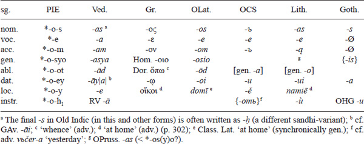

The gen. sg. ending *-osyo (cf. also Lep. -*oiso*, Arm. *-oy*, HLuw. *-as(s)i*), different from the usual *-(e/o)s found in other declensions, is usually compared to the pronominal ending *-eso (p. 81), though the exact connection is not clear. The Latin and Old Indic abl. ending (also CIb. -*uð*) can be derived from both *-t and *-d (p. 53), but the possible connection to Hitt. abl. -*az* \< *-ot-i, Toch. A -*ṣ* \< *-ti (p. 462), and OCS preposition *otъ* ‘of’ would point to the original PIE abl. *-ot (though *-od is often reconstructed for PIE).

<!-- page: 65 -->

Table 1.11 IE ***o***-stems (plural)

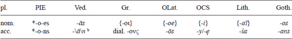
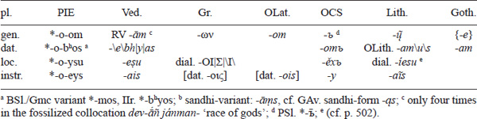

Two adjacent vowels contracted: dat. sg. (*-ōy \< *-o-ey), abl. sg. (*-ōt \< *-o-ot), nom. pl. (*-ōs \< *-o-es), instr. pl. (*-ōys \< *-o-eys), and gen. pl. (*-ōm \< *-o-om). It is possible that these endings were still (at least as variants or dialectally) uncontracted in PIE, judging by occasional disyllabic scansion in Indo-Iranian, and perhaps by the development of Lith. gen. *-o* \< *-ā (p. 41) \< BSl. *-a-at \< PIE abl. *-o-ot (with contraction after PIE, *o \> BSl. *a?). In many languages/branches, the original ending *-ōs (cf. also Osc. **núvlan-ús** ‘inhabitants of Nola’) was replaced by the pronominal *-oy (*toy wl̥kʷōs ‘those wolves’ ⇒ *toy wl̥kʷoy, p. 81). The *-bʰ-/-m- in the dat. (and elsewhere) is problematic (p. 63), but *-os is clear from BSl. *-mos (OCS -*mъ*, OLatv. -*ms*), Lat. -*bus* (in athematic stems), Celt. *-bʰos (CIb. -*bos*), and Ven. -*bos* (*louderobos* ‘to the children’), supported by IIr. *-bʰ-y-os. The loc. *-i-su probably has the additional *-i- from the singular (cf. the simple ending *-su in other declensions), and *-ey-s in the instr. pl. can tentatively be connected to the Slavic conjunction *i* ‘and’.

Table 1.12 IE ***o***-stems (neuter)

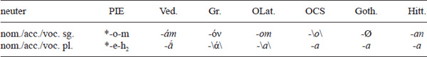

The nom./acc. forms are always the same in neuter nouns. In *o-*stems, the neuter nom./acc. sg. has the same form as the masculine acc. sg. (*-om). This, and the fact that nom./acc. are always the same in neuter nouns, undoubtedly derives from the pragmatic use of neuter (inanimate) nouns, which are rarely the subjects of transitive verbs. For this reason (and others), pre-PIE is considered by some to have been an ergative language (cf. 162–164). The ending *-eh₂ of the nom./acc./voc. pl. is identical to the nom. sg. of feminine *eh₂-stems. That is due to the fact that the “plural” of neuter nouns is originally a collective, not a plural *per se*. That is why in IE languages one finds the *-eh₂- plural forms for masculine nouns as well, cf. Av. regular masculine nom. pl. in -*a* (p. 275) or Lat. nouns like *iocus* ‘joke’ – pl. both *iocī* and *ioca* (similar cases exist in Iranian, Greek, Anatolian, Slavic, etc.). In Greek, Anatolian, and Gatha-Avestan, the plural of neuter nouns agrees with verbs in the 3 sg. This is known as the τὰ ζῷα τρέχει ‘the animals (pl.) run (sg.)’ rule in Greek, and is an archaic PIE feature stemming from the said fact that later neuter nominative plurals were originally collective singulars.

<!-- page: 66 -->

Table 1.13 IE ***o***-stems (dual)

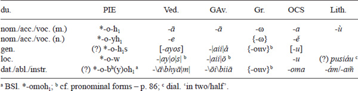

Old Church Slavic and Vedic point to *-ow in both gen. and loc. (the gen. *-s in Vedic is probably secondary), but Avestan has gen. -*å* \< *-ās (presumably from *-o-h₁-s with nom. *-h₁- + gen. *-s) and loc. -*ō* \< *-aw, which is possibly archaic (Beekes 2011: 217). The loc. (and gen.) ending was originally perhaps *-u, thus *-o-u in *o-*stems, but this *-ow was later, possibly already in PIE, generalized in other stems as well.

#### *Eh₂-*stems

*Eh*₂-stems (which were always feminine) seem to be a post-Anatolian innovation, since they do not appear there. In late PIE, these stems are correlated to *o-*stems in adjectives: *newos (m.)/newom (n.) and *neweh₂ (f.) ‘new’. The post-Anatolian emergence of the new feminine gender could have originated from the identification of the collective *-eh₂ (and possessive *-ih₂, cf. Lat. *o-*stem gen. sg. *-ī*) suffix with the accidental *-h₂ in the originally athematic word for ‘woman’: *gʷenh₂ (Ved. *jáni*, OIr. *bé*, p. 77, 369).4

Table 1.14 IE ***eh***₂-stems (singular)

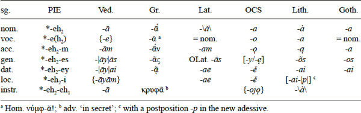

<!-- page: 67 -->

All languages except Latin point to *-ā (cf. also Umbr./Osc. -*o* \< *-ā and Celtic – p. 369) in the nom., which is then interpreted as older *-e-h₂ (p. 43), though the laryngeal is nowhere attested (*-e- is a thematic vowel). However, the existence of other feminine endings (*-i-h₂-(s) and *-u-h₂-s, p. 67, 74) indicates a laryngeal. Other cases have this *-eh₂- (which has a zero ending in the nom.) + general endings: acc. *-eh₂m (not **-eh₂m̥!) \> *-ām (Stang’s Law – p. 70); gen. *-eh₂es \> *-ah₂as \> *-aas (p. 43) \> *-ās; dat. *-eh₂ey \> *-ah₂ay \> *-aay \> *-āy; loc. *-eh₂i \> *-ah₂i \> *-ay; instr. *-eh₂eh₁ \> *-ah₂ah₁ \> *-aā \> *-ā, etc. Some endings are formally reconstructed on a structural basis in their laryngealistic and pre-contraction shape. Greek and Balto-Slavic (cf. also Umbr. voc. *tursa!* (name of a goddess)) point to *-ă in the voc. In laryngeal terms, this is usually explained as *-e(h₂), with the laryngeal coloring the preceding vowel (*-a(h₂)) but then dropping before a pause without lengthening (cf. also Ved. *devi!* \< *-i(h₂) from *devī* ‘goddess’ \< *-ih₂, see below).

Table 1.15 IE ***eh***₂-stems (plural)

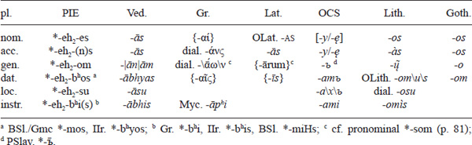

Some IE languages (Vedic, Gothic) show no trace of the original *-n- in the acc. pl., so it is possible to assume that this was already a PIE change (at least in some dialects). The gen. ending *-eh₂-om is formally reconstructed, since, if we disregard the secondary forms, all we have are a few reflexes pointing to a contracted long *-ōm (Goth. -*o*, Lith. -*ų͂*, PSl. *-ъ̄).

| du.              |     | PIE                          |     | Ved.             |     | OCS     |     | Lith.             |
|------------------|-----|------------------------------|-----|------------------|-----|---------|-----|-------------------|
| nom./acc./voc.   |     | *-eh₂-ih₁                   |     | \-*e*            |     | \-*ě*   |     | \-*ì*c |
| gen./loc.        |     | *-eh₂-u a        |     | {-*ayos*}        |     | \-*u*   |     |                   |
| dat./abl./instr. |     | (?)*-eh₂-bʰyoh₁b |     | \-*ābhyā*\|*m*\| |     | \-*ama* |     | \-*óm*/*-õm*      |

Table 1.16 IE ***eh***₂-stems (dual)

a Or analogical *-eh₂-ow (p. 63); b BSl. *-eh₂moh₁; c cf. -*íe-ji-dvi* in definite adjectives with -*íe-* \< *-ayH-.

The nom./acc. endings point to *-ay (\< *-aī \< *-a(h₂)ih₁). The *eh₂*-stems have the dual *-ih₁ (like the neuter – perhaps due to the connection of the feminine sg. and neuter pl., p. 65), not *-h₁(e) like other feminine stems.

Two feminine *-ih₂-types can also be reconstructed (PIE *deyw-ih₂ ‘goddess’ \> Ved. *devī ´*; cf. Lith. *patì* ‘wife’; PIE *wl̥kʷ-ih₂-s ‘she-wolf’ \> Ved. *vr̥kī ´s*, p. 236–237); one of the types had the apophonic alternation *-ih₂-/-yeh₂- in the suffix (Ved. dat. sg. *devyái* \< *deyw-yeh₂-ey but *vr̥kíe* \< *wl̥kʷ-ih₂-ey).

### **Athematic stems**

#### *PIE athematic ablaut declension types*

<!-- page: 68 -->

As already said, in athematic nouns all morphemes (roots, suffixes, endings) could exhibit ablaut alternations – for instance, the suffix was in the lengthened grade in *ph₂t**ē**r ‘father’, in the zero grade in *suHn**u**s ‘son’ and the gen. sg. *ph₂**tr**e/os, in the full grade in the gen. sg. *suHn**ow**s, while the ending was in the full grade in the gen. sg. *ph₂tr**e/o**s but in the zero grade in the gen. sg. *suHnow**s**. PIE had quite a number of complex ablaut declension types (ADTs), which are difficult to reconstruct.

In the case of root alternations, the original ADTs can sometimes, but very rarely, be reconstructed from direct reflexes in some language (e.g., *ponteHs – gen. sg. *pn̥tHos ‘path’ can be reconstructed from Ved. *pánthās – pathás*). Usually, they have to be reconstructed from different reflexes in various languages, where one of the alternate PIE ablaut grades had usually been generalized – e.g., if one compares Lat. *aurōra* (\< *ausōs-) with Ved. *uṣā́s* (gen. sg. *uṣás*), we can conclude that PIE had ablaut variants *h₂ewsōs-, *h₂usōs-, and *h₂us(s)- (by additional analysis in the context of the whole PIE declension system, we come to the conclusion that the original pattern was probably nom. sg. *h₂ewsōs – gen. sg. *h₂use/os ‘dawn’, p. 51). However, already in PIE, as far as can be reconstructed, many stem types (e.g., *i-*stems, most *r-*stems, etc.) did not exhibit ablaut alternations in the root (which may or may not be an innovation in comparison to the pre-PIE period). The alternations in suffixes (cf. Lat. *pa***ter**** ‘father’ – gen. sg. *pa***tr***is*), more common in PIE, were also more likely to be preserved, though here one of the types usually tends to be generalized in the daughter languages.

The standard theory of ADTs connects the ablaut types with the supposed PIE accentual alternations, the usual supposition being that the full (especially *e) grade goes with accentedness, while the zero grade should be unaccented. However, there are many problems with this standard account, as well as with the reconstruction of PIE accent in general (p. 55–56), and its relation to ablaut patterns. The problem with the standard theory is that it usually (at least unconsciously) tries to reconstruct the ablaut types not of the latest stage of PIE, but rather of some “original” supposed pre-PIE stage, and thus often operates with the supposed, but completely speculative, forms, like **séwHnus or **méntis, instead of *suHnús (p. 38) and *mn̥tís (p. 35) (with the accent marked as traditionally reconstructed) that are actually attested in the daughter languages but often considered as secondary without any real evidence.

The standard theory usually operates with the following basic and neatly organized ablaut/accent types: static (acrostatic/acrodynamic) *nókʷts – gen. sg. *nékʷts ‘night’ (immobile root accent); proterodynamic (proterokinetic) *péh₂wr̥ – gen. sg. *ph₂wéns ‘fire’ (accent shifts from root to suffix); amphidynamic (amphikinetic, holokinetic/holodynamic) *h₂éwsōs – gen. sg. *h₂us(s)é/ós ‘dawn’ (accent shifts from root to ending); hysterodynamic (hysterokinetic) *ph₂tḗr – gen. sg. *ph₂tré/ós ‘father’ (accent shifts from suffix to ending). However, here we shall use an analysis that is somewhat heterodox in comparison to the standard one because it stresses morpheme alternations and not the supposed PIE accent shifts, with emphasis on the last stage of PIE (and not some supposed pre-PIE “original” stage). In this analysis, the reconstructed ablaut types are somewhat different than those in the standard analysis, but the usual terminology is more or less preserved.

<!-- page: 69 -->

In our analysis here, we take it that all PIE morphemes (roots R, suffixes S, endings E) in a nominal paradigm were either strong (+), alternating (±), or weak (–). Strong morphemes always have the full (or lengthened) grade; alternating morphemes have the full (or lengthened) grade in some cases but the zero grade in others; weak morphemes are always in the zero grade. E.g., if we look at the roots of the already mentioned words, *ne/okʷt- is (+), *h₂ews-/h₂us- is (±), and *suHn- is (–). Most endings were invariant (whether they were weak like nom. sg. *-s or strong like nom. pl. *-es) – only gen. sg. *-es/-os/-s, instr. sg. *-eh₁/-h₁, and perhaps nom. du. *-h₁/-h₁e (cf. OLith. -*e* for the latter) had ablaut variants, i.e., were of the alternating type (thus, whether an ending in an ADT is +, –, or ± is seen only in these two or three cases, while being irrelevant in others). The same morpheme did not have to be the same in all words – e.g., the suffix *-i- was weak in *potis and alternating in *mn̥tis (p. 35), etc. Thus, the (strong/alternating/weak) nature/valency of a morpheme was paradigmatic, not universal. A similar analysis can be applied to athematic verbs as well.

The following nominal ADTs can be reconstructed for the last stage of PIE:

1.  1) **acrodynamic** (ἄκρος ‘outermost’, δύναμις ‘power’)
    1.  RSE + ± – *me-h₂tēr-Ø – gen. sg. *me-h₂tr̥-s ‘mother’
2.  2) **proterodynamic** (πρότερος ‘in front’)
    1.  RSE ± ± – *h₃neh₃-mn̥-Ø – gen. sg. *h₃n̥h₃-men-s ‘name’
3.  3) **mesodynamic** (μέσος ‘middle’)
    1.  RSE – ± – *suHn-u-s – gen. sg. *suHn-ow-s ‘son’
4.  4) **amphidynamic** (ἀμφί ‘on both sides’)
    1.  RSE +–+ *pot-i-s – gen. sg. *pot-y-e/os ‘master’ (cf. p. 77 for *melit)
5.  5) **hysterodynamic** (ὕστερος ‘coming after’)
    1.  RSE – ± + *p-h₂tēr-Ø – gen. sg. *p-h₂tr-e/os ‘father’
6.  6) **holodynamic** (ὅλος ‘whole’)
    1.  type a) RSE + ± + *h₂ekˊ-mō(n)-Ø – gen. sg. *h₂ekˊ-mn-e/os ‘stone’
    2.  type b) RSE ± ± + *pont-eH-s – gen. sg. *pn̥t-H-e/os ‘path’
7.  7) **holostatic** (only neuter *s-*stems) (στατός ‘placed’)
    1.  RSE +++ *nebʰ-os-Ø – gen. sg. *nebʰ-es-e/os ‘sky’

What is relevant in an ADT are not only the types of morphemes but the way they pattern – e.g., two holodynamic types are put together because they differ only in the number of morphemes that alternate (but both have + in the nom. sg. and – in the gen. sg. in alternating morphemes), while acrodynamic (+ ± –) and proterodynamic (± ± –) type are distinguished because they differ not only in what morphemes alternate, but also in how they alternate (cf. the zero suffix in the gen. sg. *me-h₂tr̥-s, but a full suffix in the gen. sg. *h₃n̥h₃-men-s). Additional (sub)types may also be potentially added (cf. p. 77), and different naming/grouping of the types is always possible. In separate stems (e.g., *i-*, *n-*, etc.), one can usually find one to three types. Because of numerous analogies and divergent later developments, reconstructions are sometimes speculative, and different authors have different opinions. Some nouns may have had coexisting different ablaut variants. For slightly different ADTs in root nouns, cf. p. 71.

#### *Athematic case endings*

<!-- page: 70 -->

All athematic stems had mostly the same endings (differing in a number of cases from the *o-*stems), the differences being in the presence of *-i in the loc. sg. and neuter *-h₂ in the nom./acc./voc. pl. (or synchronic *-Ø). In the gen. sg. acro-, protero-, and mesodynamic stems had a zero-grade *-s, while other types had a full-grade *-es or *-os. The original distribution of *-es and *-os is not clear (it might have originally depended on accent, ADT, stem type, dialect, etc.) since most languages have generalized one of the variants – some languages have only *-es (OCS -*e*), some have only *-os (Gr. -oς), in some we cannot tell the original vowel (OInd. *-as*), and only rarely does one see both variants in one language (Lat. *-is* \< OLat. -*es*, together with OLat. -*us* \< *-os). The nom. pl. *-es is identical in form to the gen. sg. variant *-es but is invariant (as are most case endings), unlike the gen. sg. ending (however, cf. the pronominal plural *-s(-) – p. 83). In the gen. pl., one can assume an original short *-om on structural grounds (with possible reflexes in Celtic, Italic, Anatolian, and Slavic), while most languages show reflexes of a long *-ōm (presumably by early, perhaps partially already PIE, analogy to *o-* and *eh*₂-stems).5

#### *Compensatory lengthening in athematic stems*

A number of compensatory lengthening (CL) processes occurred word-finally in athematic nouns. The masculine/feminine ending *-s dropped in pre-PIE after a root- or suffix-final resonant (*m/n/l/r), *y, and *s, with subsequent CL (**Szemerényi’s Law**): *dʰeǵʰō(m) \< *-om-s (p. 77), *h₂ekˊmō(n) \< *-on-s (p. 76), *h₂ebōl \< *-ol-s (p. 77), *ph₂tēr \< *-er-s (p. 75), *sekʷHōy \< *-oy-s (p. 73), *h₂ewsōs \< *-os-s (p. 79). The same kind of lengthening might have occurred in some other cases, like in *kˊerd \> *kˊēr (with possible subsequent restoration of *-d, p. 53). This lengthening was morphonological, not a live phonological process, in the last stage of PIE as seen from forms like the gen. sg. *dems (p. 71) and the acc. pl. ending *-ons (p. 64). This law explains many *s-*less long-grade forms in the nom. sg. of athematic stems. However, the length in forms with the preserved *-s, like *pōds (p. 15), *gʷōws (p. 24), *(h₂)nepōts (p. 39), *-ōws (p. 74), and ptcp. *-ōnts (p. 104), is not completely clear. The original dropping of *-s, CL, and then analogical restoration of *-s is possible but perhaps not convincing (why would it be restored only in these forms and not after resonants, *y, and *s as well?). Perhaps it is a consequence of morphologization and analogical interplay of several earlier phonological processes like Szemerényi’s Law, early monosyllabic lengthening (p. 54–55) in cases like *pōds, and perhaps Stang’s Law (see below) in the acc. sg. like *gʷōm. In some cases, the length can be interpreted in more than one way, e.g. *wīs ‘poison’ (p. 55) can be a result of either monosyllabic lengthening or CL from *wis-s.

CL occurs with *-h₂ after *n, *r, and *s as well, cf. nom. pl. *h₃n̥h₃mōn \< *-on-h₂ (p. 77), *kWetwōr\< *-or-h₂ (p. 89), and nom. pl. *nebʰōs \< *-os-h₂ (p. 79); and with *-i after glides, cf. loc. sg. *mn̥tēy \< *-ey-i (p. 72) and loc. sg. *suHnōw \< *-ow-i (p. 73). CL also occurred when glides and laryngeals dropped before the final *-m (**Stang’s Law**), cf. *dyēm \< *-ewm (p. 40, 72), *gʷōm \< *-owm (p. 71), and *-ām \< *-eh₂-m in thematic stems (p. 66).

#### *Root nouns*

<!-- page: 71 -->

Most athematic nouns have a suffix of some kind between the root and endings and are usually disyllabic in the nom. sg. Those that do not have a suffix are monosyllabic in the nom. sg. and are called root nouns (the ending is added directly to the root), cf. *pōd-s ‘foot’, gen. sg. *ped-e/os. The root in root nouns can end in a stop (*pōd-s), resonant (*dō(m)-Ø ‘home’), diphthong (*dyēw-s ‘sky’), cluster (*kˊērd-Ø ‘heart’), etc. According to the final segment of the root, root nouns can also be considered plosive stems (*pōd-s), *m-*stems (*dō(m)-Ø), etc. Root nouns had a tendency to become less frequent or disappear altogether in many IE languages, being replaced with various suffixal derivatives. In some cases, it is not clear whether certain nouns are indeed root or suffixal stems; e.g., is *kˊwō(n) ‘dog’ to be analyzed as a root noun or as an *n*-stem *kˊw-ō(n) with a vowelless root (p. 41)? Root nouns had the following ablaut types (although they have no suffixes, root nouns can tentatively be fitted into the above ADT scheme):

1.  a) RE + – (acrodynamic) *dō(m)-Ø – gen. sg. *dem-s ‘home’
2.  b) RE ++ (amphidynamic) *pōd-s – gen. sg. *ped-e/os ‘foot’
3.  c) RE – + (hysterodynamic) *muHs-(s) – gen. sg. *muHs-e/os ‘mouse’
4.  d) RE ±+ (holodynamic) *dyēw-s – gen. sg. *diw-e/os ‘day sky’

Acrodynamic nouns had *o in the nom./acc. and *e in other cases, cf. *dō(m) (Gr. Hom. δῶ, Arm. *tun*) – gen. sg. *dems (Ved. *dán*, GAv. *də̄ṇg*, Gr. δεσ-πότης ‘master’ \< *dems potis ‘lord of the house’), or *gʷōws ‘cow’ (Ved. *gáus*, Gr. βοῦς) – gen. sg. *gʷews (Ved. *gós*, Av. *gəˉuš*). For the length in *dō(m) or *kˊwō(n) cf. p. 70. Stang’s Law operates in the acc. sg. *gʷowm \> *gʷōm (Ved. *gā́m*, Dor. βῶν, Umbr. *bum*) – cf. p. 70. The amphidynamic stems had a more complex ablaut pattern:

| sg.    |     | PIE        |     | Ved.          |     | Gr.             |     | Lat.            |
|--------|-----|------------|-----|---------------|-----|-----------------|-----|-----------------|
| nom.   |     | *pōd-s    |     | *pā́t*         |     | π\ού\ς          |     | *p*\*ē*\*s*   |
| acc.   |     | *pod-m̥    |     | *pā́da*\|*m*\| |     | πóδα            |     | *p*\*e*\*dem* |
| gen.   |     | *ped-e/os |     | *padás*       |     | π\ο\δóς         |     | *pedis*         |
| dat.   |     | *ped-ey   |     | *padé*        |     | Myc. *po-de*    |     | *pedī*          |
| loc.   |     | *ped-i    |     | *padí*        |     | \[dat. π\ο\δί\] |     | \[abl. *pede*\] |
| instr. |     | *ped-eh₁  |     | *padā́*        |     |                 |     |                 |

**Table 1.17 IE root nouns (singular)**

Cf. p. 70 for the nom. sg. length.

| pl.    |     | PIE          |     | Ved.                           |     | Gr.                  |     | Lat.                    |
|--------|-----|--------------|-----|--------------------------------|-----|----------------------|-----|-------------------------|
| nom.   |     | *pod-es     |     | *pā́das*                        |     | πóδες                |     | *p*\*e*\*d*\*ē*\*s* |
| acc.   |     | *pod-n̥s     |     | *padás* \< *pā́dasa |     | πóδας                |     | *p*\*e*\*dēs*         |
| gen.   |     | *ped-om     |     | *pad*\*ā́*\*m*                |     | π\ο\δ\ῶ\ν            |     | *pedum*                 |
| dat.   |     | *ped-bʰos   |     | *padbh\|y\|ás                 |     |                      |     | *ped*\|*i*\|*bus*       |
| loc.   |     | *ped-su     |     | *patsú*                        |     | \[dat. π\ο\σσ\ί\\    |     |                         |
| instr. |     | *ped-bʰi(s) |     | *padbhís*                      |     | Myc. *p*\*o*\*-pi* |     |                         |

**Table 1.18 IE root nouns (plural)**

a Cf. RV *ā́pas* ‘waters’ (6x), together with the secondary *apás.*

Dual: nom./acc./voc. *pod-h₁(e) (Gr. πóδε), dat./instr./abl. *ped-bʰyoh₁ (Ved. *padbhyā́m*). The nom./acc. *pod- (accented in Vedic/Greek) and oblique *ped- stem are indicated by Ved. *pād-* (by Brugmann’s Law – p. 40, 206) and *pad-* respectively (Greek has generalized *pod- and Latin *ped-). The usual supposition is that the oblique *ped- is secondary for the supposedly original holodynamic *pd- (cf. Gr. ἔπι-βδ-α ‘the day after the festival’ \< *‘following the trace’, Ved. *upa-bd-ás* ‘trampling, rattle’, Av. *fra-bd-a-* ‘front foot’).

<!-- page: 72 -->

For holodynamic stems cf. *dyēws (Ved. *dyáus*, Gr. Ζεύς ‘Zeus’), gen. sg. *diwe/os (Ved. *divás*, Gr. Διóς), acc. sg. *dyēm with Stang’s Law (Ved. *dyā́m*, Gr. Ζήν, Lat. *diem* ‘day’), voc. sg. *dyew! (Gr. Ζεῦ) or *kˊwō(n) (Ved. *śvā́*, Gr. κύων, Lith. *šuõ*) – gen. sg. *kˊune/os (p. 41, 56). Holodynamic stems show an *e or *o full grade in the nom./acc. and the zero grade in the oblique cases.

#### *I-*stems

In the *i-*stems (as in the *u-*stems), the root was unchangeable (either full as in *h₃ewis ‘sheep’ or zero as in *mn̥tis ‘mind’), while the suffix could be in various ablaut grades (*-i-/-ey-/-oy-/-ēy-). The *i-*stems had two ablaut types, mesodynamic and amphidynamic, of which the former generally prevailed in later IE languages. The mesodynamic *i-*stem (m./f.) paradigm in IE:

Table 1.19 IE ***i***-stems (singular)

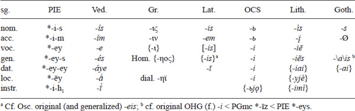

For the invariant zero grade of the root cf. also *n̥g(ʷ)nis ‘fire’, *kʷr̥mis/*wr̥mis ‘worm’ (p. 35), *mr̥tis ‘death’ (p. 35), and other nouns in *-tis, etc. (presumably, only the *i-*stems with the zero-grade root originally had this type of endings). In the gen. sg., the zero-grade suffix was followed by a full-grade ending and vice versa (gen. sg. *-y-e/os but *-ey-s). Goth. gen. sg. (f.) -*ais* and ONor. *-ar* are probably secondary (by analogy to *u-*stem *-auz \< *-ows), and there is no need to reconstruct a PIE gen. sg. variant *-oys (OCS and OHG point to *-eys). The loc. sg. *-ēy is to be explained through a (pre-)PIE process of *-ey-i \> *-ēy (p. 70).

Table 1.20 IE ***i***-stems (plural)

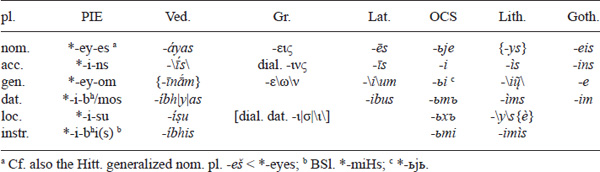

<!-- page: 73 -->

The full grade (*-ey-) of the suffix is found in the gen./dat./loc./voc. sg. and nom./gen. pl. – other cases have the zero grade (*-i-). Dual forms are nom./acc./voc. *-i-h₁ (Ved. -*ī*, OCS -*i*), dat./instr./abl. *-i-bʰy/moh₁ (Ved. -*ibhyā*\|*m*\|, OCS *-ьma*), gen./loc. *-ey-ow \< *-ey-u? (p. 63) (OCS *kost-ьju* is likely archaic, since it is different from the other dual forms, while Ved. gen./loc. du. *háryos* ‘tawny’ \< *-y-ow-s is probably analogical to them, though OCS form could also theoretically be due to analogy to the gen. pl.). The neuter forms differed in the nom./acc./voc. only: sg. *-i (Ved. *vā́ri* ‘water’, Lat. *mare* ‘sea’, Hitt. *tuppi* ‘clay tablet’) and pl. *-ih₂ (Ved. adj. *śúcī* ‘bright’, Hitt. *armizzi* ‘bridges’).

The scarcely attested amphidynamic paradigm had a weak suffix (*-i-/-y-) in all cases, cf. gen. *pot-y-e/os ‘master’ (Gr. πόσιος ‘husband’), *h₃ew-y-e/os ‘sheep’ (Ved. *ávyas*, Gr. Ion. ὄιος), dat. *-y-ey (Ved. *pátye* ‘husband’), loc. *-y-i (Gr. dat. oἰί), voc. sg. *-i (Gr. πόσι!), nom. *-y-es (Ved. adj. *aryás* ‘loyal’, Gr. Hom. ὄϊες), gen. pl. *-y-om (Gr. oἰών). One could assume that originally all *i-*stems with a full-grade root – like *gʰostis ‘guest’ (p. 40), *kˊlownis ‘hip’ (p. 51), *h₃egʷʰis ‘snake’ (Ved. *áhis*, Gr. ὄφις ‘serpent’), etc. – were amphidynamic (i.e., that the ablaut of the suffix was connected to the ablaut of the root), even when we have no direct attestation for that (unlike the case in *h₃ewis, *potis), though acrodynamic + ± – stems like **gʰost-ey-s (perhaps later and analogical) are not unimaginable. A holodynamic + ± + type can also be reconstructed, cf. *-ōy \< *-oy-s (Ved. *sákhā* ‘friend’, Gr. ἠχώ ‘echo’, Hitt. *zah˘h˘aiš* ‘battle’), acc. sg. *-oy-m̥ (Ved. *sákhāyam*, Hitt. *zah˘h˘aiš*), voc. sg. *-oy (Gr. Σαπφοῖ!), gen. sg. *-y-e/os (Ved. *sákhyur* with secondary -*ur*, Hitt. *zah˘h˘iyaš*), etc. For *-ih₂(s) f. stems see p. 67.

#### *U-*stems

The *u-*stems were mostly parallel to the *i-*stems concerning ADTs. The root was invariant in masculine/feminine stems but not in all neuter stems (cf. *dor-u – gen. sg. *dr-ews below). The mesodynamic (m./f.) paradigm prevailed in later languages:

Table 1.21 IE ***u***-stems (singular)

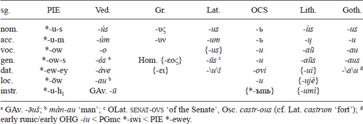

For the invariant zero grade of the root cf. also *pr̥tus (Av. *pər*ə*tu-* ‘crossing’, Lat. *portus* ‘harbor’, OEng. *ford*), *tn̥h₂us ‘thin’ (p. 16), *gʷr̥h₂us ‘heavy’ (p. 39) and other adjectives, etc. Loc. *-ōw derives from pre-PIE *-ow-i (like *i-*stem loc. sg. *-ēy above). Loc. *-ēw is also reconstructable (cf. *-ēy in *i-*stems), but the non-palatal -*u* (i.e., not -*ju*) in OCS *synu* is easier to explain from *-ōw (cf. the *-eys : *-ows difference between *i-* and *u-*stems in the gen. sg. as well).

<!-- page: 74 -->

Table 1.22 IE ***u***-stems (plural)

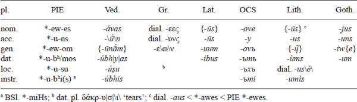

The full grade (*-ew-/-ow-) of the suffix is found in the gen./dat./loc./voc. sg. and nom./gen. pl. (the *e-/*o*-grade distribution is different from in *i-*stems) – other cases have the zero grade (*-u-). Dual forms are nom./acc./voc. *-u-h₁ (Ved. -*ū*, OCS -*y*, Lith. -*u*), dat./instr./abl. *-u-bʰy/moh₁ (Ved. -*ubhyā*\|*m*\|, OCS *-ъma*), gen./loc. *-ew-ow \< *-ew-u? (p. 63) (cf. OCS *synovu* \< *-ew-ow but probably secondary Ved. *bāhvós* ‘arms’ \< *-w-ow-s, like in *i*-stems, p. 73). Neuters had a nom./acc./voc. sg. *-u (Ved. *mádhu* ‘sweetness’, Gr. μέϑυ ‘wine’, Goth. *faíhu* ‘cattle’, Hitt. *gēnu* ‘knee’), nom./acc./voc. pl. *-u-h₂ (Ved. *vásū* ‘wealths’, Hitt. *āššū* ‘goods’), and nom./acc./voc. du. *-w-ih₁ (Ved. adj. *urvī´* ‘wide’).

The vestiges of the amphidynamic type (with weak suffix *-u-/-w- in all cases) are often attested in neuters (e.g., *medʰu ‘honey’, *pekˊu ‘cattle’): gen. *-w-e/os (Ved. *mádhvas*, *krátvas* (m.) ‘ability’, Gr. Myc. *me-tu-wo*, older Lat. *senatuos* ‘of the Senate’), dat. *-w-ey ‘cattle’ (Ved. *páśve*, Goth. *mann* (m.) \< *manw- ‘man’), loc. sg. *-w-i (Gr. Hom. dat. γουνί \< *γονϝί ‘knee’), nom. *-w-es (YAv. *pasuuō*), and gen. pl. *-w-om (YAv. *pasuuąm*). It can be perhaps be assumed that all *u-*stems with full-grade roots were originally amphidynamic (even in cases where there is no direct evidence for that), e.g. *ǵenus ‘jaw’ (Ved. *hánus*, Gr. γένυς) – gen. sg. *ǵenwe/os (Goth. *kinnus* ‘cheek’ with generalized -*nn-* \< *-nw-), adj. *h₁oh₁kˊus ‘fast’ (Ved. *āśús*, Gr. ὠκύς), etc. Cf. also the proterodynamic neuter *dor-u-Ø ‘tree’ (Ved. *dā́ru*, Gr. δόρυ, Hitt. *tāru*) – gen. sg. *dr-ew-s (Ved. *drós*, YAv. *draoš*), though this might not be the oldest/only ablaut type; cf. the ablaut variant *derw- in OCS *drěvo* \< *dervo ‘tree’, Lith. *dervà* ‘resin, tar’. The original ablaut pattern of *ǵen-u- (Lat. *genū*, Hitt. *gēnu*)/*ǵon-u- (Ved. *jā́nu*, Gr. γόνυ)/*ǵn-ew- (Hitt. *ganu-*, Goth. thematized *kniu*) ‘knee’ is controversial (see above for Gr. dat. γουνί). There is some evidence of a holodynamic type with a nom. sg. in *-ē/ōws (m./f.): Av. *hiθāuš* ‘associate’, Gr. ἱππεύς ‘horseman’, πάτρως ‘paternal uncle’, Hitt. *ḫarnauš* ‘birthing chair’.

The suffix *-u- is found in a feminine motion ending *-u-h₂-s as well, cf. *swekˊuros ‘father-in-law’ (Ved. *śváśuras*, Gr. ἑκυρός, Lat. *socer*, Lith. *šẽšuras*) and *swekˊruh₂s ‘mother-in-law’ (Ved. *śvaśrū́s*, OCS *svekry*), declined like a normal consonant amphidynamic stem (gen. sg. *swekˊruh₂e/os \> OCS *svekrъve*, cf. Ved. *tanúas* ‘body’) and root nouns with roots ending in *-H- like *h₃bʰruHs ‘eye-brow’ (p. 48) or *suHs ‘swine’ (p. 38).

#### *R-*stems

<!-- page: 75 -->

The *r-*stems are dominantly masculine/feminine nouns with an invariant root. Many of them belong to nouns denoting family relations – *ph₂tēr ‘father’ (p. 46), *meh₂tēr ‘mother’ (p. 45), *dʰugh₂tēr ‘daughter’ (p. 47), *bʰreh₂tēr ‘brother’ (p. 18), *swesōr ‘sister’ (p. 32), *deh₂iwēr ‘husband’s brother’ (Ved. *devár-*, Lith. *dieverìs*, OCS *děverь*), *ǵenh₁tōr ‘begetter’ (p. 46), etc. *Nomen agentis* *-tēr/*-tōr nouns were also *r-*stems (cf. PIE *dh₃tēr \> Gr. δοτήρ but *deh₃tōr \> Gr. δώτωρ, Ved. *dā́tā*; Lat. *dător*, gen. sg. *-ōris* is a mix of the two types – all ‘giver’). Some monosyllabic words ending in *-r# (like *h₂stēr ‘star’, *h₂nēr ‘man’) can be treated as root nouns – in such cases it is sometimes impossible to tell if a segment was originally part of the suffix or the root. One can reconstruct two basic ablaut types for most *r-*stems – hysterodynamic (H) and acrodynamic (A) – that differed only in a few cases:

Table 1.23 IE ***r***-stems (singular)

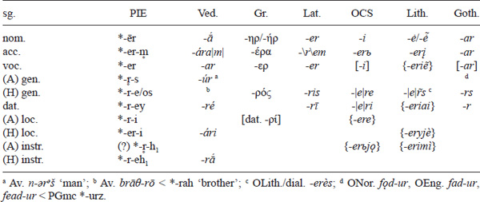

The length in the nom. sg. is due to Szemerényi’s Law (p. 70). The vowel *e is more frequent in the nom. sg. than *o.

Table 1.24 IE ***r***-stems (plural)

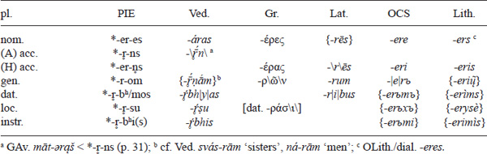

<!-- page: 76 -->

The PIE ablaut pattern of the suffix is reconstructed mostly from the overlap of Vedic and Greek patterns, which look original (the ablaut is mostly generalized in other languages). The acro-/hysterodynamic opposition is seen in different attested endings in the daughter languages in the gen. sg., in the difference between Vedic and Greek in the loc. sg., in structural analogy to the gen. sg. in the loc. sg., and in the difference between Vedic and Greek in the acc. pl. From the reflexes, it is impossible to deduce which nouns had which type. For structural reasons, one can assume that the derivatives with an invariant full-grade root (*meh₂tēr, *bʰreh₂tēr, *swesōr, *deh₂iwēr, *ǵenh₁tōr, etc.) were acrodynamic (full-grade root + zero-grade ending in gen./instr. sg.), while the nouns with an invariant zero-grade root (*ph₂tēr, *dʰugh₂tēr, etc.) were hysterodynamic (zero-grade root + full-grade ending). An exceptional proterodynamic type with ablauting root can tentatively be reconstructed for ‘husband’s brother’s wife’: *yen-h₂tēr (Gr. ἐνατηρ, OLith. *jentė*) – gen. sg. *yn̥-h₂ter-s (Skr. *yātar-*).

#### *N-*stems

Masculine/feminine *n-*stems point to a holodynamic + ± + type with a complex suffixal ablaut pattern:

Table 1.25 IE ***n***-stems (singular)

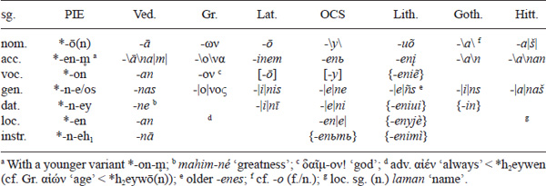

The length in *-ō(n) \< *-on-s is due to Szemerényi’s Law (p. 70). Some believe that the final *-n had dropped already in PIE (i.e., *h₂ekˊmō, *kˊwō ‘dog’ unlike *swesōr ‘sister’), cf. Lat. -*or*, OIr. *-ur* \< *-ōr in *r-*stems but Lat. -*ō*, OIr. -*u* \< *-ō(n) in *n-*stems (unlike Gr. -ων, Arm. *-un* \< *-ōn, and OCS -*y* \< *-ōn-\|s\|, which would then have to have reintroduced *-n-(s) by analogy later). Perhaps it is best to assume that both variants (*-ōn and *-ō) occurred in PIE, just as in *-ō(m) in *m-*stems (p. 77). Besides the usual *-ō(n), there might have also existed a less frequent *-ē(n), cf. the Greek ποιμήν ‘herdsman’ (but Lith. *piemuõ*) – see below. As in *s-*stems (p. 78), the loc. sg. points to a zero-ending (*-en-Ø). This is different from the *i-* and *u-*stems, where *-ēy and *-ōw can be derived from older *-eyi and *-owi and thus do not have an original zero-ending.

Table 1.26 IE ***n***-stems (plural)

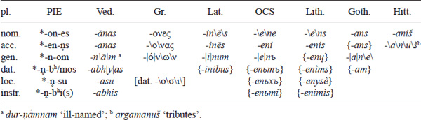

<!-- page: 77 -->

The original ablaut of the suffix (the interchanging *-on-/-en-/-n-) is best preserved in Vedic, with the other languages usually generalizing one ablaut grade in most forms (e.g., *-on- in Greek). Generalized BSl. oblique *-en- (which can hardly stem from the loc. sg. *-en alone) and Ved. nom. pl. -*ānas* but acc. pl. -*anas* could point to the same original ablaut variation in the sg. as well (cf. Lith. *-uõ* but -*enį*). It seems that some nouns had an *-en- in all (full-grade) cases, e.g., (hysterodynamic) *ukʷs-ēn ‘ox’ – nom. pl. *ukʷs-en-es (Ved. *ukṣánas*, OEng. *exen* ‘oxen’). Some possible root nouns (like *kˊwō(n) ‘dog’) can be treated as *n-*stems as well (‘dog’ can originally be *pkˊw-ōn from *pekˊu ‘cattle’ – p. 52). In the neuter *n-*stems, the word ‘name’ and other derivatives in *-men- point to a proterodynamic declension: *h₃neh₃-mn̥ (Ved. *nā́ma*, Lat. *nōmen*, Gr. ὄν\ο\μα) – gen. sg. *h₃n̥h₃-men-s (OIr. gen. sg. *anmae*; GAv. *haxmә̄ṇg* \< *-anh \< *-ens, Goth. -*ins* \< *-en-es ⇐ *-en-s; OCS *im-*, OPruss. *emm-* \< BSl. *inHm-) – nom. pl. *h₃n(e)h₃-mōn (Ved. *nā́mā*). In the neuter nom. pl., one has to suppose pre-PIE *-on-h₂ \> *-ōn with a compensatory lengthening (p. 70). For the *-mn̥ (gen. sg. *-men-s) derivatives cf. also Ved. *kár-ma* ‘act’ (⇒ Eng. *karma*), Gr. ϑέ-μα (⇒ Eng. *theme*), Lat. *sē-men* ‘seed’ (⇒ Eng. *semen*), etc.

#### *M-*, *l-*, laryngeal, and plosive stems

Unlike the frequent *r-* and *n-*stems, other resonant stems were less frequent. For *m-*stems, cf. the root noun *dō(m) (p. 71) and the holodynamic (type ±±+) *dʰeǵʰ-ō(m) ‘earth’ (Hitt. *tēkan*, cf. p. 53) – gen. sg. *dʰǵʰ-m-e/os (Hitt. *taknāš* with an analogical -*n-*; Gr. χϑ-ών has the gen. root and the nom. suffix) and *ǵʰey-ō(m) ‘winter’ (Gr. χιών ‘snow’, Arm. *jiwn* ‘snow’, YAv. *ziiå* all with secondary *ǵʰi-, cf. OCS *zim-a*, Gr. χɛιμ-ών for *ǵʰey-m-) – acc. sg. *ǵʰy-em-m̥ (Lat. *hiem-*) – gen. sg. *ǵʰi-m-e/os (GAv. gen. sg. *zimō*) (p. 22). Like in *n-*stems (p. 76), the final *-m was unstable after a long vowel in the nom. sg. (cf. Hom. δῶ ‘house’ \< PIE *dō(m) but otherwise -ων; Lat. *homō* ‘man’ but Hitt. *tēkan*; Arm. *jiwn*, etc.).6 In *l-*stems, one finds just a (potentially root noun) *seh₂l-s ‘salt’ with a controversial vocalism/ablaut pattern (p. 42) and (dialectal?) *h₂ebōl ‘apple’ (Lith. *óbuol-as*) (p. 16).

Of the rare laryngeal stems, the holodynamic (±±+) word for ‘path’ is easily reconstructable (with Vedic preserving the original ablaut pattern): *pont-e/oH-s (Ved. *pánthās*, cf. generalized *pont- in Gr. πóντoς ‘sea’, Lat. *pont-* ‘bridge’, OCS *pǫtь*) – gen. sg. *pn̥t-H-e/os (Ved. *pathás*, cf. generalized *pn̥t- in Gr. πάτoς, OPruss. *pintis*). An early proterodynamic laryngeal stem, transformed in most descendant languages to an *eh*₂-stem (p. 24, 66), was *gʷen-h₂ ‘woman’ (OIr. *bé*, Ved. *jáni-*) – gen. sg. *gʷn-eh₂-s (OIr. gen. sg. *mná*, Ved. nom. sg. *gnā́s* ‘divine woman’, cf. *gnā́s-páti-* ‘husband of a divine woman’ for the gen. sg.). Cf. also the adjective *meǵ-h₂-s (p. 53, 79–80).

Stems ending in a stop were rare (cf. the root noun *pōd-s – p. 15, 60, 70–71). The masculine word *(h₂)nepōts ‘grandson, nephew’ (Ved. *nápāt*, Lat. *nepōs –* p. 39) is widely attested, though it is unclear whether it was acrodynamic (gen. sg. *(h₂)nept-s \> Ved. *náptur* with secondary *-r̥s from *r-*stems) or +±+ holodynamic (gen. sg. *(h₂)nep-t-e/os \> YAv. *naptō*). The neuter word *mel-it ‘honey’ (Hitt. *milit*, Gr. μέλι, Goth. acc. sg. *miliþ*) with the *-it- suffix (cf. Hitt. *šeppitt-* ‘a kind of grain’) perhaps had a special ±–+ amphidynamic subtype (Hitt. dat./loc. sg. *malitti* \< *ml-it-ey, cf. CLuw. generalized *mallit-*).

#### *Heteroclitic stems*

<!-- page: 78 -->

Heteroclites were an ancient class of PIE neuter nouns with suppletive suffixes (one variant in the nom./acc., the other in the oblique cases). Though sometimes difficult to reconstruct exactly (with many languages often showing only isolated relics), their number is not so small in total. The most common suppletion type was *-r-/-n-: cf. Ved. *ás-r̥-k –* gen. sg. *as-n-ás*, Hitt. *ēšh˘-ar –* gen. sg. *išh˘a-n-āš* ‘blood’, Hitt. *wāt-ar –* gen. sg. *wit-en-aš* ‘water’, etc. The suppletion *-l-/-n- is attested in the word ‘sun’ (GAv. *huuarə̄ –* gen. sg. *x*v*ə̄ṇg* \< *sh₂wens), and there may have been some other, less frequent and more controversial, types of suppletion (cf. p. 429, 437). Some languages in some cases preserve the actual suppletion as in PIE: Hittite abundantly (cf. Hitt. *pah˘h˘u-r –* gen. sg. *pah˘h˘u-en-aš* ‘fire’, p. 15), often Indo-Iranian (cf. Ved. *yák-r̥-t –* gen. sg. *yak-n-ás* ‘liver’), sometimes Greek (ἧπ-αρ – gen. sg. ἥπ-α-τος ‘liver’ with -α- \< *-n̥-), and Latin (*iec-ur –* gen. sg. *ioc-in-eris* ‘liver’, p. 33). Most descendant languages usually generalize one of the variants (e.g., ONor. *vatn* but OEng. *wæter* ‘water’; Lat. *sōl*, Goth. *sauil* but Goth. also *sunno* ‘sun’; Goth. *fon* but OEng. *fȳr* ‘fire’; CS *ikra* ‘roe’ but OLith. *jẽknos* ‘liver’). PIE nom. sg. forms are usually reconstructable (*h₁esh₂r̥ ‘blood’, *wodr̥ and coll. *wedōr ‘water’, *peh₂wr̥ ‘fire’, *yē̆kʷr̥ ‘liver’), though not always (cf. *seh₂-w-l- ‘sun’ with a problematic nom. sg. ablaut pattern, often reconstructed as *seh₂wōl – p. 32), while the reconstruction of oblique cases and ADTs is often more speculative.

#### *S-*stems

Numerous neuter *s-*stems (with the *-e/os- suffix) had a unique holostatic ADT with all full grades (+++), like the thematic stems (p. 62) and unlike other athematic stems. Neuter *s-*stems are considered athematic only because they have no thematic vowel, but their characteristics, such as the invariant root (though this occurs in other athematic stems as well) and only qualitative (*-e-/-o-) ablaut alternation of the suffix, remind one more of the thematic *o-*stems than of the other athematic stems:

Table 1.27 IE ***s***-stems (singular)

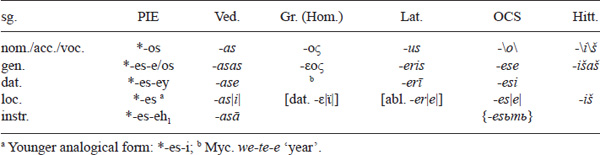

The original loc. sg. has *-Ø (cf. p. 76 for *n-*stems).

Table 1.28 IE ***s***-stems (plural)

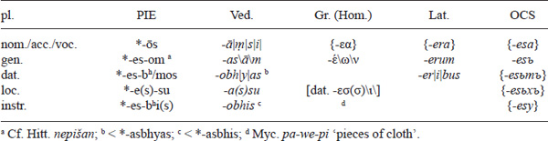

<!-- page: 79 -->

The original nom. pl. *-ōs (from older *-os-h₂, p. 70), which cannot be explained as secondary, can be seen regularly in Avestan (cf. *raocå* ‘lights’ \< *-āh), contaminated in Ved. *-āṃsi*, and indirectly perhaps in OEng. *lombor* ‘lambs’ (\< PGmc *-ōz-a). Reflexes of the nom. pl. *-es-eh₂ etc. are secondary. The distribution of suffixal *-os-/-es- reminds of the *pod-/ped- distribution in the root nouns (p. 71).

Masculine/feminine (holostatic) derivatives in *-ēs (derived from neuter *s-*stems) also existed – cf. PIE *h₁su-men-ēs ‘well-disposed’ (Ved. *sumánās*, Gr. εὐμενής) from *menos – gen. sg. *menese/os (Ved. *mánas* ‘mind’, Gr. μένος ‘spirit’), Greek names ending in -κλῆς (like Sophocles), or Lat. *Cerēs* (goddess). A holodynamic (±±+) feminine noun can be reconstructed: *h₂ews-ōs-Ø (\< *-os-s, p. 70) ‘dawn’ (Gr. Aeol. αὔως, Lat. generalized *aurōr-*; Ved. *uṣā́s* and GAv. *ušå* with analogical *u-*) – gen. sg. *h₂us-s-e/os (Ved. *uṣás*); cf. also Lat. *honōs* ‘honor’ – gen. sg. *honōris* with generalized -*ōs-* for the type. Note also the perf. ptcp. in *-wos- (p. 104). Other, shorter and infrequent, *s-*stem types can perhaps be reconstructed as well, cf. Ved. *ákṣi* \< *h₃ekʷ-s-Ø (neuter) with OCS *oko –* gen. sg. *očese* ‘eye’ (like *nebo*). There are also root nouns ending in (originally suffixal?) *-s, e.g., *muHs (p. 38, 71).

## **Adjectives**

PIE adjectives were morphologically identical to nouns. However, the number of possible stems in adjectives was much smaller. For the most numerous *o-*stems cf. *new-o-s (m.) – *new-e-h₂ (f.) – *new-o-m (n.) ‘new’ (Ved. *návas – návā – návam*, Gr. νέος – νέᾱ – νέoν, Lat. *nouus – noua – nouum*, OCS *novъ – nova – novo*, Lith. *naũ*\|*j*\|*as – nau*\|*j*\|*à*, p. 32). For the frequent *u-*stems cf. *sweh₂dus (m.)– *sweh₂dwih₂ (f.) – *sweh₂du (n.) ‘sweet’ (Ved. *svādús – svādvī – svādú*, Gr. ἡδύς – ἡδ\|ε\|ῖα – ἡδύ; cf. Lith. *saldùs – sal*\*dì*\\ ‘sweet’; Goth. *kaúrus* ‘heavy’). Note that the *-us form is used for the masculine only, unlike in nouns (p. 73). For the apparently not-so-frequent *i-*stems cf. *semh₂l-is (m./f.) – *semh₂l-i (n.) ‘similar’ \> Lat. *similis* (m./f.) – *simile* (n.), OIr. *samail* ‘likeness’ (f.) (cf. also Hitt. *palh˘-i-š* ‘wide’). Original root adjectives may perhaps be reconstructed when dealing with different suffixes in later languages, i.e., *nogʷ-s ‘naked’ (cf. Ved. *nagnás*, Gr. γυμνóς, Lith. *núogas*, OCS *nagъ*, Goth. *naqaþs*, Hitt. *nekumanza*). A ±±+ holodynamic laryngeal stem can be reconstructed for *meǵ-h₂-s (m./f.) – *meǵ-h₂ (n.) ‘big’ (Gr. μέγας (m.) – μέγα (n.), Ved. *máhi* (n.), Hitt. *mēk* (n.)), gen. sg. *m̥ǵ-h₂-e/os (Gr. Hom. ἀγα- ‘greatly-’), acc. sg. *m̥ǵ-eh₂-m (Aeol./Dor. adv. ἄγᾱν ‘very much’). Cf. p. 79 for *s-*stem adjectives in *-ēs. A heteroclitic adjective can be reconstructed as well: *piHwō(n) ‘fat’ (Ved. *pīˊvan-*, Gr. πῑˊων) – f. *piHwerih₂ (Ved. *pīˊvarī*, Gr. πῑˊειρα). As can be seen, some adjectives had separate masculine/feminine/neuter forms (e.g., all thematic forms), while others had identical masculine/feminine forms (as in some nominal stems). There were a number of adjectival suffixes, cf. *medʰ-y-os (p. 31), *h₁rudʰ-r-os (p. 19), *-went- ‘having …’ (Ved. *putrá-vant-* ‘having a son’ from *putrás* ‘son’), etc. The **Caland System** is a name for a pattern of adjectives in *-ro-, *-mo-, *-u-, *-nt- (often occurring with the same root, cf. Gr. ἐλαφ-ρ-ός ‘light (in weight), nimble, small’, ἐλαχ-ύ-ς ‘small, short’) that have *-i- instead as the first element in compounds (cf. Gr. κῡδ-ρ-ός ‘glorious’ but κῡδ-ι-άνειρα ‘bringing men glory’) and that often go together with neuter *s-*stem nouns (Gr. κῦδος ‘glory’ ⇒ Eng. *kudos*) and stative *-eh₁- verbs (cf. Gr. ἐρυϑ-ρ-ός, OCS *rъd-r-ъ* ‘red’, and Lat. *rub-ē-re* ‘to be red’) formed from the same root.

<!-- page: 80 -->

A couple of adjectival/adverbial prefixes appearing in compounds can be reconstructed: *n̥- ‘un-’ (Ved. *a-*, Gr. ἀ-, Lat. *in-*, Goth. *un-*, OIr. *an-*; zero grade of the particle *ne ‘no’ – p. 54; cf. the famous PIE collocation *kˊlewos n̥-dʰgʷʰitom ‘imperishable fame’ \> Ved. *śrávo* … *ákṣitam*, Gr. Hom. κλέος ἄφϑιτον), *h₁su- ‘good’ (p. 47, cf. *h₁sumenēs – p. 79), *dus- ‘bad’ (Ved. *duṣ-*, Gr. δυσ-, Goth. *tuz-*, cf. Gr. δυσ-μενής ‘hostile’, OCS *dъždь* ‘rain’ \< *‘bad day’), *sēmi- ‘half’ (Gr. ἡμι-, Lat. *sēmi-*, OEng. *sām-*), etc.

### **Comparison of adjectives**

PIE did not have the full-fledged paradigmatic comparison that later and modern IE languages have. It apparently had a number of derivation suffixes (similar to Eng. -*ish* in *smallish*, etc.) that modified the meaning of adjectives, some of which became regular comparative/superlative suffixes in later languages. The most widespread comparative(-like) suffix was *-yōs (m./f.) (Lat. *senio\r\*, arch. Lat. -*ō\r\*, OIr. *siniu* ‘older’) – *-yos (n) (Lat. *melius*, OCS *bolje* ‘better’, perhaps also *-is, cf. adverbial Lat. *magis* ‘more’, Goth. *mins* ‘less’, OPruss. *tālis* ‘farther’) – oblique *-is- (OCS oblique *dražь\š\*- ‘dearer’, Goth. *batiz\a\* ‘better’), and probably *-yes- in some cases (Ved. oblique *-yas*-), with +±+ holodynamic paradigm and a full root even from adjectives with a zero root in the positive, cf. Gr. (Ion.) κρέσσω\ν\\ ‘stronger’ \< *kret-yōs from κρατύς ‘strong’ \< *kr̥t-u-s; Ved. *drā́gh\|ī\|yas-* ‘very long; longer’ \< *dleHgʰ-yos- from *dīrghás* ‘long’ \< *dl̥Hgʰ-os. The zero-grade *-is- also appeared in complex superlative suffixes *-is-t(H)o- (Ved. *náviṣṭhas* ‘newest’, Gr. βέλτιστος, Goth. *batists* ‘best’; made from a full-grade root and not from the positive, cf. Ved. *téj-iṣṭh-a-* from *tig-m-á-* ‘sharp’), pairing with the comp. *-yos-, and dialectal/innovative *-is-m̥-Ho- (Lat. *māximus* ‘biggest’, OIr. *nessam* ‘nearest’). The suffix *-ter-o-, originally used in contrastive (positive) meaning in adjectives (Lat. *dexter*, Gr. δεξίτερος ‘right’, Ved. *úttaras* ‘upper’) and pronouns (*kʷoteros ‘which (of two)’ \> Ved. *katarás*, Gr. πóτερος, OCS *kot\o\ryi* ‘which’, Goth. *ƕaþar*), later yielded the comparative in Greek (σοφώτερος ‘wiser’) and Indo-Iranian (Skr. *mahattaras* ‘greater’). The complex suffix *-tm̥-H-o- often yielded a superlative (Ved. *uttamás* ‘highest’, Lat. *optimus* ‘best’, Gaul. name *Uertamocorii* ‘highest warriors’; in Greek *-tm̥-t-o-, cf. σοφώτατος ‘wisest’), pairing with the comp. *-tero-. It is possible that in some cases an unmarked PIE adjective might have functioned as a comparative/superlative, cf. Hitt. *šallayaš šiunaš šalliš* ‘the greatest (lit. great) of the great gods’, and p. 438 for the Armenian comparative. An interesting but not completely clear phenomenon in IE languages is that for frequent/basic adjectives (‘good’, ‘bad’, ‘small’, ‘big’) one often finds suppletive forms, which usually differ from language to language, cf. for ‘good’ – ‘better’ – ‘best’ Gr. ἀγαϑóς – βελτῑˊων – βέλτιστος (with other variants), Lat. *bonus* – *melior* – *optimus*, OCS *dobrъ* – *bolii* (*lučii*), Goth. *goþs* – *batiza* – *batists*, OIr. *maith* – *ferr* – *deg*. Cognates among the mentioned suppletive adjectives are just *bel-/mel- (cf. p. 17) ‘better’ and *min- ‘smaller’ (Lat. *minor*, OCS *mьnii*, Goth. *minniza*).

## **Adverbs**

<!-- page: 81 -->

PIE did not have general, special adverbial suffixes for derivation from nouns and adjectives (cf. Eng. *man-ly*, *nice-ly*). Instead, various (usually singular) nominal and adjectival cases (all except the vocative) were used adverbially. However, not a lot can be reconstructed directly for PIE since this type of adverb formation was very productive, and the forms are widely diverse in IE languages; cf., e.g., the adverbial ‘by night’ expressed by the gen. sg. in Gr. νυκτός, Goth. *nahts*, the acc. sg. in Ved. *náktam*, and the instr. sg. in OCS *noštьjǫ* ‘by night’. Neuter forms (in the nom./acc. sg.) are generally often used adverbially, cf. the neuter adjectival *meǵh₂ (p. 79) used as an adverb (Ved. *máhi* ‘greatly’, Gr. μέγα ‘very much’, ONor. *mjǫk* ‘much, very’, Hitt. *mekk*\|*i*\| ‘very, greatly’), or Ved. *purú* ‘abundantly’, Gr. πολύ ‘much’, Goth. *filu* ‘much, very’; OCS *mъnogo* ‘much’, etc. For the adverbial use of the locative, cf. Lat. *temere* ‘blindly’ (\< *‘in the dark’), OCS *dolě* ‘below’, *dobrě* ‘good’, etc.; for the instrumental, cf. Ved. *dívā* ‘by day’, *madhyā́* ‘in the middle’, Gr. κρυφῆ ‘in secret’ (p. 66), OCS *vьčera* ‘yesterday’ (p. 64), etc.

Some apparently non-derived (or not easily analyzable) adverbs can also be reconstructed, e.g., *dʰǵʰyes (p. 53) ‘yesterday’ (Ved. *hyás*, Gr. χϑές, Lat. *her*\|*ī*\|, OIr. *\|in*\|*-dé*, Alb. *dje*), originally perhaps a loc. sg.; *nū̆(n) ‘now’ (Ved. *nū̆́*, Gr. νυ/νῦν, Lat. *nun*\|*c*\|, OCS *ny*\|*ně*\| and CS *nъ*\|*ně*\|, Goth./OIr. *nu*, Hitt. *nu* ‘and, but’, *\|ki*\|*nun* ‘now’, etc. – p. 54–55), usually connected to the adj. *new-o-s ‘new’, etc. The later verbal augment *h₁e (p. 6, 95, 161) was originally probably an adverb. A few postpositions (p. 104–105) were originally probably adverbs or both postpositions and adverbs, cf. *(s)upo ‘below; under’ (Ved. *úpa* ‘up to, upon, above, near’, Gr. ὑπό/ὕπo ‘(from) under’, Lat. *sub* ‘under, below, up to’, Goth. *uf* ‘under’, OIr. *fo* ‘under’) and *(s)uper(i) ‘above; over’ (Ved. *upári* ‘above’, Gr. ὑπέρ/ὕπερ ‘over, above’, Lat. *super* ‘over, above’, Goth. *ufar* ‘over, above’, OIr. *for* ‘over’). Some adverbial suffixes did exist; for *-dʰe, *-r, and pronominal adverbs generally, cf. p. 89. For numerical adverbs, cf. p. 91; for adverbial compound prefixes like *h₁su- ‘good’, cf. p. 79–80.

## **Pronouns**

Unlike nouns/adjectives and verbs, which always had CVC type roots, pronominal roots were usually CV, VC, or V (of course, *HV- is always theoretically possible for initial *V-, cf. p. 52). The pronominal declension had mostly the same endings as the nominal one, except for five special different endings (apparently, not all appeared in all pronominal declensions): nom. sg. m. *-Ø (cf. nominal *-s), nom. sg. n. *-d (cf. nominal *-Ø/m), gen. sg. m./n. *-(e)so (cf. nominal *o*-stem *-osyo, otherwise *-es/-os), nom. pl. m. *-i (cf. nominal *-es), and gen. pl. *-som (cf. nominal *-om, p. 63). The oblique m./n. sg. cases (gen./abl./dat./loc.) of non-personal pronouns also feature the element *-sm- before the endings, usually thought to be the zero grade of *som- ‘one’ (p. 89); cf. the English use of *this one*, *which one*, etc. In the plural (and dual) masculine/neuter forms, the nom. *-i- often spreads already in PIE to the oblique cases as part of the enlarged stem (e.g., gen. pl. *to-y-som, p. 86). Many basic pronouns had suppletive forms (cf. heteroclitic nouns – p. 77–78). Personal pronouns, unlike other pronouns and nouns, did not have all seven/eight cases (this is opposite to the situation in many present-day IE languages – like English, the Romance languages, and Macedonian/Bulgarian – where personal pronouns preserve the declension, while the nouns do not). In the history of the IE languages, pronominal and nominal forms often mixed, cf. *-o-i instead of original *-o-es in the nom. pl. *o*-stems in Latin/Greek/Balto-Slavic (p. 65), or *-rum* instead of the older *-um* in the gen. pl. in Latin (p. 67). Non-personal pronouns, which have different gender forms, like adjectives, sometimes had two (m. = f., n.), sometimes three forms (m., f., n.).

### **Personal pronouns**

<!-- page: 82 -->

The personal pronouns are rather difficult to reconstruct since the attested IE systems are in many cases rather different (due to copious innovation).7 They were characterized by partial (nom. sg. *tu ‘you’ – gen. sg. *tebʰe) or complete suppletivity (nom. sg. *h₁eǵ ‘I’ – acc. sg. *me); by the existence of clitic forms – sometimes as the only existing, or at least reconstructable, form and often syncretic (like gen./dat./acc. pl. *nos ‘us’); and apparently by the lack of reconstructable loc./instr. cases (all languages have different, innovative-looking forms), which were either non-existent or, less likely, innovative in all languages – the lack of separate vocative forms is not strange, and the ablative is the same as the genitive in most nominal declensions anyway. Like many older IE languages, PIE had no separate 3rd person forms of personal pronouns – demonstrative/anaphoric pronouns (p. 85) were used instead. Many monosyllabic forms exhibited facultative lengthening (p. 54–55). The reconstructed forms are not always completely morphologically transparent (i.e., the root, suffixes, and endings are not always easily distinguished – e.g., in gen. *mene ‘of me’).

#### *1 sg. ‘I’*

|      |                                                                                                                                                |
|------|------------------------------------------------------------------------------------------------------------------------------------------------|
| nom. | *h₁eǵ \> GAv. *as-cīt̰* (1x), Slav. *ja˝ (e.g., BCMS *jȃ*), OLith. *e\š\*, Hitt. *\ū\k*                                                      |
|      | *h₁eǵ-Hom \> Ved. *ahám*, GAv. *azə̄*m, Gr. ɛ̓γ\ώ\ν, Slav. *jazъˈ (e.g., OCS *azъ*), Goth. *ik*, Arm. *e\s\*                                  |
|      | *h₁eǵ-oh₂ \> Gr. ɛ̓γώ, Lat. *egō*, Ven. *ego*                                                                                                  |
| acc. | *mē̆ (accented/clitic) \> Ved. *mā*, GAv. *mā*, Gr. \|ɛ̓\|μέ, clitic μɛ, Lat. *mē*, OCS *m\ę\*, OPruss. *mie\|n\|*, Goth. *mi\|k\|*, OIr. *mé* |
| gen. | *mene \> Ved. *má\m\a*, YAv. *mana*, OCS *mene*                                                                                               |
|      | *moy (clitic) \> Ved. *me*, GAv. *mōi*, Lat. *mī*\|s\|                                                                                        |
| dat. | *me-ǵʰ-i \> Ved. *máhy\|a(m)\|*, Lat. *mih{ī}* (Umbr. *meh{e}*), Arm. *\|i\|nj*                                                               |
|      | *moy (clitic) \> Ved. *me*, GAv. *mōi*, Gr. μoι, OCS *mi*, OLith. *mi*                                                                        |

The 1 sg. pronoun showed the suppletivity of *h₁eǵ- (nom.) and *m- (oblique). The oblique cases had both stressed and clitic forms. Three nom. forms are reconstructable, one non-derived (*h₁eǵ) and two with suffixes, the *-oh₂ one perhaps being dialectal. The existence of two (even three) parallel forms may not be as strange as it might seem (even without any specific different function/meaning, which may have existed in PIE), cf. Hitt. *ūk* and *ukel*, *ukila* ‘I, myself’. Hitt. oblique *amm*- (cf. acc. *ammuk* ‘me’), Arm. *i-* (cf. acc. *is* ‘me’), and Gr. ɛ̓- in stressed forms (cf. acc. ɛ̓μέ but clitic μɛ) would point to *h₁m- (p. 48), not *m-. However, this is not in accord with the glottogonic, but nonetheless persuasive, connection of pronominal *me- with verbal eventive 1 sg. *-m, 1 pl. *-me (p. 93). Thus, it is perhaps better to assume that this *h₁m- is innovative – an analogy to the initial *h₁- in the nom. (where *h₁eǵ, not *eǵ, has to be reconstructed in that case) or later to the initial *e- in the nom. However, *h₁m- would formally also work for PIE. Like in the 2nd person accented dat. sg., the ending is difficult to reconstruct (all languages show different endings). Here, we tentatively reconstruct PIE *-i, on the basis of Ved. *-y-am*, OLith. dat. *mani*, and perhaps clitic *mo-i, but that is admittedly highly speculative. The element *-ǵʰ- in the dat. is usually thought to be some kind of particle originally. It is possible that *moy had a variant *mey (which would be a more ready pre-form for Latin, Lithuanian, and Old Church Slavic). In the ablative, Ved. *mád* and OLat. *mēd* are formal cognates (PIE *me-t?) but are more likely separate innovations.

#### *2 sg. ‘you’*

|      |                                                                                                                                                                                                         |
|------|---------------------------------------------------------------------------------------------------------------------------------------------------------------------------------------------------------|
| nom. | *tū̆ \> Ved. *t(u)*\|*vám*\|, GAv. *tū*, Gr. (Dor./Aeol.) τύ, Lat. *tū*, OCS *ty*, Lith. *tù* (OPruss. *tū*), Goth. *þu*, OIr. *tú* (also *tu-ssu*), Arm. \*d*\*u*, Alb. *ti*, Toch. B *t(u)*\|*we*\| |
| acc. | *twē̆ \> Ved. *tvā́*\|*m*\|, GAv. *ϑβā*, Gr. σέ                                                                                                                                                          |
|      | *tē̆ (clitic) \> Gr. (Dor.) τέ, Lat. *t*\*ē*\\ OCS *t*\*ę*\\ OPruss. *tie*\|*n*\|, Goth. *þi*\|*k*\|                                                                                                  |
| gen. | *tewe \> Ved. *táva*, OCS *te*\*b*\*e*, Lith. *tav-*, Toch. B *ci*                                                                                                                                   |
|      | *toy (clitic) \> Ved. *te*, GAv. *tōi*, Lat. *tī*\|*s*\|                                                                                                                                               |
| dat. | *tubʰ-i \> Ved. *túbhy*\|*a(m*)\|; *tebʰ-i \> Av. *ta*i*bii*\|*ā*\|, Lat. *tib*{*ī*} (Umbr. *tef*{*e*}), OCS *teb*{*ě*}, OPruss. *tebb*{*e(i)*}                                            |
|      | *toy (clitic) \> Ved. *te*, Gr. (Dor./Lesb./Ion.) τoι, OCS *ti*, OLith. *ti*                                                                                                                           |

<!-- page: 83 -->

The forms are in many ways parallel to those of the 1 sg. The stems *tew-/tu-/tw- and *t- are marginally suppletive (these are probably ultimately somehow related to the verbal 2 pl. *-te). Anatolian languages show *ti- in the nom. (CLuw. *tī*) and *tu- in oblique cases (Hitt. *tu-*), which is difficult to explain as innovative so some think that PIE originally had a nom. *tī̆ (cf. Kloekhorst 2008: 112–115), though the supposed original Anat. nom. *tu- is often thought to be the origin of the vocalism of Hitt. *ūk* ‘I’. The existence of both short and long reflexes in the nom. points to monosyllabic lengthening (p. 54–55), as in other similar personal pronouns forms (cf. acc. *mē̆ and *t(w)ē̆), not to a laryngeal length. Ved. *túbhya(m)* with *tu-* looks like an archaism (cf. OCS *mъně* ‘to me’, Latv. dial. *mun-* by possible early analogy), while other languages point to a more regular *tebʰ- (cf. gen. *tewe and dat. *meǵʰi). The usual dat. ending *-ey in Lat. *tibī*, OPruss. *tebbe(i)* is perhaps an innovation (by analogy to nouns). Unlike the 1 sg. pronoun, the stressed and unstressed forms were distinguished in the acc.

#### *1 pl. ‘we’*

|      |                                                                                                                                                 |
|------|-------------------------------------------------------------------------------------------------------------------------------------------------|
| nom. | *we-y(-es) \> Ved. *vay*\|*ám*\|, GAv. *va*\|*ēm*\|, Goth. *wei*\|*s*\|, Hitt. *wē*\|*š*\|, Toch. B *we*{*s*} (also archaic *mes?, see below) |
| acc. | *n̥-s-me \> Ved. *asm*\*ā́*\*n*\|, YAv. *ahma* (GAv. *ə̄hmā*), Gr. (Aeol.) ἄμμɛ, Goth. *uns*, Hitt. *anz*\*ā*\*š*\|                           |
|      | *nō̆-s (clitic) \> Ved. *nas*, GAv. *nå* (\< *nās), Lat. *nōs*, OCS *n*\*y*\\ Hitt. -*naš*, Alb. *ne*/*na*                                    |
| gen. | *nō̆-s (clitic) \> Ved. *nas*, GAv. *nə̄* (\< *nas), Lat. *nos*\|*trum*\|, OCS *nas*\|*ъ*\|, OPruss. *n*\*oū*\*s*\|*an*\|, Alb. *na*          |
| dat. | *nō̆-s (clitic) \> Ved. *nas*, GAv. *nə̄* (\< *nas), OCS *n*\*y*\\ Hitt. -*naš*, Alb. *na*                                                     |

The suppletive forms were *we- and *no-/n̥- with plural endings (the pronominal *-i in the nom. and *-s(-), presumably a variant of the nominal pl. *-es, in other cases). The form *wey is not really attested as such, since Indo-Iranian has the usual additional *-om and Germanic/Anatolian point to *wey-es with the additional plural *-es. For *we- cf. the dual pronominal and verbal forms (p. 94), while *n̥s- is often derived from *m̥s- (cf. the nominal acc. pl. – p. 63), i.e., from *me- as in the 1 sg. pronoun (cf. also verbal 1 sg. *-m) and *-me- in 1 pl. verbal forms. Because of these considerations, one is prone to consider *mes ‘we’ (Lith. *mẽs*, Arm. *mek*c**) an archaic dialectal by-form (with *we- often considered originally dual), though it could also be an innovation due to analogy to the verbal ending *-mes (p. 93). The acc. *(n̥s)me- is an unlikely source for *mes. For the gen./dat., only clitic forms seem to be reconstructable. In the stressed acc., a suffix (or reduplication of the original root?) *-me can be reconstructed on the basis of Greek and Avestan. It is not impossible that the dat. had a non-clitic *n̥s-m- with an unreconstructable ending (cf. Ved. *asm-é*, Av. *ahm-a*i*biiā*, Gr. Aeol. ἄμμ-ι(ν), Goth. *uns-(is)*), but this can also be a later analogy to the acc. (apparently, this *-sm- had nothing to do with *-sm- in non-personal pronouns, see below).

#### *2 pl. ‘you’*

|      |                                                                                                                                                      |
|------|------------------------------------------------------------------------------------------------------------------------------------------------------|
| nom. | *yū-s \> Ved. *yū*\|*yám*\|, GAv. *yūš*, OCS \*v*\*y*, Lith. *jũs*, Goth. *jus*                                                                   |
| acc. | *u-s-we \> Goth. \*i*\*zwi*\|*s*\|, MW \*chwi*\\ us-me \> Ved. \|*y*\|*ušm*\*ā́*\*n*\|, Gr. (Aeol.) ὔμμɛ, Hitt. *šumm*\*ā*\*š*\| (\< *usmās) |
|      | *wō̆-s (clitic) \> Ved. *vas*, GAv. *vå* (\< *vās), Lat. *uōs*, OCS *v*\*y*\\ OPruss. *wa*\|*n*\|*s*                                               |
| gen. | *wō̆-s (clitic) \> Ved. *vas*, GAv. *və̄* (\< *vas), Lat. *uos*\|*trum*\|, OCS *vas*\|*ъ*\|                                                          |
| dat. | *wō̆-s (clitic) \> Ved. *vas*, GAv. *və̄* (\< *vas), OCS *v*\*y*\\                                                                                  |

<!-- page: 84 -->

The forms are in many ways parallel to those of the 1 pl. The suppletive forms are *yu- (nom.) and *wo-/u- (oblique). A frequent *ad hoc* assumption is that *yu- stems from the older *u-. The nom. (which, unlike the 1 pl., has nominal *-s) is attested with a long *ū only, so a laryngeal *yuHs is theoretically possible instead of the monosyllabic lengthening (p. 54–55), but not likely (cf. the dual form). The stressed acc. again shows *-me, but Goth. *izwis* looks archaic if we consider this *-we (also seen in the dual) an original reduplication of the root. Cf. Katz 1998 for *-me/-we.

#### *1 du. ‘us two’*

|           |                                                                                            |
|-----------|--------------------------------------------------------------------------------------------|
| nom.      | *wē̆ \> Ved. *vā́*\|*m*\| (1x), GAv. *vā*, OCS *vě*, OLith. *ve*\|*du*\|, Goth. *wi*\|*t*\| |
| acc.      | *n̥h₁-we \> Ved. *āv*{*ā́m*}, GAv. *ə̄əāuuā*, Goth. *ug*{*kis*}                              |
|           | *no-h₁ (clitic) \> Ved. *nā*\|*u*\|, Av. *nā*, Gr. (nom./acc.) νώ, OCS *na*               |
| gen./dat. | *no-h₁ (clitic)                                                                           |

The suppletive forms are much the same as in the 1 pl. Cf. also the verbal 1 du. *-we- (p. 94). We reconstruct the nom. form with monosyllabic lengthening because of the short and long reflexes. If one were to reconstruct *weh₁, OLith. *ve-du* and Goth. *wi-t* would be difficult to account for. The nom. form is the same as the plural one, except for the missing plural *-i. The laryngeal length of the gen./dat./acc. clitic (with the dual ending *-h₁) is proven by consistent long reflexes, parallelism to the plural forms (which are the same except for having the plural ending *-s(-)), and the zero-grade length in the stressed acc. form (*n̥h₁-). The clitic was probably *nō̆h₁ (like pl. *nō̆s), but no language distinguishes *ōH from *oH. The reconstruction of the gen./dat. clitic is due to the supposed structural parallelism to the plural forms. In dual forms, the stressed acc. has only *-we (unlike the prevalent *-me in the plural), according to the reflexes. Some think this *-we is found also in the acc. sg. *t-we (but this may also be *tu-e, cf. nom. *tu).

#### *2 du. ‘you two’*

|           |                                                                           |
|-----------|---------------------------------------------------------------------------|
| nom.      | *yū̆ \> Ved. *yu*\|*vám*\|, OCS \*v*\*y*, Lith. *jù*\|*du*\|            |
| acc.      | *uh₁-we \> Ved. *y*\*u*\*v*{*ā́m*}                                      |
|           | *wo-h₁ (clitic) \> Ved. *vā́*\|*m*\|, OCS *va*, Toch. B nom. *we*\|*ne*\| |
| gen./dat. | *wo-h₁ (clitic)                                                          |

The forms are parallel to the 1 du., and the suppletive stems to ones in the 2 pl. forms.

### **Reflexive pronouns**

The reflexive pronoun ‘self’ was identical to the 2 sg. personal pronoun, except that it did not have a nom. sg. and had an initial *s- instead of *t-. Cf. gen. *sewe (OCS *se*\*b*\*e*), dat. *sebʰi (YAv. *h*\|*uu*\|*āuuōii*\|*a*\| /*hwawya*/, OLat. *sib*{*ei*}, OCS *seb*{*ě*}, OPruss. *sebb*{*ei*}), clitic gen. *soy (GAv. *hōi*), clitic dat. *soy (GAv. *hōi*, Gr. οἱ, OCS *si*), acc. *swē̆ (Ved. *sva*\|*yám*\|, Gr. ἕ, Pamph. ϝhε), clitic *sē̆ (Lat. *sē*, OCS *s*\*ę*\\ OPruss. *sie*\|*n*\|, Goth. *si*\|*k*\|). The pronoun was originally used not only for the 3 sg. but for the 1 and 2 sg. as well.

### **Possessive pronouns**

<!-- page: 85 -->

The singular possessive pronouns, derived from personal and reflexive pronouns, can be formally reconstructed, though their antiquity is not beyond doubt (the forms often differ in specific languages): *m-o-s (Gr. \|ἐ\|μóς, GAv. *mə̄*) and *me/oy-o-s ‘my’ (Lat. *meus*, OCS *mojь*), *tw-o-s ‘thy’ (Ved. *tvás*, GAv. *ϑβə̄*, Gr. σός, Arm. *k*c*o*), *sw-o-s ‘own’ (Ved. *svás*, Gr. ὅς).

### **Demonstrative pronouns**

A number of demonstrative pronominal stems can be reconstructed – some better attested than others. Considering the number of the attested stems, it is probable that PIE had a three-way system of demonstrative pronouns (like Lat. *hic*/*iste*/*ille* and most IE languages, or Japanese *kore*/*sore*/*are*), correlated with three persons, and not a two-way one (like English *this*/*that*), cf. p. 160. The exact reconstruction of the semantics of the stems is a bit speculative, since these change easily in languages. The three best-attested (and probably main) demonstratives are *kˊi- ‘this (near me/speaker)’, *s-/t- ‘that (near you/the addressed)’, and *(h₁)ey-/(h₁)e- ‘that (near him/over there)’. The somewhat less well-attested stems are *(h₁)e/ow-o-s ‘this’ (Ved. *avás*, OCS *ovъ*) and *(h₂/₃)e/on- ‘that (near him)’ (OCS *onъ*, Lith. *anàs*, Arm. *na*). It is not clear why there were five different reconstructable demonstrative stems (a number of scenarios are possible), though some languages preserve all of them, cf. OCS *sь*, *ovъ*, *tъ*, *onъ* (suppletive acc. *i*).

For the pronoun *kˊi- ‘this’ (also *kˊo-?), cf. OCS *sь* (m.) – *si* (f.) – *se* (n.), Lith. *šìs – šì* (f.), OIr. *cé*, Arm. *sa*, Hitt. *kāš* (CLuw. *zāš*) – *kī* (n.), PGmc *xī̆ (OEng. *hē* ‘he’, Goth. *himma daga* ‘today’, etc.), also Lat. (*hi*)*-c* (cf. *cis* ‘on this side’), Gr. (ἐ)κεῖ-νος ‘that one there’ (*kˊey-?), Alb. *si-vjet* ‘this year’. Owing to differences in languages and partial attestations, the PIE declension is not clear.

The suppletive forms are well attested in *s-o (m.) – *s-eh₂ (f.) – *t-o-d (n.) ‘that’ (cf. Av. *hō – hā – tat̰*, Gr. ὁ – ἡ – τó ‘the’, CIb. *so* (?) – *sa – soð*, Toch. B *se – sā – te*, OLat. f. *sa-psa* ‘herself’). The *s- appears only in the nom. sg. m./f.; all other forms have a *t-. Here is the declension (n. = m., except in the nom./acc. and du.):

**Table 1.29 IE demonstrative pronoun *so – *seh₂ – *tod (singular)**

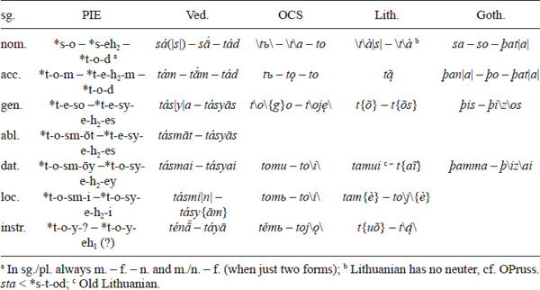

a In sg./pl. always m. – f. – n. and m./n. – f. (when just two forms); b Lithuanian has no neuter, cf. OPruss. *sta* \< *s-t-od; c Old Lithuanian.

<!-- page: 86 -->

The *-o-/-e- that appears after *s-/t- in the sg./pl. is apparently a thematic vowel. The non-pronominal endings are from *o-*/*eh*₂-stems (except for masculine loc. *-i, not *-oy). Ved. *sá*, Gr. ὁ, and Goth. *sa*, with no ending, are archaic (cf. also *ey below), though the Greek declension of the pronoun is otherwise innovative, with all nominal endings. Goth. *þat-a* probably proves the neuter ending was *-d (not *-t). Germanic (and Slav. *česo*, Gr. Ion. τέο) probably points to a gen. in *-e-so, replaced by thematic *-o- and other endings elsewhere. In the masculine abl./dat./loc., the element *-sm- (Ved. *-sm-*, OCS/Lith. -*m-* with a special development of *-sm-, OPruss. -*sm-*, Goth. -*mm-*) appears after the root, cf. also OPruss. dat. *stesmu* (with *s- + *t-), CIb. dat. *somui* (with generalized *s-), and Arm. dat. *dma* \< *doma (with *d-* as in *du* ‘thou’, p. 438). The f. gen./abl./dat./loc. sg. forms appear, on the basis of Indo-Iranian, to have *-sy- instead (connected to *si- ‘one’ \> Hitt. *šī-*, Gr. Hom. ἴα, besides μία, cf. Beekes 1988: 81; or perhaps from older *-smy- from *smih₂ ‘one’ – p. 89). In Old Church Slavic, *tosy- is replaced with *toy- (as in the pl. and instr. sg.); in Gothic with *tes- (as in the masculine gen.); in Lithuanian (and Greek) with a simple *t- plus endings (e.g., the gen. *t-eh₂es instead of *tesy-eh₂es). The instr. forms are unclear, though both Vedic and Old Church Slavic point to *toy- (otherwise the pl. stem).

**Table 1.30 IE demonstrative pronoun *so – *seh₂ – *tod (plural)**

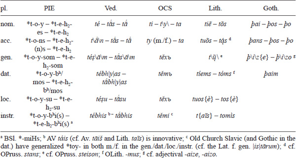

The nom. and gen. have pronominal endings. From forms like *toy, many later languages generalized the originally pronominal ending *-oy in the nominal *o-*stems as well (p. 64–65). For gen. *-som (often changed to *-sōm, as in the nominal *-om/-ōm, p. 70), cf. also CIb. *soisum* and Hitt. *kinzan* (from *kˊi-). This *toy- seems to have spread from the nom. to the gen./dat./loc./instr. pl. (and instr. sg.).

<table>
<caption><strong>Table 1.31 IE demonstrative pronoun *so – *seh₂ – *tod (dual)</strong></caption>
<colgroup>
<col style="width: 11%" />
<col style="width: 11%" />
<col style="width: 11%" />
<col style="width: 11%" />
<col style="width: 11%" />
<col style="width: 11%" />
<col style="width: 11%" />
<col style="width: 11%" />
<col style="width: 11%" />
</colgroup>
<thead>
<tr class="header">
<th class="tleft border_bot" style="border-top: 1px solid windowtext">
du.
</th>
<th class="tleft border_bot" style="border-top: 1px solid windowtext"></th>
<th class="tcenter border_bot" style="border-top: 1px solid windowtext">
PIE
</th>
<th class="tcenter border_bot" style="border-top: 1px solid windowtext"></th>
<th class="tcenter border_bot" style="border-top: 1px solid windowtext">
Ved.
</th>
<th class="tcenter border_bot" style="border-top: 1px solid windowtext"></th>
<th class="tcenter border_bot" style="border-top: 1px solid windowtext">
Gr.
</th>
<th class="tcenter border_bot" style="border-top: 1px solid windowtext"></th>
<th class="tcenter border_bot" style="border-top: 1px solid windowtext">
OCS
</th>
</tr>
</thead>
<tbody>
<tr class="odd">
<td class="tleft" style="border-top: 1px solid windowtext">
nom./acc./voc.
</td>
<td class="tleft" style="border-top: 1px solid windowtext"></td>
<td class="tcenter" style="border-top: 1px solid windowtext">
*t-o-h₁ (m.) –

*t-o-yh₁ (f./n.)
</td>
<td class="tcenter" style="border-top: 1px solid windowtext"></td>
<td class="tcenter" style="border-top: 1px solid windowtext">
<em>tā́</em> (m.) – <em>té</em> (f./n.)
</td>
<td class="tcenter" style="border-top: 1px solid windowtext"></td>
<td class="tcenter" style="border-top: 1px solid windowtext">
τώ
</td>
<td class="tcenter" style="border-top: 1px solid windowtext"></td>
<td class="tcenter" style="border-top: 1px solid windowtext">
<em>ta</em> (m.) – <em>tě</em> (f./n.)
</td>
</tr>
<tr class="even">
<td class="tleft">
gen./loc.
</td>
<td class="tleft"></td>
<td class="tcenter">
*t-o-y-ow
</td>
<td class="tcenter"></td>
<td class="tcenter">
<em>t</em>\<em>á</em>\<em>yo</em>|<em>s</em>|
</td>
<td class="tcenter"></td>
<td class="tcenter">
τοῖ{ν}
</td>
<td class="tcenter"></td>
<td class="tcenter">
<em>toju</em>
</td>
</tr>
<tr class="odd">
<td class="tleft" style="border-bottom: 1px solid windowtext">
dat./abl./instr.
</td>
<td class="tleft" style="border-bottom: 1px solid windowtext"></td>
<td class="tcenter" style="border-bottom: 1px solid windowtext">
*t-o-y-bʰy/moh₁
</td>
<td class="tcenter" style="border-bottom: 1px solid windowtext"></td>
<td class="tcenter" style="border-bottom: 1px solid windowtext">
<em>t</em>\<em>ā́</em>\<em>bhyā</em>|<em>m</em>|
</td>
<td class="tcenter" style="border-bottom: 1px solid windowtext"></td>
<td class="tcenter" style="border-bottom: 1px solid windowtext">
τοῖ{ν}
</td>
<td class="tcenter" style="border-bottom: 1px solid windowtext"></td>
<td class="tcenter" style="border-bottom: 1px solid windowtext">
<em>těma</em>
</td>
</tr>
</tbody>
</table>

**Table 1.31 IE demonstrative pronoun *so – *seh₂ – *tod (dual)**

<!-- page: 87 -->

The dual forms have the nominal endings, with the oblique *-oy- as in the plural.

The pronoun for ‘that (over there)’ (used anaphorically as well – referring to something already mentioned – which was perhaps its original function) has suppletive *(h₁)ey- (zero-grade (*h₁)i-) and *(h₁)e- (n.=m., except in nom./acc.):

**Table 1.32 IE demonstrative pronoun *ey (*is) – *ih₂ – *id (singular)**

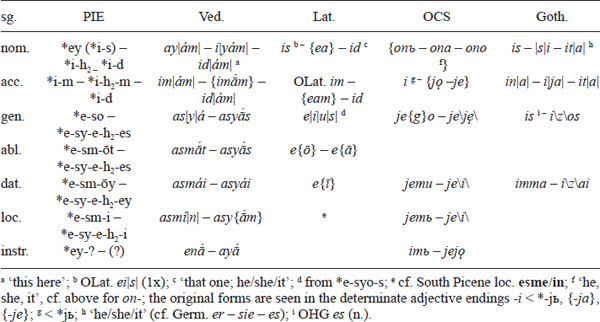

Many forms are parallel to those of *s-/t- (cf. above), but the nature of the suppletion pattern is different and the reconstruction more difficult and less secure in some cases. The variant *ey-/i- appears in the nom./acc. sg. and *e- elsewhere. For the nom. cf. also GAv. m. *aii*\|*ə̄m*\| ‘this’ – f. *ī*\|*m*\| ‘this’, n. *īt̰* ‘it’; Lith. \|*j*\|*ìs* ‘he’ – \|*j*\|*ì* ‘she’ (this pronoun mixes with the relative *yo- in Balto-Slavic), and OIr. *é* ‘he’ – \|*s*\|*í* ‘she’ – *ed* ‘it’. The archaic nom. m. form was perhaps, though a bit speculatively, *ey-Ø with a pronominal zero-ending (Ved. *ay-*, perhaps OIr. *é*), occurring together with a younger *i-s (with nominal *-s and zero-grade *i- as in the f./n. and acc.). For the acc. m. cf. also Gr. Cypr. ἴν; the acc. f. is structurally reconstructed.

**Table 1.33 IE demonstrative pronoun *ey (*is) – *ih₂ – *id (plural)**

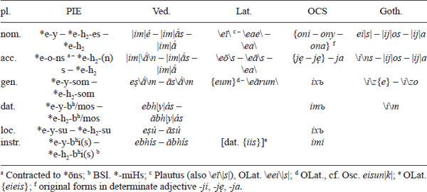

<!-- page: 88 -->

The *ey- appearing in the plural is not the *ey of the nom. sg. but *e-y- (with pronominal *-i), parallel to *to-y- (see above), though synchronically it made no difference. The acc. pl. is difficult to reconstruct – Vedic seems to have a secondary *im-* (that later spread to the nom. pl. as well) by analogy to the acc. sg., the Latin forms are “de-contracted”, while Gothic has a secondary *ins* (with *i-* as in most forms).

### **Interrogative pronouns**

The interrogative pronoun for ‘who, what, which?’ has the root *kʷ-, which shows up in two forms – as *kʷ-o- and *kʷ-i-. Cf. *kʷ-o-s (m.) \> Ved. *kás* ‘who, which?’ (GAv. sandhi-form *kas*), OCS *kъ-to* (oblique *ko-*), Lith. *kàs*, Goth. *ƕas* (all ‘who?’); *kʷ-o-d (n.) \> Ved. *kád* ‘what, which?’ (GAv. *kat̰*), Lat. *quod* ‘which?’, OPruss. *ka* ‘what’, Goth. *ƕa* ‘what?’ (cf. *kʷ-e-h₂ (f.) \> Ved. *kā́*, GAv. *kā*, Goth. *ƕo*). Cf. also *kʷ-i-s (m./f.) \> Ved. *ná-*\*k*\*is* ‘no one’, GAv. *ciš*, Gr. τίς, Lat. *quis*, Hitt. *kuiš* (all ‘who?’); *kʷ-i-d (n.) \> Ved. *cid* ‘any’ (see below), GAv. *-cīt̰* (pronominal particle), Gr. τί, Lat. *quid*, Slav. *čь (Croat. Čak. *čȁ*, cf. OCS *čь-to*), Hitt. *kuit* (all ‘what?’). The relation of *kʷi- and *kʷo- is not clear; perhaps the first was originally ‘who/what?’, the second (adjectival) ‘which?’, cf. the opposition of Lat. *quis* ‘who?’ – *quid* ‘what?’ and *quod* ‘which?’, and Slav. *čь ‘what’ and *kъ ‘which’ (Croat. North Čak. *kȁ*, OCS *kyi* \< *kъ-jь). Alternatively, it can be supposed that the thematic *kʷo- is innovative/secondary altogether (perhaps already in PIE). The declension is not easy to reconstruct, mainly because the relation of the two stems is unclear (*kʷo- and *kʷi-/kʷey-, cf., e.g., the acc. sg. Ved. *kám* \< *kʷo-m but Lat. *quem*, Hitt. *kuin* \< *kʷi-m ‘whom?’; nom. pl. Ved. *ké*, GAv. *kōi* \< *kʷo-y but GAv. *caiias*, OLat. *quēs* \< *kʷey-es), but the reconstructable forms apparently parallel those of the demonstrative *so, cf. the gen. *kʷ-e-so ‘of whom/what?’ (GAv. *cah*\|*ii*\|*ā*, Gr. Ion. τέο, early Lat. *qu*\*o*\*\|i\|u*\|*s*\|, OCS *česo* ‘of what?’, Goth. *ƕis*), dat. *kʷ-o-sm-ōy ‘to whom?’ (Ved. *kásmai*, GAv. *kahmāi*, Umbr. *pusme*, OCS *komu*, Goth. *ƕamma*), etc. It is unclear whether separate *kʷ-o-so (Ved. *kás*\|*y*\|*a*, GAv. *kah*\|*ii*\|*ā* ‘of whom/what?’, OCS *ko*{*g*}*o* ‘of whom?’), *kʷ-e-sm-ōy (OCS *čemu* ‘to what?’), etc. existed (with the oblique suppletive *kʷe- in alternation with the nom./acc. *kʷi-, and the oblique *kʷo- from the nom./acc. *kʷo-), though they are formally easily reconstructable. For interrogative pronominal adverbs, cf. p. 89.

### **Indefinite pronouns**

The indefinite pronouns were derived from the interrogative ones. One pattern was doubling, cf. *kʷis-kʷis ‘whoever’ (Lat. *quisquis*, Hitt. *kuiš kuiš*), *kʷos-kʷid (Ved. *káś cid* ‘anyone’, GAv. *kascīt̰* ‘every, any’), etc. The other one was adding the particle *kʷe (p. 105), cf. *kʷos-kʷe (Ved. *káś ca* ‘anyone’, Arm. *ok*c** ‘someone’ – p. 440), *kʷis-kʷe (Lat. *quisque* ‘whoever’), *kʷod-kʷe (Lat. *quodque* ‘whatever’, Goth. *ƕah* ‘each, every’ (n.)), etc. Sometimes simple interrogative pronouns were probably used as indefinite pronouns as well.

### **Relative pronouns**

<!-- page: 89 -->

The relative pronoun is reconstructed as *y-o (m.) – *y-e-h₂ (f.) – *y-o-d (n.) ‘who/what/which’ (sometimes thought to be a thematization of the demonstrative *i-, p. 87), with the same declension as *so – *seh₂ – *tod (p. 85–86). Cf. Ved. *yás – yā́ – yád*, Gr. ὅς – ἥ – ὅ, OCS *i*\|*že*\| (\< *jь) – *ja*\|*že*\| – *je*\|*že*\| (for *že* cf. p. 535), CIb. *io*\|*s*\| (acc. sg. *iom*, dat. sg. *iomui*), Gaul. *dugiionti-io* ‘who serve’, OPhryg. *ios*. In many languages, the interrogative *kʷ- has taken over the function of the relative *yo- (e.g., in Anatolian, Tocharian, Italic), sometimes (as in part of Slavic) after the first attested texts. However, some doubt the antiquity/originality of the relative *yo (cf. also p. 166).

### **Pronominal adjectives**

There are a number of pronominal adjectives, cf. *h₂elyos ‘other’ (Gr. ἄλλος, Lat. *alius*, Goth. *aljis*, OIr. *aile*, Toch. B *alyek*), *kʷoteros ‘which of the two’ (OCS *kot\o\ryi*, Lith. dial. *kat\a\ràs* ‘which’, and cf. p. 55, 80), etc.

### **Pronominal adverbs**

The pronominal adverbs are rather diverse in the IE languages, and not a lot of clear-cut correspondences exist. Cf. *kʷu-dʰe ‘where?’ (Ved. *kúha*, OCS *kъde*; cf. Gr. πóϑεν ‘whence?’ \< *kʷo-dʰe-n) and *kʷe/o-ti ‘how many?’ (Ved. *káti*, YAv. *ca*i*ti*, Lat. *quot*, Bret. *pet*, cf. Gr. adj. πóσος \< *kʷotyos) from *kʷ- (p. 88); Ved. *i-tás* ‘from here’ from *i- (p. 87), cf. Gr. ἐν-τóς, Lat. *in-tus* ‘inside’ for the suffix *-tos; similar forms from pronominal roots with the suffix *-r: Lat. *quō-r* ‘why?’, Lith. *ku-r̃* ‘where?’, Goth. *ƕa-r* ‘where?’, Alb. *ku-r* ‘when?’, Arm. *u-r* ‘where?’, etc.

## **Numerals**

PIE clearly had a decimal system. The reconstructed main cardinal numbers (with more or less direct reflexes), leaving out the many problematic issues, are:

- 1\. *h₁oy-n-o-s ‘one’ (m.) (*o-*stem), *-eh₂ (f.), *-o-m (n.) \> Gr. οἴνη ‘the ace on dice’, OLat. oinos, Lith. \|*v*\|*íenas* (cf. Slav. *ı˝nъ ‘other’ \< *h₁eyn-, OCS *in-o-rogъ* ‘unicorn’), OPruss. acc. sg. *ainan*, Goth. *ains*, OIr. *óen* (with different suffixes Ved. *ékas*; OPers. *aiva* ‘one’, Gr. Cypr. oιϝoς ‘only’, p. 49); *sōm (m.) ‘one’ (OCS *sam-ъ* ‘alone’) – *sm-ih₂ (f.) (Gr. μία, Arm. *mi*, cf. p. 86 for *si-) – *sem (n.) (Gr. ἕν, cf. Lat. *sem-el* ‘once’), cf. Ved. *sa-kŕ̥t* ‘once’ (*sm̥-), Gr. ὁμός ‘one and the same’, Goth. *sama* ‘same’ (*som-)
- 2\. *d(u)w-o-h₁ (m.) ‘two’ (cf. p. 54 for Lindemann’s Law; *o-*stem du.) \> Ved. *d(u)vā́* (-*áu*), Gr. Hom. δύω, Lat. *duo*, OCS *dъva*, Lith. *dù*, OIr. *dóu*, Arm. *erku* (p. 433–434), Toch. A *wu*; *d(u)w-eh₂-ih₁ (f.) (*eh*₂-stem du.), *d(u)w-o-yh₁ (n.) (*o-*stem du.) \> Ved. *d(u)vé* (f./n.), Lat. *duae* (f.), OCS *dъvě* (f./n.), Lith. *dvì* (f.), Toch. A *we* (f.); cf. likewise *-bʰ-o-h₁ ‘both’ (Goth. *b*{*ai*}), *h₂ent-bʰoh₁ (Toch. B *antapi*, Gr. ἄμφω, Lat. *ambō*), also OCS *oba*, Lith. *abù* (*h₂e-bʰoh₁?), Ved. *ubhā́* (*Hu-bʰoh₁?)
- 3\. *tr-ey-es ‘three’ (m.) (*i-*stem, p. 32) \> Ved. *tráyas*, Gr. τρɛῖς, Lat. *trēs*, OCS *trije*, Lith. *tr*\*ỹ*\*s*, Goth. *þreis*, OIr. *trī´*, Arm. *erek*c**, Toch. B *tr*\*a*\*i*, cf. loc. *tr-i-su (Ved. *triṣú*), etc.; *tisres (f.) (\< *tri-sr-es, *r-*stem) \> Ved. *tisrás*, OIr. *teoir*; *tr-ih₂ (n.) (*i-*stem pl.) \> Ved. *trī*, Gr. τρία, OCS *tri*
- 4\. *kʷetwor-es ‘four’ (m.) (*r-*stem, p. 23) \> Ved. *catvā́ras*, Gr. τέττ\α\ρɛς, OCS *čet*\*y*\*re*, OIr. *ceth(a)ir*, Arm. *č*c*ork*c**, Toch. B *śtwer*; oblique/compound *kʷtwr̥C-/-urV- (p. 52) \> Arm. *k*c*aṙ-*; *kʷete-sr-es (f.) (\< *kʷetwer-sr-es?) \> Ved. *cátasras*, OIr. *cetheoir*; *kʷetwōr (n.) \< *-orh₂ (p. 70) \> Lat. *qu*\*a*\*ttuor*, Goth. \*f* \*idwor* (reshaped *kʷetwor-h₂ (n.) \> Ved. *catvā́ri*, Gr. τέττ\α\ρα)
- 5\. *penkʷe ‘five’ (p. 24) \> Ved. *páñca*, Gr. πέντε, Lat. *qu*\*ī*\*nque*, Lith. *penk*{*ì*}, Goth. *fimf*, OIr. *cóic*, Arm. *hing*, Alb. *pesë*, Toch. A *päñ*, B *piś*; cf. *pn̥kʷ-stis ‘fist’ \> PSl. *pęstь (BCMS *pȇst*), OEng. *fȳst*
- 6\. *sw/s/wekˊs ‘six’ \> Ved. *ṣáṭ*, Gr. Dor. ϝέξ, Lat. *sex*, Goth. *saíhs*, OIr. *sé* (W *chwech*, Gaul. *suexos*), Arm. *vec*c** (p. 440), Toch. B *ṣkas*
- 7\. *septm̥ ‘seven’ (loanword from Semitic *šabʕ-at-um, p. 29) \> Ved. *saptá*, Gr. ἑπτά, Lat. *septem*, Lith. *sept*{*ynì*}, Goth. *si*\*b*\*u*\*n*\\ OIr. *secht*n**, Arm. *ewt*c*n*, Toch. A *ṣpät*
- 8\. *h₃ekˊtō(w) ‘eight’ (p. 45) \> Ved. *aṣṭā́* (-*áu*), Gr. ὀκτώ, Lat. *octō*, Lith. *aštuo*{*nì*}, Goth. *ahtau*, OIr. *ocht*\|*n*\|, Arm. *u*\*t*c**\\ (p. 440), Toch. B *okt*
- 9\. *h₁newn̥ ‘nine’ (p. 35) \> Ved. *náva*, Gr. ɛ̓\|ν\|νέα, Lat. *noue*\*m*\\ Goth. *niun*, OIr. *noí*n**, Arm. *inn*, Toch. AB *ñu*
- 10\. *dekˊm̥ ‘ten’ (p. 34) \> Ved. *dáśa*, Gr. δέκα, Lat. *decem*, Goth. *taíhun*, OIr. *deich*n**, Arm. *t*\*a*\*sn*, Toch. B \*ś*\*ak*
- 20\. *wīkˊn̥tih₁ \< *dw-i(h₁)-dkˊm̥t-ih₁ ‘twenty’ (du.) \> Ved. *vi*\|*ṃ*\|*śatí*\*s*\\ YAv. *visa*i*ti*, Gr. Dor. ϝίκατ\ι\\ Lat. *uīgintī*, OW *uceint*, Arm. *k*c*san*, Toch. A *wiki*
- 100\. *kˊm̥tom \< *dkˊm̥t-o-m ‘hundred’ (p. 34) \> Ved. *śatám*, Gr. \|ἑ\|κατόν, Lat. *centum*, OCS *sъto*, Lith. *šim̃ta*\*s*\\ Goth. *hunda*, CIb. *kantom*, Toch. B *kante*
- 1000\. *ǵʰesl- ‘thousand’ \> Ved. \|*sa*\|*-hásram*, Gr. Aeol. χελλιοι (Lat. *mī-lle* \< *smih₂-ǵʰesl- ‘one thousand’); dial. *tuHs-(d)kˊm̥t-ih₂ (literary *‘strong hundred’) \> OCS *tysę*/*ǫ*\*št*\*i*, OPruss. acc. pl. *tūsimt*{*ons*}, Goth. *þusundi* (Eng. *thousand*)

Only numbers 1–4 had declension and distinguished gender. The two forms for ‘one’ (disregarding the different suffixes with the root *h₁oy-) perhaps had slightly different semantics or usage. In 3 and 4, Indo-Iranian and Celtic point to feminine forms with *-sr-, often interpreted as ‘woman’ (cf. *swe-sr- ‘sister’, etc.). The word for ‘twenty’ is originally ‘two tens’, and ‘hundred’ is derived from ‘ten’ (‘ten’ itself is usually thought to be ‘two-hand’, cf. Goth. *handus* ‘hand’ \< *kˊomt-). The numbers from 11 to 19 were probably made by the pattern ‘one-ten’, ‘two-ten’, etc., cf. *dwoh₁-dekˊm̥(t) ‘twelve’ \> Ved. *duvā́daśa*, Gr. δώδεκα, Lat. *duodecim*. The decades 30–90 were made with *-(d)kˊomth₂ (originally *-(d)kˊōmt with the loss of *-h₂?), the old collective of *dekˊm̥(t), cf. *tri-h₂-(d)kˊomth₂ ‘thirty’ \> Gr. τρι\ᾱ*ˊ*\κοντα, Lat. *trīgint*\*ā*\\ OIr. *trícho*, Arm. *eresun* (p. 440–441), Toch. B *t*\*äry*\*ak*\*a*\\ (Toch. B -*ka* could be from *-(d)kˊōmt as well, cf. p. 467), etc. The numbers 21–29, 31–39, etc. were perhaps made the same way as 11–19, cf. *treyes-trih₂(d)kˊomth₂ ‘thirty-three’ (lit. ‘three-thirty’) \> Ved. *tráyas-tri*\|*ṃ*\|*ś*\*at*\\ etc. The hundreds from 200 to 900 are difficult to reconstruct but perhaps were (at least in one variant) compounds with *-(d)kˊm̥t- (cf. Gr. dial. -κατ-ιοι, Lat. *-cent-ī*).

The ordinal numbers were derived from the cardinal ones (except ‘one’) with various thematic suffixes. The original pattern is sometimes difficult to discern. The provisory reconstructions are:

- 1\. *pr̥h₂-w/m/t-o-s ‘first’ (\< ‘foremost’) \> Ved. *pū́rvas* ‘fore, first’, OCS *prьvъ*, Toch. B *parwe(-ṣṣe*); Lith. *pìrmas*, Goth. *f* \*ru*\*m*\*a*\\ Gr. Dor. πρᾶτος (cf. adverbs *preh₂-i \> Lat. *prae* ‘in front of’, *pr̥h₂ \> Gr. παρά/πάρα ‘beside’)
- 2\. ‘second’ cannot be reconstructed (all languages have different roots)
- 3\. *tr̥-/tri-t-y-o-s ‘third’ \> Ved. *tr̥t*\|*ī*´\|*yas*, YAv. *ϑritiia-*, Lat. *tertius*, OCS *tr*\*e*\*tii*, Lith. *tr*\*ẽ*\*čias*; Gr. τρί\τ\ος, Goth. *þridj*\*a*\\
- 4\. *kʷtwr̥-y/t-o-s ‘fourth’ \> Ved. *tur*\|*ī´*\|*yas*, YAv. *tu*i*riia-*, Gr. τ\|έ\|ταρτος, Lat. *quārtus*, OCS *č*\|*e*\|*tvrьtъ*, Lith. *k*\|*e*\|*tvir̃tas*, OEng. *f*\|*ē*\|*orþ*\*a*\\ Toch. B *śtarte*
- 5\. *penkʷ-t-o-s ‘fifth’ \> Gr. πέμπτος, older Lat. *quinctus*, OCS *pętъ*, Lith. *peñktas*, Goth. *fimfta-*, Toch. B *piṅkte*
- 6\. *(s)(w)ekˊ(s)-t-o-s ‘sixth’ \> Ved. *ṣaṣṭ*\|*h*\|*ás*, Gr. ἕκτος, Lat. *sextus*, OCS \*š*\*estъ*, Lith. \*š*\*ẽštas*, OPruss. *uschts* (\< *ukˊstos), Goth. *saíhst*\*a*\\ Toch. B *ṣkaste*
- 7\. *septm-o-s ‘seventh’ \> Ved. *sapt*\*am*\*ás*, Gr. ἕβδ\|ο\|μος, Lat. *sept*\|*i*\|*mus*, OCS *sedmъ*, OPruss. *septmas*; *septm̥-t-o-s \> Ved. *saptát*\|*h*\|*as*, Lith. *septiñtas*, OHG *sibunt*\*o*\\ Toch. A *ṣäptänt*
- 8\. *h₃ekˊt-ow-o-s \> Gr. ὄ\γδ\ooς, Lat. *oct*\*ā*\*uus*
- 9\. *h₁newn̥-t-o-s ‘ninth’ \> Gr. ἔνατος, OCS \*d*\*evętъ*, Lith. *deviñtas*, Goth. *niund*\*a*\\ Toch. B *ñunte*
- 10\. *dekˊm̥t-o-s ‘tenth’ \> Gr. δέκατος, OCS *desętъ*, Lith. *dešim̃tas*, Goth. *taíhund*\*a*\\ Toch. B *śkante*; *dekˊm̥-H-o-s \> Ved. *daśamás*, Lat. *decimus*

Multiplicative adverbial numerals *dwis ‘twice’ (Ved. *dvís*, Gr. δίς, Lat. *bis*, OIc. *tvis-var*), *tris ‘thrice’ (Ved. *trís*, Gr. τρίς, Lat. *ter*, OIc. *þris-var*), *kʷeturs ‘four times’ (Ved. *cátur*, Lat. *qu*\*a*\*ter*) can also be reconstructed (cf. also Arm. – p. 441).

## **Verbs**

The reconstruction of the PIE verbal system is more complex than the reconstruction of the nominal system. There is some concord when it comes to the reconstruction of specific forms and paradigms (which is the primary task here – determining the exact function of specific forms is more difficult), although it is not always clear what categories were present in what phase of PIE. There are a number of reasons for disagreement in the reconstruction of the PIE verbal system. First of all, the verbal systems of the early attested IE languages are much less congruent than the earliest nominal systems – e.g., while Vedic has three voices (active, middle, passive), five tenses (present, aorist, imperfect, perfect, future), and five moods (indicative, injunctive, imperative, subjunctive, optative), Hittite has only two of each (active, middle; present, preterite; indicative, imperative). Thus, the PIE system is more difficult to reconstruct, and there is more room for different possible reconstructions. Generally speaking, analyzing verbal systems is often hard and controversial even when it comes to living languages, so it is no wonder that this is even more difficult when it comes to dead languages (like Vedic) and even more so for reconstructed languages (like PIE).

The earliest, traditional reconstructions of the PIE verbal system were based on the so-called Greco-Aryan model and the rich verbal morphologies of (mainly) Greek and Old Indic. However, as became apparent after the discovery of Anatolian (and Tocharian, but to a smaller extent), this reconstructed system was very different from the less complex systems found in Anatolian languages – for instance, Anatolian shows no traces of the subjunctive and optative moods that have to be reconstructed for the rest of IE. The basic problem is how to interpret these discrepancies – to consider them as the result of post-Anatolian common innovations in late PIE, to consider Anatolian as innovative (e.g., losing the subjunctive and optative), or some kind of combination of both (p. 194). This then results in the fluid nature of what exactly is reconstructed for PIE – sometimes it is Early PIE (with Anatolian) and sometimes it is Late PIE (post-Anatolian).

The following PIE verbal categories can be reconstructed (we will mention possible others later in the text):

- NUMBER: singular, dual, plural
- PERSON: 1st, 2nd, 3rd
- ASPECT: present, aorist, perfect
- VOICE: active, middle
- MOOD: indicative, imperative, optative, subjunctive
- NOMINAL VERB FORMS: participles (and verbal adjectives, verbal nouns)

Things are mostly straightforward when it comes to number, person, voice, and nominal formations. What were traditionally regarded as tenses are now most often interpreted as aspects (the present being imperfective, the aorist perfective, and the perfect stative aspect),8 with the system best preserved in (early) Greek. Thus, for PIE we can reconstruct the imperfective (“present”) *stisteh₂mi ‘I am getting up’ – the perfective (“aorist”) *steh₂m ‘I stood up’ – the stative (“perfect”) *stestoh₂e ‘I am standing’ (not all verbs could form all three). Present/imperfective and aorist/perfective are grouped together as eventive (as opposed to perfect, i.e., stative). The categories of voice and mood existed in the eventive system only (thus, the perfect had no middle and no moods). Both the present and aorist had separate middle forms. The (active or middle) indicative is unmarked, and the rest of the moods functioned as separate simple formations (there was only one optative, subjunctive, and imperative – though in the case of the latter also with special future endings); i.e., there were no separate forms for the subjunctive present, subjunctive aorist, etc. as in Vedic or Greek. The present/aorist opposition, optative, subjunctive, and dual (and special formations like thematic presents or reduplicated perfects) did not exist in Anatolian and were possibly post-Anatolian.

All verbal roots had a CVC structure (with possible clusters – p. 52–53), with *e usually thought to be the “basic” ablaut grade (p. 43), cf. *bʰer- (p. 40), *dʰeh₁- (p. 45), though there were exceptions like *kan- (p. 42). PIE verbal forms had the following structure: root (+ affix) (+ thematic vowel) + ending (+ particle). A verb had to have a root and an ending (even if a zero morpheme). Some forms also had derivational suffixes (a thematic vowel was a particular kind of them) and end-particles. Cf. verbal forms like *h₁s-te ‘you (pl.) are’ (root + ending), *bʰer-e-te ‘you (pl.) are carrying’ (root + thematic vowel + ending), *bʰowdʰ-ey-e-me-s ‘we are waking (somebody)’ (root + suffix + thematic vowel + ending + particle). Reduplication (cf. *dʰe-dʰeh₁-mi ‘I am putting’) was more frequent than in nouns, and there was also an infix (cf. *yu-ne-g-mi ‘I am yoking’ from the root *yug-/yewg-).

PIE had a special class of particles that were attached after endings in some finite verbal forms. Some were a sort of secondary markers for a certain category, others had no clear function, some were probably facultative, and some forms could have had more than one particle. The major verbal particles were *-i (the present, *hic & nunc*, particle), *-u (the imperative particle), and *-o and *-r (the middle particles). Minor ones were the 1 (and 2) pl. and 1/2/3 du. present *-s and *-n, and the 1 pl. middle *-dʰh₂ (others also occur in specific languages or cases).

### **Present**

What is traditionally called the “present” in world languages often does not only stand for events in real present time (which is its primary and prototypical role) but can also be used for general statements, future, past, etc. This was undoubtedly the case in PIE as well – for instance, having no separate future tense, PIE surely had to “replace” it with present forms (at least in some instances). However, we cannot get into the specifics of the usage of the present in PIE here.

<!-- page: 93 -->

There were two basic present conjugations (similar to noun declensions): thematic (with the thematic vowel *-e/o- between stems and endings and with no ablaut alternation) and athematic (with endings right after the stems, and with ablaut alternations – most often *e in sg. and *Ø in pl.), like *bʰer-e-te ‘you are bearing (pl.)’ but *h₁d-te ‘you are eating (pl.)’. Thematic and athematic verbs had the same/similar endings in the plural (*-me-, *-te, *-nt-), while the singular forms originally differed. Athematic (and partly thematic) endings *-m-, *-s-, *-t- (sg.), *-me-, *-te, *-nt- (pl.) are shared with the aorist (p. 95–97). Some endings (especially athematic ones) had a *hic & nunc* particle *-i, while the 1 pl. had also *-s or *-n (also sometimes in the 2 pl.) – the endings with these present particles are traditionally called “primary” (though they are not really primary). In later IE languages, the non-ablauting thematic forms usually win, but usually with incorporation of at least some originally athematic endings. Here is the PIE athematic paradigm with reflexes:

**Table 1.34 IE athematic present**

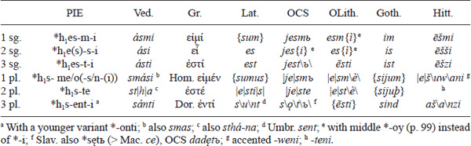

Athematic presents had a full grade (*h₁es-) in the sg. and a zero grade (*h₁s-) in the pl. Most endings had the present particle *-i. In the 1 pl. (like in thematic stems), numerous variants seem to have existed (the ending had ablaut variants *-me/o, together with particles *-s or *-n, and the present particle *-i in some languages): *-mes (Gr. Dor. -μες, Ved. -*mas*, Cz. -*me*), *-mesi (Ved. -*masi*), *-men (Gr. Att. -μεν), *-mo (Slav. -*mo*), *-mos (Lat. -*mus*, OCS -*mъ*, Goth. -*m*), *-meni (Hitt. -\*w*\*eni*), etc. (in some cases, different developments are possible). Their original distribution, exact formation, and number of existing variants is unclear. The athematic 3 pl. *-enti was replaced early on with thematic *-onti in many languages (perhaps facultatively/dialectally already in PIE). The thematic endings were:

**Table 1.35 IE thematic present**

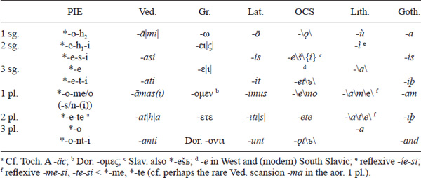

<!-- page: 94 -->

The 1 sg., 1 pl., and 3 pl. had thematic *-o-, and the other forms had *-e-. In the 1 sg., the reflexes point to *-ō, which is interpreted as *-oH (on the assumption that there were no *-V̅# type endings9) and further as *-o-h₂ (on the basis of the supposed relation to the perfect ending *-h₂e and middle *-h₂(e) – p. 98–99), which is frequently reconstructed, though in fact speculative. The usual reconstructions for the 2/3 sg. and 3 pl. are *-esi, *-eti, *-onti (attested in most languages), with the endings as in athematic stems. In contrast to what is usually reconstructed, one can suppose that thematic stems originally had different endings, perhaps coexisting with younger athematic-influenced ones already in the last stage of PIE. The heterodox thematic reconstruction *-eh₁i in the 2 sg. is based on Greek (if not from *-esi + *-s) and Lithuanian (the accent points to a laryngeal); *-e in the 3 sg. again on Greek/Balto-Slavic (with analogical thematic *-o in Lithuanian) and Toch. B *-ä-ṃ* (\< *-e-nu);10 *-o in the 3 pl. on Lithuanian (where sg. = pl.) and Toch. A -*e* \< *-o (together with -*eñc* \< *-onti) – cf. Beekes 2011: 260. The original thematic endings in the 3 sg./pl. would thus be bare thematic vowels in different ablaut. Anatolian had no thematic present.

The endings of the dual (athematic/thematic) are not easily reconstructable:

**Table 1.36 IE present dual endings**

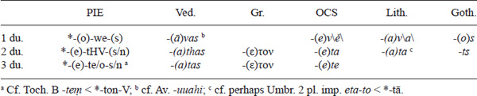

Cf. the pronoun *wē̆ ‘us two’ (p. 84) for 1 du. Ved. 2 pl. -*tha* is perhaps influenced by the 2 du.

The formation of the present stem is much more diverse than in other verbal forms – both thematic and athematic present conjugations were formed in numerous ways (usually with different affixes – some with a specific derivational meaning, others without it or with a meaning difficult to reconstruct). The list here is non-exhaustive and simplified:

- THEMATIC – (a) root-stems (cf. PIE *weǵʰ-e-, *bʰer-e- above; with zero-grade PIE *gʷr̥h₃-e- ‘devour’ \> Ved. *giráti*, OCS *žьrǫ*); (b) reduplicated stems (PIE *pi-ph₃-e- from *peh₃- ‘drink’ \> Ved. *píbāmi*, Lat. *bibō*); (c) *-y- suffix (PIE *leh₂-y-e- ‘bark’ \> Ved. *rā́yati*, OCS *lajǫ*, Lith. *lóju*; also in denominatives like Ved. *apasyáti* ‘works’ from *ápas-* ‘work’ and rare causatives like Lat. *sōpiō* ‘I put to sleep’ \< *swōp-y-e from *swep- ‘sleep’); (d) *-ey- causatives/iteratives11 (PIE *mon-ey-e- ‘make somebody think’ from *men- ‘think’ \> Lat. *moneō* ‘I remind’, Ved. *mānáyati* ‘honors’); (e) *-skˊ- (PIE *pr̥kˊ-skˊ-e- ‘ask’ \> Ved. *pr̥ccháti*, Lat. *poscō*); (f) *-eh₁- statives (PIE *sed-eh₁-e- ‘to be seated’ from *sed- ‘sit’ \> Lat. *sedēre*, OCS *sěděti*, Lith. *sėdė´ti* ‘to sit’); (g) *-eh₂- factitives (PIE *new-eh₂-e- ‘to make new’ \> Hitt. *nēwah˘h˘-* from *newos ‘new’); (h) *-(e)s- (Lat. *gerō* ‘I carry’ \< *h₂ǵ-es-e- from *h₂eǵ- \> Lat. *agō* ‘I drive’; also desiderative *-s-, which became the new future in many IE languages)
- ATHEMATIC – (a) root-stems (cf. PIE *h₁es- above or *h₁ey- ‘go’ \> Ved. *émi*, Gr. εἶμι; “Narten-presents” with long root, cf. Ved. *dāṣṭi* ‘waits’ \< *dēkˊ-ti); (b) reduplicated stems (PIE *de/i-deh₃- ‘give’ \> Ved. *dádāmi*, Gr. δίδωμι); (c) *-n(e)- infix (PIE *yu-n(e)-g- ‘yoke’ \> Ved. *yunákti*, pl. *yuñjánti*, Lat. *iungō*); (d) *-new-/-nu- suffix (Ved. *kr̥ṇómi* ‘I make’, *kr̥ṇuthá* ‘you (pl.) make’)

One can distinguish primary (derived directly from a verbal root without a suffix or with a suffix with no exact derivational meaning) and secondary formations (derived with a suffix that changed the meaning of the verbal root – e.g., causative, iterative, etc. – or from a noun or adjective root). The primary ones are all athematic and thematic (a)-(c). One verb could have had more than one coexisting primary present forms (with or without different connotations) – cf. from *gʷem- ‘go, come’ both *gʷm̥-skˊ-e- (Ved. *gácchati* ‘goes, comes’, Gr. βάσκε! ‘come!’) and *gʷm̥-y-e- (Gr. βαίνω ‘I walk’, Lat. *ueniō* ‘I come’). It is possible, even likely, that some assumed thematic formations were originally athematic. What the exact formation of a specific PIE verb was has to be reconstructed word by word (cf. LIV). For the middle present see p. 99–100.

### **Aorist**

The PIE aorist denoted perfective aspect. Its endings were basically the same as those in the athematic present (p. 93), pointing probably to a common pre-PIE origin of the present and aorist. However, the aorist did not have particles attached to endings as in the present (particularly not the *hic & nunc* *-i), except in the dual (but different from the present dual). The endings in the aorist (traditionally called “secondary”) are thus actually unmarked (unlike the present ones). Vedic preserves the complete opposition of the present and aorist endings (cf. Ved. pres. -*mas(i)* but aor. -*ma*), while many languages later generalized the original present endings in the aorist as well (cf. Gr. -μεν in pres./aor.). Greek and Indo-Iranian are the only branches to preserve both the aorist and perfect. In Italic and Celtic the aorist merges with the perfect into new preterite formations; in Germanic it is lost; in Slavic, Armenian, and Albanian it is preserved (while the perfect is generally lost there except for traces in Balto-Slavic and Armenian). Anatolian has no aorist (which is perhaps not an innovation). Greek, Indo-Iranian, Phrygian, and (limitedly) Armenian have a so-called augment in the past tenses (including the aorist), attached to the beginning of the form (Ved. *a-*, Gr. ἐ-, Phryg./Arm. *e-*), which stems from the PIE adverb *h₁e ‘at that time’. Some linguists reconstruct the augment as part of the aorist for PIE as well (where it may have been at the most a facultative or dialectal feature).

Unlike the numerous present formations, the aorist had only these basic formations:

1.  1) root-aorist – root \[sg. – full grade, pl. – zero grade\] + endings *deh₃-m – pl. *dh₃-me
2.  2) sigmatic aorist – root \[long grade\] + *-s- + endings *wēǵʰ-s-m̥
3.  3) thematic aorist – root \[zero grade\] + thematic vowel + endings *wid-o-m

<!-- page: 96 -->

The root-aorist is attested in Indo-Iranian, Greek, and Armenian (perhaps partially in Old Church Slavic) only but is often considered the most archaic (while sigmatic/thematic aorists are often considered secondary). It is formed from the endings attached directly to the root (often of those verbs that have a reduplicated athematic present), with the *e grade in the sg. and the zero grade in the pl. (the original ablaut is preserved in some verbs in Greek):

|       |     | PIE        |     | Ved.                  |     | Gr.            |
|-------|-----|------------|-----|-----------------------|-----|----------------|
| 1 sg. |     | *deh₃-m a |     | *dām* b               |     | \|ἔ\|δω{κα} d  |
| 2 sg. |     | *deh₃-s   |     | \|*á*\|*dās*          |     | \|ἔ\|δω{κας}   |
| 3 sg. |     | *deh₃-t   |     | \|*á*\|*dāt*          |     | \|ἔ\|δω{κε}    |
| 1 pl. |     | *dh₃-me   |     | \|*a*\|*d*\*ā*\*ma* |     | \|ἔ\|δoμε\|ν\| |
| 2 pl. |     | *dh₃-te   |     | *sth*\*ā*\*ta*      |     | \|ἔ\|δoτε      |
| 3 pl. |     | *dh₃-n̥t   |     | \|*á*\|*d*{*ur*} c    |     | \|ἔ\|δo{σαν} e |

**Table 1.37 IE root-aorist**

a Asyllabic because of Stang’s Law (cf. p. 70); b cf. *ápām* ‘has drunk’; c cf. the original *a-bhūv-an* \< *bʰuh₂-n̥t, Av. -*at* \< *-n̥t; d cf. the original ἔ-στη-ν ‘stood’ \< *steh₂-m; e cf. the more original (Homeric) ἔστ-αν \< *sth₂-n̥t

Cf. also *steh₂m ‘stood’ (Ved. *ásthām*, Gr. ἔστην), *dʰeh₁m ‘put’ (Ved. *adhām*, Gr. ἔϑηκα with secondary -κα, 1 pl. ἔϑεμεν, Arm. 3 sg. *ed*), etc. The root was perhaps exceptionally zero grade in *bʰuh₂- ‘be’: 3 sg. *bʰuh₂t (Ved. *ábhūt*, Gr. ἔφῡ, (?) OCS *by*). In Vedic and Homeric Greek, one can also find augmentless aorists like Ved. *bhūt*, Hom. φῦ ‘became’, etc.

The sigmatic aorist, very productive in late PIE and later languages, was formed from a long-grade root, the suffix *-s-, and endings:

|       |     | PIE          |     | Ved.                   |     | Gr.                   |     | OCS                  |
|-------|-----|--------------|-----|------------------------|-----|-----------------------|-----|----------------------|
| 1 sg. |     | *wēǵʰ-s-m̥   |     | \|*á*\|*prākṣa*\|*m*\| |     | \|ἔ\|ζευξα            |     | *věs*\|*ъ*\|         |
| 2 sg. |     | *wēǵʰ-s-s a |     | \|*a*\|*yā*\*s*\\ b   |     | \|ἔ\|ζευξ{ας}         |     |                      |
| 3 sg. |     | *wēǵʰ-s-t   |     | \|*a*\|*prāṭ*          |     | \|ἔ\|ζευξ{ε}          |     | f         |
| 1 pl. |     | *wēǵʰ-s-me  |     | \|*á*\|*jaiṣma*c       |     | \|ἐ\|ζεύξ\|α\|με\|ν\| |     | *věs*\|*o*\|*m*{*ъ*} |
| 2 pl. |     | *wēǵʰ-s-te  |     | \|*á*\|*cchānta*d      |     | \|ἐ\|ζεύξ\|α\|τε      |     | *věste*              |
| 3 pl. |     | *wēǵʰ-s-n̥t  |     | \|*á*\|*vākṣ*{*ur*} e  |     | \|ἔ\|ζευξα\|ν\|       |     | *věsę*               |

**Table 1.38 IE sigmatic aorist**

a Simplified to *wēǵʰs probably already in PIE (p. 53); b ‘has sacrificed’; from *yaj-* \< *Hyaǵ-; c ‘have conquered’; from *ji-*; d \< *ácchantsta ‘have seemed’, from *chand-*; e cf. Av. *-at̰* \< *-n̥t; f cf. perhaps OCS 2/3 *by-st-ъ* ‘were/was’.

The long grade in the sg./pl. is well attested in Vedic, Old Church Slavic (*věsъ* ‘conveyed’ from *vez-* \< *weǵʰ-, *basъ* ‘jabbed’ from *bod-* \< *bʰodʰ-, *grěsъ* ‘rowed’ from *greb-* \< *gʰrebʰ-, etc.), and Latin, where some perfect forms preserve the ablaut and *-s- but not the original endings (*uēxī* ‘I conveyed’ from *ueh-* \< *weǵʰ-, etc.). Some believe that the pl./du. originally had the **e*-grade (which would then be generalized in Greek and attested in the Vedic middle).

The thematic aorist has a zero-grade root (preserved in Vedic and Greek), thematic vowel (like in the present), and endings:

<!-- page: 97 -->

|       |     | PIE         |     | Ved.            |     | Gr.             |     | OCS           |
|-------|-----|-------------|-----|-----------------|-----|-----------------|-----|---------------|
| 1 sg. |     | *wid-o-m   |     | \|*á*\|*vidam*b |     | \|ε\|ἶδον       |     | *dvigъ*       |
| 2 sg. |     | *wid-e-s   |     | \|*á*\|*vidas*  |     | \|ε\|ἶδες       |     | *dviže*       |
| 3 sg. |     | *wid-e-t a |     | \|*á*\|*vidat*  |     | \|ε\|ἶδε        |     | *dviže*       |
| 1 pl. |     | *wid-o-me  |     | \|*á*\|*vidāma* |     | \|ε\|ἴδομε\|ν\| |     | *dvigom*{*ъ*} |
| 2 pl. |     | *wid-e-te  |     | *\|á\|vidata   |     | \|ε\|ἴδετε      |     | *dvižete*     |
| 3 pl. |     | *wid-o-nt  |     | \|*á*\|*vidan*  |     | \|ε\|ἶδον       |     | *dvigǫ*       |

**Table 1.39 IE thematic aorist**

a Cf. Arm. *egit* ‘found’; b cf. also augmentless *vidam.*

Cf. also Gr. ἤλυϑε, OIr. *luid* \< PIE *h₁ludʰet ‘went’, which can hardly be secondary. For the zero grade, cf. also Gr. aor. ἔφυγον, ἔτραπον from pres. φεύγο ‘I run’, τρέπω ‘I turn’, etc. Thematic aorists are often secondary, and exact correspondences are few – some researchers consider all (or most) of them as secondary/innovative. PIE may also have had a **reduplicated aorist**, cf. Ved. *ávocam*, Gr. εἶπον \< *(h₁e)-we-wkʷ-o-m ‘I said’. The dual endings in Vedic/Greek differed from those of the present (the thematic vowel is in brackets): 1 *-(o)-we \> Ved. -(*ā*)*va*, OCS *-(o)v*\*ě*\\ 2 *-(e)-to-m \> Ved. -*(*a*) tam*, Gr. -(ε)τον; 3 *-(e)-te-h₂m \> Ved. -*(*a*) tām*, Gr. -(ε)την (\< -(ε)τᾱν).

Some also reconstruct **imperfect** for PIE, based on Greek and Vedic, cf. Ved. *ā́sam*, Gr. (Ion.) ἦα \< (?) PIE *(h₁e)-h₁es-m̥; Ved. *ábharam*, Gr. ἔφερον \< (?) PIE *(h₁e)-bʰer-o-m. It is identical to the present except that it has aorist endings. This would then be the past tense of the imperfective aspect stem (the present being the present tense of imperfectives). Augmentless aorists and imperfects (sometimes used in a “timeless” meaning) found in Vedic, Gatha-Avestan, and Homeric/early Greek are often called **injunctives**. It seems that they were originally verbs unmarked for tense/mood when following preceding fully marked verbs or after the prohibitive imperative particle *meh₁ ‘not’ (\> Ved. *mā́*, Gr. μή, Alb. *mo* ‘do not!’, Arm. *mi*). In both cases, there was no need for redundant marking of tense/mood so it was left out, which is perhaps a structure of PIE origin – e.g., PIE may have used the injunctive forms like *bʰeront ‘they are carrying’ without the pres. ptcp. *-i, not the pres. *bʰeronti, after the present was already marked on a previous verb.12 This is typologically very similar to the Bantu consecutive (cf. Nurse 2003: 101–102). For the middle aorist see p. 100.

### **Perfect**

<!-- page: 98 -->

The “perfect” originally (whether in the last phase of PIE or in pre-PIE) most likely indicated the stative aspect. The frequent, and plausible, assumption is that the original stative (expressing states like ‘I am dead’) at one stage, perhaps partially already in late PIE, became resultative (‘I have died \[and I am dead now\]’), and finally in post-PIE preterite (‘I died’). In most later IE languages, it has developed into a regular past tense. However, in Homeric Greek (with relics in Classical Greek) the perfect expresses the meaning of the state of the subject (this occurs less commonly also in R̥gveda), cf. Homeric τέϑνηκε ‘is dead’, ἕστηκε ‘is standing’ (cf. p. 309). Some original perfect forms have a present tense (or stative) meaning in other languages as well – like *woydh₂e ‘I know’ almost everywhere, Latin verbs like *meminī* ‘I remember’ (cf. Goth. *man* ‘thinks’ and Gr. μέμονα ‘I yearn for’), or the Germanic *praeteritopraesentia* class (p. 400). The PIE perfect is preserved in Indo-Iranian, Greek, Italic/Celtic (mixed with aorist), Germanic, and Anatolian (albeit in different form than in Indo-Iranian/Greek) – elsewhere, it was lost, usually with some remaining traces.

The usual perfect formation had partial reduplication of the root (originally perhaps only *Ce- but also *CV-, cf. Gr. λέ-λοιπα but Ved. *ri-réca* \< *le/i-loykʷ-h₂e from *leykʷ- ‘leave’), the ablaut alternation in the root (*o-grade in the sg., zero grade in the pl. – preserved regularly in Vedic, sometimes in Germanic), and special (athematic) perfect endings (*-h₂e, *-th₂e, *-e, *-me, *-e, *-r̥/-ēr). For reduplication cf. Ved. *ja-gama* ‘I went’ (from *gácchati* ‘goes’), Gr. πέ-ποιϑα ‘I am persuaded’ (from πείϑω ‘I persuade’), Lat. *ce-cinī* ‘I sang’ (from *canō* ‘I sing’), Goth. *haí-hait* ‘I called’ (from *haitan* ‘to call’), OIr. *ce-chan* ‘I sang’ (from *canid* ‘sings’), etc. Reduplication was regular in Indo-Iranian and Greek, and sporadic in Germanic, Italic, and Celtic. In PIE it may have been present in almost all forms (though we cannot be sure). The ablaut alternation is attested regularly in Indo-Iranian, in Germanic “strong” verbs, and some (early) Greek forms. The ablaut alternation includes the accent shift in Vedic (*jujóṣa* ‘he has enjoyed’ – *jujuṣúr* ‘they have enjoyed’) and Germanic “strong” verbs, cf. OEng. *cēas* ‘I/he chose’ – *curon* ‘we chose’ (with Verner’s Law – p. 20, 393) \< PIE *(ǵu)ǵowse – *(ǵu)ǵusr̥. Anatolian shows no special perfect stem (cf. p. 187 for possible reduplication), just different endings. The exact relation of the PIE perfect to the Anatolian *ḫi-*present, in spite of the formally close similarity of endings, is controversial (p. 187).

The best-attested perfect form is the one that is rather aberrant – the perfect form *woyd-/wid- has no reduplication (it is the only such plausibly reconstructable form) and has a stative (in later languages present) meaning ‘know’, derived from *weyd- ‘see’ (p. 49). The apparent (already PIE) development was ‘I have seen’ \> ‘I know’ (or, more precisely, ‘I am in the state of having seen/knowing’):

|       |     | PIE                       |     | Ved.                     |     | Gr.       |     | Goth.            |
|-------|-----|---------------------------|-----|--------------------------|-----|-----------|-----|------------------|
| 1 sg. |     | *woyd-h₂e a              |     | *véda*                   |     | oἶδα      |     | *wait*           |
| 2 sg. |     | *woyd-th₂e b             |     | *véttha*                 |     | oἶσ\ϑ\α   |     | *waist*          |
| 3 sg. |     | *woyd-e                  |     | *véda*                   |     | oἶδε      |     | *wait*           |
| 1 pl. |     | *wid-me                  |     | *vidmá*                  |     | ἴδμε\|ν\| |     | *wit*\|*u*\|*m*  |
| 2 pl. |     | *wid-e                   |     | *vidá*                   |     | ἴσ{τε}    |     | *wit*{*uþ*}      |
| 3 pl. |     | *wid-r̥/-ēr               |     | *vid*\*úr*\\            |     | ἴ\σ\\ᾱσι} |     | *wit*{*un*}      |
| 1 du. |     | *wid-we                  |     | *vidvá*                  |     |           |     | *witu*           |
| 2 du. |     | *wid-tH-(?) c |     | *vid*\|*a*\|*th*\[*úr*\] |     |           |     | *wit*\*u*\*ts* |
| 3 du. |     | *wid-t-(?) c             |     | *vid*\|*a*\|*t*\[*úr*\]  |     |           |     |                  |

**Table 1.40 IE perfect**

a Cf. OCS isolated *vědě* ‘I know’ \< *woydh₂e-y (with *hic & nunc* *-i); b phonetically *woytsth₂e (p. 54), cf. Hitt. pret. -*tta*; c phonetically *witst(H)- (p. 54).

<!-- page: 99 -->

The PIE perfect endings were close to both the pres./aor. active and middle endings, though the latter is often overly emphasized. The 1 sg. *-h₂e is attested directly as *-ḫḫa* in Anatolian (p. 187), and indirectly in the lack of Brugmann’s Law (p. 40, 206) in Ved. *cakara* ‘I have made’ \< *kʷe-kʷor-h₂e (a closed syllable because of the laryngeal) but *cakā́ra* ‘he has made’ \< *kʷe-kʷor-e (an open syllable). The opposition of the 1 sg. *-a \< *-h₂e and the 3 sg. *-e is seen in the OIr. pret. 1 sg. *gád* ‘I asked’ but 3 sg. *gáid* ‘he asked’ (with palatalization form *-e). The 1 pl. *-me and the 1 du. *-we is the same as in the pres./aor.; the 2 pl. *-e (*-o is theoretically also possible) is attested only in Vedic but looks archaic (elsewhere we find the pres./aor. *-te). The variants in the 3 pl. are not clear – cf. Hitt. pret. -*ēr*, older Lat. *-ēr-e* (with a secondary particle *-i) for *-ēr (from original *-er-s?, cf. p. 70); Av. -*ar*ə**, probably Ved. *-ur*, and Hitt. rare -*ar* for *-r̥ (cf. also NPhryg. δακαρ(εν) ‘they have made’); (?) GAv. *cikōitər*ə*š* (and perhaps Ved. -*ur* and Lyd. *-rś*) for *-r̥-s (cf. also Ven. -*ers* (?)). The particle (?) *-s in some 3 pl. forms is perhaps the same as in the present *-me/o-s (and possibly identical to the nominal nom. pl. *-s?). The original perfect endings have been influenced by the aorist ones in a number of languages. The intrusion of the present *-i (p. 92–93) into Italic perfect endings (cf. Lat. 1 sg. -*ī* \< early -*ei* \< *-h₂e-y, 2 sg. *-is-tī* \< *-th₂e-y) points to the older stative (“present”) meaning of the perfect.

### **Middle (mediopassive)**

The middle (medium) voice stands in opposition to the active voice (the present/aorist forms we have seen were all active – the perfect had no active/middle distinction but can be considered active of a sort). The reconstruction of the concrete meaning of the definitely polyfunctional PIE middle is rather speculative. The active typically expressed a simple action (or state) by the subject (cf. Gr. λύω ‘I unbind (something)’), while the middle indicated that the subject is doing an action for his or her benefit or that it is affected by the action (cf. Gr. λύομαι ‘I unbind (for) myself’). The meaning was thus reflexive (Gr. λούομαι ‘I wash myself’) and sometimes reciprocal (cf. Ved. *vádete* ‘two of them talk to each other’). Since the PIE middle yielded a passive voice (cf. Goth. *gibada* ‘is given’) in some families (Italic, Germanic), it seems that the PIE middle also had that function in some cases (hence the other name, mediopassive). It also may have had an impersonal function (cf. Lat. *ītur* ‘one goes’). Some verbs (called deponent or *media tantum*) had exclusively middle endings but non-middle meaning (cf. Ved. *śáye*, CLuw. *zīyari* \< PIE *kˊey-or ‘lies’; Ved. *váste*, Hitt. *wešta* \< PIE *wes-tor ‘wears’). Most families preserved the PIE middle (the opposition active : middle is best preserved in Anatolian, Indo-Iranian, and Greek), with the notable exceptions of Balto-Slavic (which preserves traces in active endings, cf. OPruss. *assai* ‘you are’ \< *-so-y) and Armenian (with innovative mediopassive forms).

The middle had special endings – for the middle present and middle aorist – similar to both the present/aorist and perfect endings (though the latter is usually overemphasized), the reconstruction of which is rather difficult. It was typified by two particles: *-o (in both the present and aorist) and *-r (only in the present). Instead of *-r (attested in Anatolian, Italian, Celtic, Armenian, Tocharian, Phrygian, Venetic), posited as original by many researchers, some dialects have the *hic & nunc* *-y (Indo-Iranian, Greek, Germanic, Balto-Slavic, Albanian), which is likely secondary but possibly a dialectal feature already in PIE. In the 2/3 sg. and 3 pl., variant endings can be reconstructed (present/aorist-like and perfect-like) – their original function/distribution is not clear. Here is a tentative reconstruction of the present (primary) middle endings (both thematic and athematic):

<!-- page: 100 -->

**Table 1.41 IE middle present**

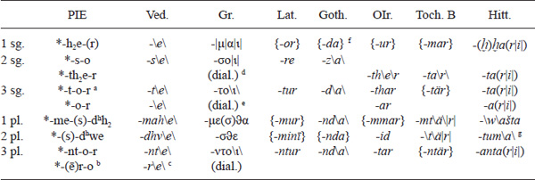
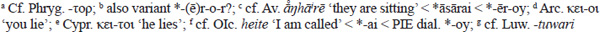

For the 1 sg. (best preserved in Anatolian) cf. thematic pres. *-h₂ and perf. *-h₂e (some reconstruct *-h₂o(r) for the middle); for the 2 sg. pres./aor. *-s- and perf. *-th₂e (some reconstruct *-th₂o(r) for the middle); for the 3 sg. pres./aor. athematic *-t- and thematic pres./perf. *-e; for the 3 pl. pres./aor. *-nt- and perf. *-r̥/-ēr (the *n/r here reminds one of heteroclitic nouns – p. 77–78). Some linguists reconstruct the PIE forms without the particle *-r, which they believe to be secondary (stemming supposedly, not too convincingly, from the 3 pl. ending). However, it is not impossible that *-r was facultative or dialectal in PIE. The present/aorist-like endings *-so, *-to(r), *-nto(r) are sometimes thought to be innovative (with *-o originating perhaps in the 3 sg. ending *-o), but they must have been there already in PIE. Others think that variant endings point to two different original categories13 (one with the ending *-to and one with the ending *-o, etc.). Ved. forms like *brūté* ‘calls (for himself)’ but *bruve* (pass.) ‘is called’ and some other facts would perhaps point to a possible original meaning distinction. In the 1 pl., *-me- is the ending attested in all verbal finite forms (the optional *-(s)-, attested in Greek/Hittite, is perhaps related to the pres. *-mes and then transferred to 2 pl. *-(s)-dʰwe), and *-dʰh₂ is probably some kind of particle. As in the active, the -*w-* in Hitt. -*wašta* may be from the old du. *-we-(s)-dʰh₂ (cf. Ved. 1 du. pres. *-vahe*, aor. -*vahi*, Av. aor. -*vadi*). The 2 pl. *-dʰwe is unique to the middle, though the final *-e (cf. Gr. -σϑε), perhaps accidentally, reminds one of the pres./aor. *-te and perf. *-e; some, however, reconstruct *-dʰwo (cf. Luw. -*tuwa-ri*). Many later endings (like the 1 pl. Lat. -*mur*, OIr. -*mmar*) are remodeled by analogy to the active. A thematic *media tantum* present with many reflexes is PIE *sekʷ-e-tor ‘follows’ \> Ved. *sácate*, Gr. ἕπεται, Lat. *sequitur*, OIr. *sechithir*.

These are the aorist (“secondary”) endings:

**Table 1.42 IE middle aorist**

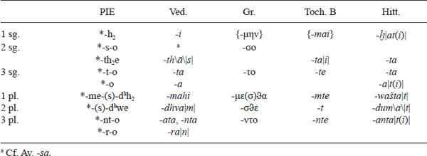

The endings were probably mostly the same as the present ones but with no *-r (i.e., dial. *-y). Ved./Av. -*i* would point to *-h₂ (unlike the present *-h₂e(r)). Perhaps the 1 pl. *-mes-dʰh₂ was originally the present ending and *-me-dʰh₂ the aorist ending.

### **Subjunctive**

<!-- page: 101 -->

The present/aorist forms we have seen were all indicative (the perfect had no mood distinction but can be considered indicative of a sort). The subjunctive and optative were originally probably normal verbal suffixes (like many others that existed in the present – p. 94–95) that only later became full-fledged moods. The PIE subjunctive probably expressed something that the speaker thought was uncertain, a future action with a slight reservation (e.g., *h₁esoh₂ ‘I suppose/guess I will be’). Thus, it is understandable that it yielded the future tense in Latin. The formation of the subjunctive was simple – root in the full grade + suffix *-e-/-o- + present/aorist endings. The suffix *-e-/-o- was formally (and probably etymologically) identical to the thematic vowel and followed the same qualitative pattern. The subjunctive thus in a way presents the “thematized” forms of the indicative, where the already thematic forms become “doubly thematic” in the subjunctive (with *-e-e-, *-o-o-) and the athematic forms become thematic. Why the thematic vowel (or a morpheme formally identical to it) functions as a subjunctive suffix is not clear. These are the forms of athematic verbs:

|       |     | PIE                   |     | Ved.             |     | Gr. (Hom.) |     | Lat. e |
|-------|-----|-----------------------|-----|------------------|-----|------------|-----|-------------------|
| 1 sg. |     | *h₁es-o-h₂           |     | *ásā*\|*ni*\| c  |     | ἔω         |     | *erō*             |
| 2 sg. |     | *h₁es-e-s-(i) a      |     | *ásas*(*i*)      |     | ἔ\ῃ\ς      |     | *eris*            |
| 3 sg. |     | *h₁es-e-t-(i) b      |     | *ásat*(*i*)      |     | ἔ\ῃ\\      |     | *erit*            |
| 1 pl. |     | *h₁es-o-me(/o-(s/n)) |     | *ásāma*          |     | ἔ\ω\μεν d  |     | *erimus*          |
| 2 pl. |     | *h₁es-e-te           |     | *ásat*\|*h*\|*a* |     | ἔ\η\τε     |     | *eriti*\|*s*\|    |
| 3 pl. |     | *h₁es-o-nt-(i)       |     | *ásan*           |     | ἔ\ω\σι     |     | *erunt*           |

**Table 1.43 IE athematic subjunctive**

a Also *-e-h₁-i? (p. 93–94); b also *-e-e? (p. 93–94); c cf. the older ending in *brav-ā* ‘I speak’ (-*ā* 13x in RV); d cf. Hom. ἴ-ο-μεν ‘we would go’ for the original short *-o-; e future tense.

It is not clear whether the endings in PIE were originally primary, secondary, or both (either mixed or facultative). Vedic has a curious mix of primary and secondary endings. The 1 sg. shows only (thematic primary/present) *-h₂ (unlike in the optative), which is in accord with the fact that all subjunctive forms were “thematic”. Thus, other primary endings might be expected as well. However, some Vedic endings (1 pl. -*ma*, 3 pl. *-n*, 1 du. -*va*), parallelism to the optative, and structural reasons (a mood unmarked for present/aorist could have used generic, and not present, endings) could point to originally secondary endings. Both primary and secondary endings can be secondary in certain cases in later languages. If variants existed already in PIE, they probably carried no special (present/aorist) semantics. The forms of thematic verbs are:

|       |     | PIE                     |     | Ved.              |     | Gr.     |     | Lat. **f**        |
|-------|-----|-------------------------|-----|-------------------|-----|---------|-----|-------------------|
| 1 sg. |     | *bʰer-o-o-h₂           |     | *váhā*\|*ni*\| c  |     | φέρω    |     | *fer*{*am*}       |
| 2 sg. |     | *bʰer-e-e-s-(i) a      |     | *bhárās* d        |     | φέρῃς   |     | *ferēs*           |
| 3 sg. |     | *bʰer-e-e-t-(i) b      |     | *bhárāt*(*i*)     |     | φέρῃ e  |     | *feret* g         |
| 1 pl. |     | *bʰer-o-o-me(/o-(s/n)) |     | *bhárāma*         |     | φέρωμεν |     | *fer*\*ē*\*mus* |
| 2 pl. |     | *bʰer-e-e-te           |     | *váhāt*\|*h*\|*a* |     | φέρητε  |     | *ferēti*\|*s*\|   |
| 3 pl. |     | *bʰer-o-o-nt-(i)       |     | *vahān*           |     | φέρωσι  |     | *fer*\*e*\*nt*  |

**Table 1.44 IE thematic subjunctive**

a Also *-e-e-h₁-i? (p. 93–94); b also *-e-e? (p. 93–94); c cf. older *arc-ā* ‘I may shine/praise’, GAv. *yaojā* ‘I will yoke’; d cf. *vahāsi*; e cf. Arc. εχη ‘has’, Thess. ϑελη ‘wishes’ \< *-ēt (?); f future tense (3rd/4th conjugation); g with -*t* \< *-ti, cf. Osc. **fakiiad** ‘makes’ \< *-t.

*-ee- contracted to *-ē-, and *-o-o- to *-ō- (others believe that It. -*ē-* in all persons is actually archaic). The contraction was probably post-PIE (Gatha-Avestan still has two syllables there).

<!-- page: 102 -->

### **Optative**

The optative probably expressed the wishes of the speaker (e.g., *h₁syeh₁m ‘I would be’). An athematic and thematic optative existed, though the latter was perhaps very late PIE, post-Tocharian (p. 91–92, 455). The PIE optative yielded the (so-called) subjunctive mood in Germanic and Italic, and the imperative in Balto-Slavic. The athematic forms were made of the zero-grade root, an alternating suffix (sg. *-yeh₁-, pl. *-ih₁-), and mostly generic (“aorist/secondary”) endings:

|       |     | PIE             |     | Ved.            |     | Gr. (Hom.) |     | OLat. **c**    |
|-------|-----|-----------------|-----|-----------------|-----|------------|-----|----------------|
| 1 sg. |     | *h₁s-yeh₁-m    |     | *syā́m*          |     | εἴην       |     | *siem*         |
| 2 sg. |     | *h₁s-yeh₁-s a  |     | *syā́s*          |     | εἴης       |     | *siē*\*s*\\   |
| 3 sg. |     | *h₁s-yeh₁-t b  |     | *syā́t*          |     | εἴη        |     | *sie*\*t*\\ d |
| 1 pl. |     | *h₁s-ih₁-me    |     | *sy*\*ā́*\*ma* |     | εἶμε\|ν\|  |     | *sīm*{*us*}    |
| 2 pl. |     | *h₁s-ih₁-te    |     | *sy*\*ā́*\*ta* |     | εἶτε       |     | *sīt*{*is*}    |
| 3 pl. |     | *h₁s-ih₁-ent   |     | *sy*{*úr*}      |     | εἶεν       |     | *sien*\*t*\\  |

**Table 1.45 IE athematic optative**

a Cf. the OCS athematic imp. *ěžd-ь!* ‘eat!’ \< *h₁ed-y- (also *dažd-ь!* ‘give!’); b cf. OCS *eša* ‘if only’ \< *h₁esyeh₁t (with secondary *h₁es-); c subjunctive; d with secondary -*t* \< *-ti, cf. oldest sied with -*d* \< *-t.

The ablaut scheme, typical for athematic paradigms, is preserved in Greek and Latin. The zero-grade *-ih₁- can also be seen in Vedic (middle opt. *bruv-ī-* ‘talk’), Old Church Slavic (imp. *dad-i-te!* ‘give (pl.)!’), Lithuanian (dial. imp. *sēdźīťe!* ‘remain (pl.) seated!’), Gothic (pres. *wil-ei-ma* ‘we will’, cf. Lat. subj. *uel-ī-mus* ‘we may want’), and Tocharian (opt. *klyauṣ-i-m* ‘I might hear’, p. 468). The 3 pl. ending was *-ent from the athematic present (not the aorist *-n̥t), based on Latin/Greek. The thematic optative had a full-grade root + thematic vowel *-o- + suffix *-ih₁- + generic (“aorist”) endings:

**Table 1.46 IE thematic optative**

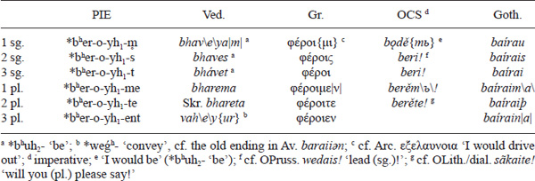

The lack of qualitative ablaut of the thematic vowel is conspicuous. In most languages, the suffix *-oyh₁- yields (or reflects just like) *-oy-. However, the Slavic acute in *-ě˝me/o/ъ, *-ě˝te would point to a laryngeal.

<!-- page: 103 -->

### **Imperative**

The imperative, easily reconstructable, had forms only for the 2nd and 3rd persons. It had eventive endings in the 3 sg. and 2/3 pl., and was characterized by the particle *-u in the 3 sg./pl. The athematic forms were:

**Table 1.47 IE athematic imperative**

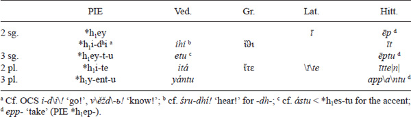

The 2 sg. is either the full-grade endingless root or the zero-grade root plus *-dʰi (probably a particle). Except for the *-dʰi form, the singular has the full-grade and the plural the zero-grade root, as usual in the athematic stems. The thematic forms were:

**Table 1.48 IE thematic imperative**

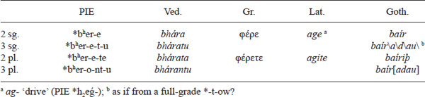

The 2 sg. has a zero-ending (cf. also OIr. *beir!*). The 2 pl. imp. seems to have been identical in some cases (like *h₁ite, *bʰerete) to the 2 pl. pres./inj.

There were also special future imperative forms that express the meaning of a delayed (future) command (*h₁itōt ‘go later!’):

|                |     | PIE             |     | Ved. **a** |     | Gr. **c**  |     | Lat.              |
|----------------|-----|-----------------|-----|------------|-----|------------|-----|-------------------|
| 2/3 sg., 2 pl. |     | *h₁i-tōt       |     | *vittā́t* b |     | ἴτω        |     | *itō* d           |
| 2/3 sg., 2 pl. |     | *bʰer-e-tōt    |     |            |     | φέρετω     |     | *agitō*           |
| 3 pl.          |     | *-(o)-n(t)-tōt |     |            |     | dial. -ντω |     | *euntō*, *aguntō* |

**Table 1.49 IE future imperative**

a Usually just 2 sg.; b ‘thou shalt regard’; c used as regular imperative for the 3 sg.; d cf. arch. Lat. *da-tōd* ‘let him give’, CIb. *ta-tuz* ‘he must give’; only 2/3 sg. in Latin.

<!-- page: 104 -->

The ending *-tōt (often reconstructed as *-tōd) is usually explained as originally an abl. sg. (p. 63) of the pronoun *tod ‘that’, meaning originally ‘from that \> after that’ or the like, but the pronominal form was actually *tosmōt (p. 85). The 2/3 sg. and 2 pl. had the same ending (probably from older *-Ø-tōt, *-et-tōt, *-ete-tōt), and the 3 pl. was made from *-nt- + *-tōt-.

### **Non-finite verb forms**

Unlike many later IE languages, PIE had no infinitive but had participles, verbal adjectives, and verbal nouns. The participles were those of the active present, middle, and perfect. The present active participle had the *-ont- suffix (with no thematic vowel before it): m. +±+ holodynamic *bʰer-ōnt-s ‘carrying’ (Ved. *bhár*\*a*\*n*, Gr. φέρων, Lat. *fer*\*ē*\*ns*, OCS *bery*, Goth. *baír*\*a*\*nds*; Lith. *neš*\*ą̴*\*s*; cf. Hitt. *ašanza* ‘being’ (active!) but *kunanza* ‘killed’) – gen. sg. *bʰer-n̥t-e/os (Ved. *bháratas*, Lat. *ferentis*); f. *bʰer-ont-ih₂ (Ved. *bhárantī*, Gr. φέρoυσα – cf. p. 38 for “laryngeal breaking”, OCS *berǫ*\*št*\*i*; Lith. *nẽšanti*) – gen. sg. *bʰer-ont-yeh₂-es (OCS *berǫšt*{*ę*}, Lith. *nẽšančios*) (cf. p. 67). Cf. also the athematic stem *h₁s-ōnt-s ‘being’ (Lat. *sōns* ‘guilty’ \< *‘he who is’, OCS *sy*), *h₁s-n̥t-ih₂ (f.) (Ved. *satī´*, Gr. Dor. ἔασσα). The present middle participle was a simple *o-*stem: *bʰer-o-mh₁n-o-s ‘carrying for himself/carried’ (Ved. *bháram*\*ā*\*nas*, YAv. *barǝmna-*, Gr. φερóμενος; OCS *nesomъ*, Lith. *nẽšamas* ‘being carried’; CLuw. *kišama-* ‘combed’; cf. Lat. *alumnus* ‘nursling’) – f. *-mh₁n-e-h₂ (cf. Lat. *fēmina* ‘woman’ \< *dʰeh₁mh₁neh₂ ‘she that is sucked’); athematic *-m̥h₁nos (Ved. *vidāná-*/*vídāna-* ‘finding’) The perfect participle was an *s-*stem (*-wos- suffix): m. ±±+ holodynamic *weyd-wōs ‘in the state of knowing’ (Ved. *v*\*i*\*dvā́*\|*ṃ*\|*s-*, GAv. *v*\*ī*\*duuå*, Gr. εἰδώς ‘knowing’; Goth. *weitwo*\|*d*\|*s* ‘witness’) – oblique *wid-us- (Ved. *viduṣ-*, OCS *nesъš-* ‘having carried’, Lith. *lìkus-*‘having left’, cf. Goth. noun *berusjos* ‘parents’); f. *wid-us-ih₂ (Ved. *vidúṣī*, Gr. Hom. ἰδυῖα, OCS *nesъši*, Lith. *lìkusi*), n. *weyd-wos (Gr. εἰδóς). Unlike the participle of *woydh₂e (p. 98), other perfect participles were originally reduplicated (cf. Ved. *ja-ghan-vā́*\|*ṃ*\|*s-* from PIE *gʷʰen- ‘beat’).

Besides the three participles, embedded paradigmatically in the PIE verbal system, there were also some verbal adjectives and nouns, less directly connected (in the realm of word formation) to verbal finite forms. The zero-grade verbal adjective in *-to- is widely attested, e.g., *sth₂-t-o-s ‘placed’ (Ved. *sthitás* ‘standing, settled’, Gr. στατóς ‘placed, standing’, Lat. *status* ‘set’; cf. OCS *pro-strъtъ* ‘spread’, Goth. *nasiþs* ‘saved’). The adjectives in *-n-o-s (cf. Ved. *vinnás* besides *vittás* ‘found’; OCS *znanъ*, OEng. *ge-cnāwen* ‘known’; cf. also *pl̥h₁nos – p. 37) of a similar function are not as widely attested. The suffix *-t- was present also in the *i-*stem verbal noun: *gʷm̥-t-i-s ‘going’ (Ved. *gátis*, Gr. βάσις ‘stepping’). The acc. sg. of the *-t-u-s nouns might have been used as a supine (after motion verbs): *-t-u-m (cf. Lat. sup. -*tum*, OCS sup. -*tъ*, Lith. dial. sup. -*tų*, Ved. inf. -*tum*), cf. Lat. *cubi-tum uēnerunt* ‘they went to sleep’, OCS *idǫ lovi-tъ* ‘I go to hunt’.

## **Postpositions**

<!-- page: 105 -->

A considerable number of postpositions can be reconstructed for PIE, with some of them functioning also as adverbs (p. 80–81). Most modern and some older IE languages (like Latin, Greek, Old Church Slavic, or Gothic) predominantly have prepositions (which are to have an even more important role in younger IE languages with simplified or lost declensions), which often function as verbal prefixes (modifying the meaning of the verb) as well, cf. the Lat. preposition *ad* ‘to, toward’ and *ad-ueniō* ‘I come to’. However, these verbal prefixes were originally independent of verbs (cf. Eng. *come to*), and some more archaic old IE languages (Anatolian, Vedic) predominantly had postpositions, which is mostly held to have been the case in PIE as well (though it is possible that there were also some prepositions, or that at least some postpositions could have also been placed prepositionally, etc.). Some postpositions can be found in languages that are mostly prepositional (like Latin, Greek, Old Persian), cf. Lat. *mē-cum* ‘with me \[lit. me-with\]’. As examples of reconstructed postpositions (later becoming prepositions in many languages) cf., e.g., *(h₁)en ‘in’ (Gr. ἐν, Lat. *in*, OPruss. *en*, Goth./Eng. *in*, OIr. *i*), *h₂epo ‘(away) from’ (Ved. *ápa*, Gr. ἀπό/ἄπo, Lat. *ab*, Goth. *af*, Eng. *of*), etc. There are a few suffixes that appear in postpositions like *-ti, *-bʰi, *-r(i), cf. *pro-ti ‘towards’ (Ved. *práti*, Gr. epic προτί, OCS *prot-ivъ* ‘against’ – Slav. also *protь) from *prō̆ (Ved. *prá*, Gr. πρό ‘before, forth’, Lat. *prō* ‘in front of, before’, OCS *pro-*, Lith. *pra-* ‘through’, Goth. *fra-*, Eng. *fro-m*, OIr. *ro-*). As already said, PIE (mostly plural) case markers, like instr. *-bʰi, were also originally postpositions, and some of them were not completely transformed to proper endings (p. 63).

## **Conjunctions**

Not a lot of conjunctions can be reconstructed. It is an old idea that PIE had almost no subordinate clauses (or that they were at least rare)14 and expressed those constructions mainly through participles (e.g., ‘the going man’ instead of ‘the man that is going’ – but cf. the relative pronoun *yo-, p. 88–89), verbal nouns, and likely pronominal forms used as conjunctions. This means that the syntax of the subordinate clauses (and its conjunctions) is mostly innovative in later IE languages. However, not even the conjunctions in independent clauses were stable. The two best-known independent-clause reconstructed conjunctions are *-kʷe ‘and’ (Ved. *ca*, GAv. -*cā*, Gr. τε, Lat. *-que*, CIb. -*kue*, OIr. -*ch*, W *-p*, Goth. -*h*, Hitt. -*kku*; for the negative *nekʷe cf. below) and *-wē̆ (with optional monosyllabic lengthening – p. 54–55) ‘or’ (Ved./GAv. *vā*, Lat. *-ue*, CIb. -*ue*, Toch. B *wa-t*). Unlike ‘and’ and ‘or’ in modern IE languages, these were enclitics (placed after the second word – one could call them postpositive particles), cf. Lat. *Senātus populus-que Rōmānus* ‘the Senate and people \[lit. people-and\] of Rome’, Ved. *Mitráṃ huve Váruṅaṃ ca* ‘I invoke Mitra and Varuna \[lit. Varuna-and\]’. As in modern languages, they could be used twice with slightly different meanings (*wl̥kʷōs h₁ekˊwōs-kʷe ‘wolves and horses’ and *wl̥kʷōs-kʷe h₁ekˊwōs-kʷe ‘both wolves and horses’), cf. Gr. (Hom.) πατὴρ ἀνδρῶν τε ϑεῶν τε ‘father of (both) men and gods’, Ved. *diváś ca gmáś ca* ‘(both) of heaven and of earth’, *náktaṃ vā hí dívā vā várṣati* ‘for it rains (either) by night or by day’. These conjunctions connected phrases, verbs, and sentences as well, cf. Ved. *ā́ devébhir yāhi yákṣi ca* ‘come with the gods and sacrifice!’ In Rg-Veda (rarely in Greek as well), when connecting what should be vocatives only the first form is actually voc. (the other one is nom.), cf. Ved. *Vā́yav Índraś ca… ā́ yātam* ‘O Vayu \[voc.\] and Indra \[nom.\], come!’ This reminds one of the pres./inj. (p. 97) and instr. sg./nom. du. ellipsis (p. 63). As in later languages, some pronominal forms (like *yod ‘that’, *kʷod ‘which’, *kʷid ‘what’ – p. 88–89) probably functioned as conjunctions already in PIE, cf. Ved. *yád* ‘because; when’, Lat. *quod* ‘(in) that; because; though’, Hitt. *kuit* ‘because’, etc.

## **Particles**

<!-- page: 106 -->

Particles are usually short and unaccented. Several particles can be reconstructed for PIE, the best known of which is the negative particle *nē̆ ‘no(t)’ (p. 54). Cf. also the compound *ne-kʷe ‘and not’ (Lat. *neque* ‘not, and not, also not’, CIb. *nekue* ‘nor, neither, and not’, Hitt. *nekku* ‘not?’, Alb. *nuk* ‘not’). A prohibitive particle *meh₁ (Ved. *mā́*, Gr. μή, Arm. *mi*, Toch. A/B *mā*, Alb. *mo*, cf. p. 97) can also be reconstructed, originally perhaps the imperative of *meh₁-, cf. Hitt. reduplicated *mi-mm(a)-* ‘refuse’ (Kloekhorst 2008). A couple of other particles can be reconstructed, but often the meaning is not too clear – cf. the emphatic particle *gʷʰe/o (Ved. *ha*, *gha*, OCS *že*, -*go* in the gen. sg. m. pronouns like *togo* ‘that’). In some cases, the particles can appear often after certain forms (cf. the verbal particles that had integrated with verbal forms already in PIE – p. 92), like *g/ǵe after personal pronouns, cf. Gr. ἔγω-γε ‘I’ – dat. sg. ἔμοι-γε, Goth. acc. sg. *mi-k* ‘me’ (but also Goth. *au-k* ‘also’), Hitt. acc. sg. *tu-k* ‘you’ (p. 181), etc.

## **Interjections**

As usual, interjections are often onomatopoeic and can have otherwise non-existent or rare phonological and phonotactical characteristics. In historical view, their phonological development can be irregular, and cognates can be accidental, which makes their reconstruction provisory. Many of them are really simple, like *ā ‘ah!’ for surprise or pain (Skr. *ā*, Gr. ἆ, Lat. *ā*, Lith. *à*, Goth. *o*), *ay for surprise or pity (Skr. *e*, *ai*, Gr. αἴ, Lat. *ai*, etc.), or exclamation (sometimes used with vocatives) *ō ‘oh!’ (Gr. ὦ, Lat. *ō*, OIr. *á*, *a*, Eng. *oh*, etc.). In some cases, the usual sound laws clearly do not apply (for obvious reasons), cf. the laughter onomatopoeia in IE languages (PIE *ha ha?): Skr. *ha ha*, Gr. ἅ ἅ, Lat. *hahae*, Slav. *ha ha*, Eng. *ha ha*, etc. In others, it (partially) does – cf. Lat. *ēheu* ‘ah, alas!’ (Latin otherwise has no diphthong *eu*) and Skr. *aho* ‘o, oh, alas!’ (with *ew \> o), where PIE *ē̆hew (or *eHew?) is reconstructable. A perhaps less trivial reconstruction, but still with many irregular correspondences, is *way ‘alas, woe!’ (Gr. οὐαί, Lat. *uae*, GAv. *vaiiōi*, Goth. *wai*, W *gwae*, Arm. *vay*).

**Note**: I would like to thank David Mandić, Thomas Olander, Petra Šoštarić, and my students Matija Mužek and Marul Kuljiš for valuable comments on the first draft of the chapter. Of course, all the mistakes are just mine.

## **Further reading**

<!-- page: 107 -->

The literature on specific problems of PIE morphology is immense – however, there are no modern one-volume monographs dedicated to the whole of PIE morphology as such (or even to the nominal and verbal parts separately). Most PIE comparative grammars (cf. p. 56–57) deal with both phonology and morphology, though their overview of the morphology is often concise in many segments. Of those more recent ones, Szemerényi 1996 is rather detailed, with very helpful explanations of numerous reflexes of morphological forms in separate IE languages, often providing commentary on different views on problems, as well as an extensive (pre-1990) bibliography. However, his views are in some instances dated, as is to be expected. The reconstructions in Beekes 2011 are sometimes idiosyncratic, though some of his heterodox views are very interesting (his take on nominal inflection, such as it is, is presented in Beekes 1985). Fortson 2010 is not too detailed in the PIE section and, for instance, does not provide separate paradigms for all nominal athematic stems. Meier-Brügger 2003 is very useful for his references to literature but also often not too detailed (e.g., he does not list the paradigms in separate IE languages or the reconstructions of all nominal athematic stems), while sometimes dealing too extensively with less important minutiae. A lot of information on the reconstruction of PIE morphology can be found in handbooks on specific branches and languages, e.g., in Sihler 1995, Ringe 2006, or Olander 2015 (with useful references and short surveys of differing views on specific reconstructions). An overview of reconstructed PIE nouns and adjectives (with their stems) is available in NIL. The problem of PIE gender is tackled in a recent monograph (Matasović 2004) and a collection of articles (Neri & Schumann 2014). A recent monograph covering the IE dual is Fritz 2011. Schmidt 1978 gives an overview of the material and earlier literature concerning personal pronouns, but his reconstructions are rather implausible (cf. Katz 1998 and Kapović 2006 for more recent takes on PIE personal pronouns). For numerals, Szemerényi 1960 is still useful but obviously dated; the Gvozdanović 1991 collection provides a survey of numerals in all IE branches with a number of eminent scholars taking part. Rau 2009 deals with the decades (and also the Caland System). Monographs concerning various aspects of the PIE verbal system are more numerous than works on the nominal system. Hewson & Bubeník 1997 give a useful overview of the verbal systems in various IE branches. LIV is an established handbook on PIE verbal formation, although it has its perks. Clackson 2007 gives an excellent short, problem-based overview of the current issues (the Greco-Aryan model, present/aorist origin, injunctive, optative, middle, etc.) in reconstructing the PIE verbal system. For different famous approaches to pre-PIE origins of the verbal system, cf. Rix 1986 and Jasanoff 2003. The much older Watkins 1969 is still insightful as well, though very controversial. The following monographs deal with specific parts of the verbal system: the aorist (Harðarson 1993 – root aorist; Drinka 1995 – sigmatic; Cardona 1960 – thematic; Bendahman 1993 – reduplicated); the perfect (di Giovine 1990/1996a/b); the middle (Jasanoff 1978, Stempel 1996); the moods (the already mentioned Rix 1986); verbal reduplication (Niepokuj 1997). Further references are available in the mentioned works and chapters in this volume on separate IE branches.

## **Notes**

1Hitt. -*uš* may indeed point to *-ms, not *-ns (cf., e.g., Kloekhorst 2008: 929).

2With further possible *-m- cognates in Tocharian (p. 456).

3One must be aware that not all the endings of the words usually taken as examples are always attested. Some actual forms usually cited in full paradigms in handbooks (and sometimes also here) are also not always actually attested as such in the texts (but are assumed according to other attested forms).

4Cf. Matasović 2004: 173–176.

5The original distribution of the thematic *-ōm (\< *-o-ŏm, *-eh₂-ŏm) and athematic *-ŏm is possibly preserved in (part of) Slavic, cf. the Neo-Štokavian (BCMS) gen. pl. (*o-* and *ā-*stems) -*ā* \< PSlav. *-ъ̄ \< PIE *-ōm/-eh₂ŏm but gen. pl. (*i-*stems) -*ī* (never **-(i)jā) \< *-ijь \< PSlav. *-ьjь \< PIE *-ey-ŏm (e.g., the *o-*stem gen. pl. *zúbā* ‘teeth’ \< PIE *ǵombʰōm but the old *i-*stem gen. pl. *cŕvī* ‘worms’ \< PIE *kʷr̥meyŏm).

6This did not occur in the gen. pl. ending *-ōm, because this was originally *-om in most cases (p. 70). The *-m did not drop in the Stang-form *gʷōm (p. 71) either.

7The PIE reconstruction here mostly follows the one in Kapović 2006.

8English terminology is rather unfortunate because the traditionally reconstructed PIE categories perfect and imperfect may be confused with aspectually redefined categories of perfective (for traditional “aorist”) and imperfective (for traditional “present”).

9The claim that the Lithuanian original acute accent in the 1 sg. -*ù* (reflexive -*úo-si*) points to a laryngeal is not completely compelling, since Balto-Slavic exhibits the acute accent on some (non-contractional) long-grade endings as well (e.g., in *i-*stem loc. sg. *-ēy, cf. the Latvian reflexive infinitives in *-tiê-s* from PIE abstract nouns with the loc. sg. *-t-ēy).

<!-- page: 108 -->

10 Cf. Pinault 1992: 153–154.

11It is possible to connect the *-ey-(e)- (zero *-i-) suffix with *-y-e- originally.

12Such injunctives could have been the basis for the making of the Indo-Iranian/Greek imperfect and the Old Irish absolute *berid* ‘carries’ \< *bʰereti, *berait* \< *bʰeronti but conjunct -*beir* ‘says’ \< *bʰeret, -*berat* \< *bʰeront, though this is highly controversial (p. 358, 372–373).

13Cf., e.g., Oettinger 1976, Rix 1986, 1988, Kümmel 1996 for the reconstruction of stative (besides the middle).

14Cf. Hermann 1895.
