<!-- page: 111 -->

# Chapter 3

# **Proto-Indo-European syntax**

*Thomas Krisch*

After general remarks mentioning and evaluating older literature and the data basis for Proto-Indo-European (henceforth PIE) syntax, this article will describe major fields of present day research. Clause alignment and the ergative hypothesis are not dealt with in this article (see the treatment by Matasović, p. 162–164). The end of this article contains a short conclusion.1

## **General remarks**

### **A very short survey of older literature on PIE syntax**

Berthold Delbrück (1842–1922) is the “father” of comparative PIE syntax. His monumental work on comparative syntax in three volumes encompasses phenomena that we now subsume under morphosyntax and syntax. Among them are the use of nominal number, case (including matters of valency of the verb), prepositions, the alternations between adjectives and nominal genitives, the use of tenses, moods and genera verbi and the organization of sentence structure (word order, elliptical constructions, appositions, agreement issues, question sentences, relative clauses). Delbrück analyses numerous examples from ancient IndoEuropean languages (AIELs), and he states that if constructions and meanings coincide in the AIELs, this could mean that the same was true also for PIE (Delbrück 1967=1893: 86). This statement still makes sense today.

The syntactic framework of Delbrück and other eminent researchers like Jacob Wackernagel (e.g. Wackernagel (1920 and 1924), outstandingly translated and edited by Langslow (2009)) was based on traditional Latin grammar and philological interpretation. The next methodical landmark was an article in the spirit of structuralism by Calvert Watkins (1963) about word order in Old Irish with archaic verbfinal position (which Watkins expects to reflect the PIE state). These are cases of Bergin’s Law (Watkins 1963: 24) and of tmesis. In Irish tmesis, the preverb, optionally followed by Wackernagel clitica, introduces the sentence, and the finite verb ends it. Assuming a univerbation process where the verb moves from the final position to “its” preverb in sentence-initial position, Watkins succeeds in integrating the deviating (unmarked verb-initial order) Old Irish data into a general picture of PIE with verb-final as the unmarked order. The preverb could not move to the end of the sentence because that would violate Wackernagel’s Law in case clitics are attached to it. This reasoning is still convincing and very modern. The first part of McCone’s outstanding dissertation (1979) takes ideas from Watkins 1963 and describes sentence patterns in Hittite, Vedic and Greek with Watkins’ formal devices.

<!-- page: 112 -->

The 1970s laid the ground for much of what is still discussed today in studies on PIE syntax. They brought typology (in the Greenberg 1966 tradition, cf. also Matasović, p. 165) and theory to bear on the description of PIE syntax, with an emphasis on word order: Lehmann (1974) reconstructs *SOV, Friedrich (1975) thinks *SVO and *SOV are equally important, and Miller (1975) considers *VSO as well. Referring to this typological approach, Watkins (1976: 305) deplores “… that the rebirth of IndoEuropean syntax has taken place in the bed of Procrustes”. This criticism is true as long as one looks at the word order typology as rigid order (as was partly done in the cited literature) and wants to sweep the counterexamples under the carpet. The development of research in the last 40 years has brought some progress in this respect; see our section on word order. Another criticism of Watkins, however, is still to be kept in mind today: He suspects that the picture of PIE syntax could also be influenced by “Teeter’s Law” (the language of the family you know best always turns out to be the most archaic; cf. Watkins 1976: 310). I think that every researcher (including myself, of course) faces this problem, but this does not have to be evaluated in a purely negative way. Also, the chance of getting precious new insights is thus increased.

A very influential article of the 1970s was Dressler 1971. In that paper, the author mentions a number of important fields of research on PIE syntax, which are, among others, still elaborated in current research: typological issues (cf. also Dressler 1968), the syntax of case (see our sections on case functions and on argument structure), sentence prosody (see our section on Wachernagel’s law), word order and text syntax (see our section on verb positions with arguments taken from text syntax).

Today’s research on PIE syntax encompasses a broad spectrum with regard to contents. Most of it shows a sharpened awareness of methodology and search for points of contact with general linguistic ideas. This new perspective is an outcome of research done in the 1960s and 1970s.

### **The data**

The comparative method of reconstructing the PIE language system has been very successful in the realm of phonology, morphophonology (especially ablaut) and morphology. It was developed in the 19th century (e.g. Franz Bopp (1791–1867), Jacob Grimm (1785–1863) and the Neogrammarians like Karl Brugmann (1849–1919)) and is still being refined on today in numerous publications. Using this method, one collects probable cognates (units in form and function, normally words) in a number of related languages, investigates regular correspondences between them and finally reconstructs protoforms. These, in turn, give rise to sound correspondences, to morphophonological theories of nominal and verbal inflection and derivation (accentablaut types), to the reconstruction of compound types, etc.

It is very difficult to apply this comparative method to syntax since the oldest texts in a number of ancient Indo-European (IE) languages do not even share a type of text. In Hittite, one finds prose texts with laws, narratives and rituals. In Greek (apart from the Mycenaean inventories), one has the great monument of Homer, a poetic text; prose texts are attested only in later times. In Vedic and Avestan, we have metrical texts with ritualistic content, etc., etc. There are no primary data for PIE sentences available, and there are no attestations of exactly the same sentence with all words cognate in more than one language in the AIELs with the exception of frozen syntagms (see below) in the language of poetry. The attempted material reconstruction of “real” PIE sentences normally reveals only the state of research for the respective reconstruction, and therefore one cannot use it as primary data, of course.2

<!-- page: 113 -->

In the case of attested texts in ancient languages, one at least has access to some data which have been handed down and have survived time largely by chance. Even these data suffer from big disadvantages when compared with linguistic data from living languages. One cannot freely form sentences which can be judged by native speakers as to whether they are grammatical or ungrammatical. Normally syntactic reconstruction can just reconstruct schemata, abstract sentence structures, and thus differs from phonological, morphological and lexical reconstructions with more “substance”. But there are very rare cases where one can reconstruct, e.g., word order including “substance”, with the same (ideally etymologically related) words occurring in more than one language. This could offer a “punctum Archimedis”, an Archimedean starting point. Let us start with the one which to my knowledge is the best syntagm that can be reconstructed with “substance” for PIE, namely that a hero is killing a dragon (cf. also Watkins 1995, esp. chapter 27 and 28; Krisch 2001). There is good evidence to reconstruct this syntagm as offered in (1), with government of the verb to the right (data from Vedic, Avestan and Greek (see the examples in (2a–d)):

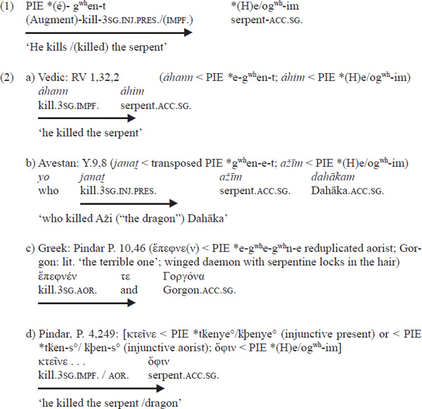

If one combines the Greek sentences (2c) and (2d), one gets Greek ἔπεφνε(ν) ὄφιν, which can be projected back to ***egʷʰegʷʰne *He/ogʷʰim. Except for the tense of the verbal form, this reconstruction is the same as the one in (1), which was arrived at by the Vedic and Avestan forms.

<!-- page: 114 -->

But from this evidence one must not draw the conclusion that the ancient languages in question and PIE were necessarily languages with a VO order. This is confirmed by the fact that the inverse order (OV) of the same syntagm is attested in a number of ancient IE languages as well and can be reconstructed for the proto-language preceding Vedic, Greek and Hittite (which of course is PIE as well). Cf. the reconstruction in (3) with government to the left:

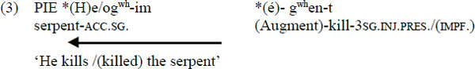

This reconstruction is supported by syntagms attested in Hittite, Vedic and Greek (see the examples in (4a–d)):

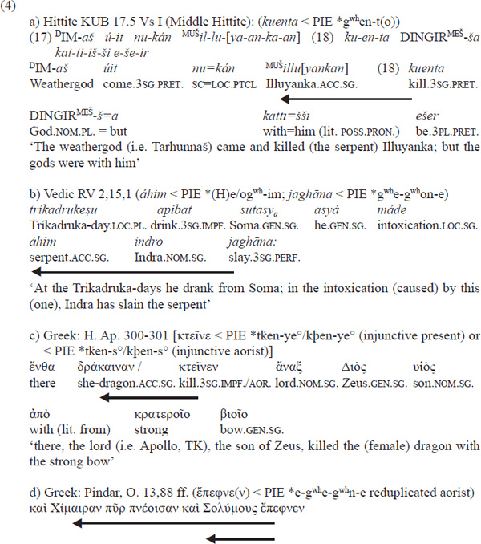

<!-- page: 115 -->

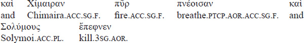

‘And he (i.e. Bellerophontes, TK) killed the firebreathing Chimaira and the Solymoi’

The Hittite example in (4a) shows a cognate verb form that fits with the reconstruction in (3), and the Vedic instance in (4b) is (with the exception of tense) almost an exact equivalent to (3). In the Greek example (4c), the ‘dragon’ word and the verb have only a semantic correspondence to the reconstruction in (3), and in (4d) only the verb is etymologically related to the reconstruction, and the object shows words and names for dragons with etymologies different from *(H)e/ogʷʰi. But, nevertheless, a word for ‘dragon’ is put in the accusative case in both Greek examples. This is as close as one can get when one wants to reconstruct genuine PIE sentences.

The reconstructions in (1) and (3) seem to contradict each other. A number of conclusions from this fact are possible, e.g. the following:

1.  a) IE and the oldest languages were fluctuating between OV and VO. This would describe the fact that our sentence appears in both varieties in Greek and in Vedic Sanskrit. Note, however, that Hittite shows no variant with VO. This scenario could lead to a project which tries to disentangle the OV and VO features of the ancient IE languages and the reconstructed protolanguage, using, e.g., typological criteria like those of Greenberg (1966) and his followers.
2.  b) IE was like Hittite, which, as Luraghi has shown in her seminal book from 1990, is a fairly strict OV language. Note also that our sentence in Hittite shows no variant with VO. The languages with VO order for this sentence, namely Greek, Sanskrit and Avestan, could reflect a younger state, a shift to VO. If one adopts this scenario, this could result in looking for layers of OV or VO in the oldest history of the languages showing variation and depicting developments from OV to VO in these languages.
3.  c) The IE basetype was OV, but under certain pragmatic conditions it allowed for a movement of the verb to the front of the sentence. This is the view I will adopt.

We have seen that frozen syntagms in cognate languages can lead to revealing conclusions for PIE syntax and may lead to further investigation. Most of these frozen syntagms go back to poetic language. An upto-date overview of all aspects of IE poetic language including syntax (using a generative framework) is Hajnal 2008. An extensive collection of text correspondences and of frozen syntagms in AIELs can be found in Schmitt 1967.

## **Major present fields of research on PIE syntax**

### **Word order**

<!-- page: 116 -->

Inspired by Mark Hale (1987) and Paul Kiparsky (1995) and expanding some earlier ideas of Krisch 1990, I have used generative grammar (the Government and Binding model) to describe word order in AIELs and in PIE in a number of publications. The model I use now is slightly different from the models I have used in earlier publications, but it is compatible with the older model. Following Keydana (2011), I have integrated the label Dfslot, and I have renumbered the Wackernagel clitics following Keydana (2011) and Lühr & Zeilfelder (2011). For practical purposes (mainly motivated by the treatment of Wackernagel particles) I assume two schemes of phrase structure: (5) and (6). The two schemes are compatible with Government and Binding (the labels form a subgroup of the universal set of phrase structure), and they are in fact only one structure: The second scheme is derived from the first one by “Chomsky adjunction”. For the abbreviations used see the appendix above the bibliography. The Dfslot (discourse functional slot) is a “landingsite” for topical and focal material. The number of categories used is held as small as possible. The morphology is not done in a generative way; the word forms are inserted fully inflected into the syntactic tree.

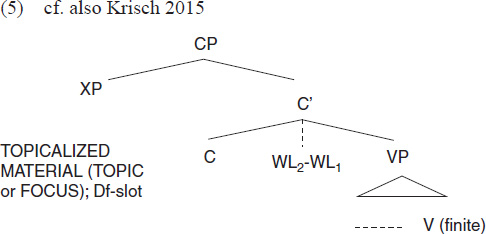

**Figure 1.2 **Sentence scheme 1

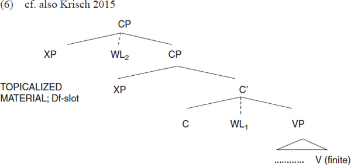

**Figure 1.3 **Sentence scheme 2

One can use these schemes for a number of phenomena, which I will shortly characterize in the following sections.

#### *Discontinuous constituents (hyperbaton/tmesis)*

<!-- page: 117 -->

One of the most striking features of AIELs are discontinuous constituents. Most of them (except for movements inside DP and PP) can be quite simply described by moving parts of constituents to the left or the right of the VP. In (7) (Scheme 1), the interrogative pronoun τίς is fronted out of its DP to the front, into the Dfslot, which is not surprising for a clear focal element. In this case, only Wackernagel particles intervene (cf. also Krisch 1998: 372).

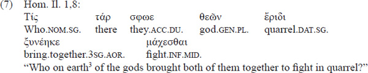

**Figure 1.4 **Structure of Homer, Iliad 1,8

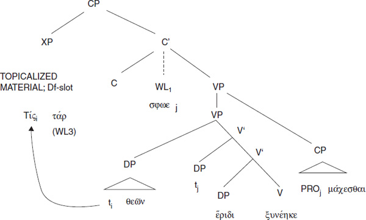

In (8), part of the DP is fronted, and part of it is extraposed to the right of the VP (by adjunction): The Homeric article/determiner οἱ, which has stronger demonstrative value than the article of later Greek (cf., e.g., Chantraine 1981=1953: 158), and which conveys anaphorictopical information, is put into the Dfslot to the left, whereas the head of the NP, θεοὶ, is extraposed to the right.

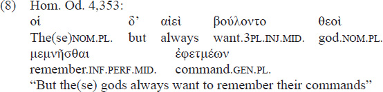

<!-- page: 118 -->

**Figure 1.5 **Structure of Homer Odyssey 4,353

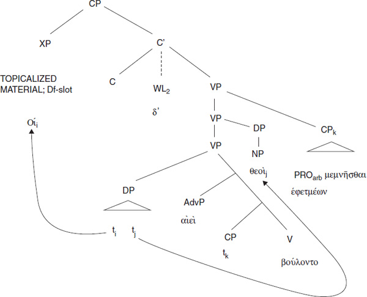

Hyperbata are widespread among AIELs, and thus they are a syntactic device which can easily be reconstructed: In (9) one finds examples for this phenomenon in Vedic (*ūtím sahasrasāˊtamām* is extraposed), (10) is an example from Latin (*pulmoneum* is fronted), and there are also examples in Hittite ((11); the genitive is extraposed to the right).

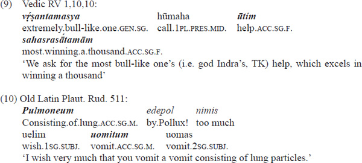

<!-- page: 119 -->

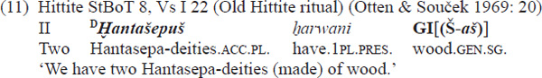

Normally, the phenomenon of hyperbaton/tmesis is looked upon as a poetic device. But it is also a feature which appears in everyday speech. This is shown by the Plautus example in (10) and by the fact that inscriptions also show the phenomenon (cf. (12), where the location from which Dropides comes (the adjective Ἀφίδναιος) is moved to the right)

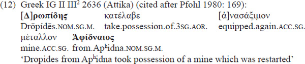

A surely old PIE construction pattern is a sentence where a preverb (originally adverb) is fronted, thus appearing apart from “its” verb. This is usually called “tmesis” (Gr. τμῆσις lit. ‘cutting’). Already Wackernagel observed this for Greek: “from the earliest period, tmesis … is commonest when the preverb is in clauseinitial position” (Wackernagel 1924: 174 = Langslow 2009: 616). Actually, in this case, for PIE the term “tmesis” is misleading. The most probable scenario for the oldest texts and for PIE is that the “preverb” had only a loose connection to the verb and has to be looked upon more as a (normally local) adverb (cf. also Krisch 1984, especially chapter 3), which can appear in sentence-initial position (Dfslot) to give a frame to the sentence. Of course, the sentence-initial position is not the only position of these adverbs in PIE and in the AIELs, but as already sketched above, Watkins (1963) has taught us that this construction helps to understand the development of the Celtic verb-initial construction. Examples (13)–(15) offer some examples for this construction in Hittite, Vedic and Greek. In all three examples, the preverb can be understood as an independent adverb or as a preverb. For the Hittite example in (13) note that, e.g., German has a prefixed verb *hinterherrufen* ‘to call after someone’ with the prefix *hinterher* ‘behind’.

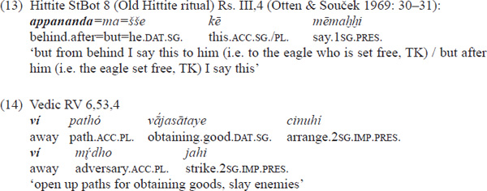

<!-- page: 120 -->

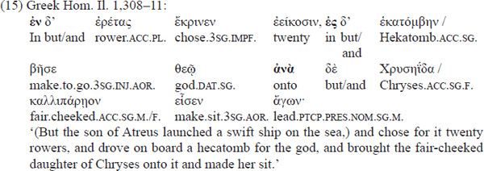

#### *Wackernagel’s Law*

In 1892 Wackernagel published his long famous article “Über ein Gesetz der indogermanischen Wortstellung”. He states (elaborating earlier work by Delbrück and Bartholomae) that certain clitics tend to occupy the second position in the PIE sentence. He mainly bases this claim on data taken from Ancient Greek, but he also deals with a small amount of Latin, Vedic and Old Iranian and Celtic material. Already eight years later, Delbrück integrated the law into his handbook (Delbrück 1967=1900: 49–50). The following remark by Watkins dating from 1964 is still valid today: “… one of the few generally accepted syntactic statements about IE is Wackernagel’s Law, that enclitics originally occupied the second position in the sentence” (Watkins 1964: 1036). Decades after Wackernagel, this law has also been confirmed by newly discovered AIELs, especially the Anatolian languages (see the Hittite examples in Krisch 1990) and Mycenaean, thus making it a robust candidate for reconstruction. In the following examples, the clitics in Wackernagel position are in boldface. For reasons why some of the Greek clitics (see (16)) carry an accent and nevertheless “count” as clitics, see Krisch (1990: 75–76).

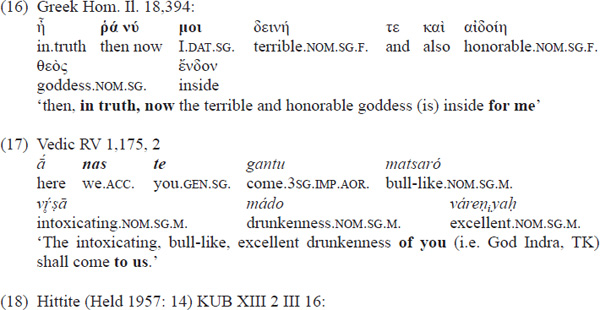

<!-- page: 121 -->

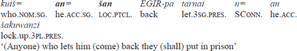

Wackernagel’s Law has become clearer through the research of the last few decades. This research is mainly based on Vedic, which probably can be taken as a model for PIE. Now one divides the clitics into three groups (cf. also Keydana 2011). Only the first two are genuine Wackernagel clitics.

- - WL₁ clitics (clitic pronouns) typically occupy the second position in the sentence, but in sentences with whwords they always follow the whword (see examples (21) and (22))
- - WL₂ clitics (sentence connectors and sentence adverbs) always occupy the position after the first word of the sentence
- - WL₃ clitics are adjacent to the word or constituent they take scope over. Typically, these are emphatic particles. If their host is put at the front of the sentence, they also occupy the Wackernagel position (cf. already Hale 1987: 44). Lühr (2009) deals with such particles from an information structural point of view.

In the R̥gveda, the following (types of ) data have to be described (cf. Keydana 2011: 122):

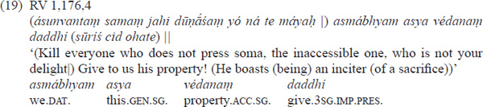

As the context (19) shows, the accented pronoun *asmábhyam* is in contrastive focus to the *ásunvant*, the ones not pressing soma. Therefore, it stands in the Dfslot (cf. (5)) and the WL₁*asya* is immediately following.

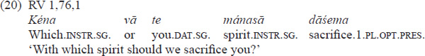

In (20), we see that the WL₂ clitic *vā* precedes the WL₁ clitic *te* (the whword + WL₂ clitic form a prosodic word to which the WL₁ clitic attaches).

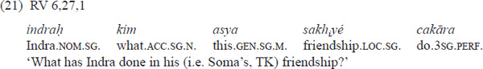

<!-- page: 122 -->

Example (21) shows a remarkable feature of the WL₁ clitics: they follow the whword, even if another word/constituent precedes it. This construction can also be found in Greek (scheme 2):

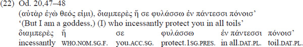

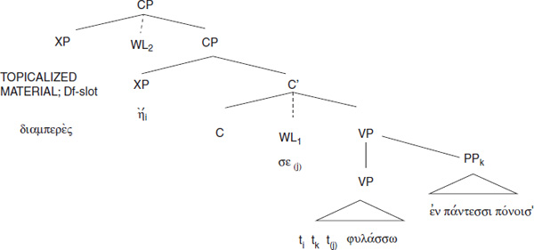

**Figure 1.6 **Structure of Homer, Odyssey 20, 48

These facts have led to a number of proposals for how to characterize them. Hale (1987) is not very explicit about whether Wackernagel’s Law is a syntactic process (a movement operation leaving a trace) or another type of process interacting with syntax. He describes example (21) and others in the following way: “It is clear from these examples that the WL clitics take second position, defined before the topicalization but after WHmovement places *ká* (i.e. the whquestion word, TK) in COMP” (Hale 1987: 42). Applied to (21) and to our model in (2) this means that *kim* is in the XP position of the second CP (like *hḗ* in (22)), then WL clitics “take” second position, and finally *índraḥ* is topicalized. “Take” could either mean a syntactic operation or some kind of intervening prosodic operation. Keydana (2011: 115) criticizes this account by calling attention to the fact that an example like (19) cannot be described this way. The WL₁ clitic *asya* could not appear in this position because it cannot move there before topicalization.

In a later paper, Hale abandons rule ordering and describes Wackernagel clitics as “syntactic movement to C°” (Hale 1996: 192). I agree with Keydana (2011: 119) that such a movement appears to be strange. The base position of the pronouns should be a full XP, and movement from an XP to a head position (C°) is disallowed by the concept of the structure preservation principle (cf. Haegeman 1994: 338). But, on the other hand, there are examples with clitics of the WL₁ type far away from the left periphery (cf. the clitic personal pronoun *tuvā* in (23):

<!-- page: 123 -->

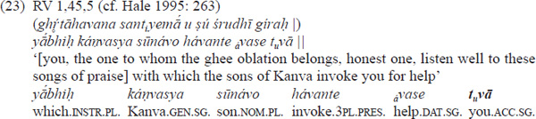

Hock’s (e.g. 1996) account of the Vedic left periphery offers a prosodic (not syntactic) template solution. The idea of prosody is taken up by Keydana (2011), who analyses the WL₂ clitics as prosodically attached to the first word in the sentence, whereas the WL1 clitics always stand at the right of the left periphery, having the prosodic prefield of the sentence as their host.

In my model (see above, examples (5) and (6)) these “Wackernagel particles” occupy positions which are marked with dotted lines, which means that I think their syntactic status is rather loose, representing an interface between syntax and prosody. This solution could suit Keydana’s idea of insertion of the clitics into the prosodic prefield of the sentence (in my model: before VP) but also allows taking into account that the WL₁ clitics can occupy an argument position in the sentence. For the last point see coindexed σε in parentheses in (22). Cf. also (23), where prosody attaches the clitic *tuvā* to tonic *ávase* at the end of the sentence. In (23) the syntactic base position of *tuvā* would probably be a position in front of the verb (a fully fledged DP would occupy this position). Thus, also in the case of (23), the prosody and syntax interact. Coindexing σε in parentheses in (22) should indicate that I do not assume a movement operation here which is motivated by syntax alone.

A view completely different from the ideas just presented is promoted by the phonologists Agbayani and Golston (2010), who work with the concept of postpositives (Dover 1960) like the clitic *kʷe (= Lat. *que*, Gr. τε) ‘and’ or (in their view) nonclitic Greek δέ that cannot begin a phonological phrase. In their analysis, conjunctions (also the postpositive ones) originate syntactically between the conjoined phrases or clauses, and in the case of a postpositive conjunction like *kʷe an adjacent (phonological) word of the second conjunct is moved to the left of it (a phonological, not a syntactic process). In the case of clauses which are not conjoined, but would syntactically start with postpositives, the first (phonological) word of the second conjunct would also be moved to the left. An example of the last case is (24): κεν is a postpositive clitic particle denoting a “possible world” (cf. Krisch 1986: 18), and μιν is a postpositive clitic personal pronoun. According to Agbayani and Golston, the sentence (without a conjunction) would start syntactically with two postpositives, and phonology would trigger movement of τότε ‘then’ to the front of them, since postpositives cannot begin a phonological phrase. But this would mean that (syntactically) the Wackernagel clitics κεν (WL₂) and μιν (WL₁) do not occupy the second position but rather that the sentence starts with κεν in the syntactic component.

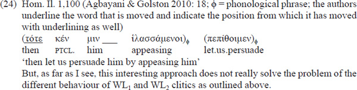

<!-- page: 124 -->

#### *The position(s) of the verb in AIELs and in PIE*

The author of this chapter has worked extensively on the position(s) of the verb in PIE. The model used is again the one presented in (5) and (6).

##### The unmarked order: verbfinal

I start with unmarked verbfinal in the AIELs and in PIE. This position of the verb can be found in many texts in AIELs at every turn, and it is unproblematic to reconstruct it for PIE. Already Delbrück (1967=1900: 83) wrote about PIE word order: “Das Verbum stand im unabhängigen Aussagesatz am Ende …” (In an independent declarative sentence the verb appeared at the end). One may refer to the following examples with verbfinal taken from AIELs in this chapter: (4a–d), (13), (14), (15).

Now, in the texts of all AIELs one meets sentences where some linguistic material is put after the verb in the right periphery. Syntactic research by Gonda (1959) and McCone (1979) could clarify that much of this extraposed material falls into categories which are nonobligatory. Gonda (1959) calls sentences like that “amplified sentences” (cf. also Krisch 1997; 2001). One may discern the following types of extraposition (cf. Krisch 2001: 162–164): (a) apposition(s) to constituents overtly appearing in the VP before the verb; (b) extraposition of the subject (which is already expressed in the verbal form in AIELs and in PIE); (c) part of a Determiner phrase/Noun phrase, the other part being inside the VP (hyperbaton, see above); and (d) non-obligatory constituents. The following sentences are examples for these categories from Mycenean Greek (25), Celtic (26), Vedic prose (27) and Hittite (28). The finite verb forms are in boldface.

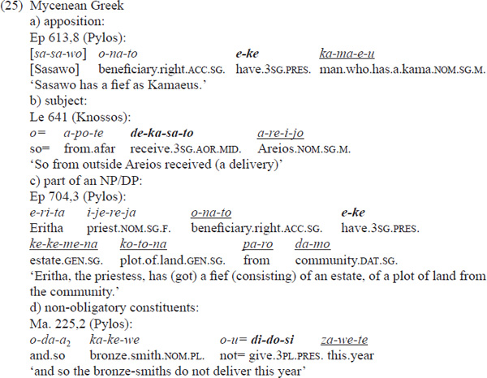

<!-- page: 125 -->

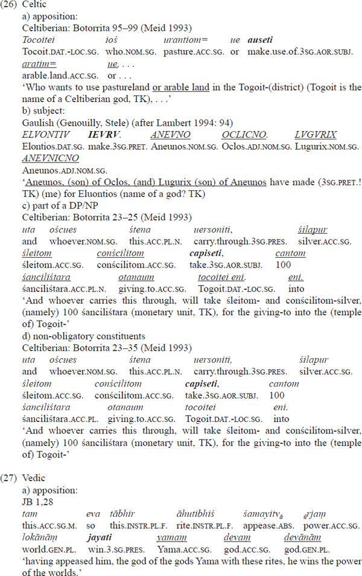

<!-- page: 126 -->

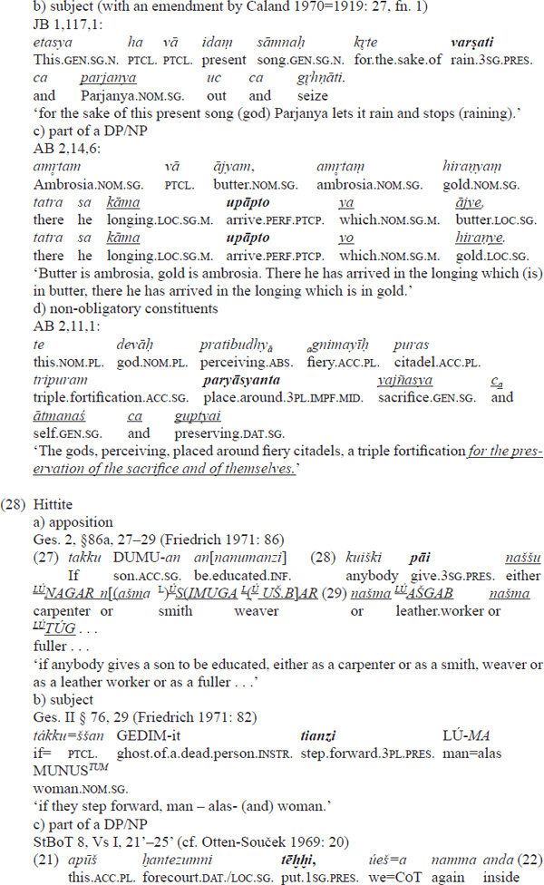

<!-- page: 127 -->

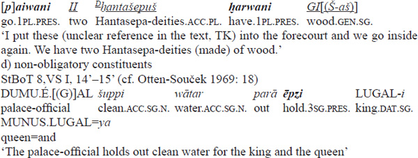

(28c), part of which has already been cited as a hyperbaton construction (11), shows the amplified construction in the context of a number of regular Hittite OV sentences.

##### Marked order 1: verb-initial (V1)

As we have seen, the PIE basetype was OV, a type which also encompasses the “amplified” structures in 2.1.3.1.

Under certain conditions, a movement of the verb to the top of the sentence was allowed. Whereas, e.g., in NHG this move is connected with certain sentence types (yes/no questions and imperative sentences show the finite verb at the beginning of the sentence), the AIELs and therefore PIE had a pragmatic condition for putting the verb at the top (V1) (see below).

In the beginning of this paper we reconstructed word order variation (VO vs. OV) for PIE, leading to the results in (29a) and (29b):

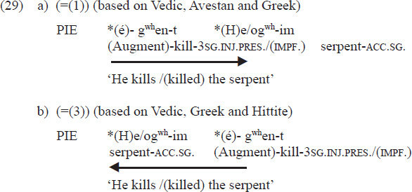

Much has been written about the reasons for fronting the verb in AIEL and in PIE, e.g.

- Delbrück (1967=1900: 81) (my translation): “a word \[moves\] to the front or to the front edge of the sentence respectively, if it is of paramount importance for the statement … A verb can be important, if, in an isolated sentence, the action is more important than the other components … \[I\]n a series of sentences, it pushes the narrative or the discussion ahead.”
- Dressler (1969: 3) (my translation): “Verbfirst is textually cataphoric or (much more frequent) anaphoric and (as a word order variant) characterizes textually bound sentences.”
- Dressler (1971: 18) (my translation): “Verbfirst points to another sentence (either before or after) to which it is connected.”
- Klein in his article on Vedic verb-first states that the fronting of constituents seems universally to be associated with salience (Klein 1991: 135). He lists some environments where one encounters verbfirst in Vedic texts: in imperative sentences, in iterative anaphoric structures, in chiastic constructions, in cases of simultaneity between the event referred to in the hymn and actions occurring at the same time within the ritual, in the situation of fronting of verbs of speaking before a quotation, and in case of the Vedic verb *han* ‘smite’ a tendency to front it.
- Luraghi (1995: 380): “On account of its lower frequency, the verb initial order was in a certain sense ‘abnormal’. By an iconic principle, it came to be used in cases where something abnormal was going on, either in the arrangement of the discourse, or in the course of the events reported.”
- Krisch (2004: 116): “ProtoIndoEuropean functions: … V1: establishing a very close connection between sentences /sequences of action.”
- Bauer (2011: 47) (about Hittite; my translation): “Thus, one can note that it is the distribution of topic and comment in the sentence which is crucial for V1. The verb is the dummytopic and the comment is the focus.”

Depending on the text, there is some truth in all of these statements. In my present view,

- verbfirst introduces an important (often unexpected new) topic for the narrative with the consequence that further comments are given on it. In a coherent narrative, its general function is to accelerate narration, to drive forward the action.

Let us look again at (29a)=(1) in a fuller context, namely stanzas 1–3 of our Vedic example (2a):

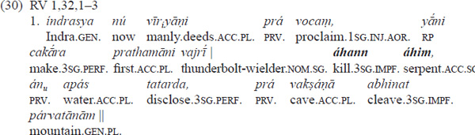

‘I now proclaim the manly deeds of Indra, the first ones that he achieved, the thunderboltwielder. He killed the dragon, he disclosed the waters, he cleft the caves of the mountains.’

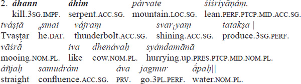

<!-- page: 129 -->

‘He killed the dragon who was lying on the mountain. God Tvaṣṭar has produced a shining thunderbolt for him. Like the mooing cows (go to their calves) hurrying up, the waters glided straight downwards to the confluence.’

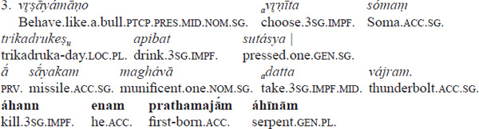

‘The one behaving like a bull (i.e. god Indra, TK) chose Soma, in the Trikadrukadays he drank from the pressed one. The munificent one took the missile, the thunderbolt. He killed him, the firstborn of the dragons.’

Note that the VO order with the lexical material of ‘kill’ and ‘snake’ reoccurs another two times in the three stanzas in (30). In all these cases the order is VO and not OV. Example (30) 1 starts with an OV sentence with the verb form *vocam* in absolute final position. Then follows the most important action of the god Indra, that he slew the dragon Vṛtra, a verb-initial sequence (starting with *áhann*). That Indra disclosed the waters is a consequence of his slaying of the dragon who locked them up. Also, the cleaving of the mountain serves to get the waters free. These actions, since they are not so important, are presented in a sentence which is absolutely verb-final (*tatarda*) and in an OV sentence with amplification (genitive *párvatānām* belonging to *vakṣáṇā*). In (30) 2, the important fact of killing Vṛtra is again emphasized by a verb-initial sentence (starting with *áhann*). In the following context, the scene is broadening again and describes things preceding the killing (that a thunderbolt was made for him) and, again, the situation afterwards (the waters glide downwards). (30) 3 goes back to the fighting scene and describes how the god Indra prepared himself to fight: He drinks soma and takes his weapon. Then the main action of Indra, the killing of the dragon, is repeated with the verb *áhann* in initial position.

There is no coherent narration; aspects of the topic are presented in little scenes jumping forward and backward. This function of comments, namely subdividing the scene opened by *ahann* ‘he kills’, is chosen in the whole hymn RV 1,32, where subdivisions of the act of killing are brought into little scenes with repetition. This hymn is like a musical piece consisting of a theme plus variations.

In contrast to this VO order, the OV order of the sentence dealing with Indra and the dragon, cited again in (31), does not indicate the TOPIC of what follows. It is part of new information given in the hymn, thus belonging to the informational focus of the text, the comment.

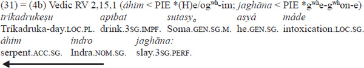

‘At the Trikadrukadays he drank from Soma; in the intoxication of /(caused by) this (one), Indra has slain the serpent’

<!-- page: 130 -->

The hymn RV 2,15 contains a short enumeration of all the noteworthy deeds of Indra without going into details. To illustrate this fact, (32) cites the first three stanzas of this hymn, which consists of ten stanzas:

1.  (32) RV 2,15 (translation Griffith (1896); bold passage marked by TK)
    1.  Now, verily, will I declare the exploits, mighty and true, of him the True and Mighty.
        1.  In the Trikadrukas he drank the Soma then in its rapture **Indra slew the Dragon**.
    2.  High heaven unsupported in space he established: he filled the two worlds and the air’s midregion.
        1.  Earth he upheld, and gave it wide expansion. These things did Indra in the Soma’s rapture.
    3.  From front, as ’twere a house, he ruled and measured; pierced with his bolt the fountains of the rivers, And made them flow at ease by paths farreaching, These things did Indra in the Soma’s rapture.

In this hymn the scene that Indra slew the dragon appears only once, namely in stanza 1, cf. the passage given in boldface. In the other verses various deeds of Indra are mentioned. Even stanza 3, which one could associate with the myth of the dragon, is formulated in a neutral way without any overt hints toward the dragonstory.

This enumeration of the deeds of Indra is underlined by a refrain starting with stanza 2 and going until stanza 9: “These things did Indra in the Soma’s rapture.”

Let us now turn to the Pindar examples (2c–d above) in Greek, which are interesting because they contain a native speaker’s, namely Pindar’s or, more correctly, the narrator’s, comment on how to interpret the order with the verb in the front. The example for VO from the Pythian Ode Nr. 4, which has been mentioned earlier, is repeated as (33) (κτεῖνε ὄφιν):

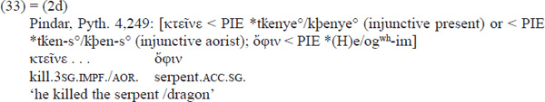

This text is about the Argonauts and the winning of the golden fleece. Jason the Argonaut has to get the golden fleece, which lies in a sacred grove in Kolchis. In (34), the context of (33) is offered in an English translation:

1.  (34) Pindar, P. 4, 240–252 (translation, see: Odes, translated by Diane Arnson Svarlien \[The Annenberg CPB Project, the Perseus Digital Library, accessed 9 September 2014\])

<!-- page: 131 -->

But at once the marvellous son of Helios spoke of the shining fleece, telling where the sword of Phrixus had stretched it out. He expected that Jason would not be able to accomplish this further labour. For the fleece lay in a thicket, held in the ravening jaws of a serpent, \[245\] which in thickness and length surpassed a ship with fifty oars, built by the blows of a hammer. It is too long a way for me to go by the beaten track; for time presses, and I know a shortcut. In poetic skill I am a guide to many others. Jason killed the greyeyed serpent with its dappled back by cunning, \[250\] Arcesilas, and stole away Medea, with her own help, to be the death of Pelias. And they reached the expanses of Ocean, and the Red Sea, and the race of the Lemnian women, who killed their husbands.”

There is a remarkable breakingoff in the middle of this passage, where Pindar intervenes as a poet and reflects on his technique of presentation. These verses interrupt the calm flow of narration, and they are, on the one hand, a rather boastful demand the narrator makes of himself to speed up, and, on the other hand, they characterize the following lines as a short, condensed, so to speak “fast flowing,” version of the narrative. The original text of this passage is cited in (35).

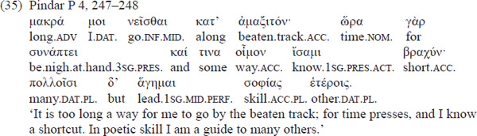

Pindar’s remarks in (35) offer a rather unique native speaker’s intuition about the functions of VO in quite a clear way. The next sentence, our sentence (33)=(2d), starts with marked verbfirst, showing the poetic skills of Pindar, which he himself just mentioned. The VO sentences that follow (35) are cited in (36) in full. The two verbs in sentence-initial position are put in bold:

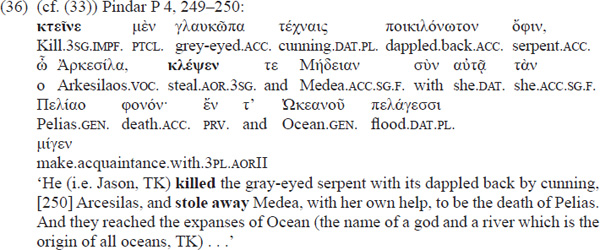

Basically, the function of verbfirst in (36) is similar to the one which we have seen in Vedic: The scene is opened up by the verb, which states an important topic pushed forward in a lively way and leads to further comments: the action is pushed ahead by a second verb form in initial position (verb κλέψεν). With the last verbfinal sentence (verb μίγεν), the scene comes to a rest.

<!-- page: 132 -->

On the other hand, the Pindar citation (37)=(4d), the evidence for verbfinal position, has a context similar to the comparable Vedic sentences with the verb in final position ((31) and (32)): The deeds of the hero Bellerophontes are simply enumerated and not expanded; they do not form the basis for a narration. The killing of the dragons is part of this enumeration. The context of (37) is cited in (38).

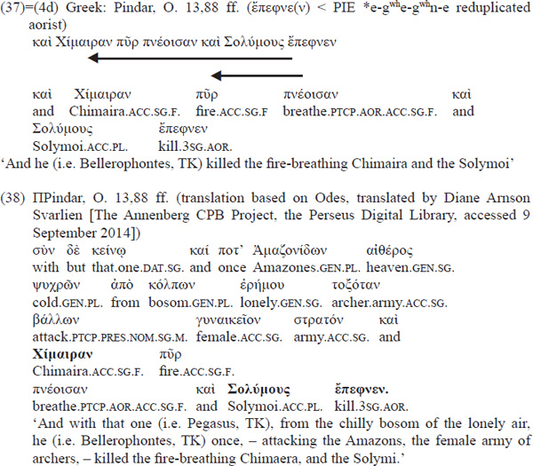

From these and similar examples one may hypothesize that Greek and Vedic, and presumably also IE, had both possible verb orders, verb-initial and verb-final, and that the difference between them is that the final position of the verb shows a regular sequence with the topic in front of it and the comment in the predicate part, whereas the verb-initial construction serves stylistic purposes indicating a (new) topic, represented by the action expressed by the verb and its object, which leads to further comments directly derived by the verbal action.

In my model (see (5) and (6)), sentences with an initial finite verb can be represented by movement of the finite verb into the C position. This is a sort of movement which is well established in generative grammar (cf., e.g., Haegeman 1994: 302). Since Vedic (like PIE) is a fully inflecting language, the empty subject *pro* is licensed by the agreement morphology present in *áhann* (cf. also Axel 2007: 314 and Sternefeld 2006: 613, referring to Barbosa 1995). A syntactic tree of part of the Vedic sentence in (30) 2 is (39):

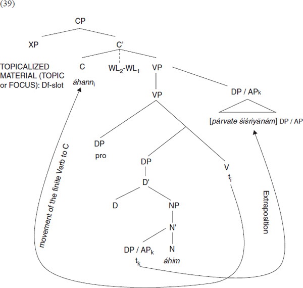

<!-- page: 133 -->

**Figure 1.7 **Structure of Rigveda 1,32,2

1.  For a Greek instance of V1 cf. example (41).

##### Marked order 2: verb-second (V2) / verb-third (V3)

Whereas the existence of verbfirst in PIE is uncontroversial, the reconstruction of verb-second (as in modern German) can be found mainly in the work of the author of this article. But also Keydana (2011: 109–110) assumes verb-second at least for Vedic. The ideas presented here are work in progress.

<!-- page: 134 -->

In fact, verb-second is structurally identical to verb-initial with **scheme 1** in the approach used here (cf. (5)): The verb is moved into C. The only difference is that (in the case of verbinitial, cf. (36)) the Dfslot is empty, whereas in verb-second the Dfposition is filled. If one takes **scheme 2**, V2 is possible if the Df-slot is filled, the verb is moved to C, and the second XP in front of the C position is empty. With scheme 2, verbthird (V3) is a possible option when the verb is moved into C and the two XP positions in front of it are also filled. According to Krisch 2004 the function of verb-second in PIE is similar to the function of verbinitial. Its function is “establishing a connection between sentences/sequences of action, but not as close as verb initial” (Krisch 2004: 116). It is viewed as a probably late IE feature, since this phenomenon can be observed very frequently in Ancient Greek and in the Germanic languages, whereas it is rare in Vedic and seems to be absent in Hittite (cf. Krisch 2004: 119). Whether verb-third has a special function is still unclear but it probably does not differ much from unmarked V-end.

A clear instance of V3 is Il. 18, 468 (μὲν is interpreted as a WL3 particle (see section 2.1.2) which is attached directly to its host, τὴν). Since the local specification αὐτοῦ is demanded by the verb in my model, this cannot be an extraposed constituent.

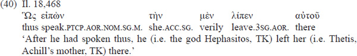

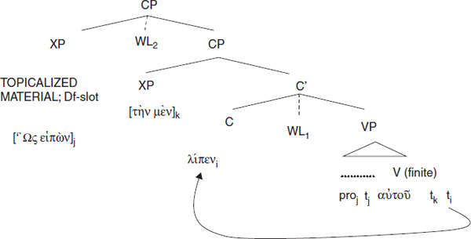

**Figure 1.8 **Structure of Homer, Iliad 18,468 / 1

This sentence is part of the shield description of Achilleus in the Iliad. As shown in Krisch 2001: 169–170, this sentence starts a sequence of sentences describing the lively scene where Hephaistos does his blacksmith’s job and one action follows the other like the V-1 sentence immediately following 40 in the text, cf. (41):

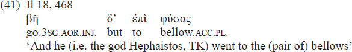

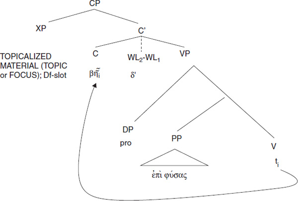

**Figure 1.9 **Structure of Homer, Iliad 18,468 / 2

<!-- page: 135 -->

In the following illustration from the fifth book of Homer I want to show the phenomenon: that V1 and V2 appear in the same function (cf. also Krisch 1997: 299–300). But I also want to draw the reader’s attention to the fact that it is quite often not possible to decide formally whether a sentence is V-2 or verbfinal, if the sentence is too short for a decision:

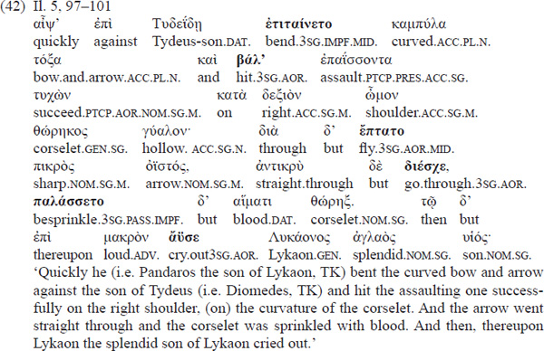

<!-- page: 136 -->

The first sentence in (42) is a V3 sentence according to our model. The accusative καμπύλα τόξα cannot be an amplification, since it is an obligatory constituent. One can describe it with scheme 2 (cf. (6)):

1.  \(43\)

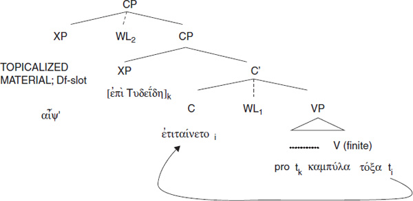

**Figure 1.10 **Structure of Homer 5,97

The next sentence (starting with καὶ **βάλ’**) is a V1 sentence (like (39) and (41)), since the sentence connector καὶ does not “count”. The sentence starting with διὰ δ’ **ἔπτατο** could be either a verbfinal sentence or a V2 sentence with διὰ in the Dfslot and δ’ in WL₂position, again using scheme 2. (44) offers a tree for the interpretation as V2:

1.  \(44\)

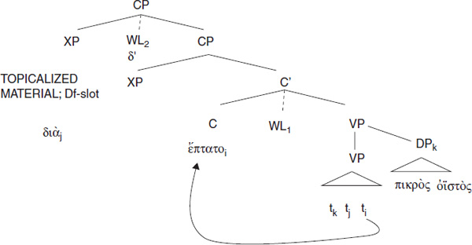

**Figure 1.11 **Structure of Homer, Iliad 5,99

<!-- page: 137 -->

Also, the following short sentence (ἀντικρὺ δὲ **διέσχε**,) could be either an example for verb-final or a case of V2. The tree for V2 would look like (45):

1.  \(45\)

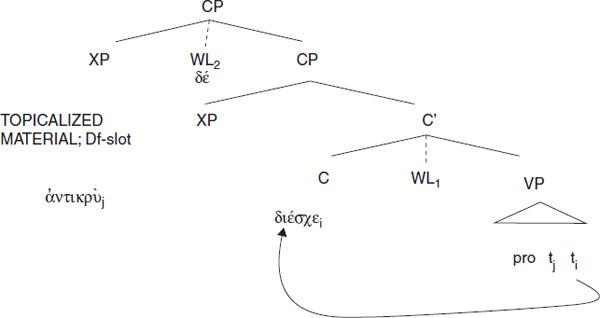

**Figure 1.12 **Structure of Homer Iliad 5,100

The sentence starting with **παλάσσετο** is unambiguously V1. The last sentence is unambiguously verbfinal (with amplification); see (46):

1.  \(46\)

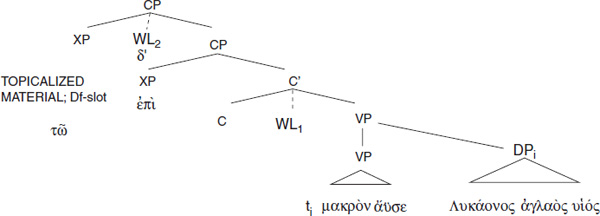

**Figure 1.13 **Structure of Homer, Iliad 5,101

If our interpretations are right, the scene narrated starts with a V3 sentence when Pandaros stretches his bow against Diomedes. The scene where the arrow hits Diomedes’ shoulder, penetrates the corselet and causes the blood to sprinkle is described by sentences which can be analysed as V1 and V2.

Conclusion:

- V1 and V2 have the function of driving forth the action in a narrative text, of making it lively. V1 presumably is the “livelier” of the two.

<!-- page: 138 -->

#### *Object ellipsis*

A remarkable feature of PIE word order is object ellipsis. It is ubiquitous in Greek (cf. (47)), but also Latin, Vedic and Hittite show plenty of examples.

1.  (47) Ancient Greek Hom. Il 5, 22–24, cf. Krisch (2009: 207) (Dares, a priest of the god Hephaistos, has two sons, Phegeus and Idaios. In the Trojan war, they fight against Diomedes. Diomedes kills Phegeus and would have killed Idaios as well, but Hephaistos rescues Idaios).

    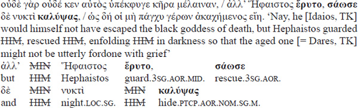

After discussing examples from Latin, Vedic and Hittite and recent scholarly literature on the topic, Krisch (2009: 211) concludes that “PIE had a rule that allowed deleting objects which refer back to already mentioned ‘thematic’ material. This ‘null object’ type of ellipsis thus is operating in a forward direction.” Their frequency in coordinate conjunction is underlined by Keydana and Luraghi (2012).

### **Absolute constructions**

Absolute constructions (henceforth ACs) of the type Latin *me absente* (I.abl.sg. absent.ptcp.pres.abl.sg.) ‘in my absence’ or *piro florente* (pear.tree.abl.sg. blossom.ptcp.pres.abl.sg.) ‘when the pear tree is in blossom’ may be found in a number of AIELs and are a candidate for reconstruction. Ruppel 2013 is the latest reference work on this topic with an extensive bibliography. According to her, ACs denote spaces or points in time with an obligatory qualifier (normally a participle/verbal adjective) when the respective head noun does not refer to time, but is “put into time” (Ruppel 2013: 31) by the predicatively used participle. She sees the IE origins in regular locative expressions of nouns denoting time, like “at dawn” and “in spring”, which, when applied to nouns not referring to time, are “put into time” by the qualifier. Thus, compare regular Vedic *uṣási* ‘at dawn’ (dawn.loc.sg., e.g. RV 4,2,8; expressing a definite point in time, conveyed by a locative) with *sūˊrye udyatí* (sun.loc.sg. upgo.ptcp.pres.loc.sg.) ‘at sunrise’, where ‘sun’ is not per se expressing a point in time.

<!-- page: 139 -->

If one takes (as Ruppel 2013 does) the Vedic situation with the locativus absolutus as reflecting the PIE state, one may easily explain the Latin situation (with the ablative as the case form in the AC, which also encompasses the PIE locative via syncretism) or the Germanic situation (with a dative as the case form in the AC, which can also continue a PIE locative via syncretism). Greek, however, is problematic because the genitive which appears in the Greek AC (a genitivus absolutus construction) does not go back to a PIE locative, but can represent either a PIE ablative or genitive. One may argue here that genitives can be used as case forms for locative meaning in Greek also outside of ACs, e.g. *νυκτός* (night.gen.sg.) ‘at night’, *πολέμω καὶ εἰράναρ* (war.gen.sg. and peace.gen.sg.) ‘in war and peace’ (Elis, 200 BC) (cf. Ruppel 2013: 220). Such genitives are traditionally classified as “partitive” in the handbooks (e.g. *νυκτός* ‘(time portion of) night’, πολέμω *καὶ εἰράναρ* ‘(time portion of ) war and peace’). These constructions compete with constructions showing (preposition +) dative, cf. ἐν *εἰρήνῃ* καὶ ἐν πολέμῳ (in war.dat.sg. and in peace.dat.sg.; e.g. X.Lac. 11.1.2). The only attestation of this phrase in the dative which I could find without a preposition is in a Scholia in Iliadem 18, 490. The Greek dative can continue the PIE dative, instrumental and locative. Starting from such competing constructions, there could have been a transfer to the genitive. Unlike others (including Krisch 1988, Keydana 1997: 9), Ruppel is not interested in the semantic equivalence of ACs to finite subordinate clauses.

Krisch (1988: 8–9, following Holland 1986) reconstructs a nominativus absolutus (nominative + participle) for PIE. This construction is very rare but appears in a greater number of AIELs than the ACs with oblique cases. One can imagine these nominatives, loosely connected with the neighbouring sentence, as forming a frame for the adjacent sentence and can interpret (with Krisch 1988) the (presumably later, but still PIE) development of ACs with oblique case forms as a stronger integration of the temporal frames into the sentence. Since the locative with its temporal function is the ideal candidate for this, the rest of the story could roughly go as sketched above when dealing with Ruppel 2013. An example for a nominativus absolutus is (48):

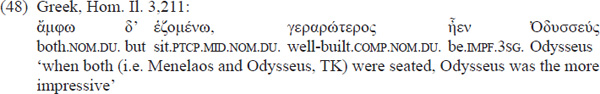

Other languages where this construction appears are Vedic, Latin, Germanic, Hittite and Lithuanian. The Hittite examples are doubtful, though (cf. Keydana 1997: 288).

An attempt to draw the semantic paths from an original temporal meaning of ACs to other meanings of ACs (conditional, causal, concessive, modal) is made by Krisch (1988: 9). Keydana (1997) offers a very extensive selection of attested ACs in AIELs arranged according to a number of important syntactic categories. Like the author of this chapter, he considers a late PIE origin for ACs (Keydana 1997: 34), but he does not take the temporal value of ACs as basic and wants to explain the relationship between the ACs and the rest of the sentence by relational semantics/pragmatics (Keydana 1997: 45).

### **Case functions in the AIELs and in PIE**

#### *Introduction*

In IE studies, the semasiological approach has a long tradition. One takes the case form of a particular language and describes the functions which this case form can be associated with. This type of research is still ongoing and now centres on the question of determining the “core” meaning of the cases and their relation to more peripheral uses and on the question of which uses of the case in question can be taken over by other case forms. This type of research is surely still a rewarding task if it is carried out meticulously.

#### *The instrumental*

##### The Vedic instrumental case

As an elaborate example for such an investigation, I mention Hettrich 2002, a specimen from a work in progress on R̥gvedic uses of case forms.4 The article deals with the instrumental.

<!-- page: 140 -->

Hettrich (2002: 46) defines the core/prototypical meaning of the instrumental in the R̥gveda (RV) as the ‘instrumental of means’. According to him, an NP carrying the prototypical instrumental case exhibits the following features:

1.  \(49\)
    1.  a) It is animate, concrete and easy to handle.
    2.  b) It is a (physical) object the existence of which is independent of the actual situation and of the participants in this situation.
    3.  c) This (physical) object is under the control of the one controlling the action and stays there during the action.
    4.  d) This (physical) object enables the controller to carry out an action which is controlled by him or her, which is dynamic and oriented towards a patient, or facilitates such an action.

This prototypical usage is presented in (50):

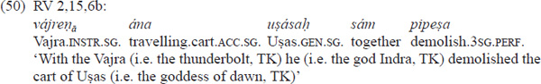

The other shades of meaning of the instrumental case are explained linguistically by the absence of one or more of the features of the prototypical usage enumerated above. If one takes away feature c) one gets sentences like (51):

A further example is the causal meaning of an NP using an instrumental. This meaning is achieved if the NP slot is headed by a noun which is concrete (i.e. +abstract), and it is sometimes doubtful whether there exists a full and sole control over it by the subject controlling the action. Consider example (52), where the subject is Indra, the mighty god who sets free the waters and makes springtime possible:

The causal usage of the instrumental in (52) corresponds to nonprototypical uses of the locative (53) and the accusative (54) (with the adverb *ánu*), and with a reading of the ablative (abstract source) which is fairly near the ablative prototype (55).

<!-- page: 141 -->

Hettrich uses the (slightly adapted and translated) diagram in Figure 1.14 to show the core and the peripheries of the usages of the instrumental in Vedic. This method of describing the function of cases in AIELs in my opinion is true progress compared to the traditional descriptions of the function of cases: It makes use of ideas from general linguistics (the use of features and the application of prototype theory), and it illustrates the results in a geometric symbolization (see Figure 1.14). Hettrich’s method is extendable to other languages and may lead to more detailed functional reconstructions. Any reconstruction is of course much less secure than the philological reasoning in a language with a clearly marked morphological instrumental.

**Figure 1.14 ** Hettrich 2002: 47 (slightly adapted): The spectrum of meaning of the R̥gvedic instrumental (prototypical meaning in the circle, other meanings radiating with arrows) with concurring cases (inside the rectangles)

<!-- page: 142 -->

##### The Hittite instrumental case and questions of reconstruction

Let us have a look at another AIEL, Hittite. We here make use of the very detailed and philologically excellent dissertation by Melchert 1977, dealing with the functions of the ablative and instrumental in all historical strata of Hittite.

Like in Vedic, the most common uses of the instrumental in Old Hittite (arguing functionally, not formally) are near its prototypical use, the instrumental of means. In (56) the prototype is evident:

The instrumental KUŠ*šarazzit* ‘with a waterhose’ (the Hittite instrumental ending *(i)t* is not a morphological cognate of any Vedic instrumental form, and its formal origin remains uncertain) fulfills all the criteria mentioned above for a prototypical instrument. As in Vedic, there are other uses, e.g. one where the feature c) (cf. (49)) is taken away:

Taking into account the Vedic and Old Hittite examples just mentioned, one may reconstruct the functions “prototypical instrumental” (cf. the examples (50) and (56)) and “prototypical instrumental use minus feature c)” (cf. the examples (51) and (57)) for PIE.

If one seeks for parallels to Vedic examples with a causal nuance like the one under (52) one does not find comparable uses in Hittite for the instrumental case, neither in Old Hittite nor in the subsequent stages of the language. This is a caveat for reconstructing this use of the instrumental case for PIE.

On the other hand, the ablative in Hittite (already in Old Hittite) can be found in causal contexts, just like the Vedic ablative (cf. (55) above):

For a PIE reconstruction this means that the causal reading of the ablative is a candidate for reconstruction, whereas the causal reading of the instrumental seems to be an IndoAryan innovation.

Thus, an example like the Latin text from Plautus in (59) with a causal ablative will probably continue a PIE ablative and not a PIE instrumental:

<!-- page: 143 -->

#### *Case syncretism*

“Case syncretism” is the linguistic term for a formal collapse of originally separate functions of cases, so that one case form covers different functions. In more recent times there have been attempts to make use of models to get insights into this phenomenon.

In his model of a causal order of participants, Croft (1991: 186) states that the (universal) causal chain of constituents in a sentence is influenced by a causeresult scheme, “cause” starting the causal organization of sentence and “result” ending it. Consequently, he distinguishes semantic roles which belong to the “antecedent” type (such as AGENT, COMITATIVE, MEANS, MANNER, INSTRUMENT, SOURCE and CAUSE) from semantic roles belonging to the “subsequent” type (such as DIRECTION, GOAL, RESULT, BENEFACTIVE, RECIPIENT and LOCATIVE). Croft claims that case syncretism is preferably possible inside these types, viz. that case syncretism is preferred among antecedent roles or among subsequent roles, respectively. Croft offers a table of 35 languages surveyed (Croft 1991: 237–239). In principle, he takes into account synthetic case forms and adpositional phrases, but he does not discuss data from AIELs in any detail.

If we interpret the syncretism of the PIE ablative and genitive into the Greek genitive (cf. also Luraghi 1987: 362–363) along these lines, one could argue that the main function of the genitive case (also in PIE) is the marking of a (nominal) dependency. In the case of the frequent genitivus subjectivus (e.g. Gr. φόβοϛ τῶν πολεμίων ‘fear of the enemies’ (meaning: ‘the enemies fear s.b.’) the genitive denotes an Agent and belongs to the “antecedent” group, just like the ablative with its core semantics (Source).

<!-- page: 144 -->

It appears, though, that this model is too simplistic for the description of the syncretisms observed in AIELs. Luraghi (2001) argues that “illicit” syncretisms across Croft’s two groups do occur. Her main point is that not only semantics has to be considered when dealing with syncretism but also syntax and the lexicon. This point was already made by Serbat (1992: 281), who deals with the syncretism of the PIE ablative, instrumental and locative (note: for Croft, the locative belongs to a different group than the ablative and instrumental) into a single case called “ablative” in Latin. He emphasizes that this syncretism has to be interpreted as mainly syntactic, since these cases form the central domain of the circumstantial cases (“adjuncts”), whereas the rest of the cases represent the core syntactic relations (“arguments” in the narrow sense). The Latin syncretism thus underlines a syntactic opposition formally. But one has to be careful about making too general statements: The ablative in Latin is also a formal mixture: The consonant stems still preserve the locative ending as the “ablative” in the singular, and the pure “ablative” in Latin was used mainly to express instrumental meanings, while the other functions were expressed either by certain prepositions + ablative or by lexical restrictions on certain verbs (cf., e.g., the pure “ablative” designating a location with *incolit* ‘lives (in)’ (Pl. Rud. 907)). In her analysis of the syncretism of the PIE dative, instrumental and locative into the Greek dative, Luraghi (2001: 42) emphasizes that lexical features like +/−animate are important: If the Greek dative reflects a PIE dative, it has to have the feature \[+animate\]; if it reflects the PIE instrumental, the relevant feature is \[−animate\]; and in the case of an original PIE locative, the following lexical features have to cooccur: \[−animate\], \[+place\] / \[+ time\]. In the exceptional case where someone who is \[+animate\] is used as an instrument, a prepositional phrase διά ‘through’ + genitive is used (Luraghi 2001: 42).

### **Argument structure**

This section, though it deals with one of the most discussed issues in PIE syntax, will be kept very short here, due to lack of space and also due to the fact that a long article with an overview of PIE argument structure and current research in this area by the author of this chapter will soon appear (Krisch, forthcoming).

#### *Intransitive, transitive, ditransitive and labile verbs*

**Intransitive** verbs, i.e. verbs that do not govern an accusative, do exist in the AIELs and in PIE. However, most instances of these verbs are transitives used “absolutely”, i.e. without an accusative. PIE also has some true intransitive verbs, now termed “unergative”, where the subject has agentive qualities, like the verb ‘to yawn’, PIE *ǵʰiné/nh₁ (LIV2:, 173). Another group of PIE intransitives are the “unaccusatives”, which have a subject exhibiting the properties of a direct object, e.g. PIE *kˊey ‘lie (outstretched)’ (LIV2: 20). The verbs of movement are situated between these two classes, since, on the one hand, when moving takes place, there is normally agentive activity involved but, on the other hand, with these verbs the mover and the moved one are identical, e.g. PIE *h₁ey ‘go’ (LIV2: 232). Unergatives show a tendency to take active endings (e.g. PIE *wiwekʷ-ti ‘s/he is speaking’), whereas unaccusatives take stative/middle voice (=medio-passive) endings (e.g. PIE *kˊey(t)oy ‘s/he lies’)

**Transitive** verbs, i.e. the verbs that govern an accusative, can be reconstructed for PIE. Also, the “absolute” use of transitives without an overt accusative is a heritage from PIE (see Krisch forthcoming for examples of AIELs with the root PIE *gʷʰen ‘beat/kill someone’ (LIV2: 218)).

**Ditransitive** verbs take a subject, object and “indirect object” and express transfer. Both of the objects either may be expressed or may remain unspecified in the AIELs and in PIE. Examples are PIE *deh₃ ‘to give something to someone’ (LIV2: 105) and *bʰer ‘to carry/ bring something to someone’ (LIV2: 76).

<!-- page: 145 -->

**Labile** verbs, sometimes also called P(atient preserving)labile verbs, are common in a number of modern IE languages but are rare in AIELs, and until now I have not seen a convincing example of a reconstruction. The object of these verbs can also serve as a subject with the same verb without any formal change on the verb (as in English: *John opens the door* vs. *The door opens*). The reason these verbs are so rare in the AIELs: The early IE languages normally use a specific set of endings (the socalled middle or medio-passive endings) in contrast to active endings to indicate a decrease in valency in the way of the “labile” verbs. If one looks at the diachrony of Modern English, where this phenomenon is most conspicuous, the modern language definitely shows more productivity than the older stages in history (cf. Kulikov 2003: 96 with literature). There are also examples of labile verbs in Vedic Sanskrit (Kulikov 2003: 99; 2014). A good case is *svádate* (3 sg. middle/medio-passive): transitive ‘someone makes sweet something’ (RV 3,54,22) vs. intransitive ‘something is sweet’ (RV. 9,74,9). Investigating Vedic Sanskrit, Kulikov (2003: 103–104; 2014: 1145–1147) regards the intransitive forms of a few labile verbs such as *puṣ* ‘prosper; make prosper’ as older and the transitive constructions as derived from constructions originally containing cognate accusatives. Lavidas (2009) demonstrates that a later development of labile verbs can be proven also for Greek.

#### *Subjecthood*

This part of the argument structure has received growing attention in the last years. The normal case form for the subject in the AIELs and in PIE was the nominative. But there does exist socalled noncanonical marking for the underlying subject in a number of languages. This phenomenon (sometimes also labelled “quirky subject” or “oblique subject”) is most prominently present in Icelandic, but there is a growing group of researchers around Jóhanna Barðdal (Bergen) who are collecting and analysing instances of this construction from many IE languages (<http://org.uib.no/iecastp/IECASTP/people.htm>, seen 31 October 2016). In one of the latest publications, one finds the following definition for the oblique subject: “With the terms oblique subject construction and dative subject construction, we … refer to constructions where the socalled logical subject is in an oblique case, for instance the dative” (Barðdal & Smitherman 2013: 29). The authors consider the oblique subject construction inherited from PIE. They claim an inherited predicate structure (cognate argument structures; Barðdal & Smitherman 2013: 53) and also present some cognate sets. This seems to me the right way to argue. One of their examples for a cognate set with this kind of construction is the GermanicLatinAncient Greek corresponding construction of the PIE adjective *sweh₂du- ‘sweet’:

## **Concluding remarks**

After touching upon the history of research and the data situation, this chapter tried to present major fields of study in PIE syntax today: word order; absolute constructions; case functions, including syncretism; and argument structure. Because of the author’s own research interests, the section on word order was especially extensive. The field of PIE syntax radiates in many directions and hopefully will lead to a coherent picture of the syntactic properties of the proto-language.

<!-- page: 146 -->

## **Further reading**

The text of this chapter has already contained a number of references for the topics dealt with here. One of these references, the English translation of Wackernagel’s lectures on syntax (1920, 1924) by Langslow (2009), is an especially interesting read because it combines a masterly translation of one of the most influential books on comparative syntax of the classical languages and Germanic of the 20th century with many footnotes, comparing Wackernagel’s ideas with modern viewpoints. Götz Keydana, who has been cited with a number of contributions in this chapter, also wrote an article with a survey of PIE syntax that has been published on the internet, which is worth reading (Keydana 2008).

Some 20 years ago, the introductory textbooks on IE linguistics either did not have chapters on syntax at all (e.g. Szemerényi 1996) or devoted only two or three pages to it (Beekes 1995: 93–95). In more recent introductions, the chapters on syntax are still shorter than those on phonology and morphology, but one can observe an increasing interest in integrating syntax into the picture of PIE. I can recommend Clackson’s (2007: 157–186) chapter on PIE syntax, where general methodological questions of syntactic reconstruction, word order (including Wackernagel’s Law), clause-linking, alignment change and PIE phraseology are treated. There is also a very useful “Further Reading” section. Fortson (2010: 152–169) deals with topics like constituency (tmesis), subject-verb agreement, Wackernagel’s Law, negation, absolute constructions and the interaction of prosody and syntax followed by a short list of “further readings”. Meier-Brügger (2003: 238–276; the syntax part is by Matthias Fritz) offers a short discussion of and many bibliographical references to (morpho-)syntactic issues like parataxis and hypotaxis, non-finite constructions, tense-aspect-mood, diathesis, case and gender.

## **Some abbreviations used**

Abs.: absolutivum/gerund; AC: absolute construction; AIELs: ancient IndoEuropean languages; AP: adjectival phrase; C or COMP: complementizer (= subordinate conjunction not forming a phrase in the sentence, e.g. *that*, *if*, *because*; this slot may also be occupied by the finite verb, see the German generative tradition; cf., e.g., Haider 2010: 57); CoT: change of topic particle; CP: complementizer phrase; Dfslot: discoursefunctional slot; DP: determiner phrase; Mid.: middle (=medio-passive); NP: noun phrase; O: object; t: trace left behind when syntactic movement occurs; PP: prepositional phrase; PRO: empty subject, e.g. in infinitival constructions; pro: “small pro”, non-overt noun phrase; rp: relative pronoun; S: subject; SConn: sentence connector; V: verb; V1: verb in sentence-initial position; V2: verb in second position; V3, verb in third position; VP: verb phrase; WL₂, Wackernagel clitics serving as sentence connectors; WL₁, other Wackernagel clitics (pronouns); WL₃, particle adjacent to the word or constituent it takes scope over; XP: any phrase.

## **Notes**

1I thank Stefan Niederreiter for proofreading the text. The remaining mistakes are mine, of course.

<!-- page: 147 -->

2Cf., e.g., the various reconstructions of Schleicher’s fable in <http://en.wikipedia.org/wiki/Schleicher’s_fable#L.C3.BChr_.282008.29> \[seen 31 October 2016\] or in Birkhan 1985: 307–308. If one compares the syntax of Schleicher’s reconstruction from 1868 (cited in Lehmann & Zgusta 1979: 456), *dadarka akvams* (see.3sg.perf.act.horse.acc.pl.), and Peters’ reconstruction from 1980 (in Birkhan 1985: 308), *dedorkˊe (h₁)ekˊu̯ons* (see.3sg.perf.act. horses.acc.pl.), with the reconstruction of Lehmann and Zgusta, *ekˊwōns espekˊet* (horses.acc.pl. catch.sight.of.3sg.aor., Lehmann & Zgusta 1979: 462), there is a V(erb)O(bject) order in the first two versions and an OV order in the last one. The OV order clearly reflects Lehmann's syntactic views (cf. also above). One may find a very witty example for a “new” PIE text in the starting episode of the Austrian film *MA 2412. Die Staatsdiener* (MA 2412. The civil servants) by Harald Sicheritz (2003). The PIE text of this film (with German subtitles) was provided by David Stifter (now a professor at Maynooth, Ireland) (2003).

3For the meaning and origin of the Greek particle τάρ, cf. Katz 2007.

4A much more complete version of the project can be accessed through the internet (Hettrich 2007). There is much other recent work on functions of cases in AIELs, including monographs (e.g. Hajnal 1995, especially on Myc. *pi*; Luraghi 2003 on prepositional phrases in Greek) and articles on the accusative (e.g. Boley 2002, Gotō 2002), the dative (e.g. Nowicki 2002, Hettrich 2006) and the genitive (Neumann 2001, Serbat 1992). For Ancient Greek (mainly prepositional phrases) I can recommend a number of very thoroughly argued articles by Conti (e.g. 1996, 2003).
