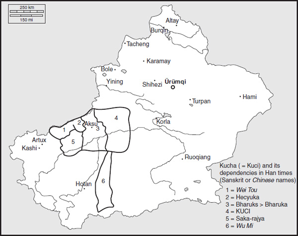
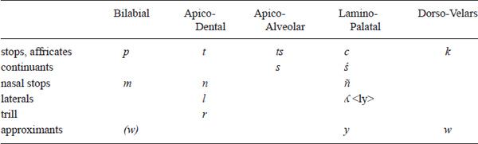
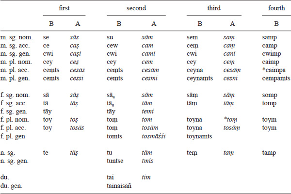
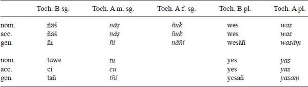
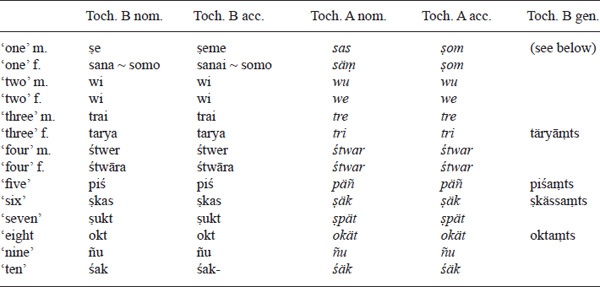
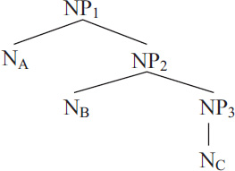

<!-- page: 452 -->

# Part 10

# **Tocharian**

*Douglas Q. Adams*

## **Introduction**

The speakers of the Tocharian languages enter history in the first century BC, when the Han Empire sent military expeditions into the Tarim Basin (what is now the southern half of the Chinese province of Xinjiang). Our linguistic records date only to the late fourth century AD in the case of Tocharian B and to the seventh century AD in the case of Tocharian A. The latest documents in the two languages are probably no later than the ninth century AD (the last dated Tocharian B texts are from the final decade of the eighth century AD). The age of our texts, somewhat older than has often been thought in the past, is confirmed by both paleography and radio-carbon dating. It is also significant, with respect at least to Tocharian B, that our texts cover a half millennium of time, time sufficient for us to see significant change. When it was thought that all the attested texts from Tocharian B were more or less contemporary, within a century or so of one another, the linguistic differences among the texts were reasonably enough taken as the result of there being regional dialects (Winter 1955). However, now it is quite certain that at least most of the differences are the result of the documents’ different ages (Peyrot 2008).

Tocharian B was the native language of the Kingdom of Kucha (Tocharian B *Kuśi*, Uyghur *Kucha*, Sanskrit *Kuci*, Chinese *Qiuci*), and Tocharian A that of the Kingdom of Agni (Uyghur *Qarashehr*, Sanskrit *Agni*, Chinese *Yanqi*) to the east of Kucha. Both languages were also used, at least as liturgical languages and languages of learning, in the Turpan Basin to the northeast. Almost all of the Tocharian A texts and the majority of those written in Tocharian B are of Buddhist content. But there are non-religious texts as well: medical texts, economic texts of one sort or another (inventories, bills of sale, etc.), travel documents/passports, and graffiti. Rare are original literary works (though by far the longest text in Tocharian A is a dramatic narrative, the *Maitreyasamiti*, based on Indian Buddhist models but composed in Tocharian A). Missing entirely in both languages are historical, mythological, or legal texts.

The languages were called “Tocharian” by early investigators because of the presumed connection of the people who spoke them and the classical *Tokharoi* who lived in what is now Uzbekistan but were known to have been driven there by the Huns from Gansu in China (east of Xinjiang, between Tibet to the southwest and Mongolia to the northeast). Though often doubted, the connection is probably correct; we may note, for instance, that their Turkish-speaking neighbors referred to the speakers of Tocharian A as the *Tuγrï*. If the connection is true, we can see that, at the very outset of their entering into Central Asian history, the Tocharian and *Tokharoi* would have extended from the western part of the Tarim Basin to the outer marches of the then Chinese Empire (see Adams 2000). We are not certain what the native speakers called the two languages, hence the neutral, but banal, designations “Tocharian A” and “Tocharian B.”

<!-- page: 453 -->

**Map 10.1** Kucha (= Kuci) and its dependencies in Han times

To the west of Kucha, in the vassal Kingdom of Gumo (this is the Chinese name; in Sanskrit records it is *Bharuka*), was spoken a language but little different from that of Kucha according to early Chinese observers. And to the southeast of the Tarim Basin, in the Kingdom of Kroraina (Chinese Loulan), was apparently spoken a related language (“Tocharian C” if you will) known only through some loanwords and loan morphemes (e.g., Kroraina Prakrit -*ṃci*, an adjective suffix with the meaning ‘pertaining to whatever noun it’s derived from’ and Tocharian A -*ñci* ‘id.’) from it into the official Indian language (“Kroraina Prakrit”) of the state (Mallory & Mair 2000: 278–279). To the south and southwest (beyond Gumo) in the Tarim Basin were Iranian languages, specifically two Saka Iranian languages, Tumshuqese and Khotanese. Tumshuqese was well within the cultural and political sphere of Kucha (Tumshuq’s “saka-rāja” was a vassal of the Kuchean king), while Khotanese was the language of a powerful state in the southern part of the Tarim Basin. The linguistic situation of the Tarim Basin appears to have been quite stable during the first Christian millennium until the last century or so thereof when all of these languages were replaced by the Turkish Uyghur, originally spoken northeastward of the Tarim Basin in what is now western Mongolia.

### **Characteristics of the Tocharian languages and Indo-European languages**

<!-- page: 454 -->

Though quite “advanced” phonologically when compared to contemporary Indo-European languages (and Tocharian A is more “advanced” than Tocharian B), the Tocharian languages are otherwise very much “age-appropriate” Indo-European languages. They preserve both nominal and verbal dual forms, and thus, for the middle of the first Christian millennium, are in this matched in conservatism only by Slavic and Baltic (admittedly we have no idea about pre-Albanian in this time period). They have a large array of nominal cases (again matched during the period of Tocharian attestation only by Slavic and Baltic), though in several cases the exponents of particular case functions are clearly innovative (i.e., the “secondary” cases, on which see below). Among nominal categories, only the effacement of the neuter (so that it is identical with the masculine in the singular and with the feminine in the plural) is a clear structural innovation, and its “retreat” is a development matched by contemporary Romance and Celtic languages.

The verbal system is also “old-fashioned,” though of the Proto-Indo-European triad of present, aorist, and perfect, it has lost the finite forms of the perfect, preserving only its participle (combined with remnants of the aorist participle into a general “preterit” participle”). Of contemporary Indo-European verbal systems, it reminds one most of the Greek system and, to a somewhat smaller degree, the Romance system. Its core vocabulary is pretty much composed of straightforward inheritances from Proto-Indo-European (cf. the words for ‘father’, ‘mother’, ‘brother’, sister’, which are (in Tocharian B/Tocharian A order) *pācer*/*pācar*, *mācer*/*mācar*, *procer*/*pracer*, *ṣer*/*ṣar*, which reflect pretty regularly PIE *ph₂tēr, *meh₂tēr, bʰreh₂tēr, *swesōr). However, that core vocabulary is supplemented by a large number of borrowings from Sanskrit for Buddhist concepts and ideas.

What makes the Tocharian languages seem so far from the Indo-European mainstream is their pronunciation, their “innovative phonology.” Between the breakup of Proto-Indo-European and our first attestation of Tocharian, there were some major sound shifts. The PIE plain velars, (e.g., *k) had fallen together with the palatal velars (*ḱ); Tocharian shares this development with all the Indo-European groups of the west (Germanic, Italic, Celtic, Greek). Particular to Tocharian was the merger of the three series of PIE stops: voiceless, voiced, and voiced aspirate. Thus, for instance, the bilabials, *p, *b, *bʰ, had all merged into a single Proto-Tocharian voiceless stop (e.g., *p). By these two changes the fifteen PIE stops had become only four (*p,*t, *k, *kʷ) in Proto-Tocharian. On the other hand, pre- or Proto-Tocharian underwent a very thorough-going shift from unpalatalized consonants before front vowels to palatalized, so that *t, *k, and *kʷ appeared in Proto-Tocharian as *c, *ć, and (also) *ć in that environment (in attested Tocharian, both A and B, Proto-Tocharian *ć had become *ś*). Similarly, *s, *n, and *l were palatalized to *ṣ, *ñ, and *ʎ (written as \<ly\>). Exceptionally, dentals had become *ts when before *y and PIE /d/ had disappeared (via *ð*?) or become affricated (ultimately to become \<ts\>) under certain circumstances difficult to specify. The PIE vowels also underwent major changes that are perhaps most easily grasped in list form; see Table 10.1 (the closing apostrophe, ’, indicates that the preceding consonant had been palatalized).

Taken together, these changes, to consonants and vowels, may make the PIE antecedents of a Tocharian form momentarily (or not so momentarily) opaque, e.g., PIE *dʰewk- ‘hide’ \> Toch. AB *cuk*-, PIE *h₁ekˊwos ‘horse’ \> Toch. B *yakwe* \[A *yuk*\], PIE *widwo- ‘wise’ \> Toch. B *uwe*, PIE *pode ‘(two) feet’ \> Toch. B *pai(ne)* \[A *pe(ṃ)*\]. The merger of the three orders of PIE stops (voiceless, voiced, and voiced aspirated) makes Tocharian etymologies more difficult to do and feel certain about than those in other major Indo-European groups because, say, a Tocharian verbal root *täk-* might reflect a PIE initial *t-, *d-, or *dʰ- and a final *-k-, *-kˊ-, *-g-, *-ǵ-, *-gʰ-, or *-ǵʰ-.

|      |                                                                                                          |
|------|----------------------------------------------------------------------------------------------------------|
| PIE  | Toch. B/*Toch. A*                                                                                        |
| *i  | ’ä/*’ä* (but *ä* in the neighborhood of PIE **s* or **w*; ’i/*’i* when part of a living ablaut series) |
| *ī  | ’i/*’i*                                                                                                  |
| *e  | ’ä/*’ä*                                                                                                  |
| *e  | ä/ä (automatic “reduced” vowel inserted to break up difficult consonant clusters)                        |
| *ē  | ’e/*’a*                                                                                                  |
| *a  | ā/*ā*                                                                                                    |
| *H̥  | ā/*ā* (*H̥ indicates any vocalized laryngeal, vocalized only when between two obstruents)                |
| *ā  | ā/*ā*                                                                                                    |
| *o  | e/*a* (but *ä* when unstressed before word-final *m, *n, *y, *w, and *r)                            |
| *ō  | ā/*ā*                                                                                                    |
| *u  | ä/*ä* (later than the change of **i*/*e* to ’*ä*; u/*u* when part of a living ablaut series)            |
| *ū  | o/*u*                                                                                                    |
| *ey | ’i/*’i*                                                                                                  |
| *oy | ei (later ai)/*e*                                                                                        |
| *ew | ’u/*’u*                                                                                                  |
| *ow | eu (later au)/*o*                                                                                        |
| *ay | ai/*e*                                                                                                   |
| *aw | au/*o*                                                                                                   |

Table 10.1 The development of PIE vowels in Tocharian

<!-- page: 455 -->

### **Place within Indo-European**

It is universally assumed that the pre-Anatolians were the first Indo-European subgroup to separate themselves from the rest, and it is widely assumed that the pre-Tocharians were the second subgroup to separate themselves. Both assumptions are probably correct. But the gap between the time of the pre-Anatolians’ separation and that of the pre-Tocharians’ was much longer than the gap between the pre-Tocharians’ going their own way and the time of the more general breakup of the remaining PIE speech group. Just one example of the difference in the relationship of Anatolian and Tocharian with the rest of the Indo-European speech community is the complete lack of both subjunctive and optative in Anatolian but the presence of both in Tocharian, albeit in a clearly less developed form (cf. Verbs infra) than shown by other Indo-European groups.

<!-- page: 456 -->

While the Proto-Indo-European that pre-Tocharian separated from cannot have been completely uniform, Tocharian does not show a close resemblance to any other Indo-European branch. Thus, the exact location where, dialectologically speaking, that separation took place is not easy to determine. However, the thoroughness with which Tocharian nouns and adjectives of whatever declension have become mixed with *n*-stem forms strongly suggests that at some point Tocharian had developed productive *n*-stem by-forms to other declensional types and that these *n*-stem forms had a definitizing value that contrasted with a non-definite value of the other kind of declensions. This development is seen in an even fuller form in Germanic (so also apparently in the history of Albanian – Matzinger 2006: 200). So also do some very specific lexical comparisons point in the direction of “northeastern Indo-European” (i.e., Germanic and Balto-Slavic) such as Germanic *deug- ‘hide’ (cf. Old English *deogol* ‘secret, hidden’) and Toch. *tuk-* ‘hide’, both from a latish PIE *dʰewk-, a metathesized variant of the more widely distributed *kewdʰ- (cf. Germanic *hūd- ‘hide’, Greek κεύϑε/o- ‘hide’, and Iranian cognates), or Toch. B *proksa* (pl.) ‘millet’ beside Slavic *proso* (sg.) ‘millet’ (\< PIE *prokˊso/eh₂-). The Toch. B ablative ending -*meṃ*, immediately from PIE *-mons, points in the same direction, in that it shows an affinity with the plural oblique cases in -*m-* in Germanic and Balto- Slavic (compare particularly Old Prussian -*mans*; note that the *-ns of Proto-Tocharian and Old Prussian are independent innovations on a more original *-s) as opposed to the *-bʰ- that characterizes these cases in other Indo-European languages (such as Italic, Celtic, Greek, Indo-Iranian, and perhaps Albanian). Even more specific is the preservation of the reduplicating syllable, PIE *Ce- (where C = the reduplicated word-initial consonant), that is the mark of the PIE perfect as such, with a morphologically restricted retention of *Ce-* in both Gothic and Tocharian and not as **Ci- (in Germanic) and **C’ä- (in Tocharian) as the sound-laws of Germanic and Tocharian would otherwise require.

The dating of the breakup of that Proto-Indo-European unity that remained after the pre-Anatolians had departed is very much a matter of discussion. However, a date of 4,000 BC (± 500 years or so) is likely. As stated above, the pre-Tocharians probably left relatively early in the dissolution of the Proto-Indo-European speech community. How they got from the northern rim of the Proto-Indo-European-speaking world, adjacent to the pre-Slavs and pre-Germanics, and presumably somewhere on the Russo-Ukrainian steppe, to the Tarim Basin remains archeologically opaque. They are often thought to have been members of the Afanasevo culture of south central Siberia (so, for instance, Mallory & Mair 2000). That is not impossible. But any archeological traces of an extension of Afanasevo southward towards the Tarim Basin are faint. The timing would be problematic as well. The Afanasevo culture begins about 3,500 BC (lasting until about 2,500 BC), and if the pre-Tocharians were its bearers, there would have been precious little time for any interaction with early Indo-Iranian as described in the next paragraph. More importantly, perhaps, there are no traces of cereal agriculture associated with the Afanasevo culture, and cereal agriculture clearly had a continuous history among Tocharian speakers, from attested Tocharian back to the Proto-Indo-European homeland (witness *proksa* \[pl.\] ‘millet’, Proto-Slavic *proso ‘millet’). Another possibility is that they were somehow participants in the Andronovo culture (or cultures) of northern Kazakhstan and adjacent southern Siberia (in various forms dating from 2,000–900 BC). Among the Andronovos some agriculture was always present. The graves of the earliest culture found in the Tarim Basin, the Qäwrighul culture (beginning about 1,800 BC; presumably the culture of the pre- or Proto-Tocharians), unhelpfully show some similarities with both their Afanasevo and Andronovo counterparts (Mallory & Adams 1997, s.vv. *Afanasevo*, *Andronovo*, *Qäwrighul*; Mallory & Mair 2000).

<!-- page: 457 -->

The pre-Tocharians and the pre-Indo-Iranians were all on the eastern frontier of the Proto-Indo-European world at one time or another. They would certainly have run into one another if the pre-Tocharians had spent an appreciable amount of time as members of the Andronovo culture. It is worth noting that there is no particular evidence for any early, i.e., PIE-era, association of Tocharian with the other eastern Indo-European languages, the Indo-Iranian languages. Certainly, as mentioned already above, Tocharian is a clear *centum*-language (i.e., the PIE palatal velars, *kˊ, *ǵ, and ǵʰ, remain unpalatalized and fall together with PIE dorsovelars *k, *g, and *gʰ), just as Indo-Iranian languages are clearly *satǝm*-languages (where PIE *kˊ, *ǵ, and ǵʰ did undergo palatalization and remain distinct from the dorsovelars *k, *g, and *gʰ). There is only one lexical item clearly and certainly shared by just Tocharian, Iranian, and Indic: B *maśce* ‘fist’, Avestan *mušti-* ‘id.’, Sanskrit *muṣṭí*- ‘id.’ All go back unproblematically to PIE *mustéy-. A second example is far less certain (because of the inexactness of the semantics): B *welke* (part of a plant), Avestan *varǝka-* ‘leaf’, Sanskrit *valká*- ‘bark’. Any random Indo-European threesome might, quite accidentally as it were, share exclusive ownership of two words.

Interestingly enough, however, given the lack of shared items of certain Proto-Indo-European age, there is a small set of really quite ancient borrowings from Iranian to Tocharian and, in one case, from Indic to Tocharian. Examples (all from Tocharian B) are *tsain* (pl. *tsainwa*) ‘arrow’ (\< *Proto-Iranian *dzainu-, cf. Avestan *zaēna-* armor, weapon’, Armenian *zēn* (a *u*-stem) ‘id.’, also borrowed from Iranian), *tsaiññe* ‘ornament’ (\< Proto- Iranian *dzai- ‘to ornament’), *waipecce* ‘possession’ (\< Proto-Iranian *hwaipatya-, cf. Avestan *hvaēpaiθya-* ‘ones’ own’), *ṣem* ‘axle’ (\< Proto-Iranian *axšám, cf. Gathic Avestan *aša*-), *iścem* ‘brick, tile’ (i.e., ‘fired clay’) (\< Proto-Iranian *ištyám, cf. Late Avestan *ištiia-* \[n.\]), *ekṣinek* ‘dove’ (\< Proto-Iranian *akšinaka-, cf. Ossetic *æxšinæg*), and *wästare ‘camel’, unattested but cf. *wästarye* ‘pertaining to a camel’ (\< Proto-Iranian *ustrá- ‘camel’, cf. Avestan *uštra*-). These borrowings are significant because they show an early stage of Iranian phonological development: preservation of the affricate *-dz- (in attested Iranian always *-z-), and of the cluster *-ty- (rather than later *-θy-); word-final stress; or even, once, a form that had not undergone the RUKI rule, i.e., *ustrá-, not *uštrá-. The Iranian we see through the window of these early Tocharian borrowings noticeably antedates the Avestan of Zarathuštra. Since Zarathuštra is commonly, though not universally, dated to about 1,000 BC, that puts these early Iranian-Tocharian contacts well into the second millennium BC. Whether these contacts took place inside the Tarim Basin or outside cannot be said.

The singular example of a demonstrably early borrowing from Indic is *kercapo* ‘ass’ (= Sanskrit *gardabhá*- ‘id.’ \< pre-Indo-Aryan ***gordebʰó-). It is particularly significant, however, because that borrowing must have taken place before the merger of PIE *e, *a, and *o in Indo-Aryan and so even earlier than the early borrowings from Iranian where that merger had already taken place. This merger had already been accomplished by 1500 BC as seen in Indo-Aryan loanwords borrowed into Mitanni in eastern Asia Minor. In this case we can be certain the borrowing must have occurred before the pre-Tocharians entered into the Tarim Basin or the pre-Indo-Aryans left Central Asia for India (the latter event being, on most accounts, sometime between 2,000 BC and 1,500 BC).

Out of all these considerations a picture, both fuzzy and speculative, begins to emerge of the pre-Tocharians leaving the northern frontier of the Proto-Indo-European world and moving east about 4,500 BC or so to the southern Urals-North Kazakhstan steppes. There they had limited contact with both Proto-Indo-Aryans (first) and Proto-Iranians (second), already dialectally distinguished from one another, in the period, say, 2,500–2,000 BC. After that contact the Proto-Tocharians moved further east, into the Tarim Basin, while the Proto-Indo-Aryans and Proto-Iranians, in that chronological order, moved further and further south (with one arm of the Proto-Iranians, the Khotanese and Tumshuqese, also eventually entering the Tarim Basin and settling the southwestern portion of it). Such a scenario would allow the pre-Tocharians to be in the Tarim Basin as the bearers of the Qäwrighul culture of the eastern Tarim Basin (beginning about 1,800 BC), a culture known almost exclusively from its burial sites and spectacular mummies. The area occupied by the Qärighul culture was later the nucleus of the historical Kingdom of Kroraina (Chinese Loulan), where we find the remnants of “Tocharian C.”

<!-- page: 458 -->

Contact with Iranian was maintained, or renewed (and now clearly with the Tocharians in the Tarim Basin), in the middle of the first millennium BC or thereafter. We find such borrowings with later Iranian phonology as *newiya* ‘(a kind of) canal’ (\< Proto-Iranian *nāwiya- ‘navigable’), *murye* ‘(a kind of) canal’, *ārtte* ‘(feeder) canal’, *peri* ‘debt’ (\< Proto- Iranian *parya-), *śāte* ‘rich’ (\< Proto-Iranian *ćyāta-), which suggest a very different cultural level of inter-language contact. Somewhat later, the advent of Buddhism in the Tarim Basin brought with it a host of religious/cultural terminology, either as borrowings or as calques, from Sanskrit and, to a lesser extent, from Iranian.

## **Phonology**

The two Tocharian languages have exactly the same phonemic inventories.

**Table 10.2 Tocharian consonants**

|     |     |     |     |     |
|-----|-----|-----|-----|-----|
| *i* |     |     |     | *u* |
|     |     | *ä* |     |     |
| *e* |     |     |     | *o* |
|     |     | *ā* |     |     |

**Table 10.3 Tocharian vowels**

The symbol \<ä\> represents something like IPA \[ɨ\] and \<ā\> something like IPA \[ɑ\].

Stress: It is possible that both Tocharian languages have contrastive stress, but only Tocharian B shows it in ways visible to us, as described below (under the heading “Morphophonology”). This contrastive stress may result in minimal pairs, e.g., *tākam* ‘we will be’ (\< /tā́kām/ and *takām* ‘we were’ (\< /tākā́m/)).

Writing System: Though neither Tocharian language has been spoken for a thousand years or so, we can be quite confident that our knowledge of the phonology of both languages is accurate and substantially complete. That is so because they are written in a form of Brahmi, the Indian alphabet whose variants have been used to write various Indian and Indo-Chinese languages since the last centuries before the Christian era. The phonetic values of the signs of the alphabet are well known. Unique to the Tocharian variant of this writing system are that so-called Fremdzeichen (‘foreign signs’) created by those who adapted Brahmi to Tocharian to signal the vowel /ä/, unknown to Sanskrit and other Indic languages.

 **Morphophonology:**  In Tocharian there are three major, productive, morphophonological processes, which shape many Tocharian paradigms: palatalization, umlaut, and ablaut. In addition, there are widespread, purely phonological, processes that account for the distribution of \[ā\], \[a\], and \[ä\] in Tocharian A and Tocharian B. We will take up these latter processes first.

<!-- page: 459 -->

Distribution of \[ā\], \[a\], and \[ä\] in Tocharian B: In Classical and later Tocharian B the central vowel /ä/ is strengthened in stressed syllables to \[a\]. In unstressed closed syllables it remains as \[ä\], while in unstressed open syllables it disappeared completely (e.g., /stämó-/ ‘having stood’ \> *stmó*-). Similarly, in stressed syllables /i/ and /u/ may be reflected in the spelling as \<ī\> and \<ū\> respectively (i.e., the long vowel signs are used to show stressed syllables). On the other hand, in stressed position /ā/ remains unchanged, but, conversely, in an unstressed syllable /ā/ appears as \[a\]. Both the strengthening of /ä/ (and /i/ and /u/) and the “destrengthening” of /ā/ are shown orthographically in Classical and Late Tocharian B. To give but one example: in Archaic Tocharian B the third person singular of ‘(s)he released’ would have been *cärkā*, but in Classical and Late Tocharian B it was *carka*. It is from the strengthening of /ä/, the destrengthening of /ā/, and the loss of unstressed /ä/ in open syllables that we derive the majority of our information about Tocharian B stress, since stress itself is never marked orthographically.

Distribution of \[ā\], \[a\], and \[ä\] in Tocharian A: Superficially resembling in some ways the interchange of \[ā\], \[a\], and \[ä\] in Tocharian B is a similar interchange of the surface representatives of /ā/ in Tocharian A. Though considerably disturbed by analogical restorations of one sort or another, the basic historical pattern is like this: if, in a word of two syllables or more, the first syllable contained /ā/, /e/, or /o/ and the second syllable contained /ā/, then the second syllable’s /ā/ shows up on the surface (1) as \[a\] if the second syllable is word final and closed, (2) as \[ä\] if the second syllable is not the final syllable of the word but is a closed syllable, and (3) as zero if the second syllable is not the final syllable of the word and is an open syllable.

### **Condition 1:**

- *kotnaṣ* ‘(s)he cuts off’ from /*kotnāṣ*/ (cf. Toch. B *kautanaṃ* \< PToch. *kāutnā́-, or, within Tocharian A when the first syllable of the word is “light,” A **kärsnāṣ** ‘(s)he knows’)
- *kropat* ‘(s)he gathered’ (cf. Toch. B *kraupāte* \< PToch. *krāupā́te or, within Tocharian A, *kälpāt* ‘(s)he achieved’)
- *ṣāmaṃ* ‘monk’ (B *ṣamāne* \< PToch. *ṣāmā́ne)
- *āknats* ‘foolish’ (B *aknātsa* \< PToch. *āknā́tsā)

### **Condition 2:**

- *tāpäkyāñ* ‘mirrors’ (cf. *tāpaki* \[\< *tāpaky\] ‘mirror’)
- *kākärpu* ‘having descended’ (B *kakārpau* \< PToch. *kākā́rpā-)

### **Condition 3:**

- *kropte* ‘thou has gathered’ (cf. B *kraupātai* \< PToch. *krāupā́tāi, or, with Tocharian A, *kälpāte* ‘thou hast achieved’)
- *kroplune* ‘gathering’ (cf. B *kraupālñe* or, within Tocharian A, *kälpālune* ‘achievement’)
- *kākmu* ‘having brought’ (cf. B *kakāmau* \< PToch. *kākā́mā-)

In addition, as in Tocharian B, /ä/disappears in open syllables, even from those syllables that, on the basis of Tocharian B evidence, were stressed.

<!-- page: 460 -->

PALATALIZATION: Palatalization (as already outlined above) developed when a susceptible root-initial consonant or consonant cluster preceded a PIE *-e- or *-i-, whether short or long (short *-i- does not palatalize if it is further in the environment of *-w- or *-s-). Thus, we have *k \> ś* (via *ć), *t \> c*, *ts \> ś* (Tocharian A only), *n \> ñ*, *l \> ly*, *w \> y* (Tocharian B only), *s \> ṣ*, *sk \> ṣṣ*, *st \> śc*, *sp \> ṣp-*; *p*, *m*, *r* are not palatalizable in either language, and neither are any of the consonants that can be the result of palatalization (*c*, *ñ*, *y*, etc.). However, in Tocharian B certain preterits to marked causative roots exceptionally allow “palatalization” of most of the non-palatalizable consonants. Thus, we find the “special” or “secondary” palatalization: *k \> ky*, *ñ \> ñy*, *p \> py*, *m \> my*, *ts \> tsy*. Non-causative preterits show only “primary” palatalization, e.g., Toch. B *lyāka* ‘he saw’ and Toch. A (imperfect) *lyāk* ‘he was seeing’.

Root-initial palatalization is strongly favored by causativity. Almost all preterits to morphological causatives in Tocharian B are preterits that uniformly show palatalization, regular and “special,” where possible. Causative presents or subjunctive forms with the suffix *-äsk-* sometimes, but not commonly, also show palatalization: B *śarsäsk’ä*/*e-* \[A *śärsäs’ä*/*a*-\] ‘teach’, causative to *kärs-* ‘know’ (non-causative present *kärsnā-* in both languages), B *śatkäsk-* (beside *katkäsk-*) ‘send over’ to *kätk-* ‘cross over’ (both with preterit *śātka*), B *ṣaläsk’ä*/*e-* ‘to throw’ (but A *säläs’ä*/*a*-) to *säl-* ‘fly’, B *ṣpantäsk’ä*/*e-* ‘convince’ to *spänt-* ‘trust’, B *ṣparkäsk’ä*/*e-* ‘destroy’ to *spärk-* ‘perish’, and *ṣparttäsk’ä*/*e-* (*~ ṣparttask’ä*/*e- ~ spārttask’ä*/*e-*) ‘turn (trans.)’ to *spärtt-* ‘turn (intr.)’. Note, with “secondary” palatalization we have B *pyutkäsk’ä*/*e-* \[A *pyutkäs’ä*/*a*-\] ‘come into existence’. But palatalization may also mark the present as opposed to the subjunctive, e.g., *ceśäṃ*/*cekeṃ* ‘touch(es)’ but *tekäṃ*/*takäṃ** ‘will touch’ (A present *cäk’ä*/*a*-, subjunctive *täkā*-) or B *cepiy(e)-* ‘step forth, appear’ but *tāpā-* ‘will appear’.

UMLAUT: Both Tocharian languages have undergone a change whereby an *-ā- in a following syllable has changed a preceding *-(’)e- to *-(’)ā-, a phonological process we can call “*ā-*umlaut.” The change works somewhat differently in Tocharian A and B, and that difference suggests the change was only in process at the time, whenever that was, that the two varieties of Proto-Tocharian that were to become Tocharian A and Tocharian B were losing contact with one another. In Tocharian B any *-(’)e- became *-(’)ā- when another *-ā- followed in the next syllable. In Tocharian A the change occurred only when the *-(’)e- was, on the basis of the Tocharian B evidence, unstressed. There is a common subjunctive formation that has the root-vowel *-e- (\< PIE *-o-) in the active singular and *-ä- elsewhere. When the thematic vowel, the morpheme joining root and person-number endings, is -*ä-*, the root-vowels remain unchanged, thus B *tekäṃ*/*takäṃ* (\< *tékän/tä́kän) ‘(s)he will touch/they will touch’. By normal change Proto-Tocharian *-*e-* becomes Tocharian A -*a-*, but otherwise there is no change in the latter language either. When the thematic vowel is *-ā-, however, Tocharian B shows the effect of *ā*-umlaut, e.g., *tārkaṃ*/*tarkaṃ* (\< ***térkān/tä́rkān) ‘(s)he will release/they will release’. In Tocharian A the result is *tarkaṣ*/*tärkeñc* with the regular change of *-e- to -*a-* but with no *ā*-umlaut to **tārkaṣ. However, PToch. *lyekā́- ‘saw’ gives *lyākā-* in both languages (3 sg. B *lyāka*, A *lyāk*). The effect of *ā*-umlaut is analogically effaced in some situations. Thus, the plural of B *pīle* ‘wound’ is *pilenta*, with preserved -*e*-, and not the **pilānta required by *ā*-umlaut. But in verbal morphology *ā*-umlaut is quite regular. Similar to *ā*-umlaut, but much rarer, is *o*-umlaut, e.g., /sesoyu-/ ‘satisfied’ \> B *sosoyu-*.

<!-- page: 461 -->

There is another kind of vowel affection that is to be seen in Tocharian B: in many situations in the Tocharian B verb where we expect *ā … e* or *e … ā* what we find is *o … o* instead. Thus, the imperative of *āks-* ‘speak, announce’ should be /pe-ākse/ underlyingly but appears in the surface structure as *pokse* instead. Likewise, Class IV presents, parallel in every way to Class III presents save that Class IV’s have the root-vowel -*ā-* instead of Class III’s -*ä*-, have the shape, for example, B *kloyotär* ‘(s)he falls’ rather than **klāyétär (compare the Class III B *pälkétär* ‘burns’ (intr.)).

ABLAUT: Both Tocharian languages show abundant remains of PIE ablaut, particularly in verbal paradigms. Ablaut is not found paradigm-internally in present formations but is relatively common in both the subjunctive and preterit. As described above, many show a pattern of ablaut wherein the active singular is distinguished by one vowel (-*e-* \[A -*a*-\] or -*ā-*, while the rest of the paradigm has -*ä*-). In the preterit there are two loci for inter-paradigmatic ablaut: (1) in certain *ā*-preterits (“Class I”) and (2) in sigmatic preterits (“Class III”).

For Class I preterits with ablaut, the usual ablaut situation is an *-ä-* in the active with preceding palatalization and *-ä-* with no palatalization in the medio-passive and preterit participle, e.g., B *cárka* ‘(s)he released’, B *cärkāre* ‘they released’ vs. B *tärkā́(n)te* ‘(s)he was/they were released’ (and preterit participle *tärkáu*). In A the situation is different, and demonstrably older. In the active singular there is an -*’ä-* (as in B), *cärk* ‘(s)he released’, but the preterit (dual and plural) have -*a*-, e.g., *tarkar* ‘(s)he released’. The medio-passive (*tärkā(n)t*) and participle (*tärko*) have non-palatalizing -*ä*-, as in Tocharian B. Tocharian B has one example of the older, Tocharian A, situation, where we find underlying *-ä-* with preceding palatalization in the active singular, *-ā-* (\< underlying (Toch. B) -*e-* by *ā*-umlaut) in the non-singular active, and *-ä-* with no palatalization elsewhere: *ścáma* \[3 act. sg.\], *stāmáis* \[3 act. dual\], and (once) *stamā́re* \[3 act. pl.\] from *stäm-* ‘stand’. The active singular, then, represents an old PIE **e*-grade and the medio-passive an old PIE zero-grade. In Indo-European terms the more archaic type would appear to reflect an (active singular) *e-grade, (active plural) *o-grade, and (medio-passive) zero-grade. A generally accepted explanation for this ablaut system remains to be found.

Class III or sigmatic preterits offer two ablaut (or rather palatalization) patterns. In the first we have Tocharian B -*e-* in the active, usually in the medio-passive, and the preterit participle – all with no palatalization. In some verbs of this group the medio-passive (MP) and preterit participle (PP) have Tocharian B -*ä*-. An example with constant *e-* is *täm-* ‘be born’ (*temtsamai* \[1 MP sg.\], *temtsate* \[3 MP sg.\], *temtsamte* \[1 MP pl.\], *temtsante* \[3 MP pl.\]; PP *tetemu*). Examples with an interchange of -*e-* and *ä-* are *pärk-* ‘ask a question’ (*preksa* \[3 act. sg.\], *parksante* \[3 MP pl.\]; PP *peparku*; A *prakäs* \[3 act. sg.\], *präksāt* \[3 MP sg.\], PP *papärku*) and *räk-* ‘extend \[one’s hand\]’ (*reksa* \[3 act. sg.; cf. Latin *rēxit*\], *raksamai* \[1 MP sg.\], *raksate* \[3 MP sg.\]; PP *reraku**; A *rakäs* \[3 act. Sg.\], PP *rarku*). In the second subgroup we find the active with palatalization + -*e-* and the medio-passive and preterit participle with -*ä*-. A good example is the causative paradigm of *pälk-* ‘burn, torture’ (*pelykwa* \[1 act. sg.\], *pelyksa* \[3 act. sg.\], *palyksatai* \[2 MP sg.\]; PP *pepalyku**). In Indo-European terms the first, non-palatalizing, subtype would appear to reflect the (active) *o-grade and (medio-passive) zero-grade, while the second, palatalizing, subtype would appear to reflect the (active) *ē-grade and (medio-passive) *e-grade. Tocharian A shows the same two patterns (with -*a-* of course rather than -*e*-) but differs greatly from Tocharian B in the lexical distribution of the two types.

## **Morphology**

The Tocharian languages are typically Indo-European in their complex morphology, using a rich set of inflections in both nouns and verbs.

<!-- page: 462 -->

 Nouns: A Tocharian noun belongs to one of three gender classes, masculine, feminine, and neuter. The last class is also referred to as alternating, as nouns in this class look identical to masculine ones in the singular and feminine ones in the plural. Nouns inflect for number: singular, dual, and plural, and case. (For a discussion of the Tocharian dual and the supposed “paral” (for natural pairs), see Winter 1962.) The various cases mark the nouns’ syntactic role in a sentence. In Tocharian B there are nine cases: nominative, accusative, genitive, vocative (only distinct from the nominative in the singular), ablative, causal (only in the singular), comitative, locative, and perlative. The first four are the so-called primary cases, and the last five are secondary cases.

The primary cases are developments of PIE case endings; have different forms for singular, dual, and plural; are always marked on the noun; and, in many nouns, cause a shift in stress. For example, the nominative and accusative of *yákwe* ‘horse’ have stress on the first syllable, but the genitive is *yäkwéntse* with stress on the second. (Evidence for accent-shifting can only come from Tocharian B.) This mobility of accent does not in general reflect anything of PIE age. By a variety of regular phonological and analogical changes, not always well understood, nominal stress came usually to be on the first (leftmost) “strong” vowel (-*e*-, -*o*-, -*ā-* and diphthongs) and not on a “light” vowel (-*i*-, -*u*-, -*ä*-). Thus, an original PIE *h₁ékˊwo- ‘horse’ became PToch. *yäkwé-. Complicating the surface structure of end-stressed nouns, like *yäkwé-, at least in Tocharian B, is a later phonological development, Marggraf’s Law, that retracted stress from absolute final syllables, and thus the nominative-accusative singular *yäkwé \> *yä́kwe, but the genitive, *yäkwén(ä)se, remained unaffected.

Adjectives agree in case with their head nouns when the head nouns are in the primary cases. Secondary cases, on the other hand, are thought to derive from PIE postpositions that have become fused with the noun, have the same shape whatever the number of the noun they is attached to, occur only once on a series of nouns in the same case, and do not cause any accent shift. Adjectives do not agree with their head nouns when the head nouns are in any of the secondary cases. When modifying nouns in secondary cases, adjectives are uniformly in their accusative shapes. However, the distinction between primary and secondary cases is not absolutely sharp. In particular, the Toch. B ablative in -*meṃ* often causes accent shift, giving rise to the possibility that it was once a primary case ending that has become “secondarily a secondary case” if you will and the same is true of the Toch. A ablative ending -*ṣ* (\< PIE *-ti, represented also by Hittite -*(a)z* \< *-(o)ti).

A rather typical nominal paradigm would be *yákwe* ‘horse’ from PIE *h₁ékˊwos (the Toch. A equivalent *yuk*, is given in italics in square brackets); see Table 10.4.

<table style="width:100%;">
<caption><strong>Table 10.4 An example of Tocharian nominal declension</strong></caption>
<colgroup>
<col style="width: 14%" />
<col style="width: 14%" />
<col style="width: 14%" />
<col style="width: 14%" />
<col style="width: 14%" />
<col style="width: 14%" />
<col style="width: 14%" />
</colgroup>
<tbody>
<tr class="odd">
<td class="tcenter border_bot" style="border-top: 1px solid windowtext"></td>
<td class="tcenter border_bot" style="border-top: 1px solid windowtext"></td>
<td class="tcenter border_bot" style="border-top: 1px solid windowtext">
Singular
</td>
<td class="tcenter border_bot" style="border-top: 1px solid windowtext"></td>
<td class="tcenter border_bot" style="border-top: 1px solid windowtext">
Dual
</td>
<td class="tcenter border_bot" style="border-top: 1px solid windowtext"></td>
<td class="tcenter border_bot" style="border-top: 1px solid windowtext">
Plural
</td>
</tr>
<tr class="even">
<td class="tleft">
Nom.
</td>
<td class="tleft"></td>
<td class="tleft">
yákwe [<em>yuk</em>]
</td>
<td class="tleft"></td>
<td class="tleft">
yákwene [<em>yukäṃ</em>]
</td>
<td class="tleft"></td>
<td class="tleft">
yákwi [<em>yukañ</em>]
</td>
</tr>
<tr class="odd">
<td class="tleft">
Acc.
</td>
<td class="tleft"></td>
<td class="tleft">
yákwe [<em>yuk</em>]
</td>
<td class="tleft"></td>
<td class="tleft">
yákwene [<em>yukäṃ</em>]
</td>
<td class="tleft"></td>
<td class="tleft">
yákweṃ [<em>yukas</em>]
</td>
</tr>
<tr class="even">
<td class="tleft">
Voc.
</td>
<td class="tleft"></td>
<td class="tleft">
yákwa [<em>yuk</em>]
</td>
<td class="tleft"></td>
<td class="tleft">
yákwene [<em>yukäṃ</em>]
</td>
<td class="tleft"></td>
<td class="tleft">
yákwi [<em>yukañ</em>]
</td>
</tr>
<tr class="odd">
<td class="tleft">
Gen.
</td>
<td class="tleft"></td>
<td class="tleft">
yäkwéntse [<em>yukes</em>]
</td>
<td class="tleft"></td>
<td class="tleft">
yäkwénaisäñ [<em>yuknis</em>]
</td>
<td class="tleft"></td>
<td class="tleft">
yäkwéṃts [<em>yukaśśi</em>]
</td>
</tr>
<tr class="even">
<td class="tleft">
Abl.
</td>
<td class="tleft"></td>
<td class="tleft">
yákwemeṃ ~ yäkwémeṃ [<em>yukaṣ</em>]
</td>
<td class="tleft"></td>
<td class="tleft">
yákwenemeṃ [<em>yuknaṣ</em>]
</td>
<td class="tleft"></td>
<td class="tleft">
yákweṃmeṃ [<em>yukasäṣ</em>]
</td>
</tr>
<tr class="odd">
<td class="tleft">
All.
</td>
<td class="tleft"></td>
<td class="tleft">
yákweśc [<em>yukac</em>]
</td>
<td class="tleft"></td>
<td class="tleft">
yákweneśc [<em>yuknac</em>]
</td>
<td class="tleft"></td>
<td class="tleft">
yákweṃśc [<em>yukasac</em>]
</td>
</tr>
<tr class="even">
<td class="tleft">

<!-- page: 463 -->

Com.
</td>
<td class="tleft"></td>
<td class="tleft">
yákwempa [<em>yukaśśäl</em>]
</td>
<td class="tleft"></td>
<td class="tleft">
yákwenempa [<em>yuknaśśäl</em>]
</td>
<td class="tleft"></td>
<td class="tleft">
yákweṃmpa [<em>yukasäśśäl</em>]
</td>
</tr>
<tr class="odd">
<td class="tleft">
Loc.
</td>
<td class="tleft"></td>
<td class="tleft">
yákwene [<em>yukaṃ]</em>
</td>
<td class="tleft"></td>
<td class="tleft">
yákwenene [<em>yuknaṃ</em>]
</td>
<td class="tleft"></td>
<td class="tleft">
yákweṃne [<em>yukasaṃ</em>]
</td>
</tr>
<tr class="even">
<td class="tleft">
Perl.
</td>
<td class="tleft"></td>
<td class="tleft">
yákwesa [<em>yukā</em>]
</td>
<td class="tleft"></td>
<td class="tleft">
yákwenesa [<em>yuknā</em>]
</td>
<td class="tleft"></td>
<td class="tleft">
yákweṃsa [<em>yukasā</em>]
</td>
</tr>
<tr class="odd">
<td class="tleft" style="border-bottom: 1px solid windowtext">
Instr.
</td>
<td class="tleft" style="border-bottom: 1px solid windowtext"></td>
<td class="tleft" style="border-bottom: 1px solid windowtext">
[<em>yukyo</em>]
</td>
<td class="tleft" style="border-bottom: 1px solid windowtext"></td>
<td class="tleft" style="border-bottom: 1px solid windowtext"></td>
<td class="tleft" style="border-bottom: 1px solid windowtext"></td>
<td class="tleft" style="border-bottom: 1px solid windowtext">
[<em>yukasyo</em>]
</td>
</tr>
</tbody>
</table>

**Table 10.4 An example of Tocharian nominal declension**

This paradigm is directly descended from PIE masculine *o*-stems. However, like virtually every nominal or adjectival paradigm in Tocharian, it shows some importations from PIE *n*-stems. Thus, the genitive singular and genitive plural are from *-o-neso and *-o-nesom respectively, and the entire dual shows an -*n-* from the same source.

The fusion of accusative plus following postposition that created the secondary cases was apparently only beginning in the last stages of Proto-Tocharian because the two languages show different results. For instance, the allative postposition must have been PToch. *-cä (= Greek -*de*?), and the perlative postposition must have been *-ā. When added to the singular accusative we would have had *yäkwe-cä for the allative; when added to the plural, *yäkwens-cä. For the perlative it would have been singular *yäkw(e)-ā and plural *yäkwens-ā. At some point in the history of Tocharian A the accusative plural ending was reduced from *-ns to *-s. The allative would then have been singular *yäkwa-cä and plural *yäkwas-cä. The latter form was rebuilt, by analogy to the singular as *yäkwas-acä, whence the actual forms *yukac* and *yukasac*. The perlative followed the same process, and *yäkwa-ā and *yäkwas-ā gave actual *yukā* and *yukasā*. In pre-Tocharian B, however, word-final *-ns gave *-n (written -*ṃ* in attested Tocharian). Original *yäkwe-cä and *yäkwens-cä would have given **yäkwec and *yäkwenśc* respectively. Original *yäkwe-ā and *yäkwens-ā would have given **yäkwā and *yäkwensā respectively (with a morphological division *yäkwen-sā because now the accusative plural was *yäkwen). In both cases the plural form was generalized in Tocharian B, thus singular *yäkweścä and *yäkwesā. Also generalized from the plural was the Toch. B ablative ending -*meṃ*. In Tocharian A it was the singular ablative ending, in -*ṣ*, that was generalized to the dual and plural.

Adjectives: Tocharian adjectives are morphologically much simpler than nouns. They have at most four case forms (nominative, accusative, genitive, and vocative). When they modify nouns in other cases (e.g., ablative, instrumental) the accusative form is used, and, more often than not, nouns in the genitive are also modified by adjectives in the accusative. In form the most common kinds of adjectives are medleys of PIE *o*-stem, *yo*-stem, and *n*-stem adjectives. As in the case of nouns, the many *n*-stem forms that show up in many places in the Tocharian adjective reflect the pre-Tocharian situation whereby nouns and adjectives had productive *n*-stem derivatives that were individualizing and definite when compared to the non-*n*-stems that underlay them. With regard to adjectives, the situation must have been very similar to that of Proto-Germanic with the latter’s distinction of definite and indefinite adjectives, the former being built on *n*-stem antecedents and the latter not. In Tocharian the two types of adjectives were fused. The fusion seems to have been largely post-Proto-Tocharian because the mechanics of that fusion are often quite different in the two languages. In Table 10.5 we give examples of an inherited (PIE) *o*-stem (*ñuwe* ‘new’ \[Toch. B only; Toch. attests only *ñu* (m. sg.) and *ñwaṃ* (f. pl.)\]), *yo*-stem (*ñäkciye* \[*ñäkci*\] ‘divine’), and two inherited *n*-stems (*krośce* \[*kuraś*\] ‘cold’ and *klyomo* \[*klyom*\] ‘noble’).

<!-- page: 464 -->

|                 |     |              |     |                               |     |                        |     |                              |
|-----------------|-----|--------------|-----|-------------------------------|-----|------------------------|-----|------------------------------|
| **m. sg. nom.** |     | **ñuwe**     |     | ñäkciye \[*ñäkci*\]           |     | krośce \[*kuraś*\]     |     | klyomo \[*klyom*\]           |
| **acc.**        |     | **ñuwe**     |     | ñäkciye \[*ñäkci(ṃ)*\]        |     | kroścäṃ \[*krośśäṃ*\]  |     | klyomoṃ \[*klyomänt*\]       |
| **gen.**        |     | **ñwepi**    |     | ñäkciyepi \[*ñäkcināp*\]      |     |                        |     | klyomopi \[*klyomäntāp*\]    |
|                 |     |              |     |                               |     |                        |     |                              |
| **m. pl. nom.** |     | **ñuwi**     |     | ñäkci \[*ñäkciñi*\]           |     | krości \[*krośśe*\]    |     | klyomoñ \[*klyomäṣ*\]        |
| **acc.**        |     | **ñuweṃ**    |     | ñäkciyeṃ \[*ñäkcinäs*\]       |     | kroścäṃ \[*krośśes*\]  |     | klyomoṃ \[*klyomäñcäs*\]     |
| **gen.**        |     | **ñweṃts**   |     | ñäkciyeṃts \[*ñäkcinäśśi*\]   |     |                        |     | klyomoṃts \[*klyomäñcäśśi*\] |
|                 |     |              |     |                               |     |                        |     |                              |
| **f. sg. nom.** |     | **ñuwa**     |     | ñäkciya \[*ñäkci(ṃ)*\]        |     | \[*krośśi*\]           |     | klyomña \[*klyomiṃ*\]        |
| **acc.**        |     | **ñuwai**    |     | ñäkciyai \[*ñäkcyāṃ*\]        |     | \[*krośśāṃ*\]          |     | klyomñai \[*klyomināṃ*\]     |
| **gen.**        |     | **ñuwai**    |     | ñäkciyai \[*ñäkcine*\]        |     |                        |     | klyomñai \[*klyomine*\]      |
|                 |     |              |     |                               |     |                        |     |                              |
| **f. pl. nom.** |     | **ñwona**    |     | ñäkciyana \[*ñäkcyāñ*\]       |     | kroścana \[*krośśāñ*\] |     | klyomñana \[*klyomināñ*\]    |
|                 |     | **ñwona**    |     | ñäkciyana \[*ñäkcyās*\]       |     | kroścana \[*krośśās*\] |     | klyomñana \[*klyominās*\]    |
|                 |     | **ñwonaṃts** |     | ñäkciyanaṃts \[*ñäkcināśśi*\] |     |                        |     |                              |

**Table 10.5 Some examples of Tocharian adjectival declension**

Similar in declension are the various productive adjectives in -*ṣṣe* \[-*ṣi*\] ‘pertaining to X’, -*ññe* \[-*ñi*\] ‘ibid.’, -*tse* \[-*ts*\] ‘having X’, and -*lle* \[-*l*\] ‘X-able’. Adjectives in -*lle* \[-*l*\], in both languages, and -*tse*, in Tocharian B only, show palatalization in the masculine singular (except the masculine singular nominative), masculine plural, and feminine singular (e.g., Toch. B (m. sg.) -*lle*, -*lye*, -*lyepi*, m. pl. -*lyi*, -*lyeṃ*, f. sg. -*lya*, -*lyai*, f. pl. -*llana*, -*llana*). The palatalization is ultimately from the *n*-stems (in the masculine) and *yā*-stems (in the feminine). Tocharian has, in addition, abundant traces of participles in *-nt- or *-us- (both of which have been worked into the Toch. A paradigm for *klyom*) and the denominative *-went- ‘having X’.

Deictics and Third Person Pronouns: The different Tocharian deictics (i.e., the equivalents of ‘the’, ‘this’, and ‘that’), used also as third person pronouns, are based on a single basic paradigm to which different particles are attached. In Tocharian B the basic deictic/pronoun, usually used as a simple anaphoric, is masculine *se* (nom. sg.), *ce* (acc. sg.), *cey* (nom. pl.), *ceṃ* (acc. pl.), feminine *sā* (nom. sg.), *tā* (acc. sg.), *toy* (nom./acc. pl.), neuter *te* (nom./acc. sg.). Only here in Tocharian is there a neuter, used predicatively in reference to whole clauses, or concepts. Except for the word-initial palatalization in some forms, the Tocharian B forms of the first deictic match very well with their counterparts in Greek (*se*, *ce*, *cey*, *sā*, *tā*, *te* = Greek ὁ, τóν, \[Doric\] τoί, ση, τήν, τó).

<!-- page: 465 -->

The second deictic, more or less equivalent to the English definite article, though used more sparingly, adds -*w* in Tocharian B and -*m* in Tocharian A. The third deictic, ‘this one here’, adds -*n* (written \<ṃ\>) in both languages. The fourth deictic, ‘that there’ (only in Tocharian B), adds -*m(p)*. As is commonly the case, the basic system is shared by both Tocharian A and B, but the details, and the inter-paradigmatic analogies, are the province of each language separately. The Tocharian B paradigms are underdifferentiated in the genitive and masculine plural, while Tocharian A has generally created unique forms for each “slot.”

**Table 10.6 Deictic pronouns in Tocharian**

RELATIVE AND INTERROGATIVE PRONOUNS: The commonest relative and interrogative pronoun, one that does not distinguishes gender (in both languages) nor number (in Tocharian B), but that does distinguish case (in both), is a combination of the first deictic with a preceding *kw-* to give B nom. *kuse* (A *kus*), acc. *kuce* (A *kuc*). The genitive forms are both irregular and not reducible to a single Proto-Tocharian preform; we have B *ket(e)* and A *ke*. In Tocharian A, but not in B, the relative pronoun is distinguished from the interrogative by the addition of the particle *ne* to the former but not the latter (thus *kusne* and *kucne*). In Tocharian A a nominative plural of the relative pronoun is also known, *kucene* (no accusative plural is known, perhaps simply because of a lack of attestation). Both languages have a relative or interrogative adjective derived from a deictic prefixed by *in-* (in B) and *än-* (in A). In Tocharian B it is the second deictic that is so used; in Tocharian A, the third. Thus, we have B *intsu* (nom.), *iñcau* (acc.), etc. ‘which’ \[A *äntsaṃ*, *äñcaṃ*\]. More commonly, in this function in Tocharian B we have the second deictic prefixed by *mäk*-, i.e., *mäksu* (nom.), *mäkcau* (acc.), etc.

FIRST AND SECOND PERSON PRONOUNS: The array of personal pronouns in the two Tocharian languages is given in Table 10.7.

<!-- page: 466 -->

**Table 10.7 First and second person pronouns in Tocharian**

In addition there is a reflexive genitive B *ṣañ* \[A *ṣñi*\] and, attested only in Tocharian B, dual nominative-accusative *wene* ‘we too’ and *yene* ‘you too’.

All of the second person forms, and the dual and plural of the first, have direct PIE etymologies (*tuwe* \< *tuHóm \[cf. Sanskrit *tuvám*\], *wes* \< *wos \[cf. Latin *uos*\]) or are easily explained analogical developments of known PIE forms. Not so the first person singular. The initial *ñ-* may reflect a PIE oblique case stem *mne-, but essentially everything else is unclear or downright weird. The -*ś* of Tocharian B and the -*ṣ* of Tocharian A are not reducible to a common denominator, and the origin of the typologically very unusual distinction in gender in Tocharian A is without any accepted explanation.

NUMBERS: Cardinal numbers are inflected for gender (‘one’, ‘two’, ‘three’, and ‘four’ in Tocharian A; ‘one’, ‘three’, and ‘four’ only in Tocharian B), number (‘one’ only), and case (a full panoply only for ‘one’, a single nominative-accusative form and a rarely attested genitive for the other numerals through ‘ten’).

**Table 10.8 Tocharian numbers from ‘one’ to ‘ten’**

<!-- page: 467 -->

It is interesting to look closely at the paradigm for ‘one’ in both languages to see how the two languages have innovated with the material common to them so as to come up with quite different paradigms. The more usual forms of ‘one’ in the feminine singular, *sana*/*sanai*/*säṃ*, start from the PIE neuter singular *sm̥ after final *-m had become *-n. The non-nominative forms are generally from PIE *somos (cf. English ‘same’). The palatalization of the word-initial *s- presumably began in the masculine singular and plural, where it was analogically introduced for the same reason it was in the pronouns. In Tocharian A it has spread to the feminine as well. The rounding of PToch. *-e- (\< PIE *-o-) before the bilabial -*m-* is regular in Tocharian A.

|          |     |            |     |            |     |              |     |            |
|----------|-----|------------|-----|------------|-----|--------------|-----|------------|
|          |     | Toch. B m. |     | Toch. A m. |     | Toch. B f.   |     | Toch. A f. |
| sg. nom. |     | ṣe         |     | *sas*      |     | sanai ~ somo |     | *säṃ*      |
| acc.     |     | ṣeme       |     | *ṣom*      |     | sanai ~ somo |     | *ṣom*      |
| gen.     |     | ṣemepi     |     | *ṣomāp*    |     |              |     |            |
|          |     |            |     |            |     |              |     |            |
| pl. nom. |     | ṣemi       |     | *ṣome*     |     | somona       |     | *ṣomaṃ*    |
| acc.     |     | ṣemeṃ      |     | *ṣomes*    |     | somona       |     | *ṣomaṃ*    |
| gen.     |     | ṣemeṃts    |     | *ṣomeśśi*  |     | somonaṃts    |     |            |

**Table 10.9 The declension of ‘one’ in the Tocharian languages**

The meaning of the plural of ‘one’ is ‘some’ (cf. the identical phenomenon in the Romance languages). Other numbers may also show a plural under the right conditions; A *ṣäptänt* ‘sevens’, i.e., ‘weeks’; or B *śkanma* ‘tens’, i.e., ‘decades’; B *käntenma* ‘hundreds’.

In Tocharian B the second decade is composed of the numbers ‘one’ through ‘nine’ compounded with ‘ten’: *śak-ṣe* ‘eleven’, *śak-wi* ‘twelve’, *śak-trai*, *śak-śtwer*, *śak-piś*, *śak-ṣkas*, *śak-ṣukt*, *śak-ñu*. The structure is essentially the same in Tocharian A, save for the addition of a conjunction -*pi*; thus *śäk-wepi* ‘twelve’ (f.), *sak-nupi* ‘nineteen’, etc. The decade numbers, ‘twenty’ through ‘ninety’, show (partly opaque) derivatives of the numbers ‘two’ through ‘nine’: B *ikäṃ* \[A *wiki*\] ‘twenty’, *täryāka* \[*taryāk*\] ‘thirty’, *śtwārka* \[*śtwarāk*\], *piśāka* \[*pñāk*\], *ṣkaska* \[*säksäk*\], *ṣuktáṅka* \[*ṣäptuk*\], *oktáṅka* \[*oktuk*\], *ñumka* \[*nmuk*\]. As can easily be seen a lively analogy has been at work in both languages, but in quite different ways. The suffix reflects a PIE *-(d)kˊomt, which, at an early point in its history became pre-Tocharian *-kom. The *-om part was identical with the usual neuter singular noun suffix, whose singularness was felt to be inappropriate for these numbers and changed to the neuter plural *-ā. Thus PToch. *-kā and thence, regularly, Toch. B -*ka*, A -*k*. The word for ‘hundred’ is inherited: *kante* \[*känt*\] (\< PIE *kˊm̥tóm), as is probably the word for ‘thousand’: *yaltse* \[*wälts*\], but higher numbers are borrowed: *tmāne* \[*tmāṃ*\] ‘ten thousand’ and *kor* \[*kor*\] ‘ten million’.

The ordinal numbers from ‘second’ to ‘tenth’ are extremely transparent derivatives of the corresponding cardinal number and the suffix -*te* (Toch. A -*t*): *wate* \[*wät*\] ‘second’, *trite* \[*trit*\] ‘third’, *śtarte* \[*śtärt*\], *píṅkte* \[*pänt*\], *ṣkaste* \[*ṣkäṣt*\], *ṣuktante* \[*ṣäptänt*\], *oktante* \[*oktänt*\], *ñunte* \[*ñunt\], *śkante* \[*śkänt*\] ‘tenth’. In Tocharian B the process continues with *ikante*, but no higher ordinal numbers are attested. In Tocharian A we do not have ‘twentieth’, but there are *taryākiñci* ‘thirtieth’, *śtwarākiñci* ‘fortieth’, and *säkskiñci* ‘sixtieth’ with the suffix -*ñci*. The word for ‘first’ is Toch. B *parwe*/*pärweṣṣe* (cf. Sanskrit *pūrva*-), Toch. A *maltowinu* (but compare A *pärwat* ‘first-born son’).

<!-- page: 468 -->

VERBS: The Tocharian verb is the most complex part of Tocharian morphology. A given verb can distinguish two voices: active and medio-passive (intransitive, reflexive, or passive); two aspects: imperfective and perfective (but only in the past, in the distinction of imperfect \[impf.\] and preterit \[pret.\]); three moods: indicative (present and past), subjunctive (mostly with future meaning in main clauses, while signaling uncertainty or possibility in subordinate clauses), and imperative; number: singular, dual, and plural; and three persons: first, second, and third. In these distinctions it is fully as complex as the “classical” Indo-European languages such as Sanskrit, Greek, or Latin. In addition, there is an infinitive (made from the subjunctive stem in Tocharian B, from the present stem in Tocharian A); two verbal adjectives, one from the present stem, signaling necessity, and the other from the subjunctive stem, signaling possibility; a preterit participle; and an agent noun. The verbal adjectives can be combined with ‘to be’ to create modal-like forms (‘one is to do X’, ‘one could do X’), and the preterit participle can also be combined with ‘to be’ to form a (rare) perfect (‘one has done X’). Most intransitive verbs, and many transitive ones, allow the derivation of a causative (“the window broke” \> “John broke the window”, “John knows the rules” \> “Tom showed/taught John the rules”). A small number of verbs, transitive or intransitive, have derived intensives, e.g., *käln’ä*/*e-* ‘resound’ \> *kälnä́sk’ä*/*e-* ‘howl \[of the wind\]’, *oksó*- ‘awaken’ \[intr.\] \> *ā́ksāsk’ä*/*e-* ‘lie awake’.

The complexity of Tocharian verbal morphology is wholly consistent with that of its Proto-Indo-European ancestor. Not only is the system clearly Proto-Indo-European, but its expression is largely inherited as well. Among present stems, for instance, we find descendants of PIE *e*/*o*-presents, also *ye*/*o*-, *skˊe*/*o*-, *se*/*o*-, *eh₂*-, *neh₂*-, *nh₂ye*/*o*-, and nasal-infix presents, as well as old denominatives reflecting PIE *-n-ye/o- and *-eh₂-ye/o-. Thus, we have, using Tocharian B examples, *pärä*/*e-* (\< *bʰer-e/o-) ‘bear’, *ceppi(ye)-* (\< *topye/o- \[with innovative word-initial palatalization\]) ‘step forth’, *pāsk’ä*/*e-* (\< *peh₂-skˊe/o-) ‘guard’, *luks’ä*/*e-* (\< *luk-se/o-) ‘illuminate’, *läkā-* (\< *leg-eh₂-) ‘see’, *tärknā-* (\< *Tr̥K-ne-h₂-) ‘release’, *mäntäññä*/*e-* (\< *mn̥t-n̥h₂-ye/o-) ‘harm’, *píṅkä-* (\< *pi-n-kˊ-) ‘paint, write’, *kwipeññä*/*e-* (denominate to *kwipe* ‘shame’) (as if pre-Tocharian \< *kwipen-ye/o-) ‘be ashamed’, *klautko-* (denominative to *klautke*) (as if \< *klowtskˊ-eh₂-ye/o-) ‘change’. The Tocharian subjunctive shows many of the same formations, and, indeed, there are many instances where the present stem and subjunctive stems are identical. The most common subjunctive, however, is a formation with suffixal -*ā-* (of unclear and perhaps multiple origins). The present stems in the previous list are accompanied by the following subjunctives: *pärä*/*e-* (suppletive subj. *kāmā*-), *ceppi(ye)-* (subj. *tā́ppā*-, pret. *tāppā́-), *pāsk’ä*/*e-* (subj. *pāsk’ä*/*e-* \[identical to present\], pret. *pāṣṣā́*-), *luks’ä*/*e-* (subj. *luk’ä*/*e*-, pret. *lyáuk(sā)- ~ láuksā*-), *läkā-* (subj. *läkā*-, pret. *lyākā́*-), *tärknā-* (subj. *tārkā-~tärkā*-, pret. *cärkā- ~ tärkā*-), *mäntäññä*/*e-* (subj. *māntā-~mäntā*-, pret. *māntā́*-), *píṅkä-* (subj. *pā́ikā*-, pret. *pāikā́*-), *kwipeññä*/*e-* (subj. *kwipeññä*/*e*-, pret. *kwipéññā*-), *klautkó*- (subj. *klā́utkā*-, pret. *klāutkā́*-). Unlike the other non-Anatolian branches of Indo-European, Tocharian shows no traces of “long vowel” subjunctives, i.e., those subjunctives formed by adding the thematic vowel, in its role as a subjunctive marker, to the thematic vowel to give subjunctives in *-ē/ō-. Nor are there thematic optatives in *-o-ī- (\< *-o-ih₁-). Rather, we have subjunctives and optatives without the thematic vowel, namely, subjunctives in *-e/o- and optatives in *-ī-, thus *pāsk’ä*/*e*-, both present and subjunctive \< *peh₂skˊ-e/o- and optative *pāsk’i-* (\< *peh₂skˊ-ih₁-). The absence of “long vowel” subjunctives and thematic optatives in *-o-ī- is clearly an archaic trait.

<!-- page: 469 -->

<table>
<caption><strong>Table 10.10 Conspectus of the Tocharian verb</strong> (Tocharian A forms in italics)</caption>
<colgroup>
<col style="width: 11%" />
<col style="width: 11%" />
<col style="width: 11%" />
<col style="width: 11%" />
<col style="width: 11%" />
<col style="width: 11%" />
<col style="width: 11%" />
<col style="width: 11%" />
<col style="width: 11%" />
</colgroup>
<tbody>
<tr class="odd">
<td class="tleft" style="border-top: 1px solid windowtext">
<strong>non-causative</strong>
</td>
<td class="tleft" style="border-top: 1px solid windowtext"></td>
<td class="tleft" style="border-top: 1px solid windowtext"></td>
<td class="tleft" style="border-top: 1px solid windowtext"></td>
<td class="tleft" style="border-top: 1px solid windowtext"></td>
<td class="tleft" style="border-top: 1px solid windowtext"></td>
<td class="tleft" style="border-top: 1px solid windowtext"></td>
<td class="tleft" style="border-top: 1px solid windowtext"></td>
<td class="tleft" style="border-top: 1px solid windowtext"></td>
</tr>
<tr class="even">
<td class="tleft"></td>
<td class="tleft"></td>
<td class="tleft">
<em>active</em>
</td>
<td class="tleft"></td>
<td class="tleft"></td>
<td class="tleft"></td>
<td class="tleft">
<em>medio-passive</em>
</td>
<td class="tleft"></td>
<td class="tleft"></td>
</tr>
<tr class="odd">
<td class="tleft">
<em>tense</em>
</td>
<td class="tleft"></td>
<td class="tleft">
non-modal
</td>
<td class="tleft"></td>
<td class="tleft">
modal
</td>
<td class="tleft"></td>
<td class="tleft">
non-modal
</td>
<td class="tleft"></td>
<td class="tleft">
modal
</td>
</tr>
<tr class="even">
<td class="tleft">
present
</td>
<td class="tleft"></td>
<td class="tleft">
kärsanaṃ

[<em>kärsnāṣ</em>]
</td>
<td class="tleft"></td>
<td class="tleft">
kārsaṃ [subj.]

[<em>krasaṣ</em>]
</td>
<td class="tleft"></td>
<td class="tleft">
kärsanatär

[<em>kärsnātär</em>*]
</td>
<td class="tleft"></td>
<td class="tleft">
karsatär [subj.]

[<em>kärsātär</em>]
</td>
</tr>
<tr class="odd">
<td class="tleft">
non-present
</td>
<td class="tleft"></td>
<td class="tleft">
kärsanoy[Impf]

[<em>śārs</em>]
</td>
<td class="tleft"></td>
<td class="tleft">
karsoy [Opt]

[<em>kärsi</em>]
</td>
<td class="tleft"></td>
<td class="tleft">
kärsanoytär [impf.]

[<em>kärsnitär</em>*]
</td>
<td class="tleft"></td>
<td class="tleft">
karsoytär [opt.]

[<em>kärsitär</em>*]
</td>
</tr>
<tr class="even">
<td class="tleft">
preterit
</td>
<td class="tleft"></td>
<td class="tleft">
śarsa

[<em>śärs</em>]
</td>
<td class="tleft"></td>
<td class="tleft"></td>
<td class="tleft"></td>
<td class="tleft">
kärsāte

[<em>kärsāt</em>]
</td>
<td class="tleft"></td>
<td class="tleft"></td>
</tr>
<tr class="odd">
<td class="tleft">
preterit participle
</td>
<td class="tleft"></td>
<td class="tleft">
kärsau

[<em>kärso</em>]
</td>
<td class="tleft"></td>
<td class="tleft"></td>
<td class="tleft"></td>
<td class="tleft"></td>
<td class="tleft"></td>
<td class="tleft"></td>
</tr>
<tr class="even">
<td class="tleft">
<em>non-finites</em>
</td>
<td class="tleft"></td>
<td class="tleft"></td>
<td class="tleft"></td>
<td class="tleft"></td>
<td class="tleft"></td>
<td class="tleft"></td>
<td class="tleft"></td>
<td class="tleft"></td>
</tr>
<tr class="odd">
<td class="tleft">
infinitive
</td>
<td class="tleft"></td>
<td class="tleft">
[<em>kärsnātsi</em>]
</td>
<td class="tleft"></td>
<td class="tleft">
karsatsi
</td>
<td class="tleft"></td>
<td class="tleft"></td>
<td class="tleft"></td>
<td class="tleft"></td>
</tr>
<tr class="even">
<td class="tleft">
gerundive
</td>
<td class="tleft"></td>
<td class="tleft">
kärsanalle

[<em>kärsnāl</em>]
</td>
<td class="tleft"></td>
<td class="tleft">
karsalle

[<em>kärsāl</em>]
</td>
<td class="tleft"></td>
<td class="tleft"></td>
<td class="tleft"></td>
<td class="tleft"></td>
</tr>
<tr class="odd">
<td class="tleft">
abstract
</td>
<td class="tleft"></td>
<td class="tleft"></td>
<td class="tleft"></td>
<td class="tleft">
karsalñe

[<em>kärsālune</em>]
</td>
<td class="tleft"></td>
<td class="tleft"></td>
<td class="tleft"></td>
<td class="tleft"></td>
</tr>
<tr class="even">
<td class="tleft">
<em>m</em>-participle
</td>
<td class="tleft"></td>
<td class="tleft">
kärsanamane*

[<em>kärsnāṃ</em>*]
</td>
<td class="tleft"></td>
<td class="tleft"></td>
<td class="tleft"></td>
<td class="tleft"></td>
<td class="tleft"></td>
<td class="tleft"></td>
</tr>
<tr class="odd">
<td class="tleft">
<em>nt</em>-participle
</td>
<td class="tleft"></td>
<td class="tleft"></td>
<td class="tleft"></td>
<td class="tleft">
kärsauca

[<em>kärsnānt</em>]
</td>
<td class="tleft"></td>
<td class="tleft"></td>
<td class="tleft"></td>
<td class="tleft"></td>
</tr>
<tr class="even">
<td class="tleft"></td>
<td class="tleft"></td>
<td class="tleft"></td>
<td class="tleft"></td>
<td class="tleft"></td>
<td class="tleft"></td>
<td class="tleft"></td>
<td class="tleft"></td>
<td class="tleft"></td>
</tr>
<tr class="odd">
<td class="tleft">
<strong>causative</strong>
</td>
<td class="tleft"></td>
<td class="tleft"></td>
<td class="tleft"></td>
<td class="tleft"></td>
<td class="tleft"></td>
<td class="tleft"></td>
<td class="tleft"></td>
<td class="tleft"></td>
</tr>
<tr class="even">
<td class="tleft">
<em>tense</em>
</td>
<td class="tleft"></td>
<td class="tleft">
non-modal
</td>
<td class="tleft"></td>
<td class="tleft">
modal
</td>
<td class="tleft"></td>
<td class="tleft">
non-modal
</td>
<td class="tleft"></td>
<td class="tleft">
modal
</td>
</tr>
<tr class="odd">
<td class="tleft">
present
</td>
<td class="tleft"></td>
<td class="tleft">
śarsäṣṣäṃ

[<em>śärsäṣ</em>]
</td>
<td class="tleft"></td>
<td class="tleft">
śarsäṣṣäṃ[subj.]

[<em>śärsāṣ*</em>]
</td>
<td class="tleft"></td>
<td class="tleft">
śarsäṣtär*

[<em>śärsäṣtär*</em>]
</td>
<td class="tleft"></td>
<td class="tleft">
śarsäṣtär* [subj.]

[<em>śärsāṣtär*</em>]
</td>
</tr>
<tr class="even">
<td class="tleft">
non-present
</td>
<td class="tleft"></td>
<td class="tleft">
śarsäṣṣi [impf.]

[<em>śärsṣi</em>]
</td>
<td class="tleft"></td>
<td class="tleft">
śarsäṣṣi [opt.]

[<em>śärsāṣiṣ</em>*]
</td>
<td class="tleft"></td>
<td class="tleft">
śarsäṣṣitär*[impf.]

[<em>śärsṣitär</em>]
</td>
<td class="tleft"></td>
<td class="tleft">
śarsäṣṣitär*[opt.]

[<em>śärsāṣitär</em>*]
</td>
</tr>
<tr class="odd">
<td class="tleft">
preterit
</td>
<td class="tleft"></td>
<td class="tleft">
śārsa

[<em>śaśärs</em>]
</td>
<td class="tleft"></td>
<td class="tleft"></td>
<td class="tleft"></td>
<td class="tleft">
śārsate*

[<em>śaśärsāt</em>*]
</td>
<td class="tleft"></td>
<td class="tleft"></td>
</tr>
<tr class="even">
<td class="tleft">
preterit participle
</td>
<td class="tleft"></td>
<td class="tleft">
śeśśarsu

[<em>śaśärsu</em>]
</td>
<td class="tleft"></td>
<td class="tleft"></td>
<td class="tleft"></td>
<td class="tleft"></td>
<td class="tleft"></td>
<td class="tleft"></td>
</tr>
<tr class="odd">
<td class="tleft">
<em>non-finites</em>
</td>
<td class="tleft"></td>
<td class="tleft"></td>
<td class="tleft"></td>
<td class="tleft"></td>
<td class="tleft"></td>
<td class="tleft"></td>
<td class="tleft"></td>
<td class="tleft"></td>
</tr>
<tr class="even">
<td class="tleft">
infinitive
</td>
<td class="tleft"></td>
<td class="tleft">
[<em>śärsässi</em>]
</td>
<td class="tleft"></td>
<td class="tleft">
[<em>śarsästsi</em>*]
</td>
<td class="tleft"></td>
<td class="tleft"></td>
<td class="tleft"></td>
<td class="tleft"></td>
</tr>
<tr class="odd">
<td class="tleft">
gerundive
</td>
<td class="tleft"></td>
<td class="tleft">
śarsäṣṣälle

[<em>śärsäṣäl</em>*]
</td>
<td class="tleft"></td>
<td class="tleft">
śarsäṣṣälle*

[<em>śärsāṣäl</em>*]
</td>
<td class="tleft"></td>
<td class="tleft"></td>
<td class="tleft"></td>
<td class="tleft"></td>
</tr>
<tr class="even">
<td class="tleft">
abstract
</td>
<td class="tleft"></td>
<td class="tleft"></td>
<td class="tleft"></td>
<td class="tleft">
śarsäṣṣälñe*

[<em>śärsāṣlune</em>*]
</td>
<td class="tleft"></td>
<td class="tleft"></td>
<td class="tleft"></td>
<td class="tleft"></td>
</tr>
<tr class="odd">
<td class="tleft">
<em>m</em>-participle
</td>
<td class="tleft"></td>
<td class="tleft">
śarsäskemane*

[<em>śärsäsmāṃ</em>]
</td>
<td class="tleft"></td>
<td class="tleft"></td>
<td class="tleft"></td>
<td class="tleft"></td>
<td class="tleft"></td>
<td class="tleft"></td>
</tr>
<tr class="even">
<td class="tleft" style="border-bottom: 1px solid windowtext">
<em>nt</em>-participle
</td>
<td class="tleft" style="border-bottom: 1px solid windowtext"></td>
<td class="tleft" style="border-bottom: 1px solid windowtext">
śarsäṣṣeñca*
</td>
<td class="tleft" style="border-bottom: 1px solid windowtext"></td>
<td class="tleft" style="border-bottom: 1px solid windowtext"></td>
<td class="tleft" style="border-bottom: 1px solid windowtext"></td>
<td class="tleft" style="border-bottom: 1px solid windowtext"></td>
<td class="tleft" style="border-bottom: 1px solid windowtext"></td>
<td class="tleft" style="border-bottom: 1px solid windowtext"></td>
</tr>
</tbody>
</table>

**Table 10.10 Conspectus of the Tocharian verb** (Tocharian A forms in italics)

NB: The finite forms are all third person singulars; the asterisk signifies a non-attested form/category (in all such cases, however, the reconstruction is certain). Here and elsewhere *’ä* is an -*ä-*, which causes obligatory palatalization of a preceding palatalizable consonant. Thus, in this case, we get alternation between *pāṣṣä-* and *pāske-* (e.g., third person singular *pāṣṣäṃ* and third person plural *pāskeṃ*, ultimately representing PIE *peh₂skˊeti and *peh₂skˊonti respectively).

<!-- page: 470 -->

## **Some topics of word formation**

As in other Indo-European languages, Tocharian has a rich set of derivational processes. The commonest of these are the creation of denominative verbs, adnominal adjectives and possessive adjectives, abstract nouns, and nominal compounds.

DENOMINATIVE VERBS: There are two ways by which denominative verbs may be created, by suffixation or by compounding with the verb *yām-* \[A *ypa*-\] ‘do, make’. The process of suffixation is inherited but probably no longer productive in either language. With just enough examples to assure us of its existence, there was a process by which a (PIE) *o*-grade noun might take the verbal suffix -*ā-* to form a new verb. Thus, the Toch. B noun *kleṅke* ‘vehicle’ gave *klāṅkā-* ‘travel by vehicle’ or B *klautke* \[A *lotäk*\] ‘change’ gave B *klāutkā-* \[A *lotkā-* (new analogical present *lotäṅkā*-)\] ‘change’ (vb.). A bit more commonly, we have the suffix -*ññä*/*e-* \[A -*iññä*/*a*-\] (historically a denominative to *n*-stem nouns, i.e., PIE *-n-ye/o-); thus, B *taṅkw* \[A *tuṅk*\] ‘love’ gives B *täṅkwaññä*/*e-* \[A *tuṅkiññä*/*a*-\] ‘love’ (vb.). Far, far more common than either of these “suffix solutions” is to combine a noun with the verb *yām-* \[*ypa*-\], e.g., B *apākärtse yām-* ‘be visible, be manifest’, B *saim yām-* \[A *sem ypa*-\] ‘take refuge’. Of the approximately 625 verbs known in Tocharian B, 54 are denominatives made with *yām*-; the numbers in Tocharian A would appear to yield a similar ratio.

ADNOMINAL AND POSSESSIVE ADJECTIVES: Adnominal adjectives are those that mean something like ‘pertaining to X’ or ‘consisting of X’, while possessive adjectives are those that mean something like ‘having X’. In each case the ‘X’ is a noun. Thus, B *kokale* \[A *kukäl*\] is ‘chariot/wagon’, and the adnominal B *kokaleṣṣe* is ‘pertaining to a chariot/wagon’, while the possessive adjective B *kokaletstse* is ‘having a chariot/wagon’ (nominalized as ‘charioteer, carter’) or B *stām* \[A *ṣtām*\] ‘tree’, where the adnominal B *stamaṣṣe* \[A *ṣtāmaṣi*\] is ‘pertaining to a tree’ and B *stanātstste* (built to the plural *stāna*) is ‘possessing trees’. Adnominal adjectives are essentially universally productive in both languages and play an interesting syntactic role (cf. infra); the possessive adjectives are common in Tocharian B but quite rare in Tocharian A.

ABSTRACT NOUNS: Both Tocharian languages have fully productive means by which to create abstract nouns from adjectives and nouns. In Tocharian B there is -*äññe* (less commonly -*uññe* or -*auñe*), and in Tocharian A there is -*une* (less commonly *-one*). (The Tocharian B and A suffixes are presumably ultimately related, but the relationship is not well explained.) Thus, in Tocharian B we have *astare* ‘pure’ \> *astarñe* ‘purity’ \[A *āṣtär* \> *āṣtrone*\], B *parkär* ‘long’ \> *pärkarñe* ‘length’ \[A *pärkär* \> *pärkrone* ‘length’\], or B *lānt* ‘king’ (acc.) \> *lantuññe* ‘kingship’ \[A *lānt* \> *lāntune*\]. The creation of abstract nouns from adjectives includes creation from the productive deverbal adjectives in -*lle* \[A -*l*\]. Usually it is the verbal adjective built on the subjunctive stem (potential gerundive) that forms the basis of the verbal abstract noun, but sometimes one also finds abstracts built to the verbal adjective derived from the present stem (the gerundive of necessity): B *tsrālñe* ‘separation’ based on the subjunctive stem *tsärā-* but also *tsrelñe* ‘id.’ based on the present stem *tsäre-* or A *kälpālune* (from the subjunctive) and *kälpnālune* (from the present), both ‘achievement’.

<!-- page: 471 -->

COMPOUNDS: The Tocharian languages are rich in nominal compounds. Essentially all types of compounds that are familiar in other Indo-European languages can be found. There are copulative compounds (the dvandas of Sanskrit grammatical tradition), e.g., B *ñem-kälywe* ‘fame’ \[A *ñom-klyu*\] (‘name-fame’), B *pācer-mācer* \[A *pācar-mācar*\] ‘parents’ (‘father-mother’), B *śwātsi-yoktsi* \[A (pl.) *śwātsi-yoktsintu*\] ‘food and drink’. There are also numerous examples of determinative compounds acting as adjectives (the Sanskrit grammarians’ bahuvrīhis): as B *astre-pälsko* ‘with pure spirit’, B *täryā-yäkne* ‘three-fold’, B *totkā-yärm* ‘of small measure’ \[cf. A *tsru-yärm* ‘id.’\], B *treya-meskeṃ* ‘having three joints’ \[cf. A *tri-asaṃkheṣi* ‘pertaining to the three ages’\], B *pärkre-śaul* ‘long-lived’, B *śka-maiyya* ‘having ten powers’ \[cf. A *śka-tempeyum* ‘having ten powers’\], B *ṣeme-yärm* ‘having a single measure’, B *ṣe-śuke* ‘having a single taste’, A *ṣoma-pācar* ‘having the same father’. Sometimes the bahuvrīhis are provided with an adjectival derivational suffix (B *-tstse*, A -*(u)m*) as well, e.g., B *orotstse-cämpamñetstse* ‘having great capabilities’, B *yolo-pilkotstste* ‘with bad insight’, A *ñom-kälywāts* ‘famous’, A *ñom-klyum* ‘famous’, A *śka-tempeyum* ‘having ten powers’. Finally, we find substantial numbers of endocentric determinative compounds (tatpuruṣas), though this latter sort of compound may be less numerous than, say, in Germanic, since they have heavy competition in the form of adnominal adjectives plus nouns (cf. supra and infra). With a regular verbal derivative (participle, verbal noun, agent noun) as the second member we have, for instance, B *osta-ṣmeñca* ‘householder’, B *kärtse-akṣu* ‘well instructed’, B *kärtse-rita* ‘seeking good’, B *telki-yāmor* ‘sacrifice’. With nouns not directly derived from verbs as second members we have B *kärtse-palsko* \[A *kāswa-pältsäk*\] ‘having a good thought’, B *orotstse-pācer* ‘grandfather’, B *kaṣār-wästsi* ‘*kāṣāya*-clothing’ \[cf. A kāṣāri*wsāl* ‘id.’\], B *kuñi-mot* ‘grape-alcohol’ (i.e., ‘wine’), B *kauṃ-ñäkte* \[A *koṃ-ñkät*\] ‘sun-god’, B *pañäkte ~ pūd-ñäkte* \[A *ptā-ñkät*\] ‘Buddha’, B *poyśi* ‘Buddha’ (i.e., ‘all-knowing’) \[cf. A *puk-knānmāṃ* ‘id.’\], B *ṣañ-añm* \[A *ṣñi-āñcäm*\] ‘oneself’, B *ṣañ-śaumo* ‘relative, retainer, follower’.

## **Syntax**

The Tocharian languages are typical Indo-European languages in that they have a relatively “free” word order because the rich morphology will often tell the relationship of a noun, say, to other nouns or to the verb in a sentence. The result of this morphological robustness is that rarely is it the case that, unlike the situation in English, some particular constituent of a sentence (e.g., subject, verb, or adjective) has to be in a particular syntactic position in a sentence. Still, the order of elements in a Tocharian B sentence is not altogether random. It is true, far more often than not, that in independent clauses the semantically neutral, or unmarked, word order in Tocharian prose is subject-object-verb. A Tocharian B example, from a letter with no literary pretensions, is *Śilarikite* \[sic\] *Āryawarmeṃ tsamo yṣuwarsa prekṣäṃ* ‘Śīlarkṣita inquires with great friendship of Āryavarman’. In copular (or “nominal” sentences) the order is subject-predicate-(BE), where the BE, at least in the present tense, is often not present (e.g., from another letter, *sáṅkantse ayāto nesaññe ste* ‘the situation of the community is satisfactory’ with BE present, and, in a literary text, *\[c\]m(e)laṣṣai ytāri yätsi tumeṃ (pre)\[k\]e :* ‘therefore \[it is\] time to go the way of births’ with BE absent).

<!-- page: 472 -->

Particularly in poetry different orders appear *metri causa* or for literary effect. But even in non-literary texts, emphasis or focus or new information may be shown by fronting the syntactic constituent involved. It is almost certainly the case that *any* element of a clause may be fronted. Because of both emphasis and focus criteria, imperative verbs are commonly, though not universally, fronted, e.g., *pluwas wesi śak meñatse-ne wai parāce komne ploriyaceṃ* ‘send us, on the tenth of the month and the day of recitation, musicians’. Also normally fronted are interrogative and relative pronouns. With interrogative pronouns: *kuce klautkesa aiśalyi* ‘by what behavior \[are they\] to be recognized?’, • *kucesa akalkäntats yatalyñe mäsketrä :* ‘by which is the taming of desires?’; with relative pronouns: *ket ait yoktsi sāṃtk=onwaññe pelaiykneṣṣe lyaitkeṃ teki mantanta ṣäp srukentär cai •* ‘to whom thou givest the righteous, immortal medicine to drink, they will avoid sickness and never die’, *kuce te mant wñāwa, tuṅke weñau anaiśai* ‘what I have so said, that will I now speak clearly’.

Constituents can be shifted rightward as well. Right-detachment is a process whereby appositional phrases or other adjuncts are moved to the end of a grammatical sentence, e.g., *ysāre lac piś cakanma wi tauwä śwer; wäsokäś āka laś cāk piś tom* ‘Wheat went out, five *cāk*s, two *tom*; for the \[making of\] *wäsok* \[= beer?\] barley went out, one *cāk*, five *tom’.* In both clauses we have intransitive sentences (‘wheat went out’, ‘barley for beer went out’) where the subject has been expanded by the addition of measurements, but those measurements come after the verb.

The usual place for an adjective or genitive is before the noun it modifies. Non-literary monastic records provide abundant examples, e.g., *olyīṣkāṣṣe Śíṅkeñe werwiyesa* ‘for Śíṅke’s *olyiṣka*-garden’, *wace krai* ‘in the second market/on the second market-day’, *ptamaṣṣe werwiyesa* ‘for the stupa’s garden’ (for the adjective), or *stere Ñānatewetse ṣotri* ‘the sign of the elder Jñānadeva’, *kapyāres śwasiṣṣe* ‘food-provisions for the monastic workers’ (for the genitive). Other kinds of modifiers, e.g., prepositional phrases, also tend to proceed, e.g., *yṣiñe cokiś ṣalywe* ‘oil for the night lamp’. But even in documents such as these we find the reverse order, e.g., *ceynas pito koromñe* ‘the price of their \[transportation\] by mules’. In more literary documents, the orders N–A and N–G occur freely. Particularly in more literary texts the modifier and noun may be separated from one another (“distracted” element underlined), e.g., *se***wcepi***āke ślokantse* ‘the end of the second stanza’, *wesäñ *ñake** *ṣarnene kekamu nest* ‘into our hands thou hast now come’, **snai keś* lkāṣṣäṃ kektseñän* ‘he sees countless bodies’. A rather extreme case of distraction, and in general rearrangement of expected word order, is *keklyauṣormeṃ krent ñem-kälywe wroccu wlo tañ* ‘having heard of thy good renown, \[O\] great king’, where *tañ* belongs with *krent ñem-kälywe* and **tañ krent ñem-kälywe* would normally precede *keklyauṣormeṃ*. Nevertheless, distraction is possible even in a non-literary letter, e.g., *sáṅkantse ayāto *nesaññe* ste* ‘the situation of the community is satisfactory’.

There are three kinds of dependent clauses in Tocharian B: (1) those that modify a particular noun or pronoun, (2) those that function as part of the verb phrase as an adverb of some sort, and (3) those that function as a subject, direct object, or predicative nominative. The first group is composed of relative clauses; the second of temporal, local, manner, causal, and result clauses; and the third group of noun clauses. Dependent clauses almost invariably precede the main clause. Relative clauses are a partial exception in that we finds both orders without apparent difference in meaning; some follow (relative pronoun bolded): *cauwak yakne éṅkaskemttär {***mäkcau*** procer éṅsate}* ‘we take that very way that \[our\] brother has taken’, /// *pepärkormeṃ yamor krentä {***mäkcpi****\] *okonta wärpänoyträ}* ‘having asked after the good deed whose fruits he enjoyed’, but some precede: *{***k*u*ce*** cai makci enkoṣṣeṃ} pilkonta* ‘these insights which they themselves \[have had\]’. Most commonly, however, relative clauses are “correlative,” e.g., *{***k*u*ce*** te mant wñāwa}, ***tu*** *ṅke weñau anaiśai** ‘what I have so said, that will I now speak clearly’.

<!-- page: 473 -->

Dependent clauses are marked by a clause-initial subordinator (relative clauses are again an exception in that the subordinator, the relative pronoun, is not always clause initial). The main clause, too, may be marked by a clause-initial particle, e.g., *{***ente*** palsko *tsā́ṅkaṃ*-ne} ***ot*** śwātsi yoktsi *kälpāṣäṃ** ‘whenever the spirit arises in him, then he finds food and drink’. Comparative clauses and correlative relative clauses are (almost) always so marked; other types show a main clause particle 20% or 30% of the time.

As in other Indo-European languages with morphological verbal moods, the Tocharian subjunctive is commonly found in dependent clauses. Where both subjunctive and indicative can be found, the subjunctive reflects an indefinite or unspecified subject/condition or is future-oriented, or both. The optative in these dependent clauses is used either as the past equivalent of the subjunctive (by a Tocharian version of the sequence of tenses rule) or when the dependent clause is offered as unreal, e.g., in contrary-to-fact conditional clauses (“if I were rich … ”) or in relative clauses where the antecedent is denied (“there is no one who …’, e.g., B *mā sū nesäṃ {***k*u*se*** onwaññe tākoy}* ‘there is no one who is \[lit. may/might be\] immortal’).

One of the characteristic syntactic phenomena of Tocharian is the widespread presence of adnominal adjectives. To a much greater degree than is the case for most Indo-European languages, Tocharian has a productive grammatical rule whereby a modifying genitive noun may be converted into an adnominal adjective that, then, will agree in gender, number, and case with its head noun. Thus, one can say either B **ṣlentse** \[gen.\] *tróṅkne lyam=ompalskoññe* ‘he sat \[pret.\] in meditation in a hollow of the mountain’ or **ṣleye** \[lege *ṣliye*\] \[adj.\] *gune cau ṣamy ompolskoññe* ‘he sat \[impf.\] in meditation in that mountain cave’, *rūpn=*éṅwentse** \[gen.\] ‘in the shape of a man’, but **ṣecakäññe** \[adj.\] *rupsa* ‘in the shape of a lion’, or further B **skrenantse** \[gen.\] *paruwa* ‘crow-feathers’, but **skrenṣe** \[adj.\] *paiyye* ‘crow-foot’. These adnominal adjectives may take one of three possible shapes: (1) -*iye* (inherited directly from PIE *-iyo- and restricted to long-established inherited nouns, e.g., *ypiye* ‘barley-’ \[from *yap* ‘barley’\], *wästarye* ‘camel-’ \[underlying noun unattested\], *kewiye* ‘bovine’ (as a noun, ‘butter’) \[*keu* ‘cow’\], *patarye* ‘paternal’ \[*pācer* ‘father’\], etc.); (2) -*ññe*, common only in Tocharian B, from PIE *-n-yo- and largely restricted to animate nouns (e.g., *yäkweññe* ‘equine’ \[*yakwe* ‘horse’\]); and (3) -*ṣṣe*, largely restricted to inanimates and dual or plural nouns of all degrees of animacy (e.g., *klautsaiṣṣe* ‘pertaining to the ear’, *klautsaneṣṣe* \[A *klośnāṣi*\] ‘pertaining to the two ears’). However, the distinction is not rigid, and there are nouns that give rise to more than one denominal adjective, e.g., *yäkweññe* and *yäkweṣṣe* \[A *yukaṣi*\], both ‘pertaining to a horse’.

Unlike the situation in other Indo-European languages in which this formation exists, where it can be used only when the modifier is singular and itself otherwise unmodified, Tocharian allows the modifying noun to be of any number (as also in Luvian among the Anatolian languages), and it, in turn, may be modified (thus, we have the two adjectives *klautsaiṣṣe* ‘of the ear’ and *klautsaneṣṣe* ‘of the two ears’, *läkleṣṣe* ‘pertaining to suffering’ (from *lakle* ‘suffering’) and *läklentaṣṣe* ‘pertaining to sufferings’ \[Toch. A *klop*/ *klopant* ‘suffering(s)’, whence both *klopaṣi* and *klopäntwāṣi*\]). In many cases the genitive and adnominal adjective are semantically identical, or substantially so. In other cases the use of the genitive may signal a specified noun, while the adjective may be more generic, e.g., *lānte warkṣäl* ‘the king’s power’, but *lantuññe warkṣäl* ‘royal power’. Animacy is also a factor: the more animate the modifying noun, the more likely that it will remain in the genitive and vice versa.

Even more astonishing is the behavior of this phenomenon when it occurs in noun phrases with more than one level of modifier-embedding. A noun phrase (NP₁) can consist of a noun (NA) and a modifying noun phrase (NP₂), which, in turn, can consist of a noun (NB) and noun phrase (NP₃), and so on. In the diagram below, either or both of NB and NC can be a noun in the genitive or a derived adnominal adjective.

<!-- page: 474 -->

If NC is a derived adnominal adjective, the adjective agrees in gender with the noun NB, *even if the noun has itself been changed into an adnominal adjective* (agreeing with the head noun, NA). Let’s look at an example, this one from a list of medicinal recipes: *läksañai* \[adj., f. acc. sg.\] *klautsaiṣṣe* \[adj., m. nom. sg.\] *ṣpel* \[noun, m. nom. sg.\] ‘poultice of fish ears/gills’. The NB slot is occupied by the adjective *klautsaiṣṣe*, which is regularly derived from the feminine noun *klautso* ‘ear/gill’. It is in the masculine nominative singular form because it agrees with NA, *ṣpel* ‘poultice’, a masculine nominative singular noun. The NC slot is also occupied by an adjective, *laksañai*, which is regularly derived from *laks* ‘fish’. However, it is in the feminine singular genitive/accusative form because it agrees with the feminine genitive singular of *klautso*, namely, *klautsaintse*, which underlies the surface-structure *klautsaiṣṣe*. Particularly interesting is the double example such as *mäkceu ykeṣṣa kektseñe tāu kenaṣṣe satāṣlñe* ‘whatever place the body \[has\], exhalation \[has\] that \[place on\] earth’. Here we have *mäkceu*, which is masculine, agreeing with the underlying *ike* ‘place’ (m.), even though *ike* has become *ykeṣṣa*, a feminine adjective, to agree with the feminine noun *kektseñe* ‘body’. Conversely, *tāu* is feminine to agree with the feminine noun *keṃ* ‘earth’, which has been replaced by the adjective *kenaṣṣe* (masculine to agree with *satāṣlñe* ‘exhalation’).

## **Further reading**

Supporting the notion that “Tocharian” is a correct name for those languages so-called is Adams 2000. It is a review of the data and analysis that probably justify grouping the classical *Tokharoi*, the Uyghurs’ *Tuγrï*, and the *Tocharians* into a single historical “ethnic complex.” It is certain that not all investigators will agree at every point. Balanced reviews of the prehistory of the Tarim Basin are Barber’s (1999) *The Mummies of Ürümchi* and J. P. Mallory and Victor M. Mair’s (2000) *The Tarim Mummies*. Both books are readable and very informative accounts of the prehistory of the Tarim Basin, its peopling, and its culture.

Overwhelmingly the best place to go for the Tocharian texts themselves is CEToM 2011–, *A Comprehensive Edition of Tocharian Manuscripts*. The database is as yet incomplete but is designed to give digital access to very nearly all Tocharian manuscripts, accompanied, where possible, by (tentative) transcriptions and commentary; this will be a resource for Tocharianists that is unlike that of any other Indo-European group. Accessible now are the texts housed in London, those housed in Berlin, and many of those housed in Paris.

<!-- page: 475 -->

Krause and Thomas 1960–1964 is a two-volume work containing a serviceable if brief grammatical sketch (phonology and morphology) of both languages, along with selected texts and glossaries from both. Sieg et al. 1931 is an early work that provides what is still in some respects the best and fullest grammar of the two languages, but clearly focused on Tocharian A. It is dated but still very serviceable, particularly with regard to morphology. Like Krause and Thomas 1960–1964, Pinault’s chrestomathy (2008) contains readings and grammatical analysis, along with considerable discussion of the development of Tocharian from Proto-Indo-European. Peyrot (2008) provides the primary discussion and analysis of the internal, half-millennium-long history of Tocharian B. Malzahn 2010 and Peyrot 2013 together form an exceptionally thorough morphological description of the Tocharian verb. Thomas 1957 is a thorough examination of Tocharian aspect. None of these is for the neophyte. A full-fledged syntax of either or both languages is clearly a desideratum. (But see now Adams 2015.)

The Tocharian A glossary of Krause and Thomas (1960–64) remains the best overall dictionary for that language, though it is supplemented by the incomplete dictionary of Carling et al. (2009). Adams 2013 is the most complete dictionary, synchronic or diachronic (it is both), of either Tocharian language, though by no means the “final word.”
