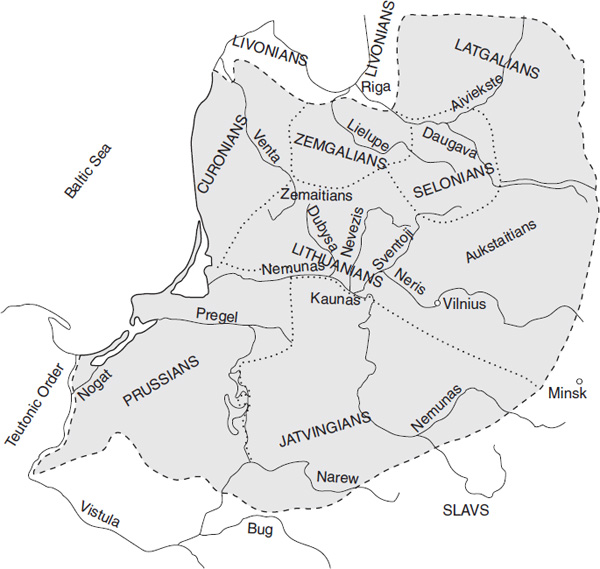

<!-- page: 486 -->

# Chapter 2

# **Baltic**

*Steven Young*

## **Introduction**

The Baltic language family is represented by Lithuanian and Latvian; a third major Baltic language, Old Prussian, became extinct by the beginning of the eighteenth century. Lithuanian and Latvian are traditionally grouped together as East Baltic, in contrast to Old Prussian (West Baltic); from a historical perspective, Lithuanian and Latvian may be viewed as representing core dialects within a Baltic (or Balto-Slavic) dialectal continuum, with Old Prussian as peripheral (Toporov 2006: 20–21). The original Baltic-speaking territory was once much larger, extending eastward into the upper Dniepr river basin and beyond.1 These Baltic populations, among them the *Goljadь* (Balt. *Galind*-*) of the eleventh- and twelfth-century Russian chronicles, were eventually assimilated by the eastern Slavs, a process continuing into modern times as former Lithuanian-speaking communities in what is now Belarus have become Slavicized. The paucity of surviving Baltic languages is somewhat compensated by the rich dialectal diversity within these languages; a number of dialectal features are undoubtedly due to the substratum influence of now-extinct Baltic languages – Curonian, Zemgalian, Jatvingian, and Selonian – about which little is known linguistically. An additional source of Baltic linguistic data are the many early (Bronze Age) Baltic borrowings into Baltic Finnic (see especially Kallio 2008) and Volga Finnic.

No common ethnonym for the ancestral Balts survives in the Baltic languages. The terms “Balt” and “Baltic” are secondary, after the name of the Baltic Sea (*mare Balticum* first appears in the eleventh century). The use of Baltic for the language family was first proposed in 1845 by Königsberg professor Georg H. F. Nesselmann in the introduction to his *Die Sprache der alten Preussen* (p. xxix). The lack of a common ethnographic designation is suggestive of the greater time depth and diffuse nature of the Baltic languages in comparison with the closely related (and more monolithic) Slavic language family; the reality of a Baltic protolanguage has even been questioned (Birnbaum 1970: 70–71). Lexical differences among the Baltic languages, and even between East Baltic Lithuanian and Latvian, can be quite striking. For example, Latvian and Lithuanian (together with Old Prussian) preserve different Indo-European words for ‘son’: Lith. *sūnùs*, OPruss. *soūns* (cf. OCS *synъ*, OInd. *sūnúḥ*), but Latv. *dȩ̂ls*, related to Lat. *fīlius*; Lith. *kraũjas* ‘blood’, OPruss. *crauyo*, *krawia* (cf. OCS *krъvь*), but Latv. *asins*, an Indo-European *r*/*n* heteroclite cognate with OInd. *ásr̥k*, gen. sg. *asnáḥ*; Lith. *kárvė* ‘cow’ (cf. Russ. *koróva*), OPruss. *curwis* ‘ox’, but Latv. *gùovs* ‘cow’, continuing PIE *gʷeh₃us.

<!-- page: 487 -->

Nevertheless, the notion of Common Baltic is justified by a number of characteristic innovations among the Baltic languages. These include a refashioned verb system, with the loss of a number distinction in the third person and the generalization of an -*a* (PIE *-o) theme vowel in the present tense; a widespread nominal stem type in -*ē*; a number of common diminutive formations; an -*st-* formant in the present tense marking middle/intransitive meaning; and many characteristic lexical items, among them Lith. *lãbas*‘good’, Latv., OPruss. *labs*; Lith. *ą́žuolas* ‘oak’, Latv. *uôzuõls*, OPruss. *ansonis*; Lith. *bríedis* ‘stag, elk’, Latv. *briêdis*, OPruss. *braydis*; Lith. *pelė̃* ‘mouse’, Latv., OPruss. *pele*; Lith. *turė́ti* ‘to have’, Latv. *turêt*, OPruss. *turīt*; see Stang 1966: 7–9.

**Map 11.1 Baltic tribes at the beginning of the second millenium ad**

Source: *Lithuanian Encyclopedia*, Boston: Lithuanian Encyclopedia Press, Inc., vol. II, 1954: 148

### **Early texts and the emergence of standard languages**

<!-- page: 488 -->

The oldest known text in a Baltic language is the Basel Epigram, two rhymed lines in Old Prussian from the mid-fourteenth century (see McCluskey, Schmalstieg, & Zeps 1975). The oldest more substantial text is the Elbing Vocabulary, a German–Old Prussian word list of 802 thematically arranged nouns and adjectives, making up the final seventeen pages of the Codex Neumannianus, which dates from about 1400 and is itself a copy of an original from the early fourteenth century (Schmalstieg 1976: 68). Another, rather inferior list of some one hundred German items with Old Prussian equivalents is found in Simon Grunau’s early sixteenth-century *Preussische Chronik*. A sense of the morphology of Old Prussian is revealed in three sixteenth-century translations of Lutheran catechisms from German into Old Prussian; all suffer from a rather slavish translation from the German, and therefore shed little light on Old Prussian syntax. The first two, published in 1545 (the second is a “corrected” version of the first), each consist of sixteen pages, only about a third of which is actual Old Prussian text. The third catechism, published in 1561, includes German and Old Prussian versions of Martin Luther’s Enchiridion, or small catechism. The Old Prussian text makes up about 54 pages of the 134-page publication (Kabelka 1982: 54). The third catechism is our only source of Old Prussian word stress (and syllable tone).

The earliest monuments of Latvian and Lithuanian date only from the sixteenth century, when these languages already have a modern appearance. The earliest-known Lithuanian text is a handwritten set of prayers dating from the early 1500s. Book publication in Lithuanian began in East Prussia (which had a substantial Lithuanian population at the time), in connection with the spread of the Reformation. The first book published in Lithuanian is a 1547 translation of a Lutheran catechism by Martynas Mažvydas (Martinus Masvidius). The foreword begins with a personal appeal to the reader: “*Bralei seseris imkiet mani ir skaitikiet*” ‘Brothers, sisters, take me and read’. The language reflects Mažvydas’s native South Žemaitic dialect, with Aukštaitic elements. Subsequent East Prussian Lithuanian publications are written in an increasingly normalized variety of the local West Aukštaitic dialect, codified in Daniel Klein’s 1653 *Grammatica Litvanica*, the first grammar of Lithuanian. In the Catholic Grand Duchy of Lithuania, two writing traditions emerged, one based on the East Aukštaitic dialect of Vilnius, and the other representing the Central Aukštaitic dialect of the Kėdainiai region. The latter is reflected in Mykalojus Daukša’s 1595 translation of Jacobus Ledisma’s popular Catholic catechism, and his lengthy 1599 translation from the Polish of Jakub Wujek’s collection of sermons, the *Postilla Catholicka.* Daukša’s works are the first accented texts in Lithuanian, making them a valuable source for the study of Lithuanian historical prosody. The present-day standard language has its roots in the late nineteenth century and is based on the dialect of the southern West Aukštaitic region. Among the factors in the establishment of this variety as the national standard are the prior literary tradition of the virtually identical Aukštaitic dialect of neighboring East Prussia and the authority of the Lithuanian grammars of the Indo-Europeanist August Schleicher and Friedrich Kurschat, which described the same East Prussian Lithuanian speech.

The beginnings of a Latvian literary tradition also date from the Reformation. The first book published in Latvian is a 1585 translation of a Catholic catechism; this was soon followed by other religious texts, chiefly translations. The language of these early texts is to varying degrees influenced by the German speech of the authors, especially in syntax. Efforts to establish a national standard language were begun in the mid-nineteenth century; the Latvian traditional folksongs (*daĩņas*), which preserve a number of archaic features, served as an important source for norms. A milestone in the codification and description of modern Latvian was the appearance in 1922 of Jan Endzelin’s *Lettische Grammatik* and the four-volume *Latviešu valodas vārdnīca* (*Dictionary of Latvian*) (1923–32), begun by Karl Mühlenbach (Kārlis Mīlenbahs) and completed and edited by Jan Endzelin.

### **East Baltic dialects**

<!-- page: 489 -->

There are two major dialects of Lithuanian, the more conservative (at least in its southwestern subtype) Aukštaitic (*aukštaĩčių tarmė̃*), and Žemaitic (*žemaĩčių tarmė̃*; Samogitian), spoken in the northwestern quarter of Lithuania. Žemaitic presents a number of structural and lexical similarities with Latvian, which may reflect the substratum influence of Curonian, an extinct Baltic language that was absorbed in the north by Latvian and in the south by Lithuanian.

The Latvian standard language is based on the central Latvian dialect (*vidus dialekts*), which is further divided (from west to east) into Curonian, Zemgalian, and Vidzeme varieties. The central dialect, together with Tamian in northwestern Curonia and along the northeastern coast of the Gulf of Riga, is known as Low Latvian. High Latvian (Selonian and Latgalian, the latter with an independent literary tradition; see Nau 2011), is found in the eastern third of the country. Latvian is traditionally viewed as representing a synthesis of the language of the early Latgalians (*Letthigalli*, *Lětьgola*, *Lotygola* of medieval chronicles), also known simply as Letts (*Letthi*, *Letti*), and neighboring closely related Baltic languages, now extinct, among them Zemgalian (along the Lielupe river), Curonian (in southwestern Latvia; a subtype of this dialect was spoken until the mid-twentieth century by the *kursenieki* of the Curonian Spit), and Selonian (along the middle Daugava river, extending into Lithuania).

## **Phonology**

### **Baltic vowels**

#### *The vowel system of Common Baltic*

The vowels of the Baltic languages can be derived from a Common Baltic system that, except for the merger of short *a and *o (shared by Germanic, Slavic, and Albanian) as *a (or perhaps *ɔ), reflects the vowels traditionally established for late Proto-Indo-European (for an alternative view, see the Kortlandt 1977 and 1985):

|                 |            |
|-----------------|------------|
|  *i, *ī       |   *u, *ū |
|    *e, *ē     |  *ō       |
|        *a, *ā |            |

**Table 11.1 The vowel system of common Baltic**

The long vowels of Common Baltic ultimately reflect sequences of vowel plus laryngeal, the effects of Winter’s Law (see below), and also (in the case of *ē and *ō) lengthened grade. In addition, we can establish a set of Common Baltic diphthongs consisting of *e, *a and a high vowel *i, *u (with a Balto-Slavic change of *eu \> *i̯au, see p. 480), and a set of so-called mixed diphthongs, consisting of a vowel plus sonorant (*r, *l, *m, *n). The high-vowel mixed diphthongs continue Proto-Indo-European syllabic sonorants (see p. 479f.). The long vowels and diphthongs of Common Baltic were further distinguished (as they are in Common Slavic) by a prosodic opposition conventionally referred to as acute and circumflex; these structure points were subsequently realized, for the most part, as rising and falling contour tones in the daughter languages.

<!-- page: 490 -->

The Common Baltic vowel system is fairly well reflected in the Old Prussian of the Elbing Vocabulary (EV); a notable change is the raising and rounding of the low back vowels *a (mainly after labials and velars) to *ɔ (spelled \<o\>) and *ā to *ɔ̄ (spelled \<o\> or \<oa\>; Mažiulis 2004: 17). The Old Prussian catechisms, especially the third, reflect a number of innovations in the long vowels (to the extent that one can trust the orthography, which, after all, is the representation of a non-native speaker): the raising and rounding of *ā (and some instances of *ō) to *ū after velars and labials (*mūti* ‘mother’ \< *mātē : EV *mothe*; *mergu* ‘girl’ : EV *mergo*, Lith. *mergà*), the raising of *ē to *ī (*īst* ‘to eat’ : Lith. *ė́sti*, Latv. *êst* \< *ēd-; Mažiulis 2004: 16) and the (inconsistent) diphthongization of acute high vowels: *geīwan* ‘life, acc. sg.’, alongside *gīwan*, *gijwan*; *boūton*, *baūton* ‘to be’ alongside *būton*. Distinctive length was lost in unstressed syllables (Mažiulis 2004: 14).

#### *The vowel system of East Baltic*

The somewhat skewed vowel system of Common Baltic, in which *ō (with a close articulation: *ọ̄) lacks a short counterpart, emerges as a more balanced system in East Baltic. Here, the apparently quite open inherited pair *e, *ē was reinterpreted as the front counterpart of *a, *ā; the resulting gap in the system was filled by a new long front mid-vowel with a close articulation, *ẹ̄ (parallel to *ọ̄), which developed under uncertain conditions from the diphthongs -*ei̯*- and -*ai̯*-, preserved in Old Prussian (for a detailed discussion, see Karaliūnas 1987: 152–179); compare Lith. *sniẽgas* ‘snow’, Latv. *snìegs* and OPruss. *snaygis*; Lith. *diẽvas* ‘God’, Latv. *dìevs* and OPruss. *deiwas*, as well as the Baltic Finnic borrowings Finn. *taivas* ‘sky, heaven’, Est. *taevas*; Finn. *heinä* ‘hay’ \< CBalt. *šeĩna-, Lith. *šiẽnas*. The new *ẹ̄, together with its back counterpart *ọ̄, gave rise to the East Baltic “gliding” diphthongs, *ie*, *uo* (approximately \[ɪ͡ə\], \[ʊ͡ə\]).2

|               |                |
|---------------|----------------|
|  *i, *ī     |    *u, *ū    |
|   *ẹ̄ (\> ie) |    *ọ̄ (\> uo) |
|   *e, *ē    |   *a, *ā     |

**Table 11.2 The vowel system of East Baltic**

This realignment of the East Baltic system of long vowels was reflected in ablaut alternations, which were still productive at this period. Rather than the inherited alternation of an *ē-*grade opposing *ō-*grade, the productive pattern now becomes *ē ~ ā*, parallel to the *e* ~ *a* that continues Indo-European *e* ~ *o*; cf. Lith. *sodìnti* ‘to plant’ (*sād-), the causative to *sēd- ‘to sit’. Lith. *súodys* ‘soot’, Latv. *suôdrẽji*, with old *ō*-grade *sōd- to *sēd- ‘to sit’, and Lith. *úodas* ‘gnat, mosquito’, Latv. *uôds*, with old *ō*-grade *ōd- to *ēd- ‘to eat’, are isolated relic forms.

#### *The vowel system of Lithuanian*

<!-- page: 491 -->

The above vowel system underlies later individual developments in Lithuanian and Latvian and their dialects. In both Lithuanian and Latvian, the high vowels and the short vowels have remained fairly faithful to the Common East Baltic system. Characteristic of the development of the Lithuanian vowel system was the repeated raising of long low vowels, with new low vowels emerging to take their place. The inherited long low ***ē and *ā acquired a more close articulation and rose to fill the mid-vowel gaps created by the diphthongization of earlier ***ẹ̄ and *ọ̄: *ė̃jo* ‘went’ \< *ē̃i̯ā (the new, close mid-vowel *ē* is spelled \<*ė*\>). The vacated slots were in turn filled by new long low vowels (the *e*, *ē* are quite open and can be represented as *ɛ*, *æː*), resulting from the denasalization of nasalized vowels; the latter arose from sequences of a short vowel plus tautosyllabic *n* before a continuant or in final position. Since this development post-dates the appearance of printed texts, the orthography reflects nasalization, denoted by a hook under the corresponding vowel character: *žąsìs* \[ɑː-\] ‘goose’, *tę̃sti* \[æ̃ː-\] ‘to continue’, *sių̃sti* \[-ũː-\] ‘to send’, *į̃*\[ĩː-\] ‘into’. The functional load of the new *ā* and its *ē* counterpart was augmented by the results of a lengthening under stress (with concomitant circumflex tone) of most non-final short *e and *a; vowel length here is not indicated orthographically: *ledas* \['lʲæ̃ːdas\] ‘ice’, *vakaras* \['vɑ̃ːkaras\] ‘evening’ (compare Latv. *lȩdus*, *vakars*, which preserve short *e* and *a*). There are exceptions to this general lengthening: infinitive roots (and derived forms) with a short low vowel remain short: *vèsti* ‘to lead’, *ràsti* ‘to find’, *vèsk!* ‘lead!’, *ràsk!* ‘find!’, *vèsiu* ‘(I) will lead’, *ràsi* ‘(you) will find’, as do the possessive pronouns *màno* ‘my’, *tàvo* ‘your’, *sàvo* ‘his/her/its/one’s’, leading to the possibility of minimal pairs such as *mãno* ‘thinks’ : *màno* ‘my’.

After palatalized consonants and *j*, -*a-* and -*ā-* merge with *e-*, *-ē-*, respectively: *giliàs* ‘deep, acc. pl. f.’, and *gilès* ‘acorn, acc. pl.’, are homophonous: \[gʲɪˈlʲɛs\]), as are *gìlę* ‘acorn, acc. sg.’, and *gìlią* ‘deep, acc. sg. f.’: \['gʲɪlʲæː\] (Girdenis 2003: 194).

The above changes result in the following vowel system for the Lithuanian standard language, represented in a broad phonetic transcription (corresponding graphemes are given in brackets):

|                                                         |                            |                                           |
|---------------------------------------------------------|----------------------------|-------------------------------------------|
| ɪ \<i\>, iː \<*y, į*\>                                  |   ʊ \<*u*\>, uː \<*ū, ų*\> |                                           |
|  ẹː \<*ė*\>                                             |  ọː \<*o*\>                |                                           |
|   ɛ \<*e, ia*\>, æː \<*e, ia* (under stress); *ę, ią*\> |                            | a \<*a*\>, ɑː \<*a* (under stress); *ą*\> |

**Table 11.3 The vowel system of Lithuanian**

This system has been rounded out by new short mid-vowel counterparts of *ẹ̄* and *ọ̄*, but these (in particular *ẹ*) may be considered marginal phonemes, characteristic of borrowed words.

This inventory of Lithuanian vowels is supplemented by the “gliding” (*sutaptìniai*) diphthongs *ie* and *uo* (ɪ͡ə, ʊ͡ə), which arose from East Baltic *ẹ̄ (\< *ei) and *ọ̄ (\< *ō) and function as long monophthongs, and by the pure diphthongs *au*, *ai*, *ei*, *ui*, and the mixed diphthongs, composed of a short vowel plus tautosyllabic sonorant: *i*, *u*, *e*, *a + r*, *l*, *m*, *n*.

#### *The vowel system of Latvian*

The Latvian vowel system generally reflects that of Common East Baltic, apart from a split in the quality of the low front vowels, originally conditioned by the nature of a following vowel: *e*, *ē* acquired a more close articulation before front vowels and palatal consonants; otherwise, they retained a more open articulation. Subsequent phonological and morphological processes rendered this split phonemic: *nesu* \['næsu\] ‘(I) carry’ : *nesu* \['nɛsu\] ‘(I) carried’. The distinction between open and close *e*, *ē* is not reflected in Latvian orthography, although in linguistic texts the open *e*, *ē* is often denoted by *ȩ*, *ȩ̄*: the above “*nesu*” would thus be disambiguated as *nȩsu* \['næsu\] : *nesu* \['nɛsu\]. Long vowels are denoted in standard orthography with a macron. In linguistic works that include information on tone, the macron is replaced by one of the diacritics for tone; thus, the standard spelling *rīt* is a homograph for *rĩt* ‘to swallow’ and *rît* ‘tomorrow’.

|           |           |
|-----------|-----------|
|  i, iː    |     u, uː |
|   ɛ, ɛː   |           |
|     æ, æː |   a, ɑː   |

**Table 11.4 The Vowel System of Latvian**

<!-- page: 492 -->

The functional load of the long high vowels *ī* and *ū* and the gliding diphthongs *ie*, *uo* (*ẹ̄ \< *ei̯, *ai̯; *ọ̄) has been augmented by the results of a denasalization of the tautosyllabic sequences *in, *un; *en, *an, respectively: *mĩt* ‘to tread’ : Lith. *mìnti*; *jùtu* ‘(I) feel’ : Lith. *juntù*; *pìeci* ‘five’ : Lith. *penkì*; *rùoka* ‘hand, arm’ : Lith. *rankà*. Occasional exceptions to this process are generally assumed to reflect substratum borrowings from the now-extinct Curonian, which did not undergo the change: *meñca* ‘cod’, *dziñtars* (alongside *dzĩtars*) ‘amber’, *riñda* ‘row, line’.

The inventory of Latvian syllabics includes the pure diphthongs, among them *ei*, *ai*, *au*; the gliding diphthongs *ie* and *uo*, which function (as they do in Lithuanian) as long monophthongs (*uo* is spelled \<*o*\> in standard orthography but retained in linguistics texts, especially when syllable tones are marked), a practice adopted in this chapter: *rùoka* ‘hand, arm’, otherwise spelled *roka*); and the mixed diphthongs, composed of a short vowel plus tautosyllabic sonorant, although most instances involving tautosyllabic -*n-* will have become high vowels or gliding diphthongs (see above).

Characteristic of Latvian is the tendency to shorten final syllables in disyllabic and polysyllabic words.3 Word-finally, all short vowels, with the exception of -*u*-, disappear: *vìlks* ‘wolf’ : Lith. *vil̃kas*; *ass* ‘axle’ : Lith. *ašìs*; *met* ‘throws’ : Lith. *mẽta*; but (with -*u*-) *mȩdus* ‘honey’ : Lith. *medùs*. Long vowels and diphthongs are shortened, with *ai*, *ei*, *ie* reduced to *i*, and *au*, *uo* to *u*: *rùokas* ‘hands, arms’ : Lith. *rañkos* (*-ās); *lâcis* ‘bear’ : Lith. *lokỹs* (*-īs); *saki* ‘(you) say’ : Lith. *sakaĩ*; *saku* ‘(I) say’ : Lith. *sakaũ*; *mȩdus* ‘honey, gen. sg.’ (thus homonymous with nom. sg. *mȩdus*) : Lith. *medaũs*. Long vowels and diphthongs are preserved in monosyllabic forms: *tà* ‘that, gen. sg. m.’ : Lith. *tõ*, *tài* ‘that, dat. sg. f.’ : Lith. *taĩ*; *tiẽ* ‘that, nom. sg. m.’ : Lith. *tiẽ*.

### **Prosodic structure**

The prosodic evidence of the Baltic languages (together with that of Slavic) provides crucial information for reconstructing aspects of the phonological and accentual systems of Proto-Indo-European. In Common Baltic, as noted above, all long syllabics (long vowels or diphthongs, including sequences of vowel plus tautosyllabic sonorant) were characterized by a prosodic opposition of acute and circumflex, which have varied reflexes in the daughter languages.

#### *Tonal oppositions in Lithuanian*

In standard Lithuanian, acute and circumflex are distinguished on stressed long vowels and diphthongs. Acute is realized as a falling tonal contour (in a mora analysis, the first mora is stressed), while circumflex is level or slightly rising (stress on the second mora of a long syllable). The tonal opposition is perceptually clearest on pure diphthongs: (acute) *šáuk!* ‘shoot!’ : (circumflex) *šaũk!* ‘shout!’ The tones are indicated in reference works by diacritics: acute by ´ (placed over the first element of a diphthong) and circumflex by ˜ (placed over the second element of a diphthong). Short stressed vowels, which do not distinguish tone, are marked in reference works with a grave accent (\`); the grave is also used (in place of an acute diacritic) over a high vowel in an acute mixed diphthong: -*ìr*-, -*ùl*-.

<!-- page: 493 -->

The tonal contours of the standard language may be viewed as representing a point in a continuum of dialectal tonal variation. In most of Žemaitija, particularly the northwest, acute is a broken tone (*laužtìnė príegaidė* \[ˆ\]), a rising-falling contour interrupted at its peak by a glottal stop; in eastern Žemaitija and neighboring western Aukštaitic areas it weakens to the so-called Stosston (*stumtìnė príegaidė*), which has a sudden rise followed by a falling contour. Further east, the acute loses its characteristic “Stoss” to become a simple falling tone. This is the variant of acute that has entered the linguistic literature (through the work of Friedrich Kurschat, who was the first to provide a description of the Lithuanian tones, based on his own East Prussian Lithuanian dialect) and is considered normative. Circumflex has a weak rising-falling contour in Žemaitija and western Aukštaitija, which, in moving east, “flattens out” on long monophthongs to simple length (protracted tone, *tęstìnė príegaidė*).

Unlike the Žemaitic dialects, where the peak of intensity for both acute and circumflex diphthongs occurs in the initial part of a syllable, Aukštaitic acute has its peak of intensity on the first element of a diphthong (which, if a low vowel, is lengthened: *kélti* ‘to raise’ \[ˈkʲǽˑlʲtʲɪ\], while the circumflex reaches its peak on the second element of a diphthong, resulting in contour tones that are more stress- (or mora-) based than pitch-based; this is reflected in the Lithuanian terms for the tones: *tvirtaprãdė (príegaidė)* “strong-initial (tone)” for acute and *tvirtagãlė (príegaidė)* “strong-final (tone)” for circumflex.

#### *Saussure’s Law and Leskien’s Law*

While the acute and circumflex tonal opposition in modern Lithuanian is distinguished only on stressed syllables, tones (or their prosodic antecedents) must once have characterized all long syllables, stressed and unstressed. This is shown by an earlier advancement of the ictus from a short or circumflex syllable to an adjacent acute syllable that had previously been unstressed: (nominal inflection) acc. sg. *rañką* ‘hand, arm’, but nom. sg. *rankà* (*ā́); (nominal derivation) *kiaũlė* ‘pig’ + *-íen-a* ‘meat of *x*’ \> *kiaulíena* ‘pork’; (verbal inflection) *lõšia* ‘plays’ : *lošiù* (*-úo) ‘(I) play’; (verbal derivation) *laĩko* ‘holds, keeps’ + *-ý-ti* (verb class marker, infinitive suffix) \> *laikýti* ‘to hold, keep’. This progressive shift in ictus onto a following acute syllable was first recognized and described by Ferdinand de Saussure (Saussure 1896: 157) and is therefore known as Saussure’s Law.4 In final syllables, the results of the operation of Saussure’s Law were obscured by a late post-dialectal process known as Leskien’s Law, according to which (for disyllabic and polysyllabic words) word-final acute syllables (including *íe* and *úo*) were shortened, forfeiting tone: *rankā́ \> *rankà*. The gliding diphthongs *íe* and *úo* were replaced by *ì* and *ù*; compare the long-form (definite) adjectives nom. pl. m. *geríeji* ‘good’, instr. sg. m. *gerúoju*, with the short forms *gerì*, *gerù*, which show the effects of Leskien’s Law. Diphthongs did not shorten but underwent metatony (change of tone) from acute to circumflex: *matáu \> *mataũ* ‘(I) see’ *matái \> *mataĩ* ‘(you) see’. The third-person future forms are exceptional in that non-high long monophthongs in both monosyllabic and polysyllabic words retain length, with circumflex metatony: *duõs* ‘give, 3 sg. fut.’ : inf. *dúoti*; *dė̃s* ‘put, 3 sg. fut.’ : inf. *dė́ti*; *žinõs* ‘know, 3 sg. fut.’ : inf. *žinóti*. Monosyllabic third-person future forms with acute high vowels were shortened: *bùs* ‘be, 3 sg. fut.’ : inf. *bū́ti*; *lìs* ‘rain, 3 sg. fut.’ : inf. *lýti*.

As a result of Saussure’s Law, the fixed and mobile nominal accent paradigms inherited from Common Baltic each underwent a split into two paradigms, resulting in the four accent paradigms of modern Lithuanian: a.p. 1: fixed stress (non-stem-final ictus, or stem-final acute), a.p. 2: fixed stress with an overlay of Saussure’s Law (stem-final short or circumflex), a.p. 3: mobile stress (non-stem-final ictus, or stem-final acute), and a.p. 4: mobile stress plus an overlay of Saussure’s Law (stem-final short or circumflex).

<!-- page: 494 -->

|              |     |               |     |                    |     |                   |     |                 |
|--------------|-----|---------------|-----|--------------------|-----|-------------------|-----|-----------------|
|              |     | **a.p. 1**    |     | **a.p. 2**         |     | **a.p. 3**        |     | **a.p. 4**      |
| **singular** |     |               |     |                    |     |                   |     |                 |
| nom.         |     | *výras* ‘man’ |     | *pir̃štas* ‘finger’ |     | *lángas* ‘window’ |     | *vil̃kas* ‘wolf’ |
| gen.         |     | *výro*        |     | *pir̃što*           |     | *lángo*           |     | *vil̃ko*         |
| dat.         |     | *výrui*       |     | *pir̃štui*          |     | *lángui*          |     | *vil̃kui*        |
| acc.         |     | *výrą*        |     | *pir̃štą*           |     | *lángą*           |     | *vil̃ką*         |
| instr.       |     | *výru*        |     | *pirštù*           |     | *lángu*           |     | *vilkù*         |
| loc.         |     | *výre*        |     | *pirštè*           |     | *langè*           |     | *vilkè*         |
| voc.         |     | *výre*        |     | *pir̃šte*           |     | *lánge*           |     | *vil̃ke*         |
| **plural**   |     |               |     |                    |     |                   |     |                 |
| nom.         |     | *výrai*       |     | *pir̃štai*          |     | *langaĩ*          |     | *vilkaĩ*        |
| gen.         |     | *výrų*        |     | *pir̃štų*           |     | *langų̃*           |     | *vilkų̃*         |
| dat.         |     | *výrams*      |     | *pir̃štams*         |     | *langáms*         |     | *vilkáms*       |
| acc.         |     | *výrus*       |     | *pirštùs*          |     | *lángus*          |     | *vilkùs*        |
| instr.       |     | *výrais*      |     | *pir̃štais*         |     | *langaĩs*         |     | *vilkaĩs*       |
| loc.         |     | *výruose*     |     | *pir̃štuose*        |     | *languosè*        |     | *vilkuosè*      |

Table 11.5 Lithuanian accent paradigms for ***a-***stem nouns

#### *Tonal oppositions in Latvian*

In Latvian, tonal oppositions are found on (long) initial syllables, since initial stress has been generalized under the influence of neighboring Baltic Finnic languages (Stang 1966: 46). As in Lithuanian practice, the tones are indicated with diacritics in linguistic reference works; otherwise, they are not represented. Three phonemic tones are distinguished in the prosodically more conservative dialect of central Vidzeme: sustained (or weakly rising) tone (*stìeptā intonācija*, denoted by ˜, which in diphthongs is placed over the second element): *mãte* ‘mother’ (Lith. *mótė*), *saũle* ‘sun’ (Lith. *sáulė*), *til*̃*ts* ‘bridge’ (Lith. *tìltas*); broken tone5 (*laûztā intonācija*, denoted by ˆ, which in diphthongs is placed over the second element): *rîts* ‘morning’ (Lith. *rýtas*), *gal̂va* ‘head’ (Lith. *gálvą*, acc. sg.), *bût* ‘to be’ (Lith. *bū́ti*); and falling tone (*krìtošā intonācija*, denoted by \`, which is placed over the first element of a diphthong): *rùoka* ‘hand, arm’ (Lith. *rañką*, acc. sg.), *dràugs* ‘friend’ (Lith. *draũgas*), *pìrkt* ‘to buy’ (Lith. *pir̃kti*). Tonal minimal pairs (or triplets) include *àust* ‘to dawn’ : *aûst* ‘to weave’; *rĩt* ‘to swallow’ : *rît* ‘tomorrow’; *tã* ‘that, nom. sg. f.’ : *tà* ‘that, gen. sg. m.’ : *tâ* ‘thus’; *mĩt* ‘to tread’ (Lith. *mìnti*), *mît* ‘to change, exchange (arch., poetic)’, *mìt* (inf. *mist*) ‘lives, dwells’ (Lith. *miñta* ‘feeds on, nourishes oneself’).

Most Latvian dialect areas distinguish only two of these three tones. High Latvian has lost the distinction between falling and sustained tone in favor of falling; outside of High Latvian, broken and falling tone merge as either broken (in Kurzeme and Zemgale) or falling (Vidzeme), opposing sustained tone. The classic dictionary of Latvian, Mṻlenbachs-Endzelīns (Mṻlenbachs 1923–32), uses a superscript **2** to indicate forms taken from dialect areas in which only two tones are distinguished.

#### *Endzelin’s Law*

<!-- page: 495 -->

It follows from the above comparisons that Latvian sustained and broken tone both correspond to Lithuanian falling tone. In what has since become known as Endzelin’s Law, Jan Endzelin (1899: 267–268; 1922: 22) demonstrated that Latvian sustained tone corresponds to Lithuanian falling tone in a fixed-stress paradigm (a.p. 1): Latv. *brãlis* ‘brother’ : Lith. *brólis*; Latv. *ber̃zs* ‘birch’ : Lith. *béržas*, while Latvian broken tone corresponds to Lithuanian falling tone in a mobile paradigm (a.p. 3; that is, where there is an alternation between final and initial stress throughout the forms of a paradigm): Latv. *dzîvs* ‘alive’ : Lith. *gývas, gyvà* (nom. sg. m./f.); Latv. *sir̂ds* ‘heart’ : Lith. *širdìs*, *šìrdį* (nom./acc. sg.). The remaining Latvian tone, falling, corresponds to Lithuanian rising tone (circumflex) in both fixed (a.p. 2) and mobile (a.p. 4) paradigms: Latv. *rùoka* ‘hand, arm’ : Lith. *rankà, rañką* (nom. sg., acc. sg.; a.p. 2); Latv. *zùoss* ‘goose’ : Lith. *žąsìs, žą̃sį* (nom. sg., acc. sg.; a.p. 4); Latv. *dràugs* ‘friend’ : Lith. *draũgas* (a.p. 4); Latv. *dzìmt* ‘to be born’ : Lith. *gim̃ti*.

A phonetic motivation for the twofold reflex of Baltic acute in Latvian was first proposed by Richard Ekblom (1933: 69), who connected the development of Latvian broken tone with stress retraction onto an initial syllable. If this syllable was acute (which he assumed to be rising tone), it underwent an abrupt rise in pitch under new stress, leading to a “break” (“Umbruch”) in the syllable, represented by glottal closure and release. But an association between retracted stress and broken tone presents a number of difficulties and contradictions, which are avoided if broken tone, rather than sustained (or rising) tone, is taken to be primary; see Young 1994.

As a result of the distribution associated with Endzelin’s Law, Latvian occasionally preserves more information about the original fixed or mobile accent paradigm of an acute base than Lithuanian does. For example, the evidence of Latvian is needed in order to establish the original accentual class of disyllabic adjectives, since Lithuanian has generalized the mobile accent paradigm here: Latv. *bal*̃*ts* ‘white’, *il*̃*gs* ‘long’, *pil*̃*ns* ‘full’ indicate original fixed stress, while Lith. *báltas*, *-à*; *ìlgas*, *-à*; *pìlnas*, *-à* are secondarily mobile (a.p. 3). Latvian also continues an original fixed or mobile accent paradigm in infinitive forms, where Lithuanian provides no direct information: *aûgt* (Lith. *áugti*) ‘to grow’, *bêgt* (Lith. *bė́gti*) ‘to run’, *duôt* (Lith. *dúoti*) ‘to give’ point to original mobile stems, while *drãzt* (Lith. *dróžti*) ‘to carve’, *sẽt* (Lith. *sė́ti*) ‘to sow’, *šaũt* (Lith. *šáuti*) ‘to shoot’ reflect original fixed stress.

#### *Tonal oppositions in Old Prussian*

The Old Prussian Enchiridion also points to a tonal distinction between acute and circumflex. Assuming the traditional view that the macron that appears on vowel graphemes indirectly reflects stress (the macron marks long vowels, which were preserved only under stress), the representation of diphthongs with either the first or second element marked by a macron would suggest a falling or rising tonal contour (Fortunatov 1880: 153ff.; for a discussion of tones and tonal marking in Old Prussian, see Derksen 1998). Old Prussian examples reflecting Baltic circumflex include *ēit* ‘goes’ : Lith. *eĩti* ‘to go’; *lāiku* ‘(they) hold to, keep’ : Lith. *laĩko*; *āusins* ‘ear, acc. pl.’ : Latv. *àuss*, Lith. *aũsį* (acc. sg.). Among examples of Baltic acute are *kaūlins* ‘bone, acc. pl.’ : Lith. *káulus* (acc. pl.); *pogaūt* ‘to receive, get’ : Lith. *pagáuti* ‘to catch’; *aīnan* ‘one, acc. sg. f.’ : Lith. *víeną* (acc. sg.). Moreover, acute (but not circumflex) *ī* and *ū* often diphthongize to *ei*, *ou (au)*, allowing for placement of the macron on the second element of the diphthong (*eī*, *oū*): *boūt* ‘to be’ : Latv. *bût*, Lith. *bū́ti*; *soūns* ‘son’ : Lith. *sū́nų* (acc. sg.); *geīwans* ‘alive, acc. sg.’ : Lith. *gývas.* In the Elbing Vocabulary, a number of forms containing a diphthong that have circumflex counterparts in East Baltic show apparent lengthening of the first element, suggesting falling tone for circumflex: *doalgis* \< *dɔ̄lgis \< *dālgis ‘scythe’ : Lith. *dal̃gis*; *moasis* ‘bellows’ \< *mɔ̄(i)sis \< *mā(i)sis : Lith. *maĩšas* ‘bag’ (Mažiulis 2004: 14).

#### *Interpretation of Baltic tonal correspondences*

<!-- page: 496 -->

We arrive at the following sets of tonal correspondences for the Baltic languages (the diphthong *au* here represents all long syllabics): Latv. *àu* (falling tone) = OPruss. *āu*(falling tone) = Lith. *aũ* (rising tone) for Baltic circumflex; and Latv. *aũ*/*aû* (rising or broken tone) = OPruss. *aī* (rising tone) = Lith. *áu* (falling tone) for Baltic acute. These equations, supported by the evidence of Slavic (as traditionally presented), led to the assumption of a falling pitch contour for circumflex and a rising pitch contour for acute in Proto-Baltic (and Balto-Slavic). Lithuanian was assumed to have undergone an inversion of tonal contours (see p. 481).

This statement of tonal correspondences has served as a traditional point of departure in discussions of Balto-Slavic tonogenesis. But acoustic studies by Aleksas Girdenis and Antanas Pakerys have shown that the Lithuanian tones (on diphthongs) differ more in the nature of the first component of the diphthong than in a prosodic contrast between the first and second components (Girdenis 2003: 288). Listening experiments using reverse recordings have shown that speakers of both Žemaitic and West Aukštaitic dialects of Lithuanian distinguish tones reproduced in the reversed direction just as well as original tones (Girdenis 2003: 273), which would not be expected if the primary exponent of tone was a rising or falling pitch contour. An acoustic characterization of the tones of prosodically conservative (North) Žemaitic Lithuanian is instructive here: for acute, acoustic energy is concentrated at a single point in the syllable nucleus and changes abruptly; circumflex is characterized by a lack of concentrated energy. A pitch contour in acute syllables can be explained as a side effect of the glottalization associated with broken tone (Vaillant 1936: 114–115, 1950: 244–245; Girdenis 2003: 272). This suggests that it is the broken (glottalized) tone of the Žemaitic Lithuanian dialects and Latvian that is the original reflex of Proto-Baltic (Balto-Slavic) acute.

### **Baltic consonants**

#### *The Proto-Baltic consonant system*

The Proto-Baltic consonant system, which is essentially identical to that of Balto-Slavic (except perhaps for the Balto-Slavic reflex of the PIE palatovelars as *ś* and *ź*),6 may be represented as follows:

|            |     |                 |     |                 |     |                 |     |                            |
|------------|-----|-----------------|-----|-----------------|-----|-----------------|-----|----------------------------|
|            |     | *labial*        |     | *dental*        |     | *alveopalatal*  |     | *velar*                    |
| stops      |     |                 |     |                 |     |                 |     |                            |
|  voiceless |     | p               |     | t               |     |                 |     | k                          |
|  voiced    |     | b (PIE *b, bʰ) |     | d (PIE *d, dʰ) |     |                 |     | g (PIE *g, gʰ; *gʷ, gʷʰ) |
| fricatives |     |                 |     |                 |     |                 |     |                            |
|  voiceless |     |                 |     | s               |     | š               |     |                            |
|  voiced    |     |                 |     |                 |     | ž (PIE *ǵ, ǵʰ) |     |                            |
| nasals     |     | m               |     | n               |     |                 |     |                            |
| liquids    |     |                 |     | l, r            |     |                 |     |                            |
| glides     |     | w               |     |                 |     | y               |     |                            |

**Table 11.6 The Proto-Baltic Consonant System**

Although the reflexes of Indo-European aspirated and plain voiced stops have merged as plain voiced segments, the original distribution is maintained in an adjacent syllabic: those preceding an original plain voiced stop are lengthened (if short monophthongs) and acquire acute tone. This process, known as Winter’s Law, is illustrated by the following sets of correspondences:7

- PBalt. *b \< PIE *bʰ, with circumflex base: Lith. *žem̃bti* ‘to cut, hew’, 3 sg. pres. *žem̃bia*: PIE *ǵembʰ- ‘to snatch, bite’, LIV2 162;
- PBalt. *b \< PIE *b, with acute base: Lith. *obuolỹs* ‘apple’, acc. sg. *óbuolį*; Latv. *âbuõls*: PIE *h₂ebōl;
- PBalt. *d \< PIE *dʰ, with short base: Lith. *vèsti* ‘to lead’, 3 sg. pres. *vẽda*; Latv. *vȩd*: PIE *wedʰ- ‘to lead’, LIV2 659;
- PBalt. *d \< PIE *d, with acute base: *skíesti* ‘to dilute’, 3 sg. pres. *skíedžia*, Lith. dial. *skáidrus* ‘clear’; Latv. *skaĩdrs*: PIE *skˊʰeyd- ‘to split, separate, tear’, LIV2 547–548;
- PBalt. *g \< PIE *gʰ and *gʷʰ, with circumflex base: Lith. *algà* ‘wages, pay’, acc. sg. *al̃gą*; Latv. *àlga*; OPruss. gen. sg. *ālgas*: PIE *h₂elgʷʰ- ‘to earn, yield (revenue)’, LIV2 263;
- PBalt. *g \< PIE *g and *gʷ, with acute base: Latv. *raũgs* ‘pupil (eye)’, *raũdzît* ‘to see’: Gr. (Hesychius) ῥουγός : πρόσωπον;
- PBalt. *ž \< PIE *ǵʰ, with circumflex base: Lith. *liẽžti* ‘to lick’, 3 sg. pres. *liẽžia*; Latv. (with *o*-grade) *làizît*: PIE *leyǵʰ- ‘to lick’, LIV2 404;
- PBalt. *ž \< PIE *ǵ, with acute base: Lith. *mélžti* ‘to milk’, 3 sg. pres. *mélžia*: PIE *h₂melǵ- ‘to milk’, LIV2 279.

#### *Centum/satǝm in Baltic*

While the Baltic reflexes of PIE *kˊ, *ǵ, *ǵʰ are generally alveopalatal fricatives (a *satǝm* development: Lith. *šim̃tas* ‘hundred’ \< PIE *kˊm̥tóm), there are occasional examples in which they continue as pure velars (a *centum* treatment). There are interesting correlations with Slavic, in which one language family or the other shows the exceptional *centum* development: Lith. *šeivà*, Latv. *saĩva* ‘bobbin’ : CS *koiu̯ā in Russ. *цевка*; Lith. *šérti* ‘to feed’ : CS *kormъ ‘fodder’; Lith. *žvaizdė̃* (standard *žvaigždė̃* ) ‘star’ : CS *gvězda; but with the opposite development in Lith. *klausýti* ‘to listen’, 3 sg. pres. *klaũso*: OCS *slyšati* ‘to hear’ (PIE *kˊlews- ‘to hear, listen’, LIV2 336). Phonetic motivations have been sought for such exceptions, but these would still not account for lexical doublets such as Lith. *akmuõ* ‘stone’ : *ašmuõ* (standard *ãšmenys*, pl.) ‘blade’, Lith. *kiẽmas* (\< *keĩmas) ‘yard’ : *šeimà* ‘family’, Lith. *kaũkti* ‘to howl’ : *šaũkti* ‘to shout’.

#### *The *RUKI* rule in Baltic*

Another source for Proto-Baltic *š is the historical process known as Pedersen’s Law or the *ruki* rule: the change of -*s-* to -*š-* after *k*, *r*, or the high vowels *ī̆*, *ū̆*, operating in Baltic (unlike Slavic) before consonants as well as vowels. In Baltic, the change is regular after -*r*-: Lith. *viršùs* ‘top’ (cf. ORuss. *vьrxъ*), Lith. *pir̃štas* ‘finger’ (cf. ORuss. *pьrstъ,* without the change). Reliable examples with -*k-* are difficult to find, although the frequent appearance of secondary *kš-* makes it likely that the process took place here as well (Stang 1966: 96). Lithuanian generally preserves -*s-* after the high vowels: *saũsas* ‘dry’ : OCS *suxъ*; *ausìs* ‘ear’ : OCS *uxo*; *mùsos* ‘moss’ : OCS *mъxъ*; *vìsas* ‘all’ : WSlav. *vš-*, ORuss. (Novgorod) *vъxъ*; *víesulas* ‘whirlwind’ : RussCS *vixъrь*, Lith. dial. *trisù* ‘three, loc.’ : OCS *trьxъ*, OInd. *triṣú*. But there are a few examples that in fact reflect the rule: *aušrà* ‘dawn’ (but dial. *austrà* \< *ausrā̂), *vetušas* ‘old (arch.)’ : OCS *vetъxъ*, *maĩšas* ‘bag’ : OCS *měxъ*, *jū́šė* ‘fish soup’ : Russ. *uxá*. This lack of consistency may result from Baltic being on the periphery for the diffusion of this areal feature (Stang 1966: 99).

<!-- page: 498 -->

#### *Later Baltic reflexes of the palatovelars*

Lithuanian alone among the Baltic languages preserves the reflexes *š* and *ž* of the Indo-European palatovelars and, for *š*, the output of the *RUKI* rule. In Latvian and Old Prussian (as in Slavic), these have become *s* (merging with inherited *s*) and *z:* Lith. *šuõ* (PIE *kˊwō-) ‘dog’ : Latv. *suns* (PIE *kˊun-); Lith. *šim̃tas* (PIE *kˊm̥tó-) ‘hundred’ : Latv. *sìmts*; Lith. *žẽmė* (PIE *dʰǵʰem-) ‘earth’ : Latv. *zeme*, OPruss. *semmē* (*zemē). But the alveopalatal fricatives must once have been more widespread, since early Baltic borrowings into Finnish (and other Baltic Finnic languages) show the reflex of *š and *ž, continuing in Finnish as *h*: Finn. *hammas* ‘tooth’ : Lith. *žam̃bas* ‘sharp edge; sharp object’, Latv. *zùobs* ‘tooth’ (PIE *ǵombʰ-o-); Finn. *herne* ‘pea’ : Lith. *žìrnis*, Latv. *zir̃nis* (PIE ***ǵr̥Hnó- ‘grain’); Finn. *lohi* ‘salmon’ : Lith. *lãšis*, *lašišà*, Latv. *lasis* (PIE *lokˊs-*os-*).

#### *Sequences of consonant + *i̯*

Proto-Baltic sequences of consonant plus *i̯ before a back vowel result in various types of palatal or dental assimilations in the Baltic languages, which in turn give rise to morphophonemic alternations at stem boundaries. Where there is no assimilation, Latvian preserves the original -*i̯*- in the sequence, spelled \<*j*\>: *gulbja* ‘swan, gen. sg.’, while Lithuanian develops a palatalized consonant (orthographically, \<-Ci-\>), with secondary fronting of a low back vowel: *siū́ti* \[ˈsʲúːtʲɪ\] ‘to sew’, *láukia* \[ˈlɑ́ˑukʲɛ\] ‘waits’, *labiaũ* \[laˈbʲɛũ\] ‘more’, *šiáurė* \[ˈʃʲǽˑureː\] ‘north’ (*ši̯âur- \< *šêur- \< *kˊeh₁w(e)r-, cf. CS *sě̋ver-). The *i̯* in sequences with a labial stop is preserved in word-initial position in Lithuanian: *pjáuti* \[ˈpʲjǽˑutʲɪ\] ‘to cut, mow’, *bjaurùs* \[bʲjɛuˈrʊs\] ‘ugly’. Latvian, like Slavic, introduces an epenthetic palatal *l* (spelled \<*ļ*\>): *pļaũt*, *bļaũrs* ‘angry, evil’.

Sequences of dental stop plus *i̯*, preserved in Old Prussian, perhaps as palatalized stops (cf. *median* ‘woods’ : Lith. *mẽdžias* ‘tree’, Latv. *mežs* ‘woods’), develop in Lithuanian into the alveopalatal affricates \[ʧ ʲ, ʤʲ\], orthographically \<č(i)\>, \<dž(i)\>: *čià* (*ti̯a) ‘here’, *mẽdžias* (*medi̯as) ‘woods’; *džiū́ti* (*di̯ū́-) ‘to dry’. The corresponding reflexes in Latvian are the alveopalatal fricatives *š* and *ž*: *latvieša* (**-*ti̯ā) ‘Latvian, gen. sg.’; *mežs* (*medi̯as) ‘woods’ : Lith. *mẽdžias*; *žût* (*di̯ū̂-) ‘to dry’ : Lith. *džiū́ti*. The sequence *si̯ before a back vowel yielded *š* in Latvian: *šũt* (*si̯ū̂t-) ‘sew’ : Lith. *siū́ti*, as it apparently did in Old Prussian: *schuwikis* ‘shoemaker’, cf. Lith. *siuvìkis* ‘tailor’. Alveopalatal fricatives also result from *si̯ and *zi̯ combinations in which the *s*, *z* continue the Indo-European palatovelars: *eža* (*eziā \< *eži̯ā) ‘hedgehog, gen. sg.’ (nom. sg. *ezis*) : Lith. *ẽžio* (nom. sg. *ežỹs*).

Proto-Baltic sequences of velar stop plus *i̯* before a back vowel, as well as velar stop before a front vowel, resulted in fronted (palatalized) velars in Lithuanian, but assibilated to dental affricates (orthographically, \<*c*\>, \<*dz*\>) in Latvian. Sequences of velar stop plus *i̯*: Latv. *caũne*: Lith. *kiáunė* ‘marten’, *acu* ‘eye, gen. pl.’ : Lith. *akių̃*; *rudzi* ‘rye, nom. pl.’ : Lith. *rugiaĩ*; velar stop before a front vowel: Latv. *acs* ‘eye’ : Lith. *akìs*, Latv. *lâcis* ‘bear’ : Lith. *lokỹs*, Latv. *dzìmt* ‘to be born’ : Lith. *gim̃ti*. A secondary palatalization of the new dental affricates can be found in masculine -*i̯a*-stems, where a stem-final -*c-* or -*dz-* merged with a restored *i̯*- to produce a new *č*, *dž*: *lâča* (\< *lâci̯ā) ‘bear, gen. sg.’ (nom. sg. *lâcs*) : Lith. *lõkio* (nom. sg. *lokỹs*). Note also Latv. *čàula* ‘hull, husk; shell’ compared to Lith. *kẽvalas* ‘shell’; its historical development serves as a recapitulation of some of the sound changes presented here: *ke̍vala \> *ce̍vala (assibilation of a velar stop before a front vowel) \> *cèula (vowel syncopation and concomitant formation of a falling-tone diphthong) \> *ci̯àula (*eu \> *i̯au as a persistent rule in East Baltic, dating from the Balto-Slavic period) \> *čàula* (palatalization of *ci̯* to *č*).

<!-- page: 499 -->

#### *Dissimilation in clusters of dental stops*

Sequences of dental stops continue in Baltic (as in Slavic) as fricative plus stop clusters: Lith. *mès-ti* (3 sg. pres. *mẽt-a*), past pass. ptcp. *mès-tas* (**met-t*-) ‘to throw’ = Latv. *mes-t* (3 sg. pres. *mȩt*), past pass. ptcp. *mes-ts*; Lith. *vès-ti* (3 sg. pres. *vẽd-a*), past pass. ptcp. *vès-tas* (**wed-t*-) ‘to lead’ = Latv. *ves-t* (3 sg. pres. *vȩd*), past pass. ptcp. *ves-ts* = OPruss. *wes-t*.

#### *Dissimilation in clusters of dental stop + l*

A dissimilation of the dental in the clusters -*tl*-, -*dl-* to a velar (-*kl*-, -*gl*-) is found in East Baltic and, in part, in Old Prussian: Lith. *žénklas* ‘sign’ (with *-kla-* \< *-tla-), but OPruss. *ebsentliuns* (***zen-tl-) ‘designated’; Lith. *ẽglė* ‘spruce, fir’, Latv. *egle*, but OPruss. (Elbing Vocabulary) *addle*, where the dental is preserved. The Old Prussian of the Elbing Vocabulary is inconsistent here; despite *addle* ‘spruce, fir’, the dissimilatory change appears in *clockis* ‘bear’ (Lith. *lokỹs*, Latv. *lâcis*, CBalt. *tlōk-). The unchanged sequence is preserved in the Old Prussian place name *Tlokun=pelk* ‘bear swamp’, the first element of which is the genitive plural of ‘bear’.

## **Morphology**

### **The noun**

#### *Nominal inflection: case, number, gender*

The Baltic languages inherited from late Indo-European a system of cases for marking the syntactic and semantic role of a noun phrase in a sentence: nominative, genitive (continuing, as in Slavic, both genitive and ablative function), dative, accusative, and instrumental, together with a vocative form of address. A locative case was also inherited (PIE **-*oy, cf. adverbialized *o*-stems Lith. *namiẽ* ‘at home’, OPruss. *bītai* ‘in the evening’; *ā*-stem *rañkoje* \< *rank-oi-en ‘in the hand’), but was rebuilt in East Baltic as part of a system of secondary local cases formed with postpositions added to existing case forms. In addition to the inessive (old locative + *en; Stang 1966: 182), this system included an illative (accusative + *n(a)), adessive (old locative + *p(i)), and allative (genitive + **p(i)*). Besides the standard inessive (simple locative), certain of these, particularly the illative, are still found dialectally in Lithuanian, or continue as adverbs: *laukañ* ‘outside (directional)’. It is difficult to establish in a reliable way the case system of Old Prussian, due to possible morphological interference from German in the texts; it undoubtedly agreed with East Baltic in marking at least a nominative, accusative, genitive, dative, and vocative, and possibly a locative (and, among personal pronouns, an instrumental).

In the modern Baltic languages, the various cases are distinguished in two numbers, the singular and plural; a dual is attested for certain case forms in Lithuanian dialects and in older Lithuanian and Latvian texts. The noun has inherent masculine or feminine gender; the Balto-Slavic neuter merged in East Baltic with the masculine: Lith. *šiẽnas* ‘hay’ (m.), Latv. *sìens* (m.) : OCS *sěno* (n.). The neuter, with a nominative-accusative *a*-stem ending *an*, is attested in the Old Prussian of the Elbing Vocabulary, for example, *assaran* (*azaran) ‘lake’ (East Baltic masculine Lith. *ẽžeras*, Latv. *ȩzȩrs*) and the phrase *ructan dadan* (spelled as a single word) ‘sour milk’, cf. Latv. *rûgts* ‘bitter’; the *u*-stem *alu* ‘mead’ (: Lith. *alùs*, Latv. *alus* ‘beer’) shows a zero ending. By the time of the catechisms, the Old Prussian neuter was in the process of disappearing (Petit 2010: 153).

<!-- page: 500 -->

#### *Nominal stem types*

The endings marking the grammatical categories of case, number, and gender follow several inherited declensional patterns, based on stem type; these are most clearly preserved in Lithuanian and give the Lithuanian noun its characteristic archaic appearance. The following stem types are represented in Lithuanian; Latvian has a somewhat reduced and simplified system:

- ****(i̯)a-stems****, which continue Indo-European (thematic) *o*-stems and include masculines and neuters (which merged in East Baltic with masculines): (masculine) Lith. *vil̃kas* ‘wolf’, Latv. *vìlks* \< PIE *wl̥kʷos; OPruss. *deiws* ~ *deiwas* (1x) ~ *deiwis* (EV) ‘God’; (original neuter) Lith. *káulas* ‘bone’, cf. OPruss. (EV) *caulan* \< PIE *keh₂ulo-, Lith. *bùtas* ‘lodgings’ : OPruss. *buttan*; *i̯a*-stem: Lith. *svẽčias* ‘guest’, Latv. *svešs* ‘guest; strange, unknown’ \< EBalt. *sveti̯as; the Latvian consonantal stem *zvȩ̂rs* ‘beast’ has joined the *a*-stems, apparently on the basis of the genitive plural *zvȩ̂ru* (Gr. θηρῶν);
- ****ī-stems****, which develop from the sequence *-ii̯a-*: Lith. *brólis* ‘brother’, Latv. *brãlis* (EBalt. *brā̂līs, PBalt. *brā̂lii̯as); Lith. *dagỹs* ‘thistle’, Latv. *dadzis* ‘thistle, burdock’ (*dagii̯as; the original *-ii̯a-* sequence is seen in the Estonian borrowing *takijas* ‘thistle, burdock’); the *-ỹs* of Lithuanian represents a contraction of *-ii̯a̍s. This type also includes some masculine consonantal stems: Lith. *mė́nuo*, gen. sg. *mė́nesio*, nom. pl. *mė́nesiai* ‘moon, month’, Latv. *mẽnes(i)s*, gen. sg. *mẽneša*, nom. pl. *mẽneši* ‘moon, month’ \< PIE *meh₁n(e)s); Latv. *suns*, gen. sg. *suņa*, nom. pl. *suņi* ‘dog’; Latv. *ûdens*, gen. sg. *ûdens*, acc. sg. *ûdeni*, nom. pl. *ûdeņi* ‘water’; Latv. *akmens*, gen. sg. *akmens*, acc. sg. *akmeni*, nom. pl. *akmeņi* ‘stone’;
- ****(i̯)ā̂-stems****, continuing PIE *eh₂-stems: Lith. *rasà* ‘dew’, Latv. *rasa* \< PIE *roseh₂; *i̯ā-*stem: Lith. *žinià* ‘(piece of ) news’, Latv. *ziņa*. This class also includes the Lithuanian relic forms *martì*, acc. sg. *mar̃čią* ‘daughter-in-law’ and *patì*, acc. sg. *pãčią* ‘wife’, and the feminine forms of the present active participles: *dìrbanti* ‘working’, acc. sg. *dìrbančią*, which continue the type represented by Skr. *devī́* ‘goddess’;
- ****ē-stems****, most of which represent a development from *-ii̯ā̂ (Stang 1966: 201–204): *sáulė* ‘sun’, Latv. *saũle* \< CBalt. *sâulii̯ā̂, in Indo-European terms *seh₂ulii̯eh₂; *žẽmė* ‘earth’, Latv. *zeme*, OPruss. *semmē* \< CBalt. *žemii̯ā̂, comparable to Slav. *zemi̯ā. The development of *-ii̯ā to -*ē* must have been early, since the latter is already reflected in borrowings into Finnish: *kantele* ‘a kind of stringed instrument’ : Lith. *kañklės* (*kañtlēs);
- ****i-stems****, continuing Indo-European *i*-stems, most of which are feminine (Lith. *avìs* ‘sheep’, Latv. (arch.) *avs* \< PIE *h₃ewis); Lith. *ugnìs* (OLith., ELith. *ùgnis*) ‘fire’, Latv. *uguns*, now feminine, is attested as masculine in Old Lithuanian (cf. OCS *ognь*, m.; secondarily *i̯o*-stem *ogņь*). The inherited *i*-stem declension has absorbed various consonantal stem types; the entry point for the consonantal stems was undoubtedly the accusative, in which the Balto-Slavic reflex of the syllabic nasal case marker in consonant stems (e.g., PIE *h₃dont-*m̥* ‘tooth, acc. sg.’ \> CBalt. *dantin, Lith. *dañtį*) merged with the ending of an *i*-stem, for example, *a̍vi-n ‘sheep’. Old inherited feminine consonantal stems include Lith. *naktìs,* acc. sg. *nãktį* ‘night’, Latv. *nakts* \< PIE *nokʷts; Lith. *žąsìs*, acc. sg. *žą̃sį* ‘goose’, Latv. *zùoss* \< PIE *ǵʰh₂ens; Lith. *širdìs*, acc. sg. *šìrdį* ‘heart’ \< PIE *kˊr̥d-; Lith. *žuvìs*, acc. sg. *žùvį* ‘fish’ \< CBalt. *žū̂ (PIE *dǵʰuH), acc. sg. *žuu̯in; Lith. *ausìs*, acc. sg. *aũsį*, Latv. *àuss* \< PIE *h₂ews; and Lith. *duktė̃*, acc. sg. *dùkterį* ‘daughter’ \< PIE *dʰugh₂tēr. Examples of masculine consonantal stems are Lith. *dantìs*, gen. sg. *dantiẽs* ‘tooth’ \< PIE *h₃dont(s); Lith. *žvėrìs*, gen. sg. *žvėriẽs* ‘beast’, cf. Gr. θήρ; Lith. *šuõ*, acc. sg. *šùnį*, Latv. *suns* \< PBalt. *š(u)ō, *šun-, PIE *kˊu \> w ōn; Lith. *vanduõ*, dial. *vánduo*, acc. sg. *vándenį*, Žemaitic Lith. *unduõ*, *únduo*, Latv. *ûdens*, OPruss. *wundan*, *unds* \< CBalt. *u̯ândō, *ûnden-; and stems with the extended formant -*men*-, which in Baltic generalize a nom. sg. *mō(n)* and an oblique stem -*men*-: Lith. *akmuõ*, acc. sg. *ãkmenį* ‘stone’, Latv. *akmens* \< PIE *h₂ekˊmōn; Lith. *piemuõ*, acc. sg. *píemenį* ‘shepherd’, compare Gr. ποιμήν. In Latvian, where the *i*-stems are exclusively feminine, the masculine consonantal stems have mostly merged with the *ī̃-*stems, sometimes preserving the original consonantal genitive singular: *akmens* (*akmen-es) ‘stone’, *ûdens* (*un̂den-es) ‘water’. Vestiges of the Indo-European consonantal declension are preserved in Lithuanian (standard language, dialects, old texts) in gen. sg. *dukter̃s* (~ *dukterès)*, *akmeñs* (~ *akmenès)*, *šuñs* (~ *šuñès*); nom. pl. (dial.) *ãkmenes* ‘stone’, *dùkteres* ‘daughter’, *žvė́res* ‘beast’ (Gr. θῆρες), *žùves* ‘fish’ (Gr. ἰχθύες), *žą̃ses* ‘goose’ (Gr. χῆνες); and gen. pl. *dantų̃* to *dantìs* ‘tooth’ (Gr. ὀδόντων), *naktų̃* to *naktìs* ‘night’ (Gr. νυκτών), *dukterų̃* to *duktė̃* ‘daughter’, *žuvų̃* to *žuvìs* ‘fish’ (Gr. ἰχθύων), and *žąsų̃* to *žąsìs* ‘goose’ (Gr. χηνῶν). Latvian also preserves a number of such genitive plural forms dialectally (Endzelin 1922: 318–319): *àusu* to *àuss* (Lith. *ausìs*) ‘ear’ (PIE *h₂ews), *zùosu* to *zùoss* (Lith. *žąsìs*) ‘goose’, *naktu* (standard *nakšu*, an *i*-stem) to *nakts* (Lith. *naktìs*) ‘night’, *zuvu* to *zuvs* (standard *zivs*, gen. pl. *zivju*) ‘fish’;
- ****u-stems****, continuing Indo-European *u*-stems (Lith. *sūnùs* ‘son’ \< PIE *suHnus; Lith. *ledùs* ‘ice’, Latv. *lȩdus*, compare OCS *ledъ*); most are masculine, but they include a few old neuters: Lith. dial. *pẽkus* ‘livestock’, OPruss. *pecku*; Lith. *alùs* ‘beer’, Latv. *alus*, OPruss. *alu*. Latvian preserves, as pluralia tantum, a few old *ū̂- (*uH-) stem feminines, such as *dzir̃nus* (also *dzir̃navas*) ‘millstone’ (PIE *gʷr̥h₂nuHs; compare Slav. (OCS) *žrъny*).

The more productive stem types have become strongly associated with a particular gender: *(i̯)a-* and *ī* (*ii̯a*-) stems, together with *u*-stems, are masculine; *(i̯)ā̂-* and *ē-* (*ii̯ā̂*-) stems, together with *i*-stems, are feminine. There is a strong tendency in the Lithuanian dialects for the few masculine *i*-stems, such as *žvėrìs*, to be treated as feminine. As we have seen, in Latvian the old masculine *i*-stem *zvȩ̂rs* has joined the *ī̃-*stem masculines.

#### *Sample *o*-stem case endings*

<!-- page: 502 -->

What follows is a brief sketch of individual case endings for *o*-stem (Baltic *a*-stem) nouns. PIE nom. sg. **-*s, associated in Baltic with masculine gender, was extended in East Baltic to neuters, as these merged with the masculines: Lith. *ẽžeras* ‘lake’ : OPruss. *assaran* (*azaran), with -*n* \< PIE *m. In East Baltic, as in Slavic, nouns in the genitive assumed the original ablative ending *-oHed, resulting in a circumflex *-ā: Lith. *vil̃ko* ‘wolf’, Latv. *vìlka*. The Old Prussian genitive apparently preserves an original -*s-* formant: *deiwas* ‘of God’. Lithuanian dative -*ui* (circumflex) continues PIE *-o-Hei, through *-uoi \< CBalt. *-ọ̄i. The accusative singular (and plural) are formed with the addition of -*n* (PIE *-m) to the theme vowel: Lith. *vil̃ką*. The instrumental adds a laryngeal to the theme vowel, resulting in an acute CBalt. *-ō̂: Lith. *vilkù*. The Old Prussian adverbial *bītai* ‘in the evening’ preserves an old locative ending *ai* (PIE *-o-y), also found as a fossilized form in the Lithuanian adverb *namiẽ* ‘at home’. The regular ending seen in Lith. *vilkè* ‘in the wolf’ (Latvian has generalized the *ā*-stem ending) seems to reflect an inessive *-en* added to the old locative form, with an unmotivated acute. The Baltic languages preserve, in the singular, an inherited vocative with the bare theme vowel -*e*: OPruss. *O Deiwe* ‘O God!’, *Tāwa* (*~ Tawe*) *Noūson* ‘Our Father’; Latv. *tȩ̀v* \< *tȩ̀ve (modern *tȩ̀vs*) ‘father!’; Lith. *Diẽve* ‘God!’, *Tė́ve mū́sų* ‘Our Father’, *vil̃ke* ‘O wolf!’; for personal names, this formation has been replaced in Lithuanian by the particle *ai*: *Jõnai!* (nom. *Jõnas* ‘John’).

The nominative-accusative dual ending in *(du) vilkù* continues an Indo-European laryngeal added to the thematic stem, while the dative dual *vilkám* and instrumental *vilkam̃* go back to ***ama-. Nominative plural -*ai* (Lith. *vilkaĩ*), also found in Old Prussian (*wijrai* ‘men’), is undoubtedly borrowed from the pronominal stems. A neuter nominative plural in -*ā* is attested in the Old Prussian Elbing Vocabulary: *warto* ‘door’ (cf. OCS *vrata* ‘gate, nom./acc. pl.’). The genitive plural ending of Lith. *vilkų̃*, and the Old Prussian place name *Tlokunpelk* ‘bear swamp’, represents a Proto-Baltic circumflex *-ōn (\> EBalt. *-uon \> -*ų*), continuing PIE **-*o-om; the Catechism texts often show *-an*, which would reflect a short *-on. The earlier Lithuanian dative ending *-mus*, shortened to *ms* (*vilkáms*), does not fully agree with OPruss. -*mans* (*waikammans* ‘servant, dat. pl.’), but see Mažiulis 2004: 43. The East Baltic accusative plural (Lith. *vilkùs*) apparently represents *-ōns, with inorganic length and acute tone; Old Prussian has an expected -*ans*: *deiwans* ‘gods’. The instrumental plural of Lith. *vilkaĩs* represents a PIE *-o-Heys. The locative (inessive) plural seen in *vilkuosè* is secondary; according to Stang 1966: 186, the original ending is preserved in adverbial numerals such as *keturíese* ‘four (together)’, dial. *keturíesu* (Zinkevičius 1966: 324), continuing BSl. *-oysu; cf. Slav. (OCS) *vlьcěxъ* ‘wolf, loc. pl.’ Sample declensions of Baltic *a*-stem nouns in the three Baltic languages are given in table 11.4.

|              |     |                          |     |                         |     |                                                    |
|--------------|-----|--------------------------|-----|-------------------------|-----|----------------------------------------------------|
|              |     | Lithuanian               |     | Latvian                 |     | Old Prussian                                       |
| **singular** |     |                          |     |                         |     |                                                    |
| nom.         |     | *vil̃kas* ‘wolf’ (a.p. 4) |     | *vìlks* ‘wolf’          |     | *grīks ‘sin’, cf. *waix* (*vaiks) ‘servant’      |
| gen.         |     | *vil̃ko*                  |     | *vìlka*                 |     | *grīkas*                                           |
| dat.         |     | *vil̃kui*                 |     | *vìlkam*                |     | *grīku*                                            |
| acc.         |     | *vil̃ką*                  |     | *vìlku*                 |     | *grīkan*                                           |
| instr.       |     | *vilkù*                  |     | = acc.                  |     | ?                                                  |
| loc.         |     | *vilkè*                  |     | *vìlkã*                 |     | *grīkai, cf. (adverbial) *bītai* ‘in the evening’ |
| voc.         |     | *vil̃ke*                  |     | *vìlk(s)*               |     | *grīke, cf. *deiwe* ‘God’                         |
| **dual**     |     |                          |     |                         |     |                                                    |
| nom.-acc.    |     | *vilkù*                  |     |                         |     |                                                    |
| dat.         |     | *vilkám*                 |     |                         |     |                                                    |
| instr.       |     | *vilkam̃*                 |     |                         |     |                                                    |
| **plural**   |     |                          |     |                         |     |                                                    |
| nom.         |     | *vilkaĩ*                 |     | *vìlki*                 |     | *grīkai*                                           |
| gen.         |     | *vilkų̃*                  |     | *vìlku*                 |     | *grīkan*                                           |
| dat.         |     | *vilkáms*                |     | *vìlkiẽm*               |     | *grīkamans, cf. *waikammans* ‘servant’            |
| acc.         |     | *vilkùs*                 |     | *vìlkus*                |     | *grīkans*                                          |
| instr.       |     | *vilkaĩs*                |     | = dat.                  |     | ?                                                  |
| loc.         |     | *vilkuosè*               |     | *vìlkuôs* (sp.: vilkos) |     | ?                                                  |

Table 11.7 Declension of ***a-***stem nouns

<!-- page: 503 -->

#### *Nominal derivation*

Among the older derivational formations are deverbal agent nouns with an *-āi̯a- suffix added to the infinitive stem: Lith. *giedótojas* ‘choir-boy’ (inf. *giedóti* ‘to sing, chant’, Latv. *dziêdâtãjs* ‘singer’ (inf. *dziêdât* ‘to sing’), with traces in Slavic: OCS *ratajь* ‘plowman’ : OPruss. *artoys*, Lith. *artójas* (inf. *árti* ‘to plow’). Verbal noun formations differ across Baltic: Lithuanian uses -*imas*, added to the preterit stem: *piešìmas* ‘drawing’ (*piẽšti* ‘to draw’); the latter has a direct cognate in CS *pisьmo ‘writing’ (Pol. *pismo*, Cz. *písmo*). In Latvian, verbal nouns are generally formed with the suffix *-šana* (Mathiassen 1997: 158): *rakstīšana*: *rakstît* ‘to write’, while in Lithuanian this suffix refers to the manner in which something is done: *rašýsena* ‘handwriting’ (i.e., how one writes). The corresponding suffix in Old Prussian is -*snā*: *rickaūsnan* ‘government’. A widespread suffix, varying somewhat in form, denotes persons according to their occupation, place of residence, or some characteristic: Lith. *darbiniñkas* ‘worker’ (*dárbas* ‘work’), Latv. *dar̂biniẽks* ‘employee, office-worker’ (*dar̂bs* ‘work’), OPruss. *balgninix* ‘saddler’ (*balgnan* ‘saddle’); the Slavic cognate -*ьnikъ* again demonstrates the closeness of the Baltic and Slavic language families.

### **The adjective**

The grammatical categories of case, number, and gender (masculine or feminine), inherent in the noun, are reflected in an associated adjective. Thematic neuter adjectives are attested in the Old Prussian Elbing Vocabulary (*kirsnan* ‘black’, cf. Lith. *kir̃snas* ‘jet-black (horse)’, CS *čьrnъ ‘black’, and Skr. *kr̥ṣṇáḥ* ‘black’) and in the Enchiridion: *nawnan* ‘new’; the third catechism also has the neuter *u*-stem (used as an adverb) *polīgu* ‘like’ and the *i*-stem *arwi* ‘true’. A vestigial adjectival neuter can be found in Lithuanian in predicate adjectives and certain pronominal forms (Petit 2010: 171–174).

#### *Declension types for simple adjectives*

The declensional paradigms of the adjective reflect those of the noun, with the substitution in Lithuanian of pronominal endings in the dative singular and plural masculine (*-ám*, *-íems*), the locative singular masculine (-*amè*), and, for *(i̯)a*-stems, the nominative plural masculine (-*ì*). The Latvian adjective follows the corresponding noun declension, which already incorporates pronominal endings in the dative singular and plural for masculines (*-am*, *-iẽm*). The Baltic adjectival declensions are paired for gender on the basis of vowel height, yielding two major types for Lithuanian, a low-vowel type, in which *a*-stem masculines are paired with *ā*-stem feminines (*gẽras*: *gerà* ‘good’) and *i̯a*-stem masculines with *i̯ā*-stem feminines (*žãlias*: *žalià* ‘green’); and a high-vowel type, in which *u*-stem masculines are paired with *i*-stem feminines (*saldùs*: *saldì* ‘sweet’). The high-vowel type is distinctive only in certain case forms; otherwise, it merges with the *i̯a*/*i̯ā*-type. It is quite productive in modern Lithuanian and includes borrowed words: *abstraktùs, -ì* ‘abstract’. Latvian has only the low-vowel declensional type: *a*-stem *mazs* ‘small, m.’ (Lith. *mãžas*) paired with *ā*-stem *maza* ‘small, f.’ (Lith. *mažà*), and *i̯a*-stem *zaļš* ‘green’ (Lith. *žãlias*) paired with *i̯ā*-stem *zaļa* (Lith. *žalià*). The *u*/*i*-stem type of Lithuanian (where it has already merged with the *i̯a*/*i̯ā-*type in most case forms) has been replaced in Latvian by the *i̯a*/*i̯ā*-stem type: Lith. *gilùs*, *gilì* ‘deep’, but Latv. *dziļš* (*dzili̯as), *dziļa*; Lith. *platùs*, *platì* ‘wide’, but Latv. *plašs* (*plati̯as), *plaša*; Lith. *saldùs*, *saldì* ‘sweet’, but Latv. *sal̂ds*, *sal̂da* (with generalized hard stem).

<!-- page: 504 -->

|                                             |     |                          |     |             |     |                             |     |              |
|---------------------------------------------|-----|--------------------------|-----|-------------|-----|-----------------------------|-----|--------------|
| *a*/ā-stem: *mãžas*, *à* ‘small’ (a.p. 4)   |     |                          |     |             |     |                             |     |              |
|                                             |     | *singular*               |     |             |     | *plural*                    |     |              |
|                                             |     | masculine                |     | feminine    |     | masculine                   |     | feminine     |
| nom.                                        |     | *mãžas*                  |     | *mažà*      |     | *mažì*                      |     | *mãžos*      |
| gen.                                        |     | *mãžo*                   |     | *mažõs*     |     | *mažų̃*                      |     | *mažų̃*       |
| dat.                                        |     | *mažám*,OLith. *maža̍mui* |     | *mãžai*     |     | *mažíems*,OLith. *mažı̍emus* |     | *mažóms*     |
| acc.                                        |     | *mãžą*                   |     | *mãžą*      |     | *mažùs*                     |     | *mažàs*      |
| instr.                                      |     | *mažù*                   |     | *mažà*      |     | *mažaĩs*                    |     | *mažomìs*    |
| loc.                                        |     | *mažamè*                 |     | *mažojè*    |     | *mažuosè*                   |     | *mažosè*     |
| *u*/*i-*stem: *saldùs, -ì* ‘sweet’ (a.p. 3) |     |                          |     |             |     |                             |     |              |
|                                             |     | *singular*               |     |             |     | *plural*                    |     |              |
|                                             |     | masculine                |     | feminine    |     | masculine                   |     | feminine     |
| nom.                                        |     | *saldùs*                 |     | *saldì*     |     | *sáldūs*                    |     | *sáldžios*   |
| gen.                                        |     | *saldaũs*                |     | *saldžiõs*  |     | *saldžių̃*                   |     | *saldžių̃*    |
| dat.                                        |     | *saldžiám*               |     | *sáldžiai*  |     | *saldíems*                  |     | *saldžióms*  |
| acc.                                        |     | *sáldų*                  |     | *sáldžią*   |     | *sáldžius*                  |     | *sáldžias*   |
| instr.                                      |     | *sáldžiu*                |     | *sáldžia*   |     | *saldžiaĩs*                 |     | *saldžiomìs* |
| loc.                                        |     | *saldžiamè*              |     | *saldžiojè* |     | *saldžiuosè*                |     | *saldžiosè*  |

Table 11.8 Declension of ***a*****/*****ā-*****stem and** ***u*****/*****i-***stem simple adjectives in Lithuanian

#### *Declension types for compound (definite) adjectives*

The category of definiteness is marked in adjectives by the historical affixation of the third-person personal pronoun (in the appropriate case) to the simple (indefinite) form: Lith. indefinite *naũjas*, *naujà* ‘new’ : definite *naujàsis* (*naũjas+jis), *naujóji* (*naujā̂+jī̂); indefinite *saldùs*, *saldì* ‘sweet’ : definite *saldùsis* (*saldùs+jis), *saldžióji* (*saldi̯ā̂+jī̂). The tendency to merge the Lithuanian *u*/*i*declension with the *i̯a*/*i̯ā-*type, noted above, is extended still further in the definite adjective: thus nom. sg. f. *saldžióji* has replaced the reflex of *saldī̂+jī̂ found in OLith. *saldîii* (read *saldýji*). The corresponding Latvian forms are less transparent: *mazaĩs* ‘small’, *mazã*. Old Prussian may show a comparable formation in *pirmois* (m.), *pirmoi* (f.) ‘first’. Old Lithuanian shows a peculiar adjectival formation in which pronominal *-jis* is added to a case form of a noun: *danguię-iis ukinikas* ‘the heavenly farmer’, where *danguię (dangujè)* is the locative (inessive) of *dangùs* ‘heaven, sky’ (Schmalstieg 1988: 303).

Lithuanian has generalized the mobile accentual paradigm for disyllabic adjectives; remnants of old initial stress are found in the nominative singular of a number of *u*-stem adjectives with an acute base: *áiškus*, *áiški* ‘clear’, *lýgus*, *lýgi* ‘flat, even’, but the definite forms *aiškùsis*, *aiškióji*; *lygùsis*, *lygióji* follow the productive (mobile) pattern. Latvian did not generalize mobility in adjectives, and therefore preserves the original accentual distribution of acute bases.

<!-- page: 505 -->

|                                             |     |               |     |               |     |                  |     |                 |
|---------------------------------------------|-----|---------------|-----|---------------|-----|------------------|-----|-----------------|
| *a*/ā-stem: *mãžas, à* ‘small’ (a.p. 4)     |     |               |     |               |     |                  |     |                 |
|                                             |     | *singular*    |     |               |     | *plural*         |     |                 |
|                                             |     | masculine     |     | feminine      |     | masculine        |     | feminine        |
| nom.                                        |     | *mažàsis*     |     | *mažóji*      |     | *mažíeji*        |     | *mãžosios*      |
| gen.                                        |     | *mãžojo*      |     | *mažõsios*    |     | *mažų̃jų*         |     | *mažų̃jų*        |
| dat.                                        |     | *mažą́jam*     |     | *mãžajai*     |     | *mažíesiems*     |     | *mažósioms*     |
| acc.                                        |     | *mãžąjį*      |     | *mãžąją*      |     | *mažiúosius*     |     | *mažą́sias*      |
| instr.                                      |     | *mažúoju*     |     | *mažąja*      |     | *mažaĩsias*      |     | *mažõsiomis*    |
| loc.                                        |     | *mažãjame*    |     | *mažõjoje*    |     | *mažuõsiuose*    |     | *mažõsiose*     |
| *u*/*i-*stem: *saldùs, -ì* ‘sweet’ (a.p. 3) |     |               |     |               |     |                  |     |                 |
|                                             |     | *singular*    |     |               |     | *plural*         |     |                 |
|                                             |     | masculine     |     | feminine      |     | masculine        |     | feminine        |
| nom.                                        |     | *saldùsis*    |     | *saldžióji*   |     | *saldíeji*       |     | *sáldžiosios*   |
| gen.                                        |     | *sáldžiojo*   |     | *saldžiõsios* |     | *saldžių̃jų*      |     | *saldžių̃jų*     |
| dat.                                        |     | *saldžiájam*  |     | *sáldžiajai*  |     | *saldíesiems*    |     | *saldžiósioms*  |
| acc.                                        |     | *sáldųjį*     |     | *sáldžiąją*   |     | *saldžiúosius*   |     | *saldžią́sias*   |
| instr.                                      |     | *saldžiúoju*  |     | *saldžią́ja*   |     | *saldžiaĩsiais*  |     | *saldžiõsiomis* |
| loc.                                        |     | *saldžiãjame* |     | *saldžiõjoje* |     | *saldžiuõsiuose* |     | *saldžiõsiose*  |

Table 11.9 Declension of ***a*****/*****ā-*****stem and** ***u*****/*****i-***stem definite adjectives in Lithuanian

### **Numerals**

#### *Cardinal and ordinal numbers*

Also agreeing in gender, number, and case with a nominal head, and therefore functioning as adjectives, are the numbers from one to nine and their compounds. Lith. *víenas*, -*à* ‘one’ and Latv. *viêns*, -*a* continue an East Baltic base *veîn-, with an unexplained *v-* in comparison with SCr. *ȉn* ‘someone, other’ (which also confirms the East Baltic acute); OPruss. *ains*, *ainā*, *ainan* apparently continues an *o*-grade *oyn-, which may also underlie the East Baltic forms. The corresponding ordinal is Lith. *pìrmas*, *à*, Latv. *pìrmais* (dial. *pir̃mais*), OPruss. *pirmois*. Lith. *dù* (m.), *dvì* (f.) ‘two’ continues a dual form (m.) *d(w)o-h₁, (f.) *d(w)o-ih₁; Latv. *divi* (m., from *duvi by regular sound change), *divas* (f.) adopts the masculine/feminine plural endings found in ‘four’ through ‘nine’; OPruss. *dwai* ‘two’ is also a plural form. The ordinal is Lith. *añtras*, *à*, Latv. *ùotrais*, OPruss. *antars*, *antrā*, continuing an Indo-European form for ‘other’. Lith. *trỹs*, Latv. *trîs* ‘three’ represent an *i*-stem plural formation *trii̯es \< *trei̯es, which does not distinguish gender. For the ordinal, East Baltic agrees with Slav. (OCS) *tretii* in having refashioned the stem as *tret-: Lith. *trẽčias* (*tret̯ias), *trečià*, Latv. *trešais*, *trešā*; the distinct OPruss. *tīrts*, *tirtis*, nom. sg. f. *tirti* may represent an earlier *tr̥tyo-, or a remaking of a BSl. *trit(i)i̯os.

<!-- page: 506 -->

Regular plural declensions on an adjectival pattern begin with Lith. *keturì*, *kẽturios* ‘four’, Latv. *četri*, *četras* (in Indo-European terms, *kʷetur-) ‘four’; Latv. *četri* is a replacement for earlier *cetri* (cf. the ordinal *cȩtur̃tais*) under Slavic influence. Like Slav. (OCS) *četvьrtъ*, the Lithuanian and Old Prussian ordinals show a different syllabification of the *ur-* sequence: Lith. *ketvir̃tas*, OPruss. *kettwirts*: PIE *kʷetwr̥-t-. Lith. *penkì*, *peñkios* ‘five’, Latv. *pìeci*, *pìecas* have as their base PIE *penkʷe; Lith. *šešì*, *šẽšios* ‘six’, Latv. *seši*, *sešas* continue EBalt. *seš- (Latvian through *sesi̯-). A reduced-grade is found in the OPruss. ordinal *(w)uszts*, f. *uschtai*, Lith. dial. *ùšios* ‘six-week lying-in period (after birth)’. These point to an unusual pre-Baltic alternation *swekˊs- ~ *ukˊs-. Lith. *septynì*, *septýnios* ‘seven’, Latv. *septiņi, septiņas* represent a Baltic *septin \< PIE *septm̥ (the long -*ī-* in the Lithuanian forms is secondary). The ordinals OPruss. *septmas*, OLith. *sekmas* (*sep(t)mas; modern *septiñtas*) are continuations of PIE *septmo-. The acuted -*ō-* of Lith. *aštuonì*, *aštúonios* ‘eight’, Latv. *astuôņi*, *astuôņas* reflects the final laryngeal of PIE *h₃ekˊteh₃; the related ordinal, OLith. *ašmas*, OPruss. *asmus* (Modern Lith. *aštuñtas*, Latv. *astuôtaĩs*), rebuilt on the pattern of ‘seventh’, directly corresponds to Slav. (OCS) *osmъ*. Lith. *devynì*, *devýnios* ‘nine’, Latv. *deviņi, deviņas* (EBalt. *devin, after *septin ‘seven’) agree in their initial *d-* with Slav. (OCS) *devętь*;8 the Old Prussian ordinal *newīnts* ‘ninth’ preserves the original nasal of PIE *h₁néwn.

Unlike ‘one’ through ‘nine’, Baltic ‘ten’ and its multiples, including the teens, function as nouns, governing (in general) the genitive case (unless the entire noun phrase is governed by another case). Lith. *dešimtìs* and indeclinable *dẽšimt* ‘ten’, Latv. *desmit* (dial. *desimt*), and OPruss. *dessimpts* continue a Proto-Baltic consonant stem *dešimt (the base of which is PIE *dekˊm̥), which, like the majority of such stems, joined the *i*-stems; the Lith. gen. pl. *dešimtų̃* and OLith. (Daukša) gen. sg. *deszimtes* are vestiges of the consonantal declension. Lith. *šim̃tas* ‘hundred’ and Latv. *sìmts* are direct continuations (except for the loss of neuter gender) of PIE *(d)kˊm̥tóm. Lith. *tū́kstantis* (m. *i̯a*-stem, dial. and OLith. f. *i*-stem) ‘thousand’, Latv. *tũkstuotis* (m. *i̯a*-stem) are related in an unclear way to OPruss. (acc. pl.) *tusimtons*, Slav. (OCS) *tysęšti*, *tysǫšti* and Gmc (Goth.) *þūsundi*; the -*k-* of the East Baltic forms is secondary.

‘Eleven’ through ‘nineteen’, which (like ‘ten’, etc.) have noun syntax, are formed according to different models in Lithuanian and Latvian. Latvian follows a Slavic-like model of ‘one-after-ten’, ‘two-after-ten’ (-*pa-d(e)smit*, cf. OCS (*dъva*) *na desȩte*): *viênpadsmit* ‘eleven’ (‘one-after-ten’), *divpadsmit* ‘twelve’ (‘two-after-ten’), *trîspadsmit* ‘thirteen’ (‘three-after-ten’). Lithuanian reflects, with its formant -*lika*, a “Germanic” model of “one left,” “two left,” seen in Goth. *ainlif* ‘eleven’, *twalif* ‘twelve’: Lith. *vienúolika* ‘eleven’ (‘one-left’), *dvýlika* ‘twelve’ (‘two-left’), *trýlika* ‘thirteen’ (‘three-left’), *keturiólika* ‘fourteen’ (‘four left’), etc. Lith. *dvìdešimt* ‘twenty’ replaces an old dual phrase *dvì dẽšimti*. The remaining multiples of ten, through ‘ninety’, are formed with the accusative plural feminine of the number together with an indeclinable *dešimt*: *trìsdešimt* ‘thirty’, *kẽturiasdešimt* ‘forty’, *peñkiasdešimt* ‘fifty’, and so on.

### **The pronoun**

#### *Personal pronouns*

<!-- page: 507 -->

(Standard) Lithuanian and Latvian differ in the initial vowel of the first-person singular pronoun: Lith. *aš*, dial. and OLith. *eš* ‘I’, Latv. *es*; Old Prussian agrees with Lithuanian in showing mainly *as*, with a few instances of *es*. The final consonant of the Balto-Slavic etymon *ež- must have devoiced in Baltic before the operation of Winter’s Law, since the Baltic forms show a short vowel; compare Slav. (OCS) *azъ*, with the reflex of lengthening. The oblique cases are formed on the stem *man-, OPruss. *men- (with variants). The second-person singular, Lith. *tù* (shortened by Leskien’s Law), Latv. *tu*, Old Prussian *tū*, *toū*, points to an acuted *tū̂ (PIE *tuH). In the first-person plural, there is a length difference between OPruss. *mes*, matching Lith. *mẽs* (with secondary lengthening) and Latv. *mẽs*, which shows a long acute vowel. The oblique cases retain an initial *n-* in Old Prussian: gen. pl. *noūson*, dat. pl. *noūmans* (comparable to Slav. (OCS) *nasъ*, *namъ*), as opposed to Lith. *mū́sų*, *mùms*, Latv. *mũsu*, *mums*. The second-person plural shows agreement across Baltic: Lith. *jū̃s*, Latv. *jũs*, OPruss. *ioūs*, pointing to CBalt. *iū̂s. Lithuanian preserves an old dual form in *mùdu*, *mùdvi* (dialectally also *vẽdu*, *vẽdvi*) ‘we two’, *jùdu*, *jùdvi* ‘you two’. The third-person pronouns differ across the Baltic languages. Lith. (m.) *jìs*, (f.) *jì*, with correlates in High Latvian, continues an Indo-European deictic stem *i- (*is, *ih₂) with initial *j-* generalized from a thematized oblique stem *i̯a*-. In a number of Lithuanian dialects, *ãnas* ~ *anàs*, *-à*, ‘yon’ serves as the third-person pronoun, matching in origin and function Slav. (OCS) *onъ*, *ona*. The Latvian pair *viņš*, *viņa* is of uncertain origin; OPruss. *tāns*, *tannā ~ tennā* undoubtedly reflects a conflation of the demonstrative *ta- and *anas (cf. also Pol., Cz. *ten* ‘that’). Alone among the Baltic languages, Old Prussian shows an enclitic *di-*: *prowela-din* ‘betrayed him’. An attributive (emphatic) pronoun is represented in Lith. *pàts* (\< *patìs*), *patì*, Latv. *pats*, *paša* (*pati*) ‘oneself’;9 the Old Prussian equivalent is *subs*, not found in East Baltic.

|        |     |            |     |          |     |            |     |          |
|--------|-----|------------|-----|----------|-----|------------|-----|----------|
|        |     | masculine  |     |          |     | feminine   |     |          |
|        |     | *singular* |     | *plural* |     | *singular* |     | *plural* |
| nom.   |     | *jìs*      |     | *jiẽ*    |     | *jì*       |     | *jõs*    |
| gen.   |     | *jõ*       |     | *jų̃*     |     | *jõs*      |     | *jų̃*     |
| dat.   |     | *jám*      |     | *jíems*  |     | *jái*      |     | *jóms*   |
| acc.   |     | *jį̃*       |     | *juõs*   |     | *ją̃*       |     | *jàs*    |
| instr. |     | *juõ*      |     | *jaĩs*   |     | *jà*       |     | *jomìs*  |
| loc.   |     | *jamè*     |     | *juosè*  |     | *jojè*     |     | *josè*   |

Table 11.10 Declension of the Lithuanian third-person personal pronoun jìs, jì

#### *Clitic pronouns*

A reflexive clitic particle, Lith. -*s(i*), Latv. -*s*, is joined to a verb to express middle voice: Lith. *keliúos(i)* ‘(I) get up’, Latv. *ceļuos* ‘(I) rise, get up’. In verb forms with a preverb or other prefix (*ne-*, *te-*, *be-*), the particle follows Wackernagel’s rule in Lithuanian (see below): *atsìkeliu* ‘(I) get up’, inf. *atsikélti*; *nesìkeliu* ‘(I) do not get up’, while in Latvian the particle behaves as in simplex forms: *pìeceļuos* ‘(I) get up’, inf. *pìecelties* ‘to get up’. In origin, the reflexive particle is a clitic form of the third-person dative pronoun, found in Old Lithuanian texts in both dative and accusative functions. The old texts also preserve the pronominal clitics 1 sg. *mi* and 2 sg. *ti*, which often appear in second position: *Pa-mi-rôdik* ‘show me’ (Modern Lith. *paródyk mán*), *pa-ti-ródisiu* ‘(I) will show you’ (modern Lith. *paródysiu táu*). An example of a reflexive enclitic in Old Prussian is *maitātun-sin* ‘to nourish oneself’.

#### *Demonstrative pronouns*

<!-- page: 508 -->

The Baltic demonstrative pronouns reflect a system of person deixis: ‘this’ (near the speaker), ‘that’ (near the hearer), and ‘yon’ (beyond speaker and hearer). Lith. *šìs*, *šì*(PBalt. *šī̂) ‘this’, Latv. *šis*, *šĩ*, and OPruss. (m.) *schis*, like Slav. (OCS) *sь*, *si*, continue an Indo-European deictic stem *kˊi-; the *š-* of the Latvian and Old Prussian forms represents a spread of *si̯a- from the oblique cases. Lith. *tàs*, *tà* (PBalt. *tā̂) ‘that’ and Latv. *tas*, *tã*, like Slav. (OCS) *tъ*, *ta*, represent generalizations of the oblique stem *to- of the Indo-European demonstrative pronoun *so, *seh₂, *tod. The Old Prussian set (m.) *stas*, (f.) *sta*, *stai* (*stājī?), (n.) *sta* ‘this, the’ apparently represents *sita-, analogous to Lith. *šìtas* ‘this’, a conflation of *šìs* and *tas*; compare Lith. *štaĩ*, abbreviated from *šitaĩ* ‘here’. Lith. *anàs*, *-à* ‘yon’, cognate with Slav. (OCS) *onъ*, *ona*, serves dialectally (eastern Lithuanian and Žemaitic) as the third-person pronoun.

#### *Interrogative pronouns*

The interrogative pronouns in Baltic continue an Indo-European stem *kʷo-: OPruss. (m., f.) *kas*, (n.) *ka*. The East Baltic forms do not distinguish ±human or ±animate: Lith. *kàs* ‘who, what’, Latv. *kas*. The interrogative/relative Lith. *kurìs*, *kurì* ‘which, that’, Latv. *kuŗš*, *kuŗa*, apparently represents the addition of a pronominal *jis* to Lith. *kur̃*, Latv. *kùr* ‘where’, used (as it is in dialects) as a relative pronoun. Lith. *kat(a)ràs*, *-à*, Latv. *katrs*, *katra* ‘which of two’ continues a PIE *kʷotero-. The correlative series *t-* (demonstrative) : *k-* (interrogative) : *i̯*- (relative), found in many Indo-European languages, is represented in Baltic by such forms as Lith. *tóks (tõks)*, *tokià* ‘such a’ : *kóks (kõks)*, *kokià* ‘what (sort of)’ : *jóks (jõks)*, *jokià* ‘no, not a single (originally, ‘any (sort of)’)’, parallel to Slav. (OCS) *takъ*, *kakъ*, *jakъ*. Latvian presents a somewhat different formation in *tâds*, *tâda* ‘such a’; *kâds*, *kâda* ‘what (sort of)’.

### **The verb**

#### *Verbal inflection*

While the Baltic noun presents an archaic appearance, the verb has been radically refashioned and reduced to three tenses: present, past, and future. The present continues the Indo-European present, with the following basic stem types: an athematic type (see below), a thematic type (Lith. 1 pres. sg. *lipù*, 3 sg. *lìpa*: *lìpti* ‘to climb’), and “semi-thematic” types (Lith. *i*-stem 1 pres. sg. *sė́džiu*, 3 sg. *sė́di*: *sėdė́ti* ‘to sit’ and Lith. *ā-stem 1 pres. sg. *prašaũ*, 3 sg. *prãšo*: *prašýti* ‘to ask’).10 The future, formed on the infinitive stem with a suffixed *si̯*/*s-* (Lith. *kélsiu*, *kélsi*, *kel̃s* ‘(I, you, he/she/they) will raise’, Latv. *cel̂šu*, *cel̂si*, *cel̂s*; OPruss. *postāsei* ‘(you) will become’), continues an Indo-European desiderative.11 The various Indo-European preterit formations have been replaced in Baltic by a simple innovative past. The function and forms of the Indo-European middle voice have been replaced by both an ablaut form (reduced grade) of a verbal root, and a reflexive construction: Lith. (trans.) *kélti* ‘to lift, raise’, (intr./mid.) *kìlti* ‘to rise’, (reflexive) *kéltis* ‘to get up (raise oneself)’ (the base here is PIE *kelH- ‘to rise (up), tower (over)’, LIV2 349). Non-finite verb forms include the infinitive (the dative/locative of a pre-Baltic verbal noun in *-ti-*): Lith. -*ti*, Latv. *-t*, OPruss. *-t*, *-twei*; cf. CS *-ti*), vestiges of a supine (the accusative of a pre-Baltic verbal noun in *-tu-*): Lith. -*tų*, Latv. dial. -*tu*, OPruss. -*tun*, -*ton* (serving as infinitive), cf. CS *-tъ*; and various participles, which combine with forms of ‘to be’ to build a system of relative tenses. In addition to the indicative, a number of moods are distinguished, including an imperative, conditional, and optative (permissive); these are presented below.

<!-- page: 509 -->

#### *Athematic presents*

Although the only productive stem type in East Baltic is now the thematic (continuing an Indo-European stem with *-e*/*o-* formant), athematic verbs experienced a period of late productivity in Lithuanian, expanding beyond their original scope. Athematic presents are well attested in texts from the sixteenth and seventeenth centuries (see Petit 2010: 211–212) and as relic forms in dialects. Old Lithuanian ‘to be’ and ‘to give’ (with regularized spellings) serve as examples: ‘to be’ 1 sg. *esmi* (*es-míe), 2 sg. *esi* (*es-síe), 3 sg. *est(i)*; 1 pl. *esme*, 2 pl. *este*; 1 du. *esva*, 2 du. *esta*; ‘to give’ 1 sg. *duomi*, 2 sg. *duosi*, 3 sg. *duost(i)* (= OPruss. *dāst*); 1 pl. *duome*, 2 pl. *duoste*; 1 du. *duova*, 2 du. *duosta*. A trace of the original athematic ending can be found in Latv. 1 sg. *ȩsmu*, Lith. dial. *esmù* (standard Lith. thematic *esù*) ‘(I) am’. Best represented among the Old Prussian athematic verbs is ‘to be’: 1 sg. *asmai* (also *asmu*), 2 sg. *assei* (with variant spellings), 3 sg. *ast*; 1 pl. *asmai*, 2 pl. *astai*. The Lithuanian first- and second-person endings *mi* and *si* are Leskien’s Law shortenings of *-míe, *síe (cf. OLith. *essíegu*, with emphatic particle -*gu*), corresponding to the *-mai*, *-sai* of Old Prussian. These may represent a conflation of Indo-European **-*mi, *-si and the (originally middle-voice) *-ai of the 1 sg. perf. (OCS *vědě*), as inherited perfects were absorbed by the athematics in Baltic.

#### *The thematic verb type*

Thematic verbs use the same set of person markers for all three tenses. The first-person singular marker in, for example, Lith. *keliù* ‘(I) lift, raise’, (refl.) *keliúos(i)* ‘(I) get up’, Latv. *ceļu*, (refl.) *ceļuôs* ‘(I) rise, get up’ directly reflects a PIE *-oH. The marker of the second-person singular (Lith. *kelì* ‘lift, raise’, *kelíes(i)* ‘get up’; Latv. *cel* (*celi), *celiês* ‘rise, get up’) is an EBalt. *êi of uncertain origin. The Old Prussian material, due to the circumstances of its transmission, is not clear; Stang (1966: 408) suggests that forms such as *giwassi*, *gīwasi* ‘(you) live’ are comparable to Slav. (OCS) *živeši* and represent a conflation of the athematic second-person singular ending -*si* with the *-êi of East Baltic. The endings of the first and second persons plural, Lith. *kẽliame*, *kẽliate*, (refl.) *kẽliamės*, *kẽliatės*; Latv. *ceļam*, *ceļat*; (refl.) *ceļamiês*, *ceļatiês*, reflect EBalt. *-mē̂, *-tē̂, the acuted length of which is perhaps by analogy to the singular forms. A distinctively Baltic innovation is the loss of a number distinction (singular/dual/plural) in the third person; here thematic verbs show a bare stem in -*a* for all persons: Lith. *kẽlia* ‘lift, raise’, *kẽlias(i)* ‘get up’, Latv. *ceļ*, *ceļâs* ‘rise, get up’; past tense: Lith. *kė́lė*, *kė́lės(i)*; Latv. *cêla*, *cêlâs*. Old Prussian occasionally distinguishes a singular for both thematic and athematic verbs, present and past, by means of a suffix -*ts* (cf. *tas* ‘that’): *astits* (*esti-ts) ‘is’.

#### *The “semi-thematic” verb type*

<!-- page: 510 -->

In addition to the athematic and thematic stem types (the latter with a number of subtypes), Baltic also preserves stem types (termed “halbthematisch” by Stang (1966: 319)) in which an unsuffixed present tense stem is associated with an extended infinitive stem. In the first, a present stem with an -*i-* theme vowel (an analogous type in Slavic has a long -*ī*-) is paired with an infinitive containing an -*ē̂*- formant. These often have stative meaning: Lith. 1 sg. *sė́džiu* (inf. *sėdė́ti* ‘to sit’), 2 sg. *sė́di*, 3 sg. *sė́di*; 1 pl. *sė́dime*, 2 pl. *sė́dite*; compare OCS *sěždǫ*, *sědišь*: *sěděti*. This type is also characterized by reduced-grade root vocalism: Lith. 3 pres. *mìni*, inf. *minė́ti* ‘to mention, remember’, compare OCS *mьnitъ*, *mьněti* ‘to think’. In another “semi-thematic” type, an *o*-grade present tense with an -*ā-* stem formant is paired with an infinitive in *ī̂*-; these have iterative meaning: Lith. *gãno*: *ganýti* ‘to pasture (cattle)’ (originally ‘to drive (cattle)’), Latv. *gana*, *ganît*; Lith. *prãšo*: *prašýti* ‘to ask’, Latv. *prasa*: *prasît*, and correspond to a Slavic formation preserving a present tense marker -*ī*-: OCS *gonitъ*: *goniti* ‘to chase, persecute’, *prositъ*: *prositi* ‘to ask’.

#### *The Baltic preterit*

The Baltic preterit is marked by the addition of an **-*ē̃ or *ā̃ suffix to a verb stem, which generally agrees in ablaut grade with the infinitive stem; the thematic endings were added directly to this preterit formant. Since the third person has no ending, it can be considered the unmarked form. An example of a preterit with the *ā̃ formant is Lith. *lìpti* ‘to climb’: Lith. 3 *lìpo* (*lipā); 1 sg. *lipaũ* represents *lipā + *-ûo; 2 sg. *lipaĩ*, *lipā + *-îe; 1 pl. *lìpome*, *lipā + *mē̂; and 2 pl. *lìpote*, *lipā + *-tē̂. The *ē̃ formant is found in Lith. *kélti* ‘to lift, raise’: Lith. 3 *kė́lė* (*kē̂lē); 1 sg. *kė́liau* is then *kē̂lē + *-ûo (with *-êu* to *-i̯âu*); 2 sg. *kė́lei*, *kē̂lē + *-îe; 1 pl. *kė́lėme*, *kē̂lē + *-mē̂; and 2 pl. *kė́lėte*, *kē̂lē + *-tē̂. Latvian has generalized the *ā̃ formant, but **-*ē̃ is still found dialectally and in texts from the sixteenth and early seventeenth centuries. The earlier **-*ē̃ is reflected in the timbre of an *e*/*ē* root vowel, which preserves a higher articulation before former *ē̃*: corresponding to Lith. *kė́lė* ‘lifted, raised’, *vẽdė* ‘led’, *nẽšė* ‘brought’, Latvian has *cêla* (*cêlê), *veda*, *nesa*, with /e/ rather than /æ/; compare *sȩ̂da* ‘sat’, with /æ/, representing *sē̂d-ā, Lith. *sė́do*. The limited Old Prussian material suggests that the **-*ē̃ and *ā̃ formants were found here as well: **-*ē: *ymmi\[ts\]* (*imē-ts) ‘took’, **ā*: *prowela\[din\]* ‘betrayed (him)’.

#### *Baltic diathesis and ablaut*

The distribution of *ā̃ and *-ē̃ in Lithuanian depends for the most part on stem type and root vocalism, but is ultimately connected with a system of diathesis that characterized an earlier stage of Baltic: *ā̃ is associated with intransitive verbs and **-*ē̃ with transitive.12 One of the striking features of the Baltic verbal system is the use of ablaut to mark the relation of transitive/intransitive. In a once highly productive type of diathetic marking, a verbal base with transitive meaning came to be characterized by a *i̯a-*present (a subtype of the thematic present) with *e*-grade in the root and an -*ē* formant for the preterit; the *e*-grade was extended by analogy to the infinitive. A correlated base with intransitive (often inchoative) meaning was characterized by reduced grade of the root, with a nasal-infixed *a*-present and an *ā*preterite. The infixed present tense stem is always characterized by circumflex tone, regardless of the tone of the infinitive.13 Thus, the *e*-grade transitive Lith. *kélti* ‘to lift, raise’ is correlated with a reduced grade intransitive *kìlti* (*kl̥̂-) ‘to rise’. The present tense of the latter is marked by a nasal infix, and the tone becomes circumflex: *kỹla* (i.e., *kį̃la* \< *ki-ñ-l-a); the preterit shows the *ā*-formant: *kìlo*. In an environment where a nasal infix is not possible, such as an obstruent stem with long root vocalism, an *-st-* suffix is added to the present tense stem: Lith. *tõlti* ‘to move away’: *tõlsta*, *tõlo*.

#### *Mood*

<!-- page: 511 -->

The Old Prussian imperative 2 sg. *immais* ‘take’, 2 pl. *imaiti* (: *īmt* ‘to take’) continues an Indo-European optative in *-oi-*, also reflected in the Lithuanian permissive, formed with the proclitic particle *te-*: *tesãkai* ‘may he/she/they say’, *tedarbiẽ* (\< *-ai) ‘may he/she/they work’. A more common formation in Modern Lithuanian is *te-* plus the third-person present: *tesãko*, *tedìrba*. Old Prussian is unique in forming a permissive with the particle -*sei* (*pareysey* ‘may X come’), which may be connected with the sigmatic future (Stang 1966: 442). The imperative is formed in Lithuanian by adding the particle *-k(ite)* to the infinitive stem: *eĩk*, *eĩkite* ‘go!’ (inf. *eĩti* ‘to go’). The Latvian imperative is identical to the second-person present; the plural is formed by adding -*iet* to the singular: *saki* ‘say!’, *sakiet* (inf. *sacît* ‘to say’). The conditional mood of East Baltic derives from a -*bi-* (‘be’) element added to the supine, most clearly seen in forms such as Lith. 1 pl. *bū́tumbime* ‘we would be’, 2 pl. *bū́tumbite* ‘you would be’. Most of the present-day forms are unanalyzable (e.g., Lith. 1 sg. *bū́čiau* ‘(I) would be’, *bū́tų* ‘he/she/they would be’). In Latvian, a single form identical with the old supine has been generalized for all persons and numbers: *cȩltu* ‘X would raise’. Characteristic of both Lithuanian and Latvian is the use of a participial form – in Lithuanian an active participle in the nominative case, in Latvian an indeclinable form derived from the present active participle – to mark reported speech or indirectly perceived action (evidential mood): Latv. *Viņš dzîvuojuot* (sp.: *dzīvojot*) *Rĩgā* ‘He is said to live in Riga’, Lith. *Jìs gyvẽnąs Vìlniuje* ‘He is said to live in Vilnius’. Peculiar to Latvian is the use of the debitive (expressing obligation), formed with the particle *jà-* and the third-person present, with the logical subject in the dative: *man jàbrauc* (‘to-me must-go’) ‘I must go’; the debitive of ‘to be’ is formed with the infinitive: *man jàbût* ‘I have to be’.

#### *Participles*

Lithuanian and Latvian present an elaborate system of participles and gerunds. Among the more frequent participles (which decline like adjectives) are the present active, continuing a PIE *nt-* participle: Lith. *rašą̃s*, stem *rãšant-*, inf. *rašýti* ‘to write’; OLith. (nom. sg. f. def.) *sąntîii* ‘being’; Latv. *rakstuošs*: *rakstît*; OPruss. *dīlants* ‘working’; past active, reflecting a PIE perfect participle in *ues-*, CBalt. *-u̯ens ~ *-us-: Lith. *(pa)rãšęs*, stem *(pa)rãšius*-; Latv. *(uz)rakstījis*, stem *(uz)rakstījuš*-; OPruss. *dāuns* ‘having given’; present passive: Lith. *rãšomas*; Latv. *rakstāms*; OPruss. *poklausīmanas* ‘being heard’; and past passive, reflecting a PIE verbal adjective in -*to*-:14 Lith. *(pa)rašýtas*, Latv. *(uz)rakstīts*; OPruss. *dāts* ‘given’. The past active participle is used, together with a finite form of the verb ‘to be’, to form a system of perfect tenses: Lith. *aš esù (pa)rãšęs* (m.), *(pa)rãšiusi* (f.) ‘I have written’, *aš buvaũ (pa)rãšęs* (m.), *(pa)rãšiusi* (f.) ‘I had written’; Latv. *es ȩsmu (uz)rakstījis* (m.), *(uz)rakstījuši* (f.), *es biju (uz)rakstījis* (m.), *(uz)rakstījuši* (f.). Passive constructions are formed with the copula and the corresponding passive participle: Lith. *knygà bùvo rãšoma* ‘the book was being written’, *knygà bùvo parašýta* ‘the book was/had been written’. Old Prussian has a passive construction using *wīrst* ‘becomes’: *laikūts wīrst* ‘is held’.

<!-- page: 512 -->

Both Lithuanian and Latvian preserve the reflex of an earlier dative absolute in gerund constructions, which serve as a dependent clause when the subject differs from that of the main clause. The subject of the gerund appears in the dative; the gerund itself is a frozen form of an active participle in the dative (still found in the oldest Lithuanian texts): Lith. *sáulei* (dat. sg.) *tẽkant* (pres. gerund) ‘as the sun is/was rising’ (‘to-the-sun rising’), *gìmus* (past gerund) *vaĩkui* (dat. sg.) ‘when the child had been born’; Latv. *saũlei* (dat. sg.) *lecuot* (pres. gerund) ‘at sunrise’, *zìemai* (dat. sg.) *tuvuojuoties* (pres. gerund, refl.) ‘as winter is/was approaching’. When the subjects of the main clause and dependent clause are identical (and the verbal action is simultaneous), a special active participle, formed in Lithuanian with *-damas*, in Latvian with *dams*, is used: Lith. *skaitýdamas*, Latv. *lasīdams* ‘(while) reading’.

#### *Aspect*

Aspect in Baltic is not as fully grammaticalized as it is in Slavic. While imperfective simplex verbs may be perfectivized through the addition of a lexically empty prefix (Lith. *rašýti* ‘to write, imperf.’ : *parašýti* (perfect.), Latv. *rakstît* (imperf.) : *uzrakstît* (perfect.)), the aspectual meaning of verbs formed with a lexical prefix, for example, Lith. *aprašýti* ‘to describe’, Latv. *aprakstît*, is typically contextual. In Latvian, certain verbs with spatial prefixes and perfective meaning have acquired corresponding phrasal imperfectives consisting of the simplex verb and a spatial adverb: *iziet* (perfect.) / *iêt ârā* (imperf.) ‘to go out’, *nùoņemt* (perfect.) / *ņem̂t nuôst* (imperf.) ‘to take off’. Perfective verbs used in the present tense have non-progressive meaning (like the simple aspect in English): Lith. *Sáulė pàteka* (perfect.) *rytuosè ir nusiléidžia* (perfect.) *vakaruosè*, Latv. *Saũle paceļas àustrumuôs un nùoriẽt riẽtumuôs* ‘The sun rises in the east and sets in the west’.

#### *Verbal derivation*

Among the more widespread verb types with a derivational suffix in both present tense and infinitive/preterit forms is *-ē̂-i̯a (inf. *ē̂ti), forming deadjectival verbs: Lith. *sẽnas* ‘old’ : *senė́ti* ‘to grow old’, 3 pres. *senė́ja*; Latv. *vȩcs*: *vecêt*, 3 pres. *vecē*; cf. Slav. (OCS) *starъ*: *starěti*, 3 pres. *starějetъ*; this suffix is also used to form causatives in Latvian: *aûdzêt* ‘to cultivate, grow (trans.)’, 3 pres. *aûdzē*: *aûgt* ‘to grow (intr.)’. Another causative type is found in *ina*/*ā-*: Lith. *augìnti*, 3 pres. *augìna* ‘to raise (children)’ : *áugti* ‘to grow’; Latv. *aûdzinât* ‘to bring up, nurture’, 3 pres. *aûdzina*: *aûgt* ‘to grow’, OPruss. *auginnons* ‘brought up, raised’, *(po)augints* ‘brought up’. A third widespread type consists of denominal verbs in -*âui̯a* (inf. *âuti*), cognate with Slav. -*űjǫ*: -*ova*-: Lith. *keliáuti* ‘to travel’, 3 pres. *keliáuja*, 3 past *keliãvo*: *kẽlias* ‘road’, OPruss. *grikaut* ‘to confess’ (‘acknowledge one’s sins’) : *grīk-* ‘sin’.

## **Syntax**

### **On case usage**

<!-- page: 513 -->

The nominative case, in addition to its basic functions as a marker of the grammatical subject and predicate noun, also marks the second argument in Latvian debitive constructions, where the logical subject is in the dative: *Man* (dat. sg.) *jàpērk màize* (nom. sg.) ‘I have to buy bread’. The nominative may mark the direct object of an infinitive in Baltic impersonal constructions: Lith. *Langaĩ* (nom. pl.) *reĩkia uždarýti* (‘to close’) ‘The windows need to be closed’ (Schmalstieg 1988: 145–147), Latv. (from older texts) *zir̃gs* (nom. sg.) *vajadzês mazgât* ‘the horse will need to be bathed’ (Endzelin 1922: 409). Characteristic of East Baltic is the use of a preposed adnominal genitive, often in place of a relational adjective: *lietùvių* (gen. sg.) *kalbà* ‘Lithuanian language’ (‘of-Lithuanians language’), *latviešu valoda* ‘Latvian language’; Lith. *áukso* (gen. sg.) *žíedas*, Latv. *zè̦lta* (gen. sg.) *gre̦dze̦ns* ‘a gold ring’ (*áuksas*/*zè̦lts* ‘gold’), a usage that already appears in early translations of Polish texts into Lithuanian: *dangaũs* (heaven, gen. sg.) *karalỹstė* ‘heavenly kingdom’ (Pol. *królewstwo niebieskie*). The genitive also marks agent or cause in passive voice, a function inherited from Proto-Indo-European (Schmalstieg 1988: 180): Lith. *vė́jo* (gen. sg. agent) *nulaužtà béržo* (adnominal gen. sg.) *šakà* ‘a birch-tree branch broken off by the wind’, Latv. *vẽja nùolaûzts bȩ̃rza zars*. In Lithuanian, a partitive genitive may be found in the role of subject or object: *Miškè yrà vilkų̃* (gen. pl.) ‘There are wolves in the woods’, *Atvažiãvo svẽčių* (gen. pl.) ‘(Some) guests arrived’, *Radaũ klaidų̃* (gen. pl.) ‘(I) found (some) mistakes’. Arguments in negative existential constructions are in the genitive: Lith. *Nėrà žuviẽs* (gen. sg.) ‘There is no fish’, Latv. *Nav zivs*, as are direct objects in negative sentences: *Aš neturiù neĩ brólio* (gen. sg.), *neĩ seser̃s* (gen. sg.) ‘I have neither a brother nor a sister’, OLith. *Ne turek kitu Diewu* (gen. pl.) *prieg manes* ‘Do not have other gods before me’ (Schmalstieg 1988: 173); Latvian uses the accusative here: *Es neêdu màizi* (acc. sg.) ‘I do not eat bread’. The object of the now-rare supine is in the genitive: Lith. *Sẽnis parė̃jo pietų̃* (gen. pl.) *válgytų* ‘The old man returned to eat dinner’ (*piẽtūs* ‘dinner, nom. pl.’), a usage that has been extended to infinitive constructions replacing the supine: *Sẽnis parė̃jo pietų̃ válgyti*. The dative, alongside its basic function denoting indirect object, is found in impersonal constructions: Lith. *Mán* (dat. 1 sg.) *reĩkia pagalbõs* (gen. sg.), Latv. *Man* (dat. 1 sg.) *vajag palĩdzĩbu* (acc. sg.) ‘I need help’; Lith. *Mán* (dat. 1 sg.) *šálta* ‘I am cold’ (with a historically neuter adjective), Latv. *Man sal̂st* (inf. *sal̂t* ‘to freeze’). For ‘have’, Latvian uses a “mihi est” construction with the dative, while Lithuanian has “habeo” with accusative: Latv. *Man* (dat. 1 sg.) *ir grãmata* (nom. sg.) ‘I have a book’ (negated: *man nav grãmatas* (gen. sg.) ‘I do not have a book’); Lith. *Aš* (nom. 1 sg.) *turiù knỹgą* (acc. sg.). The dative is also used for the logical subject in Latvian debitive constructions: *Man* (dat. 1 sg.) *jàpērk grãmata* (nom. sg.) ‘I have to buy a book’. The basic function of the accusative is to mark the direct object of a verb (Lithuanian switches to a genitive object in a negative sentence). The accusative often marks temporal and spatial expressions; the Lithuanian and Latvian words for ‘today’ are adverbs derived from the accusative for ‘this day’: Lith. *šiañdien*, Latv. *šùodien*. In Lithuanian, the instrumental, in addition to denoting ‘by means of’ (Lith. *rašýti pieštukù* ‘to write with a pencil’), marks a predicate complement with verbs denoting a change of state: *Jìs tãpo žurnãlo* (gen. sg.) *mẽtų* (gen. pl.) *žmogumì* (instr. sg.) ‘He became the magazine’s man of the year’; modern Latvian uses the nominative here. In Latvian, the role of instrumental has been assumed by the preposition *ar* ‘with’, used with the accusative form in the singular (*rakstīt ar zīmuli* ‘to write with a pencil’) and the dative form in the plural. The locative (inessive) is used without a preposition in both Lithuanian (*Vìlniuje* ‘in Vilnius’) and Latvian (*Rĩgā* ‘in Riga’); the Latvian locative has also assumed illative meaning, represented in modern Lithuanian by *į* + accusative: *Viņš ìenāca istabā* (Lith. *Jis įė̃jo į kam̃barį*) ‘He entered the room’.

### **Basic word order**15****

<!-- page: 514 -->

The relative order of the major syntactic constituents of a sentence in the modern Baltic languages is determined by information structure – whether the constituents function as theme or rheme. In a neutral declarative sentence consisting of S and V, S is typically the theme and V the rheme, with resultant SV word order: Lith. *Káimas tebemiegójo* ‘The village was still sleeping’, Latv. *Jānis laca* ‘John is reading’; the V may be a nominal predicate, with the copula not overtly expressed in the present tense: Lith. *Jis studeñtas*, Latv. *Viņš students* ‘He is a student’. In a themeless sentence, in which both constituents function as rheme, the unmarked word order is VS: Lith. *Išaũšo rýtas* ‘Morning dawned’, *Gyvẽno senẽlis ir senẽlė* ‘There (once) lived an old man and old woman’, Latv. *Dzīvuoja tēvs* ‘There lived a father’. In sentences consisting of three basic constituents, the pragmatically neutral and statistically most prevalent word order is SVO: Lith. *Jis mýli savo mótiną*, Latv. *Viņš mĩl savu mãti* ‘He loves his mother’. In Lithuanian, although the object may be highlighted by inversion (thus SOV), SVO and SOV are often in free variation (Ambrazas et al. 1985: 676), with SOV more characteristic of dialects, folklore, and formulaic speech: *Pirmì gaidžiaĩ vélnią* \[O\] *baĩdo* \[V\] ‘The first roosters scare away the devil’. SOV is also typical for sentences with object pronouns: *Àš jį̃* \[O\] *pamačiaũ* ‘I saw him’, and is the unmarked order, alongside SVO, if the object is the rheme: *Dė̃dė lãpę* \[O\] *nušóvė* \[V\] ‘Uncle shot a fox’, in answer to the question *Ką̃ nušóvė dė̃dė*? ‘What did uncle shoot?’ If S is the rheme, the most natural order is OVS: *Kàs nušóvė lãpę?* ‘Who shot the fox?’ *Lãpę* \[O\] *nušóvė dė̃dė* \[S\] ‘*Uncle* shot the fox’. Other word order permutations are possible, accompanied by expressive intonation. For non-context-bound sentences, in which all three major constituents function as the rheme, S and V are commonly inverted (cf. VS for corresponding two-component sentences), thus both VSO: *Pàkvietė* \[V\] *žvìrblis* \[S\] *visùs paukšteliùs* \[O\] ‘A sparrow invited all the birds’, and OVS: *Príešus* \[O\] *skýrė* \[V\] *ùpė* \[S\] ‘A river separated the foes’.

### **Phrasal word order**

Adpositions in the modern Baltic languages precede the governed noun (prepositions), in harmony with a now-neutral SVO basic word order. Lithuanian preserves a few postpositions (Ambrazas et al. 1985: 685): *jõ dėkà* ‘thanks to him’, as does Latvian: *viņa dẽļ* ‘because of him’. A vestige of head-final position is found in the East Baltic local cases, formed with postpositions (see above). Other dependents generally precede the head: the neutral position of an adjective is before the noun it modifies, and an adnominal genitive also precedes its head noun, in harmony with an earlier SOV basic sentence structure assumed for Indo-European, but at odds with the prevailing SVO structure of the modern Baltic languages: Lith. *tė́vo* (gen. sg.) *žõdžiai*, Latv. *tȩ̃va* (gen. sg.) *vā̀rdi* ‘father’s words’ (*tė́vas*/*tȩ̃vs* ‘father’). Partitive genitives, on the other hand, are postpositional: Lith. *bùtelis alaũs* ‘a bottle of beer’, Latv. *pudele alus* (contrast *alaũs bùtelis*, *alus pudele* ‘beer bottle’).

### **Wackernagel’s Law in Baltic**

Vestiges of Wackernagel’s Law of clitic placement can be found in several formations in East Baltic (see especially Petit 2010: 260–307). These include *tmesis* with a reflexive particle between a preverb and verbal root: Lith. *at-si-kélti* ‘to get up’, the Latvian of traditional folk songs (*daĩņas*): *Iz-sa gauži raudājuo-s* (with reflexive doubly marked; the corresponding form in modern Latvian would be *iz-raudājuo-s*) ‘I wept bitterly’ and dialectally (Endzelin 1922: 703–708), and in Old Lithuanian with clitic pronouns or expressive particles: *pa-mi-sakyk* ‘tell me’, *pa-gu-žįstat* ‘you know (emphatic)’. In Old Lithuanian, we find as a relic the placement of the inherited relative pronominal *yo- between a prefix and root in definite adjectives and participles: *pa-io-prasta*, modern *pà-prasto-jo* ‘ordinary, gen. sg.’, *pra-iis-půłęs*, modern *pra-puolęs-is* ‘having perished’; compare the Slavic superlative formant *na-jь-, Russ. *наи*-. In Lithuanian, the emphatic particle *-gi-* occurs as an enclitic with adverbs and conjunctions: *kur̃gi* ‘where (emphatic)’, *taĩgi* ‘so, therefore’, *ar̃gi* ‘emphatic question particle’, *ir̃gi* (*ir̃* ‘and’ + *gi*, lexicalized as ‘also’), and between a preposition and following noun, yielding extended forms such as *nuõg* (*nuõ* ‘from’ + *gi*), *iñg* (*iñ* \[modern *į̃*\] ‘into, to’ + *gi*), *ižg* (*iš* ‘out of, from’ + *gi*), *priẽg* (*priẽ* ‘at’ + *gi*), which were particularly widespread in Old Lithuanian texts.

<!-- page: 515 -->

## **Further reading**

Two traditional handbooks of the historical and comparative phonology and morphology of the Baltic languages are Endzelīns 1971, useful for derivational suffixes, and Stang 1966, with a section on the historical prosody of the Baltic languages. The lengthy introduction to Arkadiev 2015 (1–109) presents an up-to-date overview of the field of Baltic linguistics. For a synchronic and diachronic sketch of Lithuanian accentuation, see Lehfeldt 2001: 103–129. A number of individual topics, such as the Baltic neuter, are treated in depth in Petit 2010. Kabelka 1982, Dini 2000, and Sabaliauskas 2002 emphasize cultural and historical issues connected with the development of the Baltic languages. The first etymological dictionary of Baltic, Derksen 2015, includes in its introduction an overview of the Baltic languages and their dialects, with special attention to Baltic prosodic phenomena in comparison with Slavic. The classic etymological dictionary of Lithuanian, with information on other Baltic languages, is Fraenkel 1962–65. Smoczyński 2016 emphasizes Baltic ablaut relations, with corresponding Slavic material. An etymological dictionary of Old Lithuanian (through 1700) is now available (Hock 2015). Karulis 1992 is a traditional etymological dictionary of Latvian; etymological and dialectal data can also be found in the classic dictionary of Latvian, Mṻlenbachs-Endzelīns (Mṻlenbachs 1923–32), available online. Mažiulis 1981 is an annotated edition of all the Old Prussian texts. Etymological dictionaries of Old Prussian include Mažiulis 1988–97 and (for verb forms) Smoczyński 2005. Schmalstieg 1974 offers a grammar of Old Prussian, and Schmalstieg 1976 a review of literature on Old Prussian language, history, and culture. Endzelin 1922 is an exhaustive descriptive and historical grammar of Latvian and its dialects. For an overview of the phonology and morphology of the Latvian dialects in comparison with the standard language, see Gāters 1977. Mathiassen 1996 and 1997 are concise introductory grammars of Latvian and Lithuanian. For a more extensive presentation of Latvian grammar, see Fennell and Gelsen 1980 and, with diachronic notes, Forssman 2001.

## **Notes**

1The classic study, based on the evidence of hydronyms, is Toporov and Trubačëv 1962.

2The *ẹ̄, *ọ̄ stage is apparently preserved in western Žemaitic: *pẹ̄̂ns* ‘milk’, *dọ̄̂na* ‘bread’, compared with the *ie*, *uo* of standard Lithuanian *píenas* (Latv. *piẽns*), *dúona*.

3For certain stem classes of the Latvian verb, final shortening of long vowels and diphthongs and apocope of short vowels leads to homonymy between the first-person singular present and past tense forms on the one hand, and the second-person singular and third person in the present tense on the other hand. Thus, the Lithuanian distinction *áugu* ‘(I) grow’ : *áugau* ‘(I) grew’ (*áugti* ‘to grow’), *rišù* ‘(I) bind, tie’ : *rišaũ* ‘(I) bound, tied’ (*rìšti* ‘to bind’) is lost in Latv. *aûgu*, *risu*, and the forms distinguished in Lith. *rišì* ‘(you) bind, tie’ : *rìša* ‘(he/she/they) bind, tie’ merge in Latvian as *ris*.

4Saussure’s Law originally functioned as an automatic phonetic rule, operating on any instance of stressed short or circumflex followed by acute. However, with the loss of the conditioning environment (phonemic tone on unstressed syllables), together with the effects of Leskien’s Law, the process has become a morphologically conditioned rule. This is most obvious in derivation, where the effects of analogical leveling are already apparent in the earliest texts.

5Latvian broken tone is described by Lehiste (1972: 313) as “a change in the mode of phonation approximately in the middle of the syllable nucleus \[…\] realized as laryngealization or as a glottal stop.”

<!-- page: 516 -->

6 The choice of *š, *ž for Proto-Baltic is motivated by their subsequent development as *h* in early Baltic borrowings into Baltic Finnic: Finn. *heinä* ‘hay’ \< CBalt. *šeĩna-, cf. Lith. *šiẽnas*.

7According to Kortlandt (1977: 325–326), the original glottalic feature of the plain voiced stops, together with the inherited laryngeal (merging the PIE laryngeals), was reinterpreted as a prosodic feature of the syllable, continuing to the present in Latvian and Žemaitic (Lithuanian) broken tone acute.

8For a phonetic account of this change, see Hamp 2006.

9A related noun is found in Lith. *patìs* ‘husband’, *patì* ‘wife’, Latv. *pats*, *pati*, cf. OInd. *pátiḥ* ‘master, husband’, Gr. πόσις ‘husband’; and Lith. *viẽšpats* ‘lord’, OPruss. *waispattin* ‘wife, mistress of the house (acc. sg. f.)’. Except for the full grade of the *vieš-/wais-* element, the Baltic forms are identical to OInd. *viśpátiḥ* ‘master of the house’; cf. also OLith. *viešpatni* ‘mistress of the house’ and OInd. *pátnī* ‘mistress’. Old Lithuanian shows traces of a consonantal stem: nom. pl. *viešpates*, gen. pl. *viešpatų* (Fraenkel 1962–65, vol. 2: 1245).

10Note that the latter type is not distinguished formally from an *-ā preterit: 1 sg. *prašaũ*, 3 sg. *prãšo* (*prašýti* ‘to ask’) is present tense; *radaũ*, *rãdo* (*ràsti* ‘to find’) is past. A present in **-*ā will typically have a preterit in **-*ē: 1 sg. *prašiaũ*, 3 sg. *prãšė*, and thus the distinction between present and preterit is maintained within the same verb.

11The first-person future forms Lith. *dúosiu*, Latv. *duôšu* ‘(I) will give’ are essentially the thematic equivalents of OInd. *dāsyámi* ‘(I) will give’. A Slavic vestige of this formation is found in the RussCS future participle of *byti* ‘to be’, *byšęšteje*, *byšǫšteje* (≈ Lith. fut. act. ptcp. *bū́siant-*: *bū́ti* ‘to be’) and OCz. *probyšúcný* ‘useful’.

12The origin of the *-ē̃ and *ā̃ formants remains unclear. Stang (1966: 388) compares the Baltic *ā-* and *ē-*preterits to Slavic imperfect formations: Lith. *vẽdė* ‘led’ and OCS *veděaxъ* ‘(I) led’, Lith. *riñko* ‘gathered’ and OCS *žьdaaxъ* ‘(I) waited’; see also Petit 2010: 249–254 and Derksen 2011: 208.

13This morphological mechanism accounts for a number of apparent exceptions to Winter’s Law in Baltic, as an expected acute syllable is replaced by a non-acute (circumflex or short). For example, the short root vowel of Lith. *dubùs* ‘deep, hollow’, repeatedly presented in the literature as an exception to Winter’s Law, is in fact associated with the vocalism of intransitive *dùbti* (*dum̃ba*, *dùbo*) ‘to become hollow, sunken’, an ablaut-based refashioning of the Winter’s Law acute found in the Latvian cognate *duôbjš* ‘deep’ and the Lithuanian transitive *dúobti* (3 pres. *dúobia*) ‘to hollow out’ (see Young 2011).

14Baltic lacks the -*(e)no-* formant found for the past passive participle in Slavic and Germanic, although Endzelīns (1971: 97) notes that Latv. dial. *vedene* ‘daughter-in-law’ (to *vest*, 3 pres. *vȩd* ‘to lead; take a wife’) and the like may contain a vestige of this formant; cf. OCS *vedenъ*, past pass. ptcp. to *vesti* ‘to lead’.

15The following account of Lithuanian word order, together with examples, is based on Ambrazas et al. 1985: 672–691.
