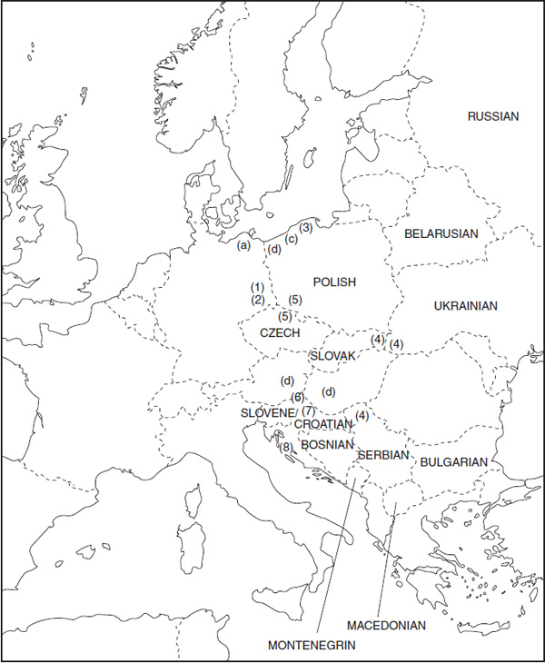
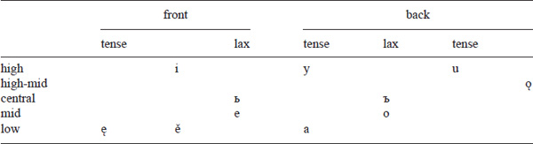
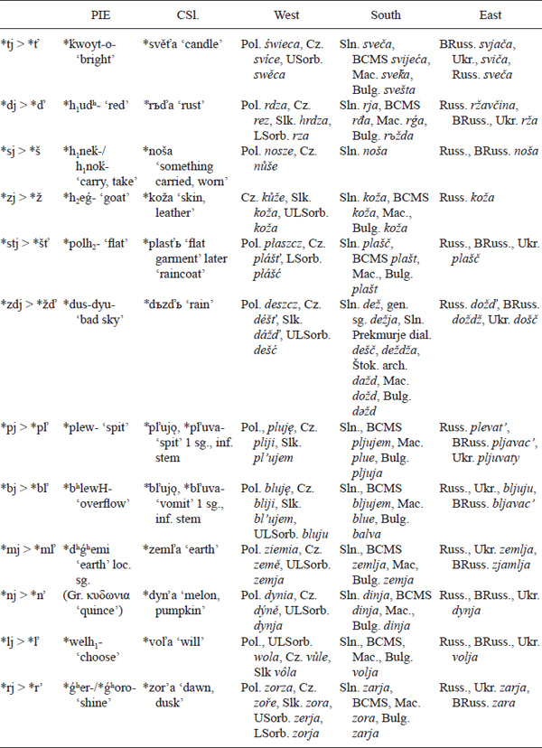
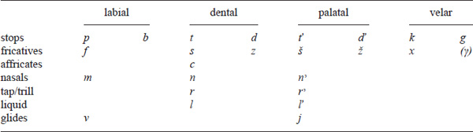
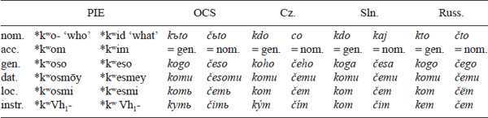

#

<!-- page: 519 -->

Chapter 3

# **Slavic**

*Marc L. Greenberg*

## **Introduction**

The Slavic language family constitutes a widely distributed genetic grouping of languages spoken today from Central Europe to the Pacific, represented by standard languages that are traditionally divided into three branches: *West –* Czech, Slovak; Polish; Upper and Lower Sorbian; *South –* Slovene; Croatian, Bosnian, Serbian, Montenegrin; Macedonian, Bulgarian; and *East –* Belarusian, Ukrainian, Russian. The standard languages reflect ethnic and cultural distinctions that largely crystallized in the 19th century and as such are not ideal reflections of the genetic development of Slavic linguistic variation from the proto-language. For example, standard Croatian, Bosnian, Serbian, and Montenegrin are based on a single genetic dialect, Štokavian, but now are stylized in their officially valorized forms to fit the national identity projects of four post-Yugoslav states. Russian has a considerable lexical component of South Slavic origin, owing to its diglossic origins in the medieval period. Other Slavic language varieties – sometimes referred to as Slavic micro-languages – that have to a greater or lesser extent become codified but lack robust (or any) institutional support, exemplify further variegation, e.g., Kashubian (a West Slavic language spoken in the environs of Gdańsk), Rusyn (Carpathian variety of East Slavic with some West Slavic features), Silesian (transitional variety of West Slavic between the Czecho-Slovak sub-branch and Polish), Prekmurje Slovene (divergent variety of Slovene), and Kajkavian Croatian (non-standardized variety of Croatian with affinity to Slovene). Attested but extinct Slavic language varieties, for which descriptive information is available, include Polabian († mid-18 c.; westernmost Slavic language, along the Elbe/Laba river in today’s Germany), Pomeranian († medieval period; along the Baltic at the mouths of the Oder and Vistula rivers), and Slovincian († early 20 c.; northwestern Poland, where it was perhaps a variety of Kashubian). Another variety (or varieties) of Slavic existed in today’s Austria and Hungary, which, although unattested, is “Pannonian” Slavic.

Textual attestation of Slavic begins in the early second millennium A.D. with the Freising Folia (ca. 1000, written in Carolingian \[Latin\] script in a language with close affinity to what would later become Slovene) and the texts of the Cyrillo-Methodian tradition proceeding from the mid 19th c., though with extant manuscripts surviving from the 11th–12th cc. (Canonical “Old Church Slav\[on\]ic”). The latter are written in the Glagolitic alphabet, which was designed, based in part on existing alphabets, to reflect the sound structure of Slavic as it was spoken in the 9th c. around Thessaloniki; or its successor, the Cyrillic alphabet, which was based on contemporary Greek uncial script, mapping closely the (roughly) letter-to-phoneme correspondences of Glagolitic. An important and still growing body of texts are the Novgorod Birchbark Letters, which attest to the vernacular language (i.e., not influenced by the language of the church) of northern Russia

<!-- page: 520 -->

in the 12th–15th cc. and, by virtue of the dialect’s peripheral position, illuminate archaic features of medieval Slavic. The language variation found in contemporary standard languages and dialects along with OCS serve as material for the comparative reconstruction of prehistoric stages of Slavic. In the exposition, focus will be on OCS forms, supplemented by material from living languages and dialects, where relevant.

**Map 11.2** Map of Slavic languages

Titular/state languages are in all caps. *Other living varieties*: (1) Lower Sorbian, (2) Upper Sorbian, (3) Kashubian, (4) Rusyn, (5) Silesian, (6) Prekmurje Slovene, (7) Kajkavian Croatian, (8) Čakavian Croatian. *Extinct varieties*: (a) Polabian, (b) Pomeranian, (c) Slovincian, (d) Pannonian.

###

<!-- page: 521 -->

**Periodization**

Slavic is a *satem* language (cf. OCS *vьsь* ‘village’, OInd. *viś* ‘dwelling’, Alb. *vis* ‘locality’ \|\| Lat. *vīcus*, Gr. οἶκος, Goth. *weihs*) and its closest congener the Baltic branch of Indo-European (see the chapter on Balto-Slavic). Periodization of Slavic is necessarily schematic before the period of the earliest attestations, which coincide with the beginning of disintegration into distinct dialect groups that can be more or less mapped onto the contemporary standard (“daughter”) languages. In this chapter we will operate with the following terminological designations:

*Proto-Balto-Slavic* – The emergent dialects whose innovations are distinct from Indo-European but are shared with dialects that were to become Baltic and Slavic.

*Proto-Slavic* – The emergent dialects whose innovations are distinct from Baltic but are shared with dialects that were to become Slavic. The reconstructions of PBSl. and PSl. are schematic and may be in some instances anachronistic because the time depth precludes precise dating. The representations in these system are given in small caps to make them visually distinct from CSl., which is the system underlying attested forms in living Slavic languages. Mutatis mutandis, *Proto-Baltic* refers to the Baltic forms paralleling PSl.

The term *Common Slavic* will be used in this chapter to refer to forms that underlie the earliest attested and contemporary Slavic languages as well as to the representations of these forms that are most familiar to scholars of Slavic, representing the vowel qualities presumed to be reflected in OCS (i.e., *i*, *y*, *u*, *ě*, *a*; *ę*, *ǫ*; *e*, *o*, *ь*, *ъ*; see chart below).1

The Proto-Balto-Slavic period is contested in the literature with regard to the relationship between the two parts, i.e., whether Baltic and Slavic constituted a unified speech community, underwent common and parallel innovations because of proximity and/or bilingualism, or converged anew after a period of divergence. The facts cannot be interpreted unequivocally in favor of any one of these scenarios, so perhaps the most prudent, if unsatisfyingly equivocal, view is to consider the Proto-Balto-Slavic period one of a closer-knit interaction than with any other dialects emerging from Indo-European.

### **Emergence of Slavic as a historical speech community, migrations**

The Late Common Slavic period (ca. 500–1000 A.D.) coincides with the moment when a Slavic speech community appears relatively clearly in the historical record (mentioned by the Byzantines in 527; see Schenker 1995: 15ff.) as it expands from its core area and comes into contact with other speech communities. How the expansion proceeded has engendered considerable debate, ranging from a traditional view that sees the westward spread as owing to migration (e.g., Andersen 1996, 1999, 2003, Doluxanov 2000, Greenberg 2010) to a diffusion model that, in its fully articulated version, views the speech community as having developed a homogenized *lingua franca* used by both Avar elites and confederates, including the Slavs, in the Avar Khaganate (Lunt 1984–1985). For further discussion see Nichols 1993, Curta 2004, Snoj and Greenberg 2012.

On a micro-level the settlement pattern of Slavic communities centered on the *župa* (\< *gewpeh₂; Snoj 2003: s.v.) ‘a traditional district organized around a tribe’, which Pleterski describes as the building block of a “fractal society” of independent or loosely connected tribal units (2013: 10). These units were also the units of migration, which is reflected in the geographical dislocation and distal association of dialect features (see, for example, Andersen 1996, 1999, Schallert & Greenberg 2007).

<!-- page: 522 -->

In turn, the issue of whence the migrations originate has been the subject of controversy, though the clusters of Slavic hydronyms, in proximity with Baltic ones, found in the Dniester and Dnepr river systems of today’s Ukraine provide a good anchoring point (Trubačev 1968), after which the Slavic speakers most likely spread by way of and across the Danube into central and southern Europe.

### **Disintegration of Common Slavic and language contact**

The second millennium A.D., often referred to as the time of “disintegration” of Common Slavic (Pol. *rozpad*, Russ. *raspad*), was a time of significant divergence among the Slavic languages owing to increasing geographical spread, linguistic drift, contact with Slavic and non-Slavic languages, and the rise and fall of local, confessional, and national identities. Structural effects that might be mentioned are the preservation of case marking in East Slavic and enrichment with additional case distinctions in Russian, brought about by contact with Finnic, viz. the partitive genitive and secondary (“concrete”) locative cases in standard Russian, which may be seen as just the tip of the iceberg with regard to convergent developments that have taken place among Baltic, Finnic, and northern Russian dialects. Central European Slavic languages, including the living West Slavic languages and the western South Slavic languages (especially Slovene and Croatian), have convergence features in morphosyntactic and lexical domains that are due to centuries-long contact with German, e.g., the use of prefixed imperfective verbs in narrated sequences of events (see Dickey 2011), or the development of a definite article, parallel to German *die*/*der*/*das* and Hungarian *a(z)*, in Czech (Doudleby dialect) **ti* tahouni se používali po posekáňí obilí … a gdiš se strnišťe špatňe posekalo, to tam bili *ti* kozi* ‘the draft horses were used after harvesting the crops … and when the stubble was poorly cut, then came the goats’ (Holub 2014: 183). The eastern South Slavic languages, Macedonian and Bulgarian, have undergone significant grammatical change as part of the Balkan convergence area. The dramatic nature of the structural change is heightened by the fact that in the earliest texts, OCS (in focus in this chapter) reflects the language state not long after it was relatively unified (“Common Slavic”), and the epicenter of Balkan features is in today’s Macedonia, the home territory of the first Slavic language planners, Constantine and Methodius.

## **Phonology**

### **Vowels**

| PIE        |     | PSl.                               |     | LCSl.                       |
|------------|-----|------------------------------------|-----|-----------------------------|
|            |     | long vowels and diphthongs         |     | /tense/ \[long\] vowels     |
| *ī        |     | *ī        |     | *i*                         |
| *ey       |     | *ey       |     |                             |
| *oy       |     | *ay       |     |                             |
| *ay       |     |                                    |     |                             |
| *ū        |     | *ū        |     | *y*                         |
| *ow       |     | *aw       |     | *u*                         |
| *aw       |     |                                    |     |                             |
| *ew       |     | *ew       |     | *’u*                        |
| *ē        |     | *ē        |     | *ě*                         |
| *oy       |     | *ay       |     |                             |
| *ay       |     |                                    |     |                             |
| *ō        |     | *ā        |     | *a*                         |
| *ā        |     |                                    |     |                             |
| *en, *em |     | *en       |     | *ę*                         |
| *m̥, *n̥   |     | *im, *in |     |                             |
| *on, *om |     | *an       |     | *ǫ*                         |
| *m̥, *n̥   |     | *um, *un |     |                             |
| *er       |     | *er       |     | *er*                        |
| *or       |     | *ar       |     | *or*                        |
| *ar       |     |                                    |     |                             |
| *el       |     | *el       |     | *el*                        |
| *ol       |     | *al       |     | *ol*                        |
| *al       |     |                                    |     |                             |
| *r̥        |     | *ir, *ur |     | *r̥* \|\| *ьr, ъr*           |
| *l̥        |     | *il, *ul |     | *l̥* \|\| *ьl, ъl*           |
|            |     | short vowels                       |     | /lax/ \[short\] vowels      |
| *i        |     | *i        |     | *ь*                         |
| *u        |     | *u        |     | *ъ*                         |
| *e        |     | *e        |     | *e*                         |
| *o        |     | *a        |     | *o*                         |
|            |     | Front                              |     | Back                        |
| High       |     | ī/i        |     | ū/u |
| Low        |     | ē/e        |     | ā/a |

**Table 11.11 Proto-Indo-European to Late Common Slavic vowels**

####

<!-- page: 523 -->

*Monophthongization of diphthongs*

The transition from the PSl. to the CSl. stage, which underlies the attested and living systems of Slavic languages, is marked by the reshaping of syllables on the principle of “rising sonority” (see also below with regard to consonantal changes). In this set of developments, diphthongs monophthongized, and the functional load was transferred from quantitative to qualitative vowel contrasts. The equivalences are given in the chart above. The Late Common Slavic vowel system, which is close to that underlying OCS, was structured thus:

**Table 11.12 Late Common Slavic vowels**

<!-- page: 524 -->

The monophthongization being a syllable-level phenomenon, diphthongs were treated differently in closed (tautosyllabic position) vs. open syllables (heterosyllabic), which gave rise to new alternations, e.g., *plew/plow \> PSl. *plaw-tēy, *pla\|u-e-xī \> OCS *pluti, ploveši* ‘flow, swim’ inf., 2 sg.; PIE *sʷekˊruh₂ \> PSl. *swekrū, *swekru\|wes \> OCS *svekry*, *svekrъve* ‘husband’s mother’ nom. sg., gen. sg. (cf. Sln. *kri*, *krvi*); PIE *ken/kn̥ \> PSl. *zāk(e)ntēi, zāki\|nexī \> OCS *začęti, začьneši* ‘begin’ inf., 2 sg. With regard to relative chronology, the monophthongization followed the first palatalization of velars and preceded the second and third palatalizations. Moreover, the change of PIE *ew \> CSl. *(j)u antedates deiotation following consonants, e.g., PIE *lewdʰeyes \> PSl. *lyawdiye \> OCS *ljudije*; PIE *kˊewmo \> PSl. *syawm-a-s \> OCS *šumъ* (also spelled *šjumъ*) (see also below). Note, however, that heterosyllabic *ew merges with *aw, e.g., PIE *newo \> OCS *novъ* ‘new’.

#### *Syllabic synharmony and palatalization*

The opposition of back-front was fundamental to the system, as is evident from the fact that (at first) consonants followed by front vowels were sub-phonemically palatalized. Palatalizations of velars and changes in clusters of C*j* into palatal consonants (“deiotation”) introduced a systematic opposition between plain and palatal consonants (see further below). On the one hand, there was a tendency to adjust the tonality of vowels so that palatal consonants were followed by front vowels (“intrasyllabic harmony”), e.g., PIE *moryo \> PSl. *marya(n) \> OCS *morje*. The beginning of phonemic palatalization is perhaps attributable to the reinterpretation of PSl *ē (CSl. *ě) as *a after palatal consonants, which disrupted the pattern of intrasyllabic harmony, e.g., PIE *gʷʰēr \> PSl. *gēras \> CSl. *žarъ (Russ., Sln., BCMS *žar*). This points to the view that CSl. was sub-phonemically diphthongized \[yæ\], and subsequently raised to a high-mid diphthong throughout most of the Slavic territory, as is also indirectly recoverable from later reflexes of *ě, cf. OCS *rěka*, Slk. *rieka*, Croat. *rijeka*. The onglide portion of the diphthong was evidently reinterpreted as a feature of the preceding consonant. Palatalization remained a fundamental element of the phonological system of Russian and Belarusian, whereas in Ukrainian and the West Slavic languages palatalization has been positionally eliminated and, in South Slavic in all but Bulg., eliminated altogether, save for the contrasts that arose with the loss of post-consonantal *j* (see below).

#### *Elimination of diphthongs with* *r*, *l*

Sequences of vowel + *r, l* were eliminated in the LCSl. period and can be dated to the second half of the first millennium A.D., as evidenced by borrowings of toponyms assimilated during the migrations, e.g., Finn. *Alvatti* → Russ. *Lovat’* (river name), Finn. *aaldokas → Russ. *Ladoga* (lake name), Lat. *Albōna* → Croat. *Labin* (toponym), Lat. *Arba* → Croat. *Rab* (island name). The process ended by the 9th c., as borrowings related to Slavic Christianization show up without metathesis, e.g., Lat. *altāre* → OCS *olъtaŕь* ‘altar’. Word-internal developments show dialect differentiation, where the open-syllable principle is realized differently for West and South Slavic, which show metathesis and lengthening of the vowel, and East Slavic, where the vowel is duplicated on either side of the consonant. The development was not carried through fully in Polabian. Examples: PIE *(h₂)wolkˊo → PSl. walsas \> Plb. *vlås*, Pol., ULSorb. *włos*, Cz., Slk. *vlas*, Sln. *las*, Mac., Bulg. *vlas*, OCS *vlasъ* \|\| BRuss. *volas*, Ukr., Russ. *volos*; PIE *gʰordʰo \> PSl.

<!-- page: 525 -->

*gardas \> Plb. *gord,* Pol. *Białogard* (toponym in N. Poland) \|\| Pol. *gród*, Cz. *hrad*, USorb. *hród*, Sln., BCMS, Mac., Bulg., *grad*, OCS *gradъ* \|\| BRuss. *horad*, Ukr. *horod*, Russ. *gorod* ‘city’; PIE *dergʰno \> *PSl. dernas \> Plb. *dren*, Cz. *dřín*, Slk. *drieň*, Sln. *dren*, Croat. *drijen*, Mac. *dren*, Bulg. *drjan* \|\| BRuss. *dzëran*, Ukr., Russ. *deren* ‘cornus mas’.

#### *Contraction, jer fall*

Among the final processes that marked the restructuring of Slavic are the loss of intervocalic *j* (“contraction”) and the “fall of the jers” (or “Havlík’s Law”), the alternating loss of the short lax vowels, *ь, ъ*. These processes began ca. the 10th c. A.D. in West and South Slavic and progressed eastward, where contraction was limited in East Slavic and jer fall progressed well into the 12th c. Contraction resulted in increased frequency of long vowels in those areas where quantity distinctions remained phonemic, cf. CSl. *moldaja ‘young’ f. sg. def. \> Cz., Slk. *mladá* \|\| Sln., BCMS *mladā* \|\| Russ., Ukr. *molodaja*; CSl. *dělaješi ‘you make, do’ \> Cz. *děláš* \|\| Sln. *delaš* \|\| Russ. *delaeš* \[d’elajiš\].

Havlík’s Law identifies a process whereby word-final jers are lost universally and, by a process of compensatory lengthening, a jer in a syllable following a lost jer lengthens and merges with an existing vowel (with dialectally conditioned results). A jer in a syllable preceding a non-jer vowel elides. The change had wide-ranging effects on syllable structure, vowel systems, and word prosody, among the chief ones being the end of the centuries-long development of open syllables. Examples: CSl. *kъto ‘who’ \> Pol. *kto*, Croat. *tko*, Russ. *kto*, BRuss., Ukr. *xto*; CSl. *vьdovьcь, *vьdovьca ‘widower’ nom., acc./gen. sg. \> Pol. *wdowiec*, *wdowca*, Cz. *vdovec*, *vdovce*, Sln. *vdovec*, *vdovca*, BCMS *udovac*, *udovca*, Mac. *vdovec*, Russ. *vdovec*, *vdovca*, Ukr. *vdovec’*, *vdovcja*; CSl. (with falling, “circumflex” stress) *'dьnь ‘day’ \> Pol. *dzień*, Cz. *den*, Slk. *deň*, Sln., BCMS *dȃn* (long falling stress), Mac., Bulg. *den*, Russ., Ukr. *den’*, BRuss. *dzen’*; CSl. (with rising, “neo-acute” stress) *pь̀sъ ‘dog’ \> Pol. *pies*, Cz., Slk. *pes*, Sln. *pes* \[pə̏s\] (short falling stress), BCMS *pȁs*, Mac., Bulg. *pes*, Russ. *pës*, BRuss. *p’os*, Ukr. *pes*.

### **Suprasegmentals**

The development of Slavic word prosody persists as one of the most dynamic areas of inquiry, and considerable debate surrounds its details. A basic account recognizes that PSl. developed a paradigmatic accent system with three patterns, which since Stang 1957 are referred to as accent paradigms (a.p.) A, B, and C. A.p. A is characterized by stable stem stress throughout the paradigm and is characterized by the “old acute” accent, which developed on long syllables typically of laryngeal origin. A.p. B has consistent stress on the ending alternating with “neo-acute” accent in the first syllable before the ending. The mobile a.p. C displays alternations between ending-final stress (or stress on the endings in acute-marked grammatical morphemes) in some forms and a falling tone (“circumflex”) on absolute initial syllables. In PSl. (and PBalt.) each syllable possessed a suprasegmental marking (or lacked it), which by LCSl. had resolved to a single stress for each phonological word.

A.p. A and B originate in PIE stem-stressed (barytone) paradigms and were differentiated by laryngeal (non-apophonic) length in stems of type A. After the application of Hirt’s Law, (“old acute”) stress was retracted or, in the case of two consecutive laryngealized syllables, assigned to the first of them, e.g., PIE *kˊorh₂weh₂ \> PSl. *ka̰rw-a̰

<!-- page: 526 -->

\> CSl. *ko̰rv-a* \> Sln. *kráva*, Russ., Ukr. *koróva* ‘cow’, cf. PIE *gʷéneh₂ \> PSl. *gena̰ \> CSl. *žen-a̋ \> Russ. *žená* ‘wife, woman’. Non-acute stems underwent a forward shift of stress (Dybo’s Law), which was subsequently retracted in internal syllables (Stang’s Law), which in turn gave rise to the “neo-acute” rising-stress profile of a.p. C. The Slavic mobile type arose in PIE end-stressed and mobile paradigms (Meillet’s Law) with analogical loss of the laryngeal (“old-acute”) marking where applicable. The Slavic paradigms correspond to Lithuanian accent paradigms 1 (= A), 2 (= B), 3, 4 (= C) as in the following chart. Different scholars have treated the origin of the mobile pattern in Baltic and Slavic differently, with the two major schools – the Moscow School, led by Vladimir A. Dybo, and the Leiden School, led by Frederik Kortlandt – viewing the pattern as archaic (Moscow) vs. innovative (Leiden) with respect to Vedic and Greek. The exposition here cannot do justice to the complexities of the developments, for which reason the interested reader is referred to the critique in the appendix to Lehfeldt 2001 and to Kapović 2015 (esp. 195ff.) for the current state of the art, as well as the literature cited therein.

|                        |     |                                                                                                                          |     |                                                                                                        |
|------------------------|-----|--------------------------------------------------------------------------------------------------------------------------|-----|--------------------------------------------------------------------------------------------------------|
| Vedic, Greek, Germanic |     | Baltic                                                                                                                   |     | Slavic                                                                                                 |
| barytone               |     | 1 – Lith. stem-stressed with acute tone; glottalized (“broken”) tone in Lith. Lowland (Žemaitian) dials. and Latvian     |     | A – stem-stressed with “old-acute” stress; secondary traces of glottal stop or glottalization          |
|                        |     | 2 – Lith. stem-stressed non-acute tone with end stress on endings                                                        |     | B – ending-stressed alternating with neo-acute on stem-final syllable                                  |
| oxytone                |     | 3 – Lith. mobile-stressed with “acute” tone in stem-stressed forms; glottalized tone in Lith. Lowland dials. and Latvian |     | C – mobile stressed, alternating between word-final stress and initial (recessive) “circumflex” stress |
|                        |     | 4 – Lith. mobile-stressed with “circumflex” tone in stem-stressed forms                                                  |     |                                                                                                        |

**Table 11.13 PIE, Baltic, and Slavic accent paradigm correspondences**

“Old acute” stress is often marked with a double acute (a̋) to distinguish it from the “neo-acute” (long: á, short: è) in order to avoid specifying the nature of the specific suprasegmental properties in question. The cover terms may be read as empty labels for suprasegmental contrasts. However, in this author’s view the laryngeal origin of the old-acute stress type can be read as “glottalized”; indirect evidence of its persistence in Slavic as either a glottalized (creaky-voiced) vowel or a glottal stop up through LCSl. is found in South Slavic pitch-accent systems: In Slovene in non-final stressed syllables, the tone contour is low in a phonetically long syllable (Sln. *bráta* ‘brother’ gen. sg.), while in final or monosyllabic words the tone is high in contrastively short syllables (Sln. *brȁt* ‘brother’ nom. sg., vs. long falling in “circumflex” *brȃt* ‘to go read’ sup.). In BCMS the reflex is short falling stress, e.g., *brȁt*, *brȁta*. To wit, creaky-voiced syllables are correlated with low pitch and vowel lengthening, while glottal stops are correlated with high pitch and vowel shortening. In other words, on this view, which builds on Kortlandt’s view of the persistence of laryngeals in Baltic and Slavic (see Kortlandt 1985) creaky voice developed from the “old-acute”marked syllables in non-final syllables in Sln., into

<!-- page: 527 -->

glottal stops in final or monosyllables and, in BCMS, in any old-acute-stressed syllable, and were subsequently reinterpreted upon the loss of the glottal feature as either long rising tone or short falling stressed syllables, respectively (Greenberg 2007, Holub & Greenberg 2013). In accord with tradition the sign for the long neo-acute (á) is used here, where it means a long rising tone, as is found, for example, in Kajkavian and Čakavian Croat. *súša* ‘drought’ (\< LCSl. *súša* \< PSl. *sáuxyā). The grave accent (è) signifies the neoacute in short syllables, e.g., LCSl. *kòlъ* ‘stake’ (\< PSl. *kal-às), *vòl’a ‘will’ (noun) (\< PSl. *valyā), as well as stress in endings that is not of laryngeal origin, e.g., *kolà ‘stake’ gen. sg. In the latter case, the signification recognizes that in examples where length has been preserved or extended to the stressed syllable, the surface forms in tonal dialects display rising pitch, e.g., Čakavian Croat. *nogé* ‘of a foot’ gen. sg. In the case of the “circumflex,” the signs borrowed from Serbo-Croatian dialectology for the falling tone are typically used (long: *ȃ*, short: *ȅ*). Here, instead, for reconstructed Slavic forms the ictus mark ('CV) is used to emphasize the default (phonemically unstressed) nature of the inherited Proto-Slavic circumflex, which is a fixed (fallingcontour) stress in the first syllable of the phonological word, e.g., CSl. *'nogǫ ‘foot’ acc. sg., *'na nogǫ ‘onto (the) foot’. This configuration is preserved as such in, e.g., BCMS *nȍgu*, *nȁ nogu*, as well as reflected in the stress pattern of Russ. *nógu*, *ná nogu* (see Jakobson 1963: 71–72).

<table style="width:100%;">
<caption><strong>Table 11.14 Accentual paradigms</strong></caption>
<colgroup>
<col style="width: 14%" />
<col style="width: 14%" />
<col style="width: 14%" />
<col style="width: 14%" />
<col style="width: 14%" />
<col style="width: 14%" />
<col style="width: 14%" />
</colgroup>
<tbody>
<tr class="odd">
<td class="tleft border_bot" style="border-top: 1px solid windowtext">
Slavic a.p.
</td>
<td class="tleft border_bot" style="border-top: 1px solid windowtext"></td>
<td class="tcenter border_bot" style="border-top: 1px solid windowtext">
PIE
</td>
<td class="tcenter border_bot" style="border-top: 1px solid windowtext"></td>
<td class="tcenter border_bot" style="border-top: 1px solid windowtext">
Baltic
</td>
<td class="tcenter border_bot" style="border-top: 1px solid windowtext"></td>
<td class="tcenter border_bot" style="border-top: 1px solid windowtext">
Slavic
</td>
</tr>
<tr class="even">
<td class="tleft">
A
</td>
<td class="tleft"></td>
<td class="tleft">
*bréh₂tēr &gt; Ved. <em>bhrā́tar</em>, Gr. φρᾱ́τηρ ‘brother’
</td>
<td class="tleft"></td>
<td class="tleft">
Lith. <em>brólis</em> (a.p. 1), Latv. <em>brãlis</em>
</td>
<td class="tleft"></td>
<td class="tleft">
CSl. *bra̋trъ, gen. sg. *bra̋tra &gt; Sln. <em>brȁt</em>, gen. sg. <em>bráta</em>
</td>
</tr>
<tr class="odd">
<td class="tleft"></td>
<td class="tleft"></td>
<td class="tleft">
*dʰuh₂mó &gt; Ved. <em>dhūmá</em>, Gr. θῡμóς

‘smoke’
</td>
<td class="tleft"></td>
<td class="tleft"></td>
<td class="tleft"></td>
<td class="tleft">
CSl. *dy̋mъ, *dy̋ma &gt; Sln. <em>dȉm</em>, <em>díma</em>
</td>
</tr>
<tr class="even">
<td class="tleft"></td>
<td class="tleft"></td>
<td class="tleft">
*seh₁ye/o ‘sow’
</td>
<td class="tleft"></td>
<td class="tleft">
Lith. <em>sė́ti</em>, <em>sė́ju</em>
</td>
<td class="tleft"></td>
<td class="tleft">
CSl. *sě̋jati, sě̋jǫ, Croat. <em>sȉjati</em>, <em>sȉjēm</em>
</td>
</tr>
<tr class="odd">
<td class="tleft">
B
</td>
<td class="tleft"></td>
<td class="tleft">
*dʰworom &gt; Ved. <em>dvā́ram</em> ‘courtyard’
</td>
<td class="tleft"></td>
<td class="tleft">
Lith. <em>dvãras</em> (a.p. 2)
</td>
<td class="tleft"></td>
<td class="tleft">
CSl. *dvòrъ, gen. sg. *dvora̍ &gt; Sln. <em>dvȍr</em>, <em>dvóra</em>; Croat. Čak. dial. <em>dvór</em>, <em>dvorȁ</em>
</td>
</tr>
<tr class="even">
<td class="tleft"></td>
<td class="tleft"></td>
<td class="tleft">
*wobʰseh₂ &gt; OHG <em>waspa</em> ‘wasp’
</td>
<td class="tleft"></td>
<td class="tleft">
Lith. <em>vapsà</em> (a.p. 2 &gt; 4)
</td>
<td class="tleft"></td>
<td class="tleft">
CSl. *(v)osa̋, *(v)osǫ̍ &gt; Sln. <em>ósa</em>, <em>óso</em>
</td>
</tr>
<tr class="odd">
<td class="tleft"></td>
<td class="tleft"></td>
<td class="tleft">
*gʷʰen, Ved. <em>hánti</em>, Gr. θείνω

‘hit, drive (trans.)’
</td>
<td class="tleft"></td>
<td class="tleft">
Lith. <em>giñti, genù</em>
</td>
<td class="tleft"></td>
<td class="tleft">
CSl. *gъna̋ti, *ženǫ̍, *žene̍tь &gt; Sln. <em>gnáti</em>, <em>žénem</em>, <em>žéne</em>
</td>
</tr>
<tr class="even">
<td class="tleft">
C
</td>
<td class="tleft"></td>
<td class="tleft">
*suHnús, Ved. <em>sūnú</em> ‘son’
</td>
<td class="tleft"></td>
<td class="tleft">
Lith. <em>sūnùs</em> (a.p. 3)
</td>
<td class="tleft"></td>
<td class="tleft">
CSl. *'synъ, Sln. <em>sȋn</em>
</td>
</tr>
<tr class="odd">
<td class="tleft"></td>
<td class="tleft"></td>
<td class="tleft">
*ōh₂yóm, Gr. ὤιον ‘egg’
</td>
<td class="tleft"></td>
<td class="tleft"></td>
<td class="tleft"></td>
<td class="tleft">
CSl. *'aje, Croat. dial. <em>jȃje</em>
</td>
</tr>
<tr class="even">
<td class="tleft"></td>
<td class="tleft"></td>
<td class="tleft">
*ǵʰeymeh₂, Ved. <em>himā́</em>
</td>
<td class="tleft"></td>
<td class="tleft">
Lith. <em>žiemà</em> (a.p. 4)
</td>
<td class="tleft"></td>
<td class="tleft">
CSl. *'zima̋, *'zimǫ, Russ. <em>zimá</em>, <em>zímu</em>, Sln. <em>zíma</em> nom. sg., <em>na zȋmo</em> ‘in winter’ (acc.)
</td>
</tr>
<tr class="odd">
<td class="tleft" style="border-bottom: 1px solid windowtext"></td>
<td class="tleft" style="border-bottom: 1px solid windowtext"></td>
<td class="tleft" style="border-bottom: 1px solid windowtext">
*mer ‘die’, Ved. <em>márate</em> ‘dies’
</td>
<td class="tleft" style="border-bottom: 1px solid windowtext"></td>
<td class="tleft" style="border-bottom: 1px solid windowtext">
Lith. <em>mir̃ti</em>, <em>mìrštu</em>
</td>
<td class="tleft" style="border-bottom: 1px solid windowtext"></td>
<td class="tleft" style="border-bottom: 1px solid windowtext">
CSl. *mertı̍, *'mьrǫ, *mьretь̍ &gt; ORuss. <em>úmru</em>, <em>umrétь</em>
</td>
</tr>
</tbody>
</table>

**Table 11.14 Accentual paradigms**

#### *Winter’s Law*

In Baltic and Slavic an additional suprasegmental peculiarity, noted relatively recently (Winter 1978), is the appearance of acute-marked length in otherwise short-vowel syllables preceding a PIE voiced unaspirated stop, e.g., PIE *sed ‘sit’ \> PBalt., PSl. sēdētēy ‘sit’ inf. \> Lith. *sėdė́ti*, OCS *sěděti* (vs. Lat. *sedēre*). Kortlandt (1978) has claimed that this feature corroborates Gamkrelidze and Ivanov’s reconstruction of the PIE consonant

<!-- page: 528 -->

system as consisting in plain : glottalized : aspirated rather than the traditional plain : voiced : voiced aspirated (Gamkrelidze & Ivanov 1973; see also Vermeer 1984: 335, Kortlandt 1985), in which it is assumed that the glottalic feature for the consonant is transferred to the preceding vowel. Winter’s Law is also correlated with the appearance of acute stress in the relevant syllable, suggesting that, if the glottalized interpretation of the old plain voiced series is correct, then the glottalization was transferred to the preceding vowel in Baltic and Slavic. In the chart below, the LCSl. reflexes include later changes marked “cond.” for conditioned changes, explained forthwith.

### **Consonants**

|           |     |                                  |     |                                |
|-----------|-----|----------------------------------|-----|--------------------------------|
| PIE       |     | PSl.                             |     | LCSl.                          |
| *p       |     | *p      |     | *p*                            |
| *b       |     | *b      |     | *b*                            |
| *bʰ      |     |                                  |     |                                |
| *t       |     | *t      |     | *t*, cond. *ť*                 |
| *d       |     | *d      |     | *d*, cond. *ď*                 |
| *dʰ      |     |                                  |     |                                |
| *k       |     | *k      |     | *k*, cond. *č*, *ć*            |
| *kʷ      |     |                                  |     |                                |
| *g       |     | *g      |     | *g*, cond. *dž \> ž*, *dź*      |
| *gʷ      |     |                                  |     |                                |
| *gʰ      |     |                                  |     |                                |
| *gʷʰ     |     |                                  |     |                                |
| *ǵ       |     | *z      |     | *z*, cond. *ź*                 |
| *ǵʰ      |     |                                  |     |                                |
| *ḱ       |     | *s      |     | *s*, cond. *x* (\> *š*, *ś*)   |
| *s       |     |                                  |     |                                |
| *m       |     | *m,     |     | *m*                            |
| *n       |     | *n      |     | *n*, cond. *ń*                 |
| *r, *l, |     | *r, *l |     | *r*, cond. *ŕ*; *l*, cond. *ľ* |
| *y, *w  |     | *y, *w |     | *j*, *v*                       |

Table 11.15 Proto-Indo-European to Late Common Slavic consonants

#### *Elimination of geminates, dissimilation *t/d \> *s before *t*

Inherited geminate fricative clusters were eliminated, e.g., PIE *skˊōy → PSl. *sāini \> OCS *sěnь* ‘shadow’, PIE *tuh₂s(d)kˊm̥t \> PSl. *tūsintyī \> OCS *tysęšti* ‘thousand’. Clusters of two dentals stops become fricative + stop. This change is late PIE, as it is shared by Baltic as well as Indo-Aryan, Germanic, Celtic, Latin, and Albanian, e.g., PIE *h₁ed → PSl. *yēstēy \> OCS *jasti* ‘to eat’; PIE *kʷitti \> PSl. *kist-i \> OCS *čьstь* ‘honor’. A small number of examples point to the Slavic merger of PIE *pt \> PSl. *tt \> st, e.g., ORuss./OCS *stryi* ‘father’s brother’, ORuss. *Stribogъ* ‘Slavic pagan god name’ (both derived from PIE *ph₂tr ‘father’); similarly ORuss. *nestera* ‘niece’ (\< PIE *nept), though PSl. *tt \> t is also observed, e.g., OCS *netii* ‘nephew’.

#### *RUKI change*

PIE *s changes to x in PSl. following the segments r, u, k, i, a change that pre-dates the merger of the fricative reflex of PIE *kˊ in Slavic with PSl. *s, e.g., PIE *wr̥s \> PSl.

<!-- page: 529 -->

*wirx \> ORuss. *vьrxъ*, but PIE *porkˊ PSl. *parsen(t) \> OCS *prasę* ‘pig’. The change parallels a similar development in Indo-Iranian (*ṣ*) and Baltic (*š*), as well as, possibly, Armenian (p. 206, 495, 438). Further examples: PIE *snuseh₂ \> PSl. *snuxā \> OCS *snъxa* ‘daughter-in-law’ (cf. OInd. *snuṣā́*); PIE *ksewbʰ → PSl. xūbā \> Cz. *chyba* ‘mistake’, Ukr. *xybáty* ‘to wobble‘ (cf. OInd. *kṣúbhyati* ‘to shake, vacillate’); PIE *maysa \> PSl. *mayx \> OCS *měxъ* ‘bladder, bellows’ (cf. Lith. *maĩšas* ‘bag’). The change fails to occur before an obstruent, giving rise to alternations as in OCS *rěxъ* ‘I said’ aor. vs. *rěsta* ‘they both said’ aor. \< PSl. *reksam, *rekstā. Wordinitial *x* developed from the generalization of the *x*reflex from prefixed forms (as well as initial *sk- \> *ks-), e.g., OCS (*pri*)*xoditi* ‘to walk’ (‘to approach’) ← PSl. *preysadītēy (derived from PIE *sed/sod/sd ‘sit’).

#### *Loss of final consonants*

Slavic underwent a series of changes often referred to as the “law of rising sonority” or the “law of open syllables,” which eliminated syllables culminating in a segment other than a vowel. The changes developed from the elimination of consonants in word-final position, likely in the first centuries A.D., to the elimination of liquid diphthongs in the last centuries of the first millennium (the type PSl. *gardas \> OCS *gradъ* \|\| ORuss. *gorodъ* ‘fortification, city’). These changes included the monophthongization of diphthongs and the development of prothetic consonants, as well as entailing structural changes in grammatical endings. These issues will be discussed below in the appropriate sections. Here we will focus on some of the early changes in Slavic. The earliest change is loss of final *r, which is shared with Baltic, e.g., PIE *meh₂tēr → PSl. *mātī, \> OCS *mati* ‘mother’, PBalt. *mātē \> Lith. *mótė* ‘wife’.

#### *Cluster simplification*

In addition to the adjustments in clusters mentioned above, remaining clusters and those arising in word formation were simplified, the result of which is the elimination of all clusters aside from fricative + stop, cf. PIE *yeh₂ ‘travel’ + *sd ‘sit’ (Ø-grade) → PSl. *yēzdītēy ‘to ride’ \> OCS *jazditi* ‘travel’, BCMS *jèzditi* ‘to ride a horse’ \[Greenberg and Dickey 2006\]), though syllable onsets could also end in a sonorant, e.g., PIE *h₂eyskreh₂ \> PSl. yīskrā \> OCS *iskra* ‘spark’. Examples: CC \> ₡C – PIE *wobʰhseh₂ \> *PSl. asā \> OCS *osa* ‘wasp’; PIE *h₁rouwdʰso \> PSl. *raws \> OCS *rusъ* ‘red’; h₁dsn̥tsni \> PSl. *densni \> OCS *dęsnь ‘gums’; PIE *lowksneh₂ \> PSl. *lawnā \> OCS *luna* ‘moon’; *dʰǵʰemi ‘earth’ loc. sg. → *zemyā \> OCS z*emlja* ‘earth’; PIE *dʰolbʰ → PSl. *dalta \> OCS *dlato*, Croat. *dlijeto* ‘chisel’; CC \> C₡ – PIE *ob + *h₂welk/ h₂wolk ‘drag’→ PSl. *abalk \> OCS *oblakъ* ‘cloud’; PIE *nokʷts → *nakti \> OCS *noštь* ‘night’; PIE *wronkeh₂ \> PSl. *rankā \> OCS *rǫka ‘hand’.

The cluster *sr developed excrescent *t* in conformity with the cluster constraint adduced above, an innovation also found in Baltic, Albanian, Germanic, and Celtic, e.g., PIE *srew/srow ‘flow’ → PSl. *strawgā, *strawmū, men \> OCS *struga* ‘flow’, *Strumień* ‘hydronym in Poland’, cf. Eng. *stream*. The constraint remained productive into the historical period, e.g., OCS *Izdraiľь* ‘Israel’; *vъzdrydati* ‘to break out crying’ perfect., cf. *rydati* ‘to cry’.

A particular case is gt/kt before ī/i (and later PSl. y), which merged with reflexes of CSl. *ť, *dʰugh₂tēr \> PSl. *duktī \> OCS *dъšti* ‘daughter’, Russ. *doč’*, OCz. *dci*, for which reason */kt/ was likely realized as *\[t́\] (see Vermeer 2014: 217 and below).

|                                                |     |                                        |
|------------------------------------------------|-----|----------------------------------------|
| CC \> ₡C                                       |     | CC \> C₡                               |
| ps, ts, ks \> s (x)    |     | vr, vl \> r, l |
| tk, dg \> k, g         |     | bv \> v        |
| kt \> t \[t́\]          |     |                                        |
| pt \> st, t            |     |                                        |
| tm, tn, dm, dn \> m, n |     |                                        |

<!-- page: 530 -->

**Table 11.16 Cluster simplification**

#### *First palatalization of velars*

Among the first Slavic innovations exclusive of Baltic is the palatalization of velars *k, g, x before front vowels, which occurred after the RUKI change and before the monophthongization of diphthongs. This places the change in the first half of the first millennium A.D. Borrowings from Slavic into Greek show that it was completed by the 7th c. A.D. (e.g., *Čьrnica* \> Τσερνίστι ‘toponym in Messenia’, *Stružija \> Στρούζα ‘toponym in Phoeis’, *Vьršьcь \> Βερσίτσι ‘toponym in Achaia’). The reflexes are uniform in Slavic: PSl. *k, g, x \> CSl. *č, ž, š. It is generally considered that *ž had originally paralleled the development of *č by having an (allophonic) affricate stage *dž*, which is observed only indirectly in clusters of *zg before a front vowel, e.g., PSl. *drozgiyā \> CSl. *droždžьja \> OCS *droždija* (with other vocalic affixes) Ukr. *droždži*, Prekmurje Sln. *droždže* ‘yeast’. Accordingly, *sk also resulted in a combination of fricative + affricate, e.g., PIE *h₂eysske \> PSl. *ayskemas \> Sln. *iščemo* ‘seek’ 1 pl.

<table>
<caption><strong>Table 11.17 First velar palatalization</strong></caption>
<colgroup>
<col style="width: 20%" />
<col style="width: 20%" />
<col style="width: 20%" />
<col style="width: 20%" />
<col style="width: 20%" />
</colgroup>
<tbody>
<tr class="odd">
<td class="tcenter border_bot" style="border-top: 1px solid windowtext">
PIE
</td>
<td class="tcenter border_bot" style="border-top: 1px solid windowtext"></td>
<td class="tcenter border_bot" style="border-top: 1px solid windowtext">
PSl.
</td>
<td class="tcenter border_bot" style="border-top: 1px solid windowtext"></td>
<td class="tcenter border_bot" style="border-top: 1px solid windowtext">
OCS
</td>
</tr>
<tr class="even">
<td class="tleft">
*kelH

*pekʷ
</td>
<td class="tleft"></td>
<td class="tleft">
*kela

*pekexī
</td>
<td class="tleft"></td>
<td class="tleft">
<em>čelo</em> ‘forehead’

<em>pečeši</em> ‘bake’ 2 sg.
</td>
</tr>
<tr class="odd">
<td class="tleft">
*gʷʰiHsl

*magʰ
</td>
<td class="tleft"></td>
<td class="tleft">
*gīla

*magexī
</td>
<td class="tleft"></td>
<td class="tleft">
<em>žila</em> ‘vein, nerve’

<em>možeši</em> ‘can’ 2 sg.
</td>
</tr>
<tr class="even">
<td class="tleft" style="border-bottom: 1px solid windowtext">
*kˊel &gt; Gmc *χelmaz →

*dʰwes →
</td>
<td class="tleft" style="border-bottom: 1px solid windowtext"></td>
<td class="tleft" style="border-bottom: 1px solid windowtext">
*xelm

*dawxyā
</td>
<td class="tleft" style="border-bottom: 1px solid windowtext"></td>
<td class="tleft" style="border-bottom: 1px solid windowtext">
<em>šlěmъ</em> ‘helmet’

<em>duša</em> ‘soul’
</td>
</tr>
</tbody>
</table>

**Table 11.17 First velar palatalization**

#### *Prothesis*

Prothetic consonants in initial syllables where the inherited onset was vocalic were inserted, though differing results occur in the daughter languages owing to later developments. Examples: PIE *h₁n̥h₃men \> PSl. *inmen \> CSl. **jьmę* \> OCS *imę*, OCz. *jmě* ‘name’; PIE *h₂eskreh₂ \> PSl. *āiskrā \> CSl. **jiskra* \> OCS *iskra*, Cz. *jiskra* ‘spark’; PIE *dn̥ǵʰuh₂ → PSl. *enzūkas \> *językъ \> OCS *językъ* ‘tongue, language; heathen’; PIE *n̥ ‘in’ \> PSl. un \> CSl. *vъ \> OCS *vъ* ‘in’; PIE *ūpsoko \> PSl. *ūsakas \> CSl. *vysokъ \> OCS *vysokъ* ‘high, tall’ nom. sg. m. indef.

#### *Second and third palatalization of velars*

If the monophthongization of diphthongs marks the beginning of Common Slavic, the second and third palatalization of velars and “deiotation” give rise to isoglosses cutting across the Slavic speech areas, marking the disintegration of Common Slavic. Traditionally, the development has been broken into two, presumably chronologically distinct, changes. However, the second and third palatalizations were likely a single process with

<!-- page: 531 -->

two sets of conditioning environments: the “second” palatalization is triggered by the rise of new front vowels arising after the monophthongization of diphthongs (see above) and the “third” by a preceding front vowel.

|                       |     |                                      |     |                                                             |     |                               |
|-----------------------|-----|--------------------------------------|-----|-------------------------------------------------------------|-----|-------------------------------|
| PIE                   |     | PSl.                                 |     | Attestations                                                |     | Conditioning environment      |
| *kʷoyneh₂            |     | *kayn-ā     |     | OCS *cěna* ‘price’                                          |     | *K before front V (“2 pal.”) |
| *kʷoyto              |     | *kwaytas    |     | OCS *cvětъ* ‘flower’, ‘color’ \|\| Pol. *kwiat*, Cz. *květ* |     |                               |
| *wl̥kʷo               |     | *wilkayxu   |     | ORuss. *vъlcěxъ* ‘wolves’ loc. pl.                          |     |                               |
| *gʰoylo              |     | *gayl-a     |     | OCS *ʣělo* ‘very’, Sln. *zelo*                              |     |                               |
| *ǵʰwoysd2 |     | *gwayzdā    |     | OCS *ʣvězda* ‘star’ \|\| Pol. *gwiazda*, Cz. *hvězda*       |     |                               |
| *ksoyro              |     | *xayra      |     | OCS *sěrъ* ‘blue-gray’ \|\| Pol. *szary*, Cz. *šerý*        |     |                               |
|                       |     | *grayx-ay   |     | OCS *grěsi* \|\| Pol. *grzeszy*, OCz. *hřieši*              |     |                               |
| *meh₁s               |     | *mēs(e)nk-a |     | OCS *měsęcь* ‘moon’                                         |     | *K after front V (“3 pal.”)  |
| *stigʰo              |     | *stigā      |     | OCS *stьʣa* ‘path’                                          |     |                               |
| *wiso                |     | *wixa       |     | OCS *vьsь* ‘all’\|\| Pol. *wszystek*, Cz. *všechen*         |     |                               |

**Table 11.18 Second and third velar palatalizations**

The diatopic variation found in the palatalization reflexes reveals a dynamic period of change, where the differing rates of expansion of the innovations result in varying relative chronologies (see esp. Andersen 1969, Vermeer 2014). Alongside the second and third palatalizations, the lenition of CSl. *g *\> γ* was under way in much of central Slavic, ultimately affecting Cz., USorb., Slovak, NW Sln., part of Čakavian Croat., BRuss., Ukr. and southern Russ. These are classic examples of center-periphery phenomena. For example, in the Novgorod-Pskov area (peripheral), as attested in the Birchbark Letters, e.g., *kěle* ‘whole’ nom. sg. m., *xěri* ‘of a gray cloth’ gen. sg. f. (cf. modern Russ. *celyj*, *seryj*), indicates that the second palatalization failed to reach this area. In West Slavic (central) the results of the palatalization of *k, g are identical to the results of the deiotation of *t, d (see below). If it is assumed that the second and third palatalizations resulted in \[ť, ď\] (palatal stops) in WSl., then the change of *x in the second and third palatalization to *š* follows the systemic phonemicization of the series as palatals (rather than alveo-palatals, as elsewhere) (Vermeer 2014: 189). This scenario is confirmed by the fact that in West Slavic only the reflexes of the second palatalization before *v* have been phonologized as *k*, *g* (Pol. *kwiat* ‘flower’, *gwiazda* ‘star’). Had they been affricated, as elsewhere, depalatalization as stops would have been unexpected.

#### *Loss of post-consonantal* *j (“deiotation”)*

The last major CSl. change was the simplification of clusters of C + *j*, which in all cases resulted in the elimination of *j* (whence the traditional term “deiotation”). Dental stops were first palatalized and then, in another wave of innovation, assibilated. The early phase is attested in the Freising Folia, where we find the spelling *imoki* (2x) (\< CSl. *jьmǫťьjь

<!-- page: 532 -->

‘having’ pres. act. ptcp. nom. m. sg.); cf. in the same text *v ueki* (*vъ věky* ‘for all time’ acc. pl.). Dental fricatives merged with palatal fricatives from the first palatalization of velars (wherever an affricated realization of *dž \< *g + front vowel had not been retained). After labials, *j* became *ľ*, and the sonorants *n*, *l*, *r* developed palatal counterparts. Variation is significant, as can be seen in the following chart.

**Table 11.19 ‘Deiotation’ reflexes**

<!-- page: 533 -->

Deiotation had also affected velars, with the results being identical to the first palatalization, e.g., PSl. *dawxyā \> OCS *duša* ‘soul’. The lack of the reflexes of the *j \> l’* change after labials in West Slavic and eastern South Slavic is a result of generalization of the non-iotated forms at the morpheme boundary. Toponyms reveal that the change had taken place throughout Slavic, e.g., Pol. *Grobla*, *Lublin*, Cz. *Liblín*, Bulg. *Koprivlen*, *Popovi Drъvlja*.

PSl. *w became *v* throughout Slavic, though there is a tendency to preserve the variant \[w\] in syllable-final position in some areas, e.g., BRuss. *low*, Sln. *lov* \[low\] \< CSl. *lovъ ‘hunt, catch’.

**Table 11.20 Common Slavic consonant system**

## **Morphology**

Slavic inflectional morphology continues the synthetic inflection type inherited from PIE, conserving case systems in the nominal system and the general patterns of inflection in the verbal system, albeit transformed by the syllable restructuring that affected the shape of endings. Of particular note is the development of the verbal aspect system in Slavic, whereby systematic distinctions of perfective (“completed,” “viewed as a whole”) vs. imperfective hold for most verbs, e.g., OCS *kupiti* ‘buy’ perfect. : *kupovati* ‘buy’ impf. Sub-aspectual and lexical distinctions are accomplished by means of prefixation and suffixation, e.g., (PIE *k(ʷ)eǵ(ʰ) \>) OCS *čeznǫti*, *čeznǫ* ‘disappear’ inf., 1 sg., imperf. (CSl. *jьzčeznǫti) \> *išteznǫti* ‘disappear’ perfect.; *ištezati* ‘idem’ imperf. Within the verbs of motion in unprefixed verbs additional aspectual distinctions hold, often subsumed under the labels determinate (“unidirectional”) vs. indeterminate (“manner of motion,” “multidirectional,” “iterative”), e.g., OCS *iti*, *nesti* ‘go’, ‘carry’ det., imperf.; *xoditi*, *nositi* ‘walk’, ‘carry’ indet., imperf.

Case marking is well preserved in all but eastern South Slavic – Mac., Bulg., and southern Serbian dialects, which were affected by contact phenomena in the Balkan convergence area. The inherited past tense systems were reduced in West and East Slavic as well as in Sln. and, to a more limited extent, BCMS, to a single construction based on the perfect (aux. of ‘be’ + *l*-participle). Mac. and Bulg. preserve only simple and coordinated tenses, but they also expanded to include evidentiality, “witnessed” vs. “non-witnessed,” e.g., Mac. *Toj beše vo Skopje* ‘he was in Skopje’ vs. *Toj bil vo Skopje* ‘he was supposedly/evidently in Skopje’ (Comrie & Corbett 1993: 272; though the synchronic category has been questioned, see Kempgen et al. 2009: 262–268).

### **Nominal morphology**

#### *Nouns*

As in other PIE dialects nominal morphology has become restructured. In Slavic the productive declension patterns have fused PIE theme vowels with case and number markers

<!-- page: 534 -->

to make up the characteristic endings, while those in turn have been reshaped by phonetic changes in word-final position (see above regarding sound change). Root nouns of the type Lat. *nox*, *noctis* ‘night’ have generalized the non-nom. sg. case forms and reinterpreted the paradigm as an *i*-stem, e.g., OCS *noštь* ‘night’ (← PSl. *naktim acc. sg.). As a consequence of the rising sonority developments and the fusion of the vowels with grammatical markers, Slavic nominal morphology clearly distinguishes between lexical stems, which always end in a consonant, and grammatical endings, which consist of or begin with a vowel.

Consonantal stem types have largely merged with vocalic stem types in the daughter languages, although, curiously, Sln. has innovated by creating deverbative nouns from the relic *ū*-stem class, e.g., *osvežiti* ‘to refresh’ → *osvežitev* ‘refreshment’, perhaps as an extension of the tendency already observable in OCS to create deverbal nouns of the type *prěľuby*, *prěľubъve* ‘adultery’ nom., gen. sg. ← *prěľubiti* (\< *prě* ‘trans’ + *ľubiti* ‘love’), as well as conflation with deverbatives of the *tъva* type, cf. Sln., BCMS, Bulg. *bitva* ‘battle’ ← CSl. *biti ‘to beat’. Of note is also the Slavic innovation of an *ent*-stem class denoting offspring, e.g., PIE *dʰeh₁ ‘suckle’ → OCS *dětę*, *dětete* ‘child’ nom., gen. sg., PIE *porkˊ → OCS *prasę*, *prasęte* ‘piglet’ nom., gen. sg.

The nominal system of Slavic conserves all PIE cases but the ablative – which is thought to have merged with the genitive in the *o*stem – as well as three genders (f., m., n.) and three numbers (sg., pl., du.). OCS and most of the daughter languages, with the exception of Mac. and Bulg., preserve six syntactic cases (nom., acc., gen., dat., loc., instr.) and a voc. form. OCS, Sln., and LSorb. retain dual number. With regard to form classes OCS displays the consonantal and vocalic stem classes of PIE, though some reorganization of the classes is already evident. The daughter languages have continued to reduce the stem classes, generally with the *o* (*jo*), *ā* (*jā*), and *i*stems emerging as the target paradigms, subsuming the unproductive consonantal stems. Grammatical gender predominantly aligns as follows: *o* (*jo*) = m., n.; *ā* (*jā*) = f.; *i* = fem; conflation of case forms occurs (most \> least): du. \> pl. \> sg.; instr., loc., dat. \> gen. \> nom., acc.

##### Vocalic stems

The productive *o*-stem masculines include older layers of inherited nouns, e.g., PIE *sth₂lo \> OCS *stolъ* ‘chair’, PIE *mēmso \> OCS *męso* ‘meat’, as well as *o*-grade deverbatives of the type OCS *vozъ* ‘wagon’ (cf. *vezǫ* ‘I convey’), *plotъ* ‘fence’ (cf. *pletǫ* ‘I weave’), and numerous derivatives with suffixes with the *o*-stem shape, e.g., OCS *ostrogъ* ‘palisade’ ← CSl. *ostr ‘sharp’. The *u*stem masculines generally merged in individual Late Common Slavic dialects with the *o*stems, though in some of the daughter languages the endings have become part of the masculine declension type, sometimes with innovative functions, e.g., marking animacy in Cz. *Zbyňkovi* ‘to Zbyňek’ dat. sg. (vs. *stolu* ‘chair’ dat. sg.) and partitivity in Russ. *čaju* ‘some tea’ (vs. *cvet čaja* ‘the color of the tea’), the additional case meaning also being an effect of the Finnic substratum in northern Russian.

Innovative *jo* and *jā*stem declensions developed in Slavic, built on the *o* and *ā*stems, respectively. These differ mostly in the adjustment of intrasyllabic harmony, e.g., *jo*stem *mariam \> *moŕe ‘sea’ nom., acc. sg. Inherited *jo*stems are few, but the class remained productive and includes deverbatives such as OCS *voždь* ‘leader’ (cf. *voditi* ‘to lead’), as well as newer borrowings, e.g., OCS *kral’ь* (from Germ. *Karl* ‘Charlemagne’). Innovative palatal stems, such as those that arose through the second palatalization of velars, also decline as *jo*stems, e.g., OCS *pěnęʣь* ‘coin’ (from Germ. *penning*). The *jā*-stem type subsumed the relics of the *ih₂ feminines, still attested by a

<!-- page: 535 -->

small number of nouns in OCS, e.g., PIE *aldih₂ \> OCS *ladii* ‘boat’, PIE *peh₂w → OCS *pustyn'ii* ‘desert’ as well as in the f. nom. sg. form of the pres. act. ptcp., e.g., OCS *nesǫšti* ‘carrying’ (\< PSl. *nesantyī).

<table>
<caption><strong>Table 11.21 Vocalic stems</strong></caption>
<colgroup>
<col style="width: 20%" />
<col style="width: 20%" />
<col style="width: 20%" />
<col style="width: 20%" />
<col style="width: 20%" />
</colgroup>
<tbody>
<tr class="odd">
<td class="tcenter border_bot" style="border-top: 1px solid windowtext">
class
</td>
<td class="tcenter border_bot" style="border-top: 1px solid windowtext"></td>
<td class="tcenter border_bot" style="border-top: 1px solid windowtext">
PIE
</td>
<td class="tcenter border_bot" style="border-top: 1px solid windowtext"></td>
<td class="tcenter border_bot" style="border-top: 1px solid windowtext">
OCS
</td>
</tr>
<tr class="even">
<td class="tleft">
<em>o</em>-stem
</td>
<td class="tleft"></td>
<td class="tleft">
*gʰordʰo

*mōyth₂to
</td>
<td class="tleft"></td>
<td class="tleft">
<em>gradъ</em> ‘fortified place, city’ m.

<em>město</em> ‘place’ n.
</td>
</tr>
<tr class="odd">
<td class="tleft">
<em>jo</em>stem
</td>
<td class="tleft"></td>
<td class="tleft">
*mangyo

*polh₂yo
</td>
<td class="tleft"></td>
<td class="tleft">
<em>mǫžь</em> ‘man, husband’ m.

<em>poľe</em> ‘field’ n.
</td>
</tr>
<tr class="even">
<td class="tleft">
<em>u</em>stem
</td>
<td class="tleft"></td>
<td class="tleft">
*medʰu
</td>
<td class="tleft"></td>
<td class="tleft">
<em>medъ</em> ‘honey’
</td>
</tr>
<tr class="odd">
<td class="tleft">
<em>i</em>stem
</td>
<td class="tleft"></td>
<td class="tleft">
*nih₂ti
</td>
<td class="tleft"></td>
<td class="tleft">
<em>nitь</em> ‘thread’
</td>
</tr>
<tr class="even">
<td class="tleft">
<em>ā</em>stem
</td>
<td class="tleft"></td>
<td class="tleft">
*gʷeneh₂
</td>
<td class="tleft"></td>
<td class="tleft">
<em>žena</em> ‘woman, wife’
</td>
</tr>
<tr class="odd">
<td class="tleft" style="border-bottom: 1px solid windowtext">
<em>jā</em>stem
</td>
<td class="tleft" style="border-bottom: 1px solid windowtext"></td>
<td class="tleft" style="border-bottom: 1px solid windowtext">
*dʰǵʰemyeh₂
</td>
<td class="tleft" style="border-bottom: 1px solid windowtext"></td>
<td class="tleft" style="border-bottom: 1px solid windowtext">
<em>zemlja</em> ‘earth’
</td>
</tr>
</tbody>
</table>

**Table 11.21 Vocalic stems**

|                                      |     |             |     |                                         |
|--------------------------------------|-----|-------------|-----|-----------------------------------------|
| class                                |     | PIE         |     | OCS                                     |
| *n*-stem                             |     | *seh₁men   |     | *sěmę*, gen. *sěmene* ‘seed’            |
| *r*stem                              |     | *dʰugh₂ter |     | *dъšti*, *dъštere* ‘daughter’           |
| *s*stem                              |     | *kˊlewos   |     | *slovo*, *slovese* ‘word’               |
| *nt*stem                             |     | *agʷno     |     | *agnę*, *agnete* ‘lamb’                 |
| *ū* (uw)stem |     | *swekruh₂  |     | *svekry*, *svekrъve* ‘husband’s mother’ |

**Table 11.22 Consonantal stems**

##### Nominal declension

In the following chart the presumed PIE input is compared with the attested OCS endings (CSl., where *ь* occurs before *j*, which yields *ij* in OCS), which are presumed to be similar to those of LCSl. Wherever the arrow → is used, a non-linear development is presumed to have occurred. The trajectories of the endings, as well as the PIE input, are a subject of much debate, and the detail needed to explain them far exceeds the scope of this chapter. An emblematic issue is the origin of the *ъ* ending in the nom. and acc. sg. cases of the *o*stems. The expected outcome, following the regular phonetic development, loss of final consonants, would have been nom. sg. *os \> *o*. (This outcome is in fact represented regionally in proper nouns, where the ending may have earlier been interpreted as vocative or hypochoristic, BCMS *Branko*, *Vlado* \[← *Branislav, Vladimir*\]; Ukr. *Danylo*, *Petro*. In the Finnic substratum areas of Pskov-Novgorod, as attested in the Birchbark letters, the vocative ending *e* was generalized, on which see Vermeer 1994.) Such an outcome threatened merger with the neuter *o*stems, as well as neutralizing the distinction between agent and patient roles. Among alternatives – other solutions have been considered – was to select the *u*-stem endings in *ъ*, which did not solve the problem of agent-patient distinctions. This problem was repaired by the development of the category of animacy, whereby genitive case marking was introduced for animate referents in the accusative position, e.g., OCS *vьsi bo ěko proroka imǫtъ Ioana* (Matthew 21:26, Codex Marianus) ‘all thus as a prophet-anim. take John-anim.’ The input of the instr. sg. and dat., instr. pl. and du. forms assume a PIE dialect input of *m (as opposed to *bʰ), common to Germanic, Baltic, and Slavic. The schema below shows the expected PIE input on the left and CSl. on the right (with PSl. for illustration in some instances), where \> indicates a direct phonetic continuation and → indicates a post-PIE rearrangement of the material (PIE input, with some adjustments, based on Sihler 1995: 248).

|               |     |                                                |     |                  |     |                                              |     |                                                   |
|---------------|-----|------------------------------------------------|-----|------------------|-----|----------------------------------------------|-----|---------------------------------------------------|
|               |     | *o*-stems                                      |     | *u*-stems        |     | *i*-stems                                    |     | *ā*-stems                                         |
| *singular*    |     |                                                |     |                  |     |                                              |     |                                                   |
| nom.          |     | *os → *u \> *ъ*      |     | *us \> *ъ*      |     | *is \> *ь*                                  |     | *eh₂ \> *a*                                      |
| (n.)          |     | *om \> *o*                                    |     |                  |     |                                              |     |                                                   |
| acc.          |     | *om → *u \> *ъ*      |     | *um \> *ъ*      |     | *im \> *ь*                                  |     | *eh₂m \> *ǫ*                                     |
| gen.          |     | *oh₂₍e)t (abl.) \> *a*                        |     | *ows \> *u*     |     | *eys \> *i*                                 |     | *eh₂os → *ū \> *y*      |
| dat.          |     | *ōy → *aw \> *u*     |     | *ewey \> *ovi*  |     | *eyey \> *ey \>*i* |     | *eh₂ey \> *ay \> *ě*    |
| instr.        |     | *oh₁ → *ami \> *omь* |     | *umi \> *ъmь*   |     | *imi \> *ьmь*                               |     | *eh₂mi → *ayam \> *ojǫ* |
| loc.          |     | *oy \> *ě*                                    |     | *ēw \> *u*      |     | *ēy \> *i*                                  |     | *eh₂y \> *ay \> *ě*     |
| voc.          |     | *e \> *e*                                     |     | *ew \> *u*      |     | *ey \> *i*                                  |     | *h₂ \> *o*                                       |
| *plural*      |     |                                                |     |                  |     |                                              |     |                                                   |
| nom.          |     | *oy \> *i*                                    |     | *ewes \> *ove*  |     | *eyes \> *ьje*                              |     | = acc. pl.? \> *y*                                |
| nom., acc. n. |     | *eh₂ \> *a*                                   |     |                  |     |                                              |     |                                                   |
| acc.          |     | *oms \> *y*                                   |     | *ums \> *y*     |     | *ims \> *i*                                 |     | *eh₂ms \> *y*                                    |
| gen.          |     | *ōm → *u \> *ъ*      |     | *owom \> -*ovъ* |     | *eyom \> *ьjь*                              |     | *eh₂o/ōm \> *ъ*                                  |
| dat.          |     | *omus → *omъ*                                 |     | *umus → *ъmъ*   |     | *imus \> *ьmъ*                              |     | *eh₂mus \> *amъ*                                 |
| instr.        |     | *ōys → *ū \> *y*     |     | *umīs \> *ъmi*  |     | *imī \> *ьmi*                               |     | *eh₂miHs \> *ami*                                |
| loc.          |     | *oysu \> *ěxъ*                                |     | *usu \> *ъxъ*   |     | *isu \> *ьxъ*                               |     | *eh₂su \> *axъ*                                  |
| *dual*        |     |                                                |     |                  |     |                                              |     |                                                   |
| nom., acc.    |     | *eh₂ \> *a*                                   |     | *uh₂ \> *y*     |     | *ih₂ \> *i*                                 |     | *eh₂y \> *ě*                                     |
| nom., acc. n. |     | *h₂y \> *ě*                                   |     |                  |     |                                              |     |                                                   |
| gen., loc.    |     | *h₂ow \> *u*                                  |     | *owh₂ow\> *ovu* |     | *eyh₂ow \> *ьju*                            |     | *eh₂ow \> *u*                                    |
| dat., instr.  |     | *omoH \> *oma*                                |     | *umoH \> *ъma*  |     | *imoH \> *ьma*                              |     | *eh₂moH \> *ama*                                 |

<!-- page: 536 -->

**Table 11.23 Vocalic stem endings**

|              |     |                                                                                                            |
|--------------|-----|------------------------------------------------------------------------------------------------------------|
| *singular*   |     |                                                                                                            |
| nom.         |     | *s (m.), *ø \> ø (implies Slavic stem changes)                                                           |
| acc.         |     | *m̥ \> ø/*ъ*                                                                                               |
| gen.         |     | *es \> *e*                                                                                                |
| dat.         |     | *ey \> *i*                                                                                                |
| instr.       |     | *? \> *i/emi → ь/*emь* (m.); *? \> *iyām \> *ьjǫ* (f.) |
| loc.         |     | *i → *i*/*e*                                                                                              |
| voc.         |     | = nom. sg.                                                                                                 |
| *plural*     |     |                                                                                                            |
| nom.         |     | *es \> *e; i, a* from *o*-stems                                                                           |
| acc.         |     | *m̥s \> ь; *i, a, y* from *o-*, *ā*-stems                                                                  |
| gen.         |     | *om \> *ъ* from *o*-stems?                                                                                |
| dat.         |     | *(i)mus \> *ьmъ*                                                                                          |
| instr.       |     | *(i)mī \> *ьmi*; *y* from *o*-stems                                                                       |
| loc.         |     | *(C)su → *ьxъ*/*ixъ*/*exъ*                                                                                |
| *dual*       |     |                                                                                                            |
| nom., acc.   |     | *ih₁ \> *i* (r-stems, *dьnь*); *a, ě* from *o*-, *ā*-stems                                                |
| gen., loc.   |     | *ow \> -*u*                                                                                               |
| dat., instr. |     | *imoH \> *ьma*                                                                                            |

**Table 11.24 Consonantal stem endings**

####

<!-- page: 537 -->

*Adjectives*

Adjectival declension derives from nominal declensions, where agreement in gender, number, and case follows the pattern of the *o-*, *jo*stems for masculine and neuter and the *ā*, *jā*stems for feminine, PIE *newos, *newom, *neweh₂ \> OCS *novъ*, *novo*, *nova* ‘new’ nom. sg. m., n., f.; Gmc *tewd → PSl. *tewd-y- \> CSl. *t´ud´ \> OCS *štuždь*, *štužde*, *štužda* ‘foreign’ (with variant base forms *tužd*, *stužd*, perhaps as a function of dissimilation). Of particular note is the development of an articulated form of the adjective with *j pronouns (see below), which mark definiteness, an innovation shared with Baltic, e.g., *novъjь*, *novoje*, *novaja*; *novajego* gen. sg. m./n., *novujemu* dat. sg. m./n., etc. Cf. *naujas* ‘new’ m. sg. indef. vs. *naujasis* def. (\< *naujas* + *jis*).

Comparative forms are produced with -*jьj-*/*-ьš* or innovative *ěj-ьš* (shortened in the nom. sg. m. and n. by word-final consonant elision) and follow the *j* declension types, e.g., OCS *bol´i*, *bol´e*, *bol´ьša* ‘bigger’; OCS *nověi*, *nově(j)e*, *nověiša* ‘newer’.

Participial forms also belong to the adjectival declensions, e.g., present active participle: OCS *nesy* (m., n.), *nesǫšti* (\< PSl. *nesants, *nesantm, *nesantyī) ‘carrying’; past active participle *nesъ* (m., n.), *nesъši* (\< PSl. *nesuss, nesus-m, *nesusyī) ‘having carried’; past passive participle *nesenъ*, *neseno*, *nesena* (\< PSl. *nesenas, a, ā) ‘having been carried’; present active participle *nesomъ*, *nesomo*, *nesoma* (\< PSl. *nes-am-as, a, ā) ‘being carried’. The resultative “*l*participle” occurs only in the nom. forms, e.g., *neslъ*, *neslo*, *nesla*, which occur in compound tenses and mood constructions.

#### *Pronouns*

Personal pronouns in Slavic conserve much of the PIE pattern, distinguishing six cases as in the noun. Here the OCS examples stand (nearly) for all of Slavic. PIE *h₁eǵ,* h₁eǵHom \> Cz. *já*, Pol., Slk., ULSorb., BCMS, BRuss., Ukr., Russ. *ja* \|\| OCS *azъ¸*Sln. *jaz* ‘I’, Mac. *jas*, Bulg. *az* (with prothetic *j* and lengthening by Winter’s Law; on the heterogeneous inheritances see Kapović 2009); PIE *h₁mene \> OCS *mene*, *mę* ‘me’ – full and clitic forms; PIE *tuH \> OCS *ty* ‘you’ 2 sg. nom.; in OCS *tebe*, *tę* 2 sg. acc., the expected stem from PIE *tewe does not occur but is replaced by the stem from the dat. sg., *tebʰ (OCS *tebě* 2 sg. dat. sg.); the nom. (and acc.) forms of the 1 and 2 pl. are evidently reshaped on the model of *ty*: OCS *my* ‘we’ nom., *ny* ‘us’ acc., *vy* ‘you’ (pl. and honorific) nom., acc. The acc., gen. forms generalized the lengthened vowel root and must have been extended by a suffix, PIE *nōs, *wōs → PSl. *nāsa(m), *wāsa(m) \> OCS *nasъ*, *vasъ*. The homophonic loc. pl. forms OCS *nasъ*, *vasъ* provide the direct continuation of the loc. pl. ending in su, which has been generalized in the noun and adjective paradigms as *xъ* (following the ruki change). The reflexive pronoun follows the pattern of the 3 sg.: OCS *sę* acc., *sebe* gen., *sebě*, *si* dat. full and clitic, *sebě* loc., *sobojǫ* instr. Third person pronouns, as well as corresponding relatives, are built from the anaphoric pronoun PIE *yo apart from the nom. forms, e.g., OCS *jь* acc. sg. m., *je* acc. sg. n., *jǫ* acc. sg. f., *jego* gen. sg. m., n.; *jeję* gen. sg. f.; *jemu* dat. sg. m., n., *jejь* dat. sg. f. In prepositional constructions, initial *j* is replaced by *n'* (\< *nj) as a result of the reanalysis of *n* in prepositions, *vun ‘in’, *sun ‘with’ (\< PIE *h₁n̥, *kˊon) as *n*, e.g., *otъ n'ego* ‘from him, it’, *kъ n'ejь* ‘toward her’, *sъ n'imь* ‘with him’. In OCS the nom. forms from anaphoric *yo occur only in relativizers compounded with the particle (focus marker) *že* (the o-grade of which appears in the gen. sg. m. and n. pronominal and adjectival ending: *jego*), e.g., *čьto že vidiši sǫčьcь *jьže* estъ vъ očese bratra toego a brьvno *eže* estъ vъ očese tvoemь ne čuješi* ‘what you-see a mote-acc.-sg.-m. that-nom.-sg.-m. is in the eye of brother yours

<!-- page: 538 -->

but the log-acc.sg.-n. that-nom.sg.-n. is in eye yours not you-feel’ (Luke 6:41, Codices Zographensis, Marianus). In the daughter languages the usual 3 pers. nom. pronouns are built from CSl. *on, e.g., OCS *onъ*, *ona*, *ono*; *oni*, *ony*, *ona* m., f., n. sg., pl. (\< PIE *h₂en), though Mac. and Bulg. use forms built from PIE *to, e.g., Bulg. *toj*, *tja*, *to* m., f., n. sg. nom. In other Slavic languages, pronouns built on this form usually serve a distal, switch-reference, or resumptive function.

|        |     |                            |     |                           |     |                      |
|--------|-----|----------------------------|-----|---------------------------|-----|----------------------|
|        |     | sg.                        |     | pl.                       |     | du.                  |
| nom.   |     | *jь m., *ja f., *je n.  |     | *ji m., *ję f., *ja n. |     | *ja m., *ji f., n. |
| acc.   |     | *jь* m., *jǫ* f., *je* n.  |     | *ję* m., f.; *ja* n.      |     | = nom.               |
| gen.   |     | *jego* m., n.; *jeję* f.   |     | *ixъ*                     |     | *jeju*               |
| dat.   |     | *jemu* m., n.; *jejь* f.   |     | *imъ*                     |     | *ima*                |
| loc.   |     | *n'emь* m., n.; *n'ejь* f. |     | *ixъ*                     |     | *jeju*               |
| instr. |     | *imь* m. n.; *jejǫ* f.     |     | *imi*                     |     | *ima*                |

**Table 11.25 OCS 3 pers. pronoun**

OCS and the Slavic daughter languages preserve other 3 pers. pronouns marked for proximity in time or space, e.g., OCS *sь*, *si*, *se* ‘this here’ (\< PIE *kˊi); BCMS *ovaj*, *ova*, *ovo* ‘this’ (\< PIE *h₂ew) – contrasted with *onaj*, *ona*, *ono* ‘that’, cf. Sln. *one* ‘whatchamacallit’ \< CSl. *ono + *je). The deictic *s* particle also plays a role in the formation of adverbs of time, OCS *dьnьsь*, Cz., Slk. *dnes*, BCMS *danas* \|\| Russ. *segodnja* ‘today’ (\< CSl. *dьnь + sь \|\| *sego + dьne); OCS *si nošti*, BCMS *sinoć*, Mac. *sinokˊa* ‘last night’ (\< CSl. *si noťi).

Interrogative pronouns in Slavic display both conservative and innovative features, as is evident from the following table. The nom. forms of both the animate and inanimate have been extended with the element *to(s, d), though variant forms also occur, e.g., Pol. *nikt*, Sln. *nihče* ‘nobody’ \< CSl. *nikъtъ(-že); the littoral (Čakavian) dialect of Croatian has the bare form of the inanimate *ča* (\< CSl. *čь). Sln. and Croatian Kajkavian dial. *kaj* ‘what’ is formed from a different inherited element, PIE *kʷeh₂, extended with the anaphoric element CSl. *jь \< PIE *yo (Snoj 2003: s.v.). The same element is found as a subordinating conjunction in Bulg., Pol. dial., as well as in Prekmurje Sln. *ka*, where it contrasts with irrealis *da* (\< PIE *doh₂), the (otherwise indicative) prevailing subordinating conjunction in western South Slavic (see Greenberg 2011).

**Table 11.26 Interrogative pronouns**

Further pronominal bases include PIE *ēyno \> OCS *inъ* ‘other’, PIE *ēysth₂o \> OCS *istъ* ‘same’, PIE *wikˊ \> OCS *vьsь* ‘all’.

#####

<!-- page: 539 -->

Indeclinables

Adverbs of time, place, manner, and direction were created by combining pronominal elements with deictic particles.

|         |     |                            |     |                                                                       |     |                                                          |     |                                                |
|---------|-----|----------------------------|-----|-----------------------------------------------------------------------|-----|----------------------------------------------------------|-----|------------------------------------------------|
|         |     | PSl. *dʰe ‘where’         |     | PSl. *dā,kudā ‘when’ |     | PSl. *(ā)ka ‘how’               |     | PSl. *āma ‘direction’ |
| **k*   |     | *kъde* ‘where’             |     | *kъda*, *kogda* ‘when’                                                |     | *kako* ‘how’                                             |     | *kamo* ‘whither’                               |
| **s*   |     | *sьde* ‘here’              |     | *sьda* ‘now’                                                          |     | *sice* (\< *sīka) ‘in this way’ |     | *sěmo* ‘hither’                                |
| **t*   |     |                            |     | *togda* ‘then’                                                        |     | *tako* ‘thus’                                            |     | *tamo* ‘there’                                 |
| **ov*  |     | *ovъde* ‘there’            |     | *ovogda* ‘then’                                                       |     |                                                          |     | *ovamo* ‘thither’                              |
| **on*  |     | *onъde* ‘over there’       |     | *onъda* ‘at that time’                                                |     |                                                          |     | *onamo* ‘yonder’                               |
| **j*   |     | *jьde(že)* ‘at that place’ |     | *jeda* ‘at the time when’                                             |     | *jako* ‘thus’                                            |     |                                                |
| **vьs* |     | *vьsьde* ‘everywhere’      |     | *vьsegda* ‘always’                                                    |     | *vьsako* ‘in all ways’                                   |     |                                                |

**Table 11.27 OCS adverbs of place, time, manner, direction**

Other adverbs include OCS *tu* ‘here’ (\< PIE *tow), *mъnogo* ‘much’ (\< PIE *mnogʰo). Productive adverbial formants include *o*, *ě*, *ьsky*, e.g., OCS *dobro*, *dobrě*, both ‘well’; *slověnьsky* ‘Slavic’.

### **Verbal morphology**

The Slavic verb materially reflects a simplified picture of Indo-European verbal morphology, though, as mentioned above, Slavic has innovated in its morphologized aspectual system by means of prefixation and suffixation as well as by extending the ablaut pattern. Only one example of PIE reduplication persists in the verb, and this is in the small group of athematic verbs, i.e., OCS *dadętъ* ‘they give’ (PSl. *dādent ← PIE *deh₃, cf. Skr. *dadāmi* ‘I give’). The remaining athematic verbs in Slavic are (PIE *h₁es \>) OCS *jesmь*, *jesi*, *sǫtъ* 1 sg., 2 sg., 3 pl. (inf. *byti*) ‘be’; (PIE *weyd \>) *věmь* 1 sg. (inf. *věděti*) ‘know’ (an isolated relic form descended from the PIE intransitive conjugation is found in OCS, OCz., ORuss. *vědě*, on which see Ivanov 1981: 68); (PIE *ed → PSl. ēd-mi \>) OCS *ěmь*/*jamь* (inf. *ěsti*, *jasti*). The verb *iměti*, 1 sg. *imamь* ‘to have’ (\< CSl. *jьmamь \< PSl. *imāmi ← PIE *m̥ ‘grasp, take’), also belongs here – it is related to an *e*/*o*-thematic verb *ęti*, *jьmǫ* ‘to take’ inf., 1 sg.

The present tense endings, as in the nominal declension, have been reorganized. The 1 sg. ending of the thematic type in *ǫ* cannot have been original but was built from the inherited PIE *oh₂, and the m marker was extended from the athematics after the loss of final consonants. The extension of the athematic 1 sg. *m* made a second comeback in the historical period with the rebuilding of the present tense markers in West Slavic and western South Slavic, e.g., Slk. *nesiem*, Sln. *nesem*; Pol. *gram*, Cz. *hrám*, Sln., BCMS *igram* \|\| Russ. *igraju*, Ukr. *hraju*, Bulg. *igraja*, Plb. *jaigroją* (\< CSl. *jьgrajǫ) ‘play’ 1 sg. (see further Janda 1996). The 3 sg. and pl. forms in OCS *tъ* are of secondary origin, most likely from the 3 sg. pronoun in *t*. East Slavic, however, preserves the original athematic ending in *ti*, e.g., ORuss. *jestь* ‘is’, Russ. *est’*, BRuss. *ësc’*, albeit with considerable dialectal variation (see Miller 1988 for details). A zero 3 sg. ending (inherited from PIE) is also amply attested, e.g., Cz. *nese*, Slk. *nesie*, Sln. *nese*, Ukr. *nese*. Similarly, 1 pl. endings show variation through generalization of the ablaut variants *me*/*mo*, most likely in response to competition from the 1 sg. marker in *m*, cf. USorb. *sym – smy*, Cz. *jsem* ‘I

<!-- page: 540 -->

am’ – *jsme* ‘we are’, Slk. *som – sme*, Sln. *sem – smo*, BCMS *sam – smo*, Mac. *sum – sme*, Bulg. *səm – sme*.

|       |     |                                                   |     |                                                  |
|-------|-----|---------------------------------------------------|-----|--------------------------------------------------|
|       |     | athematic                                         |     | thematic                                         |
| 1 sg. |     | *damь* (\< PSl. *dād-mi) |     | *nesǫ* (\< *nes-ā-m)    |
| 2 sg. |     | *dasi* (\< *dād-si)      |     | *neseši* (\< *nes-e-xī) |
| 3 sg. |     | *dastъ* (\< *dād-t)      |     | *nesetъ* (\< *nes-e)    |
| 1 pl. |     | *damъ* (\< *dād m)       |     | *nesemъ* (\< *nes-e-m)  |
| 2 pl. |     | *daste* (\< *dād-te)     |     | *nesete* (\< *nes-e-te) |
| 3 pl. |     | *dadętъ* (\< *dād-ent)   |     | *nesǫtъ* (\< *nes-a-nt) |
| 1 du. |     | *dasta* (\< *dād-tā)     |     | *neseta* (\< *nes-e-tā) |
| 2 du. |     | *daste* (\< *dād-te)     |     | *nesete* (\< *nes-e-te) |
| 3 du. |     |                                                   |     |                                                  |

**Table 11.28 Inflection of non-past finite verb forms**

Traditionally, OCS verbs are grouped into five classes, following the classification by Leskien 1969 (1871), which corresponds to layers of archaism vs. innovation, and are indexed by their characteristic theme (*e*/*o*, *ne*/*o*, etc.). Two basic stems are accounted for, represented by the infinitive, which normally contains a (semantically empty) suffix, e.g., LCSl. *bьrati ‘to take’, and a present or non-past-tense stem *bere ‘takes’. Sub-types are determined by the suffix or lack of it (in which case the stem-final segment is relevant) in the infinitive stem. In the table below the OCS forms are given in the inf., 1 sg., 3 sg. pres. tense (the listing of types here is not comprehensive).

<table>
<caption><strong>Table 11.29 Verb classes, following Leskien</strong></caption>
<colgroup>
<col style="width: 11%" />
<col style="width: 11%" />
<col style="width: 11%" />
<col style="width: 11%" />
<col style="width: 11%" />
<col style="width: 11%" />
<col style="width: 11%" />
<col style="width: 11%" />
<col style="width: 11%" />
</colgroup>
<thead>
<tr class="header">
<th class="tcenter border_bot" style="border-top: 1px solid windowtext">
class
</th>
<th class="tcenter border_bot" style="border-top: 1px solid windowtext"></th>
<th class="tcenter border_bot" style="border-top: 1px solid windowtext">
theme
</th>
<th class="tcenter border_bot" style="border-top: 1px solid windowtext"></th>
<th class="tleft border_bot" style="border-top: 1px solid windowtext">
PIE
</th>
<th class="tcenter border_bot" style="border-top: 1px solid windowtext"></th>
<th class="tleft border_bot" style="border-top: 1px solid windowtext">
PSl.
</th>
<th class="tcenter border_bot" style="border-top: 1px solid windowtext"></th>
<th class="tleft border_bot" style="border-top: 1px solid windowtext">
OCS
</th>
</tr>
</thead>
<tbody>
<tr class="odd">
<td class="tleft" style="border-top: 1px solid windowtext">
I.A
</td>
<td class="tleft" style="border-top: 1px solid windowtext"></td>
<td class="tcenter" style="border-top: 1px solid windowtext">
<em>e</em>/<em>o</em>
</td>
<td class="tleft" style="border-top: 1px solid windowtext"></td>
<td class="tleft" style="border-top: 1px solid windowtext">
*h₁nekˊ
</td>
<td class="tleft" style="border-top: 1px solid windowtext"></td>
<td class="tleft" style="border-top: 1px solid windowtext">
*nestēy

*nesām

*nese
</td>
<td class="tleft" style="border-top: 1px solid windowtext"></td>
<td class="tleft" style="border-top: 1px solid windowtext">
<em>nesti</em> ‘carry’ det.

<em>nesǫ</em>

<em>nesetъ</em>
</td>
</tr>
<tr class="even">
<td class="tleft">
1.B
</td>
<td class="tleft"></td>
<td class="tcenter"></td>
<td class="tleft"></td>
<td class="tleft">
*bʰer
</td>
<td class="tleft"></td>
<td class="tleft">
*birātēy

*berām

*ber-e
</td>
<td class="tleft"></td>
<td class="tleft">
<em>bьrati</em> ‘take’

<em>berǫ</em>

<em>beretъ</em>
</td>
</tr>
<tr class="odd">
<td class="tleft">
II
</td>
<td class="tleft"></td>
<td class="tcenter">
<em>ne</em>/<em>o</em>
</td>
<td class="tleft"></td>
<td class="tleft">
*steh₂
</td>
<td class="tleft"></td>
<td class="tleft">
*stātēy

*stā-nām

*stāne
</td>
<td class="tleft"></td>
<td class="tleft">
<em>stati</em> ‘stand up’, ‘begin to’

<em>stanǫ</em>

<em>stanetъ</em>
</td>
</tr>
<tr class="even">
<td class="tleft"></td>
<td class="tleft"></td>
<td class="tcenter"></td>
<td class="tleft"></td>
<td class="tleft">
*kos
</td>
<td class="tleft"></td>
<td class="tleft">
*kasnū(n)t-ey

*kas-nām

*kasne
</td>
<td class="tleft"></td>
<td class="tleft">
<em>kosnǫti</em> ‘touch’

<em>kosnǫ</em>

<em>kosnetъ</em>
</td>
</tr>
<tr class="odd">
<td class="tleft">
III.1.A
</td>
<td class="tleft"></td>
<td class="tcenter">
<em>je</em>/<em>o</em>
</td>
<td class="tleft"></td>
<td class="tleft">
*ǵnoh₃
</td>
<td class="tleft"></td>
<td class="tleft">
*znātēy

*znāyām

*znāye
</td>
<td class="tleft"></td>
<td class="tleft">
<em>znati</em> ‘know’

<em>znajǫ</em>

<em>znajetъ</em>
</td>
</tr>
<tr class="even">
<td class="tleft">
III.1.B
</td>
<td class="tleft"></td>
<td class="tleft"></td>
<td class="tleft"></td>
<td class="tleft">
*kes
</td>
<td class="tleft"></td>
<td class="tleft">
*kesātēy

*kesyām

*kesye
</td>
<td class="tleft"></td>
<td class="tleft">
<em>česati</em> ‘gather (fruit)’

<em>češǫ</em>

<em>češetъ</em>
</td>
</tr>
<tr class="odd">
<td class="tleft">
III.2.B
</td>
<td class="tleft"></td>
<td class="tleft"></td>
<td class="tleft"></td>
<td class="tleft">
*(s)newH
</td>
<td class="tleft"></td>
<td class="tleft">
*absnawātēy

*absnawyām

*absnawye
</td>
<td class="tleft"></td>
<td class="tleft">
<em>osnovati</em> ‘found’

<em>osnujǫ</em>

<em>osnujetъ</em>
</td>
</tr>
<tr class="even">
<td class="tleft">
IV.A
</td>
<td class="tleft"></td>
<td class="tcenter">
<em>ī</em> (&lt; PIE *eye)
</td>
<td class="tleft"></td>
<td class="tleft">
*h₁nokˊ
</td>
<td class="tleft"></td>
<td class="tleft">
*naseytēy

*nasyām

*nas i(y)e
</td>
<td class="tleft"></td>
<td class="tleft">
<em>nositi</em> ‘carry’ indet.

<em>nošǫ</em>

<em>nositъ</em>
</td>
</tr>
<tr class="odd">
<td class="tleft">
IV.B
</td>
<td class="tleft"></td>
<td class="tleft"></td>
<td class="tleft"></td>
<td class="tleft">
*sed
</td>
<td class="tleft"></td>
<td class="tleft">
*sēdētēy

*sēdyām

*sēdi(y)e
</td>
<td class="tleft"></td>
<td class="tleft">
<em>sěděti</em> ‘sit’ stative

<em>sěždǫ</em>

<em>sěditъ</em>
</td>
</tr>
<tr class="even">
<td class="tleft">
IV.B
</td>
<td class="tleft"></td>
<td class="tleft"></td>
<td class="tleft"></td>
<td class="tleft">
*bʰoyH
</td>
<td class="tleft"></td>
<td class="tleft">
*bayētēy

*bayām

*bayey
</td>
<td class="tleft"></td>
<td class="tleft">
<em>bojati sę</em> ‘be afraid’

<em>bojǫ sę</em>

<em>bojitъ sę</em>
</td>
</tr>
<tr class="odd">
<td class="tleft">
V
</td>
<td class="tleft"></td>
<td class="tcenter">
athematic
</td>
<td class="tleft"></td>
<td class="tleft">
*bʰuh₂

*h₁es
</td>
<td class="tleft"></td>
<td class="tleft">
*būtēy

*esmi

*esti
</td>
<td class="tleft"></td>
<td class="tleft">
<em>byti</em> ‘to be’

<em>esmь</em>

<em>estъ</em>
</td>
</tr>
<tr class="even">
<td class="tleft" style="border-bottom: 1px solid windowtext">
V
</td>
<td class="tleft" style="border-bottom: 1px solid windowtext"></td>
<td class="tleft" style="border-bottom: 1px solid windowtext"></td>
<td class="tleft" style="border-bottom: 1px solid windowtext"></td>
<td class="tleft" style="border-bottom: 1px solid windowtext">
*woyd
</td>
<td class="tleft" style="border-bottom: 1px solid windowtext"></td>
<td class="tleft" style="border-bottom: 1px solid windowtext">
*waydētēy

*waydmi

*waydti
</td>
<td class="tleft" style="border-bottom: 1px solid windowtext"></td>
<td class="tleft" style="border-bottom: 1px solid windowtext">
<em>věděti</em> ‘know, be aware’

<em>věmь</em>

<em>věstъ</em>
</td>
</tr>
</tbody>
</table>

**Table 11.29 Verb classes, following Leskien**

<!-- page: 541 -->

Form classes and compound tenses/moods of the verb, as attested in OCS, include the following:

|                            |                                                                   |
|----------------------------|-------------------------------------------------------------------|
| infinitive                 | *nesti* ‘to carry’                                                |
| supine                     | *nestъ* ‘(to go) carry’                                           |
| present tense              | *nesǫ, neseši* ‘carry’ 1 sg., 2 sg.                               |
| aorist                     | *něxъ*, *nese* ‘carried’ 1 sg., 2, 3 sg.                          |
| imperfect                  | *nesěaxъ*, *nesěaše* ‘was carrying’ 1 sg., 2, 3 sg.               |
| imperative, optative       | *nesi*, *nesěte* ‘carry’ 2, 3 sg., 2 pl.                          |
| present active participle  | *nesy*, *nesǫšti* ‘carrying’ nom. sg. m./n., nom. sg. f.          |
| past active participle     | *nesъ*, *nesъši* ‘having carried’ nom. sg. m./n., nom. sg. f.     |
| present passive participle | *nesomъ*, *nesomo*, *nesoma* ‘being carried’ m., n., f. sg.       |
| past passive participle    | *nesenъ*, *neseno*, *nesena* ‘having been carried’ m., n., f. sg. |
| perfect                    | *estъ neslъ* ‘has carried’ m. sg.                                 |
| pluperfect                 | *bě neslъ*, *běaše neslъ* ‘had carried, had been carrying’        |
| conditional                | *bi neslъ* ‘would carry’ 2, 3 sg.                                 |
| future anterior            | *bǫdetъ neslъ* ‘will have carried’ 3 sg.                          |

**Table 11.30 Slavic verb form classes**

#### *Ablaut, tense, and aspect*

Slavic tenses and their corresponding form classes have become simplified from what was a much more complex earlier system in late PIE, with partially differing results in Baltic and Slavic. Slavic and Baltic inherited *e*-grade thematic verbs (PIE *wedʰ \> OCS *vedetъ* ‘leads’ det., Lith. *veda*; *gʷeyh₃ OCS *žiti*, *živǫ*, Cz. *žít*, *žiji* ‘live’ inf., 1 sg.) as well as derived *o*-grade causatives, iteratives, and deverbal nouns (OCS *voditi* ‘to lead’ indet., Lith. *vadýti* ‘idem’, OCS *voždь* ‘leader’, *vojevoda* ‘warlord’; PIE *gʷoyh₃ \> ORuss. *goiti* ‘revive’, Cz. *hojit* ‘heal’, Sln., BCMS *gojiti* ‘raise \[a child\]’). On the other hand, Slavic possesses sets of synthetic past tense forms (“aorist” and “imperfect”) built from PIE *s, which is lacking in Baltic, whereas Baltic possesses an *s*future lacking in Slavic (with the exception of the relic pres. act. ptcp. form OCS *byšęšt*/ *byšǫšt* \[\< PSl. *būsye/anty\] ‘that which is to be’, replaced by *bǫdǫšt* ‘idem’, contrasting with *sǫšt* ‘being’; see Vaillant 1966 \[=1950–77\]); see also Darden 1990, Andersen 2013. Lacking a separate synthetic future form, the primary Slavic future is expressed by the same form as for the present tense, which could be termed “prospective/actual” (following Andersen 2013),

<!-- page: 542 -->

where in the daughter languages perfective verbs in the non-past tend to be understood as future; in ESl. perfective verbs in the non-past forms are exclusively understood as future. Compound future tenses, in addition to the future anterior attested in OCS *bǫdetь nesla* ‘will have carried’, which has become the generalized future construction in Sln. and Kajkavian Croat. (Sln. *bo nesla* ‘will carry’) and one of the future constructions in Pol. *będę niosła* or *będę nieść* (both with imperf. verbs only), developed in the daughter languages, e.g., BCMS *pisat će* ‘will write’, Bulg. *šte piša* ‘will write’ (both auxiliaries from CSl. *(xo)ťěti ‘want’), Ukr. *budu pysati* ‘I shall write’ or *pysatymu* (\< CSl. *pisati + *jьmǫ) ‘idem’ (both with imperf. only).

Slavic extended the pattern of ablaut as a means of (partially) articulating innovative aspectual morphology, in effect reinvigorating the vr̥ddhi grade, to produce imperfective partners for new perfective lexical items produced through prefixation, e.g., (PIE *legʰ ‘lie \[down\]’ \>) OCS *lešti*, *lęgǫ* ‘lie down’ inf., 1 sg. perfect., *položiti* ‘place something standing’ perfect., *polagati*, *polagajǫ* ‘idem’ imperf. (PSl. *leg/lag → lāg). The innovation builds also on the excrescent vowels that developed from syllabic sonorants, e.g., OCS *sъbьrati* ‘collect’ perfect., *sьbirati* ‘idem’ imperf. (PIE *bʰr̥ \> PSl. *bir → *bīr). The rise of the aspectual system of Slavic as such is still being debated, with significant differences of opinion. Recent work indicates that the system of verbal aspect developed through heterogeneous developments that coalesced into a general schema opposing perfective and imperfective aspects. Among the processes were, in addition to the ablauting pattern just mentioned, (1) the merger of synthetic imperfect and aorist into a single preterite in PSl., which resulted in the attested OCS aorist, and the rise of a new agglutinative synthetic preterite, the imperfect (see above) (see Andersen 2013); (2) prefixation of simplex verbs, creating new lexical meanings, *aktionsarten*, as well as purely aspectual distinctions, “*préverbe vide*” in the perfective aspect (e.g., OCS *ubiti* ‘kill’ inf. perfect. \< PIE *ow ‘ablative’ + *bʰeyH ‘beat’; OCS *uspěti* ‘succeed’ inf. perfect. \< PIE *ow + *spʰeh₁ ‘flourish’) (see Dickey 2005 and forthcoming); and (3) suffixation, allowing the articulation of imperfective partners for lexicalized prefixed perfectives (OCS *ubijati*, *ubivati* ‘kill’ inf. imperf.; *uspěvati* ‘succeed’ inf. imperf.). The general meanings of the perfect. : imperf. opposition in the daughter languages differ geographically, with two clear-cut subtypes: “eastern” (ESl. + Bulg.) and “western” (Cz., Slk., ULSorb. + Slovene), as well as two transitional types, Pol. (trending toward “eastern”) and BCMS (trending toward “western”). In each type the perfect. is marked for a general meaning, whereas the other imperf. is unmarked as such: the “eastern” type conveys “temporal definiteness” (e.g., succession of events) and the “western” type “totality” (for details, see Dickey 2000).

## **Word formation**

Slavic lexis has considerably innovated new configurations of PIE material, including ‘hand’ (Lith. *ranka*) \< PIE *wronkeh₂ ← *wrenk ‘grasp’; OCS *noga* ‘foot, leg’ (Lith. *naga* ‘hoof’) ← PIE *h₃nogʰo ‘(toe)nail’ + collective suffix *eh₂, cf. OCS *nogъtь* ‘(finger/toe)nail’ (Lith. *nagutis* ‘idem’). Slavic word formation makes considerable use of prefixation and suffixation, as well as, in regard to the verb, extensions of ablaut patterns, as was mentioned above in the discussion of the verb.

|                                                         |     |                                         |     |                        |
|---------------------------------------------------------|-----|-----------------------------------------|-----|------------------------|
| CSl.                                                    |     | Attestation                             |     | Meaning                |
| *věd-a                                                 |     | Cz. *věda*                              |     | ‘science, knowledge’   |
| *ne-věd’-a                                             |     | OCS *nevěžda*                           |     | ‘idiot’                |
| *ne-věd’-ь                                             |     | OCS *nevěždь*                           |     | ‘idiot’                |
| *ne-věd’-ьstvo                                         |     | OCS *nevěžьstvo*                        |     | ‘ignorance’            |
| *ne-věd-om-ъ-jь                                        |     | Cz. *nevědomý*                          |     | ‘unknown’              |
| *ne-věd-ьnъ                                            |     | Sln. *neveden*, BCMS arch. *nev(j)edan* |     | ‘ignorant’, ‘arrogant’ |
| *ryb-ar’-ь                                             |     | OCS *rybar’ь*                           |     | ‘fisherman’            |
| *ryb-ar’-i-ti                                          |     | Cz. *rybařit*, Sln. *ribariti*          |     | ‘to fish’              |
| *ryb-ic-a (\< PSl. *rūb-īk-ā) |     | OCS *rybica*                            |     | ‘small fish’           |
| *ryb-ьn-ъ-jь                                           |     | Russ. *rybnoj*                          |     | ‘pertaining to fish’   |
| *ryb-ьn-ik-ъ                                           |     | Cz. *rybník*                            |     | ‘pond’                 |
| *ryb-ьn-ic-a                                           |     | Pol. *Rybnica*, Sln. *Ribnica*          |     | toponym                |

<!-- page: 543 -->

**Table 11.31 Deverbatives from CSl. *věděti ‘to know’, derivatives of CSl. *ryba ‘fish’**

Examples of PIE compounding persist in relic form, e.g., OCS *gospodь* ‘the Lord’, ‘lord’ (\< PIE *gʰosti + *pot, if it is in fact cognate with Lat. *hospes*, *hospitis –* Slavic *d* is unexpected as a reflex of PIE *t), or the famous taboo word for ‘bear’, OCS *medvědь* (\< PIE *medʰu ‘honey’ + *ed ‘eat’), cf. *o*-grade USorb. *sknadź*, Sln. *strnad*, Ukr. *strenadka* ‘yellowhammer (*Emberiza citrinella*)’ (\< CSl. *strьnadь \< PIE *kˊri(m)n(o) ‘grain’ + *h₁od ‘eat(er)’) (Snoj 1992: 198–199). Slavic given names preserve further endocentric compounds that were productive in the medieval pre-Christian era, e.g., ORuss. *Svätoslavь* (← PIE *kˊwento ‘sacred, strong, good’ + *kˊle/ow ‘famed’), OCS *Vladimirъ* (← PIE *weldʰe ‘rule, have strength’ + *meyHro ‘good, pleasing’).

## **Syntax**

The syntax of Slavic languages is treated less in the historical than in the synchronic spectrum of Slavic linguistics than are phonology and morphophonemics, which have received the majority of attention. In contrast, however, studies of Slavic synchronic syntax have burgeoned in the last several decades. Here we will focus on some highlights with a particular focus on developments relating the Indo-European heritage of Slavic.

Generally, Slavic simple clause structure tends to be SVO, though word order is “free,” presumably owing to case marking. Much attention in the structural literature, particularly the Prague School, has focused on the functional sentence perspective in Slavic languages. So, for example, in contemporary Bulgarian (a language that has reduced case distinctions down to three) one may produce a natural three-element sentence such as SVO *Ivan nameri knigata* ‘Ivan found book-the’ also as VSO, VOS, SOV, OVS, and OSV, all responding to the questions *Kakvo stana?* ‘What happened?’ or *Kakvo pravi Ivan?* ‘What is Ivan doing’, where the focus of the sentence changes depending on the sentence intonation, the element in question being given emphatic intonation (examples from Kempgen et al. 2009: 656–657). A traditional Prague School analysis (without regard to sentence intonation) assumes that the focus (“new information”) is the last sentence element, a pattern that generally holds in written Slavic languages.

From an Indo-European perspective one may note the persistence of Wackernagel’s Law in OCS and modern Slavic languages, which assigns unstressed particles to the

<!-- page: 544 -->

second position in the clause following the first accented element *oni *že* vъzložišę rǫcě na nь i ęsę *jь** ‘they \[focus particle\] placed hands on him and took him’ (Codex Marianus, Mark 14:46), cf. *Cze zdá se mně* ‘it seems to me’, Sln. *zdi se mi* ‘idem’. East Slavic is exceptional in that it has fused the reflexive particle *sja* (\< CSl. *sę) to the right of the verb (e.g., Russ. *kusat’* ‘to bite’ vs. *kusat’sja* ‘to bite one another, be characterized by biting’), and the trend toward fusion can be seen in the chronological progression of texts in the Novgorod Birchbark corpus: *a nyne sä družina po mä poručila* (no. 109, late 12th c.) ‘and now \[refl.\] retinue about me vouched’, *a jazo sä klaneju* (no. 344, early 14th c.) ‘and I refl. bow’ (salutation formula), *a čemu *sä* gněvaeši?* (no. 605, 12th c.) ‘but why refl. anger-\[2 sg.\]’ vs. *a äzo tobe klanäju*sä** (no. 147, 13th c.) ‘and I to-you bowrefl.’, *a to *sä* dijalo*sь* sedně vo Veliki dnь* ‘and this refl. done-refl. today on Great (Easter) day’ (no. 154, 15th c.), with the latter example reflecting a rare simultaneous instantiation of both the older and clitic placement (Zaliznjak 2004: 188–189).

Significant variation is found in compound sentences in the Slavic languages, which underwent major shifts in the historical period. Canonical OCS attests to a strategy of clause combining employing participles in the dative case for subordination (the “dative absolute”), which subsequently disappeared from most of Slavic save for southern Russian dialects (see Andersen 1970), e.g., OCS *vъ pętoe že na desęte lěto vladyčьstva tiverьja k’esarja obladajǫštu pontьskumu pilatu ijuděejǫ, i četvьrtovlastьvujǫštu galileejǫ irodu … bystъ glagolъ božii kъ ioanu zaxarinu synu* ‘in fifth-\[def.\] year of reign Tiberius-\[gen.\] Caesar-\[gen.\] ruling-\[pres. act. ptcp. dat. sg. m.\] Pontius-\[dat.\] Pilate-\[dat.\] and ruling-as-tetrarch-\[pres. act. ptcp. dat. sg. m.\] Galilee Herod\[dat.\] … was-\[aor. 3 sg.\] word-\[nom. sg. m.\] God’s’to John Zakharias’ son – ‘In the fifteenth year of the reign of Tiberius Caesar, Pontius Pilate being governor of Judea, and Herod being tetrarch of Galilee, … the Word of God came unto John the son of Zacharias’ (Luke 3:1–2, Codex Zographensis); *mьnogo sǫštu narodu i ne imǫštemъ česo ěsti … isusъ glagola* ‘being-\[pres.act.ptcp.-dat.pl\] many people and \[they\] not having-\[pres.act.ptcp.-dat.pl\] what-\[gen.sg.\] to-eat … Jesus spoke’ (Mark 8:1, Vaillant 1950–1977: 90). Variation in the material of the general (realis) subordinating conjunctions in Slavic languages reflects the degree to which subordination has been reshaped in Slavic languages, e.g., East Slavic *čto* (\< CSl. *čьto ‘what’ \< PIE *kʷi + *to), West Slavic *že* (\< CSl. *že ‘focus marker’ \< PIE *gʷʰe), Sln., BCMS *da* (\< PIE *doh₂ ‘lative particle’, cf. Germ. *zu*, Eng. *to*), Prekmurje Sln., Međimurje Kajkavian *ka* (\< *kʷeh₂, cf. Lat. *quā* ‘in what manner’), Mac. *deka* (\< PIE *dʰe ‘there’ + *kʷeh₂), Bulg. *če* (\< PSl. * ke \< PIE *kʷe ‘and’) and *deto*. A similar pattern of variation occurs with relative markers. OCS mainly employed a compound of *j pronouns + the *že* marker (e.g., *xlěbъ bo *jьže* azь damь plъtь moě estъ* **jǫže* azь damь za životъ vьsego mira* ‘bread thus rel.-acc.-sg.-m. I give-1-sg. flesh my-f.-sg.-nom. is-2-sg. rel.-acc.sg.-f. I give-1-sg. for life whole-gen.-sg.-m. world’; John 6:51, Codex Zographensis). Already in the Freising Folia an emerging phonological change *ž \> r*, which spread throughout South Slavic, reshaped the marker, setting up the conditions by which the inherited relative adjective *kъter (\< PIE *kʷotero ‘which of two’) could be reanalyzed as *kъte + r*, where the last element became a generalized relativizer. The *r* element subsequently became a productive formant for building a range of relativizers in Sln. and dialects of BCMS associated with the Roman rite (Kajkavian, Čakavian) (e.g., Sln. *kar* ‘that which’, *kadar* ‘when\[ever\]’, *kdor* ‘who\[ever\]’) and was replaced in dialects associated with the Byzantine rite (see Greenberg 1999 for details).

A further step in clause combining is the loss of the infinitive in the Balkan Slavic languages, Mac. and Bulg., an areal feature characteristic of the Balkan languages (Albanian,

<!-- page: 545 -->

Aromanian, Greek, Romanian) that has also spread to Serbian and Montenegrin. This feature, as well as others discussed in this chapter, may be observed in the following fragment from Jaroslav Hašek’s *Osudy dobrého vojáka Švejka za světové války* (The adventures of the good soldier Schweik during the world war) in the original Czech and several translations. The fragment translates “ ‘Which Ferdinand \[did they kill\], Mrs. Müller?” asked Schweik, not ceasing to massage his knees, ‘I know two Ferdinands.’ ”

### **West Slavic**

- – *Którego* \[1\] *Ferdynanda, pani Müllerowo? – zapytał* \[2\] *Szwejk, nie przestając* \[3\] *masować* \[4\] *kolan. – Ja znam dwóch Ferdynandów.* (Polish)
- *“Kterýho Ferdinanda, paní Müllerová?” otázal se Švejk, nepřestávaje si masírovat kolena, “já znám dva Ferdinandy.”* (Czech)
- *“Ktorého Ferdinanda, pani Müllerová?” opýtal sa Švejk, neprestávajúc si masírovať kolená. “Ja poznám dvoch Ferdinandov.”* (Slovak)

### **Western South Slavic**

- *“Katerega Ferdinanda, gospa Müllerjeva?” je vprašal Švejk, ne da bi si nehal mazati kolena, “poznam dva Ferdinanda* \[5\].” (Slovene)
- – *Kojega Ferdinanda, gospođa Mülerova? – odazvao se Švejk ne prestajući masirati koljena ― ja poznam dva Ferdinanda.* (Croatian)
- – *Koga to Ferdinanda, gospođo Miler? – upita Švejk, ne prekidajući masiranje kolena.- Ja*
- *poznajem dva Ferdinanda*. (Serbian)

### **Eastern (Balkan) South Slavic**

- *Koj Ferdinand, gospoǵo Miler? – zapraša Švejk, ne prestanuvajḱi da si gi masira kolenata* \[6\], *– poznavam dva Ferdinanda.* (Macedonian)
- *Koj Ferdinand, gospožo Mjulerova? – zapita Švejk, bez da prekъsne da raztirava kolenite si. – Az* \[7\] *znaja dvama Ferdinandovci.* (Bulgarian)

### **East Slavic**

- *Jakoho ce Ferdinanda, pani Mjullerova? – spytav Švejk, ne perestajučy roztyraty kolina. – Ja znaju dvox Ferdinanda.* (Ukrainian)
- *Jakoha Ferdynanda, Pani Mjuler? – spytaw Švejk, ne perastajučy masirovac’ kaleni. – Ja vedaju dvux Ferdynandaw.* (Belarusian)
- *Kakogo Ferdinanda, pani Mjullerova? – sprosil Švejk, ne perestavaja massirovat’ koleni. – Ja znaju dvux Ferdinandov.* (Russian)

### **Non-Slavic Balkan**

- ― *Pe care Ferdinand, doamnă Müllerová? întrebă Švejk continuind să-şi maseze genunchiul. Eu cunosc doi.* (Romanian)
- ― *Cilin Ferdinand, zonja Myler? – pyeti Shvejku duke fërkuar gjunjët. – Unë njoh dy Ferdinandë.* (Albanian)
  1.

<!-- page: 546 -->

1  With the exception of Mac., Bulg., which no longer mark cases in nouns and adjectives, the m. sg. acc. animate forms in Slavic take the marking of the genitive.
  2.  2  Past tense ‘he asked’ is rendered with the aorist (simple past) 3 sg. in Mac., Bulg., which preserve both simple and coordinated past tenses, and the relic of the perfect in the rest of the Slavic languages, which have only one past tense construction. The simple past 3 sg. is used in Romanian (*întrebă*) and Albanian (*pyeti*). Sln. preserves the full construction with clitic auxiliary *je* ‘be’ 3 sg. (cf. OCS *jestъ*) + the *l*-participle. Auxiliary clitics are obligatory in non-3-pers. past tense in all but the East Slavic languages, which use the unauxiliated *l*-participle for all persons and numbers. The 3 sg. auxiliary has been eliminated in West Slavic (though it persisted well into the historical period), while in BCMS it is normally dropped in reflexive constructions (*odazvao se* ‘he responded’, but would have been *pitao je* ‘he asked’, had the translator chosen to use this verb).
  3.  3  With the exception of Sln. and Bulg. the first verb in the subordinate clause, ‘not stopping’, is rendered with a pres. act. adv. ptcp. (PSl. *anty). The option would have been available to both of these languages as well but was not chosen by the translator, though in Sln. the participle is deprecated with all but a few lexical items.
  4.  4  Except for Mac., Bulg., the Slavic translations use the inf. form of ‘to massage’. In Mac. the equivalent construction contains *da*comp., *si*refl.-dat. (i.e., ‘one’s own’), *gi* them.-acc.-pl. (agreeing with an object marked for definiteness), *masira* ‘massage’ 3-sg.-ind. In this regard, Mac. takes the infinitival phrase as the “Wackernagel” unit, placing all of the clitics after the participle. In Bulg. the construction is similar, though the possessive marker *si* is moved to the right of the object *kolenite si* ‘knees-the refl.-dat.’ Romanian is similar to the Mac. construction, though it lacks an equivalent to the reduplicated *gi* definite-object marker. Albanian has developed an innovative infinitival construction *duke fërkuar*, though a finite verb would also have been possible, *pa ndaluar së fërkuari gjunjët* ‘without continuing subordinating conjunction rub-3-sg. knees’ (see chapter on Albanian).
  5.  5  Sln. retains a distinct dual form, which also corresponds to dual markers in nominal and verbal inflection. In East Slavic the dual has expanded to include groups of three and four (“paucals”), marked only in nominal phrases.
  6.  6  Mac. and Bulg. mark definiteness with the form of the inherited dem. pron. CSl. *tъ (agreeing in gender and number with its head), marked to the right of the first element of the nominal phrase. Parallel constructions are found in Romanian and Albanian.
  7.  7  Sln., Mac., and Bulg. continue the full form of the 1 sg. pronoun ( *jaz*, *jas*, *az*, respectively), though in PRO-drop languages (West and South Slavic) the personal pronouns are not obligatory except for discursive strategies such as reference switching and emphasis.

### **Further reading**

Students of Slavic languages can get a good overview of Slavic from handbooks, including the English-language reference work Comrie and Corbett 1993, which is arranged according to standard languages; a more concise Russian-language work, Moldovan 2005, is structured similarly. An English and German handbook, Kempgen et al. 2009, is arranged thematically but also includes sketches of standard languages. A single-volume overview of Slavic philology suitable for advanced undergraduate students is Schenker

<!-- page: 547 -->

1995. Several English-language grammars of Slavic languages, written by specialists and intended for general linguistic typologists and comparativists, are available freely on the Internet on the SEELRC Network (

http://www.seelrc.org/projects/grammars.ptml). An annotated bibliography of the literature up to the early 1980s on the reconstruction of Common Slavic is available in Birnbaum 1979 and Birnbaum and Merrill 1983. The long-term multinational project on Slavic diatopy, the Common Slavic Linguistic Atlas, published in various places in book format, is now available in electronic format (see the *Obščeslavjanskij lingvističeskij atlas*). The etymology of Slavic languages as a whole is covered in the as yet unfinished series begun under the editorship of the late O. N. Trubačev (1974–); Kopečný 1973, 1980 remain an invaluable source for the etymology of pronouns, particles, and grammatical elements. Single-volume etymological dictionaries that take into account recent research include Gluhak 1993 (which traces words back to Nostratic), Snoj 2003, and Derksen 2008. Kopečný 1981 provides a single-volume listing of Slavic comparanda for the ca. 2000 words of CSl. core vocabulary. Among the historical grammars of Slavic one could view as classic the works of Arumaa (1964–1985) and Vaillant (1950–1977), the latter remaining the most comprehensive treatment of Slavic comparative grammar to date. With regard to historical phonology, although dated in some respects (particularly with regard to the development of Slavic word prosody), Shevelov 1964 remains extremely valuable for the sheer amount of documentation for Slavic in a single volume. Shevelov also founded a series of (English-language) historical phonologies of Slavic languages that is still in progress, of which volumes on Belarusian, Macedonian, Polish, Slovak, Slovene, Sorbian, and Ukrainian have appeared to date. Of special note for the reconstruction of Slavic accent would be the watershed works of Stang 1957 and Illič-Svityč 1963, the latter of which is also available in English translation (1979). These works have renewed energy in research on Baltic and Slavic accentology with particular regard to its Indo-European origins, notable monographs of which range from Kortlandt 1975, Garde 1976, Dybo 1981 and 2000 to the works of the newest generation of scholars, e.g., Olander 2009, Pronk 2012, and Kapović 2015. Numerous handbooks of OCS exist in Slavic and other European languages, most of which are to a greater or lesser extent derivative of the classic textbook by Leskien (1969 \[1871\]); Lunt 2001 is currently the best OCS reference in English. The authoritative OCS dictionary is the multi-volume Kurz et al. 1958–1997, while Sadnik and Aitzetmüller 1955 and Cejtlin et al. 1994 are one-volume works. Sadnik and Aitzetmüller also contains a reverse dictionary of OCS words. Outside of canonical OCS, medieval attestations of Slavic include the Novgorod Birchbark Letters, which are available mostly in Russian sources, of which Zaliznjak 2004 gives the most comprehensive overview; and the Freising Folia, which attests to a variety of Slavic spoken around 1000 A.D. and is most closely associated with Slovene (see Bernik 1993, which also contains English glosses and translation). A recently published work (Boček 2014) gives an overview of competing theories of the development of Proto-Slavic, in particular the notion of Late Common Slavic as a *lingua franca*, as well as a discussion of frameworks for language contact with Slavic.

## **Notes**

1A similar stylization of the phonological system of the reconstructed systems is employed by Holzer, whose system corresponds to both the PSl. and CSl. systems in this chapter. The details of Holzer’s system are found in Holzer 2007, esp. pp. 15–20.

2Possibly also from * ǵʰwoyst, cf. OPruss. *svāigstan* ‘light, shining’ (see Gluhak 1993, s.v.).
