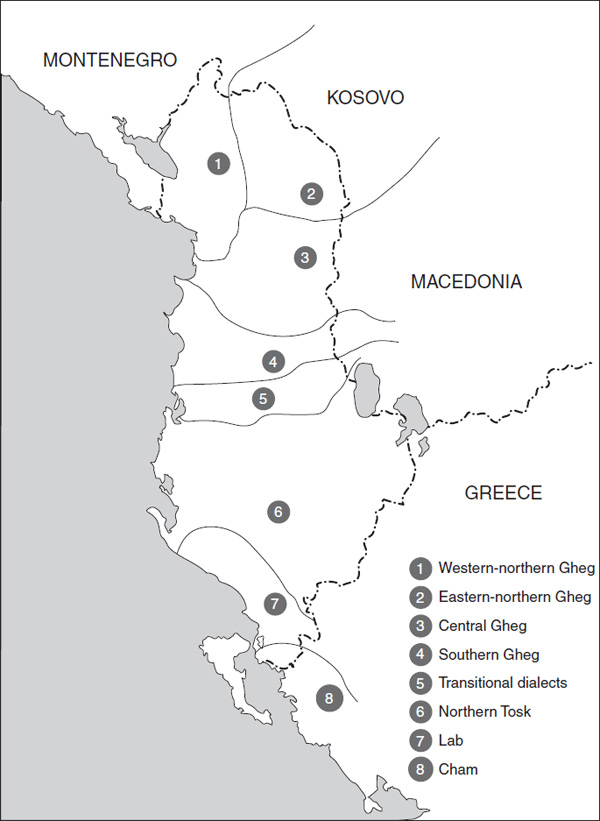
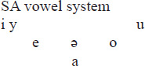
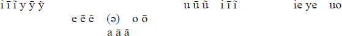
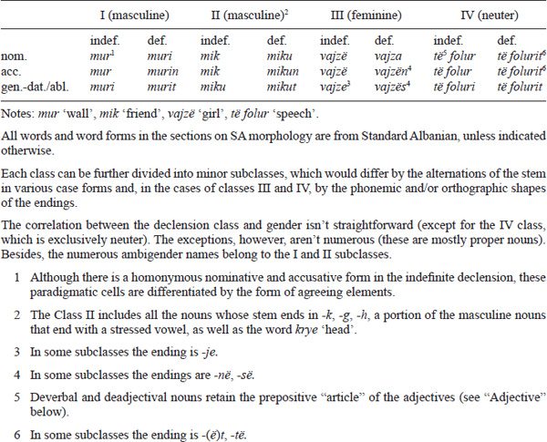
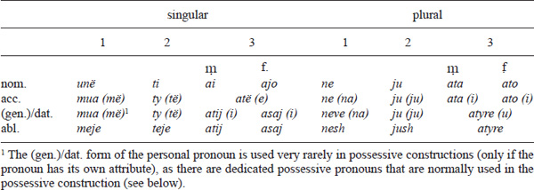
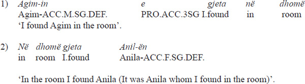
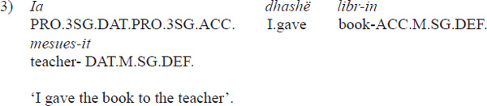
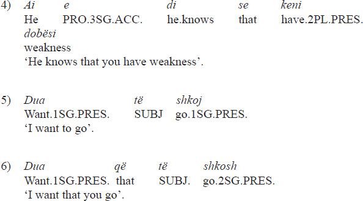
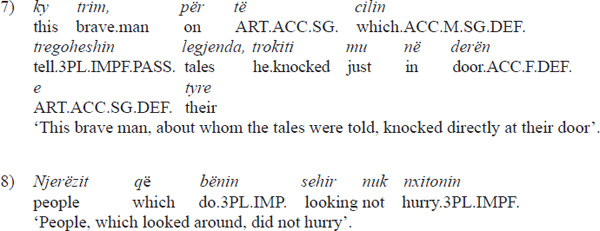

#

<!-- page: 552 -->

Part 12

# **Albanian**

*Alexander Rusakov*

## **Introduction**

*Current geographic distribution.* Albanian is currently spoken in Albania, Kosovo, the southern part of Montenegro, the southern part of Serbia, the western part of Macedonia and, to some extent, the northwestern part of Greece. Sizeable old Albanian diasporas exist in various regions of Greece (since the late 13th–14th centuries), in the southern Italy (since the 15th century), near Zadar in Croatia (since the 18th century), in Bulgaria and Ukraine (this population probably left Albania in the 16th century). Albanian is spoken by approximately 7.5 million speakers.

*Dialects.* In terms of dialectal variation, the Albanian language area is divided into two large zones – the Northern (or *Gheg*) and the Southern (or *Tosk*); the Shkumbin river, which crosses Albania from east to west, forms a border between the two zones (a narrow strip of transitional dialects is situated to the south of the Shkumbin river). The dialects of northern Albania, Kosovo, Montenegro, and Serbia; the diaspora dialect of Zadar; and the majority of the Albanian dialects of Macedonia belong to the Gheg zone, while all other dialects belong to the Tosk zone.

The main differences between the Gheg and Tosk dialects in phonetics are (1) the so-called rhotacism (the change -*n-* \> -*r-* in Tosk); (2) the presence of nasal vowel series in Gheg and the absence of nasal vowels in Tosk; (3) the correspondence between Gheg stressed nasal *ã* and Tosk stressed *ǝ*; (4) the correspondence between Gheg *vo-* and Tosk *va-* in some words. Concerning all these phenomena, the Gheg dialect features a more archaic language state than the Tosk dialect. Other phonetic isoglosses are not absolute. On the basis of the distribution of these phonetic phenomena in lexical borrowings one may conclude that the division of (pre)Albanian language continuum into the Gheg and Tosk zones had to occur in the last centuries of the first millennium A.D.

The main morphological difference between the Gheg and Tosk dialects, which is also almost absolute, is the presence of the analytical infinitive form in Gheg. The Tosk dialect lacks the infinitive form *strictu sensu* (except some lexicalized remnants). There are some other less important morphological differences between the two dialects (e.g. lack of a possessive-reflexive pronoun in Tosk, some differences in word-formation affixes, and so on). Some other phonetic and morphological differences will be listed in the relevant sections of this chapter.

Both the Gheg and Tosk zones are divided into numerous subdialects. The main Gheg subdialects are northern Gheg (further subdividing into western and eastern subdialects), central Gheg and southern Gheg (or Gheg of Central Albania). The Tosk dialect divides into northern Tosk (further subdividing into western and eastern subdialects) and southern Tosk (Lab and Cham dialects). The main diaspora dialects, *Arbresh* (the Albanian dialects of Italy) and *Arvanitika* (the Albanian dialects of Greece), are closest to southern Tosk, although they (especially Arbresh) also demonstrate some specific dialectal traits due to the complex scenarios of their respective speakers’ migrations. Both dialects are very important for Albanian language history.

<!-- page: 553 -->

**Map 12.1 **The Albanian dialects

Source: Adapted from: Gjinari et al. 2007, map C and Gjinari J., Shkurtaj Gj. 2009, *Dialektologji*, Shtëpia botuese e librit universitar, Tiranë: p. 161

Modern Standard Albanian was consolidated after the Second World War on the basis of the Tosk dialect but including some elements (mainly, lexical and, to a lesser degree, (morpho)phonological and morphological) of the Gheg dialect. Now the standard language is used as such in all parts of the Albanian language area.

*

<!-- page: 554 -->

Documentation of Albanian.* The first well-documented mention of Albanians as a separate ethnic entity is encountered in the “Historia” by Michael Attaleiates (1079–1080), where Albanians are mentioned with respect to the Durrës region in the year 1078 (two earlier mentions under the years 1038 and 1043 are disputable). The first known mention of Albanian as a separate language is found in a legal document from a Raguza (Dubrovnik) archive dated 1285: *Audivi unam vocem clamantem in monte in lingua Albanesca* ‘I heard a voice on the mountain that shouted in the Albanian language’. The first Albanian language record (in the Gheg dialect) is the baptismal formula (*Unte paghesont premenit Atit et birit et spertit senit* ‘I baptize you in the name of the Father and the Son and the Holy Ghost’) from 1462, included in the Latin pastoral letter of Archbishop of Durrës Pal Engjëlli (Paulus Angelus), a close associate of Scanderbeg. There are some other short language records (in both Gheg and Tosk) belonging to the end of 15th and beginning of the 16th centuries (see Roques 1932, Shuteriqi 1976, Matzinger 2010).

The first important early Albanian written text is “*Meshari*” (Missal) by the Catholic priest *Gjon Buzuku*, printed in 1555 (most likely in Venice); only one copy is preserved, and the text comprises 188 pages. “*Meshari*” was written in the northern variety of the Gheg dialect; it remains the main source for the study of the earliest stage of Albanian. “*Meshari*” opens the *North Albanian Catholic tradition* in the development of Albanian writing. Overall, some ten printed texts belonging to this tradition and published before the middle of 18th century are known. All these publications use Latin script with rather similar graphic and orthographic conventions. These books are mostly devoted to spiritual and church matters (however, there was also a *Dictionarium latino-epiroticum* (Roma 1635) by *Frang Bardhi* (Franciscus Blanchus)). Besides Catholic literature, some other traditions in the early Albanian writing can be identified. One of these traditions is the *Orthodox tradition of Central and South Albania*, which is represented by the texts created between the second third of the 18th and the first third of the 19th centuries. These texts were written in southern Gheg and Tosk and used both Greek script and various original alphabets invented by educated Albanians especially for their own language needs. Along with a small number of religious texts, two multilingual dictionaries of great value belong to this tradition: *Theodor Kavalioti’s* “*Prôtopeiria*” (1770) and *Daniel of Voskopoja’s* “*Eisagôgikê didaskalia*” (1802). The *Muslim tradition of Old Albanian writings* covered the entire territory of Albania but was especially prosperous in the cities of Central Albania, where some poets of a high poetical level wrote their verses using Arabic script from the beginning of the 18th till the middle of the 19th century. Great significance for the study of Albanian belongs to the *Italo-Albanian (Arbëresh) writing tradition*, which started with “*E mbsuame e krështere*” (Christian Doctrine) by *Luca Matranga* (published in 1592 in Rome, written in Latin script; it represents a good example of the old stage of the southern Tosk dialect; the book is very valuable for the study of both the Italo-Albanian dialect and Arvanitica; see Sasse 1991: 8–9) and flourished in the 19th century.

The period starting from the middle of the 19th century marks the beginning of the development of the Standard Albanian language.

*The ethnic and language name.* The old Albanian ethnic and language name has been used since the oldest Byzantine and Latin sources in the two forms of the root *arb-* and *alb-* (which form is etymologically primary remains unclear): *Ἀρβανιτῶν* by Attaleiates, *lingua Albanesca* in the Dubrovnik document from the 13th century and so on (cf. also *Ἀλβανοί* and *Ἀλβανόπολις* by Ptolemy; see below). Albanians themselves used this name only with the root *arb-* (see, however, the name of Albanian tribe *lab*, and of the corresponding area *Labëri*, probably from *alb-* with metathesis). The name with the root *arb-* is mentioned in old Albanian documents, but it went out of use in the main part of Albanian-speaking

<!-- page: 555 -->

area and remains in use only in diaspora dialects (It.-Alb. *arbëresh*, Gr.-Alb. *arvanitas*). In other areas, it has been replaced by the term with the root *shqip*-: *shqip* ‘Albanian (used as an adverb)’, *gjuha shqipe* ‘Albanian language’, *shqiptar* ‘Albanian (ethnic name)’ and so on. This name is derived from the verb *shqiptoj* (‘to speak clearly’, earlier ‘to understand’; see B. Demiraj 2010); it was first registered in the 16th century (at the beginning in its adverbial form) and consolidated in the 18th century. The ethnic name change was triggered most likely by the Ottoman conquest (end of the 14th century–second half of the 15th century), which led to deep changes in the structure of the Albanian nation (for the Albanian ethnic and language names see, first of all, B. Demiraj 2010).

*The origin and early history of the Albanian language.* The fact that written evidence concerning the Albanian language and Albanians is historically rather shallow makes it problematic to reconstruct the earlier stages of Albanian language history. From the end of the 19th century, a central place in this problem belongs to the question of the possible development of Albanian from one of the languages that were spoken in Antiquity in the northern part of the Balkans. However, this question itself resulted from speculations that were largely deductive. Two main theories consider Albanian as a descendant of either Illyrian or Thracian languages, respectively (for an overview see Matzinger 2009, 2012b). According to the former theory, Albanians were autochthonous to the area that roughly coincided with their modern territory; the latter theory assumes that the ancestors of Albanians came to the modern territory from a more eastern part of the peninsula. This aspect of the “origin problem” accounts for the political shade of the debate: the Illyrian theory became a sort of a sacred cow in Communist Albania and remains the mainstream theory among Albanian scholars nowadays. The situation is complicated by the fact that the exact extent of the idioms referred to as the Illyrian and Thracian languages, respectively, is not known. In the case of Illyrian, the issue is relevant, first of all, for Messapian; the status of this idiom is indeterminate and varies in linguistic writings from merely an Illyrian dialect to a different language. In the case of Thracian, one should mention “Daco-Misian,” which was assumed by V. Georgiev to be a separate language and a direct ancestor of Albanian. In the last decades, Dardanian is considered a separate language, also potentially important for Albanian language history.

There are some arguments in favour of either theory. From a purely *historical* point of view, the absence of the mentions of Albanians till the 11th century cannot be considered as an argument against (or in favour of) either the “autochthony” or “migration” hypotheses. The mentions of the tribe *Ἀλβανοί* and the city (?) *Ἀλβανόπολις* (to the East of the Dyrrachion) in Ptolemy’s Geography (2nd century A.D.; see also *Ἄρβων*, a city in Illyria with uncertain localisation by Polybius, 2nd century BC) don’t testify definitively in favour of the historical continuity of the Albanians in this territory: there are many known examples in world history where an ethnic or a language name shifted from one ethnos to another.

There are studies that show some kind of *archeological* continuity between Antiquity and the second half of the first millennium A.D., first of all the so-called *Koman culture* near Kruja. However, regardless of the particular interpretation of excavation materials from an archeological point of view, these studies cannot be decisive for the solution of the problem of ethnic and linguistic continuity.

There are also some *linguistic* data that can be taken as evidence in favour of the Albanian language’s descent from either the Illyrian or Thracian language, respectively. Unfortunately, most of these arguments are weakened by the insufficiency of our knowledge about the ancient Indo-European languages of the Balkan Peninsula.

There are some reliable etymological correspondences between Albanian words and both Illyrian (including Messapian) and Thracian language material (a few glosses and

<!-- page: 556 -->

numerous onomastic tokens). Among the most commonly accepted Illyrian-Albanian correspondences are Illyr. ῥινός ‘cloud, fog’ – Alb. *re, rẽ* ‘cloud’; Messap. βρένδον ‘deer’, βρέντιον ‘deer’s head’ – Alb. *bri*, *brĩ* ‘horn’; Messap. *Juppiter Menzana* ‘the God to whom horses were sacrificed’ – Alb. *mëz*, *mãz* ‘foal’; Tarentian βάρυκα·αἰδοῖον – Alb. *bark* ‘belly’; Messap. *aran* ‘field’ – Alb. *arë* ‘field’; Messap. *bilia* ‘daughter’ – Alb. *bijë* (dial. *bilë*). The Thracian-Albanian (and Dacian-Albanian) correspondences include Dac. μαντεία ‘blackberry’ – Alb. *man* ‘mulberry’; *δράνις (Hesychius) ‘deer’ – Alb. *drê* ‘deer’ and some other.

Lexical data of this kind are obviously insufficient for any kind of decisive conclusions about the relations between Albanian and the two ancient Balkan languages. The same is also true of phonetic Illyrian-Albanian and Thracian-Albanian isoglosses. Given the limits of our knowledge, it is preferable to consider Illyrian, Thracian and Albanian as separate branches within the Indo-European language family.

There are, however, other pieces of linguistic evidence that may be relevant for the determination of the place of the “intermediate Balkan Urheimat” of the Albanians, regardless of whether or not the Albanian language originates from the Illyrian language.

- One piece of evidence comes from the phonetic form of some ancient geographic names localised in the modern Albanian territory, first of all on the Adriatic coast. If it is possible to trace a linguistically continuous path in the phonetic development of these names from their ancient form to their modern form in accordance with Albanian “sound laws,” it would support the hypothesis that the Albanians have been living on their modern territory from Antiquity. There are, however, some phonetic difficulties in reconstructing such a continuous development, for example, with respect to such important Albanian toponyms as *Shkodër* \< *Scodra*, Σκόδρα, *Durrës* \< *Dyrrhachium*, Δυρράχιον, *Shkumbi*(*n*) \< *Scampis*, *Scampinus*. There is a long discussion on the historical development of these names; the most widespread view has it that the historical development of these names does not coincide with the laws of the Albanian historical phonology (e.g. *Scodra* should have developed into something like *Hadër; see Matzinger 2009: 23). By contrast, in the inner Balkans there are some geographic names that show a phonetic development according to Albanian “sound laws” (see e.g. *Nish* \< *Naissus*, Ναισσός).
- Albanian has a rather modest number of old Greek borrowings (33 according to Ölberg 1972). If the ancestors of Albanians lived near the Adriatic coast and communicated with the inhabitants of Greek colonies (Dyrrhachium, Apollonia et al.), the number of Greek loans would have been higher.
- Albanian lacks almost any inherited lexemes related to seamanship. We know, though, that the Illyrians, who were inhabitants of the seacoast, were artful seamen and pirates.

All these pieces of evidence indicate, although somewhat indirectly, that in the époque of late Antiquity the ancestors of Albanians did not live on the Adriatic coast or in close proximity to it. We can say nothing, however, about where they actually did live at this time.

Another group of linguistic facts is more relevant for the solution of the Albanian homeland problem. These are the numerous Albanian-Romanian correspondences. These correspondences pertain to various linguistic levels. There are numerous correspondences in grammar, first of all a striking similarity in the architecture of the noun phrase (see the sections “Morphology” and “Syntax”). The source of the common development is, most likely, Albanian. There are also some phonological (e.g. diphthongization of *e*, see

<!-- page: 557 -->

the section “Phonology”) and morphonological (similar patterns of number expression in masculine nouns; see the section “Morphology”) resemblances. Numerous Albanian-Romanian lexical correspondences include early Albanian borrowings into Romanian, those words that entered both languages from some common (and unknown) sources as well as Latin words that are found exclusively in Romanian and Albanian (see Vătăşescu 1997, Kaluzhskaya 2001). These phenomena point to a long period of very intensive contacts between the ancestors of Albanian and Romanian. The time of these contacts should coincide with the period of the formation of the (Daco)Romanian language, that is, the middle of the first millennium A.D. As far as localization is concerned, we may hypothesize that it was the inner part of the Balkan Peninsula (maybe the territory of ancient Dardania; see Jokl 1924; the triangle Niš–Sofia–Skopje, see Weigand 1927).

*The layers of the Albanian lexicon.* It is believed that Albanian belongs to languages with a high amount of lexical borrowings (in this respect Albanian is similar to Armenian; see Matzinger *in print*). The etymological dictionary of inherited (i.e. non-borrowed) Albanian words by Bardhyl Demiraj lists 572 tokens (without the derivates that originated in Albanian; B. Demiraj 1997: 37). Since Albanian is a language with a relatively shallow written attestation, the importance of borrowings as data for the study of historical phonetics (and, to a lesser degree, historical morphology) is extremely high.

In terms of chronology, the earliest massive layer of borrowings in Albanian is the *Latin* layer (for a small number of old Greek loans, see above). The period of intensive Albanian-Latin language contacts might have begun in the early 1st century AD, after the final incorporation of the West Balkans into the Roman state (Romans’ first contacts with the West Balkan seacoast happened in the 3rd century BC) and continued until the 5th–6th century AD, eventually taking the form of Albanian-(Proto)Romanian contacts. The Latin borrowings in Albanian (see Mihăescu 1966, Haarmann 1972, Landi 1989, Vătăşescu 1997, Bonnet 1998) are very numerous: according to the various lists the number of Latin etymons in Albanian is no less than 600; these borrowings cover practically all parts of the Albanian lexicon in both semantic and morphological dimensions. It should be noted that although the main part of Latin loans belongs to the cultural lexicon (see e.g. *gjyq* ‘trial, court’ \< *iūdicum*; *mjek* ‘physician’ \< *medicus*), there are also some basic vocabulary items that have been borrowed from Latin (see e.g. *vij* ‘come’ \< *venio*; *këmbë* ‘leg, foot’\< **camba* et al.). There are some derivational affixes borrowed from Latin (see the section “Word Formation”). Any direct influence of Latin on Albanian phonetics and morphology is rather uncertain. The Latin borrowings came into (Proto)Albanian at the time when (Proto)Albanian was experiencing great changes, and that is why these borrowings constitute the main source of our knowledge about the absolute chronology of Albanian language history.

The Albanian-*Slavic* language contacts (see Selishchev 1931, Jokl 1934, Desnickaja 1968, Svane 1992, Ylli 1997) began after the Slavic invasion into the Balkans and continue, in a sense, until now. Unlike Latin borrowings, which are for the most part common Albanian, a great part of Slavic loans have a clear dialect distribution (according to Ylli 1997 only a quarter of some 1000 Slavic borrowings have a more or less pan-Albanian distribution). According to historical-phonetic criteria, there is a small group (circa twenty) of Slavic borrowings that had to enter Albanian relatively early (before the 10th–11th century), whereas the chronological fixation of the most part of Slavic loans remains unclear. The main source of the Slavic loans for the southern dialects of Albanian was Macedonian-Bulgarian dialects, while the main source for the northern dialects was Serbo-Croatian dialects. Slavic borrowings belong to various semantic domains, but are mostly related to the cultural lexicon (*oborr* ‘yard’, cf. Bulg.-Mac. *obor*, SCr. *obor*; *bujar* ‘noble’ \< Slav. *boljar*). Some Slavic derivational suffixes also entered Albanian.

<!-- page: 558 -->

The Middle and Modern *Greek* borrowings (prevailing in southern Greek dialects of Albanian) date back to early medieval times. *Italian* loans date back to the beginning of active contacts by the Italian states with this part of the Dalmatian coast (11th century); many early Italian borrowings came from the Venetian dialect.

After the Ottoman invasion (end of the 14th–15th century) a great influx of *Turkish* words (including Arabic and Persian borrowings in Turkish) overflowed Albanian. In this layer, there are a great number of terms related to economic, administrative and spiritual life (*bajrak* ‘banner, an administrative district in the Albanian mountains’ \< *bayrak*, *borxh* ‘debt’ \< *borç*, *sevda* ‘love’ \< *sevda*), but also various pragmatically loaded, “gesture-like” words (*kismet* ‘fate (used as an interjection)’ \< *kısmet*), as well as some words that belong to basic vocabulary (*jeshil* ‘green’ \< *yeşil*). Since the beginning of the Albanian national- cultural revival (the so-called National Renaissance or National Awakening) in the second half of 19th century the main trend in Albanian language policy was to eliminate Turkish loans as a symbol of national oppression and undesirable “easternization”. Many Turkisms really went out of use, and some shifted to the domain of popular, “sub-standard” language, but many Turkish words remain part of the present Albanian lexicon. Albanian also has a small amount of grammatical morphemes borrowed from Turkish (on Turkish borrowings see, first of all, Boretzky 1975–1976).

Since the end of the 19th century and, especially, in the 20th and 21st centuries, an innumerable amount of *internationalisms* entered Albanian. The sources of these words depended on political circumstances (Italian and French before the Second World War, Russian in the first two decades of Communist rule, and English in recent decades).

Albanian diaspora dialects have a great number of words from current and old neighboring languages: Arvanitica from Greek, Arbresh from Greek and Italian (a big part of the ancestors of present Italo-Albanians came from Greece) and so on.

*Areal position of Albanian.* There have been numerous attempts to determine the areal place of Albanian within the IE languages (see, for example, Porzig 1974, Pisani 1950, 1959, Jokl 1963, Hamp 1966, Orel 2000). The detailed investigation of lexical as well as, to a lesser extent, phonetic and grammatical isoglosses indicates that there are especially close connections of Albanian with North-Eastern IE languages (Baltic and Slavic), on the one hand, and with Greek, on the other hand. There are discrepant opinions with respect to the chronological assessment of these two groups of convergences.

Recently, there has been a discussion of the so-called Balkan Indo-European, which includes Greek, Albanian, Armenian and Phrygian, and which is understood as an intermediate protolanguage (see the overview in Matzinger 2012a).

Modern Albanian is considered one of the base members of the Balkan Sprachbund, which also includes Bulgaro-Macedonian, some Serbian dialects, Balkan Romance, modern Greek and Romani. Standard Albanian indeed shares the majority of the so-called Balkanisms, such as the presence of stressed /ə/, the postpositive article, the merger of genitive and dative, the lack of the infinitive, the volitive future, the object clitic doubling and some others (see “Phonetics”, “Morphology” and “Syntax”; see also Schaller 1975, Asenova 2002). The Balkanisms must have been formed in the broad temporal interval between the middle of the first millennium A.D. and the first centuries of the Ottoman invasion, which covers the second half of the Proto-Albanian and the Old Albanian period. The same time span is the period of the europeanization of Albanian: Albanian shares 8 or 9 of 12 diagnostic features of Standard Average European as listed in Haspelmath 2001 (among them the presence of both definite and indefinite articles, the possessive perfect, relative clauses with relative pronouns, the participial passive etc.). Apparently, balkanization and europeanization of Albanian could have developed parallel to each other.

*

<!-- page: 559 -->

The Albanian alphabet.* The modern Albanian alphabet, which was elaborated and accepted in 1908, is consistently phonological. It consists of 36 graphemes (including digraphs). The following graphemes should be explained:

|          |     |                                                            |
|----------|-----|------------------------------------------------------------|
| grapheme |     | phonemic value                                             |
| c        |     | ts                                                         |
| ç        |     | č                                                          |
| dh       |     | ð                                                          |
| ë        |     | ə (stressed and unstressed, sometimes it isn’t pronounced) |
| gj       |     | ɟ                                                          |
| l        |     | l’                                                         |
| ll       |     | ɫ                                                          |
| nj       |     | n’                                                         |
| q        |     | c                                                          |
| rr       |     | rː                                                         |
| sh       |     | š                                                          |
| th       |     | θ                                                          |
| x        |     | dz                                                         |
| xh       |     | ǯ                                                          |

**Table 12.1 Albanian alphabet**

### **Periodization of Albanian language history, reconstructed stages of Albanian**

In the following sections I shall use the following nomenclature for periods in Albanian language history.

- *Pre-Proto-Albanian period*, the language of the ancestors of Albanians before the beginning of intensive contacts with Rome, i.e. before the first century AD. In the end of this period many important sound changes took place that moved (Proto)Albanian away from the (late) PIE state, e.g. the merger of PIE *o and *a as well as the merger of PIE *ā and *ē, considerable changes of the consonant system (the merger of the PIE Media and Media Aspirata, the changes in the gutturals, which, however, have preserved an opposition of the reflexes of all three series); and, probably, the stress changes (see the section “Phonology”).
- *Proto-Albanian*, the language of the first millennium AD, the time of intensive contacts with Latin and early contacts with Slavic. A new wave of important changes took place during this period, among them the reduction of the pre- and post-tonic syllables (which drastically changed the phonetic shape of Albanian word); the old quantitative vowel opposition was lost; the intervocalic voiced consonants were weakened and, partly, lost (the exact conditions of this loss are not completely clear; see the section “Phonology”); as a result of the syllable reduction a large part of PIE endings were lost, and eventually many new morphological formants were agglutinated instead; important grammatical balkanisms arose in this period (most likely due to intensive contacts between the ancestors of the Albanians and Romanians; see the sections “Morphology” and “Syntax”). At the end of this period, just before the split into the Tosk and Gheg dialects, that is, at the end of the first millennium AD, the (Proto)Albanian language took a form that is quite similar to that of the Albanian language as known to us from written sources.
-

<!-- page: 560 -->

*Old Albanian*, the language from the time of the first dialect split till the end of the period of the old written texts, that is, till the 18th century. This period can be further subdivided into Early Old Albanian (from the beginning of the first millennium AD to the earliest written texts) and Late Old Albanian (16th–18th centuries). Early Old Albanian was characterized by secondary contacts between the Gheg and Tosk dialects in the territories that roughly coincide with the modern Albanian-speaking area and by the processes of forced balkanization of Albanian, especially in the south of the Albanian-speaking territory. In the Late Old Albanian period (the time after the Ottoman conquest), the modern Albanian dialectal landscape was formed.
- *Modern Albanian,* the Albanian language of the 19th–21st centuries.

This periodization presented here is almost identical to those used by B. Demiraj (1997), Matzinger (2006), Hock (2005, with an analytical overview of previous attempts at periodization), Schumacher/Matzinger (2013) and de Vaan (*in print*) and differs somewhat, mainly in terminological details, from those by Desnickaja (1984), Ölberg (2013) and Orel (2000).

In the sections considering phonetics and grammar I shall operate with reconstructed Albanian units (phonemes, fragments of the phonemes systems, forms, paradigms and so on). The following designations will be used:

- *PA* for the stage that is reconstructed based on the comparison of the Gheg and Tosk dialects as well as the language of the Old Albanian written texts. It can be assumed that this reconstructed stage corresponds more or less to the Albanian language just before the dialect split, i.e. to Albanian at the very end of the Proto-Albanian period.1 Sometimes the designation EPA, early Proto-Albanian, is used for units that belong to relatively earlier stages in the development of Albanian within the Proto-Albanian period.
- *PPA* (only when needed) for the stage of the Albanian development just before the beginning of the contacts with Rome, i.e. on the border between the Pre-Proto-Albanian and Proto-Albanian periods.

In addition, the term Standard Albanian (SA) will be used.

## **Phonology**

In this section I chiefly rely on the following surveys of Albanian historical phonology: B. Demiraj 1997, Matzinger 2006, Ölberg 2013 (for vocalism); Schumacher/Matzinger 2013; and de Vaan *in print*; I also take into account Çabej 1976; Sh. Demiraj 1996, Orel 2000, Topalli 2006; see also the overviews of the development of Albanian sound system in Hock 2005 (vocalism and consonantism) and Vermeer 2008 (vocalism).

In what follows the vowel, resonant and consonant subsystems of Albanian as well as the problem of Albanian stress patterns will be described in turn. For each subsystem, a discussion of the SA system will be followed by the reconstruction of the alleged PA stage, based on the data from dialects and the earliest written texts. The history of PIE sounds in Albanian will be the topic of the next part in each paragraph. Only the main lines of the sound development will be specified; for the others the necessary references will be given. The illustrative etymological material (based, first of all, on B. Demiraj 1997, Schumacher & Matzinger 2013, Orel 1998 and Çabej 1976–2014) will be given in a very selective way.

###

<!-- page: 561 -->

**Vowels**

All Albanian vowels may be used in both stressed and unstressed positions. Therefore, the standard Albanian vowel system is very close to the idealized Balkan vowel system (five basic vowels + stressed *ə*): the only extra vowel is the labialized high front phoneme *y*.

#### *Vowels: basic dialectal differences. Reconstruction of the PA system*

The Standard Albanian system above is very close to the system attested in the majority of Tosk dialects. Other dialects differ, however, in this respect from the standard language to a great extent. The major differences are the following.

- In the Gheg dialects and in a small part of the Tosk dialects (namely in their southern parts, that is, the Lab and Cham dialects, as well as in some Arbresh dialects) there is an opposition between long and short vowels. This opposition is also attested in old Albanian written texts; thus, it used to be a pan-Albanian feature that was later lost in the greater part of the Tosk area.
- The Gheg dialects have a special series of nasal vowels (*ã*, *ĩ*, *ũ*, *ỹ*, *ẽ*, but nasal *õ* is lacking), which developed in the PA period and disappeared in the Tosk dialects. It should be noted that the authors of the first written texts either do not mark vowel nasalization at all or do so in a very inconsistent way. PA *ã* developed into Tosk *ë* /ə/: Gheg *ãsht* ‘(s)he is’ – SA, Tosk. *është* id.; PA *ẽ* developed into *ë* or *e* depending on the dialect (and depending on the phonetic position in some dialects) in Tosk: Gheg *vẽnd* ‘place’ – SA, Tosk *vend*, *vënd* id. Whether there is/was a phonological opposition between *long nasal vowels* and *short nasal vowels* in Albanian dialects and in PA remains an unsolved problem.
- SA lacks diphthongs as independent phonological units; all vowel sequences within words are treated as biphonemic combinations. During the PA period the processes of diphthongization were at work in Albanian, which led to the arising of three diphthongs, namely *uo*, *ie* and *ye* (on the origin of these diphthongs see below, section 1.3). These diphthongs later had different patterns of development in Albanian dialects:
  1.  *uo* \> *ua* in Tosk: *gr'ua, gru'a* ‘wife’ (with different stress patterns depending on the phonetic context and dialect); *ue*, *ū* more rarely *ua* and even *uo* in various Gheg dialects: *grue*, *grū* ‘id.’;
  2.  *ie* \> *ie* in Tosk (with different stress patterns depending on the phonetic context and dialect): Tosk *d'iell*, *dj'ell* ‘the Sun’; *i*, more rarely *ie*, in Gheg dialects: Gheg *dill* ‘id.’;
  3.  *ye* \> *ye* (with different stress patterns depending on the phonetic context and dialect), sometimes *ie* in Tosk: *kr'ye*, *kry'e*, *krie* ‘head’; *ye*, *ȳ* in Gheg dialects: *krye*, *krȳ* ‘id.’
- The number of vowel phonemes differs in various dialects. The major differences (along with the presence/absence of long/short and oral/nasal oppositions) are (see Gjinari et al. 2007):
  1.

<!-- page: 562 -->

A) absence of *y* (\> *i*) (as well as its correlates *ȳ* and *ỹ*) in some Albanian dialects, both Tosk (Lab and Cham dialects) and Gheg;
  2.  B) In Gheg dialects only unstressed *ë* /ə/ is present. During the last centuries a process of the reduction of unstressed *ë* has been under way in Albanian. This process is especially strong in the Gheg dialects. It seems that unstressed *ë* is not phonemic in the majority of Gheg dialects. By contrast, analysis of the old Gheg texts points toward the phonemic status of unstressed *ë.*
  3.  C) In Lab and Cham dialects there is an opposition between /ə/ and /əː/.
  4.  D) In northern Gheg dialects, there are two additional long vowel phonemes with very restricted spheres of use (only some words for each).
      1.  a) /ǣ/, /ę̄/ \< *ae* (*ae* is used as such in the earliest written texts); this vowel is typical in a large part of the northern Gheg and central Gheg dialects: *th*/*ǣ*/ ‘you said (aor.)’, other dialects: *the* ‘id.’
      2.  b) /ø̄/ \< *oe* (*oe* is used as such in first written texts); this vowel is found in some western northern Gheg dialects: *v*/ø̄/*së* ‘dew’, other dialects: *vesë* ‘id.’
- In the central Gheg dialects, a set of diphthongization processes (as well as some other vocalic changes) took place, probably in the Late Old Albanian period: /i/ \> /aj/, /ej/, /әj/, /e/; /u/ \> /ou/, /au/; /a/ \> /æ/; /o/ \> /œ/, /ou/; /y/ \> /i/, /aj/, /œ/; the long and nasal correlates of these vowels followed parallel patterns of development. For the phonetic conditions of such changes, see Jusufi 2011; the phonemic status of the variants that emerged in this process is not entirely clear.

To sum up, the following vowel system can be reconstructed for the *very end of the PA period*:

Notes: /ə/ appeared only as an unstressed vowel.

The opposition of the short and long vowels might have arisen either at the end of the PA or the very beginning of the OA period. In the latter case the opposition must have developed in the Gheg and Tosk zones independently under similar conditions, which is less plausible. It remains unclear whether there was ever an opposition between short and long vowels in unstressed syllables.

Perhaps there also existed a special series of long nasalized vowels.

The system as reconstructed above is very close to that of some conservative western northern Gheg dialects.

#### *1.2 Vowels: the origin*

The origin of PA long and nasalized vowels will not be traced in this section (see section 1.3 on their origin).

<table>
<caption>

<!-- page: 563 -->

<strong>Table 12.2 PIE short vowels (in stressed position)</strong></caption>
<colgroup>
<col style="width: 20%" />
<col style="width: 20%" />
<col style="width: 20%" />
<col style="width: 20%" />
<col style="width: 20%" />
</colgroup>
<tbody>
<tr class="odd">
<td class="tleft" style="border-top: 1px solid windowtext">
PIE phonemes
</td>
<td class="tleft" style="border-top: 1px solid windowtext"></td>
<td class="tleft" style="border-top: 1px solid windowtext">
PA and SA reflexes
</td>
<td class="tleft" style="border-top: 1px solid windowtext"></td>
<td class="tleft" style="border-top: 1px solid windowtext">
examples
</td>
</tr>
<tr class="even">
<td class="tleft">
1. *a (also *h₂e), *o (also *h₃e), *H (in the roots in zero-grade)
</td>
<td class="tleft"></td>
<td class="tleft">
PPA, PA *a &gt; SA <em>a</em>
</td>
<td class="tleft"></td>
<td class="tleft">
SA <em>bathë</em> ‘broad bean’ &lt; PIE *bʰakˊ-; SA <em>natë</em> ‘night’ &lt; PIE *nokʷt-; SA <em>mas</em>, <em>mat</em> ‘to measure’ &lt; PIE *mHt-(io)-
</td>
</tr>
<tr class="odd">
<td class="tleft">
2. *e (also *h₁e)
</td>
<td class="tleft"></td>
<td class="tleft">
a) PA, SA <em>e</em> after CR- and/or before-NC;

b) PA, SA <em>ja</em>;

c) PA, SA <em>ie</em>/_*r, <em>l</em>

d) PA, SA <em>je</em> (elsewhere)
</td>
<td class="tleft"></td>
<td class="tleft">
a) SA <em>bredh</em> ‘to wander’ &lt; PIE *bʰred(ʰ)-; <em>dhemb</em> ‘to ache’ &lt; PIE *ǵembʰ-

b) SA <em>jam</em> ‘I am’ &lt; PIE *h₁esmi

c) SA <em>bie</em> ‘to bring’ &lt; PIE *bʰer-

d) SA <em>djeg</em> ‘to burn’ &lt; PIE *dʰegʷʰ-
</td>
</tr>
<tr class="even">
<td class="tleft">
3. *i (also *Hi)
</td>
<td class="tleft"></td>
<td class="tleft">
PA, SA <em>i</em>
</td>
<td class="tleft"></td>
<td class="tleft">
SA (<em>i</em>) <em>lig</em> ‘bad, ill’ &lt; PIE *h₃lig-
</td>
</tr>
<tr class="odd">
<td class="tleft" style="border-bottom: 1px solid windowtext">
4. *u (also *Hu)
</td>
<td class="tleft" style="border-bottom: 1px solid windowtext"></td>
<td class="tleft" style="border-bottom: 1px solid windowtext">
PA, SA <em>u</em>
</td>
<td class="tleft" style="border-bottom: 1px solid windowtext"></td>
<td class="tleft" style="border-bottom: 1px solid windowtext">
SA <em>gjumë</em> ‘sleep’ &lt; PIE *sup-no-
</td>
</tr>
</tbody>
</table>

<!-- page: 563 -->

**Table 12.2 PIE short vowels (in stressed position)**

Notes

 1. Latin *o* in borrowings manifests as *o* in SA; Latin *a*, *ā* \> Alb. *a*. Based on this evidence, the change from PIE *o to *a can be dated back to the PPA period.

 2. Latin “wide” *e* (\< Lat. *ĕ*, *æ*) experienced similar changes in roughly identical phonetic conditions also, so we may attribute them rather to the end of the PA period.

b) The conditions are not entirely clear.

c) Maybe the change has a later character and is parallel with the diphthongization of other PA vowels (see 1.3).

3–4. Lat. *i* \> SA Alb. *i* (on the reflex Lat. *i* \> Alb. *e* see below); Lat. *u* \> SA *u*.

##### PIE long vowels

The vowels in the PIE lengthened grade, the sequences *Vh₁/₂/₃ and vowels resulting from the sequences *Vsr/l (with the following loss of the *s: SA *dorë* \< PIE *ǵʰes-r-) must have merged in the PPA period.

|                                    |     |                                             |     |                                                                                    |
|------------------------------------|-----|---------------------------------------------|-----|------------------------------------------------------------------------------------|
| PIE phonemes                       |     | PA and SA reflexes                          |     | examples                                                                           |
| 1. *ā (and *eh₂),*ē (and *eh₁) |     | PPA *ā \> PA *o (earlier *ɔ) \> SA *o*   |     | SA *motër* ‘sister’ \< PIE *meh₂-tr-; SA *mot* ‘time, weather’ \< PIE *meh₁-t    |
| 2. *ō (and *eh₃, *oH)           |     | PPA *ō \> PA *e* (earlier *œ), SA *e*     |     | SA *derë* ‘door’\< PIE *dʰwōr-                                                    |
| 3. *ī (and *iH)                  |     | PA, SA *i                                  |     | SA *pi* ‘drink’\< PIE *pih₃-                                                      |
| 4. *ū (and *uH)                  |     | PA *y \> SA *y; later *y \> *i*/\_(*s*)# |     | SA *gjysh* ‘grandfather’ \< PIE *suHso-; SA *mi*, Gheg. *mī* ‘mouse’ \< PIE *mūs |

**Table 12.3 PIE long vowels (in stressed position)**

Notes

 1. Old Greek borrowings in Albanian show the replacement of *ā* by SA *o*. Lat. *ā* gives Alb. *a* (for another opinion, see, however, Schumacher & Matzinger 2013: 221), and Lat. *ē* \> Alb. *e*, *i*. Based on this evidence, the merger of PIE vowels and their change to a vowel other than *a* must have taken place at the end of the PPA period.

 2. Latin *ō* also changed to *e*, at least in the older group of Latin borrowings, which makes it possible to establish a *terminus ante quem* for this process. The intermediate stage of the development of this vowel should have been *œ.* Another reflex of Latin stressed *ō* in Albanian is *o*; most likely, this reflex is found in the later layer of borrowings – it coincides with the reflex of the Latin stressed short *o*. Latin short *o* in Albanian also has the reflex *u* (maybe in the older borrowings).

<!-- page: 564 -->

It can be hypothesized (see Matzinger 2012b) that at the beginning of the contacts with Latin, that is, at the beginning of the PA period, the early PA vowel system still had quantitative distinctions. Thus, the Latin long *ō* was replaced by early EPA *ō (later *œ \> SA *e*), Lat. short *o* by PA *u (short *o was lacking in the early PA system after the change from PIE *o to PPA *a), and both Lat. *a* and *ā* by PA *a. Then, after the change *ō \> *œ, both Lat. *o* and *ō* (which have lost their quantitative distinctions in Late Latin and merged in East Romania) came to be replaced by PA *ɔ (\< PIE *ā, *ē).

 3. Lat. *ī* reflects as SA ***i (SA *mik* ‘friend’ \< Lat. *amicus* ‘friend’). Latin short *i* had two reflexes: SA *i* and SA *e*. The same two reflexes are also characteristic of Lat. *ē*. It seems that at the time of the contacts with Albanian, Lat. *i* and *ē* merged in the close *ẹ (it was characteristic of Vulgar Latin in general), which differed from open *e (\< *e*, *ae*). In the first period of the contacts (when PIE *ay, *oy hadn’t yet changed into *ẹ \> SA *e*; see below, and also de Vaan 2004) Lat. *ẹ was replaced by PA *i*; later, when this change was already in progress, Lat. *ẹ* began to be reflected by *ẹ.

 4. Lat. *ū* has two reflexes in Albanian: SA *y* (older layer) and SA *u*.

##### PIE diphthongs

There is almost no reliable etymological data concerning the development of PIE long diphthongs in Albanian.

|               |     |                             |     |                                                                           |
|---------------|-----|-----------------------------|-----|---------------------------------------------------------------------------|
| PIE phonemes  |     | PA and SA reflexes          |     | examples                                                                  |
| 1. *ay, *oy |     | EPA *ẹ \> PA *e \> SA *e* |     | SA *edh* ‘kid’ \< PIE *(H)ayǵ-; SA *shteg* ‘path, road’ \< PIE *stoygʰ- |
| 2. *ey       |     | PA, SA *i*                  |     | SA *dimër*, Gheg *dimën* ‘winter’ \< PIE *ǵʰeymōn                        |
| 3. *aw, *ow |     | PA, SA *a*                  |     | SA *ag* ‘dawn’ \< *h₂ewg-; SA *laj* ‘to wash’ \< PIE *lh₃-ew-           |
| 4. *ew       |     | EPA *ẹ \>PA *e \> SA *e*  |     | SA *hedh* ‘to throw’ \< PIE *skewd-                                      |

**Table 12.4 PIE diphthongs (in stressed position)**

Notes

 3. Lat. *au* \> SA *a* in earlier borrowings, and \> *af* in later borrowings.

#### *“Inner Albanian” development of the vowels in the PA period*

##### a) “Umlaut” (*i*-mutation)

EPA *a (\<PIE *a, *o, *H) \> PA, SA *e*, if the following syllable has *i* (or *ī*). This change affected inherited words and the words borrowed from Latin, but not the words of Slavic origin (a few exceptions are usually explained away as a result of analogical processes). This process had a great significance for the Albanian morphological system (see the section “Morphology”): SA *net* ‘nights’ \< EPA *na(k)ti(h). The “umlaut” *e* does not have diphthong-like reflexes. The umlaut pattern EPA *o \> PA, SA *e* and EPA *u \> PA, SA *y* occurs in the same conditions but is less widespread.

The conditions of the change PA *e \> *i* in some verbal and nominal forms are not clear (*i*-mutation, Orel 2000: 145, de Vaan 2004: 71; change before the following consonant cluster, Hamp 1971: 224; the influence of the following palatal consonant, Schumacher & Matzinger 2013: 219–220). The significant role that the alternation *e*: *i* has assumed in the OA and SA verb system (see below, the section “Morphology”) could have been propelled by analogical processes.

#####

<!-- page: 565 -->

b) Diphthongization

EPA *o (\< *ɔ, also \< Lat. *o*, *ō*) \> *uo/\_*r#, *l#, *n#; *n in this position disappeared: PA *kron (\< Gr. κρήνη, Dor. κράνα) \> SA *krua* (Gheg *krue*, *krū*). In the anlaut *o (\< *ɔ) yielded Gheg *vo*-, Tosk, SA *va-* (SA *vatër*, Gheg *votër* ‘hearth, fireplace’ \< *h₂eh₂-tr-).

EPA *œ \> *ye*/\_*r#, *n#; *n# disappears obligatorily, *r disappears optionally (see Schumacher & Matzinger 2013: 224, SA *arsye* ‘cause’ \< Lat. *ratiōnem*).

On the development EPA *e \> PA, SA *ie* /\_*r#, *l# see above.

##### c) Development of the unstressed vowels

One of the most important phonetic changes in the PA period was the reduction of unstressed vowels. Two remarks that concern the chronology of this process should be made: (a) this process affected most Latin loans (see *gusht* ‘August’ \< Lat. *augustus*); and (b) it continued to operate after umlaut processes happened (SA *dash* ‘ram’ \< *deš-i \< *-oi). These facts indicate that the reduction of unstressed vowels was at least partially under way at the end of the PA period. These processes yielded a very complicated and hardly reconstructable picture. In the absolute anlaut unstressed vowels were lost (see *gusht* above), in word-internal positions (both pre-tonic and post-tonic) they were lost in some words (SA *mbesë* ‘niece’ \< Lat. *nepōtia*) and got reduced to /ə/ in other words (SA *këndoj* ‘to sing, to read’ \< Lat. *cantāre*), and it is impossible to establish the strict rules that governed this distribution. As for the auslaut vowels, it seems that the process of reduction was influenced by morphonological conditions (see the section “Morphology”). Generally speaking, it could be supposed that the reduction of unstressed vowels was a rather long-term process: it presumably began as early as in the Pre-Proto-Albanian period and continued at least until the end of the Old Albanian period. A more detailed analysis with examples can be found in de Vaan *in print*; B. Demiraj 1997: 46–47.

##### d) Emergence of nasalization

In the last phase of the PA period a series of nasal vowels developed out of VN sequences with possible loss of *-n in the auslaut syllables (see also 1.1). The vowel *o* did not undergo nasalization and changed instead into the diphthong *ua* before nasal consonants.

##### e) Emergence of the new quantitative opposition

The new quantitative opposition arose, it seems, at the end of the PA or the very beginning of the OA period. The main sources of the lengthening were various processes of contraction, which involved both inherited IE words and Latin borrowings in Albanian (see e.g. *bē* ‘oath’ \< *bʰeydʰā; *mjek* ‘physician’ \< Lat. *medicus*). Lengthening was also caused by the influence of the following resonants -*r* and -*l*. Although dialectally restricted, the processes of lengthening intensively continued, however, later in the Old Albanian period; e.g. vowel lengthening could occur as a result of apocope: eastern-northern Tosk *plak*/*ə*/ ‘old woman’ – Gheg /*plaːk*/ ‘id.’

#### *The development of the vowel system. Conclusion*

To sum up, the main trend of the development from the PIE vowel system into the Albanian vowel system was the loss of the IE quantitative distinctions and their partial replacement

<!-- page: 566 -->

by qualitative distinctions. This process took a long time. Some of the important changes that disrupted the symmetry of the long and short vowel subsystems had occurred already in the PPA period (the merger of PIE *a and *o, the merger of the PIE *ā and *ē). At the beginning of the PA period, the “old” quantitative opposition was still present in Albanian. Very important vocalic changes took place in the PA period. Reflexes of Latin borrowings make it possible to establish a relative chronology of these changes (see e.g. de Vaan 2004). Among the most important PA changes are the development of *ū into *y, the change *ā \> *ɔ \> *o, and the development of various reflexes of PIE *e. At a certain moment the PA system possessed two *e*-like phonemes: the open *e (\< PIE *e) and close *ẹ (\< PIE *ay, *oy, *ew). The second one did not have diphthong-like reflexes. The presence of these two phonemes was paralleled by the Balkan Latin vocal system, which also had two *e*-phonemes (and only one /o/ phoneme, which is also true in Albanian). Whether there was a direct Latin (Roman) influence on Albanian phonetics in this respect remains, however, unclear. Later in the PA period the processes of the diphthongization before sonorant phonemes took place (*e \> *ie*; *o (or *ɔ) \> *uo*; *œ (\< PIE *ō) \> *ye*) as well as umlaut processes. The vowel *e*, resulting from the *i*-fronting of *a* (as well as from *œ \< PIE *ō), merged, at the end of the PA period, with the identical reflexes of *e and *ẹ. Thus, a new quantitative opposition emerged; finally, nasalized vocal allophones gave rise to a special series of phonemes.

### **Sonorants**

|                    |     |     |
|--------------------|-----|-----|
| SA sonorant system |     |     |
| m                  | n   | n’  |
|                    | l   | ɫ   |
|                    | r   | ː   |
|                    | j   |     |

#### *Sonorants: main dialectal differences. Reconstruction of the PA system*

- The absence of the opposition *r*: *r*ː (orthographic *rr*) in some dialects (both Gheg and Tosk).
- The change of *ɫ* into *ð* (some Gheg and Lab varieties) and into *γ* (some Arbresh dialects).
- Some eastern northern Gheg dialects lack the phoneme *n’* (orthographic *nj*; they have *ni* or *n* instead). In many dialects (both Gheg and Tosk) as well as in SA *n’* changes to *j* in some positions, defined in either phonetic or morphonological terms.
- In most Gheg dialects and in a few Tosk dialects there is a special phoneme *ŋ*, which originated from the cluster *ng*.
- The Tosk rhotacism (the change -*n-* \> -*r*-: SA, Tosk *bëra –* Gheg *bãna* ‘I made (aor.)’). Rhotacism applied to both inherited Albanian words and Latin borrowings (SA, Tosk. *rërë* ‘sand’ \< Lat. *arēna*). By contrast, only two early Slavic borrowings in Tosk demonstrate the traces of the rhotacism. These facts make it possible to date this change (and the very moment of Albanian dialectal split) to the last centuries of the first millennium AD. The rhotacism is not a positionally conditioned restriction anymore in SA (nor in the Tosk dialects), which has many words with an intervocalic *-n-*. Along with later borrowings, there are inherited words with -*n-*, as well as Latin borrowings among these words; in these words -*n-* originated from various consonant clusters (see below) and had the form of a geminated or long *nː* at the moment of the beginning of rhotacism.
-

<!-- page: 567 -->

There is an interdialectal correspondence between *l* in Cham and some Arbresh and Arvanitika and other Tosk diaspora dialects and *j* in most of the Tosk and all of the Gheg dialects as well as in SA that emerged as a result of the development of some clusters with *l: *ly \> *l*/*j* (Cham *milë* ‘thousand’: SA *mijë*); *-li \> *l*/*j* (in the plural forms: Cham *popul* ‘people pl.’ – SA *popuj*). This correspondence makes it possible to reconstruct the sound *λ* for the PA stage (see Schumacher & Matzinger 2013: 245). It seems, however, that this sound was in a complementary distribution with other laterals (*l* and *ɫ* ) and can be treated as an allophone rather than an independent phoneme (possibly it continued to function as a cluster *ly* at the end of the PA period).

Thus, the following subsystem of sonorants can be reconstructed for the PA stage:

|     |     |     |     |     |
|-----|-----|-----|-----|-----|
| m   | n   | n:  |     | n’  |
|     |     | ɫ   | l   | (λ) |
|     | ɾ   | rː  |     |     |
|     | j   |     |     |     |

#### *Sonorants: the origin*

<table>
<caption><strong>Table 12.5 PIE sonorants</strong></caption>
<colgroup>
<col style="width: 20%" />
<col style="width: 20%" />
<col style="width: 20%" />
<col style="width: 20%" />
<col style="width: 20%" />
</colgroup>
<tbody>
<tr class="odd">
<td class="tleft border_bot" style="border-top: 1px solid windowtext">
PIE phonemes
</td>
<td class="tleft border_bot" style="border-top: 1px solid windowtext"></td>
<td class="tleft border_bot" style="border-top: 1px solid windowtext">
PA and SA reflexes
</td>
<td class="tleft border_bot" style="border-top: 1px solid windowtext"></td>
<td class="tleft border_bot" style="border-top: 1px solid windowtext">
examples
</td>
</tr>
<tr class="even">
<td class="tleft">
1. *l
</td>
<td class="tleft"></td>
<td class="tleft">
a) PA *l, SA <em>l</em> everywhere except intervocalic position

b) PA *ɫ, SA <em>ɫ</em> /V_V (except the position before the *-i, see above, 2.1.)
</td>
<td class="tleft"></td>
<td class="tleft">
SA <em>lagje</em> ‘quarter’ &lt; PIE *logʰ-

SA <em>hell</em> ‘spear, spit’ &lt; PIE *skōl-
</td>
</tr>
<tr class="odd">
<td class="tleft">
2. *r
</td>
<td class="tleft"></td>
<td class="tleft">
a) PA, SA <em>r</em>/V_V

b) PA, SA <em>rː</em>/#_
</td>
<td class="tleft"></td>
<td class="tleft">
a) SA (<em>i</em>) <em>mirë</em> ‘good’ &lt; PIE *miHr-

b) SA <em>rrjedh</em> ‘to flow’ &lt; PIE *h₃reǵ-
</td>
</tr>
<tr class="even">
<td class="tleft">
3. *m
</td>
<td class="tleft"></td>
<td class="tleft">
PA, SA <em>m</em>
</td>
<td class="tleft"></td>
<td class="tleft">
SA <em>motër</em> ‘sister’ &lt; PIE *meh₂-tr-
</td>
</tr>
<tr class="odd">
<td class="tleft" style="border-bottom: 1px solid windowtext">
4. *n
</td>
<td class="tleft" style="border-bottom: 1px solid windowtext"></td>
<td class="tleft" style="border-bottom: 1px solid windowtext">
PA, SA <em>n</em>
</td>
<td class="tleft" style="border-bottom: 1px solid windowtext"></td>
<td class="tleft" style="border-bottom: 1px solid windowtext">
SA <em>natë</em> ‘night’ &lt;PIE *nokʷt-
</td>
</tr>
</tbody>
</table>

**Table 12.5 PIE sonorants**

Notes

The SA (or PA) *j* arose from the various sources (diphthongization of *e*, development of /λ/, the anti-hiatus sound and so on). On the development of the PIE *y in Albanian see below (the section on *obstruents*).

 1. Lat. *l* has reflexes with a similar distribution in Albanian.

 2. The distribution of the two reflexes of PIE *r is unclear. The picture is further complicated by the presence of numerous doublets with *r*/*rr* alternation among the Latin borrowings in the MA (also in the OA texts). PIE *VrnV \> SA *rː*; PIE *#sr, *wr \> SA *rː-* (see examples in Schumacher & Matzinger 2013: 248). *-ri \> *j* (in the plural forms: *bij* ‘sons’ \< *bir-i); whether an intermediate stage was /λ/ remains unclear.

Lat. *r* \> PA, SA *r*/*rː* both in anlaut and in intervocalic position (with a tendency to follow the pattern of PIE reflexes).

 3. On the reflexes of PIE **-*m in some nominal endings see the section “Morphology”. Lat. *m* \> Alb. *m.*

 4. Lat. *n* \> SA *n*; in Tosk, this sound develops into -*r-* in the intervocalic position (see above on rhotacism). Lat. *gn* \> SA *nj*.

PIE intervocalic *-sn-, *-Cn-, *-nC- yielded PA *-nn-, which further develops into *-n-* in both Tosk and Gheg (for examples, see Shumacher & Matzinger 2013: 249–250).

####

<!-- page: 568 -->

*Further development of PA sonorants*

On rhotacism and the development of the sound *λ* see 2.1.

PA *nj, *ni \> SA *nj*, *j*: SA *brinj* ‘horns pl.’ \< PA *brin-i*; SA *bëj*, Gheg. *bãnj* \< PPA *banyō* (on the change *nj* \> *j* see 2.1). PA *-*rn-* \> SA -*rː*.

On the development of *n* in closed auslaut syllables see 1.3.

#### *Syllabic sonorants*

PIE syllabic *m̥ and *n̥ \> PA *a*, SA *a*: SA (*i*) *gjatë* ‘long’ \< PIE *dln̥gʰ-t-; SA *shtatë* ‘seven’ \< PIE *septm̥-.

The main reflexes of PIE *l̥ and *r̥ are PA, SA *li* and *ri* respectively (a detailed analysis of the distribution of PIE syllabic sonorants in Albanian can be found in Schumacher & Matzinger 2013: 229–232).

### **Obstruents**

|               |       |     |     |
|---------------|-------|-----|-----|
| SA obstruents |       |     |     |
| p b           | t d   | c ɟ | k g |
| f v           | θ ð   |     |     |
|               | s z   |     | h   |
|               | ʃ ʒ   |     |     |
|               | ts dz |     |     |
|               | tʃ dʒ |     |     |

#### *Obstruents: main dialectal differences. Reconstruction of the PA system*

- In some dialects (both Tosk and Gheg) the phoneme *h* is absent; in other dialects (mainly Tosk) it is absent in certain phonetic positions. In many Gheg dialects *h* alternates in some positions with *f*. It should be noted that SA *h* often has a non-etymological character. On SA *h* \< PIE *sk, *skˊ, see below.
- The palatal phonemes *c, ɟ* (orthographic *q*, *gj*) manifest in most of the Gheg dialects as affricates (and in some places as fricatives); in some eastern northern Gheg dialects (in Kosovo) they merged with the affricates *tʃ*, *dʒ* (orthographic *ç*, *xh*). In the majority of Albanian dialects the palatals *c*, *ɟ* are the result of the merger of PA *c, *ɟ and the PA clusters *kl*, *gl* (they were registered in this form in some Old Albanian written texts). In some dialects, however, the latter clusters either remain intact (Cham *klumësht* ‘milk’: SA *qumeshtë*; Cham *gluhë* ‘language’: SA *gjuhë*) or yielded other reflexes (western-northern Gheg *ky*, *gy*; eastern-northern Gheg *k*, *g*).
- In some southern Gheg dialects the phonemes *θ* and *ð* are absent (they changed into *x* and *γ* respectively).
- In the majority of Gheg dialects and some Tosk dialects the consonant clusters *mb*, *nd* were simplified, respectively, into *m*, *n* (sometimes into *b*, *d*).
- Devoicing of voiced obstruents in the word-final position is characteristic of an absolute majority of Gheg dialects and many Tosk dialects (on the potentially common-Albanian character of this phenomenon see Schumacher & Matzinger 2013: 267–270).

Some Albanian obstruents are the relatively late products of inner Albanian developments (various kinds of sandhi, voicing in the position near sonorants and voiced obstruents,

<!-- page: 569 -->

spontaneous consonant strengthening) supported by borrowings. Such are the phonemes *ts*, *dz*, *tʃ*, *dʒ*, *ʒ*. It seems that these phonemes were formed in the PA period (except for the probably more recent *ʒ* and *dʒ*).

Thus, despite interdialectal differences, we should reconstruct the PA obstruent system as nearly identical with the SA system. The only difference is the possible absence of the phonemes *ʒ* and *dʒ* in the PA system. Besides, it can be supposed that the voiced labial spirant (\> SA *v*) was bilabial (*β*) in the PA period.

#### *Obstruents: the origin*

##### Occlusives

PIE Media Aspirata merged with Media before the beginning of the PPA period.

<table>
<caption><strong>Table 12.6 PIE obstruents</strong></caption>
<colgroup>
<col style="width: 20%" />
<col style="width: 20%" />
<col style="width: 20%" />
<col style="width: 20%" />
<col style="width: 20%" />
</colgroup>
<tbody>
<tr class="odd">
<td class="tleft border_bot" style="border-top: 1px solid windowtext">
PIE phonemes
</td>
<td class="tleft border_bot" style="border-top: 1px solid windowtext"></td>
<td class="tleft border_bot" style="border-top: 1px solid windowtext">
PA and SA reflexes
</td>
<td class="tleft border_bot" style="border-top: 1px solid windowtext"></td>
<td class="tleft border_bot" style="border-top: 1px solid windowtext">
examples
</td>
</tr>
<tr class="even">
<td class="tleft">
 1. *p
</td>
<td class="tleft"></td>
<td class="tleft">
PA, SA <em>p</em>
</td>
<td class="tleft"></td>
<td class="tleft">
SA (<em>i</em>) <em>plotë</em> ‘full’ &lt; PIE *pleh₁-t-
</td>
</tr>
<tr class="odd">
<td class="tleft">
 2. *bʰ, *b
</td>
<td class="tleft"></td>
<td class="tleft">
PA, SA <em>b</em>
</td>
<td class="tleft"></td>
<td class="tleft">
SA (<em>i</em>) <em>bardhë</em> ‘white’ &lt; PIE *bʰorǵ-
</td>
</tr>
<tr class="even">
<td class="tleft">
 3. *t
</td>
<td class="tleft"></td>
<td class="tleft">
PA, SA <em>t</em>
</td>
<td class="tleft"></td>
<td class="tleft">
SA <em>tre</em> ‘three’&lt; PIE *treyes
</td>
</tr>
<tr class="odd">
<td class="tleft">
 4. *d, *dʰ
</td>
<td class="tleft"></td>
<td class="tleft">
a) PA, SA <em>d</em> in the initial position and in the inlaut after <em>n</em> and before <em>r</em>

b) PA, SA -<em>ð-</em> in the inlaut elsewhere
</td>
<td class="tleft"></td>
<td class="tleft">
a) SA <em>djeg</em> ‘to burn’ &lt; PIE *dʰegʷʰ-

b) SA <em>hedh</em> ‘to throw’ &lt; PIE *skewd-
</td>
</tr>
<tr class="even">
<td class="tleft">
 5. *kˊ
</td>
<td class="tleft"></td>
<td class="tleft">
EPA *ts &gt; Late PA *θ &gt; SA <em>θ</em>
</td>
<td class="tleft"></td>
<td class="tleft">
SA (<em>i</em>) <em>thellë</em> ‘deep’ &lt; PIE *kˊel-
</td>
</tr>
<tr class="odd">
<td class="tleft">
 6. *ǵ, *ǵʰ
</td>
<td class="tleft"></td>
<td class="tleft">
EPA *dz &gt; Late PA *ð &gt; SA <em>ð</em>
</td>
<td class="tleft"></td>
<td class="tleft">
SA <em>dhëmb</em>, Gheg <em>dhãmb</em> ‘tooth’ &lt; PIE <em>*</em>ǵombʰ-
</td>
</tr>
<tr class="even">
<td class="tleft">
 7. *k
</td>
<td class="tleft"></td>
<td class="tleft">
PA, SA <em>k</em>
</td>
<td class="tleft"></td>
<td class="tleft">
SA <em>kam</em> ‘to have’ &lt;PIE *keh₂p-
</td>
</tr>
<tr class="odd">
<td class="tleft">
 8. *g, *gʰ
</td>
<td class="tleft"></td>
<td class="tleft">
PA, SA <em>g</em>
</td>
<td class="tleft"></td>
<td class="tleft">
SA <em>gardh</em> ‘fence’ &lt; PIE *gʰordʰ-
</td>
</tr>
<tr class="even">
<td class="tleft">
 9. *kʷ
</td>
<td class="tleft"></td>
<td class="tleft">
a) EPA *tʃ &gt; Late PA *s &gt; SA <em>s</em> before front vowels

b) PA, SA <em>k</em> elsewhere
</td>
<td class="tleft"></td>
<td class="tleft">
a) SA <em>sjell</em> ‘to bring’ &lt; PIE *kʷelh₁-

b) SA <em>pjek</em> ‘to bake’ &lt; PIE *pekʷ-
</td>
</tr>
<tr class="odd">
<td class="tleft" style="border-bottom: 1px solid windowtext">
10. *gʷ, *gʷʰ
</td>
<td class="tleft" style="border-bottom: 1px solid windowtext"></td>
<td class="tleft" style="border-bottom: 1px solid windowtext">
a) EPA *dʒw &gt; Late PA *z &gt; SA <em>z</em> before front vowels

b) PA, SA <em>g</em> elsewhere
</td>
<td class="tleft" style="border-bottom: 1px solid windowtext"></td>
<td class="tleft" style="border-bottom: 1px solid windowtext">
a) SA <em>zorrë</em> ‘gut’ &lt; PIE *gʷʰērn-

b) SA <em>djeg</em> ‘to burn’ &lt; PIE *dʰegʷʰ-
</td>
</tr>
</tbody>
</table>

**Table 12.6 PIE obstruents**

Notes

  2. A special problem is the reflexes of PPA *b (as well as other voiced occlusives, see below) in the intervocalic position. On the one hand, there is a change from PPA *-b- to PA, SA -b- (SA *grabë* ‘erosion, hollow’ \< PIE *gʰrobʰ-ā); on the other hand, there is also a change from PPA *-b- to PA, SA -#- (SA *det* ‘sea’ \< PIE *dʰewb-et-; see another opinion in Schumacher & Matzinger 2013: 233). The conditions of this distribution are not clear (see Çabej 1976: 241–242, Orel 2000: 78–80). The loss of the intervocalic -*b-* is also attested in Latin borrowings (the reflex of the Lat. *b* in other positions is SA *b*), at least in those borrowings that belong to the older layer: SA *kalë*, Gheg *kāl* ‘horse’ \< Lat. *caballum*.

 4b) In some of the PIE lexemes *-ð- has fallen out: SA *be* ‘oath’\< *bʰoydʰ-ā. Lat. *d* yielded PA, SA -*ð-* in intervocalic position and after *r*; sometimes *-ð- (\< Lat. -*d*-) disappears. The weakening of *d (\> *ð*) in the sequence **-*rd continued during the PA period and even later.

5–10) Albanian belongs to the few IE languages that retain different reflexes for the three series of PIE gutturals.

<!-- page: 570 -->

5–6) PIE *kˊ \> PA, SA *k*, PIE *ǵ, *ǵʰ \> PA, SA *g* before resonants: SA *quaj*, Buzuk *kluoj* ‘to call, to give a name’ \< PIE *kˊluw-.

  6) Sometimes in the initial position both PIE *ǵ and *ǵʰ yield SA *d*: SA *dorë*; PIE *ǵʰesr-. The conditions of the distribution of the reflexes *d*/*ð* are unknown. The idea that in anlaut the reflexes of PIE *ǵ- (\> SA *ð-*) and PIE *ǵʰ- (\> SA *d*-) differ (see Orel 1998: XX; B. Demiraj 1997: 63) does not have convincing etymological evidence.

PIE *ǵʰw \> EPA *dʒw \> Late PA *z* \> SA *z*: SA *zë*, Gheg. *zã* (\< *zãn*) \< PIE *ǵʰweno- (there are no reliable examples for a parallel development of PIE *ḱw and *ǵw).

 7–8) With further palatalization into *c*, *ɟ* before front vowels; see below.

9–10) With further palatalization into *c*, *ɟ* before front vowels; see below.

<table>
<caption><strong>Table 12.7 PIE *s, *y, *w</strong></caption>
<colgroup>
<col style="width: 20%" />
<col style="width: 20%" />
<col style="width: 20%" />
<col style="width: 20%" />
<col style="width: 20%" />
</colgroup>
<tbody>
<tr class="odd">
<td class="tleft" style="border-top: 1px solid windowtext">
PIE phonemes
</td>
<td class="tleft" style="border-top: 1px solid windowtext"></td>
<td class="tleft" style="border-top: 1px solid windowtext">
PA and SA reflexes
</td>
<td class="tleft" style="border-top: 1px solid windowtext"></td>
<td class="tleft" style="border-top: 1px solid windowtext">
examples
</td>
</tr>
<tr class="even">
<td class="tleft">
1 *s
</td>
<td class="tleft"></td>
<td class="tleft">
a) EPA *ź &gt; PA, SA <em>ɟ</em>/#_V

b) EPA *ś &gt; PA, SA <em>ʃ</em>/#_V

c) EPA *ś &gt; PA, SA <em>ʃ</em>/_V(+front)

d) EPA *h &gt; PA, SA Ø/V_V(+back)

e) EPA *h &gt; PA, SA Ø/_#
</td>
<td class="tleft"></td>
<td class="tleft">
a) SA <em>gjak</em> ‘blood’ &lt; PIE *sokʷ-

b) SA <em>shi</em> ‘rain’ &lt; PIE *suH-

c) SA <em>gjysh</em> ‘grandfather’ &lt; PIE *suh-s-io-

d) SA <em>neve</em> ‘we (gen.)’ &lt; PIE *nōsōm

e) SA -<em>#</em> ‘nom. m. sg.’ &lt; PIE *-os
</td>
</tr>
<tr class="odd">
<td class="tleft">
2. *y
</td>
<td class="tleft"></td>
<td class="tleft">
a) EPA *ź (?) &gt; PA, SA <em>ɟ</em>/#_V

b) PA, SA Ø/V_V
</td>
<td class="tleft"></td>
<td class="tleft">
a) SA <em>gjem</em> ‘bridle’ &lt; PIE *yom-

b) SA <em>tre</em> ‘three’ &lt; PIE *treyes
</td>
</tr>
<tr class="even">
<td class="tleft" style="border-bottom: 1px solid windowtext">
3. *w
</td>
<td class="tleft" style="border-bottom: 1px solid windowtext"></td>
<td class="tleft" style="border-bottom: 1px solid windowtext">
a) PA *w &gt; SA <em>v</em>/#_V

b) PA, SA Ø/V_V
</td>
<td class="tleft" style="border-bottom: 1px solid windowtext"></td>
<td class="tleft" style="border-bottom: 1px solid windowtext">
a) SA <em>vesh</em> ‘to put on (clothes)’ &lt; PIE *wes-

b) SA <em>ve</em> ‘widow’ &lt; PIE *widʰew-
</td>
</tr>
</tbody>
</table>

**Table 12.7 PIE *s, *y, *w**

Notes

 1. There is no consensus with respect to the distribution and even the reflexes of PIE *s in Albanian. It is not known exactly what determines the distribution of *ɟ* and *ʃ* in the initial position. Two other reflexes of PIE *s (SA *h* for anlaut and inlaut and SA *θ* for anlaut) are now rejected by some researchers (see e.g. Schumacher & Matzinger 2013: 258–265). On some clusters with *s see below. Lat. *s \> PA, SA *ʃ*, the same outcome is also found in the older layer of Slavic borrowings (in most Slavic borrowings *s* reflects as SA *s*). For some chronological considerations related to the development of PIE *s, see below.

 2. See Schumacher & Matzinger 2013: 252–254; for other opinions see Çabej 1976; de Vaan *in print*. The distribution of the reflexes of Lat. /y/ is, generally speaking, similar to that of PIE *y (sometimes Lat. intervocalic /y/ \> SA *j*).

 3. The distribution of the reflexes of Lat. /w/ is, generally speaking, similar to that of PIE *w.

##### Laryngeals

On the reflexes of the PIE laryngeals that were adjacent to vowels, see 1.2. When adjacent to consonants, laryngeals disappeared. For the possible influence of the laryngeals on Albanian consonants see B. Demiraj 1997: 60–61. For the influence of the laryngeals on the neighboring syllabic sonorants see Schumacher & Matzinger 2013: 230–231. For the development PIE *Hr- \> PA, SA *r-* see B. Demiraj 1997: 70–71.

#### Reflexes of some PIE consonant clusters in Albanian

- PIE *sk/skˊ/skʷ \> PA, SA *h*: SA *hedh* ‘to throw’ \< PIE *skewd-.
- PIE *sp \> PA, SA *f*/#\_: SA *farë* \< PIE *spor-. Another source of PA, SA *f* is borrowings.
-

<!-- page: 571 -->

PIE *st \> PA, SA *ʃt*: SA *shteg* ‘path, road’ \< PIE *stoygʰ-.
- PIE *zd \> PA, SA *ð*: SA *pidh* ‘female pudenda’ \< PIE *peysd(ʰ)-. Lat. *sc*, *sp*, *st* give, respectively, SA *sk*, *sp*, *st*.
- Clusters of the type “dental + *y*,” “guttural (\< PIE velars and labiovelars) + *y*” developed into EPA *tʃ, *dʒw, PA, SA *s*, *z*, depending on whether the occlusive was voiced or voiceless.
- For the development of some other consonant clusters see B. Demiraj 1997: 54–68, Matzinger 2006: 68–81, Schumacher & Matzinger 2013: 243–244.

#### *Chronology of Albanian palatalizations*

As mentioned above, there were in Albanian different processes of palatalization of PIE velars (sometimes developed further into assibilation): (a) “satem”-assibilation of PIE palatals gave rise to interdental spirants *θ* and *ð*; (b) assibilation of PIE labiovelars (and of the groups “palatal + *w*” but not of the “pure” velars) before the front vowels resulted in *s*, *z*; and (c) palatalization of *k, *g (from both PIE velars and labiovelars), also before front vowels, resulted in *c* and *ɟ*.

1.  a) As for the satem-palatalization, a common opinion is that there was an intermediate stage of the development, namely the affricates of the type *ts*, *dz*. It is not known exactly when the process of assibilation took place, but it is possible to assume that it appeared in the first half of the PA period (the reason for this hypothesis is that various Latin palatalized consonantal sequences never reflect as SA *θ* or *ð*). It is not completely clear when the result of the development of the PIE voiced palatal merged with *d \< PIE *d(ʰ) (and whether this process could have influenced the distribution of the reflexes *d*/*ð* that go back to PIE *ǵ(ʰ)).
2.  b) The assibilation of PIE labiovelars before the front vowels had to take place also relatively early (before the change PIE *ē \> PPA *ā*; see SA *zorrë* ‘gut’ \< PIE *gʷʰērn*-*). The reflexes of PIE labiovelars merged in SA with the results of the development of the PIE groups *ty, *dy, *k(ʷ)y, *g(ʷ)y as well as Lat. *tj*, *dj*. This fact as well as the reflection of the *s* of Latin and early Slavic borrowings as SA *sh* indicates convincingly that in the EPA period the reflexes of labiovelars must have been represented a kind of affricates, and the change into the *s* had to take place at the very end of the PA period.
3.  c) The process of palatalization that resulted in *c* and *ɟ* sounds belongs, on the contrary, entirely to the PA period. This change took place in the positions before *i*, *y* and *e* (including the *je* and *ja* reflexes of PIE *e). This wave of palatalization should have begun *before* the change in the unstressed vowels (see SA /*plec*/ ‘old men (pl.)’ \< *plaki; SA *virgjër* ‘virgin’ \< Lat. *virginem*) and continued to be at work after the umlaut processes (that is, *e* \< *a did trigger the palatalization, which explains e.g. this pattern of palatalization of PIE labiovelars: OA *qell* ‘to bring’ \< EPA *kal-it \< PIE *kʷolh₁-). Lat. *c*, *g* before front vowels as well as Lat. clusters *cy*, *gy* also give SA *c*, *ɟ.* In the later borrowings, *k*, *g* are reflected as *c*, *ɟ* rather seldom and can be explained as a result of analogical processes. In the PA period the palatalized reflex of *g merged with reflexes of the PIE *s- and *y- (which may have led to the phonologization of *ɟ*). During the OA period *c*, *ɟ* merged in the majority of Albanian dialects with the reflexes of the PA clusters *kl, *gl (see 3.1 above).

###

<!-- page: 572 -->

**Stress**

The stress in modern Albanian is dynamic. It shows a clear tendency to be columnal and to fall in the vast majority of cases on the stem. In effect, the morphological forms of words typically are not differentiated by the position of the stressed syllable. The only exception is a small group of nouns and adjectives that have different positions of the stress in the singular and plural forms. These include some nouns with the plural suffixes -*inj*, -*ij*, -*enj* (SA sg. *dr'apër* ‘banner’ – pl. *drapër'inj*, SA sg. *l'umë* ‘river’ – pl. *lum'enj*), SA sg. *dh'ëndër* ‘groom, son in law’ – pl. *dhënd'urë*. Two adjectives (SA sg. m. (*i*) *madh* ‘big’ – pl. m. (*të*) *mëdh'enj*, SA sg. m. (*i*) *keq* ‘bad’ – pl. m. (*të*) *këq'ij*) have an additional vocalic alternation. The same rightward shift of the stress in plural forms is also observed in Turkish borrowings with the plural suffix -*llarë*/-*lerë* (SA sg. *ag'a* ‘aga’ – pl. *agall'arë*); however, in these words the pattern is explained by the parallel borrowing of both singular and plural forms (the very suffix -*llarë*/-*lerë* is used only with Turkish loanwords). Two nouns have a leftward stress shift in the plural: SA sg. *njer'i* ‘man’ – pl. *nj'erëz*, SA sg. *kall'i* ‘ear’ – pl. *k'allëza.* It can be noticed that in all these cases there is a non-productive pattern with clearly different singular and plural stems. The majority of derivational suffixes in Albanian are stressed.

As for the position of the stress within the word, it is relatively free. There is a tendency to place the stress on the penultimate syllable; however, there are multiple exceptions to this pattern. For example, there are many uninflected words with the last syllable stressed (*edh'e* ‘still’ and so on). As for inflected words, the majority have forms with the penultimate syllable stressed (on the rules of the SA accent see Buchholz & Fiedler 1987: 53).

Albanian dialects have relatively few differences with respect to their stress patterns. The tendency to stress the penultimate syllable is strongest in Gheg dialects: there are words (nouns and pronouns) with stress on the penultimate syllable in Gheg, whereas in Tosk counterparts the stress is on the last syllable (SA, Tosk *njer'i* ‘man’ – Gheg *nj'eri*). There is also a tendency in Gheg to shift the stress towards the penultimate position in Turkish loans (SA, Tosk *par'a –* Gheg *p'are* ‘money’ \< Turk. *par'a*). Dialectal variation is also observed in the realization of stress in diphthongs *ue*, *ye*, *ie* in various phonetic contexts (see “Vowels”).

Generally, the stress pattern in old written texts is close to the modern system. The main difference is a weaker degree of reduction in unaccented vowels, in particular, the vowels in word-final syllables. As a result there are a number of words in these texts with their prepenultimate syllable stressed that correspond to SA words with the penultimate syllable stressed (e.g. old Gheg *gj'arpënë* ‘snake’ – SA *gj'arpër*). For possible differences in the stress position in verbal non-active forms see “Morphology”.

Thus, at the end of the PA period the stress patterns must have been very near to the modern ones, the difference mainly amounting to a greater variability in the position of stress in the word, which is accounted for by a lesser degree of vowel reduction in PA.

It is well known that Latin borrowings (as well as later loans; see, however, above on Turkish borrowings) maintained their accent patterns in Albanian. It can be hypothesized, then, that immediately before the beginning of the Latin-Albanian contacts (that is, at the end of the PPA period) Albanian stress patterns didn’t differ essentially from the late PA ones. For vowel reduction, which was accounted for by the dynamic character of Albanian stress and changed the shape of Albanian words, see above (“Vowels”).

It is not possible to define the time limits and the exact rules of the transition from the late IE stress system to the Albanian one. The only thing that is certain is that Albanian somehow abandoned before the beginning of the PA period both the IE final accent and accentual mobility within nominal and verbal paradigms (Schumacher & Matzinger 2013: 208–209).

###

<!-- page: 573 -->

**Morphonological alternations**

Albanian is a language in which morphonological alternations play a relatively important role in the expression of morphological oppositions. Most of these alternations reflect the phonetic changes in the PA period (on umlaut, diphthongization, change *e* \> *i*, see “Vowels”; on palatalization, see “Obstruents”; on loss of the final -*n*, development of *-rn-, see “Resonants”). The old PIE alternations, such as first of all ablaut, left but some minor traces in the Albanian verb system. For more information on the realization of the main morphonological alternations, see “Morphology”.

## **Morphology**

0\. Albanian is a fusional language that combines synthetic and analytic features. Synthetic features are only partly inherited from the PIE state, while a considerable part of the flexion, especially in the nominal system, is the result of the processes of the new synthesis that took place in the PA and even in the OA periods. The level of analytiсity is, however, rather high. It is fairly typical of the numerous analytic constructions to make broad use of clitics, in both the nominal and verbal domains. Albanian has some grammatical traits that are rather unusual from an areal-typological perspective: a morphological optative and the analytic double case agreement; see below. At the same time, many grammatical features, both morphological and syntactical, identify Albanian as a language that belongs both to the Balkan Sprachbund and to the languages of the Standard Average European type. The morphological part of this chapter is based, first of all, on Buchholz and Fiedler 1987 (for SA), Gjinari et al. 2007 (for dialectological material), and Sh. Demiraj 1986, Matzinger 2006, Schumacher and Matzinger 2013, Fiedler 2004, Klingenschmitt 1981, 1994, and Orel 2000 (for historical and comparative interpretation).

### **Noun**

#### *The SA noun system*

*Grammatical categories of Albanian nouns.* The noun in SA is characterized by the categories of gender, number, case and definiteness. The *gender* of the noun is defined by the agreement features of the dependent elements (determiners, agreeing adjectives and so on) and has three main values: masculine, feminine and neuter. For animate nouns the gender (masculine or feminine) is mostly semantically determined. The neuter encompasses derived deverbal and deadjectival nouns with abstract meaning as well as a handful of old concrete nouns (all of these concrete nouns also have masculine or feminine variants that are more common in SA). Feminine and neuter nouns don’t differ in the plural by their agreement properties. Besides, there is a fourth agreement class that includes inanimate nouns that agree according to the masculine model in the singular and according to the feminine model in the plural (this is called “ambigender” in the Albanian grammatical tradition). On the inflectional morphology of Albanian gender see below.

The category of *number* has two values: singular and plural. The rules of the derivation of plural forms are extremely complex and opaque (see below).

Albanian has the following *cases*: nominative, accusative, genitive-dative and ablative; the ablative is distinguished from the genitive-dative only by one optional form in the noun paradigm as well as in certain pronominal paradigms. Genitives and datives, which are traditionally differentiated in Albanian grammars, actually differ syntactically. The form that is used in the possessive constructions (= genitive) is always preceded

<!-- page: 574 -->

by a special prepositive clitical formant (“article” in the Albanian grammatical tradition), which agrees with the nominal head of the construction: *djal-i i fshatar-it* boy-NOM.M.SG.DEF. ART.NOM.M.SG. peasant-GEN./DAT.M.SG.DEF. (on the forms of this “article” see “Adjective” below). The form that is used in the syntactic position of the indirect object and sometimes adverbially (= dative) requires the use of the pronominal clitic before the verb form (see “Syntax” below).

*Definiteness* is expressed in Albanian by the means of the postpositive article, which is agglutinated to the singular and plural noun stems. Thus, there are two sets of the nominal paradigms in Albanian: the definite and the indefinite ones. Besides, there is a prepositive indefinite article (homonymous to the numeral ‘one’). Thus, the category of definiteness/indefiniteness is best analyzed as having three values in Albanian.

*Declension types of Albanian nouns.* The Albanian noun has four declension classes in the singular; see Table 12.8.

**Table 12.8 Noun declension in singular**

The plural forms a single declension class that is divided into subclasses that differ according to the phonetic/orthographic shapes of endings depending on the plural stem auslaut. It is noteworthy that this auslaut typically is not determined by the gender of the noun. The general schema of the plural declension is as follows:

|                       |     |                               |     |          |
|-----------------------|-----|-------------------------------|-----|----------|
|                       |     | indefinite                    |     | definite |
| nom./acc.1 |     | *mure*                        |     | *muret*  |
| gen.-dat.             |     | *mureve* 2         |     | *mureve* |
| abl.                  |     | *mureve*/*muresh*3 |     | *mureve* |

<!-- page: 575 -->

**Table 12.9 Noun declension in plural**

Notes

 1 The nominative and accusative forms differ neither morphologically nor by the shape of the agreeing elements.

 2 In the plural, there is no opposition between indefinite and definite forms for the genitive-dative case.

 3 The indefinite ablative ending has two allomorphs. Their sphere of use is determined (with many exceptions) by the syntactic position of the ablative word forms.

*Derivation of nominal plural forms.* Only for some nouns can the plural form be predicted based on the singular one (for other nouns the plural is idiosyncratic).

For masculine nouns the plural form is derived by means of several consonantal (*k*/*q*, *g*/*gj*, *ll*/*j*, *n*/*nj*, *r*/*j*) and vocalic (*a*/*e*) alternations, as well as by means of more or less productive suffixes (-*e*, -*ë*, -*a*, -*ra*, -*inj*, -*llarë*/*lerë*). Some masculine nouns have identical stems in the singular and in the plural. Plural suffixes for feminine nouns are -*a* and -*ra*, but a considerable portion of feminine nouns do not differentiate singular and plural stems. There are a few nouns, both masculine and feminine, that have irregular plural forms. Most of the old neuter nouns have the plural suffix -*ra*. Some SA nouns have doublet plural forms.

### **Basic dialectal differences in the nominal system**

1.  1) An additional case – the locative – is preserved in both old texts and in the dialects (northern Tosk and southern and central Gheg). This case is used after some prepositions with the locative meaning (*në mal-t* ‘on the mountain’, *në male-t* ‘on the mountains’) and doesn’t differ formally from the accusative in the indefinite form.
2.  2) In SA, the ablative is the case that tends to merge with the genitive-dative. A further step of this development is observed in some diaspora dialects (Arvanitica, Ukraine, Bulgaria), where the ending -*sh* disappeared completely from the case system. By contrast, a consistent formal opposition of the ablative and genitive-dative is observed in the old written texts. Some remnants of this situation are preserved in the western northern Gheg dialects, in which there is an opposition of the ablative and genitive-dative forms for feminine definite nouns (abl f. def. *delet* ‘sheep’ – gen.-dat f. def. *delesë*). A dedicated ending -*shit* for the ablative plural definite form existed in the old written texts.
3.  3) There are fluctuations in gender assignment of individual words. Thus, the number of underived neuter nouns in the earliest written texts as well as in some dialects is bigger than it is in SA. There are also gender fluctuations between masculine and feminine genders. In the first written texts and in some Gheg dialects there is a special subclass of feminine nouns of Latin origin that correspond to SA masculine nouns: SA (and majority of dialects) *shëndet* m. ‘health’ – OA *shëndet* f.
4.

<!-- page: 576 -->

4) The fluctuations in the sphere of definiteness are manifested in the varying degrees that the opposition “definite : indefinite” is reflected in the nominal paradigm. Thus, in the old texts and some dialects there was a special definite ending (-*vet*) for the genitive-dative case in the plural, which is absent in SA. By contrast, in some dialects the weakening of the “definite : indefinite” opposition has gone further than it did in SA.
5.  5) There are many dialectal variations in the means of plural formation. For example, the plural suffix -*a* is systematically used in Gheg dialects, whereas the suffix -*ra* is frequently found in northern Tosk dialects.
6.  6) There are differences in the form of individual endings. The following cases are especially relevant from the historical point of view:
    1.  a) Many dialects as well as the old texts show the masculine definite accusative ending -*në* without the “connecting” vowel *i*/*u*: SA *mikun* ‘friend (dat.)’ – dial. *miknë.*
    2.  b) In Buzuk’s book, the masculine definite genitive-dative form is formed not only with the endings -*it*/-*ut* but also with the ending -(*ë*)*t*, which is attached to those nouns whose stem ends in -*ë*: Buzuk (*i*) *djalët* ‘boy (gen.)’. In some dialects and in the old texts, the masculine definite genitive-dative forms of some kinship terms are formed with the help of endings without “connecting” vowels: Buzuku *d birt* ‘son (gen.)’.
    3.  c) In the old texts as well as in some dialects (both Tosk and Gheg) the genitive-dative plural ending has the form -*e* after the stems that end in consonants (*pleq-e* ‘old man (gen.-dat. pl.)’) and -*ve* after the stems that end in vowels (*plaka-ve* ‘old woman (gen.-dat. pl.)’).
7.  7) There are, finally, morphological distinctions that are due to phonetic dialectal differences: SA and Tosk plural endings -*ër*, -*ra –* Gheg. *-(ë)n*, -*na*. In Gheg dialects there is a compensatory apocope as a consequence of the loss of the final -*ë*: Gheg *pla:k* ‘old woman’ – SA *plakë.*

### **Nominal system: the origin**

Albanian has radically rebuilt the PIE noun system: its declension system has been regularized, and the “old” PIE endings have been for the most part lost. The details of this process cannot be reconstructed, but it can be supposed that it began in the PPA period (the time of an essential rebuilding of the PIE stress system in Albanian) and continued at least till the end of the PA period (the time when the process of unstressed vowel reduction was still under way).

In many cases, this radical rebuilding makes it impossible to establish a reliable historical source of Albanian flexions. Many nominal flexions are reconstructed on the basis of our general ideas about the development of the PIE grammatical system (this is also true for the history of the verbal system). As a consequence, in many cases there are competing etymological hypotheses; below I will provide only the most reliable of these hypotheses. In those instances when there are competing proposals, the relevant bibliographical references are given, although in most cases I provide references only for modern overviews rather than for those original studies where these respective solutions were proposed.

#### *The indefinite declension*

In this section and below, when discussing various historical explanations I will employ PIE notations in the form that was used by the respective authors.

#####

<!-- page: 577 -->

Masculine

The “masculine” declension type (I and II declension types in Table 12.8) continues the PIE *o-*declension (with the -*yo-* subtype). In Albanian, these types encompass masculine nouns that used to belong to other declensions in PIE (that is, the consonant stems, *u*-stems, *i*-stems and so on). Some nouns that belonged to the PIE *i-*declension type manifest traces of the PA umlaut processes, which indicates that the final stage of the rebuilding of the declension system happened in the PA period (SA *elb* ‘barley’ \< PIE *h₂olbʰi-).

The flexion of the indefinite declension is deeply decayed due to reduction that continued to happen in the PA period (these processes affected Latin borrowings; see “Phonology”). The following endings for the *o*-declension can be reconstructed:

*nom. sg.* SA -*ë*, -Ø \< PIE *-os. The double reflex *ë*/Ø is conditioned by the phonetic shape of Albanian words, although the distribution isn’t completely clear. Orel (2000: 233) explains the -*ë* ending as a reflex of PIE oxytonic stress, but this explanation isn’t supported by the majority of specialists.

*acc. sg.* SA -*ë*, -Ø \< PIE *-om (see also below in the section devoted to the definite declension).

*gen.-dat./abl. sg.* SA -*i*, -*u*. (a) \< PIE *-osyo (the genitive ending of *o*-declension) (Klingenschmitt 1994, Matzinger 2006: 98, Schumacher & Matzinger 2013). The *i*/*u* alternation is explained as the result of the development of unstressed *o* under different phonetic conditions (through an intermediate stage *ü). (b) \< PIE *-ōy (the dative ending of the *o*-declension) or *-oy/-ey (the locative ending of the *o*-declension; see Orel 2000: 234); see the overview in Sh. Demiraj 1986: 274–282; -*u* is a secondary, phonetically conditioned variant.

##### Indefinite

The *nom. pl.* endings demonstrate significant variability:

1.  a) The fact that these forms are characterized by various kinds of consonant alternations (palatalizations) and vocalic alternations (umlaut) (see “Phonology” above) enables us to trace them back to originally pronominal ending: SA -Ø \< PA *-i (which caused palatalization and umlaut) \< PIE *-oy. The morphonological alternations that emerged in the nom. pl. form later got extended analogically into other members of the plural paradigm.
2.  b) SA -*ë* has different etymological explanations: (a) -*ë* \< PIE *-ōs (Sh. Demiraj 1986: 231 with some reservations; Orel 2000: 235); (b) -*ë* \< PIE *-es (initially a consonant stem ending; Matzinger 2006: 102); and (c) -*ë* \< PIE *-ā (the unstressed ending of the PIE collective; Desnickaja 1976: 37–38).
3.  c) SA -*e*. (a) \< PIE *-ōs, *-oy in stressed position (Orel 2000: 235); (b) \< PIE *-yā (the ending of the PIE collective; Desnickaja 1976: 37–38); and (c) \< PIE *-ew-es, which is a development of the PIE *u*-stems (Klingenschmitt 1994: 25, Matzinger 2006: 102). Extension by analogy from the feminine declension is also plausible.
4.  d) SA -*a*. (a) This ending arose due to the analogical influence of feminine nouns (Orel 2000: 236; Topalli 2011: 242); (b) \< PIE *-ā (the stressed ending of the PIE collective; Desnickaja 1976: 38–39); (c) contamination of the endings -*ë* and *-e* (Pedersen 1895: 10, Matzinger 2006: 102; cf. similar contractions in pronominal clitics, see below).

The plural suffixes -*ra*/-*na*, -*ër*/-(*ë*)*n*, -*inj* and some others are in all probability the result of the reanalysis of the old singular -*n* stems and their further concatenation with various plural endings.

The *acc. pl.* ending is always identical with the nom. pl. ending. Somewhat conventionally, it is possible to reconstruct the PIE *-ons \> SA -Ø (probably, sometimes -*ë*)

<!-- page: 578 -->

development and later analogical extensions of various types of nom. pl. endings into the acc. pl. form (Orel 2000: 236).

The *gen.-dat. pl. -e* \< PIE *-ōm. The *v* component in the ending -*ve* has emerged as a means to avoid hiatus and was extended analogically from those plural stems that terminate in vowels onto stems of other types.

The *abl. pl. -sh* \< PIE *-oy-su. Unstressed -*u* developed in PA in -*i*; see OA definite abl. pl. -*shit* (see below, Schumacher & Matzinger 2013: 263).

##### Feminine

Feminine declension types also underwent a very serious uniformation, mostly using the PIE *-ā (*-eh₂) declension type as a model. Other types of PIE feminine declensions were included in the -*a* declension.

- *nom. sg. endings* The most widespread feminine stem-final -*ë* is the reflex of PIE *-eh₂. SA feminine nouns with unstressed final -*e* are interpreted as reflecting the PIE -*ih₂*/-*yeh₂*-stems (“*devī*-type”: SA *hije* ‘shadow’ \< PIE *skˊi-yeh₂); see Matzinger 2006: 96.
- *acc. sg.* SA -*ë*, (-*e*) \< PIE *-eh₂m (see also below, the section devoted to the definite declension).
- *gen.-dat./abl. sg.* SA -*e* can be traced back to alternative sources: (a) the PIE dative ending *-eh₂ey (Orel 2000: 238) or the PIE locative ending *-eh₂i (Sh. Demiraj 1986: 285); and (b) the analogical development from the masculine gen.-dat./abl. sg. ending, so we may reconstruct something like *-ayya \< *-asya (Klingenschmitt 1994: 223, Matzinger 2006: 99–100).

Feminine *nom. pl.* endings are characterized by great variability, although to a lesser degree than masculine *nom. pl.* endings:

1.  a) SA -*ë* \< PIE *-eh₂es.
2.  b) SA -*e* \< PIE *-ih₂es. Desnickaja (1976: 40–41) considers both sg. and pl. feminine -*e* forms as the continuation of the PIE collective in *-yā.
3.  c) SA -*a*. (a) \< PIE stressed *-ās (*-eh₂es) (Orel 2000: 239); and (b) contamination of the endings -*ë* and *-e* (Matzinger 2006: 103).

The *acc. pl.* ending is always identical with the nom. pl. ending.

The *gen.-dat. pl.* SA -*e* as well as abl. pl. -*sh* are identical to the masculine ending. They result from the development of PIE *-eh₂om (or *-āsōm; see Klingenschmitt 1994: 224) and *-eh₂su endings, respectively.

Both in the masculine and feminine gender, the plural endings of oblique cases are agglutinated to the plural stem, which simultaneously functions as the nominative plural form (after some types of stems that end in a consonant, a connecting vowel is used). It should be stressed that the morphonological alternations that first developed in the indefinite nominative plural form of masculine nouns later extended into all members of the plural paradigm.

##### Neuter

The only ending that is different from the masculine ones in the singular is nom.-acc. of the definite conjugation (see below). According to Pedersen (1897: 288), the nom.-acc.

<!-- page: 579 -->

sg. indef. SA -*ë*/Ø of “concrete” neuter nouns goes back to PIE *-ā (*-eh₂) (nom.-acc. pl. of PIE neutra).

On the origin of some irregular plural forms see Sh. Demiraj 1986: 244–248; for the stress shift in some plural types see “Stress” above). See also an interesting example of umlaut in the gen.-dat./abl. sg. of *at* ‘father’: *et(i)* (\< *ati).

#### *The definite declension*

The definite nominal forms originated from concatenation of indefinite forms with the corresponding case forms of the postpositive definite article, which in its turn evolved from the demonstrative pronoun. The postpositive article is one of the main balkanisms of Albanian that is shared with Balkan Romance and Balkan Slavic. The definite declension must have been formed in the PA period, it is very likely that the time of this process coincided with the period of intensive (proto)Albanian-(proto)Romanian language contacts (in this case Albanian must have been the source language for this shared feature).

There are two main etymological hypotheses about the origin of demonstrative pronouns. According to the first of them, they evolved from an amalgam of three different PIE pronouns, namely, *is, *ih₂ (*yā) for nom. m and f. sg, *kˊi-/*kˊy- for gen/dat/abl. f. sg. and *so, *seh₂, *tod for the remaining forms (Meyer 1892: 79, Orel 2000: 243). According to the second hypothesis, all Albanian demonstrative pronominal originated from PIE *so, *seh₂, *tod (Pedersen 1900: 311–315, Matzinger 2006: 109–110).

##### Masculine

*nom. sg.* SA *-i*, -*u* \< PIE *-os + *is (Meyer 1892: 40, Orel 2000: 246); *(b)* PIE *-os + *so (Pedersen 1894: 251, Klingenschmitt 1994: 224). Both etymologies assume that the phonetically conditioned distribution of the forms in -*i* and -*u* arose later than these forms as such; in terms of conditions this distribution is the same as the distribution of formally similar endings of the *gen.-dat./abl. sg. indefinite* (see above).

*acc. sg.* -(*i*/*u*)*n* \< PIE *-om + *tom. The *i*/*u* evolved under analogical influence from the gen.-dat. sg.

*gen.-dat./abl. sg.* SA -*it*, *ut* are the result of the concatenation of the forms of the indefinite declension with the cased forms of the demonstrative pronoun (that is, *tosyo, *tōy or *tey according to alternative etymological hypotheses; see above). The old and dialectal forms in -*ët*, -*t* can be explained by accentological considerations (Matzinger 2006: 98).

*nom. pl.* SA plural stem + *-t*(*ë*) \< PIE *toy.

*acc. pl.* SA plural stem + *-t*(*ë*) \< PIE *tons.

*gen.-dat. pl.* SA -*ve* is identical with the corresponding indefinite ending (see above). The older ending -(*e*/*ve*)-*t* could have evolved from PIE *tōm.

In the old SA ending of the abl. pl. -*shit*, -*t* could have evolved from PIE *toysu; on the change unstressed -*u-* \> -*i-* see above (“Indefinite Declension”).

##### Feminine

*nom. sg.* SA *-a*: (a) \< PIE *-ā- + *yā (Orel 2000: 247); (b) \< PIE *-ā- + *sā (Klingenschmitt 1994: 223)

*acc. sg.* SA -(V)*n* \< PIE *-(V)m + *tām

In the *gen.-dat. sg.* SA -(V)*s*(*ë*)-*s*(*ë*) could have evolved from PIE *tesyasyo (according to Matzinger 2006: 99) or *kˊyāy (according to Orel 2000: 247).

<!-- page: 580 -->

The old and dialectal *abl. sg.* ending -*et* evolved due to analogical influence from the masculine declension type.

From a synchronic point of view singular oblique feminine forms of the definite declension are, unlike masculine forms, merely combinations of the feminine indefinite stem with the case forms of the definite article.

*nom.* and *acc. pl.* SA: plural stem + *-t* \< PIE * tās.

*gen.-dat. pl.* SA -*ve*: see above (“Masculine”); older -*t* could go back to *teh₂om (or *tāsōm; see Matzinger 2006: 100).

*abl. pl.* SA -*shit*: see above (“Masculine”); -*t* could arise according to the masculine model (Klingenschmitt 1994: 224).

It is possible that feminine plural definite declension in general has been restructured according to the masculine pattern.

##### Neuter

*nom.-acc. sg.* -(*i*, *ë*)*t*(*ë*) \< PIE *-ā- + *tā (Pedersen 1897: 288) or PIE *-od + *tod (see Matzinger 2006: 99).

### **Adjective**

There are *two main classes of adjectives* in SA, which differ in their morphological features as well as in the number of agreeing categories they possess. The first class (henceforth *articulated adjectives*) comprises those adjectives that are always used with a special prepositive clitic formant (*article* in the Albanian grammatical tradition) that agrees with the head noun in gender, case and number and is formally identical with the “article” of the genitive noun form (see above). No other grammatical formants can be placed between the article and the adjective.

The second class (henceforth *unarticulated adjectives*) includes those adjectives that have no such “article” and agree with the head in gender and number only by means of their endings.

All Albanian adjectives are strictly divided into these two classes.

The first class, articulated adjectives, includes underived adjectives of Indo-European origin as well as Latin and Slavic borrowings, adjectives derived by some suffixes (-*t*(*ë*), -*më*, -*shëm*), adjectives with the negative prefix *pa*-, composite lexemes that have an adverb as their first part, and, finally, deverbal adjectives (participles used with the prepositive “article”).

The second class, unarticulated adjectives, includes a small group of old words that can be used as either nouns or adjectives (*plak* ‘old man’ and ‘old’, *trim* ‘brave man, warrior’ and ‘brave’, etc.), the majority of derived adjectives (many of them are also homonymous with nouns), the majority of composite adjectives, and later borrowings.

The normal *word order* in Albanian is “noun + adjective”. The reverse order is possible, too, but often has an additional expressive value. The majority of unarticulated adjectives cannot be used in the construction with the inverted order (composite adjectives make an exception). If an adjective (or an adjective-like pronoun or an ordinal numeral) occupies the first position in the noun phrase, it declines as a noun, whereas the noun loses its ability to mark the case in this construction (see the table). This rule according to which it is always the first component of the noun phrase that get case inflection is a characteristic that Albanian shares with Romanian and Bulgaro-Macedonian.

There are no traces of synthetic formants of *degrees of comparison* in Albanian. Both comparative and superlative meanings of adjectives and adverbs are expressed by the

<!-- page: 581 -->

construction *më* (Gheg *ma*) ‘more’ (\< PIE *meh₂-is) + adjective or adverb. In some constructions nouns can also have degrees of comparison.

#### *The declination of adjectives*

|                |     |                   |     |                   |     |                   |     |                   |
|----------------|-----|-------------------|-----|-------------------|-----|-------------------|-----|-------------------|
|                |     | singular          |     |                   |     | plural            |     |                   |
|                |     | masculine         |     | feminine          |     | masculine         |     | feminine          |
| nom.           |     | *djali i mirë*    |     | *vajza e mirë*    |     | *djemtë e* mirë* |     | *vajzat e* mira* |
| acc.           |     | *djalin e* mirë* |     | *vajzën e*mirë*  |     | *djemtë e* mirë* |     | *vajzat e* mira* |
| gen./dat./abl. |     | *djalit të mirë*  |     | *vajzës së*mirë* |     | *djemve të mirë*  |     | *vajzave të mira* |

**Table 12.10 Articulated adjectives (unmarked order)**

 a) The table reflects the most widespread declination type of articulated adjectives. Besides this type, there are (a) adjectives with suffixes -*shëm*, -(*ë*)*m*, -*më*, which have a morphological opposition of the forms of the masculine (both sg. and pl.: *i mes***ëm****, *të mes***ëm**** ‘middle’) and feminine (both sg. and pl.: *e mes***me****, *të mes***me**** ‘middle’) gender; (b) a small number of adjectives that do not change their endings at all, and (c) some irregular adjectives.

 b) The case forms of the “article” in noun phrases with adjectives do not differ from those forms of articles that are used in noun phrases with the genitive (see above).

 c) The forms given in the table are used when the head noun is in the definite form, and the adjective occupies an adjacent position and functions as an attribute (not as a predicate). Whenever any of these conditions is violated, those forms of articles that are marked with the asterisk in the table are replaced by the article form *të* (*vajzën më të mirë* ‘the best girl (acc.)’, and so on).

 d) Neuter nouns in the singular require the article form *e* for the nom./acc. and *të* for oblique cases when the noun phrase has an attributive dependent and the article occupies the position immediately after the definite head noun. Otherwise, the form *të* is used for all cases. In the plural, the adjectives change according to the feminine pattern.

|                |     |                  |     |                  |     |                  |     |                   |
|----------------|-----|------------------|-----|------------------|-----|------------------|-----|-------------------|
|                |     | singular         |     |                  |     | plural           |     |                   |
|                |     | masculine        |     | feminine         |     | masculine        |     | feminine          |
| nom.           |     | *i miri djalë*   |     | *e mira vajzë*   |     | *të mirët djem*  |     | *të mirat vajza*  |
| acc.           |     | *të mirin djalë* |     | *të mirën vajzë* |     | *të mirët djem*  |     | *të mirat vajza*  |
| gen./dat./abl. |     | *të mirit djalë* |     | *së mirës vajzë* |     | *të mirëve djem* |     | *të mirave vajza* |

**Table 12.11 Articulated adjectives (inverted order)**

Substantivized articulated adjectives decline identically to adjectives in the noun phrases with inverted word order.

*Unarticulated adjectives* agree with the head nouns only in gender and number. They are divided into several inflectional classes. In the singular, the most widespread endings are zero for masculine and -*e* for feminine gender. In the plural, the most typical endings are -*ë* for masculine and -*e* for feminine gender.

#### *Adjectives: dialectal differences and historical background*

1.  a) In the old written monuments as well as in many dialects the “articles” that function in noun phrases with adjectival or genitival dependents are not used after the dative-genitive definite forms of nouns, cf. *njeri-ut mirë* person-GEN./DAT.SG.DEF.

<!-- page: 582 -->

good ‘good person (gen./dat.)’. In some dialects, these articles are not used after definite nominative forms, too. It remains unclear whether this feature reflects an older state or is an innovation.
2.  b) Tosk dialects do not have deverbal adjectives with the suffix -*shëm*, which have the meaning of the possibility or ability (*i paharrueshëm* ‘unforgettable’). These adjectives exist both in Gheg dialects and in SA.

Some Albanian adjectives are etymologically related to PIE adjectives, other adjectives are Albanian derivatives (deverbal or, less often, denominal), and there is a significant number of borrowed adjectives.

As for the origin of the grammatical layout of Albanian adjectives, a common opinion is that the prepositional article (in noun phrases with both adjectives and genitives) evolved from the PIE demonstrative pronoun and is thus etymologically identical with the postpositive definite article. Particular details of the grammaticalization of these two sets of morphemes remain a subject of a long-standing debate. Generally speaking, the origin of Albanian articulated adjectives is often compared with the development of Slavic and Baltic “long adjectives”. Unarticulated adjectives could evolve from appositive constructions of the type “noun + noun”.

Articulated adjectives have an *adverbial* function when used without article.

There is a large set of *prepositions* in Albanian; some of them are primary, and others are homonymous with adverbs (for more information on prepositions, see “Syntax”).

### **Pronouns**

#### *Personal and demonstrative pronouns*

**Table 12.12 Declension of the personal and demonstrative pronouns**

The so-called weak (clitic) forms of personal pronouns are given in parentheses (on the use of weak forms see “Syntax”).

The nominative neuter form *ata* is used very rarely; other neuter case forms don’t differ from masculine forms.

The 3rd person personal pronouns are used in the function of (or are homonymous to) distal demonstrative pronouns. Proximal demonstrative pronouns are formed by means of the formant *k*(*ë*) (instead of *a*-). The form of nom. m. sg. *ky* has a different vocalic pattern, while other proximal forms are distinguished from distal pronouns exclusively by the initial formant, cf. *k-jo*, *kë-të* and so on.

Dialectal differences in the domain of personal and demonstrative pronouns are rather insignificant. An older (see below) form *u* (instead *unë*) for the nom. 1 sg. pronoun is used

<!-- page: 583 -->

in many dialects as well as in the old texts. For the nom. 1 pl. and 2 pl. forms, an expansion of oblique forms (*neve*, *na*, *juve*) into the nominative slot is observed in some dialects, whereas *na* is, most likely, the original nominative form. An older form *ay* (instead *ai*) is used in the eastern part of the northern Tosk dialects. There are also some dialectal variants of the oblique case forms of the 3 sg. and 3 pl. pronouns.

#### *The origin*

- *unë* \< PIE *swom (La Piana 1949: 69, Orel 2000: 241) or \< PIE *h₁eǵoH (Bopp 1854: 504–505, Matzinger 2006: 107); *në* is a kind of pronominal extension, cf. Gr. -ναί, -νή. oblique forms of the 1 sg. pronoun developed from the PIE stem *me- (*mua* \< PIE *mēm, *meje* \< PIE *mey).
- *ti* \< PIE *tuH, oblique forms reflect the same stem (*ty* \< PIE *twēm, *teje* \< PIE *tey, or under the analogical influence of *meje*).
- *na* \< PIE *nos; *ne* \< PIE *noHs; *neve*, *nesh* (as well as *juve*, *jush*) could have developed under the influence from the nominal paradigm.
- *ju* \< PIE *wos

The deictic elements *k*(*ë)-* and *a-* of the demonstrative (and 3rd person personal) pronouns must have been agglutinated to the demonstrative pronominal elements no earlier than the end of the PA period. The element *a-* could be etymologically related to the PIE deictic element *aw-, and *k*(*ë)*- to the PIE element *ko-. On the origin of demonstrative pronouns see above (“The Definite Declension”).

Clitic forms of personal pronouns evolved through the process of reduction of full forms. Contracted forms of dative and accusative pronouns should be mentioned: *ma* \< *më* (1 sg. dat.) + *e* (3 sg. acc.), and so on. These forms must have emerged in the PA period, because this type of sandhi phenomena is also encountered in some nominal forms but is not a productive phonological alternation in SA.

Albanian has rather complex system of *possessive pronouns.* The first and second person possessive pronouns agree with the possessee in gender, number and case and reflect the person and number of the possessor. Most of the 1st and 2nd person possessive forms consist of a demonstrative element that is etymologically identical to Albanian article formants and a pronominal element in the first or second person, respectively. These latter elements originate from the PIE personal or possessive pronouns, although there are different opinions with respect to what kind of grammatical forms were their PIE etymons. Possessive pronouns of the 1 and 2 sg. of the possessor have analytical forms when they are used with the plural possessee. These analytical forms contain the prepositional article (see “Adjective” above) and reflect a later grammaticalization process.

The following table illustrates the declension pattern of the 1 sg. possessive pronoun:

|                |     |                       |     |              |     |                     |     |                 |
|----------------|-----|-----------------------|-----|--------------|-----|---------------------|-----|-----------------|
|                |     | singular of possessee |     |              |     | plural of possessee |     |                 |
|                |     | m\.                   |     | f\.          |     | m\.                 |     | f\.             |
| nom.           |     | *libri im*            |     | *dora ime*   |     | *librat e mi*       |     | *duart e mia*   |
| acc.           |     | *librin tim*          |     | *dorën time* |     | *librat e mi*       |     | *duart e mia*   |
| gen.-dat./abl. |     | *librit tim*          |     | *dorës sime* |     | *librave të mi*     |     | *duarve të mia* |

**Table 12.13 Declension of the possessive pronouns**

*libri im* ‘my book’, *dora ime* ‘my hand’

<!-- page: 584 -->

The 3rd person possessives are analytical constructions of the type “prepositional article + demonstrative pronoun without deictic elements”; these constructions are differentiated according to the gender of the possessor: (*i tij* ‘his (masculine possessee)’, *i saj* ‘her (masculine possessee)’. These pronouns decline as adjectives.

Basic word order in the possessive phrase is “noun + possessive pronoun”.

There is a specific (probably archaic) construction that is used for the expression of the 3rd person possessive relations with some old kinship terms, inherited from PIE or borrowed from Latin, such as *atë* ‘father’, *ëmë* ‘mother’, *vëlla* ‘brother’, *motër* ‘sister’ and some others, as well as with the word *zot* ‘lord’: *i ati* ‘his, her, their father’, *e motra* ‘his, her, their sister’, *të vëllezërit* ‘his, her, their brothers’. In this construction, the element that is homonymous to the prepositive article reflects the gender and number of the pоssessee only. This construction alternates with the regular possessive construction. The same kinship terms also allow the prepositive use of personal pronouns of 1st and 2nd person: *im atë* ‘my father’ along with *ati im*; in this case the noun should be used in the indefinite form.

Albanian has a special *reflexive pronoun vetja* ‘himself’, which inflects as a noun. It marks coreference with an antecedent of any person, number and gender. The *possessive-reflexive pronoun* (*i*, *e*) *vet* exists only in Gheg dialects and in SA; it remains unclear whether it was ever a common-Albanian form. Etymologically, *vetja* goes back to PIE *swe with extension *-t- (for the morphological means of the expression of reflexive meaning, see below, “Verb”). Albanian has two reciprocal pronouns. The first, *njeri tjetrin*, lit. ‘one another.ACC.’ (and its other case forms), follows the widespread model typical of the Balkan languages. The second construction, *shoku shokun* (lit. ‘friend friend.ACC.’, *shok* \< Lat. *socius*) (and its other case forms as well as phonetic variants), could have arisen under Slavic influence (cf. Old Slavic *drugъ druga*, lit. ‘another another.ACC.’, but homonymous to ‘friend friend.ACC.)’. For the morphological means of the expression of the reciprocal meaning, see below, “Verb”.

Albanian has several pronouns that are derived from PIE *kʷo-/kʷi- and have both *interrogative* and *relative* functions. Among these pronouns are *kush* ‘who’ \< PIE *kʷos-so*-*, *ku* ‘where’, *kur* ‘when’, *se* ‘what’ and *që*/*çë* ‘what’ (for the use of the last two pronouns, see also “Syntax”). The non-inflected *që*/*çë* is used as a general relative pronoun; in modern SA it is being replaced by the declinable pronoun (*i*, *e*) *cili* (\<*t-sili) ‘which, who’, which developed from the same PIE *kʷi-.

### **Numerals**

#### *Cardinal numerals*

|     |     |                        |     |                                         |
|-----|-----|------------------------|-----|-----------------------------------------|
| 1   |     | *një* 1     |     | \< PIE *sem-/sm̥- or \< PIE *oyno-     |
| 2   |     | *dy* 2      |     | \< PIE *dwo-/duwo-                     |
| 3   |     | *tre* (m.), *tri* (f.) |     | *tre* \< PIE *treyes, *tri* \< *trih₂ |
| 4   |     | *katër*                |     | \< PIE *kʷətur-/kʷətwor-               |
| 5   |     | *pesë* 3    |     | \<PIE *penkʷe                          |
| 6   |     | *gjashtë*              |     | \<PIE *sekˊs-t-                        |
| 7   |     | *shtatë*               |     | \<PIE *septm̥*-*t*-*                    |
| 8   |     | *tetë*                 |     | \<PIE *okˊtoh₁-t-                      |
| 9   |     | *nëntë* 4   |     | \<PIE *newn-t-                         |
| 10  |     | *dhjetë*               |     | \<PIE *dekˊm̥t-                         |

**Table 12.14 Cardinal numerals**

<!-- page: 585 -->

Notes

 1 The variant *nji* is characteristic of Gheg dialects. Cardinal numerals from ‘1’ to ‘4’ are inflected for case; *një* also has the opposition of definite and indefinite forms.

 2 There is a special feminine form *dȳ*: in Gheg and southern Tosk dialects.

 3 *pẽs* in Gheg dialects.

 4 *nãn*(*d*) in Gheg dialects.

The composition of cardinal numerals from ‘11’ to ‘19’ follows the model typical of Slavic languages (including Slavic languages of the Balkans), ‘x at ten’: *njëmbëdhjetë* ‘11’, *dymbëdhjetë* ‘12’ and so on.

The cardinal numerals for ‘30’ and from ‘50’ to ‘90’ are formed according to the model ‘x-ten’: *tridhjetë* ‘30’, *pesëdhjetë* ‘50’and so on. The cardinal numerals for ‘20’ (*njëzet*) and ‘40’ (*dyzet*) are formed according to the model ‘x-twenty’, where -*zet* \< PIE *wīkˊm̥tih₁. In most Gheg dialects *kat(ë)rdhjet(ë)* is used for ‘40’; in some Tosk dialects *trizet* is used for ‘60’, and *katërzet* for ‘80’.

The terms for ‘100’ and ‘1000’ are Latin borrowings: (*një*)*qind* \< Lat. *centum*, *mijë* \< Lat. *mīlia*.

#### *Ordinal numerals*

*Ordinal numerals* are, morphologically speaking, articulated adjectives. The ordinal numerals from ‘2nd’ to ‘5th’ (as well as composite ordinal numbers that end on these digits and ‘100th’ and ‘1000th’) are formed by the means of the suffix -*të*: *i, e dytë* ‘second’, and so on. Ordinal numbers from ‘6th’ to ‘10th’ (and composite ordinal numbers that end on these digits) are differentiated from the corresponding cardinal numbers only by the presence of the prepositive article: *i, e gjashtë* ‘sixth’ (-*të* is here a result of the simplification of the sequence “-*të* of the stem + suffix –*të*”). Ordinal number *i*, *e parë* ‘first’ \< PIE *pr̥H-wo-.

### **Verb system**

#### *General remarks*

The Albanian verb system is very complex with respect to both the number of categories and the number of conjugational types and subtypes. Grammatical meanings are expressed both synthetically and analytically. In the synthetic forms, vocalic and consonantal alternations play a significant role along with affixation. Analytical constructions are formed by means of conjugated auxiliary verbs and clitic particles.

The verb has the following grammatical categories: person, number, tense, aspect (partly overlapping with tense), mood, evidentiality (admirative) and voice.

The person-number (1st, 2nd and 3rd person, singular and plural) distinctions are expressed by the verb endings and, in some conjugational types, by vocalic and consonantal alternations. Different tense-aspect-mood forms and sometimes different conjugational types often have different sets of person-number endings.

The organization of TAM categories is very complex, because all the moods (except imperative) have temporal distinctions. Some forms that are traditionally described as “tenses” are in fact opposed to each other in terms of their aspectual meaning (first of all,

<!-- page: 586 -->

the *aorist* and *imperfect*). Albanian has *indicative*, *subjunctive*, *conditional*, *optative* and *imperative* moods.

*Indicative* has the richest temporal system. It includes *three synthetic tenses*, which form the bulk of the Albanian temporal system: *present*, *aorist* and *imperfect*. Present and aorist are differentiated by their stems (not for all verbs) and paradigms of endings. The forms of the imperfect are derived from the present stem (or from one of its variants in cases of *morphophonemic* alternations) and have a special set of endings; historically, imperfect endings in the active voice are similar to aorist endings. Semantically, the aorist is close to a prototypical perfective past, and the imperfect to a prototypical imperfective past as they feature in many Indo-European languages. The *perfect subsystem* has forms of the *perfect* and two *pluperfects*. In the active voice these are expressed by combinations of the auxiliary verb *kam* ‘to have’ in the corresponding tense form (present for the perfect, imperfect and aorist for the two pluperfects) and the participle of the main verb. The perfect has a bundle of meanings characteristic of this aspectual form from the typological point of view, such as perfect of the current relevance, experiential perfect and so on. The two pluperfects occupy the semantic niche that is typical of the traditional pluperfects: relative tense precedence or absolute temporal distance. The difference between the two pluperfects has not been studied in sufficient detail, but the aorist pluperfect is clearly a rather rare form. Albanian has also a set of so-called *supercompound* forms, which are characterized by the use of the *compound* (*perfect* or *pluperfect*) forms of the auxiliary verbs. These supercompound forms have restricted dialectal distributions but are represented, although very poorly, in standard texts. Semantically, they express various shades of temporal remoteness. The *future* subsystem is formed in SA by the means of a special future particle *do* and the subjunctive of the main verb. This subsystem includes *future* (“*do* + present subjunctive”), *future in the past* (“*do* + imperfect subjunctive”), *future perfect* (“*do* + perfect subjunctive”) and *future perfect in the past* (“*do* + pluperfect subjunctive”). Albanian also has a “parallel” future subsystem with an additional necessitive semantic shade; these forms are formed by means of the verb ‘to have’ (in the present, imperfect and aorist) and the so-called new infinitive (see below).

SA also has two additional analytical constructions with *aspectual* meanings. The first construction consists of *jam* ‘to be’ (present, imperfect or aorist) + analytical gerund (see below) and has a progressive meaning: *jam duke punuar* be.1SG.PRES. GERUND work.PTCP. ‘I am working’. The second construction consists of the particle *po* and the present or imperfect form of the verb; it expresses the progressive meaning and relates the time of action to a certain reference time, either the moment of speech or a certain interval of time in the past: *po punoj* PROG. work.1SG.PRES. ‘I am working (right now)’.

The *subjunctive* mood is formed with the special particle *të* (which is derived from an old conjunction?) and synthetic or analytical verbal forms that partly coincide with those of the indicative mood; for the absolute majority of verbs only the 2 sg. and 3 sg. subjunctive present tense forms of the active voice are different from the corresponding forms of the indicative mood. The subjunctive is used in complement clauses as an analog of the lacking infinitive (see below), in the main clauses in imperative and optative functions; it is also used in various hypothetical constructions (see Breu 2010: 465–466). The subjunctive has *present*, *imperfect*, *perfect* and (imperfect) *pluperfect* forms. In the old texts the subjunctive is used without *të* after the negation particle *mos* (often) and after the possibility particle *mundë*, *munë* (nearly always).

The *conditional* is formed by combining the subjunctive with the prepositive particle *do*. The main context of the use of the conditional is the apodosis of hypothetical periods

<!-- page: 587 -->

(see Breu 2010: 467). The conditional has present (“*do* + imperfect subjunctive”, homonymous to the future in the past) and past (“*do* + pluperfect subjunctive”, homonymous to the future perfect in the past) forms; thus, the paradigm of forms with *do* can be viewed as a single *future-conditional* system.

Additionally, there are some analytical constructions formed with various particles and subjunctive forms. They have various modal meanings (jussive, possibilitive and so on), but their status as real grammatical moods is questionable.

The *optative* mood has present and perfect forms. The present optative is a synthetic form that has a special stem, which in most classes of verbs is derived from the aorist stem, and a special set of endings. The perfect optative is an analytical form, consisting of the optative of the auxiliary and a participle of the main verb. In SA, the optative is mostly used in various fossilized or semi-fossilized expressions (blesses, curses and so on); in the optative function proper, which is restricted and stylistically marked; and in the protasis of hypothetical periods.

The *imperative* mood has two synthetic forms, the 2 sg. and the 2 pl. form.

The basic meaning of the SA *admirative* is mirative, but it also has a secondary commentative function. Admirative distinguishes at least two moods, *indicative* and *subjunctive* (the forms of the *conditional admirative* are very rare), and some tense forms. The synthetic forms of the *present* and *imperfect* indicative admirative emerged through amalgamation of inverted perfect and pluperfect forms, respectively, cf. *bëkam* \[do.ADM.PRES.1SG.\] \< *bë*(*rë*) *kam* \[do.PART. have.PRES.1SG.\]. From a synchronic point of view they have a special stem and a special set of endings. The perfect and pluperfect admirative forms are formed by the admirative forms of the auxiliary verb and the participle of the main verb. The *subjunctive-admirative* forms (present, imperfect and pluperfect) are formed with the particle *të* and corresponding admirative verbal forms.

There are two *voices* in Albanian, *active* and *non-active*. Albanian non-active forms can have different semantic interpretations: passive, reflexive, reciprocal, anti-causative etc. Passives are regular (inflectional) voice forms of transitive verbs, whereas other functions are valency-reducing derivations of active verbs; some of these derived verbs significantly deviate from their active counterparts in terms of their meaning. There is also a rather small number of semantically active deponent verbs in Albanian.

The formal structure of the Albanian non-active voice system is extraordinarily complex. There are three morphological devices that can signal non-activeness. At least in SA, these three devices are rigidly distributed among the tense-modal forms of verbs.

1.  a) A set of special endings; this device is employed for the present, imperfect and future indicative as well as for the present and imperfect subjunctive and present of the conditional (= future in the past indicative).
2.  b) A construction that consists of the particle *u* and an active verb form; this device is employed for the aorist indicative, present and imperfect admirative, present optative and imperative; besides, for most Albanian verbs the 3 sg. aorist form in this construction is formally distinct from the corresponding active form.
3.  c) A corresponding finite form of the verb *jam* ‘be’ + participle; this device is employed for the forms of the perfect system.

In modern standard Albanian, these three types of non-active forms can express all of the meanings that belong to the non-active semantic spectrum as outlined above: reflexive, passive, anti-causative and so on.

####

<!-- page: 588 -->

*Non-finite forms*

Albanian has a single *participle* formed from both transitive and intransitive verbs. The participle is used in the analytical verbal constructions of the “perfect system” and in other analytical constructions (see below), as a predicative attribute and in relative constructions. On the adjectivization of participles, see above (“Adjective”). The (non-adjectivized) participle is a non-inflected form. Besides, there are some analytical non-finite constructions that are formed by means of a participle. The most widespread among these constructions are the following:

- *duke* + participle (“gerund”). This construction chiefly expresses the meaning of simultaneity. It has a non-active form (*duke* + *u* + participle) and a rare perfect active (*duke* + *pasë* + participle) and passive (*duke* + *qenë* + participle) forms.
- *pa* + participle (“privative”). This construction behaves syntactically just like the gerund and has the same voice and temporal forms as the gerund.
- *për* + *të* + participle (“new infinitive”). This construction is mainly used with the final (= purpose) meaning; it has a non-active counterpart.
- *më* + *të* + participle (“absolutive”). This construction’s main meaning is temporal precedence. The new infinitive and the absolutive are in fact formed with the help of the deverbal noun, which is in turn derived from the participle.
- The ablative of the deverbal nouns is used in a function that is close to that of the infinitive after the phasal verbs. This form is mostly used after verbs that denote termination or cancellation of the action: *mbaroi së fol-ur-i* finished ART.ABL. speak-PART.-ABL. ‘s/he stopped speaking’.

#### *Conjugational classes*

There is no uniform and commonly accepted system for the classification of the numerous SA conjugational classes. The majority of the classification attempts (see, first of all, Boretzky 1977, Buchholtz & Fiedler 1987) take as a basis for the first-level classification the form of the present stem and, accordingly, the characteristics of the conjugation in the present (for a different approach, see Schumacher & Matzinger 2013).

Under this approach, three major classes may be distinguished: (a) the verbs with the stem ending in a vowel that take endings in the singular present indicative, (b) the verbs with the stem ending in a consonant, and (c) the verbs with the stem ending in a vowel that do not take endings in the singular present indicative (this class is smallish). Besides these classes, there are some verbs that can be synchronically viewed as exceptions.

Further classification of the conjugational subclasses is based both on the peculiarities of the conjugation in present (first of all on the consonantal and vocalic alternations) and on the relation between the present and aorist stems; sometimes other verbal forms – imperative, participle and so on – are also taken into account. The present and the aorist stem types are two subsystems that are connected to each other by many-to-many relations. As a consequence, an independent classification based on the form of the aoristic rather than the present stem can also be elaborated (see Boretzky 1977). The vocalic and consonantal alternations are also independent of the verb class as established by the stem formation processes, although some kinds of alternations as well as some types of the aorist stems are not encountered in certain classes as defined in terms of present stem formation.

<!-- page: 589 -->

The only productive conjugational subtype of modern SA is the 1st class with the stem ending in -*o* (type *punoj*).

Table 12.15 summarizes examples of major conjugational classes.

|                                 |     |                   |     |                      |     |                                   |     |                       |
|---------------------------------|-----|-------------------|-----|----------------------|-----|-----------------------------------|-----|-----------------------|
|                                 |     |                   |     | I. *punoj* ‘to work’ |     | II\. *kap*1 ‘to seize’ |     | III\. *pi* ‘to drink’ |
| Active                          |     |                   |     |                      |     |                                   |     |                       |
| Indicative present              |     | 1 sg.             |     | *punoj*              |     | *kap*                             |     | *pi*                  |
|                                 |     | 2 sg.             |     | *punon*              |     | *kap*                             |     | *pi*                  |
|                                 |     | 3 sg.             |     | *punon*              |     | *kap*                             |     | *pi*                  |
|                                 |     | 1 pl.             |     | *punojmë*            |     | *kapim*                           |     | *pimë*                |
|                                 |     | 2 pl.             |     | *punoni*             |     | *kapni*                           |     | *pini*                |
|                                 |     | 3 pl.             |     | *punojnë*            |     | *kapin*                           |     | *pinë*                |
| Indicative imperfect            |     | 1 sg.             |     | *punoja*             |     | *kapja*                           |     | *pija*                |
|                                 |     | 2 sg.             |     | *punoje*             |     | *kapje*                           |     | *pije*                |
|                                 |     | 3 sg.             |     | *punonte*            |     | *kapte*                           |     | *pinte*               |
|                                 |     | 1 pl.             |     | *punonim*            |     | *kapnim*                          |     | *pinim*               |
|                                 |     | 2 pl.             |     | *punonit*            |     | *kapnit*                          |     | *pinit*               |
|                                 |     | 3 pl.             |     | *punonin*            |     | *kapnin*                          |     | *pinin*               |
| Indicative aorist               |     | 1 sg.             |     | *punova*             |     | *kapa*                            |     | *piva*                |
|                                 |     | 2 sg.             |     | *punove*             |     | *kape*                            |     | *pive*                |
|                                 |     | 3 sg.2 |     | *punoi*              |     | *kapi*                            |     | *piu*                 |
|                                 |     | 1 pl.             |     | *punuam*             |     | *kapëm*                           |     | *pimë*                |
|                                 |     | 2 pl.             |     | *punuat*             |     | *kapët*                           |     | *pitë*                |
|                                 |     | 3 pl.             |     | *punuan*             |     | *kapën*                           |     | *pinë*                |
| Subjunctive Present3 |     | 2 sg.             |     | *të punosh*          |     | *të kapësh*                       |     | *të pish*             |
|                                 |     | 3 sg.             |     | *të punojë*          |     | *të kapë*                         |     | *të pijë*             |
| Optative present                |     | 1 sg.             |     | *punofsha*           |     | *kapsha*                          |     | *pifsha*              |
|                                 |     | 2 sg.             |     | *punofsh*            |     | *kapsh*                           |     | *pifsh*               |
|                                 |     | 3 sg.             |     | *punoftë*            |     | *kaptë*                           |     | *piftë*               |
|                                 |     | 1 pl.             |     | *punofshim*          |     | *kapshim*                         |     | *pifshim*             |
|                                 |     | 2 pl.             |     | *punofshit*          |     | *kapshit*                         |     | *pifshit*             |
|                                 |     | 3 pl.             |     | *punofshin*          |     | *kapshin*                         |     | *pifshin*             |
| Admirative present              |     | 1 sg.             |     | *punuakam4*          |     | *kapkam*                          |     | *pikam*               |
|                                 |     | 2 sg.             |     | *punuake*            |     | *kapke*                           |     | *pike*                |
|                                 |     | 3 sg.             |     | *punuaka*            |     | *kapka*                           |     | *pika*                |
|                                 |     | 1 pl.             |     | *punuakemi*          |     | *kapkemi*                         |     | *pikemi*              |
|                                 |     | 2 pl.             |     | *punuakeni*          |     | *kapkeni*                         |     | *pikeni*              |
|                                 |     | 3 pl.             |     | *punuakan*           |     | *kapkan*                          |     | *pikan*               |
| Admirative imperfect            |     | 1 sg.             |     | *punuakësha4*        |     | *kapkësha*                        |     | *pikësha*             |
|                                 |     | 2 sg.             |     | *punuakeshe*         |     | *kapkëshe*                        |     | *pikëshe*             |
|                                 |     | 3 sg.             |     | *punuakësh*          |     | *kapkësh*                         |     | *pikësh*              |
|                                 |     | 1 pl.             |     | *punuakëshim*        |     | *kapkëshim*                       |     | *pikëshim*            |
|                                 |     | 2 pl.             |     | *punuakëshit*        |     | *kapkëshit*                       |     | *pikëshit*            |
|                                 |     | 3 pl.             |     | *punuakëshin*        |     | *kapkëshin*                       |     | *pikëshin*            |
| Imperative                      |     | 2 sg.             |     | *puno*               |     | *kap*                             |     | *pi*                  |
|                                 |     | 2 pl.             |     | *punoni*             |     | *kapni*                           |     | *pini*                |
| Non-active                      |     |                   |     |                      |     |                                   |     |                       |
| Indicative present              |     | 1 sg.             |     | *punohem*            |     | *kapem*                           |     | *pihem*               |
|                                 |     | 2 sg.             |     | *punohesh*           |     | *kapesh*                          |     | *pihesh*              |
|                                 |     | 3 sg.             |     | *punohet*            |     | *kapet*                           |     | *pihet*               |
|                                 |     | 1 pl.             |     | *punohemi*           |     | *kapemi*                          |     | *pihemi*              |
|                                 |     | 2 pl.             |     | *punoheni*           |     | *kapeni*                          |     | *piheni*              |
|                                 |     | 3 pl.             |     | *punohen*            |     | *kapen*                           |     | *pihen*               |
| Indicative imperfect            |     | 1 sg.             |     | *punohesha*          |     | *kapesha*                         |     | *pihesha*             |
|                                 |     | 2 sg.             |     | *punoheshe*          |     | *kapeshe*                         |     | *piheshe*             |
|                                 |     | 3 sg.             |     | *punohej*            |     | *kapej*                           |     | *pihej*               |
|                                 |     | 1 pl.             |     | *punoheshim*         |     | *kapeshim*                        |     | *piheshim*            |
|                                 |     | 2 pl.             |     | *punoheshit*         |     | *kapeshit*                        |     | *piheshit*            |
|                                 |     | 3 pl.             |     | *punoheshin*         |     | *kapeshin*                        |     | *piheshin*            |
| Indicative aorist5   |     | 3 sg.             |     | *u punua*            |     | *u kap*                           |     | *u pi*                |
| Participle                      |     |                   |     | *punuar*             |     | *Kapur*                           |     | *pirë*                |

**Table 12.15 Verb conjugation (the major conjugational classes)**

<!-- page: 590 -->

In accordance with the Albanian lexicographic tradition, I use the 1 sg. indicative present form as the citation form.

 1 In SA, there are three verbs with the stem ending in a consonant, namely *eci* ‘to go’, *iki* ‘to leave, to depart’ and *hipi* ‘to raise’, which take a special set of endings in the singular present indicative : 1 sg. -*i*, 2–3 sg. -*ën*.

 2 The ending -*i* is used after -*o-* and consonants (except -*k*-, -*g*-, -*h*-); the ending -*u* is used elsewhere.

 3 Only those forms that deviate from the indicative pattern are given.

 4 The variant forms: *punokam*, *punokësha* etc.

 5 Only those forms that deviate from the active forms are given.

#### *Major types of the aorist stems*

- The aorist stem is identical to the present stem. The verbs of this type belong to all three conjugational classes. If the stem ends in a vowel the consonant -*v-* is inserted in the 1 sg. and 2 sg. forms.
- The aorist stem is characterized by the extension -(*j*)*t-* in both singular and plural, cf. 1 sg. pres. *di –* 1 sg. aor. *dita* ‘to know’. This type of correspondence is characteristic of some verbs from the 1st and 3rd classes.
- The aorist stem is characterized by the extension -*r-* in the singular, cf. 1 sg. pres. *bëj –* 1 sg. aor. *bëra* ‘to do’. The correspondence of this type is encountered in some verbs from the 1st and 3rd classes. Historically -*r-* (Gheg -*n*-) was also present in the present stem.
- The aorist stem ends in a vowel, whereas the present stem has an extension -*s*-/-*t*-, cf. 1 sg. pres. *vras –* 1 sg. aor. *vrava* ‘to kill’. This type of correspondence is encountered in some verbs of the 2nd class.

#### *Major vocalic and consonantal alternations*

Below I discuss only those alternations that are realized in a considerable number of verbs.

- \-*a*-/-*e*-: *e* is used in the 2 sg. and 3 sg. present indicative active forms of some verbs of the 2nd class.
- \-*e-* (-*je*-, -*ie*-)/-*i*-: *i* is used in the 2 pl. present indicative (and subjunctive, future and so on) active, in the imperfect active, in non-active synthetic forms, and in the imperative. This alternation is characteristic of verbs of the 2nd and 3rd classes (and for one verb of the 1st class).
- \-*a*-, -*e*-/-*o*-: -*a*-, -*e-* (*e* further alternates with -*i*-; see above) is encountered in all forms except the aorist; it is typical of some verbs of the 2nd class.
- \-*o*-/-*ua*-; -*e*-/-*ye*-: the diphthongs are used in the plural forms of the aorist (and in the 3 sg. of the aorist non-active), in the admirative and in the participle. This alternation

<!-- page: 591 -->

is characteristic of the absolute majority of verbs of the 1st class that end in -*o* and of the majority of verbs of the 1st class that end in -*e*.
- \-*ua*-/-*o*-; -*ye*-/-*e*-: *o* resp. *e* is encountered the singular forms of the aorist (except 3 sg. of the aorist non-active) and in the optative of those verbs of the 1st class that have a present stem ending in -*ua*, *ye*. In the synthetic forms of the non-active these verbs demonstrate *u* resp. *e*. This alternation pattern is found in a small group of the verbs of the 1st class.
- \-*t*-/-*s*-: the alternant *s* is used in the 1 sg. present indicative active and in the 2 sg. and 3 sg. present subjunctive active and, often parallel to the forms with -*t*-, in the 2 pl. present indicative active, in the imperfect indicative active and in the 2 pl. imperative. The alternation is quite typical of the verbs of the 2nd class.
- \-*k-*/*-q-; -g-* / *-gj*: palatal consonants are used in the 2 pl. present indicative (and subjunctive, future and so on) active, in the imperfect active, in non-active synthetic forms, in the imperative and in the aorist. This alternation pattern is typical of some verbs of the 2nd class.

The conjugation of the two most important irregular verbs is illustrated in Table 12.16.

|                      |     |                   |     |               |     |                 |
|----------------------|-----|-------------------|-----|---------------|-----|-----------------|
|                      |     |                   |     | *jam* ‘to be’ |     | *kam* ‘to have’ |
| Indicative present   |     | 1 sg.             |     | *jam*         |     | *kam*           |
|                      |     | 2 sg.             |     | *je*          |     | *ke*            |
|                      |     | 3 sg.             |     | *është*       |     | *ka*            |
|                      |     | 1 pl.             |     | *jemi*        |     | *kemi*          |
|                      |     | 2 pl.             |     | *jeni*        |     | *keni*          |
|                      |     | 3 pl.             |     | *janë*        |     | *kanë*          |
| Indicative imperfect |     | 1 sg.             |     | *isha*        |     | *kisha*         |
|                      |     | 2 sg.             |     | *ishe*        |     | *kishe*         |
|                      |     | 3 sg.             |     | *ish(te)*     |     | *kish(te)*      |
|                      |     | 1 pl.             |     | *ishim*       |     | *kishim*        |
|                      |     | 2 pl.             |     | *ishit*       |     | *kishit*        |
|                      |     | 3 pl.             |     | *ishin*       |     | *kishin*        |
| Indicative aorist    |     | 1 sg.             |     | *qeshë*       |     | *pata*          |
|                      |     | 2 sg.             |     | *qe*          |     | *pate*          |
|                      |     | 3 sg.2 |     | *qe*          |     | *pati*          |
|                      |     | 1 pl.             |     | *qemë*        |     | *patëm*         |
|                      |     | 2 pl.             |     | *qetë*        |     | *patët*         |
|                      |     | 3 pl.             |     | *qenë*        |     | *patën*         |
| Subjunctive present  |     | 1 sg.             |     | *të jem*      |     | *të kem*        |
|                      |     | 2 sg.             |     | *të jesh*     |     | *të kesh*       |
|                      |     | 3 sg.             |     | *të jetë*     |     | *të ketë*       |
|                      |     | 3 pl.             |     | *të jenë*     |     | *të kenë*       |
| Optative present     |     | 1 sg.             |     | *qofsha*      |     | *paça*          |
|                      |     | 2 sg.             |     | *qofsh*       |     | *paç*           |
|                      |     | 3 sg.             |     | *qoftë*       |     | *pastë*         |
| Admirative present   |     | 1 sg.             |     | *qenkam*      |     | *paskam*        |
| Participle           |     |                   |     | *qenë*        |     | *pasur*         |

Table 12.16 Conjugation of the verbs ***jam* ‘to be’ and *kam*** ‘to have’

Among other irregular verbs are the following (I provide only the 1 sg. present indicative form, the 1 sg. aorist indicative form and the participle): *bie – rashë – rënë* ‘to fall’; *bie – prura – prurë* ‘to bring’; *dua – desha – dashur* ‘to want, to love’; *ha – hëngra – ngrënë*

<!-- page: 592 -->

‘to eat’; *jap – dhashë – dhënë* ‘to give’; *lë – lashë – lënë* ‘to leave’; *rri – ndenja – ndenjur* ‘to sit, to stay’; *shoh – pashë – pare* ‘to see’; *them – thashë – thënë* ‘to say’; *vdes – vdiqa – vdekur* ‘to die’; *vete – vajta – vajtur* ‘to go’; *vij – erdha – ardhur* ‘to come’.

#### *Basic patterns of dialectal variation*

1.  1) Admirative forms are almost absent in the Arbresh and Arvanitika dialects, as well as in the southern Tosk Cham dialects.
2.  2) The supercompound forms are alien to the northern Tosk dialects.
3.  3) In old Albanian written texts, as well as in a portion of modern Gheg dialects (mainly in the dialects of the eastern northern group), several intransitive verbs are used in the perfect tenses with the auxiliary ‘to be’, cf. *jam shkue* (I.am go.PART.) ‘I have walked,’ instead of SA *kam shkuar* (I.have go.PART.).
4.  4) In Gheg dialects there is a special form of the analytical infinitive that is formed according to the model *me* + participle (*me shkue* ‘to go’). Most likely, the form is a Gheg innovation.
5.  5) In Gheg dialects there is a special form of the future, which is formed according to the model ‘have + analytical infinitive’, cf. *kam me shkue* have.1SG.PRES. INF. PART. ‘I shall go’; this form coexists with the SA form of the future, which apparently has radiated from the Tosk area. Other Gheg forms of the future and conditional subsystems can also be formed according to this model (see Breu 2013: 43). In Arbresh dialects there is a “hybrid” future form (*kam* + subjunctive).
6.  6) There are various dialectal forms of the gerund particle (for example, *tue* in Gheg).
7.  7) There are numerous dialectal differences in the field of participle formation. Derivational types are more variegated in Gheg dialects than in Tosk dialects (see below). Besides, in Gheg dialects there is a special short form of the participle that is used in analytical constructions.
8.  8) In some Gheg dialects (especially in the eastern part of the northern and central Gheg dialects) there is a tendency towards non-differentiation of the 2 sg. and 3 sg. present indicative active forms with corresponding subjunctive forms.
9.  9) In most Gheg dialects (except South Gheg dialects) the imperfect is formed by means of the suffix -*sh-* (Gheg *punojsha* ‘I worked’). The almost total absence of such forms in the old texts is indicative of the recent origin of this innovation. There are also many other dialectal peculiarities in the imperfect endings (for example, 3 sg. -*ke* in eastern northern Gheg dialects).
10. 10) The imperfect passive is formed in the majority of Gheg dialects by means of the particle *u* and not synthetically as it is in SA (Gheg *u lajsha* REFL. wash.1SG.IMP.ACT. vs. SA and Tosk *lahesha* wash.1SG.IMP.PASS. ‘I was washed’). In a few dialects (Gheg, southern Tosk and Arbresh) as well as in the old texts a parallel non-active perfect construction is also encountered, which is formed with the particle u: “*u* + perfect (pluperfect, aorist 2) active”.
11. 11) It is often the case that many verbs shift in various dialects from one conjugational class to another. For example, in some northern Tosk dialects there is a tendency towards the extension of the aorist stems in -*t-* at the expense of those verbs that have aorist stems with -*v-* in SA. In the old texts, the conjugation type that is typical of verbs *ik*, *ec* and *hip* in SA is extended to a significant number of verbs of the 2nd conjugational class (see de Vaan 2014); thus, these verbs constitute a special

<!-- page: 593 -->

subclass of the 2nd class in the old texts. In some Gheg dialects, the verbs of the 3rd class conjugate in the present according to the model of the 1st class.
12. 12) There are also dialectal differences in conjugation that are due to phonetic processes. For example, the SA and Tosk -*r-* in the forms of the aorist corresponds to -*n-* in Gheg; cf. SA and Tosk 1 sg. aor. act. *bëra* ‘I did’ – Gheg *bãna*. In a part of the Tosk dialectal area the present and imperfect endings with -*j*(-) retain the archaic form -*nj*(-), cf. *punonj* ‘I work’ as opposed to the SA *punoj*.
13. 13) There are some archaic endings in the old texts. They are important for the reconstruction of the history of the Albanian conjugation; see below on some of them.

#### *Verb system: the origin*

##### Present stems

The PIE verb system has been significantly reshaped in Albanian. Major conjugational types of SA often encompass verbs that evolved from verbs that have different types of PIE stems. Only three verbs that use -*m* as their 1 sg. present indicative and subjunctive ending can be treated as the continuation of the PIE athematic type: SA *jam* ‘to be’ (\< PIE *h₁es-/h₁s-), SA *them* ‘to say’ (\< PIE *kˊeHs*-*) and SA *kam* ‘to have’ (\< PIE *keh₂p-); the latter verb could have been influenced by the verb *jam*. All other (inherited) verbs evolved from PIE thematic types, with or without suffixes.

- “Pure” thematic type; verbs that originated from this type mostly belong to the SA second conjugational class: SA *bredh* ‘to roam’ \< PIE *bʰredʰ*-*e/o-; *vjedh* ‘to steal’ \< PIE *weǵʰ-e/o-.
- Suffix *-skˊe-/-o-: SA *njoh* ‘to know, acquaint’ \< PIE *ǵn̥h₃-skˊe-/-o- (PIE *skˊ*\>*SA *-h,* see “Phonology”).
- Suffix/infix *-ne/o*-*: SA *dal* ‘go out’ \< *dʰl̥-ne/n-h₁-; SA *bind* ‘to convince’ \< PIE *bʰi-ne/n-dʰ-.
- The present suffix *-ye/-o- and causative-iterative suffix *-eye/o- play a key role in the development of the Albanian conjugational system. Some verbs of the SA 2nd and 3rd conjugational classes are formed with these suffixes: SA *bie* ‘to bring’ \< PIE *bʰer-ye-; SA *ndez* ‘to burn’ \< PIE *dogʷʰ-eye/o-; SA *vesh* ‘to put on’ \< PIE *wos-eye/o-. When the verb stem ended in -*t*-, attachment of this suffix resulted in the alternation *-s*/*-t*. For example SA 1 sg. *flas* ‘to speak’ is a denominal formation based on the Latin borrowing *fabula* \> SA *fjalë* \< *-at-yō, 2 sg. *flet* \< *-at-is \< *at-yes (see Matzinger 2006: 122). This alternation became a productive pattern in a certain period of Albanian language history (it is typical, for example, of verbs borrowed from Slavic) and is now found in a large number of verbs of the 2nd class. The agglutination of the suffix to the nasal presents (for example, SA *bëj* ‘to do’ \< PIE *bʰ-n̥-h₂-ye/o-) resulted in the development of the suffix -*nyo*/*e-*, which has become the main tool for verb derivation and thus eventually formed the 1st conjugational class. Many denominal verbs were formed with this suffix (SA *punoj* ‘to work’ from SA *punë ‘*work’ \< PIE *pudneh₂). In addition, some verbs from other conjugational classes demonstrate or demonstrated a tendency to shift into this class (see, for example, SA *qaj* ‘to cry’, which belonged to the 3rd class in Buzuk’s book). Starting from the early Albano-Latin contacts, most borrowed verbs are adapted as verbs of the 1st class (ending in -*oj* or, more rarely, in -*ej*).

####

<!-- page: 594 -->

*Present endings*

##### Active indicative

- 1 sg.: athematic SA -*m* \< PIE *-mi; thematic SA -Ø \< PIE *-ō (*-oh₂); SA -*j*, OA *-nj* (in the 1st class) \< PIE *-n-yō; SA -*s* (in the 2nd class) \< PIE *-t-yō.
- 2 sg. and 3 sg.: The zero endings of the 2 sg. and 3 sg. of the thematic conjugation can reflect either the PIE injunctive (“secondary”) endings *-es, *-et, or the “primary” endings *-esi, *-eti. Umlaut in some Albanian verbs shows that the immediate stage of development was *-is, *-it. The forms ending in -*n* (1st class) and -*t* (2nd class) indicate at the loss of the -*y-* in the suffix (see Schumacher & Matzinger 2013: 253). -*të* in the 3 sg. of -*mi* verbs must have developed from PIE *-ti.
- 1 pl.: thematic SA -*më* \< PIE *-omes; athematic SA -*mi* \< PIE *-mes.
- 2 pl.: SA -*ni* (in the old texts and in dialects a more archaic ending -*i* is used). The ending -*ni* is a later analogical development influenced by the verbs of the 1st class; -*i* could have evolved due to the influence from the non-active paradigm (Klingenschmitt 1994: 226).
- 3 pl.: SA -*në* \< PIE *-(o)nti (an alternative interpretation is given in Schumacher & Matzinger 2013: 51–52, 215).

##### Non-active indicative

Non-active present endings continue PIE medial present endings. If the verb’s stem ends in a consonant (2nd class), these endings are attached directly to the stem; if the verb’s stem ends in a vowel (3rd class), a connecting consonant -*h-* is inserted (it is either a later anti-hiatus consonant or a reflex of PIE *-skˊ*-*). The same -*h-* is also found in the verbs of the 1st class, but in the old texts and in some dialects non-active endings are attached to a stem ending in -*n*: SA *bëhet* ‘s/he becomes (3 sg. pres. non-act.)’ vs. OA *bënet*. Non-active forms, both present and imperfect, of the verbs with vocalic alternations have the stem variant with -*i-* (as well as with final palatal consonants -*q*, -*gj*). Some peculiarities of the spelling of non-active present forms in the old Gheg texts make it possible to conclude that in OA the stress fell on the thematic vowel (see Schumacher & Matzinger 2013: 127–131).

- 1 sg. SA -*em* \< PIE *-o-may.
- 2 sg. SA -*esh*; OA -*ē* \< PIE *-e-soy.
- 3 sg. SA -*et*, OA -*etë* \< PIE *-e-toy.
- 1 pl. SA -*emi* \< PIE *-o-medʰh₂ (?).
- 2 pl. SA -*eni*, OA -*i* \< PIE *-e-dʰwe (?).
- 3 pl. SA -*en*, OA -*enë* \< PIE *-o-ntoy.

The Albanian *present active subjunctive*, at least those forms that are different from indicative forms, resulted from the development of the PIE subjunctive.

- 2 sg. SA -*sh* \< PIE **-*e-esi; 3 sg. SA -*ë* \< PIE *-e-et(i); PIE *-e-si, *-e-ti for athematic verbs.

##### Imperfect active

Imperfect forms are based on the present form. The verbs with vocalic alternations have in the imperfect the stem variant with -*i-* (as well as with final palatal consonants -*q*, -*gj*).

<!-- page: 595 -->

The imperfect demonstrates a very high level of diatopic and diachronic variability; in old Albanian various forms of the imperfect are encountered in texts by different writers. In what follows I will rely on the reconstruction of late PA imperfect endings offered by St. Schumacher (Schumacher & Matzinger 2013: 134–140). It is generally accepted that imperfect endings in Albanian developed from the PIE “secondary” endings.

- 1 sg. SA -*ja*, PA *-/ə/ \< PIE *-(o)-m/*-*m̥. In SA (and, partly, in old texts) the modern endings with the element -*j-* (dialectal -*nj*-) in 1 sg. and 2 sg. and with -*n-* in the plural have extended under the influence of the verbs of the 1st class verbs and also of the OA verbs of the *ikinj* type, see above; -*a* in the ending -*ja* could have arisen under the influence of the corresponding aorist form, see below.
- 2 sg. SA -(*j*)*e*, PA *-e \< PIE *-(e)-s.
- 3 sg. SA -*te*, PA *-Ø, *-j \< PIE *-(e)-t; SA -*te* is a relatively late extension.
- 1 pl. SA -*nim*, PA *-im \< PIE *-(o)-mo/e.
- 2 pl. SA -*nit*, PA *-itə \< PIE *-(e)-te.
- 3 pl. SA -*nin*, PA *-(i)nnə \< PIE *(o)-nti (an alternative explanation is suggested in Schumacher & Matzinger 2013: 215)

##### Imperfect non-active

The endings of the imperfect non-active did not evolve continuously from the PIE formants; rather, the paradigm has been deeply reshaped according to the model of the conjugation of the verb *jam* ‘to be’ in the imperfect active. This pattern thus shows an interesting parallel to the pattern in Modern Greek (Schumacher & Matzinger 2013: 143, Fiedler 1981). The accent patterns of the imperfect non-active in old Gheg texts resemble those of the present non-active.

##### Aorist stems

The Albanian aorist represents a highly heterogeneous phenomenon. From a historical point of view the following types can be distinguished:

- The verbs that use *-shë* in the 1 sg. aor. act.: *qeshë* ‘I was’, *thashë* ‘I spoke’, *lashë* ‘I left’, *dhashë* ‘I gave’, see above the list of the irregular verbs (pp. 589–590). These forms have been traditionally viewed as directly descending from the PIE sigmatic aorist. According to Klingenschmitt 1994 (see also Matzinger 2006: 128–129), they are innovations that developed under the analogical influence of the imperfect of athematic verbs (Buzuk’s *jeshë* ‘I was (impf.) \< PIE *h₁es-m̥).
- By contrast, the aorists in -*v-* (1st and 3rd classes) must have developed from the PIE sigmatic type, in which the intervocalic *-s- has dropped and an anti-hiatus -*v-* has emerged (Klingenschmitt 1994, Matzinger 2006: 129, Schumacher & Matzinger 2013: 148–154). Another hypothesis with respect to the origin of the -*v-* aorist assumes that it is a form that is parallel to Latin -*vī-* perfects (Orel 2000: 199).
- There is no commonly accepted view on the etymology of aorists in -*t*-. A possible suggestion is that it evolved from the periphrastic construction consisting of the verbal adjective (with *-to- suffix) and *esse* (Schumacher & Matzinger 2013: 154–158, Klingenschmitt 1994: 231).
-

<!-- page: 596 -->

Among the Albanian root aorists that are especially interesting are some 30 verbs that have an alternation between -*a-* or -*e-* in the present and -*o-* (\< PIE *ē) in the aorist: SA *hedh* ‘I throw’ : *hodha* ‘I threw’. It is usually assumed that these aoristic forms have evolved from the perfect with a lengthened root vowel; this pattern is then similar to analogical patterns in Latin, German, Celtic and Tocharian (for a detailed analysis, see Schumacher & Matzinger 2013: 161–173; for an interpretation of these aorists as “Narten-imperfects,” see Jasanoff 2012).

##### The aoristic endings in SA

- 1 sg. -*a*, 2 sg. -*e*, 3 sg. -*i*/-*u*, 1 pl. -*m*(*ë*), 2 pl. -*t*(*ë*), 3 pl. -*n*(*ë*), have evolved from the PIE secondary endings (similarly to imperfect active endings). The 1 sg. and 3 sg. call for some comments.
  - 1 sg. SA -*a* is probably the result of contraction of -*ë-* and -*e* (on parallel contractions in nominal and pronominal system, see above). -*ë-* could have developed from PIE *-m̥ or from the perfect ending *-h₂a (see Matzinger 2006: 129). -*e* may be a reflex of a deictic element.
  - 3 sg. -*i*/*-u* (on the distribution of these variants see above) goes back to a deictic element that is identical to the definite article (and to the pronominal element of the demonstrative pronoun). This element has entered the paradigm relatively recently (in the OA period).

##### Aorist non-active

Non-active particle *u* \< PIE *swe.

- 1 sg. -*shë*, attested in old texts and in some dialects, has evolved under the influence of the imperfect paradigm.
- 3 sg. SA -Ø – the active ending without the deictic particle.

All other non-active forms don’t differ from the active forms.

##### Optative

The optative is traditionally considered an innovation formed on the basis of aorist stems (see e.g. Matzinger 2006: 132; there is also a proposal that the Albanian optative evolved from the PIE “optative of *s*-aorist,” Schumacher & Matzinger 2013: 177). Thus, the optative element -*sh-* is either a direct reflex of the PIE aoristic *-s- or an element that developed under the analogical influence of some aorist and imperfect forms. If the former hypothesis is correct, the element -*sh-* (\< PIE *-s- + *-ī-) must have initially evolved in the verbs with the -*v-* aorist (this form itself probably developed from the PIE sigmatic aorist) and later extended to other conjugation classes by analogy (Schumacher & Matzinger 2013: 180–182). The element -*f-* in the verbs ending in a vowel is a result of the devoicing of the Albanian aorist element -*v-* (in the verbs ending in a consonant the -*sh-* marker is attached directly to the stem). As for the endings, they could have been influenced by those of the aorist and imperfect indicative active.

The form 2 sg. SA -*sh-* \< PIE *-s-īs (Matzinger 2006: 116); 3 sg. SA -*të* could have evolved under the influence of the 3 sg. present subjunctive active (Matzinger 2006: 116).

#####

<!-- page: 597 -->

Imperative

2 sg. SA -Ø in verbs belonging to all conjugational classes, -*ë* in some verbs with consonantal stems, -*j* in some verbs with vocalic stems. The stem of verbs with vocalic and consonantal alternations demonstrate *i*-vocalism and the final palatal consonant. -*ë* \< PIE *-e (?).

The 2 pl. imperative form is identical to the corresponding indicative form. An object clitic pronoun can be inserted between the stem and the ending: *dëgjo-më-ni* hear-I.ACC.-2PL.IMP. ‘hear (pl.) me!’; see “Syntax”.

##### Participles

The participles in SA are formed by means of several derivational suffixes: -*r*(*ë*) / Gheg -*n*(*ë*); -*ur* / Gheg -*un*; -*në*. Their distribution is determined by the verb class and the stem auslaut; for the majority of verbs, participles are derived from aorist stems. Etymologically all these participle suffixes result from the development of the PIE suffix *-no-. In some (especially Gheg) dialects and in the old texts there are also participles formed with the formants -*m* (\< PIE *-mo-) and -*të* (\< PIE *-to-). One and the same verb can often use different suffixes of the participle in different dialects or in old texts written by different writers, and sometimes even in the texts of the same writer. Semantic differences between participles formed with different suffixes are not registered. On the short forms of particles in modern Gheg dialects, see above (“Basic Patterns of Dialectal Variation”).

## **Word formation**

This section is mainly based on Xhuvani and Çabej 1976a, 1976b, Camaj 1966, Orel 2000: 151–177; Matzinger 2006: 137–140, *in print*; Topalli 2011: 1149–1175; see also Schumacher and Matzinger 2013: 188–190, Sasse 1991: 233–267.

The main word-formation means in Albanian are affixation, compounding and conversion.

### **Affixation**

Albanian uses both suffixation and prefixation; as in other Indo-European languages suffixation prevails in Albanian.

#### *Suffixation*

A. *Nouns*. There are several chronological layers in the nominal word-formation suffixes of Albanian. First, there are suffixes that can be traced back to the PIE epoch (see Camaj 1966: 113–124): -*k*-/-*g-* (SA *petk* ‘clothes’, cf. *petë* ‘thin layer of dough’), -*p*-/-*b-* (SA *thelb* ‘kernel of a nut’), -*l*-/-*r-* (*kërmill* ‘snail, slug’). As a rule, these suffixes are unproductive in modern Albanian, and their derivational meaning is not transparent.

Then there are many suffixes that are productive or semi-productive in modern Albanian. They derive Albanian nouns from nouns, adjectives and verbs; some of these suffixes have been borrowed from Latin, Slavic and Turkish. Among the most widespread nominal suffixes are the following.

-

<!-- page: 598 -->

Suffixes of abstract nouns. SA -*i* (SA *liri* ‘freedom’ from SA (*i*, *e*) *lirë* ‘free’); this suffix is used to derive nouns from nouns, verbs and adjectives. It goes back to PIE *-iyeh₂. SA -*im*, cf. SA *pushim* ‘rest, pl. recreation’, from SA *pushoj* ‘to rest’, derives nouns from verbs and goes back to PIE *-imu (see Klingenschmitt 1994: 225); etc.
- Suffixes of nomina agentis. SA -(*ë*)*s* and its variants -*es*, -*ues*, *onjës* (*ndihmës* ‘assistant’ from ‘*ndihmoj* ‘to help’) is used to derive nouns (and adjectives) from nouns and verbs \< PIE *-ikʷyo- (cf. Arm. -*ič*c**-). SA -*tor* (with variants -*tuar*, -*tuer*), -*tar*, -*or* (-*uer*, -*uar*), -*ar* (SA *sherbëtor* ‘attendant’ from SA *sherbëj* ‘to serve’); in all probability all these suffixes are borrowed from Latin; they are used to derive nouns and adjectives from both nouns and verbs. There are also some suffixes of Slavic origin; they can be used to derive not only nomina agentis in a narrow sense but also other nouns that refer to people and sometimes have a pejorative semantic shade: -*ac*/-*ec*, -*ash*, -*avec*, -*nik*; cf. SA *mburravec* ‘boaster’ from *mburr* ‘to brag’.
- Feminine suffixes: -*eshë*, *ushë* (SA *luaneshë* ‘lioness’ from SA *luan* ‘lion’), \< Lat. -*issa*; *onjë* \< Lat. -*onia* (?); and a borrowed Slavic suffix -*icë.*
- Diminutive suffixes: -*th* (for nouns of masculine gender, \< PIE *-kˊo-), -*zë* (for nouns of feminine gender, \< PIE *-dyā), cf. SA *birth* ‘sonny’ from SA *bir* ‘son’. In some Albanian dialects, especially in Arbresh, the use of diminutives is abundant: diminutive suffixes are used there not only with nouns but also with adjectives, adverbs and even verbs.
- Suffixes with the collective and locative meaning: -*shtë* (SA *vreshtë*, Gheg *vnesht*(*ë*) ‘vineyard’ from SA *verë*, Gheg *venë* ‘vine’) \< *-V-st- (this suffix is encountered in some old Balkan geographic names).

B. *Adjectives.* The adjectives share some derivational suffixes with nouns (see above); this is characteristic of unarticulated adjectives. There are some suffixes typical of articulated adjectives:

- \-*m*(*ë)*, cf. SA (*i*, *e*) *sotëm*/*me* ‘today’s’ from *sot* ‘today’, is used to derive adjectives from words belonging to various parts of speech, \< PIE *-mo-.
- \-*shëm*, SA (*i*, e) *kujdesshëm*/*me* ‘careful’, from *kujdes* ‘care’, is used to derive adjectives from nouns, adverbs and verbs (the latter possibility is attested only in the Gheg area), \< *-sh (ablative ending?) + *-mo- (see above).
- *-t*(*ë)*, cf. SA (*i*, *e*) *hekurt* ‘iron (adj.)’, from SA *hekur* ‘iron’, is used to derive adjectives from adverbs, verbs and nouns, \< PIE *-to*-*.

C. *Adverbs.* A large part of Albanian adverbs are formed by means of conversion (see below). There are, however, some suffixes that are used to derive adverbs from other parts of speech: -*isht* (SA *besnikërisht* ‘faithfully’ from SA *besnik* ‘faithful’, \< PIE *-ist-o-; -*thi* (SA *fluturimthi* ‘as in the flight’, from SA *fluturim* ‘flight’); -*as*/-*azi* (SA *gjunjas* ‘on one’s knees’ from SA *gjunjë* ‘knee’) and some others.

D. *Verbs*. On the old IE verbal stem extension in Albanian see above (“Morphology, Verb system: the origin”).

#### *Prefixation*

In modern Albanian, prefixation is characteristic of both the nominal and verbal system. Many prefixes are homonyms to adverbs and prepositions: SA *mbijetoj* ‘to survive’ from *mbi* ‘over’ + *jetoj* ‘to live’; SA *nënçmim* ‘underestimation’ from *nën* ‘under’ + *çmoj* ‘estimate’. Some prefixes in SA are borrowed: SA *riarmatos* ‘to reweapon’ from *ri-* (from Ital. *ri*-) + *armatos* ‘to weapon’. There are, however, preverbs that form an older chronological

<!-- page: 599 -->

layer. Many such preverbs (see the list in Schumacher & Matzinger 2013: 188–190; also Camaj 1966: 103–113) have lost their meaning in the modern language: cf. e.g. SA *v-des* ‘to die’ and *des* in texts by old writers. Combinations of two preverbs are encountered very rarely: SA *sh-për-blej* ‘reward’, cf. SA *blej* ‘buy’.

*Compounding* is widely represented in modern Albanian. There are various types of compounds, for example: SA *deledash* ‘hermaphrodite’ from *dele* ‘sheep’ + *dash* ‘ram’ (*dvandva*); SA *ditëlindje* ‘birthday’ from *ditë* ‘day’+ *lindje* ‘birth’ (*tatpuruṣa*); SA *lulëkuqe* ‘poppy’ \< *lule* ‘flower’ + (*i*, *e*) *kuq*/*e* ‘red’ (*karmādharaya*); SA *zemërgur* ‘heartless’ from *zemër* ‘heart’ + *gur* ‘stone’ (*bahuvrihi*). The order of the components within compounds is parallel to word order in the syntax. Compounding in the verbal domain is rarer; see, for example, SA *udhëheq* ‘to direct’ from *udhë* ‘way’ + *heq* ‘to remove’.

There are also compounds with opaque structure, e.g. SA *kushtrim* ‘appeal’ from *kush* ‘who?’ and *trim* ‘brave’.

### **Conversion**

Two clear patterns of conversion are represented by the processes of adjectivization of participles and substantivization of articulated adjectives: SA *folur* ‘to speak (participle)’ → (*i*, *e*) *folur* ‘colloquial’ → (*të*) *folurit* ‘speech’. Сonversion is also characteristic for the “adjective–adverb” pairs: SA (*i*, *e*) *mirë* ‘good (adjective)’ – *mirë* ‘well (adverb)’, but it is difficult to determine the direction of the derivation in this case.

## **Syntax**

This section focuses on some of those features of the Albanian syntax that are interesting from an areal and typological point of view. Some remarks on Albanian morphosyntactic characteristics can be found above (see “Morphology”). Albanian syntax is very poorly described from a historical point of view (see, however, Joseph *in print*, Matzinger 2006: 140–144, Topalli 2011: 1179–1281).

Albanian is a nominative-accusative language that codes this alignment by case marking, verb agreement and word order (on the additional marking of objects by means of clitics, see below). Albanian is a language with a relatively free word order (as far as major constituents are concerned). Nevertheless, SVO is clearly the basic word order pattern. Numerous deviations from the SVO pattern are accounted for by the topicalization of the object and by other properties of information structure, by actionality characteristics of the verb, as well as by emphatic and stylistic aspects. Albanian is a pronounced pro-drop language.

In general, Albanian syntax does not differ significantly from the syntax of other modern European languages: Albanian shares the majority of diagnostic features determined for the Standard Average European (SAE) languages (Haspelmath 2001: 1505) (these diagnostic features are mostly syntactic). Some important syntactic traits are shared by Albanian with other languages of the Balkan Sprachbund (see below).

*Syntax of the noun phrase.* The main characteristics of the Albanian noun phrase were described above (“Morphology”). Probably the most striking phenomenon is the presence of a special linking element that agrees with the head noun and is placed both before the adnominal genitive (this pattern is thus a kind of Suffixaufnahme) and before adjective-like words. This peculiarity is also found in Balkan Romance (first of all, in Daco-Romanian), which is one of the main pieces of evidence pointing toward intensive

<!-- page: 600 -->

(Proto-)Albanian – (Proto-)Rumanian contacts. A feature that Albanian shares with both Romanian and Bulgaro-Macedonian is a rule according to which the first component of the noun phrase is marked for case and other categories if this position is occupied by an adjective, ordinal numeral, possessive pronoun or another element whose default position is after the head noun, cf.: *djal-i i mirë* boy-NOM.M.SG.DEF. ART.NOM.M.SG. good ‘good boy’ (unmarked word order) and *i mir-i djalë* ART.NOM.M.SG. good-NOM.M.SG.DEF. boy ‘good boy’. In old texts there are examples where both members of the noun phrase get inflections; cf. an example from Buzuk: *vepra-vet mira-ve* act.PL.-GEN./DAT.DEF. good.F.Pl.-GEN./DAT. ‘good acts (dat.)’.

Along with postposed nominal dependents, described above, there are some nominal dependents that are found in preposed preposition: cardinal numerals, demonstratives, indefinite and interrogative pronouns and the indefinite article. Some of them are indeclinable when used in the noun phrase (cardinal numerals, some indefinite pronouns, indefinite article); thus, in corresponding noun phrases it is only the noun that declines: *ndonjë njeri-u* some person-GEN./DAT.M.SG.INDEF. ‘(of/to) some person’. The interrogative pronoun (*i*, *e*) *cili*/*a* ‘what’ behaves as an adjective: *i cil-i njëri?* ART.NOM.M.SG. what-NOM.M.SG.DEF. person ‘what person?’ In noun phrases with demonstrative pronouns both members of the construction decline, and the noun can be either in the indefinite or in the definite form: *këtij njeri-u* this.GEN./DAT.M.SG. person-GEN./DAT.M.SG.INDEF. vs. *këtij njeri-ut* this.GEN./DAT.M.SG. person-GEN./DAT.M.SG.DEF. ‘of/to this person’.

*Ablative construction.* Albanian has a special construction in which the attribute is expressed by an ablative form in the singular or in the plural and has a non-referential, qualifying meaning: *këngë dashuri-e* song love-ABL.F.SING.INDEF. ‘love song’, *leng fruta-sh* juice fruit.PL.-ABL.PL.INDEF. ‘fruit juice’. In this construction, both the head and the dependent must be used in the indefinite form; this means that when the head noun is in the definite form, the attribute should be expressed by the genitive, while the ablative construction is ruled out. When the ablative form is in the plural, the ending -*sh* (and not -*ve*) must be used.

*Prepositional constructions*. Albanian prepositions typically govern nouns in the accusative and ablative cases; there are also some prepositions that evolved through grammaticalization of prepositional phrases, which govern the genitive: *në rast të* ‘in (the) case of’. The majority of prepositions govern one case. The exceptions are the prepositions *për* ‘for, about’ and *ndaj* ‘toward, by’, which govern both the accusative and ablative cases. Location at some point and motion towards that point are grammatically expressed by identical prepositional constructions in Albanian, which is also typical of other Balkan languages: *në shtëpi* \[in house\] ‘at home, to the house’. Albanian has also two prepositions, *nga* ‘from’ and *te*(*k*) ‘to’, which govern the nominative.

Albanian belongs to the languages with transitive *have-possessive constructions*. *Existential clauses* are formed with the 3 sg. form of the verb *kam* ‘to have’: *Këtu ka disa studente* Here have.3SG.PRES. some students. ‘There are some students here’. A construction with *jam* ‘to be’ can also have an existential meaning: *Janë ca njerëz, që* … be.3PL.PRES. some people, which … ‘There are some people, who…’.

*Weak (clitic) pronouns*. These pronouns double the direct and indirect objects. They may be the only means of expression of direct or indirect objects in clauses with 1st or 2nd person objects or in clauses where the weak 3rd person pronoun is used in an anaphoric function. On the form of weak pronouns, see above (“Morphology”). Dative weak pronouns are obligatory in SA; they double not only “true” indirect objects but

<!-- page: 601 -->

all clause-level dependents in the dative case, including nominal dative forms that are used in adverbial functions. In the old texts and in the dialects dative weak pronouns are not consistently obligatory. Pronominal doubling of direct objects is optional, except for direct objects expressed by the pronouns *i gjithë* ‘all’ and *i tërë* ‘all’, which are obligatorily doubled. Direct object doubling depends on information-structural properties of the clause: rhematic direct objects are never doubled, cf. (1) and (2):

Accusative forms that are not direct objects are never doubled.

Weak pronouns are placed immediately before the verb. The only exception are imperative constructions: weak pronouns can be placed after the 2 sg. form and can be incorporated within the 2 pl. form (see “Morphology” above). When both a dative and an accusative weak pronoun are used in the same clause, the order is always “dat. + acc.” As a result, there is a series of coalesced forms: *ma* (*më* + *e*) ‘1 sg. dat. + 3 sg. acc.’, *ta* (*të* + *e*) ‘2 sg. dat. + 3 sg. acc.’, *ia* (*i* + *e*) ‘3 sg. dat. + 3 sg. acc.’, etc:

Pronominal doubling of objects is a characteristic trait of the Balkan Sprachbund. The form of the coalesced pronouns suggests the PA period as the period when they evolved and thus again the period of (proto)Albanian-(proto)Romanian contacts.

*Negation.* Albanian has different negation particles for the real (indicative, admirative) and irreal (subjunctive, optative, imperative) moods; it thus preserves the PIE distinction, which is similarly preserved in Indo-Iranian, Armenian and Greek. In real contexts SA *s* (for clause negation also a longer variant *as* \< PIE *(ne) h₂oyu-kʷid) or *nuk* (\< PIE *ne-kʷe) is used; in irreal contexts SA *mos* is used (\< PIE *mē-kʷe).

*Complementation*. There are two main models of complementation in SA. One pattern employs conjunctions *se* ‘that’ (\< PIE *kʷe) or *që* ‘that, what’ (\< PIE *kʷi/o-); *se* is preferred in contexts with most semantic types of matrix verbs. Another pattern involves the use of the subjunctive in the dependent clause (see “Morphology” above). The choice between these two models is determined by (1) whether the event in the dependent clause is factual (real) or non-factual (non-real) and (2) the degree of boundedness of the events in the main and subordinate clauses (see Matras 2002: 179–185). Thus, there is a kind of continuum stretching from epistemic verbs and perception verbs on one pole of the continuum (these verbs favour the conjunction pattern; cf. (4)) to modal and phasal verbs on the other pole of the continuum (these verbs favour the subjunctive pattern; cf. (5)).

<!-- page: 602 -->

The conjunction *që* can introduce a dependent clause with a subjunctive verb form (for example, if the subjects of of the main and dependent clauses are not coreferential) (6).

Such a two-fold complementation strategy is a characteristic trait of the Balkan languages. In Gheg dialects (including old Gheg texts) the subjunctive strategy competes with a strategy with the infinitive of the “*me* + participle” type (see Arapi 2010).

*Conditional sentences*. There is a great deal of variation in the ways Albanian can express conditional relations, especially in the protasis, where the choice of the verb form is determined by (1) the choice among several conjunctions (*po, në, nëse, sikur*) or the absence of the conjunction; and (2) the type of conditional meaning: real or potential vs. irreal. The indicative, optative, admirative and subjunctive forms are used in the case of a real or potential condition, whereas the imperfect or the pluperfect of subjunctive (or the subjunctive of admirative) is used in the case of an irreal condition. In the apodosis of the irreal conditional sentences the imperfect and pluperfect indicative as well as the present and past conditional can be used.

*Relative sentences.* SA has the inflected relativizer (*i*, *e*) *cili* ‘which, who’ (7), which can be used for relativization of any syntactic position in the dependent clause. This pronoun is ousting the old general relativiser *që*/*çë*, which can be used in modern SA exclusively for the relativization of subjects and direct objects (8).

##

<!-- page: 603 -->

**Further reading**

*Bibliographic data* on Albanian and Albanian linguistics are published regularly in “Bibliographie linguistique” and “Indogermanische Chronik” (before 1949 Albanian linguistics was reviewed in *Indogermanisches Jahrbuch*); see also Schmitt-Brandt 1968, Hamp 1972, Daka, 1975, 1984, Ködderitzsch 1994.

*Overviews of the history of the albanological research* can be found in Jokl 1917, Schmitt-Brandt 1968, Hamp 1972, Ködderitzsch 1994. There are two substantial introductions to Albanian studies: Fiedler 2006 and Matzinger 2006; see also an overview of the main problems of Albanian language history in Sh. Demiraj 2013 (with a detailed English summary).

The basic *monolingual dictionaries* are Kostallari 1980 and Thomai 2006 (see also Cipo et al. 1954). *Albanian-English dictionaries* include Mann 1948 (a “historical” dictionary with very rich dialect material) and Newmark 1999. The annotated Albanian corpus (19 million tokens) is now available at

http://webcorpora.net/AlbanianCorpus/search/.

The main *etymological dictionaries* are Meyer 1891 (the first Albanian etymological dictionary), Huld 1984 (basic IE etymologies of Albanian), B. Demiraj 1997 (it encompasses only the IE part of the Albanian lexicon), Orel 1998 (IE etymons and early borrowings), and Cabej 1976–2014 (this *opus magnum* by the greatest Albanian linguist encompasses, unfortunately, only a selection of the Albanian lexicon there is a French summary); see also the etymological dictionary of Albanian verbs of PIE descent in Schumacher and Matzinger 2013: 965.

The best Albanian *reference grammar* is Buchholtz and Fiedler 1987; see also Newmark, Hubbard and Prifti 1982 (based in many parts on Domi 1976) and Camaj 1984.

Among the *historical grammars* Mann 1977 and Orel 2000 employ a comparative approach, whereas Sh. Demiraj 1986 is the most detailed collection of Old Albanian and dialectal language material (see also Sh. Demiraj 1993); Schumacher and Matzinger 2013 contains a thorough analysis of the history of the Albanian verb system.

## **Note**

1This reconstructed PA stage may actually reflect a somewhat later stage in the development of the Albanian language. Indeed, on the one hand, there are some grounds to believe that (Proto)Gheg and (Proto)Tosk dialects had intensive contact in the first half of the second millennium AD. However, on the other hand, some similar processes of language change may have developed in both Gheg and Tosk independently. These circumstances can influence the assumed reconstruction.
