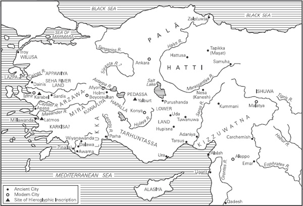
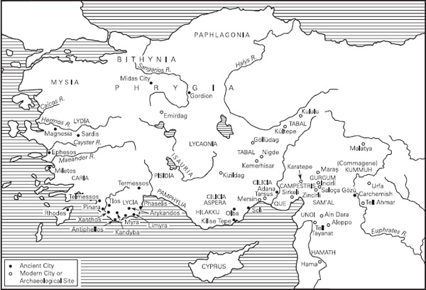
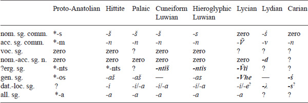
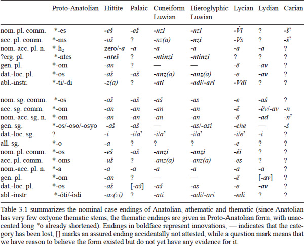
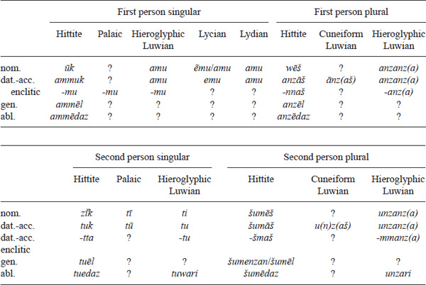
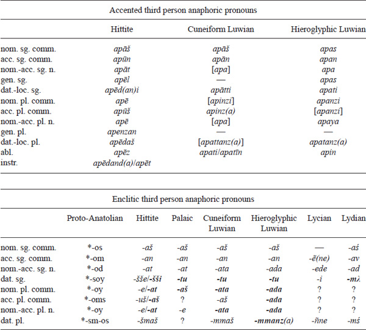
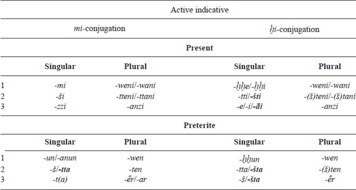
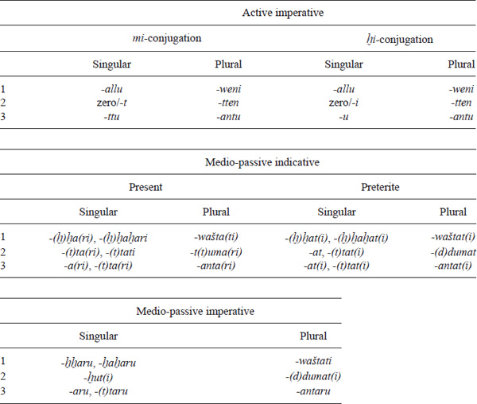

<!-- page: 171 -->

# Part 3

# **Anatolian**

*H. Craig Melchert*

## **Introduction**

### **The Anatolian subgroup as a whole**

The Anatolian subgroup of Indo-European is attested from the middle of the second millennium BCE to approximately the first and second centuries CE. There are no modern representatives of the family. The evidence ranges from the extensive records for Hittite through the significant but progressively smaller text corpora in Luwian, Lycian, Lydian, Carian, and Palaic to the mere handful of inscriptions in Sidetic and Pisidian. We have Hittite, Palaic, and Luwian texts from the second millennium in the cuneiform writing system borrowed from Mesopotamia and Luwian inscriptions in a native Anatolian system of hieroglyphs from the late second and early first millennium BCE. After a significant break, the remaining languages from the late first millennium are written in alphabets closely related to or derived from that of Greek. The great disparity in the amount of evidence for the respective languages and the nature of the cuneiform and hieroglyphic writing systems limit to a serious extent our ability to make assured generalizations about features of the Anatolian family. These limitations will be addressed explicitly wherever appropriate.

Like other such designations (Celtic, Germanic, etc.), “Anatolian” as used here is primarily a linguistic concept. The languages named above are all assumed to be derived from a reconstructed stage “Proto-Anatolian” (PAnat.), comparable to Proto-Celtic, Proto-Germanic, and so forth, defined by certain unique shared innovations. While most of the languages of the family are in fact attested in Anatolia (Asia Minor), Luwian was also spoken in parts of Syria. On the other hand, Phrygian, although it is an Indo-European language attested from west central Anatolia, is not a member of the Anatolian subgroup as defined here.

The dearth of evidence for certain linguistic categories beyond Hittite and Luwian, and especially our poor understanding of Lydian grammar, reduces the number of assured common innovations that define Proto-Anatolian, that is, that differentiate the Anatolian subgroup from the rest of the Indo-European languages and from Proto-Indo-European. Nonetheless, one may cite a few such defining features: (1) Proto-Indo-European voiceless stops were “lenited” (probably simply voiced) between unaccented morae in Proto-Anatolian (for this formulation see Adiego Lajara 2001 and the discussion below under phonology); (2) Proto-Anatolian created a pronominal stem ***obʰó/í-, which definitely functioned as the accented third person anaphoric pronoun (see Melchert 2009a: 156–159 with references, and below on its deictic use); (3) Proto-Anatolian developed third person subject enclitic pronouns for “unaccusative” verbs (see Garrett 1996, and below under pronouns). For a longer list of Proto-Anatolian innovations, including some more arguable features, see Melchert *forthcoming*, section 6.3.1.

<!-- page: 172 -->

I follow the majority viewpoint that the ancient Indo-European languages of Anatolia are intrusive to Asia Minor, resulting from in-migrations from somewhere to the north, via either the Balkans or the Caucasus (see further Mallory 2009 and Melchert 2011a with references to dissenting views). Since neither the route nor the timing of the supposed entry into Anatolia can be determined with any precision, it remains an open question whether the prehistoric stage labeled Proto-Anatolian was spoken in Anatolia. Nevertheless, in the absence of contrary evidence, we may make the default assumption that the differentiation of the attested Anatolian languages was mostly associated with the spread of Indo-European speakers through Asia Minor.

There is solid evidence for extensive prehistoric contact between Hittite and Luwian and for less intensive contact between Luwian and both Lydian and Palaic (Yakubovich 2010: Chapter Three). We may safely assume some similar contact between Lycian and Carian. Under these circumstances, attempts to describe the relationships of the Anatolian languages to each other in terms of divergence by a “family tree” model (e.g., Oettinger 1978) are less than satisfactory. Use of dialect geography presents a more realistic picture (see Melchert 2003 for detailed justification of the description give here). Luwian and Lycian undeniably share a number of innovations that justify a “Luwo-Lycian” or “Luwic” dialect group, and it is likely, but not strictly provable, that Carian belongs to this group as well. A subset of these innovations is also shared by Lydian (most notably so-called *i-*mutation, described below under nominal morphology), so that one may also speak of “western” dialects of Anatolian. On the other hand, Luwian also shares several phonological innovations with Hittite and Palaic. Since these are of a “shallower” nature than some of the features common to Luwian and the other western dialects, they might be regarded as chronologically later than the latter, but we hardly have enough facts to assert this with confidence. What does seem clear is that Luwian plays a central role in terms of shared isoglosses, as one might expect from its geographic position.

### **The individual languages**

#### *Hittite*

The language we call Hittite was the chief administrative language of the kingdom and subsequent empire centered on the capital Hattusha in central Anatolia (see Map 3.1), which flourished from the sixteenth to the end of the thirteenth century BCE. The Hittites themselves called the language *nešili*, after the city of Nesha (also Kanish), to the southeast on the Marassantiya River (= classical Halys, modern Kızılırmak). The original locus of Hittite speakers was thus probably an area along the upper course of the Halys. They subsequently became the ruling class in Hattusha and in the Hittite kingdom, but the extent to which Hittite functioned as a spoken language beyond this group is impossible to determine. After 1350 BCE Hittite was likely in serious competition with Luwian as the spoken language even among this elite (Yakubovich 2010: Chapter Five).

Documentation of Hittite is extensive and includes a wide variety of genres: annals, treaties, letters, the state cult, therapeutic rituals, myths, and more. Our understanding of their content and of the grammar is good, but certain aspects of the phonology are obscured by limitations of the cuneiform writing system. As adopted by the Hittites, this mixed logographic-syllabic system (compare Japanese) has phonetic signs for V, CV, VC, and CVC sequences. Word-initial or word-final strings of two or more consonants and word-internal strings of three or more can only be spelled with sequences containing “empty” vowels: e.g., *pár-ah˘-ta* = /parxta/ ‘chased’. The system also does not fully differentiate *e-* and *i-*spellings. The resulting ambiguities leave much room for debate about the phonological interpretation of the orthography. These remarks naturally also apply to Palaic and to Luwian written in cuneiform.

<!-- page: 173 -->

**Map 3.1** Anatolia in the Late Bronze Age

#### *Palaic*

Palaic was the language of the land of Palā, almost certainly located to the northwest of the lower Halys river (Map 3.1). It is attested in a few fragmentary cuneiform texts from Hattusha (sixteenth–thirteenth centuries BCE), all dealing with the Palaic state cult, which was heavily influenced by the religion of the Hattians, a non-Indo-European people who dominated north and central Anatolia before the Hittites. Palaic is arguably the most conservative Anatolian dialect, but our evidence for it is severely limited. For further on Palaic see Carruba 1970.

#### *Luwian*

<!-- page: 174 -->

Luwian is attested in cuneiform from Hattusha (sixteenth–thirteenth centuries) and in a hieroglyphic script native to Anatolia. A few hieroglyphic inscriptions date from the last Hittite kings (thirteenth century), but most hieroglyphic texts (monumental inscriptions and a few letters and economic documents on lead strips) date from the Iron Age (eleventh–eighth centuries) after the fall of the Hittite Empire, the products of various small city states and kingdoms in southern Anatolia and Syria. Traditionally, one has referred simply to Cuneiform and Hieroglyphic Luwian according to the writing system used (as followed here for convenience), but Yakubovich (2010: Chapter 1) has shown that one must distinguish between two dialects: (1) Kizzuwatna Luwian, the language of the incantation portions of Luwian rituals originating in southwestern Anatolia (Map 3.1), but as redacted by cuneiform scribes in Hittite context in Hattusha (with a few exceptions, effectively those texts collected in Starke 1985); and (2) Empire Luwian, a koine developed in and promulgated from Hattusha starting in the thirteenth century, continued in the later Iron Age hieroglyphic texts. The “Luwianisms” scattered through Hittite cuneiform texts of the fourteenth and thirteenth centuries also belong to this dialect.

The Iron Age Luwian texts provide our richest documentation for an Anatolian language outside of Hittite, but the logographic-syllabic hieroglyphic script is even more problematic for phonological interpretation than is cuneiform. The syllabary has only V and CV signs, so that even word-final consonants must be written with an “empty” vowel, and many of the CV signs do not distinguish /a/ and /i/ vocalism. These and other practices produce spellings such as *wa*/*i+ra*/*i-ya-ya* for what is *probably* /warriyai/ ‘helps’. Luwian written in cuneiform helps resolve some of the resulting ambiguities, but by no means all. The Iron Age hieroglyphic texts are masterfully edited by Hawkins (2000).

**Map 3.2** Anatolia in the Iron Age

#### *Lycian*

Lycian is attested in close to two hundred inscriptions, nearly all on stone, from various sites in classical Lycia in southwestern Asia Minor (Map 3.2), dating from the fifth and fourth centuries BCE. These texts, written in a form of the Greek alphabet, are nearly all funerary in nature, with the exception of a few decrees and the “stele of Xanthos”, a long but poorly understood text describing the military exploits and building activities of one dynastic family. Our understanding of Lycian grammar was significantly improved by the discovery in 1973 of a decree establishing a religious cult written in Lycian, Greek, and Aramaic versions: see on the Lycian text of the “Létôon Trilingual” Laroche 1979.

<!-- page: 175 -->

A portion of the Xanthos stele text and one other inscription are written in a different dialect known conventionally as Milyan or “Lycian B” (the latter as opposed to the ordinary “Lycian A”). While the sociolinguistic relationship of the two forms of Lycian remains unclear, there is no doubt that they are dialects of the same language, despite some claims to the contrary. Lycian A does show some unique phonological changes (***s \> *h* except next to consonants; ***kʷ \> *t* before front vowels), but it shares important features with Lycian B that separate both from Luwian: the change of ***o to *e*, massive syncope of unaccented vowels, and widespread regressive vowel assimilation, among others (for arguments that Lycian is not a dialect of attested Luwian, see also Gusmani 1960).

#### *Lydian*

Lydian was the language of the classical kingdom in west central Anatolia with its capital at Sardis (Map 3.2). There are now more than a hundred extant Lydian texts, but only a couple dozen are of significant length and reasonably preserved, all dating from the fifth and fourth centuries, thus roughly contemporaneous with our Lycian corpus. In the absence up to now of a Lydian-Greek bilingual text of sufficient length, our comprehension of Lydian lags far behind that of the other Anatolian languages described above, even Lycian. While we can largely parse the grammatical structure of most textual passages, many details still elude us, and our grasp of the lexicon is especially poor. As a result, we must be duly cautious in claiming that certain features are pan-Anatolian, since we do not know their status in Lydian. For all aspects of Lydian see Gusmani 1964 and subsequent supplements, especially 1986.

#### *Carian, Pisidian, and Sidetic*

Carian was the language of classical Caria, in southwestern Anatolia between Lycia and Lydia (Map 3.2). A few extant texts, tentatively dated to the fourth and third centuries BCE, have been found in Caria itself, but most Carian texts, consisting of tomb inscriptions and graffiti of Carian mercenaries, are from Egypt, dating from the seventh to fifth centuries. Thanks to the discovery of a Carian-Greek bilingual text in 1986 (see Frei & Marek 1987), we can now be sure that Carian does belong to the Anatolian family of Indo-European, and it appears to share some features of the “Luwo-Lycian” dialect group. However, our understanding of Carian grammar and vocabulary remains limited, and the language cannot be regarded as fully deciphered – in particular we cannot yet analyze Carian verbal morphology, or even identify verbal forms, with confidence. Carian will thus play a very small role in the description of Anatolian grammar that follows. See on all aspects of the language Adiego 2007.

Some ten inscriptions have been discovered in Sidetic, the language of Side, a major city on the coast of Pamphylia (Map 3.2), dated very approximately to the third to second centuries BCE. Those consisting of more than personal names are largely unintelligible, and we can at present affirm only that the language is Anatolian Indo-European, belonging to the “Luwo-Lycian” dialect group. See Nollé 2001: 625–646 for the texts, but for revised readings of some letters and a tentative grammatical sketch also Pérez Orozco 2007. For Pisidian (Map 3.2) we have a mere handful of tomb inscriptions consisting of only names and patronymics, dated tentatively to the first and second centuries CE. These again can tell us only that the language is a “Luwo-Lycian” dialect of Anatolian. The very sparse evidence for both Sidetic and Pisidian leaves open the possibility that they represent late dialects of Luwian in the narrow sense. See Brixhe 1988 for the then published texts in Pisidian. We will have nothing more to say about Sidetic and Pisidian in what follows.

<!-- page: 176 -->

## **Phonology**

### **Vowels**

There was very little change in the vowels from Proto-Indo-European to Proto-Anatolian. Evidence that ***o merged with *e in Lycian instead of with *a as in the rest of Anatolian shows that Proto-Anatolian still maintained the PIE system of five contrasting vowel phonemes, both short and long (Rasmussen 1992 and Melchert 1992a, upheld by Hajnal 1995: 90–97): e.g., PIE/PAnat. ***pedóm *\>* Lyc. *pddẽ* ‘place’, PIE gen. pl. **-*ō*́*m \> PAnat. **-*om *\>* Lyc. *-ẽ*. As reflected in the second example, unaccented long vowels inherited from Proto-Indo-European were shortened in Proto-Anatolian (Eichner 1973: 79 and 86xx). A PIE tautosyllabic sequence ***eh₁ became a Proto-Anatolian long vowel that merges with inherited long ***ē in Hittite but with *a* in Luwian and Lycian (represented here conventionally as PAnat. ***ǣ): e.g., ***dʰéh₁ti \> *dǣti \> Hitt. *tēzzi* ‘says’ but Lyc. *tadi* ‘puts’. Anatolian thus uniquely distinguishes between PIE *ē and the result of tautosyllabic *eh₁.

Since Hittite maintains the PIE short diphthongs ***ay and *oy as /ay/ and PIE ***aw and *ow as /aw/ before coronal consonants (see Kimball 1994), these must have still been preserved at least in this environment in Proto-Anatolian. In those cases where PIE ***aw and *ow became monophthongs in Hittite (and undoubtedly also Palaic and Luwian) they appear as a new vowel /o(ː)/ distinct from inherited ***ō, which has merged with *ā as /aː/.1 As shown by Kloekhorst (2008: 35–60), vindicating the earlier claims of several scholars, the new /o(ː)/ phoneme is spelled with the sign *u* in Hittite, versus /u(ː)/ spelled with the sign *ú*. Prehistoric ***u is also regularly lowered to the new /o/ vowel next to ***h₂ or *h₃. PAnat. long ***āy and *ōy are reflected in Hitt. /aːy/, and PAnat. long *āw and *ōw in Hitt. /aːw/ (spelled *Ca-a-ú*!). The precise timing, conditioning, and outcome of the monophthongization of PIE ***ey and *ew and *ēy and *ēw remain under debate (but contra Melchert 1994a: 56 and *passim* there is no basis for supposing that the reflex of *ey in Proto-Anatolian or Hittite was distinct from that of *ē).

### **Consonants**

Evidence from Luwian and Lycian shows that Proto-Anatolian preserved the PIE three-way contrast of dorsal stops, at least for the voiceless series ***kˊ, ***k, *kʷ. However, the claim in Melchert 1989: 23–31 for an *unconditioned* contrast in Luwo-Lycian must be abandoned. A reassessment of all available evidence confirms that Anatolian is a “centum” subgroup that keeps labiovelars distinct while eventually merging the “palatal” (more accurately front velar) and velar series as velars (see for full argumentation Melchert 2012a). Before the latter merger, however, there was a conditioned palatalization in Luwo-Lycian of just the front velar series in fronting environments (*ē̆, *i, *y and *w): contrast, e.g., *kˊeyori \> CLuw. *ziyar(i)* and Lyc. *sijẽni* ‘lies’ with ***kē̆sāye/o- \> CLuw. *kišā(i)-* ‘to comb’, but ***kˊoto- \> HLuw. /kata-/ ‘enmity, opposition’ and CLuw. *kattawatnalla*/*i-* ‘opponent, enemy’ (cognate with Gr. κότος ‘spite’ and Skr. *śátru-* ‘enemy’). The facts for reflexes of the voiced dorsal stops are compatible with this analysis, but strict proof is prevented by the widespread *loss* of medial voiced dorsal stops in Luwo-Lycian.

<!-- page: 177 -->

There are two major changes in the stop system from Proto-Indo-European to Proto-Anatolian. First, in the absence of any compelling examples of differing reflexes, we may and should assume that the PIE voiced aspirated stops merged with voiced stops. Second, as already mentioned above, PIE voiceless stops are “lenited” (or rather simply voiced) between unaccented morae: e.g., PIE ***dʰéh₁ti *\>* PAnat. ***dǣ́ti (i.e., ***dǽæti) \> *dǽædi \> Lyc. *tadi* ‘puts’, PAnat. abl.-instr. *-oˊti \> *-oˊdi \> Luw. /-adi/ and Lyc. *-edi*. For this unified formulation as a single rule see Adiego Lajara 2001, combining the two rules posited by Eichner (1973: 79–83 and 100xx) and Morpurgo Davies (1982/83). Evidence for this rule is more plentiful in Luwo-Lycian than in Hittite, where most of its effects were undone by analogy.

Before leaving the stops, we should note that Hittite scribes did not employ the cuneiform stop+vowel signs such as *ta* and *da* to indicate the phonemic contrast between voiceless and voiced stops. In intervocalic position they spelled inherited voiceless stops as geminates, while inherited voiced stops and those produced by the change just cited were spelled as single stops: thus both *pé-e-ta-an* and *pé-e-da-an* = /peːdan/ ‘place’, contrasting with *(i-)ya-at-ta(-ri)* and *i-ya-ad-da(-ri) =* /yata(ri)/ ‘goes’. This practice has aroused much discussion regarding the synchronic distinctive features of the Hittite stops (see Melchert 1994a: 13–21 and compare the very different view of Kloekhorst 2008: 21–25), but for the purposes of Anatolian as a whole we may continue to speak of a voiceless vs. voiced contrast.

There were no major changes in the PIE sibilant ***s or the sonorants *m, *n, *r, *l, *w, and *y in Proto-Anatolian. The syllabic liquids and nasals eventually appear in the attested languages mostly as *aR* but occasionally as *uR* instead (e.g., HLuw. /tsurnid-/ ‘horn’ \< ***kˊr̥ngid- cognate with Hitt. *karkidant-* ‘horned’), but they were likely still syllabic sonorants in Proto-Anatolian. As part of a widespread areal feature, word-initial *r-* is lacking in the attested Anatolian languages, except for extremely rare secondary instances in Luwian, Lycian, and Lydian.

As for the PIE “laryngeals”, ***h₂ appears in the cuneiform languages as *h˘* (geminate *h˘h˘* intervocalically, thus voiceless or fortis), probably a velar fricative /x/: e.g., Hitt. *h˘anz(a)* ‘in front’ \< PIE ***h₂enti (= Lat. *ante* ‘in front’ etc.) and CLuw. *h˘antili-* ‘foremost, first’, Hitt. *newah˘h˘-* ‘make new’ \< PIE *neweh₂-. This result was subject to the Proto-Anatolian voicing rule described above, whence CLuw. 1 sg. pret. *ah˘a* and Lyc. *agã* ‘I made’ \< PAnat. ***yǣ́ɣa \< *yéh₁-h₂e versus regular CLuw. *-h˘h˘a* and Lyc. *-xa \<* PAnat. **-*xa. As shown by Kloekhorst (2006: 97–101), a sequence of ***h₂w developed into a PAnat. unitary labialized fricative /xʷ/: e.g., Hitt. /tarxʷ-/ ‘conquer’ spelled *tar-h˘u-* and *tar-uh˘-* (parallel to *e-ku-* and *e-uk-* for /egʷ-/ ‘drink’). In Lycian the labialized fricative turned into a labiovelar stop, represented by *q* (contra Melchert 1994a: 305–307), as shown by the name of the Storm-god, *trqqñt-* \< ***tr̥h₂wn̥t-. PIE ***h₂ was lost in word-final position and before **y* and underwent assimilation in certain environments (cf. Melchert 1994a: 68–71).

PIE ***h₃ is reflected in word-initial position by *h˘-* or zero in Hittite and Luwian, under conditions that remain much debated: compare Hitt. *h˘āppar* ‘transaction’ \< ***h₃épr̥ or *h₃ópr̥ (cognate with Lat. *opus* ‘work’ etc.) but Hitt. *arta* ‘stands (up)’ \< ***h₃(e)rtor. Contrary to previous opinion, Kloekhorst (2008: 838 and 946) has demonstrated that medial ***h₃ is preserved in the immediate environment of sonorants: CLuw. *tatarh˘-* ‘break’ \< ***terh₃- (Gr. τρώω ‘wound) and Hitt. *walh˘-* ‘strike’ \< ***welh₃- (Gr. ἑάλων ‘perished’). For the suggestion that a sequence ***h₃w is preserved in Hittite as *-h˘w-* (/ɣʷ/) parallel to ***h₂w *\> -h˘h˘w-* = /xʷ/ in *lah˘w-* ‘pour’ (cognate with Gr. λόεω ‘bathe’ etc.) see Melchert 2011b.

Aside from secondary effects such as compensatory lengthening or assimilation, there is no compelling evidence for any direct reflex of PIE ***h₁ in Anatolian, *pace* Kloekhorst 2004 and 2006: 77–81 (see Melchert 2010: 152–153 and Weeden 2011: 61–68).

### **Accent**

The results of the PAnat. “lenition” or voicing of stops and ***h₂ cited above suggest that the position of the inherited PIE accent was mostly retained in Proto-Anatolian. For some exceptions see Melchert 1994a: 89. For some instances of mobile accent in Hittite noun paradigms see Melchert 2012c: 180. Eichner (1986) established the synchronic accent of Lydian.

<!-- page: 178 -->

## **Nominal morphology**

### **Nominal inflection**

The attested Anatolian languages show only two numbers, singular and plural, the latter distinguishing in Old Hittite a count plural versus a collective (Melchert 2000 after Eichner 1985). Possible traces of a dual are sparse and limited to the nominative-accusative. As is well known, Anatolian also has only two attested grammatical genders, animate (usually labeled common) and neuter. It is a matter of great controversy whether Anatolian inherited the feminine gender from Proto-Indo-European and lost it (as, e.g., Armenian did) or whether its absence reflects an archaism not shared by the rest of Indo-European. One thing that is now clear is that, contrary to previous claims (Oettinger 1987, Starke 1990: 85–89, Melchert 1994b), the phenomenon of “*i-*mutation” in the western Anatolian languages is *not* a reflex of the PIE feminine gender. As first identified and described by Starke (1990: 54–85), in Luwian, Lycian, and to a lesser extent Lydian many (though by no means all!) nominal stem classes show an inserted *-i-* between the inherent stem and the endings of *just* the common gender nominative and accusative. In the case of stems in *-a-* (which mostly but not exclusively continue PIE *o-*stems) the *-i-* replaces the stem-final *-a-*. The paradigm of the Cuneiform Luwian synchronic *l-*stem *ādduwal-* ‘evil’ is nom. sg. comm. *ādduwališ*, acc. sg. comm. *ādduwalin*, nom.-acc. sg. n. *ādduwal(=za)*, nom. pl. comm. *ādduwalinzi*, acc. pl. comm. *ādduwalinz(a)*, nom.-acc. pl. n. *ādduwala*, dat. pl. *ādduwalanz(a)*, abl.-instr. *ādduwalati*. As argued by Rieken (2005b), this pattern arose due to particular formal changes in the paradigms of some ablauting *i-*stems and was then analogically extended. This feature tells us nothing about the status of the feminine grammatical gender in Anatolian.

Old Hittite has at least eight cases: nominative, vocative, accusative, genitive, dative-locative, allative, instrumental, and ablative. The vocative is replaced by the nominative, the allative by the dative-locative, and the instrumental by the ablative by the time of New Hittite. The common gender nominative and accusative plural also merge, mostly in favor of the original accusative form. The allative (distinct from the dative-locative only in the singular) expresses goal with verbs expressing translocation (see Hoffner & Melchert 2008: 263 for examples). Its existence already in Proto-Anatolian is made likely by its use to form infinitives in multiple languages. It is indeterminate whether it is an inheritance from Proto-Indo-European or an innovation of Proto-Anatolian. Likewise, we cannot at present determine whether the merger of the dative and locative singular that took place in Hittite had already happened in Proto-Anatolian. It is also a matter of debate whether the “ergative” was a fully grammaticalized case in Proto-Anatolian (see most recently Goedegebuure 2012).

<!-- page: 179 -->

**Table 3.1 Anatolian nominal endings**

The direct cases call for only minor comment. In addition to the expected animate nominative singular *-s*, there are a few reflexes of sonorant stems reflecting **-*ē/ōR: OHitt. *keššar=šiš* ‘his hand’ remarkably continues PIE ***ǵʰéysōr, but in most cases the PIE form has been renewed with a secondary *-s* (e.g., Hitt. and Pal. *h˘āraš* ‘eagle’ \< ***h₃érō+s, Hitt. *h˘ašterz(a)* ‘star’ \< ***h₂stēr+s). Lydian has generalized the pronominal neuter nominative-accusative singular ending *-(o)d to all nominal stem classes. Only Palaic preserves the animate nominative plural endings ***es and *-ōs, while Hittite has generalized a prehistoric **-*ēs \< *-eyes, the *i-*stem ending, and at least Luwian and Lycian, and probably Carian, have renewed the animate nominative plural ending based on the accusative plural (for details see Melchert 2009b). Old Hittite still shows some traces of the athematic nominative-accusative neuter plural ending **-*h₂ (e.g., *āššū* ‘goods’ = /aːssoː/ \< ***uh₂), but elsewhere it has been renewed by the thematic ending *-a \< *-*eh₂. Hittite and Luwian also preserve some examples of lengthened-grade nominative-accusative neuter plurals such as Hitt. *widār* ‘waters’ \< ***wedōr.

<!-- page: 180 -->

The history of the genitive case in Anatolian is complex. For further details of the picture presented here and references to differing views see Melchert 2012b. Hittite, Palaic, and Hieroglyphic Luwian all preserve the PIE athematic ending in the form *-os and also a thematic ending *os. The PIE thematic genitive singular ending *-osyo is continued by at least HLuw. /-as(s)i/ and by Carian *-ś* in personal names, the latter generalized to all stem classes. The PIE thematic genitive singular *-e/oso appears in Lyc. *-Vhe*, likewise spread to all stem classes but restricted to personal names, and probably in the Carian synchronic dative singular ending *-s*. Whether Cuneiform Luwian attests either **-*e/oso or *-osyo is uncertain. Old Hittite, Lycian, and Lydian show reflexes of the PIE genitive plural **-*ōm, but in Lydian the ending mostly functions as the dative-locative plural. The western Anatolian languages largely replace the genitive case with inflected forms of possessive adjectives, mostly reflecting a secondary inflection of the ending ***osyo, but Lydian employs rather an adjective in *-la*/*i-* (\< PIE **-*lo- with *i-*mutation), and Hieroglyphic Luwian also uses adjectives in *-iya- \<* PIE **-*iyo- in this function.

As per Hajnal (1995: 98), Lycian infinitives in *-Vna* reflect the expected athematic allative ending *-eh₂ (Hajnal) or less likely *-h₂e (Melchert 1994a: 324), while *-Vne* continues the analogically spread thematic ending **-*o-h₂ (as in Lat. *quō* ‘whither?’). It is unclear to what extent Proto-Anatolian distinguished the dative and locative singular and, if so, athematic and thematic inflection. The dative-locative plural ending **-*os attested in Hittite, Palaic, and Lycian represents an archaic form of the dative plural not yet reinforced as **-*bʰ(y)os or *-mos. For more on this ending and the history of the number-indifferent ablative and instrumental in Anatolian see Melchert and Oettinger 2009.

### **Nominal derivation**

This topic can be treated here only in the most summary fashion. For a still largely valid overview of the presence and productivity of various PIE suffixes in Anatolian see Oettinger 1986. More focused treatments of particular stem classes are found in Weitenberg 1984, Starke 1990, and Rieken 1999a. In brief, Anatolian shows the usual mixture of archaisms and innovations and its own patterns of productivity. Root nouns are present but recessive (Rieken 1999a: 18–82). PIE **-e*/*ont-* is attested throughout Anatolian in a variety of functions (Melchert 2000: 58–70) but notably not in that of an active participle (see further below under non-finite verbal forms). Neuter *s*-stems of the type ***kˊléw-os, *kˊléw-es- ‘fame’ (Skr. *śrávas-* etc.) are barely attested, if at all, but there are examples of other types (Rieken 1999a: 185–237).

Stems in *-i-* (e.g., Hitt. *arkiš* ‘testicle’ \< PIE ***h₁órǵis, *d(a)lugaštiš* ‘length’) are productive in Hittite but mostly recast in Luwo-Lycian in terms of *i-*mutation (see again Rieken 2005b). Stems in *-u-* (e.g., Hitt. *gēnu* ‘knee’ \< ***ǵénu, CLuw. *maddu* ‘wine’ \< ***médʰu) are likewise reasonably productive in Hittite (Weitenberg 1984) but extremely recessive elsewhere. The well-known PIE suffix **-*ti- is modestly productive (e.g., Hitt. *išpanduzzi* ‘libation vessel’, CLuw. *arut(i)-* ‘wing’), while **-*tu- is virtually unattested. Most synchronic *l-*stems (e.g., Hitt. *išh˘iul* ‘binding; obligation; treaty’) are secondary from original thematic stems in **-*lo- (thus with Rieken 2008). There are relatively few reflexes of neuter *men-*stems in Hittite, but the class is very productive in Luwian, e.g., *tatariyaman-* ‘curse’ (Starke 1990: 243–299) and likely was in Lycian as well. Perhaps most notorious is the abundance in Anatolian of neuter heteroclite stems in *r*/*n-*: see Oettinger 1986: 11–15, Rieken 1999a: 290–417, and Starke 1990: 435–525.

Primary barytone action nouns with suffix *-o- are moderately productive, but oxytone agent nouns in *-ó- are virtually unattested (Oettinger 1986: 19). Secondary derivatives in *-o- are plentiful. There is a modest number of denominative stems in *-no- and *-to-, but exceedingly few verbal adjectives in *-to- and none in *-no- (cf. Oettinger 1986: 22–23). The thematic suffixes *-iyo-, *-lo-, and *-ro- all enjoy some degree of productivity in Anatolian.

## **Pronouns**

### **Personal pronouns**

<!-- page: 181 -->

The Anatolian accented personal pronouns all continue PIE preforms, and Old Hittite maintains the PIE suppletive pattern in the first person singular and plural and second person singular. For the second person plural we find only forms based on the PIE non-subject stem ***us- (see Katz 1998: 138–141 for competing accounts of their derivation). In New Hittite (and all the other languages for which we have evidence) the first persons and the second person plural generalize the dative-accusative, but the second person singular maintains the contrast of subject and non-subject forms (Table 3.2).2

There is considerable mutual influence between the first and second person pronouns. One defining innovation of Anatolian is the spread of the *u-*vocalism from the second person singular to the first person singular. However, the spread of the final dorsal stop from the subject form of the first person singular to the non-subject form and to both forms of the second person singular is a specifically Hittite innovation, since it is not seen in Palaic (which does not lose final stops). Likewise, reshaping of the second person plural ***us- to *unz- based on the first person plural ***anz- \< *n̥s- is thus far attested only for Luwian. The attested enclitic non-subject forms of the first persons and the second person singular are also clearly based on PIE preforms, while the second person plural is based on the accented form, but there are signs that the Proto-Anatolian situation was more complicated, with a distinction of enclitic dative and accusative forms and subsequent differing developments of enclitic reflexives (see Yakubovich 2010: Chapter 3).

**Table 3.2 Anatolian personal pronouns**

### **Demonstrative and anaphoric pronouns**

<!-- page: 182 -->

As noted above, one defining innovation of Proto-Anatolian is the creation of a demonstrative stem ***obʰó/í-. This is attested as the accented third person anaphoric pronoun in Hittite, Palaic, both forms of Luwian, Lycian, and Lydian and surely had this function in Proto-Anatolian. The inflection is that of an *o-*stem (Table 3.3) in all the languages except Lydian, where it is consistently an *i-*stem. This pattern certainly has nothing to do with *i-*mutation; whether it gives a clue to the origin of the pronoun is unclear (cf. Melchert 2009a: 159 with references). Not only the Hittite nom. pl. comm. *-e* but also the *-i-* of CLuw. *zinzi* and *zinz(a)* reflects PIE nom. pl. animate **-*oy (Melchert 2009b). For the Hitt. nom.-acc. pl. n. *-e* as also continuing PIE **-*oy see Jasanoff 2008: 144–149. The Hittite genitive singular ending *-ēl* reflects a suffix **-*élo- (thus with Rieken 2008: 250–251 against all others). See Goedegebuure 2007 for *apin* as the Hieroglyphic Luwian synchronic ablative-instrumental ending \< PIE ***im (vindicating the claim of Dunkel (1997) for such an ending) and Goedegebuure 2010 for the contrast between Luw. dat.-loc. sg. *apati* and original abl.-instr. *apadi* (attested as an adverb ‘thus’).

The enclitic anaphoric pronouns of Anatolian reflect a mixture of reflexes of PIE ***e/o- and *se/o-, subject to various innovations, again marked in boldface. On these developments and the creation of enclitic reflexive pronouns (and the spread of reflexive **-*ti from Luwian to Hittite, Lycian, and Lydian) see Yakubovich 2010: Chapter 3.

**Table 3.3 Anatolian anaphoric pronouns**

<!-- page: 183 -->

Determining the Proto-Anatolian system of deictic pronouns is made difficult by our lack of evidence for the languages other than Hittite: we have almost no data for Cuneiform Luwian, or for anything but near deixis in Lycian, Lydian, and Carian. Furthermore, some cognate stems have very different deictic values in the various languages. The overview here reflects Melchert 2009a, but much remains indeterminate. The only thing that seems clear is that the Proto-Anatolian marker of near deixis was ***kˊo- (compare Lat. *citrā* ‘on this side’ etc. \< ***kˊi-), reflected in Hitt. and Pal. *kā-*, CLuw. and HLuw. *zā-*, and probably Carian *s(a)-*. The inflection is entirely that of an *a-*stem, except for the aberrant and as yet unexplained Hitt. nom.-acc. sg. n. *kī*. As shown by Goedegebuure (2002/2003), Hittite has a three-way deictic contrast like that of Lat. *hic*, *iste*, and *ille*: *kā-* for near the speaker, *apā-* for near the addressee, and *aši*/*uni* (\< PIE ***é/ó- plus particle *-i) for far deixis. In attested Hieroglyphic Luwian, *apa-* covers the range of both *iste* and *ille*, but there is indirect evidence that at least Cuneiform Luwian once also had far-deictic ***é/ó- (Melchert 2009a: 152). Very confusingly, however, Lyd. *es- \< **é/ó- marks *near* deixis, and Lyc. *ebe-* does as well. It is quite unclear just which stem(s) marked far deixis in Proto-Anatolian and whether it had a system with a two- or three-way contrast.

### **Enclitic possessive pronouns**

Emphatic pronominal possession is expressed throughout the history of Hittite by the genitive of the personal pronouns and the accented anaphoric pronoun, preceding their head noun. In Old Hittite, unemphatic pronominal possession is marked by enclitic pronouns (more properly pronominal adjectives) attached to the head noun and agreeing with it in gender, number, and case: e.g., nom. sg. comm. *attaš=miš* ‘my father’, nom.-acc. sg. n. *šah˘eššar=šummet* ‘our fortress’, dat.-loc. pl. *h˘aššaš=šaš* ‘for his offspring’ (see Hoffner & Melchert 2008: 137–141). However, there were no specific forms for the nominative-accusative plural neuter or the ablative, and the nominative-accusative singular neuter and the instrumental forms were used respectively by suppletion: *šākuwa=šmet* ‘their eyes’ and *iššaz=(š)mit* ‘from their mouths’. By New Hittite, use of the enclitic possessives was no longer part of the synchronic grammar, as shown by the fact that copyists misunderstood the forms in *et* and *it* and misused them for cases like the vocative and dative-locative singular. Unemphatic possession in New Hittite was conveyed by use of the appropriate enclitic dative pronoun: *nu=šši* KUR=*SÚ* GUL-*un* (conj. + ‘him’ (dat.) ‘land’ (obj.) ‘I struck’) = ‘I struck his land’. It is likely that Cuneiform Luwian attests a few examples of enclitic possessives (Carruba 1986), and the category is probably to be reconstructed for Proto-Anatolian (thus Garrett 1991–1993: 160–161).

|                  | Hittite        | Cuneiform Luwian | Hieroglyphic Luwian |
|------------------|----------------|------------------|---------------------|
| nom. sg. comm.   | *kuiš*         | *kuīš*           | REL*-is*            |
| acc. sg. comm.   | *kuin*         | *kuīn*           | REL*-in*            |
| nom.-acc. sg. n. | *kuit*         | *kui*            | **REL-anz***(a)*    |
| gen. sg.         | *kuēl*         | —                | —                   |
| dat.-loc. sg.    | *kuedani*      | *kuwatti*        | REL*-ati*           |
| nom. pl. comm.   | *kuēš*/*kuiēš* | *kuīnzi*         | REL*-inzi*          |
| acc. pl. comm.   | *kuiuš*        | \[*kuīnz(a)*\]   | **REL-inzi**        |
| nom.-acc. pl. n. | *kue*          | ?                | **REL-ya**          |
| gen. pl.         | \[*kuenzan*\]  | —                | —                   |
| dat.-loc. pl.    | *kuedaš*       | ?                | ?                   |
| abl.             | *kuēz*         | *kuwati(n)*      | REL*-adi*           |

**Table 3.4 Anatolian interrogative-relative pronoun**

### **Interrogative, relative, and indefinite pronouns**

<!-- page: 184 -->

Anatolian uses the PIE stem ***kʷo/i- as both the interrogative and relative pronoun – there is no trace of PIE relative ***Hyo*-*. The interrogative-relative was clearly inflected as an *i-*stem in the nominative and accusative, subject to very minor innovations: besides the Hittite and Luwian forms in Table 3.4 note also Pal. *kui-*, Lyc. *ti-*, Lyd. *qi-*, and Carian *xi-*. In the other cases the interrogative shows the same endings as the anaphoric demonstrative stems in Hittite, and our very limited evidence suggests the same for the other languages. Hittite attests the occasional use of the bare interrogative stem *kui-* as an indefinite, but the latter is usually expressed by a form with an added particle: nom. sg. comm. *kuiški*, acc. sg. comm. *kuinki*, gen. sg. *kuēlka*, etc., and the other languages display similar creations: CLuw. *kuišh˘a*, Lyc. *tike* and *tise*.

## **Verbal morphology**

### **Verbal categories**

The Anatolian verb system is markedly different in certain basic features from that of the oldest stages of Indo-Iranian and Greek and thus from that traditionally reconstructed for PIE. As with the absence of the feminine gender, this glaring discrepancy has been the object of long and heated controversy: is it to be explained by loss of categories in Anatolian, by shared innovations in the rest of the Indo-European languages, or by a combination of the two? There is not remotely a consensus on this important issue, and what follows necessarily represents a particular viewpoint. One should not, however, overstate the matter: many aspects of the Anatolian verb are reassuringly familiar and not subject to serious dispute. One should also distinguish between the presence/absence of categories and the presence/absence or relative productivity of particular formal means of expressing a given category.

The Anatolian verb is inflected for the expected three persons and for two numbers, singular and plural. There is a contrast between active and medio-passive voice, and the latter attests the functions seen in other older Indo-European languages. Oppositional middles indicate “subject affectedness”: (1) reciprocal (Hitt. med.-pass. *zah˘h˘anta* ‘they strike each other’ vs. act. *zah˘h˘anzi* ‘they strike’); (2) self-interest (Hitt. med.-pass. *ušneškatta* ‘offers for sale’ \< *‘pledges in return for payment’ vs. act. *ušneškemi* ‘I pledge’; and (3) passive (Hitt. med.-pass. *h˘ullattati* ‘was struck’ vs. act. *h˘ullet* ‘struck’). The passive use is rare in Old Hittite but becomes highly productive by New Hittite. Delimiting the functions of *media tantum* is notoriously more difficult, but Hittite shows most of the well-known types: (1) body care/grooming (Hitt. *wēšta* ‘wears’), (2) change of body posture (Hitt. *kitta(ri)*, Pal. *kītar*, CLuw. *ziyar(i)*, Lyc. *sijẽni*/*sitẽni* ‘lies (down)’), (3) non-translational motion (Hitt. *wēh˘atta(ri)* ‘spins (intr.)’), (4) translational motion (Hitt. *iyatta(ri)* ‘walks’), (5) mental states (Hitt. *lēlaniyatta* ‘becomes angry’), and (6) “spontaneous” events/changes of state (Hitt. *kīša(ri)* ‘happens; becomes’).

The Anatolian verb displays only two moods: indicative and imperative. There are no obvious reflexes of the PIE optative or subjunctive. In Hittite the function of the optative to express the non-factual (what is possible, contrary to fact, or desired) is filled by the particle *mān*/*man*, a secondary use of the subordinating conjunction *mān* ‘when(ever), if’, itself derived from a rare PIE interrogative-relative stem ***mo- (compare Hitt. *maši-* ‘how/as many’, Toch. B *mäksu* ‘who, which’). For a likely indirect trace of the PIE subjunctive in Hittite see Jasanoff 2012, but compare Oettinger 2007.

<!-- page: 185 -->

The Anatolian verb has two tenses, present (which also serves for the future) and preterite. Hittite does famously develop a periphrastic perfect with *h˘ark-* ‘hold, have’ and *ēš-* ‘be’ and the past participle, comparable to similar formations in modern western European languages; see Boley 1984 and, on the correlation of auxiliary selection and unaccusativity, Garrett 1996: 102–106. As described in summary fashion below, Anatolian attests virtually all of the suffixes used to form the “present”, that is, imperfective, stem in “Core Indo-European”. It is quite uncertain, however, whether Anatolian inherited a true aspectual contrast of imperfective (“present”) vs. perfective (“aorist”). The evidence presented in Melchert 1997 for reflexes of such a contrast is suggestive, but far from compelling, and one may also suppose that Anatolian inherited the various present-forming suffixes merely as markers of Aktionsart and that the development of a true aspectual system is a common innovation of the non-Anatolian languages; for a well-reasoned presentation of this viewpoint see Strunk 1994.

Synchronically, most, if not all verbs are “monothematic”, showing a single stem that may be understood as perfective or imperfective according to context. However, as shown by evidence that is plentiful in Hittite and limited but clear in the other languages, Anatolian developed the means to optionally mark a finite verb as explicitly imperfective, most often by addition of a reflex of the PIE suffix **-*sḱe/o-, but also for some verbs of *-enh₂i- or *-s(e/o)- (whose PIE antecedents have not been fully elucidated). This “marked” imperfectivity may be realized as various Aktionsarten, depending on the context and the lexical semantics of the base verb: progressive, iterative, durative, habitual, inceptive, or distributive (see Hoffner & Melchert 2008: 318–323 for illustrations from Hittite).

There is no Anatolian category corresponding to the PIE perfect, generally agreed to have expressed an attained state, whether one defines it as an aspect (e.g., Meier-Brügger 2000: 155) or an Aktionsart (e.g., DiGiovine 1996: 273). Once again, explanations for this absence differ radically, as discussed further in the next section.

### **Verbal inflection: active**

The Hittite finite verb follows in the active voice one of two inflectional patterns, labeled after the respective present first-person singular endings the “*mi-*conjugation” and the “*h˘i*-conjugation” (Table 3.5). Evidence from Luwian (see Morpurgo Davies 1979) suggests that this system is Proto-Anatolian, although examples from Lycian and Palaic are extremely sparse and not beyond question. Even in Hittite there was much mutual influence between the two conjugations, and in the other attested languages the difference may have been reduced to just the present third singular indicative.

<!-- page: 186 -->

**Table 3.5 Hittite verbal inflection**

The singular endings of the *mi-*conjugation manifestly match the primary and secondary endings standardly reconstructed for the present-aorist system in PIE. While only Hittite has 1 sg. pres. *-mi* (see below on the other languages), Palaic, Luwian, and Lydian also attest to 2 sg. pres. *-si*, and these plus Lycian attest to 3 sg. pres. *-ti* (only Hittite assibilates ***t before syllabic *i). Hitt. 1 sg. pret. *-un* continues athematic **-*m̥, while *-anun* reflects thematic **-*om renewed by the athematic ending. Lyd. 1 sg. pret. *-ν* continues at least **-*om (with syncope) and perhaps also *-m̥. Older Hittite still preserves *-š* as the 2 sg. pret. ending of vocalic stems (e.g., *iēš* ‘you did’), but consonant stems have already adopted *-ta* from the *h˘i-*conjugation (e.g., *ēpta* ‘you took’). Hittite and Palaic show 3 sg. pret. *-V-t* but *-C-ta*, the latter with a genuine “prop-vowel” (Hitt. 3 sg. pret. *e-ku-ut-ta* ‘drank’ = /egʷta/, not †*e-ku-ut*). On the other hand, the consistent 3 sg. pret. ending *-t(t)a* of Luwian and *-te*/*-de* of Lycian after a vowel as well as a consonant reflects renewal of the third person preterite active endings by those of the medio-passive (thus with Yoshida 1993).

<!-- page: 187 -->

The Anatolian first person plural active endings show a *-w-*, recalling the PIE first person dual endings, but also an *-n* matching the Greek dialectal 1 pl. act. -μεν (cf. Eichner 1975: 79). Hitt. 1 pl. pret. *-wen* and Lyd. *-wν* reflect a virtual **-*wen, to which was added the usual mark of the present **-*i to form 1 pl. pres. **-*weni continued by Hitt. and Pal. *-weni* and CLuw. *-wanni*/*-unni*. On the model of the first person plural in **-*wen(i), Anatolian created a matching second person plural **-*ten(i), extending PIE ***te, attested in Hittite, Palaic, and Luwian. In posttonic position *-weni and *-teni regularly became Hitt. *-wani* and *-t(t)ani* (Melchert 1994a: 137–138 after Cowgill). The ending *-t(t)ani* has no connection whatever to the **-*th₂ene seen in Skr. *thana*, contra Eichner 1975: 79 and others. The present third person plural ending of Hittite *-anzi* and *-anti* elsewhere probably reflect PIE athematic **-*enti and *-n̥ti as well as thematic **-*onti, but it is difficult to establish this beyond doubt. Only Pal. 3 pl. pret. *-anta* may preserve a trace of the expected secondary ending *ent/n̥t/-ont (but it cannot be excluded that Pal. *-anta* reflects medio-passive **-*onto, as in Luwian and Lycian; see Yoshida 1993: 34, note 21). In Hittite, the third person plural preterite ending of the *h˘i-*conjugation has been generalized to all verbs, usually in the form *-ē̆r \< *-*ēr, but there are a few examples of *-ar \< *-*r̥. Much less certain is whether Lyd. 3 pl. pret. *-rś*/*-ris* continues PIE **-*r̥s, matching Skr. *-ur* (see Melchert 2004a: 147, note 14, on the synchronic ending). The Anatolian preterite shows no credible traces of the PIE “augment” ***é-.

The present singular endings of the *h˘i*-conjugation strongly resemble those of the PIE perfect and can in fact be straightforwardly derived from endings matching the latter plus the ***-i particle that characterizes the present indicative: PIE **-*h₂ey \> OHitt. *-h˘h˘e* and PIE **-ey \>* OHitt. *-e*, already mostly leveled to *-h˘h˘i* and *-i* after the majority of present endings ending in *-i*. The leveling has already occurred in Hitt. 2 sg. pres. *-tti* for **-*tte \< *-th₂ey. The third singular ending is renewed partially in Hittite and totally elsewhere by an ending *-āi* spread from monosyllabic stems where it results from contractions (thus Luw. *-āi* and probably Pal. *-ai* and Lyc. *-e*). An entirely unsolved problem is the generalized 1 sg. pres. *-wi* of Luwian, which is surely matched by Lyd. *-Cu*/*-Vw* (with regular apocope) and probably also by Lyc. *-u*.

Endings matching the perfect also appear in 1 sg. pret. Pal. *-h˘h˘a*, CLuw. *h˘h˘a*, HLuw. *-ha*, and Lyc. *xa*/*-ga \< *-*h₂e (Hitt. *-h˘h˘un* has been reshaped after *mi-*conjugation *un*). However, Hitt. 3 sg. pret. *-š* obviously cannot be connected with the PIE perfect, and the ending *-tta* in Luwian and *-te* in Lycian is again a renewal by the medio-passive ending **-*to (Yoshida 1993: 31–33) that tells us nothing about the Proto-Anatolian state of affairs.

It is extremely unlikely that the Anatolian *h˘i*-conjugation is to be derived from the PIE perfect, or vice versa (for trenchant criticism of attempts at the former see Jasanoff 2003: 7–17), but just what the true relationship of the two categories is remains to be determined. Jasanoff (2003), elaborating earlier publications, has made a strong case for both a “*h₂e-*present” and a “**h₂e-*aorist” in PIE, but many issues remain unresolved. On the status of ***ó/é and *ó/zero ablaut in root *h₂e-verbs see Melchert 2013 versus Kloekhorst 2012. Regarding the ablaut pattern of ***h₂e-presents in *-i-* (Hitt. 3 sg. pres. *dāi*, 3 pl. pres. *tianzi* ‘put(s)’) compare the differing analyses of Kimball (1998), Jasanoff (2003: 98–107), and Kloekhorst (2008: 807 and passim). For the source of the 3 sg. pret. ending *-š* of the *h˘i*-conjugation and of the *š-* that appears in the second person plural of *h˘i*-verbs in *-i-*, one may contrast the proposals of Jasanoff (2003: 174–197 and 2012: 118–119), Kloekhorst (2007), and Melchert (2015).

<!-- page: 188 -->

The status of the perfect in Anatolian also remains disputed. Jasanoff (2003: 11 and 37 and 117–118) argues that Hitt. *wewakk-* ‘demand’ and *mēmi*/*a-* ‘speak’ continue *reduplicated* perfects. See also Forssman 1994: 103 for Hitt. *šipand-* ‘libate; sacrifice’ \< **spe-spónd-* (vs. *išpant-* ‘idem’ \< ***spend/spn̥d-). But even if one or more of these verbs reflects a perfect in *formal* terms (which is far from assured), none demonstrably shows the “attained state” meaning assumed for “Core Indo-European”. Oettinger (2001: 80–83 and 2006: 37–42) views the perfect (along with the present type of Skr. *dadhā́ti* and the intensive type of Skr. *várvarti*) as a post-Anatolian development of a PIE reduplicated present that appears in mostly de-reduplicated form in the Anatolian *h˘i*-conjugation. Hajnal (1999: 8–25) sees rather the Anatolian *h˘i*-conjugation and the post-Anatolian perfect as separate developments of a PIE “proto-perfect”, the perfect having been formally influenced by inherited intensive presents. A reasoned choice between these competing scenarios is not yet possible.

The imperative is marked in the third person by replacing the *-i* of the indicative endings with *-u*, a clearly Proto-Anatolian feature, as shown by the equation of 3 sg. imp. Hitt. *ēšdu*, Pal. *āšdu*, CLuw. *āšdu*, HLuw. /a:stu/, and Lyc. *esu* ‘let be’. In Hittite this *-u* was spread to the first person singular voluntative in *-allu*, whose prehistory remains unclear. The exhortative first person plural in *weni* is formally identical to the indicative and can be identified only by context; whether it continues a PIE subjunctive is impossible to determine. The second person singular imperative is, as expected, usually the bare verbal stem with a zero ending. One finds the reflex of the PIE ending **-*dʰi in the Hitt. 2 sg. imp. *īt* ‘go!’ (cognate with Skr. *ihí* and Gr. ἴθι) and in verbs with the suffix *nu-*: 2 sg. imp. *warnut* ‘burn!’. The second person plural imperative continues PIE augmentless forms with secondary endings. Since the preterite indicative also lacks the “augment”, one can distinguish second person plural preterites and imperatives only by context.

### **Verbal inflection: medio-passive**

The endings of the PIE medio-passive are also ultimately related to those of the perfect and the Anatolian *h˘i*-conjugation, but this relationship is a pre-PIE matter. Anatolian incontrovertibly inherited a formally and functionally distinct medio-passive voice. As demonstrated by Yoshida (1990), the present medio-passive was marked in Proto-Anatolian at least in the third person by endings in **-*r (a feature shared with Italo-Celtic and Tocharian). This ending was lost by regular sound change, totally in Lycian, but only partially in Hittite, Luwian, and Palaic (the situation in Lydian is unclear). In the course of attested Hittite, the *r-*endings were restored, reinforced by the particle *-i* of the present active (Table 3.5). The details of the developments in Palaic and Luwian remain unclear due to the paucity of evidence (see Yoshida 1990: 115–117). In Lycian we find a few medio-passive forms marked by a nasal ending (1 sg. pres. *sixani* ‘I lie’, 3 sg. pres. *sijẽni*/*sitẽni* ‘lies’, 1 sg. pret. *axagã* ‘I became’, for which see Melchert 1992b). The source of this inflection is quite uncertain.

In the preterite and also in the second person singular and first person plural of the present, the Hittite medio-passive shows inherited endings enlarged by a particle *-ti* (reduced to *-t* in the preterite after Old Hittite, surely because verbal endings in *-i* were strongly associated with the present tense). As already seen by Neu (1968: 145), this element *-ti* (\[-di\]) must be a variant of the reflexive particle *-ti, which in the latter function appears assibilated as Hitt. *-z(a)*. See for details of the derivation Yakubovich 2010: 199–205 and Yoshida 2010: 237–238. Late Hieroglyphic Luwian attests preterite medio-passives ending in *si* (Oshiro 1993: 53–54 and Rieken 2004), which must somehow continue a reflexive use of **-*soy (attested as such in Palaic), but the appearance of HLuw. *-si* in this function so late raises serious issues of relative chronology (cf. Yakubovich 2010: 201–202).

As in the active, the imperative is marked in the third persons by replacing *-i* with *-u* (cf. also CLuw. 3 sg. imp. *āyaru* and HLuw. 3 sg. imp. /itsiyaru/ ‘let it become’), and at least in Hittite this was also spread to the first person singular. Again as in the active the first person plural exhortative in Hittite is formally identical to the indicative, and the second person plural is identical with the preterite indicative. The Hittite 2 sg. imp. ending *-h˘ut(i)* is of uncertain origin, though it is likely that the *-t(i)* is again the reflexive particle \[-di\].

<!-- page: 189 -->

### **Verbal stem formation**

As indicated above, whether or not Anatolian inherited a fully developed aspectual contrast of imperfective versus perfective, it certainly does preserve evidence for virtually every type of PIE “present”-forming stem. The following summary agrees on most substantial points with the presentation in Oettinger 1979, with the important updates in Oettinger 2002. We find the following familiar primary formations: (1) root presents (PIE ***h₁ésti, *h₁s-énti \> Hitt. *ēšzi*, *ašanzi*, CLuw. *āšti*, *ašanti, Lyc. *esi*, ***ahñti ‘is, are’), (2) acrostatic “Narten” presents (PIE ***wēkˊti, *wékˊn̥ti \> Hitt. *wēkzi*, *wēk(k)anzi* ‘demand(s)’), (3) barytone and oxytone media tantum (PIE ***ḱéyor \> CLuw. *ziyar(i)*, Lyc. *sijẽni* ‘lies’ and renewed ***kˊéytor \> Hitt. *kitta(ri)*, Pal. *kītar*, and Lyc. *sitẽni*; PIE ***t/dukór \> Hitt. *tuqqāri* ‘is visible; important’), (4) nasal infix presents (e.g., PIE ***h₂u-né-g-ti, *h₂u-n-g-énti \> Hitt. *h˘ūnikzi*, *h˘ūninkanzi* ‘wound(s)’ – see Shatskov 2006 on the Hittite stem formation – and PIE ***dʰwr̥-né-h₁-ti, *dʰwr̥-n-h₁-énti \> Hitt. *d(u)warnezzi*, *d(u)warnanzi* ‘breaks’ – see Kloekhorst 2008: 907 on the Hittite stem formation), (5) verbs with the suffix **-*n(e)u- (extremely productive, as in Hitt. *h˘uinu-* and CLuw. *h˘uinu(wa)-* ‘run’ and Lyc. *qanuwe-* ‘cause to be slain’), (6) presents in **-*ye/o- with a full-grade root (PIE ***kérp-ye-ti, *kérp-yonti \> Hitt. *karpiēzzi*, *karpiyanzi* ‘lift(s)’, Lyd. *fa-korfid* ‘undertakes’), (7) iterative presents in **-*éye/o- and a zero-grade root (virtual *(s)tubh-éye/o- \> CLuw. *dūpiti*, *dupainti* and Lyc. *tubidi*, *tubeiti* ‘strike(s)’), and (8) causative presents in **-*éye/o- and an *o-*grade root (PIE ***lowkéye/o- \> Hitt. *lukkezzi*, *lukkanzi* ‘kindle(s)’ – see Oettinger 2002: xx).

Simple thematic presents existed in Anatolian: HLuw. *tama-* (/damma-/) ‘build’ with 3 sg. pres. AEDIFICARE*+MI-ri+i* = /dammari/ \< ***démh₂-eti – where the rhotacized ending reflects **-*di voiced from *-ti between unaccented morae – and Hitt. *šuwezzi*, *šuwanzi* ‘push(es), reject(s)’ \< ***suh₁-éti, *suh₁-ónti (Oettinger 1979: 297). They are, however, startlingly rare vis-à-vis “Core Indo-European”: for one account of this situation see Jasanoff 1998. As already discussed above, “*i-*presents” in Hittite belong to the *h˘i*-conjugation, with an ablaut pattern that is disputed. The status of “*u*-presents” is unclear, with Hittite attesting one clear case in the *mi-*conjugation (*tarh˘uzzi*/*taruh˘zi* ‘conquers’ \< ***térh₂u-ti – see Kloekhorst 2006: 98–101 and 2008: 835–838) and one in the *h˘i*-conjugation (*lāh˘ui* ‘pours’ \< ***lóh₃w-ey – see Melchert 2011b). There are numerous reduplicated stems in Anatolian, but they have not yet received a systematic treatment, and the possible relationships of the various types to those of PIE remain to be elucidated.

PIE denominative formations are also well attested in Anatolian. Those in **-*ye/o- are very productive in all the languages and hardly need illustration. We also find factitives in **-*eh₂, which as shown by Hittite originally belonged to *h˘i*-conjugation (Jasanoff 2003: 139): OHitt. 3 sg. pres. *šuppiyah˘h˘i* ‘purifies’. In New Hittite there is transfer to the *mi-*conjugation (*šuppiyah˘zi*), and this shift is complete in the other languages (e.g., Lyc. *prñnawati* ‘builds’), but the secondary nature of this inflection is betrayed by the lack of voicing of the *-t-* of the ending (correct Hajnal 1995: 162, note 82, contra Melchert 1994a: 69). Anatolian also attests the extended factitive suffix ***eh₂-ye/o- represented by the Hittite type of *armāizzi*, *armanzi* ‘impregnate(s)’ (beside *armah˘h˘*) and Lyc. *xttadi*, *xttaiti* ‘harm(s)’.

Continuants of PIE root aorists are assured (Eichner 1975: 82): e.g., Hitt. *kuerzi*, *kuranzi* = CLuw. *k(u)warti*, ***kuranti ‘cut’ (Skr. *ákar* ‘made’) and Hitt. *tēzzi* ‘says’ = Lyc. *tadi* ‘puts’ (Skr. *ádhāt* ‘put’). Whether there are any attested reflexes of the PIE sigmatic aorist is uncertain. Anatolian tells us nothing about the PIE status of the thematic or reduplicated aorist.

<!-- page: 190 -->

### **Non-finite verbal forms**

Proto-Anatolian clearly formed productive neuter verbal nouns with a suffix **-*wer/-wen-. Hittite evidence suggests that these originally were inflected according to the “proterokinetic” pattern, in idealized form nom.-acc. R(é)-wr̥, gen. R(zero)-wén-s. Hittite productively generalizes the post-vocalic form *-war* of the nom.-acc. and the gen. sg. *-waš* \< ***wen-s. There are, however, some traces of post-consonantal **-*wr̥ and a generalized zero grade of the suffix: Hitt. *h˘enkur*, *h˘enkunaš* ‘offering’. Hittite no longer has a full paradigm of this verbal noun, but the old abl.-instr. **-*wen-ti functions as the infinitive in *-wanzi*, and the endingless locative in **-*wen appears as the “supine” in *-wan* (see below for its use). The other languages appear to have generalized the zero-grade form of the suffix, based on the use of the allative of the paradigm as the infinitive in Palaic, Luwian, and Lycian: Pal. *-una*, Luw. *-una*, and Lyc. *-na* \< PAnat. *-una \< *-uneh₂ (as per Hajnal 1995: 98, the more common Lyc. *-ne* reflects analogical influence of the thematic allative ending **-*oh₂). The other attested Hittite infinitive in *-anna* is a specific Hittite innovation, representing the allative of the Hittite verbal abstract in **-*eh₂-tr̥, *-eh₂-tn-: virtual *eh₂-tn-eh₂. Lydian infinitives have not yet been identified with confidence. Brief mention should also be made of Hieroglyphic Luwian gerundives in *-min(a)*, thus far attested only in predicatival function in nominal sentences with the meaning ‘(X is) to be \_\_ed’ (Melchert 2004b).

One of the great surprises of Anatolian from the viewpoint of other older Indo-European languages is that, as intimated earlier, there is hardly any trace of verbal adjectives in *-to- and none in *-no-. Instead, one finds in the function of a past participle (that is, one expressing an attained state) derivatives in *-e/ont-. This is the productive form in Hittite, predictably usually with a passive sense for transitive verbs (e.g., *kunant-* ‘killed’), but merely resultative for intransitives (e.g., *uwant-* ‘come, arrived’). Also unsurprising is that in generic use (i.e., without an expressed object) the participles of transitive verbs can have an active sense (e.g., *adant-* ‘having eaten’, *pah˘(h˘a)šnuwant-* ‘protecting, on guard’). How one is to explain this use versus the active *processual* meaning of **-*e/ont- in “Core Indo-European” has yet to be decided.

In Luwian and Lycian there are mere relics of the past participle in **-*e/ont- (e.g., CLuw. *walant-*/*ulant-* and Lyc. *lãta-* ‘dead’). The productive past participle is of the form *-mma*/*i- = me*/*i-* (with the ubiquitous *i-*mutation). Despite its enduring popularity, the derivation of this suffix from a PIE medio-passive participle cannot possibly be correct. One must insist on the fact that the function of this participle is *precisely* the same as that of Hitt. *-ant-*: it does *not* express an ongoing activity “being Xed”, but rather an attained state, predictably usually passive for transitive verbs: e.g., CLuw. *dūpaimma*/*i-* ‘struck’, *awimma*/*i-* ‘come, arrived’. The usual exceptions apply to transitive verbs, and we find HLuw. /adamma/i-/ ‘having eaten’ and /uwamma/i-/ ‘having drunk’. Given this meaning and the rampant productivity of neuter verbal nouns in **-*men precisely in Luwo-Lycian, there should be no doubt that these past participles originate in secondary thematic derivatives with possessive sense: virtual **-*o-mn-o- (Melchert 2014: 206–207).

## **Adverbs and adpositions**

There is no truly productive means of forming manner adverbs in Anatolian. Both Hittite and Luwian show use of the nominative-accusative plural neuter of adjectives in this function: e.g., Hitt. *karši* (and renewed *karšaya*) ‘frankly’ \< *karši-* ‘bare, unadulterated; frank’ and CLuw. *wāšu* ‘well’. Hittite does show a limited productive use of adverbs in *-ili* (e.g., *duddumili* ‘silently’ \< *duddumili-* ‘silent, mute’), almost certainly the nominative- accusative plural neuter of adjectives in **-*ili- (compare Lat. *ilis*).

<!-- page: 191 -->

What calls for extended comment is the Anatolian system of “local adverbs”, attested as free-standing adverbs, adpositions, and preverbs. Starke (1977: 127–180) established that in Old Hittite there were several pairs of such adverbs, one expressing location and the other direction. However, there are signs that the Old Hittite situation is in certain respects innovative vis-à-vis Proto-Anatolian. E.g., the form of the Hittite *h˘i-*verb *āppāi*, *āppianzi* ‘step back; be finished’ argues that the Proto-Anatolian form of the adverb ‘back’ was ***ópi, as attested in CLuw. *āppi*/HLuw. *api*, and that Hitt. *āppa* ‘back; again’ has been reshaped after other directional adverbs that came to end in *-a* in Hittite (such as *anda* ‘into’ \< ***endo).

Despite repeated claims to the contrary, there is no evidence that most Anatolian local adverbs represent frozen case forms of original substantives. As described in Melchert 2009c, the use of enclitic possessives with local adverbs in Old Hittite is in most cases merely analogical to new postpositions that manifestly *are* case forms of nouns, such as *tapušz(a)* ‘beside’ \< *tapuš-* ‘side’. The one notable exception is the family of Hitt. *šēr* ‘above; over’ and *šarā* ‘up’ (with plentiful cognates elsewhere in Anatolian). Here we truly are dealing with an archaic noun referring to a height: compare Gr. ῥίον ‘mountain peak’. Much work remains to be done in establishing the Proto-Anatolian antecedents of the respective systems of the attested languages.

## **Syntax**

### **Morphosyntax**

The use of the nominal cases in Anatolian is mostly unremarkable in Indo-European terms. We find the “dative of disadvantage” with persons: e.g., OHitt. LÚSAGI (subj.) LUGAL*-i* (dat. sg.) NINDA.GUR₄.RA (obj.) *ēpzi* ‘takes’ = ‘The drink-server takes the leavened bread from the king’. Due to the formal merger of the dative and locative, the dative-locative could analogically also be used to express ‘place from which’ with inanimate objects, in competition with the ablative: OHitt. *kardi=šmi=at* ‘your heart’ (dat. sg.) + ‘it’ (nom.-acc. sg.) *dāh˘h˘un* ‘I have taken’ = ‘I have taken it (the sickness) from your heart’. Hieroglyphic Luwian shows the same use of the dative-locative beside the ablative-instrumental (see KARKAMIŠ A6, §§27–28, Hawkins 2000: 125). Due to a reanalysis of a dative of goal beside an infinitive expressing purpose with motion verbs, Anatolian came to use the dative-locative for objects of infinitives besides the accusative: see Melchert 2012 (2014). On the controversial issue of “split ergativity” see Goedegebuure 2012 with references to previous analyses.

To express ‘begin to \_\_’, Hittite uses either a combination of the reflexive particle *-z(a)*, the finite verb *ēp-* ‘take’, and the infinitive, or the finite verb *dai-* ‘put’ (secondarily also *tiya-* ‘step’) plus the so-called supine in *wan* (see Hoffner & Melchert 2008: §§25.20 and 25.37–38). Hittite also famously develops a “serial” or “phraseological” construction that combines a finite form of *pai-* ‘go’ or *uwa-* ‘come’ with another finite verb in a single clause. The precise meaning, synchronic structure, and historical source of this construction have elicited a variety of analyses. For a recent discussion see Koller 2013 with ample references to previous treatments.

### **Configurational syntax: word order**

<!-- page: 192 -->

The unmarked, functionally neutral word order of all the second-millennium languages is clearly SOV. Lydian also is unmistakably SOV. Lycian has manifestly innovated, but the paucity of diagnostic examples has made it hard to determine just what the “basic” Lycian word order is; for a tentative claim of VSO see Garrett 1994: 30–32. One must emphasize the notion of “unmarked” or “basic” word order, because other orders of major constituents are by no means rare, and recent intensified study of Hittite order has revealed even more variation than previously acknowledged. In trying to make sense of this variety, one must distinguish two separate though interrelated issues: (1) how do various configurations correlate with discourse structure (topic, focus, anaphora); and (2) which orders are licensed by the syntax, and which by the phonology? Significant progress has been made in addressing these questions, but much work remains to be done. One complicating factor is that it is now clear that for Hittite one cannot use as *primary* data material from mythological texts or ritual incantations, since word order in these may show influence from Hattic or Hurrian (see Rizza 2007 and Rieken 2011). A systematic overview is impossible here and would be almost immediately outdated in any case. In addition to the summary in Hoffner and Melchert 2008: 406–409 (flawed by the uncritical use of material from translation literature), one may get a sense of what has been achieved and how much remains to be done by consulting Bauer 2011, Goedegebuure 2013 (with references to previous analyses), and Sideltsev *forthcoming* .

One famous feature of Anatolian syntax is that most clauses in connected discourse are linked to a preceding clause by “sentence-initial” conjunctions to which are attached sequences of enclitics (unemphatic anaphoric pronouns plus a variety of “particles”) by what is known as “Wackernagel’s Law”. For persuasive arguments that said conjunctions are actually interclausal see Agbayani and Golston 2010. The beginnings of this system are certainly Proto-Anatolian, but several facts argue that it was there only embryonic and that each of the Anatolian languages has elaborated it in its own fashion. First, there are differences in the order of the clitics: in Hittite the singular dative clitics follow third person nominative or accusative clitics (*n=at=mu*/*ši* conj. + nom.-acc. sg. n. ‘it’ + ‘to me’/‘to him’), but in Luwian the order is the reverse (HLuw. /a/=/wa/=/m(u)/=/an/ conj. + quotative marker + ‘to me’ + acc. sg. comm. ‘it’). Second, different morphemes are used for the same function: Hittite uses *=ma* to mark contrastive focus, while Palaic and Luwian employ *=ppa* in this function. Third, the same morpheme appears in different functions: PIE ***nú ‘now’ still appears as such in Pal. *nū*, but it has begun to be grammaticalized as a clause-linking conjunction (Carruba 1970: 65), a development completed in Hittite, while the Lydian cognate *-in* (with apocope of the original vowel and then anaptyxis) comes at the end of the clitic sequence and likely has an asseverative value (that it is cognate cannot be doubted, contra Gusmani 1964: 133).

<!-- page: 193 -->

Nevertheless, some features can tentatively be attributed to Proto-Anatolian. The only clause-linking conjunction that may be Proto-Anatolian is ***oh₁ (cf. Dunkel 2007: 57), the frozen instrumental of the PIE ***é/ó- anaphoric pronoun, attested as *a-* in Hittite (rare), Palaic, and both forms of Luwian, and in extended Lyd. *ak*, in all cases with a prosecutive sense, roughly ‘and then’. Contrary to the claim of Watkins (1963: 13–16) and others, the Old Hittite set of clause-linking conjunctions *šu*, *ta*, and *nu* cannot be compared with OIr. *se*, *to*, and *no*. As shown by Weitenberg (1992: 327), OHitt. *šu* is used only with the preterite, while *ta* is used with the present-future. This distribution supports the etymology of *šu \<* PIE ***h₁su (Zimmer apud Dunkel 2007: 56–57) and of *ta \<* instr. ***toh₁ (Rieken 1999b: 86). In any case, all three of the cited conjunctions are creations of Hittite. Of the various “local particles” that follow the anaphoric pronouns in the clitic sequence, that most likely to have existed already in Proto-Anatolian is ***te, which probably indicated movement from one spatial domain across a boundary into another (Josephson 1995: 171), attested in Pal. and Luw. *-tta*, Lyd. *-(i)t-*, and Hitt. *(a)šta*, the last via metanalysis (Josephson 1972: 419).

### **Configurational syntax: subordinate clauses**

Anatolian has conditional and temporal subordinating clauses, using a variety of conjunctions built on interrogative-relative stems (see Hoffner & Melchert 2008: 414–423 for an overview of these in Hittite). Differences in detail among the various languages leave in doubt the status of such clauses in Proto-Anatolian. Anatolian lacks “final clauses” and uses parataxis (Hitt. *nu*, Lyc. *me*): e.g., Hitt. *takku* LÚ-*an pah˘h˘ueni kuiški peššiezzi *n*=aš aki* ‘if anyone makes a man fall into a fire, **so that** he dies’.

Our understanding of Hittite and Anatolian relative clauses has changed dramatically in the last decade, and ongoing research promises to bring further changes in the next few years. Contrary to a long-standing consensus (Garrett 1994, following Hale 1987), Goedegebuure (2009) and Huggard (2011) have shown that Hittite does not have overt “wh-movement”; the surface order of wh-interrogative and relative clauses is governed by considerations of focus. Furthermore, there is also counterevidence to the claim that Hittite distinguishes “determinate” from “indeterminate” preposed relative clauses in that the former must be preceded by at least one full constituent, while the latter occur only clause-initially (not counting clause-linking conjunctions and any attached clitics); see Held 1957, Hale 1987: 46–49, and Garrett 1994: 45–49. Note the two indeterminate relatives preceded by focused constituents in the following New Hittite text (KBo 5.4 Ro 33–34):

- *namma*  **ANA* dUTU*-ŠI** *kuiš* LÚ.KÚR \[*n*=*aš*=*tta*\] LÚ.KÚR *ēšdu**tuk*=*ma**kuiš* LÚ.KÚR *ANA*
- further to His Majesty who enemy conj.=he=you enemy let be you=focus who enemy to
- dUTU-*ŠI=ya=aš* LÚ.KÚR
- His Majesty=also=he enemy
- ‘Furthermore, whoever is an enemy to His Majesty shall be an enemy to you, whilewhoever is an enemy to you is an enemy to His Majesty.’

While preposed correlative relative clauses of the type just shown are statistically by far the most common type in Hittite, Probert (2006) showed that Old Hittite also has a type of embedded relative clause. Current research reveals that Hittite also has relative clauses embedded *between* constituents of the main clause, as well as “free relatives”, while postposed restrictive and non-restrictive relatives are far more common than previously acknowledged.

## **Lexicon**

Tischler (1979) demonstrated that contrary to a widespread perception (see, e.g., Kronasser 1956: 219), at least two-thirds of Hittite’s core vocabulary that is known is either inherited from PIE or built on inherited material. The misperception that a majority of the Hittite lexicon is non-Indo-European is due to the nature of our textual evidence, much of which deals with the state cult and rituals. Since Hittite religion and ritual were heavily influenced by Hattic and Hurrian, unsurprisingly much of the vocabulary for the relevant personnel and apparatus is borrowed. Nor is it unusual that a significant portion of the words for Anatolian flora and fauna are loanwords. This has nothing to do with core vocabulary, which is securely Indo-European. Our knowledge of the core vocabulary of the other Anatolian languages is woefully inadequate, but what is known suggests the same for them.

<!-- page: 194 -->

## **The position of Anatolian**

The notable differences between the Anatolian languages and the grammar reconstructed for PIE on the basis of the other subgroups has elicited a variety of responses. Some scholars have attributed them nearly entirely to changes in Anatolian (mostly losses, hence the overly simplistic label “Schwundhypothese”): see Pedersen 1938 and Eichner 1975. Others have argued that Anatolian is in Stammbaum terms a “sister” of reconstructed PIE, one that preserves many archaic features of a much earlier proto-language labeled “Indo-Hittite”, from which PIE had markedly diverged: thus Sturtevant 1933 and Lehrman 1998. In the 1960s a number of scholars proposed that the reconstruction of PIE itself, especially the verbal system, needed to be drastically revised, on the basis of data not only from Anatolian but also from other subgroups: see the very diverse views of Adrados 1963, Meid 1963, Neu 1968, and Watkins 1969.

After more than two decades during which a compromise between these diametrically opposed views seemed unlikely, there has since developed a growing consensus that the non-Anatolian languages did participate in *some* common innovations setting them apart from Anatolian, but that these innovations are neither particularly numerous nor for the most part profound. Nor do they preclude that Anatolian shared in certain post-PIE innovations with particular subgroups (cf. Puhvel 1994). Debate now centers on just how many revisions must be made to PIE to account for the features of Anatolian – or, to phrase it differently, just which features of “Core Indo-European” (= “Restindogermanisch”) actually represent common innovations not shared by Anatolian. For three individual viewpoints one may compare Rieken 2009, Oettinger 2013–14, and Melchert *forthcoming* , but one should not conclude that these by any means represent the full spectrum of opinion.

## **Further reading**

In addition to the works already cited, one may consult the following: Popko (2008) offers a useful overall summary; see for an overview of Hittite Rieken 2005a and for grammatical sketches of all the languages the relevant chapters in Woodard 2004. Hoffner and Melchert (2008) describe Hittite synchronic grammar *in extenso*. Tischler (2001) furnishes a reliable basic dictionary for Hittite. The two major dictionaries for Hittite (Friedrich-Kammenhuber-Hoffmann \[1975–\] and the *CHD* \[1980–\]) will take decades to complete. Tischler (1977–2016), Puhvel (1984–), and Kloekhorst (2008) provide three different viewpoints on Hittite etymology. For Hittite texts, editions, bibliography, onomastics, and much more, one should consult the invaluable online “Hethitologie Portal Mainz”: <http://www.hethport.uni-wuerzburg.de/HPM/index.html>.

## **Notes**

1In the special case of word-final accented **-*óm(s), PIE ***o does appear as Hitt. /oː/, thus acc. sg. comm. *ku-u-un =* /ko:n/\< ***kˊóm and comm. acc. pl. *ku-u-uš* = /koːs/ \< ***kˊóms: cf. Kloekhorst 2008: 54–57.

2For the Hieroglyphic Luwian first and second person plural as ending in /-ants/, not /-unts/, see Yakubovich 2010: 65–68.
