<!-- page: 214 -->

# Chapter 2

# **Indo-Aryan**

*Leonid Kulikov*

## **Introduction**

### **General information**

The Indo-Aryan languages (sometimes also referred to, misleadingly and not quite correctly, as Indic) represent the largest group of the Indo-European both by the total number of speakers of the present-day Indo-Aryan languages (approx. one and a half billion of the total three billion speakers of Indo-European languages) and by the number of languages (ca. 225 languages recognized, for instance, by Ethnologue, thus making up more than half of all Indo-European languages listed by this source). The largest Indo-Aryan languages include Hindi and Urdu (about 240 million speakers), Bengali (about 230 million), Punjabi (about 110 million), Marathi (about 70 million), Rajasthani (about 50 million) and Gujarati (about 45 million). At present, Indo-Aryan languages are spoken, above all, on the Indian subcontinent, also referred to as South Asia. This region includes India proper (officially the Republic of India), Bangladesh, Pakistan, Nepal, Bhutan, Sri Lanka and the Maldives (Republic of the Maldives). Due to labor migration, large groups of speakers of Indo-Aryan languages have settled all over the world, and these languages are now spoken in a number of diasporas, in particular, in such regions as South-East Asia, Africa, South America (in particular, Guyana and Surinam), Australia and Melanesia (in particular Fiji), as well as in the USA and some European countries, foremost in the United Kingdom.

The Indo-Aryan group is also the easternmost branch of the Indo-European languages (except for the extinct Tocharian languages, which were spoken still further to the East). The Indo-Aryan-speaking peoples probably came to the Indian subcontinent from the North-West, entering the greater Punjab (where the oldest Vedic text, the R̥gveda, was composed) by the end of the first half of the second millennium BC. In that epoch, Proto-Indo-Aryan was a single language (still very close to Proto-Iranian), which started to split into dialects essentially after the arrival in India.

### **Chronology of the Indo-Aryan languages and the sociolinguistic situation in ancient India**

<!-- page: 215 -->

The most ancient Indo-Aryan language is Vedic (Vedic Sanskrit), characterized as the main representative of the Old Indo-Aryan (OIA) linguistic period in the development of the Indo-Aryan languages, which is attested from the second millennium BC onwards. Chronologically, Vedic can be divided into at least two main periods, early Vedic (also called “mantra language”, i.e. the language of the hymns addressed to the Vedic gods, mantras and magic spells, and middle/late Vedic (also called “Vedic prose”). The oldest layer of Vedic is attested in the language of the R̥gveda (RV), which remains the main sacral text of the Hindus and which can approximately be dated to the second half of the second millennium BC. Within the RV, we can distinguish between the early RV (“family books”, or maṇḍalas, which include books II–VII) and the late RV (encompassing, above all, maṇḍalas I and X, as well as a part of book VIII, Vālakhilya); books VIII and IX are chronologically rather heterogeneous. The language of the second most ancient text, the Atharvaveda (AV), resembles in many respects (and is essentially synchronic with) the language of the late RV. Early Vedic is followed by middle and late Vedic (= the language attested in the Brāhmaṇas, Āraṇyakas, oldest Upaniṣads and Sūtras); the post-Vedic period covers younger Upaniṣads and Sūtras, as well as Epic and Classical Sanskrit. The term “Sanskrit” is sometimes used as a cover term encompassing the idioms of both the Vedic (= Vedic Sanskrit) and post-Vedic periods.

The absolute chronology of these periods poses serious problems (see, e.g., Witzel 1995: 97f.), so that we can only afford very rough approximations. Thus, the early Vedic period cannot be dated earlier than 1500 BC (and it hardly begins much later than 1200 BC); the middle Vedic period probably starts after 800 BC; and the post-Vedic period must have started somewhere in the second half of the first millennium BC, hardly much earlier than 300 BC.

The Middle Indo-Aryan époque lasts approximately from 600 BC (the time to which the oldest Middle Indic, Pāli, texts may reach back) till the end of the first millennium AD. From 1000 AD onward, the earliest forms of New Indo-Aryan (NIA) languages, such as Old Hindi, Old Bengali etc., are attested.

The general chronology of the Indo-Aryan languages as well as the main subdivisions within the Old and Middle Indo-Aryan periods is shown in Figure 4.1.

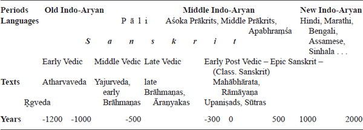

**Figure 4.1 **Chronology of Indo-Aryan languages and texts

The sociolinguistic situation in ancient India is a particularly complex issue and requires at least a short commentary. Already by the Middle Vedic period, Sanskrit was no longer a spoken language but co-existed, as a sacral language, alongside the Middle Indo-Aryan (MIA) vernaculars. During the middle and late MIA period, a number of languages (or, to be more precise, “forms of speech”) were used in India. In fact, we are dealing with triglossia, or even polyglossia: Sanskrit was used in the Hindu sacral context, in scientific treatises and some literary works; MIA languages (Prākrits) were used in poetry and dramatic works as well as in religious (Buddhist and Jainist) texts and in epigraphy. Late MIA vernaculars (Apabhraṃśa Prākrits) found their place in the literary tradition as well, while, finally, the colloquial vernaculars, which represented the earliest forms of the NIA languages, were employed in everyday life.

It is important to emphasize that in the course of these developments Sanskrit and Prākrits were not replaced and ousted by later varieties (i.e. Sanskrit by Prākrits, Prākrits by Apabhraṃśas, etc.), but moved up vertically into the position of the high/prestigious form of speech (as indicated by simple arrows in Figure 4.2),1 to be imitated by the low varieties of speech.

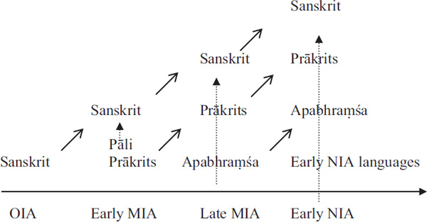

<!-- page: 216 -->

**Figure 4.2*** Polyglossia in Ancient India* (adapted from Bubenik 1998)

All these languages (or forms of speech) co-existed with each other. Most importantly, while the phonological systems and inventories of morphological forms of OIA and MIA languages have been preserved basically intact over the centuries, we can observe numerous traces of the influence of the spoken MIA and NIA vernaculars in the **syntax** and **semantics** of forms in the languages of higher rank. In a way, their grammatical systems, albeit morphologically stable, were open for syntactic “infection” from below, as indicated by the vertical dotted arrows in Figure 4.2. This fact is of crucial importance for understanding the syntactic developments in the late OIA and MIA texts.

Another peculiar feature of the sociolinguistic situation in Ancient India is the enormous authority of the Ancient Indian linguistic tradition, differing in many respects from the younger traditions of Europe and, particularly, that of Pāṇini, the author of the famous grammatical treatise *Aṣṭādhyayī* (lit. ‘consisting of eight chapters’), dating to the fifth to sixth century BC. By now, it has become the *communis opinio* that the language described by Pāṇini (Pāṇini’s object language) can be roughly identified with middle Vedic Sanskrit (also known as the language of the Vedic prose), attested in the Brāhmaṇas, Āraṇyakas, early Upaniṣads and Sūtras. The oldest of these prose texts can probably be dated to the middle of the first millennium BC (see Figure 4.1). However, this scheme is imprecise in some respects. In particular, we find linguistic phenomena (forms, constructions etc.) that are prescribed by Pāṇini’s grammar but are *not* found in the Vedic corpus. The most plausible explanation for this mismatch can be found in the peculiar sociolinguistic situation in Ancient India, briefly outlined above. Specifically, a number of linguistic phenomena described by grammarians did not appear in Vedic texts but existed within the semi-colloquial scholarly discourse of the learned community of Sanskrit scholars (comparable to Latin scholarly discourse in medieval Europe); for a discussion of the linguistic status of the Pāṇinian Sanskrit, see Kulikov 2013 and Hock 2016. Some such phenomena may result from the influence of Middle Indic dialects spoken by Ancient Indian scholars, thus representing syntactic and morphological calques from their native dialects onto the Sanskrit grammatical system.

<!-- page: 217 -->

Furthermore, we even have some reasons to assume that the rise and rapid development of the Pāṇinian prescriptive grammatical tradition was due, foremost, to the fact that Vedic had ceased to be a living language and the necessity of its codification had been clearly formulated by the contemporary scholarly community. This task was particularly pressing in view of increasing variation within the (semi-colloquial) idiom – essentially based on Middle Vedic Sanskrit, but heavily influenced by Middle Indic dialects – that was used by Ancient Indian paṇḍitas in their scientific and, to some extent, informal discourse.

### **Remarks on the genetic classification of (new) Indo-Aryan languages**

The genetic classification of Indo-Aryan languages is a much debated and fairly controversial issue. Due to a variety of circumstances, such as the peculiar sociolinguistic situation in Ancient and Medieval India, strong influence from the languages of the sacral and cultural tradition (above all, Sanskrit), and strong convergent processes that never stopped during the more than three thousand year history of the Indo-Aryan languages on the Indian subcontinent, a consistent genetic classification of the modern Indo-Aryan languages is virtually impossible. All classifications are mainly based on structural (grammatical) features, rather than on phonetic developments, and typically posit four or five major subgroups. Thus, according to the notorious Grierson’s division, the eastern languages (foremost, Bengali, Oriya and Assamese) share more features with the southern (Marathi and Sinhala with the closely related Maldivian) and northwestern (Sindhi, Lahnda) languages than with two other groups, the “inner”, or central (Western Hindi), and the “intermediate” (Eastern Hindi, Panjabi, Nepali etc.), which implies a larger subdivision into “outer” (= eastern + southern + northwestern) and “inner” languages. Some scholars attempted to trace at least this macro-division back to the dialectal variation within late Old Indo-Aryan and MIA periods and consider such features as, in particular, the merger of the three Old Indo-Aryan sibilants (*s*, *ś*, *ṣ*) in *s* as “East-West” (= “outer”) innovation. The three- or two-fold macro-division of the Indo-Aryan languages is often connected with the hypothesis about two waves of Indo-Aryan migration, where the first wave is said to correspond to the outer group.

This chapter will concentrate on the earliest attested Indo-Aryan language, Vedic Sanskrit, which can be roughly identified with Old Indo-Aryan and provides the most valuable evidence for Indo-European comparative studies and Indo-European reconstruction. Vedic is one of the most ancient attested Indo-European languages, and from the structural point of view this languages is considered in many respects as one of the closest approximations to the reconstructed Proto-Indo-European language. Vedic and post-Vedic Sanskrit are documented with an enormous corpus of literature – larger than the corpus of any other Indo-European literary tradition.

The Vedic corpus includes four main categories of texts, or Vedas, which fulfill different roles in the Hindu ritual: reciting hymns (r̥c-), pronouncing sacrificial formulae (yajus-) that accompany performing sacrifices, chanting songs (sāman-); the fourth Veda, which mainly contains magic spells and is called Atharvaveda was added later to the Vedic canon. Each Veda is transmitted in a number of schools, or “branches” (śākhās), and is subdivided into four genres of texts, depending on their function within the ritual: Saṃhitās (mantras addressed directly to the gods), Brāhmaṇas and Āraṇyaka (explanatory texts and commentaries on mantras) and Upaniṣads (philosophical texts). These four categories are followed by a variety of Sūtras related to the rituals as well as scientific and law texts (śāstras). The content of the Vedic and early post-Vedic corpus of texts is summarized in Table 4.2.

<!-- page: 219 -->

<!-- page: 218 -->

Table 4.2 Vedic texts and schools

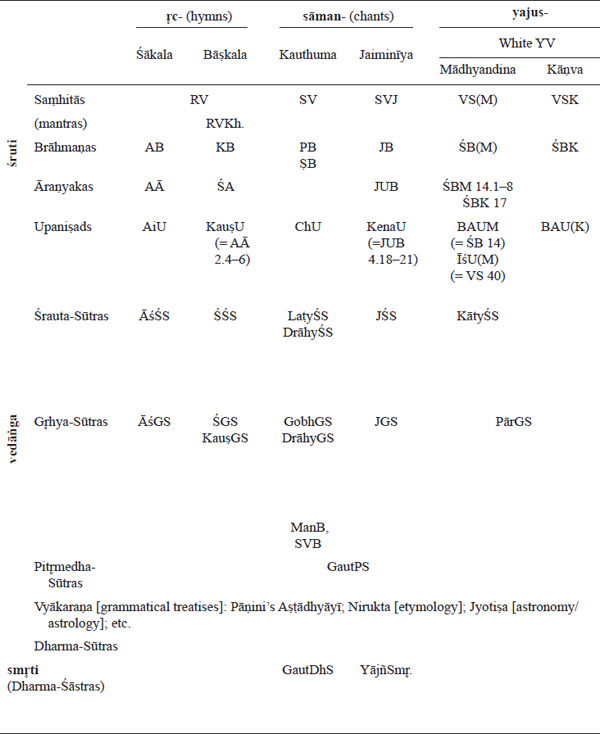
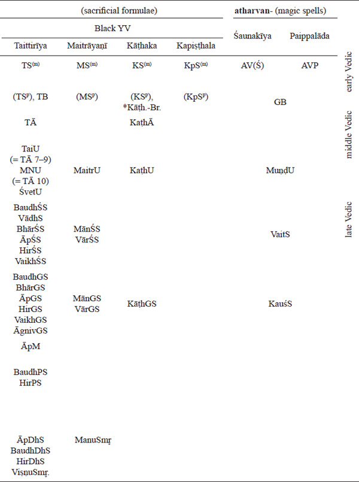

<!-- page: 220 -->

|            |     |                                                       |
|------------|-----|-------------------------------------------------------|
| AĀ         |     | Aitareya-Āraṇyaka                                     |
| AB         |     | Aitareya-Brāhmaṇa                                     |
| ĀgnivGS    |     | Āgniveśya-Gr̥hya-Sūtra                                 |
| AitU       |     | Aitareya-Upaniṣad                                     |
| ĀpDhS      |     | Āpastamba-Dharma-Sūtra                                |
| ĀpGS       |     | Āpastamba-Gr̥hya-Sūtra                                 |
| ĀpM        |     | Āpastamba-Mantrapāṭha                                 |
| ĀpŚS       |     | Āpastamba-Śrauta-Sūtra                                |
| ĀśGS       |     | Āśvalāyana-Gr̥hya-Sūtra                                |
| ĀśŚS       |     | Āśvalāyana-Śrauta-Sūtra                               |
| AV         |     | Atharvaveda                                           |
| AVP        |     | AV, Paippalāda recension                              |
| AVŚ        |     | AV, Śaunakīya recension                               |
| BaudhDhS   |     | Baudhāyana-Dharma-Sūtra                               |
| BaudhGS    |     | Baudhāyana-Gr̥hya-Sūtra                                |
| BaudhPS    |     | Baudhāyana-Pitr̥medha-Sūtra                            |
| BaudhŚS    |     | Baudhāyana-Śrauta-Sūtra                               |
| BĀU(K)     |     | Br̥had-Āraṇyaka-Upaniṣad (Kāṇva recension)             |
| BĀUM       |     | Br̥had-Āraṇyaka-Upaniṣad, Mādhyandina recension        |
| BhārGS     |     | Bhāradvāja-Gr̥hya-Sūtra                                |
| BhārPS     |     | Bhāradvāja-Pitr̥medha-Sūtra                            |
| BhārŚS     |     | Bhāradvāja-Śrauta-Sūtra                               |
| Br.        |     | Brāhmaṇas                                             |
| ChU        |     | Chāndogya-Upaniṣad                                    |
| DrāhyGS    |     | Drāhyāyaṇa-Gr̥hya-Sūtra                                |
| DrāhyŚS    |     | Drāhyāyaṇa-Śrauta-Sūtra                               |
| GautDhS    |     | Gautama-Dharma-Sūtra                                  |
| GB         |     | Gopatha-Brāhmaṇa                                      |
| GobhGS     |     | Gobhila-Gr̥hya-Sūtra                                   |
| HirDhS     |     | Hiraṇyakeśi-Dharma-Sūtra                              |
| HirGS      |     | Hiraṇyakeśi-Gr̥hya-Sūtra                               |
| HirPS      |     | Hiraṇyakeśi-Pitr̥medha-Sūtra                           |
| HirŚS      |     | Hiraṇyakeśi-Śrauta-Sūtra                              |
| ĪśU        |     | Īśā-Upaniṣad                                          |
| JB         |     | Jaiminīya-Brāhmaṇa                                    |
| JGS        |     | Jaiminīya-Gr̥hya-Sūtra                                 |
| JŚS        |     | Jaiminīya-Śrauta-Sūtra                                |
| JUB        |     | Jaiminīya-Upaniṣad-Brāhm.                             |
| KaṭhĀ      |     | Kaṭha-Āraṇyaka                                        |
| KāṭhGS     |     | Kāṭhaka-Gr̥hya-Sūtra                                   |
| Kāṭh-Saṃk. |     | Kāṭhaka-Saṃkalana                                     |
| KaṭhU      |     | Kaṭha-Upaniṣad                                        |
| KātyŚS     |     | Kātyāyana-Śrauta-Sūtra                                |
| KauṣGS     |     | Kauṣītaka-Gr̥hya-Sūtra                                 |
| KauṣU      |     | Kauṣītaki-Upaniṣad                                    |
| KauśS      |     | Kauśika-Sūtra                                         |
| KB         |     | Kauṣītaki-Brāhmaṇa (= Śā́ṅkhāyana-Brāhmaṇa)            |
| KenaU      |     | Kena-Upaniṣad                                         |
| KpS        |     | Kapiṣṭhala-Kaṭha-Saṃhitā                              |
| KS         |     | Kāṭhaka(-Saṃhitā)                                     |
| LāṭyŚS     |     | Lāṭyāyana-Śrauta-Sūtra                                |
| LaugGS     |     | Laugākṣi-Gr̥hya-Sūtra                                  |
| MaitrU     |     | Maitri- (Maitrī-), Maitrāyaṇa-, Maitrāyaṇīya-Upaniṣad |
| ManB       |     | Mantra-Brāhmaṇa                                       |
| MānGS      |     | Mānava-Gr̥hya-Sūtra                                    |
| MānŚS      |     | Mānava-Śrauta-Sūtra                                   |
| ManuSmr̥.   |     | Manu-Smr̥ti (= Mānava-Dharma-Śāstra)                   |
| MNU        |     | Mahā-Nārāyaṇa-Upaniṣad                                |
| MS         |     | Maitrāyaṇī Saṃhitā                                    |
| MuṇḍU      |     | Muṇḍaka-Upaniṣad                                      |
| NārSmr̥.    |     | Nārada-Smr̥ti                                          |
| Pāṇ.       |     | Pāṇini (Aṣṭādhyāyī)                                   |
| PārGS      |     | Pāraskara-Gr̥hya-Sūtra                                 |
| PB         |     | Pañcaviṃśa-Brāhmaṇa (= Tāṇḍyamahā-Brāhmaṇa)           |
| PraśU      |     | Praśna-Upaniṣad                                       |
| Rām.       |     | Rāmāyaṇa                                              |
| RV         |     | R̥gveda                                                |
| RVKh.      |     | R̥gveda-Khilāni                                        |
| Sū.        |     | Sūtra(s)                                              |
| SUB        |     | Saṃhitopaniṣad-Brāhmaṇa                               |
| SV         |     | Sāmaveda (Kauthuma rec.)                              |
| SVB        |     | Sāmavidhāna-Brāhmaṇa                                  |
| SVJ        |     | Sāmaveda, Jaiminīya rec.                              |
| ŚĀ         |     | Śāṅkhāyana-Āraṇyaka                                   |
| ŚB(M)      |     | Śatapatha-Brāhmaṇa (Mādhyandina recension)            |
| ŚBK        |     | Śatapatha-Brāhmaṇa, Kāṇva recension                   |
| ŚGS        |     | Śāṅkhāyana-Gr̥hya-Sūtra                                |
| ŚŚS        |     | Śāṅkhāyana-Śrauta-Sūtra                               |
| ŚvetU      |     | Śvetāśvatara-Upaniṣad                                 |
| ṢB         |     | Ṣaḍviṃśa-Brāhmaṇa                                     |
| TĀ         |     | Taittirīya-Āraṇyaka                                   |
| TaiU       |     | Taittirīya-Upaniṣad                                   |
| TB         |     | Taittirīya-Brāhmaṇa                                   |
| TS         |     | Taittirīya-Saṃhitā                                    |
| VādhS      |     | Vādhūla-Sūtra                                         |
| VaikhDhS   |     | Vaikhānasa-Dharma-Sūtra                               |
| VaikhGS    |     | Vaikhānasa-Gr̥hya-Sūtra                                |
| VaikhŚS    |     | Vaikhānasa-Śrauta-Sūtra                               |
| VaitS      |     | Vaitāna-Sūtra                                         |
| VārGS      |     | Vārāha-Gr̥hya-Sūtra                                    |
| VārŚS      |     | Vārāha-Śrauta-Sūtra                                   |
| VāsDhS     |     | Vāsiṣṭha-Dharma-Sūtra                                 |
| ViṣṇuSmr̥.  |     | Viṣṇu-Smr̥ti                                           |
| VSK        |     | Vājasaneyi-Saṃhitā, Kāṇva recension                   |
| VS(M)      |     | Vājasaneyi-Saṃhitā (Mādhyandina recension)            |
| YājñSmr̥.   |     | Yājñavalkya-Smr̥ti                                     |
| YV         |     | Yajurveda(-Saṃhitā) (= VS(K), MS, KS, KpS, TS)        |

Table 4.3 Abbreviations of texts (text sigla)

<!-- page: 221 -->

## **Phonology**

### **The phonological system of Old Indo-Aryan**

The phonological system of Vedic includes only two vowels proper, *a* and *ā*, which differed not only in length but also in timbre (the long vowel was a back vowel). Other monophthong items represent either vocalic allophones of sonants (*y*/*i*, *r*/*r̥* etc.; the contrast between *v* and *u* is phonemic, not allophonic, however) or former diphthongs (*e*, *o*, phonetically long and probably still preserving the diphthong pronunciation in early Old Indo-Aryan). The vowel system can be summarized as follows:

Vowels proper:

- a ā

<!-- page: 222 -->

Diphthongs:

- e  o
- ai au

Sonants that have vocalic variants:

- v ~ u ū
- y / i  ī
- r / r̥  (r̥ˉ)
- l / (l̥)

The consonant system includes plosives (voiceless, voiceless aspirates, voiced and voiced aspirates) and nasals (some of which have weak or no phonemic status), organized by five places of articulation, as well as three sibilants and the voiced (pharyngeal) *h*:

Table 4.4 Old Indo-Aryan consonantism

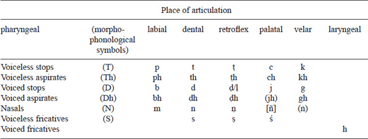

### **Accentuation**

A number of the early and middle Vedic texts mark accents. In particular, both early Vedic texts, RV and AV (in the Śaunakīya recension), as well as a number of early Saṃhitā prose texts (Taittirīya and Maitrāyaṇī) and early Brāhmaṇas (Taittirīya, ŚB), are preserved in accented form.

Phonetically, three tones (degrees of pitch) can be distinguished, high (udātta**´**) \[= principal accent\], middle (svarita\`) and low (anudātta). Phonologically, we only have an opposition between the vowels (or syllables) that bear the principal accent, or the high pitch, and those which bear no principal accent (= unaccented), i.e. middle or low pitch. A word-form can have only one principal accent (or high pitch), except for some compounds and *tavái*-infinitives. The placement of middle and low pitches is determined automatically within the sequence of words forming metrical units (pāda): (i) all vowels/syllables that have no principal accent bear the low pitch (anudātta); and (ii) the vowel/syllable that immediately follows udātta receives the middle pitch (svarita), unless the following syllable bears high pitch (udātta).

<!-- page: 223 -->

The European tradition of the transcription of Vedic texts marks only the principal accent (high pitch),2 using the acute accent mark (*á* etc.). Svarita is marked, by using the gravis accent mark (*à* etc.), only if the vowel that bears the preceding udātta is not written as the full vowel as well as in the case of “independent svarita” (due to a particular external sandhi). By contrast, the Devanāgarī notation accepted for the RV, AV and Taittirīya texts marks only udātta and svarita.

There are certain historically conditioned (essentially going back to the Proto-Indo-European morphophonological system) correlations between the ablaut grade and the placement of the accent. In particular, the first morpheme that shows a non-zero grade typically bears the accent. Yet numerous exceptions and analogical developments make these two parameters essentially independent from the synchronic point of view.

A number of word-forms bear no principal accent. These include (i) finite verbal forms, unless they are employed at the beginning of a sentence and/or pāda (= minimal metrical unit), or in a subordinate clause; (ii) vocatives, except at the beginning of a sentence and/or pāda; and (iii) clitics.

### **History of common Indo-Aryan phonemes**

### **Vowels and diphthongs**

The vowel system of Common Indo-Aryan is almost identical to that of Proto-Indo-Iranian and reproduces its main distinctive features: the loss of most quality distinctions (*e*/*o*), as opposed to the preservation of most quantity (length) distinctions. The main innovations in Indo-Aryan (partly shared with Iranian) include (i) the merger of all proper Proto-Indo-European vowels (that is, *e* and *o*) as well as the vocalic allophones of the nasal sonants in *a*; the same holds for its long pendants and vocalic elements of diphthongs; (ii) monophthongization of diphthongs (*Vi* \> *e*, *Vu* \> *o*); and (iii) merger of the vocalic variants of *i*/*y* and of all laryngeals in *i*.

The history of the Common/Old Indo-Aryan vowels and diphthongs can be illustrated with the following examples:

## ***a*** **\< *e, *o, *m̥, *n̥**

- *dáśa* ‘ten’ \< ***dekˊm̥, cf. Gr. δέκα, Lat. *decem*
- *márta-* ‘mortal, man’ \< *mor-to-, cf. Gr. (Kallimachos) μορτοί pl.
- *ájra-* ‘field’ \< *h₂eǵ-ro-, cf. Gr. ἀγρός, Lat. *ager*, Goth. *akrs*
- *ásthi-* n. \< *h₃estH- ‘bone’, cf. Hitt. /*hastai-*/, Gr. ὀστέον, YAv. *ast-* n. ‘bone, body’
- *matí-* f. ‘thought’ \< *mn̥-ti-, cf. Lat. *mēns*, *mentis* f. ‘mind’, Lith. *mintìs* f.
- *a-(pútra-)* ‘without (a son)’ \< ***n̥- adj., cf. YAv. *a-puϑra-*, Gr. ἄ-ϑεος adj. ‘without a god’, Lat. *in-*, Goth. *un-*

## ***ā*** **\< *ē, *ō, *o (\| \_CV, \_#), *eH, *oH, *m̥H, *n̥H**

- *mātā́* ‘mother’ \< *meh₂tē(r), cf. Av. *mātā*, Gr. μάτηρ, Lat. *māter*
- *vā́k* ‘speech, voice’ \< *wōkʷs, cf. OAv. *vāxš*, Lat. *uōx*
- *jā́nu-* ‘knee’ *\< **ǵónu-, cf. YAv. *zānu*o, Gr. γόνυ
- The only trace of the original Proto-Indo-European *e/o distinction can be found in the open non-final syllable, where PIE *o is lengthened, in accordance with Brugmann’s Law, which operated as early as Indo-Iranian, cf. 1 sg. perf. *jag***á***ma* \< *gʷe-gʷ**o**m-h₂e (cf. Gr. μέμ**ο**να) vs. long vowel in 3 sg. perf. *jag***ā́***ma* \< *gʷe-gʷ**o**m-e (cf. Gr. μέμονε); or in causatives like *j***a***náyati* ‘to beget’ (\< ***ǵ**o**nh₂-eye*-*), not ***jānáyati*!)
- *jātá-*‘born’ *\< **ǵn̥H-to*-*, cf. Lat. *nātus*

<!-- page: 224 -->

## ***i*** **\< *i, *H̥/ə (*****ir \< ******r̥H \| \_V)**

- *i-hí ‘to go’, 2 sg. imp. \< *h₁i-dʰi, cf. OCS idi, Gk. ἴθι*
- *pitár-* ‘father’ **\< ***ph₂tḗ(r), gen. *ph₂tr-és, *-ós, cf. Gr. πατήρ, πατρóς; Lat. *pater*, *-tris*; Goth. *fadar*
- *-mahi* (sec. ending 1 pl. mid.) \< **-*medʰh₂, cf. Gr. -μεϑα
- *-tirá* ‘to pass’ 2 sg. imp. act. \< **-*tr̥h₂-e-, cf. LHitt. *tar-ra-at-ta* (\<***térh₂-o-to-) ‘to be able’; Lat. *trāns* (\<***tr̥h₂-nt-)

## ***ī*** **\< *iH, *H̥/ə (*****īr \< ******r̥H, *l̥H \| \_C)**

- *jīvá-* ‘alive, living’ *\<* *gʷih₃-wó-, cf. Lat. *uīuus*, OCS *živъ*, Lith. *gývas*
- *pu-n-ī-mas* ‘to cleanse’ 1 pl. pres. \< *pu-n-H-mes
- *a-tārīt* ‘to pass’ 3 sg. sigm. aor. \< *e-tērh₂-s-
- *tīrṅa-* ‘to pass’ perf. ptcp. \< **-*tr̥h₂-no-

## ***u*** **\< *u (*****ur \< ******r̥H \| \_V)**

- *váśmi*, *uśmási* ‘to wish’, 1 sg., 1 pl. pres. \< *wekˊ-mi, *ukˊ-mes, cf. OAv. *vasəmī*, *usə̄mahī* /vasmi, usmahi/, Hitt. 1 sg. *ú-e-ek-misphuráti* ‘kicks’ \< *sp(ʰ)r̥H-e-, cf. Lat. *spernō* ‘to dissociate, reject, spurn’, OIc. *sperna* ‘to kick out with the feet’

## ***ū*** **\< *uH (*****ūr \< ******r̥H, *l̥H \| \_C)**

- *mū́ṣ-* ‘mouse’ \< *muHs-, cf. Gr. μῦς; Lat. *mūs*; OHG *mūs*; Russ. *myšь*
- *pūrṅá-* ‘full’ \< *pl̥H-no-, cf. Goth. *fulls*, Lith. *pìlnas*, OCS *plъnъ*, Av. *pərəna-*

## *r̥* **\< *r̥, *l̥**

- *mr̥tá-* ‘died, dead’ \< *mr̥-to-, cf. Lat. *mortuus*
- *vr̥ˊka-* ‘wolf’ *\<* *wl̥kʷo-, cf. Goth. *wulfs*, Lith. *vil̃kas*, ORuss. *vьlkъ*
- ******r̥***ˉ*** arises from *r̥* analogically, cf. *pitr̥ˉˊn* ‘father’, acc. pl. (*ph₂tr̥-ns) in analogy with *devá-* ‘god’ : acc. pl. *dev***āṇ****

## ***e*** **\<** *********ey, *oy**

- *éti* ‘to go’, 3 sg. pres. \< *h₁eyti, cf. Gr. εἶσι
- *cetáyati* ‘to reveal’ *\< **kʷoyt-eye-, cf. Goth. *haidu-* (\< *k(ʷ)oyt-ú- or *k(ʷ)oy-tú-) ‘manner’

## ***ai*** \< *ēy, *ōy

- *(vr̥ˊk-)aiḥ* ending instr. pl. *o*-decl. *\< *-*ōys, cf. Lith. *vilk-aĩs*, Lat. *lup-īs*

## ***o*** **\< *ew, *ow**

- *ójas-* ‘strength, power’ *\< **h₂ewg-es*-*, cf. Lat. *augustus* ‘elevated’; Lith. *augestis* ‘growth’
- *bódhati* ‘to perceive’ *\< **bʰewdʰ-e-, cf. Gr. πεύϑομαι ‘to learn, to hear’
- *bodháyati* ‘to make awake’ (caus.) *\< **bʰowdʰ-eye-ti, cf. OCS *buditi*

## ***au*** **\< *ēw, *ōw**

- *dyáuḥ* ‘heaven, Father Sky’ nom. sg. \< *dyēw-s, cf. Gr. Zeύς, Lat. *diūs*
- *gáuḥ* nom. sg. ‘cow’ \< *gʷōw-s, cf. Gr. βούς

### **Sonants**

The system of sonants is quite conservative, except for the weakening of the phonemic status of *l* (completely lost in Iranian, but partly preserved in Indo-Aryan), which merges with *r* in many cases.

## ***y*** **\< *i/y \| \_V (allophonic variant of** ***i*****)**

- *yúvan-* ‘young, young hero’ *\<* *h₂yu-h₁on*-*, cf. Arm. *yavanak*/*yovanak* ‘young (of animal)’; Lat. *iuvenis*

## ***r*** **\< *r, *l**

- *bhruˉ*ˊ-** ‘(eye)brow’ *\< **h₃bʰruH*-*, cf. Gr. ὀφρῦς; OEng. *brū*; Lith. *bruvìs*; OCS *brъvь*
- *mriyá-te* ‘die’ \< *mr̥-ye-, cf. Lat. *morior*
- *śrávas-* ‘fame’ *\< **kˊléwes-, cf. Gr. κλέος ‘call, fame’, OCS *slovo* ‘word’

## ***l*** **\< *l, (*r)**

- *lúbhyati* ‘to be in disorder’ *\< **lubʰ-, cf. OCS *ljubiti* ‘to love’
- *reh-*/*leh-* (RV)/(AVP+) ‘to lick’ \< *leyǵʰ-, cf. OCS *lizati*

## ***v*** **\< *u/w** ***\|*****\_V**

- *vā́k* ‘speech, voice’ \< *wōkʷs, cf. OAv. *vāxš*, Lat. *uōx*

### Plosives

The system of sonants and plosive consonants is both conservative, preserving the main contrasts of the Proto-Indo-European consonantism, and innovative, exhibiting a number of additions to the original system. The most important innovations include (i) the rise of voiceless aspirates from the combination of voiceless stops and laryngeals (*TH \> T*h*); (ii) the rise of retroflex consonants, foremost on the basis of retroflexivization of *s* after *r*, *k* and vowels distinct from *ā˘* (see also the section on sandhi below), which further retroflexivizes adjacent dental stops; retroflexivization of *n* after *r*; and the development of final *-kˊs \> *ṭ*; (iii) two palatalizations, which result, in particular, in the merger of the Proto-Indo-European voiced palatal gutturals (*ǵ and *ǵʰ) with simple voiced gutturals before front vowels (*e*, *ī˘*) in *j* and *h*, respectively; notice that these two types of sources can still be distinguished morphophonologically; that is, they yield distinct reflexes ( *j*₂ and *h*₂ as opposed to *j*₁ and *h*₁) in sandhi.

<!-- page: 226 -->

The history of the Common/Old Indo-Aryan consonants is summarized and illustrated with examples below:

## **Velars**

- *****k*** \<*k(ʷ)** \| \_X≠ *ē˘, *i
- *kád* nom./acc. sg. n. interrog. pron. \< *kʷod, cf. Lat. *quod*, OHG *hvaz*
- *loká-* m. ‘free/light space, world’ \< *lewk-o-, cf. Gr. λευκός ‘light, white, bright’, Lat. *lūx* f. ‘light’
- *****kh*** \< *k(ʷ)H** \| \_V≠ *ē˘, *i
- *śāˊkhā-* ‘branch, twig’ *\<* *kˊok\[ʷ\]-h₂-, cf. Goth. *hoha* ‘plough’, Lith. *šakà* ‘twig’, ORuss. *soxa* ‘(wooden) plough’
- ****g******\< *g(ʷ)** \| \_X≠ *ē˘, *i
- *gāˊm* acc. sg. ‘cow’ \< *gʷōm, cf. OAv. *gąm*, Gr. βῶν, Umbr. *bum*
- *****gh*** \<*g(ʷ)ʰ** \| \_X≠ *ē˘, *i
- *ghnánti* ‘to slay’ 3 pl. pres. \< ***gʷʰnenti, cf. Hitt. *ku-na-an-zi*
- *****ṅ*** \< *n \| \_Cvelar**
- The velar nasal emerges only through sandhi before velar plosives, and the following example represents the only grammatical context where this sound has phonemic status: *prāˊṅ* nom. sg. m. of the adjective *prāˊñc-* ‘directed forwards’ ← *prāˊnk-s* ← *prāˊnc-s* (sandhi)

## **Palatals**

- ****c******\< *k(ʷ)** \| \_ *ē˘, *i
- *ca* ‘and’ \< *kʷe, cf. Gr. τε, Lat. *que*
- *cakrá-* ‘wheel’ \< *kʷe-kʷl-o-, cf. Gr. κύκλος ‘circle, ring, wheel’; Toch. A *kukäl* ‘cart’
- ****ch******\< *sk \| \_ *ē̌, *i/y**
- *chid-* ‘to split, break’ \< *skid-, cf. YAv. *siδ-*, Gr. σχίζω ‘to split, cut’, Lat. *scindō* ‘to cut open’
- *gácchati* pres. stem ‘to go’ *\< **gʷm̥-ske*-*, cf. YAv. *jasaiti* 3 sg. pres., Gr. βάσκε 2 sg. imp. act. ‘go!’
- *****j***₍₁₎ \<*g(ʷ)** \| \_ *ē˘, *i (*j*₁**=** {*j*/*g*/*k*})
- *jīvá-* ‘alive, living’ *\< **gʷih₃-wó-, cf. Lat. *uīuus*, OCS *živъ*, Lith. *gývas*
- *yuj*- ‘to connect, yoke’, *yúj*- ‘connected, yoked; companion’ \< *Hyug- ‘to yoke, join’ (e.g. in dat.sg./inf. *yuj*-é \< *Hyug-ei, ins.sg. *yuj*-ā́ \< *Hyug-eh₁) (: *yuk-tá*- perf. ptcp. \< **Hyug-to-*), cf. Gr. ζεύγνῡμι, Lat. *iungere*, Lith. *jùngti*, OCS *igo* ‘yoke’
- *****j***₍₂₎ \<*ǵ** (*j*₂**=** {*j*/*ṣ*})
- *jā́nu-* ‘knee’ *\< **ǵónu-, cf. YAv. *zānu*o, Gr. γόνυ
- *yaj-* ‘to worship, sacrifice’ *\< **Hyaǵ- (cf. ptcp. perf. *i***ṣ***-ṭá- \< **Hiǵ-to*-*), cf. Gr. ἅζομαι ‘to honour’, Gr. ἅγιος ‘sacred, consecrated’
- ****jh**** emerges only through borrowing or in onomatopoeia, as in *jájjhat-* pres. ptcp. ‘laughing’
- \[****ñ****\] **\<******n**** \| \_Cpalatal, *ñ* is a non-phonemic (allophonic) variant of *n*, cf. *yu-ñ-j-anti* ‘to yoke, join’ 3 pl. pres. \< *Hyu-n-g-nti

## **Retroflex**

- ****ṣ******\< *s***\|* *i, *u, *r, *k\_
- ****ṣ******\< *kˊ, *ǵ***\|\_**t
- *áraikṣam* ‘to leave’ 1sg. aor. \< *(-leykʷ-)s-, cf. Gr. ἔλευψα
- *viṣá*- ‘venom, poison’ \< *wis-, cf. Gr. ἰός, Lat. *uīrus*
- *juṣ-* ‘to enjoy’ \< *ǵus-, cf. Lat. *gustō* ‘to taste’, Goth. *ga-kiusan* ‘to test’
- *várṣman*- ‘height, peak, top’ \< *wers-men-, cf. Lith. *viršùs*, OCS *vrьxъ*
- *váṣ-ṭi* ‘to wish, desire’ 3 sg. pres. \< *wekˊ-ti, cf. Gr. ἑκών ‘voluntary’, Hitt. /u̯ēktsi/
- ****ṭ******\<******t**** \| *ṣ*\_, ***kˊs** \| \_#
- *juṣtá-***\<** *ǵus-to- ‘enjoy’ perf. ptcp.*víṭ* (*víś-*) ‘settlement, community’, nom.sg. \< *wikˊ-s, cf. OCS *vьsь* ‘village’, Gr. οἶκος ‘house, dwelling’
- ****ṭh******\< *tH** \| *ṣ*\_*V*
- *tíṣṭha- ‘stand’, pres. \< *stí-sth₂-e-, cf. Gr. ἵστημι ‘I place’*
- ***ḍ \<* *ẓ *\<* *ṣ** \| \_D(ʰ)
- *vipruḍ-bhiḥ***\<** **-*prus-bʰ-… ‘drop’ (*vi-pruṣ-*)
- \[****ḷ****\] is an allophonic variant of *ḍ* that emerges only in the intervocalic position (\| V_V) in the dialect of the RV, cf. RV *īḷe* = (*īḍe* in other texts) ‘I worship’ 1 sg. pres.
- *(V̄)***ḍh******\< *(V̆)ẓdh** \< *(V̆)**ṣdh**
- *ūḍhá-* ‘carry’ perf. ptcp. (√ *vah*) *uǵʰ-to- (\> *uǵʰ-d ʰo-)
- *nīḍá-***\<** *ni-sdo- ‘nest’, cf. Lat. *nīdus*, Eng. *nest*
- *****ṇ*** \< ****n***** \| *ṣ, r* (…)\_
- Notice that the retroflexivization of *n* is blocked by dental, retroflex and palatal consonants in (…),
- cf. *tīrṅa-* ‘to pass’ perf. ptcp. \< *tr̥h₂-no-
- *várṣmāṅ-am* ‘height, peak, top’ \< *wers-men-
- *gr̥hyámāṅa-* (*gr̥bʰ-ye-mh₁no-) ‘to seize’ pres. pass. ptcp. but not *rā́jānām* ‘king’ acc. sg.; *pr̥ṣṭhéna* ‘back’ instr. sg.; etc.

## **Dentals**

- *****t*** \<*t**
- *tri-* ‘three’ **\<** *tri-, cf. Gr. τρεῖς, Lat. *trēs* (nom. pl.), Goth. *þrins* (acc. pl. m./f.), OCS *tri* (f.)
- ****th******\< *tH** \| \_V
- *pr̥thú-* ‘broad, wide’ **\<** *pl̥th₂-ú-, cf. Gr. πλατύς, Lith. *platùs*
- ****d******\< *d**
- *pád-* ‘foot’ **\<** *ped-/*pod-, cf. Gr. (Dor.) πώς, ποδóς (gen. sg.), OEng. *fēt* (nom. pl.), Lat. *ped-is* (gen. sg.)
- ****dh******\< *dʰ**
- *dádhā-ti* ‘to put, place’ 3 sg. pres. **\<** *dʰe-dʰeh₁-ti, cf. Gr. τίϑη(-μι)
- *****n*** \< *n**
- *náva-* ‘new, young’ **\<** *newo-, cf. Hitt. *neu̯a-*; Gr. νέος; Gr. (Myc.) *ne-wo*; Lat. *nouus*; OCS *novъ*

## **LABIALS**

- *****p*** \< *p**
- *pitár-* ‘father’\< *ph₂tér-, nom.sg. *pitā*́ \< *ph₂tḗ(r), cf. Gr. πατήρ, Lat. *pater*,Goth. *fadar*
- *****ph*** \< *pH** \| \_V
- *phéna-* ‘foam’ **\<** *pHoyno- (?), cf. OCS *pěna*
- *****b*** \< *b**
- *bála*- ‘power, strength’ **\<** *bél-o-, cf. Lat. *dē-bilis* ‘without strength’, Gr. βέλτερος ‘better’; OCS *bolijь* ‘bigger’
- ****bh******\< *bʰ**
- *bhuj-* ‘to enjoy, consume’ **\<** *bʰewg-, cf. OAv. *būj-* f. ‘expiation’, Lat. *fungor* ‘to enjoy, suffer, get rid of’
- *bhrū́-* ‘(eye)brow’ **\<** *h₃bʰruH-, cf. Gr. ὀφρῦς; OEng. *brū*; Lith. *bruvìs*; OCS *brъvь*
- ****m******\< *m**
- *mātā́* ‘mother’ **\<** *meh₂tē(r), cf. Av. *mātā*, Gr. (Dor.) μάτηρ, Lat. *māter*

## **Sibilants and h**

- *****s*** \< *s**
- *as*, *ásti* 3 sg. act. ‘to be’ **\<*****h₁es-, cf. Gr. ἔστι, ἐστί; Hitt. *e-eš-zi*; Lat. *est*; Goth. *ist*
- *****ś*** \< *kˊ**
- *dáśa* ‘ten’ **\<*****dekˊm̥, cf. Gr. δέκα, Lat. *decem*
- *śván-* ‘dog’ **\<*****kˊwon-/*kˊun-, cf. Arm. *šown*, Gr. κύων, κυνóς, OIr. *con* (gen. sg.), Lith. *šuõ*, Hitt. *kuu̯an*/*kun-* ‘dog-man’, OIc. *hun-d-r*
- *****h***₍₁₎ \< *******g(ʷ)ʰ** \| \_ *ē̆, *i
- *hánti* 3 pl. pres. ‘to slay’ **\<** *gʷʰen-ti
- *dáhati* ‘to burn’ 3 sg. pres. **\<** *dʰegʷʰ-e-ti (: *da***g***dhá-* ptcp. perf. \< *dʰegʷʰ-to*-*), cf. Lith. *degù*, Lat. *foueō* ‘to make warm’
- *****h***₍₂₎ \<*ǵʰ** (also \< *dʰ*, mostly in \| V≠ r̥\_V̆; rarely \< *bʰ*)
- *hásta* ‘hand’ **\<** *ǵʰes-to-, cf. Av. *zasta-*; Lith. *pa-žastìs* ‘armpit’
- *ahám* ‘I’ **\<** *h₁eǵH-om, cf. Av. *azə̄̆m*, OPers. *adam*, OCS *azъ*, cf. Gr. ἐγώ, Lat. *egō̆* \< ***h₁eǵ-oH
- *váhati* ‘to move, carry, drive’ 3 sg. pres. \< *weǵʰ-e-ti (: *ū***ḍ***há-* ptcp. perf. \< *uźʰ-dʰo- \< *uǵʰ-dʰo- \< *uǵʰ-to-), cf. Av. *vazaiti*, Lat. *uehō*, -*ere*, OIc. *vega*, OHG *wegan*, OCS *vezǫ*
- *ihá* ‘here’ \< **idʰa*, cf. Pāli *idha*, LAv. *iδa*; cf. also *ihí* ‘to go’, 2 sg. imp. discussed on p. 224.
- Note that the voiced sibilants *z* (existing in Avestan) and **ẓ* disappeared in Proto-Indo-Aryan.

To conclude this section, one should mention two important phonetic laws that are important for the development of aspirates in Old Indian:

- Bartholomae’s Law (Dʰ+T \> DʰDʰ, Dʰ+s \> Dʰzʰ, also where the consonants are separated by *s* or a laryngeal) is responsible for the shift of aspiration to the second member of a consonant cluster and its subsequent voicing, cf. *buddhá-* ‘awaken’ \< *bʰudʰ-to-; *ápi gdha* 3 sg. inj. mid. ‘to devour’ \< PIIr. **-*gʰždʰa \< PIE ***gʰs-to; *duhitár-* ‘daughter’ \< ***dʰugʰHtar- \< PIE ***dʰugh₂ter- (OAv. *dugədar-*).
- Grassmann’s Law (Dʰ … Dʰ \> D … Dʰ \| … ≤ 1 syllable) accounts for the loss of the aspiration of the first aspirate in case of a sequence of aspirates separated by no more than one syllable, cf. *dugh-* ‘to give milk’ \< PIE *dʰewgʰ- (cf. Goth. *daug* ‘to be good for smth., fit’); *dá-dhā-ti* ‘to put, place’ 3 sg. pres. \< PIE *dʰe-dʰeh₁-ti (cf. Gr. τίϑη(-μι)); *bódh-a-ti* ‘to perceive’ 3 sg. pres. \< PIE *bʰewdʰ-e-ti (cf. Gr. πεύϑομαι ‘to learn, to hear’).

## **Morphophonology**

### **Morphotactics**

Sanskrit is notorious for its extremely rich system of processes that occur at morpheme or word boundaries that are called, in accordance with Indian tradition, sandhi (a Sanskrit term, literally meaning ‘together-posing, joining’, which has been borrowed into European linguistic terminology). Some of these processes have an allophonic nature (such as, for instance, palatalization of the dental nasal before palatals) and thus can be described in terms of phonological rules, but many others represent phonological, non-automatic phenomena and thus belong to the domain of morphophonology. The main two types of sandhi include internal and external sandhi. External sandhis operate on the boundaries between words (= free morphemes), as well as, normally, (i) between members of compounds, (ii) between preverbs/prefixes and roots, and (iii) between nominal stems and the following endings of the dual and plural: three plural/dual case endings beginning with *bh-*, i.e. -*bhis*, -*bhyas* and -*bhyām* and the loc. pl. ending *-su*. Internal sandhis operate on the boundaries between (bound) morphemes.

Typical examples of internal sandhi include, for instance:

1.  (i)    C₁C₂ … Cn → C₁ \|\_# (all members of the final consonant cluster are dropped except for the first one), cf. *pácant-s* → *pácan* (act. ptcp. (nom. sg. m.) of *pac* ‘cook’); *á-chānd-s-t → áchān* (3 sg. aor. act. of *chand* ‘appear’);
2.  (ii)   devoicing and deaspiration of stops before *s* or in auslaut: T(h), D(h) → T \|\_#, \_*s* \[except for palatals: T(h), D(h) ≠ *c*, *j*\], cf. *labh-syate* → *lapsyate* (3 sg. fut. mid. of *labh* ‘obtain’); *yúdh-s* → *yút* ‘fighter’ (nom. sg.); *yúdh* → *yút* ‘O fighter!’ (voc. sg.);
3.  (iii)  retroflexivization of *s* after *r*, *k* and vowels distinct from *ā˘* (see 2.3.2 above), also known as the “*RUKI* rule”: *s* → *ṣ* \| *k*, *r*, V≠ā˘ \_ (not \_#, *r* = not in auslaut or before *r*), cf. *á-raik-s-am* → *áraikṣam*, *á-kār-s-am* → *ákārṣam*, *juhó-si → juhó-ṣi*;
4.  (iv)  assimilation to the following plosive in the way of articulation (i.e. T(h), D + *t* → T*t*; T(h), D + *th* → T*th*; T(h), D + *dh* → D*dh*), accompanied by progressive retroflexivization (retroflex consonants retroflexivize the following stop), which can be conveniently presented in table form (Table 4.5; adopted from Zaliznjak 1978/1987):

|                             |     |        |     |         |     |         |
|-----------------------------|-----|--------|-----|---------|-----|---------|
|                             |     | \+ *t* |     | \+ *th* |     | \+ *dh* |
| *k*, *kh*, *g*, *c*, *j*₁ + |     | *kt*   |     | *kth*   |     | *gdh*   |
| *ṭ*, *ṭh*, *ḍ* +            |     | *ṭṭ*   |     | *ṭṭh*   |     | *ḍḍh*   |
| *t*, *th*, *d* +            |     | *tt*   |     | *tth*   |     | *ddh*   |
| *p*, *ph*, *b* +            |     | *pt*   |     | *pth*   |     | *bdh*   |
| *ś*, *ṣ*, *ch*, *j*₂ +      |     | *ṣṭ*   |     | *ṣṭh*   |     | *ḍḍh*   |
| *s* +                       |     | *st*   |     | *sth*   |     | *dh*    |

**Table 4.5 Assimilation in consonant clusters before dental stops**

Cf. *yoj*₁*-tum → yoktum* (inf. of *yuj* ‘yoke, join’); *vac-tum → vaktum* (inf. of *vac* ‘say’); *prach-tum → praṣṭum* (inf. of *prach* ‘ask’); *mr̥j*₂*-tha → mr̥ṣṭha* (2 pl. pres. act. of *mr̥j* ‘adorn, anoint’); *mr̥j*₂*-dhvam → mr̥ḍḍhvam* (2 pl. pres. act. of *mr̥j* ‘adorn, anoint’); *ās-dhve → ādhve* (2 pl. pres. mid. of *ās* ‘to sit’); but cf. also *as-dhi* → *edhi* (2 pl. imp. of *as* ‘to be’).

External sandhi (many of which – especially the vowel sandhi – are optional in early Vedic) can be illustrated, for instance, by the following rules:

1.  (i)    merger (contraction) of two homorganic vowels (optional in early Vedic, which is shown by a bracketed arrow): -V + V- → -Vˉ-, cf. *ihá asti → ihāˊsti* ‘here is’; *su uktám → sūktám* ‘well-said’;
2.  (ii)   monophthongization:
    - *-ā˘* + *ī˘-* → *-e-* (cf. *ihá iha → ihéha*, *pitāˊiva → pitéva* ‘like father’)
    - and
    - \-*ā˘* + *u*ˉ*˘*- → -o- (cf. *āˊ ubhāˊ* → *óbhāˊ* ‘to both’);
    - *-as + a- → -o* *’-*, cf. *devás atha → devó ’tha* ‘and the god’.

### **Ablaut alternation**

Most morphemes may appear in one of the three alternation grades (traditionally called “ablaut” grades): (i) zero, or weak; (ii) full, or normal (guṇa “quality” in Indian tradition); and (iii) long (vr̥ddhi ‘increasing’). Historically, this alternation goes back to the Proto-Indo-European ablaut, *zero/*e/*o/*ē/*ō. Thus, for roots with the structure *CaC*, the alternation between the zero, full and long grades will manifest as ø/*a*/*ā* (e.g. *pt-*/*pat-*/*pāt-* ‘fly’). The alternating vowel can be followed by a sonant (*i*/*y*, *u*/*v* etc.), which can be realized in different ways, depending on the phonological context. Altogether, this results in a rich allomorphy, such as *i – e*/*ay – ai*/*āy* (e.g. *ji-*/*je-*/*jay-*/*jai-*/*jāy-* ‘win’) etc.

<!-- page: 231 -->

The choice of the alternation grade is determined by the grammatical form. Next to the forms that require one of the three “traditional” grades listed above, there are a number of grammatical positions (causative stem, 3 sg. perf. act.), where some morphemes show the full grade, while others have the long grade. In Indo-Iranian, *e* and *o* merge in *a*, but *o* changed to *ā* in open syllables, according to Brugmann’s Law. Thus, the original ablaut is reflected in Vedic as the zero/*a*/*ā* + *a*/*ā* opposition. Accordingly, for descriptive purposes it seems appropriate to posit (iv) the fourth (“Brugmann’s”) grade for such grammatical contexts as causative stem or 3 sg. perf. act.

Table 4.6 presents the main alternation grades (in a somewhat simplified form; for detailed rules that describe the choice of the alternation grade depending on the phonological context, see Zaliznjak 1975):

**Table 4.6 The main alternation grades**

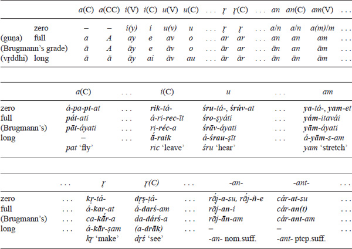

## ***Illustrations***

### A:

- *pat* ‘fall, fly’: 3 sg. redupl. (non-caus.) aor. act. *á-pa-***pt***-at*, 3 sg. pres. I act. ****pát***-ati*, 3 sg. caus. pres. act. ****pāt***-áyati*
- *tap* ‘heat’: 3 sg. pres. I act. ****táp***-ati*, 3 sg. caus. pres. act. ****tāp***-áyati*, 3 sg. sigm. aor. act. *a-***tāp***-sīt*

<!-- -->

- *yaj* ‘sacrifice’: ptcp. perf. pass. ****iṣ***-ṭá-*, 3 sg. pres. I act. ****yáj***-ati*, 3 sg. sigm. aor. inj. act. ****yāṭ****

### **Ā:**

- *sthā* ‘stand’: ptcp. perf. pass. ****sthi***-tá-*, 3 sg. root aor. act. *á-***sthā***-t*, 3 sg. pf. act. *ta-***sth***-áu* \[full grade before a vowel\], 3 sg. caus. pres. act. ****sthā***-p-áyati*

<!-- page: 232 -->

### **I:**

- *ric* ‘leave’: ptcp. perf. pass. ****rik***-tá-*, 3 sg. pluperf. act. *á-ri-***rec***-īt*, 3 sg. perf. act. *ri-***réc***-a*, 3 sg. sigm. aor. act. *āˊ-***raik****

### **Ī:**

- *nī* ‘lead’: ptcp. perf. pass. ****nī***-tá-*, 3 sg. pres. I act. ****náy***-ati*, 3 sg. sigm. aor. subj. act. ****ne***-ṣ-at*, 2 pl. sigm. aor. inj. act. ****nai***-ṣ-ṭa*, 3 sg. perf. act. *ni-***nāˊy***-a*

### R̥:

- *kr̥* ‘make’: ptcp. perf. pass. ****kr˳***-tá-*, ptcp. root aor. mid. ****kr***-āṇá-*, 3 pl. root aor. act. *á-***kr***-an*, 3 sg. them. aor. act. *á-***kar***-at* AV+, 3 sg. perf. act. *ca-***kāˊr***-a*, 1 sg. sigm. aor. act. *á-***kār***-ṣ-am*
- *dr˳ś* ‘see’: ptcp. perf. pass. ****dr˳ṣ***-ṭá-*, 1 sg. root aor. act. *á-***darś***-am*, 3 sg. perf. act. *da-***dárś***-a* (3 sg. sigm. aor. act. *a-***drāk**** Br., *a-***drāk***-ṣ-īt*)

### R̥ˉ:

- *tr̥ˉ* ‘pass’: ptcp. perf. pass. ****tīr***-ṇá-*, 2 sg. pres. VI act. ****tir***-asi*, 3 sg. pres. I act. ****tár***-ati*, 3 sg. sigm. aor. act. *á-***tār***-īt*

### **N:**

- *-an-* (nominal stem suffix), stem *rāˊj-an-* ‘king’: loc. pl. *rāˊj-***a***-su*, dat. sg. *rāˊj-***ñ***-e*, loc. sg. *rāˊj-***an***-i*, acc. sg. *rāˊj-***ān***-am*
- *-ant-* (act. ptcp. suffix), act. ptcp. *cár-an-* ‘wandering’: loc. pl. *cár-***at***-su*, nom. sg. *cár-***an(t)****, acc. sg. *cár-***ant***-am*

### **N¯:**

- *jan*i** ‘be born, generate’: ptcp. perf. pass. ****jā***-tá-*, 3 sg. pres. IV mid. ****jāˊ***-ya-te*, 3 sg. perf. mid. *ja-***jñ***-é*, 1 sg. pres. I act. ****ján***-āmi*, 3 sg. perf. act. *ja-***jāˊn***-a*

### **Morphophonological classification of (root) morphemes**

In accordance with the ability of the root to appear in all or some of the above-listed ablaut grades, all Vedic roots can be divided into the following three main classes:

1.  (i)    Fully alternating roots (hereafter called “alternating” for short) attest all three morphophonological grades; cf. *ji-*/*jy- : je-*/*jay- : jai-*/*jāy-*, etc.
2.  (ii)   Non-zeroing roots show the full grade in the forms where the zero grade is expected; cf. *pad* ‘fall’: pres. IV *pád-ya-te* ‘falls’ (instead of ***pd-ya-te*) etc. In Vedic, a number of roots that in later (Classical) Sanskrit belong to the non-zeroing type (in particular, most of the *CaC* roots) still attest isolated forms with the zero grade, thus vacillating between the type (i) and type (ii) behavior; cf. the thematicized reduplicated present *(I←III in the notation of Table 4.18) píbdamāna- {pí-pd-}* made from this root.
3.  (iii)  Non-alternating roots appear only either in the full or (for only a few roots) in the long grade; cf. *vīḍ* ‘be firm’ etc.

Another important division distinguishes between seṭ and aniṭ roots. seṭ roots require insertion of -*i*- before certain suffixes (inf. *-tum,* ptcp. perf. pass. *-tá-*, fut. -*sya*-, sigm. aor. *-s-*); cf. e.g. *vad* ‘say’: ptcp. perf. pass. *ud-i-tá-* (not **ut-tá-)* ‘said’; *bhū* ‘become’: inf. *bháv-i-tum.* Historically, this *i* goes back to the vocalic realization of a laryngeal in the interconsonantal position, but in Sanskrit the class of formations with the inserted *i* was considerably expanded by analogy.

## **Morphology**

### **Nominal morphology**

The grammatical categories of the noun include (i) the case (nominative, vocative, accusative, instrumental, dative, ablative, genitive and locative); (ii) the number (singular, dual and plural); and (iii) the gender (masculine, feminine and neuter).

Alongside inflection proper, the forms of the paradigm may differ in their stems. The two main types of stem alternations include (i) ablaut in the root (only in a few noun stems) or, much more often, in stem suffixes; and (ii) accentuation. The ablauting morpheme may exhibit as many as three grades within the paradigm: (i) long or “Brugmann’s”, (ii) full and (iii) zero; the zero grade may be represented by two variants in some declension types (e.g. in the *an*-declension). Accordingly, in terms of the ablaut type, all declension types can be divided into “three stem”, “two stem” and non-ablauting declensions. Within those types that distinguish between at least two stems, i.e. with the long or full grade, on the one hand, and with the zero grade, on the other, all forms of the paradigm are traditionally divided into “strong” and “weak” forms, respectively. The strong forms include nom., acc. and voc. of the masculine and feminine genders, except for the acc. pl., as well as nom./acc./voc. pl. of the neuter. The weak forms encompass all other members of the paradigm. Among the strong forms, the voc. sg. may differ from the others as the only form that has the full grade (shown with the underline font) as opposed to the long grade of other strong forms. In some declension types, the loc. sg. may have the full grade and, accordingly, be grouped with strong forms.

The endings attested in the declension paradigm are summarized in Table 4.7. The rightmost column shows the pronominal endings that do not occur in the substantive declension.

<table>
<caption>Table 4.7 Old Indo-Aryan case endings</caption>
<colgroup>
<col style="width: 20%" />
<col style="width: 20%" />
<col style="width: 20%" />
<col style="width: 20%" />
<col style="width: 20%" />
</colgroup>
<thead>
<tr class="header">
<th class="tleft border_bot" style="border-top: 1px solid windowtext"></th>
<th class="tleft border_bot" style="border-top: 1px solid windowtext"></th>
<th class="tcenter border_bot" style="border-top: 1px solid windowtext">
<em>Substantive</em>
</th>
<th class="tcenter border_bot" style="border-top: 1px solid windowtext"></th>
<th class="tcenter border_bot" style="border-top: 1px solid windowtext">
<em>Pronominal</em>
</th>
</tr>
<tr class="odd">
<th colspan="5" class="tleft border_bot" style="border-bottom: 1px solid windowtext">
<em>Singular</em>
</th>
</tr>
</thead>
<tbody>
<tr class="odd">
<td class="tleft" style="border-top: 1px solid windowtext">
NOM.
</td>
<td class="tleft" style="border-top: 1px solid windowtext"></td>
<td class="tleft" style="border-top: 1px solid windowtext">
<em>-s, -ø</em> (in <em>ā-, ī-, n-, r-</em>declensions)
</td>
<td class="tcenter" style="border-top: 1px solid windowtext"></td>
<td class="tcenter" style="border-top: 1px solid windowtext">
<em>-ám</em>
</td>
</tr>
<tr class="even">
<td class="tleft"><u>VOC.</u></td>
<td class="tleft"></td>
<td class="tleft">
<em>-ø</em>
</td>
<td class="tcenter"></td>
<td class="tcenter"></td>
</tr>
<tr class="odd">
<td class="tleft">
ACC.
</td>
<td class="tleft"></td>
<td class="tleft">
<em>-am, -m</em> (in vocalic non-root declensions)
</td>
<td class="tcenter"></td>
<td class="tcenter"></td>
</tr>
<tr class="even">
<td class="tleft">
INSTR.
</td>
<td class="tleft"></td>
<td class="tleft">
<em>-ā, -¯,</em>

<em>-ena</em> (in <em>a-</em>declension, pron. m.)
</td>
<td class="tcenter"></td>
<td class="tcenter"></td>
</tr>
<tr class="odd">
<td class="tleft">
dat.
</td>
<td class="tleft"></td>
<td class="tleft">
<em>-e; -ai</em> (in <em>ā-, ī-, ū-</em>declensions, pron. f.)
</td>
<td class="tcenter"></td>
<td class="tleft">
<em>-smai</em> (m./n.), <em>-syai</em> (f.)
</td>
</tr>
<tr class="even">
<td class="tleft">
abl.
</td>
<td class="tleft"></td>
<td class="tleft">
<em>= gen.</em> (except for <em>a-</em>type);

<em>-āt</em> (in <em>a-</em>declension)
</td>
<td class="tcenter"></td>
<td class="tleft">
<em>-smāt</em> (m./n.), <em>-syās</em> (f.)
</td>
</tr>
<tr class="odd">
<td class="tleft">
gen.
</td>
<td class="tleft"></td>
<td class="tleft">
<em>-as, -sya</em> (in <em>a-</em>declension, pron. m.);

<em>-ās</em> (in <em>ā-, ī-, ū-</em>declensions, pron. f.)
</td>
<td class="tcenter"></td>
<td class="tleft">
<em>-syās</em> (f.)
</td>
</tr>
<tr class="even">
<td class="tleft"><u>loc.</u></td>
<td class="tleft"></td>
<td class="tleft">
<em>-i, -ø;</em>

<em>-ām</em> (in <em>ā-, ī-, ū-</em>declensions, pron. f.)
</td>
<td class="tcenter"></td>
<td class="tleft">
<em>-smin</em> (m./n.), <em>-syām</em> (f.)
</td>
</tr>
<tr class="odd">
<td class="tleft border_bot">
nom./acc./voc.<strong>n</strong>.
</td>
<td class="tleft border_bot"></td>
<td class="tleft border_bot">
<em>-ø, -m</em> (in <em>a-</em>declension)
</td>
<td class="tcenter"></td>
<td class="tleft border_bot">
<em>-d</em>
</td>
</tr>
<tr class="even">
<td colspan="5" class="tleft border_bot">
<em>Dual</em>
</td>
</tr>
<tr class="odd">
<td class="tleft">
nom./acc./voc.
</td>
<td class="tleft"></td>
<td class="tleft">
<em>-ā, -¯ , -au</em>
</td>
<td class="tcenter"></td>
<td class="tcenter"></td>
</tr>
<tr class="even">
<td class="tleft">
instr./dat./abl.
</td>
<td class="tleft"></td>
<td class="tleft">
<em>-bhyām</em>
</td>
<td class="tcenter"></td>
<td class="tcenter"></td>
</tr>
<tr class="odd">
<td class="tleft">
gen./loc.
</td>
<td class="tleft"></td>
<td class="tleft">
<em>-os</em>
</td>
<td class="tcenter"></td>
<td class="tcenter"></td>
</tr>
<tr class="even">
<td class="tleft border_bot">
nom./acc./voc.<strong>n.</strong>
</td>
<td class="tleft border_bot"></td>
<td class="tleft border_bot">
<em>-ī</em>
</td>
<td class="tcenter border_bot"></td>
<td class="tcenter border_bot"></td>
</tr>
<tr class="odd">
<td colspan="5" class="tleft border_bot">
<em>Plural</em>
</td>
</tr>
<tr class="even">
<td class="tleft">
nom./voc.
</td>
<td class="tleft"></td>
<td class="tleft">
<em>-as</em>
</td>
<td class="tcenter"></td>
<td class="tcenter">
<em>e</em> (m.) (← <em>…a-i</em>)
</td>
</tr>
<tr class="odd">
<td class="tleft">
ACC.
</td>
<td class="tleft"></td>
<td colspan="2" class="tleft">
<em>-as, -¯s</em> (in vocalic declensions, f.),

<em>-¯n</em> (in vocalic declensions, m.)
</td>
<td class="tcenter"></td>
</tr>
<tr class="even">
<td class="tleft">
instr.
</td>
<td class="tleft"></td>
<td class="tleft">
<em>-bhis</em>
</td>
<td class="tcenter"></td>
<td class="tcenter"></td>
</tr>
<tr class="odd">
<td class="tleft">
dat./abl.
</td>
<td class="tleft"></td>
<td class="tleft">
<em>-bhyas</em>
</td>
<td class="tcenter"></td>
<td class="tcenter"></td>
</tr>
<tr class="even">
<td class="tleft">
gen.
</td>
<td class="tleft"></td>
<td colspan="2" class="tleft">
<em>-ām, -¯n-ām</em> (in vocalic declensions)
</td>
<td class="tcenter"></td>
</tr>
<tr class="odd">
<td class="tleft">
loc.
</td>
<td class="tleft"></td>
<td class="tleft">
<em>-su</em>
</td>
<td class="tcenter"></td>
<td class="tcenter"></td>
</tr>
<tr class="even">
<td class="tleft" style="border-bottom: 1px solid windowtext">
nom./acc./

VOC.<strong>n.</strong>
</td>
<td class="tleft" style="border-bottom: 1px solid windowtext"></td>
<td colspan="3" class="tleft" style="border-bottom: 1px solid windowtext">
<em>-i, -¯, -¯n-i</em> (in vocalic declensions)
</td>
</tr>
</tbody>
</table>

Table 4.7 Old Indo-Aryan case endings

V = vowel; ¯ = length of the stem vowel; boldface = strong forms; underlined = full grade of alternation.

<!-- page: 234 -->

Below are given in table form a few important declension types: simple consonant stems as attested in root nouns; the *nt*-declension (represented, foremost, by present active participles and *mant-*/*vant*- adjectives); the most productive masculine *a*-type (type *devá*-); and the feminine *ī*-types. The forms unattested in early Vedic but reconstructable and/or known from later texts are in square brackets.

1.  (i)    Root consonant stems
    - (**(m./n./f.)** °*kŕ̥t*- ‘doing, producing’, °*jít*- ‘winning, conquering’, °*cyút-* ‘moving’, *soma-sút-* ‘pressing Soma’, *dīrgha-śrút-* ‘heard far’) ; *pád-* ‘foot’, *áp*- ‘water(s)’, **(m./n./f.)***sáh-* ‘overwinner’, *váh*- ‘carrying, drawing’ (e.g. in *anaḍ-váh*- ‘ox’)

<!-- page: 235 -->

<table>
<caption>Table 4.8 Consonant declension</caption>
<colgroup>
<col style="width: 20%" />
<col style="width: 20%" />
<col style="width: 20%" />
<col style="width: 20%" />
<col style="width: 20%" />
</colgroup>
<tbody>
<tr class="odd">
<td colspan="4" class="tleft border_bot" style="border-top: 1px solid windowtext">
<em>Singular</em>
</td>
<td class="tleft border_bot" style="border-top: 1px solid windowtext">
<em>Alternating nouns</em>
</td>
</tr>
<tr class="even">
<td class="tleft">
NOM.
</td>
<td class="tleft">
<em>°kŕ̥t</em>
</td>
<td class="tleft">
<em>pā́t</em>
</td>
<td class="tleft"></td>
<td class="tleft">
<em>ṣā́ṭ</em>
</td>
</tr>
<tr class="odd">
<td class="tleft">
VOC.
</td>
<td class="tleft">
<em>°kŕ̥t</em>
</td>
<td class="tleft">
<em>[pad]</em>
</td>
<td class="tleft"></td>
<td class="tleft"></td>
</tr>
<tr class="even">
<td class="tleft">
ACC.
</td>
<td class="tleft">
<em>°kŕ̥t-am</em>
</td>
<td class="tleft">
<em>pā́d-am</em>
</td>
<td class="tleft"></td>
<td class="tleft">
sā́<em>h-am</em>
</td>
</tr>
<tr class="odd">
<td class="tleft">
instr.
</td>
<td class="tleft">
<em>°kŕ̥t-ā</em>
</td>
<td class="tleft">
<em>pad-ā́</em>
</td>
<td class="tleft">
<em>ap-ā́</em>
</td>
<td class="tleft">
<em>sah-ā́</em>
</td>
</tr>
<tr class="even">
<td class="tleft">
dat.
</td>
<td class="tleft">
<em>°kŕ̥t-e</em>
</td>
<td class="tleft">
<em>pad-é</em>
</td>
<td class="tleft"></td>
<td class="tleft">
<em>sah-é</em>
</td>
</tr>
<tr class="odd">
<td class="tleft">
abl./gen.
</td>
<td class="tleft">
<em>°kŕ̥t-aḥ</em>
</td>
<td class="tleft">
<em>pad-áḥ</em>
</td>
<td class="tleft">
<em>ap-áḥ</em>
</td>
<td class="tleft">
<em>sah-áḥ</em>
</td>
</tr>
<tr class="even">
<td class="tleft">
loc.
</td>
<td class="tleft">
<em>°cyút-i</em>
</td>
<td class="tleft">
<em>pad-í</em>
</td>
<td class="tleft"></td>
<td class="tleft"></td>
</tr>
<tr class="odd">
<td class="tleft border_bot">
nom./acc./voc. <strong>n.</strong>
</td>
<td class="tleft border_bot">
<em>°jít</em>
</td>
<td class="tleft border_bot">
<em>°pā̆t</em>3
</td>
<td class="tleft border_bot"></td>
<td class="tleft border_bot"></td>
</tr>
<tr class="even">
<td colspan="4" class="tleft border_bot">
<em>Dual</em>
</td>
<td class="tleft border_bot"></td>
</tr>
<tr class="odd">
<td class="tleft">
nom./acc.

(/voc.)
</td>
<td class="tleft">
<em>°jít-ā, °kr̥t-au</em>
</td>
<td class="tleft">
<em>pā́d-ā</em>
</td>
<td class="tleft">
<em>ā́p-ā</em>
</td>
<td class="tleft">
<em>sā́h-ā  °vā́h-au</em>
</td>
</tr>
<tr class="even">
<td class="tleft">
instr./dat./abl.
</td>
<td class="tleft">
<em>[…d-bhyām]</em>
</td>
<td class="tleft">
<em>pad-bhyā́m</em>
</td>
<td class="tleft"></td>
<td class="tleft"></td>
</tr>
<tr class="odd">
<td class="tleft">
gen./loc.
</td>
<td class="tleft">
<em>°kŕ̥t-oḥ</em>
</td>
<td class="tleft">
<em>pad-óḥ</em>
</td>
<td class="tleft"></td>
<td class="tleft"></td>
</tr>
<tr class="even">
<td class="tleft border_bot">
nom./acc./VOC. <strong>n.</strong>
</td>
<td class="tleft border_bot">
<em>[…t-ī ?]</em>
</td>
<td class="tleft border_bot"></td>
<td class="tleft border_bot"></td>
<td class="tleft border_bot"></td>
</tr>
<tr class="odd">
<td colspan="4" class="tleft border_bot">
<em>Plural</em>
</td>
<td class="tleft border_bot"></td>
</tr>
<tr class="even">
<td class="tleft">
nom.(/voc.)
</td>
<td class="tleft">
<em>°kŕ̥t-aḥ</em>
</td>
<td class="tleft">
<em>pā́d-aḥ</em>
</td>
<td class="tleft">
<em>ā́p-aḥ</em>
</td>
<td class="tleft">
<em>sā́h-aḥ</em>
</td>
</tr>
<tr class="odd">
<td class="tleft">
ACC.
</td>
<td class="tleft">
<em>°kŕ̥t-aḥ</em>
</td>
<td class="tleft">
<em>pad-áḥ</em>
</td>
<td class="tleft">
<em>ap-áḥ</em>
</td>
<td class="tleft">
<strong>m.</strong> <em>sah-áḥ</em> <strong>mf.</strong> <em>sáh-aḥ</em>
</td>
</tr>
<tr class="even">
<td class="tleft">
instr.
</td>
<td class="tleft">
<em>somasúd-bhiḥ</em>
</td>
<td class="tleft">
<em>pad-bhíḥ</em>
</td>
<td class="tleft">
<em>ad-bhíḥ</em>
</td>
<td class="tleft"></td>
</tr>
<tr class="odd">
<td class="tleft">
dat./abl.
</td>
<td class="tleft">
<em>°kŕ̥d-bhyaḥ</em>
</td>
<td class="tleft">
<em>pad-bhyáḥ</em>
</td>
<td class="tleft">
<em>ad-bhyáḥ</em>
</td>
<td class="tleft">
<em>ṣaḍ-bhyáḥ</em>
</td>
</tr>
<tr class="even">
<td class="tleft">
gen.
</td>
<td class="tleft">
<em>°kŕ̥t-ām</em>
</td>
<td class="tleft">
<em>pad-ā́m</em>
</td>
<td class="tleft">
<em>sah-ā́m</em>
</td>
<td class="tleft"></td>
</tr>
<tr class="odd">
<td class="tleft">
loc.
</td>
<td class="tleft">
<em>°kŕ̥t-su</em>
</td>
<td class="tleft">
<em>pat-sú</em>
</td>
<td class="tleft">
<em>ap-sú</em>
</td>
<td class="tleft">
  <em>anaḷ-út-su</em>
</td>
</tr>
<tr class="even">
<td class="tleft" style="border-bottom: 1px solid windowtext">
nom./acc./VOC. <strong>n.</strong>
</td>
<td class="tleft" style="border-bottom: 1px solid windowtext">
<em>(°śrút</em>4<em>)</em>
</td>
<td class="tleft" style="border-bottom: 1px solid windowtext"></td>
<td class="tleft" style="border-bottom: 1px solid windowtext"></td>
<td class="tleft" style="border-bottom: 1px solid windowtext"></td>
</tr>
</tbody>
</table>

Table 4.8 Consonant declension

1.  (ii)   *(a)nt*-declension
    - (with the root accent: *cárant*- ‘going’ \[pres. I *cára*-ti ‘go’\], *yájant*- ‘sacrificing’ \[pres. I *yája*-ti ‘sacrifice’\], *vádant*- ‘speaking’ \[pres. I *váda-*ti* ‘speak*’\], *páśyant*- ‘looking’ \[pres. IV *páśya*-ti ‘look’\], *patáyant-* ‘flying’ \[*AYA*pres. *patáya*-ti ‘fly’\]; with the suffix accent: *gr̥ṅánt*- ‘praising’ \[pres. IX *gr̥ṅāˊ-*ti*, gr̥ṅī-**té* ‘praise’\], *jānánt*- ‘knowing’ \[pr. IX *jānā*ˊ-ti, *jānī*-te ‘know’\], *yánt*- ‘going’ \[pres. II *é-*ti** ‘go’\], *sánt*- ‘being’ \[pres. II *ás*-ti ‘be’\]; *paśumánt*- ‘having cattle’)

<table>
<caption>Table 4.9 <strong><em>(A)nt</em></strong>-declension</caption>
<colgroup>
<col style="width: 33%" />
<col style="width: 33%" />
<col style="width: 33%" />
</colgroup>
<tbody>
<tr class="odd">
<td class="tleft border_bot" style="border-top: 1px solid windowtext">
<em>Singular</em>
</td>
<td class="tleft border_bot" style="border-top: 1px solid windowtext"></td>
<td class="tleft border_bot" style="border-top: 1px solid windowtext">
<em>“Lengthening” type (m</em>/<em>vant-)</em>
</td>
</tr>
<tr class="even">
<td class="tleft">
NOM.
</td>
<td class="tleft">
<em>cáran; jānán</em>
</td>
<td class="tleft">
<em>paśu-mā́n</em>
</td>
</tr>
<tr class="odd">
<td class="tleft">
VOC.
</td>
<td class="tleft">
<em>[cáran]</em>
</td>
<td class="tleft"></td>
</tr>
<tr class="even">
<td class="tleft">
ACC.
</td>
<td class="tleft">
<em>cárant-am; gr̥ṇánt-am</em>
</td>
<td class="tleft"></td>
</tr>
<tr class="odd">
<td class="tleft">
instr.
</td>
<td class="tleft">
<em>cárat-ā; jānat-ā́</em>
</td>
<td class="tleft"></td>
</tr>
<tr class="even">
<td class="tleft">
dat.
</td>
<td class="tleft">
<em>cárat-e; jānat-é</em>
</td>
<td class="tleft"></td>
</tr>
<tr class="odd">
<td class="tleft">
abl./gen.
</td>
<td class="tleft">
<em>cárat-aḥ; yát-aḥ</em>
</td>
<td class="tleft"></td>
</tr>
<tr class="even">
<td class="tleft">
loc.
</td>
<td class="tleft">
<em>[cárat-i]; °yat-í</em>
</td>
<td class="tleft"></td>
</tr>
<tr class="odd">
<td class="tleft">
nom./acc./

<em>voc. n.</em>
</td>
<td class="tleft">
<em>cárat; sát</em>
</td>
<td class="tleft"></td>
</tr>
<tr class="even">
<td colspan="2" class="tleft">
Dual
</td>
<td class="tleft"></td>
</tr>
<tr class="odd">
<td class="tleft">
nom./acc.

(/voc.)
</td>
<td class="tleft">
<em>cárant-ā, yájant-au; sánt-ā, sánt-au</em>5
</td>
<td class="tleft"></td>
</tr>
<tr class="even">
<td class="tleft">
instr./dat./

abl.
</td>
<td class="tleft">
<em>[cárad-bhyām]</em>
</td>
<td class="tleft"></td>
</tr>
<tr class="odd">
<td class="tleft">
gen./loc.
</td>
<td class="tleft">
<em>[cárat-oḥ]</em>
</td>
<td class="tleft"></td>
</tr>
<tr class="even">
<td class="tleft border_bot">
nom./acc./

<em>voc. n.</em>
</td>
<td class="tleft border_bot">
<em>[cárat-ī]; °yat-ī</em>
</td>
<td class="tleft border_bot"></td>
</tr>
<tr class="odd">
<td colspan="2" class="tleft border_bot">
<em>Plural</em>
</td>
<td class="tleft border_bot"></td>
</tr>
<tr class="even">
<td class="tleft">
nom.(/voc.)
</td>
<td class="tleft">
<em>páśyant-aḥ</em>6; <em>jānánt-aḥ</em>
</td>
<td class="tleft"></td>
</tr>
<tr class="odd">
<td class="tleft">
ACC.
</td>
<td class="tleft">
<em>vádat-aḥ; gr̥ṇát-aḥ</em>
</td>
<td class="tleft"></td>
</tr>
<tr class="even">
<td class="tleft">
instr.
</td>
<td class="tleft">
<em>patáyad-bhiḥ</em>
</td>
<td class="tleft"></td>
</tr>
<tr class="odd">
<td class="tleft">
dat./abl.
</td>
<td class="tleft">
<em>páśyad-bhyaḥ; yád-bhyaḥ</em>
</td>
<td class="tleft"></td>
</tr>
<tr class="even">
<td class="tleft">
gen.
</td>
<td class="tleft">
<em>cárat-ām; sat-ā́m</em>
</td>
<td class="tleft"></td>
</tr>
<tr class="odd">
<td class="tleft">
loc.
</td>
<td class="tleft">
<em>patáyat-su; gr̥ṇát-su</em>
</td>
<td class="tleft"></td>
</tr>
<tr class="even">
<td class="tleft" style="border-bottom: 1px solid windowtext">
nom./acc./

<em>voc. n.</em>
</td>
<td class="tleft" style="border-bottom: 1px solid windowtext">
<em>[cárant-i]; sā́nt-i</em>7
</td>
<td class="tleft" style="border-bottom: 1px solid windowtext">
<em>paśu-mā́nt-i</em>8
</td>
</tr>
</tbody>
</table>

Table 4.9 ***(A)nt***-declension

1.  (iii)  *a*-stems (*devá- ‘*god’, *yajñá-* ‘sacrifice’, *padá-* ‘foot’, *kárṅa-* ‘ear’)

<table>
<caption>Table 4.10 <em><strong>a</strong></em><strong>-declension (type</strong> <em><strong>devá</strong></em>-)</caption>
<colgroup>
<col style="width: 50%" />
<col style="width: 50%" />
</colgroup>
<tbody>
<tr class="odd">
<td colspan="2" class="tleft border_bot" style="border-top: 1px solid windowtext">
<em>Singular</em>
</td>
</tr>
<tr class="even">
<td class="tleft">
NOM.
</td>
<td class="tleft">
<em>devá-ḥ</em>
</td>
</tr>
<tr class="odd">
<td class="tleft">
VOC.
</td>
<td class="tleft">
<em>déva</em>
</td>
</tr>
<tr class="even">
<td class="tleft">
ACC.
</td>
<td class="tleft">
<em>devá-m</em>
</td>
</tr>
<tr class="odd">
<td class="tleft">
Instr.
</td>
<td class="tleft">
<em>devéna, (yajñā́)</em>
</td>
</tr>
<tr class="even">
<td class="tleft">
dat.
</td>
<td class="tleft">
<em>devā́ya</em>
</td>
</tr>
<tr class="odd">
<td class="tleft">
abl.
</td>
<td class="tleft">
<em>yajñā́t</em>
</td>
</tr>
<tr class="even">
<td class="tleft">
gen.
</td>
<td class="tleft">
<em>devásya</em>
</td>
</tr>
<tr class="odd">
<td class="tleft">
loc.
</td>
<td class="tleft">
<em>devé</em>
</td>
</tr>
<tr class="even">
<td class="tleft border_bot">
nom./acc./

<em>voc. n.</em>
</td>
<td class="tleft border_bot">
<em>padá-m</em>
</td>
</tr>
<tr class="odd">
<td colspan="2" class="tleft border_bot">
<em>Dual</em>
</td>
</tr>
<tr class="even">
<td class="tleft">
nom./acc.

(/voc.)
</td>
<td class="tleft">
<em>devā́, deváu</em>9
</td>
</tr>
<tr class="odd">
<td class="tleft">
instr./dat./

abl.
</td>
<td class="tleft">
<em>kárṇābhyām</em>
</td>
</tr>
<tr class="even">
<td class="tleft">
gen./loc.
</td>
<td class="tleft">
<em>devá-y-oḥ</em>
</td>
</tr>
<tr class="odd">
<td class="tleft border_bot">
nom./acc./

<em>voc. n.</em>
</td>
<td class="tleft border_bot">
<em>padé</em>
</td>
</tr>
<tr class="even">
<td colspan="2" class="tleft border_bot">
<em>Plural</em>
</td>
</tr>
<tr class="odd">
<td class="tleft">
nom.(/voc.)
</td>
<td class="tleft">
<em>devā́ḥ, devā́saḥ</em>
</td>
</tr>
<tr class="even">
<td class="tleft">
ACC.
</td>
<td class="tleft">
<em>devā́n</em>
</td>
</tr>
<tr class="odd">
<td class="tleft">
instr.
</td>
<td class="tleft">
<em>deváiḥ, devébhiḥ</em>10
</td>
</tr>
<tr class="even">
<td class="tleft">
dat./abl.
</td>
<td class="tleft">
<em>devébhyaḥ</em>
</td>
</tr>
<tr class="odd">
<td class="tleft">
gen.
</td>
<td class="tleft">
<em>devā́nām</em>
</td>
</tr>
<tr class="even">
<td class="tleft">
loc.
</td>
<td class="tleft">
<em>devéṣu</em>
</td>
</tr>
<tr class="odd">
<td class="tleft" style="border-bottom: 1px solid windowtext">
nom./acc./

VOC. <strong>n.</strong>
</td>
<td class="tleft" style="border-bottom: 1px solid windowtext">
<em>padā́, padā́ni</em>11
</td>
</tr>
</tbody>
</table>

Table 4.10 ***a*****-declension (type** ***devá***-)

1.  (iv)  *ī-*declension
    - **Root stems:** *dhı̄́-* ‘thought’, *śrı̄́-* ‘light, splendour’; ******vr̥kı̄́-******type ({**-iH-*}, consonant type): *aparı̄́-* ‘future’, *nadı̄́-* ‘river’, *naptı̄́-* ‘grand-daughter’, *rathı̄́-* ‘charioteer’, *vr̥kı̄́-* ‘she-wolf’; ****devı̄́****-type ({*-ī-*}, vocalic type): *devı̄́-* ‘goddess’; *mahı̄́-* ‘earth; cow’; *óṣadhī-* ‘herb, plant’

<!-- page: 237 -->

<table>
<caption>Table 4.11 <em>ī</em>-declension (types <em>devı̄́</em>- and <em>vr̥kı̄́</em>-)</caption>
<colgroup>
<col style="width: 20%" />
<col style="width: 20%" />
<col style="width: 20%" />
<col style="width: 20%" />
<col style="width: 20%" />
</colgroup>
<tbody>
<tr class="odd">
<td class="tleft border_bot" style="border-top: 1px solid windowtext"></td>
<td colspan="2" class="tleft border_bot" style="border-top: 1px solid windowtext">
<em>root stems</em>
</td>
<td class="tleft border_bot" style="border-top: 1px solid windowtext">
<em>vr̥kı̄́-type</em>
</td>
<td class="tleft border_bot" style="border-top: 1px solid windowtext">
<em>devı̄́-type</em>
</td>
</tr>
<tr class="even">
<td colspan="5" class="tleft border_bot">
<em>Singular</em>
</td>
</tr>
<tr class="odd">
<td class="tleft">
NOM.
</td>
<td colspan="2" class="tleft">
<em>dhı̄́-ḥ</em>
</td>
<td class="tleft">
<em>vr̥kı̄́-ḥ</em>
</td>
<td class="tleft">
<em>devı̄́</em>
</td>
</tr>
<tr class="even">
<td class="tleft">
VOC.
</td>
<td colspan="2" class="tleft"></td>
<td class="tleft">
<em>°nadi</em>
</td>
<td class="tleft"><em>dévi</em></td>
</tr>
<tr class="odd">
<td class="tleft">
ACC.
</td>
<td colspan="2" class="tleft">
<em>dhíy-am</em>
</td>
<td class="tleft">
<em>vr̥kí y-àm</em>
</td>
<td class="tleft">
<em>devı̄́-m</em>
</td>
</tr>
<tr class="even">
<td class="tleft">
instr.
</td>
<td colspan="2" class="tleft">
<em>dhiy-ā́</em>
</td>
<td class="tleft">
<em>rathí y-ā̀</em>
</td>
<td class="tleft">
<em>devy-ā́</em>
</td>
</tr>
<tr class="odd">
<td class="tleft">
dat.
</td>
<td colspan="2" class="tleft">
<em>dhiy-é</em>
</td>
<td class="tleft">
<em>vr̥kí y-è</em>
</td>
<td class="tleft">
<em>devy-ái</em>
</td>
</tr>
<tr class="even">
<td class="tleft">
abl./gen.
</td>
<td colspan="2" class="tleft">
<em>dhiy-ás</em>
</td>
<td class="tleft">
<em>adí y-àḥ</em>
</td>
<td class="tleft">
<em>devy-ā́ḥ</em>
</td>
</tr>
<tr class="odd">
<td class="tleft border_bot">
loc.
</td>
<td colspan="2" class="tleft border_bot"></td>
<td class="tleft border_bot">
<em>nadı̄́</em>
</td>
<td class="tleft border_bot">
<em>devy-ā́m</em>
</td>
</tr>
<tr class="even">
<td colspan="5" class="tleft border_bot">
<em>Dual</em>
</td>
</tr>
<tr class="odd">
<td class="tleft">
nom./acc.
</td>
<td colspan="2" class="tleft">
<em>°śríy-ā,</em>

<em>-au(AV+)</em>
</td>
<td class="tleft">
<em>nadí y-ā̀</em>
</td>
<td class="tleft">
<em>devı̄́</em>
</td>
</tr>
<tr class="even">
<td class="tleft">
VOC.
</td>
<td class="tleft"></td>
<td class="tleft"></td>
<td class="tleft">
<em>rathi y-ā</em>
</td>
<td class="tleft">
<em>devī</em>
</td>
</tr>
<tr class="odd">
<td class="tleft">
instr./dat./abl.
</td>
<td colspan="4" class="tleft">
<em>[dhī-bhyā́m] [vr̥kı̄́-bhyām] ródasī-bhyām</em>
</td>
</tr>
<tr class="even">
<td class="tleft border_bot">
gen./loc.
</td>
<td colspan="2" class="tleft border_bot">
<em>[dhiy-óḥ]</em>
</td>
<td class="tleft border_bot">
<em>naptí y-òḥ</em>
</td>
<td class="tleft border_bot">
<em>ródasi y-óḥ</em>
</td>
</tr>
<tr class="odd">
<td colspan="5" class="tleft border_bot">
<em>Plural</em>
</td>
</tr>
<tr class="even">
<td class="tleft">
NOM.

/

ACC.
</td>
<td class="tleft">
<em>dhíy-aḥ</em>
</td>
<td class="tleft"></td>
<td class="tleft">
<em>rathí y-àḥ</em>
</td>
<td class="tleft">
<em>devı̄́-ḥ</em>
</td>
</tr>
<tr class="odd">
<td class="tleft">
VOC.
</td>
<td class="tleft"><em>dhíy-aḥ</em></td>
<td class="tleft"></td>
<td class="tleft"></td>
<td class="tleft">
<em>dévī-ḥ</em>
</td>
</tr>
<tr class="even">
<td class="tleft">
instr.
</td>
<td colspan="2" class="tleft">
<em>dhī-bhíḥ</em>
</td>
<td class="tleft">
<em>nadı̄́-bhiḥ</em>
</td>
<td class="tleft">
<em>óṣadhī-bhiḥ</em>
</td>
</tr>
<tr class="odd">
<td class="tleft">
dat./abl.
</td>
<td colspan="2" class="tleft">
<em>[dhī-bhyáḥ]</em>
</td>
<td class="tleft">
<em>aparı̄́-bhyaḥ</em>
</td>
<td class="tleft">
<em>óṣadhī-bhyaḥ</em>
</td>
</tr>
<tr class="even">
<td class="tleft">
gen.
</td>
<td colspan="2" class="tleft">
<em>dhī-n-ā́m, (dhiy-ā́m1×)</em>
</td>
<td class="tleft">
<em>nadı̄́-n-ām</em>
</td>
<td class="tleft">
<em>mahī-n-ā́m</em>
</td>
</tr>
<tr class="odd">
<td class="tleft" style="border-bottom: 1px solid windowtext">
loc.
</td>
<td colspan="2" class="tleft" style="border-bottom: 1px solid windowtext">
<em>dhī-ṣú</em>
</td>
<td class="tleft" style="border-bottom: 1px solid windowtext">
<em>nadı̄́-ṣu</em>
</td>
<td class="tleft" style="border-bottom: 1px solid windowtext">
<em>óṣadhī-ṣu</em>
</td>
</tr>
</tbody>
</table>

Table 4.11 *ī*-declension (types *devı̄́*- and *vr̥kı̄́*-)

The history of the nominal inflexion is summarized in Table 4.12:

<table>
<caption><strong>Table 4.12 PIE sources of case endings</strong></caption>
<colgroup>
<col style="width: 33%" />
<col style="width: 33%" />
<col style="width: 33%" />
</colgroup>
<tbody>
<tr class="odd">
<td colspan="3" class="tleft border_bot" style="border-top: 1px solid windowtext">
<em>Singular</em>
</td>
</tr>
<tr class="even">
<td class="tleft">
NOM.
</td>
<td class="tleft">
<em>-s, -ø &lt;</em> *-s, *-ø
</td>
<td class="tleft"></td>
</tr>
<tr class="odd">
<td class="tleft">
VOC.
</td>
<td class="tleft">
<em>-ø &lt;</em> *-ø
</td>
<td class="tleft"></td>
</tr>
<tr class="even">
<td class="tleft">
ACC.
</td>
<td class="tleft">
<em>-(a)m &lt;</em> *-m
</td>
<td class="tleft"></td>
</tr>
<tr class="odd">
<td class="tleft">
instr.
</td>
<td colspan="2" class="tleft">
<em>-ā, -¯ &lt;</em> *-eh₁<em>(-ena</em> is borrowed from pronominal declension)
</td>
</tr>
<tr class="even">
<td class="tleft">
dat.
</td>
<td colspan="2" class="tleft">
<em>-e; -ai &lt;</em> *-(e)y

(<em>a-</em>declension:) <em>-āya &lt; *…o-ey + ā̆</em> (particle (?))
</td>
</tr>
<tr class="odd">
<td class="tleft">
abl.
</td>
<td class="tleft">
<em>-āt &lt;</em> *-o-ed (?)
</td>
<td class="tleft"></td>
</tr>
<tr class="even">
<td class="tleft">
gen.
</td>
<td colspan="2" class="tleft">
<em>-as &lt;</em> *-(o)s, <em>-sya</em> (from pronominal)

<em>-āyās</em> for **-ās (&lt; *. <em>. . eH-os</em>) with insertion of <em>-y-</em> from <em>ī-</em>declension
</td>
</tr>
<tr class="odd">
<td class="tleft">
loc.
</td>
<td class="tleft">
<em>-i, -ø &lt;</em> * -i, *-ø

<em>-ām</em> &lt; *-ā̆ + am ?<em></em>
</td>
<td class="tleft"></td>
</tr>
<tr class="even">
<td class="tleft border_bot">
nom./acc./ VOC.<strong>n.</strong>
</td>
<td class="tleft border_bot">
<em>-ø, -m</em> (in <em>a-</em>declension)
</td>
<td class="tleft border_bot"></td>
</tr>
<tr class="odd">
<td colspan="3" class="tleft border_bot">
<em>Dual</em>
</td>
</tr>
<tr class="even">
<td class="tleft">
nom./acc./voc.
</td>
<td class="tleft">
<em>-¯ &lt;</em> *-h₁, <em>-au &lt; ā + u̯</em>
</td>
<td class="tleft"></td>
</tr>
<tr class="odd">
<td class="tleft">
instr./dat./abl.
</td>
<td class="tleft">
<em>-bhyām &lt;</em> *?
</td>
<td class="tleft"></td>
</tr>
<tr class="even">
<td class="tleft">
gen./loc.
</td>
<td class="tleft">
<em>-os &lt;</em> *- h₁e/oHs ?
</td>
<td class="tleft"></td>
</tr>
<tr class="odd">
<td class="tleft border_bot">
nom./acc./ VOC.<strong>n.</strong>
</td>
<td class="tleft border_bot">
<em>-ī &lt;</em> *-ih₁
</td>
<td class="tleft border_bot"></td>
</tr>
<tr class="even">
<td colspan="3" class="tleft border_bot">
<em>Plural</em>
</td>
</tr>
<tr class="odd">
<td class="tleft">
nom./voc.
</td>
<td colspan="2" class="tleft">
<em>-as &lt;</em> *-es

<em>-ās &lt;</em> *…o-es (<em>a-</em>declension)
</td>
</tr>
<tr class="even">
<td class="tleft">
ACC.
</td>
<td colspan="2" class="tleft">
<em>-as &lt;</em> *-n̥s (&lt; *-m-s (?))

<em>-ān</em> (<em>a-</em>declension): analogy with nom. pl.

<em>-¯n</em>: analogically from <em>a</em>-declension
</td>
</tr>
<tr class="odd">
<td class="tleft">
instr.
</td>
<td colspan="2" class="tleft">
<em>-bhis &lt;</em> *-bʰi + *-s (plural)

<em>-ais</em> (pronominal)
</td>
</tr>
<tr class="even">
<td class="tleft">
dat./abl.
</td>
<td class="tleft">
<em>-bhyas :</em> *-bʰi + *-(y)os (abl. pl.)
</td>
<td class="tleft"></td>
</tr>
<tr class="odd">
<td class="tleft">
gen.
</td>
<td colspan="2" class="tleft">
<em>-ām &lt;</em> *… o-om (<em>a-</em>declension; then analogically to other types)
</td>
</tr>
<tr class="even">
<td class="tleft">
loc.
</td>
<td class="tleft">
<em>-su &lt;</em> *-su
</td>
<td class="tleft"></td>
</tr>
<tr class="odd">
<td class="tleft" style="border-bottom: 1px solid windowtext">
<strong>nom./acc./ voc. n.</strong>
</td>
<td colspan="2" class="tleft" style="border-bottom: 1px solid windowtext">
<em>-i, -¯ &lt;</em> *-h₂; <em>-¯n-i</em> is borrowed from <em>n-</em>declension
</td>
</tr>
</tbody>
</table>

**Table 4.12 PIE sources of case endings**

<!-- page: 238 -->

### **Verbal morphology**

#### *Grammatical categories of the verb*

The Vedic verbal paradigm includes four main classes of forms (“tense systems”), called present, aorist, perfect and (rare in early Vedic) future systems. Within each of these sub-sets, forms are built on the same stem, i.e. on present, aorist and perfect stems, respectively. There are several sets of personal endings: “primary” (used foremost in the present tense) and “secondary” (endings used in the imperfect, aorist and pluperfect, as well as in two non- indicative moods, the optative and subjunctive), perfect, imperative and subjunctive. Each tense system includes a number of finite forms and a pair of participles, active and middle.

The inventory of the grammatical categories of the verb includes (i) person (1st, 2nd and 3rd) and number (singular, dual and plural); (ii) mood (indicative, imperative, injunctive, subjunctive, optative and conditional); (iii) tense: present, three past tenses (imperfect, perfect and aorist, in Vedic typically encoding a recent past event, most often experienced by the speaker/author of the text) and future; and (iv) diathesis, also called “voice” (active and middle). The range of the functions rendered by the middle ***diathesis*** is typical for the ancient Indo-European linguistic type as attested in “Classical” languages (Ancient Greek, Latin). Here belong the self-beneficent meanings with no valency change (‘do smth. for oneself’, as in the textbook example *yájati* ‘sacrifices’ ~ *yájate* ‘sacrifices for oneself’), as well as a number of intransitivizing derivations, such as passive, reflexive and anticausative (decausative); see Gonda 1979. The choice of the function(s) idiosyncratically depends on the base verb. However, already in the language of the earliest text, RV, we observe the loss of several grammatical functions of the ancient Indo-European middle, and the intransitivizing functions are largely taken over by special productive markers, such as the passive suffix *-yá-* and the reflexive pronouns *tanū́-* and *ātmán-; see Kulikov 2012b.*

The non-finite forms include two participles (active and middle) for each tense, converbs (traditionally called “absolutives” or “gerunds”), infinitives, gerundives and some others.

#### *The morphemic structure of the verbal form*

The verbal form has the following maximal morphemic structure: (preverb(s)) … /-(augment *a*-)-(reduplication syllable)-root \[which may incorporate the nasal infix\]-(derivational stem suffix)-(thematic vowel *a*12)-(mood)-personal ending. Cf. *ā-cu-cyuv-ī-máhi* (RV 8.9.9) *=* preverb + reduplication syllable + root + optative morpheme + ending of the 1st person plural middle optative form (= 1 pl. opt. mid. form of the reduplicated (causative) aorist of the verb *cyu* ‘move, impel’) ‘(if ) we could impel \[you\]’; *vy-a-di-dviṣ-a-ḥ* (AV) = preverb + augment + reduplication syllable + root + thematic vowel + secondary (= aorist/imperfect) ending of the 2nd person singular active form (= 2 sg. act. of the reduplicated (causative) aorist of the verb *dviṣ* ‘hate’) ‘you have made (them) hate each other’; {*á-chānd-s-t*} → *áchān* augment + root + sigmatic aorist morpheme + secondary ending of the 3rd person singular active form (= 3 sg. aor. act. of *chand* ‘appear’) ‘s/he has appeared’.

<!-- page: 239 -->

#### *Personal endings and ablaut alternation in the verbal stem*

The general system of personal endings is summarized in Table 4.13. Wherever possible the morphemic border between the ending and the thematic vowel is shown with a hyphen; the lack of a hyphen before the endings of the thematic conjugation shows its coalescence with the thematic vowel *(*a*)*.

**Table 4.13 Vedic verbal personal endings**

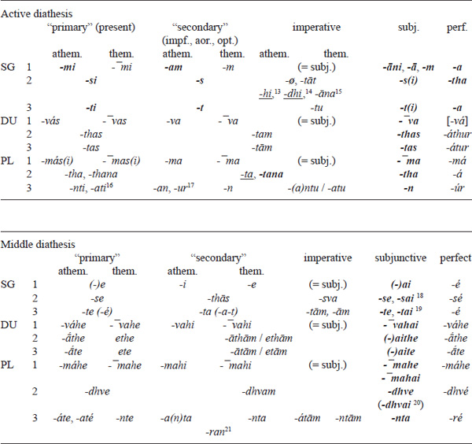

The two main classes of stems, athematic and thematic, differ in that the latter appear in the same shape in all forms of the paradigm, while the former exhibit a number of alternations. Like in the declension paradigm, the main types of stem alternations include (i) ablaut in the verbal stems, that is, in the root (in athematic root stems) or in the suffix (in other athematic stems), and (ii) accentuation (partly correlating with the ablaut grade of the morpheme).

<!-- page: 240 -->

The ablauting morpheme may appear (i) in the full (or “Brugmann’s”) grade or (ii) in the zero grade. Accordingly, all forms of the paradigm are divided into “strong” and “weak” forms, respectively. The strong forms (the corresponding endings are in boldface in the tables) include (i) the sg. act. of the present, imperfect/injunctive and perfect (3 sg. perf. act. has the “Brugmann’s” grade); (ii) 3 sg. imp. act.; (iii) all forms of the subjunctive; (iv) 3 pl. impf. act. of the reduplicated present (class III) \[before -*ur*\]. The forms that often or sporadically (shown with the underline font) have the full grade are (iv) 2 pl. pres./imp. act. (almost always before -*tana*, sporadically before -*ta*); and (v) 2 sg. imp. act. (with a few roots). Forms that have the zero grade are called “weak forms”. The accent is on the stem in the strong forms and on the endings in the weak forms (except for some weak forms of the reduplicated present).

#### *History of Old Indo-Aryan personal endings*

The rich variety of the Old Indo-Aryan personal endings must go back to the six or seven series of the Proto-Indo-European verbal endings as reconstructed, in particular, by Kortlandt (1979: 66ff.) or Beekes (2011):

**Table 4.14 Series of the PIE verbal endings**

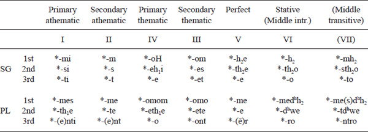

Using the asterisked Roman numbers to refer to Table 4.14, one may synopsize the history of the attested Vedic personal endings in Table 4.14 (individual endings are explained only where their origin is not straightforwardly explained by the general correspondence given in the heading of the column).

<!-- page: 241 -->

**Table 4.15 PIE sources of Vedic personal endings**

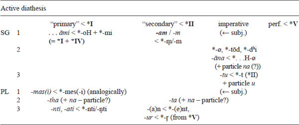
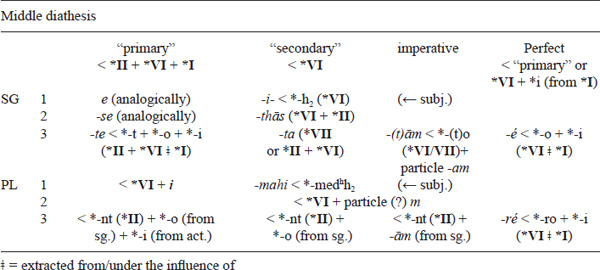

#### *General overview of tense systems and formation of tense stems*

The system of the finite forms of the Vedic Sanskrit verb (and, particularly, its variant attested in the most ancient Vedic text, the RV) is generally considered extremely complicated and irregular as compared to the corresponding system of Classical Sanskrit. Yet this opinion seems to have been imposed by the Sanskritist tradition (essentially going back to the approach of Old Indian grammarians), which usually takes Classical Sanskrit paradigms as a starting point for a grammatical description of Vedic. Such a perspective presents the Vedic paradigms in terms of a list of differences from the Classical Sanskrit system. This approach is, in a sense, anhistorical and methodologically (as well as pedagogically) misleading, since it does not reflect the evolution of the Old Indian morphological system. As is well known, the Classical verbal system evolves from the Vedic, not the other way around. More specifically, the former system can be regarded as a result of reduction of the latter.

To put it differently, the Vedic verbal system shows very few constraints on applying inflectional morphemes to various verbal stems as compared to what we observe in the Classical language. In fact, the Vedic system can be said to be much larger and yet much simpler, in terms of the number of combinatory constraints, as compared to the much smaller Classical system.

<!-- page: 242 -->

The Vedic verbal system can be presented as based on two parameters (see Kulikov 2008): (i) the type of stem and (ii) the type of inflection. There are four types of stems: present (pres.), aorist (aor.), perfect (perf.) and future (fut.). The types of inflection include (1) primary endings (1 sg. act. -*mi*, 2 sg. act. -*si*, 3 sg. act. -*ti*, …, 3 pl. act. *-nti*/*-ati*, etc.); (2) augment *á*- + secondary endings (1 sg. act. *-(a)m*, 2 sg. act. -*s*, 3 sg. act. *-t*, etc.); (3) secondary endings; (4) imperative endings; (5) subjunctive morpheme *a* + subjunctive endings (which are distinct from primary or secondary endings only for some middle forms); (6) optative morpheme *ī*/*yā* (which coalesces with the preceding thematic vowel *a* into *e*) + secondary endings; and (7) perfect endings; all these types are exemplified in the upper row of Tables 4.16–17 by the 3 sg. act. and mid. endings. Combining these two sets, we obtain 4 × 7 = 28 logically possible formations. Most of them are actually attested in Vedic (though some are very rare). Only ten of them survive into the Classical Sanskrit paradigm, including the present and aorist injunctive (which only survives with the prohibitive particle *mā*) and aorist optative (which is only preserved in the precative, based on the root aorist optative). Note that all formations that belong to the standard Classical Sanskrit paradigm (= cells bordered with a shadowed line in Table 4.16) are also present in Vedic, though some of them are very rare (or even exceptional) in the early language, as is the case with the conditional (one attestation in the RV).

Some of these formations require special comments. Thus, “perfects with present endings” include such forms as 3 sg. act. *jāgárti* ‘watches’ (√*jr˳* ‘become awake’), 3 pl. act. *dīdy-ati* ‘(they) shine’ (√*dī* ‘shine’). These formations do not represent a separate synchronic category. Historically, these forms are based on regular perfects, which, at some stage, have been reanalyzed as belonging to the present system – most often on the basis of non-indicative forms (in particular, subjunctives) that share endings with present forms. Once these forms had been transferred to the present system, they lost their synchronic link with the perfect system, becoming present formations with irregular (“perfect”) reduplication (see Kümmel 2000: 59ff., 191–194, 227–230 et passim).

The non-indicative moods of the perfect and aorist are attested only in early Vedic and are non-productive already in the early language (for aorist imperatives, see Baum 2006). Still rarer, even exceptional, are “aorist injunctives with present endings” (labeled by Hoffmann “the type *gathá*”), which include a few isolated forms attested in the RV. Here belong, in particular, 2 du. act. *kr˳-thás* (√*kr˳* ‘make’) RV 1.112.8, 5.74.5, 10.39.8; *bhū-thás* (√*bhū* ‘become’) RV 6.67.5, 3 du. act. *bhū-tas* RV 10.27.7, and 2 pl. act. *gathá* (√*gam* ‘go’) RV 8.20.16; 1 pl. med. *dhī-mahe* (√*dhā* ‘put’) RV 2.23.10 should perhaps be included in this group, too. These nonce formations (see Lubotsky 1997: 439, 471, 747, 992) do not instantiate root presents (contra Whitney 1885: 21, 34 etc.). As Hoffmann (1952 \[1957\]: 128–130 \[= Hoffmann 1976: 364–366\]) has demonstrated, they are built on the basis of root aorist imperatives (such as 2 du. imp. act. *kr˳-tám*, 2 pl. imp. act. *kr˳-ta*, 2 pl. imp. act. *gata* etc.), and on the model of 2 pl. pres. imp. act. *ha-ta*: 2 pl. pres. ind. act. *ha-tha* (√*han* ‘kill’). Their status within the inventory of finite forms is clearly marginal.

Future injunctives (= conditionals without augments) and optatives are extremely rare. A few such forms are attested in Epic Sanskrit: 2 sg. opt. act. *pari-trāsyaḥ* (√*trā* ‘rescue’) MBh 8.13.24, 3 sg. opt. act. *bhaviṣyat* (√*bhū*) MBh 2.51.25, 3 sg. opt. act. *dhakṣyet* (√*dah* ‘burn’) MBh 1.221.19 v.l., 3 sg. opt. med. *drakṣyeta* (√*dr˳ś* ‘see’) Rām. 3.1074*.4; see Whitney 1889: 334; Renou 1930: 401f., 462; Oberlies 2003: 236f., 240.

The system of present formations is the richest subsystem of the verbal paradigm, which is often said to abound in irregular and abnormal forms. The traditional Old Indian system of ten “primary” present classes satisfactorily captures the main morphological types. However, it is also simplistic in some respects, grouping together some types of clearly different nature. In particular, it disregards the important difference between (i) the two main thematic types, classes I (with the accent on the root) and VI (with the accent on the thematic vowel), on the one hand, and (ii) secondary thematicizations, i.e. present types that have been transferred from some athematic types to classes I and VI or that can be regarded as such transfers (irrespective of their origin).

<!-- page: 243 -->

<!-- page: 244 -->

<!-- page: 245 -->

Below I outline a somewhat different system of description based on a few parameters that enable us to generate virtually all present formations attested in Vedic. Combining the three main morphological and morphophonological features, we obtain all present stems, including “minor types”, which find no place in the traditional Indian nomenclature. These parameters include (i) the present stem formative (symbolized as F in Table 4.18): no present stem morpheme (ø); stem suffixes (*-y(a)-*, *-nó-*/*-nu-* etc.); nasal infix (-*ná-*/*-n-*; placed between · · in the illustrative examples); and reduplication; (ii) the presence of the thematic vowel -*a-*; and, for thematic present stems, (iii) the placement of the main accent: on the root vs. on the thematic vowel. Note that the stem suffix (or infix) of the secondary thematic classes always appears in the zero grade and contains no vocalic element; for that reason, it cannot bear the accent.

**Table 4.16 The Vedic verbal system: examples**

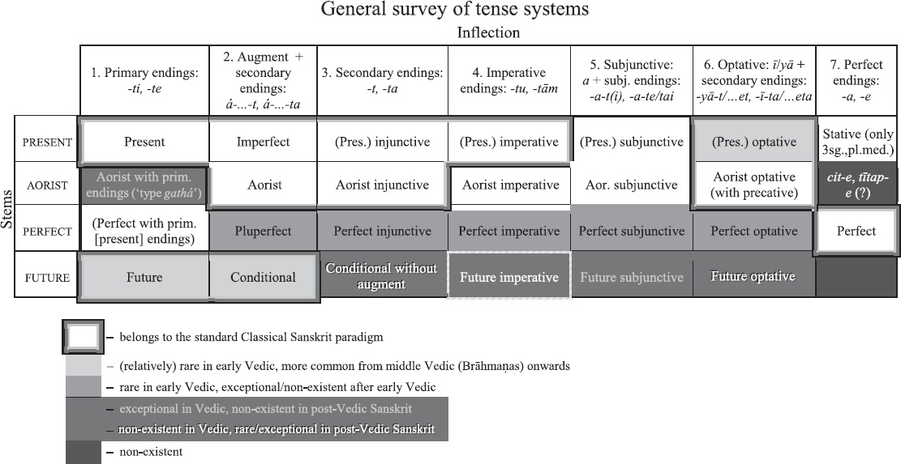

**Table 4.17 The Vedic verbal system: a selection of forms**

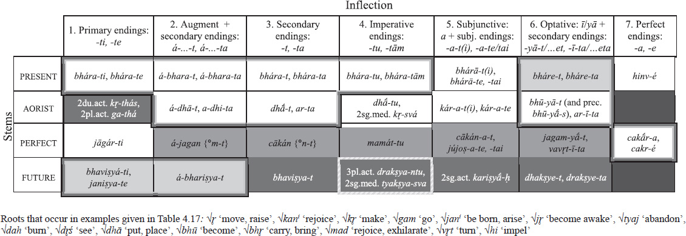

For the sake of convenience, I use a complex notation that is as close as possible to the traditional Indian system of ten classes (symbolized by Roman characters). Each of the secondary thematic types (qualified by the Sanskritist tradition as belonging either to class I or to class VI) is related to the corresponding athematic type (I←V, VI←VII, etc.), thus being presented as the result of thematicization. This is a purely synchronic notation: the arrow (←) does not necessarily mean that the thematic type in question historically goes back to a (hypothetic) athematic pendant. Thus, for instance, I do not argue that, for the class “VI←VII” present *kr̥·n·t-á-ti*, we have to reconstruct the athematic class VII present *kr̥·ṇá·t-ti, etc. A few secondary thematic(ized) types are not actually attested. These include classes I←IX, VI←V22 and VI←III.

In addition to the nine “primary” classes, this calculus generates one type that is traditionally not included in the system of “primary” present types, passives with the suffix *-yá-* (traditionally considered as one of “secondary” formations, which also include -*áya*-causatives, intensives and desideratives). In fact, the only formal difference between class IV presents and *yá*-passives is the place of the stress (on the root vs. on the thematic vowel/suffix). Thus, this formal opposition follows the same pattern as the opposition between types I←VII (*śú·m·bh-a-ti*) and VI←VII (*kr̥·n·t-á-ti*). Note that the -*yá*-class also includes a few non-passive -*yá*-presents (symbolized as *IV in Table 4.18) of the type *mriyáte* (√*mr˳* ‘die’) with passive accentuation (← *mŕ̥-ye-te). On this type, see Kulikov 1997.

There are no athematic presents with the suffix -*i*- in Sanskrit (= athematic counterparts of the -*ya*-presents); one of the few traces of the Proto-Indo-European athematic *i*type might be the present *kṣéti* (√*kṣi* ‘dwell’) \< *tkˊ-éy-ti; see Kortlandt 1989: 109; LIV 2001: 644, note 1.

Next to the main present classes, Table 4.18 also includes two non-productive present types with the suffixes -*cha*- and -*va*-23 (on which see, in particular, Gotō 1987: 73).

**Table 4.18 The Vedic system of present stem types**

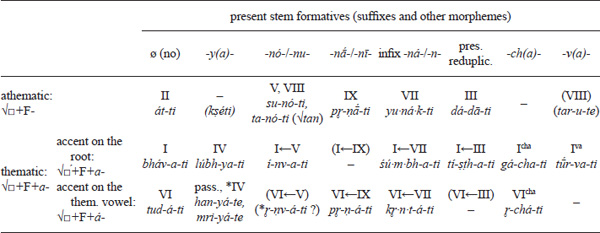

#### *Voice, causatives and transitivity oppositions*

##### Voice and passives

<!-- page: 246 -->

There are several verbal formations in Vedic that can be employed in passive constructions. Non-finite passives are passive perfect participles with the suffix *tá/ná-* and gerundives, or future passive participles, with the suffixes *ya-, tavyà-* and *anı̄́ya-*. Finite passive formations include (1) presents with the suffix *-yá-* (derived from the root by means of the suffix *y(á)*, which can only take middle endings; e.g. *han* ‘kill’: 1 sg. *han-yé*, 2 sg. *han-yá-se*, 3 sg. *han-yá-te*, etc.); (2) medio-passive *i*-aorists (with defective paradigm: only 3 sg. in -*i*, 3 pl. in -*ran/-ram* and participle; e.g. *yuj* ‘yoke, join’: 3 sg. *áyoji*, 3 pl. *áyujran*, ptcp. *yujāná*-); (3) middle perfects and statives (which supply passive perfects for some verbal roots; also with defective paradigm: 3 sg. in -*e*, 3 pl. in *re* and participle; e.g. *hi* ‘impel’: 3 sg. *hinvé* ‘(it) is impelled’, 3 pl. *hinviré* ‘(they) are impelled’; ptcp. *hinvāná*);24 and (4) some (isolated) middle forms (e.g. *yuj* ‘yoke, join’: 3 pl. sigm. aor. *ayukṣata*; *gr̥̄* ‘praise’: 3 sg. class IX pres. *gr̥ṇīté* ‘is praised’).

The inventory of the present passive forms attested in the RV and AV is shown in Table 4.19. The members of the paradigm are mainly exemplified by forms of the verb *yuj* ‘yoke, join’ (which exhibits one of the most complete attested paradigms), supplemented by forms of other verbs where those of *yuj* are unattested. The lacking tense-moods of the passive paradigm (which include imperfect, injunctive, subjunctive and optative) are shown with dark gray shading – with the exception of a few hapaxes marked with middle gray shading.

**Table 4.19 The inventory of the present passive forms attested in the RV and AV**

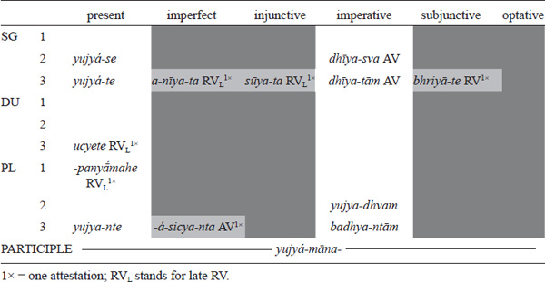

Only the 3rd person singular and plural forms are well attested. Next to a dozen 2 sg. forms (*yujyáse* ‘you are (being) yoked’, *śasyáse* ‘you are (being) praised’ etc.), we find only one occurrence of a 3 du. form, *ucyete* (RV 10.90.11) ‘\[the two feet\] are called’, and one (philologically and grammatically rather unclear) form -*panyā́mahe*, which may represent a 1 pl. (‘we are (being) glorified’ (?); see Kulikov 2012a: 144–146). 1 sg., 1 du., 2 du. and 2 pl. forms are unattested.

Next to present forms proper, participles and rare imperatives (10 forms or so in the RV and AV), only exceptional attestations of other tense-moods are found. These include as few as five forms:

1.  (i)    3 sg. impf. *anīyata* ‘(she) was brought’ in the late RV (8.56.4 = Vālakh. 8.4) and 3 pl. impf. -*ásicyanta* ‘(they) were besprinkled’ in AV 14.1.36;
2.  (ii)   3 sg. inj. *sūyata* ‘(he) is consecrated’ in the late RV (10.132.4) (see Kulikov 2012a: 284ff.) and 3 pl. inj. -*apr̥cyanta* in the late RV (1.110.4) ‘(they) united’ (non-pass. intr.) (see Kulikov 2012a: 154);
3.  (iii)  3 sg. subj. -*bhriyāte* (RV 5.31.12) ‘(it) will be brought’.

<!-- page: 247 -->

Optatives of the present passive do not occur before the very end of the early Vedic period.

Only from the middle Vedic period onwards, when the present passive system becomes well established, do we find a good many imperfects, subjunctives and optatives of -*yá*-passives.

The early Vedic passive paradigm (for all three tense systems, present, aorist and perfect) is summarized in Table 4.20. An almost complete paradigm is attested for the verbs *su* ‘press (out)’ and *yuj* ‘yoke, join’. (In the cases where forms of these two verbs are unattested, I put in square brackets forms made from other roots.) Different degrees of shading show the status of the corresponding forms: dark gray = lacking and morphologically impossible; middle gray = morphologically possible but unattested or only exceptionally attested (underdeveloped part of the paradigm); light gray = morphologically possible but rare (perhaps primarily for pragmatic reasons; cf. the rarity of passive imperatives).

**Table 4.20 Passive paradigm in early Vedic**

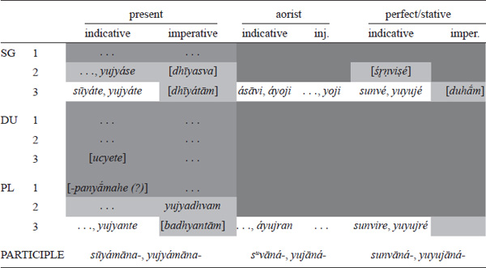

Furthermore, there are some reasons to assume that stative -*āna*-participles could have active counterparts, that is, participles derived from the stative stem with the active participle suffix -*ant*, cf. such forms as *stavánt*- (active participle?) ‘praised’ (first noticed by Watkins 1969: 142ff.) and *pépiśat*- ‘adorned’ (RV 10.127.7; see Schaefer 1994: 45, 152f.), which may point to the unattested stative *pépiśe ‘is adorned’ of the type *cékite* (Schaefer 1994: 44); (iii) *mahánt*- ‘great’ (probably belonging with the hapax stative *mahe* ‘is able’ (RV 7.97.2) (see Kulikov 2006b: 59ff. for details). These forms represent a good structural parallel to Hittite participles with the suffix -*ant*- that form passives for transitive verbs (but hitherto have generally been considered isolated phenomena, without parallels in other Indo-European branches), such as *kunant*- ‘killed’ (*kuen*- ‘to kill’) or *dant*- ‘taken’ (*dā*- ‘to take’).

The hypothesized existence of active participles in the stative paradigm, which, in spite of their “active” morphology, were employed in passive constructions, still further supports the connection between the stative formation and the passive syntactic pattern, on the one hand, and, on the other hand, serves as additional evidence against the traditional assumption about a straightforward connection between middle morphology and passive syntax in Vedic.

<!-- page: 248 -->

##### Causative oppositions

Vedic attests a remarkable variety of morphological types of causative oppositions and a rich system of morphological causatives.

1.  (i)    The most regular and productive causative marker in the **present** system is the suffix ***(p)áya*-** attached to the “Brugmann’s” (full/long) grade of the root,25 cf. *vr̥dh*- ‘grow, increase’ – *vardháyati* ‘makes grow, increases’, *cit*- ‘appear, perceive’ – *cetáyati* ‘shows (= makes appear), makes perceive’ (~ *citáyati* ‘appears’).
2.  (ii)   In early Vedic we also find a few other types of the causative opposition within the present system, where the causative member is represented by another present type, usually by one of the presents with **nasal affixes**: suffixes -*nó-/-nu*- (pres. class V), -*nāˊ-/-nī-* (pres. class IX) or infix *-ná-/-n-* (pres. class VII); the intransitive member (anticausative) is often a class IV present (with the suffix ´*ya*-) or a class I present. Generally, the intransitive (anticausative) member of the opposition is inflected in the middle, the transitive-causative in the active (but transitives with middle inflection are possible as well). Cf. *i*- ‘go, send’: *éti* (pres. class II) ‘goes’ ~ *inóti*, *ínvati* (pres. V and its thematicization) ‘sends’; *kṣī̌*- ‘perish, destroy’: *kṣī́yate* ‘dies, perishes’ (pres. IV) ~ *kṣinā́ti* (pres. class IX) ‘destroys’; *jan*- ‘be born, arise’: *jā́yate ‘is born’* (pres. class IV) ~ *jánati* (pres. class I) ‘begets’; *pū*- ‘purify’: *pávate* ‘becomes clean, purifies oneself’ (pres. class I) ~ *punāˊti* (pres. class IX) ‘purifies’.

Two minor types of causative oppositions in the present system include pairs with

1.  (iii)  **reduplicated** causatives (pres. class III, cf. *yúcchati* ‘keeps away’ ~ *yuyóti* ‘makes keep away’) and
2.  (iv)  present **class VI** causatives (cf. *tárati* (pres. class I) ‘crosses’ ~ *tiráti* (pres. class VI) ‘passes over, rescues’).
3.  (v)   Finally, for some verbs, the causative opposition is marked only by the diathesis (**middle: intransitive ~ active: transitive**); although some middle forms can also be used transitively (with their self-beneficent meaning), thus showing the labile syntax (Kulikov 2014). This type of opposition is mostly attested for class I presents; see, for instance, Gotō 1987: 48ff., cf.: *námate* ‘bends’ (intr.) ~ *námati (/-te*) ‘bends’ (trans.); *váhate* ‘drives, goes’ ~ *váhati* (*váhate*) ‘carries’; *svádate* ‘is sweet’ ~ *svádati* ‘makes sweet’.
4.  (vi)  In the **aorist system**, the causative meaning is typically expressed by the reduplicated aorist, cf. *vr̥dh* ‘grow, increase’ – *ávīvr̥dhat* ‘has made grow’.(vii) Furthermore, the intransitive (anticausative) member of the causative opposition can also be expressed by the medio-passive -*i*-aorist, sometimes alongside the sigmatic aorist; cf.: *jan* ‘be born, arise’: *ájani*, sigm. aor. *ájaniṣṭa* ‘has been born’ ~ *ájījanat* ‘has generated’.
5.  (viii) In the **perfect system**, the causative/non-causative distinction can only be rendered by the diathesis opposition, although not quite consistently: active forms can be used both transitively and intransitively (thus being labile; see Kulikov 2014: 1151–1152). Cf. 3 sg. perf. mid. *paprathé* ‘has spread (intr.)’ ~ 3 sg. perf. act. *paprā́tha* ‘has spread (trans.), filled out’; 3 sg. perf. mid. *vāvr̥dhé*, 3 sg. perf. act. *vavárdha* ‘has grown (intr.)’ ~ 3 sg. perf. act. *vavárdha* ‘has increased (trans.)’ (see, in particular, Kümmel 2000: 319ff., 469ff. et passim).
6.  (ix)  For a number of verbs, there is a correlation between **transitivity and tense**: forms of the present system (i.e. the present proper and imperfect) are employed transitively, while perfect forms are intransitive; cf. 3 sg. perf. *tatā́na* ‘has stretched’ (intr.) – 3 sg. pres. act. *tanóti*, 3 sg. pres. mid. *tanute* ‘stretches’ (trans.); see Kulikov 1999, where this phenomenon (“split causativity”) is discussed in a typological perspective.

<!-- page: 249 -->

## **Syntax**

Within a short chapter, it is impossible to discuss in detail the main syntactic features of Old Indo-Aryan. Only a few remarkable syntactic peculiarities will be mentioned in this section.

### **Passive and ergative(-like) constructions**

Passivization typically suggests (i) the promotion of the initial direct object to the subject position (= the subject of the passive construction or passive subject for short) and (ii) the demotion of the initial subject (usually, an agent). The demoted subject either becomes an oblique object (encoded by the instrumental case, as, e.g., in RV 9.86.12d *suvāyudháḥ sotŕ̥bhiḥ pūyate vŕ̥ṣā* ‘\[Soma\], the well-armed bull, is being purified by pressers’; more rarely by the genitive case (cf. RV 1.61.15a *asmā́ íd u tyád ánu dāyy eṣām* ‘this very thing was granted to him by them’) or, more frequently, remains unexpressed (see Gonda 1951: 77f.), as in RV 9.97.35c *sómaḥ sutáḥ pūyate ajyámānaḥ* ‘Soma, pressed out, is purified, being anointed.’ See Jamison 1979: 133ff.; P. K. Andersen 1986. There are some reasons to treat Vedic constructions with perfect passive participles in *-ta-/-na-* and genitive marking of the agent separately from canonical passives with the instrumental. According to P. K. Andersen (1986), the genitive noun displays a number of subject properties (usually animate; definite and/or refers to old information) in such constructions, and therefore they should be qualified as ergative rather than passive properly speaking.

### **Reflexive constructions**

The reflexive pronoun *tanū́*- has developed from the substantive meaning ‘body’ and, like its Old Iranian (OAv.) cognate *tanū*-, is well attested in this grammaticalized usage in the RV, as in RV 1.147.2 *vandā́rus te tanuvàm vande agne* ‘As your praiser, I praise myself, o Agni.’ In some cases it is nearly impossible to draw with accuracy the distinction between the reflexive and non-reflexive (‘body’) meanings: both interpretations are perfectly appropriate in the context, as in RV 10.54.3 *yán mātáraṃ ca pitáraṃ ca sākám / ájanayathās tanuvàḥ svā́yāḥ* ‘ … since you produced (your) mother and (your) father together from your own body / from yourself.’

Next to the reflexive usages proper, the Vedic reflexive pronouns can be employed in emphatic usages, i.e. as an emphatic reflexive, or intensifier, signaling the fact that its referent is somewhat unexpected in the role where it appears (cf. two usages of Eng. *self: Peter saw him****self*** *in the mirror ~ Peter drew this picture him****self***); see Kulikov 2007. In the more common adverbial case pattern we find the instrumental forms (as in RV 6.49.13 quoted below). The nominal pattern is attested, for instance, with accusatives and datives, as in AV 1.13.2 = RVKh. 4.4.2 *mr̥ḍáyā nas tanū́bhyo / máyas tokébhyas kr˳dhi* ‘Be gracious toward ourselves, make pleasure for \[our\] offspring.’

The reflexive usage of *ātmán*- becomes common after the RV but is still in competition with *tanū́*- in the AV (see Kulikov 2007). In Vedic prose, *ātmán* completely ousts *tanū́*-; see Delbrück 1888: 207ff., 262f, Wackernagel 1930: 489ff., §240b; and, especially, a brief survey in Oertel 1926, with a rich collection of examples.

The emphatic usage is attested for *ātmán*- from the AV onward, cf. TS 1.7.3.3 *táto devā́ ábhavan párāˊsurā yásyaiváṃ vidúṣo ’nvāhāryà āhriyáte bhávaty ātmánā párāsya bhrā́tr̥vyo bhavati* ‘Then the gods prospered, the Asuras perished. He, who, knowing thus, performs the Anvāhārya-rite, prospers himself, his rival perishes.’

<!-- page: 250 -->

In contrast to *ātmán*-, the more archaic stem variant *tmán*- already occurs in emphatic usage in the early RV. Its instrumental appears in the very frequent regular form *tmánā*(63 attestations in the RV) and in the form *tmányā* (built on the stem *tmánī-* or *tmánya-*, of unclear origin), which occurs in the late RV (1.188.10, 10.110.10) and in the late mantras (VS 20.45 = TBm 2.6.8.4 etc.), cf. RV 10.110.10 *upā́va sr̥ja tmányā* ‘Release \[the sacrificial animal\] yourself.’

## **Some remarkable typological features of the later (Middle and New) Indo-Aryan languages**

Although this chapter mostly concentrates on the earliest chronological layers of Indo-Aryan, which furnish the richest evidence for Indo-European comparative and historical linguistics it will be appropriate to briefly summarize the most salient typological features shared by all or most of the later (Middle and New) Indo-Aryan languages, which continue the developments and result from the innovations and trends starting as early as Old Indo-Aryan.

### **Replacement of the old case system with new agglutinative cases**

By the end of the MIA period, that is, at the turn of the second millennium AD, the Indo-Aryan languages lost most of the cases of the original Sanskrit, or Old Indo-Aryan (OIA), system of eight cases26 (which, except for minor details, is nearly identical to the case system reconstructed for Proto-Indo-European). Generally, only two cases survive, direct (resulting from the merger of nominative and accusative) and oblique (mostly going back to the OIA genitive), although in some languages isolated traces of some other oblique cases, such as the instrumental, locative or ablative, can still be found, sometimes even within the declension paradigm; cf. the Sinhala instrumental case suffix *-en/-in* and Assamese ergative -*e*, both reflecting the OIA instrumental singular ending of *a*-stems *ena*. The functions of the lost cases are largely taken over by morphemes (bound or free, i.e. postfixes or postpositions) of different origin.

These include:

1.  (i)    Primary, or “old”, postpositions, going back to Proto-Indo-European morphemes that were used in the adpositional function already in the proto-language. An example of an old OIA postposition reflected as a case suffix in a daughter language, in MIA, is the Māhārāṣṭrī ablative suffix -*āhi* \< Skr. postposition *adhi* (constructed with the ablative in OIA); see Insler 1991–92; Bubeník 1998: 68f.

Next to old postpositions, there are several markers that result from grammaticalization of some verbal and nominal forms:

1.  (ii)   Postpositions descendant from
    1.  (ii.a)   non-finite verbal forms, in particular, converbs (traditionally called “absolutives” or “gerunds”, cf. Skr. *ādāya* ‘with’, lit. ‘having taken’), gerundives (participia necessitatis) and verbal adjectives;
    2.  (ii.b)   case forms of some nouns (such as Skr. *gr̥he* ‘in the house’; see below);
2.  (iii)  final members of compounds, which, again, may represent
    1.  (iii.a)  non-finite verbal forms (cf. nominal compounds in -*sthita*-; see below) or
    2.  (iii.b)  nominal case forms (cf. nominal compounds in -*artham* ‘goal, purpose’; see below).

<!-- page: 251 -->

The markers of the first three types (i, ii.a and ii.b), representing free morphemes (words), were originally attached to (non-nominative) case forms of the noun, thus forming, after having become bound morphemes, the second layer of case forms (see below). In type (iii), the source of the new case morpheme was attached to the nominal stem, thus creating a new case within the first layer. In fact, due to the erosion of the nominal inflection by the end of the MIA period, some (oblique) case forms may eventually become indistinguishable from bare stems, and thus the border between types (ii) and (iii) cannot always be drawn with accuracy.

A number of examples of grammaticalization of new postpositions and case suffixes can be found already in the MIA period, in particular, in Apabhraṃśa Prakrits (for details, see Bubeník 1998: 67, 80), cf. the ablative postfix *ṭṭhiu* \< OIA *sthita*- ‘standing’ (passive perfect participle of the verb *sthā* ‘stand’) and the locative postposition *majjhe* \< Skr. *madhye* (loc. sg. of *madhya* ‘middle’) in Apabhraṃśa Prakrit (Bubeník 1998: 67, 80; Bubeník & Hewson 2006: 113):

1.  *hiaya-ṭṭhiu*
    heart-loc
    ‘out of \[my\] heart’
2.  *gharaho majjhe*
    house:gen in
    ‘in the house’

In NIA languages we observe a rapid increase in use of such new postpositions, which are normally added to the oblique case form. This grammaticalization may result in the amalgamation of a postposition with the nominal stem or oblique case and, hence, in the rise of a new case. Such is, for instance, the origin of some new case endings, for instance, Sinhala dat. -*ṭa*, Khowar dat. -*te* \< Skr. -*artham* ‘goal, purpose’; Sinhala gen. -*ge* \< Skr. *gr̥he* ‘in the house’ (loc. sg. of *gr̥ha*- ‘house’).

Case markers containing *k*- and/or *r*-, which go back to nominal derivatives of the OIA verbal root *kr̥*- (*kar*-) ‘make, do’, can be found in several NIA languages. These include, in particular, genitive morphemes in several NIA languages (see, in particular, Bubeník & Hewson 2006: 122f.), such as Hindi *-kā, -ke* \< Apabhraṃśa -*kera* \< Skr. gerundive *kārya*- ‘to be done’; Awadhi, Maithili -*ker* \< Skr. ptcp. perf. pass. *kr̥ta*- ‘done, made’; Bhojpuri -*kæ* \< Skr. adj. *kr˳tya*- ‘to be done’.

Likewise, some dative *k*-morphemes, such as Hindi -*ko*, Oriya -*ku*, Marathi -*kē* and Romani *ke/-ge*, reveal a vestige of the same Sanskrit root *kr̥*- (*kar*-).

The initial stages of the corresponding grammaticalization processes can be dated as early as OIA. Thus, the starting point of the grammaticalization path of Skr. -*artha* ‘goal, purpose’ toward the Sinhala dative case suffix -*ṭa* is the adverbial usage of the accusative of the Sanskrit bahuvrīhi compounds in -*artha*- (*Xartham*), meaning ‘having X as a goal, purpose’ → ‘for (the sake of ) X’: *udakārtham* ‘having water as a goal’ → ‘for water’, *sukhārtham* ‘having happiness, pleasure as a goal’ → ‘for happiness, for pleasure’, *tadartham* ‘having that as a goal’ → ‘for that, therefore’.

<!-- page: 252 -->

In NIA languages, the morphological status of the resulting markers may vary from bound morphemes (case suffixes), tightly connected with the nominal stem (as in Sinhala, cf. examples above), to free morphemes (postpositions). The latter type can be illustrated by the Hindi dative-accusative morpheme -*ko*, which can be shared in some constructions by several nouns (as in *rām aur mohan ko* ‘to Ram and Mohan’), exemplifying a “Gruppenflexion”, which pleads for a postposition rather than for a suffix analysis.

The difference between these groups of case morphemes is often described in terms of the distinction between cases of the first, second and third layers (Zograf 1976; Masica 1991: 230ff.; Matras 1997). The first layer corresponds to the case in the strict sense of the term and, in Hindi, is limited to the opposition between the direct and oblique cases. The third layer corresponds to clear instances of postpositional phrases, while the second one takes an intermediary position between cases proper and postpositional phrases. It is important to note that only the first-layer case can trigger agreement on adjectives. Although both “Gruppenflexion” and the lack of agreement with second-layer cases appear to distinguish these morphemes from cases proper, the high degree of grammaticalization makes appropriate their association with the category of case in general.

### **Productive morphological causatives**

NIA languages are notorious for their system of productive morphological causatives, continuing the OIA causatives in *(p)áya-*, which go back to going back to the Proto-Indo-European *-éye/o-causative. This distinguishes Indo-Aryan from other Indo-European branches and, in particular, from many Western Indo-European languages that lost the remnants of the Proto-Indo-European causatives. From the MIA period onward, we observe the tendency to develop double (second) causatives. Many NIA languages distinguish between contact (direct) and distant (indirect) causatives and may have up to four members of causative chains, differing both in suffixes and root vowel; cf. Hindi *khul*- ‘open’ (intr.) – *khōl*- ‘open’ (trans.), *cal*- ‘go’ – *cal-ā-* ‘drive (make go)’.

### **Ergative construction**

Many NIA languages exhibit an ergative pattern, usually alongside a nominative-accusative construction (split ergativity). Ergativity is particularly common for Central and Western NIA languages, where ergative pattern appears with perfective verb forms; cf. Punjabi:

- *tarkhān-ne  kursi-ā̃   banā-ī-ā̃*
- carpenter-erg chair:f-pl.dir make-past.pfv-f.pl
- ‘The carpenter has made chairs.’

Historically, the ergative construction continues the (late) OIA nominal passive construction with the perfect passive “participle” (more precisely, verbal adjective); see section 5.1.

## **Further reading**

### **Editions and translations of ancient Indo-Aryan texts**

<!-- page: 253 -->

Virtually all important Vedic texts have been critically edited, and for most of them there are European translations, with one important lacuna, some parts of the Paippalāda recension of the Atharvaveda (on which see below). The most ancient OIA text, which is also the most important source of information for comparative Indo-European studies, the RV, was edited by Aufrecht (1877), and remains the standard edition; there is also a more recent edition by van Nooten and Holland (1994), which offers a metrically restored text. There are a number of complete translations of the RV, which include that of Geldner (1951/2003; in German, still remains standard and most often quoted); a new German translation by M. Witzel, T. Gotō and several other scholars (2007–; work in progress; by now two volumes have been published, which encompass books I to V); a Russian translation by Elizarenkova (1989–1999); and the most recent English translation, by Jamison and Brereton (2014). Renou’s translation (1955–1969), published in several issues of *Études védiques et pāṇinéennes*, has remained incomplete but nevertheless is of extreme value for a linguistic and philological study of the RV.

For the second most ancient OIA (Vedic) text, the Atharvaveda in the recension Śaunakīya, editio princeps by Shankar Pândurang Pandit (1895–1898), still preserves its value; the standard European European edition by Roth and Whitney (2nd rev. ed. 1924) has no critical apparatus, which is partly reproduced in Whitney and Lanman’s (1905) translation. Alongside a number of anthologies, such as Bloomfield 1897, Whitney and Lanman 1905 had remained the only complete translation of the AV (without the last, 20th, book, or kāṇḍa, which almost exclusively is taken from the RV, however) till recently, when Elizarenkova’s (2005–2010) Russian translation appeared. Sadly, the second and third volumes of this last work of the great Russian Vedicist were published posthumously, and the last 30 hymns of kāṇḍa XIX have remained untranslated.27 Another (and presumably more ancient) recension, Paippalāda, which has survived into modern times, became available to Sanskritists in fairly readable Orissa manuscripts only in the middle of the 20th century. The edition, translation and study of the Paippalāda is work in progress, one of the biggest challenges of the contemporary Vedic (and, in general, Indo-Aryan) scholarship. By now, approximately half of the books (kāṇḍas) of this important text have been critically edited and translated; see, in particular, Bhattacharya 1997, 2008 (edition of kāṇḍas I–XVI); Zehnder 1999, Lubotsky 2002, Griffiths 2009 and Kim 2014 (edition and translation of kāṇḍas II, V, VI–VII and VIII–IX, respectively).

Next to numerous printed editions and translations of Vedic texts, there are also a number of online resources, such as the website of Thesaurus Indogermanischer Text und Sprachmaterialien, or TITUS (<http://titus.uni-frankfurt.de/indexe.htm?/texte/texte.htm>); GRETIL – Göttingen Register of Electronic Texts in Indian Languages (see <http://gretil.sub.uni-goettingen.de/>); a few cumulative websites providing links to existing resources, such as INDOLOGY (<http://www.indology.info/etexts/>); as well as several resources for MIA and (early) NIA languages, such as, for instance, the Online Pāli Tipiṭaka Website (<http://tipitaka.sutta.org/#/>). Note, however, that some of these online editions may represent mere mechanical transliteration of certain printed editions, not always corresponding to standard scholarly notation,28 and therefore should be used with caution.

### **Historical grammars**

<!-- page: 254 -->

Although the main details of the historical grammar of the Indo-Aryan branch are discussed at length in numerous studies and reference books on Indo-European comparative linguistics, a comprehensive updated monographic study tracing the origin of the entire OIA linguistic system from Proto-Indo-Iranian and, further, Proto-Indo-European remains a desideratum. The monograph Burrow 1973 offers an overview of the Sanskrit grammar in a historical perspective, but many of Burrow’s analyses and claims (as, for instance, his variant of the laryngeal theory with one single laryngeal phoneme) are questionable and not adopted by most Indo-Europeanists. Comprehensive historical surveys of the Indo-European origins of the Indo-Aryan phonological systems can be found in Kobayashi 2004 (which covers only the consonant system) and a short overview (chapter) of the origins of the whole phonological system by the same author Kobayashi (forthcoming/2017). An excellent outline of the origin of the OIA morphology from Proto-Indo-Iranian and Proto-Indo-European is Gotō 2013.

The further history of the OIA linguistic system throughout the MIA and NIA periods is outlined in the classical studies Bloch 1934/1965 and Chatterji 1926/1970, which appeared nearly a half century ago and also requires an update. A brief sketch of the linguistic developments from OIA to NIA is given in Oberlies (forthcoming/2017).

### **Synchronic grammatical descriptions and dictionaries of OIA and MIA**

The most comprehensive grammatical description of the OIA linguistic system is the fundamental compendium, consisting of three volumes, started by Jacob Wackernagel at the end of the 19th century with the first volume of his *Altindische Grammatik*, continued after his death by Albert Debrunner (Wackernagel & Debrunner 1896–1957), and still remaining unachieved. The three published volumes encompass phonology, nominal inflection, pronouns, numerals, nominal compounds and nominal suffixes. The fourth volume that should give an exhaustive description of the verbal system is now probably the main desideratum and challenge of Old Indian linguistics. Although a number of monographic studies have appeared by now, dedicated to nearly all verbal formations (that is, individual present and aorist types, the perfect, so-called secondary derivatives and a variety of regular deverbative nominal formations), such as the classical monographs Narten 1964 (on sigmatic aorists), Gotō 1987 (on thematic root presents = Old Indian present class I) and Kümmel 2000 (on perfects), a full systematic overview of the entire verbal system remains a task for future researchers.

There are dozens of more condensed grammars and many reference handbooks on Sanskrit. A few of them have become classics, and have remained such over decades, even though they were written more than a century ago and require updates. These include Whitney 1889 (which encompasses both Vedic and Classical Sanskrit), two Vedic grammars by Macdonell (1910 and 1916) and a very condensed (and therefore hardly appropriate for beginners), yet very rich Vedic grammar by Renou (1952). An extremely well-organized condensed outline of Classical Sanskrit grammar is Zaliznjak 1978 – a masterpiece of grammatical description. For late OIA, as attested in the great Old Indian epics, see Oberlies 2003.

For syntax, Delbrück 1888 still remains probably the most comprehensive monographic study, alongside with two equally old handbooks by Speijer \[Speyer\] (1886 and 1896). An overview of the most important aspects of the OIA (Vedic) syntax in modern linguistic perspective is given in Kulikov (forthcoming/2017).

<!-- page: 255 -->

The most comprehensive complete dictionary of Sanskrit remains the famous Great Petersburg Dictionary of Sanskrit (Sanskrit-German) compiled by O. Böhtlingk and R. Roth (1855–75) – a true monument of the Sanskrit lexicography. Even in spite of several lacunae due to the fact that several Vedic texts were unavailable (or at least not yet critically edited) at that time, it offers the most complete coverage of the lexical material. Further dictionaries are largely dependent on this chef d’oeuvre, including the most widely used more compact one-volume Sanskrit-English dictionary, Monier-Williams 1899. A new lexicographic project that started in India in the 1970s, *An Encyclopaedic Dictionary of Sanskrit on Historical Principles* (Ghatage et al. 1976–), under the general guidance of A. M. Ghatage (from vol. 3 on, the supervisor of the project was S. D. Joshi; from vol. 8 on, V. P. Bhatta), aims to update and replace the Petersburg Dictionary. This fundamental dictionary is far from completion, however, still dwelling on the character *a*.

There are several concordances of OIA texts. The largest among them, under the general editorship of Vishva Bandhu (1935–1992), covers nearly all Vedic texts, locating all Vedic word-forms attested in the entire Vedic corpus (with relatively few exceptions and lacunae). The concordances for the RV are Lubotsky 1997 (word-forms without translations); Grassmann 1873, out-of-date in many respects but still useful; and Krisch et al. 2006– (ongoing project, aiming to replace Grassmann’s dictionary), both with translations.

Finally, one should mention the grammatical dictionary of the Old Indian (non-denominative) verbs, Whitney 1885, conveniently cumulating all verbal formations derived from each verbal root. This lexicon has several lacunae, and some of Whitney’s interpretations are out-of-date, but nevertheless it remains an indispensable tool for any student of Sanskrit. A dictionary of Old Indian verbs Werba 1997 (only one volume published so far) is very rich and informative, but uses highly cryptic notation and is more difficult for beginners.

For MIA, the most comprehensive overviews are Pischel 1900 (outdated in several parts but still very useful) and Hinüber 2001; see also an important syntactic survey, Bubeník 1998. A convenient didactically oriented survey of individual Middle Indic languages is Mylius 2013, based on the personal teaching material of the author. Grammatical descriptions of individual languages, starting with the oldest documented MIA idiom, Pāli, include important reference grammars, such as Oberlies 2001.

### **General and typological overviews of the Indo-Aryan languages**

A comprehensive survey of the Indo-Aryan branch is offered in the classic book Masica 1991. Masica 1976 is a pioneering work that defined the major features of the South Asian linguistic area (which includes virtually all Indo-Aryan languages); a short overview of the languages of this area can also be found in Zograf 1990. Zograf 1976 gives an excellent survey of the typologically relevant morphological features of the modern Indo-Aryan languages. Southworth 2005 is a useful overview of the issues arising at the crossroads of linguistics, history and archaeology, intended, above all, for non-linguists, focusing on the aspects of linguistic research that are relevant for those interested in the history and, especially, prehistory of South Asia.

An encyclopedic survey of the major languages of the Indo-Aryan branch is given in the volume edited by G. Cardona and D. Jain (2003) within the *Routledge language family series*. Although this thousand-page compendium is very informative, it is, unfortunately, quite poorly edited, very inconsistent in terminology and inaccurate in glossing,29 which severely hampers the use of the volume as a reference handbook for the Indo-Aryan languages; besides, it offers rather limited coverage of the Indo-Aryan languages (about 20 languages). Much more comprehensive, methodologically consistent and uniform are two encyclopedic volumes published within the series *Jazyki mira* (Languages of the World), Elizarenkova et al. (2004) (on OIA and MIA) and Oranskaja et al. (2011). The latter volume offers an unprecedented coverage of the NIA languages, containing short but very informative sketches of nearly 40 languages, prepared in accordance with rigorous and methodologically consistent principles.

<!-- page: 256 -->

## **Acknowledgements**

This paper was finalized thanks to a grant from the ERC (grant agreement 313416, EVALISA project) to Jóhanna Barðdal and thanks to a Marie Skłodowska-Curie grant from the European Commission (Grant Proposal number 702895, TRIA project). I would like to thank Alexander Lubotsky for his invaluable remarks, criticisms and comments. I am also grateful to Mate Kapović for careful editing of these chapters.

## **Notes**

1This is a somewhat simplified picture, since, in some periods and/or communities, certain MIA languages could even overrun Old Indo-Aryan (Sanskrit) in prestige.

2Except for a few highly infelicitous attempts to introduce the Indian system of accent marking into the Latin transcription, such as the one adopted in Cardona & Jain 2003.

3*dvi-pā̆́t* ‘biped’, *cátuṣ-pā̆t* ‘quadruped’.

4*dīrgha-śrút* ‘heard far’ RV 8.25.17.

5Almost exclusively from the late RV on and before vowels: *sánt-au* RV 1.184.1, 10.117.9, *yánt-au* RV 1.139.4.

6*vi-caránt-aḥ* (wrong accent) RV 8.55.4.

7Only *sā́nti* RV 2.28.1, 8.8.23 (Pādapaṭha *sant-i*).

8*paśumā́nti* RV 9.92.6, 9.97.1 and *ghr̥távānti* ‘having ghee’ RV 9.96.13 (Pp. °*ant-i*).

9The ratio of the endings *-ā́*:*-áu* in the RV is 7:1.

10*-áiḥ*:: *-ébhiḥ*: RV 1:1 ; AV 5:1 ; Br.+ almost exclusively *-áiḥ*.

11*-ā́*:: *-ā́ni*: RV 2:1 ; AV 1:2.

12In the case of thematic and thematicized suffixes such as *-ya-*, *-sa-*, *-nva-* etc., the thematic vowel *(*a*)* is traditionally regarded as a part of the suffix, the suffixes “properly speaking” being *-y-*, *-s-*, *-nv-*.

13Athematic conjugation, after vowels.

14Athematic conjugation, mostly after consonants.

15Pres. class IX.

16With reduplicated presents (class III).

17With nearly all reduplicated presents (class III), some root presents (class II) and many root aorists.

18Mainly late early and middle Vedic.

19Mainly late early and middle Vedic.

20Only 1× in the RV.

21In the optative.

22An example of this type might be the R̥gvedic present *r̥ṅvati* (**r̥-ṇv-á-ti*?) ‘moves, raises’, which does not occur unambiguously accented, however.

23The only formation that might be qualified as the athematic counterpart of this latter type is the RVic hapax *tar-u-te* (√*tr̥̄* ‘pass, overcome’), attested in RV 10.76.2.

<!-- page: 257 -->

24Athematic middle participles with the suffix *-āna-* exhibit unusual syntactic properties in the language of the RV. While the corresponding finite forms are used only transitively, the *-āna-*participles are attested in both transitive and intransitive (passive) patterns (see Delbrück 1888: 264). For instance, the participle *hinvāná-* (root *hi* ‘impel’), taken by all grammars as the middle participle of the nasal present with the suffix *-nó-/-nu-* (class V in the Indian tradition), occurs 18 times in intransitive (passive) patterns and 10 times in transitive patterns in the RV). Similarly, the participle *yujāná-* (root *yuj* ‘yoke’) occurs 8 times in intransitive (passive) syntactic patterns (e.g. *rátho yuj-ānáḥ* ‘a chariot that has been yoked’) and 14 times in transitive syntactic patterns (as in *yuj-ānó harítā ráthe* ‘yoking two fallow \[horses\] to the chariot’). As demonstrated in Kulikov 2006a, 2006b, the grammatical characteristics of such passive *-āna-*participles should be reconsidered. These participles are grammatically ambiguous; that is, they belong to the following two paradigms: (1) to the paradigm of the (middle) root aorist and medio-passive aorist and (2) to the paradigm of the (middle) present and stative. Thus, the participle *hinvāná* in its transitive use, meaning ‘impelling’, belongs to the paradigm of the transitive nasal present (*hinváte* etc.), but it is a member of the paradigm of the stative (3 sg. *hinvé*, 3 pl. *hinviré*), i.e. a stative participle, when used intransitively (in a passive syntactic pattern), meaning ‘impelled’. Similarly, *yujāná-* is a member of the paradigm of the (transitive) root aorist (*áyukta* etc.) when used transitively (‘yoking’), but it is a member of the paradigm of the passive aorist (3 sg. *áyoji*, 3 pl. *ayujran*), that is, a passive aorist participle, when used in passive syntactic patterns (‘yoked’).
Likewise, 3 sg. and 3 pl. middle perfect forms (with the endings *-e* and *-re*, respectively) attested in passive constructions should be taken as statives built on perfect stems, rather than as middle perfects proper. For instance, the form *dadhé* (root *dhā* ‘put’) should be taken to be a 3 sg. form of the middle perfect when it means ‘has put’, and a 3 sg. form of the stative with the passive interpretation ‘is put/has been put’.

25As opposed to the *-áya-*presents with the short grade of the root, which are mostly intransitive.

26For a general survey and discussion of the evolution of the Indo-Aryan case system, see, in particular, Bloch 1934; Zograf 1976; Bubeník 1998: 99–101; Bubeník & Hewson 2006: 102ff.; Masica 1991: 230ff.

27An annotated translation of these hymns is now being prepared by the author of this chapter (Kulikov, in preparation) and will be published as a separate volume, together with a translation of the independent (i.e. not borrowed from the RV) Kuntāpa-hymns of book XX.

28This is, for instance, the case with the TITUS online edition of the Śatapatha-Brāhmaṇa, in particular, as far as the word division and accent notation is concerned.

29For instance, readers interested in Indo-Aryan ergativity will find a few remarks on ergative markers and constructions in Hindi and Urdu, but no mention of ergativity in the chapter on Assamese. In fact, however, the authors of this chapter posit two endings of the nominative case, *-e* and *-ø* (p. 419), used in transitive and intransitive constructions, respectively, and thus representing two different cases, ergative and absolutive/nominative. Likewise, readers will not find any mention of converbs (one of the remarkable typological features of Indo-Aryan languages); instead, individual chapters use a few less standard terms such as “conjunctive participle” or “absolutive”. Furthermore, the chapter on the earliest attested Indo-Aryan language, Sanskrit, uses heavily Pāṇini-dependent notation and is barely accessible for non-Sanskritists. These are obvious editorial slips and inconsistencies; see detailed criticism in the reviews Kulikov 2004 and Peterson 2006.
