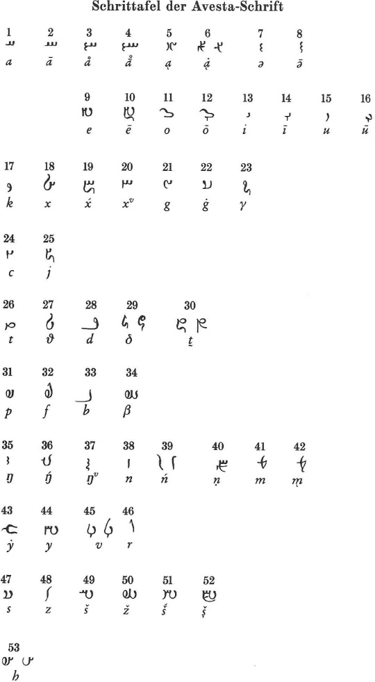
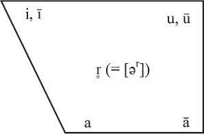
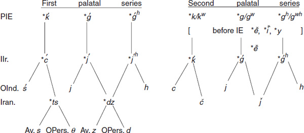
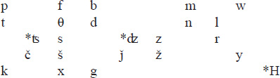
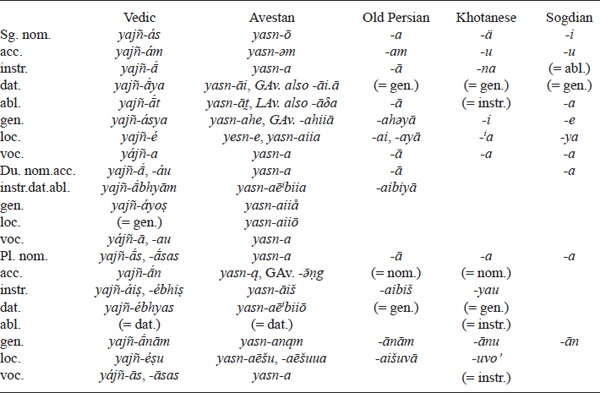
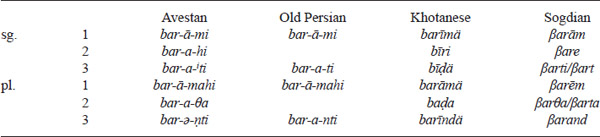

<!-- page: 263 -->

# Chapter 3

# **Iranian**

*Nicholas Sims-Williams*

## **Introduction**

At present, Indo-European languages of the Iranian group are spoken over a wide area including virtually the whole of Iran, Afghanistan and Tajikistan, together with the neighbouring parts of Turkey, Syria, Iraq, Pakistan and Uzbekistan, as well as larger or smaller enclaves in Oman, Armenia, Georgia, Azerbaijan, Turkmenistan and western China (see the map at the end of Schmitt 1989). In mediaeval times Iranian languages such as Sogdian and Khotanese were well established even further east, in the area which later became Chinese Turkestan (Xinjiang); at a still earlier period, the original homeland of the Iranian-speaking peoples seems to have lain to the northeast of the present state of Iran.

The present chapter will concentrate on the earliest attested Iranian languages, Avestan and Old Persian, which are naturally the most important for Indo-European studies. These two Old Iranian languages will be described to a large extent in terms of their similarities to and differences from the closely related Old Indian, a procedure justified in the first place by pragmatic considerations. Old Indian (Vedic and Sanskrit) is attested by a huge and varied corpus of literature, written in a clear, almost phonemic script which allows the phonological and morphological structure of the language to be clearly perceived. On the other hand, each of the attested Old Iranian languages is known from a limited corpus – in the case of Old Persian, a tiny corpus – of rather repetitive and monotonous texts, one written in an ambiguous cuneiform writing system, the other by means of an over-elaborate, almost phonetic alphabet, whose intricacies obscure rather than illuminate its grammatical structure. Although some of these deficiencies are made good by the more abundant Middle and Modern Iranian material, it cannot be denied that Iranian evidence is usually more difficult than Indian for a student of Indo-European to evaluate.

From a theoretical point of view, too, it is proper to treat the Iranian languages in constant comparison with Indian, since the two groups are not merely closely related but jointly constitute a single Indo-Iranian branch of the Indo-European family, as is indicated by the innumerable phonological, morphological and lexical isoglosses which they share to the exclusion of all other branches of Indo-European. One such isogloss is the use of OInd. *ā́rya*-, Av. *a*i*riia*-, OPers. *ariya*- (from which the name of the country “Iran” derives) as a self-designation for the speakers of Indo-Iranian, whence the alternative term “Aryan”. The closeness of the relationship between Indian and Iranian is most clearly demonstrated by the fact that it is possible to find not just words but whole sentences in Vedic or Avestan which may be transposed from the one language into the other merely by observing the appropriate phonological rules; e.g. Av. *təm amauuaṅtəm yazatəm sūrəm dāmōhu səuuištəm miθrəm yazāi* ‘this powerful, strong (being) worthy of worship, Mithra, the strongest amongst creatures, I shall worship’ (Yasht 10.6) = Ved. **tám ámavantaṃ yajatáṃ śū́ran dhā́masu śáviṣṭham mitráṃ yajai* (Jackson 1892: xxxi–xxxii).

<!-- page: 264 -->

Despite the overwhelming similarity of Indian and Iranian, each is distinguished from the other by a number of characteristic innovations. Phonological innovations on the Indian side include the loss of the Indo-Iranian diphthongs *ai, *au (\> *e, o*) and voiced sibilants (*z, *ź, etc.) and the development of a series of retroflex consonants (*ṭ*, *ṇ*, *ṣ*, etc.), whilst Iranian languages typically show the loss of the voiced aspirates *bʰ, *dʰ, *gʰ, etc. (\> *b*, *d*, *g*), the development of the voiceless fricatives *f*, *θ*, *x* (from IIr. *p, *t, *k before consonants, and from IIr. *pʰ, *tʰ, *kʰ), the depalatalization of IIr. *ć, *ȷ´(ʰ) (\> *ʦ, *ʣ, OPers. *θ*, *d*, Av. *s, z*) and the change of *s (in most positions) to *h*. Some apparent exceptions to these isoglosses may be due to the reversal of a sound-change: for instance, Av. *pt* (as in *hapta* ‘seven’) may derive from the expected *ft (as attested, directly or indirectly, in all other Iranian languages, e.g. Pers. *haft*) rather than preserving IIr. *pt (cf. OInd. *saptá*). In other cases, however, it is clear that a development characteristic of Iranian cannot in fact have been fully carried through at the Common Iranian stage: cf., for instance, p. 271 below on evidence for the survival of the palatal *ć in certain clusters. Similarly, the development of *s to *h*, though common to Avestan, Old Persian and all later Iranian languages, is demonstrably later than the earliest attestations of Iranian in Ancient Near Eastern sources (cf. the next paragraph on the divine name *Assara mazaš*). Thus, at least in phonology, the innovations attributable to Common Iranian are comparatively few in number (though significant in kind).

The original homeland of the Aryans, the speakers of Common Indo-Iranian, cannot be precisely identified, but is thought to have been in western Central Asia, to the east and northeast of the Caspian Sea. At a time when “Proto-Indian” and “Proto-Iranian” (i.e. the ancestral dialects from which the Indian and Iranian languages respectively derive) had already become differentiated to some extent, perhaps about the beginning of the 2nd millennium B.C.E., two groups of “Proto-Indian” or “Indo-Aryan” speakers began to migrate from this homeland, one towards the west (cf. above, p. 205, on traces of the Indo-Aryans in the Hurrian empire of Mitanni in northern Mesopotamia) and the other towards India. At a later date, Iranian tribes too began to migrate westwards, reaching central and western Iran by the middle of the ninth century B.C.E., at which period they are referred to for the first time in Assyrian sources; whether they had come from the northeast by the most direct route, to the south of the Caspian, or more circuitously through the Caucasus is still uncertain. (For a more detailed summary and references to the literature on the prehistory of the Aryans see Schmitt 1987.) From the ninth century B.C.E. onwards, a scattering of Iranian linguistic material is to be found in Mesopotamian sources, beginning with the names of the Medes (*Matai*) and Persians (*Parsuaš*) and most notably including the name of the principal deity of the Iranians in the form *Assara mazaš* (= Common Iranian *Asura-mazdās, later *Ahura-mazdāh, cf. OPers. *Auramazdā*, Av. *Ahurō Mazdå*).

It is in part as a result of the fact that Common Iranian cannot have differed greatly from Common Indo-Iranian (or “Aryan”) that it is difficult to determine the precise status of the so-called Nuristani languages (formerly known as “Kafiri”). This group of languages, recorded in modern times in the northeast of Afghanistan and neighbouring parts of Pakistan, undoubtedly belongs to the Indo-Iranian family, but the nature of the relationship is not clear. All three theoretically possible solutions have been advocated: a third, independent sub-group beside Indian and Iranian (Morgenstierne 1973: 327–343); an archaic form of Iranian, much influenced by several millennia of proximity to languages of the Indian group (Mayrhofer 1983); or a branch of “Proto-Indian” which split off before the arrival of the Indo-Aryans in India and subsequently developed in intensive contact with Iranian languages (Degener 2002).

Only two Old Iranian languages are attested by texts, namely Avestan and Old Persian. Others, such as Median and Scythian, are known to us only through occasional words and names transmitted in texts in other languages.

<!-- page: 265 -->

Avestan is the language of the Zoroastrian scriptures, the Avesta, the earliest parts of which are the Gāthās (“Songs”) of Zoroaster or Zarathushtra – whom tradition places in the sixth century B.C.E., though many scholars argue, partly on linguistic grounds, for a date five centuries or more earlier – and the *Yasna Haptaŋhā*i*ti* “Service consisting of seven chapters”. These texts, together with a few short prayers, are preserved in Old or “Gathic” Avestan, a highly archaic dialect comparable to Vedic in its stage of development. Later Avestan, also known as Younger Avestan, is attested by a much larger corpus of texts, including the Yashts (hymns in honour of individual divinities) and the *Vidēvdād* (“Law against the demons”). The manuscript tradition of the Avesta goes back to the Sasanian period (224–651 C.E.), when these orally transmitted texts were written down, probably for the first time, in a specially invented and extremely elaborate alphabetic script (see Hoffmann & Narten 1989 and the script table below).

<!-- page: 266 -->

The Avestan orthography was designed to preserve the traditional pronunciation with great accuracy and contains much phonetic detail which is irrelevant for the comparativist. For example, the word for ‘land’ appears in such different forms as *da*i*ŋ́hu*- and *dax́iiu*-, both representing what is etymologically and probably phonemically **dahyu*-. A particularly confusing feature of the Avestan writing system is the frequent notation of anaptyctic and epenthetic vowels. In the present chapter such unetymological vowels will be written in superscript, as in *daδā*i*ti* ‘he gives’ (= OInd. *dádāti*) – contrast the diphthong *āi* in *āiδi* ‘come!’ – or GAv. *d*ai*bitiia*- ‘second’ (= OInd. *dvitī*´*ya*-). Note too that the semi-vowels *y* and *w* are regularly represented by *ii* and *uu* (which can equally represent the sequences *iy* and *uw*) and that *ī, ū* are not consistently distinguished from *i*, *u*.

Old Persian, which is known from inscriptions of the Achaemenian period (sixth to fourth centuries B.C.E.), represents a later stage of linguistic development as well as a different dialect from the language of the Avesta. Like Avestan, it is written in a specially invented script, in this case a form of the cuneiform writing commonly used in the Ancient Near East. The Old Persian script combines syllabic and alphabetic principles. For example, there are two *t*-signs, of which *t*u** is syllabic (representing \[tu(ː)\], since *ī* and *ū* are not distinguished from *i* and *u*) whilst *t* can represent either a syllable \[ta, tə\] or the simple consonant \[t\]. Since there is no sign for **t*i (though comparable signs such as *d*i** do exist), \[ti\] or \[tiː\] has to be written by means of two signs (*t-i*), a combination which can also denote \[tai\]. The fact that a sign such as *t* has both syllabic and consonantal values is the source of much ambiguity, as is the fact that in most cases a nasal is not written before another consonant. As a result of these two deficiencies, for instance, the 3 sg. pres. ind. act. and mid. (-*ti* and -*tai*) and the equivalent pl. endings (*nti* and *-ntai) are all indistinguishable in writing. In this chapter, for the sake of clarity, Old Persian forms will generally be cited in phonemic transcription rather than in transliteration. (On the Old Persian writing system see further Hoffmann 1976: 620–645.)

Only a brief survey can be given here of the great variety of languages attested at the Middle Iranian stage. Western Middle Iranian is represented by Middle Persian, which is essentially, though not in every detail, a later form of the same dialect as Old Persian, and by Parthian. The Eastern Middle Iranian languages include Khotanese and the closely related Tumshuqese, which are the most conservative of the Middle Iranian languages in their morphology, Sogdian, Bactrian and Choresmian. Amongst the even more numerous Modern Iranian languages we shall occasionally have reason to refer to Persian (or New Persian), Pashto, Ossetic and the Shughni group. Further information on these and other Iranian languages may be found in the relevant chapters of the *Compendium Linguarum Iranicarum* (Schmitt 1989); on the Middle Iranian languages see also Henning 1958.

## **Phonology**

The vocalic system of Common Iranian is almost identical to that of Old Indian. The main difference is the lack of *ē̆* and *ō̆*, the diphthongs from which OInd. *e* and *o* derive being preserved in Old Iranian as *ai* (Av. *aē* or *ōi*) and *au* (Av. *ao* or *ə̄u*). Cf. OPers. *daiva-*, Av. *daēuua-* ‘(evil) god, devil’ = OInd. *devá*- ‘god’; OPers. *rautah-* ‘river’ = OInd. *srótas-* ‘stream’. The comparatively rare long diphthongs *āi* and *āu*, which are shortened in Indian, also survive in Old Iranian, cf. Av. instr. pl. *yasnāiš* ‘by sacrifices’ = OInd. *yajñáiṣ*; Av. nom. sg. *gāuš* ‘ox, cow’ = OInd. *gáuṣ*.

<!-- page: 267 -->

The etymological origins of the Iranian vowels *a*, *i*, *u*, *r̥* (= \[ər\]), *ā*, *ī*, *ū* are in general the same as those of the equivalent Old Indian vowels. In particular, as in Indian, PIE *a, *e, *o, *n̥, *m̥ fall together as *a*, and the corresponding long vowels (including those which ultimately derive from short vowel + laryngeal) as *ā*. Brugmann’s Law, according to which PIE *o gives *ā* in open syllables, seems to apply in the same circumstances in both branches of Indo-Iranian, e.g. Av. nom./acc. sg. *dā*u*ru*, OInd. *dāˊru* ‘wood’ = Gr. δόρυ. However, the contexts in which the PIE laryngeals are vocalized (to Iran. *i*, OInd. *ı̄̆*, e.g. OPers./Av. *pitar*-, OInd. *pitár*- ‘father’ \< PIE *ph₂ter-) are more restricted in Iranian, resulting in many cases of the correspondence Iran. 0 : OInd. *ı̄̆*, e.g. GAv. *dug*ə*dar*-, LAv. *duγδar*- = OInd. *duhitár*- ‘daughter’ \< PIE *dʰugh₂ter-; GAv. *vər*ə*ṅtē* = OInd. *vr̥ ṅīté* ‘chooses’ \< *wl̥nH-toy. Where Old Indian has *ir*, *ur* (before vowels) or *īr*, *ūr* (before consonants) from PIE *r̥H or *l̥H, Iranian has uniformly *ar*:

- Av. *sarah*- = OInd. *śíras*- ‘head’ \< *kˊr̥h₂os-
- OPers. *paru*- = OInd. *purú*- ‘much’ \< *pl̥h₁u-
- OPers. *darga*-, Av. *dar*ə*ga*- = OInd. *dīrghá*- ‘long’ \< *dl̥h₁gʰo-
- Av. *var*ə*nā*- = OInd. *ū́rṇā-* ‘wool’ \< *h₂wl̥h₁neh₂-

Since short *a* and long *ā* probably differed markedly in quality as well as in quantity (as they do both in Sanskrit and in many Modern Iranian languages), the system of simple vowels in Common Iranian may be represented diagrammatically as in Figure 4.3.

**Figure 4.3** Simple vowels

This simple system seems to survive almost unchanged in Old Persian (in so far as the inadequate cuneiform orthography allows one to tell), though the unitary sound *r̥* had probably developed into a sequence of vowel + consonant, most likely \[ər\] (written *a-r-* in initial position, but distinct from the sequence \[ar\], as is proved by its different fate in Middle and New Persian). A similar development is found in Avestan, where *r̥* usually gives *ərə* (i.e. *ər*ə**) as in *kər*ə*nao*i*ti* ‘makes’ = OInd. *kr̥ ṇóti*. But many other outcomes of *r̥* are found in Avestan, e.g. *ar* before *š* (*aršti*- ‘spear’ = OPers. *ar-š-t-i-* \[ərʃti-\], OInd. *r̥ṣṭí*-), *əhr* before *k*, *p* (*vəhrka*- ‘wolf’ = Pers. *gurg* \< OPers. *vərka-, OInd. *vr̥´ka-*, cf. below, p. 272–273), *ir* before *y* (pres. stem *kiriia*- ‘to be done’ = OPers. *kəriya*- \< *kr˳ya-, OInd. *kriyá*-), *rə* after *t* (pres. stem *trəfiia*- ‘to steal’ = Sogd. *čəf*- \< *tr˳fya-, cf. OInd. °tr˳´p- ‘stealing’).

<!-- page: 268 -->

The example of *r̥* may serve to illustrate the complexity of Avestan vocalism. Considerations of space make it impossible to follow in equal detail the development of all the vowels (for which see de Vaan 2003), but the most important contextual changes must be noted. These include the (re)appearance of mid-high vowels *ē̆* and *ō̆*. In final position IIr. *-ai and *-au give -*ē̆* and -*ō* (or -*uuō*) respectively (e.g. 3 sg. pres. mid. ending -*tē̆* = OPers. -*tai*, OInd. -*te* \< *-tai, PIE *toy), while *-yā̆ gives LAv. -*e* (e.g. *a*-stem gen. sg. ending LAv. -*ahe* = GAv. *ahiiā*, OPers. *ahəyā*, OInd. *asya*, PIE *-osyo). Internally, *a* often becomes *e* between two palatal sounds, as in GAv. *yehiiā*, LAv. *yeŋ́he* ‘of whom’ (= OInd. *yásya*), and *o* between *p/g/m/v* and *u*, as in *po*u*ru*- ‘much’ (= OPers. *paru*-, cf. above on this page). Final -*ō* (GAv. -*ō* or -*ə̄*) and -*å* most often derive, via *-ah and *-āh, from *-as (PIE *-os, *-es) and *-ās respectively, e.g. *yō* (GAv. *yə̄*) ‘who’ (nom. sg. m.), *yå* ‘who’ (nom. pl. f.). Before nasals, especially in final syllables, *a* and *ā* normally develop into *ə* and *ą* (= \[aã\]) respectively, so that *əm* and *ąm* are the regular acc. sg. endings of *a*-stems and *ā*-stems. The *ə* which arises thus is subject to further changes, for instance to *i* after a palatal, as in *°činah*- ‘desire’ \< *čənah- (beside OPers./Av. *°čanah*-, OInd. *cánas*-). The sequences *(i)yə, *(u)wə frequently contract to *ī, ū* (or *i, u*, since the length of these vowels is not consistently noted in Avestan), *ayə, *awə to *aē, ao*. Cf. *īm* ‘this’ (= OPers. *iyam*, OInd. *iyám*, nom. sg. f.); LAv. *tūm* ‘thou’ (= GAv. *tuuə̄m*, OPers. *tuvam*, OInd. *tuvám*, nom.); *aēm* ‘this’ (beside GAv. *aiiə̄m*, OInd. *ayám*, nom. sg. m.); *baon* ‘they became’ (= OInd. *(á)bhavan*).

The consonantism of the Iranian languages diverges much more fundamentally from that of Old Indian. Two major innovations in Iranian are the loss of all aspirates and the appearance of a series of fricatives ( *f*, *θ*, *x*) unknown to Old Indian. In most cases these fricatives derive from *p*, *t*, *k* in preconsonantal position, but they also correspond to the Old Indian voiceless aspirates *ph*, *th*, *kh* (in all positions). The voiced aspirates (PIE *bʰ, *dʰ, *gʰ/gʷʰ, OInd. *bh*, *dh*, *gh*) merely lose their aspiration, thus merging with the original non-aspirate series:

- Iran. *p* = OInd. *p*: OPers./Av. *pitar*-, OInd. *pitár*- ‘father’
- Iran. *f* = OInd. *p*: Av. *friia*-, OInd. *priyá*- ‘dear’
-      = OInd. *ph*: Av. *kafa*- ‘foam’, OInd. *kapha*- ‘slime’
- Iran. *t* = OInd. *t*: OPers. *tuvam*, GAv. *tuuə̄m*, LAv. *tūm*, OInd. *tuvám* (nom.) ‘thou’
- Iran. *θ* = OInd. *t*: OPers. *θuvām*, Av. *θβąm*, OInd. *tvā́m* (acc.) ‘thee’
-     = OInd. *th*: Av. *paθō*, OInd. *pathás* (gen. sg.) ‘way’
- Iran. *k* = OInd. *k*: Av. *kuθra*, OInd. *kútra* ‘whither?’
- Iran. *x* = OInd. *k*: OPers./Av. *xšap*-, OInd. *kṣap*- ‘night’
-      = OInd. *kh*: Av. *xā*-, OInd. *khā*ˊ- ‘spring, well’
- Iran. *b* = OInd. *b*: Ossetic *bal* ‘group’, OInd. *bála*- ‘power’ (?)
-      = OInd. *bh*: OPers./Av. *brātar*-, OInd. *bhrā*ˊ*tar*- ‘brother’
- Iran. *d* = OInd. *d*: Av. *daṇtan*-, OInd. *dant*- ‘tooth’
-      = OInd. *dh*: Av. *daēnu*- ‘female’, OInd. *dhenú*- ‘cow’
- Iran. *g* = OInd. *g*: Av. *ga*i*ri*-, OInd. *girí*- ‘mountain’
-      = OInd. *gh*: Av. *gar*ə*ma*-, OInd. *gharmá*- ‘heat’

Despite their loss of aspiration in Iranian, the PIE voiced aspirates are still occasionally distinguishable from the equivalent non-aspirates by the effects of Bartholomae’s Law (cf. above, p. 229), according to which a combination such as *gʰ+t was assimilated to *gdʰ in Indo-Iranian (and perhaps already in Indo-European), whereas *g+t gave *kt. By this rule, which applied to all combinations of voiced aspirate + voiceless stop or sibilant, one may deduce from a form such as GAv. *aog*ə*dā* ‘he said’ (= *aog +* morpheme -*tā*) that the root *aog* originally ended in an aspirate *gʰ or *gʷʰ; in this case *gʰ is confirmed by Gr. εὔχεσθαι, etc. Unfortunately, the contrary deduction cannot usually be made from the presence of a voiceless cluster, since the effects of Bartholomae’s Law tended to be cancelled out by the restoration of the normal form of the morpheme, as in LAv. *aoxta* for GAv. *aog*ə*dā* or OPers./LAv. *basta*- ‘bound’ for expected *bazda- (= OInd. *baddhá*-).

<!-- page: 269 -->

Common Iranian was rich in both sibilants (*s*, *z*, *š*, *ž*) and affricates (*č*, *ǰ*, i.e. \[ʧ, ʤ\] – differing from the OInd. *c*, *j*, which, at least in the earliest period, were palatal stops – and possibly *c, *j, i.e. \[ʦ, ʣ\]). These stem in part from PIE *s and in part from the “two series of palatals”, i.e. (i) PIE *kˊ, *ǵ, *ǵʰ (\> OInd. *ś*, *j*, *h*) and (ii) PIE *k/kʷ, *g/gʷ, *gʰ/gʷʰ when secondarily palatalized before PIE *e, *i, *y, etc. (\> OInd. *c*, *j*, *h*). The history of these sounds is rather complicated, but is worth examining in some detail in view of the fact that Iranian here retains evidence of distinctions which are lost in Old Indian.

For Indo-European only one sibilant is to be assumed, namely *s (with the allophone *z in clusters such as *zd). In addition to its role as an independent phoneme, PIE *s has a secondary origin as an automatic feature of the juncture of two dental stops (cf. above, p. 54): *t+t/*d+t = *tst, *dʰ+t = *dzdʰ, e.g. PIE *sed+to- = *setsto- ‘seated’ \> OInd. *sattá*-, MPers. *\[ni\]šast* (\< OPers. *\[ni\]šasta-), Lat. *sessus*, cf. also OIr. *sess* ‘seat’, etc.; *wr̥dʰ+to- = *wr̥dzdʰo- ‘increased’ \> OInd. *vr̥ddhá*-, Av. *vər*ə*zda*- (the development of a voiced group in the latter case being a further instance of Bartholomae’s Law). As these examples indicate, the resulting clusters were simplified in different ways in Indian, where the sibilant disappeared, and in Iranian, where the first of the two dental stops was lost, giving the regular correspondences OInd. *tt*: Iran. *st* and OInd. *ddh*: Iran. *zd*.

In Indo-Iranian, much as in Slavic (cf. below, p. 526–527), PIE *s and *z underwent a split, becoming Indian *ṣ*, *ẓ, Iran. *š, ž* after the sounds collectively known as “RUKI” (i.e. *r*, *r˳*; *ū̆*, *ā̆u*; *k* and other velars and palatals; *ῑ˘, ā̆i*) but remaining, at least in the first instance, unchanged in other contexts. Examples: the loc. pl. ending Av. -*šu* (OInd. -*ṣu*) after stems in *u* (etc.) but -*su* after stems in *ant*; Av. *mižda*- ‘reward’, OInd. *mīḍhá*- \< *miẓḍhá-, PIE *miz-dʰ(h₁)o- (Gr. μισθός) but OPers./Av. *Mazdā*- (divine name) \< PIE *mn̥z-dʰeh₁-, cf. OInd. *medhā*ˊ- ‘wisdom’ \< PIE *mn̥z-dʰh₁-eh₁-. (Note that the Iranian forms with *z* and *ž* here clarify their Indian counterparts, which have become opaque as a result of the loss of voiced sibilants in Old Indian.) This change does not affect Iran. *st*, *zd* \< *tst, *dzdʰ, showing that the sibilant was still protected by the preceding stop when the RUKI rule operated: Av. *vista*- ‘known’ \< *witsto- = *wid+to- (Gr. ϝισθός, OIr. *fess*). In Iranian (but not Indian) the change to *š, ž* also takes place after a labial: Av. *diβža*-, OInd. *dípsa*- \< *di(d)bzʰa-, desiderative of Av. *dab*, OInd. *dabh* ‘to injure, deceive’.

Finally, those instances of PIE *s which had so far survived unchanged in Iranian underwent a further split, *s* remaining in groups such as *sn*, *sp*, *st*, *ts (\> *s*) but becoming *h* in all other contexts, e.g. OPers. *a(h)mi*, Av. *ahmi*, Khot. *īmä* ‘I am’, OPers. *hanti*, Av. *həṇti*, Khot. *īndä* ‘they are’ (= OInd. *ásmi, sánti* \< PIE *h₁esmi, *h₁senti), but OPers. *asti*, Av. *asti*, Khot. *aśtä* ‘he is’ (= OInd. *ásti* \< PIE *h₁esti); *ā*-stem loc. pl. Av. -*ā-hu* (= OInd. *ā-su*). Although this development is found in all Iranian languages it must be comparatively late, since Proto-Iranian forms with *s* (for later *h*) are preserved in ancient Near Eastern sources (cf. above, p. 264).

An important implication of this fact is that the development of the PIE “first palatal series” (*kˊ, *ǵ, *ǵʰ) to sibilants (*s, z*), which occurs in Avestan and all branches of Iranian other than Old Persian (and later dialects of southwestern Iran), must also be later than the Common Iranian period, since the *s* arising from PIE *kˊ does not participate in the change of PIE *s to *h*. As a plausible intermediate stage between the attested Iranian series (Av. *s, z, z*, OPers. *θ, d, d* ) and the presumed Indo-Iranian palatal affricates *ć, *ȷ´, *ȷ´ʰ (\< PIE *kˊ, *ǵ, *ǵʰ) the dental affricates *ʦ and *ʣ may be reconstructed for Common Iranian. In Figure 4.4 the postulated development of this “first series” of palatals is set beside that of the “second series” (i.e. the Indo-Iranian palatal stops arising from the secondary palatalization of PIE velars or labio-velars, which eventually gave palatal affricates in Iranian) in order to show how the resulting Iranian and Indian forms disambiguate one another.

<!-- page: 270 -->

**Figure 4.4** The First and second series of palatals in Iranian

As Figure 4.4 shows, only the voiceless sounds (OInd. *ś*, Iran. *ʦ \< PIE *kˊ; OInd. *c*, Iran. *č* \< PIE *k/kʷ before a palatal) are etymologically unambiguous. Each of the voiced sounds, OInd. *j* and *h*, Iran. *ʣ and *ǰ*, has a double origin, since Old Indian confuses the two palatal series while Iranian (as always) confuses aspirates and non-aspirates. However, the ambiguity is resolved in the case of words preserved in both branches of Indo-Iranian, each of which preserves the distinction lost in the other:

- Iran. *ʦ = OInd. *ś*: OPers. *θard*-, Av. *sar*ə*d-*, cf. OInd. *śarád*- ‘year’ (PIE *kˊ)
- Iran. *ʣ = OInd. *j*: OPers. *yad*, Av. *yaz*, OInd. *yaj* ‘to worship’ (PIE *ǵ)
-       = OInd. *h*: OPers. *daraniya*-, Av. *zaraniia*-, OInd. *híraṇya*- ‘gold’ (PIE *ǵʰ)
- Iran. *č*  = OInd. *c*: OPers. *či*, Av. *čit̰*, OInd. *cit* (enclitic) ‘also, even’ (PIE *kʷ)
- Iran. *ǰ*  = OInd. *j*: Av. *ǰa*i*ni*-, OInd. *jáni*- ‘woman’ (PIE *gʷ)
-       = OInd. *h*: OPers./Av. *ǰan*, OInd. *han* ‘to strike, kill’ (PIE *gʷʰ)

The depalatalization seen in the unconditioned reflexes of the PIE palatals (Av. *s*, *z*, OPers. *θ, d*) failed to take place in most combinations with consonants, where the usual outcome in all Iranian languages is palatal *š, ž*, as in Av. *fšu*- beside *pasu*- ‘sheep’ (OInd. *paśú*-, PIE *p(e)kˊu-). In most cases the Old Indian equivalent is retroflex *ṣ*, *ẓ, cf. Av. *ašta* ‘eight’ = OInd. *aṣṭā́* (PIE *Hokˊtoh₁); Av. *mər*ə*ždika*- ‘mercy’ = OInd. *mr˳ḍīká*- (\< *mr˳ẓḍīká-, PIE *-ǵd-). An important special case is that of PIE *skˊ, which gives OInd. *(c)ch*, Iran. *s*, as in the inchoative present stem OInd. *gáccha*- ‘to come’, Choresmian *\[n\]γs*- \< *\[ni\]gasa- ‘to arrive’ (a more archaic form than Av. *ǰasa*-), all \< PIE *gʷm˳-skˊo- (Gr. βάσκε). Regarding PIE *kˊw (\> OPers. *s*, Khot. *śś* \[ʃ\], elsewhere *sp*), *ǵ(ʰ)w (\> OPers. *z*, Khot. *ś* \[ʒ\], elsewhere *zb*) and *kˊr see below, p. 271.

Finally, we should note the outcome of PIE clusters of velar, labio-velar or palatal + *s. All such groups give OInd. *kṣ*, whilst Iranian distinguishes four possibilities: (i) *xš* \< *k(ʷ)s, e.g. Av. *vaxšiia*-, OInd. *vakṣyá*-, future of *vak* ‘to speak’; (ii) *gž* \< *g(ʷ)zʰ (for *g(ʷ)ʰ+s by Bartholomae’s Law), e.g. GAv. *aog*ə*žā* ‘saidst’; (iii) *š* \< *kˊs, e.g. Av. *mošu*, OInd. *makṣū́* ‘quickly’; and (iv) *ž* \< *ǵzʰ (for *ǵʰ+s), e.g. GAv. *dīdər*ə*ža*-, desiderative of *dar*ə*z* ‘to make firm’ (OInd. *dr̥*´*ṃhati*).

The following schema shows the minimum complement of consonantal phonemes to be assumed for Common Iranian. An asterisk (*) indicates those which do not survive as such in any attested language.

<!-- page: 271 -->

Regarding the reappearance of PIE *l (\> OPers./Av. *r*) as *l* in later Iranian see the next paragraph. On the reconstructions *ʦ and *ʣ see above, p. 269–270. The symbol *H represents a consonant deriving from the PIE laryngeals, whose survival, at least in certain positions, is indicated by metrical and other considerations; e.g. GAv. *mazdå*, a form which is disyllabic as the nom. sg. but trisyllabic as the gen. sg., indicating nom. *mazdaH-s (\> *mazdās) ~ gen. *mazdaH-as.

Not all of the phonological developments shared by Avestan and Old Persian can be ascribed to Common Iranian. The change of *s to *h* (except in certain groups), which occurs in all attested Iranian languages, cannot have been completed until after the arrival of Iranian speakers in western Iran, as has already been pointed out. The replacement of *l (and *l˳) by *r* (and *r˳*), which Avestan and Old Persian have in common with Vedic, was nevertheless not universal in Iranian, as is shown by the later reappearance of dialectal forms with *l* \< PIE *l, e.g. Pers. *lištan* ‘to lick’ beside Av. *raēz* (PIE *leyǵʰ-, Gr. λείχω). Similarly, the two Old Iranian languages share a development of PIE *k(ʷ)y to *šy*, as in OPers. *šiyav*, Av. **š́(ii)* auu* ‘to go’ (PIE *kyew-, OInd. *cyav*-, Gr. σεύομαι and κῑνέω), but the preservation of an affricate in Khot. *tsū*- \[tsʰu:-\], Tumshuqese *cch*- ‘id.’ indicates that only the intermediate stage *čy is to be attributed to Common Iranian.

The most important isogloss separating Old Persian from Avestan is to be seen in the treatment of the “first palatal series”, PIE *kˊ, *ǵ, *ǵʰ, which are thought to have developed via palatal affricates (IIr. *ć, *ȷ´, *ȷ´ʰ) and dental affricates (Common Iranian *ʦ, *ʣ) and which give *θ* and *d* in Old Persian (and later dialects of southwestern Iran) but *s* and *z* in Avestan and all other Iranian languages (cf. above, p. 269 ff.). The treatment of the PIE combinations *kˊw and *ǵ(ʰ)w provides a three-way isogloss, giving *sp, zb* in most Iranian languages (including Avestan), *s, z* in Old Persian, and *š, ž* in the group of northeastern Iranian Saka (Scythian) languages represented by Khotanese. Examples: Av. *aspa*-, OPers. *asa*-, Khot. *aśśa*- \[aʃa-\] ‘horse’ (= OInd. *áśva*-, PIE *kˊw); Parthian *əzbān*, OPers. *həzan*-, Khot. *biśāa*- \[βiʒāa-\] ‘tongue’ (cf. OInd. *jihvā́*-, PIE *-ǵʰw-). Since the palatals *š, ž* can hardly be derived from *ʦw and *ʣw, it is simplest to assume Common Iranian *ćw and *ȷ´w. The palatal nature of IIr. *ć \< PIE *kˊ seems also to have been preserved up to the Common Iranian stage in the case of the cluster *ćr, cf. Khot. *śśära*- \[ʃẹra-\] ‘good’ (= Av. *srīra*-, OInd. *śrīla*- ‘beautiful’, cf. Gr. κρείων). In Old Persian *ćr gives *ç* (a sibilant of unclear phonetic character), a development which may have proceeded via *ʦr and *θr, since *ç* is also the outcome of Iran. *θr \< PIE *tr or *tl, as in *puça*- ‘son’ (= Av. *puθra*-, *OInd. putrá*-).

<!-- page: 272 -->

It is not surprising to find that it is the languages spoken at the fringes of the Iranian world – Old Persian in the extreme southwest and the languages of the nomadic Saka peoples of the Eurasian steppes – which stand out as aberrant in respect of the old isoglosses mentioned above. In each case, Avestan represents the Iranian mainstream. Avestan is often regarded as an Eastern Iranian language, which is no doubt correct from a purely geographical point of view, but it shows none of the phonological developments which are characteristic of Eastern Iranian in later periods, such as the voicing of the fricative in the groups *xt and *ft or the depalatalization of *č. Avestan does indeed have its peculiarities, such as the reversion of *ft to *pt* (cf. above, p. 264), the development of *rt to *š*̣ (cf. below, p. 272–273) or the frequent insertion of a nasal *ŋ* before *h* (e.g. *aŋhat̰*, 3 sg. subj. of *ah*- ‘to be’, OInd. *ásat*), but they do not seem likely to be very ancient, nor do they provide evidence of a particularly close relationship with any other Iranian language.

## **Morphophonology**

At the end of the word certain special phonological changes take place. In the attested Old Iranian languages the original distinctions between long and short final vowels are lost. In general, Old Persian and Old Avestan tend to lengthen short final vowels, while Later Avestan shortens many that were originally long. In the *a*-declension, for instance, both the voc. sg. (originally *-a) and the instr. sg. (originally *-ā) appear as OPers./GAv. -*ā*, LAv. *a*, so that the length of the final vowel no longer has any phonemic (or etymological) significance. The merging of long and short final vowels was not universal, however; cf. Morgenstierne 1973: 108–9 on remnants of a distinction between *-a and *-ā in Shughni and other Modern Iranian languages of the Pamir mountains.

A feature common to all the Iranian languages is the loss of final *-h (\< PIE *-s). In some languages the loss of *-h is accompanied by a change in the quality of the preceding vowel, whereby *-ah \> Av. -*ō* (GAv. also -*ə̄*), Khot. *ä* \[-ẹ\], Sogd. *i*, and *-āh \> Av. -*å*, Khot. -*e* \[-ɛ:\] (but Sogd. -*a*; cf. the similar changes accompanying the loss of final *-m in Middle Iranian: *-am \> Khot./Sogd. *u*; *-ām \> Khot. -*o* but Sogd. -*a*). In Old Persian, on the other hand, *-h is lost without a trace, as are *-d/-t and perhaps some other final consonants, so that *-ah/-ad and *-āh/-ād give -*a* and *ā* respectively (thus re-establishing the recently lost phonemic distinction between long and short final vowels). Such developments had a significant impact on the morphology of the Iranian languages, as may be seen from the paradigm of the *a*-stems in Table 4.21.

The changes typical of absolute word-final position are sometimes found also internally, in compounds and before particular morphemes: cf. Av. va*čō*.*mar*ə*ta*- ‘recited aloud’ and instr. pl. *vačə̄biš*, both from *vačah*- ‘speech, word’ with the same treatment of *-ah \< *-as as occurs in final position in the nom./acc. sg. *vačō*/*vačə̄* (= OInd. *vácas*, Gr. (Ϝ)ἔπος). In other cases, however, compound-juncture is treated as internal position, as in Av. *vačas.tašti*- ‘strophe’, where the original *s “reappears” in accordance with the regular treatment of the PIE cluster *st. Such combinatory variants as *vačas°* are referred to as sandhi-forms, “sandhi” being the Sanskrit term for the “combination” both of elements within a word and of words within a sentence (cf. above, p. 229–230); in Old Iranian, however, the occurrence of sandhi is almost entirely restricted to the juncture of elements within a single accentual unit, i.e. of morphemes in a word, of words in a compound or of a clitic with its host as in Av. *fraδātaē-ča* ‘and (it) will prosper’ (= *frāδāite, 3 sg. subj. mid. of *frād* + encl. *ča* ‘and’, cf. Hoffmann 1975: 262ff.), *kas-čit̰* ‘someone’ (= nom. sg. m. *kō* ‘who?’ + encl. indefinite ptcl. *čit̰*), OPers. *kaš-či*. As these examples show, the forms occurring in sandhi before enclitics often preserve older phonological forms of the inflections: *taē°* \< PIE *-toy (cf. above, p. 267), *kas°* \< PIE *kʷos. The shortening of the vowel in the first syllable of *fraδātaē-ča* is probably due to a shift of accent to the syllable preceding the enclitic *ča* (= Gr. τε, Lat. -*que*, etc.).

<!-- page: 273 -->

Since the accent is not noted in writing in any Old or Middle Iranian language, its position and nature can only be deduced – as in Germanic – from its observable effects. In Avestan the most important phonological change connected with the accent is the devoicing of *r* (and *ər* \< *r˳) before *k*, *p*, *t*, which is restricted to forms in which the accent falls on the syllable containing *r*. The working of this rule, which results in written *hrk, hrp* and (*hrt \>) *ṣ̌*, indicates the existence of a free accent, which is often though not always on the same syllable as in the equivalent Vedic form, e.g. *vəhrka*- ‘wolf’, *aməṣ̌a*- ‘immortal’ = Ved. *vŕ̥ka-*, *amŕ̥ta*-, but *mahrka*- ‘destruction’ = *márka- (as against Ved. *marká*-). The formation of a compound or the addition of a suffix or enclitic (cf. the preceding paragraph) can result in a shift of accent, as in *amər*ə*ta-tāt-* ‘immortality’ (cf. Ved. *sarvá-tāt(i)-* beside *sárva*-). See Mayrhofer in Schmitt 1989: 12–13, Beekes 1988: 55–69.

Whether the Avestan accent was still a musical (pitch) accent like that of Greek and Vedic or a dynamic (stress) accent is controversial, but there is no doubt that most Middle and Modern Iranian languages have developed a strong stress accent, which often causes syncope in unstressed syllables. In many Iranian languages the position of the stress has come to be wholly determined by the quantitative shape of the word, but a free stress, possibly reflecting the PIE accent, is still found in some modern Eastern Iranian languages; cf. Morgenstierne 1973a on the difference in stress in such pairs as Pashto *wúča* (f.) ‘dry’ (= Ved. *śúṣkā*-) and *ričá* ‘nit’ (= Ved. *likṣā*ˊ-).

The assumed close relationship between accent and ablaut (cf. above, p. 68) has become effaced in Iranian, as in other branches of PIE, to the extent that the accent can fall on any syllable, regardless of its vocalism. As a result of the merger of *ē̆ and *ō̆ in IIr. *ā̆*, the PIE qualitative ablaut has disappeared, although the palatalization of the IE (labio-)velars before *ē̆ occasionally allows its former presence to be discerned, as in the inflection of GAv. *aogah*- (n.) ‘strength’, acc. sg. *aogō*, instr. sg. *aoǰaŋhā* \< *h₂ewg-os, *h₂ewg-es-eh₁, cf. Gr. μένος, μένεος (Hoffmann 1958: 14–15), or the interrogative pronoun Av. *ka*-, *ča*- \< *kʷo-, *kʷe- (cf. below, p. 277). Some such contrasts between forms with and without palatalization survive into Middle Iranian, as in Parthian *paryōž* beside *paryōγ* ‘victory’ or Khot. *tcamäna*, instr. sg. of *kye* ‘who’. On the other hand, the quantitative ablaut (the PIE alternation 0 ~ *e*/*o* ~ *ē*/*ō*) is well preserved and productive in Indo-Iranian, where it appears as 0 ~ *a ~ ā*, or, in combination with a following semi-vowel or consonant, *i/y* ~ *ai*/*ay ~ āi*/*āy, r˳*/*r ~ ar ~ ār, a*/*n* (\< *n̥/n) *~ an ~ ān*, etc. It is to be noted that the Indo-Iranian long grade (*ā*, etc.) does not always derive from a PIE long grade but can also represent the *o*-grade by Brugmann’s Law (cf. above, p. 267).

These alternations, which can occur in any part of a word (root, suffix or ending), are of great importance for the historical morphology of Iranian (cf. also p. 282 below on the function of “vr̥ddhi” in word-formation). Ablaut occurs both within a single paradigm, a particular grade of the root and/or suffix being associated with each individual ending, and between contrasting paradigms.

Ablaut of the root is most often attested in formations without a suffix, particularly in root-presents such as *ah*-/*h*- ‘to be’ and reduplicated presents such as *dadā-*/*dad*- ‘to give’ (\< *de-deh₃-/*de-dh₃-). In formations containing a suffix (or infix) it is usually this element which shows alternation, e.g. nouns in -*tār-*/*-tar-*/*-tr̥*- (*θr*-), athematic optatives in -*yā*-/-*ī*- or present stems with infixed *na*-/-*n*-. The preservation of an alternation in both root and suffix, as in Av. nom. sg. *paṇtå*, gen. sg. *paθō* ‘path’ (\< PIE *pent-oh₂-s/*pn̥t-h₂-es), is exceptional.

<!-- page: 274 -->

Each individual form in such an alternating paradigm is characterized by a particular ablaut grade of the stem as well as by a specific ending. In the root-present, for instance, the 1/2/3 sg. pres. ind. active generally require the full grade of the stem (as in GAv. *mrao-mī*, etc., from *mrauu* ‘to say’), while the equivalent middle forms require the zero grade (*°mru-yē*, etc.). Similarly, a *u*-stem such as OPers. *Kuru*- ‘Cyrus’ has the zero grade of the stem in the nom. sg. (*Kur-u-š*) but the full grade in the gen. sg. (*Kur-au-š*). Occasionally the occurrence of an abnormal ablaut grade (e.g. the long grade of the root in GAv. *stāumī*, 1 sg. pres. ind. act. of *stauu* ‘to praise’, or the long grade of the suffix in OPers. *dahəyāuš*, nom. sg. of the *u*-stem *dahəyu*- ‘country’) indicates that a category such as “root-present” or “*u*-stem” is not unitary but is made up of stems which originally belonged to various classes characterized by different configurations of accent and ablaut.

The endings do not normally display ablaut variation within a single paradigm, but only between contrasting paradigms (but cf. Table 4.22 on the inflection of Av. *xratu*-). Thus, the gen. sg. ending is attested as *-as (PIE *-es/-os) in Av. *rāiiō, uxšnō* and OPers. *piça* (\< *piθras, cf. Gr. πατρός, Lat. *patris*) from the stems *raiii*- ‘wealth’, *uxšan*- ‘bull’ and *pitar*- ‘father’, but as *-s in Av. *garōiš*, GAv. *čašmə̄ṅg* (with *ṇg* \< *-nh \< *-ns) and *nər*ə*š* from the stems *ga*i*ri*- ‘mountain’, *čašman*- ‘eye’ and *nar*- ‘man’. Not all of the individual forms attested are ancient: *nər*ə*š*, for instance, with its remarkable combination of the zero grade in both stem and ending, is probably an innovation for expected *narō (cf. OInd. *náras*, Gr. ἀνδρός). Nevertheless, since the innovation must have been based on an already existing form – in this case perhaps *brā́-tr̥-š (= OInd. *bhrā́tur*, ONor. *bróðor*), gen. sg. of *brātar*- ‘brother’ (cf. Hoffmann 1976: 598) – such a form can justifiably be used as evidence that Iranian inherited *r*-stems with “acrodynamic” accent and the associated type of ablaut (cf. above, p. 69).

## **Morphology**

### **Nouns**

In Avestan, as in Old Indian, the system of three genders, three numbers and eight cases is well established (though it is only in the singular of a few declensions that all eight cases are formally distinct). During the later history of Iranian this system was gradually simplified. Old Persian has already reduced the cases to six by conflating the dative with the genitive and the instrumental with the ablative; Khotanese has gone further, retaining only remnants of the neuter gender and the dual number, while Sogdian has replaced most of the old plural inflections by forms derived from a collective noun in *-tā-. Many Modern Iranian languages have dispensed both with the case system and with grammatical gender, so that in New Persian, for instance, the only morpheme surviving from the Old Iranian system of nominal inflection is the plural in -*ān* (\< OPers. gen. pl. *ānām*).

In Old Iranian the various declensions are principally distinguished by the final sound of the stem: stems in *a, ā*, *i, r*, etc. They are further divided into sub-classes by gender (e.g. stems in *a* into masculines and neuters) and, to a limited extent, by the different accent and ablaut patterns referred to on p. 273–274 above. The number of distinct declensions is very much reduced in Middle Iranian, where there is a marked tendency to transfer all masculine and neuter nouns to the *a*-declension and feminines to the *ā*-declension.

The most common declension in all Iranian languages is that of the masculine *a*-stems (PIE *o-stems), whose inflection in Avestan (exemplified by *yasna*- ‘sacrifice, worship’ = Ved. *yajñá*-), Old Persian, Khotanese and Sogdian is shown in Table 4.21, together with the corresponding Vedic forms. (Only a selection of the numerous variant forms attested, especially in Avestan and Khotanese, is included in the table.)

<!-- page: 275 -->

Table 4.21 Declension of masculine ***a***-stems (PIE stems in *o)

This type of stem seems always to have had a fixed accent (with the exception of the voc. forms, which in Vedic are either unaccented – cf. Sogd. encl. voc. sg. *βaγ* ‘sir!’ beside stressed *βaγá* – or accented on the first syllable regardless of the position of the accent in the rest of the paradigm, a rule for which there is some evidence also in Avestan; see Hoffmann 1975: 266 and cf. Gr. ἄδελφε ~ ἀδελφός, etc.). As for the individual endings, the majority of the Iranian forms are directly comparable with their Old Indian equivalents (see Table 4.10 above). The Av./OPers. instr. sg. in -*ā̆* corresponds to the rarer Ved. instr. in -*ā* rather than to that in *ena* (which is of pronominal origin, as is Khot. *na* \< Old Iranian *-anā). The usual Av. dat. sg. *āi*, which may be compared directly with Gr. -ῳ, is more archaic than GAv. -*āi.ā*, OInd. -*āya*; the final -*ā̆* of the latter form seems to be a fossilized postposition, which may be found also in some Iran. abl. sg., loc. sg. and loc. pl. forms. In the nom./acc./voc. du. the Iranian forms agree with Ved. *ā* (= Gr. -ω, cf. also Lat. *ambo*) rather than Ved. -*au*; the two forms are thought to be old sandhi-variants. In the remaining cases of the dual the Iranian and Indian forms are not precisely comparable, the most important difference being the preservation of a distinction between gen. and loc. du. in Avestan. In the nom./voc. pl. the regular equivalents of OInd. *ās* and *āsas* are the rare endings Av. *å* and *åŋhō*, OPers. *āha*, which seem to be particularly favoured for words pertaining to the sacral sphere (Av. *aməṣ̌å* ‘the immortal ones’, *yazatåŋhō* ‘(beings) worthy of worship’, OPers. *bagāha* ‘gods’). The usual form in both Avestan and Khotanese is -*a*, which has been explained as a PIE collective in *-ā (\< *-eh₂), cf. Lat. *loca* ~ *locus* (Hoffmann 1958: 13); OPers. *-ā* and Sogd. *-a* are ambiguous and may equally well derive from *-ā or *-ās (or both).

<!-- page: 276 -->

Although Iranian inherited many varieties of stems showing ablaut variation (originally associated with a mobile accent), these seldom survive as independent types. As a result of a tendency to harmonize the inflection of all stems ending in the same sound (e.g. all stems in *u*), forms deriving from different ablaut types may be combined in the inflection of a single word, often making it difficult to discern its original ablaut pattern. This point may be illustrated by the *u*-stem Av. *xratu*- (m.) ‘mental power, intention, etc.’ (= OInd. *krátu*- ‘power’), of which all the attested forms are shown in Table 4.22. (The only forms which occur in Old Persian are the two acc. sg. forms *xratum* and *xraθum*, the latter showing generalization of *θ* from a form such as instr. sg. *xraθuvā = Av. *xraθβā̆*.)

|        |     |                   |     |                     |     |             |
|--------|-----|-------------------|-----|---------------------|-----|-------------|
|        |     | sg.               |     |                     |     | pl.         |
|        |     | (GAv.)            |     | (LAv.)              |     | (GAv.)      |
| nom.   |     | *xratuš*          |     | *xratuš*            |     | *xratauuō*  |
| acc.   |     | *xratūm*          |     | *xratūm*, *xraθβəm* |     | *xratūš*    |
| instr. |     | *xratū*, *xraθβā* |     | *xraθβa*            |     | *xratubīš  |
| dat.   |     |                   |     | *xraθβe*            |     | *xratubiiō |
| abl.   |     | (= gen.)          |     | *xrataot̰*           |     | (= dat.)    |
| gen.   |     | *xratə̄uš*         |     | *xratə̄uš*, *xraθβō* |     | *xratunąm  |
| loc.   |     | *xratå*           |     |                     |     | *xratušū   |
| voc.   |     |                   |     | *\[hu\]xratuuō*     |     | (= nom.)    |

Table 4.22 Declension of Av. ***xratu***-

In this paradigm the suffix appears in the zero grade as *u (Av. *ū̆*) or *w (\> Av. *β* after *θ*), in the full grade as *au (Av. *ə̄u*/*ao*, in final position *ō*/*uuō*) or *aw (Av. *auu*) and in the long grade as **āu* (\> Av. *å* in final position). Note also the occurrence of two ablaut variants of the ending itself in the instr. sg. (-*ū* \< *-u-h₁; -*βā* \< *-w-eh₁ or *-w-oh₁) and gen. sg. (-*ə̄uš* \< *-ow-s; *βō* \< *-w-es or *-w-os). The etymologies of the remaining endings are as follows. Singular: nom. -*š* \< *-s; acc. *-m* \< *-m (LAv. variant *əm* borrowed from the *a*-stems); dat. -*ē̆* \< *-ey. Originally the abl. sg. was formally distinct from the gen. only in the *a*-declension; LAv. *xrataot̰* exemplifies a later tendency to create special abl. forms by borrowing the final *-t̰* of the *a*-stems. The loc. and voc. sg. are both endingless but differ in the grade of the suffix. Plural: nom./voc. -*ō* \< *-es; acc. -(*ū*)*š* \< *-(*u*-)*ns*; instr. *bīš* \< *-bʰis; dat./abl. -*biiō* \< *-bʰyos; loc. -*šū̆* \< *-su. The gen. pl. (like that of the *a*-stems and most other declensions) was remodelled in Indo-Iranian after that of the *n*-stems, but the older ending *ąm* (\< *-ōm, Gr. -ων) is occasionally attested, as in LAv. *yāθβąm* (beside *yātunąm*), gen. pl. of *yātu*- ‘sorcerer’.

### **Adjectives, pronouns and numerals**

In general, adjectives are inflected exactly like nouns, though a few common adjectives, such as Av. *vīspa*- ‘all’ and its cognates, display some of the peculiarities of pronominal declension (see below), e.g. Sogd. abl. (originally instr.) sg. m. *wispna*, LAv. nom. pl. m. *vīspe* (= Khot. *biśśä*, contrast with GAv. *vīspåŋhō*), gen. pl. m. *vīspaēšąm* (beside *vīspanąm*). The feminine forms of adjectives are usually derived from a separate stem in *ā* or *ī* (even where the m./n. stem belongs to a class, such as the *u*-declension, which includes feminine nouns). Examples from Avestan: *sūra*-, f. *sūrā*- ‘strong’; *po*u*ru*-, f. *pao*i*rī*- ‘much’; *bər*ə*zaṅt*-, f. *bər*ə*za*i*tī*- ‘high’.

As in Old Indian, comparatives and superlatives can be formed in two ways: with the suffixes -*tara*- and -*tama*- added to the stem of the positive (e.g. Av. *aš.aoǰah*-, *aš.aoǰas-tara*-, *aš.aoǰas-təma*- ‘possessing much, more, most power’) or with the suffixes -*yah*- and -*išta*- added directly to the underlying root in the full grade (e.g. Av. *uγ-ra-, aoǰ-iiah*-, *aoǰ-išta*- ‘strong, er, est’). Also formed directly from the root is the compound form in -*i*-, as in Av. *tiži.asūra-* ‘sharp-tusked’ (\< *tiǰ-i- beside *tiγ-ra*- ‘sharp’), *bər*ə*zi.čaxra*- ‘high-wheeled’ (beside *bər*ə*z-aṅt*-), cf. OInd. *r˳j-i*-, Gr. ἀργι- as the compound form of *r˳ j-rá*-, ἀργός (\< *ἀργ-ρό-ς) ‘swift; bright’, etc. (cf. above, p. 79).

<!-- page: 277 -->

The principal Avestan demonstrative pronouns are *hō* (nom. sg. m.), *hā* (nom. sg. f.), *tat̰* (nom. sg. n.) ‘this; he, she, it’, and its compound *aēšō, aēša, aētat̰*; *aēm, īm, imat̰* ‘this’; and *hāu, hāu, auuat̰* ‘that’. In their inflection these show the same kinds of peculiarities as the equivalent Old Indian forms (cf. above, p. 85 ff.), including the employment of suppletive stems, often opposing the nom. sg. m. and f. (e.g. *hō, hā*) to the rest of the declension (stem *ta*-), and the prefixation or suffixation of deictic particles (e.g. *aē*- in *aē*-*ša*-, etc., *-am in *aēm*, *īm* = OInd. *ay-ám*, *iy-ám*). The use of certain endings different from those of nouns (e.g. nom./acc. sg. n. in *t̰*, instr. sg. m./n. in *na*, nom. pl. m. in -*e*) and the infixation of additional elements between the stem and ending (e.g. *hm*- and *hy*- respectively in several cases of the m. and f. sg., *h*-/-*š*- in the gen. pl.) may be exemplified by the following forms of the demonstrative Av. *aēm* ‘this’ (stems *ay-*/*i-, a-* and *ima*-): nom. sg. n. *ima*-*t̰*, instr. sg. m. *a-na*, dat. sg. m. *a-hm-āi*, dat. sg. f. *a-*i*ŋ́h-āi* (\< *a-hy-āi), nom. pl. m. *im-e*, gen. pl. m. *aē-š-ąm*, gen. pl. f. *å-ŋh-ąm*. The Old Persian forms follow the same principles.

Similar irregularities occur in the inflection of the relative pronoun, Av. *yō* (GAv. *yə̄*), *yā, yat̰*, OPers. *haya, hayā, taya* (where the relative has been compounded with the demonstrative *hā̆-, *ta-), and of the interrogative pronouns. In Old Iranian, unlike Old Indian, all of the four interrogative stems, *ka-, kā-, ča*- and *či*-, still function as pronouns and tend to combine into a suppletive system like that of the demonstratives: Av. *kō, kā*, *čit̰* (nom. sg. m., f., n.), cf. OPers. *kaš-či* ‘someone’, *čiš-či* ‘something’.

The inflection of the personal pronouns differs even more markedly from that of nouns, as may be illustrated by the following selection of first person forms:

- nom. sg.   Av. *azəm*, OPers. *adam*
- acc. sg.    LAv. *mąm*, OPers. *mām*
- dat. sg.    GAv. *ma*i*biiā*, *ma*i*biiō*, LAv. *māuu*ō*iia*
- gen. sg.    LAv. *mana*, OPers. *manā*
- nom. pl.   Av. *vaēm*, OPers. *vayam*
- dat. pl.    GAv. *ahma*i*biiā*
- gen. pl.    LAv. *ahmākəm*, OPers. *amāxam*
- (cf. OInd. *ahám*, *māˊm*, *máhya(m)*, *máma*; *vayám*, *asmábhya(m*), *asmāˊkam*).

It will be noted that, as in Old Indian, these forms show no distinction of gender and that the singular and plural forms are derived from apparently unrelated stems. A further peculiarity of the personal pronouns is the existence of alternative unaccented (enclitic) forms in certain cases, e.g. 1 sg. Av. *mā*, OPers. *mā* (acc.), GAv. *mōi*, LAv. *mē*, OPers. -*mai* (gen./dat.). In the plural, Old Avestan preserves a distinction between the encl. acc. *nå* ‘us’, *vå* ‘you’ (cf. Lat. *nōs*, *vōs*) and the encl. gen./dat. *nə̄*, *və̄*, while LAv. *nō* and *vō*, like OInd. *nas* and *vas*, are used for all three cases. Finally, we may note the GAv. nom. sg. f. forms *θβōi* and *x*v*aē\[čā*\] (from the possessive adjectives *θβā̆*- ‘thy’, *x*v*ā̆*- ‘(one’s) own’), whose ending may be compared with that of Lat. *quae*, etc. (Hoffmann 1958: 16).

The numerals show many peculiarities, both archaisms and innovations, in their inflection and word-formation. These are discussed in detail by Emmerick (1992), whose study shows that the rich data from Middle and Modern Iranian languages can be useful in clarifying the Old Iranian forms.

### **Verbs**

<!-- page: 278 -->

In Old Iranian, and especially in Avestan, the inflection of the verb is extremely rich as a result of the numerous intersecting categories into which its forms are classified: person (first, second or third), number (singular, dual or plural), mood (indicative, injunctive, subjunctive, optative or imperative), tense (present, aorist, perfect, etc.) and voice (active, middle or passive). In general, the category of tense is indicated by the stem of the verb; that of mood by the presence or absence of a modal suffix following the tense-stem, the presence or absence of the augment *a*- before the tense-stem and the choice of ending; those of person, number and voice by the verbal endings alone (except in the case of the passive present stem in *ya*). In addition to the finite forms of the verb, participles and infinitives are also attested. The following survey (based on the comprehensive description of Kellens 1984) is primarily concerned with Avestan; Old Persian provides examples of most of the corresponding types and categories but no complete paradigms.

Present stems can be formed in many ways, of which only the principal types can be mentioned here. The most important division is that between “thematic” and “athematic” presents. The thematic presents are formed by adding to the root (in a particular, invariable ablaut grade) a suffix consisting of or ending in -*a*- \< PIE *-e/o-:

- Av. *θβər*ə*s*-a- ‘to fashion’ (zero grade of root + suffix *a*-)
- *bauu*-*a*- ‘to become’ (full grade + *a*-)
- *bū*i*δ-iia*- ‘to notice’ (zero grade + *ya*-)
- *zb-aiia*- ‘to invoke’ (zero grade + *aya*-)
- *baṅd-aiia*- ‘to bind’ (full grade + *aya*-)
- *xšnāuu-aiia*- ‘to satisfy’ (long grade + *aya*-)
- *ǰa-sa*- ‘to come, go’ (zero grade + *sa*- \< PIE ‘inchoative’ *-skˊo-)

The various types of athematic present have in common certain endings different from those of thematic stems (see below on the indicative and imperative) and the occurrence of ablaut alternation in the stem:

- *ǰan*-/*γn*- ‘to strike’ (root-present)
- *da-dā-*/*da-d*- ‘to give’ (reduplicated present)
- *vi-na-d-*/*viṇ-d*- ‘to find’ (infixed nasal)
- *d*ə*b*ə*-nao*-/*dəbə-nu- ‘to deceive’ (zero grade + *nao-*/*-nu*-)
- *stər*ə*-nā-*/*stər*ə*-n*- ‘to spread’ (zero grade + *nā*-/-*n*-)

In origin, these last two classes are special cases of the preceding type, the nasal infix having been inserted into a root with final *-w- or *-H-, cf. *ā.d*ə*bao-man*- ‘deception’ (which demonstrates the existence of a root *dbav* beside *dab*), *star*ə*ta-* ‘spread’ (\< *str˳h₃-to-, Gr. στρωτός), etc.

Certain types of present stem, notably the passives in *ya*-, causatives in -*aya*- and future stems in *-sya- (\> -*hya*-, *šya*-), express a special or modified sense of the verb:

- *ǰan-iia*- ‘to be struck’ (beside *ǰan-*/*γn*- ‘to strike’)
- *ǰām-aiia*- ‘to cause to go’ (beside *ǰa-sa*- ‘to come, go’)
- fut. ptcp. act. *bū-šiia-ṇt*- ‘about to be’ (beside pres. ptcp. act. *bauu*-*a*-*ṇt*- ‘being’)

The future stem is most often attested by its participles, the sense of a fut. indicative being more commonly expressed by the pres. subjunctive. The passive stem in *ya*- (which in Iranian, unlike Old Indian, takes mid. or act. endings indifferently) is also comparatively rare, in part as a result of the fact that a passive sense can alternatively be expressed by the use of the normal (non-passive) pres. stem with mid. instead of act. endings, e.g. *vaēna*i*te* (mid.) ‘is seen, seems’ as opposed to *vaēna*i*ti* (act.) ‘sees’.

<!-- page: 279 -->

The principal types of aorist stem are the sigmatic aorist, e.g. *xšnāu-š-*/*xšnao-š*- ‘to satisfy’, in which the suffix *-s- (\> -*s*-, -*h*-, -*š*- according to phonological context) is combined with alternation between the long grade and full grade of the root, and the root-aorist, e.g. *ǰam-*/*γm*- ‘to come, go’, which displays alternation between the full grade and zero grade as in the most common type of root-present (though the distribution of the two alternants is slightly different in the aorist). The perfect stem is usually formed by reduplication, e.g. *va-uuac-*/*va-oc*- ‘to say’. As in other IE languages, the verb ‘to know’ irregularly forms an unreduplicated perf. stem *vaēd-*/*vid*-, cf. OInd. *véda, vidmá*, Gr. (ϝ)οἶδα, (ϝ)ἴδμεν (cf. above, p. 98), etc. The role of the aor. and perf. stems is very much restricted in Later Avestan – even more so in Old Persian – a development marking the first stage in the creation of the Middle Iranian verbal system (based on the pres. stem and a new “past stem” derived from the past participle in -*ta*-).

It is convenient to begin a survey of the formation of the moods with the injunctive, which is formed by the addition of the so-called secondary endings – in fact the verbal endings in their most basic forms, see above, p. 95 – directly to the pres. or aor. stem. The “secondary” endings (omitting those of the dual, since they are poorly attested and often etymologically obscure) are given in Table 4.23. With the exception of 2 sg. mid. *-sa (cf. Gr. ἔθου, Hom. ἔθεο \< *h₁e-dʰh₁-so, etc., as against OInd. *thās*) and 3 pl. act. *at̰* (\< *-n̥t), an ablaut variant lost in Old Indian, these endings correspond precisely to the equivalent Old Indian forms.

|     |     |     |     |                                                           |     |                              |
|-----|-----|-----|-----|-----------------------------------------------------------|-----|------------------------------|
|     |     |     |     | active                                                    |     | middle                       |
| sg. |     | 1   |     | \-*m* or *əm*                                             |     | \-*i*                        |
|     |     | 2   |     | *-s (\> *h*, -*š*, etc.)                                 |     | *-sa (\> *ha*, -*ša*, etc.) |
|     |     | 3   |     | \-*t̰*                                                     |     | \-*ta*                       |
| pl. |     | 1   |     | \-*ma*                                                    |     | *maidi*                      |
|     |     | 2   |     | \-*ta*                                                    |     | *dūm* or *δβəm*              |
|     |     | 3   |     | \-*ən* (\< *-e/ont), -*n* (\< *-nt) or -*at̰* (\< *-n̥t) |     | *ṇta* or -*ata* (\< *-n̥to)  |

**Table 4.23 Secondary endings in Avestan**

The imperfect is formed, as in Old Indian, by prefixing the augment *a*- (= OInd. *a*-, Gr. ἐ-, Arm. *e*-) to the pres. injunctive. The imperfect is well attested in Old Persian and in some later Iranian languages such as Sogdian, but comparatively rare in Avestan, where the pres. injunctive has largely taken over its function as a past tense. The even rarer aor. indicative, of which a few forms are attested in Old Avestan and Old Persian, is similarly formed by the prefixation of the augment to the aor. injunctive. The pres. and perf. indicatives, however, are characterized in a different way, by the use of endings distinct from those of the injunctive.

The so-called primary endings of the pres. indicative (again omitting the dual forms), as attached to athematic pres. stems, are given in Table 4.24. All of these endings have exact cognates in Old Indian. The inflection of thematic stems differs only in the 1 sg. active, where Old Avestan attests the ending -*ā* (= Gr. ω, Lat. *ō*, etc.) as against OPers./LAv./OInd. *ā-mi*. The thematic vowel, in general *a*, appears as *ā* (\< *o by Brugmann’s Law, cf. above, p. 267) in 1 pl. act. *ā-mahi* and mid. *ā-ma*i*de*; on the other hand, the thematic 1 sg. middle has merely *e* \< *-ai, where *āi \< *-a-ai might have been expected. Since the thematic pres. indicative is well attested in most Iranian languages, it is possible to give some complete paradigms, at least of the sg. and pl. forms, based on the pres. indicative of *bar*, pres. stem *bar-a-* (act.) ‘to carry’, (mid.) ‘to ride’; see Tables 4.25 and 4.26.

<!-- page: 280 -->

|     |     |                                       |                                 |
|-----|-----|---------------------------------------|---------------------------------|
|     |     | active                                | middle                          |
| sg. | 1   | \-*mi*                                | *-e*                            |
|     | 2   | *-si (\> *hi*, -*ši*, etc.)          | *-sai (\> *he*, -*še*, etc.)   |
|     | 3   | \-*ti*                                | \-*te*                          |
| pl. | 1   | \-*mahi*                              | *maide*                         |
|     | 2   | *-θa                                 | *duiiē*                         |
|     | 3   | \-*əṇti*, *ṇti* or *aitī* (\< *-n̥ti) | \-*ṇte* or -*aite* (\< *-n̥toy) |

**Table 4.24 Primary endings in Avestan**

**Table 4.25 Conjugation of the thematic present indicative active**

|     |     |     |     |                      |     |             |     |            |
|-----|-----|-----|-----|----------------------|-----|-------------|-----|------------|
|     |     |     |     | Avestan              |     | Old Persian |     | Khotanese  |
| sg. |     | 1   |     | *bair-e*             |     | *bar-ai*    |     | *bare*     |
|     |     | 2   |     | *bar-a-he*           |     |             |     | *bara*     |
|     |     | 3   |     | *bar-a-ite*          |     | *bar-a-tai* |     | *baḍe*     |
| pl. |     | 1   |     | *bar-ā-maide*        |     |             |     | *barāmane* |
|     |     | 2   |     | (GAv.) *bar-a-duiiē* |     |             |     | *barīru*   |
|     |     | 3   |     | *bar-ə-ṇte*          |     |             |     | *barāre*   |

**Table 4.26 Conjugation of the thematic present indicative middle**

The 2 pl. act. ending *-ta in Khot. *baḍa*, Sogd. *βarta* (beside *βarθa*) is a secondary ending borrowed from the injunctive, etc., as is the 2 sg. mid. *-ha in Khot. *bara*; the Khot. 2 pl. mid. ending *īru* is borrowed from the optative. The ending of Khot. 1 pl. act. *barāmä* seems to correspond more closely with Classical Skr. -*mas* than with its Vedic variant *masi* (= OPers./Av. *mahi*). A more significant division amongst the various Iranian languages is found in the 3 pl. middle, where Khotanese and some other languages attest an ending *-ārai (= Av. *ā*i*re*) or *-rai (= OInd./Av. -*re*). In Avestan, as in Old Indian, this ending is restricted to a small group of root-presents, some of which also have a 3 sg. middle in -*e* rather than *te*. These special endings, which are also found in the perf. ind. middle, seem originally to have characterized a particular sub-class of root-presents (with a fixed accent on the root and ablaut alternation between long grade and full grade instead of between full grade and zero grade; see Narten 1968).

The endings of the perf. ind. active (sg. and pl.) are as follows: singular: 1 *a*, 2 -*θa*, 3 -*a*; plural: 1 *ma*, 3 -*ar*ə** or *ər*ə*š*. It is not clear which of the two 3 pl. endings is to be equated with OInd. -*ur* (\< *-r̥ = -*ar*ə** or \< *-r̥s = *ər*ə*š*). The endings of the perf. ind. middle, in so far as they are attested, are the same as those of the pres. ind. middle, with 3 sg. -*e* and probably 3 pl. *-re (cf. Khot. *byaure* ‘they exist’ \< *abi-āf-rai, originally 3 pl. perf. middle of *abi-āp* ‘to find, obtain’); see above.

<!-- page: 281 -->

The subjunctive is characterized by a suffix -*a*-, which is inserted between the stem (whether present, aorist or perfect) and the endings. In the case of thematic stems, the subj. suffix combines with the final vowel of the stem to a long *ā*. The endings are a mixture of primary and secondary, the choice being fixed in some cases and free in others, except in the first person singular, where GAv. act. -*ā* and mid. *āi* are later replaced by the special endings *āni* (= OInd. *āni* beside *ā*; cf. above, Table 4.13) and *āne* respectively.

The optative is similarly characterized by the insertion of a suffix between the pres., aor. or perf. stem and the endings, which in this case are always the secondary endings, apart from the special endings 3 pl. act. *ār*ə** or *ār*ə*š* (beside secondary *-n*) and 1 sg. mid. *a*. In the case of most athematic stems, the optative suffix shows ablaut alternation between *yā*- and *ī*- (from *-yeh₁-/*-ih₁-). In all other cases the suffix is a non-alternating *ī*-, which combines with the final vowel of thematic stems to form the diphthong *ai (\> Av. *aē* or *ōi*). A special feature of Iranian (attested in Avestan, Old Persian and Sogdian) is the employment of the augment with certain optative forms which express a repeated or habitual action in the past (cf. below, p. 282).

The endings of the imperative are added directly to the pres. or aor. stem. (No perf. imperative is attested.) Active: singular: 2 (thematic) 0, (athematic) *di*, 3 -*tu*; plural: 2 *ta*, 3 -*əṇtu* or *ṇtu*. Middle: singular: 2 *-swa (\> *suua*, *huua*, *šuua*), 3 *tąm* or *ąm*; plural: 2 *dūm* or *δβəm*, 3 *ṇtąm*. These endings, all of which have exact cognates in Old Indian, are peculiar to the imperative (except for those of the second person plural, which are identical with the secondary endings). There is no first person imperative in Iranian.

Pres. and aor. stems form their active participles by means of the suffix *aṇt*-/-*at*- (athematic) or *ṇt*- (thematic), while perf. stems employ the suffix *uuah*-/-*uš*-. All three types of stem form their middle participles in the same way, with the suffix -*āna*- (athematic) or -*mna*- (thematic). The latter form may be directly equated with Gr. μενος (\< *-mh₁no-), while its OInd. equivalent, *māna*-, shows the influence of the athematic suffix *āna*- (\< *-m˳h₁no-). Certain other verbal adjectives or participles are not formed from a tense-stem but directly from the root, the most important being the “past participle” in *ta*-, which has a passive sense in the case of transitive verbs and which comes to provide the basis for all the past tense formations in most Middle and Modern Iranian languages. Various types of infinitive are attested in Avestan, although none of them are common. As in the case of the participles, some are derived from a tense-stem, others directly from the root. The Old Persian infinitives, on the other hand, are all of a single type (not found in Avestan or Old Indian), the suffix *tanai* being added to the full grade (PIE *e*-grade) of the root, e.g. *čartanai* ‘to do’ from the root *kar*.

## **Word-formation**

<!-- page: 282 -->

The principal means of creating new nominal stems in Iranian are suffixation and compounding, the individual suffixes and types of compound being largely identical with those found in Old Indian. There are also a few prefixes, such as *a*-, *an*- ‘*un-*’ and *hu*- ‘good’, cf. above, p. 79–80. A peculiarity of Avestan, of which traces survive in some Middle Iranian languages, is the tendency to replace the bare stem by the nom. sg. form, both in compounds and before certain suffixes, e.g. *bāzuš.aoǰah-* ‘strong-armed’, *daēuuō.dāta*- ‘devil-created’, *daēuuō.təma*- ‘arch-devil’ (beside *bāzu.stauuah*- ‘as thick as an arm’, *daēuua-iiasna*- ‘devil-worshipper’, etc.). A further Avestan development is the employment of the compound form in -*ō°*, originally the nom. sg. m. of the *a*-declension (cf. *daēuuō.dāta*-, etc.), without regard to the gender or declension of the stem, as in *daēnō.sāč*- ‘well versed in the religion’ (from the feminine noun *daēnā*-) or *kar*a*pō.tāt*- (a collective noun derived from *kar*a*pan*, the designation of a class of priests). Similarly, in Sogdian, a feminine *ā*-stem such as *xānā* \< **xānākā*- ‘house’ appears before certain suffixes as *xānē*- \< *xānāki- (*i* being the nom. sg. m. ending of the Sogd. *a*-declension; cf. Table 4.21), e.g. pl. *xānē*-*t* ‘houses’, in origin a collective noun with suffix *-tā-.

The use of “vr˳ddhi” of the first syllable as a derivational device (cf. above, p. 273) is well established in Iranian, although it never became common as it did in Classical Sanskrit. As parallels to the Old Indian forms with *ā* and *ār* as vr̥ddhi of *a* and *r̥*/*ar* respectively, one may cite such forms as Av. *hāuuani*- ‘(time) appropriate for pressing’ from *hauuana- ‘act of pressing’ (OInd. *sávana*-), *vār*ə*θraγni*- ‘victorious’ from *vər*ə*θraγna*- ‘victory’, OPers. *Mārgava*- ‘inhabitant of Margu’. Some Iranian languages seem to have agreed with Old Indian also in using the long diphthongs *āi*, *āu* (= OInd. *ai*, *au*) as vr̥ddhi of *i* and *u*; cf. the OPers. month-name *Θāigrači*-, probably from *θigra-ka- ‘garlic’ (cf. Pers. *sīr* ‘id.’ \< *θigra-), MPers. *wāspuhr* (\< *wāispuhr) ‘principal’ from *wispuhr* ‘prince’, etc. In such cases, however, Avestan consistently follows an older derivational pattern in employing the short diphthongs *ai, *au (\> *aē*, *ao*, etc.), as in *duuaēpa*- ‘island’ (contrast OInd. *dvīpá*- ‘island’ \< *dwi-h₂p-o- ‘(between) two waters’, without vr̥ddhi), *daožaŋ*v*ha*- ‘hell’ from *duž-ahu*- ‘id.’ (literally ‘evil existence’).

## **Syntax**

Traditionally, much less attention has been paid to the syntax of the Iranian languages than to their phonology and morphology. In this respect many of the chapters in Windfuhr 2009 offer a refreshing break with tradition, dealing systematically with topics such as word-order, noun phrase structure, use of the cases, tenses and moods, co-ordination and subordination. On the syntax of Old Avestan see also West 2011. Here it must suffice to mention some of the more important points in which the Iranian languages differ from Old Indian.

One of the most remarkable features of Old Iranian nominal syntax is the ability of the instr. pl. form to substitute for other cases of the plural, as in Av. *vīspāiš aoi karšuuąn yāiš hapta* ‘to all the seven continents’ (instr. *vīspāiš, yāiš* for acc.), OPers. *XIV raučabiš θakatā āha* ‘14 days had passed’ (instr. *raučabiš* for nom.). Cf. also the use of the instr. pl. for the voc. pl. in Khotanese (see Table 4.21) and as a generalized oblique case of the plural in some of the Modern Iranian languages of the Pamir mountains (Wakhi *əv* \< *-aibiš, etc.). Equally noteworthy is the use of the relative pronoun (Av. *yā̆*-, OPers. *hayā̆*-/*taya*-, see p. 277 above) in attributive constructions such as Av. *daēūm yim apaošəm* ‘the demon Apaosha’ (acc.) or OPers. *dahəyūnām tayaišām parūnām* ‘of many lands’, a usage which results from the reinterpretation of a nominal relative clause such as Av. *daēuuō yō apaošō*, originally ‘the demon who (is) Apaosha’, and the attraction of the relative pronoun (and predicate) into the case of the antecedent, giving *daēūm yim apaošəm* for **daēūm yō apaošō*. (See Reichelt 1909: 370–371.)

Several characteristic features of the syntax of the verb in Old Iranian have already been referred to above, including the use of the injunctive rather than the imperfect as the normal narrative past tense, which is peculiar to Avestan, and the use of the optative (sometimes with augment) to express a repeated or habitual action in the past, e.g. Av. *tūm zəmargūzō ākər*ə*nuuō vīspe daēuua, zaraθuštra, yōi para ahmāt̰ vīrō.raoδa apataiiən pa*i*ti āiia z*ə*mā* ‘you, Zarathushtra, drove underground all the demons who previously used to go about on this earth in human form’; OPers. *yaθā-šām hačā-ma aθahəya, avaθā akunavayantā* ‘as was said to them by me, so they used to do’; Sogd. *čāf awya nāra awī δasta nīyāse, ə*r*ti-šī xa nāra čan δasta wāpate* ‘however many pomegranates she took in (her) hands, the pomegranates fell from her hands’.

<!-- page: 283 -->

The loss of the PIE perfect system, which is incipient in Late Avestan and almost complete in Old Persian, is made good by the creation of a new type of perfect based on the past participle (with an obligatory passive construction, the agent being originally in the dative, replaced in Old Persian by the genitive): Av. *yezi-ča hē aniia aγa š́iiaoθna frauuaršta* ‘and if he has committed other evil deeds’; OPers. *ima taya manā kərtam* ‘this (is) what I have done’, lit. ‘what (has been) done by me’. In many later Iranian languages this construction comes to express a simple past tense, as in MPers. *man kard* ‘I did (it)’. Another verbal periphrasis which later becomes widespread, especially in Eastern Middle Iranian, is the so-called potential construction (Sims-Williams 2007). This is first attested in Old Persian, where the past participle of a transitive verb is used with the auxiliary *kar* ‘to make’ (in the active) or *bav* ‘to become’ (in the passive) to express either a potentiality or the consummation of an action: *nai āha martiya … haya avam Gaumātam tayam magum xšaçam dītam čaxriyā* ‘there was no-one … who could have deprived that Gaumāta the magus of the kingship’; *yaθā kantam abava, pasāva θikā avaniya* ‘when it had been dug, then it was filled with gravel’. In Middle Iranian the potential construction also occurs with intransitive verbs (auxiliary ‘to become’, Sogd. *βw*-, Khot. *häm*-), e.g. Sogd. *ne nipasta βōt* ‘he cannot lie down’; Khot. *ku vā drai māśtä parräte hämäte, balysä rrundu kṣamotte* ‘when three months had passed, the Buddha took leave of the king’.

Note: The author would like to thank Almut Hintze and Philip Huyse for valuable comments on earlier drafts of this chapter.

## **Further reading**

In addition to bibliographic details of works cited in this chapter the following list includes a selection of basic literature on the Iranian languages, especially Avestan and Old Persian.

The most up-to-date survey of the whole field, with a primarily typological rather than historical orientation, is to be found in Windfuhr 2009, with a monograph-length chapter on Old Iranian (p. 43–195) by P. O. Skjærvø. The *Compendium Linguarum Iranicarum* (Schmitt 1989), which includes chapters on the prehistory of the Iranian languages (p. 4–24, by M. Mayrhofer), on Old Persian (p. 56–85, by R. Schmitt) and on Avestan (p. 32–55, by J. Kellens), is still very useful. For Avestan see also K. Hoffmann 1987. An earlier article by the same author (Hoffmann 1958) gives an incisive characterization of the special features of Old Iranian, as compared with Old Indian, a topic covered in greater detail in Goto 2013. These surveys supplement but do not replace Geiger & Kuhn 1895–1903, whose chapters on the Old Iranian languages (p. 1–248, by Christian Bartholomae), though in many respects dated, remain unsurpassed in comprehensiveness.

An etymological dictionary of the Iranian languages (Rastorgueva and Èdel’man 2000–2007, Èdel’man 2011–, in Russian) is in progress; Cheung 2007 lists Iranian verbal roots with their derivatives.

The standard edition of the Avesta is that of K. F. Geldner (1886–1896, in the original script). The dictionary of Bartholomae (1904) has likewise not been superseded. Martínez and de Vaan 2014 provide an introduction to Avestan from an IE perspective and include text specimens, a glossary and an up-to-date basic bibliography. On Avestan syntax see Reichelt 1909: 218–387 and Skjærvø 2009: 94–166. A modern treatment of Avestan phonology and morphology is provided by Hoffmann and Forssman 2004; see also Kellens 1984 and 1995 on the morphology and syntax of the Avestan verb.

<!-- page: 284 -->

All the works mentioned above cover both Old and Later Avestan. Modern editions of the Old Avestan texts, with translation and commentary, include Insler 1975 (Gāthās only), Narten 1986 and Hintze 2007 (both Yasna Haptaŋhāiti only), Kellens and Pirart 1988–91, Humbach 1991 and Humbach and Faiss 2010. The phonology and morphology of Old Avestan are treated in Beekes 1988 (cf. also Kellens & Pirart 1988: 42–88 on “phonétique et graphie”), aspects of its syntax in Kellens and Pirart 1990 (which also contains a complete lexicon to the Old Avestan texts) and in West 2011.

The most comprehensive edition of the Old Persian inscriptions is that of R. G. Kent (1953; supplemented by Mayrhofer 1978). Kent’s book also contains a historical grammar (more detailed but less reliable than Schmitt 1989: 56–85 or de Vaan & Lubotsky 2012) and a lexicon, the latter now superseded by Schmitt 2014. Several of the most important inscriptions have been re-edited by R. Schmitt (1991, 2000).

Finally, the existence of useful on-line resources for a number of Iranian languages should not be overlooked. These include introductory texts by P. Oktor Skjærvø on Avestan, Old Persian and Sogdian (all at <http://www.fas.harvard.edu/~iranian/>).
