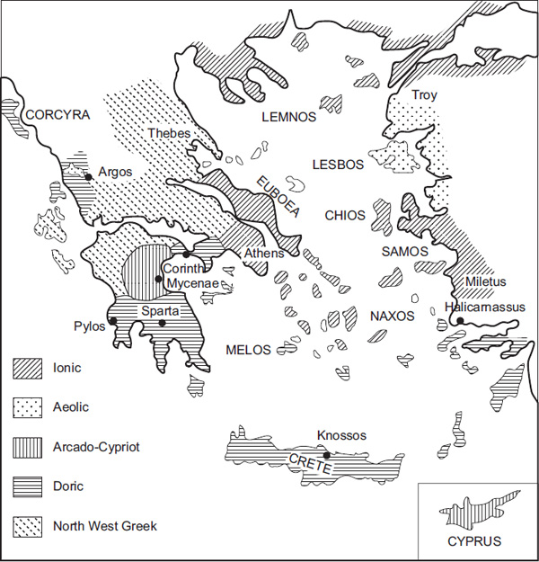
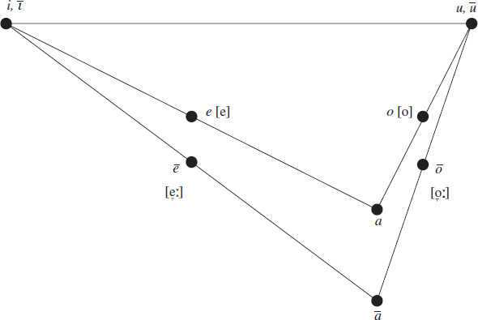
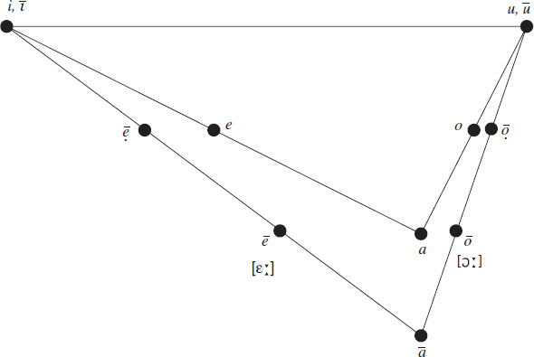
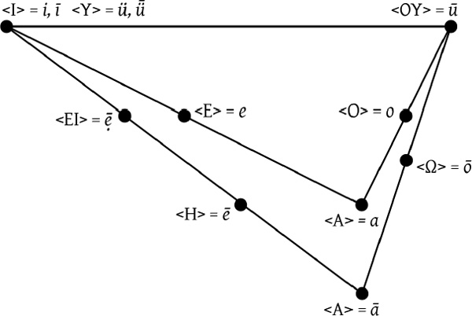
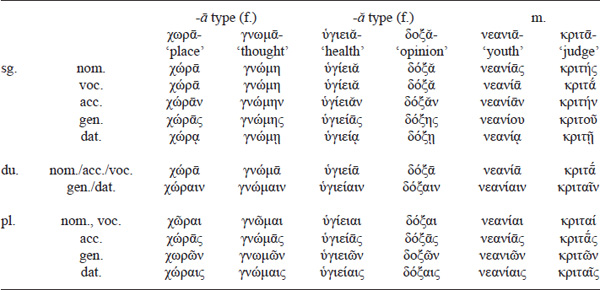
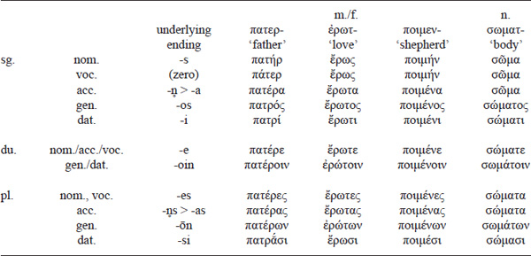
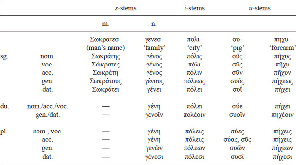
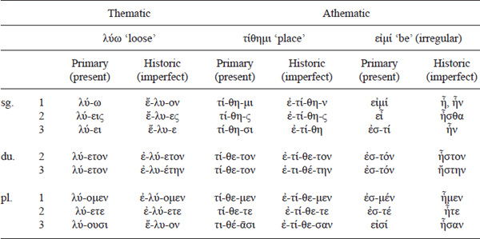
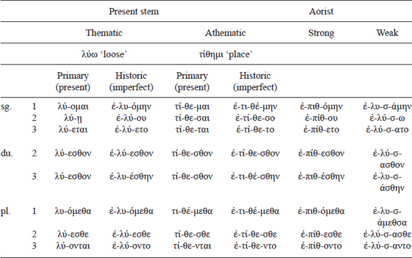
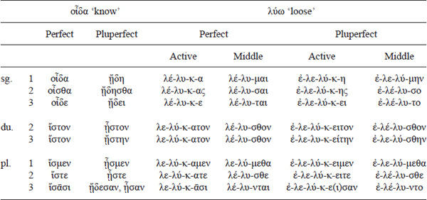

<!-- page: 287 -->

# Part 5

# **Greek**

*Rupert Thompson*

## **Introduction**

Greek is today the official language of Greece and of the Republic of Cyprus, and is spoken by sizeable diaspora communities across the globe. Varieties of Greek are spoken by minorities in southern Italy (Griko) and on the coast of the Black Sea (Pontic). Until the early part of the twentieth century there were large numbers of Greek speakers in Turkey; dialects such as Cappadocian are now all but extinct. All of the modern dialects of Greek, with the possible exception of Tsakonian (spoken by a declining minority in villages on the slopes of Mount Parnon), which may be a survival of the ancient Laconian dialect, descend from the variety known as the Koine (Gr. κοινὴ διάλεκτος, ‘common dialect’) which itself developed from the “internationalised” version of the dialect of Athens of the fifth century BC, “Great Attic”, and was adopted by the Macedonian kings as the official court language. From an IE perspective Greek is a member of the “core” group of languages left behind by the split of Anatolian and Tocharian. It is generally now considered that it developed in situ in the Balkan Peninsula in the second millennium BC. A number of words, including some place names, terms for flora and fauna, and cultural items (Κόρινθος ‘Corinth’, σῦκον ‘fig’, ἀσάμινθος ‘bath-tub’) attest substrate influence of non-Greek (even non-IE) languages. Some, with problematic phonological details (e.g. ἵππος ‘horse’ \< PIE *ekˊwos, with unexplained aspiration and vowel quality), suggest contact with otherwise unknown IE varieties.

Before the prestige of the Koine caused their ultimate demise in the Hellenistic period there had existed in the Greek-speaking world a large variety of regional dialects. None had the status of a standard language; the Greeks were clear enough that they all spoke varieties of Greek – famously according to Herodotus 8.144 τὸ Ἑλληνικόν ‘Greekness’ is ὁμόγλωσσον ‘of one language’ – but “Greek” in this sense was no more than an abstraction (Morpurgo Davies 1987). Certain dialects, often with extreme local features watered down or altogether removed, did become the conventional medium for certain genres of literature. For example, no matter what the native dialect of the poet, choral lyric – even the lyric passages of Attic tragedy – was written in a literary version of Doric (although in tragedy this largely amounts to the replacement of Att. η by Dor. ᾱ and the use of the Dor. first-declension gen. pl. in -ᾱν rather than Att. -ῶν). Εpic poetry was composed in the largely Ionic-based Homeric *Kunstsprache*.

<!-- page: 288 -->

The dialects have traditionally been classified into two main families, designated East Greek and West Greek according to their distribution in the first millennium. East Greek comprises Attic-Ionic and the more conservative Arcado-Cypriot; West Greek consists of (Peloponnesian) Doric and North-West Greek. A third group, Aeolic, made up of Thessalian and Boeotian on the Greek mainland, and Lesbian, spoken on the island of Lesbos and the facing northern part of the coast of Asia Minor, is difficult to fit into this binary classification. García Ramón (1975) argues that these dialects arose from contact between East and West Greek varieties; recent scholarship (following Parker 2008) calls into question the very existence of an Aeolic group and suggests that the three dialects in question may be unrelated archaic varieties. The dialect of Pamphylia is similarly hard to place (see Brixhe 1976). On the question of whether or not ancient Macedonian was a Greek dialect – a matter of no less heated debate in the ancient world than it is today – see Mendéz Dosuna 2012.

**Map 5.1 **The Greek dialects

Source: Adapted from: L. R. Palmer, *The Greek Dialects*, London: Faber and Faber, 1980

<!-- page: 289 -->

From the second half of the eighth century BC (the earliest examples are the “Dipylon pitcher” from the Kerameikos cemetery in Athens, dated to ca 740 BC, and the “cup of Nestor” from Pithekoussai on the Italian island of Ischia, dated to 750–700 BC) inscriptional material is written in a number of related local (“epichoric”) alphabets, all deriving ultimately from an adaptation of the Phoenician abjad. Gradually they came to be replaced by a standardised alphabet of East Ionic origin (Table 5.1). Modern conventional orthography mixes upper- and lower-case graphs and employs diacritics of Alexandrine and Byzantine origin for the accent, for aspiration (or the lack of it) on vowels and *r*, and for the second member *i* of long diphthongs. For details of the epichoric alphabets see Jeffery 1990. In addition to the epigraphic record the contemporary written material is augmented by a large number of papyri from Egypt dating to the Hellenistic and Roman periods. These include a variety of personal and official documents which provide invaluable evidence of the linguistic behaviours of a broad spectrum of social strata. They also include early copies of some literary texts. The literary evidence has otherwise been mediated by a long tradition of manuscript copyists.

|          |     |               |     |                |     |                         |     |       |
|----------|-----|---------------|-----|----------------|-----|-------------------------|-----|-------|
| Grapheme |     | Name          |     | Phonetic value |     | Old Attic equivalent    |     | Notes |
| Α, α     |     | alpha         |     | \[a, aː\]      |     | Α                       |     |       |
| Β, β     |     | beta          |     | \[b\]          |     | Β                       |     |       |
| Γ, γ     |     | gamma         |     | \[ɡ\] / \[ŋ\]  |     | Γ                       |     | \(1\) |
| Δ, δ     |     | delta         |     | \[d\]          |     | Δ                       |     |       |
| Ε, ε     |     | epsilon       |     | \[e̞\]          |     | Ε                       |     |       |
| Ϝ, ϝ     |     | digamma (wau) |     | \[w\]          |     | —                       |     | \(2\) |
| Ζ, ζ     |     | zeta          |     | \[zd\]         |     | Ζ                       |     |       |
| Η, η     |     | eta (heta)    |     | \[ɛː\]         |     | Ε (Η=\[h\])             |     | \(3\) |
| Θ, θ/ϑ   |     | theta         |     | \[tʰ\]         |     | Θ                       |     |       |
| Ι, ι     |     | iota          |     | \[i, iː\]      |     | Ι                       |     |       |
| Κ, κ     |     | kappa         |     | \[k\]          |     | Κ                       |     |       |
| Λ, λ     |     | lambda        |     | \[l\]          |     | Λ                       |     |       |
| Μ, μ     |     | mu            |     | \[m\]          |     | Μ                       |     |       |
| Ν, ν     |     | nu            |     | \[n\]          |     | Ν                       |     |       |
| Ξ, ξ     |     | xi            |     | \[ks\]         |     | ΧΣ                      |     |       |
| Ο, ο     |     | omicron       |     | \[o\]          |     | Ο                       |     |       |
| Π, π     |     | pi            |     | \[p\]          |     | Π                       |     |       |
| Ρ, ρ     |     | rho           |     | \[r, r̥ʰ\]      |     | Ρ                       |     | \(4\) |
| Σ, σ/ς   |     | sigma         |     | \[s\]          |     | Σ                       |     | \(5\) |
| Τ, τ     |     | tau           |     | \[t\]          |     | Τ                       |     |       |
| Υ, υ     |     | upsilon       |     | \[ü, üː\]      |     | Υ                       |     | \(6\) |
| Φ, φ     |     | phi           |     | \[pʰ\]         |     | Φ                       |     |       |
| Χ, χ     |     | chi           |     | \[kʰ\]         |     | Χ                       |     |       |
| Ψ, ψ     |     | psi           |     | \[ps\]         |     | ΦΣ                      |     |       |
| Ω, ω     |     | omega         |     | \[ɔː\]         |     | Ο                       |     |       |
| ει       |     |               |     | \[eː\]         |     | ΕΙ = \[ei\], Ε = \[eː\] |     | \(7\) |
| ου       |     |               |     | \[uː\]         |     | ΟΥ = \[ou\], Ο = \[oː\] |     | \(7\) |
| ᾳ        |     |               |     | \[aː(i)\]      |     | ΑΙ                      |     | \(8\) |
| ῃ        |     |               |     | \[ɛː(i)\]      |     | ΕΙ                      |     | \(8\) |
| ῳ        |     |               |     | \[ɔː(i)\]      |     | ΟΙ                      |     | \(8\) |

Table 5.1 The Greek (Ionic) alphabet. Phonetic values are those of Attic ca 400 BC. The equivalent spellings in the Old Attic alphabet, used in Athens before 403 BC, are also shown.

### **Notes to Table 5.1:**

1.  (1) Before κ, χ, μ or another γ the letter γ has the articulation of a velar nasal \[ŋ\].
2.  (2) The sound \[w\] was lost prehistorically in Attic-Ionic, and consequently the grapheme \<Ϝ\> was not used in those dialects. The name “digamma” comes from its shape, which resembles two capital gammas superimposed.
3.  (3) In most varieties of the Greek alphabet the grapheme \<Η\> has the value \[h\]. East Ionic, lacking the phoneme *h*, redeployed the redundant sign as a grapheme for the long vowel which became *ē*. (See below under “Phonology”.) Current practice, originating in Alexandrian notation, is to print the *rough breathing* \<῾\> above initial vowels (and *r*) which have aspiration and the *smooth breathing* \<᾿\> above those which lack it.
4.  (4) Word-initially, and perhaps in the second member of a geminate, *r* is voiceless and aspirated, \[r̥ʰ\]. Elsewhere it is voiced and unaspirated \[r\]. Word-initial rho is thus traditionally written with the rough breathing, ῥ.
5.  (5) The lower-case form σ is used medially, ς word-finally. The ancient Greeks themselves used only upper-case letter forms, and so made no such distinction. Consequently, some scholars prefer to use “lunate” sigmas Ϲ, ϲ, with the same lower-case form used in all environments.
6.  (6) In most dialects, and originally in Attic, the value of υ is \[u, uː\]. See below under “Phonology”.
7.  (7) The sequences ει and ου are known as “spurious diphthongs”. Originally they represented diphthongs \[ei\] and \[ou\], but sometime before 403 BC in Attic they had monophthongised to close-mid vowels \[eː, oː\] (transcribed here *ẹ̄*, *ọ̄*), the latter subsequently raising to \[uː\].
8.  (8) These represent original “long diphthongs” *āi*,*ēi*, *ōi* – see Allen 1987a: 84–88 for the likely phonetic reality of these sounds – which were in inscriptions written ΑΙ, ΕΙ (later ΗΙ), ΟΙ (later ΩΙ), but which by ca 200 BC lost the second element to merge with *ā, *ē**, *ō* and were then written Α, Η, Ω. The convention of indicating this lost *i* with an *iota subscriptum* is of Byzantine origin and is generally followed today, except in the case of capitals, e.g. Ἅιδης = *Hāidēs* ‘Hades’: were it *Haidēs* the accent and breathing would be printed over the iota: Αἵδης. Some scholars prefer to print such iotas adscript, ᾱι, ηι, ωι.

<!-- page: 291 -->

Before 1952 the earliest Greek material known to us was provided by the two epic poems attributed in antiquity to Homer, the *Iliad* and the *Odyssey*. The language of these poems is broadly Ionic, but has an admixture of archaic, Aeolic and wholly artificial forms. Thanks to the work of Milman Parry (Parry 1928a, 1928b; see also Parry et al. 1971) it is known that this Homeric *Kunstsprache* owes its formation to a long tradition of oral poetry, dating back to the Bronze Age and beyond. The poems are composed in strict dactylic hexameters, and to assist the process of oral composition the poets had evolved a complex system of *formulae*, “building-blocks” of convenient metrical shape, e.g. πολύτλας δῖος Ὀδυσσεύς ‘much-suffering godlike Odysseus’ or πολύμητις Ὀδυσσεύς ‘much-cunning Odysseus’, which fill in the shapes, so conveniently completing the line from the weak third-foot caesura and strong fourth-foot caesura respectively. Where such formulae contained material which was no longer linguistically current the Ionic poets replaced it with contemporary Ionic forms if they had the same metrical shape; otherwise with suitable contemporary forms from a parallel Aeolic tradition; and failing that they retained the archaic material (so Horrocks 1987, 1997; but the idea that the tradition went through a distinct Aeolic phase before passing entirely into Ionian hands is not totally laid to rest. For discussion see the contributions by Janko and Jones in Andersen and Haug 2012). The result is an amalgam from various time-depths, containing, for example, contemporary AI *o*-stem gen. sg. in -ου alongside its earlier form, -οιο; and some features, such as “tmesis” – the separation of a preverb from its verb – and the scansion of ἀνδρότητα ‘manhood’ at *Iliad* 16.857 as if *anr̥tāta, must pre-date the Bronze Age. The poems took their present form probably in the eighth or seventh century BC, and it is doubtful whether there was a single poet responsible for each poem, let alone both; but the name “Homer” is a convenient shorthand for the poetic tradition.

Excavating in Knossos on Crete in 1900, Sir Arthur Evans discovered clay tablets written in an unknown script, today called Linear B, dating to ca 1400 BC. Similar documents of a slightly later date were unearthed in subsequent excavations at Pylos in Messenia, at Mycenae in the Argolid and at Thebes in Boeotia, and continue to be found to the present day, the most recent discoveries coming from Ayios Vasilios in Lakonia. A collaboration in the 1950s between Michael Ventris and John Chadwick, building on earlier work by the American scholar Alice Kober, revealed that these documents were the economic records of Bronze Age palatial elites written in a very early form of Greek which today we call Mycenaean. Despite its early date and obvious conservatism in some areas (e.g. retention of PIE labiovelars and *w, preservation of instrumental morphology) Mycenaean has undergone the assibilation of Proto-Greek *ti to *si* which characterises the East Greek dialect family, indicating that the split into East and West Greek had taken place already in the second millennium.

Linear B evidently derives from an earlier script, Linear A, used to write an unknown language of Crete (and which itself superseded a more elaborate writing system called Cretan Hieroglyphic). The script is not especially well adapted to writing Greek. In addition to a large number of ideograms it contains some 88 syllabic signs, each of which denotes a simple vowel, a sequence of consonant + vowel or, in a small number of cases, more complex sequences such as *rai* or *nwa*. It does not normally distinguish between voiceless, voiced and aspirated stops (except that *t* and *tʰ* are distinguished from *d*, and there is an optional sign representing *pʰu*), nor between *r* and *l*, and vowel length is not marked. Consonant clusters cannot be written: the scribes either omit consonants (“partial spelling”, e.g. *pe-ma* = *sperma* ‘grain’) or insert “dummy vowels” (“plene spelling”, e.g. *wa-na-ka-te* = *wanaktei* ‘for the king’). Diphthongs are not always marked, and word-final consonants almost never are.

Another syllabic script derived ultimately from Linear A was used to write the ancient dialect of Cyprus. The earliest example may be the spit inscribed with the gen. of the man’s name *Opʰeltau* dating from the tenth century BC, although it has recently been suggested that this may be the earlier “Cypro-Minoan” script (used to write one or more non-Greek languages). The Cypriot script differs from Linear B in lacking signs for voiced dentals, and in its strategies for writing consonant clusters.

## **Phonology**

<!-- page: 292 -->

The consonantism of Greek is fairly conservative. Being a *centum*-type language, the PIE velars and palatals have merged as velars. The major development of the consonant system which characterises Proto-Greek is the loss of voicing on the PIE voiced aspirates, PIE *bʰ, *dʰ, *gʰ becoming φ, θ, χ = \[pʰ, tʰ, kʰ\]. The voiceless aspirated stop articulation of these phonemes is preserved into the Roman period: the earliest evidence for a pronunciation \[f\] for φ and \[θ\] for θ is from the first century AD. (This is true at least for Attic and its descendant, the Koine. In Laconian θ may have become a fricative by the end of the fifth century. In the *Lysistrata*, Aristophanes has the Spartans use forms such as σιός for Attic θεός, perhaps an attempt to write \[θ\].) Similarly, β, δ, γ retained their articulation as voiced stops throughout the ancient period; it is not clear when they became the fricatives \[β, ð, ɣ\] of Modern Greek, but it may be as late as the ninth century AD.

### **Labiovelars**

The PIE labiovelars are originally retained, except when adjacent to *ū̆* or *w* when they lose their labialisation and merge with the plain velars. Mycenaean spells all labiovelars with a series of signs transcribed *qa*, *qe*, *qi*, *qo*, e.g. *a-pi-qo-ro* = *ampʰikʷolos* (Att. ἀμφίπολος) ‘attendant’ while *qa-si-re-u* = *gʷasileus* (Att. βασιλεύς, a local official in Mycenaean, ‘king’ in later Greek). In *qo-u-ko-ro* = *gʷoukolos* (Att. βουκόλος) ‘cowherd’ the first labiovelar is retained, and the second has become velar because of the preceding *u*.

In the dialects of the first millennium the remaining labiovelars merged with various other consonantal phonemes. In Attic-Ionic and West Greek the development is twofold: (i) before *e* (and in the case of *kʷ also before *i*) the outcome is dental, *kʷ \> *t*, *gʷ \> *d*, PIE *gʷʰ \> Proto-Greek *kʷʰ \> *tʰ*; (ii) elsewhere the outcome is labial, *kʷ \> *p*, *gʷ \> *b*, PIE *gʷʰ \> Proto-Greek *kʷʰ \> *pʰ*. This is the major source of the *b* phoneme in Greek. Examples are given in Table 5.2. Other dialects behave differently. In Aeolic, for example, the outcome is labial across the board (e.g. thus Lesb. πέμπε = Att. πέντε ‘five’), but even in Aeolic the pronominal stem *kʷi- gives τίς etc.

|            |     |                               |     |                                               |     |                            |
|------------|-----|-------------------------------|-----|-----------------------------------------------|-----|----------------------------|
|            |     | *kʷ                          |     | *gʷ                                          |     | *gʷʰ \> Proto-Greek *kʷʰ |
| before *e* |     | *penkʷe \> πέντε ‘five’      |     | *gʷelbʰu- \> δελφύς ‘womb’                   |     | *gʷʰen- \> θείνω ‘kill’   |
| before *i* |     | *kʷis \> τίς ‘who?’          |     | *gʷih₃- \> βίος ‘life’                       |     | *h₃egʷʰi- \> ὄφις ‘snake’ |
| elsewhere  |     | *penkʷtos \> πεμπτός ‘fifth’ |     | *gʷm˳- \> βαίνω ‘go’ |     | *gʷʰon- \> φόνος ‘murder’ |

**Table 5.2 Treatment of labiovelars in Attic-Ionic and West Greek**

### **Laryngeals**

The behaviour of the PIE laryngeals is similar in Greek to in the other daughter languages, with two important exceptions. First, and unique to Greek, is the so-called triple-reflex of laryngeals in positions where they vocalise. In all other IE languages all three laryngeals give the same reflex, *i* in Indo-Iranian, *a* elsewhere; in Greek, however, *h₁ vocalises to *e*, *h₂ to *a*, *h₃ to *o*. Thus, *dʰh₁tos \> θετός ‘set’, *sth₂tos \> στατός ‘placed’, *dh₃tos \> δοτός ‘granted’. Second, word-initial *H before a resonant other than *y also vocalises rather than being lost as in other languages (other than Armenian): *h₁rudʰ- \> ἐρυθρός ‘red’, *h₂ner- \> ἀνήρ ‘man’, *h₃nomn̥ \> ὄνομα ‘name’. This is the origin of at least some *prothetic vowels* in Greek (compare Lat. *ruber, Nero* and *nōmen* for the equivalent forms without). The triple reflex is also seen in the outcome of *R̥H, as ρη, ρᾱ, ρω etc.

### **Semivowels**

PIE *w was inherited into Proto-Greek, is preserved in Mycenaean, but was lost at various stages in the later dialects. Where retained, it was written with the letter ϝ. In Attic-Ionic its disappearance was prehistoric. It was originally present in the Homeric tradition, where at the convenience of the poet it is either observed – to block hiatus (e.g. μελιηδέα (ϝ)οἶνον ‘honey-sweet wine’) or make a preceding vowel long by position (e.g. εἶπας (ϝ)ἔπος) – or ignored (e.g. μελιηδέος οἴνου).

<!-- page: 293 -->

Medially, PIE *y was lost via \[h\]. Word-initially it shows a double treatment. In some roots it gives Greek ζ- (originally with the value \[ʣ\]), in others \[h\]. The outcome is consistent across the dialects. Those roots which give later Greek ζ- are in Mycenaean spelt with signs of the *z*-series (e.g. PIE *yewg- \> Myc. *ze-u-ke-si* = *dzeuges(s)i* ‘pair (dat. pl.)’, Att. ζεύγεσι); those which give \[h\] are spelt with signs of the *j*-series or simple vowels (e.g. from the *yo- pronominal stem adverbs *jo*- = *yō* and *o*- = *hō* ‘how’). This probably shows that the change *y \> *h* was in progress at the time the Linear B documents were written. The alternation between *h*- and ζ-roots has not been satisfactorily explained, although as *Hy- does not give a prothetic vowel, word-initial laryngeals have sometimes been supposed to underlie one development or the other.

Later Greek ζ has two other sources: (i) the palatalisation of *dy and *gy, e.g. *ped-yos \> πεζός ‘on foot’, *meg-yos- \> Ion. μέζων, comp. of μέγας ‘big’; and (ii) the combination of *s*+*d*, e.g. Ἀθήναζε \< Ἀθήνασ+δε ‘to Athens’. The former type is spelt in Mycenaean with *z*-series signs (e.g. *me-zo-e* = *medzohes* ‘bigger’), the latter with signs of the *d*-series (e.g. *te-qa-de* = *Tʰēgʷans-de* ‘to Thebes’). This indicates that the original outcome of *dy and *gy metathesized to *zd* and thus merged with *s*+*d* in the post-Mycenaean period.

Voiceless *t(ʰ)y and *k(ʰ)y also underwent palatalisation. There are two distinct phases. First, those sequences of *ty and *tʰy where no morpheme boundary intervened palatalised to \[ʦ\], which gives -*tt*- in Boeotian, -*ss*- elsewhere, simplifying to -*s*- in Attic-Ionic, e.g. *yotyos \> AI ὅσος ‘how big’ vs. Lesb., Thess., Dor. (h)οσσος; PIE *medʰyos \> Proto-Greek *metʰyos \> AI μέσος ‘middle’, Boe. μεττος, elsewhere μεσσος. Where a morpheme boundary intervenes the change is delayed. For most dialects the outcome is the same as homomorphemic *t(ʰ)y (viz. Boe. -*tt*-, general -*ss*-), but Attic this time follows the Boeotian treatment (e.g. *melit-ya \> Att. μέλιττα ‘honey bee’) and in Ionic the -*ss*- does not simplify (e.g. μέλισσα). The outcomes of *k(ʰ)y and *tw are the same: Proto-Greek *pʰulak-yō ‘guard’ \> Att. and Boe. φυλάττω vs. φυλάσσω elsewhere; and Proto-Greek *kʷetwr̥- ‘four’\> Att. τέτταρες, Boe. πετταρες vs *kʷetwer- \> Ion. τέσσερες. Interestingly, words of non-Greek origin show the same distribution of -ττ- vs -σσ-, e.g. Att. and Boe. θάλαττα vs. general θάλασσα ‘sea’.

### **The PIE fricative**

Between vowels, and before a vowel at word-beginning, PIE *s \> *h*, and medially is then lost. The lenition of *s \> *h* is pre-Mycenaean, the subsequent loss post-Mycenaean: from Proto-Greek *pʰarwesa ‘cloths’, Mycenaean has *pa-we-a₂* = *pʰarweha*. This has interesting implications for Grassmann’s Law, by which the first in a sequence of two aspirates loses aspiration (e.g. *sekʰ- \> Proto-Greek *hekʰō \> Att. pres. ἔχω, vs. fut. *hekʰsō \> *heksō \> ἕξω). Since *dʰesos \> Proto-Greek *tʰehos \> θεός ‘god’ we can perhaps infer that, although it is common to all dialects of the first millennium, Grassmann’s Law operates after the loss of medial -*h*-, i.e. in the post-Mycenaean period. Otherwise, the classical form would be ×τεός.

### **The vowel system**

<!-- page: 294 -->

Proto-Greek inherited from PIE a simple vowel system with five short vocalic phonemes, *a*, *e*, *i*, *o*, *u*, each with a corresponding long equivalent. There were also diphthongs *ai*, *ei*, *oi*, *au*, *eu*, *ou*, and long diphthongs *āi*, *ēi*, *ōi*, *āu*, *ēu*, *ōu*. Early in the history of the language, perhaps at the Proto-Greek stage, certain medial clusters involving a liquid or nasal and *s* underwent loss of the *s* and gemination of the resonant. Mycenaean attests this stage; thus, e.g., from Proto-Greek *agersantes, the aor. ptcp. m. nom. pl. of the verb ἀγείρω ‘collect’, Mycenaean has *a-ke-ra₂-te* = *agerrantes*. The geminate is preserved in Lesbian and Thessalian, but the other dialects further simplify the cluster by degemination with compensatory lengthening of a preceding short vowel. In the case of *a*, *i* and *u* the outcome is identical to the existing long vowels; this is also true of *e* and *o* in Boeotian, Arcadian (and one supposes Cypriot, although the writing system obscures the details) and some Doric dialects labelled by Ahrens (1843: 403–414) as *Doris seuerior* (‘severer Doric’); in other dialects, however, including Attic, Ionic and those Doric varieties labelled as *Doris mitior* (‘milder Doric’), *e* and *o* lengthened not to inherited *ē* and *ō* (which were \[e̞ː, o̞ː\]) but to new close-mid vowels *ẹ̄* and *ọ̄* (phonetically \[eː, oː\]). Allen (1959, 1987b) suggests that in these varieties the short-vowel system was skewed towards the top of the vocalic space (Figure 5.1), so that short *e*, *o* were of noticeably closer quality than inherited long *ē*, *ō*. He cites in support the fact that in these dialects PIE *r̥ and *l̥ give αρ~ρα and αλ~λα: the original outcome is likely to have been \[ər\] etc., and the top-skewing would mean that \[ə\] was sufficiently close to *a* as to merge with it. The result of this is shown in Figure 5.2. The new *ẹ̄* and *ọ̄* phonemes were spelt in Old Attic orthography as \<Ε, Ο\>. After 403 BC and in standard modern orthography they are spelt ει and ου for reasons which are explained below. Examples of the treatment of various clusters are:

- Proto-Greek *kʰeslioi \> Ion. χείλιοι, “severe” Dor. χηλιοι, Lesb. and Thess. χέλλιοι ‘thousand’
- Proto-Greek *asmes \> AI ἡμεῖς (\< *ᾱ̔μεις), Dor. ᾱ̔μες, Lesb. ἄμμες ‘we’
- Proto-Greek *esmi \> AI εἰμί, “severe” Dor. ἠμι, Lesb. ἔμμι ‘I am’

**Figure 5.1 **Vowel system of Proto-Attic-Ionic after compensatory lengthening

<!-- page: 295 -->

**Figure 5.2 **Vowel system of Proto-Attic-Ionic after compensatory lengthening

The resulting system seems to have suffered from overcrowding on the back axis, which is substantially shorter than the front. In Proto-Attic-Ionic this had implications for both the top and bottom of the back axis. First, the *ā* phoneme underwent fronting to become \[æː\]. A second wave of compensatory lengthenings, this time involving word-final *ns* clusters and those with secondary *s*, added to the inventory of *ẹ̄* and *ọ̄* and reintroduced a new *ā*. It is at this stage that Eastern Ionic redeployed the redundant grapheme \<H\> to represent the shifted *ǣ* phoneme: a seventh-century BC inscription from Naxos spells the word ‘sister’, phonetically \[kasiɡnɛ́ːtæː\], as ΚΑΣΙΓΝΕΤΗ, using \<Ε\> for inherited *ē* (and also for *e* and *ẹ̄*) and \<H\> for *ǣ* \< *ā*. \<A\> is used for inherited *a* and the new *ā* from the second wave of compensatory lengthening. Eventually, in Ionic, *ǣ* merged completely with *ē*, taking its grapheme with it, so the standard spelling of the ‘sister’ word became κασιγνήτη, representing \[kasiɡnɛ́ːtɛː\]. In Attic it split, merging with the new *ā* after *e*, *i* or *r*, and with *ē* elsewhere.

The effects of overcrowding were now felt again, this time causing a shift in the top of the back axis. Inherited *ū* (spelt \<Υ\>) was pushed over onto the front axis, becoming *ǖ* (a high front vowel with lip-rounding), and for reasons of symmetry the short *u* followed it to become *ü*. The original value of \<Y\> is seen in the onomatopoeic verb μυκάομαι ‘moo’, and in the spellings \<AY, EY\> of the diphthongs *au*, *eu*. The close-mid *ọ̄* then moved up to occupy the space so vacated at the top of the back axis and became \[uː\]. This is its value in Classical Attic. As a consequence there is no longer a corresponding short *u* phoneme. These developments explain why the Boeotians, when they adopted the Attic alphabet in the fourth century, considered \<Y\> unsuitable for writing their own phonemes which had retained the values \[u, uː\] and instead used the digraph \<OY\>. Occasionally, too, spellings \<AO, EO\> are found for *au*, *eu*.

<!-- page: 296 -->

In the Old Attic orthography \<E\> was used not only for *ĕ* but also *ē* and *ẹ̄*, and \<O\> likewise for *ŏ*, *ō* and *ọ̄* (\> *ū*). In 403 BC, under the archonship of Eucleides, Athens adopted the Ionic alphabet, which used \<H\> and \<Ω\> for *ē* and *ō*. At the same time \<EI\> and \<OY\> were employed for *ẹ̄* and *ū* \< *ọ̄*. These spellings originally represented the diphthongs \[ei\] and \[ou\], which had by the fifth century BC monophthongised and merged with *ẹ̄* and *ọ̄* (\> *ū*), and it is unsurprising that they should then be used for the simple vowels from whatever source. They are traditionally called “spurious diphthongs” but are properly speaking digraph spellings of monophthongs. The vowel system of Classical Attic, with the post-Eucleidean spellings, is shown in Figure 5.3.

**Figure 5.3 **Vowel system of classical Attic, showing official spellings after 403 BC

It is worth saying a few words about the later developments of the vowel system into the Koine and beyond. Around the end of the fourth century BC *ẹ̄* raised and merged with *ī*; one imagines that *ē* itself then raised slightly from \[ɛː\] to \[e̞ː\]. By the end of the first century AD a new wave of monophthongisations caused *oi* to merge with *ǖ*, and turned *ai* into \[ɛː\]; in turn, *ē* raised to \[eː\] and eventually \[iː\], merging with *ī*. Between the second and third centuries AD phonemic vowel length was lost, probably in connection with the change from a pitch to a stress accent, and, finally, sometime after the fourth century *ü* (including the outcome of earlier *oi*) lost its lip-rounding and merged with *i*, giving the simple five-vowel system of Modern Greek: *a* \<α\>, *e* \<ε, αι\>, *i* \<ι, ει, η, υ, οι\>, *o* \<ο, ω\>, *u* \<ου\>.

### **Accent**

The details of the Greek accentual system are beyond the scope of the present chapter. The reader is referred to Probert 2003. Only a basic overview is presented here.

<!-- page: 297 -->

From the time of Plato ancient commentators on the accentual system of Greek describe two categories of accent, ὀξύς ‘sharp’ and βαρύς ‘heavy’. Two of the general terms for accent, τόνος and τάσις, both meaning ‘stretching’, are metaphors of the tension in the strings of a musical instrument, and the third, προσῳδία ‘singing-along-with’, also implies an accent based on pitch rather than stress. The categories ὀξύς and βαρύς are themselves associated with the terms ἐπίτασις ‘stretching’ and ἄνεσις ‘slackening’, and are thus clearly high and low pitch respectively.

The tradition of marking the accent with diacritics originates in Alexandria ca 200 BC, but the present system of notation is Byzantine. The acute marks a rise in pitch followed by a fall in pitch on the next syllable, e.g. ἄνθρωπος with rise on the α and fall on the ω. Each change of pitch requires one mora (the length of a short vowel). If the accent is borne by a long vowel or diphthong (both of which equal two morae) the pitch may rise on the second mora and then fall on the following syllable, in which case it is still marked acute (e.g. ἀνθρώπου, which may be regarded schematically as *antʰroópùu*), or it may rise on the first mora and fall on the second mora of the same syllable, in which case it is marked with the circumflex (e.g. πρᾶγμα, schematically *práàgma*). When a word which bears an acute on its final syllable (the traditional term is “oxytone”) is followed by another accented word, its accent is written grave (barytonesis, e.g. ἀγαθὸς ἄνθρωπος). It is not clear what this represents, but it is a reasonable assumption that the pitch was required to return to the base level by the word end, and that the grave accent indicates that the expected rise in pitch is suppressed, or at least moderated.

The position of the accent is free within certain constraints, known collectively as the law of limitation: if the final syllable is light (i.e. contains a short vowel followed by at most one consonant) an acute can stand on the final, penultimate or antepenultimate syllable and a circumflex on the penultimate; if it is heavy, an acute can stand on the final or penultimate syllable and a circumflex on the final. A word which bears its accent as far from the word-end as permitted by the law of limitation is said to have recessive accent. Most verbal forms are accented this way. A handful of verbal categories have specific accents, for example the strong aorist participle, accented finally, e.g. εἰπών ‘having said’. Nouns, adjectives, adverbs and pronouns have a particular accent as part of their lexical specification. A further rule, known as the *sōtēra* rule, stipulates that if the accent falls on a long vowel in the penultimate syllable and the final vowel is short, the accent is circumflex (thus σωτῆρα, not ×σωτήρα). The accent is also circumflex if it falls on a contracted final syllable. For all of the foregoing purposes the diphthongs *ai* and *oi*, when word-final, count as short rather than long vowels except in optatives and locative adverbs.

Certain types of word, including indefinite pronouns, adjectives and adverbs, and some sentence particles and forms of the verbs εἰμί ‘be’ and φημί ‘say’, are atonic enclitics which cohere so closely to a preceding word as to form a single unit for accentual purposes. An oxytone word followed by an enclitic retains its acute accent (thus ἀγαθός τις ἄνθρωπος vs ἀγαθὸς ἄνθρωπος). In some other cases either the preceding word or the enclitic may gain a secondary accent (e.g. ἄνθρωπός τις).

The remarks made thus far concern the accentuation of Attic and the Koine, until around the second or third century AD. Very little is known about the accentual systems of other dialects. Ancient grammarians and papyri concur that in Lesbian the accent was recessive; thus Lesb. θέοισι = Att. θεοῖς ‘gods (dat. pl.)’. Grammarians and papyri also suggest that in Doric the *sōtēra* rule did not apply, and that final -*ai* and -*oi* counted as long in nominative plurals. Chadwick (1992) argues that Thessalian had a word-initial stress accent. Previously, editors of epigraphic texts have accented dialect material (except Lesbian) in the manner of Attic. It is common today to omit accents in dialect texts.

Between the second and third centuries AD the accent became one of stress, as it is in Modern Greek.

<!-- page: 298 -->

## **Morphology**

In both nominal and verbal morphology Greek inherited three values of the category number: singular, dual and plural. In Mycenaean whenever two items are recorded the dual is used, for example in the list of banqueting equipment from Pylos (PY Ta 641.2) *dipahe medzohe triōwehe* ‘two larger three-handled goblets’, where the noun and both adjectives are dual. In Homer and in classical Attic the dual is used (i) for “natural pairs” (such as eyes, hands, etc.); and (ii) for “accidental pairs” when the numeral δύο ‘two’ (itself a dual form) or the word ζεῦγος ‘pair’ is used in conjunction; but even in these cases the plural is frequently used. Ionic had lost the category early, and its retention in Attic was considered parochial. It was therefore eliminated in Great Attic and the Koine.

### **Nominal morphology**

There are three main nominal declensional types: the *a*-stems (the Greek “first declension”) continue the PIE *-eh₂ and *-ih₂ types, the “second declension” the IE *o*-stems, and the “third declension” the various IE athematics.

Table 5.3 Forms of the first declension (***a***-stems) in classical Attic

The first declension (Table 5.3) has two sub-types. The first, deriving from the *-eh₂ declension, has -ᾱ- throughout the sg., becoming -η- in Ionic and in Attic except after ε, ι or ρ. The second, deriving from the *-ih₂ type, has -ᾰ- in the nom., voc. and acc. sg., and -ᾱ- (becoming -η-) in the gen. and dat. sg. Masculines of the first declension have nom. sg. in ᾱς (becoming -ης) by analogy with the second declension and gen. sg. in -ου (in Attic-Ionic), imported from the second declension. (Other dialects have forms deriving from -*āo*, where the -*ā*- is the stem and the -*o* has been imported from the second declension original form in -*oio*.) Acc. pl. -ᾱς is from -*ans*, which is retained in some dialects, including Mycenaean; Lesbian has -αις by the normal treatment of word-final -*ns* in that dialect. The gen. pl. of all *a*-stems is originally in -*āhōn* (preserved in Mycenaean), which contracts in Attic-Ionic to ῶν and in West Greek to -ᾶν. There are no neuters of the first declension.

<!-- page: 299 -->

<table style="width:100%;">
<caption>Table 5.4 Forms of the second declension (<em><strong>o</strong></em>-stems) in classical Attic</caption>
<colgroup>
<col style="width: 14%" />
<col style="width: 14%" />
<col style="width: 14%" />
<col style="width: 14%" />
<col style="width: 14%" />
<col style="width: 14%" />
<col style="width: 14%" />
</colgroup>
<tbody>
<tr class="odd">
<td class="tleft border_top"></td>
<td class="tcenter border_top"></td>
<td class="tcenter border_top"></td>
<td class="tcenter border_top"></td>
<td class="tcenter border_top">
m./f.
</td>
<td class="tcenter border_top"></td>
<td class="tcenter border_top">
n.
</td>
</tr>
<tr class="even">
<td class="tleft"></td>
<td class="tcenter"></td>
<td class="tcenter"></td>
<td class="tcenter"></td>
<td class="tcenter">
λογο-

‘speech’
</td>
<td class="tcenter"></td>
<td class="tcenter">
ζυγο-

‘yoke’
</td>
</tr>
<tr class="odd">
<td class="tleft">
sg.
</td>
<td class="tcenter"></td>
<td class="tcenter">
nom.
</td>
<td class="tcenter"></td>
<td class="tcenter">
λόγος
</td>
<td class="tcenter"></td>
<td class="tcenter">
ζυγόν
</td>
</tr>
<tr class="even">
<td class="tleft"></td>
<td class="tcenter"></td>
<td class="tcenter">
voc.
</td>
<td class="tcenter"></td>
<td class="tcenter">
λόγε
</td>
<td class="tcenter"></td>
<td class="tcenter">
ζυγόν
</td>
</tr>
<tr class="odd">
<td class="tleft"></td>
<td class="tcenter"></td>
<td class="tcenter">
acc.
</td>
<td class="tcenter"></td>
<td class="tcenter">
λόγον
</td>
<td class="tcenter"></td>
<td class="tcenter">
ζυγόν
</td>
</tr>
<tr class="even">
<td class="tleft"></td>
<td class="tcenter"></td>
<td class="tcenter">
gen.
</td>
<td class="tcenter"></td>
<td class="tcenter">
λόγου
</td>
<td class="tcenter"></td>
<td class="tcenter">
ζυγοῦ
</td>
</tr>
<tr class="odd">
<td class="tleft"></td>
<td class="tcenter"></td>
<td class="tcenter">
dat.
</td>
<td class="tcenter"></td>
<td class="tcenter">
λόγῳ
</td>
<td class="tcenter"></td>
<td class="tcenter">
ζυγῷ
</td>
</tr>
<tr class="even">
<td class="tleft"></td>
<td class="tcenter"></td>
<td class="tcenter"></td>
<td class="tcenter"></td>
<td class="tcenter"></td>
<td class="tcenter"></td>
<td class="tcenter"></td>
</tr>
<tr class="odd">
<td class="tleft">
du.
</td>
<td class="tcenter"></td>
<td class="tcenter">
nom./acc./voc.
</td>
<td class="tcenter"></td>
<td class="tcenter">
λόγω
</td>
<td class="tcenter"></td>
<td class="tcenter">
ζυγώ
</td>
</tr>
<tr class="even">
<td class="tleft"></td>
<td class="tcenter"></td>
<td class="tcenter">
gen./dat.
</td>
<td class="tcenter"></td>
<td class="tcenter">
λόγοιν
</td>
<td class="tcenter"></td>
<td class="tcenter">
ζυγοῖν
</td>
</tr>
<tr class="odd">
<td class="tleft"></td>
<td class="tcenter"></td>
<td class="tcenter"></td>
<td class="tcenter"></td>
<td class="tcenter"></td>
<td class="tcenter"></td>
<td class="tcenter"></td>
</tr>
<tr class="even">
<td class="tleft">
pl.
</td>
<td class="tcenter"></td>
<td class="tcenter">
nom., voc.
</td>
<td class="tcenter"></td>
<td class="tcenter">
λόγοι
</td>
<td class="tcenter"></td>
<td class="tcenter">
ζυγά
</td>
</tr>
<tr class="odd">
<td class="tleft"></td>
<td class="tcenter"></td>
<td class="tcenter">
acc.
</td>
<td class="tcenter"></td>
<td class="tcenter">
λόγους
</td>
<td class="tcenter"></td>
<td class="tcenter">
ζυγά
</td>
</tr>
<tr class="even">
<td class="tleft"></td>
<td class="tcenter"></td>
<td class="tcenter">
gen.
</td>
<td class="tcenter"></td>
<td class="tcenter">
λόγων
</td>
<td class="tcenter"></td>
<td class="tcenter">
ζυγῶν
</td>
</tr>
<tr class="odd">
<td class="tleft border_bot"></td>
<td class="tcenter border_bot"></td>
<td class="tcenter border_bot">
dat.
</td>
<td class="tcenter border_bot"></td>
<td class="tcenter border_bot">
λόγοις
</td>
<td class="tcenter border_bot"></td>
<td class="tcenter border_bot">
ζυγοῖς
</td>
</tr>
</tbody>
</table>

Table 5.4 Forms of the second declension (***o***-stems) in classical Attic

The second declension (Table 5.4) consists largely of masculines and neuters. There are a handful of feminines (e.g. ἡ ὀδός ‘way’) which decline in the same way as the masculines. The gen. sg. is originally in -*oio*, which is preserved in Mycenaean and Homer. Loss of the intervocalic glide gave -*oo* (perhaps to be reconstructed in some Homeric forms), which contracted in Attic-Ionic to -ου. Acc. pl. -ους is from -*ons*, retained in some dialects, including Mycenaean; Lesbian has -οις. In Attic, stems ending in -*o* and -*e* undergo contraction (e.g. νοῦς ‘mind’ = νόος, ὀστοῦν ‘bone’ = ὀστέον). Stems in -*ē* are affected by twin processes of quantitative metathesis and prevocalic shortening, which cause both *-ēo- and *-ēō- to become -εω-. Thus Proto-Greek *lāwos \> *lēos \> λεώς. This type is known as the “Attic declension” because in the Koine it is replaced by the (non-Attic-Ionic) common Greek forms such as λαός.

**Table 5.5 Underlying endings of third declension, and consonant stem forms in classical Attic**

<!-- page: 300 -->

The third declension consists of many sub-types. Only an overview can be given here; consult a reference grammar such as Smyth and Messing 1956 for a complete catalogue of forms. The basic underlying endings are given in Table 5.5, but because they are joined directly to the stem with no intervening vowel, if the stem ends in a consonant it undergoes various changes. Variations in stem ablaut must also be taken into account. Where the stem ends in a consonant other than -*s* or *-w (also Table 5.5) the oblique cases (other than the dat. pl.) generally show the underlying form of the stem. An important archaic type is reflected in the noun πατήρ ‘father’, which shows the *e*-grade of the stem in the nom., voc., acc. sg., in the dual, and in the nom., voc., acc. and gen. pl., but the zero-grade in the other cases. The nom. sg. of consonant stems regularly ends in -*s*, but when the stem ends in a liquid or nasal it has no termination, and the preceding vowel, if short, lengthens (as in both πατήρ, stem πατερ-, and ποιμήν ‘shepherd’, stem ποιμεν-). In the acc. sg. the ending *-n̥ (\< PIE *-m̥) surfaces as -α, and in the acc. pl. *-n̥s as -ᾰς.

Neuter C-stems are endingless in the nom., voc. and acc. sg. The stem-final consonant is dropped if it is one which is not permitted at word-end (as in σῶμα ‘body’ from the stem σωματ-).

When the stem-final consonant was -*s*, between vowels it had passed to \[h\] in the second millennium (hence Myc. *pʰarweha* \< Proto-Greek *pʰarwesa ‘cloths (nom./acc. pl.)’). In Attic the result undergoes contraction (Table 5.6), and it is therefore customary to treat the *s*-stems as a special type apart from the C-stems proper. There are two main sub-types. For those with a stem in *-es- throughout (e.g. Σωκράτης), most, if not all, are masculine personal names (the one exception, τριήρης ‘trireme’, is probably in origin an adjective). The second major group consists of neuters with nom./voc./acc. sg. in -*os* and *-es- in the remaining cases, e.g. γένος ‘family’.

Table 5.6 Forms of the third-declension ***s***-stems, *i*-stems and *u*-stems in classical Attic

<!-- page: 301 -->

The *i*-stems in Greek (Table 5.6) consist largely of feminines, though there are a few neuters (e.g. σίναπι ‘mustard’) which differ only in the nom. and acc. sg., which are endingless, and pl. (σινάπη \< σινάπεα). The type has been extensively remodelled from PIE. First, the forms which had the full-grade stem *-ey- have been changed to *-ēy- (e.g. gen. sg. *polēyos). Loss of the intervocalic *-y- leads to forms such as gen. sg. πόληος (attested in Homer). In Attic we see the effects of quantitative metathesis (πόληος \> πόλεως) and prevocalic shortening (*polēōn \> πόλεων). Other dialects have generalised a stem in -*i* (gen. sg. πόλιος etc.).

The *u*-stems (Table 5. 6) are of two types. Τhe more common (e.g. σῦς ‘pig’, gen. sg. συός) follows the PIE -*uH*-stems, having an invariant stem in -*u*- to which the C-stem endings are added. The other (e.g. πῆχυς ‘forearm’) follows the PIE *u*-stems proper with an ablauting stem in *-(e)u*-. Nouns of this type are considerably rarer, though adjectives are well represented. In nouns Attic has a gen. sg. in -εως, which has been imported from the *i*-stems. Other dialects (and, in adjectives, Attic) have -εος, which goes back to a remodelled *-ewos.

<table>
<caption>Table 5.7 Underlying forms of the <em><strong><em>-ēu</em></strong></em> stems (forms directly attested in Mycenaean are not asterisked), and the resulting forms in classical Attic</caption>
<colgroup>
<col style="width: 11%" />
<col style="width: 11%" />
<col style="width: 11%" />
<col style="width: 11%" />
<col style="width: 11%" />
<col style="width: 11%" />
<col style="width: 11%" />
<col style="width: 11%" />
<col style="width: 11%" />
</colgroup>
<tbody>
<tr class="odd">
<td class="tleft border_bot" style="border-top: 1px solid windowtext"></td>
<td class="tleft border_bot" style="border-top: 1px solid windowtext"></td>
<td class="tcenter border_bot" style="border-top: 1px solid windowtext"></td>
<td class="tcenter border_bot" style="border-top: 1px solid windowtext"></td>
<td class="tcenter border_bot" style="border-top: 1px solid windowtext">
underlying ending
</td>
<td class="tcenter border_bot" style="border-top: 1px solid windowtext"></td>
<td class="tcenter border_bot" style="border-top: 1px solid windowtext">
early AI
</td>
<td class="tcenter border_bot" style="border-top: 1px solid windowtext"></td>
<td class="tcenter border_bot" style="border-top: 1px solid windowtext">
Att.
</td>
</tr>
<tr class="even">
<td class="tleft"></td>
<td class="tleft"></td>
<td class="tcenter"></td>
<td class="tcenter"></td>
<td class="tcenter"></td>
<td class="tcenter"></td>
<td class="tcenter"></td>
<td class="tcenter"></td>
<td class="tcenter">
βασιληϝ-

‘king’
</td>
</tr>
<tr class="odd">
<td class="tleft">
sg.
</td>
<td class="tleft"></td>
<td class="tcenter">
nom.
</td>
<td class="tcenter"></td>
<td class="tcenter">
*-ēws &gt; -<em>eus</em>
</td>
<td class="tcenter"></td>
<td class="tcenter">
-ευς
</td>
<td class="tcenter"></td>
<td class="tcenter">
βασιλεύς
</td>
</tr>
<tr class="even">
<td class="tleft"></td>
<td class="tleft"></td>
<td class="tcenter">
voc.
</td>
<td class="tcenter"></td>
<td class="tcenter"></td>
<td class="tcenter"></td>
<td class="tcenter"></td>
<td class="tcenter"></td>
<td class="tcenter">
βασιλεῦ
</td>
</tr>
<tr class="odd">
<td class="tleft"></td>
<td class="tleft"></td>
<td class="tcenter">
acc.
</td>
<td class="tcenter"></td>
<td class="tcenter">
*-ēwn̥ &gt; *-ēwa
</td>
<td class="tcenter"></td>
<td class="tcenter">
-ηα
</td>
<td class="tcenter"></td>
<td class="tcenter">
βασιλέᾱ
</td>
</tr>
<tr class="even">
<td class="tleft"></td>
<td class="tleft"></td>
<td class="tcenter">
gen.
</td>
<td class="tcenter"></td>
<td class="tcenter">
-<em>ēwos</em>
</td>
<td class="tcenter"></td>
<td class="tcenter">
-ηος
</td>
<td class="tcenter"></td>
<td class="tcenter">
βασιλέως
</td>
</tr>
<tr class="odd">
<td class="tleft"></td>
<td class="tleft"></td>
<td class="tcenter">
dat.
</td>
<td class="tcenter"></td>
<td class="tcenter">
-<em>ēwi</em>
</td>
<td class="tcenter"></td>
<td class="tcenter">
-ηι
</td>
<td class="tcenter"></td>
<td class="tcenter">
βασιλεῖ
</td>
</tr>
<tr class="even">
<td class="tleft"></td>
<td class="tleft"></td>
<td class="tcenter"></td>
<td class="tcenter"></td>
<td class="tcenter"></td>
<td class="tcenter"></td>
<td class="tcenter"></td>
<td class="tcenter"></td>
<td class="tcenter"></td>
</tr>
<tr class="odd">
<td class="tleft tt">
du.
</td>
<td class="tleft tt"></td>
<td class="tcenter tt">
nom./acc./voc.
</td>
<td class="tcenter tt"></td>
<td class="tcenter tt">
*-ēwe
</td>
<td class="tcenter tt"></td>
<td class="tcenter tt">
-ηε
</td>
<td class="tcenter tt"></td>
<td class="tcenter tt">
βασιλεῖ
</td>
</tr>
<tr class="even">
<td class="tleft"></td>
<td class="tleft"></td>
<td class="tcenter">
gen./dat.
</td>
<td class="tcenter"></td>
<td class="tcenter">
*-ēwoin
</td>
<td class="tcenter"></td>
<td class="tcenter">
-ηοιν
</td>
<td class="tcenter"></td>
<td class="tcenter">
βασιλέοιν
</td>
</tr>
<tr class="odd">
<td class="tleft"></td>
<td class="tleft"></td>
<td class="tcenter"></td>
<td class="tcenter"></td>
<td class="tcenter"></td>
<td class="tcenter"></td>
<td class="tcenter"></td>
<td class="tcenter"></td>
<td class="tcenter"></td>
</tr>
<tr class="even">
<td class="tleft tt">
pl.
</td>
<td class="tleft tt"></td>
<td class="tcenter tt">
nom., voc.
</td>
<td class="tcenter tt"></td>
<td class="tcenter tt">
*-ēwes
</td>
<td class="tcenter tt"></td>
<td class="tcenter tt">
-ηες
</td>
<td class="tcenter tt"></td>
<td class="tcenter tt">
βασιλῆς, βασιλεῖς
</td>
</tr>
<tr class="odd">
<td class="tleft"></td>
<td class="tleft"></td>
<td class="tcenter">
acc.
</td>
<td class="tcenter"></td>
<td class="tcenter">
*-ēwn̥s &gt; *-ēwas
</td>
<td class="tcenter"></td>
<td class="tcenter">
-ηας
</td>
<td class="tcenter"></td>
<td class="tcenter">
βασιλέᾱς
</td>
</tr>
<tr class="even">
<td class="tleft"></td>
<td class="tleft"></td>
<td class="tcenter">
gen.
</td>
<td class="tcenter"></td>
<td class="tcenter">
*-ēwōn
</td>
<td class="tcenter"></td>
<td class="tcenter">
-ηων
</td>
<td class="tcenter"></td>
<td class="tcenter">
βασιλέων
</td>
</tr>
<tr class="odd">
<td class="tleft" style="border-bottom: 1px solid windowtext"></td>
<td class="tleft" style="border-bottom: 1px solid windowtext"></td>
<td class="tcenter" style="border-bottom: 1px solid windowtext">
dat.
</td>
<td class="tcenter" style="border-bottom: 1px solid windowtext"></td>
<td class="tcenter" style="border-bottom: 1px solid windowtext">
*-ēwsi &gt; -<em>eusi</em>
</td>
<td class="tcenter" style="border-bottom: 1px solid windowtext"></td>
<td class="tcenter" style="border-bottom: 1px solid windowtext">
-ευσι
</td>
<td class="tcenter" style="border-bottom: 1px solid windowtext"></td>
<td class="tcenter" style="border-bottom: 1px solid windowtext">
βασιλεῦσι
</td>
</tr>
</tbody>
</table>

Table 5.7 Underlying forms of the ****-ēu**** stems (forms directly attested in Mycenaean are not asterisked), and the resulting forms in classical Attic

Special mention must be made of the nouns in -εύς (Table 5.7), mostly denominatives denoting occupations (e.g. ἱππεύς ‘horseman’) or instruments (e.g. τομεύς ‘knife’), but also ethnics (e.g. Μεγαρεύς ‘Megarian’) and personal names (e.g. Ὀδυσσεύς). The type is unique to Greek. The underlying forms have stems in -*ēw*- to which the standard C-stem endings are added. When the stem comes into contact with a consonant – i.e. in the nom. sg. and dat. pl. – Osthoff’s Law shortens the stem vowel to give nom. -*eus* and dat. -*eusi*. Other forms have intervocalic -*w*-, which is lost early in Attic-Ionic. In Attic the paradigm is further affected by quantitative metathesis (e.g. *-ēos* \> -*eōs*) and prevocalic shortening (gen. pl. *ēōn*\> -*eōn*).

<!-- page: 302 -->

Turning now to the inventory of case forms, the eight cases of PIE (nom., voc., acc., gen., dat., abl., instr. and loc.) are reduced in the dialects of the first millennium to five. Of these the nom., voc. and acc. directly continue their PIE counterparts. The PIE abl. was distinct only in the singular of the *o*-stems and was elsewhere identical with the gen. in the singular and the dat. in the plural. In Proto-Greek the abl. has been subsumed completely in the gen. (By a simplification of prepositional case government ablatival prepositions have come to govern the dative rather than genitive in Arcado-Cypriot and probably Mycenaean (Morpurgo Davies 1966), but this does not imply an ablative-dative syncretism in these dialects, since the genitive continues ablatival functions in non-prepositional constructions. See also Thompson (1998, 2000, 2014) for further discussion of the Mycenaean evidence.)

The PIE dat., loc. and instr. collapse in a complex series of mergers which are underway at the time of the Mycenaean tablets. The first-millennium dialects have a case conventionally called “dative” which carries the functions of the PIE dat., loc. and instr. In the *a*- and *o*-stem declensions this continues, in the singular, the forms of PIE dat. sg. in *-āi and *-ōi. (In some dialects this undergoes later shortening, e.g. in Arc., Boe. and NWGr. -οι. The Mycenaean spellings *a* and *o* are ambiguous between the PIE dat. and loc. in -*ai*, -*oi*, but in light of the developments in the other dialects it is generally assumed that they represent -*āi*, -*ōi*.) The PIE loc. sg. -*ai*, -*oi* and -*ei* of these declensions survive only in adverbs (e.g. ἐκεῖ ‘over there’) and isolated forms such as οἴκοι ‘at home’. In the third declension, however, the dialects of the first millennium continue not the PIE dat. in *-ey but the loc. in *-i. In Mycenaean we see a transitional stage, with forms spelt \<-e\> = dat. -*ei* and \<-i\> = loc. -*i* used interchangeably with both datival and locatival function. The instr. sg. of all three declensional classes would be spelt in an identical way with the corresponding dat. and loc. It is thus impossible to tell whether a separate instr. sg. still existed.

In the plural no Greek dialect preserves forms of the PIE dat. in *-bʰos (cf. Lat. -*bus*). Already in Mycenaean the endings of the loc. pl. -*āsi* \> -*āhi*, -*oisi* \> -*oihi*, -*si* (remodellings of the PIE forms in *-āsu, *oysu, *-su) have replaced those of the dat. Mycenaean does, however, preserve a distinct instr. pl. with endings -*a-pi* = -*āpʰi*, *-o* = -*ois* and -*pi* = -*pʰi*. The *-pʰi* endings of the *a*- and C-stems have disappeared from first-millennium Greek, except in Homer, where they have been reanalysed as generic oblique case markers and extended into the singular and the *o*-stems. Although these are the only plural exponents of instrumental force in Mycenaean they can also have locatival and even pure datival force: *Spʰagiampʰi* (instr. pl.) occurs in parallel with *Helehi* (loc. sg.; both are place names), and *kʰitompʰi* describes cloth ‘for khitons’. In Mycenaean, then, we seem to have a transitional stage where remnants of the morphology of dat. and loc. remain in free variation to express a syncretic dat.-loc., with which the instr. is also beginning to fall together.

In Attic-Ionic and in Lesbian the *o*-stem dat. pl. -οισι simply continues the loc. pl. Attic had generalised a shortened form in the definite article, τοῖς (presumably a prevocalic sandhi variant) by the beginning of the fifth century, and the same ending was standardised in nouns and adjectives by 420 BC. Other dialects have -οις from the earliest times, which is presumed to continue the instr. pl. In the *a*-stems early Attic and Ionic inscriptions have -ησι (also -ᾱσι in Attic), remodelled by analogy with -οισι to give -ῃσι/-ᾳσι (written -ηισι, -ᾱισι), but in Attic these were replaced by -αισι, and, by 420 BC, by the short form -αις. (Lesbian has -αισι from the earliest times by analogy with -οισι, and the other dialects have -αις by analogy with -οις.)

### **Adjectives and adverbs**

Adjectives follow the nominal declension. The most common type has forms of the second declension for the masculine and neuter and of the first for the feminine, e.g. σοφός, σοφή, σοφόν ‘wise’, and φίλιος, φιλίᾱ, φίλιον ‘friendly’. Some, have no separate feminine forms (e.g. ἀθάνατος, -ον ‘immortal’).

<!-- page: 303 -->

C-stem formations are most common in participles, e.g. pres. ptcp. λέγων, gen. sg. λέγοντος ‘speaking’; the n. nom./acc. sg. is endingless λέγον (\< *legont), the pl. in *-a*(λέγοντα), and the f. follows the first declension (λέγουσᾰ \< *legontya). Similarly weak aor. ptcp. λύσας, λύσασα, λῦσαν (m./n. stem λυσαντ-), and perf. λελυκώς, λελυκυῖα, λελυκός, the m./n. originally an *s*-stem (Mycenaean preserves n. pl. forms in -*oha*) but recharacterised as a C-stem, λελυκοτ-.

Although not a productive class, *u*-stem adjectives are well represented, following the declension of πῆχυς in the m. and n., but with gen. sg. -εος. The f. follows the first declension and is built synchronically to a stem in -ει- (e.g. ἡδύς, ἡδεῖα, ἡδύ ‘sweet’, m./n. gen. sg. ἡδέος). *s*-stem adjectives (e.g. εὐγενής ‘well-born’) have stems in -*es*- with loss of the -*s-* between vowels, as in nouns like Σωκράτης. They have no separate f. The n. nom./acc. sg. is endingless (εὐγενές), and pl. in *-esa \> -εα \> -η (εὐγενῆ).

The adjective also has comparative and superlative degrees. There are two different methods of formation. In the first the suffixes -*yon*- or -*ion*- (comparative) and -ιστος (superlative) are added directly to the root (not the stem) of the adjective, originally in the *e-*grade: μέγας ‘big’ gives comparative μείζων (-ει- by an internal development in Attic for μέζων of other dialects; -ζ- \< *gy) and superlative μέγιστος. ἡδύς ‘sweet’ gives comparative ἡδίων and superlative ἥδιστος. αἰσχρός (root αἰσχ-) gives comparative αἰσχίων and superlative αἴσχιστος. The original comparative suffix was *-yos- (cf. Lat. -*ior*), an *s*-stem attested in Myc. *medzohes* ‘bigger (m./f. nom. pl.)’, and preserved in the Attic alternative m./f. acc. sg. μείζω \< *-oha, nom. and acc. pl. μείζους \< *-ohes, *-ohas, and n. nom./acc. pl. μείζω \< *-oha. In the zero-grade it was compounded with an indefinite nominalising suffix -*on*- to give *n*-stem -ιον-. Forms such as μείζων are a conflation of the two. The superlative -ιστος, a regular first/second declension adjective, is a compound of the same zero-grade *-is- and a definite nominalising suffix *-to-.

The second formation adds -τερος (comparative) and τατος (superlative) to the (m./n.) stem. Both are first/second declension adjectives. This -τερος was originally contrastive in force rather than comparative, a meaning preserved in formations such as δεξίτερος ‘right-hand’ (contrasting with σκαιός ‘left-hand’) and ἀρίστερος ‘left-hand’ (contrasting with δεξιός ‘right-hand’). In Mycenaean, *wa-na-ka-te-ro* = *wanakteros* means ‘of the royal (rather than of another) type’. The same suffix is also seen in the possessives ἡμέτερος ‘our’ and ὑμέτερος ‘your’. The superlative -τατος appears to be a contamination of the PIE absolutive suffix *(t)m̥Ho- (Lat. *ultimus*) by -ιστο-. Examples of paradigmatic comparatives and superlatives are δεινότερος, δεινότατος from δεῖνος ‘strange’, γλυκύτερος, γλυκύτατος from γλυκύς ‘sweet’, μελάντερος, μελάντατος from μέλας ‘black’ (stem μελαν-). Stems in -*o*- lengthen the theme vowel if the preceding syllable is light, e.g. σοφώτερος, σοφώτατος from σοφός ‘wise’ (instead of ×σοφότερος, ×σοφότατος). Metanalysis of formations such as ἀληθέσ-τερος ‘more true’ gives rise to -έστερος and -έστατος (so εὐδαιμονέστερος built to εὐδαίμων ‘fortunate’), and of ἀχαρίσ-τερος ‘more ungracious’ (\< *akʰarid-tero-) to ίστερος, -ίστατος (so λαλίστερος built to λάλος ‘talkative’). Similarly, forms built regularly to adverbs such as παλαίτερος ‘older’ (to πάλαι ‘long ago’) instead of the positive grade of the adjective (παλαιός ‘ancient’) cause some adjectives in -αιος to form comparatives and superlatives in -αίτερος and -αίτατος rather than expected -αιότερος, -αιότατος (e.g. ἡσυχαῖος, ἡσυχαίτερος, ἡσυχαίτατος ‘quiet(er, est)’), and conversely some forms in -ος to give -αίτερος, -αίτατος rather than expected -ότερος, -ότατος (e.g. μέσος ‘middle’ gives μεσαίτερος, μεσαίτατος).

Besides these regular formations there are many irregularities caused by stem ablaut and other phonetic changes (πολύς ‘much’ gives πλείων/πλέων, πλεῖστος) and by suppletion (ἀγαθός ‘good’ has both βελτίων, βέλτιστος and ἀμείνων, ἄριστος).

<!-- page: 304 -->

Adverbs are regularly derived from adjectives by the addition of the suffix -ως to the (m./n.) stem, thus, e.g., φίλως ‘friendlily’ from φίλος, ταχέως ‘swiftly’ from ταχύς; but many are fossilised case forms (e.g. ἐκεῖ ‘over there’ with *o*-stem loc. sg. ending). The comparative and superlative of the adverb are identical with the n. nom./acc. sg. comparative and pl. superlative of the corresponding adjective (e.g. σοφῶς ‘wisely’ has σοφώτερον, σοφώτατα).

### **Pronouns**

The definite article is in origin a pronoun built to the PIE demonstrative stems *so (m. nom. sg. is endingless, ὁ; f. ἡ \< ᾱ῾, preserved outside Attic-Ionic) and *to (other forms; West Greek preserves m. and f. nom. pl. in τοι, ται, while the other dialects have οἱ, αἱ by analogy with the sg.). In Attic it is obligatory with nouns of definite reference, including personal names and abstracts, but its use as an article is evidently a late development. It is entirely absent from Mycenaean, and although in Homer it has uses which approach those of later Greek, it still functions as an independent pronoun with demonstrative, anaphoric, contrastive or relative force. The use as a relative (compare English *that*) survives in the dialects and in Attic verse.

As a demonstrative the same pronoun survives in the composite ὅδε, ἥδε, τόδε, which has a strongly deictic force ‘this one (over here)’. Other dialects have similar forms with different deictic particles, e.g. Arc. (h)ονυ. It contrasts with ἐκεῖνος, ἐκείνη, ἐκεῖνο ‘that one (over there)’. The pronoun οὗτος, αὗτη, τoῦτο ‘this’ has more anaphoric than deictic force.

|     |     |           |     |              |     |                   |     |                        |
|-----|-----|-----------|-----|--------------|-----|-------------------|-----|------------------------|
|     |     |           |     | First person |     | Second person     |     | Third person/reflexive |
| sg. |     | nom.      |     | ἐγώ          |     | σύ (also voc.)    |     | —                      |
|     |     | acc.      |     | ἐμέ (με)     |     | σέ (σε)           |     | ἕ (ἑ)                  |
|     |     | gen.      |     | ἐμοῦ (μου)   |     | σοῦ (σου)         |     | οὗ (οὑ)                |
|     |     | dat.      |     | ἐμοί (μοι)   |     | σοῖ (σοι)         |     | οἷ (οἱ)                |
|     |     |           |     |              |     |                   |     |                        |
| du. |     | nom./acc. |     | νώ           |     | σφώ               |     | (σφωε)                 |
|     |     | gen./dat. |     | νῷν          |     | σφῷν              |     | (σφωϊν)                |
|     |     |           |     |              |     |                   |     |                        |
| pl. |     | nom.      |     | ἡμεῖς        |     | ὑμεῖς (also voc.) |     | σφεῖς                  |
|     |     | acc.      |     | ἡμᾶς         |     | ὑμᾶς              |     | σφέας, σφᾶς (σφεας)    |
|     |     | gen.      |     | ἡμῶν         |     | ὑμῶν              |     | σφέων, σφῶν (σφεων)    |
|     |     | dat.      |     | ἡμῖν         |     | ὑμῖν              |     | σφίσι (σφισι)          |

**Table 5.8 Forms of the personal pronouns (enclitic forms are bracketed)**

<!-- page: 305 -->

The forms of the first and second person pronouns are shown in Table 5.8. The singular has both emphatic accented and unemphatic enclitic forms. The second person nom. sg. should be *tu (cf. Lat. *tū*), and this is the form preserved in WGr. τυ. The oblique forms are *twe etc., which give Gr. σέ etc.; and the other dialects have levelled the σ- to the nom. There is in Attic no third person pronoun *per se*. For the oblique cases the pronoun αὐτός, αὐτή, αὐτό is pressed into service, but this is properly an intensive pronoun (corresponding to Lat. *ipse*), and its nom. cannot be used as a third person pronoun. In the combination ὁ αὐτός it means ‘the same’. In Homer the pronoun ἕ is sometimes reflexive, more often anaphoric (when it is always enclitic). In the reflexive use it is often strengthened with the appropriate case of αὐτός. In Attic ἑ- has become an indeclinable prefix conjoined to αὐτός to form the standard reflexive pronoun ἑαυτόν, ἑαυτήν, ἑαυτό ‘himself’; so also ἐμ- and σε- in ἐμαυτόν and σεαυτόν ‘myself’ and ‘yourself’. The only forms of ἕ which are regularly used in Attic prose are the dat. sg. οἷ and pl. σφίσι, which are used as indirect reflexives (to refer in a subordinate clause to the subject of the matrix clause). Mycenaean uses the dat. *spʰehi* (= σφίσι) as an anaphoric pronoun in the phrase *meta*-*kʷe spʰehi* ‘and with them’. The enclitic acc. sg. μιν ‘him/her’, seen in Homer, is also attested in Mycenaean in the phrase *dāmos de min pʰāsi … hekʰehen* ‘but the dāmos says that she has …’.

Of the PIE pronominal stems *kʷi- and *yo- both survive into Greek. The latter is the basis of the relative pronoun ὅς, ἥ, ὅ. The former is remodelled as an *n*-stem τίς, n. nom. sg. τί, gen. sg. τίνος, and becomes the standard interrogative pronoun ‘who?’ In an enclitic form it serves as the indefinite pronoun. Compounded with the relative pronoun ὅς, it gives the indefinite relative and indirect interrogative ὅστις, ἥτις, ὅτι.

### **Verbal morphology**

The verb expresses the categories of person (first, second, third), number, time reference (past, present, future), aspect (durative, punctual, stative), mood (indicative, subjunctive, optative, imperative) and voice (active, middle, passive). Non-finite forms include infinitives and participles. In the indicative, time reference and aspect combine to give the seven tenses of traditional grammars, present, future, imperfect (past durative), aorist (past punctual), perfect (originally present stative), pluperfect (originally past stative) and future perfect.

The difference between durative and punctual aspect is encoded in different stems, traditionally labelled “present” and “aorist”. In some verbs the present stem seems to be basic, and the aorist stem is derived, usually by the addition of *-s*- (e.g. λύ-ω ‘loose’, aor. ἔ-λυ-σ-α). In others the aorist stem seems basic, and the present stem is derived by one of several means including ablaut (aor. ἔ-λιπ-ον, pres. λείπ-ω ‘leave’); suffixation with σκε/ο, originally an iterative/durative suffix (e.g. aor. ἔ-παθ-ον, pres. πάσχω \< *πάθ-σκω ‘suffer’); reduplication (e.g. aor. ἔ-στη-ν, pres. ἵ-στη-μι \< *si-stā-mi); or addition of a nasal suffix (e.g. aor. ἔ-τεμ-ον, pres. τέμ-ν-ω ‘cut’; aor. ἥμαρτ-ον, pres. ἁμαρτ-άν-ω ‘err’) and/or infix (e.g. aor. ἔ-μαθ-ον, pres. μα-ν-θ-άν-ω ‘learn’). The difference between the two types is sometimes explained as motivated by the inherent atelicity (underived present stem) or telicity (underived aorist stem) of the verbal action, but the correlation is not perfect. In yet other verbs both stems are derived (e.g. pres. αὐξ-άν-ω ‘increase’, aor. ηὔξ-ησ-α). Especially common is the large class where the present stem is derived (often from a nominal stem) by the suffix *-ye/o-, the aorist stem with the *-s- suffix (e.g. pres. φυλάττω/φυλάσσω ‘guard’ with -ττ-/-σσ- \< *-ky-, aor. ἐφύλαξα = ἐ-φύλακ-σ-α; pres. κόπτω ‘strike’ with -πτ- \< *-py-, aor. ἔκοψα = ἔ-κοπ-σ-α; pres. ἀγγέλλω ‘announce’ with λλ- \< *-ly-, aor. ἤγγειλα \< *āngel-s-a). There are many verbs where the different stems are provided by suppletion (e.g. pres. φέρω ‘bear’, aor. ἤνεγκα; pres. ὁράω ‘see’, aor. εἶδον), and others where the operation of sound change on a regularly derived paradigm creates the appearance of suppletion (e.g. aor. ἔ-μολ-ον, pres. βλώσκω \< *ml̥h₃-sḱe/o-).

<!-- page: 306 -->

The distinction between present and past time reference is encoded partially in the endings (which also encode for person, number and voice) and partially in the presence or absence of the augment. In the dialects of the first millennium the augment ἐ- is a compulsory marker of past time reference prefixed to the stem of indicatives. (In roots starting with a vowel it surfaces as lengthening of the initial vowel, and is called the temporal, as opposed to syllabic, augment.) In Homer, as in the R̥g Veda, the augment is optional, being present or absent at the convenience of the poet. Absence of the augment was formerly held to be a poetic feature. Its almost total absence from Mycenaean, however – there are one or two possible examples – can scarcely be so explained.

**Table 5.9 Thematic and athematic primary and secondary endings of the active voice**

In the indicative the present stem combines with the so-called primary endings to form the present tense and with the secondary or historic endings (and augment) to form the imperfect tense (past durative) – see Table 5.9. Two different formations must be distinguished, one thematic (presents in -ω), one athematic (presents in -μι). The latter are no longer productive in Greek, and tended to be replaced by thematic formations.

From the derivational point of view the historic endings are in fact basic, and several of the primary forms are transparently derived from them by the addition of the *-i “hic et nunc” deictic marker. The 1 sg. historic -ν goes back to *-m, from which primary -μι is derived. In thematic -ον the -*ο*- is the thematic vowel. The thematic ending -ω is from unrelated *-oh₂, in which the -*o*- is again the thematic vowel.

The 2 sg. historic -(ε)ς is original (-ε- is the thematic vowel). The expected primary endings would be in *-si, where the -*s-* would be lost (via \[h\]) between vowels. The resulting forms *luei and *titʰēi had the -*s-* restored by analogy with the secondary endings: in the thematic class it is added to the end to give λύεις, while the athematic class borrows the entire secondary ending.

In the 3 sg. the athematic secondary ending was *-t, which was lost at the word-end. Athematic σι derives from *-ti by the normal assibilation *-ti \> -*si* in East Greek dialects. The original -τι is preserved in ἐστί and in West Greek (τιθητι etc.). Thematic -ει cannot go back to *-eti, which would remain in West Greek and give ×-εσι in East Greek. The standard explanation of -ει is that it results from the four-part analogy ἔλυες : ἐλύεις ∷ ἔλυε : X, X = ἐλύει. Sihler (1995: 462) instead endorses the view that the thematic historic 3 sg. was endingless *-e, and that -*ei* derives straightforwardly by the addition of *i*-deictic.

<!-- page: 307 -->

Athematic root presents like τίθημι show stem ablaut with the full grade (θη- \< *dʰeh₁-) in the sg. and the zero-grade (θε- \< *dʰh₁-) in the pl. In the verb ‘be’ the sg. *es*- goes back to *h₁es-, the pl. *es*- presumably to *h₁s- (cf. Ved. *sánti*). The athematic secondary 3 pl. ending was originally *nt. The imperfect of ‘be’ *e-h₁s-ent \> *ēhen, whence WGr. ἠν, a form which was replaced in Attic-Ionic by ἦσαν with an ending from the weak aorist. Original ἦν was redeployed in Attic as a 3 sg. Outside Attic-Ionic the other athematic verbs have historic 3 pl. -ν \< *nt (imperfect ἔτιθεν etc.). Attic-Ionic has made the same replacement as in ἦσαν. Thematic primary -ουσι shows the expected East Greek development from *-o-nti (with -*o*- as the thematic vowel); West Greek preserves -οντι. Athematic -ᾱσι is peculiar to Attic. West Greek has τιθεντι, διδοντι, ισταντι etc.

In verbs with stems ending in -ε-, -α- and -ο- in Attic and in some other dialects the stem vowel and ending coalesce in a process known as contraction, e.g. ποιέω \> ποιῶ, ὁράομεν \> ὁρῶμεν, δηλόει \> δηλοῖ. In other dialects the vowels remain uncontracted. In yet others – particularly Aeolic – these conjugate as athematics.

<table style="width:100%;">
<caption><strong>Table 5.10 Endings of the strong and weak aorist</strong></caption>
<colgroup>
<col style="width: 14%" />
<col style="width: 14%" />
<col style="width: 14%" />
<col style="width: 14%" />
<col style="width: 14%" />
<col style="width: 14%" />
<col style="width: 14%" />
</colgroup>
<tbody>
<tr class="odd">
<td class="tleft border_bot" style="border-top: 1px solid windowtext"></td>
<td class="tcenter border_bot" style="border-top: 1px solid windowtext"></td>
<td class="tcenter border_bot" style="border-top: 1px solid windowtext"></td>
<td class="tcenter border_bot" style="border-top: 1px solid windowtext"></td>
<td class="tcenter border_bot" style="border-top: 1px solid windowtext">
Strong aorist

πείθω ‘persuade’
</td>
<td class="tcenter border_bot" style="border-top: 1px solid windowtext"></td>
<td class="tcenter border_bot" style="border-top: 1px solid windowtext">
Weak aorist

λύω ‘loose’
</td>
</tr>
<tr class="even">
<td class="tleft">
sg.
</td>
<td class="tcenter"></td>
<td class="tcenter">
1
</td>
<td class="tcenter"></td>
<td class="tcenter">
ἔ-πιθ-ον
</td>
<td class="tcenter"></td>
<td class="tcenter">
ἔ-λυ-σ-α
</td>
</tr>
<tr class="odd">
<td class="tleft"></td>
<td class="tcenter"></td>
<td class="tcenter">
2
</td>
<td class="tcenter"></td>
<td class="tcenter">
ἔ-πιθ-ες
</td>
<td class="tcenter"></td>
<td class="tcenter">
ἔ-λυ-σ-ας
</td>
</tr>
<tr class="even">
<td class="tleft"></td>
<td class="tcenter"></td>
<td class="tcenter">
3
</td>
<td class="tcenter"></td>
<td class="tcenter">
ἔ-πιθ-ε
</td>
<td class="tcenter"></td>
<td class="tcenter">
ἔ-λυ-σ-ε
</td>
</tr>
<tr class="odd">
<td class="tleft"></td>
<td class="tcenter"></td>
<td class="tcenter"></td>
<td class="tcenter"></td>
<td class="tcenter"></td>
<td class="tcenter"></td>
<td class="tcenter"></td>
</tr>
<tr class="even">
<td class="tleft tt">
du.
</td>
<td class="tcenter tt"></td>
<td class="tcenter tt">
2
</td>
<td class="tcenter tt"></td>
<td class="tcenter tt">
ἐ-πίθ-ετον
</td>
<td class="tcenter tt"></td>
<td class="tcenter tt">
ἐ-λύ-σ-ατον
</td>
</tr>
<tr class="odd">
<td class="tleft"></td>
<td class="tcenter"></td>
<td class="tcenter">
3
</td>
<td class="tcenter"></td>
<td class="tcenter">
ἐ-πιθ-έτην
</td>
<td class="tcenter"></td>
<td class="tcenter">
ἐ-λυ-σ-άτην
</td>
</tr>
<tr class="even">
<td class="tleft"></td>
<td class="tcenter"></td>
<td class="tcenter"></td>
<td class="tcenter"></td>
<td class="tcenter"></td>
<td class="tcenter"></td>
<td class="tcenter"></td>
</tr>
<tr class="odd">
<td class="tleft tt">
pl.
</td>
<td class="tcenter tt"></td>
<td class="tcenter tt">
1
</td>
<td class="tcenter tt"></td>
<td class="tcenter tt">
ἐ-πίθ-ομεν
</td>
<td class="tcenter tt"></td>
<td class="tcenter tt">
ἐ-λύ-σ-αμεν
</td>
</tr>
<tr class="even">
<td class="tleft"></td>
<td class="tcenter"></td>
<td class="tcenter">
2
</td>
<td class="tcenter"></td>
<td class="tcenter">
ἐ-πίθ-ετε
</td>
<td class="tcenter"></td>
<td class="tcenter">
ἐ-λύ-σ-ατε
</td>
</tr>
<tr class="odd">
<td class="tleft" style="border-bottom: 1px solid windowtext"></td>
<td class="tcenter" style="border-bottom: 1px solid windowtext"></td>
<td class="tcenter" style="border-bottom: 1px solid windowtext">
3
</td>
<td class="tcenter" style="border-bottom: 1px solid windowtext"></td>
<td class="tcenter" style="border-bottom: 1px solid windowtext">
ἔ-πιθ-ον
</td>
<td class="tcenter" style="border-bottom: 1px solid windowtext"></td>
<td class="tcenter" style="border-bottom: 1px solid windowtext">
ἔ-λυ-σ-αν
</td>
</tr>
</tbody>
</table>

**Table 5.10 Endings of the strong and weak aorist**

The aorist stem forms only one indicative, the *aorist tense* (Table 5.10), a punctual preterite which corresponds in meaning not only to English ‘I did’ but also ‘I have done’ and ‘I had done’. There are two main formations, known as the strong (or second) and weak (or first) aorists. Most verbs follow one or the other formation, but some have both in different senses (e.g. ἵστημι ‘I place’ has a transitive weak aorist ἔστησα ‘I placed’ but intransitive strong aorist ἔστην ‘I stood’), and others follow the weak formation in the sg. and the strong in the du. and pl. (e.g. τίθημι has ἔθηκα but ἔθεμεν; the 3 pl. is either weak ἔθηκαν or strong ἔθεσαν). The strong aorist uses the thematic secondary endings; it therefore differs from the imperfect only in the form of the stem. The weak aorist continues the PIE *-s- aorist, which was originally athematic but has been remodelled in Greek so that it effectively has a theme vowel -*a*. Additionally, there are root aorists of the type ἔβλην ‘threw’ \< *e-gʷleh₁-; these take the athematic secondary endings.

PIE had no *future tense*. The Greek future derives from the PIE desiderative suffix *h₁s, which was added directly to the root and originally formed athematics, but has come to take the thematic primary endings. After stems ending in a stop the laryngeal seems to have been lost, giving rise to forms such as λείψω ‘I will leave’ = λείπ-σ-ω. This is the regular formation in Attic. After stems ending in a resonant, however, the laryngeal was not lost, giving a suffix *-es- whose -*s*- was invariably intervocalic and therefore lost (via \[h\]). This gives rise to the so-called *liquid* or *contracted futures* such as βαλῶ = βαλέω from βάλλω (root βαλ-). The so-called *Attic futures* are an analogical extension of the liquid type to stems in which they do not properly belong and which in most dialects form sigmatic futures. Despite the name they are not, in fact, restricted to Attic. The so-called *Doric future* (e.g. κλεψεω from κλέπτω ‘steal’) is a blend of both types which has become standard in West Greek.

<!-- page: 308 -->

In addition to the active, Greek inherited from PIE a *middle voice*, originally denoting an action in which the agent was particularly involved, either reflexively (λούω ‘wash’ is transitive; λούομαι is ‘I wash myself’) or with specialised meaning: so, for example, while λύω means ‘I loose’, λύομαι means ‘I ransom’; and while φέρω means ‘I carry’, φέρομαι means ‘I win (i.e. carry off) a prize’. Many verbs have middle rather than active forms of the future, perhaps reflecting the original desiderative function of the future suffix; so, for example, ἔσομαι from the verb ‘be’. Some verbs, said to be deponent, have only middle forms, often for reasons which are no longer semantically transparent (so, for example, ἕπομαι ‘follow’). The middle came, however, to be the exponent of passive voice. The forms of the middle are given in Table 5.11; the future middle uses the thematic primary endings on the future stem.

**Table 5.11 Εndings of the middle voice**

The 3 sg. historic form -*to* is original. The derived primary ending ought to be -*toi*, which is in fact preserved in Arcado-Cypriot and in Mycenaean. -ται has been influenced by μαι and -σαι. The same holds for the 3 pl. -ντο, -νται.

In early Greek the aorist middle is used with passive sense, but two distinctively passive aorist formations arose within the history of the language, dubbed strong and weak. The strong aorist passive conjugates like the (active) root aorists such as ἔβλην, with -η- throughout and athematic secondary endings. Indeed, it probably originates in aorists of this type, many of which are intransitive. In Homer, the vast majority of strong aorist passives are in fact intransitives, e.g. ἐχάρη ‘I rejoiced’. The weak aorist passive is formed with a suffix -θη- (of unknown origin) to which the athematic historic endings are added. It thus conjugates in an identical fashion to the strong aorist passive – the difference is simply in the stem. Originally θη- was added to the zero-grade of the stem (e.g. τείνω forms ἐτάθη), later to the weak aorist stem without – or even with – the -σ- marker. In Homer the -θη- aorist passive is frequently used interchangeably with the corresponding middle.

<!-- page: 309 -->

From the new aorist passives arose also two corresponding future passives. The stem is in -η- (“strong”) or -θη- (“weak”) followed by the future marker -σ- with primary middle endings. The -θήσομαι type is completely absent from Homer, the -ήσομαι type attested in two forms only, μιγήσεσθαι (*Iliad* 10.365) and δαήσεαι (*Odyssey* 3.187 and 19.325), suggesting that both are rather late formations. Supporting this view is the use in Mycenaean of a middle future participle with passive sense in the phrase *aleipʰatei dzes(s)omenōi* ‘for an unguent *to be boiled*’.

The *subjunctive mood* is formed in thematic stems by lengthening the vowel of the ending. Thus subjunctive λύῃ, λύωμεν vs indicative λύει, λύομεν. In athematic formations the vowel *e*/*o* was originally inserted between the stem and the ending; many of these “short-vowel” subjunctives survive in Homer and some dialects (e.g. subjunctive ἴομεν vs indicative ἴμεν), but the lengthened thematic forms quickly replaced them. On the use of the subjunctive, see under “Syntax” below.

The *optative mood* was formed in PIE in athematic stems by the addition of the suffix *yeh₁-/*-ih₁- to the zero-grade of the root, the suffix appearing in the *e*-grade in the sg. and the zero-grade in the du. and pl. This is exactly what happens in Greek: from the verb ‘be’ 1 sg. εἴην \< *h₁s-yeh₁-m, 1 pl. εἶμεν \< *h₁s-ih₁-men. Similarly, in verbs such as τίθημι, 1 sg. τιθείην \< *dʰi-dʰh₁-yeh₁-m, 1 pl. τιθεῖμεν \< *dʰi-dʰh₁-ih₁-men, although one would expect the intervocalic *-y- to have been lost in the former, and, perhaps, the outcome of the latter to have been ×τιθῖμεν; evidently some analogical rebuilding has taken place. Note that the endings are the athematic secondary ones (with original 3 pl. -εν \< *-ent preserved even in Attic, rather than the replacement -σαν).

In thematic formations Greek uses a suffix -οι-, which is perhaps the thematic vowel followed by the zero-grade of *-yeh₁- (the laryngeal having disappeared, except in Slavic). The endings are once again the athematic secondary ones, except in the 1 sg., which has been replaced by οιμι, containing the athematic primary ending.

It is important to note that outside the indicative and participles (and some uses of the infinitive) the difference between so-called present and aorist formations is not one of time reference but of aspect. The “present subjunctive” is not a present-time subjunctive, nor does the “aorist subjunctive” refer to past time. Both indeed can refer to future events. “Aorist” forms, built to the aorist or punctual stem, refer to simple events, while “present” forms, built to the present or durative stem, refer to ongoing or repeated events.

<!-- page: 310 -->

As well as the *eventive* formations discussed so far, PIE possessed a *stative*, which is the origin of the Greek formation known as the *perfect tense*. Originally it denotes a state in which the subject finds itself – characteristic examples are οἶδα ‘I know’, τέθνηκε ‘he is dead’ (vs eventive θνῄσκει ‘he dies’ and (ἀπ)έθανε ‘he died’), ἕστηκα ‘I am standing’ (vs ἵσταμαι ‘I (go and) stand (somewhere)’). As such the stative originally stood outside the tense and mood system, and in Mycenaean we still find forms such as *tʰetʰukʰwoha*, perf. ptcp. of τεύχω ‘make’, with what from a later Greek perspective is active morphology but passive sense, ‘finished off, completed’; in fact, the meaning is ‘in a state of completion’. Similarly, in Homer δέδηε means ‘is ablaze’, from δαίω ‘kindle’. Even by the time of Mycenaean, however, middle-passive forms of the perfect have been created, e.g. *dedemena* ‘bound’, perf. of δέω, indicating that the perfect has begun to align itself with the voice system of the eventives. Semantically a present state can often be viewed as the result of a completed action in the past – ‘he *died* and therefore *is dead*’ – and so the perfect came to denote past action with continued relevance in the present time, ‘he *has died*’. In this sense it is properly speaking an eventive present perfect and has become aligned to the tense system. It is therefore no surprise that corresponding past and future forms were created, the pluperfect ἐτεθνήκει ‘he had died’ and future perfect λελύσομαι ‘I shall have ransomed/I shall have been released’ (these forms are almost all middle-passive, τεθνήξει ‘he will be dead/have died’ being a rare exception). In the Koine the perfect became interchangeable with the aorist as a simple past tense ‘I did’ (compare the development of the perfect in Latin, and the renewed periphrastic perfect in French).

**Table 5.12 Forms of the perfect and pluperfect in classical Attic**

Although it lacks the reduplication characteristic of the PIE stative, οἶδα ‘I know’ most closely represents the original with *o*-grade of the root in the sg., zero-grade in the du. and pl. (Table 5.12). In the forms which are productive in Greek, however, the endings have been heavily remodelled. Reduplication remained the hallmark of the perfect system. The so-called strong perfect usually has the root in the *o*-grade and no special suffix (e.g. λέλοιπα, perf. of λείπω ‘leave’). The “weak” or kappatic perfect adds -κ- to the present stem (e.g. λέλυκα, perf. of λύω); the origin of this formation is obscure, but it is already represented in Homer in verbs with stems in long vowels. The middle is an internal Greek development formed from the reduplicated stem (usually zero-grade) with primary athematic middle endings.

The pluperfect, again, is a Greek innovation, but it may have originated at a time when the perfect had a purely stative function to express a state in past time. The stem is the perfect stem with augment. The endings, apparently, are the perfect endings prefixed with *e*, but the details are obscure.

The perfect stem, like the present and aorist stems, forms subjunctives and optatives, albeit rarely. They may be internal Greek developments (certainly perfect-stem optatives are vanishingly rare in Vedic). The active forms are built on the same model as the thematic subjunctives and optatives (λελύκω, λελύκοιμι); the passives are periphrastic (λελυμένος ὦ, λελυμένος εἴη).

Greek has a fully developed system of infinitives and participles, with present, future, aorist and perfect stems giving both active and middle forms. Additionally, the future and aorist have distinctively passive forms. In the accusative and infinitive indirect statement construction present and aorist infinitives have present and past time reference respectively, while in other constructions the difference is one of aspect only. Participles encode time relative to the action of the main verb (aorist for anterior, present for contemporary, future for posterior action).

<!-- page: 311 -->

## **Syntax**

### **Word order**

Having a richly articulated inflexional morphology Greek has relatively free word order. Nonetheless, in classical Attic prose we can detect a preference for SOV order (Dover 1960: 25), although this is often disrupted for pragmatic reasons (Dik 1995).

In Mycenaean we have in main clauses examples of both SOV (*kritʰēwiai onāton hekʰonsi* ‘the barley-women have an *onāton* (a type of lease)’) and SVO (*Kōkalos apedōke elaiwon tosson Ehumēdehi* ‘Kōkalos gave so much olive oil to Eumēdēs’); and in subordinate clauses of SVO (*hote wanaks tʰēke Augēwān dāmo-ko-ro* ‘when the king appointed Augēwās as *dāmo-ko-ro*’).

Various words including sentence-connective particles and atonic, clitic pronouns originally occupied the “Wackernagel’s Law” position immediately after the first constituent of the sentence. The interplay between the requirements of SV order and Wackernagel’s Law frequently meant that clitic pronouns were often either widely separated from their governing verb or placed following the verb but out of second position. In the Hellenistic period the tension was resolved by putting the verb in first position so that clitic pronouns naturally followed in second position, and this led to a development of VS word order even in those sentences which lacked clitics (Horrocks 1990; 2010: 108–109).

### **Mood, complementation and subordination**

The subjunctive seems originally to have been used to refer to future events, while the optative expressed the category *irrealis*. Traces of these functions are preserved in the use of the subjunctive in the protasis of future open conditions (ἐὰν ταῦτα ποιῇς, καλῶς ποιήσεις ‘if you do this you will do well’) and of the optative in the protasis and apodosis of future remote conditions (εἰ ταῦτα ποιοίης, καλῶς ἂν ποιοίης ‘if you were to do this, you would do well’) and in wishes for the future (εἴθε ἔλθοι ‘would that he would come’). Over time, however, the subjunctive encroached on the modal uses of the optative, which became increasingly marginalised. In the Koine it survives only in fossilised expressions such as μὴ γένοιτο ‘God forbid!’.

Greek has a range of methods for embedding clauses as the complements of verbs, both finite and non-finite. Finite declarative and interrogative complements (i.e. expressions of indirect statement and question) are introduced by an overt complementiser (ὅτι, ὥς both ‘that’, εἰ ‘whether’ etc.) or an interrogative, and ordinarily have their verb in the indicative. Unlike English, Greek has no rule of sequence of tenses: the verb in the complement clause takes the tense of the verb in the equivalent direct statement or question: so διῆλθε λόγος ὅτι διώκει αὐτοὺς Κῦρος (Xenophon *Anabasis* 1.4.7) ‘a report spread that Cyrus was pursuing them’, lit. ‘is pursuing’ because the report was ‘Cyrus *is pursuing* them’; but after a past tense matrix verb (traditionally called *historic sequence*) the verb in the subordinate clause may become optative, retaining, so far as possible, the tense of the direct form (in violation of the normal principle that the optative does not express time reference but only aspect): so ἔγνωσαν ὅτι κενὸς ὁ φόβος εἴη (Xenophon *Anabasis* 2.2.21) ‘they realised that their fear was (lit. is) groundless’ with εἴη for ἐστί. Thus, Greek is often said to have a rule of *sequence of mood* rather than of tense. This sequence-of-mood rule was optional, however, and is abandoned in the Koine. The negative in such declarative clauses is οὐ.

<!-- page: 312 -->

Finite clauses can also be used for non-declarative complements. Verbs of effort, such as ἐπιμελοῦμαι ‘take care that’, are complemented by clauses introduced by ὅπως with the future indicative. The negative is μή. By the same sequence-of-mood rule mentioned above the indicative may, in historic sequence, be replaced by the future optative: ἐπιμελοῦμην ὅπως (μὴ) ταῦτα ποιήσει (ποιοίη) ‘I took care that he should (not) do this’. Verbs of fear for the future are followed by μή (negative μὴ οὐ) with the subjunctive (optionally the optative in historic sequence): φοβοῦμαι μὴ (οὐ) γένηται ‘I fear it will (not) happen’.

Non-finite complements use either an infinitive or a participle. Declarative infinitive complements follow verbs of thinking and some verbs of saying. Such infinitives express tense as well as aspect – the present infinitive standing for a present or imperfect indicative, future infinitive for future indicative, aorist for aorist, perfect for perfect – and the negative is οὐ. If the subjects of the infinitive and of the matrix verb are co-referential, the subject of the infinitive is left covert and anything in agreement with it is nominative. If the two subjects are not co-referential the subject of the infinitive is overt and accusative. (Note that this is a substantial difference from Latin, where the subject of an accusative and infinitive construction is compulsorily expressed except when the matrix verb is passive.)

Non-declarative infinitives are used after verbs of wishing, commanding, ability etc. Most of these are control structures (subject control in (ἐγὼi) βούλομαι \[PROi ταῦτα ποιεῖν\] ‘I want to do this’, object control in κελεύω αὐτὸνj \[PROj ταῦτα ποιεῖν\] ‘I order him to do this’). Such infinitives express aspect but not tense (the present is used for ongoing or repeated actions, the aorist for simple actions; the perfect is rare, and the future not permitted).

Participles, similarly, may be used in declarative and non-declarative complements. Declarative participial complements are marked for factivity, and as such follow verbs of perception and knowledge. The verb φαίνομαι ‘seem, appear’ selects either a factive participle complement (φαίνομαι ὤν = ‘it is obvious that I am’) or a non-factive infinitive complement (φαίνομαι εἶναι = ‘I appear to be’, a raising structure).

Adjectival and adverbial subordinate clauses follow the same range of strategies. Relative and temporal clauses are introduced by relative pronouns and temporal conjunctions respectively (ὅς ‘who’, ὅτε ‘when’ etc.) and usually have indicatives. Indefiniteness (‘whoever’, ‘whenever’) is expressed by replacing the indicative with the subjunctive along with the modal particle ἄν (optionally in historic sequence by the optative without ἄν). Temporal clauses referring to the future are treated usually as indefinite and behave the same way. Causal clauses introduced by conjunctions such as διότι ‘because’ also have their verb in the indicative; but if the speaker wishes not to vouch for the veracity of the reason expressed, the clause becomes virtually one of reported speech and may, in historic sequence, take the optative.

An important class of finite adverbial clause is that introduced by ἵνα, ὥς or ὅπως with a verb in the subjunctive (optionally the optative in historic sequence), used to express purpose or intention.

Infinitives are rarer in non-complement subordinate clauses than in complements. When the temporal conjunction πρίν means ‘before’ rather than ‘until’ (so always in Attic after verbs in the affirmative) it governs an infinitive. Result clauses introduced by ὥστε have an indicative if the consequence actually did (or did not, when the negative is οὐ) follow, and an infinitive if the intention was that the consequence should (or should not, μή) follow.

<!-- page: 313 -->

Participles, on the other hand, are abundant and are able to substitute for a wide range of adjectival and adverbial finite clauses, including relative and temporal clauses and expressions of manner, either with or without introductory particles such as ἅτε or ὥς, both ‘because’, καίπερ ‘although’. Where the subject of such a participle is not co-referential with another constituent of the sentence it defaults to the genitive case, a construction known as the genitive absolute. See Ruppel 2013 for a discussion of this construction and its origins.

It will be seen that other than in future remote conditions and in wishes the optative had become an optional substitute for the subjunctive or indicative in certain constructions. It is no surprise, then, that it was lost in the Koine. Other patterns of complementation were also simplified. The complementary participle lost ground to the accusative and infinitive construction after verbs of perception and knowledge; and the declarative accusative and infinitive itself lost ground to finite complements introduced by ὅτι and ὥς. In control structures the infinitive also had a tendency to be replaced by finite subjunctive complements introduced by ἵνα. This in turn lost its force ‘in order that’ and became grammaticalised first as a generic complementiser for subjunctive clauses and then, in a phonetically reduced form να, as a marker of the subjunctive itself.

### **Prepositions**

The class of words known to traditional grammars as prepositions, denoting such notions as spatial relations and selecting for nominal arguments in particular grammatical cases, originate as independent adverbials. Spatial relations were, at an early stage of the language, encoded solely in case morphology – acc. for ‘motion towards’ (allatival sense), gen. for ‘motion away from’ (ablatival sense) and loc., later dat., for ‘place where’ (locatival sense). Traces of this system are preserved in Mycenaean, which uses bare forms with dat./loc./instr. morphology to express locatival sense (dat.-loc. *Spʰagiansi*, instr. *Spʰagiampʰi*, both ‘at Sphagianes’), as well as in poetry. Adverbials were used to further specify or nuance the precise relation involved, e.g. παρά, which in one set of uses implies the presence of some person, so παρά τινα ‘into someone’s presence’, παρά τινος ‘away from someone’s presence’, παρά τινι ‘in someone’s presence’.

Where these adverbials occurred immediately before the verb they became regarded as prefixes or preverbs. Their original autonomy is attested by the phenomenon of tmesis in Homer, where what from a classical perspective is a prefix appears to have become separated from its verb. This must reflect a very ancient stage indeed, as there are no examples of tmesis in Mycenaean.

Where the adverbial occurred immediately before a noun, however, it is easy to see how it could become regarded as a head governing a case form, i.e. a preposition. Some, where the sense was appropriate, came to govern all three local cases; others only two (e.g. ἐν + dat. = ‘in (locative)’, + acc. = ‘into (allative)’ – although in this latter sense it was recharacterised in Attic-Ionic and West Greek as ἐν-ς, whence εἰς); and yet others only one (e.g. ἀπό, ‘away from’ with gen. only).

### **Word formation**

An old pattern of derivation has the *e*-grade in verbs and the *o*-grade in derived nouns. When accented on the root they are often (result of) action nouns, on the suffix often agents: e.g. λέγω ‘speak’, λόγος ‘speech’; τρέφω ‘nourish’, τροφός ‘nurse’. Many have an -ᾱ́ suffix, e.g. τροφή ‘nourishment’.

<!-- page: 314 -->

There is a rich derivational morphology. Buck (1955a: 315–348), although rather old-fashioned, collects a catalogue of morphs. Of particular note, the PIE agent noun suffix *tēr/tōr tends in Attic to be replaced by -της (e.g. σωτήρ ‘saviour’, ῥήτωρ ‘speaker’, but Att. κρίτης ‘judge’ = dialectal κριτήρ). The -ευς suffix is very common in occupational terms (ἱππεύς ‘horseman’ etc.). From PIE *-yo- and *-yeh₂, Gr. -ιον forms neuter diminutives (παιδίον ‘small child’) and -ία feminine abstracts (σοφία ‘wisdom’). Action nouns are derived with *tis, becoming -σις (mostly abstract, e.g. πίστις ‘trust’) and -ματ- (tending to become concrete, πρᾶγμα ‘thing’ from πράττω ‘make, do’). The PIE adjectival suffix *-yos forms adjectives of a very general type (πλούσιος ‘wealthy’ from πλοῦτος ‘wealth’), and becomes a standard way of forming patronymics in some dialects. Its *e*-grade *-eyo- forms adjectives of material (χρύσεος, Att. χρύσους ‘gold’). The suffix -ικο-, although as yet unattested in Mycenaean and rare in Homer, has become the most productive formant of general (mostly denominal) adjectives in Attic prose.

Greek also forms compounds extremely freely. An extensive survey is provided by Meißner and Tribulato (2002), to which the reader is referred.

## **Further reading**

The most recent comprehensive reference works are those of Bakker (2010), who includes chapters on all aspects covered here and many others, and Colvin (2014). Additionally, for the dialects, see Colvin 2007; Buck 1955b contains a useful collection of dialect inscriptions with commentary but is rather dated. For the history of Greek from Great Attic onwards, see Horrocks 2010. On the decipherment of Linear B see Chadwick 1958 and Fox 2013, which expands on Kober’s contribution. Ventris and Chadwick’s seminal *Documents in Mycenaean Greek* (1956; 2d ed. 1972) remains an essential introduction to the Linear B documents and their language; a third edition is at the time of writing in preparation under the editorship of John Killen and Anna Morpurgo Davies. Until then the most current survey of the state of the discipline is provided by the three-volume Companion edited by Duhoux and Morpurgo Davies (2008, 2011, 2014). On Cypro-Minoan see Ferrara 2012–13 and Steele 2013; on the Cypriot dialect and its writing system see Egetmeyer 2009. For the pronunciation of Greek see Allen 1987a and Sturtevant 1940, and for the historical developments in phonology Lejeune 1972. On morphology see Chantraine 1991. On the syntax of the verb see Rijksbaron 2002. On nominal formation see Chantraine 1933.

Ahrens, H.L. 1843, *De Graecae Linguae Dialectis*, vol 2., Gottingen

Allen, W.S. 1959, “Some remarks on the structure of Greek vowel systems,” *Word* 15: 240–251

Allen, W.S. 1987a, *Vox Graeca: A Guide to the Pronunciation of Classical Greek*, 3rd edn, Cambridge

Allen, W.S. 1987b, “The development of the Attic vowel system: Conspiracy or catastrophe?,” in: Killen, J.T., Melena, J.L. & Olivier, J.P. (eds.), Studies in Mycenaean and Classical Greek Presented to John Chadwick, Salamanca: 21–32

Andersen, Ø. & Haug, D. 2012, Relative Chronology in Early Greek epic Poetry, Cambridge

Bakker, E.J. 2010, A Companion to the Ancient Greek Language, Oxford

Brixhe, C. 1976, Le dialecte grec de Pamphylie: Documents et grammaire, Paris

<!-- page: 315 -->

Buck, C.D. 1955a, Comparative grammar of Greek and Latin

Buck, C.D. 1955b, The Greek Dialects: Grammar, Selected Inscriptions, Glossary, Chicago

Chadwick, J. 1958, The decipherment of Linear B, Cambridge

Chadwick, J. 1992, “The Thessalian Accent,” Glotta 70/1/2: 2–14

Chantraine, P. 1933, La formation des noms en grec ancien, Paris

Chantraine, P. 1991, Morphologie Historique du grec, 3rd edn, Paris

Colvin, S. 2007, A Historical Greek Reader : Mycenaean to the Koiné, Oxford

Colvin, S. 2014, A Brief History of Ancient Greek, Chichester

Dik, H. 1995, Word Order in Ancient Greek: A Pragmatic Account of Word Order Variation in Herodotus, Universiteit van Amsterdam, Amsterdam \[PhD dissertation\]

Dover, K.J. 1960, Greek Word Order, Cambridge

Duhoux, Y. & Morpurgo Davies, A. (eds.) 2008, A Companion to Linear B. Mycenaean Texts and their World, vol 1. BCILL 120, Louvain-la-Neuve

Duhoux, Y. & Morpurgo Davies, A. (eds.) 2011, A Companion to Linear B. Mycenaean Texts and their World, vol. 2. BCILL 127, Louvain-la-Neuve

Duhoux, Y. & Morpurgo Davies, A. (eds.) 2014, A Companion to Linear B. Mycenaean Texts and their World, vol. 3. BCILL 133, Louvain-la-Neuve,

Egetmeyer, M. 2009, Le dialecte grec ancien de chypre, 2 vols, Berlin

Ferrara, S. 2012–13, Cypro-Minoan inscriptions, 2 vols, Oxford

Fox, M. 2013, The Riddle of the Labyrinth: The Quest to Crack an Ancient Code and the Uncovering of a Lost Civilisation, London

García Ramón, J.L. 1975, Les Origines postmycéniennes du groupe dialectal éolien. Étude linguistique, Salamanca

Horrocks, G. C. 1987, “The Ionian epic tradition: Was there an Aeolic phase in its development?,” in: Killen, J.T., Melena, J.L. & Olivier, J.P. (eds.), Studies in Mycenaean and Classical Greek Presented to John Chadwick, Salamanca: 269–294

Horrocks, G.C. 1990, “Clitics in Greek: A diachronic review,” in: Rousseau, M. & Panteli, S. (eds.), Greek Outside Greece II, Athens: 35–52

Horrocks, G.C. 1997, “Homer’s Dialect,” in: Morris, I. & Powell, B. (eds.), A New Companion to Homer, Leiden: 193–217

Horrocks, G.C. 2010, Greek: A History of the Language and its Speakers, 2d edn, Oxford

Jeffery, L.H. 1990, The Local Scripts of Archaic Greece, Revised edn, Oxford

Lejeune, M. 1972, Phonétique historique du mycénien et du grec ancien, Paris

Meißner, T. & Tribulato, O. 2002, “Nominal Composition in Mycenaean Greek,” TPhS 100/3: 289–330

Mendéz Dosuna, J. 2012, “Ancient Macedonian as a Greek dialect: A critical survey on recent work,” in: Giannakis, G.K. (ed.), Ancient Macedonia: Language, History, Culture, Thessaloniki: 133–145

Morpurgo Davies, A. 1966, “An instrumental-ablative in Mycenaean?,” in: Palmer, L. R. & Chadwick, J. (eds.), Proceedings of the Cambridge Colloquium on Mycenaean Studies, Cambridge: 191–202

Morpurgo Davies, A. 1987, “The Greek Notion of Dialect,” Verbum 10: 7–28

Parker, H.N. 2008, “The Linguistic Case for the Aiolian Migration Reconsidered,” Hesperia: The Journal of the American School of Classical Studies at Athens 77/3: 431–464

Parry, M. 1928a, Les formules et la métrique d’Homère, Paris

Parry, M. 1928b, L’épithète traditionnelle dans Homère : essai sur un problème de style homérique, Paris

Parry, M., Parry, A. & Lord, A.B. 1971, The Making of Homeric Verse: The Collected Papers of Milman Parry, Oxford

<!-- page: 316 -->

Probert, P. 2003, A New Short Guide to the Accentuation of Ancient Greek, Bristol

Rijksbaron, A. 2002, The Syntax and Semantics of the Verb in Classical Greek: An Introduction, 3rd edn, Amsterdam

Ruppel, A. 2013, Absolute Constructions in Early Indo-European, Cambridge

Sihler, A.L. 1995, New Comparative Grammar of Greek and Latin, Oxford

Smyth, H.W. & Messing, G.M. 1956, Greek Grammar, Revised edn, Cambridge, MA

Steele, P.M. 2013, A Linguistic History of Ancient Cyprus: The Non-Greek Languages, and their Relations with Greek, c. 1600–300 BC, Cambridge

Sturtevant, E.H. 1940, The pronunciation of Greek and Latin, 2d edn, Philadelphia

Thompson, R.J.E. 1998, “Instrumentals, datives, locatives and ablatives: the -φι case fom in Mycenaean and Homer,” PCPS 44: 219–250

Thompson, R.J.E. 2000, “Prepositional usage in Arcado-Cypriot and Mycenaean: a Bronze Age isogloss?,” Minos 35: 395–430

Thompson, R.J.E. 2014, “Mycenaean -pi and pa-ro in the light of TH Uq 434,” in: Bernabé, A. & Luján, E. R. (eds.), Donum Mycenologicum: Mycenaean Studies in Honour of Francisco Aura Jorro, Louvain-la-Neuve: 173–187

Ventris, M.G.F. & Chadwick, J. 1956, Documents in Mycenaean Greek, 1st edn, Cambridge

Ventris, M.G.F. & Chadwick, J. 1972, Documents in Mycenaean Greek, 2d edn, Cambridge
