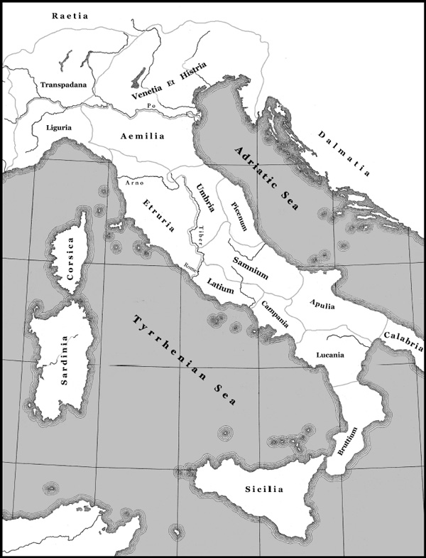
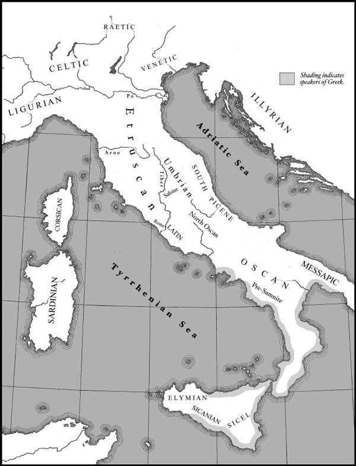
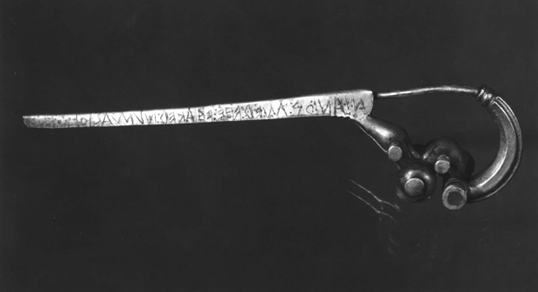
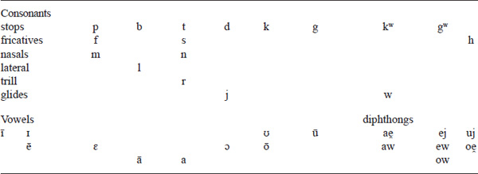
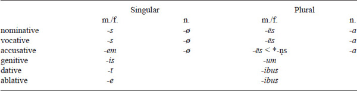
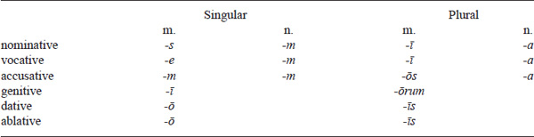
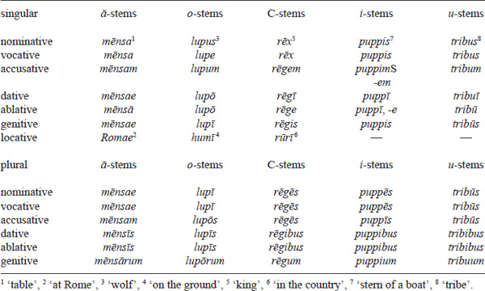
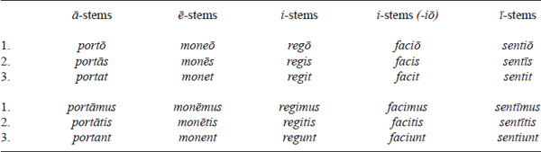
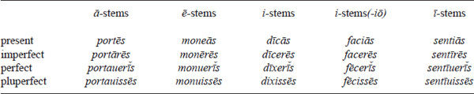

<!-- page: 317 -->

# Part 6

# **Italic**

*Rex Wallace*

## **Introduction**

As a linguistic term, “Italic” refers most commonly to a group of closely related Indo-European languages spoken throughout the Italian peninsula in the 1st millennium BCE (Map 6.1). The major language in this group, that is to say, the one for which there is a significant documentary corpus, is Latin. It is also the only Italic language – in fact the only language of ancient Italy, apart from Greek – that did not become extinct. The Romance languages, spoken today throughout Western Europe and the Americas, are its modern descendants.

Given the prominence of Latin both linguistically and culturally, and given its importance for Indo-European studies, it is the focus of this chapter. However, data from other members of the Italic branch will be discussed whenever appropriate.

### **The languages of ancient Italy**

At the beginning of the 1st millennium, Latin was but one of many languages spoken in ancient Italy (see Map 6.2). Celtic-speaking tribes settled in the north, in the region of Lake Maggiore, Lake Como, and the Canton of Ticino. The Veneti inhabited Venetia, from the mouth of the Po River as far as the territory of Istria. The Raeti, who spoke one of the two major non-Indo-European languages in ancient Italy, lived in the sub-Alpine regions around Lake Garda and the Brenner Pass. Speakers of the other major non-Indo-European language, Etruscan, occupied Etruria, but pockets of Etruscan speakers could be found in Latium, Campania, and Aemilia. The Falisci inhabited a small slice of land on the west side of the Tiber River known as the *Ager Faliscus*. Their major center was *Falerii Veteres* (modern Civita Castellana). The Sabellic languages were spoken in an area that extended from Umbria along the spine of the Apennines as far south as Bruttium and Lucania. Messapic-speaking peoples settled Apulia. Dialects of ancient Greek – Ionic, Doric, and Attic – were spoken at numerous colonial outposts in southern Italy.

### **Italic within Indo-European**

Within the Italic branch, Latin was most closely related to Faliscan. The Sabellic languages (once referred to by scholars as Osco-Umbrian) formed the other branch of Italic (Rix 1994). The most important among the Sabellic languages were Oscan, the language of the inhabitants of Samnium and Campania; Umbrian, the language of the inhabitants of ancient Umbria; and South Picene, the language of the people who inhabited the southernmost parts of Picenum along the Adriatic coast. Other members of this branch are known, but only from a handful of inscriptions.

<!-- page: 318 -->

**Map 6.1** The regions of ancient Italy

Venetic may have been Italic as well, perhaps having its own branch. The amount of evidence that can be used to determine the position of Venetic is limited and difficult to evaluate. Phonological developments, such as the change of Proto-Indo-European (PIE) aspirates to fricatives in word-initial position and to voiced fricatives or stops in medial position, point to an Italic connection, but the morphological evidence, such as it is, does not contribute to a decision one way or the other. The best approach is to leave the question open and await the acquisition of additional evidence.

<!-- page: 319 -->

**Map 6.2** The languages of pre-Roman Italy

### **Italo-Celtic**

<!-- page: 320 -->

Correspondences, both phonological and morphological, are shared by members of the Celtic and Italic branches: the thematic genitive singular in -*ī* (Ogham Irish maqqi ‘son’, Latin *uirī* ‘man’, Faliscan **titi** /titiː/ ‘Titus’ \[personal name\]); the *ā*-subjunctive (Old Irish *∙bera*, Latin *ferat* ‘carry’, Oscan **putíad** ‘be able’); the superlative suffix *-(i)sm̥mo- (Old Irish *tressam* ‘strongest’, Latin *maximus* ‘greatest’); and the development of *CR̥HC to *CrāC* (Old Irish *grán*, Latin *grānum* ‘grain’ \< *ǵr̥Hnom). The probative value of some correspondences, e.g., the genitive in -*ī*, which is found also in Messapic, is not easy to assess (Clackson & Horrocks 2007: 31–34, Weiss 2009: 465–466, Fortson 2010: 276–277). As a result, scholars’ opinion on the question of an Italo-Celtic unity remains mixed.

### **Origins of Latin**

At the beginning of the historical period Latin was spoken by the inhabitants of *Latium* (see Maps 6.1 and 6.2). This region was less extensive than the modern province of Lazio. It was bounded to the north by the Tiber River, to the east by the Sacco and Liri river valleys, to the south by the Garigliano River, and to the west by the Tyrrhenian Sea.

Archaeological evidence points to the development of a regionally distinct material culture, the so-called Latial culture, in *Latium* during the late Bronze Age, ca. the 13th–11th centuries BCE (Holloway 1994: 13–14). Evidence for habitation at Rome in the earliest stages of the Iron Age, ca. the 10th and 9th centuries BCE, is found on the Palatine and Capitoline Hills, and in the Forum area. The evidence for habitation is slightly later at other sites in *Latium*, for example, at Ardea, Satricum, Gabii, Tibur, and Praeneste. Although it cannot be proved, it is likely that the people who produced the artifacts attributed to “Latial” culture in the late Bronze and early Iron Ages were speakers of Latin.

Speakers of the Italic languages probably entered the Italian peninsula from the northeast by crossing over the Alps. When this happened cannot be determined, but the idea that Italic-speaking peoples had begun to settle in Italy before the middle of the 2nd millennium BCE, if not earlier, is not likely to be wrong. The linguistic geography of pre-Roman Italy leads us to surmise that Italic speakers spread southward from northeastern Italy along the spine of the Apennines and fanned out into the more hospitable valleys and coastal plains of central and southern Italy.

**Figure 6.1 ***Fibula Praenestina* (CIL 12.3). Reproduced by permission of the Center for Epigraphical and Palaeographical Studies, the Ohio State University

<!-- page: 321 -->

### **The spread of Latin**

Apart from Greek, Latin was the only language of ancient Italy that did not become extinct. Speakers of other languages succumbed to the military, political, and cultural domination of Latin. The Romans captured the Faliscan capital of *Falerii Veteres* in 241 BCE and forcibly removed all of its inhabitants to a less defensible position. Faliscan speakers switched to Latin during the 2nd century BCE. Etruscan and the Sabellic languages, Oscan and Umbrian, were still spoken at the beginning of the imperial period, but it is unlikely that native speakers of these languages survived beyond the final decades of the 1st century CE. Even the languages – both Indo-European and non-Indo-European – spoken at the geographic extremes of the peninsula disappeared soon after Roman legions and Roman administration gained a foothold in their territories. Venetic, Raetic, and Celtic, languages spoken in the Cisalpine territories of northern Italy, did not survive much beyond the reign of Augustus. Messapic inscriptions are not attested after the 1st century BCE. Ancient Greek was the only language spoken on the peninsula in antiquity that was not supplanted by Latin. It survived primarily because of its prestige value for Romans and because its speakers maintained a vibrant, though often contentious, relationship with the homeland.

In the course of a few centuries, then, Latin went from being the language of *Latium* to the language of a vast empire that included Europe and parts of Africa and Asia. The paths of diffusion of the language coincided with Roman military conquests. By the end of the war against Hannibal and the Carthaginians, Rome had annexed the islands of Sicilia, Sardinia, and Corsica, and set up outposts in southern Spain. Annexation of Illyricum (which was situated along the Dalmatian coast), of northern Africa, and of Greece followed shortly thereafter. The final pieces of the Roman imperial conquest, Britain and Dacia, were in place by the end of the 1st century CE.

Although the Romans never developed an official language policy, conquered peoples eventually abandoned their native languages for Latin. The Roman ruling classes, who were responsible for civil administration, finances, and military matters in the colonies and conquered territories, left most institutions and religious practices in the hands of the natives. But the fact that Latin was perceived as the language of prestige, and thus the language of economic, political, and military advancement, eventually made it the language of choice for most speakers. The adoption of Latin took place via periods of bilingualism during which the natives spoke their own languages at home in private with family and friends, and Latin in the public arena. Ultimately, great numbers of speakers, within Italy and outside of Italy, gave up their native languages for Latin. Pre-existing languages generally disappeared without a trace, although some scholars have argued that it is possible to detect features of the substratum languages by means of changes appearing in the Romance languages.

Ironically, prestige is the reason why Latin did not succeed in replacing ancient Greek as the language of everyday use in the eastern part of the empire. For the Roman elite, the Greek language enjoyed an especially elevated status. Members of the Roman aristocracy, when they could afford to do it, sent sons to Athens for study as part of a rigorous program of education.

### **Latin and the Romance languages**

<!-- page: 322 -->

Latin is the linguistic parent of the Romance language group and as such is the progenitor of the modern Romance languages. French, Italian, Portuguese, Rumanian, Spanish, and the remaining Romance varieties are the modern continuants of regional Latin varieties that were spoken by traders, commercial entrepreneurs, soldiers, administrators, and their families at the colonial settlements in foreign territories incorporated into the Roman Empire.

### **Medieval Latin and later Latin**

Latin did not cease to be written even as regional varieties of the spoken language diverged and ultimately emerged as Romance languages, nor did it cease to be spoken in the academic arena. Latin was adopted as the *lingua franca* of scholarly discourse during the medieval period, and it survived as such well into the formative period of the Renaissance, finally giving way to treatises and tracts written in the native tongues of their authors. With the rise of linguistic nationalism, Latin was restricted more and more to the sphere of religious discourse and learned publications. Indeed, the former is the primary venue in which Latin survives today. The Vatican continues to publish its encyclicals in Latin.

### Varieties of Latin

Although it is impossible to say when Latin and the other Italic languages began to diverge, we can pinpoint the date of the earliest inscriptions. They go back to the middle of the 7th century BCE. And, although we cannot say precisely when Latin ceased to be Latin and the Romance languages became recognizably such, we can point to the earliest text attested in a Romance language, e.g., the Strasbourg Oath in Old French, which dates to 842 CE, and assume that the “transition” from Latin to Romance happened somewhere between the 7th and 9th centuries CE. If we accept this as the transition period between Latin and the Romance languages, then the recorded history of the Latin language ranges over some 1,250 years.

Because the history of Latin covers a vast expanse of time, it is possible to recognize changes in the language at all levels of linguistic structure over the course of its development from the language of the earliest inhabitants of *Latium* to the language of the inhabitants of the military outpost at Vindolanda in Great Britain. Indeed, since the chronological period for Latin is so great, it is convenient to recognize stages in the historical development of the language. Even though these chronological divisions are arbitrary, they serve as guideposts that facilitate discussion. Most historians of the Latin language accept some version of the following schema:

- Very Old Latin (VOLat.), ca. 650–400 BCE
- Old Latin (OLat.), ca. 400–100 BCE
- Classical Latin (Class. Lat.), ca. 100 BCE–200 CE
- Late Latin (Late Lat.), ca. 200–600 CE

<!-- page: 323 -->

Looking across the chronological divisions of the language, it is possible to identify differences in pronunciation, in the formation of words, and in sentence construction. For example, the dative singular of *o*-stem nouns and adjectives ended in a long diphthong in Very Old Latin, e.g., duenoi /dwɛnoːj/ ‘good (man)’, m. dat. sg. By the Old Latin period, however, this long diphthong had changed to a long vowel; other changes transformed the initial syllable of duenoi from *dwe- to *bo*-, yielding Classical Latin *bono* /bɔnoː/. In Old Latin the syntax of *cum*-clauses, regardless of their function, called for a verb in the indicative mood. By the Classical Latin period, however, the mood of the verb in clauses with causal and concessive function was the subjunctive. In Late Latin the preposition *de* ‘from’ takes on the functions of the genitive case; that is to say, it can be used to indicate possession, part for whole, and the “objective genitive”.

While it is important to recognize chronological differences within the history of Latin, it is equally important to recognize differences based on geography, social class, and style or register. As an example of regional variation we point to the dative singular of *ā*-stem nouns. In the Latin of the 3rd century BCE, speakers of some Latin dialects outside of Rome pronounced the dative singular ending with a long *ā*, rather than with a diphthong, which was the standard in Rome, e.g., fortuna /fɔrtuːnaː/ ‘luck’ (Praeneste), but Roman Latin *mēnsae* /meːnsae̯/ ‘house’. In the Latin of Pompeii – but only in graffiti and thus perhaps only in the speech of sub-elite social orders – syllable-final short i was syncopated when standing between /w/ and /t/, e.g., aberaut ‘has lost’, cf. CL *aberrāuit*. This development is not found in elite Latin texts of the 1st century CE, which suggests that it was restricted, at least at its inception, to sub-elite Latin dialects. The language variety employed for literary composition, which is commonly referred to as Classical Latin, was a *Kunstsprache*. It drew on features from a number of other varieties of Latin, for example, Old Latin, and the language of law and religion. The writers of this variety also appropriated or elaborated on linguistic and stylistic features borrowed from ancient Greek authors (Clackson & Horrocks 2007: 183–228).

The Latin language, then, as we would expect of any language, covered a spectrum of varieties, written and spoken, geographic and social, formal and informal. Some scholars adopt a more severe approach, viewing the differences between elite and sub-elite varieties of Latin in terms of *diglossia*, in which two co-existing linguistic systems are recognized, one for the language of literature and official communication, the other for the language of everyday speech. The idea is that these two systems were already divergent by the end of the Roman Republic, and that they continued to diverge over the course of the history of the empire and beyond. The evidence does not corroborate this position.

### **Documentary evidence**

Latin has come down to us through the medium of written texts. There are two primary documentary sources. Arguably, the most important source comes in the form of manuscripts of literary texts. Unfortunately, few Latin manuscripts have survived from antiquity. Most are late, dating as they do from the 10th to the 15th centuries CE. Thus, the texts of Roman authors are attested at least a thousand years after they were originally composed. For this reason the orthography of the manuscripts, particularly the manuscripts of the Old Latin poets, may not be as reliable as one would wish it to be. Editorial changes made by later copyists, who sometimes altered Old Latin spellings to conform to Later Latin models, have made their way into the manuscript tradition.

Roman literary compositions are the nucleus of this form of documentation. The literary productions of the most distinguished Roman poets and prose writers, e.g., Vergil, Catullus, Ovid, and Horace for poetry, and Caesar, Cicero, Livy, and Tacitus for prose, are known to us with few exceptions from manuscripts. But so also are the works of authors such as Columella and Vitruvius, both of whom composed important technical treatises, the former on agriculture, the latter on architecture.

<!-- page: 324 -->

The second important source of documentation is epigraphic. Epigraphic documentation comes in the form of inscriptions, graffiti, and dipinti (painted texts) that have been discovered over the length and breadth of Roman territory. For the most part, the inscriptions that have survived were incised or chiseled on non-perishable material – ceramic, stone, and metal.

Some inscriptions were produced in order to stand the test of time: epitaphs preserving the memory of the deceased, texts of laws and decrees incised on bronze and earmarked for public display, texts commemorating generous contributions by patrons to their communities, dedications intended to accompany an offering to a deity, and the

“signatures” of ceramic makers or their owners. Other texts survived on account of favorable circumstances. The writing on the wooden tablets of the Pompeian banker *Lucius Caecilius Iucundus* survived because of historical accident, namely, the eruption of Mt. Vesuvius in 79 CE. Lead tablets incised with curses against competitors or against rivals in love survived because, in order to be efficacious, they had to be devoted to underworld demons and were therefore hidden away in tombs, buried underground, or tossed into wells. The leaf-tablets from Vindolanda survived because they were abandoned in drainage ditches that were subsequently covered with clay, which deprived the bacteria that would have destroyed them of the oxygen necessary to multiply.

## **Alphabet, orthography, and phonology**

The Latin alphabet was borrowed from the Etruscans, probably from the inhabitants of Caere, a settlement located across the Tiber River a short distance from Rome. The Latin *abecedarium* cited in (1) is the result of several alphabetic reforms that took place between the 7th and 3rd centuries BCE.

1.  (1) A B C D E F G H I K L M N O P Q R S T U X

The letter \<g\> was added to the alphabet Latin speakers inherited from the Etruscans. It first appears in the 2nd half of the 3rd century BCE and, oddly enough, occupied the position once held by \<z\>, which seems never to have been used to write Latin. The letter \<f\>, which originally had the value /w/, is the result of the simplification of the digraph \<fh\>, an older spelling for the sound /f/. In the early imperial period the Greek letters \<y\> and \<z\> were added to the script to spell sounds found in Greek loan words. They were placed at the end of the *abecedarium*. An attempt to add additional consonantal signs to the alphabet was made by the emperor Claudius, and though two of his signs were used in inscriptions, they disappeared from the writing system soon after his death.

For the most part, the consonantal letters stood in a one-to-one relationship to the consonantal phonemes in the sound system, but in a few instances the spelling of sounds was less optimal. The letters \<c\> and \<k\> stood for the voiceless velar /k/, e.g., *capiō* ‘seize’ and *kalendae* ‘Kalends’. Occasionally, \<q\> spelled /k/, especially if the following vowel sign was \<u\>, e.g., pequnia ‘money’. This three-way spelling of /k/ is the remains of an orthographic rule inherited from the Etruscans. The digraph \<qu\> spelled a voiceless labiovelar; \<gu\> probably spelled the voiced counterpart of \<qu\> (on which see below). Finally, the letter \<x\> stood for the cluster /ks/, e.g., *arx* ‘citadel’ /arks/.

Vowel length was rarely represented orthographically. A few attempts at indicating vowel length, for example, writing vowels double (paastores ‘shepherds’), marking length with a diacritic (múrum ‘wall’), and employing etymological spellings such as *ei* for /iː/ (\[u\]eiuam ‘living’), were used sporadically, but they were not adopted as the standard. Thus, in most instances, a single vowel sign stood for both a long vowel and its short counterpart, e.g., \<a\> = /aː/ and /a/. The glides /j/ and /w/ were also spelled with vowel signs, e.g., *iam* ‘now’ = /jam/ and *uir* ‘man’ = /wɪr/. In the Classical Latin spelling system, the signs \<i\> and \<u\> represented three phonemes.

<!-- page: 325 -->

Metrical evidence indicates that words like *peior* ‘worse’, *maior* ‘more’, and *aiō* ‘say’ had a heavy first syllable. When standing between vowels, the letter spelled a double or long consonant /majjor/.

In the oldest Latin inscriptions the direction of writing was variable. Some inscriptions were written in left-to-right direction, others in right-to-left direction. A few inscriptions were incised in the boustrophedon style. By the 4th century BCE, however, left-to-right direction was the standard. Punctuation in texts was minimal. Very Old Latin inscriptions were often written *scriptio continua*. Later, punctuation points regularly separated words, but sentence-signs and paragraph-signs were rare, even in long inscriptions.

### **Phonology**

The phoneme inventory of Latin is displayed in Table 6.1.

The voiced labiovelar, which was restricted to the environment after nasals (*ninguit* ‘it’s snowing’), is the only phoneme whose status is controversial. It is listed as part of the phonological inventory based on phonotactic and morphophonemic evidence. The treatment of *qu* and *gu* as clusters /kw/ and /gw/ does not fit with the metrical evidence, which points to a unitary phoneme, at least as far as *qu* is concerned. Interestingly, the metrical evidence also suggests that the cluster /*kw*/, as in *equus* ‘horse’ \< *ekˊwos, fell together with the original labiovelar.

The velar nasal \[ŋ\] is sometimes considered a separate phoneme based on the evidence of minimal triplets: *amnī* ‘river’, *annī* ‘year’, and *agnī* ‘lamb’ \[aŋniː\]. However, it is possible to treat \[ŋ\] as an allophone of the phonemes /n/ and /g/. Following this analysis, the velar nasal in *longus* \[lɔŋgʊs\] is the result of the assimilation of /n/, a dental nasal, to the velar position of the following stop. The velar stops /k/ and /g/ were pronounced as the corresponding nasal when standing before a dental nasal. Thus, *ignis* ‘fire’ was pronounced \[ɪŋnɪs\] and *dignus* ‘worthy’ as \[dɪŋnʊs\].

The glottal fricative /h/ was restricted in large part to word-initial position, and it was a feature of elite Latin. But even in the elite variety of the language, word-initial *h* behaved as an outlier. It did not “make position” in metrical texts, and members of the educated classes, as is clear from poem 84 of Catullus, could be guilty of hypercorrect pronunciations. Although h was written in medial position in some words, it is doubtful that it was pronounced. *h* did not prevent vowel contraction, e.g., *mī* for *mihi* ‘to me’, and it did not block rhotacism of -*s*, e.g., *diribeō* for *dishabeō.

**Table 6.1 The phonemes of Classical Latin**

<!-- page: 326 -->

The vowels in the system were distinguished by length. The short members were lax and more central than their long counterparts. The number of diphthongs in the system was for all intents and purposes restricted to /ae̯/ and /aw/. /oe̯/ was present in a handful of words, e.g., *poena* /poe̯na/ ‘punishment’, perhaps under Greek influence, cf. ποινή. The diphthongs /ej/, /uj/, etc., were the result of contractions and were restricted to a small number of words, e.g., *deinde* ‘then’, *cui* ‘to whom’.

In Classical Latin, epigraphic and metrical evidence suggest that word-final -*Vm* surfaced as a long nasalized vowel. In Old Latin inscriptions of the 3rd century BCE, final -*m* was often omitted in writing, e.g., OL optumo ‘best’ = CL *optimum*, a spelling that makes sense if the nasal was lost and the preceding vowel was nasalized. The etymologically appropriate spelling was restored in the 2nd century BCE and became standard in literary Latin and bureaucratic prose. In poetry, words ending in -*Vm* were subject to elision if the following word began with a vowel just as if they ended in a long vowel. And words ending in -*Vm* “made position”, that is to say were metrically heavy, if followed by a word beginning with a consonant. Nasalized vowels were also found before -*ns*, both primary and secondary, and -*nf*- (nasal + fricative), e.g., *īnfāns* ‘child’, *mēnsa* ‘table’, *cōnsul* ‘*consul*’. Note the common abbreviation cos. for *cōnsul*.

### **Diachronic developments**

From a diachronic perspective the most distinctive phonological development, and one that set Italic apart from its sisters, was the treatment of the PIE voiced aspirates (Stuart-Smith 2004).

In word-initial position, the aspirates changed to voiceless fricatives. The labial and dental aspirates merged as /f/; the velar aspirate, reflecting an earlier merger of PIE *ǵʰ and *gʰ, became /h/, presumably via an intermediate stage as *x. Comparative data are assembled in (2).

### **(2) PIE aspirates in initial position**

1.  *bʰ: Latin *frāter* ‘brother’, m. nom. sg., Oscan **fratrúm**, m. gen. pl., Umbrian **frater** ‘brothers’ (in a religious fraternity), m. nom. pl. \< *bʰreh₂ter-; Latin *ferō* ‘I carry’, 1 sg. pres. act., Marrucinian *ferenter* ‘they are carried’, 3 pl. pres. pass., Umbrian **fertu** ‘he should bring’, 3 sg. imp. act. \< *bʰer-; Latin *far* ‘grain’, n. nom. sg., Faliscan **far**, Oscan **far**, Umbrian *far* \< *bʰars
2.  *dʰ: Latin *faciō* ‘I make’, 1 sg. pres. act., Oscan **fakiiad** ‘let him sacrifice’ 3 sg. pres. subj., Umbrian **façia** ‘he should sacrifice’, 3 sg. pres. subj., Volscian *façia*, 3 sg. pres. subj., Venetic **vhagsto** ‘he made’, 3 sg. perf. \< *dʰh₁-k-, cf. Latin *fēcit*, 3 sg. perf., based on full grade *dʰeh₁-k-; Latin *fānum* ‘shrine’, n. nom. sg. \< *dʰh₁s-no-, Oscan **fíísnú** ‘temple, f. nom. sg., Umbrian **fesnaf(e)** ‘to the temple’, f. acc. pl. \< *dʰeh₁s-neh₂-
3.  *ǵʰ/gʰ: Latin *hortus* ‘garden’, m. nom. sg., Oscan **húrz** ‘grove’ (as sacred area), m. nom. sg. \< *ǵʰortos ‘enclosed area’; Latin *horitur* ‘incites’ 3 sg. deponent \< *ǵʰr̥-ye/o-, Oscan **heriiad** ‘he should wish’, 3 sg. subj. act., Umbrian **heriest** ‘he will wish’, 3 sg. fut. act. \< *ǵʰer-ye/o-
4.  *gʷʰ: Latin *formus* ‘warm’, m. nom. sg. \< *gʷʰormos; *de-fen-dō* ‘I ward off’, 1 sg. pres. act. \< *gʷʰende/o- (root *gʷʰen- ‘destroy’) \[no Sabellic examples\]

<!-- page: 327 -->

In medial position the lines of development were more complex, and they served to distinguish Latin from the rest of the Italic group. The labial and dental aspirates developed into voiced fricatives \[β\] and \[ð\], which may be the stage attested by Venetic, if **lo.u.zeroφo.s.** ‘children’, dat. pl., is phonetically \[lowðeroβos\]. Medial \[β\] and \[ð\] merged as \[β\] in Faliscan and in the Sabellic languages. In Rome and environs, \[β\] and \[ð\] survived and eventually became the corresponding voiced stops /b/ and /d/. The velars (PIE palatals and velars), on the other hand, developed to /h/ in all Italic varieties, perhaps via a voiced velar fricative. The aspirated labiovelar moved along a different trajectory in Latin and the Sabellic languages: *gʷʰ became *u* /w/ in Latin but *f* /β/ in Sabellic. Examples of the development of aspirates in medial position are in (3).

### **(3) PIE aspirates in medial position**

1.  *bʰ: Latin *albus* ‘white’, m. nom. sg., Umbrian *alfir*, n. abl. pl. \< *(h₁)albʰos, cf. Oscan **alafaternum** ‘inhabitants of Nuceria Alfaterna’, m. gen. pl.; Latin *tibi* ‘to you’, dat. sg., Oscan **t(e)feí**, dat. sg., Umbrian **tefe**, dat. sg., South Picene **tefeí**, dat. sg. \< *tebʰey
2.  *dʰ: Latin *medius* ‘middle’, m. nom. sg., South Picene **mefiín** loc. sg. + postposition -en, Oscan **mefiaí**, f. loc. sg. \< *medʰyo-; Latin *ruber* ‘red’, m. nom. sg., Umbrian **rufru** \< *h₁rudʰro-
3.  *ǵʰ/gʰ: Latin *uehō* ‘I transport’, 1 sg. pres. act., Umbrian **ařveitu**, ‘let him bring’, 3 sg. pres. imp. \< *weǵʰe/o-; Oscan **feíhúss** ‘walls’, m. acc. pl. \< *dʰeyǵʰ-, cf. Latin *fingō* ‘I fashion, shape’, 1 sg. pres. act.; Latin *mihi* ‘to me’, dat. sg., Umbrian **mehe**, dat. sg. \< *meǵʰey
4.  *gʷʰ: Latin *foueō* ‘I heat up’, 1 sg. pres. act. \< *dʰogʷʰeye/o-; Umbrian **vufru** ‘votive’, m. acc. sg. \< *h₁wogʷʰ-ro-

The development of the PIE labiovelars, *kʷ and *gʷ, is another change that distinguished the Sabellic languages from Latin and Faliscan (and from Venetic too). *kʷ survived in Latin and Faliscan in most environments, e.g., Latin -*que* ‘and’, Faliscan **-cue**, cf. Venetic **-kve** \< *-kʷe. *gʷ survived too, but only when it followed a nasal, e.g., Latin *unguen* ‘salve’, n. nom. sg. \< *h₃engʷ- ‘anoint’; in other environments, it changed to *u* /w/, e.g., Latin *ueniō* ‘come’, 1 sg. pres. act. \< *gʷm̥-ye/o- ‘sets out’. In contrast, *kʷ and *gʷ merged with the labial stops in Sabellic, e.g., Oscan **pis** ‘who’, m. nom. sg. \< *kʷis; Oscan **benust** ‘will have come’, 3 sg. fut. perf. \< *gʷem- (the dental nasal by analogy with the present). For the development of the aspirated labiovelar, see above.

In Latin intervocalic *s changed to *r*, e.g., Latin *generis* ‘family’, n. gen. sg. \< *geneses. This change, generally referred to as rhotacism, took place also in Umbrian, in final as well as medial position, e.g., Umbrian **farariur** ‘of the grain’, m. nom. pl. \< *-āsiyōs. Oscan seems to have preserved the intermediate stage of development. Medial *s was voiced but not rhotacized, e.g., *egmazum* ‘property’, f. gen. pl.

The liquids and nasals developed for the most part unchanged. Syllabic liquids developed to oR, e.g., *mors* ‘death’, f. nom. sg. \< *mr̥tis; syllabic nasals developed to *eN*, e.g., Latin *decem* ‘ten’ \< *dekˊm̥, cf. Umbrian *desen-duf* ‘twelve’ (‘ten-two’). In Sabellic, syllabic nasals in word-initial syllables appear as *aN*, e.g., **tanginud** ‘decision’, f. abl. sg. This may be a secondary development, perhaps under accent.

<!-- page: 328 -->

The PIE laryngeals were lost in pre- and post-consonantal positions in Italic. If a laryngeal followed a syllabic resonant, the result was *Rā*, e.g., Latin *grāta*-, Oscan **bratas** ‘favor’, f. gen. sg. \< *gʷr̥H-teh₂; Latin *nātus* ‘son’, m. nom. sg., Paelignian *cnatois*, m. dat. pl. \< *ǵn̥h₁-to-. Laryngeals standing between consonants were vocalized to *a*, e.g., Latin *datus* ‘given’, nom. m. sg. \< *dh₃-to-, *animus* ‘spirit’, nom. m. sg. \< *h₂enh₁-mo- (medial -*i*- here by “vowel weakening”, on which see below, under “Accent”), cf. Oscan **anams** ‘breath’. Original *VHC sequences yielded long vowels via loss of the laryngeal and compensatory lengthening of the preceding vowel, e.g., Latin *fēriae* ‘holidays’, f. nom. pl., Oscan **fiísnam** ‘sanctuary’, f. acc. sg. Both nouns were derived from the root *dʰeh₁s- ‘divinity’.

In word-initial syllables, PIE short and long vowels survived in Latin in most environments. Long vowels, regardless of source, were shortened in word-final syllables closed by any consonant but -*s*, e.g., *portāt* ‘he carries’ \> *portat, portōr* ‘I’m carried’ \> *portor*, etc., but *portās* ‘you carry’. These changes led to morphophonemic alternations in Latin verb paradigms (see Table 6.10).

Apart from *ay and *aw, the PIE diphthongs developed into long vowels in all positions in Latin, e.g., *ey \> *ī* (*deykˊō \> *dīcō* ‘say’); *oy \> *ū* (*oynos \> *ūnus* ‘one’); *ew, *ow \> *ū* (*dewkˊō \> *dūcō* ‘lead’).

### **Accent**

At some point in the prehistory of Latin, the pitch-accent system of PIE was replaced by a system in which the vowel in the initial syllable of a word carried a stress accent.

The effects of this stress accent are abundantly evident in Latin. Short vowels were subject to phonetic processes known collectively as “vowel weakening”. Quality distinctions were eliminated in non-initial syllables. In open syllables short vowels changed to *i*, e.g., *faciō* ‘make’ beside *efficiō* ‘*construct*’. In closed syllables, original *a* changed to *e*, and original *o* to *u*; original *e* and *i* remained, e.g., *factus* ‘made’ beside *effectus* ‘constructed’, *euntis* ‘going’, m. gen. sg. \< *eyontes. Diphthongs in non-initial syllables, which did not otherwise become long vowels (see above, “Phonology”), were also affected by “weakening”. *ay and *aw ultimately changed to *ī* and *ū*, e.g., *caedō* ‘I cut’ beside *incīdō* ‘I cut into’, and *claudō* ‘I shut’ beside *conclūdō* ‘I confine’.

Over the course of the history of Latin, unstressed vowels in open medial syllables, usually, but not exclusively, in the environment of sonorants or fricatives, were subject to syncopating processes. Examples follow: *dekˊsiteros ‘right’ \> *dexter*; *uirotūts ‘manliness’ \> *uirtūs*; and *kedate ‘give here’ \> *cette*.

By the 3rd century BCE, the Latin “law of the penult” had replaced the word-initial accent. Penultimate syllables, if heavy, were accented. If the penultimate syllable was light, then the accent shifted to the antepenultimate syllable, if there was one, e.g., *afféctus, portā́mus, dū́kimus*, but *dū́cit, ánimum, fáciō*, etc.

The Sabellic languages also show the effects of a word-initial accent. Several rounds of syncope eliminated short vowels in medial and final syllables. In Proto-Sabellic, short vowels in word-final syllables were lost before -*s*, e.g., Oscan **hurz** ‘grove’, m. nom. sg. **\<** *ǵʰortos, Oscan **Pakis** ‘Pacius’, m. nom. sg. \< *pakiyos, Oscan **humuns** ‘men’, m. nom. pl. \< *homones. Subsequently, short vowels in medial syllables were syncopated, e.g., Oscan **actud** ‘let him do’, 3 sg. act. imp. \< *agetōd, Oscan *factud* ‘let him make’, 3 sg. act. imp. \< *fakitōd.

In the Sabellic languages the accent may have remained on the initial syllable of words. The double spelling of vowels in Oscan is found with few exceptions in word-initial syllables, and this points to the continuation of vowel length in this position, presumably under accent.

<!-- page: 329 -->

Whether or not the change from a pitch accent to a stress accent is to be assigned to the Proto-Italic period cannot be determined. Some scholars prefer to see it as a later development that originated among languages spoken in central Italy, which then spread out from the innovative language via contact. There is something to be said for this view. In the non-Indo-European language Etruscan, vowels in medial syllables were syncopated, which suggests that the vowel in the initial syllable was stressed, e.g., Old Etruscan **túruce** ‘dedicated’ \> New Etruscan **túrce**.

## **Nominal and pronominal morphology**

Nominal forms were inflected for the categories of gender (m., f., and n.), number (sg. and pl.), and case (nom., voc., acc., gen., dat., and abl.).

The PIE case system was reduced from eight to seven in Proto-Italic; the ablative and instrumental merged as the ablative. The number of cases was further reduced in Latin by the merger of the locative and the ablative, although the locative singular endings -*ae* and -*ī* are attested in a few nouns and in the names of towns and cities, e.g., *humī* ‘on the ground’, *domī* ‘at home’, *Romae* ‘in Rome’, etc. In Oscan, Umbrian, and the other Sabellic languages, the locative case remained a more vibrant part of the system, e.g., Oscan **eíseí tereí** ‘in this land’. The locative appears to have survived in Venetic too, to judge from the noun phrase **dekomei diei** ‘on the 10th day’, cf. Latin *diē septumī* ‘on the 7th day’.

The dual was lost as a morphological category in Italic, but a few forms, e.g., Latin *ambō* ‘both’ and *duo* ‘two’, preserve the dual nominative/accusative ending. Remnants of the PIE collective survived in Latin *o*-stem plurals, such as *loca* ‘places’ beside the plural *locī*, and perhaps indirectly in nouns such as *pīla* ‘ball (of hair)’ beside *pīlus* ‘a hair’.

Nominal stems had the grammatical feature of gender. Certain stem formations were associated with certain genders. For example, *ā*-stems (*-eh₂-stems) were overwhelmingly feminine; *o*-stems were masculine and neuter; -*men*-stems were neuter, and so forth. Sometimes nouns of the same formation could be either masculine or feminine, depending on the gender of the referent, e.g., *pater* ‘father’, *frāter* ‘brother’, and *māter* ‘mother’.

### **The case endings**

In some noun classes, perhaps within late PIE, contraction of the stem-final vowel and the vowel of the inflectional ending led to forms where it was not easy to distract stem and ending. Consider the dative singular of *o*-stems in which the ending -*ō* (VOL -oi) was the result of the contraction of *-o-ey \> *-ōy and then the loss of diphthong-final *y*, e.g., VOL duenoi ‘good \[man\]’, CL *bonō* ‘good’. The same is true also for many cases in the *ā*-stem (\< *-eh₂) declension. The situation was further complicated by cross-paradigmatic borrowings of endings and, in particular, by the borrowing of endings from pronominal inflection. The genitive plural of *ā*-stem and *o*-stem nouns and adjectives is a case in point. The inherited genitive plural ending -*um* survived in a few *o*-stem nouns, e.g., *deum* ‘gods’, m. gen. pl., but most *o*-stems inflected with -*rum* (with lengthening of the stem vowel), an ending that was modeled on the genitive plural of *ā*-stem nouns, e.g., *casārum* ⟶ *deōrum*. But the ending -*rum*, from earlier *-som, was not part of the original *ā*-stem paradigm; it was borrowed from pronominal inflection.

<!-- page: 330 -->

The endings for Classical Latin consonant-stem nouns are given in Table 6.2. The inherited athematic endings, although altered by sound change in many cases, survived in the singular; the Latin ablative was formally the locative ending *-i. In the plural the nominative ending -*ēs* was borrowed from the *i*-stems, where the full-grade stem and the ending fused together to produce a long vowel (*-ey-es \> -*ēs*). The Latin accusative plural ending -*ēs* developed regularly from *-n̥s. The dative/ablative ending -*ibus* had its initial -*i* from the *i*-stems.

**Table 6.2 Classical Latin consonant-stem endings**

The endings of the Classical Latin *o*-stem declension nouns and adjectives are listed in Table 6.3.

Table 6.3 Classical Latin ***o***-stem endings

Historically, the endings of the nominative, accusative, and dative singular were the same as the athematic endings, although the dative is the result of the contraction of stem vowel and ending, as noted above. The thematic vocative singular was endingless; word-final -*e* is the *e*-grade of the thematic vowel, e.g., *puere* ‘boy’ (Plautus), cf. Umbrian *tefre* ‘Tefer’. In Very Old Latin and in Faliscan the *o*-stems were inflected with two genitive singular endings: -*sio* (VOL ualesiosio ‘Valerius \[personal name\]’, m. gen. sg.; Old Faliscan **uo\<l\>tenosio** ‘Voltenos \[personal name\]’, m. gen. sg.) and -*ī* (Old Faliscan **titi** ‘Titus’, m. gen. sg.). The functional distinction between the two, if any, is not clear. The ending -*sio* does not appear to have survived much beyond the 6th century BCE in Latin, although an Old Latin form attested on an inscription from Ardea may continue -*sio* (titoio /titojjo/ ‘Titus’, Ardea). The personal name *Mettoeo Fufetioeo* ‘Mettius Fufetius’, which appears in Ennius (Ann. 2, 139 \[Warmington\]), was probably modeled on the Greek epic genitive -οιο. The ending -*ī* is not a Latino-Faliscan innovation; it is also found in Celtic and Messapic. The PIE thematic declension had a distinct ablative singular ending *-ōd. The ending is found in Old Latin, e.g., gnaiuod ‘Gnaeus \[personal name\]’ and poplicod ‘of the people’, and in Oscan, e.g., **sakaraklúd** ‘sanctuary’. Classical Latin -*ō* is the result of the loss of word-final -*d* following a long vowel. The expected nominative plural ending is -*ōs* \< *-o-es. This ending is found in Sabellic languages, e.g., Oscan **núvlanús** ‘inhabitants of Nola’, m. nom. pl., where it was extended to pronominal forms, e.g., Oscan *iusc* ‘they’, m. nom. pl. Latin *o*-stems, on the other hand, had the pronominal ending *-oy, which developed regularly to -*ī*, thus *uirī* ‘men’, m. nom. pl. The dative/ablative ending -*īs* is, from a PIE perspective, the instrumental ending *-ōys.

<!-- page: 331 -->

Neuter 2nd declension nouns had the same ending for the nominative, vocative, and accusative. In the singular, the ending was -*m*; in the plural, the ending was -*a*.

### **Declensional classes**

In Latin, nouns were organized into five classes called declensions – a practice that is followed in most descriptions of Sabellic nominal forms as well. The five Latin declensions reflect in large part the stem types attested in other ancient Indo-European languages. The *ā*-stems, historically *-eh₂-stems, are the 1st declension; *o*-stems are the 2nd declension; consonant-stems and *i*-stems are grouped into the 3rd declension; and *u*-stems are the 4th declension. The *ē*-stems, which are an Italic innovation, are 5th. Examples of inherited inflectional types are given in Tables 6.4 and 6.5; *ē*-stems are in Table 6.7.

**Table 6.4 Classical Latin noun paradigms, masculine and feminine genders**

Declensions 2, 3, and 4 also included nominal forms that were neuter gender. The inflectional patterns differed from the masculine and feminine in the nominative, vocative, and accusative, singular and plural. Partial paradigms are in Table 6.5.

|                |     |                     |     |                     |     |                    |     |                    |
|----------------|-----|---------------------|-----|---------------------|-----|--------------------|-----|--------------------|
| singular       |     | *o*-stems           |     | *C*-stems           |     | *i*-stems          |     | *u*-stems          |
| nom./voc./acc. |     | *iugum*1 |     | *genus*2 |     | *mare*3 |     | *genū*4 |
| plural         |     |                     |     |                     |     |                    |     |                    |
| nom./voc./acc. |     | *iuga*              |     | *genera*            |     | *maria*            |     | *genua*            |

**Table 6.5 Classical Latin noun paradigms, neuter**

1 ‘yoke’, 2 ‘kind’, 3 ‘sea’, 4 ‘knee’.

<!-- page: 332 -->

Masculine gender, 2nd declension nouns and adjectives come in a couple of subtypes. The regular type ends in -*us* \< *-os in the nominative singular, e.g., *lupus* ‘wolf’, *filius* ‘son’. Nouns and adjectives whose stems ended in *-ro- lost the stem vowel in the nominative singular by regular sound change, e.g., *uir* ‘man’, *puer* ‘boy’, *sacer* ‘sacred’, etc. Nominative case forms such as *ager* ‘field’ and *sacer* ‘holy’ developed in the following manner: *aǵros \> *agr̥s \> *agers \> *ager*. These changes account for the alternations in -*ro*-stem paradigms, e.g., *ager*, m. nom. sg., but *agrī*, gen. sg., etc.; *sacer*, m. nom. sg., but *sacrī*, gen. sg., etc.; cf. VOL sakros, m. nom. sg.

The Latin 3rd declension encompasses PIE consonant-stems and *i*-stems. Numerous declensional subclasses can be recognized based on the final sound of the stem; inflectional peculiarities are associated with each class.

1.  Stems ending in stop consonants. This class includes a small group of root nouns of the agent or action type, e.g., *rēx, rēgis* ‘king’, *pēs, pedis* ‘foot’, *dux, ducis* ‘leader’, *lūx, lūcis* ‘light’. Compounds whose final member was a root noun also belong here, e.g., *auceps*, *aucipis* ‘birdcatcher’ \< *awi-kaps, as do nouns formed by the derivational suffixes ending in -*tāt* and -*tūt*, e.g., *nouitās, nouitātis* ‘newness’, and *uirtūs, uirtūtis* ‘manliness’.
2.  *s*-stems. The neuter *s*-stems rhotacize medial -*s*, thus *genus* ‘family’, n. nom./acc. sg., but *generis*, gen. sg., *generī*, dat. sg. Some nouns, like *genus, generis*, preserve the original -*o/e* ablaut in the suffix (*o \> *u* in closed final syllables). In other nouns, ablaut was eliminated in favor of the vowel of the nominative/accusative singular, e.g., *corpus* ‘body’, *corporis*. Masculine and feminine *s*-stems were in the process of shifting to the *r*-stem declension in Classical Latin thanks to the analogical introduction of the -*r* of the oblique stem into the nominative singular, e.g., *honōs, honōris* ⟶ *honor, honōris*.
3.  *r*-stems. Nouns of familial relationship preserved remnants of ablaut, e.g., *pater*, m. nom. sg., but *patris*, gen. sg. Agent nouns formed by means of the suffix -*tōr* made up the largest constituency in this class, e.g., *uictor, uictōris* ‘winner’.
4.  *l*-stems. Latin had a few *l*-stem nouns, e.g., *sāl* ‘salt’, *salis*, gen. sg., and *sōl* ‘sun’, *sōlis*, gen. sg. The word for ‘sun’ was in origin a heteroclitic *l*/*n*-stem. The noun compound *cōnsul* ‘consul’ also belongs to this type. The root is *sel- ‘take’.
5.  *n*-stems. De-verbal neuter nouns ending in -*men, -minis* were very common in Latin, and they were productive in Classical Latin, e.g., *carmen* ‘song’, *carminis*, gen. sg. Animate nouns in -*mō, -mōnis* belong to this class as well, e.g., *sermō* ‘speech’, m. nom. sg., *sermōnis*, gen. sg. A small number of nouns preserved traces of ablaut, e.g., *carō* ‘flesh’, f. nom. sg., *carnis*, gen. sg., cf. Umbrian **karu**, f. nom. sg., **karne**, dat. sg. Nouns of the *uirgō*-type also have a distinct stem *uirgin*- outside of the nominative singular, e.g, *uirginis*, f. gen. sg.
6.  *m*-stem. Latin has a single *m*-stem, *hiēms* ‘winter’, which, unlike *n*-stems, has a sigmatic nominative singular, /hiēmps/. The *p* was epenthetic. The noun belonged to the PIE root class.
7.  Heteroclitic *r/n*-stems. Latin preserves a few neuter *r/n*-stems, although the class is moribund and the nouns that do survive show various types of paradigmatic leveling, e.g., *femur* ‘thigh’, *feminis*, gen. sg., but also *femoris*, gen. sg. (form attested in Cicero!); *iecur, iocur* ‘liver’, nom. sg., *iecoris, iocineris, iecinoris*, all gen. sg.
8.  *i*-stems. The number of “true” *i*-stems, that is to say, nouns whose paradigms preserved *i*-stem inflection throughout, is relatively small (see Table 6.3). Many *i*-stems have been attracted into consonant-stem inflection to varying degrees.

<!-- page: 333 -->

From an IE perspective, the *i*-stems did not inflect in the manner of consonant-stems. However, sound change and analogy moved *i*-stems, particularly those whose stem vowel was syncopated in the nominative singular, e.g., *mors, mortis* ‘death’, *gēns, gentis* ‘clan’, etc., in the direction of consonant-stem inflection, which in turn moved consonant-stem nouns in the direction of *i*-stems, e.g., *cīuitātium* ‘states’, f. gen. pl., *cīuitātīs* ‘states’, acc. pl. The result is a class of 3rd declension nouns in Classical Latin whose inflection lies between that of “pure” consonant-stems and “pure” *i*-stems, and which is sometimes referred to, though somewhat infelicitously, as “mixed-stem” inflection. Nouns of this class typically had variant forms of the accusative singular, -*em* and -*im*; ablative singular, -*e* and -*ī*; accusative plural, -*ēs* and -*īs*; and, less frequently, the genitive plural, -*um* and -*ium*. Examples of this inflection are cited in Table 6.6.

|            |     |                 |     |                 |     |                |     |                  |
|------------|-----|-----------------|-----|-----------------|-----|----------------|-----|------------------|
| singular   |     |                 |     |                 |     |                |     |                  |
| nominative |     | *gēns* ‘family’ |     | *fōns* ‘spring’ |     | *mors* ‘death’ |     | *pars* ‘portion’ |
| vocative   |     | *gēns*          |     | *fōns*          |     | *mors*         |     | *pars*           |
| accusative |     | *gentem*        |     | *fontem*        |     | *mortem*       |     | *partem, -im*    |
| dative     |     | *gentī*         |     | *fontī*         |     | *mortī*        |     | *partī*          |
| ablative   |     | *gente*         |     | *fonte, -ī*     |     | *morte*        |     | *parte, -ī*      |
| genitive   |     | *gentis*        |     | *fontis*        |     | *mortis*       |     | *partis*         |
| plural     |     |                 |     |                 |     |                |     |                  |
| nominative |     | *gentēs*        |     | *fontēs*        |     | *mortēs*       |     | *partēs*         |
| vocative   |     | *gentēs*        |     | *fontēs*        |     | *mortēs*       |     | *partēs*         |
| accusative |     | *gentīs, -ēs*   |     | *fontīs*        |     | *mortēs*       |     | *partēs, -īs*    |
| dative     |     | *gentibus*      |     | *fontibus*      |     | *mortibus*     |     | *partibus*       |
| ablative   |     | *gentibus*      |     | *fontibus*      |     | *mortibus*     |     | *partibus*       |
| genitive   |     | *gentium*       |     | *fontium, -um*  |     | *mortium*      |     | *partium, -um*   |

**Table 6.6 Classical Latin ‘mixed’ declension**

Oscan maintained the distinction between *i*-stems and consonant-stems in most case forms, including the nominative plural, e.g., **trís** ‘three’ \< *treyes, but **meddiss** ‘magistrate’, m. nom. pl. \< *meddikes, with syncope of short *-e in the final syllable. Even so, these stem classes do exhibit cross-paradigmatic borrowings. For example, the *i*-stem genitive singular ending -*eis* was adopted in consonant-stem inflection in all Sabellic languages.

The 5th declension is an Italic development, though few forms, apart from Umbrian **ri** ‘matter’, dat. sg., are attested for this class in Sabellic. In Latin, the 5th declension nouns *diēs* ‘day, *rēs* ‘property’, *spēs* ‘hope’, and *fidēs* ‘trust’ come historically from different PIE nominal classes, but sound change and analogical change have led to fully elaborated paradigms. Examples in are Table 6.7.

|            |     |                  |     |                  |
|------------|-----|------------------|-----|------------------|
| singular   |     | *ē*-stems        |     |                  |
|            |     |                  |     |                  |
| nominative |     | *diēs* ‘day’     |     | *rēs* ‘property’ |
| vocative   |     | *diēs*           |     | *rēs*            |
| accusative |     | *diem*           |     | *rem*            |
| dative     |     | *diei*           |     | *rēī, rei*       |
| ablative   |     | *diē*            |     | *rē*             |
| genitive   |     | *diēī, diē, diī* |     | *rēī, rei*       |
| plural     |     |                  |     |                  |
| nominative |     | *diēs*           |     | *rēs*            |
| vocative   |     | *diēs*           |     | *rēs*            |
| accusative |     | *diēs, dīs*      |     | *rēs*            |
| dative     |     | *diēbus*         |     | *rēbus*          |
| ablative   |     | *diēbus*         |     | *rēbus*          |
| genitive   |     | *diērum*         |     | *rērum*          |

Table 6.7 Classical Latin ***ē***-stems

<!-- page: 334 -->

### **Diachronic developments**

The Italic languages shared one major innovation in the nominal system, and that was the development of ablative singular forms ending in a long vowel + -*d*. The ending was modeled on the *o*-stem ablative -*ōd*, and it was imported into the *ā*-stems, *i*-stems, and *u*-stems, which yielded ablatives distinct from their genitive forms. The 5th declension nouns adopted this ending as well. A few consonant-stem ablatives were generated following this model, e.g., OL \[c\]onsoled ‘consul’, m. abl. sg., leged ‘law’, f. abl. sg.; in other cases consonant-stems opted for the ablative of the *i*-stem inflection, e.g., OL opid ‘resources’, f. abl. sg., bovid ‘cow’, m./f. abl. sg.

### **Adjectives**

The most common type of adjective declension paired masculine and neuter forms of the 2nd declension with feminine forms of the 1st, e.g., *bonus*, -*a, -um* ‘good’. In consonant-stem declension, distinctions in gender were not formally expressed in the nominative singular, e.g., *ferēns* ‘carrying’, *ferōx* ‘fierce’, *duplex* ‘double’, *ingēns* ‘huge’ (*ingentis*, gen. sg.), *uetus* ‘old’ (*ueteris*, gen. sg.), etc. For most *i*-stems, masculine and feminine nominatives were distinct from the neuter, e.g., *facilis* ‘easy’, m./f., *facile* n. In paradigms such as *ācer, ācris, ācre* ‘sharp’, a three-way distinction in gender was created in the nominative singular. *ākris developed regularly to *ācer* in Old Latin; *ācris* was reintroduced, based perhaps on the model of *facilis*, etc. Interestingly enough, in Old Latin *ācris* is found as a masculine form and *ācer* as a feminine form. The match-up of gender and form found in Classical Latin is the result of standardization on the part of elite Latin writers.

Latin did not have *u*-stem adjectives; they were transferred to the *i*-stem inflection, e.g., *suāuis, suāue* ‘sweet’ ⟵ PIE *swādu-, cf. Greek ἡδύς. Present active participles in -*nt*-, originally consonant-stems in their inflectional pattern, were attracted into the orbit of the *i*-stem inflectional type. The ablative singular ends in -*ī* unless the participle is used as a substantive, e.g., *portantī* ‘carrying’, m. dat. sg. The genitive plural is -*ium*, e.g., *portantium* ‘carrying’, m. gen. pl.

Gradable adjectives formed the comparative by means of the suffixes -*iōr* \< *-yōs (m./f.) and -*ius* \< *-yos (n.), e.g., *melior, meliōris*, ‘better’, m./f., *melius, meliōris*, n. As was the case for *s*-stem masculine and feminine nouns, so in the comparative the oblique stem suffix, whose medial -*r* was the result of rhotacism, was introduced into the nominative singular. The superlative suffix was -*issimus*, -*a, -um* with 1st and 2nd declension inflection. The superlative of a few *i*-stems, whose stem vowel was syncopated, ended in -*limus* due to assimilation of -*ls* to -*ll*, e.g., *fakilisomos \> *fakilsomos \> *facillimus* ‘most easy’.

### **Pronouns**

Pronominal declension includes personal pronouns, which were not inflected for gender; anaphoric/demonstrative pronouns, which were inflected for gender; and interrogative and relative pronouns, which were also inflected for gender.

<!-- page: 335 -->

The personal pronouns were idiosyncratic in their inflection, and this is reflected in the paradigms in Table 6.8. Case forms of the 1st and 2nd person personal pronouns were built on multiple stems, e.g., *egō̆, me-/mē, nos-/nōs*. Some case endings, for example, the dative singular endings -*hi* and -*bi*, and the dative/ablative plural -*bīs*, were unique to these paradigms. The genitive singular and plural forms were drawn from the possessive adjective paradigms. The Old Latin genitives *mīs* ‘of me’ and *tīs* ‘of you’ are the inherited enclitic forms *mey and *tey, extended by the -*s* of the genitive. The reflexive pronoun had the same forms in the singular and plural.

|            |     |                    |     |                    |     |                    |
|------------|-----|--------------------|-----|--------------------|-----|--------------------|
|            |     | 1st person         |     | 2nd person         |     | Reflexive          |
| singular   |     |                    |     |                    |     |                    |
| nominative |     | *ego* (OL *egō*)   |     | *tū*               |     | —                  |
| accusative |     | *mē* (OL *mēd*)    |     | *tē* (OL *tēd*)    |     | *sē* (OL *sēd*)    |
| dative     |     | *mihi* (OL *mihī*) |     | *tibi* (OL *tibī*) |     | *sibi* (OL *sibī*) |
| ablative   |     | *mē* (OL *mēd*)    |     | *tē* (OL *tēd*)    |     | *sē* (OL *sēd*)    |
| genitive   |     | *meī (mīs)*        |     | *tuī (tīs)*        |     | *suī*              |
| plural     |     |                    |     |                    |     |                    |
| nominative |     | *nōs*              |     | *uōs*              |     |                    |
| accusative |     | *nōs*              |     | *uōs*              |     |                    |
| dative     |     | *nōbīs*            |     | *uōbīs*            |     |                    |
| ablative   |     | *nōbīs*            |     | *uōbīs*            |     |                    |
| genitive   |     | *nostrum, nostrī*  |     | *uestrum, uestrī*  |     |                    |

**Table 6.8 Latin personal pronouns**

The personal pronouns attested in Sabellic languages match up tolerably well with those in Latin, e.g., South Picene **ekú** /egō/, nom. sg., Umbrian *mehe*, dat. sg., Umbrian **míom** /mẹ̄om/, acc. sg.; Oscan **tiium**, nom. sg., **tíf\[eí\]**, **t(í)feí**, dat. sg.; South Picene **tefeí**, dat. sg.; Umbrian **tefe**, dat. sg.; Paelignian *uus*, nom. pl.; Oscan **sífeí**; Paelignian *sefei*, dat. sg. Paelignian *uus* ‘to you’, dat. pl., points to a prehistoric *uōfos. If this was the Proto-Italic form of the dative/ablative, then the endings of Latin *nōbīs* and *uōbīs* were reformed to *nōbei̯s and *u̯ōbei̯s based the dative singular. In Very Old Latin and Old Faliscan, accusative and ablative singulars ended in -*d*, e.g., VOL med ‘me’, acc. sg., Old Faliscan **med**, acc. sg. Why the accusative forms ended up with word-final -*d* is not easily explained. In contrast to Latin and Faliscan, the particle -*om* was added to the accusative singular forms in Sabellic, e.g., Umbrian **míom** ‘me’, *tiom* ‘you’. The 1st person accusative singular was remade in Venetic by contamination with the nominative, *egō : *mē → **ego** : **mego**.

Gender-bearing pronouns represent a variety of distinct stem types. The stems *e, *ey, and *i united to form the paradigm of anaphoric pronouns *is, ea, id* ‘he, she, it’, in Latin, and *izic* ‘he’, **íúk** ‘she’, **ídík** ‘it’ in Oscan. The Latin demonstrative *hic, haec, hoc* ‘this’ (close to speaker) is not attested as such in any other language, though it is often thought to be from the same etymological source as the Sanskrit particle *gha* ‘certainly’. *iste, ista*, istud ‘this’ (close to addressee) was formed from a particle *es- + demonstrative *to-/tā-. Umbrian **este**, ‘this’, n. acc. sg., South Picene **estas**, f. nom. pl. (?), and Presamnite **estam**, f. acc. sg., are cognate. The *i*-vocalism in Latin is due to the influence of *is. ille*, *illa, illud* ‘that’ (distant from speaker) is the Classical Latin form that replaced OLat. *olle/ollus*, cf. Oscan **úlleís**, ‘that’, m. gen. sg. The *i*-vocalism here may be attributed once again to *is* and perhaps to *iste* as well. These paradigms shared an inflectional peculiarity by which the genitive and dative singular forms were the same regardless of gender, e.g., *huius, huic; illius, illī; istius, istī*.

<!-- page: 336 -->

The deictic particle -*c(e)* was often added to inflected pronominal forms in Latin and Sabellic. In Latin, demonstrative pronouns to which the particle had been added were incorporated into the paradigms in some case forms, e.g., *hic, haec, hoc* ‘this, these’, nom. sg.; *hunc, hanc, hoc*, acc. sg. The same was true also for Oscan and Umbrian, e.g., Oscan **íúk** ‘she’ \< *eyā-ke.

The paradigm of the Latin relative pronoun is cited in Table 6.9. Some forms (*quem*, m. sg. acc.) go back to the PIE interrogative/indefinite stem *kʷi-, others (*quod*, n. sg. nom./acc.) to the interrogative stem *kʷo-. The PIE relative pronoun *yo- was lost in Italic, and the relative paradigm was composed of the stem *kʷo- and the stem *kʷi-. The use of the interrogative/indefinite pronouns with relative function is to be attributed to Proto-Italic; the paradigms in Oscan and Umbrian are similarly formed. In Classical Latin the relative pronoun was distinct from the interrogative and indefinite only in the nominative singular. The masculine and feminine relative pronouns were augmented by the deictic particle -*ī*, e.g., Latin *quī* ‘who’, m. nom. sg., \< *kʷo-ī, cf. Oscan **pui**.

|            |     |                 |     |          |     |          |
|------------|-----|-----------------|-----|----------|-----|----------|
|            |     | relative        |     |          |     |          |
|            |     | masculine       |     | feminine |     | neuter   |
| nominative |     | *quī*           |     | *quae*   |     | *quod*   |
| accusative |     | *quem*          |     | *quam*   |     | *quod*   |
| dative     |     | *cuī*           |     | *cuī*    |     | *cuī*    |
| ablative   |     | *quō*           |     | *quā*    |     | *quō*    |
| genitive   |     | *cuius*         |     | *cuius*  |     | *cuius*  |
| plural     |     |                 |     |          |     |          |
| nominative |     | *quī*           |     | *quae*   |     | *quae*   |
| accusative |     | *quōs*          |     | *quās*   |     | *quae*   |
| dative     |     | *quibus*        |     | *quibus* |     | *quibus* |
| ablative   |     | *quibus (quīs)* |     | *quibus* |     | *quibus* |
| genitive   |     | *quorum*        |     | *quārum* |     | *quōrum* |

**Table 6.9 Classical Latin relative pronoun**

## **Verb morphology**

Verbs were inflected for tense (pres., impf., fut., perf., pluperf., fut. perf.), mood (ind., subj., imp.), voice (act., pass.), person (1st, 2nd, 3rd), and number (sg., pl.).

The Italic languages, excluding Venetic, for which there is too little evidence, reorganized the verb system inherited from PIE. In Italic, the primary division was into two basic stems, generally referred to as the imperfective and the perfective. Three tense formations were constructed to each stem: to the imperfective, there was a present, an imperfect, and a future; to the perfective, a perfect, a pluperfect, and a future perfect. This organizational schema is set out for Latin and Oscan in Table 6.10.

|           |     |                                |     |                |     |                                       |
|-----------|-----|--------------------------------|-----|----------------|-----|---------------------------------------|
| Latin     |     | *imperfective*                 |     | *perfective*   |     |                                       |
| present   |     | *damus* ‘we give’              |     | perfect        |     | *dedimus* ‘we gave’                   |
| imperfect |     | *dabāmus* ‘we were giving’     |     | pluperfect     |     | *dederāmus* ‘we had given’            |
| future    |     | *dabimus* ‘we will give’       |     | future perfect |     | *dederimus* ‘we will have given’      |
| Oscan     |     | *imperfective*                 |     | *perfective*   |     |                                       |
| present   |     | *didet* ‘he gives’ (Vestinian) |     | perfect        |     | *deded* ‘he gave’                     |
| imperfect |     | *fufans* ‘they were’           |     | pluperfect     |     | (unattested)                          |
| future    |     | *didest* ‘he will give’        |     | future perfect |     | *tríbarakattust* ‘he will have built’ |

**Table 6.10 Organization of verb system**

<!-- page: 337 -->

In the imperfective, verbs were organized into four present-tense paradigmatic classes, commonly referred to as conjugations: conjugation 1, *ā*-stems; conjugation 2, *ē*-stems; conjugation 3, *i*-stems; and conjugation 4, *ī*-stems. Conjugation 3 had two subtypes: a regular 3rd conjugation, in which the stem vowel -*i* did not appear before endings of the 1st singular and 3rd plural (see below, *regō* ‘guide’); and the 3*iō* conjugation, in which the stem vowel -*i* appeared in all forms of the present (see below, *faciō* ‘make’). The Latin conjugational classes, present tense, are displayed in Table 6.11. Verbs like *ferō* ‘I carry’, *uolō* ‘I wish’, *sum* ‘I am’, *eō* ‘I go’, etc., which do not fit neatly into one of the five patterns, are described as “irregular”.

**Table 6.11 Latin conjugation classes**

The imperfect and future tenses were formed on the imperfective stem. The imperfect tense suffix was -*bā* for all conjugations, e.g., 1st conjugation *portābās* ‘you were carrying’, 2nd conjugation *monēbās* ‘you were warning’. Third and 4th conjugation verbs add the imperfect tense suffix to a stem augmented by -*ē*, e.g., 3rd conjugation *regēbās* ‘you were guiding’, 3*iō* conjugation *faciēbās* ‘you were making’, 4th conjugation *sentiēbās* ‘you were feeling’. The future tense had two formants: (1) -*b/bi*-, which was added to the present stems of conjugations 1 and 2, e.g., *portābō* ‘I will carry’, *monēbis* ‘you will warn’; and (2) -*ā* (1st sg. only)/-*ē*, which was added to the present stems of conjugations 3 and 4, e.g., *dūcam* ‘I will lead’, *faciēs* ‘you will make’, *sentiēmus* ‘we will feel’. In Old Latin, imperfects of 4th conjugation verbs could be formed from the stem un-augmented by -*ē*, e.g., *exaudībat* ‘he was listening’, *seruībās* ‘you were preserving’. -*b/bi*-futures could also be formed to verbs of the 4th conjugation, e.g., *dormībō* ‘I will sleep’. These formations are rare in Classical Latin literature. The future attested in Faliscan corresponds to the -*b/bi*-formation in Latin, e.g., 2nd conjugation **carefo** ‘I will be lacking’.

The stem of the perfective active was formed in a number of ways from a synchronic point of view: (1) by suffixation of -*u* /w/, e.g., *portāuit* ‘he carried’, *monuit* /monuwit/ ‘he warned’ \< *monewed, *sentīuit* ‘he felt’; (2) by reduplication, *dedit* ‘he gave’, beside present tense *dat*, cf. Faliscan **pe:parai** ‘I produced’, **fifiked** ‘he fashioned’, **fi\[fi\]qod** ‘they fashioned’; (3) by lengthening of the stem vowel, *uēnit* ‘he came’, *rūpit* ‘he burst’, beside present tense *uenit, rupit*; (4) by altering the quality of the stem vowel, accompanied by lengthening, e.g., *fēcit* ‘he made’, to *facit* ‘he makes’; (5) by suffixation of -*s*, e.g., *dīxit* /diːksɪt/ ‘he said’, beside *dīcit* ‘he says’. In some cases, the imperfective and perfective stems were distinguished only by the personal endings, e.g., present tense *uertō* ‘I turn’, but perfect tense *uertī* ‘I turned’.

<!-- page: 338 -->

Perfective active stems with the suffix -*u* were generally built from the imperfective stem of secondary verbs, most of which were denominatives ending in a long vowel, e.g, *cūrā*- ‘to take care to’ ⟶ *cūrā-u*-. Other perfective formations were built to verbal roots or to verbal stems distinct from the stem of the imperfective, so that the morphological relationship between the imperfective stem and the perfective stem was not always predictable, particularly outside of the 1st and 4th conjugations, e.g., *monē*- ‘warn’, but *monu*- /monuw-/ built from the stem *mone-.

Alongside the regular ā-conjugation perfects, e.g., *portāuistī* ‘you carried’, there were also “syncopated” or “contracted” perfect forms, e.g., *portāstī*. Such forms were common in Republican Latin literature, particularly in poetry, where they provided metrically convenient alternatives to longer forms. But despite the labels, these forms were not the result of syncope or contraction. Rather, they originated as sigmatic (aorist) forms to denominatives, and they were eventually incorporated into the paradigms of the *u*-perfects, e.g., *portāstī* = *portā-s-stī*; *portārunt* \< *portā-s-ont.

The pluperfect suffix for active voice was -*erā*-; the future perfect suffix was -*er-/-eri*-. Both suffixes were added to the perfective stem, e.g., *portāu-erā-s* ‘you had carried’, *dīx*-*erā-s* ‘you had said’; *portāu-er-ō* ‘I will have carried’, *monu-eri-s* ‘you will have warned’.

### **Mood**

In addition to the indicative mood, Italic languages had subjunctive mood forms corresponding to all tenses in the system with the exception of the future and future perfect. Forms for each conjugational class are listed in Table 6.12.

**Table 6.12 Subjunctive mood (2 sg. act.)**

The suffixes marking subjunctive mood are the following: present tense -*ā* for conjugations 2, 3, and 4, and present tense -*ē* for conjugation 1; imperfect tense -*rē*; perfect tense -*erī̆*-; and pluperfect tense -*issē*-. As the forms in Table 6.11 shows, for conjugation 1 the subjunctive suffix -*ē* replaces the stem vowel -*ā* characteristic of the present indicative. The final vowel of the perfect tense suffix, to judge from the variation found in Classical Latin poetry, could be either long or short.

The imperative, which was formed on the imperfective stem, was signaled by distinct endings rather than by a special mood suffix. Latin had two sets of imperative endings, one for the “regular” imperative and one for the so-called future imperative. Active voice formations are 2 sg. *age* vs. 2/3 sg. *agitō*; 2 pl. *agite* vs. 2/3 pl. *agitōte*. Functionally, the so-called future imperative was restricted primarily to legal and juridical contexts.

### **Voice and personal endings**

In Latin, verbs were inflected for active and passive voice. Middle voice as a grammatical category had for the most part disappeared, although a small number of verbs permitted middle voice readings, e.g., *lauātur* ‘washes herself, bathes’. The so-called deponents continued PIE *media tantum* verbs, e.g., *sequitur* ‘he follows’, cf. Greek ἕπεται, Sanskrit *sacate*.

<!-- page: 339 -->

There were three sets of personal endings for verbs (see Table 6.13). One set was for active voice, and another set was for passive voice and for deponents. The active voice had two endings for the 1st singular active: -*ō* for present, future, and future perfect, and -*m* for imperfect, pluperfect, and all tenses of the subjunctive. First singular -*m* in the present tense of the verb ‘be’, *sum*, esom ‘I am’ is a remnant of the primary athematic ending *-mi, which has otherwise been lost in Italic. The perfect tense had its own special set of forms in the active.

|       |     |              |     |                  |     |                        |
|-------|-----|--------------|-----|------------------|-----|------------------------|
|       |     | active       |     | passive/deponent |     | perfect active         |
| 1 sg. |     | *-ō, -m*     |     | *-or, -r*        |     | *-ī*                   |
| 2 sg. |     | *-s*         |     | *-re, -ris*      |     | *-istī*                |
| 3 sg. |     | *-t*         |     | *-tur*           |     | *-it*                  |
| 1 pl. |     | *-mus*       |     | *-mur*           |     | *-imus*                |
| 2 pl. |     | *-tis*       |     | *-minī*          |     | *-istis*               |
| 3 pl. |     | *-nt*/*-unt* |     | *-ntur, -untur*  |     | *-ērunt, -erunt, -ēre* |

**Table 6.13 Personal endings**

The perfect, pluperfect, and future perfect passives were periphrastic formations made up of the perfect passive participle and a finite form of the verb ‘be’. The participle was inflected for gender, number, and case; the inflectional features were determined by agreement with the subject of the verb. Person and number of the subject were also marked on the verb ‘be’. Examples are cited in Table 6.14.

|                |     |                                                |
|----------------|-----|------------------------------------------------|
| perfect        |     | *portāta es* ‘you (f.) were carried’           |
| pluperfect     |     | *portātī erāmus* ‘we (m.) had been carried’    |
| future perfect |     | *portātus erō* ‘I (m.) will have been carried’ |

**Table 6.14 Perfect passives**

The paradigms listed in Table 6.11 are evidence for a regular alternation in the length of the stem-final vowel typical of all Latin verbal paradigms. The morphophonemic alternations were the result of sound changes that took place in Old Latin. The first change shortened long vowels when they stood before word-final obstruents, except for -*s*, e.g., *portāt* \> *portat*, *faciām* \> *faciam*, but *portās*, *portāmus*, etc. The second change shortened long vowels when they stood before another vowel (so-called *vocalis ante vocalem corripitur*), e.g., *monēō \> *moneō*, **monēās* \> *moneās*, *sentīēs \> *sentiēs*. From a synchronic point of the view, the stem-final vowels in conjugations 1, 2, and 4 are to be treated as long in underlying forms. In conjugations 3 and 3iō the morphophonemic alternation between stem-final -*i* and stem-final -*e* is best viewed synchronically as a change of -*i* to -*e* before -*r*. This morphophonemic change explains the short -*e* rather than the short -*i* in forms such as *caperēs*, 2 sg. impf. subj. In the underlying representation this verb was /kapirēs/. From a diachronic perspective, *caperēs* goes back to *kapesēs.

### **Diachronic developments**

The present-tense conjugation classes are the result of the convergence of different PIE formations resulting from sound changes and analogical restructurings.

<!-- page: 340 -->

The 3rd conjugation verbs continue PIE or post-PIE thematic formations of various sorts, e.g., Latin *agit* ‘leads’ \< *aǵeti, *dīcit* ‘says’ \< *deykˊeti, *bibit* ‘drinks’ \< *pibeti, *poscit* ‘demands’ \< *pr̥kˊskˊeti. In Old Latin, the thematic vowels *e and *o changed to *i*and *u*, e.g., *dewkˊeti \> *dowket \> *dūcit*, *dewkˊonti \> *dowkont \> *dūcunt*. Athematic formations, such as nasal infix verbs (e.g., *iungit* ‘joins’), reduplicated presents (e.g., *gignit* ‘gives birth to’), and a few presents to roots ending in a laryngeal (e.g., *sonit* ‘sounds’ \< *swenati \< *swenh₂ti) were added to the thematic conjugation too, though by diverse prehistoric routes.

The 3rd conjugation verbs of the *capiō*-type and 4th conjugation verbs of the *sentiō*-type were *-ye/yo- formations built directly to verb roots. The assignment of a verb to either the 3rd or 4th conjugation was determined by the prosodic structure of the root. Prosodically heavy roots and roots ending in a sonorant developed an epenthetic -*i* between the final consonant of the root and the *-ye/yo- suffix. Sound changes then split the verbs into distinct paradigmatic classes, e.g., conjugation 3*iō*, *kapi̯esi \> *kapes \> *capis* ‘you seize’, but 4th conjugation, *wenyesi \> *weniyesi \> *uenīs* ‘you come’.

A majority of 2nd conjugation verbs were in origin either iterative/causative formations with *o*-grade of the root and a suffix *-eye/o-, or stative formations in *-eh₂, e.g., *nocēs* ‘you cause harm to’ \< *nokˊeyesi, *sedēs* ‘you are sitting’ \< *sedeh₁si.

The 1st conjugation verbs included denominatives to *ā*-stems, e.g., *curā*- ‘make sure of’ \< *koysā-ye/o-; factitives to thematic stems, e.g., *nouā*- ‘makes new’ \< *neweh₂-ye/o-; and *-ye/yo- formations to roots ending in a laryngeal, e.g., *swenh₂-ye/o- \> *swena-ye/o- \> *sonā*- ‘sounds’.

The Italic perfect tense indicatives are the result of the merger, both formally and functionally, of the PIE aorist and the PIE perfect. For most verbs, either an aorist or a perfect was selected as the representative of the Italic perfect, although in earlier periods of Latin both aorist and perfect formations are attested for a few verbs. So, for example, in Old Latin the verb *parcō* ‘I refrain from’ had multiple perfect tense forms: *pepercī*, *parcuī, parsī* ‘I refrained from’. The verb *faciō* made a reduplicated perfect and a root aorist in Very Old Latin: vhe:vhaked ‘he made’ and feced. Latin, Oscan, and Umbrian sometimes selected the same perfective form, e.g., Latin *dedit* ‘gave’, beside Umbrian **dede**. But more often the perfective formation in Latin does not match that of Oscan or Umbrian, e.g., Latin *dīxit* ‘said’, sigmatic aorist, beside Umbrian *dirsicust*, reduplicated perfect; and Latin *pepulit* ‘he struck’, reduplicated perfect, beside Umbrian **a(m)pelust** ‘will have struck’, root aorist.

Although the overall structure of the tense system is the same in Italic, the exponents of some “tense” suffixes differed between Latino-Faliscan and Sabellic. For example, the Latin and Faliscan future tense for conjugations 1 and 2 was based on the suffix *-bʰe/o-, whereas Sabellic continued an s-future, in all likelihood, the PIE desiderative, e.g., Oscan *deiuast* ‘he will swear’. The Latin future perfect was a thematic formation added to the perfective formant -*is, -eri*- \< *-is-e/o-, whereas the Sabellic formation is athematic -*us*-, e.g., Oscan **tríbarakattust** ‘he will have built’. The Latin pluperfect suffix was -*er-ā*- \< *-is-ā-, which was built with the same *ā*-suffix found in the imperfect of the verb ‘be’, *erās* ‘you were’ \< *es-ā-s, and in the imperfect suffix -*bā*-. The pluperfect is not attested in Sabellic.

<!-- page: 341 -->

The Latin imperfect formations, both indicative *-bʰā- and subjunctive *-sē-, have exact correspondences in the Sabellic languages, e.g., Oscan **fu**fa**ns** ‘they were’, 3 pl. impf. act., Oscan **paten**s**íns** ‘should open’, 3 pl. impf. subj. The present subjunctives of the 1st conjugation have their *ē-*vowel from the full-grade athematic optative suffix, e.g., *noweh₂-yeh₁- \> *nouāē- \> *nouē*-, a stem that was generalized to plural forms in the paradigm. This subjunctive formant then spread from 1st conjugation athematics to the large class of denominatives in this conjugation, e.g., *cūrē*-, cf. Oscan *deiuaid* ‘he shall swear’, 3 pl. pres. subj. \< *deywā-ē-. The origin of the *ā*-subjunctive of conjugations 2, 3, and 4 remains a mystery, but the formation is Italo-Celtic in origin and is found in all branches of Italic, e.g., Faliscan **douiad** ‘let him give’, 3 sg. pres. subj.; Oscan **pútíad** ‘be able’, 3 sg. pres. subj.; Oscan *deicans* ‘let them say’, 3 pl. pres. subj.; Oscan **fakiiad** ‘let them make’, 3 sg. pres. subj.; and Umbrian *tursiandu* ‘let them be frightened away’, 3 pl. pres. subj.

The distinction between PIE primary and secondary personal endings was, for the most part, eliminated in Latin thanks to the loss of -*i* in the primary endings. In Latin, a distinction remained in the 1st person singular active, where, as noted above, the ending -*m* appeared in past tense formations and the subjunctive, and the ending -*ō* appeared in the present, future, and future perfect. The 3rd person singular active secondary ending -*d* \< *-t survived in Very Old Latin and Old Latin, e.g., VOL fhe:vhaked, OL fecid, but was replaced by primary -*t* \< *-ti before the beginning of the Classical period. The perfect active endings continued the PIE endings for the most part, though they were extended by addition of *-i, the hic et nunc particle, in the singular (-*ī* \< *-ay, -*stī* \< *-stay, -*it* \< -ī(t) \< *-ey(t)) and 3rd person plural (-*ēre* \< *-ēri). Third singular -*ei* was re-characterized by the addition of -*t*, which developed to -*īt* in Old Latin (OL fueit) and then to -*it* in Classical Latin. In addition to -*ēre*, two additional 3rd plural endings are attested: (1) -*ērunt*, which is a blending of -*ēre* and thematic aorist -*unt* ⟵ *-ond; and (2) -*erunt*, which is from earlier *-is-ont, the thematic aorist ending added to the perfect formant -*is*-. The endings of the Faliscan perfect paradigm appear to be a fusion of thematic aorist and perfect endings, e.g., 1 sg. perfect **pe:parai** ‘I have produced’; 3 sg. aorist **fifiked** ‘he has fashioned’; 3 pl. aorist **f\[if\]iqod** ‘they have fashioned’. In the Sabellic languages, the primary and secondary endings of the active did not merge, apart from the 2nd person, and perhaps the 1st person plural. Thus, in Oscan and Umbrian the endings are 1 sg. -*u* (Umbrian *stahu* ‘I stand’, 1 sg. pres. act.) vs. **-um** (Oscan **manafum** ‘I entrusted’, 1 sg. perf. act.); **-t** (Oscan **staít** ‘it stands’, 3 sg. pres. act.) vs. **-d** (Oscan **deded**, 3 pl. perf. act.); **-nt** (Oscan **sent** 3 pl. pres. act.) vs. **-ens** (Oscan **dedens** 3 pl. perf. act.). In the 3rd plural, South Picene and Presamnite continued the thematic aorist ending *-ond \< *-ont. These languages did not share the change of *-nd to -*ns*, which is found in Oscan and Umbrian, e.g., South Picene **adstíúh** ‘they set up’, 3 pl. perf. \< *-ond, Presamnite fυfϝοδ ‘they were’, 3 pl. perf. \< *-ond.

The endings of the passive voice were built on the active by addition of -*(o)r* or, in the case of the 1st plural, the replacement of -*s* by -*r*, e.g., -*mur* \< *-mor. The 2nd singular ending -*re* goes back to the PIE secondary middle ending *-so. The alternative 2nd singular ending -*ris* is a later formation; final -*s* is the active singular ending. The 2nd plural -*minī* is sometimes taken to be the nominative masculine plural participle; another explanation points to PIE *-dʰwe, which received a nasal extension in the manner of Sanskrit 2nd plural active -*thana*, that is to say, *-dʰwe-ney \> *-beney \> *-bney \> *-mney \> -*minī*. Neither possibility is convincing.

The middle endings in the Sabellic languages did not correspond in all particulars to those in Latin. In Oscan the 3rd singular and 3rd plural suffixes were -*ter* and -*nter*. In Umbrian the -*ter* and -*nter* are used in primary inflection; -*tur* was used in secondary inflection.

### **Non-finite formations**

<!-- page: 342 -->

The verb system also traditionally includes, in addition to the forms inflected for person and number, a number of non-finite forms. These include participles (*portāns, portantis* ‘carrying’), infinitives (*portāre* ‘to carry’, *portāuisse/portāsse* ‘to have carried’), supines (*perditum* ‘to lose’), gerundives (*uītandae* ‘worthy of living’), and gerunds (*faciendō* ‘act of making’).

The present active participle was formed by addition of the suffix -*nt*- to the imperfective stem for conjugations 1 and 2, e.g., *portāns* \< *portants, *portantis*, and by addition of -*ent*- for conjugations 3 and 4, e.g., *faciēns, facientis*. Gender distinctions were in large part eliminated. The masculine and feminine forms were the same throughout, and the neuter was distinct only in the accusative singular and the nominative/accusative plural, e.g., *facientem*, m./f., vs. *faciēns*, n.; *facientēs*, m./f., vs. *facientia*, n. The neuter form *facientia* shows another innovation of the present participle declension in Latin: *i*-stem inflection in the ablative singular and genitive plural.

Present middle participles in -*minus* \< *-mh₁no- are preserved in a few words, e.g., *fēmina* ‘woman’ \< *dʰeh₁(i)- ‘give suck’, *alumnus* ‘nursling’ \< *al- ‘nourish’, but these stand outside of the verb system.

The PIE verbal adjective suffix *-to- is the source of the Latin perfect participle, e.g., *dictus* ‘said’, *ductus* ‘led’. Roots and stems ending in dentals show the regular change of *-d-t- and *-t-t- to -*ss*-, e.g., *passus* from the root *pat*-, *patior* ‘to suffer’, with subsequent simplification to -*s* if the syllable before the suffix was heavy, *kayd-to- \> *kaysso- \> *caesus* ‘cut’. **Oscan**, Umbrian, and other Sabellic languages attest numerous examples of this formation, e.g., Umbrian *screhto* ‘written’, Oscan *scriftas* ‘written’ \< *skreybʰ-; cf. Latin *scrīptus*.

The future active participle was a Latin development. In most cases, the suffix -*ūrus*, -*a, -um* was added to the stem of past participle, e.g., *dict-ūrus* ‘about to say’.

The PIE perfect active participle is not attested in Latin, but it may have survived in a few Sabellic formations, e.g., Oscan *sipus* ‘knowing’ \< *sēpwōs, Volscian *sepu* \< *sēpwōd, though other explanations of these forms are possible.

The gerundive is an Italic innovation, but its origins remain uncertain. The suffix *-ndo-/-endo-* was added to the present stem in Latin, e.g., Latin *portandum* ‘to be carried’, *faciendum* ‘to be done’. In Oscan and Umbrian -*nd*- assimilated to -*nn*, e.g, Oscan **úpsannúm** ‘to be done’, m. acc. sg., and Umbrian **pelsans** ‘to be buried’, m. nom. sg.

The supine in -*tum* is the accusative singular of a *tu*-stem verbal noun. It was found predominantly in construction with verbs of motion, e.g., Umbrian **avef anzeriatu etu** ‘go to observe the birds’, Old Latin *abiit ambulātum* ‘she went away to take a walk’. In Latin the supine in -*tū* is found after adjectives such as *facilis* ‘easy’, e.g., *facilis dictū* ‘easy to say’.

The present infinitives in Italic have roots in PIE nominal formations. The present infinitive in Latin, which ends in -*re*, is in origin an *s*-stem locative *-si. The present passive infinitive of verbs belonging to conjugation 3 derive from root nouns inflected for the dative case, e.g., *capī* ‘to be seized’ \< *kapey. Present passive infinitives of conjugations 1, 2, and 4 are modeled on the active infinitive, e.g., *portāre* ‘to carry’ vs. *portārī* ‘to be carried’. An alternative passive ending -*ier*, which must go back to an instrumental case form augmented by the passive suffix -*r*, is attested in Old Latin and occasionally later, e.g., OL figier ‘to be fashioned’. The present infinitive in Sabellic languages was an *o*-stem accusative, e.g., Oscan *ezum* ‘to be’, *moltaum* ‘to fine’. The present passive infinitive ends in -*fi* in Umbrian, e.g., *pihafi* ‘to be purified, which probably comes from an instrumental *-dʰyeh₁. Oscan had the same suffix, but it was outfitted with the characteristic sign of the passive, e.g., **sakarafír** ‘to be consecrated’.

<!-- page: 343 -->

The Latin perfect active infinitive was modeled on the present. The ending -*se* was added to the perfect stem that ended in the formant -*is*-, e.g., *dīxisse* (*dīks-is-se*). The corresponding passive is a periphrastic form, e.g., *dictum esse*. The system of infinitives in Latin was filled out by future active and passive forms, e.g., active *dīcturum esse* ‘to be going to say’ and passive *dictum īrī* ‘to be going to say’. Corresponding forms are not attested in the Sabellic languages.

## **Syntax**

Nuclear sentences consist of a verb and its dependents. As in older IE languages, Latin and the other Italic languages marked the relationships between dependents and verbs by case endings. Grammatical subjects were inflected in the nominative, direct objects in the accusative, unless the lexical properties of the verb specified a different case, and indirect objects in the dative. Non-obligatory constituents, typically adverbial in nature, were expressed by a particular case or by a prepositional phrase, e.g., *noctū* ‘at night’, *decem diēs* ‘for ten days’, *cum exercitū suō* ‘with his own army’. The subject of the verb could be omitted if it was recoverable from context. Direct objects could be omitted as well, if context permitted. Agreement was found in two areas of the syntax: (1) verbs were inflected for the person and number of the subject; and (2) adjectival modifiers were inflected for the gender, number, and case of their head nouns. The inflection of dependents, omission of subjects, and agreement phenomena are at play in the following passage from Caesar’s *De Bello Gallico* (6.13.1–8). In (10c) the verb *concurrit* agrees in number, 3rd singular, with the subject *numerus*. In (10e) the adjective *summam* agrees in gender, number, and case with its head noun, *auctōritātem*. And again in (10e) the subject of *cōnstituunt* is recoverable from the second clause in (10d).

1.  (10) (a) *In omnī Galliā eōrum hominum quī aliquō sunt numerō atque honōre genera sunt duo.* (b) *dē hīs duōbus generibus alterum est druidum, alterum equitum.* (c) *Illī rēbus diuīnīs *intersunt*, sacrificia pūblica ac priuata *procūrant*, religiōnēs *interpretantur*. (d) ad hōs magnus adulescentium numerus disciplīnae causā *concurrit*, magnōque hī sunt apud eōs honōre. (e) nam fere de omnibus contrōuersīs publicīs prīuatīsque cōnstituunt. (f) hīs autem omnibus druidibus praeest ūnus, quī summam inter eōs *habet* auctōritātem*.

    \(a\) ‘In all of Gaul, there are two classes of men who are of some rank and honor. (b) Of these two classes, one is Druid, the other knight. (c) The former are concerned with religious matters; they take care of public and private sacrifices; they explain religious phenomena. (d) A number of young men come to them \[Druids\] for training, and these \[Druids\] stand in great honor among them. (e) For they \[Druids\] make decisions about almost all public and private disputes. (f) One man stands at the head of all of these Druids, who has the greatest authority among them.’

### **Constituent order**

The unmarked arrangement of the major constituents in a sentence in Classical Latin is subject-object-verb (SOV), but that order it is not obligatory. SOV order is even more frequent in subordinate clauses where textual or pragmatic factors are less likely to have resulted in the movement of a constituent to the front or the end of the clause. In (10c), (10d), and (10e), the underlined verbs, apart from the copular verb *sunt*, occupy the final position in their clauses. In (10f) the verb *habet* (underlined) has been displaced from final position by the direct object *auctōritātem*, which has been moved to the end of the clause for emphasis, so-called right dislocation.

<!-- page: 344 -->

Classical Latin prose permits the distraction of constituents, usually resulting from the movement of elements to be emphasized either to the front or to the end of the sentence. In (10f) the noun *auctōritātem* has been moved out of the object-noun phrase (*summan auctōritātem*) and placed at the end of the sentence. In (10d) the constituents of the noun phrase *magnō honōre* were distracted and placed at the beginning and end of the clause.

Classical Latin poets did not adhere to the SOV standard as rigorously as prose writers for reasons that have to do in part with metrical necessity and in part with stylistics. The poets employ distraction more aggressively, and constituents at all levels of structure may be pulled apart for emphasis, focus, or artistic effect such as alliteration and assonance. In some instances the parts of constituents were “scrambled” with one another so that the continuity of every constituent in the sentence is interrupted. The following is from a poem by Horace. Distracted constituents are indexed by superscripts.

1.  (11) *mē tabulāb sacera \| uōtīuāb pariēsa indīcat uuidac \| suspendisse potentīd \|* *uestimentac maris deōd* (Hor. *Carm.* 1.5.13–16) ‘the sacred wall with (my) votive tablet proclaims that I have hung my soaked garments to the powerful god of the sea’.

The SOV arrangement favored by Latin prose authors is often thought to have preserved a stage of the language that was changing from “head final” to “head first”. This idea is supported by the fact that heads occur before modifiers in other constituents; that is to say, the unmarked order is Noun–Adjective (but not for “subjective” adjectives of the *bonus* type), Preposition–Noun Phrase, and Antecedent–Relative Clause. Furthermore, in the plays of Plautus, in main clauses, the order VO is statistically about as common as that of OV (Adams 1976). This view also accords well with the fact that in sub-literary texts of the first few centuries CE, VO order was the default. It is noteworthy that the variable order of constituents attested in Plautus contrasts with the order found in bureaucratic prose of roughly the same time period, which is predominantly SOV (Clackson & Horrocks 2007: 27–29). In the decree of the Roman Senate regarding participation in Bacchic cults, which was issued in 186 BCE, the order of the major constituents is consistently SOV. This suggests that SOV order was becoming, if it had not already become, one of the defining characteristics of elite Latin prose, thus distinguishing it from sub-elite varieties of the language.

The PIE word-order rule known as Wackernagel’s Law, by which enclitic elements were positioned after the first word or constituent of a sentence, is attested to some degree in Latin. Sentential particles, e.g., *enim, uērō*, *igitur*, and *autem*, as in (10f) above, regularly occupy the 2nd position in a Latin sentence. But it was more common in Latin for words and constituents that were highlighted or emphasized to serve as the hosts for enclitic elements such as 1st and 2nd person pronominal forms or the verb *esse* ‘be’. Since these highlighted constituents were often moved into the 1st position in their clause (or phrase), unaccented pronominal forms and unaccented forms of the verb ‘be’ generally came to occupy the 2nd position (Adams 1994a and 1994b).

The unmarked order of constituents in the Sabellic languages was probably also SOV, although one must point out that many of the inscriptions are short and formulaic, and modeled on epigraphic types inherited from Greek and Latin.

### **Subordinate clauses**

<!-- page: 345 -->

Latin poetry and prose, and Latin administrative prose, were home to a rich array of complex clause structures, some of which were elaborated throughout the Classical period under the influence of comparable structures in Greek literature (Clackson & Horrocks 2007: 184–198). A short survey of these structures follows.

### **Complementation**

Sentential complements, that is to say, clauses that functioned as one of the arguments of a verb, had two main structures in Latin. The structure of the complement depended to a significant extent on the meaning of the verb. Some verbs governed a finite clause, others a non-finite clause containing an infinitive and an accusative subject.

1.  The Accusative + Infinitive construction was the rule after verbs of saying (*dīcere*), thinking (*putāre, arbitrārī*), knowing (*scīre*, *cognōscere*), understanding (*intellegere*), and perceiving (*audīre* ‘hear’, *uidēre* ‘see’, *sentīre* ‘perceive’). The accusative was the subject of the infinitive and was rarely omitted from surface structure, even when it was co-referential with the subject of the main clause, as it is in (12).

    1.  (12) *dīcēbās quondam \[solum *tē* nōsse Catullum\] \| Lesbia* (Catul. 72.1–2)
        ‘You used to say \[that you knew only Catullus\], Lesbia.’

    In the passive counterpart of this construction, cited in (13), the underlying subject of the infinitive *Epamīnōndās* has been moved out of the Accusative + Infinitive clause to be the subject of the main clause and for this reason is inflected in the nominative. In such sentences modifiers of the subject were also inflected in the nominative.

    1.  (13) *Epamīnōndās* \[*fidibus praeclarē cecinisse*\] *dīcitur* (Cic. *Tusc.* 1.4)
        ‘Epaminondas is said \[to have played brilliantly on the lyre\].’

2.  After verbs and verb phrases of “emotion”, e.g., *gaudeō* ‘rejoice’, *indoleō* ‘regret’, or *molestē ferō* ‘find annoying’, two structures were permitted: Accusative + Infinitive and *quod* ‘that’ + indicative.

3.  Interrogative particles (*num* ‘whether’, *-ne* ‘if’), adverbs (*ubi* ‘where’), and pronominal forms (*quis*, *quid* ‘who, what’) introduced indirect questions. The verb was in the subjunctive mood.
    1.  (14) *senex dīcitur quaesisse num illud carmen dēsipientis uidērētur* (Cic. *Sen.* 22)
        ‘The old fellow is said to have asked whether this seemed the poem of a man out of his mind.’

4.  Indirect commands were introduced by verbs of ordering (*iubēre*, *imperāre*), forbidding (*uetāre*), permitting (*sinere*), exhorting (*hortārī*), requesting (*rogāre*), resolving (*dēcernere*), and warning (*monēre*). Most verbs took subordinate clauses of the finite type. Such clauses were introduced by *ut(ī)*/*nē*, and the verb was in the subjunctive mood. The verbs *iubēre* ‘order’ and *uetāre* ‘forbid’, however, took the Accusative + Infinitive construction. Compare sentences (15) and (16).
    1.  (15) *hortātur eōs* \[*nē animō deficiant*\] (Caes. *Civ.* 1.19)
        ‘He encourages them \[not to lose heart\].’
    2.  (16) \[*Labiēnum iugum montis ascendere*\] *iubet* (Caes. *Gal.* 1.21)
        ‘He orders \[Labienus to ascend the ridge of the hill\].’

5.  Complement clauses after verbs of fearing have a structure similar to indirect commands, as do complements following verbs of hindering, though the conjunctions that introduced them were distinct. The conjunctions *nē* / *nē nōn* introduced complement clauses after verbs of fearing (*timēre*, *uerērī*), and *quīn* introduced complement clauses after verbs of hindering (*impedīre* ‘impede, obstruct’, *prohibēre* ‘prevent, forbid’).

The range of complement clause types was more limited in sub-elite Latin of the imperial period. The number of verbs that took the Accusative + Infinitive construction decreased; complements introduced by *quod* or *quia* extended the contexts in which they appeared and eventually become the norm. The Accusative + Infinitive construction survives only after verbs of perception in Romance languages.

### **Adverbial clauses**

Other subordinate clause types functioned as adverbial modifiers. These clause types covered a range of functions, including time, cause, purpose, concession, comparison, and result. Adverbial clauses in Latin were, with one exception to be discussed below, finite clauses.

1.  Purpose clauses were introduced by the conjunction *ut* ‘so that’. The verb was in the subjunctive mood. If the clause was negated, the conjunction was *nē*. Result clauses were similar in structure to purpose clauses, but if the clause was negated, it was introduced by *ut nōn*. Even if the result clause referred to an actual event, the mood of the verb was subjunctive.
2.  Temporal clauses were introduced by the following conjunctions: *cum*, *ut*, *ubi* ‘when’; *dum* ‘while’; *dum, dōnec, quoad* ‘as long as’; *dum, dōnec, quoad* ‘until’; *postquam* ‘after’; and *antequam*, *priusquam* ‘before’. The mood of the verb was indicative in most cases, but in clauses that referred to events that were anticipated or generic, the subjunctive was making inroads in Classical Latin.
3.  Causal clauses introduced by *quod*, *quia*, *quoniam*, and *quandō*, ‘because, since’ generally took a verb in the indicative mood, but the conjunction *cum* required a subjunctive.
4.  Conditional clauses were introduced by *sī* ‘if’. If the relationship between the verbs in the *sī*-clause and the main clause was real, the verbs were in the indicative mood. If the relationship between the verbs in the clauses was considered possible or was counterfactual, the verbs were in the subjunctive mood.
5.  The ablative absolute construction consisted of a noun phrase as subject and a participle as predicate, and both were inflected in the ablative case. Nominal structures were also possible, in which case the subject phrase was followed by a predicative adjective or noun. The absolute was in origin a circumstantial clause that stood in a variety of adverbial relationships to the main verb. Ablative absolutes were rarely introduced by conjunctions, so the subordinate relationship was determined by the meaning of the predicate and the sentential context. The participle expressed relative time.

<!-- page: 347 -->

Prototypical absolute constructions were short, consisting of a noun and a participle (17). In Old Latin this was almost always the case, but during the Classical period, at the hands of authors who were influenced by comparable structures in Greek, this clause type became longer and more complex in its structure. Imperial prose writers such as the historian Tacitus sometimes specified the subordinate role of the absolute by adding a subordinating conjunction (18).

1.  (17) *Caesar \[acceptīs litterīs\] nuntium mittit* (Caes. *Gal.* 5.46)

    ‘\[After the letters were received\], Caesar sends a messenger.’

2.  (18) *aliī* \[**quamu*ī*s* effugiō patente*\] *interiēre* (Tac. *Ann.* 15.38.7)

    ‘Some died, although an escape route was open.’

### **Relative clauses**

In Classical Latin relative clauses typically followed the antecedent noun phrase, particularly when they were restrictive, but other arrangements were possible. Relative clauses were sometimes placed inside the phrase containing the antecedent, as in (19), or placed in initial position for reasons having to do with style, as in 20, which reflects an order common in legal texts. Antecedent phrases and relative pronouns are marked in bold.

1.  (19) *ab iīs* \[****quōs*** mīserat*\] *explōrātōribus***Ø***et ab Rēmīs cognouit …* (Caes. *Gal.* 2.5.4)

    ‘he learned from those scouts that he had sent and from the Remi … ’

2.  (20) \[****quibus*** ita est interdictum*\] ****hī*** numerō impiōrum ac scelerātōrum habentur* (Caes. *Gal.* 6.13.7)

    ‘\[to whom it has been banished in this manner\], these (folks) are considered in the number of the impious and the wicked.’

Other relative clause structures are found in Classical Latin. The correlative type, exemplified in (21) and (22), has comparable structures within Italic and more widely within Indo-European. In this type the relative clause occupied the 1st position in the sentence, and the antecedent was incorporated into the relative clause. The antecedent was then referenced in the main clause by a pronominal form, as in (21), or by the antecedent and its pronominal modifier, as in (22).

1.  (21) \[*quae ***pars*** cīuītātis calamitātem populō Rōmānō intulerat*\] ****ea*** prīnceps poenās persoluit* (Caes. *Gal.* 1.12)

    ‘\[Which part of the state had brought disaster on the Roman people\], that (part) first paid the price.’

2.  (22) \[QUEM AGRUM EOS UENDERE HEREDEMQUE SEQUI LICET\] **IS AGER** UECTIGAL NEI SIET (CIL I2.584.5)

    ‘Which property it is permitted for them to sell and to follow an heir, that property shall not be subject to taxation.’

<!-- page: 348 -->

Relative pronouns were sometimes subject to a syntactic process known as “attraction”. Relative pronouns could be attracted into the case of their antecedents, as in (23), where the accusative object of *cōnsuēstī* is attracted to the genitive case of *eōrum*. In (24) the antecedent *urbem* was attracted into the case of relative pronoun *quam* (*attractio inuersa*‘inverse attraction’). Inverse attraction is well attested in Old Latin, but is rare in Classical Latin. As a result, Classical Latin practice could well be an archaism.

1.  (23) *sī aliquid agās ***eōrum**** \[****quōrum*** cōnsuēstī*\] (Cic. *Fam.* 5.14)

    ‘If you should do any of the things that you were accustomed to do.’

2.  (24) ****urbem**** \[****quam*** statuō*\] *uestra est* (Virg. *Aen.* 1.573)

    ‘The city \[that I am founding\] is yours.’

### **Sequence of tenses**

In indirect questions and indirect commands the tense of the verbs in the subordinate clauses was governed by the tense of the main verb. Verbs that were present or future governed a subordinate verb that was present or perfect; verbs that were past tense (imperfect, perfect, pluperfect) governed a subordinate verb that was imperfect or pluperfect, as in (25). Note that the tense of the verb in the original question in (25) was perfect tense (‘Why did you all come to my house?’). This syntactic rule, which is also known as back shifting, is attested in the Sabellic languages.

1.  (25) *(Lentulus) quaesīuit ā Gallīs quam ob rem domum suam uēnissent* (Cic. *Cat.* 3.11)

    ‘He (Lentulus) asked the Gauls why they had come to his house.’

### **Other subordinating structures**

Subordinate ideas could also be conveyed by non-finite structures, including participles, gerundives, and supines. A selection of the possibilities is discussed below.

Purpose could be indicated by a supine when in construction with verbs meaning ‘come’ and ‘go’ (26). After the preposition *ad*, purpose could be indicated by a gerundive phrase that agreed with its head noun in gender, number, and case (27). Gerundives indicating subordinate ideas were the rule after verbs such as *cūrāre* ‘to take care (that such and such happens)’ (28).

1.  (26) *legātōs ad Caesarum mittunt* \[*rogātum auxilium*\] (Caes. *Gal.* 1.11.3)

    ‘They send legates to Caesar to ask for assistance.’

2.  (27) \[*ad bella suscipienda*\] *Gallōrum alacer est animus* (Caes. *Gal.* 3.19.6)

    ‘The character of the Gauls is keen to undertake wars.’

3.  (28) \[*pontem in Ararī faciendum*\] *cūrat* (Caes. *Gal.* 1.13.1)

    ‘He takes care to build a bridge over the Arar.’

Participles serving as attributes of noun phrases conveyed a wide range of subordinate ideas. In (29) the phrase a*grum Gallicum dīuidentī* had the function of a temporal clause introduced by ‘while’. In (30) the bracketed phrase, which is an attribute of *Dionysius*, had a causal function.

1.  (29) *C. Flaminiō restitit* \[*agrum Gallicum dīuidentī*\] (Cic. *Sen.* 11)

    ‘He resisted Gaius Flaminius \[while he \[Flaminius\] was apportioning Gallic territory\].’

2.  (30) *Dionȳsius \[cultrōs metuēns tōnsōrēs\] candente carbōne sibi adūrēbat capillum* (Cic. *Off.* 2.25)

    ‘Dionysius, because he was afraid of the barber’s shears, used to singe his hair with a piece of white-hot coal.’

## **Lexicon and word formation**

From a historical perspective the Latin lexicon is made up of strata of vocabulary, the deepest of which can be traced back to the parent language. Latin preserved IE vocabulary in a wide range of semantic spheres, e.g., kinship terms (*pater* ‘father’, *māter* ‘mother’, *frāter* ‘brother’, *soror* ‘sister’), basic numbers (*duo* ‘two’, *trēs* ‘three’, *quattuor* ‘four’, *quinque* ‘five’, etc.), body parts (*pēs, pedis* ‘foot’, *manus* ‘hand’), domesticated animals (*sus* ‘pig’, *ouis* ‘sheep’), weather terms (*nix, niuis* ‘snow’, *pluit* ‘it’s raining’), and so forth.

A few words, primarily of a religious nature, can be assigned to the Proto-Italic period, e.g., Latin *sacer* ‘sacred’, nom. sg. m., Umbrian **sacru** ‘sacred’, nom. sg. n.; Latin *sacrem* ‘sacrificial victim’, acc. sg., Umbrian **sakre**, acc. sg., Oscan **sakrim**, acc. sg.; Latin *sanctum* ‘inviolate’, Oscan **saahtúm**; and Latin *pius* ‘devout’, Oscan **piíhiúí**, dat. sg. A smaller number of words belong to the secular sphere, e.g., Latin *ūtī* ‘to use’, Oscan **úíttiuf** ‘usage’, nom. sg.; Latin *cēna* ‘meal, banquet’, Oscan **kersnu** ‘banquet’, Umbrian *çesna* ‘meal’. In addition, a few words that are IE in origin underwent semantic developments peculiar to Italic. PIE ***deykˊ- ‘to point out, show’, for example, acquired the meaning ‘say’ in Latin and Oscan.

Divergences existed in the Italic lexicon as well. In Latin the words *fīlius* ‘son’ and *fīlia* ‘daughter’ replaced the PIE words for ‘son’ and ‘daughter’, but they were preserved in the Sabellic languages, e.g., Oscan **pukluí**, ‘son’, m. dat. sg., South Picene **puqloh**, m. dat. sg. \< ***putlo-; Oscan **futír** ‘daughter’, f. nom. sg., **futreí**, f. dat. sg. \< ***dʰugh₂tēr.

Borrowings in Latin cut across the chronological periods of the language. A few words have come from a Sabellic language of central Italy, e.g., *bōs* ‘cow’, *rufus* ‘red’, and *popina* ‘cook shop’. Further afield, Celtic incursions into the peninsula beginning in the 6th century BCE provided a small number of words, e.g., *carrus* ‘wagon’. In the 3rd century BCE, as contact with Greek speakers intensified, Greek loans began to enter the language in greater numbers. The plays of the Roman comedian Plautus are filled with Greek loans in semantic spheres ranging from business and finance to medicine and education. Among the Roman elite who took up the study of philosophy, oratory, literature, and philology, Greek was the source of many technical terms. The words were borrowed with varying degrees of accommodation to the Latin phonological and morphological systems, depending on the date of the borrowing, on the education of the borrower, and on the reason for the borrowing. For some Greek technical terms, new Latin words were coined rather than borrowed, e.g., *essentia* ‘substance’ for Greek οὐσία; for others, existing Latin words were semantically extended to cover Greek concepts, e.g., *cāsus* ‘accidence’ for Greek πτῶσις.

<!-- page: 350 -->

Throughout the history of Latin, productive morphological processes augmented the lexical inventory. Abstract nouns and result nouns were derived from verb roots and verb stems by suffixation of *-men* (*fragmen*, *fragminis* ‘fragment’), *-mentum* (*fragmentum*, *fragmentī* ‘fragment’), *-iōn-* (*occīdiō*, *occīdiōnis* ‘slaughter’), and *-tiōn-* (*aedificātiō*, *aedificātiōnis* ‘construction’). The suffixes *-(i)tāt-* (*bonitās*, *bonitātis* ‘goodness’) and *-(i)tūt-* (*uirtūs*, *uirtūtis* ‘manliness’) also formed abstracts from adjective stems. Agent nouns were made with the suffix *-tōr*, which was added to verb roots and verb stems, e.g., *amātor*, *amātōris* ‘lover’, *scrīptor*, *scrīptōris* ‘writer’. The adjective suffix *-ānus*, which originated as a re-segmentation of adjectives derived from 1st declension nouns, was very productive, e.g., 3rd declension *urbānus* ‘of the city’, 2nd declension *mundānus* ‘of the world’, on the model of 1st declension *Romānus* ‘of Rome’. The verb suffix *-ā* was extracted from 1st conjugation verbs and was used to form denominatives from consonant-stems, e.g., *nomināre* ‘to call by name’, built on the stem *nomin-* ‘name’. The suffix *-(i)tā*, which originally formed iterative/intensives, eventually replaced the corresponding simple formations, e.g., *cantāre* ‘to sing’ to *canere*, *iactāre* ‘to throw’ to *iacere*, *dictāre* ‘to say’ to *dīcere*. Compound verbs were formed by addition of prefixes to verb stems, e.g., *dūcere* ‘to lead’, *ēdūcere* ‘to lead out’. Compound noun formations were not as productive in Latin as they were in IE languages like Greek, but compounds such as *agricola* ‘farmer’, *auceps* ‘bird catcher’, *aurifex* ‘goldsmith’, and *iūdex* ‘judge’ may point back to a more productive period. In classical literature, compounds began to reappear in greater numbers, but they were created on models from Greek literature, e.g., *armiger* ‘bearing arms’.

## **Further reading**

Editions of Latin literary texts are published in numerous text series. The Oxford Classical Texts series is the standard. Latin epigraphic materials are collected in the *Corpus Inscriptionum Latinarum*. Rix (2002) is an *editio minor* of Sabellic inscriptions. Venetic inscriptions published before 1987 are in Prosdocimi 1987. Venetic inscriptions recovered after 1987 are published annually in *Studi Etruschi*, in the section on Italic epigraphy (*Rivista di Epigrafia Italica*).

Clackson 2011 covers the Latin language from all angles. Rosen 1999 focuses on the development of literary Latin. Historical Latin syntax is treated in the multi-volume work edited by Baldi and Cuzzolin (2009). Allen’s *Vox Latina* (19782 ) is the basic introduction to Latin phonology. A number of excellent reference works in the comparative/historical tradition have been published in the last 20 years. Baldi 1999, Clackson and Horrocks 2007, Meiser 1998, Sihler 1995, and Weiss 2009 are particularly useful. For the pre-history of the Latin verb, see Meiser 2003. For discussion of VOL and OL inscriptions Vine 1993 and Wachter 1987 are essential. The following etymological dictionaries cover Latin and the other Italic languages: Ernout and Meillet 1985, Untermann 2000, and de Vaan 2008. For Latin dialects from regional and social perspectives, see Adams 2007 and 2013. Bilingualism in the Roman world is the topic of Adams 2003.

Fortson 2010, chapter 13, is a concise and informative introduction to Italic and the Italic languages (Venetic is discussed in Chapter 20, “Fragmentary Languages”). Wallace 2007 is an overview of the Sabellic languages.
