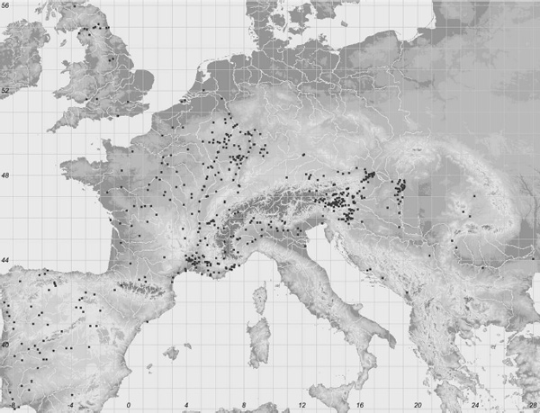
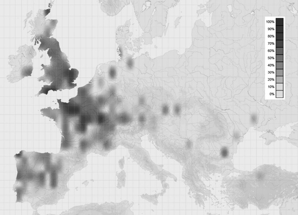

#

<!-- page: 352 -->

Part 7

# **Celtic**

*Patrick Sims-Williams*

## **Introduction**

The surviving Celtic languages fall into two groups: (a) the *Brythonic* (or Brittonic or British) group (Ternes 2011); and (b) the *Gaelic* (or Goidelic or Irish) group. The two are very distinct and have been mutually unintelligible for well over a millennium. To the Brythonic group belong Welsh, spoken widely in Wales, and Breton, spoken in the west of Brittany. Cornish, the language of Cornwall, which was very similar to Breton, died out as a natural language in the eighteenth century. To the Gaelic group belong Irish (or Irish Gaelic), spoken mainly in the west of Ireland, and Scottish Gaelic, spoken mainly in the west of Scotland. Manx, the Gaelic language of the Isle of Man, died out as a natural language in the twentieth century. Celtic languages are also spoken in the Americas, as a result of the modern diaspora of Celtic-speaking peoples, so that, for example, there are Welsh/Spanish bilinguals in Patagonia in Argentina, and Scottish Gaelic/English bilinguals in Nova Scotia in Canada.

All these surviving Celtic languages (including Breton!) are known collectively as *Insular Celtic* languages, as opposed to the ancient *Continental Celtic* languages, e.g. Gaulish, Galatian, Celtiberian, etc., which were all dead by ad 500 and mostly much earlier. The term “Insular” refers to the two islands of Ireland and Britain. From these the Gaelic and Brythonic languages spread: in about the fifth century ad Scotland was settled by emigrants from Ireland (the *Scotti*), while Armorica was settled by emigrants from southern Britain, becoming known as Brittany (Breton *Breiz \< **Brittia). The theory that the Breton language includes a substratum of indigenous Armorican Celtic is unproven but not impossible.

The Brythonic dialects began to diverge into West British (\> Welsh) and South-West British (\> Cornish and Breton) in about the fifth century ad, but probably remained mutually intelligible for several centuries. The Gaelic dialects began to diverge in about the tenth century ad, but there was a common literary language to the end of the Middle Ages, and even today Irish and Scottish Gaelic are much more similar than are Breton and Welsh, which have long been mutually unintelligible. The geographical reason is obvious: there has always been easy travel between Scotland and northern Ireland. Another factor is that Welsh has been in contact with English, whereas Breton has been in contact with French. These contacts have influenced the syntax, morphology and phonology of the languages; for example, there are nasalized vowels in Breton and French, but not in Welsh and English.

Within most individual surviving languages there are marked dialectal differences, so that Breton speakers from north and south may find it easier to communicate in French, while Gaelic speakers from north and south may prefer to talk English together. Nearly all adult Celtic speakers are bilingual.

A general impression of the divergence of the Celtic languages may be gained from comparing the ordinal numerals in Gaulish (McCone 1994: 208 = 2005: 300, Lambert 2002: 105–109, Hamp 2012) with those in Old Irish and Middle Welsh; see Table 7.1.

|     |     |                                                       |     |                            |     |                                   |
|-----|-----|-------------------------------------------------------|-----|----------------------------|-----|-----------------------------------|
|     |     | Gaulish (first century AD) |     | Old Irish (eighth century) |     | Middle Welsh (thirteenth century) |
| 1   |     | *cintux((?)mos)*                                      |     | *cétn(a)e*                 |     | *kyntaf*                          |
| 2   |     | *al(l)os*                                             |     | *tán(a)ise, aile*          |     | *eil*                             |
| 3   |     | *trito(s), tr(itios)*                                 |     | *tris*                     |     | *trydyd, f. tryded*               |
| 4   |     | *petuarios*                                           |     | *cethramad*                |     | *pedwyryd, f. pedwared*           |
| 5   |     | *pinpetos*                                            |     | *cóiced*                   |     | *pymhet*                          |
| 6   |     | *suexos*                                              |     | *se(i)ssed*                |     | *chwechet*                        |
| 7   |     | *sextametos*                                          |     | *sechtmad*                 |     | *seithvet*                        |
| 8   |     | *oxtumetos*                                           |     | *ochtmad*                  |     | *wythvet*                         |
| 9   |     | *namet(os)*                                           |     | *nómad*                    |     | *nawvet*                          |
| 10  |     | *decametos*                                           |     | *dechmad*                  |     | *decvet*                          |

<!-- page: 353 -->

**Table 7.1 Comparison of the ordinal numerals**

### **Celtic**

The term “Celtic”, as applied to the Insular Celtic-speaking peoples and their languages, is a modern one. These peoples did not refer to themselves and their languages as “Celtic” until recently. For example, the medieval Irishmen were *Goídil* (an opprobrious name derived from Brythonic, cf. W *gŵydd* ‘wild’), and their language was *Goídelach*, and medieval Welshmen regarded themselves as *Brython* (\< Lat. *Brittones*) or *Cymry* (\< ***kom-brogī ‘co-countrymen’) and their language was *Cymraeg.* (The Welsh themselves do not use the English name *Welsh \<* OEng. *w*(*e*)*alh* ‘foreigner, or slave, mostly speaking a Romance or Gallo-Brythonic language’. This may derive ultimately from the Continental ethnic name *Volcae.*) There is no evidence that medieval Brythonic and Gaelic speakers recognized their special linguistic kinship; this was discovered by early comparative philologists such as the Scot George Buchanan (in his *Rerum Scoticarum Historia*, 1582) and the Welshman Edward Lhuyd (in his *Archaeologia Brittanica*, 1707). The modern Romantic idea of a pan-Celtic ethnic unity and “Celtic national character” has had some influence even in the Celtic-speaking countries, but really derives from foreign works such as Ernest Renan’s *La Poésie des races celtiques* (1854) and Matthew Arnold’s *The Study of Celtic Literature* (1866).

The linguistic term “Celtic” derives from the usage of ancient and early medieval Greek and Latin writers, who only use it of *Continental* Celtic languages; for example, as late as the ninth century, Heiric of Auxerre, *Vita S. Germani* I.353, explains the place-name *Augustidunum* as meaning ‘Augusti mons’ in *Celtica lingua. Celtica lingua*, in fact, seems to have been equivalent to *Gallica lingua*, the term used, for example, in the sixth century by Venantius Fortunatus, who explained the old Gaulish place-name *Vernemetis* as “fanum ingens” (‘great temple’) (*Carmina* I.ix.9–10). Because close ethnic and linguistic similarities between Gaul and Britain had been noted by writers from Tacitus (*Agricola*, 11) down to the Renaissance, it seemed reasonable to early modern scholars to apply the term “Celtic” to Brythonic as well. Thence it was extended to the languages of Ireland and Scotland, on comparative philological grounds, even though the Insular Celtic languages may never have been called “Celtic” in Antiquity (Sims-Williams 1998; cf. Blom 2009).

Despite its dubious origin, the term “Celtic” remains a useful label for a distinct family of IE languages. The phonological and lexical similarities between Gaulish, Brythonic and Gaelic are illustrated by the above forms *Augustidunum* (i.e. Gaul. **-*dūnon) and *Vernemetis* (i.e. Gaul. ***Wer-nemeton). With the first compare OIr. *dún* ‘fort’, OBret. *din* gl. ‘arx’, Corn. *dyn*, OW *din* (note /uː/ \> /uː/ \> /iː/ in Brythonic). These Celtic cognates are distinct from the Germanic cognates such as OEng. *tūn* (\> Eng. *town*) in not showing the effect of Grimm’s Law (/d/ \> /t/; see p. 20, 392–393). With the intensive prefix *Ver-* ‘ingens’ compare OIr. *for \< **wor- \< *wer- and OWCB *guor- \< **wor-

<!-- page: 354 -->

\< *wer- (**Subdivision**, p. 358). These cognate forms differ from IE cognates such as Gr. ὕπερ in showing the well-known Common Celtic loss of IE /p/, i.e. ***uper \> *wer-. Lastly, Gaul. *nemeton* ‘fanum’ is probably related to Lat. *nemus*, Gr. νέμος ‘grove’, but the dental formation is only paralleled within Celtic, for example, OIr. *nemed* \[nʲeμʲəδ\] (where μ represents a nasal bilabial fricative and cf. p. 367) glossing *sacellum* ‘sanctuary’ *\< **neμeþan *\< **nemeton, and Old Breton personal names in *-nemet* \[neμed\] and Old Welsh ones in *-nimet* \[nəμed\], both \< British ***nemeton. This formation is already seen in the Celtic name ***Nemetios in an Etruscan inscription of the fifth century bc at Genoa: *MI NEMETIEŚ* ‘I am \[the tomb\] of Nemetios’ (de Simone 1980).

### **Origins**

The original “homeland” of the Celtic speakers is unknown – but in any case the simplistic concept of a “homeland” is of limited validity, both in terms of ethnogenesis and in terms of language origins: a people may comprise diverse ethnic elements, and a language may derive from various sources (e.g. the English are ethnically both Celtic and Germanic, and the IE element in English comes via Latin and French as well as from Germanic). There are three main approaches to the problem.

Archaeological approaches have failed to locate the first speakers of Celtic. Archaeologists used to associate Celtic speech with either the early, so-called Hallstatt Iron Age culture or the later, so-called La Tène, Iron Age culture, or with both (see the maps in Powell 1980: 48, 115; cf. Mallory 1989: 96–107). While it is likely that Celtic speakers were found in these Hallstatt/La Tène areas, as in later centuries, we can rarely equate language with material remains: a correlation between La Tène finds and Celtic speech may work quite well in eastern Europe (Falileyev 2014), but it does not work in Spain or northern Italy, where Celtic inscriptions fail to correlate with La Tène material. More recent archaeologists, dissociating Celtic from the above Iron Age cultures, have speculated that a form of IE was already spoken in north-western Europe by 4000 bc and gradually developed into Celtic *in situ* (this phase began with Renfrew 1987: 249; cf. Meid 1989, Mallory 1989: 274). This extreme view is possible only *provided that* (it is a massive proviso) we can believe that communications over the four millennia bc would have allowed many parallel developments to take place in the Late IE and Early Celtic dialects. The fact is that we can only speculate about when Indo-European and then Celtic were first spoken on the Atlantic seaboard, including Britain and Ireland. The latest possible date for Celtic reaching Ireland is the first century ad (just before the Celtic names attested in Ptolemy’s *Geography*), and this has indeed been proposed as near the actual date (Schrijver 2014: 81). Archaeology can neither disprove nor confirm this proposal, and so far no light has been cast on these problems by ancient (or modern) DNA (Sims-Williams 2012a).

A second approach to the problem is to examine the references to *Keltoi*, *Celtae*, *Galatae*, etc. by Greek and Latin writers. There are several problems here: (a) These ethnic labels, which are of uncertain etymology (Sims-Williams 2011), may not always correspond to our modern linguistic use of the term *Celtic* (see p. 353 above). (b) Mediterranean observers may not have distinguished clearly between barbarian peoples such as *Celtae* and *Germani*, and probably simplified the true situation, especially at first (just as even today the French tend apply the term *Anglais* to all the inhabitants of Britain). *(c)* There are very few references to “Celts” before 400 bc, the period when their violent expansion into Italy, the Balkans, Greece and Turkey began to bring them to the serious attention of Mediterranean writers. Earlier Greek writers associate them variously with Spain (the Marseilles *periplus* in the sixth century bc, if correctly reported in Avienus’ *Ora maritima*), with the hinterland of Marseilles (*Massilia*) (Hecataeus of Miletus, *c.* 500), and with the far west of Europe,

<!-- page: 355 -->

including the source of the Danube (!) in *Pyrene* = (?) Pyrenees (Herodotus, *c*. 450). (See Powell 1980: 11–15, Schmidt 1986a: 15, Tovar 1986: 79–80, Sims-Williams 2016.) Obviously these Greek writers were chiefly familiar with the Celts nearest to them, but there may well have been peoples calling themselves “Celts”, or who were called “Celts” by others, in northern Europe too. As we cannot prove this, however, the early ethnographical testimonies are of limited help in defining the “Celtic” area of Europe before 400 bc. It used to be thought significant that Avienus’ names for the inhabitants of Ireland (*Hierni*, see **Consonantism**, p. 353) and Britain (*Albiones* cf. MW *elvyd* ‘world’ \< ***albyo*-*, cognate with Lat. *albus* ‘white’, etc.) had specifically Celtic etymologies. We cannot be sure that these names originated in the British Isles, however, and anyway their linguistic Celticity is uncertain (Sims-Williams 1998: 20–21, Schrijver 2014: 78).

The third approach to the problem is to examine the distribution of apparently Celtic personal, place- and ethnic names (Sims-Williams 2007a, Raybould & Sims-Williams 2009, Falileyev et al. 2010) and the distribution of Celtic-language inscriptions, coin legends, graffiti and so on. Here, too, there are serious obstacles: (a) such data are of course chiefly recorded in the vicinity of Mediterranean cultures, where writing systems developed (on the orthographies of the Celtic languages see Russell 1995: 197–230 and de Hoz 2007); and (b) they mostly belong to the period shortly before the Christian era or still later, too late, that is, to shed light on the areas in which Celtic speech originated.

**Map 7.1** Latin provincial lapidary inscriptions bearing celtic personal names

Source: Marilynne E. Raybould and Patrick Sims-Williams, *Introduction and Supplement to the Corpus of Latin Inscriptions of the Roman Empire Containing Celtic Personal Names*, CMCS Publications, Aberystwyth, 2009, map 16 (created by M. Crampin on the basis of data in Sims-Williams 2007a: 164–165)

**Map 7.2** Density of Celtic-Looking Ancient Place-Names

Source: Marilynne E. Raybould and Patrick Sims-Williams, *Introduction and Supplement to the Corpus of Latin Inscriptions of the Roman Empire Containing Celtic Personal Names*, CMCS Publications, Aberystwyth, 2009, map 16 (created by M. Crampin on the basis of data in Sims-Williams 2007a: 164–165)

###

<!-- page: 356 -->

**Position within IE**

The position of Celtic among the IE languages was approached in various ways during the twentieth century (cf. Schmidt 1979: 197). (1) Pokorny, Wagner and others emphasized Celtic’s divergence from the IE model and explored the possibilities of substratum or “areal” influences from non-IE languages, for example, Semitic and Hamitic, mostly on the vague basis of typology (see Greene 1966, Eska 2010b, Broderick 2013). Regrettably, too little is known about the early history of the non-IE languages with which Celtic-speakers were in contact, for example, the language of the non-Celtic Pictish inscriptions in Scotland (Jackson 1980) or Aquitanian/Basque in France and Spain. (2) In reacting to this trend, Dillon, Watkins, Meid and others stressed the degree to which Celtic could be explained by “forward reconstruction” from IE (Watkins 1962: 7); but at the same time they regarded Celtic as particularly archaic, preserving hypothetical IE features lost in other less “marginal” IE dialects (e.g. the original distribution of primary and secondary verbal endings, **Personal Endings**, p. 372). (3) Reacting in turn to this, scholars such as Rix and Cowgill argued that the peculiarities of Celtic could mostly be explained as internal developments and did not require significant modification of the traditional IE model reconstructed on the basis of Indo-Iranian and Greek (see McCone 1986: 222–223). (4) Other linguists still insisted “on the high importance of Old Irish and other genetically western branches for the reconstruction of proto-Indo-European” (Hamp 1987). Probably there is truth in all these approaches.

<!-- page: 357 -->

Celtic cannot be grouped with any other branch in an IE subdialect, unless arguably with Italic. The long-held theory of “Italo-Celtic” has had periods out of favour (see Watkins 1966, Schmidt 1991) but remains resilient (see Eska 2010a: 22, Weiss 2012, Schrijver 2015). Some of the similarities, such as the retention of the mediopassive in *-r* (shared with Hittite and Tocharian), can be regarded as shared archaisms. Others, such as the apparent equivalence of the Latin future in *-bo* and the Old Irish *f*-future, may be illusory (**Future Stem**, p. 375). Others, such as the *o*-stem genitive singular in *-ī* (also in Messapic, but not found in Celtiberian (p. 360) or Osco-Umbrian), and superlatives of the type Osc. *nessimas* ‘proximae’: Gaul. *neδδamon* (gen. pl.), OIr. *nessam*, OBret. *nesham* ‘nearest’, may be due to diffusion over the long period during which Italic and Celtic speakers lived side by side (cf. Eska 2010b: 546). (In fact, the Italic influence on Celtic has never ceased, owing to continual borrowings from Latin, which have had a fundamental influence on Celtic word formation, as well as supplying many loan words.) The shortage of striking Italo-Celtic phonological developments (e.g. Watkins 1966, Zair 2012: 271) has been seen as a strong argument against the Italo-Celtic theory.

There is much less evidence for any deep connection between early Celtic and Germanic, despite the fact that they were spoken in close proximity by the time of Julius Caesar and Tacitus. There are no shared innovations in phonology and morphology, and the number of significant lexical correspondences was formerly exaggerated (see Campanile 1970, Evans 1981, Polomé 1983, Schmidt 1984, 1986b: 205–206, Schumacher 2009). According to the minimal approach of Evans (1981: 248), only about a dozen early Germanic words are certainly borrowed from Celtic, for example, Goth. *reiks* ‘ruler’: Gaul. *-rīx \<* IE ***rēǵs (cf. Chapter 1); Goth. *eisarn* ‘iron’: Gaul. *Isarnus* (personal name), OIr. *iarnn*, W *haearn* (\< *(h)əi(h)arn-) \< *isarno-; OHG *ledar* ‘leather’: OIr. *lethar*, W *lledr \<* Celt. ***letro- *\<* IE ***pl(e)-tro- (cf. Lat. *pellis*, etc.). The Insular Celtic languages were, of course, influenced by Germanic through English at a later stage, and there is also a slight Old Norse element.

The fact is that Celtic shares *some* isoglosses with almost all other IE languages, and these can be selected to support many different theories (cf. Schmidt 1985, 1986b: 202–206, Stalmaszczyk & Witczak 1995). Similarly, scholars wishing to stress the peripheral and/or archaic nature of Celtic can and have noticed certain remarkable retentions, for example, masculine and feminine forms of the numerals ‘three’ and ‘four’ in Modern Welsh: *tri chi* ‘three dogs’, *tair cath* ‘three cats’; *pedwar ci* ‘four dogs’, *pedair cath* ‘four cats’. Generalizations about the affiliations of Celtic and about its archaic or innovative tendencies are usually subjective, lacking a statistical basis. Statistical attempts to compare the IE languages on the basis of “core vocabulary” (Elsie 1990: 318) or of occurrences under Pokorny’s roots (Bird 1982: 119–120) are open to objections, but do agree on Celtic’s closeness to Germanic and (to a lesser extent) to Latin/Italic, and a phonological link between the three, attributed to some version of Dybo’s Law, has been seen in the pre-tonic vowel shortening exemplified by OIr. *fer*, OEng. *wer*, Lat. *uir* ‘man’ versus Skr. *vīrá-* (e.g. Matasović 2012). Some form of the hypothesis of “Late Western Indo-European” (Meid 1968: 53) could explain such convergence. A more selective and rigorous comparison favours an especial closeness to Italic (see Eska 2010a: 22).

### **Subdivision**

The internal subdivision of the Celtic languages has not yet been agreed by scholars; either the data are inadequate, or the reality is more complex than a simple genetic model would allow.

A traditional division distinguishes “P Celtic”, in which IE ***kʷ \> *p, and “Q Celtic”, in which *kʷ remained: Gaelic and Celtiberian are Q Celtic, whereas Brythonic, Lepontic

<!-- page: 358 -->

and most (but perhaps not all) Gaulish material is P Celtic. In view of the originally allophonic nature of the ***kʷ/*p alternation in Celtic (**Consonantism**, p. 363), most linguists would now agree that “the ‘isogloss’ between P-Celtic and Q-Celtic is structurally trivial” (Watkins 1966: 32 n. 7, following Hamp 1958: 211). Nevertheless, the P/Q division has had a great influence on archaeological speculation, and “P” and “Q” remain useful labels for the important and valid distinction between Brythonic (or possibly “Gallo-Brythonic”) and Gaelic.

Some linguists use the term “Insular Celtic” (see **Introduction**, p. 352) in a more than geographical sense, emphasizing a special relationship between Gaelic and Brythonic (Greene 1966, McCone 1986: 262; cf. Evans 1988: 219). It is true that these groups share certain important developments – such as the development of morphophonemic mutations of initial consonants (**Consonantism**, p. 364), the system of absolute and conjunct verbal endings (**Personal Endings**, p. 372) and periphrastic constructions with preposition + verbal noun such as OIr. *oc precept*, W *yn pregethu* ‘preaching’ (Sims-Williams 2015) – but it could be argued that these developments might also have occurred in Gaulish if this were attested after ad 500 (Sims-Williams 1984: 147–148). Logically, it is impossible to establish a genetic relationship between two dialects on the basis of a shared innovation occurring after all other dialects have died out. An opposing approach, which still leads to the same negative conclusion, is to argue that a feature like the absolute/conjunct system occurs in Insular Celtic but not (apparently) in Continental Celtic because the Continental dialects were less archaic, having drifted towards Greek and Latin, or even Late IE innovations (Meid 1986: 120–121). The fundamental problem, however, is the chronological disjuncture between our evidence of Insular and Continental Celtic. A single example illustrates this. We noted above (**Introduction**, p. 353) that ***wer (\< *uper) became ***wor in Brythonic and Gaelic, whereas *Ver-* is attested in Gaulish. Is this innovation an Insular Celtic isogloss (Schrijver 1995: 129, 464)? The change ***wer \> *wor (due to influence of *wo \< *upo ‘under’ or simply to rounding after /w/, cf. Evans 1967: 279) must in fact be late in Brythonic, since in ad 725 Bede, *Chronica maiora* 434, records the name of a fifth-century Briton as *Uertigernus* (\> later *Uortigern*, *Gwrtheyrn*). As the change *wer \> *wor did not occur before the fifth century ad in Brythonic, it is possible that it would also have occurred in fifth-century Gaulish as well, if this was attested – for there *is* evidence of shared phonetic developments between British and Late Gaulish (Fleuriot 1978). Moreover, /wer/ \> /wor/ might occur quite independently; for example, there is evidence for it in Spain (Tovar 1986: 89).

The term “Gallo-Brythonic” emphasizes the similarities in language (e.g. name formations) between Gaulish and British, which were already noted by ancient writers (**Introduction**, p. 353). It is debatable whether these similarities are due to the many ethnic movements across the English Channel (already mentioned by Julius Caesar) or go back to a genuine “Gallo-Brythonic” dialect of Celtic, genetically distinct from Gaelic, Celtiberian, Lepontic and so on (cf. Evans 1988: 220, Fleuriot 1988, Lambert 1994: 17–19, Schrijver 1995: 463–465). The evidence for both the “Gallo-Brythonic” and the “Insular Celtic” hypotheses can be undermined by postulating “areal” developments (Sims-Williams 2007b: 1–42, Stifter 2008, Eska 2010a: 24–25, Lambert 2010).

An ambitious attempt at a Celtic family tree by Schmidt (1988: 235), combining the ideas of “P Celtic” and “Gallo-Brythonic” with a distinction between an “*em*/*en-* language” (i.e. Gaelic), which diverged very early, and the “*am*/*an-* languages” (i.e. Celtiberian and most or all the P Celtic languages), failed to convince (cf. Tovar 1986: 84 n. 3, Evans 1983: 29–31, McCone 1991: 22, 48–50, 161). It was based on the treatment of IE /m̥/ and /n̥/ in initial position and before plosives, e.g. IE ***m̥bʰi ‘about’ \> CIb. *amPi-*,

<!-- page: 359 -->

Gaul., *ambi-*, W *am* versus OIr. *imb* (see further de Bernardo Stempel 1987: 38, 51, 121). A secondary Gaelic development of /-an/ \> /-en/ was suggested by Cowgill (1975: 49), and some scholars postulated a Proto-Celtic allophone \[æ\] before nasals (e.g. Hamp 1965: 225, Joseph 1990: 126 n. 10). McCone (1996: 67–79) argued convincingly that /m̥/ and /n̥/ gave CC /am, an/ and that raising of the /a/ to /e/ or /i/ occurred in Primitive Irish (cf. Schrijver 1993).

The earliest connected written material in Celtic languages comes, as would be expected, from the Mediterranean world – Italy, France and Spain – in the second half of the first millennium bc (slightly earlier in the case of some northern Italian inscriptions: Uhlich 2007: 379). For other areas at this period there are only place-, personal and ethnic names (e.g. Sims-Williams 2007a, 2012b), but even these are of some value. For example, judging by the onomastic evidence, the language of the Galatians in Asia Minor was similar to Gaulish (Eska 2013a). Again, there is obvious Gaulish material in the “Thracian” and other eastern onomastic corpora (Falileyev 2009, 2013, 2014). Here, however, I shall concentrate on the Celtic languages from which more than names and odd words are known (see also Eska & Evans 2010).

*Lepontic* is the name given to the language of inscriptions first found within a 50 km radius of Lugano, in north-western Italy and Switzerland, and arguably distinct from Cisalpine Gaulish (Lejeune 1970, Karl & Stifter 2007: 45–73, Uhlich 2007, Stifter 2008: 285–286, Eska 2010a: 24, Eska & Evans 2010: 35). They date from the sixth to the first century bc and are written in the Lugano alphabet. This alphabet does not distinguish between /p t k/ and /b d g/ and avoids double letters; for example, the Lepontic personal name *ANOKOPOKIOS* corresponds to Gaul. *Andocombogios.* Here /nd/ *\>* /nn/ is a Lepontic peculiarity, but the suppression of the nasal in *KO*(*m*)*P* may be purely graphic. Like Gaulish (**Consonantism**, p. 364), Lepontic distinguishes between two sibilants, both seen in *IŚOS* \[?itsos\] \< ***istos ‘that (man)’ in an inscription from Vergiate, now in the archaeological museum in Milan (Lejeune 1970: 444–452, Eska & Mercado 2005): *PELKUI PRUIAM TEU KARITE IŚOS KALITE PALAM* = ? *Belgūi bruwyam Dēwū garite*, *i*t*sos kalite palam* = ?‘Dēwū enclosed the construction for Belgos; he erected the stone.’ The word for ‘construction’, the accusative of ***bruwyā, recalls Gaul. *brīvā* ‘bridge’ \< ***bʰrēwā, but the closest cognates are in Germanic, for example, OS *bruggia* ‘bridge’ \< ***bʰruw-yo-. The word possibly meaning ‘stone’, *palā*, which is common in Lepontic inscriptions, is of unknown etymology. The verbal stem ***gar- may derive \< ***gr̥-: IE ***ǵʰer- ‘to enclose’, as in OIr. *gort* ‘field’, W *garth* ‘enclosure’ (but cf. Hamp 1991); and ***kal- may derive \< ***kl̥-: IE ***kelH- ‘to raise, rise’, cf. Gaul. *celicnon* ‘building’, Lat. *collis*, OEng. *hyll* ‘hill’ and possibly *Celtī* ‘?exalted ones’. The dental preterites are obscure, but seem to be confirmed by the Gaulish verbs *KarniTu* (3 sg.), *KarniTus* (3 pl.) found farther south in Gaulish inscriptions in Lugano script at Todi and at San Bernadino di Briona (Eska 2007/8). In the Todi inscription, which is bilingual, *KarniTu* corresponds to *LOCAVIT ET STATVIT.*

*Celtiberian* is the only Hispano-Celtic language known from inscriptions as well as proper names. (The Celticity of the Lusitanian and “Tartessian” inscriptions is generally rejected.) The “Celtiberian” inscriptions come from north-eastern Spain, in exactly the same region that the *Celtiberi* are located by ancient writers (de Hoz 2007, 2010–). The earlier inscriptions, such as the most famous one from Botorrita 20 km south of Zaragoza (*c*. 100 bc), are written in the native Iberian script (Eska 1989, Eichner 1989: 23–55 (= Karl & Stifter 2007: 9–44), Meid 1994a, Prósper 2008, de Bernardo Stempel 2010). This did not distinguish voiced and voiceless stops, like the Lugano alphabet, and it had the added ambiguity of using syllabic characters for these sounds (*Pa*, *Ca*, *Ta*, *Pe*, *Ce*, *Te*, etc.); e.g. the *Ti* symbol could denote /ti/, /di/, /t/ or /d/. Its *ś =* /s/, but *

<!-- page: 360 -->

s* = /z/ or /δ/ by lenition of ***s and *d according to Villar (1995); for further theories see Stifter 2008: 271–273. Inevitably, then, interpretations of Celtiberian writings are disputed. Later inscriptions are in the Roman alphabet, which should be less ambiguous; however, opinions still diverge. For example, Ködderitzsch (1985) offered the following reading and interpretation of the first- or second-century ad inscription from Peñalba de Villastar (cf. Villar 1991): *ENIOROSEI VTA TIGINO TIATVNEI* \[-*MEI*?\] *ERECAIAS TO LVGVEI ARAIANOM COMEIMV ENIOROSEI EQVEISVIQVE OGRIS OLOGAS TOGIAS SISTAT LVGVEI TIASO TOGIAS* ‘To Enior(o)sis and to Tiatū of Tiginos we bestow furrows, and to Lugus a field; to Enior(o)sis and to Equaesos, Ogris submits the protections of the fertile-land, to Lugus the protections of the scorched-land.’ Meid (1994a and 1994b) and others, however, offer completely different interpretations (see Jordán Coléra 2004: 375–390; de Bernardo Stempel 2008). Thus, Meid (1994a: 36–37) translates: ‘To the mountain-dweller as well as to …, to Lugus of the Araians, we have gone on a field-procession (reading *TRECAIAS*); for the mountain-dweller and horse-god, for Lugus, the head of the community has put up a covering (i.e., a house or a hall), (also) for the *thiasus* a covering’. And Prósper (2002) has ‘In Orosis and as far as the Tigino reaches, to Lugu we consecrate the fields. In Orosis and in Equeiso, the hills as well as the ploughed fields and the houses are consecrated to Lugu, that is, the houses of the bounded area’. Notable phonological points here include:

1.  the loss of /p/ (if Ködderitzsch’s etymologies are correct) in (a) *er*(*e*)*caia-* ‘furrow’ \< IE ***perkˊ- (cf. W *rhych*, Lat. *porca*, Eng. *furrow*); (b) *ol*(*o*)*ga-* ‘fertile-land’ \< IE *polǵ(ʰ)ā, ***polkˊā (cf. Gallo-Latin *olca \>* Fr. *ouche*, Eng. *fallow \<* Gmc ***falgā); and (c) *tiaso* ‘burnt land’ \< ***teposo- (cf. OIr. *tee* ‘hot’ \< ***tepe*-*, Lat. *tepeō*);
2.  the retention of IE /kʷ/ in *-que* ‘and’ (Lep. *-pe*, arch. OIr. *-ch*) – this is used here alongside the connective *uta*, cognate with Skr. *uta* and OBret. *ut* (Eska 1990, Sims-Williams 2007b: 234–235);
3.  the apparent (orthographical?) retention of IE /ey/ in *com-*(*m*)*ei-mu*, ‘we bestow’ \< IE ***mey- according to Ködderitzsch (cf. Skr. *máyate* ‘exchanges’, Lat. *mūnus \< **moy-nes-, OIr. *moín* ‘treasure’ \< ***moy-ni-, MW *mwyn* ‘value’ \< ***mey-no*-*) or \< IE *h₁ey- ‘go’ according to Meid, Prósper and de Bernardo Stempel;
4.  the retention of final /m/ (not \> /n/) in the acc. sg. *ar(*a*) ianom* (‘field’, according to Ködderitzsch, cf. OIr. *airim*, MW *ardaf* ‘I plough’ \< ***ary-, or, according to de Bernardo Stempel, a neuter adjective related to W *iawn* ‘just’) – Meid’s gen. pl. ethnonym in -*om* (not -*um*!) is unlikely;
5.  in *sistat* ‘puts’ \< ***sistati (or 3 pl. *sistanti according to Prósper) the apocope of primary *-i, as in Lat. *sistit* (**Personal Endings**, p. 372–373) – although some analyse *sistat* as if = *sistaz \< old secondary *sistat;
6.  epenthesis in *er*(*e*)*caias*, *ol*(*o*)*gas*, *ar(*a*) ianom*, and *Enior(o)sei* (Eska 1996).

In morphology note the *o-*stem genitives in *-o* (*Tigin-o*, *tias-o*) rather than the *-ī* found elsewhere in Celtic and Italic (**Position**, p. 357; cf. McCone 1994: 96 = 2006: 83, Eska 1995, Schmidt 1995: 252–253).

*Gaulish* inscriptions begin in about the third century bc, but the bulk of material comes from the first century bc to the second century ad (Stifter 2012). The earlier material is mostly written in Greek script, with a few texts in the Lugano script from Cisalpine Gaul. The later material is mostly in Roman letters. To the inscriptions on stone which have long been known can now be added important long texts on metal plates, notably from Chamalières, Larzac and Chartres (Lambert 2002, Viret *et al*. 2013); these are

<!-- page: 361 -->

transforming, and confusing, our understanding of the Gaulish language(s). The following example of Gaulish is a stone inscription from Alise-Sainte-Reine (first century ad): *MARTIALIS DANNOTALI IEVRV VCVETE SOSIN CELICNON ETIC GOBEDBI DVGIIONTIIO VCVETIN IN ALISIIA* (Lambert 1994: 98–101, Eska 2003) ‘Martialis \[son\] of Dannotalos offered to \[the god\] Ucuetis this edifice, and to the smiths who honour (?) Ucuetis in Alisia’. Note here *-e \< *-*ey in the dat. *Ucuete* and *-n \< *-*m in the acc. sg. *celicnon* (the source of Goth. *kelikn* ‘tower’). Morphological points of interest include the genitive singular in *-i* in *Dannotali*, the dative (or instrumental?) plural in *-bi* in *gobedbi*, the third-person singular preterite in *-u* (cf. Lepontic) and the indeclinable relative particle *io* in *dugiionti-io* (**Pronouns**, p. 370).

Apart from two curse-tablets from Roman Bath (Mullen 2007), *British* and its successors, Primitive Welsh, Primitive Cornish and Primitive Breton, are known only from proper names in inscriptions and Latin texts, which provide, nevertheless, detailed information about phonological developments (Jackson 1953, Sims-Williams 1990, 1991, 2003). From *c.*ad 800 onwards we have manuscript glosses, memoranda and so on in Old Welsh, Old Cornish and Old Breton (Ternes 2011). (In addition, some Welsh poetry may be as early as the sixth century, although transmitted in late manuscripts.) The orthography of Old Welsh, Old Cornish and Old Breton (OWCB) is based on a pronunciation of Latin found in Britain, the main feature of which was that medially Latin consonants underwent “lenition” (**Consonantism**, p. 364), so that Latin words like *medicus*, *decimatus* were pronounced \[meδigəh\], \[degiμaːdəh\]. Consequently, similar values were assigned to letters in writing OWCB; for example, \[degμed\] (‘tenth’ \< ***dekametos (see Table 7.1 on p. 353)) would be written *decmet.*

*Primitive Irish* (McCone 1994, 1996, 2005) is known from proper names in inscriptions and Latin texts, and its phonological development is clear in outline (McCone 1996, Sims-Williams 2003: 296–301). Most Irish inscriptions of the fifth, sixth and seventh centuries ad are in the Ogham alphabet (McManus 1991, Ziegler 1994, Sims-Williams 2007b). This is well suited to carving on wood and stone, since only straight strokes are used, e.g. **/////** = /kʷ/, **////** = /k/. The phonology of the earliest Ogham inscriptions is archaic, for example, distinguishing between /k/ and /kʷ/ and (probably) between /g/ and /gʷ/, and showing the old case endings. The earliest extant manuscripts containing *Old Irish* (glosses and short texts) are eighth century, but it is probable that some texts extant in late manuscripts were written down towards the end of the sixth century. Most Old Irish material is written in an orthography based on the British pronunciation of Latin described above (for exceptions see Harvey 1989, Russell 1995: 224); hence, medial and final \[b d g\] are written *p t c*, and medial and final \[β δ γ μ\] are written *b d g m.* Medially and finally double consonants may be used to avoid ambiguity; e.g. \[b\] may be written *bb*, and \[k\] may be written *cc.* Palatalized consonants are indicated by flanking vowels, e.g. *macc* \[mak\], *maicc* \[makʲ\], *beirid* \[bʲerʲəδʲ\], *feraib* \[f ʲerəβʲ\]. In modern edited texts, diphthongs are generally distinguished by placing the length mark on the *i*; e.g. *aí* and *uí* are diphthongs (the former also written *áe*/*oí*/*óe*), but *ái* and *úi* denote \[aː\] and \[uː\] followed by palatalized consonants (in the phonetic transcription ʲ marks a palatalized consonant, as in OIr. *nemed* \[nʲeμʲәδ\], **Introduction**, p. 354).

## **The phonology of Common Celtic**

The following features would generally be accepted as defining “Celtic”. For ease in consulting handbooks (e.g. Lewis & Pedersen 1961), I give IE sounds in their traditional reconstructions without prejudice to the actual phonetic reality of /bʰ/, etc. Also, not much

<!-- page: 362 -->

attention is paid to laryngeals, for which Celtic provides little independent evidence (cf. Hamp 1965, Joseph 1982, Ringe 1988, Lindeman 1988, 1989: 291–293, McCone 1994: 71–73 = 2005: 35–38, Zair 2012). Almost nothing certain is known about the fate of the IE free accent in Celtic nor about the development of the very different initial and penultimate stress accents of Gaelic and Brythonic respectively (cf. Koch 1987, Lindeman 1992, Schrijver 1995: 16–22). There is already evidence for penultimate accentuation in Continental Celtic (de Bernardo Stempel 1995).

### **Vocalism**

The IE short vowels /i e a o u/ remained in Common Celtic. A laryngeal regularly fell together with /a/, e.g. Gaul. *atir* (Larzac inscription), OIr. *athair* ‘father’ \[aþәrʲ\]. The IE long vowels /iː aː uː/ remained in Common Celtic, but IE /eː/ \> /iː/, e.g. ***rēǵs (: Lat. *rēx*) *\>* Gaul. *rix*, OIr. *rí*, W *rhi*, and IE /oː/ \> /aː/, e.g. ***dōnom (: Lat. *dōnum*) *\>* OIr. *dán* ‘gift’, W *dawn* (with /au/ \< /ɔː/ *\<* /aː/) ‘gift’, except when IE /oː/ occurred in final syllables, where it became CC /uː/, e.g. ***bʰerō *\> **birū *\>* OIr. *-biur* ‘I carry’ and Gaul. *delgu* ‘I hold’ (cf. Eska 1995: 34). One gap in the resulting Common Celtic system of vowels (shown in Table 7.2).

|      |     |      |
|------|-----|------|
| iː i |     | u uː |
| e    |     | o    |
|      | a   |      |
|      | aː  |      |

**Table 7.2 The Common Celtic vowel system**

was filled by the development /ei/ \> /eː₂/ (cf. Gr. *steikhein* ‘to walk’: Early OIr. *-tēgot* \[tʲeːγɔd\] ‘they go’ = Later OIr. *-tíagat* \[tʲiaγәd\]), but /ei/ \> /eː₂/ may not have been completed in Common Celtic. (See p. 362 for CIb. *ei*, and note dat. *-ei* in Lepontic as well.) The other gap was filled in Gaelic by /eu au ou/ \> /oː₂/ (later alternating with /uə/) and in Brythonic by /eu ou/ \> /oː₂/ (later \>/uː/), but in Common Celtic /eu ou au/ remained diphthongs, as did /ai/ and /oi/. There was, however, an early tendency, seen already in Lepontic and Gaulish, for /eu/ \> /ou/, e.g. ***teutā ‘people’ \> *touta* (\> OIr. *túath* \[tuaþ\], MW *tut* \[tuːd\]).

The semi-vowels /w/ and /y/ remained in Common Celtic, and indeed survive to this day in Welsh. Vocalic /m̥, n̥, r̥, l̥/ developed as vowel + consonant (/am, em, an, en, ar, al/) or consonant + vowel (/ri, li/), depending on context (see de Bernardo Stempel 1987, McCone 1996: 67–79); there is often apparent divergence between /em en/ in Gaelic and /am, an/ elsewhere (**Subdivision**, p. 358). The so-called long resonants, that is, vocalic /m̥, n̥, r̥, l̥/ + laryngeal /H/, developed mostly as /maː, naː, raː, laː/, e.g. IE ***ǵr̥H-no- *\>* OIr. *grán*, W *grawn* ‘grain’ (: Lat. *grānum*). The derivation of reflexes with short /a/ is debated: for example, does OIr. *tarathar*, W *taradr* ‘auger’ \< ***tara-tro-n come from ***tr̥H-, or is *tara-* due to vowel harmony in ***tera-tro-n coming from ***terH-? The latter is probable. (See Joseph 1982, de Bernardo Stempel 1987: 43–45, Lindeman 1988, Schrijver 1995: 87.)

### **Consonantism**

/m, n, r, 1, s/ remained basically unchanged (on *s* see Stifter 2012). Final *-m* became *-n* in most Celtic languages, but not in Lepontic, Celtiberian (p. 359–360) and some

<!-- page: 363 -->

Gaulish. As in other IE languages, /s/ had an allophone \[z\]; this is not differentiated from *S* in Continental Celtic writings, but in Insular Celtic \[z\] \> \[δ\], e.g. Gaul. *TASGO-*: OIr. *Tadg* (personal name). As in Armenian, IE /p/ was completely lost, apparently via /f/ (Eska 2013b); it had already been reduced to /h/ or /zero/ when classical writers borrowed the name of the *Hercynia silva* in central Germany (: IE ***perkʷus ‘oak’, cf. Evans 1979: 531–532). Another commonly cited example is the classical name for Ireland/the Irish, *Ierne*/*Hierni*, but it is doubtful whether this name is Celtic and cognate with Skr. *pīvarī*, Gr. πίειρα ‘fat, rich’ (Schrijver 2014: 77–78). Among the plosives there is no trace of an original palatal series (Gaelic palatalization arose much later, p. 367), and the only trace of the aspirate/unaspirate distinction is between the labiovelars /gʷ/ \> CC /b/ and /gʷʰ/ \> CC /gʷ/ (Cowgill 1980, Sims-Williams 1981, 1995). For IE /gʷ/ note OIr. *béo*, W *byw* ‘living’: Lat. *uīuus*; OIr. *imb* ‘butter’: Lat. *unguen*; the only *certain* exception is before /y/, which delabialized /gʷ/, e.g. OIr. *nigid* \[nʲiγʲәδʲ\] ‘washes’ \< ***nigʷ-ye-ti and W *gïau* ‘sinews’: Ved. *j*(*i*)*yā-* ‘bowstring’, Av. *ǰiiā-* ‘bowstring, sinew’, Gr. βιός ‘bow’. For IE /gʷʰ/ note OIr. *gonaid* ‘wounds’, W *gwanaf* ‘I wound’: Gr. φόνος ‘murder’, ϑείνω ‘I strike’, Hitt. *kuenzi*, Skr. *hanti* ‘kills’. By the time of Old Irish, /gʷ/ was delabialized, but there is probably an old symbol for /gʷ/ in the Ogham alphabet (p. 361). In Brythonic, initial /gʷ-/ \> /gw-/, probably directly and not via /w-/ in view of the early Welsh inscription *GVANI*, which predates the general change of IE /w-/ \> W /gw-/ (Sims-Williams 1995). In Gaulish /gʷ-/ \> /w-/ is possible, if the first-person singular verb *uediiumi* (? *uediiu mi*) in the Chamalières inscription is cognate with W *gweddi* ‘prayer’, OIr. *guide* ‘prayer’ \< ?***gʷedyā, Gr. ποϑέω ‘I wish’, Av. *ǰaiδiia-* etc. (Cowgill 1980). The fate of non-initial /gʷ/ \< /gʷʰ/ is debated. In Welsh it appears to have had the same result intervocalically as /g/, i.e. loss (e.g. MW *de* ‘burns’ \< IE *dʰegʷʰ-). The words *nyf* ‘snow’ and *deifio* ‘to burn’ (ƒ= \[v\]) are probably wrongly cited in the handbooks as reflexes of IE intervocalic /gʷʰ/; *nyf* probably shows a special treatment of *gʷʰ* after /n/ (cf. Lat. *ninguis*), while *deifio* is not from IE *dʰegʷʰ- at all (Sims-Williams 1995).

The above data are best explained by the following chronology (cf. Sims-Williams 1981: 227), starting from the system

|       |     |     |     |
|-------|-----|-----|-----|
| \(p\) | t   | k   | kʷ  |
| b     | d   | g   | g ʷ |
| bʰ    | dʰ  | gʰ  | gʷʰ |

**Table 7.3 Pre-Celtic stops**

Common Celtic merged /gʷ/ and /b/ as /b/. Then de-aspiration, occurring throughout the system (/bʰ/ \> /b/, /dʰ/ \> /d/, etc.), created a new /gʷ₂/ \< /gʷʰ/. The relative chronology of /p/ \> /zero/ is uncertain, but it was the gap in the system resulting from the loss of /p₁/, which made possible the allophonic alternation between “Q Celtic” with \[kʷ\] and “P Celtic” with \[p₂\] \< \[kʷ\] (**Subdivision**, p. 357):

|        |     |     |        |
|--------|-----|-----|--------|
| \[p₂\] | t   | k   | \[kʷ\] |
| b      | d   | g   | g ʷ₂   |

**Table 7.4 Common Celtic stops**

<!-- page: 364 -->

The most interesting combinatory change among the consonants was the development of a new dental phoneme, written *δδ*, *ss* and so on, in Gaulish (and apparently with special symbols in Lepontic, p. 359), from /d/ + /t/, /t/ + /t/, /t/+ /s/, etc. (Evans 1967: 410–420). Note also a general development of /xt/ \< /pt, kt/. Structurally, a more important development was the widespread rise – as in Germanic – of intervocalic geminate consonants contrasting with single consonants in the same position (Kuryłowicz 1960: 259–273, de Bernardo Stempel 1989). Such geminates are often shown in Gaulish, but are excluded by the scripts used for Lepontic and Celtiberian. In Insular Celtic geminates developed differently from single consonants, for example, OIr. *maicc* \[makʲ\] ‘of a son’ *\<* Ogham *MAQQI = **makʷkʷī, but MW *meib* ‘sons’ \< ***mapī *\< **makʷī; the single /p/ is “lenited” (i.e. voiced), but the geminate /kʷkʷ/ is simplified. In addition to the *phonemic* distinction between /VCV/ and /VCCV/, there arose, probably already in Common Celtic, an *allophonic* distribution of \[C\] and \[CC\] in other environments (Harvey 1984). The evidence for this comes partly from the phonemicization of reflexes of these allophones in Insular Celtic (**Consonantism**, p. 365, 367), partly from the analogy of Romance, which may reflect Celtic substratum influence here (Martinet 1952; cf. Villar 1995). Ultimately, this was of great importance in external sandhi, giving rise to the Insular Celtic system of *initial mutations* (Russell 1995: 231–257, Sims-Williams 2007b: 43–58). For example, ***esyo kattos ‘his cat’ \> OIr. *a chatt* \[ə xat\] (lenition), MW *y gath* \[ɨ ga:þ\] (lenition), but ***esyās kkatus ‘her battle’ \> OIr. *a cath* \[ə kaþ\] (no mutation), MW *y chat* \[ɨ xa:d\] (spirant mutation). A further set of mutations was produced after old nasals (**Consonantism**, p. 366), e.g. OIr. *a catt* \[ə gat\] ‘their cat’, MW *vyg cath* \[və ŋha:þ\] ‘my cat’. These initial mutations, which began as sandhi phenomena, were grammaticalized in Insular Celtic, for example, as markers of relative clauses (Ó hUiginn 1986).

## **The phonology of early Brythonic**

The accent in later British fell on the penultimate syllable, which became the ultimate syllable after the loss of final syllables *c.* 500. A full range of vowels was therefore preserved in the final syllables of OWCB words, whereas pre-tonic vowels tended to have been shortened, reduced or syncopated. (Much later, by *c.* 900, at least in Welsh (Sims-Williams 2003: 289), the accent shifted from the ultimate to its present position on the penult, except in the Vannetais dialect of Breton.) Schrijver 1995 and Ternes 2011 are the most up-to-date handbooks.

### **Vocalism**

IE vowel quantity was at first retained, but by the sixth century ad a new quantity system applied automatically even in stressed syllables; according to this, Primitive Welsh, Cornish and Breton vowels were short in \[VCC\] syllables and long in \[V(C)\] syllables (Sims-Williams 1990: 250–260). In *stressed* syllables, the Common Celtic vowels and diphthongs developed mainly as follows:

- /i/ \> Pr. W /ɨ(ː)/ (written ‹y› in later W), Pr. Corn., Pr. Bret. /i(ː)/
- /e/ \> Pr. W/Corn./Bret. /e(ː)/
- /a/ \> Pr. W/Corn./Bret. /a(ː)/
- /o/ \> Pr. W/Corn./Bret. /o(ː)/
- /u/ \> Pr. W/Corn./Bret. /u(ː)/, also Pr. Corn./Bret. /o(ː)/ (note: /u(ː)/ is written ‹w› in Welsh, ‹ou› in Breton)
-

<!-- page: 365 -->

/iː/ (\< IE /eː/ and /iː/) *\>* Pr. W/Corn./Bret. /i(ː)/
- /eː/ (\< CC /ei/) \> Pr. W/Corn./Bret. /ui/
- /aː/ (\< IE /aː/ and /oː/) *\>* British /ɔː/ *\>* Pr. W /au/, Pr. Corn./Bret. /ө(ː)/
- /uː/ (\< IE /uː/ and /-oː/) \> British /uː/ \> Pr. W/Corn./Bret. /i(ː)/
- /au/ \> British /ɔː/*\>* Pr. W /au/, Pr. Corn./Bret. /ө(ː)/ (see Schrijver 1995: 195)
- /ou/ (\< CC /ou/ and /eu/) \> British /oː/ *\>* /uː/ *\>* Pr. W/Corn./Bret. /u(ː)/
- /ai/ \> British /εː/ *\>* Pr. W/Corn./Bret. /oi/
- /oi/ \> British /uː/ \> Pr. W/Corn./Bret. /u(ː)/

The semi-vowel /w/ had become /gw/ in absolute anlaut by the time of the earliest OWCB (*c.* 800). Medial /y/ sometimes developed to /δ/.

### **Consonantism**

/s/ tended to become /h/ or /y/ or to disappear. \[z\] became /δ/, and \[x\] was vocalized as /y/. (On /gʷ/ see p. 363 above.) Most other consonants suffered the change known as “lenition” in positions where their weaker allophones occurred (cf. p. 364), and there was later a tendency for unlenited voiceless consonants to be spirantized (except in absolute anlaut):

|        |     |     |     |       |     |            |     |                                          |
|--------|-----|-----|-----|-------|-----|------------|-----|------------------------------------------|
| \[pp\] |     | \>  |     | \[p\] |     | \> \[f\]   |     | (Spirantization)                         |
| \[p\]  |     | \>  |     | \[b\] |     | (Lenition) |     |                                          |
| \[tt\] |     | \>  |     | \[t\] |     | \> \[þ\]   |     | (Spirantization)                         |
| \[t\]  |     | \>  |     | \[d\] |     | (Lenition) |     |                                          |
| \[kk\] |     | \>  |     | \[k\] |     | \> \[x\]   |     | (Spirantization)                         |
| \[k\]  |     | \>  |     | \[g\] |     | (Lenition) |     |                                          |
| \[bb\] |     | \>  |     | \[b\] |     |            |     |                                          |
| \[b\]  |     | \>  |     | \[β\] |     | (Lenition) |     | (\[β\] later \> \[v\])                   |
| \[dd\] |     | \>  |     | \[d\] |     |            |     |                                          |
| \[d\]  |     | \>  |     | \[δ\] |     | (Lenition) |     |                                          |
| \[gg\] |     | \>  |     | \[g\] |     |            |     |                                          |
| \[g\]  |     | \>  |     | \[γ\] |     | (Lenition) |     | (\[γ\] later lost, or \> \[y\] or \[w\]) |
| \[mm\] |     | \>  |     | \[m\] |     |            |     |                                          |
| \[m\]  |     | \>  |     | \[μ\] |     | (Lenition) |     | (\[μ\] later \> \[v\])                   |

**Table 7.5 Brythonic consonantal developments**

These changes probably took place in three stages: (a) spirantization of /b, d, g, gʷ, m/ (before *c.*ad 400?); (b) voicing of /p, t, k/ (fifth century?); and (c) spirantization of /p₂, t₂, k₂/ (sixth century?) (see Sims-Williams 2007b: 14–16, 26, 43–58). Since they occurred in external sandhi, they led to “lenition” (e.g. /k ~ g/) and “spirantization” (e.g. /k ~ x/) as initial mutations (p. 364). The above simplifications of double consonants (except \[mm\], which followed the pattern of \[nn\]) were completed before the advent of the new quantity system (**Vocalism**, p. 364), hence, for example, W *crēd* ‘belief’ \< ***krĕdd- (versus *măm*(*m*) ‘mother’ \< ***mămm-).

## **The phonology of Gaelic**

The accent in Gaelic fell on the initial syllable of stressed words. A full range of vowels was therefore preserved in this syllable, whereas post-tonic vowels tended to be shortened, reduced or syncopated. For example, in Old Irish there were only two short vowels

<!-- page: 366 -->

in closed unstressed syllables, \[ə\] and \[u\] (although the spelling system seems to disguise this). Because Brythonic stress developed very differently (p. 364), the evidence of the two branches is of complementary importance in reconstruction. The best handbook is McCone 1996; cf. Sims-Williams 2003: 296–301.

### **Vocalism**

IE vowel quantity was retained in stressed syllables; in unstressed syllables long vowels were shortened in Primitive Irish, except in final syllables before final /h/ \< /þ δ x s/, and even in these syllables the vowel was eventually shortened, e.g. Celt. ***teutās ‘tribes’ \> Pr. Ir. ***tōþāh *\>* OIr. *túatha* \[tuaþă\]. In *stressed* syllables, the Common Celtic vowels and diphthongs developed mainly as follows:

- /i/ \> OIr. /i/ (if not lowered to /e/ by following low vowel)
- /e/ \> OIr. /e/ (if not raised to /i/ by following high vowel)
- /a/ \> OIr. /a/
- /o/ *\>* OIr. /o/ (if not raised to /u/ by following high vowel)
- /u/ \> OIr. /u/ (if not lowered to /o/ by following low vowel)
- /iː/ (\< IE /eː/ and /iː/) *\>* OIr. /iː/
- /eː/ (\< CC /ei/) \> OIr. /eː/ alternating with /ia/
- /aː/ (\< IE /aː/ and /oː/) *\>* OIr. /aː/
- /uː/ (\< IE /uː/ and /*-*oː/) *\>* OIr. /uː/
- /au/ \> OIr. /oː/ alternating with /ua/
- /ou/ (\< CC /ou/ and /eu/) \> OIr. /οː/ alternating with /ua/
- /ai/ and /oi/, though still distinct in most Ogham inscriptions, merged in Old Irish as a diphthong of uncertain value (/oi/?), written ‹áe›, ‹aí›, ‹óe›, ‹oí›.

The semi-vowel /w/ became /f/ in absolute anlaut and /v/ after nasals, for example, ***wiros *\> fer* ‘man’, ***banwos *\> banb* \[banv\] ‘pig’ (: Gaul. *Banuus*, W *banw*); in other positions /w/ was lost, as was /y/, e.g. ***yowankos (: W *ieuanc*) *\>* *(y)o(w)εgah *\>* OIr. *oac* \[oəg\] ‘young’.

### **Consonantism**

/s/ tended to become /h/ or to disappear. \[z\] became /δ/, but \[x\], written *ch*, remained in Old Irish. In the Ogham inscriptions /kʷ/ and (probably) /gʷ/ were still distinct from /k/ and /g/, but they had been delabialized by the Old Irish period. Even before the Ogham inscriptions the combinations /nt, nk, nkʷ, ns/ had become /dd, gg, gʷgʷ, ss/, with compensatory lengthening of a preceding /a/ or /e/ to /εː/, e.g. ***sentus (: Bret. *hent*, OHG *sind* ‘road’) \> */sεːddus/ \> OIr. *sét* \[sʲεːd\] ‘road’ (cf. Ogham personal name *SEDANI \>* OIr. *Sétn(*a*) i*); ***kʷenkʷe (: Lat. *quinque*) \> /kʷεːgʷgʷe/ \> /koːgʲe/ \> *cóic* \[koːgʲ\] ‘five’ (the rounding was due to the labiovelars); ***Brigantī (: Skr. *br̥hatī* f. ‘exalted one’) \> /brigεːddiː/ \> /briγεdi/ \> *Brigit* \[bʲrʲiγʲədʲ\] (personal name). These changes after nasals also took place in external sandhi, giving rise to the *initial nasal mutation*, e.g. gen. pl. ***wiran trumman \> *wira ddrumman *\>* OIr. *fer tromm* \[f ʲer drom\] ‘of heavy men’. (This mutation was not usually shown in writing.) As in Brythonic, most consonants underwent “lenition” in positions where their weaker allophones occurred (cf. p. 364), but lenition of /t/ and /k/ took a different form in Gaelic:

|        |     |       |     |            |
|--------|-----|-------|-----|------------|
| \[tt\] | \>  | \[t\] |     |            |
| \[t\]  | \>  | \[þ\] |     | (Lenition) |
| \[kk\] | \>  | \[k\] |     |            |
| \[k\]  | \>  | \[x\] |     | (Lenition) |
| \[bb\] | \>  | \[b\] |     |            |
| \[b\]  | \>  | \[β\] |     | (Lenition) |
| \[dd\] | \>  | \[d\] |     |            |
| \[d\]  | \>  | \[δ\] |     | (Lenition) |
| \[gg\] | \>  | \[g\] |     |            |
| \[g\]  | \>  | \[γ\] |     | (Lenition) |
| \[mm\] | \>  | \[m\] |     |            |
| \[m\]  | \>  | \[μ\] |     | (Lenition) |

<!-- page: 367 -->

**Table 7.6 Gaelic consonantal developments**

Gaelic lenition probably took place in two stages: (a) spirantization of /b d g(ʷ) m/; (b) spirantization of /t k(ʷ)/; they cannot be dated precisely, but (b) occurred later than the (fifth-century?) voicing of /p t k/ in British (see Sims-Williams 1990: 233, McCone 1994: 74 = 2005: 42). In external sandhi, lenition resulted in an initial mutation (**Consonantism**, p. 364). Internally, lenited consonants were often lost with compensatory lengthening, for example, Ogham *SAGRAGNI* (gen. sg.) \> OIr. *Sáráin* \[saːraːnʲ\]; Pr. Ir. ***eþn- (: W *edn \< **petnos) *\>* OIr. *én* ‘bird’. Note that this gave rise to new long vowels in unstressed syllables. Phonemically, the most important other change was the growth of palatalized consonants before front vowels in certain environments (Greene 1973), e.g. ***alyos (: Lat. *alius*, MW *eil*) *\>* Pr. Ir. ***alʲiyah \> *alʲeyah *\>* OIr. *aile* \[alʲe\] ‘other’. Contrast ***kaletos (: W *caled* ‘hard’) \> Pr. Ir. ***kaleþah *\>* OIr. *calad* \[kaləδ\] ‘hard’, and note that palatalization had become phonemic at the point when \[alʲeyah\] was opposed to \[kaleþah\]. All consonants could be palatalized. On the spelling of palatalized consonants see *Old Irish*, p. 361.

The typical development of consonants in Insular Celtic can be exemplified by IE ***t (and the older handbooks’ ***th) as follows: IE *t (and *tʰ) *\>* Celtic /t/; Celtic /t/ allophonically = \[tt\] and \[t\]; in Brythonic \[tt\] \> /t/ (absolute anlaut) and /þ/ (elsewhere), but \[t\] \> /d/; in Gaelic \[tt\] \> /t/ and /tʲ/, but \[t\] \> /þ/ and /þʲ/. Thurneysen (1946: 97) maintained that Old Irish also had *u-*quality consonants (/tu/ etc.), and some favour re-instating his three-way system (Anderson 2014, McCone 2015, versus Jaskuła 2014).

## **The morphology of Common Celtic**

In nominal morphology the threefold distinctions in gender (masculine, feminine, neuter) and number (singular, plural, dual) survived from late Indo-European. The neuter was lost in Middle Irish, and only traces remain in Brythonic. The dual is always reinforced by the numeral *dá* ‘two’ in Old Irish and is merely residual in Brythonic, where it is formally identical with the singular or plural, for example, W *y gafl* ‘the fork’ (\< ***sindos gablos), *y geifl* ‘the forks’, *Yr Eifl* (mountain-name) ‘the (two) forks’: the last two forms imply ***sindī gablī (not du. ****sindō gablō), but whereas the masculine plural has dropped lenition by analogy with non-lenition after the feminine plural article *y \< **sindās, the lenition remains in the dual. This is an illustration of “the eviction or replacement of a morph by a new morph only in the former’s primary or secondary function” (Kuryłowicz 1964: 14).

The number of cases is reduced to five in Old Irish, with a “dative” case subsuming the functions of the dative, ablative, locative and instrumental. (Some of these distinctions remain in Celtiberian and Gaulish.) Owing to syncretism, the endings of the “dative” may derive not only from the IE dative, but also from the IE ablative, locative or instrumental.

<!-- page: 368 -->

In Insular Celtic, inflected forms began to be “hypercharacterized” (Schmidt 1974), owing to the functions of the case endings being increasingly subsumed by fixed syntactic structures such as preposition + noun, VSO word order (**Syntax**, p. 377), noun + dependent genitive (in prose texts) or noun + qualifying adjective. It is not surprising, then, that case endings were often allowed to remain ambiguous in Old Irish and disappeared altogether in Brythonic, apart from a few fossils, for example, the dative of *penn* ‘head’ (*o*-stem) in MW *erbyn* ‘against, to meet’ \< ***are pennū *=* OIr. *ar chiunn* (+ gen.) ‘id.’ \< ***are kʷennū. In Brythonic, nouns (and some adjectives) have only singular and plural. Some plurals are historical, for example, MW *mab* ‘son’, pl. *meib* (form used after numerals) \< ***mapos, -ī (cf. OIr. *macc*, pl. *maicc*), but many are analogical, e.g. *meib*(*i*)*on* ‘sons’, with *-*(*i*)*on* from the old *n*-stem pl. **-*ones. Ahistorical plurals were inevitable in Brythonic wherever there would have been no distinction of number; for example, ***donyos, pl. *donyī ‘man’ (\< *gdonyos: Gr. χϑόνιος, **Word Formation**, p. 377) gave *duine*, pl. *duini* in Old Irish, but *dyn*, pl. ****dyn *→ dynion* in Welsh; plural *dyn* survived only after numerals, where it came to be regarded as singular. Many Brythonic plurals were old collectives, which may account for the use of singular verbs with plural subjects in Welsh.

The case system survived the loss of final syllables in Old Irish because the latter left traces in vowel affection, palatalization and following mutations. The paradigm of the masculine *o-*stem ***wiros ‘man’ (: Lat. *uir*) illustrates this. Parallel endings are given here (and for the *ā*-stems below) from Gaulish, Lepontic and Celtiberian (Evans 1967: 420–426, Lejeune 1970: 467, 1985a, 137–138, 1985b, Tovar 1986: 91–92, Eska 1989: 160–163, 1995, Prosdocimi 1989, Lambert 1994: 49–58, Villar 1995, Eska & Evans 2010: 33, 37, 40); the quantities of vowels in these scripts are sometimes guesswork.

|            |     |                     |     |           |     |                 |     |                                                                                    |
|------------|-----|---------------------|-----|-----------|-----|-----------------|-----|------------------------------------------------------------------------------------|
| *Singular* |     |                     |     |           |     |                 |     |                                                                                    |
| nom.       |     | *fer*               |     | \[-r\]    |     | \< ***wiros    |     | cf. Gaul. *-os*, Lep. *-os*, CIb. -*oś*                                            |
| voc.       |     | *fir* L  |     | \[-rʲ\]   |     | *\< **wire     |     | cf. Gaul. -*e*(?)                                                                  |
| acc.       |     | *fer* N  |     | \[-r\]    |     | *\< **wiron    |     | cf. Gaul. *-om*, *-on*, Lep. *-om*, CIb. *-om*                                     |
| gen.       |     | *fir* L  |     | \[-rʲ\]   |     | *\< **wirī     |     | cf. Gaul. -*ī*, Lep. -*ī*, *-oiso*, ?*-ū*, CIb. *-o* (see *Celtiberian* on p. 360) |
| dat.       |     | *fiur* L |     | \[-r\]    |     | *\< **wirū     |     | cf. Gaul. *-ūi*, *-ū*; Lep. -*ūi*, CIb. *-ūi*, *-ei* (loc.), *-ūs* (abl.)          |
| *Plural*   |     |                     |     |           |     |                 |     |                                                                                    |
| nom.       |     | *fir* L  |     | \[-rʲ\]   |     | *\< **wirī     |     | cf. Gaul. -*oi*, -*ī*, Lep. -*oi*, CIb. ?*-oi*                                     |
| voc.       |     | *firu*              |     | \[-ru\]   |     | *\< **wirūs    |     |                                                                                    |
| acc.       |     | *firu*              |     | \[-ru\]   |     | *\< **wirū(n)s |     | cf. Gaul. -*o(*ː*)s*, -*ūs*, CIb. *-ūś*(?)                                         |
| gen.       |     | *fer* N  |     | \[-r\]    |     | *\< **wirŏn    |     | cf. Gaul. -*on*, CIb. *-u(*ː*)m*                                                   |
| dat.       |     | *feraib*            |     | \[-rəβʲ\] |     | *\< **wirobis  |     | cf. Gaul. -*obo*, Lep. *-oPos*, CIb. *-uPoś*                                       |

Table 7.7 Nominal stems in -o-

L = +lenition, N = +nasal mutation.

The dative singular *-ū*(*i*) may derive from the IE dative **-*ōy, and from instrumental *-ō or ablative *-ōd. The old nominative/vocative plural **-*ōs \> *-ūs has been replaced by **-ī* (\< pronominal *-oy) in the nominative but survives in its secondary function as vocative. The Old Irish palatalization in the dative plural points to **-*bis, an instrumental ending; cf. Gaul. *gobedbi* (p. 361). The genitive plural *fer*N points to *-ŏm, not **-ūm \< *-ōm; probably all long vowels before final nasal were shortened very early in Celtic, before the five long vowels were reduced to three (Cowgill 1975: 49, Jasanoff 1989: 139), although CIb. *-um* (*if =* /uːm/ \< /oːm/, which is uncertain) may arguably tell against this (cf. Sims-Williams 2007b: 7–14, Eska 2010a: 23, Eska & Evans 2010: 33).

The Old Irish *ā*-stem declension is also quite well paralleled in Continental Celtic (see Table 7.8). The most controversial Old Irish ending has been the accusative singular with

<!-- page: 369 -->

palatalized *-th*, but probably the development was **-*ām \> *-ăm (cf. above) \> *-æn causing palatalization (cf. **Subdivision**, p. 359). Late Gaulish borrowed *-im* from the *i*-stems. There is clear syncretism in the genitive singular, where both Irish and Late Gaulish have replaced ***ās with *-(i)yās, the pronominal and *yā*-stem ending (cf. Lat. *pater familiās*), which developed via Ogham *-EAS* to OIr. *-e.* The original ***-ās was retained in the irregular paradigm of OIr. *ben* ‘woman’. This also preserved an old ablaut pattern, for example, nominative/vocative/accusative plural *mná* (= Gaul. *mnās \< **bnās) and genitive plural *ban*N (\< ***banom, cf. Gaul. *bnanom*, de Bernardo Stempel 1987: 83, Delamarre 2003: 73). The singular is given in Table 7.8.

|            |     |                       |     |                   |     |                                                          |
|------------|-----|-----------------------|-----|-------------------|-----|----------------------------------------------------------|
| *Singular* |     |                       |     |                   |     |                                                          |
| nom.       |     | *túath* L  |     | *\< **teutā      |     | cf. Gaul. *-ā*, Lep. *-ā*, CIb. *-ā*                     |
| voc.       |     | *túath* L  |     | *\< **teutā      |     | cf. Gaul. *-ā*                                           |
| acc.       |     | *túaith* N |     | \< ***teutæn     |     | cf. Gaul. *-an*, *-im*, Lep. -*a(*ː*)m*, CIb. -*a(*ː*)m* |
| gen.       |     | *túaithe*             |     | \< ***teut(i)yās |     | cf. Gaul. *-ās*, *-iās*, CIb. *-āś*                      |
| dat.       |     | *túaith* L |     | *\< **teutī      |     | cf. Gaul. *-ai*, *-ī*, Lep. *-ai*, CIb. *-ai*            |
| *Plural*   |     |                       |     |                   |     |                                                          |
| nom./voc.  |     | *túatha*              |     | \< *teutās       |     | cf. Gaul. *-ās* (?), CIb. *-āś*                          |
| acc.       |     | *túatha*              |     | \< *teutā(n)s    |     | cf. Gaul. *-ās*, CIb. -*āś*                              |
| gen.       |     | *tuath* N  |     | \< *teutŏn       |     | cf. Gaul. *-ānom*, CIb. ?*-āūm*                          |
| dat.       |     | *tuathaib*            |     | \< *teutābis     |     | cf. Gaul. -*ābo*, -*ābi*                                 |

Table 7.8 Nominal stems in -ā-

|      |     |                     |     |             |     |            |     |                 |
|------|-----|---------------------|-----|-------------|-----|------------|-----|-----------------|
| nom. |     | *ben* L  |     | \< *benā   |     | \< *benā  |     | ← *gʷénh₂      |
| acc. |     | *bein* N |     | \< *benæn? |     | \< *benam |     | \< *gʷénh₂m̥    |
| gen. |     | *mná*               |     | \< *mnās   |     | \< *bnās  |     | \< *gʷnéh₂s    |
| dat. |     | *mnaí* L |     | \< *mnāi   |     | \< *bnāi  |     | \< *gʷnéh₂(e)i |

In Old Irish there is also *bé*N ‘woman’, and it has been suggested that this derives \< *ben \< *gʷĕn \< *gʷēn \< *gʷénh₂, whereas *ben \<* *benă (or *benā) is analogical (Jasanoff 1989). This depends on the doctrines that IE /-VRH/ \> IE /-VːR/, and that CC /Vː/ *\>* CC /V/ before /*-*m/ and /-n/ (p. 368).

The only other Old Irish paradigm which may preserve ablaut in the oblique cases is the *n*-stem *cú* (= Brythonic *ki \< **kū), in which oblique *con-* may partly continue ***kwon- and may partly represent the weak grade ***kun- with regular lowering of /u/ before following /o/ (see Joseph 1990, Stüber 1998: 85–89, de Bernardo Stempel 1999: 27–28, and Table 7.9).

<table style="width:100%;">
<caption>Table 7.9 Nominal stem in -n-</caption>
<colgroup>
<col style="width: 16%" />
<col style="width: 16%" />
<col style="width: 16%" />
<col style="width: 16%" />
<col style="width: 16%" />
<col style="width: 16%" />
</colgroup>
<tbody>
<tr class="odd">
<td colspan="6" class="tleft" style="border-top: 1px solid windowtext">
<em>Singular</em>
</td>
</tr>
<tr class="even">
<td class="tleft">
nom.
</td>
<td class="tcenter">
<em>cú</em> L
</td>
<td class="tcenter">
&lt; *kū
</td>
<td class="tcenter">
&lt; *kˊ(u)wō
</td>
<td class="tcenter">
cf. Skr.
</td>
<td class="tcenter">
<em>śvā́</em>
</td>
</tr>
<tr class="odd">
<td class="tleft">
acc.
</td>
<td class="tcenter">
<em>coin</em> N
</td>
<td class="tcenter">
&lt; *konœn ?
</td>
<td class="tcenter">
&lt; *kˊwonm̥
</td>
<td class="tcenter">
cf. Skr.
</td>
<td class="tcenter">
<em>śvā́nam</em>
</td>
</tr>
<tr class="even">
<td class="tleft">
gen.
</td>
<td class="tcenter">
<em>con</em>
</td>
<td class="tcenter">
&lt; *kunos
</td>
<td class="tcenter">
&lt; *kˊunos
</td>
<td class="tcenter">
cf. Skr.
</td>
<td class="tcenter">
<em>śúnas</em>
</td>
</tr>
<tr class="odd">
<td class="tleft">
dat.
</td>
<td class="tcenter">
<em>coin</em> L
</td>
<td class="tcenter">
(from acc.)
</td>
<td class="tcenter">
(*kˊuney, -i)
</td>
<td class="tcenter">
cf. Skr.
</td>
<td class="tcenter">
<em>śúnā</em> (instr.)
</td>
</tr>
<tr class="even">
<td class="tleft">
<em>Plural</em>
</td>
<td class="tcenter"></td>
<td class="tcenter"></td>
<td class="tcenter"></td>
<td class="tcenter"></td>
<td class="tcenter"></td>
</tr>
<tr class="odd">
<td class="tleft">
nom.
</td>
<td class="tcenter">
<em>coin</em>
</td>
<td class="tcenter">
&lt; *kones
</td>
<td class="tcenter">
&lt; *kˊwones
</td>
<td class="tcenter">
cf. Skr.
</td>
<td class="tcenter">
<em>śvā́nas</em>
</td>
</tr>
<tr class="even">
<td class="tleft">
acc.
</td>
<td class="tcenter">
<em>cona</em>
</td>
<td class="tcenter">
&lt; *kunās
</td>
<td class="tcenter">
&lt; *kˊunm̥s
</td>
<td class="tcenter">
cf. Skr.
</td>
<td class="tcenter">
<em>śúnas</em>
</td>
</tr>
<tr class="odd">
<td class="tleft">
gen.
</td>
<td class="tcenter">
<em>con</em> N
</td>
<td class="tcenter">
&lt; *kunŏn
</td>
<td class="tcenter">
&lt; *kˊunōm
</td>
<td class="tcenter">
cf. Skr.
</td>
<td class="tcenter">
<em>śúnām</em>
</td>
</tr>
<tr class="even">
<td class="tleft" style="border-bottom: 1px solid windowtext">
dat.
</td>
<td class="tcenter" style="border-bottom: 1px solid windowtext">
<em>conaib</em>
</td>
<td class="tcenter" style="border-bottom: 1px solid windowtext">
&lt; *kunobis
</td>
<td class="tcenter" style="border-bottom: 1px solid windowtext">
&lt; *kˊwn̥bʰis
</td>
<td class="tcenter" style="border-bottom: 1px solid windowtext">
cf. Skr.
</td>
<td class="tcenter" style="border-bottom: 1px solid windowtext">
<em>śvábhiṣ</em>

(instr.)
</td>
</tr>
</tbody>
</table>

Table 7.9 Nominal stem in -n-

<!-- page: 370 -->

Most other IE declensional classes, for example, *i-*stems, *u-*stems, various consonantal stems and even heteroclitic *r-*/*n-* stems (Stüber 1998: 84, de Bernardo Stempel 1999: 130–139), are represented in Insular Celtic, but much less completely on the Continent; for reasons of space they are omitted here. Adjectives belong to a more restricted range of declensions, mostly vocalic stems. Celtic retained the IE degrees of comparison – the comparative, mostly in -(*i*)*u* in Old Irish \< **-*yōs, e.g. *siniu* ‘older’ (: Lat. *senior*), also residually in Brythonic, e.g. W *hŷn* ‘older’ \< ***senyōs (de Bernardo Stempel 1989, Schrijver 2007), and the superlative, in *-em*, *-am* in Old Irish, *-ham* in Old Welsh, \< ***isamo/ā (Gaul. *Marti Rigisamo*, cf. **Position within IE, p. 357**). Celtic also added the equative, in *ithir*, *-idir* in Old Irish, but *-*(*h*)*et* in Brythonic; its etymology is uncertain (cf. Watkins 1966: 37, McCone 1994: 125 = 2005: 141–142).

### **Pronouns**

Pronouns are not well attested in Continental Celtic, and in Insular Celtic they have evolved through analogical levelling, through interaction with verbal endings and through phonetic attrition, especially when unstressed (see Schrijver 1997, Katz 1998).

The demonstratives mostly derive from IE ***so + clitic pronouns, e.g. Gaul. *sosin celicnon* (acc.), *sosio \<* ?***sosyod ‘this’ (p. 361; **Syntax**, p. 377), OIr. *suide \<* *so-de-so(s) according to Schrijver (1997: 33), not \< ***sodyo*-.* Demonstratives recalling Lat. *iste* occur in Lep. *iśos* (p. 359) and in CIb. *iśTe*, *śTena* (n. pl.) (Eska 1989: 165, Schrijver 1997: 63). In Insular Celtic the definite article comes from ***sindos, *sindā, *sen; cf. Gaul. *indas mnas =* OIr. *inna mná* ‘the women’ (acc. pl.). Demonstrative ***so or *son may mark the relative in the Old Irish third-person singular relative *beires* ‘who carries, which he carries’ \< ?***beret-so-, while (*s*)*a*N* \< **sen appears as antecedent in, for example, OIr. *for*(*s*)*a*N** ‘on which’; but the usual relative marker was uninflected ***yo (: Hitt. *ya* ‘and’): for example, ***esti-yo ‘who is’ \> OIr. *as(*a*)*, MW *yssyd*; ***welesi-yo ‘*whom thou seest’ (Sims-Williams 1984: 153–154) \> OIr. *file* ‘who is’; ***beronti-yo ‘who carry, which they carry’ \> OIr. *berte*; cf. Gaul. *dugiiontiio* (p. 361). In compound verbs ***yo was infixed, causing lenition, e.g. *do-ceil* ‘hides’, relative *do-cheil \< **di-yo-kelet(i) (McCone 1980, Ó hUiginn 1986). The interrogative stem ***kʷey- (OIr. *cía*, OW *pui* ‘who?’) is rarely used to express the relative. The connective particles ***kʷe (: Lat. *que*, CIb. *-Cue*) *\>* OIr. *-ch* (‘and’) and ***de (: Gr. δέ) *\>* OIr. *-d-* may serve as relative markers in Old Irish, by a secondary development (Vendryes 1911, Watkins 1963).

In the personal pronouns the distinction between nominative and accusative in the first and second person seems to have been lost in Celtic, and in Insular Celtic “dative” pronouns occur, in greatly reduced form, only in combination with other words, for example, *tī \< *toy in OIr. *duit* ‘to you’. First-person singular OIr. *mé* and OBret. *me* suggest ***mĕ, whereas OW *mi*, if not influenced by second-person singular *ti*, may derive from ***mī \< *mē (cf. *mi* in Gaulish, below). OIr. gen. *mo*L ‘my’, stressed *muí* ‘mine’, imply ***mowe \< *mewe, whereas MW *vy*N ‘my’ implies ***men \< *mene (cf. Av. *mana*, Slav. *mene*), so the Old Irish forms (and MW stressed *meu* ‘mine’) may be analogical to the second-person singular ***tewe. The Old Irish second-person singular *tú* and OW *ti* together imply CC ***tū. Its genitive forms, OIr. *do*L, stressed *tuí*, *taí*, and MW *dy*L, stressed *teu*, imply Celt. ***tewe (: Skr. *táva*). The first-person plural forms, OIr. *sní*, MW *ni*, Gaul. *sni*, suggest *snī(s) \< *(s)ne(ː)(s), and the second-person plural forms, OIr. *si*, MW *chwi*, suggest *swī(s) \< *(s)w(eː)(s); the ***s- may be due to the first-person plural verbal ending: *-mos nī(s) \> *-mos snī(s) (cf. Katz 1998). The Old Irish genitive forms *nathar*, *nár* ‘ours’ (unstressed *ar*N, MW *an*), *sethar*, *sár* ‘yours’ (unstressed *far*N), can been compared with Lat. *noster*, *vester*, Goth. *unsara*, *izwara-* etc. (Schrijver 1995: 454).

<!-- page: 371 -->

The third-person pronouns are problematic. The Old Irish subject pronouns, singular *é* (m.), *sí* (f.) (W *hi*), *ed* (n.), plural *é* (W *wy*), may derive from *es, *sī, *edā, *ey. W *ef* ‘he’ may come from accusative *emem, while an unreduplicated accusative *em lies behind the masculine infixed object pronouns OIr. -*a*N-, Bret. *-en-.* Old Irish accusative feminine *-s*N*-*, *e*N-, may imply *(s)iyam or *sām, and the neuter accusative singular -*a*L- implies *e \< *ed. (In Gaulish *id* may occur, but OIr. *beirthi* ‘carries it’ implies *bereti-e(d), not **bereti-id.) The accusative plural *-s-* (also *-s*N*-*) comes from *sūs \< *sō(n)s (cf. Gaul. *sos* ‘them’). Most of the above forms cannot be traced *directly* back to IE. By contrast, the unstressed genitive forms OIr. *a*L (m. n.) (MW *y*L), *a* (f.) (MW *y*S), *a*N (pl.) (W *eu h-*) can be derived regularly from IE *esyo, *esyās, *eysōm; the /y/ survives as /δ/ in the stem of the Middle Welsh stressed forms *eidaw* (m.), *eidi* (f.).

Subject pronouns seem to occur after verbs in Gaulish (*uediiu mi***Consonantism**, p. 363, unless *-mi* is an added athematic ending as in Skr. *bhárāmi*), and they perhaps lie behind OIr. 1 sg. *-mm* in, for example, *benaimm* ‘I strike’ \< ?*binam-me. Some Old Irish “emphasizing pronouns” are personal pronouns, for example, *laimir-sni* ‘we dare’ and also (but see Griffith 2010) *ní-bir-siu* ‘you do not carry’ \< ***nīs-beres-tū (cf. MW *kereist* ‘you loved’ with *-t \< **tī); most of them, however, are demonstratives in origin, for example, *beirid-som* ‘he carries’ (: Goth. *sama* ‘the same’, Gr. *ὁμός*), earlier *-sa* \< ?***se. Old Irish object pronouns are suffixed to simple verbs, for example, *beirthi* ‘carries it’ \< ***bereti-e (above), but infixed within compound verbs and after particles, for example, *da-chèil* ‘hides it’ \< ***di-e-kelet(i), *ra-ngáid* ‘has beseeched him’ \< ***pro-em-gʷʰōdʰe. They are often combined with the particle ***de, for example, *fordom-chàin* ‘he teaches me’ \< ***wer-de-me-kanet(i). The Old Irish stress (here indicated by ˋ) regularly *follows* infixes, and the latter cause sandhi mutations. Deuterotonic compound verbs without visible infixes or sandhi, for example, *do-cèil* ‘hides’, have been attributed either to a meaningless sandhi-inhibiting particle, for example, ***di-(e)s-kelet(i) (Cowgill 1985; for other suggested particles such as *eti see Karl & Stifter 2007: 301–402), or to analogical creation by “infix deletion”, for example, ***di-e-kelet(i) \> *d(i)-e-xèle(þ) → *di-kèle(þ) *\> do-cèil* (McCone 1985 – the *-c-* is not lenited because it arose after the period of lenition, p. 367, *pace* Russell 1995: 54). The sentence-initial position of such deuterotonic verbs in Old Irish (**Syntax**, p. 377) implies the former presence of infixes, standing in second position according to Wackernagel’s Law (Vendryes 1911; Chapter 2, p. 377). The deleted particles may have been mainly proleptic/redundant neuter pronouns (*e*L, *d*(*e*)*-e*L), whose deletion would have avoided confusion with relative verbs of the type *do-chèil* (p. 370) (Sims-Williams 1984; for other theories see Karl & Stifter 2007: 301–402). For *prototonic* verbs (e.g. *dìchil \< **di-kelet(i)) see **Syntax**, p. 377; such forms occur when a proclitic particle precedes, with or without an infix, e.g. *nί-dìchil* ‘does not hide’, *ním-dìchil* ‘does not hide me’.

### **The Celtic verbal system**

This simplified semantic distinctions carried by inflections in Indo-European. For example, the IE aorist and perfect merged in a single “preterite” tense, and the subjunctive and optative moods merged as a single “subjunctive” mood; instead, aspectual differences were expressed syntactically by the use of preverbs and particles, for example, OIr. *ro*, MW *ry \< **pro (Schmidt 1990). The inflectional system survives most fully in Old Irish. In Old Irish, verbs express the active *voice* with either active *inflection* or deponent *inflection*, and for the passive/impersonal *voice* a passive *inflection* obtained which was similar to but distinct from the deponent inflection; e.g. *suidigidir* ‘places’ differs from *suidigthir* ‘is placed’ only in lacking syncope. According to one theory,

<!-- page: 372 -->

both resulted from a late split in the IE mediopassive: syncope patterns would vary according to the syllable-count of the base, and this variation could have been exploited in order to differentiate deponent and passive (McCone 1986: 240; 2006: 137–138; see differently Jasanoff 1997, Griffith 2009). Already in Gaulish, deponent verbs (i.e. verbs with active meaning and mediopassive inflection) are apparent, e.g. *marcosior* ‘I shall (*or* may I) ride’ (Lejeune 1985a: 138, Lambert 1994: 125, Delamarre 2003: 217–218). For a detailed lexicon of Celtic verbs see Schumacher 2004, supplemented for Middle Welsh by Rodway 2013.

#### *Personal endings*

The personal endings of the Celtic verb derive mainly from:

1.  (a) the primary endings of the IE present/aorist system (***-ō/*-mi, *-si, *-ti, etc.), which probably fell together with the secondary endings (*-m, *-s, *-t, etc., Chapter 4, p. xx), partly through loss of **-*i as in Italic (Cowgill 1975, 1985, Lambert 1994: 63, Villar 1995, McCone 2006: 106, Sims-Williams 2007b: 29 and 34) and possibly through a still earlier expansion of the domain of primary endings;
2.  (b) IE imperative endings;
3.  (c) IE mediopassive endings in *-r* (as in Hittite, Italic, Tocharian: cf. Chapter 2, p. 99);
4.  (d) IE perfect endings (see Chapter 2, p. 98–99).

In Insular Celtic there are also obscure “imperfect” endings in the imperfect indicative, conditional and past subjunctive. They are identical in both active and deponent verbs and are apparently of mediopassive origin (cf. Schrijver 1992, Ahlqvist 1993).

Like other IE languages, Celtic came to prefer “thematic” inflection, with a thematic vowel alternating between *e* and *o* before the personal endings, to “athematic” inflection, without *e*/*o* but often with ablaut variation in the root in the present (full grade in the singular, weak grade in the plural). A survivor of the athematic type is the “copula” (the form of the verb ‘to be’ expressing equivalence rather than existence): third-person singular OIr. *is*, MW *ys \< **és-ti, third-person plural OIr. *it*, MW *ynt \< **s-énti. Celtic tended to thematicize athematic verbs and to generalize a single grade of ablaut, usually the zero grade of the plural: thus IE *mélǵ-ti, *ml̥ǵ-énti ‘milk(s)’ → CC *mlig-e-ti, *mlig-o-nti *\>* OIr. *mligid*, *mlegait* (Watkins 1962: 141–142, McCone 1986: 228, 1991: 29). The ***e/o spread wherever it helped to avoid awkward consonant clusters; hence, it was not inserted after roots with a final laryngeal, which gave Celtic /a/ and remained athematic, e.g. ***skérH-ti, *skr̥H-énti \> *skarati, *skaranti *\>* OIr. *scaraid*, *scarait* ‘separate(s)’ (cf. Watkins 1962: 189).

1.  (a) *Primary endings* occur in Old Irish active verbs in the present indicative, present subjunctive and future indicative, and in such preterite indicatives as derive from the IE aorist (i.e. not those which derive from the IE perfect). In Insular Celtic this type of ending has two forms: (a) “absolute”, in simple verbs in absolute initial position without a preceding particle; and (b) “conjunct”, in all compound verbs and in simple verbs in non-initial position: e.g. (a) OIr. *beirid* ‘carries’, MW *trenghit* ‘dies’; (b) *nί-beir* ‘does not carry’, *ny threingk* ‘does not die’. It is now agreed that “absolute” and “conjunct” endings have a single origin, and do not derive from the

<!-- page: 373 -->

IE primary and secondary endings respectively (see Sims-Williams 1984, Cowgill 1985, McCone 1985, 2006; cf. Watkins 1963). Accepting an early apocope of *-ĭ (p. 372, cf. *sistat* p. 360), the *conjunct* forms of *beirid* ‘carries’ can be derived from primary forms as follows:

    |       |     |                        |     |              |     |                |
    |-------|-----|------------------------|-----|--------------|-----|----------------|
    | 1 sg. |     | *-biur* \[bʲiur\]      |     | \< *birū    |     | \< *bʰerō     |
    | 2 sg. |     | *-bir* \[bʲirʲ\]       |     | \< *biris   |     | \< *bʰeresi   |
    | 3 sg. |     | \-*beir* \[bʲerʲ\]     |     | \< *beret   |     | \< *bʰereti   |
    | 1 pl. |     | *-beram* \[bʲerəμ\]    |     | \< *beromos |     | \< *bʰeromosi |
    | 2 pl. |     | *-beirid* \[bʲerʲəδʲ\] |     | \< *berete  |     | \< *bʰerete   |
    | 3 pl. |     | *-berat* \[bʲerəd\]    |     | \< *beront  |     | \< *bʰeronti  |

    **Table 7.10 A possible origin of Old Irish conjunct endings**

     The Old Irish *absolute* forms are longer than the conjunct forms, and it appears that they originally included some additional element which protected final *-i from apocope. Since absolute verbs always occur at the head of clauses, the position of the additional element must be due to Wackernagel’s Law (cf. p. 371). Various particles have been proposed (cf. p. 371), but one candidate (Sims-Williams 1984) is a redundant or proleptic neuter object pronoun ***e(d):

    |       |                        |     |                 |
    |-------|------------------------|-----|-----------------|
    | l sg. | *biru* \[bʲiru\]       |     | \< *birū-e     |
    | 2 sg. | *biri* \[bʲirʲi\]      |     | \< *birisi-e   |
    | 3 sg. | *beirid* \[bʲerʲəδʲ\]  |     | \< *bereti-    |
    | 1 pl. | *bermai* \[bʲermi\]    |     | \< *beromosi-e |
    | 2 pl. | *beirthe* \[bʲerʲþʲe\] |     | \< *berete-e   |
    | 3 pl. | *berait* \[bʲerədʲ\]   |     | \< *beronti-   |

    **Table 7.11 A possible origin of Old Irish absolute endings**

     In the third persons – or all persons, according to McCone (1994: 141, 2006: 118, 120, 124), who posits 2 pl. *-tesi and analogical developments in the first-person singular – the additional element was dropped before the general apocope by a process of “suffix deletion” presumably contemporary with “infix deletion” in compound verbs (p. 371).

2.  (b) The *imperative endings* were mostly similar to the conjunct of the present indicative, except the second-person singular, e.g. OIr. *gaib* ‘get!’, Gaul. *gabi*, and the third-person singular, e.g. OIr. *gaibed \< **gʰabʰyetow? (cf. Goth. *-dau*); the need to differentiate the indicative from the imperative in absolute initial position may have encouraged the generalization in that position of the absolute (rather than conjunct) indicative endings of simple verbs (Sims-Williams 1984: 171, Eska 1991). Similarly, the imperative of compound verbs was distinguished from the (deuterotonic) indicative by its protonic stress (cf. p. 371).

3.  (c) The *passive*/*impersonal* inflection has third-person singular and third-person plural endings only. (The absolute forms, with palatalized final consonant, are arguably based on the analogy of active absolute forms like third-person plural *berait.*) In the present tense there are two inflections in the singular, with or without a dental

<!-- page: 374 -->

consonant (cf. Umbr. pres. subj. *ferar* vs Lat. *feratur*?), as seen in the following conjunct forms:

    |       |     |             |     |                   |     |                                    |
    |-------|-----|-------------|-----|-------------------|-----|------------------------------------|
    | 3 sg. |     | *-berar*    |     | \< *beror        |     | (absolute *berair*) ‘is carried’   |
    |       |     | *-marbthar* |     | \< *marwa(ː)tor  |     | (absolute *marbthair*) ‘is killed’ |
    | 3 pl. |     | *-bertar*   |     | \< *berontor     |     | (absolute *bertair*)               |
    |       |     | *-marbtar*  |     | \< *marwa(ː)ntor |     | (absolute *marbtair*)              |

    **Table 7.12 Old Irish passive forms (present tense)**

     Infixed pronouns indicate the first and second persons, e.g. *nom-berar* ‘I am carried’.

     The passive preterite paradigm, however, was built up on the basis of the IE verbal adjective (Sims-Williams 1984: 183), e.g. MW *llas* ‘he was slain’ \< ***slad-tos, OIr. *nom-breth* ‘I was carried’ \< ***nu-me-britos (\< *bʰr̥tos).

     The *deponent* conjunct endings may be illustrated with OIr. *-fograigedar* ‘sounds’. The irregular syncope outside the third-person singular and third-person plural of this five-syllable base arguably follows the pattern of four-syllable bases (p. 372). (Jasanoff (1997), however, hypothesizes 3 sg. *-tro, 3 pl. *-ntro.)

    |       |     |                 |     |                          |     |                          |
    |-------|-----|-----------------|-----|--------------------------|-----|--------------------------|
    | 1 sg. |     | *-fograigiur*   |     | \< *wogaro-sagī-ōr      |     | (absolute *fograigim*)   |
    | 2 sg. |     | *-fograigther*  |     | \< *wogaro-sagī-ter     |     | (absolute *fograigther*) |
    | 3 sg. |     | *-fograigethar* |     | \< *wogaro-sagī-tor     |     | (absolute *fograigidir*) |
    | l pl. |     | *-fograigmer*   |     | \< *wogaro-sagī-mor     |     | (absolute *fograigmir*)  |
    | 2 pl. |     | *-fograigid*    |     | \< *wogaro-sagī-dwe (?) |     | (absolute *fograigthe*)  |
    | 3 pl. |     | *-fograigetar*  |     | \< *wogaro-sagī-ntor    |     | (absolute *fograigitir*) |

    **Table 7.13 Old Irish deponent forms (present tense)**

     The first-person singular and second-person plural absolute endings are borrowed from the athematic active, and the palatalized consonants in the absolute third-person singular, first-person plural and third-person plural are by analogy with passive absolute forms like *gaibthir*, *gaibtir.*

4.  (d) Some IE *perfect endings* survived in the OIr. “suffixless preterite”, e.g. 1 sg. *-gád* ‘I prayed’ \< ***gʷāda, 3 sg. *-gáid \< **gʷāde, 3 pl. *-gádatar \< **gʷādontVr – the last a blend of the IE *r*-ending (cf. Skr. *vid-úr*) and the *nt*-ending of the present/aorist (cf. Lat. *uidē-r-unt*).

#### *Present stem*

The present stem (used to form the present and imperfect indicative and the imperative) was formed with various suffixes, which merged to give the following Old Irish conjugations according to the numeration of Thurneysen 1946:

1.  AI: **-ā-* (cf. Lat. *-are*) and **-ă- \<* root-final *-H, e.g. *scaraid* (**Personal Endings**, p. 372);
2.  AII: **-*eye/eyo- (denominative and causative), also *-ī- (partly \< stative **-*ē-, e.g. *-ruidi* ‘blushes’ cf. Lat. *rubēre* ‘to be red, blush’);
3.

<!-- page: 375 -->

AIII: miscellaneous verbs with hiatus, e.g. *baïd* ‘dies’ \< ***ba-eti (McCone 1986: 228);
4.  BI: **-*e/o- (e.g. *beirid*, **Personal Endings**, p. 372);
5.  BII: **-*ye/yo- (3 sg. *-gaib*, not **-gaibi \< *gʰabʰyet(i), is arguably on the analogy of BI, although a **-*ĭ/yo- suffix or *ye \> *i have been suggested, cf. Sims-Williams 1981: 211–216, Weiss 2012);
6.  BIII: **-*e/o- with nasal infix, e.g. *bongid* ‘reaps’, passive pret. *-bocht*, cf. Lat. *ta-n-go*, *tac-tus* (cf. Joseph 1990, McCone 1991: 41–47);
7.  BIV: **-*nă-, e.g. *crenaid*, pl. *crenait* ‘buys’ \< ***kʷri-nă-ti, *kʷri-nă-nti (? ultimately from ***kʷri-né-h₂-ti, *kʷri-n-h₂-énti, with nasal infixed in the root ***kʷr(e)ih₂-, seen without infix in the Old Irish subjunctive stem *cria-*) (McCone 1986: 225; cf. 1991: 11–54);
8.  BV: supposedly *-n(e)u- (but see McCone 1986: 225–227, Campanile 1990, Hamp 1991, McCone 1991: 13–15, 22–23).

AI and AII are the only productive formations in Old Irish, and broadly resemble the Brythonic regular verbs, e.g. MW *caraf* ‘I love’ \< ***karămi, *kenif* ‘I sing’ \< *kanīmi (unless the latter is \< *kanū-mi).

#### *Subjunctive stem*

The subjunctive stem (used for the present and past subjunctive) is divided into two classes: (a) the unproductive *s-*subjunctive, e.g. OIr. *geiss*, *-gé* ‘may pray’ \< ***gʷed-s-t(i), MW *gwnech* ‘may do’ \< *(g)wrex \< *wrek-s-et(i); and (b) the productive so-called *ā*-subjunctive, e.g. *beraid*, *bera* ‘may carry’, traditionally derived from ***ber-ā-t(i). It is semantically difficult to derive (a) from the IE *s*-aorist indicative (with Watkins 1962), and derivation from the *s*-aorist subjunctive is difficult unless ***gʷed-s-t(i) replaced the expected *gʷed-s-et(i) under the influence of the *s*-preterite inflection (McCone 1986: 245–246), which is against the normal Celtic athematic *→* thematic tendency (cf. Hamp 1987, McCone 1991: 57, 73, 79–80, Schumacher 2004: 53). Subjunctives in *-se-Ti* may occur in Celtiberian (Eska 1989: 170). (b) The *ā*-subjunctive, traditionally derived, with that of Latin, from an innovative Italo-Celtic optative suffix *-ā- (cf. OLat. *aduenat*, subj. of *aduenio*), is now often analysed as *-ă-se/o- or *-ā-se/o-, with *ă, *ā originally from roots in *-H, *-R̥H (McCone 1986: 260, 1991: 85–113, Schumacher 2004: 50); other linguists retain the Italo-Celtic explanation (cf. Schmidt 1991: 17–19; Jasanoff 1994).

#### *Future stem*

There are three main types of Old Irish future stem (used for the indicative future and conditional): (a) the *f*-future, e.g. *rannfa*, *-rannub* ‘I shall divide’; (b) the reduplicated *s-*future, e.g. *gigis*, *-gig* ‘will pray’ \< ***gʷi-gʷed-s-t(i); *and* (c) the reduplicated so-called *ā-*future, e.g. *cechnaid*, *-cechna* ‘will sing’ \< *ki-kana(ː)-se-t(i), and its subtype, the *ē*-future, e.g. *célaid*, *-céla* ‘will hide’ \< ?*ki-kla(ː)-se-t(i) (with *kikl- \> *kexl- \> *cēl-*). (a), the *f*-future, is traditionally compared with the Latin future in *-bo.* This is phonetically controversial – normally /f/ is \< ***sw – but because the *f*-future occurs only in Old Irish, where it is very productive, it is tempting to see it as a late, parallel innovation, based on a periphrasis involving the root ***bʰ(e)w- ‘to be’ (but on /bw/ cf. McManus 1991: 122). However, McCone (1991: 176–182) suggested that it spread from a verb in which reduplicated ***si-sw- \> *si-f-; Jasanoff (1994: 216) and Russell (1995: 20 and 49) rejected this. (b–c), the two reduplicated futures, run parallel to the corresponding subjunctives, and

<!-- page: 376 -->

their suffixes must be explained similarly. They are originally desideratives (semantically cf. English ‘he *will* pray’) and are comparable with Sanskrit desideratives, e.g. *títr̥psati \<* *tí-tr̥p-se-ti (root *terp- ‘enjoy’) (Thurneysen 1946: 414–415; McCone 1986: 248–255). Unreduplicated futures in ***sye/o- have been identified in Continental Celtic, Indo-Iranian and elsewhere (e.g. Schmidt 1988: 241, Lambert 1994: 63, Schumacher 2004: 58).

#### *Active preterite stem*

The Old Irish active preterite stem (to which “deponent” as well as “active” inflections could be added) derived, for most verbs, from the IE aorist, but for others from the IE perfect.

With few exceptions the aorists were originally athematic and sigmatic. According to Watkins (1962) third-person singular forms, e.g. ***skerH-s-t, *ber-s-t developed regularly via ***skarass(i), *bert(i) to *scar* ‘separated’, *-bert* ‘carried’ (cf. OIr. *tart \< **tr̥stu- ‘thirst’), and these third-person singular forms formed the basis for the whole paradigms, e.g. first-person singular ***skarass-ū *\> -scarus* (the *s*-pret.), *bert-ū *\> -biurt* (the *t*-pret.). Cf. MW 1 sg. *kereis* ‘loved’ *\< **karassū, 3 sg. (***)*caras \< **karassit(i); other stem vowels before ***ss were partly influenced by present stems (McCone 1986: 232, Rodway 2013: 69–80, 128–165). A variant on Watkins’ *s*-aorist theory derives *bert* \< *birt \< *bīr(s)t(i) \< *bʰērst(i), with lengthened grade; this vocalism is supported by the *byrth underlying the MW compound *kymyrth* ‘took’ (McCone 1991: 67–69; Schumacher 2004: 61–64). It is phonologically more difficult to apply Watkins’ *s*-aorist theory to a Middle Welsh *t-*preterite such as MW 1 sg. *keint* ‘sang’ *\< **kantū, 3 sg. *cant \< **kant(i), and similarly 3 sg. *gwant* ‘pierced’. Isaac (2001) explained the latter as an IE athematic imperfect, and Jasanoff (2012), accepting this, has explained MW *kymyrth*, OIr. -*bert* and other *t*-preterites as IE imperfects with lengthened grade *ē.

The third-person singular Brythonic termination of Middle Welsh absolute *keressyt \<* *karass-iti, conjunct (*)*caras \<* *karass-it, is an innovation paralleled in Gaul. *legasit \<* ?***legast *+* **-*iti versus more archaic *prinas \< **kʷrinast (Sims-Williams 1984: 188; cf. Lambert 1994: 64, 68, Eska & Evans 2010: 41). For other Continental Celtic preterites see p. 359.

Some of the Old Irish “suffixless preterites” employ reduplication and derive from old perfects (cf. Lat. *tango*, *te-tigi*), e.g. OIr. *cechain* ‘he sang’ \< *ke-kan-e; a rare MW example is *kigleu* ‘he heard’. Others replaced *ĕ in the root with Celtic *ā (probably \< *ō), e.g. OIr. *do-feid \< *-*wedet ‘leads’, *do-fáid \< *-*wāde ‘led’, MW *godiwawd \< *-*wāde ‘overtook’. It is unclear whether this *ā*-preterite is attested in Continental Celtic: a possible precursor, perhaps with /ŏ/ as in the IE perfect, has been seen in Gaul. *AVVOT*(*E*) ‘*FECIT*’ = ? /aw-wo(ː)d(e)/ \< ***a(p)o-wŏd(ʰ)-e ‘led away, carried out, produced’ (Lambert 1987, 1994: 122; cf. Hamp 1973). In general, the Celtic *ā*-preterite resembles long-vowel preterites in other languages (cf. Germanic comparison in McCone 1986: 235–238, 1994: 168 = 2005: 224) and like them is of obscure origin. Jasanoff (2012) derives them from IE imperfects.

## **Word formation**

Despite much work on Celtic name formation (e.g. Uhlich 1993, García Alonso 2013, Falileyev 2014), the vast subject of Celtic word formation has only recently been studied in detail, for example, Joseph 1987 on denominative verbs in **-*sag- ‘seek’ (e.g. *fograigedar*: *fogur* ‘sound’, **Personal Endings**, p. 374), Russell 1990 on velar suffixes (such as the productive ***āko*-*), Irslinger 2002 and Repanšek 2013 on dental suffixes, de Bernardo

<!-- page: 377 -->

Stempel 1999 and Zimmer 2000 on Old Irish and Welsh noun formation, Stüber 1998 on *n*-stems, and Schumacher 2000 on Welsh verbal nouns. Most IE types of composition survive in Celtic, at least residually (cf. McCone 1994: 126–132 = 2005: 146–155), including *dvandva-*compounds such as OIr. *gaisced* ‘weapons’ *\< **gaiso-skeitom ‘spear-and-shield’ or *TEVO-XTONION* (gen. pl.) = *DEIS ET HOMINIBUS* in a bilingual Gaulish inscription at Vercelli (Delamarre 2003: 141–142, 176, cf. p. 368). Composition vowels are discussed by Sims-Williams (2013). Like other IE languages, Celtic developed the use of preverbs to modify verbal bases aspectually (**The Celtic Verbal System**, p. 371) or semantically, e.g. OIr. *fo-reith* ‘helps’ \< *‘runs under’ \< *reithid* ‘runs’ (: MW *gwaret* ‘helps’; Lat. *subcurro*, *succurro \< curro*). Large numbers may be strung together (e.g. OIr. *intururas* ‘incursion’ \< *ind-to-are-uks-ret-), and they tend to appear in a particular hierarchy (McCone 1987: 94) which has parallels elsewhere, e.g. *ro \< **pro tends to occur close to the root, as did Ved. *prá*, Hom. *pró* (Sims-Williams 1984: 190). Despite similarities, the system of preverbs and prepositions in Celtic and Italic cannot be reduced to a unity (Watkins 1966: 36). As in other IE languages, e.g. OLat. *ob uos sacro* (*→ obsecro uos*), preverbs may be divided by tmesis (see **Syntax** below; McCone 1985: 267).

## **Syntax**

The most important development in Celtic is in the position of the verb. Whereas the normal order is SOV in Celtiberian (e.g. p. 360) and in some Gaulish (e.g. *Buscilla sosio legasit in Alixie Magalu* ‘B. chose this in Alisia for Magalos’), Insular Celtic favours VSO (p. 368), with most apparent exceptions, such as SVO (Lewis 1989), being explicable either as *nominativus pendens* or as cleft sentences with \[copula\] + S + relative verb (Russell 1995: 292–300, Willis 1998: 97–101). The most important exception is the arguably archaic Old Irish construction known as Bergin’s Law (Binchy 1979), by which the verb, instead of appearing initially in *absolute* (**Personal Endings**, p. 372–374) or *deuterotonic* (p. 371) form (e.g. *****Loiscis*** Lugaid trebthu* ‘Lugaid burnt dwellings’, *****Ad-rími*** maicni nAilb* ‘You reckon the sons of Alb’), appears finally/medially in *conjunct* or *prototonic* form, e.g. *Lugaid ***loisc*** trebthu*, *Maicni nAilb ***áirmi.**** This construction is attributed by some to preservation of the SOV/SVO syntax seen in Continental Celtic but by others to mere poetic licence (McCone 2006: 61–65, Eska 2007). The key to the development of VSO was identified by Vendryes (1911; cf. Watkins 1963, Eska 1994, Russell 1995: 13, 303, McCone 2006) in the phenomenon that certain clitics were closely tied to verbs in Celtic and therefore drew either the verb or its first preverb to the head of the clause by Wackernagel’s Law (p. 371; **Personal Endings**, p. 372–373), e.g. verb + relative ***yo in Gaul. *dugiiontiio Ucuetin* ‘who honour Ucuetis’ (p. 361), preverb *imm* + *-a \< **yo in archaic/poetic OIr. *imma- lanna -lig* ‘which lies about lands’ (with tmesis (**Word Formation**, p. 377), → later/prosaic **imma-lig lanna*). This phenomenon (labelled “Vendryes’ Restriction” in Sims-Williams 1984: 167) must surely be linked with the fact that absolute and deuterotonic verbal forms, which are required in VSO order, seem originally to have included clitic elements subject to Wackernagel’s Law (see **Pronouns, p. 370–371**, **Personal Endings**, p. 372–374; for theories about the identity of these clitics cf. McCone 2006 and Karl & Stifter 2007: 301–402).1

## **Further reading**

More detailed surveys are provided by MacAulay 1992 and Ball and Müller 2010, the former concentrating on the modern languages. The only comparative grammar is still

<!-- page: 378 -->

Lewis and Pedersen 1961. Being a revision of a work published in 1909–13, this does not reflect the vast amount of work on Celtic over the past hundred years. Its old fashioned IE notation has been followed to some extent in this chapter for the convenience of readers. There is no handbook of Continental Celtic as a whole, but Lambert 1994 is a good introduction to Gaulish while Delamarre 2003 is an etymological dictionary. The classic grammar of Old Irish by Thurneysen (1946) still holds the field, but can be supplemented by McCone 1994 (Italian version 2005). Etymology is not covered in the *Dictionary of the Irish Language* ([http://edil.qub.ac.uk/dictionary/search.php), and the Old Irish etymological dictionary by Vendryes (1959–) still lacks the letters E–L. The standard grammars for early Welsh, Cornish and Breton by Evans 1964, Lewis 1990 and Hemon 1975 can be supplemented by Ternes 2011. Etymology is not the most up-to-date aspect of *Geiriadur Prifysgol Cymru: A Dictionary of the Welsh Language* (](http://edil.qub.ac.uk/dictionary/search.php)

http://www.welsh-dictionary.ac.uk), which closely follows Pokorny 1959, but it is a convenient starting point, as are Pokorny 1959 and Matasović 2009 for the Celtic languages as a whole.

## **Further Reading**

In revising this chapter I am grateful to the editor and to J. F. Eska and P. Schrijver for helpful criticism.
