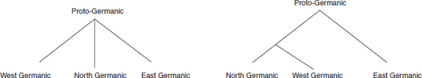
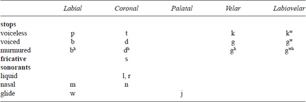
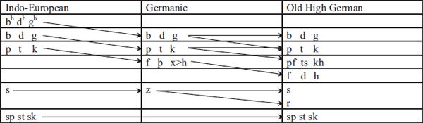
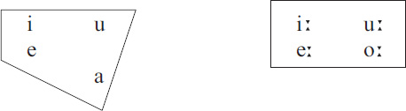
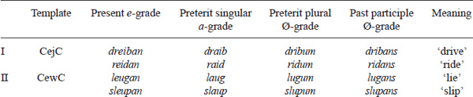
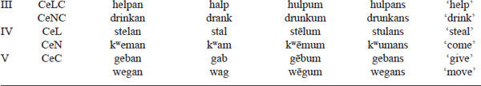
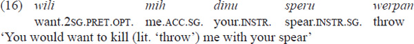
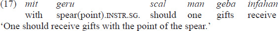
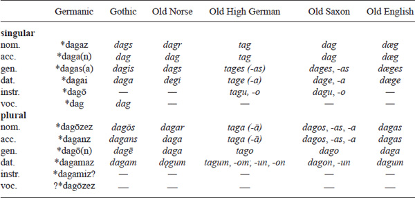
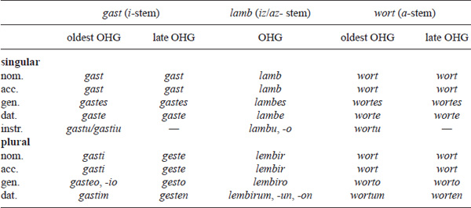

#

<!-- page: 387 -->

Part 8

# **Germanic**

*Joshua Bousquette and Joseph Salmons*

We survey Germanic as a distinct branch of Indo-European, tracing developments that differentiate Germanic from IE up to attested Germanic varieties. We cover structural patterns shared across parts of the family and those that distinguish the sisters from one another. Beyond familiar examples (umlaut, case loss, verb second), we treat areas of recent progress, such as laryngeal phonetics and phonology, foot structure, definiteness and complementizers. We stress how these patterns cut across grammatical modules, connecting phonology, morphology and syntax. That discussion is embedded in the available social and cultural context, e.g. language contact.

## **Introduction**

Our earliest evidence for Germanic languages is from names and words recorded in classical-language sources, including Tacitus, Caesar and Pliny. Most discussed are tribal, personal and place names, but they also include cultural vocabulary, some borrowed into Latin, e.g. *framea* spear, *glsum* amber (cf. *glass*) and possibly cognates of *soap* red hair dye (Green 1998: 185188, Kluge 2011).

Germanic languages are also attested in runic inscriptions written by speakers in the first centuries of the Common Era (Krause 1971, Antonsen 1975, Schulte 2006). These are not limited to Scandinavia (as with the Negau helmet, an early inscription, found in present-day Slovenia) and are identified with various Germanic languages, based on where they were found (problematic for inscriptions on portable objects like spearheads and brooches), orthography and structure. Page (2001) illustrates these difficulties for Frisian runic inscriptions, where arguments for identifying inscriptions as Frisian are tentative and limited to a few items; e.g. the evidence for Frisian provenance of the apparent personal name *skanomodu* assumes a connection to Gmc skaun- beautiful, showing distinctively Frisian monophthongization.

The first longer text preserved in a Germanic language is part of a Bible translation, attributed to Wulfila (Ulfilas) in the late 4th century, written in his Greek-based script. This is our major source for Gothic, in a 6th century Italian manuscript. Texts in the Latin alphabet begin after 500 ce, summarized here, with rough dates for composition and surviving manuscripts:

1.  (1) Early longer texts in selected Germanic languages
    |                 |                                                |
    |-----------------|------------------------------------------------|
    | Gothic          | late 4th c., manuscript from the 6th c.        |
    | Old English     | mid–late 7th c., manuscript from the 8th c.    |
    | Old High German | mid 8th c., manuscript from the late 8th c.    |
    | Old Saxon       | ca. 830, major manuscript from the mid 11th c. |
    | Old Norse       | mid 11th c.                                    |
    | Old Frisian     | late 11th c., manuscript from the late 13th c. |

<!-- page: 388 -->

The family is traditionally divided into three branches:

- East Germanic: Gothic and fragments from other languages. The last known survivor was “Crimean Gothic”, recorded in 1562 (Stearns 1978).
- North Germanic: Runic and then Old Norse, represented by the modern Nordic languages.
- West Germanic, including English, German, Dutch, Yiddish, Frisian, etc.

These branches show their characteristics in the earliest attestations; see Robinson (1992: ch. 10). He eschews sub-branching within this tree, yielding the picture on the left; another view is that on the right (Salmons 2012: 84), a three-way division where North and West Germanic are closer to each other than to East Germanic.

**Figure 8.1** Two models of Germanic subgrouping

Sociohistorical evidence supports the model on the right, with the relatively early departure of East Germanic from southern Scandinavia (Heather 2010), leaving a dialect continuum across North and West Germanic.

One gauge for subgrouping is shared innovations that are unlikely to be independent innovations, but these prove problematic. In sound change, glide hardening – the development of stops from glides (*Verschärfung*, Holtzmann’s Law), shared between Gothic and North Germanic – has long seemed exotic. In both languages, reconstructed geminate glides (*jj, *ww) appear as geminate stops, so that OHG *triuwa* (cf. *troth*) corresponds to ONor. *tryggva* and Goth. *triggwa*. Yet, while similar reflexes do appear, the outcomes do not always match up: OHG *zweiio* ‘of two’ corresponds to coronals in Goth. *twaddje* and velars in Norse *tveggia*. And Faroese (but not its cousin Icelandic) underwent a later sharpening (*skerping*), where apparently geminate -*jj-* and -*ww-* hardened eventually into fortis geminates, palatal and velar respectively (data and analysis following Árnasón 2011: 31–33, who uses Old Icelandic as a starting point):

1.  (2) Faroese *skerping* (adapted from Árnasón 2011: 31)
    |                 |                    |                             |           |
    |-----------------|--------------------|-----------------------------|-----------|
    | Old Icelandic   | Intermediate stage | Modern Faroese              |           |
    | eyjar \[øyjar\] | \[dʒː\]            | oyggjar \[ɔ(i)tʃːaɹ\]       | ‘islands’ |
    | róa \[row.wa\]? | \[gvː\] | rógva \[ɹɛkvːa\] | ‘to row’  |

Worse, hardening is hardly foreign to West Germanic, though in different environments. Schirmunski (2010: 429) shows southern Swabian hardening of labiovelar glides to *b*, cf. *əibər* ‘your (pl.)’, MHG *iuwer*. In Low German, palatal glides can harden to a spirant, e.g. Soest \[ɛɣɑ\] *eier* ‘eggs’ \< OS *eiero* \< PGmc *ajj- (Hall 2014). Modern North Germanic, moreover, seems to show similar tendencies. Riad (2014: 21, 29) discusses the rise of “damped” or “buzzing” realizations of \[iː\] and \[yː\] as \[iːz\] and \[yːz\] and of a \[β\] off-glide

<!-- page: 389 -->

after long high back vowels: \[fiːzn\] for *fin* ‘fine’ and \[buːβk\] for *buk* ‘book’. Here, we have glide hardening without motivation from syllable structure, since these are additional coda material rather than new onsets. High vowels and glides harden into stops around the world; e.g. earlier Inscriptional Burmese -*iy* and *uw* correspond to -*it* and -*uk* in Maru (Mortensen 2012).

To take another example, rhotacism, the development of /r/ sounds from earlier *z, is shared by North and West Germanic: Gmc *deuza ‘animal’, Goth. *dius*, OHG *tior* and ONor. *dýr.* Here, too, the change is far from unique, as in Lat. *flōs ~ flōrem* plus later, independent occurrences of rhotacism in Romance, Germanic and other IE languages (Catford 2001), undercutting its value as a diagnostic.

In morphology, innovations are often built from inherited material in ways that could be independent, like class iv weak verbs (*-nan*) in Goth. *gadauþnan* ‘die’ and Norse *vakna* ‘awaken’, absent in West Germanic. Conversely, the innovative -*st* 2 sg. verbal inflection is characteristic of West Germanic only, attested first in Old High German in high-frequency verbs in main clauses, and later spreading to other tenses, moods and syntactic positions (Somers 2011). Independent developments in single branches may further cloud relationships. Gothic exhibits a synthetic middle passive, e.g. *(ik) haitada* ‘I am called’, where *-da* may be reflexive, consistent with reconstructed IE (p. 162). This is already in competition with reflexive verbal constructions using *sik*, *sis*, or *seina* ‘self’, a process that occurred in Greek (Ferraresi 2005: 106–109); synthetic passives are absent in later Germanic. (The Scandinavian middle is a later development, a reanalysis of the reflexive pronoun *sik* as verbal *-sk*; Faarlund 2004: 126–127, also Emonds & Faarlund 2014.)

If a unified Germanic once existed, it was perhaps ca. 500 bce. Early Runic shows surprising uniformity over time and space, possibly due to conservative writing traditions and a limited early corpus. The evidence shows differentiation across branches from the beginning; some West Germanic varieties show nasal loss before coda fricatives (/f, θ, x/) with compensatory lengthening of the preceding vowel, while others do not: Eng. *five*, *mouth* vs. Germ. *fünf*, *Mund*, from Gmc *femfa, *munθa; a number of forms show variable reflexes, cf. MHG *sunt* ~ *sūd.*

While a tree-like split into three distinct branches is well supported (Nielsen 2000, Heather 2010), intra-Germanic contact was nevertheless pervasive. “North Sea Germanic” (Ingvaeonic) areas still form dialect continua, crossing the Dutch-German linguistic border. And rich patchwork distributions of features occur across mainland Scandinavia. This has blurred the lines of a Stammbaum with chronic wave-like diffusion.

More dramatically, English was initially formed by a mixture of Germanic varieties during the invasion of the British Isles, shaped by the shift of Celtic (“British”) speakers to English, then the North Germanic invasions during the Danelaw and eventually the Normans. What we now call English came into existence thanks to sociohistorical settings involving high numbers of bilingual and bidialectal speakers and second language and second dialect speakers, dialect contact (koineization or “new dialect formation”; Kerswill 2002) plus language contact (Trudgill 2010). This has led to the proposal that it has become North Germanic (Faarlund 2012) or a “fourth branch of Germanic” (Forster et al. 2006). These claims have garnered press attention, but the mainstream view remains that English is West Germanic with complex effects of historical contact (McWhorter 2002, Trudgill 2010).

Some characteristics of Germanic are often tied to the sociohistorical scenarios just sketched. Consider two examples. Substrate effects are likely in lexical material from pre-IE-speaking populations, and many terms reflect domains where vocabulary survivals

<!-- page: 390 -->

from earlier languages seem particularly plausible (flora, fauna, cultural vocabulary); Polomé (1989) and Hamp (1990) argue for substrate status when words show aberrant phonological and/or morphological patterns vis-à-vis inherited vocabulary. Hamp lays out, for instance, the difficulties of the ‘apple’ word, showing reflexes of the extremely rare *b phoneme (also Salmons 2004, 2015). Let us turn to the more secure lexical connections with attested languages, Finnic and other IE groups.

Germanic loans in Baltic Finnic show great antiquity and have been explored for what they show about Proto-Germanic (Kylstra 1991–, Koivulehto 2001, both in some respects controversial). Finnish forms like *kuningas* ‘king’ (Germ. *König*) and *ringas* ‘ring’ retain nominal stem vowels plus endings lost in Germanic. Some words suggest pre-Germanic forms, like Finn. *kana* ‘hen’ with an unshifted *k, rather than Gmc *h.

Borrowings from Germanic into Romance similarly allow us to date borrowings and identify the nature of contact. For example, early borrowings with word-initial labial glides from Germanic into Romance predate glides hardening: Old Frankish *wrakjo ‘exile’ (OHG *reccheo*) becomes Old French *garçun* ‘servant’; Gmc *werre ‘war’ (Goth. *warjan* ‘defend’, cf. Eng. *warrior*, *warden*) becomes Old French *guerrer* (cf. Eng. *guerilla*, *guard*). These cognates in English (post 1066) attest to borrowing from Germanic into Romance, then back into Germanic.

Germanic-Celtic contact predated the Germanic breakup, as all branches share some of the same cognates with Celtic. Borrowed from Celtic are some legal terms, including ancestors of words like *oath* (Lehmann 1986). Goth. *andbahts* ‘service, office’ (Germ. *Amt*) is distinguishable as a borrowing by the /a/ for IE syllabic *m̥ (IE *-m̥bʰí), which has anaptyctic /u/ in Germanic (OHG *umbi* ‘around’, but Gr. ἀμφί). Another likely early borrowing is OIr. *dún* ‘fort, walled hillock’ (W *dinas*, ‘city’): OHG *zūn* ‘fence’ (Germ. *Zaun* ‘fence’), OEng./OS/ONor. *tūn* ‘village’ (Dutch *tuin* ‘garden, yard’). *Zaun* reflects the second sound shift, so predates that. While some accept such terms as Celtic loans (Orel 2003, Kroonen 2013), others are skeptical, e.g. Kluge 2011, where *Zaun* is of “uncertain origin” but presumably connected to Celtic. A third is more complex, Goth. *eisarn-* ‘iron’, OEng. *isarn*/*isærn*, OHG *isarn*, MDutch *iser* ‘iron’ (OIr. *iarn*). (The iron age came relatively late to Northern Europe, perhaps 400 bce, and some connection to Celtic is likely; Kluge (2011) suggests that Celtic and Germanic borrowed the term from a third language, while Lehmann (1986) notes possible multiple borrowings from Celtic.)

Contact often also correlates with morphological reductions, e.g. case loss (O’Neil 1978). A standard narrative about Germanic is framed around such “simplifications”. As argued below, that view must be balanced against increasing complexity, including in the segmental inventory (larger vowel systems) and new inflection. Simplification is a frequent result of contact, but hardly inevitable (see below).

Germanic’s position within IE has been more controversial (see Polomé 1972). Some (e.g. Ringe 2006: 5–6) assign Germanic to a “central” group including Balto-Slavic, Indo-Iranian, Armenian and Greek. Vocabulary is shared in complex ways with northwestern neighbors (Meillet 1967), perhaps reflecting later contacts rather than earlier genetic unity. Contact took place with pre-IE languages, other IE branches and non-IE languages, especially Finnic (Roberge 2010, Mailhammer & Vennemann 2015), muddying the waters between tree- and wave-like patterns. Like other IE languages, Germanic was likely forged from contact between Indo-Europeans and indigenous populations. Jutland (Denmark), southernmost Norway and Sweden, and the Baltic and North Sea coasts are likely the earliest area where Germanic was spoken, with ongoing contact with other (post-)IE groups and non-IE groups.

##

<!-- page: 391 -->

**Phonology**

### **Consonants**

Germanic stops and fricatives differ systematically from IE, other segments less so. The IE laryngeals, on mainstream views, were lost early and have little relevance to Germanic (but see Müller 2007). Traces of laryngeal phonology are visible in the ablaut system (Ringe 2006: 80):

1.  (3) PIE root-ablaut alternations   pre-PGmc root-ablaut alternations
    |                |     |           |
    |----------------|-----|-----------|
    | a ~ Ø          | \>  | a ~ Ø     |
    | e ~ Ø ~ o      | \>  | e ~ Ø ~ o |
    | h₁e ~ h₁ ~ h₁o | \>  | e ~ Ø ~ o |
    | h₂e ~ h₂ ~ h₂o | \>  | a ~ Ø ~ o |
    | h₃e ~ h₃ ~ h₃o | \>  | o ~ Ø ~ o |
    | eh₁ ~ h₁ ~ oh₁ | \>  | ē ~ a ~ ō |
    | eh₂ ~ h₂ ~ oh₂ | \>  | ā ~ a ~ ō |
    | eh₃ ~ h₃ ~ oh₃ | \>  | ō ~ a ~ ō |

Similarly, whatever the status of IE palatal versus velar stops, both surface in Germanic as velars (Sihler 1995: 151–168):

1.  (4) IE     English
    |              |                |         |
    |--------------|----------------|---------|
    | *yu**g**om- | *yo****k****e* | ‘yoke’  |
    | ***ǵ**enh₁- | ***k****in*    | ‘beget’ |
    | ***ǵ**neh₃- | ***k****now*   | ‘know’  |

IE syllabic resonants – liquids and nasals – resolve into *u plus resonant (Kluge 2011):

1.  (5) pre-Germanic    Germanic
    |          |          |          |
    |----------|----------|----------|
    | *wr̥m-   | *wurma- | ‘worm’   |
    | *wl̥kʷo- | *wulfa- | ‘wolf’   |
    | *n̥dher- | *under- | ‘under’  |
    | *sm̥H-   | *sumera | ‘summer’ |

This leaves this pre-Germanic system:

**Table 8.1 Pre-Germanic consonants**

<!-- page: 392 -->

Traditional IE obstruents differ from, yet correspond systematically to, Germanic:

|                     |       |              |
|---------------------|-------|--------------|
|                     | IE    | Germanic     |
| **voiceless**       |       |              |
| labial              | *p   | *f          |
| coronal             | *t   | *θ          |
| velar               | *k   | *x          |
| labiovelar          | *kʷ  | *xʷ \> *hʷ |
| **voiced**          |       |              |
| labial              | *b   | *p          |
| coronal             | *d   | *t          |
| velar               | *g   | *k          |
| labiovelar          | *gʷ  | *kʷ         |
| **voiced aspirate** |       |              |
| labial              | *bʰ  | *b / *β    |
| coronal             | *dʰ  | *d / *ð    |
| velar               | *gʰ  | *g / *ɣ    |
| labiovelar          | *gʰʷ | *gʷ / *ɣʷ  |

**Table 8.2 IE and Germanic stops**

In these changes (“Grimm’s Law”, Germanic Consonant Shift, First Sound Shift), one change, *p \> *f, reflects a change in manner of articulation, from stop to fricative, while others involve laryngeal phonology (meaning “states of the glottis”, i.e. phenomena like voicing and aspiration, not IE laryngeals).

While the shift represents perhaps the most discussed sound change, discussion is often unclear about the precise laryngeal characterization of IE and Germanic stops and fricatives, especially with regard to the division of labor between phonology and phonetics. Crosslinguistically, laryngeal contrasts can be captured with three features, \[voice\], \[spread glottis\] and \[constricted glottis\], plus laryngeally unmarked or unspecified consonants (Iverson & Salmons 1995, Avery & Idsardi 2001). In many languages, these contrasts are enhanced by additional phonetic cues, particularly for phonation (Henton et al. 1992). The traditional IE obstruent system would have had unmarked stops (*p, *t, *k, etc.), voiced stops (*b, *d, *g, etc.) and stops marked by both \[voice\] and \[spread glottis\] (*bʰ, *dʰ, *gʰ, etc.). Earlier voiceless stops become voiceless fricatives (“spirantization”), perhaps triggered by aspiration, as an enhancement. (A shift to a \[spread glottis\] system may have preceded these changes.) IE voiced stops devoice, a process found in many languages, perhaps motivated by the challenge of maintaining voicing – which requires considerable air flow across the glottis, while air flow is blocked in stops. The third are traditional “voiced aspirates”; modern descriptions of Indic treat them as “murmured” or “breathy”, with a slightly open glottis with high air flow; these deaspirate in Germanic. Controversy surrounds whether these become voiced stops or fricatives. For instance, a form like *bʰendʰ- becomes Gmc *bind-, with voiced stops initially and after a nasal, but postvocalically we often find fricatives, e.g. ONor. *orð* ‘word’ from *wr̥dʰo-. We assume underspecification for \[continuant\], similar to contextual stop-fricative alternations in Spanish.

These changes – spirantization, devoicing, deaspiration – appear to be connected by encroachment of new sounds into the space of old ones or the filling of gaps created by earlier changes, “push” or “pull” chains respectively. On the former, if *dʰ deaspirated first, *dʰer- would have risked merger with *der-, triggering devoicing of *der- to *ter-. On the

<!-- page: 393 -->

latter, if *pel- become *fel-, the lack of voiceless stops might allow devoicing to fill this gap. This pull is sometimes motivated in terms of voiceless stops as “unmarked”, lacking laryngeal specification. (Wrinkles include labiovelars; see Salmons & Smith 2005.)

Germanic contrasts \[spread glottis\] or “aspirated” *p, *t, *k, etc. and unmarked *b, *d, *g, etc., rather than “voiceless” vs. “voiced”, making Germanic phonologically more different from IE than traditional views, with implications for later obstruent changes.1 (Dutch and Yiddish are \[voice\] languages, in both languages likely due to contact with Romance and Slavic, respectively.)

A set of Germanic forms shows irregular voicing in fricatives, which once constituted a challenge to claims about the regularity of sound change:

1.  (6) Verner’s Law
    Skr. *bhrā́***t***ar-* Gmc *brō**θ**er   ‘brother’
    Skr. *mā***t***ár*-  Gmc *mō**ð**er   ‘mother’

Verner (1875) famously established that this voicing was actually regular, conditioned by position of the IE “mobile” accent (§2.3), so that (expected) voiceless fricatives appeared where Sanskrit has a preceding accent and voiced when the accent did not precede. Germanic provides evidence for the position of the IE accent in verbal paradigms, reflected in a few modern alternations like Eng. *wa***s*** ~ we***r***e* (/r/ from *z). Unmarked stops (Germ., Eng., Dan. \<b, d, g\>) are, as noted, treated as unspecified. They often lack phonetic voicing in initial and final position (systematically in Icelandic), but in a voice-friendly environment like between vowels, they are phonetically voiced. A similar kind of “passive voicing” (Iverson & Salmons 2003, among others) may have been at work in Verner’s Law: IE accent was likely realized with stiff vocal folds, so that a preceding accent would inhibit fricative voicing.

Another “exception” is equally important, but never played the pivotal role that Verner patterns did concerning regularity: IE voiceless stops did not shift after *s: *sper- retains its stop in modern Eng. *spear*, Germ. *Speer.* The modern absence of aspiration – or phonological specification for \[spread glottis\] – supports connecting spirantization to aspiration.

These developments illustrate continuity and change within Germanic. Complex consonantal “chain shifts” like Grimm’s Law are uncommon in the world’s languages, but occur again within later Germanic. High German is defined traditionally by a set of changes known often as the Second Consonant Shift (“High German Consonant Shift”). Like in Grimm, stops become spirants, though variably by environment and place of articulation, and in certain varieties and context showing a partial shift to affricate rather than fricative. Intervocalic stops are prone to shift but initial or post-consonantally less so, and coronals preferably over velars, as in English (unshifted) and German (shifted):

1.  (7) The Second Consonant Shift
    English  German
    *path*    *Pfad*
    *hel**p**   hel**f**en*
    *town   **Z**aun*
    *ea**t**   e**ss**en*
    *cool   **k**ühl*
    *mil**k**   mel**k**en*
    *boo**k**   Buch*

<!-- page: 394 -->

Modern parallels include affrication of initial /t/ in some varieties of Danish and affrication/spirantization in Liverpool English (e.g. Honeybone 2002).

The Second Sound Shift has a broader chain-like character. The lenis (in traditional terms “voiced”) *d becomes /t/ except in the north: Eng. *drink* is cognate with Germ. *trinken*. Farther south, *g becomes /k/, and *b becomes /p/: Old Bavarian *perec* ‘mountain’, cf. *Berg.* Possibly related is the “stopping” of interdental *θ across most of Germanic. Excepting variation based on dialect and the environment, the basic progressions of the sound shifts are illustrated in (8).

1.  \(8\)
    

    

    

Other widespread patterns include final laryngeal neutralization, “final devoicing” (Iverson & Salmons 2011). Some patterns of variability, like a wide range of realizations of rhotics across languages and dialects, continue ancient variation (Howell 1991).

Overall, attested changes often parallel those posited for prehistory and early history, with occasional twists on claims about innovation: while English is often tagged as an ill-behaved member of the family, its obstruent system remains surprisingly close to West Germanic.

### **Vowels**

Early Germanic maintains a vowel system close to that of IE after the emergence of distinct long vowels, with a five-vowel system with a length contrast. Prehistoric low-back vowels merged, in different directions by length:

1.  (9) (late) Indo-European \>  Germanic
    |           |          |                     |
    |-----------|----------|---------------------|
    | *gʰans   | *gans   | ‘goose’             |
    | *orbʰ-   | *arb-   | ‘heir, inheritance’ |
    | *bʰrāter | *brōθer | ‘brother’           |
    | *plō(w)- | *flō-   | ‘flow’              |

Such changes have parallels in IE and are reenacted with the contemporary North American merger of the low-back vowels /a/ and /ɔ/.

A further early change is the emergence of a new long vowel, ē2. In West Germanic, old *ē (“*ē1”, occasionally written *ǣ) had lowered, and the new vowel, attested in Old High German as *ia*, appears in cognates of *here* and as the stem vowel in class VII strong verbs of the *let* type, etc.

1.  (10)

<!-- page: 395 -->

The Proto-Germanic vowel system
    

    

    

    |                                             |                                            |
    |---------------------------------------------|--------------------------------------------|
    | Short vowels | Long vowels |
    | *widuw- ‘widow’                            | *wīd- ‘wide, broad’                       |
    | *fimf ‘five’                               | *sīm- ‘string’                            |
    | *et- ‘eat’                                 | *dēd- ‘deed’                              |
    | *nas- ‘nose’                               | *brōθer ‘brother’                         |
    | *wull- ‘wool’                              | *mūs ‘mouse’                              |

Earlier *ey monophthongizes to *ī. Aside from that, Germanic also included three “diphthongs”; that the *a in these participates in the low-back merger may suggest that these may have been vowel-glide sequences rather than single units.

1.  (11) Proto-Germanic “diphthongs”
    - aj
    - ew
    - aw
    - *ajh-/ajg- ‘have’
    - *skajd- ‘separate’
    - *dewp- ‘deep’
    - *kews- ‘choose’
    - *rawd- ‘red’
    - *hawzij- ‘hear’

From there, things become steadily more complicated, driven by patterns of vowel to vowel assimilation. Umlaut can be understood only in the context of height harmony and consonantal conditioning. In Germanic, vowels assimilated partially to the height of following vowels, e.g. /e, o/ \> /i, u/ before high vowels, as well as before coda nasals (with parallels in some modern dialects), and Gothic shows a general raising of /e/, though /e/ still appears before /h, hʷ, r/. A parallel lowering before /a/ is also illustrated below:

1.  \(12\)
    |          |     |                                                             |
    |----------|-----|-------------------------------------------------------------|
    | *geban  | \>  | OHG *geban ~ gibis* ‘give ~ you give’, but Goth. *giban*    |
    | *helpan | \>  | OHG *helfan ~ hilfis* ‘help ~ you help’, but Goth. *hilpan* |
    | *ed-    | \>  | ONor. *eta*, OHG *eʒʒan*, but Goth. *itan* ‘eat’            |
    | *bendan | \>  | OHG *bindan* ‘tie’                                          |
    | *wiraz  | \>  | OHG *wer* ‘man’                                             |
    | *juka   | \>  | OHG *joh* ‘yoke’                                            |

Within Continental West Germanic “primary” umlaut of /a/ to /e/ before i/j shows raising but with additional fronting. That process was blocked dialectally by coda /h, r, l/.

<!-- page: 396 -->

It preceded the general fronting of all back vowels since these are different structural patterns. Moreover, failure of umlaut is attested in southern German dialects (particularly with geminate velars) and in western Netherlandic (blocking environments or *ā*) (Buccini 1995, Iverson & Salmons 1996, Howell & Salmons 1997). In other daughters, chronological differentiation is not demonstrable, e.g. Old English. Conditioning also differs across the family: North Germanic umlauts heavy stems (*gestr* ‘guest’ \< *gastiz) but not light ones (*staðr* ‘place’ \< *staðir) of the relevant morphological classes (Iverson & Salmons 2012). See §3.2 on the morphologization of umlaut.

Above we discussed chain-like consonant shifts, e.g. with fortis or voiceless stops repeatedly becoming affricates and/or fricatives. Similar changes are pervasive in the vowel system. “Chain shifts” have been extensively described for North and West Germanic (Sievers 1876, Küspert 1988, Wiesinger 1970), and related shifts are underway across North America (Labov 1994, among many others). Consistent trends emerge across these independent changes: raising of long or tense vowels, lowering of short or lax vowels and fronting of back vowels.

### **Prosody**

IE “accent” was marked by pitch and was mobile in that it could fall on different syllables within the paradigm, like in modern Russian (§2.1). The Germanic “Accent Shift” fixes the accent on the initial syllable, obviously after Verner’s Law. Germanic stress correlates broadly with vowel duration and intensity. Kiparsky & Halle (1977) and Halle (1997) provide phonological accounts of the change, while Salmons (1992) argues that language contact played a role, alongside such language-internal motivations.

The effects of this shift are far-reaching, including ties to innovations in verbal and pronominal agreement. For example, Gothic first and second person dual subject pronouns *wit* and *jut* seem to derive from the stems of plural *weis* and *jus* and an enclitic variant of ‘two’, *twái*/*twa*/*twōs*. Clitics were arguably present in earliest Old Norse (Faarlund 2004: 35, though see Biberauer & Roberts 2008: 105) but disappeared with the development of the Scandinavian lexical accent, ca. 800 (Oftedal 1952, Kristoffersen 2011). This accent counteracted the clause-based prosody of other Germanic languages; Scandinavian lexical items determined prosody, independent of clausal position.

West Germanic reduction of final unstressed syllables introduces paradigmatic ambiguity, since Germanic typically marked information on suffixes. Consider the three weak verb classes well attested in West Germanic and distinguished by final vowels (§3.1, §4).

|            |                  |                  |
|------------|------------------|------------------|
| Verb class | Old High German  | Modern German    |
| i          | *fellen* ‘fell’  | *fällen* ‘fell’  |
| ii         | *dionōn* ‘serve’ | *dienen* ‘serve’ |
| iii        | *habēn* ‘have’   | *haben* ‘have’   |

**Table 8.3 Old High German weak verbs**

As unstressed vowels reduced to schwa, these distinctions were lost. Such increased ambiguity within inflectional paradigms, often presumed to be driven by reduction and subsequent loss of morphological marking, correlates with an increase in periphrastic forms, e.g. higher frequency of pronominal subjects (Axel & Weiß 2011) and development of obligatory definite articles in Old High German (§5.5).

Other processes create new affixes and inflectional categories. Typically unstressed elements like pronouns cliticize onto a preceding word, creating preferred foot structures,

<!-- page: 397 -->

and pronominal enclitics can be reinterpreted as inflectional affixes or pronouns (De Vogelaer 2010). The OHG 1 pl. verbal *emes*/*-emēs*, as in *habemēs*, alternates with a short form, *habēn*, both meaning ‘we have’. The longer inflection is likely from an enclitic *uuis* ‘we’, with assimilation of the coda nasal /n/ or /m/ to the bilabial glide in the onset of the pronoun, yielding /m/. Axel (2007: 305) and Axel & Weiß (2011) show that the long ending regularly appears without a co-occurring subject pronoun, arguing that the long ending is in fact a reanalyzed pronominal form; subject pronouns are obligatory with the “short’ ” ending (see also Early Modern Nuremberg *-ma* (1 pl.); Fertig 2000: 47). Rhotacized forms regularly appear in all Germanic languages other than Gothic, so the innovative inflection with OHG *s* reflects a prehistoric process.

Similar are innovative 1 pl. pronouns, including Flemish, Zeelandic and Brabantic 1 pl. *me*, derived from enclitic *wij*/*we* and the preceding nasal /n/ of the verbal inflection, which can appear not only phonetically conditioned but also in topic position (De Vogelaer 2010: 15); and Bavarian 1 pl. *mir*/*ma* from *wir* (Fuß 2004, 2005), which may similarly appear in topic position. Analogous pronominal innovations in North Germanic similarly derived Old Norwegian 1 pl. *mit*/*mēr* from *wit*/*wēr*, prevalent between 1200–1400 ce; and Sw. 2 pl. *ni* from *i* during the 17th century (Haugen 1976: 302, 375). Innovative *dir* also appears in numerous dialects of German (Weise 1907: 201ff.), from reinterpretation of 2 pl. inflectional *-t* as part of pronominal *ihr*.

A final prosodically-driven change is complementizer agreement (C-agr), from the reanalysis of pronominal elements as inflectional affixes. C-agr is possible on a number of different lexical categories heading a subordinate clause (Reis 1985, Kathol 2001). C-agr is attested across multiple non-standard West Germanic varieties as early as the mid 13th century (Goeman 1997). An oft-cited example is from Bavarian (Bayer 1984: 233), where the complementizer *wenn* ‘if’ inflects for person and number, here 2 sg.

1.  (14) *Wennst   kummst*
    if-2SG. PRO come-2SG.
    ‘If you come’

Similar to innovative inflectional affixes and pronouns, the encliticization of unstressed pronouns to a stressed lexeme is argued to be a historical prerequisite for complementizer agreement (Weiß 2005, forthcoming). Together with innovations in the verbal and pronominal paradigm, C-agr illustrates prosodically based complexification and is relatively stable in non-standard varieties and language islands (Bousquette 2014).

In another area of prosody, syllable and foot structure, the classic insight into Germanic syllable structure is “Prokosch’s Law” (the “Weight Law”), that stressed syllables must contain two moras.2 Murray & Vennemann (1983) show a conspiratorial pattern of sound changes in all three branches of Germanic consistent with one syllabification of medial consonants: (1) West Germanic gemination, (2) North Germanic vowel lengthening and (3) Gothic glide strengthening.

These effects all fall out, they argue, from the conflict between Prokosch’s Law (which they call the “Stressed Syllable Law”) and the Syllable Contact Law, namely (1983: 520, cf. Vennemann 1988, \$ = syllable boundary):

1.  (15) Syllable Contact Law. The preference for a syllable structure *A\$B*, where *A* and *B* are marginal segments and *a* and *b* are the Consonantal Strength values of *A* and *B* respectively, increases with the value of *a* minus *b*.

For example, Icelandic and Faroese show slightly different patterns of syllabification in CV́CCV- words, according to consonantal “strength”. Icelandic allows more word-internal

<!-- page: 398 -->

onset clusters, *p, t, k, s* + *j, v r*, so *vis*\$*na* ‘wither’ but *vö*\$*kva* ‘to water’; Faroese only tolerates *p, t, k* + *r, l*, except *tl*, so *sjóg*\$*vur* ‘sea’ but *sū*\$*kri* ‘sugar’ (1983: 522–523).

Similarly, Dresher & Lahiri (1991) propose that a wide range of early Germanic sound patterns can be captured in terms of foot structure. They define the “Germanic foot” as “maximally binary, left-headed, where the head must dominate at least two moras” (1991: 251). The head could include one or two syllables, and the non-head element may contain only one mora. That is, a foot required a head of two moras, which could come from one heavy syllable or from two light ones. In their analysis of Old English High Vowel Deletion (simplifying), high vowels delete only in the weak branch of a foot, but those in the head are maintained: CV:C or CVCCV, in OEng. ****go****\$*d* \< ***go**\$du ‘good’ or ****wor***d \<* *wordu ‘word’, for example) versus CVCV, in OEng. *lofu* ‘praises’.

In prosody, Germanic and its daughter languages historically also show patterns where prosodically weak, phonetically reduced elements affix to adjacent syllables (as in the cliticization examples above). They thereafter could be incorporated into a “prosodic word” (pword), allowing processes otherwise confined to word boundaries, as noted in Somers Wicka’s (2009: 8) treatment of the Otfrid’s OHG *Evangelienbuch*. Hanna (2009) revisits Jespersen’s Cycle, also in the *Evangelienbuch*, as well as in the MHG *Nibelungenlied*, arguing that “secondary stress \[as\] the outcome of an interaction between phonology and syntax … is sensitive to rhythmic context, to syllable structure, and to vowel height” (2009: 201). Characteristic of Germanic even from early attestations is the phonology’s sensitivity not only to foot structure but also to syntactic environment.

Smith (2004) and Smith & Ussishkin (2014) frame foot and other prosodic structures in terms of templates, allowing us to capture conspiracy-like effects here, just as Murray and Vennemann do for the syllable level.

The traditional view of Germanic prosody is that the accent shift triggered weakening of final syllables leading to the dramatic reductions, “simplifications”, in inflectional morphology, discussed just below. We have also illustrated how reduction can have the opposite effect, increased complexity via cliticization and grammaticalization. More broadly, a simple “phonology first” view of such changes has been questioned within Germanic and beyond recently by Enger (2013) and Menz (2010). Enger (2013: 18) concludes that sound change alone cannot account for reductions in the history of Norwegian, arguing for a driving role for an autonomous morphology.

## **Morphology**

### **Inflectional morphology**

Germanic strong verbs exploit ablaut for tense. Traditionally divided into 7 classes, the first 5 are inherited from IE and involve a present tense *e*-grade, which alternates with an *a*-grade in the preterit singular, and zero-grade in the preterit plural and past participle.

**Table 8.4 Germanic strong verbs, classes I–V**

<!-- page: 399 -->

This so-called *e*-group is built around the CV templates shown in Table 8.4 (second column). In the absence of a preterit plural root vowel, glides in class I and II develop respectively into a short /i/ and short /u/; in class III the liquids and nasals epenthesize /u/ (§1). The long /e/ in the zero-grade of class V and in the preterit plural of class IV are innovations on analogy to other strong classes (see below).

Class VI and VII are often characterized by an /a/ rather than /e/ root vowel, and utilize two different strategies for differentiating between the principal parts (van Coetsem 1994: ch. 8). Class VI verbs show /oː/ in the preterit singular and plural, and the same, short *a*-grade form for the participle as in the present. Class VII verbs show the same syncretism between the present and participle forms, but mark the preterit singular and plural by partial reduplication. Except for *s*+stop clusters, Gothic reduplicates only the initial consonant(s) and a fixed short /e/, as in *flōkan ‘bewail’ ~ \<faiflok\> containing reduplicated \[fe-\], ‘they bewailed’, with fixed vowel and simplified onset cluster. With *s*+stop clusters, we find reduplication of *st*- and *sk*-, as in *gastaldan* ‘to receive’ ~ *gastaistald* (Nehemiah 5:16) and *afskaidan* ‘to part ways’ ~ *afskaiskaidun* (Luke 9:33). Class VII verbs are not attested as a productive tense-marking strategy in North or West Germanic (Bammesberger 1986: 64, Ringe 2006: 248–250).3 Still, while the *e*-grade and *a*-grade strong verbs mark the principal parts differently, *a*-grade class VII verbs look strikingly like class I–III verbs of the *e*-grade in their consonants, and class VI verbs are built similarly to class IV and V (van Coetsem 1994: 127).

Returning to the origin of /ē/ in the preterit class IV and V, the structural similarity to class IV verbs suggests analogous use of a long vowel to distinguish tense. The reconstructed zero-grade from *geban* ‘give’ would be *gbum in the preterit plural, not a licit consonant cluster in Germanic; a lengthened root vowel on analogy to the class VI verbs repairs an otherwise unpronounceable consonant sequence. Beyond repair strategies, analogy must also account for the presence of /ē/ in IV verbs like *stelan ~ stēlum* ‘steal ~ stole.pl’ and *kʷeman ~ kʷēmum* ‘come ~ came.pl’, the expected forms of which would have been *stelan ~* *stulum and *kʷeman ~* *kʷumum, since zero-grade liquids and nasals develop epenthetic /u/ in Germanic, preserved in the preterit presents. This is also the case with class III verbs *helpan ~ hulpum* and *drinkan ~ drunkum*. Analogy does not occur since class III verbs are structurally similar to class VII, which does not use vowel length alternations to distinguish principal parts.

In addition to the 7 strong classes, weak verbs – see §4 – formed their preterits with a /d/ or /t/ suffix, as in Modern Eng. *-ed* or Modern Germ. -*te*. This “dental preterit” was organized into four classes, which often correspond to particular functional distinctions: (i) causatives/denominatives, (ii) iteratives, (iii) duratives and (iv) inchoatives.

The trend is a steady expansion of weak verbs at the expense of the strong (cf. Lieberman et al. 2007, Carroll et al. 2012). The process has left many residues and much variation at any given stage. Historically strong class III OEng. *meltan* ‘melt’ has become weak (e.g. *melted*) but preserves a frozen adjectival form, *molten*, derived from the strong paradigm. Ongoing change is visible in Modern Germ. *backen* ‘bake’, which has an archaic strong preterit *buk* alongside the more common, innovative *backte* in the 1/3 sg., but the strong past participle *gebacken*. Movement in the other direction is rarer,

<!-- page: 400 -->

e.g. American English *dive*, historically weak, has developed a strong preterit *dove*, likely on analogy to verbs such as *drive ~ drove*.

A last category is the so-called preterit presents, verbs with a preterit form but present meaning. This category includes what have become our modern modal verbs, e.g. OHG *mugan* ‘may’, *skulan* ‘shall’, *wellen* ‘want’; others like *muozan* ‘must’, *kunnan* ‘can’, *durfan* ‘be allowed to’ (ONor. *þurfa* ‘require, need’, Modern Dutch *durven* ‘dare’). Early on, these arguably acted more like full verbs. These maintain archaisms from the strong paradigms, including the syncretism of the first and third person singular. Additionally, since the preterit presents already have a strong preterit form in the present, the past is formed by adding the weak dental suffix.

### **Nominal system**

The IE system of case, number and gender is complex relative to most attested languages, including Germanic. IE had 8 cases: nominative, accusative, dative, genitive, ablative, locative, instrumental and vocative. Germanic is reconstructed as having six, based on attestations in the earliest texts. The early daughters retain four robustly: Nominative, Accusative, Dative and Genitive, and two more in limited fashion: Vocative is attested only in Gothic, and Instrumental is attested in West Germanic. The receding of the Vocative and Instrumental are early examples of case loss. Vocative was absorbed into other classes; even in Gothic it was already identical in form to the Nominative in the plural, a pattern inherited from PIE. Vocative differed in form from the nominative singular only when the nominative singular ended in *-s*, which includes only Gothic masculine *a*-stems (IE short *o*-stems) and their subclasses. In that event, the vocative was identical in form to the accusative singular (*wulfs* ‘wolf’ nom.sg.; *wulf* ‘wolf’ acc./voc.sg. An exceptional case is the *u*-stem *sunus* ‘son’ nom.sg.; *sunu* ‘son’ acc./voc.sg.

The instrumental was attested in Old High German but restricted to a subset of nominal classes even early, specifically the masculine and neuter *a*-stems, the masculine *u*-stems and the masculine and feminine *i*-stems. Some of the nouns belonging to these classes are particularly well suited to instrumental use, as in *swërt* ‘sword’ (neuter *a*-stem), *scaft* ‘spear’ (feminine *i*-stem) and *witu* ‘wood’ (masculine *u*-stem, OEng. *wudu*), as in (16) from the Hildebrandslied, l. 40. Such an example is provided below, in (17), from the Hildebrandslied l. 37, as Haðubrant expresses his distrust of his opponent (his father, Hildebrand).

Haðubrant’s utterance three lines earlier shows an instrumental – doubly marked morphologically and by a preposition, *mit* ‘with’ – as he suggests how the untrusted Hildebrand should hand over an armband as a gift.

Eventually the dative incorporates the function of the instrumental, most often also marked with a preposition. This is likely accelerated by the propensity for heavy *a*-stems in particular to appear without inflectional morphology, due to both their syllable structure and analogy to uninflected nominative and accusative forms in the paradigm (Braune & Eggers 1987: 182–183).

<!-- page: 401 -->

Number is similar to IE, with singular, plural and dual. The dual was restricted in the earliest attestations. While dual pronouns exist in Old Norse, Old English, Old Saxon and Gothic, only Gothic retains a verbal paradigm specific to the dual; in other languages, dual pronouns inflect as plural (Howe 1996).

Gender largely echoes what is reconstructed for (late) IE. Germanic retains three genders – masculine, feminine and neuter – but daughters tend to lose this distinction in the plural. While many early languages maintained gender-specific inflections in the nominal paradigm (e.g. for a group of men), variation increases when the plural involves nouns of more than one gender. For example, Luke 8:1–4 (Codex Argenteus) describes a gathering of both men and women who listen to Jesus preach. Following a dative plural (which is ambiguous for all genders in the pronoun and strong adjectives), the relative pronoun for the gathering of men and women is masculine plural *þaiei*: *gaqumanaim þan hiumam managaim jah þaim þaiei us baurgim gaïddjedun du imma, qaþ þairh gajukon:* (‘And when many people were gathered together, and were come to him out of every city, he spake by a parable:’, Luke 8:4,

www.wulfila.be). Masculine is sometimes the default for indefinites (cf. Codex Argenteus, Luke 8:13), but also appears as a masculine plural relative pronoun *þaiei*, even anaphorically to a feminine singular noun *so managei* ‘the multitude’, *alja so managei, þaiei ni kunnun witoþ, fraqiþanai sind* ‘but this multitude who do not know the law are cursed’ (Codex Argenteus, John 7:49). Over time, the trend is to retain gender distinctions in the singular but to collapse gender into a unified plural in the nominal and pronominal paradigms (except Modern Icelandic; Einarsson 1945).

The nominal system remains based on inherited classes, organized primarily around thematic vowels and secondarily around gender. Key Germanic noun classes include the *a*-stems (masculine and neuter, IE *o*-stems), *ō*-stems (feminine, IE *ā*-stems), *i*-stems (masculine and feminine), *u*-stems (masculine and feminine) and subclasses of these. Consonant stems include the *r*-stems (a small class, familial relations), *n*-stems (the basis for new weak adjective endings) and *nd*-stems (based on participles). Additionally, there are smaller classes like the -*iz*/-*az* stems (originally comprising names for baby animals; this class over time comes to play a major role in German plural formation, along with *i*-stems).

Masculine *a*-stems, illustrated with ‘day’ in Table 8.5, are one of the largest and most stable noun classes. Still, changes are visible even early in the textual evidence of the collapse of some parts of the paradigm, due to a combination of sound change and (subsequent) morphological changes.

Table 8.5 ***a*****-stem masculine nouns** (adapted from Prokosch 1939: 241–242; Braune & Eggers 1987: 182)

<!-- page: 402 -->

Gothic maintains a comparatively unambiguous paradigm (except the vocative), while later daughters exhibit changes that introduce ambiguity or reduce uniformity across the paradigm. For example, West Germanic languages collapse the nominative and accusative singular, either through the extension of the accusative to the nominative, or due to the loss of the nominal inflection -*s* (in Gothic) or -*r* (in Old Norse). A similar collapse is visible in the nominative and accusative plural, though Old English and Old Saxon extend the nominative into the accusative, while Old High German extends the accusative into the nominative. In terms of sound change, Old Norse shows *i*-umlaut in dative singular, and *u*-umlaut in the dative plural, resulting in three different vowels across the paradigm. Old English, on the other hand, experienced Anglo-Frisian fronting of /a/ to /æ/ (“brightening”), visible in the singular but reversed in the plural, by height harmony with the suffixal /a/; the dative plural change was the same process. This split introduces an alternation correlated with the singular/plural distinction.

The increasing tendency to mark singular/plural within the existing nominal class was widespread across Germanic. Similarly, nouns realign from one noun class to another or adopt new inflections based on formal similarities to other classes. Consider the Old High German comparison below, between masculine *i*-stem *gast* ‘guest’, neuter -*iz*/-*az* stem *lamb* ‘lamb’ and neuter *a*-stem *wort* ‘word’.

Table 8.6 Examples of other noun classes (adapted from Sonderegger 2003; Prokosch 1939: 245; Braune & Eggers 1987: 182–198)

Through sound changes, especially the rise of umlaut in plurals, the clearest difference in the paradigm is between singular and plural, marked by a vowel alternation originally conditioned by suffixal -*i* (*gast*, oldest OHG); this remains as a morphologically conditioned vowel alternation after the conditioning high vowel has reduced to a schwa and disappeared. The same alternation arises for *lamb.* The neuter *a*-stems, like *wort*, have more paradigmatic ambiguity, with uninflected forms for nominative and accusative, in both the singular and plural. At the same time, the inflectional endings in the singular are identical to those of the masculine *i*-stems and of the -*iz*/-*az* stems. In late Old High German and especially in Middle High German, some former *a*-stems mark plurality with umlaut, on analogy to unrelated noun classes, in order to repair a deficient paradigm. Crucially, this involves the spread of a portmanteau affix from one class as a plural marker in another. Some of these include MHG *rat ~ reder* ‘wheels’, *blad ~ bleter* ‘leaves, pages’

<!-- page: 403 -->

and *hūs ~ hiuser* ‘houses’. This is indicative of the tendency toward marking of number to expand at the expense of noun classes (*Pluralprofilierung*; Luiten 2011, Luiten et al. 2013, and many others), and reflects the weakening of the inherited noun class system.

One additional noun class deserves mention, *n*-stems, from which the so-called weak adjectival endings were derived. Not inherited from IE, weak adjectival endings were employed in Germanic to mark definiteness (Behaghel 1923: 197); the use of inherited, strong adjectival endings marked indefinites. In short, definiteness marking in Germanic arose with an innovative system of complementary adjectival paradigms before the development of definite or indefinite articles (Harbert 2007: 130ff.). For pronouns, the fullest available historical treatment is Howe 1996.

## **Word formation**

Trips (2014: 385), focusing on Germanic and noting some exceptions, writes this about diachronic derivational morphology:

Much has been written about derivation, and more generally about word formation, from a theoretical and synchronic perspective describing and analyzing instances of derivation in many different contemporary languages. Much less attention has been paid to historical aspects of derivation (or word formation), especially to the rise of affixes and systematic descriptions and analyses of affixal inventories available in diachronic stages of languages.

We briefly survey some key developments in nominal and verbal derivation diachronically.

Reflecting syntactic patterns, compounding is restricted by the relative ordering of constituents. Modern West Germanic dialects and languages exhibit both left-headed and right-headed structures, meaning that various grammatical elements either precede or follow their complements. For example, prepositions precede the nouns they modify; in English, verbs precede their complement – often a noun – but the opposite is true for German and Dutch. Reflecting the underlying typology of the respective systems as either left- or right-headed, English and German may have more or less free combinations of adjectives, nouns and verbs in the formation of nominal compounds. However, a preposition must uniformly precede its complement, even in word formation, since post-positional prepositions are a mere subset of prepositions as a whole (e.g. *underworld*, German *Unterseeboot* ‘submarine’; lit. ‘undersea boat’ (König & Gast 2012: 260ff.). Additionally, verb-object compounds – even in Modern English – are no longer productive. Compounds such as *turncoat, cutthroat* and *spendthrift* sound archaic. Object-verb constructions like *barnburner* and *fishfry* are acceptable for most speakers, and the strategy is productive for new compounds.

Germanic compounding is more rigid, being exclusively right-headed, reflecting the syntax of the early Germanic period (Harbert 2007: 30ff.). Runic and Gothic compounds of two nouns reflect older “stem-based” compounds, in which the first element is not a stand-alone noun, marked only with a root and thematic noun class marker; case is assigned only to the rightmost element in the compound (Lass 1994: 194). Possible remnants of these earlier stages include such examples as *Schafskopf* (a card game, literally ‘sheep’s head’), which shows an archaic word-internal genitive inflection on the first element of the compound, a paradigmatic *Fugenelement* ‘linking element’. A non-paradigmatic *-s* is obligatory in some noun-noun compounds where not historically present, such as when the first element is feminine, e.g. *Schönheitsideal* ‘ideal of beauty’ (cf. *die Schönheit*). Duden

<!-- page: 404 -->

(2006: 721–723) suggests all linking elements are at least homonyms of original (genitive) inflectional endings; linking elements generally no longer serve an inflectional purpose but rather are primarily phonologically conditioned and characterized by considerable regional variation. Evidence of earlier stages is also reflected when the first element is a weak noun (from the earlier *n*-stem class): *Wangenbein* ‘cheekbone’, cf. *die Wange*; *Zungenspitze* ‘tip of the tongue’, cf. *die Zunge*; *nach Herzenslied* ‘to your heart’s content’, cf. *das Herz*.

In the verb system, word formation through the affixation of prefixes and suffixes affected both the syntax and morphology of Germanic. Kuroda’s (2007) study of verbal prefixes in Otfrid’s *Evangelienbuch* shows the development of productive verbal prefixes by Old High German, which were built on basic verb forms: though the basic verb form may only have taken a prepositional phrase as complement, verbal prefixes *bi-*, *fir-*, *int-*, *ir-*, *missi-*, *ver-* and *zir-* supplement the valence of the basic form to allow for accusative objects; this is also possible even when the basic verb is intransitive (2007: 31). Perhaps more striking are instances where verbal prefixes modify the meaning of the verb, and “\[d\]er Bedeutungsunterschied, der zwischen dem Basisverb und dem Kompositum besteht, ist jedoch so drastisch, dass dazwischen ein Ableitungsverhältnis kaum angenommen werden kann” (the difference in meaning which exists between the base verb and the compound is, however, so drastic that a derivational relationship between them can hardly be assumed; 2007: 41). This trend toward greater verbal prefixation is attested in Old High German and increases in frequency toward the modern period.

A well-known Germanic derivational pattern is the already-noted rise of weak verbs, marking the past tense by a dental suffix (Hill 2004, 2010, Ringe 2006). Four classes, based at least originally on the semantic properties or grammatical origin of the weak verb, are often labeled *i–iv* (Prokosch 1939: 154–159). Class *i* is “causatives” formed by adding a *-jan* suffix to an existing lexical item. They are often derived from the preterit singular (*a*-grade) forms of strong verbs, or from existing nouns, i.e. Gothic *mats* ‘meat, food’ \> *matjan* ‘to eat’. This yields a variety of minimal pairs that have persisted into the modern languages, e.g. Modern Germ. *trinken* ‘drink’ \> *tränken* ‘water \[a horse\]’ (Modern Eng. *drink ~ drench*), *sitzen*/*setzen*, *liegen*/*legen*, *essen*/*ätzen*, etc. Class *i* verbs were also built from adjectives, as in Goth. *dauþs* ‘dead’ yielding *dauþjan* ‘kill’; or OHG *frewide* ‘happiness’ yielding *frewen* (from *frawjan) ‘make happy’.

Class *ii* verbs are often denominatives, often iterative. An example is OHG *salbōn*, ‘anoint, apply salve’. This class is also exemplified by such OHG verbs as *dionōn* ‘serve’ and *samanōn* ‘gather’. Class *iii* is typically durative, e.g. OHG *habēn* ‘have’, *lebēn* ‘live’ and *wonēn* ‘reside’, all denoting events occurring over stretches of time. Still, some variability is possible between class *ii* and *iii* verbs, especially when the verb is ambiguously iterative or durative, as in OHG *hazzōn*/*hazzēn* ‘hate’, *klagōn*/*klagēn* ‘complain’, *fastōn*/*fastēn* ‘fast (i.e. to abstain from eating)’ and *wīsōn*/*wīsēn* ‘search for something; visit’ (Braune & Eggers 1987: 299). On the one hand, that some verbs jump between class *ii* and *iii* implies that these classes were semantically transparent to some degree still in Old High German; on the other hand, confusion regarding class assignment may also suggest that distinctions between classes were disappearing. This was surely further complicated by the reduction of the unstressed vowels that distinguished verb classes (see above).

The fourth class has a *-nan suffix and inchoative meaning (Prokosch 1939: 156–157). It was a small class, not productive in West Germanic. Goth. *gadauþnan* ‘die’, *fraquistnan* ‘perish’ and Old Norse *vakna* ‘awaken’ convey a change of state, while Goth. *fullnan* ‘become full’ and *usmērnan* ‘be proclaimed’ express the beginning of a process. Already disappearing as a morphologically marked verbal class from many of the daughter languages in the earliest texts – including notably West Germanic – the syntactic function of this class is later subsumed by the periphrastic passive.

<!-- page: 405 -->

The weak preterit’s origin is debated, possibly deriving from an IE past participle suffix *-to- or a grammaticalized form of IE *dʰeh₁-/dʰoh₁- ‘put’. One view reconstructs its origin in reduplicated plural forms attested in Gothic, which look like a grammaticalized form of an IE strong preterit; the lack of reduplicating forms in later-attested North and West Germanic – excepting OEng. *dyde* \> Modern Eng. *did –* results from haplology (Ringe 2006). Arguing that the North and West Germanic non-reduplicated suffixes are more indicative of the proto-form, Hill (2004, 2010) reconstructs the origins of the dental preterit using an IE imperfect, which “secondarily adopted the optative inflections of the corresponding reduplicated perfect”; the differences between North and West Germanic, on the one hand, and Gothic, on the other, result from divergent leveling of the Germanic paradigm (2010: 448–451).

## **Syntax**

We now turn to interactions across syntax, morphology and phonology (interfaces) with attention to grammaticalization and ongoing changes: word order and verb second, complementizers, definiteness and changes in tense-mood-aspect.

### **Word order**

Syntactic reconstruction is one of the most contested areas of linguistic prehistory (Ferraresi & Goldbach 2008 and now Walkden 2014). Still, the predominant view is that Germanic maintained inherited IE verb-final word order, and German and Dutch maintain some verb-final constructions throughout history (e.g. subordinate clauses, impersonal imperatives). However, from the earliest attestations in Runic and Gothic, fronting/raising of finite verbs occurs, pragmatically and syntactically conditioned. Arguably under way before attested texts (Wackernagel 1892), changes in the position of the finite verb are interwoven with related developments in phonology and morphology. Going along with these broad and gradual changes are numerous decidedly Germanic innovations in finite verb position: the inherited IE clause-final position of the verb gradually yields to competing word orders, first in conditioned environments, and later obligatorily. Variable, pragmatically conditioned word order is gradually replaced by increasingly restrictive word orders. Stockwell (1977) proposes a unified model, including the earliest, verb-final word order inherited from IE, through the V2 constraint (verb second; the obligatory appearance of the finite verb as the second syntactic constituent) observable in German and Dutch, to the SVO word order of English and Scandinavian (in most contexts). Stockwell’s account largely represents the mainline thinking regarding the impetus and descriptive typology for the change in position of the finite verb in Germanic.

Inherited SOV is found in Runic, though verb fronting was possible. Variation occurs even within inscriptions, even though the corpus is tiny: only 34 early inscriptions contain a verb and another element that would allow us to determine word order patterns (Antonsen 1975: 24). The Rö Runestone shows both the inherited clause-final position of the verb, along with the innovative earlier verb placement (Antonsen 2002).

1.  (18) *ek hrazaz/hraþaz satido \[s\]tain\[a\] … swabaharjaz sairawidaz*
    I Hrazaz/Hraþaz set stone.ACC.DEF. . . Swabaharjaz with wide wounds …

    … *stainawarijaz fahido*
    … Stainawarijaz painted

    ‘I Hrazaz/Hraþaz set the stone … Swabaharjaz with-wide-wounds … Satainawarijaz painted.’4

<!-- page: 406 -->

Clauses in which the finite verb appears earlier than the expected clause-final position arguably show a degree of emphasis and suggest a degree of flexibility in verb position based on pragmatics. The verb can also appear earlier in the clause based on syntactic context, e.g. in the presence of negation or a *wh*-element, or in commands (Thiersch 1978, Eythórsson 1995, 1996). Eythórsson (1995: 26, 249–257) notes that fronting of the finite verb of this specific type (“V-to-C” movement – movement of the verb from a lower syntactic position to a higher verbal/clausal position in the clause) occurs in these contexts in all old Germanic languages. “CP operants” – e.g. *wh*-elements and negation, which activate the highest syntactic phrase not otherwise present in the earliest-attested Germanic languages – provide a syntactic environment that triggers a non-clause-final word order, showing that innovative positions of the finite verb in Germanic may be conditioned grammatically, as well as pragmatically. For all old Germanic languages except Gothic and Old English, raising of the finite verb is also obligatory when nominal complements are topicalized (Eythórsson 1995: 3, 22–28), providing supporting evidence that obligatory fronting later supplanted the optional fronting of the finite verb. Despite positive evidence of variable word order in Runic, however, the small corpus prevents broader generalizations about the frequency of orders in early Germanic. Still, variation suggests that change was under way from at least the earliest written evidence (200–500 ce). Given that IE is reconstructed as having the finite verb in a clause-final position, it is likely that the older SOV order appears alongside a newer V2 (verb second) or SVO (subject, verb, object) order attested in subsequent varieties.

### **Rise of V2**

The V2 constraint is present in main clauses in German and Dutch, and attested also for other historical periods of other Germanic languages, including Old English and Old Norse (Faarlund 2004). That V2 developed from an earlier SOV (verb-final) order in Germanic is generally accepted, though the process is much more nuanced. In fact, this change remains incomplete in some modern daughter languages, with German and Dutch employing SOV in subordinate clauses.

### **V2 over time**

Despite evidence of verb fronting, the position of the finite verb is not fixed in early Germanic. West Norse (Old Icelandic, Old Norwegian) and East Norse (Old Swedish, Old Danish, Old Gutnish) exhibit V2 in both main and subordinate clauses, though “\[d\]eviations from this \[in the *Edda*\] are shown to be due to the poetic character of the text (although it is possible that certain patterns reflect a more archaic stage at which verb-second was not obligatory)” (Eythórsson (1995: 190–191). In West Germanic, V2 is by no means obligatory in all contexts, with Old High German texts also exhibiting verb-initial and V3 word orders. In the Isidor, Axel identifies a number of instances where the verb raises to a medial position, even above a complementizer in subordinate clauses (2007: 79–81). Robinson (1994: 356) notes, also in the Isidor, that the position of the finite verb is also often not consistent with the Latin *Vorlage*. Multiple verb-raising strategies were indigenous to Old High German, with V2 the most common: “the translator of the Old High German *Isidor* imposed an apparently native verb-second word order … despite the example of the Latin original, and also of apparent exceptions to this principle where the verb appears later in the clause” (Robinson 1994: 356). In declarative and main clauses, the Old High German translation agrees with the Latin *Vorlage* on 135

<!-- page: 407 -->

occasions, though the Old High German position of the verb differs from the Latin text in 255 clauses, including 205 V2 clauses imposed by the Old High German translator (Lippert 1974). One account for this is variation in the landing site of the finite verb, that is, where the verb appears in the clause, if not in clause-final position. Axel (2007) argues that V3 may result from the raising of the verb to a medial position higher than the clause-final position of IE but lower than the ultimate V2 position attested in Modern German (see Weerman 1989 for a similar argument for Old English). Commonly argued for Old English is that a poverty of OV structures relative to VO structures in the input resulted in an unraveling of the inherited, underlying OV word order (Stockwell 1977 and others). A corresponding lack of SVOV structures in Old English concurrently destabilized the transition from OV to V2 predicted by Stockwell’s (1977) typology, resulting ultimately in an (S)VO order (Fuß & Trips 2002). Differences in the position of the finite verb in Old Norse, Old High German and Old English provide evidence that the position of the finite verb was highly variable, both across the earliest attested Germanic languages and within the grammars of the individual varieties. The subsequent adoption of V2 structures was a parallel development, occurring in West Germanic centuries after the split from North Germanic.5

Another account for word order variation relates to the structure of the IE clause and subsequent changes in Germanic. As Kiparsky (1995: 140) notes, Germanic maintained the structure of the IE complementizer phrase (CP), which had both a topic and a focus position above C, the highest syntactic position to which a finite verb could raise. Even assuming a fixed position for the finite verb, at C, variation in the position of any number of constituents would then result in V1, V2 or V3 word order, depending on whether there were zero, one or two elements preceding the finite verb. Remnants of this earlier clausal structure are illustrated by Eythórsson (1995: 101–102), who provides one example from the Old Norse *Völundarkviða* and three from Gothic where *wh-* elements appear to the left of C, as well as additional rare instances in Old Norse and Gothic of an indefinite negative quantifier appearing to the left of a negated verb (1995: 145–149). In view of the rarity of these examples, the poetic nature of the Old Norse texts, and the possible influence of the Greek *Vorlage* on Gothic, Eythórsson notes – and we concur – that these exceptional clausal structures are likely archaisms reflecting earlier stages that allowed for greater flexibility of word order. The later collapse of these two clausal positions through their generalization as a single topic position reduced the number of possible word orders, eliminating the possibility of V3 constructions and increasing the propensity toward V1 or V2 structures characteristic of German and Dutch, respectively in imperative and conditional clauses and in V2 main clauses. This collapse of topic and focus positions was a prerequisite for obligatory V2, primarily in Continental West Germanic.

### **Clausal syntax**

As noted, Runic and Gothic exhibit syntactically conditioned verb raising in the presence of a CP-operant – a *wh*-element, negative particle – or in imperative constructions. Verb raising is possible but not obligatory elsewhere pragmatically – an asymmetry suggesting ongoing change toward the development of subordinating constructions in Germanic not present in (P)IE. As noted in Matasović (p. 166), (P)IE did not have subordinating conjunctions but rather relied on subordinating strategies using participles.6 However, all branches of Germanic use neuter demonstratives as complementizers (Goth. *þat*, OHG *dass*/*dazs*, OEng. *þæt*, ONor. *að*, *at*, *att*) (Harbert 2007: 417). Likely derived from IE uninflected deictic particles, Germanic complementizers independently develop toward

<!-- page: 408 -->

innovative subordinating structures. As in the example below (Otfrid’s *Evangelienbuch*), the neuter demonstrative *thasz* may have been parsed as the direct object of the first clause but later reanalyzed as the head of the subordinate clause.

1.  (19) Otfrids Evangelienbuch: Ev. 2, 2, 8
    \[CP*Joh gizalta in sār thasz*\] \[CP*thiu sālida untar in uuas*\].
    \[CP*Joh gizalta in sār*\] \[CP*thasz thiu sālida untar in uuas*\].
    ‘And he told them immediately that good fortune was among them’

The potential ambiguity is yet greater, given that both V2 and verb-final constructions are possible in main clauses in (early) Old High German; the maintenance of verb-final constructions in subordinate clauses in Modern German and Modern Dutch is an archaic remnant of an earlier stage in the language.

Related to this class of neuter demonstratives as complementizers are relative pronouns, which similarly build subordinating structures not present in IE. The differences between bare relatives and relative particles in Goth. *ei*, Old Norse *es, er* and OEng. *þe*, *þē*, *ðe* attest to an innovative rather than inherited characteristic. Moreover, these differences across the branches hint at a parallel post-*Ausgliederung* development or, more likely, at earlier dialectal variation within common Germanic. Subsequent developments in all the Germanic languages transitioned from the use of relativizing particles to use of demonstrative pronouns as relative pronouns (Lehmann 2005–2007). Demonstrative and relative pronouns in Germanic derive predominantly from IE deictic elements, *t*, *h* and *s*, a marked difference from Romance and other languages that derive relative pronouns from *wh-* elements (IE *kʷo-).7 Gothic shows a possible intermediate stage, where relativizing pronouns co-occur as clitics on demonstrative pronouns. In the example below *ei* serves as a stand-alone relativizing particle; as a relativizing enclitic particle attached to a demonstrative pronoun, as in *þatei*; and also as a relativizing enclitic particle attached to a demonstrative pronoun marked for case, number and gender, i.e. serving as a relative pronoun.

1.  (20) Codex Argenteus, John 12:9
    *fanþ þan manageins filu Iudaie* ***þatei*** *Iesus jainar ist, jah qemun, ni in Iesuis ainis,* found then multitude many Jews.gen.pl. **rel** Jesus there is and came.3pl. not for Jesus only

    *ak* ***ei*** *jah Lazaru seƕeina,* ***þanei*** *urraisida us dauþaim*.
    but **rel** also Lazarus see.pret.opt.3pl. **rel.m.acc.sg.** raised from death

    ‘Then a great multitude of Jews found that Jesus was there, and they came, not only for Jesus, but also that they might see Lazarus, whom he raised from the dead.’ (Our translation)

Marking for case, number and gender on subordinating elements was apparently typologically rare in IE daughters and crosslinguistically (p. 166–167, this volume), but here it appears to have arisen independently many times across the family.

### **Definites**

Reconstructions of Germanic do not posit definite articles, but definiteness – with case, number and gender – was encoded with suffixes based on noun class. However, by the

<!-- page: 409 -->

earliest attestations, demonstratives derived from deictic elements *þ*, *h* and *s* appear. Though *þ* occurs across the family, variation in the pronominal paradigm once again points to either dialectal differences in Germanic or parallel developments across branches. One oft-mentioned similarity between Old Norse and Gothic is that, despite a majority of pronouns and demonstratives with *þ*, archaic Gothic *sa*(nom.sg.m.dem.) and *sō*(nom.sg.f.dem.) correspond to Old Norse *sá*(nom.sg.m.dem.) and *sú*(nom.sg.f.dem.). Second, pronouns and demonstratives with *h* are attested mostly in North Sea Germanic. The use of demonstratives, however, is similar across the family, and early texts employ demonstratives not only in emphatic or contrastive contexts but also anaphorically, as in the OHG gospel harmony *Tatian*:

1.  (21) Tatian, chapter 1, sentence 1
    *In anaginne uuas uuort inti thaz uuort*
    in beginning.def was word.def.sg.m.a-stem and that (same) word.def.sg.m.a-stem *uuas mit gote inti got selbo uuas thaz uuort*.
    was with God and God self was that (same) word.def.sg.m.a-stem.
    ‘In the beginning was the word, and that same word was with God, and God (him)self was that word.’

The first use of *uuort* ‘word’ employs the older definiteness marking, with an unpreceded noun characteristic of the Latin *Vorlage*. However, in the second and third uses, it is preceded by the demonstrative *thaz*, where the Latin *Vorlage* lacks a demonstrative: *In principio erat verbum et verbum erat apud deum et deus erat verbum.* Old High German seems to allow unpreceded bare nouns, on the one hand, but also employs preceded nouns in anaphoric contexts; a conservative translation of *thaz* in this case would be ‘that same’. This provides evidence of a gradual transition from the inherited IE system, moving toward the innovative precursors of definite articles.

In terms of diachrony, definite articles are not reconstructed for Germanic, or even attested in the early daughter languages. Rather, demonstrative pronouns are reanalyzed as definite articles, through language-internal processes of grammaticalization. Formalizing the process, van Gelderen (2007, 2009, 2011) categorizes grammaticalization of demonstrative pronouns as the loss of the feature \[+emphasis\], with the corresponding retention of interpretable phi-features (or \[i-phi\]) marking for person and number agreement.8 Arguing that “the real sources of change are internal principles that bias the learner toward certain structures” (van Gelderen 2011: 4), van Gelderen motivates this reanalysis through the Head Preference Principle (HPP) (2007: 283; 2011: 13–14). The HPP holds that specifiers (and phrases) such as demonstratives are less preferable than syntactic heads such as definite articles, and that the natural process of language change involves reanalyzing the former as the latter. Such a change in the grammar is consistent with Kuryłowicz’s (1965: 52) definition of grammaticalization as “the increase of the range of a morpheme advancing from a lexical to a grammatical or from a less grammatical to a more grammatical status”.

Indefinite articles are similarly unattested in the earliest Germanic languages. Indefinite nouns are marked by strong adjectival inflection preceding the noun. Indefinite articles developed from the numeral ‘one’, with a corresponding reanalysis from number to indefinite marker. Much like the development of definite articles, this was a process of grammaticalization, advancing to a more grammatical function. Because the numbers one through four inflected in Gothic,9 the numeral ‘one’ already inflected for case, number and gender. Grammaticalization, then, involved reanalysis of a quantifier as an article (van Gelderen 2011: 202).10

###

<!-- page: 410 -->

**Tense, aspect, mood**

The Germanic systems of tense, aspect and mood (TAM) reflect a rather drastic departure from IE, with subsequent development of indigenous innovations. Relative to IE, Germanic underwent leveling followed by the rise of new tenses and aspects. The development of aspectual auxiliaries as part of a cyclical pattern – even as a small portion of ongoing change – is observable over a period of centuries in a variety of languages, including the earliest attestations of Old English and Polish through to the modern languages (van Gelderen 2011: 273–276).

Reconstructions of IE often posit a four-way system of aspect and tense, differentiating perfect and imperfect, and past and present, respectively; the present tense likely may have expressed future tense11 (p. 162, this volume). Germanic collapses these two systems, using the perfect of strong verbs to mark past, while the present tense forms continued to mark both present and future tense. Perfective aspect may be expressed through use of verbal prefixes, most commonly *ga-* (derived from IE *kom, ‘together, with, collective, intensive’). Inherently perfective verbs often carry this prefix, as in *gadauþnan* ‘die’ or *gatairan* ‘destroy’ (Modern Germ. *zerreissen* ‘to rip, to tear (apart)’), both only attested with the perfective prefix *ga-*. Still, that the perfective prefix was productive is apparent in common verbs such as Goth. *waurkjan* ‘to prepare, bring about’, *saihwan* ‘to see’, *hausjan* ‘to hear’ and *gaggan* ‘to go’, which have perfective variants *gawaurkjan*, *gasaihwan*, *gahausjan* and *gagaggan*. This perfective prefix may also serve in some cases as a kind of aspectual perfect marker, as in the opening line of the 9th century Hildebrandslied (22).

1.  (22) *Ik gihorta ðat seggen*
    I heard.1sg.perf. that said
    ‘I have heard it told … ’

The narrator addresses the listener/reader directly, using a first person pronoun. The perfective *gihorta* establishes the narrator’s authority, having heard the tale prior to the present narrative; indeed, the story may have been well known, with analogues across Germanic languages, as well as in Persian, Russian and Old Irish (Baesecke 1940). Without a dedicated pluperfect, however, ordering of events in the past tense is often accomplished using participles.

1.  (23) Codex Argenteus, Mark 5:39
    *jah innatgaggands qaþ du im: ƕa auhjoþ jah gretiþ þata barn*
    and enter.pres.ptcp. said.3sg. pro to them why fuss.2pl. and cry.2pl. pro that child
    *ni gadauþnoda ak slepiþ*
    not died.3.sg.pret.perf but sleeps
    ‘And when he had come in, he said to them: why do you fuss and weep? The girl is not dead, but sleeps.’ (Our translation)

While a literal translation of *jah innatgaggands qaþ* might be ‘and entering (he) said’ or ‘and as he entered, he said’, we draw from context – and from frequent attestation of present participles elsewhere in the Gothic Bible – that these events are sequential rather than simultaneous; coordinated structures employ *jah* ‘and’.

A similar example shows the use of a present participle to order events at the beginning of the verse, with the act of exiting (*usgaggands*) preceding subsequent events.

<!-- page: 411 -->

Additionally, the perfective prefix *ga-* is used to convey something that had already happened prior to the moment of speaking, in *gasaƕ*.

1.  (24) Codex Argenteus, Luke 1:22
    1.  *usgaggands þan ni mahta du im rodjan jah froþun þammei siun*
    2.  exit.pres.ptcp. then not might pro to them speak and perceived.2pl. that.rel vision
    3.  *gasaƕ in alh;*
    4.  3sg.seen.perf. in temple
    5.  ‘When he came out, he could not speak to them, and they perceived that he had seen a vision in the temple.’ (Our translation)

The second half of the verse exemplifies an emerging periphrastic construction, combining a past form of *wisan* ‘be’ and participial *bandwjands* ‘signaling’.

1.  (25) Codex Argenteus, Luke 1:22
    *jah silba was bandwjands im jah \<ga\>was dumbs.*
    and same was signaling them.dat.pl. and was.1sg. speechless.
    ‘ … and the same one \[Zacharias\] was signaling to them, and \[he\] was speechless.’

The English translation may be most colloquial with a present progressive, but the Gothic participle is not unambiguously verbal: the inflectional -*s* could also be a nominative suffix (masculine *nd*-stem), that is, a copular construction between the grammatical subject and an inflected nominal or adjectival form meaning, here, ‘one who signals; a signaling one’. This interpretation of otherwise ambiguous Gothic data is consistent with the later development of the periphrastic perfect, in which verbs meaning ‘have’ and ‘be’ become auxiliaries and co-occur with participles. Crucially, these participles frequently appear with inflectional suffixes, supporting the argument that they were originally nominal (or adjectival) rather than verbal. Perfective prefixes *ga-*, *gi-* and *ge-* (IE *kom-) regularly co-occur with nominal suffixes but are notably absent from reflexes of double modal constructions and more grammatical uses of OHG *lāzzan* ‘let, allow’, *heizzan* ‘command’ and *werdan* ‘become’. The reanalysis of these as past participles corresponds with the loss of inflectional affixes.

Germanic also reduced other parts of the TAM system. IE is reconstructed with – in addition to the indicative – an optative and subjunctive that collapse into a single “optative” in Germanic (Matasović 2012). Marked in Old High German by verbal affixes – *ē* in the present and *ī* in the preterit – the optative begins to collapse with unstressed syllable reduction. In the present indicative, the distinction between present indicative and present optative is lost, first in the first person plural, e.g. *faremēs* ‘we go’. Later, it is lost throughout the paradigm as full vowels reduced and centralized, and unstressed long syllables shortened, i.e. OHG *faru* ‘I go.1sg.pres.ind.’ and OHG *fare* ‘I go.1sg.pres.opt.’ both collapse to MHG *fare*. The distinction is maintained only in verb classes where other sound changes caused vowel mutations, e.g. MHG *nime* ‘take.1sg.pres.ind.’ but *neme* ‘take.1sg.pres.opt.’ The preterit optative is identical to the preterit indicative for weak verbs in Old High German, and the OHG *i* suffix for strong verbs causes umlaut before reducing; umlaut demarcating the optative (German Subjunctive I) is thereafter morphologically conditioned. Ultimately, as in other parts of the grammar, morphological marking of aspect yielded to periphrastic constructions.

The other component of the innovative Germanic periphrastic perfect is the development of auxiliaries from the verbs ‘have’ and ‘be’. OHG *habēn* (or *eigan*) was originally

<!-- page: 412 -->

a lexical verb, e.g. ‘to own’. To ‘have’ something that is in a current (perfective) state implies that it was previously not in that state; thus, the current state is interpreted as a present tense, albeit one derived from an earlier completed action. For example, the oft-cited OHG sentence *phigboum habeta sum giflanzotan* (Tatian) is arguably to be interpreted as ‘someone had planted a fig tree’ (Lockwood 1968: 115). Some skepticism would be warranted, though, since the inflected participle looks more like an adjectival form than a perfective verbal form. Still, while somewhat ambiguous in its contemporary reading, such an argument is a plausible example of change under way.

## **Conclusion**

Across the phenomena that separate Germanic from IE and separate the daughters from one another, we see surprising cohesion and perseverance in the kinds of change and patterns found today:

- vocalic and obstruent chain shifts,
- case loss,
- strong verbs becoming weak,
- independent development of typologically rare subordinating strategies.

From IE to the first textual evidence, Germanic languages include phonetic/phonological reductions and various drastic reorganizations:

- shift away from nominal classes toward a coherent singular/plural distinction,
- expansion of periphrastic verbal forms to create marking for tense, aspect and mood,
- development of non-inherited inflectional affixes and inflectional categories that increase the complexity of the inflectional system.

Questions remain about the sociolinguistic contexts in which these changes took place. Extended contact would be consistent with the sorts of morphological reduction found: increasingly fixed word order and collapse of inherited TAM marking. Some innovations may reflect prehistoric variation:

- the development of three innovative strategies for marking preterit (classes VI and VII, weak classes),
- differences in the weak preterit plural ending, separating Gothic from other languages,
- wide variation in the pronominal inventories,
- a tripartite division in subordinating conjunctions and relative particles (Gothic *ei*, ONor. *es*, *er* and OEng. *þe*, *þē*, *ðe*),
- divergent chronologies of nasal loss and compensatory lengthening, cf. *mouth* ~ *Mund*.

Still, the Germanic family portrait shows profound familial similarities, not only in inherited forms and structures, but also in parallel developments among sometimes distant daughters; and shared developments and borrowings during extended, repeated periods of contact.

Progress today is rapid thanks to developments in general, Germanic and IE linguistics, including better understanding of crosslinguistic patterns of language change (e.g. how common glide hardening turns out to be), new models of how change works (e.g. in prosody) and newer issues (the rise of complementizers).

##

<!-- page: 413 -->

**Further reading**

Bammesberger, Alfred 1986, *Der Aufbau des germanischen Verbalsystems*, Winter. Heidelberg; 1990, *Die Morphologie des urgermanischen Nomens*, Winter, Heidelberg

Detailed treatments of derivation and inflection of early Germanic nouns and verbs.

Jacobs, Neil 2005, *Yiddish: A Linguistic Introduction*, Cambridge University Press, Cambridge

Yiddish is underdiscussed in the context of early Germanic but provides unique perspectives in terms of language contact and dialectal relationships.

Lehmann, Winfred P. 1967, *A Reader in Nineteenth-Century Historical Indo- European Linguistics*, Indiana University Press, Bloomington

Edited collection of seminal texts in IE linguistics, with commentary on historical context within the field.

Nielsen, Hans Frede 2000, *The Early Runic Language of Scandinavia*, Winter, Heidelberg

Delivers the best survey of the *Ausgliederung* and internal structure of the Germanic family, contextualized in external evidence.

Prokosch, Eduard 1939, *A Comparative Germanic Grammar* (William Dwight Whitney Linguistic Series), Linguistic Society of America–University of Pennsylvania, Philadelphia

Classic older work on Germanic in the IE context.

Ringe, Don 2006,From Proto-Indo-European to Proto-Germanic, Oxford University Press, Oxford

The clearest statement of Germanic sound and word form patterns and developments from an IEist perspective, with a few pages on derivational morphology and mention of syntax and lexicon.

Robinson, Orrin W. 1992, *Old English and Its Closest Relatives: A Survey of the Earliest Germanic Languages*, Stanford University Press, Stanford

The most reliable and accessible introduction to the family.

## **Notes**

1Many glottalic proposals posit implosives rather than voiced stops, and implosion is a form of “hypervoicing”, phonetically enhancing a \[voice\] contrast.

2Dresher and Lahiri (1991: 263) suggest that this restriction may in fact have been limited to word-initial feet. If so, similar patterns might be shared across dialects.

3Possible remnants of reduplication in West Germanic are controversial, such as OEng. *heht* from Gmc ***haihait, or Modern Eng. *do ~ did*, possibly related to *tōn (Braune & Eggers 1987: §381–382).

4While *fahido* is related to the term for ‘to paint’, it is also used broadly as ‘to fashion runes’, which may also include carving.

5

<!-- page: 414 -->

The development of V2 is parallel but not independent: verb fronting strategies show that change was under way when the branches diverged.

6Gothic makes extensive use of participles, though this relates more directly to the tense/aspect system than to subordinating structures (§5.6).

7Some modern languages use *wh-*elements as relative pronouns in restricted contexts, most notably Eng. *who/whom* and *which*, in competition with null complementizers and *that*. Germ. *was* and Dutch *wat* serve as relative pronouns for indefinite or inanimate nouns; Germ. *wo* occurs dialectally as a relative pronoun for animate nouns, and Dutch *wie* or *welke* may also be used, in formal or archaic contexts.

8Since many demonstrative pronouns already mark number and gender, this is a clear case of grammaticalization, cf. Gothic demonstratives *sah* (m. sg.), *þatuh* (n. sg.), *sōh* (f. sg.) and *þáih* (m. pl.; other genders not attested); OEng. *se* (m. sg.), *þæt* (n. sg.), *sēo* (f. sg.), *þā* (pl. all genders), etc.

9Some other IE daughters – including Slavic languages – also decline numbers.

10The nature of this reanalysis “depends on one’s assumptions about what numerals are and where indefinite articles are in the DP” (van Gelderen 2011: 202); we are concerned here only with the broader picture.

11Alternatively, the IE subjunctive may fulfill this function.
