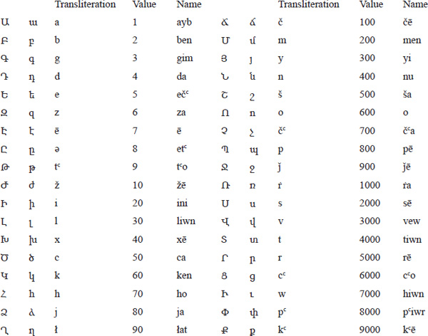
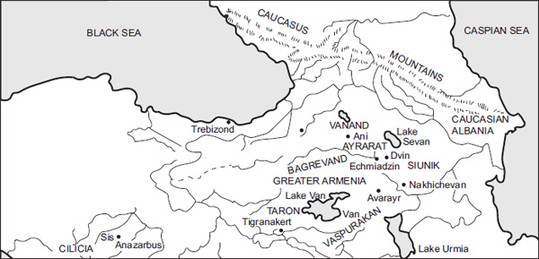
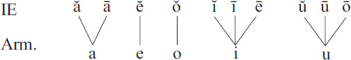
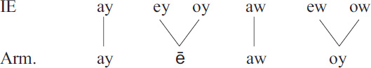
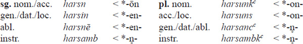
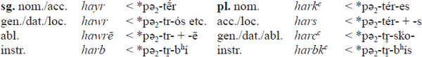
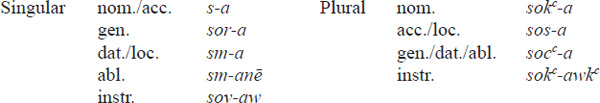
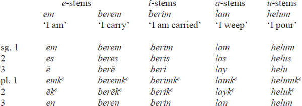

<!-- page: 421 -->

# Part 9

# **Armenian**

*Birgit Anette Olsen*

## **Introduction**

In modern times Armenian is found in two varieties, Eastern Armenian, the official language of the Armenian Republic, also spoken in Nagorno Karabagh and in north-western Iran, and Western Armenian, originally mostly found in what is now the north-eastern part of Turkey, but now mainly scattered around the Armenian diaspora with considerable bilingual populations in Lebanon, Syria, Israel, France, Canada and the USA.

The first records of Armenian go back to the Old Persian Behistūn (Bisutūn) inscription by Darius the Great (about 520 BC), where we hear of the province *Armina-* and the people *Arminiya*-. Somewhat later, Ἀρμινίη and Ἀρμένιοι are mentioned by Herodotus, while the indigenous literary tradition only goes back to the 5th century AD, the “golden age”, with the standardized Classical Armenian, also known as *grabar*, the written language. This will be the subject of the following pages. The creation of a written language was a side effect of the introduction of Christianity, which became a state religion as early as 301. According to tradition, the monk and missionary Mesrop Maštocc invented the Armenian alphabet, consisting of 36 letters (cf. Table 9.1), with the purpose of translating the Holy Scripture into the vernacular, and around 410 the translation of the Bible was completed, the first attempts based on a Syriac original, while the final version was founded on the Greek. During the following centuries Greek influence continues with translations of theological and philosophical literature. Important original works from the golden age include Eznik’s *Ełc ałandoc*c**, “Refutation of Sects”, Koriwn’s “Life of Maštocc” and the historical accounts by Agathangelos and Pcawstos Buzandacci. The later historian Movsēs Xorenacci, probably from around the 9th century, is important for his descriptions of pre-Christian traditions as famously illustrated by the poem of the birth of Vahagn (Iranian *Vərəϑaγna*-, Vedic *Vr̥trahán*-). Apart from early stone inscriptions, the actual attestation is of a much later date than the 5th century, the earliest manuscript being the Moscow Gospel from 887. As a literary and learned language, the grabar survived well into the 19th century, and for religious purposes it is still in use.

Middle Armenian, which already shows dialectal differentiation, is mainly transmitted in the western dialect of the Cilician kingdom (1080–1375; cf. the meticulous treatment by Karst (1901)). From around the 17th century, it gradually developed into the numerous modern dialects and the two standardized literary languages of Eastern and Western Armenian.

<!-- page: 422 -->

During the first millennium BC, the Armenians settled in the region around Lake Van in eastern Turkey, which was then dominated by the non-Indo-European Urartians. This is approximately the region known by the Hittites as *h˘ayaša-*, which has often been compared with Arm. *hay* ‘an Armenian’, *Hayastan* ‘Armenia’. As a separate Indo-European language, Armenian is not as obviously connected to any of the other branches as Indian is to Iranian, or Baltic to Slavic. According to Herodotus, the Armenians are identified with the Phrygians, and while this is hardly an exact description, the language does share a number of linguistic features with Phrygian, Albanian and especially Greek, which has induced some scholars, such as Klingenschmitt (1994: 244f.), Matzinger (1998: 118 and later) and Holst (2009), to connect these languages under the common heading of “Balkanindogermanisch”. Clackson, on the other hand, in a monograph dedicated to this particular question (1994), fails to recognize a significant relation even between Greek and Armenian.

Table 9.1 The Armenian alphabet

The recognition of Armenian as an independent branch of the Indo-European family came only in the late 19th century. Until then it had been considered an Iranian language, and, indeed, the Iranian elements of vocabulary, word formation and composition, not to mention loan translations and syntactic features, are so abundant that this early misconception is quite understandable. The largest part consists of Parthian loans, introduced during the Arsacid dynasty (247 BC–224 AD) and exhibiting particular north-western dialectal features such as *δ \> Arm. *r*, e.g. *aroyr* ‘brass’ \< *rauδa vs. South-West Iran. *y*, cf. MParth. *lwd* vs. ManMPers. *rwy* ‘copper, brass’; preservation of -*rd*-, e.g. *vard* ‘rose’ as opposed to MPers. *gul*; and *ϑr \> *(r)h*, e.g. *pah* ‘watch, ward’ \< *pāϑra- vs. *s* in ManMPers. *p’s*. Occasionally a single word or stem is found in several dialectal variants. A striking example is IE *werǵom \> Iran. *warȷ´, borrowed from Middle Parthian as *warž* ‘study’; from Middle Persian as *vard-* in *vardapet* ‘master’; from a third Iranian dialect, possibly by Parthian mediation, as *varj* ‘reward, hire’; and finally (with analogical *o-*grade in the root) preserved in the indigenous noun *gorc* ‘work’. A systematic survey of phonetic distinctions between the Middle Parthian and the later Middle Persian loans is found in Bolognesi’s classical study (1960), followed by the useful updating by Schmitt (1983).

<!-- page: 423 -->

**Map 9.1 **Armenian in ancient and medieval times

Source: Adapted from: Walker, C. J. 1984, *Armenia. The Survival of a Nation*, Croom Helm, London–Sydney: 22

Other important sources of borrowings into Armenian are Greek and Syriac, both intimately connected with the introduction of Christianity, but apart from such easily recognizable elements, the Armenian vocabulary abounds in more or less obscure lexical items. As observed by Solta (1990: 13), Ačaṙyan’s monumental etymological dictionary (1926–35) contains 10,722 head words, of which 4016 are recognized loanwords, while 5572 are registered as being of unknown origin, and only 713 are considered inherited. These bare numbers would give some idea of the challenges connected with Armenian etymology.

### **Note on the transcription**

Aspiration of a consonant is indicated by a raised c, e.g. *t*c** = \[tʰ\]; *c*, *j* and *c*c** stand for the affricates \[ts\], \[dz\] and \[tsh\], *č*, *ǰ*, and *č*c** for the “shibilants” \[tš\], \[dž\] and \[tšh\]; *y* equals \[i̯\], *ṙ* is a geminate *r*, and *ł* perhaps a retroflex lateral (cf. Schmitt 1981: 29). *Ē* derives from a former *i*-diphthong, *ey or *oy, and must originally have been a long vowel; however, in the classical language, where quantitative distinctions had been eliminated, the pronunciation was probably a closed *ẹ* as opposed to the more open *e* from the old short vowel *e. Finally, the digraph *ow* is pronounced and transcribed as *u*.

## **Phonology**

The phonology of Armenian is characterized by a series of fundamental changes, and since the inherited vocabulary is relatively limited the etymological interpretation of a given word or morpheme often depends on the precise formulation of a specific conditioned sound law. Thus, many details are still awaiting their final clarification.

### **Vowels**

<!-- page: 424 -->

A characteristic feature of Armenian vocalism is the loss of the quantitative oppositions before the earliest attestation of the language. While long *ā*, *ī* and *ū* simply merged with their short counterparts, and short *ě* and *ŏ* maintained an open quality, the long vowels *ē* and *ō* underwent narrowing, finally merging with *ĭ*/*ī* and *ŭ*/*ū* respectively.

We thus arrive at the following unconditioned developments in post-laryngealistic terms:

### **Examples:**

1.  *ă *acem* ‘I carry, bring, conduct’, Lat. *agō*, Gr. ἄγω
2.  *ā *mayr* ‘mother’, Lat. *māter*, Dor. μᾱ́τηρ
3.  *ĕ *berem* ‘I carry’, Lat. *ferō*, Gr. φέρω
4.  *ē *mit* ‘mind’, Gr. μῆδος
5.  *ŏ *ost* ‘branch’, Gr. ὄζος, Goth. *asts*
6.  *ō *tur* ‘gift’, Gr. δῶρον
7.  *ĭ *egit* ‘(s)he found’, Ved. *ávidat*
8.  *ī *c*c*in* ‘vulture’, Gr. ἰκτῖνος
9.  *ŭ *nu* ‘daughter-in-law’, Lat. *nurus*, Gr. νυός
10. *ū *mukn* ‘mouse’, Lat. *mūs*, Gr. μῦς

Further raising of *e* to *i* and *o* to *u* occurred before the nasals *n* and *m*, cf. e.g. *hin* ‘old’ \< *senos (Lith. *sẽnas*, Lat. *senex*, *senior*) and *cunr* ‘knee’ \< *ǵonu (Gr. γόνυ).

Other vocalic changes include umlaut and epenthesis. As already observed by Meillet (1903: 501), we sometimes find -*e-* for expected -*i-* when the following syllable includes *u*, e.g. *lezu* ‘tongue’ beside Ved. *jihvā́-*, but apparently the rule, or at least the tendency, may be extended to cover all sequences of high vowels in consecutive syllables exhibiting a sort of “dissimilatory umlaut”, beside *i-u* \> *e-u* also *i-i* \> *e-i*, *u-i* \> *o-i* and *u-u* \> *o-u*, e.g. *korust* ‘destruction’ beside Lith. *gùrti* ‘fall to pieces’ (Olsen 1999: 801–804). The rule also applies to secondary *i* and *u* from older *ē and *ō, e.g. *tēr* ‘master’ vs. *terut*c*iwn* ‘domination’ rather than *tirut*c*iwn* (*ē \> *i* in unstressed position).

In certain cases the vowels *i* and *u* as well as the semivowel *y* are observed to cause epenthesis, e.g. *ayl* ‘other, different’, Lat. *alius*, or *artawsr* ‘tear’ \< *drakˊu, Gr. δάκρυ. The conditioning of *i*/*y*-epenthesis clearly differs from that of *u*-epenthesis, and while the exact formulation of the rules may still be debated, the preceding vowel always seems to be -*a-* or -*o*-. Apparently, other decisive factors have been syllable length and stress, which are further connected with the loss of final syllables, e.g. *artawsr* vs. pl. *artasuk*c**.

The status of other suggested conditioned changes affecting the vowels, such as *e* \> *a* in *tasn* ‘ten’ vs. Lat. *decem*, or *o* \> *a* in *ateam* ‘hate’ vs. Lat. *odium*, remains more uncertain.

#### *Diphthongs*

After the separation of Anatolian, the protolanguage or “core Indo-European” possessed six short diphthongs, *ay, *ey and *oy, *aw, *ew and *ow. As is also the case in, e.g., Italic, the diphthongs whose first part was an *a*-vowel remained intact in Armenian as *ay* and *aw*, while the remaining *i*-diphthongs merged in *ē*, and the *u*-diphthongs in *oy*, presumably via an intermediate stage *ow.

<!-- page: 425 -->

### **Examples:**

- *ay *ayc* ‘goat’, Gr. αἴξ
- *ey aor. *e-dēz* ‘(s)he piled up’ \< *e-dʰeyǵʰ-et, Ved. pres. *déhmi* ‘smear’
- *oy *dēz* ‘heap’, Gr. τοῖχος ‘wall’
- *aw *awt*c** ‘passing the night’, Gr. αὖλις ‘lodging for the night’
- *ew *joyl* ‘molten mass’ \< *ǵʰewtlo-, Ved. *hótrā-* ‘libation, sacrifice’
- *ow *p*c*oyt *c** ‘care; haste’, Gr. σπουδή ‘haste, zeal, effort’

A similar development is found in older Iranian loanwords where *i*-diphthongs are reflected as *ē*, *u*-diphthongs as *oy*, e.g. *k*c*ēn* ‘hatred, animosity’, Av. *kaēnā-* ‘punishment, revenge’; *goyn* ‘colour’, Av. *gaona*-.

#### *Apocope, syncope and vowel weakening*

The early fixation of the stress on the penultimate in Proto-Armenian had severe consequences for the further phonetic development of vowels and diphthongs: the vowels of final syllables underwent apocope so that the synchronic accent regularly came to fall on the final syllable, e.g. *ebʰeret ‘(s)he carried’ \> *ebér*. Moreover, the unstressed high vowels *i* and *u*, whatever their origin, were weakened to a mostly unwritten prop vowel, *ə*, a phenomenon generally described as “syncope”, e.g. nom. *senos \> *hin* ‘old’ vs. gen. *senosyo \> *hnoy*, nom./acc. *dōrom \> *tur* ‘gift’ vs. gen. *dōrosyo \> *troy*, or *penkʷe \> *hing* ‘five’ with apocope beside *hnge-tasan* ‘fifteen’ with syncope.

Similarly, the old diphthongs (*ey/oy \>) *ē* and (*ew/ow \>) *oy* in unstressed position were continued as *i* and *u*, e.g. *sēr* ‘love’, gen. *siroy*, *p*c*oyt*c** ‘care; haste’, gen. *p*c*ut*c*oy*, and the sequence *ea* (\< *e*/*i* + *a* after the loss of an intervocalic consonant) as *e*, e.g. ptcp. *bereal* ‘having carried’, gen. *bereloy*.

#### *Vowel contractions*

After the elimination of intervocalic *y, *s and partly *w and the lenition of intervocalic stops, the subsequent hiatic sequences were generally followed by vocalic contractions (cf. Schmitt 1981: 73f.). By contraction of homorganic vowels the result is the corresponding short vowel, while *e* is deleted in contact with a following or preceding *a* or *o*:

|         |      |                                                                       |
|---------|------|-----------------------------------------------------------------------|
|   e – e | \> e | *treyes \> *erek*c** ‘three’                              |
|   o – o | \> o | *bʰoso-gʷo- \> *bok* ‘barefoot’                                      |
|   a – a | \> a | *pǝ₂tr̥bʰi \> *harb* ‘father’ (instr. sg.)                            |
|   e – a | \> a | *wesr̥- (*gear- \>) *gar-un* ‘spring’                                |
|   a – e | \> a | *pǝ₂teres \> *hark*c** ‘fathers’ (nom. pl.)               |
|   e – o | \> o | *swesores \> *k*c*ork*c** ‘sisters’ (nom. pl.) |

<!-- page: 426 -->

#### *Syllabic sonants*

In general, the syllabic sonants developed a preceding supporting vowel *a*, i.e. *r̥, *l̥, *n̥, *m̥ \> *ar* (/*aṙ* ), *al* (/*ał* ), *an*, *am*:

- *r̥  *bard* ‘pile’, Ved. *bhr˳tí-* ‘carrying, support’
- *l̥  *małj* ‘gall’, Av. *mǝrǝzāna-* ‘belly’
- *n̥  *an-* ‘un-’, Ved. *a*-, Gr. ἀ-, Lat. *in*-, Goth. *un*-
- *m̥ *t*c*amb* ‘ham’, Lith. *tìmpa* ‘sinew’, ONor. *þomb* ‘paunch; bowstring’

The same development is found in prevocalic position, i.e. mainly before an original prevocalic laryngeal, as, e.g., *am* ‘year’ \< *sm̥hah₂-, cf. Ved. *sámā-* ‘season’.

### **Consonants**

While the most striking feature of the consonant system seen in a historical perspective is certainly the Armenian sound shift, other recurrent features such as palatalizations, lenitions, metatheses and the development of consonant clusters have resulted in profound transformations of the inherited pattern.

#### *Stops*

By the Armenian sound shift, tenues are, in traditional terms, continued as voiceless aspirates, mediae as tenues, and voiced aspirates as mediae. However, the development of *p usually goes a step further to *h* or zero (cf. also Klingenschmitt 1982: 165–168 for a discussion of initial *p*c*-* in cases like *p*c*lanim* ‘fall’, Lith. *pùlti*). This view has been challenged by adherents of the so-called glottalic theory, according to whom the Indo-European “mediae” were in reality glottalized stops, faithfully continued as such into modern Armenian dialects, e.g. Gamkrelidze 1985. As Armenian belongs to the “satǝm” group of the Indo-European languages, the velars and labiovelars merge, at least before non-palatal vowels, while the palatals are subject to further palatalization, *kˊ \> *s*, *ǵ \> *c* and *ǵʰ \> *j*. Thus we arrive at the following table of unconditioned developments:

|         |     |               |                                                                                                                                     |
|---------|-----|---------------|-------------------------------------------------------------------------------------------------------------------------------------|
| **IE**  |     | **Armenian**  | **Examples**                                                                                                                        |
| *p     | \>  | h/Ø           | *pod-m̥ \> *otn* ‘foot’, Gr. acc. πόδα; *pedom \> *het* ‘footstep’                                                                 |
| *t     | \>  | tc | *t*c*ur* ‘sword’, Gr. τόρος ‘piercing’                                                                                   |
| *k(ʷ)  | \>  | kc | *k*c*erem* ‘scratch’, Gr. κείρω ‘cut’; *k*c*an* ‘than’, Lat. *quam*                                           |
| *kˊ    | \>  | s             | *sirt* ‘heart’, Lith. *šìrdis*                                                                                                      |
| *b     | \>  | p             | *stipem* ‘press’, Gr. στείβω ‘step on’                                                                                              |
| *d     | \>  | t             | *tur* ‘gift’, Gr. δῶρον                                                                                                             |
| *g(ʷ)  | \>  | k             | *kṙunk* ‘crane’, Lat. *grūs*, Gr. γέρανος; *gʷow- \> *kov* ‘cow’, Gr. βοῦς                                                         |
| *ǵ     | \>  | c             | *ǵonu \> *cunr* ‘knee’, Skr. *jā́nu*, Gr. γόνυ                                                                                      |
| *bʰ    | \>  | b             | *berem* ‘carry’, Skr. *bhárati*, Gr. φέρω                                                                                           |
| *dʰ    | \>  | d             | *durk*c** ‘door’, Gr. ϑύρα, Lat. *forēs*                                                                                 |
| *g(ʷ)ʰ | \>  | g             | *gełjk*c** ‘glands’, Lith. *gẽležuones*; *gʷʰ- in *goneay* ‘above all’, Gr. εὐϑενής ‘abundantly’, Lith. *ganà* ‘enough’ |
| *ǵʰ    | \>  | j             | *jmeṙn* ‘winter’, OCS *zima*, Skr. *heman* ‘in winter’                                                                              |

<!-- page: 427 -->

After *u*, including old *u*-diphthongs, the contrast between (labio)velars and palatals is neutralized in favor of the palatal, thus *lewkos \> *loys* ‘light’, Ved. -*rocas*-, Av. *raocah*-; *dʰugh₂tēr \> *dustr* ‘daughter’, Av. *dugǝdar*-, Lith. *duktė̃*.

A fourth, sporadically attested series of voiceless aspirates *pʰ, *tʰ and *kʰ, whatever its origin, seems to have yielded Arm. *p*c**, *t*c**, *x*, e.g. *tup*c** ‘bush’, Gr. τύφη ‘a plant used for stuffing’, *ort*c** ‘calf’, Skr. *pr˳thuka*-, *c*c*ax* ‘twig’, Skr. *śā́khā* ‘branch’, *xaxank*c** ‘laughter’, Gr. καχάζω ‘laugh’.

In intervocalic position, at least some of the original tenues and voiced aspirates are subject to lenition. Here the development of the labials *p, *bʰ \> -*w-* is secured by clear evidence, cf. *(h₁)epi \> *ew* ‘and’, Skr. *ápi* ‘also’, *-V-bʰoros \> *-(a)wor*, lit. ‘-bearer, -carrier’ (adjective and agent noun suffix), and the same goes for the palatal *ǵʰ \> *z*, cf. *dʰeyǵʰos (or *dʰoyǵʰos) \> *dēz* ‘heap’, Gr. τεῖχος ‘wall’, Av. *pairi-daēza-* ‘enclosure’. The regular continuation of intervocalic *-t- is *-w- before back vowels, as in *ǵenə₁to \> *cnaw* ‘(s)he was born’, Gr. ἐγένετο, vs. *-y- before front vowels, as in *pə₂tḗr \> *hayr* ‘father’, Gr. πατήρ. However, this only seems to be the case in the position immediately after the synchronically stressed syllable. Thus, the *-t- (dissimilated from *-tw-) of *kʷetores *č*c*ork*c** ‘four’, Ved. *catvā́raḥ*, is completely lost after the palatalization of *kʷ before -*e*-.

The expected reflex of *-dʰ- remains a matter of controversy: according to some, the outcome is -*z-* (e.g. *h₁lewdʰ- \> *eluzanem*, aor. *eluzi* ‘extract, produce’, Ved. *ródhati* ‘grows’, Gr. fut. ἐλεύσομαι ‘will come’), while others assume a development to -*r*-, similar to that of *-δ- in loanwords of Parthian origin (Jasanoff (1979: 145) points to the verb *ayrem* ‘burn’: Gr. αἴϑω, which may, however, be an Iranian loanword). Apparently the velars and labiovelars were resistant to lenition, cf. aor. *e-likʷet \> *elik*c** ‘(s)he left’, Gr. ἔλιπε (cf. an alternative scenario in Kortlandt 1980a).

As in other satəm languages, original velars and labiovelars are prone to secondary palatalization before front vowels and *y in Armenian, though the exact conditioning is somewhat doubtful. According to an old idea by Holger Pedersen, later elaborated by Pisani (1950), Armenian and Albanian agree on a diverse treatment of simple velars and labiovelars: the labiovelar tenuis and voiced aspirate *kʷ and *gʷʰ and the velar media *g would undergo palatalization to *č*c**, *ǰ* and *č* respectively, while the labiovelar media *gʷ (somewhat like the situation in Greek) and the plain velar tenuis and voiced aspirate *k and *gʰ would remain unaffected:

## **Velars and labiovelars before front vowels and** ***y*****:**

|                           |                            |
|---------------------------|----------------------------|
| *k \> *k *c** | *kʷ \> *č *c** |
| *g \> *č*                | *gʷ \> *k*                |
| *gʰ \> *g*               | *gʷʰ \> *ǰ*               |

Cf. *kʷ \> *č*c** in *kʷetores \> *čork*c** vs. *k \> *k *c** in *k*c*erem* ‘scratch’, Gr. κείρω; *gʷʰ \> *ǰ* in *gʷʰermo- \> *ǰerm* ‘warm’, Gr. ϑερμός vs. **gʰ* \> *g-* in *gełjk *c** ‘glands’, Lith. *gẽležuones*; and *g \> *č* in *čmem* (\< *čim-) ‘squeeze’, OCS *žьmǫ* vs. *gʷenə₂ \> *kin* ‘woman’, Gr. γυνή, OIr. *ben*. The attempt to consider palatalization the regular development with all velars and labiovelars alike (Kortlandt 1975, Martirosyan 2010: 711) is bought at the cost of excessive analogy.

#### *Sibilants*

<!-- page: 428 -->

Word-initially the sibilant *s is continued as either *h-* or zero without any clear conditioning, e.g. *senos \> *hin* ‘old’, Lith. *sẽnas* vs. *septm̥ \> *ewt*c*n* ‘seven’, Lat. *septem*, and deleted intervocalically, e.g. *swesōr \> *kʰeur \> *k*c*oyr* ‘sister’. Two remaining problems are the word-final development, which may be either zero or -*k*c** as in the plural marker, or most likely both (cf. the discussion of the nom. pl. ending) and the possibility of a special RUKI development that would connect Armenian with other satəm languages such as Indo-Iranian and Balto-Slavic. At least we find both *ṙ* and *rš* from *-rs-, perhaps as an indication of early dialectal variation, in the verb *t*c*aṙamim* vs. *t*c*aršamim* ‘wither, dry out’, Gr. τέρσομαι (cf. also Martirosyan (2010: 709), who hypothesizes an original accent distinction between the two variants), but it is an object of debate whether the high vowels *i and *u had a similar effect on a following *s. If this is the case, as already suggested by Pedersen (1905: 228) and later argued by Winter (1975: 115ff.) and Olsen (1989a: 5–15), the result is -*r*, probably with an intermediate stage *-ž, as, e.g., found in the aorist imperatives *dʰeh₁-s \> *dir* ‘put’ and *deh₃-s \> *tur* ‘give’ from original injunctives, and *i*-stem verbal nouns like *dir* ‘position’ and *lir* ‘fullness’, which could represent the old *ti*-stems *dʰeh₁tis (Av. -*dāiti*-, Goth. *dēds*, Lith. *dė́tis*, OCS -*dětь*) and *pleh₁tis (Ved. *prātí*-, Lat. *com-plētiō*) respectively.

#### *Liquids*

The usual outcome of Indo-European *r is *r*, with the variant *ṙ* occurring before nasals and as a reflex of *sr, cf. *berem* ‘carry’, Gr. φέρω vs. *beṙn* ‘burden’, Gr. φερνή ‘dowry’, and *aṙu* ‘stream’ \< *sruti- (Gr. ῥύσις ‘stream’, Ved. *srutí-* ‘road’). As is also the case in Greek and Anatolian, Armenian has a synchronic phonotactic constraint against initial *r*-, but it is a controversial issue whether this state of affairs should be projected back into the protolanguage. If this is the case we have to reconstruct the protoform of Ved. *rájas*-, Goth. *riqiz* ‘darkness’, Gr. ἔρεβος ‘the dark of the underworld’, Arm. *erek* ‘evening’ with an initial laryngeal, *h₁regʷos, and we would get a laryngeal-based “prothetic vowel” *h₁- \> *e-* in Greek and Armenian. If, on the other hand, initial *r- is accepted, we may reconstruct *regʷos, which would automatically yield the same result (cf. also the section “Laryngeals”). The development of prothetic vowels where no laryngeal is involved is also found before *r- in metathesized sequences (cf. “Consonant Clusters”) and in many Iranian loanwords with original initial *r*-, e.g. *aroyr* ‘brass’ from a North-West Iranian *rauδa-, originally ‘the red (material)’, *arag*, *erag* ‘quick’ vs. MParth. *rag* ‘quick’, Av. *raγu*.

The distribution between plain *l* and velarized *ł* is partly predictable: the general rule stipulates *l* initially (e.g. *lizem* ‘lick’, Gr. λείχω) and intervocalically (e.g. *gelum* ‘roll, turn’, Lat. *uoluō*) vs. *ł* before consonants (e.g. *ełn* ‘deer, hind’, Lith. *élnis* ‘deer’), but the original distribution is often blurred by analogy. In final position both variants are found, with a tendency toward -*ł* in the oldest manuscripts (Meillet 1936: 47), thus e.g. *gaył* beside *gayl* ‘wolf’.

#### *Nasals*

<!-- page: 429 -->

The nasals *m and *n are among the most stable phonemes in Armenian as well as in most other Indo-European languages. Nevertheless, the development in final position is open for discussion. The nasal is apparently lost in the acc. sg. of *o-* and *a*-stems as opposed to a merger of *-m and *-n into final -*n* in cases like *ǵʰyōm \> *jiwn* ‘snow’, Gr. χιών, or *dōm \> *tun* ‘house’. Similarly, a final vocalic *-m̥ is continued as *-n, e.g. acc. *pod-m̥ \> *otn* ‘foot’, Gr. πόδα. The original distribution can hardly be determined without a certain amount of analogy: Kortlandt (1984: 97) assumes that “original postvocalic *-n had apparently become a feature of the preceding vowel and subsequently been lost”; i.e. we have to posit an intermediate stage of nasalized vowels, and *jiwn* and *tun* must be analogical. Alternatively, one might suggest that nasalization only occurred with the open vowels *o and *a, in which case *jiwn* and *tun* would be regular while, on the other hand, the endingless accusatives of animate *i-* and *u*-stems would have to be analogical.

#### *Semivowels*

The fate of the semivowels *y and *w is still open for interpretation in several respects. While intervocalic *-y- is lost at an early stage, e.g. *treyes \> *erek*c** ‘three’, the development in word-initial position remains unclear due to the scarcity of diagnostic examples. Most likely, the regular development is *ǰ-* as in *ǰur* ‘water’, which should probably be compared with Lith. *jū́rės* ‘sea’. The initial *l-* of *leard* ‘liver’ and *luc* ‘yoke’ should not necessarily be considered counterevidence insofar as *leard* may constitute a contamination between *yēkʷr̥t (Ved. *yákṛt* etc.) and the stem of either OEng. *lifer* etc. \< *liparo- ‘fat’ or Hitt. *lišši-* ‘liver’, while *luc*, rather than being a direct continuation of *(H)yugom (Ved. *yugám*, Gr. ζυγόν, Lat. *iugum*), may have been influenced by the verb *lucanem* ‘dissolve’. There are two reliable examples of initial *j*-, *ju* ‘egg’, SCr. *jaje*, and *jez* ‘you’ (acc./dat./loc. pl.), Ved. *yūyám*, but in both cases the protoform may have had two subsequent syllables in *yV- as a disturbing factor. According to Martirosyan (2010: 706), who derives the interrogative/indefinite stem *o- from the relative stem *yo-, the regular continuation is zero. However, *o-* is preferably connected with the more appropriate stem *kʷo-, as *kʷ- and *p- seem to merge before *-o-, cf. also *kʷolso- \> *ołn* ‘spine, backbone’, Lat. *collus*, *collum*.

In initial position *w- is reflected as *g*-, no doubt via an intermediate stage *gw- as also suggested by the early Georgian loanword *γwino* ‘wine’, Arm. *gini* \< *woynio- (Gr. οἶνος, Lat. *uīnum*), but the intervocalic development is more complicated (cf. the treatments by Eichner (1978), Olsen (1986) and Matzinger (1992)) with the reflexes -*g*-, -*w*-(-*v*-) and zero. Possibly -*g-* is the regular continuation before back vowels apart from -*u*-; -*w*/*v-* before front vowels and -*u*-; and zero between homorganic vowels: cf. e.g. *oṙoganem*/*aṙoganem* ‘sprinkle’ from the root *srew-, Ved. *srávati* ‘streams, flows’; *hoviw* ‘shepherd’ \< *h₂owi-pah₂-; gen./dat./loc. *aler* \< *-ewer- from *alewr* ‘flour’, Gr. ἄλειαρ \< *h₂lḗh₁wr̥. An important detail has been added by Schindler (apud Matzinger 1992), who stipulated a regular development *-wi- \> -*wu-* whereby the otherwise puzzling transfer of original *i*-stems like *haw* ‘bird’, Lat. *auis*, to the *u*-declension has found an elegant solution.

#### *Laryngeals*

The fate of the IE laryngeals is one of the most hotly debated issues of Armenian phonology, and while certain details seem relatively clear, there is hardly a single phonological conditioning where it has been possible to achieve full consensus. The following contexts are particularly noteworthy:

<!-- page: 430 -->

*Initial position before consonants* (**HC*-): As is also the case of Greek and Phrygian, Armenian is characterized by so-called prothetic vowels deriving from laryngeals, with prominent examples like *astł* ‘star’, Gr. ἀστήρ, Hitt. *h˘(a)šterz* vs. Goth. *staírno*, Lat. *stella* \< *h₂ster/l-; and *ayr* ‘man’, Gr. ἀνήρ, Phryg. αναρ vs. Ved. *nár*-, Umbr. acc. pl. *nerf* \< *h₂ner-. There is, however, no general agreement as to whether the prothetic vowel is always *a*-, irrespective of the quality of the laryngeal (thus, e.g., Klingenschmitt 1982: 105 and Olsen 1985), or Armenian shares the feature of “triple representation” with Greek as argued by, e.g., Winter (1965), Kortlandt (1987) and Beekes (1988), so that *h₁C- \> *eC-, *h₂C- \> *aC-, *h₃C- \> *oC-. Since the adherents of “triple representation” at the same time favor a conditioned development of *o \> *a* in such cases as *anicanem* ‘mock’ \< *h₃neyd- (Gr. ὀνειδίζω, Goth. *ga-naitjan*), the evaluation depends on the correct interpretation of examples with *h₁-. This is further connected with the status of *r- in Indo-European: if *r- did occur in initial position in the protolanguage, *erek* ‘evening’, Gr. ἔρεβος may go back to *regʷos, and examples such as *atamn* ‘tooth’, Aeol. pl. ἔδοντες, and *anun* ‘name’ with the possibly cognate Laconian names Ἐνυμακρατίδας, Ἐνυμαντιάδας may be reconstructed with an initial *h₁-; if not, the correct reconstruction of *erek* is *h₁regʷos, which would then favor the idea of “triple representation”. This is, however, not what we find in other contexts. Prothetic vowels do not occur before *w*-, cf. *gełmn* ‘fleece, wool’ \< *h₂welǝ₁mn̥-, Hitt. *h˘ulana*-, and *goy* ‘(s)he is’ \< *h₂wos-, Gr. ἄεσα νύκτα ‘spent the night’.

*Interconsonantal position* (*CHC): When a laryngeal is “vocalized”, or more correctly develops a prop vowel interconsonantally, this vowel is always *a*, so at least in this position a “triple representation” matching the situation in Greek is excluded: thus *cnaw* ‘engendered’ \< *ǵenǝ₁to, Gr. ἐγένετο with *-ǝ₁-; *hayr* ‘father’ \< *pǝ₂tēr, Gr. πατήρ with *-ǝ₂-; *arawr* ‘plow’ \< *h₂arǝ₃trom, Gr. ἄροτρον with *-ǝ₃-. However, as is also the case in, e.g., Iranian, interconsonantal laryngeals are sometimes lost, as in *armn* ‘root’ \< *h₂r̥mǝ₁no-, Gr. ὄρμενος or *dustr* ‘daughter’ \< *dʰugǝ₂tēr, Gr. ϑυγάτηρ. The conditioning of this diversity is not quite clear (cf. the discussion in Olsen 1999: 768f.), but at least vocalization seems to be regular in initial and final syllables.

*Position between vocalic sonant and stop*/*s* (*R̥HC): Sequences of sonant + laryngeal in the position between consonants are reflected as either *a*R*a* or *a*R*aw* with a prop vowel on both sides of the sonant. Thus, *čanač*c*em* ‘know’ (for *canačcem) \< *ǵn̥h₃-skˊe/o-, Gr. γιγνώσκω, as opposed to the corresponding derivative *canawt*c** ‘known; knowing’ \< *ǵn̥h₃to/i-, where the development to *a*R*aw* may be restricted to peak position as originally suggested by Winter (1965: 110), cf. also *amač*c*em* ‘am ashamed’ beside *amawt*c** ‘shame’ and *ałač*c*em* ‘pray’ beside *aławt*c*k*c** ‘prayer’.

*Initial position before vowels* (*HV-): Apparently an initial consonantal laryngeal is sometimes reflected as *h-* in Armenian, while in other cases it simply seems to be lost. An attempt to account for this bewildering state of affairs has been made by Kortlandt (1980b) (followed by Beekes (1988: 76), Martirosyan (2010: 712f.) and Kloekhorst (2008: 75)), who further seeks to corroborate the theory with Anatolian evidence. According to Kortlandt’s analysis, the laryngeals *h₂ and *h₃ would be preserved in the protolanguage before an original e-vowel, while they would be lost before *o, i.e. *h₂e- \> *ha*-, *h₃e- \> *ho-* vs. *h₂o and *h₃o \> *o*. This distinction would still be reflected in Armenian, where an initial *h-* (if not from *s- or *p-) is assumed to indicate an *e*-grade in the protoform. However attractive the idea of such a clear-cut regularity may be, the actual material is difficult to reconcile with the suggested distribution, as when, e.g., the word for ‘plow’, *arawr*, on account of the missing initial *h-* has to be analyzed as a zero-grade formation *h₂r̥h₃trom as opposed to the evidence for full grade in the other languages, or when the verb *acem* ‘bring, lead, conduct’ is considered a match of Lat. *gerō* \< *h₂ǵese/o- rather than, as traditionally assumed, identical with Ved. *ájati*, Gr. ἄγω, Lat. *agō*.

<!-- page: 431 -->

*Position after* i/u *before a consonant* (i/uHC): Traditionally a laryngeal following the high vowels *i* and *u* is assumed to be lost with a compensatory lengthening that would leave no trace in Armenian, e.g. *ǰil* ‘sinew’ \< *gwiHslah₂*-*, cf. Lith. *gýsla*, Lat. *f īlum*, or *c*c*uk*c** ‘roof’ \< *skuHto-, cf. Gr. σκῦτος. However, as also seems to be the case in Greek and Tocharian (cf. Francis 1970: 276–84, Normier 1977: 182 and 1980: 273), it has been suggested (Olsen 1992, 1999: 770–73; cf. also Olsen 2009 on the conditioning in Greek) that *h₂ and *h₃ caused “laryngeal breaking”, i.e. *ih₂/₃ \> *ya/ea, *uh₂/₃ \> *wa/ea, thus, e.g., *erkar* ‘long’ \< *dwāro- \< *duh₂ró- = Ved. *dūrá*-, Lat. *dūrus*, Dor. δᾱρόν.

#### *Consonant clusters*

A comparison between the syllable structure of the Indo-European protolanguage and that of Armenian makes it clear that very few original consonant clusters have survived in a historically transparent form. The treatment of several clusters remains unsettled, and at this place only a selection of the more well-established rules will be presented. A rich collection of potential examples may be found in Džaukjan 1982. Cf. also Godel 1975: 78–85.

##### Clusters of two stops

The evidence for such clusters is rather scarce, but at least the word-internal development *-pt- \> -*wt*c*-* is secured by *ewt*c*n* ‘seven’ \< *septm̥, analogically followed by *ut*c** ‘eight’ \< *optō (for *okʷtō), while the regular outcome of a palatal stop (after *u*) + *t* is illustrated by *dustr* ‘daughter’ \< *dʰugə₂tēr. Most likely, word-initial *pt- is continued as *t*c**-, cf. *t*c*ełi* ‘elm’: Gr. πτέλεα, *t*c*er* ‘side’ \< *pter-, Gr. πτέρον ‘wing’.

##### Clusters of resonant + stop

Voiceless stops are generally assumed to be voiced in the position after resonants, e.g. *bard* (*i*-st.) ‘pile’ \< *bʰr̥ti-, Ved. *bhr̥tí-* ‘burden’; *hing* ‘five’, Ved. *páñca*, Gr. πέντε. However, the cluster *nt apparently has a double reflex, *nd* as in *ǝnderk*c** ‘entrails’, Gr. ἔντερα, *dr-and* ‘doorposts’, Lat. *antae*, vs. *n* in, e.g., the 3 pl. ending *-(V)n* \< *-(V)nti, or decadic numbers in -*sun*, e.g. *eresun* ‘30’, Gr. τριᾱ́κοντα. The conditioning is differently interpreted: Olsen (1989b: 227) stipulates voicing after a stressed vowel, while Clackson (1994: 56) assumes -*nd-* in internal position vs. -*n* word-finally after the loss of end-syllables. Somewhat similarly, the intervocalic clusters *mp and *mbʰ appear to have two outcomes, *mb* and *m*, e.g. *mp \> *mb* in *t*c*amb* ‘(pack) saddle, ham’, ONor. *þǫmb* ‘paunch; bowstring’, Lith. *tìmpa* ‘sinew’ vs. *mp \> *m* in *amokc*c*em* ‘soften; mix; cook, boil together’, Skr. *saṃ-pacati* (cf. Dumézil 1938 and Olsen 2005 on a possible regular distribution).

##### Clusters of resonant + *s*/*s* + resonant

For resonant + *s*/*s* + resonant we observe the following rules:

|                       |                                                                                                                                       |
|-----------------------|---------------------------------------------------------------------------------------------------------------------------------------|
|   *Ns \> *s*         | e.g. *mēmso- \> *mis* ‘flesh, meat’, Ved. *māṁsá*-, Goth. *mimz*                                                                     |
|   *ls \> *ł*         | e.g. *ał* ‘salt’, Gr. ἅλς                                                                                                             |
|   *rs \> *ṙ* or *rš* | e.g. *t*c*aṙamim*/*t*c*aršamim* ‘wither dry out’, Gr. τέρσομαι (cf. “Sibilants”)                                |
|   *sN \> N           | e.g. *gin* ‘prize’, Ved. *vasná*-, Lat. *uēnum*; *nu* ‘daughter-in-law’ \< *snusos, Gr. νυός                                         |
|   *sr \> *ṙ*         | e.g. *k*c*eṙ* \< *swesros, gen. of *k*c*oyr* \< *swesōr ‘daughter’; *aṙu* ‘stream’ \< *sruto-, Ved. *srutá*- |

<!-- page: 432 -->

##### Clusters of stop + resonant

In initial position a voiceless stop is lost at least before a liquid with further development of a prothetic vowel before what would otherwise be initial *r*-, thus *pleh₁tos \> *li* ‘full’, Lat. -*plētus*; *kˊ ʷlutos \> *lu* ‘heard’, Gr. κλυτός, Ved. *śrutá*-, Lat. -*clutus*; *treyes \> *erek*c** ‘three’, Ved. *tráyaḥ*, Gr. τρεῖς, Lat. *trēs*; *preysgʷus \> *erēc*c** (*u*-st.) ‘elder’, Cret. πρεῖσγυς. Word-internally, we generally find a lenited version of the stop:

|                               |                                                                                                                                                                   |
|-------------------------------|-------------------------------------------------------------------------------------------------------------------------------------------------------------------|
| *-tr- \> -*wr*(-),           | e.g. *arawr* ‘plow’, Gr. ἄροτρον, Lat. *arātrum*; *hawr* \< *pǝ₂trós, gen. of *hayr* ‘father’                                                                    |
| *-kr- or *-kˊr- \> -*wr*(-) | e.g. *mawruk*c** ‘beard’, Ved. *śmáśru-* ‘beard’, Lith. *smãkras* ‘chin’                                                                               |
| ;*-tl- \> -*wl*(-)/-*wł*(-)  | e.g. *ul* (for *uwl; *o*-st.) ‘kid’ \< *putlos, Osc. *puclo-* ‘son’; agent noun suffix -*awł*, e.g. *cnawł* ‘parent’ \< *-VtlV- (cf. “Nominal Word Formation”) |
| *-pn- \> -*wn*(-)            | e.g. *tawn* (*i*-st.) \< *dapni- ‘feast’, Lat. *daps* ‘sacrificial meal’, ONor. *tafn* ‘victim’                                                                  |

##### Metathesis

Metathesis regularly occurs in clusters of media or voiced aspirate + liquid, triggering the development of a prothetic vowel word-initially, cf. the following examples:

|           |     |        |                                                             |
|-----------|-----|--------|-------------------------------------------------------------|
| *dr      | \>  | *rt*   | *swidro- \> *k*c*irtn* ‘sweat’, Latv. *sviêdri* |
| *gʷr-    | \>  | V*rk*- | *gʷrah₂wn̥- \> *erkan* ‘grindstone’, Ved. *grā́van*-         |
| *bʰr     | \>  | *rb*   | *kˊubʰro- \> *surb* ‘pure, holy’, Skr. *śubhra*-           |
| *ǵʰr     | \>  | *rj*   | *meǵʰri \> *merj* ‘near’, Gr. μέχρι                        |
| *g(ʷ)ʰr- | \>  | V*rg*- | *argand* ‘womb’, Slav. *grǫdь* ‘breast’                     |

In case of the structure *Vr – r there is regular dissimilation to *(V)ł – r*, thus, e.g., *bʰrātēr \> *ełbayr* ‘brother’, *bʰrēwr̥ \> *ałbewr* ‘fountain’, Gr. φρέαρ.

A small group of exceptions includes *srunk*c** ‘leg, shank’ \< *kˊrūsni- or the like (Lat. *crūs* ‘shank’, Lith. *šlaùnis* ‘hip, thigh’), not *Vrunkc; *krunk* ‘crane’, Lat. *grūs*, not *Vrkunk; and possibly *glux* ‘head’, Lith. *galvà*, etc., if this is from *gʰluH- rather than the morphologically unlikely *gʰōlū-. These examples share the features of an initial velar or palatal and *u*-vocalism, so perhaps a sequence *KRu- would develop a prop vowel to *KuRu- whence, with loss of the unaccented -*u*-, *KRu*-.

##### Clusters of two resonants

In a few cases we have evidence for a development *-ln- \> -*ł*-, e.g. *t*c*ołum* ‘let’ \< *tol-nu-, Lat. *tollō* (cf. Klingenschmitt 1982: 243f.), while it is more difficult to determine the conditioned distribution of *wn* beside *mn* from the sequence *mn (cf. the discussion in Olsen 1999: 792f.).

##### Clusters of *s* + stop/stop + *s*

<!-- page: 433 -->

The cluster *st is preserved initially as well as in original intervocalic position, thus *stipem* ‘press’, Gr. στείβω; *sterǰ* ‘barren’, Gr. στεῖρα; similarly *zd in *ost* ‘branch’ \< *(H)o-zdo-, Gr. ὄζος. The regular reflex of *sp- is more uncertain: *sp-* as in *spaṙnam* ‘threaten’, Lat *spernō*, or *p*c*-* as in *p*c*oyt*c** ‘zeal’, Gr. σπουδή. An even more complicated matter is the fate of *sK*/*Ks*-clusters. According to Godel (1975: 80), *k* and *kˊ are neutralized in connection with *s, and, indeed, we find quite a number of sound etymologies including such a cluster with a common reflex *c*c**, e.g. *-kˊs in *vec*c** ‘six’ \< *suwekˊs, *-sgʷ- in *erēc*c** ‘elder’ \< *preysgʷus, Cret. πρεῖσγυς, *skˊ- in *c*c*urt* ‘cold’, OCS *sěverъ* ‘north’, and *sk- in *c*c*ayt*c*em* and *c*c*aytem* ‘bubble, sparkle’, Lat. *scateō*, Lith. *skaidrùs*; similarly, the original three-consonant clusters *-s-skˊ- in *ayc*c** ‘visit, search’ \< *h₂ays-skˊ- and *-kˊ-skˊ- in *harc*c*anem* ‘ask’ \< *pr̥kˊ-skˊ-, Ved. *pr˳ccháti*. Another potential development is -*č*c*-*, which may be found in *-skˊ-verbs of the type *čanač*c*em* ‘know’ \< *(ǵi-)ǵn̥h₃-skˊe-, Gr. γιγνώσκω, *ałač*c*em* ‘pray’ \< *(si-)sl̥h₂-skˊe-, Gr. ἱλάσκεσϑαι, but here it is a matter of dispute whether the Armenian verbs represent a faithful continuation of the Indo-European pattern (thus, e.g., Klingenschmitt 1982: 84) or an extended suffix *-skˊy-. Finally, there exists a small group where an initial *š-* apparently goes back to *sk- (or *skh-, cf. Martirosyan 2010: 516): *šeł* ‘oblique’ \< *skel-no-, Gr. σκέλλος ‘bandy-legged’, Alb. *çalë* ‘lame’, Lith. *kul̃nas* ‘heel’; *šil* ‘cockeyed’, OHG *skëlah*; *šert* ‘splinter’, Lith. *skedervà*; *šertem* ‘scratch’ \< *skerd-, Lith. *skérdžiu*. In all these cases, the clusters occur at the same time initially and before front vowels.

##### *Y*-clusters

The correct interpretation of the fate of *y*-clusters is severely hampered by the scarcity of reliable examples. Thus, the regular continuation of *ty and *dy is assumed to be either the “shibilants” *č*c** and *č* or the affricates *c*c** and *c*, while the development of *dʰy \> *ǰ* is quite uncontroversial, cf. *mēǰ* ‘middle’ \< *medʰyo- (with *e \> *ē* before a palatal, cf. also *(h₁)ekˊwos \> *ēš* ‘donkey’), Ved. *mádhya*-, Lat. *medius*. Truly, the assumed continuations *č*c** and *č* would mean a neat parallelism between the three series, but the best example of *ty \> *č*c** is the verb *koč*c*em* ‘call’, allegedly \< *gʷotye- and thus a cognate of Goth. *qiþan* ‘say, speak’, and this may have been influenced by the almost synonymous *goč*c*em* \< *wokʷye- ‘shout, cry, call out’. For *dy \> *č* the phonetic details of the alleged connection between *oročam*, -*em* ‘chew, ruminate’ and Lat. *rōdō*, Ved. *rádati* ‘gnaw’ (Greppin 1993: 19) are unclear. According to an alternative theory (Olsen 1993), *ty is continued as the affricate *c*c** in, e.g., *k*c*ec*c** ‘isolated’ \< *swetyo-, Lith. *svẽčias* ‘stranger, guest’ (from the reflexive stem *swe-) and the verb *anc*c*anem* ‘pass, cross’, Gr. ἀντιάομαι ‘stand opposite’, ἀντιάω ‘come toward’ (cf. also under “Verbs” on the subjunctive). The existence of parallel examples of *dy \> *c* (cf. Godel 1975: 82) largely depends on the interpretation of verbs such as *hecanim* ‘ride’, Gr. ἕζομαι ‘sit’, *anicanem* ‘mock’, Gr. ὀνειδίζω, Goth. *ganaitjan* as the continuations of *y*-presents rather than *s*-aorists. The development of *k(ʷ)y \> *č*c** is safely attested in *ač*c*k*c** ‘eyes’, Gr. ὄσσε, OCS *oči*, while *kˊy most likely yields *c*c**, cf. *luc*c*anem* ‘lighten’ \< *lōwkˊye- (*k \> *kˊ after *u*-diphthong; Klingenschmitt 1982: 194). Intervocalic *-sy- is continued as -*y*-, thus the *o*-stem gen. sg. ending *-osyo \> -*oy*, and in the position after a sonant, *-y- is reflected as -*ǰ*(-), e.g. *anurǰ* ‘dream’, Gr. ὄνειρος.

##### *W*-clusters

<!-- page: 434 -->

Some of the most bizarre phonetic developments in Armenian are found with *w*-clusters, though the end results are less surprising when we consider both the strengthening of *w \> *g* and the general tendency toward metatheses. Thus, *sw and *tw are reflected as *k*c** in, e.g., *swesōr \> *k*c*oyr* ‘sister’, Ved. *svásar-* and *two- \> *k*c*o* ‘your’, Ved. *tva*-. As famously discovered by Meillet (1924) *dw is continued as (V)*rk* in examples such as *erku* ‘two’, Lat. *duo* and *erkar* ‘long’, Gr. δηρός. This remarkable sound law can hardly be dismissed, though it has often been doubted and its implications widely debated, cf. Klingenschmitt 1982: 225 and 238f., Vennemann 1986, Kortlandt 1989 and Viredaz 2003. On this background one might expect a parallel development *dʰw \> *rg*, and in fact this is what Klingenschmitt (1982: 238f.) assumes for the verb *argelum* ‘hinder, keep back’, which he compares with the synonymous ONor. *duelia,* OHG *twellen*. The regular continuation of the cluster *kˊw is *š*, cf. *šun* ‘dog’, Ved. *śvā́*; *ēš* ‘donkey’, Ved. *áśva*-.

## **Morphology**

The characteristic features of the Indo-European morphological system are only partly preserved in Armenian, with a number of restructurings, simplifications and losses in both the noun and the verb. Several endings and morphological markers have been rendered opaque by regular sound change, including the loss of final syllables, and to the extent the corresponding categories are maintained, we observe a series of countermoves against the regular phonetic development such as the construction of suffix clusters and the addition of clarifying postpositions or adverbs. However, except for the numerous Iranian noun suffixes, the morphological elements as such generally seem to have belonged to the protolanguage.

### **Nouns**

The system of noun inflection in Classical Armenian has undergone significant changes: the category of grammatical gender has been given up altogether, the dual is lost, and the case system, while preserving a distinction between seven cases in the pronouns (the inherited eight minus a separate vocative), has been subject to several syncretisms, so that a paradigm will usually only distinguish between four different forms in the singular and four in the plural. On the other hand, an archaic ablaut pattern has been preserved to some extent, particularly in the inflection of the *n*-stems and a few inherited kinship terms.

#### *Vocalic stem classes*

The inflection of the four vocalic stem classes, *o*-, *a*-, *i-* and *u*-stems, is almost identical. However, the *a-* and *i*-stems merge in the gen./dat./loc. sg., and the *o*-stems exhibit some aberrations in the oblique cases of the singular.

## **Vocalic stem classes:**

|                   |                        |                        |                         |                         |
|-------------------|------------------------|------------------------|-------------------------|-------------------------|
|                   | *o*-stems              | *a*-stems              | *i-*stems               | *u*-stems               |
| *ēš* ‘donkey’     | *am* ‘year’            | *ban* ‘word’           | *zard* ‘ornament’       |                         |
| **sg.** nom./acc. | *ēš*                   | *am*                   | *ban*                   | *zard*                  |
| gen./dat.         | *iš-oy*                | *am-i*                 | *ban-i*                 | *zard-u*                |
| abl.              | *iš-oy*                | *am-ē*                 | *ban-ē*                 | *zard-ē*                |
| instr.            | *iš-ov*                | *am-aw*                | *ban-iw*                | *zard-u*                |
| loc.              | *ēš*                   | *am-i*                 | *ban-i*                 | *zard-u*                |
| **pl.** nom.      | *ēš-k*c**   | *am-k*c**   | *ban-k*c**   | *zard-k*c**  |
| gen./dat./abl.    | *iš-occ*    | *am-acc*    | *ban-ic*c**  | *zard-uc*c** |
| acc./loc.         | *ēš-s*                 | *am-s*                 | *ban-s*                 | *zard-s*                |
| instr.            | *iš-ovk*c** | *am-awk*c** | *ban-iwk*c** | *zard-uk*c** |

<!-- page: 435 -->

A subtype of the *a*-stems with gen./dat./loc. sg. -*ay* is practically restricted to proper names, e.g. *Vardan*, -*ay* (Weitenberg 1989).

The numerous case syncretisms are naturally explained by the fact that final syllables would generally be lost. Thus, the endingless forms of the nom./acc. sg. are probably the regular continuations of *-os, *-om (*o*-st.), *-ah₂, *-ah₂m (*a*-st.), *-is, *-i (*i*-st.) and *-us, *-u (*u*-st.); the missing ending of the old animate accusative of *i-* and *u*-stems, *-im and *-um, may be either regular or analogical. In the *o*-stems the disyllabic ending of the gen. sg. *-osyo \> -*oy* (cf. Skr. -*asya*) was extended to the dative and the ablative, where the inherited ending *-ōd or *-ād would undergo apocope, and the endings of the instr. sg. are unproblematically derived from the stem vowel + *-bʰi (-*u* representing *-uw), but otherwise most of the inherited endings would have been lost by apocope. Therefore, the loc. sg. of the *o*-stems is generally endingless (IE *-oy \> -*Ø*), and the gen./dat. of the *a-* and *i*-stems in -*i* and that of the *u*-stems in -*u* must go back to disyllabic forms *-i-os, *-u-os, etc. The locative in -*i*, also occasionally found with the *o*-stems, most likely has its origin in a postposition *-h₁en. Similarly, the ablative in *-ē may be explained as an original postposition *-eti, cf. Ved. *áti* ‘over, beyond’. If intervocalic *-t- is continued as *-w- before a back vowel, as seems to be the case, the traditional derivation from *-etos corresponding to Ved. *mukhatáḥ* ‘from the mouth’ etc. (Meillet 1936: 73) is phonetically impossible.

In the plural the most troublesome ending is the nominative in -*k*c** where one expects a final *-s. Klingenschmitt (1982: 23f.) explains -*k*c** in the nom. pl. beside the zero ending in the nom. sg. as sandhi variants: when in the *a*-stems the singular *-ah₂ \> -Ø was opposed to the plural *-ah₂(e)s \> *-Ø/*-*kc, -*k*c** was perceived as the characteristic plural marker, and in the course of time -*k*c** was generalized in all plural forms, nominal as well as verbal, thus also instr. pl. -*ovk*c** etc., 1 pl. verbal ending -*emk*c** etc., pronouns such as *mek*c** ‘we’, *duk*c** ‘you’, and, perhaps most significantly, *erek*c** ‘three’ \< *treyes and *č*c*ork*c** ‘four’ \< *kʷet(w)ores, the only numerals ending in *-s. Alternatively, Kortlandt (1984: 89f.) assumes that -*k*c** is the only regular reflex of postvocalic *-s. In that case, however, the nominative must have been analogically replaced by the accusative, and it would be difficult to understand the general merger of masculine *o*-stems and neuter *s*-stems.

The -*s* of the acc./pl. is the regular outcome of the m./f. ending -V*ns* in the vocalic classes, while the same ending in the loc. pl. may have been extended from the *n*-stems, i.e. *-(V)n-su \> -*s* with analogical restitution of the *n* in the *n*-stems themselves, e.g. *harsn* ‘bride’, acc./loc. pl. *harsuns* for regular *harsus. Another possible source is the *s*-stems, where a geminate *-s-su would probably yield -*s* as in *h₁es-si \> *es* ‘you are’, while *-s- of the vocalic stems would be lost in intervocalic position without a trace. The origin of the plural oblique ending *-*(V)*c*c** remains a bone of contention. An attractive solution has been offered by Seldeslachts (1991: 261), who suggests a derivation from the original adjective suffix *-iskˊo- \> -*ic*c**-, later analogically adapted to the other stem classes as -*oc*c**, -*ac*c** etc. Finally, the instr. pl. is formed by adding the plural marker -*k*c** to the instr. sg. Cf. also Matzinger 2005 for a more detailed discussion of the case endings.

<!-- page: 436 -->

In some cases the vocalic stems are direct continuations of the inherited patterns, thus *ēš* (*o*) ‘donkey’ \< *(h₁)ekˊwo- ‘horse’, Lat. *equus* etc.; *am* (*a*) ‘year’ \< *sm̥(h)ah₂-, Ved. *sámā-* ‘season’; *ban* (*i*) ‘word’ \< *bʰah₂-ni-, ONor. *bǿn*; *z-ard* ‘ornament’ (*u*) \< *-h₂r̥tu-, Ved. *r̥tú-* ‘rule, order’, Lat. *artus* ‘limb’, but they have also been fed by moribund categories and by loanwords. Thus, e.g., neuter *s*-stems like *jet* ‘tail’, Av. -*zadah*-, have been included in the *o*-stems, and root nouns like *ayc* ‘goat’, Gr. αἴξ, in the *i*-stems, presumably under the influence of the oblique plural *-iskˊo- \> -*ic*c**-. Compare also the old root noun *otn* ‘foot’ where the acc. sg. *pod-m̥ explains the singular inflection as an *n*-stem, while the plural, *otk*c**, *otic*c**, is treated as an *i*-stem. A number of *u*-stems such as *haw* ‘bird’, Lat. *auis*, go back to older *i*-stems as a consequence of the regular development of *-wu- \> -*wi*-.

The oldest layer of Iranian loanwords seems to have preserved the inflectional class they had in Old Iranian, as originally assumed by Meillet (differently, Schmitt 1983: 100), e.g. the *i*-stem *uxt* ‘oath’, Av. *uxti-* ‘word, speech’; the *u*-stem *xrat* ‘advice’, Av. *xratu*-; or, not least, the numerous *a*-stem loanwords and loan suffixes going back to Indo-European thematic stems.

#### *Alternating stem classes*

Except for the regular syncope and vowel reduction in unaccented syllables, the vocalic classes display no stem alternation. With the consonantal subtypes, i.e. the *n*-, *r-* and *ł*-stems, on the other hand, a distinction is made between at least the stem of the nom./acc. sg. and that of the oblique forms.

##### *N-*stems

From a historical point of view, the Armenian *n*-stems have several sources: some, like *gaṙn* ‘lamb’, Gr. ἀρήν, go back to various types of Indo-European *n*-stems, including -*men*-stems, Hoffmann formations and -*nt*-stems; others have been adapted from original root nouns, e.g. *otn* ‘foot’ from acc. sg. *podm̥, and still others derive from stems in *-no-/-na- such as *t coṙn* ‘grandchild’ \< *torno-, Lith. *tar̃nas* ‘servant, farm boy’ and *beṙn* ‘burden’ \< *bʰernah₂-, Gr. φερνή ‘dowry’. As an archaic feature of the *n*-stems the paradigms display three or even four stem alternants: *n*/*in*/*an*, *n*/*un*/*an* and *n*/*in*/*an*/*un*, where -*in*-, -*un-* and -*an-* in principle represent the *e*-, *o-* and zero grade of the suffix *-en-, *-on-, *-n̥-, so that it is still possible to distinguish between various inherited ablaut types. Thus, e.g., *anjn* ‘person; self’, gen. *anjin*, nom. pl. *anjink*c**, continues a hysterodynamic paradigm corresponding to ONor. *angi* ‘smell’, while the compound *mi-anjn* ‘one-person’, i.e. ‘monk’ with gen. *mi-anjun*, nom. pl. *mi-anjunk*c, points to a compositional *o*-grade in the suffix with a similar allomorphy as Gr. πατήρ, acc. πατέρα ’father’ vs. εὐπάτωρ, acc. εὐπάτορα. An example of an alternating (proterodynamic) paradigm is *harsn* ‘bride’ \< *pr̥kˊōn (root *prekˊ- ‘ask’; cf. Hamp 1988).

## **The** ***n*****-stem** ***harsn*** **‘bride’**

An extremely widespread subtype consists of nouns in -*iwn*, in particular abstract nouns in -*ut*c*iwn*, gen. -*u-t *c*ean*, e.g. *cerut*c*iwn* ‘old age’ from *cer* ‘old’. Finally, the monosyllabic *tun* ‘house’, Gr. δῶ, and *šun* ‘dog’, Ved. *śvā́*, Gr. κύων, have the oblique forms *tan* and *šan*.

*N*-stem plurals are also found in some nouns denoting persons or animals, e.g. *nu* (gen. *nuoy*) \< *snuso- ‘daughter-in-law’ with the plural *nuank*c**, *erēc*c** ‘elder’ \< *preysgʷus with the plural *eric*c*unk*c**. Here the *n*-extension probably corresponds to the individualizing *n*-stem suffix of Germanic.

<!-- page: 437 -->

##### *R-*stems

On the whole, the *r-*inflection is a relatively rare type, but, still, it contains some of the most essential elements of the vocabulary, the basic kinship terms. We may distinguish between three subtypes:

1.  1) “regular” *r*-stems in nom./acc. sg. -*r*, gen./dat./loc. -*er*, e.g. *dustr*, *dster* ‘daughter’ \< nom. *dʰugǝ₂tēr, with generalized suffix -*ter-* in the rest of the paradigm; similarly loanwords such as *kaysr*, *kayser* ‘emperor’.
2.  2) a small number of *-wer-/-wen-heteroclitics, e.g. *alewr* (later *aliwr*) ‘flour’ \< *h₂lḗh₁wr̥, Gr. ἄλειαρ, gen./dat./loc. *aler* (Eichner 1978).
3.  3) the kinship terms *hayr* ‘father’, *mayr* ‘mother’ and *ełbayr* ‘brother’ with preservation of the inherited ablaut pattern, here exemplified by the paradigm of *hayr*.

## **Paradigm of** ***hayr*** **‘father’**

The paradigm of *k*c*oyr* ‘sister’ is quite isolated and highly archaic: nom./acc. sg. *k*c*oyr* \< *swesōr; gen./dat./loc. *k*c*eṙ* \< *swesros etc.; instr. *k*c*erb* \< *swesr̥bʰi, analogical for *kcarb \< *kcearb; nom. pl. *k*c*ork*c** \< *swesores.

##### *Ł-*stems

Besides a few secondarily adapted loanwords like *skutł*, gen. *skteł* ‘plate’, Lat. *scutella*, the only member of this stem class is *astł*, gen. *asteł* ‘star’. The reason why this word is an *ł*-stem rather than an *r*-stem like, e.g., Gr. ἀστήρ is unclear: perhaps analogical influence from the word for ‘Sun’, *sah₂wōl, which is, however, not transmitted in Armenian, or perhaps even a trace of an old *r*/*l*-alternation as suggested by Olsen (2010: 81).

#### *Heteroclitics and irregular paradigms*

A number of *u*-stem adjectives exhibit a peculiar heteroclitic pattern with -*r* in the nom./acc. sg. and *n*-stem inflection in the plural, e.g. *barjr* ‘high’, gen./dat./loc. *barju*, nom. pl. *barjunk*c** from the root *bʰerǵʰ-, where the *u*-stem has a parallel in Hitt. *parkuš* and the *n*-stem may go back to the same *nt*-stem as Ved. *br̥hánt*-, Av. *bǝrǝzaṇt*-. The origin of the -*r* of the nom./acc. is more doubtful. It hardly reflects the competing adjective suffix *-ro- as in Toch. A. *pärkär*, B. *pärkare* since *u*-adjectives in general seem to be replaced by *ro*-adjectives in Tocharian. Moreover, a nom./acc. in -*r* also occurs in a few original *u*-stem neuters, *artawsr*, pl. *artasuk*c** ‘tear’ \< *drakˊu, cf. Gr. δάκρυ; *cunr* ‘knee’, Gr. γόνυ; and *mełr* ‘honey’, which is usually considered a contamination between *melit ‘honey’ (Hitt. *melit* etc.) and the *u*-stem *medʰu, Ved. *mádhu* ‘honey, mead’, while it is missing in masculine *u*-stems such as *z-gest* ‘clothing, garment’ \< *westu-. On the whole, the best option may well be an idea by Alexis Manaster Ramer (p.c.), who stipulates a regular sound change of final -*u* \> -*r*, which would imply that the neuter gender was generalized in the adjectives.

<!-- page: 438 -->

A modest number of nouns cannot be fitted into the regular inflectional types, thus, e.g., *akn* ‘eye’, gen. *akan*, pl. *ač*c*k*c**, cf. Gr. ὄσσε; *unkn* ‘ear’ with the plural *akanǰk*c**; *ayr* ‘man’ \< *h₂nḗr, Gr. ἀνήρ, gen. *aṙn*, metathesized from *h₂n̥rós, Gr. ἀνδρός; *kin* ‘woman’ \< *gʷenǝ₂ with the enigmatic oblique form *knoǰ* and the plural *kanayk*c** with a remarkable similarity to Gr. γυναίκες.

#### *Gradation*

The Armenian adjective has no obligatory gradation (cf. Jensen 1959: 68f.). For the expression of the comparative, the positive is generally used either alone or with *k*c*an* (= Lat. *quam*) or *k*c*an z*-, cf. e.g. Matt. 18.6: *law ē nma* ‘it is better for him’ or Mark 14.5: *p*c*ok*c*r ē k*c*an zamenayn sermanis* ‘it is smaller than all seeds’. However, the original intensive in -*agoyn*, an Iranian loan suffix, also serves as a comparative. For the expression of the superlative function there are several possibilities: the simple positive, e.g. Matt. 5.19: *p*c*ok*c*r koč*c*esc*c*i* ‘he shall be called the smallest’; reduplication, e.g. *mecamec* ‘the largest’ (or more commonly ‘very large’); or compounds with *amena-* ‘of all’, e.g. *amenasurb* ‘the holiest’ (also ‘very holy’).

### **Pronouns**

The pronominal system of Armenian consists of the following categories: the personal pronoun; the reflexive, reciprocal and possessive pronouns; the interrogative, indefinite and relative pronouns; and the demonstrative pronouns. Only the pronouns have a distinction between the nominative and accusative and between the genitive and dative of the singular.

#### *The personal pronouns*

|              |                      |                                            |
|--------------|----------------------|--------------------------------------------|
| **Singular** | First person         | Second person                              |
| nom.         | *es*                 | *du*                                       |
| acc./loc.    | *is*                 | *k*c*ez*                        |
| gen.         | *im*                 | *k*c*o*                         |
| dat.         | *inj*                | *k*c*ez*                        |
| abl.         | *inēn*, *injēn*      | *k*c*ēn*, *k*c*ezēn* |
| instr.       | *inew*               | *k*c*ew*                        |
| **Plural**   |                      |                                            |
| nom.         | *mek*c**  | *duk*c**                        |
| acc.         | *mez*                | *jez*                                      |
| gen.         | *mer*                | *jer*                                      |
| dat./loc.    | *mez*                | *jez*                                      |
| abl.         | *mēnǰ*               | *jēnǰ*                                     |
| instr.       | *mewk*c** | *jewk*c**                       |

- 1 sg.: the nominative *es* seems to be a sandhi variant for *ec \< *(h₁)eǵō, while the gen. *im*, from an original possessive pronoun *(h₁)emo-, with assimilation to *in-* from the acc./loc. *is* \< *im-s, dat. *inj*, apparently provided the stem of the remaining case forms. The dative contains the same element *-ǵʰi as Lat. *mihī*.
- 2 sg.: nom. sg. *du* for expected *tcu \< *tū̆ has the same (enclitic) development of *t- as the demonstrative *d-* \< *to-. Here again, gen. *k*c*o* \< *two- (/-twe-) is the old possessive pronoun whose stem has spread to the rest of the paradigm. The dat. *k*c*ez* \< *twe-ǵʰi must be a substitution for *-bʰi, cf. Lat. *tibī*, under the influence of the 1 sg.
- 1 pl. *mek*c** goes back to either *mes like Lith. *mẽs* in analogy with the verbal ending or *meyes for *weyes with initial *w-, cf. Skr. *vayám*, Lat. *uōs* etc. The acc./dat./loc. *mez* has probably taken over the element *-ǵʰi from the singular, and the gen. *mer* contains the suffix *-(t)ero-, cf. Gr. ἡμέτερος.
- 2 pl. *duk*c** for *yū̆s \> *ǰukc (?) is influenced by the singular *du*.

#### *The reflexive, reciprocal and possessive pronouns*

The reflexive pronoun *iwr* is common for the genitive, dative and locative; there also exists an abl. *iwrmē*, an instr. *iwreaw* and a plural acc./loc. *iwreans*, gen./dat./abl. -*eanc*c**, instr. -*eambk*c**. Traditionally the stem *iwr(-)* is derived from *sewero-, but this is formally problematic as *-ewe- would be expected to yield *-e- (cf. gen./dat./abl. *aler* ‘flour’ \< *-eweros etc.), and it is difficult to provide a functional justification for a vṛddhi derivative *sēwero-. According to an alternative explanation by de Lamberterie (2014), *iwr* rather derives from *setro- (reflexive stem *se- beside *swe-), which, in the corresponding paradigm of the possessive pronoun, would be continued as *ewr*, gen. *iwroy* with the same change of *ew* \> *iw* in unaccented syllables as the loanword *ewł* (later *iwł* ), *iwłoy* ‘oil’, and *hewr* (later *hiwr*), *hiwroy* ‘stranger, guest’, allegedly a lexicalized variant of *iwr*. Another reflexive stem is *ink*c*n* ‘-self’.

The function of reciprocal pronouns is fulfilled by the apparently reduplicated stems *mimeans* and *irears* (acc.) ‘each other’, the former presumably from *smi-smia(h₂)-, cf. Lat. *alter* … *alterum* ‘one … the other’.

As in other Indo-European languages the possessive pronouns are *o*-stem adjectives: *im* ‘my’, *k*c*o* ‘your’, *mer* ‘our’, *jer* ‘your’. The forms are identical with the genitive of the personal pronouns.

#### *The interrogative, indefinite and relative pronouns*

<!-- page: 440 -->

In the protolanguage the interrogative and indefinite pronoun were derived from an alternating stem *kʷe/o- : *kʷi-, cf. Ved. *kʷás \> *káḥ* ‘who?’ vs. the indefinite particle -*cit* \< *kʷid; Lat. neuter adjectival *quod* vs. substantival *quid*, both interrogative and indefinite; or Av. gen. sg. *kahiiā* \< *kʷosyo beside *cahiiā* \< *kʷesyo. The original distribution between *kʷe/o- and *kʷi- is not entirely clear, but at least it seems likely that *kʷe- is an archaism as opposed to *kʷo- with the generalized *o*-vocalism of the thematic vowel known from the noun inflection. Despite the general loss of gender distinctions in Armenian the interrogative and indefinite pronouns distinguish between an animate ‘who?’, nom./acc. *o(v)*, gen. *oyr*, dat./loc. *um*, abl. *umē*, instr. *orov* and a neuter ‘what?’, nom./acc. *zi*, gen. *ēr*, dat./loc. *(h)im*, abl. *imē*, instr. *iw*. If *kʷ merges with *p before *o (cf. also *ołn* ‘spine, backbone’ \< *kʷolso-, Lat. *collus*, *collum*, Goth. *hals*; apparently no counterexamples), we are dealing with the stem *kʷo- in the animate forms with gen. *oyr* \< *kʷosyo- + -*r* (Ved. *kásya*, Av. *kahiiā*) and dat./loc. *um* \< *kʷo-sm- (Ved. dat. *kásmai*, loc. *kásmin*). The neuter *z-i*, on the other hand, cannot go back to *-kʷid (\> *(-)čc(i), cf. the equation *oč*c** ‘not’ = Gr. οὐκί \< *h₂oyu-kʷid for *ne h₂oyu-kʷid ‘not in a lifetime’, cf. Cowgill 1960), so here we have to assume analogical absence of palatalization in analogy with the animate *ov*; the gen. *ēr* seems to continue *kʷesyo- + -r, again with missing palatalization, but otherwise corresponding to Av. *cahiiā*. An adjectival variant *or* may go back to *kʷotero- = Ved. *katará*-, Gr. πότερος (Schmitt 1981: 123). The same forms are also used in the function of relative pronouns, as, e.g., in the Italic languages.

The indefinite *ok*c** ‘someone’ and *-k*c** in the phrase *č*c*-ik*c** ‘there is not’ are constructed by the addition of -*k*c** \< *-kʷe to the stems *o-* and *i-* of the interrogative pronoun, cf. Ved. *kás-ca* ‘someone’, Lat. *quisque* ‘everyone’. Another indefinite pronoun is *omn* ‘someone’.

#### *Demonstrative pronouns*

A striking feature of Armenian morphology is the consistent distinction between three demonstrative markers with first, second and third person deixis, *s* ‘hic’, *d* ‘iste’ and *n* ‘ille’ from *ḱo-, *to- and *no- respectively. These stems are the basis of the enclitic postponed articles -*s*, -*d*, -*n*; the anaphoric *sa*, *da*, *na* (probably from *so-ay, *do-ay, *no-ay); the demonstrative *ays*, *ayd*, *ayn*; the pronouns expressing identity *soyn*, *doyn*, *noyn* ‘this, that same’; various adverbs such as *aysr*, *aydr*, *andr* ‘here, hither; there, thither’, *asti*, *ayti*, *anti* ‘from here, from there’, *ayspēs*, *aydpēs*, *aynpēs* ‘in this, that way’; the corresponding adjectives *ayspisi*, *aydpisi*, *aynpisi* ‘of this, that kind’; and the interjections *a(ha)wasik*, *a(ha)wadik*, *a(ha)wanik* ‘look here/there’.

The anaphoric pronouns, here exemplified by *sa* (similarly *da* and *na*), are inflected as follows:

## **The anaphoric pronoun** ***sa***

The basic stems are *so*-, *do*-, *no-* with “internal inflection” where the genitives *sora*, *dora*, *nora* may be analyzed as *-otero- + the enclitic particle -*ay*, and the dat./loc. and abl. sg. as *so-sm-.

### **Numerals**

<!-- page: 441 -->

The cardinal numbers from one to ten can all be derived from their Indo-European protoforms with a few minor adjustments: *mi* ‘one’ \< *smih₂, the old feminine, cf. Gr. μία; *erku* ‘two’ \< *dwō, Lat. *duo* etc.; *erek*c** ‘three’ \< *treyes, Lat. *trēs*, Ved. *tráyaḥ*; *č*c*ork*c** ‘four’ \< *kʷetores, dissimilated from *kʷetwores, Ved. *catvā́raḥ*; *hing* ‘five’ \< *penkʷe, Gr. πέντε, Ved. *páñca*; *vec*c** ‘six’, perhaps from a Lindeman variant *suwekˊs (Klingenschmitt 1982: 61), cf. W *chwech*; *ewt*c*n* (with the variant *eawt*c*n*) ‘seven’ \< *septm̥, Lat. *septem* etc.; *ut*c** ‘eight’, probably from *optō rather than *okˊtō under the influence of ‘seven’; the somewhat enigmatic *inn* ‘nine’, Gr. ἐννέα vs. Lat. *nouem* etc., whether from a metathesized *enun as assumed by Eichner (1978: 152) or actually exhibiting a laryngeal-based prothetic vowel; and, finally, *tasn* ‘ten’ \< *dekˊm̥ with unclear vocalism. The singular *mi*, which may also have the function of an indefinite article, has an aberrant inflection with gen. *mioǰ* beside *mioy* (cf. *kin*, *knoǰ* ‘woman’, also a stem originally ending in *-h₂). Apart from *k*c*san* ‘20’, Lat. *uīginti* etc., the decadic numerals are characterized by the element -*sun* \< *-(d)kˊomtə₂, Gr. -κοντα, in some cases with compensatory lengthening of the preceding element: *eresun* (\< *eria-) ‘30’; *k*c*aṙasun* ‘40’ as if \< *kʷtwr̥̄-, cf. Lat. *quadrāginta*; the formally remarkable *yisun* ‘50’ beside *hing* ‘five’; *vat*c*sun* ‘60’ beside *vec*c** ‘six’; *ewt*c*anasun* ‘70’; *ut*c*sun* ‘80’; and *innsun* ‘90’. However, the inherited word for ‘100’, *kˊm̥tóm, has been replaced by the etymologically unclear *hariwr*, and the Iranian loanwords *hazar* and *biwr* have been introduced for the larger numbers ‘1000’ and ‘10,000’.

Ordinals, apart from *aṙaǰin* ‘first’ \< *pr̥h₃wyo- + -*ino-* (cf. Ved. adv. *pūrvyám* ‘first’) are derived with the suffixes *-(i)r*, -*ord*, or the combination *(-e-)rord*: *erkir* and *erkrord* ‘second’, *erir* and *errord* ‘third’, *č*c*orir* and *č*c*orrord* ‘fourth’, *hngerord* ‘fifth’, with preservation of the final -*e-* of *penkʷe and hence *vec*c*erord* ‘sixth’. *Erkir* and *erir* also have the function of numeral adverbs ‘in the second place, zweitens’, ‘in the third place, drittens’, perhaps from the adverbial *dwis, *tris ‘twice, three times’ with RUKI development of *-s rather than the otherwise isolated protoforms *dwiro-, *triro-, cf. Ved. *dvíḥ*, *tríḥ*; Gr. δίς, τρίς, Lat. *bis*, *ter*. The semantic development would be ‘two, three times’ → ‘the second, third time’ → ‘second, third’, cf. also the partly competing *erkic*c*s* ‘twice, the second time’ and *eric*c*s* ‘three times, the third time’. As for the productive suffix -*ord*, the most reasonable reconstruction may be *kʷortos, cf. Lith. *kar̃tas*, OCS *kratъ* ‘time’ (Winter 1992) or even *-kʷr̥t as in Ved. *sakr˳´*t**, Av. *hakərət̰* ‘once’ (with special development of the sonant after labial/labiovelar), in particular in consideration of the alternative function of -*ord* as an agent noun suffix, e.g. *ors-ord*, ‘hunting-maker’, i.e. ‘hunter, fisher’: Ved. *mantra-kr˳´*t** ‘mantra-maker’ (Olsen 1999: 527–529).

### **Verbs**

The Armenian verb has two aspect stems (imperfective and aorist), two verbal voices (active and mediopassive), two verbal tenses (present and preterite), three modes (indicative, optative and imperative), three persons (1, 2 and 3) and two numbers (singular and plural). Thus, the perfect, the distinction between optative and subjunctive, the injunctive as a specific category, and the dual have been lost.

With a distinction between four vocalic stem types, *e*-, *i*-, *a-* and *u*-stems (the single *o*-stem *gom* ‘be, exist’, is based on an old perfect *-h₂wos-), the synchronic formation of the present indicative is entirely regular, even including the verb *em* ‘be’, which is identical with the endings of an *e*-verb:

#### *The present indicative*

### **The present indicative**

<!-- page: 442 -->

The paradigm seems to have arisen through a compromise between the athematic verb *em* and the thematic inflection with generalization of the thematic vowel *-e-, thus:

|       |                                                                                   |
|-------|-----------------------------------------------------------------------------------|
| 1 sg. | *h₁es-mi → *em* (for *im) ⇒ *berem*                                             |
| 2 sg. | *h₁es-si \> *es* ⇒ *beres* (for *berē)                                          |
| 3 sg. | *bʰere-ti \> *berē* ⇒ *ē* (for *est?)                                           |
| 1 pl. | *bʰeromes → *beremk*c** (analogical stem vowel) ⇒ *emk*c** |
| 2 pl. | *bʰeretes \> *berēkc* ⇒ *ēkc*                              |
| 3 pl. | *h₁senti (\> *in) → *en*; *bʰeronti → *beren* (analogical stem vowel)          |

Similarly the *a-* and *u*-stems. In the mediopassive *i-*inflection the stem vowel goes back to the stative marker *-eh₁-.

#### *The imperfect*

In the imperfect there is no distinction between active and mediopassive, thus *berei* ‘I was carrying’, ‘I was being carried’:

## **The imperfect**

|     |          |                        |
|-----|----------|------------------------|
|     | Singular | Plural                 |
| 1   | *berei*  | *bereak*c** |
| 2   | *bereir* | *bereik*c** |
| 3   | *berēr*  | *berein*               |

Similarly, *ei* ‘I was’ etc., from *a*-verbs *layi* ‘I was weeping’, from *u*-verbs *hełui* ‘I was pouring’ etc. Here the endings are much less transparent than in the present, and their historical background is a matter of debate. The -*i*- endings of the singular are variously derived from either the imperfect *e-h₁es- (Jasanoff 1979; Klingenschmitt 1982) or the athematic optative (Winter 1975) with reference to English constructions like ‘he would carry’. In particular, the 2 sg. ending *(-)ir* may be a direct continuation of *e-h₁es-s under the assumption of a regular RUKI development (Olsen 1989a: 9).

#### *The imperfective (“present”) imperative*

The imperative based on the imperfective stem is only used in the 2 sg. and pl. with the particle *mi* (cf. Ved. *mā́*, Gr. μή) in the function of a prohibitive. Formally, the 2 sg. is characterized by the ending -*r*, while the 2 pl. is identical with the indicative, e.g. 2 sg. *berer*, 2 pl. *berēk*c**. If the enigmatic *r*-ending does not go back to the athematic *-dʰi as suggested by Jasanoff (1979: 146), it may have been transferred from aorist imperatives of the type *dir* ‘put’, *tur* ‘give’ from the old aorist injunctives *dʰeh₁-s, *deh₃-s with RUKI development of the final *-s (Olsen 1989a: 9).

#### *The aorist indicative*

<!-- page: 443 -->

The Armenian aorist stems are found in two variants, the so-called root and weak aorist. While the root aorist is based on the synchronic root and may thus go back to either an old imperfect or an aorist stem, e.g. 3 sg. *e-ber* ‘(s)he carried’ \< impf. pret. *e-bʰer-e-t, Ved. *á-bhar-a-t* vs. *e-t* ‘(s)he gave’ \< aor. *e-deh₃-t, Ved. *á-dāt*, the weak aorist is characterized by a morpheme -*c*c**-, in *e*-verbs -*ec*c**-, 3 sg. -*eac*c**. In the aorist the mediopassive is distinguished from the active by a separate set of verbal endings, e.g. *beri* ‘I carried’, *sirec*c*i* ‘I loved’ vs. *beray* ‘I was carried’, *sirec*c*ay* ‘I was loved’:

### **Active**

|       |                                            |                                                            |
|-------|--------------------------------------------|------------------------------------------------------------|
| sg. 1 | *beri*                                     | *sirec*c*i*                                     |
| 2     | *berer*                                    | *sirec*c*er*                                    |
| 3     | *e-ber*                                    | *sireac*c**                                     |
| pl. 1 | *berak*c**                      | *sirec*c*ak*c**                      |
| 2     | *berēk*c**, -*ik*c** | *sirec*c*ēk*c**, -*ik*c** |
| 3     | *berin*                                    | *sirec*c*in*                                    |

### **Mediopassive**

|       |                        |                                        |
|-------|------------------------|----------------------------------------|
| sg. 1 | *beray*                | *sireccay*                  |
| 2     | *berar*                | *sirec*c*ar*                |
| 3     | *beraw*                | *sirec*c*aw*                |
| pl. 1 | *berak*c**  | *sirec*c*ak*c**  |
| 2     | *berayk*c** | *sirec*c*ayk*c** |
| 3     | *beran*                | *sirec*c*an*                |

Apart from the endingless 3 sg. going back to *-et and supplied with the augment in what would otherwise be a monosyllabic form, the active endings are similar to those of the imperfect. The mediopassive is characterized by the vowel -*a-*, which would be regular in the 3 pl. *-n̥to \> -*an* and the 3 sg. of *seṭ* roots *-əto \> -*aw*, e.g. *cnaw* (\< *cinaw) ‘begot, gave birth’, Gr. ἐγένετο.

While neither the consonantal element -*c*c*-* nor the segment -*ea-* (\> -*e*-) of the weak aorist is fully understood, there exists a more archaic-looking type where -*c*c*-* directly follows the root vowel, thus *lc*c*i* ‘I filled’, 3 sg. *e-lic*c** (root *pleh₁-), *bac*c*i* ‘I opened’ (root *bʰeh₂-). Traditionally -*c*c*-* is derived from *-skˊ-, but a connection with the *s*-aorist may be more likely, cf. *lc*c*i*: Gr. ἔπλησα or the type in -*ac*c*i* compared to Greek denominative *s-*aorists like ἐτίμησα ‘I honored’. According to Klingenschmitt (1982: 286ff.), we are dealing with a “strengthened” *-ss- \> -*c*c*-* despite the apparent counterevidence of *h₁essi \> *es* ‘you are’. At any rate it is remarkable that the source of the -*c*c**-aorist seems to be roots and stems ending in a postvocalic laryngeal, so as a variant of Klingenschmitt’s theory one might perhaps suggest a development *-Hs- \> -*c*c**-, similar to *-Ks- \> -*c*c*-* under the assumption of “laryngeal hardening”.

#### *The aorist imperative*

<!-- page: 444 -->

As opposed to the prohibitive imperfective/“present” imperative, the aorist imperative is only used in positive orders. When the aorist is of the “root” type, the corresponding imperative active 2 sg. is identical to the naked root (diachronic stem), e.g. *ber* ‘carry’ \< *bʰere (aor. *beri*, 3 sg. *e-ber*), while the 2 pl. vacillates between the endings -*ēk*c** (\< *-etes) and -*ik*c**. The 2 sg. imperative of the weak aorist equals the aorist stem without the aorist marker *-c*c*(-)*, thus 3 sg. aor. ind. *sireac*c**: 2 sg. aor. imp. *sirea* beside the 2 pl. *sirec*c*ēk*c**, *sirec*c*ik*c**. In the mediopassive the forms of the root aorist are 2 sg. *ber*/*berir*, 2 pl. *beraruk*c**, and those of the weak aorist are 2 sg. *sireac*c**, 2 pl. *sirec*c*aruk*c**, where *(-a-)ruk*c** possibly derives from *(-a-)dʰuwe + plural marker -*k*c** (cf. Skr. mid. imp. *bharadhvam*), as suggested by Jasanoff (1979: 144f.), if -*r-* is a (conditioned) continuation of *-dʰ-, possibly before -*u*-.

#### *The subjunctives*

Armenian has two subjunctives, one derived from the imperfective (“present”) stem, the other from the aorist stem with the primary function of future. In both cases the subjunctive marker is -*ic*c*-* (unaccented -*c*c**-).

The primary type is the aorist subjunctive with the following inflection:

### The aorist subjunctive

|       |                                      |                                      |
|-------|--------------------------------------|--------------------------------------|
|       | active                               | mediopassive                         |
| sg. 1 | *beric*c**                | *berayc*c**               |
| 2     | *berc*c*es*               | *berc*c*is*               |
| 3     | *berc*c*ē*                | *berc*c*i* (\< *-iy)     |
| pl. 1 | *berc*c*uk*c** | *berc*c*uk*c** |
| 2     | *berǰik*c**               | *berǰik*c**               |
| 3     | *berc*c*en*               | *berc*c*in*               |

When the subjunctive marker is added to a weak aorist stem, *-cc-cc- is dissimilated to -*s-c*c*-* and *-cc-ǰ- to -*s-ǰ*-, e.g. from *sirem* ‘love’: *sirec*c*ic*c**, *siresc*c*es*, *siresc*c*ē*, *siresc*c*uk*c**, *siresǰik*c**, *siresc*c*en*. The ending -*uk*c** of the 1 pl. may derive from *-omes, the only case apart from the participial -*un* (\< *-ont-/-omə₁no-) where the *o*-alternant of the thematic vowel is preserved, while -*ǰik*c** probably represents an old optative *-yeh₁-tes as suggested by Klingenschmitt (1982: 40).

In the imperfective (“present”) subjunctive, -*ic*c*-* is simply added to the stem vowel and followed by the present endings, thus *berem*: *bere-icc-em \> *berēccem \> *beric*c*em* etc.; *berim*: *beric*c*im*; *lam*: *layc*c*em*; and *hełum*: *hełuc*c*um* with secondary adaptation to the *u*-stem inflection.

Traditionally the element -*c*c*-* is derived from the Indo-European suffix *-skˊe/o- (e.g. Schmitt 1981: 143) with various explanations of the preceding -*i-*, whether as a match of Gr. -ίσκω in verbs like εὑρίσκω ‘find’ or a combination of the optative morpheme + *-skˊ-. Alternatively, Lühr (1994) assumes a reinterpretation of the indicative *hayc*c*em* ‘ask (for)’ as a subjunctive. A different scenario is proposed by Olsen (1988): if the 3 sg. thematic subjunctive *-ē-ti, the unmarked form of the paradigm, was reinterpreted as a stem and supplied with a new set of personal endings we would end up with the attested paradigm of the aorist subjunctive: *bʰerēty-ō \> *beric*c**, *bʰerēty-essi \> *berc*c*es*, *bʰerēty-eti \> *berc*c*ē*, etc. The pattern would be similar to that of, e.g., Modern Pers. *hast* ‘he is’ ⇒ *hastam* ‘I am’ etc.

#### *Verbal stem formation*

To some extent the vocalic stem classes reflect inherited types:

<!-- page: 445 -->

|                                                                               |                                                                                                       |
|-------------------------------------------------------------------------------|-------------------------------------------------------------------------------------------------------|
| *e*-verbs with corresponding mediopassives in -*i-* \< stative *-eh₁-, e.g.: |                                                                                                       |
| simple thematic verbs:                                                        | *berem* ‘carry’, Ved. *bhárati*                                                                       |
| denominatives in *-eye-:                                                     | *srbem* ‘cleanse’ from *surb* ‘pure’                                                                  |
| *y*-verbs :                                                                   | *mrmnǰem* ‘mumble’ (-*nǰ-* \< *-ny-)                                                                 |
| *-skˊe-verbs:                                                                | *čanač*c*em* (assimilated from *canačcem) ‘know’ \< *ǵn̥h₁-skˊe-, Gr. γιγνώσκω |
| inchoative statives:                                                          | *hangč*c*im* ‘rest’ \< *sm̥-kʷi(e)h₁-skˊe-, Lat. *conquiēscō* (Klingenschmitt 1982: 78f.)  |
| old perfects:                                                                 | *gitem* ‘know’ \< *woyd-e-                                                                           |
| *a*-verbs, e.g.:                                                              |                                                                                                       |
| root-verbs:                                                                   | *bam* ‘speak’ \< *bʰeh₂-, Lat. *fārī*                                                                |
| reduplicated verbs:                                                           | *tam* ‘give’ \< *di-də₂-, Gr. δίδωμι, 1 pl. δίδομεν                                                  |

More complex formations include variations of nasal presents, e.g. *lk*c*anem* ‘leave’, Ved. *riṇákti*, Lat. *linquō*, Gr. λιμπάνω; Ved. *sparṇam* ‘threaten’, Lat. *spernō*; *z-genum* ‘dress’ \< *-wes-nu-, Gr. ἕννυμι; and the productive type of denominatives in -*anam*, e.g. *ceranam* ‘grow old’. A particularly important subtype is the causatives in -*uccanem*, aor. -*uc*c*i* (3 sg. -*oyc*c**), e.g. *usanim* (aor. *usay*) ‘learn’, cf. Lith. *jùnkti* ‘get used to’, vs. causative *usuc*c*anem* ‘teach’. In the paradigmatic relation between imperfective and aorist stems we find traces of the inherited state of affairs as when a nasal present is matched by a “root” aorist, e.g. *bekanem* ‘break’, Ved. *bhanákti*: aor. *beki*, 3 sg. *e-bek*.

#### *Non-finite verb forms*

The Armenian system of infinitives and participles (monographically treated by Stempel 1983) consists of an *o-*stem past participle in -*eal*, mostly based on the aorist stem, e.g. *bereal* ‘having carried’, cf. OCS *neslъ jesmь* ‘I have carried’, a voice-indifferent *o*-stem infinitive in -*l* \< *-Vlo-, e.g. *berel* ‘carry/be carried’ (from *berem*/*berim*), *lal* ‘weep’, *hełul* ‘pour’, which is the basis of an indeclinable future participle in -*eloc*c**, e.g. *bereloc*c** ‘to be carried’ and an *ea*-stem gerund in -*eli*, e.g. *sireli* ‘lovable, beloved’, formally and functionally matching Tocharian constructions like Toch. B *mā yokalle* ‘there is not to be drunk, one should not drink’. To these one may add the mostly substantivized verbal adjectives in -*un*, e.g. *sirun* ‘beloved’ and ‘loving’, probably a merger of the active *-ont- and the mediopassive *-omə₁no-, and the agent nouns/active participles in -*oł*/-*awł*, e.g. *cnawł* ‘parent’ (see under “Nominal Word Formation”). As the suffix of the old passive participle in *-to- lost its phonetic transparency and was thus unsuitable as a marker of a whole morphological category, it left only isolated traces in lexicalizations such as *mard* (*o*-st.) ‘man’ \< *mr̥to- (isolated from the privative *n̥-mr̥to- ‘immortal’), *li* ‘full’ \< *pleh₁-to- and *lu* ‘heard (of)’, i.e. ‘well-known’ \< *kˊlu-to-.

## **Nominal word formation**

<!-- page: 446 -->

Due to the dramatic phonetic changes, including loss of the vowels in final syllables, many inherited noun suffixes are rendered opaque. Thus, e.g., the Indo-European suffix *-ti-, used for the formation of verbal abstracts, is reflected as *-t*c*(i)-* after *u*-diphthongs, e.g. *aławt*c*-k*c** (*i*-st.) ‘prayer’ \< *sl̥h₂-ti-, and as -*d(i)-* after sonants, e.g. *bard* (*i-*st.) ‘pile’, Ved. *bhr̥tí-* ‘support’, Av. *bǝrǝti*-, and is lost intervocalically in, e.g., *lir* (*i*-st.) ‘fullness’ \< *pleh₁-ti-s, Ved. *prātí*-. As a countermeasure against this development, several suffixes are occasionally linked together to create more characteristic and easily recognizable suffixal chains, e.g. the extremely productive abstract suffix -*ut*c*iwn* \< *-e(h₁)u-ti-h₃on(h₂)- (cf. Lat. -*tiō*, -*tiōnis*), which may be derived from verbal, adjectival and nominal stems alike, e.g. *spananem* ‘kill’ → *spanut*c*iwn* ‘killing’, *cer* ‘old’ → *cerut *c*iwn* ‘oldness’, *ełbayr* ‘brother’ → *ełbayrut*c*iwn* ‘brotherhood’.

Examples of inherited suffixes and suffix clusters based on inherited elements are:

- \-*ac*c*i*: adjectives denoting descent or appurtenance, e.g. *galileac*c*i* ‘Galilean’, *k*c*ałak*c*ac*c*i* ‘citizen’ \< *-skˊyo/ah₂-, cf. Goth. *judawisks* ‘Jewish’
- \-*awł* (and -*oł* ): agent nouns/active participles, e.g. *cnawł* ‘parent’, probably \< *ǵenə₁-tlo-, cf. Gr. γενέτωρ, Lat. *genitor*; the connecting vowel -*a-* may originate in *seṭ* roots like *ǵenə₁-, or in derivatives based on denominative *a*-verbs, cf. Lat. *imperāri* ⇒ *imperātor*, or simply derive from Iranian bases such as *nmanawł* ‘similar’ from *nimāna-
- \-*ean*: adjective suffix, typically used in patronymics of the type *Abrahamean*; according to Olsen (1992 and 1999: 385–391) from IE *-i-h₃no- = Lat. -*īnus* etc.
- \-*i*: adjective and noun suffix, e.g. *asui* ‘woollen’ from *asu* ‘wool’, *kogi* ‘butter’ = Ved. *gávya*-, Av. *gaoiia*-, Gr. -βοιος ‘cow-’, Toch. B *kewiye* ‘butter’; IE *-(i)yo/ah₂-
- \-*ič*c**-: agent nouns, e.g. *ergič*c** ‘singer’; IE *-ikyah₂-, cf. Slavic derivatives in -*ačь* and -*ičь* such as OCS *kovačь* ‘blacksmith’, *kotoričь* ‘quarrelsome’
- \-*oyt *c**: abstract nouns derived from verbal or nominal stems, e.g. *erewoyt *c** ‘appearance’ from *erewim* ‘appear’ (Gr. πρέπω); identical with the Greek suffix -ευσις and the basis of the suffix conglomerate -*ut*c*iwn*
- \-*umn*: action nouns, e.g. *gelumn* ‘rolling’, cf. Gr. εἴλῡμα, Lat. *uolūmen*
- \-*un*: verbal adjectives, originally participial, but mostly substantivized, e.g. *zerun* ‘creeping’, i.e. ‘snake’; *anasun* ‘not talking’, i.e. ‘animal’. Since Meillet (1928: 2), traditionally interpreted as the middle participle corresponding to Gr. -μενος, but, as pointed out by Stempel (1983: 81–83), the function is often active, and the active participle in *-ont- would give the same result. Most likely, we are dealing with a merger of the two forms.

Numerous other common suffixes or original final members of compounds are borrowed from Iranian (cf. Greppin 1973, J̌ahowkyan 1993 and Olsen 1999). Examples of Iranian loan suffixes and suffix clusters are:

- \-*agoyn*: adjectives denoting manner and appearance; intensive and comparative suffix, from MIran. -*gaona*-, e.g. *vardagoyn* ‘rosy’, Sogd. *wrδγwn*
- \-*ak*: diminutives, e.g. *naw-ak* ‘small ship’
- \-*akan*: adjective suffix, e.g. *gišer-akan* ‘nightly’
- \-*apet*: nouns with the meaning ‘master of … ’, from Iran. *-pati-, e.g. *k*c*ałak*c*apet* ‘ruler of a city’
- \-*astan*: local nouns, e.g. *heṙastan* ‘a place far away’ from *heṙi* ‘distant’
- \-*aran*: nouns denoting holders or containers, from Iran. *-δāna/i-, e.g. *ganjaran* ‘treasury’
- \-*ik*: adjectives of appurtenance and diminutives, e.g. *hayrik* ‘little, dear father’
- \-*pēs*: adverbs of manner, e.g. *ayspēs* ‘in this way’, cf. Av. -*paēsa(h)*-

### **Nominal compounds**

<!-- page: 447 -->

Most categories of compounds as known from other Indo-European languages such as Indo-Iranian, Greek and Germanic are maintained as living, productive types in Armenian, where only prepositional compounds and compound verbs are rarely found. In many cases we are dealing with simple loans from an Iranian source or calques/semi-calques from either Iranian or Greek, e.g. Gr. μητρόπολις → *mayrak*c*ałak*c** ‘mother city’, but there is ample evidence for indigenous creations such as *tn-ank* ‘poor’ (‘(whose) house (*tun*) (has) fallen’). The following examples will serve to illustrate the most common subtypes:

- *Dependent determinatives: tēr* ‘master’ (*ti- \< **dems- *+ ayr* ‘man’, cf. Gr. δεσπότης, Ved. *dám-pati*-; *tikin* ‘lady, mistress’ (*ti-* + *kin* ‘woman’); *skesrayr* ‘father-in-law’ (*skesur* ‘mother-in-law’ + *ayr* ‘man, husband’)
- *Possessive compounds* (bahuvrīhis): *jeṙnunayn* ‘empty-handed’ (lit. ‘hand-empty’); *č*c*arakn* ‘envious’, lit. ‘evil-eye’, a calque from MIran., cf. MPers. *duščašm*
- *Verbal governing compounds*, active or passive meaning: *dimadarj* ‘opponent’, lit. ‘face-turning’; *amawt *c*alic*c** ‘shameful’.

## **Syntax**

In general, Classical Armenian syntax is similar to that of other ancient Indo-European languages with preservation of a rich case system. The word order is relatively free, with SVO as the unmarked pattern. In translations from Greek originals it has to a large extent been possible to maintain the Greek word order. A few characteristic points deserve to be mentioned:

- - the concordance between adjectives and substantives in case and number is not always observed. Most often a preceding adjective is left uninflected, e.g. *bazum awurk*c** but *awurk*c* bazumk*c** ‘many days’ (Meillet 1936: 137).
- - the definite object is marked by a preceding *z*-, reminiscent of the Middle Parthian use of *ō* \< *h₂m̥bʰi in connection with both the indirect and the direct object.
- - a peculiar construction, the “transitive perfect” is found in connection with the participle in -*eal*, where the agent is in the genitive and the object in the accusative, including the marker *z*-, e.g. *nora gorceal ē z-gorc* ‘he has done the work’.

## **Further reading**

The literature on Armenian historical grammar in English is rather scarce, but for a general introduction one may refer to Godel’s sketch (1970) and his concise monograph (1975). A good historical introduction to the classical language in German, including text samples, is Schmitt 1981, and for a contemporary French introduction de Lamberterie 1988–89 is recommended. Otherwise, the brief, but wonderfully clear classic grammar by Meillet (1936) remains an unsurpassed treasure trove of information.

A comprehensive etymological dictionary is still a desideratum. Evidently Hübschmann’s pioneering work (1897) is severely outdated, and Ačaṙyan’s four-volume dictionary in Armenian is practically inaccessible to the beginner. To some extent the need has been satisfied by Martirosyan’s recent and in many ways excellent work (2010), but unfortunately only part of the inherited vocabulary is covered. As a supplement one may consult the lexical study by Solta (1960).

Monographic studies on specific subjects include Klingenschmitt 1982 on the verb, Olsen 1999 on the noun and Matzinger 2005 on nominal inflection. Holst 2009 is a highly idiosyncratic treatment of selected phonological and morphological problems.

<!-- page: 448 -->

The important early articles on Armenian by Pedersen (1982) and Meillet (1977) have now been made more easily accessible in collected volumes, and the same goes for Kortlandt’s very original work on the subject (2003).
