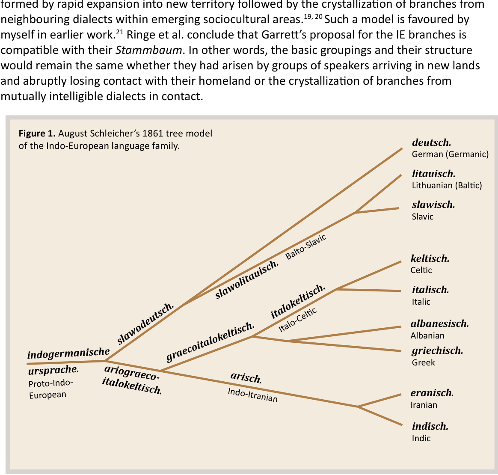
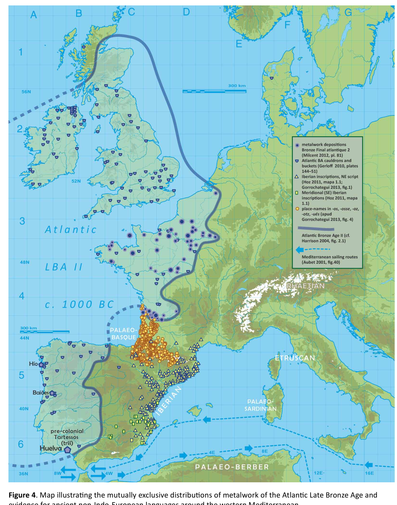

# Formation of the Indo-European branches in the light of the Archaeogenetic Revolution

**John T. Koch**

University of Wales Centre for Advanced Welsh and Celtic Studies

Draft [19-iii-2019] of paper read at the conference ‘Genes, Isotopes and Artefacts. How should we interpret the movement of people throughout Bronze Age Europe?’ Austrian Academy of Sciences, Vienna, 13–14 December 2018.

*Er cof am Eric P. Hamp | 16 xi 1920 – 17 ii 2019*

# Introduction

Using the historical-comparative method, linguists can recover many details of unattested languages. With enough of the right kind of data, it is even possible to reconstruct detailed lexicons and grammatical descriptions. Even so, it is often difficult to assign an absolute date, geographical location, and cultural context to some of the most fully reconstructed prehistoric languages. The common ancestor of the attested Indo-European languages is such a case, and the question of its homeland has been keenly disputed since the 19th century, through the 20th, and into the 21st. In recent years, with the availability of ancient DNA data, the situation has suddenly improved, adding to the evidence base genetic relationships between prehistoric populations and groups in the historical period speaking attested languages.

This essay works from recently published archaeogenetic evidence, drawing attention to what it might imply for some longstanding issues in historical linguistics. Seven working hypotheses are presented concerning prehistoric languages in western Eurasia. These hypotheses aim to situate speech communities in time and space, and to identify archaeological cultures and genetic populations associated with them. Hypotheses 1–6 deal with particular nodes and splits on the tree model of the Indo-European macro-family, the seventh with the prehistoric ancestor of the non-Indo-European language Basque.

As essential background, it is noted, but will not be recapitulated at length, that aDNA data published in two milestone papers in 20151, 2 was argued to support elements of the steppe or kurgan hypothesis of the Proto-Indo-European homeland. This hypothesis was formulated by Gimbutas in the mid 20th century,3, 4 then advanced by Mallory5–7 and Anthony8–10. The implications of this strong, but not closely precise, archaeogenetic support can be summarized as follows.

> The common ancestor of most of the attested Indo-European languages was spoken on the grasslands of what is now Ukraine and South Russia about 5000 years ago. This language’s territory then expanded by mass migration. There is a significant correlation between speakers of this proto-language and the Yamnaya material culture and a genetic ‘Steppe’ cluster, which reflects a mixture of two earlier distinct populations: approximately 50% Eastern European Hunter-Gatherer (EHG) and 50% Caucasian Hunter-Gatherer (CHG, also known as ‘Iranian-associated’).

Before attempting to build on this foundation, it is important to recognize its limits, what it does not mean. It does not mean that everyone on the Pontic–Caspian steppe ~5000 BP spoke Proto-Indo-European, or conversely that all speakers of PIE ~5000 BP lived on the Pontic–Caspian steppe. It does not mean that all users of Yamnaya culture ~5000 BP spoke PIE, or conversely that all speakers of PIE ~5000 BP used Yamnaya culture. It does not mean that all individuals carrying the Steppe component at high levels ~5000 BP spoke PIE, or conversely that all speakers of PIE ~5000 BP carried the Steppe component, either at high levels or necessarily at all. How closely or loosely these categories coincide should become clearer, even precisely quantifiable, as more evidence comes in.

## Preliminaries 1: A tree model of the Indo-European macro-family

The Indo-European sub-families or branches are usually reckoned as ten: (in order of attestation) Anatolian, Indo-Iranian, Greek, Italic, Celtic, Germanic, Armenian, Tocharian, Balto-Slavic, Albanian.6, 7 It should be mentioned also that there are several fragmentarily attested ancient Indo-European languages (such as Phrygian, Thracian, and Lusitanian) that cannot be certainly affiliated with any of the ten branches. It is possible that there were other IE branches that died out completely unattested.

At the stage when each of the ten branches was first attested in writing, they were all fully separate languages. In other words, in a hypothetical encounter between speakers of any two of them, there would have been little mutual intelligibility. At the horizon of written evidence, the separation of each of these from Proto-Indo-European (and from any post-PIE intermediate ancestor) lay deep in the past.

It is common for the ten Indo-European branches to be represented with a tree model. Sometimes all ten will be shown branching from a single point from the end of the Proto-Indo-European trunk.8 But that is surely not what happened. More scientific trees are constructed as a series of two-way splits. So, for example, the Anatolian branch comes off first, as universally agreed, with the rest of Indo-European, still a single unified language, on the other side of that split. Most, but not all, Indo-Europeanists think that Tocharian branched off next. This again would involve all the rest of Indo-European as a still unified proto-language on the other side of the split, and so on until all ten branches were separate and there was no residual Late PIE commonality.

If archaeogenetics has now brought increasing confidence concerning the homeland of PIE, it should do so likewise for combining linguistics, archaeology, and genetics to locate the reconstructed languages occupying the gap between PIE and the attested Indo-European languages. We might expect this task to be easier, as it deals with times closer to the horizon where we have written records in their archaeological contexts, as well as now increasingly information about the genetic connections of the associated human remains. Even prior to the availability of aDNA evidence, some adherents of the steppe hypothesis had elaborated identifications of several specific post-Proto-Indo-European prehistoric languages with Copper and Bronze Age cultures.5, 8, 86 However, there remain unresolved questions about how PIE split up and diversified, as well as the most meaningful way to conceptualize these processes. So, the question is not just which family tree (Stammbaum) but whether any tree model will provide an accurate enough roster of Indo-European linguistic groupings in later prehistory.

For several reasons, the tree of Ringe et al. 2002 is used here. First of all, their study aims to do exactly what is of interest presently, “... to recover the first-order subgrouping of the Indo-European family ...”11, rather than, say, work out the time depth of PIE12–18, 98, 99 or merely to illustrate the subclassifications of numerous attested IE languages8. Secondly, Ringe et al. use a robust base of phonological, morphological, and lexical evidence, which is rigorously filtered for known and conceivable pitfalls. Thirdly, they seriously consider an alternative model for the formation of the IE branches, namely one of a shallowly diversified dialect continuum formed by rapid expansion into new territory followed by the crystallization of branches from neighbouring dialects within emerging sociocultural areas.19, 20 Such a model is favoured by myself in earlier work.21 Ringe et al. conclude that Garrett’s proposal for the IE branches is compatible with their Stammbaum. In other words, the basic groupings and their structure would remain the same whether they had arisen by groups of speakers arriving in new lands and abruptly losing contact with their homeland or the crystallization of branches from mutually intelligible dialects in contact.

Schleicher’s 1861 tree model (Fig. 1) shows several basic features have persisted for over 150 years.22 He recognized Balto-Slavic (slawolitauisch) and Indo-Iranian (arisch), which remain standard features, as well as Italo-Celtic (italokeltisch), which is a common—probably the most common—view today.95 An Italo-Celtic node (representing an undifferentiated speech community) is a feature of the Ringe et al. tree. They also include a Greco-Armenian node, which has been proposed elsewhere,12, 16–18,29 but are more ambivalent about such a proto-language, finding the evidence for it to be ‘disappointingly meager’.

With Ringe et al.’s tree, no details relevant presently are lost by following Mallory’s 2013 simplification.23 However, for reasons explained below, it is their less problematical tree, omitting Germanic, that is simplified here (Fig. 2). In this tree Proto-Indo-European first divides, as expected, into the Anatolian branch on one side and the rest of Indo-European on the other. Next, that ‘rest of Indo-European’ divides, becoming Tocharian on one side and a new, smaller rest of Indo-European on the other. Then, another split with Albanian on one side and yet a newer and smaller rest of Indo-European on the other. Then Italo-Celtic splits off,

then Greco-Armenian. The last residual common ancestor of more than one branch is Balto-Slavic+Indo-Iranian, which will be of special interest here. Amongst the evidence supporting such a commonality are two shared innovations in the consonant system, known as the satəm and RUKI innovations. (satəm is the Avestan word for ‘100’, contrasting with Latin centum, both from PIE *k̂m̥ tóm.) In the first change, the PIE consonant series *k *g *gh and *kw *gw *gwh merged as *k *g *gh. PIE palatovelars*k̂, *ĝ, and *ĝh become assibilated (s-like sounds) in the satəm languages. In the second change, PIE *s became *š (something like English seat versus sheet), following the sounds *r, *w, *k, *g, *gʰ, or *y.86

In historical linguistics various labels are attached to the recurring ‘rest of Indo-European’ unities. These include ‘Late Indo-European’, ‘Middle Indo-European’, ‘Nuclear Indo-European (NIE)’, and ‘Surviving Indo-European (SIE)’ (meaning after the now-extinct Anatolian and Tocharian branches split off). The usage has been inconsistent and confusing. Purely for present purposes, the following terms will be used for the ancestral core of the family and successive residues of this core:

- the earliest Proto-Indo-European (ancestor of all the branches including Anatolian) =

- PIE 1;

- the residual core after Anatolian branches off = PIE 2;

- the residual core after Tocharian branches off = PIE 3;

- the residual core after Albanian branches off = PIE 4;

- the residual core after Italo-Celtic branches off = PIE 5;

- the residual core after Greco-Armenian branches off (bearing in mind that the existence of such a branch is uncertain for the reason explained above) = PIE 6, which can also be called Balto-Slavic/Indo-Iranian.

> **Note.** As will be important in connection with Working Hypothesis 4 below, PIE 6 originally included Pre-Germanic also. But at an early prehistoric stage, Pre-Germanic separated from Pre-Balto-Slavic/Indo-Iranian and reoriented towards Italo-Celtic.

## Preliminaries 2: some terminology and concepts

The term dialects refers here to genetically related forms of speech (i.e. having a common ancestral form of speech, nothing to do with genetics per se) retaining a high degree of mutual intelligibility. This relationship may be the case when the communities speaking the dialects have lost contact with each other more-or-less abruptly and fully, but at a relatively short time previously, say eight generations or fewer, so that linguistic entropy has not set in sufficiently to block mutual intelligibility. On the other hand, the related speech forms may be distinct for far longer than eight generations and still be dialects rather than separate languages in the senses used here, for example the Greek dialects or the largely mutually intelligible national ‘languages’ of Norway, Sweden, and Denmark. In these cases, mutual intelligibility has been maintained by prolonged intense contact, in which speakers habitually used their own dialect—rather than switching or using a lingua franca—in speaking to speakers of another dialect. For historical linguistics, an important implication of the concept of dialect as used here is that borrowings between dialects will often not be detectable linguistically because cognate sounds will be substituted in the borrowing dialect. (This, incidentally, has been one chief argument supporting the Anatolian Neolithic hypothesis of Indo-European origins, despite shared Indo-European vocabulary for a later [Copper Age] material culture.96–100)

related languages, On the other hand, will refer to genetically related varieties of speech with relatively low, even virtually no, mutual intelligibility. Such cognate speech forms will usually have been separate from one another longer with less regular contact. Communication will require a speaker from one language to learn a second language, or the use of a shared lingua franca. Borrowings between separate related languages will more often be detectable as such by linguists because they are less likely to involve assimilative substitution of cognate sounds.

In referring to reconstructed prehistoric languages the prefixes Pre- and Proto- will be used for concepts along the same lines as dialect and language. So, for example, Pre-Indo-Iranian could be thought of as a dialect within a still intact larger linguistic unity and speech community, Proto-Indo-Iranian/Balto-Slavic in this case. Proto-Indo-Iranian and Proto-Balto-Slavic would belong to a later stage, no longer a single speech community with a relatively high degree of mutual intelligibility. Loanwords between Proto-Indo-Iranian and Proto-Balto-Slavic would more often be detectable as loanwords, than between Pre-Indo-Iranian and Pre-Balto-Slavic, which were still part of a coherent dialect continuum.

Another important point in the distinctions between dialects versus related languages and pre-versus proto-languages is that it is more common for an adult to successfully change dialect than to learn a second language and use it like a native speaker. Accordingly, in the languages of the world, mixed dialects are common, mixed languages (as distinct from a language with numerous loanwords) are rare. So, as proposed below, at the stage Pre-Germanic/Balto-Slavic/ Indo-Iranian, it was possible for the western part of that continuum to shift speech areas, becoming reoriented towards Pre-Italo-Celtic. We do not need to think of this process as speakers at the western end of Pre-Germanic/Balto-Slavic/Indo-Iranian changing language, but rather contacts intensifying with mutually intelligible dialects in the West—permitting shared innovations—and declining with those in the East.

## Working hypothesis 1: PIE 1 and Anatolian

The homeland of PIE 1—ancestral to all Indo-European, including the Anatolian branch—was more probably south of, or possibly in, the Caucasus than on the Pontic–Caspian steppe. The speakers of PIE 1 were probably not closely associated genetically with the ‘Steppe component’, that is, ~50 EHG and ~50% CHG.

In its unrevised form, the steppe hypothesis is that the parent language of all Indo-European, including the Anatolian branch, what is called here PIE 1, came from the Pontic–Caspian steppe. Thus far, the archaeogenetic evidence—including that published in the two seminal papers of 20151, 2—has supported the Pontic–Caspian steppe as the homeland of PIE 2 (Proto-Indo-European after Anatolian branched off) rather than PIE 1. Therefore, on this basic matter, the new evidence has not confirmed the steppe hypothesis.

For purely linguistic reasons Anatolian has always been a vulnerable point in the hypothesis. Not only is it universally recognized as the first branch to separate—and therefore the most relevant for dating and locating PIE 1—but also the reason why it is universally agreed to be the first branch is that it is so different and so much more archaic than the other branches. For example, it is the only branch to retain the laryngeal sounds directly; their former presence must be reconstructed to explain features of the other branches, but they have not survived in any of them, even those attested in the Bronze Age, i.e. Mycenaean Greek and Old Indic. Anatolian is also the only branch lacking a feminine gender, which is also usually understood to be an archaism retained from PIE 1 rather than a subsequent innovation. Tense and aspect in the verbal system of Anatolian is also significantly simpler and can be seen as reflecting a state of affairs preceding changes common in all the languages descended from PIE 2. In other words, there is a big gap between PIE 1 (reflected in Anatolian) and PIE 2. It is hard to imagine that there could be less than 1000 years between the first split and the second or that both PIE 1 and PIE 2 could be assigned to a single archaeological culture.

This same point is now made more concretely by Kroonen et al. 2018. They present personal names recorded ~2500/2400 BC, relating to a country somewhere in Anatolia called Armi. These names appear to be in an early Anatolian, leading to the conclusion: “... since the onomastic evidence from Armi is contemporaneous with the Yamnaya culture (3000–2400 BCE), a scenario in which the Anatolian Indo-European language was linguistically derived from [Proto-]Indo-European speakers originating in this culture can be rejected”.24 These Armi names are provisionally accepted here as including archaic Anatolian at the proposed date, though the matter requires further study.

In a lucid overview of ‘The evolutionary history of human populations in Europe’ published on the internet on 4 May 2018, Iosif Lazaridis writes:

In the next few years this lingering mystery will be solved: either Anatolian speakers will be shown to possess steppe-related ancestry absent in earlier Anatolians (largely proving the steppe PIE hypothesis), or they will not (largely falsifying it, and pointing to a Near Eastern PIE homeland).25

As if to emphasize the pace of discovery, an answer—at least the beginnings of one—came in a few days rather than a few years with the appearance of the preprint of Damgaard et al. 2018, publishing evidence of full genomes of 74 ancient individuals, including five deemed probably to be speakers of Hittite. These five had no Steppe component, nor any EHG ancestry.26

Without further confirmation, it would be premature to see the matter decisively settled at this point. There are only five individuals. The Hittite Empire of the Late Bronze Age was a complex, stratified society—a fairly brittle structure that terminally shattered as part of the widespread upheavals ~1200 BC. The empire contained influential groups with exceptional political power, specialist expertise, and mercantile wealth. In such a society, individuals who were not descended from old Hittite-speaking founders might have seen it as advantageous to learn Hittite as a second language and pass it on to their children as a first language, that is, assuming that Damgaard et al. are right in first place that their five individuals were Hittite speakers.

Slight though this evidence may be and provisional any conclusions drawn from it, we are at present looking at falsification of the steppe hypothesis as formulated by Lazaridis rather than support for it. And though that evidence could be said to support a model of infiltration by small, culturally influential groups with Steppe ancestry, it could just as well—and more economically—be used to bolster the case that the PIE 1 homeland was not the Pontic–Caspian steppe and was not spoken by groups with Steppe or EHG ancestry.

The alternative proposal made by Reich (before Damgaard et al. 2018 was available) appears viable, as we await further evidence to fill in gaps and reinforce (or not) preliminary findings:

Ancient DNA available from this time in Anatolia shows no evidence of Steppe ancestry similar to that in the Yamnaya (although the evidence here is circumstantial as no ancient DNA from the Hittites themselves has yet been published). This suggests to me that the most likely location of the population that first spoke an Indo-European language was south of the Caucasus Mountains, perhaps in present-day Iran or Armenia, because ancient DNA from people who lived there matches what we would expect for a source population both for the Yamnaya and for ancient Anatolians [i.e. CHG]. If this scenario is right the population sent one branch up into the steppe—mixing with steppe hunter-gatherers in a one-to-one ratio to become the Yamnaya … —and another to Anatolia to found the ancestors of people there who spoke languages such as Hittite.27

Incidentally, on the strength forthcoming genetic evidence mentioned in Kroonen et al. 2018,24 the dynamic and influential Maykop culture of the north-western foothills of the Caucasus ~3700–3000 BC does not look immediately promising as a context for PIE 1, as EHG ancestry has been found in samples from this culture, unlike the five Hittite individuals of Damgaard et al.26

If this pattern continues as more samples are sequenced—that is, no Steppe or EHG ancestry in the genomes of probable Anatolian speakers—more researchers will wish to reopen the question of how Indo-European is defined. When Hittite was first deciphered over a hundred years ago,28 its differentness from Latin, Greek, and Sanskrit upset philologists. One reaction was to model Hittite (and then the Anatolian branch, as the subfamily became known) as a sister of PIE rather than a daughter.34, 35 This Indo-Hittite theory, which nowadays could more accurately be called Indo-Anatolian, lost ground in the later 20th century, as fewer linguists were deeply invested in the painstaking 19th-century Greco-Aryan reconstruction of Proto-Indo-European. Nonetheless, Indo-Hittite was retained by Hamp,29 and most linguists see Anatolian as clearly the first branch to separate and uniquely affording insights into an earlier stage of the proto-language. For many, ‘Indo-Anatolian’ versus ‘Early Indo-European’ is an arbitrary choice of terminology. The archaeogenetic evidence may now prove decisive in favouring a shift, if it continues to indicate that the common ancestor of Anatolian and the rest of the family had been spoken in a different region and by a different population from those associated with the separate evolution of the residual core following Anatolian’s branching off (i.e. PIE 2). If PIE 1 becomes henceforth ‘Indo-Anatolian’, or the like, the hypothesis that the homeland of Proto-Indo-European was the Pontic–Caspian steppe will possibly be saved by a terminological sleight of hand, moving the goal posts.

## Working hypothesis 2: PIE 2, Afanasievo, and Tocharian

The homeland of PIE 2—following the branching off of Anatolian, but before the branching off of Tocharian—was the Pontic–Caspian steppe. There was a general close association between speakers of PIE 2 and users of the Yamnaya material culture and a genetic population with the Steppe component (~50% EHG : ~50% CHG).

This hypothesis would be supported by affirmative answers to the three questions below.

1. Are the populations associated with the Yamnaya and Afanasievo archaeological cultures the same (or very closely related) genetically?

2. Is the link between the Tocharian languages and Afanasievo culture secure?

3. Was Tocharian the second branch to separate from Proto-Indo-European?

Current evidence favours all three, but not with equal confidence. The strongest yes is for question 1. The six Afanasievo individuals sequenced as part of Allentoft et al. 2015 were virtually indistinguishable from the Yamnaya samples, showing ‘Steppe ancestry’.1 This result is now confirmed in 20 of 23 Afanasievo individuals in Narasimhan et al. 2018, as well as subsequent sampling of Yamnaya individuals.30

Turning to question 2, the Afanasievo culture of the Siberian Altai ~3300–2500 BC and the attested Tocharian language in the Tarim Basin ~500–1000 AD are separated by three millennia in time and over 1000 kilometres in space. On the other hand, there is no viable alternative scenario for a how a centum language became established—and seemingly stranded—on the far side of a vast area of Central, South-west, and South Asia, dominated by satəm Indo-Iranian languages from the time the earliest of them was attested (as the closely similar Mitanni Indic and Vedic Sanskrit).8, 24, 31, 32, 33 The publication of a high-coverage genome of typical Yamnaya/Afanasievo type, dating to ~2900 BC from Karagash in central Kazakhstan,26 bridges the geographical gap between the main Afanasievo territory and the culture’s suspected Yamnaya source.

For question 3, the answer yes is provisional—probably the best, but not the only possibility. That Tocharian is the second branch is not the universal view. Its separation was plotted further along the tree according to Hamp,29, 31 for example. As explained above, a tree model is more unambiguously suitable when speech communities split cleanly by migration followed by abrupt loss of contact across a geographic barrier, as was at least sometimes the case in the linguistic prehistory of Oceania.11 An alternative scenario in which the rapid expansion of a language forms a dialect continuum, followed by ongoing contact between neighbouring dialects with a high degree of mutual intelligibility, will complicate the picture.19, 20 An innovation could occur in the lexicon, sound system, or morphology of one dialect then spread to others. If this occurs at a relatively early stage of linguistic prehistory—before most of the innovations distinguishing the languages within the family had occurred—it can be hard to distinguish such inter-dialect borrowings from shared inheritances. With a language family as vast and complex as Indo-European, both types of separation—abrupt loss of contact and prolonged mutual influence within a dialect continuum—probably occurred in various facets of its history. That means we won’t be comparing like with like. All else being equal, the daughter language formed by a clean break might look more archaic than a related language which formed at the same date but stayed in contact with other members of the family. The latter was in position to share innovations as borrowings. Because the Indo-European that became Tocharian was geographically widely separated from the rest of the family, with 3000+ kilometres and, as explained below, a non-Indo-European language or languages were originally in that gap, it is likely that it would be a case of abrupt separation, at least relatively so. The Indo-European languages of Europe would not be. So, while accepting that the linguistic evidence supports a model of Tocharian as the second branch to separate from Indo-European, caution is advisable.

In the case Anatolian, the barrier of the Caucasus Mountains with its non-Indo-European languages might similarly have caused a clean break with the rest of the family. But for Anatolian, its differentness from the rest of Indo-European is more clear-cut and the written evidence is much earlier. It is not credible that all the innovations that distinguish the rest of Indo-European from Anatolian spread by inter-dialect borrowing.

At present, the available evidence implies an intriguing story in which Pre-Tocharian became detached from PIE 2 by a long-distance migration across the central Eurasian steppe of Kazakhstan ~3300–3000 BC when Yamnaya migrants founded Afanasievo in the Altai. Other recent aDNA findings provide a possible explanation for why so much intermediate grazing land was bypassed. The clearest evidence for early horse domestication comes from the pre-agricultural Botai–Tersek culture of the North Kazakh steppe ~3700–3000 BC.11, 36, 37 The aDNA evidence published by Damgaard et al. 2018 finds that Botai and Yamnaya/Afanasievo individuals differed greatly genetically. The Botai people did not have Steppe ancestry or either of its main subcomponents.26 As Botai–Tersek was also wholly unlike Yamnaya/Afanasievo as a culture,11 it is unlikely that the groups spoke related languages.

Another finding of Damgaard et al. 2018 was that Botai horses were not the ancestors of other tested ancient populations of domestic horses.26 In other words, this implies a second centre of domestication. Therefore, it remains possible, on the basis of the genetic evidence, that a parallel domestication had taken place on the Pontic–Caspian steppe at approximately the same time, a possibility that further evidence will either confirm or rule out. However, at present it may be pointed out that the wild horse is a powerful and aggressive animal. Taming an adult wild stallion is extremely difficult. Therefore, there are reasons of logical economy to suppose that the horse was not domesticated independently by two groups living near each other (Yamnaya and Botai–Tersek) at about the same time, but easier to suppose that the complex skillset arose amongst one group and then passed between the central and western steppe. In either case, the Yamnaya pastoralists of the western steppe may have found the specialized herders and hunters of horses on the central steppe difficult to displace or live beside, so migrated well beyond them to unexploited pastures further east.

## Working hypothesis 3: The Beaker expansion and the genetic and linguistic heterogeneity of the Beaker People

The earliest Beaker package arose amongst speakers of a non-Indo-European language by the Tagus estuary in present-day central Portugal ~2800 BC. Beaker material was adopted by speakers of Indo-European as it spread east and north from its place of origin.

14C dates imply that the region around modern Lisbon was the home of the earliest Beaker package ~2800 BC, including the eponymous ceramic vessel, archery equipment, daggers, and continued or renewed interest in megalith-related funerary practices.38–42, 94 The aDNA data published by Olalde et al. 2018 shows that individuals associated with Beaker material were genetically heterogeneous. Most of the sequenced individuals associated with Beaker material found in Germany, the Netherlands, France, Switzerland, and Britain had high levels of the Steppe component. However, of the 32 Beaker-associated individuals from the Iberian Peninsula, only 8 showed the Steppe component at all. None of the 5 Beaker individuals from Portugal had any. Most Iberian Beaker men did not have R1b Y chromosomes of any of the subclades found in Indo-European-speaking areas. The Iberian Beaker People who lacked the Steppe component were of an ancestry closely related to Iberian Neolithic and pre-Beaker Copper Age individuals sequenced in the same study.43, 44

After spreading eastward across Spain, the Beaker package spread rapidly ~2600 BC along the Atlantic façade and along the North-west Mediterranean to the western Alps. ~2550 BC the Beaker Phenomenon entered West-central Europe, spreading into areas where Corded Ware cultures (CWC) were already established, within an area that can be defined as bounded by the Rhine in the west, the Upper Danube in the south and Jutland and the western Baltic in the north.40, 42 The Beaker Phenomenon reached Britain and Ireland beginning ~2450 BC41, 42, 45 The Olalde et al. study found a 90% population replacement in Britain at this time, from British Neolithic individuals lacking the Steppe component to Beaker associated individuals showing high levels of it.43 The four individuals sequenced by Cassidy et al. 2016 are consistent with a similar dramatic shift in Ireland:

1) a Rathlin Island cist burial with three Early Bronze Age men (2026–1534 cal BC) showing a significant Steppe component, R1b Y chromosome; like modern Irish (Scottish, Welsh) population, the Rathlin men had genes for haemochromatosis, blue eyes, tall stature, lactase persistence;

2) the Ballynahatty Neolithic woman (3343–3020 cal BC) showed no Steppe component, mostly Anatolian Neolithic ancestry (differing from the Neolithic admixture of the Rathlin men) and WHG admixture; overall she was less similar to the modern Irish gene pool and more similar to the Sardinian.46

The Olalde et al. study’s British Beaker People were found to be virtually indistinguishable genetically from its Dutch Beaker People.43

The above evidence suggests that the first Beaker People along the Lower Tagus spoke a non-Indo-European language inherited from earlier inhabitants of the Iberian Peninsula.47 As it then spread north and east, the package was taken up by groups with Steppe ancestry who probably spoke Indo-European. The CWC groups east of the Rhine who came into contact with Beaker People also had high levels of Steppe ancestry and therefore probably also spoke Indo-European. The eastern connections of CWC and western genesis of the Beaker Phenomenon means that it is likely that there was a dialect difference.

## Working hypothesis 4: PIE 6, Corded Ware cultures, Germanic/Balto-Slavic/Indo-Iranian, and Alteuropäisch

~2800–2550 BC the region of Corded Ware cultures (CWC) in northern Europe—bounded approximately by the Rhine in the west and the Volga in the east—was the territory of an Indo-European dialect continuum ancestral to the Indo-Iranian, Balto-Slavic, and Germanic branches. The separation of the Pre-Germanic dialect from Pre-Balto-Slavic/Indo-Iranian, and its reorientation towards Pre-Italo-Celtic, was the result of Beaker influence in the western CWC area that began ~2550 BC.

One important finding of Ringe et al. 2002 (a version of whose tree model is Fig. 2 here) is the difficulty encountered in seeking the place of Germanic within the first-order subgroupings of Indo-European. They offer the following plausible explanation, which takes on new meaning in light of archaeogenetic evidence.

This split distribution of character states leads naturally to the hypothesis that Germanic was originally a near sister of Balto-Slavic and Indo-Iranian (possibly before the satem sound changes spread through that dialect continuum, if that is what happened); that at that very early date it lost contact with its more easterly sisters and came into closer contact with the languages to the west; and that contact episode led to extensive vocabulary borrowing at a period before the occurrence in any of the languages of any distinctive sound changes that would have rendered the borrowing detectable. (p. 111)11

Now that we know both CWC People and the Beaker groups in West-central Europe had high levels of Steppe ancestry, but had followed different histories after their ancestors left the Pontic–Caspian steppe, we can contextualize this realignment of dialects. As purely a matter of geographic correspondence, an early Indo-European dialect bloc giving rise to Germanic, Balto-Slavic, and Indo-Iranian strongly suggests the geographic distribution of CWC, especially once we take into account the case for placing the origins of Indo-Iranian in Eastern Europe in Hypothesis 5 below. The R1a Y chromosome also lines up suggestively with this subset of the Indo-European branches.

It has many times been pointed out that the geographic distribution of the Beaker Phenomenon corresponds approximately, but strikingly, with that of the Ancient Celtic languages. Within the CWC area, the dialect shift that Ringe et al. envision for Pre-Germanic on purely linguistic evidence has an exact analogue in archaeology. ~2550 BC the Beaker phenomenon entered the CWC area from the west and was henceforth interacted and partly fused with CWC in West-central Europe, in that zone extending as far east as the Middle Danube and Jutland. These ‘Beakerized’ regions henceforth had reduced contact with non-

Beakerized CWC to the east, and entered a cultural sphere with non-CWC areas in the West with Beaker culture, including the Iberian Peninsula, northern Italy, parts of France, and Britain and Ireland. Linguistically, these developments may be plausibly interpreted as intensification of contacts with Pre-Italo-Celtic and reduction of contacts with Pre-Balto-Slavic/Indo-Iranian. When the Beaker phenomenon reached the CWC area ~2550 BC, the linguistic result of the ensuing cultural interaction was to detach Pre-Germanic in the west from the Balto-Slavic/Indo-Iranian bloc to the east, bringing it into the Italo-Celtic sphere dominant amongst the Indo-Europeanized Beaker groups.

There is another linguistic phenomenon with a geographic distribution corresponding strikingly with CWC and necessarily assigned to a time depth pre-dating the Late Bronze Age and emergence of the post-PIE 2 Indo-European branches as separate languages. This is the phenomenon of the so-called ‘Old European’ or alteuropäisch river names. The linguistic earmarks of this early layer of place-names include IE word roots having to do with water and most often surviving in Baltic languages and the merger of earlier ŏ and a as a , as occurred in Germanic, Balto-Slavic, and Indo-Iranian. Kitson describes the core geographic distribution of these names as follows.48–53

The contribution of river-names to this argument [about the PIE homeland] is that in Europe south of the Baltic and north of the Alps and Carpathians, between roughly the Rhine in the west and perhaps the Don in the east, all ancient river-names are etymologically alteuropäisch. At least so say the hydronymists, and river-names in the area have been so intensively studied, and attempts to overturn the assertion have been so conspicuously unsuccessful, that I think we must take it as established.54 (p. 101)

Although Kitson is arguing here for a North-European homeland for PIE 1, the alteuropäisch evidence he cites suits PIE 6 (Germanic/Balto-Slavic/Indo-Iranian) linguistically as well as geographically.

The alteuropäisch river names remain problematical and controversial for many linguists. Mallory and Adams’s overviews of Indo-European studies do not include them as a meaningful category.6, 7 Vennemann has argued that they are ‘Vasconic’, i.e. a prehistoric non-IE language family ancestral to Basque.57 Kitson’s paper focuses on the alteuropäisch type in Britain,54, 55 where, like other parts of Europe west of the Rhine, they are found together with unproblematically Celtic names. Kitson hovers somewhat, hinting at an interpretation of layers belonging to different Indo-European languages—at first one not on the branch leading to Celtic then followed by Celtic—but he appears to favour alteuropäisch evolving into Celtic in Britain, rather than being replaced by it. This process would involve a reinterpretation of obsolete and opaque names. One example is the recurrent British river-name Derwent, Welsh Derwennydd. Its original form was PIE *Dreu̯entiH₂- ‘running [river]’, attested widely on the Continent as Druentia, &c. (Pokorny *dreu- ‘to run’).58 Becoming opaque, the PIE river-name was then reinterpreted as a meaningful Celtic *Deru-u̯ent- ‘[river] with oaks’. This is a plausible enough explanation, and there is nothing in it requiring that the original river name was coined in a language other than the PIE dialect that evolved into Brythonic Celtic.

## Working hypothesis 5: Eastern CWC, Sintashta, Andronovo, and the attested Indo-Iranian languages

After Pre-Germanic reoriented towards Italo-Celtic, in the context of the Beaker phenomenon in Central Europe ~2550–2200 BC, the satəm and RUKI linguistic innovations spread through the remainder of the Balto-Slavic/Indo-Iranian continuum. The dialect(s) at the eastern end of CWC developed towards Indo-Iranian. The Abashevo culture between the Don and southern Urals (~2500–1900 BC) is a likely candidate for the Pre-Indo-Iranian homeland. The Sintashta culture, east of the southern Urals ~2100–1800 BC, can be identified as a key centre from which an early stage of Indo-Iranian spread via the Andronovo horizon of central Asia ~2000–1200 BC to South and South-west Asia by 1500 BC. That Indo-Iranian came as a reflux from north-eastern Europe (rather than a direct migration from Yamnaya on the Pontic–Caspian steppe) is shown by the European Middle Neolithic (EMN) ancestry present in Sintashta individuals and carried forward to Andronovo and South Asian populations.

The hypothesis that the Sintashta culture was the homeland of Indo-Iranian (or specifically Proto-Indic) developed and gained considerable acceptance on the basis of archaeological and philological evidence alone, before supporting aDNA data became available.8, 56 The key archaeogenetic detail is that the signature for most Sintashta individuals has ~68% Steppe ancestry, ~24% EMN, ~8% West Siberian HG. This profile is thus distinct from Yamnaya/Afanasievo, which lacks EMN.1, 26 In this light, the Sintashta population cannot be explained as a result of a primary direct migration by Yamnaya groups on the Pontic–Caspian steppe ~3300– 2400 BC, as is the case with the primary migration giving rise to the Afanasievo population.

This model finds further confirmation in archaeological evidence for the origins of the Sintashta material culture, which indicates sources in eastern CWC, such as the Fatyanovo culture ~3200–2300 BC, Middle Dnieper culture ~2800–1800 BC, and most especially the Abashevo culture between the Middle Don and southern Urals ~2500–1900 BC.56, 8, 59–61, 86, 92, 93 This culture is epitomized by Anthony, as ‘the easternmost of the russian forest-zone cultures that were descended from Corded Ware ceramic traditions. The Abashevo culture played an important role in the origin of Sintashta.’8 Abashevo is identified as the source of Sintashta metallurgical and ceramic traditions and stock-breeding economy, as well as the key detail of the disc-shaped cheek pieces characteristic of the distinctive horse gear of Sintashta chariotry. Sintashta is widely credited with invention of the light-weight war chariot, with two spoked wheels and tightly controlled two-horse teams. 56, 8, 59–61 The Abashevo people who moved eastward to found the Sintashta culture were attracted by abundant arsenic-rich copper ores in Transuralia.59 That Abashevo was associated with an early stage of Indo-Iranian, or already specifically Proto-Indic, had been proposed on the basis of archaeological evidence together with the linguistic evidence of ~100 Indo-Iranian loanwords in the Uralic languages and correspondences between Sintashta burial rites and Vedic religion.86 As I write now, there is no Abashevo aDNA to confirm or contradict the expectation that its gene pool was the source of the genetic type found at Sintashta with Steppe + ~24% EMN ancestry.

That genetic signature can be traced forward to sampled individuals of the Sintashta-derived Andronovo horizon widely spread across Central Asia ~2000–1200 BC and, afterwards, to genomes of probably Indic-speaking groups in Iron Age South Asia.26, 30 It is present in South

Asia today—at higher levels in the North of Pakistan and India and among Indic-speaking and high-caste Hindu groups. A recently sequenced genome from the Harappan (Indus Valley Civilization) site of Rakhigarhi north-west of Delhi, dating ~2500 BC, shows no Steppe or EMN ancestry, implying that this ancestry entered the northern Subcontinent later than that. The Rakhigarhi man was of the ‘Ancestral South Indian’ type, more similar to the modern genetic profile common in southern India and amongst Dravidian speakers.111 Modern South Asian mitochondrial DNA implies that the Bronze Age immigrants who introduced the Steppe+EMN component were mostly men.62

## Working hypothesis 6: Non-IE influence in the West and the separation of Celtic from Italo-Celtic

1. The Beaker phenomenon spread when a non-Indo-European culture and identity from Atlantic Europe was adopted by speakers of Indo-European with Steppe ancestry ~2550 BC.

2. Interaction between these two languages turned the Indo-European of Atlantic Europe into Celtic.

3. That this interaction probably occurred in South-west Europe is consistent with the historical location of the Aquitanian, Basque, and Iberian languages and also aDNA from Iberia indicating the mixing of a powerful, mostly male instrusive group with Steppe ancestry and indigenous Iberians beginning ~2450 BC, rsulting in total replacement of inmdigenous paternal ancestry with R1b-M269 by ~1900 BC.

4. The older language(s) survived in regions that were not integrated into the Atlantic Bronze Age network.

> **Note.** This hypothesis should not be construed as a narrowly ‘Out of Iberia’ theory of Celtic. Aquitanian was north of Pyrenees. Iberian in ancient times and Basque from its earliest attestation until today are found on both sides of the Pyrenees. The contact area envisioned is Atlantic Europe in general and west of the CWC zone bounded approximately by the Rhine.

In separating from Proto-Indo-European, Proto-Celtic developed new features found also in Palaeo-Basque that can be explained as the result of contact, including the four below. First, the weakening, followed in most phonetic environments by complete loss, of the PIE consonant *p in Proto-Celtic is now seen by several historical linguists as the result of contact with languages like the non-Indo-European Iberian and Palaeo-Basque/Aquitanian.63–69 That Iberian and Aquitanian were p-less is directly observable in the substantial remains of those ancient languages.70–72 Linguistic reconstruction applied to the modern Basque language also indicates that Palaeo-Basque lacked *p.74–76

Secondly, when the series of stop consonants of Proto-Celtic is compared to that of that of centum PIE and the reflex of this system in Proto-Italo-Celtic in the tables below, an overall reduction of 12 to 7 consonants is seen in the evolution from centum PIE or Proto-Italo-Celtic to Proto-Celtic.77

### Centum PIE63

| Series | Labial | Dental | Velar | Labiovelar |
|---|---:|---:|---:|---:|
| voiceless | p | t | k | kʷ |
| voiced | (b) | d | g | gʷ |
| voiced aspirated | bʰ | dʰ | gʰ | gʷʰ |

### Proto-Italo-Celtic (after Schrijver)78

| Series | Labial | Dental | Velar | Labiovelar |
|---|---:|---:|---:|---:|
| voiceless | p | t | k | kʷ |
| voiced | (b) | d | g | gʷ |
| voiced fricative | β | δ | γ | γʷ |

### Proto-Celtic63

| Series | Labial | Dental | Velar | Labiovelar |
|---|---:|---:|---:|---:|
| voiceless | _ | t | k | kʷ |
| voiced | b | d | g | gʷ |

Michelena’s ‘sistema fonológico principal del vasco antiguo’ follows.

### Palaeo-Basque74, 75

| Series | Labial | Dental | Apical sibilant | Laminal sibilant | Velar | Nasal | Lateral | Rhotic |
|---|---:|---:|---:|---:|---:|---:|---:|---:|
| fortes | _ | t | c | ć | k | N | L | R |
| lenes | b | d | s | ś | g | n | l | r |

A third parallel is shown in the table of Palaeo-Basque consonants as reconstructed by Mitxelena above. Opposed series of corresponding strong and weak consonants (fortes and lenes) is also a characteristic of the Celtic languages, though it was not an inherited feature from PIE. Systems of fortis and lenis consonants are found in all medieval and modern Celtic languages. This is the phonological basis of the mutations that are a pervasive characteristic of the grammars of the Celtic languages.79–81 Lenition is not regularly shown in written Ancient Celtic languages. However, in texts in the Roman alphabet, it is not uncommon to find etymological p, t, and k standing between vowels in Ancient Celtic forms written as b, d, and g, implying that phonetic lenition had already taken place. There is also a structural argument explaining the simplification of the Proto-Celtic consonant system from the Proto-Italo-Celtic as the result of phonetic lenition: in other words, with the reflexes of PIE */bʰ dʰ gʰ gʷʰ/ becoming Italo-Celtic / β δ γ γʷ/ in all positions, and the Proto-Celtic reflexes of PIE /(b) d g/ then articulated as [β δ γ] in lenis position, the two series of consonant phonemes were no longer distinctive enough to be kept separate, which resulted in reductions in the consonant inventory at the beginning of Proto-Celtic. 95

A fourth detail in which the centum PIE consonant system and that reconstructed for Proto-Italo-Celtic, on the one hand, differed from those of Palaeo-Basque/Aquitanian, Iberian, and Proto-Celtic, on the other, is the phoneme */b/. This existed in PIE and in Proto-Italo-Celtic, but was remarkably rare at those stages, occurring in extremely few words. For this reason, it is printed in the tables above in parentheses. However, /b/ appears with great frequency in the written evidence for Aquitanian and Iberian and is reconstructed as part of the basic consonant system of Palaeo-Basque. */b/ likewise had high frequency in Proto-Celtic, as the high-frequency centum PIE consonant phonemes */gʷ/ and */bʰ/ both became Proto-Celtic */b/.

All of the stop consonants eliminated between centum PIE and Proto-Italo-Celtic, on the one hand, and Proto-Celtic, on the other, were absent also from Palaeo-Basque. Conversely, the stop consonant */b/ that had been extremely rare in centum PIE and Proto-Italo-Celtic then became extremely common in Proto-Celtic, as it was likewise in Palaeo-Basque. It follows that an adult native speaker of a language with a consonant system like that of Palaeo-Basque would find it easier to learn Proto-Celtic (or a least to master competently this central aspect of it) than centum PIE or Proto-Italo-Celtic. This transformation of the consonant system is consistent with a situation in which adult learners of this description were numerous and in a position to influence Indo-European speech as passed on to the next generation.47, 77

The Steppe component has now been found widely in aDNA samples from Atlantic Europe (Ireland, Britain, the Iberian Peninsula, and Western France).27, 43, 44, 46, 82–5, 112 It was not present in the Neolithic or earlier populations of these areas.27, 44, 43, 46, 112 In the various sub-regions the key transition period appears to be ~4500–4000 years ago.

Samples from all sub-regions of the Iberian Peninsula now show a similar pattern in which the Steppe component appears at this period at relatively low levels and with a strong male bias (90%+ of the males with any Steppe ancestry have R1b-M269 Y chromosomes).27, 43, 44, 84, 85, 112 Although the Steppe component occurs in autosomal aDNA at somewhat higher percentages in the North of the Peninsula, the pattern is found both in zones with evidence for Ancient Celtic languages (that is the zone of place-names with Celtic brigā ‘hillfort’, Fig. 3) and where non-Indo-European Iberian and Basque languages predominated.47, 112 It is also the pattern in the modern gene pool of the Basque area, where R1b-M269 predominates amongst Basque men today.

As shown in Olalde et al. 2019, the changeover occurred ~2450–1900 BC, with no Steppe ancestry detected before that time. Within that interval, paternal ancestry of both types occur; indigenous Y chromosomes and R1b-M269 are found in all regions of the Peninsula. Later in the Bronze Age, there is only R1b-M269. That paper draws highlights the burial of a man and a woman ~2300–1900 BC in Tomb 4 of the important ritual site of Castillejo del Bonete, which lies inland in South-central Spain. The 40–50 year-old man had Steppe ancestry; the 30–40 year-old woman had none, but a geneome resembling that of Copper Age Iberians. Of course, nothing certain can be concluded about the first language of either individual. But this microcosmic vignette illustrates the genetic transformation that swept the Iberian Peninsula at this time, and that very probably involved many individual pairings of men whose first language was Indo-European with women speaking an indigenous non-Indo-European language. In such cases, it is likely that one or both learned a second language as an adult. Olalde et al. 2019 also find that Steppe ancestry continued to rise more gradually across all regions after the Early Bronze Age, and they suggest that gene flow from Central Europe took place during the Urnfield Late Bronze Age. This is not improbable, though Urnfield did not reach the North or West of the Pninsula. Another possible factor is that individuals and groups with more Steppe ancestry tended to enjoy social advantages and were consequently more successful reproductively over the course of the Bronze Age.

The situation is brodly analogous to parts of South Asia where R1a Y chromosomes, often found together with Eastern Indo-European languages, are common also in some non-Indo-European-(Dravidian-)speaking areas.62 Similarly, the Old Indic from the Mitanni empire (in present-day northern Syria and Iraq) survives only as the names of kings and gods and horse and chariot terminology; the incoming warrior élite gave up their ancestral language for non-Indo-European Hurrian.86 It appears, therefore, that paternal Steppe ancestry was not enough in and of itself to determine the survival of an intrusive steppe language, i.e. Indo-European. A continued pattern of contacts with and influences from Indo-European-speaking areas was also necessary.47 This pattern can be illustrated by comparing the survival of Palaeo-Basque/Aquitanian73 and Iberian languages87 in South-west Europe to the distribution of the metalwork that defines the Atlantic Bronze Age (~1300–900 BC)88, 89: these show a direct inverse relationship (Fig. 4).47

The aDNA evidence from the Iberian Peninsula—specifically a widespread low level of the Steppe component with a strong male bias27—is consistent with a scenario of substratum influence from the language of mothers. The pattern reflects a situation in which successive generations of men with Steppe DNA were exceptionally successful in producing offspring with indigenous Iberian women, who probably spoke an indigenous non-IE language or languages with a consonant system similar to that of Palaeo-Basque.

On the other hand, the result of Olalde et al. for British Beaker People—which showed a 90% replacement of the British Neolithic population43—would not lead us to expect substratum influence on the language of the incoming group. However, the same study also detected a reduction of Steppe ancestry in samples of the Iron Age and roman Period from South-east Britain. one possible explanation is that this reflects a resurgence of surviving Neolithic ancestry that had remained invisible in the remains available for the British Beaker Period and Bronze Age. That is what many archaeologists expect, as the high population-replacement figure was startling, seemingly inconsistent with the less complete break reflected in the material culture.90, 91 In other words, it may not be only in the Iberian Peninsula that there were favourable conditions in Atlantic Europe for indigenous languages to have had an impact on the incoming Indo-European.

## Working hypothesis 7: The origins of Basque

1. The prehistoric ancestor of the Basque language was already in SW Europe when Indo--European speakers with Steppe ancestry arrived in the Early Bronze Age (~4500–4000 BP).

2. That prehistoric non-IE language could go back to the First Farmers from Anatolia (arriving (~7500 BP).

3. However, Iberian aDNA shows Western Hunter-Gather (WHG) admixture—so a linguistic continuity from the Mesolithic or Palaeolithic cannot be immediately ruled out.

4. Comparative evidence for other pre-IE languages in Europe and Anatolia may help to decide. In other words, was the language of the First Farmers related to Basque?

As formulated by Renfrew, the Anatolian Hypothesis of PIE origins envisioned Indo-European reaching Western Europe, brought by the First Farmers of Anatolian ancestry (arriving ~5500 BC in Iberia), and their language then evolved into Celtic in situ there.96, 97, 100 By default, that would push the origins of Basque back before farming, to WHG. Now that archaeogenetic evidence consistent with the steppe hypothesis is known and reveals in particular the arrival of a large and dynamic group of newcomers related to other Indo-European speakers ~2500– 2000 BC, the linguistic forebears of pre-IE Basque can be moved forward to the available slot of the First Farmers. That is the least problematical solution. A key element of Renfrew’s original reasoning remains compelling: if the First Farmers expanded across Europe from a compact homeland in the Near East, it is likely that they introduced a single new language or a single family of closely related languages. In that much, the new aDNA evidence has actually confirmed Renfrew’s hypothesis in showing that the First Farmers in Europe were associated with a specific genetic type.1, 2, 106, 107, 109

![Figure 5. Map showing developments before ~4500 BP: 1) primary outward migration from Yamnaya on the Pontic–Caspian steppe, bringing with it the genetic steppe component and PIE 2 speech to found CWC in northern Europe and Afanasievo in the Siberian Altai; 2) the Proto-Beaker package spreads by sea from its origin in the Tagus estuary to Brittany and Mediterranean France. In Figures 5 and 6, straight sans-serif type indicates archaeological cultures, italic sans-serif type indicates linguistic stages, and straight serif type indicates genetic structure.](images/koch-2019-formation-ie-branches-fig5.png)

However, the Neolithic Iberians were not of pure Anatolian Neolithic ancestry, but also show WHG admixture.44, 85 It could be possible to judge better whether or not a pre-Neolithic source in Western Europe is a remote possibility for the Basque language through further research in three areas.

First, additional gauging of WHG admixture: as more genomes at higher resolution become available, we will gain a clearer idea of the degree of survival of pre-Neolithic population in South-west Europe. The structure as well as the quantity of WHG admixture is meaningful. Was it more often family groups of farmers who advanced into Mesolithic Europe or pioneering single men? It is conceivable that mitochondrial DNA will reveal the reverse. Had there been a division of labour like that common amongst indigenous societies of eastern North America, in which men hunted and fished while keeping crops was largely the domain of women, farming knowhow might have spread with women who paired with hunters outside their kindred.

Second, the building of megalithic monuments was a distinctive cultural feature that, to a certain extent at least, united Neolithic Atlantic Europe as a region and distinguished it from other parts of Neolithic Europe.40, 101 Where did this tradition come from? Were its origins pre-Neolithic? Recent work by Schulz Paulsson supports the case that monumental earthen burials began in North-west France ~5000 BC, then spread from the Paris Basin to Brittany (Carnac), by ~4800 BC. The earliest megalith building arose there in the following centuries, then spread by sea. For Brittany this dating is early enough to allow that the ideology and practice might precede farming.102 Of course, these two points—WHG admixture and possible pre-Neolithic origins for megalithism—are circumstantial and only suggestive rather than decisive regarding possible WHG origins for the Basque language.

Linguistic evidence could be more decisive. In this last area, we might make progress with a detailed comparison of Basque, the closely related Aquitanian, and typologically similar Iberian, on the one hand, and traces of other non-IE languages, following back eastwards

![Figure 6. Map showing developments after ~4500 BP: 1) reflux of from north-eastern Europe bringing with it Proto-Indo-Iranian from PIE 6 and a genetic signature with ~68% steppe component and ~24% MNE; this genetic signature and Indo-Iranian speech subsequently spread from the Sintashta culture eastward to the Andronovo horizon and thence to South Asia; 2) the reflux of the Bell Beaker Complex westward from west-central Europe, bringing with it a form of Indo-European speech, probably Pre-Italo-Celtic.](images/koch-2019-formation-ie-branches-fig6.png)

along the route farming took from Anatolia—thus studying Palaeo-Sardinian, Etruscan and Rhaetian, Minoan and the pre-Greek words and names in the Aegean,103 Eteo-Cypriot,104 and in Anatolia itself Hattic105 and Hurrian106, as well as the better known Semitic and Caucasian language families. Such a programme would certainly be a challenge and possibly fruitless. There are known pitfalls and numerous widely disbelieved attempts to connect Basque with several of these languages.75 It would require sustained effort to push past the superficial. But a rigorous project along these lines might uncover evidence for one non-IE language or family of languages spreading west with farming. or, with the reverse outcome, such research could give us a clearer idea whether non-IE languages in the West look fundamentally unlike those in and nearer to Anatolia? Continuity or discontinuity? If the former case, that would be consistent with deriving Basque from the language of the First Farmers. A clear case of the latter would be consistent with the hypothesis deriving Basque from a WHG language.

## Conclusion

From about 500 BC written history achieves a much wider awareness of Eurasia and its peoples, opening a new window onto non-literate groups in the North. At this time the two most extensive branches are documented at opposite ends of the Indo-European world. In the West, stretching from the Atlantic to Central Europe, was Celtic. Indo-Iranian extended far eastwards to the great mountain ranges in the middle of Asia—the Altai, Tian Shan, Pamirs, Hindu Kush, and Himalayas. As Celts and Iranian-speaking Scythians, the two branches met along the Danube. This cultural confrontation gave rise to the systematized Classical view of a northern barbaricum divided between Celts in the West and Scythians in the East.

Archaeogenetic evidence published in 201826, 43 shows that the Botai–Tersek culture (~3700– 3100 BC on the North Kazakhstan steppe, credited with first domestication of the horse37,

110) and the Proto-Beaker package (~2800 BC on the Tagus estuary in central Portugal) arose amongst populations genetically unrelated to their contemporaries on the Pontic–Caspian steppe. From this, it is inferred that the Botai–Tersek and Proto-Beaker People probably spoke non-Indo-European languages.

In Hypotheses 3 and 5 above, it is argued that the migrations that resulted in the vast extents of these two branches took place after ~2500 BC. They were not the immediate effects of the primary gene flow from the Yamnaya Pontic–Caspian steppe ~3100–2700 BC, but secondary refluxes some centuries later, pushing out at either end of Corded Ware in northern Europe, between the Rhine and Volga. In the West, an innovative version of the Beaker package expanded, returning westward, including new movements into Britain and Ireland. These issued from the Beaker–CWC fusion zone by the Lower Rhine. The genetic populations associated with the Beaker Package were heterogeneous, and it is argued here that they were linguistically heterogeneous likewise—beginning amongst probable non-Indo-Europeans in Iberia, then adopted by speakers of Pre-Italo-Celtic PIE north and east of the Pyrenees, then coming into contact with Pre-Germanic/Balto-Slavic/Indo-Iranian when they settled alongside western CWC groups, east of the Rhine. Apart from the ambiguous evidence of some probably alteuropäisch names west of the CWC zone, most of the linguistic evidence associated with this reflux is Celtic.

on the eastern end of the CWC, Abashevo can be seen as the main forebear of Sintashta on the Transural steppe. Sintashta was itself the forerunner of the vastly extensive Andronovo horizon of western Central Asia. That Sintashta’s founders represented a reflux of a group of Steppe background returning from northern Europe is indicated by a genetic profile ~68% Steppe ancestry, ~24% EMN, ~8% West Siberian HG.

The chief competitive advantages behind both the western and eastern reflux expansions were technologies of mobility. Whatever the appeal had been of the communal drinking of the Beaker People, their ideal of warrior as bowman, and burial rites harking back to the Atlantic megalithic past, the Proto-Beaker homeland on the lower Tagus and the rapid expansion by sea to Brittany and southern France imply an advanced skillset for the high seas. The ‘Maritime’ Beaker culture arose from a deep background within interconnected Atlantic Megalithic cultures, which included those of Ireland and Britain. Advanced seafaring is something the speakers of Proto-Indo-European on the Pontic–Caspian steppe had lacked, but needed to take up new lands in Atlantic Europe. It is not an accident that it was with the Beaker People that Steppe ancestry—probably together with Indo-European speech—first reached Britain and Ireland. Whatever else we make of the figure of 90% population replacement in Britain between the Neolithic and Beaker Age,43 we must recognize a group capable of moving en masse over rough seas within a limited time span.

The expansion in the east is analogous. But in this case the technological advance emerged for navigating the oceanically vast steppes. This is an advance that is not inferred but directly observable in the archaeological evidence for Sintashta as the epicentre of the horse and chariot revolution.

In their symmetry, the Beaker expansion and that of Indo-Iranian chariot warriors were possibly linked, though indirectly, as cause and effect. If the proposal is correct that the zone of Beaker/CWC overlap in Central Europe was where Pre-Germanic separated from Pre-Balto-

Slavic/Indo-Iranian, then that was the scene of cultural fission and an emerging barrier. As the passage quoted above from Ringe et al. 2002 implies, communication broke down to the degree that the satəm and RUKI innovations were not communicated to western CWC. New ideas and vocabulary came from the West, areas with Beaker culture and Pre-Italo-Celtic speech. With this estrangement in the West, it is understandable the eastern groups with CWC-derived cultures, such as Abashevo, turned their attention to the country beyond the Urals with its abundant copper resources and tradition of intensive horse husbandry going back to Botai–Tersek.

## Acknowledgements

This draft benefited from comments made by participants at the ‘Genes, Isotopes and Artefacts’ conference held at the Austrian Academy of Sciences in December 2018, including Catherine Frieman, Anthony Harding, Kristian Kristiansen, Sabine reinhold, Natalia Shishlina, Martin Sikora, and Alan Williams, also from Martin richards who commented on a draft.
