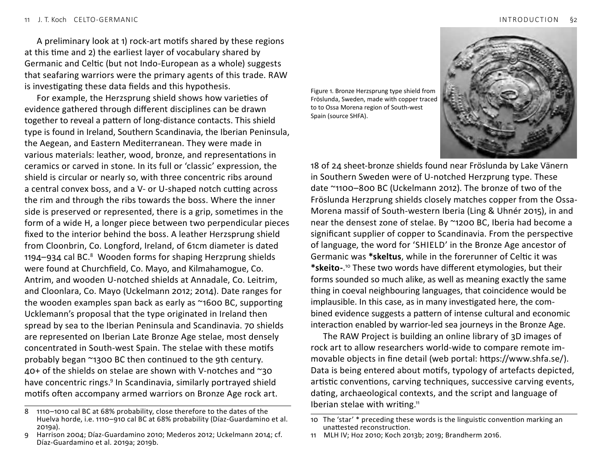

<!-- page: 10 -->

# §2. A research project
Recent discoveries in the chemical and isotopic sourcing of metals
and aDNA have transformed our understanding of the Nordic
Bronze Age in two ways. First, we find that Scandinavia and
the Iberian Peninsula were in contact within a system of long-
distance exchange of Iberian copper and Baltic amber, datable
approximately to the period 1300–900 BC.[^3] At earlier stages,
copper had come to Scandinavia from Wales—from mines in
Ceredigion ~2000 BC and then from Great Orme on the north coast
~1500 BC.[^4] It is after Great Orme declined ~1400 BC, that copper
from South-west Spain was imported into Scandinavia.
Much remains to be explained about this previously
unrecognized sequence of contacts between Scandinavia and the
metal-rich Atlantic façade. What were the exact dates and volume
of this trade? Which specific localities and communities were
involved? Did people and ideas move with valuable raw materials?
To answer these questions, we launched in 2019 a research project:
Rock art, Atlantic Europe, Words & Warriors (RAW), based at the
University of Gothenburg and funded by the Swedish Research
Council. RAW uses new technologies and crosses between the LAG
disciplines. Its syntheses seek to advance understanding of the
formation of Atlantic Europe’s languages, cultures, and populations.
Second, within the period ~2800–1900 BC, mass migrations
emanating from the Pontic–Caspian Steppe had reached both
Scandinavia and the Atlantic West, transforming their populations
and probably bringing Indo-European languages with them.[^5]
In other words, between the two sets of discoveries, we now
know not only that these regions were in contact through metal
exchange in the Bronze Age, but also that early Indo-European
languages were probably in use at both ends of the network.
3
On the copper sourcing, see Ling et al. 2013; 2014; 2019; Melheim et al. 2018;
Radivojević et al. 2018. On the amber, see Murillo-Barroso & Martinón-Torres
2012; Odriozola et al. 2017. On the implications, see Ling & Uhnér 2015; Ling &
Koch 2018.
4 Nørgaard et al. 2019; Williams et al. 2019; cf. Timberlake 2016.
5
Allentoft et al. 2015; Haak et al. 2015; Cassidy et al. 2016; Anthony &
Brown 2017a; Olalde et al. 2018; Reich 2018; Valdiosera et al. 2018; Koch &
Fernández 2019.
A significant negative finding of archaeogenetics is that many
regions, including Northern and Western Europe, underwent no
comparably large or abrupt in-migration subsequently, that is, after
the Neolithic–Bronze Age Transition and before historical times.
While it remains possible that genetically undetectable or slightly
detectable groups brought new languages to these countries later
in the Bronze Age and/or during the Iron Age, such hypothetical
prehistoric migrations are no longer needed to explain why
Germanic and Celtic languages are where we find them at the dawn
of history. Therefore, the more economical working hypothesis is
that these two Indo-European branches evolved in situ from Proto-
Indo-European in their historical homelands over the course of the
Bronze Age.[^6]
The RAW Project is undertaking an extensive programme of
scanning and documentation to enable detailed comparison of the
strikingly similar iconography of Scandinavian rock art and Iberian
‘warrior’ stelae.[^7] A linguistic aspect of this cross-disciplinary
project is to re-examine the inherited word stock shared by
Celtic and Germanic, but absent from the other Indo-European
languages, exploring how these words might throw light onto
the world of meaning of Bronze Age rock art and the people who
made it (Ling & Koch 2018). This book presents early findings of this
aspect of the RAW Project (cf. Koch 2019a).
Parallels between Iberian warrior stelae and Scandinavian rock
art were noted years ago (Almagro Basch 1966; Harrison 2004;
Koch 2013a). Only recently have shared motifs (e.g. shields, spears,
swords, bi-horned helmets, mirrors, bows and arrows, chariots
with two-horse teams and spoked wheels, dogs, &c.) begun to be
recognized in fuller detail and dated closely to the span 1300–900
BC (Ling & Koch 2018; cf. Mederos 2008).
6
Cassidy et al. 2016; Koch & Fernández 2019; Brunel et al. 2020. A long
evolution of Proto-Indo-European into Celtic in situ in Western Europe,
going back to the first farmers, was a feature of Renfrew’s formulation in the
original statement of the Anatolian Hypothesis of the origin and dispersal of
the Indo-European languages (1987; 2013).
7
On the application of digital scanning technology to Bronze Age rock art and
stelae, see Díaz-Guardamino & Wheatley 2013; Díaz-Guardamino et al. 2015;
Bertilsson 2015; Horn et al. 2018.
<!-- page: 11 -->
A preliminary look at 1) rock-art motifs shared by these regions
at this time and 2) the earliest layer of vocabulary shared by
Germanic and Celtic (but not Indo-European as a whole) suggests
that seafaring warriors were the primary agents of this trade. RAW
is investigating these data fields and this hypothesis.
For example, the Herzsprung shield shows how varieties of
evidence gathered through different disciplines can be drawn
together to reveal a pattern of long-distance contacts. This shield
type is found in Ireland, Southern Scandinavia, the Iberian Peninsula,
the Aegean, and Eastern Mediterranean. They were made in
various materials: leather, wood, bronze, and representations in
ceramics or carved in stone. In its full or ‘classic’ expression, the
shield is circular or nearly so, with three concentric ribs around
a central convex boss, and a V- or U-shaped notch cutting across
the rim and through the ribs towards the boss. Where the inner
side is preserved or represented, there is a grip, sometimes in the
form of a wide H, a longer piece between two perpendicular pieces
fixed to the interior behind the boss. A leather Herzsprung shield
from Cloonbrin, Co. Longford, Ireland, of 61cm diameter is dated
1194–934 cal BC.[^8] Wooden forms for shaping Herzprung shields
were found at Churchfield, Co. Mayo, and Kilmahamogue, Co.
Antrim, and wooden U-notched shields at Annadale, Co. Leitrim,
and Cloonlara, Co. Mayo (Uckelmann 2012; 2014). Date ranges for
the wooden examples span back as early as ~1600 BC, supporting
Ucklemann’s proposal that the type originated in Ireland then
spread by sea to the Iberian Peninsula and Scandinavia. 70 shields
are represented on Iberian Late Bronze Age stelae, most densely
concentrated in South-west Spain. The stelae with these motifs
probably began ~1300 BC then continued to the 9th century.
40+ of the shields on stelae are shown with V-notches and ~30
have concentric rings.[^9] In Scandinavia, similarly portrayed shield
motifs often accompany armed warriors on Bronze Age rock art.
8
1110–1010 cal BC at 68% probability, close therefore to the dates of the
Huelva horde, i.e. 1110–910 cal BC at 68% probability (Díaz-Guardamino et al.
2019a).
9
Harrison 2004; Díaz-Guardamino 2010; Mederos 2012; Uckelmann 2014; cf.
Díaz-Guardamino et al. 2019a; 2019b.
18 of 24 sheet-bronze shields found near Fröslunda by Lake Vänern
in Southern Sweden were of U-notched Herzprung type. These
date ~1100–800 BC (Uckelmann 2012). The bronze of two of the
Fröslunda Herzprung shields closely matches copper from the Ossa-
Morena massif of South-western Iberia (Ling & Uhnér 2015), in and
near the densest zone of stelae. By ~1200 BC, Iberia had become a
significant supplier of copper to Scandinavia. From the perspective
of language, the word for ‘SHIELD’ in the Bronze Age ancestor of
Germanic was *skeltus, while in the forerunner of Celtic it was
*skeito-.[^10] These two words have different etymologies, but their
forms sounded so much alike, as well as meaning exactly the same
thing in coeval neighbouring languages, that coincidence would be
implausible. In this case, as in many investigated here, the com-
bined evidence suggests a pattern of intense cultural and economic
interaction enabled by warrior-led sea journeys in the Bronze Age.
The RAW Project is building an online library of 3D images of
rock art to allow researchers world-wide to compare remote im-
movable objects in fine detail (web portal: https://www.shfa.se/).
Data is being entered about motifs, typology of artefacts depicted,
artistic conventions, carving techniques, successive carving events,
dating, archaeological contexts, and the script and language of
Iberian stelae with writing.[^11]
10 The ‘star’ * preceding these words is the linguistic convention marking an
unattested reconstruction.
11 MLH IV; Hoz 2010; Koch 2013b; 2019; Brandherm 2016.

Figure 1. Bronze Herzsprung type shield from
Fröslunda, Sweden, made with copper traced
to to Ossa Morena region of South-west
Spain (source SHFA).
