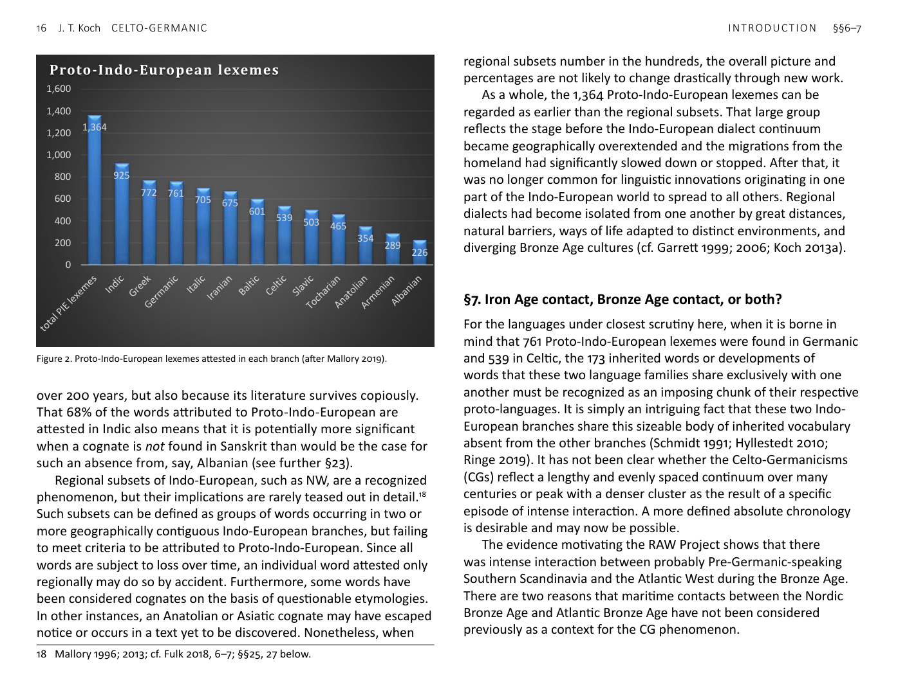
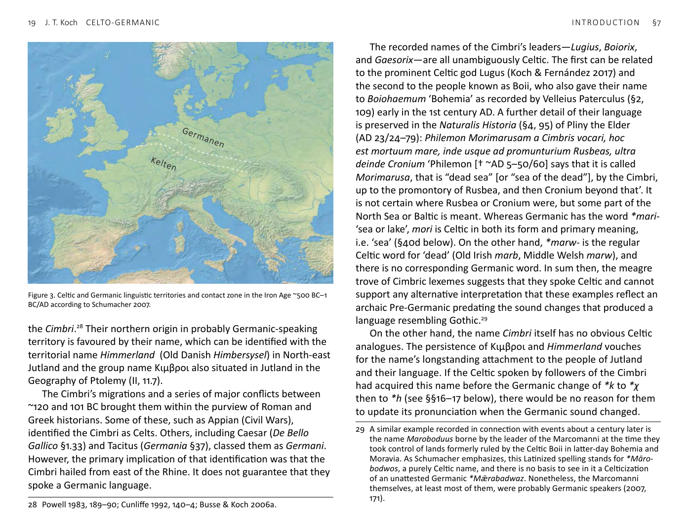

<!-- page: 16 -->

# §7. Iron Age contact, Bronze Age contact, or both?
For the languages under closest scrutiny here, when it is borne in
mind that 761 Proto-Indo-European lexemes were found in Germanic
and 539 in Celtic, the 173 inherited words or developments of
words that these two language families share exclusively with one
another must be recognized as an imposing chunk of their respective
proto-languages. It is simply an intriguing fact that these two Indo-
European branches share this sizeable body of inherited vocabulary
absent from the other branches (Schmidt 1991; Hyllestedt 2010;
Ringe 2019). It has not been clear whether the Celto-Germanicisms
(CGs) reflect a lengthy and evenly spaced continuum over many
centuries or peak with a denser cluster as the result of a specific
episode of intense interaction. A more defined absolute chronology
is desirable and may now be possible.
The evidence motivating the RAW Project shows that there
was intense interaction between probably Pre-Germanic-speaking
Southern Scandinavia and the Atlantic West during the Bronze Age.
There are two reasons that maritime contacts between the Nordic
Bronze Age and Atlantic Bronze Age have not been considered
previously as a context for the CG phenomenon.
1,364
925
772 761 705 675 601 539 503 465
354 289 226
0
200
400
600
800
1,000
1,200
1,400
1,600
Proto-Indo-European lexemes

Figure 2. Proto-Indo-European lexemes attested in each branch (after Mallory 2019).
<!-- page: 17 -->
1 It is only the chemical and isotopic sourcing of Bronze Age
artefacts from 2013 onwards that has shown that copper was
imported on a large scale into metal-poor Scandinavia from
metal-rich Wales and Iberia during the Bronze Age.[^19]
2 It is likewise only recently that aDNA sequencing has revealed
mass migration by groups with steppe ancestry transforming the
gene pools of the British Isles and Iberian Peninsula by ~1900 BC,
resulting in populations closely related to those of other regions
that were Indo-European-speaking at the time of first written
records.[^20] Palaeohispanic scholarship has long recognized that
Celtic in Iberia had to go back to the Bronze Age. Many of these
researchers favoured influences traceable to the Urnfield Late
Bronze Age of Central Europe as the leading vector.[^21] Nonetheless,
these ideas registered only minimally on Celtic studies outside
Spain and Portugal (Koch & Fernández 2019). Chronologically,
at least, a date ~1200 BC would come close to that of Iberian-
Scandinavian contact indicated by metal provenancing and
parallels shared by rock art panels and Iberian stelae. However,
most of the Urnfield evidence in Iberia occurs in the North-east,
Catalonia, whereas metal sourcing and rock art motifs point to
the Western Peninsula.
There had been proposals that the Indo-European that became
Celtic had reached the Atlantic façade by the Early Bronze Age or
earlier.[^22] However, before the recent archaeogenetic findings, it
had remained defensible to propose that there had been no Indo-
European spoken along Europe’s Atlantic façade until the Urnfield
Late Bronze Age (~1250–800 BC) or the Hallstatt Iron Age (~800–475
BC) or—for Ireland and North Britain—even the La Tène period
(~475 BC– ), possibly not long before Roman times. An equation of
19 Ling et al. 2013; 2014; 2019; Ling & Koch 2018; Melheim et al. 2018; Radivojević
et al. 2018; Nørgaard et al. 2019; Williams et al. 2019.
20 Cassidy et al. 2016; Martiniano et al. 2016; Olalde et al. 2018; 2019; Reich 2018;
Valdiosera et al. 2018; Brunel et al. 2020.
21 Bosch Gimpera 1942; Hoz 1992; Lorrio & Ruiz Zapatero 2005; Alberro & Jordán
2008; Brandherm 2013a.
22 Dillon & Chadwick 1967; Harbison 1975; Renfrew 1987; Cunliffe 2001.
the Proto-Celtic homeland with the earliest Hallstatt Iron Age near
the source of the Danube (Hallstatt C1a ~800–750 BC) effectively
remained the default doctrine and is still often presented with an
iconic map in introductions to Celtic studies (Koch 2013c; 2014). The
subsequent expansion of the Celts and their language was seen as
then running together with the spread of La Tène style metalwork
and the historically attested movements of peoples called Κελτοί/
Celtae by the Greeks and Romans into Northern Italy and down the
Danube into the Balkans and on to Central Asia Minor.[^23] To argue
for this late date for the Indo-Europeanization of the West today
amounts to defending a case that had been less than conclusive
on the basis of linguistic and archaeological evidence previously
and now faces genetic evidence more consistent with an earlier
scenario. Note, for example, regarding aDNA evidence from France,
conclusions of Brunel et al. (2020):
This [evidence] could indicate that the transition from the Bronze Age to
the Iron Age in France was mostly driven by cultural diffusion, without
major gene flow from an external population. This would be consistent
with an archeological and linguistic hypothesis proposing that the Celts
from the second [i.e. La Tène] Iron Age descended from populations
already established in western Europe, within the boundaries of the Bell
Beaker cultural complex.
Similarly, aDNA evidence sustains, regarding Ireland with broader
implications, the hypothesis advanced by Cassidy et al. (2016):
At present, the Beaker culture is the most probable archaeological
vector of this steppe ancestry into Ireland from the continent …. The
extent of this change, which we estimate at roughly a third of Irish
Bronze Age ancestry, opens the possibility of accompanying language
change, perhaps the first introduction of Indo-European language
ancestral to Irish.
…. This turnover [in population] invites the possibility of accompany-
ing introduction of Indo-European, perhaps early Celtic, language.
23 More recently, the Celtic from the West idea has stood this traditional idea on
its head. This newer model sees the formation of the language and group in the
Bronze Age (or possibly earlier in the context of the Anatolian theory of Indo-
European origins) along the Atlantic façade, with subsequent expansion into
West-central Europe, perhaps nearer the date of the Bronze–Iron Transition
(Cunliffe 2001; 2008; 2010; Gerloff 2004; Koch 2016).
<!-- page: 18 -->
As a matter of absolute dating, the Beaker period began in Ireland
~2450/2400 BC and brought with it the earliest metallurgy and
copper mining at Ross Island, near Killarney, Co. Kerry.[^24]
When historical explanations for the CG words have been
suggested in the past, these have tended to look to the Iron Age,
at which time it is known that Germanic-speaking groups were
expanding from Southern Scandinavia and the Western Baltic,
towards the Rhine and Danube, through Celtic-speaking La Tène
Central Europe.[^25] K. H. Schmidt set out an attractively simple
doctrine: the fact that Italic and Germanic shared a word for ‘copper,
bronze’ (Latin aes ~ Gothic aiz, Old Norse eir, Old High German ēr),
whereas Germanic and Celtic uniquely shared *īsarno- ‘iron’, shows
that Italic-Germanic contacts belonged to the Bronze Age and the
Celtic-Germanic ones came later. However, in the light of Sanskrit
áyas- ‘copper, iron’, Avestan ayah- ‘metal’, it is evident that *Haeyes-
or *ayes ‘copper, metal’ was simply a widespread Indo-European
word that the Celtic languages had unremarkably lost before any
were fully attested. Therefore, the word is not strong evidence for
uniquely close contact between Germanic and Italic in the Bronze
Age.
It should be noted that Schmidt dissented from the widely held
view that Celtic and Italic descended from a common Post-Proto-
Indo-European ancestor, the homeland of which was in the West
of the Indo-European world (§13). Rather, he argued that Celtic
was an ‘eastern Indo-European language’ that had only relatively
late in prehistory migrated into contact with Italic and Germanic.[^26]
Therefore, interpretations indicating that the prehistoric contacts
between the ancestors of Celtic and Germanic were as early as the
Bronze Age would tend to falsify his ‘Celtic from the East’ theory.
A focus on the pre-Roman Iron Age in Central Europe as the
background to Celto-Germanic phenomenon is set out lucidly
by Schumacher (2007). He defines the period as ~500 BC to the
24 O’Brien 2004; Fitzpatrick 2013; Gibson 2013; Cleary 2016; Cleary & Gibson 2019;
cf. Cunliffe 2013, 211–13.
25 Krahe 1954; Schmidt 1984; 1986a; 1991; van Coetsem 1994, 192; Fulk 2018, 7.
26 Schmidt 1996; 2012; cf. Isaac 2010; Falileyev & Kocharov 2012.
Zeitenwende. Rather than a sharp boundary between the two
language areas, he envisions a contact zone where both languages
were in use. This corridor appears on the accompanying map as
~100km deep, stretching across Middle Europe from the Rhine delta,
then along the lower course of the river before turning eastward
across the middle of present-day Germany, then through what is
now the Czech Republic to Western Slovakia—over 1200km all told—
with Kelten to the south and west and Germanen to the north and
east (Figure 3).[^27] For present purposes, this formulation is useful in
providing a clearcut basis for comparison. In considering the CG and
CG+ Corpus as a whole (§§38–50) and individual items of vocabulary,
does the background more probably lie at some time in the Greater
Bronze Age ~2500–500 BC or the following half millennium, i.e. the
pre-Roman or La Tène Iron Age ~500 BC–1 AD/BC?
In deciding between these alternatives, the question often
boils down to whether diagnostic sound changes between Proto-
Indo-European and the latest common ancestor of all the attested
Germanic languages occurred after 500 BC? If they did not, Celtic
loanwords in Germanic showing one or more of those changes are
hard to explain as being of Iron Age date. On the other hand, if we
conclude that relevant Germanic sound changes are later than 500
BC, that would not necessarily rule out the possibility that loanwords
showing these changes had been adopted in the Bronze Age: the
words could nonetheless have been in Germanic for centuries before
Grimm’s Law, and so on, had taken place.
A block of early historical evidence pointing towards contact
between speakers of Germanic and Celtic in the Late La Tène Iron
Age centres on the documented activities of a group known as
27 ‘Die Voraussetzungen für keltisch-germanischen Sprachkontakt waren
über lange Zeit ausgesprochen günstig: In der zweiten Hälfte des letzten
Jahrtausends vor der Zeitenwende grenzte das keltische Sprachgebiet in
Mittel- und Westeuropa über mehrere hundert Kilometer an das germanische
Sprachgebiet: Die Übergangszone zwischen den beiden Sprachgebieten dürfte
grob von der Rheinmündung flussaufwärts verlaufen sein, dann quer durch
die Mitte des heutigen Deutschland und durch das heutige Tschechien bis zum
Westen der heutigen Slowakei’ (Schumacher 2007, 169).
<!-- page: 19 -->
the Cimbri.[^28] Their northern origin in probably Germanic-speaking
territory is favoured by their name, which can be identified with the
territorial name Himmerland (Old Danish Himbersysel) in North-east
Jutland and the group name Κιμβροι also situated in Jutland in the
Geography of Ptolemy (II, 11.7).
The Cimbri’s migrations and a series of major conflicts between
~120 and 101 BC brought them within the purview of Roman and
Greek historians. Some of these, such as Appian (Civil Wars),
identified the Cimbri as Celts. Others, including Caesar (De Bello
Gallico §1.33) and Tacitus (Germania §37), classed them as Germani.
However, the primary implication of that identification was that the
Cimbri hailed from east of the Rhine. It does not guarantee that they
spoke a Germanic language.
28 Powell 1983, 189–90; Cunliffe 1992, 140–4; Busse & Koch 2006a.
The recorded names of the Cimbri’s leaders—Lugius, Boiorix,
and Gaesorix—are all unambiguously Celtic. The first can be related
to the prominent Celtic god Lugus (Koch & Fernández 2017) and
the second to the people known as Boii, who also gave their name
to Boiohaemum ‘Bohemia’ as recorded by Velleius Paterculus (§2,
109) early in the 1st century AD. A further detail of their language
is preserved in the Naturalis Historia (§4, 95) of Pliny the Elder
(AD 23/24–79): Philemon Morimarusam a Cimbris vocari, hoc
est mortuum mare, inde usque ad promunturium Rusbeas, ultra
deinde Cronium ‘Philemon [† ~AD 5–50/60] says that it is called
Morimarusa, that is “dead sea” [or “sea of the dead”], by the Cimbri,
up to the promontory of Rusbea, and then Cronium beyond that’. It
is not certain where Rusbea or Cronium were, but some part of the
North Sea or Baltic is meant. Whereas Germanic has the word *mari-
‘sea or lake’, mori is Celtic in both its form and primary meaning,
i.e. ‘sea’ (§40d below). On the other hand, *marw- is the regular
Celtic word for ‘dead’ (Old Irish marb, Middle Welsh marw), and
there is no corresponding Germanic word. In sum then, the meagre
trove of Cimbric lexemes suggests that they spoke Celtic and cannot
support any alternative interpretation that these examples reflect an
archaic Pre-Germanic predating the sound changes that produced a
language resembling Gothic.[^29]
On the other hand, the name Cimbri itself has no obvious Celtic
analogues. The persistence of Κιμβροι and Himmerland vouches
for the name’s longstanding attachment to the people of Jutland
and their language. If the Celtic spoken by followers of the Cimbri
had acquired this name before the Germanic change of *k to *χ
then to *h (see §§16–17 below), there would be no reason for them
to update its pronunciation when the Germanic sound changed.
29 A similar example recorded in connection with events about a century later is
the name Maroboduus borne by the leader of the Marcomanni at the time they
took control of lands formerly ruled by the Celtic Boii in latter-day Bohemia and
Moravia. As Schumacher emphasizes, this Latinized spelling stands for *Māro-
bodwos, a purely Celtic name, and there is no basis to see in it a Celticization
of an unattested Germanic *Mǣrabadwaz. Nonetheless, the Marcomanni
themselves, at least most of them, were probably Germanic speakers (2007,
171).

Figure 3. Celtic and Germanic linguistic territories and contact zone in the Iron Age ~500 BC–1
BC/AD according to Schumacher 2007.
<!-- page: 20 -->
Furthermore, Proto-Celtic and Gaulish had no phoneme */h/
and the sound *[χ] occurred only immediately before *t and *s.
Therefore, Celtic speakers would probably have said *[kʰimbroi],
later *[kʰimbriː], even if they learned it from Germanic speakers
who said *[χimbriz]. Once again, this evidence is consistent with
the Cimbric names having reached the Romans and Greeks through
Celtic, rather than directly from Germanic, even if the group name
had originally been Germanic.
In their turbulent movements and regroupings, the Cimbri
interacted with several known Celtic-speaking groups, including the
Boii, Scordisci, Taurisci, and Volcae Tectosages. Therefore, as widely
recognized, the Cimbri were probably a linguistically mixed horde
by the time they met the Romans and were then finally crushed by
them at Vercellae in 102/101 BC. The Romans had by then been in
close contact with Celtic-speaking groups in Northern Italy, Southern
Gaul, and Alpine Noricum for many years. So there was probably
no shortage of Latin-Celtic bilinguals. But there had as yet been far
less direct contact between the Romans and Germanic speakers.
Therefore, Celtic speakers amongst the Cimbri were in a better
position to tell the Romans what they called themselves, their
leaders, and the northern sea, than were their monoglot Germanic
comrades.
