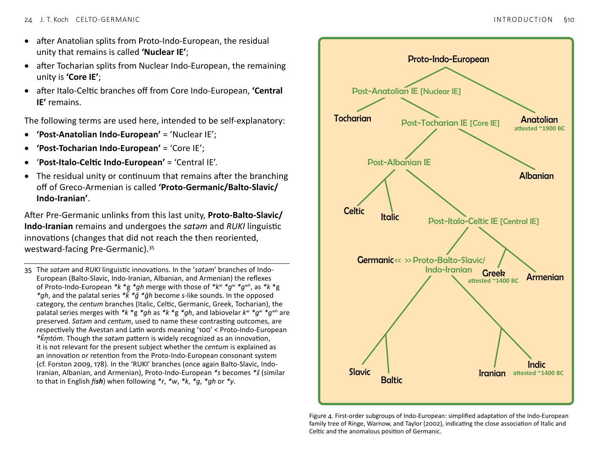

<!-- page: 23 -->

# §10. Tree models and linguistic continua
In a simplified version of the tree model of first-order subgroupings
of Indo-European, akin to Figure 4 below, Ringe uses the following,
now not uncommon names for successive nodal points (2017, 7; cf.
Mallory 2013, 23):
<!-- page: 24 -->
• after Anatolian splits from Proto-Indo-European, the residual
unity that remains is called ‘Nuclear IE’;
• after Tocharian splits from Nuclear Indo-European, the remaining
unity is ‘Core IE’;
• after Italo-Celtic branches off from Core Indo-European, ‘Central
IE’ remains.
The following terms are used here, intended to be self-explanatory:
• ‘Post-Anatolian Indo-European’ = ‘Nuclear IE’;
• ‘Post-Tocharian Indo-European’ = ‘Core IE’;
• ‘Post-Italo-Celtic Indo-European’ = ‘Central IE’.
• The residual unity or continuum that remains after the branching
off of Greco-Armenian is called ‘Proto-Germanic/Balto-Slavic/
Indo-Iranian’.
After Pre-Germanic unlinks from this last unity, Proto-Balto-Slavic/
Indo-Iranian remains and undergoes the satəm and RUKI linguistic
innovations (changes that did not reach the then reoriented,
westward-facing Pre-Germanic).[^35]
35 The satəm and RUKI linguistic innovations. In the ‘satəm’ branches of Indo-
European (Balto-Slavic, Indo-Iranian, Albanian, and Armenian) the reflexes
of Proto-Indo-European *k *g *gh merge with those of *kʷ *gʷ *gwh, as *k *g
*gh, and the palatal series *k̂ *ĝ *ĝh become s-like sounds. In the opposed
category, the centum branches (Italic, Celtic, Germanic, Greek, Tocharian), the
palatal series merges with *k *g *gh as *k *g *gh, and labiovelar kʷ *gʷ *gwh are
preserved. Satəm and centum, used to name these contrasting outcomes, are
respectively the Avestan and Latin words meaning ‘100’ < Proto-Indo-European
*k̂m̥ tóm. Though the satəm pattern is widely recognized as an innovation,
it is not relevant for the present subject whether the centum is explained as
an innovation or retention from the Proto-Indo-European consonant system
(cf. Forston 2009, 178). In the ‘RUKI’ branches (once again Balto-Slavic, Indo-
Iranian, Albanian, and Armenian), Proto-Indo-European *s becomes *š (similar
to that in English fish) when following *r, *w, *k, *g, *gh or *y.
Tocharian
Anatolian
Celtic
Italic
Albanian
Greek
Armenian
Slavic
Baltic
Iranian
Indic
Germanic
Proto-Indo-European
Post-Anatolian IE [Nuclear IE]
Post-Tocharian IE [Core IE]
Post-Italo-Celtic IE [Central IE]
<< >> Proto-Balto-Slavic/
Indo-Iranian
Post-Albanian IE
attested ~1900 BC
attested ~1400 BC
attested ~1400 BC

Figure 4. First-order subgroups of Indo-European: simplified adaptation of the Indo-European
family tree of Ringe, Warnow, and Taylor (2002), indicating the close association of Italic and
Celtic and the anomalous position of Germanic.
<!-- page: 25 -->
One of the most familiar ways of representing the history of a
language family is with a tree model, such as Figures 4, 6, and 10
here. Such models invariably oversimplify, concealing or glossing
over much synchronic and diachronic linguistic complexity. Within
linguistic family trees the main focus is the nodes, drawn as points
in the model representing languages. The lines between them
symbolize only the relationship between the nodal points, rather
than intermediate evolutionary stages between the languages.
Theoretically these nodes are conceived of as undifferentiated and
unchanging languages, not broken up by regional dialects, linguistic
stages over time, or registers belonging to different social domains
(cf. Mallory & Adams 2006, 71–3).
This way of viewing things is largely an artefact of the long-
standing core procedure of historical linguistics, namely the
historical-comparative method. In this method attested words or
other linguistic features from two or more related languages are
compared to reconstruct that word or feature in the unattested
common ancestor of those related languages. This procedure is
aptly likened to algebra, and for each such calculation it yields a
single solution, solving for X. Scores or hundreds of such calculations
then accumulate into reconstructed proto-languages, such as Proto-
Indo-European or Proto-Germanic. That these will appear—in the
absence of further adjustments—to be devoid of chronological
stages, regional dialects, and registers is an unavoidable by-product
of this algebraic method.
In some instances, such as sometimes occurred in the peopling
of Oceania, the picture achieved by the historical-comparative
method does not diverge so severely from the facts. In such
cases, we start with a smaller community in a relatively confined
and isolated territory, such as a small island, and without great
social complexity or occupational specialization. That community
then sends off a band of settlers to a previously uninhabited
island a great distance away, and contact between the two island
communities falls off steeply afterwards (Mallory 1996, 8).
Even so, the migration does not immediately make one language
into two separate languages. Over several generations, words would
be lost differently in the two communities, other words coined
independently, the sound systems and grammatical structures
evolve divergently, and so on. But this entropy would take place
gradually, so even in the absence of any continued contact during
the intervening period, any individual travelling between the two
islands, say for as long as eight generations afterwards (§9), would
still find a high degree of mutual intelligibility. But if a longer period
was involved, ten generations, then twenty or more, the mutual
intelligibility would decrease to the point that a hypothetical
traveller would effectively have to learn a second language to
communicate competently.
With the spread of the Indo-European languages, the
correspondence to the family-tree model would be more inexact
than in this simplified island-hopping scenario. Perhaps the closest
parallel in Indo-European prehistory would be the offshoot of the
Yamnaya cultures of the Pontic–Caspian Steppe that settled ~2000
km to the east to form the Afanasievo culture of the Siberian Altai
and Minusinsk Basin ~3300–2900 BC (see §12 below). More usually,
the migration involved less distance, and there was a less abrupt
and complete break from the language, culture, and population of
the homeland.
If we could zoom into the Indo-European tree model of Figure 4
to view the nodal points in detail, we would experience something
analogous to using a powerful telescope to reveal that what
appeared to be stars actually to be galaxies. The nodes that appear
as points would expand into vertical and horizontal continua, with
finely graded chronological stages, regional dialects, and variation
in speech according to social domains. With the lines between the
nodes, we would find more mutual intelligibility when the spreading
lines first diverge from their ancestral node, gradually decreasing
as these continue down towards the next tier of nodes presenting
separated daughter languages. On the other hand—and usually
not represented in tree models—dialects in contact could undergo
<!-- page: 26 -->
convergence (sometimes called in this connection ‘advergence’), not
only perpetual divergence and outward momentum (cf. §9).
A starker view of the disparity between the reconstructed proto-
states of the Indo-European branches and the reality in prehistory
is to call the former mirages.[^36] This idea is that the branches
formed through a secondary process of convergence of contiguous
mutually intelligible dialects within a shallow continuum formed
through rapid expansion across a large territory (cf. Nichols 1997).
This idea is not only applicable to the linguistic evidence, but also
easily harmonized with what we have since learned about the mass
migrations from the Pontic–Caspian Steppe in the 3rd millennium
BC. Applied to this evidence, the model would also explain why the
early separateness of Anatolian and Tocharian is more clear-cut.
The crystallization of branches within emerging regional networks
also resonates with the socio-cultural rise of the Bronze Age as
reflected in archaeology (cf. Kristiansen & Larsson 2005; Koch
2013a). According to this ‘mirage’ theory, the way proto-languages
are usually thought of not only conceals the diversity of the Bronze
Age dialects that became Celtic, Germanic, &c., but also fosters two
further unrealistic concepts: 1) the early formation of sharp and
impermeable boundaries of dialects that led to each Indo-European
branch and 2) the anachronistic attribution to undifferentaited
proto-languages innovations that actually spread later between
the dialects that converged to form a branch. To a large extent, this
line of thinking was inspired by the decipherment of Linear B in the
1950s and ’60s and the disparities this revealed between the reality
of Mycenaean Greek and Proto-Greek previously reconstructed.
I remain broadly sympathetic to this critique of the traditional
approach, but to bring more realistic sophistication to the proto-
language concept, rather than abandoning it altogether despite
its proven strengths. With this approach, when we speak of the
breakup of a proto-language, we should not imagine a beginning
36 Cf. §9 above; Garrett 1999; 2006; Koch 2013a. Cf., for example, the argument
of Garrett (1999) for ‘a model that does not require us to impose a historical
classification in which every language in the [Italic] family either does or does
not originally belong to a single “Italic” daughter of Indo-European’.
state with no dialect variation, but rather groups of dialects sharing
innovations permitting sustained mutual intelligibility, but then
ceasing to do so. By adopting this understanding, we can sidestep
such unresolved controversies as the nature of Insular Celtic[^37] or
Italo-Celtic (§13).
What was the situation for the dialects that became Celtic and those
that became Germanic during the later Bronze Age period that the RAW
Project focuses on (~1400/1300–900 BC)? The mass migrations from the
steppe had ended several centuries or even 1000 years before. Fewer
people—certainly fewer whole communities—had experienced long-
distance journeys in their lifetimes or within living memory. By 1400 BC
both Old Indic and Mycenaean Greek are found in writing.[^38] It is plain
that these two were then fully separate and could not have been
mutually intelligible. In the terminology used here, they were two
languages and no longer two dialects of one language (§9).
Looking at the family tree model in Figure 4, at the time when
Indic and Greek were separate languages, must Pre-Germanic
likewise have been fully separate? The striking feature of this model
is that Germanic is bilocated. In the earliest detectable arrangement
of Indo-European dialects Pre-Germanic was part of a dialect
continuum with Balto-Slavic and Indo-Iranian. At a later prehistoric
stage, that continuum faltered and Pre-Germanic moved closer to
37 Koch 1992b; McCone 1996; Matasović 2008.
38 Old Indic occurs by 1400 BC in the records of the kingdom of Mitanni in
present-day Northern Syria, and probably near that time also as the earliest
Vedic Sanskrit. Undifferentiated Proto-Indo-Iranian had by then ceased to exist,
and its ancestor, Balto-Slavic/Indo-Iranian, had long since ceased to exist. In
work by Witzel (2019), the composition of the R̥gveda is dated ~1400–1000 BC.
The latter limit is set by Bronze–Iron Transition, which had yet to occur in the
material reflected in the R̥gveda. However, the basis for the earlier limit might
be reconsidered: this is that the Indo-Iranian form Mazda- is found in Mitanni
Indic of ~1400 BC, but, having undergone a sound change, this has become
meda- in the language of the R̥gveda. The dating inference would be correct
if we could be sure that the Indic of Northern Mesopotamia and that of the
North-western Subcontinent still formed an undifferentiated speech community
as late as 1400 BC. However, given the geographic distance involved, it is
possible that mazda- > meda- had occurred in the Indic of South Asia (or Old
Indic on its way to South Asia) before 1400 BC, but that this innovation never
reached Mitanni, with whom contact had already been lost.
<!-- page: 27 -->
Italic and Celtic (§22). Some of us who have considered the evidence
for the dialect position of Germanic and puzzled over it will find this
explanation a compelling aspect of Ringe et al. 2002. The question
it raises for the present study is what it means for the relationship
between what became Celtic and what became Germanic in the
later Bronze Age. Is it the older alignment that is more significant
or the later one for determining mutual intelligibility or lack of it
~1400/1300–900 BC? If it is the earlier situation, then Germanic as
a close sister of Balto-Slavic and Indo-Iranian would be farther from
Celtic in the tree than Old Indic and Greek. The latter two have a
later common ancestor: Post-Italo-Celtic Indo-European.
Must that imply that Pre-Germanic and Pre-Celtic were also fully
separate languages, with negligible mutual intelligibility by ~1400 BC,
like Mycenaean Greek and Old Indic? Five other points are relevant.
1 One basic feature of the CG word set in the Corpus is that most
lack obvious earmarks of Celtic-to-Germanic or Germanic-to-
Celtic loanwords. The straightforward interpretation of this fact is
that the relevant phonological changes had simply not occurred
yet, that most of the CG words arose and spread when Pre-
Celtic and Pre-Germanic were still related as dialects rather than
separate languages (§9).
2 Another basic attribute of the CG set is that many of the word
meanings more easily line up with a cultural stage of ~1500 BC
onwards rather than with the Neolithic, Beaker period, or Early
Bronze Age (§32).
3 As well as having the cladistic distance reflected in Figure 4,
Mycenaean Greek and Old Indic were geographically distant. It
is not likely that their ancestors had been in contact for many
centuries. The identification of Proto-Indo-Iranian with the
Sintashta culture of Transuralia ~2100–1800 BC is accepted here,
with subsequent expansion south-eastwards through Central to
South Asia (§23). Although the location of Pre-Greek is uncertain
(FN 72), there is no reason to think that the recent ancestors
of Mycenaean Greek had been contiguous with Transuralia or
Central Asia. Speakers of what became Greek and what became
Indic had ceased talking to each other long before 1400 BC. There
would be no reason or way for Proto-Indo-Iranian and Proto-
Greek to have shared innovations, except through a long and
tenuous chain of intermediaries.
4 On the other hand, Pre-Celtic and Pre-Germanic were probably
geographically close.
5 In the model adopted here, the speakers of Pre-Germanic
‘switched teams’ from a continuum with Balto-Slavic/Indo-Iranian
to Italo-Celtic (§22). As a general principle, the earlier grouping
of a dialect can be important for recovering the formation of
its vocabulary and grammatical structures, but the more recent
contacts would establish and sustain a framework for mutual
intelligibility going forward.
All told, these five points suggest that Pre-Celtic and Pre-Germanic
still retained a high degree of mutual intelligibility around the time
Mycenaean Greek and Vedic Sanskrit appear as fully separate
languages.
