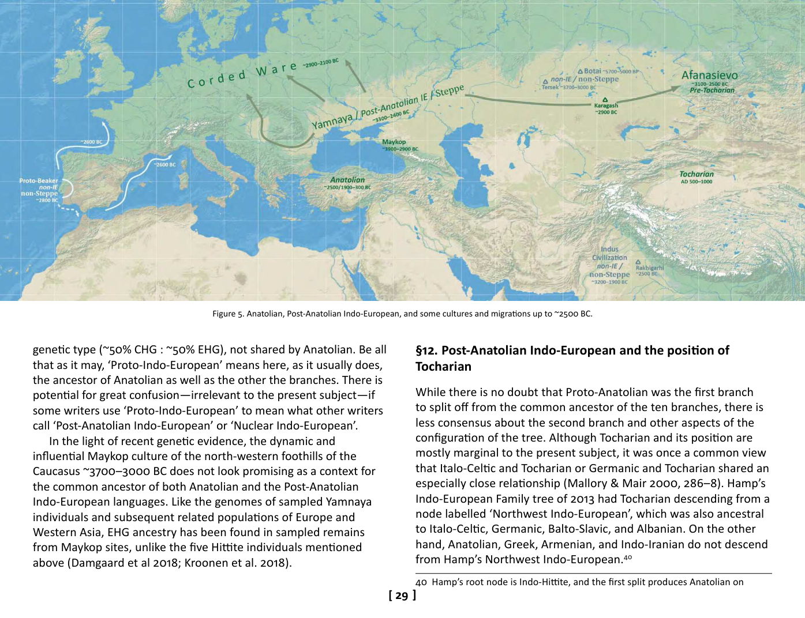

<!-- page: 29 -->

# §12. Post-Anatolian Indo-European and the position of
Tocharian
While there is no doubt that Proto-Anatolian was the first branch
to split off from the common ancestor of the ten branches, there is
less consensus about the second branch and other aspects of the
configuration of the tree. Although Tocharian and its position are
mostly marginal to the present subject, it was once a common view
that Italo-Celtic and Tocharian or Germanic and Tocharian shared an
especially close relationship (Mallory & Mair 2000, 286–8). Hamp’s
Indo-European Family tree of 2013 had Tocharian descending from a
node labelled ‘Northwest Indo-European’, which was also ancestral
to Italo-Celtic, Germanic, Balto-Slavic, and Albanian. On the other
hand, Anatolian, Greek, Armenian, and Indo-Iranian do not descend
from Hamp’s Northwest Indo-European.[^40]
40 Hamp’s root node is Indo-Hittite, and the first split produces Anatolian on

Figure 5. Anatolian, Post-Anatolian Indo-European, and some cultures and migrations up to ~2500 BC.
<!-- page: 30 -->
On the basis of purely linguistic evidence, the Ringe et al. 2002
tree model adopted here has Tocharian separating second (also
Ringe et al. 1998; cf. Ringe 2017, 6–7); likewise what Gray and Atkin-
son call the ‘consensus tree of Indo-European’ (2003, 437). Based
on a phylogenetic methodology significantly different from Gray and
Atkinson’s, Chang et al. also produce a Tocharian-second tree (2015,
199), similarly Kortlandt (2018) using convential linguistic methods.
Archaeological evidence has been used to identify Pre-Tocharian
speakers with the Afanasievo culture of the Siberian Altai and
Minusinsk Basin. That Copper Age pastoralist culture appears to be a
far-flung offshoot of Yamnaya on the Pontic–Caspian Steppe (Mallory
& Mair 2000; Anthony 2007; Mallory 2015). The dates for Afanasievo
(~3300–2500 BC) fit: staggered before the Corded Ware cultures
(CWC) and the Bell Beaker phenomenon in Europe, but later than
the time depth usually thought to be required for the separation of
Anatolian.
Ancient DNA evidence for Afanasievo is also consistent with this
model. The six Afanasievo individuals sequenced by Allentoft et al.
2015 were virtually indistinguishable from their Yamnaya samples;
both showing very high percentages of ‘steppe ancestry’. This result
was subsequently replicated in 20 of 23 Afanasievo individuals
sequenced in Narasimhan et al. 2018, as well as further Yamnaya
individuals. In other words, it looks like a Yamnaya population
migrated ~3300 BC some 2000km eastwards, to a suitable steppe
environment, undergoing minimal admixture with other groups in
South Siberia or along the way.
In light of the above, the best current working hypothesis is a
three-way equation: Pre-Tocharian=Afanasievo=the second branch
to separate from Proto-Indo-European. However, there is room for
caution. The Afanasievo culture and the attested Tocharian languages
in the Tarim Basin ~AD 500–1000 are separated by three millennia
and 1000 kilometres. Against these counter-arguments, there is
no viable alternative scenario for how a centum language became
one side and Indo-European on the other (Hamp 1998; 2013). Hamp’s ‘Indo-
European’ is therefore what is called ‘Post-Anatolian Indo-European’ here.
established—and seemingly stranded—on the far side of a vast area
of Central, South-west, and South Asia, dominated by satəm Indo-
Iranian languages from the time the earliest of them was attested (as
the closely similar Mitanni Indic and Vedic Sanskrit).[^41] The publication
of a high-coverage genome of typical Yamnaya/Afanasievo type,
dating to ~2900 BC from Karagash in central Kazakhstan, bridges the
geographical gap between the main Afanasievo territory and the
culture’s suspected Yamnaya homeland (Damgaard et al. 2018).
