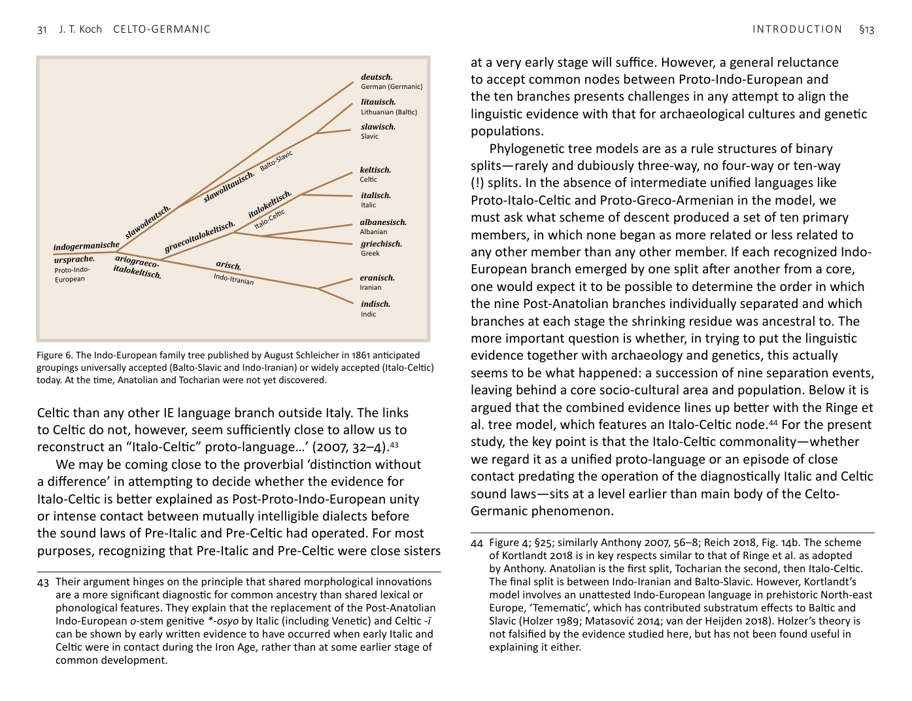
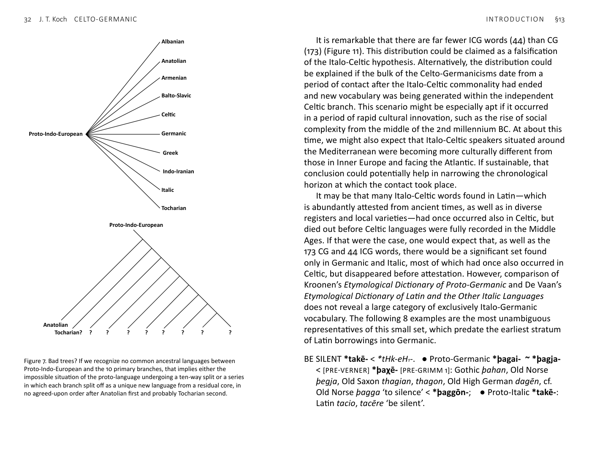

<!-- page: 30 -->

# §13. Italo-Celto-Germanicisms (ICGs) and Balto-Slavic/Celto-
Germanicisms (BSCGs)
To recap, the 173 Celto-Gemanic words are either altogether
absent from the other branches of Indo-European or show
differences, usually innovations, in meaning and/or patterns of word
formation unique to Celtic and Germanic. Smaller groups of Celto-
Germanicisms occur also in Italic (44), or Baltic and/or Slavic (34), or
occur in Italic as well as Baltic and/or Slavic (26), giving an inclusive
total of 276 CG+ words.
That there are ICG words is unsurprising, as a close relationship
between Celtic and Italic is widely recognized. Going back to August
Schleicher (1861/1862), many linguists have argued for Italo-Celtic
as a primary subgrouping (i.e. a node on the family tree) of Indo-
European.[^42] On the other hand, Watkins (1966) argued strongly
against an Italo-Celtic proto-language, countered by Cowgill (1970).
More recently Mallory and Adams (2006, 78) accept Indo-Iranian
and Balto-Slavic as Post-Proto-Indo-European unified languages,
but favour treating Italo-Celtic as a contact phenomenon. Similarly,
Clackson and Horrocks conclude: ‘Latin shares more features with
41 See Mallory & Mair 2000; Anthony 2007; Mallory 2015; Kroonen et al. 2018. On
the centum and satəm branches of Indo-European, see above FN 35.
42 Support for an Italo-Celtic proto-language in current published research
includes Jasanoff 1997; Ringe et al. 2002; Holm 2007; Schrijver 2006; 2016;
Kortlandt 2007; 2018; Schumacher 2007, 168; Weiss 2012; Hamp 2013; Kroonen
2013; Chang et al. 2015; Pereltsvaig & Lewis 2015, 71.
<!-- page: 31 -->
Celtic than any other IE language branch outside Italy. The links
to Celtic do not, however, seem sufficiently close to allow us to
reconstruct an “Italo-Celtic” proto-language…’ (2007, 32–4).[^43]
We may be coming close to the proverbial ‘distinction without
a difference’ in attempting to decide whether the evidence for
Italo-Celtic is better explained as Post-Proto-Indo-European unity
or intense contact between mutually intelligible dialects before
the sound laws of Pre-Italic and Pre-Celtic had operated. For most
purposes, recognizing that Pre-Italic and Pre-Celtic were close sisters
43 Their argument hinges on the principle that shared morphological innovations
are a more significant diagnostic for common ancestry than shared lexical or
phonological features. They explain that the replacement of the Post-Anatolian
Indo-European o-stem genitive *-osyo by Italic (including Venetic) and Celtic -ī
can be shown by early written evidence to have occurred when early Italic and
Celtic were in contact during the Iron Age, rather than at some earlier stage of
common development.

Figure 6. The Indo-European family tree published by August Schleicher in 1861 anticipated
groupings universally accepted (Balto-Slavic and Indo-Iranian) or widely accepted (Italo-Celtic)
today. At the time, Anatolian and Tocharian were not yet discovered.
at a very early stage will suffice. However, a general reluctance
to accept common nodes between Proto-Indo-European and
the ten branches presents challenges in any attempt to align the
linguistic evidence with that for archaeological cultures and genetic
populations.
Phylogenetic tree models are as a rule structures of binary
splits—rarely and dubiously three-way, no four-way or ten-way
(!) splits. In the absence of intermediate unified languages like
Proto-Italo-Celtic and Proto-Greco-Armenian in the model, we
must ask what scheme of descent produced a set of ten primary
members, in which none began as more related or less related to
any other member than any other member. If each recognized Indo-
European branch emerged by one split after another from a core,
one would expect it to be possible to determine the order in which
the nine Post-Anatolian branches individually separated and which
branches at each stage the shrinking residue was ancestral to. The
more important question is whether, in trying to put the linguistic
evidence together with archaeology and genetics, this actually
seems to be what happened: a succession of nine separation events,
leaving behind a core socio-cultural area and population. Below it is
argued that the combined evidence lines up better with the Ringe et
al. tree model, which features an Italo-Celtic node.[^44] For the present
study, the key point is that the Italo-Celtic commonality—whether
we regard it as a unified proto-language or an episode of close
contact predating the operation of the diagnostically Italic and Celtic
sound laws—sits at a level earlier than main body of the Celto-
Germanic phenomenon.
44 Figure 4; §25; similarly Anthony 2007, 56–8; Reich 2018, Fig. 14b. The scheme
of Kortlandt 2018 is in key respects similar to that of Ringe et al. as adopted
by Anthony. Anatolian is the first split, Tocharian the second, then Italo-Celtic.
The final split is between Indo-Iranian and Balto-Slavic. However, Kortlandt’s
model involves an unattested Indo-European language in prehistoric North-east
Europe, ‘Temematic’, which has contributed substratum effects to Baltic and
Slavic (Holzer 1989; Matasović 2014; van der Heijden 2018). Holzer’s theory is
not falsified by the evidence studied here, but has not been found useful in
explaining it either.
deutsch.
German (Germanic)
litauisch.
Lithuanian (BalƟc)
slawisch.
Slavic
keltisch.
CelƟc
italisch.
Italic
albanesisch.
Albanian
griechisch.
Greek
eranisch.
Iranian
indisch.
Indic
italokeltisch.
Italo-CelƟc
graecoitalokeltisch.
ariograeco-
italokeltisch.
indogermanische
ursprache.
Proto-Indo-
European
arisch.
Indo-Itranian
slawodeutsch.
slawolitauisch. Balto-Slavic
<!-- page: 32 -->
It is remarkable that there are far fewer ICG words (44) than CG
(173) (Figure 11). This distribution could be claimed as a falsification
of the Italo-Celtic hypothesis. Alternatively, the distribution could
be explained if the bulk of the Celto-Germanicisms date from a
period of contact after the Italo-Celtic commonality had ended
and new vocabulary was being generated within the independent
Celtic branch. This scenario might be especially apt if it occurred
in a period of rapid cultural innovation, such as the rise of social
complexity from the middle of the 2nd millennium BC. At about this
time, we might also expect that Italo-Celtic speakers situated around
the Mediterranean were becoming more culturally different from
those in Inner Europe and facing the Atlantic. If sustainable, that
conclusion could potentially help in narrowing the chronological
horizon at which the contact took place.
It may be that many Italo-Celtic words found in Latin—which
is abundantly attested from ancient times, as well as in diverse
registers and local varieties—had once occurred also in Celtic, but
died out before Celtic languages were fully recorded in the Middle
Ages. If that were the case, one would expect that, as well as the
173 CG and 44 ICG words, there would be a significant set found
only in Germanic and Italic, most of which had once also occurred in
Celtic, but disappeared before attestation. However, comparison of
Kroonen’s Etymological Dictionary of Proto-Germanic and De Vaan’s
Etymological Dictionary of Latin and the Other Italic Languages
does not reveal a large category of exclusively Italo-Germanic
vocabulary. The following 8 examples are the most unambiguous
representatives of this small set, which predate the earliest stratum
of Latin borrowings into Germanic.
BE SILENT *takē- < *tHk-eH₁-. ● Proto-Germanic *þagai- ~ *þagja-
< [PRE-VERNER] *þaχē- [PRE-GRIMM 1]: Gothic þahan, Old Norse
þegja, Old Saxon thagian, thagon, Old High German dagēn, cf.
Old Norse þagga ‘to silence’ < *þaggōn-; ● Proto-Italic *takē-:
Latin tacio, tacēre ‘be silent’.
Proto-Indo-European
Albanian
Anatolian
Armenian
Balto-Slavic
Celtic
Germanic
Greek
Indo-Iranian
Italic
Tocharian
Proto-Indo-European
Anatolian
Tocharian? ? ? ? ? ? ? ? ?

Figure 7. Bad trees? If we recognize no common ancestral languages between
Proto-Indo-European and the 10 primary branches, that implies either the
impossible situation of the proto-language undergoing a ten-way split or a series
in which each branch split off as a unique new language from a residual core, in
no agreed-upon order after Anatolian first and probably Tocharian second.
<!-- page: 33 -->
BREAK *bhr̥g-n-. ● Proto-Germanic *bruk(k)ōn- ‘to break,
crumble’: Gothic brak ‘broke’, Norwegian broka ‘to break, bite,
tear’, Old English bræk ‘broke’, Old Saxon brak ‘broke’, Middle
Dutch brocken, broken ‘to bend, break’, Old High German brah
‘broke’, Middle High German er-brochen ‘to crush, squash’, cf.
Old High German brocko ‘chunk, crumb’; ● Proto-Italic *frag-n-:
Latin frangō, frangere ‘break’. ¶ √bhr̥g-neH₂-.
BUD *bhr̥d-n-. ● Proto-Germanic *brut(t)ōn- ‘to bud’ [PRE-GRIMM
2]: Middle High German brozzen; ● Proto-Italic *frodni-: Latin
frōns, frondis ‘foliage, leaves’.
FLESH, MEAT *kar-. ● Proto-Germanic *harunda/ō- [PRE-GRIMM 1]:
Old Norse hǫrund ‘human flesh, skin, complexion’; ● Proto-Italic
nominative *kerō(n), accusative *kar(V)n-: Latin carō, carnis.
GOAT *ghaido-. ● Proto-Germanic *gait- ‘goat’ [PRE-GRIMM 2]:
Gothic gaits, Old Norse geit, Old English gāt, Old Saxon gēt, Old
High German geiz; ● Proto-Italic *γaid-: Latin haedus ‘young
goat-buck, kid’.
HOLY *weik- ~ *wik-. ● Proto-Germanic *wīha- < Pre-Germanic
*weiko- [PRE-GRIMM 1]: Gothic weihs, Old High German wīh;
● Proto-Italic *wiktVmā-: Latin victima ‘sacrificial animal’.
SCOOP, PORE *aus-. ● Proto-Germanic *ausan-: Old Norse ausa
‘to sprinkle, pour’, Old Dutch osen ‘to scoop out, make empty’,
Middle High German ōsen, œsen ‘to scoop out, make empty’;
● Proto-Italic *ausye/o-: Latin hauriō, haurīre ‘to draw, scoop up’.
¶ Notional Proto-Indo-European √H₂eus-.
SPEAR *sperH- ~ *spr̥H-. ● Proto-Germanic *speru- ‘spear’ <
*sperH-u-: Old Norse spjǫrr, Old English spere, Old High German
sper; also Old Norse spar(r)i ‘roof-beam, pole, spar’; ● Proto-
Italic *sparo- < *sprH-o-: Latin sparus ‘hunting spear, javelin’. ¶
Albanian shparr ‘oak’. ¶ Middle Welsh ysbar ‘spear’ is a loanword
from Latin sparus.
With such a small collection, it is unsurprising that no particular
domains of meaning emerge as especially well represented.
Amongst possible additional examples, some have less than
straightforward derivations: for example, Gothic hneiwan ‘to bow
down’ and Latin cōniveō ‘shut tightly’ can be reconstructed as
*(kom-)knéigʷh-é-, but, if these are the same word, what was its
original meaning? Latin raia ‘a sea fish, ray’ is probably related
to English ray, Dutch rog, but the word is not widely attested in
Germanic or easily reconstructed, leading to the suspicion of a non-
Indo-European substrate word borrowed independently in both
branches.
There are relatively few words found in Baltic and/or Slavic as
well as Italic and Germanic that lack a comparandum from Celtic,
such as the following three examples:
BEAN *bhabh-: ● Proto-Germanic *baunō: Old Norse baun, Old
English bean, Old Frisian bāne, Old Saxon bōna, Old High German
bōna; ● Proto-Italic *fafā-: Latin faba ‘bean’, Faliscan haba
‘bean’; ● Balto-Slavic: Old Prussian babo ‘bean’, Russian bob. It
is possible that this word was borrowed from a language of Pre-
Indo-European farmers of Neolithic Europe. Even so, if Greek
φακός ‘lentil’ and Albanian bathë ‘horse-bean’ are related, the
word is not confined to the North-west of the Indo-European
world. ¶ [POSSIBLY NON-INDO-EUROPEAN SOURCE] Cf. Iversen &
Kroonen 2017.
BEARD *bhardhā-. ● Proto-Germanic *barda- ‘beard’: Crimean
Gothic bars, Old Norse barð ‘rim, edge, prow, beard’, Old English
beard, Old Frisian berd, Old High German bart; ● Proto-Italic
*farfa: Latin barba; ● Balto-Slavic: Old Prussian bordus ‘beard’,
Lithuanian barzdà, Russian borodá. ¶ [POSSIBLY NON-INDO-
EUROPEAN SOURCE]
DREGS *dhraghi-. ● Proto-Germanic *dragjō-: Old Norse dregg
‘dregs, yeast’; ● Proto-Italic *frak-: Latin fracēs ‘fragments of
olive pulp left after pressing’; ● Balto-Slavic: Lithuanian drāgės
‘dregs, sediment’, Old Prussian dragios ‘dregs’, Old Church
Slavonic droždiję ‘dregs’. ¶ [POSSIBLY NON-INDO-EUROPEAN SOURCE]
<!-- page: 34 -->
In cases like the above, it is again possible that these words had
once existed in Celtic, but were never attested and are now lost
from the living languages. With BEARD, there might have been a
reason the word fell out of use: the culturally loaded Proto-Celtic
*bardos ‘poet, &c.’ possibly displaced its homonym. It is less likely
that Celtic ‘poet’ in fact derives from ‘beard’.
A further category that is relatively small, possibly significantly
so, are words attested in Celtic and Balto-Slavic, but not Germanic:
for example,
SERVANT *sloug(h)o-. ● Proto-Celtic *slougo- ‘warband’: Gaulish
group name Catu-slugi ‘battle-host’, Old Irish slóg, slúag ‘army,
host, throng, company, crowd, assembly’, Middle Welsh llu ‘host,
large number of people or things, army, flock’, Old Breton mor-
lu ‘great army’, Old Cornish luu listri glossing ‘classis’ ‘army’;
● Balto-Slavic: Lithuanian slaugà ‘servitude’, Old Church Slavonic
sluga ‘servant’.
With this word, it is more understandable that Balto-Slavic
preserves the older meaning and that Celtic reflects a social change
in which the most important function of a leader’s followers came
to be service in the warband. This scenario is also consistent
with the Insular Celtic *tego-slougo- ‘household, retinue, family,
following’ (Old Irish teglach, Old Welsh telu), a compound of Proto-
Celtic words meaning ‘house’ and ‘following’. But these two words
lack an inherent military sense in their most basic meanings, and
today teaghlach and teulu are the principal words for ‘family’ in
Irish and Welsh. As there are relatively few such exclusively Celtic/
Balto-Slavic isoglosses, contrasting with the 173 CG words, it is not
necessary to seek a special episode of intense prehistoric contact
involving these two branches only.
