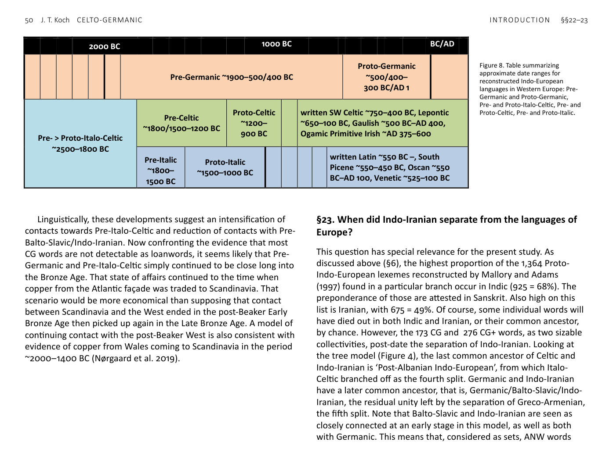
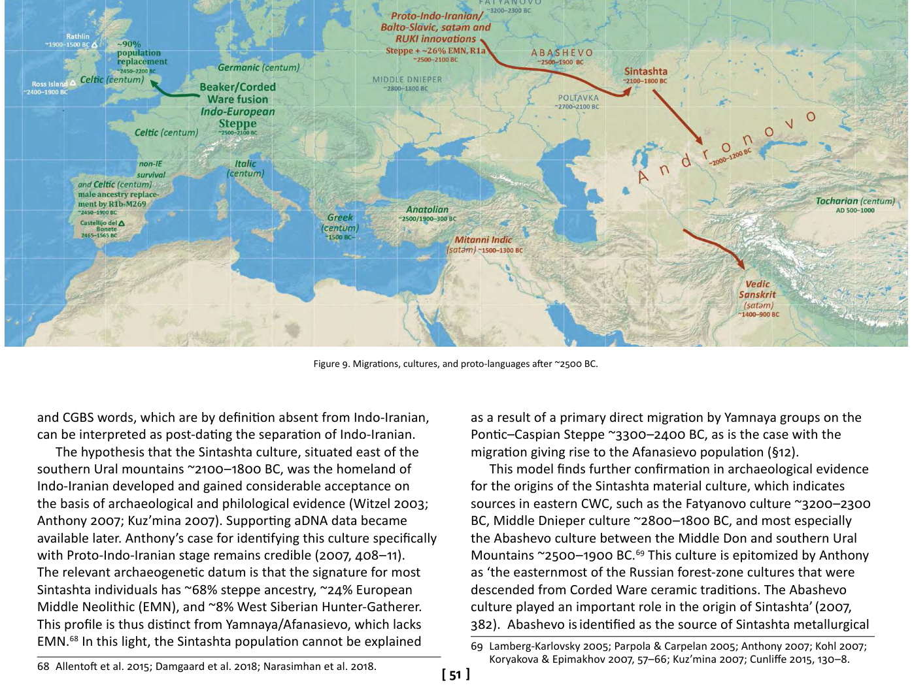

<!-- page: 50 -->

# §23. When did Indo-Iranian separate from the languages of
Europe?
This question has special relevance for the present study. As
discussed above (§6), the highest proportion of the 1,364 Proto-
Indo-European lexemes reconstructed by Mallory and Adams
(1997) found in a particular branch occur in Indic (925 = 68%). The
preponderance of those are attested in Sanskrit. Also high on this
list is Iranian, with 675 = 49%. Of course, some individual words will
have died out in both Indic and Iranian, or their common ancestor,
by chance. However, the 173 CG and 276 CG+ words, as two sizable
collectivities, post-date the separation of Indo-Iranian. Looking at
the tree model (Figure 4), the last common ancestor of Celtic and
Indo-Iranian is ‘Post-Albanian Indo-European’, from which Italo-
Celtic branched off as the fourth split. Germanic and Indo-Iranian
have a later common ancestor, that is, Germanic/Balto-Slavic/Indo-
Iranian, the residual unity left by the separation of Greco-Armenian,
the fifth split. Note that Balto-Slavic and Indo-Iranian are seen as
closely connected at an early stage in this model, as well as both
with Germanic. This means that, considered as sets, ANW words
2000 BC
1000 BC
BC/AD
Pre-Germanic ~1900–500/400 BC
Proto-Germanic
~500/400–
300 BC/AD 1
Pre- > Proto-Italo-Celtic
~2500–1800 BC
Pre-Celtic
~1800/1500–1200 BC
Proto-Celtic
~1200–
900 BC
written SW Celtic ~750–400 BC, Lepontic
~650–100 BC, Gaulish ~500 BC–AD 400,
Ogamic Primitive Irish ~AD 375–600
Pre-Italic
~1800–
1500 BC
Proto-Italic
~1500–1000 BC
written Latin ~550 BC –, South
Picene ~550–450 BC, Oscan ~550
BC–AD 100, Venetic ~525–100 BC

Figure 8. Table summarizing
approximate date ranges for
reconstructed Indo-European
languages in Western Europe: Pre-
Germanic and Proto-Germanic,
Pre- and Proto-Italo-Celtic, Pre- and
Proto-Celtic, Pre- and Proto-Italic.
<!-- page: 51 -->
and CGBS words, which are by definition absent from Indo-Iranian,
can be interpreted as post-dating the separation of Indo-Iranian.
The hypothesis that the Sintashta culture, situated east of the
southern Ural mountains ~2100–1800 BC, was the homeland of
Indo-Iranian developed and gained considerable acceptance on
the basis of archaeological and philological evidence (Witzel 2003;
Anthony 2007; Kuz’mina 2007). Supporting aDNA data became
available later. Anthony’s case for identifying this culture specifically
with Proto-Indo-Iranian stage remains credible (2007, 408–11).
The relevant archaeogenetic datum is that the signature for most
Sintashta individuals has ~68% steppe ancestry, ~24% European
Middle Neolithic (EMN), and ~8% West Siberian Hunter-Gatherer.
This profile is thus distinct from Yamnaya/Afanasievo, which lacks
EMN.[^68] In this light, the Sintashta population cannot be explained
68 Allentoft et al. 2015; Damgaard et al. 2018; Narasimhan et al. 2018.
as a result of a primary direct migration by Yamnaya groups on the
Pontic–Caspian Steppe ~3300–2400 BC, as is the case with the
migration giving rise to the Afanasievo population (§12).
This model finds further confirmation in archaeological evidence
for the origins of the Sintashta material culture, which indicates
sources in eastern CWC, such as the Fatyanovo culture ~3200–2300
BC, Middle Dnieper culture ~2800–1800 BC, and most especially
the Abashevo culture between the Middle Don and southern Ural
Mountains ~2500–1900 BC.[^69] This culture is epitomized by Anthony
as ‘the easternmost of the Russian forest-zone cultures that were
descended from Corded Ware ceramic traditions. The Abashevo
culture played an important role in the origin of Sintashta’ (2007,
382). Abashevo is identified as the source of Sintashta metallurgical
69 Lamberg-Karlovsky 2005; Parpola & Carpelan 2005; Anthony 2007; Kohl 2007;
Koryakova & Epimakhov 2007, 57–66; Kuz’mina 2007; Cunliffe 2015, 130–8.

Figure 9. Migrations, cultures, and proto-languages after ~2500 BC.
<!-- page: 52 -->
and ceramic traditions and stock-breeding economy, as well as the
key detail of the disc-shaped cheek pieces characteristic of the
distinctive horse gear of Sintashta chariotry. Sintashta is widely
credited with invention of the light-weight war chariot, with a pair
of spoked wheels and tightly controlled two-horse teams.[^70]
The Abashevo people who moved eastward to found the
Sintashta culture were attracted by abundant arsenic-rich copper
ores in Transuralia (Cunliffe 2015, 131–2). This migration can be
seen as a favourable context for breaking a dialect chain and
crystallization of a separate language, both by putting more
distance—and a mountain range—between the migrants and the
probable homeland of Pre-Balto-Slavic and also bringing closer
contact with a non-Indo-European Proto-Uralic language and that
of the Bactria–Margiana Archaeological Complex (BMAC) in Central
Asia (cf. Parpola & Carpelan 2005). That Abashevo was associated
with an early stage of Indo-Iranian had been proposed on the
basis of archaeological evidence together with ~100 Indo-Iranian
loanwords in the Uralic languages and correspondences between
Sintashta burial rites and Vedic religion (Anthony 2007, 385;
Parpola 2015). As I write, there is no Abashevo aDNA to confirm or
contradict the expectation that its gene pool was the source of the
genetic type found at Sintashta (steppe + ~24% EMN ancestry).
That genetic signature can be traced forward to sampled
individuals of the Sintashta-derived Andronovo horizon widely
spread across Central Asia ~2000–1200 BC and, afterwards, to
genomes of probably Indic-speaking groups in Iron Age South Asia
(Damgaard et al. 2018; Narasimhan et al. 2018). It is present in
South Asia today—at higher levels in the North of Pakistan and India
and among speakers of the Subcontinent’s Indo-European languages
and high-caste Hindu groups (Silva et al. 2017).
A recently sequenced genome from the Harappan (Indus Valley
Civilization) site of Rakhigarhi north-west of Delhi, dating ~2500
BC, shows no steppe or EMN ancestry, implying that these now
70 Anthony 2007; Kohl 2007; Koryakova & Epimakhov 2007; Kuz’mina 2007;
Cunliffe 2015, 130–8; Parpola 2015, 59, 68.
ubiquitous genetic signatures entered the Northern Subcontinent
later than that. The Rakhigarhi female was of the ‘Ancestral South
Indian’ type, more closely aligned with the genetic profile common
today in South India and amongst Dravidian speakers (Friese 2018;
Shinde et al. 2019). Modern South Asian mitochondrial DNA implies
that the Bronze Age immigrants who introduced the steppe + EMN
profile were mostly men.[^71]
What is the upshot of the foregoing evidence? Our central aim
is to identify circumstances that produced sizable sets of inherited
vocabulary common to Celtic and Germanic and lacking comparanda
in Indic and Iranian. The developments outlined above changed the
culture and location of some speakers of Balto-Slavic/Indo-Iranian in
the east so that their contacts with their former neighbours in the
west became more attenuated or simply ceased. A suitable context
would be the foundation of the culturally innovative Sintashta
culture by Abashevo migrants from the West. These newcomers
thus became detached from other CWC-derived cultures and other
populations with similar genetic signatures, i.e. steppe ancestry +
European Neolithic admixture. Therefore, our provisional model is
that the CG and CG+ word sets, lacking Indo-Iranian comparanda as
a defining feature, reflect circumstances after ~2100 BC.[^72]
71 Silva et al. 2017; cf. Goldberg et al. 2017; for Iberia cf. Szecsenyi-Nagy et al. 2017;
Reich 2018.
72 After Indic, Greek has the highest number (772) and percentage (57%) of
attestations of Mallory and Adams’s 1,364 Proto-Indo-European lexemes. An
absence from Greek is thus another negative defining attribute of the words
studied here. Therefore, in theory, a credible account for the separation of
Pre-Greek from its latest common ancestor with, or contiguous dialect among,
the NW languages could also be significant in delimiting the implications
of the Corpus. However, unlike the consensus linking Indo-Iranian with the
Sintashta culture, the whereabouts of Pre-Greek and Proto-Greek are not the
subject of a widely accepted theory. Archaeogenetics has yet to decisively
clarify this picture. A recent study of Minoan and Mycenaean aDNA shows
that Mycenaean remains from the Greek mainland dating to ~1700–1200 BC
are closely similar to those of Minoan indviduals, but differ in the presence
of a low-level admixture traceable to the north-east. This can be modelled as
13–18% steppe population affecting mainland Greece only (Lazaridis et al. 2017).
However, this is not the only possible model that could account for the results.
And, even if the steppe-admixture explanation was correct, this would not tell
