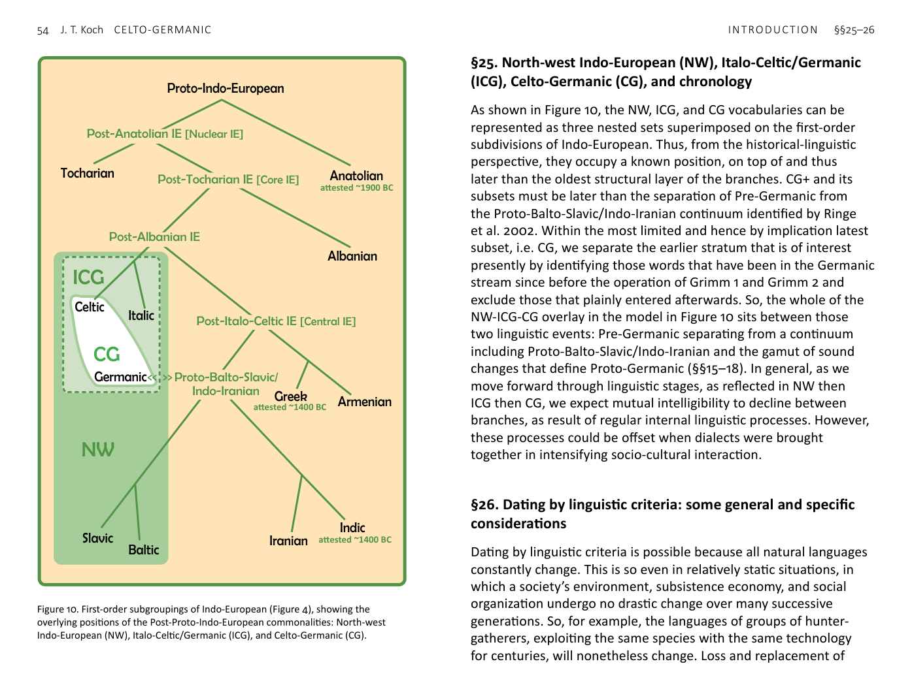

<!-- page: 54 -->

# §26. Dating by linguistic criteria: some general and specific
considerations
Dating by linguistic criteria is possible because all natural languages
constantly change. This is so even in relatively static situations, in
which a society’s environment, subsistence economy, and social
organization undergo no drastic change over many successive
generations. So, for example, the languages of groups of hunter-
gatherers, exploiting the same species with the same technology
for centuries, will nonetheless change. Loss and replacement of
NW
ICG
ICG
CG
Tocharian
Anatolian
Celtic
Italic
Albanian
Greek
Armenian
Slavic
Baltic
Iranian
Indic
Germanic
Proto-Indo-European
Post-Anatolian IE [Nuclear IE]
Post-Tocharian IE [Core IE]
Post-Italo-Celtic IE [Central IE]
<< >> Proto-Balto-Slavic/
Indo-Iranian
Post-Albanian IE
attested ~1900 BC
attested ~1400 BC
attested ~1400 BC

Figure 10. First-order subgroupings of Indo-European (Figure 4), showing the
overlying positions of the Post-Proto-Indo-European commonalities: North-west
Indo-European (NW), Italo-Celtic/Germanic (ICG), and Celto-Germanic (CG).
<!-- page: 55 -->
vocabulary will affect these languages, as well as regular sound
change (Dixon 1997). We might think of these evolutionary
processes as inherent within language itself and of course have a
bearing on our efforts in the RAW Project to identify chronological
strata in CG and CG+ words.
The situation in Western Eurasia between the Late Neolithic and
first attestations of its many languages was wholly different from
the prolonged comparative stasis of post-glacial hunter-gatherers
(Robb 1993; Dixon 1997; Koch 2o13a). The mass migrations from
the Pontic–Caspian Steppe in the 3rd millennium BC, very probably
bringing Indo-European languages with them to many regions,
also set off centuries of rapid progress in technology and social
complexity. In such situations, as well as internal processes affecting
change in languages over time, there were external factors: new
words were needed to describe new environments encountered by
migrants, new artefacts and technologies, and new or transformed
social institutions and beliefs. These changes—affecting language,
but arising external to language—are susceptible to dating and
linking to archaeological cultures using linguistic palaeontology (§5).
Thus, for example, there is a CG word for ‘SAIL’ (*sighlo-) and ICG
word for ‘MAST’ (*mazdlo- ~ *mazdo- ~ *mazdyo-) and a Proto-
Indo-European word for ‘hill’ (*bhr̥ĝh-) that became a CG word for
‘HILLFORT’ (§3): we may seek an archaeological horizon for which
these linguistic innovations appear appropriate.
But such concrete innovations will not have been the only ones
stimulating linguistic change in Western Eurasia in later prehistory. A
factor of linguistic artistry and creativity would also have stimulated
new modes of expression. It would be wrong to see this tendency
as inherently and exclusively Indo-European. But it is certainly
observable across the early Indo-European languages, for example,
the Sanskrit R̥g-Veda within the Late Bronze Age, the Homeric
epics of Early Iron Age Greece, and the Irish, Welsh, Old Norse,
and Old English traditional heroic literatures of the Early Middle
Ages. All of these have been seen as perpetuating an institution of
verbal artistry inherited from the speakers of Proto-Indo-European
(Watkins 1987; 1995; 1997).
We arrive at a similar conclusion by another line of reasoning,
as we develop the ‘Maritime Mode of Production’ model to
understand the contacts between Scandinavia and the Atlantic
façade in the Bronze Age, in terms of patterns historically
documented in the Viking Age (Ling et al. 2018). Even some
centuries earlier than Viking times a kenning typical of skaldic
verse is illustrated by the Tjurkö bracteate rune: wurte runoz an
walhakurne..heldaz kunimundiu ‘Heldaz wrought runes on “the
corn of the Volcae” for Kunimunduz’, where ‘corn of the Volcae’
(sometimes translated ‘Welsh corn’) is to be understood as the gold
fabric of the bracteate itself (§40c; Wicker & Williams 2012). The
following passage relating to Old Norse poetry carries implications
for artistically motivated linguistic change in Bronze Age heroic
societies:
The Viking Age was time when information was transmitted orally.
Traditional stories were usually told in verse, with the rhythms of
metre and patterns of poetic phrasing providing aids to memory and
transmission. Norse heroic and mythic poetry was also a word game
whose intricacies paralleled the style of Viking carvings made on wood,
stone, and metal objects.... In Old Scandinavia, participation of both
skald and audience in the game of creating and unravelling poetic
diction (skáldskaparmál) was a sign of intellect and learning. (Byock
2005, 123)
This characterization can be applied to Late Bronze Age society,
not only because there were further significant parallels to the
seafaring-warrior society of the Viking Age, but also because
comparative linguistic and literary evidence implies that so much
of this description can be reconstructed for early Indo-European-
speaking societies in general, as we find them first revealed at their
transitions from orality to literacy.
When we consider what it means that there are eight CG words
for ‘FIGHTING’ or ‘BATTLE’ and another eight meaning, more-or-less,
‘TO WOUND’, our first thought might be that these words came into
use in societies constantly engaged in combat. This conclusion is no
doubt partly true, but simplistic. The great expansion of vocabulary
<!-- page: 56 -->
for warfare and violence probably does reflect a real increase in
warlike activities.[^74] But it is also a reflection of the elevated status
of warriors and the preferred subject matter for artistic creation.
Events of a sort that were described over and over again in mythic
and heroic narratives required suitably variable words, fulfilling
different metrical slots, to express the same concepts repeatedly
in displays of creative excellence. Therefore, it does not necessarily
follow that CG *bhodhwo- and *katu- referred to different kinds of
battle. A variety of words were needed to talk about battle, much
as variations on basic themes were cultivated in carving warriors
and their accoutrements on stone, rather than producing identical
representations, as if stamped out on an assembly line. Another
case in point is CG *markos ‘horse’, which meant basically the
same thing as Proto-Indo-European *H₁ek̂wos, a word the reflexes
of which remained in use in both the early Celtic and Germanic
languages. Poets and storytellers working in an oral tradition that
has much to say about horses would find a word like ‘steed’ useful,
even if it meant the same thing, or nearly, as ‘horse’.
