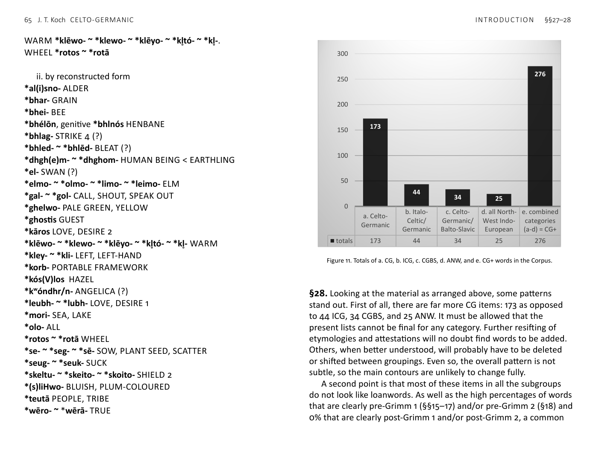
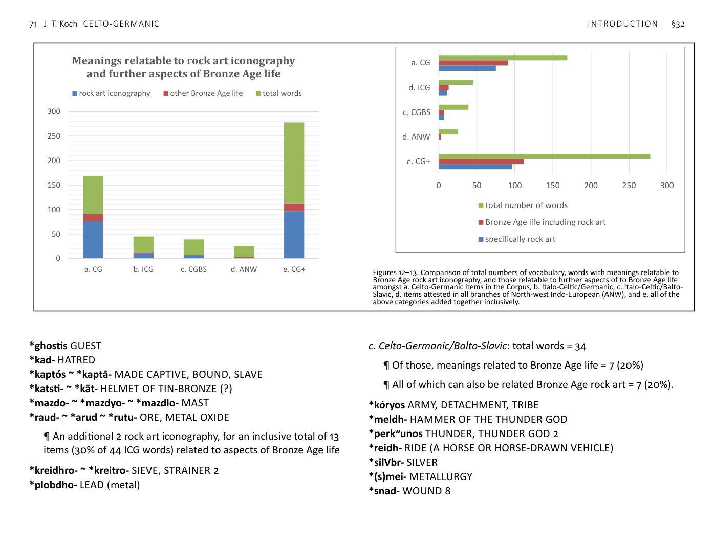

<!-- page: 56 -->

# §§27–34. Patterns in the CG, ICG, CGBS, and ANW
vocabulary

# §27. In this section, the word entries from the Corpus (§§38–50)
are rearranged, according to distribution across the Indo-European
branches: a) Celto-Germanic (CG), b) Italo-Celtic/Germanic (ICG), c)
Celto-Germanic/Balto-Slavic (CGBS), and d) all branches of North-
west Indo-European (ANW). In each of these categories the words
are listed twice, first according to the English gloss, and secondly
according to the reconstructed form.
74 Fontijn 2005; Vandkilde et al. 2006; Jantzen et al. 2011; 2014; Vandkilde 2015;
Horn & Kristiansen 2018; Dolfini et al. 2018.
a. Celto-Germanic (CG)
i. by meaning
ALL-FATHER (DIVINE EPITHET) *Olo-patēr
AXE *bhei(a)tlo- ~ *bhei(a)l-
AXLE *aks(i)l-
BATTLE, FIGHTING, VIOLENCE 1 *bhodhwo-
BATTLE, FIGHTING, VIOLENCE 2 *katu-
BATTLE, FIGHTING, VIOLENCE 3 *weik-
BATTLE, FIGHTING, VIOLENCE 4 *treg-
BATTLE, FIGHTING, VIOLENCE 5 *nīt-
BATTLE, FIGHTING, VIOLENCE 6 *nant-
BATTLE, FIGHTING, VIOLENCE 7 *bhēgh- ~ *bhōgh-
BATTLE, FIGHTING, VIOLENCE 8 *bhrest-
BATTLE-WOLF > HERO *katu-wl̥kʷo- ~ *katu-wolkʷo-
BEARD *gren- ~ gran-
BLAME *lok-
BOAR *basyo-
BOATLOAD (OF PEOPLE, DOMESTIC ANIMALS, OR INANIMATE
MATERIAL OF VALUE) *pluk-
BOILED > PASSIONATE *bhrut-
BOOTY, PROFIT *bhoudi-
BREAST *bhrusn-
BUTTOCKS, THIGH, HIP *teuk- ~ *tuk-
CHARCOAL, COAL *gulo- ~ *goulo- ~ *glōwo-
CLOVER *smeryon- ~ *semar-
CLUB, CUDGEL, STAFF, STICK *lurg-
CORPSE, DEAD BODY *kol- ~ *kl̥-
CORRECT, RIGHT, JUST *rektus
COUNTING, NUMBER *rīma-
CUTTING WEAPON AND/OR TOOL (?) *skey- ~ *ski-
DARK 1 *dhem(H)-
DARK, BLOOD-RED 2 *dhergo-
DEEP *dheubhnó- ~ *dhubnó- ~ *dhubhni-
<!-- page: 57 -->
DIGIT, BRANCH, FINGER *gʷistis
DISCUSSION (?) *trapto-
DRESS PIN, BROOCH *dhelgo- ~ *dholgo-
DROPLET *dhrub- ~ *dhrūb-
DWARFLIKE CREATURE, WATER CREATURE *aban-
EARTH, CLAY, MUD *ūr- ~ *our-
ENCLOSED FIELD *kaghyo-
ENCLOSURE 1 *katr-
ENCLOSURE, ENCLOSED SETTLEMENT, HILLFORT 2 *dūnos
EVIL *elko- ~ *elkā ~ *elkyo- ~ olko-
EXTREMITIES OF A LIVING THING *pinn-
FAMOUS, GREAT *mēr- ~ *mōros ~ *mōrā
FEAR *āg- ~ *ag-
FELLOW TRAVELLER, COMRADE *sentiyo-
FEVER *krīt- ~ *krit-
FLOOR *plōro-
FOE *poiko-
FOREIGNER *alyo-morgi- ~ *alyo-mrogi-
FORK *ghabhlo- ~ *ghabhlā-
FORTIFIED SETTLEMENT, HILLFORT 1 *bhr̥gh-
FORTIFIED SETTLEMENT, HILLFORT 2 *dhūnos
FREE *priyo- ~ *priyā-
FRESH WATER 1 *lindom ~ *lindhom ~ *lindhu-
FRIEND, RELATIVE 1 *weni-
GOAD 1*bhrozdo- ~ *bhr̥zdo-
GOD-INSPIRED *wātis
GOOD, DESIRABLE *swent- ~ *sunt-
GREASE, FAT, MARROW, ANOINT *smeru-
GREAT/FAMOUS IN BATTLE *Katu-mōros ~ -mēros
GREAT/FAMOUS IN VICTORY *Seghi-mēros ~ *Segho-mōros
GREAT WATERWAY, RHINE *reinos
GREY *keiro- ~ *koiro-
HAIR, STRAND OF HAIR *doklo-
HARBOUR, SHELTER FOR VESSELS *kapono-
HEALER, PHYSICIAN, LEECH *lēgi-
HEALING PLANT *lubi-
HEAP, MOUND, PILE, RICK *krouko-
HEIR *orbho-
HIDE, CONCEAL 1 *mūg-
HIGH ONES, GROUP NAME RELATED TO ‘HILLFORT’ *Bhr̥ghn̥tes
HOLLY *kuleno- ~ *kolino-
HORSE 1 *marko-
HORSE 2 *kankistos ~ *kanksikā
HORSE+RIDE *ekʷo-reidho-
HOSTAGE *gheislo-
INHERITANCE *orbhyom
INNUMERABLE, COUNTLESS *n̥-rīm-
INTENTION, DESIRE *mein- ~ *moin-
IRON *isarno- ~ *īsarno-
JOKER, FOOL *drūto-
KING OF THE PEOPLE *teuto-rīg-
KING, LEADER *rīg- < *rēg-
KINGDOM, REIGN, REALM *rīgyom ~ *rīgyā < *rēgyā
LARK *laiwað ~ *alauð
LEAD (metal) *plobdho-
LEATHER *letrom
LEATHER BAG, BELLOWS 1 *bholgh-
LEFT, LEFT-HAND *kley- ~ *kli-
LEPROSY *truts-
LINEAR LANDSCAPE FEATURE *roino-
LOAD, CARRY A LOAD *kleut- ~ *klat-
LONG *sīt- ~ *sit-
LOUSE *leuHo- ~ *luH-s
MANE *mongo- ~ *mongā-
MILITARY COMMANDER *koryonos
MOUND, EARTHWORK *wert-
<!-- page: 58 -->
NATURALLY OVERGROWN LAND *kaito-
NURTURER, PERSON ACTING AS A PARENT (?) *altro-
OATH, TO BIND BY OATH 1 *oitos
OATH, TO BIND BY OATH 2 *leugho-
OATS, BROMUS *korkró-
OMEN, FORESIGHT *kail-
ONE-EYED, BLIND IN ONE EYE *káikos
OVERCOME IN BATTLE *uper-weik- ~ *uper-wik-
PATH, ROAD, WAY, PASSAGE *sento-
PERSON ACTING ON BEHALF OF ANOTHER *ambhaktos ~
*ambhaktā
PINE *gisnó-
PLEASANT, FAIR *teki-
POETRY, STORYTELLING *sketlo- ~ *skōtlo-
POINT *bend- ~ *bn̥d-
POLISH, SHARPEN, WHET *sleimo- ~ *slimo-
PROSPER, FORTUNE *tenk- ~ *tonk-
RED METAL *ē̒mo- ~ *omyom < *omó-
RELATIVE, FRIEND 2 *priyānt-
RIDE (A HORSE OR HORSE-DRAWN VEHICLE) *reidh-
ROD, STAFF, LONG SLENDER PIECE OF WOOD *(s)lat(t)-
ROOF *togo-
ROW (verb) (?) *rō-
RUSH (the plant) *sem-
SACRED GROVE, SANCTUARY *nemet-
SAIL (noun) *sighlo-
SAND AND/OR GRAVEL BY OR BENEATH A BODY OF WATER
*ghreuH-no- ~ *ghreuH-eH₂-
SECRET, SECRET KNOWLEDGE *rūn-
SEDGE *sek-s-
SETTLEMENT, FARMHOUSE treb- ~ *tr̥b-
SHAKE *skut-
SHIELD (?) 1 OF WICKER *kleibho-
SHINING, CLEAR *ghleiwo-
SICKNESS *sukto- ~ *sukti-
SIEVE, STRAINER 1 *sētlā-
SKIN 1*kenno-
SKIN, HIDE 2 *sekyā-
SLING, SNARE *telm-
SON, YOUTH *maghus
SPEAK 1 *rōdi-
SPEAK 2 *yekti-
SPEAR 1 *ghaiso-
SPEAR 2 *lust-
SPEAR-KING *Ghaiso-rīg-
SPLIT *splīd- ~ *splid-
STONE MONUMENT *kar-
STREAM, LIQUID IN MOTION *sret- ~ *sr̥t-
STRENGTH, FORCE, VALOUR *nert-
STRIKE (IN BATTLE) 1 *kelto- ~ *keltyo-
STRIKE (IN BATTLE) 2 *slak-
STRIPE *streibā
STRIVE, SUCCEED *pleid-
STRONG/VICTORIOUS FORTIFIED SETTLEMENT *segho-dūno-
SUPERNATURAL BEING, PHANTOM, GHOST 1 *dhroughós
SUPERNATURAL BEING, PHANTOM, GHOST 2 *skōk-slo-
SUPERNATURAL BEING, PHANTOM, GHOST 3 *ghaisto-
SWIFT *krob(h)- ~ *kr̥b(h)-
SWIM < MOVE (?) *swem-
THICK, FAT *tegu-
THREAD, FATHOM *pot(a)mo-
THUNDER, THUNDER GOD 1 *ton(a)ros
TROOP 1 *dhru(n)gh-
TROOP 2 *worīn-
TROUGH, TUB, VESSEL *druk-
TRUSTWORTHY, RELIABLE *drousdo- ~ *drusd-
<!-- page: 59 -->
VESSEL, CONTAINER FOR LIQUID *gan(dh)-no-
WEREWOLF *wiro-kwō ~ *wiro-wl̥kʷo-
WHEELED VEHICLE *weghnos
WILD DOG, WOLF *widhu-kō(n)
WILD, WILDMAN *gʷhelti-
WITNESS *weidwōts
WOLF, WARRIOR OUTSIDE THE TRIBE *wolko- ~ *wolkā-
WOOD, TREES *widhus
WORTH, PRICE *werto-
WOUND, INJURE 1 *bhreus-
WOUND, INJURE 2 *knit-
WOUND, INJURE 3 *aghlo-
WOUND, INJURE 4 *gʷhen- ~ *gʷhon-
WOUND, INJURE 5 *koldo-
WOUND, INJURE 6 *kre(n)g- ~ *krog-
WOUND, INJURE 7 *sai-
ii. by reconstructed form
*aban- DWARFLIKE CREATURE, WATER CREATURE
*āg- ~ *ag- FEAR
*aghlo- WOUND, INJURE 3
*aks(i)l- AXLE
*altro- NURTURER, PERSON ACTING AS A PARENT (?)
*alyo-morgi- ~ *alyo-mrogi- FOREIGNER
*ambhaktos ~ *ambhaktā PERSON ACTING ON BEHALF OF
ANOTHER (< ‘one sent around’)
*basyo- BOAR
*bend- ~ *bn̥d- POINT
*bhēgh- ~ *bhōgh- BATTLE, FIGHTING, VIOLENCE 7
*bhei(a)tlo- ~ *bhei(a)l- AXE
*bhodhwo- BATTLE, FIGHTING, VIOLENCE 1
*bholgh- LEATHER BAG, BELLOWS 1
*bhoudi- BOOTY, PROFIT
*bhrest- BATTLE, FIGHTING, VIOLENCE 8
*bhreus- WOUND, INJURE 1
*bhr̥gh- FORTIFIED SETTLEMENT, HILLFORT 1
*Bhr̥ghn̥tes HIGH ONES, GROUP NAME RELATED TO ‘HILLFORT’
*bhrozdo- ~ *bhr̥zdo- GOAD 1
*bhrusn- BREAST
*bhruto- ~ *bhrutu- BOILED > PASSIONATE
*dhelgo- ~ *dholgo- DRESS PIN, BROOCH
*dhemH- DARK 1
*dhergo- DARK, BLOOD-RED 2
*dheubhnó- ~ *dhubhnó- ~ *dhubhni- DEEP
*dhroughós SUPERNATURAL BEING, PHANTOM, GHOST 1
*dhrub- ~ *dhrūb- DROPLET
*dhru(n)gh- TROOP 1
*dhūnos FORTIFIED SETTLEMENT, HILLFORT 2
*doklo- HAIR, STRAND OF HAIR
*drousdo- ~ *drusd- TRUSTWORTHY, RELIABLE
*druk- TROUGH, TUB, VESSEL
*drūto- JOKER, FOOL
*dūnos ENCLOSURE, ENCLOSED SETTLEMENT, HILLFORT 2
*ekʷo-reidho- HORSE+RIDE
*elko- ~ *elkā- ~ *elkyo- ~ *olko- EVIL
*ē̒mo- ~ *omyom < *omó- RED METAL
*gan(dh)-no- VESSEL, CONTAINER FOR LIQUID
*ghabhlo- ~ *ghabhlā- FORK
*ghaiso- SPEAR 1
*Ghaiso-rīg- SPEAR-KING
*ghaisto- SUPERNATURAL BEING, PHANTOM, GHOST 3
*gheislo- HOSTAGE
*ghleiwo- SHINING, CLEAR
*ghreuH-no- ~ *ghreuH-eH- SAND AND/OR GRAVEL BY OR
BENEATH A BODY OF WATER
*gisnó- PINE
<!-- page: 60 -->
*gren- ~ *gran- BEARD
*gulo- ~ *goulo- ~ *glōwo- CHARCOAL, COAL
*gʷhelti- WILD, WILDMAN
*gʷhen- ~ *gʷhon- WOUND, INJURE 4
*gʷistis DIGIT, FINGER, TOE, BRANCH
*isarno- ~ *īsarno- IRON
*kaghyo- ENCLOSED FIELD
*káikos ONE-EYED, BLIND IN ONE EYE
*kail- OMEN, FORESIGHT
*kaito- NATURALLY OVERGROWN LAND
*kankistos ~ *kanksikā HORSE 2
*kapono- HARBOUR, SHELTER FOR VESSELS
*kar- STONE LANDMARK, STONE RITUAL STRUCTURE
*katr- ENCLOSURE
*katu- BATTLE, FIGHTING, VIOLENCE 2
*Katu-mōros ~ -mēros GREAT/FAMOUS IN BATTLE
*katu-wl̥kʷo- ~ *katu-wolkʷo- BATTLE-WOLF > HERO
*keiro- ~ *koiro- GREY
*kelto- ~ *keltyo- STRIKE (IN BATTLE) 1
*kenno- SKIN 1
*kleibho- SHIELD (?)OF WICKER 1
*kleut- ~ *klat- LOAD, CARRY A LOAD
*kley- ~ *kli- LEFT, LEFT-HAND
*knit- WOUND, INJURE 2
*kol- ~ *kl̥- CORPSE, DEAD BODY
*koldo- WOUND, INJURE 5
*korkró- OATS, BROMUS
*koryonos MILITARY COMMANDER
*kre(n)g- ~ *krog- WOUND, INJURE 6
*krīt- ~ *krit- FEVER
*krob(h)- ~ *kr̥b(h)- SWIFT
*krouko- HEAP, MOUND, PILE, RICK
*kuleno- ~ *kolino- HOLLY
*laiwað ~ *alauð LARK
*lēgi- HEALER, PHYSICIAN, LEECH
*letrom LEATHER
*leugho- OATH, TO BIND BY OATH 2
*leuHo- ~ *luH-s LOUSE
*lindom ~ *lindhom ~ *lindhu- FRESH WATER 1
*lok- BLAME
*lubi- HEALING PLANT
*lurg- CLUB, CUDGEL, STAFF, STICK
*lust- SPEAR 2
*maghus SON, YOUTH
*marko- HORSE 1
*mein- ~ *moin- INTENTION, DESIRE
*mēr- ~ *mōros ~ *mōrā FAMOUS, GREAT
*mongo- ~ *mongā- MANE (OF A HORSE)
*mūg- HIDE, CONCEAL 1
*nant- BATTLE, FIGHTING, VIOLENCE 6
*nemet- SACRED GROVE, SANCTUARY
*nert- STRENGTH, FORCE, VALOUR
*nīt- BATTLE, FIGHTING, VIOLENCE 5
*oitos OATH, TO BIND BY OATH 1
*Olo-patēr ALL-FATHER, GREAT FATHER (DIVINE EPITHET)
*orbho- HEIR
*orbhyom INHERITANCE
*pinn- EXTREMITIES OF A LIVING THING
*pleid- STRIVE, SUCCEED
*plobdho- LEAD
*plōro- FLOOR
*pluk- TROOP 3
*pluk- BOATLOAD (OF PEOPLE, DOMESTIC ANIMALS, OR
INANIMATE MATERIAL OF VALUE)
*poiko- FOE
*pot(a)mo- THREAD, FATHOM
<!-- page: 61 -->
*priyānt- RELATIVE, FRIEND 2
*priyo- ~ *priyā- FREE
*reidh- RIDE (A HORSE OR HORSE-DRAWN VEHICLE)
*reinos GREAT WATERWAY, RHINE
*rektus CORRECT, RIGHT, JUST
*rīgyom ~ *rīgyā < *rēgyā KINGDOM, REIGN, REALM
*rīg- < *rēg- KING, LEADER
*rīma- COUNTING, NUMBER
*rō- ROW (verb)
*rōdi- SPEAK 1
*roino- LINEAR LANDSCAPE FEATURE
*rūn- SECRET, SECRET KNOWLEDGE
*sai- WOUND, INJURE 7
*Seghi-mēros ~ *Segho-mōros GREAT/FAMOUS IN VICTORY
*segho-dūno- STRONG/VICTORIOUS FORTIFIED SETTLEMENT
*sek-s- SEDGE
*sekyā- SKIN, HIDE 2
*sem- RUSH (the plant)
*sentiyo- FELLOW TRAVELLER, COMRADE
*sento- PATH, ROAD, WAY, PASSAGE
*sētlā- SIEVE, STRAINER 1
*sighlo- SAIL (noun)
*sīt-, *sit- LONG
*sketlo- ~ *skōtlo- POETRY, STORYTELLING
*skey- ~ *ski- CUTTING WEAPON AND/OR TOOL (?)
*skōk-slo- SUPERNATURAL BEING, PHANTOM, GHOST 2
*skut- SHAKE
*slak- STRIKE (IN BATTLE) 2
*(s)lat(t)- ROD, STAFF, LONG SLENDER PIECE OF WOOD
*sleimo- ~ *slimo- POLISH, SHARPEN, WHET
*smeru- GREASE, FAT, MARROW, ANOINT
*smeryon- ~ *semar- CLOVER
*splīd- ~ *splid- SPLIT
*sret- ~ *sr̥t- STREAM, LIQUID IN MOTION
*streibā STRIPE
*sukto- ~ *sukti- SICKNESS
*swem- SWIM < MOVE (?)
*swent- ~ *sunt- ~ *swn̥t- GOOD, DESIRABLE
*tegu- THICK, FAT
*teki- PLEASANT, FAIR
*telm- SLING, SNARE
*tenk- ~ *tonk- PROSPER, FORTUNE
*teuk- ~ *tuk- BUTTOCKS, THIGH, HIP
*togo- ROOF
*ton(a)ros THUNDER, THUNDER GOD 1
*teuto-rīg- KING OF THE PEOPLE
*trapto- DISCUSSION (?)
*treb- ~ *tr̥b- SETTLEMENT, FARMHOUSE
*treg- BATTLE, FIGHTING, VIOLENCE 4
*truts- LEPROSY
*uper-weik- ~ *uper-wik- OVERCOME IN BATTLE
*ūr- ~ *our- EARTH, CLAY, MUD
*wātis GOD-INSPIRED
*weghnos WHEELED VEHICLE
*weidwōts WITNESS
*weik- BATTLE, FIGHTING, VIOLENCE 3
*weni- FRIEND, RELATIVE 1
*wert- MOUND, EARTHWORK
*werto- WORTH, PRICE
*widhu-kō(n) WILD DOG, WOLF
*widhus WOOD, TREES
*wiro-kwō ~ *wiro-wl̥kʷo- WEREWOLF
*wolko- ~ *wolkā- PREDATOR, WOLF, WARRIOR OUTSIDE THE
TRIBE
*worīn- TROOP 2
*yekti- SPEAK 2
<!-- page: 62 -->
b. Italo-Celtic/Germanic (ICG)
i. by meaning
ADDER, SNAKE, VIPER *natr- ~ *nētr-
BADGER *takso-
BENEFIT, PRIZE (?) *lau-
BLACKBIRD *mesl- ~ *amsl-
BLOOM, FLOURISH, FLOWER *bhlō-
BLOW, BREATHE *spei-
BOW AND ARROW *arkʷo-
BROWN, DARK *dheus-
CHOOSE, TRY *gustu-
COLOUR NAME (NOT BLACK, WHITE, OR RED) *bhéH₁lus, genitive
*bhH₁luós
CURLY HAIR *krisp-
DEVICE THAT LEANS AGAINST SOMETHING UPRIGHT, LEANTO
*kleitro- ~ *kleitrā- ~ *klitro-
EMPTY *wāstos
FISH *peisk- ~ *pisko-
FOAM, FROTH *bhermVn-
FREEZE, FROST *preus-
FRESH WATER 2 *akʷā-
FURROW *porkā ~ *pr̥ko- ~ *pr̥kā-
GOAD, POKER 2 *ghazdho- ~ *ghazdhā-
GUEST *ghostis
HARROW *oketā-
HATRED *kad-
HEAD *káput
HELMET OF TIN-BRONZE (?) *katsti- ~ *kāt-
HIDE, CONCEAL 2 *kele/o-
JUNIPER *yoini-
KNOT, KNOTWORK, DEVICE OF KNOTWORK TO CATCH FISH *nōd- ~
*nad-
LEAD (metal) *plobdho-
LIGHTNING *louk-
MADE CAPTIVE, BOUND, SLAVE *kaptós ~ *kaptā-
MAST *mazdo- ~ *mazdlo-
NECK *kólsos
NUT *know- ~ *knu-
OAK, TREE *perkʷo-
ORE, METAL OXIDE *raud- ~ *arud ~ *rutu-
REAPING, MOWING, HARVEST *met- ~ *mēto-
SACRIFICE, OFFERING *dapno- ~ dapnā-
SEAT, CHAIR *sedlo- ~ *setlo-
SELF, PROPERTY *selbho- ~ *selwo-
SHARP EDGE *akyā- ~ *aku- ~ *āk(s)-
SIEVE, STRAINER 2 *kreidhro- ~ kreitro-
SMELL STRONGLY *bhrag- ~ *bhrēg-
SOFT *lento- ~ *ln̥to-
SPEAK 3 *yek- ~ *yok-
STRIKE (IN BATTLE), BEAT 3 *bheud-
THINK (?) *tong-
ii. by reconstructed form
*akʷā- FRESH WATER 2
*akyā- ~ *aku- ~ *āk(s)- SHARP EDGE
*arkʷo- BOW AND ARROW
*bhéH₁lus, genitive *bhH₁luós COLOUR NAME (not black, white, or
red)
*bhermVn- FOAM, FROTH
*bheud- STRIKE (IN BATTLE), BEAT 3
*bhrag- ~ *bhrēg- SMELL STRONGLY
*bhlō- BLOOM, FLOURISH, FLOWER
*dapno- ~ dapnā- SACRIFICE, OFFERING
*dheus- BROWN, DARK
*ghazdhos- ~ *ghazdhā- GOAD, POKER 2
*ghostis GUEST
*gustu- CHOOSE, TRY
*kad- HATRED
<!-- page: 63 -->
*kaptós ~ *kaptā- MADE CAPTIVE, BOUND, SLAVE
*káput HEAD
*katsti- ~ *kāt- HELMET OF TIN-BRONZE (?)
*kele/o- HIDE, CONCEAL 2
*kleitro- ~ *kleitrā- ~ *klitro- LEANTO, DEVICE THAT LEANS
AGAINST SOMETHING UPRIGHT
*know- ~ *knu- NUT
*kólsos NECK
*kreidhro- ~ kreitro- SIEVE, STRAINER 2
*krisp- CURLY HAIR
*lau- BENEFIT, PRIZE (?)
*lento- ~ *ln̥to- SOFT
*louk- LIGHTNING
*mazdo- ~ *mazdlo- MAST
*mesl- ~ *amsl- BLACKBIRD
*met- ~ *mēto- REAPING, MOWING, HARVEST
*natr- ~ *nētr- ADDER, SNAKE, VIPER
*nōd- ~ *nad- KNOT, KNOTWORK, DEVICE OF KNOTWORK TO
CATCH FISH
*n̥-rīm- INNUMERABLE, COUNTLESS
*oketā- HARROW
*peisk- ~ *pisko- FISH
*perkʷo- OAK, TREE
*plobdho- LEAD (metal)
*porkā ~ *pr̥ko- ~ *pr̥kā- FURROW
*preus- FREEZE, FROST
*raud- ~ *arud ~ *rutu- ORE, METAL OXIDE
*sedlo- ~ *setlo- SEAT, CHAIR
*selbho- ~ *selwo- SELF, PROPERTY
*spei- BLOW, BREATHE
*takso- BADGER
*tong- THINK (?)
*wāstos EMPTY
*yek- ~ *yok- SPEAK 3
*yoini- JUNIPER
c. Celtic/Germanic/Balto-Slavic (CGBS)
i. by meaning
ARABLE LAND, PLOUGHED FIELD *polkā
ARMY, DETACHMENT, TRIBE *kóryos
BE STILL, BE QUIET *(s)tel-
BREAST, CHEST, ABDOMEN *bhreus-
BUTTER *angʷen-
DEATH *sterbh-
DEBT, OBLIGATION *dhl̥g-
DIRTY, YELLOWISH BROWN *sal-
DOUGH *tais-
HAMMER OF THE THUNDER GOD *meldh-
HERD (OF CATTLE), SERIES *kerdhā
HOMESTEAD *koimo-
LEATHER BAG, BELLOWS 2 *mokon- ~ *mokīnā-
LOYAL, TRUSTWORTHY *drewu- ~ *derwo-
LUCK *kobom
MAGIC, SORCERY *soito- ~ *soitā-
MALEVOLENT FEMALE SPIRIT *morā
MANY *menek- ~ *monek-
METALLURGY *(s)mei-
MOVE LIKE A SNAKE, SLINK *slenk-
MOVE QUICKLY, STIR ONESELF, JUMP, SHAKE *skek-e- ~ *skok-eye-
OPEN LAND *lendh- ~ *ln̥dh-
REACH TO, ENTREAT (?) *tekye-
ROOFED OUTBUILDING *krópos
SHAKE *kret-
SILVER *silVbr-
SLOETREE, BLACKTHORN (?) *dhergh-
SMEAR, GLUE, STICK *gleina- ~ *glina-
STAFF, POST *stabho- ~ *stabhā-
SUPERNATURAL BEING, PHANTOM, GHOST 3 *dhwes-
THUNDER, THUNDER GOD 2 *perkʷunos
VOMIT, DEFECATE (?) *ski-
<!-- page: 64 -->
WET *welk- ~ *wolk-
WETLAND *pen- ~ *pn̥-
WOUND 8 *snad-
ii. by reconstructed form
*angʷen- BUTTER
*bhreus- BREAST, CHEST, ABDOMEN
*dhergh- SLOETREE, BLACKTHORN (?)
*dhl̥g- DEBT, OBLIGATION
*dhwes- SUPERNATURAL BEING, PHANTOM, GHOST 3
*drewu- ~ *derwo- LOYAL, TRUSTWORTHY
*gleina- ~ *glina- SMEAR, GLUE, STICK
*kerdhā ~ *kordh- HERD (OF CATTLE), SERIES
*kobom LUCK
*koimo- HOMESTEAD
*kóryos ARMY, DETACHMENT, TRIBE
*kret- SHAKE
*krópos ROOFED OUTBUILDING
*lendh- ~ *ln̥dh- OPEN LAND
*meldh- HAMMER OF THE THUNDER GOD
*menek- ~ *monek- MANY
*mokon- ~ *mokīnā- LEATHER BAG, BELLOWS 2
*morā MALEVOLENT FEMALE SPIRIT
*pen- ~ *pn̥- WETLAND
*perkʷunos THUNDER, THUNDER GOD 2
*polkā ARABLE LAND, PLOUGHED FIELD
*sal- DIRTY, YELLOWISH BROWN
*silVbr- SILVER
*skek-e- ~ *skok-eye- MOVE QUICKLY, STIR ONESELF, JUMP
*ski- VOMIT, DEFECATE (?)
*slenk- MOVE LIKE A SNAKE, SLINK
*(s)mei- METALLURGY
*snad- WOUND 8
*soito- ~ *soitā- MAGIC, SORCERY
*stabho- ~stabhā- STAFF, POST
*sterbh- DEATH
*(s)tel- BE STILL, BE QUIET
*tais- DOUGH
*tekye- REACH TO, ENTREAT (?)
*welk- ~ *wolk- WET
d. Italo-Celtic/Germanic/Balto-Slavic (ANW)
i. by meaning
ALDER *al(i)sno-
ALL *olo-
ANGELICA (?) *kʷóndhr/n-
BEE *bhei-
BLEAT (?) *bhled- ~ *bhlēd-
BLUISH, PLUM-COLOURED *(s)liHwo-
CALL, SHOUT, SPEAK OUT *gal-
ELM *elmo- ~ *olmo- ~ *limo- ~ *leimo-
GRAIN *bhar-
GUEST *ghostis
HAZEL *kós(V)los
HENBANE *bhélōn, genitive *bhlnós
HUMAN BEING < EARTHLING *dhgh(e)m- ~ *dhghom-
LEFT, LEFT-HAND *kley- ~ *kli-
LOVE, DESIRE 1 *leubh- ~ *lubh-
LOVE, DESIRE 2 *kāros
PALE GREEN, YELLOW *ghelwo-
PEOPLE, TRIBE *teutā
PORTABLE FRAMEWORK *korb-
SEA, LAKE *mori-
SHIELD 2 *skeltu- ~ *skeito- ~ *skoito-
SOW, PLANT SEED, SCATTER *se- ~ *seg- ~ *sē-
STRIKE 4 *bhlag- (?)
SUCK *seug- ~ *seuk-
SWAN (?) *el-
TRUE *wēro- ~ *wērā-
<!-- page: 65 -->
WARM *klēwo- ~ *klewo- ~ *klēyo- ~ *kl̥tó- ~ *kl̥-.
WHEEL *rotos ~ *rotā
ii. by reconstructed form
*al(i)sno- ALDER
*bhar- GRAIN
*bhei- BEE
*bhélōn, genitive *bhlnós HENBANE
*bhlag- STRIKE 4 (?)
*bhled- ~ *bhlēd- BLEAT (?)
*dhgh(e)m- ~ *dhghom- HUMAN BEING < EARTHLING
*el- SWAN (?)
*elmo- ~ *olmo- ~ *limo- ~ *leimo- ELM
*gal- ~ *gol- CALL, SHOUT, SPEAK OUT
*ghelwo- PALE GREEN, YELLOW
*ghostis GUEST
*kāros LOVE, DESIRE 2
*klēwo- ~ *klewo- ~ *klēyo- ~ *kl̥tó- ~ *kl̥- WARM
*kley- ~ *kli- LEFT, LEFT-HAND
*korb- PORTABLE FRAMEWORK
*kós(V)los HAZEL
*kʷóndhr/n- ANGELICA (?)
*leubh- ~ *lubh- LOVE, DESIRE 1
*mori- SEA, LAKE
*olo- ALL
*rotos ~ *rotā WHEEL
*se- ~ *seg- ~ *sē- SOW, PLANT SEED, SCATTER
*seug- ~ *seuk- SUCK
*skeltu- ~ *skeito- ~ *skoito- SHIELD 2
*(s)liHwo- BLUISH, PLUM-COLOURED
*teutā PEOPLE, TRIBE
*wēro- ~ *wērā- TRUE

# §28. Looking at the material as arranged above, some patterns
stand out. First of all, there are far more CG items: 173 as opposed
to 44 ICG, 34 CGBS, and 25 ANW. It must be allowed that the
present lists cannot be final for any category. Further resifting of
etymologies and attestations will no doubt find words to be added.
Others, when better understood, will probably have to be deleted
or shifted between groupings. Even so, the overall pattern is not
subtle, so the main contours are unlikely to change fully.
A second point is that most of these items in all the subgroups
do not look like loanwords. As well as the high percentages of words
that are clearly pre-Grimm 1 (§§15–17) and/or pre-Grimm 2 (§18) and
0% that are clearly post-Grimm 1 and/or post-Grimm 2, a common
a. Celto-
Germanic
b. Italo-
Celtic/
Germanic
c. Celto-
Germanic/
Balto-Slavic
d. all North-
West Indo-
European
e. combined
categories
(a-d) = CG+
totals
173
44
34
25
276
173
44
34
25
276
0
50
100
150
200
250
300

Figure 11. Totals of a. CG, b. ICG, c. CGBS, d. ANW, and e. CG+ words in the Corpus.
<!-- page: 66 -->
characteristic is for the same root with the same or similar meaning
to reflect different vowel grades and the addition of suffixes, all
of which had ceased to be productive before the oldest surviving
evidence. In other words, this material suggests that much of the
contact took place at a linguistic stage or stages fundamentally
different from, and earlier than, Gaulish, Celtiberian, and Ogamic
Primitive Irish (on the Celtic side) and Gothic and the Ancient Nordic
runes (on the Germanic).
In many examples, where such linguistic variations as differing
Indo-European vowel grades occur, it remains workable to derive
the attested forms from Proto-Indo-European through the line
of descent to the individual languages, without recourse to
contamination between branches. In such cases, the only aspects
that suggest post-Proto-Indo-European contact is that the words,
or some special developments of the words, are found only in the
languages of the North and West and/or that the words mean
something more relevant to societies later than the Late Neolithic
horizon of Proto-Indo-European.
In some examples, the vowel differs in a way that cannot be
explained by derivation from different Indo-European vowel
grades. The equivalent usage of Pre-Germanic *mēri- ‘famous’ and
Proto-Celtic *māro- ‘great’ in examples like the names Germanic
Segimeros and Ancient Celtic SEGOMARVS is understandable when
it is remembered that Pre-Germanic *ē had probably come to be
pronounced [æː], making its pronunciation of [mæːri] closer to
that of the Proto-Celtic. In North-west Germanic, Proto-Germanic
*ē changed fully to *ā. However, the spelling Σεγιμερος in Strabo
shows that this change was not an essential precondition for the
syncretism with the Celtic -māros names.
There are lower percentages of warlike words in the sets
common to larger numbers of languages. For example, within the
ANW grouping, there is one word for ‘SHIELD’ and another for
‘STRIKE’. But the overall impression—contrasting with CG—from the
broader groupings (especially CGBS and ANW) is the prominence
of homely and pacific domains: for example, CGBS ‘ARABLE
LAND’, ‘BREAST’, ‘BUTTER’, ‘DOUGH’, ‘HOMESTEAD’, ‘ROOFED
OUTBUILDING’, and ANW ‘BEE’, ‘FENCE’, ‘PLANT SEED’, ‘SUCK’,
‘WARM’, and two words for ‘LOVE’.
The evidence of this vocabulary supports the case that there
was a significant social change preceding the point when Pre-/
Proto-Celtic and Pre-Germanic were in especially close contact with
each other but contact had become more attenuated with Italic and
Balto-Slavic. The warrior and his role were receiving more attention.
Although we should not close our minds to other possibilities, it is
likely that the era of focus on the warrior in innovative vocabulary
coincided with the time when more equipment was being produced
for warriors, as well as an expanding martial iconography in artwork.
The greater number of CG words is consistent with a model in which
contact between what became the attested Germanic languages
and what became the attested Celtic languages was either longer or
more intense after Germanic had separated from Balto-Slavic and
after Celtic from Italic.

# §29. Chronological implications of the subsets of words
CG words found also in Baltic and/or Slavic (CGBS), which also
show the semantic, morphological, and phonological innovations
common to Celtic and Germanic (= 34 total in the collection), would,
as a group, be earlier than CG words wholly absent from Balto-Slavic
or showing fewer of the CG innovations in Balto-Slavic.
CG words found also in Italic (ICG)—and also showing the semantic,
morphological, and phonological innovations common to Celtic and
Germanic (= 44 total in the Corpus)—probably contain some words
that entered Pre-Germanic before the breakup of Italo-Celtic. This
inference can be supported especially when the meanings of the
words are considered (see §32), as a lower percentage of ICG words
than CG can be related to Late Bronze Age material culture and
social organization (30% versus 52%), and rock art iconography (25%
versus 43%). On the other hand, it is unlikely that all the ICG words
<!-- page: 67 -->
passed to Pre-Germanic before the breakup of Italo-Celtic. Much of
the vocabulary of Celtic was inherited from the Italo-Celtic stage.
Therefore, when Pre-Germanic acquired words from Pre- or Proto-
Celtic, some of these words would have been inherited, without
further innovation in meaning or word formation, from Italo-Celtic,
as well as some words that had first developed in Pre-Celtic and
Proto-Celtic after separating from Italic.
CG words absent from Italic are potentially a more meaningful
category than the previous. For individual cases, a CG word or
innovation may be unattested in Latin and the other Ancient Italic
languages due to the regular process of lexical loss. However, this
category is sizable—173 CG words versus 44 ICG—which points to a
stage of contact after Celtic had separated from Italo-Celtic and was
coining and adopting new words that never reached the separated
Italic. The provisional date inferred above (see Figure 8) for the
separation of Italic and Celtic is the post-Beaker Early Bronze Age,
~1800–1500 BC.

# §30. The hypothesis and some implications
It is useful at this point to recap the basic hypothesis investigated
in the RAW Project: the primary agents responsible for the long-
distance exchange between Scandinavia and the Iberian Peninsula
~1400/1300–900 BC were seafaring warriors. This hypothesis
implies several simultaneous developments:
1 These seafaring warriors possessed seaworthy vessels and
navigational skills.
2 A warrior class had come into being: a group with warlike
weaponry (as opposed to tools or hunting gear that could be
repurposed for fighting), military training, and a recognized social
status. On long-distance expeditions, these seafaring warriors
could defend themselves and valuable cargoes. Their status was
also displayed overtly in order to command sufficient respect in
dealings with foreign chieftains who controlled valuable exotic
resources and/or bottlenecks in the exchange system. The
CG word for ‘DRESS PIN, BROOCH’ refers to an item of status
display that is also represented together with other warrior
accoutrements in Bronze Age rock art.
3 The seafaring warriors were able to make themselves understood
in diplomacy and commercial exchanges.
4 The socio-economic system of the homeland of the seafaring
warriors was sufficiently advanced and organized to exempt
them from essential agro-pastoral seasonal labour (Ling et al.
2018). As in the Viking Age and the era of Phoenician expansion
into the Western Mediterranean, long-distance expeditions
could last more than a year round-trip, requiring a safe haven
for wintering away from home and a homeland economy that
could function in the absence of these crew members (cf.
Almagro-Gorbea 2001; Aubet 2001). Several CG words imply
a stratified society with subordinate individuals under the
command of others: ‘KING or LEADER’, ‘MILITARY COMMANDER’
versus ‘HOSTAGE’, ‘PERSON ACTING ON BEHALF OF A LEADER’,
‘YOUTH’, as well as ICG ‘BOUND CAPTIVE’. Note that the latter
series comprises distinct kinds of subordinate or unfree persons:
a *gheislos is a foreigner of valuable status held hostage, an
*m̥ bhaktos is ‘sent around’, i.e. trusted to act as directed on the
leader’s behalf at a distance, a *maghus has yet to attain age-
grade capacity, and the *kaptos is literally unfree and apparently
of lowest status. The alternative concept of ‘FREE’ is expressed
by CG *priyo-, an innovative meaning contrasting with Sanskrit
*priyá- ‘dear’, evidently the original sense in Proto-Indo-European
*priHxós. This same root is the base of CG *priyānt- ‘RELATIVE,
FRIEND’, where the shift in meaning from Proto-Indo-European
once again points to an outlook with an in-group and an implied
out-group, i.e. the unfree, unrelated, enemy. The idea of a
group of people joined together in a solemn undertaking is
<!-- page: 68 -->
implicit in the two CG words for ‘OATH’ and another for ‘SECRET
KNOWLEDGE’ (cf. Helms 1988; Hayden 2018; Ling 2019). For the
warband itself, there are three CG words, one of which (*pluk-)
goes back to a root meaning ‘floating on or through water’ and
retains as one of its meanings ‘ship’s crew’ in Irish and Scottish
Gaelic lucht.
5 The seafaring warriors had some advantage over alternative
means for bringing metal to Scandinavia (Earle et al. 2015; Ling
et al. 2017). As the crow flies, there were exploitable sources of
copper closer to Southern Scandinavia in Central Europe than in
Wales or the Western Iberian Peninsula. Two possible advantages
might have come about suddenly at the point that superior
seaworthy vessels and navigation skills arose (cf. Ling et al. 2018).
i
Larger loads of metal could be brought faster than would be
possible when carried overland by people, pack animals, or
wheeled vehicles using the discontinuous Bronze Age road
system.
ii
Obtaining raw materials by sea was possibly more secure
and profitable, allowing the traders to bypass any land-based
chiefdoms known for harassing caravans and/or extracting
tribute at strategic bottlenecks.

# §31. Knowing the general trajectory of Bronze Age Europe, it is not
unlikely that more than one of these requisite innovations arose—
or were in the process of arising—at more-or-less the same time,
including, for example: standardized high-tin bronze, the horse and
chariot package, and advanced seafaring (Koch 2013a; cf. Kristiansen
& Larsson 2005). If one were to choose a single most important
triggering advance, the leap forward in seafaring—ship building,
and navigation—would be particularly auspicious.[^75] Amongst the
striking attributes of the Bronze Age vessels carved on stone in
both Scandinavia and Galicia are similarities to Aegean ships of the
75 Cf. van de Noort 2006; 2011; Vandkilde 2013; McGrail 2014; Bengtsson 2017;
Wickler 2019.
same period (cf. Kaul 1998; 2003; Ruiz-Gálvez 2005). If a Wessex–
Mycenae connection had been regularly bringing Baltic amber and
Cornish tin to the Aegean in the age of the shaft graves of Mycenae,
1750–1550 BC =̃ Nordic Period 1 (cf. Penhallurick 2008; Berger et al.
2019), it is likely that some individuals were making the complete
circuit between the northern seas and the head of Adriatic and thus
able to observe and transmit technological innovations from the
dominant sea powers of the Eastern Mediterranean (cf. Harding
1990; Maran 2004; 2016; Mederos 2017). In this context, the spread
of advanced-seafaring know-how—that catalysed Scandinavia’s
contacts with the Atlantic façade—might have been part of
the larger story of the loosening of palace monopolies, leading
eventually to the rise of the ‘sea peoples’ and contributing to the
downfall of Mycenae and the Hittite Empire (cf. Sherratt 2003;
2009).

# §32. Words and warriors
To summarize about the foregoing subsets of Post-Proto-Indo-
European vocabulary, all of them—ANW, CGBS, ICG, and CG—
contain words offering a window onto the warrior-led societies of
the Bronze Age. But as we move from the more broadly defined
groups of languages to the more particular—from ANW to CGBS/
ICG to CG—the words that can be selected as consistent with this
interpretation (listed below) become more numerous, as well as
representing a higher percentage of the total set, especially in the
CG category.
The following items of the shared vocabulary can be related to
aspects of Bronze Age material culture, social organization, and
ideology. Most of the words fulfilling those criteria can also be
related to images in Bronze Age rock art. Many of the words not
represented in rock art convey concepts that are not usually shown
in the iconography, such as those describing fortified settlements or
feasting accessories (e.g. FORK).
<!-- page: 69 -->
It is possible that in some cases such concepts were represented
using understood symbolism, but cannot now be readily decoded.
For example, some of the figures or scenes might have represented
the concept *rektu- ‘LAW, JUSTICE’ without this being apparent
as such to anyone not initiated. Our theory of the relationship of
rock art to secret societies implies that meaning fields of ‘OATH, TO
BIND BY OATH’; ‘SECRET, SECRET KNOWLEDGE’; ‘SACRED GROVE,
SANCTUARY’; and ‘STONE RITUAL STRUCTURE’ are likely to have
applied in the creation and re-creation of rock art (cf. Hayden 2018;
Ling 2019).
Whereas the items below will be relevant for dating by linguistic
palaeontology, that task is not altogether straightforward. So, for
example, whereas the objects and concepts of ‘SPEAR’ and ‘SHIELD’
became especially important in warrior-led Bronze Age societies,
they existed already in the Neolithic and continued to exist in the
Iron Age. In most cases, it will be easier to say that the meaning of a
word is consistent with its rise in the Bronze Age; there will be fewer
examples for which other periods can be excluded using semantic
criteria alone. In this respect, this exercise will be suggestive rather
than definitive. An element of aesthetic subjectivity cannot be
avoided altogether incoming to grips with the ethos of the European
Bronze Age and the narrative framework implied by the recurrent
themes of the era’s rock art.
a. Celto-Germanic (CG): total words = 173
¶ Of those, meanings that can be related to Bronze Age rock art
iconography = 74 (43%)
*āg- ~ *ag- FEAR
*aghlo- WOUND, INJURE 3
*aks(i)l- AXLE
*alyo-morgi- ~ *-mrogi- FOREIGNER
*bend- ~ *bn̥d- POINT
*bhēgh- ~ *bhōgh- BATTLE, FIGHTING, VIOLENCE 7
*bhei(a)tlo- ~ *bhei(a)l- AXE
*bhodhwo- BATTLE, FIGHTING, VIOLENCE 1
*bhoudi- BOOTY, PROFIT
*bhrest- BATTLE, FIGHTING, VIOLENCE 8
*bhreus- WOUND, INJURE 1
*bhrozdo- ~ *bhr̥zdo- GOAD 1
*dhelgo- ~ *dholgo- DRESS PIN, BROOCH
*dhru(n)gh- TROOP 1
*ekʷo-reidho- HORSE+RIDE
*ghaiso- SPEAR 1
*gheislo- HOSTAGE
*gʷhen- ~ *gʷhon- WOUND, INJURE 4
*káikos ONE-EYED, BLIND IN ONE EYE
*kankistos ~ *kanksikā HORSE 2
*kar- STONE RITUAL SITE
*katr- ENCLOSURE
*katu- BATTLE, FIGHTING, VIOLENCE 2
*katu-wl̥kʷo- ~ *katu-wolkʷo- BATTLE-WOLF > HERO
*kelto- ~ *keltyo- STRIKE (IN BATTLE) 1
*kleibho- SHIELD (?)OF WICKER 1
*kleut- ~ *klat- LOAD, CARRY A LOAD
*knit- WOUND, INJURE 2
*kol- ~ *kl̥- CORPSE, DEAD BODY
*koldo- WOUND, INJURE 5
*koryonos MILITARY COMMANDER (as divine epithet)
*kre(n)g- ~ *krog- WOUND, INJURE 6
*krob(h)- ~ *kr̥b(h)- SWIFT (specific to rock art only)
*leugho- OATH, TO BIND BY OATH 2
*lurg- CLUB, CUDGEL, STAFF, STICK
*lust- SPEAR 2
*marko- HORSE 1
*m̥ bhaktos ~ *m̥ bhaktā PERSON ACTING ON BEHALF OF A LEADER
(< ‘one sent around’)
*mēr- ~ *mōros ~ *mōrā- FAMOUS, GREAT
<!-- page: 70 -->
*maghus SON, YOUTH
*mongo- ~ *mongā- MANE (OF A HORSE)
*nant- BATTLE, FIGHTING, VIOLENCE 6
*nert- STRENGTH, FORCE, VALOUR
*nīt- BATTLE, FIGHTING, VIOLENCE 5
*oitos OATH, TO BIND BY OATH 1
*Olo-patēr ALL-FATHER, GREAT-FATHER (DIVINE EPITHET)
*orbho- HEIR
*orbhyom INHERITANCE
*pluk- TROOP 3 / BOATLOAD (OF PEOPLE, DOMESTIC ANIMALS, OR
INANIMATE MATERIAL OF VALUE)
*poiko- FOE
*priyo- ~ *priyā- FREE
*reidh- RIDE (A HORSE OR HORSE-DRAWN VEHICLE)
*reinos GREAT WATERWAY, RHINE
*rīg- < *rēg- KING, LEADER
*rūn- SECRET, SECRET KNOWLEDGE
*sai- WOUND, INJURE 7
*Seghi-mēros ~ *Segho-mōros FAMOUS/GREAT IN VICTORY
*sighlo- SAIL (noun)
*sentiyo- FELLOW TRAVELLER, COMRADE
*skey- ~ *ski- CUTTING WEAPON AND/OR TOOL (?)
*slak- STRIKE (IN BATTLE) 2
*sleimo- ~ *slimo- POLISH, SHARPEN, WHET
*telm- SLING
*ton(a)ros THUNDER, THUNDER GOD 1
*teuto-rīg- KING OF THE PEOPLE
*treg- BATTLE, FIGHTING, VIOLENCE 4
*wātis GOD-INSPIRED
*weghnos WHEELED VEHICLE
*weik- BATTLE, FIGHTING, VIOLENCE 3
*weni- FRIEND, RELATIVE
*widhu-kō(n) WILD DOG, WOLF
*wiro-kwō ~ *wiro-wl̥kʷo- WEREWOLF
*wolko- ~ *wolkā- PREDATOR, WOLF, WARRIOR OUTSIDE THE TRIBE
*worīn- TROOP 2
¶ An additional 16 meanings can be related to Bronze Age life,
though not directly related to rock art iconography, for an inclusive
total of 90 items (52% of 173 CG words):
*bholgh- LEATHER BAG, BELLOWS 1
*bhr̥gh- FORTIFIED SETTLEMENT, HILLFORT 1
*Bhr̥ghn̥tes HIGH ONES, GROUP NAME RELATED TO ‘HILLFORT’
*dhūnos FORTIFIED SETTLEMENT, HILLFORT 2
*ēmo- ~ *omyom < *omó- RED METAL
*ghabhlo- ~ *ghabhlā- FORK
*kaghyo- ENCLOSED FIELD
*kail- OMEN, FORESIGHT
*kapono- HARBOUR, SHELTER FOR VESSELS
*nemet- SACRED GROVE, SANCTUARY
*rektus LAW, JUSTICE
*rīgyā < *rēgyā KINGDOM, REIGN, REALM
*segho-dūno- STRONG/VICTORIOUS FORTIFIED SETTLEMENT
*sētlā- SIEVE, STRAINER 1
*wert- MOUND, EARTHWORK
*werto- WORTH, PRICE
b. Italo-Celtic/Germanic (ICG): total words = 44
¶ Of those, 11 meanings can be related to Bronze Age rock art =
25% of 44 ICG words
*akyā- ~ *aku- ~ *āk(s)- SHARP EDGE
*arkʷo- BOW AND ARROW
*bheud- STRIKE (IN BATTLE), BEAT 3
*dapno- ~ dapnā- SACRIFICE, OFFERING
*ghazdhos- ~ *ghazdhā- GOAD, POKER 2
<!-- page: 71 -->
*ghostis GUEST
*kad- HATRED
*kaptós ~ *kaptā- MADE CAPTIVE, BOUND, SLAVE
*katsti- ~ *kāt- HELMET OF TIN-BRONZE (?)
*mazdo- ~ *mazdyo- ~ *mazdlo- MAST
*raud- ~ *arud ~ *rutu- ORE, METAL OXIDE
¶ An additional 2 rock art iconography, for an inclusive total of 13
items (30% of 44 ICG words) related to aspects of Bronze Age life
*kreidhro- ~ *kreitro- SIEVE, STRAINER 2
*plobdho- LEAD (metal)
0
50
100
150
200
250
300
a. CG
b. ICG
c. CGBS
d. ANW
e. CG+
Meanings relatable to rock art iconography
and further aspects of Bronze Age life
rock art iconography
other Bronze Age life
total words
0
50
100
150
200
250
300
e. CG+
d. ANW
c. CGBS
d. ICG
a. CG
total number of words
Bronze Age life including rock art
specifically rock art

Figures 12–13. Comparison of total numbers of vocabulary, words with meanings relatable to
Bronze Age rock art iconography, and those relatable to further aspects of to Bronze Age life
amongst a. Celto-Germanic items in the Corpus, b. Italo-Celtic/Germanic, c. Italo-Celtic/Balto-
Slavic, d. items attested in all branches of North-west Indo-European (ANW), and e. all of the
above categories added together inclusively.
c. Celto-Germanic/Balto-Slavic: total words = 34
¶ Of those, meanings related to Bronze Age life = 7 (20%)
¶ All of which can also be related Bronze Age rock art = 7 (20%).
*kóryos ARMY, DETACHMENT, TRIBE
*meldh- HAMMER OF THE THUNDER GOD
*perkʷunos THUNDER, THUNDER GOD 2
*reidh- RIDE (A HORSE OR HORSE-DRAWN VEHICLE)
*silVbr- SILVER
*(s)mei- METALLURGY
*snad- WOUND 8
<!-- page: 72 -->
d. Italo-Celtic/Germanic/Balto-Slavic (ANW): total words = 26
¶ Meanings related to Bronze Age life = 3 (12%)
¶ All of which can also be related to Bronze Age rock art = 3 (12%).
*bhlag- (?) STRIKE 4
*rotos ~ *rotā WHEEL
*skeltu- ~ *skeito- ~ *skoito- SHIELD 2
e. All categories (CG+)
total words = 276 of the total, meanings that can be related to
Bronze Age rock art = 95 (34%)
¶ Of those, another 19 meanings related to Bronze Age life, though
not clearly relatable to rock art iconcography, for an inclusive total of
113 (41%) of Bronze Age-related words

# §33. Celto-Germanic compounds
The sharing of two-element compounds is evidence for close
contact between languages. In the Corpus, there are 13 examples,
listed below. They all occur amongst the 173-word CG subset. None
of the examples are also found in Italic and/or Balto-Slavic. In their
meaning, all are culturally significant and can be related to Bronze
Age ideology, noting that ‘INNUMERABLE’, Archaic Welsh ebrifet,
occurs in a poetic description of a vast number of spears in a battle.
The only examples below that can be identified as borrowings,
rather than parallel cognates limited to two Indo-European
branches, are the two compound names with *-rīg- ‘king’, showing
Proto-Celtic *ī from Pre-Celtic *ē.
ALL-FATHER, GREAT-FATHER (DIVINE EPITHET) *Olo-patēr
BATTLE-WOLF > HERO *katu-wl̥kʷo- ~ *katu-wolkʷo-
FOREIGNER *alyo-morgi- ~ *alyo-mrogi-
GREAT/FAMOUS IN VICTORY *Seghi-mēros ~ *Segho-mōros
GREAT/FAMOUS IN BATTLE *Katu-mōros ~ *Katu-mēros
HORSE+RIDE *ekwo-reidho-
INNUMERABLE, COUNTLESS *n̥-rīm-
KING OF THE PEOPLE *Teuto-rīg-
OVERCOME IN BATTLE, CONQUER *uper-weik- ~ *uper-wik-
SPEAR-KING *Ghaiso-rīg-
STRONG/VICTORIOUS FORTIFIED SETTLEMENT *Segho-dūno-
WEREWOLF *wiro-kwō(n) ~ *wiro-wl̥kʷo-
WILD DOG, WOLF *widhu-kō(n)
A further possible example is Ancient Nordic wajemariz ‘ill-famed’
~ Welsh gwaefawr ‘woeful’ < notional CG *wayo-mēri- ~ *wayo-
mōro-. But both compounds are sparsely attested and the Welsh
only from the 19th century. Even so, the Welsh compound probably
existed at an earlier date, as adjectives in -fawr ‘great’ are no longer
a productive formation.

# §34. The non-Indo-European element
Words that occur only in the Indo-European languages of the North
and West can be broadly subdivided into two categories:
1 words that simply do not occur at all in any of the other Indo-
European branches (i.e. Anatolian, Tocharian, Indo-Iranian, Greek,
Armenian, and Albanian) and
2 words that share roots attested in non-North-west Indo-European
languages, but show some special meaning and/or detail(s) of
word formation confined to NW.
<!-- page: 73 -->
The first category—especially cases for which it is hard or impossible
to reconstruct a well-formed Indo-European root—probably
includes words that have been borrowed from non-Indo-European
languages.
The identification here of this non-Indo-European element
mostly follows the Leiden series of Etymological Dictionaries,
namely De Vaan (2008), Matasović (2009), Kroonen (2013), and
Derksen (2015). Within the present total of 276 CG+ words, the
statistics are as follows for words possibly derived from a non-Indo-
European language or languages.
a. Celto-Germanic — 18 examples (10%) out of 173 total
BADGER *takso-
CLOVER *smeryon- ~ *semar-
CLUB, CUDGEL, STAFF, STICK *lurg-
ENCLOSED FIELD *kaghyo-
ENCLOSURE *katr- ~ *kētr-
FORK *ghabhlo- ~ *ghabhlā-
HEAP, MOUND, PILE, RICK *krouko-
HOLLY *kuleno- ~ *kolino-
HORSE 1 *markos
IRON *isarno- ~ *īsarno-
LEPROSY *truts-
ONE-EYED, BLIND IN ONE EYE *káikos
POINT *bend- ~ *bn̥d-
ROD, STAFF, LONG SLENDER PIECE OF WOOD *(s)lat(t)-
SAIL (noun) *sighlo-
SECRET, SECRET KNOWLEDGE *rūn-
SETTLEMENT, FARMHOUSE treb- ~ *tr̥b-
STONE LANDMARK, STONE MONUMENT, STONE RITUAL SITE *kar-
b. Italo-Celtic/Germanic — 8 examples (18%) of 44 total
BLACKBIRD *mesl- ~ *amsl-
BOW AND ARROW *arkʷo-
GOAD, POKER 2 *ghazdho- ~ *ghazdhā-
JUNIPER, RUSHES, REED *yoini-
LEAD *plobdho-
MAST *mazd- ~mazdyo- ~ *mazdlos
NUT *knu-
ORE, METAL OXIDE *raud- ~ *arud ~ *rutu-
c. Celto-Germanic/Balto-Slavic — 2 examples (9%) of 34 total
MANY *menek- ~ *monek-
SILVER *silVbr-
d. Italo-Celtic/Germanic/Balto-Slavic (ANW) — 8 examples (32%)
of 25 total
ALDER *al(i)sno-
BEE *bhei-
BLEAT (?) *bhled- ~ *bhlēd-
ELM *elmo- ~ *olmo- ~ *limo- ~ *leimo-
GRAIN *bhar-
HAZEL *kós(V)los
PORTABLE WOODEN FRAMEWORK *korb-
SWAN (?) *el-
e. all categories, CG+ (inclusive North-west Indo-European) — 36
examples (13%) of 276 total
The uptick to 32% for the ANW subset may be meaningful, albeit
based on a small sample—8 out of 26 words. It is also noteworthy
that the category of possible non-Indo-European words is, overall,
proportionally small for all subsets and for the whole collection
of 276 words. However, these figures could go up with probing
<!-- page: 74 -->
re-examination and revised assumptions. To be counted as CG,
ICG, CGBS, or ANW words, they must somehow differ in form and/
or meaning from what occurs in the rest of Indo-European. It is
therefore likely that the inexact similarities in form and meaning
are in some instances coincidental with the result that some words
of non-Indo-European origin have been mistakenly traced to Indo-
European roots. It is also possible that some of the items lacking
wider Indo-European attestations, but implying preforms consistent
with Proto-Indo-European root structure, do so coincidentally.
Methodologies that allow for more or fewer non-Indo-European
substratum etymologies show considerable disparity between
historical linguists. For example, against the 1,364 Indo-European
lexemes compiled by Mallory and Adams (1997), the looser criteria
of Pokorny (2002) admit 2,044 Indo-European roots (Mallory 2019,
36). The scope for non-Indo-European substratum words fluctuates
inversely with these totals. There are unsettled theoretical questions
affecting the total of words assigned non-Indo-European origin, such
as whether Proto-Indo-European had the vowel *a (and therefore
whether reconstructed forms requiring*a could not possibly be
Indo-European) and whether the alteuropäisch river names were
Indo-European (§24). Nevertheless, the present picture is unlikely to
be wholly overturned: most of the 173 CG words and 276 CG+ derive
from native Indo-European vocabulary rather than borrowings from
non-Indo-European.
Many non-Indo-European loanwords probably came from
the languages spoken in North-west Europe before the arrival of
Indo-European speakers. Accordingly, many of the 36 words listed
here name plants and animals, as well as man-made artefacts and
structures, items that were probably already known to the Neolithic
people of Northern and Western Europe: such as, ALDER, BADGER,
BEE, BLACKBIRD, CLOVER, ELM, FARMHOUSE, HAZEL, HEAP,
HOLLY, JUNIPER, NUT, PINE, PORTABLE WOODEN FRAMEWORK,
and SWAN.
Although words for warfare are heavily represented across the
total of 173 CG words, the subgroup of the 276 CG+ words of possible
non-Indo-European origin includes names for only two low-grade
and primitive weapons: CG ‘CUDGEL’ and ICG ‘GOAD’. A special case
is ICG ‘BOW AND ARROW’ *arkʷo-: this can be plausibly derived
from a word meaning ‘juniper’ attested in Greek and Balto-Slavic
and reconstructable as *arku-, thus probably one more of the
several non-Indo-European plant names taken over from a European
Neolithic substratum language (cf. Iversen & Kroonen 2017). In other
words, although ICG *arkʷo- is a weapon name and probably based
on a non-Indo-European loanword, it would not be a non-Indo-
European weapon name.
Other words might reflect contact with technologically more
advanced cultures, such as CG ‘IRON’ *īsarno- ~ *isarno-, ICG
‘LEAD (metal)’ *plobhdo- and ‘ORE, METAL OXIDE’ *raud- ~
*arud ~ *rutu-, and CGBS ‘SILVER’ *silVbur-, words which were
probably introduced by long-distance trade into Indo-European-
speaking territory from elswhere. ICG ‘MAST’ *mazd- is a significant
technological word with obvious implications for maritime
connections. Note also that there is no certain etymology for CG
‘SAIL’ *sighlo-, a word which therefore possibly arrived together
with ‘MAST’. Do we look south, say, to the Minoans, or northwards
to pre-Indo-European Scandinavia, such as the Pitted Ware
culture?[^76]
76 On the Pitted Ware culture and its possible cultural and linguistic influence,
see Welinder 1978; Ahlström et al. 1997; Malmström et al. 2009; Iversen 2016;
Iversen & Kroonen 2017; Fornander et al. 2018.
