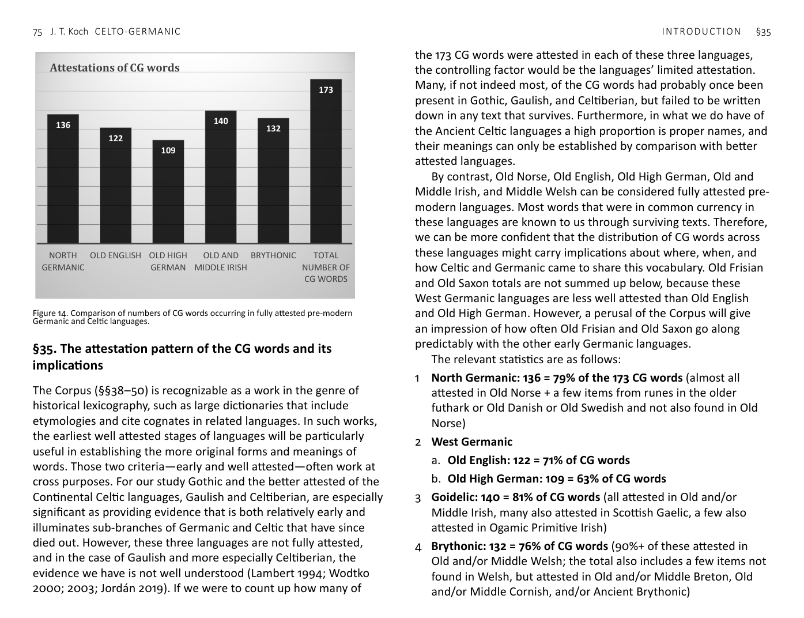

<!-- page: 75 -->

# §35. The attestation pattern of the CG words and its
implications
The Corpus (§§38–50) is recognizable as a work in the genre of
historical lexicography, such as large dictionaries that include
etymologies and cite cognates in related languages. In such works,
the earliest well attested stages of languages will be particularly
useful in establishing the more original forms and meanings of
words. Those two criteria—early and well attested—often work at
cross purposes. For our study Gothic and the better attested of the
Continental Celtic languages, Gaulish and Celtiberian, are especially
significant as providing evidence that is both relatively early and
illuminates sub-branches of Germanic and Celtic that have since
died out. However, these three languages are not fully attested,
and in the case of Gaulish and more especially Celtiberian, the
evidence we have is not well understood (Lambert 1994; Wodtko
2000; 2003; Jordán 2019). If we were to count up how many of
the 173 CG words were attested in each of these three languages,
the controlling factor would be the languages’ limited attestation.
Many, if not indeed most, of the CG words had probably once been
present in Gothic, Gaulish, and Celtiberian, but failed to be written
down in any text that survives. Furthermore, in what we do have of
the Ancient Celtic languages a high proportion is proper names, and
their meanings can only be established by comparison with better
attested languages.
By contrast, Old Norse, Old English, Old High German, Old and
Middle Irish, and Middle Welsh can be considered fully attested pre-
modern languages. Most words that were in common currency in
these languages are known to us through surviving texts. Therefore,
we can be more confident that the distribution of CG words across
these languages might carry implications about where, when, and
how Celtic and Germanic came to share this vocabulary. Old Frisian
and Old Saxon totals are not summed up below, because these
West Germanic languages are less well attested than Old English
and Old High German. However, a perusal of the Corpus will give
an impression of how often Old Frisian and Old Saxon go along
predictably with the other early Germanic languages.
The relevant statistics are as follows:
1 North Germanic: 136 = 79% of the 173 CG words (almost all
attested in Old Norse + a few items from runes in the older
futhark or Old Danish or Old Swedish and not also found in Old
Norse)
2 West Germanic
a. Old English: 122 = 71% of CG words
b. Old High German: 109 = 63% of CG words
3 Goidelic: 140 = 81% of CG words (all attested in Old and/or
Middle Irish, many also attested in Scottish Gaelic, a few also
attested in Ogamic Primitive Irish)
4 Brythonic: 132 = 76% of CG words (90%+ of these attested in
Old and/or Middle Welsh; the total also includes a few items not
found in Welsh, but attested in Old and/or Middle Breton, Old
and/or Middle Cornish, and/or Ancient Brythonic)

Figure 14. Comparison of numbers of CG words occurring in fully attested pre-modern
Germanic and Celtic languages.
136
122
109
140
132
173
NORTH
GERMANIC
OLD ENGLISH OLD HIGH
GERMAN
OLD AND
MIDDLE IRISH
BRYTHONIC
TOTAL
NUMBER OF
CG WORDS
Attestations of CG words
<!-- page: 76 -->
The figures above do not differ drastically between the well
attested medieval languages, and some of the disparities can be
explained as the expected effects of factors having nothing to do
with the question at hand. For example, Irish is the best and earliest
attested vernacular in post-Roman Western Europe. In this light, it is
somewhat remarkable that Brythonic total is as close to the Irish as
it is. The bulk of Middle Welsh literature, which is where most of the
Brythonic examples occur, is later, mostly later even than the Middle
Irish period, which is often conventionally assigned a transition
to Early Modern Irish of AD 1200 (cf. Russell 2006; Ó Baoill 2010).
Furthermore, much of the inherited vocabulary of Brythonic was
replaced by Latin during the Roman Period in Britain (AD 43–410).
The high percentages across the board indicate that the CG
element belongs to the core vocabularies of Germanic and Celtic,
consistent with an early period of contact, before these branches
had significantly diverged into the separating dialects that became
the attested languages. It is also noteworthy that the totals for
Old English and Old High German, languages situated entirely
on territories that had been Celtic speaking, do not show higher
percentages of CG words than Old Norse, the territory of which
was completely disjoint from what had been Celtic. In fact, the Old
English and Old High German totals are lower. All and all, it is worth
remembering that the highest total on the Celtic side is Goidelic and
the highest in Germanic is Norse, languages that were not in contact
in historical times until the Viking period, and that Viking-period
loans are almost always easily recognized and have been excluded
from the Corpus.
In some instances there are obvious explanations for gaps in the
attestations and changes of meaning. For example, no Germanic
or Celtic language was fully attested in the pre-Christian period.
Therefore, in the category of ‘Beliefs and the supernatural’ (§46),
many words have probably been lost from attested languages due
to Christianization, while others survive only in secondary meanings
devoid of their earlier religious significance. Thus, the primary
epithet of the divine patriarch, ALL-FATHER/GREAT-FATHER *Olo-
patēr, survives only in the mythological literature of Old Norse and
Old and Middle Irish. The CGBS word HAMMER OF THE THUNDER
GOD *meldh- survives in Germanic only as Old Norse Mjǫllnir
(Thor’s hammer) and in Celtic as Welsh mellt, an everyday word for
‘lightning’. Welsh taran and Scottish Gaelic torrunn mean simply
‘thunder’. It is ancient inscriptions that inform us that Meldios and
Taranus, the cognate of Thor (Old Norse Þórr), had been Celtic gods.
