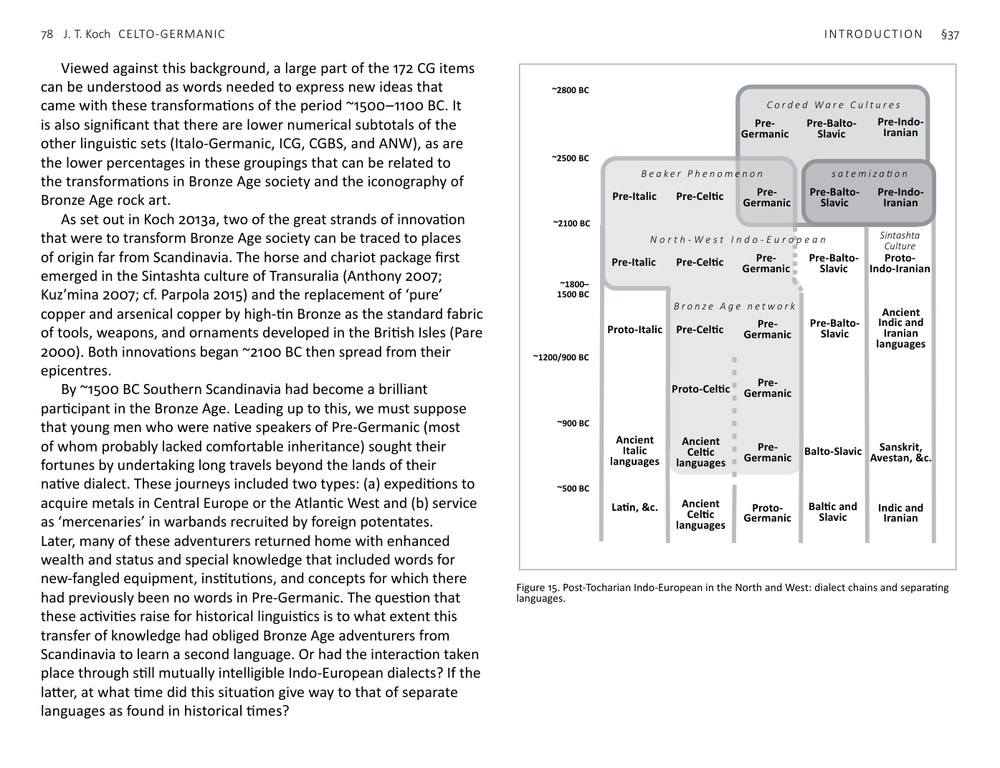
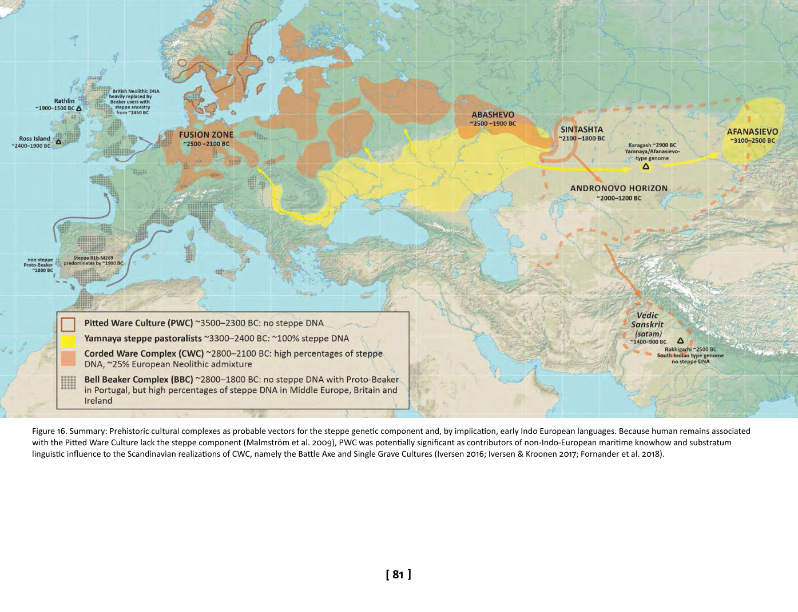

<!-- page: 77 -->

# §37. Conclusions
In recent synthetic overviews (e.g. Kristiansen 2018), a social
watershed is recognized affecting parts of Europe in the Middle
Bronze Age. The widespread appearance of the flange-hilted sword
~1500 BC is seen as signalling the emergence of the professional
warrior (cf. Vandkilde 2014). This iconic weapon—in archaeological
assemblages as well as rock art images—is central to the warrior’s
panoply, which also included shields formed in concentric circles
(§2), heavy lances, helmets and armour, the two-horse war chariot
with spoked wheels, and items related to personal beauty, such as
brooches, mirrors, combs, razors, and tweezers.[^77] In Ireland, heavily
fortified hillforts also attest intensified militarization from this time
(O’Brien 2016; O’Brien & O’Driscoll 2017). The long-distance mobility
of the warrior was essential to economy of the Middle and Late
Bronze Age. Warbands provided security for the reliable exchange of
exotic raw materials at the apex of the international value system:
copper, tin, amber, and gold.[^78]
The broader society around the institution of the warrior was also
transformed. Intensified and highly organized agro-pastoral activity
was required to create surpluses to relieve twenty or so young men
from seasonal food-production to form a crew/warband on a year-
long expedition (Ling et al. 2018). All of this required socio-economic
specialization within ranked societies sufficiently large and complex
for the central organization and direction of the necessary workforce
and resources. As observed by Kristiansen (2018, 41), many of these
patterns, as first observable in the Middle Bronze Age, continued in
Europe through the Iron Age, Classical Antiquity, and Middle Ages
into the early modern period:
In all this—trade alternating with raids and sometimes leading to large-
scale migrations—Bronze Age warfare looks more like Celtic and Viking
warfare and migration. It implies that, by the Bronze Age, European
political economies had reached a level of organization that changed
little until historical times…
77 Celestino 2001; Harrison 2004; Mederos 2008; 2012; Díaz-Guardamino 2010;
Brandherm 2013a; 2013b.
78 Ling & Koch 2018; cf. Standish 2012; Standish et al. 2015; Vandkilde 2016.
<!-- page: 78 -->
Viewed against this background, a large part of the 172 CG items
can be understood as words needed to express new ideas that
came with these transformations of the period ~1500–1100 BC. It
is also significant that there are lower numerical subtotals of the
other linguistic sets (Italo-Germanic, ICG, CGBS, and ANW), as are
the lower percentages in these groupings that can be related to
the transformations in Bronze Age society and the iconography of
Bronze Age rock art.
As set out in Koch 2013a, two of the great strands of innovation
that were to transform Bronze Age society can be traced to places
of origin far from Scandinavia. The horse and chariot package first
emerged in the Sintashta culture of Transuralia (Anthony 2007;
Kuz’mina 2007; cf. Parpola 2015) and the replacement of ‘pure’
copper and arsenical copper by high-tin Bronze as the standard fabric
of tools, weapons, and ornaments developed in the British Isles (Pare
2000). Both innovations began ~2100 BC then spread from their
epicentres.
By ~1500 BC Southern Scandinavia had become a brilliant
participant in the Bronze Age. Leading up to this, we must suppose
that young men who were native speakers of Pre-Germanic (most
of whom probably lacked comfortable inheritance) sought their
fortunes by undertaking long travels beyond the lands of their
native dialect. These journeys included two types: (a) expeditions to
acquire metals in Central Europe or the Atlantic West and (b) service
as ‘mercenaries’ in warbands recruited by foreign potentates.
Later, many of these adventurers returned home with enhanced
wealth and status and special knowledge that included words for
new-fangled equipment, institutions, and concepts for which there
had previously been no words in Pre-Germanic. The question that
these activities raise for historical linguistics is to what extent this
transfer of knowledge had obliged Bronze Age adventurers from
Scandinavia to learn a second language. Or had the interaction taken
place through still mutually intelligible Indo-European dialects? If the
latter, at what time did this situation give way to that of separate
languages as found in historical times?
~2800 BC
~2500 BC
~2100 BC
~1800–
1500 BC
~1200/900 BC
~900 BC
~500 BC
Pre-
Germanic
Pre-Balto-
Slavic
Pre-Indo-
Iranian
Pre-Italic
Pre-Celtic
Pre-
Germanic
Pre-Balto-
Slavic
Pre-Indo-
Iranian
Pre-Italic
Pre-Celtic
Pre-
Germanic
Pre-Balto-
Slavic
Proto-
Indo-Iranian
Proto-Italic
Pre-Celtic
Pre-
Germanic
Pre-Balto-
Slavic
Ancient
Indic and
Iranian
languages
Proto-Celtic
Ancient
Italic
languages
Ancient
Celtic
languages
Pre-
Germanic
Balto-Slavic
Sanskrit,
Avestan, &c.
Latin, &c.
Ancient
Celtic
languages
Proto-
Germanic
Baltic and
Slavic
Indic and
Iranian
Pre-
Germanic
C o r d e d W a r e C u l t u r e s
B e a k e r P h e n o m e n o n
Sintashta
Culture
N o r t h - W e s t I n d o - E u r o p e a n
B r o n z e A g e n e t w o r k
s a t e m i z a ti o n

Figure 15. Post-Tocharian Indo-European in the North and West: dialect chains and separating
languages.
<!-- page: 79 -->
The CG Corpus contains relatively few clear-cut loanwords. It may
therefore be unnecessary to suppose that speakers of Pre-Germanic
had to learn Pre-/Proto-Celtic as a foreign language during most
of the Bronze Age. If there had been low mutual intelligibility and
speakers of one of these branches therefore had to learn a second
language, we would expect more words showing Celtic innovations
in Germanic or vice versa. Most of the evidence can be better
explained with the following account, in which mutual intelligibility
between early Indo-European dialects was prolonged through close
contact within the Bronze Age system.
~3100 BC the migration of people of Yamnaya culture and steppe
genetic type to found the Afanasievo culture broke up the dialect
continuum of Post-Anatolian Indo-European between a Post-
Tocharian continuum in Europe and Pre-Tocharian in the Siberian
Altai and Minusinsk Basin.[^79]
From ~2800 BC gene flow from Yamnaya at the founding of CWC
in Northern Europe points to mass migration of Post-Tocharian
Indo-European speakers. This created the setting for a dialect
chain ancestral to Germanic, Balto-Slavic, and Indo-Iranian.
From ~2500 BC the entry of Beaker people with steppe ancestry
into CWC Central Europe caused the dialect ancestral to
Germanic to come closely into contact with the dialect(s)
ancestral to Italic and Celtic. Contact between Pre-Germanic and
the dialects ancestral to Balto-Slavic and Indo-Iranian diminished.
~2100 BC the formation of the Sintashta culture east of the
southern Ural Mountains, is identified (following Anthony 2007)
with the separation of Proto-Indo-Iranian. After this its contact
with the languages of Europe fell off precipitously. Because all
the subsets of words studied here (CG, ICG, CGBS, and ANW) lack
Indo-Iranian cognates by definition, it is inferred that these sets
post-date this development (§23).
79 §9; Mallory & Mair 2000; Anthony 2007, 311; Allentoft et al. 2015; Narasimhan
et al. 2018. Chang et al. 2015 show this split ~3200/3100 BC.
After ~1800–1500 BC the proposed time frame for the separation
of Pre-Celtic from Proto-Italic (§21) predates the formation of
most of the words comprising the 173-word CG subset. These
words lack Italic cognates by definition, indicating that contact of
Proto-Italic with Pre-Celtic and Pre-Germanic had fallen off.[^80]
The split of Proto-Italo-Celtic into Pre-Italic and Pre-Celtic is
provisionally identified with the breakup of the Beaker culture
into diverse post-Beaker Early Bronze Age cultures ~2000/1800
BC. The latter date of the above range (~1500 BC) allows
time for the separate Pre-Celtic to develop new vocabulary,
absent from Italic, during a period of rising social complexity
and technological advance. On the social side, the rise of the
professional warrior and warrior ideal are notable (Vandkilde
2014; Kristiansen 2018). Especially important technological
advances spreading widely and catalysing social change at this
time are what I have called the ‘three strands’ of the Bronze Age:
standardized high-tin bronze, the horse and chariot package, and
advanced seafaring (Koch 2013a).
Linguistic palaeontology (§5) can be seen as consistent with
this baseline for the CG set. Of the 173 words, 90 (52%) have
meanings relatable to Bronze Age life, of which 74 (43% of the
CG total) can be related to the iconography of Bronze Age rock
art and stelae. The percentages for these meaning fields are
significantly lower in the ICG, CGBS, and ANW sets (§32).
~1800–1200/900 BC Pre-Celtic and Pre-Germanic remained in
close contact, due at least in part to the long-distance trade
of metals to Scandinavia. As a result, they maintained a high
degree of mutual intelligibility. New words shared between these
languages at this period are not detectable as loanwords. The
smaller number that do show Celtic innovations probably post-
date the transition from Pre-Celtic to Proto-Celtic ~1200 BC. For
example, the CG group name giving Proto-Germanic *Burgunþaz
and Proto-Celtic *Brigantes was *Bhr̥ghn̥tes, which then
80 Chang et al. 2015 show the split of Italic and Celtic ~1800 BC.
<!-- page: 80 -->
independently underwent the Germanic and Celtic treatments
of Proto-Indo-European syllabic *r̥ and *n̥. It would be unlikely
for the name to have its attested Germanic form if it had been
borrowed from Celtic after ~1200 BC and probably impossible
after ~900 BC.
~1200–900 BC a context suitable for a unified, and possibly
expansive, Proto-Celtic continued west of the Rhine. Important
cultural zones within this region included the Atlantic Bronze
Age, embracing Ireland, Britain, North-west France, and the
Western Iberian Peninsula (Harrison 2004; Milcent 2012), and
the Western Urnfield area (Rhine, Switzerland, Eastern France).
These two regions interacted closely towards the beginning of
the Late Bronze Age ~1300/1200 BC (Gerloff 2010; Brandherm
2013a).
By ~900 BC the Proto-Celtic sound changes were complete. The
minority of CG words detectable as Celtic loanwords in Germanic
reflect these developments. Mutual intelligibility was declining.
For example, Proto-Germanic *rīkija ‘KINGDOM’ < Proto-Celtic
*rīgyā < Pre-Celtic *rēgyā shows Celtic *ī < *ē, implying that
the loan probably post-dates ~1200 BC. On the other hand, as
it reflects Grimm 2, *rīkija < *rīgyā precedes the formation of
Proto-Germanic and possibly predates ~500 BC. As an example,
with different characteristics, Proto-Germanic *ambahtaz
‘PERSON ACTING ON BEHALF OF A SUPERIOR’ < Proto-Celtic
*ambaχtos < notional Pre-Celtic *m̥ bhaktos shows Celtic *am <
*m̥ . This word lacks any consonants to reveal whether it entered
Germanic before or after Grimm 1 and/or Grimm 2: Proto-Indo-
European *bh and the cluster *kt had the same outcomes in
Celtic and Germanic (Ringe 2017, 328). On the other hand, the
fact that *ambahtaz is found in all the early Germanic languages,
including Gothic, suggests that it was borrowed before Germanic
expanded geographically and began to diverge into the attested
dialects.
The split of Proto-Celtic into Hispano-Celtic versus Goidelic/
Gallo-Brythonic is identified with the departure of the Iberian
Peninsula from the Atlantic Bronze Age at the beginning of the
Phoenician-influenced Iberian Iron Age ~900 BC (Koch 2016; cf.
Burgess & O’Connor 2008).
~500 BC is the consensus date of the Grimm 1 sound change. Most
of the words in the Corpus predate this change. The effects
of Grimm 1 were drastic enough to create a major obstacle to
mutual intelligibility between Celtic and Germanic. The date of
this change coincides with the end of the Nordic Bronze–Iron
Transition. The end of the prolonged mutual intelligibility of
Celtic and Germanic was possibly a socio-linguistic result of the
collapse of the long-distance bronze exchange system that had
connected the two speech communities. In sum then, most of
the CG words in the Corpus entered Germanic before ~500 BC,
and it is not certain whether many, or even any, of them are later.
<!-- page: 81 -->

Figure 16. Summary: Prehistoric cultural complexes as probable vectors for the steppe genetic component and, by implication, early Indo European languages. Because human remains associated
with the Pitted Ware Culture lack the steppe component (Malmström et al. 2009), PWC was potentially significant as contributors of non-Indo-European maritime knowhow and substratum
linguistic influence to the Scandinavian realizations of CWC, namely the Battle Axe and Single Grave Cultures (Iversen 2016; Iversen & Kroonen 2017; Fornander et al. 2018).
