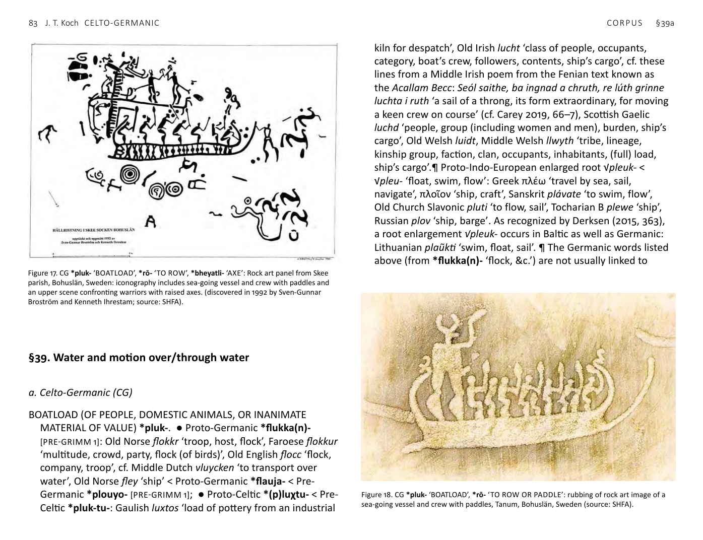
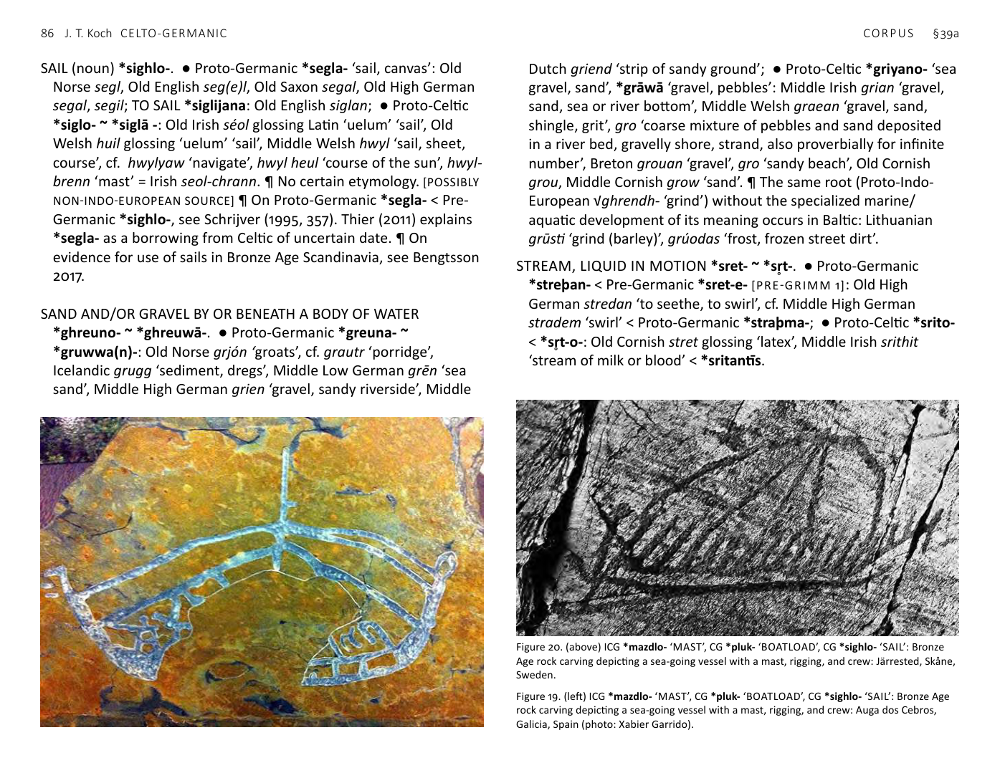
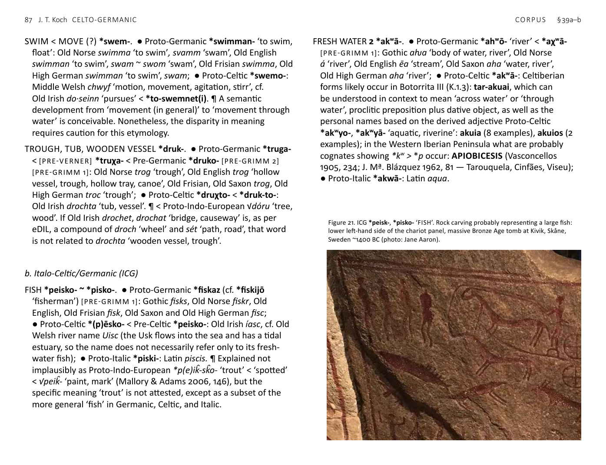

<!-- page: 83 -->

# §39. Water and motion over/through water
a. Celto-Germanic (CG)
BOATLOAD (OF PEOPLE, DOMESTIC ANIMALS, OR INANIMATE
MATERIAL OF VALUE) *pluk-. ● Proto-Germanic *flukka(n)-
[PRE-GRIMM 1]: Old Norse flokkr ‘troop, host, flock’, Faroese flokkur
‘multitude, crowd, party, flock (of birds)’, Old English flocc ‘flock,
company, troop’, cf. Middle Dutch vluycken ‘to transport over
water’, Old Norse fley ‘ship’ < Proto-Germanic *flauja- < Pre-
Germanic *plouyo- [PRE-GRIMM 1]; ● Proto-Celtic *(p)luχtu- < Pre-
Celtic *pluk-tu-: Gaulish luxtos ‘load of pottery from an industrial
kiln for despatch’, Old Irish lucht ‘class of people, occupants,
category, boat’s crew, followers, contents, ship’s cargo’, cf. these
lines from a Middle Irish poem from the Fenian text known as
the Acallam Becc: Seól saithe, ba ingnad a chruth, re lúth grinne
luchta i ruth ‘a sail of a throng, its form extraordinary, for moving
a keen crew on course’ (cf. Carey 2019, 66–7), Scottish Gaelic
luchd ‘people, group (including women and men), burden, ship’s
cargo’, Old Welsh luidt, Middle Welsh llwyth ‘tribe, lineage,
kinship group, faction, clan, occupants, inhabitants, (full) load,
ship’s cargo’.¶ Proto-Indo-European enlarged root √pleuk- <
√pleu- ‘float, swim, flow’: Greek πλέω ‘travel by sea, sail,
navigate’, πλοῖον ‘ship, craft’, Sanskrit plávate ‘to swim, flow’,
Old Church Slavonic pluti ‘to flow, sail’, Tocharian B plewe ‘ship’,
Russian plov ‘ship, barge’. As recognized by Derksen (2015, 363),
a root enlargement √pleuk- occurs in Baltic as well as Germanic:
Lithuanian plaũkti ‘swim, float, sail’. ¶ The Germanic words listed
above (from *flukka(n)- ‘flock, &c.’) are not usually linked to

Figure 18. CG *pluk- ‘BOATLOAD’, *rō- ‘TO ROW OR PADDLE’: rubbing of rock art image of a
sea-going vessel and crew with paddles, Tanum, Bohuslän, Sweden (source: SHFA).

Figure 17. CG *pluk- ‘BOATLOAD’, *rō- ‘TO ROW’, *bheyatli- ‘AXE’: Rock art panel from Skee
parish, Bohuslän, Sweden: iconography includes sea-going vessel and crew with paddles and
an upper scene confronting warriors with raised axes. (discovered in 1992 by Sven-Gunnar
Broström and Kenneth Ihrestam; source: SHFA).
<!-- page: 84 -->
the Celtic ones or given a shared derivation, but have suitable
forms and meanings. The most striking feature, especially in the
Celtic, is that what appears to be a single word (Old Irish lucht
= Welsh llwyth) has two very different and—at first glance—
unconnected meanings in both Goidelic and Brythonic: namely,
a definable group of people, on the one hand, or a full load or
cargo of something not human, on the other. Taking these back
to Proto-Celtic *(p)luχtu- from an enlarged root √pleuk- ‘float,
swim, sail’, alongside ‘boat’s crew’ amongst the attested Early
Irish meanings, provides a semantic key. The forms and distinctive
range of definitions imply the original core sense ‘boatful’. The
doughnut-shaped semantic range makes sense if it is supposed
that the words originally formed in a society in which many
people were involved in movement of themselves, their livestock,
and inanimate valuables in boats and that the speakers of Celtic
and Germanic subsequently became more settled and land
based, but the social significance of whatever and whomever
used to be commonly loaded onto a boat continued. As Kroonen
sets out correctly, the Germanic *fleugan- ‘to fly’ can be traced
back to *pléuk-e- ‘swim, float’. But it does not necessarily follow
that ‘flock of birds’ was the original primary meaning of Proto-
Germanic *flukka(n)-. ¶ From the point of view of meaning, it
is tempting to connect these words also with the widespread
Proto-Germanic word of uncertain etymology, *fulka ‘troop,
tribe’: Old Norse folk ‘people, army, detachment’, Old English folc,
Old Frisian, Old Saxon, Old High German folk. Did *fulk(k)- arise
from *flukk- by metathesis? According to OED (s.n. ‘folk’) Old
Lithuanian pulkas ‘exercitus, army’, Old Church Slavonic plŭkŭ
‘division of an army’ may be early (i.e. pre-Grimm 1) borrowings
from [Pre-]Germanic. Alternatively, it is possible that *pluk-,
*pulk- ‘BOATLOAD’ emerged as a CGBS word before the NW
branches wεre fully separate. Note that the *u in Proto-Germanic
*flukka(n)- is not from Pre-Germanic *l̥ > *ul but part of the root
√plew-.
DEEP *dheubhnó- ~ *dhubhnó- ~ *dhubhni-. See below §50.a.
DROPLET, DRIP *dhrub- ~ *dhrūb-. ● Proto-Germanic *drup(p)an-
[PRE-GRIMM 2 ?]: Old Norse dropi ‘drop’, drjúpa ‘to drip, to trickle’,
Old English dropa ‘drop’, dréopan ‘to drop’, droppettan ‘to drip,
to distil’, Old Frisian driāpa ‘to drip, to trickle’, Old Saxon dropo
‘drop’, driopan ‘to drip, to trickel’, Old High German tropfo ‘drop’,
triofan ‘to drip, to trickle’, tropfezzen ‘to drip, to distil’; ● Proto-
Celtic *drūxtu- < Pre-Celtic *drup-tu- < *dhrub-tu-: Old Irish
drúcht ‘dew, drop, moisture’, Scottish Gaelic drùchd ‘dew, drizzle,
tear, sweat’.
GREAT WATERWAY, RHINE *reinos. ● Proto-Germanic *Rīnaz
‘Rhine’: Old English Rīn, Middle High German Rīn; ● Proto-Celtic
*rēnos < Pre-Celtic *reino-: Gaulish Rēnos ‘Rhine’, Middle Irish
rían ‘sea, ocean, course, route, path’, genitive réin glossing ‘maris’.
¶ The CG forms derive from a *-no- suffix added to Proto-Indo-
European √H₃reyH- ‘flow’: cf. Sanskrit rī̒yate, riṇā̒ti ‘flows’, Old
Church Slavonic rinǫti sę ‘flows’, Old English rīð ‘stream’, Latin
rīvus ‘river’. These cognates imply that the original sense of CG
*reinos probably had to do with navigable rivers. Therefore, it
is reasonable to conclude that the word changed meaning, as
reflected in Irish, when the language crossed the sea to the British
Isles. The finding that the aDNA of Beaker-associated individuals
from the Netherlands was virtually indistinguishable from that of
British Beaker people is suggestive in this connection (cf. Olalde et
al. 2018). ¶ Latin Rhēnus, Greek ‘Ρῆνος ‘Rhine’ are borrowed from
Celtic.
<!-- page: 85 -->
FRESH WATER 1 *lindom ~ *lindu- ~ *lindhom ~ *lindhu-.
● Germanic: Old Norse lind ‘spring, fountain’, Old Frisian lind
‘pool’, Middle High German lünde ‘wave’; ● Proto-Celtic *lindom
‘drinkable water’, Gaulish linda ‘drinks’ plural noun (Banassac),
Ancient Brythonic place-name Lindon ‘lake, pool’ > ‘Lincoln’, Old
Irish lind ‘liquid’, Scottish Gaelic linne ‘pool, pond, lake, gulf’, leann
‘ale, liquor, pool’, Old Welsh linnouein glossing ‘in lacis lacunisque’
‘in lakes and pools’, Old Cornish pisc-lin glossing ‘uiuarium’ ‘fish
pond’, Middle Welsh llyn ‘lake, drink’. ¶ The Germanic forms may
be post-Grimm 1 borrowings from Celtic (Falileyev et al. 2010, 22),
but a preform *lindhom ~ *lindhu- would not require borrowing.
¶ Modern Welsh llyn tends to be treated as masculine in North
Wales and feminine in the South, reflecting an original neuter.
HARBOUR, SHELTER FOR VESSELS *kapono-. ● Proto-Germanic
*habanō- ‘harbour, shelter for boats’ < [PRE-VERNER] *χaφánā-
< Pre-Germanic *kapóno- [PRE-GRIMM 1]: Old Norse hǫfn, Old
English hæfen, Old High German havan; ● Proto-Celtic *kawno- <
*ka(p)ono-: Middle Irish cúan ‘haven, harbour, port, bay, gulf’.
LOAD, CARRY A LOAD *kleut- (< *kleu(H₂)-t- < *kleH₂u-) ~ *klat- (<
*klH₂-t-). ● Proto-Germanic *hlaþan- ~ *hlōþ- < *χlāþ- ‘to burden,
load down’ [PRE-GRIMM 1]: Gothic (af)hlaþan ‘overload’, Old
Norse hlaða ‘to pile up, build, load’, Old English hladan ‘to heap,
pile up, build, load’, hlōd, hlōdon ‘loaded’ (cf. Old English hlæd
‘burden’), Old Frisian hleda, hlada, Old Saxon hladan ‘load’, Old
High German hladan ‘load’, luod, luodun ‘loaded’; ● Proto-Celtic
*klout-: Middle Welsh clut ‘carriage, the action of carrying, load,
burden, heap, pack, bundle, baggage’, cf. Old Breton clut moruion
glossing ‘formicinus’ ‘ant hill’, Old Welsh, clutgued glossing ‘strues’
‘heap, construction’, and the corresponding verb clutam glossing
‘struo’ ‘I put together, build, heap up’. ¶ As Kroonen explains,
the Balto-Slavic forms including Lithuanian klo̒ti ‘cover’ and Old
Church Slavonic klasti ‘to put’ point to derivation from NW √kleH₂-
‘spread out flat’ (rather than Proto-Indo-European √k̂ley- ‘lean’).
√kleH₂- acquired -t in Pre-Germanic to become *klāt- > *hlōþ-.
Derksen (2015, s.n. kliūti) sees a probable link between Lithuanian
klo̒ti and kliūti ‘brush against, be caught in, obstruct’ < *kleuH₂-
< Proto-Indo-European √kleH₂u- ‘close’ with metathesis of the
laryngeal and *u. This same development, with a suffixed *-t- as
in Germanic, will account for Proto-Celtic *klout- < *kleuH₂-t-.
It is in the specific meaning ‘load’ that these related roots show
shared development in Germanic and Celtic, a natural semantic
innovation between early Indo-European-speaking groups in a
regular trading relationship, exchanging sizable quantities of heavy
raw materials.
ROW (verb) (?) *rō-. ● Proto-Germanic *rōan- (< *rā-): Old Norse
róa ‘to row’, Old English rōwan ‘to go by water, sail, swim’, Old
Frisian rōiskip ‘rowing boat’, Middle High German rüejen ‘to
row’; ● Proto-Celtic *rāyeti ‘rows’ < Pre-Celtic *rō-yo-: Old
Irish ráïd ‘rows, sails, voyages’, also the common compound
verb Middle Irish imm·rá ‘travels by boat, navigates’, cf. Proto-
Celtic *rāmyom ~ *rāmā ‘oar, paddle’: Old Irish rámae, Scottish
Gaelic ràmh ‘oar’, Middle Welsh rau, raw ‘spade, shovel’ < *‘oar,
paddle’, Middle Breton reuff ‘oar, shovel’; the vowels of Modern
Breton rañv ‘spade’ and French rame ‘oar’ can be explained as
continuing Gaulish *rāmā ‘oar’. ¶ Lexicographers often fail to
differentiate between the meanings ‘rowing’ versus ‘paddling’ and
the nouns ‘oar’ versus ‘paddle’, though as a matter of water-craft
technology and social organization of boats’ crews the difference
is significant (cf. Clausen 1993; Crumlin-Pedersen et al. 2003; Ling
2012; Austvoll 2018; Prescott et al. 2018). On images of vessels
propelled by oars or paddles in Bronze Age Scandinavia, see Kaul
1998; 2003; Bengtsson 2017. ¶ There is clearly a root common to
Post-Tocharian Indo-European here: Lithuanian ìrklas, Latvian ir͂kls,
Sanskrit arítra- < Proto-Indo-European *H₁erH₁tlom ‘oar, paddle’,
cf. Greek ἐρετμóν ‘oar’. What is uniquely Celto-Germanic is for
√H₁erH₁- ‘row’ as the base of a well attested primary verb, CG *rō-.
<!-- page: 86 -->
SAIL (noun) *sighlo-. ● Proto-Germanic *segla- ‘sail, canvas’: Old
Norse segl, Old English seg(e)l, Old Saxon segal, Old High German
segal, segil; TO SAIL *siglijana: Old English siglan; ● Proto-Celtic
*siglo- ~ *siglā -: Old Irish séol glossing Latin ‘uelum’ ‘sail’, Old
Welsh huil glossing ‘uelum’ ‘sail’, Middle Welsh hwyl ‘sail, sheet,
course’, cf. hwylyaw ‘navigate’, hwyl heul ‘course of the sun’, hwyl-
brenn ‘mast’ = Irish seol-chrann. ¶ No certain etymology. [POSSIBLY
NON-INDO-EUROPEAN SOURCE] ¶ On Proto-Germanic *segla- < Pre-
Germanic *sighlo-, see Schrijver (1995, 357). Thier (2011) explains
*segla- as a borrowing from Celtic of uncertain date. ¶ On
evidence for use of sails in Bronze Age Scandinavia, see Bengtsson
2017.
SAND AND/OR GRAVEL BY OR BENEATH A BODY OF WATER
*ghreuno- ~ *ghreuwā-. ● Proto-Germanic *greuna- ~
*gruwwa(n)-: Old Norse grjón ‘groats’, cf. grautr ‘porridge’,
Icelandic grugg ‘sediment, dregs’, Middle Low German grēn ‘sea
sand’, Middle High German grien ‘gravel, sandy riverside’, Middle
Dutch griend ‘strip of sandy ground’; ● Proto-Celtic *griyano- ‘sea
gravel, sand’, *grāwā ‘gravel, pebbles’: Middle Irish grian ‘gravel,
sand, sea or river bottom’, Middle Welsh graean ‘gravel, sand,
shingle, grit’, gro ‘coarse mixture of pebbles and sand deposited
in a river bed, gravelly shore, strand, also proverbially for infinite
number’, Breton grouan ‘gravel’, gro ‘sandy beach’, Old Cornish
grou, Middle Cornish grow ‘sand’. ¶ The same root (Proto-Indo-
European √ghrendh- ‘grind’) without the specialized marine/
aquatic development of its meaning occurs in Baltic: Lithuanian
grūsti ‘grind (barley)’, grúodas ‘frost, frozen street dirt’.
STREAM, LIQUID IN MOTION *sret- ~ *sr̥t-. ● Proto-Germanic
*streþan- < Pre-Germanic *sret-e- [PRE-GRIMM 1]: Old High
German stredan ‘to seethe, to swirl’, cf. Middle High German
stradem ‘swirl’ < Proto-Germanic *straþma-; ● Proto-Celtic *srito-
< *sr̥t-o-: Old Cornish stret glossing ‘latex’, Middle Irish srithit
‘stream of milk or blood’ < *sritantīs.

Figure 20. (above) ICG *mazdlo- ‘MAST’, CG *pluk- ‘BOATLOAD’, CG *sighlo- ‘SAIL’: Bronze
Age rock carving depicting a sea-going vessel with a mast, rigging, and crew: Järrested, Skåne,
Sweden.

Figure 19. (left) ICG *mazdlo- ‘MAST’, CG *pluk- ‘BOATLOAD’, CG *sighlo- ‘SAIL’: Bronze Age
rock carving depicting a sea-going vessel with a mast, rigging, and crew: Auga dos Cebros,
Galicia, Spain (photo: Xabier Garrido).
<!-- page: 87 -->
SWIM < MOVE (?) *swem-. ● Proto-Germanic *swimman- ‘to swim,
float’: Old Norse swimma ‘to swim’, svamm ‘swam’, Old English
swimman ‘to swim’, swam ~ swom ‘swam’, Old Frisian swimma, Old
High German swimman ‘to swim’, swam; ● Proto-Celtic *swemo-:
Middle Welsh chwyf ‘motion, movement, agitation, stirr’, cf.
Old Irish do·seinn ‘pursues’ < *to-swemnet(i). ¶ A semantic
development from ‘movement (in general)’ to ‘movement through
water’ is conceivable. Nonetheless, the disparity in meaning
requires caution for this etymology.
TROUGH, TUB, WOODEN VESSEL *druk-. ● Proto-Germanic *truga-
< [PRE-VERNER] *truχa- < Pre-Germanic *druko- [PRE-GRIMM 2]
[PRE-GRIMM 1]: Old Norse trog ‘trough’, Old English trog ‘hollow
vessel, trough, hollow tray, canoe’, Old Frisian, Old Saxon trog, Old
High German troc ‘trough’; ● Proto-Celtic *druχto- < *druk-to-:
Old Irish drochta ‘tub, vessel’. ¶ < Proto-Indo-European √dóru ‘tree,
wood’. If Old Irish drochet, drochat ‘bridge, causeway’ is, as per
eDIL, a compound of droch ‘wheel’ and sét ‘path, road’, that word
is not related to drochta ‘wooden vessel, trough’.
b. Italo-Celtic/Germanic (ICG)
FISH *peisko- ~ *pisko-. ● Proto-Germanic *fiskaz (cf. *fiskijō
‘fisherman’) [PRE-GRIMM 1]: Gothic fisks, Old Norse fiskr, Old
English, Old Frisian fisk, Old Saxon and Old High German fisc;
● Proto-Celtic *(p)ēsko- < Pre-Celtic *peisko-: Old Irish íasc, cf. Old
Welsh river name Uisc (the Usk flows into the sea and has a tidal
estuary, so the name does not necessarily refer only to its fresh-
water fish); ● Proto-Italic *piski-: Latin piscis. ¶ Explained not
implausibly as Proto-Indo-European *p(e)ik̂-sk̂o- ‘trout’ < ‘spotted’
< √peik̂- ‘paint, mark’ (Mallory & Adams 2006, 146), but the
specific meaning ‘trout’ is not attested, except as a subset of the
more general ‘fish’ in Germanic, Celtic, and Italic.
FRESH WATER 2 *akʷā-. ● Proto-Germanic *ahʷō- ‘river’ < *aχʷā-
[PRE-GRIMM 1]: Gothic aƕa ‘body of water, river’, Old Norse
á ‘river’, Old English ēa ‘stream’, Old Saxon aha ‘water, river’,
Old High German aha ‘river’; ● Proto-Celtic *akʷā-: Celtiberian
forms likely occur in Botorrita III (K.1.3): tar-akuai, which can
be understood in context to mean ‘across water’ or ‘through
water’, proclitic preposition plus dative object, as well as the
personal names based on the derived adjective Proto-Celtic
*akʷyo-, *akʷyā- ‘aquatic, riverine’: akuia (8 examples), akuios (2
examples); in the Western Iberian Peninsula what are probably
cognates showing *kʷ > *p occur: APIOBICESIS (Vasconcellos
1905, 234; J. Mª. Blázquez 1962, 81 — Tarouquela, Cinfães, Viseu);
● Proto-Italic *akwā-: Latin aqua.

Figure 21. ICG *peisk-, *pisko- ‘FISH’. Rock carving probably representing a large fish:
lower left-hand side of the chariot panel, massive Bronze Age tomb at Kivik, Skåne,
Sweden ~1400 BC (photo: Jane Aaron).
<!-- page: 88 -->
KNOT, KNOTWORK, DEVICE OF KNOTWORK TO CATCH FISH, NET
*nōd- ~ *nad-. ● Proto-Germanic *natja- ~ *nōtā- (< *nātā-) ‘net’
[PRE-GRIMM 2]: Gothic nati, Old Norse net, not, Old English nett
‘net, network, spider’s web’, Old Frisian net, Old Saxon netti, Old
High German nezzi; ● Proto-Celtic *nasko- < *nad-sko-: Old Irish
nassae ‘bound’ < *nHd-to/eH₂-, naiscid ‘binds, makes fast, makes
captive, exacts a pledge’, Middle Irish nasc ‘fastening, tie, ring’,
Scottish Gaelic nasg ‘tie-band, cow’s collar made of plaited birch
twigs’, Breton naska ‘to bind animals by their horns’ < *nHd-ske-;
● Proto-Italic *nasso- < *nad-to- ~ *nōdo- < *noHdo-: Latin nasa
‘fish trap made of wicker-work, snare, net’, Latin nōdus ‘knot, node,
knob’. ¶ Proto-Indo-European √neHd- ‘knot, bind’: Avestan naska-
‘bundle’. The attestations imply that the sense ‘knotwork device for
catching fish’ had been common to Italo-Celtic and Germanic, but
subsequently lost in Celtic.
MAST *mazd- ~ *mazdyo- ~ *mazdlos. ● Proto-Germanic *masta-
‘post, mast’ Pre-Germanic < *mazdo-: Old Norse mastr ‘mast’, Old
English mæst ‘mast’, Old High German mast ‘stick, pole, mast’;
● Proto-Celtic *mazdyo- ~ *mazdlo-: Middle Irish maide ‘post,
stick, beam, log; mizen mast, (figuratively) leader’. The Archaic
Welsh word meithlyon in Y Gododdin, occurring in the description
of an approaching seagoing vessel and overseas army, would make
good sense in context as ‘masts’ < *mazdlo-, which would regularly
have given singular *mathl (cf. Welsh nyth ‘nest’ < *nizdos) and
plural meithlyon, with the common Brythonic plural ending
-yones, an ending which regularly affected a to become Welsh ei
in the preceding syllable, as in Welsh mab ‘son’, meibion ‘sons’:
tra merin llestyr, tra merin llu, let lin lu, llu meithlyon ‘an overseas
vessel, a transmarine host, a host of mixed lineage, a great number
of masts...’ ● Proto-Italic *mazdlos > Latin mālus ‘pole, mast’.
¶ [POSSIBLY NON-INDO-EUROPEAN SOURCE] ¶ On evidence for use
of masts in Bronze Age Scandinavia, see Bengtsson 2017.
c. Celtic/Germanic/Balto-Slavic (CGBS)
BOATLOAD *pluk-, *pulk- (?), see §39.a. above.
WETLAND *pen- ~ *pn̥- ~ *ponyo- ● Proto-Germanic *fanja-
[PRE-GRIMM 1]: Gothic fani ‘mud’, Old Norse fen ‘quagmire, fen,
bog’, Old English fen(n) ‘low land covered wholly or partially
with shallow water, or subject to frequent inundations, a tract of
such land, a marsh’, Old Frisian fenne, fene, Old Saxon feni ‘fen’,
Old High German fenna, fenni ‘marsh’; ● Proto-Celtic *(p)eno-
~ *(p)anā̒- < *(p)n̥ā̒- ‘moor, swamp’: Gaulish anam glossing
‘paludem’ ‘marshy ground, swamp’, Middle Irish en, an ‘water’,
enach ‘moor, swamp, bog, fen’ < *(p)enākom. The ancient river
name Anas possibly belongs here. Now the Guadiana, it reaches
the Atlantic at the Isla Cristina salt marshes on what is now the
border of Portugal and Spain. ● Baltic: Old Prussian pannean
‘moor, muddy field, ditch’.
d. Italo-Celtic/Germanic/Balto-Slavic (ANW)
SEA, LAKE *mori-. ● Proto-Germanic *mari ‘lake, sea’ < Pre-
Germanic *mori-: Gothic mari-saiws ‘lake’, Old Norse marr, Old
English mere ‘sheet of standing water, lake, pond, pool, sea’,
Old Frisian mere ‘sea’, Old Saxon and Old High German meri
‘sea, lake’; ● Proto-Celtic *mori- ‘sea’: Hispano-Celtic personal
names MORINIS (Diego Santos 1986, no. 220 — Cacabelos,
León); MORILAE TOVTONI F. (HAE, 923; CIRPZ, 278; ERZamora,
42 — Villalcampo, Zamora), divine name MORICILO (AE 1977, 108
— Casas de Millán, Cáceres), RETVGENVS MORICIQVM (Prósper
2016, 171 — Toledo), possibly MVRE PECE PARAMECO CADABREI
(HEp, 1, 77; ERAsturias, 11 a — El Collado, Riosa, Asturias), South-
western inscription ( )omuŕikaa[ ]anbaatiia (J.16.2 ‘Fonte Santa
2’ — San Salvador, Ourique, Beja) < *u(p)o-morikā-, Gaulish more
glossing ‘mare’, morici glossing ‘marini’, personal names Moria,
genitive MORICONIS, Moricus, place-name Aremorica / Armorica,
<!-- page: 89 -->
group name Morini, divine name DEO APOLLIN[I] MORITASGO
and DEO MORITASGO (cf. Prósper 2002, 203), Gaulish / Ancient
Brythonic BRITANNICIANVS MORITEX ‘British seafarer’ (CIL XIII,
8164a — Köln), ‘Cimbric’ Morimarusa (see §7 above), Ancient
Brythonic personal names Mori-camulus (Verulamium), accusative
Mori-uassum (Bath), place-names Μορικαμβη ‘crooked sea’,
Moridunum ‘sea-fort’ (Modern Welsh Caerfyrddin, Anglicized
Carmarthen), Old Irish muir ‘sea’, Scottish Gaelic muir, Old Welsh
mor, ‘sea, ocean, the deep, also figuratively plenty, abundance,
copiousness’, also merin < *morīn- ‘sea, tidal estuary, firth’, Old
Breton mor ‘sea’, mor-gablou glossing ‘aestuaria’ (literally ‘sea-
forks’), Middle Cornish mor; ● Proto-Italic *mari- ‘sea, lake’:
Latin mare ‘sea, sea water’; ● Proto-Balto-Slavic *morjo-: Old
Lithuanian ma͂rios ‘lake, sea’, Old Church Slavonic morje ‘sea’.
¶ Ossetian mal ‘standing water’ is usually also assigned to this
root, in which case √mor-i- existed in Post-Tocharian Indo-
European, though the meaning ‘sea, lake’ evidently developed
only in NW.
