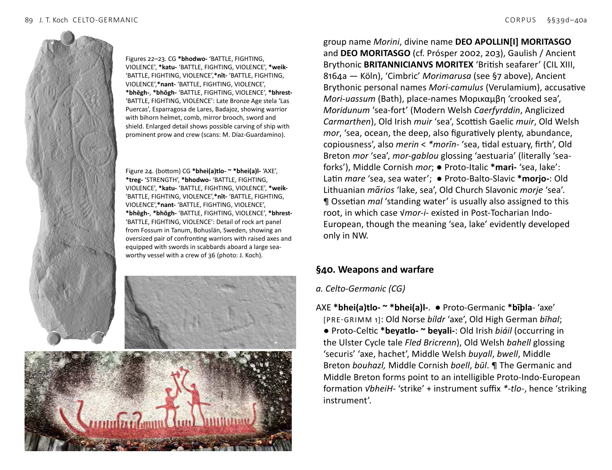
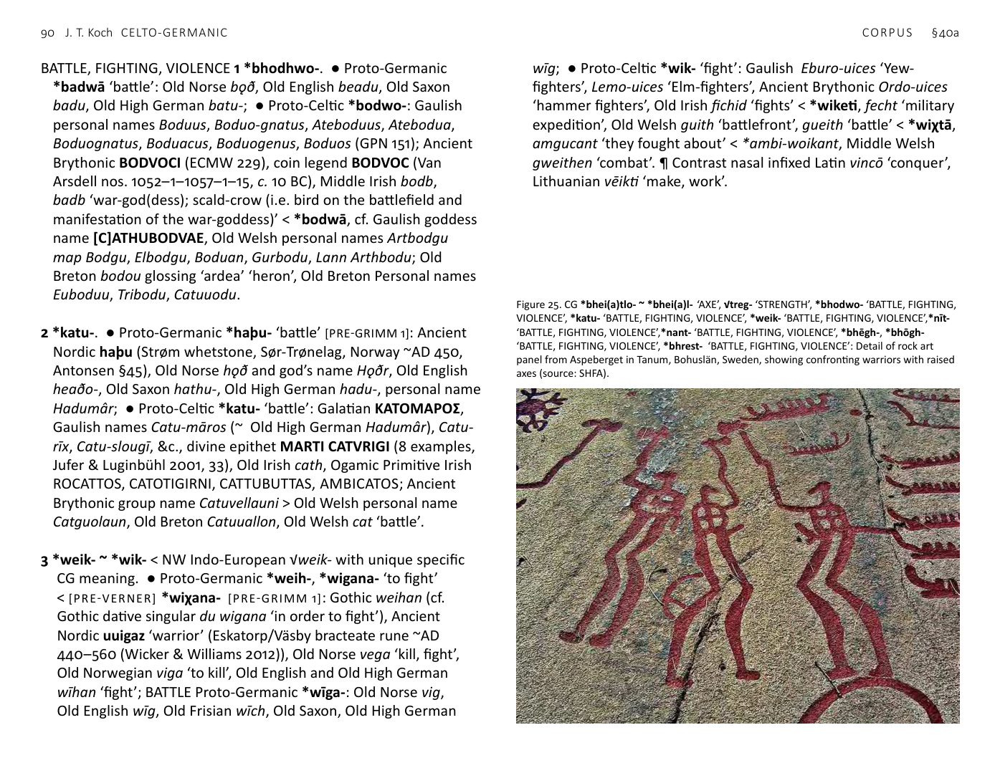
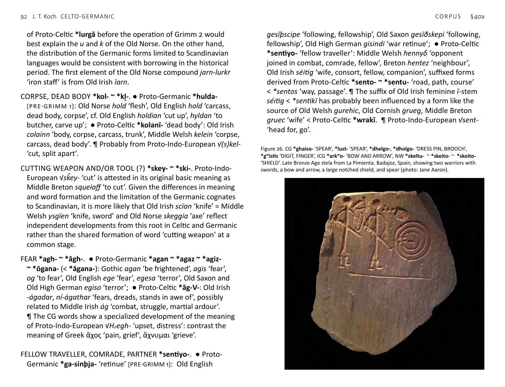
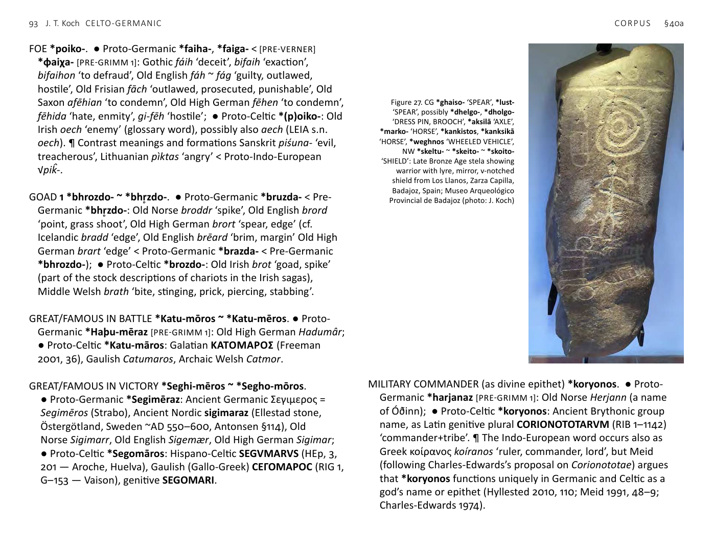
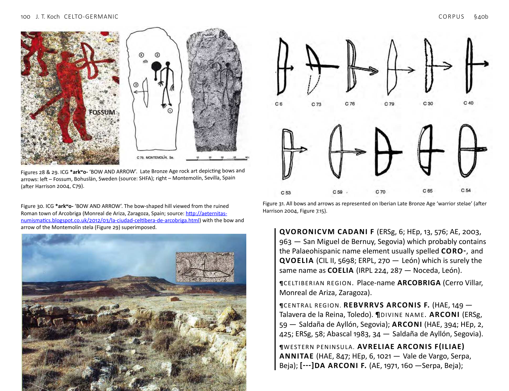
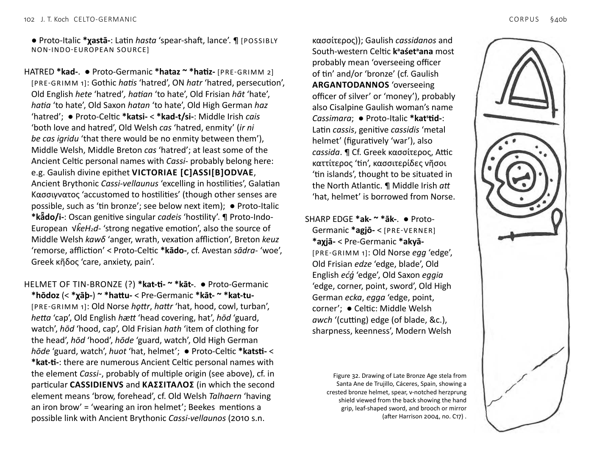
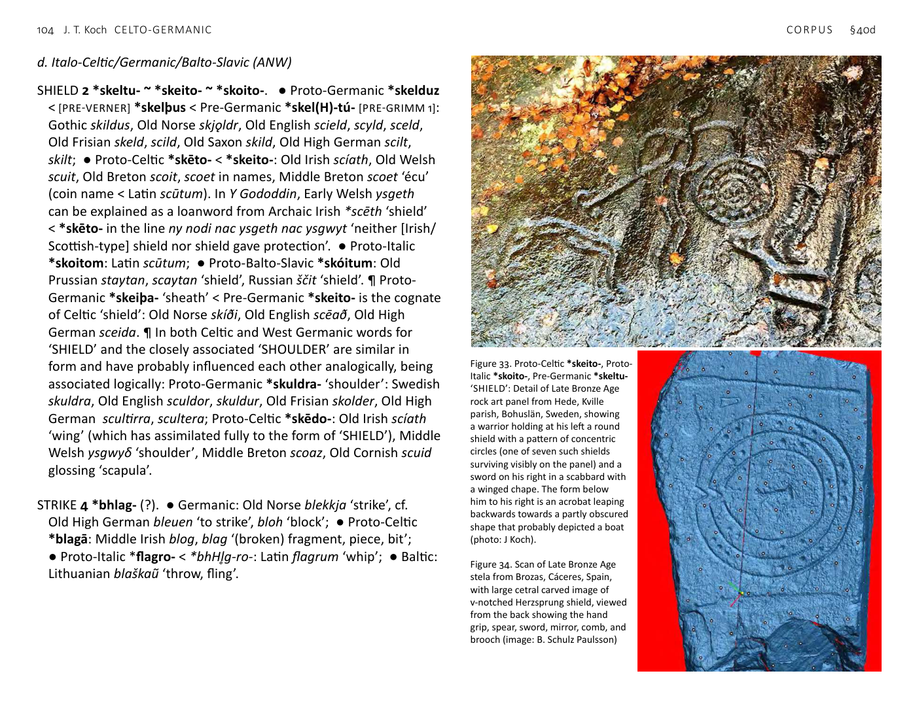

<!-- page: 89 -->

# §40. Weapons and warfare
a. Celto-Germanic (CG)
AXE *bhei(a)tlo- ~ *bhei(a)l-. ● Proto-Germanic *bīþla- ‘axe’
[PRE-GRIMM 1]: Old Norse bíldr ‘axe’, Old High German bīhal;
● Proto-Celtic *beyatlo- ~ beyali-: Old Irish biáil (occurring in
the Ulster Cycle tale Fled Bricrenn), Old Welsh bahell glossing
‘securis’ ‘axe, hachet’, Middle Welsh buyall, bwell, Middle
Breton bouhazl, Middle Cornish boell, būl. ¶ The Germanic and
Middle Breton forms point to an intelligible Proto-Indo-European
formation √bheiH- ‘strike’ + instrument suffix *-tlo-, hence ‘striking
instrument’.

Figures 22–23. CG *bhodwo- ‘BATTLE, FIGHTING,
VIOLENCE’, *katu- ‘BATTLE, FIGHTING, VIOLENCE’, *weik-
‘BATTLE, FIGHTING, VIOLENCE’,*nīt- ‘BATTLE, FIGHTING,
VIOLENCE’,*nant- ‘BATTLE, FIGHTING, VIOLENCE’,
*bhēgh-, *bhōgh- ‘BATTLE, FIGHTING, VIOLENCE’, *bhrest-
‘BATTLE, FIGHTING, VIOLENCE’: Late Bronze Age stela ‘Las
Puercas’, Esparragosa de Lares, Badajoz, showing warrior
with bihorn helmet, comb, mirror brooch, sword and
shield. Enlarged detail shows possible carving of ship with
prominent prow and crew (scans: M. Díaz-Guardamino).

Figure 24. (bottom) CG *bhei(a)tlo- ~ *bhei(a)l- ‘AXE’,
*treg- ‘STRENGTH’, *bhodwo- ‘BATTLE, FIGHTING,
VIOLENCE’, *katu- ‘BATTLE, FIGHTING, VIOLENCE’, *weik-
‘BATTLE, FIGHTING, VIOLENCE’,*nīt- ‘BATTLE, FIGHTING,
VIOLENCE’,*nant- ‘BATTLE, FIGHTING, VIOLENCE’,
*bhēgh-, *bhōgh- ‘BATTLE, FIGHTING, VIOLENCE’, *bhrest-
‘BATTLE, FIGHTING, VIOLENCE’: Detail of rock art panel
from Fossum in Tanum, Bohuslän, Sweden, showing an
oversized pair of confronting warriors with raised axes and
equipped with swords in scabbards aboard a large sea-
worthy vessel with a crew of 36 (photo: J. Koch).
<!-- page: 90 -->
BATTLE, FIGHTING, VIOLENCE 1 *bhodhwo-. ● Proto-Germanic
*badwā ‘battle’: Old Norse bǫð, Old English beadu, Old Saxon
badu, Old High German batu-; ● Proto-Celtic *bodwo-: Gaulish
personal names Boduus, Boduo-gnatus, Ateboduus, Atebodua,
Boduognatus, Boduacus, Boduogenus, Boduos (GPN 151); Ancient
Brythonic BODVOCI (ECMW 229), coin legend BODVOC (Van
Arsdell nos. 1052–1–1057–1–15, c. 10 BC), Middle Irish bodb,
badb ‘war-god(dess); scald-crow (i.e. bird on the battlefield and
manifestation of the war-goddess)’ < *bodwā, cf. Gaulish goddess
name [C]ATHUBODVAE, Old Welsh personal names Artbodgu
map Bodgu, Elbodgu, Boduan, Gurbodu, Lann Arthbodu; Old
Breton bodou glossing ‘ardea’ ‘heron’, Old Breton Personal names
Euboduu, Tribodu, Catuuodu.
2 *katu-. ● Proto-Germanic *haþu- ‘battle’ [PRE-GRIMM 1]: Ancient
Nordic haþu (Strøm whetstone, Sør-Trønelag, Norway ~AD 450,
Antonsen §45), Old Norse hǫð and god’s name Hǫðr, Old English
heaðo-, Old Saxon hathu-, Old High German hadu-, personal name
Hadumâr; ● Proto-Celtic *katu- ‘battle’: Galatian ΚΑΤΟΜΑΡΟΣ,
Gaulish names Catu-māros (~ Old High German Hadumâr), Catu-
rīx, Catu-slougī, &c., divine epithet MARTI CATVRIGI (8 examples,
Jufer & Luginbühl 2001, 33), Old Irish cath, Ogamic Primitive Irish
ROCATTOS, CATOTIGIRNI, CATTUBUTTAS, AMBICATOS; Ancient
Brythonic group name Catuvellauni > Old Welsh personal name
Catguolaun, Old Breton Catuuallon, Old Welsh cat ‘battle’.
3 *weik- ~ *wik- < NW Indo-European √weik- with unique specific
CG meaning. ● Proto-Germanic *weih-, *wigana- ‘to fight’
< [PRE-VERNER] *wiχana- [PRE-GRIMM 1]: Gothic weihan (cf.
Gothic dative singular du wigana ‘in order to fight’), Ancient
Nordic uuigaz ‘warrior’ (Eskatorp/Väsby bracteate rune ~AD
440–560 (Wicker & Williams 2012)), Old Norse vega ‘kill, fight’,
Old Norwegian viga ‘to kill’, Old English and Old High German
wīhan ‘fight’; BATTLE Proto-Germanic *wīga-: Old Norse vig,
Old English wīg, Old Frisian wīch, Old Saxon, Old High German
wīg; ● Proto-Celtic *wik- ‘fight’: Gaulish Eburo-uices ‘Yew-
fighters’, Lemo-uices ‘Elm-fighters’, Ancient Brythonic Ordo-uices
‘hammer fighters’, Old Irish fichid ‘fights’ < *wiketi, fecht ‘military
expedition’, Old Welsh guith ‘battlefront’, gueith ‘battle’ < *wiχtā,
amgucant ‘they fought about’ < *ambi-woikant, Middle Welsh
gweithen ‘combat’. ¶ Contrast nasal infixed Latin vincō ‘conquer’,
Lithuanian vēikti ‘make, work’.

Figure 25. CG *bhei(a)tlo- ~ *bhei(a)l- ‘AXE’, √treg- ‘STRENGTH’, *bhodwo- ‘BATTLE, FIGHTING,
VIOLENCE’, *katu- ‘BATTLE, FIGHTING, VIOLENCE’, *weik- ‘BATTLE, FIGHTING, VIOLENCE’,*nīt-
‘BATTLE, FIGHTING, VIOLENCE’,*nant- ‘BATTLE, FIGHTING, VIOLENCE’, *bhēgh-, *bhōgh-
‘BATTLE, FIGHTING, VIOLENCE’, *bhrest- ‘BATTLE, FIGHTING, VIOLENCE’: Detail of rock art
panel from Aspeberget in Tanum, Bohuslän, Sweden, showing confronting warriors with raised
axes (source: SHFA).
<!-- page: 91 -->
4 *treg- ‘strength’. ● Proto-Germanic *þrakja- < Pre-Germanic
*trogyo- [PRE-GRIMM 2] [PRE-GRIMM 1]: Old Norse þrekr ‘strength,
bravery’, Old English þraka ‘courage’, þrece ‘force, oppression’, Old
Saxon wāpan-threki ‘ability with arms’; ● Proto-Celtic *treχso- <
*treg-s-o- ~ *treχsno- < *treg-s-no-: Gaulish personal names
Trexius, Trexa, Trenus, Ogamic Primitive Irish TRENA-GUSU,
TRENACCAT〈L〉O (= TRENACATVS in Roman script), Old Irish tress
‘contention, battle’, trén ‘strong’, Middle Welsh trech ‘stronger,
mightier, more powerful, victorious’, treis ‘violence, force’, Middle
Breton trech ‘victorious’, Cornish trygh ‘victorious’. ¶ Possibly
related to Latvian trekns ‘solid’.
5 *nīt-. ● Proto-Germanic *nīþa- [PRE-GRIMM 1]: Gothic neiþ
‘envy, jealousy, enmity’, andaneiþa ‘enemy’, Old Norse níð ‘libel’,
Old English nīþ, Old High German nīd ‘battle-rage, hate, envy’;
● Proto-Celtic *nītu- ~ *nītyo-: Old Irish níth ‘fighting, combat,
battle, pugnacity, anger, resentment’, cf. Gaulish group name Nitio-
broges, personal names NITONIA, NITIOGENNA, NITIOCENV.
6 *nant-. ● Proto-Germanic *nanþjana ‘to dare, strive, be bold’
[PRE-GRIMM 1]: Gothic ana-nanþjan ‘to take courage’, Old Norse
nenna, nenda ‘to have a mind to, to intend’, Old English nēþan
‘to venture, to risk’, Old Frisian binētha ‘to venture’, Old Saxon
nāðian ‘to strive’, Old High German gi-nenden, nanta ‘to apply
oneself, to have courage’; ● Proto-Celtic *nanti-: Gaulish personal
names NANTIVS, patronym NANTONICNOS, Ancient Brythonic
MATRIBVS, M. NANTONIVS ORBIOTAL. V.S.L.M. (RIB I–618 —
Doncaster), Old Irish néit ‘battle, combat, fighting’, Néit ‘god of
battle, husband of the war-goddess Nemain or Badb’. ¶ Tocharian
A nati, Tocharian B nete ‘might, strength’ cannot be closely
related, as the second *-n- would be preserved if from the same
proto-form (Matasović 2011, s.n. *nanti-).
7 *bhēgh- ~ *bhōgh-. ● Proto-Germanic *bēg-: Old Norse
bægjast ‘quarrel, strive’, Old High German bāgēn ‘quarrel, fight’;
● Proto-Celtic *bāg-: Old Irish bág ‘fight, contest, striving, act of
contending’, bágaid ‘fights, boasts’, Middle Welsh bei ‘fault, failing,
transgression, offence’, kymwy ‘affliction, disaster’ < *kom-bāg-,
kymwyat ‘fighter’ < *kombāgyatis, Gaulish Bagaudae ‘Armorican
peasant rebels’. ¶ Cf. Sanskrit bhájati ‘separates’, nasal present
bhanákti ‘breaks’ < Proto-Indo-European √bheg- ‘break’.
8 *bhrest-. ● Proto-Germanic *brestan- ‘to break, burst’: Old Norse
bresta, Old English berstan ‘to burst, damage, injure, harm’ (cf. Old
English byrst ‘loss, calamity, injury, damage’), Old Frisian bersta
‘to break, to disappear’, Old Saxon brestan ‘to burst, break’, Old
High German brestan ‘to burst, tear, to lack’; ● Proto-Celtic noun
*brestā, verb *brestiti: Old Irish bres ‘fight, blow, effort’, brissid
‘breaks, smashes, destroys, defeats in battle, routs, overthrows’,
French briser presumably from Gaulish, Old Welsh personal names
Con-bresel, Cen-bresel, Cit-bresel, Ein-bresel, Middle Breton bresel
‘war’, Cornish bresel ‘war’.
BATTLE-WOLF > HERO *katu-wl̥kʷo- ~ *katu-wolkʷo-. ● Proto-
Germanic *haþuwulfaz [PRE-GRIMM 1]: Ancient Nordic personal
name haþuwulafz (Istaby runestone, Blekinge, Sweden, probably
7th century AD); ● Proto-Celtic *katuwolkos ‘hero, battle-hawk’ <
‘battle-wolf’: Gaulish Catuvolcus (a chief of the Belgic Eburones †51
BC (Caesar, Bello Gallico §5, 24)), Middle Welsh katwalch, plural [c]
adweilch ‘hero, champion, warrior’.
CLUB, CUDGEL, STAFF, STICK *lurg-. ● Proto-Germanic *lurkaz?
[PRE-GRIMM 2]: Old Norse lurkr ‘club, thick stick’; ● Proto-Celtic
*lorgā or *lurgā: Old Irish lorg ‘staff, stick, rod, club, cudgel’,
Old Cornish lorch glossing ‘baculus’ ‘staff’, Archaic Welsh (Peis
Dinogat) llory ‘hunter’s club, cudgel’, Breton lorchenn ‘cart shaft’.
¶ [POSSIBLY NON-INDO-EUROPEAN SOURCE] It is likely that this
word is a Celtic-to-Germanic loan, but unclear whether this
occurred in the prehistoric period or Viking Age. A borrowing
<!-- page: 92 -->
of Proto-Celtic *lurgā before the operation of Grimm 2 would
best explain the u and k of the Old Norse. On the other hand,
the distribution of the Germanic forms limited to Scandinavian
languages would be consistent with borrowing in the historical
period. The first element of the Old Norse compound jarn-lurkr
‘iron staff’ is from Old Irish ïarn.
CORPSE, DEAD BODY *kol- ~ *kl̥-. ● Proto-Germanic *hulda-
[PRE-GRIMM 1]: Old Norse hold ‘flesh’, Old English hold ‘carcass,
dead body, corpse’, cf. Old English holdian ‘cut up’, hyldan ‘to
butcher, carve up’; ● Proto-Celtic *kolanī- ‘dead body’: Old Irish
colainn ‘body, corpse, carcass, trunk’, Middle Welsh kelein ‘corpse,
carcass, dead body’. ¶ Probably from Proto-Indo-European √(s)kel-
‘cut, split apart’.
CUTTING WEAPON AND/OR TOOL (?) *skey- ~ *ski-. Proto-Indo-
European √sk̂ey- ‘cut’ is attested in its original basic meaning as
Middle Breton squeiaff ‘to cut’. Given the differences in meaning
and word formation and the limitation of the Germanic cognates
to Scandinavian, it is more likely that Old Irish scïan ‘knife’ = Middle
Welsh ysgïen ‘knife, sword’ and Old Norse skeggia ‘axe’ reflect
independent developments from this root in Celtic and Germanic
rather than the shared formation of word ‘cutting weapon’ at a
common stage.
FEAR *agh- ~ *āgh-. ● Proto-Germanic *agan ~ *agaz ~ *agiz-
~ *ōgana- (< *āgana-): Gothic agan ‘be frightened’, agis ‘fear’,
og ‘to fear’, Old English ege ‘fear’, egesa ‘terror’, Old Saxon and
Old High German egiso ‘terror’; ● Proto-Celtic *āg-V-: Old Irish
-ágadar, ní-ágathar ‘fears, dreads, stands in awe of’, possibly
related to Middle Irish ág ‘combat, struggle, martial ardour’.
¶ The CG words show a specialized development of the meaning
of Proto-Indo-European √H₂egh- ‘upset, distress’: contrast the
meaning of Greek ἄχος ‘pain, grief’, ἄχνυμαι ‘grieve’.
FELLOW TRAVELLER, COMRADE, PARTNER *sentiyo-. ● Proto-
Germanic *ga-sinþja- ‘retinue’ [PRE-GRIMM 1]: Old English
gesīþscipe ‘following, fellowship’, Old Saxon gesīðskepi ‘following,
fellowship’, Old High German gisindi ‘war retinue’; ● Proto-Celtic
*sentiyo- ‘fellow traveller’: Middle Welsh hennyδ ‘opponent
joined in combat, comrade, fellow’, Breton hentez ‘neighbour’,
Old Irish séitig ‘wife, consort, fellow, companion’, suffixed forms
derived from Proto-Celtic *sento- ~ *sentu- ‘road, path, course’
< *sentos ‘way, passage’. ¶ The suffix of Old Irish feminine ī-stem
séitig < *sentikī has probably been influenced by a form like the
source of Old Welsh gurehic, Old Cornish grueg, Middle Breton
gruec ‘wife’ < Proto-Celtic *wrakī. ¶ Proto-Indo-European √sent-
‘head for, go’.

Figure 26. CG *ghaiso- ‘SPEAR’, *lust- ‘SPEAR’, *dhelgo-, *dholgo- ‘DRESS PIN, BROOCH’,
*gʷistis ‘DIGIT, FINGER’, ICG *arkʷo- ‘BOW AND ARROW’, NW *skeltu- ~ *skeito- ~ *skoito-
‘SHIELD’. Late Bronze Age stela from La Pimienta, Badajoz, Spain, showing two warriors with
swords, a bow and arrow, a large notched shield, and spear (photo: Jane Aaron).
<!-- page: 93 -->
FOE *poiko-. ● Proto-Germanic *faiha-, *faiga- < [PRE-VERNER]
*φaiχa- [PRE-GRIMM 1]: Gothic fáih ‘deceit’, bifaih ‘exaction’,
bifaihon ‘to defraud’, Old English fáh ~ fág ‘guilty, outlawed,
hostile’, Old Frisian fāch ‘outlawed, prosecuted, punishable’, Old
Saxon afēhian ‘to condemn’, Old High German fēhen ‘to condemn’,
fēhida ‘hate, enmity’, gi-fēh ‘hostile’; ● Proto-Celtic *(p)oiko-: Old
Irish oech ‘enemy’ (glossary word), possibly also aech (LEIA s.n.
oech). ¶ Contrast meanings and formations Sanskrit piśuna- ‘evil,
treacherous’, Lithuanian pìktas ‘angry’ < Proto-Indo-European
√pik̂-.
GOAD 1 *bhrozdo- ~ *bhr̥zdo-. ● Proto-Germanic *bruzda- < Pre-
Germanic *bhr̥zdo-: Old Norse broddr ‘spike’, Old English brord
‘point, grass shoot’, Old High German brort ‘spear, edge’ (cf.
Icelandic bradd ‘edge’, Old English brēard ‘brim, margin’ Old High
German brart ‘edge’ < Proto-Germanic *brazda- < Pre-Germanic
*bhrozdo-); ● Proto-Celtic *brozdo-: Old Irish brot ‘goad, spike’
(part of the stock descriptions of chariots in the Irish sagas),
Middle Welsh brath ‘bite, stinging, prick, piercing, stabbing’.
GREAT/FAMOUS IN BATTLE *Katu-mōros ~ *Katu-mēros. ● Proto-
Germanic *Haþu-mēraz [PRE-GRIMM 1]: Old High German Hadumâr;
● Proto-Celtic *Katu-māros: Galatian ΚΑΤΟΜΑΡΟΣ (Freeman
2001, 36), Gaulish Catumaros, Archaic Welsh Catmor.
GREAT/FAMOUS IN VICTORY *Seghi-mēros ~ *Segho-mōros.
● Proto-Germanic *Segimēraz: Ancient Germanic Σεγιμερος =
Segimēros (Strabo), Ancient Nordic sigimaraz (Ellestad stone,
Östergötland, Sweden ~AD 550–600, Antonsen §114), Old
Norse Sigimarr, Old English Sigemær, Old High German Sigimar;
● Proto-Celtic *Segomāros: Hispano-Celtic SEGVMARVS (HEp, 3,
201 — Aroche, Huelva), Gaulish (Gallo-Greek) CΕΓΟΜΑΡΟC (RIG 1,
G–153 — Vaison), genitive SEGOMARI.
MILITARY COMMANDER (as divine epithet) *koryonos. ● Proto-
Germanic *harjanaz [PRE-GRIMM 1]: Old Norse Herjann (a name
of Óðinn); ● Proto-Celtic *koryonos: Ancient Brythonic group
name, as Latin genitive plural CORIONOTOTARVM (RIB 1–1142)
‘commander+tribe’. ¶ The Indo-European word occurs also as
Greek κοίρανος koíranos ‘ruler, commander, lord’, but Meid
(following Charles-Edwards’s proposal on Corionototae) argues
that *koryonos functions uniquely in Germanic and Celtic as a
god’s name or epithet (Hyllested 2010, 110; Meid 1991, 48–9;
Charles-Edwards 1974).

Figure 27. CG *ghaiso- ‘SPEAR’, *lust-
‘SPEAR’, possibly *dhelgo-, *dholgo-
‘DRESS PIN, BROOCH’, *aksilā ‘AXLE’,
*marko- ‘HORSE’, *kankistos, *kanksikā
‘HORSE’, *weghnos ‘WHEELED VEHICLE’,
NW *skeltu- ~ *skeito- ~ *skoito-
‘SHIELD’: Late Bronze Age stela showing
warrior with lyre, mirror, v-notched
shield from Los Llanos, Zarza Capilla,
Badajoz, Spain; Museo Arqueológico
Provincial de Badajoz (photo: J. Koch)
<!-- page: 94 -->
OVERCOME IN BATTLE *uper-weik- ~ *uper-wik- ● Proto-Germanic
*uber-wīh- < [PRE-VERNER] *uφer-wīχ- [PRE-GRIMM 1]: Old High
German ubarwehan ‘to overcome’; ● Proto-Celtic *u(p)er-wik-:
Old Irish for-fich ‘conquered’, Middle Welsh past tense guoruc
< Proto-Celtic perfect *u(p)er-woike. The Welsh verb has been
absorbed analogically into the forms of the nearly homophonous
√wreĝ- ‘work’ > ‘make, do’ (Proto-Celtic perfect *wewroige).
However, etymologically guoruc must also derive from the CG
compound verb *uper-wik- ‘over’+‘fight’.
SHIELD (?) 1 OF WICKER *kleibho-. ● Proto-Germanic *hlīb-
[PRE-GRIMM 1]: Gothic hleibjan ‘take the part of’, Old Norse hlíf
‘shield, protection’, Old High German līpen, lippen ‘protect’;
● Proto-Celtic *klēbo-: Old Irish clíab ‘basket, hamper, beehive,
cradle, coracle, rib cage’. ¶ See Hyllested 2010, 117.
SLING, SNARE *telm-. ● Proto-Germanic *þelmi- [PRE-GRIMM 1]: Old
Norse þjálmi ‘a sort of snare’ (the operation of Grimm 1 precludes
a Viking Age loanword); ● Proto-Celtic *telmi-: Middle Irish
teilm, tailm ‘sling’, Old Breton talmǫrion gl. ‘cum funditoribus’
‘with slingers, sling men’, Middle Breton talmer ‘slinger’, Middle
Welsh telm ‘snare, trap, springe’. ¶ LEIA (s.n. tailm) suggests that
the lack of lenition of m in the Brythonic forms (i.e. one might
expect **telf) could be explained by a preform such as *talksmi-.
On the other hand, a borrowing from Goidelic to Brythonic
would also account for this feature. A metathesized variant of
the native Brythonic form possibly underlies the common verb
of obscure derivation Middle Welsh taflu ‘to throw, cast, fling’,
Middle Cornish tevyl ‘throws’, Middle Breton taulet ‘is thrown’,
cf. the Early Welsh compound (Gododdin) tavloyw ‘spear cast’ or
possibly ‘spear thrower’ < *tamlo-gaiso-. ¶ Possibly Proto-Indo-
European √telk- ‘beat, hit’ (Matasović 2009 s.n. *telmi-).
SPEAR 1 *ghaisó-. ● Proto-Germanic *gaizaz ‘spear, tip’ < *gaiso-:
Old Norse geirr, Old English gār, Old Saxon gēr, Old High German
gēr; ● Proto-Celtic *gaisom ‘spear’: Gaulish gaesum, cf. personal
names Ario-gaisus, Gaesorix, Gesatorix, Galatian Γαιζατοριξ
(Freeman 2001, 56), group name Γαισαται Gaesati, Old Irish
gae, Old Cornish hoch-wuyu glossing ‘venabulum’ ‘hunting
spear’, literally ‘swine-spear’, Middle Welsh gwayw. ¶ Proto-
Indo-European √ĝheys- ‘wound’: Sanskrit hinásti ‘wounds’. ¶ The
Brythonic forms may (in part or entirely) reflect the compound
*u(p)o-gaiso- = Old Irish fogae.
2 *lust-. ● Germanic: Old Norse ljóstr ‘fish-spear’; ● Proto-Celtic
*lustā: Middle Irish los ‘end, butt, foot, point of a staff, stick, &c.;
stem of a drinking horn; tail of an animal’, Middle Welsh llost ‘tail,
spear, lance, javelin’, Middle Cornish lost, Breton lost ‘tail’.
SPEAR-KING *Ghaiso-rīg- < *-rēg-. ● Proto-Germanic *Gaiza-rīk-
[PRE-GRIMM 2]: East Germanic*Gaizarīks, Latinized Gaisericus was
the name of the long-lived king of the Vandals (~AD 389–477);
● Proto-Celtic *Gaiso-rīg-: Gaesorix (Caesorix in some texts) was
the name of the chief of the Cimbri captured by the Romans in
101 BC; the form of the name is completely Celtic (like of the
Cimbri’s other leaders Boiorix and Lugius), though the Cimbri were
probably originally Germanic speakers (§7).
STRENGTH, FORCE, VALOUR *nert-. ● Proto-Germanic *nerþu-
[PRE-GRIMM 1] in the divine names Nerthus ‘terra mater’ said to
have been worshipped by the Suebi by Tacitus (Germania §40), Old
Norse god’s name Njǫrðr, father of Freyr; ● Proto-Celtic *nerto-:
Old Irish nert ‘strength’, Old Welsh nerth glossing ‘ui’ and the verb
nertheint ‘they are strengthened’, Old Breton nerth glossing ‘robur’
‘hard wood, hardness’, cf. Old Irish sonirt = Middle Welsh hynerth
‘strong’ < *su-nerti-, cf. Celtiberian place-name Nertobriga/
nertobis ‘strong hillfort’ (Cabezo Chinchón, Calatorao/La Almunia
de Doña Godina, Zaragoza), Gaulish personal names NERTA,
NERTVS, NERTACOS, NERTINIVS, NERTONVS, NERTOMAROS
‘great in strength’ (= Old Irish nertmar, Middle Welsh nerthfawr),
NERTOMARIVS NERTONVS, COBNERTVS, ESVNERTVS.
¶ Formally and semantically similar CG developments from Proto-
Indo-European √H₂ner- ‘man, hero, be strong’.
<!-- page: 95 -->
STRIKE (IN BATTLE) 1 *kelto- ~ *keltyo- (?). The Celtic evidence is
limited to names, so their meanings can only be inferred. Various
etymologies have been offered for the group name(s) Κελτοί,
Celtae, Celtici, Κελτιβηρες, &c. (cf. McCone 2008). On balance, a
derivation from Proto-Indo-European √kelH₂- ‘strike’ giving *kelto-
~ *keltyo- ‘battle’ commonly in Germanic and Celtic is particularly
plausible in the light of the values and naming practices of ancient
Celtic-speaking groups. ● Proto-Germanic *hildja- [PRE-GRIMM 1]:
Old Norse hildr ‘battle’, Old English hild ‘war, battle’, Old High
German hiltia, early Germanic male names e.g. Old High German
Hildebrand, Frankish Childebert, more numerous female names
e.g. Old Norse Brynhildr, Frankish Nanthechilde. This usage can
be understood as result of a feminine personification of ‘Battle’
*Hildja-, as found in the Norse mythological figures Hildr the
valkyrie and Hildr Högni’s daughter who each night magically
revives the slain warriors of the never-ending battle. ● Proto-Celtic
*kelto- ~ *keltyo-: group names Κελτοί, &c., personal names
Gaulish Celtus, Celtilius, Celtillus, Celtilla, Old Irish Celtchar.
¶ Celtius < *keltyos recurs as a Palaeohispanic personal name:
CELTIVS MAELONIVS (CIL II, 5257 — Lamego, Viseu),
CELTIO ANDERCI F. (HEp, 13, 231 — Casas del Monte,
Cáceres), [TAN]CINO CELTI F. ENTERANIES. (Melena 1985,
499–501; CPILC, 736 — Zarza la Mayor, Cáceres), DOITENA
AMBATI CELTI F. (EE, VIII 167; Castillo et al. 1981, 53 —
Marañón, Navarra), DOCQVIRVS CELTI (HEp, 2, 900 —
Carvalhal Redondo, Nelas, Viseu); DOQVIRVS CELTI (HEp, 2,
897 — Canas de Senhorim, Nelas, Viseu), genitive plural family
name ‘of the descendants of Celtius’ AIAE CARAVANCAE
BODDI F. CELTIGVN (CIL II, 6298 — Olleros de Pisuerga,
Palencia), suffixed form CELTIATVS VENIATI F. (CPILC, 30
— Alcollarín, Cáceres), compound forms ABRVNVS ARCELTI
F. (Beltrán 1975–76, 51; AE, 1977, 406; CPILC, 218 — Coria,
Cáceres), BOVDELVS CONCELTI F. (AE, 1984, 471 — Belver,
Gavião, Portalegre).
¶ Proto-Indo-European √kelH₂- in the sense ‘strike’ is best
attested, possibly exclusively, in NW: ● Celtic: Middle Irish cellach
‘contention, strife’ < *kellāko-, the Gaulish god’s name Sucellus
often interpreted as ‘good striker’; ● Proto-Italic *kelne/o-: Latin
cellō ‘strike’; ● Proto-Balto–Slavic *kolɁ- ‘beat’: Lithuanian kálti
‘beat, forge’, Latvian kal̃t ‘beat, forge’, Lithuanian kùlti ‘thresh,
beat’, Old Church Slavonic klati ‘kill’, Russian kolót’ ‘to prick, stab,
chop’; *kolɁtó ‘striking instrument’: Lithuanian káltas ‘chisel’,
Latvian kal̃ts ‘chisel, small hammer’, Russian dialect kólot ‘wooden
sledge hammer, small club’. Greek κλάω ‘break (off)’, for which
Beekes suggests a Pre-Greek origin, has a somewhat different
meaning.
STRIKE (IN BATTLE) 2 *slak- ● Proto-Germanic *slagiz ‘blow, stroke’,
*slahana- ‘to slay’ [PRE-GRIMM 1]: Gothic slah ‘stroke’, slahan
‘strike’, Old Norse slagr ‘stroke’, slá ‘strike’, Old English slēan ‘to
strike to death’, slege ‘blow, stroke’, Old Frisian slei ‘stroke’, slân,
slâ ‘to slay’, Old Saxon slegi ‘stroke’, slahan ‘to slay’, Old High
German slag stroke’, slahan ‘to slay’; ● Proto-Celtic *slak-: Middle
Irish slachta ‘struck’, glossary word slacc ‘sword’, Scottish Gaelic
slachd ‘strike with a club’. ¶ Middle Irish sleg ‘spear’ (a word
common in the Ulster Cycle) is possibly related to these words,
though more probably connected to the Sanskrit verb *sr̥játi
‘throws’.
STRIVE, SUCCEED *pleid-. ● Proto-Germanic *flītana- ‘strive’
[PRE-GRIMM 2] [PRE-GRIMM 1]: Old English flītan, Old Saxon anflītan
‘to exert oneself’, Old High German flīzan ‘attempt, try hard’, sih
flīzan ‘to apply oneself to’; ● Proto-Celtic *(p)lēdo-: Middle Welsh
llwyδaw ‘to succeed, flourish, prevail, promote’.
TROOP 1 *dhru(n)gh-. ● Proto-Germanic *druhtiz ‘warband’: Gothic
driugan ‘to serve as a soldier’, gadrauhts ‘warrior’, Old Norse drótt
‘company, following’, Old English dryht ‘companion’, Old Frisian
drecht ‘wedding party’, Old Saxon druht-folk ‘multitude, throng’,
<!-- page: 96 -->
Old High German truht ‘troop’; ● Proto-Celtic *drungos: Gaulish
drungos ‘groups of enemies’; Middle Irish drong ‘troop’, Old
Breton drogn glossing ‘cetus’, drog glossing ‘factionem’ ‘assembly,
troop’, possibly also Middle Welsh dronn ‘multitude’. ¶ Unique
CG meaning for this root: cf. Old Church Slavonic drugŭ ‘friend,
other’, Lithuanian draũgas ‘friend’ < NW *dhroughós ‘comrade,
companion’.
2 *worīn-. ● Germanic: Old English worn, weorn, wearn ‘troop,
crowd, company, multitude, flock, many, progeny’; ● Proto-Celtic
*worīnā-: Old Irish foirenn glossing ‘factio’ ‘group, band, troop,
company, set of board-game pieces’, Scottish Gaelic foireann
‘auxiliary band, ship’s crew’, Old Welsh guerin, Middle Welsh
gwerin ‘people, populace, folk, troop, host, throng, rank and file of
an army, ship’s crew, set of board-game pieces’, Old Breton guerin
glossing ‘in duas factiones’, Middle Breton gueryn ‘people’.
3 *pluk- (see §39.a) BOATLOAD/CREW OF A BOAT.
WEREWOLF — WOLF, PREDATOR = WARRIOR OUTSIDE THE TRIBE
1 *wiro-kwō ~ *wiro-wl̥kʷo-. ● Proto-Germanic *wira-wulfaz <
Pre-Germanic *wiro-wulpos [PRE-GRIMM 1]: Old English werewulf,
Middle Dutch weerwolf, Middle High German werwolf, Danish and
Norwegian varulv, Swedish varulf, Old Northern French garwall <
Old Norse *varulfr; ● Proto-Celtic *wiro-kū, genitive *wiro-kunos,
accusative *wiro-konam: Celtiberian uiroku, Ancient Brythonic
place-name Viroconium ‘Wroxeter’, Old Irish personal name
Ferchu, cf. Middle Irish common noun ferchu ‘male dog, fierce dog’,
Old Welsh Guurci, Old Breton Gurki, note also Old Breton don-bleid
‘human-wolf’ glossing ‘Lupercus’ (the name of Roman god with
wolf-like and human attributes) . ¶ Unusual parallel compound
with cognate first element and common meaning. Mythological
literature in Vedic, Old Norse, and Middle Irish provide evidence
for an Indo-European cult focused on dogs and wolves identified
with an age grade of young, unmarried warriors (McCone 1987;
2002; Kershaw 2000; Meiser 2002; Mallory 2007). Archaeological
evidence for this cult has recently been adduced from a site of
the Late Bronze Age Srubnaya culture on the Middle Volga Steppe
(Anthony & Brown 2017b; Brown & Anthony 2019).
WILD DOG, WOLF, PREDATOR = WARRIOR OUTSIDE THE TRIBE
2 *widhu-kō(n), nominative plural *widhu-kones, unique CG
compound (‘woods’+‘dog’). ● Proto-Germanic *widuhundaz:
Ancient Nordic widuhudaz = widuhundaz (Himlingøje clasp
2, Sjælland, Denmark, ~AD 200, Antonsen §5) [PRE-GRIMM 1];
Proto-Celtic *widukū plural *widukones: Early Welsh (Gododdin)
plural gwyδgwn (Koch 1980), possibly the Gaulish divine epithet
MERCVRIO VIDVCO.
WOLF, PREDATOR = WARRIOR OUTSIDE THE TRIBE 3 *wolkos.
● Proto-Germanic *walhaz ‘foreign warrior’ > ‘Italo-Celt’? >
‘Romano-Celt’ [PRE-GRIMM 1][predates Pre-Germanic *ŏ > *ă
(Fulk 2018, 47)]: Ancient Nordic walha-kurne ‘“Welsh” corn” or
‘corn of the Volcae’ a kenning for ‘gold’ (Tjurkö bracteate rune
~AD 440–560), Old Norse Valir (plural) ‘inhabitants of northern
France’, Old English Wealh ‘foreigner, Welsh person, slave’, Old
High German Walh, Walah ‘speaker of a Romance language’.
● Proto-Celtic *wolkos ~ *wolkā- ‘wolf, predator’ > ‘(landless)
warrior’, from which widespread group name: Gaulish Volcae
referring to extensive groups situated in South-west Gaul (near
Toulouse), also north of the Middle Danube where, according to
Caesar (De Bello Gallico §6.24), the Volcae Tectosages (‘journey-
seeking Volcae’) were an expansionist people and had seized
lands around the Hercynian Forest. Cf. Gaulish personal names
Uolkanus (DAG 213, 223), Uolcinius (DAG 224), Catuolcus (DAG
221), Uolcacius (DAG Note xlv). The word, though rare in Goidelic,
is probably attested in a line from a 9th-century poem describing
events preceding the end of the world: coin, foilc, fianna, ialla
glasa—cid ba messa? ‘dogs, wolves, warbands, grey companies—
what could be worse?’ (Koch 1990; Carey 2014, 614, 621). Compare
Old Welsh personal names Riuualch, Gualchen, Middle Welsh
<!-- page: 97 -->
gwalch ‘hawk, falcon; noble warrior, brave fighter, hero’, Old
Breton personal name Uualcmoel. What is probably the earliest
occurrence in Welsh is in Y Gododdin, where the variants of the
line as written by the B and A scribe must be compared: bu guanar
gueilging gwrymde (B2.33) = bu gwyar gweilch gwrymde (A.69),
which can be reconciled as bu guanar gueilc[h] ing gwrymde ‘he
was a captain of warriors in dark-coloured [armour]’, in which
the context of gueilc[h] is reminiscent of that of its cognate foilc
in the Old Irish passage above, dark clothing being one of the
comparative attributes identified for bands of Indo-European-
speaking landless young warriors emulating wolf/dog attributes
(McCone 2002; Mallory 2007). ¶ If correctly interpreted, the
Ancient Nordic kenning walha-kurne ‘“Welsh” corn’ for ‘gold’
is noteworthy in highlighting the idea that the *Walhiz lived by
exotic metals rather than agro-pastoral subsistance. ¶ *wolkos is
probably a development of Proto-Indo-European *wl̥kʷos ‘wolf’
(Jenkins 1990). The first step in the phonological derivation is
*wolkʷos as an ablaut grade. In the paradigm of this, there would
have been forms, such as dative singular *wolkūi and accusative
plural *wolkūs, in which the probably Proto-Celtic development
of */kʷū̆/ > */kū̆/ occurred. From there *k < *kʷ spread through
the paradigm. Alternatively, as proposed by Jenkins, *k < *kʷ could
have arisen by dissimilation triggered by the initial *w- in *wolkʷo-.
Lepontic ulkos probably reflects a different Celtic syllabification
of Proto-Indo-European *wl̥kʷos ‘wolf’. ¶ This word has helped to
underpin the idea that the Celto-Germanic words arose largely in
contact in the Iron Age in Central Europe, at a time and place of
expansion of Germanic-speaking groups into what is now Central
and South Germany (cf. De Vries 1960, 32–3, 68). Undoubtedly,
this line of thinking has been suggested because the form Volcae
is first encountered in historical records as a group name current
shortly before the Roman conquest of Gaul, leading naturally to
the thought that the Germanic forms represent a borrowing of
the name of this group at more or less this time. Of course, we
have no records for Transalpine Europe before this, and there is no
linguistic or anthropological reason that *wolkos ‘landless young
warrior’ < Proto-Indo-European *wl̥kʷos ‘wolf’ must be as late as
the La Tène Iron Age. The facts that the word is attested in Ancient
Nordic and Old Norse and that it entered the Germanic stream
before the operation of Grimm 1 and *ŏ > *ă are consistent with
an earlier scenario. The shift of meaning in Germanic suggests
that the word was encountered mainly in connection with hostile
mobile warriors from other groups. ¶ A second large group found
in the Hercynian region—though the group name once again was
widely distributed—were the Boii. Their name occurs as the first
element of the place-name Boiohaemum, i.e. Bohemia. Boii can
be etymologized as Pre-Celtic *gʷowyōs, ‘cattle owners’, i.e. men
of property and status (cf. Anreiter 2001, 157). This gives Old Irish
büe ‘native, as opposed to foreign, a person with legal rights, man
of property’ < ‘cattle owner’. In Old Irish legal terminology, the
opposite of the büe was the ambuae, the cow-less man without
possessions or legal connections, a person from outside the
túath. That is close to what is proposed here as the older sense of
*wolkos, before the term changed meaning, becoming attached to
specific large armed groups on the move. As I previously proposed,
the original distinction of Boii versus Volcae, ‘cattle owners’ versus
‘wolves’, had been that of legally competent adult tribesmen
versus mostly younger, landless men seeking property and portable
valuables, to win status in foreign lands (Koch 1990). ¶ Also in
Old Irish legal terminology, the term cú glas ‘wolf’ (literally ‘grey
dog’) is used to mean a mercenary warrior outside his own tribe
(túath), thus lacking legal standing. The metaphor and concept
are essentially the same as that proposed here for *wolkos. The
byname Tectosages, meaning ‘journey pursuers’ or the like, also
supports this interpretation. The combination Volcae Tectosages
is applied by Caesar to the group in Central Europe and is also
the name of the group living near Toulouse and said to have had
a leading role in the attack on Delphi in 278/279 BC, according
to Strabo (v.1.12–13), citing Timagenes. According to Justinus’s
Epitome of the Philippic Histories of Trogus Pompeius (xxxii.3),
<!-- page: 98 -->
the Volcae Tectosages brought a great treasure (back?) to Tolosa
(Toulouse) from the raid on Delphi. Might the walha-kurne ‘grain
of the Volcae’ = ‘gold’ of the Tjurkö rune be another reference
to this story? Tectosages is also the name of one of the principal
tribes of the Celtic Galatians who established themselves in Central
Asia Minor around Ankara ~270 BC.
WOUND, INJURE 1 *bhreus-. ● Proto-Germanic *brūs-: Old English
brȳsan ‘bruise’ noun; ● Proto-Celtic *brusyo- ‘injures, breaks’: Old
Irish bruïd ‘breaks in pieces, smashes, crushes’, bronnaid ‘injures,
damages’, Middle Welsh briw noun ‘wound, hurt, injury, bruise,
sore’ (cf. Middle Welsh briwcic ‘mangled flesh (on the battlefield),
meat hash’), Old Cornish breuyonen gl. ‘mica’ ‘crumb’, Cornish
brew ‘wound’, cf. Middle Welsh breu ‘fragile’. ¶ Contrast Latin
frūstum ‘fragment’ < √bhreus- ‘break, smash to pieces’, possibly
also Albanian breshër ‘hail’.
2 *knit- ~ *kneit-. ● Proto-Germanic *hnītana- [PRE-GRIMM 1]: Old
Norse hníta ‘wound to death’, Old English and Old Saxon hnītan
‘thrust, stab’; ● Proto-Celtic *knitā-: Old Irish cned ‘a wound, sore’.
¶ Contrast Greek κνίζω ‘scratch’ verb.
3 *aghlo-. ● Proto-Germanic *agla- ~ *aglijana: Gothic agliþa,
aglo ‘affliction’, agls ‘shameful’, agljan ‘treat badly, harm’, Old
English egle ‘disagreeable, loathsome’, eglan ‘to harass, afflict’;
● Proto-Celtic *aglo- ‘wound, affliction’: Middle Irish álad ‘wound’,
Middle Welsh aelet ‘pain, suffering, affliction, grief’, aelawt ‘grief,
affliction’, aele ‘sad, wretched’. ¶ Unique CG morphology, especially
the dental suffix in Gothic agliþa and the Celtic forms. Proto-Indo-
European √H₂eghlo- ‘distress’, √agh- or √H₂egh-: Avestan aγa- ‘bad,
evil’, Sanskrit aghá- ‘bad’, aghrā- ‘evil, distress’, aghalá- ‘terrible’.
4 *gʷhen- ~ *gʷhon-. ● Proto-Germanic *banjō- ‘a wound’: Gothic
banja ‘strike, wound’, Old Norse ben, genitive singular benjar,
Old English ben(n) ‘slayer, murderer’, Old Frisian bona, Old Saxon,
bano ‘death, murder’, beni-wunda ‘wound’, Old High German
bano ‘death, bringer of death, bane, killer’; ● Proto-Celtic *gʷeni-
‘wound’: Old Irish guin ‘wound, injury’, cf. Welsh gwaniad ‘stab,
thrust, prick, wound’. ¶ From Proto-Indo-European √gʷhen- ‘kill’,
also the source of Old Irish gonaid, Early Welsh gwenyt ‘wounds,
slays, advances upon’ < Proto-Celtic *gʷaneti. ¶ For a different
etymology in Germanic, see Kroonen 2013, s.n. *banjō. ¶ Proto-
Germanic *wunda- ‘wound’ (Gothic wunds, Old Norse und, Old
English wund, Old High German wunda) is not related.
5 *koldo-. ● Proto-Germanic *halta- ‘lame, limping’ [PRE-GRIMM 2]
[PRE-GRIMM 1]: Gothic halts, Old Norse haltr, Old English healt
‘lame, crippled, limping’, Old Frisian halt, Old Saxon halt, Old High
German halz; ● Proto-Celtic *koldo-: Old Irish coll ‘destruction,
spoiling, injury, loss, castration, deflowering’, Middle Welsh coll
‘loss, damage, hurt, destruction, harm caused by loss’, ar-choll
‘wound, cut, gash, hurt, injury’, Middle Breton coll. ¶ Proto-Indo-
European √kold- ‘strike, cut’.
6 *kre(n)g- ~ *krog-. ● Proto-Germanic *hrakjan- < Pre-Germanic
*krog-éye- [PRE-GRIMM 2] [PRE-GRIMM 1]: Old Norse hrekja ‘to
drive away, worry, vex, damage, abuse’; ● Proto-Celtic *krenχtu-
< *kreng-tu-: Old Irish crécht ‘wound, ulcer’, Old Breton creithi gl.
‘ulcera’, Middle Breton singulative creizenn ‘scar’, Middle Welsh
creith ‘scar, wound’.
7 *sai-. ● Proto-Germanic *sairaz: Gothic sair, Old Norse sár
‘wound, pain’, Old English sār ‘pain, wound, suffering; painful,
grievous’, sārig ‘sorry’, Old Frisian sēr ‘pain’, Old Saxon sēr ‘pain’,
Old High German serō ‘painfully, in a difficult way’, whence Finnish
sairas ‘sick, ill’; ● Proto-Celtic *sai-tu-: Old Irish saeth ‘trouble,
hardship, distress, tribulation (both physical and mental), disease,
illness’, Middle Welsh hoet ‘longing, sorrow, grief, vexation’.
<!-- page: 99 -->
b. Italo-Celtic/Germanic (ICG)
BOW AND ARROW *arkʷo-. ● Proto-Germanic *arhʷ-ō- ‘arrow’
[PRE-GRIMM 1]: Gothic arƕ-azna, Old Norse ǫr, Old English arwe,
earh; ● Proto-Celtic *arkʷo- ‘bow (and arrow)’: very common
Hispano-Celtic name Arquius ‘bowman’, feminine Arcea, place-
name Arco-brigā ‘bow-shaped hill’ (see below); Middle Welsh
arffet ‘lap, groin’ < *arkʷetā; ● Proto-Italic *arkuo- ~ *arkʷo-
‘bow’: Latin arcus, gen. arquī. ¶ As Mallory explains, ‘... there is no
certain evidence that the bow was employed in Ireland between
1500 BC and AD 800’ (2016, 195). ¶ The earlier meaning of the
word is probably reflected in Greek ἄρκευθος, Latvian ērcis,
Russian rakíta ‘juniper’, a wood suitably flexible for making bows.
The transference to the weapon made from juniper was confined
to ‘Italo-Celtic/Germanic’. ἄρκευθος ‘juniper’ is hard to reconstruct
as a Proto-Indo-European root and therefore probably goes back
to one of many plant names borrowed into the European branches
from non-Indo-European.
¶ The numerous Palaeohispanic attestations, most of which are
in the West, have been explained as derived from PIE *H₂r̥tḱos
‘bear’ (see above). In the light of phonological difficulties for
this explanation, an alternative possibility may be considered,
such as, assigning the Arco- names to ICG *árkʷos ‘bow and/or
arrow’.
In favour of this derivation, it may be noted that the most
certainly locatable of the four places called Arcobriga listed
by Guerra is the hill of Cerro Villar, Monreal de Ariza, Zaragoza
(2005, 813; see below for the other examples). That hill itself
has yet to yield Bronze Age or Iron Age remains. But viewed
from the direction of Iron Age necropolis and Roman town
of Arcobriga on the plain, Cerro Villar presents the shape on
the horizon of a symmetrical bow, convex side skyward, with
pronounced shoulders at either end and a depression in the
middle corresponding to the section of a bow form that would
be gripped by the hand with the arrow passing over. The shape
is similar in particular to the simplified abstract form of the
11 bows with arrows depicted in the South-western warrior
stelae compiled by Harrison (2004, fig. 7.15). In other words,
the striking view from the ancient settlement is a strong point
in favour of the argument that Arco-brigā meant ‘bow(-shaped)
hill(-fort)’.
The appearance of simple velar in Arco- in the place of an
inherited labio-velar would not be surprising given the probably
Proto-Celtic development of */kʷū̆/ > */kū̆/, as for example in
silva Hercynia < *Φerkun- < Pre-Celtic *perkʷun- ‘oak wood,
wood of the oak god’ > ‘THUNDER, THUNDER GOD’ (before
the operation of the rule of *p…*kʷ assimilating to *kʷ…*kʷ). In
a nasal-stem inflection this phonemic convergence of *kʷū̆ and
*kū̆ would have occurred in nominative singular *arkʷū >
*/arkū/, after which */k/ could naturally have spread through
the paradigm. Similarly, with the -o-stems, there would have
been neutralization with dative singular *arkʷūi > *arkūi, and
accusative plural *arkʷūs > *arkūs, followed by levelling of the
paradigm generalizing the phoneme */k/ throughout.
On the phonetic level, the process envisioned would not be
a matter of *[kʷ] losing its labialization in the environment
preceding *[u(ː)], but rather that the phoneme */k/ was
labialized before */ū̆/ to such an extent that it ceased to
contrast with */kʷ/ in this environment, and the phoneme
*/kʷ/ fell together with the more common phoneme */k/ as
*/k/. This stage was reached in Proto-Celtic. A similar phonetic
conditioning would also have existed for the combination
*/ko/, in which the velar would tend to be labialized as *[ko̯o]
undermining the contrast with */kʷo-/. The unusual family
name of L. VALERIVS L. F. ARQVOCVS (Palol & Vilella 1987,
96; HEp, 2, 151; HEp, 13, 199 — Peñalba de Castro, Burgos) may
be inaccurately spelled and identical to that of FL[ORIN]A
LIBERTA ARQVIOCVM (AE, 1985, 604; Abascal 1994, s.v. —
Alcalá de Henares, Madrid). Note also ACCAE DEOCENAE
<!-- page: 100 -->
QVORONICVM CADANI F (ERSg, 6; HEp, 13, 576; AE, 2003,
963 — San Miguel de Bernuy, Segovia) which probably contains
the Palaeohispanic name element usually spelled CORO-, and
QVOELIA (CIL II, 5698; ERPL, 270 — León) which is surely the
same name as COELIA (IRPL 224, 287 — Noceda, León).
¶CELTIBERIAN REGION. Place-name ARCOBRIGA (Cerro Villar,
Monreal de Ariza, Zaragoza).
¶CENTRAL REGION. REBVRRVS ARCONIS F. (HAE, 149 —
Talavera de la Reina, Toledo). ¶DIVINE NAME. ARCONI (ERSg,
59 — Saldaña de Ayllón, Segovia); ARCONI (HAE, 394; HEp, 2,
425; ERSg, 58; Abascal 1983, 34 — Saldaña de Ayllón, Segovia).
¶WESTERN PENINSULA. AVRELIAE ARCONIS F(ILIAE)
ANNITAE (HAE, 847; HEp, 6, 1021 — Vale de Vargo, Serpa,
Beja); [---]DA ARCONI F. (AE, 1971, 160 —Serpa, Beja);

Figures 28 & 29. ICG *arkʷo- ‘BOW AND ARROW’. Late Bronze Age rock art depicting bows and
arrows: left – Fossum, Bohuslän, Sweden (source: SHFA); right – Montemolín, Sevilla, Spain
(after Harrison 2004, C79).

Figure 30. ICG *arkʷo- ‘BOW AND ARROW’. The bow-shaped hill viewed from the ruined
Roman town of Arcobriga (Monreal de Ariza, Zaragoza, Spain; source: http://aeternitas-
numismatics.blogspot.co.uk/2012/03/la-ciudad-celtibera-de-arcobriga.html) with the bow and
arrow of the Montemolín stela (Figure 29) superimposed.

Figure 31. All bows and arrows as represented on Iberian Late Bronze Age ‘warrior stelae’ (after
Harrison 2004, Figure 7.15).
<!-- page: 101 -->
ARCO MELBI (HEp, 7, 1165; ERRBragança, 23 — Castro de
Avelãs, Bragança); ANNIVS ARCONIS (CIL II, 948; Encarnação
1986, 328; CPILC, 130 — Cáceres o Vila Ruiva, Cuba, Beja);
ARCO CANTONI F. (HEp, 1, 151; HEp, 2, 191; HEp, 3, 113;
CILCC I, 29 — Alcántara, Cáceres); ARCO (CIL II, 737; CPILC,
43; CILCC I, 80 — Arroyo de la Luz, Cáceres); ARC[O]NI
AMBATI F. CAMALICVM (CPILC, 660 = CPILC, 803 — Villar
del Pedroso, Cáceres); CILIA ARCONIS F. (CIL II, 671; CPILC,
399 — Puerto de Santa Cruz, Cáceres); ARCONI (HAE, 781;
CPILC, 802 — Villar del Pedroso, Cáceres); MAXSVMA TEIA
ARCONI TVRCALE(NSIS) (CIL II, 5307; CPILC, 469 — Sierra
de Fuentes, Cáceres); ARCONII VARI FIL[I]VS (AE, 1956, 161,
nº 31; HAE, 1085 — Idanha-a-Velha, Idanha-a-Nova, Castelo
Branco); COMALIVS ARCONIS F. (AE, 1967, 153; HEp, 17, 223
— Alpedrinha, Fundão, Castelo Branco); MARCIO ARCONIS
F. (HAE, 1147 — Idanha-a-Velha, Idanha-a-Nova, Castelo
Branco); NEPOS ARCONIS F. (AE, 1977, 365 — Fundão,
Castelo Branco); TOVTONVS ARCONIS F. (HAE, 1113 —
Idanha-a-Velha, Idanha-a-Nova, Castelo Branco); ARCONI
DVATI F(ILIO) (HEp, 13, 893 — Idanha-a-Velha, Idanha-a-
Nova, Castelo Branco); ALBINO ARCONIS F. (ERCon, 35
— Condeixa-a-Velha, Condeixa-a-Nova, Coimbra); [A]RCEA
ARCO(NIS) (FE, 351 — Condeixa-a-Velha, Condeixa-a-Nova,
Coimbra); ARCONI (FILIVS) (ERCon, 35 — Condeixa-a-Velha,
Condeixa-a-Nova, Coimbra); ARCO MANCI F. (Encarnação
1975, 259; HEp, 4, 1055 — Oliveira do Hospital, Coimbra);
AVITVS ARCONIS F. (EE, IX 32; Rodrigues 1959–1960, 131
— Condeixa-a-Velha, Condeixa-a-Nova, Coimbra); [---]VS
ARCONIS (HEp, 6, 1045 — São João Baptista, Porto de Mos,
Leiria); [---] PINTILI FIL++ ARCONICVM (Abascal 1999,
296; AE, 1999, 883; HEp, 9, 500; HEp, 10, 493 — Saldeana,
Salamanca); ARCONIS TAGINI F. (HEp, 11, 378 — Puebla
de Azaba, Salamanca); PINTOVIVS ARCONIS (HAE, 1257 —
Campilduero, Salamanca); ARO ARCONIS (AE, 1983, 511 Yecla
de Yeltes, Salamanca); ANNIVS PRISCIANVS ARCONIS
(HEp, 18, 284 Yecla de Yeltes, Salamanca); ANDAMV[S]
ARCONIS (HEp, 4, 1082; HEp, 5, 1048; HEp, 9, 759 —Ferreira
do Zézere, Santarem); TAL[T]ICVS ARCONIS F. (AE, 1988,
693; FE, 110; HEp, 2, 835; HEp, 3, 488 — Mouriscas, Abrantes,
Santarem); MV[N]IA BROCINA ARCONIS F. (Encarnação
1984, 153; HEp, 7, 1203 — Alvalade-Sado, Santiago do Cacém,
Setúbal); ARCO BETVNI (AE, 1978, 433; ERZamora, 111; CIRPZ,
212 — Villalazán, Zamora); CAENO ARCONIS (AE, 1977,
491; ERZamora, 79 — Carbajales de Alba, Zamora); CLOVTIO
ARCONIS (HEp, 5, 906 — Villardiegua de la Ribera, Zamora);
CVDIAE ARCONIS F. (HAE, 935; ERZamora, 59; CIRPZ, 313
— Villardiegua de la Ribera, Zamora); CHILO ARCONIS F.
(ERZamora, 15; HEp, 5, 895; HEp, 10, 632 — Villalazán, Zamora);
MAC(---) ARCO(NIS) F. (CIL II, 2615; ERZamora, 107; CIRPZ,
116 — Pino de Oro, Zamora); REBVRRO ARCONIS (HAE, 929;
ERZamora, 47; CIRPZ, 274 — Villalcampo, Zamora); TOTONO
ARCONIS (ERZamora, 123; HEp, 5, 909 — Villardiegua de
la Ribera, Zamora); TVRENIO ARCONIS (HAE, 900; CIRPZ,
263; ERZamora, 40 — Villalcampo, Zamora); ARCOTVRVS
PISIRI F. (HEp, 11, 378 — Puebla de Azaba, Salamanca);
place-names [CE]LICVS FRONTO ARCO BRIG ENSIS
AMBIMOGIDVS FECIT TONGOE NABIAGOI // CELICVS
FECIT // FRONT[O] (CIL II, 2419; EE, VIII 115; HEp, 1, 666; HEp,
5, 966; HEp, 7, 1160; Búa 2000; Elena et al. 2008 — Braga);
*ARCOBRIGA/ARCO BRIGENSES (Dehesa de Arriba, Perales
del Puerto, Cáceres); ARCOBRICA (Torrão, Alcácer do Sal,
Setúbal); divine name NAVIAE ARCONVNIECAE (IRLugo, 72
— San Mamede de Lousada, Guntin, Lugo).
GOAD, POKER 2 *ghazdho- ~ *ghazdhā-. ● Proto-Germanic *gazdaz
‘goad’ (*gazdi ‘rod’): Gothic gazds ‘sting, goad’, Old Norse gaddr
‘goad, spike’, Old English gierd, gyrd ‘rod’, Old Frisian jerde ‘yard
(unit of measure)’, Old Saxon gerdia ‘rod’, Old High German gertia
‘rod’, gart ‘prickle’; ● Proto-Celtic *gazdo- ~ *gazdā-, *gasto-
~ *gastā-: Old Irish gat ‘withe, osier’, gas ‘sprig, shoot, twig’;
<!-- page: 102 -->
● Proto-Italic *χastā-: Latin hasta ‘spear-shaft, lance’. ¶ [POSSIBLY
NON-INDO-EUROPEAN SOURCE]
HATRED *kad-. ● Proto-Germanic *hataz ~ *hatiz- [PRE-GRIMM 2]
[PRE-GRIMM 1]: Gothic hatis ‘hatred’, ON hatr ‘hatred, persecution’,
Old English hete ‘hatred’, hatian ‘to hate’, Old Frisian hāt ‘hate’,
hatia ‘to hate’, Old Saxon hatan ‘to hate’, Old High German haz
‘hatred’; ● Proto-Celtic *katsi- < *kad-t/si-: Middle Irish cais
‘both love and hatred’, Old Welsh cas ‘hatred, enmity’ (ir ni
be cas igridu ‘that there would be no enmity between them’),
Middle Welsh, Middle Breton cas ‘hatred’; at least some of the
Ancient Celtic personal names with Cassi- probably belong here:
e.g. Gaulish divine epithet VICTORIAE [C]ASSI[B]ODVAE,
Ancient Brythonic Cassi-vellaunus ‘excelling in hostilities’, Galatian
Κασσιγνατος ‘accustomed to hostilities’ (though other senses are
possible, such as ‘tin bronze’; see below next item); ● Proto-Italic
*kă̄do/i-: Oscan genitive singular cadeis ‘hostility’. ¶ Proto-Indo-
European √k̂eH₂d- ‘strong negative emotion’, also the source of
Middle Welsh kawδ ‘anger, wrath, vexation affliction’, Breton keuz
‘remorse, affliction’ < Proto-Celtic *kādo-, cf. Avestan sādra- ‘woe’,
Greek κῆδος ‘care, anxiety, pain’.
HELMET OF TIN-BRONZE (?) *kat-ti- ~ *kāt-. ● Proto-Germanic
*hōdoz (< *χāþ-) ~ *hattu- < Pre-Germanic *kāt- ~ *kat-tu-
[PRE-GRIMM 1]: Old Norse hǫttr, hattr ‘hat, hood, cowl, turban’,
hetta ‘cap’, Old English hætt ‘head covering, hat’, hōd ‘guard,
watch’, hōd ‘hood, cap’, Old Frisian hath ‘item of clothing for
the head’, hōd ‘hood’, hōde ‘guard, watch’, Old High German
hōde ‘guard, watch’, huot ‘hat, helmet’; ● Proto-Celtic *katsti- <
*kat-ti-: there are numerous Ancient Celtic personal names with
the element Cassi-, probably of multiple origin (see above), cf. in
particular CASSIDIENVS and ΚΑΣΣΙΤΑΛΟΣ (in which the second
element means ‘brow, forehead’, cf. Old Welsh Talhaern ‘having
an iron brow’ = ‘wearing an iron helmet’; Beekes mentions a
possible link with Ancient Brythonic Cassi-vellaunos (2010 s.n.
κασσίτερος)); Gaulish cassidanos and
South-western Celtic kaaśetaana most
probably mean ‘overseeing officer
of tin’ and/or ‘bronze’ (cf. Gaulish
ARGANTODANNOS ‘overseeing
officer of silver’ or ‘money’), probably
also Cisalpine Gaulish woman’s name
Cassimara; ● Proto-Italic *katstid-:
Latin cassis, genitive cassidis ‘metal
helmet’ (figuratively ‘war’), also
cassida. ¶ Cf. Greek κασσίτερος, Attic
καττίτερος ‘tin’, κασσιτερίδες νῆσοι
‘tin islands’, thought to be situated in
the North Atlantic. ¶ Middle Irish att
‘hat, helmet’ is borrowed from Norse.
SHARP EDGE *ak- ~ *āk-. ● Proto-
Germanic *agjō- < [PRE-VERNER]
*aχjā- < Pre-Germanic *akyā-
[PRE-GRIMM 1]: Old Norse egg ‘edge’,
Old Frisian edze ‘edge, blade’, Old
English ec̒g̒ ‘edge’, Old Saxon eggia
‘edge, corner, point, sword’, Old High
German ecka, egga ‘edge, point,
corner’; ● Celtic: Middle Welsh
awch ‘(cutting) edge (of blade, &c.),
sharpness, keenness’, Modern Welsh

Figure 32. Drawing of Late Bronze Age stela from
Santa Ane de Trujillo, Cáceres, Spain, showing a
crested bronze helmet, spear, v-notched herzprung
shield viewed from the back showing the hand
grip, leaf-shaped sword, and brooch or mirror
(after Harrison 2004, no. C17) .
<!-- page: 103 -->
awch and awg ‘sharpness, keenness, ardency, eagerness, desire’;
● Proto-Italic *akyā- ~ *aku-: Latin aciēs ‘keenness, edge’, acūtus
‘pointed, sharp’, acūmen ‘sharp point’, acuere ‘to sharpen’. ¶ Proto-
Indo-European √H₂ek- ‘sharp, pointed’, cf. Greek ’ακίς ‘point’. The
Celtic comparandum is isolated to Welsh, though with extensive
and relatively early attestation there. awch is hard to reconstruct
as a proto-form identical to the Germanic and Italic words of like
meaning, despite a broad phonetic similarity. The Middle Welsh
implies a reconstruction as Proto-Celtic *ākk- or *āxs-. The variant
awg permits the more easily analyzed *āk-. The long *ā occurs
also in Latin ācer ‘sharp’ < Proto-Italic *ākri-. The vowel of Middle
Welsh hogi ‘to sharpen, whet, give an edge to’ was probably
originally *ŏ rather than *ā, as shown by Middle Welsh present
indicative, 3rd person singular hyc ‘sharpens’ and also the Old
Welsh derived noun cemecid glossing ‘lapidaria’ ‘tool for dressing
millstones’. Cf. HARROW below (§44b).
STRIKE, BEAT 3 *bheud-. ● Proto-Germanic *bautan
[PRE-GRIMM 2]: Old Norse bauta ‘to beat, to chase’, Old English
bēatan ‘beat, pound, strike, thrust, injure’, Old High German bōzan
‘to hit, beat’; ● Proto-Celtic *bibud- ‘guilty’ < perfect participle
Pre-Celtic nominative singular *bibhudwōt-s, plural *bibhudwōtes
‘beaten’: Old Irish bibdu ‘one who is guilty, liable, condemned, a
criminal, a culprit, enemy’, nominative plural bibdid, Old Welsh
bibid glossing ‘rei’ ?‘accused’, Middle Breton beuez ‘guilty’;
● Proto-Italic *fūt- < *bheu-t-: Latin -fūtō-, -fūtāre ‘to strike’, cf.
fūstis ‘rod, stick, cudgel’, fūstitudinus ‘stick beating, cudgel bang’.
c. Celto-Germanic/Balto-Slavic
ARMY, TRIBE *kóryos. ● Proto-Germanic *harjaz [PRE-GRIMM 1]:
Ancient Germanic compound personal name harigasti ‘guest
of the warband’ (Negau B helmet ~200–50 BC), Ancient Nordic
harja (Vimose comb, Fyn, Denmark ~AD 160), harija (Skåäng
stone, Södermanland, Sweden ~AD 500), Gothic harjis ‘army’, Old
Norse herr ‘host, troop, army’, Old English here, Old Frisian here,
heri, Old Saxon heri, Old High German hari, heri; ● Proto-Celtic
*koryo-: Gaulish group names Corio-solites, Uo-corii (possibly ‘two
troops’), Tri-corii ‘three troops’, Petru-corii ‘four troops’, personal
name Ate-corius, Middle Irish cuire ‘troop, host, company’, Ancient
Brythonic Corieltauui ‘(tribe) having a broad warband’ < *koryo-
(p)l̥tawī-, Tricurius, Old Welsh cas-goord ‘retinue’, Middle Welsh
corδ ‘tribe, clan, multitude, troop’; ● Baltic: Lithuanian kãrias
‘war, army regiment’, Old Prussian karjiz ‘host’, caryago ‘military
campaign’, cf. Latvian karš ‘war, army’. ¶ Cf. Old Persian kāra-
‘people’, Greek κοῦρος ‘high-status youth, capable of bearing
arms’. The martial sense was probably incipient in Post-Tocharian
Indo-European, but fully developed or surviving uniquely in CGBS
as the principal word for ‘warband’.
WOUND, HAFTED METAL-TIPPED WEAPON 8 *snad-. ● Proto-
Germanic *snat- [PRE-GRIMM 2]: Old Norse snata ‘spear’, Old
High German snazo ‘pike’, snatta ‘wound, scar, bruise’; ● Proto-
Celtic *snado-: Middle Irish snaidid ‘cuts, chips, hews, carves’,
Middle Welsh naδu ‘to cut with a sharp implement, hew, chip,
whittle, engrave’, Old Welsh nedim ‘axe, hatchet’ by dissimilation
< *naδɪδ < Proto-Celtic *snadiyos ‘cutter, chopper, wounder’, cf.
Middle Welsh kleδyf ‘sword’ < *kleδɪδ < *kladiyos ‘striking/cutting
implement’, from which Latin gladius; Old Irish claideb ‘sword’ is
a loanword from dissimilated Late Ancient Brythonic *klaδɪβəh <
*klaδɪδəh; ● Slavic: Old Russian snastъ ‘instrument, weapon’.
<!-- page: 104 -->
d. Italo-Celtic/Germanic/Balto-Slavic (ANW)
SHIELD 2 *skeltu- ~ *skeito- ~ *skoito-. ● Proto-Germanic *skelduz
< [PRE-VERNER] *skelþus < Pre-Germanic *skel(H)-tú- [PRE-GRIMM 1]:
Gothic skildus, Old Norse skjǫldr, Old English scield, scyld, sceld,
Old Frisian skeld, scild, Old Saxon skild, Old High German scilt,
skilt; ● Proto-Celtic *skēto- < *skeito-: Old Irish scíath, Old Welsh
scuit, Old Breton scoit, scoet in names, Middle Breton scoet ‘écu’
(coin name < Latin scūtum). In Y Gododdin, Early Welsh ysgeth
can be explained as a loanword from Archaic Irish *scēth ‘shield’
< *skēto- in the line ny nodi nac ysgeth nac ysgwyt ‘neither [Irish/
Scottish-type] shield nor shield gave protection’. ● Proto-Italic
*skoitom: Latin scūtum; ● Proto-Balto-Slavic *skóitum: Old
Prussian staytan, scaytan ‘shield’, Russian ščit ‘shield’. ¶ Proto-
Germanic *skeiþa- ‘sheath’ < Pre-Germanic *skeito- is the cognate
of Celtic ‘shield’: Old Norse skíði, Old English scēað, Old High
German sceida. ¶ In both Celtic and West Germanic words for
‘SHIELD’ and the closely associated ‘SHOULDER’ are similar in
form and have probably influenced each other analogically, being
associated logically: Proto-Germanic *skuldra- ‘shoulder’: Swedish
skuldra, Old English sculdor, skuldur, Old Frisian skolder, Old High
German scultirra, scultera; Proto-Celtic *skēdo-: Old Irish scíath
‘wing’ (which has assimilated fully to the form of ‘SHIELD’), Middle
Welsh ysgwyδ ‘shoulder’, Middle Breton scoaz, Old Cornish scuid
glossing ‘scapula’.
STRIKE 4 *bhlag- (?). ● Germanic: Old Norse blekkja ‘strike’, cf.
Old High German bleuen ‘to strike’, bloh ‘block’; ● Proto-Celtic
*blagā: Middle Irish blog, blag ‘(broken) fragment, piece, bit’;
● Proto-Italic *flagro- < *bhHl̥g-ro-: Latin flagrum ‘whip’; ● Baltic:
Lithuanian blaškaũ ‘throw, fling’.

Figure 33. Proto-Celtic *skeito-, Proto-
Italic *skoito-, Pre-Germanic *skeltu-
‘SHIELD’: Detail of Late Bronze Age
rock art panel from Hede, Kville
parish, Bohuslän, Sweden, showing
a warrior holding at his left a round
shield with a pattern of concentric
circles (one of seven such shields
surviving visibly on the panel) and a
sword on his right in a scabbard with
a winged chape. The form below
him to his right is an acrobat leaping
backwards towards a partly obscured
shape that probably depicted a boat
(photo: J Koch).

Figure 34. Scan of Late Bronze Age
stela from Brozas, Cáceres, Spain,
with large cetral carved image of
v-notched Herzsprung shield, viewed
from the back showing the hand
grip, spear, sword, mirror, comb, and
brooch (image: B. Schulz Paulsson)
