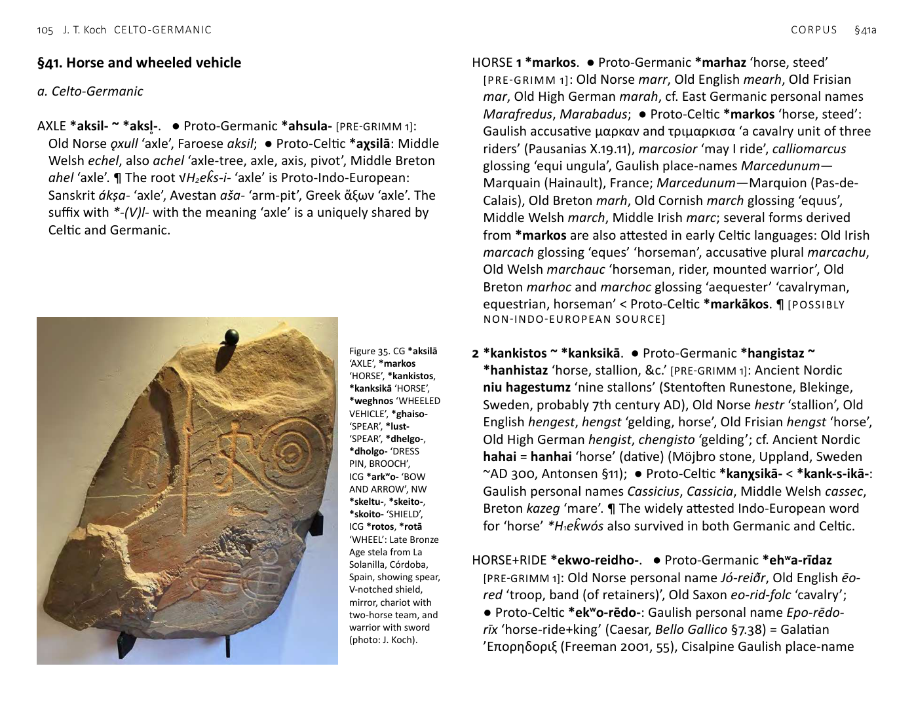
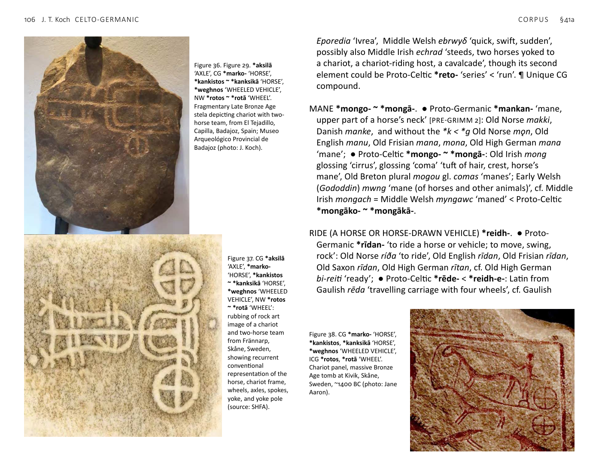
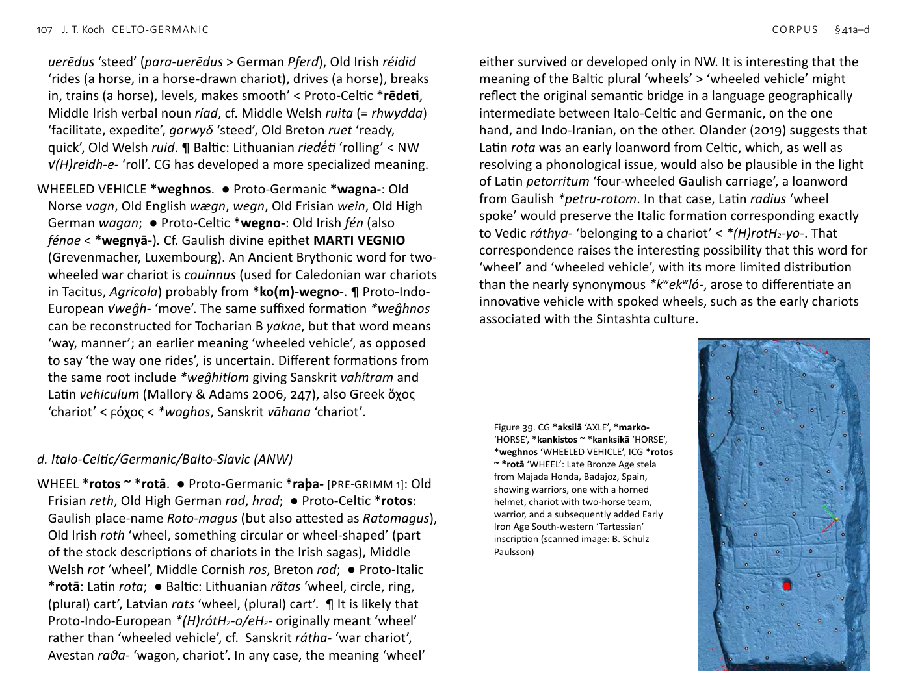

<!-- page: 105 -->

# §41. Horse and wheeled vehicle
a. Celto-Germanic
AXLE *aksil- ~ *aksl̥-. ● Proto-Germanic *ahsula- [PRE-GRIMM 1]:
Old Norse ǫxull ‘axle’, Faroese aksil; ● Proto-Celtic *aχsilā: Middle
Welsh echel, also achel ‘axle-tree, axle, axis, pivot’, Middle Breton
ahel ‘axle’. ¶ The root √H₂ek̂s-i- ‘axle’ is Proto-Indo-European:
Sanskrit ákṣa- ‘axle’, Avestan aša- ‘arm-pit’, Greek ἄξων ‘axle’. The
suffix with *-(V)l- with the meaning ‘axle’ is a uniquely shared by
Celtic and Germanic.
HORSE 1 *markos. ● Proto-Germanic *marhaz ‘horse, steed’
[PRE-GRIMM 1]: Old Norse marr, Old English mearh, Old Frisian
mar, Old High German marah, cf. East Germanic personal names
Marafredus, Marabadus; ● Proto-Celtic *markos ‘horse, steed’:
Gaulish accusative μαρκαν and τριμαρκισα ‘a cavalry unit of three
riders’ (Pausanias X.19.11), marcosior ‘may I ride’, calliomarcus
glossing ‘equi ungula’, Gaulish place-names Marcedunum—
Marquain (Hainault), France; Marcedunum—Marquion (Pas-de-
Calais), Old Breton marh, Old Cornish march glossing ‘equus’,
Middle Welsh march, Middle Irish marc; several forms derived
from *markos are also attested in early Celtic languages: Old Irish
marcach glossing ‘eques’ ‘horseman’, accusative plural marcachu,
Old Welsh marchauc ‘horseman, rider, mounted warrior’, Old
Breton marhoc and marchoc glossing ‘aequester’ ‘cavalryman,
equestrian, horseman’ < Proto-Celtic *markākos. ¶ [POSSIBLY
NON-INDO-EUROPEAN SOURCE]
2 *kankistos ~ *kanksikā. ● Proto-Germanic *hangistaz ~
*hanhistaz ‘horse, stallion, &c.’ [PRE-GRIMM 1]: Ancient Nordic
niu hagestumz ‘nine stallons’ (Stentoften Runestone, Blekinge,
Sweden, probably 7th century AD), Old Norse hestr ‘stallion’, Old
English hengest, hengst ‘gelding, horse’, Old Frisian hengst ‘horse’,
Old High German hengist, chengisto ‘gelding’; cf. Ancient Nordic
hahai = hanhai ‘horse’ (dative) (Möjbro stone, Uppland, Sweden
~AD 300, Antonsen §11); ● Proto-Celtic *kanχsikā- < *kank-s-ikā-:
Gaulish personal names Cassicius, Cassicia, Middle Welsh cassec,
Breton kazeg ‘mare’. ¶ The widely attested Indo-European word
for ‘horse’ *H₁ek̂wós also survived in both Germanic and Celtic.
HORSE+RIDE *ekwo-reidho-. ● Proto-Germanic *ehʷa-rīdaz
[PRE-GRIMM 1]: Old Norse personal name Jó-reiðr, Old English ēo-
red ‘troop, band (of retainers)’, Old Saxon eo-rid-folc ‘cavalry’;
● Proto-Celtic *ekʷo-rēdo-: Gaulish personal name Epo-rēdo-
rīx ‘horse-ride+king’ (Caesar, Bello Gallico §7.38) = Galatian
’Επορηδοριξ (Freeman 2001, 55), Cisalpine Gaulish place-name

Figure 35. CG *aksilā
‘AXLE’, *markos
‘HORSE’, *kankistos,
*kanksikā ‘HORSE’,
*weghnos ‘WHEELED
VEHICLE’, *ghaiso-
‘SPEAR’, *lust-
‘SPEAR’, *dhelgo-,
*dholgo- ‘DRESS
PIN, BROOCH’,
ICG *arkʷo- ‘BOW
AND ARROW’, NW
*skeltu-, *skeito-,
*skoito- ‘SHIELD’,
ICG *rotos, *rotā
‘WHEEL’: Late Bronze
Age stela from La
Solanilla, Córdoba,
Spain, showing spear,
V-notched shield,
mirror, chariot with
two-horse team, and
warrior with sword
(photo: J. Koch).
<!-- page: 106 -->
Eporedia ‘Ivrea’, Middle Welsh ebrwyδ ‘quick, swift, sudden’,
possibly also Middle Irish echrad ‘steeds, two horses yoked to
a chariot, a chariot-riding host, a cavalcade’, though its second
element could be Proto-Celtic *reto- ‘series’ < ‘run’. ¶ Unique CG
compound.
MANE *mongo- ~ *mongā-. ● Proto-Germanic *mankan- ‘mane,
upper part of a horse’s neck’ [PRE-GRIMM 2]: Old Norse makki,
Danish manke, and without the *k < *g Old Norse mǫn, Old
English manu, Old Frisian mana, mona, Old High German mana
‘mane’; ● Proto-Celtic *mongo- ~ *mongā-: Old Irish mong
glossing ‘cirrus’, glossing ‘coma’ ‘tuft of hair, crest, horse’s
mane’, Old Breton plural mogou gl. comas ‘manes’; Early Welsh
(Gododdin) mwng ‘mane (of horses and other animals)’, cf. Middle
Irish mongach = Middle Welsh myngawc ‘maned’ < Proto-Celtic
*mongāko- ~ *mongākā-.
RIDE (A HORSE OR HORSE-DRAWN VEHICLE) *reidh-. ● Proto-
Germanic *rīdan- ‘to ride a horse or vehicle; to move, swing,
rock’: Old Norse ríða ‘to ride’, Old English rīdan, Old Frisian rīdan,
Old Saxon rīdan, Old High German rītan, cf. Old High German
bi-reiti ‘ready’; ● Proto-Celtic *rēde- < *reidh-e-: Latin from
Gaulish rēda ‘travelling carriage with four wheels’, cf. Gaulish

Figure 37. CG *aksilā
‘AXLE’, *marko-
‘HORSE’, *kankistos
~ *kanksikā ‘HORSE’,
*weghnos ‘WHEELED
VEHICLE’, NW *rotos
~ *rotā ‘WHEEL’:
rubbing of rock art
image of a chariot
and two-horse team
from Frännarp,
Skåne, Sweden,
showing recurrent
conventional
representation of the
horse, chariot frame,
wheels, axles, spokes,
yoke, and yoke pole
(source: SHFA).

Figure 36. *aksilā
‘AXLE’, CG *marko- ‘HORSE’,
*kankistos ~ *kanksikā ‘HORSE’,
*weghnos ‘WHEELED VEHICLE’,
NW *rotos ~ *rotā ‘WHEEL’.
Fragmentary Late Bronze Age
stela depicting chariot with two-
horse team, from El Tejadillo,
Capilla, Badajoz, Spain; Museo
Arqueológico Provincial de
Badajoz (photo: J. Koch).

Figure 38. CG *marko- ‘HORSE’,
*kankistos, *kanksikā ‘HORSE’,
*weghnos ‘WHEELED VEHICLE’,
ICG *rotos, *rotā ‘WHEEL’.
Chariot panel, massive Bronze
Age tomb at Kivik, Skåne,
Sweden, ~1400 BC (photo: Jane
Aaron).
<!-- page: 107 -->
uerēdus ‘steed’ (para-uerēdus > German Pferd), Old Irish réidid
‘rides (a horse, in a horse-drawn chariot), drives (a horse), breaks
in, trains (a horse), levels, makes smooth’ < Proto-Celtic *rēdeti,
Middle Irish verbal noun ríad, cf. Middle Welsh ruita (= rhwydda)
‘facilitate, expedite’, gorwyδ ‘steed’, Old Breton ruet ‘ready,
quick’, Old Welsh ruid. ¶ Baltic: Lithuanian riedė́ti ‘rolling’ < NW
√(H)reidh-e- ‘roll’. CG has developed a more specialized meaning.
WHEELED VEHICLE *weghnos. ● Proto-Germanic *wagna-: Old
Norse vagn, Old English wægn, wegn, Old Frisian wein, Old High
German wagan; ● Proto-Celtic *wegno-: Old Irish fén (also
fénae < *wegnyā-). Cf. Gaulish divine epithet MARTI VEGNIO
(Grevenmacher, Luxembourg). An Ancient Brythonic word for two-
wheeled war chariot is couinnus (used for Caledonian war chariots
in Tacitus, Agricola) probably from *ko(m)-wegno-. ¶ Proto-Indo-
European √weĝh- ‘move’. The same suffixed formation *weĝhnos
can be reconstructed for Tocharian B yakne, but that word means
‘way, manner’; an earlier meaning ‘wheeled vehicle’, as opposed
to say ‘the way one rides’, is uncertain. Different formations from
the same root include *weĝhitlom giving Sanskrit vahítram and
Latin vehiculum (Mallory & Adams 2006, 247), also Greek ὄχος
‘chariot’ < ϝόχος < *woghos, Sanskrit vāhana ‘chariot’.
d. Italo-Celtic/Germanic/Balto-Slavic (ANW)
WHEEL *rotos ~ *rotā. ● Proto-Germanic *raþa- [PRE-GRIMM 1]: Old
Frisian reth, Old High German rad, hrad; ● Proto-Celtic *rotos:
Gaulish place-name Roto-magus (but also attested as Ratomagus),
Old Irish roth ‘wheel, something circular or wheel-shaped’ (part
of the stock descriptions of chariots in the Irish sagas), Middle
Welsh rot ‘wheel’, Middle Cornish ros, Breton rod; ● Proto-Italic
*rotā: Latin rota; ● Baltic: Lithuanian ra͂tas ‘wheel, circle, ring,
(plural) cart’, Latvian rats ‘wheel, (plural) cart’. ¶ It is likely that
Proto-Indo-European *(H)rótH₂-o/eH₂- originally meant ‘wheel’
rather than ‘wheeled vehicle’, cf. Sanskrit rátha- ‘war chariot’,
Avestan raθa- ‘wagon, chariot’. In any case, the meaning ‘wheel’
either survived or developed only in NW. It is interesting that the
meaning of the Baltic plural ‘wheels’ > ‘wheeled vehicle’ might
reflect the original semantic bridge in a language geographically
intermediate between Italo-Celtic and Germanic, on the one
hand, and Indo-Iranian, on the other. Olander (2019) suggests that
Latin rota was an early loanword from Celtic, which, as well as
resolving a phonological issue, would also be plausible in the light
of Latin petorritum ‘four-wheeled Gaulish carriage’, a loanword
from Gaulish *petru-rotom. In that case, Latin radius ‘wheel
spoke’ would preserve the Italic formation corresponding exactly
to Vedic ráthya- ‘belonging to a chariot’ < *(H)rotH₂-yo-. That
correspondence raises the interesting possibility that this word for
‘wheel’ and ‘wheeled vehicle’, with its more limited distribution
than the nearly synonymous *kʷekʷló-, arose to differentiate an
innovative vehicle with spoked wheels, such as the early chariots
associated with the Sintashta culture.

Figure 39. CG *aksilā ‘AXLE’, *marko-
‘HORSE’, *kankistos ~ *kanksikā ‘HORSE’,
*weghnos ‘WHEELED VEHICLE’, ICG *rotos
~ *rotā ‘WHEEL’: Late Bronze Age stela
from Majada Honda, Badajoz, Spain,
showing warriors, one with a horned
helmet, chariot with two-horse team,
warrior, and a subsequently added Early
Iron Age South-western ‘Tartessian’
inscription (scanned image: B. Schulz
Paulsson)
