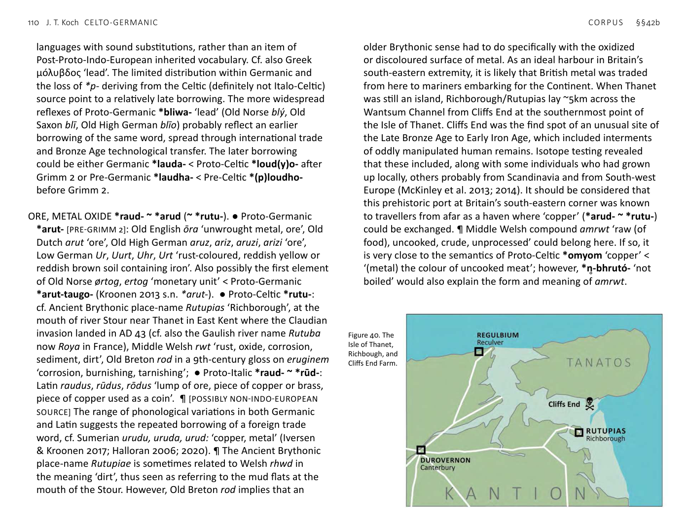

<!-- page: 108 -->

# §42. Exchange and metallurgy
a. Celto-Germanic
BOOTY, PROFIT *bhoudi- ~ bhudi-. ● Proto-Germanic *buti-
[PRE-GRIMM 2]: Old Norse býti ‘exchange, barter’, Middle English
botye, buty ‘plunder, gain, profit shared amongst winners’,
Middle Low German būte, buite ‘exchange, booty’, German Beute
‘booty’; ● Proto-Celtic *boudi-: Gaulish Boudi-latis, Galatian
Βουδο-ρις, Hispano-Celtic BOVDIVS (AE, 1975, 514 & 515 — Coria,
Cáceres) and BOVDENNA CAMALI F. (CIL II, 625 / 5274; CPILC,
521 — Trujillo, Cáceres), BOVDICA SEMPRONI (HAE, 1090 —
Idanha-a-Velha, Idanha-a-Nova, Castelo Branco); BOVDICAE
TONGI F. MATRI (AE, 1967, 170; Albertos 1983, 872 — Telhado,
Fundão, Castelo Branco) = Ancient Brythonic Boudica, Old Irish
búaid glossing ‘triumphus’ ‘victory, gain, profit’, buadach glossing
‘triumphale’ ‘victorious, triumphant’ < Proto-Celtic *boudāko- ~
*boudākā-, Middle Welsh buδ ‘profit, advantage’, Old Breton bud
glossing ‘bradium’ ‘prize, reward’, cf. Old Welsh budicaul glossing
‘victo’ ‘victorious’, budicolma glossing ‘lapis per uictorie, uel
crepido’ ‘place of victory’.
COAL, CHARCOAL *gulo- ~ *geulo- ~ glōwo-. ● Proto-Germanic
*kula- ~ *kulan- [PRE-GRIMM 2]: Old Norse kol (plural), Old English
col, Old Frisian kole, kōle, Old High German kolo, kol; ● Proto-
Celtic *glāuo-: Middle Welsh glo(u) ‘charcoal, coal’ and Proto-
Celtic *goulo-: Middle Irish gúal ‘charcoal, coal’. ¶ Sanskrit jvalati
‘burns’, Tocharian B śoliye ‘hearth’, Lithuanian žvìlti ‘to shine’ <
Proto-Indo-European *ĝul̥H-. The meaning ‘coal’ appears to be
uniquely Celto-Germanic.
COUNTING, NUMBER *rīma-. ● Proto-Germanic *rīma-: Old Norse
rím ‘computation’, Old English rím ‘number’, Old High German
rīm ‘account, series, number’; ● Proto-Celtic *rīma-: Old Irish
rím ‘act of counting, enumerating, number’, Middle Welsh rif
‘sum, number, counting, reckoning’, cf. cyfrif ‘(numerical) account,
computation’, Old Breton ri[m] glossing ‘summa’. ¶ Unique CG
form and meaning from Proto-Indo-European √Harei(Hx)- ‘count
out’.
INNUMERABLE, COUNTLESS *n̥-rīm-. ● Proto-Germanic *unrīma-:
Old Saxon unrīm ‘huge number’; ● Proto-Celtic *amrīm- <
*anrīm-: Early Welsh ebrifet ‘innumerable’. ¶ The negative prefix
becoming Proto-Celtic *am- < Proto-Indo-European *n̥- before
*l- and *r- is due to a generalization of negative compounds where
there had been, before Pre-Celtic weakening and loss of *p, *m̥ pl-
and *m̥ pr- by assimilation from Proto-Indo-European *n̥-pl- and
*m̥ -pr-.
IRON *isarno- ~ *īsarno-. ● Proto-Germanic *īsarna- ~ *īzarna-:
Gothic eisarn, Old Norse ísarn, Old English, Old Saxon, Old High
German īsarn; ● Proto-Celtic *isarno-: Gaulish place-name Isarno-
dori ‘ferrei ostii’, Old Irish ïarn; common in personal names Old
Welsh hearn, Old Breton hoiarn, also Iarn- as an initial element in
compound names, Old Cornish -hoern, also Iarn-, Middle Welsh
haearn. ¶ Usually interpreted as a prehistoric loanword from
Celtic to Germanic, possibly early in the Iron Age (Schmidt 1984;
1986a; 1991; Fulk 2018, 7). However, iron, though relatively rare,
was known before it became the standard fabric for weapons
and tools. ¶ [POSSIBLY NON-INDO-EUROPEAN SOURCE] However,
derivation from Proto-Indo-European √H₁esH₂r- ‘blood’, then
transfer of Proto-Celtic *īsarnom ‘iron’ to Germanic, is proposed
by Schumacher (2007, 173).
POLISH, SHARPEN, WHET *sleimo- ~ *slimo-. ● Proto-Germanic
*(slīmo-: Old High German slīmen ‘polish, rub smooth’; ● Proto-
Celtic *(s)limo-, *(s)līmo-: Middle Irish límaid ‘sharpens, grinds,
polishes’, limsat ‘they polished’; also Proto-Celtic *slim(o)no-
‘polished, smooth’: Old Irish slemon, slemain ‘smooth, sleek,
polished’, Old Welsh limnint ‘they polish’, Middle Welsh llyfn
‘polished, smooth’, Old Breton limn glossing ‘lentum’ ‘tough,
<!-- page: 109 -->
resistant, unyielding’, Breton levn ‘smooth’; ● Italic (?): possibly
Latin līma ‘carpenter’s file’, līmāre ‘to rub smooth, polish’.
¶ Possibly derived from Proto-Indo-European *(s)ley-m- ‘smear
(with grease), polish’ >? ‘slick, smooth’, cf. Proto-Germanic *slīma-
‘slime’, Latin līmōsus ‘slimy, muddy’. ¶ Old Irish slim ‘smooth,
sleek, flat’ is possibly related. More clearly related to that
formation are Middle Welsh llym ‘sharp, pointed’, Middle Breton
lemm ‘smooth, slick’ and the verbs Old Breton lemhaam glossing
‘acuo’ ‘I sharpen’, Middle Welsh llymhau ‘sharpen, whet, hone,
make a sharp edge or point, file’. It is possible that Middle Irish
límaid is borrowed from Latin līmare.
RED METAL, METAL THE COLOUR OF RAW MEAT *ēmo- ~ *omyom
< *omó-. ● Proto-Germanic *ēma-: Old English ōm ‘rust’, ōmian
‘become rusty’, ōmig ‘rusty, rust-coloured’; ● Proto-Celtic
*omyom: Old Irish umae ‘copper, bronze’, Old Welsh o emid
glossing ‘ex aere’ ‘of bronze’, plural emedou glossing ‘aera’, Middle
Welsh efyδ ‘bronze, brass, copper; brazen, copper-coloured’.
¶ Proto-Indo-European *H₁éH₁-mon- ~ *H₁oH₁-mó- ‘red, raw’ is
attested beyond the NW languages: Greek ὠμός ‘raw, uncooked,
cruel, savage’, Sanskrit āmá- ‘raw’, Armenian hum ‘raw, cruel,
savage’, as well as Old Norse áma, Old English ōman ‘erysipelas’
(a skin ailment with a characteristic red rash), Old Irish om ‘raw,
uncooked, bleeding (of flesh), crude, immature, rude, unrefined’,
Middle Welsh of ‘crude, untreated, uncooked’ < Proto-Celtic
*omó-, possibly also in the Gaulish personal name OMVLLVS. The
use of a special related formation from this root for distinctively
red metals is uniquely Celto-Germanic.
WORTH, PRICE, VALUE *werto-. ● Proto-Germanic *werþaz
[PRE-GRIMM 1]: Gothic wairþs, Old Norse verðr, Old English weorþ,
Old Frisian, Old Saxon werth, Old High German werd ‘worth’;
● Proto-Celtic *werto-: Old Breton uuert ‘worth’, Middle Breton
guerz ‘sale’, Middle Welsh gwerth ‘worth, price, value, sale,
exchange’, cf. the legal term Old Breton enep-uuert = Middle
Welsh wyneb-werth ‘honour price’, literally ‘ face price’, also the
Old Cornish personal name Wenwærthlon, a compound of ‘white,
blessed’ and ‘valuable’. ¶ CG semantic development from Proto-
Indo-European √wert- ‘turn’: Sanskrit vártati ‘turns’, Mitanni Indic
wartana occurring in several terms for turning of chariots in the
horse-training manual of Kikuli (Raulwing 2000; 2009), Latin
uertō ‘turn’, Lithuanian vĩrsti, Old Church Slavonic vъrtěti ‘turns
around’. ¶ Although English worth has now influenced the usage
of Modern Welsh gwerth, as in cnegwerth ‘penny’s worth’, Old
Breton enep-uuert shows that Brythonic gwerth is not a loanword
from English.
b. Italo-Celtic/Germanic (ICG)
BENEFIT, PRIZE (?) *lou- ~ *lu-. ● Proto-Germanic *launa- ‘reward,
recompense’ < Pre-Germanic *louno-: Gothic laun, Old Norse
laun, Old English lēan, Old Frisian lān, Old Saxon lōn, Old High
German lōn; ● Proto-Celtic *louk- ~ *lukā: Old Irish lóg, lúag,
lúach ‘value, equivalent, worth, reward, payment, price, wage,
fee’, Modern Irish luach, Middle Welsh lloc ‘interest, profit,
benefit, fee’; ● Proto-Italic *luklom: Latin lucrum ‘material
gain, profit’. ¶ The ICG meanings are especially close, but not far
removed from Dorian Greek λᾱίᾱ ‘booty’ < *λᾱϝίᾱ. ¶ In view of
the close correspondence of meaning, the Irish and Welsh are
clearly the same word, but they cannot be exact cognates, but
must either reflect different vowel grades (Primitive Irish *loukos
vs. Ancient Brythonic *lukā) or a loan between Goidelic and
Brythonic.
LEAD (metal) *plobdho-. ● Proto-Germanic *lauda- [borrowed
after the loss of *p in Celtic]: possibly Old Norse lauð, Old English
lēad, Old Frisian lâd, Middle High German lôt; ● Proto-Celtic
*(p)loudyo-: Middle Irish lúaide; ● Proto-Italic *plumbo- <
*plumdho-: Latin plumbum. ¶ [POSSIBLY NON-INDO-EUROPEAN
SOURCE] These forms look like prehistoric loanwords between
<!-- page: 110 -->
languages with sound substitutions, rather than an item of
Post-Proto-Indo-European inherited vocabulary. Cf. also Greek
μóλυβδος ‘lead’. The limited distribution within Germanic and
the loss of *p- deriving from the Celtic (definitely not Italo-Celtic)
source point to a relatively late borrowing. The more widespread
reflexes of Proto-Germanic *bliwa- ‘lead’ (Old Norse blý, Old
Saxon blī, Old High German blīo) probably reflect an earlier
borrowing of the same word, spread through international trade
and Bronze Age technological transfer. The later borrowing
could be either Germanic *lauda- < Proto-Celtic *loud(y)o- after
Grimm 2 or Pre-Germanic *laudha- < Pre-Celtic *(p)loudho-
before Grimm 2.
ORE, METAL OXIDE *raud- ~ *arud (~ *rutu-). ● Proto-Germanic
*arut- [PRE-GRIMM 2]: Old English ōra ‘unwrought metal, ore’, Old
Dutch arut ‘ore’, Old High German aruz, ariz, aruzi, arizi ‘ore’,
Low German Ur, Uurt, Uhr, Urt ‘rust-coloured, reddish yellow or
reddish brown soil containing iron’. Also possibly the first element
of Old Norse ørtog, ertog ‘monetary unit’ < Proto-Germanic
*arut-taugo- (Kroonen 2013 s.n. *arut-). ● Proto-Celtic *rutu-:
cf. Ancient Brythonic place-name Rutupias ‘Richborough’, at the
mouth of river Stour near Thanet in East Kent where the Claudian
invasion landed in AD 43 (cf. also the Gaulish river name Rutuba
now Roya in France), Middle Welsh rwt ‘rust, oxide, corrosion,
sediment, dirt’, Old Breton rod in a 9th-century gloss on eruginem
‘corrosion, burnishing, tarnishing’; ● Proto-Italic *raud- ~ *rūd-:
Latin raudus, rūdus, rōdus ‘lump of ore, piece of copper or brass,
piece of copper used as a coin’. ¶ [POSSIBLY NON-INDO-EUROPEAN
SOURCE] The range of phonological variations in both Germanic
and Latin suggests the repeated borrowing of a foreign trade
word, cf. Sumerian urudu, uruda, urud: ‘copper, metal’ (Iversen
& Kroonen 2017; Halloran 2006; 2020). ¶ The Ancient Brythonic
place-name Rutupiae is sometimes related to Welsh rhwd in
the meaning ‘dirt’, thus seen as referring to the mud flats at the
mouth of the Stour. However, Old Breton rod implies that an
older Brythonic sense had to do specifically with the oxidized
or discoloured surface of metal. As an ideal harbour in Britain’s
south-eastern extremity, it is likely that British metal was traded
from here to mariners embarking for the Continent. When Thanet
was still an island, Richborough/Rutupias lay ~5km across the
Wantsum Channel from Cliffs End at the southernmost point of
the Isle of Thanet. Cliffs End was the find spot of an unusual site of
the Late Bronze Age to Early Iron Age, which included interments
of oddly manipulated human remains. Isotope testing revealed
that these included, along with some individuals who had grown
up locally, others probably from Scandinavia and from South-west
Europe (McKinley et al. 2013; 2014). It should be considered that
this prehistoric port at Britain’s south-eastern corner was known
to travellers from afar as a haven where ‘copper’ (*arud- ~ *rutu-)
could be exchanged. ¶ Middle Welsh compound amrwt ‘raw (of
food), uncooked, crude, unprocessed’ could belong here. If so, it
is very close to the semantics of Proto-Celtic *omyom ‘copper’ <
‘(metal) the colour of uncooked meat’; however, *n̥-bhrutó- ‘not
boiled’ would also explain the form and meaning of amrwt.

Figure 40. The
Isle of Thanet,
Richbough, and
Cliffs End Farm.
<!-- page: 111 -->
c. Celto-Germanic/Balto-Slavic (CGBS)
METALLURGY *(s)mei- ~ *(s)mi-. ● Proto-Germanic *smiþu- ‘smith’
< Pre-Germanic *smi-tu- [PRE-GRIMM 1]: Gothic aiza-smiþa ‘copper
smith’, Old Norse smiðr, Old English smiþ, Old Frisian smeth,
Old Saxon -smið, Old High German smid; ● Proto-Celtic *mēni-
‘mineral, metal’ < *(s)mei-ni-, *(s)moi-ni-: Gallo-Latin mina
‘mine’ (the source of the English word), Old Irish méin, mían ‘ore,
metal, mineral’, cf. Old Irish móin, maín ‘treasure, something very
valuable’, Middle Welsh mwyn ‘ore, mineral, mine’, Welsh mwyn-
glawdd ‘mine, pit, mineshaft’ = Breton men-gleuz, cf. Middle Irish
claide mianna ‘delving mines’; ● Balto-Slavic: Old Church Slavonic
mèdĭ ‘mineral’, Russian mèdĭ ‘copper’, cf. possibly Lithuanian
maĩnas, Old Church Slavonic měna ‘exchange’. ¶ This example is
not counted in the statistics for Germanic words pre-dating the
operation of the Grimm 1 sound shift, because the evidence for
the change is evident only in the suffix *-tu- (>*-þu-), which is
found only in the Germanic examples.
SILVER *silVbr-. ● Proto-Germanic *silubra-: Gothic silubr, Old
Norse silfr, Old English siolfor, siolufr, Old Frisian selover, selver,
Old Saxon siluƀar, siloƀar, Old High German silabar; ● Celtic:
Celtiberian silabur; ● Balto-Slavic: Lithuanian sidãbras, Old
Prussian siraplis, Old Church Slavonic sъrebro. ¶ [POSSIBLY
NON-INDO-EUROPEAN SOURCE] Kroonen (2013, 436): ‘A non-IE
Wanderwort whose distribution appears to be “circum-Celtic”.’
Cf. Basque zilhar, also zilar, zildar, zirar. ¶ It is possible that the
group name Silures in what is now South-east Wales belongs
here, likewise the Silurus mons in Spain near the Greek colony of
Mainake and present-day Malaga (Avienus, Ora Maritima 433).
