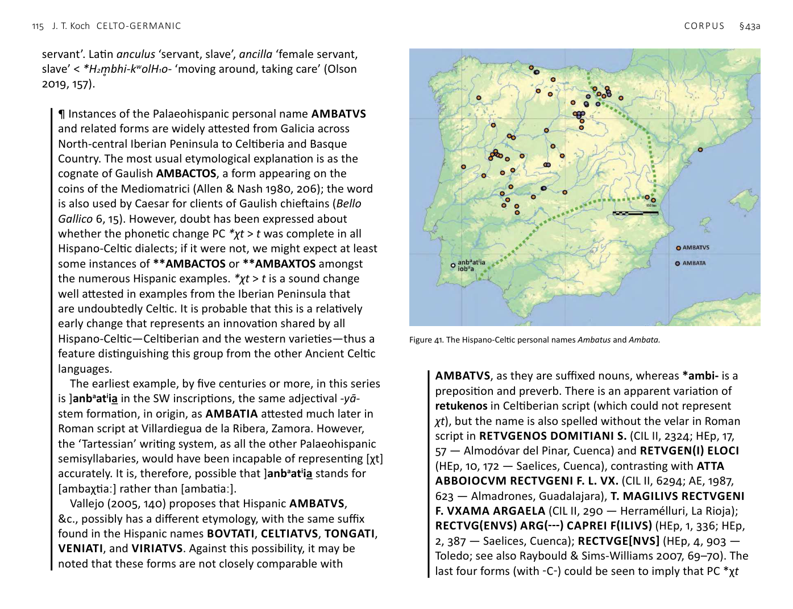
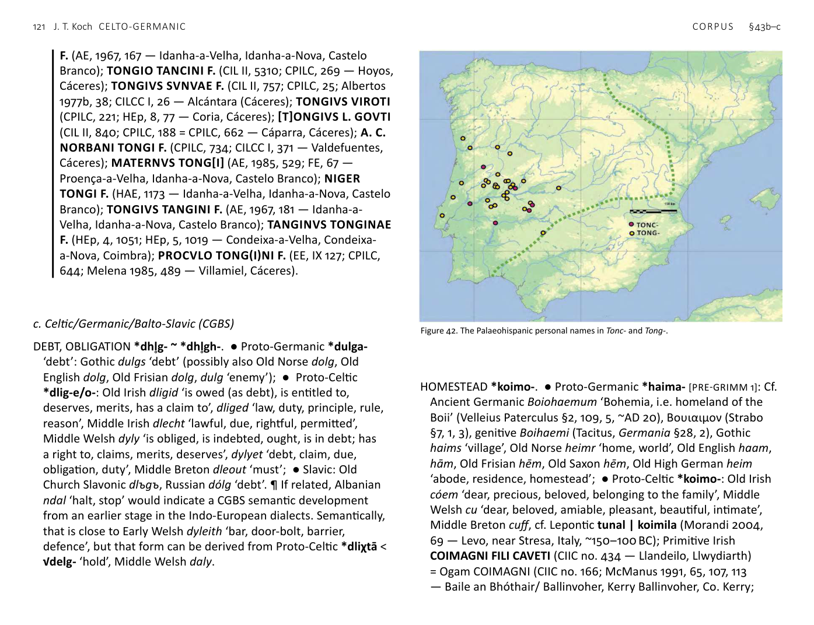

<!-- page: 111 -->

# §43. Ideology and social organization
a. Celto-Germanic (CG)
BLAME *lok-. ● Proto-Germanic *lahana- ‘to reproach’ < Pre-
Germanic *lok-e/o- [PRE-GRIMM 1]: Old Norse lá, Old English
lēan, Old High German lahan; ● Proto-Celtic *loχtus < *lok-tu-:
Old Irish locht ‘fault, shortcoming, error, vice, offence, physical
blemish’.
CORRECT, RIGHT, JUST *rektus < Proto-Indo-European *H₃reĝ-tu-.
● Proto-Germanic *rehtuz: Gothic raihts attested only in the
meaning ‘straight’, Old Norse réttr ‘right, legal order, straight,
correct’, Old English riht ‘right’, Old Saxon reht, Old High German
reht ‘straight, good, right’; ● Proto-Celtic *reχtus: Ancient Celtic
Personal names: Gaulish REXTVGENOS SVLLIAS AVVOT (inscribed
figurine, RIG II L-22; Lambert 1994, 121–2 — Caudebec-en-Caux,
Upper Normandy), Celtiberian retukenos telkaskum (B3, IV-24 —
Botorrita, Zaragoza), retukenos kustikum (B3, IV-33 — Botorrita,
Zaragoza); RETVGENOS DOMITIANI S. (CIL II, 2324; Hernando
2007; HEp, 17, 57 — Almodóvar del Pinar, Cuenca), RETVGEN(I)
ELOCI (HEp, 10, 172 — Saelices, Cuenca); ATTA ABBOIOCVM
RECTVGENI F. L. VX. (CIL II, 6294; AE, 1987, 623; Abascal 1983, 3
— Almadrones, Guadalajara), T. MAGILIVS RECTVGENI F. VXAMA
ARGAELA (CIL II, 2907; Espinosa 1986, 44 — Herramélluri, La
Rioja), Old Irish recht ‘law, rule, authority, ordinance, scripture’,
Middle Welsh reyth ‘law, sermon, jury, verdict’, kyf-reith ‘law’,
cf. the Old Welsh name Cobreidan, Cibreithan, Middle Breton
reiz ‘law, rule, arrangement’. ¶ The basic sense found in Proto-
Germanic *rehtaz = Latin rectus ‘straight’ (verbal adjective of regō
‘guide, direct’), Avestan rašta- straight’, Greek ’ορεκτός ‘straight’
< Proto-Indo-European *H₃reĝ-to- acquired secondary meanings
dealing with law and justice in developments shared by Germanic
and Celtic.
<!-- page: 112 -->
FOREIGNER *alyo-morgi- ~ *alyo-mrogi-. ● Proto-Germanic
*alja-markiz [PRE GRIMM 2]: Ancient Nordic aljamarkiz (Kårstad cliff
inscription, Sogn og Fjordane, Norway post-~AD 400, Antonsen
§40), cf. Gothic alja- ‘other, foreign’, Old English ele-, Old Saxon
and Old High German eli-; Gothic marka ‘boundary, district,
march’, Old Norse mǫrk ‘woods’, Old English mearc ‘boundary,
border, march’, Old High German marca, marcha; ● Proto-
Celtic *alyo-mrogi-: Gaulish group name Allobroges, derivatives
ALLOBROX, ALLOBOXVS, Latinized dative ALLOBROGICINO
(Delamarre 2007, 18), Middle Welsh (14th-century copy of 10th-
century text, Armes Prydein) allfro ‘foreigners’ collective; cf.
Old Irish aile ‘other, second’. ¶ CG *alyo-morgi- ~ -mrogi- is a
compound of words meaning ‘other’ and ‘border area’. Cf. Latin
alius and margō ‘border, border district’. It shows the secondary
meaning in the second element found also in Gaulish broga and
Brythonic bro as ‘country, district’ (compare also the compound
names Brogimaros, Brogitaros, Nitiobroges, Old Irish mruig,
Middle Irish bruig ‘inhabited or cultivated land’), rather than the
earlier sense ‘borderland, march’. The Welsh compound allfro is
the exact formal opposite of Welsh Cymro ‘Welsh person’ < *kom-
brog- ‘person of the same country’. ¶ Persian marz ‘region’ implies
that √morĝ- ‘frontier’ was not limited to CG or NW vocabulary.
FREE *priyo- ~ *priyā-. ● Proto-Germanic *frija- ‘free’
[PRE-GRIMM 1]: Gothic freis, Old English frēo, Old Frisian fri, Old
Saxon fri, Old High German frī; also Gothic frei-hals, Old Norse
frjals, Old English freols ‘free’, cf. also the Germanic goddess name
Frig; ● Proto-Celtic *(p)riyo- ‘free’: Old Breton rid ‘free’, Middle
Welsh ryδ ‘free, not in slavery, having civil and legal rights, not
oppressed, not imprisoned, unrestricted, loose, gratis, lawful,
generous’, Middle Welsh abstract noun ryδyt, ryδit ‘freedom,
liberty, political independence, opposite of captivity’ < notional
*(p)riyotūt-, Old Cornish benen-rid glossing femina, i.e. ‘free
woman’, as opposed to a female slave (ancilla), a meaning also
reflected in Old Saxon frī ‘woman, wife’. ¶ Contrast Old Church
Slavonic prijati ‘be appealing to’, Vedic priyá-, Avestan friia-
‘beloved’, Latin proprius ‘one’s own, peculiar, specific’ < Proto-
Indo-European *priHxós ‘beloved, of one’s own’.
FRIEND, RELATIVE 1 *weni-. ● Proto-Germanic *weni- ‘friend’:
Ancient Nordic uiniz ‘friend’ (bracteate rune, Sønder Rind,
Denmark ~AD 450–530), Old Norse vinr, Old English wine, Old
Frisian winne, Old Saxon wini, Old High German wini ‘friend,
beloved’; ● Proto-Celtic *weni- ‘kindred’, Old Irish fine ‘a group
of persons of the same family’, Gaulish personal name Veni-
carus, Ancient Caledonian group name Veni-kones (Koch 1980),
Old Breton coguenou glossing ‘indigena’, Middle Breton gouen(n)
‘race, kind’. ¶ ?Cf. Latin venia ‘favour, permission’.
HEIR *orbho-. ● Proto-Germanic *arbjan- ‘heir’ < *H₃orbh-
yon-: Gothic arbja, arbinumja ‘inherit’, Ancient Nordic arbijano
genitive plural ‘of heirs’ (Tune stone, Østfold, Norway ~AD 400,
Antonsen §27; Fulk 2018, 169), cf. Old Norse erfi ‘funerary feast’,
Old English ierfe ‘cattle’, Old Frisian erve, Old High German arbeo,
erbeo; ● Proto-Celtic *orbo- ~ *orbyos ~ *orbyā ‘heir, successor,
inheritor’: Old Irish orb, possibly also the Old Irish verb erbaid
‘entrusts, commits’, cf. Gaulish personal names ORBIA, ORBIVS,
ORBISSA. ¶ Proto-Indo-European *H₃orbh-o- ‘bereaved, orphan’:
Sanskrit árbha ‘weak, young’, Latin orbus ‘bereaved, childless,
orphaned’ < Proto-Italic *orfo- < *orbho-, Greek ὀρφανός
orphanós ‘orphaned’, Armenian orb ‘orphan’ (McCone 1999).
HOSTAGE *gheislo- common in Germanic and Celtic in forming
compound names. ● Proto-Germanic *gīsla-: Ancient Nordic
asugisalas = ansu-gīsalas genitive singular (Kragehul spearshaft,
Fyn, Denmark ~AD 300, Antonsen §15), Old Norse gísl, Old English
gīsel, Old Saxon gīsal, Old High German gīsal; ● Proto-Celtic
*gēslo- ‘hostage’: Old Irish gíall ‘human pledge, hostage’, Middle
Welsh gwystyl ‘pledge, surety, hostage’; cf. Gaulish genitive
personal name CONGEISTLI ‘co-hostage’ (Noricum), probably the
<!-- page: 113 -->
same name as the coin legend of the Boii COCESTLVS, Old Welsh
Cat-guistl, Old Cornish Cat-gustel ‘war hostage’, Old Cornish
Tancwoystel ‘peace hostage’ (= Old Welsh Tancoyslt), Wurgustel
‘(adult) male hostage’, Medguistyl ‘mead hostage’.
INHERITANCE *orbhyom. ● Proto-Germanic *arbija: Ancient
Nordic arbija (Tune stone, Østfold, Norway ~AD 400, Antonsen
§27), Gothic arbi ‘wake’, Old Norse arfr ‘inheritance, patrimony’
(< *arba-), erfi ‘wake’, Old English ierfe ‘inheritance’, Old Saxon
erѢi, Old High German arbi, erbi ‘inheritance’; ● Proto-Celtic
*orbiyo- ‘inheritance’: Old Irish orbe, Early Welsh (Gododdin)
wrvyδ ‘inheritance, legacy’ (perheit y wrhyt en wrvyδ ‘his [the
deceased hero’s] valour endures as a legacy’). ¶ Notional Proto-
Indo-European*H₃orbh-yo-.
INTENTION, DESIRE *mein- ~ *moin-. ● Proto-Germanic
*main(j)o-: Old Frisian mēne ‘opinion’, Old High German meina
‘meaning, intention, opinion’; ● Proto-Celtic *mēnom < *mein-
~ *moin-: Old Irish mían ‘desire, inclination, object of desire’,
Old Cornish muin glossing ‘gracilis’ ‘desirable, amiable’, Old
Breton moin glossing dulcis ‘sweet’, Middle Welsh mwyn ‘sweet,
pleasant, amiable, tender’, mwynhau enjoy, take delight in, enjoy
possessing’, go-funed, damunaw ‘to desire, wish’ < *to-ambi-
moin-.
JOKER, FOOL *drūto-. ● Proto-Germanic *trūþa- [PRE-GRIMM 2]
[PRE-GRIMM 1]: Old Norse trúðr glossing ‘histrio’ ‘juggler, fool’, Old
English trūð ‘trumpeter, actor, buffoon’; ● Proto-Celtic *drūto-:
Middle Irish drúth ‘professional jester, fool; legally incompetent,
idiot’, cf. drúthacht ‘buffoonery’, Middle Welsh drut ‘reckless
(in battle), furious, foolish, foolhardy, expensive’. ¶ The Welsh
vowel implies a preform *drouto-. A loanword from Primitive Irish
*drūto- datable to the Roman Period (i.e. after Ancient Brythonic
*ū had become *ǖ and *ō < *ou had become *ū) is one possible
explanation for the Brythonic form.
KING, LEADER *rīg- (< *rēg-). ● Proto-Germanic *rīk- ‘ruler, king’
[PRE-GRIMM 2] [borrowed after Celtic *ī < *ē]: Gothic reiks, cf. also
Gothic reiks ‘rich, powerful’, reikinon ‘to rule’, Old Norse ríkr ‘ruler,
king’, Old English rice, Old High German rīhhi; ● Proto-Celtic *rīχs
‘king’: Hispano-Celtic ERMAEEI DEVORI (dative) epithet of Hermes
< Pre-Celtic *Deiwo-rēgei (CIL II 2473 — Outeiro Seco, Chaves,
Ourense), Gaulish place-name Rigomagus (of three different
places), group name Bituriges, Ancient Brythonic nominative
singular RIX (coin legend), derived form TASCIO[VANOS] | RICON-
(coin legend), divine names/epithets DEO MARTI RIGISAMO (RIB
1–187 — West Coker), DEO MARTI RIGONEMETI (RIB 1–254b —
Nettleham, England), RIGOHENE (CIIC no. 419 — Llanymawddwy)
< *Rīgo-senā, royal name or title with superlative suffix Riothamus
< *Rīgo-tamos, Ogam Irish genitive personal name VOTECORIGAS,
Old Irish rí, Old Welsh singular ri, dual in Dou Rig Habren ‘the Two
Kings of the Severn’ (HB §68). ¶ Proto-Italic *rēks = *rēg-s: Latin
rēx, genitive rēgis < Proto-Indo-European *H₃rḗĝ-s ‘ruler, leader of
ritual’. Although found also in Italic and Indic (Sanskrit rāj- ‘king’),
the long *ī n the Germanic forms imply a prehistoric borrowing
from Pre-/Proto-Celtic *rīg-s.
KING OF THE PEOPLE *teuto-rīg-. ● Proto-Germanic *þiuda-
rīk- [borrowed after Celtic *ī < *ē] [PRE-GRIMM 2] [PRE-GRIMM 1]:
Gothic *Þiudareiks ‘Theodoric’, Old Norse Þjóðrikr, Old English
Đeodric, German Dietrich; ● Proto-Celtic *Touto-rīχs, genitive
*Touto-rīgos: Gaulish Latinized genitive TOVTORIGIS [to be
read for TONTORIGIS, AE 1969/70 no. 502 — Vienne-en-Val],
dative divine epithet APOLLINI TOVTIORIGI (CIL XIII no. 7564 —
Wiesbaden), Old Welsh Tutir, Tutri. ¶ Although both elements of
this compound occur in Italic, there is no trace of the compound
outside Germanic and Celtic. In the Germanic languages, the
fame of Theodoric the Great of the Ostrogoths contributed to
the popularity of the name. In modern Wales, the Tudor dynasty
helped to revive the popularity of Tudur. In the post-Roman
Migration Period Germanic Đeodric, &c., and Brythonic Tutir were
<!-- page: 114 -->
not recognized as equivalent names, and the Germanic name
was borrowed as Old Welsh Teudubric, which became Middle
Welsh Tewdric, reminiscent of the borrowing/adaptation of Greek
Theodōros as Old Welsh Teudebur > Middle Welsh Tewdwr.
KINGDOM, REIGN, REALM *rīgyom ~ *rīgyā < *rēgyā. ● Proto-
Germanic *rīkija [borrowed after Celtic *ī < *ē] [PRE-GRIMM 2]:
Gothic reiki ‘authority’, Old Norse ríki, Old English rīce, Old Frisian
rīke, Old Saxon rīki, Old High German rīhhi; ● Proto-Celtic *rīgyom
~ *rīgyā: Old Irish ríge ‘ruling, kingship, sovereignty’, Middle Welsh
rieδ ‘glory (of God), majesty, kingship, sovereignty’ < *rīgiyā-.
¶ note also the numerous Old and Middle Irish names of
groups and districts inhabited by them in -rige or -raige, also
-airge, with dative -r(a)igiu < Proto-Celtic *rīgyom, dative
*rīgyū ‘kingdom’ used as a collective (examples: Arttraige,
Bentraige, Bibraige, Cáenraige, Callraige, Caraige, Céchtraige,
Cíarraige, Coartraige, Corbbraige, Corccraige, Coscraige,
Crecrige, Cuachraige, Cupraige, Cuthraige, Glasraige,
Granraige, Gubraige, Lamraige, Lusraige, Mendraige,
Múscraige, Nósraige, Osraige, Pápraige, Rosraige, Srobraige,
Techtraige, Tradraige (O’Brien 1962)).
NURTURER, PERSON ACTING AS A PARENT (?) *altro-. ● Germanic.
This etymology is complicated in some cases by the phonological
convergence of two related suffixed forms: the comparative
adjective ‘older’, e.g. Gothic alþiza, and the noun *aldra- <
[PRE-VERNER] *alþra- < Pre-Germanic *altro- [PRE-GRIMM 1], both
from Proto-Indo-European √H₂el- ‘grow, nurture’. When, for
example, Old English ealdor (= Old Norse aldr) means ‘lifetime,
age’, it is evidently derived from the noun, not the adjective
*alþizō-. But when ealdor means ‘parent, ancestor, master,
chief’, cf. German Eltern, Swedish föräldrar, this is possibly a
substantivized, i.e. ‘older (person)’ > ‘parent’, although a noun
meaning ‘parent’ derived from the verb ‘grow, nurture’ is also
understandable. ● Celtic: Old Irish com-altar ‘joint-fosterage’
< Proto-Celtic *kom-altro- is usually seen as cognate with Old
English ealdor ‘lifetime’ from the noun*aldra- < Pre-Germanic
*altro-, similarly widely attested nouns derived from Proto-
Celtic *altrawo- ‘nurturer, person acting as a parent’: Middle
Irish altru ‘foster father, nourisher’, Middle Welsh athro ‘teacher,
tutor, foster parent’, and its variant alltraw ‘godparent, sponsor’
(feminine elltrewyn), likewise Old Breton altro(u) ‘foster father’,
Cornish altrou ‘stepfather’, cf. also Old Irish comaltae ‘comrade’ <
‘foster-brother’ < *kom-altiyos = Scottish Gaelic comhalta ‘foster-
brother’, MW cyfeill(t) ‘friend, fellow, companion, an intimate’, cf.
Old Welsh cimalted ‘wife’ (Tywyn inscription) < *kom-altiyā, Old
Breton personal names Comalt-car, Comal-car. In light of these
Celtic forms, it is most likely that the sense ‘parent’ in Germanic
came originally from the noun *aldra- (the cognate of altru, &c.)
rather than the comparative adjective *alþiza-. ¶ Cf. Olsen 2019,
157.
PERSON ACTING (AT DISTANCE) ON BEHALF OF A SUPERIOR
*m̥ bhakto- ~ *m̥ bhaktā-. ● Proto-Germanic *ambahta- ‘servant,
representative’: Gothic andbahts ‘servant, minister, δια̒κονος’, Old
Norse ambátt ‘bondwoman, concubine’ < feminine *ambahta-,
Old English ambiht ‘office, service, commission, command,
attendant, messenger, officer’, Old High German ambaht ‘servant,
employee, official’; ● Proto-Celtic *ambaχto- ~ *ambaχtā-
‘representative, vassal’ < Pre-Celtic *m̥ bhi-ag-tó- ‘one sent
around’, cf. Old Irish imm·aig ‘drives around, pursues’: common
Hispano-Celtic name Ambatos, feminine Ambata (see below),
Gaulish AMBACTVS, AMBACTOS ‘vassal’, Old Breton ambaith
‘agriculture’, Middle Welsh amaeth ‘ploughman, farmer’ (cf. the
mythological ploughman Amaethon < *Ambaχtonos in Culhwch
ac Olwen and other early Welsh sources). ¶ Etymologically
Proto-Indo-European past passive participle of the compound
verb*H₂m̥ bhi +*h₂eĝ-. ¶ Words for ‘servant’ in other Indo-
European languages have the same preposition as their first
element: Sanskrit abhi-cara ‘servant’, Greek ’αμφίπολος ‘(female)
<!-- page: 115 -->
servant’. Latin anculus ‘servant, slave’, ancilla ‘female servant,
slave’ < *H₂m̥ bhi-kʷolH₁o- ‘moving around, taking care’ (Olson
2019, 157).
¶ Instances of the Palaeo hispanic personal name AMBATVS
and related forms are widely attested from Galicia across
North-central Iberian Peninsula to Celtiberia and Basque
Country. The most usual etymological explanation is as the
cognate of Gaulish AMBACTOS, a form appearing on the
coins of the Mediomatrici (Allen & Nash 1980, 206); the word
is also used by Caesar for clients of Gaulish chieftains (Bello
Gallico 6, 15). However, doubt has been expressed about
whether the phonetic change PC *χt > t was complete in all
Hispano-Celtic dialects; if it were not, we might expect at least
some instances of **AMBACTOS or **AMBAXTOS amongst
the numerous Hispanic examples. *χt > t is a sound change
well attested in examples from the Iberian Peninsula that
are undoubtedly Celtic. It is probable that this is a relatively
early change that represents an innovation shared by all
Hispano-Celtic—Celtiberian and the western varieties—thus a
feature distinguishing this group from the other Ancient Celtic
languages.
The earliest example, by five centuries or more, in this series
is ]anbaatiia in the SW inscriptions, the same adjectival -yā-
stem formation, in origin, as AMBATIA attested much later in
Roman script at Villardiegua de la Ribera, Zamora. However,
the ‘Tartessian’ writing system, as all the other Palaeohispanic
semisyllabaries, would have been incapable of representing [χt]
accurately. It is, therefore, possible that ]anbaatiia stands for
[ambaχtiaː] rather than [ambatiaː].
Vallejo (2005, 140) proposes that Hispanic AMBATVS,
&c., possibly has a different etymology, with the same suffix
found in the Hispanic names BOVTATI, CELTIATVS, TONGATI,
VENIATI, and VIRIATVS. Against this possibility, it may be
noted that these forms are not closely comparable with
AMBATVS, as they are suffixed nouns, whereas *ambi- is a
preposition and preverb. There is an apparent variation of
retukenos in Celtiberian script (which could not represent
χt), but the name is also spelled without the velar in Roman
script in RETVGENOS DOMITIANI S. (CIL II, 2324; HEp, 17,
57 — Almodóvar del Pinar, Cuenca) and RETVGEN(I) ELOCI
(HEp, 10, 172 — Saelices, Cuenca), contrasting with ATTA
ABBOIOCVM RECTVGENI F. L. VX. (CIL II, 6294; AE, 1987,
623 — Almadrones, Guadalajara), T. MAGILIVS RECTVGENI
F. VXAMA ARGAELA (CIL II, 290 — Herramélluri, La Rioja);
RECTVG(ENVS) ARG(---) CAPREI F(ILIVS) (HEp, 1, 336; HEp,
2, 387 — Saelices, Cuenca); RECTVGE[NVS] (HEp, 4, 903 —
Toledo; see also Raybould & Sims-Williams 2007, 69–70). The
last four forms (with -C-) could be seen to imply that PC *χt

Figure 41. The Hispano-Celtic personal names Ambatus and Ambata.
<!-- page: 116 -->
was sometimes retained in Celtiberian. However, it is likely
that the spelling RECTVGENVS was influenced by the correct
perception that the first element of the name was related to
Latin rectus ‘direct, &c.’, cf. the RECTVS RVFI F. who made a
dedication to the indigenous deity REVE LANGANIDAEIGVI
(AE, 1909, 245 — Idanha-a-Nova, Castelo Branco). Note the
hypercorrect Latin spelling in the second-to-last word of
the epigraphic text DVATIVS APINI F. BANDI TATIBEAICVI
VOCTO SOLVI (AE 1961, 87 — Fornos de Algodres, Viseu),
where faulty VOCTO for VOTO implying that Latin rectus was
commonly pronounced [retus] in Hispania. If it is valid to take
Romanized Celtiberian RECTVGENI out of consideration as
proposed, an early and thorough change of Proto-Celtic *χt
to Hispano-Celtic *t would also be consistent with a dialectal
configuration in which Hispano-Celtic went its own way at
an early date and ceased to share innovations with Gaulish,
Brythonic, and Goidelic.
AMBATA, the basic feminine form of the name, does not
occur in the west and is rare to non-extant in the central
region, but is very common in Celtiberia and eastward to the
western Pyrenees.
¶CELTIBERIAN REGION. AMBATA (Abásolo 1974a, 99; Albertos
1975a — Lara de los Infantes, Burgos); AMBATAE [---] SEGEI
F. (Abásolo 1974a, 194 — Quintanilla de las Viñas, Burgos);
AMBATAE AIONCAE T[---]TI F. (Abásolo 1974a, 155 — Lara
de los Infantes, Burgos); AMBATAE AIONCAE LOVGEI F.
(Abásolo 1974a, 185 — Lara de los Infantes, Burgos); AMBATA
ALBEAVCA? SEGOVETIS F. (CIL II, 2855; Abásolo 1974a, 18 —
Iglesia Pinta, Burgos); AMBATA BETVCA AMBATI F. (Abásolo
1974a, 60 — Lara de los Infantes, Burgos); AMBATA CAELICA
CAI F. (Abásolo 1974a, 24 — Iglesia Pinta, Burgos); AMBATA
COR(---) (HEp, 10, 88 — Belorado, Burgos); AMBATAE [D]
ESSIC[A]E RVFI [F.] (SOCERAE) (AE, 1983, 600; HEp, 4, 198
— Lara de los Infantes, Burgos); AMBATAE MEDICAE VERATI
F. (HEp, 10, 81 — Belorado, Burgos); AMBATAE MEDICAE
PLACIDI F. (Abásolo 1974a, 81; HEp, 4, 199 — Lara de los
Infantes, Burgos); AMBATA PAESICA ARGAMONICA AMBATI
VXOR (CIL II, 2856; Abásolo 1974a, 177 — Lara de los Infantes,
Burgos); AMBATA(E) PEDITAGE AMBATI (Reyes 2000, 24;
HEp, 10, 87 — Belorado, Burgos); AMBATAE PLANDIDAE (EE,
VIII 172; Abásolo 1974b, 63–4 — Pancorbo, Burgos); AMB[A]
TAE VENIAENAE VALERI CRESCENTI[S] F. (CIL II, 2878 = CIL II,
2882; Abásolo 1974a, 214; HEp, 5, 153; HEp, 6, 172 — San Pedro
de Arlanza, Hortigüela, Burgos); [CA]LPVRNIAE AMBATAE
LOVGEI F. (AE, 1980, 587 — Lara de los Infantes, Burgos);
SEMPRONIAE AMBATAE CELTIBERI (Abásolo 1974a, 209 —
San Millán de Lara, Burgos); AMBATAE TERENTIAE SEVERI
F. (CIL II, 2857; Abásolo 1974a, 212 — San Pedro de Arlanza,
Hortigüela; Burgos); VALERIA AMBADAE (CIL II, 2909; Abásolo
1974b, 30 — Villafranca, Montes de Oca, Burgos); [---] AMBATI
L. (CIL II, 2884; Abásolo 1974a, 141 — Lara de los Infantes,
Burgos); [A]MBATVS (CIL II, 2790; Palol & Vilella 1987, 219 —
Peñalba de Castro, Burgos); [A]MBATO ALEBBIO [B]ODANI
F. (Reyes 2000, 5 — Belorado, Burgos); AMBATO BVRGAE
SEGILI F. (HEp, 10, 84 — Belorado, Burgos); AMBATVS
VEMENVS ATI F. (Abásolo 1974a, 55 — Lara de los Infantes,
Burgos); AMBATO VIROVARCO (HEp, 9, 246 — Ubierna,
Burgos); ARCEA [---] AMBATI F. (Abásolo 1974a, 188 — Lara
de los Infantes, Burgos); ARCEA [---]AVCA AMBATI TERENTI
F. (EE, VIII 150; Abásolo 1974a, 160 — Lara de los Infantes,
Burgos); CABEDVS SEGGVES AMBATI F. (CIL II, 2863; AE, 1977,
447 — Carazo, Burgos); MADICENVS CALAETVS AMBATI
F. (CIL II, 2869; EE, VIII 154; Abásolo 1974a, 108 — Lara de los
Infantes, Burgos); SECONTIO EBVREN[I]Q(VM) AMBATI F.
(Reyes 2000, 18 — Belorado, Burgos); SEGILO AESPANCO(N)
AMBATA[E] FILIO (HEp, 10, 83 — Belorado, Burgos); TALAVS
CAESARIVS AMBATI F. (Abásolo 1974a, 13 — Hontoria de la
Cantera, Burgos); METELIO REBVRRO AMBATI F. (HEp, 10,
102 — Belorado, Burgos).
<!-- page: 117 -->
¶CENTRAL REGION. AMBAT[O] (HEp, 4, 103; ERAv, 30 — Ávila);
AMBATO (HEp, 4, 72; ERAv, 11 — Ávila); ATA AMBATICORVM
HIRNI F. (HEp, 10, 8; ERAv, 142 — Candeleda, Ávila);
VERNACVLVS AMBATIC(VM) MODESTI F.[ ---] (HEp, 1, 79;
HEp, 9, 83; ERAv, 143 — Candeleda, Ávila); ACCETI CARIQO
AMBATI F. (HEp, 2, 618; ERSg, 5 — Coca, Segovia); AMBAT(A)
(CIL II, 94*/5320 — Talavera de la Reina, Toledo).
¶WESTERN PENINSULA. FVSCI CABEDI AMBATI F. VADINIENSIS
(CIL II, 2709; ERAsturias, 51 — Corao, Cangas de Onís, Asturias);
MACER AMBATI F. OBISOQ(VM (Roso de Luna 1904, 127 —
Casas de Don Pedro, Badajoz); [---] AMBATI F. (HEp, 1, 668;
ERRBragança, 95; HEp, 12, 587 — Donai, Bragança); AMBATVS
(CIL II, 738, 739; CPILC, 44 = CPILC, 45; HEp, 9, 248 — Arroyo
de la Luz, Cáceres); AMBATVS (CPILC, 50; CILCC I, 75 — Arroyo
de la Luz, Cáceres); AMBATVS PE[L]LI (CIL II, 853; CPILC, 392
— Plasencia, Cáceres); A[N]DERCIA AMBATI F. (AE, 1978,
393; AE, 2006, 625; HEp, 15, 92 — Monroy, Cáceres); ARC[O]
NI AMBATI F. CAMALICVM (CPILC, 660 = CPILC, 803 — Villar
del Pedroso, Cáceres); CAMIRA AMBATI (CIL II, 623; CPILC,
527 — Trujillo, Cáceres); CORIA AMBAT(I) F. (CPILC, 146 —
Cáceres); IRINEVS AMBATI F. (CPILC, 367 — Pedroso de
Acim, Cáceres); AMBATVS (ERCan, 8 — Luriezo, Cantabria);
AMBATI PENTOVIECI AMBATIQ. PENTOVI F. (ERCan,
8 — Luriezo, Cantabria); TILLEGVS AMBATI F. SVSARRVS
Ɔ AIOBAIGIAECO (IRLugo, 55; HEp, 8, 334 — Esperante,
Folgoso do Caurel, Lugo); AMBATI BVRILI TVROLI F. (HAE,
1367 — Yecla de Yeltes, Salamanca); AMBATVS DIV<I>LI F.
(HEp, 4, 962 — Hinojosa de Duero, Salamanca); CAVRVNIVS
AMBATI CAVRVNICVM (Albertos 1975a, 18. nº 196 — Yecla de
Yeltes, Salamanca); [A]MBATVS (AE, 1972, 287 — Salamanca);
AMBATVS PINTOVI (HAE, 1327 — Saldeana, Salamanca);
AMBATVS TANCINILI F. (HEp, 2, 617; HEp, 5, 677 — San Martín
del Castañar, Salamanca); CLOVTI[A] AMBATI FILIA (HAE,
1265; Navascués 1966, 212 — Hinojosa de Duero, Salamanca);
IANVA AMBATI (HAE, 1253 — Cerralbo, Salamanca);
MENTINA AMBATI F. (CIL II, 5036; HEp, 10, 513 Yecla de Yeltes,
Salamanca); AMBATI ARQVICI (HEp, 11, 361 — Barruecopardo;
Salamanca); AMBATO ARQVI F. (ERZamora, 114; CIRPZ, 241
— Villalcampo, Zamora); AVELCO AMBATI F. (HAE, 920;
CIRPZ, 246; ERZamora, 29 — Villalcampo, Zamora); PINTOVIO
AMBATI (ILER, 2333; ERZamora, 210; CIRPZ, 271 — Villalcampo,
Zamora; AMBATO (HEp, 18, 486 — Villardiegua de la Ribera,
Zamora); AMBATIA (HEp, 18, 488 —Villardiegua de la Ribera,
Zamora); ¶S.W. INSCRIPTIONS. ]anbaatiia iobaa[ (J.16.2 — San
Salvador, Ourique, Beja) can be provisionally interpreted as
nominative |Amba(χ)tiā i̯ōamā| ‘the youngest daughter of
Amba(χ)tos’ or more generally ‘the youngest kinswoman or
female descendant of Amba(χ)tos’.
¶OUTSIDE THE BRIGA-ZONE. AMBATA APPAE F. (CIL II, 2950
— Contrasta, Álava); AMBATO (HAE, 2522 — Angostina,
Álava); AMBATVS SERME F (CIL II, 2951 — Contrasta, Álava);
AMBA[T]VS PLENDI F. (CIL II, 2948 — Eguilaz, Álava); [A]
MBATVS [A]RAVI F. (HAE, 2571; HEp, 4, 1 — Urabáin, Álava);
[---]CVS AMBATI F (HAE, 2563; HEp, 4, 11 — San Román
de San Millán, Álava); ELANVS TVRAESAMICIO AMBATI
F(ILIVS) (CIL II, 5819; Albertos 1975a, 13. nº 74 — Iruña, Álava);
SEGONTIVS AMBATI VECTI F. (CIL II, 2956 — Contrasta,
Álava); AMBATA (Castillo et al. 1981, 48 — Gastiáin, Navarra);
DOITENA AMBATI CELTI F. (EE, VIII 167; Castillo et al. 1981, 53
— Marañón, Navarra); DOITERV[S ---] AMBATI F. (Castillo et
al. 1981, 55; HEp, 5, 623 — Marañón, Navarra); IVNIA AMBATA
VIRO[NI] F. (CIL II, 5827; Castillo et al. 1981, 45 — Gastiáin,
Navarra); PORCIA AMBATA SEGONTI FILIA (CIL II, 5829; Fita
1913b, 565 — Gastiáin, Navarra); AMBATV[S] (HAE, 185; Alföldy
1975, 337 — Tarragona); L. POSTVMIVS AMBATVS (CIL II,
4024 — Villar del Arzobispo, Valencia).
<!-- page: 118 -->
PLEASANT, FAIR *teki-. ● Proto-Germanic *þakkja- ~ *þekka-
[PRE-GRIMM 1]: Old Norse þekkr ‘pleasant’, Old High German decki
‘dear’; ● Proto-Celtic *teki- ‘beautiful, fair, handsome, dear,
pleasant’: Old Cornish teg glossing ‘pulcher’ ‘beautiful’, Middle
Welsh tec ‘fair, beautiful, handsome, pretty, rine, neat; agreeable,
amiable, dear, pleasant; impartial, just reasonable’, cf. negatived
Old Irish étig ‘unnatural, unseemly, ugly, repulsive’ = Middle Welsh
annhec ‘unbeautiful, inelegant’ < Proto-Celtic *an-teki-.
RELATIVE, FRIEND < ONE WHO LOVES 2 *priyānt-. ● Proto-
Germanic *frijand- ~ *frijōnd- [PRE-GRIMM 1]: Gothic frijonds
‘friend’, Old Norse frændi, frjándi ‘relative, friend’, runic frændi
(the meaning is ‘relative’ in the modern Scandinavian languages),
Old English frēond ‘friend, loved one, relative’, Old Frisian friūnd,
friōnd ‘friend, loved one, relative’, Old High German friunt ‘friend,
loved one’; ● Proto-Celtic *(p)riyant-: Middle Welsh ryeni, reeny,
also rienni, hrienni (with double nn < *nt) ‘parents, forefathers,
ancestors, close family, kindred, descendants, heirs’, Welsh rhiaint
‘parents, ancestors, elders’, singular rhiant. ¶ This is a specialized
CG lexicalized development of the participle of Proto-Indo-
European *priHx-eHa- ‘love’, cf. Sanskrit prīyate ‘to be pleased’, Old
Church Slavonic prijati ‘to take care of’. ¶ In Celtic, which is limited
to Brythonic, the etymology is complicated because three or four
nearly homophonous words with overlapping meanings have
influenced each other: Middle Welsh riein ‘lady, queen’ < Proto-
Celtic *rīganī, the compounds *(p)ro-geno- (cf. Latin prōgenies
‘progeny, offspring’) and *rīgo-geno- ‘king’+‘be born’, and the
participle *(p)riyant- ‘one who pleases, loves’ corresponding
to English ‘friend’. The name of the Welsh mythological figure
Rianhon, Riannon is usually reconstructed as Ancient Brythonic
*Rīgantonā glossed ‘Divine Queen’ or similar (e.g. Bartrum 1993,
552–3; Koch 2006); the stem in -nt- reflects conflation of the
Proto-Celtic *rīganī ‘queen’ (Old Irish rígain) and the participial
formation of *(p)riyant-. The attributes of the figure Rhiannon
overlap with those of Modron < Mātronā, the divine mother.
Conflation occurs more widely in Brythonic in examples like
Middle Breton rouantelez ‘kingdom’. ¶ Latin parēns, parentis
‘parent’ is similarly formed as a present participle, but the verb
on which it is based, pariō, parere ‘give birth, bear’ < Proto-Indo-
European √per- ‘appear, bring forth’, is different.
SON, YOUTH *maghus. ● Proto-Germanic *maguz ‘son, boy’:
Ancient Nordic dative magōz ‘son’ (Vetteland stone, Rogaland,
Norway ~AD 0, Antonsen §18), accusative magu (Kjølevik stone,
Rogaland, Norway ~AD 450, Antonsen §38), Gothic magus ‘boy,
son’, Old Norse mǫgr ‘son, youth’, Old English magu ‘child, son,
young man’, Old Saxon magu, cf. feminine Proto-Germanic
*mawī-: Gothic mawi, genitive maujos ‘girl, maid’, Old Norse mær,
genitive meyjar ‘girl, daughter’; ● Proto-Celtic *magus: Gaulish
personal names MAGVRIX, MAGVNVS, MAGVNIA, MAGVSATIA,
Old Irish mug ‘male slave, servant, monk’; Ancient Brythonic
VEDOMAVI (CIIC no. 408 — Margam), Middle Welsh meu-dwy
‘hermit, monk’ < ‘servant of God’, Middle Breton maoues ‘girl’. The
Old Breton personal name Gallmau can be understood as ‘foreign
(i.e. Gallo-Roman) youth/servant’ < *gallo-magus. Note the use
of mug with pagan god’s names in the genitive to form Old Irish
men’s names, such as Mug-Núadat ‘servant/youth/son of Núadu’
and Mug-Néit. This usage possibly contributed to the Insular
Latin practice of referring to a druid as magus, echoing the native
low-status word, and almost never the Latinized Celtic druides
corresponding to Old Irish druïd. ¶ [POSSIBLY NON-INDO-EUROPEAN
SOURCE] The meaning of Proto-Germanic *maguz ‘son, boy’
favours a link with Proto-Celtic *makʷos ‘son, male descendant,
boy’ (cf. Jordán 2019, 257), which, from an Indo-European
perspective, is of uncertain origin: Gaulish and Ancient Brythonic
god’s name and divine epithet Maponos (= Middle Welsh Mabon),
Ogamic Primitive Irish genitive MAQQI, MAQI, Old Irish macc (cf.
also the Old Irish kinship term maccu ‘descendant of the ancestor’,
and the formula in Ogamic Primitive Irish MAQI MUCOI), Old
Welsh, Old Breton, and Old Cornish map. The variation between
<!-- page: 119 -->
CG *magus ‘son, youth’ and Proto-Celtic *makʷos ‘son’ would
be explained as repeated borrowing and sound substitution from
a non-Indo-European language or related non-Indo-European
languages. Another possible factor is hypocoristic or ‘baby-talk’
deformation. In the word for ‘son’, the medial consonant was
simplex in Brythonic but geminate in Goidelic. ¶ CG *maghus
might less probably be explained as a development from an Indo-
European root also reflected in Avestan maδava- ‘unmarried’.
TRUSTWORTHY, RELIABLE *drousdo- ~ *drusd- ● Proto-Germanic
*trausta- [PRE-GRIMM 2]: Old Norse traustr ‘reliable’, Middle
English truste ‘confident, safe, secure’, cf. Old Norse treysta ‘to
fasten, to trust’, Old Saxon trōstian, Old High German trōsten
‘to comfort’; ● Proto-Celtic *druzd- ~ *drust- (<? *druzd-to-):
Middle Irish druit ‘close(d), firm, trustworthy’, also the verb drut
‘act of closing, shutting, making secure’, cf. the Pictish personal
names Drust, Drustan, Drost, Drest, Drosten, Ancient Brythonic
DRVSTANVS. ¶ CG *drousdo- can be explained as a compound of
Indo-European roots √dóru ‘tree’ and √sed- ‘sit down, set’. ¶ Cf.
also CGBS ‘LOYAL, TRUSTWORTHY’ *drewu- below.
WITNESS *weidwōts ● Proto-Germanic wītwōþs < *weitwāþs:
Gothic weitwoþs ‘witness’ [PRE-GRIMM 2] [PRE-GRIMM 1]; ● Proto-
Celtic *wēdwūts: Old Irish fíadu, fíado, fíada ‘witness’, cf. fíad
‘presence’, Middle Welsh gwyδ. ¶ Old Prussian waidewut ‘priest’
is formally identical to the CG word, but has developed a different
secondary meaning from Proto-Indo-European *weidwōts ‘seeing,
knowing’, cf. Greek participle εἰδώς ‘knowing’. ¶ Old Irish fíadu is
inflected as an n-stem. As Thurneysen recognized, this is probably
secondary and due to analogy (GOI §330). ¶ Proto-Indo-European
√weid- ‘see, look, know’.
b. Italo-Celtic/Germanic (ICG)
CHOOSE, TRY *gustu-. ● Proto-Germanic *kustu- [PRE-GRIMM 2]:
Gothic kustus ‘test, trial’, Old Norse kostr ‘choice, alternative,
opportunity’, Old English cyst ‘choice, election, excellence, virtue’,
Old High German kust ‘evaluation, trial, choice’; ● Proto-Celtic
*gustu-: Old Irish gus ‘excellence, force, vigour’, cf. Old Irish
Fergus, Old Welsh Guurgust ‘chosen man, masculine force’;
● Proto-Italic *gustu-: Latin gustus ‘taste’.
MADE CAPTIVE, BOUND, SLAVE *kaptós. ● Proto-Germanic *hafta-
[PRE-GRIMM 1]: Gothic hafts ‘joined, bound’ (e.g. liugôm hafts
‘joined in marriage’), Old Norse haptr ‘captive’, cf. Haptaguð
‘god of prisoners, god of fetters’ (byname of Óðinn), Old English
hæft ‘bond, fetter, made prisoner, captive’, Old Saxon, Old High
German haft ‘made prisoner, captive’; ● Proto-Celtic *kaχto-:
Old Irish cacht (feminine) ‘female servant’, (masculine) ‘person in
bondage, slave, confinement, constraint, compulsion’; Old Cornish
cait glossing ‘servus’, Middle Welsh caeth ‘bond, bound, captive,
captured, slavish, servile, confined, restricted’, Middle Breton
quaez ‘poor, unfortunate’; ● Proto-Italic *kapto-: Latin captus
‘thing or person taken’, cf. captīuus ‘person captured in war’.
¶ Notional Proto-Indo-European past passive partciple *kHp-tó-.
SACRIFICE, OFFERING, RITUAL MEAL *dapno- ~ dapnā-. ● Proto-
Germanic *tafna- < Pre-Germanic *dapno- [PRE-GRIMM 2]
[PRE-GRIMM 1]: Old Norse tafn ‘sacrificial animal, sacrificial meat’;
● Proto-Celtic *dawnā < *da(p)nā: Middle Irish dúan ‘poem,
song, verse composition, poem to be recited for payment’
(Watkins 1995, 118, 237); ● Proto-Italic *dapno-: Latin damnum
‘loss, expense’. ¶ Possibly cognate with Armenian tawn ‘religious
feast’. Note with the same root, but not the suffix, Latin daps
‘sacrificial meal’, Hittite tappala- ‘person responsible for court
meal’, Tocharian A tāp ‘to eat’ < Proto-Indo-European √dHaep-
‘apportion’, possibly also Greek δάπτω ‘to devour’, though Beekes
considers Pre-Indo-European origin possible for that (s.n. δάπτω).
<!-- page: 120 -->
¶ The common Middle Welsh dawn, usually means ‘gift’ in general
and is, therefore, probably the cognate of Old Irish *dán < Proto-
Celtic *dānu- (Latin dōnum) in most instances. However, especially
in some early examples, dawn refers specifically to a praise poem
offered by a professional poet to a patron and may derive from
an originally separate word cognate with Middle Irish dúan <
*da(p)nā.
SELF *selbho- ~ *selwo-. ● Proto-Germanic *selba(n)- ‘self’: Gothic
silba ‘self’, Old Norse sjalfr ‘self’, Old English self, seolf, Old Frisian
self, Old Saxon self, Old High German selb ‘self’; ● Proto-Celtic
*selwo- (<? *selbo-): Old Irish selb ‘property, appurtenance,
domain, possessions, ownership’; Middle Welsh elw, helw ‘profit,
possession, gain, protection’; ● Proto-Italic *selfo-: Venetic
sselboi-sselboi ‘to oneself’. ¶ The semantic development in
Celtic, from pronoun to noun, is nearly replicated in Middle Welsh
eiδau ‘property, possession, asset, estate’ < ‘belonging to’ from
an accented form of the Proto-Celtic genitive pronoun *esyo,
*esyās ‘his, her’. ¶ The interchange 0f Celtic *b > *w after a liquid
is found in other examples, e.g. Welsh syberw ‘arrogant’ < Latin
superbus, but as this change is found only in Welsh, it is probably
later, though throwing light on Proto-Celtic *selwo- < *selbho- as
a natural and typologically similar change at an earlier stage of the
same family. With Old Irish selb [sʹelʹβʹ] < Primitive Irish *selba- <
Proto-Celtic *selwo-, we see the reverse change, which is regular
in Goidelic.
THINK (?) *tong-. ● Proto-Germanic *þankjan- [PRE-GRIMM 2]
[PRE-GRIMM 1]: Gothic þagkjan ‘to think, plan’, Old Norse þekkja
‘to perceive, notice, comprehend, know, recognize’, Old English
þencan ‘to think’, Old Saxon thenkian ‘to think, consider, watch’,
Old High German denkan, denchen, cf. Old Norse þǫkk ‘pleasure’
< Proto-Germanic *þankō; ● Proto-Celtic *tongeti ‘swears’:
Old Irish tongid ‘swears’, Middle Welsh twng ‘swears, affirms
strongly, curses’, probably also Gaulish toncsiiontio ‘that they
will swear’; ● Proto-Italic *tong-eye-: Latin tongēre ‘to know’,
dialectal tongitiō ‘idea’, Oscan accusative tanginom, genitive
singular tangineis, ablative singular tanginud ‘decision, opinion’.
¶ Proposed derivations for this Celtic verb vary. This entry follows
Ringe (2017, 119; cf. Koch 1992c).
¶ The numerous Palaeohispanic names in Tong-, which are
heavily concentrated in the Western Peninsula, probably
belong in this entry: TONCIVS ANDAI[--- F.] (EE, VIII 10;
Encarnação 1984, 574 — Elvas, Portalegre); TONGIVS (CPILC,
738 — Calzadilla de Coria, Cáceres); TONGIV[S] (CPILC, 592
— Valencia de Alcántara, Cáceres); TONGI (Almeida 1956, 227,
nº 135 — Idanha-a-Velha, Idanha-a-Nova, Castelo Branco);
BOVDICAE TONGI F. MATRI (AE, 1967, 170; Albertos 1983,
872 — Telhado, Fundão, Castelo Branco); CELTIVS TONGI
F. (AE, 1934, 22; Encarnação 1984, 638 — Montalvão, Nisa,
Portalegre); TONGIVS BOVTI F. (CPILC, 47; CILCC I, 71 —
Arroyo de la Luz, Cáceres); TVOVTAE TONGI F. (HAE, 1172;
Almeida 1956, 133 — Idanha-a-Velha, Idanha-a-Nova, Castelo
Branco); CATVENVS TONGI F. (CPILC, 221; HEp, 8, 77 — Coria,
Cáceres); CILVRA TONGI (AE, 1967, 167 — Idanha-a-Velha,
Idanha-a-Nova, Castelo Branco); MAELONI TONGI F. (AE,
1977, 364 — Fundão, Fundão, Castelo Branco); ALEINIVS
TONGI F(ILIVS) GENIO · AMMAIENCIS (HEp, 13, 1001; AE,
2004, 706 — São Salvador de Aramenha, Marvão, Portalegre);
MAELO TONGI F. / TONGIVS (CIL II, 749; CPILC, 89; CILCC I,
107 — Brozas, Cáceres); AVITAE TONGI F. (AE, 1967, 167 —
Idanha-a-Velha, Idanha-a-Nova, Castelo Branco); C. IVLIVS
TONGIVS (CIL II2/7, 956; HEp, 7, 147 — Monterrubio de la
Serena, Badajoz); CAMIRA TONGI F. (CIL II, 757; CPILC, 25;
Albertos 1977b, 38; CILCC I, 26 — Alcántara, Cáceres); RVFVS
TONGI F. (CIL II, 729; AE, 1968, 214; CPILC, 586 = CPILC, 596
— Valencia de Alcántara, Cáceres); TITANVS TONGI F. (CIL
II, 795 & p. 826; CPILC, 202; Beltrán 1975–1976, 26; Melena
1985, 498; AE, 1977, 388 — Ceclavín, Cáceres); FLACCO TONGI
<!-- page: 121 -->
F. (AE, 1967, 167 — Idanha-a-Velha, Idanha-a-Nova, Castelo
Branco); TONGIO TANCINI F. (CIL II, 5310; CPILC, 269 — Hoyos,
Cáceres); TONGIVS SVNVAE F. (CIL II, 757; CPILC, 25; Albertos
1977b, 38; CILCC I, 26 — Alcántara (Cáceres); TONGIVS VIROTI
(CPILC, 221; HEp, 8, 77 — Coria, Cáceres); [T]ONGIVS L. GOVTI
(CIL II, 840; CPILC, 188 = CPILC, 662 — Cáparra, Cáceres); A. C.
NORBANI TONGI F. (CPILC, 734; CILCC I, 371 — Valdefuentes,
Cáceres); MATERNVS TONG[I] (AE, 1985, 529; FE, 67 —
Proença-a-Velha, Idanha-a-Nova, Castelo Branco); NIGER
TONGI F. (HAE, 1173 — Idanha-a-Velha, Idanha-a-Nova, Castelo
Branco); TONGIVS TANGINI F. (AE, 1967, 181 — Idanha-a-
Velha, Idanha-a-Nova, Castelo Branco); TANGINVS TONGINAE
F. (HEp, 4, 1051; HEp, 5, 1019 — Condeixa-a-Velha, Condeixa-
a-Nova, Coimbra); PROCVLO TONG(I)NI F. (EE, IX 127; CPILC,
644; Melena 1985, 489 — Villamiel, Cáceres).
c. Celtic/Germanic/Balto-Slavic (CGBS)
DEBT, OBLIGATION *dhl̥g- ~ *dhl̥gh-. ● Proto-Germanic *dulga-
‘debt’: Gothic dulgs ‘debt’ (possibly also Old Norse dolg, Old
English dolg, Old Frisian dolg, dulg ‘enemy’); ● Proto-Celtic
*dlig-e/o-: Old Irish dligid ‘is owed (as debt), is entitled to,
deserves, merits, has a claim to’, dliged ‘law, duty, principle, rule,
reason’, Middle Irish dlecht ‘lawful, due, rightful, permitted’,
Middle Welsh dyly ‘is obliged, is indebted, ought, is in debt; has
a right to, claims, merits, deserves’, dylyet ‘debt, claim, due,
obligation, duty’, Middle Breton dleout ‘must’; ● Slavic: Old
Church Slavonic dlъgъ, Russian dólg ‘debt’. ¶ If related, Albanian
ndal ‘halt, stop’ would indicate a CGBS semantic development
from an earlier stage in the Indo-European dialects. Semantically,
that is close to Early Welsh dyleith ‘bar, door-bolt, barrier,
defence’, but that form can be derived from Proto-Celtic *dliχtā <
√delg- ‘hold’, Middle Welsh daly.
HOMESTEAD *koimo-. ● Proto-Germanic *haima- [PRE-GRIMM 1]: Cf.
Ancient Germanic Boiohaemum ‘Bohemia, i.e. homeland of the
Boii’ (Velleius Paterculus §2, 109, 5, ~AD 20), Βουιαιμον (Strabo
§7, 1, 3), genitive Boihaemi (Tacitus, Germania §28, 2), Gothic
haims ‘village’, Old Norse heimr ‘home, world’, Old English haam,
hām, Old Frisian hēm, Old Saxon hēm, Old High German heim
‘abode, residence, homestead’; ● Proto-Celtic *koimo-: Old Irish
cóem ‘dear, precious, beloved, belonging to the family’, Middle
Welsh cu ‘dear, beloved, amiable, pleasant, beautiful, intimate’,
Middle Breton cuff, cf. Lepontic tunal | koimila (Morandi 2004,
69 — Levo, near Stresa, Italy, ~150–100 BC); Primitive Irish
COIMAGNI FILI CAVETI (CIIC no. 434 — Llandeilo, Llwydiarth)
= Ogam COIMAGNI (CIIC no. 166; McManus 1991, 65, 107, 113
— Baile an Bhóthair/ Ballinvoher, Kerry Ballinvoher, Co. Kerry;

Figure 42. The Palaeohispanic personal names in Tonc- and Tong-.
<!-- page: 122 -->
Ahilisky, East Carbery, Co. Cork); Old Welsh Cuncuman < *Kuno-
coimagnos, Cuncum < *Kuno coimos, Guincum ‘Fair and Dear’
also Guinncum < *Windo-koimos, cf. Southern Welsh mam-gu
‘grandmother’, tad-cu ‘grandfather’, Old Breton cum, Middle
Breton cunff, cuff ‘easy-going, good natured, pleasant’, Breton
kuñv, cf. Breton mamm-guñv great-grandmother’, tad-kuñv ‘great-
grandfather’, Old Cornish personal name Leucum < *Lugu-koimos,
Middle Cornish cuf, cueff. See below for numerous attestations
of Hispano-Celtic COEMEA, QVEMIA, ANCOEMA, ANQVEMA,
&c. ● Baltic shows both satəm (< Proto-Balto-Slavic *śoim-) and
centum forms (< *k̂oim-), the latter possibly reflecting influence
or borrowing from a western dialect, such as pre-Grimm 1 Pre-
Germanic: Lithuanian šeimà ‘family’, šeimė̃ ‘family, household’,
Latvian sàime ‘members of a household, (extended) family’,
Russian semja ‘family’, Latvian kiẽmas, káimas, Latvian cìems,
Old Prussian caymis ‘farmstead, village’. ¶ Greek κοιμα̒ω ‘put to
sleep, lull’ shows that a word closely resembling the proto-form
of these NW words existed in Proto-Indo-European and is derived
from √k̂ei- ‘lie down’, cf. Greek κεῖται ‘lies down, is laid down’.
This clarifies the semantic development: ‘lie down’ > ‘where one
lies down’ > ‘home’ > ‘close relatives and positive feelings about
home’. The less common, but not rare, Palaeohispanic Ancoema/
Anquema may be a syncopated form of *ande-koimā ‘very dear’,
and so not the negation of the high-frequency Coemea/Quemia.
But if Ancoema is a negation (cf. Middle Irish éccaem ‘unkindly,
unlovely’, Welsh anghu ‘unamiable’), it may have signified a
female coming from a different household, such as a foster child
or daughter-in-law. There are no corresponding Hispano-Celtic
masculine names for Coemea/Quemia or Ancoema/Anquema,
although men’s names with Godielic cóem and Brythonic cum are
common in Insular Celtic. ¶ The central sense ‘home’ has been
generally lost from the attested Brythonic forms. However, it is
likely that the original sense of the cognate kinship terms, Welsh
mam-gu ‘grandmother’ and tad-cu ‘grandfather’, Breton mamm-
guñv ‘great-grandmother’ and tad-kuñv ‘great-grandfather’, had
been ‘mother’ and ‘father of the household’, i.e. the most senior
of the local kin group, which would account for the disparity of
generations between Welsh and Breton.
¶ The Palaeohispanic comparanda are numerous and
geographically widespread:
¶CELTIBERIAN REGION. COEMEAE SEMPRONIE PATERNIE L. (CIL
II, 2867; Abásolo 1974a, 20 — Iglesia Pinta, Burgos); COEMEA
AGOLIECA APLONI F. (Abásolo 1974a, 173 — Lara de los
Infantes, Burgos); COEME(A) ALTICA NIGRI (Abásolo 1974a,
45 — Lara de los Infantes, Burgos); COEM[E]AE APONIAE
APON[I] F. (EE, VIII 152 —Lara de los Infantes, Burgos);
COEMEA BETVNIA CITI F. (CIL II, 2788; Palol & Vilella 1987, 57;
HEp, 2, 120 — Peñalba de Castro, Burgos); COEMEAE DESICAE
APLONI F. (Abásolo 1974a, 183 — Lara de los Infantes, Burgos);
COEMEAE DESSICAE VISADI AQVINI? F. (CIL II, 2866;
Abásolo 1974a, 158 — Lara de los Infantes, Burgos); COEMEA
ELAESISC[A] AGRICOL(A)E F(ILIA) (Abásolo 1974a, 84 —
Lara de los Infantes, Burgos); COEMEA PLANDICA PEDOLI F.
(Abásolo 1974a, 170 — Lara de los Infantes, Burgos); QVEMIE
B[OV]DICE (Abásolo at al. 1982, 164 — Fuentebeza, Burgos);
QVEMIAE TAVROMETAE BALBI F(ILIAE) (HEp, 10, 85; HEp,
18, 70 — Belorado, Burgos); QVEMIA MAGLAENA QVIETI
LIB. (HEp, 10, 91 — Belorado, Burgos); AIAE QVEMIAE BODDI
F. CELTIGVN (CIL II, 6298 — Olleros de Pisuerga, Palencia);
[---] QVEMI F. (Palol & Vilella 1987, 76; HEp, 2, 136 — Peñalba
de Castro, Burgos); [A]NCOEM[A] VENISTI F. CABVECON
(Abásolo 1974a, 51 — Lara de los Infantes, Burgos); ANCOEMA
DESICA SEGI F. (Abásolo 1974a, 59 — Lara de los Infantes,
Burgos); ANCOEMA PLANDICA SEGVETI F. (Abásolo 1974a,
150; Albertos 1983, 866 — Lara de los Infantes, Burgos);
ANQVEMAE POSTVM[ (Abásolo 1974a, 85 — Lara de los
Infantes (Burgos); ANQVEME PESICE CORNELI [L]ATERANI
(Abásolo 1974a, 100 — Lara de los Infantes, Burgos).
<!-- page: 123 -->
¶WESTERN PENINSULA. LABERIA COIMIA M. F. (AE, 1978, 381 —
Aljustrel, Beja); COEMA (Búa 2000, 542 — Guijo de Granadilla,
Cáceres); CAECILIA COEM[A] Q. F. (CPILC, 440; CILCC I, 289 —
Salvatierra de Santiago, Cáceres); COEMIA (CIRG II, 14; HEp, 6,
721 — Cangas de Morrazo, Pontevedra).
¶OUTSIDE THE BRIGA ZONE. COEMA (Castillo et al. 1981, 30 —
San Martín de Unx, Navarra); OPPIA COEMIA FRONTONIS F.
(Castillo et al. 1981, 35 — Aguilar de Codés, Navarra).
LOYAL, TRUSTWORTHY *drewu- ~ *derwo-. ● Proto-Germanic
*trewwu- [PRE-GRIMM 2]: Gothic triggws ‘loyal, trustworthy’,
OId Norse tryggr, cf. trúa ‘to believe, trust’, Old English trīewe
‘loyal, trustworthy’, Old Frisian triūwe, Old Saxon triuwi, cf. Old
High German trū(w)ēn ‘to trust’; ● Proto-Celtic *derwo- ‘oak,
certain’: Gaulish place-names Derva, Dervia, Old Irish derb ‘sure,
certain, fixed, determinate, sure, certain, reliable’, Old Welsh
deruen ‘oak tree’, ‘true, certain’ in compound kinship terms like
Old Welsh ceintiru ‘male first cousins’, Old Breton daeru ‘oaks’.
The Galatian place-name Δρυνεμετον probably means ‘sacred
oak wood’. ‘Oak-seer’ often explains the etymology of Gaulish
druvides, Old Irish druid < Proto-Celtic *dru-wides ‘druids’, also in
Brythonic, Middle Welsh deruyδon ‘prophets, wise men, druids’
< *deru-wid- ~ *daru-wid-, Old Breton singular dorguid glossing
‘pithonicus’ ‘seer, sorcerer, soothsayer’. However, in light of the
comparanda in this entry, ‘true-seer’ is also possible (aan de Weil
2006). As the first syllable of dorguid is in i-affection position,
the o may be a hypercorrection, rather than a survival of Proto-
Indo-European *dóru-. ● Batic: Old Prussian druwit ‘to believe’,
druwēmai ‘we believe’. ¶ √dóru ‘tree, oak’ is more widely Indo-
European, cf. Sanskrit dā̒ru ‘wood’, Greek δρῦς ‘oak’, Albanian
dru ‘wood, tree’, drushk ‘oak’. It is the innovative metaphorical
meaning ‘oak’ > ‘solid’ > ‘secure, true, faithful, to be believed’
that is shared uniquely by Germanic, Celtic, and Baltic. See
further CG ‘TRUSTWORTHY, RELIABLE’ *drousdo- ~ *drusd-
above (§43a).
LUCK *kobom. ● Proto-Germanic *hap- [PRE-GRIMM 2] [PRE-GRIMM 1]:
Old Norse happ ‘luck’, Old English gehæp ‘suitable, convenient’;
● Proto-Celtic *kobom: Middle Irish cob ‘victory, advantage’
(mostly attested in glossaries and poetry), cf. Gaulish personal
names COBVA, COBVNA; ● Slavic: Old Church Slavonic kobi
‘destiny’. ¶ Middle English hæp ‘good fortune, good luck, success,
prosperity’ is probably borrowed from Scandinavian (OED s.n.
‘hap’).
d. Italo-Celtic/Germanic/Balto-Slavic (ANW)
GUEST *ghostis. ● Proto-Germanic *gastiz: Ancient Germanic
personal name harigasti ‘guest of the war-band’ (Negau B helmet
~200–50 BC), Ancient Nordic personal names hlewagastiz
‘famous-guest’ (Gallehus horn ~AD 400), …dagastiz (Einang stone,
Oppland, Norway ̃AD 350–400), widugastiz ‘wood’ + ‘guest’
(Sunde stone, Sogn og Fjordane, Norway ~AD 500, Antonsen
§80), Gothic gasts, Old Norse gestr, Old English giest, Old Frisian
jest, Old Saxon and Old High German gast, cf. Old Norse gista ‘to
spend the night, i.e. act as a guest’ < Proto-Germanic *gestjan-;
● Proto-Celtic *gostis: Lepontic personal name UVAMOKOZIS <
*U(p)amo-gostis ‘supreme guest’; ● Proto-Italic *χostis: Latin
hostis ‘foreigner, enemy’; ● Slavic: Old Church Slavonic gostъ,
Russian gost’ ‘guest’, these are possibly borrowed from Germanic.
HUMAN BEING < EARTHLING *dhgh(e)m- ~ *dhghom-.
● Proto-Germanic *gumō ‘human being’ < Proto-Indo-European
*dhĝhm-on- ‘earthling’: Gothic guma ‘man’, Old Norse gumi, Old
English guma, Old Saxon gumo, Old High German gomo, cf. Old
Norse brúð-gumi, Old English brȳd-guma, Old Saxon brūdi-gumo,
Old High German brūti-gomo ‘bridegroom’, Old Saxon gumiski
‘senate’; ● Proto-Celtic *gdonyos ‘human being’ < *dhĝhom-yo-
‘earthling’: Cisalpine Gaulish teuo-xtonio- [deːwogdonyo-] ‘deis
et hominibvs’ ‘for gods and human beings’, Old Irish duine, Old
Breton don, den, Old Cornish den glossing ‘homo’, Middle Welsh
<!-- page: 124 -->
dyn; ¶ the use of the *-yo- suffix in the patronymic system found
in early Gaulish and South-western Celtic (Tartessian), as well as in
other early Indo-European languages, implies that literal meanings
of Proto-Celtic *gdonyos included ‘child of the earth’, cf. Old Irish
dú, genitive don ‘earth, place, spot’ and the primeval Children of
Dôn (plant Don) of Welsh mythology, which possibly continues
the old genitive, Proto-Celtic *gdonos ‘of the earth’ as a poetic
circumlocution for *gdonyos; ● Proto-Italic *χemō, accusative
χemonm̥ ‘human being, man’ < notional Proto-Indo-European
*dhĝh(e)m-ōn ‘earthling’: Latin homō, Old Latin accusative
singular hemōnem, Oscan nominative plural humuns, Umbrian
dative plural homonus; ● Baltic: Old Prussian smunents, smūnets
‘man’, Old Lithuanian žmuō ‘human being’, Lithuanian žmónės
‘people’ < *dhĝhm̥ ones. ¶ This is an ICGB semantic development
(‘human being’ < ‘earthling’) derived from the word *dhéĝhm̥ ,
genitive *dhĝhmós ‘earth, land’, which had been part of the
core vocabulary of the earliest stage of Proto-Indo-European, as
shown by Hittite tēkan, genitive taknaš ‘land’, Greek χθών ‘earth,
ground, land, region’, Vedic kṣám, genitive kṣmás ‘earth, ground’,
Old Church Slavonic zemlja, Albanian dhe, Tocharian B keṃ, Latin
humus. The sense ‘human being’ is secondary, limited to the
languages of the North-west, and therefore clearly later. This is an
important development in the belief system of this subset of Indo-
European speakers and, on the basis of geographical distribution
and relative chronology, possibly a concept that spread together
with the Beaker phenomenon. Compare, for example, the
transformations taking place at this stage that can be linked with
emerging concept of the individual, discussed by Harrison & Heyd
2007 (cf. Needham 2016). ¶ The superficial similarity of Basque
gizon ‘man, human being, husband’ and the Aquitanian personal
names CISON, CISONIO, and CISONTEN (Gorrochategui 1984)
is probably coincidental and not a borrowing from Proto-Celtic
*gdonyo-.
LOVE, DESIRE 1 *leubh- ~ *lubh-. ● Proto-Germanic *leuba- ‘dear,
beloved’ (adjective): Gothic liufs, Old Norse ljúfr, Old English
lēof, Old Frisian luve, Old Saxon luƀa ‘love, inclination’, Old High
German liub, liob, cf. Gothic liubaleiks ‘desirable, lovely’, Old
English leoflic, Old High German lioblīh); ● Proto-Celtic *lubi-
‘love, desire’ (verb): Gaulish lubi ‘love!’ (imperative 2nd singular
— Banassac), divine epithet MATRONIS LVBICIS (CIL XIII no. 8220
– Cologne).
¶ Numerous Palaeohispanic names: Celtiberian place-name
lubos, personal name LVBBVS VRDINOCVM LETONDONIS F.
(CONTREBIENSIS) (Fatás 1980; HEp, 3, 415; HEp, 5, 914; HEp, 6,
998 — Botorrita, Zaragoza), Western Palaeohispanic personal
names LVBACVS BOV[TI] F. (HEp, 14, 96 — Robledillo de
Trujillo, Cáceres), [AL]BINVS LVBAECI F(ILIVS) ALBINVS LVBAECI
F(ILIVS) (HEp, 15, 96 — Santibáñez el Bajo, Cáceres), BOVTIO
LVBAECI F. PATERNO (HAE, 1144; HEp, 11, 663 — Idanha-a-
Velha, Idanha-a-Nova, Castelo Branco), LVBAECVS APANONI[S]
F. (AE, 1977, 363; HEp, 13, 972 — Fundão, Fundão, Castelo
Branco), LVBAECO ANTAELI F. AVO (HAE, 1144; HEp, 11, 663 —
Idanha-a-Velha, Idanha-a-Nova, Castelo Branco), MOCOSAE
LVBAECI F(ILIAE) (HEp, 15, 484; HEp, 17, 240— Ermida, Sertã,
Castelo Branco), LVBAECI CABRVLEICI SERV. (HEp, 1, 405; ERPL,
197 — Santa Marina de Somoza, León), RVFINAE LVBAECI [F.]
(HEp, 4, 1070 — Santiago de Litém, Pombal, León), TANGINV[S]
LVBAECI F. (Encarnação 1984, 635 — Seda, Alter do Chao,
Portalegre), LVBANAE AMOENE F. (HAE, 1145 — Idanha-a-
Velha, Idanha-a-Nova, Castelo Branco), divine epithet LARES
LVBANC(OS) DOVILONICOR(VM) (ERCon, 11 — Condeixa-a-
Velha, Condeixa-a-Nova, Coimbra), group name Λουβαινων
(Greek genitive, Ptolemy II, 6.7).
● Proto-Italic *luβē- ‘to desire’: Latin lubīdo ‘desire, lust’; ● Slavic:
Old Church Slavonic ljubъ ‘sweet pleasant’, ljubiti ‘to love, desire’,
Church Slavic ljuby ‘love’. ¶ A specialized meaning has developed
in the NW languages. Proto-Indo-European √leubh-eH₁-: Sanskrit
lobháya- ‘to make crazy’.
<!-- page: 125 -->
2 *kāros < *keH₂-ro- ~ *kar-o-. ● Proto-Germanic *hōraz ‘lover’ (<
*χāraz) < Pre-Germanic *kāros [PRE-GRIMM 1]: Ancient Nordic horaz
(Fyn 1 bracteate rune ~AD 440–560 (Wicker & Williams 2012)),
Gothic hors, Old Norse hórr ‘adulturer’, cf. Proto-Germanic *χārān-
> *hōrōn- ‘lover’ > ‘whore’: Old Norse hora, Old English hōre, Old
Frisian hōr, Old High German huorra ‘adulterer’; ● Proto-Celtic
*karo- ‘to love’ < *kH₂-ro-: Old Irish caraid ‘loves, likes’, Middle
Welsh caraf ‘I love, woo, court’, cf. Ancient Brythonic personal
name CARIATA (Baldock, Hertforshire, England), Gaulish personal
name KAPOMAPOC (Alise-Sainte-Reine), Venicarus (= Old Irish
Finchar), Vocara, Vocarus, Cariatus, the present participle Proto-
Celtic *karant-s, *karantes ‘loving’ in Gaulish Personal names
CARANTIOS, CARANTIA, CARANTODIA, Carantillus, Carantilla,
Old Irish carae ‘friend, relative’, nominative plural carait, Ancient
Brythonic CARANTACVS (CIIC no. 363 — Egremont = Middle Welsh
Caranhawc), Early Welsh car ‘friend, relative, companion, dear
one’, plural carant, later kereint.
¶ Palaeohispanic forms: Celtiberian personal name CARACA
(MLH IV, K.14.2; HEp, 9, 245; HEp, 11, 96 — Sasamón, Burgos),
Latinized genitive plural CARORVM, personal names ACCETI
CARIQO AMBATI F. (HEp, 2, 618; ERSg, 5 — Coca, Segovia),
AIAE CARAVANCAE BODDI F. CELTIGVN (CIL II, 6298 — Olleros
de Pisuerga, Palencia), ALBVRA CARISI F. (EE, VIII 118 — Braga),
place-name NICER CLVTOSI Ɔ CARIACA PRINCIPIS ALBIONVM
(AE, 1946, 121; ERAsturias, 14 — La Corredoira, Vegadeo,
Asturias).
● Proto-Italic *kāro- ‘dear’ < *keH₂-ro-: Latin cārus ‘dear, precious,
esteemed, affectionate’; ● Baltic: Latvian kârs ‘lustful’. ¶ The
formations with the suffix *-ro- are limited to NW, but Proto-Indo-
European √keH₂- ‘love’ occurs more widely: Sanskrit kāyamāna-
‘to wish, love, desire’.
PEOPLE, TRIBE *teutā. ● Proto-Germanic *þeuda- ‘nation, people’<
[PRE-VERNER] *þeuþa- [PRE-GRIMM 1]: Gothic þiuda, Old Norse þjóð,
Old English þéod, Old Saxon thiod, thioda, Old High German diota;
● Proto-Celtic *toutā ‘people, tribe, territory, group and land ruled
by a *rīχs’: Gaulish (Gallo-Greek) ΤΟΟΥΤΙΟΥC ΝΑΜΑΥCΑΤΙC ‘citizen
of Nîmes’ (RIG 1, G–153 — Vaison), personal names TOVTIA,
TOVTIVS and *Touto- in compound names, e.g. TOVTOCAMVLI,
TOVTOMARA, Galatian Ambitoutus, Old Irish túath, Old Welsh and
Old Breton tut; ● Proto-Italic *toutā- ‘town, society’: Oscan touto
‘ciuitas’ ‘community, city’, Venetic teuta ‘ciuitas’; ● Proto-Baltic
*tautā-: Old Prussian tauto, Lithuanian tauta ‘land’, Latvian tàuta
‘people’. ¶ [POSSIBLY NON-INDO-EUROPEAN SOURCE] It is not certain
that Hittite tuzzi- ‘army’ is related. If so, that would establish
a Proto-Indo-European root undergoing subsequent special
development in the NW branches.
¶ There is extensive and geographically widespread
Palaeohispanic comparanda:
¶CELTIBERIAN REGION. arkanta toutinikum (B3, III-44 —Botorrita,
Zaragoza); bartiltun ekarbilos munika elkuakue koitinas
terkinos toutinikum leton (B3, II 50–52 — Botorrita, Zaragoza);
sekilos toutinikum me+ (B3, I–7 — Botorrita, Zaragoza);
useizunei toutinokum (Lorrio & Velaza 2005; Luján 2009, 703–
4 — Castillejo de Iniesta, Cuenca); sleitiu totinikum (B3, III-33
— Botorrita, Zaragoza); C(AIO) VITIO LIGIRICO VI[TII F(ILIO)]
| C(AIVS) PALDI CLOVTER[ICVM] | TOUTIV〈S〉 TREBAQVE
B[---] (Gorrochategui 2013c — Clunia).
¶WESTERN PENINSULA. AMA[ELO] TOVTO[NI] (HAE, 1082;
HEp, 13, 874; HEp, 16, 614 — Alcafozes, Idanha-a-Nova,
Castelo Branco); BOLOSA TOVTONI F. (CIL II, 440 — Idanha-
a-Velha, Idanha-a-Nova, Castelo Branco); [C]AMA[LO]
TOVTO[NI] (HAE, 1082 — Idanha-a-Velha, Idanha-a-Nova,
Castelo Branco); TOVTONI ARCI F. (AE, 1967, 144; HEp, 2,
770; HEp, 5, 989 — Idanha-a-Velha, Idanha-a-Nova, Castelo
Branco); TOVTONVS ARCONIS F. (HAE, 1113 — Idanha-a-
<!-- page: 126 -->
Velha, Idanha-a-Nova, Castelo Branco); TVOVTAE TONGI F.
(HAE, 1172; Almeida 1956, 133 — Idanha-a-Velha, Idanha-a-
Nova, Castelo Branco); MAGILO ELAESI F. TOVTONIQVM
(HAE, 1346; Albertos 1975a, 2. 211. nº 206 — Yecla de Yeltes,
Salamanca); VIRONVS TOVTONI F. (HAE, 1344 Yecla de Yeltes,
Salamanca); CABVRIAE TOVTONI F. (HAE, 930; CIRPZ, 249;
ERZamora, 31 —Villalcampo, Zamora); MORILAE TOVTONI
F. (HAE, 923; CIRPZ, 278; ERZamora, 42 — Villalcampo,
Zamora); TOVTONO MATVCENI F. (HAE, 927; ERZamora, 54;
CIRPZ, 282 — Villalcampo, Zamora); MELAMANIVS TOVTRI
LIB(ERTVS) (HEp, 13, 251 — Plasenzuela, Cáceres); TOTONO
ARCONIS (ERZamora, 123; HEp, 5, 909 — Villardiegua de
la Ribera, Zamora); divine name MVNIDIE BEROBRIGAE
TOVDOPALANDAIGAE with personal name AMMAIA
BOVTILA (AE, 1915, 8; CPILC, 471; Albertos 1977b, p. 35;
CILCC I, 340 — Talaván, Cáceres); divine name CROVGIAI
TOVDADIGOE (CIL II, 2565; IRG IV, 91; HEp, 2, 542;
Gorrochategui 1987, 87; Gorrochategui 1994, 320–3; HEp,
5, 640; HEp, 6, 699 — Mosteiro de Ribera, Xinzo de Limia,
Ourense).
¶OUTSIDE THE BRIGA ZONE. LOVESIVS TOVTONI F. (Abascal
1994, 402 — Chillón (Ciudad Real); PROCVLVS TOVTONI F.
(HEp, 6, 564 — Chillón, Ciudad Real); TOTOVNI (HEp, 17, 50 —
Piedrabuena, Ciudad Real).
TRUE *wēro- ~ *wērā-. ● Proto-Germanic *wēra-: Old High German
wār ‘true’; ● Proto-Celtic *wīro- ~ *wīrā-: Old Irish fír ‘true, truth,
proof, right’, Old Welsh and Old Breton guir ‘true, law, right, just,
justice’, Old Cornish guir glossing ‘verus’, Middle Welsh gwir ‘true,
certain, right; law’, cf. Gaulish personal names Couirus (= Old Irish
cóir ‘correct, straight, right, suitable, just’) Couirius ~ Middle Welsh
kywir ‘correct, righteous’; ● Proto-Italic *wēro-: Latin vērus ‘true,
real, actual, genuine, reasonable’; ● Slavic: Old Church Slavonic
věra ‘faith, belief’.
