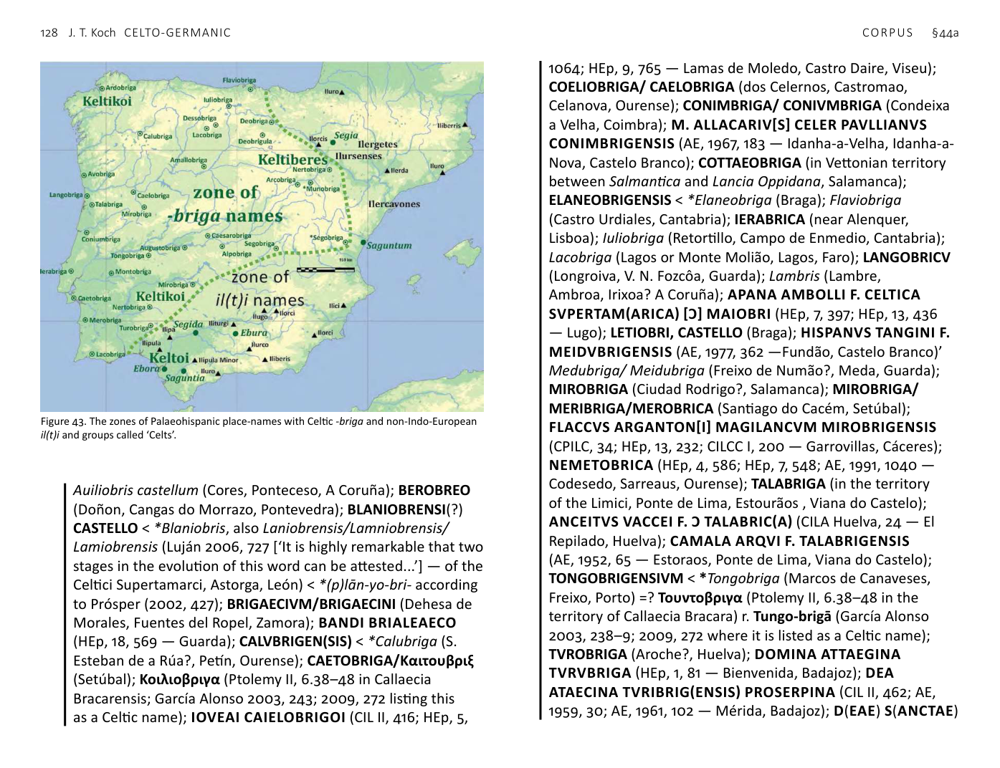

<!-- page: 126 -->

# §44. Material culture and subsistence economy
a. Celto-Germanic (CG)
DRESS PIN, BROOCH *dhelgo- ~ *dholgo-. ● Proto-Germanic
*dalka- < Pre-Germanic *dholgo- [PRE-GRIMM 2]: Old Norse dálkr
‘brooch, clasp, pin, dagger’, Old English dalc, dolc ‘clasp, bracelet,
brooch, buckle’; ● Proto-Celtic *delgos < Pre-Celtic *dhelgo-:
Old Irish delg ‘pin fastening mantel to the breast, brooch; thorn;
spike, peg’, Old Cornish delc glossing ‘monile’ ‘necklace, collar’,
Middle Welsh dala ‘sting, bite’. The noun possibly derives from
the Proto-Celtic verb *delgo- ‘hold, contain’: Gaulish delgu ‘I
hold’ (Banassac), Old Breton delgim ‘to hold’, dalg ‘maintenance,
tenure, holding’, Middle Welsh daly ‘catch, seize, hold, restrain,
overtake, enclose, contain’. ¶ It is difficult to derive falx,
genitive falcis ‘hook, scythe, sickle’ from the same phonological
reconstruction as the CG forms. Even if that comparison can
be maintained, the semantic development from ‘something
sharp and piercing’ to ‘dress pin’ is peculiar to CG. Cf. similarly
Lithuanian dìlgė ‘nettle’, pointing to an earlier sense ‘sting,
pointed piercing object’. If so, the CG meanings ‘brooch, clasp’
and ‘necklace, bracelet’ reflect a development in functional dress
ornaments from simple pins to more complex fasteners with
moving parts.
ENCLOSED FIELD *kaghyo-. ● Proto-Germanic *hagjō-
[PRE-GRIMM 1]: Old English hecg ‘hedge’ and *hagan- ‘enclosure,
fence’: Old Norse hagi ‘pasture with a fence’, Old English haga
‘hedge, wooded enclosure’, Old High German hac ‘hedge’;
● Proto-Celtic *kagyo- ‘pen, enclosure’: Gaulish caio ‘breialo sive
bigardio’ ‘field or enclosure’, place-names Caiocum, Matu -caium,
Old Breton plural caiou glossing ‘munimenta’ ‘fortifications’,
Middle Welsh cae ‘hedge, fence, enclosed field; clasping brooch’,
Cornish ke ‘hedge, ditch, enclosed field’. ¶ Possibly related to
Proto-Italic *koχο- ‘hole’ or ‘tie, juncture’: Latin cohum ‘the hollow
in the middle of a yoke’. ¶ [POSSIBLY NON-INDO-EUROPEAN SOURCE]
<!-- page: 127 -->
ENCLOSURE *katr- ~ *kētr-. ● Proto-Germanic *hēðr- <
[PRE-VERNER] *χēþr- [PRE-GRIMM 1]: Old English hēaðor ‘enclosure,
restraint, prison’; ● Proto-Celtic *katrik-: Old Irish cathir ‘stone
enclosure, castle, fortified town’. ¶ [POSSIBLY NON-INDO-EUROPEAN
SOURCE] ¶ It is likely that not all the occurrences of Welsh cadair in
place-names are based on the borrowing of Latin cathedra ‘chair,
seat’, but that some go back to the cognate of this word, e.g. the
mountain name Cader Idris.
FLOOR *plōro-. ● Proto-Germanic *flōruz < *flāruz [PRE-GRIMM 1]:
Old Norse flór ‘floor of cowstall’, Old English flōr, Middle High
German vluor ‘field, plain, floor’; ● Proto-Celtic *(p)lāro-: Old
Irish lár ‘ground, surface, middle’, Middle Welsh llawr ‘floor, deck,
ground, platform’, Breton leur. ¶ Unique CG word formation and
meaning: contrast Latin planus ‘level, flat’ < Proto-Indo-European
*pl(e)H₂-nó- ‘flattened’.
FORK *ghabhlo- ~ *ghabhlā-. ● Proto-Germanic *gabalō-: Old
English geafal, gafol, Old Saxon gaƀala, Old High German gabala;
● Proto-Celtic *gablo- ~ *gablā-: Old Irish gabul ‘fork’, Old Breton
mor-gablou glossing ‘aestuaria’ (literally ‘sea forks’), Middle Welsh
gafyl ‘f PC 12ork’. ¶ [POSSIBLY NON-INDO-EUROPEAN SOURCE] ¶ On
flesh forks in the Atlantic Bronze Age, see Needham & Bowman
2005.
FORTIFIED SETTLEMENT, HILLFORT *bhr̥gh-. 1 ● Proto-Germanic
*burg- ‘hillfort, fortified place, town, palisade’, nominative plural
*burgiz: Gothic baurgs ‘town(s)’, Old Norse borg ‘town, citadel,
small hill’, Old English burg ‘city, fortified town’, Old Frisian burg
‘town’, Old Saxon burg ‘castle, city’, Old High German burg ‘town’,
cf. full-grade Proto-Germanic *berga- ‘hill, mountain’ < Pre-
Germanic *bhergh-: Gothic bairgahei ‘hill country’, Old Norse
bjarg ‘rock’, Old English beorg ‘hill, mountain’, Old Frisian berch,
Old Saxon, Old High German berg ‘hill, mountain’; ● Proto-Celtic
*brig- ‘hill’ > ‘hillfort’ > ‘(fortified) town’: Hispano-Celtic brigā,
Gaulish brigā, Middle Irish brí, Middle Welsh bre, Middle Breton
bre. ¶ Proto-Indo-European √bherĝh- ‘be high, hill’. ¶ Old Irish
burcc glossing ‘curta’ ‘fortified town’ is a loanword from Germanic
through Medieval Latin.
¶ In what was arguably the first line of Y Gododdin, before the
Srath Caruin Awdl and ‘Reciter’s Prologue’ were added, there is
a reference to a place, most probably Din Eidyn or Edinburgh,
which is called Leuure (rhyming), which can be reconstructed as
*Lugu-brigā (Isaac 1993, 82; Koch 1997, 131).
¶ Palaeohispanic forms: (see especially Guerra 2005).
¶CELTIBERIAN REGION. Augustobriga (Muro de Agreda,
Soria); Arcobriga (Cerro Villar, Monreal de Ariza, Zaragoza);
BRIGAECIS, MATRIBVS (Peñalba de Castro, Burgos); Centobrica
(Epila, Zaragoza); Deobriga (Arce Mirapérez, Miranda del
Ebro, Burgos); Deobrigula (Lodoso?, Burgos); Dessobriga
(Osorno, Palencia); Lacobriga (Carrión de los Condes, Palencia);
Nertobriga/nertobis (Cabezo Chinchón, Calatorao/La Almunia
de Doña Godina, Zaragoza); Segobriga (Cabeza del Griego,
Cuenca); M. VALERI[VS] M(ARCI) F. GAL. REBVRRVS
SEGOBRIG(ENSIS) (CIL II, *381; HEp, 2, 382 — Saelices,
Cuenca); DOMINAE S(ANCTAE) TVR(IBRIGAE) A(TAECINAE)
VLIENSES ARA(M) POSVERVNT EX V(OTO) (CIL II 5877,
Saelices, Cuenca).
¶CENTRAL REGION. Amallobriga = Abulobrica (near Tordesillas,
Valladolid); Caesaro briga (Talavera de la Reina, Toledo).
¶WESTERN PENINSULA. ABOBRICA (Abrega? Pontevedra);
AVOBRIGA/*AOBRIGA (in the territory of Aquae Flauiae?
Vila Real); ADROBRICA (fortified settlement of the Artabri?
A Coruña); AE[D?]IOBRICO (Codesedo, Sarreaus, Ourense);
ALANOBRICAE (Eiras, San Amaro, Ourense); ARABRIGENSES
< *Arabriga (Goujoim, Armamar, Viseu); [CE]LICVS FRONTO
ARCO BRIG ENSIS AMBIMOGIDVS FECIT TONGOE NABIAGOI
// CELICVS FECIT // FRONT[O] (CIL II, 2419; EE, VIII 115; HEp,
1, 666; HEp, 5, 966; HEp, 7, 1160; Búa 2000; Elena et al. 2008
— Braga) < *Arcobriga; ARCOBRICA (Torrão?, Alcácer, Setúbal);
Artabris sinus (referring to the estuaries near A Coruña? Guerra
2005); LAETVS CATVRONIS F. AVIOBRIGENSIS (HAE, 1918;
AE, 1959, 82; Haley 1986, 183 — Fermedo, Arouca, Aveiro);
<!-- page: 128 -->
Auiliobris castellum (Cores, Ponteceso, A Coruña); BEROBREO
(Doñon, Cangas do Morrazo, Pontevedra); BLANIOBRENSI(?)
CASTELLO < *Blaniobris, also Laniobrensis/Lamniobrensis/
Lamiobrensis (Luján 2006, 727 [‘It is highly remarkable that two
stages in the evolution of this word can be attested...’] — of the
Celtici Supertamarci, Astorga, León) < *(p)lān-yo-bri- according
to Prósper (2002, 427); BRIGAECIVM/BRIGAECINI (Dehesa de
Morales, Fuentes del Ropel, Zamora); BANDI BRIALEAECO
(HEp, 18, 569 — Guarda); CALVBRIGEN(SIS) < *Calubriga (S.
Esteban de a Rúa?, Petín, Ourense); CAETOBRIGA/Καιτουβριξ
(Setúbal); Κοιλιοβριγα (Ptolemy II, 6.38–48 in Callaecia
Bracarensis; García Alonso 2003, 243; 2009, 272 listing this
as a Celtic name); IOVEAI CAIELOBRIGOI (CIL II, 416; HEp, 5,
1064; HEp, 9, 765 — Lamas de Moledo, Castro Daire, Viseu);
COELIOBRIGA/ CAELOBRIGA (dos Celernos, Castromao,
Celanova, Ourense); CONIMBRIGA/ CONIVMBRIGA (Condeixa
a Velha, Coimbra); M. ALLA CARIV[S] CELER PAVLLIANVS
CONIMBRIGENSIS (AE, 1967, 183 — Idanha-a-Velha, Idanha-a-
Nova, Castelo Branco); COTTAEOBRIGA (in Vettonian territory
between Salmantica and Lancia Oppidana, Salamanca);
ELANEOBRIGENSIS < *Elaneobriga (Braga); Flaviobriga
(Castro Urdiales, Cantabria); IERABRICA (near Alenquer,
Lisboa); Iuliobriga (Retortillo, Campo de Enmedio, Cantabria);
Lacobriga (Lagos or Monte Molião, Lagos, Faro); LANGOBRICV
(Longroiva, V. N. Fozcôa, Guarda); Lambris (Lambre,
Ambroa, Irixoa? A Coruña); APANA AMBOLLI F. CELTICA
SVPERTAM(ARICA) [Ɔ] MAIOBRI (HEp, 7, 397; HEp, 13, 436
— Lugo); LETIOBRI, CASTELLO (Braga); HISPANVS TANGINI F.
MEIDVBRIGENSIS (AE, 1977, 362 —Fundão, Castelo Branco)’
Medubriga/ Meidubriga (Freixo de Numão?, Meda, Guarda);
MIROBRIGA (Ciudad Rodrigo?, Salamanca); MIROBRIGA/
MERIBRIGA/MEROBRICA (Santiago do Cacém, Setúbal);
FLACCVS ARGANTON[I] MAGILANCVM MIROBRIGENSIS
(CPILC, 34; HEp, 13, 232; CILCC I, 200 — Garrovillas, Cáceres);
NEMETOBRICA (HEp, 4, 586; HEp, 7, 548; AE, 1991, 1040 —
Codesedo, Sarreaus, Ourense); TALABRIGA (in the territory
of the Limici, Ponte de Lima, Estourãos , Viana do Castelo);
ANCEITVS VACCEI F. Ɔ TALABRIC(A) (CILA Huelva, 24 — El
Repilado, Huelva); CAMALA ARQVI F. TALABRIGENSIS
(AE, 1952, 65 — Estoraos, Ponte de Lima, Viana do Castelo);
TONGOBRIGENSIVM < *Tongobriga (Marcos de Canaveses,
Freixo, Porto) =? Τουντοβριγα (Ptolemy II, 6.38–48 in the
territory of Callaecia Bracara) r. Tungo-brigā (García Alonso
2003, 238–9; 2009, 272 where it is listed as a Celtic name);
TVROBRIGA (Aroche?, Huelva); DOMINA ATTAEGINA
TVRVBRIGA (HEp, 1, 81 — Bienvenida, Badajoz); DEA
ATAECINA TVRIBRIG(ENSIS) PROSERPINA (CIL II, 462; AE,
1959, 30; AE, 1961, 102 — Mérida, Badajoz); D(EAE) S(ANCTAE)

Figure 43. The zones of Palaeohispanic place-names with Celtic -briga and non-Indo-European
il(t)i and groups called ‘Celts’.
<!-- page: 129 -->
TVRVBRIGE L. A[.]ONIVS V.S. (cf. CIL II 71 — Beja); ...] REI
[... / ...]NI TVRVBRI[... / ...]E EX NARA[... / ...]V * SVOTV
SO[luit?] (Garcia 1991, 541 — Olhão, Faro); DOMINAE TVRIBRI
ADDEGINAE (HEp, 2, 199; HEp, 5, 178; CILCC I, 35 — Alcuéscar,
Cáceres); TVRIBRI ATECINAE (HEp, 5, 183; CILCC I, 40 —
Alcuéscar, Cáceres); TVR(O)LOBRIGA(?) (Chaves, Vila Real);
VERVBRICO (Arcucelos, Ourense); VEIGEBREAEGO (Rairiz da
Veiga, Ourense); BLOENA CAMALI F. VALABRIC(E)NSIS (EE,
VIII 119; AE, 1896, 72 — Braga) = Ουολοβριγα (Ptolemy II, 6.38–
48 in Callaecia Bracarensis; García Alonso 2003, 243; 2009, 272
where it is listed as a Celtic name).
¶OUTSIDE THE BRIGA ZONE. L(VCIO) SVLPICIO Q(VINTI) F(ILIO)
GAL(ERIA) NIGRO GIBBIANO AVOBRIGENSI (CIL II, 4247;
Alföldy 1975, 307; Aquae Flaviae 2, p. 23 — Tarragona).
¶IBERIAN PENINSULA, UNKNOWN LOCATION. ......] BANDV AHOBRICO
(Albertos 1983, 478).
¶ FURTHER COMPARANDA. Ancient Celtic place-names.
Admagetobriga (Bello Gallico); Aliobrix—Moldova;
Arebrigium—near Le Pré-Saint-Didier, Italy; Artobriga—
Traunstein? Germany; Artobriga—Vindelicia, Austria?;
Boudobriga, Bodobrica—Boppardt, Germany; Bricca—Brèches?
France; Briga—Northern England; Briga—Brie (Deux-Sèvres),
France; Briga—Brie (Seine-et-Marne), France; Briga—Brie
(Charentes), France; Briga—Brie-Comte-Robert, France;
Briga—Broye(s) (Marne), France; Briga—Broye(s) (Seine-et-
Loire), France; Briga—Broye(s) (Oise), France; Brigetio—Szöny,
Hungary; Briggogalus—Saint-Epain, France; Brigianii—France;
Briginnum?*—Serre de Brienne, Brignon, France; Brigiosum/
Briossus—Brioux, France; Brigobannis*—Hüfingen, Germany;
Brigo magus*—Briançonnet? France; Brigsina—Brixen,
Austria; Brisigavi—Germany; Brixellon, -um—Brescello, Italy;
Brixenetes?—Bessanone, Italy; Brixia—Brescia, Italy; Brixis—
Braye, Reignac-sur-Indre? France; Eburobriga—Avrolles
(Yonnes), France; Eccobriga/ Ecobrogis—nr. Sorsovus, Turkey;
Erubris fl.—Ruwer, Germany; Gabris/Gabrae*—Gièvres,
France; Litanobriga?—Thiverny/La Haute Pommeraie/Saint-
Maximin, France; Ollobriga —Olbrück, Rhéannia; Onobrisates
—France; Ουοβριξ (= Vobrix)—Morocco; Perbriga—Portugal;
Phlaouia Robrica—Saumur? France; Saliobriga*—Sinsheim/
Steins furt, Germany; Segobrigii—France; Triobris fl.—La
Truyère, France; Vindobriga—Van d(o)euvre(s) (Aube), France;
Vindobriga—Van d(o)euvre(s) (Calvados), France; Vindo briga—
Vand(o)euvre(s) (Indre), France.
HIGH ONES, GROUP NAME RELATED TO ‘HILLFORT’ *Bhr̥ghn̥tes.
● Proto-Germanic *Burgunþaz: Old Norse Burgundar, Old English
Burgendas was the name of an East Germanic-speaking group
recorded during the Roman Imperial Period living between
the Upper Rhine and Upper Danube. They then established
the kingdom of Burgundy in South-east Gaul in the Migration
Period. The Burgundians are often traced to an earlier homeland
on the Baltic island of Bornholm, Old Norse Burgundarholmr.
● Proto-Celtic *Brigantes ~ *Brigantioi: Βριγαντες occurs in
Ptolemy’s Geography for a group in South-east Ireland and
another in North Britain, cf. the Romano-British goddess Brigantia
(Falileyev et al. 2010, 12). Old Irish Brigit (< *Brigantī) is glossed
‘dea poetarum’ in Sanas Cormaic, also the name of the well
known Irish saint associated with Kildare and the province of
Leinster. Old Welsh breennhin ‘king’ goes back to *brigantīnos,
possibly meaning ‘consort of *Brigantī “Brigantia”’ (Binchy
1970; Charles-Edwards 1974) or *Brigantignos ‘son of *Brigantī
“Brigantia”’. What is probably the same title (possibly used as
a name) occurs as a Gaulish coin legend (in Iberian script) as
birikantin (MLH V.1, XII). ¶ As a goddess name or epithet, the
suffixed forms of *bhr̥ĝh- ‘high, hill’ (whence *briχs ‘hillfort’, see
above) go back to Proto-Indo-European; cf., for example, Vedic
bṛhatī́ ‘the high one’ (<*bhṛĝhṇtī́, an epithet of Uṣás, the goddess
of the dawn). Βριγαντιοι (Strabo 4.6.8) is the name of a subgroup
of the Vindelici in West-central Europe. Βριγαντιον (Strabo 4.6.8)
<!-- page: 130 -->
is the Gaulish name of the place that is now Bregenz, Austria.
BRIGANTIONE (CIL XII no. 118) is the ancient name of Notre-Dame
de Briançon, France. Brigantinus Lacus also called Ven(non)etus
Lacus is now Bodensee, Germany. Φλαύιον βριγαντιον ‘Flavium
Brigantium’ is the ancient name of A Coruña: (Ptolemy II, 6.4;
Guerra 2005; García Alonso 2009, 172, listing it amongst Celtic
names). Like Βριγαντιον now Bregenz, the Callaecian Brigantium
also means ‘town of the *Brigantioi’.
ENCLOSURE, ENCLOSED SETTLEMENT, HILLFORT 2 *dūnos. ● Proto-
Germanic *tūna- ‘fenced area’ < [PRE-GRIMM 2] *dūno-: Old Norse
tún ‘enclosure, courtyard, homestead; home, field; town’, Old
English tūn ‘enclosed piece of ground, yard; town’, Old Frisian tūn
‘fence, fenced field, garden’, Old Saxon -tūn ‘enclosing fence’, Old
High German zūn ‘fence, fortification’; ● Proto-Celtic *dūnos ~
*dūnom: Gaulish, Hispano-Celtic dūno- ‘fortified town, oppidum’,
Old Irish dún ‘residence of a chief fortified with ramparts,
fort, rampart’, Middle Welsh din ‘city, fort, fortress, fastness,
stronghold’, archaic but common in place-names, such as Din-
bych, Din-lleu, Din Eidin, Old Breton din, also Breton place-names,
such as Dinard, Dinan. ¶ Latin fūnus ‘funeral, burial’ is workable
as cognate phonologically from Proto-Italic *fūnos < *dhūnos, but
the meaning is not close.
¶ Numerous Ancient Celtic place-names (Koch et al. 2007,
152–3; cf. Falileyev et al. 2010, 18): Acitodunum > Acidunum >
Ahun (Holder, AcS — Creuse, France); Arandunum* (Holder,
AcS—Calvisson? / Hournèze (Sommières), France; Aredunum—
Ardin (Deux-Sèvres), France; Arialdunum—Guadalquivir,
Spain; Augustodunum—Autun, France; Branodunum—
Brancaster, England; Caesarodunum/Civitas Turonorum—
Tours; Caladunum—Vilar de Perdizes, Montalegre, Portugal;
Cambodunum—Champéon,Mayenne), France; Cambodunum—
Kempten, Germany; Cambodunum—Leeds? England;
Camulodunum—Slack, England; Camulodunum—Colchester,
England; Carrodunum—Karnberg, Bavaria; Castellum
Meidunium—Castro de S. Facundo, Orense, Spain; Δουνιον—
Dorset, England; Δουνον —Baltinglass? Ireland (Toner 2000);
Δουνον Κολπος—Tees Bay, England; Dunense Castrum—
Châteaudun, France; Dunum—Dhun, France; Dunum—Dun,
France; Dunum—Dung, France; Eburodounon/Eburodunon—
Brünn/ Brno, Czech Republic; Eburodunensis Lacus—Lac de
Neuchâtel, Switzerland; Eburodunum—Averdon, France;
Eburodunum—Ebréon, Charentes, France; Eburodunum—
Embrun, Hautes-Alpes, France; Eburodunum—Yverdon,
Switzerland; Eburodunum—Yverdun-les-Bains, Switzerland;
Eburodunum > Ebrudunum—Embrun, France; Esttledunum;
Exolidunum*—Issoudon, France; Gabrodunum—Jabrun,
Cantal, France; Idunum—Dunle-Palestel? France; Karrodunon—
Western Ukraine; Lug(u)dunum—Lyon, France; Lugdunum
Batavorum—Leiden/Leyde, Netherlands; Lugdunum—Katwijk,
Netherlands; Lugdunum Convenarum—Saint Bertrand de
Comminges, France; Lugdunum Consoramorum—Saint Lizier,
Ariège, France; Lugdunum Vocontiorum—Montlahue, Drôme,
France; Lugudunon—Laon, Aisne, France; Lugudunon—
Lauzun, Lot, France; Lugudunon—Lion, Loiret, France;
Lugudunon—Loudon, Sarthe, France; Lugudunon—Lyon,
Rhône, France; Lugunduno—Northern England; Mag(i)
odunum—Médan, Yvelines, France; Mag(i)odunum—Mehun,
Cher, France; Mag(i)odunum—Mehun, Indre, France; Mag(i)
odunum—Meung, Loiret, France; Marcedunum—Marquain,
Hainault, France; Marcedunum—Marquion, Pas-de-Calais,
France; Margidunum—Britain; Μελιοδουνον—Moracia;
Meliodunon—South Germany; Minnodunum—Moudon?
Switzerland; Moridunum—Devon, England; Moridunum—
Caerfyrddin/Carmarthen, Wales; Neviodunum—Carniola/
Krain, Slovenia; Neviodunum—Drnovo pri Krškem, Slovenia;
Noiodounon Diablintum—Jublains, France; Noiodounon—near
Sées, France; Nouiodunum—Neung, Loir-et-Cher, France;
Nouiodunum—Nevers, Nièvre, France; Nouiodunum—
Nieudan, Cantal, France; Nouiodunum—Nouan le Fuselier,
<!-- page: 131 -->
Loire-et-Cher, France; Noviodunum —Isaccea, Romania;
Noviodunum—Neung-sur-Beuvron, France; Noviodunum?/
Nevirmum? > Ebirno—Nevers, France; Noviodunum?—
Pommiers, France; Parrodunum—Burgheim, Germany; Riduna
Insula—Alderney, Channel Islands; Rigodounon?—Castleshaw,
England; Sebendounon?/Beseldunum—Besalú, Spain;
Sedunum*—Sitten/Sion, Switzerland; Sinduni—near Trento,
Italy; Singidunum—Belgrade, Serbia; Sorviodunum—Old
Sarum, Salisbury, Wiltshire, England; Tarouedounon*—near
Dunnet Head, Britain; Uxellodunum—Exodun, Deux-Sèvres,
France; Uxellodunum—Issolou, Lot, France; Uxellodunum—
Issoudun, Creuse, France; Uxellodunum—Puy d’Issolud, France;
Uxelodu(nu)m—Stanwix, Cumbria, England; Vellaunodunum
near Cenabum—France; Verodunum—Verdú, Catalonia,
Spain; Verodunum—Verdun, Meuse, France; Verodunum—
Verdun, Ariège, France; Verodunum—Verdun, Aude, France;
Verodunum—Verduno, Piedmont, Italy; Viriodunum—Verdun,
France.
STRONG/VICTORIOUS FORTIFIED SETTLEMENT *segho-dūno-.
● Proto-Germanic *sigatūna- [PRE-GRIMM 2]: Old Norse Sigtún,
a town in Sweden said in the Prose Edda to have been founded
by Óðinn, cf. Proto-Germanic *segaz ~ *sigiz- ‘victory’: Gothic
sigis, Old Norse sigr, Old English sigor, Old Frisian sige, sīge, Old
High German sigi, sigu; ● Proto-Celtic *sego-dūno-: Gaulish
Segodūnum, town of the Rutenes in Aquitania, also Segeduno—
Britain; Segedunum—Wallsend, England; Segodunon, =um—Suin
(Saône-et-Loire), France; Segodunon, -um—Syon (Haute-Savoie),
France; Segodunum—Rodez (Aveyron), France; Segodunum—
Würzburg, Bavaria, cf. Celtiberian place-names sekobirikez,
Σηγοβριγα (Ptolemy II, 6.57), Segovia, Σεγουουια (Ptolemy II,
6.55), Gaulish group name Sego-uellauni, Ancient Brythonic
coin legend SEGO[, Old Irish seg (also sed) ‘strength, vigour’,
Middle Welsh hy ‘bold, brave, intrepid, undaunted’, cf. Old Welsh
personal names Catthig, Cethij, Cethig < *Katu-segos, Gelhig,
Gel=hi < *Galo-segos. ¶ The compound *segho-dūno- and its
second element are CG. The first element is more widely attested
in Indo-European: √seĝh- ‘hold fast, conquer’, Sanskrit sáhate
‘overpower’, sáhas-, Avestan hazah- ‘violence, power’.
LEATHER *pletrom. ● Proto-Germanic *leþra- [borrowed after
loss of Celtic *p] [PRE-GRIMM 1], rather than explaining *þ < *t as
the result of Celtic lenition (of specifically Goidelic type), most
probably a prehistoric loanword from Celtic later than Celtic loss
of Proto-Indo-European *p: Ancient Nordic leþrō ‘leathery one’
feminine nominative singular (Stårup neckring, South Jutland,
Denmark ~AD 400, Antonsen §22); Old Norse leðr, Old English
leðer, leþer, Old Frisian leder, leer, Old Saxon leðar, Old High
German ledar; ● Proto-Celtic *(p)letrom or *letrom: Middle
Irish lethar ‘skin, leather’, Middle Welsh lledyr, Middle Breton lezr.
¶ The native Germanic cognate is *fella- ‘skin’, cf. Latin pellis ‘skin’
< *pel-ni-. (Cf. Schmidt 1991, 145.)
LEATHER BAG, BELLOWS 1 *bholgh-. ● Proto-Germanic *balgiz:
Gothic balgs ‘leather bag, sack, leather bottle’, Old Norse belgr
‘skin, skin bag, bellows’, Old English belig, bælg, belg ‘bag,
envelope, skin, (plural) bellows’, Old High German balg ‘skin, tube,
pod’; ● Proto-Celtic *bolgo- ‘bag, belly, bellows’: Gaulish plural
bulgas ‘sacculos’ ‘small bags’, Old Irish bolg ‘bag, satchel, sack,
belly, stomach, smith’s bellows’, Old Welsh place-name Bolg-ros
(Anglicized ‘Bellimoor’), Middle Welsh boly ‘belly, paunch,
abdomen, stomach, bulge’. ¶ Proto-Indo-European √bhelgh-:
unique CG meaning, contrast Avestan barəziš ‘pad, pillow’ <
*bholĝh-is-, Old Prussian balsinis ‘pillow’ < *bholĝh-ino-, Old
Lithuanian balgnas ‘saddle’.
MOUND, EARTHWORK *wert- ~ *wort-. ● Proto-Germanic *werþa-
~ *wurþa- [PRE-GRIMM 1]: Old Norse varða, varði ‘milestone’, urð
‘heap of stones’, Old English worþ, weorð ‘enclosed place, yard’,
weard ‘guarding’, Old Frisian wurth, worth ‘raised ground (for
protection from flooding)’, Old Saxon wurth ‘raised ground for
<!-- page: 132 -->
a plot for a homestead’; ● Proto-Celtic *wertyā ~ *wertro- ~
*wereto-: Old Irish fertae ‘tumulus, graveyard’, Middle Welsh
gwerthyr ‘fort’, cf. Pictish group name Verturiones > Old Irish
Fortrinn, Middle Welsh gweryd ‘earth, soil, land, grave’ < *wereto-,
Old Cornish gueret, Old Breton gueretreou ‘countries, regions’.
OATS, BROMUS *korkró-. ● Proto-Germanic *hagran- < [PRE-VERNER]
*χaχrán- < Pre-Germanic *kokró- [PRE-GRIMM 1]: Icelandic hellin-
hagra ‘a kind of thyme’, Norwegian dialect hagre ‘oats’, Old
Swedish hagri ‘oats’, Danish hejre ‘brome grass’; ● Proto-Celtic
*korkyo-: Middle Irish corca, coirce ‘oats’, Old Cornish (probably
actually Old Welsh) bara keirch glossing ‘panis avena’ ‘oat bread’,
Middle Welsh keirch, Breton kerc’h ‘oats’.
PATH, ROAD, WAY, PASSAGE *sento-. ● Proto-Germanic *sinþaz
‘way, journey’ [PRE-GRIMM 1]: Gothic sinþs, Old Norse sinn, Old
English sīð ‘journey, road, turn’, Old Saxon sīð ‘way, direction’, Old
High German sint, sind ‘road, path, journey’, cf. Old High German
gisindo ‘fellow traveller, comrade’, sinnan ‘travel, to be travelling’;
● Proto-Celtic *sento-, *sentu- ‘road, path, course’: Old Irish sét
path, way, journey’, Ancient Brythonic Gabrosentum ‘goat track’,
Middle Welsh hynt ‘way, path, journey, march, career, campaign’,
cf. place-name Epynt < *ekʷo-sentom ‘horse path’, Middle Breton
hent, cf. Old Irish sétig ‘wife, consort, fellow, companion’ <
*sentīkī, Middle Welsh hennyδ ‘other, friend, companion, partner,
opponent’ < *sentiyos ‘fellow traveller’. See further FELLOW
TRAVELLER, COMRADE (§40a).
ROD, STAFF, LONG SLENDER PIECE OF WOOD *(s)lat(t)-. ● Proto-
Germanic *laþa- ~ *latta-: Old English lætt, Middle English laþþe
< Old English *læþþ- ‘thin strip of wood, lath’, Old High German
lat(t)a, ladda ‘plank’; ● Proto-Celtic *slattā ‘rod, staff, stalk’:
Middle Irish slat ‘rod, lath, twig, branch, yard (unit of measure)’,
Scottish Gaelic slat ‘rod, twig’, Middle Welsh llath ‘rod, staff,
stick, yard (unit of measure)’, Old Breton lath glossing ‘stipite’
‘log, branch’. ¶ [POSSIBLY NON-INDO-EUROPEAN SOURCE] It is hard to
derive these from an Indo-European root. Comparable forms are
absent from the other branches. The geminate tt and vowel a in
the Proto-Celtic suggest a borrowing. Middle English laþþe and
Old High German latta appear to predate Grimm 1, but Old English
lætt does not.
ROOF *togo-. ● Proto-Germanic *þaka- [PRE-GRIMM 2] [PRE-GRIMM 1]:
Old Norse þak, Old English þæk (cf. Modern thatch, also the
obsolete thack ‘roof’), Old High German dach, dah, thah; ● Proto-
Celtic *togo- ~ *togyā-: Old Irish tugae ‘roof, thatch, roofing
material’, Scottish Gaelic tugha ‘thatch, covering’, < *togyā, Old
Irish étach ‘covering garment’ < *intogu-, Old Cornish to glossing
‘tectum’ ‘roof’, Middle Welsh to ‘roof, covering, canopy, layer,
ceiling, attic, thatch’, Breton to, cf. Ancient Brythonic personal
name TOGIDVBNVS. Gaulish personal names TOGOS, TOGIVS,
TOGIMARI, TOGIACVS; TOGIRIX, on coin legends of the Sequani
(Allen & Nash 1980, 200), probably has the sense ‘(protective)
covering + king’. ¶ These words clearly derive from Proto-Indo-
European √(s)teg- ‘cover’: Greek (σ)τέγος ‘roof, house’, Latin
toga ‘covering garment’, tectum ‘roof’, Lithuanian stógas ‘roof’,
Latvian stâgs, Old Irish tech, Old Welsh tig ‘house’. Brythonic and
Pre-Germanic *togo- ‘roof’ show especially close developments:
identical word formations from the root variant lacking *s-, with
the vowel grade o, and the same specific primary meaning.
SETTLEMENT, FARMHOUSE treb- ~ *tr̥b-. ● Proto-Germanic
*þurpa- ‘settlement, crowd(?)’ [PRE-GRIMM 2] [PRE-GRIMM 1]:
Gothic þaurp ‘estate, land, field’, Old Norse þorp ‘village, hamlet,
farmstead’, Old English þorp, þrop, ðrop ‘hamlet, village, farm,
estate’, Old Frisian thorp, therp ‘village’, Old Saxon thorp ‘village’,
Old High German dorf; ● Proto-Celtic *trebā ‘settlement, home,
farm’: Latinized Celtiberian CLOVTER[ICVM] | TOUTIV〈S〉
TREBAQVE B[---] (Gorrochategui 2013c — Clunia), Celtiberian
place-name Con-trebia, Palaeohispanic divine name Trebaruna,
Gaulish and Ancient Brythonic group name Atrebates (cf.
<!-- page: 133 -->
Old Irish attrab ‘habitation, property’, Middle Welsh adref
‘homewards’), Old Irish and Old Welsh treb ‘village, settlement,
holding, residence, habitation, farmstead’, cf. Old Irish verb
trebaid ‘inhabits, settles, cultivates’, Old Breton trebou glossing
turmae ‘troops’, Middle Breton treff glossing ‘urbs’ ¶ This word
might be alternatively be calssified as ANW, but the forms and
meanings in Italic and Baltic are somewhat different, pointing to
specialization limited to CG: Oscan accusative singular trííbúm
‘domum’ ‘house’ ‘aedificium’ ‘building’ < *trēb-; Lithuanian trobà
‘cottage, farmhouse’, Latvian traba ‘hut, hovel’. ¶ [POSSIBLY NON-
INDO-EUROPEAN SOURCE]
SIEVE, STRAINER 1 *sētlā-. ● Proto-Germanic *sēþla- [PRE-GRIMM 1]:
Old Norse sáld, Finnish (< Germanic) siekla, seula ‘sieve’; ● Proto-
Celtic *sītlā-: Middle Irish síthlaid ‘strains, sieves, pours out’;
Middle Welsh hidyl ‘sieve, strainer’. ¶ The Middle Breton form
sizl could be consistent with an alternative interpretation, as an
early borrowing of *sīt’la < Latin situla ‘wine bucket’, perhaps
in connection with the ancient wine trade. If so, note that the
archaic treatment of Welsh h- < Latin s- is also found in Old Welsh
hestaur from Latin sextārius, a term for a liquid measure.
STRIPE *streibā. ● Proto-Germanic *strīpa- ~ strīpōn-
[PRE-GRIMM 2]: Faroese strípa, Norwegian stripe, Middle Dutch
stripe, Middle High German strīfe; ● Proto-Celtic *strēbā-: Middle
Irish sríab ‘stripe, line’. ¶ [POSSIBLY NON-INDO-EUROPEAN ORIGIN]
suggested by a reconstructed preform with *b, a rare phoneme in
Proto-Indo-European.
THREAD, FATHOM *pot(a)mo-. ● Proto-Germanic *faþma- ‘fathom’
[PRE-GRIMM 1]: Old Norse faðmr, Old English fæðm ‘embracing
arms, spreading arms to full extent, fathom, bosom’, Old English
fæðmian ‘to fathom, to embrace’, Old Frisian fethm, Old Saxon
fathmōs ‘two outstretched arms’, Old High German fadam, fadum
‘cubit, fathom’, fadamon ‘to spin, to sew’, German Faden ‘thread,
piece of thread’; ● Proto-Celtic *(p)atamī- ~ *(p)atimā- ? ‘thread,
fathom’: Old Welsh etem ‘thread’, Scottish Gaelic aitheamh
‘fathom’. ¶ A CG word based on Proto-Indo-European √petH₂-
‘spread’ (Hamp 2007), cf. Greek πεταννύναι ‘to spread out, unfold,
open’, Latin patēre ‘to be open’, Oscan patensíns ‘they would
open’ (3rd plural imperfect subjunctive).
VESSEL, CONTAINER FOR LIQUID *gan(dh)-no-. ● Proto-Germanic
*kannō [PRE-GRIMM 2]: Old Norse kanna, Old English canne
‘container’, Old Saxon kanna, Old High German channa ‘can, jug’;
● Proto-Celtic *gandno-: Middle Irish gand ‘vessel, jug, can’ (a
rare word).
b. Italo-Celtic/Germanic (ICG)
DEVICE THAT LEANS AGAINST SOMETHING UPRIGHT, LEANTO
*kleitro/ā- ~ *klitro-. ● Proto-Germanic *hleiþra- < Pre-Germanic
*kleitro- [PRE-GRIMM 1]: Gothic hleiþra ‘tent’, Old English hlǣder
‘ladder, steps’, Old Frisian hleder, hladder-, Old High German
(h)leitara ‘ladder’; ● Proto-Celtic *klitro-: Middle Irish clithar
‘shelter, covert, fastness, protection’, Middle Welsh cledr ‘rod,
stave, pole, rail, palm of the hand, help’, Middle Breton klezr,
klezren ‘wooden post’; ● Proto-Italic *kleitrā-: Latin clītellae
‘pack-saddle, pannier’, Umbrian accusative singular kletram
‘portable atltar, seat, for icons or divinities’. ¶ Proto-Indo-
European √k̂ley- ‘lean’, cf. Greek κλῖμαξ ‘ladder’.
FURROW *porkā ~ *pr̥kā- ~ *pr̥ko-. ● Proto-Germanic *furh-
[PRE-GRIMM 1]: Old Norse for ‘trench, drain’, Old English furh
‘furrow’, Old Frisian furch, Old High German furh, furuh; ● Proto-
Celtic *(p)rikā: Gaulish rica, Middle Irish etarche < *enter-
(p)rikyā, Old Breton rec glossing ‘sulco’ ‘furrow’, ro-ricse[n]ti
glossing ‘sulcavissent’ ‘they had ploughed furrows’, Middle Welsh
rych ‘trench, ditch, furrow, cleft, wrinkle, cleavage’ < *rikk- or
*riχs-; ● Proto-Italic *porkā: Latin porca ‘ridge of soil between
ploughed furrows’. ¶ Specialized ICG meaning from Proto-Indo-
European, cf. Sanskrit párśāna- ‘rift’ < *pe/ork̂-ono-.
<!-- page: 134 -->
HARROW *oketā-. ● Proto-Germanic *agiþō- ‘harrow, rake’ <
[PRE-VERNER] *aχiþā- [PRE-GRIMM 1]: Old English egede, Old Saxon
egitha, Old High German egida; ● Proto-Celtic *oketā also *okā:
Old Welsh ocet glossing ‘raster’ ‘rake’, Middle Welsh oget also
oc, Middle Breton oguet, Old Cornish ocet; ● Proto-Italic *oketā:
Latin occa, derived verb occāre ‘to harrow, break up ground’;
● Proto-Balto-Slavic ? *eśeti-: Old Prussian aketes, Lithuanian
akė́čios, Latvian ecê(k)šas harrow’, Russian osét ‘rack for drying
grain’. ¶ Proto-Indo-European √H₁ek̂- ‘sharp’. The Baltic cognates
show centum reflexes of *k̂ and were possibly borrowed from
Pre-Germanic, which implies that that the specialized meaning
‘harrow’ is ICG, rather than ANW.
REAPING, MOWING *met-e/o- ~ *mēto-. ● Proto-Germanic *mēþa-
~ *maþa- [PRE-GRIMM 1]: Old English mǣð, Old Frisian -meth,
-mēth ‘mowing, mown grass’, Old Dutch māda ‘pasture, meadow’,
German Mahd ‘mown grass’, cf. Old English māwan, Old High
German māen ‘to mow’; ● Proto-Celtic *met-e/o- ‘reap’: Middle
Welsh medi ‘reap, harvest, cut’, Medi ‘September’, Middle Breton
midiff, cf. Proto-Celtic *metelā ‘band of reapers’: Middle Irish
meithel, Middle Welsh medel ‘band of reapers, co-operative work
group, troop’; ● Proto-Italic *met-e/o- ‘to reap, harvest’: Latin
metō, metere. ¶ Lithuanian metù ‘I throw’ and mẽtas ‘year, time’
may be related with a more specific core meaning being evident in
ICG.
SEAT, CHAIR *sedlo- ~ *setlo-. ● Proto-Germanic *setla- < *sedlo-
~ *seþlo- < Pre-Germanic *setlo- < *sed-tlo-: Gothic sitls, Old
English setl ‘seat, stall, residence, throne’, Old Saxon sethal,
Old High German sezzal, sedal; ● Proto-Celtic *sedlo-: Gaulish
CANECOSEDLON (probably referring to type of chair) (RIG 2–1,
L–10 — Autun), Middle Irish séol ‘bed, couch’; ● Proto-Italic
*sedlā-: Latin sella ‘seat, chair, stool’. ¶ Proto-Indo-European √sed-
‘sit’.
SIEVE, STRAINER 2 *kreidhro-. ● Proto-Germanic *hrīdra- ‘sieve’:
Old English hrīdder, hrider, hrīddel, Old High German rītera;
● Proto-Celtic *krētrom ‘sieve’ < *krei-dhro-: Old Irish críathar,
Old Welsh cruitr ‘winnowing-shovel’ (¶ the preform of the Celtic
originally probably had the same suffix as that of the Germanic
and Italic, i.e. *-dhro-, and the implement suffix *-trom, as found
also in Proto-Celtic *aratrom ‘plough’, was probably substituted by
analogy; ¶ the Middle Welsh verb krwydraw ‘wander, meander’
probably arose from the decorative mesh pattern of strainers),
Old Cornish croider glossing ‘cribrum’, Old Breton croitir, Middle
Breton croezr; ● Proto-Italic *kreiþro- < *kreidhro-: Latin crībrum.
¶ Proto-Indo-European √(s)kre(H₁)i- ‘separate, sift’.
c. Celto-Germanic/Balto-Slavic (CGBS)
ARABLE LAND, PLOUGHED FIELD *polkā. ● Proto-Germanic *falgō-
‘arable land lying fallow’ < *falχā- [PRE-GRIMM 1]: Old English fealh
‘a piece of ploughed land’, Middle English falge, Old Frisian fallach,
flach, Old High German felga ‘ploughed land’; ● Proto-Celtic
*(p)olkā: Gaulish olca ‘arable land’; ● Slavic: Russian polosá ‘strip
of arable land’. ¶ Notional Proto-Indo-European *polk̂eH₂.
BUTTER *angʷen-. ● Proto-Germanic *ankʷan- [PRE-GRIMM 2]: Old
High German ancho; ● Proto-Celtic *amben-: Old Irish imb, Old
Welsh emeninn, Old Cornish amanen glossing ‘butirum’ ‘butter’,
Middle Welsh ymenyn, Middle Breton amanen; ● Baltic: Old
Prussian anctan ‘butter’. ¶ Proto-Indo-European √H₃engʷ- ‘smear,
anoint’: Sanskrit anákti, Latin unguō; the Latin noun unguen
‘grease’ is formed like the Germanic, Celtic, and Old Prussian
words cited above, but does not share the meaning ‘butter’.
¶ The double -nn in Old Welsh emeninn is probably due to
confusion with the masculine form of the singulative suffix -inn.
<!-- page: 135 -->
DOUGH *tais-. ● Proto-Germanic *þaismjan- ‘sourdough’ <
*teH₂is-mon- [PRE-GRIMM 1]: Old English þǣsma, Old High German
deismo; ● Proto-Celtic *taisto- < *teH₂isto-: Old Irish taes ‘dough,
soft mass, pulp’, Middle Welsh toes ‘lump of dough or pastry,
paste, pasty or sticky mass’, Middle Breton toas; ● Slavic: Old
Church Slavonic tešto ‘dough’.
HERD (OF CATTLE), SERIES *kerdhā ~ *kordh-. ● Proto-Germanic
*herdō- ‘herd, order, queue’ [PRE-GRIMM 1]: Gothic hairda, Old
Norse hjǫrð, Old English heord ‘herd of domestic animals’, Old
High German herta ‘herd, order, queue’, cf. Gothic hairdeis, Old
Norse hirðir, Old High German hirti ‘herdsman’ < Proto-Germanic
*herdjaz < Pre-Germanic *kerdhyos; ● Proto-Celtic *kordos ~
*krodos: Middle Irish crod ‘cattle, herds, stock, goods, property,
wealth, payments, dowry, stipend’, Scottish Gaelic crodh ‘cattle,
herds, dowry’; the Middle Welsh compound korddlan ‘fold, pen
for livestock’ more probably contains Proto-Celtic *kordo- ‘herd’
than *koryo- ‘warband’, i.e. *kordo-landā ‘enclosed land for a
herd’; ● Balto-Slavic: Old Church Slavonic črêda ‘order, herd,
flock’, cf. Lithuanian ker̃džius, sker̃džius ‘herdsman, shepherd’ <
*(s)kerdhyos. ¶ Cf. Sanskrit śárdha- ‘troop’. The closest meaning
outside CGBS is Avestan sarəδa- ‘species, sort (of cattle)’.
LEATHER BAG, BELLOWS 2 *mokon- ~ *mokīnā-. ● Proto-Germanic
*magan- ‘stomach’ < [PRE-VERNER] *maχan- < Pre-Germanic
*mokon- [PRE-GRIMM 1]: Old Norse magi, Old English maga
‘stomach of an animal, maw’, Old Frisian maga, Old High German
mago ‘stomach’; ● Proto-Celtic *makīnā ‘bellows’ ?< *mokīnā:
Middle Welsh megin, Middle Breton meguin; ● Balto-Slavic:
Lithuanian mãkas ‘purse, pouch’, Latvian maks ‘purse’, Old Church
Slavonic mošъna ‘small bag, scrip’, Serbo-Croatian mȍšnja ‘purse,
scrotum’ < *mok-in-eH₂-.
ROOFED OUTBUILDING *krōpos. ● Proto-Germanic *hrōfa- ‘roof’
(< *χrāfa-) [PRE-GRIMM 1]: Old Norse hróf ‘roofed shed under
which ships are built’, Old English hrōf ‘roof, ceiling’, Old Frisian
hrōf; ● Proto-Celtic *krā(p)o- < *krōpo- ‘roofed outbuilding’: Old
Irish cró ‘enclosure, shed, pigsty, hut, cell’, Middle Welsh kreu,
also Welsh craw ‘shed, sty, pigsty, hovel, stockade’, Old Breton
crou glossing ‘hara .i. stabulum porcorum’ ‘pigsty’, Breton kraou
‘cow shed, byre, sty’; ● Slavic: Old Church Slavonic stropъ ‘roof’
< *k̂rop-o-. ¶ The Celtic etymology, which goes back to Pedersen
(VKG i.92; cf. Kroonen 2013, s.n. *hrōfa), is disputed (LEIA s.n.
cró; Matasović 2011 s.n. *kruw(y)o-). However, on the semantic
side, the Celtic words do mostly, and in early attestations, refer
to roofed outbuildings, as does the Latin stabulum, which crou
glosses. Note also that the Welsh diminutive crewyn ‘pile, heap,
hayrick’ refers to something that resembles a small roofed
building. As to the phonology, there are no other examples of the
outcome of Pre-Celtic *-ōpo- or *-āpo-, but surely the loss of *p
between vowels was early enough for the two vowels to have fully
coalesced as a diphthong or *[w] to have filled the hiatus between
them; either development would account for the attested Celtic
forms.
SMEAR, GLUE, STICK *gleina- ~ *glina-. ● Proto-Germanic *klīnjan-
~ *klinan- [PRE-GRIMM 2]: Old Norse klína ‘to smear’, Old High
German klenan, cf. *klajja- ‘clay’; ● Proto-Celtic *glina-: Old Irish
glenaid ‘adheres, cleaves, sticks to’, Middle Welsh glynu ‘adheres,
clings, cleaves, sticks to’; ● Baltic: Lithuanian gliẽti ‘putty’,
Lithuanian dialect glejù ‘smear’.
STAFF, POST *stabho- ~ *stabhā-. ● Proto-Germanic *staba- ‘staff’:
Gothic stabos ‘letters, elements’, Old Norse stafr ‘staff, stave’, Old
English stæf ‘staff, stick, letter’, Old Frisian stef, Old Saxon -staf,
Old High German stap ‘staff’; ● Proto-Celtic *stabo- ‘pole, shaft’:
Middle Irish sab ‘staff, pole, stake, spear-shaft’, cf. Old Breton sab
‘rises’, Middle Welsh safaf ‘I stand’, Welsh saf ‘standing, station,
standpoint’ < Proto-Celtic *stab-; ● Baltic: Lithuanian stãbas
‘post’. ¶ Proto-Indo-European √steH₂- ‘stand’.
<!-- page: 136 -->
d. Italo-Celtic/Germanic/Balto-Slavic (ANW)
GRAIN *bhar-. ● Proto-Germanic *bariz ~ *barza- ‘barley’: Gothic
barizeins ‘made of barley’, Old Norse barr, Old English bere
‘barley’; ● Proto-Celtic *baregi-, *baragi-: Old Irish bairgen
‘bread, loaf, (plain) food’, Old Cornish bara glossing ‘panis’, Middle
Welsh bara ‘bread, loaf, food, sustenance’; ● Proto-Italic *fars,
*faros: Latin far, farris ‘husked wheat, emmer, grain, flour’, farīna,
Oscan and Umbrian far ‘flour’; ● Balto-Slavic: Latvian bari͂ba
‘food’, Old Church Slavonic brašъno ‘food’, Russian bórošno
‘ryemeal’. ¶ [POSSIBLY NON-INDO-EUROPEAN SOURCE]
PORTABLE WOODEN FRAMEWORK *korb-. ● Proto-Germanic
*harpōn- ‘harp, i.e. musical instrument comprised of wooden
framework and strings’ [PRE-GRIMM 2] [PRE-GRIMM 1]: Old Norse
harpa, Old English hearpe, Old Saxon harpa, Old High German
harpha; ● Proto-Celtic *korbo- ‘chariot’: Old Irish corb is a
glossary word defined with the probably related common word
carpat ‘war-chariot, car, wagon; gum, palate’ = Middle Welsh
carfan ‘weaver’s beam, frame, side of cart; gum’, Middle Breton
caruan ‘weaver’s beam; gum’ < *karbanto-, Gaulish and Ancient
Brythonic carbanto-, Gallo-Latin carpentum ‘two-wheeled covered
carriage, chariot’; ● Italic: Latin corbis ‘basket’; ● Balto-Slavic:
Lithuanian kar͂bas ‘basket’, Russian kórob ‘box, basket’. ¶ [POSSIBLY
NON-INDO-EUROPEAN SOURCE] The comparative forms make it
difficult to reconstruct a viable Indo-European root structure.
SOW, PLANT SEED, SCATTER *se- ~ *seg- ~ *sē-. ● Proto-Germanic
*sēana- ‘to sow’: Gothic saian, Old Norse sá, Old English sāwan,
Old Saxon sāian, Old High German sāen, cf. Old English sǣd ‘seed’;
● Proto-Celtic *segyo-: Middle Welsh hëu ‘to sow, scatter, plant’,
cf. hat ‘seed’; ● Proto-Italic *sise/o- ‘to sow’: Latin serō, -ere
‘to sow seed, plant’, cf. sē-men; ● Balto-Slavic: Lithuanian sė̒ju,
sė̒ti, Latvian sēt ‘to sow’, Old Church Slavonic sějǫ, sěti ‘to sow’.
¶ These forms are usually attributed to two distinct Proto-Indo-
European roots: √seg- ‘attach’ for Middle Welsh hëu, likewise Latin
seges ‘field of corn, arable land’ < Proto-Italic *seget-, and √seH₁-
‘sow’ for Gothic saian, Latin serō, and Lithuanian sė̒ti. While the
derivation from ‘attach’ > ‘sow’ might be reconsidered, the key
point presently is that a Celtic word that was similar phonetically
to reflexes of NW √seH₁- ‘sow’ acquired that meaning to the
exclusion of any other.
