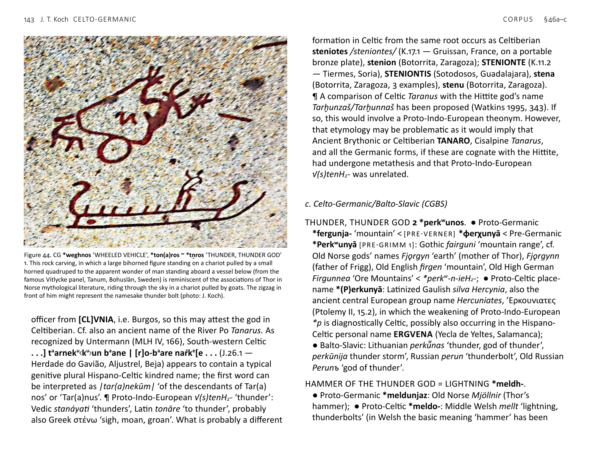

<!-- page: 139 -->

# §46. Beliefs and the supernatural
a. Celto-Germanic (CG)
ALL-FATHER, GREAT-FATHER (DIVINE EPITHET) *Olo-patēr.
● Proto-Germanic *Ala-fader < [PRE-VERNER] *Ala-faþēr
[PRE-GRIMM 1]: Old Norse Alföðr (a byname of Óðinn);
● Proto-Celtic *Olo-(p)atīr: Middle Irish Eochu Ollathair was
used commonly for the mythological character also known as the
Dagdae, the senior leader of the supernatural race, the Túath Dé:
thus, Middle Irish in Dagda mór glossing Eocho Oll-athir. ¶ Both
the central figure of the Norse divine race, the Aesir, and the
Dagdae of the Irish Túath Dé have numerous bynames. However,
it is important to note that in both cases Alföðr and Ollathair are
the most frequent and significant of these. The second element
of the compound means ‘father’ and is found throughout Indo-
European. The first element is limited to NW: Proto-Germanic
*alla- ‘all’, a suffixed derivative of Pre-Germanic *olo-: Gothic alls
‘all, every’, Old Norse allr ‘all, entire, whole’, Old English ealI, Old
Frisian al, ol, Old High German al(l) ‘all, every, complete’; Proto-
Celtic *olo-, *olyo-: Old Irish uile, Middle Welsh holl, oll ‘all’, Old
Breton holl, Middle Breton holl, oll; Proto-Italic *al-no-: Oscan allo
‘whole’; Proto-Balto-Slavic: Lithuanian aliai͂ ‘completely’. In both
Germanic and Celtic old compounds are found with single l (i.e. the
old unsuffixed form of the word ‘all’), for example: the group name
Alamanni ‘all men’, Gothic ala-brunst ‘burnt offering’, Galatian
genitive Ολοριγος, contrasting with the Gaulish divine names
OLLODAG[, personal name Ollognatus and other Ancient Celtic
examples with double ll. Germanic *alla- ‘all’ can be reconstructed
as Pre-Germanic *ol-n-o-.
<!-- page: 140 -->
EVIL *elko- ~ *elkā- ~ *elkyo- ~ *olko- ~ olkā-. ● Proto-Germanic
*elhja- ‘evil’ < Pre-Germanic *elkyo- [PRE-GRIMM 1] < notional
Proto-Indo-European *H₁elk-yo-: Old Norse illr ‘ill, evil, bad, mean’,
Faroese illur ‘evil, unfriendly, poor, miserable, angry’; ● Proto-
Celtic *elko- ~ *elkā- (< *H₁elk-o-) ~ *olko- ~ olkā-: Old Irish elc
‘mischievous, bad, capricious’, Old Irish olcc glossing ‘malus’ ‘evil,
bad, wrong; bad man, evil doer’, Scottish Gaelic olc. ¶ Note that
the second Irish word, olc, is by far the more common and still
widely used today. ¶ Finnish elkiä ‘mean, malicious’ and ilkeä ‘bad,
mean, wicked’ can be explained as loanwords from pre-Grimm 1
Pre-Germanic.
GOD-INSPIRED *wātis < Notional Proto-Indo-European *weH₂tis.
● Proto-Germanic *wōðaz < [PRE-VERNER] *wāþaz ‘inspired,
possessed, crazy’ [PRE-GRIMM 1]: Ancient Nordic personal names
unwōdz ‘calm one’ < ‘not furious’ (Gårdlösa clasp, Skåne, Sweden
~AD 200 Antonsen §6), wōdurīde ‘furious rider’ (Tune stone,
Østfold, Norway ~AD 400, Antonsen §27), Gothic woþs ‘furious’,
Old Norse óðr ‘poetry, furious’, Old English wōþ ‘song, poetry’; cf.
Old Norse god’s name Óðinn, Old English Wōden, Old High German
Wuotan; ● Proto-Celtic *wāti-: Gallo-Latin vātes ‘prophets’, Old
Irish fáith ‘prophet’, fáth ‘prophetic wisdom, learning, maxims,
skill’, Old Welsh guaut ‘prophetic verse, panegyric, eulogy’.
¶ Unique CG word, as Latin vātes ‘prophet, soothsayer, seer’ is
probably a Celtic loanword.
OMEN, FORESIGHT *kail-. ● Proto-Germanic *hail- < Pre-Germanic
*kail- [PRE-GRIMM 1]: Old English hǣl ‘omen’, hǣlsian ‘to augur, to
invoke, to implore, to curse’, Old High German heilisōn ‘to interpret
omens’; ● Proto-Celtic *kailo- ‘omen’: Old Welsh coiliou ‘omens,
auguries’, ni choilam ‘I do not believe’; Middle Welsh coel ‘belief,
omen, divination, augury’; Old Breton coel glossing ‘haruspicem’
‘soothsayer’, Old Cornish chuillioc glossing ‘augur’ ‘soothsayer’,
cf. Hispano-Celtic place-name Κοιλιοβριγα (Ptolemy II 6.38–48 in
Callaecia Bracarensis; García Alonso 2003, 243; 2009, 272 listing
this as a Celtic name); IOVEAI CAIELOBRIGOI (CIL II, 416; HEp,
5, 1064; HEp, 9, 765 — Lamas de Moledo, Castro Daire, Viseu);
COELIOBRIGA/CAELOBRIGA (dos Celernos, Castromao, Celanova,
Ourense). ¶ Latin caelum ‘sky’ is sometimes seen as related to
these forms, but the resemblance may be coincidence as the
meanings are not clearly connected. ¶ The similar Germanic word
that means ‘healthy’ (Gothic hails, Old Norse heill, &c., < Proto-
Germanic *hailaz) may be unrelated. ¶ Old Irish cél ‘omen’ was
borrowed from Brythonic during the Roman Period or early post-
Roman Period.
ONE-EYED, BLIND IN ONE EYE *káikos. ● Proto-Germanic
*haiha- [PRE-GRIMM 1]: Gothic háihs ‘one-eyed’; ● Proto-Celtic
*kaiko- ‘blind in one eye’: Old Irish cáech, Old Cornish cuic, Middle
Welsh coec ‘blind, one-eyed, squinting’. ¶ [POSSIBLY NON-INDO-
EUROPEAN SOURCE] ¶ Contrast the less specific and different
meaning of Latin caecus ‘blind, dark, invisible’. Sanskrit kekara-
‘cross-eyed’ is probably unrelated. ¶ As Hyllested notes, ‘the Celtic
god Lug closes one eye in his magic ritual, while in Germanic
mythology being one-eyed is a key attribute of Óðinn’ (2010, 117;
see further Kershaw 2000). Note also the demonically destructive
one-eyed characters in Early Irish tales, such as Balor in Cath Maige
Tuired ‘The Battle of Mag Tuired’ and Ingcél Cáech in Togail Bruidne
Da Derga ‘The Destruction of Da Derga’s Hostel’ (cf. Busse & Koch
2006b).
PROSPER, FORTUNE *tenk- ~ *tonk-. ● Proto-Germanic *þinhan-
‘to thrive, prosper’ < Pre-Germanic *ténk-e- [PRE-GRIMM 1]: Gothic
þeihan, Old English þeon, (ge-)þingan, Old Saxon thīhan, Old High
German dīhan; ● Proto-Celtic *tonketom ‘fortune, destiny, good
luck’: Old Irish tocad glossing ‘fors’ ‘chance, luck’, Middle Welsh
tynghet ‘destiny’, Middle Breton tonquaff ‘presage’, cf. Old Welsh
tagc, Middle Welsh tanc ‘peace’ < *tnk-o-; also possibly related to
Proto-Celtic *tong- ‘swear’ (Delamarre 2003, 298); cf. the cognate
<!-- page: 141 -->
personal names: Ancient Brythonic TVNCCETACE (CIIC no. 451
— St Nicholas, Pembrokeshire), Ogam TOGITTACC (CIIC no. 172 —
Ballywiheen [Baile Uí Bhaoithín], Kerry), both genitives meaning
‘fortunate’, Old Irish nominative Toicthech.
¶ Numerous Palaeohispanic personal names attested in the
Western Iberian Peninsula are based on this word: TONGETA
TANCINI F. (CIL II, 5349; CPILC, 80 — Belvís de Monroy
(Cáceres); TONGETA PROBINAE LIB. (AE, 1967, 172 — Idanha-
a-Velha, Idanha-a-Nova, Castelo Branco); TONGETAE PITINNAE
(FE, 402 — Torre de Coelheiros, Évora, Évora); TONGETA
TVLORI F. (FE, 107; HEp, 2, 828 — Amieira do Tejo, Nisa,
Portalegre); ]TONGETERI F. CLVN(IENSIS) (HEp, 13, 1003; AE,
2004, 708 — São Salvador de Aramenha, Marvão, Portalegre);
TONGETAE RVFI (HEp, 2, 904 — Cárquere, Resende, Viseu);
TONGETA PETOBI (HEp, 2, 896 — Lamas de Moledo, Castro
Daire, Viseu); TONGETAE ALVQVI F. (CIL II, 5248 — Región de
Lamego, Viseu); TONGETO ARANTO (HEp, 7, 1286 — Cárquere,
Resende, Viseu); IVLIA TONGETA (Vasconcellos 1913, 455–457
— Cárquere, Resende, Viseu); IVLIA RVFA TONGETI F. (HEp,
5, 55 — Badajoz); TONGETAMVS CAVNI F. (HEp, 1, 207 —
Villamiel, Cáceres); ARA(M) POS(VIT) TONCIVS TONCETAMI
F. ICAEDIT(ANVS) MILIS TREBARVNE L.M.V.S. (EE, VIII 15;
ILER 941 — Idanha-a-Velha, Idanha-a-Nova, Castelo Branco);
TALAVS TONCETAMI F. BOVTIE(CVM) (Albertos 1975a, 2. 212.
nº 234 — Yecla de Yeltes, Salamanca); OVRISONI TONCETAMI
F. (ERZamora, 171 — Domez, Zamora); RVFINA RVFI
TONGETAMI F. (CIL II, 447 — Idanha-a-Velha, Idanha-a-Nova,
Castelo Branco); MAXSVMA[?] TONGATI ∙ F(ilia) H(ic) ∙ S(ita)
∙ E(st) ∙ S(it) ∙ T(ibi) ∙ T(erra) ∙ L(evis) ∙ AVELIVS [vel AELIVS]
∙ TA- (FE, 637 — Trujillo, Cáceres). ¶ The suffix in the name
Toncetamo-, can be understood as superlative ‘most auspicious’
or with the sense of an ordinal number, ‘son auspiciously
sequenced amongst siblings’. ¶ Cf. Lithuanian tìkti (tinkù) ‘to
be good (for), to be suitable’ < *tnk-e-, taikyti ‘to arrange, fit’,
Ukrainian t’aknuty ‘to be helpful’ < *tnk-neu-.
SACRED GROVE, SANCTUARY *nemet-. ● Proto-Germanic
*nemiþa- [PRE-GRIMM 1]: Old Saxon nimidas ‘sacred grove’,
Swedish farm name Nymden; ● Proto-Celtic *nemetom:
Hispano-Celtic group name as Greek genitive plural Νεμετατων
(Ptolemy II, 6.40), located between rivers Río Ave and Cávado,
Spain, Hispano-Celtic place-name NEMETOBRICA (HEp, 4, 586;
HEp, 7, 548; AE, 1991, 1040 — Codesedo, Sarreaus, Ourense),
personal name NEMETI[VS] FIRMVS (AE, 1950, 256 — Lisboa),
Celtiberian divine name NEM[E]DO AVGVSTO (HEp, 5, 685; HEp,
7, 690; ERSg, 170 - 032 — Pedraza, Segovia), NEMEDO (HEp, 5,
686; HEp, 7, 712; ERSg, 170 - 054 — Pedraza, Segovia); Gaulish
CΕΓΟΜΑΡΟC | ΟΥΙΛΛΟΝΕΟC | ΤΟΟΥΤΙΟΥC | ΝΑΜΑΥCΑΤΙC
| ΕΙΩΡΟΥ ΒΗΛΗ|CΑΜΙ CΟCΙΝ | ΝΕΜΗΤΟΝ ‘Segomāros son
of Uillonos, citizen of Nîmes, dedicated this holy thing/place
to Belesama’ = sosin nemeton (RIG 1 G-153 — Vaison),personal
name from Noricum NEMETA, coin legend from Noricum
ΝΕΜEΤ (Allen & Nash 1980, 193); Gaulish place-names Ar(e)
nemeton—Arlemptes (Haute-Loire), France; Arnemetici (Holder,
AcS — in the arch-diocese of Arles on the right bank of the Rhône),
Augustonemetum/ Mezunemusus/*Medionemeton — Clermont-
Ferrand, France; Nemetacon, -um—Arras, France; Nemetacum/
Nemetocenna—France; Nemetae Noviomagus—Speyer,
Germany; Nemetes—Germany; Nemetoduron/ Nannetodurum—
Nanterre (Calvados), France; Nemetoduron—Nanterre (Loiret),
France; Nemetoduron—Nemeden, Germany; Nemetoduron,
Nemetodurum*, Nemptudoro—Nanterre (Hauts-du-Seine),
France; Nemetoduron—Némy (Poitou), France; Nemetoduron—
Némy (Hainaut), Nemetotacio/Nemetostatio—North Tawton,
Devon, England; Nemeturii—upper Verdon or Var valley? France;
Nouionemeton—Nonant (Calvados), France; Nouionemeton—
Nonant (Orne), France; Tasinemeti—Saint Georg am Sternberg?
Austria; Tasinemetum—Norica, near Villach; Vernemetum—near
Agen (Fortunat), France; Vernemetis—Vernou-sur-Brenne, France;
<!-- page: 142 -->
Aquae Arnemetiae*—Buxton, England; Galatian place-name
Δρυνεμετον (meeting place of council and tetrarchs of the Galatae;
Freeman 2001, 83–4), Old Irish nemed ‘sanctuary, person of
special privilege or exemption’, Ancient Brythonic divine name
NEMETONA (RIB 1–140 — Bath), divine epithet, DEO MARTI
RIGONEMETI (RIB 1–254b — Nettleham, England) Early Welsh
(Gododdin) niuet ‘special privilege’; Ancient Brythonic place-name,
Uernemetum = Old Welsh personal name Guornemet, Old Welsh
personal names Nimet, Iu[d]nemet; Old Breton personal names
Catnemet, Iudnimet. ¶ Unique CG suffixed formation: contrast
Greek νέμος ‘wooded pasture, glade’, Latin nemus ‘sacred grove’,
possibly also Sanskrit námas- ‘worship, honour’ < Proto-Indo-
European *némos without the suffix.
STONE LANDMARK, STONE RELIGIOUS MONUMENT *kar-.
● Proto-Germanic *hargu- ‘sacrificial mound?’ < [PRE-VERNER]
*χarχú- < Pre-Germanic *karkú- (per Kroonen) [PRE-GRIMM 1]:
Old Norse hǫrgr ‘pile of rocks, sanctuary’, Old English hearg
‘pagan temple, idol’, Old High German harug ‘grove, place of
sacrifice’; ● Proto-Celtic: the most formally similar words mean
merely ‘rock’ (though these denote rocks of special importance
in place-names), namely Old Welsh creic < *krakyā-, Old Welsh
carrecc < *karrikā-; however, Proto-Celtic *karnom ‘ancient stone
funerary monument’< *kr̥n-ο- appears to be a related word with
the relevant specialized meaning: Old Irish carn ‘burial cairn, man-
made pile of stones’, Old Welsh carn ‘cairn, barrow, tumulus, pile
of rocks, heap’. The place-name Carnac in Brittany reflects Gaulish
*Karnākon ‘place with pagan stone monuments’ (cf. Falileyev et
al. 2010, 13). Cf. the past-tense verb, probably having to do with
a cairn or other types of stone funerary monuments Gaulish
ΚΑΡΝΙΤΟΥ[ (RIG 1, 198–201 — Saignon), Cisalpine Gaulish karnitu
(RIG 2–1, 42–52 — Todi), plural karnitus (RIG 2–1, 11–24; Lambert
1994, 72–6 — Briona). ¶ [POSSIBLY NON-INDO-EUROPEAN SOURCE]
¶ Middle Irish carrac ‘rock, large stone’ is probably borrowed from
Brythonic. **carrach would be expected as a cognate.
SUPERNATURAL BEING, PHANTOM, GHOST 1 *dhroughós. ● Proto-
Germanic *drauga-: Old Norse draugr ‘ghost’; ● Proto-Celtic
*drougo-: Old Irish airdrech ‘sprite, phantom’ < *(p)ari-drougo-.
¶ Unique CG secondary meaning possibly from the Proto-Indo-
European word reflected in Avestan draoγa- ‘lie’, Old Persian
drauga- ‘lie, treason, felony’, cf. Sanskrit drúhyati ‘deceives’.
2 *skōk-slo-. ● Proto-Germanic *skōhsla- (< *skāχ-sla-)
[PRE-GRIMM 1]: Gothic skōhsl ‘evil spirit, demon’; ● Proto-Celtic
*skāχslo-: Old Irish scál ‘supernatural or superhuman being,
phantom, giant, hero; the god Lug’, Middle Welsh yscaul ‘hero,
champion, warrior’.
3 *ghoistos. ● Proto-Germanic *gaistaz ‘(supernatural) spirit’:
Old English gāst, gǣst ‘breath, spirit, soul, ghost’, Old Frisian
gāst, jēst, Old Saxon gēst ‘soul, vitality, spirit, demon’, Old High
German geist, cf. Gothic usgaisjan ‘to terrify’, Old Norse geisa ‘to
rage’; ● Proto-Celtic *goisto-: Old Irish gáes ‘sagacity, intelligence,
acuteness’.
THUNDER, THUNDER GOD 1 *ton(a)ros ~ *tn̥ros. ● Proto-Germanic
*þunraz [PRE-GRIMM 1]: Old Norse þórr, Old English þunor, þuner,
Old Frisian thuner, Old Saxon thunar, Old High German donar;
● Proto-Celtic *tonaros > *toranos: Gaulish divine names Taranis,
Taranucnos, Taranucnus, dative ΤΑΡΑΝΟΟΥ (RIG 1, G–153 —
Vaison), personal name Taranutius, possibly include also the
personal names Tornioniius, Torniss[, Torno, Tornos, Tornus; Old
Irish torann ‘thunder, noise’, Scottish Gaelic torrunn ‘thunder’,
Middle Welsh taran ‘(peal of) thunder, thunderclap’; Old
Breton taran ‘tonitru’ ‘thunder’, Old Cornish taran ‘tonitruum’
‘thunder’; Taran also occurs as a name in the prehistoric section
of the Pictish King-List, so possibly a euhemerized god. The
form TANARO (dative; RIB 1–452 — Chester, datable AD 154),
which gives the more archaic form of the god’s name without
metathesis, occurs on a votive altar dedicated by a Roman
<!-- page: 143 -->
officer from [CL]VNIA, i.e. Burgos, so this may attest the god in
Celtiberian. Cf. also an ancient name of the River Po Tanarus. As
recognized by Untermann (MLH IV, 166), South-western Celtic
. . .] taarneku<ku>un baane | [r]o-baare naŕke[e . . . (J.26.1 —
Herdade do Gavião, Aljustrel, Beja) appears to contain a typical
genitive plural Hispano-Celtic kindred name; the first word can
be interpreted as |tar(a)nekūm| ‘of the descendants of Tar(a)
nos’ or ‘Tar(a)nus’. ¶ Proto-Indo-European √(s)tenH₂- ‘thunder’:
Vedic stanáyati ‘thunders’, Latin tonāre ‘to thunder’, probably
also Greek στένω ‘sigh, moan, groan’. What is probably a different
formation in Celtic from the same root occurs as Celtiberian
steniotes /steniontes/ (K.17.1 — Gruissan, France, on a portable
bronze plate), stenion (Botorrita, Zaragoza); STENIONTE (K.11.2
— Tiermes, Soria), STENIONTIS (Sotodosos, Guadalajara), stena
(Botorrita, Zaragoza, 3 examples), stenu (Botorrita, Zaragoza).
¶ A comparison of Celtic Taranus with the Hittite god’s name
Tarḫunzaš/Tarḫunnaš has been proposed (Watkins 1995, 343). If
so, this would involve a Proto-Indo-European theonym. However,
that etymology may be problematic as it would imply that
Ancient Brythonic or Celtiberian TANARO, Cisalpine Tanarus,
and all the Germanic forms, if these are cognate with the Hittite,
had undergone metathesis and that Proto-Indo-European
√(s)tenH₂- was unrelated.
c. Celto-Germanic/Balto-Slavic (CGBS)
THUNDER, THUNDER GOD 2 *perkʷunos. ● Proto-Germanic
*fergunja- ‘mountain’ < [PRE-VERNER] *φerχunyā < Pre-Germanic
*Perkʷunyā [PRE-GRIMM 1]: Gothic fairguni ‘mountain range’, cf.
Old Norse gods’ names Fjǫrgyn ‘earth’ (mother of Thor), Fjǫrgynn
(father of Frigg), Old English firgen ‘mountain’, Old High German
Firgunnea ‘Ore Mountains’ < *perkʷ-n-ieH₂-; ● Proto-Celtic place-
name *(P)erkunyā: Latinized Gaulish silva Hercynia, also the
ancient central European group name Hercuniates, ’Ερκουνιατες
(Ptolemy II, 15.2), in which the weakening of Proto-Indo-European
*p is diagnostically Celtic, possibly also occurring in the Hispano-
Celtic personal name ERGVENA (Yecla de Yeltes, Salamanca);
● Balto-Slavic: Lithuanian perkū̃nas ‘thunder, god of thunder’,
perkūnija thunder storm’, Russian perun ‘thunderbolt’, Old Russian
Perunъ ‘god of thunder’.
HAMMER OF THE THUNDER GOD = LIGHTNING *meldh-.
● Proto-Germanic *meldunjaz: Old Norse Mjöllnir (Thor’s
hammer); ● Proto-Celtic *meldo-: Middle Welsh mellt ‘lightning,
thunderbolts’ (in Welsh the basic meaning ‘hammer’ has been

Figure 44. CG *weghnos ‘WHEELED VEHICLE’, *ton(a)ros ~ *tn̥ros ‘THUNDER, THUNDER GOD’
1. This rock carving, in which a large bihorned figure standing on a chariot pulled by a small
horned quadruped to the apparent wonder of man standing aboard a vessel below (from the
famous Vitlycke panel, Tanum, Bohuslän, Sweden) is reminiscent of the associations of Thor in
Norse mythological literature, riding through the sky in a chariot pulled by goats. The zigzag in
front of him might represent the namesake thunder bolt (photo: J. Koch).
<!-- page: 144 -->
replaced by the related loanword mwrthwl < Late Latin martulus,
so that the native word expresses only the fossilized mythological
metaphor, ‘lightning’ < ‘god’s hammer’, also the mythological
patronym of Mabon son of Mellt), singulative mellten, Gaulish
god’s name (dative) MELDIO (Bazan, France), group name Meldi;
● Proto-Balto-Slavic *mild-n- ~ *meld-n-: Old Prussian mealde
‘lightning bolt’, Latvian milna ‘hammer of the thunder god’, Old
Church Slavonic mlъni ‘lightning’ < *mъldni, mlatъ ‘hammer’ <
*molH₁-tlo- ‘grinding device’. ¶ Proto-Indo-European √melH₂-
‘grind’: cf. Old Norse mjǫl ‘meal’, Middle Welsh malu ‘to grind’.
Although the semantic development ‘hammer’ > ‘hammer of the
thunder god = lightning’ is found only in Celtic, Germanic, and
Balto-Slavic, the earlier development ‘grinding device’ > ‘hammer’
occurred more widely: Latin malleus ‘hammer’ < Proto-Italic
*mol-tlo- < *molH₁-tlo-, Hittite malatt- ‘sledgehammer, bludgeon’.
The idea of an implement whose primary function was to break
something up into small pieces is retained for Mjöllnir, as in the
story in the Skaldskaparmal of Thor using Mjöllnir to pulverize
the skull of the giant Hrungnir. ¶ As Paulus van Sluis noted at the
Indo-European Interfaces conference, deriving Welsh mellt from
*meldh- and coll from *koldo- looks like an inconsistency. There
is more than one possible solution, including, of course, either of
the etymologies being wrong. But on the face of it, the simplest
is to suppose that Pre-Celtic *ld became *ll before *d and *dh fell
together, so that Pre-Celtic *ldh and *ld have different outcomes.
SUPERNATURAL BEING, PHANTOM, GHOST 3 *dhwes-.
● Proto-Germanic *dwas- < Pre-Germanic *dhwos-: Middle
High German getwās ‘phantom, ghost’; ● Proto-Celtic
*dwosyos: Gaulish dusios ‘incubus’ ‘daemon’ ‘type of demon’;
● Baltic: Lithuanian dvasià ‘breath, spirit, soul’, Latvian dvaša.
MAGIC, SORCERY *soito-/ā-. ● Proto-Germanic *saida- ‘magic,
charm’ < [PRE-VERNER] *saiþa- [PRE-GRIMM 1]: Old Norse seiðr
‘magic, spell, enchantment’; Old Norse síða ‘to work charms’, Old
English -siden ‘magic’ < *sidnō-; ● Proto-Celtic *soito- ‘magic’:
Middle Welsh hud, Breton hud, Old Cornish hudol glossing
‘magus’; ● Baltic: Lithuanian saĩtas ‘sign, soothsaying, soothsayer,
talisman’, also ‘string, necklace’ (< ‘talisman’), seĩtas ‘magic’.
Probably originally identical to Proto-Indo-European *soito-
‘string, rope’ < √seH₂-i- ‘to bind’ with a shift in meaning unique to
Germanic, Celtic, and Baltic.
MALEVOLENT FEMALE SPIRIT *morā. ● Proto-Germanic *mara: Old
Norse mara, Old English mare (cf. Modern night-mare, German
Nacht-mahr), Old Saxon māra, Old High German mara; ● Proto-
Celtic *morā: Old Irish Mor-rígain (principal name of the Irish
war-goddess); ● Slavic: Croatian Mòrana ‘mythological female
demon’, Russian kikimora ‘nocturnal apparition, female house-
spirit’, Polish zmora (earlier mora) ‘nightmare’.
