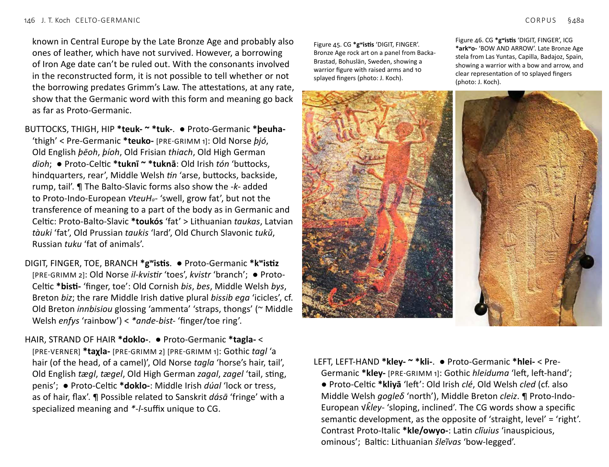

<!-- page: 145 -->

# §48. Anatomy
a. Celto-Germanic (CG)
BEARD *ghren- ~ ghran-. ● Proto-Germanic *granō-: Gothic
grano, Old Norse grǫn, ‘hair of the beard, spruce (needle)’, Old
English granu ‘moustache’, Old High German grana ‘hair of the
beard’; ● Proto-Celtic *grando- ~ *grendo- ‘beard’: Middle Irish
grend ‘beard, hair, bristles’, Middle Welsh grann ‘cheek, jowl,
face, beard, bristles, hair, eyelid’, Middle Breton grann ‘eyebrow’,
possibly related to Grannus, an epithet of Apollo in Gaul.
BREAST *bhrusn-. ● Proto-Germanic *brunjōn- ‘breastplate, mail
coat’: Gothic brunjō, Old Norse brynja ‘mail coat’, Old English
byrne ‘cuirass, corslet, coat of mail’, Old Saxon brunnia ‘mail
coat’, Old High German brunja, brunna ‘mail coat’; ● Proto-
Celtic *brusnā ~ *brusnyo- ‘breast, bosom, thorax’: Old Irish
bruinne ‘breast, bosom, chest’, Old Breton bronn, Middle Welsh
bron, cf. Middle Welsh brynn ‘hill’ < Proto-Celtic *brusnyo-. ¶ A
development of CGBS ‘BREAST, CHEST, ABDOMEN’ *bhreus- (see
below) found only in Germanic and Celtic. A loanword from Proto-
Celtic to Pre-Germanic or Proto-Germanic is likely. It is not certain
whether the specialized meaning ‘chest armour’ developed only
in Germanic or had already come about in Celtic, from which it
was lost prior to attestation. Corselets made of sheet bronze were
<!-- page: 146 -->
known in Central Europe by the Late Bronze Age and probably also
ones of leather, which have not survived. However, a borrowing
of Iron Age date can’t be ruled out. With the consonants involved
in the reconstructed form, it is not possible to tell whether or not
the borrowing predates Grimm’s Law. The attestations, at any rate,
show that the Germanic word with this form and meaning go back
as far as Proto-Germanic.
BUTTOCKS, THIGH, HIP *teuk- ~ *tuk-. ● Proto-Germanic *þeuha-
‘thigh’ < Pre-Germanic *teuko- [PRE-GRIMM 1]: Old Norse þjó,
Old English þēoh, þíoh, Old Frisian thiach, Old High German
dioh; ● Proto-Celtic *tuknī ~ *tuknā: Old Irish tón ‘buttocks,
hindquarters, rear’, Middle Welsh tin ‘arse, buttocks, backside,
rump, tail’. ¶ The Balto-Slavic forms also show the -k- added
to Proto-Indo-European √teuHa- ‘swell, grow fat’, but not the
transference of meaning to a part of the body as in Germanic and
Celtic: Proto-Balto-Slavic *toukós ‘fat’ > Lithuanian taukas, Latvian
tàuki ‘fat’, Old Prussian taukis ‘lard’, Old Church Slavonic tukŭ,
Russian tuku ‘fat of animals’.
DIGIT, FINGER, TOE, BRANCH *gʷistis. ● Proto-Germanic *kʷistiz
[PRE-GRIMM 2]: Old Norse il-kvistir ‘toes’, kvistr ‘branch’; ● Proto-
Celtic *bisti- ‘finger, toe’: Old Cornish bis, bes, Middle Welsh bys,
Breton biz; the rare Middle Irish dative plural bissib ega ‘icicles’, cf.
Old Breton innbisiou glossing ‘ammenta’ ‘straps, thongs’ (~ Middle
Welsh enfys ‘rainbow’) < *ande-bist- ‘finger/toe ring’.
HAIR, STRAND OF HAIR *doklo-. ● Proto-Germanic *tagla- <
[PRE-VERNER] *taχla- [PRE-GRIMM 2] [PRE-GRIMM 1]: Gothic tagl ‘a
hair (of the head, of a camel)’, Old Norse tagla ‘horse’s hair, tail’,
Old English tægl, tægel, Old High German zagal, zagel ‘tail, sting,
penis’; ● Proto-Celtic *doklo-: Middle Irish dúal ‘lock or tress,
as of hair, flax’. ¶ Possible related to Sanskrit dásā ‘fringe’ with a
specialized meaning and *-l-suffix unique to CG.
LEFT, LEFT-HAND *kley- ~ *kli-. ● Proto-Germanic *hlei- < Pre-
Germanic *kley- [PRE-GRIMM 1]: Gothic hleiduma ‘left, left-hand’;
● Proto-Celtic *kliyā ‘left’: Old Irish clé, Old Welsh cled (cf. also
Middle Welsh gogleδ ‘north’), Middle Breton cleiz. ¶ Proto-Indo-
European √k̂ley- ‘sloping, inclined’. The CG words show a specific
semantic development, as the opposite of ‘straight, level’ = ‘right’.
Contrast Proto-Italic *kle/owyo-: Latin clīuius ‘inauspicious,
ominous’; Baltic: Lithuanian šlei͂vas ‘bow-legged’.

Figure 46. CG *gʷistis ‘DIGIT, FINGER’, ICG
*arkʷo- ‘BOW AND ARROW’. Late Bronze Age
stela from Las Yuntas, Capilla, Badajoz, Spain,
showing a warrior with a bow and arrow, and
clear representation of 10 splayed fingers
(photo: J. Koch).

Figure 45. CG *gʷistis ‘DIGIT, FINGER’.
Bronze Age rock art on a panel from Backa-
Brastad, Bohuslän, Sweden, showing a
warrior figure with raised arms and 10
splayed fingers (photo: J. Koch).
<!-- page: 147 -->
THICK, FAT *tegus, feminine *tegʷī. ● Proto-Germanic *þekuz ~
*þikʷī ‘fat’ [PRE-GRIMM 2] [PRE-GRIMM 1]: Old Norse þjokkr, þjukkr,
þykkr, Old English þicce, Old Frisian thiukke ‘extent’, Old Saxon
thikki ‘fat’, Old High German dicchi ‘dense, thick, frequent’;
● Proto-Celtic *tegu-: Middle Irish tiug ‘thick, dense, solid’, Old
Welsh teu ‘thick, strong, sturdy, fat’, Middle Breton teu, teo,
Cornish tew.
b. Italo-Celtic/Germanic (ICG)
CURLY HAIR *krisp-. ● Proto-Germanic *hrispon- ‘curl’ < Pre-
Germanic *krisp-ā- [PRE-GRIMM 1]: Middle Low German rispe
‘truss’, Middle High German rispe, cf. Old High German hrisp-
ahi ‘shrubbery’, Middle High German rispen, rispeln ‘to ripple,
curl’; ● Proto-Celtic *krixso- ~ *krixsā- ‘curly-haired’ < Pre-Celtic
*kripso- < *krispo-: Gaulish personal name Crixsus, Middle Welsh
crych ‘curly, wrinkled, rough’, Middle Breton crech; ● Proto-Italic
*krispo- ‘curly, crumpled, twisted’: Latin crispus ‘curly, curled’.
HEAD *kápu-. ● Proto-Germanic *ha(u)bida ~ *ha(u)beda ~
*ha(u)buda < [PRE-VERNER] *χaφuþa- < Pre-Germanic *kaputo-
[PRE-GRIMM 1]: Gothic haubiþ, Old Norse hǫfuð, Old English hæfud,
Old Frisian hāved, Old Saxon hōƀid, Old High German houbit;
● Proto-Celtic *ka(p)uko-: Old Irish cuäch ‘cup, bowl, goblet,
cauldron; lock of hair’, Middle Welsh kawc ‘dish, bowl, basin,
?helmet’; ● Proto-Italic *kaput: Latin caput. ¶ Whether Early
Welsh kawc could mean ‘helmet’ hinges on the hapax cawgawc
in the line cayawc cynhorawc cawgawc fer ‘wearing a brooch,
riding in the front rank, equipped with a cawg, [and] steadfast’ in
a poem about the historical Cadwallon of Gwynedd †634/5.
NECK *kólsos. ● Proto-Germanic *halsaz [PRE-GRIMM 1]: Gothic, Old
Norse háls ‘neck’, Old English heals, hals ‘neck, prow of a ship’,
Old High German hals ‘neck’; ● Proto-Celtic *kolso-: Middle Irish
coll ‘neck, jaw, head’ is a rare word mostly confined to glossaries;
● Proto-Italic *kolsos: Latin collus ‘neck’.
c. Celto-Germanic/Balto-Slavic (CGBS)
BREAST, CHEST, ABDOMEN *bhreus- ~ *bhrus-. ● Proto-Germanic
*breusta- ‘breast, chest’: Old Norse brjóst, Old English brēost, Old
Frisian briast, Old Saxon briost, breost; ● Proto-Celtic *brous-,
*brus-: Old Irish brú, genitive bronn ‘abdomen, belly, bowels,
entrails, womb’ < Proto-Celtic *brusū, *brusnos, Middle Welsh bru
‘womb, matrix, belly, breast’ < *brous-, Old Irish bruinne ‘breast,
bosom, chest’ < *brunnyā < *bhrus-n-yā-, Old Breton bronn
‘breast’, Middle Welsh bronn ‘breast, nourishment’ < *brunnā <
*bhrus-n-ā-; ● Slavic: Russian brjúxo ‘belly, paunch’.
VOMIT, DEFECATE (?) *ski-. ● Proto-Germanic *skitan- ‘to shit’: Old
Norse skíta, Old English scītan, Old High German scīzan; ● Proto-
Celtic *ski-yo- ~ *skeyeti ‘vomit’: Old Irish sceïd, Middle Welsh
chwyt ‘vomiting, spewing’, Old Breton huidiat glossing ‘uomex’
‘vomit’, Middle Breton huedaff; ● Baltic: Lithuanian skíesti ‘to
have diarrhoea’. ¶ A CG/Baltic development if we take these
meanings to be close, rather than independent developments for
Proto-Indo-European √skey- ‘split, separate’: Greek σκίζω ‘split’ <
*skid-ye/o-, Latin scindō < Proto-Italic *ski-n-d-e/o- ‘split, cleave’.
