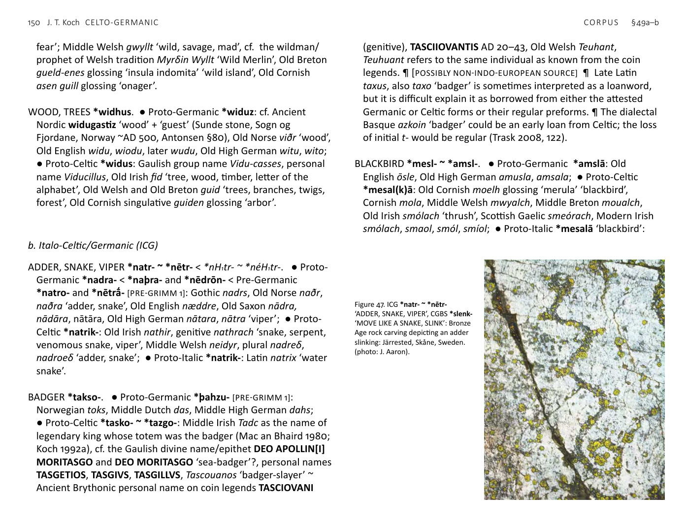

<!-- page: 147 -->

# §49. Natural world
a. Celto-Germanic (CG)
BOAR *bhasyo- ?. ● Proto-Germanic *bairo- or *baiza-: Old English
bār, Old Saxon bēr-swīn, Old High German bēr; ● Proto-Celtic
*basyo- ?: Old Cornish bahet glossing ‘aper vel verres’ ‘boar or
boar’, Middle Welsh baeδ (it is possible that the singular baeδ is
an analogical back formation from beiδ that was originally both
singular and plural, like Welsh pabell ‘tent’ < pebyll). ¶ If English
boar and Welsh baedd are indeed cognates, Russian borovŭ ‘boar’
would have to reflect a loanword from Germanic.
<!-- page: 148 -->
CLOVER *smeryon- ~ *semar-. ● Proto-Germanic *smērjōn-: Old
Norse smāri ‘clover’, Icelandic smæra, Faroese smæra, Norwegian
smære, Danish smære; ● Proto-Celtic *semarā- and *smelyon-:
Old Irish semar ‘clover, shamrock’ (Irish diminutive seamróg,
Scottish Gaelic seamrag whence English shamrock), Old Welsh
mellhionou glossing ‘violas’, Middle Welsh meillyon ‘clover, trefoil’,
Old Cornish singulative melhyonen glossing ‘vi[o]la’, Middle Breton
singulative melchonennn. ¶ [POSSIBLY NON-INDO-EUROPEAN SOURCE]
DARK *dhem(H)-. ● Proto-Germanic *dimma- < Pre-Germanic
*dhem(H)-no-: Old Norse dimmr, Old English dim, dimm, Old
Frisian dim, cf. Old High German timbar ‘dim, dark, obscure’;
● Proto-Celtic *dem- ‘dark’: Middle Irish deime ‘darkness (of
night)’ < *demyā-.
DWARFLIKE CREATURE, WATER CREATURE *aban-. ● Proto-
Germanic *apan- ‘monkey, ape’ [PRE-GRIMM 2]: Old Norse api, Old
English apa, Old Saxon apo, Old High German affo; ● Proto-Celtic
*abanko- < *abn̥ko- ‘river dweller’: Middle Irish abacc ‘dwarf’,
Middle Welsh afanc ‘beaver, dwarf, water monster’ (cf. Middle
Welsh aδanc ‘water monster’), Breton avank ‘dwarf, sea monster’,
cf. Old Breton amachdu ‘black water monster’ = Welsh Afagddu,
name of a legendary ugly and untalented youth who dwelt at what
became the bottom of Llyn Tegid (Bala Lake).
EARTH, CLAY, MUD *ūr- ~ *our-. ● Proto-Germanic *aura-: Old
Norse aurr ‘loam, wet clay, mud’, Old English ēar ‘humus, earth,
sea’; ● Proto-Celtic *ūro- ~ *ūrā-: Middle Irish úr, also úir ‘mould,
earth, clay, soil, the grave’, Scottish Gaelic ùir ‘mould, dust, earth’.
EXTREMITIES OF A LIVING THING *pinn-. ● Proto-Germanic
*fin(n)ōn- [PRE-GRIMM 1]: Old Norse fina, Swedish fena ‘fin, chaff,
husk’, Old English finn ‘fin’, Middle Dutch vinne ‘fin, wing, prickle,
awn’, Middle Low German finne; ● Proto-Celtic *(p)innā-: Old
Irish inn, ind ‘tip, point, edge, extremities of the body, tongue,
point of a weapon, treetop, hilltop’. ¶ Latin pinna ‘feather, wing,
parapet, fin’ is a variant of the unrelated word penna ‘feather,
wing’.
GREASE, FAT, MARROW, ANOINT *smeru-. ● Proto-Germanic
*smerwa-: Gothic smairþir ‘grease’, Old Norse smjǫr, smjør
‘butter, grease’, Old English smeoru ‘fat, grease, tallow’, Old Frisian
smere Old Saxon smeoru, smeru ‘fat’, Old High German smero,
smer, cf. Gothic smairþr ‘fat’, Old Norse smyrva, smyrja ‘to smear,
anoint’, Old English smierwan, Old High German smirwen < Proto-
Germanic *smerwjan-; ● Proto-Celtic *smeru- ‘marrow’ < ‘fat,
grease’, *smerto- ~ *smertā- ‘anointed’: Old Celtic goddess name
Ro-smerta ‘anointed one’, possibly also Galatian personal names
Ζμερτοριξ ‘anointed king’, Ζμερτομαρα, Ζμερτομαρος, Old Irish
smiur glossing ‘medulla’ ‘marrow’, cf. Old Irish smeraid ‘smears,
anoints’, Middle Welsh mer ‘(bone-)marrow, sap’, Middle Breton
mel ‘marrow’ (not related to the homophonous mel ‘honey’);
● Proto-Italic *(s)meru-lo-: Latin medulla ‘marrow, pith, interior’.
The d < r in Latin is not regular and possibly arose from the idea
that the word was related to medium ‘middle’.
HOLLY *kuleno- ~ *kolino-. ● Proto-Germanic *hulba- ~ *hulisa- ~
*hulena- < Pre-Germanic *kuleno- [PRE-GRIMM 1]: Old Norse hulfr,
Old English holeȝn, holen, Old High German hulis, huls; ● Proto-
Celtic *kolino-: Old Irish cuilenn, Old Cornish kelin, Middle Welsh
kelyn, Middle Breton quelenn. ¶ [POSSIBLY NON-INDO-EUROPEAN
SOURCE]
LARK *laiwad ~ *alaud. ● Proto-Germanic *laiwaz-: Old Norse
læ̒virke, Old English lǣwerce, Old High German lêrahha; Proto-
Celtic: Latin alauda ‘lark’ probably borrowed from Gaulish.
¶ [POSSIBLY NON-INDO-EUROPEAN SOURCE] (Iversen & Kroonen 2017).
LINEAR LANDSCAPE FEATURE *roino-. ● Proto-Germanic *raina-:
Old Norse -rein ‘strip of land’ (in compounds), Old High German
rein ‘ridge of earth as boundary mark’; ● Proto-Celtic *roino-: Old
Irish róen ‘way, path, route, row, mountain range’, Breton run ‘hill’.
LOUSE *leuo- ~ *lū-s-. ● Proto-Germanic *lūs- < *luH-s-: Old Norse
lús, Old English lūs, luus, Old High German lūs; ● Proto-Celtic
*lowo- < *lewo- < *lewHo-: Old Cornish singulative lewen-ki
<!-- page: 149 -->
glossing ‘pediculus’ ‘dog’s louse’, Middle Welsh singulative lleuen,
collective lleu, Middle Breton singulative louenn, collective lou.
¶ It is possible that Tocharian A lu, Tocharian B luwo ‘animal’ go
back to the same root as the CG for ‘louse’, i.e. √lewH-, showing a
different development of the meaning.
NATURALLY OVERGROWN LAND *kaito-. ● Proto-Germanic *haiþi-
[PRE-GRIMM 1]: Gothic haiþi ‘open field, heath, open untilled land,
pasture, open country’, Old Norse heiðr ‘heath, barren land,
moor’, Old English hǣþ ‘uncultivated land, wasteland, heather’,
Old High German heida ‘uncultivated land’; ● Proto-Celtic *kaito-:
Hispano-Celtic place-name CAETOBRIGA/Καιτουβριξ (Setúbal),
Old Welsh coit ‘wood, forest’, Old Cornish cuit glossing ‘silva’,
Old Breton coet. ¶ The second element of the very rare Latin
compound bū-cētum ‘cow pasture’ (noted in OED s.n. ‘heath’)
is not likely to be cognate, as the vowel does not correspond.
Therefore, *kaito- is more probably a CG rather than an ICG word.
PINE *gisnó-. ● Proto-Germanic *kizna- ‘pine tree’ [PRE-GRIMM 2]:
Old English cēn ‘pine tree, spruce’, Old High German kien ‘pine
tree, pinewood torch’; ● Proto-Celtic *ginso-: Old Irish crand gius
glossing ‘pinus’ ‘pine tree, fir tree’, Scottish Gaelic giuthas ‘fir’.
¶ [POSSIBLY NON-INDO-EUROPEAN SOURCE]
RUSH *sem-. ● Proto-Germanic *semeþa- ~ *semeþō-: Old Saxon
semith, Old High German semida; ● Proto-Celtic *semin-: Old
Irish simin(n), seimin(n), sibin(n) ‘rush, reed, corn-stalk, rope made
of rushes’.
SEDGE *sek-s-. ● Proto-Germanic *sahaza- ~ *sagja- < [PRE-VERNER]
Pre-Germanic *sákaso- ~ *sakyó-: Old English sæcg glossing
‘gladiolum’ ‘gladiolus, sword lily’, secg glossing ‘carix’ ‘sedge,
sword’, Old Saxon saher-ahi, Old High German sahar, sahor, sahir
‘sedgy place; scirpus, juncus, carex’; ● Proto-Celtic *seχskā/i-
‘rushes, sedge’: Middle Irish seisc, Middle Welsh singulative
hescenn, Middle Breton hesq, Old Cornish heschen glossing
‘canna, arundo’ ‘reed’. ¶ This CG name for a plant with sharp
leaves is probably derived from a more widespread word meaning
‘cut’: Latin secō, secāre, Old Norse sǫg ‘saw’, Old English sagu,
Old Saxon saga, Old High German sega, saga ‘saw’, Old Church
Slavonic sěšti ‘you cut’, Lithuanian -sèkti.
SHINING, CLEAR *ghleiwo-. ● Proto-Germanic *glīwa-: Old Norse
gly̒ ‘joy’, gljá ‘to shine’, Faroese gliggja ‘to shine’, Old English glīw,
glēow ‘jesting, fun, game’; ● Proto-Celtic *glēwo-/ā- ‘clear liquid’:
Ancient Brythonic place-name Glēvum ‘Gloucester’, Old Welsh
gloiu glossing ‘liquidum’, Old Breton gloeu, Middle Welsh gloyw
‘bright, shining, sparkling, polished, clear, transparent’, Old Irish
glé ‘clear, plain, evident’. ¶ Proto-Indo-European √ghel- ‘shine’.
SKIN 1 *kenno-. ● Proto-Germanic *hinnō- ‘thin skin, membrane’
[PRE-GRIMM 1]: Old Norse hinna, Old English hion; ● Proto-Celtic
*kenno-: Old Irish ceinn glossing ‘scamae’ ‘peel, rind’, Old Welsh
ceenn glossing ‘murex’ ‘type of shellfish’, Middle Welsh kenn
‘skin, hide, scale, peel, membrane’, Old Breton cennen glossing
‘membrana’; possibly related to Latin centō ‘blanket, patched
cloth’.
SKIN, HIDE 2 *sekyā-. ● Proto-Germanic *segja- [PRE-GRIMM 1]: Old
Norse sigg ‘hard skin’; ● Proto-Celtic *sekyā-: Middle Irish seiche
‘an oxhide, human skin’. ¶ Probably from Proto-Indo-European
√sek- ‘to cut’.
WILD, WILDMAN *gʷhelti-. ● Proto-Germanic *wilþijaz ‘wild’,
*wilþaz ‘wild beast’ [possibly borrowed after Gallo-Brythonic *w
< *gʷ < *gʷh] [PRE-GRIMM 1]: Gothic wilþeis ‘wild’, Old Norse villr
‘bewildered, astray’, Old English wilde ‘wild’, wildor ‘wild beast’,
Old Frisian wilde, Old Saxon wildi, Old High German wildi ‘wild’,
wildir ‘wild beasts’; ● Proto-Celtic *gʷelti-: Middle Irish geilt
‘panicked battle survivor, wildman’, Scottish Gaelic geilt ‘terror,
<!-- page: 150 -->
fear’; Middle Welsh gwyllt ‘wild, savage, mad’, cf. the wildman/
prophet of Welsh tradition Myrδin Wyllt ‘Wild Merlin’, Old Breton
gueld-enes glossing ‘insula indomita’ ‘wild island’, Old Cornish
asen guill glossing ‘onager’.
WOOD, TREES *widhus. ● Proto-Germanic *widuz: cf. Ancient
Nordic widugastiz ‘wood’ + ‘guest’ (Sunde stone, Sogn og
Fjordane, Norway ~AD 500, Antonsen §80), Old Norse viðr ‘wood’,
Old English widu, wiodu, later wudu, Old High German witu, wito;
● Proto-Celtic *widus: Gaulish group name Vidu-casses, personal
name Viducillus, Old Irish fid ‘tree, wood, timber, letter of the
alphabet’, Old Welsh and Old Breton guid ‘trees, branches, twigs,
forest’, Old Cornish singulative guiden glossing ‘arbor’.
b. Italo-Celtic/Germanic (ICG)
ADDER, SNAKE, VIPER *natr- ~ *nētr- < *nH₁tr- ~ *néH₁tr-. ● Proto-
Germanic *nadra- < *naþra- and *nēdrōn- < Pre-Germanic
*natro- and *nētrā̒- [PRE-GRIMM 1]: Gothic nadrs, Old Norse naðr,
naðra ‘adder, snake’, Old English næddre, Old Saxon nādra,
nādāra, nātāra, Old High German nātara, nātra ‘viper’; ● Proto-
Celtic *natrik-: Old Irish nathir, genitive nathrach ‘snake, serpent,
venomous snake, viper’, Middle Welsh neidyr, plural nadreδ,
nadroeδ ‘adder, snake’; ● Proto-Italic *natrik-: Latin natrix ‘water
snake’.
BADGER *takso-. ● Proto-Germanic *þahzu- [PRE-GRIMM 1]:
Norwegian toks, Middle Dutch das, Middle High German dahs;
● Proto-Celtic *tasko- ~ *tazgo-: Middle Irish Tadc as the name of
legendary king whose totem was the badger (Mac an Bhaird 1980;
Koch 1992a), cf. the Gaulish divine name/epithet DEO APOLLIN[I]
MORITASGO and DEO MORITASGO ‘sea-badger’?, personal names
TASGETIOS, TASGIVS, TASGILLVS, Tascouanos ‘badger-slayer’ ~
Ancient Brythonic personal name on coin legends TASCIOVANI
(genitive), TASCIIOVANTIS AD 20–43, Old Welsh Teuhant,
Teuhuant refers to the same individual as known from the coin
legends. ¶ [POSSIBLY NON-INDO-EUROPEAN SOURCE] ¶ Late Latin
taxus, also taxo ‘badger’ is sometimes interpreted as a loanword,
but it is difficult explain it as borrowed from either the attested
Germanic or Celtic forms or their regular preforms. ¶ The dialectal
Basque azkoin ‘badger’ could be an early loan from Celtic; the loss
of initial t- would be regular (Trask 2008, 122).
BLACKBIRD *mesl- ~ *amsl-. ● Proto-Germanic *amslā: Old
English ōsle, Old High German amusla, amsala; ● Proto-Celtic
*mesal(k)ā: Old Cornish moelh glossing ‘merula’ ‘blackbird’,
Cornish mola, Middle Welsh mwyalch, Middle Breton moualch,
Old Irish smólach ‘thrush’, Scottish Gaelic smeórach, Modern Irish
smólach, smaol, smól, smíol; ● Proto-Italic *mesalā ‘blackbird’:

Figure 47. ICG *natr- ~ *nētr-
‘ADDER, SNAKE, VIPER’, CGBS *slenk-
‘MOVE LIKE A SNAKE, SLINK’: Bronze
Age rock carving depicting an adder
slinking: Järrested, Skåne, Sweden.
(photo: J. Aaron).
<!-- page: 151 -->
Latin merula. ¶ [POSSIBLY NON-INDO-EUROPEAN SOURCE] These
words were possibly borrowed repeatedly from a pre-Indo-
European language: the attestations cannot be traced plausibly
to an Indo-European root, and it seems hard to reconcile them
as a single preform. The *-k-, which is usually reconstructed as a
suffix in the Proto-Celtic, may be unnecessary: *mwyal possibly
became mwyalch due to the analogy of the common bird name
appearing as Middle Welsh gwalch ‘hawk, falcon’. In view of the
Gaulish personal name Catu-volcus = Middle Welsh Cad-walch
‘battle hawk’ and the isolation of Old English wealc- ‘hawk’ within
Germanic, that borrowing was probably from Brythonic to Anglo-
Saxon. The connection with Old Irish smólach, &c., is not certain.
-ach is extremely common in Gaelic adjectives and nouns, so does
not strongly support Proto-Celtic *(s)mesalkā ‘blackbird’ (which
should have become Old Irish **smëalc), especially so in light of
monosyllabic smaol, smól, smíol and the meaning ‘thrush’ (not
‘blackbird’). Therefore, a Proto-Italo-Celtic *mesalā is possible.
We might start with an ablauting preform like Proto-Italo-Celtic
e-grade *mesalā and zero-grade *m̥ sal- giving Proto-Celtic
*amsal- whence, as a prehistoric loanword, Old High German
amsala. On the other hand, this variation was possibly a feature
carried over from the non-Indo-European source (cf. Iversen &
Kroonen 2017).
BLOOM, FLOURISH, FLOWER *bhlō-. ● Proto-Germanic *blōan-
‘to bloom, flourish’, *blōmō- ‘flower’ < *blā-: Gothic blōma
‘flower’, Old English blōwan ‘bloom’, Old Frisian bloia, Old Saxon
blōian, Old High German bluoen; ● Proto-Celtic *blātu- ‘flower’ <
*bhlo-tu-: Gaulish personal names Blatuna, Blatumarus, Old Irish
bláth ‘flower, bloom, blossom, flourishing appearance’, Middle
Welsh blawt ‘flowers, blooms, blossoms, buds’, Middle Breton
bleuzff; ● Proto-Italic *flōs- ‘flower’ < *bhleH₃-ōs- ‘blossoming’:
Latin flōs, flōris ‘flower, blossom’, cf. Oscan dative fluusaí (the
goddess Flora). ¶ < Proto-Indo-European √bhleH₃- ‘bloom’.
BLOW, BREATHE *spei-. ● Proto-Germanic *fisan- < Pre-Germanic
*(s)péis-e- [PRE-GRIMM 1]: Old Norse físa ‘to blow’, Icelandic físa
‘to blow (on a fire), to fart’, Faroese físa ‘blow, stir up, hiss, snort’,
Middle High German vīsen ‘to fart’; ● Proto-Celtic *sφoinā- <
*spoinā-: Middle Welsh fun, Modern ffûn ‘breath, gasp, blast,
spirit, life, soul’; ● Proto-Italic *speis-: Latin spīrō, spīrāre
‘breathe’.
BROWN, DARK *dheus-. ● Proto-Germanic *duska- ‘dark’ < Pre-
Germanic *dhus-ko- ~ *dhus-kā-: Old English dox, dux ‘dark-
haired, sallow, dusky’, Modern dusk; ● Proto-Celtic *dunno- ~
*dunnā- < Pre-Celtic *dhus-n-o- ~ *dhus-n-ā-: Gaulish personal
names Donna, Donnus, Dunnius, Old Irish donn ‘dun, brown,
light brown; god of the dead’, cf. the Early Irish mythological
figure Donn who personifies death, Middle Welsh dwnn ‘dun,
dark, brown, swarthy’; ● Proto-Italic *fuswo/ā- ~ *fusko/ā- <
*dhus-w-o/ā- ~ *dhus-ko/ā-: Latin furvus ‘dark-coloured, dusky’,
fuscus ‘dark, swarthy, dusky’. ¶ It is not certain whether Old
English dunn ‘dingy brown, dark-coloured, dun’ is a loanword from
Celtic or a cognate.
FREEZE, FROST *preus-. ● Proto-Germanic *freusan- ~ *fraus- ~
*fruz- < Pre-Germanic *préus-e- [PRE-GRIMM 1]: Old Norse frjósa
‘freeze’, frørinn ‘frozen’, Old English freosan ‘freeze’, froren
‘frozen’, Old High German friosan ‘freeze’, gifroran ‘frozen’, cf.
Gothic frius ‘frost’; ● Proto-Celtic *(p)reuso-: Old Cornish reu
glossing ‘gelum’ ‘frost, icy coldness’, Middle Breton reu ‘frost, ice’,
Middle Welsh rew ‘frost, ice’, reuhid, rewittor ‘freezes’, cf. Old Irish
reód ‘hoar-frost’, Middle Irish reódaid ‘freezes’; ● Proto-Italic
*pruswo- ‘freezing’, *pruswīnā ‘frost’: Latin pruīna ‘hoar-frost,
rime’ (Hamp 1973). ¶ Proto-Indo-European √preus- refers to a
cool tingling sensation, as in Sanskrit pruṣvā́/prúṣvā ‘drop of dew,
cool drop’ < *prus-wo-, cf. Latin prūriō ‘itch, tingle’ < Proto-Italic
*prousye/o-. The meaning ‘frost, freezing’ developed in Italo-
Celtic/Germanic.
<!-- page: 152 -->
JUNIPER, RUSHES, REED *yoini-. ● Proto-Germanic
*(j)ainja- ‘juniper’: Old Norse einir ‘juniper’, German dialectal
Einbeerbaum; ● Proto-Celtic *yoini-: Old Irish oíne, Middle Irish
áin ‘rushes, reed’; ● Proto-Italic *yoini-: Latin iuncus ‘juniper’,
iūniperus ‘juniper berry’. ¶ [POSSIBLY NON-INDO-EUROPEAN SOURCE]
Alternatively, possibly related to Hittite ei̯an- ‘a certain evergreen
tree’.
LIGHTNING *louk-. ● Proto-Germanic *lauhatjana- [PRE-GRIMM 1]:
Gothic láuhatjan ‘to flash (of lightning), lighten’, Old High German
lougizzen ‘to flash’, lohazzen ‘to be fiery’ (cf. Old English līeget
‘lightning’); ● Proto-Celtic *loukant-: Gaulish and Ancient
Brythonic divine epithet of Mars LOVCETIVS, consort of the
goddess NEMETONA at Bath (cf. GOD OF THUNDER 1–2, §46
above), Old Irish lóchet ‘flash of lightning, gleam or ray of light’,
Old Breton lucet, luhet ‘light’, Middle Breton luhet, luffet, Old
Cornish luwet glossing ‘fulgur’, Middle Welsh lluchet ‘flash(es) of
lightning’; ● Italic: Oscan Loucetius, epithet of Jupiter, therefore,
probably also connected with thunder and lightning. ¶ The words
surely derive from Proto-Indo-European √leuk- ‘shine’, cf. Greek
λευκο̒ς ‘clear, white’, and developed from this along similar
formal and semantic lines. However, it is difficult to reconstruct
a common ICG proto-form beyond the root. The single -C- of
LOVCETIVS can correspond to Gothic -h- and Old Irish -ch-, but
not the -ch- in Middle Welsh lluchet; contrast the regular reflex
in Middle Welsh lluc ‘light, radiance, lustre, brightness’ < Proto-
Celtic *louko-. The Breton and Cornish forms indicate that this
medial consonant varied in Brythonic. The -T- of LOVCETIVS
corresponds regularly to the Welsh, Cornish, and Breton -t [-ḍ],
but not (in inherited vocabulary) to the final consonant of Old
Irish lóchet, which would regularly go back to -nt-. It is likely that
the basis for the attested forms was, as in Germanic, a verb *louk-
‘flash’, which in Celtic produced suffixed forms supplying nouns
meaning ‘lightning’. Analogical influence in Brythonic from a
word formed like Middle Welsh luch ‘bright, gleaming’ is possible.
Other considerations include familiarity with the Goidelic form of
the word amongst Brythonic speakers or—in light of the charged
meaning—expressive or tabu deformation. What is perhaps the
most economical explanation is adopted here as follows: 1. the
Romano-Celtic dedications to LOVCETIVS, &c., have followed the
spelling of the Italic divine epithet and therefore cannot be relied
upon for phonological details; 2. the attested Brythonic forms
reflect Archaic Irish *lōchet as borrowed during the post-Roman
Migration Period. In this connection, it is worth noting that in
Modern Welsh lluched is a southern dialect word, for which the
corresponding standard Welsh and northern word is mellt (see
§46c HAMMER OF THE THUNDER GOD); 3. Old Irish lóchet <
*loukant- is itself an old participle of a verb cognate with Gothic
lauhatjan ‘to flash (of lightning)’.
NUT *knew- ~ *knu-. ● Proto-Germanic *hnut-z [PRE-GRIMM 1]: Old
Norse hnot, Old English hnutu, plural hnyte, Old High German
hnuz, nuz; ● Proto-Celtic *know-: Old Irish cnú, Middle Welsh
kneu ‘nuts’, Middle Breton singulative cnouenn; ● Proto-Italic
*knuk-s: Latin nux. ¶ [POSSIBLY NON-INDO-EUROPEAN SOURCE]
OAK, TREE *perkʷo-. ● Proto-Germanic *ferhʷa- < Pre-Germanic
*perkʷo- [PRE-GRIMM 1]: Old Norse fura, fyri- ‘fir tree’, poetic fjorr
‘tree’, Old English furh(wudu) ‘fir tree’, Old High German forha,
fereh-eih ‘tree’; ● Proto-Celtic *kʷerχto- ‘tree’ < *kʷerkʷ-to-:
Old Irish learned word ceirt ‘apple tree’, Middle Welsh perth
‘hedge, bush, brake, thicket, copse’, cf. Gaulish Silva Hercynia <
*(P)erkuniā ‘oak wood’; ● Proto-Italic *kʷerkʷ-u/o- ‘oak tree’ <
*perkʷ-u/o-: Latin quercus. ¶ See also THUNDER GOD 2, §46c
above.
SMELL STRONGLY *bhrag- ~ *bhrēg- < √bhreH₁g-. ● Proto-
Germanic *brēkjan- [PRE-GRIMM 2]: Middle High German bræhen
‘to smell’; ● Proto-Celtic *bregno-/ā- < *bhreg-no-/ā-: Middle
Irish brén ‘stinking, fetid, putrid, rotten, foul’, Middle Welsh braen
‘rotten, putrid, corrupt, mouldy, withered’, Middle Breton brein
‘putrid, corrupt’, cf. Old Irish braigid ‘farts’; ● Proto-Italic *fragro-
< *bhragro-: Latin fragrō, fragrāre ‘to smell strongly’.
<!-- page: 153 -->
c. Celtic/Germanic/Balto-Slavic (CGBS)
MOVE LIKE A SNAKE, SLINK *slenk-. ● Proto-Germanic
*slingan ~ *slinkan-: Old Swedish slinka ‘to sneak, crawl, slip’, Old
English slingan, slincan ‘to slink, creep, crawl’, Old High German
slingan ‘to swing, wind’; ● Proto-Celtic *slenker-: Middle Welsh
llyngher, Middle Breton singulative lencquernenn ‘intestinal
worm’; ● Baltic: Lithuanian sliñkti ‘to creep, sneak’.
OPEN LAND *lendh- ~ ln̥dh-. ● Proto-Germanic *landa < Pre-
Germanic *landhom < √lendh- ‘unused land’: Gothic land, Old
Norse land, Old English land, lond, Old Frisian land, lond, Old
Saxon land, Old High German lant, cf. Ancient Nordic compound
name ladawarijaz = landawarijaz ‘defender of the land’ (Tørvika
stone, Hordaland, Norway ~AD 400–450, Antonsen §32);
● Proto-Celtic *landā < Pre-Celtic *ln̥dh- ‘open land’: Old Irish
lann ‘land, plot, church(yard)’, Old Welsh and Old Breton lann
‘churchyard, church’, Middle Welsh llan(n) ‘church, churchyard,
enclosure, yard’, cf. Ancient Brythonic place-name Vindolanda;
● Slavic: Old Church Slavonic lędina ‘heath, desert’ < √lendh-.
SLOETREE, BLACKTHORN (?) *dhergh-. ● Germanic: Old High
German dirn-baum ‘cornel cherry’ ● Proto-Celtic *dreg-:
Old Irish draigen < *draginom ‘blackthrorn, sloetree, sloe’;
● Slavic: Russian derën ‘cornel cherry’. ¶ The reconstruction is
‘questionable’ according to Mallory and Adams (2006, 160).
d. Italo-Celtic/Germanic/Balto-Slavic (ANW)
ALDER *al(i)sno-. ● Proto-Germanic *aliz- ‘alder’: Old Norse ǫlr,
Old English alaer, alor, alrr, Old Frisian erl, ierl, Old Saxon elira,
aeleri, els, Old High German elira, erila; ● Proto-Celtic ?*aliso-,
*alisano-: Gaulish place-name (probably based on ‘alder’) Alesia,
Alisia (Falileyev et al. 2010, 6), locative IN ALIXIE, ALISANV ‘to
the god of Alisia’ (Lambert 1994, 135 — Couchey, Côte d’Or,
France), DEO ALISANO (Jufer & Luginbühl 2001, 20 — Visignot,
France), Celtiberian alizos, alizokum, South-western Celtic aliśne
‘in the alder wood’ (J.11.4 — ‘Vale de Ourique’, Almodôvar, Beja);
● Proto-Italic *alsno- ‘alder’: Latin alnus; ● Proto-Balto-Slavic
*a/el(i)snio-: Lithuanian al̃ksnis, el̃ksnis ‘alder’, Latvian àlksnis,
Russian ol’xá. ¶ [POSSIBLY NON-INDO-EUROPEAN SOURCE]
ANGELICA (?) *kʷóndhr/n-. ● Proto-Germanic *hwannō- ‘(stalk of)
angelica’ [PRE-GRIMM 1]: Old Norse hvǫnn; ● Celtic: Scottish Gaelic
contran, Irish cuinneog ‘wild angelica’; ● Italic: Latin combrētum
‘some kind of aromatic plant with thin leaves’; ● Baltic: Lithuanian
plural šveñdrai ‘reed, reed-mace’. ¶ These comparisons are
dismissed by de Vaan.
BEE *bhei- ~ *bhi- ~ *bhoi-. ● Proto-Germanic *bīōn- < Pre-
Germanic *bhei- ‘bee’: Old Norse bý, Old English bēo, Old High
German bīa, cf. Old High German bini ‘bee’; ● Proto-Celtic
*bikos < Pre-Celtic *bhikos: Old Irish bech ‘honeybee’, Middle
Welsh bygegyr ‘drone’; ● Proto-Italic *foikos < Proto-Italo-Celtic
*bhoikos: Latin fūcus ‘drone, gadfly, hornet’; ● Proto-Baltic *bit-
‘bee’: Old Prussian bitte, Lithuanian bìtė; Proto-Slavic *bikela-
‘bee’: Old Church Slavonic bъčela. ¶ [POSSIBLY NON-INDO-EUROPEAN
SOURCE] ¶ This word has implications for material culture: the
gathering, processing, and consumption of honey, mead, wax,
and bronze artefacts produced by lost-wax casting. The Latin
and Celtic forms imply a formation with suffix *-k- common to
those branches, and it is found also in Slavic and so was possibly
originally widespread.
<!-- page: 154 -->
BLUISH, PLUM-COLOURED *(s)līwo- ~ *(s)loiw-. ● Proto-Germanic
*slaih(w)a- ‘sloe’: Old English slāh, slāg, Old High German slēha;
● Proto-Celtic *līwo- ‘colour’: Old Irish lí ‘beauty, lustre, glory’,
Old Cornish liu glossing ‘color’, Old Breton liou glossing ‘neuum’
‘stain, slumps of [aint, colour’, Middle Welsh lliw ‘colour, hue, tint’;
● Proto-Italic *(s)līwo-: Latin līvidus ‘dull blue-grey’, līvor ‘bluish
discoloration’; ● Balto-Slavic: Lithuanian slýwas, Old Church
Slavonic sliva ‘plum’.
ELM *elmo- ~ *olmo- ~ *limo- ~ *leimo-. ● Proto-Germanic *almaz
~ *elmaz: Old Norse almr, Old English elm, Old High German
elm(boum), elmo; ● Proto-Celtic *lēmo- ~ *limo-: Middle Irish
lem < *limo-, Middle Welsh collective llywf < *lēmo- < *leimo-,
place-name Llwyfein ‘elmwood’, Hispano-Celtic group name in
Galicia Lemaui, Λεμαυων, feminine singular LEMAVA, masculine
LEMAVS (Pliny, Naturalis Historia §28; Ptolemy II, 6.25; CIL XVI 73,
157, 161), Gaulish Lemouices ‘elm-fighters’; ● Proto-Italic *olmos
<? *H₁elimos: Latin ulmus; ● Slavic: Russian il’m ‘mountain elm’.
¶ [POSSIBLY NON-INDO-EUROPEAN SOURCE]
HAZEL *kós(V)los. ● Proto-Germanic *hasla- < Pre-Germanic
*koslo- [PRE-GRIMM 1]: Old Norse hasl, hesli, Old English hæsel,
Old High German hasal; ● Proto-Celtic *koslo- < *kos-elo-: Old
Irish coll, Old Welsh coll; ● Proto-Italic *kosolo ~ *kosulo-: Latin
corulus, corylus ‘hazel-tree, hazel-wood’; ● Baltic: Old Lithuanian
kasùlas ‘hunter’s spear, stick’. ¶ [POSSIBLY NON-INDO-EUROPEAN
SOURCE] The Germanic and Celtic derive from the same syncopated
form *koslo-, closer to each other than to the Italic and Baltic.
HENBANE *bhélōn, genitive *bhlnós. ● Proto-Germanic *belunōn-
~ *bulmōn-: Old Swedish bulma, Old Danish bylne, Old English
beolone, Old Saxon bilina; ● Proto-Celtic *belisā: Welsh bele,
bela, cf. Ancient Gaulish and Brythonic god’s name Belenos,
Belinos (Schrijver 1999); ● Proto-Italic *fel-e/ik-: Latin filix, filicis
‘fern’; ● Slavic: Russian belená ‘henbane’. ¶ NW √bhel- ‘henbane’.
SWAN (?) *el-. There is general agreement that the Italo-Celtic
forms, on the one hand, are cognate and similarly the Germanic/
Balto-Slavic, on the other. However, that these two sets are
similar to one another is sometimes discounted as coincidence.
Nonetheless the corresponding meanings, i.e. invariably ‘swan’,
are specific. In contrast, Greek ἐλέα refers to a kind of owl;
therefore, if that goes back to the same root, the word changed
meaning in the North-west. ● Proto-Germanic *albut-: Old
Norse ǫlpt, elptr, Old English ilfetu, Old High German albiz, elbiz;
● Proto-Celtic *elV-: Old Irish elu glossing ‘cygnis’, Old Cornish
elerhc glossing ‘olor vel cignus’ (the Old Cornish form seems to be
the plural), Middle Welsh alarch < notional Proto-Indo-European
*H₁elr̥sko-; ● Proto-Italic *elōr ‘swan’: Latin olor; ● Slavic:
Russian lébed < *elbedъ-. ¶ [POSSIBLY NON-INDO-EUROPEAN SOURCE]
