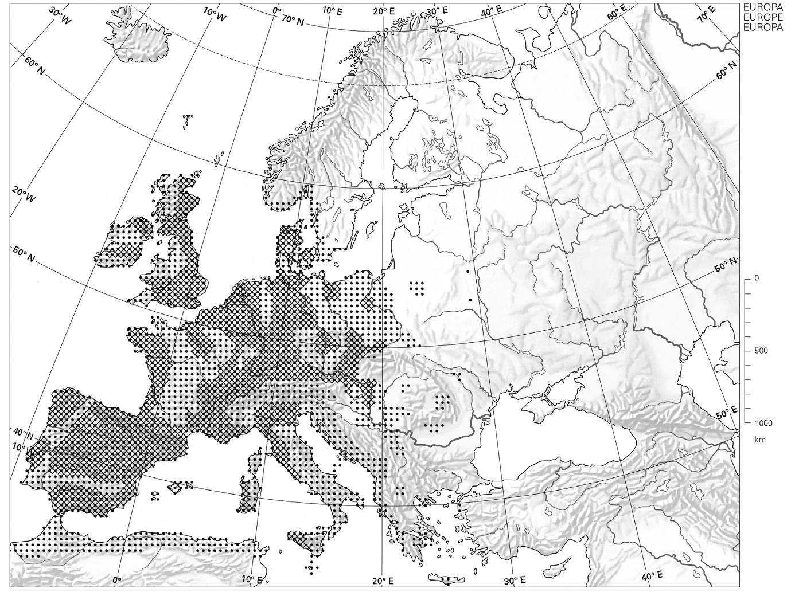
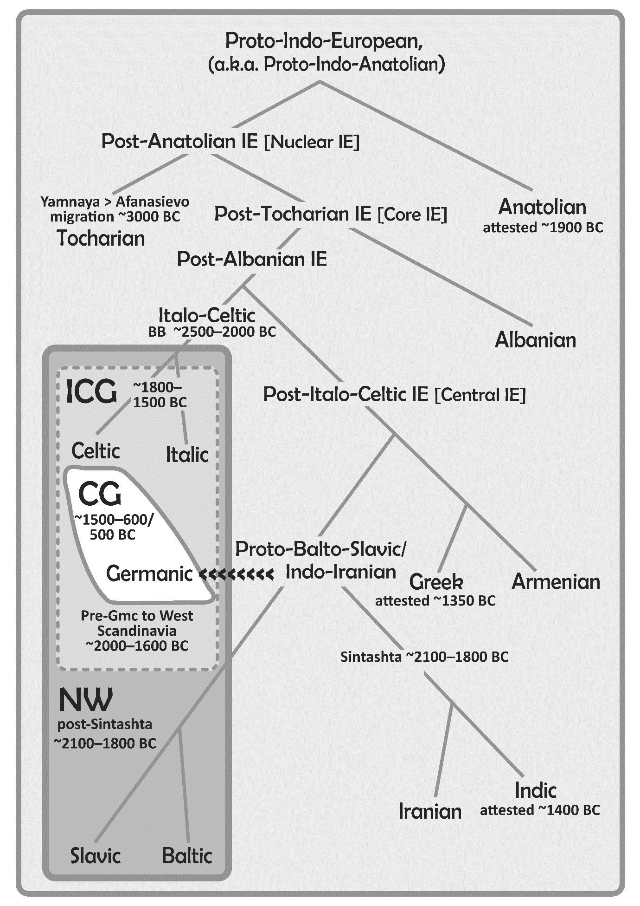
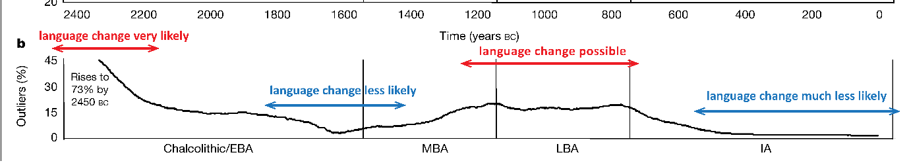
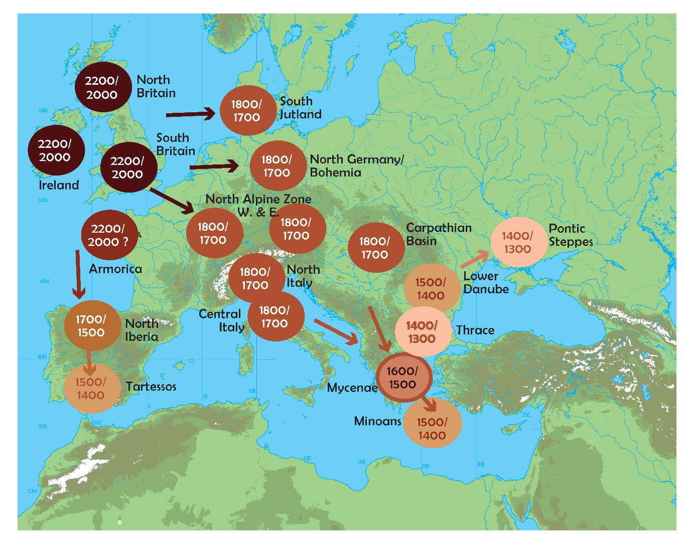
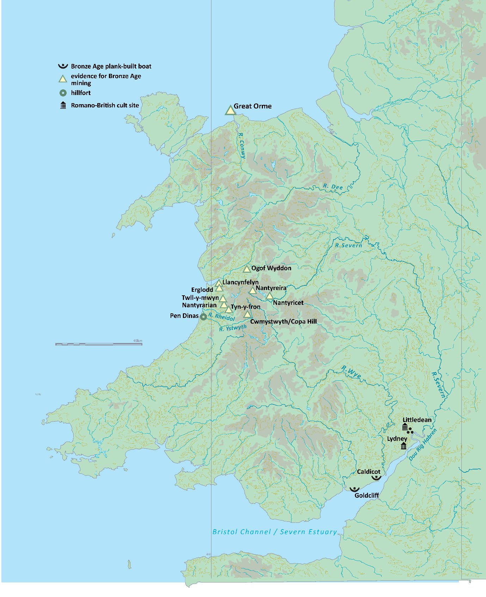
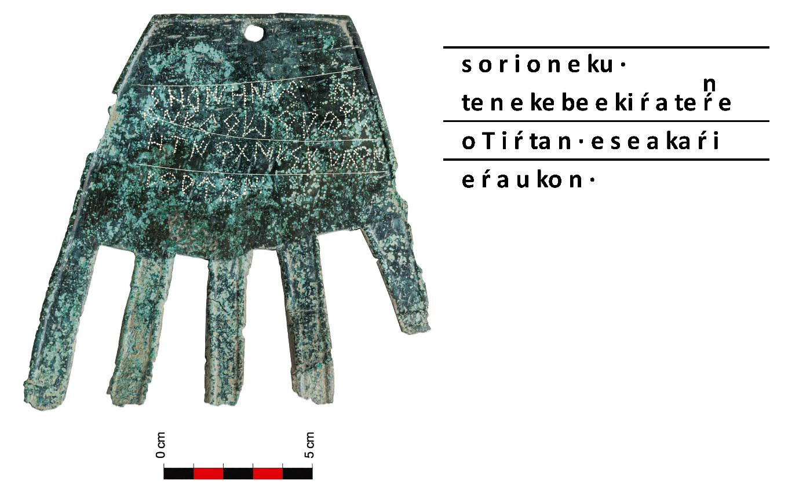

# PIE > Celtic: implications of new evidence for an updated working hypothesis

John T. Koch

## Abstract

Recent research throws light on facets of the longstanding puzzle of how Celtic languages, when first attested in the Iron Age, had come to be distributed across Ireland, Britain and much of the western and central Continent. The chief driver for these advances is archaeogenetics. Key findings include: 1) data consistent with Italo-Celtic and correlation of that proto-language with the distinctive steppe-related ancestry as found amongst Bell Beaker (BB) groups; 2) indications that this BB ancestry first formed ~2500–2400 BC in the Rhine-Meuse area, rapidly spreading from there, including near full population replacement in Britain and probably Ireland; 3) evidence for three Copper Age to Early Iron Age migrations moving widely across the territorial range of BB material culture, each of which can be related to previously developed proposals about Celtic origins. Fresh evidence bearing on Celtic origins also arises lately from other sciences of the human past. In cross-disciplinary research, the new genomic data spurs rethinking of established archaeological and historical linguistics models.

## Introduction

At the dawn of written records Celtic languages are found in Ireland, Britain, and over wide areas of the western and central continental Europe (Figure 1). This chapter asks how that situation came about. Though this is not a new question, this chapter is not primarily concerned with the history of hypotheses of Celtic origins. The focus is rather on the impact of new research on the overall picture, pieces that can now be fit into the puzzle with some confidence. The advances are mostly driven by archaeogenetics. However, as well as archaeogenetic repercussions on extant historical linguistic and archaeological evidence, there have also been recent discoveries in those fields

with direct impact on the question. As Celtic languages were spoken on both the British Isles and the European mainland in the Iron Age, the question of how this happened stands very close to a core theme of the Maritime Encounters project: investigating how people, materials, and ideas crossed seas along the Atlantic façade during the European Bronze Age. These are virtually a single subject viewed from different angles.

*Figure X.1. The distribution of the Ancient Celtic languages as attested by the evidence of inscriptions and references by the Greek and Roman authors, also showing the location of Keltoi ‘Celts’ according to Herodotus (§2.34 and §4.48). The areas with horizontal stripes are known to have received Celtic expansions during the La Tène period (mid 5th century BC onward), either from historical accounts and/or archaeology.*

## The question

It is important that the question is phrased, how did Celtic languages come first to appear where they do? If one were to ask, instead, about the homeland and dispersal of Celtic, that might seem innocuous enough and essentially the

same thing. But posing it that way entails an underlying assumption: namely, that Celtic formed first in some more compact territory, than that shown in Figure 1, then spread. Any such smaller homeland might lie somewhere within the attested range of the family or sit somewhere wholly outside it. As Nichols points out, such an assumption often underlies thinking about the Indo-European branches in general — not just Celtic — and there are cogent counter-arguments:

> [the assumption:] PIE [Proto-Indo-European] was spoken in some locale and spread out widely only after its break-up. (Nichols 1998, 223)

> … However, a minimally differentiated Common IE [Indo-European] spread, diverging into daughter branches only after and as a result of the spread. (Nichols 1998, 256)

For the most part, the archaeogenetic revolution has favoured the Steppe hypothesis of Indo-European origins (Gimbutas 1970; Mallory 1989; 2025; Anthony 2007; Anthony & Ringe 2015; Spinney 2025) over the Anatolian First Farmer hypothesis (Renfrew 1987; 2013). Twin publications of 2015 stand as a key milestone (Allentoft et al. 2015; Haak et al. 2015). However, an important aspect of Renfrew’s Anatolian model involved, like Nichols’s, expansion followed by diversification into branches, and this has not been invalidated. ‘Convergence in situ’ of post-PIE was seen as a factor in the formation of the Celtic branch in particular (Renfrew 1987, 245). The idea was anticipated by the Wellentheorie ‘wave theory’ set out by Johannes Schmidt in the 19th century (Schmidt 1872; Mallory 2025, 94–8). As lately developed, convergence in situ envisions that a rapidly expanding PIE gave rise to a continuum of dialects of shallow divergence; adjacent dialects later converged — crystallized or congealed, it might be called — within socio-cultural areas to form the branches: Greek, Celtic, Germanic, Italic, Indo-Iranian, and so on (Garrett 1999; 2006; Koch 2013; 2025b). This model suits the general patterns of the European Bronze Age: i.e. rising social complexity together with the expansion and intensification of the long-distance trading networks required for rising production and consumption of reliable supplies of copper and tin (Ling et al. 2024, 13–38). It is also not contrary to the Steppe hypothesis. The archaeogenetic data now indicates a massive and rapid expansion

~5000 years ago of a relatively homogeneous ‘steppe ancestry component’ — a combination of ~50% Eastern Hunter Gatherer (EHG) and ~50% Caucasian Hunter Gatherer (CHG) ancestry — associated with Yamnaya pastoralists on the grasslands of what is today Ukraine and southwest Russia. The processes that drove this gene flow could be better understood. How, for example, do different subtypes of Y chromosome come to predominate amongst Yamnaya, mostly R1b, versus northern Europe’s Corded Ware Cultures (CWC) with R1a? However, that the gene flow did take place and its scale — ~75–80% population turnover between European Neolithic and CWC — are clear enough. This evidence is consistent with the formation of a wide dialect continuum of shallow differentiation, as envisioned in the convergence in situ model (Koch 2025b). The model is resonant with ‘Celtic from the West’, defining the essence of that idea as ‘Proto-Indo-European first spread to the Atlantic façade and then evolved into Celtic there’ (Koch 2019).

## Defining Celtic

To pursue the present question meaningfully, it is important to define what is meant by a Celtic language, to avoid chasing a phantom concept with no corresponding reality. While it is possible or, at any rate, conceivable that a self-identifying group calling themselves Keltoi or something else existed before the defining linguistic changes that turned PIE into Celtic had occurred, this is unknowable. In fact, the reverse is possible, that early Celtic languages emerged before a shared identity among all Celtic-speaking groups, even that no such over-arching self-identification existed until modern times (cf. Collis 2003). To set the subject within a clear definition, Celtic here means an IE language that had undergone sound changes that resulted in a speech separated from the ancestral PIE and also from any other (i.e. non-Celtic) branch of IE. Proto-Celtic (PC) is defined here, as conventionally, as the latest reconstructable common ancestor of all the attested Celtic languages. The principle is not necessarily that by a particular date, say ~1200 BC (see below), all the PIE>PC sound changes were fully complete. Rather, there was enough ongoing contact between the pre-Celtic dialects within a socio-cultural area for the gamut of PIE>PC innovations to spread between them (cf. Garrett 2006; Koch 2013;

2025b; Eska 2024). Following usual historical linguistic convention, reconstructed sounds, words, and names are preceded with an asterisk *. Isaac (2007, 62) lists 23 phonological changes between PIE and PC. Of these, the following ten are widely recognized as defining Celtic (cf. also McCone 1996; Schrijver 2015, 198), retaining Isaac’s ordering:

1. syllabic *r̥ and *l̥ after a consonant and before a stop consonant > *ri and *li
2. *gʷ > *b
3. *bh, *dh, *gh, merge with (*b)[^1], *d, *g as *b, *d, *g
4. *p > *φ
5. *φt and φs > χt and χs
6. *φ > Ø elsewhere
7. *ē > *ī
8. *V̆ns > *V̄s (V̆ standing here for any short vowel and V̄ the corresponding long vowel)
9. *ō > *ū in final syllables
10. *ō > *ā in all other syllables

It follows that, if IE speech arrived somewhere or expanded to include a region and these changes then occurred after that move or expansion, that should not be described as Celtic arriving, but evolving in situ.

## The Bell Beaker complex, Celtic and Indo-European

The geographic distribution of Bell Beaker (BB) material resembles that of the Ancient Celtic languages (see Figure 1 and Figure 2). Proposals identifying BB with Celtic origins long predate the archaeogenetic revolution (Abercromby 1912, ii, 98–101; Dillon & Chadwick 1967, 4, 214; Harbison 1975; Brun 2006) and have more recently re-emerged in light of it (Cassidy et al. 2016). As a phenomenon of material culture, there is strong evidence for BB beginning ~2800/2700 BC on the lower Tagus near Lisbon, where a ‘proto-Package’ is found. This comprises ‘the Maritime Beaker, copper knives and awls, advanced archery skills and reliance on the bow and arrow, a knowledge of decorated textiles … and perhaps also V-perforated buttons of the tortuga type’ (Harrison & Heyd 2007, 203). The most credible case for an alternative cultural epicentre

focuses on the Low Countries (Kroonen this volume). The six BB-associated individuals from Portugal sequenced in a study by the Harvard team (Olalde et al. 2018) all lacked steppe ancestry, that is, genetic ancestry related to that found in human remains from the steppes north of the Black and Caspian Seas ~3000 BC. According to the current predominant view, this negative finding indicates that users of the BB proto-Package did not speak an IE language. That would mean that this early BB group on the lower Tagus cannot be relevant to Celtic origins, at least not directly.

*Figure X.2. ‘Schematic Bell Beaker distribution in Europe’ (Heyd 2013, Fig.28)*

However, beginning ~2400 BC steppe ancestry appeared in the northern and central Iberian Peninsula, often associated with BB material. By ~2200 BC, R1b-312 Y chromosomes traceable to the steppe had fully replaced Iberian Neolithic/Chalcolithic paternal ancestries in the wealthy Argar Culture of southeastern Spain (Villalba-Mouco et al. 2021; 2022; cf. Bretos Ezcurra 2025), distinguished by its early use of silver in western Europe (Bartelheim et al. 2012; cf. Kroonen this volume). By ~2000/1900 BC the genetic transformation

was complete in all regions of Iberia (Valdiosera et al. 2018; Reich 2018, 240). This steeply sex-biased shift is a possible vector for the arrival and spread of early IE speech in Iberia, territory where pre-Roman Celtic languages are widely attested. On the other hand, facing Iberia’s Mediterranean coast and on both sides of Pyrenees non-IE languages persisted: the extinct Iberian and Aquitanian/Palaeo-Basque. The descendant of the latter survives today. Therefore, it appears that IE and non-IE languages have co-existed in southwest Europe for more than 4,000 years. So long as Celtic was spoken in the Iberian Peninsula and southern Gaul, it was in contact with these non-IE languages and was, to some degree, being affected by them. North and east of the Pyrenees most BB-associated genomes have steppe ancestry, often at high percentages (Olalde et al. 2018). Therefore, it is seen as likely that these BB groups were IE speakers, and as mentioned, it has long been suspected that their language was ancestral to Celtic. In BB remains from in and around the Low Countries, a distinctive genetic type has been found that contains a high level of steppe ancestry derived from the main CWC genetic cluster. Admixed with this was 9–17% of a European Neolithic ancestry characterized by high levels of residual hunter-gatherer (HG) ancestry. On current evidence, it appears that the formative epicentre of the BB ancestry that expanded into Britain can be dated ~2500 BC and located ‘in the wider Rhine-Meuse area in communities in the wetlands, riverine areas, and coastal areas of the western and central Netherlands, Belgium and western Germany’ (Olalde et al. 2025).

*Figure X.3. Formative areas, as implied by dense genomic attestation, for the three migrations in the background of Celtic Europe (McColl et al. 2025b): 1) Bell Beaker in orange, 2) French/Iberian Bronze Age ancestry shown in yellow, and 3) the LBA Knovíz Urnfield Culture. The territory of the Argar Culture ~2200–1550 BC is marked with horizontal stripes.*

Not long after its formation, this steppe-bearing BB genetic type spread to Britain, resulting in what is estimated as 90% or even 100% demographic turnover (Olalde et al. 2025). The resulting British BB genomes were virtually indistinguishable from those from the Netherlands (Olalde et al. 2018). On the

other hand, a different study finds low levels of ancestry identifiable as British Neolithic persisting into the British Early Bronze Age (EBA), though disappearing afterwards (Cassidy et al. 2025). A comparably massive turnover at the transition from the Neolithic to Beaker period is inferred for Ireland (Cassidy et al. 2016). With such high levels of population replacement, language change would be likely if not inevitable. As mentioned, the 2016 Dublin study proposed that the language that entered Ireland about 4000 years ago could be the direct ancestor of Irish, i.e. a language of the Celtic branch of Indo-European. Locating the the Rhine/Meuse region as a starting place for the expansion of BB ancestry raises possibilities. The unique estuarine environment probably contributed to the prolonged survival of a population especially adapted to it with its unusually high persistence of HG ancestry. Both their genetic and cultural contacts appear to have been predominantly over waters rather than by land (Olalde et al. 2025). One may speculate that it was the boat-building and navigational knowhow passed from the isolated indigenous pre-IE group of the Rhine/Meuse wetlands to the incoming BB users that facilitated the thorough and relatively rapid repopulation of Britain and Ireland (cf. Koch & Fernández 2019). This scenario raises several questions. How did a cultural package that first appeared in Portugal ~2800/2700 BC reappear in an evolved but recognizable form two or three centuries later, carried by a starkly different population nearly 2000km distant? Was the drastic population discontinuity in Britain and Ireland the result of violence between groups or preceding depopulation due to disease (cf. Rascovan et al. 2019) or environmental failure? In Ireland, as in Britain, the arrival of BB coincides with that of metallurgy, as marked notably with the operation ~2400–1900 BC of the highly productive and widely distributed copper workings at Ross Island, Co. Kerry, in the southwest (O’Brien 2004; 2015; Burlot et al. this volume). This is the opposite end of Ireland from the three EBA men (2026–1534 cal BC) with typical Netherlandish/British BB steppe ancestry found on Rathlin Island (Cassidy et al. 2016), i.e. the far northeast within sight of Scotland. These circumstances raise the question of whether BB entered Ireland from a single source bringing a single genetic type, namely the steppe ancestry-carrying group from the Low Countries, or in two prongs, with the Kerry prospectors coming from Portugal by way of Brittany

(Fitzpatrick 2015; O’Brien 2023). Ross Island has returned no testable human remains.

## Italo-Celtic

Celtic has often been seen as particularly closely related to the other western Indo-European branches, namely Italic (including Latin and its Romance descendants) and Germanic (the family of German, English, Dutch, the Scandinavian languages, and the extinct Gothic). The idea of a unified Italo-Celtic proto-language has a long history of support by many linguists (Schleicher 1861/182, Cowgill 1970; Jasanoff 1997; Schrijver 2006; 2016; Holm 2007; Kortlandt 2007; 2018; Schumacher 207, 168; Weiss 2012; Hamp 2013; Kroonen 2013; Chang et al. 2015; Pereltsvaig & Lewis 2015, 71), but not all (Watkins 1966; Clackson & Horrocks 2007, 23–4). The cladistic model of Ringe, Warnow, and Taylor (1998; 2002) supports a unified Italo-Celtic proto-language. On the other hand, they show the dialects ancestral to Germanic as having been originally closer to — probably forming a dialect chain with — the dialects ancestral to Balto-Slavic and Indo-Iranian. In other words, there was no unified Celto-Germanic node on their Indo-European family tree. Subsequently, pre-Germanic became reoriented towards Celtic and Italic to the West.

*Figure X.4. An Indo-European family tree based on Ringe et al. 2002. The phenomena of Celto-Germanic and North-West Indo-European shared vocabulary are represented as reflecting layers of contact between separating branches.*

This model has been influential, adopted, for example, in Anthony’s elaboration of the Steppe hypothesis (2007, fig. 3.2). It was found to be consistent with the linguistic and archaeogenetic evidence canvassed in Celto-Germanic (Koch 2020), where it was proposed that the pre-Germanic/Balto-Slavic/Indo-Iranian dialect chain could be identified with the CWC of northeastern Europe ~3200–2300 BC. The separation of pre-Indo-Iranian from this chain was proposed as corresponding to the easternmost CWC group, Abashevo (probably also the neighbouring Fatyanovo CWC offshoot), as spreading east of the southern Ural mountains, giving rise to the Sintashta culture (~2100–1800 BC), which has been argued as the homeland of Proto-Indo-Iranian (Anthony 2007; Parpola 2015). Sanskrit is a direct descendant of Proto-Indo-Iranian and is the best attested and one of the most conservative of ancient IE languages. Therefore, if the emergence of Proto-Indo-Iranian and its separation from its Proto-Balto-Slavic sister can be identified with Abashevo’s eastern movement and transition to Sintashta ~2100 BC, that provides an important milestone for historical linguistics. Languages, of course, undergo random loss of items of vocabulary and other individual linguistic features. But as a group, those features that are found amongst the IE languages of Europe but are absent from those of Asia (including the well and anciently attested Sanskrit) arguably arose in Europe after ~2100 BC. Two recent archaeogenetic studies are consistent with key points of the Ringe et al. model as further developed in Celto-Germanic (McColl et al. 2024; Yediay et al. 2024). Using IBD (identity by descent) genetic analysis, three subtypes of steppe ancestry are distinguished: ‘Yamnaya-related’, ‘BB-related’, and ‘CWC-related’ (steppe ancestry occurring together with European Neolithic ancestry found in genomes of the Globular Amphora Culture (GAC)). For the present subject, key findings are:

… the arrival of steppe ancestry in Spain, France, and Italy was mediated by Bell Beaker (BB) populations of Western Europe, likely contributing to the emergence of the Italic and Celtic languages. … These results are consistent with the linguistic Italo-Celtic [hypothesis] … the steppe ancestry among the

populations of historically Germanic-and Indo-Iranian-speaking areas has been characterized as primarily Corded Ware-related. (Yediay et al. 2024)

If the BB-related population can be seen as ancestral to both Celtic and Italic, by definition their language had not yet become Celtic. The ten PIE>PC changes listed above had not yet occurred. As a matter of time depth, this is not surprising. On other criteria, the emergence of PC from Proto-Italo-Celtic has been estimated at ~1200 BC (Koch 2020; Eska 2024; Stifter 2024; McColl et al. 2025; cf. Mallory 2023). Celto-Germanic identified the westward reorientation of pre-Germanic with overlap or fusion of CWC and BB across a wide area of west-central Europe and southwest Scandinavia in the latter half of the 3rd millennium BC. In that book (Koch 2020, fig. 8), the chronological stage of Pre- > Proto-Italo-Celtic was estimated at ~2500–1800 BC, so closely coeval with the BB phenomenon after it had become associated with steppe ancestry and spread from the formative area in the Rhine-Meuse region. In the same table, the separation of Pre-Celtic from Pre-Italic is estimated at ~1800 BC. Two recently sequenced individuals from Latium datable ~1800/1700 BC had BB ancestry. Latium in central Italy is the historical homeland of Latin, the best attested of the Ancient Italic languages. Although it is possible that the Italo-Celtic proto-language split before or after the migration bringing BB ancestry into central Italy, this geographical expansion, beyond the formidable barrier of the Alps, provides a plausible context for the divergence at more-or-less exactly the date previously estimated on other evidence. Lusitanian is a sparsely attested Pre-Roman Indo-European language of central Portugal and west-central Spain. It occurs in a few inscriptions on stone in the Roman alphabet, as well as Palaeohispanic names identified as Lusitanian rather than Celtic in Latin inscriptions (Wodtko 2009; 2010; Stifter 2018; Luján 2019; Jordán 2024, 351–402). The linguistic affiliation of Lusitanian is disputed, identified as an archaic variety of Celtic by some (Evans 1977; Untermann 1985–86), closer to Italic by others (Prósper 2008; 2010). In every occurrence, it is challenging to differentiate and disentangle Lusitanian from Hispano-Celtic. Of the PIE>PC sound laws listed above, Lusitanian evidently did not participate in the sixth, the weakening and, most often, loss of *p, as shown by Lusitanian porcom ‘pig’ < Indo-European *porḱos. Thus, the loss of IE

*p would have to be removed from the definition of Celtic to include Lusitanian in the branch. Another example of *p preserved in otherwise Celtic-looking evidence from Iberia is the place-name element paramo-, which gives Spanish páramo ‘barren plateau’. As to word formation, paramo-is typically Celtic, a superlative adjective derived from a preposition, like Celtiberian VERAMOS ‘supreme’ < ‘over-most’. Though retaining *p, it is found alongside a well attested Celtic place-name in Segontia Paramika in north-central Spain (Ballester 2004). In Lusitanian materials the diagnostically Celtic place-name element brigā and derivatives of brigā are common (Jordán 2024, 391–4). Either we must suppose that Lusitanian borrowed this word from Celtic, taking it into its core vocabulary, or that it shared with Celtic all the sound laws and semantic changes that transformed PIE *bhr̥ĝh- ‘height, hill’ into *brig- ‘hillfort’ > ‘town’. The classification of Lusitanian thus remains a thorny problem, though this sort of anomaly could be expected on the margins of a branch formed by convergence in situ.

## Bronze Age migrations

In the first Maritime Encounters volume, Nick Patterson (building on the findings of Patterson et al. 2022) proposed that Celtic reached southern Britain most probably in a period marked by a rise in Early European Farmer (EEF) ancestry ~1300–500 BC. That date range extends into the Early Iron Age from the ~1300–800 BC bracket proposed in Patterson et al. 2022. The population shift resulting from this migration is estimated at ~50%. Another key finding is the reverse shift in Southwest Europe, also during the M/LBA, with steppe ancestry rising from 14.9% to 21.4% and EEF declining from 64.5% to 59.4% (Patterson et al. 2022, supplementary table 7). So we do not seem to be dealing with a simple one-way migration, but a complex network of shifts and movements. The evidence of outliers is important, that is, genomes atypical within the general British population of their time and therefore likely to be immigrants or descendants within a few generations of immigrants. Figure 3 of Patterson et al. 2022 shows ~2450 BC, the onset of the BB period, 73% of the genomes are outliers in southern Britain. This falls to a negligible proportion between 1900 and 1300 BC, then rises again, but not so high as during the BB migration, between 1300 and 800 BC. After that, it falls to very low levels down to the

Roman invasion of AD 43. As a matter of linguistic implications, if these data were all we had to go on, language change would appear highly likely at the onset of BB, less likely in the EBA, possible at the M/LBA, then very unlikely in Iron Age. However, it should be noted that newcomers who were similar to the local population with regards to EEF/Steppe-ancestry proportions would not have been detected by Patterson et al.’s method.

*Figure X.5. Percentages of genetic outliers in southern Britain ~2450 BC–AD 43 from Patterson et al. 2022 with this author’s first-glance linguistic implications inserted.*

Some of the evidence reviewed in Patterson et al. 2022 indicates the source area for the incomers within present-day France. Patterson 2025 emphasizes that this conclusion calls for caution. The French samples then available dated to the Iron Age. It is therefore difficult to exclude the possibility that their genetic affinity with people moving into southern Britain was the result of expansion from some third place that reached both France and Britain. A second southwestern candidate modelled also dated to the IA, namely genomes from ‘Tartessos’, i.e. Alcalá del Río near Seville ~700 BC. A different possible source was implied by genetic similarities between the British M/LBA outliers (Margetts Pit and Cliffs End, both Kent) and genomes from the Urnfield Cultures’ Knovíz subgroup in the present-day Czech Republic. Dating ~1300–800 BC Knovíz would be chronologically feasible as the actual source of incoming population into M/LBA southern Britain. Patterson 2025 favours the MBA/LBA(/EIA) migration as the vector for the arrival of Celtic in southern Britain. However, that study also concludes that an alternative could not be excluded: namely arrival with the BB phenomenon ~2450–2100/1800 BC. In more recent work, both proposed sources for elevated EEF ancestry are confirmed using IBD (McColl et al. 2025). For present-day England, three migrations of BB-associated populations are identified. Primary BB-related

ancestry is detected by 2283 BC. A high level of this BB-related steppe ancestry persists through the Bronze Age, i.e. down to ~800 BC. Confirming an earlier study (Olalde et al. 2018), British genomes associated with BB material are nearly indistinguishable from those from the Netherlands. In the period ~2000–1200 BC, a rise in French/Iberian Bronze Age-related rather than British Neolithic ancestry points to a second migration from the Continent. In the context of the diverse Maritime Encounters research, it is worth mentioning that the links between the British Isles and Southwest Europe were evidently not new in the EBA. Ten Irish flat axeheads of the Chalcolithic/Beaker Period (2450–2150 BC) were made of copper returning lead isotopes consistent with sources near Huelva in southwest Spain (Burlot et al. this volume). The epicentre of French/Iberian BA ancestry is indicated in the eastern half of the Iberian Peninsula and southwestern France, particularly strong along the Pyrenees and Biscay elbow (McColl et al. 2025, Extended Data Fig. 4). After 1200 BC, a different genetic signal appears, termed ‘Italian Neolithic-related ancestry’, pointing to a third migration from a different Continental source. Individuals from the Knovíz Urnfield culture showed none of the French/Iberian Neolithic ancestry, but had increased Italian Neolithic-related ancestry and BA Anatolian-related ancestry ~1200–800 BC. Thus defined, the Knovíz-related ancestry is found already amongst individuals associated with the Tumulus Culture in Central Europe ~1300 BC. A similar swap in Neolithic ancestries — Knovíz surpassing French/Iberian — is observed in France between the MBA and LBA, and that relative proportion remains the case in the French IA ~800–50 BC for human remains from Hallstatt and La Tène contexts. The Knovíz-related ancestry is also found in Iberia, though not detectable until ~500 BC. This is much later than the Catalonian Urnfields, which begin by ~1200 BC (Ruiz Zapatero 2014), and the identifiable Urnfield weapon types depicted on the warrior stelae of the southwestern Peninsula from ~1250 BC (Brandherm 2013; 2013b). Extending conclusions to Ireland is frustrated at the time of writing due to the lack of Irish genomes from the LBA and IA. As expected, Knovíz ancestry is absent from the three EBA men from Rathlin Island (2026–1534 cal BC). It is present in some of the medieval individuals from Kilteasheen (Cill tSéisín), Co.

Roscommon. However, due to their late date, it is impossible as yet to exclude the possibility that Knovíz ancestry first arrived in Ireland in Early Christian or Viking times, after Goidelic Celtic is attested in writing. The post-BB Bronze Age migrations, of either source, did not have great impact on North Britain. In general, then, the case for Knovíz-related ancestry as the vector that carried Celtic to its attested extent in the Iron Age is somewhat short of decisive. Perhaps the strongest argument favouring it over the spread of French/Iberian-related ancestry as the key Celtic vector is the negative detail that the latter has not been found in Central Europe. However, as all three of the migrations to Bronze Age Britain arose within the confines of Beaker zone in Europe, and are BB-related genetically, and the primary Beaker migration of ~2450–2000 brought by far the highest level of population shift, it remains hard to exclude that as the principal vector. If so, the time depth required would make it relatively unlikely that most of the ten PIE>PC sound changes listed above were already complete. That would mean that the post-Beaker populations of Ireland, Britain, western and central Europe necessarily remained in close enough contact to share these innovations, thus co-evolving from PIE to PC. The main story would be one of innovations shared between cognate dialects in continued contact, rather than one language replacing others. The two post-BB migrations into southern Britain would be important parts of that story, as would the intensification and expansion of long-distance metal trade, which brought Welsh copper to Scandinavia and Iberian copper to the Atlantic North. At the time of writing, the Maritime Encounters researchers are becoming increasingly aware of the massive production of copper in Iberia during the Bronze Age and the extensive consumption of Iberian copper across farflung parts of Europe (Ling et al. 2024, 31–8; Hunt-Ortiz et al. 2025; Stos-Gale & Ling 2025; Burlot et al. this volume). Evidence for the M/LBA rise in EEF ancestry in southern Britain has also been re-examined by the Dublin geneticists using different methods and subdividing England and Wales into subregions (Cassidy et al. 2025). The resulting overview shifts with implications for the present topic:

… whereas most of Britain shows majority genomic continuity from the Early Bronze Age to the Iron Age, this is markedly reduced in a southern coastal core region with persistent cross-channel cultural exchange. This southern

core has evidence of population influx in the Middle Bronze Age but also during the Iron Age.

Overall, this TCD study estimates 73% average contribution of British EBA (2500–1500 cal BC) ancestry to the IA population (800 BC–AD 50) of what is today England and Wales. That 27% inflow is lower than the 50% estimate in Patterson et al. 2022. As to differences between regions, the TCD study finds no rise in EEF ancestry in northern England from the EBA until the EIA (~750–400 BC). Continuity of Britain’s EBA ancestry is highest in Scotland at 92%, with northern England close behind at 88%, then southwest Britain at 78%. These findings invite reconsideration of the M/LBA rise of EEF ancestry in southern Britain as the (sole) vector bringing Celtic to the British Isles, leaving the Celticization of Ireland and North Britain less convincingly explained. Amongst the abundant early Celtic evidence from these parts, Orcades ‘the Orkneys’ in the far north has long been recognized as Celtic, once again with Indo-European *porḱos ‘young pig, piglet’ (Rivet & Smith 1979, 433–4), possibly the totem of the local group or a metaphor visualizing the many small islands as piglets and the main island or Scottish mainland as the mother sow. The form shows characteristic Celtic loss of *p, sound law no. 6 above. Orcades is found in Pomponius Mela (~AD 40) 2.6.85, then Pliny, Natural History (~AD 65) 4.103. It goes back to Pytheas’s expedition of ~325/320 BC (Cunliffe 2001b, 100–102). For both the MBA and the IA, Cassidy et al. 2025 finds least continuity from the British EBA and greatest evidence for genetic inflow in the ‘southern channel core’, centring on Hampshire. That paper suggests that a second surge in EEF ancestry in the IA might explain the similarities shared by Gaulish and Brythonic but absent from Goidelic (Irish, Scottish Gaelic, and Manx) (Koch 1992). On this last point, the statement of Tacitus should be recalled:

> in universum tamen aestimanti Gallos vicinam insulam occupasse credibile est. Eorum … sermo haud multum diversus

> It seems most likely to have been the case that the Gauls established themselves upon an island lying so close to them… there is not much difference between the languages (Agricola §11, written ~AD 98).

Tacitus’s testimony is credible on this. His father-in-law and literary subject, Agricola, had been governor of Roman Britain from AD 77 to 85. He had then campaigned against, and interacted with, native Britons in all parts of the island. He had surely known whether a Gaul in his retinue could or could not act as an interpreter. Although Tacitus reasons from the proximity of Britain to Gaul, he does not indicate that he means only the language of the Britons residing near the Channel. His term for the Britons of all parts is Britanni, even the followers of Calgacus in Caledonia. The key point for the present subject is that to explain how it came to be that a language ‘hardly different’ from Gaulish was spoken by the Britanni in the 1st century AD, we should weigh the relative likelihood of scenarios of language replacement versus that of diffusion of dialect features, in other words, Model 1 below as opposed to Model 3. Which scenario is least problematical in the face of 88% continuity of EBA ancestry in northern England, 92% in Scotland, and 73% overall?

1. Celtic or the language that became Celtic did not enter Britain and Ireland with BB, but in the M/LBA with the migrants bringing elevated EEF ancestry —
   a. from a homeland in Southwest Europe associated with French/Iberian-related ancestry or
   b. from a homeland in Urnfield central Europe with Knovíz-related ancestry.
2. Celtic (more probably the early IE dialects that were to evolve into Goidelic and Brythonic) entered Britain and Ireland with BB and metallurgy ~2450–1900 BC.
3. A non-dilemma: contact never broke down fully during the EBA lull between the two migrations, but rather remained sufficiently intense that descendants of BB groups on either side of the Channel continued to speak to one another using their first languages, sharing the innovations listed above to evolve into the attested Celtic languages.

My own contributions to Maritime Encounters 1 (Koch 2025; 2025b) broadly agreed with the limits set around the Celtic origins question set out in Patterson 2025. However, some reasons were offered for two models differing

from Patterson’s: that is, his not excludable second choice, the BB window ~2450–1900 BC as possibly more likely than the M/LBA migration of ~1300–800/500 BC. I also proposed the previously unconsidered scenario 3 above: the languages of the British descendants of BB migrants and those of M/LBA incomers with elevated EEF ancestry were not yet evolved into fully separate languages, but remained closely similar pre-Celtic dialects within a continuum. Under conditions of significant isolation and near cessation of cross-Channel contacts, the five centuries would have been long enough for a language entering with BB from a source area in the Low Countries to have split in two. But, as canvassed in Koch 2025b, there is abundant archaeological evidence for cross-Channel continuing and even intensifying exchange of metals and cultural ideas between the Atlantic Archipelago and the Continent through this period. The shared innovations notably include the standardization of high-tin bronze, spreading from Britain and Ireland across the Continent from ~2100 BC (Pare 2000; Koch 2013; 2025b; Vandkilde, H. 2016; Williams et al. 2025), as well as the high-status ‘maritories’ crossing the Channel and southern North Sea during the EBA (Needham 2009).

*Figure X.6. Approximate dates for the adoption of high-tin bronze as the standard material for tools, weapons and ornaments (based on Pare 2000; cf. Koch 2013).*

Recent and ongoing research has thrown light in particular on the production and widespread distribution of copper from Wales and the Iberian Peninsula during the BA. In Mid Wales, copper was extracted on a large scale during the Beaker Period and EBA from several mines near the mountainous watershed (Timberlake 2003; 2016; and this volume). This metal has been identified in objects from Scandinavia’s metal-using Late Neolithic and EBA (Nørgaard et al. 2021). At the following period ~1700–1300 BC, massive copper production flourished on the sea-girt headland of Great Orme in North Wales (Williams & Le Carlier de Veslud 2019; Williams 2023 and this volume). Great Orme copper was widely distributed around and beyond Britain, reaching Scandinavia in considerable volumes (Nørgaard et al. 2021; Stos-Gale & Ling this volume). Looking at the map (Figure 7) and considering how this metal might have reached consumers overseas, river courses lead

down west from the Mid Wales mines to Cardigan Bay. This coast was the source of the large sea-rounded pebbles, hundreds of which have been found carried up to the mines to use as hammers. Above the double estuary of the Ystwyth and Rheidol, which forms a natural sheltered harbour, the strategically sited hillfort of Pen Dinas affords views south to the Pembrokeshire headland, north to the Llŷn Peninsula, and inland towards the mines up the two valleys. It would be impossible to approach by stealth. The hillfort itself dates to the Iron Age, but evidence for Bronze Age activity in the interior includes an EBA barrow near the summit and an MBA palstave (Driver et al. 2024).

*Figure X.7. Places in Wales and the Marches mentioned in the chapter.*

From Great Orme, one could put into the sea immediately, and the Norse place-name is a reminder that this is a landmark visible from far out at sea. A shortcut towards the Channel and the tin-rich Devon-Cornwall Peninsula could be achieved via the long river Severn, the source of which is close to the mines in an around Cwmystwyth. Plank-built boats were constructed on

the Severn estuary, a.k.a. Bristol Channel, during the BA: Caldicot 1 ~1870–1680 cal. BC, Caldicot 2 ~1000 cal. BC, and Goldcliff ~1170 BC (Bengtsson 2025, Table 3.3). In the same region, not far up the estuary, there are multi-period cult sites, the famous Romano-Celtic temple of Nōdons at Lydney (Busse & Poppe 2006) and Littledean, where a temple overlies evidence of Iron Age, Bronze Age, and Neolithic ritual activities (Ellis-Haken & Armit 2024). The prolonged cult significance of the area was probably inspired by the importance of the estuary as an embarkation site for high-risk, status-enhancing long-distance voyages. Also close by Littledean is the Severn tidal bore. This spectacular natural wonder is called Dou Rig Habren ‘the two kings of the Severn’ in the earliest Welsh literature, the 9th-century Historia Brittonum, which describes how the two great waves have reared up to crash into one another like two rams at every rising tide since the beginning of the world. For the present subject, the relevance of this excursus is that, despite the negative evidence for an apparent lull of migration into Britain between ~1900–1300 BC, Britain does not appear to have become isolated from the Continent and Scandinavia during this period. Though populations may have become less mobile in the post-Beaker centuries, materials and ideas were not. As a matter of language, against this background one would not necessarily expect an Italo-Celtic introduced with BB ancestry to have broken up rapidly into numerous fully separate local languages across Transalpine Europe. The intensification of land use and rise of social complexity over the course of BA raises the possibility that some of the people moving between northwest and southwest Europe at this time were unfree labour, captives taken in battles and raids, exchanged as commodities along with the intensifying long-distance metal trade (Ling et al. 2018; Fauvelle & Ling 2025; Koch 2025). To whatever extent such low-status groups were included in the statistics for two-way north-south population movements, the genetic turnover is less likely to have been accompanied by language replacement.

## Celtic from the West

The discovery of an expansion of Bronze Age French/Iberian ancestry affecting Britain in the period ~2000–1200 BC (McColl et al. 2025) resonates with the

hypothesis of ‘Celtic from the West’ (Cunliffe 2001; Cunliffe & Koch 2010; 2019). From a linguistic point of view, the gist of the concept is that Indo-European spread to the Atlantic before it became Celtic and then evolved into Celtic within a range including the far west. It is therefore basically a convergence in situ model, as these are explained above. The densest occurrence of this French/Iberian genetic type is around the Pyrenees and Biscay/Golfe du Lion Isthmus (Figure 3). Had any of the Cornish/Devonian tin that reached the eastern Mediterranean in significant quantities by 1500–1300 BC (Williams et al. 2025) come across this Isthmus or continuously by sea through the straits of Gibraltar, this would have involved interaction between Britain and this genetic group. It would also have brought economic value to a language shared between the source and transit zone. As discussed above, the expansion of BB-mediated steppe ancestry in the Iberian Peninsula was highly male sex biased, with replacement of Y chromosomes common in the Iberian Neolithic and Chalcolithic with R1b ~2400–2000/1900 BC, while indigenous X chromosomes and autosomal DNA were more persistent (Valdiosera et al. 2018; Olalde et al. 2019; Villalba-Mouco et al. 2022). Linguistically, this pattern is likely to reflect a widespread and recurrent situation in which a man with an IE first language produced offspring with a woman whose first language was non-IE. In the communities where the IE was passed on, it had been partly transmitted by mothers who had learned it as adults, carrying over phonetic and the syntactic imprint from their first language (Koch & Fernández 2019). Gauging the nature of that substratum impact is challenging due to the time depth involved and limited evidence available for linguistic reconstruction. The geographic distribution of French/Iberian BA ancestry is suggestive linguistically, as these are areas where non-IE languages occurred in the IA: Iberian along the Mediterranean, and Palaeo-Basque and its close relative Aquitanian to the west. An argument for Celtic from the West is that there are features in which Celtic has evolved away from the rest of Indo-European that can be explained as the result of close contact with a language similar to Basque. Such features include the weakening and in most positions total loss of Indo-European *p, sound law 6 above. Ancient Basque does not seem to have had this sound. Secondly, Celtic and Ancient Basque share systematic oppositions between strong and weak articulations of most consonants, the

fortes and lenes (Koch 2016). For Palaeo-Basque, we can see this laid out in Michelena’s ‘sistema fonológico principal del vasco antiguo’ (1977, 374; cf. Trask 1997, 124–36):

fortes: _ t c ć k N L R lenes: b d s ś g n l r

The hypothesis that contact with an ancient form of Basque or a language typologically similar to Basque contributed to transformation of Indo-European into Celtic could be solidified if either of two uncertainties could be resolved. First, Basque is not fully attested until the 15th century. We could use earlier evidence to show better what the ancient language was like that came into contact with the forerunner of Celtic. Ancient Basque might have been very different from the attested language. It had possibly evolved rapidly, developing a fundamentally different sound system and grammatical structure. As Basque is classified as an isolate, we have been forced to rely on internal reconstructions and inferences based on the forms assumed by Latin loanwords. Confidence in reconstructed Palaeo-Basque has accordingly been limited. Secondly, the extinct Iberian language, attested in ~300 inscriptions from the Mediterranean side of the Iberian Peninsula and some from southern Gaul, evidently had an inventory of vowels and consonants and patterns of word formation similar to those reconstructed for Ancient Basque. But there is a longstanding question of whether Basque and Iberian belong to a single language family or were originally unrelated but had become similar owing to being neighbours for a long time. If Basque and Iberian are in fact sister languages, that would indicate the presence of a single widespread non-IE language that came into contact with IE over an extensive area as it spread across Southwest Europe. Confirmation of this point would also validate the approach of using what we know about the fully attested Basque language to draw conclusions about the nature of a prehistoric Vasco-Iberian language. Aquitanian attested as proper names in parts of present-day France, to the north of the western and central Pyrenees, has long been recognized as closely related to Basque if not one and the same as the Palaeo-Basque of Roman times (Gorrochategui 2020). But the relationship as opposed to mere

typological correspondence between Iberian and Basque-Aquitanian has long been seen as possible, but unproven. Strabo wrote before AD 24: ‘the Aquitani differ from the Gaulish people physically and also in their language, that is, they are more like the Iberians’ (5.2.1). The discovery in 2022 of a human-hand-shaped inscribed bronze plaque at Irulegi, Navarre, Spain, sparked considerable excitement amongst Basque speakers and wider circles interested in Basque language and culture. Dating from destruction levels of the Sertorian wars ~75 BC, the inscribed text shows Ancient Basque as a written language over 2,000 years ago. The writing system is a Palaeohispanic script similar to that used, at that time and going back a century or more before then, to write the neighbouring Iberian and Celtiberian languages. As this script owes nothing to the Roman alphabet, the Irulegi text indicates that Basque literacy was not a consequence of the arrival of the Romans in the area and is therefore likely to predate it (Aiestaran et al. 2024).

*Figure X.8. The Irulegi hand and a romanized edition of the engraved text.*

Examination of the text in detail suggests affirmative answers to both questions about Basque posed above. First, IA Basque appears to have been not drastically different from the fully described modern language. Second, Iberian specialists have judged the Irulegi text as favouring the relatedness of

Basque and Iberian (Ferrer i Jané 2023; Orduña 2023). To cite just a few details: Iberian comparisons have been adduced for the forms akaŕi and eŕaukon in the text’s third and fourth lines. A relatively clearcut Basque form is the inscription’s first word sorioneku, resembling Modern sorioneka ‘of good fortune’, an equation compelling in light of comparable Roman inscriptions invoking divine Fortuna. This comparison suggests that neither Basque’s sound system nor its grammatical structure have changed unrecognizably since ancient times. This find, therefore, is consistent with earlier proposals that some of the distinctive characteristics of Celtic may be explained by prehistoric contact with ancient Vasco-Iberian. Such an understanding would help to alleviate a longstanding issue frustrating a forward consensus about the oldest written vernacular and oldest indigenous writing system of the Iberian Peninsula, namely those called ‘Southwestern (SW)’ or ‘Tartessian’. The 90–100 SW inscriptions probably begin in the 8th century BC, surely by the 7th, and continue to the 4th (Jordán 2024, 51). A crux of analysis has made it hard for some commentators to accept Tartessian as an Indo-European language and for others to see it as anything else. On the one hand, the transliterated forms from the inscriptions often strikingly resemble attested Celtic and specifically Hispano-Celtic names: e.g. anbᵃatᶦia, tᶦirtᵒos, and tᵃarnekᵘkᵘun /tar(a)nekum/ ‘of the kindred of Taranos’ (Correa 1989; Untermann 1997; Koch 2019b). Note also ’Αργανθωνιος, the name of the king said to have ruled Tartessos between ~625–545 BC (Herodotus 1.163–5, writing ~440 BC), which apparently invokes ‘silver’, his realm’s renowned export (Koch 2013b, 148–50); the form *arganto-is specifically Celtic, rather than generally Indo-European (Kroonen this volume). On the other hand, the script of the Tartessian inscriptions has been seen as not well suited for writing early Celtic or any other Ancient Indo-European language (Rodríguez Ramos 2002). Structurally, the SW signary might be termed a ‘pseudo-semi-syllabary’. It is the progenitor of the Palaeohispanic scripts later used to write Iberian and Celtiberian, as well as Irulegi’s Palaeo-Basque. SW script lacked signs to represent /m/ and /w/, both of which were certainly present in Proto-Celtic. It also had surpluses of signs for r-like sounds, transcribed r and ŕ, and s-like sounds, s and ś, though one of each would have sufficed. A bridge across this disparity was provided by a model in which the SW

signary, generally agreed to be adapted primarily from an early West Semitic alephat, was first devised to represent a language similar to Palaeo-Basque in lacking /m/ and /w/ and having a phonemic contrast between fortis and lenis /R/ and /r/, /S/ and /s/ (Kaufman 2015; Koch 2019b). Such a brilliantly adapted writing system was then transferred to an unrelated IE language without the intervention of a second great innovator. Therefore, it could only represent that second language in present-day southern Portugal and south-west Spain with systematic distortions. Such a theory works admirably in accounting for the evidence and allows that Tartessian had not evolved far from Proto-Celtic. In other words, it had not sweepingly shifted /m/ > /n/ and almost always omitted /w/ altogether. But the model runs into some difficulty historically. The Phoenicians had arrived in the Iberian Peninsula by ~900 BC (González de Canales et al. 2008; Koch 2016). But their first landing would not have been in the historical Basque-Aquitanian homeland, facing the Bay of Biscay, rather eastern parts where Iberian is attested in the Iron Age. That discrepancy can be overcome to the extent that Basque and Iberian possess recognized similarities. The Irulegi hand facilitates this approach, as further significant evidence pointing to a Vasco-Iberian commonality, validating methods in which the indigenous Palaeohispanic language first encountered by literate mariners from the eastern Mediterranean can be plausibly conjectured on the combined basis of Basque, Aquitanian, and Iberian evidence. At this time, a full and systematic comparison of inherited Celtic vocabulary with Basque, Aquitanian, and Iberian might well repay the effort. One of the more probable Basque loanwords in Celtic thus far identified is Old Irish ander ‘non-virgin, married woman, maiden’, likened to Basque andere ‘woman, young lady, housewife’. It has been suggested that the latter word occurs in the Irulegi text. In its second line, the engraver ran out of space and wrote a superscript n above the line. If that n is inserted to read the end of the line as a[n]teŕe, that could be this word (Orduña 2023), as the script did not distinguish /t/ and /d/.

## Celto-Germanic

A core finding considered here is that Ancient Celtic and Italic languages occurred in lands with BB-associated Bronze Age populations. A different

ancestry type, CWC-associated, occurred in the presumed homeland of Germanic, southern Scandinavia and the western Baltic (Yediay et al. 2024; McColl et al. 2025; 2025b). This disparity implies that the 182 inherited words and developments of words shared uniquely by Celtic and Germanic (CG) — and no other Indo-European branch — are the result of prehistoric contact between already separate dialects.[^2] They do not reflect an undifferentiated CG or Italo-Celto-Germanic (ICG) proto-language between the era of PIE and appearance of the attested languages (Koch 2020). This finding is closely consistent with the conclusion of Ringe et al. 2002 that Pre-Germanic had originally formed a dialect chain with Pre-Balto-Slavic and Pre-Indo-Iranian and then later became reoriented towards Celtic and Italic (Figure 4 above). 58.8% of the CG words were present in the speech that became Germanic before the operation of the Germanic consonant shift, also known as Grimm’s law. The remaining 41.2% lack the consonants to show whether Grimm’s law had operated or not. Words showing other earmarks of later loanwords between Celtic and Germanic have been excluded. Because the consensus date for Grimm’s law is ~600/500 BC, it follows that the contact reflected in the CG corpus formed during the ‘Greater Bronze Age’ ~2500–500 BC. This conclusion is consistent with semantics. 91 of the CG words (50%) have meanings that can be related to Bronze Age material culture and/or social organization. Of those, 76 (41.8%) of the meanings can be related specifically to Bronze Age rock art from Scandinavia and/or Iberia, most often both (Koch 2020; Ling et al. 2024, 83–111). Further evidence suggests how that date range might be narrowed. As well as the 182 CG words, there are a further 50 inherited words or developments of words that occur in Italic, Celtic, and Germanic, but no other Indo-European language. The fact that there are significantly fewer of these ICG words, which includes the evidence of the anciently and abundantly attested Latin, suggests that most of the contact between the precursors of Celtic and Germanic took place after Italic and Celtic had split. That the ICG group as a whole are earlier than the CG is also favoured by meanings: only 13 of the 50 ICG words (26%) can be linked to Bronze Age objects or social organization and of those 17 (34%) have analogues in Bronze Age rock art. It is argued above, that the Italo-Celtic stage belongs to a date range ~2500–1800/1700 BC, with the emergence of Proto-Celtic ~1200 BC. Therefore, it

appears that the bulk of the CG vocabulary post-dates ~1800 BC with some of it probably falling between ~1200 BC and ~600/500 BC. The latter terminus corresponds to both that of the Bronze-Iron Transition in the Nordic world as well as the estimate for Grimm’s law. Another big question raised by the CG vocabulary is where the contact took place. The answer will of course hinge on where we think the forerunners of Celtic and Germanic were spoken in the period ~1800–600/500 BC. By the end of it, Ancient Celtic was already spoken across all areas pre-dating the La Tène expansions, as shown in Figure 1. A likely zone of direct overland contact between Pre-Germanic and Pre-Celtic would be northern Central Europe, present-day North Germany, on the southern edge of the Nordic Bronze Age. This is also on an overland/riverine route by which copper from Slovakia, Mitterberg, and the Italian Alps reached Scandinavia (Stos-Gale & Ling 2025). There is also evidence for organized violence on a large scale on that frontier. Around 1230 cal. BC a great battle was fought at Tollense, north-east Germany, involving thousands of warriors (Jantzen et al. 2011; 2014; Brinker et al. 2016). Tollense is a clear indicator that central European sources of copper would sometimes have been unavailable to Scandinavian consumers. In these times, chiefdoms built on the Maritime Mode of Production (Ling et al. 2018; Fauvelle & Ling 2025) could find alternative trading partners by financing sea-crossing expeditions to Wales and Iberia (Ling et al. 2024, 31–8; Stos-Gale & Ling 2025), possibly facing fewer powerful enemies and demands for tribute along the way. In this connection, it may be pointed out that the highest total of CG words attested in a particular Celtic language is 145 in Old and Middle Irish, or 79.9% of the 182 CG total. For Germanic, it is Old Norse with 139 (76.4%), contrasting with Old High German with 113 (62.1%). In historical times, Irish and Norse were not in direct contact until the Viking Age. A new theory on the origin of Germanic is based on archaeogenetic evidence (McColl et al. 2025b). The basis is the discovery of distinct ancestry type spreading from eastern to western Scandinavia ~2000–1600 BC, leading to a greater than 50% replacement of the subtype of CWC-related ancestry previously prevalent in western Scandinavia. That proportion is high enough to reflect a likely episode of language replacement. Both the incoming and indigenous groups showed a characteristic CWC mix of steppe and European Neolithic ancestry, specifically related to the Globular Amphora Culture (GAC).

The distinction was that the local group of southern and western Scandinavia also had Western Hunter-gatherer ancestry (WHG), whereas HG ancestry of the incoming easterners could be modelled entirely as Latvian HG, implying a Late Neolithic crossing from a source area east of the Baltic. What does all this mean for the present question? First, if the inference is correct about this migration being the probable vector by which pre-Germanic reached western and southern Scandinavia, that would narrow the chronological and geographical window in which contact could have occurred resulting in the 182 CG vocabulary items. It probably happened after ~2000–1600 BC when the migration occurred. Prior to this event, Pre-Germanic would not have been situated near where BB-related ancestry indicates that Pre-Celtic or Italo-Celtic were likely to have been spoken. Secondly, this model would provide a plausible context for the formulation of Ringe et al. 2002, according to which Pre-Germanic was to begin as a close sister of Balto-Slavic and Indo-Iranian and then reorient westwards towards Celtic and Italic. If this migration from the east reshaped the speech of western and southern Scandinavia, it probably eliminated any dialect or dialects intermediary between Pre-Germanic and Pre-/Proto-Italo-Celtic, the speech of the BB-using groups of Jutland and southwest Norway, disrupting the dialect continuum established in earlier expansions of PIE. Keeping in mind long-distance metal exchange — our understanding of it now, as advancing in Maritime Encounters — the reorientation of Pre-Germanic may be explained as a westward migration into a different metal-exchange network, the sphere of Pre-and Proto-Celtic.

## Proto-Indo-European

As Celtic is a branch of the Indo-European macro-family, any hypothesis of Celtic origins will have to fit within a viable model of the homeland and dispersal of Indo-European. The prevailing model for the parent language will establish a conceptual and terminological framework, limiting overall time depth, as well as the sequence of archaeological cultures onto which the PIE>PC linguistic processes can be plausibly mapped. As mentioned, the Allentoft et al. and Haak et al. publications of 2015 have widely been seen as decisive in favouring a model resembling the Steppe Hypothesis more than the rival Anatolian First Farmer Hypothesis (Renfrew

1987; 2013). However, one facet of the Anatolian hypothesis continued to be considered in publications from the Reich lab at Harvard. This is the possibility that the homeland of the common ancestor of Anatolian and all the other Indo-European branches (including Celtic) had not been situated on the Pontic-Caspian steppe or associated with a population with steppe ancestry, i.e. about 50% Eastern Hunter-Gatherers (EHG) and about 50% labelled Iranian-associated or Caucasian Hunter-Gatherers (CHG). That common ancestor might alternatively have been located in or south of the Caucasus, roundabout present-day Armenia. It would therefore be Anatolian’s sister that was situated on the steppe and associated with the steppe component and Yamnaya (Lazaridis 2018; Reich 2018, 120). More recently (Lazaridis 2022), this position was set out in fuller detail with further archaeogenetic evidence. By associating Anatolian and its ancestor with a different homeland and genetic type from the rest of Indo-European, a name change could be justified for the highest ancestor, as ‘Proto-Indo-Anatolian’. ‘Proto-Indo-European’ would then be reserved for the rest of the family after Anatolian had split off. It must be emphasized that, so long as we all know what we are talking about, ‘Proto-Indo-European’ vs. ‘Proto-Indo-Anatolian’ is of no great importance. However, while the competing terminologies remain in contention, there will be confusion and time wasted avoiding it. Most recently, also from the Harvard team, a genetic signal has been identified moving from the steppe southwards into Anatolia at an appropriate date, and it is proposed that this movement marks the coming of the ancestor of the Anatolian branch to its historic homeland (Lazaridis et al. 2025). If so, something closer to the Gimbutas/Mallory/Anthony model is restored, with the ancestor of all the branches traced back to the Pontic-Caspian steppe and associated with the genetic steppe cluster. One point that can be weighed, taken from a general critique of the steppe hypothesis, is that the gene flow from the steppe proposed as the source of the Anatolian branch brought a 10% demographic shift (Heggarty 2025). While it is possible that a migration with such modest genetic impact brought language change, it is also altogether possible that it did not. For it to do so would require favourable socio-linguistic circumstances of elite dominance or the like, and that would be rather less likely if the gene flow had taken place over several generations, as opposed to in a single destabilizing convulsion. In

any case, if this later proposal of a steppe source for Anatolian is adopted (Lazaridis et al. 2025), there is then a less compelling justification for renaming the common ancestor of Proto-Anatolian and the other branches. To sum up about Indo-European: while it now appears unlikely that a model resembling Renfrew’s Anatolian hypothesis will become more widely accepted, the homeland and associated genetic type of the common ancestor of Anatolian and the other branches remains somewhat uncertain, as well as what that reconstructed proto-language should be called.

## The Indo-European question and triumph of archaeogenetics: learning the right lesson

It would be wrong to conclude, from the apparent decisiveness of archaeogenetic evidence in ‘solving’ the Indo-European homeland question, that homelands of all reconstructed proto-languages would be solved in the same way to the same relatively conclusive degree. This caveat holds for IE branches, like Proto-Celtic, although these stand closer to the horizon of written evidence. The researchers of the two milestone papers (Allentoft et al. 2015; Haak et al. 2015) were blessed with a problem for which there was a fortuitous confluence of details, in effect a problem for which a single additional datum provided enough information to ‘solve for X’. The following seven characteristics of the Indo-European problem will not be the case for every quest to locate a prehistoric proto-language and track its expansion with aDNA.

1. The question had been argued on archaeological and linguistic evidence for many years previously with alternatives boiling down to a choice essentially of two fully defined hypotheses with battle-hardened supporting arguments.
2. The archaeogenetic evidence involved expanding and indigenous populations that were genetically very different and had long been isolated from one another making it highly unlikely that they spoke related languages.
3. Therefore, the linguistic problem was not to distinguish between prehistoric speakers of closely related languages in the archaeogenetic and archaeological record.
4. The population replacement occurred at high enough percentages that that factor alone — i.e. without elite dominance — might have resulted in a change of language in the target areas.
5. The population replacement was accompanied by major changes in way of life — e.g. the arrival metallurgy in Ireland, Britain, Scandinavia and a shift from agriculture to pastoralism across wide areas of central and northern Europe — which might have been a key socio-linguistic factor favouring language shift.
6. The prehistoric societies had not achieved a level of hierarchical complexity, in which large numbers of low-status or unfree labour must be considered, that is, incomers who might have affected the gene pool, but were unlikely to have brought language shift. Call it, ‘non-elite non-dominance’.
7. The geographic expansion of the proto-language was too extensive spatially and the mechanisms for continued contact afterwards too weak to restrain fragmentation into fully separate local languages. It exceeded the range of Bronze Age exchange networks.

## Conclusion — outline for an updated working hypothesis

Regarding hypothesis building, it has been observed that it is easier to draw straight lines between data points when there are only a few points. At this writing, somewhat more than a decade into the ‘archaeogenetic revolution’, we suffer from an embarrassment of riches, which can only grow more embarrassing in coming years. With the three migrations identified in McColl et al. 2025, complexities arise in any attempt to identify one of them, and to exclude the other two, as the vector explaining the geographic distribution of Celtic languages in the Iron Age (Figure 1).

1. In favour of the BB expansion as ancestral to Celtic
1.1 Its distribution extends to all areas where Celtic languages first appear.
1.2 BB-associated ancestry has a high level of steppe ancestry and so is presumably linked to Indo-European.
1.3 In some regions, including Britain and Ireland, BB ancestry replaces the previous population to high levels, so that language replacement is highly likely.

2. Against the BB expansion as ancestral to Celtic
2.1 If a baseline of ~3000 BC is accepted for post-Anatolian Indo-European, the BB expansion at ~2500–2000 would compress the ten PIE>PC innovations into a relatively short span followed by over 1,000 years of relative linguistic stasis.
2.2 Similarly, if the archaeogenetic evidence is seen as supporting a correlation of BB ancestry with both Italic and Celtic languages, then the Italo-Celtic split and all the PIE>PC innovations come later, post-Beaker, in the 2nd millennium BC.
3. In favour of the expansion of French/Iberian-related ancestry as ancestral to Celtic
3.1 Ancient Celtic languages appear in all regions that had been part of the Atlantic Late Bronze Age system.
3.2 Intensified metal trade between Iberia and the Atlantic North in the same period
3.3 Vasco-Iberian phonetic influence on the formation of Celtic

4. Against the expansion of French/Iberian-related ancestry as ancestral to Celtic
4.1 This ancestry has not yet been found in parts of Central Europe where Ancient Celtic languages are attested. The model would therefore require spread of linguistic influence accompanied only by undetectably low levels of population movement.
4.2 In most parts of Britain, especially the North, this ancestry type did not achieve high enough levels to make resulting language change likely, without some other socio-cultural factor.
4.3 It is not known whether French/Iberian-related ancestry reached Ireland in the prehistoric period.
5. In favour of the expansion Knovíz-related ancestry as the vector for the spread of Celtic
5.1 This model would confirm the traditional explanation of Celtic origins, i.e. Urnfield begets Hallstatt; Hallstatt begets La Tène; La Tène = the Celts. A vast corpus of scholarly and popular literature could thus be retained/rehabilitated.
5.2 This ancestry type is found in most regions where Ancient Celtic languages are attested.

6. Against the Knovíz-related ancestry as ancestral to Celtic
6.1 (As with the French/Iberian ancestry) in most parts of Britain, especially the North, this ancestry type did not achieve high enough levels to make resulting language change likely, absent some other socio-cultural factor.
6.2. It is not known whether Knovíz-related ancestry reached Ireland in the prehistoric period.
6.3 The late appearance (~500 BC) of Knovíz-related ancestry in Iberia is not closely congruent with the linguistic and archaeological evidence favouring an early formation of Hispano-Celtic.

Facing the uncertain picture presented by the considerations above, it is likely that this amounts to a false choice. Underlying is the assumption that the three migrations are associated with three separate languages, that only one is Celtic and the other two, therefore, cannot be. But the two later migrations arose within BB territory and were related to the BB ancestry type. If it is likely that the BB expansion had brought a language that might be termed Pre-or Proto-Italo-Celtic, how far had regional dialects of that language diverged during the Bronze Age? The archaeogenetic record shows lulls in migrations in southern Britain ~1900–1300 BC, then again in the Iron Age (Patterson et al. 2022), although significant two-way movement continued across the Channel region (Cassidy et al. 2025). The intervals were long enough that the languages might have separated. But the archaeological record presents a different picture, materials and ideas continued to move over long distances across the largest part of what had been the Beaker world (cf. Gibson 2013; Cleary & Gibson 2019). Maritime Encounter’s chemical and isotopic sourcing of metals of the Chalcolithic to the LBA is tending towards an emerging picture of metal exchange networks that, once established in the Beaker Period, never faded completely until their breakdown at the Bronze-Iron Transition. So, in conclusion, the interim working hypothesis offered here — which will undoubtedly strike some readers as frustratingly soft edged — is that the attested Celtic languages reflect the outcome of all three migrations. Future research can be expected to clarify where and when various innovations arose and how they spread, or failed to spread, to different parts of the Celtic and Italo-Celtic worlds. In closing on this ambiguous note, one recalls the explanation repeated by Herodotus about the location of the Keltoi ‘Celts’ in his day, the 5th century BC.

> 2.34. I am willing to believe that [the Nile] rises at the same distance from its mouth as the Ister [Ἴστρος ‘Danube’], which has its source amongst the Keltoi at Purēnē [Πυρηνη] and flows right through the middle of Europe, to reach the Black Sea at Miletus’s colony of Istria [Ἴστρια]. The Keltoi live beyond the Pillars of Hercules, next to the Kunēsioi [Κυνησιοι], who are the most westerly people of Europe.

> 4.49. . . . the Ister [Ἴστρος ‘Danube’], that mighty stream which, rising amongst the Keltoi, the most westerly, after the Kunētes [Κυνητες], of all the European nations, traverses the whole length of the continent before it enters Scythia.

> (adapted from trans. de Sélincourt 1954)

The Kunētes or Kunēsioi, whose name was probably Celtic, lived in the Algarve (Koch 2013b, 190–92). One might confront these curious passages concluding that Herodotus simply didn’t know what he was talking about, reflecting only a vague notion of the outer ocean (García Alonso 2025). However, he was precisely correct in placing the Kunētes at the western edge of Europe. His other uses of ‘beyond the Pillars of Hercules’ locate accurately Gadira (4.8), i.e. Cádiz, and Tartessos (4.152), probably centred on Huelva (González de Canales et al. 2008). Therefore, this phrase for him refers precisely to the Atlantic coast between the straits of Gibraltar and mouth of the Guadiana, with the country of the Kunētes westwards from there to Sagres. His grasp of the region’s geography does not appear muddled. This puts the Celts at the dawn of history in two homelands about 1700km apart, with no indication of their recent arrival in either (Koch 2014).

## Acknowledgements

Research for this study was supported by a grant from Riksbankens Jubileumsfond (Stockholm) as part of the 6-year Gothenburg-based

programme ‘Maritime Encounters: A Counterpoint to the Dominant Terrestrial Narrative of European Prehistory’, reference number M21–0018. James Mallory and Martin Sikora made useful comments on a draft of this chapter. Remaining errors and disputable claims are solely my responsibility.

## End notes

[^1]: The phoneme *b was extremely rare in PIE.

[^2]: This and other statistics cited in this section will differ somewhat from those in Koch 2020, because research is ongoing on this corpus and an expanded and revised 2nd edition of the e-book is planned.
