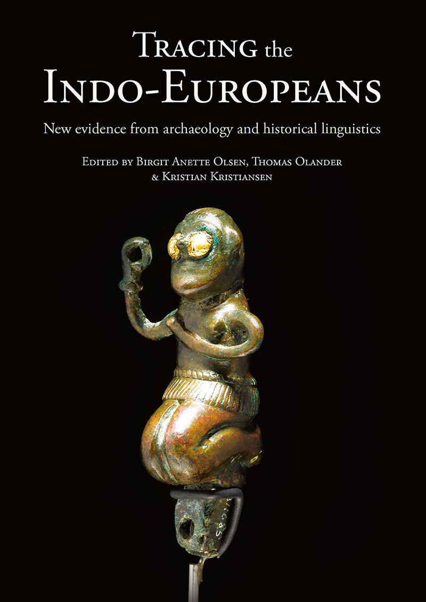

# Tracing the Indo-Europeans

New evidence from archaeology and historical linguistics

<i>Edited by</i>

Birgit Anette Olsen Thomas Olander

<i>and</i>

Kristian Kristiansen

Published in the United Kingdom in 2019 by

OXBOW BOOKS

The Old Music Hall, 106-108 Cowley Road, Oxford, OX4 1JE

and in the United States by

OXBOW BOOKS

1950 Lawrence Road, Havertown, PA 19083

© Oxbow Books and the individual contributors 2019

Paperback Edition: ISBN 978-1-78925-270-5

Digital Edition: ISBN 978-1-78925-271-2

Kindle Edition: ISBN 978-1-78925-272-9

A CIP record for this book is available from the British Library

Library of Congress Control Number: 2019942443

All rights reserved. No part of this book may be reproduced or transmitted in any form or by any means, electronic or mechanical including photocopying, recording or by any information storage and retrieval system, without permission from the publisher in writing.

For a complete list of Oxbow titles, please contact:

| UNITED KINGDOM | UNITED STATES OF AMERICA |
| --- | --- |
| Oxbow Books | Oxbow Books |
| Telephone (01865) 241249 | Telephone (800) 791-9354, Fax (610) 853-9146 |
| Email: [oxbow@oxbowbooks.com](mailto:oxbow@oxbowbooks.com) | Email: [queries@casemateacademic.com](mailto:queries@casemateacademic.com) |
| [www.oxbowbooks.com](http://www.oxbowbooks.com) | [www.casemateacademic.com/oxbow](http://www.casemateacademic.com/oxbow) |

Oxbow Books is part of the Casemate Group

### <i>Front cover:</i> The kneeling figurine from Fårdal. Photo: National Museum of Denmark. CC BY-SA 2.0.

# Contents

List of figures

List of tables

List of contributors

1. Tracing the Indo-Europeans: Introduction

<i>Birgit A. Olsen, Thomas Olander and Kristian Kristiansen</i>

2. The Indo-European homeland: Introducing the problem

<i>Thomas Olander</i>

3. Proto-Indo-European, Proto-Uralic and Nostratic: A brief excursus into the comparative study of proto-languages

<i>J.P. Mallory</i>

4. A linking cord: Pottery ornamentation and language in the North <i>c.</i> 3600–2400 BC

<i>Einar Østmo</i>

5. On the emergence of the Corded Ware societies in Northern Europe: Reconsidering the migration hypothesis

<i>Rune Iversen</i>

6. Late Bronze Age midwinter dog sacrifices and warrior initiations at Krasnosamarskoe, Russia

<i>Dorcas R. Brown and David W. Anthony</i>

7. ‘Children of the light’: On yoga, body schemes and altered states of consciousness in the Nordic Late Bronze Age – a link to India?

<i>Kristin Armstrong Oma and Lene Melheim</i>

8. Aspects of family structure among the Indo-Europeans

<i>Birgit A. Olsen</i>

9. To bury a ruler: The meaning of the horse in aristocratic burials

<i>Anne-Marie Carstens</i>

# List of figures

Figure 2.1 The Indo-European language family.

Figure 2.2 The spread of farming in Europe.

Figure 2.3 Srednij Stog, Jamnaja, Afanas’evo, Corded Ware cultures.

Figure 3.1 Retention of Proto-Indo-European vocabulary by geography.

Figure 3.2 Retention of Proto-Indo-European vocabulary by age of language attestation.

Figure 3.3 Semantic field display for ‘cattle’ in Early Irish.

Figure 4.1 Example of TRB pottery decorated with cord stamp impressions in the Virum style. From Kulsø, Vordingborg, Zealand.

Figure 4.2 Norwegian sites with Neolithic cord stamp decorated pottery.

Figure 4.3 Cord Stamp decorated pottery from Auve, Sandefjord, South Norway.

Figure 4.4 Amber button from Auve, Sandefjord, South Norway.

Figure 4.5 F-style pottery from the Swedish–Norwegian Battle Axe Culture. From Regna, Östergötland, Sweden.

Figure 4.6 Cord decorated pottery from the Sredniy Stog culture in the Ukraine.

Figure 5.1 Chronological sequence of a Single Grave mound.

Figure 5.2 Chronological scheme of the Single Grave period in Jutland and Schleswig-Holstein.

Figure 5.3 Type A battle axes as defined by Glob.

Figure 5.4 Early cord-decorated beaker from Møbjerggaarde, Vejle County.

Figure 5.5 Map showing the distribution of the earliest Single Grave culture.

Figure 5.6 Layout and cross section of stone-packing grave at Vroue Hede II, Viborg County.

Figure 5.7 Map showing the distribution of stone-packing graves and Single Grave features following Funnel Beaker traditions.

Figure 5.8 The distribution of the Corded Ware (shaded area) and Yamnaya (hatched area) complexes.

Figure 6.1 Dog bones from Krasnosamarskoe.

Figure 6.2 Krasnosamarskoe site shown within the Late Bronze Age regional archaeological cultures (Srubnaya and Andronovo) of the Eurasian steppes and the Bactria-Margiana (BMAC) irrigation-supported civilisation in Central Asia, <i>c.</i> 2000–1800 cal BC.

Figure 6.3 Aerial photo showing the site of Krasnosamarskoe settlement excavations, Kurgans 1–3, shovel test transect, and activity area excavations (Area Y).

Figure 6.4 Plan and section of Krasnosamarskoe IV Kurgan 3.

Figure 6.5 Plan of settlement site showing location and number of pit features, whole vessels and small metal finds.

Figure 6.6 Dolon wearing a wolf-skin to spy on the Greeks, from the Iliad. Detail from an Attic red-figure lekythos, <i>c</i>. 460 BC.

Figure 6.7 Stone stele associated with steppe burials and found in Bulgaria, Turkey, France and Ukraine have many common characteristics.

Figure 6.8 Imagery possibly depicting youthful warrior groups found on petroglyphs.

Figure 7.1 ‘Pashupati’ (Lord of Animals) seal from Mohenjo-Daro interpreted as a representation of a yogi or ‘proto-Shiva’.

Figure 7.2 Figurine from Grevensvænge.

Figure 7.3 The kneeling figurine from Fårdal.

Figure 7.4 Male twins and female figurine from Grevensvænge, as drawn <i>c</i>. 1780 by Christian Brandt.

Figure 7.5 A horned figure on the Gundestrup cauldron (interior plate A) in half-lotus and holding a snake.

Figure 8.1 Cross-cousin marriage according to Benveniste (1969).

Figure 8.2 Grandfather-grandson and uncle-nephew-relationship according to Olsen (forthcoming).

Figure 9.1 The Kurgan 1 at Ul’skaya.

Figure 9.2 Plan drawing of Tomb V at Monte Michele, Veii. Figure 9.3 The heroon at Lefkandi.

Figure 9.4 Salamis Tomb 47.

Figure 9.5 Tomb 789, Royal Cemetery of Ur.

Figure 9.6 Gordion, tumulus KY. Plan drawing of the pit containing remains of the burial chamber and the horse burial.

Figure 9.7 Ivory inlay from one of the stools found in the dromos of Slamis Tomb 79.

Figure 9.8 Ivory work from Fort Shalmaneser, Nimrud, ninth to eighth century BC.

Figure 9.9 The king in his war chariot partaking in a procession. Relief from Nimrud, <i>c</i>. 730–727 BC.

Figure 9.10 Sketch drawing of the hunting chariot from Salamis Tomb 3.

# List of tables

Table 2.1 The Indo-European language branches with representative languages.

Table 2.2 Germanic vocalism.

Table 2.3 Proto-Indo-European <i>*h₂u̯ĺ̥h₁nah₂</i>.

Table 2.4 Proto-Indo-Tocharian <i>*kʷékʷlo-.</i>

Table 2.5 Proto-Indo-Celtic * <i>rot(h₂)-</i>.

Table 2.6 Proto-Indo-Celtic <i>*h₂ák̑s-</i>.

Table 3.1 Contribution of cognates reconstructed to Proto-Indo-European by language group.

Table 3.2 The most widely attested items in Proto-Indo-European.

Table 3.3 The Proto-Indo-European lexicon by semantic field and average number of cognates per item in each semantic field.

Table 3.4 Proto-Indo-European strength of attestation of names of body parts compared with word frequency in American English.

Table 3.5 A comparison between the semantic fields of Proto-Indo-European and American English.

Table 3.6 The semantic fields of Proto-Indo-European by language group.

Table 3.7 Comparison of Proto-Indo-European, Uralic and Nostratic by semantic field.

Table 3.8 Chi-square values by semantic category for Proto-Indo-European, Uralic and Nostratic.

Table 3.9 Number of lexemes for each semantic item in Early Irish, ProtoCeltic and Proto-Indo-European.

Table 3.10 Most frequent concepts attested in Nostratic.

Table 6.1 Srubnaya individuals buried at Krasnosamarskoe IV, Kurgan 3, by age group.

# List of contributors

<b>Thomas Olander</b> is Associate Professor in Comparative Indo-European Linguistics at the University of Copenhagen. He completed his PhD in 2006 and his doctoral thesis in 2015. He is interested in Indo-European Studies in a broad sense, including the linguistics–archaeology interface.

<b>J.P. Mallory</b> is Emeritus Professor of Prehistoric Archaeology at Queen’s University Belfast. His research focuses on the interface between archaeology and Indo-European linguistics.

<b>Einar Østmo</b> is professor (Emeritus) at the Museum of Cultural History, University of Oslo. His research has mainly been concerned with the Neolithic of Scandinavia and with Bronze Age rock art.

<b>Rune Iversen</b> is assistant professor in the Department of Archaeology, Saxo Institute, at the University of Copenhagen. His research interests centre on the European Neolithic and early Bronze Age with special focus on the third millennium BC, cultural diversity, sociocultural transformation processes and archaeolinguistics. Since December 2016, he has been a member of the editorial board of the Danish Journal of Archaeology.

<b>Dorcas R. Brown</b> co-directed a series of archaeological projects in the Russian steppes and co-edited the resulting reports, including the NSF-funded Samara Valley Project 1995–2002, which produced most of the data for this article. Her current interests include using Indo-European mythology and linguistics to understand archaeological data.

<b>David W. Anthony</b> is an emeritus Professor at Hartwick College. He specialises in the Eneolithic and Bronze Age societies of the Eurasian steppes, emphasising Indo-European linguistics and links between archaeology and language; the evolution of Eurasian steppe pastoralism; modelling human migration; and the study of ancient DNA in Eurasian steppe populations.

<b>Kristin Armstrong Oma</b> is an associate professor at the Museum of Archaeology, University of Stavanger. Her research focuses on human–animal interactions and the use of space in past societies, particularly on Scandinavian Bronze Age farms.

<b>Lene Melheim</b> is head of the Department of Archaeology at the Museum of Cultural History, University of Oslo. Her main research interests are the cultural and social aspects of Nordic Bronze Age technology, with a particular focus on mining and metallurgy, and Bronze Age religion.

<b>Birgit Anette Olsen</b> is Professor in Indo-European Studies at the centre Roots of Europe – language, culture and migrations at the University of Copenhagen. She completed her doctoral thesis in 1999, and her main interests are Classical Armenian and various aspects of Indo-European language and culture, including kinship terminology and the reconstruction of social structures.

<b>Anne Marie Carstens</b>, PhD Classical Archaeologist from University of Copenhagen, Independent scholar. She specialises in Anatolian Archaeology in the first millennium BC, in particular the ancient landscape of Karia.

# 1. Tracing the Indo-Europeans: Introduction

## <i>Birgit A. Olsen, Thomas Olander and Kristian Kristiansen</i>

The idea for the present volume was fostered at a workshop held at the University of Copenhagen in December 2012 under the auspices of the research centre <i>Roots of Europe – language, culture, and migrations</i>. With a general background in Indo-European studies a handful of historical-comparative linguists, headed by the late Jens Elmegård Rasmussen, had an ambition of joining forces with archaeologists, geneticists and scholars of comparative mythology with the aim of getting a more precise grasp of who the Indo-Europeans were, where they came from, and how their language and essential elements of their culture came to dominate Europe and large parts of Asia.

These problems have occupied the minds of linguists and archaeologists alike almost since the common background of the Indo-European languages was established, but until quite recently, a consensus seemed unattainable. For decades, two positions have dominated the discussion: either the early Indo-Europeans were pastoralists from the Pontic–Caspian steppes (cf. <i>e.g.</i> J.P. Mallory’s synthesis <i>In Search of the Indo-Europeans</i> from 1989), or, as famously suggested by Colin Renfrew (<i>Archaeology and Language</i> from 1987), they emerged several millennia earlier as the first agriculturalists, peacefully ploughing their way through Europe from a homeland in Anatolia.

Renfrew’s theory was later revived by scholars employing phylogenetic methods in their quest for the origin and segmentation of the Indo-European language family (<i>e.g.</i> Gray & Atkinson 2003; Nicholls & Gray 2008) in opposition to weighty contributions in favour of the steppe hypothesis such as David Anthony’s <i>The Horse, the Wheel, and Language</i> (2007).

From a linguistic point of view, the Anatolian model has always been extremely problematic, at least when it comes to ‘Core Indo-European’ defined as the language community remaining after the split of Anatolian from the common ancestor. Characteristic features of the common vocabulary, notably within such semantic fields as wagonry, wool, weaving and dairy technology are simply incompatible with the technological stage reached by the first farmers.

However, the definite confirmation of the steppe hypothesis came from a different quarter: two revolutionary genetic studies, published independently in <i>Nature</i> in 2015 (Allentoft <i>et al.</i> 2015 and Haak <i>et al.</i> 2015), showed that prehistoric Europe underwent two successive waves of migration, one from Anatolia consistent with the introduction of agriculture, and a later influx from the Pontic–Caspian steppes which without any reasonable doubt pinpoints the archaeological Yamnaya complex as the cradle of Core Indo-European languages (<i>i.e.</i> excluding the Anatolian branch).

Now, for the first time, when the preliminaries are clear, it is possible for the fields of genetics, archaeology and historical linguistics to cooperate in a constructive fashion to refine our knowledge of the Indo-European homeland, migrations, society and language.

For the historical-comparative linguists, this opens for a wealth of exciting perspectives and new working fields in the intersections between linguistics and neighbouring disciplines, for the archaeologists and geneticists, on the other hand, the linguistic contributions help to endow the material findings with a voice from the past.

The classical cornerstones of Indo-European comparative linguistics, phonology and morphology, still have an important role to play in a new, holistic approach to Indo-European studies. First of all, a proper evaluation of the lexical material we use to identify specific cultural features is only possible with a strict application of the sound laws and a solid understanding of the morphological development. Secondly, the alignment of linguistics and archaeology in the long period between the Yamnaya horizon in the Pontic–Caspian steppes and the emergence of the separate Indo-European branches, such as the Indo-Iranians or the Celts, is only possible if we have a grasp of the disintegration of language family, or in other words which branches belong most intimately together, going back to a common node in the family tree (cf. Olander 2018). A proper insight in these matters can only be achieved by a meticulous scrutiny of linguistic features, in particular morphology. If two branches agree on a morphological peculiarity that does not go all the way back to Proto-Indo-European, we are most likely dealing with a shared innovation, which means we have to assume an intermediate proto-language. When, for example, the Latin superlative in -<i>issimus</i> is matched by a Celtic formation in *-<i>isamo</i>-, both going back to a protoform *-<i>ism̥ho</i>-, this has no exact match in other Indo-European languages and is thus a good argument in favour of a common Italo-Celtic node.

Traditionally, studies investigating the relations between Indo-European linguistics and its neighbour disciplines in a broad sense are known under the name of linguistic palaeontology or palaeolinguistics. The methodological basis for assuming such relations is fairly clear: if a word for a certain cultural feature, object or creature is attested with regular sound correspondences throughout the Indo-European family, we may conclude that the corresponding concept existed before the dispersal of the proto-language. Thus, language is a source of insight into prehistoric cultures and ancient populations, their living conditions, social structure, material culture and religious beliefs. This is the background of <i>e.g.</i> Mallory & Adams’ <i>Encyclopedia of Indo-European Culture</i> (1997) and Anthony’s synthesis, <i>The Horse, the Wheel, and Language</i> (2007).

In our quest for insight into Indo-European culture we may include a wide range of potential specialisations and combinations of scientific fields, some based on comparative linguistic–philological investigations of the textual evidence, others also relying on material findings. Some thirty years ago, following his influential work on Indo-European poetics, <i>How to Kill a Dragon</i> (1985), the renowned Indo-Europeanist Calvert Watkins programmatically announced the era of a ‘new comparative philology’ which would comprise ‘historical poetics and comparative historical ethnosemantics’. The approach cultivated by Watkins and his successors is a philological scrutiny of ancient texts from different cultures in a search for literary formulas and mythological features that may be traced back to a common past, as exemplified by the myth of the dragon-slaying hero or god in Hittite, Indic, Greek and Germanic mythology. Here, the connection between the linguistic input and the cultural framework is entirely text-based and in principle independent of the identification of the culture described in the texts with specific archaeological findings.

However, with the increasing conviction that the speakers of the Yamnaya and Corded Ware Cultures were indeed of Indo-European origin, it is possible to undertake a more direct linking between linguistic reconstruction and archaeological evidence, now known as <i>archaeolinguistics</i>. When, for example, as demonstrated by Rune Iversen and Guus Kroonen (2017), the contrast between agriculturalists of the Funnel Beaker Culture and the intruding (Indo-European) Corded Ware Culture in Southern Scandinavia is mirrored by a corresponding contrast between non-Indo-European lexical stratum of agricultural terms, <i>e.g.</i> words for ‘lentil’, ‘pea’ and ‘turnip’, and the indigenous Indo-European vocabulary, the fields of archaeology and linguistics are equally important to achieve a joint picture.

All the threads of genetics, archaeology and language are gathered in a recent study of the Corded Ware Culture by Kristiansen <i>et al.</i> (2018). Here it is demonstrated that the migration of Yamnaya people from the Pontic–Caspian steppe into Europe led to the formation of a hybrid culture, created in the interaction between migrating pastoralists and indigenous Neolithic groups. The reduction of Neolithic DNA, counterbalanced by the incoming Yamnaya gene flow around 3000 BC, proves that a migration must have taken place. In the train of this change in the genetic components we observe major changes in burial customs and weaponry, and linguistic evidence for a substratum of agricultural terminology in the Indo-European language of the migrants that would later be known as Proto-Germanic.

The contributions to the volume highlight different aspects of the prehistoric Indo-Europeanisation of Europe and Asia. Thomas Olander’s article, ‘The Indo-European homeland: Introducing the problem’, serves as a general introduction to the ‘Indo-European homeland problem’, <i>i.e.</i> the question of where and when the last common ancestor of the Indo-European language was spoken. Olander presents an overview of the Indo-European language family and aims at defining some of the central concepts in the discussions. He discusses one of the prominent hypotheses of the location of Proto-Indo-European: Renfrew’s Anatolian hypothesis. After an introduction to the methodologies that are being used to correlate linguistics and archaeology, he assesses some of the terms that enable us to estimate the absolute chronology of the earliest stages of the Indo-European language family. The assessment leads to a very rough estimate of the dissolution of Proto-Indo-European between 4500 and 2500 BC, which contradicts the Anatolian hypothesis but is in accordance with the steppe hypothesis, which is then presented in some detail.

J.P. Mallory’s contribution, ‘Proto-Indo-European, Proto-Uralic and Nostratic: A brief excursus into the comparative study of proto-languages’ delves deeper into the reconstructed lexicon of Proto-Indo-European, analysing it from various perspectives, including the most widely attested items across branches and various analyses of lexical items in terms of semantic fields. In the second part of his study, Mallory conducts a comparative lexical investigation of the reconstructed Indo-European, Uralic and putative Nostratic proto-languages, again based on semantic fields. He provides a detailed analysis of the botanical lexicon of Proto-Indo-European, including the names for domesticated plants, and concludes with a review of the lexicon reconstructed for Proto-Nostratic.

In his contribution, ‘A linking cord: Pottery ornamentation and language in the North <i>c</i>. 3600–2400 BC’, Einar Østmo examines an archaeological phenomenon with potentially important implications for the prehistoric spread of Indo-European languages into northern Europe. Several archaeological cultures are characterised by pottery decorated with cord impressions: the Funnel Beaker Culture, the Danish Single Grave Culture and the Swedish–Norwegian Battle-Axe Culture. Østmo argues that the spread of Indo-European languages and archaeology may have been a more complex process than is sometimes thought. For instance, the three main neolithisation phases in Scandinavia may have introduced different Indo-European languages to the region.

Rune Iversen, in his contribution ‘On the emergence of Corded Ware societies in Northern Europe: Reconsidering the migration hypothesis’, also discusses how the emergence of new pottery styles may be interpreted and correlated with the introduction of new languages. Specifically, Iversen suggests that the emergence Corded Ware societies in Jutland in the beginning of the third millennium BC should not be viewed exclusively in terms of mass migrations, but may have resulted from existing routes of communication, originating in the Funnel Beaker Culture, that facilitated the introduction of Corded Ware elements and Indo-European speech.

In ‘Late Bronze Age midwinter dog sacrifices and warrior initiations at Krasnosamarskoe, Russia’, Dorcas R. Brown and David W. Anthony analyse the faunal assemblage at the Late Bronze Age Krasnosamarskoe settlement in the middle Volga steppes. On the basis of several unusual characteristics of the canid remains they suggest that the settlement was a centre for male initiation rituals that took place in the winter and involved dog and wolf sacrifices. Brown and Anthony propose a connection of these rituals with Indo-European mythology, where dogs and wolves are associated with death and war and, by extension, also with warriors and war bands, arguing that the rituals fit a prehistoric Indo-European-speaking context better than other language traditions. They discuss the institution of warrior bands in early Indo-European traditions, concluding that the Krasnosamarskoe settlement provides an opportunity to tie Indo-European myths to a real place and time, and to use the myths to understand otherwise obscure Bronze Age ritual archaeological assemblages.

Kristin Armstrong Oma and Lene Melheim, in their contribution ‘“Children of the light”: On yoga, body schemes and altered states of consciousness in the Nordic Late Bronze Age – a link to India?’, suggest a connection between yoga practice and the poses of miniature bronze figurines from the Danish Late Bronze Age. After an examination of the origin of yoga practices and of the bronze figurines, Oma and Melheim argue that the bodily practices expressed in yoga and in the figurines are anchored in a solar mythology characteristic of early Indo-European culture. They discuss another possible ancient link between Scandinavian Bronze Age iconography and ancient Indic literature, namely the conspicuous similarities in the representation of chariots and horses, concluding that ancient Indo-European cosmology was connected with bodily practices.

In her contribution, ‘Aspects of family structure among the Indo-Europeans’, Birgit A. Olsen examines the terminology for kinship in the Indo-European language family. She provides detailed analyses of primary kinship terms such as ‘father’ and ‘mother’, grandparents and grandchildren, uncles and aunts, in-laws, marriage, widows and orphans, fosterage, slaves and freemen, and insiders and outsiders. The comparative analysis of Indo-European kinship terminology leads to the conclusion that Indo-European society was not as exotic as has been claimed (<i>e.g.</i> involving cross-cousin marriage or matrilocality). On the other hand, the concept of a hierarchical, patrilocal and exogamous society neatly matches the new data provided by archaeology, genetics and strontium analyses, pointing to female mobility and a social structure where the vocabulary, as opposed to the lexicon of, for example, agriculture or wildlife, is completely dominated by well-documented Indo-European terms.

Finally, Anne-Marie Carstens’ contribution, ‘To bury a ruler: The meaning of the horse in aristocratic burials’, is a study in aristocratic practices including the horse as the symbol of power par excellence, spanning a period from the early Indo-Europeans to modern times.

Hopefully, the contributions to this collective volume, drawing on information from archaeology, genetics, linguistics, mythology, art history and text studies, will illustrate the importance of an open interdisciplinary discussion which will gradually help us in our quest of <i>Tracing the Indo-Europeans</i>.

We are grateful to the Carlsberg Foundation who supported this book financially as part of the research project ‘The Homeland: In the footprints of the early Indo-Europeans’ (2015–2018).

### References

Allentoft, M.E., M. Sikora, K.G. Sjögren, S. Rasmussen, M. Rasmussen, J. Stenderup, P.B. Damgaard <i>et al.</i> 2015. Population genomics of Bronze Age Eurasia. <i>Nature</i> 522(7555). 167–172. doi:10.1038/ nature14507

Anthony, D.W. 2007. <i>The Horse, the Wheel, and Language: How Bronze Age riders from the Eurasian steppes shaped the modern world.</i> Princeton: Princeton University Press.

Gray, R.D. & Q.D. Atkinson. 2003. Language-tree divergence times support the Anatolian theory of Indo-European origin. <i>Nature</i> 426. 435–439.

Iversen, R. & G. Kroonen. 2017. Talking Neolithic: Linguistic and archaeological perspectives on how Indo-European was implemented in southern Scandinavia. <i>American Journal of Archaeology</i> 121(4). 511–525.

Haak, W., I. Lazaridis, N. Patterson, N. Rohland, S. Mallick, B. Llamas, G. Brandt <i>et al.</i> 2015. Massive migration from the steppe was a source for Indo-European languages in Europe. <i>Nature</i> 522(7555). 207–211. doi:10.1038/nature14317

Mallory, J.P. 1989. <i>In Search of the Indo-Europeans: Language, archaeology, and myth</i>. London: Thames & Hudson.

Mallory, J.P. & D.Q. Adams (eds) 1997. <i>Encyclopedia of Indo-European Culture</i>. London & Chicago: Fitzroy Dearborn.

Nicholls, G.K. & R.D. Gray. 2008. Dated ancestral trees from binary trait data and their application to the diversification of languages. <i>Journal of the Royal Statistical Society: Series B (Statistical Methodology)</i> 70(3). 545–566.

Olander, T. 2018. Connecting the dots: The Indo-European family tree as a heuristic device. In: D. M. Goldstein, S. W. Jamison & B. Vine (eds), <i>Proceedings of the 29th Annual Indo-European Conference</i>, 181–202. Bremen: Hempen.

Renfrew, C. 1987. <i>Archaeology and Language: The puzzle of Indo-European origins</i>. New York: Cambridge University Press.

Watkins, C. 1995. <i>How to Kill a Dragon: Aspects of Indo-European poetics</i>. New York & Oxford: Oxford University Press.

# 2. The Indo-European homeland: Introducing the problem

## <i>Thomas Olander</i>

### Introduction

For a speaker of English or one of the several hundred other languages belonging to the Indo-European language family, the question of where the Indo-European languages originate is an important question, as it deals with the place of origin of an essential part of us, namely our language.[^ch2-note-1] Even though there is no definitive agreement about the correct answer, it seems certain that our linguistic roots are not to be found in north-western Europe, but somewhere far away. If we follow the modern Indo-European languages and their pre-stages as far back in time as we can – roughly six millennia – we will see that we are drawn towards the east. In this study I will give an outline of the question of where the oldest pre-stage of English and the other Indo-European languages was spoken.

First I sketch the linguistic background by giving a brief overview of the Indo-European language family. Then I discuss what we actually mean by the term ‘homeland’; in order to obtain a better understanding of that term, I also discuss the definition of a proto-language. We take a closer look at a model of the spread of the Indo-European languages that presently enjoys some popularity, the Anatolian hypothesis. I present a method that enables us to relate reconstructed language stages with the archaeological record: linguistic palaeontology, which is itself based on the comparative method of historical linguistics. A discussion of what the linguistic evidence says about the absolute dating of the Indo-European proto-language leads to an alternative model, the steppe hypothesis, which I treat in some detail.

### The Indo-European language family

Let us begin by having a look at the position of the English language in the larger historical picture. At present we have a large number of language varieties (dialects, sociolects, etc.) that we refer to as English. Together with languages such as German, Dutch and Frisian, English is classified as a West Germanic language; all the West Germanic languages descend from a common ancestor, Proto-West-Germanic.

If we go further back in time, we see how the West Germanic language branch meets the two other Germanic branches: North Germanic or Nordic, comprising Swedish, Norwegian, Danish, Faroese and Icelandic; and East Germanic, known primarily from the translation of the Bible into Gothic from the fifth century AD. The Germanic languages descend from Proto-Germanic, which dissolved around the beginning of the Common Era. The Germanic branch of Indo-European does not seem to have any particularly near (known) relatives among the other branches of the Indo-European language family.

The relationship of the Indo-European language branches to each other is disputed. We may tentatively assume that the early ramification of the Indo-European language family was primarily binary, since this may be the most common way for language families of a certain age to diversify (see Nichols 1990, 489; 1997, 138; Fortson 2004, 11). At present perhaps the most convincing attempt to establish the early ramification of the Indo-European family tree is that presented in Nakhleh, Ringe & Warnow 2005 (see also Campbell 1998, 176–177; Ringe, Warnow & Taylor 2002; Kortlandt 2010b, 47; 2016). A slightly modified version of that family tree is given in Figure 2.1.

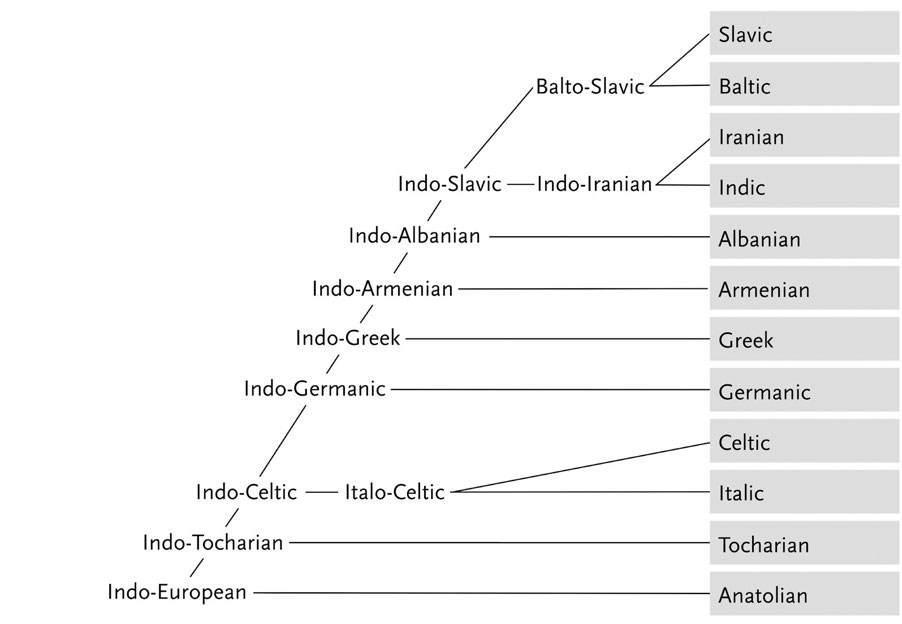

<i>Figure 2.1. The Indo-European language family.</i>

Most historical linguists now agree that the last common ancestor of the Indo-European languages, Proto-Indo-European, first split in an Anatolian branch (now extinct) and a non-Anatolian branch. Many scholars assume that the next branch to separate from the non-Anatolian branch was Tocharian (also extinct). It is possible that Italo-Celtic (comprising Italic and Celtic) was the third branch to split off. On the branching order from this point on, however, the jury is still out. The Germanic branch is especially difficult to place in the Indo-European family tree (Ringe, Warnow & Taylor 2002, 110–111); there are reasons to believe that Germanic was the fourth branch, following Italo-Celtic, to split off from the main branch (Nakhleh, Ringe & Warnow 2005, 396; Kortlandt 2016, 81). After Germanic had split off from the remaining branches, but still at an early point (in the first couple of millennia before the Common Era), there has apparently been some contact between Germanic and Celtic, resulting in shared lexical items, presumably due to borrowing between the two branches. After Germanic branched off it is likely that Greek, Armenian and Albanian split off (possibly forming a subgroup, but this is disputed), and eventually the last two remaining branches, Indo-Iranian and Balto-Slavic, separated from each other. An overview of representatives of the individual (sub)branches is given in Table 2.1.

<i>Table 2.1. The Indo-European language branches with representative languages.</i>

| <i>Branch</i> | <i>Sub-branch</i> | <i>Representative languages</i> |
| --- | --- | --- |
| †Anatolian |  | †Hittite, †Luvian, †Lycian, †Lydian |
| †Tocharian |  | †Tocharian A, †Tocharian B |
| Italo-Celtic | Italic | Latin (ancestor of the Roumanian, Italian, Spanish, Portuguese, French etc.), †Oscan, †Umbrian |
|  | Celtic | Irish, Scottish Gaelic, Welsh, Breton |
| Germanic |  | Swedish, Norwegian, Danish, Faroese, Icelandic, English, German, Dutch, Frisian, †Gothic |
| Greek |  | Greek |
| Armenian |  | Armenian |
| Albanian |  | Albanian |
| Indo-Iranian | Indic | Sanskrit (ancestor of Hindi, Urdu, Bengali, Punjabi) |
|  | Iranian | †Avestan, Persian, Pashto, Kurdish |
| Balto-Slavic | Baltic | Lithuanian, Latvian, †Old Prussian |
|  | Slavic | Russian, Bulgarian, Polish, Czech |
| † = extinct |  |  |

In order to be able to speak about the residual proto-languages that remained after the individual branches gradually separated I refer to the last common ancestor of the non-Anatolian languages as ‘Proto-Indo-Tocharian’; the proto-language of the non-Anatolian and non-Tocharian Indo-European languages is referred to as ‘Proto-Indo-Celtic’, etc. (see Figure 2.1; Olander forthcoming).

### Homelands and proto-languages

As one of the grand old men in the Indo-European homeland debate, the American– Irish archaeologist James P. Mallory, writes (1997, 93), ‘[t]hat the homeland has been discovered there can be no doubt as it has been sought anywhere from the North to the South poles and from the Atlantic to the Pacific’. More than a hundred years ago the German linguist Otto Schrader stated that ‘so wird man jedenfalls zugeben müssen, dass es nicht gerade das Gebiet der [indogermanischen] Heimatfrage ist, auf dem der menschliche Scharfsinn seine glänzendsten Triumphe gefeiert hat’ (Schrader 1883, 466). And since the problem also appears to appeal to people with only limited prerequisites for contributing positively to the discussion, the low point of the debate is still not impressive.

In order to be able to speak meaningfully about a ‘homeland’, we must first make clear what we understand by that term (see also the discussions in Dressler 1965; Mallory 1989, 144–145; Simon 2008). Most scholars who are occupied with the homeland of a proto-language would probably agree that the homeland is the place (and time) where the proto-language was spoken. But that leads to the next, and considerably more complicated question: what is a proto-language?

To begin with, most authors would agree that a proto-language is the language from which two or more related languages descend. That definition is, however, rather imprecise. Many historical linguists consider a proto-language to be the last stage of a language before the first linguistic innovation that did not affect all the descendants of that language (see Olander 2015, 18–21 with references). As long as we are talking about purely linguistic relationships, this definition of a proto-language works fine. If we want to correlate reconstructed language stages with archaeological evidence, however – which is our task here – such a definition of a proto-language is not particularly useful: if we take the definition literally, we end up reconstructing an undifferentiated speech variety among many other varieties, because as soon as a differentiation takes places, our proto-language ceases to exist by definition. And it will be virtually impossible to correlate one single variety among other almost identical varieties with a certain archaeological culture and thus also with a certain place and a certain time – the homeland. If we wish to retain the definition of a proto-language as given above – and as a historical linguist, I would like to do so – we should introduce another concept, which we may then try to correlate with the archaeological record.

I suggest that we use the definition given above for a proto-language in the <i>narrow</i> sense. We may then define a proto-language in the <i>broad</i> sense as the last stage of a language with already differentiated varieties which may still carry out identical developments with identical results.

While the definition of a proto-language in the broad sense, at least ideally, is rather unambiguous because it is determined by a single linguistic innovation, we must acknowledge that the definition of a proto-language in the broad sense is more vague – it is difficult to point to one definite language stage and claim that ‘this is the proto-language!’ On the other hand, the broad definition is, precisely because it is less idealised, closer to the real world.

In trying to correlate reconstructed language stages with the archaeological record, it is indeed the real world we are interested in. I suggest that a linguistic ‘homeland’ should not be that of a proto-language in the narrow sense, but in the broad sense. When we use this definition, the homeland becomes more vaguely defined temporally and thus also spatially, but as far as I can see, this is the best we can do. It should still be emphasised, though, that the homeland is delimited spatially and chronologically: as soon as the proto-language that is spoken in the homeland has disintegrated into two or more languages that no longer carry out the same innovations, the homeland ceases to exist.

If one is puzzled by the strongly diverging ideas as to when and where the Indo-European homeland should be located, it may help to take a closer look at various scholars’ definitions of proto-language and homeland. For instance, the American historian Robert Drews operates with an almost reverse definition of the one I have just given above, in the second part of the following quotation (Drews 1988: xii–xiii; emphasis as in original):

It is generally assumed that [the Indo-European] languages are ultimately descended from a single language, for which the term ‘Proto-Indo-European’ is appropriate. More loosely, however, ‘Proto-Indo-European’ may also be used for either the language or <i>the languages</i> that were spoken in the homeland from which the various Indo-European languages are supposed to have come.

It is not obvious to me why a language should be defined geographically and not linguistically. Another unfortunate, in my view, definition of Proto-Indo-European has been given by one of the important players in the homeland game, the British archaeologist Colin Renfrew. According to Renfrew, Proto-Indo-European is to be understood as ‘all the phases of language development within the Indo-European family prior to the emergence of the various recorded languages’ (Renfrew 2001, 36). At another occasion Renfrew refers to Proto-Indo-European in the following way (Renfrew 1999, 260; 2003, 19):

a term no longer to be seen as describing a single linguistic entity, but one which refers rather to the complex series of changes in different regions and periods, both in Europe and in western Asia, between the earliest Anatolian Pre-Proto-Indo-European (or Proto-Indo-Hittite) on the one hand, and the earliest languages for which we have actual documentation in each region on the other.

Apparently, Renfrew is of the opinion that everything that is Indo-European should be considered to be Proto-Indo-European until it is written down. I find it difficult to see how such a concept could ever be useful.

When scholars disagree to such a significant extent about what they are searching for, it is perhaps not surprising that they find it in different places at different points in time. We are not dealing with disagreement about the definitions, however. No matter how we define the terms, the two currently most popular models, the Anatolian hypothesis and the steppe hypothesis, mutually exclude one another.

In the following I will focus on these two models, which have received the largest amount of attention during the last decades: the Anatolian hypothesis, according to which the Indo-European homeland was located in Turkey, and the steppe hypothesis, according to which the homeland was located in the steppe region north of the Black and Caspian Seas. For further discussion of these and many other models – for instance, the scenarios suggesting that the Indo-European homeland was located on the Balkans (D’iakonov 1984), in Armenia (Gamkrelidze & Ivanov 1995) or in Central Asia (modern Turkmenistan, Uzbekistan and Tadzhikistan; Nichols 1997; but cf. now Nichols [no date]) – I refer to Mallory 1973; 1989; 1997; Simon 2009. An important point in the discussion of the Indo-European homeland is that the problems of time and place are inseparable: when a certain geographical location of the protolanguage is assumed, it also requires the assumption of a time frame (Mallory 1996; 1997, 98–103).

### The Anatolian hypothesis

According to the so-called Anatolian hypothesis the Indo-European homeland was located in Anatolia, <i>i.e.</i> central Turkey. The main proponent of the Anatolian hypothesis is Renfrew, who in his book <i>Archaeology and Language: The puzzle of Indo-European origins</i> from 1987, maintains that the spread of the Indo-European languages was a consequence of the spread of farming from Anatolia, an idea he had already outlined in an article from 1973. Renfrew has subsequently revised his hypothesis several times in order to counter the criticism advanced against it. Interestingly, as far as I know Renfrew’s latest stance on the Indo-European homeland debate (2017), informed by the advances in ancient genetics, is that ‘although not all problems are solved, I think Marija’s [<i>i.e.</i> Marija Gimbutas’] “Kurgan hypothesis” has been magnificently vindicated by recent work’.

I base the following account on Renfrew’s ‘hypothesis B’ for the spread of the Indo-Iranian languages (Renfrew 1987, 197–205; cf. also Renfrew 2003, which is largely identical to Renfrew 1999). Accordingly, I do not discuss the most recent variant of the Anatolian hypothesis (Heggarty & Renfrew 2014b; Heggarty 2015a) – which resembles the original ‘hypothesis A’ in Renfrew 1987 (189–197) – because it is significantly less plausible than ‘hypothesis B’: in ‘hypothesis A’ and the most recent revision, Renfrew assumes that the Indo-Iranian languages have spread directly eastwards from Anatolia (see also Bouckaert <i>et al.</i> 2012; Bellwood 2013, 157–165). In that scenario it becomes very difficult to explain the fact that the Indo-Iranian languages have experienced a period of common development together with the other non-Anatolian branches, including Greek and Balto-Slavic, which are assumed to have moved westwards from Anatolia (for a detailed criticism of the most recent revision see Mallory 2017).

The proponents of the Anatolian hypothesis maintain that Proto-Indo-European was spoken in central and eastern Anatolia around 7000–6500 BC. The decisive factor for the spread of Indo-European was, as already mentioned, farming, which spread from Anatolia to Greece and the Balkans and from there further west-, north- and eastwards. In some cases the spread of language took place by ‘demic diffusion’, where a demographic surplus in the farming population slowly spread, bringing along language (thus initially – in the Balkans and in the Linear Ware cultures; see Renfrew 2003, 18, after Zvelebil & Zvelebil 1990). In other cases farming and language spread by ‘acculturation’ and contact-induced language shift, where existing groups of hunter-gatherers acquired the language of the farming population as they adopted a farming economy (thus in later phases). The spread of Indo-Iranian languages from the steppes south-eastwards towards Pakistan and India can, at least in the most plausible of Renfrew’s scenarios (‘hypothesis B’), not be explained by the spread of farming, but it is ascribed to a process called ‘elite dominance’, where a small group of immigrants dominates a larger existing population to the extent that the language of the elite replaces the indigenous language (Renfrew 1987, 131–133; 1992, 454; 1996:76).

Since farming had spread to most of Europe around 4000 BC – from Anatolia over the Balkans in the south-east, to Ireland and Iberian Peninsula in the west, the North Sea in the north and Ukraine and southern Russia in the east (see Fig. 2.2; and Müller 2009, 60–61; Bellwood 2013, 146) – this enormous area would, according to the Anatolian hypothesis, have been covered by Indo-European languages around this time. Later in this chapter we look at why this point in time is of interest for the discussion of the Indo-European homeland.

During the last fifteen years the Anatolian hypothesis has received support from a group of researchers centred around the evolutionary biologist Russell D. Gray. By performing Bayesian statistical calculations on the basic vocabulary (<i>i.e.</i> the 100 or 200 words that are considered to be least prone to be replaced over time) Gray and his followers have dated the dissolution of Proto-Indo-European to around 6700 BC (Gray & Atkinson 2003). Subsequent Bayesian analyses carried out by the Gray group (especially Bouckaert <i>et al.</i> 2012, with corrections in Bouckaert <i>et al.</i> 2013) have confirmed this very early date, which is a perfect fit for Renfrew’s Anatolian hypothesis. Furthermore – also on the basis of calculations performed on the vocabulary and assuming that the spread of languages took place at a certain pace – the Gray group has reached the conclusion that the initial split of Proto-Indo-European probably took place somewhere in Anatolia (Bouckaert <i>et al.</i> 2012). The results of the group have been published in the prestigious scientific journals <i>Nature</i> and <i>Science</i>.

Unsurprisingly, the adherents of the Anatolian hypothesis are enthusiastic about the approach of the Gray group, referred to as an ‘objective quantitative analysis’ (Heggarty 2015b; see also Heggarty 2014; Heggarty & Renfrew 2014a, 30–31; 2014b, 1690–1691). The results have received attention in mainstream media such as the <i>New York Times</i> (‘Family tree of languages has roots in Anatolia, biologists say’, 23 August 2012) and the <i>BBC</i> (‘English language “originated in Turkey”’, 25 August 2012).

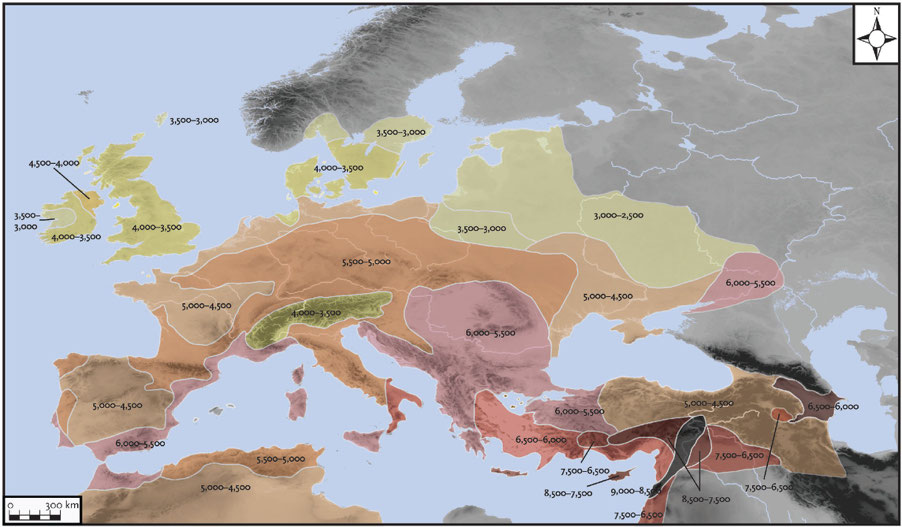

<i>Figure 2.2. The spread of farming in Europe. Illustration by James A. Johnson on the basis of Müller 2009, 60–61.</i>

Has the Indo-European homeland question then definitively been answered in favour of Anatolia in the seventh millennium BC? Not quite. Both Renfrew’s archaeologically based scenario and the later contributions from lexicostatistics have been subject to severe criticism. To begin with the data used as the basis for the analyses, there is general agreement among experts that phonology and, above all, morphology – and not vocabulary – are the best indicators for the subgrouping of languages (see <i>e.g.</i> Leskien 1876, xxvii–xxviii; Meillet 1925, 22–33; Clackson 1994, 6, 17–19; Ringe & Eska 2013, 256–263; cf. also Atkinson & Gray 2006b, 105). Furthermore, what is interesting in this context is not so much shared vocabulary as shared innovations (at the phonological, morphological and lexical levels), but it is not clear how it is possible to distinguish innovations from retentions in lexical items. Besides, there is no evidence to the effect that replacements in the vocabulary, or language change in general, proceed at a constant rate (see <i>e.g.</i> Bergsland & Vogt 1962; Eska & Ringe 2004, 577–578; McMahon & McMahon 2006). Accordingly, it is impossible to calculate the age of the common ancestor of a group of related languages. It is also questionable whether languages spread at a certain pace – it seems very likely that language often spreads according to different and more irregular patterns (see <i>e.g.</i> the model in Nichols 1998).

On the basis of the same material that the Gray group used, but by adding information that we already possess – for instance that Latin is the ancestor of the Romance languages, that Ancient Greek is the ancestor of Modern Greek, and that Old English is the ancestor of Modern English – another group of researchers have concluded that Proto-Indo-European was spoken around 4500 BC, <i>i.e.</i> a date which is considerably later than that posited by the Gray group, and which is irreconcilable with the hypothesis of a spread of Indo-European languages together with farming (Chang <i>et al.</i> 2015). That result is primarily interesting as another nail in the coffin of the Gray chronology; if one does not accept the premises for glottochronology, or is of the opinion that phonological and morphological data should be incorporated in the analyses, the result in itself is not particularly significant. Further criticism of the data, the methods and the results of the Gray group can be found in the book <i>The Indo-European Controversy</i> (Pereltsvaig & Lewis 2015; see also Nichols & Warnow 2008, 792–794; Anthony 2013, 2–6).

We therefore should not put too much weight on the arguments in favour of the Anatolian hypothesis exclusively based on lexical data. The hypothesis does, however, have a case when it comes to explaining how the Indo-European languages could spread so drastically as they did, <i>i.e.</i> with regard to the question of <i>how</i>. On the other hand, it fails at a number of archaeological and linguistic points, with regard to the questions of both <i>where</i> and <i>when</i>.

As mentioned above, Renfrew does not attempt to correlate the spread of Indo-Iranian (and Tocharian) eastwards from the steppes with the spread of farming. Thus he acknowledges that other mechanisms than farming may lead to the spread of languages. And once this possibility is acknowledged, there is not much evidence that speaks for an Anatolian homeland, but a lot that speaks against it. I will not go through all the points of criticism in detail here, but limit myself to presenting some of them and referring to existing discussions, for instance in Mallory 1989, 178–181 (‘Anatolia is the wrong place at the wrong time and migrations from it give the wrong results’); 1998, 177–180; 2009 (the Anatolian homeland hypothesis ‘fails at just about every hurdle that one could imagine’); Comrie 2002; Anthony 2007, 75–81; Demoule 2008; Iversen & Kroonen 2015; 2017, 513–516.

Among the more important arguments against the Anatolian hypothesis are the following: (1) Most researchers, including Renfrew himself (1987, 202), are of the opinion that some form of early Indo-European was spoken in the Jamnaja cultures on the steppes. But nothing in the archaeological record gives us reason to assume a spread of languages from the Balkans and/or Anatolia to the steppes (Anthony & Wailes 1988, 443; Mallory 1997, 110). (2) In Anatolia we find evidence not only for Anatolian languages belonging to the Indo-European language family, but also for two non-Indo-European languages, Hattic and Hurrian, in the earliest written documents. It seems odd that in the core of the Indo-European area we find non-Indo-European languages that do not seem to result from a late immigration. (3) There exists a number of place names of apparently non-Indo-European origin in Anatolia, indicating that Indo-European languages have arrived in Anatolia at a relatively late point.

If one really wishes to give the benefit of the doubt to the Anatolian hypothesis, however, it should be acknowledged that (1) it is indeed possible for languages to spread without leaving traces in the archaeological record, although such assumptions are obviously purely speculative; (2) it cannot be entirely ruled out that the non-Indo-European languages spoken in Anatolia were themselves the result of a late immigration; and (3) places may be named by immigrants, as we see, for instance, with Nordic place names in England and Normandy, or with Slavic place names in southern Denmark.

Even if the Anatolian hypothesis may thus, to some extent at least, be rescued from the objections given above, there are decisive arguments against it, coming from the Indo-European languages themselves: the reconstruction of words for certain concepts in the Indo-European proto-language is incompatible with a correlation of the spread of farming and the spread of Indo-European languages. We will take a closer look at this argument below. First I say a few words about the methodology used in linguistic reconstruction.

### The comparative method and linguistic palaeontology

Why do we think we can reconstruct prehistoric language stages? We think so because, at the phonological level, languages develop systematically. This means that by comparing related languages we are able to reconstruct (parts of) the protolanguage from which the languages descend and the developments that have taken place between the proto-language and its descendants. This way of doing linguistic reconstruction is called the comparative method (for a general introduction see <i>e.g.</i> Hock & Joseph 1996, 427–454; Campbell 1998, 107–158; Weiss 2015).

An example of what the comparative method may lead to is provided by the words in various related languages given in Table 2.2.

<i>Table 2.2. Germanic vocalism.</i>

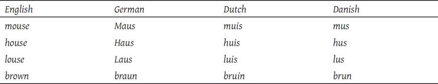

All the English words contain the diphthong <i>ou</i>; the German words contain the diphthong <i>au</i>, and the Dutch words contain the diphthong <i>ui</i>. In Danish we find a (long) <i>u</i> vowel, pronounced approximately as the vowel in English <i>food</i>. The words in each row have the same meaning.

How can we explain these systematic sound correspondences? English, German, Dutch and Danish all descend from a common ancestor language, Proto-Germanic. We may assume that in these four words (and several others) Proto-Germanic had a sound that developed in a certain way in the Germanic languages. We may even, with a high degree of certainty, reconstruct the original sound: by looking at older documented stages of the Germanic languages, <i>e.g.</i> Old High German <i>mūs</i>, Old English <i>mūs</i> and Old Norse <i>mús</i>, we observe that the languages that now have a diphthong had a long vowel <i>ū</i> at earlier stages. We can thus reconstruct this sound for the common ancestor of these languages: the four words in question must have sounded approximately <i>*mūs-,*hūsa-,*lūs</i> and * <i>brūna</i> in Proto-Germanic (the asterisk *denotes a reconstructed form). In modern English, German and Dutch the long vowel <i>*ū</i> has become diphthongised, whereas in Danish it has been preserved as a long vowel. Since the four words have experienced the regular sound changes of the individual languages, it is likely that they were present already in Proto-Germanic; they should be regarded as inherited words in the modern languages.

This is interesting in itself. However, the comparative method can also help us to determine what is <i>not</i> inherited. If, for instance, we take the English word <i>tuna</i>, it is called a <i>Thun(fisch)</i> in German, a <i>tonijn</i> in Dutch and a <i>tun</i> in Danish. If we did not know the linguistic history of the languages, we might think these words were also inherited from Proto-Germanic. However, the sound correspondences show that we cannot be dealing with an inherited word: if the word had had an original Proto-Germanic <i>*ū</i> (as indicated by the Danish word), we would expect a diphthong in English, German and Dutch, as in the words given in Table 2.2. If it had had a Proto-Germanic <i>*ō</i> (as indicated by the German form), we would expect that the vowel correspondences were as in German <i>gut</i>: English <i>good</i>, Dutch <i>goed</i>, Danish <i>god</i>, and so on. We are thus allowed to assume, on the basis of the sound correspondences, that the word for tuna has been borrowed into at least some of the Germanic languages after the dissolution of Proto-Germanic. And indeed the Germanic words are borrowed from Latin <i>thunnus</i>, which itself, incidentally, is a loanword from Greek <i>tʰýnnos</i>.

Since the linguistic material in spoken language is constituted by sounds, the comparative method allows us to reconstruct roots, suffixes, endings and whole words in a proto-language. And this is where the method gets interesting for the discussion of the Indo-European homeland. When we can reconstruct words, we can also reconstruct meanings (see recently Olsen 2017); and then we may try to correlate these meanings with the physical world. For instance, we can assume that the speakers of Proto-Germanic may have known mice, houses, lice and the color brown. Since we cannot reconstruct the word for tuna in Proto-Germanic, we can only conclude, on that basis, that we do not know if the speakers of Proto-Germanic knew tuna fish or not: we cannot exclude that there was a word for tuna in Proto-Germanic that just happened to disappear in the prehistory of the attested languages, and therefore we cannot conclude that these people did not know tuna fish.

This way of reasoning is known as linguistic palaeontology, a term that was first applied by the Swiss linguist Adolphe Pictet in 1859. Since then the method has become one of the cornerstones in discussions of the Indo-European homeland as well as the homelands of other language families (see <i>e.g.</i> Hock & Joseph 1996, 477–509; Campbell 1998, 406–446). Linguistic palaeontology requires not only a thorough understanding of the comparative method and of the histories of the individual languages, but also a continuous critical evaluation of the results. Besides, as mentioned above, one has to be very cautious when making conclusions on the basis of negative evidence (Dressler 1965, 35–36 and passim). The method has often been misused, and some scholars even write it completely off (<i>e.g.</i> Pulgram 1958 [for which cf. Olander 2017]; Renfrew 1987, 77–86; Atkinson & Gray 2006b, 102–103; Heggarty & Renfrew 2014a, 31–32; Heggarty 2015b, 607–610; see also Clackson 2007). Despite the criticism, linguistic palaeontology, applied with caution, is still the most reliable method of determining the time frame and location of reconstructed language stages.

In the following two sections we shall attempt to delimit the Indo-European protolanguage in time. The minimal age of the proto-language can be estimated on the basis of the individual differences between the Indo-European languages, whereas its maximal age can be established on the basis of linguistic palaeontology.

### Chronology: terminus ante quem

When searching for the location of the Indo-European proto-language on the world map, it has turned out to be useful to first try to establish the possible age of the proto-language. When we try to establish its <i>minimal</i> age, we may notice that the earliest written evidence for Indo-European languages goes back to the middle of the second millennium BC. At this time we find texts in Hittite, Indic and Greek showing that at this time the languages were already strongly differentiated from each other. It is not easy to estimate how many years it had taken for the languages to diverge from each other as much they did, but a conservative guess would say that the Indo-European proto-language (in the broad sense) is unlikely to have dissolved after 2500 BC (see the discussion in Anthony 2007, 50–52; cf. also Mallory 1996, 15; Clackson 2000, 441–442).

### Chronology: terminus post quem

When trying to establish the <i>maximal</i> age of the proto-language, we have to bring out the heavy linguistic artillery. As it turns out, we are in the lucky position that the Indo-European languages possess a terminology for certain technological innovations that make it possible to give a qualified estimate of the earliest date for the dissolution of the proto-language. As we have seen, if it is possible to reconstruct a word denoting a certain concept in a proto-language, our default assumption is that the speakers of the proto-language must have known that concept.

One of the important words in this context is reconstructible on the basis of the material given in Table 2.3 from various Indo-European branches.

<i>Table 2.3. Proto-Indo-European *h₂u̯ĺ̥h₁nah₂.</i>

| <i>Branch</i> | <i>Language, form and meaning</i> |
| --- | --- |
| Anatolian | Hittite <i>ḫulana-</i> ‘wool’ |
| Italo-Celtic | Latin <i>lāna</i> ‘wool’; Old Irish <i>olann</i> ‘wool’, Old Welsh <i>gulan</i> ‘wool’ |
| Germanic | Gothic <i>wulla</i> ‘wool’, Old Norse <i>ull</i> ‘wool’, Old English <i>wull</i>, English <i>wool</i> |
| Greek | Greek <i>lênos</i> ‘wool’ |
| Indo-Iranian | Sanskrit (Vedic) <i>ū́rū́ā-</i> ‘wool’; Avestan <i>varānā-</i> ‘wool’ |
| Balto-Slavic | Lithuanian <i>vìlna</i> ‘wool’; Old Church Slavonic <i>vlьna</i> ‘wool’ |

These words may be traced back to an original Proto-Indo-European form <i>*h₂u̯ĺ̥h₁nah₂-</i> (<i>*h₂</i> probably denotes a [x] sound; <i>*h₁</i> was possibly an [h] sound; <i>*l̥</i> denotes a syllabic [1]; and the acute accent marks the accented syllable). Since this word is also present – with some modification – in Anatolian, which was the first branch to separate (see Fig. 2.1), it must have existed already at the oldest language stage that we can reconstruct for the Indo-European language family by means of the comparative method. As shown in Table 2.3, the word has the meaning ‘wool’ in all the languages where it is attested. For further discussion of the attested words and the reconstruction see Mayrhofer 1986–2001, 1: 243; Peters 1987; Darden 2001, 189–190; Meissner 2006, 195; Anthony 2007, 59–63; Derksen 2008, 537; de Vaan 2008, 325; Kloekhorst 2008, 357–358; Beekes 2010, 857–858; Kroonen 2013, 598–599; Pinault 2016; Olsen 2018.

Sheep did not always have wool. While we know domesticated sheep from at least 7000 BC (Barber 1991, 22), wool-producing sheep do not seem to have existed much earlier than 4000 BC (see the discussion in Anthony 2007, 59–63; cf. also Barber 1991, 9–35; Benecke 1994, 137; Adams & Mallory 1997; Darden 2001, 196–204). And this is where it gets interesting: if the Indo-European languages are in complete agreement that Proto-Indo-European had a word meaning ‘wool’, the proto-language (in the broad sense) cannot have dissolved before wool existed, <i>i.e.</i> around 4000 BC. To be on the safe side, we may posit 4500 BC as the <i>terminus post quem</i> for the Indo-European proto-language.

Some researchers do not accept the assumption that Proto-Indo-European <i>*h₂u̯ĺ̥h₁nah₂</i> originally had the meaning ‘wool’ (<i>e.g.</i> Heggarty 2015b: 608). If we wanted to save the Anatolian hypothesis, for which the existence of a word for wool in Proto-Indo-European would amount to a falsification because of the chronological implications, we might maintain that the <i>*h₂u̯ĺ̥h₁nah₂</i> had another meaning in the proto-language, <i>e.g.</i> ‘underwool’; the word might then have changed its meaning to ‘wool’ in the individual branches after the dissolution of the proto-language. This is certainly a theoretically possible scenario, but it is rather forced: the best explanation of the material is obviously that the word had the meaning ‘wool’ already in the proto-language, and that the original meaning was simply retained unchanged in the descendant languages.

Another technological innovation that plays a decisive role in the homeland discussion is the wheel and the wagon. Here at least three words seem to be old. The first one has the form in the attested languages shown in Table 2.4.

<i>Table 2.4. Proto-Indo-Tocharian *kʷékʷlo-.</i>

| <i>Branch</i> | <i>Language, form and meaning</i> |
| --- | --- |
| Tocharian | Tocharian B <i>kokale</i> ‘wagon’ |
| Germanic | Old Norse <i>hjól</i> ‘wheel’, Old English <i>hwḫol</i> ‘wheel’, English <i>wheel</i> |
| Greek | Greek <i>kýklos</i> ‘circle; wheel’ |
| Indo-Iranian | Sanskrit (Vedic) <i>cakrá-</i> ‘wheel’; Avestan <i>čaxra</i> ‘wheel’ |

The word is generally assumed to be a reduplicated formation, <i>*kʷékʷlo-</i>, from the root <i>*kʷelh₁</i>- ‘turn’ (for a more thorough discussion of the forms see Eichner 1985; Mayrhofer 1986–2001, 1: 521–522; Adams 1999, 214; Rasmussen 2000, 30–31; Beekes 2010, 798–799; Kroonen 2013, 264–265). A Baltic word (Lithuanian <i>kãklas</i> ‘neck’, Latvian <i>kakls</i> ‘neck’) is often thought to contain the same etymological substance as the word for wheel, either with a change in meaning from ‘wheel’ to ‘neck’ in Baltic, or as a later, Baltic formation made with exactly the same elements as the word for wheel. A change in meaning from ‘wheel’ to ‘neck’, however, seems implausible; and the interpretation of the word as a Baltic reduplicated innovation is also unlikely because that word-formation type is rather archaic. Fortunately there is a third solution, which has lived a somewhat hidden life for more than a century: the Baltic words may be reconstructed as Proto-Baltic <i>*ˌkakla-</i> from <i>*ˌka̰lkla-</i> (with dissimilation) from <i>*kʷolh₁-tlo-</i>, formed with the generalised suffix <i>*-tlo-</i> from the same root (see Niedermann 1905, 76; Smoczyński 2007, 445).

The next word has the reflexes given in Table 2.5.

<i>Table 2.5. Proto-Indo-Celtic *rot(h₂)-.</i>

| <i>Branch</i> | <i>Language, form and meaning</i> |
| --- | --- |
| Italo-Celtic | Latin <i>rota</i> ‘wheel’(?); Old Irish <i>roth</i> ‘wheel’ |
| Germanic | Old High German <i>rad</i> ‘wheel’ |
| Indo-Iranian | Sanskrit (Vedic) <i>rátha-</i> ‘(two-wheeled) war chariot’; Avestan <i>raθa-</i> ‘wagon’ |
| Balto-Slavic | Lithuanian <i>rãtas</i> ‘wheel’ (pl. <i>rãtai</i> ‘wagon’); Latvian <i>rats</i> ‘wheel’ (pl. <i>rati</i> ‘wagon’) |

Here the reconstruction seems to be <i>*rot(h₂)-</i> (Mayrhofer 1986–2001, 2: 429–430; de Vaan 2008, 527; Kroonen 2013, 405; Derksen 2015, 376). It is uncertain if the regular reflex of Proto-Indo-European <i>*th₂</i> is <i>t</i> in Latin, or if we rather expect a <i>d</i>; in the latter case it is possible that <i>rota</i> represents an early loanword from Celtic and that the genuinely Latin form is preserved in the word <i>radius</i> ‘spoke’ from Proto-Indo-European <i>*roth₂-io̯ -</i>, also seen in the Sanskrit (Vedic) adjective <i>ráthya-</i> ‘belonging to a chariot’ (Olsen 1994, 269 n. 6). In any case, the status of Latin <i>rota</i> does not change the argumentation since the word is attested in Italic and Celtic anyway but not in Anatolian or Tokharian; it may therefore be traced back to Proto-Indo-Celtic (see Fig. 2.1).

The third word looks as in Table 2.6 in the documented languages.

<i>Table 2.6. Proto-Indo-Celtic *h₂ák̑s-</i>

| <i>Branch</i> | <i>Language, form and meaning</i> |
| --- | --- |
| Italo-Celtic | Latin <i>axis</i> ‘axle; chariot’; Welsh <i>echel</i> ‘axle; axis’; Breton <i>ahel</i> ‘axle; axis’ |
| Germanic | Old Norse <i>ǫxull</i> ‘axle’, Old High German <i>ahsa</i> ‘axle’, Old English <i>eax</i> ‘axle’ (English <i>axle</i> is borrowed from Old Norse) |
| Greek | Greek <i>áksōn</i> ‘axle’ |
| Indo-Iranian | Sanskrit (Vedic) <i>ákṣa-</i> ‘axle’ |
| Balto-Slavic | Lithuanian <i>ašìs</i> ‘axle; axis’, Latvian <i>ass</i> ‘axle; axis’, Old Prussian <i>assis</i> ‘axle’; Church Slavonic <i>osь</i> ‘axle’ |

The forms point to a proto-form <i>*h₂ák̑s-</i> (see Hamp 1981; Mayrhofer 1986–2001, 1: 41; Derksen 2008, 380–381; de Vaan 2008, 66–67; Beekes 2010, 111; Kroonen 2013, 6). As this word, like <i>*rot(h₂)-</i>, is absent from Anatolian and Tocharian, the reconstruction may be regarded as belonging to Proto-Indo-Celtic (see Fig. 2.1).

It appears that none of the words related to wheels and wagons are present in the Anatolian branch; and since Anatolian was the first branch to separate, the wheel terminology only allows us to pin down the time for the dissolution of the non-Anatolian branch of Indo-European (Indo-Tocharian in Fig. 2.1), a fact that is not always mentioned. On the other hand, one of the words is represented in Tocharian, probably the second branch to split off. We may therefore assume, with a high degree of certainty, that the speakers of Proto-Indo-Tocharian must have had the word <i>*kʷékʷlo-</i>, and that the speakers of Proto-Indo-Celtic in addition must have had the stems <i>*rot(h₂)-</i> and <i>*h₂aK̑s-</i>.

With regard to the reconstruction of the meaning of the words, it seems self-evident to assume that <i>*kʷékʷlo-</i> originally meant ‘wheel’. When the word has obtained the meaning ‘wagon’ in Tocharian, we are probably dealing with metonymical use just like in English, where <i>wheels</i> may mean ‘car’ in informal speech, or in Lithuanian and Latvian, where the plural of ‘wheel’ means ‘wagon’. Something similar is seen in <i>*rot(h₂)-</i>, which also seems to have meant ‘wheel’ originally – perhaps another type of wheel than a <i>*kʷékʷlo-</i> – but which in Indo-Iranian, perhaps as a substantivised adjective <i>*róth₂o-</i> ‘a wheeled one’ (Rix <i>et al.</i> 1998, 507) and, as just mentioned, in Lithuanian and Latvian (in the plural) has assumed the meaning ‘wagon’. The most natural reconstructed meaning of <i>*h₂ak̑s-</i> is ‘axle’, which is precisely what the word means in the documented languages.

With the wheel terminology we come closer to a <i>terminus post quem</i> for the dissolution of Proto-Indo-Tocharian, <i>i.e.</i> the non-Anatolian branch of the Indo-European language family: there is near-consensus that the wheel was not invented before 4000 BC and indeed rather around 3500 BC (see Anthony 2007, 65–72 with further references 474–475 n. 10; Cunliffe 2015, 98–101). If the speakers of Proto-Indo-Tocharian had a word for wheel, it is difficult to avoid the conclusion that they must also have known the phenomenon of wheels – and if this is the case, Proto-Indo-Tocharian cannot have dissolved before 4000 BC at the earliest.

If the words for wheel technology are taken at face value and reconstructed in Proto-Indo-Tocharian, the Anatolian hypothesis has a problem: it is difficult to imagine that words meaning ‘wheel’ could exist in a proto-language that dissolved several millennia before the wheel was invented. And since farming had spread across an area reaching from the Iberian peninsula in the west to present-day Ukraine and southern Russia in the east (see Fig. 2.2) when the wheel was invented, it is also quite hard to imagine that the speech in this enormous area was so uniform that several words for wheel terminology could be created.

As with the word for wool, supporters of the Anatolian hypothesis have suggested that the words related to wheels could originally have meant something different, that they could have created independently in the various branches, or that they could have arisen in one of the branches and spread from there to the other branches (see Renfrew 1987, 80; Atkinson & Gray 2006b, 102–103; and almost identically, Atkinson & Gray 2006a, 293–294; Heggarty & Renfrew 2014b, 1691; Heggarty 2015b, 608). However, even more than in the case with the word for wool it is unlikely that three words that originally meant something else after thousands of years of independent development in the individual branches should end up meaning precisely ‘wheel’ and ‘axle’ in several branches (see Mallory 1989, 275 n. 20). It is also unthinkable that the words should be independent formations in the individual branches. The word <i>*kʷékʷlo</i>, in particular, is such an unusual – indeed unique – formation that it is absurd to imagine that it would have been created several times in various branches (see Rasmussen 2000, 30; Ringe 2009, 4). Furthermore, it is not particularly likely that the word should have arisen at a late point in time and then spread from that branch to the others. In that case we would probably be able to determine, from the phonetic shape of the words, that they are not inherited from the common ancestor (Anthony & Ringe 2015, 202–206). To conclude, the attested terminology for wheels is incompatible with the Anatolian hypothesis.

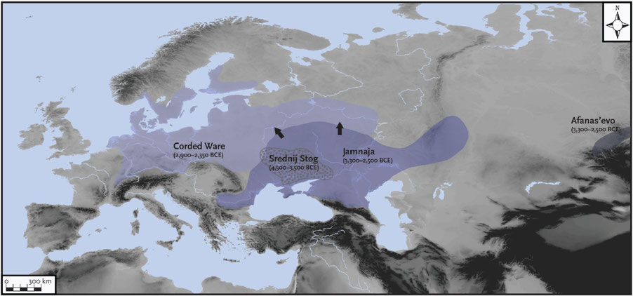

<i>Figure 2.3. Srednij Stog, Jamnaja, Afanas’evo, Corded Ware cultures. Illustration by James A. Johnson on the basis of Allentoft et al. 2015, 168.</i>

### The steppe hypothesis

If the chronological implications of the linguistic evidence are accepted, the Indo-European proto-language itself must have dissolved in the period between around 4500 and 2500 BC. Within that time frame a certain area has time and again been pointed out, by historical linguists as well as by archaeologists, as the most likely location of the speakers of Proto-Indo-European, ever since it first entered the scene with the second edition of the German linguist Otto Schrader’s <i>Sprachvergleichung und Urgeschichte</i> (Schrader 1883): the steppe region north of the Black and Caspian Seas in present-day Ukraine and southern Russia – the Pontic–Caspian steppes (see the detailed presentations in Mallory 1989; Anthony 2007; cf. also Gimbutas 1970; Anthony 1986; Kortlandt 1990; Kristiansen 2012; Anthony & Ringe 2015).

On the Ukrainian steppes north of the Black Sea we find the Copper Age complex Srednij Stog named after a small island, now flooded, in the Dnepr river and dated to around 4400–3400 BC (Anthony 2007, 239–249). The population of this complex had a predilection for horse meat – probably from domesticated horses, which may also have been used for riding – and had cattle, sheep, goats and pigs. The dead were buried in single graves, sometimes marked by a small mound, a tradition that continued in the single grave complex (see below). An offshoot of the Srednij Stog is the Jamnaja complex (<i>c.</i> 3300–2500 BC), named after the Russian word for ‘pit grave’, <i>jáma</i>, the typical burial form. The Jamnaja complex covers numerous cultures on the Pontic– Caspian steppes (Fig. 2.3), which were characterised by a high degree of mobility. The Jamnaja people were nomadic pastoralists with herds of cattle, sheep and goats, which they herded on horseback; and they travelled around in ox-drawn wagons.

The archaeological record of the Srednij Stog and the Jamnaja makes a remarkably good fit with the picture historical linguists draw of the Indo-European proto-language and its early descendants, and there is wide agreement that at least some of the inhabitants of these areas spoke early Indo-European languages. It is possible that it was the Indo-European proto-language itself, or something close to it, that was spoken in Srednij Stog.

A slightly later phenomenon that is thought to be related to the spread of Indo- European languages in Europe is the Corded Ware complex (with the Single Grave and Battle Axe complexes), which covered a large area in eastern, northern and central Europe <i>c.</i> 3200–2300 BC. Like Jamnaja, Corded Ware groups were mobile pastoralists with horses and wagons. It is possible that the pre-stages of Germanic and Balto-Slavic were spoken in Corded Ware cultures (Anthony 2007, 367; but cf. Kristiansen <i>et al.</i> 2017).

What is the reason the Indo-European languages should have their origin in the south Russian and Ukrainian steppe region? One of the arguments that have been adduced in favour of the steppe hypothesis (and thus against the Anatolian hypothesis) is that the horse plays an important symbolic role in early Indo- European-speaking cultures (Mallory 1989, 161–163, 179; see also Adams, Mallory & Miller 1997, 273–279; Mallory 1997, 109–110; Parpola 2012, 123). The word for horse has a very certain etymology in Proto-Indo-European: reflexes of <i>*h₁ék̑u̯o-,e.g.</i> Latin <i>equus</i> and Sanskrit (Vedic) <i>áśva-</i>, are found in almost all branches, including Anatolian (with an unextended stem <i>*h₁ek̑u-</i>, cf. Kloekhorst 2008, 239) and Tocharian. Archaeologists agree that the horse played a much bigger role on the steppes than elsewhere, and that it was probably on the steppes that the horse was domesticated between 4500 and 3500 BC (Anthony & Brown 2011). But since there also existed horses – albeit in limited numbers and, for a long period, only wild ones – in southern Anatolia (Anthony 2007, 197–199), the word for horse and the symbolic value of the animal cannot definitively exclude an Anatolian homeland (see also Mallory 1989, 161–163).

Another argument for the steppe hypothesis is the apparent presence of loanwords from Proto-Indo-European in Proto-Fenno-Ugric or its ancestor, Proto-Uralic (Koivulehto 2001, 235–238). The most simple explanation for this fact is that the donor language and the recipient language were neighbours; and since Proto-Fenno-Ugric and Proto-Uralic are usually assumed to have been spoken in the forest-steppe zone on both sides of the Ural mountains north of the Pontic–Caspian steppes, these loanwords fit well with the steppe hypothesis. For the Anatolian hypothesis such loanwords are problematic (Mallory 1989, 149–151; Anthony & Ringe 2015, 206–207). In my opinion, however, this argument is not decisive. First, the interpretation of loanword relations that are as old as in this case contains many elements of uncertainty. Second, these loanwords do not necessarily contradict Renfrew’s ‘hypothesis B’, according to which an early form of Indo-European was spoken on the steppes; if we stretch our imagination a bit, it would be possible to maintain that the loanwords had been adopted into Proto-Fenno-Ugric or Proto-Uralic from this stage.

A weightier argument is that the archaeologically documented expansions from the steppe region seem to be compliant with the Indo-European family tree (for the following see Anthony 2013, 6–14; Anthony & Ringe 2015, 208). An early expansion from the steppes around 4200–4000 BC may have led to the Suvorovo culture west of the Black Sea, which might be an expression of the early separation of the Anatolian branch from the core group. The next expansion from the steppes leads 2,000 km eastwards towards the Afanas’evo culture in the Altai Mountains in southern Siberia beginning around 3300 BC. The Afanas’evo culture may with some degree of likelihood be connected to the Tocharian branch of Indo-European, which appears in the second half of the first millennium AD in the Tarim Basin in the present Xinjiang province of western China (Mallory 1998, 189–191; 2015; Anthony 2013, 10–11). There are expansions from the steppes westwards towards southern Poland around 3300–3000 BC and towards the Danube valley around 3100–2800 BC. These expansions square with the assumption that the third branch to split off was Italo-Celtic, <i>i.e.</i> a western branch (Anthony 2013, 11–12). Accordingly, an Indo-European homeland in the Pontic–Caspian steppes seems to be in agreement with the early ramification of the Indo-European family tree. The hypothesis that the Indo-European languages spread with farming from Anatolia, by contrast, is at variance with most of what we know about the relationship between the branches (see Anthony & Ringe 2015, 207).

To sum up, apart from the chronological limitations imposed by the internal linguistic relations, it is above all the structure of the Indo-European family tree that makes the Pontic–Caspian steppes the most likely candidate for the last station of the Indo-European language family before the speakers parted ways. Furthermore, several facts seem to have a natural explanation within the steppe hypothesis but require additional assumptions within the Anatolian hypothesis – which may be theoretically possible but are not particularly likely.

An important argument against the steppe hypothesis is that it has been difficult to demonstrate that the diffusion of cultural traits from the steppes into central Europe and further west- and northwards was connected to migrations of people and thus of languages (Mallory 1997, 103). Specifically, there has not been any clear evidence of a relation between the Jamnaja complex of the steppes and the Corded Ware cultures, which have long been regarded as an important vector for the spread of Indo-European languages in central and northern Europe. Additionally, as long as the steppe hypothesis, in contrast to the Anatolian hypothesis, was not able to provide a simple and convincing model for how the language family could have spread, the archaeologists found it especially hard to accept that this model would have had such dramatic consequences for the linguistic landscape.

During the last years the breakthrough in prehistoric DNA has given us a much better understanding of the population changes in the relevant areas. Above all, two groups of researchers, one centred around the geneticist Eske Willerslev from the University of Copenhagen, the other around the geneticist David Reich from Harvard University, have, independently from each other, presented material showing a massive demographic influence from the steppes especially on the northern European population in the Bronze Age (Allentoft <i>et al.</i> 2015; Haak <i>et al.</i> 2015; cf. also Anthony & Brown 2017; Kristiansen <i>et al.</i> 2017; for Britain see Olalde <i>et al.</i> 2017). The material shows that genes from the Jamnaja complex on the steppes have spread west- and northwards into Europe and eastwards towards western China. As it turns out, people from the Corded Ware complex are closely related to Jamnaja people. When seen in that light, we may say that Mallory’s intuition almost had a prophetic character when, thirty years ago, he wrote (1989, 264; see also 1997, 113):

When left with a choice between an archaeological model that is unconfirmed versus one that seems linguistically implausible, I would opt for the former hoping […] that future evidence may rescue it. Hence, I would have to take it on intuition that some form of historical relationship between the Pontic and Central and Northern Europe will eventually be demonstrated, even if the evidence today is not convincing.

Another problem for the steppe hypothesis has been the explanation of why the spread of the Indo-European languages was as drastic as it was. In this respect the Anatolian hypothesis has a clear advantage: it is beyond dispute that the spread of farming is often accompanied by migration and, accordingly, by languages. But how likely is it that the language of nomadic pastoralists should spread as much as implicated by the steppe hypothesis? In fact, this is not as strange as it might sound: first, with the evidence from prehistoric genetics it is now clear that there have been significant migrations from the steppes, and it is very likely that these migrations have brought along Indo-European languages. But even in the case of less extensive migrations Indo-European language may have spread to people who originally spoke other languages (see Mallory 1989, 257–261; Anthony 2007, 117–120; Pereltsvaig & Lewis 2015, 208–215). Among the factors that may have contributed to the spread of Indo-European languages in prehistory are patron–client institutions and strong guest–host institutions. The early speakers of Indo-European languages probably had a social structure that made it easy for outsiders to become part of the community, which, over time, could lead to language shift.

### Concluding remarks

I have tried to outline where in time and space the English language and its relatives have their origin, that is, where the oldest stage of English that we know existed, Proto-Indo-European, was spoken. Having walked through the Indo-European language family and clarifying some terminological issues we examined the hypothesis that the Indo-European proto-language was spoken in Anatolia and essentially spread with farming from around 7000–6500 BC; the conclusion was that it was inadequate. Then we looked at the principles for the comparative method and for linguistic palaeontology, which makes it possible to correlate reconstructed languages with the archaeological record. Based on that we inspected some terms that may be dated archaeologically and arrived at a probable time frame for the Indo-European proto-language: around 4500–2500 BC. That time frame led us to the steppe hypothesis: the Indo-European proto-language was spoken on the Ukrainian and south Russian steppes around 4000 BC; during the following millennia it spread south-westwards over Balkan to Anatolia, eastwards towards China, west- and northwards into Europe and south-eastwards towards Iran and India.

We may say that several facts speak in favour of the steppe hypothesis, and that, by now, not so much speaks against it: a homeland on the steppes squares well with the ramification of the Indo-European family tree, with the chronological limitations imposed by the Indo-European vocabulary and with the bulk of the less direct evidence. In sum, the hunt for the place of origin of the English language brought us to the steppes in southern Russia and Ukraine.

#### <i>Note</i>

[^ch2-note-1]: This study is a translation and adaption of the article ‘Det indoeuropæiske urhjem’, which will appear in <i>Studier i Nordisk 2012–2015</i>. I am grateful to the editors of <i>Studier i Nordisk</i>, Anne Mette Hansen and Rikke Steenholt Olesen, for allowing me to publish this version of the article. I would like to thank Ursula Olander, Adam Hyllested and Birgit Anette Olsen for their valuable comments on earlier versions of this study; and James A. Johnson for having drawn the maps in Figures 2.2 and 2.3. The work on the study was conducted within the framework of the project <i>The Homeland: In the footprints of the early Indo-Europeans</i>, supported by the Carlsberg Foundation.

## References

Adams, D.Q. 1999. <i>A Dictionary of Tocharian B</i> (Leiden Studies in Indo-European 10). Amsterdam & New York: Rodopi. (Second edition, revised and greatly enlarged, 2013.)

Adams, D.Q. & J.P. Mallory. 1997. Wool. In: J.P. Mallory & D.Q. Adams (eds), <i>Encyclopedia of Indo-European Culture</i>, 648–649. London & Chicago: Fitzroy Dearborn.

Adams, D.Q. J.P. Mallory & D. Miller. 1997. Horse. In: J.P. Mallory & D.Q. Adams (eds), <i>Encyclopedia of Indo-European Culture</i>, 273–279. London & Chicago: Fitzroy Dearborn.

Allentoft, M.E., M. Sikora, K.G. Sjögren, S. Rasmussen, M. Rasmussen, J. Stenderup, P.B. Damgaard <i>et al.</i> 2015. Population genomics of Bronze Age Eurasia. <i>Nature</i> 522(7555). 167–172. doi:10.1038/ nature14507

Anthony, D.W. 1986. The ‘Kurgan Culture’, Indo-European origins, and the domestication of the horse: A reconsideration. <i>Current Anthropology</i> 27(4). 291–313.

Anthony D.W. 2007. <i>The Horse, the Wheel, and Language: How Bronze Age riders from the Eurasian steppes shaped the modern world.</i> Princeton: Princeton University Press.

Anthony, D.W. 2013. Two IE phylogenies, three PIE migrations, and four kinds of steppe pastoralism. <i>Journal of Language Relationship / Вопросы языкового родства 9. 1–21.</i>

Anthony, D.W. & D.R. Brown. 2011. The secondary products revolution, horse-riding, and mounted warfare. <i>Journal of World Prehistory</i> 24. 131–160.

Anthony, D.W. & D.R. Brown. 2017. Molecular archaeology and Indo-European linguistics: Impressions from new data. In: B.S.S. Hansen, A. Hyllested, A.R. Jørgensen, G. Kroonen, J.H. Larsson, B.N. Whitehead, T. Olander & T.M. Søborg (eds), <i>Usque ad radices: Indo-European studies in honour of Birgit Anette Olsen</i> (Copenhagen Studies in Indo-European 8), 25–54. Copenhagen: Museum Tusculanum.

Anthony, D.W. & D.A. Ringe. 2015. The Indo-European homeland from linguistic and archaeological perspectives. <i>Annual Review of Linguistics</i> 1. 199–219.

Anthony, D.W. & B. Wailes. 1988. Review of Renfrew 1987. <i>Current Anthropology</i> 29(3). 441–445.

Atkinson, Q.D. & R.D. Gray. 2006a. Are accurate dates an intractable problem for historical linguistics. In C.P. Lipo (ed.), <i>Mapping Our Ancestors: Phylogenetic approaches in anthropology and prehistory</i>, 269–296. New Brunswick: Aldine Transaction.

Atkinson, Q.D. & R.D. Gray. 2006b. How old is the Indo-European language family? Illumination or more moths to the flame? In: P. Forster & C. Renfrew (eds), <i>Phylogenetic Methods and the Prehistory of Languages</i>, 91–109. Cambridge: McDonald Institute for Archaeological Research, University of Cambridge.

Barber, E.J.W. 1991. <i>Prehistoric Textiles: The development of cloth in the Neolithic and Bronze Ages with special reference to the Aegean</i>. Princeton: Princeton University Press.

Beekes, R.S.P. 2010. <i>Etymological Dictionary of Greek</i> (Leiden Indo-European Etymological Dictionary Series 10). Leiden & Boston: Brill.

Bellwood, P. 2013. <i>First Migrants: Ancient migration in global perspective</i>. Malden, Oxford & Chichester: John Wiley & Sons.

Benecke, N. 1994. <i>Der Mensch und seine Haustiere. Die Geschichte einer jahrtausendealten Beziehung</i>. Stuttgart: Theiss.

Bergsland, K. & H. Vogt. 1962. On the validity of glottochronology. <i>Current Anthropology</i> 3. 115–153.

Bouckaert, R., P. Lemey, M. Dunn, S.J. Greenhill, A.V. Alekseyenko, A.J. Drummond, R.D. Gray, M.A. Suchard & Q.D. Atkinson. 2012. Mapping the origins and expansion of the Indo-European language family. <i>Science</i> 337. 957–960.

Bouckaert, R. <i>et al.</i> 2013. Corrections and clarifications. <i>Science</i> 342. 1446.

Campbell, L. 1998. <i>Historical Linguistics: An introduction</i>. Edinburgh: Edinburgh University Press. (3rd ed., 2013.)

Chang, W., C. Cathcart, D. Hall & A. Garrett. 2015. Ancestry-constrained phylogenetic analysis supports the Indo-European steppe hypothesis. <i>Language</i> 91(1). 194–244.

Clackson, J. 1994. <i>The Linguistic Relationship Between Armenian and Greek</i> (Publications of the Philological Society 30). Oxford & Cambridge, MA: Blackwell.

Clackson, J. 2000. Time depth in Indo-European. In: C. Renfrew, A. McMahon & L. Trask (eds), <i>Time Depth in Historical Linguistics.</i> Vol. 2, 441–454. Cambridge: McDonald Institute for Archaeological Research.

Clackson, J. 2007. Indo-European civilization. In: A.F. Christidis (ed.), <i>A History of Ancient Greek: From the beginnings to late antiquity</i>, 178–184. Cambridge & New York: Cambridge University Press.

Comrie, B. 2002. Farming dispersal in Europe and the spread of the Indo-European language family. In: P. Bellwood & C. Renfrew (eds), <i>Examining the Farming / Language Dispersal Hypothesis</i>, 409–419. Cambridge: McDonald Institute for Archaeological Research.

Cunliffe, B. 2015. <i>By Steppe, Desert, and Ocean: The birth of Eurasia</i>. Oxford: Oxford University Press.

D’iakonov, I.M. 1984. On the original home of the speakers of Indo-European. <i>Soviet Anthropology and Archeology</i> 23(2). 5–77. (Reprinted in <i>Journal of Indo-European Studies</i> 13(1–2) (1985), 92–174.)

Darden, B.J. 2001. On the question of the Anatolian origin of Indo-Hittite. In: R. Drews (ed.), <i>Greater Anatolia and the Indo-Hittite Language Family: Papers presented at a colloquium hosted by the University of Richmond, March 18–19, 2000</i> (Journal of Indo-European Studies, Monograph Series 38), 184–228. Washington, DC: Institute for the Study of Man.

Demoule, J.P. 2008. Colin Renfrew’s hypothesis on the Near-Eastern origin of the original Indo-European people: An evaluation. In: S. Cleuziou, J.P. Demoule & P. Encrevé (eds), <i>Origin and Evolution of Languages: Approaches, models, paradigms,</i> 215–240. London: Equinox.

Derksen, R. 2008. <i>Etymological Dictionary of the Slavic Inherited Lexicon</i> (Leiden Indo-European Etymological Dictionary Series 4). Leiden & Boston: Brill.

Derksen, R. 2015. <i>Etymological Dictionary of the Baltic Inherited Lexicon</i> (Leiden Indo-European Etymological Dictionary Series 13). Leiden & Boston: Brill.

Dressler, W.U. 1965. Methodische Vorfragen bei der Bestimmung der ‘Urheimat’. <i>Die Sprache</i> 11(1–2). 25–60, 217.

Drews, R. 1988. <i>The Coming of the Greeks: Indo-European conquests in the Aegean and the Near East</i>. Princeton: Princeton University Press.

Ehret, C. 2015. Agricultural origins: What linguistic evidence reveals. In: G. Barker & C. Goucher (eds), <i>The Cambridge World History.</i> Vol. 2. <i>A World with Agriculture</i>, 55–92. Cambridge: Cambridge University Press.

Eichner, H. 1985. Das Problem des Ansatzes eines urindogermanischen Numerus ‘Kollektiv’ (‘Komprehensiv’). In: B. Schlerath & V. Rittner (eds), <i>Grammatische Kategorien, Funktion und Geschichte. Akten der VII. Fachtagung der Indogermanischen Gesellschaft, Berlin, 20.–25. Februar 1983</i>, 134–169. Wiesbaden: Reichert.

Eska, J.F. & D.A. Ringe. 2004. Recent work in computational linguistic phylogeny. <i>Language</i> 80(3). 569–582.

Fortson, B.W., IV. 2004. <i>Indo-European Language and Culture: An introduction</i> (Blackwell Textbooks in Linguistics 19). Malden & Oxford: Blackwell. (Second edition, 2010.)

Gamkrelidze, T.V. & V.V. Ivanov. 1995. <i>Indo-European and the Indo-Europeans: A reconstruction and historical analysis of a proto-language and a proto-culture</i>. With a preface by Roman Jakobson. English version by Johanna Nichols. Berlin & New York: Mouton de Gruyter.

Gimbutas, M. 1970. Proto-Indo-European culture: The Kurgan culture during the fifth, fourth, and third millennia B.C. In: G. Cardona, H.M. Hoenigswald & A. Senn (eds), <i>Indo-European and Indo-Europeans</i>, 155–198. Philadelphia: University of Pennsylvania Press.

Gray, R.D. & Q.D. Atkinson. 2003. Language-tree divergence times support the Anatolian theory of Indo-European origin. <i>Nature</i> 426. 435–439.

Haak, W., I. Lazaridis, N. Patterson, N. Rohland, S. Mallick, B. Llamas, G. Brandt <i>et al.</i> 2015. Massive migration from the steppe was a source for Indo-European languages in Europe. <i>Nature</i> 522(7555). 207–211. doi:10.1038/nature14317

Hamp, E.P. 1981. Refining Indo-European lexical entries. <i>Zeitschrift für vergleichende Sprachforschung</i> 95(1). 81–83.

Hansen, B.S.S., A. Hyllested, A.R. Jørgensen, G. Kroonen, J.H. Larsson, B.N. Whitehead, T. Olander & T.M. Søborg (eds) 2017. <i>Usque ad radices: Indo-European studies in honour of Birgit Anette Olsen</i> (Copenhagen Studies in Indo-European 8). Copenhagen: Museum Tusculanum.

Heggarty, P. 2014. Prehistory by Bayesian phylogenetics? The state of the art on Indo-European origins. <i>Antiquity</i> 88. 566–577.

Heggarty, P. 2015a. Ancient DNA and the Indo-European question. <i>Diversity Linguistics Comment</i> (blog), 11 June 2015. [http://dlc.hypotheses.org/](http://dlc.hypotheses.org/)807 (accessed 25 May 2019).

Heggarty, P. 2015b. Prehistory through language and archaeology. In: C. Bowern & B. Evans (eds), <i>The Routledge Handbook of Historical Linguistics,</i> 598–626. Oxon & New York: Routledge.

Heggarty, P. & C. Renfrew. 2014a. Introduction: Languages. In: C. Renfrew & P. Bahn (eds), <i>The Cambridge World Prehistory,</i> 19–44. New York: Cambridge University Press.

Heggarty, P. & C. Renfrew. 2014b. Western and Central Asia: Languages. In: C. Renfrew & P. Bahn (eds), <i>The Cambridge World Prehistory,</i> 1678–1699. New York: Cambridge University Press.

Hehn, V. 1976. <i>Cultivated Plants and Domesticated Animals in their Migration from Asia to Europe: Historicolinguistic studies. New edition, prepared with a bio-bibliographical account of Hehn and a survey of the research in Indo-European prehistory by James P. Mallory</i> (Amsterdam Studies in the Theory and History of Linguistic Science, Series 1, 7). Amsterdam: Benjamins.

Hock, H.H. & B.D. Joseph. 1996. <i>Language History, Language Change, and Language Relationship: An introduction to historical and comparative linguistics</i> (Trends in Linguistics. Studies and Monographs 93). Berlin: Mouton. (Second revised edition, 2009.)

Iversen, R. & G. Kroonen. 2015. Arkæolingvistik – kan vi bruge sprogvidenskaben til noget? <i>Arkæologisk Forum</i> 33. 3–7.

Iversen, R. & G. Kroonen. 2017. Talking Neolithic: Linguistic and archaeological perspectives on how Indo-European was implemented in southern Scandinavia. <i>American Journal of Archaeology</i> 121(4). 511–525. doi:10.3764/aja.121.4.0511

Kloekhorst, A. 2008. <i>Etymological Dictionary of the Hittite Inherited Lexicon</i> (Leiden Indo-European Etymological Dictionary Series 5). Leiden & Boston: Brill.

Koivulehto, J. 2001. The earliest contacts between Indo-European and Uralic speakers in the light of lexical loans. In: C. Carpelan, A. Parpola & P. Koskikallio (eds), <i>Early Contacts Between Uralic and Indo-European: Linguistic and archeological considerations: Papers presented at an international symposium held at the Tvärminne Research Station of the University of Helsinki, 8–10 January, 1999</i> (Suomalais-Ugrilaisen Seuran Toimituksia / Mémoires de la Société Finno-Ougrienne 242), 235–263. Helsinki: Suomalais-Ugrilainen Seura.

Kortlandt, F. 1990. The spread of the Indo-Europeans. <i>Journal of Indo-European Studies</i> 18. 131–140. (Quoted from Kortlandt 2010a, 1–6.)

Kortlandt, F. 2010a. <i>Studies in Germanic, Indo-European and Indo-Uralic</i> (Leiden Studies in Indo-European 17). Amsterdam & New York: Rodopi.

Kortlandt, F. 2010b. Schleicher’s fable. In: F. Kortlandt, <i>Studies in Germanic, Indo-European and Indo-Uralic</i> (Leiden Studies in Indo-European 17), 47–50. Amsterdam & New York: Rodopi.

Kortlandt, F. 2016. Baltic, Slavic, Germanic. <i>Baltistica</i> 51(1). 81–86.

Kristiansen, K. 2012. The Bronze Age expansion of Indo-European languages: An archaeological model. In: C. Prescott & H. Glørstad (eds), <i>Becoming European: The transformation of third millennium northern and western Europe</i>, 165–181. Oxford: Oxbow Books.

Kristiansen, K., M.E. Allentoft, K.M. Frei, R. Iversen, N.N. Johannsen, G. Kroonen, Ł. Pospieszny <i>et al.</i> 2017. Re-theorising mobility and the formation of culture and language among the Corded Ware Culture in Europe. <i>Antiquity</i> 91(356). 334–347. doi:10.15184/aqy.2017.17

Kroonen, G. 2013. <i>Etymological Dictionary of Proto-Germanic</i> (Leiden Indo-European Etymological Dictionary Series 11). Leiden & Boston: Brill.

Leskien, A. 1876. <i>Die Declination im Slavisch-Litauischen und Germanischen</i>. Leipzig: S. Hirzel.

McMahon, A.M.S. & R. McMahon. 2006. Why linguists don’t do dates: Evidence from Indo-European and Australian languages. In: P. Forster & C. Renfrew (eds), <i>Phylogenetic Methods and the Prehistory of Languages</i>, 153–160. Cambridge: McDonald Institute for Archaeological Research, University of Cambridge.

Mallory, J.P. 1973. A short history of the Indo-European problem. <i>Journal of Indo-European Studies</i> 1. 21–65. (Quoted from Hehn 1976, xxi–lxxv.)

Mallory, J.P. 1989. <i>In Search of the Indo-Europeans: Language, archaeology, and myth</i>. London: Thames & Hudson.

Mallory, J.P. 1996. The Indo-European homeland problem: A matter of time. In: Ka. Jones-Bley & M.E. Huld (eds), <i>The Indo-Europeanization of Northern Europe</i> (Journal of Indo-European Studies, Monograph Series 17), 1–22. Washington, DC: Institute for the Study of Man.

Mallory, J.P. 1997. The homelands of the Indo-Europeans. In: R. Blench & M. Spriggs (eds), <i>Archaeology and Language.</i> Vol. 1. <i>Theoretical and Methodological Orientations</i> (One World Archaeology 27), 93–121. London & New York: Routledge.

Mallory, J.P. 1998. A European perspective on Indo-Europeans in Asia. In: V.H. Mair (ed.), <i>The Bronze Age and Early Iron Age Peoples of Eastern Central Asia</i>, 175–201. Washington & Philadelphia: Institute for the Study of Man & University of Pennsylvania Museum.

Mallory, J.P. 2009. The Anatolian homeland hypothesis and the Anatolian Neolithic. In: S. Jamison, H.C. Melchert, B. Vine & A. Mercado (eds), <i>Proceedings of the 20th Annual UCLA Indo-European Conference: Los Angeles, October 31 – November 1, 2008,</i> 133–162. Bremen: Hempen.

Mallory, J.P. 2015. The problem of Tocharian origins: An archaeological perspective. <i>Sino-Platonic Papers</i> 259. 1–63.

Mallory, J.P. 2017. Speculations on the Neolithic origins of the language families of Southwest Asia. In B.S.S. Hansen, A. Hyllested, A.R. Jørgensen, G. Kroonen, J.H. Larsson, B.N. Whitehead, T. Olander & T.M. Søborg (eds), <i>Usque ad radices: Indo-European studies in honour of Birgit Anette Olsen</i> (Copenhagen Studies in Indo-European 8), 503–516. Copenhagen: Museum Tusculanum.

Mallory, J.P. & D.Q. Adams (eds). 1997. <i>Encyclopedia of Indo-European Culture</i>. London & Chicago: Fitzroy Dearborn.

Mallory, J.P. & D.Q. Adams. 2006. <i>The Oxford Introduction to Proto-Indo-European and the Proto-Indo-European World</i>. Oxford & New York: Oxford University Press.

Mayrhofer, M. 1986–2001. <i>Etymologisches Wörterbuch des Altindoarischen</i>. 3 vols. Heidelberg: Winter. Meillet, A. 1925. <i>La méthode comparative en linguistique historique</i>. Oslo: Aschehoug.

Meissner, T. 2006. S-<i>stem nouns and adjectives in Greek and Proto-Indo-European: A diachronic study in word formation</i>. Oxford & New York: Oxford University Press.

Müller, J. 2009. Die Jungsteinzeit: 6000–2000 v. Chr. In: S. von Schnurbein (ed.), <i>Atlas der Vorgeschichte: Europa von den ersten Menschen bis Christi Geburt,</i> 58–105. Stuttgart: Theiss. (3., erweierte und korrigierte Auflage, 2014.)

Nakhleh, L., D. A. Ringe & T. Warnow. 2005. Perfect phylogenetic networks: Anew methodology for reconstructing the evolutionary history of natural languages. <i>Language</i> 81. 382–420.

Nichols, J. 1990. Linguistic diversity and the first settlement of the New World. <i>Language</i> 66(3). 475–521.

Nichols, J. 1997. The epicentre of the Indo-European linguistic spread. In: R. Blench & M. Spriggs (eds), <i>Archaeology and Language.</i> Vol. 1. <i>Theoretical and Methodological Orientations</i> (One World Archaeology 27), 122–148. London & New York: Routledge.

Nichols, J. 1998. The Eurasian spread zone and the Indo-European dispersal. In: R. Blench & M. Spriggs (eds), <i>Archaeology and Language.</i> Vol. 2. <i>Correlating Archaeological and Linguistic Hypothesis</i> (One World Archaeology 29), 220–266. London & New York: Routledge.

Nichols, J. No date. Partial retraction. Addition to Nichols 1997. [www.academia.edu/28869625/](http://www.academia.edu/28869625/) The_epicenter_of_the_Indo-European_linguistic_spread. (accessed 25 May 2019).

Nichols, J. & T. Warnow. 2008. Tutorial on computational linguistic phylogeny. <i>Language and Linguistics Compass</i> 2(5). 760–820.

Niedermann, M. 1905. Review of Alois Walde, <i>Lateinisches etymologisches Wörterbuch. Lieferung 1–5</i>, Heidelberg: Carl Winter’s Universitätsbuchhandlung, 1905. <i>Indogermanische Forschungen</i> 18 (Anzeiger). 72–81.

Olalde, I. <i>et al.</i> 2017. The Beaker phenomenon and the genomic transformation of northwest Europe (preprint). <i>bioRxiv</i>, 9 May 2017. doi:10.1101/135962.

Olander, T. 2015. <i>Proto-Slavic Inflectional Morphology: A comparative handbook</i> (Brill’s Studies in Indo-European Languages and Linguistics 14). Leiden & Boston: Brill.

Olander, T. 2017. Drinking beer, smoking tobacco and reconstructing prehistory. In B.S.S. Hansen, A. Hyllested, A.R. Jørgensen, G. Kroonen, J.H. Larsson, B.N. Whitehead, T. Olander & T.M. Søborg (eds), <i>Usque ad radices: Indo-European studies in honour of Birgit Anette Olsen</i> (Copenhagen Studies in Indo-European 8), 605–618. Copenhagen: Museum Tusculanum.

Olander, T. Forthcoming. Indo-European cladistic nomenclature. <i>Indogermanische Forschungen</i>.

Olsen, B.A. 1994. The stages of IE aspiration by laryngeal. In: G.E. Dunkel, G. Meyer, S. Scarlata & C. Seidl (eds), <i>Früh-, Mittel-, Spätindogermanisch: Akten der IX. Fachtagung der Indogermanischen Gesellschaft vom 5. bis 9. Oktober 1992 in Zürich,</i> 267–277. Wiesbaden: Reichert.

Olsen, B.A. 2017. Reconstruction and realism in Indo-European linguistics. In: A. Hyllested, B.N. Whitehead, T. Olander & B.A. Olsen (eds), <i>Language and Prehistory of the Indo-European Peoples: A cross-disciplinary perspective</i> (Copenhagen Studies in Indo-European 7), 107–121. Copenhagen: Museum Tusculanum.

Olsen, B.A. 2018. Notes on the Indo-European vocabulary of sheep, wool and textile production. In: R. Iversen & G. Kroonen (eds), <i>Digging for Words: Archaeolinguistic case studies from the XV Nordic TAG conference held at the University of Copenhagen, 16–18 April 2015</i>, 69–77. Oxford: BAR Publishing.

Parpola, A. 2012. Formation of the Indo-European and Uralic (Finno-Ugric) language families in the light of archaeology: Revised and integrated ‘total’ correlations. In: R. Grünthal & P. Kallio (eds), <i>A Linguistic Map of Prehistoric Northern Europe</i> (Suomalais-Ugrilaisen Seuran Toimituksia / Mémoires de la Société Finno-Ougrienne 266), 119–184. Helsinki: Suomalais-Ugrilainen Seura.

Pereltsvaig, A. & M.W. Lewis. 2015. <i>The Indo-European Controversy: Facts and fallacies in historical linguistics</i>. Cambridge: Cambridge University Press.

Peters, M. 1987. <i>λῆνος</i> aus <i>*h₂/₃u̯l̥h1náh₂.Die Sprache</i> 33(1–2). 114–115.

Pictet, A. 1859. <i>Les origines indo-européennes ou les Aryas primitifs: essai de paléontologie linguistique</i>. Vol. 1. Paris: Joël Cherbuliez.

Pinault, G.J. 2016. Hittite and Indo-European wool. In: H. Marquardt, S. Reichmuth & J.V.G. Trabazo (eds), <i>Anatolica et Indogermanica: Studia linguistica in honorem Johannis Tischler septuagenarii dedicata</i> (Innsbrucker Beiträge zur Sprachwissenschaft 155), 241–255. Innsbruck: Institut für Sprachen und Literaturen der Universität Innsbruck.

Pulgram, E. 1958. <i>The Tongues of Italy: Prehistory and history</i>. Cambridge, MA: Harvard University Press.

Rasmussen, J.E. 2000. Om sprogets alder. Del 1: Om indoeuropæisk. <i>Mål & Mæle</i> 23(3). 27–31.

Renfrew, C. 1973. Problems in the general correlation of archaeological and linguistic strata in prehistoric Greece: the model of autochthonous origin. In: R.A. Crossland & A. Birchall (eds), <i>Bronze Age Migrations in the Aegean: Archeological and linguistic problems in Greek prehistory,</i> 263–276. London: Duckworth.

Renfrew, C. 1987. <i>Archaeology and Language: The puzzle of Indo-European origins</i>. New York: Cambridge University Press.

Renfrew, C. 1992. Archaeology, genetics and linguistic diversity. <i>Man</i> N.S. 27(3). 445–478.

Renfrew, C. 1996. Language families and the spread of farming. In: D.R. Harris (ed.), <i>The Origins and Spread of Agriculture and Pastoralism in Eurasia</i>, 70–92. London: UCL Press.

Renfrew, C. 1999. Time depth, convergence theory, and innovation in Proto-Indo-European: Old Europe as a PIE linguistic area. <i>Journal of Indo-European Studies</i> 27. 257–293.

Renfrew, C. 2001. The Antolian [<i>sic</i>] origins of Proto-Indo-European and the autochthony of the Hittites. In: R. Drews (ed.), <i>Greater Anatolia and the Indo-Hittite language family: Papers presented at a colloquium hosted by the University of Richmond, March 18–19, 2000</i> (Journal of Indo-European Studies. Monograph Series 38), 36–63. Washington, DC: Institute for the Study of Man.

Renfrew, C. 2003. Time depth, convergence theory, and innovation in Proto-Indo-European: ‘Old Europe’ as a PIE linguistic area. In: A. Bammesberger & T. Vennemann (eds), <i>Languages in Prehistoric Europe</i>, 17–48. Heidelberg: Winter.

Renfrew, C. 2017. Marija rediviva: DNA and Indo-European origins. Paper presented at The Oriental Institute, 8 November 2017. youtu.be/pmv3J55bdZc (accessed 25 May 2019).

Ringe, D.A. 2009. Proto-Indo-European wheeled vehicle terminology. Unpublished manuscript. Ringe, D.A. & J.F. Eska. 2013. <i>Historical Linguistics: Toward a twenty-first century reintegration</i>. Cambridge: Cambridge University Press.

Ringe, D. A., T. Warnow & A. Taylor. 2002. Indo-European and computational linguistics. <i>Transactions of the Philological Society</i> 100(1). 59–129.

Rix, H., M. Kümmel, T. Zehnder, R. Lipp & B. Schirmer (eds). 1998. <i>Lexikon der indogermanischen Verben</i>. Wiesbaden: Reichert. (2nd ed., 2001.)

Schrader, O. 1883. <i>Sprachvergleichung und Urgeschichte: Linguistisch-historische Beiträge zur Erforschung des indogermanischen Altertums</i>. Jena: Costenoble. (Dritte neubearbeitete Auflage, 1907.)

Schrader, O. 1883. <i>Sprachvergleichung und Urgeschichte: Linguistisch-historische Beiträge zur Erforschung des indogermanischen Altertums</i>. Jena: Costenoble. (2. vollständig umgearbeitete und beträchtlich vermehrte Auflage, 1890.)

Simon, Z. 2008. How to find the Proto-Indo-European homeland? A methodological essay. <i>Acta Antiqua Academiae Scientiarum Hungaricae</i> 48. 289–303.

Simon, Z. 2009. Some critical remarks on the recent PIE homeland and ethnogenesis theories. <i>Indogermanische Forschungen</i> 114. 60–72.

Smoczyński, W. 2007. <i>Lietuvių kalbos etimologinis žodynas</i>. Vilnius: Vilniaus universitetas. (Wydanie drugie, poprawione i znacznie rozszerzone. Na prawach rękopisu, 7 March 2016, 2016.)

de Vaan, M. 2008. <i>Etymological Dictionary of Latin and the Other Italic Languages</i> (Leiden Indo-European Etymological Dictionary Series 7). Leiden & Boston: Brill.

Weiss, M. 2015. The Comparative Method. In: C. Bowern & B. Evans (eds), <i>The Routledge Handbook of Historical Linguistics</i>, 127–145. Oxon & New York: Routledge.

Zvelebil, M. & K. Zvelebil. 1990. Agricultural transition, ‘Indo-European origins’ and the spread of farming. In: T.L. Markey & J.A.C. Greppin (eds), <i>When Worlds Collide: The Indo-Europeans and the pre-Indo-Europeans</i> (Linguistica extranea. Studia 19), 237–266. Ann Arbor, MI: Karoma.

# 3. Proto-Indo-European, Proto-Uralic and Nostratic: A brief excursus into the comparative study of proto-languages

## <i>J.P. Mallory</i>

Mary Haas (1969) once wrote that ‘When we have only the reconstructed proto-language … we still have a glorious artifact, one which is far more precious than anything an archaeologist can ever hope to unearth.’[^ch3-note-1] An archaeologist could dispute this (and both an archaeologist and a linguist might well question whether they shared the same concept of ‘precious’) but there is no doubt that a proto-language is a marvellous although extraordinarily problematic construct. It is not simply a matter of the historical utility of whatever we believe we can reconstruct of a proto-language (Tremblay 2005) but even if we take proto-languages at face value, we find that the nature and the distribution of their semantic fields is also problematic. In 2010 I published a brief examination of the regional distributions of semantic fields in Indo-European and Uralic (Mallory 2010) that was built on an earlier study (then cited as ‘in press’) which has, in fact, languished unpublished for ten years. I would like to thank the organisers of this symposium for giving me the opportunity to resuscitate and expand my earlier paper.

### Proto-Indo-European

Although there are a number of Indo-European lexicons (Pokorny 1959 (=<i>IEW</i>); Mann 1984–1987; Watkins 1985; Gamkrelidze & Ivanov 1995; Mallory & Adams 1997; Mallory & Adams 2006) these vary in organisation and rules of inclusion or exclusion. For the sake of consistency, this paper will ascribe to Proto-Indo-European only those words/roots whose cognates are found in at least one European and one Asiatic (Indo-Iranian, Tocharian) language or, alternatively, in Anatolian and another Indo-European language; any other distributions, <i>e.g.</i>, cognates confined across Celtic, Italic, Germanic, Baltic and Slavic, will be regarded as regional and potentially later than the proto-language. On this basis I intend to pose a series of both general and more specific questions regarding the nature of our reconstructed proto-languages.

What is the basis of our reconstruction? This depends largely on how many lexical items we include and these vary among the different sources. Pokorny (1959), for example, lists 2,044 roots (Bird 1982) although many are regional isoglosses while one can extract from Mallory & Adams (1997) some 1,364 lexemes under the stricter definition of Proto-Indo-European outlined above. If for the sake of further discussion we regard this as the ‘total’ reconstructed lexicon (it is not, of course, since Mallory & Adams sometimes ignore purely root reconstructions) we may note to what extent each Indo-European group participates in the reconstruction of the total (Table 3.1).

<i>Table 3.1. Contribution of cognates reconstructed to Proto-Indo-European by language group.</i>

|  | <i>N</i> | <i>%</i> |
| --- | --- | --- |
| Indic | 925 | 68 |
| Greek | 772 | 57 |
| Germanic | 761 | 56 |
| Italic | 705 | 52 |
| Iranian | 675 | 49 |
| Baltic | 601 | 44 |
| Celtic | 539 | 40 |
| Slavic | 503 | 37 |
| Tocharian | 465 | 34 |
| Anatolian | 354 | 26 |
| Armenian | 289 | 21 |
| Albanian | 226 | 17 |

The list should occasion no surprise and it perhaps provides a bit of a corrective to the Germano-centric <i>IEW</i> where, according to Bird’s tabulation of co-occurrences between language groups (1982, 79), the highest are between Germanic and Baltic (828), then Germanic and Greek (809), Germanic and Italic (730), and Germanic and Slavic (722). There are two additional aspects about this table.

The first concerns the fact that it is clear that geography is not a significant factor in the retention of Proto-Indo-European vocabulary. If one arranges the languages on a rough west to east axis (Fig. 3.1) it is clear that there is no marked gradient from an area of high retention to an area of low retention. This would not be a significant observation were it not for a school of thought that presumes an Indo-European dispersal from India (where we have the highest retention of Indo-European vocabulary; <i>e.g.</i>, Mallory 2002a, 375–378).

Secondly, a case can be made for viewing the retention of vocabulary to be strongly influenced by the age at which we encounter each language branch (Fig. 3.2). Other than two obvious outliers (Baltic with a high rate of retention despite its only modern attestation and Anatolian with its low contribution despite its antiquity), most other language groups appear to reflect an attrition by age, <i>i.e.</i>, the more recently we encounter the corpus of a language, the less it contributes to our reconstruction of Proto-Indo-European.

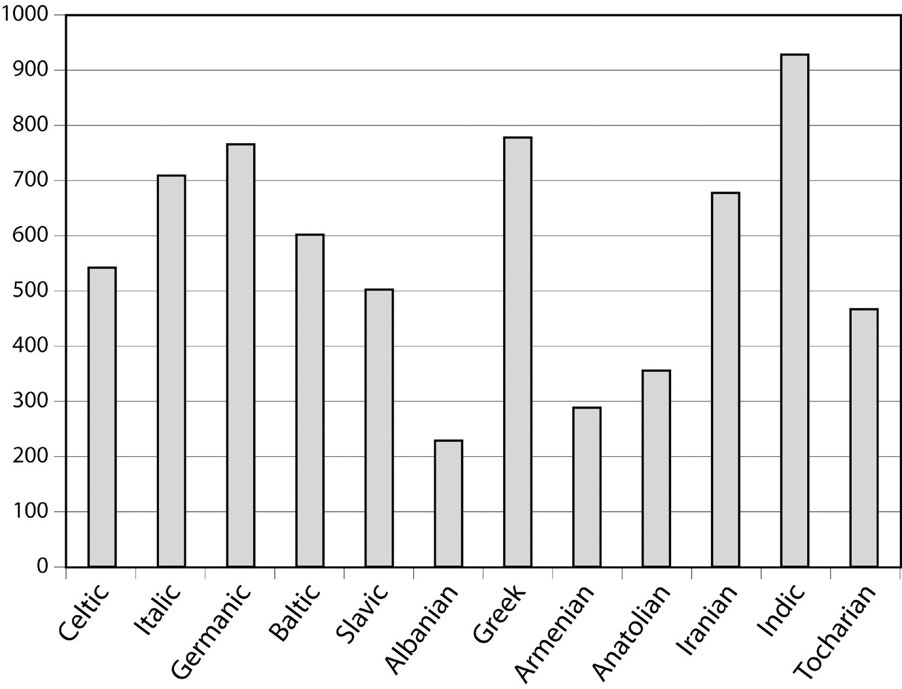

<i>Figure 3.1. Retention of Proto-Indo-European vocabulary by geography.</i>

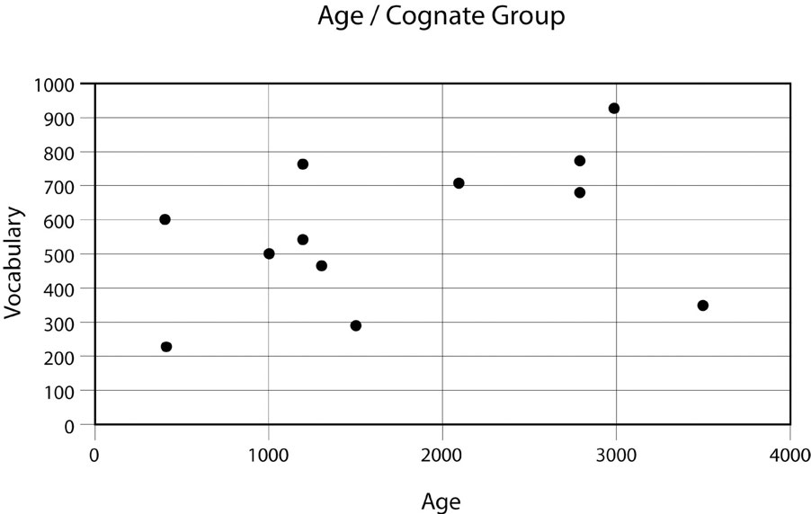

<i>Figure 3.2. Retention of Proto-Indo-European vocabulary by age of language attestation.</i>

The number of lexical items that are attested across all twelve major groups[^ch3-note-2] is extremely few and these are listed in Table 3.2.

<i>Table 3.2. The most widely attested items in Proto-Indo-European.</i>

| * <i>u̯ódr̥</i> | ‘water’ |
| --- | --- |
| * <i>gwṓu̯s</i> | ‘cow’ |
| * <i>pṓds</i> | ‘foot’ |
| * <i>dʰu̯ṓr</i> | ‘door, gate’ |
| * <i>tréie̯s</i> | ‘three’ |
| * <i>pénkʷe</i> | ‘five’ |
| * <i>septḿ̥</i> | ‘seven’ |
| * <i>(e)néu̯n̥</i> | ‘nine’ |
| * <i>su̯ep-</i> | ‘sleep, dream’ |
| * <i>h₁nómn̥</i> | ‘name’ |
| * <i>h₁eg̑-</i> | ‘I’ |
| * <i>u̯éi̯</i> | ‘we’ |
| * <i>túh</i> x | ‘thou’ |
| * <i>i̯úh</i> x <i>s</i> | ‘ye’ |
| * <i>so</i> | ‘that (one)’ |

Note: ‘Cow’ can only be included if one accepts Albanian <i>ka</i> ‘cow’ as cognate

The list is much what one might expect with its primary focus on pronouns and numerals with a few nominal forms.[^ch3-note-3] It is perhaps useful to recall that some forms were probably more often utilised in their plural or dual than the head forms we find in the etymological dictionaries. For example, in modern American English (Carroll 1971), [^ch3-note-4]the plurals of <i>eye,ear,arm</i>, etc. all occur more frequently than their singular forms; so also even some non-paired nominal forms such as <i>flowers</i> and <i>cows</i>.[^ch3-note-5]

As a student the semantic inventory of reconstructed Indo-European seemed to me to present itself in two very contrasting guises. The first, which I will term ‘barnyard Indo-European’, presented the Indo-European lexicon as a series of natural or cultural terms such as ‘elm’, ‘birch’, ‘cow’, ‘sheep’, ‘pig’, ‘horse’, ‘wolf’, ‘bear’, ‘grain’, ‘house’, ‘door’, ‘wagon’, and a few social terms such as ‘king’, ‘master of the clan’, etc. This is very much the type of cultural lexicon that Adalbert Kuhn presented in 1845. This contrasts with the ‘bright balloon Indo-European’ that one encounters skimming the <i>IEW</i> where one gets (admittedly impressionistically) the notion that half the vocabulary can be derived from roots for ‘shine’ ‘swell’ and ‘set in motion’. An attempt to investigate the actual semantic dimensions and foci of the reconstructed lexicon has led me to organise the vocabulary into 57 different semantic groups (Table 3.3) where I have also indicated both the number of lexical items in each category and the average number of language groups contributing to each cognate set within the semantic field.

<i>Table 3.3. The Proto-Indo-European lexicon by semantic field and average number of cognates per item in each semantic field.</i>

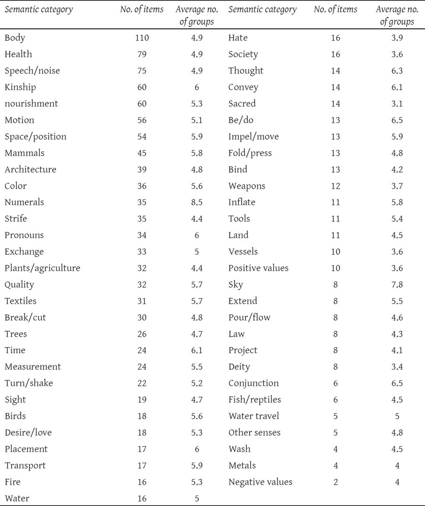

In terms of semantic fields, our best preserved/represented areas of Proto-Indo- European pertain to the human body and its condition, followed by speech, kinship and nourishment. One may note that the ‘strength of attestation’ (<i>i.e.</i>, number of language groups providing at least one cognate with a maximum score of 12 groups) is not really proportional to the size of the semantic field. With an average of 8.5 cognates per item, numerals are the most strongly attested semantic field, followed by ‘sky’, the verbal concepts of ‘be/do’, and conjunctions. Our vocabulary for body and health may be extensive but at an average of 4.9 groups per lexical item, the lexical items are not so strongly (widely?) attested individually. Mammal names (5.8) appear to be attested more widely than those of plants (4.4) and this may indicate the greater attrition of plant names in the daughter languages (see below). It is also instructive to note that the vocabulary of religion (3.1) is the weakest attested semantic sphere in Indo-European and terms relating to social institutions (3.6) are not represented much better. Here one recalls Bernfried Schlerath’s (1987) experiment where he isolated 27 social terms from <i>Beowulf</i> and the <i>Heliand</i> and found that only two words (<i>earl</i> and <i>king</i> in English and <i>Schalk</i> and <i>König</i> in German) had survived in their respective modern languages.

What governs ‘strength of attestation’? Given the evidence above, frequency of use might be a major factor and there is certainly a temptation to employ this crude measure of strength of attestation as proxy evidence for ‘probable word frequency’ on the assumption that those words employed the most may have been more resistant to loss or replacement. If we examine, for example, the names of body parts in Proto- Indo-European we can rank the lexical items by the number of cognate sets (Table 3.4) and then compare them with the rank order of body part names in American English (Carroll 1971).

<i>Table 3.4. Proto-Indo-European strength of attestation of names of body parts compared with word frequency in American English (Carroll 1971).</i>

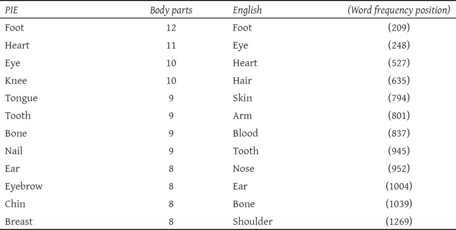

The results are instructive. Both Proto-Indo-European and English indicate that ‘foot’ is the most strongly attested/most frequently cited anatomical part and both groups place ‘foot’, ‘eye’ and ‘heart’ in the top three positions. The higher ranking of ‘hair’ in English compared with Proto-Indo-European (which averages six attestations) is probably due to the fact that Indo-European makes numerous distinctions as to the nature of ‘hair’ unlike English, <i>i.e.</i>, there are over a dozen different lexemes in Proto-Indo-European for ‘body hair’, ‘head hair’, ‘pubic hair’, etc. ‘Knee’ scores much higher in Proto-Indo-European than it does in English (its position is 3900) and there are other strongly attested Proto-Indo-European words that score even lower in English, <i>e.g.</i>, ‘eyebrow’ (9800). Still, when we confine our English sample to a lexicon about the same size as we reconstruct for Proto-Indo-European (<i>c</i>. 1360 most cited words in American English), English shares six of the top twelve Proto-Indo-European concepts and of the others, ‘blood’ and ‘shoulder’ have seven cognate groups in Proto-Indo-European while the remaining four (‘hair’, ‘skin’, ‘arm’ and ‘nose’) all have six groups contributing cognates.[^ch3-note-6]

Encouraged by these results such a comparison may be extended to all the semantic categories to examine to what extent our reconstructed Proto-Indo-European differs from modern English in terms of lexical fields. In order to carry out this exercise, the English data set was again limited to the same order of magnitude as the Proto-Indo-European (<i>i.e.</i>, the first most frequently cited 1364 items after removal of plurals) and each group was then classified into 26 lexical fields. The number of cognates and their overall percentage was tabulated as in Table 3.5.

<i>Table 3.5. A comparison between the semantic fields of Proto-Indo-European and American English.</i>

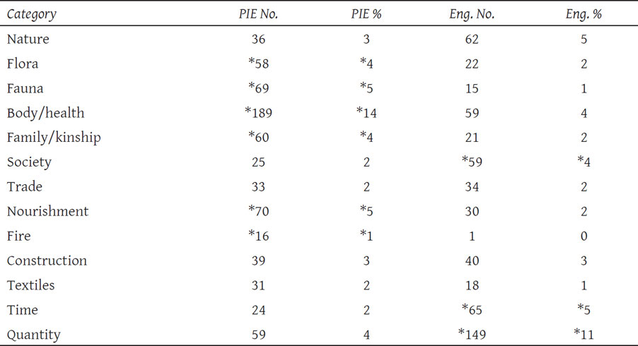

<i>Table 3.5. A comparison between the semantic fields of Proto-Indo-European and American English. (Continued)</i>

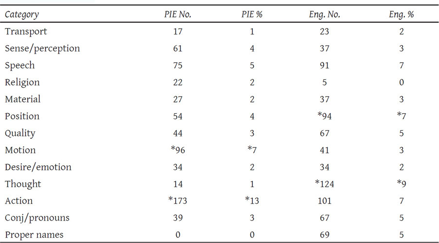

In order to render the table somewhat more useful, chi-square calculations were made in order to determine which differences were statistically significant (better than the 0.05 level). In those semantic categories where Proto-Indo-European or American English showed a statistically significant heavier loading than could be explained by random distribution, the figures are marked with an asterisk. In some cases these differences can be explained by the nature of the society involved. For example, it is not unexpected that the vocabulary of flora and fauna in Proto-Indo-European should be richer than that of the ranked order of modern English words. Similar cultural explanations should also explain the differences with respect to fire, kinship terms (Americans with their more limited Eskimo system) and perhaps nourishment. As we will see later, the emphasis in Indo-European on motion and action may, on the other hand, be an artefact of the process of reconstruction. In contrast, where English shows a heavier loading we find that the contrasts occur in some fairly predictable fields, <i>e.g.</i>, time and quantity. What is perhaps more striking is the emphasis on the vocabulary of mental processes (thought) that is far more marked in English than in our reconstructed proto-language.

While a comparison of semantic fields between Proto-Indo-European and English is an interesting aside, a comparison of the lexical fields within the various Indo-European language groups is likely to be more instructive. Consider for a moment as a thought experiment that as the Indo-European languages expanded and differentiated, one might expect that their different histories and environments would have also involved differential preservation of vocabulary according to semantic field, some seeing greater preservation or attrition in say floral, faunal or material culture terms than others. In order to examine this a table was drawn up where the number of cognates for each of the twelve major Indo-European language groups was scored for all 56 semantic fields (Table 3.6).

<i>Table 3.6. The semantic fields of Proto-Indo-European by language group.</i>

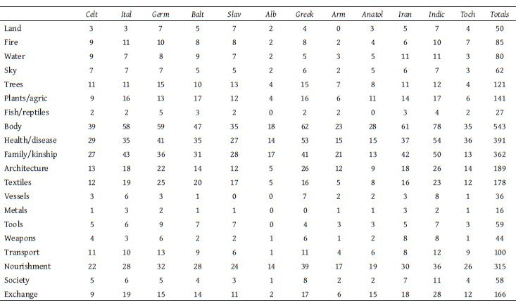

<i>Table 3.6. The semantic fields of Proto-Indo-European by language group. (Continued)</i>

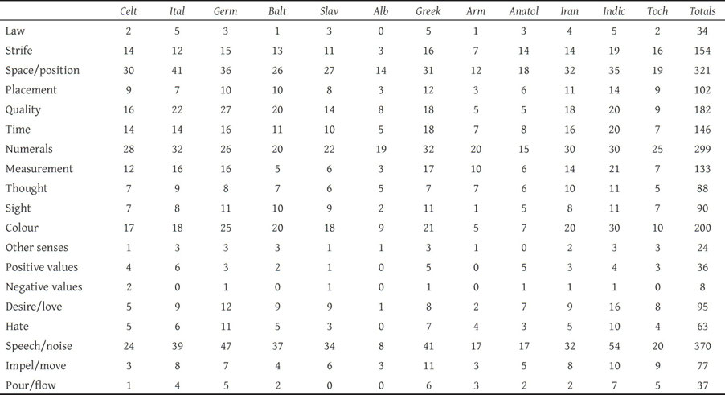

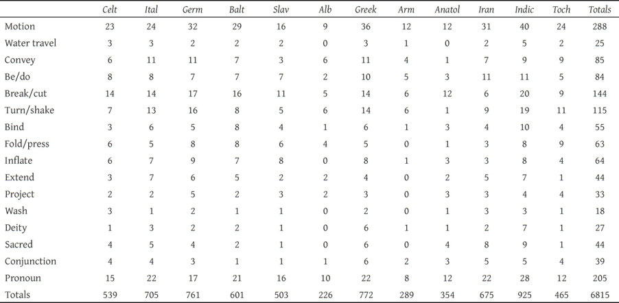

Again, employing a chi-square test (admittedly some of the fields were too small for a valid test), the observed frequencies were examined against the expected frequencies under the null hypothesis that there were no statistically significant deviations from a predicted normal distribution. The most unexpected (and exasperating) result was that the null hypothesis was not contradicted in a single one of the 672 possible cells![^ch3-note-7] There was no evidence that certain semantic fields were supplied with significantly greater or lesser cognates depending on the language group. Whether we are talking of Indic, which contributed to 925 cognate sets, or Albanian with its 226, each contributed cognates within a normal distribution for each of the semantic fields tested. For example, for the categories of land, fire and water respectively, Indic might be expected to have contributed 7, 12 and 11 cognates for these semantic fields and in fact contributed 7, 10 and 11 sets, with deviations too insignificant to be regarded as anything but random; conversely, for the same semantic sets, Albanian with only 226 cognates might have been expected to produce 2, 3 and 3 lexical items and, in fact, yielded 2, 2 and 2. All theories of Indo-European expansion must require a significant degree of language shift in their model (Mallory 2002b, 4–7) and it seems apparent from the survival of cognate sets across all twelve language groups that the shift appears to have been pervasive, irrespective of semantic field.

It should be emphasised, however, that here we are dealing with vocabulary that has been assigned Proto-Indo-European status which does not include the large number of regionally attested items. In my paper of 2010, which was built on the basis of the lexicon provided in Mallory & Adams (2006), 1593 items were ascribed to Proto-Indo-European while 690 were regarded as regional isoglosses from the Northwest (Celtic, Italic, Germanic, Baltic, Slavic), Central (Albanian, Greek, Armenian) or Eastern (Indo-Iranian, Tokharian) regions. The proportion of regional terms compared with ‘inherited Proto-Indo-European terms’ was clearly factored by semantics with flora, fauna and architectural terms most strongly augmented by regional terms and kinship, anatomy and quantity least represented by regional vocabularies.

### Indo-European, Uralic and Nostratic

The basic semantic fields of Proto-Uralic and Proto-Finno-Ugric have been investigated by Kaisa Häkkinen (2001) who divided their 743 lexical items (284 Uralic and 459 Finno-Ugric) into 37 semantic fields. In order to render her data more comparable, the reconstructed Uralic vocabulary was reclassified into semantic groups broadly similar to those employed above in Proto-Indo-European (Table 3.7). The comparison

was then extended to also include the 650 Nostratic roots cited by Allan Bomhard (1996) and again the roots were classified according to a common semantic system (Table 3.7).

<i>Table 3.7. Comparison of Proto-Indo-European, Uralic and Nostratic by semantic field.</i>

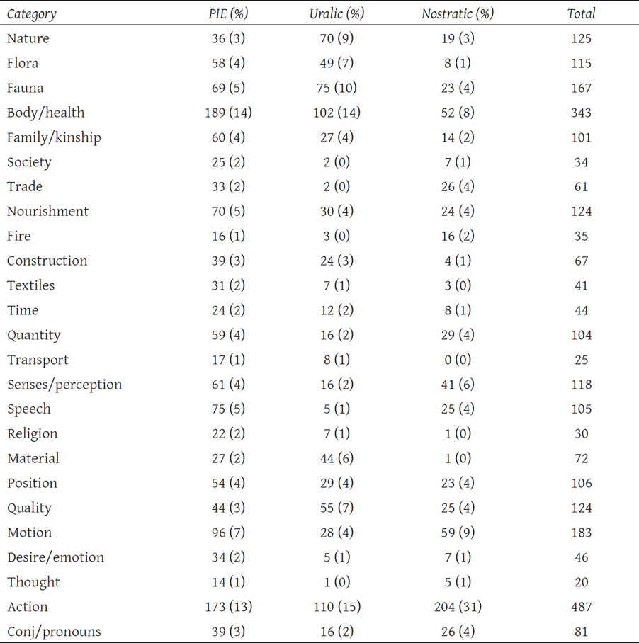

In order to bring greater sense to the tables, the data were again subjected to the chi-square test to determine whether there were significant statistical differences among the different proto-languages according to semantic field. Here the null hypothesis asserts that there should be no difference between the percentage of words filling out a semantic field among different proto-languages. On a number of instances the null hypothesis had to be rejected and there does appear to be statistically significant differences between certain semantic fields among the three proto-languages. These are indicated in Table 3.8.

<i>Table 3.8. Chi-square values by semantic category for Proto-Indo-European, Uralic and Nostratic.</i>

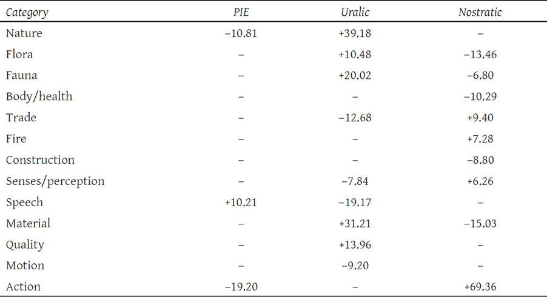

A – sign indicates significant negative difference (markedly too few cognate sets) while a + sign indicates positive loadings (unusually larger number of cognate sets for a semantic field).

An explanation for each of these differences would tax the most inventive of minds and certainly invites an opportunity to display some outrageous speculation. Who could resist?

If we examine Proto-Indo-European, it displays very little evidence of positive loading of its vocabulary compared to the entire data set. The only positive loading occurs for speech, which contrasts with Uralic that shows a negative loading for the same domain summoning up images of chatty Indo-Europeans and taciturn Finns. The negative loading for nature compared with the positive loading for the same domain in Uralic is striking and we see that Uralic is also positively loaded toward terms for flora and fauna as well. The 58 botanical leximes of Proto-Indo-European are primarily associated with arboreal terms (31), and cultivated plants (21) and only five are possibly associated with wild plant species and consist largely of generic terms for ‘reed’, ‘flower’, ‘thorn’, ‘stalk’; we must go to regionally restricted isoglosses before we can speak of any plant species, <i>e.g.</i>, ‘angelica’, ‘henbane’, ‘hellebore’ and ‘poppy’ and, even then, most of the regional vocabulary is still limited to generic terms (‘thorn’, ‘nettle’, ‘reed’, etc.). We might then be tempted to seek the explanation within the different economic strategies of the speakers of the two proto-languages where Proto-Uralic was a primarily hunting-fishing-gathering society while Proto-Indo-European was associated with a fully developed livestock economy and (perhaps) some cereal agriculture (Mallory 2018). How large should we expect the botanical lexicon in a language to be and do, as the evidence might suggest, agricultural communities, because of their dependence on a restricted range of domestic cultigens and less interest in broad spectrum foraging, have markedly smaller lexical domains for (wild) plant species?

As to the size of the botanical lexicon, linguistic evidence generally suggests that farming societies in areas of very rich and diverse flora may have very sizeable lexical domains. Wayan, a language of New Guinea farmers, has 600 to 700 plant names while Kalam, another New Guinea (farming) language, has over 1200 terms (over 20 times the size of Proto-Indo-European).[^ch3-note-8] Within the Indo-European world we have Theophrastus (372–287 BC) who could summon up something on the order of 680 names for plants that may be applied to about 500 different species. The terminology in Early Irish listed in the Royal Irish Academy’s <i>Dictionary of the Irish Language</i> relating to plant species (non-arboreal and non-cereals) is on the order of 200 that can be identified to genus or species and about 90 plant names that have not been identified; this is for the country that is botanically poorest in Europe with only 815 native wild species. Berlin (1992, 97–98) cites a survey of 29 languages where the average number of plant categories was about 500. Apropos the distinction between hunters and farmers, Berlin’s own survey of 17 languages revealed that the mean number of botanical taxa for seven foraging societies was 197 while that for ten agricultural societies was 520. Berlin (1992, 284–290) emphasises the larger sub generic botanical vocabularies of farmers compared to gatherers and the reasons that have been advanced to explain it, <i>e.g.</i>, crop failure among farmers might lead to greater concentration on the exploitation of wild plants than is the case with hunter-gatherers. But what little empirical evidence exists does not confirm this (Berlin 1992, 287) since there does not appear to be much of a correlation between edibility and naming. Moreover, Berlin cautions against accepting the contrasts in lexical size between farmers and foragers at face value since they have not been made between languages occupying the same ecological areas. We should also note that while Uralic has more botanical terms in proportion to its total reconstructed vocabulary, this too is largely comprised of tree names and names for parts of plants rather than specific names for wild plants.

Domesticated plants have been a major topic of discussion in Indo-European studies since at least the time of Victor Hehn (1870) and they pose one of the more obvious instances where we might test the size of our semantic field with the palaeobotanical record. The recovery of domestic cereals from archaeological sites is now routine so we have some idea of the range of domestic plants utilised across Eurasia during the Neolithic and later. If, for example, we were to concentrate on Italy, we can compare the hard archaeobotanical evidence for domestic cereals and legumes (Rottoli & Pessina 2007; Zohary, Hopf & Weiss 2012, 184–185) and the evidence for domestic cereal names in Proto-Italic (de Vaan 2008).

Barley (<i>Hordeum vulgare</i>)

•Latin <i>hordeum</i> (˂ <i>*xor(s)d-ejo-</i>). The word is compared with Germanic (German <i>Gerste</i>) and with a different underlying form in Greek <i>krīthḗ</i> and Albanian <i>drithë</i> ‘cereal grain, barley’; Hit <i>karaš</i> indicates ‘emmer wheat’. Although all of these words are related, de Vaan (2008, 288) suggests that we may be dealing with a loanword passing into different branches of Indo-European as they entered Europe and Asia Minor. The original meaning is unclear with the majority indicating ‘barley’ but the earliest attested (Anatolian) suggesting ‘wheat’.

Wheat (<i>Triticum</i>)

•Emmer wheat (<i>Triticum dicoccum</i>). No inherited term.

•Einkorn wheat (<i>Triticum monococcum</i>). No inherited term.

•Bread wheat (<i>Triticum aestivum</i>). No inherited term.

•Spelt wheat (<i>Triticum spelta</i>).

•Latin <i>far</i> (˂ <i>*fars</i>) ‘husked wheat, spelt’ is found in NW Indo-European with exceedingly divergent semantics, <i>e.g.</i>, OIr <i>bairgen</i> ‘loaf’, NE <i>barley</i>, Rus <i>bórošno</i> ‘ryemeal’. It is often regarded as a possible non-Indo-European loanword because of the <i>a-</i> vocalism.

Brome (<i>Bromus</i>)

•No inherited term.

Broomcorn millet (<i>Panicum miliaceum</i>)

•Latin <i>milium</i> (˂ <i>*meli̯o-</i>) has cognates in Greek <i>melínē</i> and Lith <i>málnos</i>, both ‘millet’ and may derive from Proto-Indo-European <i>*melh₂-</i> ‘grind grain’, as either independently derived or from a common ancestral form (de Vaan 2008, 379).

Flax (Linum usitassimum)

•Latin <i>līnum</i> (˂ <i>*līno-</i>) is traditionally compared with Baltic (Lith <i>linaĩ</i>), Slavic (Rus <i>lën</i>), and Greek <i>línon</i>; the lack of a common preform has raised the possibility that this is a loanword (de Vaan 2008, 344).

Lentil (Lens culinaris)

•Latin <i>lens</i> can be compared with similar words in Germanic (OHG <i>linsa</i>), Slavic (OCS <i>lęšta</i>) and Greek <i>láthuros</i> but as they do not appear to share a common pre-form, de Vaan (2008, 334) suggests that this is a non-Indo-European loanword.

Red pea (<i>Lathyrus cicera</i>)

•No inherited term.

Pea (<i>Pisum sativa</i>)

•No inherited term (˂ Greek <i>pison</i>).

Bitter vetch (<i>Vicia ervilia</i>)

•Latin <i>ervum</i> (˂ * <i>erVgw-o</i> -?) ‘bitter vetch’ exhibits comparanda such as OHG <i>araweiz</i> ‘pea’ and Greek <i>órobos</i> ‘pea’. De Vaan (2008, 195) suggests a loanword from a non-Indo-European language as the morphology differs among the putative cognates.

Common vetch (<i>Vicia sativa</i>)

•No inherited term.

Fava bean (<i>Vicia fava</i>)

•Latin <i>faba</i> (˂ * <i>fafā</i>) shares a similar form with Germanic (NE <i>bean</i>), Baltic (OPrus <i>babo</i>) and Slavic (Rus <i>bob</i>). De Vaan (2008, 197) suggests that these derive from a similar European substrate word (* <i>bab-</i>) and they may also be connected with words for ‘bean’ in Albanian and Greek (Mallory & Adams 2006, 166).

To these words may be added a few generic terms for ‘cereal’ or ‘grain’ such as <i>granum</i> ‘grain, seed’ (˂ <i>grāno-</i>); <i>ceres</i> ‘with grain’ which appears to derive from ‘nourishment’ and returns words such as OHG <i>hirso</i> ‘millet’; <i>furfur</i> ‘husks of grain’ with no further etymology; <i>puls</i> ‘kind of porridge’ (˂<i>*polti-</i>) which also supplies Greek <i>póltos</i> ‘porridge’ and is explained either as a Mediterranean loanword or from an unknown Indo-European root (de Vaan 2008, 498).

In addition there are some reconstructions that so far have not been recovered from the Italian Neolithic although they are known elsewhere in Europe at this time. These would include Latin <i>cicer</i> ‘chickpea’ with cognates in Maced <i>kikerroi</i> ‘bird’s peas’, Armenian <i>siseṙn</i> ‘chickpea’ and Albanian <i>thjer</i> ‘lentil’; de Vaan (2008, 113) suggests either an unknown source (loanword) or a derivation from <i>*ḱerh₃-</i> ‘feed’. So far, remains of the chickpea have not been recovered in Italian Neolithic sites (Rottoli & Pessina 2007, 149). Another word, Latin <i>avena</i> ‘oats’ with cognates not only in Europe but also in Indo-Iranian (Tremblay 2005, 128) is also absent from Neolithic Italy. It appears to have originally entered Europe as a weed associated with domestic crops but was not cultivated itself until the Bronze Age.

From a semantic point of view we can again see the collapsing of the different species names into generic terms such as ‘grain’ or what would appear to be semantic shifts, assuming that the underlying meaning of the word that survived as Latin <i>hordeum</i> ‘barley’ was actually ‘wheat’. Moreover, the distinctions between the various types of ‘wheat’ or ‘barley’, which really should have been evident to any early farmer, remain indiscernible in the surviving lexical fields. Finally, it is also worth remarking that other than <i>hordeum</i> and <i>avena</i>, there is hardly a word for domestic plant in Latin that has not had its Indo-European credentials challenged. The entire area of domestic plants in the Indo-European languages is surely an obvious topic for a major review (see Kroonen, Mallory & Comrie 2018).

We would find a similar situation with respect to the names of fauna. For example, we can contrast the numbers indicated for Proto-Indo-European with a sample of 17 systems that yield an average of 435 (Berlin 1992, 97). In Proto-Indo-European we can manage just about 20 names of birds (a number of which are certainly questionable due to onomatopoeia) while the indefatigable D’Arcy Wentworth Thompson (1895) could list over 500 bird names in Greek (admittedly many twittering away in Hesychian obscurity) and against about ten Proto-Indo-European fish and shell-fish names, Thompson (1947) could set about 570 Greek fish names. Even such damaged goods as the 802 entries in the <i>Elbing Vocabulary</i> of Old Prussian can produce over three times the number of bird names (67) as we can reconstruct for Proto-Indo-European and far more names of fish (25).[^ch3-note-9] The number of bird species indicated in early Irish is of a similar order of magnitude (around 65) with multiple terms for the same species in many instances and there are about 24 bird names. It is difficult to avoid the conclusion that some if not all of the semantic spheres that we reconstruct to Proto-Indo-European or other proto-languages can only be small fractions of the original lexicon.

We can perhaps gain a glimpse of what we are missing by engaging in a very crude exercise in semantic field analysis. If we, for example, review the Royal Irish Academy’s <i>Dictionary of the Irish Language</i>, the standard corpus of the early Irish lexicon, we might construct a simple semantic field display (Hatch & Brown 1995, 37) for ‘cattle’ (Fig. 3.3).

Essentially we have a tree-like structure that begins with a generic word for cow/cattle (with neither age nor sex specified), then the young cow (without sex specified), then a division between age-graded females (heifer > milch cow with its opposite, a dry cow) and age-graded males, here divided between those who may be reproductive (bull calf > bull) and those that have been castrated (bullock > ox). Table 3.9 provides us with an indication of the number of terms that one can recover from Early Irish, Proto-Celtic (Matasović 2009) and Proto-Indo-European (Mallory & Adams 2006).

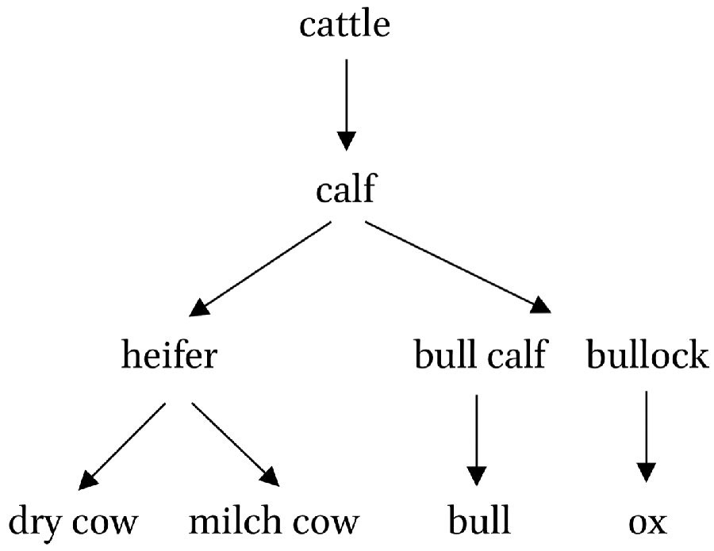

<i>Figure 3.3. Semantic field display for ‘cattle’ in Early Irish.</i>

<i>Table 3.9. Number of lexemes for each semantic item in Early Irish, Proto-Celtic and Proto-Indo-European.</i>

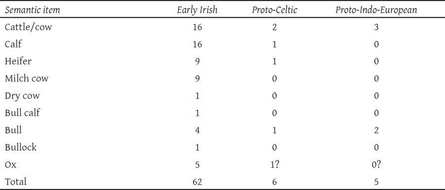

There are at least three features of interest in this table. The most obvious is the clear attrition of attestation as one recedes to earlier nodes of Celtic prehistory, both with respect to the strength of attestation (numbers of different lexemes) and categories represented. The second is the problematic nature of our reconstructions. For example, the only clear Proto-Indo-European word here for ‘bull’ is <i>*tau̯ros</i> which may reflect a semantic shift from ‘aurochs, <i>i.e.</i>, wild cattle’ to ‘male domestic cattle’. The other word for an adult male would be <i>*uk⁽ʷ⁾sēn-</i> which yields English ‘ox’ but does not necessarily specify a castrated adult employed in traction (the Irish evidence is ambiguous in the extreme as Old Irish <i>oss</i> may mean ‘cow’ or ‘stag’). Indeed, understanding the specific English translations of ‘ox’ is invariably problematic as English itself employs the term for several different meanings. But while the specific semantics of the terms are certainly questionable, the disparity between a reasonably well attested recorded language (Early and Middle Irish) and its reconstructed ancestors clearly suggests that we have a major problem in recovering anything but a fraction of any semantic field. The third feature is the discrepancy between the major reduction of the semantic field between Early Irish and Proto-Celtic (62 to 6) but the similarity between the size of the semantic field in Proto-Celtic and the much earlier Proto-Indo-European (6 and 5). One might have expected a more gradual gradient of loss and it would be interesting to examine this in other semantic fields or language groups.

Faced with such a clear disparity between the reconstructed proto-language and living languages of traditional populations, we might recall the statistical conundrum of the comparative method. There is certainly wide acceptance of Kaisa Häkkinen’s rule of thumb: ‘The narrower the distribution of a particular word, the younger it can usually be presumed to be’ (2001, 170). But then what are the odds that a very substantial proportion of the Proto-Indo-European lexicon relating to plants (on the order of 60–90%) should have disappeared from all twelve major Indo-European groups without surviving in at least one? This also poses the very real question of whether we can validly compare semantic categories between proto-languages or are we merely tabulating comparative attrition rates of once much larger lexicons?

We have seen that nature was another category that distinguished Proto-Indo- European from Uralic. This semantic domain comprises the words that Häkkinen grouped under ‘land and landscape’, ‘water and water systems’ and ‘materials and surfaces’. Here again the possibility of economic systems presents itself as a possible explanation: Uralic hunter-gatherers requiring far greater vocabulary to identify and describe different landfo.rms (or the dozen or so terms to describe various types of snow and ice; Häkkinen 2001, 181) compared with Indo-European farmers who occupied stable settlements and adopted (?) many terms for landforms from local substrates. Material culture is another area in which Uralic appears to retain a larger percentage of its core vocabulary against Indo-European where references to axes, spears, knives and related objects tend to be more prolific in Uralic. The archaeological record with its enormous assortment of tools and weapons across the Indo-European-speaking parts of Eurasia should have prepared us for the reverse but once again we may be dealing with the proliferation of regional terms at the expense of the inherited vocabulary. Certainly one of the most obvious semantic fields illustrating this concerns the primary evidence for material culture in Eurasia – ceramics.

Anyone who has ever studied Italian archaeology is aware of an enormous range of ceramic styles from the Neolithic onwards that vary according to both region and time. One could hardly conclude anything other than that there must have been a very sizeable range of terms for the different ceramics in Neolithic, Bronze and Iron Age Italy. Yet a quick survey of the lexicon presented in de Vaan’s etymological dictionary of Italic (de Vaan 2008) reveals only a very limited range of words associated with containers. As he excludes a relationship between Latin <i>calix</i> (<i>˂ *(s)kalik</i>-) ‘cup, goblet’ and Skt <i>kalása-</i> ‘jar’, the comparison is limited to Greek <i>kúlix</i> which he treats as a pre-Greek substrate word (de Vaan 2008, 83–84). Latin <i>capis</i> ‘cup, bowl’ is regarded as a Greek loan and <i>catīnus</i> (˂ <i>*katīno</i>-) ‘large bowl’ is also treated as a loanword into both Latin and Greek (<i>kutúlē</i>) (98). He also treats Latin <i>cūpa</i> (˂ <i>*kup</i>-) ‘barrel, cask’ as a loan into Latin, Sanskrit, Greek and Germanic (144). The <i>dolium</i> ‘large earthenware vessel’ may either be a loanword or related to Irish <i>delb</i> ‘form’ (175). If one accepts the latter, there is a link with the early Irish word <i>doilbthid</i> ‘potter’ but as this derives from Proto-Indo-European <i>*del-</i> ‘cut, carve’, it suggests that the earlier meaning involved working wood rather than clay (Mallory 2009, 183). Latin <i>cortīna</i> ‘rounded pot’ lacks a convincing etymology although it might be associated with ‘curve’ (155). The <i>mortārium</i> ‘bowl, mortar’ appears to be a local creation from Proto-Indo-European <i>*mr̥-to-</i> ‘crushed’ (390). The <i>pēluis ‘</i>shallow bowl’ may be compared with Skt <i>palvala-</i> ‘pool’ and Greek <i>pelíkē</i> but lacks any convincing etymology. The ‘shallow dish’ indicated by <i>scutra</i> (548) is either derived from the word for shield or regarded as a loanword. There is no good etymology presented for either <i>testa</i> ‘earthenware vessel’ (617) or <i>vās</i> ‘container’ (655). The only word with some non-Italic cognates relates to the ‘sieve’ as seen in Latin <i>crībrum</i> (˂ <i>*kreiþro</i>-) (144), OIr <i>crīathar</i> (˂ <i>*krē-tro</i>-) and OE <i>hridder</i> (˂ <i>*xrīđran</i>), from a ‘northwest’ Indo-European <i>*kreid̯ʰrom</i> ‘sieve’. In short, despite the abundance of containers in the archaeological record of Italy, there is no evidence for a single term, inherited from early Indo-European, for a ceramic vessel other than a regional isogloss for ‘sieve’. The only possible exceptions are several loanwords that are also found in Greek and possibly other Indo-European languages.

As for Nostratic, the lexicon here throws up questions concerning how close or far it appears to behave as a ‘real’ proto-language. It is significantly poor in those domains that at least on the basis of Indo-European and Uralic we should expect to be among the larger semantic fields, <i>e.g.</i>, body parts, flora, fauna, and it is significantly higher in words associated with action (verbs) and the senses. The emphasis on verbs is probably due to the entire process of creating root etymologies that are much more easily grounded in verbal meanings than nominal. Perhaps we have here the varied impacts of meronomy (Aitchison 1994, 102–103) operating among nominal classes where there may be a restricted proliferation of terms associated with nominal concepts, <i>e.g.</i>, foot/claw/toe/nail while verbal activities operate under troponymy (Aitchison 1994, 104–105) where, I suspect, there can be an almost endless nuancing of single concepts. This is very much the case with Nostratic where we find numerous roots indicating the same basic verbal concepts, often of the ‘bright balloon’ type (Table 3.10).

<i>Table 3.10. Most frequent concepts attested in Nostratic.</i>

| <i>Concept</i> | <i>N</i> |
| --- | --- |
| strike | 21 |
| turn | 21 |
| cut | 20 |
| swell | 14 |
| shine | 13 |
| split | 13 |
| burn | 12 |
| bend | 9 |
| stretch | 9 |
| cover | 8 |
| seize | 8 |
| N = number of roots indicating a given meaning |  |

In the search for Nostratic roots, such verbal concepts seem to provide enormously wide semantic nets that permits one to pose underlying verbal concepts behind Proto-Indo-European nouns, <i>e.g.</i>, Bomhard’s Proto-Nostratic root 384 ‘to move’ > Proto-Indo-European ‘arrow’ (hardly compelling when the Indo-European is a Latin-Germanic isogloss), Proto-Nostratic 373 ‘to descend’ > Proto-Indo-European ‘dark’, Proto-Nostratic 345 ‘to crush’ > Proto-Indo-European ‘millstone’, Proto-Nostratic 283 ‘to suckle’ > Proto-Indo-European ‘husband’s sister’. This raises numerous issues of plausibility since we must decide whether this proliferation of conceptual synonyms is realistic or a fantasy of linguists bent on squeezing out every possible cognate imaginable. In favour of such reconstructions is the fact that these very concepts do tend to be expressed with numerous synonyms, be it in Proto-Indo-European with about 24 different verbs for ‘speak’ or English where ‘strike’ includes a host of synonyms such as ‘hit’, ‘knock’, ‘thwack’, ‘smack’, ‘belt’, ‘bat’, ‘clout’ to name a very few. Is this indeed the type of range that underlies similar verbal concepts in Proto-Nostratic? There is one feature of Nostratic reconstructions that perhaps affects their plausibility.

In reviewing the English sample utilised in this study, the number of approximate homonyms observed was somewhere in the range of 8 to 14%, <i>e.g.,by</i> and <i>buy,deer</i> and <i>dear</i>. This exercise was then extended to the inventory of Proto-Indo-European roots where we find, for example, <i>*der-</i> indicating ‘sleep’ and ‘flay’, <i>*mel-</i> indicating ‘harm’ and ‘good’ and <i>*u̯el-</i> providing the base for ‘grass’, ‘die’, ‘see’, ‘wish’ and ‘turn’. About 10% of the Proto-Indo-European lexicon appeared to be reconstructed as homonyms. Nostratic, on the other hand, was in another league. Here we find Nostratic <i>*bar-</i> serving as nine different roots: ‘swell’, ‘projection’, ‘carry’, ‘turn’, ‘shine’, ‘kind’, ‘seed’, ‘cut’ and ‘make a sound’ while <i>*p</i>[ʰ]<i>al-</i> provided eight roots: ‘stone’, ‘flat’, ‘palm’, ‘fill’, ‘settlement’, ‘thumb’, ‘cover’ and ‘spleen’. At least half of the Nostratic vocabulary would appear to be part of a set of homonyms. Obviously, we are only speaking here of apparent homonyms created by the way we represent roots employing the comparative method but the differences between English and Proto-Indo-European on the one hand and Nostratic on the other are striking and a homonym test for plausibility might be worth further investigation.

To return to the opening quote from Mary Haas, if a linguist chooses to refer to a proto-language as an artefact, then I hope it will not be regarded as too strange for an archaeologist to compare several such ‘artefacts’ as I have done. I suspect that such a comparison, expanded by data from other proto-languages and the semantic structure of existing languages, may inform us not only more about the past but also about the reality of our own reconstructions.

#### <i>Notes</i>

[^ch3-note-1]: Jacob Grimm expressded similar sentiments when he wrote that ‘There is more vital evidence for nations than bones, weapons, and graves and that is their languages’ (cited in Benes 2008, 148).

[^ch3-note-2]: Celtic, Italic, Germanic, Baltic, Slavic, Albanian, Greek, Armenian, Anatolian, Iranian, Indic, Tocharian.

[^ch3-note-3]: Modern English, of course, would find its top twelve words primarily confined to the articles (‘the’, ‘a’), conjunctions (‘and’), prepositions (‘of’, ‘to’, ‘in’, ‘for’), pronouns (‘you’, ‘that’, ‘it’, ‘he’) and one verb (‘is’).

[^ch3-note-4]: I have employed a word-frequency index based on the language of American school children rather than more advanced literary texts in order to provide a closer approximation to a precivilised society.

[^ch3-note-5]: In approximate position of word frequency: ‘eye’ (700), ‘eyes’ (200); ‘ear’ (1500) but ‘ears’ (1000); ‘arm’ (1000) but ‘arms’ (800); ‘flower’ (1500) but ‘flowers’ (700); and ‘cow’ (1700) but ‘cows’ (1500).

[^ch3-note-6]: Incidentally, in terms of word frequency, the ‘archaeologist’ ranks 8,841 while the term ‘linguist’ is less frequently employed (20,072).

[^ch3-note-7]: As anyone familiar with the chi-square test will see, in a number of instances the size of the expected cells is too small to permit a valid test.

[^ch3-note-8]: With thanks to Andy Pawley who responded to my request for data on Arcling and provided the information on New Guinea languages.

[^ch3-note-9]: With thanks to Václav Blazek for this information.

## References

Aitchison, J. 1994. <i>Words in the Mind</i>. 2nd ed. Oxford: Blackwell.

Benes, T. 2008. <i>In Babel’s Shadow: Language, philology, and nation in nineteenth-century Germany</i>. Detroit: Wayne State University Press.

Berlin, B. 1992. <i>Ethnobiological Classification</i>. Princeton: Princeton University Press.

Bird, N. 1982. <i>The Distribution of Indo-European Root Morphemes</i>. Wiesbaden: Harrossowitz. Bomhard, A.R. 1996. <i>Indo-European and the Nostratic Hypothesis</i> (Studia Nostratica 1). Charleston: Signum.

Carroll, J.B. 1971. <i>The American Heritage Word Frequency Book</i>. Boston: Houghton Mifflin.

Gamkrelidze, T. & V. Ivanov. 1995. <i>Indo-European and the Indo-Europeans</i>. 2 vols. Berlin & New York: Mouton de Gruyter.

Haas, M. 1969. Historical linguistics and the genetic relationship of languages. In: T.A. Sebeok (ed.), <i>Current Trends in Linguistics</i>. Vol. 3. Theoretical foundations, 112–153. The Hague: Mouton.

Häkkinen, K. 2001. Prehistoric Finno-Ugric culture in the light of historical lexicology. In: C. Carpelan, A. Parpola & P. Koskikallio (eds), <i>Early Contacts Between Uralic and Indo-European: Linguistic and archaeological considerations</i>, 169–186 (Suomalais-Ugrilaisen Seuran Toimituksia 242) Helsinki: Société Finno-Ougrienne.

Hatch, E. & C. Brown. 1995. <i>Vocabulary, Semantics, and Language Education</i>. Cambridge: Cambridge University Press.

Hehn, V. 1870. <i>Culturpflanzen und Hausthiere in ihrem Übergang aus Asien nach Griechenland und Italien, sowie in das übrige Europa: Historisch-linguistische Skizzen</i>. Berlin: Gebr. Borntraeger.

Kroonen, G., J.P. Mallory & B. Comrie (eds). 2018. <i>Talking Neolithic</i> (Journal of Indo-European Studies Monograph Series 65). Washington, DC: Institute for the Study of Man.

Kuhn, A. 1845. <i>Zur ältesten Geschichte der indogermanischen Völker</i>. Berlin: Nauck.

Mallory, J.P. 2002a. Indigenous Indo-Aryans: the preservation and total distribution principles. <i>Journal of Indo-European Studies</i> 30. 375–387.

Mallory, J.P. 2002b. Indo-Europeans and the steppelands: The model of language shift. In: K. Jones Bley, M.E. Huld, A. Della Vope & M. Robbins Dexter (eds), <i>Proceedings of the Thirteenth Annual UCLA Indo-European Conference</i>, 1–27 (Journal of Indo-European Studies Monograph Series 44). Washington: Institute for the Study of Man.

Mallory, J.P. 2009. The conundrum of Iron Age ceramics: The evidence of language. In: G. Cooney, K. Becker, J. Coles, M. Ryan & S. Sievers (eds), <i>Relics of Old Decency: Archaeological studies in later prehistory</i>, 181–192. Dublin: Wordwell.

Mallory, J.P. 2010. Semantic field and cognate distribution in Indo-European. In: T.M. Nikolaeva (ed.), <i>Issledovanija po lingvistike i semiotike</i>, 180–190. Moscow: Jazyki slavjanskix kul’tur.

Mallory, J.P. 2018. The Indo-Europeans and agriculture. In: G. Kroonen, J.P. Mallory & B. Comrie (eds), <i>Talking Neolithic</i> (Journal of Indo-European Studies Monograph Series 65), 196–241. Washington, DC: Institute for the Study of Man.

Mallory, J.P. & D.Q. Adams. 1997. <i>Encyclopedia of Indo-European Culture</i>. London & Chicago: Fitzroy Dearborn.

Mallory, J.P. & D.Q. Adams. 2006. <i>The Oxford Introduction to Proto-Indo-European and the Proto-Indo-European World</i>. Oxford: Oxford University Press.

Matasović, R. 2009. <i>Etymological Dictionary of Proto-Celtic</i>. Leiden: Brill.

Mann, S. 1984–1987. <i>An Indo-European Comparative Dictionary</i>. Hamburg: Buske.

Pokorny, J. 1959. <i>Indogermanisches etymologisches Wörterbuch</i>. Bern & Munich: Francke.

Rottoli, M. & A. Pessina. 2007. Neolithic agriculture in Italy: an update of archaeobotanical data with particular emphasis on northern settlements. In: S. Colledge & J. Conolly (eds), <i>The Origins and Spread of Domestic Plants in Southwest Asia and Europe</i>, 141–153. Walnut Creek, CA: University College London, Institute of Archaeology.

Schlerath, B. 1987. Können wir die urindogermanische Sozialstruktur rekonstruieren? In: W. Meid (ed.), <i>Studien zum indogermanischen Wortschatz</i> (lnnsbrucker Beiträge zur Sprachwissenschaft 52), 249–264. Innsbruck: Institut für Sprachwissenschaft der Universität lnnsbruck.

Theophrastus. <i>Theophrastus: Enquiry into plants</i>. 2 vols. Translated by Sir Arthur Hort. Cambridge, MA: Harvard University Press.

Thompson, D.W. 1895. <i>A Glossary of Greek Birds</i>. Oxford: Clarendon Press.

Thompson, D.W. 1947. <i>A Glossary of Greek Fishes</i>. London: Oxford University Press.

Tremblay, X. 2005. Grammaire comparée et grammaire historique: quelle réalité est reconstruite par la grammaire comparée?’. In: G. Fussman, J. Kellens, H.P. Francfort & X. Tremblay (eds). <i>Āryas, Aryens et Iraniens en Asie Centrale</i> (Publications de l’Institut de Civilizations Indienne 72), 21–195. Paris: Collège de France.

de Vaan, M. 2008. <i>Etymological Dictionary of Latin and the Other Italic Languages</i>. Leiden: Brill.

Watkins, C. 1985. <i>The American Heritage Dictionary of Indo-European Roots.</i> Boston: Houghton Mifflin.

Zohary, D., M. Hopf & E. Weiss. 2012. <i>Domestication of Plants in the Old World: The origin and spread of domesticated plants in Southwest Asia, Europe, and the Mediterranean Basin.</i> 4th ed. Oxford: Oxford University Press.

# 4. A linking cord: Pottery ornamentation and language in the north <i>c.</i> 3600–2400 BC

## <i>Einar Østmo</i>

The idea that certain European Stone Age cultures featuring cord impressiondecorated pottery may be viewed as an archaeological parallel to the history of early Indo-European, or rather, Germanic language is an old one (for an overview, see Mallory 1989, 244ff.). For an archaeologist, it is of course important to remember at all times that the concept of ‘Indo-European’ is a linguistic one. The idea of Proto-Indo-European as the historical root of languages from Icelandic to Sanskrit and from Portuguese to Tocharian concerns history of language. It is all the more important to keep this in mind precisely because the idea continues to trigger the imagination also of historians and archaeologists – although some, apparently for the same reason, have been hesitant to approach it (cf. Jones-Bley 2009).

As there is nothing intrinsically or obviously ‘Indo-European’ about archaeological material, it is necessary to reflect on the method involved in arguing for historical connections between linguistics and archaeology (‘la notion d’indo-européen vaut d’abord comme notion linguistique et si nous pouvons l’élargir à d’autres aspects de la culture, ce sera encore à partir de la langue’ (Benveniste 1969, 7–8; cf. Kristiansen 2009; 2011)). I hope in the present paper to provide an example of an archaeological nature from prehistory which may give some food for thought also for those primarily concerned with Indo-European language, in particular concerning northern Europe.

As prehistorians we must be prepared to leave behind the comparatively safe waters of the occasions when texts of one kind or another in some Indo-European language are found directly on or in connection with archaeological remains. One method for expanding the concept of ‘Indo-European’ into other fields of study is to look for analogies in the archaeological or historical trajectory to the events implied by language history. The ‘<i>Urheimat</i>’ or ‘homeland’ question of course is a, or perhaps <i>the</i> classical example of this procedure. The question if there is anything in archaeology to set beside the idea of a Proto-Indo-European language in time, space and culture has challenged several generations of archaeologists. Similar questions may be asked, and indeed have often been asked, concerning the separation of Greek, or Celtic, or Germanic, or Tocharian, or any of the branches of Indo-European language, as for instance by Mallory (1989) and Anthony (2007; 2008; de Benoist <i>s.a.</i>).

Perhaps it might also occasionally be possible to turn the priorities around – to ask whether significant events and conditions in the historical or archaeological record can give occasion for reflection about features of language history. One such question may concern the possibility that the introduction of Indo-European culture to any one region, such as northern Europe, may have been a protracted process involving several episodes, events, and phases.

In archaeology, the introduction of Indo-European language and culture to northwestern Europe and Scandinavia traditionally has been attributed to the Corded Ware culture or ‘horizon’ <i>c.</i> 2800 BC, in its various local guises as the Single Grave Culture (EGR) (in Denmark and particularly in Jutland, cf. Müller 1898; Glob 1945; Kristiansen 1989; Price 2015, 161) or the ‘Boat Axe’ or Battle Axe Culture (STR) (in Finland, Sweden and Norway; <i>e.g.</i> Forssander 1933; Hinsch 1956; Price 2015, 161; for a different view: Malmer 1962), but also to the Nordic Late Neolithic culture from 2400 BC, in recent literature often associated with the Bell Beaker and Beaker cultures (<i>e.g.</i> Lomborg 1973; Vandkilde 1989; Prescott & Walderhaug 1995; Prieto-Martinez 2008; Prescott 2012).

Leaving aside for the moment the never-ending debate on the appropriateness (or otherwise) of the concept of archaeological cultures (Østmo 1989), it is relevant to look for elements of these archaeological cultures that may provide a link with the possible area of origin of Indo-European language. Throughout the history of scholarship in this field, this hypothetical realm of course has been placed variously on the map of Europe and Asia. For the present occasion, I shall accept the current majority view that the most likely candidate is the steppes of the present-day Ukraine or somewhere thereabouts (Mallory 1989, 143; Anthony 2007, 83).

There are several elements of material culture, which in one sense is what archaeology basically is about, that are common to the various northern Neolithic cultures just mentioned, and at the same time characteristic enough to provide possible links with the neighbouring world in Europe and Asia. There are certain features of weaponry to consider, in particular the oft-mentioned battle axes of stone, which in some form or other are present in all of the northern New Stone Age cultures, even if they were largely replaced with flint daggers as the principal weapon in the Scandinavian Late Neolithic. Archery is another field of interest (Lemercier 2011), as is the pressure-flaking technique in working flint and other micro-crystalline rocks (Apel & Darmark 2007), perhaps also early metallurgy (Klassen 2000), as well as the manufacturing and use of pottery.

One feature that might repay closer investigation is that of pottery ornamentation. All over the world, the shapes and ornamentation of clay pots have caught the interest of archaeologists. The reason for this is not hard to find – among the archaeological material available to the student of in particular prehistoric societies, there is little to set beside pottery for both variety of shapes and sheer abundance of material. Throughout prehistory, there was enormous variation in the way pots were shaped and decorated. It so happens that the prehistoric period which most concerns the Indo-European question, that is, the Neolithic and the emerging Bronze (or Copper) Age, in Europe is among the richest in ceramic forms and ornaments. The reason <i>why</i> people decorate pots need not detain us long here; it may have to do with particular aesthetic considerations, or perhaps such concerns as functional aspects, designs connected with ownership, or identities of makers and users of pots. It is of relevance to say that pottery ornaments throughout the period in question in northern Europe always was produced with impressions in the clay pots prior to burning and with very few exceptions was concerned with purely geometric patterns, and not with anything obviously reminiscent of actual pictorial representations. The exceptions are ornaments with facial features on some late TRB pottery in south Scandinavia (Müller 1918, 52), and facial and house urns from the late Bronze Age (Brøndsted 1958, 246 with references). Apart from these rare and late cases, the general impression remains that pottery decoration appears to have little or no connection with particular functional considerations. It may have had a functional origin, perhaps, of some sort, but the way it appears, it is just an element of decoration, almost by definition a form of abstract communication. In this respect it is different from battle-axes, pressure-flaking and indeed pottery as such, all of which are more or less clearly linked to particular functions or practical considerations. This makes the rules that may appear to have been operating all the more interesting, as they must have been governed by purely cultural concerns.

One of the more common forms of pottery decoration in the northern Stone Age consists of impressions of cords or strings, which among other things has been used to give name to the Corded Ware culture or horizon. This is one feature that might seem to link Scandinavia with south-eastern Europe at just the time of the Neolithic cultures.

Technically speaking, cord impression ornaments appear to have been produced with several different types of cord (Østmo 2010).[^ch4-note-1] The simplest type of cord to have been used for pottery decoration is the single two-ply string or cord. Another, more complex form consisted of one cord being coiled more or less tightly around another, or around any form of core, producing an impression sometimes reminiscent of barbed wire. It is this form of cord impression decoration which here is designated ‘cord stamp’ <i>sensu strictu</i>. Another, much rarer form of cord decoration appears to have been produced with a cord tied into a string of knots. It is usually difficult to ascertain whether the cords used were made from textile fibres such as flax, bast or nettle, or from wool, even though impressions of individual fibres may be discernible.

The cord stamp (in the restricted sense just described) could arguably be called the most complicated pottery decoration instrument to have been used throughout the northern Neolithic, consisting of (at least) two elements – the cord and the core, whereas all others seem to have been simple, whether in the form of a cord or otherwise (pits etc.). Moreover, these forms of pottery ornament do not appear at other times in northern prehistory such as for example in the early Iron Age, otherwise another period of production of richly decorated pottery. Therefore, on the Occam’s razor principle, it seems preferable to assume that cord impression ornaments, and perhaps in particular the cord stamp, were invented only once, and not two, three or more times.

As already touched upon, cord stamp ornaments are not exclusive to the Corded Ware horizon in north European archaeology, but appear in several historical environments, at various times and with somewhat different geographical distributions – all however within the confines of the Neolithic or late Stone Age. The earliest appearance is in the eastern, predominantly Finnish Comb Ceramics culture, in whose early Sperrings 1 or Ka I:1 stage cord stamp ornaments were used as early as 5100–4500 BC, however not later (Skandfer 2003; Stenbäck 2003, 63 with references; Hallgren 2008, 58). The relation of this to later events farther west in northern Europe is a subject in need of attention, but there is a considerable time gap of several centuries that does not seem easily bridged.

In southern and south-western Scandinavia, cord and cord stamp ornaments first appear in the early Neolithic TRB. The TRB is a vast cultural complex present from north-western Ukraine and Poland across the north European lowlands into the Low Countries and in south Scandinavia where it forms the historical setting for the first agriculture.

The Scandinavian TRB occupies the time approximately 3900–2800 BC, but the use of cord, and in particular cord stamp decoration mainly took place within the so-called ‘Virum style’ or ‘Bellevuegård style’ in south-east Denmark and Scania, about 3600–3200 BC (Ebbesen & Mahler 1980; cf. Larsson 1984; Koch 1998) (Fig. 4.1).

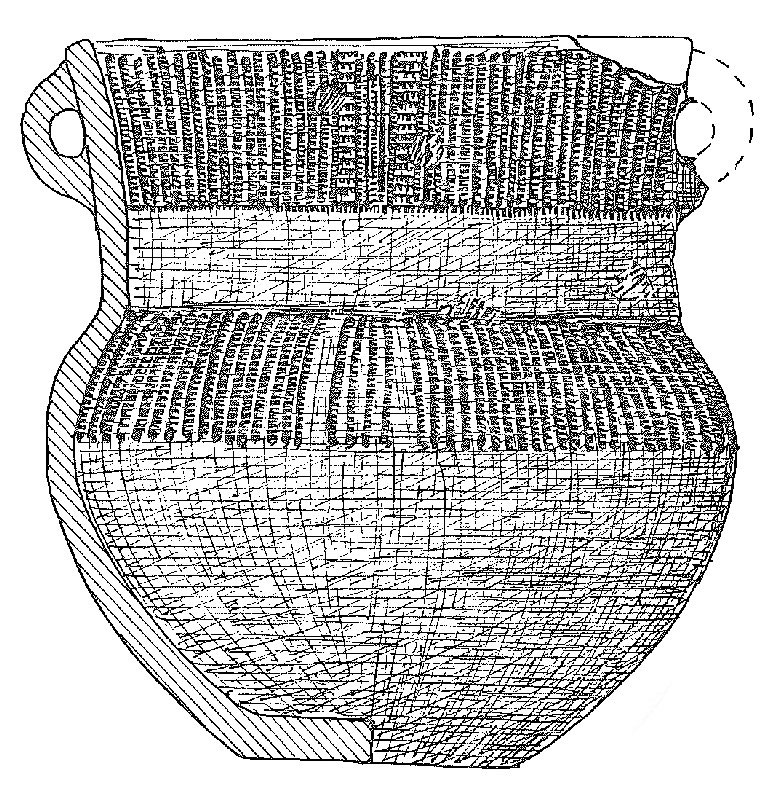

<i>Figure 4.1. Example of TRB pottery decorated with cord stamp impressions in the Virum style. From Kulsø, Vordingborg, Zealand. Del. Henning ørsnes. From Ebbesen & Mahler 1980, 41. Reprinted with the kind permission of the authors.</i>

Farther north, both cord and cord stamp decoration are met with again on a number of mostly coastal, hunting and fishing settlement sites along the coast of south Norway and dated to the late fourth and early third millennia BC, certainly lasting several centuries after the Virum period in south Scandinavia and into the next main period (Fig. 4.2). There is an ongoing debate about the nature and most appropriate cultural affiliation of these Norwegian sites (Glørstad 2005; 2009; 2010; Hallgren 2005; 2008), but in this author’s view it is preferable to consider them as belonging to a cultural entity of their own, one involving great variety through time and space, but at the same time being sufficiently different from the south Scandinavian TRB and from the contemporary south-eastern Scandinavian Pitted Ware Culture to warrant a name of its own which might be the <i>Cord Stamp culture</i>, in keeping with the tradition of such name-giving in archaeology (Østmo 2008; 2010; 2012). The rich archaeological material excavated at a settlement site at Auve in Sandefjord, Vestfold on the western shore of the Oslo fjord has been of importance for this argument. The ceramic material from this and similar sites certainly expresses traditions ultimately derived from the earlier TRB, but perhaps incorporating other influences as well, and certainly developed into several local styles however as yet incompletely studied and known (Fig. 4.3). The flint technology in similar fashion is an amalgamation of local traditions and TRB influences; in particular it is the ground axes which represent the southern influence, along with the use of amber for beads and buttons which are however sometimes (and typically) of local types (Østmo 2008) (Fig. 4.4). The Auve settlement is radiocarbon dated to 3340–2500 BC (Østmo 2008, 163).

Finally, cord and cord stamp ornaments are present on pottery in the STR (also known as the ‘Boat Axe Culture’ or the ‘Battle Axe Culture’), a local group of the large, north and north-east European Corded Ware Culture complex. It is present, as its designation implies, in Sweden and Norway, but mainly in Scania and Middle Sweden, at least concerning the pottery. It is dated to 2800–2400 BC. Cord stamp ornaments, in particular, first appear in the comparatively late, northern F style of the culture’s pottery (Malmer 1962, 74 and 122) (Fig. 4.5).

Elsewhere, I have argued that these occurrences of cord stamp ornaments in Scandinavia (excepting the early stages of the Comb Ceramics culture in Finland) form an historical sequence and that the three stages outlined (the Virum style, the Cord Stamp culture and the F and later styles of the STR) were historically connected to form one, continuous tradition (Østmo 2008; 2010; 2012). This would seem to solve the old problem of the relationship between the various cord stamp traditions mentioned initially and which occupied the minds of scholars from Sophus Müller (1914; 1918) to Mats P. Malmer (1962), namely that there did not seem to be any link between the cord stamp ornaments in the TRB (the Virum style) and that found in the STR (the F, but also the G and H styles). The missing link, I suggest, is provided by the Cord Stamp culture, fitting typologically as well as regarding geography and chronology.

It was just this old chestnut that bothered the Danish archaeologist and conservator Gustav Rosenberg and which in 1928 induced him to set out on a journey to archaeological museums in central and eastern Europe to look for the origin of the perceived dichotomy in the Danish Neolithic between the cord-decorated pottery of the TRB and that of the EGR (Rosenberg 1931, 8). At Rosenberg’s time, and for a long time after, these two cultures were believed to be contemporaneous in Denmark; only with expertly excavated stratigraphical finds and accurate radiocarbon dates appearing in the mid-1970s did it become clear that they were in fact consecutive (Rostholm 1977; Malmros & Tauber 1977).

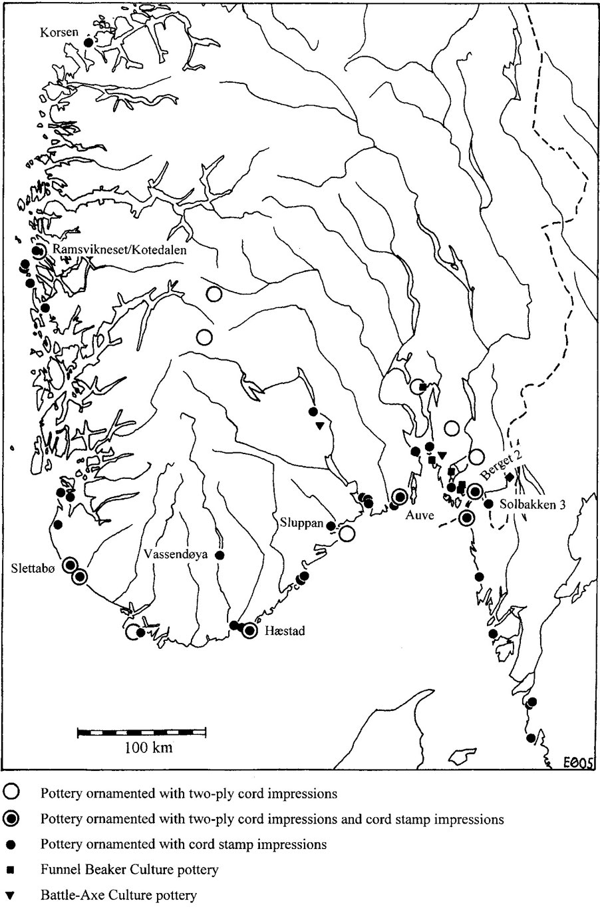

<i>Figure 4.2. Norwegian sites with Neolithic cord stamp decorated pottery. Del. E Østmo.</i>

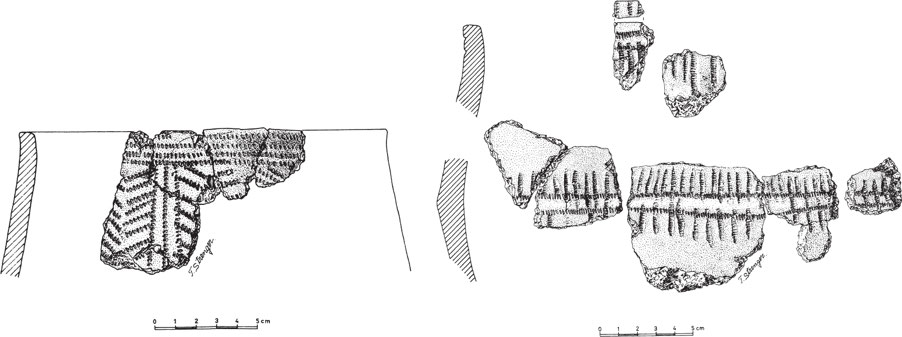

<i>Figure 4.3. Cord Stamp decorated pottery from Auve, Sandefjord, south Norway. Del. Tone Strenger.</i>

Rosenberg got as far as Odessa and Kiev, and was shown the then recent finds from the Usatova cemetery in the Ukraine. Among the Usatova pottery he found thousands of shards with cord as well as cord stamp ornaments. Two motifs which occur time and again on pottery from the Ukraine to Scandinavia are very frequent on the Usatova pottery – the short arcs of cord stamp impressions forming rows just underneath the rim of the vessels (reminiscent of the ‘caterpillar’ motif or ‘maggot-pattern’ as described on English pottery (Rosenberg 1931, 156)), and the single or double line of cord stamp around the ‘neck’ of the vessels. He goes on to follow the cord and cord stamp pottery ornaments toward the north, eventually into the Comb Ceramics culture of Finland, and the north-west, via certain more or less accidental finds south of the Baltic and in north Poland to the Funnel Beaker and later cultures of Neolithic Scandinavia, and finishes with a short survey of similar pottery from the British Isles.

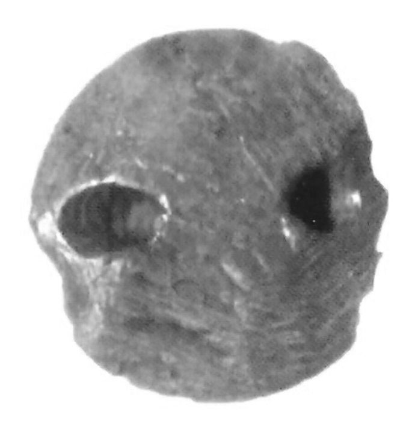

<i>Figure 4.4. Amber button from Auve, Sandefjord, south Norway. Photo by the author.</i>

Rosenberg’s observations made considerable impression in western Europe, and his conclusions were well received by J.G.D. Clarke, among others (Clarke 1932), and for quite some time represented almost the only work of reference for these matters in western European archaeology (for instance Gjessing 1945; Glob 1945).

The point here is not to follow the cord stamp in detail in all its variations of motifs and through all the cultural environments in which it appears across eastern and northern Europe, but to point to the obvious parallel between the distribution of this particular artistic tradition and the spread of Indo-European language toward northern Europe.

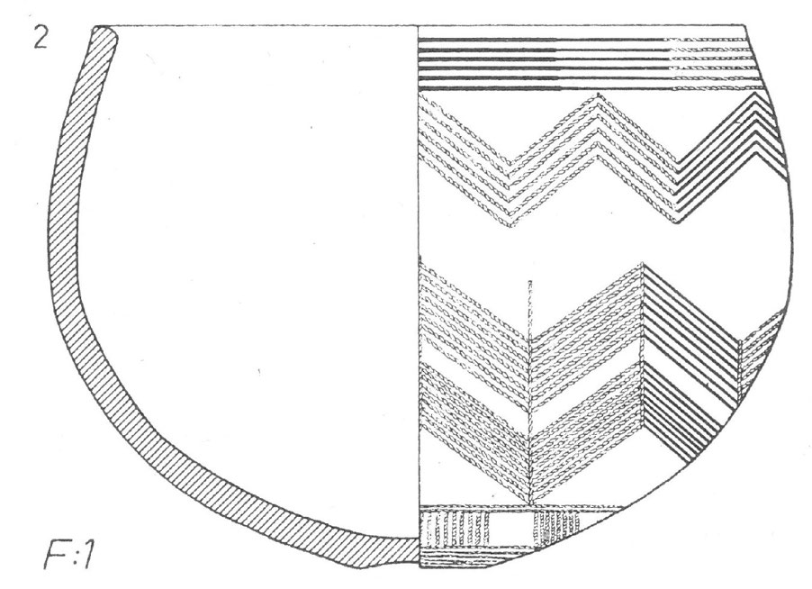

<i>Figure 4.5. F-style pottery from the Swedish–Norwegian Battle Axe Culture. From Regna, Östergötland, Sweden. From Malmer 1962, 23. Reprinted with the kind permission of Elin Malmer.</i>

The finds from Usatova in more recent studies are considered to represent a stage of influences from earlier, cord-decorating cultures of the Ukrainian steppe upon the Neolithic Tripolye tradition of the eastern Balkan and its painted pottery (Anthony 2008; cf<i>.</i> Burdo <i>et al.</i> 2010). The tradition of decorating pots with cord and cord stamp impressions had earlier representations in the Yamnaya and Srednyi Stog cultures in the Ukraine (Fig. 4.6), dating back to the fifth or even the late sixth millennium BC (Kotova 2008, 68), and according to the late, renowned Ukrainian archaeologist Dmitrij J. Telegin occurs first in the second stage at the famous site Dereivka, along with some of the oldest traces of domesticated horses. From the Srednyi Stog the practice spread in various directions, including the Usatovo stage in the west where it is frequent, as well as to the Balkan and to the north-west into Poland and northern Europe; in the latter case initially in a more sporadic fashion in the TRB and subsequent Globular Amphora cultures and perhaps <i>not</i> as part of a more comprehensive ‘package’ including burial rites, the use of horses and so on such as had been the case farther south (Telegin 1992 with references).

David Anthony has put forward the attractive hypothesis that it was precisely the Usatova culture (dated to <i>c.</i> 3500–2900 BC) which was the origin of the spread of Indo-European culture to the north-west, eventually evolving into the Germanic branch of the Indo-European language family, and connected with the late TRB in Poland and then with the Corded Ware culture, for so long the prime suspect in these matters (Anthony 2008). Anthony suggests that a nested series of patron-client relationships may have been instrumental in this process. In the event, this might help to explain many things concerning language (the peculiarities of Germanic including the consonant shift (Grimm’s law) if it is thought of as a form of ‘broken’ Proto-Indo-European) as well as archaeology (styles of battle axes as well as of pottery which everywhere appears to have local roots as well as broad similarities across the entire Corded Ware horizon).

However, as indicated above, cord and cord stamp decorated pottery appeared earlier than this in Scandinavia, both in the Comb Ceramics culture in the east, and in the TRB in the west. Short of assuming that this mode of pottery decoration was invented independently in several places, might this not be a sign of south-eastern, perhaps Indo-European influences in the north-west of one kind or another several centuries earlier than the Corded Ware phenomenon? If so, we must reckon with events that took place as early as approximately 3600 BC, according to radiocarbon dates of the ‘Virum style’ (Ebbesen og Mahler 1980) and the related ‘Bellevuegård style’ in Scania (4700±65 BP (3630–3370 cal BC) – 4560±70 BP (3490–3100 cal BC, M. Larsson 1984, 161–168), and even considerably earlier concerning the early Comb Ceramics culture in Finland.

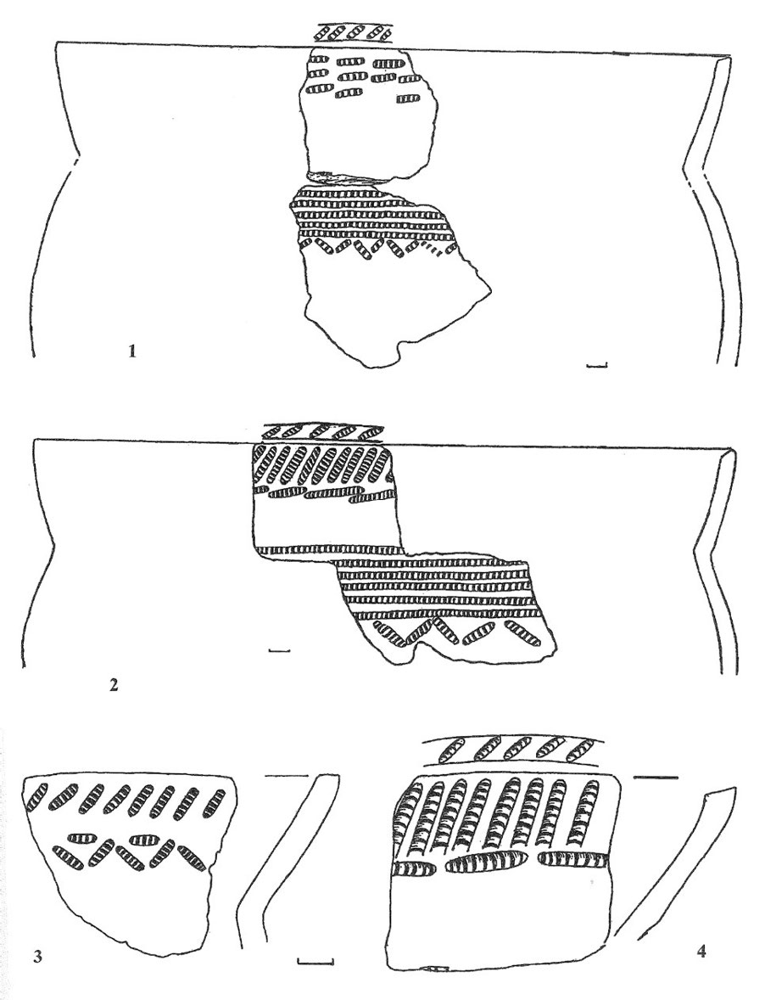

<i>Figure 4.6. Cord decorated pottery from the Sredniy Stog culture in the Ukraine. From Kotova 2008. Reprinted with the kind permission of the author.</i>

It may be that at this early stage we should follow Telegin in that the influence did not yet have the form of a ‘package’ such as may have been the case regarding the Corded Ware. The obvious similarities in the form of burial customs, weaponry etc. even if partly present, are not of the same order as they were to become later, and it may be that one should look for some form of more limited or specialised contact to account for them. One possible clue as to what this may have been, is the commonly attested circumstance that pottery in early societies often was a part of the women’s sphere of life (see for instance Murdock & Provost 1973, Table 1; Hodder 1982, 128; Ehrenberg 1989, 32ff.). If women occasionally moved toward north-west earlier than the presumably prestige-induced spread at the time of the late TRB and the Corded Ware culture, perhaps in connection with marriage relations, it might account for the presence of the early cord- and cord stamp-decorated pottery of the Virum and related styles, and similarly for the somewhat restricted character of this influence. This might be the backdrop to the development of distinct, local styles of pottery decoration in the TRB as well as in the Cord Stamp culture from <i>c.</i> 3600 BC onwards, prior to the arrival of the Corded Ware package about 2800 BC.

#### Conclusion

A consequence of this short survey is that the connection between the linguistic theory about the origin and spread of the Indo-European languages and archaeology, and in particular the archaeology of Neolithic north-western Europe, may not be quite as straightforward as has sometimes been supposed. It certainly seems likely that the introduction and establishment of Indo-European language, Proto-Germanic, if you will, in the north happened during the New Stone Age, the third and fourth millennia BC. But it may have been a long-drawn process and one characterised by considerable dynamism. The three main phases of neolithisation of Scandinavia may correspond to three phases of introduction of new cultural elements, including language. This may have amounted to a thorough, cumulative ‘rubbing-in’ of Indo-European language, and a similarly thorough wiping out of earlier languages. It seems relevant to ask the linguists if there is any trace of a similar dynamism in the language record. May this be the reason, or part of the reason, why there apparently are so few, or indeed no traces in south and middle Scandinavia of the languages that were spoken before Germanic was introduced, something which is otherwise quite common in most of Indo-European Europe, <i>e.g.</i> as place-names. In Denmark, south Sweden and south Norway, there is indeed hardly any place-name that might be thought of as pre-dating the Indo-European influence. A group of certainly very old and prominent names of farms and parishes in south-west Norway are of quite opaque etymology, but recent studies have shown that even these most likely are Germanic, certainly the most well known among them, ‘Sola’ just outside of Stavanger (Bjorvand 2005; Særheim 2007). The names that do exist of a non-Germanic origin are certainly later – such as for instance certain Slavic names in the southern Danish islands (names ending in <i>-itse</i> being the most well known, Housted 1994). Saami names in north Sweden and Norway may be another matter, however (Helander 2008), as may certain river names, according to Hans Krahe (1964).

So, rather than looking for the one, decisive event that changed all in History, perhaps we should look upon also the Indo-Europeanisation of Scandinavia as a process which took many generations and indeed centuries of new and renewed impulses of various kinds from south-east, as well as various local developments to settle. If anything, this would open an even wider field of study for linguists as well as archaeologists with an interest in this particular part of prehistory.

#### <i>Note</i>

[^ch4-note-1]: ‘Cord’ is the traditional term in archaeology for this, although ‘string’ or ‘yarn’ might be formally more correct in terms of textile technology (Walton and Eastwood 1988, 5).

### References

Anthony D.W. 2007. <i>The Horse, the Wheel, and Language: How Bronze Age riders from the Eurasian steppes shaped the modern world.</i> Princeton: Princeton University Press.

Anthony, D.W. 2008. A new approach to language and archaeology: The Usatovo Culture and the separation of Pre-Germanic. <i>Journal of Indo-European Studies</i> 36(1–2). 1–51.

Apel, J. & K. Darmark. 2007. Den flathuggna pilspetsens fylogeni. In Niklas Stenbäck (ed.), <i>Stenåldern i Uppland. Uppdragsarkeologi och eftertanke</i>, 31–65. Uppsala: Riksantikvarieämbetet, Societas archaeologica Upsaliensis & Upplandsmuseet.

de Benoist, A. <i>s.a. Indo-européens: À la recherche du foyer d’origine</i>. [http://www.thule-italia.net/](http://www.thule-italia.net/) Metapolitica/alain%20de%20benoist/indo-europeens%20recherche%20origine%20-%20alain%20 de%20benoist.pdf (accessed 21 May 2019).

Benveniste, E. 1969. <i>Le vocabulaire des institutions indo-européennes</i>. Paris: Minuit.

Bjorvand, H. 2005. Navnet <i>Sola</i> – kan det forklares? <i>Namn och bygd</i> 93. 37–43.

Brøndsted, J. 1958. <i>Danmarks oldtid. Bronzealderen.</i> København: Gyldendal.

Burdo, N.B., S. Kadrow, A. Kośko, N.S. Kotova, A.P. Kowalski, P. Olejarczyk, A. Sikorski, M. Szmyt & M.Y. Videiko. 2010. <i>‘Cord’ ornaments on pottery in the Vistula and Dnieper interfluvial region: 5th–4th mill. BC</i> (Baltic–Pontic Studies 15). Poznań: Zakłady Poligraficzne TMDRUK.

Clark, J.G.D. 1932. Review of G. Rosenberg, <i>Kulturstromungen</i> [sic] <i>in Europa zur Steinzeit.</i> Copenhagen: Andr. Fred. Høst & Søn, 1931. <i>Antiquity</i> 6(23). 370–372.

Ebbesen, K. & D. Mahler. 1980. Virum. Et tidligneolitisk bopladsfund. <i>Aarbøger for Nordisk Oldkyndighed og Historie</i> 1979. 11–61.

Ehrenberg, M. 1989. <i>Women in Prehistory.</i> London: British Museum Publications.

Forssander, J.E. 1933. <i>Die schwedische Bootaxtkultur und ihre kontinentaleuropäischen Voraussetzungen</i>. Lund: Borelius.

Gjessing, G. 1945. <i>Norges steinalder.</i> Oslo: Norsk Arkeologisk Selskap.

Glob, P.V. 1945. Studier over den jyske Enkeltgravskultur. <i>Aarbøger for nordisk Oldkyndighed og Historie</i> 1944. i–xiv, 1–284.

Glørstad, H. 2005. Tangen – En neolittisk boplass fra Kragerø kommune i Telemark. Noen betraktninger omkring boplassens kulturmiljø og Traktbegerkulturens vestgrense. <i>Viking</i> 68. 25–54.

Glørstad, H. 2009. The Northern province? The Neolithisation of Southern Norway. In: H. Glørstad & C. Prescott (eds), <i>Neolithisation as if History Mattered. Processes of Neolithisation in North-Western Europe</i>, 135–168. Mölndal: Bricoleur.

Glørstad, H. 2010. The structure and history of the Late Mesolithic societies in the Oslo Fjord area 6300–3800 BC. Mölndal: Bricoleur.

Hallgren, F. 2005. Kommentar till Marianne Skandfer: ‘Fra eldre til yngre steinalder? …’. <i>Primitive tider</i> 8. 113–118.

Hallgren, F. 2008. <i>Identitet i praktik. Lokala, regionala och överregionala sociala sammanhang inom nordlig trattbägarkultur</i> (KtK-böcker 17). Uppsala: Department of Archaeology and ancient History.

Helander, K.R. 2008. <i>Namat dan nammii. Sámi báikenamaid dáruidu httin Várjjaga guovllus Norgga uniovdnaáiggi loahpas (Dieđut 2008(1))</i>. Guovdageaidnu: Sámi Instituhtta.

Hinsch, E. 1956. <i>Yngre steinalders stridsøkskulturer i Norge.</i> Bergen: Grieg.

Hodder, I. 1982. <i>The Present Past.</i> London: Batsford.

Housted, F.W. 1994. <i>Stednavne af slavisk oprindelse på Lolland, Falster og Møn</i> (Navnestudier 34). København: Museum Tusculanum.

Jones-Bley, K. 2009. Indo-European archaeology – what it is, and why it is important. In: M. Vander Linden & K. Jones-Bley (eds), <i>Departure from the Homeland: Indo-Europeans and archaeology. Selected papers from the 12th European Association of Archaeologists Annual Meeting, Krakow, Poland, 19th to 24th September 2006</i> (Journal of Indo-European Studies, Monograph Series 56), 1–28. Washington, DC: Institute for the Study of Man.

Klassen, L. 2000. <i>Frühes Kupfer im Norden. Untersuchungen zu Chronologie, Herkunft und Bedeutung der Kupferfunde der Nordgruppe der Trichterbecherkultur.</i> Højbjerg: Moesgård Museum & Jysk Arkæologisk Selskab.

Koch, E. 1998. <i>Neolithic Bog Pots from Zealand, Møn, Lolland and Falster</i> (Nordiske Fortidsminder, serie B 16). København: Det Kongelige Nordiske Oldskriftselskab.

Kotova, N.S. 2008. <i>Early Eneolithic in the Pontic steppes</i> (BAR International Series 1753). Oxford: John and Erica Hedges.

Krahe, H. 1964. <i>Unsere ältesten Flußnamen</i>. Wiesbaden: Harrassowitz.

Kristiansen, K. 1989. Prehistoric migrations – the case of the Single Grave and Corded Ware Cultures. <i>Journal of Danish Archaeology</i> 8. 211–225.

Kristiansen, K. 2009. Proto-Indo-European languages and institutions: An archaeological approach. In: M. Vander Linden & K. Jones-Bley (eds), <i>Departure from the Homeland: Indo-Europeans and archaeology. Selected papers from the 12th European Association of Archaeologists Annual Meeting, Krakow, Poland, 19th to 24th September 2006</i> (Journal of Indo-European Studies, Monograph Series 56), 111–140. Washington, DC: Institute for the Study of Man.

Kristiansen, K. 2011. The Bronze Age expansion of Indo-European languages: an archaeological model. In: C. Prescott & H. Glørstad (eds), <i>Becoming European: The transformation of third millennium Northern and Western Europe</i>, 165–181. Oxford: Oxbow Books.

Larsson, M. 1984. <i>Tidigneolitikum i Sydvästskåne. Kronologi och bosättningsmönster</i> (Acta Archaeologica Lundensia, Series in 4° 17). Lund: Gleerup.

Lemercier, O. 2011. Le Guerrier dans l’Europe du 3ᵉ millénaire avant notre ère. L’arc et le poignard dans les sépultures individuelles campaniformes. In: L. Baray, M. Honegger & M.H. Dias-Meirinho (eds), <i>L’armement et l’image du guerrier dans les sociétés anciennes</i>, 121–165. Dijon: Éditions Universitaires de Dijon.

Lomborg, E. 1973. <i>Die Flintdolche Dänemarks</i> (Nordiske Fortidsminder, Serie B in quarto 1). København: Universitetsforlaget.

Mallory, J.P. 1989. <i>In Search of the Indo-Europeans. Language, archaeology and myth.</i> London: Thames and Hudson.

Malmer, M.P. 1962. <i>Jungneolithische Studien</i> (Acta Archaeologica Lundensia, Series in 8° 2). Lund: Gleerup.

Malmros, C. & H. Tauber. 1977. Kultof-14 dateringer af danske enkeltgravskultur. <i>Aarbøger for nordisk Oldkyndighed og Historie</i> 1975. 78–95.

Müller, S. 1898. De jyske Enkeltgrave fra Stenalderen. <i>Aarbøger for nordisk Oldkyndighed og Historie</i>, 2. Række 13. 157–282.

Müller, S. 1914. Sønderjyllands Stenalder. <i>Aarbøger for nordisk Oldkyndighed og Historie</i>, 3. Række 3. 169–322.

Müller, S. 1918. <i>Stenalderens Kunst i Danmark.</i> Kjøbenhavn: C.A. Reitzel.

Murdock, G.P. & C. Provost. 1973. Factors in the division of labor by sex: A cross-cultural analysis. <i>Ethnology</i> 12(2). 203–225.

Østmo, E. 1989. Begrepet arkeologisk kultur og dets anvendelighet ved studiet av bronsealder og keltertid. <i>Universitetets Oldsaksamling. Årbok</i> 1986–1988. 7–18.

Østmo, E. 1997. Horses, Indo-Europeans and the importance of ships. <i>Journal of Indo-European Studies</i> 25(3–4). 285–326.

Østmo, E. 2008. <i>Auve. En fangstboplass fra yngre steinalder på Vesterøya i Sandefjord. I. Den arkeologiske del</i> (Norske Oldfunn 28). Oslo: Kulturhistorisk museum, Universitetet i Oslo.

Østmo, E. 2010. The cord stamp in Neolithic Scandinavia. <i>Acta Archaeologica</i> 81(1). 44–71.

Østmo, E. 2012. Snorstempeldekor – en rød tråd i Nordens steinalder. In: A. Solberg, J. Atle Stålesen & C. Prescott (eds), <i>Neolitikum. Nye resultater fra forskning og forvaltning</i>, 103–124 (Nicolay Skrifter 4). Oslo: Nicolay arkeologisk tidsskrift.

Prescott, C. 2012. No longer north of the beakers. Modeling an interpretative platform for third millennium transformations in Norway. In: H. Fokkens & F. Nicolis (eds), <i>Background to Beakers. Inquiries in regioncultural backgrounds of the Bell Beaker Complex</i>, 37–60. Leiden: Sidestone.

Prescott, C. & E. Walderhaug. 1995. The last frontier? Processes of Indo-Europeanization in Northern Europe: The Norwegian case. <i>Journal of Indo-European Studies</i> 23(3–4). 257–280.

Price, T. D. 2015. <i>Ancient Scandinavia. An archaeological history from the first humans to the vikings.</i> Oxford: Oxford University Press.

Prieto‐Martínez, M.P. 2008. Bell Beaker communities in Thy: The first Bronze Age society in

Denmark. <i>Norwegian Archaeological Review</i> 41(2). 115–158.

Rosenberg, G. 1931. <i>Kulturströmungen in Europa zur Steinzeit.</i> Kopenhagen: Andr. Fred. Höst.

Rostholm, H. 1977. Nye fund fra yngre stenalder fra Skarrild Overby og Lille Hamborg. <i>Hardsyssels årbog,</i> 2. række 11. 91–112.

Særheim, I. 2007. Våre eldste gardsnamn. <i>frá haug ok heiðni</i> 2. 19–26.

Skandfer, M. 2003. <i>Tidlig, nordlig kamkeramikk. Typologi – Kronologi – Kultur.</i> Thesis, Universitetet i Tromsø.

Stenbäck, Niklas. 2003. <i>Människorna vid havet. Platser och keramik på ålandsöarna perioden 3500–2000 f.Kr.</i> (Stockholm Studies in Archaeology 28). Stockholm: Stockholms universitet.

Telegin, D.J. 1992. Zum Ursprung der Schnurverzierung. In Miroslav Buchvaldek & Christian Strahm (eds), <i>Schnurkeramik Symposium 1990 – Univerzita Karlova, Praha (</i>Praehistorica 19), 333–339. Praha: Univerzita Karlova.

Vandkilde, H. 1989. Von der Steinzeit bis zur Bronzezeit in Dänemark. <i>Zeitschrift für Archäologie</i> 23. 175–200.

Walton, P. & G. Eastwood. 1988. <i>A Brief Guide to the Cataloguing of Archaeological Textiles.</i> London: Institute of Archaeology Publications.

# 5. On the emergence of Corded Ware societies in northern Europe: Reconsidering the migration hypothesis

## <i>Rune Iversen</i>

#### Introduction

From <i>c.</i> 2850 BC, early Corded Ware communities spread throughout the central and western parts of the Jutland Peninsula introducing a new burial practice, new beaker forms and new types of stone battle axes and dress ornaments. At first glance the overall Corded Ware phenomenon started out rather uniformly with shared burial customs, pottery and battle axe types, sometimes referred to as the controversial ‘A-horizon’, and then developed into regional distinct groups. The earliest ¹⁴C-dates date back to <i>c.</i> 3000–2900 BC and come from south-eastern Poland (Siemen 1997; Furholt 2003, 21–22, 32, 118–123; 2014; Hübner 2005, 660–664; Vandkilde 2007, 66–71).

The distribution of Corded Ware societies covered rather large areas of eastern, central and northern Europe. To the north, the Corded Ware is usually referred to as the Single Grave culture, in the Netherlands alternatively as the Protruding Foot Beaker culture, whereas the term Battle Axe culture is used on the Scandinavian Peninsula, in Finland and in the Baltic countries. In central Europe the name Corded Ware culture prevails (<i>Schnurkeramikkultur</i> in German).

The emergence of the Corded Ware culture has been linked to the introduction of Proto-Indo-European language in northern Europe. The material changes that is associated with the occurrence of the Corded Ware culture in the early third millennium BC agrees nicely with the supposed development of Proto-Indo-European between <i>c.</i> 4500/3500–2500 BC (Mallory 1989, 158–159; Whittle 1996, 137–138; Anthony 2007, 58–59; Kristiansen 2009, 2012; Iversen and Kroonen 2017).

Language change is often explained by the movement of people who brought their language with them as they settled in new areas thereby establishing, or imposing, their language among the local population. This scenario is well known from historical times and has been recorded all over the world. Well known examples are the spread of Latin with the Roman Empire primarily from the first century BC to the second century AD, Spanish with the Spanish conquest of South America in the fifteenth and sixteenth centuries and the spread of first and foremost French and English with the north-west European colonialism of the seventeenth, eighteenth and nineteenth centuries. Similarly, within the archaeological field of research sudden and extensive changes in material culture have been seen as indications of larger migrations (Renfrew 1998, 101–102; Anthony 2007, chapter 6). Thus, it is very obvious not only to link the introduction of Proto-Indo-European into northern Europe with the spread of the Corded Ware/Single Grave culture but also to link these language and material culture changes to the migration of ‘Corded Ware people’/ʻProto-Indo-Europeans’.

However, this scenario is problematic and needs further considerations as it draws on a culture-historical approach by which archaeological cultures are equated with peoples. Furthermore, I find it necessary to reconsider the material changes represented by the Single Grave culture. No doubt, significant and conspicuous changes took place in the early third millennium BC but too often these have overshadowed existing evidence of continuity and local preconditions for social and material developments. Thus, the main concern of this paper is to reconsider migration as a sole explanation for the emergence of the Single Grave culture in northern Europe and to present a more balanced scenario for the introduction of new material culture attributes and Proto-Indo-European language.

#### The Single Grave culture in the archaeological research history

By the end of the nineteenth century, scholars had become aware of a new and different kind of Neolithic burials appearing on the Jutland peninsula. As these graves were made up of low burial mounds with stratified single graves holding stone battle axes and cord-decorated beakers, they clearly stood out from the dolmens and passage graves of the Funnel Beaker culture.

Sophus Müller (1898) was the first to present a thorough description of the Jutland single graves. He regarded this newly discovered grave type as contemporary with ‘the passage grave period’ (Middle Neolithic), and he saw the appearance of the ‘single grave people’ as the result of immigrations from Central Europe (Müller 1898, 274–281). Later on, Müller introduced the term ‘Single Grave culture’ and at the same time he scaled down the immigration aspect (1913, 312–318). Nevertheless, the immigration hypothesis came to influence the view on the Single Grave culture, (<i>e.g.</i> Glob 1945; 1971, 106–108; Brøndsted 1957, 260–264; Kristiansen 1991, 2009, 2012; Petersen 1993).

About 50 years after Müller’s initial study, Peter Vilhelm Glob published a thorough study of the Jutland Single Grave culture and presented a dramatic increase in the number of known graves. Furthermore, Glob confirmed and improved upon Müller’s chronological division in an Under, Bottom and Over Grave period (Fig. 5.1). Besides, he proposed a new and still used typo-chronological classification of the Single Grave battle axes and pottery vessels (Glob 1945). Corresponding analyses were carried out by Karl W. Struve for Schleswig-Holstein in the mid-1950s (Struve 1955) and in the early 1960s Mats Petersson Malmer presented a profound study of the Battle Axe culture in Sweden and southern Norway (Malmer 1962).

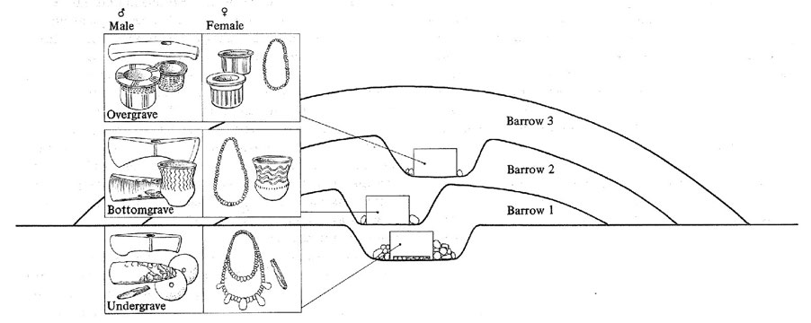

<i>Figure 5.1. Chronological sequence of a Single Grave mound. After Kristiansen 1984, fig. 7.</i>

In the 1970s and early 1980s an intense debate took place concerning the relationship between the different Middle Neolithic cultures of the third millennium BC including the Funnel Beaker culture, the Pitted Ware culture and the Single Grave culture. The debate was mainly held in the journal <i>Aarbøger for nordisk Oldkyndighed og Historie</i>. The debate had a distinct chronological focus and included the increased number of radiocarbon dates made available by the discovery of the dating method in 1949. During the 1980s and 1990s a rich body of Neolithic sites (including Single Grave culture sites) and scientific analyses including environmental studies and subsistence economic aspects were presented in <i>Journal of Danish Archaeology</i>. Furthermore, the ‘Battle Axe period’ was the theme for two succeeding conferences held in the late 1980s, both published in proceedings (Adamsen & Ebbesen 1986; Larsson 1989).

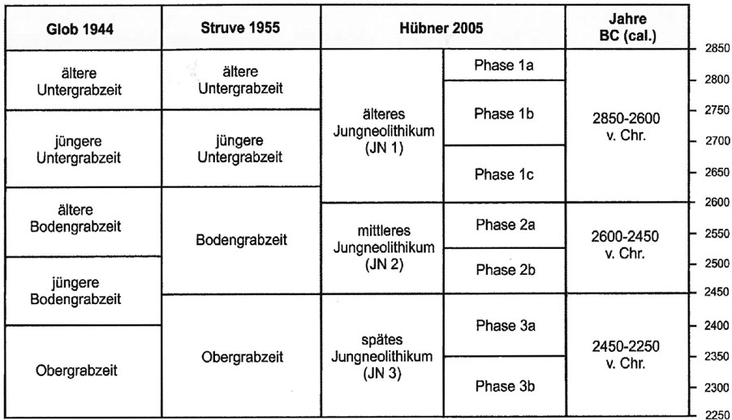

<i>Figure 5.2. Chronological scheme of the Single Grave period in Jutland and Schleswig-Holstein.After Hübner 2005, fig. 477.</i>

After another <i>c.</i> 50 years, since Glob’s study and just over 100 years after Müller, Eva Hübner presented the hitherto most comprehensive study on the Jutland single graves (Hübner 2005). Keeping the tripartition of the Single Grave period, Hüber refines the chronology in which she defines some sub phases including a brief ‘founder phase’ (Phase 1a, <i>c.</i> 2850–2800 BC) holding just below 5% of all datable graves (Fig. 5.2). In total, Hübner records 2386 Single Grave burials from altogether 1566 sites on the Danish part of the Jutland peninsula. In comparison only 141 sites are known from Schleswig-Holstein (Hübner 2005, 12–18, 60, 655, figs 2, 470, 477).

Only one year after Hübner, but relying on much older registrations, Klaus Ebbesen published <i>The Battle Axe Period</i> (2006) containing extensive catalogues, find presentations and find lists. In 2009, Palle Siemen contributed with a richly illustrated catalogue of the late Middle Neolithic and Late Neolithic finds from south-west Jutland (Siemen 2009).

Ever since the Single Grave culture was discovered and defined, a central problem of concern has been its origin. Due to the sandy and lime-deficient soils of Central and Western Jutland, very few graves contain preserved human bones suitable for <i>e.g.</i> strontium or aDNA analyses that could help us in answering this question. Thus, the old question basically still remains of whether the buried were immigrants, as advocated for by Peter V. Glob (1945, 241–258) and Kristian Kristiansen (1991; 2009; 2012), or rather indigenous Funnel Beaker people who adopted a new culture and ideology as argued by Claus Malmros (1980), Charlotte Brysting Damm (1991; 1993) and Eva Hübner (2005, 694–719).

#### Evidence of change – the materiality of the Single Grave culture

From the very beginning of the Single Grave culture on the Jutland Peninsula, <i>c.</i> 2850 BC, we see a fully developed Corded Ware idiom, which constituted a break with the existing Funnel Beaker practice of communal megalithic entombments. The most characteristic features of the new Corded Ware ‘cultural package’ included clearly gendered interments of east–west oriented crouched individuals covered by small burial mounds. The deceased buried in these graves were mostly males (in Period 1/ Under Grave period close to 90%, Hübner 2005, fig. 454) equipped with new types of stone battle axes eventually supplemented by new curved cord-decorated types of beakers as well as amber ornaments in the form of perforated amber discs.

Most of the Single Grave mounds were erected in the Under Grave period and subsequently used in the Bottom and Over Grave periods (see Fig. 5.1). Even though a range of variations occur, the Single Grave burial custom is generally uniform and displays great similarities with other parts of Corded Ware Europe. Despite the fact that cremations and double burials are known, single inhumation burials are standard. Graves are oriented east–west and males were, to a large extent, buried in a crouched (hocker) position on the right with the head to the west looking south whereas females generally were buried on the left with the head to the east looking south.

Also the construction of the graves followed a rather uniform pattern dominated by simple earth graves and wooden coffins. In some cases the grave is surrounded by a ring-shaped ditch, postholes, a stone circle or the burial pit itself forms a circular depression in which the coffin was placed. These features most likely represent different kinds of mortuary houses or palisades erected and dismantled before the graves were covered by burial mounds. Wooden and stone built burial cists existed parallel with the classical single graves but these are mainly related to the later Single Grave period and northern Jutland (Glob 1945, 165–173; Rostholm 1991, 120; Hübner 2005, 499–584).

As only very few graves contain preserved human bones suitable for anthropological analysis, sex determination of the deceased has been based on artefacts found in the graves. Battle axes, flint axes, arrowheads and flint blades are associated with right hocker-position and interpreted as male burials whereas amber beads are associated with left hocker-position and interpreted as female burials. Biological anthropological analyses carried out on Corded Ware burials from southern Germany and Bohemia confirm the gendered burial custom (Glob 1945, 160–165; Gebers 1984; Nausch 1997; Wiermann 2002, 116–117; Hübner 2005, 584–594 with references; Vandkilde 2007, 67, 82–87).

With the emergence of the Single Grave culture we not only see the introduction of a new burial practice but also a significant increase in the use of battle axes. The use of stone battle axes was well established within the Funnel Beaker culture. In the Early Neolithic (<i>c.</i> 4000–3300 BC), we see polygonal battle axes clearly resembling contemporary central European copper axes. On the transition to the Middle Neolithic Funnel Beaker period (<i>c.</i> 3300 BC), the polygonal axes were replaced by the doubleedged battle axes. A characteristic feature is the high degree of symmetry but only occasionally do the axes constitute real double axes and on the later types the buttend gets more characteristic and forms a regular butt-crest (Zápotocký 1992).

The Single Grave period accounts for a dramatic increase in the number of battle axes of several hundred percent. Not only were new types of axes obtained but their strong affiliation to male burials indicate that the social and symbolic meaning of battle axes must have changed significantly (Iversen 2015, 46–50, 89–90, fig. 4.43). On the basis of analyses carried out on Corded Ware burials in Bohemia, battle axes and mace heads seem to have symbolised not only high status but also a certain inherent warrior identity promoting the creation of ‘warriorhoods’ (Vandkilde 2007, 68–71, 79–87). Somewhat similar interpretations including warrior brotherhoods (<i>Männerbünde</i>) are also applied in the description of Late Neolithic cultures such as the Yamnaya culture and the Danish variant of the Bell Beaker complex (<i>e.g.</i> Anthony 2007, 364; Sarauw 2007).

The main interest of this paper is of course the material culture related to the very beginning of the Single Grave culture as it tells us something about the nature of the earliest Single Grave communities in southern Scandinavia. As the battle axe is the most numerous and significant feature of the Single Grave culture, I will pay a certain attention on the earliest types and their distribution. Hübner carefully goes through the battle axe material from the Jutland single graves. She builds on Glob’s typology and maintains the overall classification of types A–L, though modifying earlier vaguely defined types and subtypes. Hübner’s review of the axe typology also has some chronological implications, which are of significance considering the earliest Single Grave culture on the Jutland peninsula.

The early and ‘international’ battle axe types, which are widely known across Europe, have been defined by Glob as type A₁–₂ (Fig. 5.3). The so-called ‘fully developed’ type A₄ is on the other hand characteristic of Jutland and Schleswig-Holstein (see also Åberg 1918, 70–73, figs 112–123). Type A₁–₂ were thought by Glob as the chronologically earliest types but according to Hübner’s revised typology these first appear a little later and cannot be related to the earliest founder phase (Phase 1a) but belong to Phase 1b (<i>c.</i> 2800–2700 BC). According to Hübner’s redefined battle axe typology, Glob’s type A<i>1–2</i> corresponds to her type A1 (Phase 1b), Glob’s type A<i>₃</i> equals Hübner’s A2 (Phase 1a) and A₄ is similar to A3 (Phase1a). As regards type B battle axes, Hübner’s types cannot as easily be compared with Glob’s typology as was the case with the A axes as she focuses on other morphological criteria. However, both scholars agree on four subtypes (B1–4/B₁–₄). Hübner’s type B1–3 belong to Phase 1a, whereas type B4 belongs to Phase 1b (Glob 1945, 17–21; Hübner 2005, 81–89, 726–727).

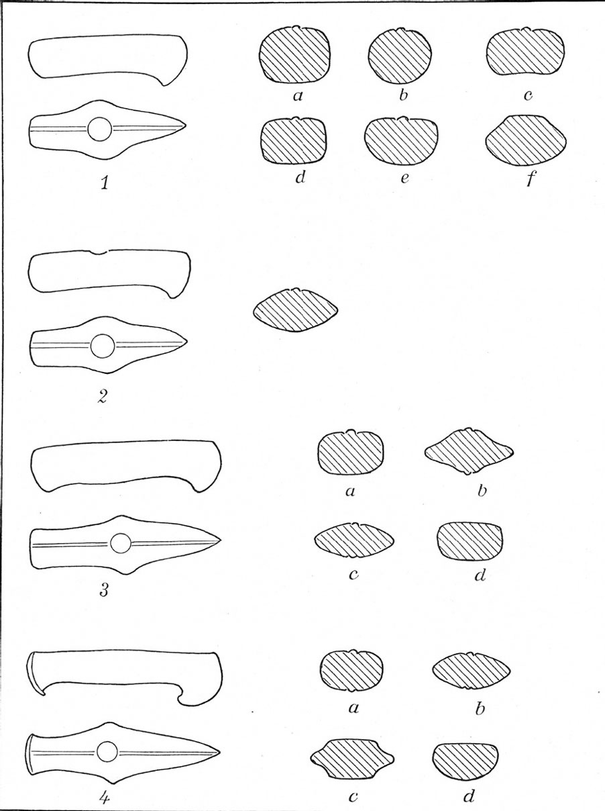

<i>Figure 5.3. Type A battle axes as defined by Glob. After Glob 1945, fig. 1.</i>

Thus, the earliest types of battle axes to occur on the Jutland peninsula do not belong to international and widely spread types (Glob’s types A₁–₂) but are represented by local variants mainly known from Jutland and Schleswig-Holstein (Glob’s type A₃–₄).

Another significant feature of the overall Corded Ware phenomenon is the pottery. Generally, pottery is scarce in the earliest phases of the Single Grave period but already from Phase 1a do we see the earliest and well-defined corded ware. This is characterised by curved beakers with a marked transition between neck and belly, small set off bases and horizontal cord-line impressions on the neck (Fig. 5.4). The type is described by Hübner as type A1a, which corresponds to Glob’s type A₂. It is notable that in a south Scandinavian context this earliest defined Single Grave type beaker has not been recorded from Schleswig-Holstein but only from central-western Jutland (Glob 1945, 64–66; Hübner 2005, 180–186, 726–727, fig. 116).

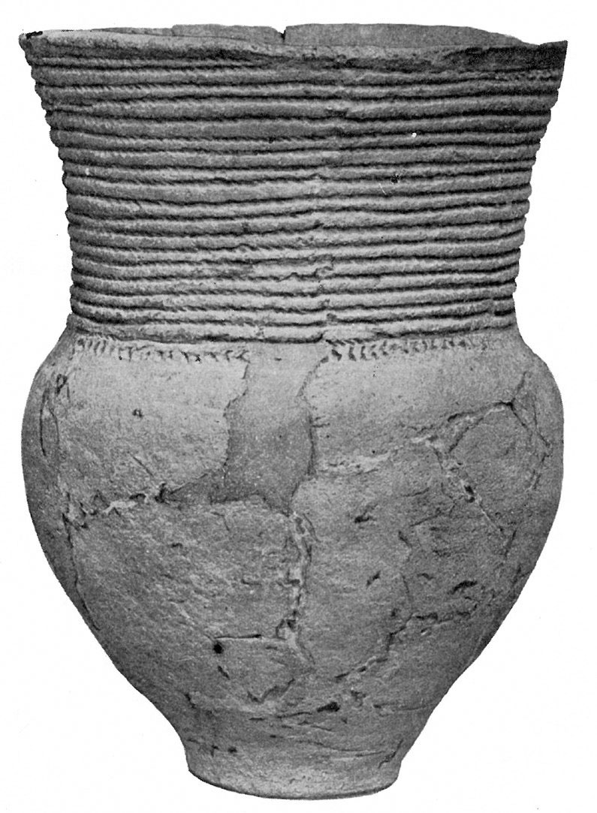

<i>Figure 5.4. Early cord-decorated beaker from Møbjerggaarde, Vejle County. After Becker 1955, fig. 10.</i>

Based on Glob’s and Hübner’s recordings I have mapped the distribution of the earliest battle axes and corded ware (Fig. 5.5). As it shows, the initial occurrence of the Single Grave culture on the Jutland peninsula is concentrated in central-western Jutland between the Limfjord to the north and the narrowing of the Peninsula to the south. In general, there seems to be a preference for slightly elevated lands, on the margins of the so-called hill islands, as the coastal areas and low-lying heath plains lack finds. In particular, we see a concentration in south-western Jutland, around the present-day city of Esbjerg, on the Esbjerg hill island. Part of this concentration may be explained by a long research history and a tradition for intensive registrations and excavations focusing on the Single Grave culture in south-western Jutland (cf. Siemen 2009, 9–45).

Also the Funnel Beaker sites are located on the hill islands but in the succeeding Single Grave period sites spread throughout the hill islands. However, the areas intensively used by the Funnel Beaker culture continued to be intensively exploited in the Single Grave period showing a certain degree of landscape continuity (Møller 2013, 188–189, fig. 10.1).

It was not only the burial practice and the material culture found within the graves that changed during the early third millennium BC, changes in settlement pattern and subsistence economy are usually also ascribed to the emergence of the Single Grave culture.

Single Grave settlements with traces of house constructions are mainly known from the later part of the period on the Jutland peninsula. Houses are revealed as light post-built structures with or without sunken floors in the form of shallow depressions filled with settlement refuse. Settlement sites are additionally small and dispersed consisting of individual households located on sandy soils often with relatively few finds compared with the late Funnel Beaker settlements. Unlike the small and scattered Single Grave households the later Funnel Beaker settlements are often large, holding extensive culture layers indicating a high degree of site continuity, a stable settlement pattern and larger populations (Madsen 1982, 207–208, 229–231; Rostholm 1982, 62–66; Skaarup 1985, 364–367; Simonsen 1987; Nielsen 1999, 156; 2004, 26–29). As in Jutland, the Corded Ware dwellings known from central Europe consist of small houses or huts and sunken-floored areas showing regional variability (Müller & Seregély 2008; Müller <i>et al.</i> 2009, 138–140).

<i>Figure 5.5. Map showing the distribution of the earliest Single Grave culture. Beakers and type B battle axes are all grave finds mapped from Hübner 2005, figs 52 and 116. The distribution of type A battle axes includes grave finds and stray finds based on Hübner 2005, fig. 48 and Glob 1945, fig. 2.</i>

In terms of subsistence economy, the new Single Grave communities seem to differ from the agricultural based Funnel Beaker culture. This is first and foremost due to the Single Grave culture preference for the sandy soils of central-western Jutland and a supposed focus on cattle herding. Furthermore, the emergence of Single Grave communities caused woodland and brushwood clearances, hazel diminished and plantain, grasses and herbs became frequent. As a result, the heath spread and was deliberately maintained by regular burning as heath land was used for pastures. The deforestation was a radical change of the Funnel Beaker landscape based on brushwood or coppice management and might well be the result of an increased need for pasture in an intensive land use system relying on pastoral farming and agriculture (Andersen 1993; 1998, 126–128).

The use of agriculture is indicated by carbonised grains, pollen samples, grain impressions in pottery and plough-marks in the form of ard-furrows preserved underneath Single Grave mounds. However, one cannot rule out that some of the plough-marks are ritual in character and not the remains of fossil field systems. Furthermore, pollen from barley has been recorded from several Single Grave burial mounds and it might be that barley played some kind of role in the burial rites (Hübner 2005, 474–478, 702–704; Klassen 2005, 34–42).

By all accounts, the Single Grave economy included husbandry with a supposed focus on cattle and probably sheep together with the cultivation of cereals. Naked barley was the predominant crop but recent archaeobotanical analyses have shown that wheat, mainly emmer, was also cultivated. However, the main focus on barley is opposed to the predominance of emmer wheat in the Middle Neolithic Funnel Beaker culture (Andreasen 2009, 13–17).

#### Late Funnel Beaker preconditions for the emergence of the Single Grave culture

Even though the emergence of the Single Grave culture might appear abrupt, followed by a ‘package’ of new material culture features and a rather different way of life, a series of elements seems to link the ‘new’ Single Grave communities with the ‘old’ Funnel Beaker society. In the following section I will look more into some of the features that characterise the Single Grave culture and some of the elements that are usually not paid much attention but which points to a Funnel Beaker origin.

#### Middle Neolithic burial practices

The Funnel Beaker burial custom is usually associated with interments in megalithic tombs. This burial practice started out as mostly single interments in the early closed dolmens but developed into complicated funeral rituals taking place in the great dolmens and the passage graves involving the selection and relocating of large quantities of human bones (Tilley 1996, 81–83, 221–230). This burial practice seems very far from the individual gendered burials that characterise the Single Grave culture from its very appearance on the Jutland peninsula. However, the presence of a few early Single Grave type battle axes in megalithic tombs indicates the reuse of Funnel Beaker burial chambers. According to Ebbesen’s recordings of the finds from Danish megalithic tombs no type B battle axes have been found but type A battle axes have been located in three tombs (2011, 364, 371 n. 17).

Even though the use of megalithic tombs predominated within the Funnel Beaker culture, different kinds of individual interments are known and show a diversified burial practice. Included in the Funnel Beaker funerary practice is a group of individual flat graves (often termed ‘earth graves’) dated from the Early Neolithic to the early Middle Neolithic (MN II, ending <i>c.</i> 3000 BC). These earth graves comprise a variety of forms from regular grave-pits to burials with wooden tent-like constructions, trunk cists, stone pavements, rectangular stone settings or grave cists made with stone slabs (see Midgley 1992, 411–413 with references).

During the later Funnel Beaker period, stone-packing graves (<i>c.</i> 3100–2800 BC) occurred in north-western Jutland as a peculiar development of the Funnel Beaker earth grave tradition (Damm 1989; Fabricius & Becker 1996; Johannsen & Laursen 2010). Stone-packing graves usually comprise one or more pairs of oval pits in extension of a roughly rectangular pit termed the ‘mortuary house’. The graves and the mortuary house are filled with stones and a stone pavement covers the whole feature (Fig. 5.6). Unfortunately, no direct traces of the deceased have been found in the form of human bones but pottery and often well-made thick-butted flint axes, point-butted adzes and double-edged battle axes occur in the mortuary houses. Besides, cattle teeth have been recovered from more of the graves. Thus, the stone-packing graves likely represent the remains of wagon burials, at least in the form of symbolic vehicles (the ‘mortuary house’), with teams of oxen buried in the pits as originally suggested by Stuart Piggott (Piggott 1969, 308; Johannsen & Laursen 2010).

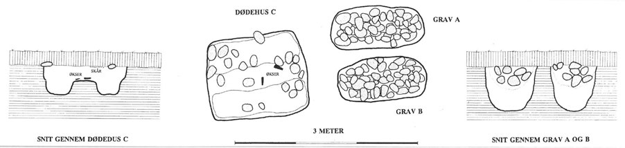

<i>Figure 5.6. Layout and cross section of stone-packing grave at Vroue Hede II, Viborg County. After Jørgensen 1993, 113.</i>

The stone-packing graves show similarities with both the wagon burials of the Yamnaya culture of the Pontic-Caspian steppe and the cattle burials known from the Baden and Globular Amphora complexes. This includes the Złota group (related to the Globular Amphora culture) of south-east Poland, <i>c.</i> 3200–2800 BC (Whittle 1996, 136, 211–215; Anthony 2007, 311–317; Furholt 2008; Szmyt 2008, 223–227; Johannsen & Laursen 2010, 25–28, 51).

The stone-packing graves of north-western Jutland must be seen as one of more regional developments within the later Funnel Beaker culture, which also included the emergence of the south Scandinavian Pitted Ware culture of the late Middle Neolithic (Iversen 2010, 2013). Furthermore, the earth graves and the succeeding stone-packing graves clearly show that individual burials were an integrated part of the Funnel Beaker funerary tradition. Thus, in north-western Jutland we do not see a change from collective megalithic entombments to individual burials with the emergence of the Single Grave culture as the individual had already been accentuated in the stone-packing graves from <i>c.</i> 3100 BC onwards (Damm 1991, 46–48; 1993, 200–201). Thus, the presumed oxcart-driving males equipped with flint axes and stone battle axes interred in these graves can in a direct manner be seen as forerunners of the ‘warrior-based brotherhoods’ of the Single Grave culture.

#### Flint axes

Continuity from the Funnel Beaker culture to the early Single Grave culture is also recognisable in the use of flint axes. Within the context of the late Funnel Beaker culture the shape of the widely used and numerous flint axes changed from thinbutted to thick-butted around 3000 BC. Two variants can be separated (A and B) and even though the Single Grave culture flint industry can be described as technically inadequate, the Single Grave flint axes show great likeness to type B-flint axes characteristic of the final and post-Funnel Beaker milieu in eastern Denmark and Scania (Nielsen 1979; Iversen 2015, 33–38).

Thick-butted flint axes are known from a number of Jutland single graves. Hübner counts 608 axes from 509 graves, which makes the flint axes one of the most common artefact types in the single graves (2005, 315, figs 211, 442). Significant variations exist among the axes from the single graves as noticed by Glob who pointed out that axes found in the earliest burials (Under Grave period) were the longest and most polished and that the number of axes as well as their length decreased over time. Thus, the presence of thick-butted flint axes in single graves has been proven from the early Under Grave period and then seems to cease with the Bottom Grave period/ beginning of the Over Grave period (Glob 1945, 134–137; Højlund 1975; Hübner 2005, 328–340, 365–368).

It may be that the Single Grave culture flint axes were technically ‘poorer’ or more coarsely made than those of the Funnel Beaker culture. However, this feature becomes more obvious in the later part of the Single Grave period when the carefulness of the flint craft was downgraded. In the early phase there seems to have been a continuous focus on the flint axe as an important tool and status symbol that was an essential part of the grave goods. Thus, continuity existed from the late Funnel Beaker culture not only in terms of axe types (thick-butted heavy and thin-bladed variants) but also in regards to the deposition of flint axes in graves. Still, more care was spent on the manufacturing of axes within the Funnel Beaker culture than what is seen in the Single Grave culture.

#### Depositions

Another feature that links the Funnel Beaker flint axes and those of the Single Grave culture is the fact that both groups of axes were subjected to widespread deposition practice. The deposition of individual or more objects in bogs, on dry land and at megalithic tombs was a well-known practice within the Funnel Beaker culture and included the deposition of flint axes, pottery vessels (‘bog pots’), amber beads and even humans. However, the majority of depositions took place in the fourth millennium BC and with the beginning of the third millennium BC (the late Funnel Beaker period) the deposition practice was downscaled and mainly focused on thick-butted flint axes (Iversen 2015, 82–88, fig. 5.30). In this context it is noticeable that we see a certain focus on flint axe depositing within the Single Grave culture.

A total of 41 late Middle Neolithic hoards have been recorded from Jutland (25) and Schleswig (16) (Ebbesen 1983). Heavy thick-butted Single Grave type axes are present in 14 hoards from Jutland and show about the same frequency as adzes. Besides, thinbladed axes, chisels and tongued wedges have been found in hoards. Amber beads are known from a single hoard in Schleswig and only in one case was a battle axe included in a hoard. Seven hoards have been found on dry land whereas the majority originate from wetlands, mainly bogs (Ebbesen 1983, 142–155, fig. 20, find list 1).

Furthermore, depositions of pottery and, in a few cases, amber have been recorded in connection with some Single Grave mounds and depositions of Single Grave pottery at megalithic tombs are known in a few cases from Jutland. This practice was widespread in the early Middle Neolithic Funnel Beaker period. Besides, Single Grave amphorae and beakers have been found in bogs. The recorded vessels mainly belong to the Under Grave period and thereby indicate a continuation of the Funnel Beaker deposition practice (Davidsen 1977a; Rostholm 1991, 121–122; Hübner 2005, 628–629; Ebbesen 2011, 368–369).

#### Site continuity

As stated above, Funnel Beaker settlement sites grew larger over time and indicate more stable long-term occupations with the building up of thick culture layers. This picture is very different from the settlement pattern of the Single Grave culture that was focused on small individual and light-built farmsteads. However, regional differences existed within the late Funnel Beaker settlement pattern as larger settlement sites are absent in northern Jutland, northern Germany and southern Sweden (Klassen 2014, 14). Furthermore, Funnel Beaker occupations are scarce in western Jutland but so are settlements from the Single Grave culture, in particular from the early part of the period. The light and sandy soils of western Jutland might already from the introduction of agriculture have called for a different less sedentary and more mobile way of living probably focused on animal husbandry and cattle breeding instead of arable farming.

Though not a part of the core area, western Jutland was occupied by the Funnel Beaker culture and excavations have revealed evidence of site continuity from the late Funnel Beaker to the early Single Grave period. Hence, a series of sites such as Pilgård, Skarrild, Lille Hamborg and Damsmark contain stratigraphies showing that late Funnel Beaker settlement layers were succeeded by early Single Grave burials (Davidsen 1977b, 42–52; Rostholm 1982, 29–37, 45–57). Furthermore, a Single Grave burial mound overlaying a stone-packing grave has been excavated at Kvorning in central Jutland (Johannsen & Kieldsen 2014). Unfortunately, the single grave cannot be dated precisely and it is therefore not possible to say whether its location reflects direct site continuity or not.

The occurrence of burials on former settlement sites is not an unknown phenomenon within the Scandinavian Neolithic. From Middle Neolithic Gotland a series of larger burials sites related to the marine oriented Pitted Ware culture have been recorded. About 200 graves are known from sites like Västerbjers, Ire, Friedtorp, Visby and Ajvide and the burials are often dug into older occupation layers. Investigations on the Ajvide site show that the cemetery was established on the settlement area at the time when it went out of use. The way this site was ‘closed off’ and changed into a burial ground has been seen as an expression of ancestral based legitimation of territorial rights (Burenhult 1997, 20–21). It may be that the location of ‘first generation’ Single Grave burials on top of final Funnel Beaker settlements reflects the very transition from one cultural sphere to another and that the last inhabitants closed off the old settlement by being buried according to the new Single Grave custom.

Site continuity is also shown outside the classical Single Grave area at Gaasemosen south-east of Aarhus, eastern Jutland. The site contains faunal remains showing a mixed economy of animal husbandry (mainly cattle), hunting and fishing and is placed in a now dried up fjord. The site shows occupation from the transitional stage between the final Funnel Beaker culture and earliest Single Grave period (Rasmussen 2016). The location of an early Single Grave culture occupation with site continuity from the final Funnel Beaker phase (MN V) this far from the Single Grave core area is indeed noteworthy.

#### Subsistence economy

As stated above the economy of the Single Grave culture differed from that of the Funnel Beaker culture in terms of a main focus on pastoralism and a change of crops from wheat to barley. However, these changes might not be as abrupt as sometimes put and there certainly are preconditions within the Funnel Beaker culture for these changes as well. Cattle seem to have been the dominant livestock throughout the Funnel Beaker period (Klassen 2014, 153) and were certainly of central importance for the late Funnel Beaker group buried in the stone-packing graves.

As for the change of cereals some late Funnel Beaker sites were actually dominated by barley instead of wheat. On the causewayed enclosure site at Sarup, south-west Funen, emmer wheat predominated in the early Middle Neolithic (MN II) while barley became the most common kind of grain in the final Funnel Beaker phase. At another causewayed enclosure at Lønt, southern Jutland, barley was dominant in the early Middle Neolithic (MN I/II, <i>c.</i> 3300–3000 BC). The situations at Sarup and Lønt show that the importance of naked barley grew at the expense of emmer before the emergence of Single Grave societies. Still, pollen diagrams show extensive forest clearances at the transition between the Funnel Beaker and Single Grave periods indicating an increased need for pastures (Andreasen 2009, 13–14, fig. 4).

#### Reconsidering the migration hypothesis

The home of the Jutland Battle-axe peoples lay far to the east, on the other side of the Volga, in mountainous steppe-lands that continue uninterrupted into central Asia – where in the third millennium a nomadic cattle-breeding culture developed in a marginal zone outside the urban cultures of the Middle East but showing little influence from them. […] These were the Indo-Europeans, who broke out of their homeland and scattered in every direction. […] Wherever the Battle-axe people came they made themselves masters over the peasants and any others who were settled in the area. Prepared and well armed as they were, it was in most cases an easy matter to subdue peaceful farmers. (Glob 1971, 106–107)

How vivid, colourful and fascinating the above cited scenario of intruding masses of battle axe-brandishing nomads might seem, I do not find that it fully explains the appearance of the Single Grave culture in southern Scandinavia and northern Europe. Nonetheless, one still finds the emergence of the Single Grave culture explained as the result of ‘a major migration’ (Kristiansen 2009, 113) or ‘mass migrations’ (Kristiansen 2012, 169; Haak <i>et al.</i> 2015).

Based on the presented evidence, the occurrence of the Single Grave culture on the Jutland peninsula is certainly characterised by a series of new material features, a new burial practice and expansion of the resource areas due to an increased pastoral focus. What I have tried to point out is that these changes did not come out of the blue but that certain preliminaries or openings to a new way of organising society already existed within the late Funnel Beaker culture. Furthermore, some Funnel Beaker traits were borrowed or rather carried along by the newly established Single Grave communities. In Fig. 5.7, I have mapped some of these ‘Funnel Beaker traits’ comprising Single Grave flint axe and pottery depositions, places with site continuity where early Single Grave mounds are placed on final Funnel Beaker settlements and finally megalithic tombs reused in the earliest Single Grave phase. In addition, I have added the distribution of the stone-packing graves as these seem to link the late Funnel Beaker culture with the new burial trends of the Single Grave culture.

As it appears from Fig. 5.7, a continuation of Funnel Beaker practices, or what we could refer to as a certain Funnel Beaker conduct carried out with Single Grave material culture, seems to centre in western/north-western Jutland in the same areas as we find the stone-packing graves. This distribution indicates the existence of a mixed cultural milieu in which a branch of the Funnel Beaker society, represented by the stone-packing graves, formed the ritual behaviour of the earliest Single Grave culture. Compared with the earliest distribution of the Single Grave culture (Phase 1a) we see a great overlap with the stone-packing graves and the ‘mixed Funnel Beaker/ Single Grave expression’ in western/north-western Jutland (compare Figs 5.5 and 5.7). This distribution strengthens the already proposed connections between the individual burial custom of the stone-packing graves focusing on flint axe and battle axe-equipped wagon-driving males and the earliest Single Grave culture.

Even though the earliest Single Grave culture has some clear preconditions within the branch of the Funnel Beaker culture that built the stone-packing graves it does not solely explain the emergence of the Single Grave culture on the Jutland peninsula. Thus, we must, I think, be open to the possibility that the Single Grave culture was actually created by a mixture of local Funnel Beaker developments, new inputs brought in via contact networks and the arrival of newcomers from the Central European Corded Ware. But wherefrom exactly did these people arrive and how?

Some important hints are provided by a burial mound from Refshøjgård in eastern Jutland. The mound comprised two very early Single Grave culture burials showing a mixture of Funnel Beaker and Single Grave elements including a Corded Ware beaker imitating those found in the area just south of the Harz in central Germany. The local Funnel Beaker traits included traces of the common practice of depositing destroyed pottery in connection with burials, a flint axe showing typological Funnel Beaker traits and the geographical location of the burial mound itself. The two graves followed the typical Single Grave culture burial custom but the location of the mound outside the early Single Grave core area in a region otherwise rich in Funnel Beaker sites contributes to the significance of the find (Klassen 2005).

That certain stylistic pottery elements and other features deriving from Central Germany can be found within the early Single Grave milieu on the Jutland Peninsula have also been noted in other studies on the Single Grave culture (Zich 1993, 28; Hübner 2005, 739, 743, 754; Ebbesen 2006, 187–192; Furholt 2014, fig. 7). Thus, it is very likely that the area south of the Harz held a significant role in transmitting early Corded Ware influences, as proposed by Lutz Klassen (2005, 45–46). Furthermore, this very area holds several double burials containing cattle and two cases from Profen, Saxony-Anhalt, have revealed traces of the wagons pulled by such teams of cattle/oxen. The layout of the two wagon burials from Profen are very similar to the stone-packing graves and show contemporary dates, <i>c.</i> 3300–3000 BC (Friederich & Hoffmann 2013; see also Müller & Schunke 2013).

<i>Figure 5.7. Map showing the distribution of stone-packing graves and Single Grave features following Funnel Beaker traditions. The two early Single Grave culture sites of Refshøjgård and Gaasemosen are indicated. Data from: Davidsen 1977a; 1977b; Rostholm 1982; Ebbesen 1983; 2011; Hvass 1986; Klassen 2005; Johannsen & Kieldsen 2014; Rasmussen 2016.</i>

If we accept east-central Germany as an area of central importance as regards Corded Ware influences, it is striking that one finds corresponding parallels between this region and the stone-packing grave area of north-western Jutland. My point is that the contact networks that provided early Corded Ware influences to central western Jutland were already well-established routes of communication during the Funnel Beaker period. This can explain the branching out of the local ‘stone-packing grave group’ from the remaining Funnel Beaker community during the final fourth millennium BC. Thus, as the new Corded Ware ideas spread through central Europe, the well-established contact routes connecting north-western Jutland and east-central Germany rapidly transmitted these new impulses to the north.

It may not only be ideas about social organisation, ideology, rituals and burial customs that travelled along these communication routes. It is obvious to include the movement of people in the form of matrimonial alliances/relations, small family groups and relocation of ritual specialists and skilled craft workers transported on wagons pulled by teams of cattle. In this context it is noteworthy that the Jutland stone-packing graves are usually placed in rows stretching several hundred metres and that the graves were probably placed along Neolithic ‘roads’ or transportation routes (see Johannsen & Laursen 2010, 33–44). In Jutland, the Corded Ware ideas and materiality got their own expression with the incorporation of some Funnel Beaker traits forming what we today refer to as the Single Grave culture. As regards eastern Denmark, the Corded Ware ideas and burial practices never really caught on and Funnel Beaker traditions and practices continued for several hundred years (Iversen 2015; 2016).

However, other parallels to the stone-packing graves, and thereby possible contact networks, exist as well. As mentioned above, cattle burials constituted a widespread phenomenon within the larger Baden and Globular Amphora cultural complexes. In particular, the Złota group of south-east Poland seems to provide one of the closest parallels as noted by Niels Nørkjær Johannsen and Steffen Laursen (2010). On the Gajowizna site at Złota to the south of Sandonierz, double cattle burials and human burials are combined in short rows resembling the layout of the stone-packing graves. However, other human and animal burials occur as well including various combinations of human and cattle remains making the parallel less direct (Johannsen & Laursen 2010, 50–51; see also Whittle 1996, 211–213).

No doubt, north-western Jutland formed part of a larger central and eastern European phenomenon centred on cattle and wagon burials, transportation and probably increased mobility. In the case of the parallels existing between the north- western Jutland stone-packing graves and the Złota group in south-eastern Poland it is striking that the latter area has provided the earliest ¹⁴C-dates known from the Corded Ware, <i>c.</i> 3000–2900 BC (cf. Furholt 2003, 21–22, 32, 118–123; 2004). These dates are almost contemporary with those of the earliest Single Grave culture in Jutland ranging between <i>c.</i> 2900–2800 BC, <i>i.e. c.</i> 2850 BC (Hübner 2005, 660–664). Given that the Corded Ware arose in the area of south-eastern Poland, or somewhere around there, at the very beginning of the third millennium BC, it took relatively short time, covering a time span of an estimated 50 to a maximum of 150 years, to reach the Jutland Peninsula.

As the spread of the Corded Ware shows, we are obviously not dealing with cultural frontiers being gradually expanded or pushed forward into new territories but instead with rather ‘rapid’ changes across wide parts of central, northern and eastern Europe. If the wide appearance of Corded Ware societies should be explained in terms of mass migrations one has to consider the fact that this would have happened through already occupied areas presumably inhabited by hostile populations and furthermore have required an unrealistic high number of people. These issues must be addressed if one argues that a mass migration took place even if the population density might have been reduced due to the spread of an early plague as recently indicated (Rasmussen <i>et al.</i> 2015; Rascovan 2018 <i>et al.</i>). This, however, does not mean that migration could not have taken place on varying scales throughout central, northern and eastern Europe – only that mass migration fails as a sole explanation for the occurrence of Corded Ware societies throughout its entire area of distribution.

In fact, migrations are likely to have played a key role in the formation of the Corded Ware. Thanks to results provided by recent aDNA studies the very creation of the Corded Ware should be regarded as strongly influenced by migrating Yamnaya groups from the Pontic-Caspian steppe into eastern central Europe at the very beginning of the third millennium BC (Allentoft <i>et al.</i> 2015; Haak <i>et al</i>. 2015).

As suggested in a paper by Kristian Kristiansen <i>et al.</i>, the social system that provided the rapid spread of a mobile pastoral based lifestyle, accentuating the battle axes as the prime male and warrior attribute, was likely to have included war-bands of young males living of raiding proving themselves before entering the tribe proper. Such groups of young males were highly mobile and willing to take risks by undertaking pioneering migrations. Furthermore, female exogamy is likely to have taken place in a cultural setting in which migrants are predominantly male. That this was actually the case is supported by isotopic and aDNA studies from central Europe (Sjögren <i>et al.</i> 2016; Goldberg <i>et al.</i> 2017; Kristiansen <i>et al.</i> 2017).

In this paper, I have tried to explain how the Corded Ware/Single Grave culture reached northern Europe and how it unfolded locally on the Jutland Peninsula. Via already established contact networks transmitting material culture, individuals, small family groups and intermarriage relations, new ideas of social organisation, burial rituals and gender roles were introduced in local Funnel Beaker communities who were receptive to changes. These well-established contacts facilitated the movement of Corded Ware individuals from central and south-eastern Europe who settled in landscapes that provided the right opportunities for a mobile and pastoral lifestyle (Fig. 5.8). Together with these influences and the movement of people, we might also expect the spread of Proto-Indo-European.

The place of origin of Proto-Indo-European is a highly debated, and for some scholars even controversial, topic. However, linguistic reconstructions of parts of the original Indo-European vocabulary supports the Steppe Hypothesis (also referred to as the <i>Revised Kurgan Hypothesis</i>) according to which Proto-Indo-European spread from the Pontic-Caspian steppes most probably with an expansion of the Yamnaya culture. As mentioned above this scenario is supported by an increasing number of aDNA results showing the occurrence of steppe DNA in eastern and central Europe at the very beginning of the third millennium BC (Mallory 1989; Anthony 2007; Allentoft <i>et al.</i> 2015; Haak <i>et al</i>. 2015; Pereltsvaig & Lewis 2015; Iversen & Kroonen 2017; Kristiansen <i>et al.</i>, 2017). The following widespread changes caused by the spread of the Corded Ware across northern Europe provide the most likely explanation for the wider introduction of Proto-Indo-European. The language shift, however, was not enforced through invasion or mass migration but through well-established routes of communication that facilitated the movement of people.

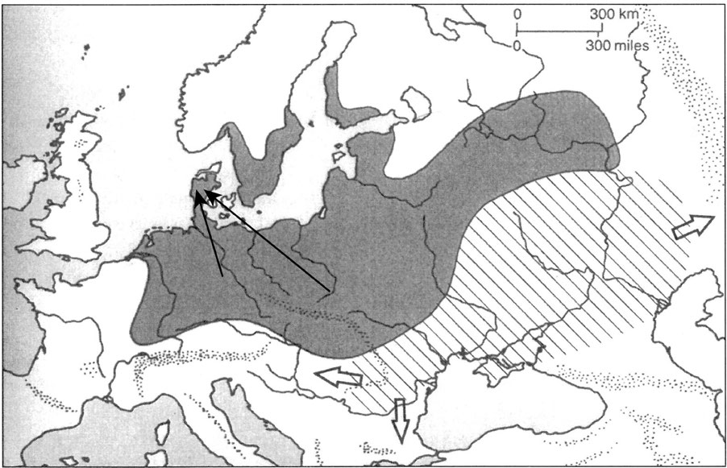

<i>Figure 5.8. The distribution of the Corded Ware (shaded area) and Yamnaya (hatched area) complexes. After Kristiansen 2012, fig. 14.1. Arrows added, indicating possible areas of cultural influences.</i>

Ethnographic studies have shown that few migrants can encourage widespread language changes if they succeed in introducing a new religion or political ideology and take control over key territories and trade commodities (cf. Anthony 2007, 117 with references). Thus, we need not expect the arrival of large numbers of people in order to explain the introduction of Proto-Indo-European. This language shift happened as groups of newcomers followed well-established communication routes introducing a new Corded Ware ideology, social organisation, materiality, new subsistence economic practices and increased mobility. As I have argued in this paper, the late Funnel Beaker people of north-western Jutland were already familiar with these concepts and ideas via their participation in far reaching contact networks and therefore the acceptance of the new Corded Ware idiom might not have been such a big change.

### References

Åberg, N. 1918. <i>Das Nordische Kulturgebiet in Mitteleuropa während der Jüngeren Steinzeit.</i> Uppsala: Almqvist & Wiksell.

Adamsen, C. & K. Ebbesen (eds). 1986. <i>Stridsøksetid i Sydskandinavien. Beretning fra et symposium 28.–30. X. 1985 i Vejle</i> (Arkæologiske Skrifter 1). København: Forhistorisk Arkæologisk Institut, Københavns Universitet.

Allentoft, M.E., M. Sikora, K.G. Sjögren, S. Rasmussen, M. Rasmussen, J. Stenderup, P.B. Damgaard <i>et al.</i> 2015. Population genomics of Bronze Age Eurasia. <i>Nature</i> 522(7555). 167–172. doi:10.1038/nature14507.

Andersen, S.Th. 1993. Early agriculture. In: S. Hvass & B. Storgaard (eds), <i>Digging into the Past. 25 years of archaeology in Denmark</i>, 88–91. Højbjerg, Copenhagen: The Royal Society of Northern Antiquaries, Jutland Archaeological Society.

Andersen, S.Th. 1998. Pollen analytical investigations of barrows from the Funnel Beaker and Single Grave Cultures in the Vroue area, West Jutland, Denmark. <i>Journal of Danish Archaeology</i> 12. 107–132.

Andreasen, M.H. 2009. Agerbruget i enkeltgravskultur, senneolitikum og ældre bronzealder i Jylland – belyst ud fra plantemakrofossiler. <i>Kuml</i> 2009. 9–55.

Anthony D.W. 2007. <i>The Horse, the Wheel, and Language: How Bronze Age riders from the Eurasian steppes shaped the modern world.</i> Princeton: Princeton University Press.

Becker, C.J. 1955. Die Mittelneolithischen Kulturen in Südskandinavien. <i>Acta Archaeologica</i> 25. 49–150.

Brøndsted, J. 1957. <i>Danmarks oldtid.</i> Vol. 1. <i>Stenalderen</i>. 2nd ed. København: Gyldendal.

Burenhult, G. 1997. Säljägare och svinherdar på Ajvide. In: G. Burenhult (ed.), <i>Ajvide och den moderna arkeologien</i>, 15–21. Falköping: Natur och Kultur.

Damm, C.B. 1989. Stendyngegrave i enkeltgravstid. In: L. Larsson (ed.), <i>Stridsyxekultur i Sydskandinavien</i> (Report Series 36), 89–101. Lund: University of Lund, Institute of Archaeology.

Damm, C.B. 1991. Burying the past: An example of social transformation in the Danish Neolithic. In: P. Garwood, D. Jennings, R. Skeates & J. Toms (eds), <i>Sacred and Profane</i>, 43–49. Oxford: Oxford University Committee for Archaeology.

Damm, C.B. 1993. The Danish Single Grave Culture – ethnic migration or social construct? <i>Journal of Danish Archaeology</i> 10. 199–204.

Davidsen, K. 1977a. Single-Grave pottery from Danish bogs. <i>Acta Archaeologica</i> 47. 161–167.

Davidsen, K. 1977b. Relativ kronologi i mellemneolitisk tid. En diskussion af C.J. Beckers kronologisystem på baggrund af nye og gamle stratigrafiske fund. <i>Aarbøger for nordisk Oldkyndighed og Historie</i> 1975. 42–77.

Ebbesen, K. 1983. Flint celts from Single-Grave burials and hoards on the Jutlandic Peninsula. <i>Acta Archaeologica</i> 53. 119–181.

Ebbesen, K. 2006. <i>The Battle Axe Period</i>. København: Attika. Ebbesen, K. 2011. <i>Danmarks megalitgrave</i>. Vol. 1. København: Attika.

Fabricius, K. & C.J. Becker 1996. <i>Stendyngegrave og kulthuse. Studier over Tragtbægerkulturen i Nord- og Vestjylland</i> (Arkæologiske Studier 11). København: Akademisk Forlag.

Friederich, S. & V. Hoffmann. 2013. Die Rinderbestattungen von Profen – mit Rad und Wagen. In: H. Meller (ed.), <i>3300 BC. Mysteriöse Steinzeittote und ihre Welt</i>, 83–84. Mainz am Rhein: Nünnerich-Asmus Verlag & Media.

Furholt, M. 2003. <i>Die absolutchronologische Datierung der Schnurkeramik in Mitteleuropa und Südskandinavien</i> (Universitätsforschungen zur prähistorischen Archäologie 101). Bonn: Habelt. Furholt, M. 2004. Entstehungsprozesse der Schnurkeramik und das Konzept eines Einheitshorizontes. <i>Archäologisches Korrespondenzblatt</i> 34(4). 479–498.

Furholt, M. 2008. Die Złota-Gruppe in Kleinpolen: Ein Beispiel für die Transformation eines Zeichensystems? <i>Germania</i> 86(1). 1–27.

Furholt, M. 2014. Upending a ‘totality’: Re-evaluating Corded Ware variability in Late Neolithic Europe. <i>Proceedings of the Prehistoric Society</i> 80. 67–86.

Gebers, W. 1984. <i>Das Endneolithikum im Mittelrheingebiet. Typologische und chronologische Studien</i> (Saarbrücker Beiträge zur Altertumskunde 27). Bonn: Habelt.

Glob, P.V. 1945. Studier over den jyske enkeltgravskultur. <i>Aarbøger for nordisk Oldkyndighed og Historie</i> 1944. 1–283.

Glob, P.V. 1971. <i>Denmark. An archaeological history from the Stone Age to the Vikings</i>. New York: Cornell University Press.

Goldberg, A., T. Günther, N.A. Rosenberg & M. Jakobsson. 2017. Ancient X chromosomes reveal contrasting sex bias in Neolithic and Bronze Age Eurasian migrations. <i>Proceedings of the National Academy of Sciences</i> 114(10). 2657–2662. doi:10.1073/pnas.1616392114.

Haak, W., I. Lazaridis, N. Patterson, N. Rohland, S. Mallick, B. Llamas, G. Brandt <i>et al.</i> 2015. Massive migration from the steppe was a source for Indo-European languages in Europe. <i>Nature</i> 522(7555). 207–211. doi:10.1038/nature14317.

Hvass, L. 1986. Enkeltgravskulturens regionalgrupper. In: C. Adamsen & K. Ebbesen (eds), <i>Stridsøksetid i Sydskandinavien</i> (Arkæologiske Skrifter 1), 108–125. København: Forhistorisk Arkæologisk Institut, Københavns Universitet.

Hübner, E. 2005. <i>Jungneolithische Gräber auf der Jütischen Halbinsel. Typologische und chronologische Studien zur Einzelgrabkultur</i> (Nordiske Fortidsminder, Serie B, 24). København: Det Kgl. Nordiske Oldskriftselskab.

Højlund, F. 1975. Stridsøksekulturens flintøkser og -mejsler. <i>Kuml</i> 1973–1974. 179–196.

Iversen, R. 2010. In a world of worlds. The Pitted Ware Complex in a large scale perspective. <i>Acta Archaeologica</i> 81. 5–43.

Iversen, R. 2013. Beyond the Neolithic transition – the ‘de-Neolithisation’ of South Scandinavia. In: M. Larsson & J. Debert (eds), <i>NW Europe in Transition. The Early Neolithic in Britain and South Sweden</i> (BAR International Series 2475), 21–27. Oxford: Archaeopress.

Iversen, R. 2015. <i>The Transformation of Neolithic Societies. An Eastern Danish perspective on the 3rd millennium BC</i> (Jutland Archaeological Society Publications 88). Højbjerg: Jutland Archaeological Society, Aarhus University Press.

Iversen, R. 2016. Was there ever a Single Grave Culture in East Denmark? Traditions and transformations in the 3rd millennium BC. In: M. Furholt, R. Grossmann & M. Szmyt (eds), <i>Transitional Landscapes? The 3rd millennium BC in Europe</i> (Universitätsforschungen zur prähistorischen Archäologie 292), 159–170. Bonn: Habelt.

Iversen, R. & G. Kroonen. 2017. Talking Neolithic: Linguistic and archaeological perspectives on how Indo-European was implemented in Southern Scandinavia. <i>American Journal of Archaeology</i> 121(4). 511–525.

Johannsen, N.N., & M. Kieldsen. 2014. En stendyngegrav ved Kvorning. Fund, kontekst og betydning. <i>Kuml</i> 2014. 9–28.

Johannsen, N.N., & S. Laursen. 2010. Routes and wheeled transport in late 4th–early 3rd millennium funerary customs of the Jutland Peninsula: Regional evidence and European context. <i>Praehistorische Zeitschrift</i> 85. 15–58.

Jørgensen, E. 1993. Jutlandic stone-packing graves. In S. Hvass & B. Storgaard (eds), <i>Digging into the Past. 25 years of archaeology in Denmark</i>, 112–113. Højbjerg, Copenhagen: The Royal Society of Northern Antiquaries, Jutland Archaeological Society.

Klassen, L. 2005. Refshøjgård. Et bemærkelsesværdigt gravfund fra enkeltgravskulturen. <i>Kuml</i> 2005. 17–59.

Klassen, L. 2014. <i>Along the Road. Aspects of causewayed enclosures in South Scandinavia and beyond</i> (East Jutland Museum Publications 2). Aarhus: Aarhus University Press.

Kristiansen, K. 1984. Ideology and material culture: an archaeological perspective. In: M. Spriggs (ed.), <i>Marxist Perspectives in Archaeology</i>, 72–100. Cambridge: Cambridge University Press.

Kristiansen, K. 1991. Prehistoric migrations – the case of the Single Grave and Corded Ware Cultures. <i>Journal of Danish Archaeology</i> 8. 211–225.

Kristiansen, K. 2009. Proto-Indo-European languages and institutions – an archaeological approach. In: M.V. Linden & K. Jones-Bley (eds), <i>Departure from the Homeland: Indo-Europeans and archaeology</i> (Journal of Indo-European Studies, Monograph Series 56), 111–140. Washington DC: Institute for the Study of Man.

Kristiansen, K. 2012. The Bronze Age expansion of Indo-European languages: an archaeological model. In: C. Prescott & H. Glørstad (eds), <i>Becoming European. The transformation of third millennium Northern and Western Europe</i>, 165–181. Oxford: Oxbow Books.

Kristiansen, K., M.E. Allentoft, K.M. Frei, R. Iversen, N.N. Johannsen, G. Kroonen, Ł. Pospieszny <i>et al.</i> 2017. Re-theorising mobility and the formation of culture and language among the Corded Ware Culture in Europe. <i>Antiquity</i> 91(356). 334–347. doi:10.15184/aqy.2017.17.

Larsson, L. (ed.). 1989. <i>Stridsyxekultur i Sydskandinavien. Rapport från det andra nordiska symposiet om Stridsyxetid i Sydskandinavien 31.X–2.XI 1988</i> (Report Series 36). Lund: University of Lund, Institute of Archaeology.

Madsen, T. 1982. Settlement systems of early agricultural societies in East Jutland, Denmark: A regional study of change. <i>Journal of Anthropological Archaeology</i> 1(3). 197–236.

Mallory, J.P. 1989. <i>In Search of the Indo-Europeans. Language, archaeology and myth.</i> London: Thames and Hudson.

Malmer, M.P. 1962. <i>Jungneolithische Studien</i> (Acta Archaeologica Lundensia, Series in 8°, 2). Lund: Lunds Universitets Historiska Museum.

Malmros, C. 1980. Den tidlige enkeltgravskultur og stridsøksekultur. Oplæg til en diskussion. <i>Aarbøger for nordisk Oldkyndighed og Historie</i> 1979. 62–68.

Midgley, M.S. 1992. <i>TRB Culture. The first farmers of the North European plain</i>. Edinburgh: Edinburgh University Press.

Müller, E., & T. Schunke. 2013. Die Rinderopfer von Niederwünsch – Belege eines umfangreichen Ritualgeschehens im späten 4. Jahrtausend v. Chr. In: H. Meller (ed.), <i>3300 BC. Mysteriöse Steinzeittote und ihre Welt</i>, 85–92. Mainz am Rhein: Nünnerich-Asmus Verlag & Media.

Müller, J., T. Seregély. 2008. Die schnurkeramische Siedlungsweise in Mitteleuropa. In: J. Müller & T. Seregély (eds), <i>Endneolithische Siedlungsstrukturen in Oberfranken II. Wattendorf-Motzenstein: eine schnurkeramische Siedlung auf der Nördlichen Frankenalb. Naturwissenschaftliche Ergebnisse und Rekonstruktion des schnurkeramischen Siedlungswesens in Mitteleuropa</i> (Universitätsforschungen zur prähistorischen Archäologie 155), 175–184. Bonn: Habelt.

Müller, J., T. Seregély, C. Becker, A.M. Christensen, M. Fuchs, H. Kroll, D. Mischka, U. Schüssler. 2009. A revision of Corded Ware settlement pattern – new results from the Central European low mountain range. <i>Proceedings of the Prehistoric Society</i> 75. 125–142.

Müller, S. 1898. De jydske Enkeltgrave fra Stenalderen, efter nyeste Undersøgelser. <i>Aarbøger for nordisk Oldkyndighed og Historie</i> 1898. 157–282.

Müller, S. 1913. Sønderjyllands Stenalder. <i>Aarbøger for nordisk Oldkyndighed og Historie</i> 1913. 169–322.

Møller, N.A. 2013. Dynamiske bebyggelser. Vestjylland i ældre jernalder. PhD dissertation, University of Copenhagen.

Nausch, V.K. 1997. Die schnurkeramischen Gräberfelder von Bergrheinfeld (Lkr. Schweinfurt) und Wolkshausen (Kkr. Würzburg). In: P. Siemen (ed.), <i>Early Corded Ware Culture. The A-Horizon – fiction or fact?</i> (Arkæologiske Rapporter, Esbjerg Museum, 2), 157–167. Esbjerg: Esbjerg Museum.

Nielsen, P.O. 1979. De tyknakkede flintøksers kronologi. <i>Aarbøger for nordisk Oldkyndighed og Historie</i> 1977. 5–71.

Nielsen, P.O. 1999. Limensgård and Grødbygård. Settlements with house remains from the Early, Middle and Late Neolithic on Bornholm. In: C. Fabech & J. Ringtved (eds), <i>Settlement and Landscape</i>, 149–165. Højbjerg: Jutland Archaeological Society.

Nielsen, P.O. 2004. Causewayed camps, palisade enclosures and central settlements of the Middle Neolithic in Denmark. <i>Journal of Nordic Archaeological Science.</i> 14. 19–33.

Pereltsvaig, A., & M.W. Lewis. 2015. <i>The Indo-European Controversy: Facts and fallacies in historical linguistics.</i> Cambridge: Cambridge University Press.

Petersen, H.C. 1993. An anthropological investigation of the Single Grave Culture in Denmark. In: E. Iregren & R. Liljekvist (eds), <i>Population of the Nordic Countries. Human population biology from the present to the Mesolithic</i> (Report Series 46), 178–188. Lund: Institute of Archaeology, University of Lund.

Piggott, S. 1969. The earliest wheeled vehicles and the Caucasian evidence. <i>Proceedings of the Prehistoric Society</i> 34. 266–318.

Rascovan, N., K.G. Sjögren, K. Kristiansen, R. Nielsen, E. Willerslev, C. Desnues, S. Rasmussen. 2019. Emergence and Spread of Basal Lineages of Yersinia pestis during the Neolithic Decline. <i>Cell</i> 176(1), 295–305.e10. doi:10.1016/j.cell.2018.11.005.

Rasmussen, S., M.E. Allentoft, K. Nielsen, L. Orlando, M. Sikora, K.G. Sjögren, A. Gorm Pedersen <i>et al.</i> 2015. Early divergent strains of <i>Yersinia pestis</i> in Eurasia 5,000 years ago. <i>Cell</i> 163(3). 571–582. doi:10.1016/j.cell.2015.10.009.

Rasmussen, U.L. 2016. Gaasemosen: A contribution to the study of the economic strategy of the Single Grave Culture. In: M. Furholt, R. Grossmann & M. Szmyt (eds), <i>Transitional Landscapes? The 3rd millennium BC in Europe</i> (Universitätsforschungen zur prähistorischen Archäologie 292), 143–157. Bonn: Habelt.

Renfrew, C. 1998. <i>Archaeology and Language: The puzzle of Indo-European origins</i>. London: Pimlico. Rostholm, H. 1982. <i>Oldtiden på Herning-egnen. Spor efter mennesker gennem 8000 år</i>. Herning: Herning Museum.

Rostholm, H. 1991. En overpløjet gravhøj i Bukkær, Assing sogn. <i>FRAM</i> 1991. 108–123.

Sarauw, T. 2007. Male symbols or warrior identities? The ‘archery burials’ of the Danish Bell Beaker culture. <i>Journal of Anthropological Archaeology</i>, 26(1). 65–87.

Siemen, P. 2009. <i>Sen yngre stenalder i Sydvestjylland</i> (Arkæologiske Rapporter fra Esbjerg Museum 4). Esbjerg: Sydvestjyske Museer.

Siemen, P. (ed.). 1997. <i>Early Corded Ware Culture. The A-Horizon – fiction or fact? International Symposium in Jutland 2nd–7th May 1994</i> (Arkæologiske Rapporter, Esbjerg Museum 2). Esbjerg: Esbjerg Museum.

Simonsen, J. 1987. Settlements from the Single Grave Culture in NW-Jutland. <i>Journal of Danish Archaeology</i> 5. 135–151.

Sjogren, K.G., T.D. Price & K. Kristiansen. 2016. Diet and mobility in the Corded Ware of Central Europe. <i>Plos One</i> 11(5). e0155083. doi:10.1371/journal.pone.0155083.

Skaarup, J. 1985. <i>Yngre stenalder på øerne syd for Fyn</i>. Rudkøbing: Langelands Museum.

Struve, K.W. 1955. <i>Die Einzelgrabkultur in Schleswig-Holstein und ihre kontinentalen Beziehungen</i> (Offa-Bücher 11). Neumünster: Wachholtz.

Szmyt, M. 2008. Baden patterns in the milieu of Globular Amphorae: Transformation, incorporation and long continuity. A case study from the Kujavia region, Polish Lowland. In: M. Furholt, M. Szmyt & A. Zastawny (eds), <i>The Baden Complex and the Outside World</i> (Studien zur Archäologie in Ostmitteleuropa 4), 217–231. Bonn: Habelt.

Tilley, C. 1996. <i>An Ethnography of the Neolithic. Early prehistoric societies in southern Scandinavia</i>. Cambridge: Cambridge University Press.

Vandkilde, H. 2007. <i>Culture and Change in Central European Prehistory. 6th to 1st millennium BC.</i> Aarhus: Aarhus University Press.

Whittle, A. 1996. <i>Europe in the Neolithic. The creation of new worlds</i>. Cambridge: Cambridge University Press.

Wiermann, R. 2002. Zur Sozialstruktur der Kultur mit Schnurkeramik in Böhmen. In J. Müller (ed.), <i>Vom Endneolithikum zur Frühbronzezeit: Muster sozialen Wandels?</i> (Universitätsforschungen zur prähistorischen Archäologie 90), 115–129. Bonn: Habelt.

Zápotocký, M. 1992. <i>Streitäxte des mitteleuropäischen Äneolithikums</i> (Quellen und Forschungen zur prähistorischen und provinzialrömischen Archäologie 6. Weinheim: VCH, Acta humaniora.

Zich, B. 1993. Die Ausgrabungen chronisch gefährdeter Hügelgräber der Stein- und Bronzezeit in Flintbek, Kreis Rendsburg-Eckernförde: Ein Vorbericht. <i>Offa</i> 49–50. 15–31.6

# 6. Late Bronze Age midwinter dog sacrifices and warrior initiations at Krasnosamarskoe, Russia

## <i>Dorcas R. Brown and David W. Anthony</i>

### Introduction

A winter-season sacrifice of dogs and wolves occurred between 1900–1700 cal BC at Krasnosamarskoe, a Late Bronze Age (LBA) settlement of the Srubnaya (or Timber-Grave) culture located in the middle Volga steppes near Samara, Russia. The ritual deposit is described in parts of three chapters in the site report (Anthony <i>et al.</i> 2016) and in a recent journal article (Anthony & Brown 2017a). The sacrifice included at least 51 dogs and seven wolves (and six additional canids of intermediate, uncertain size) as counted by the minimum number of individuals (MNI). Their bones bore marks revealing that they were skinned, roasted and eaten and were chopped into very small and regular pieces, with particular attention to the heads (Fig. 6.1). The sheer number of dogs, in a region and time period when dogs were not normally eaten, the intense chopping applied only to canids, and the inclusion of a small yet significant number of wolves that were processed in the same way as the dogs together suggested ritual behaviour centred on canid sacrifices.

Eleven unusual characteristics of the faunal assemblage at Krasnosamarskoe distinguish the canid remains from animal bones connected with ordinary, utilitarian behaviours:[^ch6-note-1]

1. The percentage of canids among all domestic animals was 19% by minimum number of individuals (MNI) and 37% by number of identifiable specimens (NISP). At other Srubnaya settlements, canids are usually under 1% (NISP), occasionally as high as 3%. Krasnosamarskoe is unique among settlements of the Srubnaya culture in the number of canids in its discarded animal bones.

2. Most of the bones were deposited in shallow pits inside a structure interpreted as a well-house (Fig. 6.1 upper left and Fig. 6.5). Normally Srubnaya structures contain relatively few animal bones. Interior disposal could have been used to protect discarded ritual canid remains from scavenging by secular site dogs.

3. The seasons of death for animals slaughtered at Krasnosamarskoe show that cattle and sheep were butchered in every season throughout the year, and were butchered normally, while dogs were killed almost exclusively in the winter, and were intensely chopped.

4. Of the 2,794 (NISP) canid bone fragments from the site, many showed skinning, fileting, roasting, and dismemberment marks, so they seem to have been skinned, fileted, roasted and consumed. Importantly, wolf bones, although outnumbered by dog bones by 150:1 (NISP), also showed roasting and butchering marks, so seem to have been eaten and segmented like the dogs, but in much smaller quantities, or by single participants, or both.

5. The body part distribution of the dogs indicates that the whole body of the dog was discarded. Heads were somewhat over-represented, particularly inside the structure, so might have played a special role. But the body parts suggest that the whole dog was cooked, eaten and discarded.

6. All of the recovered animal bones at Krasnosamarskoe were more fragmented than at other Srubnaya sites because screens were used for 100% of excavated soils (an unusual practice for most Russian excavations), preserving many small fragments that normally were not kept. But the canids were more than twice as fragmented as the cattle and sheep, showing that they were subjected to more intense chopping.

7. The chopping of the canid carcasses was ritualised and standardised. Their heads were chopped into four parts by a cut across the nose, another through the eyes, and another behind the eyes, and were split longitudinally into three parts with cuts along two axes through the eye orbits on either side of the palate (Fig. 6.1 upper right). The mandibles were cut off and then chopped in half. The careful segmenting of the head into standardised pieces <i>c</i>. 3–7 cm in size is unique to dogs and at least one roasted wolf skull. The trunk was also cut into many pieces. Some vertebrae were split down the middle, sectioning the dogs into two halves along the spine (Fig. 6.1 lower left). The tarsal and carpal bones of the legs were cleaved into several parts, for both dogs and wolves. There is very little meat on most of these pieces, so it was not nutrition-related butchering but it was skilled, practiced, and standardised, suggesting a redundant ritual act.

8. The dogs exhibited no pre-mortem head traumas, and only two pre-mortem bone fractures, so seem to have been well treated during life, compared with dogs from many other prehistoric contexts.

9. Most of the dogs were adults over the age of six including several very old animals, 10–12 years old, presumably familiar companions, but not the young animals one would expect if they were eaten for utilitarian reasons.

10. The dog teeth were noticeably worn down by an unusually abrasive (unknown) diet different from that of the site humans, perhaps suggesting a specialised diet.

11. Ancient DNA studies on the dogs by Pontus Skoglund and colleagues at Stockholm University successfully screened 22 dogs from Krasnosamarskoe and found 15 were certainly male and four more were ‘uncertain but consistent with male’ (personal communication 29 March 2017). The intentional selection of mature male dogs for 80–90% of the sacrificed individuals suggests that this was a male-directed ritual.

![Figure 6.1. Upper left, scattered distribution of the bones in shallow pits inside the excavated structure at Krasnosamarskoe; upper right, dog maxillae cross-chopped through the eye sockets into standardised pieces; middle left, dog atlases split vertically into standardised pieces; middle right, dog skull, jaw and maxilla pieces, more varied in size and shape but intensely chopped; lower left, diagram of the prescribed axe cuts on front of the skull; not shown is one more chopping site across the back of the skull (wolf head sculpture 1–100 CE, Roman, Cleveland Museum of Art); lower right: chop markings observed on Krasnosamarskoe dog skulls by Samara Valley Project archaeozoologists Nerissa Russell and Pavel Kosintsev.](tracing-the-indo-europeans-images/image_33.jpg)

<i>Figure 6.1. Upper left, scattered distribution of the bones in shallow pits inside the excavated structure at Krasnosamarskoe; upper right, dog maxillae cross-chopped through the eye sockets into standardised pieces; middle left, dog atlases split vertically into standardised pieces; middle right, dog skull, jaw and maxilla pieces, more varied in size and shape but intensely chopped; lower left, diagram of the prescribed axe cuts on front of the skull; not shown is one more chopping site across the back of the skull (wolf head sculpture 1–100 CE, Roman, Cleveland Museum of Art); lower right: chop markings observed on Krasnosamarskoe dog skulls by Samara Valley Project archaeozoologists Nerissa Russell and Pavel Kosintsev.</i>

We suggest that Krasnosamarskoe was a regional centre for the performance of institutionalised, repeated male initiation rituals, conducted in the winter, requiring dog and wolf sacrifices. An initiation ritual is suggested by the repeated inversion of normal dietary customs represented by killing and consuming dogs, particularly old dogs that must have been familiar pets, and an additional inversion was the consumption of dogs and wolves together. The male orientation of the initiation is indicated by the intentional selection of male dogs. The institutionalised, repeated nature of the ritual is indicated archaeologically by the distribution of chopped, roasted canid bones throughout the Srubnaya deposits over the life of the settlement, estimated at two human generations based on tightly clustered radiocarbon dates and the demographics of the fully excavated adjoining Srubnaya cemetery (Anthony <i>et al.</i> 2016, chapter 17). No other Srubnaya settlement has produced similar evidence for winter-season dog-sacrifice ceremonies, although others must have existed. Recent excavations on the lower Don River have found ‘large numbers of dog bones’ in a post-Srubnaya settlement of the Final Bronze Age, 1400–1000 BC, but without additional information on the season of death or the exact percentages (van Hoof, Dally & Schlöffel 2012, 73). Nevertheless, settlements where dog-initiations occurred clearly were not numerous. Presumably, Srubnaya people from around the region came to Krasnosamarskoe to engage in these ceremonies periodically. The uniqueness of the rituals performed at Krasnosamarskoe, combined with the scale of the ceremonies, involving the sacrifice of a minimum of 51 dogs and seven wolves, suggests a ritual behaviour that was organised at a regional scale.

In places around the world where dogs are not eaten, as at other excavated Srubnaya settlements, their consumption is often regarded with considerable revulsion and disgust (Tambiah 1969; Russell <i>et al.</i> 2016, 438). Krasnosamarskoe was a place where normal dietary behaviour toward canids was suspended and inverted. Eating wolves was an additional inversion, symbolic of anti-culture – a murderer ‘has become like a wolf’ in Hittite law, and ‘wolf’ was used to refer to brigands and outlaws, people who stand outside the law, in many other Indo-European languages (West 2007, 450). Personal transformation into a new status achieved through the inversion of customary behavioural rules is typical in rites of passage and in almost no other regularly occurring institutional context (van Gennep 1909; Garwood 2011). The inversions at Krasnosamarskoe indicate that the canid-themed ritual that occurred there was a rite of passage. By eating wolves and dogs, the consumers at Krasnosamarskoe were transformed into the animals that they consumed, just as boys became canid-symbolised warriors in many Indo-European myths.

Dogs and wolves are strongly associated in Indo-European mythology and literary traditions with death and war. A multi-headed dog guarded the entrance to the Proto-Indo-European underworld (Schlerath 1954; Falk 1986). Perhaps because of a very ancient, Palaeolithic mythological association between dogs, death and the entrance to the afterlife, and because death is easily connected with war, dogs also were connected in Indo-European myths and institutions with warriors and war bands. ‘Wolf-like’ described the berserk rage of the warrior in Greek, Germanic and Celtic myths, a fury that could make them invincible and extraordinarily dangerous in battle, so wolves often were adopted as symbols of Indo-European warriors, along with dogs (Lincoln 1991a, 131–137; West 2007, 450–451; Cebrián 2010).

Wolves and dogs were the principal symbols of a specific kind of Indo-European war-band: the youthful war-band composed of boys who had been initiated into a liminal introductory period of warrior status, an Indo-European institution that left many small and large traces in Indo-European myths, legends, and vocabulary (Falk 1986; McCone 1987; Kershaw 2000; Das & Mesier 2002). Youthful war-bands were represented symbolically as wolves and/or dogs, or were raised by wolves like Romulus and Remus, same-age boys evicted from their families and thrown into the wilderness. Like them, youthful war-bands operated ‘in the wild’ beyond their home society. They stayed together for a number of years, and then were disbanded when their members reached a certain age and rejoined society as men. References to this institution can be found in mythological and epic traditions in Germanic (where they are called <i>Männerbünde</i>, a label often applied to all similar Indo-European institutions), Celtic (<i>fian</i>), Italic (<i>luperci</i> or <i>sodales</i>), Greek (<i>koryos,ephebes</i>) and in Indo-Iranian, particularly in Vedic sources (<i>vrātyas, Maruts</i>) (Bremmer 1982, 141). Both Bremmer (1982) and Zimmer (2004) suggested that the term <i>Männerbünde</i>, which refers to Germanic war-bands of several different kinds, should be reserved for adult male war-bands, and a new term, <i>Jungmannschaft</i>, should be applied specifically to the initiatory youthful war-band. Youthful war-bands in the form of the Maruts are referenced as early as the <i>Rig Veda</i>, composed before 1200 BC: ‘As a social phenomenon, the Maruts represent the Männerbund, an association of young men … who band together for rampageous and warlike pursuits’ (Jamison & Brereton 2014, 49).

Youthful war-bands are thought to have actually existed among later Indo-European-speaking groups, although whether they go back to Proto-Indo-European is debated (Zimmer 2004). In Europe they seem to have been absorbed into the military retinues of increasingly powerful patrons and kings during the Iron Age (Bremmer 1982; Bremmer & Horsfall 1987, 39–42; Kershaw 2000, 134; García Moreno 2006). In South Asia, Heesterman (1962) and Falk (1986) found that oath-bound initiatory war-bands were phased out and downgraded with the rise of the Brahmin caste, a process that had started already when the <i>Rig Veda</i> was compiled between about 1500–1200 BC (Witzel 1995), leading to the eventual demise of the institution.

### Why choose an Indo-European mythological parallel?

Given that the Srubnaya culture was prehistoric and left no inscriptions, how can we be reasonably confident that the rituals performed at Krasnosamarskoe occurred within an Indo-European-speaking cultural context? What evidence indicates that specific Indo-European myths are appropriate for understanding this ritual? First, a consideration of other canid-related myths both in Indo-European and in other language traditions appears below, but we can say here that Indo-European myths that represent warriors as males who have been transformed into dogs or wolves fit the archaeological facts at Krasnosamarskoe better than alternative canid-related myths. On the broader question of the Indo-European identity of the occupants of Krasnosamarskoe, recent discoveries in ancient genetics and archaeology have strengthened the case for a steppe homeland for Proto-Indo-European cultures and support the hypothesis that the late Proto-Indo-European languages (after the split from the Anatolian branch) arose from a dispersal that occurred after the invention of the wheel, associated with the steppe Yamnaya culture, dated 3300–2600 BC (Haak <i>et al.</i> 2015; Anthony & Brown 2017; Kristiansen <i>et al</i>. 2017; Frînculeasa, Preda & Heyd 2015). If this hypothesis is accepted, then Krasnosamarskoe, surrounded by Yamnaya kurgan cemeteries, was located in a region where Indo-European languages were spoken for millennia. Indo-European daughter languages were spoken both east of Krasnosamarskoe (in South Asia where the <i>Rig Veda</i> was compiled) and west of Krasnosamarskoe (Greek and Hittite) during the second millennium BC, when Krasnosamarskoe was occupied. The site lies about halfway between (Fig. 6.2) the regions that produced the Indic and European myths and legends about youthful warbands and their dog/wolf metaphors that represent the best fit with the archaeological evidence.

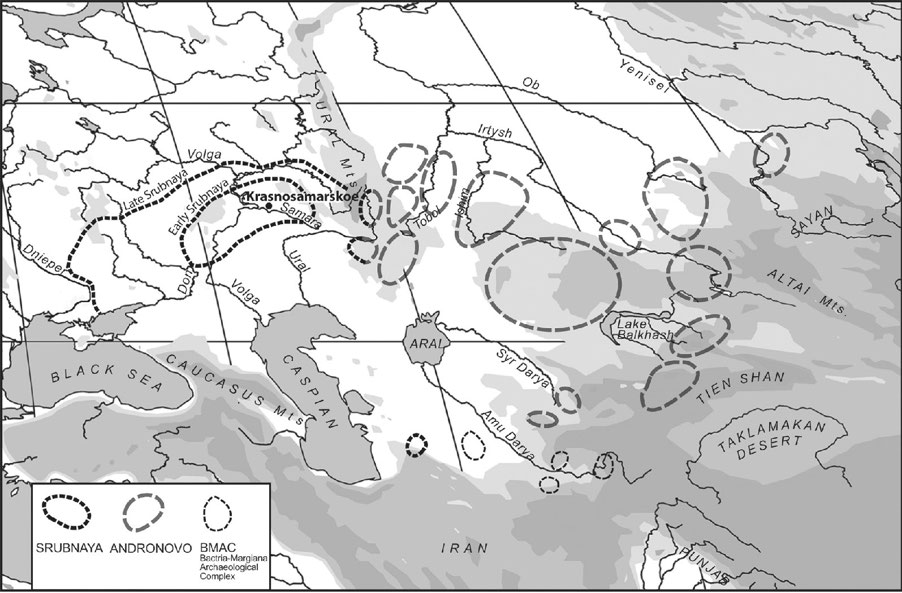

<i>Figure 6.2. Krasnosamarskoe site shown within the Late Bronze Age regional archaeological cultures (Srubnaya and Andronovo) of the Eurasian steppes and the Bactria-Margiana (BMAC) irrigationsupported civilisation in Central Asia, c. 2000–1800 cal BC.</i>

We can also examine the linguistic affiliation of the region from the historical rather than the evolutionary perspective. The middle Volga region in the Iron Age was home to Iranian-speaking societies who bordered on Uralic-speaking cultures in the forest zone to the north. In the Iron Age the personal names, ethnonyms and deity names recorded for the Scythian-Saka-Sauromatian cultures that ranged across the Don-Volga steppes were identifiably Iranian (Kuzmina 2007; Windfuhr 2009). Sarmatian tribes such as the Thisomatae, Laxomatae and the term Sarmatian itself carried the suffix <i>-matae</i>, meaning something like ‘tribe, people, men’ in East Iranian. The first element of the name is compared to Avestan <i>zar-</i>, ‘old’, by Lubotsky (2002, 189–202). The languages spoken in Srubnaya settlements in the Volga steppes a millennium earlier probably were ancestral to these Iranian tongues spoken during the Iron Age in the same region (Kuzmina 2007, 297–306). There was substantial regional continuity in physical type and in some material culture categories such as domestic architecture between the LBA and some early Iron Age cultures (Kuzmina 20017, 50–60). In addition, linguists recognise a large and long-lasting series of lexical loans between archaic Iranian (beginning during the common Indo-Iranian era) on one side and Proto-Uralic on the other (Koivulehto 2001), a relationship that requires that archaic Iranian was spoken near the forest zone where Uralic languages are spoken. The forest zone border is located 60 kilometres north of Krasnosamarskoe. These observations together make it reasonable to suggest that Krasnosamarskoe and most other sites of the Srubnaya culture probably were situated within an Indo-European context, generally; and perhaps within an archaic-Iranian-speaking context, specifically. Parallels from Indo-European mythology and linguistics therefore can be responsibly applied to understanding this set of archaeological remains, if the archaeological finds are aligned with the central elements of the warrior-as-dog/ wolf myth.

### Man’s best (oldest) friend: three myths about dogs

What canid-related myths or rituals fit best with the archaeological evidence at Krasnosamarskoe? To answer this we have to consider three myths and their archaeological correlates. A similar approach to interpreting prehistoric canid burials in Siberia was adopted by Losey <i>et al.</i> (2011, 176).

Humans have had a long time to develop dog-related myths because dogs were the first animal domesticated by humans, probably over 30,000 years ago (Druzhkova <i>et al.</i> 2013; Larson & Bradley 2014; Germonpre <i>et al.</i> 2015). Dogs might have helped humans out-compete Neanderthals, as argued by Shipman (2015). For the first 20,000 years of the relationship, dogs were the only animal that lived entirely within human culture, unlike their wild cousins, wolves. Another behavioural difference between dogs and wolves, recently discovered, is that when a dog and a human gaze into each other’s eyes, both release the hormone oxytocin into their blood systems. This hormone, in both humans and dogs, inhibits stress-induced activity in the hypothalamic-pituitaryadrenal axis, thereby making people and dogs feel content and happy. In the same way, a release of oxytocin facilitates the positive feedback loop of happiness and attachment between mothers and infants who share a gaze, and therefore a shared human-dog gaze can feel similar to a shared parent-infant gaze – for both participants (Nagasawa <i>et al.</i> 2015). Wolves do not release oxytocin when ‘looked in the eye’, but instead respond defensively, as they would to a threat. Dogs’ emotional bond with humans is reinforced by hormones that are released by a shared gaze, a chemical similarity that probably is many thousands of years old.

Native Americans are thought to have brought dogs from the Old World into the New World about 15,000 years ago (Fiedel 2005; van Asch <i>et al.</i> 2013). Ancient human DNA from Mal’ta, an Upper Palaeolithic cemetery near Lake Baikal dated 24,000 years ago (Raghavan <i>et al.</i> 2014), showed a cluster of genetic traits called Ancient North Eurasian (ANE), found to account for 40% of the genetic ancestry of Native Americans, and for 70% of the genetic ancestry of the indigenous ceramic-Neolithic hunter-gatherers of the Samara region, where Krasnosamarskoe is located (Haak <i>et al.</i> 2015). The presence of a large ANE component defines a genetic bridge of connected mating networks that was located in northern Eurasia during the Upper Palaeolithic and extended into the Pontic-Caspian steppes on the west (where it was a large component of Yamnaya and Srubnaya ancestry) and into the Americas on the east. It is interesting that a similar mythic theme about dogs is found in Native American and in Indo-European myths, a narrative in which a fierce dog guards the path to the afterlife, and getting past it was a test for the souls of the dead (Lankford 2007, 2011). It is possible that this mytheme was derived from a shared Upper Palaeolithic north Eurasian myth, in which case it might be one of the oldest mythemes recoverable through comparative mythology.

The Indo-European development of this myth is well documented. In Greek, Indic, Iranian and Germanic myths (and less clearly in later Baltic, Lithuanian and Albanian superstitions) a multi-headed (sometimes multi-eyed) dog or dogs guarded the entrance to the afterlife and challenged the dead before letting them enter (Schlerath 1954; Lincoln 1991b; Mallory & Adams 2006, 439). The name of the hell-hound in Greek (Kérberos) and Indic (Śárvara) was a cognate name, derived by regular sound changes from a shared late Proto-Indo-European root name meaning ‘spotted’, a trait of domesticated dogs, showing that the Proto-Indo-European hellhound was specifically a dog, not a wolf (Mallory & Adams 2006, 439; West 2007, 392). In Mediterranean Europe, particularly in Greece and Italy, this chthonic/death aspect of dogs probably explains the occasional sacrifices of dogs in the bottom of ritual wells (Chenal-Velarde 2002; Chilardi 2002; Mazzorin and Minniti 2002), most of which were connected with the worship of Hecate, goddess of ghosts and death. The expected archaeological correlate for this mythic theme would be dogs buried in cemeteries or in places indicative of the afterlife such as the bottom of shafts dug deep into the ground (the underworld).

In the Americas, in Souian, Algonquian and Iroquoian myths, as well as in Central American and South American myths, a fierce guard dog was located in the Milky Way, the path along which dead souls migrated to the afterlife, and getting past it was a test (Lankford 2007; Lankford 2011, 245–246). The guardian-of-the-afterlife theme is also found in the myths of Siberia among the Chukchi and Tungus, who believed in both the guardian-of-the-afterlife dog and a spirit dog that would absorb the dead man’s soul and act as guide-to-the-afterlife (Stutley 2003, 102–105). Adult dogs and wolves both were sacrificed in mortuary rituals of north Eurasian Mesolithic foragers near Lake Baikal about 5500–4000 BC (Losey <i>et al.</i> 2011) and at Mergen-6 farther west in Siberia near the mouth of the Ishim at 6000 BC (En’shyn 2012). Because of their mortuary contexts, unlike at Krasnosamarskoe, these dogs might be interpreted as symbols of the dog-as-guardian-of-the-afterlife myth.

A second canid-related series of beliefs, myths and rituals connected dogs with healing rather than death, but also regarded them as impure, exactly because they had the power to absorb illness from humans. Near Eastern and Turkic-Altaic myths like those of the Kipchaq associated dogs with healing rather than death and generally also categorised dogs as impure (Golden 1998, 186–192; Ornan 2004; Losey <i>et al.</i> 2011, 175–176; Hobgood-Oster 2014). Whole dogs buried under house thresholds and in foundation pits beneath houses in the Eneolithic site of Botai in Kazakhstan, dated <i>c.</i> 3500 BC (Olsen 2000), might represent the dog as absorber of illness, a guardian of the household against disease and evil. In Mesopotamia, the goddess Gula, associated with healing, was symbolised by a dog, and near her temples many dog graves have been found (Ornan 2004). In the Hittite ritual of Zuwi, possibly influenced by these beliefs, a puppy was held up to a sick person and was directed to lick the injured or diseased parts of his body thereby licking up the illness and absorbing it. The puppy was then killed in order to destroy the illness (Collins 1990). Similar absorbent-puppy healing and sacrifice rituals were practiced in Greece and Italy (Mazzorin and Minniti 2002), again possibly influenced by Near Eastern traditions.

In these contexts, where dogs are symbolised as healers and simultaneously as impure absorbers of illness, they are not eaten. At Krasnosamarskoe the dogs were consumed. In many of these Near Eastern/Mediterranean contexts, puppies were preferred as illness-absorbers, but the sex of the puppy was irrelevant. At Krasnosamarskoe old, male dogs were specifically selected for sacrifice. Specific traits of the canid deposits at Krasnosamarskoe contradict the expectations of a dog-ashealer ritual.

Several aspects of the archaeological record at Krasnosamarskoe correspond with the expectations of the warrior-transformed-into-dog/wolf myth. One is that wolves were included. Wolves were not regarded as healers or as guardians of the afterlife in ancient mythologies, but they were widely associated with violent death and war, and in Indo-European mythology, were a symbol of the savage fury that the warrior desired in battle (Spiedel 2002). Dogs and wolves were eaten at Krasnosamarskoe in a clear inversion of normal eating practices, a strong signal of a rite of passage centred on transformation into dogs/wolves, exactly as the warrior is symbolised in Indo-European myths. The fact that male dogs were selected for sacrifice identifies this as a male-centred ritual, and the fact that old, familiar dogs were selected makes it appear that the dogs symbolised cultured, that is human, victims. All of this aligns with the warrior-as-dog/wolf myth better than the other possibilities.

The warrior-as-dog/wolf myth might have evolved from a more ancient northern Eurasian symbolic linkage between dogs and death, specifically the dog-as-guardianof-the-afterlife myth. This symbolic evolution from dogs as a symbol of death and the afterlife to dogs as a symbol of war and warriors could have happened independently in the early Indo-European world and in parts of North America, where dogs and wolves became symbols of warrior sodalities in Algonquian and Souian war rituals (Comba 1991; Cook 2012). In both regions wolves were paired with dogs as symbols of war and warriors. But in the Americas the warrior-as-dog/wolf ritual occurred only in the Plains, and relatively late, so probably was an independent New World development from canid death symbolism to canid war/warrior symbolism.

### Other indicators of ritual activity at Krasnosamarskoe

Three kurgans, 60 m east of the settlement (Fig. 6.3) were first constructed about 2800 BC, at the opening of the Middle Bronze Age (MBA), a millennium before the Srubnaya settlement was established. All three kurgans were entirely excavated in 1999. Kurgan 3 was the only one that contained graves contemporary with the settlement. Twentyseven LBA Srubnaya individuals, buried in 23 graves, were inserted into Kurgan 3, on the north side facing away from the settlement (Fig. 6.4 and Table 6.1). The Srubnaya graves included 5 (18%) adults: two males, two females and a few bones of an adult of unknown gender; also 22 (82%) pre-adults, an unusually high proportion of young individuals, compared with other Srubnaya cemeteries in the lower Samara valley. Both of the adult males had unusual knee and back injuries, and both had their femurs chopped on one side to cut the hip ligaments after they died, a very unusual treatment accorded to just 7% of Srubnaya skeletons in this region. Chopping the hip ligaments is usually thought to enable the knees to be pressed against the chest for transport after death. But in both cases the leg position in the grave was relaxed and semi-extended, so the hip ligaments were not chopped to fit the corpse into the grave, and only one side was chopped for each of the two adult males. In life, both males also had twisting knee injuries and back strains that were unusual among Srubnaya adults generally. Something was different about these two men, possibly representing two generations. The two adult females also had back injuries that were unusual among the Srubnaya women examined.

<i>Table 6.1. Srubnaya individuals buried at Krasnosamarskoe IV, Kurgan 3, by age group.</i>

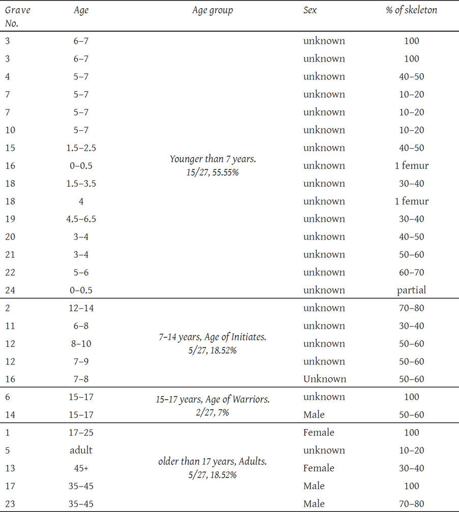

Although the 22 children buried in Kurgan 3 do not exhibit unusual signs of disease or violence, they must have died from either sickness or injury, so it is possible that some of them were brought to Krasnosamarskoe for healing ceremonies, if the site was indeed known as a centre for conducting childhood-related rituals. Perhaps some healing ceremonies failed, and the young victims were buried here. Twenty-two children seem too many to have been parented and lost just by the two adult couples and the partial adult buried with the children in the cemetery.

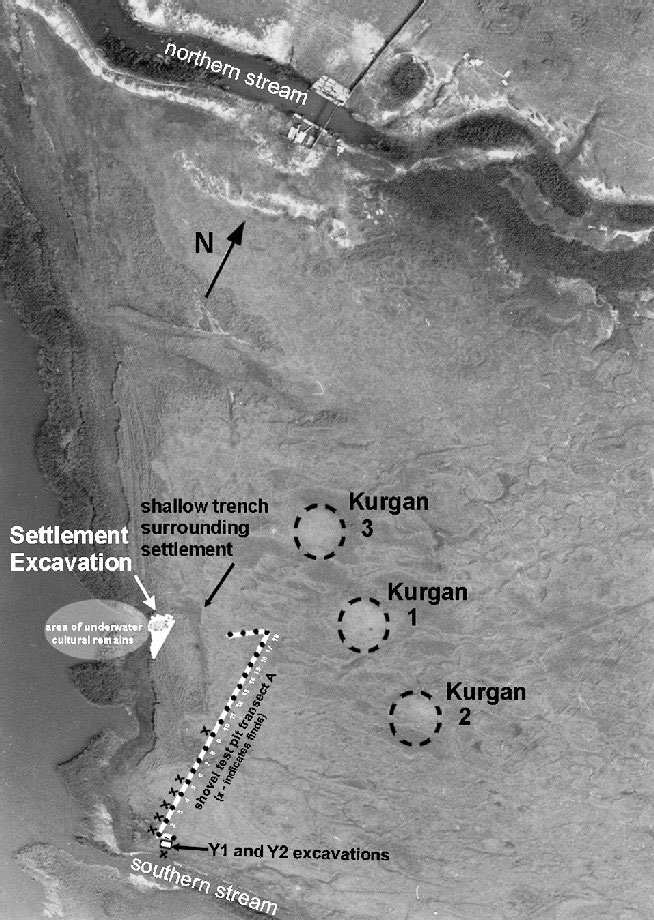

<i>Figure 6.3. Aerial photo (B. Aguzarov) showing the site of Krasnosamarskoe settlement excavations, Kurgans 1–3, shovel test transect, and activity area excavations (Area Y).</i>

Botanical remains from the settlement excavations include imported plants with medicinal uses. <i>Seseli</i> pollen was found in Pit 1, a small feature inside the structure. <i>Seseli</i> has sedative and muscle-relaxing qualities that might have been used to sedate the sacrificed animals, or might have been used with human patients. <i>Seseli</i> also produces a resin that is often burned as incense (Popova 2016). It grows in chalky soils, and the closest chalk ridges where <i>Seseli</i> can be found growing today are 160 kilometres away – on the west side of the Volga River. <i>Gypsophilia</i>, found in Pit 10 (a well inside the structure), like <i>Seseli</i> grows on chalky or limestone soils not found around Krasnosamarskoe, and is used as a diuretic and expectorant, and also as a treatment for mouth cancers. Herbal remedies brought to Krasnosamarskoe from a distance suggest the presence of an herbalist. <i>Artemesia</i>, or wormwood (pollen widespread in all features, used to flavour bitter drinks and as a flea repellent and antiseptic), <i>Linaria</i>, or toadflax (Pit 10 – used as an antiseptic and to treat skin lesions), and <i>Arenaria</i>, or sandwort (Pit 10 – used as a diuretic and laxative) also had medicinal uses.

Krasnosamarskoe was a small, probably single-family Srubnaya settlement, and this family probably included herbalists and the ritual specialists responsible for the standardised segmenting of the canid bodies. Cattle, sheep and goats were butchered throughout the year in a cycle typical of ordinary pastoral herd management and production. But many aspects of the site are unusual, from the injuries on both the men and the women to the imported herbs and the high proportion of children. The dog and wolf sacrifices occurred against this background of other unusual archaeological details.

<i>Figure 6.4. Plan and section of Krasnosamarskoe IV Kurgan 3. Initially constructed during the MBA (c. 2800–2900 BC) for graves nr. 8 and nr. 9, 22 more graves were inserted into Kurgan 3 one thousand years later in the Late Bronze Age. The inserted burials were contemporary with the nearby Srubnaya settlement.</i>

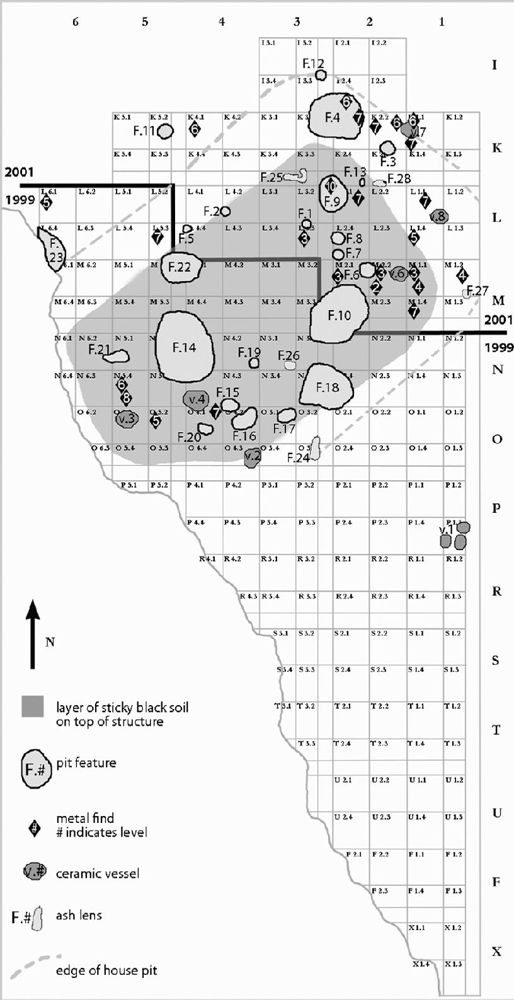

<i>Figure 6.5. Plan of settlement site showing location and number of pit features (p. #), and whole vessels (v. #), and small metal finds (black diamonds).</i>

### Shared features of Indo-European youthful war-bands

The Indo-European distribution of the canid-themed youthful war-band was explored by Wikander (1938), and was re-examined by Falk (1986), McCone (1987) and Lincoln (1991b). Their studies were reviewed at length and elaborated by Kershaw (2000) and later by Spiedel (2002). The subject was examined in a volume edited by Das & Mesier (2002), reviewed by Zimmer (2004), and the entire subject was reconsidered most recently by Mallory (2007). Mallory’s principal caution about the reconstructed institution of youthful war-bands was that such an institution could not have remained unchanged or static for millennia, which is clear in the variability contained in the comparative mythological and poetic materials; and that there was no archaeological evidence in Europe or Asia for dog-identified warriors, a problem that this paper seeks to redress.

The Das & Meiser (2002) volume concluded that youthful war-bands must have existed in Proto-Indo-European society in order to explain their numerous parallel occurrences in the daughter Indo-European branches. The youthful war-bands referenced in Indo-European traditions shared several basic characteristics that were summarised by Meiser (2002), reiterated by Mallory (2007), and here we repeat those original six and add two more from other sources.

1. They were composed of adolescent (post-pubescent, pre-adult) males who were initiated together as an age-class cohort.

2. The boy/warriors came from prominent families.

3. They were sent away to live in the ‘wild’ outside their own society for a number of years, where they were specifically ‘landless’, lacking socially accepted rights to the land upon which they lived, and without possessions other than weapons. Under these conditions they could steal, raid and take sexual license with women of other groups without the ordinary legal penalties that would have resulted from these behaviours at home. Their duties centred on military training, recitation of heroic poetry and raiding ‘others’.

4. They wore animal skins (Fig. 6.6) and appeared as if they were wolves or dogs.

5. They adopted wolf-like behaviour and had names containing the word ‘wolf’ or ‘dog’.

6. They were symbolically associated with both death and liminality on one hand and with fecundity and sexual license on the other.

7. A dice game was used to determine the leader of the warrior band (Kershaw 2000, 271).

8. Their raids could result in the founding of new settlements. It can be argued that the legends of Romulus and Remus, the first kings of Rome suggest that youthful war bands played a prominent role in the narrative tropes about the founding of that city (Bremmer 1982).

In the Old Norse <i>Volsunga Saga</i> (Byock 1990) Sigmund trained his sister’s son, Sinfjotli, to sneak with him through the forest dressed in wolf skins, thieving and killing, in order to harden him for later conflicts – a version of the youthful warband-as-training institution reduced to the training of a single youth. When they were ready to return to their normal lives, they removed their wolf skins and burned them, as in the Vedic tradition and as the canid remains were burned at Krasnosamarskoe. Warbands and their overseeing deities can be perceived in Odin and his relations with the <i>Männerbünde</i> or <i>Jungmannschaft.</i> The Twelve Nights of Christmas was a Germanic festival occurring between the end of the solar year (the winter solstice) and the end of the associated lunar cycle. During this intercalary interval Odin roared as a hunter through the forests with his troop of dogs, exactly like Rudra and the Maruts in the Vedic tradition.

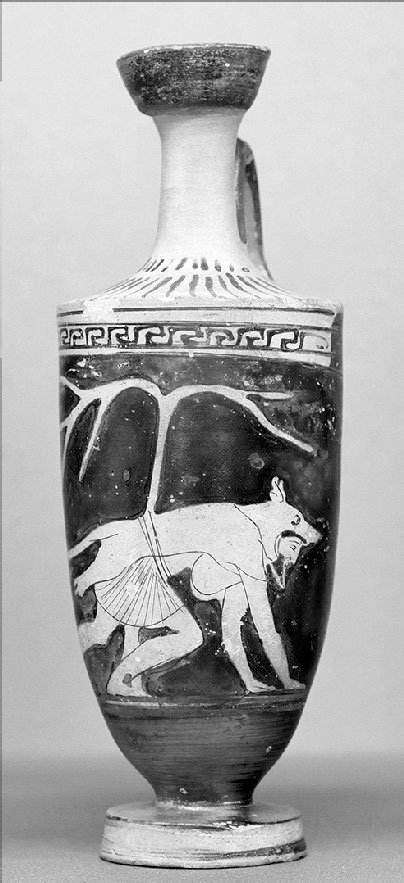

<i>Figure 6.6. Dolon wearing a wolf-skin to spy on the Greeks, from the Iliad. Detail from an Attic red-figure lekythos, c. 460 BC. Found in Italy(?). Louvre Museum.</i> [<i>https://commons.wikimediaorg/w/index.php?curid=7703465</i>](https://commons.wikimedia.org/w/index.php?curid=7703465)<i>.</i>

The initiation ceremonies connected with youthful war-bands were not as widely referenced in comparative mythology as the war-bands themselves. We know, for example, that young Spartan males sacrificed dogs to an archaic god of war, Enyalios (mentioned in Mycenaean Linear B documents), as they entered the age group of <i>ephebes</i>, but no ceremonial details are preserved (Mazzorin & Minniti 2002, 63). Drawing on Indic sources, Kershaw (2000) described four types of vrātyastoma rituals associated with youthful war-bands, including the midwinter ceremony infused with dog symbols, the initiation of the boys as an age-set cohort into bands of dog- or wolf-warriors, the launching of the resulting oath-bound youthful war-band into the less settled parts of the landscape, and a cleansing ceremony upon return to civilised life. Kershaw reviewed parallels in many Indo-European traditions, but particularly at the two ends of the Indo-European world, in the Vedic and Germanic traditions.

Vedic texts dated after 1000 BC referred to a group of outsiders called Śvapaca. This roughly translates to ‘dog-cooker’ but it can also be understood as ‘nourished by dogs’, ‘suckled by dogs’, or ‘children of dogs’ (White 1991, 72). The dog sacrifice and consumption at Krasnosamarskoe can accurately be described using the same terms. Among the Śvapaca were the people called Vrātyas or ‘dog-priests’ (White 1991, 96). They were known for performing a midwinter ceremony called Ekāstakā at the winter solstice, when Indra, the god of war, was born with his band of Maruts (Kershaw 2000, 233–234). Vrāta was used before 1200 BC, in the <i>Rig Veda,</i> to describe the Maruts, the youthful band of warriors who followed Rudra, a god of wildness, hunters and death. In this, the oldest of the Vedic texts, the Vrāta is the oath-bound warrior troop itself, the band of Maruts (Kershaw 2000, 231). As indicated earlier, the Maruts are thought by many (Kershaw 2000, 213–220; Jamison & Brereton 2014, 49) to represent the Vedic heavenly version of the Indo-European <i>*koryos</i>, the youthful war-band.

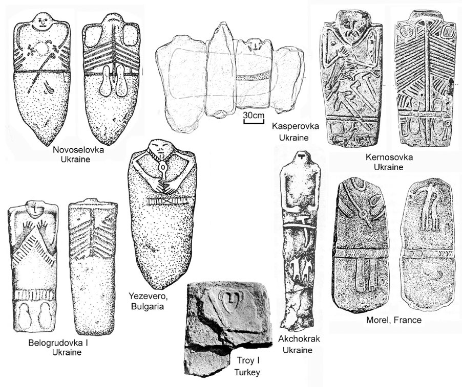

<i>Figure 6.7. Stone stele associated with steppe burials and found in Bulgaria, Turkey, France and Ukraine have many common characteristics, shoes and axes for example, but the most common item is the belt (after Anthony 2007, fig. 13.11).</i>

As summarised by Kershaw (2000, 203–210), Vedic training began at the age of eight. Each boy was bathed, his head was shaved and he was given new clothes: a belt, a prominent item of dress on Bronze Age stelae from the Pontic steppes (Fig. 6.7); and an animal skin for his upper body. He and his cohort studied for eight years, memorising heroic poetry about mythic ancestors and practicing hunting and fighting skills. After eight years, (age 16) he and his cohort were initiated into a warrior band during the winter solstice ritual – the Ekāstakā, in which initiates went into an ecstatic state and ritually died to be reborn as dogs of war. This midwinter ritual occurred on the eighth day of the darkening half of the lunar month.

The young initiates were taken to an opening in the forest, south of the village, called the Sabha. It was a place where corpses were burned and buried, where Rudra, the god of death and uncultured wildness, was near (Kershaw 2000, 251). Here the boys were ritually transformed into Dog/Warriors, the dice game was played to determine the leader, and a cow was sacrificed. The newly initiated warriors lived as dogs in the wild, with no contact with their families, for four years. From the winter to the summer solstices they went on raiding expeditions to acquire wealth – stealing animals, women, goods and territory – to enrich themselves, their families and tribes, and to gain personal glory for feats of valour and generosity.

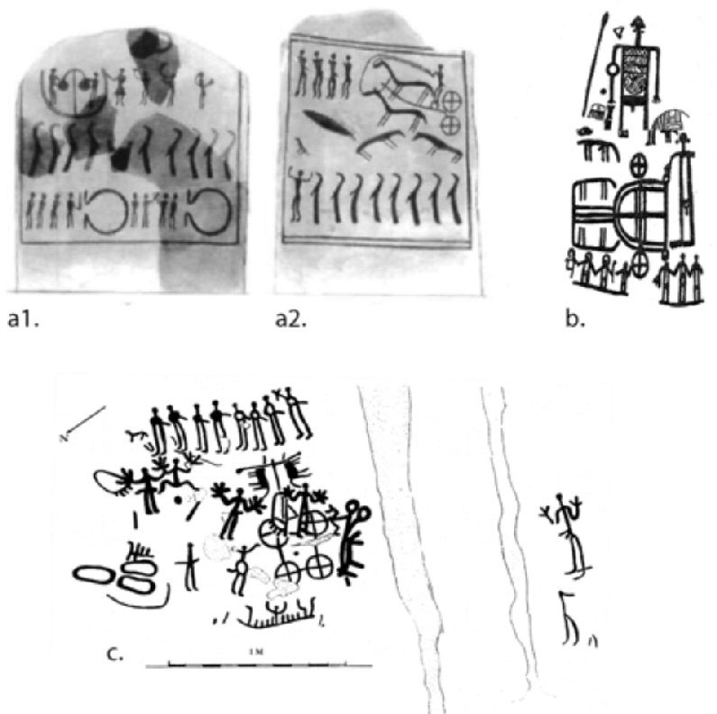

<i>Figure 6.8. Imagery possibly depicting youthful warrior groups can be found on petroglyphs: (a) inside a tomb in Brerador on Kivik, Sweden, (b) in Antigua, Spain, and (c) in Askum, Sweden. All three date to about 1300–1000 BC.</i>

The summer solstice ended the raiding season and the warriors returned to their forest residence where they held another vrātyastoma sacrifice to thank the gods for their success (Kershaw 2000, 209). They remained together in the wild practicing warfare and storytelling until the next winter solstice when the raiding season would start again, and so it would go for four years. At the end of four years, there was a final vrātyastoma sacrifice to transform the Dog/Warriors into responsible adult men who were ready to live by the rules of civil life (Kershaw 2000, 63). They discarded and destroyed their old clothes. They became human once again and were welcomed back into their settlements as adult members of the community. Kershaw’s description of the Vedic initiation process provides the most detailed account of this aspect of youthful war-bands.

### The number eight

The eight- and four-year training periods, beginning with eight-year-olds, and the timing of the Ekāstakā – on the eighth day of the darkening half of the lunar month – all emphasise the number eight, which perhaps is paralleled at Krasnosamarskoe where the structure with the canid bones also yielded eight knucklebone dice, polished by use (Anthony <i>et al</i>. 2016, 286). The number eight recurs in intriguing ways in other Indo-European mythological and archaeological contexts related to war and adolescents. In the Volsunga Saga, Sigmund told Sinfjotli to call for help only if he was attacked by enemies numbering ‘more than seven’ – a riddling reference to the number eight (Byock 1990’ Kershaw 2000, 59)

The human bones in the famous tomb at Breradör on Kivik in Sweden, mostly dating about 1300–1000 BC, were from adolescents aged 13–15 (Goldhahn 2009, 369), not from kings, as was previously thought. Perhaps they also were the remains of young raiders – and perhaps the much-discussed images inside the tomb showed the initiation of boys into warriors. One interior stele at Breradör shows eight hooded figures (initiates?) led by a non-hooded leader (Fig. 6.8 a2). A petroglyph of similar age in Sweden at Askum also shows eight armed figures (Fig. 6.8 c) an image of sexual union, and a chariot (Fredell 2006). A Spanish stele of Urnfield age at Ategua (Vandkilde 2013), about the same era as Breradör, shows a group of seven figures led by an eighth warrior in a chariot, overseen by an armed god (Fig. 6.8 b). At the famous Halstatt chieftan’s tomb at Hochdorf, eight aurochs-horn drinking cups were hung in two groups of four on the southern tomb wall, with a ninth (the leader’s?) cup of iron at the head of the dead chief’s body on the west wall. At the La Tene oppidum of Gondole in France, eight horses were found buried in a single event with eight humans whose arms were extended to grasp the shoulder of the man in front: seven adult men and one adolescent (Deberge 2009). The smallest unit in the Roman army, the <i>contubernium</i>, consisted of eight legionnaires plus one leader. Certainly the number eight recurs in significant symbolic contexts both archaeologically and in Indo-European stories about warriors.

### Indo-European warrior bands and the psychology of war

The Proto-Indo-European term for the youthful war-band might have been <i>*koryos</i>, although this word also came to mean any ‘troop’ (Celtic) or ‘army’ (Germanic, Baltic, Greek) in the daughter branches. The Proto-Indo-European root <i>*teuteh</i>a<i>-</i> might have referred to the society of ‘adult males with possessions’ who would mobilise in the event of warfare, perhaps originally a Proto-Indo-European term meaning ‘army, the people under arms’, although there are at least two more Proto-Indo-European roots with military meanings, one (<i>*haeg̑ós-</i>) derived from the root ‘to drive cattle’ meaning both ‘cattle raid’ and ‘driver, leader’; and the other (<i>*leh₂wós</i>), ‘military unit’ or ‘military action’ confined to Greek and Hittite. The precise meaning in Proto-Indo-European of each root, beyond the vague sense of ‘military unit’, is unclear, but certainly Proto-Indo-European contained a variety of terms for war bands, perhaps for war bands of different kinds (Mallory & Adams 2006, 278–282).

How were the warriors in war bands conditioned to kill? During World War II, military historians from West Point Military Academy interviewed thousands of American soldiers immediately after combat. They found that 80–85% of World War II riflemen did not shoot to kill their enemy (Grossman 2009). Neither did they cower or run away. Some shot over the heads or at the feet of the enemy to daunt them. Many put themselves in grave danger to aid their fellow soldiers, pulling wounded off the field, running to get equipment, or scouting for intelligence about the enemy; but they could not bring themselves to kill another human. They did not fear dying, but they did fear killing a human. Other studies found that only 2% of combat soldiers killed without regret or remorse. The other 98% had to be convinced or pressured to kill a human. And if they did kill, especially at close range, they had to be able to forgive themselves or they would be susceptible to suffer from post-traumatic stress disorder (PTSD) (Grossman 2009, 41–95).

Is it appropriate to apply data from studies on the psychology of killing among twentieth century soldiers to our understanding of people living thousands of years earlier? Archaeologist Barry Molloy argued that the same physiological and psychological responses to violence occurred across ancient and modern eras, in a study co-written with war psychologist David Grossman (Molloy & Grossman 2007). Other psychologists who work with modern veterans use Classical descriptions of close-range warfare to help them to better understand and deal with their psychological condition. War stories used in this therapeutic way include Homer’s <i>Iliad</i> and <i>Odyssey</i> (Shay 2002) and Sophocles’ dramatic tragedy <i>Ajax</i> (Doerries 2015). Ajax’s rage against Odysseus and Menelaus ultimately resulted in his slaughtering all the cattle that had been taken as spoils of war by the Greeks, under the delusional impression they were Odysseus and Menelaus. When he realised how his rage had dishonoured him and his family, and how misdirected it had been, Ajax fell on his sword, killing himself. Sophocles’ play was written 2,500 years ago for Athenians who recognised the madness of Ajax among their returning veterans, but modern veterans also recognise in this ancient hero the symptoms of what we would today call PTSD. The <i>New York Times</i>, inspired by Doerries (2015), on Memorial Day 2017 posted a video of veterans who suffered PTSD reading Ajax’s final speech, and all of them were moved to tears (Headlam, Archdeacon & Shum 2017). Modern warriors who read classical accounts of war feel that they recognise the psychological stresses suffered by ancient warriors.

According to Grossman (2009, 150), group pressure can override an individual’s natural resistance to killing, and group support can then defuse the burden of guilt by sharing it. The degree of influence the group has over the soldier depends on how closely he identifies with it as well as his physical proximity to it. The intensity of support within the group, the number of people in the group, and the legitimacy (as perceived by each soldier) of both the group as a whole and of its leader, all contribute to the psychological readiness of each member of the group to kill others, and to the effectiveness of the fighting group as a whole.

The Indo-European warrior band was validated through several factors. One was epic poetry describing heroic warriors (Watkins 1995), providing a model for young warriors to emulate. The <i>*koryos</i> leader was chosen by a dice game, and the result was accepted as the gods’ choice. This divine association gave legitimacy to the leader. The other band members pledged to die for him, and to kill for him. The <i>*koryos</i> members would have known each other well, having entered adolescence at the same time, having trained together for several years, and having supported each other in combat. In Vedic traditions they spent half the year memorising poetry celebrating the glory of their ancestors’ heroic acts of conquest, killing enemies and winning loot and territory that the gods wanted them to have. When Bronze Age raiders returned with loot and women and tales of victory, they probably felt very little guilt.

But as boys, most of the new initiates would have had to learn to overcome a basic aversion to killing humans. Their initiation ceremony symbolically transformed them from human children into Rudra’s dogs of war. By becoming dogs, they physically and legally moved outside the human world and were no longer constrained by human taboos. The sequence of rituals and training bonded the initiates to their war-bands, creating strong group pressure and support, preparing the boys psychologically to kill their human enemies. When they returned to normal life, they would feel no remorse for breaking the rules of their home society because they had not been humans or living in a cultured space when the rules were broken.

### Conclusions

Between 1900–1700 BC Krasnosamarskoe was a central place for the performance of a winter ritual connected to boys’ initiations, a place where boys became warriors who would eventually feed the dogs of death. Dogs and wolves were sacrificed and eaten, and cattle and sheep were feasted upon. No other Srubnaya settlement contains such evidence, so boys from other settlements who participated in this ritual trudged through the frozen winter steppes to Krasnosamarskoe to do so. This suggests that seasonal rituals were regionally organised.

Examined alone, and without ancient inscriptions or imagery for guidance, the winter-season dog and wolf sacrifices at Krasnosamarskoe defy a purely material explanation. While the many dogs killed at the site are obvious, the cultural models that made sense out of them are not. But if we use the linguistic and mythological resources that comparative Indo-European scholarship provides, the culture, institutions and worldview that surrounded the dog sacrifice become clearer. We do not presume an exact replication of all the ritual elements across all the different Indo-European cultures that participated in the dog-warrior cult. But the basic concepts are surprisingly similar between the historical groups we do know, whether <i>kouro</i>s, <i>luperci,fian,männerbünde</i> or <i>vrātyas</i>.

The Indo-European institution of the <i>*koryos</i>, suggested by the winter dog rituals at Krasnosamarskoe, could have functioned in three ways: as an organisation promoting group cohesion and effectiveness in combat, as an instrument of external territorial expansion, and as a regulatory device in chiefly feast-centred economies. The liminal, irregular, and uneasy relationship between the wild <i>*koryos</i> troop and normal society could have played a regulatory role. Hayden & Villeneuve (2012) noted that the political power structures of almost all tribal chiefdoms are organised around seasonal ritual feasting events, like the winter ceremonies at Krasnosamarskoe. At these feasts it is common for the chief to demand that those who attend contribute an animal, and ‘enforcers’ are frequently used in chiefdoms around the world to ensure that everyone who can contributes animals to important chiefly feasts.

Similarly, Falk (1986) and Kershaw (2000, 242–243) described how the youthful Vedic war band would approach a farmstead and ask the farmer to contribute a cow to the sacrifice. A wise farmer would give them his best cow, which they would take away and sacrifice to Rudra. But if the farmer resisted, they might ask him to recite an ancient poem or answer a riddle. If the farmer did not know the poem or the answer to the riddle, the dog-wolf-youths would take the cow and anything else they wanted and kill anyone who got in their way. In addition to serving a ritual function, to ensure a steady supply of sacrifices for Rudra, this behaviour would have enforced a political obligation within feasting-based chiefdoms.

Our comparison of the archaeological remains at Krasnosamarskoe with Indo-European mythological evidence for canid-related youthful war-bands suggests that correlations between prehistoric behaviours, perceived archaeologically, and Indo-European institutions and myths, perceived through philology and comparative mythology, can successfully unlock the indigenous narratives that gave meaning to otherwise obscure Bronze Age ritual archaeological assemblages. In addition, Indo-European myths of dog/wolf warriors can now be tied to a real place and time, and the archaeology can be used to verify and better understand the myths.

#### <i>Note</i>

[^ch6-note-1]: All of these traits are described in detail in chapters 14–16 in the final report of the Samara Valley Project (Pike-Tay & Anthony 2016; Kosintsev 2016; Russell, Brown & Brown 2016).

## References

Anthony D.W. 2007. <i>The Horse, the Wheel, and Language: How Bronze Age riders from the Eurasian steppes shaped the modern world.</i> Princeton: Princeton University Press.

Anthony, D.W. & D.R. Brown. 2017a. The dogs of war: a Bronze Age initiation ritual in the Russian steppes. <i>Journal of Anthropological Archaeology</i> 38. 134–148.

Anthony, D.W. & D.R. Brown. 2017b. Molecular archaeology and Indo-European linguistics: Impressions from new data. In: B.S.S. Hansen, A. Hyllested, A.R. Jørgensen, G. Kroonen, J.H. Larsson, B. Nielsen Whitehead, T. Olander & T. Mosbæk Søborg (eds), <i>Usque ad radices: Indo-European studies in honour of Birgit Anette Olsen</i> (Copenhagen Studies in Indo-European 8), 25–54. Copenhagen: Museum Tusculanum.

Anthony, D.W., D.R. Brown, P. Kuznetsov, O. Mochalov & A. Khokhlov (eds). 2016. <i>A Bronze Age Landscape in the Russian Steppes: The Samara Valley Project</i> (Monumenta Archaeologica 37). Los Angeles: Cotsen Institute of Archaeology Press.

Bremmer, J.N. 1982. The suodales of Poplios Valesios. <i>Zeitschrift für Papyrologie und Epigraphik</i> 47. 133–137.

Bremmer, J.N. & N.M. Horsfall. 1987. <i>Roman Myth and Mythography</i> (Institute of Classical Studies Bulletin Supplement 52). London: University of London, Institute of Classical Studies.

Byock, J.L. 1990. <i>The Saga of the Volsungs: The Norse epic of Sigurd the Dragon Slayer</i>. London: Penguin Classics.

Cebrián, R.B. 2010. Some Greek evidence for Indo-European youth contingents of shape-shifters. <i>Journal of Indo-European Studies</i> 38(3–4). 343–357.

Chenal-Velarde, I. 2002. Food, rituals? The exploitation of dogs from Eretria (Greece) during the Helladic and Hellenistic periods. In: L.M. Snyder & E.A. Moore (eds), <i>Dogs and People in Social, Working, Economic or Symbolic Interaction</i>, 24–31. Oxford: Oxbow Books.

Chilardi, S. 2002. Artemis pit? Dog remains from a well in the ancient town of Siracusa (Sicily). In: L.M. Snyder & E.A. Moore (eds), <i>Dogs and People in Social, Working, Economic or Symbolic Interaction</i>, 32–37. Oxford: Oxbow Books.

Collins, B.J. 1990. The puppy in Hittite ritual. <i>Journal of Cuneiform Studies</i> 42(2). 211–226.

Comba, E. 1991. Wolf warriors and dog feasts: Animal metaphors in Plains military societies. <i>European Review of Native American Studies</i> 5(2). 41–48.

Cook, R.A. 2012. Dogs of war: potential social institutions of conflict, healing, and death in a Fort Ancient village. <i>American Antiquity</i> 77(3). 498–523.

Das, R.P. & G. Meiser (eds). 2002. <i>Geregeltes Ungestüm. Brüderschaften und Jugendbünde bei altindogermanischen Völkern.</i> Bremen: Hempen.

Deberge, Y., U. Cabezuelo, M. Cabanis, S. Foucras, M. Garcia, K. Gruel, M. Loughton, F. Blondel & P. Caillat. 2009. L’oppidum arverne de Gondole (Le Cendre, Puy-de-Dôme). Topographie de l’occupation protohistorique (La Tène D2) et fouille du quartier artisanal: un premier bilan. <i>Revue archéologique du centre de la France</i> 48. 33–130.

Doerries, B. 2015. <i>The Theater of War: What Ancient Greek tragedies can teach us today.</i> New York: Vintage Books.

Druzhkova, A.S., O. Thalmann, V.A. Trifonov, J.A. Leonard, N.V. Vorobieva, N.D. Ovodov, A.S. Graphodatsky & R.K. Wayne. 2013. Ancient DNA analysis affirms the canid from Altai as a primitive dog. <i>PLoS ONE</i> 8(3). e57754. doi:10.1371/journal.pone.0057754.

En’shyn, D.N. 2012. K voprosu o sakralizacii žiloj sredy naselenija Nižnego Prišim’ja v èpoxu neolita. In: V.A. Alëškin <i>et al.</i> (eds), <i>Kul’tury stepnoj Evrazii i ix vzaimodejstvie s drevnimi civilizacijami</i>. Vol. 2, 76–79. St. Petersburg: Institut istorii material’noj kul’tury RAN.

Falk, H. 1986. <i>Bruderschaft und Würfelspiel.</i> Freiburg: Hedwige Falk.

Fiedel, S.J. 2005. Man’s best friend – mammoth’s worst enemy? A speculative essay on the role of dogs in Paleoindian colonization and megafaual extinction. <i>World Archaeology</i> 37. 11–25.

Fredell, Å. 2006. The pangs in Askum? An example of storytelling by rock pictures and their possible link to a known story. In: M.V.G. Quintela, F.J.G. García & F.C. Boado (eds), <i>Anthropology of the Indo-European World and Material Culture</i>, 121–135. Budapest: Archaeolingua.

Frînculeasa, A., B. Preda & V. Heyd. 2015. Pit-Graves, Yamnaya and kurgans along the lower Danube: disentangling IVth and IIIrd millennium BC burial customs, equipment and chronology. <i>Praehistorische Zeitschrift</i> 90(1–2). 1–69.

García Moreno, L.A. 2006. Celtic place and personal names in Spain and the sociopolitical structure and evolution of the Celtiberians. <i>e-Keltoi</i> 6. 675–688.

Garwood, P. 2011. Rites of passage. In: T. Insoll (ed.), <i>The Oxford Handbook of the Archaeology of Ritual and Religion</i>, 1–19. Oxford: Oxford University Press.

van Gennep, A. 1960 [1909]. <i>The Rites of Passage</i>. Trans. M.B. Vizedom & G.L. Caffee. Chicago: University of Chicago Press.

Germonpré, M., M. Lázničková-Galetov, R.J. Losey, J. Räikkőnen & M.V. Sablin. 2015. Large canids at the Gravettian Předmostí site, the Czech Republic: the mandible. <i>Quaternary International</i> (359–360). 261–279.

Golden, P. 1998. Religion among the Qipchaks of Medieval Eurasia. <i>Central Asiatic Journal</i> 42(2). 180–237

Goldhahn, J. 2009. Breradör on Kivik: a monumental cairn and the history of its interpretation. <i>Antiquity</i> 83. 359–371.

Grossman, D.A. 2009. <i>On Killing: The psychological cost of learning to kill in war and society</i>. Revised edition, New York: Back Bay Books.

Haak, W., I. Lazaridis, N. Patterson, N. Rohland, S. Mallick, B. Llamas, G. Brandt <i>et al.</i> 2015. Massive migration from the steppe was a source for Indo-European languages in Europe. <i>Nature</i> 522(7555). 207–211. doi:10.1038/nature14317.

Hayden, B. & S. Villeneuve. 2012. Who benefits from complexity? A view from Futuna. In: T. Douglas Price & G.M. Feinman (eds), <i>Pathways to Power: New perspectives on the emergence of social inequality</i>, 95–146. New York: Springer.

Headlam, B., C. Archdeacon & M. Shum 2017. Theater of war: A warrior’s last words. <i>New York Times Video</i>. [https://nyti.ms/2r6Q5hq](https://nyti.ms/2r6Q5hq). ˂AQ: please provide access date>

Heesterman, J. 1962. Vrâtyas and sacrifice. <i>Indo-Iranian Journal</i> 6. 3–37.

Hobgood-Oster, L. 2014. <i>A Dog’s History of the World: Canines and the domestication of humans</i>. Waco, TX: Baylor University Press.

Jamison, S.W. & J.P. Brereton. 2014. <i>The Rigveda: The earliest religious poetry of India.</i> Translated and edited. Oxford: Oxford University Press.

Kershaw, K. 2000. The one-eyed God: Odin and the (Indo-)Germanic Männerbünde. <i>Journal of Indo-European Studies. Monograph Series</i> 36. Washington, DC: Institute for the Study of Man.

Koivulehto, J. 2001. The earliest contacts between Indo-European and Uralic speakers in the light of lexical loans. In: C. Carpelan, A. Parpola & P. Koskikallio (eds), <i>Early Contacts Between Uralic and Indo-European: Linguistic and archaeological considerations</i> (Mémoires de la Société Finno-Ugrienne 242), 235–263. Helsinki: Suomalais-Ugrilainen Seura.

Kosintsev, P. 2016. Archaeozoological report on the animal bones from the Krasnosamarskoe settlement. In: D.W. Anthony, D.R. Brown, P. Kuznetsov, O. Mochalov & A. Khokhlov (eds), <i>A Bronze Age Landscape in the Russian steppes: The Samara Valley Project</i> (Monumenta Archaeologica 37), 385–420. Los Angeles: Cotsen Institute of Archaeology Press.

Kristiansen, K., M.E. Allentoft, K.M. Frei, R. Iversen, N.N. Johannsen, G. Kroonen, Ł. Pospieszny <i>et al.</i> 2017. Re-theorising mobility and the formation of culture and language among the Corded Ware Culture in Europe. <i>Antiquity</i> 91(356). 334–347. 10.15184/aqy.2017.17

Kuzmina, E.E. 2007. <i>The Origins of the Indo-Iranians</i>. Edited by J.P. Mallory (Leiden Indo-European Etymological Dictionary Series 3). Leiden: Brill.

Lankford, G.E. 2011. The raptor on the path. In: G.E. Lankford, F.K. Reilly III & J.F. Garber (eds), <i>Visualizing the Sacred: Cosmic visions, regionalism, and the art of the Mississippian world</i>, 240–250. Austin: University of Texas Press.

Lankford, G.E. 2007. ‘The Path of Souls’: Some death imagery in the Southeastern ceremonial complex. In: F.K. Reilly III & J.F. Garber (eds), <i>Ancient Objects and Sacred Realms: Interpretations of Mississippian iconography</i>, 174–212. Austin: University of Texas Press.

Larson, G. & D.G. Bradley. 2014. How much is that in dog years? The advent of canine population genomics. <i>PLoS Genet</i> 10(1): e1004093. doi:10.1371/journal.pgen.1004093.

Lincoln, B. 1991a. Homeric λύσσα: ‘wolfish rage’. In: B. Lincoln, <i>Death, War, and Sacrifice: Studies in ideology and practice,</i> 147–166. Chicago: University of Chicago Press.

Lincoln, B. 1991b. Warriors and non-herdsmen: a reply to Mary Boyce. In: B. Lincoln, <i>Death, War, and Sacrifice: Studies in ideology and practice</i>, 131–137. Chicago: University of Chicago Press.

Losey, R.J., V.I. Bazaliiskii, S. Garvie-Lok, M. Germonpre, J.A. Leonard, A.L. Allen, M.A. Katzenberg, M.V. Sablin. 2011. Canids as persons: Early Neolithic dog and wolf burials, Cis- Baikal, Siberia. <i>Journal of Anthropological Archaeology</i> 30. 174–189.

Lubotsky, A. 2002. Scythian elements in Old Iranian. In: N. Sims-Williams (ed.), <i>Indo-Iranian Languages and Peoples</i> (Proceedings of the British Academy 116), 189–202. Oxford: Oxford University Press.

Mallory, J.P., & D.Q. Adams. 2006. <i>The Oxford Introduction to Proto-Indo-European and the Proto-Indo- European World</i>. Oxford: Oxford University Press.

Mallory, J.P. 2007. Indo-European warfare. In: T. Pollard & I. Banks (eds) <i>War and Sacrifice: Studies in the archaeology of conflict</i>, 77–98. Leiden: Brill.

Mazzorin, J. de G., & C. Minniti. 2002. Dog sacrifice in the ancient world: a ritual passage? In: L.M. Snyder & E.A. Moore (eds), <i>Dogs and People in Social, Working, Economic or Symbolic Interaction</i>, 62–66. Oxford: Oxbow Books.

McCone, K. 1987. Hund, Wolf und Krieger bei den Indogermanen. In: W. Meid (ed.), <i>Studien zum Indogermanischen Wortschatz</i>, 101–154. Innsbruck.

Meiser, G. 2002. ‘Indogermanische Jugenbünde’ oder: Probleme bei der Rekonstruktion sozialer Strukturen. In: R.P. Das & G. Meiser (eds), <i>Geregeltes Ungestüm. Brüderschaften und Jugendbünde bei altindogermanischen Völkern</i>, 1–10<i>.</i> Bremen: Hempen.

Molloy, B.P.C. & D. Grossman. 2007. Why can’t Johnny kill? The psychology and physiology of interpersonal combat. In: B.P.C. Molloy (ed.), <i>The Cutting Edge: Studies in ancient and medieval combat</i>, 188–202. Stroud: Tempus.

Nagasawa, M., S. Mitsui, S. En, N. Ohtani, M. Ohta, Y. Sakuma, T. Onaka, K. Mogi & T. Kikusui. 2015. Oxytocin-gaze positive loop and the coevolution of human-dog bonds. <i>Science</i> 348(6232). 333–336.

Olsen, S.L. 2000. The secular and sacred roles of dogs at Botai, North Kazakhstan. In: S.J. Crockford (ed.), <i>Dogs Through Time: An archaeological perspective. Proceedings of the 1st ICAZ Symposium on the History of the Domestic Dog, Eight Congress of the International Council for Archaeozoology (ICAZ98)</i> (BAR International Series 889), 71–92. Oxford: Archaeopress.

Ornan, T. 2004. The goddess Gula and her dog. <i>Israel Museum Studies in Archaeology</i> 3. 13–30.

Pike-Tay, A. & D.W. Anthony. 2016. Dog days of winter: Seasonal activities in a Srubnaya landscape. In: D.W. Anthony, D.R. Brown, P. Kuznetsov, O. Mochalov & A. Khokhlov (eds), <i>A Bronze Age Landscape in the Russian Steppes: The Samara Valley Project</i> (Monumenta Archaeologica 37), 383–384. Los Angeles: Cotsen Institute of Archaeology Press.

Popova, L. 2016. Floral data analysis: Report on the pollen and macrobotanical remains from the Krasnosamarskoe settlement. In: D.W. Anthony, D.R. Brown, P. Kuznetsov, O. Mochalov & A. Khokhlov (eds), <i>A Bronze Age Landscape in the Russian Steppes: The Samara Valley Project</i> (Monumenta Archaeologica 37), 333–349. Los Angeles: Cotsen Institute of Archaeology Press.

Raghavan, M., P. Skoglund, K.E. Graf, M. Metspalu, A. Albrechtsen, I. Moltke, S. Rasmussen <i>et al.</i> 2014. Upper Palaeolithic Siberian genome reveals dual ancestry of Native Americans. <i>Nature</i> 505. 87–91.

Russell, N., A. Brown & E. Brown. 2016. Human-animal relations at Krasnosamarskoe. In: D.W. Anthony, D.R. Brown, P. Kuznetsov, O. Mochalov & A. Khokhlov (eds), <i>A Bronze Age Landscape in the Russian Steppes: The Samara Valley Project</i> (Monumenta Archaeologica 37), 421–441. Los Angeles: Cotsen Institute of Archaeology Press.

Schlerath, B. 1954. Der Hund bei den Indogermanen. <i>Paideuma</i> 6. 25–40.

Shay, J. 2002. <i>Odysseus in America: Combat trauma and the trials of homecoming.</i> New York: Scribner.

Shipman, P. 2015. <i>The Invaders: How humans and their dogs drove Neanderthals to extinction</i>. Cambridge, MA: The Belknap Press of Harvard University Press.

Spiedel, M.P. 2002. Berserks: a history of Indo-European ‘mad-warriors.’ <i>Journal of World History</i> 13(2). 253–290.

Stutley, M. 2003. <i>Shamanism: An introduction</i>. London: Routledge.

Tambiah, S.J. 1969. Animals are good to think and good to prohibit. <i>Ethnology</i> 8. 423–459.

van Asch, B., A. Zhang, M.C.R. Oskarsson, C.F.C. Klütsch, A. Amorim & P. Savolainen. 2013. Pre-Columbian origins of Native American dog breeds, with only limited replacement by European dogs, confirmed by mtDNA analysis. <i>Proceedings of the Royal Society</i> B 280(1766). 1–13. doi: 10.1098/ rspb.2013.1142.

van Hoof, L., O. Dally & M. Schlöffel. 2012. Staying home or staying with your cattle? Different reactions to environmental changes. In: <i>The Late Bronze Age of the lower Don area (Southern Russia)</i> (Etopoi Journal for Ancient Studies Special Volume 3). 71–75.

Vandkilde, H. 2013. Warfare in northern European Bronze Age societies. In: S. Ralph (ed.), <i>The Archaeology of Violence: Interdisciplinary approaches</i>, 37–62. Albany: SUNY Press.

Watkins, C. 1995. <i>How to Kill a Dragon: Aspects of Indo-European poetics</i>. Oxford: Oxford University Press.

West, M.L. 2007. <i>Indo-European Poetry and Myth</i>. Oxford: Oxford University Press. White, D.G. 1991. <i>Myths of the Dog-Man</i>. Chicago: University of Chicago Press.

Wikander, S. 1938. <i>Der arische Männerbund</i>. Lund: Håkan Ohlssons Buchdruckerei.

Windfuhr, G. (ed.). 2009. <i>The Iranian Languages</i>. London: Routledge.

Witzel, M. 1995. Rgvedic history: poets, chieftains and polities. In: G. Erdosy (ed.), <i>The Indo-Aryans of Ancient South Asia: Language, material culture and ethnicity</i> (Indian Philology and South Asian Studies 1), 307–352. Berlin: Walter de Gruyter.

Wrangham, R.W. 1999. Evolution of coalitionary killing. <i>Yearbook of Physical Anthropology</i> 42. 1–30.

Wrangham, R.W., & L. Glowacki. 2012. Intergroup aggression in chimpanzees and war in nomadic hunter-gatherers: evaluating the chimpanzee model. <i>Human Nature</i> 23. 5–29. doi: 10.1007/s12110-012-9132-1

Zimmer, S. 2004. Review of Das & Meiser 2002. <i>Journal of Indo-European Studies</i> 32. 207–216.

# 7. ‘Children of the light’: On yoga, body schemes and altered states of consciousness in the Nordic Late Bronze Age – a link to India?

## <i>Kristin Armstrong Oma and Lene Melheim</i>

### Scope

Bronze Age bodies mattered. The accentuated body schemes discernible on Bronze Age artwork demonstrate that bodies and their movements were rich with significance. In the following, we will outline some possible connections between individual bodies and cosmology. We argue that Bronze Age religion, among other things, involved physical and mental exercises used to attain personal growth, spiritual awakening and unity with the Universe – techniques that are documented in contemporary Vedic texts. Our interpretation ties in with aspects of Indo-European sun mythology and the roles played by animals and human cult practitioners in the sun’s cyclic journey.

The current article develops ideas that the authors have discussed independently in two previous works on Scandinavian iconographic evidence from the first millennium BC, which resulted in a striking convergence between two initially different perspectives. Kristin Armstrong Oma (2008) argued that the practice of yoga may serve to explicate the poses of miniature human bronze figurines from the Danish Late Bronze Age. Lene Melheim (2008) argued, partly on the basis of the same figurines, that Late Bronze Age normative body schemes replicate the right–left logic of Nordic Bronze Age cosmology. Both suggested that a solar mythology anchored in an Indo-European world-view lay at the core of these bodily practices. By adding more strands of evidence, this article tries to bridge our previous interpretations. We maintain that the body schemes and poses detected in the figurative evidence reflect Late Bronze Age religious practices and techniques for attaining altered states of awareness. Central in our interpretation is the idea that only through a united effort of body and mind can spiritual awakening be accomplished.

The overlaps we note between Scandinavian and Vedic works of art and rituals seem to stem from very particular similarities in religious practices. We wish to demonstrate that these similarities are found in the following two clusters of evidence:

Yoga, as evidenced by:

•Representations of bodily postures that correspond with yogic bodily poses (<i>asanas</i>) and hand signs (<i>mudras</i>) on various media

•Spiritual practices that aim to achieve enlightenment

Pan-Indo-European themes, as evidenced by:

•Solar mythology

•The role of the horse

However, we acknowledge that the question of how Late Bronze Age Scandinavia may possibly have linked up with India is uncertain, given the scant evidence of direct contact. Do the similarities we see derive from a common cultural and religious background, or, are they due to actual contact between the two areas in the Late Bronze Age?

### The origin of Yoga and its asanas

Yoga is a Sanskrit word, meaning to unite, bind together or yoke (for a thorough outline, see Feuerstein 2001, 6). In the Rigveda, yoga was used to denote two horses yoked together, thus referencing the use of chariots (Sparreboom 1983, 161). However, it is most often thought to signify the anchoring of the mind in the body. A number of bodily, mental and spiritual techniques aim to unite the body with the mind. As a lived practice and embodied philosophy, yoga is fundamentally pre-Aristotelian and pre-Cartesian. There is no body-mind duality or hierarchy in which one is given primacy over the other – rather, the overarching aim is to create an awareness of the deeper, spiritually embodied layers of the practitioner’s mind. The ultimate goal is to become one with the greater universal consciousness, by some referred to as God, Shiva, Brahman. Thus, the <i>yogin</i>, or <i>yogini</i>, aims to achieve personal awakening by realising the full potential that rests in their bodies and attain a correct perception of reality which allows the practitioners to rise above worldly suffering (Diamond 2013, 23). Some centuries BC, Patanjali, the author of the Yoga Sutras, defined yoga as <i>chitta-vrtti-nirohdah</i>, which means the cessation of the turnings of the mind (Brown 2003, 8).

Interestingly, the yoga scholar Georg Feuerstein pointed out that the path to enlightenment contrasts other spiritual practices that were prevalent in the time of the development of yoga. Most notably it diverges from shamanism, which is oriented towards solving problems to the benefit of society (Feuerstein 2001, 93–95).

Yoga is frequently described as an eight-spoked wheel and is broadly made up of spiritual practices such as meditation, and right actions such as <i>asanas</i>, charity work, vegetarianism and upholding certain observances (<i>yamas</i> and <i>niyamas</i>). Practicing <i>asanas</i> is not considered sufficient by itself to attain a spiritual awakening, but is one of several practices that together anchor the mind in the body, and by doing so leads the practitioner to attain an altered state of awareness – to tune into the deeper layers of one’s mind (Schiffman 1996; Desikachar 1999; Janakananda 2005). There are many schools of thought today, and several diverging views of reality (such as <i>tantra</i> and <i>vedanta</i>) however, all agree that yoga is first and foremost a spiritual practice; some might even argue that it is a religion in its own right.

However, unlike spiritual practices that seek to overcome the cumbersome body and lead the practitioners to a state of pure mind, yoga recognises that human life exists within the body, and without being born into a human body spiritual awakening is not possible. Thus, bodily alignment by the practice of <i>asanas</i> is an essential part of yoga, and further offers visual cues by way of bodily poses that allow us to recognise the practice of yoga in pre-literate societies.

Authorities in the discipline of yoga claim that it is a 5–6,000-year-old bodily and spiritual practice. What substance is there to the alleged time depth of yoga as a practice? A soapstone seal dated to 2000 BC at the site of Mohenjo-Daro in the Indus Valley depicts a man sitting in an <i>asana</i> in which both heels are pressed towards the perineum (Fig. 7.1). Timothy Taylor (1996, 217, fig. 8.10) argues that the seal depicts a sexualised ritual of the tantric tradition (but see Brooks 2001, 20).[^ch7-note-1] This is claimed to be the earliest depiction of yoga (Taylor 1996, 100; Feuerstein 2001). The seal is called the <i>pashupati</i> seal, meaning ‘lord of the animals’, since the <i>yogin</i> (often presumed to represent Shiva) is surrounded by animals and wears a horned headdress. The pose could be either <i>bhadrasana</i> or, more likely, <i>gorakshasana</i> (see Satyananda Saraswati 1996, 114–115, 345–346). Both are poses for experienced practitioners, used in meditation.

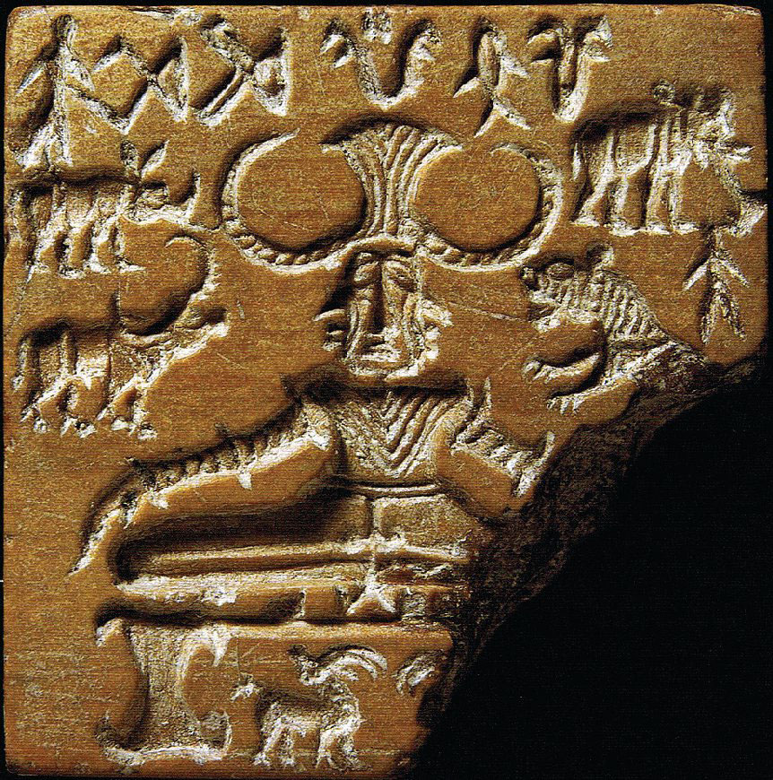

<i>Figure 7.1. ‘Pashupati’ (Lord of Animals) seal from Mohenjo-Daro interpreted as a representation of a yogi or ‘proto-Shiva’. Photo: Wikipedia Commons. CC BY-SA 3.0.</i>

The earliest mention of yoga in writing is in the Vedas, where yoga is described in both the Rigveda and the Atharvaveda. Different traditions exist regarding the dating of the Vedas. Some scholars (<i>e.g.</i> Feuerstein 2001, 96–101, 446) suggest that they are very old indeed, and were composed sometime between 4000–2000 BC in the Harappan period of the Indus civilisation. However, in their present form they cannot precede the use of chariots in war, and, therefore, if we are to judge from archaeological evidence, are not likely to be much older than 2000 BC. Linguistic evidence seems to underpin a somehow later date, indicating that the Vedas were composed in Punjab between 1500 and 1300/1200 BC (Mallory 1991, 37–42; Anthony 2007, 49; Wikander 2010, 196–197), and that this happened after the Indo-Aryans migrated into the Indian subcontinent. Nonetheless, they are among the first extensive religious corpora in any Indo-European language, consisting of altogether more than one thousand hymns. In the Vedic period, transmission was by oral tradition alone. A literary tradition was established only in post-Vedic times, after the rise of Buddhism (Flood 2003).

The philosophy of yoga, and also some of its practices, is described in the Vedas. Yoga practitioners are referred to as <i>rishi</i>, and portrayed as seers and sages, not necessarily being priests but rather individuals with a mystical bent towards merging with the ultimate Being (termed <i>sat</i> in Sanskrit) and an ability to see the truth beyond the veil between the worlds. These were thought of as spiritual heroes and referred to as ‘children of the light’ (Rigveda 9.38.5). Their ultimate goal was to reach the heavenly light and merge with the ultimate light-Being (Rigveda 10.36.3). This goal could only be reached through hard inner spiritual work – in other words, an enduring yoga practice (Feuerstein 2001, 101–102). The sun is perceived to be the visible manifestation of the transcendental light and is as such a central image in the philosophy of yoga. For instance, Rigveda 5.81.4 says: ‘You traverse the three luminous spheres; or You mix with <i>Surya’s</i> rays; or You encompass Night on both sides; or You, God, are Mitra because of Your [benign] qualities (<i>dharma</i>).’ This verse has a direct reference to the passage of the sun on the sky, ‘You’ denoting the ultimate light-Being, of which the sun (<i>Surya</i>) is one aspect.

Yoga is described as ‘archaic’ in the Baghadvadghita, which is commonly dated to 600–500 BC (Feuerstein 2001, 96). For instance, chapter 5.27 describes the practice of breathing and focusing on the third eye, both well-known yoga techniques (Strauss 2005). From between 400 BC and AD 400, a number of other texts on yoga are known. The most influential of these is the Yoga Sūtras of Patañjali, the classical ‘master text book’ of yoga (Iyengar 2002). The Yoga Sūtras are most commonly dated tentatively to somewhere between 200 BC and AD 200 (<i>e.g.</i> Strauss 2005, 3), though they could be somewhat older. The Yoga Sūtras testify that yoga as a discipline was already ancient and firmly established. The Sūtras are short, cryptic verses that are easy for practitioners to memorise, but hard to analyse and comprehend. Mainly they are a way to achieve spiritual one-ness with the universe, rather than a practical guide to the <i>asanas</i>.

Following, amongst others, Anders Kaliff (2005), we suggest that the Vedas might be a valid analogy for Scandinavian Bronze Age ritual practices (cf. also Kaliff & Oestigaard 2004; Melheim 2004; 2006; 2013; Kristiansen 2010; 2013). Considering that yoga is described in the Vedas, it seems likely that yoga was established as a discipline in the Indus Valley before 2000 BC, and there is also the possibility that it may have spread to Europe at such an early point in time.

### Bronze Age body schemes, poses and gestures – the figurative evidence

We have both been struck by human depictions in the Nordic Bronze Age art, where accentuated bodily gestures and poses are often found. Melheim (2008) considered binary spectacle brooches and figurines and in particular hand signs, gesturing and handedness. Oma (2008) was struck by the similarities between ancient representations of performances made by human bodies and yogic <i>asanas</i>. Here, a brief description of the presented archaeological material is given, followed by a discussion of the significance of the modelling of these representations in archaeological interpretations.

The primary material consists of a small number of Danish figurines found in sacrificial deposits. The human figurines considered here stem from the Grevensvænge and Fårdal finds, and belong in the era 1100–700 BC (see Glob 1969, 191–197). A counterpart to their body schemes is found in southern Swedish and eastern Norwegian rock art, most notably in the Bohuslän/Østfold area.

The earliest of them, the Grevensvænge find from Zealand, dated to <i>c</i>. 1100–900 BC, consisted originally of six figurines, of which unfortunately only two remain. These are a woman bending backwards (Fig. 7.2) and a kneeling, helmeted man. Two sketches of the original find exist, showing in addition a woman standing on a pedestal with one hand on her chest, her thumb pointing upwards, and the other arm raised as in a greeting (Glob 1969, 192–196, 312–313, figs 210 and 213) (Fig. 7.4). Presumably, three figurines with backward-bending women were present in the original find, along with two kneeling men and either two standing women or a standing woman and a snake. Snakes are frequently found in association with human figurines in this period, for instance on razor blades (Glob 1969, 193; Kaul 1998) and on rock art panels, and even more closely associated with the human body in the form of <i>e.g.</i> sniper-shaped bracelets (Forsgren 2010; Varberg 2015). The perhaps most intriguing association between a snake and a female is the burial of an assumed sorceress at Maglehøj, Frederikssund. The presence in her grave goods of the bones of an Aesculapian snake, recalls the snakes held by the Minoan ‘snake goddess’ (Varberg 2015). The kneeling men wear loincloths or, in fact, blouses with an extension at the front and back, often understood as representing the outfit of a religious specialist (<i>e.g.</i> Goldhahn 2012, see, however, Fossøy 2014). Judging from the drawing, the standing figurine wears a long skirt (Djupedal and Broholm 1953, fig. 7; Randsborg 2011, 51, 71).

The Fårdal find from Tjele in Viborg, Jutland is dated to <i>c</i>. 900–700 BC (Kjær 1927, 242) and consists of five figurines; a kneeling woman (Fig. 7.3), a snake, two horned horse- or goat-like animal heads and two conjoined horned animal heads, probably horses with goat-horns, with a bird-like figure placed at the conjunction, possibly a duck (Glob 1969, 191, fig. 212). Apart from the figurines, the hoard contained a huge variety of jewellery, an awl and several chunks of resin and bark interpreted as amulets. The Fårdal girl has been described as a goddess or the goddess’ initiated follower (Randsborg 2011, 36–37, 54). Some have argued that the intended receiver of this and other similar hoards, often with neck rings and horse gear, was the Bronze Age predecessor of Iron Age Nerthus or Freya (Forsgren 2010), or in more general terms, a war-, fertility- and horse-goddess with roots in the Mediterranean (Varberg 2005; 2013). The two types of female costume seen on the figurines replicate those known from the older oak-log coffins (1400–1100 BC); the short corded skirt and the long skirt (Bergerbrant 2007, 58–59, 63–65; Kristiansen 2013). They reflect real Bronze Age costumes and very probably two different female roles or statuses. The corded skirt is often interpreted as the attire of a young, unmarried woman. Another much discussed possibility is that the corded skirt belongs to a priestess or a young female member of a cult group (<i>e.g.</i> Kristiansen & Larsson 2005, 298, 351; Randsborg 2011, 36, 86–87). Recent isotope studies of the Egtved girl’s hair and garments indicate a large amount of travelling and a high degree of mobility (Frei <i>et al.</i> 2015), and may, again, underpin the idea that corded skirts were worn by women with a particular role or status (see, however, Bergerbrant 2014).

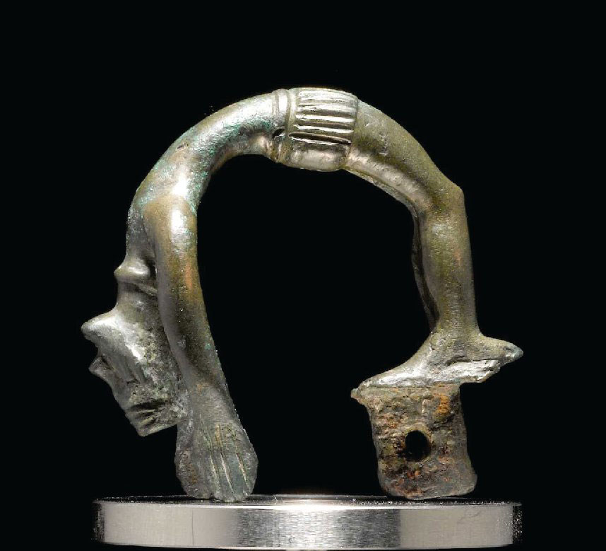

<i>Figure 7.2. Figurine from Grevensvænge. Photo: National Museum of Denmark. CC BY-SA 3.0.</i>

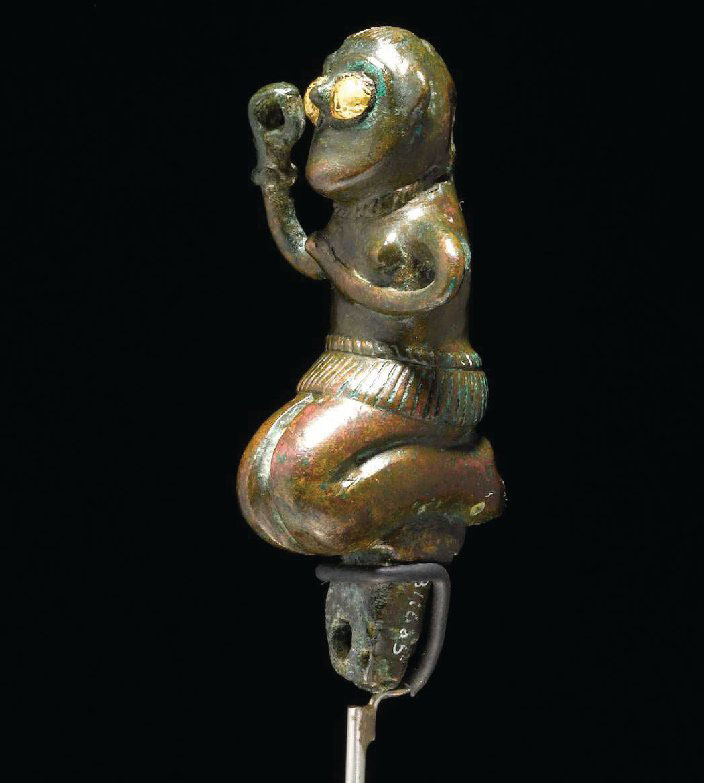

<i>Figure 7.3. The kneeling figurine from Fårdal. Note the inlaid gold foil on the eyes. Photo: National Museum of Denmark. CC BY-SA 2.0.</i>

The figurines from both Grevensvænge and Fårdal are attached to minor appendages with fastenings underneath, which indicate that they should be placed on some larger structure. P.V. Glob (1969) suggested that this structure was a cultic boat shaped similarly to the Hjortspring boat. His reconstruction of the Grevensvænge figurines (Glob 1969, fig. 213) illustrates the suggestion that the backward-bending women represented death goddesses that were throwing themselves off the boat. Another reconstruction suggests that the backward-bending women were placed inside the boat (Burenhult 1999, 118, fig. 109). This interpretation explains better the awkward out-bent position of their arms and hands.

These reconstructions are grounded in the context in which similar figures appear on rock art. Several rock carvings depict backward-bending figures. Examples are found on panels from Sotorp, near Tanumshede (Glob 1969, 193, fig. 211), Listleby and Kalleberg (Coles 1990, 25) in Bohuslän, Högsby in Dalsland and Skjelin in Fredikstad, Norway (Vogt 2012, 145). A comparison of several such figures shows a striking similarity (see Winter 2002, 206–207, fig. 9.3).

The backward-bending figures are commonly referred to as acrobats or voltigeurs, and have been connected to the presumed Minoan tradition of the bull leap (Winter 2002; Iversen 2014). Although some images have been interpreted as acrobatic dancers doing a bridge, their postures are usually considered to represent gymnastic exercises, performed during sports games to honour the gods. Rune Iversen’s comparison of so-called acrobats from Denmark, Egypt and Greece, demonstrates the huge variety of poses, which tend to be collapsed into one single motif, the bull-leaper. Noteworthy are three Egyptian images, showing half-naked females doing various sequences of a bridge (Iversen 2014, figs 4–6).

Rethinking this in light of the Scandinavian figurines, it is striking that the feet of the Grevensvænge voltigeurs are flexed, which may suggest that they are standing instead of leaping and therefore performing a bridge. The hands are, however, unflexed. Although the figurines might be seen as expressions of a pose rather than rendering an anatomically correct representation, if we follow Göran Burenhult’s (1999) reconstruction, the position of the hands may be taken to indicate that the voltigeurs are holding on to a foundation of some sort while performing a bridge.

On the basis of the comparison with yoga, we suggest that the Danish figurines are in fact performing an <i>asana</i>. One possibility is the <i>Urdhva Dhanurasana</i>, ‘the wheel’ (Brown 2003, 266–267). However, it is striking that the voltigeur’s head is in line with the feet and appears to be resting on the underlay. The top of the head (or the headgear) is rendered flat and it seems that it is the head and not the hands that carry the person’s weight. Performing a bridge with headstand is a yoga posture known as ‘the two-legged inverted staff posture’ (<i>Dvi Pada Viparita Dandasana</i>). The headstand is believed to stimulate the crown chakra on top of the head and thus induce enlightenment. Thus, the bridge performed by the Grevensvænge twins is perfectly well understood not as a sport exercise, but a yoga posture.

Similarly, the kneeling figurines from Grevensvænge and Fårdal may be seen as being seated in an <i>asana</i> known as <i>Virasana</i>, ‘the hero pose’ (Brown 2003, 120–121). It is a meditation pose, and can be combined with a number of <i>mudras,asanas</i> of the hands (Hirschi 2000), such as are performed by these figurines.

On a world-wide basis, hand gesturing is a sign language with very specific meanings (Kaul 1987, 42–44). The mudras of Hinduism, widely applied in both yoga and iconography, are a case in point and laden with meaning and import (<i>e.g.</i> Hirschi 2000). Hands are also among the parts of the human body most often accentuated in Bronze Age iconography (Karlsson 2005, 467–468; Kristiansen and Larsson 2005, 75; Goldhahn 2007, 320–321). On rock art, we encounter hands as protruding from human bodies, as prows on ships and hands without bodies. Interpretations of hand signs have been biased towards death, fear and the unconscious, since they tend to be hidden on the inside of bronze fibulas or rendered on stone slabs in assumed esoteric contexts (Oldeberg 1942, 169; Marstrander 1963, 223; Glob 1969, 90; Kaul 1987; Coles 1990, 39; Jensen 2002, 442–448; Karlsson 2005, 468; Goldhahn 2007, 309–314).

Complementary to this, Melheim (2008) identified a distinction in Bronze Age iconography between a protective left hand and a raised active right hand. A common factor is that most hand signs on stone slabs seem to be inside images of right hands (Johansen 1970, 181; Goldhahn 2007, 46). Handedness seems to be a poignant point with a logic of its own. In the Grevensvænge find, the right–left coherency of the motif is complicated by the twin images that mirror one another, yet, when looking beyond the duplicated values of the twin images, the figurines fit into the scheme of a left hand protecting the heart, and a right hand raised in an active, votive posture (cf. Kaul 1987, 44). In Hinduism and later Buddhism, a raised right hand, palm outwards, is a benevolent and apotropaic sign.

Seeing the raised right hand as a symbol of resurrection or revival rather than eternal death and darkness is in keeping with recent interpretations on Late Bronze Age cremation rituals, which focus on regeneration, dividualism and unity with the Universe (Kaliff 1994; 1998; Goldhahn 1999; 2007; Brück 2001; 2006; Melheim 2006). Standing rock art figures with both arms raised upwards are commonly interpreted as adorants, worshippers, or as real people that celebrate the life force (see Fuglestvedt 1999). However, interpreting these figures within the framework of yoga makes it feasible that these people celebrate life by performing an <i>asana</i> known as the extended <i>Tadasana</i>, ‘the mountain pose’. This is the starting pose in a series of <i>asanas</i> known as <i>Surya Namaskar</i>, the salutation of the sun.

The idea that the human body may unite with the Universe is prominent in Bronze Age symbolism. The human-centric position of right–left is linked to a heliocentric orientation of east–west. Depictions of the sun myth demonstrate how directions like up and down, right and left were interlinked with both cardinal points and with the narrative of the sun’s travel. Simply by indicating a sailing direction, it could be indicated whether a ship transported the day-sun or the night-sun (Kaul 1998, 199–200; 2004, 28). Rightward movement of sun-ships is associated with the rising sun, and has connotations to up and light, as opposed to leftward movement down below (<i>e.g.</i> Kaul 1998, 259; 2004, 51). Because of this, ‘north’ (or up) may, just as well as cardinal point ‘south’, mark the position of the sun at midday. The same logic applies to the architecture and iconography of burial monuments (Kaul 1998, 259; 2004, 172–175; cf. Goldhahn 1999; Johannsen 2013; Kristiansen 2013). Bronze Age norms for the position of bodies and grave goods suggest that a combination of cardinal points and body schemes were used as a means to link the deceased to the sun’s cycle (Melheim 2008).

The Fårdal figurine belongs to a group of naked or half-naked female figurines that seem to fill an even more particular role (for an overview, see Varberg 2013, fig. 4). During the liminal phase of a passage ritual, initiates are often naked or halfnaked, to demonstrate that they have no status, property or rank (Turner 1969, 95). It seems possible, thus, that naked or half-naked figurines represent initiates (cf. Randsborg 2011, 56). Another striking feature is the gender ambiguity represented by the figurines (Melheim 2015b). Judging from their anatomical details, both the girlish Grevensvænge figurines doing a backflip and the long-skirted figurine seem in fact to be boys. In an anthropological perspective, initiates tend to be symbolically represented as either sexless or bisexual: a form of human <i>prima materia</i> (Turner 1967, 98; 1969, 102–103). It seems possible, therefore, that the figurines depict young persons who are performing very particular and demanding bodily poses, in relation to an initiation ritual. Could these figures represent ‘the children of the light’, referred to in the Rigveda?

Victor Turner described the liminal phase as a stage for contemplation and the acquisition of knowledge, whereby the initiate was supposed to be transformed mentally. The observation made by Bronze Age scholars that the figurines portray initiates and Turner’s stress on the liminal phase as a mind-expanding experience allow us to connect the figurines with the Vedic concept of <i>rishi</i> or ‘children of the light’; yoga practitioners striving for awakening and unity with the ultimate light-Being. The figurines could thus represent individuals that were initiated into a spiritual tradition that utilised the specific body schemes described above – a Bronze Age version of yoga.

A right–left symbolism connecting the human body and the solar myth is also present on the human-like figurine from Glasbacka in Halland, Sweden (Fig. 7.4). While the left eye consists of concentric circles – and is likely to represent a moon – the right eye is surrounded by beams – arguably a sun (Kaul 2004, 177; cf. Randsborg 1993, 120). The eyes fit the matrix of the rightward running ships that sail the day- sun and the leftward running ships that sail the night-sun. What is equally striking is the presence of the same kind of symbolism on the kneeling figurines here assumed to be performing the ‘hero pose’. While the Fårdal girl has golden eye inlays, the Grevensvænge figurines have concentric ‘moon’ eyes. Recalling that the ‘children of the light’ referred to in the Rigveda are portrayed as individual seers capable of merging with the ultimate light-Being, this very particular symbolism seems to underpin the theory launched here that the Fårdal and Grevensvænge figurines, with the day-sun and the night-sun radiating from their eyes respectively, represent Bronze Age <i>rishis</i> performing spiritual work or yoga, perhaps as part of an initiation ritual.

A strikingly similar right–left symbolism on the Early Iron Age Gundestrup cauldron (Kaul 1995; Nielsen <i>et al.</i> 2005) allows us to further link this symbology to India. On plate F (outer), an anthropomorphic figure interpreted as a goddess (Kaul 1995, 16–17) raises her right hand and holds the left to the chest just below the breasts in a way very similar to the Fårdal figurine. While the Gundestrup figure seems to be holding a bird, the Fårdal female may have held the accompanying snake, which has a small hook, by a string. That she is in fact a mistress of animals may be further backed up by the Gundestrup iconography. On plate A (inner), a horned figure surrounded by various partly exotic animals is sitting in half-lotus and holding – in the right hand a neck ring and in the left a snake (Fig. 7.5). Although Gundestrup is considered to be Celtic in origin, a connection to India has been suggested by Taylor (1992). He sees the female on plate B (inner) surrounded by renderings of, amongst others, two elephants, three griffins and two six-spoked rosette ‘wheels’, as a parallel to portraits of the Hindu goddess Lakshmi. The depiction on plate A is very similar to the previously mentioned seal from Mohenjo-Daro in the Indus Valley, with its depiction of a lord of the animals <i>yogin</i>.

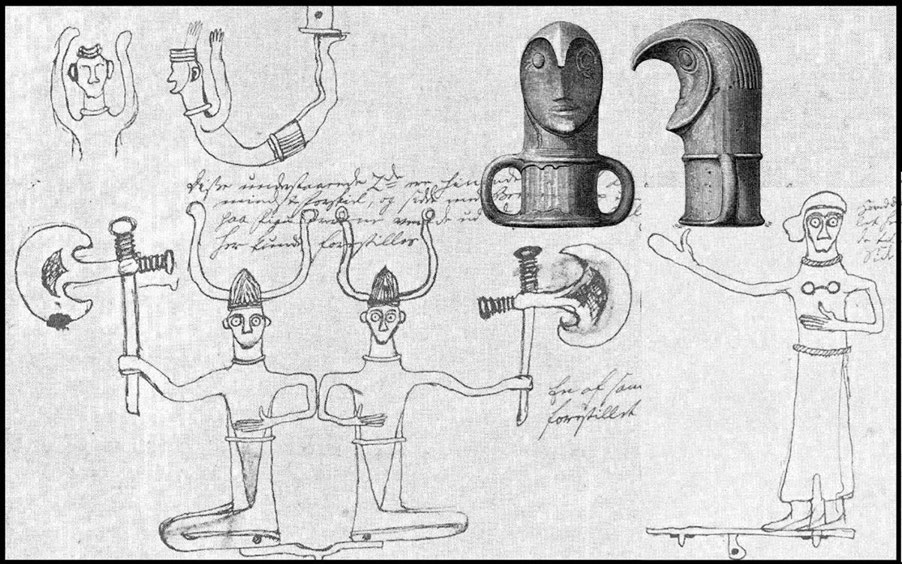

<i>Figure 7.4. Male twins and female figurine from Grevensvænge, as drawn c. 1780 by Christian Brandt (after Djupedal and Broholm 1953, fig. 7) and Late Bronze Age moon-figurine from Glasbacka, Halland (after Montelius 1917, fig. 1476).</i>

Another notable similarity between early Indian cosmology and the representations drawn upon in this text is the presence of snakes. Snakes are found in association with both the Fårdal and the Grevensvænge figurines, and occur, as already pointed out, on various other kinds of representations. Kaul (1998, 237) sees the snake as one of several animals that act as helpers to the sun on its celestial journey, the snake helps the sun make the transition from day into the unknown realms of night. The horned god on the Gundestrup cauldron also holds a snake in one hand, thus signalling that he harnesses the power of the snake. In later Scandinavian culture, in the mythology of the Iron Age, the image of the coiled snake lives on in Midtgardsormen, the giant serpent that coils the whole world and contains the oceans. In yogic beliefs, as well as in Hinduism, the snake represents the <i>kundalini</i>, an energy associated with enlightenment and liberation. Kundalini, often referred to as ‘the serpent power’, is thought to rest in a coil at the base of the spine. When this energy is awakened, it stretches out along the spine and brings about altered states of consciousness (Lysebeth 1995; Feuerstein 1998; Wallis 2012). Some report that this can be a profoundly disturbing experience (meditation teacher Sally Kempton, personal communication 1 May 2014). Some traditions of yoga actively use <i>asanas</i> to awaken the kundalini energy, as a means to achieve enlightenment. Snakes, and the kundalini energy, are often associated with Shiva, frequently depicted with a garland of snakes. Recalling that the seated figure of the Pashupati-seal is by Hinduist scholars interpreted as a proto-Shiva, a reasonable interpretation of the kneeling figurine of the Fårdal find and other representations of humans interacting with serpents in Scandinavian iconography is that they represent religious specialists harnessing the ‘serpent power’ (Varberg 2015).

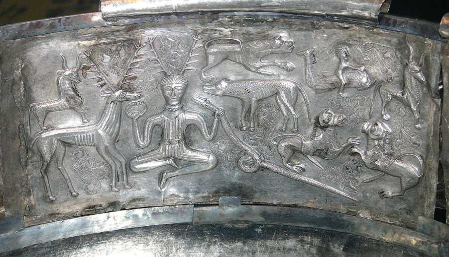

<i>Figure 7.5. A horned figure on the Gundestrup cauldron (interior plate A) in half-lotus and holding a snake. Photo: Wikipedia Commons. CC BY-SA 2.0.</i>

### Altered states of consciousness in the Scandinavian Bronze Age – a link to India?

Yoga is a united effort of mind and body, explicitly aimed at overcoming the mind-body dichotomy and harnessing energy and life-force (<i>prana</i>) as a means to merge with the universe by using specialised embodied techniques. Did the Bronze Age people at all recognise a separation of the mind from the body (see Oma 2013)? Current Bronze Age research is, in its focus on technology, very much biased towards the body (see Lund and Melheim 2011). Current studies explicitly aimed at understanding Bronze Age ‘soul concepts’ are few (Kaul 2005 is an exception) and means to attain individual spiritual awakening has not been a much discussed topic of Bronze Age research. Cremation was practiced with increasing sophistication in Scandinavia from the fourteenth century BC onwards. While early researchers introduced the evolution of a more advanced soul-belief to explain this transition (<i>e.g.</i> Sverdrup 1933), Bo Gräslund’s (1994) influential theory about a complex Bronze Age soul concept, based on a spiritual soul and a bodily soul, emerged from what he saw as a highly contradictory burial ritual. In line with this, many researchers today downplay the importance of changing soul beliefs for changes in burial rites and see this more as something gradually evolving from new burial practices and their materiality (<i>e.g.</i> Rebay-Salisbury 2012; see, however, Johannsen 2014).

The presence of religious and/or ritual specialists associated with shamanism, is sometimes discussed in association with Nordic Bronze Age religion (Goldhahn 2012), but the idea of spiritual travels and altered states of consciousness has solely centred around male cult specialists, and has never been discussed as an aspect of the female practitioner, which the Fårdal figurine may represent. A play with gender roles has however been noted (Melheim 2015b), which may tie in with the idea of bodily transformation as a means to attain altered states of consciousness. On the basis of the strong fragmentation of the individual human bodies seen in the remains from Late Bronze Age cremations, it can be argued that ideas about regeneration and perpetual rebirth existed, which were analogous to Vedic ideas and later Hindu practices (Kaliff 1994; 1998; Melheim 2004; 2006). These ideas are by some scholars believed to emerge from an Indo-European corpus of religious ideas.

### Indo-Europeans, chariots and horses

Scandinavian archaeology has been divided when it comes to the question of Indo-European culture and how to connect language, genes and material remains. From playing a prominent part in mainstream interpretations (for an overview, see Prescott 2013) the concept was abandoned in the post-war era, partly as a reaction to abuse of the theories of origin and partly as a reaction to simplistic models of migration (<i>e.g.</i> Renfrew 1987; Robb 1993). The long neglect of anything Indo-European has been counteracted by a renewed interest in the topic in Scandinavian archaeology, which has nonetheless been limited to a few researchers (<i>e.g.</i> Kristiansen 1991; 1999; 2010; 2011; 2012; Prescott & Walderhaug 1995; Østmo 1997; Odner 2000; Melheim 2004; 2006; Kristiansen & Larsson 2005, 258–319; Oma 2008). In a wider perspective, theories about the initial spread of Indo-European languages have been bolstered by refined modelling of migration (<i>e.g.</i> Anthony 1990; 2007; Mallory 1991; Mallory & Adams 1997; Mallory & Mair 2000; Kristiansen 2017) and underpinned by new evidence brought forth by aDNA studies (<i>e.g.</i> Allentoft <i>et al.</i> 2015; Haak <i>et al.</i> 2015; Mittnik <i>et al.</i> 2017).

In a Bronze Age context, Indo-European studies have focused on the one hand on funerary rituals (see above), on the other on rock art (<i>e.g.</i> Fredell 2003, 246–254; 2010; Fredell & García Quintela 2009; 2010). A recurrent theme in the latter is the Divine Twins, which are interpreted as a Nordic version of the Indic Aśvinau or Ashvins. After the seafaring and horse-riding twins which are the subject of more than fifty hymns in the Rigveda were identified in Scandinavian rock art (<i>e.g.</i> Østmo 1997), they have been used as a matrix for various twin representations (<i>e.g.</i> Kristiansen 1999; 2010; 2011; 2012; Kristiansen and Larsson 2005, 258–319; Fari 2006; Karlenby 2011; Melheim 2013). In comparative Indo-European studies the Ashvins are the equivalents of the Lithuanian Ašvieniai, the Greek Dioscouri and the Norse triangle Frey, Njord and Freya (West 2007, 186–193). They are associated with the shining sun and dawn in particular. Their name means ‘having (to do) with horses’ (West 2007, 187). When rescuing a character named Bhujyu – a representation of the sun – the Ashvins are said to have travelled in three chariots with six horses and a hundred feet (Rigveda 1.116.4). The ship and the chariot are kennings for horses (West 2007, 82–83), and are interchangeable with the Ashvins themselves. This and various other descriptions in the Rigveda of ships as horses, birds or bird-horses, are features which overlap remarkably with Nordic Bronze Age rock art and its ship imagery (cf. Kaul 1998). Horses are also frequently depicted in pairs pulling two- or four-wheeled chariots. Even the rare occurrences of sexual intercourse between human and horse on rock art, is resonated in descriptions of the Vedic horse sacrifice, <i>Asvámedha</i>, where the queen was supposed to have sexual intercourse with the horse which was to be sacrified (Mallory 1991, 135; Fari 2006, 289–292; Wikander 2010, 159; Oma 2013).

Two factors in particular provide interesting analogies to the Nordic Bronze Age – the etymological reading of yoga as a uniting or binding practice expressed through the metaphor of yoking two horses and the important role played by the horse in Vedic rituals, first and foremost as the central sacrificial animal. Various strands of evidence from the second half of the second millennium and the first millennium BC of the role played by the horse in cosmology and ritual in the Nordic realm tie in with the role played by the horse in Vedic rituals. In the Early Bronze Age, the Trundholm chariot expresses a clear link between the horse and the myth of the sun’s travel, which is made even more explicit in the Late Bronze Age with finely decorated bronze artefacts showing the horse lifting the sun into the skies at midday (Kaul 1998; 2004). Towards the end of the Bronze Age, the sun horse seems to have been conceived of as two separate horses (Lund and Melheim 2011), which may again relate to the popularity of the Divine Twins. It seems also that the horse and in particular its breath served as a medium in Late Bronze Age bronze metallurgy, since a horse-head was prominently placed at the end of the bellows’ nozzle and thus literally blowing air onto the fire (Engedal 2010; Melheim 2015a, 132–133). The identification of a horse sacrifice scene at Fossum rock art panel (Melheim 2013) further links Scandinavian ritual and cosmology to Vedic practices and the prescriptions of the Rigveda.

The horse and the chariot have played a prominent role in theories about the historical spread of Indo-European languages, and in theories about the social structure and homeland of the Indo-Europeans (<i>e.g.</i> Anthony 2007). Terms for horses are among the best documented Indo-European words, which are convincingly rooted in Proto-Indo-European. Therefore, the horse is considered to have been a central animal also in Proto-Indo-European culture (Wikander 2010, 150). Chariot and wheel are other well-documented words with Proto-Indo-European roots, although the two-wheeled war-chariot is probably of somehow later origin (Wikander 2010, 163; cf. Drews 1993). The initial spread of Indo-European language and culture to Scandinavia is frequently allocated in the third millennium BC, and is often believed to have been triggered by immigrants from one or several of the Corded Ware cultures (<i>e.g.</i> Kristiansen 1991; 2009; 2012; Prescott & Walderhaug 1995; Østmo 1997; Håland & Håland 2000, 212–213; Allentoft <i>et al.</i> 2015; Haak <i>et al.</i> 2015; Mittnik <i>et al.</i> 2017). How does this harmonise with current evidence of domesticated horses and their diffusion?

From the to-date earliest evidence of domesticated horses in Eurasia around 3700–3000 BC, it took another thousand years before the tamed horse arrived in Scandinavia. While bronze mountings hoarded with other valuables in a bog at Gallemose in Denmark around 2000 BC (Randsborg 1991; 2010) have been argued to suggest that the two-wheeled chariot was used in Scandinavia more or less at the same time as it is argued to be taken up elsewhere (cf. Johannsen 2014), no other evidence of domesticated horses is known before <i>c</i>. 1600 BC (Kveiborg 2017). This may or may not be tied to the nomadic Yamnaya culture, which is well-documented despite a lack of actual settlements, through kurgan burials spread out in the steppe areas of Caucasus and beyond (Anthony 2007). The frequent occurrence in these burials of horses, chariots and other domesticates, well-documented in Indo-European language; cattle, sheep and dogs (Wikander 2010), make the Yamnaya a very good candidate for the spread of Indo-European languages and culture over vast distances during the Neolithic. Arguably, a technologically advanced nomadic herding culture was made possible because of the horse and the chariot. These elements remained central in the religious imagery of Indo-European speaking groups for more than a thousand years.

### Theories of origin: general features of the Indo-European or a direct link to India?

In their style, dress and selection of weapons, the Fårdal and Grevensvænge figurines are ultimately Nordic. However, their postures and movements may be explained with reference to a wider cultural sphere centring on the Mediterranean and the Near East. Whereas horned birds and horses are typical of the Urnfield culture (<i>e.g.</i> Hagen 1954), horned warriors are widely distributed in the Mediterranean and beyond (Kristiansen & Larsson 2005; Gonzales 2012; Vandkilde 2013). Parallels to the human figurines are found in the Seima-Turbino horizon (Engedal 2010, 103), on Nuragic Sardinia (Gonzales 2012), in Poland, and the Near East (Kristiansen & Larsson 2005, 274, 314). When it comes to their postures, the raising of a hand in a benedictory pose is a typical Near Eastern feature frequently seen also on Sardinian bronze figurines (Gonzales 2012, 86). Sardinian statues also provide a striking parallel to the eyes of the Grevensvænge figurines, especially the stone statues of Monte Prama, which are believed to be inspired by local bronze statuettes (Gonzales 2012, figs 4–5). Another interesting parallel which is relevant for the interpretation of the Glasbacka figurine (Fig. 7.4), is the rendering in Egypt of Pharao’s eyes as a sun and a moon (Helck & Otto 1975). For the back-flippers, links may certainly be drawn with both Minoan/ Aegean bull-leapers and Egyptian acrobatic dancers (see above). Based on the way the three androgynous figures with corded skirts are standing, we argue that they are performing a yogic bridge pose rather than a leap. A scrutiny of further details has revealed other and even more striking parallels.

On the basis of these and circumstantial evidence like burial rituals, rock art and snake iconography, we have made a case for a closer cultural connection with an even farther-lying region: India. We have focused our interpretation on the hands, the legs and the eyes, and the selection of figurines in each of the depositions. The kneeling Fårdal figurine is accompanied by a snake, horses and a duck. She is, like the Mohenjo-Daro and Gundestrup representations, sitting in a meditative yoga pose, surrounded by animals, perhaps communing with them. The snake in particular, which she is possibly holding by a string, is an important element in this interpretation as it might represent the priestess harnessing the kundalini energy.

The Mohenjo-Daro seal dates to a period when trade connections between the Indus Valley civilisations and Mesopotamia and Egypt are documented in both material and written sources (<i>e.g.</i> Weisgerber 1984; Dhavalikar 1993; Edens 1993; Kenoyer 1997; Haywood 2005, 76). However, this was during the Indus Valley peak 2500–2000 BC, and the connection with the Near East was interrupted <i>c</i>. 1800 BC, with the collapse of the urban societies of the Indus Valley. Impulses reaching Scandinavia from the Indian Subcontinent via Egypt and the Mediterranean would thus most probably predate the Bronze Age, while we have here argued that mind-expanding body postures and ideas about the soul developed parallel in India and Scandinavia at a much later point in time. However, written sources from India attest to a great time depth of continuity of yoga practice and philosophy; for example, the Yoga Sutras dating to 200 BC–AD 200 describe yoga as an ancient and established practice.

Interestingly, the central gods of the Rigveda pantheon – Indra, Varuna and the Ashvins – are mentioned in inscriptions from the Mitanni dynasty of present-day Syria, who otherwise spoke a non-Indo-European tongue (Anthony 2007, 50). Other Indo-European terms that were used by the Mitanni kings are related to horse technology and the use of chariots in war. Notable is also the use of the Vedic term for cosmic order and truth (<i>r̥ta</i>). David Anthony suggests that this reflects a movement into the Near East around 1500 BC of people who were familiar with the old Indic corpus of hymns. Another aspect relevant for the current text is the linguistic and cultural similarities between the Rigveda and the Iranian Avesta. The sacred text of Zoroastrianism is supposed to have roots in Proto-Indo-Iranian (Foltz 2004), and is associated with Andronovo sites in the Sintashta-Petrovka cultural area near the Ural Mountains. This is the area where the hitherto earliest evidence of horse-drawn chariots occurs (Drews 2004, 50). A sequence of archaeological complexes evolving out of the Yamnaya were located in an area spanning western Siberia and the western Asiatic steppes, and extending in the south to the borderlands of the Indian subcontinent (Mallory 1991, 227–231).

Several comparative studies of material culture and the use of symbols demonstrate that there were connections that led to cultural transmissions and mutual influence between societies in southern Scandinavia and the eastern Mediterranean (<i>e.g.</i> Kaul & Martens 1995; Kaul 1998; 2004; 2013; 2015a; 2015b; Kristiansen 1998; Engedal 2002; Winter 2002; Kristiansen & Larsson 2005; Iversen 2012; Ling <i>et al.</i> 2014; Varberg <i>et al.</i> 2015) (for critique, see Sjögren 2005) and possibly also the Orient (<i>e.g.</i> Almgren 1927; Kjær 1927; Jacobsthal 1944; Glob 1969; Larsson 1997; Kaliff 2005; Kristiansen & Larsson 2005; Fari 2006). When it comes to areas further east, less is known, but some evidence exists.

The (presumably) Indo-European speaking mummies buried in the Taklamakan desert in Xinjiang, China, on the trail of the rudimentary Silk Road of the Bronze Age, and the extent of Alexander the Great’s military campaigns all the way to India some hundred years after the close of the Nordic Bronze Age, show that contacts between Europe and Central and South Asia certainly may have existed. Whether, however, the similarities we have found between Scandinavia and India are due to actual interaction between these areas in the Bronze Age, perhaps based on practices and beliefs spread with Indo-European language and culture, or a general diffusion of ideas and practices through <i>e.g.</i> contacts with the Mediterranean or Near East, must be a topic for future studies.

### Bridging the body and the mind, Scandinavia and India

In this chapter we have presented evidence that indicated similarities between Scandinavian and Indian cosmology and iconography, and suggested possible cultures that could have acted as a bridge between these regions. In closing, we want to point out two areas for further research.

First, the time depth from the introduction of practices and philosophy that today is classified as yogic, and the blossoming and development of the Bronze Age cosmology in Scandinavia, in tandem with the development of yoga as traced through iconography as well as the Vedas and later the Upanishads and Hindu practices and rituals such as cremation, indicate an ongoing contact between these regions. The adoption of these beliefs and practices can thus probably not be simply written off as a case of ‘ex oriente lux’. We hope, hereby, to have carved out an arena for further investigations into the nature and extent of this contact.

Second, our reading of the Scandinavian iconography in conjunction with the Vedas suggests that the presumed Indo-European cosmology did not operate on a purely abstracted philosophical level. Rather, the cosmology was deeply integrated into sets of bodily practices. The body was perceived as a vessel for the light-Being that traversed the sky, and by using the body to bridge planes of existence, human bodies both mimicked the sun and came to embody the sun, both on an elemental and a philosophical plane. Practitioners of these bodily techniques became ‘children of the light’. This must, however, be further substantiated by investigations into Nordic Bronze Age religion.

#### <i>Note</i>

[^ch7-note-1]: According to Padoux (2002, 17, 20), tantric yoga is a Western notion that has created an artificial religious category that has been projected onto the past. However, it is recognised in India as a sub-discipline of yoga that has specific practices. Sexualised rituals is one aspect of the roads to spiritual awakening used by the tantric practitioner, however the presupposition that tantric yoga is all about sex is fundamentally flawed.

## References

Allentoft, M.E., M. Sikora, K.G. Sjögren, S. Rasmussen, M. Rasmussen, J. Stenderup, P.B. Damgaard <i>et al.</i> 2015. Population genomics of Bronze Age Eurasia. <i>Nature</i> 522(7555). 167–172. doi:10.1038/ nature14507.

Almgren, O. 1927. <i>Hällristningar och kultbruk.Bidrag till belysning av de nordiska bronsåldersristningarnas innebörd</i> (Kungl. vitterhets Historie och Antikivitets Akademiens Handlingar 35). Stockholm: Wahlström & Wildstran.

Anthony, D.W. 1990. Migration in archeology: The baby and the bathwater. <i>American Anthropologist</i> 92(4). 895–914.

Anthony D.W. 2007. <i>The Horse, the Wheel, and Language: How Bronze Age riders from the Eurasian steppes shaped the modern world.</i> Princeton: Princeton University Press.

Bergerbrant, S. 2007. <i>Bronze Age Identities. Costume, conflict and contact in Northern Europe 1600–1300 BC</i> (Stockholm Studies in Archaeology 43). Stockholm: Bricoleur.

Bergerbrant, S. 2014. Ordinary or extraordinary? Redressing the problem of the Bronze Age corded skirt. <i>Current Swedish Archaeology</i> 22. 73–96.

Brooks, V. 2001. <i>Tantric Awakening: a woman’s initiation into the path of ecstasy.</i> Rochester & Vermont: Destiny Books.

Brown, C. 2003. <i>The Yoga Bible – the definitive guide to yoga postures.</i> Alresford: Godsfield.

Brück, J. 2001. Body metaphors and technologies of transformation in the English Middle and Late Bronze Age. In: J. Brück (ed.), <i>Bronze Age Landscapes. Tradition and transformation</i>, 149–160. Oxford: Oxbow Books.

Brück, J. 2006. Fragmentation, personhood and the social construction of technology in Middle and Late Bronze Age Britain. <i>Cambridge Archaeological Journal</i> 16(3). 297–315.

Burenhult, G. 1999. <i>Arkeologi i Norden</i>. Vols. <i>1–2.</i> Stockholm: Natur och Kultur.

Coles, J. 1990. <i>Bilder från forntiden. En guide till hällristningar och andra fornminnen i norra Bohuslän</i> (Skrifter utgivna av Bohusläns museum och Bohusläns hembygdsförbund 34). Uddevalla: Bohusläns museum.

Desikachar, T.K.V. 1999. <i>The Heart of Yoga: Developing a personal practice.</i> Second edition. Rochester & Vermont: Inner Traditions International.

Dhavalikar, M.K. 1993. Harappans in Saurashtra: The mercantile enterprise as seen from recent excavations of Kuntasi. In: G.L. Possehl (ed.), <i>Harappan Civilization: A recent perspective,</i> 555–568. New Delhi & Oxford: IBH.

Diamond, D. 2013. <i>Yoga: the art of transformation.</i> Washington, DC: Arthur M. Sackler Gallery, Smithsonian Institute.

Djupedal, R., & H.C. Broholm. 1953. Marcus Schnabel og bronzealderfundet fra Grevensvænge. <i>Aarbøger for nordisk oldkyndighed og historie</i> 1952. 5–59.

Drews, R. 1993. <i>The End of the Bronze Age. Changes in warfare and the catastrophe of 1200 BCE.</i> Princeton: Princeton University Press.

Drews, R. 2004. <i>Early Riders: The beginnings of mounted warfare in Asia and Europe.</i> New York: Routledge.

Edens, C. 1993. Indus-Arabian Interaction during the Bronze Age: A review of evidence. In: G.L. Possehl (ed.), <i>Harappan Civilization: A recent perspective,</i> 335–363. New Delhi & Oxford: IBH.

Engedal, Ø. 2002. <i>The Nordic Scimitar: External relations and the creation of elite ideology.</i> (BAR International Series 1050). Oxford: Archaeopress.

Engedal, Ø. 2010. The Bronze Age of Northwestern Scandinavia. Unpublished PhD thesis. University of Bergen.

Fari, C. 2006. Hieros-gamos. En sammenligning mellom symbolets uttrykk i den nordiske bronsealderens helleristningstradisjon og myteverdenen i det østlige middelhavsområdet. In: C. Prescott (ed.), <i>Myter og religion i bronsealderen</i>, 195–353. Oslo: University of Oslo.

Feuerstein, G. 1998. <i>Tantra. The path to ecstasy.</i> Boston & London: Shambhala.

Feuerstein, G. 2001. <i>The Yoga Tradition: its history, literature, philosophy and practice.</i> Second edition. Prescott & Arizona: Hohm.

Flood, G. (ed.). 2003. <i>The Blackwell Companion to Hinduism.</i> Malden, MA: Blackwell.

Foltz, R. 2004. <i>Spirituality in the Land of the Noble: How Iran shaped the world’s religions.</i> Oxford: Oneworld.

Fossøy, S.H. 2014. A rich seam: stitching as a means of interpreting Bronze Age textile fragments. In: S. Bergerbrant & S.H. Fossøy (eds), <i>A Stitch in Time: Essays in honour of Lise Bender Jørgensen</i>, 77–90. Gothenburg: Gothenburg University, Department of Historical Studies.

Forsgren, M. 2010. The divine appearance of Härn. Determining the identity of a Bronze Age metal hoard. <i>Current Swedish Archaeology</i> 18. 105–125.

Fredell, Å. 2003. <i>Bildbroar. Figurativ bildkommunikation av ideology och kosmologi under sydskandinavisk bronsålder och förromersk järnålder</i> (Gotarc Serie B: Gothenburg Archaeological Thesis 25). Göteborg: University of Gothenburg.

Fredell, Å. 2010. A mo(ve)ment in time? A comparative study of a rock-picture theme in Galicia and Bohuslän. In: Å. Fredell, K. Kristiansen & F. Criado Boado (eds), <i>Representations and Communications. Creating an archaeological matrix of late prehistoric rock art</i>, 52–74. Oxford: Oxbow Books.

Fredell, Å.C. & M.V. García Quintela. 2009. In search of Indo-European structures: the dual significance of the warriors’ knees. In: M. Vander Linden & K. Jones-Bley (eds), <i>Departure from the Homeland. Indo-Europeans and archaeology. Selected papers from the 12th European Association of Archaeologists (EAA) Annual Meeting, Krakow, Poland, 19th to 24th September 2006</i>, 91–110. Washington, DC: Institute for the Study of Man.

Fredell, Å.C. & M.V. García Quintela. 2010. Bodily attributes and semantic expressions. Knees in rock art and Indo-European symbolism. In: Å.C. Fredell, K. Kristiansen & F. Criado Boado (eds), <i>Representations and Communications. Creating an archaeological matrix of late prehistoric rock art</i>, 75–92. Oxford: Oxbow Books.

Frei K.M., U. Mannering, K. Kristiansen, M.E. Allentoft, A.S. Wilson, I. Skals, S. Tridico, M.L. Nosch, E. Willerslev, L. Clarke & R. Frei. 2015. Tracing the dynamic life story of a Bronze Age female. <i>Scientific Reports</i> 5. doi:10.1038/srep10431.

Fuglestvedt, I. 1999. Adoranten, voltigeuren og andre dødelige. In: I. Fuglestvedt, T. Gansum & A. Opedal (eds), <i>Et hus med mange rom. Vennebok til Bjørn Myhre på 60-årsdagen</i>, 439–524. Stavanger: Stavanger Arkeologisk museum.

Glob, P.V. 1969. <i>Helleristninger i Danmark.</i> Vol. 7. København: Jysk Arkæologisk Selskab.

Goldhahn, J. 1999. <i>Sagaholm. Hällristningar och gravritual</i> (Studia Archaeologica Universitatis Umensis 11. Jönköpings Läns Museums Arkeologiska Rapportserie 41). Jönköping: Umeå universitets arkeologiska Institution.

Goldhahn, J. 2007. <i>Dödens hand – en essä om brons- och hällsmed. Rituelle spesialister i bronse- og jernalderen.</i> Vol. 1. Göteborg: Institutionen för Arkeologi och Antikens Kultur, Göteborgs Universitet.

Goldhahn, J. 2012. On war and the memory of war. In: R. Berg, M. Jasinski & K. Sognnes (eds), <i>N-TAG TEN. Proceedings of the 10th Nordic TAG conference at Stiklestad, Norway 2009,</i> 237–259. Oxford: Archaeopress.

Gonzales, R.A. 2012. Sardinian bronze figurines in their Mediterranean setting. <i>Praehistorische Zeitschrift</i> 87/1, 83–109.

Gräslund, B. 1994. Prehistoric soul beliefs in Northern Europe. <i>Proceedings of the Prehistoric Society</i> 60. 15–27.

Haak, W., I. Lazaridis, N. Patterson, N. Rohland, S. Mallick, B. Llamas, G. Brandt <i>et al.</i> 2015. Massive migration from the steppe was a source for Indo-European languages in Europe. <i>Nature</i> 522(7555). 207–211. doi:10.1038/nature14317.

Hagen, A. 1954. Europeiske impusler i øst-norsk bronsealder. <i>Viking</i> 18. 97–125.

Haywood, J. 2005. <i>The Penguin Historical Atlas of Ancient Civilizations.</i> London: Penguin.

Helck, W. & E. Otto. 1975. <i>Lexikon der Ägyptologie</i>. Vol. 1. Wiesbaden: Harrassowitz.

Hirschi, G. 2000. <i>Mudras. Yoga in your hands.</i> Boston & York Beach: Weiser.

Håland, R. & G. Håland. 2000. <i>I begynnelsen. Fram til 1200 f.Kr.</i> (Aschehougs verdenshistorie 1. Oslo: Aschehoug.

Iversen, R.. 2012. Bronze Age acrobats: Denmark, Egypt, Crete. <i>World Archaeology</i> 46(2). 242–255. do i:10.1080/00438243.2014.886526.

Iyengar, B.K.S. 2002. <i>Light on the Yoga Sūtras of Patañjali.</i> New edition. London: Thorsons.

Jacobsthal, P. 1944. <i>Early Celtic Art.</i> Oxford: Oxford University Press.

Janakananda, S. 2005 [1975]. <i>Yoga, tantra og meditasjon i min hverdag.</i> Oslo: Bindu.

Jensen, J. 2002. <i>Danmarks oldtid. Bronzealder 2000–500 f. Kr.</i> København: Gyldendal.

Johansen, E. 1970. Med hevet hånd. <i>Kuml</i> 20. 171–188.

Johannsen, J.W. 2013. The Villfara Monument – rock carvings, death, cosmology and rituals in Early Bronze Age Scania. <i>Lund Archaeological Review</i> 19. 19–34.

Johannsen, N. 2014. Deus ex machina: Technological experience as a cognitive resource in Bronze Age conceptualizations of astronomical phenomena. <i>Journal of Cognition and Culture</i> 14. 435–448.

Kaliff, A. 1994. Skärvstenshögar och kremeringsplatser. Exempel och experiment med utgångspunkt från en utgrävning i Ringeby, Kvillinge sn., Östergötland. <i>Tor</i> 26. 35–55.

Kaliff, A. 1998. Grave structures and altars: Archaeological traces of Bronze Age eschatological conceptions. <i>European Journal of Archaeology</i> 1(2). 177–198.

Kaliff, A. 2005. Den vediske Agni och skandinaviska eldritualer – ett möjligt samband? In: J. Goldhahn (ed.), <i>Mellan sten och järn. Rapport från det 9:de nordiska bronsålders-symposiet, Göteborg 2003–10–09/12,</i> 167–189. Göteborg: Institutionen för arkeologi, Göteborgs universitet.

Kaliff, A. & T. Oestigaard. 2004. Cultivating corpses: a comparative approach to disembodied mortuary remains. <i>Current Swedish Archaeology</i> 12. 83–104.

Karlenby, L. 2011. <i>Stenbärarna. Kult och rituell praktik i skandinavisk bronsålder</i>. Uppsala: Uppsala University.

Karlsson, S. 2005. Kroppens gestaltning och symbolik på Sydskandinaviens hällristningar. In: J. Goldhahn (ed.), <i>Mellan sten och järn. Rapport från det 9:e nordiska bronsålderssymposiet, Göteborg 2003–10–09/12</i>, 461–472. Göteborg: Institutionen för arkeologi, Göteborgs universitet.

Kaul, F. 1987. Sandagergård. A Late Bronze Age cultic building with rock engravings and menhirs from Northern Zealand, Denmark. <i>Acta Archaeologica</i> 56. 31–54.

Kaul, F. 1995. The Gundestrup cauldron reconsidered. <i>Acta Archaeologica</i> 66. 1–38.

Kaul, F. 1998. <i>Ships on Bronzes. A study in Bronze Age religion and iconography</i> (Publications from the National Museum 3). Copenhagen: National Museum of Denmark.

Kaul, F. 2004. <i>Bronzealderens religion: Studier af den nordiske bronzealders ikonografi</i>. København: Det Kongelige Nordiske Oldskriftselskab.

Kaul, F. 2005. Hvad skete med den dødes sjæl? Sjælsforestillinger i Bronzealderen. In: J. Goldhahn (ed.), <i>Mellan sten och järn. Rapport från det 9:de nordiska bronsålders-symposiet, Göteborg 2003–10–09/12</i>, 263–278. Göteborg: Institutionen för arkeologi, Göteborgs universitet.

Kaul, F. 2013. The Nordic razor and the Mycenaean lifestyle. <i>Antiquity</i> 87(336). 461–472.

Kaul, F. 2015a. Opening the Bronze Age world. <i>Antiquity</i> 89. 210–212.

Kaul, F. 2015b. Aegean influences in the Nordic Bronze Age. The evidence of the razors. In: P. Suchowska-Ducke, S. Scott Reiter & H. Vandkilde (eds), <i>Forging Identities. The mobility of culture in Bronze Age Europe.</i> Vol. 2, 85–93. Oxford: Archaeopress.

Kaul, F. & J. Martens. 1995. Southeast European influences in the Early Iron Age of Southern Scandinavia: Gundestrup and the Cimbri. <i>Acta Archaeologica</i> 66. 111–161.

Kenoyer, J.M. 1997. Trade and technology of the Indus Valley: New insights from Harappa, Pakistan. <i>World Archaeology</i> 29(2). 262–280.

Kjær, H. 1927. <i>To votivfund fra yngre bronzealder.</i> København.

Kristiansen, K. 1998. <i>Europe before History.</i> Cambridge: Cambridge University Press.

Kristiansen, K. 1991. Prehistoric migrations – the case of the Single Grave Culture and Corded Ware Cultures. <i>Journal of Danish Archaeology</i> 8. 211–225.

Kristiansen, K. 1999. Symbolic structures and social institutions. The twin rulers in Bronze Age Europe. In: A. Gustafsson & H. Karlsson (eds), <i>Glyfer och arkeologiska rum – en vänbok till Jarl Nordbladh</i>, 537–552. Göteborg: Institutionen för arkeologi, Göteborgs universitet.

Kristiansen, K. 2009. Proto-Indoeuropean languages and institutions: An archaeological approach. In: M. Vander Linden & K. Jones-Bley (eds) <i>Departure from the Homeland: Indo-Europeans and archaeology. Selected papers from the 12th European Association of Archaeologists Annual Meeting, Krakow, Poland, 19th to 24th September 2006</i>, 111–140. Washington, DC: Institute for the Study of Man.

Kristiansen, K. 2010. Rock art and religion. The sun journey in Indo-European mythology and Bronze Age rock art. In: Å.C. Fredell, K. Kristiansen & F. Criado Boado (eds), <i>Representations and Communications. Creating an archaeological matrix of late prehistoric rock art</i>, 75–92. Oxford: Oxbow Books.

Kristiansen, K. 2011. Bridging India and Scandinavia: Institutional transmission and elite conquest during the Bronze Age. In: T.C. Wilkinson, S. Sherratt & J. Bennet (eds), <i>Interweaving Worlds. Systemic interactions in Eurasia 7th to 1st millennia BC</i>, 243–265, Oxford: Oxbow Books.

Kristiansen, K. 2012. The Bronze Age expansion of Indo-European languages: an archaeological model. In: C. Prescott and H. Glørstad (eds), <i>Becoming European. The transformation of third millennium Northern and Western Europe</i>, 165–181. Oxford: Oxbow Books.

Kristiansen, K. 2013. Female clothing and Jewellery in The Nordic Bronze Age. In: S. Bergerbrant & S. Sabatini (eds), <i>Counterpoint: Essays in archaeology and heritage studies in honour of professor Kristian Kristiansen</i>, 755–769. Oxford: Archaeopress.

Kristiansen, K. & T.B. Larsson. 2005. <i>The Rise of Bronze Age Societies: travels, transmissions and transformations.</i> Cambridge: Cambridge University Press.

Kristiansen, K., M.E. Allentoft, K.M. Frei, R. Iversen, N.N. Johannsen, G. Kroonen, Ł. Pospieszny <i>et al.</i> 2017. Re-theorising mobility and the formation of culture and language among the Corded Ware Culture in Europe. <i>Antiquity</i> 91(356). 334–347. 10.15184/aqy.2017.17.

Kveiborg, J. 2017. The Nordic Bronze Age horse. Studies of human–horse relationships in a longterm perspective. Unpublished PhD thesis, Aarhus University.

Larsson, T.B. 1997. <i>Materiell kultur och religiösa symboler. Mesopotamien, Anatolien och Skandinavien under det andra förkristna årtusendet</i>. Umeå: Institutionen för arkeologi, Umeå universitet.

Ling J., Z. Stos-Gale, L. Grandin, K. Billström, E. Hjärthner-Holdar & P.O. Persson. 2014. Moving metals II: Provenancing Scandinavian Bronze Age artefacts by lead isotope and elemental analyses. <i>Journal of Archaeological Science</i> 41(1). 106–132.

Lund, J. & L. Melheim. 2011. Heads and tails – minds and bodies: Reconsidering the Late Bronze Age Vestby hoard in light of symbolist and body perspectives. <i>European Journal of Archaeology</i> 14(3). 441–464.

Mallory, J.P. 1991. <i>In Search of the Indo-Europeans: Language, archaeology and myth.</i> London: Thames and Hudson.

Mallory, J.P. & D.Q. Adams (eds). 1997. <i>Encyclopedia of Indo-European Culture.</i> London & Chicago: Fitzroy Dearborn.

Mallory, J.P., & V.H. Mair. 2000. <i>The Tarim Mummies. Ancient China and the mystery of the earliest peoples from the west.</i> London: Thames and Hudson.

Marstrander, S. 1963. <i>Østfolds jordbruksristninger: Skjeberg</i> (Instituttet for sammenlignende kulturforskning, Serie B, Skrifter 53). Oslo: Universitetsforlaget.

Melheim, L. 2004. I mørket er alle katter grå. Om overgangen til branngravskikk i bronsealderen. In: L. Melheim, L. Hedeager & K. Oma (eds), <i>Mellom himmel og jord. Foredrag fra et seminar om religionsarkeologi Isegran 31. januar – 2. februar 2002</i>, 392–421. Oslo: University of Oslo.

Melheim, L. 2006. Gjennom ild og vann. Graver og depoter som kilde til kosmologi i bronsealderen i Øst-Norge. In: C. Prescott (ed.), <i>Myter og religion i bronsealderen</i>, 13–194. Oslo: University of Oslo.

Melheim, L. 2008. Right and left. Directions in Bronze Age cosmology seen through a pair of spectacle-fibulas. In: K. Chilidis, J. Lund & C. Prescott (eds), <i>Facets of Archeology: Essays in honour of Lotte Hedeager on her 60th birthday</i>, 539–554. Oslo: University of Oslo.

Melheim, L. 2013. An epos carved in stone: three heroes, one giant, and a cosmic task. In: S. Bergerbrant & S. Sabatini (eds), <i>Counterpoint: Essays in archaeology and heritage studies in honour of professor Kristian Kristiansen</i>, 273–282. Oxford: Archaeopress.

Melheim, L. 2015a. <i>Recycling Ideas. Bronze Age metal production in southern Norway</i> (BAR International Series 2715). Oxford: Archaeopress.

Melheim, L. 2015b. Female identities in the making? Aspects of Late Bronze Age hoarding. In: P. Suchowska-Ducke, S. Scott Reiter & H. Vandkilde (eds), <i>Forging Identities. The mobility of culture in Bronze Age Europe.</i> Vol. 1, 81–91. Oxford: Archaeopress.

Mittnik, A., C.C. Wang, S. Pfrengle, M. Daubaras, G. Zariņa, F. Hallgren, R. Allmäe <i>et al.</i> 2018. The genetic prehistory of the Baltic Sea region. <i>Nature Communications</i> 9(1). 442.

Montelius, O. 1917. <i>Minnen från vår forntid I. Stenåldern och bronsåldern.</i> Stockholm: Norstedt.

Nielsen, S., J.H. Andersen, J.A. Baker, C. Christensen, J. Glarup, P.M. Grootes, M. Hüls <i>et al.</i> 2005. The Gundestrup cauldron. New scientific and technical investigations. <i>Acta Archaeologica</i> 76. 1–58.

Odner, K. 2000. <i>Tradition and Transmission. Bantu, Indo-European, and circumpolar great traditions</i> (Bergen Studies in Social Anthropology 54). Bergen: Norse.

Oldeberg, A. 1942. <i>Metallteknik under förhistorisk tid.</i> Vol. 1. Lund: Harrassowitz.

Oma, K.A. 2008. Yoga in the Bronze Age? Reflections on pictorial evidence of the use of body techniques to attain altered states of consciousness. In: K. Chilidis, J. Lund & C. Prescott (eds), <i>Facets of Archeology: Essays in honour of Lotte Hedeager on her 60th birthday</i>, 485–496. Oslo: University of Oslo.

Oma, K.A. 2013. Bronze Age horses: Beyond dualist explanations. In: S. Bergerbrant & S. Sabatini (eds), <i>Counterpoint: Essays in archaeology and heritage studies in honour of professor Kristian Kristiansen</i>, 141–146. Oxford: Archaeopress.

Østmo, E. 1997. Horses, Indo-Europeans and the importance of ships. <i>The Journal of Indo-European Studies</i> 25(3–4). 285–326.

Padoux, A. 2002. What do we mean by tantrism? In: K.A. Harper & R.L. Brown (eds), <i>The Roots of Tantra</i>. Albany: State University of New York Press.

Prescott, C. 2013. Recurrent themes: Indo-Europeans in Norwegian archaeology. In: S. Bergerbrant & S. Sabatini (eds), <i>Counterpoint: Essays in archaeology and heritage studies in honour of professor Kristian Kristiansen</i>, 607–611. Oxford: Archaeopress.

Prescott, C. and E. Walderhaug. 1995. The last frontier? Processes of Indo-Europeanization in Northern Europe: The Norwegian Case. <i>Journal of Indo-European Studies</i> 23(3–4). 257–281.

Randsborg, K. 1991. Gallemose. A chariot from the early second millennium BC in Denmark? <i>Acta Archaeologica</i> 62. 109–122.

Randsborg, K. 1993. <i>Kivik. Archaeology & iconography</i> (Acta Archaeologica 64). København: Munksgaard.

Randsborg, K. 2010. Bronze Age chariots. From wheels & yoke to bridles, goad and double-arm knob. <i>Acta Archaeologica</i> 81. 251–269.

Randsborg, K. 2011. <i>Bronze Age Textiles: Men, women and wealth</i>. Bloomsbury Academic.

Rebay-Salisbury, K. 2012. Inhumation and cremation: how burial practices are linked to beliefs. In: M.L. Stig Sørensen & K. Rebay-Salisbury (eds), <i>Embodied Knowledge. Historical perspectives on technology and belief</i>, 15–26. Oxford: Oxbow Books.

Renfrew, C. 1987. <i>Archaeology and Language: The puzzle of Indo-European origins</i>. New York: Cambridge University Press.

Robb, J. 1993. A social prehistory of European languages. <i>Antiquity</i> 67. 747–760.

Satyananda Saraswati, S. 1996. <i>Asana pranayama mudra bandha.</i> Munger, Buhar, India: Yoga Publications Trust.

Schiffman, E. 1996. <i>Yoga: the spirit and practice of moving into stillness.</i> New York, London & Toronto: Sydney Pocket Books.

Sjögren, L. 2005. Minoiskt i norr? Om kulturella influenser från Kreta till Skandinavien. In: J.J. Goldhahn (ed.), <i>Mellan sten och järn. Rapport från det 9:de nordiska bronsålders-symposiet, Göteborg 2003–10–09/12</i>, 151–166. Göteborg: Institutionen för arkeologi, Göteborgs universitet.

Sparreboom, M. 1983. Chariots in the Veda. Unpublished PhD thesis, Faculteit der Geneeskunde, Rijksuniversiteit te Leiden.

Strauss, S. 2005. <i>Positioning Yoga: Balancing acts across cultures.</i> Oxford & New York: Berg.

Sverdrup, G. 1933. <i>Fra Gravskikker til Dødstro i Nordisk Bronsealder</i> (Skrifter utgitt av det Norske Videnskaps-Akademi i Oslo II. Hist.-Filos. Klasse 4). Oslo: Dybwad.

Taylor, T. 1992. The Gundestrup cauldron. <i>Scientific American</i> 266. 84–89.

Taylor, T. 1996. <i>The Prehistory of Sex: Four million years of human sexual culture.</i> London: Fourth Estate.

Turner, V. 1967. <i>The Forest of Symbols. Aspects of Ndembu ritual.</i> Ithaca, NY: Cornell University Press.

Turner, V. 1969. <i>The Ritual Process. Structure and anti-structure.</i> Chicago: Aldine.

Vandkilde, H. 2013. Bronze Age voyaging and cosmologies in the making: the helmets from Viksø revisited. In: S. Bergerbrant & S. Sabatini (eds), <i>Counterpoint: Essays in archaeology and heritage studies in honour of professor Kristian Kristiansen</i>, 165–177. Oxford: Archaeopress.

van Lysebeth, A. 1995. <i>Tantra. The cult of the feminine.</i> San Fransisco & Newbury Port: Weiser.

Varberg, J. 2005. Resenlund og Brøndumgård bronzedepoter – Kult og samfund i yngre bronzealder. <i>Kuml</i> 2005. 75–119.

Varberg, J. 2013. Lady of the battle and of the horse: on anthropomorphic gods and their cult in late Bronze Age Scandinavia. In: S. Bergerbrant & S. Sabatini (eds), <i>Counterpoint: Essays in archaeology and heritage studies in honour of professor Kristian Kristiansen</i>, 147–157. Oxford: Archaeopress.

Varberg, J. 2015. Kvinden i dyreham. <i>Skalk</i> 2015(5). 3–6.

Varberg, J., B. Gratuze & F. Kaul. 2015. Between Egypt, Mesopotamia and Scandinavia: Late Bronze Age glass beads found in Denmark. <i>Journal of Archaeological Science</i> 64. 168–181.

Vogt, D. 2012. <i>Østfolds helleristninger.</i> Oslo: Universitetsforlaget.

Wallis, C.D. 2012. <i>Tantra Illuminated: The philosophy, history, and practice of a timeless tradition.</i> The Woodlands: Anusara.

Weisgerber, G. 1984. Makan and Meluhha – third millennium BC copper production in Oman and the evidence of contact with the Indus Valley. <i>South Asian Archaeology</i> 1981. 196–201.

West, M.L. 2007. <i>Indo-European Poetry and Myth.</i> Oxford: Oxford University Press.

Wikander, O. 2010. <i>De indoeuropeiske språkenes historie. Et tre med mange grener.</i> Translated by Lars Nygaard. Oslo: Pax.

Winter, L. 2002. Relationen mellan Medelhavsområdets och Sydskandinaviens bildvärldar. In: J. Goldhahn (ed.), <i>Bilder av bronsålder</i>, 201–221. Stockholm: Almqvist & Wiksell International.

# 8. Aspects of family structure among the Indo-Europeans

## <i>Birgit Anette Olsen</i>

### Introduction

<b>¹</b>

With an increasing interest in the Indo-European problem from the point of view of archaeologists and geneticists, [^ch8-note-1]the time is ripe for traditional historical-comparative linguists to incorporate their results, especially those concerning the inherited vocabulary, into a more holistic scenario covering the interface between linguistics and archaeology, appropriately dubbed ‘archaeolinguistics’ (Kristian Kristiansen, personal communication 2014). In a recent article (Kristiansen <i>et al.</i> 2017), the joint evidence from archaeology, genetics and historical linguistics is combined to identify the main features of the European Corded Ware Culture. Here the focus of the linguistic input is on the agricultural terminology, suggesting that the pastoralist immigrants from the steppes must gradually have incorporated the know-how of the early farmers (cf. Iversen & Kroonen 2017).

The identification of the Indo-European homeland in time and space is intimately connected with investigations into the social structure of the Indo-Europeans, as this must be a determining factor of their mobility and interaction with foreign population groups. In the following brief survey, mainly intended as an introduction to the problem for non-linguists, we will look at the main features of the reconstructed Indo-European vocabulary for social structure, especially kinship terminology. If linguists and archaeologists can agree on a reasonable degree of agreement on this point, supported by current advances in the investigation of ancient DNA and strontium analyses, we have a strong working hypothesis for further research.

Archaeologists and linguists alike would agree that the first split of the Indo-European family is that between Anatolian and the remaining branches, where Indo-European minus Anatolian is often referred to under the name of <i>Core Indo-European</i>.[^ch8-note-2] In linguistic reconstruction, this distinction has to be taken quite seriously: if the avatars of a given term includes Anatolian we are entitled to trace it back to the oldest period, if not we cannot be certain. The word in question may accidentally have been lost in the Anatolian branch, or it may be a more recent creation, coined either in common Core Indo-European or at an even later dialectal stage. As we shall see, this problem is particularly acute when it comes to terms for kinship and social institutions where the most basic vocabulary differs significantly between the Anatolian languages and the rest of the Indo-European family.

### The primary kinship terms

The most basic terms for family members are ‘father’, ‘mother’, ‘son’, ‘daughter’, ‘brother’ and ‘sister’. For these concepts most languages of the world have specific words, typically simple root formations without affixes, [^ch8-note-3]and especially the concepts of ‘mother’ and ‘father’ are frequently expressed by a nursery word of the type <i>mama,papa</i>, the parents interpreting the baby’s babbling as a call for ‘mother’, ‘father’ or ‘food’.[^ch8-note-4] In this perspective, it is quite striking that four of these terms in Core Indo-European are characterised by a much discussed end segment <i>*-h₂tér-:*ph₂tér-</i> ‘father’, <i>*máh₂ter-</i> ‘mother’, <i>*dʰugh₂tér-</i> ‘daughter’ and <i>*bʰráh₂ter-</i> ‘brother’ besides the more peripheral <i>*h₁iénh₂ter-</i> ‘husband’s brother’s wife’.[^ch8-note-5] However, out of this inventory, only the word for ‘daughter’ has a known cognate in Anatolian, represented by Lycian <i>kbatra</i>-, as against the nursery words of <i>e.g.</i> Hittite <i>atta-</i> ‘father’ and <i>anna-</i> ‘mother’. Thus, it is possible that the success of this marker of kinship terms was a somewhat later phenomenon.

If the starting point of these formations is the common type of agent nouns in <i>*-tér-</i> (cf. <i>e.g.</i> Greek <i>dotḗr</i> ‘giver’), only the words for ‘father’ and ‘daughter’ conform to the regular pattern of accent and ablaut.[^ch8-note-6] Consequently, we may assume that the words for ‘mother’, ‘brother’ and ‘husband’s brother’s wife’ were somehow patterned on ‘father’ and ‘daughter’ at a later stage. Thus, the original word for ‘mother’ was probably a nursery word, <i>*mama</i> or the like, which was later influenced by the formal term for ‘father’, <i>*ph₂tér-</i>, whence <i>*máh₂ter-</i>. The old nursery word for ‘father’, <i>*atta-</i>, still survived in <i>e.g.</i> Hittite <i>attaš</i>, Gothic <i>atta</i> ‘father, daddy’.

The traditional interpretation of <i>*ph₂tér-</i>, continued in Vedic <i>pitár-</i>, Greek <i>patḗr</i>, Armenian <i>hayr</i>, Latin <i>pater</i>, Old Irish <i>athair</i>, Gothic <i>fadar</i> etc., implies a regular agent noun derived from the root <i>*pah₂i-</i> ‘protect’, which would make the father the ‘protector’ of the household. More specifically, the corresponding verb, Vedic <i>pāti</i> etc., is used about the herding of livestock, and an old poetic phrase even refers to the king as the shepherd of the people, Vedic <i>gopā jánasya</i>, Greek (acc.) <i>poiména láōn</i>, Old English (with lexical substitution) <i>folces hyrde</i> (Watkins 1995, 45). In a hierarchic, male dominated pastoral society as is reasonably assumed for the Yamnaya, it is hardly surprising if the head of the household could be referred to as the ‘herdsman’ of the family.

An etymologically more problematic case is the word for ‘daughter’, <i>*dʰugh₂tér-</i>, with continuations in all Indo-European branches except Albanian, <i>e.g.</i> Sanskrit <i>duhitár-</i>, Greek <i>thugátēr</i>, Gothic <i>dauhtar</i>. Like <i>*ph₂tér-</i> ‘father’, the stem fulfils the requirements of a regular agent noun, but the meaning of the basic root has been subject to a great deal of speculation. According to the most remarkable interpretation, the original meaning is ‘milker, milkmaid’, derived from the same root as the Vedic verb <i>duhé,duhré</i> ‘gives milk’.[^ch8-note-7] Of course one should be careful with modern ethnographic analogies, but despite widespread scepticism, [^ch8-note-8]it must be admitted that an analysis along these lines is consistent with traditional gender roles in pastoralist societies such as <i>e.g.</i> the Maasai where the chores of the girls and women mainly consist in milking, cooking and taking care of the children.

While the ‘daughter’ word is thus extremely widespread and safely attested, it may seem peculiar that in a society like the Indo-European where male offspring must have been of primary importance there is no entirely uniform word for ‘son’. The meaning is covered by derivatives of a root <i>*seu̯h-</i> ‘bear’ with different suffixes (<i>*suhnú-,*suhio̯-,*suhi̯u-</i>) in Tocharian, Indo-Iranian, Greek, Germanic and Balto-Slavic (Tocharian B <i>soy</i>, Vedic <i>sūnú-</i>, Greek <i>huiús</i> and <i>huiós</i>, Gothic <i>sunus</i>, Old Church Slavonic <i>synъ</i>, Lithuanian <i>sūnùs</i>). Another stem, <i>*putló-</i> is attested in Anatolian, Indo-Iranian and Italic: Hittite <i>pulla-</i> ‘child’, Vedic <i>putrá-</i>, Avestan <i>puϑra-</i> ‘son’, Oscan (acc.) <b>puklum</b> ‘son’ and probably also Latin <i>pullus</i> ‘nestling, chick’ and Armenian <i>ul</i> ‘kid’. In the Rigveda <i>sūnú-</i> and <i>putrá-</i> are approximately equally common, but they are not used indiscriminately, <i>sūnú-</i> most often connected with a genitive denoting the father or mother, while <i>putrá-</i> rather stresses the age level and, like Avestan <i>puϑra-</i>, is also used about young animals. Thus the latter is probably an original hypocoristic, ‘young, downy creature’ or the like.

For the purpose of expressing legitimate male offspring, the foundation of the household and the clan, one may suspect that the Indo-Europeans would have preferred a compound or derivative of the root <i>*g̑enh₁-</i> ‘engender’, as when the Vedic poet constantly prays for abundant <i>prajā-</i> ‘progeny’ rather than explicitly ‘sons’.

The terms for ‘brother’ and ‘sister’ belong to the stock of Indo-European vocabulary, again with the exception of the Anatolian branch where Hittite <i>negna-</i> ‘brother’ has been etymologically interpreted as <i>*h₁ni-g̑nh₁o-</i> ‘in-born’, though <i>*me-g̑nh₁o-</i> ‘withborn’ is perhaps more likely.[^ch8-note-9]

Like ‘father’, ‘mother’ and ‘daughter’, <i>*bʰráh₂ter-</i> ‘brother’ (Vedic <i>bhrātar-</i>, Latin <i>frāter</i>, Gothic <i>brōþar</i> etc.) contains the end segment <i>*-</i>(<i>h₂)ter-</i>. However, the accent pattern is irregular and the basic root is unidentified. Repeated attempts to connect the word with <i>*bʰer-</i> ‘carry, bear’ are unsatisfactory, semantically as well as morphologically: someone ‘born’ would rather be a son than a brother, and if the agent nouns are involved, we expect an active meaning ‘a carrier’ or the like, which is hard to justify. As suggested by Olsen (forthcoming), an alternative, semantically more satisfactory solution would be a derivative of the same root as Old Church Slavonic <i>brati sę</i> ‘fight’, so that the original meaning of <i>*bʰráh₂ter-</i> ‘brother’ would be ‘fighter’, ‘brother-in-arms’, which at least covers one semantic aspect of this kinship term.

In ancient Greek, the cognate <i>phrāā ˊtēr,phrā ˊtēr</i>, unattested in the Homeric poems, has the aberrant meaning ‘member of a brotherhood or clan’, a <i>phrā ˊtrē,phrātrā</i> or <i>phrātríā</i>, while the concept of natural brother is expressed by <i>kasígnētos</i>, lit. ‘born with (someone else)’ or <i>adelphéos</i>, lit. ‘of the same womb (as someone else)’. This peculiarity has induced one of the pioneers in the study of Indo-European society, Émile Benveniste (1969, 213–215), to assume that the original meaning of <i>*bʰráh₂ter-</i> was purely functional rather than biological in accordance with the well-documented importance of war-like brotherhoods (Jugendbünde/Männerbunde). It is indeed true that the word for ‘brother’ in most ancient Indo-European societies is often used to denote a non-consanguine brother, especially a paternal cousin or a brother-in-arms. Nevertheless, it <i>also</i> means natural brother in all branches except Greek, and it still remains likely that these meanings are extensions of a genuine kinship term, <i>e.g.</i> comparable with the use of the word for ‘brother’ of a monk in Christian terminology.

It is, however, notable that the derivative underlying Greek <i>phrḗtrē</i> ‘tribe, clan’, Vedic <i>bhrātrá-</i> ‘brotherhood’ in the sense of ‘comradeship’ rather than blood relation suggests an old use of the ‘brother’ concept in a social<i>-</i>military context. Growing up together in a patriarchal household under the authority of the master of the house, the ‘brothers’, including consanguineous brothers and paternal cousins, must have had a complicated internal relationship. A priori one would assume that they were bound by early ties of friendship and loyalty, but on the other hand, the fact that there was only one legitimate heir in each family might easily provide a breeding ground for internal rivalry. This explains why Sanskrit <i>bhrātṛvyà-</i> (*‘father’s brother’s son’ >) ‘brother’s son’ had assumed the meaning ‘rival’ already in the Rigveda, and the common practice of fosterage (see below) may be seen as a precaution against such internal rivalries.[^ch8-note-10]

Finally, the term for ‘sister’, <i>*su̯ésōr</i>, continued in Vedic <i>svásar-</i>, Latin <i>soror</i>, Gothic <i>swistar</i> etc., is traditionally assumed to contain the pronominal stem <i>*su̯e-</i> ‘own’ or ‘separate’ combined with a noun meaning ‘female’ or ‘woman’. According to Michael Janda’s plausible analysis (2000, 159), the word was originally a collective denoting the (young) women in an enlarged family.

### Grandparents and grandchildren

A typical Indo-European household comprised the <i>*déms potis</i> or master of the house, his wife, sons and daughters-in-law, still unmarried daughters and grandchildren. Of these the old head of the family or grandfather is known by the Indo-European term (<i>*h₂áu̯h₂-s</i>) <i>*h₂au̯h₂-s →</i>) attested in Anatolian (<i>e.g.</i> Hittite <i>huhhas</i>) as well as the Core Indo-European branches such as Latin <i>avus</i>, Old Norse <i>afi</i>, Armenian <i>haw</i>. At the other end of the age scale, the designation for a young member of the family is <i>*népōts</i> (fem. <i>neptíh</i>₂) ‘grandson’ or more generally ‘descendant’ as in Vedic <i>nápāt-</i>, Avestan <i>napāt-</i>, Latin <i>nepōs</i> (gen. <i>nepōtis</i>), Old English <i>nefa</i> etc. Especially in Indo-Iranian, the word is mythologically loaded in the Vedic phrase <i>Apām Nápāt</i>, Avestan <i>Apąm Napā̊</i> ‘Offspring of the Waters’, [^ch8-note-11]in Vedic also in the dual <i>Divó nápātā</i> ‘Heaven’s offspring’ as an epithet of the divine twins.

Over the years, the word for ‘grandfather’ has fostered intense speculation in the original social structure of the Indo-Europeans. The basic meaning of <i>*h₂au̯h₂os</i> is traditionally assumed to be ‘father’s father’, which would seem natural in a patrilineal and patrilocal society, but somewhat surprisingly, several derivatives and compounds containing the same stem have the precise, but rather puzzling meaning of ‘mother’s brother, maternal uncle’. This goes for Latin <i>avunculus</i>, Celtic forms such as Breton <i>eontr</i>, Old Church Slavonic (<i>*h₂au̯h₂io- >) ujь</i>, Lithuanian (<i>*h₂auh₂i-h₃no-</i> >) <i>avýnas</i>, and Old High German <i>ōheim</i> ˂ <i>*awa-haima</i>, lit. ‘belonging to the grandfather’s home’ which only makes sense if we are dealing with the maternal grandfather.

On this slender circumstantial evidence, Benveniste, in his influential work on Indo-European social structure (1969, 227), has suggested that the Indo-Europeans had an institutionalised practice of cross-cousin marriage: a young man would be expected to marry a daughter of his father’s sister. In this way one and the same person would be his son’s (= ego’s) mother’s mother’s brother (maternal grand-uncle – allegedly the original meaning of <i>*h₂auh₂os</i>) and father’s father, and his maternal uncle could be described as someone associated with the <i>*h₂au̯h₂os</i> in the function of older relative on the mother’s side:

Ingenious though it is, this scenario is objectionable for several reasons. In particular, there is no shred of evidence in the daughter languages for the unlikely assumption that <i>*h₂auh₂os</i> would originally have meant something as peripheral in a male-oriented society as ‘maternal great-uncle’.

Obviously the simplest solution to the problem is the assumption that <i>*h₂au̯h₂os</i> originally, as is still the case in the daughter languages, had the general meaning of ‘grandfather’, covering both the paternal and the maternal line. It is true that most often the focus would be on the paternal grandfather as head of the household and representative of the male lineage, but when the need arose to specify the ‘mother’s father’ this was also possible. For reasons of clarity an explanatory adjective might be applied, as in Latin <i>avus maternus</i>, somewhat like <i>frāter germānus</i> ‘consanguineous brother’ (→ Spanish <i>hermano</i> ‘brother’) to be distinguished from <i>frāter</i> in the alternative meanings ‘half-brother’ or ‘paternal cousin’. The only thing that still needs an explanation is then the need for a special word for ‘maternal uncle’ defined as someone pertaining to the (maternal) grandfather.

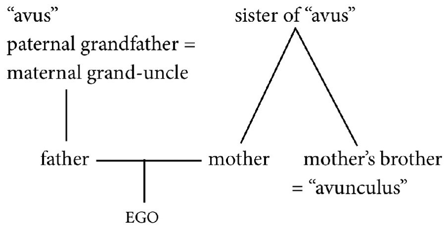

<i>Figure 8.1. Cross-cousin marriage according to Benveniste (1969).</i>

The answer to this question lies in a specific cultural practice. It has often been pointed out that a special relation between a young boy and his maternal uncle looks like a common feature of Indo-European tradition. Thus, <i>e.g.</i> Tacitus (Germania 20.5) reports that ‘[s]ister’s sons are held in as much esteem by their uncles as by their fathers; indeed, some regard the relation as even more sacred and binding, and prefer it in receiving hostages, thinking thus to secure a stronger hold on the affections and a wider bond for the family’. In the same vein, the Irish hero Cú Chulain at the tender age of seven receives his weapons from his maternal uncle Conchobar, and on the battlefield the Trojan hero Hector is assisted by Apollo in the disguise of his mother’s brother Asius.

This pattern conforms neatly with our general understanding of Indo-European society. In a patriarchal household where the entire inheritance went to one son, a good way to keep adolescent boys out of harm’s way was to connect them with their maternal family, even to the point of fosterage. Here they could develop military skills without threatening the stability of their own clan, and at the same time, the custom would serve to strengthen the alliance between the two families. The survival of such a tradition into Celtic society is confirmed by the ancient Irish law, <i>Senchus Mor</i>, where we find the statement that ‘the kinship of the mother or the kinship of fosterage; it happens that they are one and the same’ (Bremmer 1976, 70).

The particular bond between young boys and their maternal uncles is mirrored in the semantic development of the word <i>*népōts</i> which, beside the original sense of ‘grandson, descendant’, has assumed the secondary meaning ‘nephew’, in particular ‘sister’s son’, secondarily also ‘cousin’, in a number of European branches. Latin <i>nepōs</i> is attested in the meaning ‘nephew’ from the post-Augustean period, Old Irish <i>nía</i> ‘nephew, sister’s son’ is opposed to the transparent phrase <i>mac bráthar</i> ‘brother’s son’, and the same semantic change is observed in Middle Welsh <i>nei</i> ‘cousin; nephew’, esp. ‘sister’s son’, Old English <i>nefa</i> ‘grandson’ and ‘nephew, stepson’, Old Lithuanian <i>nepuotìs</i> ‘grandson’ and ‘nephew’, and Serbo-Croatian <i>nȅćāk</i> ‘sister’s son’.

As already acknowledged by Delbrück (1889, 403), the branches where the word for ‘mother’s brother’ are etymologically connected with the ‘grandfather’ word <i>*h₂au̯h₂os</i> are the very same as those where <i>*népōts</i> also (or exclusively) means ‘nephew, sister’s son’. Moreover, even if the meaning ‘nephew’ from ‘grandson’ is secondary in Latin, it is suggestive that we find an old derivative <i>sobrīnus</i> ˂ <i>*su̯esrih₃no-</i>, derived from the word for ‘sister’, with the original meaning ‘sister’s son’, as attested in inscriptions and still preserved in Spanish <i>sobrino</i>, while ‘brother’s son’ is designated by the phrase <i>frāter patruelis,i.e.</i> a situation parallel to that of Old Irish.[^ch8-note-12] Thus there seems to have been a general agreement that the sons of sisters rather than brothers were the favoured kind of nephews.

Under the assumption that <i>*h₂au̯h₂os</i> was applied to both the paternal and the maternal grandfather, the grandson, <i>*népōts</i>, of family B is identical with the nephew (sister’s son) of the ‘avunculus’ of family A:

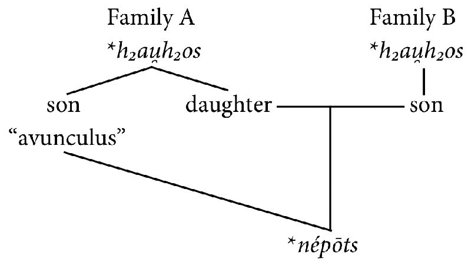

<i>Figure 8.2. Grandfather-grandson and uncle-nephew-relationship according to Olsen (forthcoming).</i>

Thus, there is no need for a far-fetched theory of cross-cousin marriage. The relation between ‘avus’ and ‘avunculus’ easily falls into place if the <i>avus</i> of Family B is the paternal grandfather, while the <i>avunculus</i> of Family A is the son of the maternal grandfather.

Despite widespread opposition in recent literature (<i>e.g.</i> Martin Huld and James Mallory in Mallory & Adams 1997, 240), the most natural etymological interpretation of <i>*népōts</i> ‘grandson’ remains a compound, <i>*né-pōt-</i> ‘not mighty, without authority’.[^ch8-note-13] This would be an appropriate designation of young, powerless members of the household: the <i>*déms potis</i> is the ‘master of the house’ and, on a lower level, a mere <i>*pótis,</i> ‘master, husband’, is at least master of his wife and children, while the <i>*né-potes</i> are still powerless minors.

With the semantic transfer from (‘grandson’ →) ‘nephew’ to ‘cousin’, the viewpoint is changed from that of the older generations to that of the contemporaries, but in any case, we are dealing with the youngest members of the family. This viewpoint also makes it possible to account for the Greek compound <i>anepsiós</i> ‘cousin’ ˂ <i>*sm̥-neptió-</i>, lit. ‘belonging to the same collective of powerless (children/youths)’.

### Uncles and aunts

Apart from the parallel if not identical designations for ‘mother’s brother’ mentioned above, it is doubtful whether the inherited vocabulary includes words for ‘uncle’ or ‘aunt’. A priori one might expect the father’s brothers to be important figures, but on the other hand, it is conceivable that the children would call all adult men in the family, except for the grandfather, ‘father’ or ‘daddy’, and the women, except for the grandmother, ‘mother’ or ‘mummy’.

At any rate, the alleged common word for ‘father’s brother’, represented by Sanskrit <i>pitṛvyà-</i>, Avestan <i>tūiriia-</i>, Latin <i>patruus</i> and Old High German <i>fatureo</i>, is fraught with difficulties, [^ch8-note-14]especially if the potential cognates from Balto-Slavic and Celtic are included. Thus, it is sometimes suggested that there is a connection with Old Russian <i>strъi</i> ‘uncle’, Russian <i>stroj</i> ‘father’s brother; cripple, beggar’ under the assumption that (<i>*ph₂tr-</i> >) <i>*ptr-</i> would yield <i>str-</i>, but in that case the otherwise obvious link to Lithuanian <i>strùjus</i> ‘grandfather, old man’, and in particular Old Welsh <i>strutui</i> ‘old man’, Old Irish <i>sruith</i> ‘old, venerable’ is semantically problematic.

To account for the entire material, we may suggest the following approximate scenario: a protoform <i>*ph₂tr-h₂uh₂-io-</i> > <i>*ptrūio-</i> > <i>*strūio-</i> ‘(pertaining to the) paternal ancestor’ (cf. <i>*h₂au̯h₂(o)-</i> ‘grandfather, ancestor’)[^ch8-note-15] was most faithfully preserved in Balto<i>-</i>Slavic and Celtic in various meanings from ‘old, frail’ and ‘grandfather’ to ‘(paternal) uncle’. As the other languages lexicalised the specialised meaning ‘father’s brother’ while the regular <i>*strū-</i> had lost its transparency, they were induced to restore the initial sequence <i>*ph₂tr-</i> from the base word <i>*ph₂tér-</i> ‘father’ for reasons of clarity. It may then be concluded that the Indo-Europeans had no common word for ‘father’s brother’, and the same seems to be the case for the various categories of ‘aunts’ despite a multitude of later, individual formations.

### In-laws

As is commonly acknowledged, the Indo-European protolanguage is characterised by a marked difference between the vocabulary of the men and that of the women with respect to relations by marriage. For the male members of a household, the idea of ‘binding’ was often sufficient to denote an in-law as someone associated with the family by bonds of loyalty. Thus, <i>e.g.</i> Greek <i>pentherós</i> from the root <i>*bʰendʰ-</i> ‘bind’ means ‘father-in-law’ (wife’s father) in the Homeric attestations, but it is also found in the sense of ‘son-in-law’ and ‘brother-in-law’. Likewise Vedic <i>bándhu-</i>, from the same root, covers the broad semantic field of ‘connection, kinship’ and ‘relative’, especially on the woman’s side.

For the woman, on the other hand, we find a widely attested, variegated and precise vocabulary designating the members of her husband’s family: ‘husband’s brother’, [^ch8-note-16]‘husband’s (unmarried) sister’[^ch8-note-17] and even ‘husband’s brother’s wife’, all suggesting a patrilocal system where the young bride joined her husband’s family. The specific term for ‘husband’s brother’s wife’, <i>*h₁i̯énh₂ter-</i>, calls for special attention. With continuants in Vedic <i>yātar-</i>, Greek pl. <i>einatéres</i>, Latin pl. <i>ianitricēs</i>, Lithuanian <i>jentė</i>, gen. <i>jenter̃s</i>, Church Slavonic <i>jętry</i> and perhaps Armenian <i>nēr</i>, all with the same meaning, the inherited status and semantic precision of the word in Core Indo-European is indisputable. Still, the paradigm with two full-grade elements (<i>*-e-</i> in both syllables) is irregular, and as for the etymological background, the suggestions so far have all been highly speculative. However, basing ourselves on the well-known root <i>*h₁ieh₂-</i> ‘travel’ an explanation is at hand. The corresponding verb <i>*h₁i̯eh₂-ti</i> > Lithuanian <i>jóti</i> means ‘ride’, while <i>yāˊti</i> in the Rigveda is abundantly attested in the broad meaning of travelling, typically over long distances, by carriage or boat, on horseback or on foot. For example, Dawn travels, ‘<i>yāˊti</i>’, through the sky in her chariot, and the Maruts travel along the paths of the two world-halves. Starting from an active participle, <i>*h₁i̯eh₂-nt-</i> (Vedic <i>yāˊnt-</i>) ‘travelling, traveller’, the way to <i>*h₁i̯enh₂ter-</i> is straightforward: we only have to accept a slight adaptation to the word for ‘daughter’, <i>*dugh₂ter-</i> to get to the attested form.[^ch8-note-18]

In a typical Indo-European household, the female inhabitants, apart from the mother-in-law and at some point possibly slaves, would have included two categories, the still unmarried daughters, the <i>*dugh₂teres</i> as opposed to the wives of the grown-up men, the <i>*h₁ienh₂teres</i>. If the suggested analysis is correct the latter would then be characterised as the ‘travellers’, suggesting an exogamous society where the women were taken from afar. Here one only has to think of such long-distance travellers as the women from the Corded Ware graves at Eulau in Germany (Kristiansen <i>et al.</i> 2017 with references) and the much later young girls of Egtved and Skrydstrup from the Scandinavian Bronze Age (Frei <i>et al.</i> 2015; Persson 2017) to make an obvious linking between linguistic and archaeological evidence.

In most literature on the subject, there appears to be a preconceived idea that <i>all</i> precise designations for in-laws originally have to be seen from the wife’s viewpoint, but to some extent this approach seems to be biased and exaggerated. In particular, this goes for the terms for ‘mother-in-law’ and ‘father-in-law’. Thus <i>e.g.</i> Buck (1949, 124) claims that these words were ‘used only by the wife of her husband’s father or mother’, Pokorny (IEW 1043) glosses ‘<i>su̯ekrū-</i>’ ‘Mutter des Ehemannes’ and ‘<i>su̯ékuro</i>-’ ‘Vater des Ehemannes’, and Martin Huld and James Mallory in Mallory & Adams (1997, 386–387) conclude that some branches (Italic, Celtic, Germanic, Albanian) <i>extend</i> the terms to cover both the husband’s and the wife’s in-laws.

What we actually find is that in Greek, Armenian and Balto-Slavic the inherited words exclusively refer to the husband’s parents, while the other branches, including Indo-Iranian, use them indiscriminately about the parents of the husband and the wife, [^ch8-note-19]and that certain details only find a natural explanation if the starting point is on the wife’s side of the family. Thus Pashto <i>xōṣ̌īna</i> ‘wife’s sister’, lit. ‘the one pertaining to the mother-in-law’ (Morgenstierne 1927, 98) only makes sense if the base word had the meaning ‘wife’s mother’, and the ‘vṛddhi’ derivative <i>*su̯ēk̑uró</i>‘brother-in-law’ from <i>*su̯ék̑uro-</i> ‘father-in-law’, lit. ‘the one associated with the father-in-law’, [^ch8-note-20]has the precise meaning ‘wife’s brother’ in the Kashmiri avatar <i>hahar</i> as well as the oldest attestation of Old High German <i>swagar</i>, suggesting that the ‘father-in-law’, at least in this context, must be understood as the ‘wife’s father’.

In order to achieve a closer understanding of this state of affairs, we shall have to look at the internal relationship between <i>*su̯ek̑rúh₂s</i> ‘mother-in-law’ and <i>*su̯ék̑uros</i> ‘father-in-law’ and their possible etymological background. Here it should be noticed that the morphological structure of <i>*su̯ek̑rúh₂s</i>, belonging to the rare type of feminine <i>*-uh₂-</i>stems, is more likely to be the primary formation than the word for ‘father-inlaw’ which looks like a dissimilated derivative <i>*su̯ek̑rúh₂-</i> → <i>*su̯ék̑ruro-</i> > <i>*su̯ék̑uro-</i> ‘the one associated with mother-in-law’. Despite various aprioristic statements to the opposite, [^ch8-note-21]this seems quite natural in so far as the mother-in-law must have played an important role in the household as the indisputable head of women and children, as is <i>e.g.</i> still the case in conservative Indian families. Her spouse, on the other hand, is primarily defined as master of the whole family, in particular the male line, rather han by his simultaneous role as father-in-law.

As for the etymological background of <i>*su̯ek̑rúh₂-</i>, the most likely interpretation connects it with the pronominal stem <i>*su̯e-</i> ‘(one’s) own’, but also ‘separate’, followed by the stem denoting ‘head’, <i>i.e.</i> <i>*su̯e-k̑rh₂u-</i> > <i>*su̯e-k̑ruh₂-</i> (regular metathesis <i>*-rh₂u-</i> > <i>*-ruh₂-</i>, as in the word for ‘father’s brother’ etc. above). Thus, the original meaning would be something like ‘someone having her own or separate head (of family)’, which fits the idea of the Indo-European matron perfectly, her husband being the <i>*déms potis</i>, the head of the household. If <i>*su̯e-</i> is understood in the meaning ‘separate’ the <i>*su̯e-k̑ruh₂-</i> may very well originally have referred to the <i>mater familiās</i> of the wife’s family, at least optionally. She would be the one with a separate master belonging to another clan.

We have no means to know what an Indo-European wife called her husband’s parents – perhaps simply ‘mother’ and ‘father’ – but it seems quite sensible that a man would have a terminology for his male in-laws, typically words focusing on the bond or alliance of the two clans, as well as a word for the one reasonably influential female member of his wife’s family, namely her mother.

At any rate, the use of the stem <i>*su̯e-</i> in the meaning ‘separate’[^ch8-note-22] is also found in other terms for the husband’s relatives by marriage (cf. Olsen 2012). Old High German <i>giswio</i> ‘sister’s husband’ ˂ <i>*su̯ei̯-h₃onh₂-</i> has the literal meaning ‘someone with his own/separate authority’, [^ch8-note-23]and in the same vein the secondary derivative <i>*su̯oi̯h₃niah₂-</i> > Armenian <i>kᶜeni</i>, Lithuanian <i>svaínė</i>̇, both with the meaning ‘wife’s sister’, should be interpreted as ‘a woman associated with an independent man’. A parallel formation is Germanic <i>*swainaz</i> ‘someone associated with an independent man’, <i>i.e.</i> ‘a young dependent male’, continued in Old Norse <i>sveinn</i> ‘boy, young man, thrall, warrior’ etc., a linguistic contribution to the fact that in the older Indo-European societies all were not equal.

### Marriage

Our information on marriage among the early Indo-Europeans must be derived from much later sources, and these point in different directions. Thus, for example, the ancient Indians acknowledged several types of marriage that would vary according to the social status of the couple.

One root, however, clearly indicates a patrilocal family structure, <i>*h₂u̯edh₁</i>/₂<i>-</i> ‘lead, draw’ or ‘marry’, exclusively seen from the point of view of the man, leading his bride to his paternal homestead, cf. Avestan <i>vāδaiieiti</i> ʻleads’, Old Irish <i>fedid</i> ‘leads, carries, brings’, Gothic <i>ga-widan</i> ‘connect’, Old Church Slavonic <i>vedǫ</i> ‘lead’, Lithuanian <i>vedù</i> ‘lead; marry (of the man)’, English <i>wed,wedding</i> and the nominal derivative Vedic <i>vadhū-</i> ‘bride’. Obviously, it is impossible to know what exactly this ‘leading’ or ‘drawing’ implied, be it violent abduction or perhaps escort of the young bride from her distant homestead.

If the marriage did not imply abduction or cohabitation, some sort of exchange of gifts would generally be involved, whether as a bride-price or dowry or a combination of both. A linguistic relic of this practice may be found in the rare and archaic Greek word <i>óar</i> ‘wife’ that, as suggested by Olsen (forthcoming), may be traced back to an <i>r/n-</i>stem <i>*u̯ós-r̥</i> (gen. <i>*u̯és-n̥-s</i> ~ <i>*us-n-ós</i>) ‘purchase’, pointing to a time where the bride was actually bought with a bride-price as a recompensation to her family for the loss of labour. Klingenschmitt (2008, 409–410) has demonstrated a similar use of the root <i>*kʷreih₂-</i> ‘buy’ in Middle Irish <i>tochra</i> ˂ <i>*to-kʷriio-</i> ˂ <i>*kʷrih₂-o-</i> ‘bride-price’ with a close parallel in Lithuanian <i>*krienas</i> (gen. <i>krieno</i>) where the practice of paying a bride-price survived into the seventeenth century.

Similarly, Bailey (1979, 345) has derived Avestan <i>zәmanā-</i> ‘payment, wages’, Sogdian <i>z’mn’k</i> ‘with payment’ from a base <i>zam-</i> ‘pay’ which he further connects with the Indo-European word for ‘son-in-law’, Vedic <i>jā ˊmātar-</i>, Avestan <i>zāmātar-</i> etc., reaching the conclusion that the ‘earliest Indo-European marriage was ‘payment for the bride’, hence the <i>zam-</i> ‘to pay’ of the noun of relationship Av. <i>zāmātar-</i> ‘son-in-law’ …’.[^ch8-note-24]

Again, with all due reserve, one might compare with the Maasai, a present-day pastoral, nomadic society, where girls in connection with marriage are exchanged for cattle and cash.

For the ‘daughter-in-law’ the common term is the rare type of a feminine <i>o-</i>stem <i>*snusós</i>, pointing to an original collective and preserved as such in Greek <i>nuós</i> and Armenian <i>nu</i> as opposed to the morphological adaptations in Vedic <i>snuṣā-</i>, Old Norse <i>snør</i> etc., Russian Church Slavonic <i>snъxa</i> and Lat. <i>nurus</i>. Out of the various, more or less problematic etymological suggestions, the most likely connects <i>*snusós</i> with the root <i>*sneu̯h-</i> ‘entwine’: an <i>s-</i>stem <i>*sneu̯hos</i> > <i>*sneu̯os</i> ‘entwinement’ would lead to <i>*snus-ós</i> ‘one of a collective pertaining to entwinement, one of the entwined ones’ which describes the role of a daughter-in-law quite precisely. In contrast to the male ‘alliances’ from other clans, such as fathers-in-law and brothers-in-law, described by derivatives of verbs meaning ‘bind, tie’, the daughters-in-law literally entwine two clans, living in the households of their husbands and giving birth to offspring stemming from both families.

### Widows and orphans

In the periphery of the Indo-European family we find the widows and the orphans or perhaps just fatherless. The word for ‘widow’, <i>*(h₁)u̯i-dʰ(h₁)eu̯ah₂-</i>, is deeply rooted with reflexes in at least Indo-Iranian, Latin, Albanian, Balto-Slavic, Celtic and Germanic, <i>e.g.</i> Vedic <i>vidhávā-</i>, Latin <i>vidua</i>, English <i>widow</i>.[^ch8-note-25] It is generally assumed that we are dealing with a compound of <i>*(h₁)ui̯-</i> ‘apart, separately’ and a derivative of the root <i>*dʰeh₁-</i> ‘put’, but still the obvious interpretation that a widow is someone ‘put aside’ is disputable.

In one of the two attestations of <i>vidhávā-</i> in the Rigveda (10.40), the following question is asked: ‘Who takes you to bed, like a widow her brother-in-law, or to a rendez-vous like a maiden a dashing youth?’. This implies that at least the old Indians knew of the levirate type of marriage according to which a widow would marry the brother of her deceased husband. Such an institution is common among patrilineal communities, and it seems likely that it prevailed in early Indo-European society. On this background, one may now suggest a new analysis of the word. Since a collocation of <i>*(h₁)u̯i-</i> + <i>dʰeh₁-</i> may also mean ‘distribute, allot’, a widow should not be perceived as somebody ‘put away’, but rather the one who is ‘allotted’ to the next brother in line. The suggested interpretation also accounts for the otherwise enigmatic Greek <i>ēítheos</i> ‘bachelor, young unmarried man’ as the regular outcome of a privative compound <i>*n̥-h₁u̯idʰh₁eu̯o-</i>, someone ‘not (yet) allotted (to a bride)’.

There may be various reasons for such a practice. It serves as a protection of the woman and in particular of her children who belong to the clan, the alliance between the two families remains unbroken, and it is an economic bonus to the man’s family in so far as the bride<i>-</i>price has already been paid or is perhaps reduced for the second marriage, as in present-day Somali society. If the woman in question happens to be the widow of the oldest brother of the family and at the same time the mother of at least one son, the advantage is particularly obvious. Her son is left as the sole heir to the family fortune and future <i>pater familiās</i>, but while he is still under age, he (and his mother) are in need of a protector from the same male lineage, in other words a paternal uncle.

The analysis of the word for the ‘widow’ is closely connected with that of the ‘orphan’, continued in Armenian <i>orb</i> ‘orphan, fatherless child’, Greek <i>orphanós</i> ‘orphan; bereft’ and borrowed at an early stage into Finnish <i>orpo</i> ‘orphan’. As demonstrated by Melchert (apud Kloekhorst 2008, 311), the basic root is <i>*h₃erbʰ-</i> ‘change allegiance’, as in the Hittite verb <i>harp-</i>, so the orphan is someone whose allegiance is changed to either his paternal uncle or another adult male, dependent on the boy’s status as either a family member or, in less fortunate cases, an outsider, <i>e.g.</i> a captive. This explains the peculiar semantic breadth of the derivatives. In Celtic and Germanic <i>*h₃orbʰio-</i> ‘that which pertains to the orphan (or rather fatherless)’ comes to mean ‘inheritance’ (Old Irish <i>orbe</i>, Gothic <i>arbi</i>, Old High German <i>arbi,erbi</i> etc.). On the other hand, the sad lot of those not protected by close kin is reflected in Old Church Slavonic <i>rabъ</i> ‘servant, slave’, <i>rabota</i> ‘servitude, slavery’ and the words for ‘labour, work’ in Germanic, thus Gothic <i>arbaiþs</i> ‘toil, labour’, Old English <i>earfoð</i> ‘hardship, trouble’.

The institution of ‘heiress daughters’ highlights how important the maintenance of the inheritance must have been. If the head of a family had the bad fortune of having no sons, a daughter had to fulfil an intermediate function until she bore a son who would then be the legitimate heir. Linguistically this is reflected by a vṛddhi derivative <i>*dʰeu̯gh₂tro-</i>, continued in Sanskrit <i>dauhitra-</i> ‘son of an heiress daughter’, Middle High German <i>diehter,tiehter</i> ‘daughter’s son’, and both in Indic and Greek tradition there are intricate rules for the handling of such an unfortunate situation. A particularly interesting text is the Cretan law text of Gortyn where it is specified in detail whom such a heiress daughter is required to marry in order to keep the heritage intact and, not least, re-establish the male blood line: the first option is the oldest of her father’s brothers, then comes the oldest brother’s oldest son etc.

### Fosterage

As we have already seen, fosterage of young boys by their mother’s family seems to have been a common phenomenon in early European societies. A curious detail that may point in the same direction is found in the lexicalisation as ‘stepmother’ of the formally identical Greek <i>mētruiá</i>, Armenian <i>mawru</i>. Considering their etymological background and morphological structure, the derivative would be expected to mean something like ‘pertaining to (someone of) maternal ancestry’, like the closely related Old English <i>mōdrige</i> ‘mother’s sister’. In case a child was brought up by his maternal uncle, his foster-mother or, in practice, stepmother would be the wife of this uncle – she would be the one pertaining to the relative on the mother’s side. Another possible interpretation involves a practice of sororate marriage, the mirror image of the levirate discussed above: if a woman died while her children were still under age, her husband might choose to marry one of her younger sisters, thus maintaining the already established socio-economic relations between the two families. In this way, the new stepmother would be identical with the mother’s sister.

Otherwise, the words for foster-children are most often derived from the root <i>*h₂al-</i> ‘nourish, feed’, thus Old Irish <i>comalt</i> ‘foster-brother’, <i>comalta</i> ‘foster-brother or -sister’, <i>altru</i> ‘foster-father’ and the highly interesting specific term for ‘foster-uncle’, Middle Welsh <i>athrawon</i> ˂ <i>*altr-awon-</i>, where <i>*-awon-</i> is identical with the stem denoting ‘maternal uncle’. In Latin we find <i>alumnus</i> ‘nursling, foster-son’, originally a middle participle ‘someone nourished’. Thus, the institution of fosterage most likely has at least Core Indo-European status.

### Slaves and freemen

If the early Indo-European society made a distinction between slaves and freemen, the corresponding vocabulary is disappointingly scarce.

An indirect piece of evidence pointing to such a distinction is found in the adjective <i>*h</i><i>₁ment of new useful guest friendships and allian</i><i>eu̯dʰero-</i> > Greek <i>eléutheros</i>, Latin <i>līber</i> ‘free’, Paelignian <i>loufir</i> ‘free man’ where the suffix <i>*-ero-</i> suggests a contrast, as <i>e.g.</i> in Latin <i>dexter</i> ‘right’ vs. <i>sinister</i> ‘left’. From this we may conclude that there must also have been someone considered unfree or belonging to a category different from people of one’s own ethnicity. ment of new useful guest friendships and allianThe Latin plural <i>liberī</i> ‘children’ is isolated from a formulation in the law code according to which a man gives away his daughter to her future husband <i>liberum quaesundum causa</i>, ‘to achieve free/legitimate (children)’.

Since the basic root <i>*h₁leu̯dʰ-</i> means ‘grow’, as in Vedic <i>ródhati</i>, Gothic <i>liudan</i>, with derivatives like Old High German <i>liuti</i>, Lithuanian <i>liáudis</i>, Old Church Slavonic <i>ljudьje</i> ‘people’, it seems a reasonable assumption that the ‘growth’ of the people was associated with free individuals belonging to the clan. A connotation of freedom or even nobility may also be deduced from the Greek epithet <i>Eleuthérios</i> of Zeus, and Oscan (gen.) <i>Iúvis Lúvfreis</i> of Juppiter, and from the Old Church Slavonic adjective <i>ljudinъ</i> ‘free man’.

As for actual words for ‘servant’ or ‘slave’, one may refer to the compound <i>*h₂m̥bʰikʷolh₁o-</i>, lit. ‘moving around, taking care’, in Latin <i>anculus</i> ‘servant’ beside the far more common feminine diminutive <i>ancilla</i> ‘female servant, slave’, Greek <i>amphí-polos</i>, mostly ʻfemale servant’, and Sanskrit <i>abhi-cara-</i> ‘servant’. It is suggestive that this compound is generally used about women, whereas the usual word for a male slave in Latin is <i>servus</i>.

Apparently <i>servus</i> is derived from <i>*ser-</i> ‘take care of, herd’, cf. Avestan <i>haraiti</i> ‘is aware, protects’ and in particular <i>pasuš-hauruuō spā</i> ‘sheepdog’. As discussed by Nielsen Whitehead (forthcoming), a semantic development ‘herdsman’ → ‘slave’ may go back to a time where it was the primary duty of male slaves to herd the flocks, while the females of the same class would have helped in the household.

However, even if this scenario may hold true for early Italic society it is more difficult to determine the precise etymological background in a longer time perspective. The very word <i>servus</i> exhibits an unusual type of stem formation with <i>e-</i>grade in the root and suffix <i>*-u̯̯o-</i>, and on this background it is striking that a homonymous derivative <i>*seru̯o/ah₂-</i> has a quite different meaning in Welsh <i>herw</i> ‘raid; outlawry’ and Archaic Irish <i>serb</i> ‘theft’ with the denominative compound verb <i>fo-serba</i> ‘steals, pilfers’ (of sheep or pigs). Watkins (1976) connected these forms with Hittite <i>šāru</i> ‘booty’ ˂ <i>*soru</i>, comparing the relationship between <i>*soru</i> and <i>*seru̯o-</i>/<i>seru̯ah</i>₂ with the pattern <i>*doru</i> vs. <i>*deru</i>̯<i>o-</i>/<i>deru̯ah₂-</i> ‘tree’. According to Watkins, the root underlying <i>šāru</i> and <i>herw,serb</i> is only preserved in Anatolian and Celtic, but the formal identity and potential semantic overlap between the Celtic derivative and Latin <i>servus</i> is almost too striking to be due to accident.

I would therefore suggest that the allegedly separate roots be united under an original meaning ‘take as booty’, whence ‘take into custody, include into one’s flock, take care of, herd’, and finally the more abstract ‘observe’ etc. As we know from Watkins’ comparative analysis of formulaic language (1979), the early Indo-Europeans counted their wealth in four categories, men, large cattle, small cattle and metals (but, significantly not land). As far as these riches were taken as booty, the first category would consist in captives who would most likely end up as slaves, cf. the semantic development of the participle <i>*kapto-</i> ‘taken’ (Latin <i>captus</i>) > Old Norse <i>haptr</i> ‘prisoner’, Old English <i>hæft</i> ‘captive, slave’, Welsh <i>caeth</i> ‘slave’, Old Irish <i>cacht</i> ‘female slave’. The cattle, on the other hand, would be included in one’s own flock and herded there. It is suggestive that the basic meaning of the root is preserved in Anatolian, the first branch to disintegrate from the Indo-European community, and in Celtic where the myths of the cattle-raids have enjoyed particular popularity.

Other nouns suggesting a differentiation between free, independent members of the society and subordinate servants or slaves are mostly restricted to one or two separate branches. As an example one may mention <i>*(h₂)upo-sth₂o-</i>, lit. ‘standing under’, reflected in Sanskrit <i>úpa-sthi-</i> ‘servant’, <i>upa-sthānam</i> ‘service’ and Armenian <i>vastak</i> ‘labour, toil, service; tired’, the latter probably an early loanword from a Middle Iranian <i>*upa-stāka-</i> (Olsen 1999, 250–251).

### Insiders and outsiders

A profound distinction between full members of the community and foreigners almost appears like a <i>Leitmotiv</i> in the vocabularies of the ancient Indo-European- speaking peoples. Whatever belonged to the clan or the homestead was considered safe and dear – what came from outside was double-faced, potentially dangerous and hostile, but at the same time a source for looting and acquisition of wealth and for the establishment of new useful guest friendships and alliances.

Thus the root <i>*k̑e̯i-</i> ‘lie’(Vedic <i>śéte</i>, Greek <i>keĩtai</i> ‘lies’ etc.) is the basis of a multitude of derivatives within the semantic field of homestead, membership of the community, close family and emotional relations. Cf. <i>e.g.</i> <i>*k̑oimo-</i> > Gothic <i>haims</i> ‘village’, Old Norse <i>heimr</i> ‘home’, but also Old Irish <i>cóim,cáem</i>, Welsh <i>cu</i> ‘dear’; <i>*k̑eiu̯o-</i> > Oscan <i>ceus</i>, Latin <i>cīvis</i>[^ch8-note-26] ‘citizen’, Gothic <i>heiwa-frauja</i> ‘master of the house’, Old English <i>hīw-cund</i> ‘domestic’, German <i>Hei-rat</i> ‘marriage’, Latvian <i>siẽva</i> ‘wife’, but also Vedic <i>śéva-</i> ‘dear, precious’.

Similarly, Greek <i>phílos</i> has the double meaning ‘related, own’ (about body-parts, clothes) and ‘dear’, while the corresponding verb <i>phileĩn</i> originally means ‘befriend’, and from the root <i>*prei̯h-</i> we find the derivative <i>*prihó-</i> > Vedic <i>priyá-</i> ‘own; dear’[^ch8-note-27] beside Gothic <i>freis</i> etc. ‘free’, once again stressing the connection between free members of the clan and the familiar, dear and precious.

One of the most hotly debated word families in this field is that of Vedic <i>arí</i>‘stranger, foreigner; guest’, later also ‘enemy’[^ch8-note-28] whose etymological interpretation is made difficult by the merger of <i>*-l-</i> and *-<i>r-</i> in Indo-Iranian, so that we might in principle be dealing with more than one original root. However, a coherent scenario, also including Hittite <i>ara-</i> ‘member of one’s group, peer, comrade, partner, fellow, friend’, [^ch8-note-29]is possible if <i>arí-</i> is derived from <i>*h₂ar-</i> ‘join, attach’, and we assume a semantic development ‘ally, stranger attached to Vedic society’ (thus Mayrhofer, l.c.) → ‘guest’, but also ‘enemy’, with the same double meaning as Latin <i>hostis</i>. From ‘stranger, guest’ we arrive at the derivative <i>aryá-</i> ‘lord, master of the house’ and finally the self-designation of the Indo-Iranians, Vedic <i>āˊrya-</i>, Avestan <i>airiia</i>, surviving in <i>e.g.</i> the names of the Iranians, the Alans and the Ossetic Ironians.

### Conclusion

To the historical linguist, the present overview of Indo-European kinship terminology may seem dissapointingly conservative. None of the exotic scenarios implying cross-cousin marriage, matrilocality or the priority of age sets to consanguinity has been invoked to explain linguistic peculiarities. On the contrary, the foundations for an analysis of the social structure of the Indo-Europeans laid by Delbrück in the late nineteenth century have mostly proved to be tenable. What Delbrück and his contemporaries could not predict, however, was the progress in archaeological research and the emergence of the study of ancient DNA and strontium analysis that would revolutionise our joint understanding of the Indo-European world. The main results of the present reinvestigation of the linguistic evidence may be summarised as follows:

•our knowledge of kinship terminology in Indo-European proper is scanty since a number of important terms differ between Anatolian and Core Indo-European

•the typical Core Indo-European family was patrilineal and patrilocal, consisting of the master of the house, his wife, sons, unmarried daughters, daughters-in-law and grandchildren

•the basis of the kinship terms in <i>*-ter-</i>, including ‘mother’, ‘brother’ and ‘husband’s brother’s wife’ were the words for ‘father’ and ‘daughter’

•the word for ‘brother’ was used in a wider sense, including paternal cousins and members of the same ‘brotherhood’, presumably referring to the institutions of Jugendbünde/Männerbünde; etymologically ‘brother’ may be tentatively analysed as ‘fighter’ or ‘brother-in-arms’

•a particular bond between young boys and their maternal uncles is revealed by the derivational relationship between <i>e.g.</i> Latin <i>avus</i> ‘grandfather’ (paternal and maternal) and <i>avunculus</i> ‘son of the maternal grandfather’. This bond often included fosterage

•men’s relations to their in-laws were typically expressed by derivatives of roots meaning ‘bind’, stressing the importance of alliances by marriage

•marriages were exogamous, often implying long-distance travelling as suggested by a new etymological interpretation of the word for ‘husband’s brother’s wife’ as ‘traveller’

•the original meaning of the word for ‘widow’ is ‘the allotted one’ – she is ‘allotted’ to the brother of her deceased husband; if she is the widow of an older brother and mother of a son, this son is at the same time an ‘orphan’ and an heir, so the practice of levirate marriages secures both the male lineage and the family inheritance

•there is linguistic evidence for the institution of ‘heiress daughters’ in families without sons

•as far as we can see, the terminology of kinship and close social relations is almost entirely based on inherited material rather than substrata and loanwords. This suggests that while the Indo-Europeans learned about agriculture by the early farmers, they imposed the main features of their social structure on the indigenous populations.

The next step of a systematic archaeolinguistic investigation will be concerned with the social stratification and external relations of the Indo-Europeans, including the concepts of guest friendship, trade and warfare. Hopefully, a joint effort from historical linguistics, archaeology and genetics will little by little provide us with a deeper understanding of this rich and promising research field.

#### <i>Notes</i>

1A fuller treatment of the subject matter, elaborating on the linguistic argumentation, is presented in Olsen (forthcoming) which may be consulted for references and points of detail. On Indo-European kinship terminology in general, cf. also Szemerényi 1977; Gamkrelidze & Ivanov 1995, 663–677; Mallory & Adams 1997, 332–335 and 2006, 203–218.

[^ch8-note-1]: Cf. <i>e.g.</i> the handbooks by Mallory and Adams (1997 and 2006), Anthony’s integrated treatment of the Indo-European homeland and migrations (2007), Kristiansen and Larsson’s monograph on Bronze Age Scandinavia (2005), and the seminal articles by Allentoft <i>et al.</i> (2015) and Haak <i>et al.</i> (2015) on the genetic evidence for migrations from the steppes into Europe.

[^ch8-note-2]: In practice ‘Core Indo-European’ is frequently used with the meaning ‘Indo-European minus Anatolian and Tocharian’, the second member to branch out. Thomas Olander (forthcoming) suggests a more precise terminological distinction between Indo-European, Indo-Tocharian (Indo-European minus Anatolian), Indo-Celtic (Indo-European minus Anatolian and Tocharian) etc.

[^ch8-note-3]: Cf. Nikolayeva 2014 for a typological treatment of kinship terminology.

[^ch8-note-4]: Cf. the famous treatment of this question by Jakobson 1960.

[^ch8-note-5]: * <i>h</i> ₂ (beside * <i>h</i> ₁ and * <i>h</i> ₃) is one of three so-called ‘laryngeals’ reconstructed for the proto-language. Of these * <i>h</i> ₂ regularly and * <i>h</i> ₃ under certain conditions survive in Hittite as <i>ḫ(ḫ)</i>.

[^ch8-note-6]: Accent on the suffix, as in * <i>ph₂tér</i> - ‘father’, is regularly connected with zero grade (no <i>e</i> -vowel) in the root.

[^ch8-note-7]: Alternatively ‘a useful one, a helpmate’, cf. Gothic <i>daug</i> ‘is useful’. The root of <i>daug</i> is probably the same as that of <i>duhé,duhré</i> (‘gives milk’ → ‘is useful’).

[^ch8-note-8]: <i>E.g.</i> Martin E. Huld in Mallory & Adams (1997, 148): ‘Persistent efforts to create just-so stories about Indo-European home-life by etymologizing ‘daughter’ as ‘milker’ … provide no insight into the actual state of affairs’.

[^ch8-note-9]: The <i>e</i> -vocalism of <i>negna-</i> for expected * <i>nigna-</i> is not immediately compatible with * <i>h₁ni-g̑nh₁o</i> -, while, on the other hand, * <i>me-g̑nh₁o</i> - ‘with-born’ presupposes a distant assimilation * <i>megna</i> - > <i>negna</i> -.

[^ch8-note-10]: Cf. Wackernagel 2016 for a similar semantic development ‘cousin’ → ‘enemy’ in Semitic languages.

[^ch8-note-11]: Cf. also Latin <i>Neptūnus</i>, god of the sea, and Old Irish <i>Nechtan</i>, the master of a secret well.

[^ch8-note-12]: A detailed discussion of Latin <i>sobrīnus</i> and <i>consobrīnus</i> may be found in Nielsen Whitehead (forthcoming).

[^ch8-note-13]: Compositional type like * <i>né-kʷis</i> ‘no-one’, Sanskrit <i>ná-kiḥ</i>, Latin <i>nequis</i>.

[^ch8-note-14]: Greek <i>patruiós</i> with the aberrant meaning ‘stepfather’ is coined after the older <i>mētruiḗ</i> ‘stepmother’.

[^ch8-note-15]: *- <i>h₂uh</i> ₂ - is the zero grade of *- <i>h₂au̯h</i> ₂ - expected in this type of compounds, and the development *- <i>rh₂uh₂-</i> > *- <i>ruh₂(h₂)-</i> is phonetically regular.

[^ch8-note-16]: * <i>dah₂i̯uér</i> - > Vedic <i>devár</i> -, Greek <i>dāḗr</i>, Armenian <i>taygr</i>, Old English <i>tācor</i>, Lithuanian <i>dieverìs</i>, Old Russian <i>děverь</i> and the formally aberrant Latin <i>lēvir</i>. According to Janda, forthcoming, the underlying root is * <i>dah₂i̯</i> - ‘distribute’, and the husband’s brother, as the representative of the family and wooer par excellence, has the task of distributing gifts in connection with the negotiations of marriage.

[^ch8-note-17]: * <i>g̑l̥h₂u</i> -, cf. Greek <i>gálōs</i>, Armenian <i>tal</i> (for * <i>cal</i> after <i>taygr</i>), Latin <i>glōs</i>, Old Church Slavonic <i>zъlъva.</i>.

[^ch8-note-18]: It is futile to discuss whether the intermediate step is * <i>h₁ieh₂nter</i> - → * <i>h₁ienh₂ter</i> - by metathesis (*- <i>h₂n</i> - > *- <i>nh</i> ₂ -) or * <i>h₁ieh₂nh₂ter</i> - → * <i>h₁ienh₂ter</i> - by dissimilation (*- <i>h₂nh</i> ₂ - > *- <i>nh</i> ₂ -).

[^ch8-note-19]: Cf. the famous Rigvedic hymn 10.34.3 where the unlucky gambler complains that his motherin-law (surely not his wife’s mother-in-law = his own mother) hates him (for leaving his wife/ her daughter destitute).

[^ch8-note-20]: A <i>vṛddhi</i> (Sanskrit for ‘growth’) derivative is created by lengthening the vowel of the root syllable and shifting the accent. It indicates appurtenance to the base word.

[^ch8-note-21]: <i>E.g.</i> Szemerényi (1977, 63): ‘the feminine must, like all - <i>ŭ</i> -stem feminines, be based on a <i>ŭ</i> -stem masculine’; Martin Huld and James Mallory in Mallory & Adams (1997, 386): it ‘seems clear that the word for ‘mother-in-law’ was derived from ‘father-in-law’’, as opposed to Pokorny (IEW 1043): ‘… davon abgeleitet <b>suékuro-</b> ‘Vater des Ehemannes’’.

[^ch8-note-22]: Cf. also the adjective * <i>su̯etio̯</i> > Armenian <i>kᶜec</i> ᶜ ‘isolated’, Lithuanian <i>svečias</i> ‘guest, visitor’.

[^ch8-note-23]: The root *- <i>h₃onh</i> ₂ ‘load, charge’ is the basis of the ‘suffix of dominance’, cf. Olsen 2010.

[^ch8-note-24]: Cf. also the Greek verb <i>gaméō</i> ‘marry’.

[^ch8-note-25]: The exact meaning of the possible Hittite cognate ˢᵃˡ <i>udati</i> - is not clear.

[^ch8-note-26]: In Latin probably secondary <i>i</i> -stem after the opposite <i>hostis</i> ‘foreigner; enemy’, cf. de Vaan 2008, 116.

[^ch8-note-27]: Cf. <i>e.g.</i> also Gothic <i>frijonds</i> ‘friend’, Old Norse <i>frændi</i> ‘friend, relative’ and the adjective Goth. <i>frei-hals</i>, Old Norse <i>frjáls</i> ‘free, free-born’ (lit. ‘whose neck is free’).

[^ch8-note-28]: Cf. EWAia I: 111–112 with references to earlier literature.

[^ch8-note-29]: Puhvel 1984, 116–121.

## References

Allentoft, M.E., M. Sikora, K.-G. Sjögren, S. Rasmussen, M. Rasmussen, J. Stenderup, P.B. Damgaard <i>et al.</i> 2015. Population genomics of Bronze Age Eurasia. <i>Nature</i> 522(7555). 167–172. doi:10.1038/ nature14507.

Anthony D.W. 2007. <i>The Horse, the Wheel, and Language: How Bronze Age riders from the Eurasian steppes shaped the modern world.</i> Princeton: Princeton University Press.

Bailey, H.W. 1979. <i>Dictionary of Khotan Saka</i>. Cambridge: Cambridge University Press.

Benveniste, É. 1969. <i>Le vocabulaire des institutions indo-européennes</i>. 2 vols. Paris: minuit.

Bremmer, J. 1976. Avunculate and fosterage. <i>Journal of Indo-European Studies</i> 4(1). 65–78.

Buck, C.D. 1949<i>. A Dictionary of Selected Synonyms in the Principal Indo-European Languages. A contribution to the history of ideas</i>. Chicago, IL: University of Chicago Press.

Delbrück, B. 1889. <i>Die indogermanischen Verwandtschaftsnamen. Ein Beitrag zur vergleichenden Altertumskunde</i> (Abhandlungen der Königlichen Sächsischen Gesellschaft der Wissenschaften, Philologisch-historische Klasse, XI 15), 381–606. Leipzig: Hirzel.

EWAia = M. Mayrhofer. 1986–2001. <i>Etymologisches Wörterbuch des Altindoarischen</i>. 3 vols. Heidelberg: Winter.

Frei, K.M., U. Mannering, K. Kristiansen, M.E. Allentoft, A.S. Wilson, I. Skals, S. Tridico <i>et al.</i> 2015. Tracing the dynamic life story of a Bronze Age female. <i>Scientific Reports</i> 5. 10431. doi:10.1038/ srep10431.

Gamkrelidze, T.V., & V.V. Ivanov. 1995. <i>Indo-European and the Indo-Europeans. A reconstruction and historical analysis of a proto-language and a proto-culture</i>. Part 1. The text. English version by Johanna Nichols. Berlin & New York: Mouton de Gruyter.

Haak, W., I. Lazaridis, N. Patterson, N. Rohland, S. Mallick, B. Llamas, G. Brandt <i>et al.</i> 2015. Massive migration from the steppe was a source for Indo-European languages in Europe. <i>Nature</i> 522(7555). 207–211. doi:10.1038/nature14317.

IEW = J. Pokorny. 1959. <i>Indogermanisches etymologisches Wörterbuch</i>. Bern: Francke.

Iversen, R., & G. Kroonen. 2017. Talking Neolithic: Linguistic and archaeological perspectives on how Indo-Europan was implemented in Southern Scandinavia. <i>American Journal of Archaeology</i> 121(4). 511–525.

Jakobson, R. 1960. Why ‘mama’ and ‘papa’? In: B. Kaplan & S. Wapner (eds), <i>Perspectives in Psychological Theory. Essays in honor of Heinz Werner</i>, 124–134. New York: International Universities Press.

Janda, M. 2000. <i>Eleusis. Das indogermanische Erbe der Mysterien</i>. Innsbruck: Institut für Sprachwissenschaft der Universität Innsbruck.

Janda, M. Forthcoming. Wooing in Indo-European culture. In: B. Nielsen Whitehead & B.A. Olsen (eds), <i>Kin, Clan and Community in Prehistoric Europe</i>. Copenhagen: Museum Tusculanum.

Klingenschmitt, G. 2008. Lit. <i>úošvis.Baltistica</i> 43(3). 405–430.

Kloekhorst, A. 2008. <i>Etymological Dictionary of the Hittite Inherited Lexicon</i>. Leiden & Boston: Brill.

Kristiansen, K. & T. Larsson. 2005. <i>The Rise of Bronze Age Society: Travels, transmissions and transformations</i>. Cambridge: Cambridge University Press.

Kristiansen, K., M.E. Allentoft, K.M. Frei, R. Iversen, N.N. Johannsen, G. Kroonen, Ł. Pospieszny <i>et al.</i> 2017. Re-theorising mobility and the formation of culture and language among the Corded Ware Culture in Europe. <i>Antiquity</i> 91(356). 334–347. 10.15184/aqy.2017.17.

Mallory, J.P. & D.Q. Adams (eds). 1997. <i>Encyclopedia of Indo-European Culture</i>. London & Chicago: Fitzroy Dearborn.

Mallory, J.P. & D.Q. Adams. 2006. <i>The Oxford Introduction to Proto-Indo-European and the Proto-Indo-European World</i>. Oxford: Oxford University Press.

Morgenstierne, G. 1927. <i>An Etymological Vocabulary of Pashto</i>. Oslo: Dybwad.

Nielsen Whitehead, B. Forthcoming. Family structures in Rome – the Roman family and its free and unfree members. In: B. Nielsen Whitehead & B.A. Olsen (eds), <i>Kin, Clan and Community in Prehistoric Europe</i>. Copenhagen: Museum Tusculanum.

Nikolayeva, L. 2014. <i>Typology of Kinship Terms</i>. Frankfurt am Main: Lang.

Olander, T. Forthcoming. Indo-European cladistic nomenclature. <i>Indogermanische Forschungen.</i>

Olsen, B.A. 1999. <i>The Noun in Biblical Armenian. Origin and word-formation</i>. Berlin & New York: Mouton de Gruyter.

Olsen, B.A. 2010. <i>Derivation and Composition: Two studies in Indo-European word formation</i>. Innsbruck: Institut für Sprachen und Literaturen der Universität Innsbruck.

Olsen, B.A. 2012. A note on Indo-European in-laws. In: A.I. Cooper, J. Rau & M. Weiss (eds), <i>Multi nominis grammaticus. Studies in Indo-European linguistics in honor of Alan J. Nussbaum on the occasion of his sixty-fifth birthday</i>, 206–213. Ann Arbor & New York: Beech Stave.

Olsen, B.A. Forthcoming. Kin, clan and community in Proto-Indo-European. In: B. Nielsen Whitehead & B.A. Olsen (eds), <i>Kin, Clan and Community in Prehistoric Europe</i>. Copenhagen: Museum Tusculanum.

Persson, C.P. 2017. Another female Bronze Age icon is now known to have travelled across Europe. <i>Science Nordic</i>, 10 April 2017.

Puhvel, J. 1984. <i>Hittite Etymological Dictionary</i>. Vol. 1–2. Berlin, New York & Amsterdam: Mouton.

Szemerényi, O. 1977. <i>Studies in the Kinship Terminology of the Indo-European Languages with Special Reference to Indian, Iranian, Greek, and Latin.</i> Téheran & Liège: Bibiliothèque Pahlavi; Leiden: Brill.

de Vaan, M. 2008. <i>Etymological Dictionary of Latin and the Other Italic Languages</i>. Leiden & Boston: Brill.

Wackernagel, J. 1916. Zu den Verwandtschaftsnamen. In: H. Lommel (ed.), <i>Festschrift für F.C. Andreas</i>, 1–9. Leipzig: Harrasowitz.

Watkins, C. 1976. Varia I. A Hittite–Celtic etymology. <i>Ériu</i> 27. 116–119.

Watkins, C. 1979. NAM.RA GUD UDU in Hittite: Indo-European poetic language and the folk taxonomy of wealth. In: E. Neu & W. Meid (eds), <i>Hethitisch und Indogermanisch. Vergleichende Studien zur historischen Grammatik und zur dialektgeographischen Stellung der indogermanischen Sprachgruppen Altkleinasiens</i>, 269–287. Innsbruck: Institut für Sprachwissenschaft der Universität Innsbruck.

Watkins, C. 1995. <i>How to Kill a Dragon. Aspects of Indo-European poetics</i>. Oxford: Oxford University Press.

# 9. To bury a ruler: The meaning of the horse in aristocratic burials

## <i>Anne Marie Carstens</i>

Archaeology deals with culture. Our contribution to history is focused on, or has as its point of departure, things, objects, physical remains of life once led. On the basis of these things we write cultural history. Bits and pieces are set together in order to construct meaningful contexts. These contexts are most frequently fixed in time and space, a cultural group is often related closely to a certain period of time, and a certain part of the ancient world, a region. By investigating these cultural groups and their relation to one another we try to set things in perspective. However, the point of view is tied up in time and space. But there exist other kinds of culture, defined in other ways. These cultural groups are neither fixed within a specific geographical unit nor do they belong to a certain period of time, rather they comprise parts of society. They exist, like the parallel universes of <i>Fantasy</i> literature, as diachronic and universal entities. One example, eluding chronological if not regional position, is <i>nomadic culture</i>, another <i>farmers’ culture</i>, or, with the Industrial revolution, <i>working class culture</i>.

Evading time and space these cultural groups require other methods of description and interpretation than the traditional stylistic analysis. One is by using the tool of <i>chronological fragmentation</i>. Chronological fragmentation is what is in play when we recognise fragments of the old days in modern life – the kind of things ethnoarchaeologists are tracing and documenting in order to understand ancient life better, and, not least, in order to ensure that our own particular ethnocentrisms do not become the only analogies (Pearson 2001, 44).

### Aristocratic culture

Another diachronic and universal group is <i>aristocratic culture</i>. Neither embedded nor anchored within a chronological or regional frame, the sense of nobility is remarkably constant, forming a distinct cultural group in its own right, disregarding both time and space.

What are aristocrats? In her 1998 work on aristocratic culture, Mary W. Helms offers several answers. First of all, she underlines that the perceptions of equality, freedom and independence are fundamental principles in modern political thoughts to such a degree that it is difficult or impossible to see beyond this package of civil rights born with the Enlightenment. Then, she says, ‘hierarchy is confused with power and submission could never be voluntary … How could any population willingly tolerate an aristocracy for any length of time and why would any people regret the loss of their elite or feel frighteningly vulnerable if that should occur?’ (Helms 1998, 4).

Aristocrats are associated with ancestors, with cosmological origins that legitimise their primacy, their aristocratic position. We, the commoners, live in a <i>here-and-now</i>, the aristocrats in the <i>there-and-then</i>. The aristocrats form the historic or cosmologic navel of society, and history and origin legitimate and constitute their power and supremacy. Or, as Helms puts it:

As living ancestors, aristocrats are, by definition, no longer associated solely with the cosmological here-and-now of conventional life even though they are physically alive in this time and place. Instead they reach beyond the immediate and ordinary to be contained within the more distant or more encompassing realms of the cosmological there-and-then. It follows, then, that to understand aristocracies and the nature of hierarchical and centralized polities, such as cheifdoms, we must extend the context of our investigations to include not just the polity per se or the neighboring groups but the entire cosmos within which it is centred and contained. Similarly, if aristocrats are to be regarded as qualitatively distinct living ancestors, it would be advisable to investigate the nature of ancestors in order to better understand the nature of aristocrats. (Helms 1998, 6)

Johnathan Hall has recently argued for the huge importance of kinship in the formation of a common identity of a people (Hall 2002, 17 and <i>passim</i>; see also Smith 1999, 57–95). The sense of kinship, of common descent, is the most important single premise for the self-identification of an ethnic group. The often fictitious or mythological nature of the common ancestry is irrelevant, the notion of common forefathers, ancestors, is the agent that keeps a people together. In that way, ancestors form the navel of the cosmos.

One element that ties aristocrats together besides space and time is the consequent and deliberate reference to their ancestors. History, or historical references to a mythological past function as legitimating power and supremacy. The living use the dead as resource, vision and representation (Pearson 2001, 94). The relation to the ancestors is mediated on certain occasions, for example at cultic feasts where the ancestors are celebrated with sacrifices at their tombs or sanctuaries, or at aristocratic burials (Fleming 1973, 189 and <i>passim</i>).

Thus, an aristocratic burial is not only a burial, a <i>rite des passages</i> between this world and another. It is a central focus point for the conservation of dynastic, aristocratic power. It is where here-and-now and there-and-then melt together; it is a celebration of the relations between the ancestors and the living. It is the movement in time when the common ancestry of a people is experienced, is felt.

### Aristocracy and horses

The horse was important in a ruler’s life. It was a costly and prestigious animal. It featured in gifts from one sovereign to another; it took its place in the religious and state pomp of festivals, and was the mark of a nobleman. (Hyland 2003, xv)

Undoubtedly the close relation between aristocracy and horses has its root in the idea of the noble warrior (see <i>e.g.</i> Dietz 1999). The horse was part of that ideal figure, a tool of combat, an economic interest, a symbol of belonging to a high estate in society. It was costly to feed, a sign of luxurious living, of economic surplus, we would say. Characteristics such as nobility, cleverness, and courage were often ascribed to the horse; all values that belong to the ideal noble himself – the horse and the noble amalgamated (Venborg Pedersen 1999, 210–211; 2004).

But other roots may be suggested. The relation between man, horse and vehicle is a central issue concerning the nature and spread of the Indo-Europeans. Proto-Indo-Europeans are characterised not least by a detailed vocabulary concerning wheeled vehicles (Anthony 1995). But, what is more, the Vedic <i>Asvamedha</i> sacrificed links ‘royalty’ and ‘horse’ deeply. This sacrifice, described in the Rigveda, originating from the sixteenth to the twelfth centuries BC, formed a crucial part of the ancient Indian royal consecration (cf. Heesterman 1957). Only a king could perform it and it celebrated his supremacy, fertility and capacity as protector and doer of good (Gonda 1978, 168–179; Heesterman 1987; Shashi 1996). A fine stallion was chosen one year in advance, it wandered freely around, symbolising the sun wandering the world, and the king’s power to rule and control the same pastures. The symbolic correlation between the almighty king and the sacrifice of a fine and especially selected horse is here firmly established. The performance of the <i>Asvamedha</i> was an indisputable sign of royalty: ‘Nur ein König darf es vollziehen, und zwar ein siegreicher König, dessen Macht unangefochten ist. Es bildet die höchste rituelle manifestation der Königswürde, verbürgt die Erfülling aller Wünsche, sühnt alle Sünden’ (Gonda 1978, 168).

### Aristocratic burials with horses and vehicles

Aristocratic burials where horses, vehicles or references to riding (for instance harness, bridles, stirrups etc.) are included occur in many different periods and regions. The presence or allusion to horses can be divided into three categories; the horse as riding horse, the horse as draught animal and the horse as sacrifice. The presence of a pair of horses and/or a vehicle may either be indicated by a vehicle (but no horses), or a (yoked) pair of horses (or mules/equids) without a vehicle, or both horses (or mules/equids) and vehicle. However, the horses were used in differentiated and often amalgamated capacities: a riding horse may also have been included in the burial as part of an animal sacrifice. The yoked pair of draught animals may refer both to the war chariot and the hearse. Yet, whatever capacity of ‘horse’ and ‘vehicle’ was intended, the presence of either in tombs may simply be interpreted as a sign of wealth with strong allusions to nobility.

In some cases this reference is undoubtedly that of the noble warrior, where the riding equipment is included among the burial gifts as part of his personal garments.[^ch9-note-1] In other cases the horses and/or vehicle were probably used in the funeral procession and sacrificed as part of the ceremony. And in yet other cases, the meaning is unclear.

One of the most prominent Viking Age tombs in Denmark is the ship burial at Ladby. In a more than 21 m long sail-carrying longship with room for 30–32 oarsmen and a steersman, a magnate was accompanied in death by at least 11 horses and 4 dogs. The buried animals were placed in the forepart of the ship, whereas the stern was arranged as the burial area proper. One of the horses was probably the buried man’s personal riding horse. Included in the grave goods was also a table service (Sørensen 2001).

Another, somewhat older, Norse ship burial was found at Oseberg on the west side of the Oslo Fiord in Norway. A noble woman was buried here, accompanied by her maid and sacrifices in bundles; among these 15 horses, 4 dogs, an ox, a four-wheeled chariot, 4 sleighs, beds, kitchen utensils, luxurious silken and woollen textiles (Brøgger, Falk and Schetelig 1917–1928).

On the face of it, both Ladby and Oseberg are far away from the Cypriote contexts that form the present volume. However, they remind us of the tie between nobility, death, chariots and horses (Andrén 1992, 43–46; Braavig 1997).[^ch9-note-2] Were it not for the many miles and many generations separating them, we would without hesitation find them consonant with Mediterranean princely burials. And I think we should.

The Scythians of the Northern Caucausus are best known from their spectacular burial mounds, the kurgans, and the rich finds of gold and silver work that derive from these tombs. The close relation between man and horse, characterising the nomads of the steppe, was maintained also in death (Petrenko 1995, 9).[^ch9-note-3]

The Kurgan 1 at the village of Ul’skaya, may serve as an example of an overwhelming princely Scythian tomb (Fig. 9.1). The mound was standing 15 m high and covered a wooden chamber. The magnificent find was excavated at the end of the nineteenth century: ‘[The chamber] was surrounded with several horse skeletons with 2 oxen skeletons placed on the western and eastern sides. The construction and skeletons were covered with cane. Three hundred sixty additional horses were buried in a strictly ordered pattern: 36 horses at each of the 5 poles and 18 horses at each of the 12 pillars. The horses were probably gifts to the buried ruler from tribal units. The high social status of the deceased is apparent also because of the remains of a funeral feast which had been arranged within the embankment. The feast consumed more than 50 horses as well as 2 complete oxen skeletons’ (Petrenko 1995, 10).

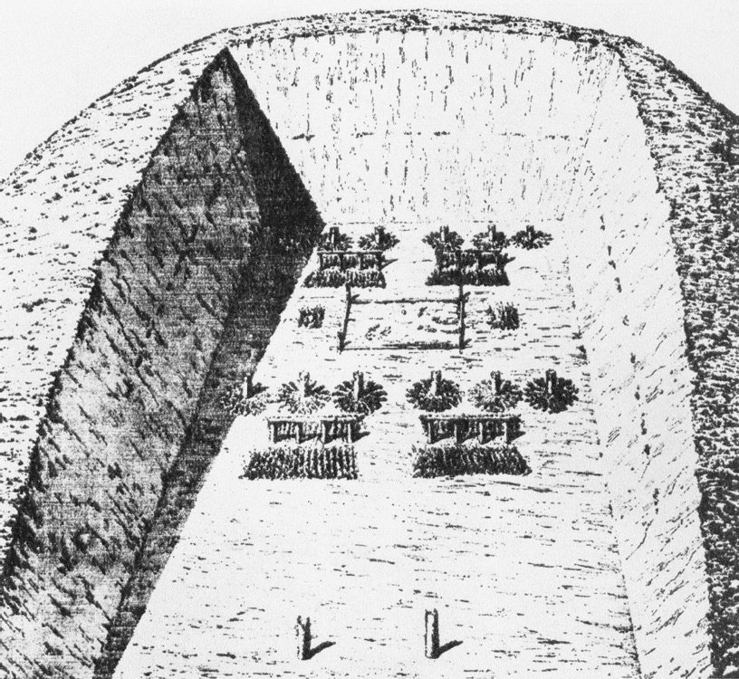

<i>Figure 9.1. The Kurgan 1 at Ul’skaya (after Artamonov 1969, Site Diagrams II).</i>

It is hard to imagine such a feast: the turmoil of all the slain animals, the still living animals hysterically trying to escape the slaughterhouse scene, the sweet overwhelming smell of the blood and the warm meat probably prepared at the site. Many men were engaged in the work – it must have been tense, an atmosphere of turmoil. All senses were evoked, bombarded with heavy impressions, creating an orgiastic air of exaltation and ecstasy.

The Iron Age Hallstatt culture of central Europe has as one of its main characteristics chariot-tombs; aristocratic burials where a vehicle is included in the funerary equipment, as for instance the rich and well-known chamber tomb of an aristocratic woman buried at Vix, Mont Lassois (Joffroy 1954; Reinhard 1997). Chariot-tombs also play a prominent part in the landscape of princely tombs of Etruria and <i>Latium Verus</i> in the Archaic period (Emiliozzi 1997; Winther 1997; Camerin 1998). One good example is Tomb V at Monte Michele at Veii, where a four-wheeled wagon was found inside the tomb chamber, just as in the Vix tomb (Boitani 1983) (Fig. 9.2).

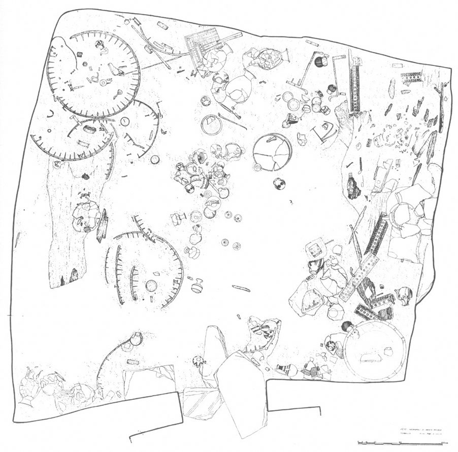

<i>Figure 9.2. Plan drawing of Tomb V at Monte Michele, Veii (after Winther 1997, fig. 3).</i>

Chariot tombs in Etruria are also not exclusively men’s tombs; the two wheeled chariot, often related to hunting and warfare has also been found with single female burials (Bartolini and Grotanelli 1984; Winther 1997, 428; Camerin 1998).

As far as I am aware, horses have been found neither in the Hallstatt nor the Etrurian chariot tombs. However, allusions to horses are included by the depositing of harnesses, horse bits, etc. just as in the Norse Viking Age Warrior tombs (Pedersen 1997a; 1997b; Winther 1997, 428–429;). The reason for this omission is unknown to us – we may speculate on whether the sacrifice of horses was considered too costly and eschatologically pointless – why kill a precious animal if the allusions, the <i>pars pro toto</i>, sufficed?

### Homeric horses

Elegant allusions, references, indications, or hits are not what we find prominent in the <i>Homeric</i> contribution to the ‘horse and burials’ relationship.

They flayed and dressed many fat sheep and oxen before the pyre, and Achilles took fat from all of them and wrapped the body therein from head to foot, heaping the flayed carcases all round it. Against the bier he leaned two-handle jars of honey and unguents; four proud horses did he then cast upon the pyre, groaning the while he did so. The dead hero had had house-dogs; two of them did Achilles slay and threw upon the pyre; he also put twelve brave sons of noble Trojans to the sword and laid them with the rest, for he was full of bitterness and fury. Then he committed all to the resistless and devouring might of the fire; he groaned aloud and called on his dead comrade by name. ‘Fare well,’ he cried, ‘Patroclus, even in the house of Hades; I am now doing all that I have promised you. Twelve brave sons of noble Trojans shall the flames consume along with yourself, but dogs, not fire, shall devour the flesh of Hector son of Priam. ([http://classics.mit.edu/Homer/iliad.23.xxiii.html](http://classics.mit.edu/Homer/iliad.23.xxiii.html))

The funeral of Patroclus as described in the 23rd book of the <i>Iliad</i> has inspired many archaeologists. Not by its description of the deadly fury of the war machine Achilles, but for its description of the slaughtering and sacrifice of Patroclus’ horses and dogs, the great pyre, the human sacrifice (<i>e.g.</i> Coldstream 1977, 349–350). Encountering one or more elements during excavations, many a rich warrior’s tomb has been termed <i>Homeric</i> (Antonnacio 1995, 221–243). Chronological issues – was the epic inspired by real warriors’ tombs or were warriors’ deaths celebrated according to the rhapsode’s tale? – and debates concerning which tomb was the closest illustration of the fabulous accounts have occupied many colleagues previously, not least in the wake of the excavations in the Royal necropolis at Salamis (<i>e.g.</i> Popham 1993, 22) (Fig. 9.3).

### Salamis horses

During the 1960s and until 1974 eight Royal tombs were excavated and published; the earliest constructed in the late ninth century BC, the latest in the sixth century BC (Dikaios 1963; Karageorghis 1967a; 1973/1974; Rupp 1988; Carstens forthcoming). The layout of the Salamis tombs is quite extraordinary. A wide and relatively long dromos leads to a so called prodomos, a space distinguished as a room in front of the tomb chamber itself with paved floor and half-walls crowned by mouldings and cornices, stressing that this room was an important focal point in the progress of the funeral. The tomb chamber itself is rather small, yet built with very large ashlars or megaliths (Fig. 9.4).[^ch9-note-4] A tumulus was raised above the tomb chamber and dromos; only one is preserved marking Tomb 3, sophisticated in its construction with inner concentric and radiating retaining walls built in mud-brick.

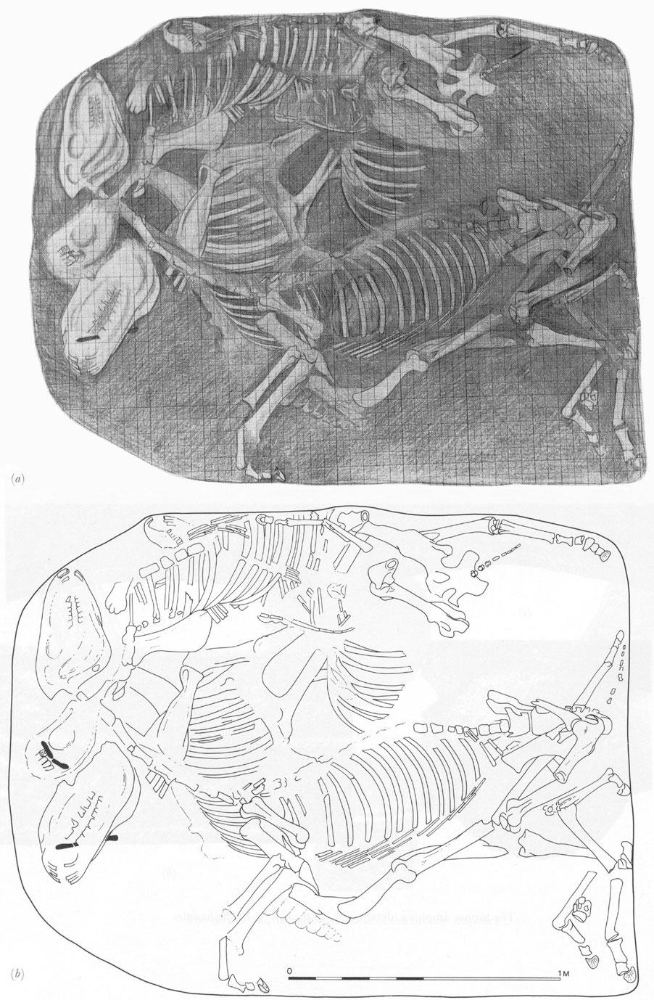

<i>Figure 9.3. The heroon at Lefkandi. The horse sacrifices in the pit next to the human burial have also been associated with a Homeric environment (after Popham 1993, pl. 22).</i>

Rich remains of sacrifices were found in the domos, including the burial of horses and chariots.[^ch9-note-5] In Tomb 79 also furniture and spectacular metal vessels were sacrificed in the inner part of the dromos, in or near the prodomos (Karageorghis 1973/1974, 4–123; Rupp 1988, 122).

While several survey articles counting horse burials in an Aegean and eastern Mediterranean context have been produced through the years, only a few try to get under the skin of the meanings of these burials. The connotation with the noble warrior often comes to hand, the place of the horses in the funerary procession is remarked or speculated upon, and Aegean Bronze Age examples are from time to time highlighted when wondering on the nature, origin and meaning of the horse sacrifices of the Salamis Royal necropolis (Karageorghis 1967a, 117–119; Andronikos 1968, 85–87; Sakellerakis 1970, 198–219; Kosmetatou 1993).[^ch9-note-6]

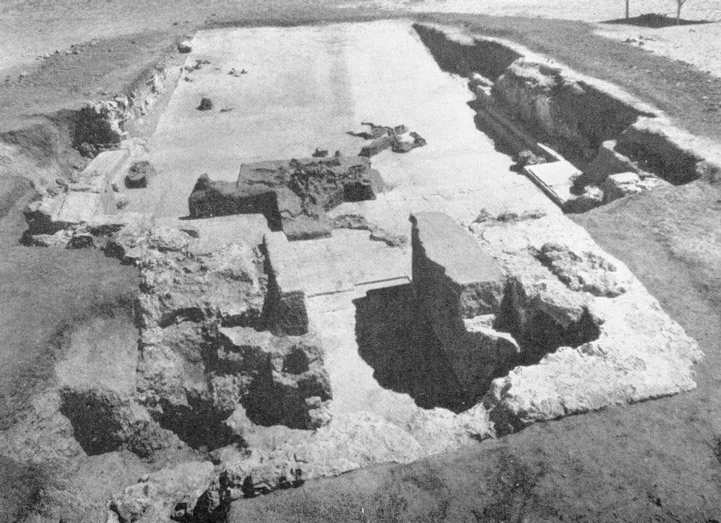

<i>Figure 9.4. Salamis Tomb 47 (after Karageorghis 1957a, pl. LXXVII.2).</i>

Now, more than 40 years after the first Royal tomb was excavated at Salamis, more finds suitable for producing a context have been published (<i>e.g.</i> Young 1981; Koehler 1995), interpretive archaeology has gained a foothold (<i>e.g.</i> Fleming 1973; Andrén 1992; Whitley 1998), and the tools for searching for meaning – also when dealing with rituals – have been refined not least via a large body of anthropological studies on the nature of cheifdoms (Helms 1998; Smith 1999; Hall 2002).

In my opening statements I tried to visualise that the association between ruler and horses is of a fundamental nature and not just found in the Aegean or Mediterranean. One could say that it is a relation of principal nature. Of a likewise principal or unitary nature one might find the feast of aristocratic burials. Here ancestry and history are celebrated, here-and-now and there-and-then meet in a single moment of recognition. These are fundamentals in hierarchical societies – and perhaps even beyond.

But if we only recognise the Cypriote burials as part of a common perception of aristocracy we still only grasp a surface level of meaning: the burial of a ruler includes horses one way or the other, so that, as a commoner, I will realise that this is an aristocratic burial. The horse (and anything else shown off during the funeral) is only a flat image of a meaning.

In order to reach a multidimensional meaning the context should be pinpointed from something general to something specific. One could say that while the <i>cross cultural</i> aristocratic context of the burials is indisputable, the cultural context of the here-and-now of the tombs, including eschatology, remains to be described properly.[^ch9-note-7]

### Aegean Bronze Age horse sacrifices

The evidence of horse sacrifices from the Aegean Bronze Age is limited, yet often spectacular. At Dendra in the Argolid, both the Mycenaen so-called tumulus B and C held horse burials (Protonotauriou-Deilaki 1990, 101). In each case a pair of horses was neatly buried in shallow pits. Undoubtedly the horses were sacrificed during the funeral, but the corresponding human burials have not been identified. Horses appearing in pairs indicate that their part in the funeral was to pull the car that carried their master to his tomb; or to pull another type of chariot included in a funerary procession. However, neither remains of such carts, harnesses, yokes nor horse bits have been found at Dendra.

Strikingly well-arranged is the burial of a pair of horses in the outer end of the long and narrow dromos of the Mycenaean tholos tomb at Marathon (Pelon 1976, 228–231). While the pair of horses (automatically) implies a reference to a cart, also in this case no remains of a vehicle were found.

Other horse sacrifices include the sacrifice of a single horse in the Tholos Tomb A at Arachnes, while in other cases the appearance of horse bones rather indicates the remains of a meat sacrifice comprising several animals, such as pigs, dogs and sheep (Sakellarakis 1970, 198–205; Kosmetatou 1993, 37–38). Similar Bronze Age sacrifices are also known from Cyprus itself.[^ch9-note-8]

Concerning the contemporary Hittites of Anatolia, archaeological sources are almost silent; monumental princely burials framed in lavish architecture are unknown. The knowledge of Hittite princely burials is handed down to us from ritual texts, describing a long and complicated set of acts that together constitute a 14 day long Royal Funeral (Hout 1994). Parts of these rituals comprise the burnt sacrifice of the heads of horses and oxen, as well as sheep, cattle, dogs and birds (Hout 1994, 68). Only at the cemetery at Osmankayasi have similar animal sacrifices been found (Bittel <i>et al</i>. 1958). However, although the heads of horses are included in the funerary rituals, this is an element in line with other burnt animal sacrifices, and maybe it does not allude to a general tone of aristocracy appearing in this context; the horse is not an animal that appears in the Hittite royal iconography as the mark of nobleness.[^ch9-note-9]

### Royal funerals at Ur

There is more to find turning east. The first clear pictures of royal ideology in this part of the world derive from ancient Mesopotamia. The poetry on Gilgamesh, the divine king, and, not least the fabulous treasures of the Royal tombs at Ur illuminate the Near Eastern stage (see <i>e.g.</i> Haas 1994, 181–182).

Mesopotamian poetry indeed reveals funerary sacrifices that evade the time gap between early Iron Age Cyprus and late third millennium BC Uruk. I quote from a summary on the text describing the death of Ur-Namma, the first king of the Third Dynasty of Ur (Ur III), 2112–2095 BC:

Ur-Namma, having died in battle, is brought to Ur, and the soldiers who marched with him into battle now follow him toward the underworld in tears. Ur-Namma’s donkeys and chariot are buried, and the path to his grave is disguised so that no one can approach it. As the renowned king presents his offerings to the seven gatekeepers of the underworld, the news of his death spreads throughout the realm of the dead. Ur-Namma understands that the food of the underworld is bitter and that the water of the underworld is brackish; he understands the rituals that are required of him, and he goes about carrying them out. First he sacrifices all the oxen, kids, and sheep that he has brought with him. Then he proceeds to the palace of each of the underworld deities in turn and presents them with the appropriate offerings … Having completed the offerings, Ur-Namma is seated on a great dais by the gods of the underworld. Although it is not mentioned in the preserved portions of this broken passage, it is likely that he too is provided with a palace, since he takes his place on a par with ‘his brother Gilgamesh’ to sit in judgement of the dead. (Tinney 1998, 27–28)

The text clearly describes the purpose of the offerings – functioning as gifts to the underworld deities and as equipment for furnishing Ur-Namma’s own palace; it provides a valuable insight into Mesopotamian eschatology. What is more, it matches the site excavated by C.L. Woolley in the 1920s and early 1930s.

<i>Figure 9.5. Tomb 789, Royal Cemetery of Ur. This reconstruction of the funeral procession and sacrifice that took place at the princely burial by the late 3rd millennium BC, was published in the Illustrated London News, June 23, 1928 (after Zettler and Horne 1998, fig. 35).</i>

One of the princely graves, no. 789, may serve as an example (Wooley 1934, 35) (Fig. 9.5). While the tomb chamber proper, placed in the corner of the grave pit, had been looted in antiquity, the entire pit was found intact. Evidently not only tow wagons, each drawn by three oxen led by a groom and steered by drivers, but also a crowd of people – soldiers, men-servants, women, musicians – was marshalled into the pit and they probably drank a potion and were buried in order to accompany their master in the underworld, where he would need them to furnish his own palace.[^ch9-note-10]

What we often lack and/or omit when discussing funerals from an archaeological point of view is eschatology. Sources like the Mesopotamian Ur-Namma legend are rare, and out of the lack of solid evidence of ritual meaning we often reduce our contribution to only very general proposals of the religious meaning behind the acts that we encounter exposing funerary evidence. The basic assumption, which the Ur-Namma legend confirms, remains that whatever accompanied the dead in his tomb was needed for him where he went.

What is more, the equipment helped to characterise the dead – it framed him or her in a her ‘normal’ context, which would secure identification both in this world, at the aristocratic funeral, and in the underworld.

### Uratian/north Syrian and Anatolian relations

An Uratian chamber tomb at Altintepe near lake Van in eastern Anatolia was found intact in 1959. The repertoire of burial equipment is quite consonant with the rich Salamis Tomb 79 mentioned above or even with the Ur-Namma legend. The dates also correspond; both the Altintepe and the Salamis tombs belong to the early seventh century BC.

The finds were described as follows: ‘In the centre of the chamber was a large bronze cauldron containing two bronze discs, the bronze parts of a war chariot, horse trappings, statuettes depicting a horse which were placed at the end of the chariot poles and iron weapons. Two stools with silver-plated wooden legs had been placed between the cauldron and the door. In the western half of the chamber were deposited a third table, pottery vessels, horse bits, harnesses, three bells and a few bone objects’ (Özgüç 1961, 270; 1969; 1989).

The Uratians’ skills as horsemen are well known from the description of horse breeding and training in a letter on Sargon II’s eighth campaign against Uratu in 714 BC (Dalley 1985, 42–43). Furthermore, the Horse Lists, a small group of administrative cuneiform texts from Nimrud, reveal that by the late eighth century BC, the Assyrian royal army comprised both Uratian equestrians, experts on cavalry, and Samarians, experts on chariotry, working with horses especially imported from Nubia. In our connection it is highly interesting that when the rule of Nubia, Piye, died <i>c</i>. 716 BC, a team of horses was buried near his tomb (Dalley 1985, 44).

Another parallel to the Royal tombs at Salamis is in my view to be found at the Phrygian ‘capital’ of Gordion in central Anatolia. While the Phrygian tumulus chamber tombs are quite different in construction, for instance the dromos is lacking, the funeral may have been quite similar, as is the equipment found in the tombs. However, only in one case were remains of horse sacrifices found. Outside the wooden tomb chamber of the tumulus KY a pair of horses was buried, nearly arranged (Fig. 9.6). The tomb, dated to the early seventh century BC, was quite modest, and has been interpreted as a Cimmerian tomb, due both to the horses and a belt of foreign nature (Koehler 1995, 80–82, 189–193, 236–243).

The three earliest tumuli (MM, P, W), all from the eighth century BC, are also the richest, containing a wide range of furniture decorated with inlaid work (beds, tables, screens), a vast amount of bronze vessels (cauldrons, jugs and bowls, situlae), luxurious textiles, personal garments, such as bronze and leather belts, fibulae (Young 1981).[^ch9-note-11] But neither horses, harness, horse bits, stirrups, nor any other allusions to the notion of horse or vehicle were included among the funerary equipment.[^ch9-note-12]

Let us turn back to the overwhelmingly rich Tomb 79 at Salamis, where the dromos excavation revealed that the tomb had been used for two burials (Karageorghis 1973/1974, 4–123). Among the finds of the first burial were two so-called ‘Uratian’ bronze cauldrons (Karageorghis 1973, 103). And, most spectacularly, the remains of richly decorated furniture including a bed, three thrones and a stool, decorated with ivory inlay, overlaid with silver (Fig. 9.7). The best parallels are undoubtedly Assyrian/ Pheonician furniture (Fig. 9.8) and, as with the other finds in the tomb, the whole assemblage belongs to the north Syrian/Uratian sphere (Karageorghis 1973/1974, 95).

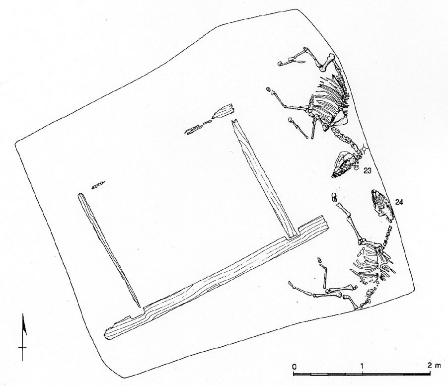

<i>Figure 9.6. Gordion, tumulus KY. Plan drawing of the pit containing remains of the burial chamber and the horse burial (after Koehler 1995, fig. 29b).</i>

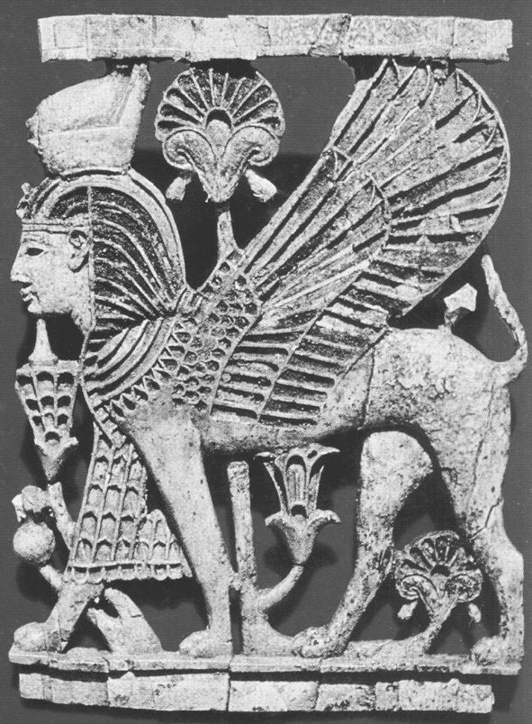

<i>Figure 9.7. Ivory inlay from one of the stools found in the dromos of Slamis Tomb 79 (after Karageorghis 1973/1974, pl. B2).</i>

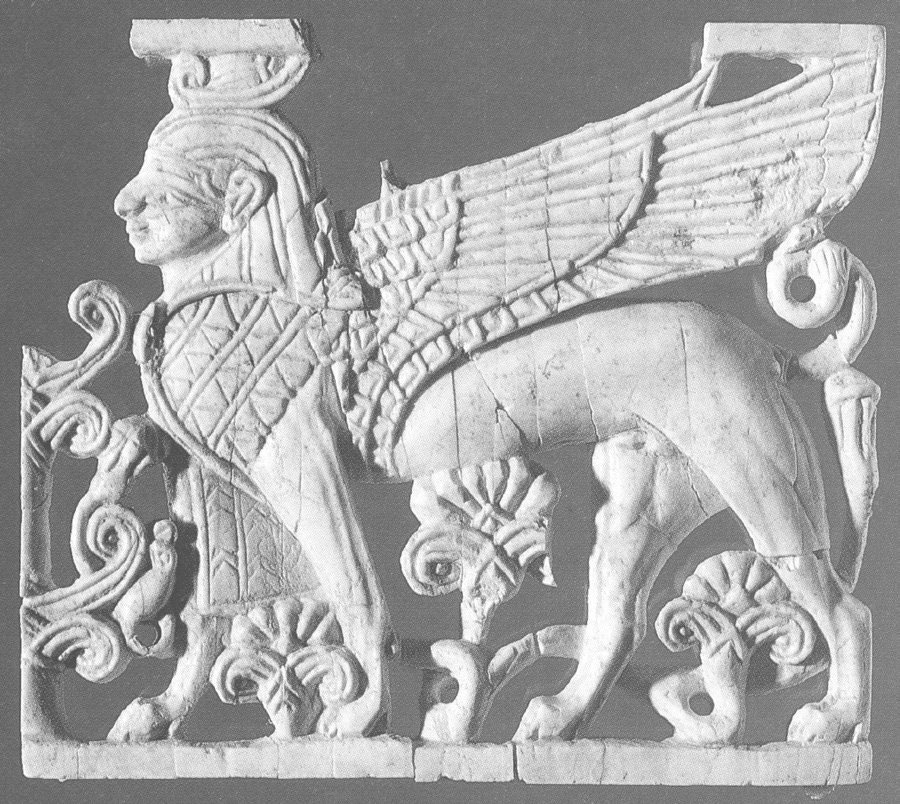

<i>Figure 9.8. Ivory work from Fort Shalmaneser, Nimrud,</i> ninth to eighth century BC (after Curtis and Reade 1997, 129, cat. no. 92).

Assyrian epigraphic evidence counts furniture as gifts to the king, and no doubt the kings at Salamis either received precious gifts as part of the contract with the Assyrian hegemony or were part of a court circle – a particular Near Eastern subgroup of aristocratic culture – that included the peers of the Near East. Palace life was surely inspired by the Asssyrians (Karageorghis 1969, 94; Karageorghis 1973/1974, 95–97; Reyes 1994, 63–68).

One of the fundamental traits in the Assyrian ideology of the royal iconography was the portrayal of the king as the protector of his land and doer of good – a function as tutelary deity. In this connection the hunt, in particular the lion hunt, was of immense importance; the Assyrian royal seals depicts the king fighting face to face with a lion (Curtis and Reade 1997, 51, 188). In processions the king is partaking in the stately manner high above the crowd in his chariot, a hunting chariot drawn by a pair of elegant horses, which is also depicted in battle scenes (Curtis and Reade 1997, 62–63) (Fig. 9.9).

The two-wheeled war chariot found in salamis Tomb 3, with a bronze quiver and an iron sword inside, is closely relate to the Assyrian war/hunting chariot (Karageorghis 1967a, 50–51; Karageorghis 1969, 70) (Fig. 9.10). And why should the ideal of the almighty hunting king not likewise be known and accepted in a Cypriot context?

Considering the power politics of Iron Age Cyprus it would be highly interesting if the royal funerals at Salamis reflected the Assyrian supremacy to such a degree that they mirrored those of Assyrian royalty. Only little is known of Assyrian royal funerary rites; a Neo-Assyrian text describes a royal funeral including the sacrifice of horses and the burial of a bronze bed (McGinnis 1987). While these rituals have not been attested in the archaeological record of Assyrian chamber tombs, [^ch9-note-13] it is evident that the horse was important in the ideology of the royal iconography. The horse functioned as reference to the king in his capacity of defender and protector of his lands.

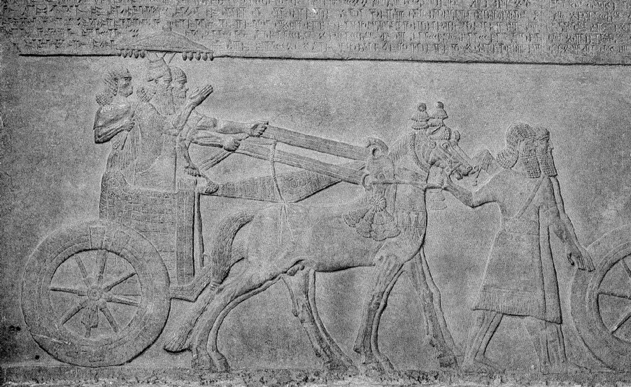

<i>Figure 9.9. The king in his war chariot partaking in a procession. Relief from Nimrud, c. 730–727 BC (after Curtis and Reade 1997, 63, cat. no. 13).</i>

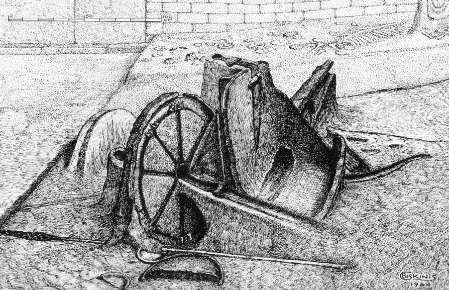

<i>Figure 9.10. Sketch drawing of the hunting chariot from Salamis Tomb 3 (after Karageorghis 1967a, pl. CXX).</i>

### What is the meaning of all those horses?

What’s in a horse? Is there a universal as well as a local meaning? – meanings that correspond with the time-and-space-evading aristocratic culture, and meanings that are tied up with the local context. And, what is more, do they correspond; are they complementary, tarred with the same brush?

On the universal level there exists the fundamental story of <i>the amalgamated noble man and his horse</i>; that the horse is a metaphor for hunting and warfare, protection and order. Rituals, also rituals of royalty, are fundamental contracts, where each party fulfils his role in the game. The aristocratic part in this system is to act in an aristocratic manner so that the subaltern can respect, admire and worship him. It is a system which only exists as long as its premises are fulfilled; as long as the aristocrat acts like a powerful man, as mediator between the gods and the people, between here-and-now and there-and-then.

In this view, it follows that when horses are included in the funeral – <i>de facto</i> or as referred to – it is in their capacity of being the emblem of a cross-cultural metaphor. Another such metaphor is the burial mound or tumulus, which by its mere existence forms a direct link between here-and-now, and there-and-then: the very existence of impressive sepulchres in which selected individuals were buried probably validated the power of the living leaders: we were always here! (see <i>e.g.</i> Fleming 1973, 189; Carstens 2002).

In very many aristocratic tombs horses or chariots (or allusions to them) were included in the funeral ‘equipment’, but in others they were not. In some contexts it was apparently the most powerful metaphor, in other contexts other signs were preferred, such as rich furniture, textiles, jewellery and personal adornments. It seems that the aristocrats at Salamis chose the whole package from all available lists of royal accessories: the horses, vehicles, furniture, vessels, cauldrons, megaliths, large scale tumuli, spectacular settings etc. They acted like the typical <i>nouveaux riches</i> that have not yet understood the first lesion of aristocracy: that operating by refined allusions underlines the discretely hidden potential (Rupp 1988, 134 and <i>passim</i>).

### Epilogue

In November 2000 the Danish queen mother, Queen Ingrid died; and we found ourselves in the midst of an impressive and efficient celebration of old customs. The funeral provided a vivid analogy – not perhaps for the detailed execution of the rituals as no horses were killed, neither maids nor furniture nor precious china accompanied the founding ‘mother’ of the dynasty – but an analogy of emotions. Creating this sensation was the monotone music accompanying the procession, the soldier partaking with downcast eyes, the simple black hearse, drawn by four beautiful horses, lead by grooms. When the hearse continued its journey to the Cathedral in Roskilde some 40 kilometres east of Copenhagen, it was transported by train, but not just any train, rather the archaic archetype of train: a black steam engine.

Here-and-now met there-and-then in an astonishingly beautiful, clean-cut tale of rituals of royalty at work! All working in order to underline the message: there exists such a thing as aristocratic culture, and most of all, it is constituted by an astonishing cultural continuity within its aristocratic circles.

#### <i>Notes</i>

[^ch9-note-1]: An overview of Viking Age burials including horse gear is to be found in Pedersen 1997a and 1997b. Pedersen relates the horse gear and weapon burials closely to an organised military reality, the details of which remain unknown (1997a). She suggests that our focus in the interpretation is changed from the Norse angle towards the Continent: ‘The grave contents, the combination and the choice of objects may reflect a way of life comparable to or at least attempting to emulate western European court life rather than customs or ideas prevalent in Norway and Sweden’ (1997b, 182). In that respect she is referring to aristocratic culture.

[^ch9-note-2]: The relation between ships and horses is found in Vedic as well as Greek mythology, see Braarvig 1997.

[^ch9-note-3]: That the horse had a very particular place in the life of a nomad is indisputable. Yet, I dare to suggest that not least in these societies, where the horse was a necessity for making a living, it was no less a sign of outstanding grandeur when the horse was buried with his master or sacrificed in large numbers at princely funerals.

[^ch9-note-4]: On the (potential) show-off effect of megalithic constructions, see Santillo Frizell 1998.

[^ch9-note-5]: At the symposium it was suggested that there might be a gender-chariot type relation in play, for instance that women’s chariots were flat-bottomed, four-wheeled working wagons pulled by oxen or mules, while men’s chariots were more likely to be hunting chariots pulled by horses. And, what is more, that the meaning of these different sub-types of sacrifices would differ. However, the normal Near Eastern war chariot with two wheels and a small box was only found in Tomb 3, while the remains of the vehicles were ‘the two-wheeled cart or hearse, obviously capable of being dismantled, without a box, but a simple flat horizontal floor on which the coffin was placed for transportation’ (Karageorghis 1967a, 118). What is more, the evidence of the Salamis Royal Tombs regarding the sex of the interred is poor, see Rupp 1988, table 3. I am rather sceptical about the gender-chariot type relation, or rather, I suggest that the choice of the chariot type was determined more by the local context (which type of chariot was used for what purposes in a given society) than an expression of a general gender relation. This is, in my view, supported by the fact that the two-wheeled vehicle described by Karageorghis in the quotation above was the vehicle par excellence in ancient Cyprus, as not least the many terracotta figurines depicting vehicles illustrate, see <i>e.g.</i> Karageorghis 1995, pi. LXXIII.

[^ch9-note-6]: The Salamis horse sacrifices are not unique in Cypriote tombs: at Kouklia the dromoi of two rock-cut cave-like tombs of the sixth century BC contained remains of sacrifices of horses (Karageorghis 1967b). A skeleton of a horse was found in the one tomb, and a bridle in the other. A larger sacrificial deposit was encountered during the re-excavation of the Royal Tomb 4 at Tamassos, consisting of an 18-month-old calf, a five-year-old goat, a five- to six-monthold lamb, and remains of a horse skeleton (Buchholz 1978, 191–195). Karageorghis has drawn attention to the fact that horse and chariot sacrifices were also attested in another tomb found during the early excavations in the Royal Necropolis of Tamassos (Karageorghis 1969, 27). On top of the roof of Tomb 2 at Patriki remains of a horse skeleton were found during the excavation (Karageorghis 1972). Likewise, in the dromos of a newly found Archaic tomb in Kition two horse skeletons were buried, sealed with a layer of clay (Andreas Savva, Larnaca Museum personal communication). See also Carstens forthcoming ˂AQ: this hasn’t been referenced in the bibliography>. For Bronze Age horse burials in Cyprus, see below.

[^ch9-note-7]: It is important to emphasise that here-and-now in this line of contextuality is not necessarily the equal of contemporaneity. Time has various speed limits.

[^ch9-note-8]: Lapithos Tomb 322, Gjerstad <i>et al.</i> 1934, 147; Kalopsidha Tomb 9, Gjerstad 1926, 81; more spectacular is the description of a Middle Cypriote Ill tomb at <i>Politiko-Chomazoudhia</i> that apparently ‘contained at least 10 burials and a horse (?) was laid on top of the corpses’, Astrom 1957, 245; Gjerstad 1926, 81. See also Andronikos 1968, 85.

[^ch9-note-9]: Yet, the key Hittite military force was chariotry (Hyland 2003, 77–80).

[^ch9-note-10]: The human sacrifice that was carried out at the Royal funerals at Ur, and which was included in the Homeric description of the funeral of Patroclus, is also attested archaeologically in the Aegean and in Cyprus (Karageorghis 1967a, 121 gives a rather long list of occurrences). it has not been possible for me to include an analysis of this ritual practice in the present paper, yet, it is clear that in this case also the phenomenon is widespread chronologically as well as geographically. Furthermore, human sacrifices are referred to as ‘a ritual practice of the past’ in the Vedic <i>Purusamedha</i> sacrifice (Gonda 1978, 173; Heesterman 1987, 230).

[^ch9-note-11]: Interestingly, the Gordion wooden tomb chambers covered with tumuli seem to be related to the Cimmerian kurgans. Also part of the funerary equipment is found in both Phrygian and Cimmerian princely burials (Marsadolov 2000).

[^ch9-note-12]: Only in tumulus P was a model of a bronze quadriga found, possibly the toy of the child buried there; other miniature animals were included in the tomb (Young 1981, 7).

[^ch9-note-13]: Hailer 1954, 95–96, 170, 182–183. The Assyrian chamber tombs are known from as far back as the first half of the second millennium BC, but stayed in use till the seventh century BC. Tombs of this kind were widespread in the Assyrian region, well-known examples are found at Megiddo (Galling 1977, 94–95) and at Tell ei-Mutesellim (Schumacher 1908, 14). See also <i>Reallexikon der Assyriologie</i>, Dritter Band, Berlin 1957, ‘Grab’ (601–602). For the royal tombs at Nimrud, see Hussein and Suleiman 2000; Oates and Oates 2001.

### Bibliography

Andrén, A. 1992. Doors to other worlds: Scandinavian death rituals in Gotlandic perspectives. <i>Journal of European Archaeology</i> 1. 33–56.

Andronikos, M. 1968. Totenkult. In: F. Matz & H.-G. Buchholz (eds), <i>Archaeologia Homerica</i> 3. Göttingen: Vandenhoeck & Ruprecht.

Anthony, D.W. 1995. Horse, wagon & chariot: Indo-European languages and archaeology. <i>Antiquity</i> 69. 554–565.

Antonaccio, C.M. 1995. <i>An Archaeology of Ancestors.</i> Lanham, MD: Rowman & Littlefield.

Åström, P. 1957. <i>The Middle Cypriote Bronze Age</i>. Lund: Swedish Cyprus Expedition.

Bartolini, G., & Grotalnelli, C. 1984. I carri a due ruote nelle tombe femminili del Lazio e dell’Etruria. <i>Opus</i> 3(2). 383–410.

Bittel, K. <i>et al.</i> 1958. <i>Boğazköy-Hattuşa</i>. Vol. 2. Die hethitischen Grabfunde von Osmankayasi. Berlin: Mann.

Boitani, F. 1983. Veio: la tomba ‘principesca’ della necropoli di Monte Michele. <i>Studi Etruschi</i> 51. 535–557.

Braarvig, J. 1997. Horses and ships in Vedic and Old Greek material. <i>Journal of Indo-European Studies</i> 25. 345–351.

Brøgger, A.W., H. Falk & H. Schetelig. 1917–1928. <i>Osebergfundet</i> I, II, III, V. Kristiana: Universitetets Oldsaksamling.

Buchholz, H.-G. 1978. Tamassos, Zypern, 1974–1976. 3. Bericht. <i>Archäologischer Anzeiger</i> 1978. 155–230.

Camerin, N. 1998. Two-wheeled vehicle-graves in Iron Age Italy, 8th to 5th centuries B.C.: general considerations and distribution. In: E. Marinis <i>et al.</i> (eds), <i>XIII International Congress of Prehistoric and Protohistoric Sciences – Forli – Italia 8/14 September</i>. Vol. 4, 673–682. Forlì: ABACO.

Carstens, A.M. 2002. Tomb cult on the Halikarnassos peninsula. <i>American Journal of Archaeology</i> 106. 391–409.

Carstens, A.M. 2006. Cypriot chamber tombs. In: L. Wriedt Sørensen & K. Winther Jacobsen (eds), <i>Panayia Amathoussa.Vol. 2. Political, cultural, ethnic and social relations in Cyprus: Approaches to regional studies</i>, 125–179. Athens: Danish Institute at Athens.

Coldstream, J.N. 1977. <i>Geometric Greece</i>. London: Methuen.

Curtis, J.E., & J.E. Reade. 1997. <i>Nimrud og Ninive: Skatte fra Assyrien i British Museum</i>. København: Nationalmuseet; London: British Museum.

Dalley, S. 1985. Foreign chariotry and cavalry in the armies of Tiglath-Pileser III and Sargon II. <i>Iraq</i> 47. 31–48.

Dietz, U.L. 1999. Horses in the Bronze Age. In: K. Demakopoulou <i>et al.</i> (eds), <i>Gods and Heroes of the European Bronze Age</i>, 83–84. London: Thames and Hudson.

Dikaios, P. 1963. A ‘royal’ tomb at Salamis, Cyprus. <i>Archäologischer Anzeiger</i> 1963(2). 126–210.

Emiliozzi, A. 1997. Carri da guerra e principi etruschi: catalogo della mostra; Viterbo, Palazzo dei Papi, 24 maggio 1997 – 31 gennaio 1998. Roma: ‘L’Erma’ di Bretschneider.

Fleming, A. 1973. Tombs for the living. <i>Man</i> 8. 177–193.

Galling, K. (ed.). 1977. <i>Biblisches Reallexikon</i>. Tübingen: Mohr.

Gjerstad, E. 1926. <i>Studies on Prehistoric Cyprus</i>. Uppsala: Lundequistska Bokhandeln.

Gjerstad, E., J. Lindros, E. Sjöqvist & A. Westholm. 1934. <i>The Swedish Cyprus Expedition. Vol. 1. Finds and results of the excavations in Cyprus 1927–1931</i>. Stockholm: Swedish Cyprus Expedition.

Gonda, J. 1978. <i>Die Religionen Indiens</i>. Vol. 1. Veda und älterer Hinduismus (Die Religionen der Menschheit 11). Stuttgart: Kohlhammer.

Haas, V. 1994. <i>Geschichte der hethitischen Religion.</i> Leiden: Brill.

Hall, J.M. 2002. <i>Hellenicity</i>. Chicago: University of Chicago Press.

Haller, A. 1954. <i>Die Gräber und Grüfte von Assur</i>. Berlin: Mann.

Heesterman, J.C. 1957. <i>The Ancient Indian Royal Consecration.</i> ’s-Gravenhage: Mouton.

Heesterman, J.C. 1987. Vedism and Brahmanism. In: M. Eliade (ed.), <i>The Encyclopedia of Religion</i>. Vol. 15, 217–242. New York: Macmillan.

Helms, M.W. 1998. <i>Access to Origins, Affines, Ancestors and Aristocrats</i>. Austin: University of Texas Press.

Hussein, M.M., & A. Suleiman. 2000. <i>Nimrud: a city of golden treasures</i>. Baghdad: Al-Huriyah.

Hyland, A. 2003. <i>The Horse in the Ancient World</i>. Stroud: Sutton.

Joffroy, R. 1954. <i>Le trésor de Vix</i>. Paris: Presses universitaires de France.

Karageorghis, V. 1967a. <i>Excavations in the Necropolis of Salamis</i>. Vol. 1. Nicosia: Department of Antiquities.

Karageorghis, V. 1967b. Nouvelles tombes de guerriers à Palaepaphos. <i>Bulletin de Correspondance Hellénique</i> 91. 202–245.

Karageorghis, V. 1969. <i>Salamis in Cyprus: Homeric, Hellenistic and Roman</i>. London: Thames and Hudson.

Karageorghis, V. 1972. Two built tombs at Patriki, Cyprus. <i>Report of the Department of Antiquities, Cyprus</i>, 161–182. Nicosia: Department of Antiquitie.

Karageorghis, V. 1973/1974. <i>Excavations in the Necropolis of Salamis</i>. Vol. 3. Nicosia: Department of Antiquities.

Karageorghis, V. 1995. <i>The Coroplastic Art of Ancient Cyprus.Vol. 4. The Cypro-Archaic period. Small male figurines</i>. Nicosia: The A.G. Leventis Foundation & University of Cyprus.

Koehler, E.L. 1995. <i>The Gordion Excavations (1950–1973): Final reports. Vol. 2(1). The lesser Phrygian tumuli. Part 1. The inhumations.</i> Philadelphia: University Museum, University of Pennsylvania.

Kosmetatou, E. 1993. Horse sacrifices in Greece and Cyprus. <i>Journal of Prehistoric Religion</i> 7.31–41.

Marsadolov, L. 2000. Variants in models of transition: the Cimmerian traditions of the Gordion tumuli (Phrygia): found in Altai barrows (Bashadar, Pazyryk). In: J. Davis-Kimball, E.M. Murphy, L. Koryakova & L.T. Yablonsky (eds), <i>Kurgans, Ritual Sites, and Settlements: Eurasian Bronze and Iron Age</i>, 247–258 (BAR International Series 890). Oxford: Archaeopress.

McGinnis, J. 1987. A Neo-Assyrian text describing a royal funeral. <i>State Archives of Assyria Bulletin</i> (Helsinki) 1. 1–11.

Oates, J., & Oates, D. 2001. <i>Nimrud: an Assyrian imperial city revealed</i>. London: British School of Archaeology in Iraq.

Özgüç, T. 1961. Excavations at Altintepe. <i>Bellenten</i> 25. 269–290.

Özgüç, T. 1969. <i>Altintepe II: Tombs, storehouse and ivories</i>. Ankara: Türk Tarih Kurumu.

Özgüç, T. 1989. Horsebits from Altintepe. In: L. de Meyer & E. Haerinck (eds), <i>Archaeologia Iranica et Orientalis: Miscellania in honorem Louis van den Berghe</i>, 409–419<i>.</i> Gent.

Pearson, M.P. 2001. <i>The Archaeology of Death and Burial</i>. Stroud: Sutton

Pedersen, A. 1997a. Weapons and riding gear in burials – evidence of military and social rank in 10th century Denmark? In: A. Nørgaard Jørgensen & B.J. Clausen (eds), <i>Military Aspects of Scandinavian Society in a European Perspective, AD 1–1300</i>, 123–135<i>.</i> Copenhagen: National Museum.

Pedersen, A. 1997b. Similar finds – different meanings? Some preliminary thoughts on the Viking age burials with riding equipment in Scandinavia. In: C.K. Jensen & K.H. Nielsen (eds), <i>Burial and Society: The chronological and social analysis of archaeological burial data</i>, 171–183<i>.</i> Aarhus: Aarhus University Press.

Pelon, O. 1976. <i>Tholoi, tumuli et cercles funéraires.</i> Athens: École Française d’Athènes.

Petrenko, V.G. 1995. Scythian culture in the North Caucasus. In: J. Davis-Kimball, V.A. Bashilov and L.T. Yblonsky (eds), <i>Nomads of the Eurasian Steppes in the Early Iron Age</i>, 3–22<i>.</i> Berkeley, CA: Zinat.

Popham, M.R. 1993. <i>Lefkandi II: The protogeometric building at Toumba, Part 2. The excavation, architecture and finds</i> (BSA Supplementary Series 23). Athens: British School of Archaeology at Athens.

Protonotariou-Deilaki, E. 1990. The tumuli of Mycenae and Dendra. In: R. Hägg & G.C. Nordquist (eds), <i>Celebrations of Death and Divinity in the Bronze Age Argolis</i>, 85–102. Stockholm: Svenska institutet i Athen.

Reinhard, W. 1997. Les sépultres aristocratiques de la Sarre au Hallstatt Final et à la Tène ancienne. In: P. Brun & B. Chaume (eds), <i>Vix et les</i> Éphémères <i>principautés Celtiques</i>, 107–123. Paris: Errance.

Reyes, A. 1994. <i>Archaic Cyprus: A study of the textual and archaeological evidence</i>. Oxford: Clarendon.

Rupp, D.W. 1988. The ‘Royal Tombs’ at Salamis (Cyprus): ideological messages of power and authority. <i>Journal of Mediterranean Archaeology</i> 1(1), 111–139.

Sakellarakis, A. 1970. Das Kuppelgrab A von Archanes und das kretisch-mykenische Tieropferritual. <i>Prähistorische Zeitschrift</i> 45. 135–219.

Santillo Frizell, B. 1998. Giants or geniuses? Monumental building at Mycenae. <i>Current Swedish Archaeology</i> 6. 167–184.

Schumacher, G. 1908. <i>Tell el-Mutesellim.</i> Vol. 1. Leipzig: Haupt.

Shashi, S.S. (ed.). 1996. <i>Encyclopedia Indica</i>. Vol. 10. Vedic religion and rituals. New Delhi: Anmol.

Smith, A. 1999. <i>Myths and Memories of a Nation</i>. Oxford: Oxford University Press.

Sørensen, A.C. 2001. <i>Ladby, a Danish ship-grave from the Viking Age</i>. Roskilde: Viking Ship Museum.

Tinney, S. 1998. Death and burial in early Mesopotamia: the view from the texts. In: R.L. Zettler & L. Horne (eds), <i>Treasures from the Royal Tombs of Ur</i>, 26–28<i>.</i> Philadelphia: University of Pennsylvania Museum of Archaeology and Anthropology.

van den Hout, T. 1994. Death as a privilege. The Hittite royal funerary ritual. In: J.M. Bremer, T. van den Hout & R. Peters, <i>Hidden Futures, Death and Immortality in Ancient Egypt, Anatolia, the Classical, Biblical and Arabic–Islamic World</i>, 37–75. Amsterdam: Amsterdam University Press.

Venborg Pedersen, M. 1999. Duke. Manifestations of aristocracy in the Duchy of Augustenborg 1700–1850. PhD Thesis, University of Copenhagen.

Venborg Pedersen, M. 2004. <i>Hertuger. At synes og at være i Augustenborg, 1700–1850.</i> Copenhagen: Museum Tusculanum.

Whitley, D.S. 1998. <i>Reader in Archaeological Theory: Post-processual and cognitive approaches.</i> London: Routledge.

Winther, H.C. 1997. Princely tombs of the Orientalizing period in Etruria and <i>Latium Verus</i>. In: H. Damgaard Andersen, H.W. Horsnæs, A. Houby-Nielsen & A. Rathje (eds), <i>Urbanization in the Mediterranean in the 9th to 6th Centuries BC</i> (Acta Hyperborea 7), 423–446. Copenhagen: Museum Tusculanum.

Woolley, C.L. 1934. The excavations at Ur, 1933–4. <i>Antiquaries Journal</i> 14. 355–378.

Young, R.S. 1981. <i>The Gordion Excavations (1950–1973): Final reports. Vol. 1. Three great early tumuli</i>. Philadelphia: University Museum, University of Pennsylvania.

Zettler, R.L., & L. Horne (eds). 1998. <i>Treasures from the Royal Tombs of Ur.</i> Philadelphia: University of Pennsylvania Museum of Archaeology and Anthropology.
