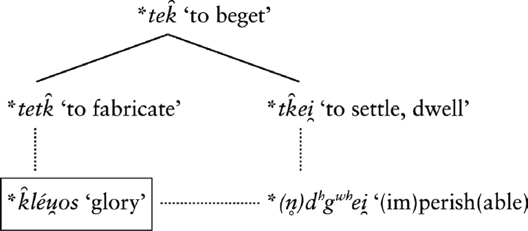
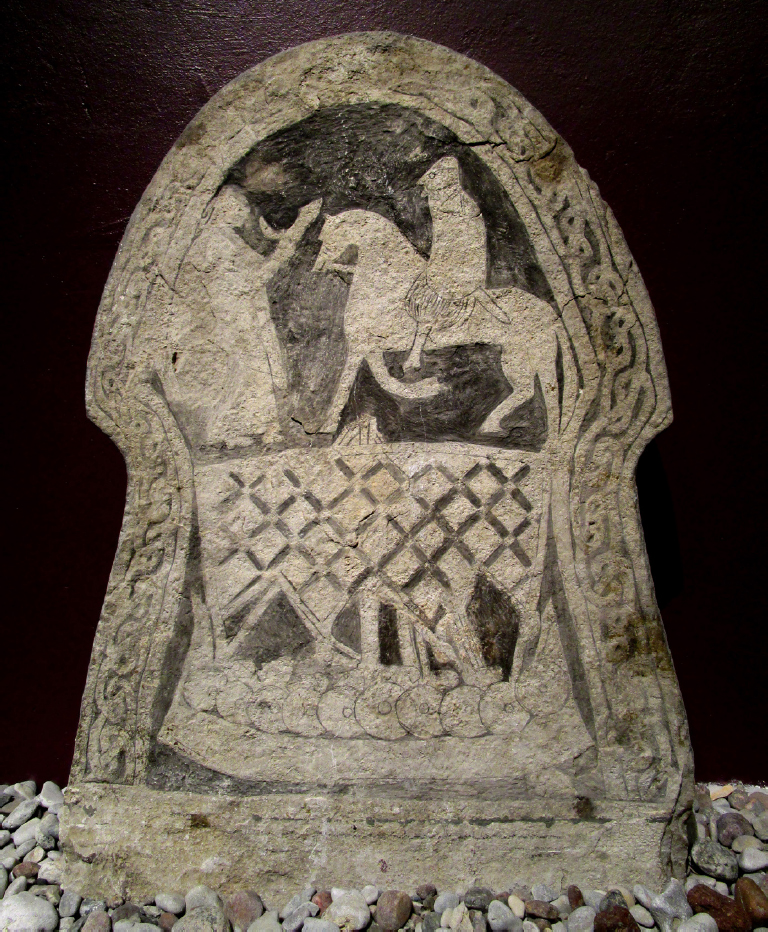

<!-- page: 7 -->

# 2. Dwellings undwindling

Towards an Indo-European poetics of perlocutionary sites

Peter Jackson Rova

Stockholm University

## Abstract

In order to appreciate how ancient Indo-European poets utilized language and poetry to shape perceptions of the afterlife, it is helpful to acknowledge that the oral and aural nature of early Indo-European poetic texts served not only as artistic expressions but also as vehicles for social and eschatological transformation. Through an analysis of key examples from Greek, Iranian and Vedic traditions, the case is made that the poets envisioned poetry as a means to create so-called perlocutionary sites – spaces conjured by spoken or sung discourse that were considered to transcend ordinary existence and anchor the subject within a realm of imperishable fame and divine dwelling. While apparently once deeply rooted in Indo-European linguistic ideology, this assertion can be redefined in familiar analytical terms (drawing on J. L. Austin’s speech act theory) as the power of poetry to not merely describe but to actively bring about a desired state of affairs. The final excursus extends the scope to the Germanic world by suggesting a continuous influence of this underlying poetic ideology on Old Norse skaldic poetry.

## 1. Preliminaries

Although speakers of archaic Indo-European languages were surely not unique in imagining the post-mortem survival of distinguished individuals, they may still have done so according to certain distantly shared cultural conventions. Given this assumption, it should be borne

<!-- page: 8 -->

in mind that the best-preserved early descriptions of the afterlife to qualify as reliable testimony all derive from poetically crafted texts. One should also keep in mind that these poetic texts, or at least their prototypes, were once orally carried out and aurally received without being intended to form part of a comprehensive poetic canon, whether encoded in scrolls or through the mnemonic techniques of ritual specialists, but rather as unique realizations of poetic encompassment in the presence of living individuals. One senses beyond the mere technical dimension of oral poetic performance a more elaborate rhetoric dimension of transformation-through-performance.

Against this background, I would like to briefly explore an overlooked aspect of the eschatological genre that relates less to the descriptive plot than to the poetics and pragmatics of its realization. Since the earliest eschatological proposals would have been authored and performed by poets, it is to their articulated beliefs about the power of language and poetry that we may first want to turn in order to appreciate the means and ends of their eschatology.

## 2. Three examples

My first example should speak for itself. Pindar, in celebrating the victorious young boxer Hagesidamos in Olympian 10, concludes by assuring his addressee that Zeus’ Pierian daughters (= the muses) now nurture his “far-reaching fame” (eurý kléos [95]), whereas a man of noble deeds should be wary of reaching the dwelling of Hades “without song” (aoidâs áter [91]) since he procures nought by a “little pleasure” (brachý ti terpnón [93]). I take this to imply that Pindar wants to direct Hagesidamos’ attention not just to the fact of being subjected to praise, but to the fact of being intentionally transformed by that act, eventually receiving an otherwise unattainable post-mortem status.

> Olympian 10, 91–94:
>
> καὶ ὅταν καλὰ ἔρξαις ἀοιδᾶς ἄτερ,
>
> Ἁγησίδαµ᾽, εἰς Ἀΐδα σταθµὸν
>
> ἀνὴρ ἵκηται, κενεὰ πνεύσαις ἔπορε µόχθῳ βραχύ τι τερπνόν.
>
> So, when a man who has performed noble deeds, Hagesidamus, goes without song to Hades’ dwelling, in vain has he striven and gained for his toil but brief delight.
>
> (Transl. Race)

The second example is less straightforward since it reaches us in the form of a strongly biased, second-hand testimony. Adeimantus, one of

<!-- page: 9 -->

Socrates’ two interlocutors in Republic (363c), complains about how the legendary figures of Musaeus and Eumolpus possess an excellent song through which to celebrate their admittedly righteous clients by ritually granting them the pleasure of an everlasting symposium in Hades. Plato’s choice of phrasing in describing how Musaeus and his son “conduct them to the house of Hades tôi lógōi” is revealing here. Since the instrumental (or possibly locative) employment of the dative is apparently meant to suggest that the righteous clients are granted these pleasures in accordance with the tale of Musaeus and his son, those understood as arranging (kataskeuásantes) their symposium are not some unnamed hosts in the netherworld but rather the two legendary poets in whose song the symposiasts reside.[^1]

The third example of which to take stock here occurs in the Vedic poet Kavaṣa Ailūṣa’s lament for his former patron Kuruśravaṇa (10.33.6): “[I chose] the father of Upamaśravas for whom there were sweet songs, delightful like a dwelling place (kṣétraṃ [<*tk̑ei̯ ‘to settle, dwell’] ná) for one at home in it.” (yásya prásvādaso gíra | upamáśravasaḥ pitúḥ | kṣétraṃ ná raṇvám ūcúṣe) (transl. Brereton/Jamison). When Kavaṣa presents his addressee with the notion of a habitable song (gír- + kṣétra), he is also bringing into play the ‘fame’ (śravas, śravaṇa) encoded in the names both of his former patron and of his present addressee (and prospected future patron).

## 3. The Indo-European background

In order to relate such encomiastic strategies to a legacy of Indo-European linguistic ideology, it will not suffice to merely pinpoint analogous strategies in linguistically related poetic traditions. Much of what such strategies entail could of course have developed independently as the secondary result of poetic invention. A poet who excels in his trade can easily conclude that a well-crafted poem is designed not just to describe an ideal state of affairs but to actively enforce its realization by turning the poem itself into a sort of dwelling place. What we need to look for in reaching backwards, therefore, is a configuration of inherited items that seem attributable less to spontaneous invention but rather to some fixed repertoire of ideas with which these poets continuously and actively engaged long after they had ceased to self-identify as members of the same community.

<!-- page: 10 -->

A first step in outlining such a repertoire would be to analyse it according to the following model:

The concept of glory is highlighted in this model as the common denominator of all other items (referred to in the seminal work by Rüdiger Schmitt as the Zentralbegriff of IE poetics). A verb like *tetk̑ can take *k̑léu̯os as its direct object (example 1), a deverbative noun meaning ‘good dwelling’ (sukṣití- [<PIE *tk̑ei̯]) can pair contrastively with that of ‘good fame’ (suśravás- [<PIE *k̑léu̯os]) to form a merism (example 2) or be combined with the deverbative adjective *n̥dʰgʷʰito- as in Figure 1 (example 3). Furthermore, the verb *tk̑ei̯ can be combined with its antonym to yield a sense of contrast between creation and destruction (example 4) or combined with *dʰgʷʰei̯ to yield a cohesive sense of indestructible creation (= an undwindling dwelling) by negating one of the items (example 5). As a possible variant of the last example (without the verb *tk̑ei̯ but instead with the same imperative [dhehi] as in the classical example 3), one should add the notion of being placed by the god in an imperishable world.

1. RV 4.36.9b.: ihá śrávo vīrávat takṣatā naḥ “fashion here for us the fame that heroes accompany”

2. RV 1.91.21c.: sukṣitíṃ suśrávasaṃ “(possessing) good dwelling (and) good fame”

3. RV 1.9.7b-c.: asmé […] śrávo […] dhehi ákṣitam “place in us fame imperishable” – Il. 9.413 kléos áphthiton éstai “[my] fame will be imperishable”

<!-- page: 11 -->

4. RV 4.17.13a.: kṣiyántaṃ tvam ákṣiyantaṃ kr̥ṇoti “he [Indra] deprives the man dwelling peacefully of his peace”

5. Lactantius, Divin. Inst. 1.5.6 quoting an Orphic source (= F152 Bernabé [2004–2005]): ἔκτισεν (κτίζω <PIE *tk̑ei̯) ἀθανάτοις δόµον ἄφθιτον “he [Phanes?] built for immortals an imperishable house” – RV 9.113.7c-d.: tásmin mā́ṃ dhehi […] amŕ̥te loké ákṣite “in that one place me […] in the immortal, imperishable world”

The combination of the verb √DHĀ with a noun + the modifier ákṣita- (in examples 3 and 5) is illuminating in that it suggests a contiguous relation between the transformation of the laudandus through the inoculation of imperishable fame, and his transportation to an equally imperishable dwelling (“place in us [loc.] fame imperishable” → “place me in the imperishable world [loc.]”).

One might observe, as a mere curiosity, that a combination of the reconstructed verbs *tk̑ei̯ and *dʰgʷʰei̯ would have created a startling case of poetic iconicity by allowing an unvoiced unaspirated dental (t) and palatal velar (k̑) resonate with a voiced aspirated dental (dʰ) and labiovelar (gʷʰ).

## 4. Performing the afterlife

The poets of Greek and Indo-Iranian antiquity seem to have made similar claims about the spoken realization of what could be tentatively termed (building on J. L. Austin’s terminology) a perlocutionary site. Austin distinguished between a merely descriptive locutionary act, an illocutionary act considered to have a certain conventional force (e.g. an order or a warning) and a perlocutionary act considered to be achieved by saying something (“what we bring about or achieve by saying something” [Austin 1975: 109]). In order to accommodate such everyday usages of language to the logic of Indo-European ritual poetics, however, we need to shift focus from the practical achievement of an actus perlocutus to the purely theoretical, analogous achievement of a situs perlocutus, that is, of a site not just spoken of but effectively conjured by sung/spoken discourse. As it happens, Latin situs is a congener of Vedic kṣétra, Avestan šiti- and Greek ktísis.

References to such poetically realized dwellings (e.g. Avestan šiti- [hušiti] [Y. 30.10] and Vedic kṣétra [RV 10.33.6; 4.33.7 {sukṣétra}]) are explicitly made both in Gāthic and Vedic poetry, either more abstractly

<!-- page: 12 -->

to an abode of truth or, more concretely – as in the case of Kavaṣa Ailūṣa’s lament – to a delightful dwelling designed to satisfy the desires of the poet’s patron.

More than a fancy metaphor, the recurrent Gāthic notion of garō dəmāna- (‘house of song/welcome’) was apparently imagined by the poet and his auditor not just as a house in which praise is sung but as a dwelling forged by the poet’s song.[^2] According to Y 51.15, Ahura Mazdā enters into the garō dəmāna- as ‘the first/primal one’ (paouruiiō) by being first subjected to poetic praise, and it is along the same itinerary that the openhanded patron (the ‘adherent’ or ‘benefactor’ [magauuan- {cf. 1b}]) will finally receive the ‘prize’ (mīžda) of joining his supreme lord as a guest. This logic of eschatological compensation can be expressed differently by instead presenting the poet’s ‘fee’ (mīžda) as the guarantor of the patron’s ‘higher existence’ (parāhū) (cf. Y 46.19).[^3] In other words, the fee-paying patron may enjoy the beneficial results of the ritual (= the patron’s reward) only in return for due compensation (= the poet’s reward). While observing that the cognate Gr. noun misthós is precisely the term used in the key passage from Republic 363c (see above) to designate everlasting drunkenness as the reward of virtue (aretês misthós), it seems plausible that this eschatological association of an economic concept was the result of inherited semantics.[^4]

In its more abstractly developed form, the notion of a spoken location can be distinguished on a par with the rhetorical category of Gr. τόπος, that is, as a theme or formula equated with the physical features of a site. A case in point is the imagining of truth itself as

<!-- page: 13 -->

a dwelling (“[as far as] the good dwelling of truth [etc.]” [hušitōiš[^5] {…} aṣ̌ax́iiā{ca}]), which the st. Y 30.10 presents as the farthest goal of fame-winning racehorses (= chanting of a song of praise [H/S/E II: 56]) (“they [= the swift {steeds}] who will win good fame” [yōi zazəṇtī vaŋhāu srauuahī]). A striking counterpart occurs in Plato’s allegory of the soul’s journey (Phaedrus 247c-248b), in which reference is made to a charioteer reaching a region (τόπος) above the heaven so far unsung by the poets ([οὔτε](http://www.perseus.tufts.edu/hopper/morph?l=ou)%2Fte&la=greek&can=ou)%2Fte0&prior=to/pon) [τις](http://www.perseus.tufts.edu/hopper/morph?l=tis&la=greek&can=tis0&prior=ou)/te) [ὕµνησέ](http://www.perseus.tufts.edu/hopper/morph?l=u(%2Fmnhse%2F&la=greek&can=u(%2Fmnhse%2F0&prior=tis) [πω](http://www.perseus.tufts.edu/hopper/morph?l=pw&la=greek&can=pw0&prior=u(/mnhse/) [τῶν](http://www.perseus.tufts.edu/hopper/morph?l=tw%3Dn&la=greek&can=tw%3Dn0&prior=pw) [τῇδε](http://www.perseus.tufts.edu/hopper/morph?l=th%3Dde&la=greek&can=th%3Dde0&prior=tw=n) [ποιητὴς](http://www.perseus.tufts.edu/hopper/morph?l=poihth/s&la=greek&can=poihth/s0&prior=th=de)), yet still characteristically labelled – in keeping with the eschatological imagery – the “plain of truth” ([ἀληθείας](http://www.perseus.tufts.edu/hopper/morph?l=a)lhqei%2Fas&la=greek&can=a)lhqei%2Fas0&prior=to/) […] [πεδίον](http://www.perseus.tufts.edu/hopper/morph?l=pedi%2Fon&la=greek&can=pedi%2Fon0&prior=i)dei=n)).

## 5. Concluding remarks

I have tried to briefly outline a tendency in Greek and Indo-Iranian linguistic ideology to creatively explore the limits of invocatory (perlocutionary) achievement. In addition to their mundane claims of ensuring lasting fame, wealth and prestige for themselves and their patrons, the poets of Indo-European prehistory were apparently inclined to penetrate deeper into the mysteries of language and ceremonial gift exchange so as to create a new sense of otherworldliness. Since the intangible properties of language and value would have already appeared real enough in their capacity as qualities of elaboration and accumulation, the prospect of effectively realizing an otherwise unrealistic state of affairs by means of speech and value should have appeared sufficiently persuasive to gain in currency. A poet’s reminder to the effect of his long-lasting song as an audiovisual edifice, attracting attention by both the sounding of words and the seeming of things of which they speak, was apparently a good way to start imagining a world in which to endure unbound by the contingencies of the ordinary world.

## Excursus: the Germanic horizon

Although this hereditary repertoire has not been straightforwardly preserved in recorded Germanic poetry (e.g. *hlewas undwinanan), one might still find significant repercussions of the linguistic ideology that once lay behind it. I emphasize this point in order to distinguish

<!-- page: 14 -->

between what could be taken to represent either superficial traces of poetic embellishment or a more genuine poetic ideology at work beneath the surface of such expressions. In view of the latter alternative, it can be assumed that Germanic poetry belonged in a long continuum of traditional cultic performance that included hired poets who took pride in a craft considered just as efficacious as it was rightfully expensive.

In order to uncover such tendencies among the Old Norse skalds, I should like to proceed from the last strophe (25) of Egill Skallagrímsson’s Arinbjarnarkviða and the etymology of ON bragr (<PIE *bʰróg̑ʰ-o), and then continue by briefly examining two remarkable eschatological poems from 10-century Norway (Eiríksmál and Hakonarmál). These poems will be compared with particular regard to poetic strategies of eschatological perlocution, that is, to the performative realization of an otherworldly situation as a perceived poetic (perlocutionary) realization of its mere (locutionary) description.

> Vask árvakr,
>
> bark orð saman
>
> með málþjóns
>
> morginverkum;
>
> hlóðk lofkǫst
>
> þann’s lengi stendr
>
> óbrotgjarn
>
> í bragar túni.

> I was awake early, / I brought words together, / with the speech-servant’s / morning-work; / I loaded a heap of praise / which will long stand / unbroken / in the enclosure of poetry [bragr].

Apart from the significance of its meta-poetic usage in this particular strophe, the term bragr (<PIE *bʰróg̑ʰ-o) is itself genuine testimony to the Germanic inheritance of Indo-European cultic poetry in that it finds a surprising match in the self-referential hymnic vocabulary of the Vedas. It is an inherited term denoting poetry with an apparent emphasis on its formative aspects of ritual enactment.

> The root *bʰreg̑ʰ- ‘to formulate by religiously correct means’ is unattested in its primary verbal form. Neverthelses, such a verb should once have existed, since the formation *bʰr̥g̑ʰ-tó, from which Gaulish-Celtic (Larzac) brixtom = OIr. bricht n. ‘ritual utterance, spell’ derrives, probably goes back to a former verbal adjective. Old Indic bráhmaṇ- ‘correct formulation,
>
> <!-- page: 15 -->
>
> design’ derrives from *bʰrég̑ʰ-mn̥ or *bʰróg̑ʰ-mn̥, ON bragr m. ‘poetry, art of poetry’ from *bʰróg̑ʰ-o-.[^6] (Schaffner 1999: 184 [my translation])

While scholars specializing more discretely on the Germanic world will not be easily persuaded that a tradition so astonishingly remote from 9th- and 10th-century Scandinavia could offer any decisive insights into the art of skaldic poetry, one might take initial stock of the fact that the bráhman is created by the god Varuṇa and passed on to the poets (RV 1.105.15) just as the bragr is given by Odin to the skalds (Hyndlulióð 3). The fact that the term recurs in the names of both the god of poetry Bragi and the first canonized skald Bragi Boddason is probably not coincidental. M. Clunies Ross points out that “[t]he connection between Bragi the poet and Bragi the god is uncertain, but it seems likely that Bragi’s iconic status as the first skald […] contributed to the formation of the concept of a deity closely associated with the practice of skaldic verse.” (Clunies Ross 2017: 26). I prefer a reversal of the argument. Considering Bragi’s iconic status as the first skald, it seems likely that his name (or poetic nom de plume) was retrospectively ascribed to him based on the concept of a deity closely associated with the practice of skaldic verse. The Old Norse usages of bragr suggest a strong interconnectedness between the poem/ritual utterance, the (divine [Bragi the god] as well as human [Bragi the poet]) agent of poetry, and the site of poetry to result from that agency (the enclosure of poetry). An analogous concept occurs in Vedic poetry either as a personification of the verbal formulation (brahmán) or as an independent deity understood as its master (Br̥haspati/Brahamaṇaspati [“master of bráhman”]) and leader of the primordial singers (or Aṅgirases) who verbally release the cattle and dawns from their captivation.

By the time of the impending dissolution of public pagan worship in Scandinavia during the latter half of the 10th century, two skaldic poems stand out as unique exemplars of eschatological imagination. I am referring to the anonymous poem Eiríksmál (Eirm) and the poem

<!-- page: 16 -->

Hákonármál (Hák) by the Norwegian skald Eyvindr skáldaspillir. They were composed in praise of fallen Norwegian kings (Eiríkr blóðøx and Hákon [inn góði] Haraldsson) who had both probably been baptized in England yet restored to a context of pagan praise and burial in their home country (Eiríkr in England possibly in 954 and Hákon from fatal injuries in the battle on the island of Storð c. 961). In spite of arguments to the contrary (cf. von See 1961), most scholars believe that Eirm predates Hák and was used by Eyvindr as a model.

Although the arrival of fallen kings at Valhǫll to join the warrior afterlife was very likely a motif from which the pagan skalds drew heavily in praising dead rulers, there is only one extant earlier poem to fit into this ritual genre, namely Þorbjǫrn hornklofi’s Haraldskvæði from c. 900. On the other hand, since a related pictorial formula on several Merovingian to Viking age picture stones from Gotland (including a horseman greeted by a woman with a drinking horn) can be safely linked to a burial context, the prevalence and importance of the ritual genre has reasonable coverage elsewhere (see Figure 2).

Let me begin by outlining the structure of the two poems and then continue by highlighting some of the aspects that I consider most critical to my current purpose.

Eirm is set in Valhǫll in conjunction to the arrival of King Eiríkr. The extant nine verses are composed in the form of a dialogue between speakers identified in the manuscripts as the gods Odin and Bragi, Sigmundr in his presumed role as leader of the einherjar, and finally King Eírikr himself. Odin begins by reporting a dream in which he prepares Valhǫll for a slain army. He awakens the einherjar, asking them to strew the benches and rinse the drinking cups; he asks the Valkyries to bring wine in expectation of glorious men (1–2). Bragi, upon hearing the noise, falsely assumes that a feast is being prepared for Baldr (3). Odin admonishes the god not to speak folly, since he should know that the clangour is made for Eiríkr (4). Sigmundr and his son Sinfjǫtli are asked to go meet Eírikr (5). Sigmundr wants to know why Odin expects Eírikr rather than some other king, and why Eiríkr would have been deprived of victory. Odin replies that Eiríkr has reddened his sword in many a land, and that he is needed in Valhǫll to defend the home of the gods against the grey wolf (6–7). In the two final strophes, the last of which abruptly breaks before an anticipated enumeration of five kings, Sigmundr welcomes Eiríkr into the hall and asks him to name the kings who accompany him from the battle (8–9). Eiríkr promises to name them all and identifies himself as the sixth (9).

<!-- page: 17 -->

Hák begins in the past tense with a vivid description of the battle of Fitjar at Storð (961) on the pretext of two of Odin’s Valkyries (Gǫndul and Skǫgul) having chosen Hákon as one of the kings to join Odin in Valhǫll (1–9). Hákon is then described in preparing for battle under his battle-standard (2), eventually casting his mail-shirt to the ground and cheerfully joking with his men as he goes into battle (3–4). Shields burst and swords burn in bloody wounds

<!-- page: 18 -->

as people sink down before the tide of blood (5–8). Upon seeing the crowd of fallen warriors, Gǫndul says the force of the gods will now grow since Hákon is invited to their home with his army (10). In the following verse, the poem shifts to a dialogic mode when Hákon hears the Valkyries and reproaches them for deciding wrongly against those worthy of victory (11–12). Skǫgul replies that she shall now ride to the green abode of the gods, telling Odin that a supreme ruler will come to serve him in person (13). The scene then changes to Valhǫll, where Odin commands the gods Hermóðr and Bragi to go meet Hákon as he approaches the hall (14). Standing by the entrance all drenched in blood, Hákon tells the two emissaries that he fears the intentions of Odin (a possible reference to the fact that Hákon once had renounced his pagan ways) (15). Bragi assures the king that he will have quarter from the einherjar and join the symposium of the Æsir (16). After four intermediary verses (esp. 18) that seem to aim at restoring Hákon’s honour in terms of his pagan obligation (17–20), a final verse (21) leaves the audience with a sombre anticipation of pagan demise: “Livestock are dying, kinsfolk are dying, land and realm become deserted, since Hákon went with the heathen gods; many a nation is enslaved.”

As the careful reader will have already noticed, the god Bragi is given a key function in both poems as a veritable model for the eulogizing skald. In Eirm it is Bragi who is asked by Odin to correctly distinguish the fallen recipient, whereas in Hák it is Bragi who is asked by Odin to go and meet Hákon in the company of the messenger Hermóðr. They seem to be doing so on a structural par with the heroes Sigmundr and Sinfjǫtli in Eirm.

Before returning to Bragi, I would like to briefly resume where we just took off, that is, with the freestanding final verse of Hák. As suggested by the incipit Deyr fé, deyja frændr… in its two familiar intertexts – as given by the two consecutive variant verses Hávamál 76 and 77 – its pagan audience would not have expected it to result in an evocation of decay but rather in a redemptive reference to the restorative power of poetic fame (órðstír [76] and dómr [77]).

> 76. Deyr fé, deyja frændr,
>
> deyr sjalfr it sama,
>
> en orðstírr deyr aldregi,
>
> hveim er sér góðan getr.

> <!-- page: 19 -->
>
> 77. Deyr fé, deyja frændr,
>
> deyr sjalfr it sama,
>
> ek veit einn, at aldrei deyr:
>
> dómr um dauðan hvern.

> 76. Livestock are dying, kinsfolk are dying, / die you shall accordingly, / but renown never dies, / for whom good is won.

> 77. Livestock are dying, kinsfolk are dying, / die you shall accordingly, / I know one that never dies: / fame upon each dead [man].[^7]

One is reminded of the closing funeral scene in Beowulf (3169ff), describing twelve atheling-born men riding about the burial mound of their dead chieftain, chanting dirges and eulogies in his honour, for (I paraphrase) “it is appropriate [gedefe] that men laud [deman; cf. dōm] their master-friend when hence he goes from life in the body forlorn away.” Why is it appropriate? Because without their laudation (dōm) he has no life apart from his body. Since this was also the unmistakable purport of Eyvindr’s poem, the pagan skald might have left it implicit in the stead of a more urgent reminder of the impending threat of a dying tradition without which such a purport would be null and void.

Bragi’s presence at the site of reception of fallen warriors should give us a fairly good idea of what the songs performed by skalds at pagan funeral feasts were all about and assumed to achieve. We may simply imagine the site, personnel and hospitable gestures described in such songs as replications of the site of eulogy. Bragi is not just an otherworldly character described by the skald but a mediating personification of the poetic force by which the skald performs the final elevation of his recipient to enduring excellence in the afterlife. It thus seems plausible to imagine the festive site of such performances – whether an echoing banquet hall or an outdoor gathering by a funeral mound – as a perceived prefiguration of the event described by the skald.

The fallen hero’s welcome at the perlocutionary site of song, or chiselled in stone at the burial site, is an event perpetuated and realized in a medium that was probably understood to entail performative/transformative features in addition to those descriptive and self-explanatory ones that remain as the sole legible trait of such scenes.
---

[^1]: Paul Shorey’s (1969) translation (my emphasis) reads: “they conduct them to the house of Hades in their tale and arrange a symposium of the saints.”

[^2]: The garō dǝmāna- forms the basis of the eschatological concept of Garōdmān in Sassanian Pahlavi literature. It is described there as a region stretching beyond the stars and restoring everything to a state of youthful bliss. H. S. Nyberg concludes that the garō dǝmāna- is imagined as the heavenly dwelling towards which the hymns of praise ascend. Relying mainly on Y 34.2, he suggests that Ahura Mazdā’s thought (manaŋhā [[instr.sg](http://instr.sg).]) and the poet’s songs of praise (garōbīš [[instr.pl](http://instr.pl).] stūta̜m) functioned as a medium bringing the sacred actions of a man (nǝrǝš š́iiaoϑanā [[nom.pl](http://nom.pl).]) up to that place (1938: 161).

[^3]: H/E/S seem to base their translation of the nominal sentence parāhūm mīždǝm (“a prize providing higher existence”) (Y 46.19) on the parallel case of RV 1.140.8 ásum páram janáyan (“procreating higher existence”).

[^4]: Émile Benveniste comes close to this conclusion while commenting in passing on the curious match between the eschatological employment of misthós in the New Testament (e.g. L 6,23), and the Avestan notion of mīžda- as a felicitous recompense in the life to come (1969: 164).

[^5]: As for the ‘good dwelling’ (hušiti), cf. Ved. sukṣití, kṣétra- (above [RV 10.33.6c]), and sukṣétra- (above [RV 4.33.7] apropos of the ‘good fields’ made by the R̥bhus while sleeping at Agohya’s) (Jackson 2016). Cf. also the Gr. verb κτίζω used in the Orphic fragment quoted above.

[^6]: “*bhreg̑h- ‘religiöses korrekt formulieren’ ist eine nicht primär verbaler Form bewahrte Wurzel. Dennoch dürfte ein solches Verbum einmal existiert haben, denn die bildung *bhr̥g̑h-tó-, von der gallisch-keltisch (Larzac) brixtom = air. bricht n. ‘ritueller Spruch, Zauberspruch’ abstammen, geht wohl auf ein ehemaliges Verbaladjektiv dieser Wurzel zurück. Ai. bráhmaṇ- ‘korrekte Formulierung, Gestaltung’ stammt aus *bhrég̑h-mn̥ oder *bhróg̑h-mn̥, aisl. bragr m. ‘Dichtung, Dichtkunst’ aus *bhróg̑h-o-.”

[^7]: I replicate Fulk’s 2012 translation of Hák 21 in so far as it exactly matches the Hávamál stanzas. The rest of the translation is mine.

---

How to cite this book chapter:

Rova, P. J. (2025). Dwellings undwindling: Towards an Indo-European poetics of perlocutionary sites. In: Larsson, J. H., Olander, T., & Jørgensen, A. R. (eds.), Indo-European Afterlives: Interdisciplinary Perspectives on Life beyond Death, pp. 7–20. Stockholm: Stockholm University Press. DOI: [https://doi.org/10.16993 /bcw.b](https://doi.org/10.16993/bcw.b). License: CC BY 4.0
