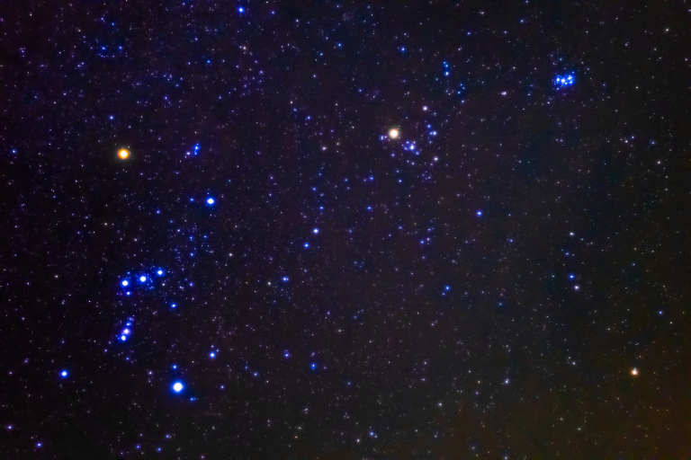

<!-- page: 79 -->

# 6. The god of the night sky as a guide to the afterlife

Michael Janda

Universität Münster

## Abstract

In Greek myth, the constellation Orion is represented by (at least) three figures: the eponymous Boeotian hunter Orion, the Cretan king Minos and the god Dionysus bear names that were initially epithets of the celestial giant, the only semi-human figure in the firmament. Both similarities and individual characteristics of the three can be derived as Aitia from the constellation and its perceived relationship to its celestial neighbours. Dionysus, who “liberates” the deceased mystics in the Orphic tradition, and Minos, the judge of the dead, share a concern for the deceased that was probably also inherent in their common origin, the Orion of prehistoric Greek myth.

## 1. The birth and early trials of Dionysus

Beit She’an or Bisān, the ancient Scythopolis, lies about 37 kilometres from Nazareth.[^1] Scythopolis was also called Nysa, like several places in the Greek world that recalled the mythical birthplace of Dionysus. This is where he was thus born: the son of the sky-god and an earthly woman who was taken up to heaven after her death. After his birth, little Dionysus was placed in a winnowing-fan (λίκνον). Soon after, a hostile king named Lycurgus sought his life (Iliad 6, 130–140) and Dionysus went abroad. The young god wandered through the country, gathered an ever-growing crowd of followers around him and turned

<!-- page: 80 -->

water into wine. But people often did not recognise him in his divinity. Finally, we see him hanging on the wooden pillar.[^2]

## 2. Dionysus beyond death: Orphic initiation and afterlife liberation

The deeds and sufferings of Dionysus are well known. We learn from the “Orphic” gold leaves of Pelinna that he also has a beneficial effect on the deceased initiates. The two gold leaves of Pelinna are among the many afterlife passports found in tombs that are associated with the name Orpheus and date from the 6th to the 1st century bc. In the identical beginning of both texts Dionysus appears under his epithet Bakchios:[^3]

> νῦν ἔθανες καὶ νῦν ἐγένου, τρισόλβιε, ἄµατι τῷδε.
>
> εἰπεῖν Φερσεφόνᾳ σ᾿ ὅτι Βάκχιος αὐτὸς ἔλυσε.
>
> You have just died and have just been born, thrice happy, on this day.
>
> Tell Persephone that Bacchus himself has liberated you.

Alberto Bernabé and Ana Isabel Jiménez San Cristóbal place their discussion of this text under the heading “The soul liberated by Dionysus” (2008: 66) and explain (72):

> Before the discovery of the tablets from Pelinna, it was believed […] that liberation on the part of Dionysus was obtained thanks to initiation into the mysteries during life, without the god intervening once the initiate had died. There was no evidence for Dionysus leading his initiates in the Beyond, as he had led them in this world. Despite his partially chthonic character, his function with regard to the µύσται καὶ βάκχοι concluded as soon as they were laid down in their tombs. That is, the initiate would already have done what was most difficult, and all that remained for him was the ultramundane passage, carrying his tablet like a reminder. Nevertheless, as result of the new discoveries, we can affirm […] that in the beliefs reflected by the Pelinna tablet, Dionysus fulfills a purificatory function in a personal and eschatological sense: he assists the initiate at the junction of the limit between life and death, between the human and the divine. Liberation after death is a consequence of initiation in the mysteries, carried out during life.

<!-- page: 81 -->

An extensive academic discussion deals with the specific world view and afterlife concepts of these Orphic gold leaves and their relationship to other Greek ideas about Hades and Elysion.[^4] For myself, I would first like to address the question: where does Dionysus come from, this god so complex and also significant for the initiated?

## 3. Indo-European theonyms: a tradition of millennia

For the Indo-Europeanist, it is clear that the name of Dionysus has no equivalent in any other Indo-European language. We should not view this negatively and regret that we can only reconstruct four supernatural beings by name: the well-known Father Heaven (*Di̯éu̯s ph₂tḗr), his daughter, the Dawn (*H₂áu̯sōs, *Diu̯ós dhugh₂tḗr), ‘the winescented’ *Ghandhr̥u̯o-, the ancestor of the Centaurs and Gandharves,[^5] and finally also the goat god as ancestor of Pan and Pūṣan (*Páh₂usōn, Gen. *Puh₂snés), to whose common features Jil Schermutzki was recently able to add important new observations.[^6] As Martin Nilsson (1967, 1: 336) pointed out long ago, the name of Father Heaven alone guarantees – “eine Tatsache von der allergrößten Wichtigkeit” – that we can basically count on a millennia-long continuity of the cult, and with Jan Bremmer (2002: 138) the question arises as to what seemed so important to prehistoric people that they worshipped these deities over such long periods of time.

## 4. The autonomization of cultic epithets: the case of Dionysus

For the Indo-Europeanist, this direct reconstruction of names is most important. But it is not the only method. Even in the colourful onomastic- etymological diversity of gods’ names such as Ares and Mars, Demeter and Ceres, Hermes and Mercury, Aphrodite and Venus, a continuity is tangible, if we can track the rise of epithets to autonomy in several cases. Uenus, for example, was probably once an epithet of the Dawn,[^7] as was the Celtic Brigit.[^8] In the festschrift for the unforgotten Jens Elmegård Rasmussen, I tried to show that ‘Heaven on high’ (PIE *u̯érsmen- Diu̯ós) gave rise not only to the Vedic expression várṣman- divás

<!-- page: 82 -->

but also to Uranos (Οὐρανός <*u̯orsm̥no-).[^9] Was Aphrodite ‘who shines in the foam of the sea’ directly an epithet of the Dawn or was there a goddess Kypris in between, who has nothing to do with Cyprus but is simply the personified ‘Desire’ (: Lat. cupiō), as Laura Massetti in a brilliant work (2016) and I[^10] suggested independently of each other?

The name of Dionysus gives no information about this. In any case, it seems to contain νῦσα, which names his birthplace, a mountain (Νῦσα), but according to Pherecydes of Athens it was also once used in the sense of ‘tree’ (νύσας … ἐκάλουν τὰ δένδρα). I suspected that the concepts of mountain and tree, as incompatible as they may seem at first glance, might come together under the idea of the world axis, the great ‘inclination’, as we could understand νῦσα etymologically.[^11] As far as the first element of the name is concerned, I continued a suggestion by Martin Peters.[^12] Peters saw the most archaic – not the oldest – name form in (*)Διέν(ν)υσος (Thessaly, Amorgos) and connected the first element with the verb δίεµαι ‘chase, set in motion’. In my opinion, the name originally meant ‘who sets the world axis in motion’. The proposed combination of δίεµαι with a word meaning ‘world axis’ is supported by the fact that the word δίνη, which is etymologically related to it, denotes the cosmic vortex in the pre-Socratic philosophers.[^13] Furthermore, we can again think of the pole on which Dionysus hangs on the so-called “Lenaean vases”.[^14] This may be so. But, in any case, there is no way to prove that Dionysus, or the older Dienysus, is an epithet of a god attested elsewhere.

It is perhaps quite interesting to learn that Friedrich Nietzsche in his book The birth of tragedy out of the spirit of music implicitly reckons with a rise of epithets to autonomy in the Dionysian sphere when he states:[^15]

> It is an incontestable tradition that Greek tragedy in its oldest form had as its subject only the suffering of Dionysus and that for a long time later the individually present stage heroes were only Dionysus. But with the same certainty we can assert that right up to the time of Euripides Dionysus never
>
> <!-- page: 83 -->
>
> ceased being the tragic hero, that all the famous figures of the Greek theatre, like Prometheus, Oedipus, and so on, are only masks of that primordial hero Dionysus.

There could be a grain of truth here. To cite just one example that has probably not yet been noticed: in the famous “Song of the women of Elis” Dionysus is summoned to appear ‘with his bull’s foot’ – or ‘ox foot’ (τῷ βοέῳ ποδί).[^16] As is well known, the tragic hero Οἰδί-πους also has a big, ‘swollen foot’.[^17]

## 5. Indra and Dionysus: the problem of structural and etymological parallels

Be that as it may, neither the direct reconstruction nor the assumption of the rise of a byname to autonomy will get us anywhere. Both approaches are dear to the Indo-Europeanist, for operating with the specificity of etymologies and phonetic laws excludes coincidence or borrowing. What remains is the comparison of similar traits – to be found everywhere in religious studies and which is in itself absolutely justified. No one should doubt today that the Indo-Europeans believed in Divine Twins, the ancestors of the Dioscuri and Aśvin, of Hengist and Horsa, Romulus and Remus and many others – although we cannot reconstruct a name or a designation.[^18] In the myth, these pairs of twins are associated with women in whom the Dawn seems to appear: directly in the Vedic Uṣas and, indirectly, again via an epithet, in Helena.[^19]

In the context of the divine Dawn, we meet another structural parallel of the greatest importance:[^20] Eos and Orion are lovers until Artemis shoots the Boeotian hunter (Odyssey 5, 118–124). In India, Eos’ sister Uṣas is pursued by Prajāpati until all are transferred to the sky, Prajāpati as Orion and Uṣas as Alpha Tauri, which is Aldebaran. Aldebaran sounds esoteric but we suddenly understand why Eos and Orion in particular are lovers: They are immediately adjacent in the sky. The Dawn dwells on this star at night, apparently because of its

<!-- page: 84 -->

reddish colour. So the Indo-Europeans reckoned that the Dawn and Orion were lovers.

But back to Dionysus and the search for recurring motifs! Dionysus shares several important, highly specific linguistic parallels with the Vedic god Indra.[^21] Both are addressed by the singer’s ‘desire’ (κῶµος: kā́ma-, PIE *kóh₂mo-). Both have many ‘faces’ or ‘masks’ (πρόσωπον: -pratīka-, PIE *pre/otih₃ku̯o-) and have to do with the ‘flowering of wine’ (Ἀνθεσ-τήρια: ándhas-, PIE *h₂ándhos-). Both are leaders of a Wild Hunt (Βρόµιος: grā́ma-, PIE *gu̯rómo-). Indra is ‘strong’, denoted by túmra-, the preform of which (*tumlo-)[^22] is the derivational basis for the name of Dionysus’ mother, Semele (Σεµέλη <*tu̯emelā). For the moment, one can only state these parallels, not explain them. Dionysus is not a dragon slayer like Indra. Or can Tarhunt, the Luwian weather god of the vineyard, help us? He is, on the one hand, a dragon slayer and refers in his name precisely to this and to Indra’s great deed (*terh₂- ‘to overcome’), and he is, on the other hand, depicted with grapes, as Tarhunt ‘of the vineyard’.[^23] The question has to remain open for the time being.

## 6. The origin of Dionysus

For the explanation of Dionysus’ origin, I will start from a tradition that may seem insignificant at first glance. A famous choral song in Sophocles’ Antigone calls Dionysus the “chorus leader of the stars”:[^24]

> ἰὼ πῦρ πνεόντων
>
> χοράγ᾽ ἄστρων, νυχίων
>
> φθεγµάτων ἐπίσκοπε,
>
> Ζηνὸς γένεθλον, προφάνηθ᾽,
>
> ὦναξ, σαῖς ἅµα περιπόλοις
>
> Θυίασιν, αἵ σε µαινόµεναι πάννυχοι
>
> χορεύουσι τὸν ταµίαν Ἴακχον.
>
> Hail, leader of the dance of the stars breathing fire, master of the voices heard by night, son of Zeus, appear, king, with your attendant Thyiads, who in their frenzy dance all night in honour of their lord Iacchus!

<!-- page: 85 -->

In my opinion, there is only one figure that can be called the choir leader of the stars. This is Orion, who bears the greatest resemblance to a human being among all the constellations. Under this name Orion, the Greeks saw a mighty hunter from Boeotia who had been transferred to the sky.[^25] Researchers disagree about what belongs to the constellation and what to the earthly hunter. But, as far as we can trace the biographical traits, they are all derived from the firmament as aitia of celestial phenomena. Worldwide, the movement of the stars is metaphorically seen as a chasing, hunting and fleeing.[^26] The birth of the Boeotian Orion from a cow’s hide is explained by the fact that the constellation is preceded by the bull Taurus, which is simply translated into a mythical genealogy.

From Hesiod (erg. 617–622) we learn that Orion chases the Pleiades, a myth that precisely describes the relative positions and movement of the two constellations. But the Pleiades were also called βότρυς ‘bunch of grapes’ by the Greeks, owing to their shape. Leading archaeoastronomers

<!-- page: 86 -->

such as Walter Boll,[^27] Hans-Georg Gundel (1952: 2490), Anton Scherer (1953: 144–145) and Wolfgang Hübner (2002: 1127) regard this name as popular and thus a serious tradition. Under the name or former epithet Ὠρίων, the constellation pursues the Pleiades, under the former epithet (*)Διέν(ν)υσος/Διόνυσος the ‘grape’ – forever.

Dionysus has an ox foot, as we have seen, Oedipus a ‘swollen foot’, the constellation Orion the radiant Rigel, an Arabic name that simply means ‘foot’. Stefan Schaffner (2021) has just confirmed the assumption made earlier that the Old Icelandic Aurvandilstá ‘Aurvandil’s toe’ designates this star Rigel, which of course also means that Aurvandil/Orendel is a Germanic name for Orion.

As a result of the metaphor of the heavenly hunt just mentioned and because of its roughly anthropomorphic shape, Orion is a mighty hunter followed by his hunting dog. Sirius, the brightest fixed star and lord of the dog days, bears no resemblance to a dog. It is only thought of in this way because it follows a hunter. Once the idea of the dog had solidified in centuries of storytelling, it could also become an evil pursuer, a wild wolfhound. Thus Homer, our oldest witness, reports that a king named Λυκοῦργος, ‘who has the works of a wolf’,[^28] pursues Dionysus and forces him to dive into the sea (Iliad 6, 130–140). On the other hand, well-meaning ‘dogs’ also follow Dionysus, namely the Bacchae and Maenads, whom Euripides calls ‘dogs’ in his tragedy The Bacchae.[^29]

We only find starting points for an explanation, but no definitive interpretation, in the phallophoria, the ‘bearing of the phallus’ in the cult of Dionysus.[^30] On the one hand, our constellation has something that could be interpreted anatomically as a phallus, the stars M42, θ and ι Orionis. On the other hand, the blind Orion in the myth carries a boy named Κηδαλίων on his shoulders. Ulrich von Wilamowitz-Moellendorff compared this name with κήδαλον· αἰδοῖον ‘genitals, phallus’ (Hesych).[^31] Is this idea connected to the club that Orion carries over his shoulder according to Hellenistic astronomers? For the time being, we can only note that Orion and Dionysus share the motif of the phallus.

<!-- page: 87 -->

As the only human figure in the nocturnal firmament, Dionysus is thus worthily named as one “who sets the world axis in motion”.

In my view, it is therefore a good idea to regard the name Διόνυσος/ (*)Διέν(ν)υσος as a former epithet of the constellation and figure of myth Orion. This is certainly simplified. There may have been several or even many figures between the Indo-European and the two Greek names. Indeed, it would of course be quite possible that the Indo-Europeans already used more than one name when they spoke of the constellation. Central to the wine god is, in my opinion, that his heavenly, nocturnal archetype eternally follows the ‘grape’ (βότρυς).

## 7. Tales from the stars: soul guide and judge of the dead

We would like to have cumulative evidence that myths originate from the night sky. I will limit myself here to two stories.[^32] The myth of the Athenian vintner Ikaros or Ikarios comes, in Walter Burkert’s words (1983: 223),

> from Ikaria, the modern Dionyso, an Attic village famous for its vineyards and the customs of its vine-growers. Dionysus himself came to the house of Ikarios, bringing him the vine and instructing him in cultivation, harvesting, and pressing of the wine. Ikarios happily loaded the casks full of the god’s new gift onto his cart and brought it to his fellow villagers. But the ‘opening of the casks’ turned into a disaster: when the revellers, unfamiliar with wine, grew drunk and sank to the ground, Ikarios was suspected of having poisoned them. The angry crowd thereupon killed their benefactor with clubs, and his blood mixed with the wine. His daughter, Erigone, led by her dog Maira, searched desperately for her lost father till she found his body in a well; she subsequently hanged herself. Thus, in the land of wine, in Attica, the myth of the wine overflows with gruesome details: this wine is a very special juice and anything but harmless.

Burkert implicitly brings the slain wine-bringer Ikarios together with the wine-bringer Dionysus, who is also slain in other, more secret myths, when he writes (1985: 164): “Perhaps in secret the death of the god himself was spoken of much more directly; the association of wine and blood, with wine being described as the blood of the vine, is ancient and widespread.” I have tried to back this up linguistically

<!-- page: 88 -->

by interpreting the name Ἰκάριος as ‘Avatar’, namely of Dionysus (cf. ἔοικα ‘to be like’).[^33]

In this myth, we have the figures of Ikarios, his daughter Ἠρι-γόνη, the ‘early-born’, and the dog Μαῖρα. We can plot the three in a continuous sequence on a celestial map: Maira is the name of the dog, and also of Sirius on the island of Keos.[^34] Erigone, the ‘early-born’, is apparently another name of Eos, who loves Orion, just like her Vedic sister Uṣas, who resides on Alpha Tauri/Aldebaran at night. What remains is, between both of them in the middle, Ikarios, the avatar of the wine- giving Dionysus. We can even discover above Ikarios’ head the club with which he is killed.

But let us return to Dionysus, who according to the Orphic gold leaves of Pelinna ‘releases’ or ‘liberates’ (ἔλυσε) the soul of the initiated. The fact that the constellation Orion played a role for the deceased in early Greek and Indo-European eschatology can probably also be seen in the fact that Minos, the judge of the underworld in Homer (Odyssey 11, 568–571), has several of Orion’s mythical features.[^35] Minos is linked to a bull in three ways: a bull brings his mother Europa to Crete. Another bull emerges from the sea and testifies to Minos’ right to kingship. And, finally, his wife becomes involved with this bull and gives birth to the bull-man Minotauros. Minos has no club – like Orion, Tarhunt, Heracles and Indra – but a golden sceptre with which he judges the dead according to the Odyssey. Michael Witzel (1984) has described in detail how, for Vedic India, the night sky and the afterlife are identical. So I think that the Indo-European constellation Orion was considered as a guide to the afterlife – besides also, for example, as a dragon slayer. When two of Orion’s Greek epithets became independent in prehistoric times, Μίνως and Διόνυσος, in a way that of course still needs to be investigated in more detail, the aspects of a psychopomp remained partly intact for the two. The dog that followed this god of the night sky is in another tradition called Kerberos[^36] – and he guards nothing other than the underworld. We now also understand why a mace-bearer, Heracles, pulls him away from there.

<!-- page: 89 -->

## 8. From the description of the sky to myth

How did all these stories come about? I think the answer is surprisingly simple. When we look up at the clear sky at night, far from the lights of civilisation, in Namibia or on the south coast of Crete, we realise the difficulty of communicating our observations of the stars in their abundance and intangible patterns. But this communication was imperative for farmers, herders, sailors and other travellers. This communication had to make use of metaphors: hunting and pursuit; an arrow stuck in Orion, or his girdle; Orion’s swollen foot; a tripod around the celestial pole (Janda 2005: 299–312). And also to verbalise perceived relations: Tištriia, the Iranian Sirius, “belongs to the triumvirate”, the three famous stars of Orion’s belt.[^37] The dog follows the hunter, it is located on the extension of the line formed by the three belt stars. It could not fail that conceptions overlapped: one grandmother told the Indo-European child that Sirius is a wolfish dog following the great hunter; the other grandmother told him that Sirius is an archer who shot an arrow at Orion. The superimposition of these two motifs leads us to Apollo, the wolfish archer with the silver bow.[^38] Irrespective of the relationships described so far, research has always compared Apollo to the Vedic god Rudra,[^39] whom the texts actually identify with Sirius. A similar superimposition is also encountered in historic times when classical poets of Greece and Rome, according to Boll and Wilhelm Gundel, combine the star conceptions Bear and Wain.[^40]

I am convinced that the uncovering of the histories of religions of Indo-European peoples and others and their myths is only just beginning and will make significant progress if we take note of the immediate textual sources – the linguistic reconstruction of names, bynames, characteristic properties and attributes in the cross-cultural and cross-linguistic perspective specific to Indo-European studies, namely the operation with sound laws that exclude coincidental parallels or borrowings – the rise of epithets to autonomy – and finally and brand new: the superimposition of ideas, starting from the observation and description of the night sky.
---

[^1]: I would like to thank Jenny Larsson very much for the kind invitation, Riccardo Ginevra for valuable comments in a review of two of my books, Till van Lil (Münster) for improving the English of my contribution and Jan Bremmer for valuable suggestions.

[^2]: For details and further parallels in the stories of Dionysus and Christ, cf. Janda 2010: 256–259.

[^3]: Cf. Bernabé/Jiménez San Cristóbal 2008: 257–258 (text), 62 (translation).

[^4]: Cf. the literature given in Bernabé/Jiménez San Cristóbal 2008: 256–257.

[^5]: Cf. Janda 2022b.

[^6]: Cf. Schermutzki 2024; cf. also Janda (in print a).

[^7]: Cf. Dunkel 1988–1990: 10.

[^8]: Cf. Campanile 1996, slightly modified in Janda 2010: 245.

[^9]: Cf. Janda 2004 and 2010: 45–70.

[^10]: Lecture at the Masarykova Univerzita Brno on 19 April 2010, and Janda (in preparation a); for an etymological explanation of Ἀφροδίτη cf. Janda 2005: 349–360.

[^11]: Cf. Janda 2010: 16–23, 163–173.

[^12]: Cf. Peters 1989: 212–220, 255–267.

[^13]: Cf. Janda 2010: 37–41.

[^14]: Numerous illustrations in Frontisi-Ducroux 1991.

[^15]: 1872, transl. 2003: 10.

[^16]: Cf. PMG 871. Text and translation: Schlesier 2002: 161–162.

[^17]: Cf. Janda 2010: 337–340; 2022a: 68. For an interpretation of the Oedipus myth as a whole, cf. Janda (in preparation b and c).

[^18]: Cf. e.g. West 2007: 186–191; O’Brien, EIEC: 161–165; Ward 1968.

[^19]: For Uṣas and the Aśvin cf. Oberlies 2012: 51, 128; for Ἑλένη, older Laconian Ϝελένᾱ cf. Jamison 2001: 313–314.

[^20]: Cf. Janda 2016: 101–127.

[^21]: For details and further parallels cf. Janda 2000: 260–292.

[^22]: With analogical syllabification instead of *tu̯m̥lo-.

[^23]: For Tarhunt’s name cf. Watkins 1995: 343–356; Janda 2010: 112–114; for the İvriz relief cf. Haas 1994: 328 and fig. 55; [https://en.wikipedia.org/wiki/Tarḫunz](https://en.wikipedia.org/wiki/Tar%3c1E2B%3eunz) (11 February 2024).

[^24]: vv. 1146–1150, text and translation: Lloyd-Jones 1998: 108–109.

[^25]: For the Boeotian hunter Orion cf. Renaud 2004; Fontenrose 1981.

[^26]: Cf. Berezkin 2005; Hübner 1998: 144.

[^27]: 1903: 42, 122 fn. 2.

[^28]: For an explanation of the name cf. Janda 2022a: 34–42.

[^29]: Eur. Bakch. 731; for Dionysus as “hunter” cf. Janda 2022a: 49–52.

[^30]: For the Dionysian phallophoria cf. Csapo 2013.

[^31]: 1971: 33 fn. 4.

[^32]: For more cf. Janda 2024a–b (and in print a–d, in preparation b–d).

[^33]: Janda 2010: 200–202.

[^34]: Janda 2022a: 133, 149.

[^35]: Cf. Janda (in print d).

[^36]: Cf. Janda 2022a: 8–11.

[^37]: Cf. Forssman 1968: 59–60.

[^38]: Cf. Janda 2022a: 87–145.

[^39]: Cf. e.g. West 2007: 148; Oberlies 1998: 214.

[^40]: 1937: 879 (unfortunately, no source is given for the “wheels of the bear” in classical literature mentioned here); for the dog-headed archer see also Gundel 1925: 322.

---

How to cite this book chapter:

Janda, M. (2025). The god of the night sky as a guide to the afterlife. In: Larsson, J. H., Olander, T., & Jørgensen, A. R. (eds.), Indo-European Afterlives: Interdisciplinary Perspectives on Life beyond Death, pp. 79–93. Stockholm: Stockholm University Press. DOI: [https://doi.org/10.16993/bcw.f](https://doi.org/10.16993/bcw.f). License: CC BY 4.0
